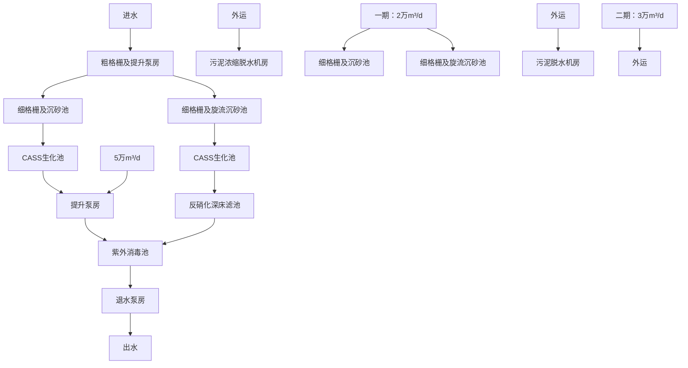
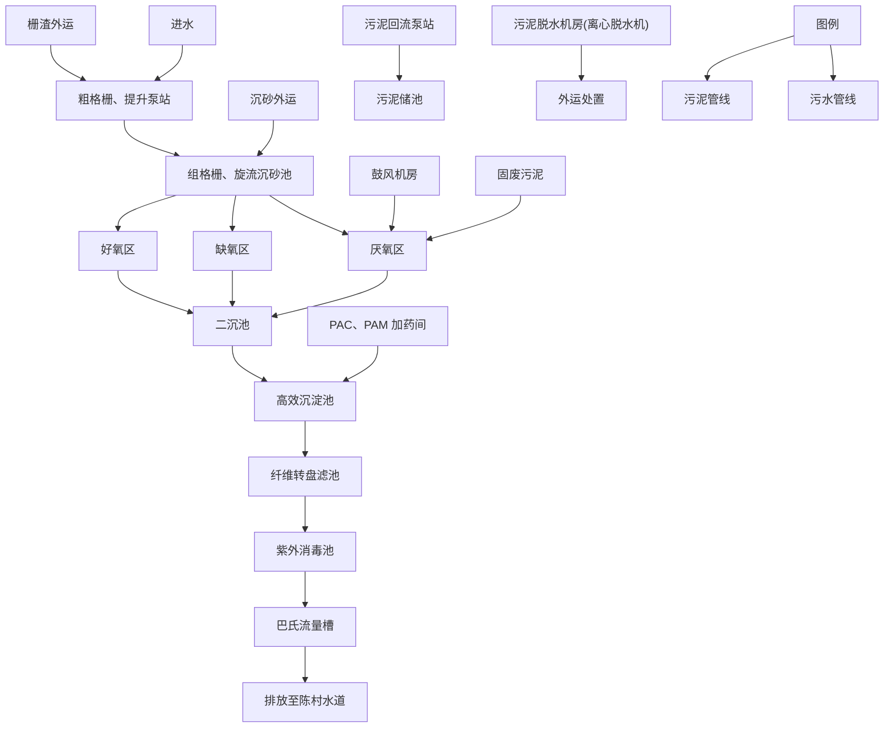

# 建设项目环境影响报告表

# (污染影响类)

项目名称:佛山市天成达金属有限公司搬迁及改扩建项目

建设单位（盖章）：佛山市天成达金属有限公司

编制日期：2024年9月

text_image

德环境科学研究院有限公司
共和国生态环境

中华人民共和国生态环境部制

编制单位和编制人员情况表

<table><tr><td>项目编号</td><td>m33ka9</td></tr><tr><td>建设项目名称</td><td>佛山市天成达金属有限公司搬迁及改扩建项目</td></tr><tr><td>建设项目类别</td><td>30-067金属表面处理及热处理加工</td></tr><tr><td>环境影响评价文件类型</td><td>报告表</td></tr><tr><td colspan="2">一、建设单位情况</td></tr><tr><td>单位名称(盖章)</td><td>佛山市天成达金属有限公司</td></tr><tr><td>统一社会信用代码</td><td>9144060631580770L</td></tr><tr><td>法定代表人(签章)</td><td rowspan="3">涉密</td></tr><tr><td>主要负责人(签字)</td></tr><tr><td>直接负责的主管人员(签字)</td></tr><tr><td colspan="2">二、编制单位情况</td></tr><tr><td>单位名称(盖章)</td><td>广东顺德环科科学研究院有限公司</td></tr><tr><td>统一社会信用代码</td><td>91440606768407545Y</td></tr><tr><td colspan="2">三、编制人员情况</td></tr><tr><td colspan="2">1.编制主持人</td></tr></table>

# 涉密

# 涉密

# 涉密

# 涉密

# 目录

一、建设项目基本情况....1

二、建设项目工程分析 9

三、区域环境质量现状、环境保护目标及评价标准 21

四、主要环境影响和保护措施 28

五、环境保护措施监督检查清单 49

六、结论 51

附表 52

建设项目污染物排放量汇总表 52

附图 53

附图 1 项目地理位置图....53

附图 2 佛山市顺德区环境管控单元图....54

附图 3 大气环境功能区划图 55

附图 4 水环境功能区划图 56

附图 5 声环境功能区划图 57

附图 6 项目四至照片 59

附图 7《陈村镇广隆集约工业园区控制性详细规划土地利用规划图》……60

附图 8 项目 500m 环境保护目标分布图....61

附图 9 项目平面布置图....63

附件 64

附件 1 营业执照 64

附件 2 法人代表身份证 65

附件 3 租赁合同 66

附件4引用的监测报告（节选） 75

附件 5 环评咨询合同 87

附件 6 房产证 92

附件 7 环评批复 2018 年 ..... 95

附件 8 自主验收意见及验收批复 2019 年 ..... 96

附件 9 环评批复 2020 年 ..... 101

附件 10 润滑油 msds 105

附件 11 切削液 msds 109

附件 12 排水证 113

# 一、建设项目基本情况

<table><tr><td>建设项目名称</td><td colspan="3">佛山市天成达金属有限公司搬迁及改扩建项目</td></tr><tr><td>项目代码</td><td colspan="3">无</td></tr><tr><td>建设单位联系人</td><td>***</td><td>联系方式</td><td>***</td></tr><tr><td>建设地点</td><td colspan="3">广东省佛山市顺德区陈村镇石洲村广隆工业区兴隆十一路1号B1~B3车间厂房之一</td></tr><tr><td>地理坐标</td><td colspan="3">(22度59分8.592秒,113度12分54.353秒)</td></tr><tr><td>国民经济行业类别</td><td>C3360金属表面处理及热处理加工</td><td>建设项目行业类别</td><td>三十、金属制品业33,67-金属表面处理及热处理加工,其他(年用非溶剂型低VOCs含量涂料10吨以下的除外)</td></tr><tr><td>建设性质</td><td>☑新建(迁建)☑改建☑扩建□技术改造</td><td>建设项目申报情形</td><td>☑首次申报项目□不予批准后再次申报项目□超五年重新审核项目□重大变动重新报批项目</td></tr><tr><td>项目审批(核准/备案)部门(选填)</td><td>/</td><td>项目审批(核准/备案)文号(选填)</td><td>/</td></tr><tr><td>总投资(万元)</td><td>***</td><td>环保投资(万元)</td><td>***</td></tr><tr><td>环保投资占比(%)</td><td>5%</td><td>施工工期</td><td>3个月</td></tr><tr><td>是否开工建设</td><td>☑否□是:</td><td>用地(用海)面积( $m^{2}$ )</td><td>***</td></tr><tr><td>专项评价设置情况</td><td colspan="3">无</td></tr><tr><td>规划情况</td><td colspan="3">无</td></tr><tr><td>规划环境影响评价情况</td><td colspan="3">无</td></tr><tr><td>规划及规划环境影响评价符合性分析</td><td colspan="3">无</td></tr><tr><td>其他符合性分析</td><td colspan="3">1、本项目与顺德区“三线一单”相符性分析生态保护红线:根据《广东省人民政府关于印发广东省“三线一单”生态环境分区管控方案的通知》(粤府(2020)71号)、《佛山市人民政府关于印发佛山市“三线一单”生态环境分区管控方案的通知》(佛府〔2021〕11号)和《佛山市顺德区人民政府关于印发佛山市顺德区“三线一单”生态环境分区管控方案的通知》(顺府发〔2021〕11号)。项目选址单元不属于“涵盖生态保护红线、一般生态空间、饮用水水源保护区、环境空气质量一类功能区等区域的优先保护区”。因此,项目不涉及生态保护红线。环境质量底线:根据2023年全区的大气环境质量状况公报,除 $O_{3}$ 年均浓度超过《环境空气质量标准》(GB3095-2012)及2018年修改单二级标准限值外,其余五项基本污染物指标浓度均能达到《环境空气质量标准》(GB3095-2012)及2018年修改单二级标准限值;根据引用的数据,项目所在地TSP可达到《环境空气质量标准》(GB3095-2012)及2018年修改单二级标准。纳污水体陈村水道各项水质指标均达到《地表水环境质量标准》(GB3838-2002)III类标准。本项目生活污水经三级化粪池预处理达到广东省《水污染物排放限值》(DB44/26-2001)第二时段三级标准后排入陈村污水处理厂处理,不直接向地表水体排放。湿式磨砂生产线中更换的清洗废水回用作为磨砂冷却用水,湿式磨砂废水经沉淀后循环使用,定期补充新水,定期更换的湿式磨砂废水交由有处理能力的单位处理。本项目激光切割产生的粉尘经半密闭型集气设备收集后经15m排气筒G1、G2、G3排放。因此本项目的建设不会突破当地环境质量底线。综合分析,本项目的建设不会突破当地环境质量底线。资源利用上线:本项目运营期所用的资源主要为水资源、电能。本项目给水由市政供水接入,电能由区域电网供应,符合《佛山市顺德区人民政府关于印发佛山市顺德区“三线一单”生态环境分区管控方案的通知》(顺府发〔2021〕11号)文件中的能源资源利用要求,同时本项目所用以上资源占比极少,不会突破当地的资源利用上线。项目所在地用途为工业用途,符合当地土地规划要求。环境管控单元准入清单:根据《佛山市顺德区人民政府关于印发佛山市顺德区“三线一单”生态环境分区管控方案的通知》(顺府发〔2021〕11号)和《佛山市环境管控单元准入清单》(2024年版),结合省“三线一单”平台分析成果,项目所在地属顺德区生态空间一般管控区(YS4406063110001),</td></tr></table>

无特殊管控要求；属顺德区高污染燃料禁燃区（YS4406062540001）：禁止使用高污染燃料；属陈村镇陆域重点管控区（编 ZH44060620010），涉及水环境城镇生活污染重点管控区（YS4406062220002）、大气环境布局敏感重点管控区（YS44060623200003）。

本迁改扩建项目与佛山市及顺德区三线一单相符性分析如下。

表1-1 与生态环境管控单元准入清单管控要求相符性分析

<table><tr><td>管控单元编码及名称</td><td>管控维度</td><td>管控要求</td><td>本项目概况</td><td>相符性</td></tr><tr><td>陈村镇重点管控区,编号:ZH44060620010(重点管控单元10)</td><td>空间布局约束</td><td>1-1.【产业/鼓励引导类】重点发展智能装备制造、新一代电子信息、新材料等新兴产业;结合 TOD 片区开发,对接广深港资源,大力发展生产性服务业、高端商务服务业和中小企业总部集群;培育以花卉产业为特色,向电商、会展、文创旅游等延伸的现代农业产业链。1-2.【产业/综合类】系统推进村级工业园升级改造,腾出连片空间,布局产业集聚区和主题产业园,推动工业项目入园集聚发展。1-3.【产业/限制类】受纳水体或监控断面不达标且未“以新带老”制定区域达标方案的河涌,不得新建、扩建向河涌直接排放废水的项目。新建、扩建含蚀刻工序的线路板生产项目和化工项目应在配套污水集中处置的工业园区或生活污水管网覆盖区域内建设;纯加工型印花项目,含酸洗、磷化的金属表面处理、金属制品项目(与自身高新技术企业配套的和区级及以上重点项目除外),含酸洗、喷涂、化学抛光、电解等涉及废水排放工艺的不锈钢型材加工项目(与自身高新技术企业配套的和区级及以上重点项目除外),应进入以此类项目为主导产业、有相应废水集中治理设施的工业园区,实现集中治污。1-4.【大气/限制类】大气环境受体敏感重点管控区内,应严格限制新建储油库项目、产生和排放有毒有害大气污染物的建设项目以及使用溶剂型油墨、涂料、清洗剂、胶黏剂等高挥发性有机物原辅材料项目,鼓励现有该类项目搬迁退出。1-5.【大气/限制类】大气环境布局敏感区重点管控区内,应严格限制新建生产和使用高挥发性有机物原辅材料项目,优先开展低VOCs含量原辅材料替代,强化无组织排放控制。原则上不再新建、扩建新增氮氧化物、烟(粉)尘排放量较大的建设项目。1-6.【产业/综合类】划定家具生产优先发展区域,优先发展区外不再新建涉及涂装工艺的木质家具制造项目。优先发展区范围根据家具产业发展规</td><td>1-1 本项目不属于。1-2 本项目所在地位于产业集聚区内。1-3 项目主要从事不锈钢加工(湿磨加工、平板加工)和金属件激光切割。本项目湿式磨砂属于物理性质表面抛光工艺,生产废水不外排,本项目不属于上述限制类项目。1-4 本项目不在大气环境受体敏感重点管控区内。1-5 本项目无生产和使用高挥发性有机物原辅材料,激光切割产生的粉尘排放量少。1-6 本项目不涉及。</td><td>符合</td></tr></table>

<table><tr><td rowspan="3"></td><td></td><td></td><td>划及其规划环评文件确定。</td><td></td><td></td></tr><tr><td>陈村镇重点管控区,编号:ZH44060620010(重点管控单元10)</td><td>能源资源利用</td><td>2-1.【能源/鼓励引导类】推广节能技术,加快发展绿色货运与现代物流。2-2.【能源/鼓励引导类】推广新能源汽车应用和充电基础设施建设,积极推动重卡LNG加气站、充电基础设施、加氢站建设。2-3.【能源/综合类】科学实施能源消费总量和强度“双控”,新建高能耗项目单位产品(产值)能耗达到国际国内先进水平。2-4.【水资源/综合类】贯彻落实“节水优先”方针,实行最严格水资源管理制度,陈村镇万元国内生产总值用水量、万元工业增加值用水量、用水总量、农田灌溉水有效利用系数等用水总量和效率指标达到区下达要求。2-5.【土地资源/限制类】落实单位土地面积投资强度、土地利用强度等建设用地控制性指标要求,提高土地利用效率。2-6.【岸线/禁止类】严格水域岸线用途管制,新建项目一律不得违规占用水域。严禁破坏生态的岸线利用行为和不符合其功能定位的开发建设活动,严禁以各种名义侵占河道、围垦湖泊、非法采砂等。</td><td>2-1本项目不适用。2-2本项目不适用。2-3本项目不属于高能耗项目。2-4本项目湿式磨砂生产线中更换的清洗废水回用作为磨砂冷却用水,湿式磨砂废水经沉淀后循环使用,定期补充新水。项目总体用水量较少,符合要求。2-5本项目满足政府提出的投资强度、土地利用强度等指标要求。2-6本项目不适用。</td><td>符合</td></tr><tr><td>陈村镇重点管控区,编号:ZH44060620010(重点管控单元10)</td><td>污染物排放管控</td><td>3-1.【水/限制类】城镇新区建设实行雨污分流。住宅、商业体、学校、市场等城镇开发建设项目应当配套或者同步计划建设公共排水设施,公共排水设施或自建排污水设施未能投产运行的,以上涉水项目不得投入使用。新建小区严格实施雨污分流,阳台、露台等污水接入污水收集系统,将生活污水“应截尽截”。做好大型楼盘、集贸市场、餐饮以及学校等4大类排水户污水接入市政管网工作。3-2.【水/综合类】陈村镇重点河涌水质上年度未达到水环境环境质量目标的,需组织编制、系统实施、向社会公开区域重点水污染物减排计划并明确“替代量”,本年度新建、改建、扩建项目新增水环境重点污染物实行区域“减二增一”替代(工业、生活或综合集中废水处理设施、民生项目除外)。3-3.【水/综合类】结合村级工业园改造,全面提升产业层次与集聚度,促进污染集中整治。3-4.【水/综合类】稳步推进排水设施“三个一体化”管理模式,补齐城乡污水收集和处理短板,推动陈村污水处理厂提质增效,加快消除城中村、老旧城区、</td><td>3-1本项目实行雨污分流,生活污水经三级化粪池处理达标后经厂区生活污水排放口通过市政管网排入陈村污水处理厂,湿式磨砂生产线中更换的清洗废水回用作为磨砂冷却用水,湿式磨砂废水经沉淀后循环使用,定期补充新水,更换出来的湿式磨砂冷却废水(含切削液)作为危险废物定期交由具有危险废物处置资质的单位处理。3-2本项目不适用。3-3本项目所在地位于产业集聚区内。3-4本项目不适用。</td><td>符合</td></tr></table>

<table><tr><td></td><td></td><td>城乡结合部等污水收集管网空白区,逐步实现城乡污水收集处理全覆盖。2025年前完成陈村污水处理厂扩建,尾水应执行《城镇污水处理厂污染物排放标准》(GB18918-2002)一级A标准及《广东省水污染物排放限值》(DB44/26-2001)的较严值。3-5.【水/综合类】完善污水管网建设,逐步取消现状农村污水处理站点,有条件的区域实施雨污分流改造;至2030年全面雨污分流,农村生活污水纳入陈村城镇污水处理系统。</td><td>3-5本项目实行雨污分流,生活污水经三级化粪池处理达标后经厂区生活污水排放口通过市政管网排入陈村污水处理厂。</td><td></td></tr><tr><td>陈村镇重点管控区,编号:ZH44060620010(重点管控单元10)</td><td>环境风险防控</td><td>4-1.【水/综合类】陈村污水处理厂、工业污水集中处理设施应采取有效措施,防止事故废水直接排入水体。完善污水处理厂在线监控系统联网,实现污水处理厂的实时、动态监管。4-2.【风险/综合类】加强环境风险分级分类管理,强化金属制品、有色金属和压延加工、化学原料和化学品制造业等涉重金属、化工行业企业及工业园区等重点环境风险源的环境风险防控。</td><td>4-1本项目不适用。4-2本项目风险防控措施具备可行性,整体风险可控。</td><td>相符</td></tr></table>

本项目所在区域属于顺德区三线一单中“广东省佛山市顺德区陈村镇重点管控区”，编号：ZH44060620010。根据项目生产产品、原材料、工艺等分析，本项目不属于单元“空间布局约束”中产业/限制类、大气/限制类、大气/限制类，不属于单元“能源资源利用”中土地资源/限制类、岸线/禁止类，不属于单元“污染物排放管控”中的水/限制类。

综上，本项目符合“三线一单”要求。

# 2、选址合理性分析：

项目位于广东省佛山市顺德区陈村镇石洲村广隆工业区兴隆十一路1号B1\~B3车间厂房之一，根据项目所在地房产证（见附件6），项目所在地现状用途为工业用地，土地功能符合要求。

# 3、环境准入负面清单、产业政策相符性分析

本项目不在《产业结构调整指导目录（2024年本）》限制类、淘汰类之列，不属于《市场准入负面清单（2022年版）》中规定的禁止和许可准入的行业类别。项目产品不属于《环境保护综合名录》（2021年版）中“高污染、高环境风险”产品，不属于《促进产业结构调整暂行规定》中限制类、淘汰类之列，符合规定要求。项目不属于《顺德区村级工业园升级改造项目产业准入负面清单》（2019年本）中限制类和禁止类。

因此项目符合相关产业政策、规划的要求。

4、项目与《佛山市生态环境局 佛山市水利局关于进一步加强工业企业

废水污染防治的函》（2023-0031水）相符性分析  
表1-2 与佛山市水利局关于进一步加强工业企业废水污染防治的函相符性分析

<table><tr><td>类别</td><td>相关要求</td><td>本项目</td><td>相符性</td></tr><tr><td rowspan="4">二、严格项目审批、明晰废水排放要求</td><td>(一)加强与规划环评的衔接审查。强化涉废水排放建设项目源头防控,建设项目环评文件应加强与生态环境分区管控、园区规划环评结论及审查意见等成果的相符性审查,严防应入园区集聚的专业电镀、化工、印染、揉革、化学制浆以及明确纳入“三线一单”管控要求应当入园集聚的建设项目违反准入要求在园区外围落地建设。加强废水排放指标管理,对于园区生产废水纳入集中处理的,应结合园区入驻企业建设进展和废水排放量实际优化园区废水排放指标管理,最大限度发挥排水指标经济效益</td><td>本项目符合“三线一单”管控要求,所在园区无规划环评</td><td>符合</td></tr><tr><td>(二)强化环评审批管理。加强涉水项目工程分析和源强核算审查,重点审查产污工序、污染因子(特别是一类污染物)废水产治排平衡图、废水产生排放量与产能规模匹配性、废水处理与回用经济技术可行性及其去向等环节,强化合理性、可靠性和经济可行性,杜绝不实“回用”、“零排放”审批。</td><td>本项目生活污水经三级化粪池处理达标后经厂区生活污水排放口通过市政管网排入陈村污水处理厂,湿式磨砂生产线中更换的清洗废水回用作为磨砂冷却用水,湿式磨砂废水经沉淀后循环使用,定期补充新水,更换出来的湿式磨砂冷却废水(含切削液)作为危险废物定期交由具有危险废物处置资质的单位处理,不属于零排放项目。</td><td>符合</td></tr><tr><td>1.加强涉生活污水排放项目审批管理。要加强部门联动,及时动态更新区域排水管网图,准确判断区域排水设施现状。生活污水管网未覆盖或已覆盖但未实质连通接入城镇生活污水处理厂的区域,原则上不得新建、扩建生活污水排放的工业项目,确需排放生活污水的,应自行配套生活污水处理设施,自建污水处理设施仅限于规模以上、生活污水排放量不低于40吨/日的工业企业,并加强处理工艺经济技术可行性及受纳水体达标论证。处于工业集聚区或工业园区内、上楼发展的新建、扩建工业项目以及已完成入河排污口整治验收的区域,原则上不再审批工业企业单独自建生活污水处理设施,涉及重大项目的,由属地人民政府出具承诺函,明确时间表和工程措施,在项目投产前完成配套污水管网建设或建成集中处理设施。</td><td>本项目实行雨污分流,生活污水经三级化粪池处理达标后经厂区生活污水排放口通过市政管网排入陈村污水处理厂</td><td>符合</td></tr><tr><td>2.加强涉生产废水排项目审批管理。聚焦产业行业特点针对企业规模小、生产工艺简单、单纯加工型、产品附加值不高废水产排复杂的涉水项目,要严格废水回用率和回用可行性审查,无废水成分分析、回用水质适用性分析,无废水回用处理工艺设施、技术经济可行性论述,无回用相关存储及管路设置等工程措施的项目,不得通过回用或“零排放”环评审批。严格工业废水排入城镇生活污水处理厂的项目审查,项目环评报告要加强城镇生活污水处</td><td>本项目属于规模小、生产工艺简单、单纯加工型、产品附加值不高废水产排复杂的涉水项目。本项目湿式磨砂生产线中更换的清洗废水回用作为磨砂冷却用水,有相应废水回用率和回用可行性、废水成分分析、回用水质适用性分析及技术经济可行性论</td><td>符合</td></tr></table>

<table><tr><td rowspan="4"></td><td rowspan="3"></td><td>理厂可依托性及可监管性分析。经评估工业废水预处理后可进入城镇生活污水处理厂处理的,在环评审批环节以内部流程形式征询同级水利部门意见,与水利部门排水许可管理形成联动。未实现雨污分流的工业园区、工业集聚区,严格控制以间接排放标准或纳管排放标准向市政管网排放工业废水。工业企业排放有含重金属、难生化降解、有生物毒性、易燃易爆、高盐分、重油脂等超城镇生活污水处理厂接收能力的生产废水,以及间接冷却的清净下水等过低浓度生产废水,原则上不得排入城镇生活污水处理厂,已进入的,各区要制定限期退出计划并实施。受纳城镇生活污水处理厂已满负荷的,限制审批新增废水排入城镇生活污水处理厂的工业项目</td><td>述,有回用相关存储及管路设置等工程措施。湿式磨砂废水经沉淀后循环使用,定期补充新水,更换出来的湿式磨砂冷却废水(含切削液)作为危险废物定期交由具有危险废物处置资质的单位处理。</td><td></td></tr><tr><td>3.加强生产废水直接向水体排放项目的审批管理。要严格按环评导则要求开展评价,对受纳水体水质尚未达标的市考断面河涌、主干河涌、国省考断面的重点支涌、优良水质目标的河涌和具有水功能区、水环境功能区目标的河涌以及纳入黑臭水体整治范围的河涌,由属地人民政府全面系统梳理现状问题、区域排污总量以及水质目标可达性等,“以新带老”制定区域达标方案,达标方案应突出存量削减,重点针对排水量、主要污染因子提出相应的源头削减方案和具体措施,明确区域排水体系,排水去向应尽可能为市考断面以下河涌。达标方案要与生态环境“三线一单”分区管控体系相结合,鼓励开展生态治理、小流域治理,探索尾水多级、梯度利用,因地制宜建设人工湿地深度净化系统、景观回用深度净化系统、回用至用水大户再生系统等水循环体系,减少入河排放量。制定了区域达标方案的属地人民政府,每年12月底前向市生态环境局报告计划执行情况。</td><td>本项目不涉及</td><td>符合</td></tr><tr><td>4.推动涉水项目环评与入河排污口联动审批改革。涉及直接向水体排放生活污水、生产废水的建设项目,实施项目环评与入河排污口联动审批。加强涉水企业排污许可证审批管理,在申领、延续、变更阶段,应强化生活污水、生产废水、雨水管路平面布置与各排放口位置关系、排污口规范化设置情况审查。如涉及入河排污口的,通过排污许可证建立企业排污口与入河排污口关联衔接,以附图附件的形式,一并载明两者位置坐标关系、管网路由信息等。</td><td>本项目不涉及</td><td>符合</td></tr><tr><td colspan="4">5、环境功能区划相符性分析本项目拟选址环境功能属性如下表。</td></tr></table>

表 1-3 建设项目所在地环境功能属性

<table><tr><td>编号</td><td>功能区名称</td><td>功能区确定依据</td><td>功能区类别及属性</td></tr><tr><td>1</td><td>水环境功能区</td><td>《关于同意实施&lt;广东省地表水环境功能区划&gt;的批复》(粤府函〔2011〕29号)</td><td>纳污水体陈村水道属于III类水体功能区,执行《地表水环境质量标准》(GB3838-2002)中的III类标准</td></tr><tr><td>2</td><td>环境空气质量功能区</td><td>《印发佛山市环境空气质量功能区划的通知》(佛府〔2007〕154号)</td><td>大气环境二类功能区,详见附图3</td></tr><tr><td>3</td><td>声环境功能区</td><td>《关于印发佛山市声环境功能区划分方案的通知》(佛环〔2024〕1号)</td><td>项目所在地属于3类声环境功能区,详见附图5</td></tr><tr><td>4</td><td>永久基本农田</td><td>《顺德区土地利用总体规划〔2010-2020〕》(粤府函〔2011〕37号)</td><td>否</td></tr><tr><td>5</td><td>风景名胜区、自然保护区、森林公园、重点生态功能区</td><td>《广东省主体功能区划》(粤府〔2012〕120号)</td><td>否</td></tr><tr><td>6</td><td>重点文物保护单位</td><td>--</td><td>否</td></tr><tr><td>7</td><td>是否水源保护区</td><td>《广东省生态环境厅关于对佛山市人民政府申请校正部分饮用水水源保护区图件的意见的函》(粤环函〔2019〕1167号)</td><td>否</td></tr><tr><td>8</td><td>是否污水处理厂纳污范围</td><td>--</td><td>陈村污水处理厂</td></tr></table>

# 二、建设项目工程分析

# 1、项目由来

佛山市天成达金属有限公司成立于2014年，原项目位于佛山市顺德区陈村镇弼教村委会环镇西路7号之一1区1仓。原项目于2015年获环评批复，批复文号：顺管环审[2015]204号，于2017年，通过环保验收（批复文号：环验[2017]A061号），因企业发展需要，分别于2018年和2020年进行了两次改扩建。

2018年该次改扩建项目建设内容为在原厂房内扩建增加4台激光切割机，并对原有的2条不锈钢自动磨砂线进行技改，增设覆膜工序，年加工量不变。企业法人代表由“王强辉”变更为“王晖”。改扩建前，项目从事不锈钢磨砂和平板加工，改扩建后增加五金件和不锈钢激光切割加工，改扩建后，不锈钢平板年加工量7000吨/年，不锈钢磨砂年加工量8000吨/年，金属件激光切割加工量10000吨/年。该改扩建项目已进行自主验收，项目固体废物污染防治设施的验收已通过佛山市生态环境局审批，文号：佛环0305环验[2019]第A041号，详见附件8。该改扩建项目已验收的产能为不锈钢板、卷年加工量15000吨/年（其中不锈钢平板年加工量7000吨/年，不锈钢磨砂年加工量8000吨/年），金属件激光切割加工量10000吨/年。

因生产经营发展的需要，2020年建设单位计划在原有厂房面积、设备规模及产能的基础进行改扩建。该次改扩建项目新增占地面积为 $2000m^{2}$ ，新增建筑面积为 $2000m^{2}$ 。该次改扩建项目建设内容为新增设备激光切割机6台、抗指纹生产线2条、镀钛生产线3条、吊机3台、冲床2台、焊机3台、剪板机1台，新增产品产能防指纹不锈钢洗手盘500吨/年、五金零件镀钛加工量500吨/年，不锈钢平板、磨砂年加工量不变，金属件激光切割年加工量不变，企业实际未建设，故项目未进行验收。

现因政策变化以及生产发展需要，佛山市天成达金属有限公司拟于2024年进行搬迁、改扩建以及变更法人代表，迁改扩建后法人代表由王晖变更为王水阳。项目拟搬迁至广东省佛山市顺德区陈村镇石洲村广隆工业区兴隆十一路1号B1\~B3车间厂房之一（项目地理位置见附图1）。项目中心位置地理坐标为北纬22度59分7.87秒，东经113度12分54.74秒。与原址所属同一个镇，两地相距约970m。项目经营面积6803m²。本迁改扩建项目主要从事不锈钢板、卷的加工生产和金属件激光切割，年加工不锈钢板、卷（平板加工/磨砂加工/激光切割）\*\*\*吨和金属件（激光切割）\*\*\*吨。本次迁改扩建项目不再保留原审批的抗指纹及镀钛加工产品及生产线，详见表2-2。从业总人数为30人，年工作300天，每天工作8小时，工作时间为8：30-12：00，13：00-17：30，不设食堂和宿舍。具体情况见表2-1。

表 2-1 企业历史环保手续办理情况表 (原址)

涉密

表 2-2 抗指纹生产线和镀钛生产线情况一览表

涉密

# 涉密

# 2、工程组成

表 2-3 项目工程组成

涉密

# 涉密

# 涉密

# 涉密

本次项目主要生产单元、主要工艺、生产设施及设施参数见表2-5。

表 2-5 主要生产单元、主要工艺、生产设施及设施参数一览表

# 涉密

# 涉密

# 4、项目原辅材料

主要原辅材料及能源的种类和用量见下表。

表 2-7 主要原辅材料及能源参数一览表

<table><tr><td>类别</td><td>名称</td><td>单位</td><td>迁改扩建前已审批数量</td><td>迁改扩建前已验收数量</td><td>迁改扩建后数量</td><td>变化量</td><td>最大储存量</td><td>备注</td><td>使用工序</td></tr></table>

# 涉密

# 涉密

# (2) 排水:

湿式磨砂冷却水循环使用，定期补充损耗量，更换出来的清洗废水作为湿式磨砂的冷却循环水回用；生活污水经三级化粪池处理达标后经厂区生活污水排放口通过市政管网排入陈村污水处理厂。项目生活污水排放量为 $270\mathrm{m}^3 /\mathrm{a}$ ，更换出来的湿式磨砂冷却废水（含切削液）作为危险废物定期交由具有危险废物处置资质的单位处理。

# 6、劳动动员及工作制度

项目从业人数为30人，年工作日300天，每天工作8小时（工作时间为8：30-12：00，13：00-17：30），厂内不设员工宿舍和食堂。

# 7、厂区平面布置

项目经营面积6803m²，于一座单层生产厂房内。考虑上下料的运输空间，项目湿式磨砂区域约1100平方米，每条湿式磨砂线尺寸为15m×20m，占地面积为300平方米/条，项目湿式磨砂区域可满足3条磨砂生产线安放。各生产区域的面积均符合实际生产需求，因此项目生产设备平面布局是合理的。项目所在地东面为果园，南面为佛山市粤牧金属科技有限公司，西面为佛山市强瑞盛金属制品有限公司，北面为其他厂房，详见附图9。

# 8、项目水平衡图

# 涉密

图2-1 迁改扩建后项目水平衡图

# 涉密

工艺流程和产排污环节

# 涉密

# 涉密

本项目为迁改扩建项目，项目拟搬迁到广东省佛山市顺德区陈村镇石洲村广隆工业区兴隆十一路1号B1\~B3车间厂房之一，项目租用已建厂房，不新建厂房。

本项目搬迁前污染物排放情况，见表 2-10 所示。目前原厂房均已拆除，无环境影响。

表 2-10 搬迁前污染物排放情况及存在的环境问题

<table><tr><td rowspan="2">内容类型</td><td rowspan="2">排放源编号</td><td rowspan="2">污染物名称</td><td colspan="2">产生浓度和产生量</td><td colspan="2">排放浓度及排放量</td><td rowspan="3">污染防治措施</td><td rowspan="3">与环评批复的相符性</td></tr><tr><td>浓度</td><td>产生量</td><td>浓度</td><td>排放量</td></tr><tr><td rowspan="6">废水</td><td colspan="2">单位</td><td>mg/L</td><td>t/a</td><td>mg/L</td><td>t/a</td></tr><tr><td rowspan="4">生活污水 $54.0m^{3}/a$ </td><td> $COD_{Cr}$ </td><td>250</td><td>0.0135</td><td>40</td><td>0.0022</td><td rowspan="4">生活污水经三级化粪池处理可达到广东省《水污染物排放限值》(DB44/26-2001)中的三级标准(第二时段)后排至陈村污水处理厂</td><td rowspan="4">符合</td></tr><tr><td> $BOD_{5}$ </td><td>100</td><td>0.0054</td><td>10</td><td>0.0005</td></tr><tr><td> $NH_{3}-N$ </td><td>30</td><td>0.0016</td><td>5</td><td>0.0003</td></tr><tr><td>SS</td><td>200</td><td>0.0108</td><td>10</td><td>0.0005</td></tr><tr><td>生产废水</td><td colspan="6">本项目更换的清洗废水回用作为磨砂冷却用水,磨砂冷却废水循环使用,不外排。</td><td>符合</td></tr><tr><td rowspan="2">噪声</td><td rowspan="2">生产设备</td><td rowspan="2">噪声</td><td>54~58dB(A)</td><td>昼间</td><td colspan="2">60dB(A)</td><td rowspan="2">厂界噪声达到《工业企业厂界环境噪声排放标准》(GB12348-2008)中的2类标准</td><td rowspan="2">符合</td></tr><tr><td>42~45dB(A)</td><td>夜间</td><td colspan="2">50dB(A)</td></tr><tr><td>废气</td><td colspan="2">金属粉尘</td><td colspan="4">少量</td><td>加强通风换气,颗粒物无组织排放可达到广东省地方标准《大气污染物排放限值》(DB44/27-2001)第二时段标准:颗粒物无组织排放厂界监控浓度限值 $\leqslant1.0mg/m^{3}$ </td><td>符合</td></tr><tr><td rowspan="5">固体废物</td><td colspan="2">生活垃圾</td><td colspan="4">3.75t/a</td><td>收集后交环卫部门处理</td><td>符合</td></tr><tr><td colspan="2">薄膜边角料</td><td colspan="4">4.5t/a</td><td rowspan="4">外卖回收商</td><td>符合</td></tr><tr><td colspan="2">金属边角料</td><td colspan="4">100t/a</td><td>符合</td></tr><tr><td colspan="2">不锈钢渣</td><td colspan="4">1.0t/a</td><td>符合</td></tr><tr><td colspan="2">废砂带</td><td colspan="4">0.3t/a</td><td>符合</td></tr><tr><td rowspan="2">危险废物</td><td colspan="2">废润滑油</td><td colspan="4">0.04t/a</td><td rowspan="2">交由有危废资质单位回收</td><td>符合</td></tr><tr><td colspan="2">含油废抹布</td><td colspan="4">0.008t/a</td><td>符合</td></tr><tr><td colspan="9">备注:参考企业原项目于2019年完成自主验收的数据。</td></tr></table>

# 三、区域环境质量现状、环境保护目标及评价标准

# 1、大气环境：

根据佛山市生态环境局顺德分局发布的《佛山市生态环境局顺德分局关于发布2023年度佛山市顺德区生态环境状况公报的通知》（佛环顺函〔2024〕44号），2023年顺德区空气质量综合指数为3.14，比2022年下降 $4.0\%$ ，在全市五区中排名第二。

2023 年，按照《环境空气质量标准》评价，顺德区二氧化硫（ $SO_{2}$ ）、二氧化氮（ $NO_{2}$ ）、可吸入颗粒物（ $PM_{10}$ ）、细颗粒物（ $PM_{2.5}$ ）、一氧化碳（CO）五项污染物年评价浓度均达到二级标准，臭氧（ $O_{3}$ ）超标。详见下表。

表3-1 2023年顺德区（国控测点）环境空气污染物达标判定情况

<table><tr><td rowspan="2">污染物</td><td>浓度均值</td><td rowspan="2">评价标准</td><td rowspan="2">占标率</td><td rowspan="2">达标情况</td></tr><tr><td>2023年</td></tr><tr><td> $SO_{2}$ (μg/m3)</td><td>6</td><td>60</td><td>10.00%</td><td>达标</td></tr><tr><td> $NO_{2}$ (μg/m3)</td><td>28</td><td>40</td><td>70.00%</td><td>达标</td></tr><tr><td> $PM_{10}$ (μg/m3)</td><td>35</td><td>70</td><td>50.00%</td><td>达标</td></tr><tr><td> $PM_{2.5}$ (μg/m3)</td><td>20</td><td>35</td><td>57.14%</td><td>达标</td></tr><tr><td> $O_{3}-8H^{*}$ (μg/m3)(年评价浓度)</td><td>164</td><td>160</td><td>102.50%</td><td>超标</td></tr><tr><td> $CO^{*}$ (mg/m3)(年评价浓度)</td><td>1.0</td><td>4</td><td>25.00%</td><td>达标</td></tr></table>

bar

| 污染物 | 2022年 (微克/立方米) | 2023年 (微克/立方米) |
| :--- | :--- | :--- |
| SO2 | 5 | 6 |
| NO2 | 29 | 28 |
| PM10 | 32 | 35 |
| PM2.5 | 19 | 20 |
| CO | 190 | 164 |
| CO | 1.1 | 1.0 |
(CO 单位为毫克/立方米, 其余为微克/立方米)

图 3-1 2023 年顺德区（国控测点）环境空气污染物浓度水平年度比较图

根据2023年全区的大气环境质量状况公报，除 $\mathrm{O_3}$ 年均浓度超过《环境空气质量标准》（GB3095-2012）二级标准限值外，其余五项污染物指标浓度均能达到《环境空气质量标准》（GB3095-2012）二级标准限值，顺德区大气环境质量属不达标区。

根据《佛山市2023年度环境状况公报》，佛山市开展了大气污染防治工作，深化以臭氧防控为核心的大气污染防控体系，推进以VOCs减排为重点的多污染物协同控制，推动“车企油路”协同治理。开展六大重点VOCs行业治理，完成410家低效治理设施淘汰，188家凹版印刷企业整治，对未按要求换水换炭企业在污染天气应对期间实行差别化管理，对10家加油站安装油气回收自动监控设施；推动工业锅炉窑炉整治，淘汰生物质锅炉12台，完成全部9条玻璃企业炉窑清洁能源改造。实施《佛山市汽车排放检验与维护制度实施方案》，现场共抽查机动车检验机构547家次；抓拍处罚黑烟车2378宗；利用AI智能识别技术对污染事件自动识别。累计抽查2756台非道路移动机械、油品合格率 $95.5\%$ ；106家工业叉车大户签订油品直供协议。通过以上行动，佛山市顺德区的环境空气质量将得到较大改善。

项目运营过程中排放的其他污染物为 TSP。为评价 TSP 的现状，引用广东增源检测技术有限公司于 2021 年 11 月 08 日\~11 月 14 日对顺德（陈村）智能装备产业园（距离本项目东南约 1.56km）的监测（报告编号：GZH21102913301，见附件 4）的数据，监测结果及评价如下：

表3-2 污染物现状监测结果

<table><tr><td>监测因子</td><td>监测时段</td><td>评价标准(mg/m3)</td><td>监测浓度范围(mg/m3)</td><td>最大浓度占标率/%</td><td>超标率/%</td><td>达标情况</td></tr><tr><td>TSP</td><td>日小时均值</td><td>0.3</td><td>0.0122~0.078</td><td>26</td><td>0</td><td>达标</td></tr></table>

在 7 天的监测时间内，监测点顺德（陈村）智能装备产业园处 TSP 日平均值可达到《环境空气质量标准》（GB3095-2012）及 2018 年修改单二级标准。

text_image

项目所在地
1.56km
顺德（陈村）智能装备产业园

图3-2 项目所在地与监测点的距离

# 2、地表水

本项目生活污水排入陈村污水处理厂，污水厂尾水排入陈村水道。项目纳污水体陈村水道为Ⅲ类水体。

根据《广东省地表水功能区划》（粤环[2011]14号），陈村水道属于III类水环境功能区，水环境质量执行《地表水环境质量标准》（GB3838-2002）中的III类水质标准。

为评价陈村水道水环境质量现状，引用佛山市生态环境局顺德分局发布的《佛山市生态环境局顺德分局关于发布<2023年度佛山市顺德区生态环境状况公报>的通知》（佛环顺函〔2024〕44号）对陈村水道江口断面的常规监测数据进行评价，监测结果见图3-2。

表 2 2023 年顺德区主河道质量评价及年度对比

<table><tr><td rowspan="2">序号</td><td rowspan="2">河流名称</td><td rowspan="2">断面</td><td colspan="2">断面定类</td><td rowspan="2">水质评价标准</td><td colspan="2">河流定类</td></tr><tr><td>2023年</td><td>2022年</td><td>2023年</td><td>2022年</td></tr><tr><td>1</td><td>吉利涌</td><td>平步</td><td>II</td><td>II</td><td>III</td><td>II</td><td>II</td></tr><tr><td>2</td><td>潭洲水道上游</td><td>潭村</td><td>II</td><td>II</td><td>II</td><td>II</td><td>II</td></tr><tr><td>3</td><td>潭洲水道下游</td><td>西海</td><td>II</td><td>II</td><td>III</td><td>II</td><td>II</td></tr><tr><td>4</td><td>陈村水道</td><td>江口</td><td>III</td><td>III</td><td>III</td><td>III</td><td>III</td></tr><tr><td>5</td><td>陈村涌</td><td>四方磨</td><td>III</td><td>III</td><td>III</td><td>III</td><td>III</td></tr><tr><td>6</td><td rowspan="3">顺德水道</td><td>杨滘</td><td>II</td><td>II</td><td>II</td><td rowspan="3">II</td><td rowspan="3">II</td></tr><tr><td>7</td><td>大闸</td><td>II</td><td>II</td><td>II</td></tr><tr><td>8</td><td>羊额</td><td>II</td><td>II</td><td>II</td></tr></table>

图 3-3 2023 年顺德区主河道质量评价及年度对比

从监测结果可知，陈村水道江口断面水质指标满足《地表水环境质量标准》（GB3838-2002）之Ⅲ类水功能要求。陈村水道水质现状良好。

# 3、声环境

项目所在地属于 3 类声环境功能区，项目厂界外 50m 范围内无环境敏感目标，无需开展声环境质量现状调查。

# 4、生态环境

项目用地范围内无生态环境保护目标，无需开展生态现状调查。

# 5、土壤环境、地下水环境

项目所在厂房已进行硬底化处理，不存在地下水环境、土壤环境污染途径，不开展地下水环境、土壤环境质量现状调查。

# 1、地表水环境

项目纳污水体陈村水道为Ⅲ类水体功能，地表水环境保护目标为保证纳污水体不因本项目的建设而改变其水环境功能区类别。

# 2、大气环境

本项目所在地为大气环境二类功能区，大气环境保护目标为确保项目所在区域的空气质量不因本项目的建设造成明显不利的影响，不因本项目的建设改变现在的质量等级状况。厂界外500米范围内保护目标见下表。

表 3-4 主要大气环境保护目标

<table><tr><td>名称</td><td>保护对象</td><td>保护内容</td><td>环境功能区</td><td>相对厂址方位</td><td>相对厂界距离/m</td></tr><tr><td>文海村</td><td>居民</td><td>人群健康</td><td>大气二类</td><td>东北面</td><td>148</td></tr><tr><td>龙起里坊</td><td>居民</td><td>人群健康</td><td>大气二类</td><td>北面</td><td>250</td></tr><tr><td>宇宙围</td><td>居民</td><td>人群健康</td><td>大气二类</td><td>西南面</td><td>463</td></tr></table>

# 3、声环境

项目所在地属于3类声环境功能区，项目厂界外50m范围内无环境敏感目标，无需开展声环境质量现状调查。

# 4、地下水环境

本项目厂界外 500 米范围内无地下水集中式饮用水水源和热水、矿泉水、温泉等特殊地下水资源。

# 5、生态环境

项目用地范围内无生态环境保护目标。

# 1、水污染物排放标准：

项目外排废水为生活污水。生活污水经三级化粪池预处理后经厂区生活污水排放口通过市政管网排入陈村污水处理厂。生活污水经三级化粪池处理达到广东省《水污染物排放限值》（DB44/26-2001）中的三级标准（第二时段），输送至陈村污水处理厂处理，尾水排入陈村水道，污水处理厂尾水执行《城镇污水处理厂污染物排放标准》（GB18918-2002）一级A标准和广东省地方标准《水污染物排放限值》（DB44/26-2001）第二时段一级标准的较严者，见下表；

表 3-5 生活污水排放标准限值一览表

<table><tr><td>类别</td><td>污染物标准</td><td>pH</td><td> $COD_{Cr}$ </td><td> $BOD_5$ </td><td>SS</td><td> $NH_3-N$ </td><td>单位</td></tr><tr><td rowspan="2">生活污水</td><td>(DB44/26-2001)第二时段三级标准</td><td>6-9</td><td>500</td><td>300</td><td>400</td><td>/</td><td>mg/L</td></tr><tr><td>陈村污水处理厂尾水</td><td>6-9</td><td>40</td><td>10</td><td>10</td><td>5</td><td>mg/L</td></tr></table>

# 2、大气污染物排放标准：

项目大气污染物主要是金属件激光切割产生的粉尘，执行标准具体如下。

表 3-6 项目大气污染物有组织排放标准

<table><tr><td rowspan="2">污染源</td><td colspan="2">污染源</td><td rowspan="2">污染因子</td><td colspan="2">有组织排放执行标准</td><td rowspan="2">具体标准</td></tr><tr><td>产污工序</td><td>源项</td><td>最高允许排放浓度(mg/m3)</td><td>最高允许排放速率(kg/h)</td></tr><tr><td>G1、G2、G3(15m)</td><td>激光切割</td><td>切割粉尘</td><td>颗粒物</td><td>120</td><td>1.451</td><td>《大气污染物排放限值》(DB44/27-2001)第二时段二级标准限值</td></tr><tr><td colspan="7">备注:1、排气筒高度未高出周围200m半径范围的建筑5m以上,因此污染物排放速率按排气筒对应排放速率限值的50%执行</td></tr></table>

表 3-7 项目大气污染物无组织排放标准

<table><tr><td>污染源</td><td>产污工序</td><td>污染物</td><td>无组织排放厂界浓度监控限值(mg/m3)</td><td>具体标准</td></tr><tr><td>无组织</td><td>激光切割</td><td>颗粒物</td><td>1.0</td><td>《大气污染物排放限值》(DB44/27-2001)无组织排放监控浓度限值标准</td></tr></table>

# 3、噪声排放标准：

项目边界执行《工业企业厂界环境噪声排放标准》(GB12348-2008)中的3类标准：昼间≤65dB（A）。

# 4、固体废物控制标准：

危险废物在厂内暂存应符合《危险废物贮存污染控制标准》（GB18597-2023）的要求；一般工业固体废物管理应遵照执行《中华人民共和国固体废物污染环境防治法》、《广东省固体废物污染环境防治条例》、《佛山市工业固体废物污染环境防治条例》的要求，贮存过程应满足相应防渗漏、防雨淋、防扬尘等环境保护要求。

<table><tr><td>总量控制指标</td><td>本迁改扩建项目仅有生活污水外排。生活污水经三级化粪池处理达标后经厂区生活污水排放口通过市政管网排入陈村污水处理厂,项目生活污水排放量为 $270m^{3}/a$ ,经污水厂处理后 $COD_{Cr}$ 排放量为 $0.011t/a$ , $NH_{3}-N$ 排放量为 $0.001t/a$ 。根据《佛山市人民政府办公室关于印发&lt;佛山市排污权有偿使用和交易管理办法&gt;的通知》(佛府办[2020]19号),生活污水 $COD_{Cr}$ 、 $NH_{3}-N$ 不单独分配总量。本项目无大气总量控制指标污染物排放。</td></tr></table>

# 四、主要环境影响和保护措施

<table><tr><td>施工期环境保护措施</td><td>本项目依托已建成厂房,不涉及厂房建设,施工过程主要是内部装修和设备安装,没有基建工程,因此施工期间不存在大型土建工程,施工期间产生的影响主要是由于设备运输、安装时产生的噪声等。施工期较短,因此如果项目建设方加强施工管理,那么项目施工时不会对周围环境造成较大的影响。</td></tr></table>

# 1、废水

表41 项目废水类别、污染物项目及污染防治设施

<table><tr><td rowspan="2">序号</td><td rowspan="2">废水类别</td><td rowspan="2">污染物项目</td><td colspan="3">污染治理设施</td><td rowspan="2">污染物排放方式</td><td rowspan="2">排放规律</td><td rowspan="2">流向/排放去向</td><td rowspan="2">编号及名称</td><td rowspan="2">排放口类型</td><td colspan="2">坐标</td></tr><tr><td>污染防治设施名称及工艺</td><td>处理能力</td><td>是否为可行性技术</td><td>经度</td><td>纬度</td></tr><tr><td>1</td><td>员工生活污水</td><td>pH、 $COD_{Cr}$ 、 $BOD_{5}$ 、 $NH_{3}-N$ 、SS</td><td>三级化粪</td><td> $0.1m^{3}/h$ </td><td>☑是☐否</td><td>间接排放</td><td>间断排放,排放期间流量不稳定</td><td>陈村污水处理厂</td><td>水-01:生活污水排放口</td><td>一般排放口</td><td>113.214855°</td><td>22.985362°</td></tr></table>

# 1.1 水污染物源强核算

项目主要水污染物为生活污水、湿式磨砂清洗废水和湿式磨砂冷却废水（含切削液）。

# ◇生活污水

迁改扩建后项目从业人数为 30 人，年工作日 300 天，项目不设有员工宿舍和食堂。根据《广东省用水定额》（DB44/T 1461.3-2021）无食堂无浴室按用水量 $10m^{3}/人$ 年，则迁改扩建后生活用水量为 $300m^{3}/a$ ，排污系数取 0.9，则生活污水产生量为 $270m^{3}/a$ 。

原项目生活污水近期经落实生活污水处理设施处理达标后经市政下水道排入内河涌，远期经三级化粪池预处理达标后经市政管网收集至陈村污水处理厂处理达标后排入陈村水道。

目前项目所在地已接入市政管网，生活污水经三级化粪池处理后，排入陈村污水处理厂，生活污水处理达到广东省《水污染物排放限值》（DB44/26-2001）中的三级标准（第二时段）后，输送至陈村污水处理厂处理，尾水排入陈村水道，污水处理厂尾水执行《城镇污水处理厂污染物排放标准》（GB18918-2002）一级A标准和广东省地方标准《水污染物排放限值》（DB44/26-2001）第二时段一级标准的较严者后排放，尾水排入陈村水道。

参考环境保护部环境工程技术评估中心编制《环境影响评价（社会区域类）》教材中表5-18，类比同类型项目，计算迁改扩建后生活污水污染物产生及排放情况，详见下表。

表 4-2 迁改扩建后生活污水产生排放情况

<table><tr><td rowspan="2">废水量 $\left( {{\mathrm{m}}^{3}/\mathrm{a}}\right)$ </td><td rowspan="2">污染物</td><td colspan="2">产生情况</td><td colspan="2">排放口排放情况</td><td colspan="2">污水厂排放情况</td></tr><tr><td>产生浓度(mg/L)</td><td>产生量(t/a)</td><td>产生浓度(mg/L)</td><td>产生量(t/a)</td><td>排放浓度(mg/L)</td><td>排放量(t/a)</td></tr><tr><td rowspan="4">270</td><td> $COD_{Cr}$ </td><td>250</td><td>0.068</td><td>200</td><td>0.054</td><td>40</td><td>0.011</td></tr><tr><td> $BOD_5$ </td><td>100</td><td>0.027</td><td>80</td><td>0.022</td><td>10</td><td>0.003</td></tr><tr><td> $NH_3-N$ </td><td>30</td><td>0.008</td><td>25</td><td>0.007</td><td>5</td><td>0.001</td></tr><tr><td>SS</td><td>200</td><td>0.054</td><td>100</td><td>0.027</td><td>10</td><td>0.003</td></tr></table>

生活污水成分简单、排放量小，类比顺德区工业企业生活污水的处理经验，项目的生活污水浓度较低，经过三级化粪池处理后，生活污水可达到广东省《水污染物排放限值》（DB44/26-2001）中的三级标准（第二时段）。结合陈村污水处理厂的运行情况，陈村污水处理厂出水可达到《城镇污水处理厂污染物排放标准》（GB18918-2002）一级A标准和广东

# 涉密

# 涉密

# ◇依托陈村污水处理厂的可行性分析

本项目位于陈村污水处理厂的纳污范围内，项目所在污水厂的管网区已实现雨污分流。顺德区陈村镇污水处理厂建设于2012年，位于佛山市顺德区陈村镇广隆工业区东北侧，中心地理坐标为东经113.242191°，北纬22.979769°。共分两期建设。建设总投资为4997.24万元，其中一期项目于2007年1月试运行，2007年11月通过环保验收，其处理规模为2万 $m^{3}/d$ 。二期项目于2012年通过环保部门的审批，在2014年年底建成，于2015年10月通过环保验收（编号：环验陈[2015]A019），处理规模为3万 $m^{3}/d$ 。目前总体处理规模为5万 $m^{3}/d$ ，使用CASS工艺作为生物处理工艺，反硝化深床滤池工艺作为深度处理工艺，紫外线消毒作为消毒工艺。陈村污水处理厂的出水水质按照国家标准《城镇污水处理厂污染物排放标准》（GB18918-2002）一级A标准和广东省地方标准《水污染排放限值》（DB44/26-2001）第二时段一级标准的较严者执行，经处理达标后的尾水排入陈村水道。目前陈村污水处理厂扩容工程现已正式投入运行，拟新增污水处理能力5万 $m^{3}/d$ ；扩容后污水处理能力为10万 $m^{3}/d$ ，处理工艺为“粗格栅+细格栅及旋流沉砂池+AAO氧化沟+混凝+沉淀+紫外消毒”。

陈村污水处理厂工艺流程见图 4-1。

flowchart

图4-1 陈村污水处理厂废水处理工艺流程图  

flowchart

图4-2 陈村污水处理厂扩容工程污水处理工艺流程图

本项目生活污水产生量为 $270\mathrm{m}^3 /\mathrm{a}$ ，产生量较少，污染物成分简单，满足污水厂的纳管要求，不会对污水厂造成冲击负荷，也不会影响其正常运行，因此本项目生活污水依托陈村

污水处理厂处理是可行的。

# 1.3 废水监测计划

根据《排污许可证申请与核发技术规范 总则》（HJ942-2018）和《排污单位自行监测技术指南 总则》（HJ819-2017），单独排入公共污水处理系统的生活污水，无需开展自行监测。

# 涉密

# 涉密

# 涉密

# 涉密

# 涉密

# 涉密

到《工业企业厂界环境噪声排放标准》（GB12348-2008）中3类排放标准。

项目选址位于工业园区内，周围主要以工业企业厂房为主，距离东南面镇北村215m。建议项目采用低噪声设备，所有设备安装时进行恰当的减振降噪处理，运行过程加强对设备的维护保养，加强车间的密闭性，降低噪声向厂房外的传播。通过采取以上降噪措施，以及建筑物的阻隔作用和距离的衰减，项目对周围环境和敏感点的影响不大。

根据《排污许可证申请与核发技术规范 总则》（HJ942-2018）、《排污单位自行监测技术指南 总则》（HJ 819-2017），本项目制定了噪声污染源环境自行监测计划，详见下表。

表 4-12 噪声污染源环境监测计划一览表

<table><tr><td>序号</td><td>监测点位</td><td>监测指标</td><td>最低监测频次</td><td>执行排放标准</td></tr><tr><td colspan="5">噪声</td></tr><tr><td>1</td><td>厂界四周</td><td>噪声</td><td>1次/季度</td><td>达到《工业企业厂界环境噪声排放标准》(GB12348-2008)中的3类标准</td></tr></table>

# 5、固体废物

# (1) 一般固废

# 1）生活垃圾

项目有员工 30 人，厂内不设食宿。根据《社会区域类环境影响评价》（中国环境出版社）中固体废物污染源推荐数据，办公垃圾产生量按 0.5kg/（人·d）计算，年工作 300 天，则生活垃圾产生量 4.50t/a，交环卫部门处理。根据《固体废物分类与代码目录》（生态环境部公告 2024 年第 4 号），生活垃圾属于 “SW64 其他垃圾”，废物代码为 “900-099-S64”。

# 2）保护膜边角料

项目进行覆膜工序时会有少量保护膜边角料产生。参考企业原项目实际生产情况，原项目于2019年完成自主验收，运行情况正常。原项目不锈钢板、卷年加工量为15000t，对应产生的保护膜边角料为4.50t/a，本项目不锈钢板、卷年加工量增加至19000t，则本迁改扩建项目产生的保护膜边角料约为5.70t/a，保护膜边角料外卖回收商。根据《固体废物分类与代码目录》（生态环境部公告2024年第4号），保护膜边角料属于“SW17可再生类废物”，废物代码为“900-003-S17”。

# 3）金属边角料

项目进行激光切割和机加工时会有少量金属边角料产生，参考企业原项目实际生产情况，原项目于2019年完成自主验收，运行情况正常。原项目金属件激光切割已验收的年加工量为3636t，对应产生的金属边角料为100t/a。本项目金属件激光切割年加工量增加至22000t，本迁改扩建项目产生的金属边角料约为605.06t/a，金属边角料外卖回收商。根据《固体废物分类与代码目录》（生态环境部公告2024年第4号），金属边角料属于“SW62可回收物”，废物代码为“900-099-S17”。

表 4-13 本项目一般固体废物产生情况

<table><tr><td>序号</td><td>种类</td><td>类别代码</td><td>产生量(t/a)</td><td>产生工序及装置</td><td>形态</td><td>主要成分</td><td>产废周期</td><td>贮储方式</td><td>利用处置方式和去向</td><td>环境管理要求</td></tr><tr><td>1</td><td>生活垃圾</td><td>900-099-S64</td><td>4.50</td><td>办公</td><td>固体</td><td>/</td><td>每天</td><td>暂存于工作场所</td><td>交环卫部门处理</td><td>暂存在工作场所,不得随意丢弃、堆放</td></tr><tr><td>2</td><td>保护膜边角料</td><td>900-003-S17</td><td>5.70</td><td>覆膜</td><td>固体</td><td>塑料</td><td>每天</td><td rowspan="2">暂存于一般固体废物暂存场所</td><td rowspan="2">外卖回收商</td><td rowspan="2">暂存在一般固体废物暂存间,不得随意丢弃、堆放</td></tr><tr><td>3</td><td>金属边角料</td><td>900-099-S17</td><td>220.00</td><td>激光切割</td><td>固体</td><td>金属</td><td>每天</td></tr></table>

排污单位应建立环境管理台账制度，一般工业固体废物环境管理台账记录应符合生态环境部规定的一般工业固体废物环境管理台账相关标准及管理文件要求。建设单位拟将保护膜边角料、金属边角料分类收集后外卖回收商，生活垃圾交环卫部门处理。项目一般工业固废暂存在规范的一般固废暂存场所内，定期交由有相关处理能力单位处理，对周围环境影响不大。

# (2) 危险废物

# 1）废润滑油

项目机加工工序需要使用润滑油，每年约产生 0.56t 废润滑油。生产设备需要定期维护保养，保养过程中会产生少量的废润滑油，设备预计每年维修 2 次，废润滑油每年产生量 0.04t，合计废润滑油每年产生量 0.60t。集中收集后定期转移并交给有废物处置资质的单位进行处理。

# 2）含油废抹布和手套

项目进行维修操作时会产生含油废抹布和手套，产生量约 0.02t/a。因含油废抹布和手套表面残留废油，具有一定危险性，建议企业在前期做好分类，与生活垃圾分开收集，应按照危险废物进行管理，集中收集后定期交资质单位进行处理处置。

# 3）含油废桶

项目使用的润滑油会产生含油废桶，由于包装桶沾染油类物质，此类废物作为危废处理，项目年产生废润滑油桶3个，每个含油废桶重量为0.02t，则此类危险废物产生量为0.06t/a。

# 4) 不锈钢渣（含切削液）

项目磨砂冷却水经三级沉淀池处理后循环使用，会有沉渣产生，项目定期对三级沉淀池中捞出沉渣；另外项目湿式磨砂清洗工序会有不锈钢渣产生，项目定期对清洗水箱内不锈钢渣进行清理。湿式磨砂过程中淋洗液含切削液，则湿式磨砂线产生的不锈钢渣可能沾染有切削液，属于危险废物。参考企业原项目实际生产情况，原项目于2019年完成自主验收，运行情况正常。原项目不锈钢板、卷磨砂年加工量为8000t，对应产生的不锈钢渣为1.00t/a，本项目不锈钢板、卷磨砂年加工量增加至12000t，则本迁改扩建项目产生的不锈钢渣（含切削液）约为1.50t/a。根据《国家危险废物名录》（2021年版），含切削液的不锈钢渣属于“HW49其他废物”，废物代码为“900-200-08”。集中收集后定期转移并交给有相应类别的危险废物处置资质的单位进行处理。

# 5）废砂带（含切削液）

项目湿式磨砂使用的砂带需要定期更换，参考企业原项目实际生产情况，原项目于2019年完成自主验收，运行情况正常。原项目不锈钢板、卷磨砂年加工量为8000t，对应产生的废砂带为0.30t/a，本项目不锈钢板、卷磨砂年加工量增加至12000t，则本迁改扩建项目产生的废砂带约为0.45t/a。根据《国家危险废物名录》（2021年版），含切削液的废砂带属于“HW49其他废物”，废物代码为“900-041-49”。集中收集后定期转移并交给有相应类别的危险废物处置资质的单位进行处理。

# 6) 含切削液的湿式磨砂废水

根据源强核算可知，湿式磨砂冷却废水（含切削液）的年换水量为 $43.2\mathrm{m}^3$ 。根据《国家危险废物名录》（2021年版），含切削液的废砂带属于“HW49其他废物”，废物代码为“900-006-09”。集中收集后定期转移并交给有相应类别的危险废物处置资质的单位进行处理。

# 7）废切削液包装桶

项目湿式磨砂过程使用切削液，会产生废切削液包装桶，项目切削液年用量0.4t/a，规格为200kg/桶，则年产生废包装桶约2个，每个废包装桶重约20kg，则废切削液包装桶产生量约为0.04t/a。根据《国家危险废物名录》（2021年版），含切削液的废砂带属于“HW49其他废物”，废物代码为“900-041-49”。集中收集后定期转移并交给有相应类别的危险废物处置资质的单位进行处理。

本项目运营期间危险废物的具体产生情况如下表所示。

注：危险特性中 T 表示毒性，C 表示腐蚀性，I 表示易燃性，In 表示感染性。  
表 4-14 本项目危险废物产生情况

<table><tr><td>序号</td><td>种类</td><td>危险废物类别</td><td>危险废物代码</td><td>产生量(t/a)</td><td>产生工序及装置</td><td>形态</td><td>主要成分</td><td>危险成分</td><td>产废周期</td><td>危险特性</td><td>污染防治措施</td></tr><tr><td>1</td><td>废润滑油</td><td>HW08</td><td>900-214-08</td><td>0.60</td><td>机加工、设备维修</td><td>液体</td><td>润滑油</td><td>机油</td><td>每天</td><td>T, I</td><td rowspan="2">交有危险废物处置资质的公司回收处理</td></tr><tr><td>2</td><td>含油废抹布和手套</td><td>HW49</td><td>900-041-49</td><td>0.02</td><td>设备维修</td><td>固体</td><td>润滑油、布</td><td>机油</td><td>半年</td><td>T</td></tr><tr><td>3</td><td>含油废桶</td><td>HW08</td><td>900-249-08</td><td>0.06</td><td>机加工、设备维修</td><td>固体</td><td>润滑油、不锈钢</td><td>油类物质</td><td>每年</td><td>T</td></tr><tr><td>4</td><td>不锈钢渣(含切削液)</td><td>HW49</td><td>900-200-08</td><td>1.50</td><td>湿式磨砂冷却和清洗</td><td>固体</td><td>切削液、金属</td><td>油类物质、</td><td>每月</td><td>T</td></tr><tr><td>5</td><td>废砂带(含切削液)</td><td>HW49</td><td>900-041-49</td><td>0.45</td><td>湿式磨砂</td><td>固体</td><td>切削液、砂带</td><td>油类物质</td><td>每天</td><td>T</td></tr><tr><td>6</td><td>含切削液的湿式磨砂废水</td><td>HW49</td><td>900-006-09</td><td>43.20</td><td>湿式磨砂</td><td>液体</td><td>切削液、水</td><td>油类物质</td><td>50天</td><td>T</td></tr><tr><td>7</td><td>废切削液包装桶</td><td>HW49</td><td>900-041-49</td><td>0.04</td><td>开包</td><td>固体</td><td>切削液、铁桶</td><td>油类物质</td><td>每周</td><td>T</td></tr></table>

危险废物从产生、收集、贮运、转运、处置等各个环节都可能因管理不善而进入环境，因此在各个环节中，抛落、渗漏、丢弃等不完善问题都可能存在，为了使各种危险废物能更好的达到合法合理处置的目的，本评价拟按照《危险废物贮存污染控制标准》等国家相关法律，提出相应的治理措施，以进一步规范项目在收集、贮运、处置方式等操作过程。

# ①收集、贮存

根据上述分析，项目的危险废物主要为废润滑油、含油废抹布和废手套、含油废桶、不锈钢渣（含切削液）、废砂带（含切削液）、含切削液的湿式磨砂废水、废切削液包装桶。因此，建设单位应根据废物特性设置符合《危险废物贮存污染控制标准》（GB18597-2023）要求的危险废物暂存场所，且在暂存场所上空设有防雨淋设施，地面采取防渗措施，危险废物收集后分别临时贮存于废物储罐内；根据生产需要合理设置贮存量，尽量减少厂内的物料贮存量；严禁将危险废物混入生活垃圾；堆放危险废物的地方要有明显的标志，堆放点要防风、防雨、防渗、防漏，应按要求进行包装贮存。项目危险废物贮存场所基本情况见下表。

注：危险特性中 T 表示毒性，C 表示腐蚀性，I 表示易燃性，In 表示感染性。  
②处置   
表 4-15 本项目危险废物贮存场所（设施）基本情况表

<table><tr><td>序号</td><td>种类</td><td>危险废物类别</td><td>危险废物代码</td><td>产生量(t/a)</td><td>产生工序及装置</td><td>贮存要求</td><td>贮存周期</td><td>危险特性</td><td>危废间面积</td><td>贮存能力(t)</td><td>污染防治措施</td></tr><tr><td>1</td><td>废润滑油</td><td>HW08</td><td>900-214-08</td><td>0.60</td><td>机加工、设备维修</td><td rowspan="2">要求的危险废物暂存场所,且在暂存场所上空设有防雨淋设施,地面采取防渗措施,危险废</td><td>1年</td><td>T,I</td><td rowspan="2"> $10m^{2}$ </td><td rowspan="2">20</td><td rowspan="2">交有危废处置资质</td></tr><tr><td>2</td><td>含油废抹布和手套</td><td>HW49</td><td>900-041-49</td><td>0.02</td><td>设备维修</td><td>1年</td><td>T</td></tr><tr><td>3</td><td>含油废桶</td><td>HW08</td><td>900-249-08</td><td>0.06</td><td>机加工、设备维修</td><td rowspan="5">物收集后分别临时贮存于废物储罐内</td><td>1年</td><td>T</td><td rowspan="5"></td><td rowspan="5"></td><td rowspan="5">的公司回收处理</td></tr><tr><td>4</td><td>不锈钢渣(含切削液)</td><td>HW49</td><td>900-200-08</td><td>1.50</td><td>湿式磨砂冷却和清洗</td><td>1年</td><td>T</td></tr><tr><td>5</td><td>废砂带(含切削液)</td><td>HW49</td><td>900-041-49</td><td>0.45</td><td>湿式磨砂</td><td>1年</td><td>T</td></tr><tr><td>6</td><td>含切削液的湿式磨砂废水</td><td>HW49</td><td>900-006-09</td><td>43.20</td><td>湿式磨砂</td><td>1年</td><td>T</td></tr><tr><td>7</td><td>废切削液包装桶</td><td>HW49</td><td>900-041-49</td><td>0.04</td><td>开包</td><td>1年</td><td>T</td></tr></table>

建设单位拟将危险废物拟交由有危废处置资质单位处理。

根据《关于发布《危险废物规范化管理指标体系》的通知》（环办〔2015〕99号）、《危险废物贮存污染控制标准》（GB18597－2023），建设单位对危险废物的管理应做到：

A、建立责任制度，明确负责人及具体管理人员。

B、按照《危险废物贮存污染控制标准》（GB18597-2023）要求：1、贮存点应具有固定的区域边界，并应采取与其他区域进行隔离的措施；2、贮存点应采取防风、防雨、防晒和防止危险废物流失、扬散等措施；3、贮存点贮存的危险废物应置于容器或包装物中，不应直接散堆；4、贮存点应根据危险废物的形态、物理化学性质、包装形式等，采取防渗、防漏等污染防治措施或采用具有相应功能的装置；5、贮存点应及时清运贮存的危险废物，实时贮存量不应超过3吨。

危险废物贮存场所应当有防风、防雨、防渗漏等措施，不同特性废物进行分类收集，且不同类废物间有明显的间隔（如过道、隔墙等）。用以存放装载液体、半固体危险废物容器的地方，必须有耐腐蚀的硬化地面，且表面无裂隙。在收集、贮存、运输、利用、处置危险废物的设施、场所设置规范的警示标志、标识、标牌。

C、制定危险废物管理计划，清晰描述危险废物的产生环节、种类、危害特性、产生量、利用处置方式等。

D、按要求如实申报登记危险废物的种类、产生量、贮存、处置等有关情况。

E、按照《危险废物转移管理办法》（2022年1月1日起施行）的要求，移出人应当履行以下义务：

（一）对承运人或者接受人的主体资格和技术能力进行核实，依法签订书面合同，并在合同中约定运输、贮存、利用、处置危险废物的污染防治要求及相关责任；

（二）制定危险废物管理计划，明确拟转移危险废物的种类、重量（数量）和流向等信息；

（三）建立危险废物管理台账，对转移的危险废物进行计量称重，如实记录、妥善保管转移危险废物的种类、重量（数量）和接受人等相关信息；

（四）填写、运行危险废物转移联单，在危险废物转移联单中如实填写移出人、承运人、接受人信息，转移危险废物的种类、重量（数量）、危险特性等信息，以及突发环境事件的防范措施等；

（五）及时核实接受人贮存、利用或者处置相关危险废物情况；

（六）法律法规规定的其他义务。

移出人应当按照国家有关要求开展危险废物鉴别。禁止将危险废物以副产品等名义提供或者委托给无危险废物经营许可证的单位或者其他生产经营者从事收集、贮存、利用、处置活动。

④危险废物转移联单环境管理要求

A、危险废物转移联单应当根据危险废物管理计划中填报的危险废物转移等备案信息填写、运行。

B、危险废物转移联单实行全国统一编号，编号由十四位阿拉伯数字组成。第一至四位数字为年份代码；第五、六位数字为移出地省级行政区划代码；第七、八位数字为移出地设区的市级行政区划代码；其余六位数字以移出地设区的市级行政区域为单位进行流水编号。

C、移出人每转移一车（船或者其他运输工具）次同类危险废物，应当填写、运行一份危险废物转移联单；每车（船或者其他运输工具）次转移多类危险废物的，可以填写、运行一份危险废物转移联单，也可以每一类危险废物填写、运行一份危险废物转移联单。使用同一车（船或者其他运输工具）一次为多个移出人转移危险废物的，每个移出人应当分别填写、运行危险废物转移联单。

D、采用联运方式转移危险废物的，前一承运人和后一承运人应当明确运输交接的时间和地点。后一承运人应当核实危险废物转移联单确定的移出人信息、前一承运人信息及危险废物相关信息。

E、接受人应当对运抵的危险废物进行核实验收，并在接受之日起五个工作日内通过信息系统确认接受。运抵的危险废物的名称、数量、特性、形态、包装方式与危险废物转移联单填写内容不符的，接受人应当及时告知移出人，视情况决定是否接受，同时向接受地生态环境主管部门报告。

F、对不通过车（船或者其他运输工具），且无法按次对危险废物计量的其他方式转移危险废物的，移出人和接受人应当分别配备计量记录设备，将每天危险废物转移的种类、重量（数量）、形态和危险特性等信息纳入相关台账记录，并根据所在地设区的市级以上地方生态环境主管部门的要求填写、运行危险废物转移联单。  
G、危险废物电子转移联单数据应当在信息系统中至少保存十年。因特殊原因无法运行危险废物电子转移联单的，可以先使用纸质转移联单，并于转移活动完成后十个工作日内在信息系统中补录电子转移联单。

# 5、环境风险

# (1) 是否开展环境风险专项评价判别

项目风险物质识别范围包括：主要原辅材料、燃料、中间产品、最终产品以及生产过程

# 涉密

# (2) 环境敏感目标概况

建设项目周围 500m 范围内环境敏感目标分布见表 3-3。

# (3) 环境风险识别及环境风险分析

风险识别主要分为物质危险性识别、生产系统危险性识别和危险物质向环境转移的途径识别。本项目环境风险识别具体如下：

表 4-17 风险分析内容表

<table><tr><td>事故起因</td><td>环境风险描述</td><td>涉及化学品(污染物)</td><td>风险类别</td><td>途径及后果</td><td>工序</td><td>风险防范措施</td></tr><tr><td rowspan="2">火灾</td><td>燃烧烟尘及污染物污染周围大气环境</td><td>CO、VOCs</td><td>大气环境</td><td>通过燃烧烟气扩散,对周围大气环境造成短时污染</td><td>生产车间</td><td rowspan="2">落实防止火灾措施,发生火灾时可封堵雨水井。建议在生产厂房四周出口设置曼坡,建议企业在雨水管出口设置截止阀</td></tr><tr><td>消防废水进入附近水体</td><td>COD等</td><td>水环境</td><td>通过雨水管对附近内河涌水质造成影响。</td><td>生产车间</td></tr><tr><td rowspan="2">化学品泄漏</td><td rowspan="2">泄漏润滑油、切削液进入水体。原料包装不密造成化学品泄漏</td><td>润滑油、切削液</td><td>大气环境</td><td>对周围大气环境造成短时污染</td><td rowspan="2">仓库、车间</td><td rowspan="2">控制废润滑油、润滑油的储存量、定期检查油桶密封性</td></tr><tr><td>润滑油、切削液</td><td>水环境、地下水环境、土壤</td><td>通过雨水管排放到附近水体,影响内河涌水质,影响水生环境及土壤环境。</td></tr><tr><td>危险废物泄漏</td><td>泄漏危险废物污染地表水及地下水</td><td>废润滑油、含切削液的湿磨冷却废水</td><td>水环境、地下水环境、土壤</td><td>通过雨水管排放到附近水体,影响内河涌水质,影响水生环境及土壤环境。</td><td>危废间</td><td>危险废物暂存间设置曼坡,做好防渗措施</td></tr><tr><td>废气治理设施故障</td><td>未经处理的废气污染周围大气环境</td><td>粉尘</td><td>大气环境</td><td>通过扩散对周围大气环境造成短时污染</td><td>生产车间</td><td>加强废气治理设施的日常管理和维护,废气治理设施按相关的标准要求设计、施工和管理。对治理设施进行定期和不定期检查,机器维修或更换不良部件。</td></tr></table>

# (4) 环境风险分析

# a. 危险废物泄漏引起风险分析

危险废物暂存处废液出现大量泄漏时，可能进入水体，对环境造成危害。为避免废润滑油泄漏后进入水体，要求在危废暂存区设置曼坡，将泄漏物控制在危废暂存区范围内，不会对周围水体造成威胁。类比顺德同类型的企业环境风险管理，在加强管理和采取措施情况下是风险是可控的。

综合以上分析，项目危险废物泄漏风险通过采取措施后完全可控，不会对周围大气和水体造成威胁。

# b. 火灾引发的伴生/次生污染物排放风险分析

火灾爆炸事故处理过程中引发的污染主要包括燃烧时产生的烟气、扑灭火灾产生的消防水。由于发生火灾或爆炸后，燃料的急剧燃烧所需的供氧量不足，属于典型的不完全燃烧，因此燃烧过程中产生的CO量相对较大，且CO有一定的毒性，而 $\mathrm{SO}_2$ 、烟尘产生量很少。因此，火灾过程中产生的污染物主要为CO。CO中毒常见于通风差的情况下，如室内煤气中毒、矿井中的CO吸入而致中毒。项目周边没有高大建筑物遮挡，通风条件良好。因此，火灾爆炸事故情况下产生的CO不会对周边环境和人群健康产生明显的影响。

# c. 化学品泄漏风险分析

化学品储存使用过程最大泄漏事故为润滑油、切削液泄漏，泄漏润滑油、切削液可能进入水体或大气，对环境造成危害，在加强管理和采取措施情况下是风险是可控的。润滑油泄漏后物质挥发基本控制在车间内，因此对周围大气环境的影响不大。

为避免润滑油、切削液等泄漏后进入水体，要求在原料储存区设置曼坡，将泄漏物控制在储存区范围内，不会对周围水体造成威胁。

综合以上分析，项目化学品泄漏风险通过采取措施后完全可控，不会对周围大气和水体造成威胁。

d. 废气治理设施故障风险分析

废气治理设施故障的情况下，废气将未经处理直接排放到大气环境中，会对大气环境产生一定的影响。加强废气治理设施的日常管理和维护，废气治理设施按相关的标准要求设计、施工和管理。对治理设施进行定期和不定期检查，机器维修或更换不良部件，不会对周围大气造成威胁。

# (5) 环境风险防范措施及应急要求

①物料泄漏的防范

防范泄漏事故是生产和储运过程中最重要的环节，发生泄漏事故可能引起火灾和爆炸等一系列重大事故，由此会带来环境风险问题。

项目必须严格落实需落实防渗及物料泄漏收纳措施。同时，应设置雨水外排口截断阀，在火灾、泄漏等事故情况下关闭截断阀门，防止消防废水、泄漏的废水通过雨水管道排入外环境。

②火灾事故后果及消防废水控制措施分析

当项目用电设施漏电、短路可能引发火灾事故。火灾事故散发的烟气对周围大气直接造成影响。原材料现场火灾扑救主要采用干粉，大的火灾扑救产生消防水可能进入附近水体造成危害。

在厂房发生火灾事故时将产生的消防废水收集在厂房内，并通过手持移动潜水泵收集进废水罐中。收集的消防废水应进行水质检测，按突发环境事件进行处理。委托有资质的专业处理公司，用槽车将废水运外处理。同时，建议企业在厂区生活污水管、雨水管出口设置截止阀，防止消防废水、生产废水泄漏进入下水道。

因此项目在采取以上消防废水控制措施后，其消防废水对外环境的威胁较小，其风险是可控的。

③废气治理设施故障控制措施分析

加强废气治理设施的日常管理和维护，废气治理设施按相关的标准要求设计、施工和管理。对治理设施进行定期和不定期检查，机器维修或更换不良部件。一旦发生事故性排放，应当立即停止生产，直至废气治理设施恢复为止。另外，建设单位必须制定完善的管理制度及相应的应急处理设施，保证废气治理设施发生事故时能及时做出反应和有效的应对。

# (6) 分析结论

项目环境风险物质为废润滑油、润滑油、切削液、含切削液的湿磨冷却废水，Q值小于1。通过简单风险分析，项目主要风险为物料及危险废物泄漏，火灾事故，项目周围环境敏感程度一般，通过采取设置曼坡、分区防渗等环境风险防范措施，不会对周边大气和水环境造成明显威胁，环境风险总体可控。

# 6、土壤、地下水

项目厂区采取的防腐防渗措施如下：

表 4-18 项目全厂地下水污染防治措施表

<table><tr><td>防渗分区</td><td>污染控制难易程度</td><td>污染物类型</td><td>区域</td><td>防渗技术要求</td></tr><tr><td>一般防渗区</td><td>难</td><td>其他类型</td><td>一般固废暂存场、磨砂和镀钛设施区域、危险废物暂存场所</td><td>等效黏土防渗层 $Mb \geq 1.5m$ , $K \leq 1.0 \times 10^{-7}cm/s$ ;或参照GB16889执行</td></tr><tr><td>简单防渗区</td><td>易</td><td>其他类型</td><td>其余空地</td><td>一般地面硬化,正常粘土夯实</td></tr></table>

项目所在厂房已进行硬底化处理，在采取上述防治措施后不存在地下水环境、土壤环境污染途径，不会出现污染地下水、土壤的情况。

# 7、生态环境

本项目属于工业园区内，且用地范围内含没有生态环境保护目标，对周围物种多样性影响程度小，不涉及特殊生态敏感区及重要生态敏感区。

# 8、电磁辐射

本项目不涉及电磁辐射。

# 五、环境保护措施监督检查清单

<table><tr><td>要素\内容</td><td>排放口(编号、名称)/污染源</td><td>污染物项目</td><td>环境保护措施</td><td>执行标准</td></tr><tr><td rowspan="2">水环境</td><td>生活污水</td><td>pH、 $COD_{Cr}$ 、 $BOD_5$ 、 $NH_3-N$ 、SS</td><td>生活污水经三级化粪池预处理达标后经厂区生活污水排放口通过市政管网排入陈村污水处理厂</td><td>《水污染物排放限值》(DB44/26-2001)第二时段三级标准</td></tr><tr><td>湿式磨砂冷却及清洗废水</td><td colspan="3">湿式磨砂生产线中的清洗废水经沉淀后循环使用,定期整池更换并回用至湿式磨砂工序中;湿式磨砂废水经沉淀后循环使用,更换出来的湿式磨砂冷却废水作为危险废物定期交由具有危险废物处置资质的单位处理;</td></tr><tr><td>大气环境</td><td>激光切割产生的粉尘(G1、G2、G3)</td><td>颗粒物</td><td>经半密闭型集气设备处理后由排气筒G1、G2、G3排放</td><td>粉尘有组织执行《大气污染物排放限值》(DB44/27-2001)第二时段二级标准限值,无组织执行广东省《大气污染物排放限值》(DB44/27-2001)第二时段无组织排放监控浓度限值标准</td></tr><tr><td>声环境</td><td colspan="2">设备噪声</td><td>采用低噪声设备,所有设备安装时进行恰当的减振降噪处理,运行过程加强对设备的维护保养,加强车间的密闭性,降低噪声向厂房外的传播</td><td>《工业企业厂界环境噪声排放标准》(GB12348-2008)中的3类标准</td></tr><tr><td>电磁辐射</td><td colspan="4">不涉及</td></tr><tr><td>固体废物</td><td colspan="4">金属边角料、保护膜边角料、不锈钢渣和废砂带分类收集后定期交给回收商进行处理,生活垃圾收集后交由环卫部门处理。废润滑油、含油废抹布、含油废手套、含油废桶、不锈钢渣(含切削液)、废砂带(含切削液)、含切削液的湿式磨砂废水、废切削液包装桶必须交有相应类别危险废物处理资质单位的处理,危废间面积约为 $10m^2$ 。以上各项固体废物做好妥善处理后,对周围环境的影响不明显。危险废物在厂内暂存应符合《危险废物贮存污染控制标准》(GB18597-2023)的要求;一般工业固体废物管理应遵照执行《中华人民共和国固体废物污染环境防治法》、《广东省固体废物污染环境防治条例》的要求,贮存过程应满足相应防渗漏、防雨淋、防扬尘等环境保护要求。</td></tr><tr><td>土壤及地下水污染防治措施</td><td colspan="4">厂房及水池进行硬底化及防渗处理。</td></tr><tr><td>生态保护措施</td><td colspan="4">不涉及</td></tr><tr><td>环境风险防范措施</td><td colspan="4">危险废物暂存间设置曼坡,做好防渗措施。落实防止火灾措施,发生火灾时可封堵雨水井,建议企业在厂区雨水管出口设置截止阀。磨砂水池做好防渗措施。</td></tr><tr><td>其他环境管理要求</td><td colspan="4">项目竣工后,申请竣工环境保护验收时,按《建设项目竣工环境保护验收技术指南 污染影响类》(生态环境部令第9号)要求进行监测。项目竣工环境保护验收合格后,企业应根据监测计划,定期对污染源进行监测,监测结果按排污许可相关管理要求进行公示公开。企业应将监测数据和报告存档,作为编制排污许可执行报告基础材料。监测数据应长期保存,并定期接受当地环保主管部门的考核。</td></tr></table>

# 六、结论

总体而言，项目符合产业政策，土地功能符合规划要求，所在区域环境容量许可。如项目在建设和运行期间能够按照本报告的要求落实各项污染控制措施，所产生的污染物能达标排放，则该项目建成及投入运行后对周围环境影响不大，项目采取的污染防治措施和风险管控措施从技术上和经济上分析均具有可行性。从环境影响、环境保护角度分析该项目是可行的。

# 附表

建设项目污染物排放量汇总表

<table><tr><td colspan="2">分类\项目</td><td colspan="2">污染物名称</td><td>现有工程排放量(固体废物产生量)1</td><td>现有工程许可排放量2</td><td>在建工程排放量(固体废物产生量)3</td><td>本项目排放量(固体废物产生量)4</td><td>以新带老削减量(新建项目不填)5</td><td>本项目建成后全厂排放量(固体废物产生量)6</td><td>变化量7=6-1</td></tr><tr><td rowspan="4">废水</td><td rowspan="4">生活污水</td><td colspan="2"> $COD_{Cr}(t/a)$ </td><td>0.0022</td><td>/</td><td>0</td><td>0.0110</td><td>0.0022</td><td>0.0110</td><td>+0.0088</td></tr><tr><td colspan="2"> $BOD_5(t/a)$ </td><td>0.0005</td><td>/</td><td>0</td><td>0.0030</td><td>0.0005</td><td>0.0030</td><td>+0.0025</td></tr><tr><td colspan="2"> $NH_3-N(t/a)$ </td><td>0.0003</td><td>/</td><td>0</td><td>0.0010</td><td>0.0003</td><td>0.0010</td><td>+0.0007</td></tr><tr><td colspan="2">SS(t/a)</td><td>0.0005</td><td>/</td><td>0</td><td>0.0030</td><td>0.0000</td><td>0.0030</td><td>+0.0025</td></tr><tr><td rowspan="2" colspan="2">废气</td><td>有组织</td><td>颗粒物(t/a)</td><td>/</td><td>/</td><td>0</td><td>1.5440</td><td>0.0000</td><td>1.5440</td><td>+1.5440</td></tr><tr><td>无组织</td><td>颗粒物(t/a)</td><td>/</td><td>/</td><td>0</td><td>0.8310</td><td>0.0000</td><td>0.8310</td><td>+0.8310</td></tr><tr><td rowspan="3" colspan="2">一般固体废物</td><td colspan="2">生活垃圾(t/a)</td><td>3.7500</td><td>/</td><td>0</td><td>4.5000</td><td>3.7500</td><td>4.5000</td><td>+0.7500</td></tr><tr><td colspan="2">保护膜边角料(t/a)</td><td>4.5000</td><td>/</td><td>0</td><td>5.7000</td><td>4.5000</td><td>5.7000</td><td>+1.2000</td></tr><tr><td colspan="2">金属边角料(t/a)</td><td>100.0000</td><td>/</td><td>0</td><td>605.0600</td><td>100.0000</td><td>605.0600</td><td>+505.0600</td></tr><tr><td rowspan="7" colspan="2">危险废物</td><td colspan="2">废润滑油(t/a)</td><td>0.0400</td><td>/</td><td>0</td><td>0.6000</td><td>0.0400</td><td>0.6000</td><td>+0.5600</td></tr><tr><td colspan="2">含油废抹布和废手套(t/a)</td><td>0.0000</td><td>/</td><td>0</td><td>0.0200</td><td>0.0000</td><td>0.0200</td><td>+0.0200</td></tr><tr><td colspan="2">含油废桶(t/a)</td><td>0.0022</td><td>/</td><td>0</td><td>0.0600</td><td>0.0022</td><td>0.0110</td><td>+0.0088</td></tr><tr><td colspan="2">不锈钢渣(t/a)</td><td>1.0000</td><td>/</td><td>0</td><td>1.5000</td><td>1.0000</td><td>1.5000</td><td>+0.5000</td></tr><tr><td colspan="2">废砂带(t/a)</td><td>0.3000</td><td>/</td><td>0</td><td>0.4500</td><td>0.3000</td><td>0.4500</td><td>+0.1500</td></tr><tr><td colspan="2">含切削液的湿式磨砂废水(t/a)</td><td>0</td><td>/</td><td>0</td><td>43.2000</td><td>0.0000</td><td>43.2000</td><td>+43.2000</td></tr><tr><td colspan="2">废切削液包装桶(t/a)</td><td>0</td><td>/</td><td>0</td><td>0.0400</td><td>0.0000</td><td>0.0400</td><td>+0.0400</td></tr></table>

注：⑥=①+③+④-⑤；⑦=⑥-①

附图

顺德区陈村镇地图  

text_image

中亚
兴
图例
红色箭头指向城市中心
蓝色箭头指向城市外围
绿色箭头指向城市内部区域
红色箭头指向城市外围区域
图例
红色箭头指向城市中心
蓝色箭头指向城市外围
绿色箭头指向城市内部区域
红色箭头指向城市外围区域
图例
红色箭头指向城市中心
蓝色箭头指向城市外围
绿色箭头指向城市内部区域
红色箭头指向城市外围区域
图例
红色箭头指向城市中心
蓝色箭头指向城市外围
绿色箭头指向城市内部区域
红色箭头指向城市外围区域

text_image

中亚金属物流城
兴隆
广路工业园

附图 1 项目地理位置图

text_image

项目所在地
图例
地市界
区县界
镇界
优先保护单元
重点管理单元
一般管控单元
南海区
珠海市
ZH44060620010
ZH44060610002
ZH44060610010
乐从镇
北滘镇
ZH44060620004
ZH44060610001
徐教街道
ZH44060630001
南海区
龙江镇
ZH44060620006
勒波街道
ZH44060620009
ZH44060610009
ZH44060610008
大岛街道
ZH44060620002
ZH44060610005
ZH44060610004
香坛镇
ZH44060620005
ZH44060620011
容松街道
ZH44060620001
江门市
均安镇 ZH44060620008
ZH44060610006
ZH44060630002
中山市
N
W
E
S
113° 5' 0"E
113° 15' 0"E
113° 25' 0"E
113° 5' 0"E
113° 15' 0"E
113° 25' 0"E
113° 5' 0"E
113° 15' 0"E
113° 25' 0"E
113° 5' 0"E
113° 15' 0"E
113° 15' 0"E
113° 25' 0"E

附图 2 佛山市顺德区环境管控单元图

顺德区环境空气质量功能区划及环境空气监测点分布图  

text_image

项目所在地
0.51 2 3 4 千米
陈村镇
乐从镇
北滘镇
龙江镇
勒流街道
伦敦街道
大良街道
杏坛镇
容桂街道
灼安镇
图例
● 国控监测点
● 省控监测点
○ 粤港联网监测点
◆ 市控监测点
△ 银街监测点（待核）
● 优化对照监测点
环境空气质量2类功能区

附图 3 大气环境功能区划图

顺德区地表水环境功能区划及水质监控断面分布图  

text_image

项目所在地
0.51 2 3 4
千米
陈村镇
乐从镇
北滘镇
龙江镇
勒流街道
伦教街道
大良街道
容桂街道
杏坛镇
均安镇
图例
镇街边界
Ⅰ类水环境质量功能区
匡控断面
Ⅲ类水环境质量功能区
省控断面
Ⅳ类（内河渠）
市控断面

附图 4 水环境功能区划图

佛山市顺德区声环境功能区划图  

text_image

本项目位置
图例
水体
1类区
2类区
3类区
4a类区
4b类区
本项目位置
3312
0 5 10
千米

附图5 声环境功能区划图

# 涉密

# 涉密

text_image

本项目位置
R2 二类居住用地 M 现状工业用地 E2 农林用地 H14 村庄建设用地 本次规划调整界线 小学 燃气供气站 排污泵站
B 商业服务业设施用地 G1 公园绿地 A33 中小学用地 A3 教育科研用地 调整范围界线 社区服务中心 公交首末站 污水处理厂
M1 一类工业用地 G2 防护绿地 U1 供应设施用地 规划道路 改策管理用房 物产停车场 肉菜市场 出租车停候场站
M1/M2 一二类工业用地 附属绿地 U2 环境设施用地 弹性控制道路 社区卫生服务站 公小汽车充电站
M2 二类工业用地 E1 水 域 S4 交通场站用地 建筑道路 定义活动站 公交充电桩
图例
16ha
4ha
1ha
0
100 200 400 (M)
南海区

附图 7《陈村镇广隆集约工业园区控制性详细规划土地利用规划图》

text_image

龙起里坊
文海村
148m
双洲闸河
500m
宇宙围
932米
图例
项目所在地
敏感点
水体名称

附图 8 项目 500m 环境保护目标分布图

# 图例

项目所在地

敏感点

水体名称

500m 范围

text_image

其他厂房
佛山市
强瑞盛
金属制
品有限
公司
果园
佛山市粤牧金属科技有限公司
Image © 2021 Aerospace

附图 9 项目四至情况位置图

# 涉密

附图 9 项目平面布置图

# 附件

# 附件 1 营业执照

# 涉密

国家企业信用信息公示系统报送公示年度报告

附件 2 法人代表身份证

# 涉密

# 附件 3 租赁合同

# 涉密

# 涉密

# 涉密

# 涉密

# 涉密

# 涉密

# 涉密

# 涉密

# 涉密

附件 4 引用的监测报告（节选）

# 涉密

# 涉密

# 涉密

# 涉密

# 涉密

# 涉密

# 涉密

# 涉密

# 涉密

# 涉密

# 涉密

# 涉密

附件

# 涉密

# 涉密

# 涉密

# 涉密

# 涉密

附件 6 房

# 涉密

# 涉密

# 涉密

附件

# 涉密

附件

# 涉密

# 涉密

# 涉密

# 涉密

# 涉密

附件

# 涉密

# 涉密

# 涉密

# 涉密

附件

# 涉密

化化技

有

危
侵
健

环燃

皮眼吸

食

危有火

# 涉密

饱和蒸气压(KPa): 无负料

焦烧热(KJ/mol): 无实料

# 涉密

# 涉密

附件

# 涉密

# 涉密

# 涉密

# 涉密

# 涉密

# 声明

根据《中华人民共和国环境影响评价法》、《中华人民共和国行政许可法》、《建设项目环境影响评价政府信息公开指南（试行）》（环办〔2013〕103号）、《环境影响评价公众参与办法》（部令第4号），特对环境影响评价文件（公开版）作出如下声明：

我单位提供的《佛山市天成达金属有限公司迁改扩建项目环境影响报告表》（公开版）不含国家秘密、商业秘密和个人隐私，同意按照相关规定予以公开。

text_image

建设单位（盖章）：
评价单位（盖章）
法定代表人（签名）：
法定代表人（签名）：

年 月 日

本声明书原件交环保审批部门，声明单位可保留复印件