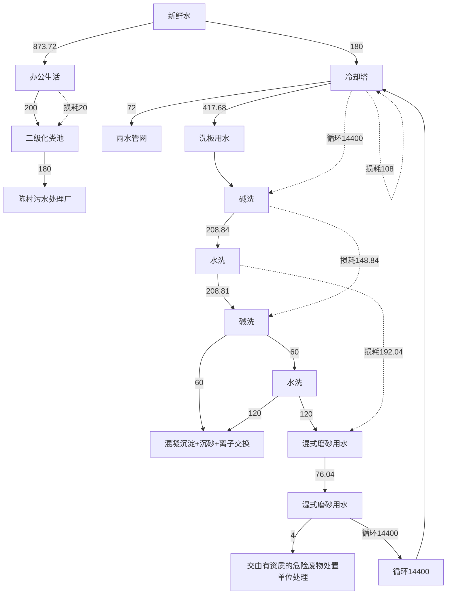
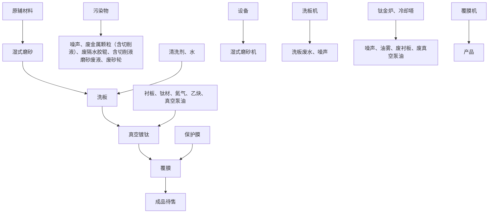
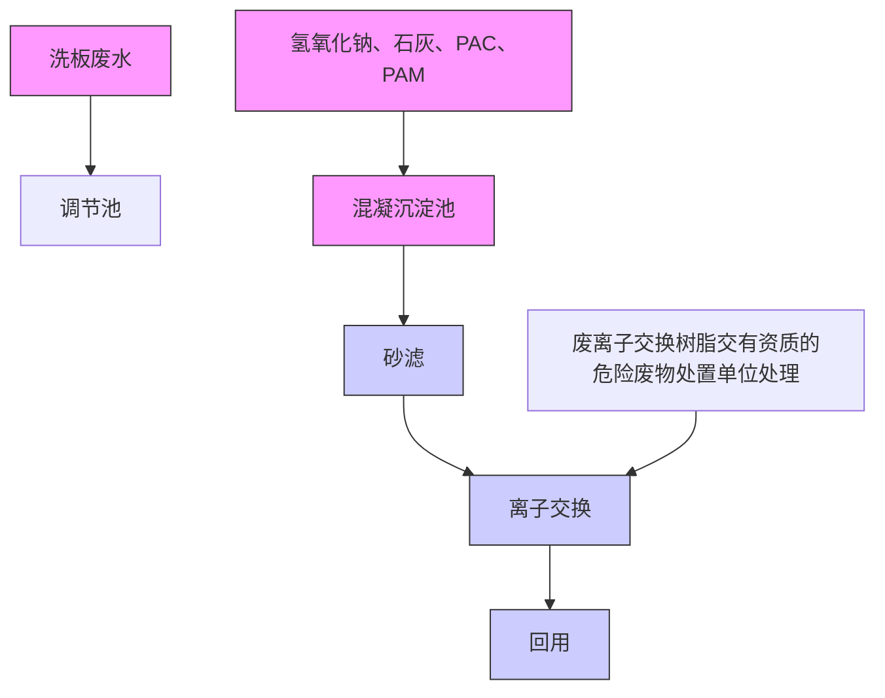
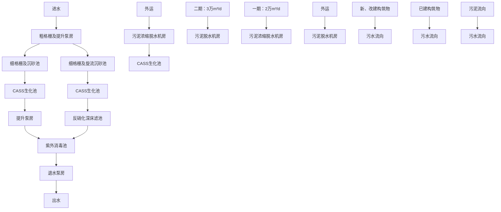
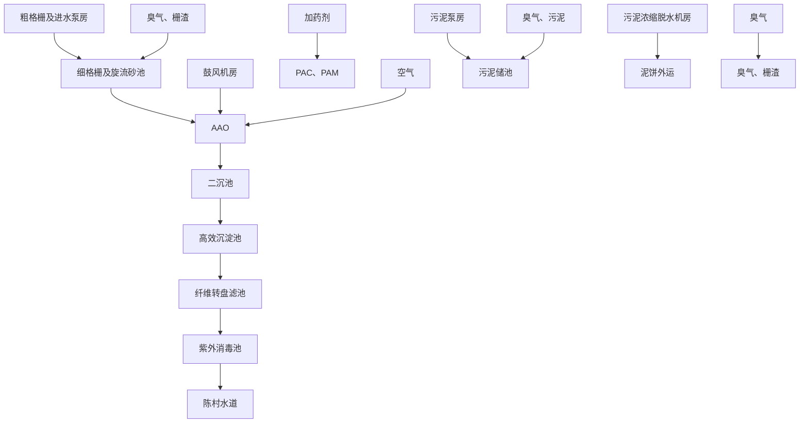
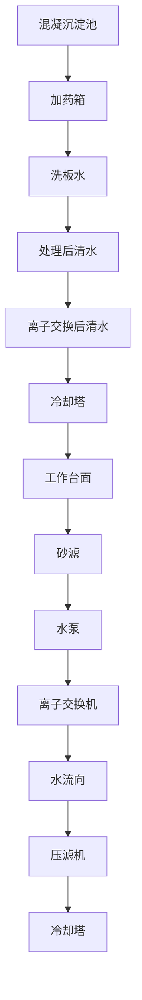

# 建设项目环境影响报告表

（污染影响类）

项目名称：佛山市鑫钛镀金属制品有限公司建设项目

建设单位（盖章）：佛山市鑫钛镀金属制品有限公司

编制日期：2024 年 10 月

中华人民共和国生态环境部制

# 目录

一、建设项目基本情况.

二、建设项目工程分析. 8

三、区域环境质量现状、环境保护目标及评价标准 19

四、主要环境影响和保护措施. 25

五、环境保护措施监督检查清单 54

六、结论. . 56

附表. 57

附图1 项目地理位置图.. . 58

附图2 项目环境四至图. 59

附图4 项目平面布置示意图（示意） . 61

附图5 项目周边敏感点. 62

附图6 本项目与顺德区环境管控单元图位置关系. 63

附图7 项目所在地大气环境功能区划图. 64

附图8 项目所在地地表水环境功能区划图 . 65

附图9 项目所在地声环境功能区划. 66

附图10 广东省“三线一单”平台截图. 67

附图11 项目所在地周边水系图. 68

附图12 陈村镇岗北工业区控制性详细规划调整总平面图 69

附图13 陈村镇污水管网分布图. 70

附图14 污水处理回用路径图. 71

附件1 企业营业执照 . 72

附件2 法人代表身份证复印件. 73

附件3 不动产权证.. 74

附件4 租赁合同. 83

附件7 委托合同. . 97

附件14 声明. 98

# 广东省社会保险个人参保证明

该参保人在广州市参加社会保险情况如下：

<table><tr><td>姓名</td><td colspan="2"></td><td></td><td></td><td>证件号码</td><td colspan="3"></td></tr><tr><td colspan="9">参保险种情况</td></tr><tr><td rowspan="2" colspan="3">参保起止时间</td><td rowspan="2" colspan="3">单位</td><td colspan="3">参保险种</td></tr><tr><td>养老</td><td>工伤</td><td>失业</td></tr><tr><td>202403</td><td>-</td><td>202408</td><td colspan="3">广州市:广州国寰环保科技发展有限公司</td><td>6</td><td>6</td><td>6</td></tr><tr><td colspan="3">截止</td><td colspan="3">2024-09-02 15:01,该参保人累计月数合计</td><td>实际缴费6个月,缓缴6个月</td><td>实际缴费6个月,缓缴0个月</td><td>实际缴费6个月,缓缴0个月</td></tr></table>

本《参保证明》标注的“缓缴”是指：《转发人力资源社会保障部办公厅国家税务总局力厅关于特困行业阶段性实施缓缴企业社会保险费政策的通知》（人在规【2022】11号）、 省人力资源和社会保障厅广东省发展和改革委员会广东省财政厅国家税务总局广东省税务局关于实施扩大阶段性缓缴社会保险费政策实施范围等政策的通知》（粤人社规【2022】15号）等文件实施范围的企业申请缓缴三项社保费单位缴费部分。

# 广东省社会保险个人参保证明

<table><tr><td>姓名</td><td colspan="3"></td><td>证件号码</td><td colspan="3"></td></tr><tr><td colspan="8">参保险种情况</td></tr><tr><td rowspan="2" colspan="3">参保起止时间</td><td rowspan="2" colspan="2">单位</td><td colspan="3">参保险种</td></tr><tr><td>养老</td><td>工伤</td><td>失业</td></tr><tr><td>202403</td><td>-</td><td>202408</td><td colspan="2">广州市:广州国寰环保科技发展有限公司</td><td>6</td><td>6</td><td>6</td></tr><tr><td colspan="3">截止</td><td colspan="2">2024-09-02 14:54,该参保人累计月数合计</td><td>实际缴费6个月,缓缴6个月</td><td>实际缴费6个月,缓缴0个月</td><td>实际缴费6个月,缓缴0个月</td></tr></table>

杰《参保证明》标注的“缓缴”是指：《转发人力资源社会保障部办公厅国家税务总局力厅关于特困行业阶段性实施缓缴企业社会保险费政策的通知》（粤人规（202211号）、《 东省人力资源和社会保障厅东省发展和改革委员会广东省财政厅国家税务总局广东省税务局关于实施扩大阶段性缓缴社会保险费政策实施范围等政策的通知》（粤人社规【2022]15号）等文件实施范围内的企业申请缓缴三项在保费单位缴费部分。

FileNo

2016035440352013449914000083

Full Name

性别：

  
女

Date of Birth

1973年09月

批准日期：

ApprovalDate2016年05月22日

签发单位盖章

Issued by

text_image

广东省人力资源和社会保障厅
专业技术人员资格考试
2016 证书专用章(130)

qualifications for Environmental Impact Assessment Engineer.

text_image

中华人民共和国人力资源和社会保障部
approved & authorized by
By of Human Resources and Social S

Ministry ofHuman Resourcesand social Security The People's Republic of China

text_image

Issued on
美国节能环保科技发展有限公司

text_image

中华人民共和国环境保护部
Approved & authorized
Ministry of Environmental Protection
The People's Republic of China

HP00019342

  
Signature of the Bearer

Full Name

Date ofBirth

Professional Type

Approval Date

签发单位章

人通过国家转一组起的考试，取得环境影响评

has passed national examination organized by the Chinese govermment departments and has obtained qualifications for Environmental Impact Assessment Engineer.

Ministry ofHuman Kesourees and Soeal Security The People's Republie ol China

text_image

广州国泰汽车股份有限公司
广州国泰汽车股份有限公司

text_image

中华人民共和国环境保护
Approved & authorized
by
Ministry of Environmental Protection
The People's Republic of China

编制单位和编制人员情况表

<table><tr><td colspan="2">项目编号</td><td colspan="3">zx7b31</td></tr><tr><td colspan="2">建设项目名称</td><td colspan="3">佛山市鑫钛镀金属制品有限公司建设项目</td></tr><tr><td colspan="2">建设项目类别</td><td colspan="3">30--067金属表面处理及热处理加工</td></tr><tr><td colspan="2">环境影响评价文件类型</td><td colspan="3">报告表</td></tr><tr><td colspan="3">一、建设单位情况</td><td colspan="2"></td></tr><tr><td colspan="2">单位名称(盖章)</td><td colspan="3">佛山市鑫钛镀金属制品</td></tr><tr><td colspan="2">统一社会信用代码</td><td colspan="3">91440606MAD27JUJ9D</td></tr><tr><td colspan="2">法定代表人(签章)</td><td rowspan="3" colspan="3"></td></tr><tr><td colspan="2">主要负责人(签字)</td></tr><tr><td colspan="2">直接负责的主管人员(签字)</td></tr><tr><td colspan="5">二、编制单位情况</td></tr><tr><td colspan="2">单位名称(盖章)</td><td colspan="3">广州国寰环保科技发展有限公司</td></tr><tr><td colspan="2">统一社会信用代码</td><td colspan="3">91440101691529084H</td></tr><tr><td colspan="5">三、编制人员情况</td></tr><tr><td colspan="5">1.编制主持人</td></tr><tr><td>姓名</td><td colspan="2">职业资格证书管理号</td><td>信用编号</td><td>签字</td></tr><tr><td>蔡新娥</td><td colspan="2">2016035440352013449914000083</td><td>BH002970</td><td></td></tr><tr><td colspan="5">2.主要编制人员</td></tr><tr><td>姓名</td><td colspan="2">主要编写内容</td><td>信用编号</td><td>签字</td></tr><tr><td>钟颖君</td><td colspan="2">审核</td><td>BH002965</td><td rowspan="2"></td></tr><tr><td>蔡新娥</td><td colspan="2">全部章节</td><td>BH002970</td></tr></table>

# 一、建设项目基本情况

<table><tr><td>建设项目名称</td><td colspan="3">佛山市鑫钛镀金属制品有限公司建设项目</td></tr><tr><td>项目代码</td><td colspan="3">无</td></tr><tr><td>建设单位联系人</td><td>高*</td><td>联系方式</td><td>186**********</td></tr><tr><td>建设地点</td><td colspan="3">广东省佛山市顺德区陈村镇岗北工业区伟业大道5号自编三车间C</td></tr><tr><td>地理坐标</td><td colspan="3">(E 113度 12分 19.695秒,N 23度 0分 18.256秒)</td></tr><tr><td>国民经济行业类别</td><td>C3360 金属表面处理及热处理加工</td><td>建设项目行业类别</td><td>三十、金属制品业33—67、金属表面处理及热处理加工-其他(年用非溶剂型低VOCs含量涂料10吨以下的除外)</td></tr><tr><td>建设性质</td><td>√新建(迁建)□改建□扩建□技术改造</td><td>建设项目申报情形</td><td>√首次申报项目□不予批准后再次申报项目□超五年重新审核项目□重大变动重新报批项目</td></tr><tr><td>项目审批(核准/备案)部门(选填)</td><td>/</td><td>项目审批(核准/备案)文号(选填)</td><td>/</td></tr><tr><td>总投资(万元)</td><td>300</td><td>环保投资(万元)</td><td>15</td></tr><tr><td>环保投资占比(%)</td><td>5</td><td>施工工期</td><td>1个月</td></tr><tr><td>是否开工建设</td><td>√否□是:</td><td>用地(用海)面积(m2)</td><td>1008</td></tr><tr><td>专项评价设置情况</td><td colspan="3">无</td></tr><tr><td>规划情况</td><td colspan="3">无</td></tr><tr><td>规划环境影响评价情况</td><td colspan="3">无</td></tr><tr><td>规划及规划环境影响评价符合性分析</td><td colspan="3">无</td></tr></table>

# 1、与环境功能区划符合性分析

（1）湿式磨砂清洗废水循环使用，需定期清理沉淀后的不锈钢渣，并定期补充蒸发水量，定期整池更换，含切削液磨砂废液定期作为危险废物交由具有危险废物处理处置资质的单位处理。洗板废水经“混凝沉淀+沉砂+离子交换”处理设施处理后达到《城市污水再生利用 工业用水水质》（GBT19923-2024）洗涤用水标准后回用至湿式磨砂工序；冷却塔冷却水循环使用，定期补充损耗量，部分冷却水作为清净下水排入雨水管网。生活污水经三级化粪池处理后由生活污水排放口排放，经市政污水管网最终排入陈村污水处理厂进行深度处理后排入陈村水道，陈村水道属于Ⅲ类功能区，执行《地表水环境质量标准》（GB3838-2002）中的Ⅲ类标准，本项目污水排放符合纳污水体区划要求。

（2）根据《佛山市顺德区生态环境保护“十四五”规划（2021-2025）》，项目所在区域空气环境功能区划为二类区，执行《环境空气质量标准》（GB3095-2012）及其修改单二级标准。项目所在位置不属于自然保护区、风景名胜区和其它需要特殊保护的地区，符合区域空气环境功能区划分要求。  
（3）根据《佛山市生态环境局关于印发<佛山市声环境功能区划>的通知》（佛环〔2024〕1号），本项目所在地属于声环境3类区，项目各边界执行《声环境质量标准》（GB3096-2008）3类标准。

选址周围无国家、省、市、区重点保护的文物、古迹、无名胜风景区、自然保护区等，选址符合环境功能区划的要求。

2、与《佛山市顺德区人民政府关于印发佛山市顺德区“三线一单”生态环境分区管控方案的通知》（顺府发[2021]11号）相符性分析

根据《佛山市顺德区人民政府关于印发佛山市顺德区“三线一单”生态环境分区管控方案的通知》（顺府发[2021]11号），项目所在的位置为陈村镇重点管控区（环境管控单元编码ZH44060620010），要素细类：水环境城镇生活污染重点管控区、大气环境布局敏感重点管控区、大气环境受体敏感重点管控区、江河湖库岸线重点管控区、江河湖库岸线一般管控区。具体管理要求如下表所示。

表 1-1 《佛山市顺德区人民政府关于印发佛山市顺德区“三线一单”生态环境分区管控方案的通知》相符性分析表

<table><tr><td>管理维度</td><td>管控要求</td><td>本项目</td><td>是否相符</td></tr><tr><td rowspan="4">空间布局约束</td><td>1-1.【产业/鼓励引导类】重点发展智能装备制造、新一代电子信息、新材料等新兴产业;结合TOD片区开发,对接广深港资源,大力发展生产性服务业、高端商务服务业和中小企业总部集群;培育以花卉产业为特色,向电商、会展、文创旅游等延伸的现代农业产业链。</td><td>不涉及</td><td>符合</td></tr><tr><td>1-2.【产业/综合类】系统推进村级工业园升级改造,腾出连片空间,布局产业集聚区和主题产业园,推动工业项目入园集聚发展。新增工业制造业用地原则上安排在产业集聚区内,产业集聚区外原则上不鼓励工业及物流仓储用地的新建与改造。</td><td>项目主要从事不锈钢板的表面处理加工,位于已建成的工业聚集区内。</td><td>符合</td></tr><tr><td>1-3.【产业/综合类】产业聚集区所属地块内的工业用地或企业与村庄、学校等环境敏感点之间应设置合理的大气环境防护距离,并通过绿化带进行有效隔离;聚集区规划布局应注重大气污染排放企业应尽量避免布局在居住用地的常年主导风向的上风向。</td><td>本项目与最近敏感点距离为217m,且项目生产废气主要为颗粒物,不属于有毒有害污染物,经大气稀释扩散后对周边环境敏感点影响不大。</td><td>符合</td></tr><tr><td>1-4.【产业/限制类】受纳水体或监控断面不达标的,不得新建、扩建向河涌直接排放废水的项目。新建、扩建含蚀刻工序的线路板生产项目和化工项目应在配套污水集中处置的工业园区或生活污水管网覆盖区域内建设;纯加工型印花项目,含酸洗、磷化的金属表面处理、金属制品项目(与自身高新技术企业配套的除外),含酸洗、喷涂、化学抛光、电解等涉及废水排放工艺的不锈钢型材加工项目(与自身高新技术企业配套的除外),应进入以此类项目为主导产业、有相应废水集中治理设施的工业园区,实现集中治污。</td><td>湿式磨砂清洗废水循环使用,需定期清理沉淀后的不锈钢渣,并定期补充蒸发水,定期整池更换,含切削液磨砂废液定期作为危险废物交由具有危险废物处理处置资质的单位处理。洗板废水经“混凝沉淀+沉砂+离子交换”处理设施处理后达到《城市污水再生利用工业用水水质》(GBT19923-2024)洗涤用水标准后回用至湿式磨砂工序;冷却塔冷却水循环使用,定期补充损耗量,部分冷却水作为清净下水排入雨水管网。生活污水经三级化粪池处理后由生活污水排放口排放,经市政污水管网最终排入陈村污水处理厂处理,尾水排入陈村水道,不直接向水体排放废水。陈村水道断面达到水质要求,水质较好。本项目主</td><td>符合</td></tr></table>

<table><tr><td rowspan="10"></td><td rowspan="3"></td><td></td><td>要进行的表面处理为湿式磨砂、镀钛膜,不属于酸洗、磷化、喷涂、化学抛光、电解等工艺。</td><td></td></tr><tr><td>1-5.【产业/综合类】划定家具生产优先发展区域,优先发展区外不再新建涉及涂装工艺的木质家具制造项目。</td><td>不涉及</td><td>符合</td></tr><tr><td>1-6.【大气/限制类】大气环境受体敏感重点管控区内,应严格限制新建储油库项目、产生和排放有毒有害大气污染物的建设项目以及使用溶剂型油墨、涂料、清洗剂、胶黏剂等高挥发性有机物原辅材料项目,鼓励现有该类项目搬迁退出。1-7.【大气/限制类】大气环境布局敏感区重点管控区内,应严格限制新建生产和使用高挥发性有机物原辅材料项目,优先开展低VOCs含量原辅材料替代,强化无组织排放控制。原则上不再新建、扩建新增氮氧化物、烟(粉)尘排放量较大的建设项目。</td><td>本项目不排放有毒有害大气污染物,不使用溶剂型油墨、涂料、清洗剂、胶黏剂等高挥发性有机物原辅材料,生产过程中无有机废气的产生和排放;项目颗粒物排放量较少,经大气稀释扩散后对环境影响较小。</td><td>符合</td></tr><tr><td rowspan="6">能源资源利用</td><td>2-1.【能源/鼓励引导类】推广节能技术,加快发展绿色货运与现代物流。</td><td>不涉及</td><td>符合</td></tr><tr><td>2-2.【能源/鼓励引导类】推广新能源汽车应用和充电基础设施建设,积极推动重卡LNG加气站、充电基础设施、加氢站建设。</td><td>不涉及</td><td>符合</td></tr><tr><td>2-3.【能源/综合类】科学实施能源消费总量和强度“双控”,新建高能耗项目单位产品(产值)能耗达到国际国内先进水平。</td><td>本项目不属于“高能耗”项目。</td><td>符合</td></tr><tr><td>2-4.【水资源/综合类】贯彻落实“节水优先”方针,实行最严格水资源管理制度,陈村镇万元国内生产总值用水量、万元工业增加值用水量、用水总量、农田灌溉水有效利用系数等用水总量和效率指标达到区下达要求。</td><td>项目用电、用水由市政系统提供。</td><td>符合</td></tr><tr><td>2-5.【土地资源/限制类】落实单位土地面积投资强度、土地利用强度等建设用地控制性指标要求,提高土地利用效率。</td><td>项目租用现有厂房进行生产经营,不占用新的土地资源。</td><td>符合</td></tr><tr><td>2-6.【岸线/禁止类】严格水域岸线用途管制,新建项目一律不得违规占用水域。严禁破坏生态的岸线利用行为和不符合其功能定位的开发建设活动,严禁以各种名义侵占河道、围垦湖泊、非法采砂等。</td><td>不涉及</td><td>符合</td></tr><tr><td>污染物排放管控</td><td>3-1.【水/限制类】城镇新区建设实行雨污分流。住宅、商业体、学校、市场等城镇开发建设项目应当配套或者同步计划建设公共排水设施,公共排水设施或自建排污水设施未能投产运行的,以上涉水项目不得投入使用。新建小区严格实施雨污分流,阳台、露台等污水接入污水收集系统,将生活污水“应截尽截”。做好大型楼盘、集贸市场、餐饮以及学校等4大类排水户污水接入市政管网工作。</td><td>本项目实行雨污分流,项目周边生活污水管网已完善,外排生活污水经市政管网排入陈村污水处理厂进行深度处理后排入陈村水道。</td><td>符合</td></tr><tr><td rowspan="7"></td><td rowspan="5"></td><td>3-2.【水/综合类】陈村镇重点河涌水质上年度未达到水环境环境质量目标的,需组织编制、系统实施、向社会公开区域重点水污染物减排计划并明确“替代量”,本年度新建、改建、扩建项目新增水环境重点污染物实行区域“减二增一”替代(工业、生活或综合集中废水处理设施、民生项目除外)。</td><td>不涉及</td><td>符合</td></tr><tr><td>3-3.【水/综合类】结合村级工业园改造,全面提升产业层次与集聚度,促进污染集中整治。</td><td rowspan="2">本项目实行雨污分流,项目周边生活污水管网已完善,外排生活污水经市政管网排入陈村污水处理厂进行深度处理后排入陈村水道。</td><td>符合</td></tr><tr><td>3-4.【水/综合类】稳步推进排水设施“三个一体化”管理模式,补齐城乡污水收集和处理短板,推动陈村污水处理厂提质增效,加快消除城中村、老旧城区、城乡结合部等污水收集管网空白区,逐步实现城乡污水收集处理全覆盖。2025年前完成陈村污水处理厂扩建,尾水应执行《城镇污水处理厂污染物排放标准》(GB18918-2002)一级A标准及《广东省水污染物排放限值》(DB44/26-2001)的较严值。</td><td>符合</td></tr><tr><td>3-5.【水/综合类】完善污水管网建设,逐步取消现状农村污水处理站点,有条件的区域实施雨污分流改造;至2030年全面雨污分流,农村生活污水纳入陈村城镇污水处理系统。</td><td>不涉及</td><td>符合</td></tr><tr><td>3-6.【水/综合类】产业集聚区和主题园区内做好污水管网和污水集中处理设施的配套保障,确保废水收集到城镇污水处理厂、园区污水处理厂或分散式污水处理设施集中处置。</td><td>本项目实行雨污分流,项目周边生活污水管网已完善,外排生活污水经市政管网排入陈村污水处理厂进行深度处理后排入陈村水道。</td><td>符合</td></tr><tr><td rowspan="2">环境风险防控</td><td>4-1.【水/综合类】陈村污水处理厂、工业污水集中处理设施应采取有效措施,防止事故废水直接排入水体。完善污水处理厂在线监控系统联网,实现污水处理厂的实时、动态监管。</td><td>本项目实行雨污分流,项目周边生活污水管网已完善,外排生活污水经市政管网排入陈村污水处理厂进行深度处理后排入陈村水道。</td><td>符合</td></tr><tr><td>4-2.【风险/综合类】加强环境风险分级分类管理,强化金属制品、有色金属和压延加工、化学原料和化学品制造业等涉重金属、化工行业企业及工业园区等重点环境风险源的环境风险防控。</td><td>本项目风险防控措施具备可行性,整体风险可控。</td><td>符合</td></tr><tr><td colspan="5">综上所述,本项目与《佛山市顺德区人民政府关于印发佛山市顺德区“三线一单”生态环境分区管控方案的通知》(顺府发[2021]11号)是相符的。3、与产业政策符合性分析项目所属行业为C3360金属表面处理及热处理加工,根据国家《产业结构调整指导目录(2024年本)》的规定,项目不属于上述目录所列的鼓励类、限制类和禁止(淘汰)类项目,项目属于允许类,因此项目符合国家产业政策要求。</td></tr></table>

# 4、选址合理性分析

项目租赁广东省佛山市顺德区陈村镇岗北工业区伟业大道5号自编三车间C已建厂房进行生产经营，根据出租方提供的不动产权证书（附件3）可知，项目所在地块用途为工业用地，符合用地规划性质。

根据《陈村镇岗北工业区控制性详细规划调整总平面图》，项目所在地土地利用规划为工业用地（详见附图12）。

5、与《佛山市顺德区生态环境保护“十四五”规划（2021-2025）》相符性分析

文中要求：“调整优化产业集群发展空间布局，环境质量不达标区域，新建、扩建项目需符合环境质量改善要求；严格控制“高耗能、高排放”项目盲目发展，禁止新建、扩建水泥、平板玻璃、化学制浆、生皮制革以及国家规划外的钢铁、原油加工等项目；专业电镀、印染等项目进入定点园区集中管理。”

本项目不属于“高耗能、高排放”项目，不属于“水泥、平板玻璃、化学制浆、生皮制革以及国家规划外的钢铁、原油加工等项目”和“专业电镀、印染等项目”。项目废水、废气经处理后能达标排放，且项目排放量较少，对环境的影响不大，不会恶化环境质量。因此，与《佛山市顺德区生态环境保护“十四五”规划（2021-2025）》要求相符。

6、与《佛山市生态环境局 佛山市水利局关于进一步加强工业企业废水污染防治的函》相符性分析

文中要求：“在村改、老旧工业区改造过程中，充分发挥规划环评引领绿色发展作用，聚焦重点流域、重点镇街、重点行业，持续推进专业主题园区建设。通过科学合理限制外围环境准入，积极推动零散表面处理、工业涂装等涉较重污染工序的单纯加工型企业入园集聚发展、上楼发展，配套建设工业废水集中治理设施实现集中治污、集中管理，解决好小微企业生产、治污难题，保障产业链供应链安全稳定。”“工业企业排放有含重金属、难生化降解、有生物毒性、易燃易爆、高盐分、重油脂等超城镇生活污水处理厂接收能力的生产废水，以及间接冷却的清净下水等过低浓度生产废水，原则上不得排入城镇生活污水处理厂，已进入的，各区要制定限期退出计划并实施。受纳城镇生活污水处理厂已满负荷的，限制审批新增废水排入城镇生活污水处理厂的工业项目。”“加强涉水项目工程分析和源强核算审查，重点审查产污工序、污染因子（特别是一类污染物）、废水产治排平衡图、废水产生排放量与产能规模匹配性、废水处理与回用经济技术可行性及其去向等环节，强化合理性、可靠性和经济可行性，杜绝不实“回用”、“零排放”审批。”

本项目属于零散表面处理，生产废水主要污染物为SS和石油类，不涉及第一类污染物，且浓度较低，不属于“涉较重污染工序”，不属于“含重金属、难生化降解、有生物毒性易燃易爆、高盐分、重油脂”废水；产生的冷却塔外排水属于“间接冷却的清净下水等过低浓度生产废水”，作为清净下水排入雨水管网，不排入市政污水处理设施。湿式磨砂清洗废水循环使用，需定期清理沉淀后的不锈钢渣，并定期补充蒸发水量，定期整池更换，含切削液磨砂废液定期作为危险废物交由具有危险废物处理处置资质的单位处理。洗板废水经“混凝沉淀+沉砂+离子交换”处理设施处理后达到《城市污水再生利用 工业用水水质》（GBT19923-2024）洗涤用水标准后回用至湿式磨砂工序；冷却塔冷却水循环使用，定期补充损耗量，部分冷却水作为清净下水排入雨水管网。生产废水分析详见第四章节，总体符合《佛山市生态环境局 佛山市水利局关于进一步加强工业企业废水污染防治的函》的要求。

# 二、建设项目工程分析

# 一、项目建设内容

佛山市鑫钛镀金属制品有限公司建设项目选址位于广东省佛山市顺德区陈村镇岗北工业区伟业大道 5 号自编三车间 C，主要从事不锈钢板表面处理，年加工不锈钢镀钛板50万张/年。

根据《中华人民共和国环境保护法》、《中华人民共和国环境影响评价法》、国务院令第 682号《国务院关于修改〈建设项目环境保护管理条例〉的决定》等有关法律法规的规定，本项目须执行环境影响审批制度。根据《建设项目环境影响评价分类管理名录（2021 版》（自 2021 年1 月 1 日起施行），本项目环评类别属于“三十、金属制品业33，67、金属表面处理及热处理加工”中的“其他（年用非溶剂型低VOCs 含量涂料10吨以下的除外）”，需编制建设项目环境影响报告表。

# 1、基本信息

本项目租用已建闲置厂房，厂房属于单层建筑物，层高9.6m，占地面积1008平方米，建筑面积 1008平方米，具体工程组成见下表。

表 2-1 本项目工程组成一览表

<table><tr><td>类别</td><td>项目名称</td><td>建设规模</td></tr><tr><td>主体工程</td><td>生产厂房</td><td>1层,层高9.6m,建筑面积 $1008m^{2}$ ,包括办公室、原料区、成品区、生产区等(其中生产区域约 $600m^{2}$ )</td></tr><tr><td>辅助工程</td><td>办公室</td><td>位于生产车间内,占地面积 $50m^{2}$ </td></tr><tr><td rowspan="4">储运工程</td><td>原料区</td><td>位于生产车间内,占地面积 $100m^{2}$ </td></tr><tr><td>成品区</td><td>位于生产车间内,占地面积 $100m^{2}$ </td></tr><tr><td>一般工业固废暂存间</td><td>位于生产车间内西北角,占地面积约 $20m^{2}$ </td></tr><tr><td>危废暂存间</td><td>位于生产车间内西北角,占地面积约 $20m^{2}$ </td></tr><tr><td rowspan="2">公用工程</td><td>给水</td><td>市政供水,主要为员工生活用水、生产用水</td></tr><tr><td>排水</td><td>采用雨污分流。雨水通过雨水排水系统排至市政雨水管网。1.洗板废水经“混凝沉淀+沉砂+离子交换”处理后回用于湿式磨砂中;2.湿式磨砂废水(含切削液)定期作为危险废物交由具有危险废物处置资质的单位处理,不排放;3.冷却水循环使用,定期补充损耗量,部分冷却水作为清净下水排入雨水管网;4.生活污水经三级化粪池处理后由生活污水排放口排入市政污水管网,最终排入陈村污水处理厂处理。</td></tr><tr><td></td><td>供电</td><td>市政供电,预计耗电量为20万千瓦时/年</td></tr><tr><td rowspan="6">环保工程</td><td>废水治理设施</td><td>1套,处理能力为 $5m^{3}/d$ ,主要工艺为“混凝沉淀+沉砂+离子交换”</td></tr><tr><td>废气治理设施</td><td>镀钛工序抽真空油雾经真空泵排气管引到15m高的G1排气筒排放</td></tr><tr><td>噪声治理</td><td>选用低噪声设备、加强维护保养、并进行隔声、减振处理、车间墙体隔声、距离衰减、合理平面布局</td></tr><tr><td rowspan="3">固废处理</td><td>生活垃圾:集中收集,交环卫部门清运</td></tr><tr><td>一般工业固废:分类收集、交专业公司回收,一般工业固废暂存间位于项目厂房内西北角,建筑面积约 $20m^{2}$ </td></tr><tr><td>危险废物:设置危险废物暂存间,独立分类收集,交由有危险废物处置资质的单位处理,危废暂存间位于项目厂房内西北角,建筑面积约 $20m^{2}$ </td></tr></table>

# 2、主要产品及产能

具体情况详见下表：

表 2-2 主要产品产量一览表

<table><tr><td>名称</td><td>单位</td><td>产量</td><td>产品尺寸(长宽厚)</td></tr><tr><td>不锈钢镀钛板</td><td>张/年</td><td>50万</td><td>2440*1220*1.7mm,密度 7.93g/cm3,单块板重量 40.13kg,折合重量约 20065吨/年</td></tr></table>

# 3、主要原辅材料及用量

项目原辅材料及用量详见下表：

表2-3 项目主要原辅材料消耗一览表

<table><tr><td>名称</td><td>物态</td><td>年用量(t)</td><td>最大储存量(t)</td><td>包装方式</td><td>用途</td><td>备注</td></tr><tr><td>不锈钢板</td><td>固态</td><td>50万张</td><td>1万张</td><td>/</td><td>/</td><td>2440mm*1220mm*1.7mm,密度 $7.93g/cm^3$ </td></tr><tr><td>真空泵油</td><td>液态</td><td>4.3</td><td>1</td><td>25kg/桶</td><td>镀膜</td><td>主要成分为精炼矿物基础油98%、润滑油添加剂2%</td></tr><tr><td>清洗剂</td><td>液态</td><td>1.2</td><td>0.2</td><td>10kg/桶</td><td>清洗</td><td>主要成分为碳酸钠40~60%、三乙醇胺2~5%、五水偏硅酸钠2~5%、柠檬酸钠2~5%、有机硅油清泡剂1~3%、其余成分为水</td></tr><tr><td>保护膜</td><td>固态</td><td>3</td><td>0.5</td><td>卷</td><td>覆膜</td><td>用于产品覆膜</td></tr><tr><td>钛材</td><td>固态</td><td>7</td><td>1</td><td>箱</td><td>镀膜</td><td>用于镀不锈钢表面镀层</td></tr><tr><td>氮气</td><td>气态</td><td>1</td><td>0.1</td><td>10L/瓶</td><td>镀膜</td><td rowspan="2">提供等离子气,在真空炉中与钛离子发生反应结合,使不锈钢表面形成不同颜色。气体均单独使用。</td></tr><tr><td>乙炔</td><td>气态</td><td>0.4</td><td>0.1</td><td>10L/瓶</td><td>镀膜</td></tr><tr><td>衬板</td><td>固体</td><td>12套</td><td>/</td><td>/</td><td>镀膜</td><td>保护钛金炉内壁的材料,2天更换一次,更换时即刻换上新板,委外清洗。不在厂内储存。</td></tr><tr><td>切削液</td><td>液态</td><td>0.8</td><td>0.5</td><td>25kg/桶</td><td>湿式磨砂</td><td>主要含有三乙醇胺TEA 10~15%、表面活性剂20~35%、润滑剂12~20%、其他5~10%其余为水</td></tr><tr><td>机油</td><td>液态</td><td>0.2</td><td>0.1</td><td>10kg/桶</td><td>维护保养</td><td>-</td></tr><tr><td>砂轮</td><td>固态</td><td>2.4</td><td>/</td><td>/</td><td>/</td><td>每个砂轮重50kg由设备供应商上门更换,不在厂内储存</td></tr><tr><td>胶辊</td><td>固态</td><td>0.32</td><td>/</td><td>/</td><td>/</td><td>单个胶辊重40kg,每台设备4根,每年损耗量约0.32t(即8根)由设备供应商上门更换,不在厂内储存</td></tr><tr><td>离子交换树脂</td><td>固态</td><td>0.024</td><td>/</td><td>/</td><td>/</td><td>由设备供应商上门更换,不在厂内储存</td></tr></table>

# （1）理化性质

真空泵油理化性质：清澈油状液体。无刺激性气味，熔点-12℃，闪点≥220℃，密度0.8631，自燃温度360℃，成分为精炼矿物基础油98%、润滑油添加剂2%。

清洗剂理化性质：黄色透明液体。主要成分为碳酸钠 40～60%、三乙醇胺 2～5%、五水偏硅酸钠2～5%、柠檬酸钠 2～5%、有机硅油清泡剂 1～3% 、其余成分为水。相对密度(水=1)：1-1.2。

切削液理化性质：淡黄色透明状。主要含有三乙醇胺 TEA10\~15%、表面活性剂 20\~35%、润滑剂 12\~20%、其他 5\~10%其余为水。pH 值约 8.7（5%），水中溶解度 100%溶解。比重（15℃）1.05g/cm3，粘度 35mm2/s（40℃）。

# （2）用量合理性分析

真空泵油用量合理性分析：

根据设备说明书，每台镀钛炉配有 1200 型高真空油扩散泵 2 台、1200 型罗茨泵2台、70型真空泵8台、30型旋片真空泵2台，根据泵的说明书，其注油量如下表所示，3台镀钛炉单次注油量为 498L（真空泵油密度0.8631，折算为0.43t）真空泵油每使用 300h需更换一次，一年理论更换频次为8次，但实际操作环境和温度使油品容易变质，因此加强维护保养保守按10次计算，计算得真空泵油使用量为 4.3t/a。

表2-4 真空泵油计算表

<table><tr><td colspan="2">名称</td><td>数量(台)</td><td>单次注油量(L)</td></tr><tr><td rowspan="3">单台镀钛炉机组配置</td><td>1200型高真空油扩散泵</td><td>2</td><td>24</td></tr><tr><td>1200型罗茨泵</td><td>2</td><td>24</td></tr><tr><td>70型真空泵</td><td>8</td><td>8</td></tr><tr><td></td><td>30型旋片真空泵</td><td>2</td><td>3</td></tr><tr><td colspan="2">小计</td><td>-</td><td>166</td></tr><tr><td colspan="2">3台镀钛炉合计</td><td>-</td><td>498</td></tr></table>

钛材用量合理性分析：

不锈钢板尺寸为 1220mm\*2440 mm \*1.7 mm，不锈钢板密度为 7.93g/cm3，单块板重量 40.13kg，本项目年约加工 50 万块不锈钢板，镀钛层厚度1μm，只需要在一面镀钛膜，加工面积为1488400m2，钛材密度为 $4 . 5 1 \mathrm { g } / \mathrm { c m } ^ { 3 }$ ，计算理论钛材量为6.7t，考虑挂钩上会沾附钛材等因素，钛材用量按 7t 考虑。

切削液合理性分析：

切削液投加到液槽中与水混合后一同作用于不锈钢板上，磨砂过程会带出不锈钢细颗粒，需要经多级过滤后回用于湿磨槽中，切削液兑水比例为 1：10，配液浓度为 10%，切削液消耗量约为 0.5g/m2 产品，只需要一面进行打磨，则切削液理论使用量为0.74t，考虑损耗，实际切削液约 0.8t。

# 4、主要生产设备

主要生产设备情况详见下表：

表 2-5 主要生产设备一览表

<table><tr><td>序号</td><td>设备名称</td><td>数量/台</td><td>规格/型号</td><td>工序</td><td>备注</td></tr><tr><td>1.</td><td>钛金炉</td><td>4</td><td>TG-38S</td><td>镀钛膜</td><td>3用1备,设备外形尺寸 $\Phi 4800*3300mm$ </td></tr><tr><td>2.</td><td>洗板机</td><td>2</td><td>XTF-3500</td><td>洗板</td><td>设备外形尺寸6m*2.2m*1.06m;每台洗板机设1个碱洗槽,在线水量600L,水槽尺寸(长宽高) $2m*0.6m*0.6m=0.72m^{3}$ (超高0.1m);1个清水槽,在线水量600L,水槽尺寸(长宽高) $2m*0.6m*0.6m=0.72m^{3}$ (超高0.1m)。非浸泡清洗,清洗槽上有18个喷头,碱洗槽上有18个喷头;工作流量:80L/min,碱洗槽和清水槽仅用于存放槽液。</td></tr><tr><td>3.</td><td>吊机</td><td>3</td><td>T-28</td><td>辅助</td><td>-</td></tr><tr><td>4.</td><td>覆膜机</td><td>4</td><td>1250型</td><td>覆膜</td><td>-</td></tr><tr><td>5.</td><td>冷却塔</td><td>4</td><td>RFR-150</td><td>辅助</td><td>3用1备,循环水量2t/h,每台有1个水池约直径1.2m,高约0.6m</td></tr><tr><td>6.</td><td>湿式磨砂机</td><td>2</td><td>BS-W1220</td><td>湿式磨砂</td><td>设备外形尺寸: $2.3m*1.6m*1.97m$ ;每台湿式磨砂机配套1个水箱,尺寸(长宽高) $2m*0.5m*0.6m=0.6m^{3}$ (超高0.1m),有效容积为 $0.5m^{3}$ ;每台设备有3个喷杆,过滤流量50L/min,进料速度6-30/min</td></tr><tr><td>7.</td><td>空压机</td><td>2</td><td>JB-500</td><td>辅助</td><td>-</td></tr><tr><td>8.</td><td>废水处理设施</td><td>1</td><td>-</td><td>污水治理</td><td>处理能力为 $5m^{3}/d$ ,主要工艺为“混凝沉淀+沉砂+离子交换”</td></tr></table>

# 5、产能匹配性分析

洗板机：外购回来的不锈钢板尺寸为 1220mm\*2440mm \*1.7 mm，不锈钢板单块板重量 40.13kg，单块板加工时间与不锈钢板长度有关（本项目不锈钢板长度为 2440mm）。根据洗板机设备参数，其输送带速度为 8m/min，单块板长度2.44m，1 块不锈钢板的理论加工时间为 0.305min（约 18.3s），考虑设备调试和上下料，单块板加工时间约为 25s，洗板工序实际工作时间为 8h/d。

湿式磨砂机：单块板加工时间与不锈钢板长度有关，根据湿式磨砂机设备参数，其输送带速度为 6-30m/min（产品精度要求较高的打磨速度较慢，因此保守按 6m/min 考虑），单块板长度 2.44m，1 块不锈钢板的理论加工时间为 0.41min（约 25s），考虑设备调试和上下料，单块板加工时间约为 30s，磨砂工序实际工作时间为 8h/d。

表 2-6 产能匹配性分析

<table><tr><td>工序</td><td>设备数量</td><td>单块不锈钢板加工耗时</td><td>一天加工不锈钢板数量(块)</td><td>理论全年加工不锈钢板数量(块)</td><td>本项目预计产能(块)</td></tr><tr><td rowspan="2">洗板</td><td>1台</td><td>25s</td><td>8*60*60/25=1152</td><td>1152*300=345600</td><td rowspan="4">500000</td></tr><tr><td>2台</td><td>-</td><td>-</td><td>691200</td></tr><tr><td rowspan="2">磨砂</td><td>1台</td><td>30s</td><td>8*60*60/30=960</td><td>960*300=28800</td></tr><tr><td>2台</td><td>-</td><td>-</td><td>576000</td></tr></table>

根据上表可知，洗板机最大产能可达到 691200 块，湿式磨砂机最大产能可达 576000 块，均大于本项目预计产能 500000 块，设备能满足生产需要。

钛金炉：根据钛金炉设备参数，单次工作时间为 8\~30min，本项目工作时间约 8min/次，真空镀钛炉每次最多可加工 10 块不锈钢板，因此 3 台钛金炉一年最多可加工 540000 块。本项目年加工 500000 块不锈钢板，可满足生产需要。

# 6、人员及生产制度

# （1）工作制度

本项目工作日为300天/年，采取单班8小时工作制，工作时间为8:00\~12:00、14:00\~18:00。

# （2）劳动定员

本项目劳动定员 20 人，均不在厂内食宿。

# 7、水平衡分析

# （1）给水

项目用水主要为员工生活用水、生产用水，均来自城市供水管网，全部采用市政直供。总用水量 873.72m3 /a，其中生活用水 200m3 /a，生产用水 673.72m3/a。

# （2）排水

本项目产生的废水为员工生活污水、洗板废水，生活污水经三级化粪池处理达标后由生活污水排放口经市政污水管网排入陈村污水处理厂，生活污水排放量180m3 /a。洗板废水经“混凝沉淀+沉砂+离子交换”处理设施处理后达到《城市污水再生利用 工业用水水质》（GBT19923-2024）洗涤用水标准后回用至湿式磨砂工序；冷却塔冷却水循环使用，定期补充损耗量，部分冷却水作为清净下水排入雨水管网。湿式磨砂机的含切削液磨砂废液定期作为危险废物交由具有危险废物处理处置资质的第三方单位处理。

项目水平衡图如图 2-1所示。

flowchart

图 2-1 项目水平衡图 $\left( \mathbf { m } ^ { 3 } / \mathbf { a } \right)$

# 8、物料平衡

表 2-7 物料平衡表

<table><tr><td colspan="2">投料</td><td colspan="2">产出</td></tr><tr><td>原料</td><td>数量/t</td><td>出料</td><td>数量/t</td></tr><tr><td>不锈钢板</td><td>20065</td><td>不锈钢板(产品)</td><td>20065</td></tr><tr><td>钛材</td><td>7</td><td>次品</td><td>7.3</td></tr><tr><td>切削液</td><td>0.8</td><td>废金属颗粒(沾附切削液)</td><td>0.5</td></tr><tr><td>水</td><td>493.72</td><td>含切削液磨砂废液</td><td>4</td></tr><tr><td></td><td></td><td>水蒸发损耗</td><td>489.72</td></tr><tr><td>合计</td><td>20566.52</td><td>合计</td><td>20559.22</td></tr></table>

# 9、平面布局情况

<table><tr><td></td><td>项目厂房位于一幢单层工业厂房内,层高9.6m,厂房内设置生产区域(约600m2),洗板机单台设备占地按6m*2.2m算,考虑工件周转面积,单台设备所需面积39.6平方米,2台洗板机所需面积约80平方米;湿式磨砂机单台设备占地按2.3m*1.6m算,考虑工件周转面积,单台设备所需面积10平方米,2台磨砂机所需面积20平方米;钛金炉设备占地面积按Φ4.8m算,考虑工件周转面积,单台设备所需面积30平方米,4台钛金炉所需面积120平方米;考虑上述占地较大的设备总占用面积约为生产区域的220/600*100=37%,由此可见,仍留有较大的物流输送空间。另外生产厂房内有仓库(200m2)、办公室(50m2)、一般固废暂存间(20m2)、危废暂存间(20m2)等。原料仓库和成品仓库位于厂房西侧;危废暂存间位于厂房西北角。厂房内部按照工艺要求进行分区,各生产区相对独立,互不干扰,每个生产区按照工艺流程布置设备,平面布局合理。具体平面布置图见附图4。</td></tr></table>

# 一、工艺流程简述（图示）

flowchart

图 2-2生产工艺流程及产污环节示意图

# 生产流程说明：

（1）外购的不锈钢板进入湿式磨砂机中，磨砂机内设有砂轮，不锈钢板通过磨砂机砂轮磨擦不锈钢板表面，使表面呈现磨砂效果，不锈钢板只需要一面进行打磨。湿式磨砂机分粗磨、细磨及胶辊挤压三段，湿磨过程需加入适量切削液及水（切削液和水混合，切削液兑水比例为 1：10）对不锈钢板进行磨砂（切削液投加到液槽中与水混合后喷在磨砂轮上一同作用于不锈钢板），湿式磨砂机每台配 3 个喷杆，喷杆上有多个小孔，过滤流量为 50L/min，由于是湿式作业，因此砂磨过程不产生粉尘。胶辊挤压段设有四级隔水胶辊挤干水分，挤出的水回流至湿磨槽内循环使用。湿式磨砂机自带过滤装置对含切削液磨砂废液进行四级过滤后线内循环使用，过滤时会收集废金属颗粒，含切削液磨砂废液作为危险废物交由具有危险废物处理处置资质的单位处理。不锈钢板经前后两段湿磨后经四级隔水胶辊挤干水分，隔水胶辊会有损耗，会产生废隔水胶辊。该过程还会产生噪声、废砂轮。

（2）后续不锈钢板进入洗板机先用碱性清洗剂进行喷淋洗，喷洒碱性清洗剂和水一共是两根水杆（单台），每根水杆9 个喷头，一共18个喷头，工作流量是80L/min，喷淋水回流至碱洗槽循环使用，定期补充清洗液，碱洗槽水循环使用一段时间后需进行整槽更换，一年更换 100 次（3 天更换 1 次）；清洗剂清洗后的不锈钢板使用清水进行喷淋清洗，喷洒水一共是两根水杆（单台），每根水杆 9个喷头，一共18个喷头，工作流量是80L/min，喷淋水回流至清水槽循环使用，喷淋水回流至清洗槽循环使用，定期补充新鲜水，清洗槽水循环使用一段时间后需进行整槽更换，一年更换 100 次（3天更换 1 次）。此过程产生洗板废水、噪声。

（3）不锈钢板晾干后上架进入钛金炉，钛金炉抽真空后加入氮气、乙炔等气体进行调色。真空镀钛加工是指在真空条件下，采用低电压、大电流的电弧放电技术，利用真空镀膜设备气体放电使钛块蒸发并使被蒸发物质与气体都发生电离，利用电场的加速作用，使被蒸发物质沉积在工件上。加入氮气，镀层颜色为金色；加入乙炔，镀层颜色为黑色；不同颜色深度和不同气体所需工作温度不同，控制工作温度为 150\~500℃。真空镀钛时分两步抽真空，第一步抽低真空，然后抽高真空。低真空由机械泵完成，高真空由油扩散泵完成。尾气由低真空段机械泵排入大气，在高真空油扩散泵段有挡油器、储气罐，机械泵前有油雾过滤装置，因此排放大气中的尾气只含极少量油雾，油雾处理装置前为密闭管道，收集效率100%，经油雾过滤装置处理后有组织排放。钛金炉中需要插入衬板保护设备，衬板两天更换一次，更换下来的衬板由专业公司清洗后装回设备中，衬板多次使用后会有损耗，产生废衬板。同时，真空泵中的真空泵油需定期更换，会产生废真空泵油。

（4）不锈钢镀钛板下架后覆膜，包装待售。

<table><tr><td rowspan="10"></td><td colspan="4">二、主要产污工序项目主要产污工序如下表。表2-7 项目主要产污工序</td></tr><tr><td>项目</td><td>产污工序</td><td>污染物</td><td>主要污染因子</td></tr><tr><td>废气</td><td>真空镀膜</td><td>油雾(颗粒物)</td><td>颗粒物</td></tr><tr><td rowspan="2">废水</td><td>员工生活</td><td>生活污水</td><td>pH、 $COD_{Cr}$ 、 $BOD_5$ 、氨氮、SS</td></tr><tr><td>洗板</td><td>洗板废水</td><td>pH、 $COD_{Cr}$ 、 $BOD_5$ 、氨氮、SS、石油类</td></tr><tr><td>噪声</td><td colspan="3">生产设备</td></tr><tr><td rowspan="4">固废</td><td>员工生活</td><td>生活垃圾</td><td>生活垃圾</td></tr><tr><td rowspan="2">生产过程</td><td>一般工业固体废物</td><td>废包装材料、废衬板、次品</td></tr><tr><td>危险废物</td><td>废包装桶、废金属颗粒(含切削液)、废隔水胶辊、含切削液磨砂废液、废真空泵油、废砂轮、污泥、废离子交换树脂</td></tr><tr><td>设备维护</td><td>危险废物</td><td>废油桶、废机油、废含油手套抹布</td></tr><tr><td>与项目有关的原有环境污染问题</td><td colspan="4">本项目为新建项目,不存在与项目有关的环境影响问题。</td></tr></table>

# 三、区域环境质量现状、环境保护目标及评价标准

# 1、环境空气质量现状

本项目位于佛山市陈村镇，根据《关于调整顺德区环境空气质量功能区划的复函》（佛府办函〔2014〕494 号），本项目所在区域属大气环境二类功能区，环境空气质量执行《环境空气质量标准》（GB3095-2012）及其修改单二级标准。

本报告采用《顺德区环境空气质量状况(2023 年第四季度与全年)》，顺德区二氧化硫 $( \mathsf { S O } _ { 2 } )$ ）、二氧化氮 $\left( \mathbf { N O } _ { 2 } \right)$ 、可吸入颗粒物 $\left( \mathrm { P M } _ { 1 0 } \right)$ 、细颗粒物 $\left( \mathbf { P M } _ { 2 . 5 } \right)$ ）、一氧化碳（CO）五项污染物年评价浓度均达到二级标准，臭氧 $( \mathbf { O } _ { 3 } )$ 超标，判定本项目所在的顺德区为不达标区。

表 3-1 区域空气质量现状评价表（2023年）

<table><tr><td>所在区域</td><td>污染物</td><td>年评价指标</td><td>现状浓度 $\left( {\mu \mathrm{g}/{\mathrm{m}}^{3}}\right)$ </td><td>标准值 $\left( {\mu \mathrm{g}/{\mathrm{m}}^{3}}\right)$ </td><td>达标情况</td><td>超标倍数</td></tr><tr><td rowspan="6">顺德区</td><td> ${\mathrm{{SO}}}_{2}$ </td><td>年平均质量浓度</td><td>6</td><td>60</td><td>达标</td><td>/</td></tr><tr><td> ${\mathrm{{NO}}}_{2}$ </td><td>年平均质量浓度</td><td>28</td><td>40</td><td>达标</td><td>/</td></tr><tr><td> ${\mathrm{{PM}}}_{10}$ </td><td>年平均质量浓度</td><td>35</td><td>70</td><td>达标</td><td>/</td></tr><tr><td> ${\mathrm{{PM}}}_{2.5}$ </td><td>年平均质量浓度</td><td>20</td><td>35</td><td>达标</td><td>/</td></tr><tr><td>CO</td><td>95百分位数日平均质量浓度</td><td>1000</td><td>4000</td><td>达标</td><td>/</td></tr><tr><td> ${\mathrm{O}}_{3}$ </td><td>90百分位数最大8小时平均质量浓度</td><td>164</td><td>160</td><td>不达标</td><td>1.025</td></tr></table>

bar

| 污染物 | 2022年 (微克/立方米) | 2023年 (微克/立方米) | CO浓度 (毫克/立方米) |
| :--- | :--- | :--- | :--- |
| SO₂ | 5 | 6 | |
| NO₂ | 29 | 28 | |
| PM₁₀ | 32 | 35 | |
| PM₂.₅ | 19 | 20 | |
| O₃ | 190 | 164 | |
| CO | 1.1 | 1.0 | |

图 3-1 顺德区城市空气各项污染物年评价浓度

# 2、地表水环境质量现状

项目外排生活污水经市政污水管网，排入陈村污水处理厂，尾水排入陈村水道。根据《广东省地表水功能区划》（粤环[2011]14 号）可知，陈村水道水质目标为Ⅲ类，执行《地表水环境质量标准》（GB3838-2002）Ⅲ类标准。

为评价陈村水道水质，本项目引用《2023年度佛山市顺德区生态环境状况公报》“2023年顺德区主河道质量评价及年度对比”的评价结果，详见下表。

表 3-2 2023年度顺德区主河道质量评价及年度对比

<table><tr><td rowspan="2">河流名称</td><td rowspan="2">断面</td><td colspan="2">断面定类</td><td rowspan="2">水质评价标准</td><td colspan="2">河流定类</td></tr><tr><td>2023年</td><td>2022年</td><td>2023年</td><td>2022年</td></tr><tr><td>陈村水道</td><td>江口</td><td>III</td><td>III</td><td>III</td><td>III</td><td>III</td></tr></table>

根据《2023 年度佛山市顺德区生态环境状况公报》的评价结果，陈村水道江口断面水质满足《地表水环境质量标准》（GB3838-2002）中Ⅲ类水质功能要求，表明陈村水道水环境质量现状较好。

# 3、声环境质量现状

项目东面相邻为佛山市鑫金宝金属制品有限公司，南面隔路35m 为佛山市晶恒五金制品有限公司，西面隔路20m为佛山市顺德区华盛信彩印有限公司，

<table><tr><td></td><td colspan="8">北面相邻为佛山广净环保设备有限公司。项目四至图见附图2。根据《佛山市生态环境局关于印发&lt;佛山市声环境功能区划&gt;的通知》(佛环(2024)1号)项目属于3类声功能区,执行《声环境质量标准》(GB3096-2008)3类标准。经调查,厂界外周边50米范围内不存在声环境保护目标,根据《建设项目环境影响报告表编制技术指南(污染影响类)(试行)》要求,不需进行声环境质量现状监测。4、生态环境质量现状本项目位于已建厂房内,不新增用地且用地范围内不含生态环境保护目标。因此,无需调查生态环境质量现状。5、土壤、地下水环境质量现状根据《建设项目环境影响报告表编制技术指南(污染影响类)(试行)》要求,报告表项目原则上不开展地下水、土壤环境质量现状调查。项目已硬底化,槽体均架空设置,不存在土壤、地下水环境污染途径,不开展土壤、地下水环境质量现状调查。6、电磁辐射项目不涉及电磁辐射,无需开展电磁辐射现状调查。</td></tr><tr><td rowspan="4">环境保护目标</td><td colspan="8">1、地表水环境保护目标本项目最终纳污水体为陈村水道,厂界附近无饮用水水源保护区、饮用水取水口,涉水的自然保护区、风景名胜区,重要湿地、重点保护与珍稀水生生物的栖息地、重要水生生物的自然产卵场及索饵场、越冬场和洄游通道,天然渔场等渔业水体及水产种质资源保护区等地表水环境保护目标,周边水体详见下表:表3-3 水环境保护目标一览表</td></tr><tr><td>水体名称</td><td>水环能功能区</td><td>相对厂址方位</td><td colspan="5">相对厂址距离(m)</td></tr><tr><td>内河涌</td><td>IV类</td><td>北面</td><td colspan="5">140</td></tr><tr><td colspan="8">2、大气环境保护目标厂界外500m范围内的大气环境保护目标如下表所示:</td></tr><tr><td rowspan="6"></td><td colspan="8">表3-4 大气环境保护目标一览表</td></tr><tr><td rowspan="2">名称</td><td colspan="2">坐标(m)</td><td rowspan="2">保护对象</td><td rowspan="2">保护内容</td><td rowspan="2">环境功能区</td><td rowspan="2">相对厂址方位</td><td rowspan="2">相对厂址距离(m)</td></tr><tr><td>X</td><td>Y</td></tr><tr><td>万隆国际公寓</td><td>225</td><td>-109</td><td>居民</td><td>1000人</td><td rowspan="2">大气二类区</td><td>东南</td><td>217</td></tr><tr><td>藏珑华府</td><td>2</td><td>-237</td><td>居民</td><td>5000人</td><td>南</td><td>272</td></tr><tr><td colspan="8">2、声环境保护目标厂界外50米范围内无声环境保护目标。根据《佛山市生态环境局关于印发&lt;佛山市声环境功能区划&gt;的通知》(佛环〔2024〕1号)项目属于3类声功能区,执行《声环境质量标准》(GB3096-2008)3类标准。3、地下水环境保护目标厂界外500米范围内不存在地下水集中式饮用水水源和热水、矿泉水、温泉等特殊地下水资源,无地下水环境保护目标。4、生态环境保护目标项目位于已建厂房内,不新增用地且用地范围内不含生态环境保护目标。</td></tr><tr><td rowspan="4">污染物排放控制标准</td><td colspan="8">1、水污染物排放标准项目生活污水经三级化粪池预处理达到广东省《水污染物排放限值》(DB44/26-2001)第二时段三级标准后通过生活污水排放口排入市政污水管网排入陈村污水处理厂处理。根据2013年7月11日颁布的《顺德区环境运输和城市管理局关于全区城镇污水处理厂尾水排放执行标准的通知》,生活污水处理厂尾水排放采用其中第三条规定:即陈村污水处理厂尾水排放执行广东省《水污染物排放限值》(DB44/26-2001)第二时段一级标准及《城镇污水处理厂污染物排放标准》(GB18918-2002)一级A标准中的较严值后排入陈村水道;项目污染物排放情况具体如下表所示。表3-5 污水污染物排放限值 单位:pH无量纲,其余mg/L</td></tr><tr><td colspan="2">执行标准</td><td>污染物</td><td>pH</td><td> $COD_{Cr}$ </td><td> $BOD_5$ </td><td> $NH_3-N$ </td><td>SS</td></tr><tr><td colspan="2">广东省《水污染物排放限值》(DB 44/26-2001)第二时段三级标准</td><td>项目生活污水排放口执行标准限值</td><td>6~9</td><td>500</td><td>300</td><td>--</td><td>400</td></tr><tr><td colspan="2">广东省《水污染物排放限值》(DB44/26-2001)第</td><td>陈村污水厂排放口执行标准限值</td><td>6~9</td><td>40</td><td>10</td><td>5</td><td>10</td></tr></table>

<table><tr><td>二时段一级标准及《城镇污水处理厂污染物排放标准》(GB18918-2002)一级A标准中的较严值</td><td></td><td></td><td></td><td></td><td></td><td></td></tr></table>

洗板废水经“混凝沉淀池+沉砂+离子交换”处理后达到《城市污水再生利用 工业用水水质》（GB/T19923-2024）洗涤用水标准：

表3-6 回用水限值 单位mg/L

<table><tr><td>污染因子</td><td>BOD5</td><td>COD</td><td>氨氮</td><td>石油类</td><td>总硬度</td><td>溶解性总固体</td></tr><tr><td>洗涤用水</td><td>10</td><td>50</td><td>5</td><td>1</td><td>450</td><td>1500</td></tr></table>

# 2、废气排放标准

项目真空镀钛工序产生的油雾以颗粒物为表征，排放执行广东省《大气污染物排放限值》（DB44/27-2001）第二时段二级标准。

表3-7 废气执行标准限值一览表

<table><tr><td rowspan="2">排气筒(高度)</td><td colspan="2">有组织</td></tr><tr><td>排放速率(kg/h)</td><td>排放浓度(mg/m3)</td></tr><tr><td>15m</td><td>2.9(1.45)</td><td>120</td></tr></table>

注：排气筒 200m 范围内建筑最高高度为 60m，排气筒高度不满足“高出周围 200 m 半径范围的最高建筑 5 m 以上”，因此排放速率按 50%执行，即括号内数值。

# 3、噪声排放标准

项 目 四 周 厂 界 噪 声 执 行 《工业企业厂界环境噪声排放标准》（GB12348-2008）中的 3 类标准，详见表 3-8。

表3-8噪声排放标准 单位：dB（A）

<table><tr><td>位置</td><td>类别</td><td>昼间</td><td>夜间</td></tr><tr><td>厂界</td><td>3类</td><td>65</td><td>55</td></tr></table>

# 4、固体废物废物

一般固体废物执行《一般固体废物分类及代码》（GB/T39198-2020），一般工业固体废物在厂内采用库房或包装工具贮存，贮存过程应满足相应防渗漏、防雨淋、防扬尘要求；危险废物厂内贮存应符合《危险废物贮存污染控制标准》(GB18597-2023)要求，其建设和管理应做好防雨、防风、防渗、防漏等防止二次污染的措施。

<table><tr><td>总量控制指标</td><td>1、生活污水项目运营期生活污水排放量为 $180m^{3}/a$ , $COD_{Cr}$ 的排放总量为 $0.038t/a$ , $NH_{3}-N$ 的排放量为 $0.005t/a$ ,经三级化粪池处理后排入陈村污水处理厂,经陈村污水处理厂处理后尾水 $COD_{Cr}$ 排放量为 $0.007t/a$ ,氨氮排放量为 $0.001t/a$ 。根据《佛山市人民政府办公室关于印发佛山市排污权有偿使用和交易管理办法的通知》(佛府办2020第19号),生活污水 $COD_{Cr}$ 、 $NH_{3}-N$ 不单独分配总量。2、废气本项目无大气总量控制指标污染物排放。</td></tr></table>

# 四、主要环境影响和保护措施

<table><tr><td>施工期环境保护措施</td><td colspan="13">本项目建设场所租用已建成厂房,生产设备购买后进行简单安装后可直接生产,施工期间环境保护措施如下:废水:生活污水经三级化粪池处理达到广东省《水污染物排放限值》(DB44/26-2001)第二时段三级标准后经市政污水管网排入陈村污水处理厂。噪声:合理安排施工时间。固体废物:生活垃圾收集后及时交给环卫部门清运处理。建筑废料运送至政府指定堆场。</td></tr><tr><td rowspan="12">运营期环境影响和保护措施</td><td colspan="13">一、废水1、废水产排情况根据《污染源源强核算技术指南 准则》(HJ884-2018),项目废水污染源源强核算情况如下表。表4-1 废水污染源源强核算结果及相关参数一览表</td></tr><tr><td rowspan="2">工序</td><td rowspan="2">污染源</td><td rowspan="2">污染物</td><td colspan="3">污染物产生</td><td colspan="2">治理措施</td><td colspan="4">污染物排放</td><td>排放时间(d)</td></tr><tr><td>核算方法</td><td>产生废水量(m3/a)</td><td>产生质量浓度(mg/L)</td><td>产生量(t/a)</td><td>治理工艺</td><td>效率(%)</td><td>核算方法</td><td>排放废水量(m3/a)</td><td>排放质量浓度(mg/L)</td><td>排放量(t/a)</td></tr><tr><td rowspan="4">办公生活</td><td rowspan="4">生活污水</td><td>CODcr</td><td rowspan="4">类比法</td><td rowspan="4">180</td><td>250</td><td>0.045</td><td rowspan="4">化粪池</td><td>15</td><td rowspan="4">类比法</td><td rowspan="4">180</td><td>213</td><td>0.038</td></tr><tr><td>BOD5</td><td>150</td><td>0.027</td><td>9</td><td>137</td><td>0.025</td></tr><tr><td>SS</td><td>150</td><td>0.027</td><td>30</td><td>105</td><td>0.019</td></tr><tr><td>氨氮</td><td>30</td><td>0.005</td><td>3</td><td>29</td><td>0.005</td></tr><tr><td rowspan="5">洗板</td><td rowspan="5">洗板废水</td><td>CODcr</td><td rowspan="5">类比法</td><td rowspan="5">120</td><td>164</td><td>0.020</td><td rowspan="5">混凝沉淀池+沉砂+离子交换</td><td>82</td><td rowspan="5">类比法</td><td rowspan="5">-</td><td>-</td><td>-</td></tr><tr><td>BOD5</td><td>49</td><td>0.006</td><td>82</td><td>-</td><td>-</td></tr><tr><td>SS</td><td>30</td><td>0.004</td><td>83</td><td>-</td><td>-</td></tr><tr><td>氨氮</td><td>4</td><td>0.0005</td><td>76.5</td><td>-</td><td>-</td></tr><tr><td>石油类</td><td>0.2</td><td>0.00002</td><td>83</td><td>-</td><td>-</td></tr></table>

表 4-2 陈村污水处理厂尾水排放口排放情况

<table><tr><td>位置</td><td>项目</td><td>CODcr</td><td>BOD5</td><td>SS</td><td>氨氮</td></tr><tr><td rowspan="2">生活污水经陈村污水处理厂尾水排放口180t/a</td><td>排放浓度(mg/L)</td><td>40</td><td>10</td><td>10</td><td>5</td></tr><tr><td>排放量(t/a)</td><td>0.007</td><td>0.002</td><td>0.002</td><td>0.001</td></tr></table>

表 4-3 废水产污环节、主要污染物项目及污染治理设施一览表

<table><tr><td rowspan="2">废水类别</td><td rowspan="2">主要污染物项目</td><td rowspan="2">排放去向</td><td colspan="3">污染治理设施及工艺</td><td rowspan="2">排放方式</td><td rowspan="2">排放口类型</td><td rowspan="2">地理坐标</td></tr><tr><td>污染治理工艺</td><td>处理能力</td><td>是否为可行技术</td></tr><tr><td>生活污水</td><td> $COD_{Cr}$ 、 $BOD_5$ 、SS、氨氮</td><td rowspan="2">进入陈村污水处理厂</td><td>三级化粪池:沉淀+厌氧</td><td> $2m^3/d$ </td><td>☑是□否</td><td>间接排放</td><td>一般排放口</td><td>E113.205275°、N23.004984°</td></tr><tr><td>生产废水</td><td> $COD_{Cr}$ 、 $BOD_5$ 、SS、氨氮、石油类</td><td>混凝沉淀池+沉砂+离子交换</td><td> $5m^3/d$ </td><td>☑是□否</td><td>-</td><td>-</td><td>-</td></tr></table>

废水污染物排放源核算情况如下：

# （1）生活污水

项目总人数为 20 人，均不在厂内食宿，年工作时间为300天。根据《用水定额第 3 部分：生活》（DB 44/ T 1461.3-2021）中办公楼（无食堂和浴室）的生活用水定额（先进值），员工办公生活用水定额取10 m3 /（人·a），则项目生活用水量为 200m3 /a，排放系数取 0.9，则污水产生量为 180m3 /a（0.6m3 /d）。参考环境保护部环境工程技术评估中心编制的《环境影响评价（社会区域类）》教材（表5-18），项目办公生活污水产排情况如表4-1所示。

生活污水经三级化粪池处理达到广东省《水污染物排放限值》（DB44/26-2001）第二时段三级标准后由生活污水排放口经市政污水管网排入陈村污水处理厂进行深度处理，陈村污水处理厂尾水排放执行广东省《水污染物排放限值》（DB44/26-2001）第二时段一级标准及《城镇污水处理厂污染物排放标准》（GB18918-2002）一级A标准中的较严值后排入陈村水道。

# （2）生产废水

# 1）水量

①冷却塔用水

项目真空镀钛炉在生产过程中需用冷却水进行冷却，本项目实际运行有3个冷却塔，采用间接冷却方式。根据表2-4 项目冷却塔规格参数可知，项目单个冷却塔循环水量为 $2 \mathrm { m } ^ { 3 } / \mathrm { h }$ ，冷却循环水用于产品的间接冷却，冷却塔平均每天运行8h，则项目冷却塔循环用水量为 $4 8 \mathrm { m } ^ { 3 } / \mathrm { d }$ ，循环过程中会有部分水以水蒸汽的形式损耗，参考《工业循环冷却水处理设计规范》（GB/T50050-2017），冷却塔蒸发量=蒸发损失系数×循环冷却水进出冷却塔温差×循环冷却水量，进塔大气温度为$3 0 \mathrm { { } ^ { \circ } C }$ ，根据表 5.0.6 蒸发损失系数按0.0015 计，循环冷却水进出冷却塔温差为 $5 \mathrm { { } ^ { \circ } C }$ ，因此本项目冷却设备日均损耗水量约为 $0 . 3 6 \mathrm { m } ^ { 3 } / \mathrm { d } ( 1 0 8 \mathrm { m } ^ { 3 } / \mathrm { a } )$ ）。冷却水在循环过程中由于蒸发过程不断进行，使循环水中的含盐量越来越高，冷却系统在循环过程中会自动将部分冷却水外排并补充新鲜水，以保持冷却循环水不因长期使用而导致硬度过高，外排废水量一般为循环水量的0.5%，则平均日排放量约0.24m3/d（约72m3 /a）。即每天需要补充新鲜水 $0 . 3 6 \substack { + 0 . 2 4 = 0 . 6 \ \mathrm { m } ^ { 3 } / \mathrm { d } \mathrm { ~ ( 1 8 0 \mathrm { m } ^ { 3 } / a } }$ ）。项目间接冷却水未与生产材料及产品直接接触，同时无需添加阻垢剂、杀菌剂、杀藻剂、冷却剂等药剂，未受到污染，主要污染物为低浓度的SS等，其水质简单，可视为清净下水排放至雨水管网。

# ②洗板废水

每台洗板机配一个碱洗槽、一个清水槽。不锈钢板使用含少量清洗剂的洗板水喷淋清洗后回流至碱洗槽，清洗液循环使用，定期捞出沉渣。每个碱洗槽有2根水管，单根水管上有9个喷头，单台设备共有18个喷头，工作流量80L/min，项目共有2台洗板机，循环水量为80\*60\*8\*2/1000=76.8m3 /d（23040m3/a），损耗量参考《污染源源强核算技术 指南 电镀》(HJ984-2018)附录E“反喷洗清洗法镀件单位面积的清洗用水量宜通过试验确定，且小于 $1 0 \mathrm { L } / \mathrm { m } ^ { 2 } ^ { \prime \prime }$ ，本项目取 $1 0 \mathrm { L } / \mathrm { m } ^ { 2 }$ （下同），本项目加工面积为 $1 4 8 8 4 0 0 \mathrm { m } ^ { 2 }$ ，折算为148.84m3 /a（0.5m3 /d）。单个碱洗槽水槽尺寸（长宽高） $2 \mathrm { m } ^ { * } 0 . 6 \mathrm { m } ^ { * } 0 . 6 \mathrm { m } { = } 0 . 7 2 \mathrm { m } ^ { 3 }$ （超高0.1m），在线水量为600L，约6天需整槽更换1次（一年更换50次），年更换水量为 $1 6 0 0 \mathrm { L } ^ { * } 2 ^ { * } 5 0 / 1 0 0 0 { = } 6 0 \mathrm { m } ^ { 3 }$ ，经“混凝沉淀+沉砂+离子交换”处理设施处理后达到《城市污水再生利用 工业用水水质》（GBT19923-2024）洗涤用水标准后的回用至湿式磨砂工序中。

碱洗后的不锈钢板使用清水喷淋清洗，喷淋水回流至清水槽，清洗水循环使用，定期捞出沉渣。每个清洗槽有2根水管，单根水管上有9个喷头，单台设备共有 18 个 喷 头 ， 工 作 流 量 80L/min ，项目共 有2 台洗板 机， 循环水 量为80\*60\*8\*2/1000=76.8m3 /d（23040m3 /a），损耗量参考《污染源源强核算技术 指南 电镀》(HJ984-2018)附录E“反喷洗清洗法镀件单位面积的清洗用水量宜通过试验确定，且小于10L/m2”，本项目加工面积为1488400m2，折算为148.84m3/a（0.5m3 /d）。单个清洗槽水槽尺寸（长宽高） $2 \mathrm { m } ^ { * } 0 . 6 \mathrm { m } ^ { * } 0 . 6 \mathrm { m } { = } 0 . 7 2 \mathrm { m } ^ { 3 }$ （超高0.1m），在线水量为600L，约6天需整槽更换1次（一年更换50次），年更换水量为600L\*2\*50/1000=60m3，经“混凝沉淀+沉砂+离子交换”处理设施处理后达到《城市污水再生利用 工业用水水质》（GBT19923-2024）洗涤用水标准后的回用至湿式磨砂工序中。

洗 板 机 中 补 充 新 鲜 用 水 量 合 计 148.84\*2=297.68m3 /a ， 更 换 用 水 为60+60=120m3 /a，总用水量为 417.68m3 /a；清洗废水产生量为 120m3/a。

# ③湿磨废液

本项目湿式磨砂时一边作业一边喷淋水(含切削液)对加工过程中的板材进行冷却，湿式磨砂冷却废水收集后流入磨砂冷却水池沉淀后循环使用，磨砂过程由于摩擦高温而使水蒸发损耗，需适当加入新鲜水进行补充。项目设置 2台湿式磨砂机，单台磨砂机设 1 个磨砂冷却水池，水池设置了 4 个分隔池，可充分对冷却水进行沉淀过滤，水池有效容积（长宽高）为 $1 \mathrm { m } ^ { * } \mathrm { l } \mathrm { m } ^ { * } 0 . 5 \mathrm { m } { = } 0 . 5 \mathrm { m } ^ { 3 } ( $ （ 池体超高 0.1m），湿式磨砂工序产生的废水流入磨砂冷却水池(内分4个分隔池，提升沉淀循环效果)后循环使用，项目定期捞出不锈钢渣，湿式磨砂生产时间为每天 8小时，年工作300 天。

项目磨砂过程水损耗包括蒸发损耗、被工件带走的水分损耗以及磨砂废水更换的废液损耗。

# a蒸发损耗量

单台湿磨机有 3 个喷杆，喷杆上有多个出液小孔，单台设备过滤流量为50L/min，项目磨砂线生产过程中蒸发损耗水量参照《水平衡测试通则》(GB/T12452-2022)C.3 敞开式循环冷却水系统的蒸发水量公式核算蒸发损耗量。敞开式循环冷却水系统的蒸发水量参照以下公式计算:

$$
\mathrm{G} = \mathrm{R} \times \mathrm{S} \times \triangle \mathrm{t}
$$

G -蒸发损失水量，单位为立方米每小时(m3/h)；

R-循环冷却水量，单位为立方米每小时(m3 /h)；本项目为3\*2=6m3/h。

S -蒸发损失系数(S 的选取参见表 C.2)，单位为每摄氏度(C-1);本项目取最不利因素 30°C 对应的蒸发损失系数(0.0015/°C)计。

△t-冷却水进出水温度差，单位为摄氏度(°C)。项目进出温差约2°C。

湿式磨砂生产时间为每天8小时，年工作300天，因此，项目冷却水蒸发水$\frac { \equiv } { \equiv } \mathcal { H } _ { : } 8 \times 3 0 0 \times 6 \times 0 . 0 0 1 5 \times 2 = 4 3 . 2 \mathrm { m } ^ { 3 } / \mathrm { a }$ 。

②工件带走损耗量

项目磨砂线生产过程中工件会带走部分循环水，带走水量参照《污染源源强核算技术 指南 电镀》(HJ984-2018)附录D:不同形状镀件镀液带出量V参考值一览表，根据附录 D，取工件形状简单，自动线参数 $0 . 1 \mathrm { L } / \mathrm { m } ^ { 2 }$ 计算。项目加工总面积为 $1 4 8 8 4 0 0 \mathrm { m } ^ { 2 }$ ，则工件带走水量为 148.84m3/a。

③磨砂废水更换量

根据同类型项目《佛山市众合聚鑫金属制品有限公司新建项目环境影响报告表》，避免少部分无法过滤的颗粒富集在切削液中，降到打磨效果，每年湿式打磨10000t 不锈钢板（厚度0.5mm），需要整槽更换一次，为保证打磨质量及避免废水发臭，本项目一年更换4次。

单台湿式磨砂机槽体有效容积为 0.5m3，单次更换水量为 0.5m3，2 台湿式磨砂机更换水量约 1m3 /次，废液委外处理量为 $1 ^ { * } 4 { = } 4 \mathrm { m } ^ { 3 } / \mathrm { a }$ 。含切削液磨砂废液定期作为危险废物交由具有危险废物处理处置资质的单位处理。

综上所述，按最不利估算，不考虑切削液带入少量水分，湿式磨砂工序用水量为 43.2+148.84+4=196.04m3/a。

表 4-4 工艺废水平衡表 单位：t/a

<table><tr><td colspan="2">项目</td><td>总用水量</td><td>新鲜水量</td><td>线内循环水量</td><td>回用水量</td><td>损耗量</td><td>排放量</td><td>废水处理量</td><td>委外处理量</td></tr><tr><td colspan="2">冷却塔用水</td><td>14580</td><td>180</td><td>14400</td><td>0</td><td>108</td><td>72</td><td>0</td><td>0</td></tr><tr><td rowspan="2">洗板</td><td>碱洗</td><td>23248.84</td><td>208.84</td><td>23040</td><td>0</td><td>148.84</td><td>0</td><td>60</td><td>0</td></tr><tr><td>水洗</td><td>23248.84</td><td>208.84</td><td>23040</td><td>0</td><td>148.84</td><td>0</td><td>60</td><td>0</td></tr><tr><td colspan="2">湿式磨砂用水</td><td>14476.04</td><td>76.04</td><td>14400</td><td>120</td><td>192.04</td><td>0</td><td>0</td><td>4</td></tr><tr><td colspan="2">合计</td><td>75553.72</td><td>673.72</td><td>74880</td><td>120</td><td>597.72</td><td>72</td><td>120</td><td>4</td></tr><tr><td colspan="10">备注:工业重复用水率核算=(生产线自身重复用水量+处理后回用水量)/(新鲜用水量+生产线自身重复用水量+处理后回用水量)×100%)=(74880+120)/(75553.72)×100%=99%。</td></tr></table>

# 2）水质

根据前文工程分析可知，项目洗板废水产生量为 120t/a，洗板废水经“混凝沉淀+沉砂+离子交换”处理设施处理后达到《城市污水再生利用 工业用水水质》（GBT19923-2024）洗涤用水标准后回用至湿式磨砂工序。因此项目对周边水环境影响不大。

洗板废水产生浓度及“混凝沉淀+沉砂”处理效率类比同类型项目《佛山市顺德区瑞吉彩金属制品有限公司迁扩建项目竣工环境保护验收监测报告》（佛环0305环审【2020】第 0050 号）（报告编号：灏景检字（2020）第 20120501 号，附件11），涉及不锈钢板清洗工序所用原辅材料类似，废水种类相似，废水处理工艺相似，可类比性分析如下表所示：

表 4-5 可类比性分析

<table><tr><td>项目</td><td>佛山市顺德区瑞吉彩金属制品有限公司</td><td>本项目</td></tr><tr><td>产品</td><td>不锈钢板3500t/a(含镀钛、雕刻、喷砂、乱纹、交叉纹、拉丝、磨砂等表面加工)</td><td>不锈钢镀钛板20065t/a</td></tr><tr><td>清洗设备</td><td>洗板机1台</td><td>洗板机2台</td></tr><tr><td>生产工艺</td><td>裁剪-清洗-湿式/干式磨砂-喷砂-乱纹/交叉机-拉丝-刨槽-折弯-真空镀钛-覆膜-产品</td><td>湿式磨砂-洗板-真空镀钛-覆膜-产品</td></tr><tr><td>原辅材料</td><td>环保型洗板水,主要含有纯碱、三乙醇胺、五水偏硅酸钠、柠檬酸钠、有机硅油清泡剂等成分</td><td>碳酸钠40~60%、三乙醇胺2~5%、五水偏硅酸钠2~5%、柠檬酸钠2~5%、有机硅油清泡剂1~3%、其余成分为水</td></tr><tr><td>处理工艺</td><td>“调节池+混凝沉淀池+砂滤”</td><td>“调节池+混凝沉淀池+砂滤+离子交换”</td></tr></table>

离子交换树脂处理效率参考《污水再生利用工程设计规范》（GB50335-2002）中表6离子交换的去除效率，离子交换能有效降低水中离子含量，总硬度和 TDS得到有效控制，且湿式磨砂工序对水质要求不高，处理后达到《城市污水再生利用 工业用水水质》（GBT19923-2024）即可满足回用要求，具体详见下表：

表 4-6 洗板废水处理前后效果一览表

<table><tr><td rowspan="2">污染源</td><td rowspan="2">污染物</td><td rowspan="2">产生废水量 $(m^3/a)$ </td><td colspan="2">处理前</td><td colspan="4">治理措施</td><td>处理后</td><td rowspan="2">回用标准(mg/L)</td></tr><tr><td>产生浓度(mg/L)</td><td>产生量(t/a)</td><td>治理工艺</td><td>效率(%)</td><td>治理工艺</td><td>效率(%)</td><td>处理后浓度(mg/L)</td></tr><tr><td rowspan="5">洗板废水</td><td>CODcr</td><td rowspan="5">120</td><td>164</td><td>0.020</td><td rowspan="5">混凝沉淀池+沉砂</td><td>70</td><td rowspan="5">离子交换</td><td>40</td><td>30</td><td>50</td></tr><tr><td>BOD5</td><td>49</td><td>0.006</td><td>70</td><td>40</td><td>9</td><td>10</td></tr><tr><td>SS</td><td>30</td><td>0.004</td><td>66</td><td>50</td><td>5</td><td>-</td></tr><tr><td>氨氮</td><td>4</td><td>0.0005</td><td>53</td><td>50</td><td>1</td><td>5</td></tr><tr><td>石油类</td><td>0.2</td><td>0.00002</td><td>83</td><td>0</td><td>0</td><td>1</td></tr></table>

项目的自建生产废水处理设施处理能力为 5m3 /d。项目洗板废水产生量为2.4m3 /次，洗板废水经“混凝沉淀+沉砂+离子交换”处理设施处理后达到《城市污水再生利用 工业用水水质》（GBT19923-2024）洗涤用水标准后的回用至湿式磨砂用水。综上所述，项目洗板废水对水环境影响不大。

# 2、生产废水治理设施处理达标的可行性分析

生产废水处理设施处理工艺说明：

# ①调节池

调节池用于调节污水水量和均匀水质，以提高系统的抗冲击性能，配污水提升泵，由液位计自动控制水泵的启闭，将污水提升到 pH调节池。

# ②混凝沉淀池

投加氢氧化钠、石灰、PAC、PAM等溶液，在碱性条件下用高效混凝剂 PAC和絮凝剂PAM，通过消除胶体颗粒间的排斥力或破坏其亲水性，使颗粒易于相互接触而吸附，并在高分子絮凝剂的作用下使悬浮固体和胶体杂质之间吸附架桥形成大絮状颗粒。废水中的悬浮物（可沉降固体颗粒）在重力的作用下，沉入泥斗，实现固、液分离，泥水混合物抽至压滤机中进一步固液分离，压滤的水回流至混凝沉淀池进一步处理，污泥作为危废处理。污染物得到有效去除，废水澄清。

③砂滤

澄清废水经泵输送至砂滤过滤器，石英砂的主要作用是将大颗粒杂质和一些悬浮物去除，过滤器内装填石英砂，采用离心泵作为加压动力。

④离子交换装置

经砂滤处理后的水经泵抽至离子交换装置，原水中的各种无机盐电离生成的阳（钙、镁、铜、钠等金属离子）、阴离子（碳酸根、硝酸根、硫酸根等非金属离子），经过阳、阴树脂层（离子交换柱内的交换离子剂）时，跟树脂上的氢离子和氢氧根离子发生置换反应，而被树脂吸附，从树脂上置换下来的氢离子和氢氧根离子结合成了水分子，从而取得去除水中无机盐类的效果。

flowchart

图 4-1 污水处理工艺流程图

污水处理设施处理能力为5t/d，本项目废水产生量为2.4m3 /次，满足本项目生产废水处理量的需求。类比《佛山市鑫柒彩金属材料有限公司新建项目环境影响报告表》其清洗废水经“混凝沉淀池+砂滤+离子交换”处理后可满足《城市污水再生利用 工业用水水质》（GB/T19923-2024）中洗涤用水标准，回用于湿式磨砂工序中，且湿式磨砂工序对水质要求不高，故本项目洗板废水经“混凝沉淀池+砂滤+离子交换”处理后回用于湿式磨砂工序是可行的。

# 3、依托陈村污水处理厂的可行性分析

顺德区陈村镇污水处理厂建设于2012年，位于佛山市顺德区陈村镇广隆工业区东北侧，中心地理坐标为东经 113.242191°，北纬22.979769°。共分两期建设，建设总投资为 4997.24 万元，其中一期项目于 2007 年 1 月试运行，2007 年 11 月通过环保验收，其处理规模为2万m3 /d。二期项目于2012年通过环保部门的审批，在 2014 年年底建成，于 2015 年 10 月通过环保验收（编号：环验陈[2015]A019），处理规模为3万m3 /d。在2018年对一二期进行提标改造，二级处理主体采用CASS工艺作为生物处理工艺，深度处理工艺采用反硝化深床滤池工艺，紫外线消毒作为消毒工艺；陈村污水处理厂扩容工程已通过环保自主验收，新增污水处理能力5 万 m3 /d；扩容后污水处理能力为 10 万m3 /d，处理工艺为“粗格栅+细格栅及旋流沉砂池+AAO 氧化沟+混凝+沉淀+紫外消毒”，陈村污水处理厂的出水水质均按照国家标准《城镇污水处理厂污染物排放标准》（GB18918-2002）一级A 标准和广东省地方标《水污染排放限值》（DB44/26-2001）第二时段一级标准的较严者执行，经处理达标后的尾水排入陈村水道。

陈村污水处理厂现状污水处理工艺流程见图 4-2 及扩容过程污水处理工艺流程见图 4-3。

flowchart

图 4-2 陈村污水处理厂处理工艺图

flowchart

图 4-3 陈村污水处理厂扩容过程污水处理工艺流程图

项目生活污水排放量为 $1 8 0 \mathrm { m } ^ { 3 } / \mathrm { a } ~ ( 0 . 6 \mathrm { m } ^ { 3 } / \mathrm { d } )$ ），生活污水本身水质简单，不含有毒有害物质，根据陈村镇污水管网分布图（附图13），本项目污水可排入城镇排水设施，项目在陈村污水处理厂集水范围内，满足污水处理厂的纳污要求，污水日排放量占陈村污水处理厂处理总规模（10万m3 /d）的不到0.1%，基本不会对污水厂造成冲击负荷，也不会影响其正常运行，对周边水环境影响不大。因此，项目对地表水环境影响是可以接受的。

因此，项目生活污水经三级化粪池预处理达标后纳入陈村污水处理厂处理是可行的。

表 4-7 废水排放口情况一览表

<table><tr><td rowspan="2">序号</td><td rowspan="2">排放口编号</td><td rowspan="2">废水排放量(万t/a)</td><td rowspan="2">排放方式</td><td rowspan="2">排放去向</td><td rowspan="2">排放规律</td><td colspan="3">排放口基本情况</td><td rowspan="2">国家或地方污染物排放标准浓度限值/(mg/L)</td></tr><tr><td>编号及名称</td><td>类型</td><td>地理坐标</td></tr><tr><td>1</td><td>DW001</td><td>0.018</td><td>间接排放</td><td>进入陈村污水处理厂</td><td>间断排放,排放期间流量不稳定且无规律,但不属于冲击型排放</td><td>DW001生活污水排放□</td><td>企业总排☑雨水排放□清净下水排放□温排水排放□车间或车间处理设施排放□□</td><td>E113.205275°、N23.004984°</td><td>CODcr:500、BOD5:300、SS:400</td></tr></table>

# 4、地表水环境影响评价结论

本项目不设置员工宿舍和饭堂，主要废水为生活污水和生产废水。项目从业人员在工作过程中产生的生活污水，主要为洗手废水和冲便废水，主要污染物为$\mathrm { C O D _ { C r } \setminus \ B O D _ { 5 \setminus } \thinspace \thinspace S S _ { \setminus } \thinspace \ N H _ { 3 \mathrm { - } } N }$ 等。生活污水经三级化粪池预处理后达到广东省《水污染物排放限值》（DB44/26-2001）第二时段三级标准经生活污水排放口后通过市政污水管网排入陈村污水处理厂处理；陈村污水处理厂尾水达到《城镇污水处理厂污染物排放标准》（GB18918-2002）一级A标准及广东省《水污染物排放限值》（DB44/26-2001）第二时段一级标准的较严值后排入陈村水道。

洗板废水不含第一类污染物，主要为COD、BOD、SS、氨氮、石油类，属于第二类污染物，水质简单，经“混凝沉淀池+砂滤+离子交换”处理后达到《城市污水再生利用 工业用水水质》（GB/T19923-2024）中洗涤用水标准，回用于湿式磨砂中，不外排。湿式磨砂清洗废水循环使用，需定期清理沉淀后的不锈钢渣，并定期补充蒸发水量，定期整池更换，含切削液磨砂废液定期作为危险废物交由具有危险废物处理处置资质的单位处理。冷却塔冷却水循环使用，定期补充损耗量，部分冷却水作为清净下水排入雨水管网。

综上，生活污水经三级化粪池处理后由生活污水排放口排放，经市政污水管网最终排入陈村污水处理厂进行深度处理后排入陈村水道。废水排放满足相应的废水排放要求，依托陈村污水处理厂具有环境可行性。项目废水排放最终对地表水体造成的环境影响不大，其地表水环境影响是可接受的。本项目洗板废水经“混凝沉淀池+砂滤+离子交换”处理后回用于湿式磨砂工序中是可行的。

# 5、监测计划

根据《排污许可证申请与核发技术规范总则》（HJ 942-2018）和《排污单位自行监测技术指南 总则（HJ 819-2017）》，生活污水经三级化粪池预处理后通过市政管网排入陈村污水处理厂，单独排入市政污水处理厂的生活污水仅说明排放去向，无需监测。

# 二、废气

# 1、废气产排情况

根据《污染源源强核算技术指南 准则》（HJ884-2018），项目废气污染源源强核算情况如下表。

表 4-8 废气污染源源强核算结果及相关参数一览表

<table><tr><td rowspan="2">产排污环节</td><td rowspan="2">排放形式</td><td rowspan="2">污染物种类</td><td colspan="3">污染物产生情况</td><td colspan="5">治理设施基本情况</td><td colspan="3">污染物排放情况</td><td rowspan="2">排放时间(h)</td></tr><tr><td>产生浓度(mg/m3)</td><td>产生量(t/a)</td><td>产生速率(kg/h)</td><td>处理能力(m3/h)</td><td>收集效率(%)</td><td>处理工艺</td><td>处理效率(%)</td><td>是否为可行技术</td><td>排放浓度(mg/m3)</td><td>排放量(t/a)</td><td>排放速率(kg/h)</td></tr><tr><td>镀钛</td><td>有组织(G1)</td><td>颗粒物</td><td>22</td><td>0.0004</td><td>0.033</td><td>1500</td><td>100</td><td>设备自带油雾过滤装置</td><td>-</td><td>是</td><td>22</td><td>0.0004</td><td>0.033</td><td>13.33</td></tr></table>

表 4-9 项目废气排放口基本情况一览表

<table><tr><td>排放口名称</td><td>排放口编号</td><td>排放口地理坐标</td><td>排气筒高度/m</td><td>排气筒内径/m</td><td>烟气流速/(m/s)</td><td>烟气温度/°C</td><td>排放口类型</td><td>达标情况</td></tr><tr><td>废气排放口</td><td>G1</td><td>东经 113.205473°北纬 23.005065°</td><td>15</td><td>0.2</td><td>13.2</td><td>30</td><td>一般排放口</td><td>达标</td></tr></table>

废气污染物排放源核算情况如下：

项目实际运行3台钛金炉进行镀钛，在真空镀钛过程中，镀钛炉的真空泵会产生少量尾气。项目真空镀钛采用二段真空泵，低真空由机械泵完成，高真空由油扩散泵完成。尾气由低真空段机械泵排入大气，在高真空油扩散泵段有挡油器、储气罐，机械泵前有油雾过滤装置，因此排放大气中的尾气含极少量油雾。真空镀钛产生的油雾经真空泵排气管引至 G1 排放口排放（单台风量为 500m3 /h，排放高度为15m）。类比同类型项目《佛山市顺德区瑞吉彩金属制品有限公司迁扩建项目竣工环境保护验收监测报告》（佛环 0305 环审【2020】第0050 号）（报告编号：灏景检字（2020）第 20120501 号，附件 11），2 台镀钛炉油雾产生速率为 0.022kg/h，单一段真空泵每小时排放时间约 10s，因此二段真空泵每小时总排放时间约为 20s，油雾年排放时间约13.33h，项目实际运行3台镀钛炉，镀钛废气产排情况见下表。收集管道套在真空泵处负压收集，收集效率按 100%计算。

表 4-10 可类比性分析一览表

<table><tr><td>项目</td><td>佛山市顺德区瑞吉彩金属制品有限公司迁扩建项目</td><td>本项目</td></tr><tr><td>产品</td><td>不锈钢板</td><td>不锈钢板</td></tr><tr><td>生产工艺</td><td>裁剪-清洗-湿式/干式磨砂-喷砂-乱纹/交叉机-拉丝-刨槽-折弯-真空镀钛-覆膜-产品</td><td>清洗-湿式磨砂-真空镀钛-覆膜-产品</td></tr><tr><td>镀钛设备数量</td><td>2台</td><td>3台</td></tr><tr><td>镀钛所用原辅材料</td><td>钛材、氧气、氮气、乙炔</td><td>钛材、氮气、乙炔</td></tr><tr><td>排放方式</td><td>抽真空油雾经真空泵排气管引到15m高排气筒排放</td><td>抽真空油雾经真空泵排气管引到15m高排气筒排放</td></tr></table>

表 4-11 项目镀钛尾气产生及排放情况

<table><tr><td>排气筒</td><td>污染源</td><td>污染物</td><td>废气量 $m^3/h$ </td><td>产生量t/a</td><td>产生浓度 $mg/m^3$ </td><td>产生速率kg/h</td><td>排放量t/a</td><td>排放浓度 $mg/m^3$ </td><td>排放速率kg/h</td></tr><tr><td>G1</td><td>镀钛工序</td><td>油雾(颗粒物)</td><td>1500</td><td>0.0004</td><td>22</td><td>0.033</td><td>0.0004</td><td>22</td><td>0.033</td></tr></table>

由上表可知，项目镀钛过程油雾排放可达到广东省《大气污染物排放限值》（DB44/21-2001）第二时段二级标准。

# 2、正常工况下废气达标分析

镀钛过程产生的油雾颗粒物经设备自带的油雾过滤装置处理后，经15m 排气筒排放，排放量为 0.0004t/a，排放速率为0.033kg/h，排放可满足广东省《大气污染物排放限值》（DB44/21-2001）第二时段二级标准。

项目区域为环境空气质量达标区，本项目排放的主要污染物为颗粒物，项目周边最近大气环境保护目标为距离项目 217m的万隆国际公寓，各废气污染物经稀释扩散后基本不会对其产生明显不利影响。本环评认为项目的环境影响可以接受。

# 3、非正常工况下废气达标分析

根据本项目生产特点，生产设施在开停炉（机）等非正常情况，不产生废气污染物，故不考虑非正常情况下废气达标情况。

# 4、监测计划

根据《排污单位自行监测技术指南 总则》（HJ 819-2017），本项目废气由建设单位委托有资质的环境监测单位进行监测。

表 4-12 监测方案

<table><tr><td>监测点位</td><td>监测指标</td><td>监测频次</td><td>执行排放标准</td></tr><tr><td>G1排气筒</td><td>颗粒物</td><td>1次/年</td><td>广东省《大气污染物排放限值》(DB44/21-2001)第二时段二级标准( $1.45kg/h$ , $120mg/m^{3}$ )</td></tr></table>

# 三、噪声

# 1、噪声产生情况

表 4-13 噪声污染源源强核算结果及相关参数一览表

<table><tr><td rowspan="2">工序</td><td rowspan="2">噪声源</td><td rowspan="2">设备数量(台)</td><td rowspan="2">声源类型(偶发、频发等)</td><td colspan="2">噪声源强</td><td colspan="2">降噪措施</td><td colspan="2">噪声排放量</td><td rowspan="2">持续时间(h)</td></tr><tr><td>核算方法</td><td>声源值(dB(A))</td><td>工艺</td><td>降噪效果(dB(A))</td><td>核算方法</td><td>声源值(dB(A))</td></tr><tr><td>湿磨</td><td>湿式磨砂机</td><td>2</td><td>频发</td><td>类比</td><td>80</td><td rowspan="7">低噪声设备、减振、隔声、加强维护保养、尽量密闭车间、墙体隔声、隔声门、窗</td><td>25</td><td>类比</td><td>55</td><td rowspan="7">2400(8:00~12:00、14:00~18:00)</td></tr><tr><td>镀钛</td><td>钛金炉</td><td>4(3用1备)</td><td>频发</td><td>类比</td><td>75</td><td>25</td><td>类比</td><td>50</td></tr><tr><td>覆膜</td><td>覆膜机</td><td>4</td><td>频发</td><td>类比</td><td>70</td><td>25</td><td>类比</td><td>45</td></tr><tr><td>洗板</td><td>洗板机</td><td>2</td><td>频发</td><td>类比</td><td>75</td><td>25</td><td>类比</td><td>50</td></tr><tr><td rowspan="3">辅助</td><td>冷却塔</td><td>4(3用1备)</td><td>频发</td><td>类比</td><td>80</td><td>25</td><td>类比</td><td>55</td></tr><tr><td>空压机</td><td>2</td><td>频发</td><td>类比</td><td>85</td><td>25</td><td>类比</td><td>60</td></tr><tr><td>吊机</td><td>3</td><td>频发</td><td>类比</td><td>75</td><td>25</td><td>类比</td><td>50</td></tr></table>

为了解项目噪声对厂界噪声的影响，本次评价采用预测模式对其影响进行了预

测，具体预测方法如下：

# （1）声级计算

建设项目声源在预测点产生的等效声级贡献值(Leqg)计算公式：

$$
\mathrm{L} _ {\mathrm{eqg}} = 1 0 \lg (\frac {1}{\mathrm{T}} \sum_ {\mathrm{i}} t _ {\mathrm{i}} 1 0 ^ {0. 1 \mathrm{L} _ {\mathrm{Ai}}})
$$

式中： $\mathrm { L _ { e q g } }$ —噪声贡献值，dB(A)；

$\mathrm { L } _ { \mathrm { A i } ^ { - } }$ — i 声源在预测点产生的等效连续A声级，dB(A) ；

T—预测计算的时间段，s；

$\mathbf { t } _ { \mathrm { i } } .$ —i 声源在T时段内的运行时间，s。

（2）预测点的预测等效声级(Leq)计算公式：

$$
L _ {\mathrm{eq}} = 1 0 \lg \left(1 0 ^ {0. 1 L _ {\mathrm{eqg}}} + 1 0 ^ {0. 1 L _ {\mathrm{eqb}}}\right)
$$

式中： $\mathrm { L _ { e q ^ { - } } }$ —预测点的噪声预测值， $\mathrm { d B } ( \mathrm { A } )$ ；

$\mathrm { L _ { e q g ^ { - } } }$ —建设项目声源在预测点产生的噪声贡献值，dB;

$\mathrm { L _ { e q b ^ { - } } }$ —预测点的背景噪声值，dB

# （3）户外声传播衰减计算

户外声传播衰减包括几何发散（Adiv）、大气吸收（Aatm）、地面效应（Agr）、屏障屏蔽（Abar）、其他多方面效应（Amisc）引起的衰减。距声源点r 处的A声级按下式计算：

$$
L _ {p} (r) = L _ {p} \left(r _ {0}\right) + D _ {\mathrm{C}} - \left(A _ {\mathrm{div}} + A _ {\mathrm{atm}} + A _ {\mathrm{gr}} + A _ {\mathrm{bar}} + A _ {\mathrm{misc}}\right)
$$

在预测中考虑反射引起的修正、屏障引起的衰减、双绕射、室内声源等效室外声源等影响和计算方法。

根据模式预测结果，噪声源对厂界声环境的贡献值如下：

表 4-14 项目噪声源对厂界声环境的贡献值 单位：dB（A）

<table><tr><td>降噪后源强叠加</td><td>厂界</td><td>厂界东</td><td>厂界南</td><td>厂界西</td><td>厂界北</td></tr><tr><td rowspan="2">66.91</td><td>距离(m)*</td><td>5</td><td>5</td><td>20</td><td>3</td></tr><tr><td>贡献值(dB(A))</td><td>52.9</td><td>52.9</td><td>40.9</td><td>57.3</td></tr></table>

\*按车间至厂界最近距离。

本项目拟采取控制噪声源强和隔断噪声传播途径相结合的方法，以控制噪声对厂界外声环境的影响。项目仅在昼间工作，根据表 4-14中的数据可以看出，项目运营期经上述措施处理后昼间厂界贡献值最大值为57.3dB(A)噪声排放可达到《工业企业厂界环境噪声排放标准》（GB12348-2008）中的 3 类标准，即昼间≤65dB(A)。

# 2、降噪措施及结论

为了避免本项目产生的噪声对周围环境造成不利影响，项目建设单位对该项目的噪声源采取以下减振、隔声、降噪等措施：

（1）采用低噪声设备，对噪声大的设备采取隔声、减振等处理措施，并加强设备日常维护与保养。  
（2）从治理噪声源入手，本项目对生产车间尽量采用密闭生产，噪声级别较大的设备进行必要的减振、隔声处理。  
（3）用隔声法降低噪声：生产车间的门、窗加设隔声材料。

本项目拟采取控制噪声源强和隔断噪声传播途径相结合的方法，以控制噪声对厂界外声环境的影响，经上述措施处理后，本项目厂界噪声排放可达到《工业企业厂界环境噪声排放标准》（GB12348-2008）中的3类标准（昼间噪声值≤65dB（A））。营运噪声对周围声环境影响较小。

# 3、噪声监测计划

项目东、北面与其他厂房相邻，不具备监测条件，不作监测要求。根据《排污单位自行监测技术指南 总则》（HJ 819-2017），具体监测计划见下表：

表 4-15 噪声监测计划

<table><tr><td>序号</td><td>监测点位</td><td>监测指标</td><td>监测频次</td><td>执行排放标准</td></tr><tr><td>1</td><td>N1(所在建筑南面边界外一米)</td><td rowspan="2">等效连续A声级</td><td rowspan="2">1次/季度</td><td rowspan="2">《工业企业厂界环境噪声排放标准》(GB12348-2008)3类标准(昼间60dB(A))</td></tr><tr><td>2</td><td>N2(所在建筑西面边界外一米)</td></tr></table>

# 四、固体废物

# 1、固体废物产生情况

# （1）生活垃圾

项目劳动定员 20 人，不在厂内食宿，根据我国生活污染物排放系数，生活垃圾产生量按 0.5kg/日·人计，则本项目生活垃圾产生量为 0.01t/d（3t/a）。生活垃圾在厂内统一收集后交由环卫部门集中清运处理。

# （2）一般工业固体废物

# ①废包装材料

本项目原料使用过程会产生少量废包装材料，根据建设单位提供资料，废包装材料产生量约为原料的 0.01%，本项目不锈钢板使用量 20065t/a，即产生的废包装材料约为2t/a。根据《一般固体废物分类与代码》（GB/T39198-2020）属于Ⅰ废弃资源-336-001-07 废复合包装，经收集后交由相关处置单位处理。

# ②废衬板

本项目在镀钛过程中会产生废衬板，废衬板发外退镀，退镀后返厂重复利用，衬板多次使用后会有损耗，衬板需要更换新的，一套衬板重 200kg，本项目共 12套衬板，即产生的废衬板量为 2.4t/a。根据《一般固体废物分类与代码》（GB/T39198-2020）属于Ⅵ非特定行业生产过程中产生的一般固体废物-336-001-99其他废物，经收集后交由相关处置单位处理。

# ③次品

根据物料平衡，次品产生量为 7.3t/a。根据《一般固体废物分类与代码》（GB/T39198-2020）属于 I 废弃资源-336-001-09 废钢铁，经收集后交由相关处置单位处理。

# （3）危险废物

本项目产生的危险废物主要为废包装桶、废油桶、废机油、废含油手套抹布、含切削液磨砂废液、废金属颗粒（含切削液）、废隔水胶辊、废砂轮、废真空泵油、废水处理污泥、废离子交换树脂。

# ①废包装桶

项目切削液年用量为0.8t，25kg/桶，共32桶，每个桶自重约1.5kg，则废包装桶的产生量为0.048t/a。根据《国家危险废物名录》（2021年版），废包装桶属于废物类别为HW49其他废物，废物代码为900-041-49的危险废物，定期交由具有危险废物处理处置资质的单位处理。

# ②废油桶

项目机油年用量为0.2t，10kg/桶，共20桶，每个桶自重约0.5kg，则废机油桶的产生量为0.01t/a；真空泵油年用量为4.3t，25kg/桶，共172桶，每个桶自重约1.5kg，则废真空泵油桶产生量为0.258t/a，废油桶共0.268t/a。根据《国家危险废物名录》（2021年版），废油桶属于废物类别为HW08废矿物油与含矿物油废物，废物代码为900-249-08的危险废物，定期交由具有危险废物处理处置资质的单位处理。

# ③废机油

设备维修时会产生少量的废机油，年产生0.2t。废机油属《国家危险废物名录》（2021 年）编号为 HW08 废矿物油与含矿物油废物，废物代码为 900-214-08 的危险废物，定期交由具有危险废物处理处置资质的单位处理。

# ④废含油手套抹布

设备维修养护过程会产生废含油手套抹布，属于《国家危险废物名录（2021年版）》中的HW49类其他废物，废物代码为900-041-49的危险废物。根据项目实际生产情况，本项目废含油抹布产生量约为0.01t/a。根据《国家危险废物名录》（2021年）相关规定，建议做好废抹布与手套的分类收集和存放。结合顺德区生态环境部门要求，企业应做好分类收集与处置，不得随意混入生活垃圾，独立分类收集应按照危险废物进行管理，集中收集后定期交由具有危险废物处理处置资质的单位处理。

# ⑤含切削液磨砂废液

在机加工过程将切削液与水混合使用，切削槽液一年更换7次，废切削液与废水混合，含切削液磨砂废液量约7t/a。根据《国家危险废物名录》（2021年版），属于HW09油/水、烃/水混合物或乳化液，废物代码为900-006-09，定期交由具有危险废物处理处置资质的单位处理。

# ⑥废金属颗粒

在切削液打磨过程中，切削液会带走不锈钢件上的金属颗粒，经过滤后，切削液循环使用，收集的金属颗粒沾附切削液，根据物料平衡，收集的金属颗粒量约0.5t/a，根据《国家危险废物名录》（2021年版），废金属颗粒属于HW09油/水、烃/水混合物或乳化液，废物代码为900-006-09，定期交由具有危险废物处理处置资质的单位处理。

# ⑦ 废隔水胶辊

不锈钢板经过湿磨后需要用4级胶辊将废水挤干（每级1根胶辊），胶辊粘附切削液，胶辊一般无需更换，破损时单独更换损坏的胶辊，按最不利全部胶辊一年更换一次，单个胶辊重40kg，每台设备4根，项目共有2台湿式磨砂机，每年损耗量约0.32t，属于《国家危险废物名录》（2021年版）中的HW49类其他废物，废物代码为900-041-49的危险废物，定期交由具有危险废物处理处置资质的单位处理。

# ⑧废真空泵油

产生的废真空泵油按最大量估算约4.3t/a，根据《国家危险废物名录》（2021年版），废真空泵油属于HW08废矿物油与含矿物油废物，废物代码为900-249-08，定期交由具有危险废物处理处置资质的单位处理。

# ⑨废砂轮

每台设备配有12个砂轮，砂轮6个月更换一次，每个砂轮重50kg。项目共有2台湿式磨砂机，即产生废砂轮量为2.4t，属于《国家危险废物名录（2021年版）》中的HW49类其他废物，废物代码为900-041-49的危险废物，定期交由具有危险废物处理处置资质的单位处理。

# ⑩污泥

项目废水处理量约为120t/a，根据《第一次全国污染源普查污水处理厂污泥产生系数使用手册》混凝沉淀属于一级处理，污泥核算公式

$$
\mathrm{S} = \mathrm{k} _ {4} \mathrm{Q} + \mathrm{k} _ {3} \mathrm{C}
$$

k4:工业废水集中处理设施的物理与生化污泥综合产生系数，吨/万吨-废水处理量，本项目取6；

Q：污水处理厂的实际污（废）水处理量，万吨/年，本项目取0.012；

k3：城镇污水处理厂或工业废水集中处理设施的化学污泥产生系数，吨/吨-絮凝剂使用量，系数取4.53；

C：污水处理厂的无机絮凝剂使用总量，吨/年；根据建设方提供的废水处理设施资料，每吨废水对应投放0.1-0.2kg聚合氯化铝（PAC）（本项目保守按0.2kg核算）、0.01-0.02kg聚丙烯酰胺（PAM）（本项目保守按0.02kg核算），项目处理的洗板废水量为120t/a，对应每年要投放约24kg聚合氯化铝（PAC）、2.4kg聚丙烯酰胺（PAM）。项目絮凝剂用量为0.0265t/a，即C取0.0265。

根据上式计算，含水率80%污泥量为6\*0.012+4.53\*0.0265=0.2t。根据《国家危险废物名录》（2021年版），污泥属于HW17表面处理废物，废物代码为336-064-17，定期交由具有危险废物处理处置资质的单位处理。

# ⑪废离子交换树脂

项目废水处理设施中离子交换会产生废离子交换树脂。根据建设方提供的废水处理设施资料，离子交换树脂产生量为100-200g/t废水，本项目保守建议取200g，废水处理量为120t/a，则废离子交换树脂产生量为0.024t。属于《国家危险废物名录（2021年版）》中的HW13有机树脂类废物，废物代码为900-015-13的危险废物，定期交由具有危险废物处理处置资质的单位处理。

表 4-16 固体废物污染源源强核算结果及相关参数一览表

<table><tr><td>序号</td><td colspan="2">种类</td><td>产生环节</td><td>数量(t/a)</td><td>废物类别</td><td>废物代码</td><td>形态</td><td>危险成分</td><td>危险特性</td><td>贮存方式</td><td>利用处置方式及去向</td><td>利用或处置量(t/a)</td><td>环节管理要求</td></tr><tr><td>1.</td><td colspan="2">生活垃圾</td><td>员工生活</td><td>3</td><td>/</td><td>/</td><td>固态</td><td>/</td><td>/</td><td>垃圾桶</td><td>由环卫部门处置</td><td>3</td><td>分类收集</td></tr><tr><td>2.</td><td rowspan="3">一般工业固体废物</td><td>废包装材料</td><td>包装</td><td>2</td><td>07 废复合包装</td><td>336-001-07</td><td>固态</td><td>/</td><td>/</td><td>/</td><td rowspan="3">定期交由废品回收商处理</td><td>2</td><td rowspan="3">分类收集储存在一般工业固体废物暂存间内、妥善处置</td></tr><tr><td>3.</td><td>废衬板</td><td>镀钛</td><td>2.4</td><td>99 其他废物</td><td>336-001-99</td><td>固态</td><td>/</td><td>/</td><td>/</td><td>2.4</td></tr><tr><td>4.</td><td>次品</td><td>检验</td><td>7.3</td><td>09 废钢铁</td><td>336-001-09</td><td>固态</td><td>/</td><td>/</td><td>/</td><td>7.3</td></tr><tr><td>5.</td><td rowspan="11">危险废物</td><td>废包装桶</td><td rowspan="3">生产过程</td><td>0.048</td><td>HW49 其他废物</td><td>900-041-49</td><td>固态</td><td>切削液</td><td>T/In</td><td rowspan="2">围堰内堆存</td><td rowspan="11">交由具有危险废物处理处置资质的第三方单位处理</td><td>0.048</td><td rowspan="11">根据生产需要合理设置贮存量,尽量减少厂内的物料贮存量;严禁将危险废物混入生活垃圾;堆放危险废物的地方要有明显的标志,堆放点要防雨、防渗、防漏,应按要求进行包装贮存。</td></tr><tr><td>6.</td><td>废油桶</td><td>0.268</td><td>HW08 废矿物油与含矿物油废物</td><td>900-249-08</td><td>固态</td><td>矿物油</td><td>T, I</td><td>0.268</td></tr><tr><td>7.</td><td>废金属颗粒</td><td>0.5</td><td>HW09 油/水、烃/水混合物或乳化液</td><td>900-006-09</td><td>固态</td><td>切削液</td><td>T</td><td>200L 胶桶</td><td>0.5</td></tr><tr><td>8.</td><td>废机油</td><td rowspan="2">设备维护</td><td>0.2</td><td>HW08 废矿物油与含矿物油废物</td><td>900-214-08</td><td>液态</td><td>矿物油</td><td>T, I</td><td>10L 铁桶</td><td>0.2</td></tr><tr><td>9.</td><td>含油废抹布和手套</td><td>0.01</td><td>HW49 其他废物</td><td>900-041-49</td><td>固态</td><td>矿物油</td><td>T/In</td><td>袋装</td><td>0.01</td></tr><tr><td>10.</td><td>含切削液磨砂废液</td><td rowspan="2">废水处理</td><td>4</td><td>HW09 油/水、烃/水混合物或乳化液</td><td>900-006-09</td><td>液态</td><td>切削液</td><td>T</td><td>200L 胶桶</td><td>4</td></tr><tr><td>11.</td><td>废隔水胶辊</td><td>0.32</td><td>HW49 其他废物</td><td>900-041-49</td><td>固态</td><td>切削液</td><td>T/In</td><td>密封袋装</td><td>0.32</td></tr><tr><td>12.</td><td>废真空泵油</td><td rowspan="2">生产过程</td><td>4.3</td><td>HW08 废矿物油与含矿物油废物</td><td>900-249-08</td><td>液态</td><td>矿物油</td><td>T, I</td><td>200L 胶桶</td><td>4.3</td></tr><tr><td>13.</td><td>废砂轮</td><td>2.4</td><td>HW49 其他废物</td><td>900-041-49</td><td>固态</td><td>切削液</td><td>T/In</td><td>密封袋装</td><td>2.4</td></tr><tr><td>14.</td><td>污泥</td><td rowspan="2">废水处理</td><td>0.2</td><td>HW17 表面处理废物</td><td>336-064-17</td><td>固态</td><td>颗粒物</td><td>T/C</td><td>200L 胶桶</td><td>0.2</td></tr><tr><td>15.</td><td>废离子交换树脂</td><td>0.024</td><td>HW13 有机树脂类废物</td><td>900-015-13</td><td>固态</td><td>树脂</td><td>T</td><td>密封袋装</td><td>0.024</td></tr></table>

表 4-17 项目危险废物贮存场所（设施）基本情况表

<table><tr><td>序号</td><td>贮存场所</td><td>危险废物名称</td><td>类别</td><td>代码</td><td>位置</td><td>占地面积</td><td>贮存方式</td><td>贮存能力</td><td>贮存周期</td></tr><tr><td>1</td><td rowspan="11">危险废物暂存间</td><td>废包装桶</td><td>HW49 其他废物</td><td>900-041-49</td><td rowspan="11">危危险废物暂存间,厂房内西北角</td><td rowspan="11"> $20m^{2}$ </td><td rowspan="2">围堰内堆存</td><td>0.05t</td><td>一年</td></tr><tr><td>2</td><td>废油桶</td><td>HW08 废矿物油与含矿物油废物</td><td>900-249-08</td><td>0.5t</td><td>一年</td></tr><tr><td>3</td><td>废机油</td><td>HW08 废矿物油与含矿物油废物</td><td>900-214-08</td><td>10L铁桶</td><td>0.1t</td><td>半年</td></tr><tr><td>4</td><td>废含油手套抹布</td><td>HW49 其他废物</td><td>900-041-49</td><td>袋装</td><td>0.01t</td><td>一年</td></tr><tr><td>5</td><td>含切削液磨砂废液</td><td>HW09 油/水、烃/水混合物或乳化液</td><td>900-006-09</td><td>200L胶桶</td><td>2t</td><td>6个月</td></tr><tr><td>6</td><td>废金属颗粒</td><td>HW09 油/水、烃/水混合物或乳化液</td><td>900-006-09</td><td>200L胶桶</td><td>0.5t</td><td>一年</td></tr><tr><td>7</td><td>废隔水胶辊</td><td>HW49 其他废物</td><td>900-041-49</td><td>密封袋装</td><td>0.32t</td><td>一年</td></tr><tr><td>8</td><td>废真空泵油</td><td>HW08 废矿物油与含矿物油废物</td><td>900-249-08</td><td>200L胶桶</td><td>1t</td><td>2个月</td></tr><tr><td>9</td><td>废砂轮</td><td>HW49 其他废物</td><td>900-041-49</td><td>密封袋装</td><td>2.4t</td><td>一年</td></tr><tr><td>10</td><td>污泥</td><td>HW17 表面处理废物</td><td>336-064-17</td><td>200L胶桶</td><td>0.4t</td><td>一年</td></tr><tr><td>11</td><td>废离子交换树脂</td><td>HW13 有机树脂类废物</td><td>900-015-13</td><td>密封袋装</td><td>0.1</td><td>一年</td></tr></table>

# 2、固废环境管理要求

危险废物厂内贮存应符合《危险废物贮存污染控制标准》(GB18597-2023)要求，且应满足防渗漏、防雨淋、防扬尘等要求。固体废物暂存于一般固体废物暂存间，且应满足防渗漏、防雨淋、防扬尘等要求。生活垃圾交由环卫部门处理。项目设有1个危险废物暂存间，根据各类危险废物的产生情况，定期委托有危险废物处置资质的单位处理，暂存间贮存能力可满足危险废物的存储需求。

根据《关于发布《危险废物规范化管理指标体系》的通知》（环办【2015】99 号）、《危险废物贮存污染控制标准》(GB18597-2023)要求，建设单位对危险废物的管理应做到：

①建立责任制度，明确负责人及具体管理人员。  
②按照《危险废物贮存污染控制标准》(GB18597-2023)要求，合理、安全贮存危险废物，贮存时限一般不得超过一年。危险废物贮存场所应当有防风、防雨、防渗漏等措施，不同特性废物进行分类收集，且不同类废物间有明显的间隔（如过道、隔墙等）。用以存放装载液体、半固体危险废物容器的地方，必须有耐腐

蚀的硬化地面，且表面无裂隙。在收集、贮存、运输、利用、处置危险废物的设施、场所设置规范的警示标志、标识、标牌。

③制定危险废物管理计划，清晰描述危险废物的产生环节、种类、危害特性、产生量、利用处置方式等。  
④按要求如实申报登记危险废物的种类、产生量、贮存、处置等有关情况。  
⑤建设单位应按照《危险废物转移管理办法》的要求，企业必须严格执行危险废物转移计划报批和依法运行危险废物转移联单，并通过信息系统登记转移计划和电子转移联单。除贮存和自行利用处置外，危险废物必须委托给具有相应资质的危险废物经营单位进行处置。

项目各类固体废物经分类收集储存、妥善处置，对区域环境和周围敏感点影响不大。综上所述，本项目固体废物经上述“资源化、减量化、无害化”处置后，可将固废对周围环境产生的影响减少到最低限度，不会对周围环境产生明显的影响。

# 五、地下水、土壤

项目厂界外500米范围内不涉及集中式饮用水水源和热水、矿泉水、温泉等特殊地下水资源保护区，地面已做硬底化，正常情况下不会通过污染物下渗对土壤、地下水环境造成影响，故不存在土壤、地下水环境污染途径，因此原则上不开展专项评价。

# 1、污染源及污染物类型

项目占地面积内土地已做硬底化，各涉水环节设备均架空，正常情况下不会通过污染物下渗对土壤、地下水环境造成影响。项目对地下水和土壤环境可能造成影响的是储存在危险废物暂存间内的危险废物、化学品仓库中的化学品以及生产废水。

# 2、污染途径

项目危险废物、化学品和生产废水对地下水、土壤的污染途径为泄漏，泄漏时若地面发生破裂，可能通过土壤进入地下水造成地下水质污染和土壤污染。

项目使用的机油、切削液、真空泵油、清洗剂等化学品贮存在仓库，废机油、废切削液、废真空泵油、污泥等危险废物贮存在危险废物暂存间，生产废水在洗板区、湿磨区、污水处理设施，厂内实行分区防渗。仓库、危险废物暂存间、洗板区、湿磨区、污水处理设施进行一般防渗处理，并配备毛毡、木屑、抹布等吸收材料；车间地面进行防渗处理，设置防渗墙裙和设置围堰，渗漏液不会渗入地下水及土壤环境。因此，项目运营过程中，重点做好地面防渗工作，加强管理、定期巡查，快速处置泄漏液，不存在污染物质泄漏污染地下水及土壤的途径。

# 3、分区防控措施

建设项目对各区域分别采取防控措施，以水平防渗为主，项目租用已建成空置厂房，厂房和周边环境地面已做好水泥面硬化防渗措施。根据《环境影响评价技术导则 地下水环境》（HJ610-2016）中“表7 地下水污染防渗分区参照表”，项目防渗分区见下表。

表 4-18 项目分区防控情况表

<table><tr><td>项目区域</td><td>天然包气带防污性能</td><td>污染控制难易程度</td><td>污染物类型</td><td>防渗分区</td><td>防渗技术要求</td></tr><tr><td>化学品仓库、危险废物暂存间、洗板区、湿磨区、污水处理设施、生产车间</td><td>中-强</td><td>易</td><td>其他类型</td><td>一般防渗区</td><td>等效黏土防渗层 $Mb \geq 1.5m$ , $K \leq 1 \times 10^{-7}cm/s$ ;或参照 GB16889 执行</td></tr><tr><td>办公区域等</td><td>中-强</td><td>易</td><td>其他类型</td><td>简单防渗区</td><td>一般地面硬化</td></tr></table>

针对防渗分区的划分，主要采取以下措施：

1）化学品仓库、危险废物暂存间、洗板区、湿磨区、污水处理设施区域

①地面进行一般防渗处理，防渗层采用2mm 厚高密度聚乙烯，或至少2mm厚的其它人工材料，渗透系数≤10-7cm/s，可避免泄漏液态化学品和液态危险废物下渗，避免对地下水的影响。  
②选用符合标准的容器盛装化学品和危险废物，有效减少渗滤液及物料的泄漏。  
③设置毛毡、木屑、抹布等应急吸收材料，及时清理泄漏的化学品和危险废物。  
④设置泄漏液收集渠或围堰，收集泄漏的化学品、危险废物、生产废水。  
⑤设置漫坡，高10cm，防止泄漏物料外流。  
⑥加强厂区检查维护，防止危险物质泄漏、渗漏引起地下水污染。

据调查，一般情况下一旦发现物料泄漏时及时进行处理，污染源的存在只是短时的间断存在，只要及时发现，及时处理，污染物作用时间短，很难穿透基础防渗层，因此，其对地下水的影响较小。

# 2）生产车间

①车间地面进行防渗处理，防渗层渗透系数建议≤10-7cm/s，同时设置防渗墙裙、漫坡。  
②定期对生产线员工进行泄漏事故应急处置培训以开展及应急演练，建立各级风险控制机构，各成员应有明确的分工与职责范围。

# 3）办公室

项目办公室分布于生产车间内。厂房所在地已做硬底化处理，因此无需再做其他防渗措施。  
4）对于生活垃圾，建设单位日产日清，同时对堆放点做防腐、防渗措施，则生活垃圾不会对地下水、土壤产生污染。

由污染途径及对应措施分析可知，项目对可能产生地下水、土壤影响的各项途径均进行有效预防，在做好各项防渗措施，并加强维护和厂区环境管理的基础上，可有效控制厂内的液态化学品原料和危险废物等污染物下渗现象，不会出现污染地下水、土壤的情况。

# 六、生态

本项目选址位于工业区内，租用现有厂房作为生产场所，不需要采取生态保护措施。

# 七、环境风险评价

# 1、危险物质及环境风险潜势初判

本项目原材料机油、切削液、真空泵油、乙炔、清洗剂、在线槽液和危废暂存间内暂存的少量废机油、含切削液磨砂废液、废真空泵油。对照《建设项目环境风险评价技术导则》（HJ169-2018）中附录 B 和《危险化学品分类信息表》（2015 版），本项目涉及的风险物质及其临界量见下表，经计算Q=0.14588<1。根据《建设项目环境影响报告表编制技术指南（污染影响类）（试行）》中“表 1专项评价设置原则表”的要求，本项目无需设置环境风险专项评价。

表 4-19 项目 Q 值计算表

<table><tr><td>序号</td><td>位置</td><td>名称</td><td>主要成分</td><td>最大存在总量t</td><td>临界量t</td><td>来源</td><td>Q</td></tr><tr><td>1.</td><td rowspan="4">原料仓</td><td>乙炔</td><td>乙炔</td><td>0.1</td><td>10</td><td>《危险化学品分类信息表》(2015版)2629</td><td>0.01</td></tr><tr><td>2.</td><td>机油</td><td rowspan="6">矿物油</td><td>0.1</td><td rowspan="6">2500</td><td rowspan="6">《建设项目环境风险评价技术导则》(HJ169-2018)油类物质(矿物油类,如石油、汽油、柴油等;生物柴油等)</td><td rowspan="6">0.00188</td></tr><tr><td>3.</td><td>切削液</td><td>0.5</td></tr><tr><td>4.</td><td>真空泵油</td><td>1</td></tr><tr><td>5.</td><td rowspan="3">危废仓</td><td>含切削液磨砂废液</td><td>2</td></tr><tr><td>6.</td><td>废机油</td><td>0.1</td></tr><tr><td>7.</td><td>废真空泵油</td><td>1</td></tr><tr><td>8.</td><td>原料仓</td><td>清洗剂</td><td>碳酸钠</td><td>0.2</td><td>50</td><td rowspan="5">《建设项目环境风险评价技术导则》(HJ169-2018)健康危险急性毒性物质(类别2,类别3)</td><td rowspan="5">0.134</td></tr><tr><td>9.</td><td rowspan="2">生产线</td><td>洗板机在线槽液</td><td>矿物油</td><td>2.88</td><td>50</td></tr><tr><td>10.</td><td>湿式磨砂机在线槽液</td><td>矿物油</td><td>1</td><td>50</td></tr><tr><td>11.</td><td rowspan="2">污水处理设施</td><td>污水处理在线槽液</td><td>矿物油</td><td>2.4</td><td>50</td></tr><tr><td>12.</td><td>污泥</td><td>矿物油</td><td>0.2</td><td>50</td></tr><tr><td>13.</td><td colspan="5">合计</td><td>-</td><td>0.14588</td></tr></table>

# 2、环境风险识别

表 4-20 项目风险分析内容表

<table><tr><td>事故起因</td><td>环境风险描述</td><td>涉及化学品(污染物)</td><td>风险类型</td><td>途径及后果</td><td>分布情况</td><td>措施</td></tr><tr><td>危险物质泄漏</td><td>泄漏物质进入地表水</td><td>机油、废机油、切削液、含切削液磨砂废液、真空泵油、废真空泵油、清洗剂</td><td>泄漏</td><td>通过地面漫流、车间排水系统进入市政管网或周边水体</td><td>机油、切削液、真空泵油、乙炔、清洗剂存放在化学品仓库,废机油、含切削液磨砂废液、废真空</td><td>1危废暂存间、化学品仓库地面、湿磨区、洗板区需采用防渗材料处理。2定期检查危险物质暂存桶是否完整,避免包装桶破裂引起物质泄漏。3严格执行安全和消防规范。车间内合理布置各生产装置,预留足够的安全距离,以利于消防和疏散。4加强车间通风,避免造成有害物质的聚集。5危废暂存间、化学品仓库、洗板区、湿磨区周边设置围堰,在加强管理和采取措施情况下是风险是可控的。6雨水截止阀。</td></tr><tr><td>遇明火、高热或与氧化剂接触,有引起燃烧的危险</td><td>燃烧烟尘及污染物污染周围大气环境;消防废水污染周边地表水环境</td><td>机油、废机油、切削液、真空泵油、废真空泵油、乙炔</td><td>火灾、爆炸引发的伴生/次生污染物排放</td><td>通过燃烧烟气扩散,对周围大气环境造成短时污染;引起火灾,随消防废水进入市政管网或周边水体</td><td>泵油存放在危险废物暂存间</td><td>严格按防火、防爆设计规范的要求进行设计,配置相应的灭火装置和设施,设置火灾报警系统,以便自动预警和及时组织灭火扑救。设置防水防洪挡板,雨水截止阀。</td></tr></table>

# 3、环境风险防范措施及应急要求

# ①物料泄漏的防范

防范泄漏事故是生产和储运过程中最重要的环节，发生泄漏事故可能引起火灾和爆炸等一系列重大事故，由此会带来环境风险问题。

项目必须严格落实需落实防渗及物料泄漏收纳措施。同时，应设置雨水外排口截断阀，在火灾、泄漏等事故情况下关闭截断阀门，防止消防废水、泄漏的废水通过雨水管道排入外环境。

# ②火灾事故后果及消防废水控制措施分析

# 消防废水计算

当厂区发生火灾或爆炸事故时，厂区内会产生消防废水（或火灾扑灭后冲洗地面产生的废水）。消防废水含高浓度的污染物，因此不能直接排放。参照《建筑设计防火规范》（GB50016-2014，2018年修订）、《事故状态下水体污染的预防与控制规范》（QSY08190-2019）、《消防给水及消火栓系统技术规范》（GB50974-2014）、《化工建设项目环境保护工程设计标准》（GB/T 50483-2019）、《水体污染防控紧急措施设计导则》等，项目应设置事故应急池用于消防废水的收集，事故应急池的总有效容积应满足：

$$
\mathrm{V} _ {\text {总}} = \left(\mathrm{V} _ {1} + \mathrm{V} _ {2} - \mathrm{V} _ {3}\right) \max + \mathrm{V} _ {4} + \mathrm{V} _ {5}
$$

式中： $\left( \mathbf { V } _ { 1 } + \mathbf { V } _ { 2 ^ { - } } \mathbf { V } _ { 3 } \right) \mathbf { \Omega } \operatorname* { m a x }$ 是指对收集系统范围内不同罐组或装置分别计算$\mathrm { V } _ { 1 } \mathrm { + } \mathrm { V } _ { 2 ^ { - } } \mathrm { V } _ { 3 }$ ，取其中最大值， $\mathrm { m } ^ { 3 } \mathrm { . }$ 。

V1——收集系统范围内发生事故的一个罐组或一套装置的物料量最大储罐物料量， $\mathbf { m } ^ { 3 } \mathbf { ; }$ ；本项目生产厂房内最大物料为污泥储存桶，规格为200L/桶，则 $\mathrm { V } _ { 1 }$ 为 $0 . 2 \mathrm { m } ^ { 3 }$ 。

$\mathrm { V } _ { 2 ^ { - } }$ ——发生事故的储罐或装置的消防水量， $\mathrm { m } ^ { 3 }$ ；根据《建筑设计防火规范》

（GB50016-2014）、《建筑防火通用规范》（GB 55037-2022）、《消防给水及消火栓系统技术规范》(GB50974-2014)，项目生产类别属于丁类，厂房（仓库）耐火等级为二级；项目厂房生产车间实际使用面积约为 $1 0 0 8 \mathrm { m } ^ { 2 }$ ，高度约为9.6m，即高度 h≤24m，体积 $5 0 0 0 { < } \mathrm { V } { \le } 2 0 0 0 0 \ \mathrm { m } ^ { 3 }$ ，则项目室外消火栓用水量为 15 L/s，室内消火栓用水量为 10 L/s，发生火灾时按火灾持续 3h 计算，故消防水量为：$2 5 { \times } 3 { \times } 3 6 0 0 \mathrm { L } { = } 2 7 0 0 0 0 \mathrm { L } { = } 2 7 0 \mathrm { m } ^ { 3 }$ 。

$\mathrm { V } _ { 3 ^ { - } }$ ——发生事故时可以转输到其它储存或处理设施的物料量， $\mathbf { m } ^ { 3 } \colon$ ；根据《石油化工环境保护设计规范》（SH/T 3024-2017）及《事故状态下水体污染的预防和控制规范》（QSY08190-2019）， $\mathrm { V } _ { 3 }$ 仅考虑罐区防火堤、排放至事故池的排水管道在自流进水的事故池最高液位以下的容积。目前佛山市 $\mathrm { V } _ { 3 }$ 仅考虑罐区防火堤，不考虑排放至事故池的排水管道在自流进水的事故池最高液位以下的容积。厂区不设罐区防火堤，因此 $\mathrm { V } _ { 3 }$ 取 0。

$\mathrm { V } _ { 4 }$ ——发生事故时仍必须进入该收集系统的生产废水量， $\mathbf { m } ^ { 3 } \colon$ ；一旦发生事故，公司将立即停产，公司无生产废水产生，故 $\mathrm { V } _ { 4 } { = } 0 \mathrm { m } ^ { 3 } .$ 。

$\mathrm { V } _ { 5 ^ { - } }$ ——发生事故时可能进入该收集系统的降雨量， $\mathrm { m } ^ { 3 }$ ；查阅项目所在顺德区相关气象资料，项目所在区域年均降雨量约为 2257.7mm，降雨天数约为 145天，则日均降雨量约为15.57mm，每小时平均降雨量为0.649mm。项目利用缓坡来收集废水，因此室外雨水会流到收集系统内，生产车间外实际雨水汇入面积约为 $5 0 \mathrm { m } ^ { 2 }$ ，则进入事故应急池的初期雨水面积约为 $5 0 \mathrm { m } ^ { 2 }$ ，降雨持续时间按24h计算，则事故时最大雨水量为 $0 . 6 4 9 \div 1 0 0 0 \times 5 0 \times 2 4 = 0 . 7 7 8 8 \mathrm { m } ^ { 3 }$ 。

根据事故应急池计算公式计算， $\mathrm { ~ V ~ } _ { \bigstar }$ 为 $2 7 0 . 9 7 8 8 \mathrm { m } ^ { 3 }$ 。因本项目现场无条件建设事故池，厂房仅设1个出入口，可在出入口处设置防水防洪挡板（高度约0.5m），厂房面积 1008 平方米，可收集量为 $5 0 4 \mathrm { m } ^ { 3 }$ 大于 $\mathrm { ~ V ~ } _ { \sharp }$ 。因此，企业能满足最大事故废水收集。

当项目用电设施漏电、短路可能引发火灾事故。火灾事故散发的烟气对周围大气直接造成影响。原材料现场火灾扑救主要采用干粉，大的火灾扑救产生消防水可能进入附近水体造成危害。收集的消防废水应进行水质检测，按突发环境事件进行处理。委托有资质的专业处理公司，用槽车将废水运外处理。同时，建议企业在厂区雨水管出口设置截止阀，防止消防废水、生产废水泄漏进入下水道。

因此项目在采取以上消防废水控制措施后，其消防废水对外环境的威胁较小，其风险是可控的。

④废气治理设施故障控制措施分析

加强废气治理设施的日常管理和维护，废气治理设施按相关的标准要求设计、施工和管理。对治理设施进行定期和不定期检查，机器维修或更换不良部件。一旦发生事故性排放，应当立即停止生产，直至废气治理设施恢复为止。另外，建设单位必须制定完善的管理制度及相应的应急处理设施，保证废气治理设施发生事故时能及时做出反应和有效的应对。

# 4、分析结论

本项目危险物质的数量较少，环境风险潜势为Ⅰ级，存在主要环境风险为危险废物暂存间、化学品仓库、洗板区、湿磨区泄漏造成突发环境污染事故以及厂房发生火灾事故引起次生环境污染；在落实相应风险防范和控制措施的情况下，总体环境风险是可防控的。

# 五、环境保护措施监督检查清单

<table><tr><td>要素\内容</td><td>排放口(编号、名称)/污染源</td><td>污染物项目</td><td>环境保护措施</td><td>执行标准</td></tr><tr><td>大气环境</td><td>G1镀钛炉真空泵废气</td><td>颗粒物</td><td>真空镀钛产生的油雾经真空泵排气管引至G1排气筒排放(排放高度为15m)</td><td>广东省《大气污染物排放限值》(DB44/27-2001)第二时段二级标准</td></tr><tr><td rowspan="4">地表水环境</td><td>生活污水</td><td> $COD_{Cr}$ 、 $BOD_5$ 、SS、氨氮</td><td>三级化粪池处理后由生活污水排放口排入市政污水管网,最终排入陈村污水处理厂</td><td>广东省《水污染物排放限值》(DB44/26-2001)第二时段三级标准</td></tr><tr><td>洗板废水</td><td>pH、 $COD_{Cr}$ 、 $BOD_5$ 、SS、氨氮、石油类</td><td>洗板废水经“混凝沉淀+沉砂+离子交换”处理后回用于湿式磨砂工序,不外排</td><td>《城市污水再生利用工业用水水质》(GB/T19923-2024)洗涤用水标准</td></tr><tr><td>磨砂废水</td><td>SS、石油类</td><td>经过滤后循环使用,定期作为危险废物处理处置</td><td>/</td></tr><tr><td>冷却塔外排水</td><td colspan="3">间接冷却水循环使用,定期补充损耗量,定期更换的间接冷却水作为清净下水排入雨水管网</td></tr><tr><td>声环境</td><td>生产设备</td><td>噪声</td><td>选采用低噪声设备、加强维护保养、并进行隔声、减振处理、车间墙体隔声、距离衰减、合理平面布局</td><td>厂界达到《工业企业厂界环境噪声排放标准》(GB12348-2008)3类标准</td></tr><tr><td>电磁辐射</td><td>/</td><td>/</td><td>/</td><td>/</td></tr><tr><td rowspan="3">固体废物</td><td>办公生活</td><td>生活垃圾</td><td>由环卫部门统一清运处理</td><td rowspan="3">一般工业固体废物在厂内采用库房或包装工具贮存,贮存过程应满足相应防渗漏、防雨淋、防扬尘要求。各类危险废物必须交有相应类别危险废物处理资质单位的处理。危险废物执行《国家危险废物名录》(2021版)以及《危险废物贮存污染控制标准》(GB18597-2023)要求。</td></tr><tr><td rowspan="2">生产过程</td><td>废包装材料、废衬板、次品</td><td>交由资源回收公司回收利用</td></tr><tr><td>废包装桶、废油桶、废机油、含油废抹布和手套、含切削液磨砂废液、废金属颗粒(含切削液)、废隔水胶辊、废真空泵油、废砂轮、污泥、废离子交换树脂</td><td>危废暂存间位于生产车间内东南角,占地面积约 $20m^2$ ;交由具有危险废物处理处置资质的第三方单位处理</td></tr><tr><td>土壤及地下水污染防治措施</td><td colspan="4">建设单位运营期应加强对废水处理设施、湿式磨砂机、洗板机的维护和保养,设置专人管理,若发生泄漏时可做到及时发现、及时修复、短时间内污染物不会对周边土壤、地下水环境造成影响。</td></tr><tr><td></td><td colspan="4">同时项目化学品仓库、危险废物暂存间、洗板区、湿磨区地面应参照《危险废物贮存污染控制标准》要求进行防渗设计,基础必须防渗,防渗层为至少2mm厚高密度聚乙烯,渗透系数≤ $10^{-7}$ cm/s。若发生废水、化学品和危险废物泄漏情况,事故状态为短时泄漏,及时进行清理,混凝土地面的方式可起到较好的防渗效果。</td></tr><tr><td>生态保护措施</td><td colspan="4">无</td></tr><tr><td>环境风险防范措施</td><td colspan="4">1化学品仓库、危险废物暂存间、湿磨区、洗板区地面需采用防渗材料处理,铺设防渗漏的材料。2定期检查危险废物暂存桶、液体和气体原料、包装桶是否完整,避免包装桶破裂引起易燃液体、气体泄漏。3严格执行安全和消防规范。车间内合理布置各生产装置,预留足够的安全距离,以利于消防和疏散。4加强车间通风,避免造成有害物质的聚集。5严格按防火、防爆设计规范的要求进行设计,配置相应的灭火装置和设施,设置火灾报警系统,以便自动预警和及时组织灭火扑救。6根据《关于发布&lt;突发环境事件应急预案备案行业名录(指导性意见)&gt;的通知》(粤环[2018]44号)和《佛山市生态环境局顺德分局关于转发《佛山市生态环境局关于危险废物产生单位突发环境事件应急预案备案的指导意见(试行)》的通知》,本项目不属于名录中规定的行业类别和重点产废单位,环境风险等级评定应为一般,因此本项目需编制突发环境风险应急预案,并向镇街环保主管部门备案。危险废物暂存间设置漫坡,做好防渗措施。落实防止火灾措施,发生火灾时可封堵雨水井,建议企业在厂区雨水管出口设置截止阀。磨砂水池、洗板水池及废水处理站,做好防渗措施。本项目事故应急池应设计的总容积 $V_{\text{总}}$ 为 $270.9788m^{3}$ ,因本项目现场无条件建设事故池,厂房仅设1个出入口,可在出入口处设置防水防洪挡板(高度约0.5m),厂房面积1008平方米,可收集量为 $504m^{3}$ 大于 $V_{\text{总}}$ 。因此,企业能满足最大事故废水收集。</td></tr><tr><td>其他环境管理要求</td><td colspan="4">建设单位应严格按照国家“三同时”政策及时做好有关工作,保证环保工程与主体工程同时设计、同时施工、同时投入使用,切实履行本评价所提出的各项污染防治对策与建议,保证做到各污染物达标排放。项目竣工后,申请竣工环保验收时,按《建设项目竣工环境保护验收技术指南 污染影响类》(生态环境部公告2018年第9号)要求进行监测;项目竣工环保验收合格后,企业应根据监测计划,定期对污染源进行监测。本项目属于C3360金属表面处理及热处理加工,根据《固定污染源排污许可分类管理名录(2019年版)》(部令第11号),应实行排污许可登记管理;建设单位应在全国排污许可证管理信息平台申报排污登记表,登记基本信息、污染物排放去向、执行的污染物排放标准以及采取的污染防治措施等信息。</td></tr></table>

# 六、结论

本项目建设合法且符合佛山市和国家的相关产业政策。本项目产生的污染物（源），可以通过污染防治措施进行削减，达到排放标准的要求，对环境可能产生不良的影响较小。只要加强环境管理，严格执行“三同时”制度，落实好相关的环境保护和治理措施，确保污染物达标排放，则本项目在正常运营状况下不会对周边环境产生大的污染影响。从环保角度分析，本项目的建设是合理可行的。

# 附表

建设项目污染物排放量汇总表

<table><tr><td>项目分类</td><td>污染物名称</td><td>现有工程排放量(固体废物产生量)</td><td>现有工程许可排放量2</td><td>在建工程排放量(固体废物产生量)3</td><td>本项目排放量(固体废物产生量)4</td><td>以新带老削减量(新建项目不填)5</td><td>本项目建成后全厂排放量(固体废物产生量)6</td><td>变化量7</td></tr><tr><td>废气</td><td>油雾(颗粒物)</td><td>/</td><td>/</td><td>/</td><td>0.0004t/a</td><td>/</td><td>0.0004t/a</td><td>+0.0004t/a</td></tr><tr><td rowspan="4">生活污水</td><td> $COD_{Cr}$ </td><td>/</td><td>/</td><td>/</td><td>0.045 t/a</td><td>/</td><td>0.045 t/a</td><td>+0.045 t/a</td></tr><tr><td> $BOD_5$ </td><td>/</td><td>/</td><td>/</td><td>0.027 t/a</td><td>/</td><td>0.027 t/a</td><td>+0.027 t/a</td></tr><tr><td>SS</td><td>/</td><td>/</td><td>/</td><td>0.027 t/a</td><td>/</td><td>0.027 t/a</td><td>+0.027 t/a</td></tr><tr><td>氨氮</td><td>/</td><td>/</td><td>/</td><td>0.005 t/a</td><td>/</td><td>0.005 t/a</td><td>+0.005 t/a</td></tr><tr><td rowspan="3">一般工业固体废物</td><td>废包装材料</td><td>/</td><td>/</td><td>/</td><td>2 t/a</td><td>/</td><td>2 t/a</td><td>+2 t/a</td></tr><tr><td>废衬板</td><td>/</td><td>/</td><td>/</td><td>2.4 t/a</td><td>/</td><td>2.4 t/a</td><td>+2.4 t/a</td></tr><tr><td>次品</td><td>/</td><td>/</td><td>/</td><td>7.3t/a</td><td>/</td><td>7.3t/a</td><td>+7.3t/a</td></tr><tr><td rowspan="11">危险废物</td><td>废包装桶</td><td>/</td><td>/</td><td>/</td><td>0.048 t/a</td><td>/</td><td>0.048 t/a</td><td>+0.048 t/a</td></tr><tr><td>废油桶</td><td>/</td><td>/</td><td>/</td><td>0.268 t/a</td><td>/</td><td>0.268 t/a</td><td>+0.268 t/a</td></tr><tr><td>废金属颗粒</td><td>/</td><td>/</td><td>/</td><td>0.5 t/a</td><td>/</td><td>0.5 t/a</td><td>+0.5 t/a</td></tr><tr><td>废机油</td><td>/</td><td>/</td><td>/</td><td>0.2 t/a</td><td>/</td><td>0.2 t/a</td><td>+0.2 t/a</td></tr><tr><td>含油废抹布和手套</td><td>/</td><td>/</td><td>/</td><td>0.01 t/a</td><td>/</td><td>0.01 t/a</td><td>+0.01 t/a</td></tr><tr><td>含切削液磨砂废液</td><td>/</td><td>/</td><td>/</td><td>4 t/a</td><td>/</td><td>4 t/a</td><td>+4 t/a</td></tr><tr><td>废隔水胶辊</td><td>/</td><td>/</td><td>/</td><td>0.32 t/a</td><td>/</td><td>0.32 t/a</td><td>+0.32 t/a</td></tr><tr><td>废真空泵油</td><td>/</td><td>/</td><td>/</td><td>4.3t/a</td><td>/</td><td>4.3 t/a</td><td>+4.3 t/a</td></tr><tr><td>废砂轮</td><td>/</td><td>/</td><td>/</td><td>2.4 t/a</td><td>/</td><td>2.4 t/a</td><td>+2.4 t/a</td></tr><tr><td>污泥</td><td>/</td><td>/</td><td>/</td><td>0.2t/a</td><td>/</td><td>0.2 t/a</td><td>+0.2 t/a</td></tr><tr><td>废离子交换树脂</td><td>/</td><td>/</td><td>/</td><td>0.024t/a</td><td>/</td><td>0.024t/a</td><td>+0.024 t/a</td></tr></table>

注：⑥=①+③+④-⑤；⑦=⑥-①

顺德区地图  

text_image

佛山市
禅城区
项目所在地
顺德区
顺德区
大良街道
鹤山市
图例
佛山市
顺德区
顺德区
大良街道
鹤山市
比例尺 1:110 000
高速铁路、城际铁路
普通铁路
高速公路及编号
 highways
 highways
 highways
 highways
 highways
 highways
 highways
 highways
 highways
 highways
 highways
 highways
 highways
 highways
 highways
 highways
 highways
 highways
 highways
 highways
 highways
 highways
 highways
 highways
 highways
 highways
 highways
 highways
 highways
 highways
 highways
 highways
 highways
 highways
 highways
 highways
 highways
 highways
 highways
 highways
 highways
 highways
 highways
 highways
 highways
 highways
 highways
 highways
 highways
 highways
 highway
 highway
 highway
 highway
 highway
 highway
 highway
 highway
 highway
 highway
 highway
 highway
 highway
 highway
 highway
 highway
 highway
 highway
 highway
 highway
 highway
 highway
 highway
 highway
 highway
 highway
 highway
 highway
 highway
 highway
 highway
 highway
 highway
 highway
 highway
 highway
 highway
 highway
 highway
 highway
 highway

审图号：粤S（2018）146号  
广东省国士资源厅监制

附图1 项目地理位置图

text_image

佛山市顺德区
华盛信彩印有
限公司
佛山广净环保
设备有限公司
20m
35m
佛山市鑫金宝金
属制品有限公司
佛山市晶恒五金
制品有限公司
图例
□：本项目
□：其他企业

附图2 项目环境四至图

text_image

千金不锈钢
攀钢
四川武安细粉宝

项目东面：佛山市鑫金宝金属制品有限公司

natural_image

Street scene with a person taking a photo near vehicles and utility poles, modern high-rise buildings in the background (no visible text or signage)

项目南面：佛山市晶恒五金制品有限公司

natural_image

Street scene with a person holding a smartphone, parked cars, and buildings under clear blue sky (no visible text or signage)

项目西面：佛山市顺德区华盛信彩印有限公司

natural_image

Exterior view of an industrial warehouse with a person standing in front, blue doors, and red decorative ornaments (no visible text or symbols)

项目北面：佛山广净环保设备有限公司  
附图 3 本项目四至现状照片

text_image

危废间
一般固废暂存间
成品区
半成品区
生活污水排放口
冷却塔
空压机
覆膜机
半成品区
钛金炉
钛金炉
钛金炉
废气排放口G1
洗板机
洗板机
湿磨机
湿磨机
北
污水处理设施
办公室

附图 4 项目平面布置示意图（示意）

text_image

365m
140m
50m
500m
内河涌
万隆国际公寓
(217m)
藏珑华府(272m)
图例
项目所在地: □
敏感点: ■

附图5 项目周边敏感点

text_image

项目所在地
图例
地市界
区县界
镇界
优先保护单元
重点管控单元
一般管控单元
南海区
郑城区
珠海市
ZH44060620010
ZH44060610002
ZH44060610010
ZH44060620007
乐从镇
北滘镇
ZH44060620004
ZH44060610001
ZH44060620003
ZH44060630001
鲁侯街道
ZH44060620009
ZH44060610009.
ZH44060610008
大良街道
ZH44060620002
ZH44060610005
ZH44060620005
ZH44060610007
ZH44060620012
容柱街道
ZH44060620001
ZH44060610003
均安镇 ZH44060620008
ZH44060610006
ZH44060630002
江门市
中山市
南山区
广州市
W
N
S
11° 2' 3" 13° 1' 13" 15° 5' 15° 5' 15° 5' 15° 5' 15° 5' 15° 5' 15° 5' 15° 5' 15° 5' 15° 5' 15° 5' 15° 5' 15° 5' 15° 5' 15° 5' 2'
29° 5' 7" N
内沟区
龙江镇
ZH44060620006
ZH44060610011
ZH44060620006
ZH44060610011
ZH44060620009
ZH44060620011
ZH44060620012
ZH44060610011
ZH44060620012
ZH44060620012
ZH44060620012
ZH44060620012
ZH44060620012
ZH44060620012
ZH44060620012
ZH44060620012
YJL4406O62OOO8
ZH44O6O61OOO8
ZH44O6O61OOO8
ZH44O6O63OOO2

附图 6 本项目与顺德区环境管控单元图位置关系

顺德区环境空气质量功能区划及环境空气监测点分布图  

text_image

项目所在地
0.51 2 3 4 千次
孙村镇
乐从镇
北海镇
浙江镇
勒流街道
伦敦街道
大良街道
否云镇
平桂街道
龙安镇
图例
国控监测点
省控监测点
粤港联兴监测点
市控监测点
镇护监测点（北校）
优化对照监测点
环境空气质量2类功能区

附图7 项目所在地大气环境功能区划图

text_image

顺德区地表水环境功能区划及水质监控断面分布图
项目所在地
0.51 2 3 4 千米
图例
镇各边外
国开断面
省窄断面
市窄断面
旧类水环境质量功能区
旧类水环境质量功能区
旧类（内河汇）

附图8 项目所在地地表水环境功能区划图

佛山市顺德区声环境功能区划图  

text_image

项目所在地
图例
水体
1类区
2类区
3类区
4a类区
4b类区
3323
3311A 3311B
3312
3315
3324
3316A
3313A
3316B
3308A
3306A
3307
3304
3306B
3308B
3301
3101
3302
3325A
3325C 3325B
3327
支
3309
3321
流
3326
3329A
3329B
3329C
3303
3322
道
3320
均容
安
桂
江
水
池
洲
水道
道
3305
0 5 10 千米

附图9 项目所在地声环境功能区划

text_image

ZH44060620010 陈村镇重点管控区

陆域环境管控单元

text_image

YS4406062220002 路村河佛山市路村镇控制单元

水环境城镇生活污染重点管控区

text_image

YS4406062320003-秭村镇布局敏感重点管控单元

大气环境布局敏感重点管控区

text_image

YS4406062540001 靠德区高污染燃料禁燃区

高污染燃料禁燃区  
附图 10 广东省“三线一单”平台截图

text_image

项目所在地
S112
石迹线
文海河
陈村水道
陈村污水处理厂排放口
陈村污水处理厂
石迹线
X784
石迹线
S5
广堤线
520-22

附图11 项目所在地周边水系图

text_image

陈村镇岗北工业区控制性详细规划调整
总平面图
1:2500
项目所在地
农业物流用地
物流中心C区
物流中心C区
东郊物流中心
石墨工业区
国通物流中心
规划界线
绿地中心C区
绿地中心C区
绿地中心C区
绿地中心C区
绿地中心C区
绿地中心C区
绿地中心C区
绿地中心C区
绿地中心C区
绿地中心C区
绿地中心C区
绿地中心C区
绿地中心C区
绿地中心C区
绿地中心C区
绿地中心C区
绿地中心C区
绿地中心C区
绿地中心C区
绿地中心C区
绿地中心C区域
绿地中心C区域
绿地中心C区域
绿地中心C区域
绿地中心C区域
绿地中心C区域
绿地中心C区域
绿地中心C区域
绿地中心C区域
绿地中心C区域
绿地中心C区域
绿地中心C区域
绿地中心C区域
绿地中心C区域
绿地中心C区域
绿地中心C区域
绿地中心C区域
绿地中心C区域
绿地中心C区域
绿地中心C区域
绿地中心C区
绿地中心C区
绿地中心C区
绿地中心C区
绿地中心C区
绿地中心C区
绿地中心C区
绿地中心C区
绿地中心C区
绿地中心C区
绿地中心C区
绿地中心C区
绿地中心C区
绿地中心C区
绿地中心C区
绿地中心C区
绿地中心C区
绿地中心C区
绿地中心C区
绿地中心C region
绿地中心C region
绿地中心C region
绿地中心C region
绿地中心C region
绿地中心C region
绿地中心C region
绿地中心C region
绿地中心C region
绿地中心C region
绿地中心C region
绿地中心C region
绿地中心C region
绿地中心C region
绿地中心C region
绿地中心C region
绿地中心C region
绿地中心C region
绿地中心C region
绿地中心C region
绿地中心C regions
绿地中心C regions
绿地中心C regions
绿地中心C regions
绿地中心C regions
绿地中心C regions
绿地中心C regions
绿地中心C regions
绿地中心C regions
绿地中心C regions
绿地中心C regions
绿地中心C regions
绿地中心C regions
绿地中心C regions
绿地中心C regions
绿地中心C regions
绿地中心C regions
绿地中心C regions
绿地中心C regions
绿地中心C regions
绿地中心C<nl>

附图12 陈村镇岗北工业区控制性详细规划调整总平面图

text_image

陈村镇污水管网分布图
项目所在地
至2019年底已建污水管网
2020年在建污水管网
2021年拟建污水管网
农村污水处理站/污水泵站
陈村镇污水处理厂

附图13 陈村镇污水管网分布图

flowchart

附图 14 污水处理回用路径图

国家市场监督管理总局监制

text_image

统一社会信用代码
营业执照
(副本)
(副本号:1-1)
名 称 佛山市鑫钛镀金属制品有限公司
类 型 有限责任公司(自然人投资或控股)
法定代表人
经营范围 一般项目：金属结构制造；金属材料制造；有色金属压延加工；五金产品制造；金属制品销售；金属材料销售；五金产品批发；五金产品零售。（除依法须经批准的项目外，凭营业执照依法自主开展经营活动）
注册资本 伍拾万元人民币
成立日期 2023年10月24日
住所 广东省佛山市顺德区陈村镇岗北工业区伟业大道5号自编三车间C（住所申报）
登记机关
2023 年 10 月 24 日

#

text_image

制品有限公司
金屬製品有限公司
工
(40000400000000)
123785698888888888888888888888888888888888888888888888888888888888

text_image

山市顺德区市场监督管理局
年10月24日

text_image

统一社会信用代码
营业执照
(副本)
(副本号:1-1)
名 称 佛山市鑫钛镀金属制品有限公司
类 型 有限责任公司(自然人投资或控股)
法定代表人
经营范围 一般项目：金属结构制造；金属材料制造；有色金属压延加工；五金产品制造；金属制品销售；金属材料销售；五金产品批发；五金产品零售。（除依法须经批准的项目外，凭营业执照依法自主开展经营活动）
注册资本 伍拾万元人民币
成立日期 2023年10月24日
住所 广东省佛山市顺德区陈村镇岗北工业区伟业大道5号自编三车间C（住所申报）
登记机关
2023 年 10 月 24 日

text_image

姓名
性别 男 民修汉
出生 1977 年 7 月 29 日
住址 湖南省祁阳县浯溪镇昭陵街2号
公民身份号码

中华人民共和国
居民身份证

签发机关：祁阳县公安局
有效期限：2006.02.02-2026.02.02

natural_image

Official emblem of the People's Republic of China featuring Tiananmen Gate and national symbols (no readable text or labels)

text_image

中國金屬製品有限公司

中华人民共和国

不动产权证书

text_image

不动产权证书
中国铁建金属制品有限公司
第2号

根据《中华人民共和国民法典》等法律不动产权利人申请登记的本证所列不动产权利，经审查核实，准予登记，颁发此证。

text_image

QR code image containing encoded data, no visible human-readable text

text_image

QR code image containing encoded data, no visible human-readable text

登记机构机章）

中华人民共和国自然资源部监制

编号NOD

不动产权第

<table><tr><td>权利人</td><td>佛山市顺德区千金实业有限公司</td></tr><tr><td>共有情况</td><td>单独所有</td></tr><tr><td>坐落</td><td>佛山市顺德区陈村镇石洲村委会岗北工业区伟业大道5号</td></tr><tr><td>不动产单元号</td><td>440606 101208 GB00145 F99990001</td></tr><tr><td>权利类型</td><td>国有建设用地使用权/房屋所有权</td></tr><tr><td>权利性质</td><td>出让/自建房</td></tr><tr><td>用途</td><td>工业用地/工业</td></tr><tr><td>面积</td><td>独用宗地面积:37645.04m2/房屋建筑面积:32694.75m2</td></tr><tr><td>使用期限</td><td>国有建设用地使用权2005年02月28日起,2055年02月27日止。</td></tr><tr><td>权利其他状况</td><td>房屋结构:钢筋混凝土结构;独用土地面积:37645.04m2;专有建筑面积:32694.75m2;总层数:5数:1-5层;房屋取得方式:自建证件类型:统一社会信用代码 证件号码914406067673201739仅限办理环评使用</td></tr></table>

# 附记

变更登记（面积变更），原产权证号：粤房地权证佛字第0300147379号房屋唯--码：SD\_040802012

text_image

公司
股份有限公司
上海金圆制品有限公司
14060406817

# 附图页

text_image

山市自然公园
不动产登记专用章
(3-4)
版本号

# 宗地图

宗地号：227074-001

地代码：40606101208GB00145

全落：广东省佛山市顺德区陈村镇石洲村委会岗北工业区伟业大道5号

土地利用类别：0601总高库：28.91米

编号440606101208G800145F99990001

图号.227-074

原宗地号

统字号： 建基面积：22287.68平方米 建基面积：22287.68平方米

发证情况

第二级高度：2405米

建筑工程建筑面积：32669.77平方米

权属人

用地面积：37645.04平方米

房产建筑面积：32694.75平方米

（原北京1954生标系用地面积：37650.49平方米）

（注：已验收建基面积：14571.58平方米，本期验收建基面积：7716.10年方米）

（注：已收房产建筑面积：17855.54平方米，本期验收房产建筑面积：14839.21零方米）

外地面高度：米

注：已验收建筑工程建筑面积：17855.54平方来，本期验收建筑工程建筑面积：14814.23平方米；已收建筑工计客面积：17855.54平方米，本期收建筑工程计积：20056.72平方米收建工面积：1457158方米，本期收工积：7057方

text_image

编号
符号
建筑面积
建筑面积
地下面积
面积基数
特征面积
一层高度
二层高度
备注
点号
X坐标
Y坐标
边长
备注
图示例
1821.916
4032.0564
0
4
1
19.63
18.78
已验收
1
2545124.395
721034.211
143.26
左幅2
7 4036.892
4036.8923
0
1
0
8.00
8.00
已验收
2
2545256.007
721097.993
18.50
左幅3
9 9226.505
9226.505
0
1
0
8.00
8.00
已验收
3
2545262.112
721110.097
194.18
配电间
4 284.3509
558.3600
0
2
8
10.58
10.53
已验收
4
2545184.121
721287.930
19.57
左幅4
5 2784.5324
9787.4512
0
4
1
28.91
24.85
本期验收
5
2545165.498
721287.930
145.64
左幅5
6 5531.7632
5531.7632
0
1
0
13.45
13.48
本期验收
7
2545032.682
721234.177
19.36
车间间
7 5531.7632
5531.7632
0
1
0
13.45
13.48
本期验收
8
2545023.083
721216.366
192.97
合计
37287.68
32684.75

注：1、本实施共有汽车位78个，自行车车位面积：1791.00平方米，
按1:50平方米/个折合11946个自行车位。
2、本次验收建筑工程建筑面积含不计费面积：282.32平方米。
3、本实施共有绿化面积3896.88平方米。

图示例:
各平面面积:
建筑工程建筑面积:
建筑工程建筑面积:
规划程度:
综合值:
1821.916
4032.0564
721034.211
143.26

左幅2
4036.892
4036.892
已验收
左幅3
9226.505
9226.505
已验收

配电间
4 284.3509
558.3600
721034.211
194.18

左幅4
5 2784.5324
9787.4512
0
4
1
28.91
24.85

本期验收

F9999

专机:
5534.81

合计:
27276.90

3869.77

31912.26

制绘成果审核专用章

注：建筑面积计算按《佛山市建筑工程建筑面积计算标准（第三版））执行佛山市2000坐标系，1985家高程基准。

2023年03月17日

测量员：钟周君

测量日期：2022-12-30

绘图员：种两君

绘用日期：2023-02-01

1:1200

第35页，共35页

反限办理环

text_image

品有限公司
唐山市
华泰证券

市场主体应当于每年1月1口至6月30日通过国家企业信用信息公示系统报送公示年度报告

国家市场监督管理总局监制

text_image

公司
四川蜀山市
四川蜀山市
四川蜀山市
四川蜀山市
四川蜀山市
四川蜀山市
四川蜀山市
四川蜀山市
四川蜀山市
四川蜀山市
四川蜀山市
四川蜀山市
四川蜀山市
四川蜀山市
四川蜀山市
四川蜀山市
四川蜀山市
四川蜀山市
四川蜀山市
四川蜀山市
四川蜀山

登记机关

2023

text_image

年11月15日
管理局
山市
城区市场监督管理局

法定代表人

所广东省佛山市顺德区陈村镇岗北

米型有限责任公司(自然人投资或控股)

成立日期2023年11月15日

称佛山市一扇门租赁有限公司

注册资本伍拾万元人民币

仅限办理环评使用

统一社会信用代码

# 营业执照

natural_image

Official emblem of the People's Republic of China featuring the Tiananmen Gate, stars, and national borders (no text or symbols present)

# 统一社会信用代码

# 营业执照

（副本） ）（副本号：1-1）

称佛山市顺德区干金实业有限公司

注册资本人民币壹仟伍佰万元

米

有限责任公司（自然人投资或控股）

# 法定代表人

# 经营范围

制造：不锈钢制品、金属冷轧、分切、金属表面

处理：货物或技术进出口（国家禁止或及行政

审批的货物和技术进出口除外）；物业管理、 物业出租、仓储服务。（依法须经批准的项目，

相关部门批准后方可开展经营活动。）

text_image

佛山市鑫钛镀金属制品有限公司
5406064608131
登

记机关

text_image

唐山市顺德区市场监督管理局
2020年4月24日

国家企业信用信息公示系统网址：

http://www.gsxt.gov.cn

市场主体应当于每年1月1日至6月30日通过国家企业信用信息公示系统报送公示年度报告

国家市场监督管理总局监制

# 物业租赁合同

text_image

甲方(出租方):
乙方(承租方):
乙方经办人:
身份证号码:

JKZL2023121001

甲、乙双方根据《中华人民共和国民法典》以及相关法律法规的规定，本着平等、自愿的原则，经充分协商一致，现就甲方向乙方出租位于千金园区内物业一事，达成如下约定，以供双方共同信守。

第一条物业地址及现状：

1、甲方出租给乙方的物业位于：佛山市顺德区陈村镇岗北工业区伟业大道5号自编号：三车间C和D（下称物业），物业面积2016平方米。  
2、乙方在本合同签订前，已对上述物业作了全面、充分的了解，并自愿按上述物业的现状承租，同时，乙方承诺：将根据法律规定及甲方要求办理相关手续，合法经营，自负盈亏，按时足额向甲方缴纳租赁期间及经营过程中所产生全部租金、其他费用及税费。

第二条物业用途及经营范围：

乙方清楚并同意：乙方租赁上述物业仅限于生产加工经营用途，不得用作其他用途。乙方在租赁厂房的一切合法经营活动甲方不得随意干涉。乙方经营所发生的一切经营费用、债务纠纷及消防安全、环保、生产经营安全等均由乙方自行负责与甲方无关。

第三条租赁期限：

1、上述物业的租赁期限从2024年2月1日起至2029年11月30日止。  
2、租赁期满前乙方如需续约，乙方必须在租赁期满三个月前向甲方提书面申请，由甲乙双方就续约问题另行协商，并另行签订新的租赁合同。  
3、物业已于2024年2月1日交付给乙方。租金自2024年2月1日起计算  
第四条租金、合同定金及支付方式：

1、上述物业的租金缴纳按“先交租后使用”原则执行，乙方在每月5日前足额缴纳交下月租金给甲方，不得延迟，乙方每月应缴纳租金及其他费用的金额、缴纳时间等详见附件一《租金缴纳明细表》。

2、经甲乙双方协商一致，乙方的租金及其他费用以银行转账方式支付。

text_image

佛山市顺德区
1432
合

3、如乙方每月租金或其他费用未能按时、足额向甲方缴纳的，视为乙方违约，乙方应按所拖欠租金及费用总额的1%每日的标准，向甲方支付违约金，直至全部租金及其他费用付清之日止。乙方每月租金或其他费用逾期缴纳超过五天的，甲方还有权对乙方租用物业实施停水、停电及锁门，因此产生的损失和责任，由乙方承担，与甲方无关。乙方每月租金或费用逾期缴纳超过十五天的，则视为乙方根本违约，甲方有权按照本合同第八条的约定解除合同，并追究乙方违约责任。  
4、本合同签订当天，乙方向甲方支付合同定金人民币：（大写）元整（￥元），合同定金由乙方直接支付给甲方，不得采用银行代扣方式支付。租赁期满或本合同解除，乙方没有出现违约情形的，甲方在乙方结清全部租金、其他费用，并注销登记在承租物业所在地址的企业经营证照后15天内，将上述合同定金无息退回给乙方。合同定金不得用于抵扣乙方租赁期内应缴的租金、物管费、水电费用及其他税费。  
5、租赁期内，乙方除按上述约定缴纳租金外，乙方在使用上述物业过程中所发生的包括但不限于物业管理服务费（下称物管费）、水费（含污水处理费）、电费等，均由乙方承担。

第五条物业装修、搭建、改建及使用：

1、甲方将物业交给乙方后，乙方如需对物业进行装修、搭建、改建的，乙方的装修、搭建、改建方案必须符合建筑安全规范及安监、消防等有关规定，并委托具有合法资质的单位或人员进行施工作  
2、乙方必须在装修、搭建、改建动工一个月前，将详细的施工方案书面报请甲方审核，经甲方审核并书面同意后，乙方才能进行相应的施工，否则，视为乙方违规施工，甲方有权按本合同第八条的约定处理。甲方对乙方图纸审核同意，不免除乙方因对物业进行装修、搭建、改建所产生费用、责任及损失的承担，相应的费用、责任及损失仍由乙方支付和承担，与甲方无关。  
3、乙方自行或委托第三方对物业进行装修、搭建、改建时，必须严格按国家法律法规的规定进行，并严格做好施工安全管理措施，因乙方上述装修、搭建、改建行为所引起的安全事故及意外伤害事故等，均由乙方承担全部责任，与甲方无关。  
4、乙方对承租物业进行装修、搭建、改建时，不得超出承租物业的四至界线进行，且不得破坏物业原建筑结构和附属设施，不得切割、更改、损坏物业内的供水、供电、排水、消防、通讯等管网设施，用电负荷不得超出送电装置及双方协定的最高用电负荷，否则，甲方除有权立即终止乙方施工外，还有权按本合同第八条的约定处理。  
5、自甲方将租赁物业交付给乙方之日起，租赁物业内乙方新增加的物品、设施设备及其他财产遭受损失的，由乙方自行承担相应责任，与甲方无关。物业自交付乙方当天起，物业内甲方所提供的水电设施设备、消防设施、已过保修期的电动卷闸门、混凝土地面、墙身、房顶等附属设施，无论何种原因造成损坏，均由乙方负责维修维护，并由乙方承担相应的费用。

6、因本条第5款的原因或乙方自身原因，造成的租赁物业出现结构或墙体损坏、屋顶漏水、水电设施损坏、排水排污管堵塞及其他附属设施损坏或发生故障的，乙方应及时进行维修维护，并承担相应的费用。如乙方经甲方通知后，仍拖延或拒不进行维修维护的，甲方可自行或另行委托第三方代为进行维修维护，由此产生的全部费用及损失由乙方承担；如上述损坏或破坏无法修复的，由乙方按重置价格赔偿甲方，并承担因此给甲方带来的租金收入及其他间接损失等。  
7、乙方在物业内、外张贴宣传画或设置广告、招牌等，必须经甲方及物业管理公司书面审核同意，并按规定向相关政府部门申请办理完成相应的审批手续后方可实施。  
8、租赁期间，乙方必须无条件协助、配合甲方及物业管理公司对建筑物、设备、公共设施的检修、维护工作，不得以任何理由或方式妨碍甲方及物业管理公司的检查和施工，并不得以此为由不交、少交或者拖欠租金、水电费、物业管理费等，否则视为乙方违约，甲方有权按本合同第八条的约定处理。  
9、租赁期内，乙方必须严格按国家法律法规规定，做好用水、用电及安监、消防、排水、排气、设施等安全管理工作。因消防安全、生产经营安全、排放等引起的损失及责任，均由乙方自行承担，与甲方无关。乙方不得进行任何违法、违规的经营活动。不得在物业内储存、放置任何危险、易燃、易爆及违禁物品，否则视为乙方违约，甲方有权按本合同第八条的约定处理。  
10、本合同履行期满或提前解除的，乙方经甲方同意，可自行拆除乙方出资安装的设备设施（对甲方建筑主体有影响的除外）。  
11、厂房内限吊重荷载重量20吨内。  
12、自建二层面积仅限租赁面积的10%内（按国家承载标准）。  
13、特种设备：免费提供厂房内吊机给乙方使用。

第六条其他相关管理及服务：

# （一）物业管理

1、乙方知悉并同意：由甲方指定的佛山市源球物业有限公司（下称源球公司)负责对包括乙方租赁物业在千金园区内全部物业提供管理服务，包括但不限于负责千金园区内的全部公用水电、公共卫生清洁、绿化、安保、交通及车位公共设施保养维护以及千金园区内广告宣传维护等（具体以《物业管理服务合同》及其他文件约定为准），同时，乙方同意甲方根据千金园区物业的发展需要，引入其他经营管理机构，配合开展千金园区物业的管理和服务工作，乙方对此不持异议。乙方同意在本合同签订的同时，另行与源球公司及其他机构签订相应的合同文件，并严格履行。  
2、乙方同意，将严格按照与源球公司及其他机构所签订相应的合同文件的约定，按按时、足额缴纳物业管理服务费（下称物管费)水电费及其他应缴费用，如有逾期，按照本合同第四条第3款约定方式执行和处理。

3、租赁期内，乙方同意严格遵守并执行甲方及源球公司共同制定的《物业管理规定》；同时，乙方同意甲方及源球公司根据管理及实际需要对《物业管理规定》所进行的任何修改、变更或补充并对修改、变更或补充的内容不持异议，且上述修改、变更或补充的内容自公布之日起对乙方产生约束力，乙方同意严格遵守并执行。  
4、租赁期内，甲方及源球公司的名称、投资人、经营人、法定代表人及经营范围等发生变更的，不影响本合同的效力和履行。物业管理公司变更后，乙方同意按甲方要求，与甲方指定的新物业管理公司另行签订新的《物业管理服务合同》，并严格履行相应的义务。

# 第七条物业分租、转租、赠与及续约

1、合同期内，甲方有权将本合同项下甲方的权利义务转让给第三方，乙方应配合甲方及该第三方（新的出租方）签订重新签订新的《物业租赁合同》，如乙方拒绝签署，则甲方及该第三方（新的出租方）可向乙方发出关于甲方合同权利义务转让事宜的书面通知，该通知送达后，乙方即应按照通知内容向新的出租方履行合同义务。  
2、合同期内，乙方未经甲方书面同意，不得将上述承租物业全部或部分进行分租、转租、转借、转让、赠与第三方使用，或以上述承租物业的全部或部分与任何第三方进行合作经营。  
3、合同期内，经甲方书面同意且乙方缴清租赁期内的全部租金、费用，并全部办理完毕本合同变更、终止、解除等手续的，乙方可将上述物业或上述物业对应的全部或部分合同权利义务转租或转让给第三方，因上述转租、转让行为所产生责任及税费，均由乙方承担，与甲方无关。  
4、乙方将上述物业或上述物业对应的全部或部分合同权利义务转让给第三方，必须保证受让的第三方与甲方重新签订新的《物业租赁合同》、《物业管理服务合同》及相关其他合同协议等，否则乙方上述转租或转让行为无效，由此产生的损失及责任，由乙方承担。  
5、本合同履行期满前，如乙方有意继续租赁上述物业的，乙方必须在合同期满三个月前向甲方提出书面申请，否则乙方不享有同等条件下的优先承租权，甲方有权将上述物业另行出租。

# 第八条违约责任

1、本合同签订后，甲方在合同履行期满前单方提前终止或解除本合同的，视为甲方违约，甲方应向乙方双倍返还合同定金，并退回乙方预付的未实际发生的租金。  
2、本合同签订后，如因乙方出现违约情形导致甲方提前终止或解除本合同的，乙方已交合同定金由甲方没收，并按本合同第八条的约定执行。  
3、本合同签订后，乙方未按时足额向甲方支付合同定金及第一个月租金及其他费用的，本合同自乙方逾期支付上述合同定金及租金之日解除，甲乙双方互不负赔偿责任，甲方有权将物业另行出租。  
4、本合同签订后，乙方如有下列情形之一的，视为乙方根本违约，甲方有权提前终止本合同并收回物业，并有权停止供水供电，没收乙方所交纳的合同定金；对乙方未交纳的租金、费用及给甲方造

成的损失等，甲方有权继续追索。乙方在未交清上述租金、费用前；甲方有权禁止乙方将财产搬离所租赁物业，具体：

4.1、乙方未经甲方书面同意单方终止或解除本合同。

4.2、租赁期内，乙方任何一期租金、水电费、物管费等逾期缴纳超过15天的。

4.3、乙方未经甲方书面同意，将租赁物业的部分或全部分租、转租、转让、赠与第三方使用，或将租赁物业与第三方合作经营的。

4.4、乙方擅自更改租赁物业的用途、功能及企业经营范围的。

4.5、租赁期内，乙方将租赁物业用于非法经营，或在租赁物业内从事违法、犯罪活动的。

4.6、乙方出现拖欠工人工资、福利待遇超过两个月，或因其他债务、责任等导致乙方银行账户、租赁物业内的资产、设备等被法院、司法机关冻结、查封、拍卖，可能导致乙方无法继续履行本合同的，或对甲方经营造成不良影响的。

4.7、乙方未依法办理营业执照或其他证照的情况下进行经营，或超越证照许可范围开展经营活动的。

4.8、乙方未经甲方书面同意的情况下，擅自对租赁物业进行装修、搭建、改建，或未按甲方审批的方案及意见进行装修、搭建、改建施工的。

4.9、乙方私自改变租赁物业的结构，或超出租赁物业的建筑设计标准使用租赁物业，造成或可能造成租赁物业产生危险或损毁。

4.10、乙方在使用租赁物业过程中，对租赁物业造成损坏而未及时修复，经甲方通知后仍不改正的。

4.11、乙方从事超过国家规定标准排放具有腐蚀性、辐射性污染物质、气体、废水的经营活动的。

4.12、乙方违反国家安全生产方面的法律法规规定，或违反与甲方签订的《安全责任书》相关约定从事经营活动，经甲方指出后拒不整改的，或因此造成重大安全事故或重大损失的。

4.13、乙方及乙方人员不服从、不配合源球公司物业管理工作，或出现违反《物业管理规定》情形，经源球公司或甲方指出后仍不改正的。

4.14、乙方或乙方人员的行为严重影响甲方其他承租商户对承租物业的正常使用，或严重影响其他承租商户的正常经营活动，经甲方及物业管理公司指出后仍不整改的。

4.15、本合同约定的乙方其他违约情形。

5、本合同签订后，甲乙双方任何一方出现违约情形，导致非违约方需要通过法院诉讼等合法方式维护自身权益的，非违约方因此产生的诉讼费、律师代理费、差旅费等，由违约方承担。

本合同签订后，甲、乙双方任何一方对对方负有款项支付义务（上述款项包括但不限于租金、水电费用、物业管理费用、违约金、合同定金、赔偿款等）而逾期支付的，负有支付义务一方自逾期支付之日起，按LPR四倍的标准向对方加付违约金，直至上述款项支付完毕之日止。

# 第九条本合同终止或解除

1、本合同签订后，如出现下列情形之一的，本合同自下列情形出现之日或甲方收到国家、政府部门及有关机构通知之日终止：

国家或政府部门征收、征用、改造、收储乙方租赁物业及租赁物业所在的土地，或征收、征用乙方租赁物业周边配套土地、房产等，导致甲方或乙方无法正常经营的。

1.2、国家或政府部门对乙方租赁物业所在土地进行“三旧改造”、“产业升级”、“规划变更”等，导致乙方承租物业无法继续使用，或导致甲方无法继续正常经营的。

1.3、因市政工程、市政管网、交通路网（包括但不限于公路、高铁、地铁、轻轨等）、供电供水设施等建设施工原因，需要占用、管控、征收、征用乙方租赁物业及所在土地，或因上述原因导致甲方无法正常经营的。

1.4、因新的法律法规颁布、国家经济调控、产业政策调整、政府部门出台新规定等原因，导致甲方业态改变或无法继续经营或无法正常经营的。

2、经甲、乙双方平等协商一致终止或解除本合同的。

3、如因本条第1款的原因导致本合同终止或解除，甲方与乙方之间互不负赔偿责任，甲方在乙方结清所有租金、费用后，将乙方已付的合同定金无息退还乙方。

4、如因本条第1款的原因导致本合同终止或解除的同时，国家、政府部门或有关机构给予相应赔偿或补偿的，上述赔偿或补偿中，与乙方租赁物业相对应的经营性赔偿或补偿，以及与乙方在租赁物业内新增设施、设备相对应的赔偿或补偿归乙方所有，其余关于甲方土地（含乙方租赁物业所在土地）、建筑物、构筑物、配套设备设施、甲方租金及经营性收益赔偿或补偿、搬迁赔偿或补偿、停业停产赔偿补偿，以及其他方面赔偿或补偿等，均属于甲方所有，与乙方无关。

5、本合同履行期满或提前解除的，乙方必须在本合同期满或解除之日将上述物业交还甲方。乙方在交还物业给甲方前，必须按租赁物业交付乙方使用时双方确认的原貌，将租赁期内乙方对租赁物业进行改建、拆除或损坏的部分，进行修复或重置，并完成室内清洁后按时将物业交还甲方，甲方对乙方交还的物业进行验收并确认合格之日，视为乙方物业交还之日。

6、本合同履行期满或提前解除，乙方如逾期向甲方交还物业的，自逾期之日起，乙方须按物业应交还甲方当天的租金标准的两倍，向甲方支付物业占用费，直至乙方按标准向甲方交还上述物业之日止。同时，乙方逾期向甲方交还物业的，自逾期之日起，视为乙方自行放弃租赁物业内所有财产、物品、乙方新增设施设备等的所有权，并同意由甲方自行开门处置，乙方对此不持任何异议。甲方因处置上述财产物品等所得的款项，先用于支付因处置上述物品、财产所产生的费用，余款用于赔偿甲方因此所受损失，不足部分，由乙方另行赔偿甲方。

第十条免责条件

租赁期内，因战争、疫情、重大自然灾害等不可抗力原因，导致本合同无法履行而终止或解除，或导致租赁物业损毁、灭失以及承租人损失等，本合同解除，甲乙双方互不负赔偿责任。乙方因上述不可抗力原因导致不能使用租赁物业，乙方需在不可抗力结束后立即书面通知甲方。

# 第十一条争议的解决方式

本合同在履行过程中，甲乙双方如因本合同的履行发生争议，由双方友好协商解决，协商不成的，任何一方均可向佛山市顺德区人民法院起诉处理。

# 第十二条其他约定

1、乙方同意，甲方有权根据经营需要变更自身名称、股东结构、法定代表人等，或将租赁物业的所有权、经营权全部或部分转让、赠与给第三方（但甲方保证受让方或受赠方能确保本合同的正常履行），乙方对甲方上述行为不持异议，且自愿放弃优先购买权和其他权益，且乙方不能以上述事由单方解除本合同，或向甲方主张任何权利或追究责任。  
2、本合同签订后，乙方指定人员为乙方联络人员，负责与甲方及源球公司进行租赁事务、物管事务等其他事务的对接，并指定电话号码、微信号码为乙方联络方式，用于接收甲方及源球公司发出的文件、通知、租金发票等，文件、通知、租金发票等通过以上述任何一种方式送达乙方，均视为乙方已收到。乙方指定的上述人员及通讯方式如有变更，乙方必须在变更后三天内书面通知甲方，否则，由之引起的责任及后果，由乙方自行承担，与甲方无关。  
3、本合同如有未尽事宜，由甲、乙双方另行协商解决，协商一致后，由甲乙双方另行签订书面补充协议，书面补充协议与本合同具有同等法律效力。  
4、本合同一式二份；甲、乙双方各执一份，两份合同均具有等法律效力。  
5、本合同自甲、乙双方签字盖章，且乙方将合同定金、第一个月租金及其他费用足额支付给甲方之日起生效。

text_image

甲方：佛山
经办人：
本合同签订时间：2023年12月10日

本合同签订地点：佛山市顺德区陈村镇

text_image

乙方
经办人：

# 物业租赁合同

YSMZL2024010801

甲方（出租方）乙方（承租方）乙方经办人：身份证号码：

text_image

Scanned image of a blank rectangular label with Chinese characters and a circular seal bearing the number 406084016943.

甲、乙双方根据《中华人民共和国民法典》以及相关法律法规的规定，本着平等、自愿的原则，经充分协商一致，现就甲方向乙方出租位于千金园区内物业一事，达成如下约定，以供双方共同信守。

第一条物业地址及现状：

1、甲方出租给乙方的物业位于：佛山市顺德区陈村镇岗北工业区伟业大道5号自编号：三车间C（下称物业），物业面积1626平方米。  
2、乙方在本合同签订前，已对上述物业作了全面、充分的了解，并自愿按上述物业的现状承租，同时，乙方承诺：将根据法律规定及甲方要求办理相关手续，合法经营，自负盈亏，按时足额向甲方缴纳租赁期间及经营过程中所产生全部租金、其他费用及税费。

第二条物业用途及经营范围：

乙方清楚并同意：乙方租赁上述物业仅限于真空镀钛经营用途，不得用作其他用途。一场所仅限一单位注册登记。乙方在租赁厂房的一切合法经营活动甲方不得随意干涉。乙方经营所发生的一切经营费用、债务纠纷及消防安全、环保、生产经营安全等均由乙方自行负责与甲方

第三条租赁期限：

1、上述物业的租赁期限从2024年2月1日起至2029年11月30日止。  
2、租赁期满前乙方如需续约，乙方必须在租赁期满三个月前向甲方提出书面申请，由甲乙双方就续约问题另行协商，并另行签订新的租赁合同。  
3、物业已于2024年2月1日交付给乙方。租金自2024年2月1日起计算。

第四条租金、合同定金及支付方式：

1、上述物业的租金缴纳按“先交租后使用”原则执行，乙方在每月5日前足额缴纳交下月租金给甲方，不得延迟，乙方每月应缴纳租金及其他费用的金额、缴纳时间等详见附件一《租金缴纳明  
2、经甲乙双方协商一致，乙方的租金及其他费用以银行转账方式支付。

3、如乙方每月租金或其他费用未能按时、足额向甲方缴纳的，视为乙方违约，乙方应按所拖欠租金及费用总额的1%每日的标准，向甲方支付违约金，直至全部租金及其他费用付清之日止。乙方每月租金或其他费用逾期缴纳超过五天的，甲方还有权对乙方租用物业实施停水、停电及锁门，因此产生的损失和责任，由乙方承担，与甲方无关。乙方每月租金或费用逾期缴纳超过十五天的，则视为乙方根本违约，甲方有权按照本合同第八条的约定解除合同，并追究乙方违约责任。  
4、本合同签订当天，乙方向甲方支付合同定金人民币：（大写）捌万伍仟玖佰捌拾叁元整（￥85983元)，合同定金由乙方直接支付给甲方，不得采用银行代扣方式支付。租赁期满或本合同解除，乙方没有出现违约情形的，甲方在乙方结清全部租金、其他费用，并注销登记在承租物业所在地址的企业经营证照后15天内，将上述合同定金无息退回给乙方。合同定金不得用于抵扣乙方租赁期内应缴的租金、物管费、水电费用及其他税费。  
5、租赁期内，乙方除按上述约定缴纳租金外，乙方在使用上述物业过程中所发生的包括但不限于物业管理服务费（下称物管费）、水费（含污水处理费）、电费等，均由乙方承担。

第五条物业装修、搭建、改建及使用：

1、甲方将物业交给乙方后，乙方如需对物业进行装修、搭建、改建的，乙方的装修、搭建、改建方案必须符合建筑安全规范及安监、消防等有关规定，并委托具有合法资质的单位或人员进行施工作  
2、乙方必须在装修、搭建、改建动工一个月前，将详细的施工方案书面报请甲方审核，经甲方审核并书面同意后，乙方才能进行相应的施工，否则，视为乙方违规施工，甲方有权按本合同第八条的约定处理。甲方对乙方图纸审核同意，不免除乙方因对物业进行装修、搭建、改建所产生费用、责任及损失的承担，相应的费用、责任及损失仍由乙方支付和承担，与甲方无关。  
3、乙方自行或委托第三方对物业进行装修、搭建、改建时，必须严格按国家法律法规的规定进行，并严格做好施工安全管理措施，因乙方上述装修、搭建、改建行为所引起的安全事故及意外伤害事故等，均由乙方承担全部责任，与甲方无关。  
4、乙方对承租物业进行装修、搭建、改建时，不得超出承租物业的四至界线进行，且不得破坏物业原建筑结构和附属设施，不得切割、更改、损坏物业内的供水、供电、排水、消防、通讯等管网设施，用电负荷不得超出送电装置及双方协定的最高用电负荷，否则，甲方除有权立即终止乙方施工外，还有权按本合同第八条的约定处理。  
5、自甲方将租赁物业交付给乙方之日起，租赁物业内乙方新增加的物品、设施设备及其他财产遭受损失的，由乙方自行承担相应责任，与甲方无关。物业自交付乙方当天起，物业内甲方所提供的水电设施设备、消防设施、已过保修期的电动卷闸门、混凝土地面、墙身、房顶等附属设施，无论何种原因造成损坏，均由乙方负责维修维护，并由乙方承担相应的费用。

6、因本条第5款的原因或乙方自身原因，造成的租赁物业出现结构或墙体损坏、屋顶漏水、水电设施损坏、排水排污管堵塞及其他附属设施损坏或发生故障的，乙方应及时进行维修维护，并承担相应的费用。如乙方经甲方通知后，仍拖延或拒不进行维修维护的，甲方可自行或另行委托第三方代为进行维修维护，由此产生的全部费用及损失由乙方承担；如上述损坏或破坏无法修复的，由乙方按重置价格赔偿甲方，并承担因此给甲方带来的租金收入及其他间接损失等。

7、乙方在物业内、外张贴宣传画或设置广告、招牌等，必须经甲方及物业管理公司书面审核同意，并按规定向相关政府部门申请办理完成相应的审批手续后方可实施。

8、租赁期间，乙方必须无条件协助、配合甲方及物业管理公司对建筑物、设备、公共设施的检修、维护工作，不得以任何理由或方式妨碍甲方及物业管理公司的检查和施工，并不得以此为由不交、少交或者拖欠租金、水电费、物业管理费等，否则视为乙方违约，甲方有权按本合同第八条的约定处理。

9、租赁期内，乙方必须严格按国家法律法规规定，做好用水、用电及安监、消防、排水、排气、设施等安全管理工作。因消防安全、生产经营安全、排放等引起的损失及责任，均由乙方自行承担，与甲方无关。乙方不得进行任何违法、违规的经营活动。不得在物业内储存、放置任何危险、易燃、易爆及违禁物品，否则视为乙方违约，甲方有权按本合同第八条的约定处理。

10、本合同履行期满或提前解除的，乙方经甲方同意，可自行拆除乙方出资安装的设备设施（对甲方建筑主体有影响的除外）。

11、厂房内限吊重荷载重量20吨内。

12、自建二层面积仅限租赁面积的10%内（按国家承载标准）。

13、特种设备按《特种设备租用协议》执行，租金见附件。

第六条其他相关管理及服务：

# （一）物业管理

1、乙方知悉并同意：由甲方指定的佛山市源球物业有限公司（下称源球公司）负责对包括乙方租赁物业在千金园区内全部物业提供管理服务，包括但不限于负责千金园区内的全部公用水电、公共卫生清洁、绿化、安保、交通及车位公共设施保养维护以及千金园区内广告宣传维护等（具体以《物业管理服务合同》及其他文件约定为准），同时，乙方同意甲方根据千金园区物业的发展需要，引入其他经营管理机构，配合开展千金园区物业的管理和服务工作，乙方对此不持异议。乙方同意在本合同签订的同时，另行与源球公司及其他机构签订相应的合同文件，并严格履行。

2、乙方同意，将严格按照与源球公司及其他机构所签订相应的合同文件的约定，按按时、足额缴纳物业管理服务费(下称物管费)水电费及其他应缴费用，如有逾期，按照本合同第四条第3款约定方式执行和处理。

3、租赁期内，乙方同意严格遵守并执行甲方及源球公司共同制定的《物业管理规定》：同时，乙方同意甲方及源球公司根据管理及实际需要对《物业管理规定》所进行的任何修改、变更或补充并对修改、变更或补充的内容不持异议，且上述修改、变更或补充的内容自公布之日起对乙方产生约束力，乙方同意严格遵守并执行。

4、租赁期内，甲方及源球公司的名称、投资人、经营人、法定代表人及经营范围等发生变更的，不影响本合同的效力和履行。物业管理公司变更后，乙方同意按甲方要求，与甲方指定的新物业管理公司另行签订新的《物业管理服务合同》，并严格履行相应的义务。

第七条物业分租、转租、赠与及续约

1、合同期内，甲方有权将本合同项下甲方的权利义务转让给第三方，乙方应配合甲方及该第三方（新的出租方)签订重新签订新的《物业租赁合同》，如乙方拒绝签署，则甲方及该第三方(新的出租方）可向乙方发出关于甲方合同权利义务转让事宜的书面通知，该通知送达后，乙方即应按照通知内容向新的出租方履行合同义务。  
2、合同期内，乙方未经甲方书面同意，不得将上述承租物业全部或部分进行分租、转租、转借、转让、赠与第三方使用，或以上述承租物业的全部或部分与任何第三方进行合作经营。  
3、合同期内，经甲方书面同意且乙方缴清租赁期内的全部租金、费用，并全部办理完毕本合同变更、终止、解除等手续的，乙方可将上述物业或上述物业对应的全部或部分合同权利义务转租或转让给第三方，因上述转租、转让行为所产生责任及税费，均由乙方承担，与甲方无关。  
4、乙方将上述物业或上述物业对应的全部或部分合同权利义务转让给第三方，必须保证受让的第三方与甲方重新签订新的《物业租赁合同》、《物业管理服务合同》及相关其他合同协议等，否则乙方上述转租或转让行为无效，由此产生的损失及责任，由乙方承担。  
5、本合同履行期满前，如乙方有意继续租赁上述物业的，乙方必须在合同期满三个月前向甲方提出书面申请，否则乙方不享有同等条件下的优先承租权，甲方有权将上述物业另行出租。

# 第八条违约责任

1、本合同签订后，甲方在合同履行期满前单方提前终止或解除本合同的，视为甲方违约，甲方应向乙方双倍返还合同定金，并退回乙方预付的未实际发生的租金。  
2、本合同签订后，如因乙方出现违约情形导致甲方提前终止或解除本合同的，乙方已交合同定金由甲方没收，并按本合同第八条的约定执行。  
3、本合同签订后，乙方未按时足额向甲方支付合同定金及第一个月租金及其他费用的，本合同自乙方逾期支付上述合同定金及租金之日解除，甲乙双方互不负赔偿责任，甲方有权将物业另行出租。  
4、本合同签订后，乙方如有下列情形之一的，视为乙方根本违约，甲方有权提前终止本合同并收回物业，并有权停止供水供电，没收乙方所交纳的合同定金；对乙方未交纳的租金、费用及给甲方造成的损失等，甲方有权继续追索。乙方在未交清上述租金、费用前；甲方有权禁止乙方将财产搬离所租赁物业，具体：  
4.1、乙方未经甲方书面同意单方终止或解除本合同。

4.2、租赁期内，乙方任何一期租金、水电费、物管费等逾期缴纳超过15天的。

4.3、乙方未经甲方书面同意，将租赁物业的部分或全部分租、转租、转让、赠与第三方使用，或将租赁物业与第三方合作经营的。

4.4、乙方擅自更改租赁物业的用途、功能及企业经营范围的。

4.5、租赁期内，乙方将租赁物业用于非法经营，或在租赁物业内从事违法、犯罪活动的。

4.6、乙方出现拖欠工人工资、福利待遇超过两个月，或因其他债务、责任等导致乙方银行账户、租赁物业内的资产、设备等被法院、司法机关冻结、查封、拍卖，可能导致乙方无法继续履行本合同的，或对甲方经营造成不良影响的。

4.7、乙方未依法办理营业执照或其他证照的情况下进行经营，或超越证照许可范围开展经营活动

4.8、乙方未经甲方书面同意的情况下，擅自对租赁物业进行装修、搭建、改建，或未按甲方审批的方案及意见进行装修、搭建、改建施工的。

4.9、乙方私自改变租赁物业的结构，或超出租赁物业的建筑设计标准使用租赁物业，造成或可能造成租赁物业产生危险或损毁。

4.10、乙方在使用租赁物业过程中，对租赁物业造成损坏而未及时修复，经甲方通知后仍不改正

4.11、乙方从事超过国家规定标准排放具有腐蚀性、辐射性污染物质、气体、废水的经营活动的。

4.12、乙方违反国家安全生产方面的法律法规规定，或违反与甲方签订的《安全责任书》相关约定从事经营活动，经甲方指出后拒不整改的，或因此造成重大安全事故或重大损失的。

4.13、乙方及乙方人员不服从、不配合源球公司物业管理工作，或出现违反《物业管理规定》情形，经源球公司或甲方指出后仍不改正的。

4.14、乙方或乙方人员的行为严重影响甲方其他承租商户对承租物业的正常使用，或严重影响其他承租商户的正常经营活动，经甲方及物业管理公司指出后仍不整改的。

4.15、本合同约定的乙方其他违约情形。

5、本合同签订后，甲乙双方任何一方出现违约情形，导致非违约方需要通过法院诉讼等合法方式维护自身权益的，非违约方因此产生的诉讼费、律师代理费、差旅费等，由违约方承担。

本合同签订后，甲、乙双方任何一方对对方负有款项支付义务（上述款项包括但不限于租金、水电费用、物业管理费用、违约金、合同定金、赔偿款等）而逾期支付的，负有支付义务一方自逾期支付之日起，按LPR四倍的标准向对方加付违约金，直至上述款项支付完毕之日止。

# 第九条本合同终止或解除

1、本合同签订后，如出现下列情形之一的，本合同自下列情形出现之日或甲方收到国家、政府部门及有关机构通知之日终止：

国家或政府部门征收、征用、改造、收储乙方租赁物业及租赁物业所在的土地，或征收、征用乙方租赁物业周边配套土地、房产等，导致甲方或乙方无法正常经营的。

1.2、国家或政府部门对乙方租赁物业所在土地进行“三旧改造”、“产业升级”、“规划变更”等，导致乙方承租物业无法继续使用，或导致甲方无法继续正常经营的。

1.3、因市政工程、市政管网、交通路网（包括但不限于公路、高铁、地铁、轻轨等）、供电供水设施等建设施工原因，需要占用、管控、征收、征用乙方租赁物业及所在土地，或因上述原因导致甲方无法正常经营的。

1.4、因新的法律法规颁布、国家经济调控、产业政策调整、政府部门出台新规定等原因，导致甲方业态改变或无法继续经营或无法正常经营的。

2、经甲、乙双方平等协商一致终止或解除本合同的。

3、如因本条第1款的原因导致本合同终止或解除，甲方与乙方之间互不负赔偿责任，甲方在乙方结清所有租金、费用后，将乙方已付的合同定金无息退还乙方。

4、如因本条第1款的原因导致本合同终止或解除的同时，国家、政府部门或有关机构给予相应赔偿或补偿的，上述赔偿或补偿中，与乙方租赁物业相对应的经营性赔偿或补偿，以及与乙方在租赁物业内新增设施、设备相对应的赔偿或补偿归乙方所有，其余关于甲方土地（含乙方租赁物业所在土地）、建筑物、构筑物、配套设备设施、甲方租金及经营性收益赔偿或补偿、搬迁赔偿或补偿、停业停产赔偿补偿，以及其他方面赔偿或补偿等，均属于甲方所有，与乙方无关。

5、本合同履行期满或提前解除的，乙方必须在本合同期满或解除之日将上述物业交还甲方。乙方在交还物业给甲方前，必须按租赁物业交付乙方使用时双方确认的原貌，将租赁期内乙方对租赁物业进行改建、拆除或损坏的部分，进行修复或重置，并完成室内清洁后按时将物业交还甲方，甲方对乙方交还的物业进行验收并确认合格之日，视为乙方物业交还之日。

6、本合同履行期满或提前解除，乙方如逾期向甲方交还物业的，自逾期之日起，乙方须按物业应交还甲方当天的租金标准的两倍，向甲方支付物业占用费，直至乙方按标准向甲方交还上述物业之日止。同时，乙方逾期向甲方交还物业的，自逾期之日起，视为乙方自行放弃租赁物业内所有财产、物品、乙方新增设施设备等的所有权，并同意由甲方自行开门处置，乙方对此不持任何异议。甲方因处置上述财产物品等所得的款项，先用于支付因处置上述物品、财产所产生的费用，余款用于赔偿甲方因此所受损失，不足部分，由乙方另行赔偿甲方。

# 第十条免责条件

租赁期内，因战争、疫情、重大自然灾害等不可抗力原因，导致本合同无法履行而终止或解除，或导致租赁物业损毁、灭失以及承租人损失等，本合同解除，甲乙双方互不负赔偿责任。乙方因上述不可抗力原因导致不能使用租赁物业，乙方需在不可抗力结束后立即书面通知甲方。

第十一条争议的解决方式

本合同在履行过程中，甲乙双方如因本合同的履行发生争议，由双方友好协商解决，协商不成的，任何一方均可向佛山市顺德区人民法院起诉处理。

# 第十二条其他约定

1、乙方同意，甲方有权根据经营需要变更自身名称、股东结构、法定代表人等，或将租赁物业的所有权、经营权全部或部分转让、赠与给第三方（但甲方保证受让方或受赠方能确保本合同的正常履行）,乙方对甲方上述行为不持异议，且自愿放弃优先购买权和其他权益，且乙方不能以上述事由单方解除本合同，或向甲方主张任何权利或追究责任。

2、本合同签订后，乙方指定人员为乙方联络人员，负责与甲方及源球公司进行租赁事务、物管事务等其他事务的对接，并指定电话号码、微信号码为乙方联络方式，用于接收甲方及源球公司发出的文件、通知、租金发票等，文件、通知、租金发票等通过以上述任何一种方式送达乙方，均视为乙方已收到。乙方指定的上述人员及通讯方式如有变更，乙方必须在变更后三天内书面通知甲方，否则，由之引起的责任及后果，由乙方自行承担，与甲方无关。

3、本合同如有未尽事宜，由甲、乙双方另行协商解决，协商一致后，由甲乙双方另行签订书面补充协议，书面补充协议与本合同具有同等法律效力。

4、本合同一式二份；甲、乙双方各执一份，两份合同均具有等法律效力。

5、本合同自甲、乙双方签字盖章，且乙方将合同定金、第一个月租金及其他费用足额支付给甲方之日起生效。

甲方：佛山市一扇门租赁有限公司

text_image

经办人：
本合同签订
本合同签订

经办

text_image

佛
人：

# 建设项目环境影响评价委托合同

一、遵照“中华人民共和国环境影响评价法”及有关法律，法规要求，佛山市鑫钛镀金属制品有限公司委托广州国寰环保科技发展有限公司进行环境影响评价环评文件编制造价格根据国家《关于规范环境影响咨询费有关问题的通知》（计价格【2002】125号）标准规定拟定为1.5万元。

二、委托方应积极配合受委托方开展环境影响评价工作，并提供工作所需的有关资料文件和项目位置周围的环境情况。委托方应对所提供的资料文件，说明的真实性、合法性负责，因委托方配合不当、弄虚作假导致受委托方出具的环境影响评价报告有偏差的，委托方应承担相应的法律责任。

三、委托方应安排专人负责现场调查的组织协调和准备工作，协助受委托方做好现场环境影响评价调查。

四、受委托方应充分征询委托方的意见，严格遵循国家关于环境影响评价的有关规定，严谨、正确、客观、真实、科学地开展环境评价工作，并与本合同签订之日起三十日内完成报批稿，向受委托方提供合法有效的环境影响评价报告

五、正式的环境影响评价报告表编写完成后，委托方需确认环境影响评价报告表的内容和污染防治措施及其环评结论。

六、本合同自双方签章后且受委托方收到委托方支付的首付款生效。

七、本合同两份，双方执一份。

text_image

委托方：
合同签订日期： 年 月 日

受委托方：

text_image

科技开发
1987
2000

# 声明

根据《中华人民共和国环境影响评价法》、《中华人民共和国行政许可证》、《建设项目环境影响评价政府信息公开指南（试行）》（环办【2013】103号）、《环境影响评价公众参与暂行办法》（环发【2006】28号），特对环境影响评价文件（公开版）作出如下声明：

我单位提供的佛山市鑫钛镀金属制品有限公司新建项目环境影响报告表（公开版）不含国家秘密、商业秘密和个人隐私，同意按照相关规定予以公开。

text_image

建设单位（盖章）：
法定代表人（签名）
日期： 年 月 日
评价单位（盖章）：
法定代表人（签名）

c