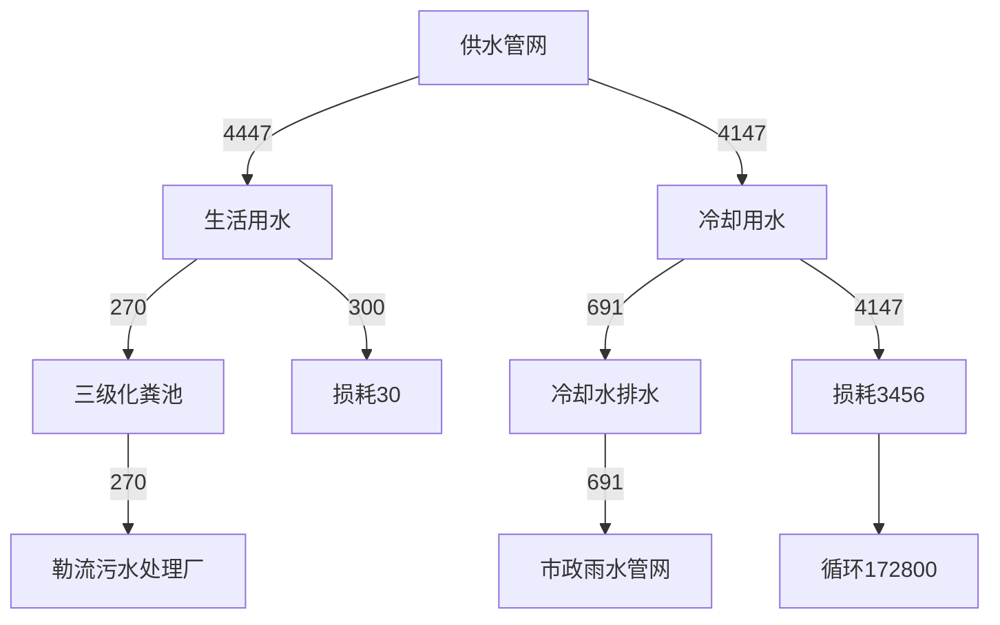
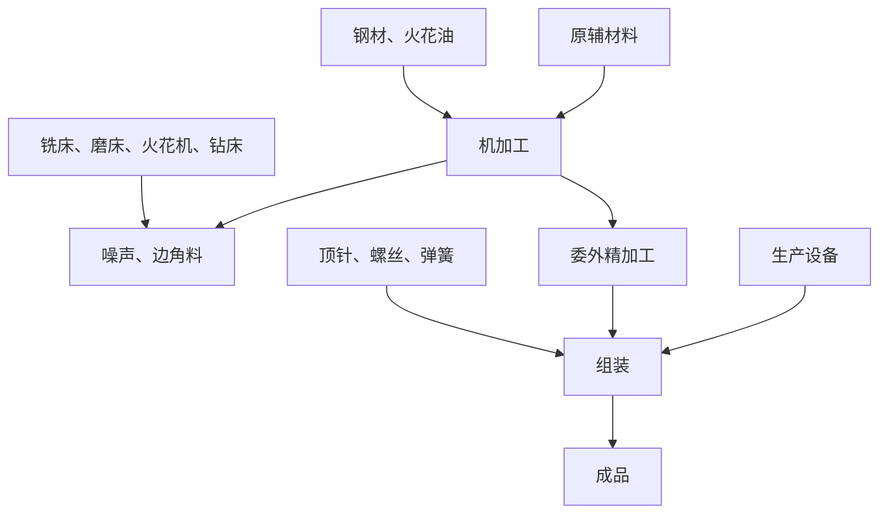

# 建设项目环境影响报告表

（污染影响类）

项目名称：佛山市瑞易德塑料五金制品有限公司搬迁项目建设单位（盖章）：佛山市瑞易德塑料五金制品有限公司编制日期： 2024 年 10 月

中华人民共和国生态环境部制

编制单位和编制人员情况表

<table><tr><td colspan="2">项目编号</td><td colspan="3">ba992c</td></tr><tr><td colspan="2">建设项目名称</td><td colspan="3">佛山市瑞易德塑料五金制品有限公司搬迁项目</td></tr><tr><td colspan="2">建设项目类别</td><td colspan="3">26-053塑料制品业</td></tr><tr><td colspan="2">环境影响评价文件类型</td><td colspan="3">报告表</td></tr><tr><td colspan="5">一、建设单位情</td></tr><tr><td colspan="5">单位名称(盖章) </td></tr><tr><td colspan="5">统一社会信用代</td></tr><tr><td colspan="5">法定代表人(签)</td></tr><tr><td colspan="2">主要负责人(签字)</td><td rowspan="2" colspan="3"></td></tr><tr><td colspan="2">直接负责的主管人员(签字)</td></tr><tr><td colspan="3">二、编制单位情况</td><td rowspan="4" colspan="2"></td></tr><tr><td colspan="2">单位名称(盖章)</td><td>广东</td></tr><tr><td colspan="2">统一社会信用代码</td><td>9144</td></tr><tr><td colspan="3">三、编制人员情况</td></tr><tr><td colspan="5">1.编制主持人</td></tr><tr><td>姓名</td><td colspan="2">职业资格证书管理号</td><td>信用编号</td><td>签字</td></tr><tr><td colspan="5">2.主</td></tr></table>

# 环境影响评价工程师

Environmental Impact Assessment Engineer

本证书由中华人民共和国人力资源和社会保障部、环境保护部批准颁发，表明持证人通过国家统一组织的考试，具有环境影响评价工程师的职业水平和

text_image

中华人民共和国人力资源和社会保障部

中华人民共和国  
人力资源和社会保障部

text_image

中华人民共和国环境保护部

中华人民共和国  
环境保护部

text_image

中华人民共和国
中華
approved & authorized
by

Ministry of Perennei

text_image

家环境保护
国
appuyed & authorized
by
State Environmental Protection Administra

St tion The People'sRepublieChina

FileNo.

# 目 录

一、建设项目基本情况.

二、建设项目工程分析. 6

三、区域环境质量现状、环境保护目标及评价标准 16

四、主要环境影响和保护措施. 21

五、环境保护措施监督检查清单 . 39

六、结论.. . 41

附表.. . 42

附图1 项目地理位置图 . 43

附图2 项目平面布置图 . 44

附图3 环境保护目标分布图 . 45

附图4 项目所在地及四至照片 . 46

附图5 项目所在地大气环境功能区划图 . 47

附图6 项目所在地水环境功能区划图 . 48

附图7 项目所在地声环境功能区划图 . 49

附图8 项目所在地“三线一单”环境管控单元图 51

附件1 营业执照 . 52

附件2 原环评批复. . 53

附件3 验收监测报告（节选） . 56

附件4 项目所在地控制性详细规划. . 58

附件5 房产证、租赁合同. . 62

附件6 项目所在工业园排水证. . 66

附件7 法人代表身份证复印件. . 67

附件8 环评编制委托合同. . 68

# 一、建设项目基本情况

<table><tr><td>建设项目名称</td><td colspan="5">佛山市瑞易德塑料五金制品有限公司搬迁项目</td></tr><tr><td>项目代码</td><td colspan="5">无</td></tr><tr><td>建设单位联系人</td><td>贺**</td><td>联系方式</td><td colspan="3">133***267</td></tr><tr><td>建设地点</td><td colspan="5">佛山市顺德区勒流街道新城社区政和南路39号科能产业园5栋401</td></tr><tr><td>地理坐标</td><td colspan="5">(22度50分32.420秒,113度8分41.570秒)</td></tr><tr><td>国民经济行业类别</td><td>C2929塑料零件及其他塑料制品制造、C3525模具制造</td><td>建设项目行业类别</td><td colspan="3">二十六、橡胶和塑料制品业29,53塑料制品业292,其他(年用非溶剂型低VOCs含量涂料10吨以下的除外)</td></tr><tr><td>建设性质</td><td>☑新建(迁建)□改建□扩建□技术改造</td><td>建设项目申报情形</td><td colspan="3">☑首次申报项目□不予批准后再次申报项目□超五年重新审核项目□重大变动重新报批项目</td></tr><tr><td>项目审批(核准/备案)部门(选填)</td><td>/</td><td>项目审批(核准/备案)文号(选填)</td><td colspan="3">/</td></tr><tr><td>总投资(万元)</td><td>200</td><td>环保投资(万元)</td><td colspan="3">15</td></tr><tr><td>环保投资占比(%)</td><td>7.5</td><td>施工工期</td><td colspan="3">2个月</td></tr><tr><td>是否开工建设</td><td>☑否□是:____</td><td>用地(用海)面积(m2)</td><td colspan="3">2541.88</td></tr><tr><td>专项评价设置情况</td><td colspan="5">无</td></tr><tr><td>规划情况</td><td colspan="5">规划名称:《勒流新城片控制性详细规划》</td></tr><tr><td>规划环境影响评价情况</td><td colspan="5">无</td></tr><tr><td>规划及规划环境影响评价符合性分析</td><td colspan="5">根据《关于〈勒流新城片控制性详细规划〉的批后通告》,项目所在地土地利用规划为工业用地(见附件4),符合规划要求。</td></tr><tr><td rowspan="7">其他符合性分析</td><td colspan="5">1、建设项目与所在地“三线一单”符合性分析本项目位于佛山市顺德区勒流街道新城社区政和南路39号科能产业园5栋401,根据《广东省人民政府关于印发广东省“三线一单”生态环境分区管控方案的通知》(粤府〔2020〕71号)发布的广东省环境管控单元图,项目所在地属于一般管控单元,项目符合广东省“三线一单”生态环境分区管控方案要求;根据《佛山市生态环境局关于印发〈佛山市“三线一单”生态环境分区管控方案(2024年版)〉的通知》(佛环〔2024〕20号)发布的佛山市环境管控单元图和《佛山市顺德区人民政府关于印发佛山市顺德区“三线一单”生态环境分区管控方案的通知》(顺府发〔2021〕11号)发布的顺德区环境管控单元图,项目所在地属于广东省佛山市顺德区重点管控单元9(编码为ZH44060620009,名称为勒流街道重点管控区,见附图8),属于水环境工业-城镇生活重点管控区、大气环境布局敏感重点管控区、江河湖库岸线重点管控区。项目与广东省佛山市顺德区重点管控单元9准入清单的相符性分析如表1-1。表1-1 项目与广东省佛山市顺德区重点管控单元准入清单的相符性分析</td></tr><tr><td>序号</td><td colspan="2">管控要求</td><td>本项目</td><td>符合性</td></tr><tr><td>1.1</td><td rowspan="5">区域布局管控</td><td>【产业/鼓励引导类】重点发展智能家电、家具五金、环保装备、光电照明、装备制造及交通机械产业,引入智能制造服务、电子商务、现代商贸流通产业,重点建设环保产业基地、小家电产业基地和五金产业创业基地。</td><td>本项目属于塑料制品业和模具制造业,不属于产业鼓励引导类,也不属于《市场准入负面清单(2022年版)》(发改体改规〔2022〕397号)中禁止或许可事项。</td><td>符合</td></tr><tr><td>1.2</td><td>【产业/综合类】系统推进村级工业园升级改造,腾出连片空间,布局产业集聚区和主题产业园,推动工业项目入园集聚发展。</td><td>项目位于工业园区内。</td><td>符合</td></tr><tr><td>1.3</td><td>【产业/限制类】受纳水体或监控断面不达标且未“以新带老”制定区域达标方案的河涌,不得新建、扩建向河涌直接排放废水的项目。新建、扩建含蚀刻工序的线路板生产项目和化工项目应在配套污水集中处置的工业园区或生活污水管网覆盖区域内建设;纯加工型印花项目,含酸洗、磷化的金属表面处理、金属制品项目(与自身高新技术企业配套的和区级及以上重点项目除外),含酸洗、喷涂、化学抛光、电解等涉及废水排放工艺的不锈钢型材加工项目(与自身高新技术企业配套的和区级及以上重点项目除外),应进入以此类项目为主导产业、有相应废水集中治理设施的工业园区,实现集中治污。</td><td>本项目所属行业为塑料制品业和模具制造业,生活污水排入勒流污水处理厂;间接冷却水因浓度低,不能排至污水处理厂,需直接排至附近的内河涌;项目不属于线路板生产、化工、印花、金属表面处理、金属制品、不锈钢型材加工等项目。</td><td>符合</td></tr><tr><td>1.4</td><td>【产业/综合类】划定家具生产优先发展区域,优先发展区外不再新建涉及涂装工艺的木质家具制造项目。优先发展区范围根据家具产业发展规划及其规划环评文件确定。</td><td>项目不属于木质家具制造项目。</td><td>符合</td></tr><tr><td>1.5</td><td>【水/限制类】严格限制在羊额—北滘水厂饮用水水源保护区上游和周边区域建设列入“高污染、高环境风险”产品名录等可能影响水环境安全的项目。</td><td>项目所在地不属于水源保护区上游和周边区域。</td><td>符合</td></tr><tr><td rowspan="12"></td><td>1.6</td><td></td><td>【大气/限制类】大气环境布局敏感区重点管控区内,应严格限制新建生产和使用高挥发性有机物原辅材料项目,优先开展低VOCs含量原辅材料替代,强化无组织排放控制。原则上不再新建、扩建新增氮氧化物、烟(粉)尘排放量较大的建设项目。</td><td>项目位于大气环境布局敏感区重点管控区内,不生产和使用高挥发性有机物原辅材料;有机废气收集经活性炭吸附装置处理后高空排放,无组织排放量较小。</td><td>符合</td></tr><tr><td>2.1</td><td rowspan="6">能源资源利用</td><td>【能源/鼓励引导类】推广节能技术,加快发展绿色货运与现代物流。</td><td>项目使用节能技术。</td><td>符合</td></tr><tr><td>2.2</td><td>【能源/鼓励引导类】推广新能源汽车应用和充电基础设施建设,积极推动重卡LNG加气站、充电基础设施、加氢站建设。</td><td>项目不涉及。</td><td>符合</td></tr><tr><td>2.3</td><td>【能源/综合类】科学实施能源消费总量和强度“双控”,新建高能耗项目单位产品(产值)能耗达到国际国内先进水平。</td><td>项目不属于高能耗项目。</td><td>符合</td></tr><tr><td>2.4</td><td>【水资源/综合类】贯彻落实“节水优先”方针,实行最严格水资源管理制度,勒流街道万元国内生产总值用水量、万元工业增加值用水量、用水总量、农田灌溉水有效利用系数等用水总量和效率指标达到区下达要求。</td><td>项目节约用水,设备冷却水循环使用。</td><td>符合</td></tr><tr><td>2.5</td><td>【土地资源/限制类】落实单位土地面积投资强度、土地利用强度等建设用地控制性指标要求,提高土地利用效率。</td><td>项目单位土地面积投资强度、土地利用强度等建设用地控制性指标均满足相关标准要求,土地利用效率较高。</td><td>符合</td></tr><tr><td>2.6</td><td>【岸线/禁止类】严格水域岸线用途管制,新建项目一律不得违规占用水域。严禁破坏生态的岸线利用行为和不符合其功能定位的开发建设活动,严禁以各种名义侵占河道、围垦湖泊、非法采砂等。</td><td>项目不存在破坏生态的岸线利用的行为和不符合其功能定位的开发建设的活动,不存在侵占河道、围垦湖泊、非法采砂等。</td><td>符合</td></tr><tr><td>3.1</td><td rowspan="5">污染物排放管控</td><td>【水/限制类】城镇新区建设实行雨污分流。住宅、商业体、学校、市场等城镇开发建设项目应当配套或者同步计划建设公共排水设施,公共排水设施或自建排污水设施未能投产运行的,以上涉水项目不得投入使用。新建小区严格实施雨污分流,阳台、露台等污水接入污水收集系统,将生活污水“应截尽截”。做好大型楼盘、集贸市场、餐饮以及学校等4大类排水户污水接入市政管网工作。</td><td>项目不属于住宅、商业体、学校、市场等城镇开发建设项目。</td><td>符合</td></tr><tr><td>3.2</td><td>【水/综合类】结合村级工业园改造,全面提升产业层次与集聚度,促进污染集中整治。</td><td>项目不属于村级工业园改造区,位于工业集聚区。</td><td>符合</td></tr><tr><td>3.3</td><td>【水/综合类】稳步推进排水设施“三个一体化”管理模式,补齐城乡污水收集和处理短板,推动勒流污水处理厂提质增效,加快消除城中村、老旧城区、城乡结合部等污水收集管网空白区,逐步实现城乡污水收集处理全覆盖。2025年前完成勒流污水处理厂扩建,尾水应执行《城镇污水处理厂污染物排放标准》(GB18918-2002)一级A标准及《广东省水污染物排放限值》(DB44/26-2001)的较严值。</td><td>项目不属于污水管网、污水处理设施等建设项目。</td><td>符合</td></tr><tr><td>3.4</td><td>【水/综合类】保留勒流社区百丈片区分散式农村污水处理设施,其余行政村(社区)通过市政污水管网,配合农村支管网建设,有条件的区域实施雨污分流改造,到2030年实现农村生活污水100%收集进入勒流污水处理系统。</td><td>项目不属于污水管网、污水处理设施等建设项目。</td><td>符合</td></tr><tr><td>3.5</td><td>【土壤/限制类】严格重金属重点行业企业准入管理。新、改、扩建重点行业建设项目应遵循重点重金属污染物排放“等量替代”原则。</td><td>项目不排放重金属。</td><td>符合</td></tr></table>

<table><tr><td>4.1</td><td rowspan="3">环境风险防控</td><td>【水/综合类】加强单元内羊额—北滘水厂饮用水水源保护区周边环境风险源管控,完善突发环境事件应急管理体系。</td><td>项目所在地不属于水源保护区和周边区域。</td><td>符合</td></tr><tr><td>4.2</td><td>【水/综合类】勒流污水处理厂、工业污水集中处理设施应采取有效措施,防止事故废水直接排入水体。完善污水处理厂在线监控系统联网,实现污水处理厂的实时、动态监管。</td><td>项目不涉及。</td><td>符合</td></tr><tr><td>4.3</td><td>【风险/综合类】加强环境风险分级分类管理,强化金属制品、有色金属和压延加工、化学原料和化学品制造业等涉重金属、化工行业企业及工业园区等重点环境风险源的环境风险防控。</td><td>本项目所属行业为塑料制品业和模具制造业,不属于重点环境风险源。</td><td>符合</td></tr></table>

综上所述，本项目符合广东省、佛山市、顺德区“三线一单”生态环境分区管控方案的要求。

# 2、项目与有机污染物治理政策的相符性分析

项目与有机污染物治理政策的相符性分析见表 1-2。

表 1-2 项目与有机污染物治理政策的相符性分析

<table><tr><td>序号</td><td>文件</td><td>规定</td><td>项目实际</td><td>符合判定</td></tr><tr><td>1</td><td>《广东省生态环境厅关于做好重点行业建设项目挥发性有机物总量指标管理工作的通知》(粤环发〔2019〕2号)</td><td>各地应当按照“最优的设计、先进的设备、最严的管理”要求对建设项目VOCs排放总量进行管理,并按照“以减量定增量”原则,动态管理VOCs总量指标。新、改、扩建排放VOCs的重点行业建设项目应当执行总量替代制度,重点行业包括炼油与石化、化学原料和化学制品制造、化学药品原料药制造、合成纤维制造、表面涂装、印刷、制鞋、家具制造、人造板制造、电子元件制造、纺织印染、塑料制造及塑料制品等12个行业。</td><td>项目为塑料制品业和模具制造业,属于重点行业,非甲烷总烃纳入VOCs管理,执行总量替代制度,VOCs总量控制指标为0.474t/a,从佛山市顺德区勒流街道总量中列支。</td><td>符合</td></tr><tr><td>2</td><td>关于印发《重点行业挥发性有机物综合治理方案》的通知(环大气〔2019〕53号)</td><td>加强制药、农药、涂料、油墨、胶粘剂、橡胶和塑料制品等行业VOCs治理力度。重点提高涉VOCs排放主要工序密闭化水平,加强无组织排放收集,加大含VOCs物料储存和装卸治理力度。</td><td>项目注塑工序在密闭车间内操作,注塑废气经单层密闭负压收集后引至一套活性炭吸附装置处理,最后通过45m排气筒G1排放。</td><td>符合</td></tr><tr><td rowspan="2">3</td><td rowspan="2">关于印发《广东省涉挥发性有机物(VOCs)重点行业治理指引》的通知(粤环办〔2021〕43号)</td><td>在混合/混炼、塑炼/塑化/熔化、加工成型(挤出、注射、压制、压延、发泡、纺丝等)、硫化等作业中应采用密闭设备或在密闭空间中操作,废气应排至VOCs废气收集处理系统;无法密闭的,应采取局部气体收集措施,废气应排至VOCs废气收集处理系统。</td><td>项目注塑工序在密闭车间内操作,注塑废气经单层密闭负压收集后引至一套活性炭吸附装置处理。</td><td>符合</td></tr><tr><td>采用外部集气罩的,距集气罩开口面最远处的VOCs无组织排放位置,控制风速不低于0.3m/s。</td><td>项目注塑废气采用单层密闭负压收集。</td><td>符合</td></tr></table>

<table><tr><td rowspan="6"></td><td rowspan="2"></td><td rowspan="2"></td><td>废气收集系统的输送管道应密闭。废气收集系统应在负压下运行,若处于正压状态,应对管道组件的密封点进行泄漏检测,泄漏检测值不应超过500μmol/mol,亦不应有感官可察觉泄漏。</td><td>项目废气收集系统的输送管道密闭,废气收集系统在负压下运行。</td><td>符合</td></tr><tr><td>VOCs废气收集处理系统应与生产工艺设备同步运行。VOCs废气收集处理系统发生故障或检修时,对应的生产工艺设备应停止运行,待检修完毕后同步投入使用。</td><td>项目注塑过程必须开启风机,有效减少无组织排放废气。废气收集处理系统发生故障或检修时,注塑工序停止运行,待检修完毕后再投入生产。</td><td>符合</td></tr><tr><td rowspan="4">4</td><td rowspan="4">《固定污染源挥发性有机物综合排放标准》(DB44/2367-2022)</td><td>收集的废气中NMHC初始排放速率≥3kg/h时,应当配置VOCs处理设施,处理效率不应当低于80%。对于重点地区,收集的废气中NMHC初始排放速率≥2kg/h时,应当配置VOCs处理设施,处理效率不应当低于80%;采用的原辅材料符合国家有关低VOCs含量产品规定的除外。</td><td>项目收集的废气中NMHC初始排放速率&lt;2kg/h。</td><td>符合</td></tr><tr><td>废气收集处理系统应当与生产工艺设备同步运行,较生产工艺设备做到“先启后停”。废气收集处理系统发生故障或者检修时,对应的生产工艺设备应当停止运行,待检修完毕后同步投入使用;生产工艺设备不能停止运行或者不能及时停止运行的,应当设置废气应急处理设施或者采取其他替代措施。</td><td>项目注塑过程必须开启风机和废气处理设施,有效减少无组织排放废气。废气收集处理系统发生故障或检修时,注塑工序停止运行,待检修完毕后再投入生产。</td><td>符合</td></tr><tr><td>排气筒高度不低于15m(因安全考虑或者有特殊工艺要求的除外),具体高度以及与周围建筑物的相对高度关系应当根据环境影响评价文件确定。</td><td>项目排气筒高度为45m</td><td>符合</td></tr><tr><td>企业应当建立台账,记录废气收集系统、VOCs处理设施的主要运行和维护信息,如运行时间、废气处理量、操作温度、停留时间、吸附剂再生/更换周期和更换量、催化剂更换周期和更换量、吸收液pH值等关键运行参数。台账保存期限不少于3年。</td><td>建设单位拟在项目建成投产后建立台账,记录废气收集系统、VOCs处理设施的主要运行和维护信息。</td><td>符合</td></tr></table>

# 二、建设项目工程分析

# 1、项目由来

佛山市瑞易德塑料五金制品有限公司原址位于佛山市顺德区杏坛镇百安路吉祐路口6号之一，主要从事模具（生产塑料配件的模具）和家具塑料配件的生产，于 2018 年 9 月25 日取得《顺德区环境运输和城市管理局关于佛山市瑞易德塑料五金制品有限公司年产模具 60 套，家具塑料配件 15 吨新建项目环境影响报告表的批复》（顺管杏环审[2018]第0313 号）。现有项目于 2019 年 6 月进行了竣工环境保护自主验收，并于 2019 年 10 月通过固体废物污染防治设施竣工环境保护验收（佛环 0310 环验〔2019〕第 A188 号）。

现由于生产发展需要，公司拟迁至佛山市顺德区勒流街道新城社区政和南路 39 号科能产业园5栋401，增加生产设备，扩大产品产量。预计搬迁后项目年产家具塑料配件 319吨、模具100套。

# 2、项目的工程组成

搬迁前项目占地面积和经营面积均为 445m2。搬迁后项目占地面积和经营面积均为2541.88m2。搬迁后项目租用科能产业园 5 号厂房 4 楼；所在厂房共 8 层，各楼层高度如下：1楼8m、2-7楼 5m、8楼6m，厂房总高度为 44m。项目工程组成见表2-1。

表 2-1 项目工程组成

<table><tr><td>工程类型</td><td>工程内容</td><td>搬迁前</td><td>搬迁后</td></tr><tr><td>主体工程</td><td>生产车间</td><td>面积445m2,设有混料和破碎区、注塑区、钢材机加工区等</td><td>面积2541.88m2,设有混料和破碎区、注塑车间、塑料配件组装区、钢材机加工区等</td></tr><tr><td>储运工程</td><td>仓库</td><td>设于生产车间内,用于原材料和产品储存</td><td>设于生产车间内,用于原材料和产品储存</td></tr><tr><td>辅助工程</td><td>办公室</td><td>设于生产车间内</td><td>设于生产车间内</td></tr><tr><td rowspan="2">公用工程</td><td>配电系统</td><td>供应生产用电和办公生活用电</td><td>供应生产用电和办公生活用电</td></tr><tr><td>给排水系统</td><td>供水来源为市政自来水,生活污水经独立的生活污水处理设施处理后排入松村涌,循环冷却水排入市政雨水管网</td><td>供水来源为市政自来水,生活污水经三级化粪池预处理后排入勒流污水处理厂,循环冷却水排入市政雨水管网</td></tr><tr><td rowspan="4">环保工程</td><td>生活污水</td><td>生活污水经独立的生活污水处理设施处理后排入松村涌</td><td>生活污水经三级化粪池预处理后排入勒流污水处理厂</td></tr><tr><td>注塑废气</td><td>注塑废气利用集气罩收集经一套UV光解装置处理后通过15m排气筒FQ-10365排放</td><td>注塑废气经单层密闭负压收集后引至一套活性炭吸附装置处理,最后通过45m排气筒G1排放</td></tr><tr><td>一般固体废物</td><td>设有一般固体废物暂存间一个</td><td>设有一般固体废物暂存间一个,面积约5m2</td></tr><tr><td>危险废物</td><td>设有危废间1个,危险废物收集暂存于危废间并委托广东省汇泰达环保科技有限公司处理</td><td>设有危废间1个,面积2.5m2,危险废物收集暂存于危废间并委托有资质的单位定期处理</td></tr></table>

# 3、项目概况

搬迁后项目主要从事家具塑料配件和模具的生产，主要产品及产能见表2-2。

表 2-2 产品及产能一览表

<table><tr><td>名称</td><td>单位</td><td>搬迁前数量</td><td>增减量</td><td>搬迁后数量</td><td>备注</td><td>产品照片</td></tr><tr><td>家具塑料配件</td><td>吨/年</td><td>15</td><td>+304</td><td>319</td><td>抽屉导轨配件等家具配件,单个产品平均重量为0.8g</td><td></td></tr><tr><td>模具</td><td>套/年</td><td>60</td><td>+40</td><td>100</td><td>注塑机模具</td><td></td></tr></table>

# 4、项目设备清单

主要生产单元、主要工艺、生产设施及设施参数见表2-3。

表 2-3 主要生产单元、主要工艺、生产设施及设施参数一览表

<table><tr><td>主要生产单元</td><td>主要工艺</td><td>生产设施</td><td>单位</td><td>搬迁前数量</td><td>增减量</td><td>搬迁后数量</td><td>设施参数</td></tr><tr><td rowspan="4">塑料配件生产</td><td>注塑</td><td>注塑机</td><td>台</td><td>3</td><td>+12</td><td>15</td><td>处理能力 3.6kg/h</td></tr><tr><td>混料</td><td>混料机</td><td>台</td><td>1</td><td>+2</td><td>3</td><td>处理能力 100kg/h</td></tr><tr><td>破碎</td><td>破碎机</td><td>台</td><td>1</td><td>+2</td><td>3</td><td>处理能力 10kg/h</td></tr><tr><td>震动筛分</td><td>震动盘</td><td>台</td><td>0</td><td>+12</td><td>12</td><td>功率 1kW</td></tr><tr><td rowspan="4">模具生产</td><td rowspan="4">机加工</td><td>铣床</td><td>台</td><td>2</td><td>0</td><td>2</td><td>功率 2kW</td></tr><tr><td>磨床</td><td>台</td><td>2</td><td>0</td><td>2</td><td>功率 1.5kW</td></tr><tr><td>火花机</td><td>台</td><td>2</td><td>0</td><td>2</td><td>功率 6kW</td></tr><tr><td>钻床</td><td>台</td><td>2</td><td>0</td><td>2</td><td>功率 1kW</td></tr><tr><td rowspan="2">公用</td><td>冷却</td><td>冷却塔</td><td>台</td><td>1</td><td>0</td><td>1</td><td>循环水冷却,循环水量为 $24\ m^{3}/h$ </td></tr><tr><td>提供压缩空气</td><td>空压机</td><td>台</td><td>1</td><td>0</td><td>1</td><td>功率 7.5kW</td></tr></table>

备注：项目仅对模具进行粗加工，搬迁前机加工设备没有满负荷运行，搬迁后数量无需增加。

# 5、项目原辅材料

主要原辅材料的种类和用量见表2-4；主要原辅材料理化性质见表2-5。

备注：搬迁后项目对塑料配件生产工艺进行改进，增加原辅材料种类。  
表 2-4 主要原辅材料用量

<table><tr><td>序号</td><td>名称</td><td>单位</td><td>搬迁前数量</td><td>增减量</td><td>搬迁后数量</td><td>备注</td></tr><tr><td>1</td><td>PA6 塑料粒</td><td>吨/年</td><td>15</td><td>+85</td><td>100</td><td>粒状固体新料,25kg/袋</td></tr><tr><td>2</td><td>POM 塑料粒</td><td>吨/年</td><td>0</td><td>+200</td><td>200</td><td>粒状固体新料,25kg/袋</td></tr><tr><td>3</td><td>ABS 塑料粒</td><td>吨/年</td><td>0</td><td>+2</td><td>2</td><td>粒状固体新料,25kg/袋</td></tr><tr><td>4</td><td>PC 塑料粒</td><td>吨/年</td><td>0</td><td>+10</td><td>10</td><td>粒状固体新料,25kg/袋</td></tr><tr><td>5</td><td>TPU塑料粒</td><td>吨/年</td><td>0</td><td>+2</td><td>2</td><td>粒状固体新料,25kg/袋</td></tr><tr><td>6</td><td>PP塑料粒</td><td>吨/年</td><td>0</td><td>+5.577</td><td>5.577</td><td>粒状固体新料,25kg/袋</td></tr><tr><td>7</td><td>色粉</td><td>吨/年</td><td>0.036</td><td>+0.114</td><td>0.15</td><td>粉状固体,用于调色,25kg/袋</td></tr><tr><td>8</td><td>钢材</td><td>吨/年</td><td>50</td><td>+30</td><td>80</td><td>用于生产模具</td></tr><tr><td>9</td><td>顶针</td><td>支/年</td><td>300</td><td>+300</td><td>600</td><td>模具配件</td></tr><tr><td>10</td><td>螺丝</td><td>个/年</td><td>600</td><td>+2000</td><td>2600</td><td>模具配件</td></tr><tr><td>11</td><td>弹簧</td><td>个/年</td><td>300</td><td>+700</td><td>1000</td><td>模具配件</td></tr><tr><td>12</td><td>润滑油</td><td>吨/年</td><td>0.01</td><td>+0.14</td><td>0.15</td><td>15kg/桶,用于产品润滑,最大储存量0.015t</td></tr><tr><td>13</td><td>火花油</td><td>吨/年</td><td>0.03</td><td>+0.02</td><td>0.05</td><td>25kg/桶,用于火花机润滑和冷却,最大储存量0.025t</td></tr><tr><td>14</td><td>液压油</td><td>吨/年</td><td>0.12</td><td>+0.48</td><td>0.6</td><td>30kg/桶,注塑机用,最大储存量为0.06t</td></tr><tr><td>15</td><td>机油</td><td>吨/年</td><td>0.05</td><td>+0.05</td><td>0.1</td><td>25kg/桶,用于生产设备维修和保养,最大储存量0.025t</td></tr></table>

表 2-5 主要原辅材料理化性质一栏表

<table><tr><td>序号</td><td>原辅材料名称</td><td>理化性质</td></tr><tr><td>1</td><td>PA6塑料粒</td><td>PA6塑料(尼龙6、聚酰胺6)是尼龙塑料(PA)的一种,半透明或不透明乳白色结晶形聚合物,热塑性、轻质、韧性好、耐化学品和耐久性好,工业生产中泛用于制造轴承、圆齿轮、凸轮、伞齿轮、各种滚子、滑轮、泵叶轮、风扇叶片、蜗轮等。加工温度240-260°C,分解温度310-380°C。</td></tr><tr><td>2</td><td>POM塑料粒</td><td>POM塑料(聚甲醛树脂)是一种没有侧链、高密度、高结晶性的线型聚合物。是具有优异的综合性能的工程塑料。有良好的物理、机械和化学性能,尤其是有优异的耐摩擦性能。俗称赛钢或夺钢,为第三大通用塑料。适于制作减磨耐磨零件,传动零件,以及化工,仪表等零件。加工温度200-210°C,分解温度220°C。</td></tr><tr><td>3</td><td>ABS塑料粒</td><td>ABS塑料(丙烯腈-丁二烯-苯乙烯)通常为浅黄色或乳白色的粒料非结晶性树脂。ABS树脂抗冲击性、耐热性、耐低温性、耐化学药品性及电气性能优良,还具有易加工、制品尺寸稳定、表面光泽性好等特点,容易涂装、着色,还可以进行表面喷镀金属、电镀、焊接、热压和粘接等二次加工,是一种用途极广的热塑性工程塑料。加工温度210-275°C,分解温度320°C。</td></tr><tr><td>4</td><td>PC塑料粒</td><td>PC塑料(聚碳酸酯)是一种非晶体工程材料,具有特别好的抗冲击强度、热稳定性、光泽度、抑制细菌特性、阻燃特性以及抗污染性。PC比重为1.18-1.20g/cm3,成型收缩率为0.5-0.8%。加工温度280-320°C,初始分解温度约350°C,主链断裂温度约470°C。</td></tr><tr><td>5</td><td>TPU塑料粒</td><td>TPU塑料(热塑性聚氨酯弹性体)是一类加热可以塑化、溶剂可以溶解的弹性体,具有高强度、高韧性、耐磨、耐油等优异的综合性能,加工性能好,广泛应用于国防、医疗、食品等行业。加工温度150-230°C,分解温度260-320°C。</td></tr><tr><td>6</td><td>PP塑料粒</td><td>PP塑料(聚丙烯)是一种无毒、无臭、无色的半透明颗粒状,具有良好的耐热性、化学稳定性、电绝缘性和抗冲击性。PP塑料广泛的应用于家用电器、塑料管材和高透材料上。加工温度250-270°C,分解温度328-410°C。</td></tr><tr><td>7</td><td>色粉</td><td>一种新型高分子材料专用着色剂,亦称颜料制备物。主要用在塑料上,由颜料或染料、载体和添加剂三种基本要素所组成,是把超常量的颜料均匀载附于树脂之中而制得的聚集体,可称颜料浓缩物,所以它的着色力高于颜料本身。加工时用少量色粉和未着色树脂掺混,就可达到设计颜料浓度的着色树脂或制品。</td></tr><tr><td>8</td><td>润滑油</td><td>主要成分为深度精制白油、锂皂稠化剂、功能添加剂,白色光滑均匀油膏,不溶于水,相对密度0.82~0.90。适用于塑胶与塑胶、塑胶与金属之间的润滑与防护。</td></tr></table>

# 6、塑料配件关键设备产能和产品规模匹配性分析

塑料配件关键设备产能见下表。

表 2-6 搬迁后关键设备产能一览表

<table><tr><td>设备</td><td>设备数量</td><td>单设备单次开模产量(个/次)</td><td>单次生产时间(s)</td><td>单个产品平均重量(g)</td><td>每小时产量(kg/h)</td><td>年生产时间(h/a)</td><td>关键设备年产量(t/a)</td></tr><tr><td>注塑机</td><td>15</td><td>50</td><td>40</td><td>0.8</td><td>54</td><td>7200</td><td>388.8</td></tr></table>

备注：项目每天生产 24h，年生产 300 天

由上表可知，塑料配件关键设备产能为388.8t/a。项目申报产量为319t/a，项目设备产能与产品规模是匹配的。

# 7、项目平衡分析

# （1）水平衡

# 1）给水

项目用水由市政给水管网供应，用水主要为员工生活用水和生产用水。

# ①生活用水

搬迁后项目劳动定员 30 人，年工作日 300 天，项目内不设员工宿舍和食堂。参考广东省地方标准《用水定额 第3部分：生活》（DB44/T 1461.3-2021）表A.1国家行政机构办公楼（无食堂和浴室）用水定额先进值，生活用水按照 10 m3/（人·a）计，则搬迁后员工生活用水量约为 300m3/a。

# ②生产用水

搬迁后项目生产用水主要为注塑机冷却水。冷却水循环使用，定期补充新鲜水，生产用水量约为 4147m3/a。

# 2）排水

项目生活污水经三级化粪池预处理后通过市政管道排入勒流污水处理厂处理，尾水排至顺德支流。生活污水排污系数取 0.9，则生活污水产生量约为 270m3/a。

注塑机循环冷却水定期排水排入市政雨水管网，根据工程分析核算，定期排水量为691m3/a。

搬迁后项目水平衡图见图2-1。

flowchart

图 2-1 搬迁后水平衡图

# （2）物料平衡

项目塑料配件产品物料平衡见表 2-7。

表 2-7 搬迁后塑料配件物料平衡表

<table><tr><td colspan="2">投入</td><td colspan="3">产出</td></tr><tr><td>原料</td><td>数量(t/a)</td><td>产品及其他</td><td>数量(t/a)</td><td>去向</td></tr><tr><td>PA6 塑料粒</td><td>100</td><td>家具塑料配件</td><td>319</td><td>产品出售</td></tr><tr><td>POM 塑料粒</td><td>200</td><td>非甲烷总烃</td><td>0.861</td><td>收集经活性炭吸附后进入大气</td></tr><tr><td>ABS 塑料粒</td><td>2</td><td>颗粒物</td><td>0.016</td><td>进入大气</td></tr><tr><td>PC 塑料粒</td><td>10</td><td>/</td><td>/</td><td>/</td></tr><tr><td>TPU 塑料粒</td><td>2</td><td>/</td><td>/</td><td>/</td></tr><tr><td>PP 塑料粒</td><td>5.577</td><td>/</td><td>/</td><td>/</td></tr><tr><td>色粉</td><td>0.15</td><td>/</td><td>/</td><td>/</td></tr><tr><td>润滑油</td><td>0.15</td><td>/</td><td>/</td><td>/</td></tr><tr><td>合计</td><td>319.877</td><td>合计</td><td>319.877</td><td>/</td></tr></table>

# 8、工作制度和能耗水耗

搬迁前从业人数为 5人，年工作日300天，每天工作 24小时，3班制；搬迁后从业人数增加至30人，年工作时间和工作制度不变。

表 2-8 搬迁后工作制度一览表

<table><tr><td>序号</td><td>名称</td><td>内容</td></tr><tr><td>1</td><td>劳动定额</td><td>员工人数 30 人</td></tr><tr><td>2</td><td>工作制度</td><td>年工作日 300 天,每天工作 24 小时,3 班制</td></tr><tr><td>3</td><td>食宿情况</td><td>项目内不设食堂和宿舍</td></tr></table>

表 2-9 搬迁后能耗水耗一览表

<table><tr><td>序号</td><td>名称</td><td>单位</td><td>年用量</td><td>用途</td><td>备注</td></tr><tr><td rowspan="2">1</td><td rowspan="2">水</td><td>吨/年</td><td>300</td><td>办公、生活</td><td rowspan="2">市政供水</td></tr><tr><td>吨/年</td><td>4147</td><td>注塑机冷却水</td></tr><tr><td>2</td><td>电</td><td>万度/年</td><td>60</td><td>生产、办公</td><td>市政供电</td></tr></table>

# 9、厂区平面布置

项目拟搬迁至佛山市顺德区勒流街道新城社区政和南路 39 号科能产业园 5 栋 401。拟选址属于科能产业园，项目位于5号厂房4楼；5号厂房共8 层，其余楼层为佛山市蓝林新材料科技有限公司、广东缔普节能设备有限公司、佛山市顺德区兴晟达研磨材料有限公司等企业的生产车间。项目所在厂房四周均为科能产业园厂房，东南面为2 号厂房，西南面为6号厂房，西北面为8号厂房，东北面为 4号厂房。

<table><tr><td></td><td>搬迁后,项目占地面积 $2541.88m^{2}$ ,经营面积 $2541.88m^{2}$ 。生产车间设有混料和破碎区、注塑车间、塑料配件组装区、钢材机加工区等,仓库、办公室、危废间设于生产车间内。项目生产车间层高5m,所在厂房总高度为44m,排气筒设置于厂房楼顶,排气筒高度为45m。搬迁后项目平面布置见附图2。</td></tr><tr><td>工艺流程和产排污环节</td><td>1、工艺流程简述(图示):搬迁后项目主要从事家具塑料配件和模具的生产,生产工艺流程如下:(1)家具塑料配件生产工艺图2-2 搬迁后家具塑料配件生产工艺流程工艺流程说明:首先按照产品工艺配方将外购PA6、POM、ABS、PC、TPU、PP塑料粒及色粉投加到混料机中混合均匀,然后将混合均匀的物料投加到注塑机料斗中,塑料粒热熔后注射进模具中冷却成型得到产品;部分产品需要利用震动盘震动筛分区分左右,最后人工组装得到成品。注塑机根据投加的物料选择不同的加工温度,加工温度范围为150~320°C,注塑机工作过程中需要使用水对其进行间接降温冷却。冷却水通过冷却塔冷却后循环使用,定期补充新鲜水。冷却水循环使用一定时间后需要排放,冷却水排水较为洁净,直接排入市政雨水管网。注塑工序全部使用新料,使用的色粉为粉料,投料过程中会产生少量粉尘;另外,生产过程中产生的边角料和次品通过破碎机破碎后回用,破碎过程中会产生少量的粉尘。粉尘产生量较少,以无组织形式排放,污染因子主要为颗粒物。混料机操作时密封操作,故混料过程中基本不会有粉尘外逸至车间。</td></tr></table>

注塑过程中塑料粒和色粉热熔时会产生少量有机废气和轻微的恶臭，污染因子主要为非甲烷总烃、臭气浓度。建议将注塑机设置在一个密闭车间内，注塑废气经单层密闭负压收集后引至一套活性炭吸附装置处理，废气处理后通过45m排气筒G1排放。

注塑过程使用的模具经长时间使用后会出现磨损，需要定期对磨损的模具进行维修。模具维修不涉及焊接、清洗、电镀、喷漆喷粉工序，利用铣床和磨床对磨损模具进行机加工，使磨损部位变得平整，可再次使用。

部分产品组装时使用少量润滑油进行润滑，润滑油进入产品，不会产生废润滑油。

（2）模具生产工艺  

flowchart

图 2-3 搬迁后模具生产工艺流程

# 工艺流程说明：

首先利用铣床、磨床、火花机、钻床对外购钢材进行铣削、磨削、电火花、钻孔等加工，使钢材呈现模具基本的外形；然后将工件发外进行热处理、线切割、CNC 数控加工等精细加工；返厂后与外购顶针、螺丝、弹簧等零配件组装得到模具成品。模具产品少量为项目注塑机使用，大部分外售。

钢材机加工过程会产生少量金属边角料，边角料收集后外卖给回收商处理。

火花机使用火花油进行直接润滑和冷却。火花油循环使用，多次循环后更换。更换出来的废火花油委托有资质的单位进行处理。

# 2、产排污环节

搬迁后项目产排污环节汇总如下表所示。

表 2-8 搬迁后项目产排污环节汇总表

<table><tr><td>序号</td><td>污染类别</td><td>污染物名称</td><td>主要污染因子</td><td>产生环节</td><td>处理排放方式</td></tr><tr><td>1</td><td rowspan="3">废气</td><td>注塑废气</td><td>非甲烷总烃、臭气浓度</td><td>注塑</td><td>单层密闭负压收集引至一套活性炭吸附装置处理后通过45m排气筒G1排放</td></tr><tr><td>2</td><td>投料粉尘</td><td>颗粒物</td><td>投料</td><td>加强通风,无组织排放</td></tr><tr><td>3</td><td>破碎粉尘</td><td>颗粒物</td><td>破碎</td><td>加强通风,无组织排放</td></tr><tr><td>4</td><td rowspan="2">废水</td><td>生活污水</td><td> $COD_{Cr}$ 、 $BOD_5$ 、 $NH_3-N$ 、总磷、SS</td><td>员工生活</td><td>经三级化粪池预处理后排入勒流污水处理厂</td></tr><tr><td>5</td><td>循环冷却水</td><td>/</td><td>冷却塔排水</td><td>排入市政雨水管网</td></tr></table>

<table><tr><td rowspan="11"></td><td>6</td><td rowspan="10">固废</td><td>生活垃圾</td><td rowspan="4">一般固废</td><td>员工生活</td><td>集中收集后交由环卫部门处理</td></tr><tr><td>7</td><td>塑料边角料和次品</td><td>生产过程</td><td>破碎后回用于注塑</td></tr><tr><td>8</td><td>废包装袋</td><td>生产过程</td><td rowspan="2">定期交由废品回收商处理</td></tr><tr><td>9</td><td>金属边角料</td><td>生产过程</td></tr><tr><td>10</td><td>废机油</td><td rowspan="6">危险废物</td><td>设备维护</td><td rowspan="6">定期交有相应资质的危废单位处理</td></tr><tr><td>11</td><td>含油废抹布</td><td>设备维护</td></tr><tr><td>12</td><td>废液压油</td><td>注塑机维护</td></tr><tr><td>13</td><td>废火花油</td><td>火花机维护</td></tr><tr><td>14</td><td>废包装桶</td><td>设备维护</td></tr><tr><td>15</td><td>废活性炭</td><td>废气处理</td></tr><tr><td>16</td><td>噪声</td><td>噪声</td><td>等效A声级</td><td>设备运行</td><td>设备减振、墙体隔声</td></tr><tr><td rowspan="8">与项目有关的原有环境污染问题</td><td colspan="6">1、现有项目环保手续情况现有工程位于佛山市顺德区杏坛镇百安路吉祐路口6号之一,主要从事模具和家具塑料配件的生产,于2018年9月25日取得《顺德区环境运输和城市管理局关于佛山市瑞易德塑料五金制品有限公司年产模具60套,家具塑料配件15吨新建项目环境影响报告表的批复》(顺管杏环审[2018]第0313号)。现有项目于2019年6月进行了竣工环境保护自主验收,并于2019年10月通过固体废物污染防治设施竣工环境保护验收(佛环0310环验〔2019〕第A188号)。2020年5月19日,建设单位进行了固定污染源排污登记,登记编号为91440606MA517MMU0A001X(有效期:2020年5月19日至2025年5月18日)。2、现有工程污染物产排情况根据《涉VOCs“归真”建设项目环评文件编写参考指引(2024年2月修订)》要求,现有项目审批和实际情况归真表格见表2-9。表2-9 现有项目审批和实际情况归真表</td></tr><tr><td colspan="2">项目</td><td colspan="2">现有项目审批情况</td><td colspan="2">实际归真情况</td></tr><tr><td colspan="2">工艺</td><td colspan="2">家具塑料配件:混料→注塑→边角料破碎回用→成品</td><td colspan="2">与审批一致</td></tr><tr><td colspan="2">产能</td><td colspan="2">家具塑料配件:15吨/年</td><td colspan="2">与审批一致</td></tr><tr><td colspan="2">规模</td><td colspan="2">家具塑料配件:注塑机3台、混料机1台、破碎机1台、冷却塔1台、空压机1台</td><td colspan="2">与审批一致</td></tr><tr><td colspan="2">涉VOCs原料用量和类型</td><td colspan="2">PA塑料15t/a</td><td colspan="2">与审批一致(PA塑料属于尼龙塑料系列,现有工程实际使用该系列中的PA6塑料粒)</td></tr><tr><td colspan="2">VOCs收集和治理设施</td><td colspan="2">注塑废气利用集气罩收集经一套UV光解装置处理后通过15m排气筒G1排放。</td><td colspan="2">与审批一致</td></tr><tr><td colspan="2">VOCs排污指标</td><td colspan="2">参考《上海市工业企业挥发性有机物排放量通用计算方法》表1-4主要塑料制品制造工序产物系数,注塑有机废气产生系数按0.539kg/t原料核算。本项目PA粒料的使用量为15t/a,则本项目注塑过程有机废气的产生量为8.1kg/a。集气罩收集效率按90%,UV光</td><td colspan="2">根据《排放源统计调查产排污核算方法和系数手册》中的塑料制品行业系数手册,2929塑料零件及其他塑料制品制造行业系数表中注塑工序的挥发性有机物(以非甲烷总烃计)产污系数为2.70kg/t产品,项目塑料配件产量为</td></tr></table>

<table><tr><td></td><td>解处理效率按70%,则项目非甲烷总烃有组织排放量为0.0022t/a,无组织排放量为0.00081 t/a,总排放量为0.00301t/a。</td><td>15t/a,则非甲烷总烃产生量为 $15 \times 2.70 \div 1000 = 0.041$ t/a;根据《广东省工业源挥发性有机物减排量核算方法(2023年修订版)》,外部集气罩的收集效率为30%,光解工艺对有机废气的处理效率为10%,则实际非甲烷总烃有组织排放量为0.011t/a,无组织排放量为0.028 t/a,总排放量为0.039t/a。</td></tr></table>

备注：现有项目模具产品不涉及 VOCs，无需归真

现有工程主要污染物为员工生活污水、循环冷却水，注塑废气、投料粉尘、破碎粉尘，生产噪声，生活垃圾、塑料边角料和次品、废包装袋、金属边角料，废机油、含油废抹布、废液压油、废火花油、废包装桶等，各污染物产生及排放情况见表2-9。

备注：废气中非甲烷总烃、颗粒物排放浓度为现有工程验收监测报告中的平均浓度，噪声为验收监测报告中的最大值  
表 2-9 现有工程污染物排放情况及存在的环境问题

<table><tr><td>序号</td><td>污染工序</td><td>污染因子</td><td>产生量</td><td>排放量</td><td>排放浓度</td><td>排放标准</td><td>污染防治措施</td><td>效果评价</td></tr><tr><td rowspan="7">1</td><td rowspan="6">生活污水 $45m^{3}/a$ </td><td>单位</td><td>kg/a</td><td>kg/a</td><td>mg/L</td><td>mg/L</td><td rowspan="6">经独立的生活污水处理设施处理后排入松村涌</td><td rowspan="6">达到《城镇污水处理厂污染物排放标准》(GB18918-2002)二级标准</td></tr><tr><td> $COD_{Cr}$ </td><td>11.25</td><td>4.5</td><td>100</td><td>100</td></tr><tr><td> $BOD_{5}$ </td><td>4.5</td><td>1.35</td><td>30</td><td>30</td></tr><tr><td> $NH_{3}-N$ </td><td>1.35</td><td>1.125</td><td>25</td><td>25</td></tr><tr><td>总磷</td><td>0.158</td><td>0.135</td><td>3</td><td>3</td></tr><tr><td>SS</td><td>6.75</td><td>1.35</td><td>30</td><td>30</td></tr><tr><td>循环冷却水</td><td>---</td><td>---</td><td>---</td><td>---</td><td>---</td><td>排入市政雨水管网</td><td>符合要求</td></tr><tr><td rowspan="5">2</td><td>---</td><td>单位</td><td>t/a</td><td>t/a</td><td> $mg/m^3$ </td><td> $mg/m^3$ </td><td>---</td><td>---</td></tr><tr><td rowspan="2">注塑废气</td><td>非甲烷总烃(有组织)</td><td>0.012</td><td>0.011</td><td>1.77</td><td>100</td><td rowspan="2">集气罩收集经“UV光解”装置处理后通过15m排气筒FQ-10365排放</td><td rowspan="2">达到《合成树脂工业污染物排放标准》(GB31572-2015)表4和表9规定的大气污染物排放限值</td></tr><tr><td>非甲烷总烃(无组织)</td><td>0.028</td><td>0.028</td><td>0.7</td><td>4.0</td></tr><tr><td>投料粉尘</td><td>颗粒物(无组织)</td><td>0.036kg/a</td><td>0.036kg/a</td><td rowspan="2">0.266</td><td rowspan="2">1.0</td><td rowspan="2">加强车间通风换气,自然沉降,定期清扫</td><td rowspan="2">达到广东省《大气污染物排放限值》(DB44/27-2001)第二时段无组织排放监控浓度限值</td></tr><tr><td>破碎粉尘</td><td>颗粒物(无组织)</td><td>0.75kg/a</td><td>0.75kg/a</td></tr><tr><td>3</td><td>设备噪声</td><td>噪声</td><td>70-90dB(A)</td><td>---</td><td>昼间58.6dB(A),夜间48.7dB(A)</td><td>昼间≤60dB(A),夜间≤50dB(A)</td><td>设备减振、墙体隔声</td><td>达到《工业企业厂界环境噪声排放标准》(GB12348-2008)2类标准</td></tr><tr><td rowspan="4">4</td><td rowspan="4">固体废物</td><td>生活垃圾</td><td>0.75t/a</td><td>0</td><td>---</td><td>---</td><td>交环卫部门处理</td><td>符合要求</td></tr><tr><td>塑料边角料和次品</td><td>0.75t/a</td><td>0</td><td>---</td><td>---</td><td>破碎后回用于生产</td><td>符合要求</td></tr><tr><td>废包装袋</td><td>0.06t/a</td><td>0</td><td>---</td><td>---</td><td>外卖给回收商</td><td>符合要求</td></tr><tr><td>金属边角料</td><td>0.5t/a</td><td>0</td><td>---</td><td>---</td><td>外卖给回收商</td><td>符合要求</td></tr><tr><td rowspan="5">5</td><td rowspan="5">危险废物</td><td>废机油</td><td>0.04t/a</td><td>0</td><td>---</td><td>---</td><td rowspan="5">委托广东省汇泰达环保科技有限公司定期处理</td><td rowspan="5">符合要求</td></tr><tr><td>含油废抹布</td><td>0.04t/a</td><td>0</td><td>---</td><td>---</td></tr><tr><td>废液压油</td><td>0.108t/a</td><td>0</td><td>---</td><td>---</td></tr><tr><td>废火花油</td><td>0.024t/a</td><td>0</td><td>---</td><td>---</td></tr><tr><td>废包装桶</td><td>0.013t/a</td><td>0</td><td>---</td><td>---</td></tr></table>

现有工程实际建设及验收情况见表 2-10。

表 2-10 现有工程实际建设及验收情况与原环评审批情况的相符性

<table><tr><td>内容</td><td>环评报告表及批复要求</td><td>实际建设及验收情况</td><td>是否落实</td></tr><tr><td>水污染</td><td>生活污水经独立的生活污水处理设施处理后排入松村涌;注塑机冷却水循环使用。</td><td>生活污水经独立的生活污水处理设施处理后排入松村涌;注塑机冷却水循环使用,定期排水排入市政雨水管网。</td><td>是</td></tr><tr><td>大气污染</td><td>注塑废气利用集气罩收集经一套UV光解装置处理后通过15m排气筒G1排放;混料、破碎粉尘和钢材机加工粉尘无组织排放。</td><td>注塑废气利用集气罩收集经一套UV光解装置处理后通过15m排气筒FQ-10365排放;混料粉尘(主要在投料过程产生)、破碎粉尘无组织排放;钢材机加工过程基本不会产生粉尘。根据验收监测结果,排气筒FQ-10365中非甲烷总烃的排放浓度和排放速率达到了《合成树脂工业污染物排放标准》(GB31572-2015)表4规定的大气污染物排放限值;厂界无组织排放监控点非甲烷总烃的监控浓度达到《合成树脂工业污染物排放标准》(GB31572-2015)表9规定的大气污染物排放限值,颗粒物达到广东省《大气污染物排放限值》(DB44/27-2001)第二时段无组织排放限值。</td><td>是</td></tr><tr><td>噪声污染</td><td>选用低噪声的设备,采取设备减震、墙体隔声等措施,确保营运期厂界噪声达到《工业企业厂界环境噪声排放标准》(GB12348-2008)中的2类标准。</td><td>项目选用低噪声设备,优化了车间布局,落实了设备减震、墙体隔声等措施,定期对设备进行维护保养。根据验收监测结果,厂界噪声达到《工业企业厂界环境噪声排放标准》(GB12348-2008)中的2类标准。</td><td>是</td></tr><tr><td>固废污染</td><td>一般工业固体废物和危险废物在厂内暂存必须分别符合《一般工业固体废物贮存、处置场污染控制标准》(GB18599-2001)、《危险废物贮存污染控制标准》(GB18597-2001)以及《关于发布〈一般工业固体废物贮存、处置场污染控制标准〉(GB18599-2001)等3项国家污染物控制标准修改单的公告》(环境保护部公告2013年第36号)的要求。</td><td>项目产生的生活垃圾交由环卫部门处理,塑料边角料和次品破碎后回用于生产,废包装袋、金属边角料分类收集后定期交给废品回收商进行处理;危险废物分类收集暂存,定期委托广东省汇泰达环保科技有限公司定期处理。一般固体废物、危险废物贮存场所地面已硬底化,满足防风、防雨、防渗等要求,已设专岗进行危险废物管理和转移记录。</td><td>是</td></tr></table>

通过上述分析可知，项目搬迁前各污染物均落实了相应的防范治理措施，能够达标排放，也未收到环保方面的投诉，未对周围环境造成明显影响。

# 三、区域环境质量现状、环境保护目标及评价标准

# 1、大气环境

根据《关于调整顺德区环境空气质量过功能区划的复函》（佛府函﹝2014﹞494号），项目所在区域属于大气环境二类功能区。

根据《佛山市生态环境局顺德分局关于发布〈2023年度佛山市顺德区生态环境状况公报〉的通知》（佛环顺函〔2024〕44号），2023年顺德区空气质量综合指数为 3.14，比2022年下降4.0%，在全市五区中排名第二。

2023年，按照《环境空气质量标准》（GB 3095-2012）评价，顺德区二氧化硫 $( \mathrm { S O } _ { 2 } )$ ）、二氧化氮 $\left( \mathrm { N O } _ { 2 } \right)$ 、可吸入颗粒物 $\left( \mathrm { P M } _ { 1 0 } \right)$ ）、细颗粒物 $\left( \mathbf { P M } _ { 2 . 5 } \right)$ 、一氧化碳（CO）五项污染物年评价浓度符合二级浓度限值，臭氧 $( \mathbf { O } _ { 3 } )$ 超二级浓度限值。

2023年顺德区AQI达标率为87.4%，与上年相比增加 8.6个百分点。首要污染物主要为臭氧（占首要污染物天数比例为 73.8%），其次为二氧化氮（占 14.4%）。

2023年顺德区（国控测点）环境空气污染物达标判定情况详见下表。

表 3-1 2023 年顺德区（国控测点）环境空气污染物达标判定情况

<table><tr><td>污染物</td><td>浓度均值</td><td>评价标准</td><td>达标情况</td></tr><tr><td> $SO_{2}$ (μg/m3)</td><td>6</td><td>60</td><td>达标</td></tr><tr><td> $NO_{2}$ (μg/m3)</td><td>28</td><td>40</td><td>达标</td></tr><tr><td> $PM_{10}$ (μg/m3)</td><td>35</td><td>70</td><td>达标</td></tr><tr><td> $PM_{2.5}$ (μg/m3)</td><td>20</td><td>35</td><td>达标</td></tr><tr><td> $CO^{*}$ (mg/m3)</td><td>1.0</td><td>4</td><td>达标</td></tr><tr><td> $O_{3}-8H^{*}$ (μg/m3)</td><td>164</td><td>160</td><td>超标</td></tr></table>

\*备注：表中 CO 为年内日平均值的第 95 百分位数， ${ { \mathrm O } _ { 3 } }$ 为年内日最大 8 小时平均值的第90百分位数。

根据 2023 年顺德区的生态环境状况公报， $\mathrm { O } _ { 3 }$ 浓度超过了《环境空气质量标准》（GB3095-2012，2018年修改单）二级标准限值，故顺德区大气环境质量属不达标区。

本项目产生的污染物主要是非甲烷总烃、颗粒物、臭气浓度，其中非甲烷总烃、臭气浓度在国家、地方环境空气质量标准中没有标准限值要求。为了解评价区域内TSP的现状，报告引用广东增源检测技术有限公司出具的《广东富华机械装备制造有限公司检测报告》（报告编号：ZY2022090699H-01、ZY2022100943H）中众涌村监测点的现状监测数据进行评价。监测点与本项目的距离约为 1860m，监测时间为2022年9月 13日\~9月19日、2022年 10月28日\~11月3日，监测点位位置说明及监测结果分别见表 3-2和表 3-3。

表3-2 引用监测点位基本信息

<table><tr><td>监测点名称</td><td>监测因子</td><td>监测时段</td><td>相对厂址方位</td><td>相对厂界距离/m</td></tr><tr><td>众涌村</td><td>TSP</td><td>24 小时</td><td>东南面</td><td>1860</td></tr></table>

备注：TSP 每次采样24 小时，获得 24 小时均值。

表3-3 TSP环境质量监测结果表

<table><tr><td>监测点名称</td><td>监测因子</td><td>监测时段</td><td>评价标准(mg/m3)</td><td>监测浓度范围(mg/m3)</td><td>超标率/%</td><td>达标情况</td></tr><tr><td>众涌村</td><td>TSP</td><td>24小时</td><td>0.3</td><td>0.087-0.132</td><td>0</td><td>达标</td></tr></table>

根据监测和评价结果，监测时间内监测点的TSP监测结果均达到《环境空气质量标准》（GB3095-2012）及其2018年修改单的二级标准。

# 2、地表水

本项目所在地属于勒流污水处理厂的纳污范围，运营期间，本项目员工生活污水经三级化粪池预处理后通过市政管网排入勒流污水处理厂处理，尾水排至顺德支流。根据《关于同意实施广东省地表水环境功能区划的批复》（粤府函﹝2011﹞29号），顺德支流为Ⅲ类水体，水质执行《地表水环境质量标准》（GB3838-2002）之Ⅲ类标准。

为评价顺德支流水质，参照《佛山市生态环境局顺德分局关于发布〈2023年度佛山市顺德区生态环境状况公报〉的通知》（佛环顺函〔2024〕44号），2023年顺德区5个饮用水源水质状况全部为优，与2022年相比，水质状况无明显变化；2023年顺德区2个国控断面（乌洲、顺德港）、3个省控断面（杨滘、海凌、飞鹅山）均符合相应的水质目标，水质优良率为100%，与2022年持平。项目纳污水体顺德支流新涌断面监测的水质达到了Ⅲ类标准要求。

表 3-4 2023 年顺德支流质量评价及年度对比

<table><tr><td rowspan="2">河流名称</td><td rowspan="2">断面</td><td colspan="2">断面定类</td><td rowspan="2">水质评价标准</td><td colspan="2">河流定类</td></tr><tr><td>2023年</td><td>2022年</td><td>2023年</td><td>2022年</td></tr><tr><td>顺德支流</td><td>新涌</td><td>III</td><td>III</td><td>III</td><td>III</td><td>III</td></tr></table>

# 3、声环境

根据《佛山市生态环境局关于印发〈佛山市声环境功能区划〉的通知》（佛环〔20241号），项目所在区域为声环境 3类功能区（3308B勒流北部工业片区）。

项目厂界外50m范围内无环境敏感目标。

# 4、生态环境

项目用地范围内无生态环境保护目标，无需开展生态现状调查。

# 5、电磁辐射

项目不涉及电磁辐射，无需开展电磁辐射现状调查。

# 6、土壤、地下水环境

项目不存在土壤、地下水环境污染途径，不开展土壤、地下水环境质量现状调查。

<table><tr><td rowspan="5">环境保护目标</td><td colspan="6">1、大气环境本项目所在地为大气环境二类功能区,大气环境保护目标为确保项目所在区域的空气质量不因本项目的建设造成明显不利的影响,不因本项目的建设改变现在的质量等级状况。厂界外500米范围内保护目标见表3-5。表3-5 主要大气环境保护目标</td></tr><tr><td>名称</td><td>保护对象</td><td>保护内容</td><td>环境功能区</td><td>相对厂址方位</td><td>相对厂界距离/m</td></tr><tr><td>新城社区</td><td>住宅</td><td>人群健康</td><td>大气二类</td><td>东、南、西、北</td><td>60</td></tr><tr><td>勒流新城小学</td><td>学校</td><td>人群健康</td><td>大气二类</td><td>西南</td><td>350</td></tr><tr><td colspan="6">2、地表水环境项目所在地距离羊额-北滘水厂饮用水水源保护区最近距离为4360m。项目生活污水经三级化粪池预处理后排入勒流污水处理厂,勒流污水处理厂纳污水体为顺德支流,顺德支流为III类水体环境功能区。3、声环境本项目所在地属于3类声环境功能区,厂界外50米范围内无声环境保护目标。4、地下水环境本项目厂界外500米范围内无地下水集中式饮用水水源和热水、矿泉水、温泉等特殊地下水资源。5、生态环境项目用地范围内无生态环境保护目标。</td></tr><tr><td>污染物排放控制标准</td><td colspan="6">1、大气污染物排放标准(1)注塑过程会产生少量有机废气和恶臭,污染因子主要为非甲烷总烃、臭气浓度,废气经单层密闭负压收集后引至一套活性炭吸附装置处理,最后通过45m排气筒G1排放。非甲烷总烃有组织排放执行《合成树脂工业污染物排放标准》(GB31572-2015,含2024年修改单)表4规定的大气污染物排放限值,无组织排放执行广东省《固定污染源挥发性有机物综合排放标准》(DB44/2367-2022)表3厂区内VOCs无组织排放限值;臭气浓度执行《恶臭污染物排放标准》(GB14554-93)中表1的新扩改建项目二级厂界标准和表2的排放标准值。(2)投料、破碎工序会产生少量粉尘,污染因子主要为颗粒物,粉尘无组织排放。颗粒物执行广东省地方标准《大气污染物排放限值》(DB44/27-2001)中第二时段无组织排放监控浓度限值。具体排放标准见表3-6~表3-8。</td></tr></table>

表 3-6 大气污染物有组织排放标准

<table><tr><td rowspan="2">排气筒</td><td rowspan="2">污染源</td><td rowspan="2">污染因子</td><td colspan="2">有组织</td><td rowspan="2">执行标准</td></tr><tr><td>最高允许排放浓度 $mg/m^3$ </td><td>排放速率kg/h</td></tr><tr><td rowspan="13">G1(45m)</td><td rowspan="13">注塑废气</td><td>非甲烷总烃</td><td>100</td><td>/</td><td rowspan="12">GB31572-2015,含2024年修改单</td></tr><tr><td>苯乙烯</td><td>50</td><td>/</td></tr><tr><td>丙烯腈</td><td>0.5</td><td>/</td></tr><tr><td>1,3-丁二烯</td><td>1</td><td>/</td></tr><tr><td>甲苯</td><td>15</td><td>/</td></tr><tr><td>乙苯</td><td>100</td><td>/</td></tr><tr><td>酚类</td><td>20</td><td>/</td></tr><tr><td>氯苯类</td><td>50</td><td>/</td></tr><tr><td>二氯甲烷</td><td>100</td><td>/</td></tr><tr><td>氨</td><td>30</td><td>/</td></tr><tr><td>甲醛</td><td>5</td><td>/</td></tr><tr><td>苯</td><td>4</td><td>/</td></tr><tr><td>臭气浓度</td><td>40000(无量纲)</td><td>/</td><td>GB14554-93</td></tr></table>

备注：苯乙烯、丙烯腈、1,3-丁二烯、甲苯、乙苯为 ABS 树脂的特征污染因子，酚类、氯苯类、二氯甲烷为聚碳酸酯（PC）树脂的特征污染因子，氨为聚酰胺（PA）树脂的特征污染因子，甲醛、苯为聚甲醛（POM）树脂的特征污染因子。

表 3-7 厂界大气污染物无组织排放标准

<table><tr><td>污染源</td><td>污染因子</td><td>厂界无组织排放监控浓度限值 mg/m3</td><td>执行标准</td></tr><tr><td>投料、破碎粉尘</td><td>颗粒物</td><td>1.0</td><td>DB44/27-2001</td></tr><tr><td>注塑废气</td><td>臭气浓度</td><td>20(无量纲)</td><td>GB14554-93</td></tr></table>

表 3-8 厂区内挥发性有机物无组织排放标准

<table><tr><td>污染物</td><td>厂区内排放限值 $mg/m^3$ </td><td>限值含义</td><td>执行标准</td></tr><tr><td rowspan="2">非甲烷总烃</td><td>6</td><td>监控点处1h平均浓度值</td><td rowspan="2">DB44/2367-2022</td></tr><tr><td>20</td><td>监控点处任意一次浓度值</td></tr></table>

# 2、水污染物排放标准

项目生活污水经三级化粪池预处理达到广东省《水污染物排放限值》（DB44/26-2001）第二时段三级标准后排入勒流污水处理厂处理，尾水排入顺德支流。

勒流污水处理厂完成了提标改造，根据2013 年7月11日颁布的《顺德区环境运输和城市管理局关于全区城镇污水处理厂尾水排放执行标准的通知》规定：新、扩和扩建城镇污水处理厂尾水应符合《城镇污水处理厂污染物排放标准》（GB18918-2002）一级A标准及广东省地方标准《水污染物排放限值》（DB44/26-2001）第二时段一级标准的较严值；具体排放限值见该文件的附件 2《新扩改和已建城镇污水处理厂尾水限值》。

具体排放标准见表 3-9。

<table><tr><td rowspan="5"></td><td colspan="7">表3-9 水污染物排放标准限值 单位:pH无量纲,其余为mg/L</td></tr><tr><td>污染物</td><td>pH</td><td> $COD_{Cr}$ </td><td> $BOD_5$ </td><td> $NH_3-N$ </td><td>总磷</td><td>SS</td></tr><tr><td>厂区排放口执行标准限值</td><td>6-9</td><td>500</td><td>300</td><td>--</td><td>--</td><td>400</td></tr><tr><td>勒流污水处理厂排放口执行标准限值</td><td>6-9</td><td>40</td><td>10</td><td>5</td><td>0.5</td><td>10</td></tr><tr><td colspan="7">3、噪声排放标准厂界噪声执行《工业企业厂界环境噪声排放标准》(GB12348-2008)中的3类标准:昼间等效声级≤65dB(A)、夜间等效声级≤55dB(A)。4、固体废物污染控制标准固体废物管理应遵照《中华人民共和国固体废物污染环境防治法》、《广东省固体废物污染环境防治条例》的要求;一般固体废物暂存于一般固体废物仓库,仓库应满足防渗漏、防雨淋、防扬尘等要求。危险废物执行《国家危险废物名录(2021年版)》以及《危险废物贮存污染控制标准》(GB18597-2023)。</td></tr><tr><td rowspan="6">总量控制指标</td><td colspan="7">(1)生活污水搬迁后,项目生活污水排放量为270t/a, $COD_{Cr}$ 排放量为0.011t/a, $NH_3-N$ 排放量为0.001t/a。生活污水经三级化粪池预处理后排入勒流污水处理厂,尾水排至顺德支流。根据《佛山市排污权有偿使用和交易管理办法》(佛府办〔2020〕19号),生活污水 $COD_{Cr}$ 、 $NH_3-N$ 不分配总量。(2)有机废气搬迁前,根据原环评报告及其批复,审批非甲烷总烃有组织排放量为0.0022t/a,无组织排放量为0.00081t/a,总排放量为0.00301t/a;根据归真情况,实际非甲烷总烃有组织排放量为0.011t/a,无组织排放量为0.028t/a,总排放量为0.039t/a。搬迁后,非甲烷总烃有组织排放量为0.388t/a,无组织排放量为0.086t/a,总排放量为0.474t/a。根据《佛山市生态环境局顺德分局关于做好重点行业建设项目挥发性有机物总量指标管理工作的通知》(佛顺环函〔2019〕56号),项目非甲烷总烃按VOCs计入总量控制指标。搬迁后新增VOCs总量为0.435t/a,建议搬迁后VOCs总量控制指标为0.474t/a。根据《关于做好建设项目挥发性有机物(VOCs)排放削减替代工作的补充通知》(粤环函〔2021〕537号)文件要求,待项目审批时由生态环境部门核定VOCs总量来源。表3-10 VOCs总量控制指标一览表(单位:t/a)</td></tr><tr><td colspan="2">污染因子</td><td>搬迁前</td><td>搬迁后</td><td>增减量</td><td colspan="2">需分配总量</td></tr><tr><td rowspan="3">VOCs</td><td>有组织</td><td>0.011</td><td>0.388</td><td>0.377</td><td rowspan="3" colspan="2">0.474</td></tr><tr><td>无组织</td><td>0.028</td><td>0.086</td><td>0.058</td></tr><tr><td>合计</td><td>0.039</td><td>0.474</td><td>0.435</td></tr><tr><td colspan="7">备注:搬迁前排放量为归真排放量</td></tr></table>

# 四、主要环境影响和保护措施

<table><tr><td>施工期环境保护措施</td><td colspan="8">项目租用已经建设完毕的工业厂房,不涉及厂房建设,仅需要对生产设备进行安装即可。因此施工期间基本不存在大型土建工程,施工期间产生的影响主要是设备运输、安装时产生的噪声。由于本项目施工期比较运营期而言是短期行为,如果项目建设方加强施工管理,那么项目施工时不会对周围环境造成较大的影响。</td></tr><tr><td rowspan="7">运营期环境影响和保护措施</td><td colspan="8">1、废气搬迁后项目废气产污环节、污染物种类、排放形式及污染防治设施如下表所示。表4-1 搬迁后项目废气产污环节、污染物种类、排放形式及污染防治设施一览表</td></tr><tr><td rowspan="2">生产单元</td><td rowspan="2">生产设施</td><td rowspan="2">产排污环节</td><td rowspan="2">污染物种类</td><td rowspan="2">排放形式</td><td colspan="2">污染防治设施</td><td rowspan="2">排放口类型</td></tr><tr><td>污染防治设施名称及工艺</td><td>是否为可行性技术</td></tr><tr><td rowspan="3">塑料配件生产</td><td>注塑机</td><td>注塑废气</td><td>非甲烷总烃、臭气浓度</td><td>有组织</td><td>活性炭吸附(排气筒G1)</td><td>是</td><td>一般排放口</td></tr><tr><td>混料机</td><td>投料粉尘</td><td>颗粒物</td><td>无组织</td><td>/</td><td>/</td><td>/</td></tr><tr><td>破碎机</td><td>破碎粉尘</td><td>颗粒物</td><td>无组织</td><td>/</td><td>/</td><td>/</td></tr><tr><td colspan="8">(1)污染源强分析1注塑废气(排气筒G1)项目注塑工序使用的PA6、POM、ABS、PC、TPU、PP等塑料粒和色粉热熔时会产生少量有机废气,污染因子主要为非甲烷总烃。参考《合成树脂工业污染物排放标准》(GB31572-2015,含2024年修改单)表4,ABS树脂加工过程中可能会产生特征污染因子苯乙烯、丙烯腈、1,3-丁二烯、甲苯、乙苯,PC树脂加工过程中可能会产生特征污染因子酚类、氯苯类、二氯甲烷,PA树脂加工过程中可能会产生特征污染因子氨,POM树脂加工过程中可能会产生特征污染因子甲醛、苯。根据原辅材料理化性质,ABS树脂分解温度为320°C,项目加工温度为210-275°C;PC树脂初始分解温度约350°C,主链断裂温度约470°C,项目加工温度为280-320°C;PA6树脂分解温度为310-380°C,项目加工温度为240-260°C;POM树脂分解温度为220°C,项目加工温度为200-210°C。因此,项目各种塑料的加工温度均未达到其分解温度,注塑过程中不会产生其它特征污染因子,主要污染因子为非甲烷总烃。参考《排放源统计调查产排污核算方法和系数手册》中的塑料制品行业系数手册,2929塑料零件及其他塑料制品制造行业系数表中注塑工序的挥发性有机物(以非甲烷总烃计)产污系数为2.70kg/t产品。根据表2-6搬迁后关键设备产能一览表,搬迁后项目塑料配件产品每小时最大产量为54kg/h,年产量为319t/a,则注塑工序非甲烷总烃最大产生速率为0.1458kg/h,年产生量为0.861t/a。</td></tr></table>

注塑机设置在密闭的注塑车间内，注塑废气经单层密闭负压收集引至活性炭吸附装置处理后通过45m排气筒G1排放。单层密闭负压收集所需风量按下式计算：

$$
\text { 车间所需新风量 } = \text { 换气次数 } \times \text { 车间面积 } \times \text { 车间高度 }
$$

根据建设单位提供的资料，注塑车间长宽高分别为 37m、7.5m和 5m；参考《工业建筑供暖通风与空气调节设计规范》（GB 50019-2015），换气次数取 12 次/小时，计算得到排风量为16650m3/h；根据《吸附法工业有机废气治理工程技术规范》（HJ 2026-2013），按 120%考虑设计风量，建议设计风量取20000 m3/h。参考《广东省工业源挥发性有机物减排量核算方法（2023 年修订版）》，单层密闭负压废气收集效率取 90%。项目活性炭定期更换再生，根据生态环境部部《2022年主要污染物总量减排核算技术指南》，再生活性炭对有机废气的处理效率取 50%。注塑废气产生和排放情况如表 4-2所示。

表4-2 搬迁后项目注塑废气产排情况

<table><tr><td rowspan="2">污染源</td><td rowspan="2">污染物</td><td colspan="3">产生情况</td><td colspan="3">排放情况</td></tr><tr><td>产生速率kg/h</td><td>产生浓度mg/m3</td><td>产生量t/a</td><td>排放速率kg/h</td><td>排放浓度mg/m3</td><td>排放量t/a</td></tr><tr><td>排气筒G1</td><td>非甲烷总烃</td><td>0.1312</td><td>6.56</td><td>0.775</td><td>0.0656</td><td>3.28</td><td>0.388</td></tr><tr><td>无组织</td><td>非甲烷总烃</td><td>0.0146</td><td>/</td><td>0.086</td><td>0.0146</td><td>/</td><td>0.086</td></tr></table>

另外，项目注塑过程中热熔塑料会产生轻微的恶臭，主要污染因子为臭气浓度。由于臭气的发生比例与操作温度、原料性能等诸多因素有关，较难进行准确定量计算，本次评价不做定量分析。恶臭随有机废气一起收集经活性炭吸附装置处理后通过排气筒 G1 排放。恶臭产生量较少，预计处理后臭气浓度可达到《恶臭污染物排放标准》（GB14554-93）中的相关排放限值。

# ②投料粉尘（无组织排放）

项目塑料配件产品采用色粉进行调色，色粉属于粉料，投料过程中会产生少量粉尘，污染因子为颗粒物。参考项目搬迁前生产情况，投料粉尘产生量约为投料量的 0.1%。搬迁后项目色粉每次最大投加量约为 0.03kg，色粉投料时间约为10s，色粉年用量为 150kg；则投料过程颗粒物最大产生速率为 0.0108kg/h，年产生量为 0.15kg/a。

# ③破碎粉尘（无组织排放）

项目注塑过程中产生的塑料边角料和次品利用破碎机破碎后回用于生产，破碎过程中会产生少量粉尘，污染因子为颗粒物。参考项目搬迁前生产情况，破碎粉尘产生量约占破碎塑料量的 0.1%，边角料和次品约占原料用量的 5%。项目各种塑料粒和色粉用量为319.727t/a，则需要破碎的边角料和次品约为16t/a；每小时最大破碎量为30kg/h，则破碎工序颗粒物最大产生速率为 0.03kg/h，年产生量为 16kg/a。

破碎粉尘产生量不大，主要沉降在车间内，少量以无组织形式排到车间外。

# （2）废气达标分析

# ①有组织废气达标分析

项目共设置1 个排气筒。根据表4-2，搬迁后项目有组织排放污染物达标情况如下表所示：

表4-3 搬迁后有组织废气污染物达标情况一览表

<table><tr><td>污染源</td><td>污染物</td><td>排放浓度mg/m3</td><td>排放速率kg/h</td><td>执行标准</td><td>浓度限值mg/m3</td><td>速率限值kg/h</td><td>达标情况</td></tr><tr><td>排气筒 G1</td><td>非甲烷总烃</td><td>3.28</td><td>0.0656</td><td>GB31572-2015,含 2024 年修改单</td><td>100</td><td>/</td><td>达标</td></tr></table>

由上表可知，搬迁后项目有组织排放的非甲烷总烃排放浓度可达到《合成树脂工业污染物排放标准》（GB31572-2015，含 2024 年修改单）表 4 规定的大气污染物排放限值；另外，项目臭气浓度产生量较少，经处理后可达到《恶臭污染物排放标准》（GB14554-93）表 2的排放标准值。

搬迁后项目排放口基本情况如下表所示：

表4-4 搬迁后项目排放口基本情况

<table><tr><td>排放口名称</td><td>排放口编号</td><td>排放口地理坐标</td><td>排气筒高度/m</td><td>排气筒内径/m</td><td>烟气流速/(m/s)</td><td>烟气温度/°C</td><td>类型</td></tr><tr><td>注塑废气排放口</td><td>G1</td><td>北纬22°50&#x27;33.02&quot;东经113°8&#x27;41.47&quot;</td><td>45</td><td>0.7</td><td>14.4</td><td>40</td><td>一般排放口</td></tr></table>

# ②无组织废气达标分析

根据《环境影响评价技术导则 大气环境》（HJ2.2-2018）中推荐的AERSCREEN（不考虑地形）模型模拟各大气污染物的环境影响计算结果，项目无组织排放的污染物厂界浓度值见下表。

表4-5 搬迁后厂界废气污染物达标情况一览表

<table><tr><td>污染物</td><td>排放速率 kg/h</td><td>厂界浓度值 mg/m3</td><td>厂界监控浓度限值 mg/m3</td><td>标准来源</td><td>达标分析</td></tr><tr><td>颗粒物</td><td>0.0408</td><td>0.005</td><td>1.0</td><td>DB44/27-2001</td><td>达标</td></tr></table>

由上表可知，项目颗粒物无组织排放厂界监控点浓度均达到广东省《大气污染物排放限值》（DB44/27-2001）中第二时段无组织排放监控浓度限值。另外，项目臭气浓度排放量较小，预计臭气浓度无组织厂界监控点浓度可达到《恶臭污染物排放标准》（GB14554-93）表1中的新扩改建项目二级厂界标准。项目有机废气得到有效收集处理，厂区内非甲烷总烃无组织排放监控点浓度可达到《固定污染源挥发性有机物综合排放标准》（DB44/2367-2022）表 3 无组织排放限值。

# （3）废气治理设施可行性分析

项目注塑废气经单层密闭负压收集引至活性炭吸附装置处理后通过 45m 排气筒 G1排放，项目所使用的废气治理工艺为《排污许可证申请与核发技术规范 橡胶和塑料制品工业》（HJ1122-2020）表A.2中推荐的可行技术，故本项目废气治理设施可行。

活性炭是一种由含碳材料制成的外观呈黑色，内部孔隙结构发达、比表面积大、吸附能力强的一类微晶质碳素材料。活性炭材料中有大量肉眼看不见的微孔，1克活性炭材料中微孔的总内表面积可高达 700-2300 m2。正是这些微孔使得活性炭能“捕捉”各种有毒有害气体和杂质。由于气相分子和吸附剂表面分子之间的吸引力，使气相分子吸附在吸附剂表面。吸附剂表面积越大，单位质量吸附剂所能吸附的物质越多。建议项目采用颗粒活性炭，比表面积≥850m2/g，具有非常良好的吸附特性。当吸附载体吸附饱和时，可考虑更换。采用活性炭进行有机尾气的净化，其去除效率会因活性炭吸附废气的饱和程度而不同，本报告活性炭吸附净化效率取50%。

本项目选用的活性炭的碘值不低于 800 毫克/克，废气在活性炭吸附塔内停留的时间在 0.5-1s。为确保活性炭吸附效率，需要对活性炭定期更换。

# （4）大气环境影响分析

本项目位于大气环境二类区，项目厂界距离最近的大气环境保护目标新城社区居民住宅 60m。厂界外 500米范围内无自然保护区、风景名胜区等保护目标。

项目注塑废气经单层密闭负压收集引至活性炭吸附装置处理后通过 45m 排气筒 G1排放，投料粉尘、破碎粉尘排放量较少。根据前文分析，项目非甲烷总烃、颗粒物、臭气浓度等废气污染物均可达标排放。预计达标排放的废气对区域大气环境和环境敏感目标影响不大。

# （5）废气污染源监测计划

搬迁前建设单位不属于重点排污单位，搬迁后参照非重点排污单位进行管理，根据《排污单位自行监测技术指南 橡胶和塑料制品》（HJ 1207-2021）等相关要求，本项目运营期废气污染源自行监测计划如下表所示。

表4-6 运营期废气污染源监测计划一览表

<table><tr><td>序号</td><td>监测点位</td><td>监测指标</td><td>最低监测频次</td><td>执行排放标准</td></tr><tr><td colspan="5">有组织废气</td></tr><tr><td rowspan="2">1</td><td rowspan="2">排气筒G1</td><td>非甲烷总烃</td><td>1次/半年</td><td>《合成树脂工业污染物排放标准》(GB31572-2015,含2024年修改单)表4规定的大气污染物排放限值</td></tr><tr><td>臭气浓度</td><td>1次/年</td><td>《恶臭污染物排放标准》(GB14554-1993)表2恶臭污染物排放标准值</td></tr><tr><td colspan="5">无组织废气</td></tr><tr><td rowspan="2">2</td><td rowspan="2">厂界上下风向</td><td>颗粒物</td><td rowspan="2">1次/年</td><td>《大气污染物排放限值》(DB44/27-2001)中第二时段无组织排放监控浓度限值</td></tr><tr><td>臭气浓度</td><td>《恶臭污染物排放标准》(GB14554-93)表1中的新扩改建项目二级厂界标准</td></tr><tr><td>3</td><td>厂区内</td><td>非甲烷总烃</td><td>1次/年</td><td>《固定污染源挥发性有机物综合排放标准》(DB44/2367-2022)表3无组织排放限值</td></tr></table>

# 2、废水

项目产生的废水主要为生活污水和循环冷却水。项目废水类别、污染物种类、排放形式及污染防治设施如下表所示。

表4-7 项目废水类别、污染物种类、排放形式及污染防治设施一览表

<table><tr><td rowspan="2">废水类别</td><td rowspan="2">污染物种类</td><td colspan="2">污染防治设施</td><td rowspan="2">排放去向</td><td rowspan="2">排放方式</td><td rowspan="2">排放规律</td><td rowspan="2">排放口名称</td><td rowspan="2">排放口类型</td></tr><tr><td>污染防治设施名称及工艺</td><td>是否为可行性技术</td></tr><tr><td>生活污水</td><td> $COD_{Cr}$ 、 $BOD_5$ 、 $NH_3-N$ 、总磷、SS</td><td>三级化粪池预处理</td><td>☑是☐否</td><td>勒流污水处理厂</td><td>间接排放</td><td>间歇</td><td>水-01</td><td>一般排放口</td></tr><tr><td>循环冷却水</td><td> $COD_{Cr}$ 、SS等</td><td>/</td><td>/</td><td>市政雨水管网</td><td>直接排放</td><td>间歇</td><td>水-02</td><td>一般排放口</td></tr></table>

# （1）污染源强分析

# ①生活污水

搬迁后项目从业人数为30人，厂区内不设置食堂和员工宿舍。参考广东省地方标准《用水定额 第3 部分：生活》（DB44/T 1461.3-2021）表 A.1国家行政机构办公楼（无食堂和浴室）用水定额先进值，生活用水按照10m3/（人·a）计，则员工生活用水约为 300m3/a；生活污水产生系数按 90%计，则生活污水产生量约为270m3/a，主要污染物因子为$\mathrm { C O D } _ { \mathrm { C r } } , \mathrm { B O D } _ { 5 } , \mathrm { N H } _ { 3 } \mathrm { - N } .$ 、总磷和 SS 等。参考原环境保护部环境工程技术评估中心编制《环境影响评价（社会区域类）》教材（表5-18），结合项目实际，搬迁后生活污水污染物产生和排放情况如表4-8所示。

表4-8 搬迁后项目生活污水产生和排放情况

<table><tr><td>项目</td><td>污染物</td><td>产生浓度(mg/L)</td><td>产生量(kg/a)</td><td>排放浓度(mg/L)</td><td>排放量(kg/a)</td></tr><tr><td rowspan="5">生活污水 $270m^{3}/a$ </td><td> $COD_{Cr}$ </td><td>250</td><td>67.5</td><td>40</td><td>10.8</td></tr><tr><td> $BOD_5$ </td><td>100</td><td>27</td><td>10</td><td>2.7</td></tr><tr><td> $NH_3-N$ </td><td>30</td><td>8.1</td><td>5</td><td>1.35</td></tr><tr><td>总磷</td><td>3.5</td><td>0.945</td><td>0.5</td><td>0.135</td></tr><tr><td>SS</td><td>150</td><td>40.5</td><td>10</td><td>2.7</td></tr></table>

# ②循环冷却水

项目注塑机运行过程中需要使用自来水间接冷却，自来水经冷却塔冷却后循环使用，定期补充新鲜水。根据《工业循环冷却水处理设计规范》（GB50050-2007）说明，循环冷却水系统蒸发水量约占循环水量的 2.0%，排水量约占循环水量的 0.4%，即本项目新鲜水补充量约占循环水量的 2.4%。搬迁后冷却塔循环水量为 24 m3/h，每天工作24h，年工作300天，则总循环水量约为 172800 m3/a，新鲜水补充量约为 4147 m3/a，定期排水量约为691m3/a。冷却水排水较为洁净，通过市政雨水管网排入附近内河涌，不计入污水排放量。

# （2）废水排放达标分析

搬迁后项目外排废水主要为生活污水。项目不设员工饭堂和宿舍，生活污水主要为员工洗手和冲便废水。搬迁后生活污水排放量为180m3/a，主要污染因子为CODCr、BOD5、NH3-N、总磷和 SS 等。生活污水经三级化粪池预处理达到广东省《水污染物排放限值》（DB44/26-2001）第二时段三级标准后排入勒流污水处理厂处理，尾水排入顺德支流，对周围水环境影响不大。

# （3）废水治理设施可行性分析

项目生活污水使用的化粪池为《排污许可证申请与核发技术规范 橡胶和塑料制品工业》（HJ1122-2020）附录A 中表A.4中推荐的可行技术，故本项目废水治理设施可行。

# （4）生活污水依托勒流污水处理厂的可行性

顺德区勒流污水处理厂由佛山市顺德区南和环保水务有限公司投资建设，其纳污范围为勒流街道，本项目位于勒流污水处理厂的纳污范围内，且已接通市政管网。

勒流污水处理厂共分为一期、二期和三期，三期均已建成并投入使用，已建成处理规模为 9.0 万 m3/d，污水处理厂处理工艺为“粗格栅+一级反应沉淀池+氧化沟+二沉池+高效混凝沉淀池+滤布滤池+紫外消毒”，该工艺是近年来国际公认的处理生活污水的先进工艺，污水能够稳定达标排放。搬迁后项目生活污水排放量为 0.9m3/d，占勒流污水处理厂处理规模的比例很小，勒流污水处理厂能够满足本项目废水处理量的要求。

项目生活污水经三级化粪预处理达到广东省《水污染物排放限值》（DB44/26-2001）第二时段三级标准后再排至勒流污水处理厂处理，满足污水厂的纳管要求，不会对污水厂造成冲击负荷，也不会影响其正常运行，因此本项目生活污水依托勒流污水处理厂处理是可行的。

# （5）废水监测计划

项目生活污水排放口基本情况如下表所示：

表4-9 废水间接排放口基本情况表

<table><tr><td rowspan="2">排放口编号</td><td rowspan="2">排放口名称</td><td colspan="2">排放口地理坐标</td><td rowspan="2">排放去向</td><td rowspan="2">排放规律</td><td rowspan="2">间接排放时段</td><td colspan="3">受纳污水处理厂信息</td></tr><tr><td>经度</td><td>纬度</td><td>名称</td><td>污染物种类</td><td>排放浓度限值mg/L</td></tr><tr><td rowspan="5">水-01</td><td rowspan="5">生活污水排放口</td><td rowspan="5">113°8&#x27;40.55&quot;</td><td rowspan="5">22°50&#x27;30.43&quot;</td><td rowspan="5">进入城市污水处理厂</td><td rowspan="5">间断排放,排放期间流量不稳定且无规律,但不属于冲击型排放</td><td rowspan="5">工作时间</td><td rowspan="5">勒流污水处理厂</td><td> $COD_{Cr}$ </td><td>40</td></tr><tr><td> $BOD_5$ </td><td>10</td></tr><tr><td> $NH_3-N$ </td><td>5</td></tr><tr><td>总磷</td><td>0.5</td></tr><tr><td>SS</td><td>10</td></tr></table>

项目属于非重点排污单位，根据《排污单位自行监测技术指南 橡胶和塑料制品》（HJ1207-2021）等相关要求，间接排放的生活污水排放口无需开展自行监测。

# 3、噪声

# （1）噪声源强及降噪措施

搬迁后项目噪声源为混料机、注塑机、破碎机、机加工设备、空压机等生产设备以及废气处理设施风机运行时产生的机械噪声，其噪声级约70～90 dB（A）。项目生产设备均合理布置在生产车间内，厂房为钢混结构，同时企业加强生产区域门窗的隔声性能，综合隔声量可达25 dB(A)以上；废气处理设施风机外安装隔声罩，下方加装减振垫等，隔声量可达 25 dB(A)以上。主要噪声源强见表4-10。

表4-10 搬迁后项目主要噪声源及源强一览表

<table><tr><td>序号</td><td>噪声源</td><td>源强 dB(A)</td><td>降噪措施</td><td>排放强度 dB(A)</td><td>持续时间 h/d</td></tr><tr><td>1</td><td>注塑机</td><td>70~75</td><td rowspan="4">车间设备合理布局,厂房建筑隔声(隔声量≥25dB(A))</td><td>45~50</td><td>24</td></tr><tr><td>2</td><td>震动盘</td><td>65~70</td><td>40~45</td><td>24</td></tr><tr><td>3</td><td>混料机、铣床、磨床、火花机、钻床、冷却塔</td><td>75~80</td><td>50~55</td><td>24</td></tr><tr><td>4</td><td>破碎机、空压机</td><td>80~90</td><td>55~65</td><td>24</td></tr><tr><td>5</td><td>排气筒风机</td><td>80~85</td><td>风机外安装隔声罩,下方加装减振垫等(隔声量≥25dB(A))</td><td>55~60</td><td>24</td></tr></table>

# （2）噪声预测

噪声预测采用《环境影响评价技术导则 声环境》（HJ2.4-2021）附录 B.1 工业噪声预测计算模型，本项目设备声源均为室内声源，本次预测将室内声源等效成室外声源（即声源等效为生产车间），然后按室外声源方法计算预测点处的A 声级。声环境影响预测模式如下：

①室内声源等效室外声源声功率级计算方法

如图 4-1所示，声源位于室内，室内声源可采用等效室外声源声功率级法进行计算。设靠近开口处（或窗户）室内、室外某倍频带的声压级或 A 声级分别为 $L _ { p 1 }$ 和 $L _ { p 2 }$ 。若声源所在室内声场为近似扩散声场，则室外的倍频带声压级可按下式近似求出：

$$
L _ {p 2} = L _ {p 1} - (T L + 6)
$$

式中： $L _ { p 1 } .$ ——靠近开口处（或窗户）室内某倍频带的声压级或 A 声级，dB；

$L _ { p 2 ^ { - } }$ ——靠近开口处（或窗户）室外某倍频带的声压级或 A 声级，dB；

TL——隔墙（或窗户）倍频带或A 声级的隔声量，dB。

text_image

声源
Lp1
Lp2

图 4-1 室内声源等效为室外声源图例

也可按下式计算某一室内声源靠近围护结构处产生的倍频带声压级或A 声级：

$$
L _ {p 1} = L _ {w} + 1 0 \lg \left(\frac {Q}{4 \pi r ^ {2}} + \frac {4}{R}\right)
$$

式中： $L _ { w ^ { - } }$ ——点声源声功率级（A 计权或倍频带）， $\mathrm { d B } ;$ ；

Q——指向性因素；通常对无指向性声源，当声源放在房间中心时，Q=1；当放在一面墙的中心时，Q=2；当放在两面墙夹角处时，Q=4；当放在三面墙夹角处时，Q=8。

R——房间常数；R=Sα/（1-α），S为房间内表面面积，m2；α为平均吸声系数。

r——声源到靠近维护结构某点处距离，m。

然后按下式计算出所有室内声源在围护结构处产生的 i倍频带叠加声压级：

$$
L _ {p 1 i} (T) = 1 0 \lg \left(\sum_ {j = 1} ^ {N} 1 0 ^ {0. 1 L _ {p 1 j}}\right)
$$

式中： $L _ { p 1 i } ( T ) $ ——靠近围护结构处室内N 个声源 i倍频带的叠加声压级，dB；

$L _ { p 1 i j }$ — 室内j声源i倍频带的声压级，dB；

N——室内声源总数。

在室内近似为扩散声场时，按下式计算出靠近室外围护结构处的声压级：

$$
L _ {p 2 i} (T) = L _ {p 1 i} (T) - \left(T L _ {i} + 6\right)
$$

式中： $L _ { p 2 i } ( T )$ ——靠近围护结构处室外N 个声源 i倍频带的叠加声压级，dB；

$T L _ { i ^ { - } }$ — 围护结构i倍频带的隔声量，dB。

然后按下式将室外声源的声压级和透过面积换算成等效的室外声源，计算出中心位置位于透声面积（S）处的等效声源的倍频带声功率级：

$$
L _ {w} = L _ {p 2} (T) + 1 0 \lg S
$$

式中： $L _ { w }$ ——中心位置位于透声面积（S）处的等效声源的倍频带声功率级，dB；

$L _ { p 2 } ( T )$ — 靠近围护结构处室外声源的声压级，dB；

S——透声面积， $\mathbf { m } ^ { 2 } \circ$ 。

然后按室外声源预测方法计算预测点处的A 声级。

②对两个以上多个声源同时存在时，多点源叠加计算总源强，采用如下公式：

$$
L _ {e q} = 1 0 \log \sum 1 0 ^ {0. 1 l i}
$$

式中：Leq—预测点的总等效声级，dB(A)；

Li—第 i个声源对预测点的声级影响，dB(A)；

根据以上公式，搬迁后项目各厂界噪声贡献值预测结果如下表所示：

表4-11 等效噪声源对四周厂界噪声贡献值 

<table><tr><td>厂界</td><td>设备名称</td><td>设备数量(台)</td><td>最大噪声级dB(A)</td><td>与厂界最近距离(m)</td><td>车间内噪声级 dB(A)</td><td>车间内叠加噪声级dB(A)</td><td>隔声量dB(A)</td><td>厂界外叠加噪声级dB(A)</td></tr><tr><td rowspan="3">西北</td><td>注塑机</td><td>15</td><td>75</td><td>3</td><td>61.1</td><td rowspan="3">83.2</td><td rowspan="3">25</td><td rowspan="3">54.9</td></tr><tr><td>震动盘</td><td>12</td><td>70</td><td>3</td><td>56.1</td></tr><tr><td>混料机</td><td>3</td><td>80</td><td>18</td><td>65.1</td></tr></table>

<table><tr><td rowspan="41"></td><td rowspan="8"></td><td>铣床</td><td>2</td><td>80</td><td>3</td><td>66.1</td><td rowspan="8"></td><td rowspan="8"></td><td rowspan="8"></td></tr><tr><td>磨床</td><td>2</td><td>80</td><td>20</td><td>65.1</td></tr><tr><td>火花机</td><td>2</td><td>80</td><td>14</td><td>65.1</td></tr><tr><td>钻床</td><td>2</td><td>80</td><td>5</td><td>65.5</td></tr><tr><td>冷却塔</td><td>1</td><td>80</td><td>9</td><td>65.2</td></tr><tr><td>破碎机</td><td>3</td><td>90</td><td>18</td><td>75.1</td></tr><tr><td>空压机</td><td>1</td><td>90</td><td>13</td><td>75.1</td></tr><tr><td>风机</td><td>1</td><td>85</td><td>3</td><td>71.1</td></tr><tr><td rowspan="11">东北</td><td>注塑机</td><td>15</td><td>75</td><td>13</td><td>60.1</td><td rowspan="11">83.3</td><td rowspan="11">25</td><td rowspan="11">54.4</td></tr><tr><td>震动盘</td><td>12</td><td>70</td><td>65</td><td>55.1</td></tr><tr><td>混料机</td><td>3</td><td>80</td><td>42</td><td>65.1</td></tr><tr><td>铣床</td><td>2</td><td>80</td><td>2</td><td>67.2</td></tr><tr><td>磨床</td><td>2</td><td>80</td><td>7</td><td>65.3</td></tr><tr><td>火花机</td><td>2</td><td>80</td><td>7</td><td>65.3</td></tr><tr><td>钻床</td><td>2</td><td>80</td><td>2</td><td>67.2</td></tr><tr><td>冷却塔</td><td>1</td><td>80</td><td>2</td><td>67.2</td></tr><tr><td>破碎机</td><td>3</td><td>90</td><td>47</td><td>75.1</td></tr><tr><td>空压机</td><td>1</td><td>90</td><td>3</td><td>76.1</td></tr><tr><td>风机</td><td>1</td><td>85</td><td>29</td><td>70.1</td></tr><tr><td rowspan="11">东南</td><td>注塑机</td><td>15</td><td>75</td><td>16</td><td>60.1</td><td rowspan="11">83.1</td><td rowspan="11">25</td><td rowspan="11">54.8</td></tr><tr><td>震动盘</td><td>12</td><td>70</td><td>16</td><td>55.1</td></tr><tr><td>混料机</td><td>3</td><td>80</td><td>8</td><td>65.2</td></tr><tr><td>铣床</td><td>2</td><td>80</td><td>19</td><td>65.1</td></tr><tr><td>磨床</td><td>2</td><td>80</td><td>2</td><td>67.2</td></tr><tr><td>火花机</td><td>2</td><td>80</td><td>5</td><td>65.5</td></tr><tr><td>钻床</td><td>2</td><td>80</td><td>17</td><td>65.1</td></tr><tr><td>冷却塔</td><td>1</td><td>80</td><td>16</td><td>65.1</td></tr><tr><td>破碎机</td><td>3</td><td>90</td><td>8</td><td>75.2</td></tr><tr><td>空压机</td><td>1</td><td>90</td><td>9</td><td>75.2</td></tr><tr><td>风机</td><td>1</td><td>85</td><td>23</td><td>70.1</td></tr><tr><td rowspan="11">西南</td><td>注塑机</td><td>15</td><td>75</td><td>49</td><td>60.1</td><td rowspan="11">82.9</td><td rowspan="11">25</td><td rowspan="11">54.0</td></tr><tr><td>震动盘</td><td>12</td><td>70</td><td>29</td><td>55.1</td></tr><tr><td>混料机</td><td>3</td><td>80</td><td>53</td><td>65.1</td></tr><tr><td>铣床</td><td>2</td><td>80</td><td>97</td><td>65.1</td></tr><tr><td>磨床</td><td>2</td><td>80</td><td>91</td><td>65.1</td></tr><tr><td>火花机</td><td>2</td><td>80</td><td>91</td><td>65.1</td></tr><tr><td>钻床</td><td>2</td><td>80</td><td>97</td><td>65.1</td></tr><tr><td>冷却塔</td><td>1</td><td>80</td><td>97</td><td>65.1</td></tr><tr><td>破碎机</td><td>3</td><td>90</td><td>48</td><td>75.1</td></tr><tr><td>空压机</td><td>1</td><td>90</td><td>97</td><td>75.1</td></tr><tr><td>风机</td><td>1</td><td>85</td><td>70</td><td>70.1</td></tr></table>

根据预测结果，项目厂界噪声可达到《工业企业厂界环境噪声排放标准》（GB12348-2008）中的3 类区标准（昼间等效声级≤65 dB(A)，夜间等效声级≤55 dB(A)）。

# （3）噪声影响及达标分析

项目选址位于工业园区内，周围主要以工业企业厂房为主，50m范围内没有环境敏感点。建议项目采用低噪声设备，所有设备安装时进行恰当的减振降噪处理，运行过程加强对设备的维护保养，加强车间的密闭性，做好墙体隔声，降低噪声向厂房外的传播。通过采取以上降噪措施，以及建筑物的阻隔作用和距离的衰减，厂界噪声可以达到《工业企业厂界环境噪声排放标准》（GB12348-2008）中的 3类区标准，项目噪声对周围环境影响不大。

# （4）噪声污染防治措施可行性分析

①生产设备噪声源合理布置在生产车间内，加装隔振装置，同时企业加强生产区域门窗的隔声性能，考虑到车间建筑门窗基本关闭情况，降噪能力可达 25 dB(A)以上。

②选用低噪声设备，从源头控制噪声。

以上噪声治理措施容易实施，技术成熟可靠，投资费用较少，在经济技术上是可行的。

# （5）噪声监测计划

根据《排污单位自行监测技术指南 橡胶和塑料制品》（HJ 1207-2021）等相关要求，项目边界噪声自行监测计划如表 4-12所示。

表4-12 噪声环境监测计划一览表

<table><tr><td>监测点位</td><td>监测指标</td><td>监测时段</td><td>监测频次</td><td>执行排放标准</td></tr><tr><td>西北、东南厂界</td><td>Leq(A)</td><td>昼间、夜间</td><td>1次/季度</td><td>《工业企业厂界环境噪声排放标准》(GB12348-2008)中的3类标准</td></tr></table>

备注：项目东北、西南与邻厂共墙，因此不设监测点

# 4、固体废物

# （1）一般工业固体废物

# ①员工生活垃圾

搬迁后项目员工人数为 30人，厂区内不设置食堂和员工宿舍。参考现有工程情况，生活垃圾的产生量按人均0.5 kg/d计算，员工年工作300 天，则生活垃圾产生量约 4.5t/a。生活垃圾收集后交由环卫部门处理。

# ②塑料边角料和次品

项目塑料配件生产过程中会产生少量塑料边角料和次品，参考搬迁前情况，塑料边角料和次品产生量约占原料用量的 5%。搬迁后项目各种塑料粒和色粉用量为 319.727t/a，则塑料边角料和次品产生量约为16t/a。塑料边角料和次品破碎后回用于生产。

# ③废包装袋

项目注塑原料均为袋式包装，生产过程中会产生少量废包装袋。包装规格为25kg/袋，每个包装袋重量约为 0.1kg，搬迁后项目各种塑料粒和色粉用量为319.727t/a，则废包装袋产生量约为 1.28t/a。

# ④金属边角料

项目模具机加工工序会产生少量金属边角料，参考搬迁前情况，金属边角料产生量约为钢材用量的1%。搬迁后项目钢材用量为 80t/a，则金属边角料产生量约为0.8t/a。

# （2）危险废物

# ①废机油

项目生产设备需要定期维护保养，保养过程中会产生少量的废机油，对照《国家危险废物名录》属于危险废物（编号为HW08废矿物油，代码为 900-249-08）。设备半年维修1 次，搬迁后废机油每次产生量约0.04 t，年产生量约 0.08t。项目废机油采用铁桶储存，定期转移并交给资质单位进行处理。项目应加强管理，防止废机油下渗，对周围内河涌等水体产生威胁。

# ②含油废抹布

项目机械设备维修时会产生含油废抹布。搬迁后含油废抹布产生量约 0.08 t/a。因含油废抹布表面残留机油，具有一定危险性，建议企业在前期做好分类，与生活垃圾分开收集，此时应按照危险废物进行管理，集中收集后定期交资质单位进行处理处置。

# ③废液压油

项目注塑机的液压油需定期更换，约每年更换 1次。参考搬迁前情况，每台注塑机每次更换量约0.036t，搬迁后注塑机数量为 15台，则废液压油产生量约 0.54t/a。

# ④废火花油

项目火花机使用的火花油需要定期更换，参考搬迁前情况，预计搬迁后废火花油产生量约为 0.04t/a。

# ⑤废包装桶

项目机油、润滑油、火花油、液压油采用铁桶储存。其中润滑油用量为0.15t/a，包装规格为15kg/桶，单个包装桶重量约为 1kg；火花油、机油用量共 0.15t/a，包装规格为 25kg/桶，单个包装桶重量约为1.5kg；液压油用量为 0.6t/a，包装规格为30kg/桶，单个包装桶重量约为2kg。计算得到搬迁后废包装桶产生量约0.059 t/a。

# ⑥废活性炭

搬迁后项目拟设置一套活性炭吸附装置对注塑废气进行处理，活性炭须定期更换，会产生废活性炭。项目采用颗粒活性炭，根据《佛山市生态环境局关于加强活性炭吸附工艺规范化设计建设与运行管理的通知》（佛环函〔2024〕70 号），采用颗粒状吸附剂时，气体流速宜低于0.60m/s，废气停留时间保持0.5-1s，装填厚度不宜低于300mm。

项目炭箱处理风量为 20000 m3/h，建议炭箱外形尺寸和装炭量计算如下：

所需过炭面积：S=Q÷v÷3600=20000m3/h÷0.6m/s÷3600=9.26m2；

炭箱抽屉（尺寸 600mm×500mm）个数： $9 . 2 6 \mathrm { { m } } ^ { 2 } { \div } 0 . 6 \mathrm { { m } } { \div } 0 . 5 \mathrm { { m } } { \approx } 3 1$ 个抽屉，建议按 32个抽屉排布；

炭层厚度按 300mm 设计，建议炭箱外形尺寸为：L(2600+1200)×B2550×H1540mm，炭箱示意图见图4-2；

text_image

进风口
1540
1440
880
280
100
600
2600
600
3800
25 500 150 500 150 500 150 500 75
280
85
315
400
315
780
20°
出风口

侧面图

text_image

进风口
2550
840
800
840
35
35
600
2600
600
3800
620
620
620
34°
34°
出风口
800×800
34°

俯视图  
图 4-2 活性炭箱示意图

炭箱装炭量： $0 . 6 \mathrm { m } { \times } 0 . 5 \mathrm { m } { \times } 0 . 3 \mathrm { m } { \times } 3 2 { = } 2 . 8 8 \mathrm { m } ^ { 3 }$ ，颗粒炭密度按 $4 0 0 \mathrm { k g } / \mathrm { m } ^ { 3 }$ 计算，则装炭重量为： $2 . 8 8 ~ \mathrm { m ^ { 3 } } { \times } 4 0 0 ~ \mathrm { k g / m ^ { 3 } } \mathrm { = } 1 1 5 2 \mathrm { k g }$ 。

为保证活性炭的吸附效果，活性炭需要定期更换，活性炭更换周期按照以下公式计算：

$$
\mathrm{T} (\mathrm{d}) = \mathrm{M} \times \mathrm{S} / \mathrm{C} / 1 0 ^ {- 6} / \mathrm{Q} / \mathrm{t}
$$

其中，T—更换周期，d；M—活性炭的用量，kg；S—动态吸附量，%（一般取值15%）；C—活性炭削减的VOCs浓度，mg/m3；Q—风量，单位 m3/h；t—运行时间，单位 h/d。

$[ | | \frac { | \mp | \ddagger _ { n } | \dddot { \ddag } _ { 1 } } { \ddagger | \ddagger | \star | } | \ddagger | | ] { \uparrow } = 1 1 5 2 \mathrm { k g } \times 1 5 ^ { 0 } \flat \div 3 . 2 8 \mathrm { m g } / \mathrm { m } ^ { 3 } \div 1 0 ^ { - 6 } \div 2 0 0 0 0 \mathrm { m } ^ { 3 } / \mathrm { h } \div 2 4 \mathrm { h } / \mathrm { d } = 1 1 0 \mathrm { d } \circ \varphi \cdot \sin \varphi \cdot \sin \theta \cdot \sin \theta \ \mathrm { k } \ \mathrm { ~ . ~ }$

建议每工作100天更换一次，项目年工作300天，每年更换3次，则活性炭更换量约为 3.456t/a；根据废气污染源强核算结果，有机废气吸附量为 0.387t/a，则废活性炭产生量约为 3.843t/a。

运营期间固体废物的具体产生情况如表4-13 所示。

表4-13 搬迁后项目固体废物产生及处置情况一览表

<table><tr><td>序号</td><td colspan="2">种类</td><td>产生环节</td><td>数量(t/a)</td><td>废物类别</td><td>废物代码</td><td>形态</td><td>危险成分</td><td>危险特性*</td><td>贮存方式</td><td>利用处置方式及去向</td><td>利用或处置量</td><td>环境管理要求</td></tr><tr><td>1</td><td rowspan="4">一般固废</td><td>生活垃圾</td><td>员工生活</td><td>4.5</td><td>SW64</td><td>900-099-S64</td><td>固体</td><td>---</td><td>---</td><td>垃圾桶</td><td>由环卫部门集中处理</td><td>4.5</td><td rowspan="4">分类收集储存、妥善处置。</td></tr><tr><td>2</td><td>塑料边角料和次品</td><td>生产过程</td><td>16</td><td>SW17</td><td>900-003-S17</td><td>固体</td><td>---</td><td>---</td><td>袋装</td><td>破碎后回用于生产</td><td>16</td></tr><tr><td>3</td><td>废包装袋</td><td>生产过程</td><td>1.28</td><td>SW17</td><td>900-003-S17</td><td>固体</td><td>---</td><td>---</td><td>---</td><td>外卖给回收商</td><td>1.28</td></tr><tr><td>4</td><td>金属边角料</td><td>生产过程</td><td>0.8</td><td>SW17</td><td>900-001-S17</td><td>固体</td><td>---</td><td>---</td><td>袋装</td><td>外卖给回收商</td><td>0.8</td></tr><tr><td colspan="3">一般固废小计</td><td>---</td><td>22.58</td><td>---</td><td>---</td><td>---</td><td>---</td><td>---</td><td>---</td><td>---</td><td>22.58</td><td>---</td></tr><tr><td>1</td><td rowspan="6">危险废物</td><td>废机油</td><td>设备维护</td><td>0.08</td><td>HW08</td><td>900-249-08</td><td>液体</td><td>矿物油</td><td>T, I</td><td>铁桶装</td><td rowspan="6">定期交有相应资质的危废单位处理</td><td>0.08</td><td rowspan="6">根据生产需要合理设置贮存量,尽量减少厂内的物料贮存量;严禁将危险废物混入生活垃圾;堆放危险废物的地方要有明显的标志,堆放点要防雨、防渗、防漏,应按要求进行包装贮存。</td></tr><tr><td>2</td><td>含油废抹布</td><td>设备维护</td><td>0.08</td><td>HW49</td><td>900-041-49</td><td>固体</td><td>矿物油</td><td>T/In</td><td>防渗袋</td><td>0.08</td></tr><tr><td>3</td><td>废液压油</td><td>设备维护</td><td>0.54</td><td>HW08</td><td>900-218-08</td><td>液体</td><td>矿物油</td><td>T, I</td><td>铁桶装</td><td>0.54</td></tr><tr><td>4</td><td>废火花油</td><td>设备维护</td><td>0.04</td><td>HW08</td><td>900-249-08</td><td>液体</td><td>矿物油</td><td>T, I</td><td>铁桶装</td><td>0.04</td></tr><tr><td>5</td><td>废包装桶</td><td>设备维护、生产过程</td><td>0.059</td><td>HW08</td><td>900-249-08</td><td>固体</td><td>矿物油</td><td>T, I</td><td>---</td><td>0.059</td></tr><tr><td>6</td><td>废活性炭</td><td>废气处理</td><td>3.843</td><td>HW49</td><td>900-039-49</td><td>固体</td><td>树脂</td><td>T</td><td>防渗袋</td><td>3.843</td></tr><tr><td colspan="3">危险废物合计</td><td>---</td><td>4.642</td><td>---</td><td>---</td><td>---</td><td>---</td><td>---</td><td>---</td><td>---</td><td>4.642</td><td>---</td></tr></table>

\*备注：危险特性中 T 表示毒性，I 表示易燃性，In 表示感染性。

<table><tr><td>运营期环境影响和保护措施</td><td>项目产生的一般工业固废分类收集,固体废物管理应遵照《中华人民共和国固体废物污染环境防治法》、《广东省固体废物污染环境防治条例》的要求;固体废物暂存于一般固体废物仓库,仓库应满足防渗漏、防雨淋、防扬尘等要求。搬迁后项目一般固废产生量为22.58t/a。其中塑料边角料和次品破碎后回用于生产,废包装袋、金属边角料分类收集后定期交给废品回收商进行处理;生活垃圾集中堆放,并由环卫部门及时清运。项目设有一个面积约为 $2.5m^{2}$ 的危险废物暂存间,各类危险废物的产生量为4.642t/a,视情况3-6个月委外处置1次,暂存间贮存能力可满足危险废物的存储需求。根据《关于发布〈危险废物规范化管理指标体系〉的通知》(环办〔2015〕99号)、《危险废物贮存污染控制标准》(GB18597-2023),建设单位对危险废物的管理应做到:I)、建立责任制度,明确负责人及具体管理人员。II)、按照《危险废物贮存污染控制标准》(GB18597-2023)要求,合理、安全贮存危险废物,贮存时限一般不得超过一年。危险废物贮存场所应当有防风、防雨、防渗漏等措施,不同特性废物进行分类收集,且不同类废物间有明显的间隔(如过道、隔墙等)。用以存放装载液体、半固体危险废物容器的地方,必须有耐腐蚀的硬化地面,且表面无裂隙。在收集、贮存、运输、利用、处置危险废物的设施、场所设置规范的警示标志、标识、标牌。III)、制定危险废物管理计划,清晰描述危险废物的产生环节、种类、危害特性、产生量、利用处置方式等。IV)、按要求如实申报登记危险废物的种类、产生量、贮存、处置等有关情况。V)、建设单位应按照《危险废物转移联单管理办法》的要求,严格执行转移联单制度,除贮存和自行利用处置外,危险废物必须委托给具有相应资质的危险废物经营单位进行处置。项目各类固体废物经分类收集储存、妥善处置,对区域环境和周围敏感点影响不大。5、地下水、土壤项目主要从事塑料制品和模具的生产,生活污水经三级化粪池预处理后排入勒流污水处理厂处理;危险废物暂存间地面做好防泄漏、防渗、防雨等措施。通过以上分析,项目不存在土壤、地下水环境污染途径,不会对地下水及土壤造成影响。6、环境风险简要分析(1)风险物质根据《建设项目环境风险评价技术导则》(HJ169-2018)附录B,项目润滑油、火花油、液压油、机油、废火花油、废液压油、废机油等属于突发环境事件风险物质,风</td></tr></table>

险识别如下表。

表4-14 危险物质风险识别表

<table><tr><td>序号</td><td>名称</td><td>有害成分</td><td>危险性类别</td><td>储存地/储存方式</td><td>最大储存量(t)</td><td>临界量(t)</td><td>q/Q</td></tr><tr><td>1</td><td>润滑油</td><td>矿物油</td><td>可燃液体</td><td>原料仓库/15kg桶装</td><td>0.015</td><td>2500</td><td>0.000006</td></tr><tr><td>2</td><td>火花油</td><td>矿物油</td><td>可燃液体</td><td>原料仓库/25kg桶装</td><td>0.025</td><td>2500</td><td>0.00001</td></tr><tr><td>3</td><td>液压油</td><td>矿物油</td><td>可燃液体</td><td>原料仓库/30kg桶装</td><td>0.06</td><td>2500</td><td>0.000024</td></tr><tr><td>4</td><td>机油</td><td>矿物油</td><td>可燃液体</td><td>原料仓库/25kg桶装</td><td>0.025</td><td>2500</td><td>0.00001</td></tr><tr><td>5</td><td>废火花油</td><td>矿物油</td><td>可燃液体</td><td>危废暂存间/25kg铁桶</td><td>0.04</td><td>2500</td><td>0.000016</td></tr><tr><td>6</td><td>废液压油</td><td>矿物油</td><td>可燃液体</td><td>危废暂存间/30kg铁桶</td><td>0.18</td><td>2500</td><td>0.000072</td></tr><tr><td>7</td><td>废机油</td><td>矿物油</td><td>可燃液体</td><td>危废暂存间/25kg铁桶</td><td>0.08</td><td>2500</td><td>0.000032</td></tr><tr><td colspan="7">合计 $\sum q/Q$ </td><td>0.00017</td></tr></table>

\*备注：临界量指HJ169附录B中的临界量，各危险废物参考油类物质的临界量。

# （2）环境风险源分析

本项目风险源及泄漏途径、后果分析见表 4-15。

表4-15 风险分析内容表

<table><tr><td>事故起因</td><td>环境风险描述</td><td>涉及化学品(污染物)</td><td>影响途径</td><td>危害后果</td><td>工序</td><td>风险防范措施</td></tr><tr><td>化学品泄漏</td><td>泄漏化学品通过雨水管进入水体</td><td>润滑油、火花油、液压油、机油等液体原辅材料</td><td>水环境</td><td>影响内河涌水质,影响水生环境</td><td>仓库、生产车间</td><td>储存在专用仓库,控制储存量。现场配置泄漏吸附收集等应急器材,防止泄漏范围扩大</td></tr><tr><td>危险废物泄漏</td><td>泄漏危险废物通过雨水管进入水体</td><td>废火花油、废液压油、废机油</td><td>水环境</td><td>影响内河涌水质,影响水生环境</td><td>危废间</td><td>危险废物暂存间设置围堰,做好防渗措施</td></tr><tr><td rowspan="2">火灾、爆炸</td><td>燃烧烟尘及污染物污染周围大气环境</td><td>CO、颗粒物等</td><td>大气环境</td><td>对周围大气环境造成短时污染</td><td>仓库、生产车间</td><td rowspan="2">落实防止火灾措施,发生火灾时可封堵雨水井</td></tr><tr><td>消防废水通过雨水管进入附近水体</td><td> $COD_{Cr}$ 等</td><td>水环境</td><td>对附近内河涌水质造成影响</td><td>仓库、生产车间</td></tr><tr><td>废气事故排放</td><td>废气处理设施故障,导致废气未经处理直接排放至大气中</td><td>非甲烷总烃、臭气浓度</td><td>大气环境</td><td>对周围大气环境造成影响</td><td>废气处理设施</td><td>加强废气处理设施的日常运行维护管理,定期检修废气处理设施;废气处理设施发生故障时注塑工序立即停止运行</td></tr></table>

# （3）环境风险分析

①化学品泄漏风险分析

仓库、生产区出现润滑油、火花油、液压油、机油等泄漏时，泄漏的化学品可能进入水体，对环境造成危害。建议建设单位按规范将液态原料储存在专用仓库，控制储存量，现场配置泄漏吸附收集等应急器材，防止泄漏范围扩大，预计泄漏对水环境产生污

染可能性不大，其风险可控。

# ②危险废物泄漏风险分析

危险废物暂存处废火花油、废液压油、废机油出现大量泄漏时，可能进入水体，对水环境造成危害。考虑到本项目危险废物储存量较少，危险废物分类暂存，危险废物暂存间设置有围堰，且危险废物暂存间做好防渗和硬底化处理，项目的危险废物泄漏风险可控。

# ③火灾事故后果分析

当润滑油、火花油、液压油、机油、废火花油、废液压油、废机油等泄漏，遇明火可能引发火灾甚至爆炸。火灾事故散发的烟气对周围大气直接造成影响。大的火灾扑救产生消防水可能进入内河涌对水体造成危害。消防废水中含有各种化工原材料，但考虑到本项目使用及储存的化工原料量较少，其进入水体后经稀释后，不会造成较大的危害。项目的火灾事故风险可控。

# （4）风险控制措施及应急要求

①建议公司根据佛山市生态环境局印发的《佛山市企业事业单位突发环境事件应急预案备案管理实施办法》，编制突发环境事件应急预案，健全应急组织，落实应急器材，并对预案进行演练。  
②项目属于塑料制品业和模具制造业，不使用有毒原料或再生塑料，不涉及电镀或喷漆工艺，根据关于发布《突发环境事件应急预案备案行业名录（指导性意见）》的通知（粤环〔2018〕44 号），项目不属于需要突发环境事件应急预案备案的行业；项目搬迁前不存在近三年内发生过突发环境事件或因违法排放污染物、非法转移处置危险废物等行为受到生态环境部门处罚的情况，故根据《佛山市生态环境局关于印发危险废物产生单位突发环境事件应急预案备案的指导意见（试行）的通知》（佛环〔2020〕54 号），企业进行突发环境事件应急预案简化备案即可，提交相关文件至相应生态环境部门备案。  
③公司应严格按照《危险废物贮存污染控制标准》（GB18597-2023）对危险废物暂存场进行设计和建设，同时按相关法律法规将危险废物交给有相关资质的单位处理，做好供应商的管理。同时严格按《危险废物转移联单管理办法》做好转移记录。

# （5）评价小结

项目使用、储存少量风险物质。项目主要风险为润滑油、火花油、液压油、机油、废火花油、废液压油、废机油等发生泄漏、火灾引起环境次生灾害。通过风险分析，项目发生事故后外排化学品、污染物和消防废水的可能性极小，通过采取风险控制措施和应急响应，其环境风险是可控的。泄漏化学品对周围环境的影响较小，危险废物暂存场风险可控。在落实相应风险防范和控制措施的情况下，项目总体环境风险可控。

# 7、环保投资估算

根据《建设项目环境保护设计规定》中的有关条款和有关环境保护法规，结合本环境保护和污染防治工作拟采用一些必要的工程措施，对本环境保护投资进行了估算，具体结果见表4-16。

表4-16 环境保护工程措施投资

<table><tr><td>序号</td><td>工程类别</td><td>环保措施名称</td><td>投资(万元)</td><td>占项目总投资比例(%)</td></tr><tr><td>1</td><td>废气控制工程</td><td>活性炭吸附装置,废气收集排放管道等</td><td>13</td><td>6.5</td></tr><tr><td>2</td><td>噪声防治工程</td><td>设备减振、墙体隔声等</td><td>1</td><td>0.5</td></tr><tr><td>3</td><td>固废</td><td>危废暂存间</td><td>1</td><td>0.5</td></tr><tr><td colspan="3">小计</td><td>15</td><td>占总投资的7.5%</td></tr></table>

备注：项目依托所在工业园区的三级化粪池

# 五、环境保护措施监督检查清单

<table><tr><td>要素\内容</td><td>排放口(编号、名称)/污染源</td><td>污染物项目</td><td>环境保护措施</td><td>执行标准</td></tr><tr><td rowspan="4">大气环境</td><td>排气筒G1</td><td>非甲烷总烃、臭气浓度</td><td>注塑废气经单层密闭负压收集后引至一套活性炭吸附装置处理,最后通过45m排气筒G1排放</td><td>非甲烷总烃执行《合成树脂工业污染物排放标准》(GB31572-2015,含2024年修改单)表4规定的大气污染物排放限值,臭气浓度执行《恶臭污染物排放标准》(GB14554-1993)表2恶臭污染物排放标准值</td></tr><tr><td rowspan="2">厂界无组织</td><td>颗粒物</td><td>加强车间通风换气,自然沉降,定期清扫</td><td>《大气污染物排放限值》(DB44/27-2001)中第二时段无组织排放监控浓度限值</td></tr><tr><td>臭气浓度</td><td>加强车间通风换气</td><td>《恶臭污染物排放标准》(GB14554-93)表1新扩改建项目二级厂界标准</td></tr><tr><td>厂区内无组织</td><td>非甲烷总烃</td><td>加强废气收集效果</td><td>《固定污染源挥发性有机物综合排放标准》(DB44/2367-2022)表3无组织排放限值</td></tr><tr><td rowspan="2">地表水环境</td><td>生活污水</td><td> $COD_{Cr}$ 、 $BOD_5$ 、 $NH_3-N$ 、总磷、SS</td><td>三级化粪池预处理后排入勒流污水处理厂</td><td>《水污染物排放限值》(DB44/26-2001)第二时段三级标准</td></tr><tr><td colspan="2">循环冷却水</td><td>循环使用,定期通过市政雨水管网排入附近内河涌</td><td>/</td></tr><tr><td>声环境</td><td colspan="2">设备噪声</td><td>使用低噪声设备,设备减振、墙体隔声</td><td>《工业企业厂界环境噪声排放标准》(GB12348-2008)中的3类标准</td></tr><tr><td>电磁辐射</td><td colspan="4">不涉及</td></tr><tr><td>固体废物土壤及地下水污染防治措施</td><td colspan="4">塑料边角料和次品破碎后回用于生产,废包装袋、金属边角料分类收集后外卖给回收商;生活垃圾集中堆放,并由环卫部门及时清运。危险废物做好前期分类,在危险废物暂存间内暂存后定期交由具有相应危险废物处理资质的单位进行处理。不涉及</td></tr><tr><td>生态保护措施</td><td colspan="4">不涉及</td></tr><tr><td>环境风险防范措施</td><td colspan="4">液态原辅材料按规范储存在专用仓库,控制储存量,现场配置泄漏吸附收集等应急器材,防止泄漏范围扩大;对危险废物进行分类暂存,危险废物暂存间设置围堰,做好防渗措施;在发生火灾和爆炸事故次生灾害时,可通过封堵雨水井,采取紧急疏散等措施。</td></tr><tr><td>其他环境管理要求</td><td colspan="4">1制定各环保设施操作规程,定期维修制度,使各项环保设施在生产过程中处于良好的运行状态,如环保设施出现故障,应立即停产检修,严禁非正常排放。2加强环境监测工作,重点是各污染源的监测,注意做好记录,不弄虚作假。3建立污染事故报告制度。当污染事故发生时,必须在事故发生二十四小时内,向区环境主管部门作出事故发生的时间、地点、类型和排放污染物的数量、经济损失等情况的初步报告,事故查清后,向区环境主管部门报告事故的原因,采取的措施,处理结果,并附有关证明。若发生污染事故,则有责任排除危害,同时对直接受到损害的单位或个人赔偿损失。4根据《固定污染源排污许可分类管理名录》,项目行业类别为“二十四、橡胶和塑料制品业,62塑料制品业292,其他”和“三十、专用设备制造业,84化工、木材、非金属加工专用设备制造352,其他”,应实行排污许可登记管理;项目在通过审批后应进行排污许可登记管理手续,填写基本信息、污染物排放去向、执行的污染物排放标准以及采取的污染防治措施等信息。5项目竣工后,申请竣工环保验收时,按《建设项目竣工环境保护验收技术指南 污染影响类》(生态环境部令第9号)要求进行监测。6项目竣工环保验收合格后,企业应根据监测计划,定期对污染源进行监测,监测结果按排污许可相关管理要求进行公示公开。7企业应将监测数据和报告存档,作为编制排污许可执行报告基础材料。监测数据应长期保存,并定期接受当地环保主管部门的考核。</td></tr></table>

# 六、结论

总体而言，项目符合产业政策，所在区域环境容量许可。如项目在建设和运行期间能够按照本报告的要求落实各项污染控制措施，所产生的污染物能达标排放，则该项目建成及投入运行后对周围环境影响不大，从环境保护角度分析该项目是可行的。

# 附表

建设项目污染物排放量汇总表

<table><tr><td colspan="2">分类\项目</td><td>污染物名称</td><td>现有工程排放量(固体废物产生量)1</td><td>现有工程许可排放量2</td><td>在建工程排放量(固体废物产生量)3</td><td>本项目排放量(固体废物产生量)4</td><td>以新带老削减量(新建项目不填)5</td><td>本项目建成后全厂排放量(固体废物产生量)6</td><td>变化量7</td></tr><tr><td rowspan="3">废气</td><td>有组织</td><td>非甲烷总烃(t/a)</td><td>0.011</td><td>0.0022</td><td>/</td><td>0.388</td><td>0.011</td><td>0.388</td><td>+0.377</td></tr><tr><td rowspan="2">无组织</td><td>非甲烷总烃(t/a)</td><td>0.028</td><td>/</td><td>/</td><td>0.086</td><td>0.028</td><td>0.086</td><td>+0.058</td></tr><tr><td>颗粒物(kg/a)</td><td>0.786</td><td>/</td><td>/</td><td>16.15</td><td>0.786</td><td>16.15</td><td>+15.364</td></tr><tr><td rowspan="5">废水</td><td rowspan="5">生活污水</td><td> $COD_{Cr}(kg/a)$ </td><td>4.5</td><td>/</td><td>/</td><td>10.8</td><td>4.5</td><td>10.8</td><td>+6.3</td></tr><tr><td> $BOD_5(kg/a)$ </td><td>1.35</td><td>/</td><td>/</td><td>2.7</td><td>1.35</td><td>2.7</td><td>+1.35</td></tr><tr><td> $NH_3-N(kg/a)$ </td><td>1.125</td><td>/</td><td>/</td><td>1.35</td><td>1.125</td><td>1.35</td><td>+0.225</td></tr><tr><td>总磷(kg/a)</td><td>0.135</td><td>/</td><td>/</td><td>0.135</td><td>0.135</td><td>0.135</td><td>0</td></tr><tr><td>SS(kg/a)</td><td>1.35</td><td>/</td><td>/</td><td>2.7</td><td>1.35</td><td>2.7</td><td>+1.35</td></tr><tr><td rowspan="4" colspan="2">一般工业固体废物</td><td>生活垃圾(t/a)</td><td>0.75</td><td>/</td><td>/</td><td>4.5</td><td>0.75</td><td>4.5</td><td>+3.75</td></tr><tr><td>塑料边角料和次品(t/a)</td><td>0.75</td><td>/</td><td>/</td><td>16</td><td>0.75</td><td>16</td><td>+15.25</td></tr><tr><td>废包装袋(t/a)</td><td>0.06</td><td>/</td><td>/</td><td>1.28</td><td>0.06</td><td>1.28</td><td>+1.22</td></tr><tr><td>金属边角料(t/a)</td><td>0.5</td><td>/</td><td>/</td><td>0.8</td><td>0.5</td><td>0.8</td><td>+0.3</td></tr><tr><td rowspan="6" colspan="2">危险废物</td><td>废机油(t/a)</td><td>0.04</td><td>/</td><td>/</td><td>0.08</td><td>0.04</td><td>0.08</td><td>+0.04</td></tr><tr><td>含油废抹布(t/a)</td><td>0.04</td><td>/</td><td>/</td><td>0.08</td><td>0.04</td><td>0.08</td><td>+0.04</td></tr><tr><td>废液压油(t/a)</td><td>0.108</td><td>/</td><td>/</td><td>0.54</td><td>0.108</td><td>0.54</td><td>+0.432</td></tr><tr><td>废火花油(t/a)</td><td>0.024</td><td>/</td><td>/</td><td>0.04</td><td>0.024</td><td>0.04</td><td>+0.016</td></tr><tr><td>废包装桶(t/a)</td><td>0.013</td><td>/</td><td>/</td><td>0.059</td><td>0.013</td><td>0.059</td><td>+0.046</td></tr><tr><td>废活性炭(t/a)</td><td>0</td><td>/</td><td>/</td><td>3.843</td><td>0</td><td>3.843</td><td>+3.843</td></tr></table>

注：⑥=①+③+④-⑤；⑦=⑥-①

text_image

福花园
海景花园
帝庭酒店
天品花园
御流初级中学
星星电子设备厂
大晚小学
勒流中学
佛山市顺德区宝田家具有限公司
前进五金电器厂
金碧豪苑
勒流影剧院
毅生彩印厂
龙洲公路
广东新宝电器股份有限公司
育贤实验学校
名铸家园
君王酒店
佳玛电器公司
东菱凯琴集团
松田员工生活区
凯琴生活园
控华金属制品有限公司
广东新宝电器股份有限公司第二制造群
新城学校
新城第一工业区
万兴喷漆喷塑厂
佛山市顺德区新升辉门窗配件厂
雅玛德
惠福饲料
英兴五金拉丝厂
高玛家具
致辉红木工艺制品厂
惠佳乐超市
众涌幼儿园
兴洪汽修
易有
广东佛山展电设备有限
德莱特有限公司
广州绕城高速
堤圈路
三坊
北水村市场
有记水产
梁园一号
500米
新联路
新路
富华国际交通机械城
佛山市顺德区三集机械制造有限公司
项目所在地

附图 1 项目地理位置图

text_image

排气筒G1
活性美箱
注塑车间
注塑配件组装区
震动筛分区
注塑半成品
周转区
装配周转区
仓库
混料、破碎房
出货区
成品周转区
原材料、注塑半品周转区
钢材
机加工区
铣床
铣床
钻床
冷却冰塔
客车机
火花机
火花机
磨床
磨床
卫生间
楼梯
茶水闸
卫生间
休息室
财务室
总经理
工程部
生产部
会议室
楼梯

附图 2 项目平面布置图

text_image

新城社区
8栋
4栋
2栋
6栋
科能产业园
政和南院
新城小学
500m
广州绕城高速
图例
项目所在地
环境敏感点

附图 3 环境保护目标分布图

text_image

5栋
10:55 | 2024-05-08
星期三 阴 25℃
佛山市顺德区·佛山科能实业有限公司
经纬度: 22.841948°N,113.145130°E

项目所在地

text_image

2座
KOLITY RED
10:55 2024-05-08
星期三 09:25 C
佛山市顺德区·佛山市科智实业有限公司
地址：22-841948 N.113.148150 E

项目东南面：科能产业园2号厂房

text_image

10:57 | 2024-05-08
星期三 26℃
佛山市顺德区·佛山科技实业有限公司
经纬度: 22.841619'N,113.144707'E

项目西南面：科能产业园6 号厂房

text_image

10:59 | 2024-05-08
星期三 部 25℃
佛山市顺德区·佛山科能实业有限公司
经纬度: 22 841595 3N, T13.7.14482%E

项目西北面：科能产业园8号厂房

text_image

10:55 2024-05-08
星期三 26:00
佛山市顺德区·佛山科技更名高科
经纬度: 22.841948°N,113.1451 39°E

项目东北面：科能产业园4 号厂房  
附图 4 项目所在地及四至照片

顺德区环境空气质量功能区划及环境空气监测点分布图  

text_image

陈村镇
乐从镇
北滘镇
龙江镇
伦敦街道
勒流街道
大良街道
容桂街道
项目所在地
吉运镇
均安镇
图例
● 国控监测点
○ 省控监测点
● 粤港联网监测点
● 市控监测点
△ 镇街监测点（待核）
◆ 优化对照监测点
环境空气质量2类功能区
0.51 2 3 4 千米

附图 5 项目所在地大气环境功能区划图

顺德区地表水环境功能区划及水质监控断面分布图  

text_image

0.51 2 3 4
千米
陈村镇
乐从镇
北滘镇
龙江镇
伦教街道
大良街道
容桂街道
物流街道
杏坛镇
均安镇
项目所在地
图例
□ 镇街边界
■ 国控断面
■ 省控断面
+ 市控断面
Ⅱ类水环境质量功能区
TIT类水环境质量功能区
Ⅳ类（内河涌）

附图 6 项目所在地水环境功能区划图

佛山市顺德区声环境功能区划图  

text_image

N
3310
3312
3311A 3311B
水
陈
村
涌
3314 阵
村
水
道
3316A
3316B
3317
3318
3319A
3320
3321
3322
3323
3324
3308A
3308B
3306A
3306B
3307
3308B
项目所在地
3305
3306A
3306B
3307
3308B
3309
3310
3101
3302
3325C 3325B
竹
西
江
均容
安
水
南洲水道
桂
水
水体
1类区
2类区
3类区
4a类区
4b类区
0 5 10 千米

附图 7 项目所在地声环境功能区划图

text_image

广东省"三线一单"应用平台
成果数据查询	自定义选址分析
展开 >
准入分析
本系统分析结果仅供参考
生态环境分区管控识别
ZH44060620009(勒流街道重点管控区)	其他
陆域环境管控单元
重点管控单元	广东省佛山市顺德区
YS4406063110001(顺德区一般管控区)	其他
生态空间一般管控区
一般管控区	广东省佛山市顺德区
YS4406062220010(扶安河佛山市勒流街道控制单元)	其他
水环境城镇生活污染重点管控区
重点管控区	广东省佛山市顺德区
YS4406062320002(勒流街道布局敏感重点管控单元)	其他
大气环境布局敏感重点管控区
重点管控区	广东省佛山市顺德区
YS4406062540001(顺德区高污染燃料禁燃区)	关注

text_image

图层管理
ZH44060620009-勒流街道重点管控区
项目所在地

佛山市顺德区环境管控单元图  

text_image

图例
地市界
区县界
镇界
优先保护单元
重点管理单元
一般管控单元
南海区
群村镇
ZH44060620010
ZH44060610002
ZH44060620007
乐从镇
ZH44060620004
北岗镇
ZH44060620001
ZH44060610001
伦敦街道
ZH44060620003
ZH44060630001
ZH44060610011
ZH44060620006
朝阳街道
ZH44060620009
ZH44060610009
ZH44060610008
ZH44060620002
大良街道
ZH44060620011
容桂街道
ZH44060620001
ZH44060610003
平均安镇ZH44060620008
ZH44060610006
ZH44060630002
中山市
江门市
项目所在地
N
W
E
S
Cu
B
S
113° 6' 6"
113° 5' 6"
113° 10' 8"
113° 15' 8"
113° 25' 8"
113° 35' 8"
113° 55' 8"
113° 75' 8"
113° 95' 8"
113° 115' 8"
113° 135' 8"
113° 155' 8"
113° 175' 8"
113° 255' 8"
113° 355' 8"
113° 555' 8"
113° 755' 8"
113° 955' 8"
113° 115' 8"
113° 135' 8"
113° 155' 8"
113° 255' 8"
N
W
E
S
广州市

附图 8 项目所在地“三线一单”环境管控单元图

统一社会信用代码

# 营业执照

（副本）

（副本号：1-1）

扫描二维码登绿“国家企业信用信息公示系统了解更多登记、备案、许可、监管信

名 称佛山市瑞易德塑料五金制品有限公司

类 型有限责任公司（自然人独资）

法定代表人

经营范围一般项目：塑料制品制造：塑料制品销售；橡胶制品制造：橡胶制品销售；化工产品销售（不含许可类化工产品）：五金产品制造；五金产品零售；模具制造：模具销售；电子产品销售：日用电器修理；货物进出口：技术进出口。（除依法须经批准的项目外，凭营业执照依法自主开展经营活动）。

注册资本贰佰万元人民币

成立日期2018年01月05日

住 所广东省佛山市顺德区勒流街道新城社区政和南路39号科能产业园5栋401（住所申报）

登记机关

2024

text_image

山市顺德区市场监督管理局
10月08日

#

# 顺德区环境运输和城市管理局关于佛山市瑞易德塑料五金制品有限公司年产模具60套，家具塑料配件15吨新建项目环境影响报告表的批复

# 附件 3 验收监测报告（节选）

# 建设项目竣工环境保护验收监测报告

佛山市顺德区信地检测有限公司

公司地址，佛山市顺区老江镇当溪族会白头冀工业区文昌路二9楼

传真：0757-2966387

报告编号：R19B05005

表七监测内容一览表  
1、废气监测内容一览表

<table><tr><td>类型</td><td>监测位置</td><td>项目</td><td>采样日期</td><td>监测频次</td><td>采样设备</td></tr><tr><td rowspan="3">工业废气/有机废气</td><td>废气处理设施前</td><td rowspan="2">非甲烷总烃、颗粒物</td><td rowspan="2">2019.05.21/2019.05.22</td><td>1次/天,监测2天</td><td rowspan="2">颗粒物:微电脑烟尘平行采样仪TH-880F非甲烷总烃:真空箱气袋采样器DL-6800型</td></tr><tr><td>PQ-10365排放口</td><td>3次/天,监测2天</td></tr><tr><td>项目界外监测点1#</td><td>非甲烷总烃、颗粒物</td><td>2019.05.21/2019.05.22</td><td>3次/天,监测2天</td><td>颗粒物:总悬浮颗粒物采样器HY-100C非甲烷总烃:玻璃注射器</td></tr></table>

2、噪声监测内容一览表

<table><tr><td>类型</td><td>监测位置</td><td>项目</td><td>采样日期</td><td>监测频次</td><td>采样设备</td></tr><tr><td>噪声</td><td>项目东南面界外1m监测点1#</td><td>厂界环境噪声</td><td>2019.05.21/2019.05.22</td><td>昼、夜各1次,监测2天</td><td>声级计AWA6228</td></tr><tr><td colspan="6">备注:根据《工业企业厂界环境噪声排放标准》(GB12348-2008)的有关规定进行布点及监测,布点围绕厂界四周,测点位置选在厂界外1m、高度1.2m以上的噪声敏感处,项目东北、西北、西南面紧邻邻厂,无法布点。</td></tr></table>

3、监测方法、使用仪器及检出限一览表

<table><tr><td>类型</td><td>项目</td><td>监测方法</td><td>使用仪器</td><td>检出限</td></tr><tr><td rowspan="4">工业废气/有机废气</td><td rowspan="2">颗粒物</td><td>环境空气 总悬浮颗粒物的测定 重量法GB/T15432-1995</td><td>BSA224S-CW电子天平</td><td>0.001mg/m3</td></tr><tr><td>固定污染源排气中颗粒物测定与气态污染物采样方法 GB/T 16157-1996</td><td>BSA224S-CW电子天平</td><td>\</td></tr><tr><td rowspan="2">非甲烷总烃</td><td>固定污染源废气 总烃、甲烷和非甲烷总烃的测定 气相色谱法 HJ/T 38-2017</td><td>GC 9790II气相色谱仪</td><td>0.07mg/m3</td></tr><tr><td>《空气和废气监测分析方法》(第四版增补版)国家环境保护总局 2007年总烃和非甲烷烃的测定气相色谱法(B)6.1.5.2</td><td>GC 9790II气相色谱仪</td><td>0.2mg/m3</td></tr><tr><td>噪声</td><td>厂界环境噪声</td><td>工业企业厂界环境噪声排放标准GB 12348-2008</td><td>AWA6228多功能声级计</td><td>35.0dB(A)</td></tr></table>

# 4、监测工况

监测（试运行）期间，各种设备运转良好。

2019年05月21日、05月22日对佛山市瑞易德型料五金制品有限公司年产模具60套、家具塑料配件15吨新建项目产生的工业废气，有机废气、噪声进行竣工验收监测，产能力的87%，满足75%以上的验收监测工况要求。

# 5、验收监测的质量保证和质量控制

（1）废气监测在生产负荷及处理设施均达到设计能力75%以上时进行。  
持证上岗：监测仪器须按规定经计量部门检定合格，井在有效期内使用。  
（3）环保设施竣工验收的质量保证和质量控制，按国家有关规定、检测技术规范和我司质量手册进行

佛山市顺德区信雄检测有限公司

会司地址：佛山市原区北江镇西溪居委会白头襄工业区文昌路二街9号楼

真：07-29266387

# 8、噪声监测结果

<table><tr><td>监测点位编号</td><td>监测时间</td><td>监测结果dB(A)</td><td>标准值LAeq</td><td>结果评价</td><td>主要噪声来源</td></tr><tr><td rowspan="2">▲1#</td><td>14:25~14:26</td><td>58.6</td><td>≤60</td><td>达标</td><td>界内机械</td></tr><tr><td>22:23~22:24</td><td>48.3</td><td>≤50</td><td>达标</td><td>界外噪声</td></tr></table>

（2）监测日期：2019年05月22日：天气状况：晴：风速：≤1.0m/s

<table><tr><td>监测点位编号</td><td>监测时间</td><td>监测结果dB(A)</td><td>标准值LAeq</td><td>结果评价</td><td>主要噪声来源</td></tr><tr><td rowspan="2">▲1#</td><td>17:35~17:36</td><td>57.9</td><td>≤60</td><td>达标</td><td>界内机械</td></tr><tr><td>23:03~23:04</td><td>48.7</td><td>≤50</td><td>达标</td><td>界外噪声</td></tr></table>

备注：执行《工业企业厂界环境噪声排放标准》（GB12348-2008）2类标准。

# 表八环境管理检查

# 1、执行国家建设项目环境管理制度的情况

项目执行了环境影响评价制度，2018年06月委托了重庆丰达环境影响评价有限公

# 2、环境管理制度的建立、执行情况

# 3、环保设施投资、运行及维护情况

不设专门的监测设备，由项目建设定期委托有资质单位进行监测，监测频率由管理部门

# 4、固体废物产生、处理处置情况

项目生活垃圾由环卫部门统一收集处理：次品和边角料破碎后回用到生产中。

# 5、污染物排放规范情况

项目有机废气及工业废气经UV光催化氧化处理后高空达标排放。

项目噪声通过墙体隔音、距离衰减处理后达标排放。

# 6、环境风险防范、应急预案的建立及执行情况

项目建立了污染事故应急制度，加强员工环境风险防范意识，执行情况良好。

# 7、绿化、生态恢复措施及恢复情况

项目所在地没有需要保护的特殊生态环境目标，不需要另外采取特殊保护措施。

佛山市顺德区信雄检测有限公司

公司地址：佛山市德区龙江镇西溪居委会白头窝工业区文昌路二街9号9楼

真：0757-29266387

办公电话：0757-29266388

# 关于《勒流新城片控制性详细规划》的批后通告

《勒流新城片控制性详细规划》  

text_image

陈村
乐丛
北滘
龙溪
勒浦
仓教
天安
西坛
容楼
约安

批准文件：顺德区人民政府关于同意《勒流新城片控制性详规划的批复（顺府复〔2017]20号）

实施时间：自批准之日（2017年1月12日）起

# 一、规划范围

# 二、规划编制的主要依据

# 三、规划主要内容简介

# 1、功能定位

# 2、土地使用规划

# 3、道路交通规划

# 4、绿地绿线规划

text_image

Map showing transportation routes and key locations in a city area with labeled roads and zones

text_image

西
南
南侧
南侧南侧地块
南侧南侧地块
南侧南侧地块

text_image

青藏区公园绿地
绿植与铁矿线路
阳
州

# 四、土地利用现状图

# 五、土地利用规划图（2020年）

text_image

至龙江
至伦教
大晚社区
图例
一、商业用地
二、商务用地
三、行政办公用地
四、交通设施用地
五、中小学用地
六、医疗卫生用地
七、商业用地
八、工业用地
九、工业用地
十、医疗用地
十一、环保用地
十二、互联网用地
十三、文化用地
十四、教育用地
十五、公共设施用地
十六、公共设施用地
十七、公共设施用地
十八、公共设施用地
十九、公共设施用地
二十、公共设施用地
二十一、公共设施用地
二十二、公共设施用地
二十三、公共设施用地
二十四、公共设施用地
二十五、公共设施用地
二十六、公共设施用地
二十七、公共设施用地
二十八、公共设施用地
二十九、公共设施用地
三十、公共设施用地
三十一、公共设施用地
三十二、公共设施用地
三十三、公共设施用地
三十四、公共设施用地
三十五、公共设施用地
三十六、公共设施用地
三十七、公共设施用地
三十八、公共设施用地
三十九、公共设施用地
四十、公共设施用地
四十一、公共设施用地
四十二、公共设施用地
四十三、公共设施用地
四十四、公共设施用地
四十五、公共设施用地
四十六、公共设施用地
四十七、公共设施用地
四十八、公共设施用地
四十九、公共设施用地
五十、公共设施用地
五十一、公共设施用地
五十二、公共设施用地
五十三、公共设施用地
五十四、公共设施用地
五十五、公共设施用地
五十六、公共设施用地
五十七、公共设施用地
五十八、公共设施用地
五十九、公共设施用地
六十、公共设施用地
六十一、公共设施用地
六十二、公共设施用地
六十三、公共设施用地
六十四、公共设施用地
六十五、公共设施用地
六十六、公共设施用地
六十七、公共设施用地
六十八、公共设施用地
六十九、公共设施用地
七十、公共设施用地
七十一、公共设施用地
七十二、公共设施用地
七十三、公共设施用地
七十四、公共设施用地
七十五、公共设施用地
七十六、公共设施用地
七十七、公共设施用地
七十八、公共设施用地
七十九、公共设施用地
八十、公共设施用地
八十一、公共设施用地
八十二、公共设施用地
八十三、公共设施用地
八十四、公共设施用地
八十五、公共设施用地
八十六、公共设施用地
八十七、公共设施用地
八十八、公共设施用地
八十九、公共设施用地
九十、公共设施用地
九十一、公共设施用地
九十二、公共设施用地
九十三、公共设施用地
九十四、公共设施用地
九十五、公共设施用地
九十六、公共设施用地
九十七、公共设施用地
九十八、公共设施用地
九十九、公共设施用地
一百零零零零零零零零零零零零零零零零零零零零零零零零零零零零零零零零零零零零零零零零零零零零零零零零零零零零零零零零零零零零零零零零零零零零零零零零零零零零零零零零零零零零零零零零零零零零零零零零零零零零0000000000000000000000000000000000000000000000000000000000000000000000000000000000000000000000000000<nl>
新龙江
大晚社区
新龙江社区
新龙江社区
新龙江社区
新龙江社区
新龙江社区
新龙江社区
新龙江社区
新龙江社区
新龙江社区
新龙江社区
新龙江社区
新龙江社区
新龙江社区
新龙江社区
新龙江社区
新龙江社区
新龙江社区
新龙江社区
新龙江社区
新龙江社区
新龙江南区(含)北面村(含)水道村(含)道道村(含)道道村(含)道道村(含)道道村(含)道道村(含)道道村(含)道道村(含)道道村(含)道道村(含)道道村(含)道道村(含)道道村(含)道道村(含)道道村(含)道道村(含)道道村(含)道道村(不含)道道村(不含)道道村(不含)道道村(不含)道道村(不含)道道村(不含)道道村(不含)道道村(不含)道道村(不含)道道村(不含)道道村(不含)道道村(不含)道道村(不含)道道村(不含)道道村(不含)道道村(不含)道道村(不含)道路(不含道路)(不含道路)(不含道路)(不含道路)(不含道路)(不含道路)(不含道路)(不含道路)(不含道路)(不含道路)(不含道路)(不含道路)(不含道路)(不含道路)(不含道路)(不含道路)(不含道路)(不含道路)(不含道路)(不含道路)(不含道路)(不含道路)(不含道路)(不含道路)(不含道路)(不含道路)(不含道路)(不含道路)(不含道路)(不含道路)(不含道路)(不含道路)(不含道路)(不含道路)(含道路)(不含道路)(不含道路)(不含道路)(不含道路)(不含道路)(不含道路)(不含道路)(不含道路)(不含道路)(不含道路)(不含道路)(不含道路)(不含道路)(不含道路)(不含道路)(不含道路)(不含道路)(不含道路)(不含道路)(不含道路)(不含道路)(不含道路)(不含道路)(不含道路)(不含道路)(不含道路)(不含道路)(不含道路)(不含道路)(不含道路)(不含道路)(不含道路)(不含路基(含)公路基(含)公路基(含)公路基(含)公路基(含)公路基(含)公路基(含)公路基(含)公路基(含)公路基(含)公路基(含)公路基(含)公路基(含)公路基(含)公路基(含)公路基(含)公路基(含)公路基(含)公路基(含)公路基(含)公路基(含)高速公路基(含)高速公路基(含)高速公路基(含)高速公路基(含)高速公路基(含)高速公路基(含)高速公路基(含)高速公路基(含)高速公路基(含)高速公路基(含)高速公路基(含)高速公路基(含)高速公路基(含)高速公路基(含)高速公路基(含)高速公路基(含)高速公路基(含)高速公路基(含)高速公路基(含)高速公路基(含)公路基(含)公路基(含)公路基(含)公路基(含)公路基(含)公路基(含)公路基(含)公路基(含)公路基(含)公路基(含)公路基(含)公路基(含)公路基(含)公路基(含)公路基(含)公路基(含)公路基(含)公路基(含)公路基(含)铁路局(含铁路局)
铁路局:铁路局:铁路局:铁路局:铁路局:铁路局:铁路局:铁路局:铁路局:铁路局:铁路局:铁路局:铁路局:铁路局:铁路局:铁路局:铁路局:铁路局:铁路局:铁路局:铁路局:铁路局:铁路局:铁路局:铁路局:铁路局:铁路局:铁路局:铁路局:铁路局:铁路局:铁路局:铁路局:铁路局:铁路上山口站站站站站站站站站站站站站站站站站站站站站站站站站站站站站站站站站站站站站站站站站站站站站站站站站站站站站站站站站站站站站站站站站站站站站站站站站站站站站站站站站站站站站站站站站站站站站站站站站站站站场址:上海市浦东新区银城中路18号东方广场B座12楼法定代表人:张伟明主管会计工作负责人:王志勇会计机构负责人:李晓鹏会计事务代表:刘晓鹏会计事务代表:李晓鹏会计事务代表:李晓鹏会计事务代表:李晓鹏会计事务代表:李晓鹏会计事务代表:李晓鹏会计事务代表:李晓鹏会计事务代表:李晓鹏会计事务代表:李晓鹏会计事务代表:李晓鹏会计事务代表:李晓鹏会计事务代表:李晓鹏会计事务代表:李晓鹏会计事务代表:李晓鹏会计事务代表:李晓鹏会计事务代表:李晓鸿财务公司负责人:李晓鸿财务公司负责人:李晓鸿财务公司负责人:李晓鸿财务公司负责人:李晓鸿财务公司负责人:李晓鸿财务公司负责人:李晓鸿财务公司负责人:李晓鸿财务公司负责人:李晓鸿财务公司负责人:李晓鸿财务公司负责人:李晓鸿财务公司负责人:李晓鸿财务公司负责人:李晓鸿财务公司负责人:李晓鸿财务公司负责人:李晓鸿财务公司负责人:王志勇财务公司负责人:王志勇财务公司负责人:王志勇财务公司负责人:王志勇财务公司负责人:王志勇财务公司负责人:王志勇财务公司负责人:王志勇财务公司负责人:王志勇财务公司负责人:王志勇财务公司负责人:王志勇财务公司负责人:王志勇财务公司负责人:王志勇财务公司负责人:王志勇财务公司负责人:王志勇财务公司负责人:王志勇财务公司的法定代表人:王志勇财务公司负责人:王志勇财务公司负责人:王志勇财务公司负责人:王志勇财务公司负责人:王志勇财务公司负责人:王志勇财务公司负责人:王志勇财务公司负责人:王志勇财务公司负责人:王志勇财务公司负责人:王志勇财务公司负责人:王志勇财务公司负责人:王志勇财务公司负责人:王志勇财务公司负责人:王志勇财务公司负责人:黄忠忠财务公司负责人:黄忠忠财务公司负责人:黄忠忠财务公司负责人:黄忠忠财务公司负责人:黄忠忠财务公司负责人:黄忠忠财务公司负责人:黄忠忠财务公司负责人:黄忠忠财务公司负责人:黄忠忠财务公司负责人:黄忠忠财务公司负责人:黄忠忠财务公司负责人:黄忠忠财务公司负责人:黄忠忠财务公司负责人:黄忠忠财务公司负责人:黄忠忠财务公司在建工程单位名称及用途。
项目所在地：项目所在地（位于中国境内，以许可证为准）。
项目所在地：项目所在地（位于中国境内，以许可证为准）。
项目所在地：项目所在地（位于中国境内，以许可证为准）。
项目所在地：项目所在地（位于中国境内，以许可证为准）
项目所在地：项目所在地（位于中国境内，以许可证为准）
项目所在地：项目所在地（位于中国境内，以许可证为准）
项目所在地：项目所在地（位于中国境内，以许可证为准）
项目所在地：项目所在地（位于中国境内，以许可证为准）
项目所在地：项目所在地（位于中国境内，以许可证为准）
项目所在地：项目所在地（位于中国境内，以许可证为准）
项目所在地：项目所在地（位于中国境内，以许可证为准）
项目地名：北京东城区东城区东城区东城区东城区东城区东城区东城区东城区东城区东城区东城区东城区东城区东城区东城区东城区东城区东城区东城区东城区东城区东城区东城区东城区东城区东城区东城区东城区东城区东城区东城区东城区东城区东城区东城区东城区东城区东城区东城区东城区东城区东城区东城区东城区东城区东城区东城区东城区东城区东区城市更新中心A栋12楼A栋12楼A栋12楼A栋12楼A栋12楼A栋12楼A栋12楼A栋12楼A栋12楼A栋12楼A栋12楼A栋12楼A栋12楼A栋12楼A栋12楼A栋12楼A栋12楼A栋12楼A栋12楼A栋12楼A栋12层A栋12层A栋12层A栋12层A栋12层A栋12层A栋12层A栋12层A栋12层A栋12层A栋12层A栋12层A栋12层A栋12层A栋12层A栋12层A栋12层A栋12层A栋12层A栋12层A栋12/13/13/13/13/13/13/13/13/13/13/13/13/13/13/13/13/13/13/13/13/13/13/13/13/13/13/13/13/13/13/13/13/13/13层A栋12层A栋12层A栋12层A栋12层A栋12层A栋12层A栋12层A栋12层A栋12层A栋12层A栋12层A栋12层A栋12层A栋12层A栋12层A栋12层A栋12层A栋12层A栋12层A栋15层A栋15层A栋15层A栋15层A栋15层A栋15层A栋15层A栋15层A栋15层A栋15层A栋15层A栋15层A栋15层A栋15层A栋15层A栋47层A栋47层A栋47层A栋47层A栋47层A栋47层A栋47层A栋47层A栋47层A栋47层A栋47层A栋47层A栋47层A栋47层A栋47层A栋47层A栋47层B座6-9室

# 六、土地利用规划图（远期）

text_image

至龙江
龙
至伦教
大晚社区
至龙江
新城社区
顺
德
北水村
至江门
龙潭村
道
项目所在地
至广州
众涌村
至大良

natural_image

Black-and-white compass rose diagram showing cardinal directions (N and 0) with scale bar (100–500m), no textual labels or annotations beyond directional markers.

图例  

text_image

二类居住用地
水域
服务设施用地
农林用地
行政办公用地
村庄建设用地
文化设施用地
公路用地
中小学用地
附属绿地
医疗卫生用地
道路
商业设施用地
弹性道路
一类工业用地
村 芳
二类工业用地
110KV架空电力线
供应设施用地
600KV架空电力线
环境设施用地
水利控制线
公园绿地
G1
用地性质代码
防护绿地
规划范围

幼幼儿园  

text_image

小学
社区卫生服务站
文化活动站
社区居委会
社区服务中心
老年人活动中心
社区警务室
农贸市场
居民健身设施
污水处理厂
垃圾转运站
垃圾收集站
公共厕所
变电站
邮政支局
P 社会停车场库
污水泵站

勒流新城片控制性详细规划  

text_image

N-11-01-06
N-11-05-02
N-11-05-03
N-11-05-04
N-11-05-05
N-11-06-01
N-11-06-02
N-11-07-03
N-11-07-04
N-11-08-05
N-11-09-06
N-11-10-07
N-11-11-08
N-11-12-09
N-12-01-10
N-12-02-11
N-12-03-12
N-12-04-13
N-12-05-14
N-12-06-15
N-12-07-16
N-12-08-17
N-12-09-18
N-12-10-19
N-12-11-20
N-12-12-21
N-12-13-22
N-12-14-23
N-12-15-24
N-12-16-25
N-12-17-26
N-12-18-27
N-12-19-28
N-12-20-29
N-12-21-30
N-12-22-31
N-12-23-32
N-12-24-33
N-12-25-34
N-12-26-35
N-12-27-36
N-12-28-37
N-12-29-38
N-12-30-39
N-12-31-40
N-12-32-41
N-12-33-42
N-12-34-43
N-12-35-44
N-12-36-45
N-12-37-46
N-12-38-47
N-12-39-48
N-12-40-49
N-12-41-50
N-12-42-51
N-12-43-52
N-12-44-53
N-12-45-54
N-12-46-55
N-12-47-56
N-12-48-57
N-12-49-58
N-12-50-59
N-12-51-60
N-12-52-61
N-12-53-62
N-12-54-63
N-12-55-64
N-12-56-65
N-12-57-66
N-12-58-67
N-12-59-68
N-12-60-
N

text_image

区位示意图

text_image

规划管理单元划分

注

1

法定图则  

text_image

能源
煤炭开采资源
化工原料煤
煤炭开采机械
煤炭开采设备
煤炭采掘及销售
钢铁
钢铁
金属
有色金属
有色金属冶炼
有色金属冶炼
有色金属冶炼
有色金属冶炼
有色金属冶炼
有色金属冶炼
有色金属冶炼
有色金属冶炼
有色金属冶炼
有色金属冶炼
有色金属冶炼
有色金属冶炼
有色金属冶炼
有色金属冶炼
有色金属冶炼
有色金属冶炼
有色金属冶炼
有色金属冶炼
有色金属冶炼
有色金属冶炼
有色金属冶炼
有色金属冶炼
有色金属冶炼
有色金属冶炼
有色金属冶炼
有色金属冶炼
有色金属冶炼
有色金属冶炼
有色金属冶炼
有色金属冶炼
有色金属冶炼
有色金属冶炼
有色金属冶炼
有色金属冶炼

地块指标控制表

<table><tr><td rowspan="2">管理单元编码</td><td rowspan="2">规划单位编码</td><td rowspan="2">规划单元上行属性</td><td rowspan="2">规划单元有效属性</td><td rowspan="2">人口规模(人)</td><td rowspan="2">初始面积(m2)</td><td rowspan="2">总计值建筑面积(m2)</td><td colspan="2">绿地控制</td><td colspan="3">城市男性、绿地、女性、男性、男性及境内名称</td><td colspan="4">公共服务设施</td><td colspan="4">市政公用设施</td><td>备注</td><td rowspan="2"></td></tr><tr><td>绿地率(O)</td><td>公共绿地面积(m2)</td><td>绿地编码</td><td>土地性质</td><td>用地面积(m2)</td><td>总计容建筑面积(m2)</td><td>级别</td><td>数量</td><td>用地面积(m2)</td><td>建筑面积(m2)</td><td>级别</td><td>数量</td><td>用地面积(m2)</td><td>总建筑面积(m2)</td></tr><tr><td rowspan="42">P-CL-03-06</td><td rowspan="42">01-1</td><td rowspan="6">91</td><td rowspan="6">8/91</td><td rowspan="6">3000</td><td rowspan="6">576793</td><td rowspan="6">1105821</td><td rowspan="6">0.28</td><td rowspan="6">34F26</td><td>08-0-02</td><td>831</td><td>5861</td><td>986</td><td>绿地区财政局文警支队</td><td>1</td><td>1844</td><td>2766</td><td rowspan="6">—</td><td rowspan="6">—</td><td rowspan="6">—</td><td rowspan="6">—</td><td rowspan="6">—</td></tr><tr><td>08-0-03</td><td>81</td><td>6180</td><td>—</td><td>绿地区财政局镇消防队</td><td>1</td><td>966</td><td>966</td></tr><tr><td>08-0-04</td><td>82</td><td>1711</td><td>—</td><td rowspan="4">—</td><td rowspan="4">—</td><td rowspan="4">—</td><td rowspan="4">—</td></tr><tr><td>08-0-05</td><td>82</td><td>1719</td><td>—</td></tr><tr><td>08-0-06</td><td>81</td><td>24751</td><td>—</td></tr><tr><td>08-0-08</td><td>81</td><td>3806</td><td>—</td></tr><tr><td rowspan="36">914</td><td rowspan="36">9118</td><td rowspan="36">8000</td><td rowspan="36">770373</td><td rowspan="36">342194</td><td rowspan="36">0.28</td><td rowspan="36">80279</td><td>08-0-12</td><td>81</td><td>6900</td><td>—</td><td>社区文化部地址</td><td>2</td><td>—</td><td>300</td><td>公共厕所</td><td>3</td><td>48</td><td>100</td><td>—</td></tr><tr><td>08-0-25</td><td>81</td><td>6025</td><td>—</td><td>社区警务室</td><td>2</td><td>—</td><td>25-58</td><td>Community Center</td><td>1</td><td>120-200</td><td>80-100</td><td>—</td></tr><tr><td>08-0-26</td><td>81</td><td>5368</td><td>—</td><td>居民健康设施</td><td>2</td><td>2000</td><td>—</td><td>商业间</td><td>1</td><td>—</td><td>200</td><td>—</td></tr><tr><td>08-0-29</td><td>81</td><td>1390</td><td>—</td><td>社区卫生服务中心</td><td>1</td><td>—</td><td>150</td><td>公共停车场</td><td>1</td><td>120停车场201</td><td>—</td><td>—</td></tr><tr><td>08-0-32</td><td>81</td><td>5687</td><td>—</td><td>综合教育</td><td>1</td><td>—</td><td>—</td><td>新城区规划和土地规划</td><td>1</td><td>540</td><td>270</td><td>—</td></tr><tr><td>08-0-34</td><td>82</td><td>1685</td><td>—</td><td>幼儿园人员</td><td>1</td><td>3885</td><td>37245</td><td rowspan="9">—</td><td rowspan="9">—</td><td rowspan="9">—</td><td rowspan="9">—</td><td rowspan="9">—</td></tr><tr><td>08-0-36</td><td>81</td><td>1481</td><td>—</td><td>老年人活动中心</td><td>1</td><td>—</td><td>1000</td></tr><tr><td>08-0-38</td><td>82</td><td>2446</td><td>270</td><td rowspan="7">—</td><td rowspan="7">—</td><td rowspan="7">—</td><td rowspan="7">—</td></tr><tr><td>08-0-40</td><td>82</td><td>3249</td><td>—</td></tr><tr><td>08-0-43</td><td>83</td><td>3439</td><td>—</td></tr><tr><td>08-0-44</td><td>81</td><td>8117</td><td>—</td></tr><tr><td>08-0-46</td><td>81</td><td>3281</td><td>—</td></tr><tr><td>08-0-48</td><td>81</td><td>4488</td><td>—</td></tr><tr><td>08-0-51</td><td>81</td><td>41186</td><td>—</td></tr><tr><td>08-0-57</td><td>81</td><td>1270</td><td>—</td><td>社区警务室</td><td>2</td><td>—</td><td>25-58</td><td>公共厕所</td><td>1</td><td>48</td><td>100</td><td>—</td></tr><tr><td>08-0-11</td><td>81</td><td>1665</td><td>—</td><td>社区文化部地址</td><td>1</td><td>—</td><td>500</td><td>Community Center</td><td>2</td><td>120-200</td><td>80-100</td><td>—</td></tr><tr><td>08-0-13</td><td>81</td><td>4666</td><td>—</td><td>居民健康设施</td><td>1</td><td>2000</td><td>—</td><td rowspan="7">—</td><td rowspan="7">—</td><td rowspan="7">—</td><td rowspan="7">—</td><td rowspan="7">—</td></tr><tr><td>08-0-14</td><td>81</td><td>3147</td><td>—</td><td>幼儿园人员</td><td>1</td><td>5173</td><td>37245</td></tr><tr><td>08-0-18</td><td>81</td><td>484</td><td>—</td><td>老年人活动中心</td><td>1</td><td>—</td><td>1000</td></tr><tr><td>08-0-19</td><td>81</td><td>32947</td><td>—</td><td>社区卫生服务中心</td><td>1</td><td>—</td><td>150</td></tr><tr><td>08-0-21</td><td>81</td><td>3200</td><td>—</td><td rowspan="3">—</td><td rowspan="3">—</td><td rowspan="3">—</td><td rowspan="3">—</td></tr><tr><td>08-0-22</td><td>81</td><td>37070</td><td>—</td></tr><tr><td>08-0-23</td><td>81</td><td>40410</td><td>—</td></tr><tr><td>08-0-26</td><td>81</td><td>3930</td><td>—</td><td>新程卫生局系统站</td><td>1</td><td>1793</td><td>—</td><td>新城区污水处理厂</td><td>1</td><td>310166</td><td>37803</td><td>—</td></tr><tr><td>08-0-26</td><td>81</td><td>6200</td><td>—</td><td>新设园管委会</td><td>1</td><td>2445</td><td>—</td><td>新设1133+收集站</td><td>1</td><td>8511</td><td>8511</td><td>—</td></tr><tr><td>08-0-27</td><td>81</td><td>2455</td><td>—</td><td>新设商务中心</td><td>1</td><td>—</td><td>200</td><td rowspan="11">—</td><td rowspan="11">—</td><td rowspan="11">—</td><td rowspan="11">—</td><td rowspan="11">—</td></tr><tr><td>08-0-29</td><td>81</td><td>954</td><td>—</td><td>新设小学</td><td>1</td><td>—</td><td>900</td></tr><tr><td>08-0-13</td><td>81</td><td>1666</td><td>—</td><td>居民健康设施</td><td>1</td><td>2000</td><td>—</td></tr><tr><td>08-0-11</td><td>81</td><td>1286</td><td>—</td><td rowspan="8">—</td><td rowspan="8">—</td><td rowspan="8">—</td><td rowspan="8">—</td></tr><tr><td>08-0-13</td><td>81</td><td>1460</td><td>—</td></tr><tr><td>08-0-17</td><td>82</td><td>4127</td><td>—</td></tr><tr><td>08-0-18</td><td>81</td><td>8511</td><td>8511</td></tr><tr><td>08-0-19</td><td>82</td><td>8580</td><td>4153</td></tr><tr><td>08-0-20</td><td>81</td><td>9714</td><td>—</td></tr><tr><td>08-0-21</td><td>82</td><td>43817</td><td>21758</td></tr><tr><td>08-0-23</td><td>82</td><td>62943</td><td>21672</td></tr><tr><td rowspan="2">P-CL-05-01</td><td rowspan="2">91-4</td><td rowspan="2">91</td><td rowspan="2">02</td><td rowspan="2">400</td><td rowspan="2">108837</td><td rowspan="2">318031</td><td rowspan="2">0.25</td><td rowspan="2">7999</td><td>07-0-01</td><td>82</td><td>723</td><td>—</td><td rowspan="2">—</td><td rowspan="2">—</td><td rowspan="2">—</td><td rowspan="2">—</td><td rowspan="2">—</td><td rowspan="2">—</td><td rowspan="2">—</td><td rowspan="2">—</td><td rowspan="2">—</td></tr><tr><td>07-0-08</td><td>82</td><td>6076</td><td>—</td></tr><tr><td rowspan="4">P-CL-05-02</td><td rowspan="4">91-4</td><td rowspan="4">91</td><td rowspan="4">02</td><td rowspan="4">400</td><td rowspan="4">968792</td><td rowspan="4">366876</td><td rowspan="4">0.25</td><td rowspan="4">31992</td><td>08-0-13</td><td>82</td><td>4944</td><td>—</td><td rowspan="4">—</td><td rowspan="4">—</td><td rowspan="4">—</td><td rowspan="4">—</td><td rowspan="4">—</td><td rowspan="4">—</td><td rowspan="4">—</td><td rowspan="4">—</td><td rowspan="4">—</td></tr><tr><td>08-0-21</td><td>82</td><td>8276</td><td>—</td></tr><tr><td>08-0-23</td><td>81</td><td>20680</td><td>—</td></tr><tr><td>08-0-24</td><td>81</td><td>86371</td><td>—</td></tr></table>

附件 5 房产证、租赁合同

<table><tr><td>权利人</td><td rowspan="4"></td></tr><tr><td>共有情况</td></tr><tr><td>坐落</td></tr><tr><td>不动产单元号</td></tr><tr><td>权利类型</td><td>国有建设用地使用权/房屋（构筑物）所有权</td></tr><tr><td>权利性质</td><td>出让/自建房</td></tr><tr><td>用途</td><td>工业用地/工业</td></tr><tr><td>面积</td><td>共有宗地面积：45200.05㎡/房屋建筑面积：2541.88㎡</td></tr><tr><td>使用期限</td><td>国有建设用地使用权 2004年3月12日起；2054年3月11日止</td></tr><tr><td>权利其他状况</td><td>房屋结构：钢筋混凝土结构；
共有土地面积：45192.09㎡；
专有建筑面积：2247.14㎡；分摊建筑面积：294.74㎡；
总层数：8层；房屋所在层数：4层；
证件类型：营业执照；证件号码：91440606231958582A
房屋取得方式：自建。</td></tr></table>

<table><tr><td>宗地房产测绘成果专用章</td></tr><tr><td>单位:佛山成工测绘有限公司</td></tr><tr><td>证书编号:西测资字4422974</td></tr><tr><td>佛山市顺德区测绘地理信息中心监制</td></tr></table>

<table><tr><td>测标基地号</td><td>136048-004</td><td>测绘表地版本号</td><td>5</td><td>专有建筑面积</td><td>2247.14m</td></tr><tr><td>自然幢号</td><td>F0005</td><td>总屋数</td><td>8</td><td>分摊建筑面积</td><td>294.74m</td></tr><tr><td>户号</td><td>0007</td><td>所在层次</td><td>4</td><td>建筑面积</td><td>2541.88m2</td></tr><tr><td>单元名称</td><td>5楼401</td><td>结构</td><td>钢筋混凝土结构</td><td>用地分摊面积</td><td>310.31m2</td></tr><tr><td>座落</td><td colspan="3">广东省佛山市顺德区和流街道绿地居委会红和南路39号科苑产业园B栋401</td><td>自有用地面积</td><td>0.00m2</td></tr><tr><td rowspan="4"></td><td colspan="5">编号:136048-004F00050007 房屋唯一码:136048-004F00050007</td></tr><tr><td colspan="5"></td></tr><tr><td colspan="4"></td><td></td></tr><tr><td colspan="4"></td><td>2021年5月31日</td></tr></table>

# 租赁合同

#

#

#

#

#

text_image

佛山市顺德区
佛山市顺德区科能实业

text_image

市信易德塑料五金制品
西科黄金制酒有限公司

# 附件 6 项目所在工业园排水证

城镇污水排入排水管网许可证（副本）

<table><tr><td colspan="2">排水户名称</td><td colspan="4">科能产业园生产污水排放项目(佛山市顺德区科能实业有限公司)</td></tr><tr><td colspan="2">法定代表人</td><td rowspan="5" colspan="4"></td></tr><tr><td colspan="2">营业执照注册号</td></tr><tr><td colspan="2">详细地址</td></tr><tr><td colspan="2">排水户类型</td></tr><tr><td colspan="2">许可证编号</td></tr><tr><td colspan="2">有效期:</td><td colspan="4">2022年4月8至2027年4月8日</td></tr><tr><td rowspan="6">许可内容</td><td>排污水口编号</td><td>连接管位置</td><td>排水去向(路名)</td><td>排水量(m3/日)</td><td>污水最终去向</td></tr><tr><td>1</td><td>政和南路39号</td><td>政和南路39号</td><td>345</td><td>勒流街道污水处理厂</td></tr><tr><td>1</td><td>政和南路39号</td><td>政和南路39号</td><td>0</td><td>勒良河</td></tr><tr><td></td><td></td><td></td><td></td><td></td></tr><tr><td></td><td></td><td></td><td></td><td></td></tr><tr><td colspan="5">主要污染物项目及排放标准(mg/L):排放废水执行DB44/26-2001第二时段的三级标准(其中:化学需氧量浓度500mg/L,氨氮浓度=mg/L)</td></tr><tr><td>备注</td><td colspan="5"></td></tr><tr><td colspan="4"></td><td colspan="2"></td></tr></table>

# 持证说明

1、《城镇污水排入排水管网许可证》是排水户向城镇排水设施排放污水许可的凭证。  
2、此证书只限本排水户使用，不得伪造、涂改、出借和转让。  
3、排水户应当按照“许可内容”（包括排水口数量和位置、排水量、排放的主要污染物种类和浓度等）排放污水。排水户的“许可内容”发生变化的，排水户应当向所在地城镇排水主管部门重新申领《城镇污水排入排水管网许可证》。  
4、排水户名称、法定代表人等变化的，应当在工商登记变更后30日内到原发证机关办理变更。  
5、排水户应当在有效期届满30日前，向发证机关提出延续申请。逾期未申请延续的，《城镇污水排入排水管网许可证》有效期满后自动

# 附件 7 法人代表身份证复印件

# 中华人民共和国居民身份证

签发机关佛山市顺德区公安局

有效期限2018.12.22-2038.12.22

# 建设项目环境影响报告表编制委托合同

项目名称：佛山市瑞易德塑料五金制品有限公司搬迁项目委托单位（甲方）：佛山市瑞易德塑料五金制品有限公司受托单位（乙方）：广东顺德环境科学研究院有限公司

签订时间：

签订地点：广东省佛山市顺德区

#

#

#

# 声 明

根据《中华人民共和国环境影响评价法》、《中华人民共和国行政许可法》、《建设项目环境影响评价政府信息公开指南（试行）》（环办〔2013〕103 号）、《环境影响评价公众参与办法》（部令第4 号），特对环境影响评价文件（公开版）作出如下声明：

我单位提供的佛山市瑞易德塑料五金制品有限公司搬迁项目环境影响报告表（公开版）不含国家秘密、商业秘密和个人隐私，同意按照相关规定予以公开。

text_image

建设单位（盖
法定代表人（签
评价单位（盖章）
法定代表人（签
年 月 日

本声明书原件交环保审批部门，声明单位可保留复印件