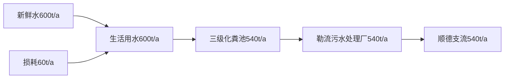
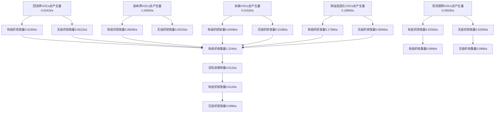
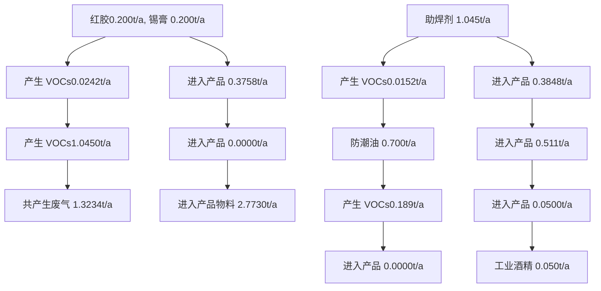
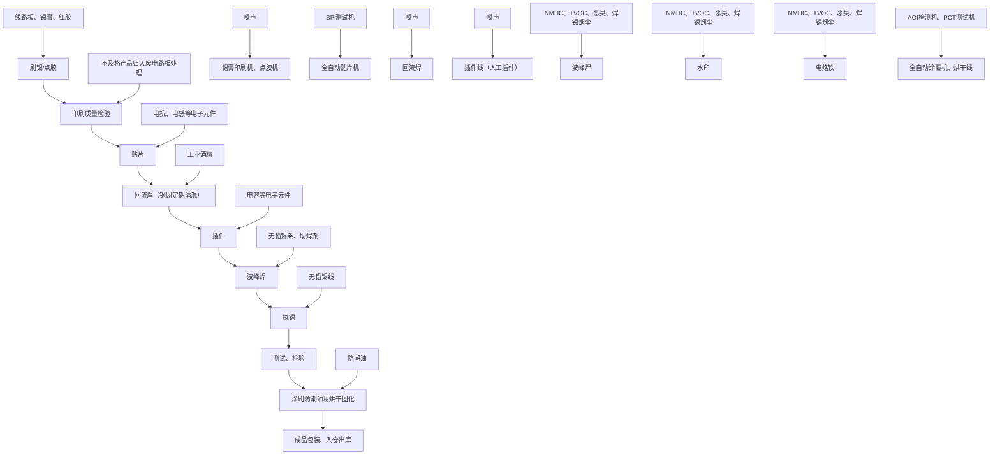

# 建设项目环境影响报告表

（污染影响类）

项目名称：佛山市诺卡智能科技有限公司新建项目建设单位（盖章）：佛山市诺卡智能科技有限公司编制日期： 月

text_image

2024年8
广东志蓝环保有限公司
4406064094341

中华人民共和国生态环境部制

编制单位和编制人员情况表

<table><tr><td>项目编号</td><td>5qmib4</td></tr><tr><td>建设项目名称</td><td>佛山市诺卡智能科技有限公司新建项目</td></tr><tr><td>建设项目类别</td><td>36—081电子元件及电子专用材料制造</td></tr><tr><td>环境影响评价文件类型</td><td>报告表</td></tr></table>

#

# 环境影响

Environmental Impa

本证书由中华和社会保障部、生表明持证人通过国取得环境影响评价，

仅用于甲

本证书由中华人民共和国人力资源和社会保障部、环境保护部批准颁发。它表明持证人通过国家统一组织的考试，取得环境影响评价工程师的职业资格。

Thisistocertify that the bearerof the Certificate haspassed national examination organized by the Chinese government departments and has obtained qualifications for Environmental Impact Assessment

# 目 录

一、建设项目基本情况.

二、建设项目工程分析. 16

三、区域环境质量现状、环境保护目标及评价标准. 32

四、主要环境影响和保护措施. . 37

五、环境保护措施监督检查清单 67

六、结论.. . 69

建设项目污染物排放量汇总表.. 70

附图1 项目地理位置图. 71

附图2 项目周边敏感目标分布图. 72

附图3 项目平面布置图. 73

附图4 项目四至及厂房内部照片 75

附图5 项目所在区域地表水环境功能区划图. 76

附图6 项目所在区域大气环境功能区划图 77

附图7 项目所在区域声环境功能区划图. 78

附图8 顺德区环境管控单元图. 79

附图9 产业集聚区和主题园区划定图. 80

附件1 营业执照. 81

附件2 法人身份证. 82

附件3 项目所在园区不动产权证. 83

附件4 租赁合同. 86

附件 5 工业酒精 MSDS. ..96

附件 6 红胶 MSDS 及 VOCs 含量检测报告.. .104

附件 7 防潮油 MSDS.. .112

附件 8 锡膏 MSDS. .124

附件 9 助焊剂 MSDS.. .132

附件 10 无铅锡线 MSDS. .137

附件 11 无铅锡条 MSDS. ..140

附件12 乙醇不可替代说明. 143

附件13 公示声明及环评技术合同 144

# 一、建设项目基本情况

<table><tr><td>建设项目名称</td><td colspan="3">佛山市诺卡智能科技有限公司新建项目</td></tr><tr><td>项目代码</td><td colspan="3">/</td></tr><tr><td>建设单位联系人</td><td>翟**</td><td>联系方式</td><td>138**********</td></tr><tr><td>建设地点</td><td colspan="3">广东省佛山市顺德区勒流街道冲鹤村富安工业区连涌一路2号领涛创新园5栋701-1</td></tr><tr><td>地理坐标</td><td colspan="3">(113度11分58.000秒,22度48分20.000秒)</td></tr><tr><td>国民经济行业类别</td><td>C3982电子电路制造</td><td>建设项目行业类别</td><td>三十六、计算机、通信和其他电子设备制造业39-81电子元件及电子专用材料制造398-印刷电路板制造;电子专用材料制造(电子化工材料制造除外);使用有机溶剂的;有酸洗的以上均不含仅分割、焊接、组装的</td></tr><tr><td>建设性质</td><td>☑新建(迁建)□改建□扩建□技术改造</td><td>建设项目申报情形</td><td>☑首次申报项目□不予批准后再次申报项目□超五年重新审核项目□重大变动重新报批项目</td></tr><tr><td>项目审批(核准/备案)部门(选填)</td><td>/</td><td>项目审批(核准/备案)文号(选填)</td><td>/</td></tr><tr><td>总投资(万元)</td><td>200</td><td>环保投资(万元)</td><td>10</td></tr><tr><td>环保投资占比(%)</td><td>5</td><td>施工工期</td><td>1个月</td></tr><tr><td>是否开工建设</td><td>☑否□是: _</td><td>用地(用海)面积(m2)</td><td>1326.34</td></tr><tr><td>专项评价设置情况</td><td colspan="3">无</td></tr><tr><td>规划情况</td><td colspan="3">无</td></tr><tr><td>规划环境影响评价情况</td><td colspan="3">无</td></tr><tr><td>规划及规划环境影响评价符合性分析</td><td colspan="3">无</td></tr><tr><td>其他符合性分析</td><td colspan="3">1、项目与广东省“三线一单”管控方案符合性分析根据广东省人民政府《关于印发广东省“三线一单”生态环境分区管控方案的通知》(粤府[2020]71号),广东省将以环境管控单元为基础,实施生态环境分区</td></tr></table>

管控，精细化管理、保护生态环境。

本项目与广东省“三线一单”生态环境分区管控方案相符性分析如下。

表 1-1 项目与广东省“三线一单”符合性分析

<table><tr><td colspan="2">粤府[2020]71号的相关规定</td><td>本项目情况</td><td>相符性</td></tr><tr><td>生态保护红线</td><td>在生态空间范围内具有特殊重要生态功能、必须强制性严格保护的区域,是保障和维护国家生态安全的底线和生命线,通常包括具有重要水源涵养、生物多样性维护、水土保持、防风固沙、海岸生态稳定等功能的生态重要区域,以及水土流失、土地沙化、石漠化、盐渍化等生态环境敏感脆弱区域。按照“生态功能不降低、面积不减少、性质不改变”的基本要求,实施严格管控。</td><td>本项目位于广东省佛山市顺德区勒流街道冲鹤村富安工业区连涌一路2号领涛创新园5栋701-1,所在位置属于工业用地,不涉及划定的生态红线区域项目周边无自然保护区,符合生态保护红线要求。</td><td>相符</td></tr><tr><td>环境质量底线</td><td>指按照自然资源资产“只能增值不能贬值”的原则,以保障生态安全和改善环境质量为目的,利用自然资源资产负债表,结合自然资源开发管控,提出的分区域分阶段的资源开发利用总量、强度、效率等上线管控要求。</td><td>根据环境质量现状监测数据,项目区大气环境臭氧超标,地表水环境、声环境质量均能满足相应标准要求,项目排放的各项污染物经相应措施处理后均能达标,对环境影响很小,环境风险可控,未超出环境质量底线,项目的建设基本符合环境质量底线要求。</td><td>相符</td></tr><tr><td>资源利用上线</td><td>强化节约集约循环利用,持续提升资源能源利用效率,水资源、土地资源、岸线资源、能源消耗等达到或优于国家和省下达的总量、强度等目标要求,按省规定年限实现碳达峰。</td><td>项目生产过程中的电能、自来水等消耗量较少,区域水、电资源较充足,项目消耗量没有超出资源利用上线。</td><td>相符</td></tr><tr><td>生态环境准入清单</td><td>《市场准入负面清单(2022年版)》(发改体改规[2022]397号)</td><td>本项目不属于禁止准入事项。</td><td>相符</td></tr></table>

# 2、项目与佛山市、顺德区“三线一单”管控方案符合性分析

根据《佛山市生态环境局<关于印发佛山市“三线一单”生态环境分区管控方案（2024 年版）>的通知》（佛环〔2024〕20 号）和《佛山市顺德区人民政府<关于印发佛山市顺德区“三线一单”生态环境分区管控方案的通知>》（顺府发〔2021〕11号），本项目位于广东省佛山市顺德区勒流街道冲鹤村富安工业区连涌一路 2号领涛创新园5栋701-1，对照顺德区环境管控单元图，项目所在地属于勒流街道重点管控区。

本项目与所在区域的“三线一单”相符性分析详见本节末表1-2、1-3、1-4。

# 3、项目与挥发性有机物相关治理政策文件规定的相符性分析

本项目与挥发性有机污染物相关治理政策文件的相符性分析见本节末表1-5。

# 4、项目与产业政策符合性分析

（1）本项目属于 C3982 电子电路制造。查阅《产业结构调整指导目录（2024年本）》（国家发展和改革委员会令 第7号），项目不属于限制类、淘汰类项目，符合相关产业政策要求。。  
（2）根据《市场准入负面清单（2022年版）》（发改体改规[2022]397 号），本项目不属于准入负面清单所列范围。  
（3）查阅《环境保护综合名录（2021 年版）》，项目产品不涉及“高污染、高环境风险”产品名录所列内容，不属于高污染高环境风险项目。

综上，本项目符合相关产业政策要求。

# 5、本项目选址相符性分析

（1）佛山市诺卡智能科技有限公司新建项目位于广东省佛山市顺德区勒流街道冲鹤村富安工业区连涌一路2号领涛创新园5栋701-1。根据建设单位提供的不动产权证（附件 3）可知，本项目厂房所在用地属于工业用地，因此本项目的建设符合用地要求。  
（2）根据《佛山市生态环境局顺德分局关于环评技术评估审查项目与“节地提质”攻坚行动方案相符性意见的函》及其附件《产业集聚区和主题园区划定图》，项目所在地属于勒流顺德光机电产业集聚区范围（详见附图 9），符合《广东省人民政府办公厅关于印发广东省“节地提质”攻坚行动方案（2023-2025年）的通知》：“在符合国土空间规划的前提下，新建工业项目和经批准实施异地搬迁的工业项目，除因安全生产、工艺技术等特殊要求外，应一律安排进入开发区（产业园区）生产建设”的要求。

表 1-2 项目与佛环〔2024〕20 号文件相关要求相符性分析

<table><tr><td colspan="2">佛环(2024)20号的相关规定</td><td>本项目情况</td><td>相符性</td></tr><tr><td rowspan="2">区域布局管控要求</td><td>环境质量不达标区域,新建、扩建项目需符合环境质量改善要求。全市域为高污染燃料禁燃区,禁止新建、扩建燃用高污染燃料的燃烧设施。</td><td>本项目位于广东省佛山市顺德区勒流街道冲鹤村富安工业区连涌一路2号领涛创新园5栋701-1,所在区域属于大气环境质量不达标区,大气环境超标因子为臭氧。本项目所排放的污染物不包括臭氧,因此本项目的建设不会加剧不达标因子的恶化。其余不涉及。</td><td>相符</td></tr><tr><td>禁止新建、扩建水泥、平板玻璃、化学制浆、生皮制革以及国家规划外的钢铁、原油加工等项目。专业电镀、印染等项目进入定点园区集中管理。严格落实国家产品VOCs含量限值标准要求,除现阶段确无法实施替代的工序外,禁止新建生产和使用高VOCs含量原辅材料项目。</td><td>本项目为C3982电子电路制造项目,不属于水泥、平板玻璃、化学制浆、生皮制革以及国家规划外的钢铁、原油加工等项目;不属于专业电镀、印染等项目。除工业酒精外,项目使用的其他原辅材料均属于低VOCs含量物料,参考《东莞市关于电子行业使用低VOCs含量清洗剂替代乙醇、丙酮的可行性专家咨询意见》,乙醇目前为电子行业中的不可替代原料。</td><td>相符</td></tr><tr><td>能源资源利用要求</td><td>新建、改建、扩建“两高”项目须符合生态环境保护法律法规和相关法定规划,满足污染物区域削减、重点污染物排放总量控制、碳排放达峰目标、相关规划环评和相应行业建设项目环境准入条件、环评文件审批原则要求。</td><td>本项目不属于“两高”项目。</td><td>相符</td></tr><tr><td rowspan="2">污染物排放管控要求</td><td>禁止在地表水I、II类水域及III类水域中的保护区、游泳区新建排污口,已建成的排污口应当实行污染物总量控制且不得增加污染物排放量。</td><td>本项目没有在地表水I、II类水域及III类水域中的保护区、游泳区设置排污口。</td><td>相符</td></tr><tr><td>在可核查、可监管的基础上,全市新建、改建、扩建项目新增大气重点污染物实行“减二增一”替代。</td><td>本项目所产生的有机废气TVOC、NMHC等属于重点污染物,实行“减二增一”替代。</td><td>相符</td></tr><tr><td>环境风险防控要求</td><td>推动企业将低温等离子、UV光解、RTO燃烧炉等有机废气治理设施纳入全厂安全风险辨识范围,加强安全管理。</td><td>本项目不涉及低温等离子、UV光解、RTO燃烧炉等有机废气治理设施。</td><td>相符</td></tr></table>

表 1-3 项目与勒流街道重点管控区准入清单（佛环〔2024〕20号）的相符性分析

<table><tr><td rowspan="2">环境管控单元编码</td><td rowspan="2">环境管控单元名称</td><td colspan="3">行政区划</td><td rowspan="2">管控单元分类</td><td colspan="2" rowspan="2">要素细类</td></tr><tr><td>省</td><td>市</td><td>区</td></tr><tr><td>ZH44060620009</td><td>勒流街道重点管控区</td><td>广东省</td><td>佛山市</td><td>顺德区</td><td>重点管控单元9</td><td colspan="2">水环境工业-城镇生活重点管控区、大气环境布局敏感重点管控区、江河湖库岸线重点管控区</td></tr><tr><td>管控维度</td><td colspan="7">管控要求</td></tr><tr><td>共性要求</td><td colspan="7">单元内各环境要素细类管控区内,按该环境要素细类管控要求执行。</td></tr><tr><td colspan="6">政策要求</td><td>本项目情况</td><td>相符性</td></tr><tr><td rowspan="4">区域布局管控</td><td colspan="5">1-1.【产业/鼓励引导类】重点发展智能家电、家具五金、环保装备、光电照明、装备制造及交通机械产业,引入智能制造服务、电子商务、现代商贸流通产业,重点建设环保产业基地、小家电产业基地和五金产业创业基地。</td><td>1-1:项目不涉及。</td><td>相符</td></tr><tr><td colspan="5">1-2.【产业/综合类】系统推进村级工业园升级改造,腾出连片空间,布局产业集聚区和主题产业园,推动工业项目入园集聚发展。</td><td>1-2:根据附件3用地证明,项目所在位置位于领涛创新园,属于集聚的村级工业园区。</td><td>相符</td></tr><tr><td colspan="5">1-3.【产业/限制类】受纳水体或监控断面不达标且未“以新带老”制定区域达标方案的河涌,不得新建、扩建向河涌直接排放废水的项目。新建、扩建含蚀刻工序的线路板生产项目和化工项目应在配套污水集中处置的工业园区或生活污水管网覆盖区域内建设;纯加工型印花项目,含酸洗、磷化的金属表面处理、金属制品项目(与自身高新技术企业配套的和区级及以上重点项目除外),含酸洗、喷涂、化学抛光、电解等涉及废水排放工艺的不锈钢型材加工项目(与自身高新技术企业配套的和区级及以上重点项目除外),应进入以此类项目为主导产业、有相应废水集中治理设施的工业园区,实现集中治污。</td><td>1-3:项目不涉及。</td><td>相符</td></tr><tr><td colspan="5">1-4.【产业/综合类】划定家具生产优先发展区域,优先发展区外不再新建涉及涂装工艺的木质家具制造项目。优先发展区范围根据家具产业发展规划及其规划环评文件确定。</td><td>1-4:项目不涉及。</td><td>相符</td></tr><tr><td rowspan="2"></td><td>1-5.【水/限制类】严格限制在羊额-北滘水厂饮用水水源保护区上游和周边区域建设列入“高污染、高环境风险”产品名录等可能影响水环境安全的项目。</td><td>1-5:本项目不位于羊额-北滘水厂饮用水水源保护区上游和周边区域,且不属于“高污染、高环境风险”产品名录中的项目。</td><td colspan="5">相符</td></tr><tr><td>1-6.【大气/限制类】大气环境布局敏感区重点管控区内,应严格限制新建生产和使用高挥发性有机物原辅材料项目,优先开展低VOCs含量原辅材料替代,强化无组织排放控制。原则上不再新建、扩建新增氮氧化物、烟(粉)尘排放量较大的建设项目。</td><td>1-6:项目属于C3982电子电路制造,不涉及使用溶剂型油墨、胶黏剂等高挥发性有机物原辅材料,但项目使用的工业酒精属于溶剂型清洗剂。参考《东莞市关于电子行业使用低VOCs含量清洗剂替代乙醇、丙酮的可行性专家咨询意见》,乙醇目前为电子行业中的不可替代原料。项目不涉及新增氮氧化物排放,且烟(粉)尘排放量较小。</td><td colspan="5">相符</td></tr><tr><td rowspan="6">能源资源利用</td><td>2-1.【能源/鼓励引导类】推广节能技术,加快发展绿色货运与现代物流。</td><td>2-1:项目不涉及。</td><td colspan="5">相符</td></tr><tr><td>2-2.【能源/鼓励引导类】推广新能源汽车应用和充电基础设施建设,积极推动重卡LNG加气站、充电基础设施、加氢站建设。</td><td>2-2:项目不涉及。</td><td colspan="5">相符</td></tr><tr><td>2-3.【能源/综合类】科学实施能源消费总量和强度“双控”,新建高能耗项目单位产品(产值)能耗达到国际国内先进水平。</td><td>2-3:项目不属于高能耗项目。</td><td colspan="5">相符</td></tr><tr><td>2-4.【水资源/综合类】贯彻落实“节水优先”方针,实行最严格水资源管理制度,勒流街道万元国内生产总值用水量、万元工业增加值用水量、用水总量、农田灌溉水有效利用系数等用水总量和效率指标达到区下达要求。</td><td>2-4:项目主要用水为员工生活用水,内部实行节约用水,合理使用水资源。</td><td colspan="5">相符</td></tr><tr><td>2-5.【土地资源/限制类】落实单位土地面积投资强度、土地利用强度等建设用地控制性指标要求,提高土地利用效率。</td><td>2-5:根据附件3用地证明,项目所在位置属于工业用地,土地利用效率原则上满足要求。</td><td colspan="5">相符</td></tr><tr><td>2-6.【岸线/禁止类】严格水域岸线用途管制,新建项目一律不得违规占用水域。严禁破坏生态的岸线利用行为和不符合其功能定位的开发建设活动,严禁以各种名义侵占河道、围垦湖泊、非法采砂等。</td><td>2-6:项目建设在陆域上,不涉及占用水域和破坏生态的岸线利用等行为。</td><td colspan="5">相符</td></tr><tr><td>污染物排放管控</td><td>3-1.【水/限制类】城镇新区建设实行雨污分流。住宅、商业体、学校、市场等城镇开发建设项目应当配套或者同步计划建设公共排水设施,公共排水设施或自建排污水设施未能投产运行的,以上涉水项目不得投入使用。新建小区严格实施雨污分流,阳台、露台等污水接入污水收集系统,将生活污水“应截尽截”。做好大型楼盘、集贸市场、餐饮以及学校等4大类排水户污水接入市政管网工作。</td><td>3-1:项目所在位置属于勒流污水处理厂纳污范围,并且实行雨污分流,且生产车间位于厂房内,不存在露天作业。</td><td colspan="5">相符</td></tr><tr><td rowspan="4"></td><td>3-2.【水/综合类】结合村级工业园改造,全面提升产业层次与集聚度,促进污染集中整治。</td><td>3-2:根据附件3用地证明,项目所在位置位于领涛创新园,属于集聚的村级工业园区,满足污染集中整治的要求。</td><td colspan="5">相符</td></tr><tr><td>3-3.【水/综合类】稳步推进排水设施“三个一体化”管理模式,补齐城乡污水收集和处理短板,推动勒流污水处理厂提质增效,加快消除城中村、老旧城区、城乡结合部等污水收集管网空白区,逐步实现城乡污水收集处理全覆盖。2025年前完成勒流污水处理厂扩建,尾水应执行《城镇污水处理厂污染物排放标准》(GB18918-2002)一级A标准及《广东省水污染物排放限值》(DB44/26-2001)的较严值。</td><td>3-3:本项目属于勒流污水处理厂的纳污范围,外排污水只有生活污水,生活污水经三级化粪池处理达标后排入勒流污水处理厂。</td><td colspan="5">相符</td></tr><tr><td>3-4.【水/综合类】保留勒流社区百丈片区分散式农村污水处理设施,其余行政村(社区)通过市政污水管网,配合农村支管网建设,有条件的区域实施雨污分流改造,到2030年实现农村生活污水100%收集进入勒流污水处理系统。</td><td>3-4:本项目属于勒流污水处理厂的纳污范围,外排污水只有生活污水,生活污水经三级化粪池处理达标后排入勒流污水处理厂。</td><td colspan="5">相符</td></tr><tr><td>3-5.【土壤/限制类】严格重金属重点行业企业准入管理。新、改、扩建重点行业建设项目应遵循重点重金属污染物排放“等量替代”原则。</td><td>3-5:本项目不涉及重金属污染物排放。</td><td colspan="5">相符</td></tr><tr><td rowspan="3">环境风险防控</td><td>4-1.【水/综合类】加强单元内羊额-北滘水厂饮用水水源保护区周边环境风险源管控,完善突发环境事件应急管理体系。</td><td>4-1:本项目不位于羊额-北滘水厂饮用水水源保护区的周边区域。</td><td colspan="5">相符</td></tr><tr><td>4-2.【水/综合类】勒流污水处理厂、工业污水集中处理设施应采取有效措施,防止事故废水直接排入水体。完善污水处理厂在线监控系统联网,实现污水处理厂的实时、动态监管。</td><td>4-2:项目不涉及。</td><td colspan="5">相符</td></tr><tr><td>4-3.【风险/综合类】加强环境风险分级分类管理,强化金属制品、有色金属和压延加工、化学原料和化学品制造业等涉重金属、化工行业企业及工业园区等重点环境风险源的环境风险防控。</td><td>4-3:项目属于C3982电子电路制造,不属于金属制品、有色金属和压延加工、化学原料和化学品制造业等涉重金属、化工行业企业,不涉及重点环境风险源。</td><td colspan="5">相符</td></tr></table>

表 1-4 项目与勒流街道重点管控区准入清单（顺府发〔2021〕11号）的相符性分析

<table><tr><td rowspan="2">环境管控单元编码</td><td rowspan="2">环境管控单元名称</td><td colspan="3">行政区划</td><td rowspan="2">管控单元分类</td><td colspan="2" rowspan="2">要素细类</td></tr><tr><td>省</td><td>市</td><td colspan="2">区</td></tr><tr><td>ZH44060620009</td><td>勒流街道重点管控区</td><td>广东省</td><td>佛山市</td><td>顺德区</td><td>重点管控单元9</td><td colspan="2">水环境工业-城镇生活重点管控区、大气环境布局敏感重点管控区、江河湖库岸线重点管控区</td></tr><tr><td>管控维度</td><td colspan="7">管控要求</td></tr><tr><td>共性要求</td><td colspan="7">单元内各环境要素细类管控区内,按该环境要素细类管控要求执行。</td></tr><tr><td colspan="6">政策要求</td><td>本项目情况</td><td>相符性</td></tr><tr><td rowspan="5">区域布局管控</td><td colspan="5">1-1.【产业/鼓励引导类】重点发展智能家电、家具五金、环保装备、光电照明、装备制造及交通机械产业,引入智能制造服务、电子商务、现代商贸流通产业,重点建设环保产业基地、小家电产业基地和五金产业创业基地。</td><td>1-1:项目不涉及。</td><td>相符</td></tr><tr><td colspan="5">1-2.【产业/综合类】系统推进村级工业园升级改造,腾出连片空间,布局产业集聚区和主题产业园,推动工业项目入园集聚发展。新增工业制造业用地原则上安排在产业集聚区内,产业集聚区外原则上不鼓励工业及物流仓储用地的新建与改造。</td><td>1-2:项目不涉及。</td><td>相符</td></tr><tr><td colspan="5">1-3.【产业/综合类】产业聚集区所属地块内的工业用地或企业与村庄、学校等环境敏感点之间应设置合理的大气环境防护距离,并通过绿化带进行有效隔离;聚集区规划布局应注重大气污染排放企业应尽量避免布局在居住用地的常年主导风向的上风向。</td><td>1-3:根据附件3用地证明,项目所在位置位于领涛创新园,属于集聚的村级工业园区。</td><td>相符</td></tr><tr><td colspan="5">1-4.【产业/限制类】受纳水体或监控断面不达标的,不得新建、扩建向河涌直接排放废水的项目。新建、扩建含蚀刻工序的线路板生产项目和化工项目应在配套污水集中处置的工业园区或生活污水管网覆盖区域内建设;纯加工型印花项目,含酸洗、磷化的金属表面处理、金属制品项目(与自身高新技术企业配套的除外),含酸洗、喷涂、化学抛光、电解等涉及废水排放工艺的不锈钢型材加工项目(与自身高新技术企业配套的除外),应进入以此类项目为主导产业、有相应废水集中治理设施的工业园区,实现集中治污。</td><td>1-4:项目不涉及。</td><td>相符</td></tr><tr><td colspan="5">1-5.【产业/综合类】划定家具生产优先发展区域,优先发展区外不再新建涉及涂装工艺的木质家具制造项目。</td><td>1-8:项目不涉及。</td><td>相符</td></tr><tr><td rowspan="3"></td><td>1-6.【水/限制类】严格限制在羊额-北滘水厂饮用水水源保护区上游和周边区域建设列入“高污染、高环境风险”产品名录等可能影响水环境安全的项目。</td><td>1-6:项目属于C3982电子电路制造,不属于涉及涂装工艺的木质家具制造项目。</td><td colspan="5">相符</td></tr><tr><td>1-7.【大气/限制类】大气环境布局敏感区重点管控区内,应严格限制新建生产和使用高挥发性有机物原辅材料项目,优先开展低VOCs含量原辅材料替代,强化无组织排放控制。原则上不再新建、扩建新增氮氧化物、烟(粉)尘排放量较大的建设项目。</td><td>1-7、项目属于C3982电子电路制造,不涉及使用溶剂型油墨、胶黏剂等高挥发性有机物原辅材料,但项目使用的工业酒精属于溶剂型清洗剂。参考《东莞市关于电子行业使用低VOCs含量清洗剂替代乙醇、丙酮的可行性专家咨询意见》,乙醇目前为电子行业中的不可替代原料。项目不涉及新增氮氧化物排放,且烟(粉)尘排放量较小。</td><td colspan="5">相符</td></tr><tr><td>1-8.【土壤/禁止类】禁止新建、扩建增加重点防控的重金属污染物排放的建设项目。</td><td>1-8:项目不涉及重金属污染物排放。</td><td colspan="5">相符</td></tr><tr><td rowspan="6">能源资源利用</td><td>2-1.【能源/鼓励引导类】推广节能技术,加快发展绿色货运与现代物流。</td><td>2-1:项目不涉及。</td><td colspan="5">相符</td></tr><tr><td>2-2.【能源/鼓励引导类】推广新能源汽车应用和充电基础设施建设,积极推动重卡LNG加气站、充电基础设施、加氢站建设。</td><td>2-2:项目不涉及。</td><td colspan="5">相符</td></tr><tr><td>2-3.【能源/综合类】科学实施能源消费总量和强度“双控”,新建高能耗项目单位产品(产值)能耗达到国际国内先进水平。</td><td>2-3:项目不属于高能耗项目。</td><td colspan="5">相符</td></tr><tr><td>2-4.【水资源/综合类】贯彻落实“节水优先”方针,实行最严格水资源管理制度,勒流街道万元国内生产总值用水量、万元工业增加值用水量、用水总量、农田灌溉水有效利用系数等用水总量和效率指标达到区下达要求。</td><td>2-4:项目主要用水为员工生活用水,内部实行节约用水,合理使用水资源。</td><td colspan="5">相符</td></tr><tr><td>2-5.【土地资源/限制类】落实单位土地面积投资强度、土地利用强度等建设用地控制性指标要求,提高土地利用效率。</td><td>2-5:根据附件3用地证明,项目所在位置属于工业用地,土地利用效率原则上满足要求。</td><td colspan="5">相符</td></tr><tr><td>2-6.【岸线/禁止类】严格水域岸线用途管制,新建项目一律不得违规占用水域。严禁破坏生态的岸线利用行为和不符合其功能定位的开发建设活动,严禁以各种名义侵占河道、围垦湖泊、非法采砂等。</td><td>2-6:项目建设在陆域上,不涉及占用水域和破坏生态的岸线利用等行为。</td><td colspan="5">相符</td></tr><tr><td>污染物排放管控</td><td>3-1.【水/限制类】城镇新区建设实行雨污分流。住宅、商业体、学校、市场等城镇开发建设项目应当配套或者同步计划建设公共排水设施,公共排水设施或自建排污水设施未能投产运行的,以上涉水项目不得投入使用。新建小区严格实施雨污分流,阳台、露台等污水接入污水收集系统,将生活污水“应截尽截”。做好大型楼盘、集贸市场、餐饮以及学校等4大类排水户污水接入市政管网工作。</td><td>3-1:项目所在位置属于勒流污水处理厂纳污范围,并且实行雨污分流,且生产车间位于厂房内,不存在露天作业。</td><td colspan="5">相符</td></tr><tr><td rowspan="5"></td><td>3-2.【水/综合类】结合村级工业园改造,全面提升产业层次与集聚度,促进污染集中整治。</td><td>3-2:根据附件3用地证明,项目所在位置位于领涛创新园,属于集聚的村级工业园区,满足污染集中整治的要求。</td><td colspan="5">相符</td></tr><tr><td>3-3.【水/综合类】稳步推进排水设施“三个一体化”管理模式,补齐城乡污水收集和处理短板,推动勒流污水处理厂提质增效,加快消除城中村、老旧城区、城乡结合部等污水收集管网空白区,逐步实现城乡污水收集处理全覆盖。2025年前完成勒流污水处理厂扩建,尾水应执行《城镇污水处理厂污染物排放标准》(GB18918-2002)一级A标准及《广东省水污染物排放限值》(DB44/26-2001)的较严值。</td><td>3-3:本项目属于勒流污水处理厂的纳污范围,外排污水只有生活污水,生活污水经三级化粪池处理达标后排入勒流污水处理厂。</td><td colspan="5">相符</td></tr><tr><td>3-4.【水/综合类】保留勒流社区百丈片区分散式农村污水处理设施,其余行政村(社区)通过市政污水管网,配合农村支管网建设,有条件的区域实施雨污分流改造,到2030年实现农村生活污水100%收集进入勒流污水处理系统。</td><td>3-4:本项目属于勒流污水处理厂的纳污范围,外排污水只有生活污水,生活污水经三级化粪池处理达标后排入勒流污水处理厂。</td><td colspan="5">相符</td></tr><tr><td>3-5.【水/综合类】产业集聚区和主题园区内做好污水管网和污水集中处理设施的配套保障,确保废水收集到城镇污水处理厂、园区污水处理厂或分散式污水处理设施集中处置。</td><td>3-5:本项目属于勒流污水处理厂的纳污范围,外排污水只有生活污水,生活污水经三级化粪池处理达标后排入勒流污水处理厂。</td><td colspan="5">相符</td></tr><tr><td>3-6.【土壤/限制类】作为重金属污染重点防控区,区域内重点重金属排放总量只减不增。</td><td>3-6:本项目不涉及重金属污染物排放。</td><td colspan="5">相符</td></tr><tr><td rowspan="3">环境风险防控</td><td>4-1.【水/综合类】加强单元内羊额-北滘水厂饮用水水源保护区周边环境风险源管控,完善突发环境事件应急管理体系。</td><td>4-1:本项目不位于羊额-北滘水厂饮用水水源保护区的周边区域。</td><td colspan="5">相符</td></tr><tr><td>4-2.【水/综合类】勒流污水处理厂、工业污水集中处理设施应采取有效措施,防止事故废水直接排入水体。完善污水处理厂在线监控系统联网,实现污水处理厂的实时、动态监管。</td><td>4-2:项目不涉及。</td><td colspan="5">相符</td></tr><tr><td>4-3.【风险/综合类】加强环境风险分级分类管理,强化金属制品、有色金属和压延加工、化学原料和化学品制造业等涉重金属、化工行业企业及工业园区等重点环境风险源的环境风险防控。</td><td>4-3:项目属于C3982电子电路制造,不属于金属制品、有色金属和压延加工、化学原料和化学品制造业等涉重金属、化工行业企业,不涉及重点环境风险源。</td><td colspan="5">相符</td></tr><tr><td>序号</td><td>政策要求</td><td>工程内容</td><td colspan="5">符合性</td></tr><tr><td colspan="8">1、《大气污染防治法》(2018年10月26日修订通过)</td></tr><tr><td>1.1</td><td>产生含挥发性有机物废气的生产和服务活动,应当在密闭空间或者设备中进行,并按照规定安装、使用污染防治设施;无法密闭的,应当采取措施减少废气排放。</td><td>本项目产生的有机废气经收集后通过“活性炭吸附”治理设施处理后引入45m排气筒G1进行排放。</td><td colspan="5">符合</td></tr><tr><td colspan="8">2、广东省生态环境保护“十四五”规划(粤环[2021]10号)</td></tr><tr><td>2.1</td><td>石化、化工、包装印刷、工业涂装等重点行业建立完善源头、过程和末端的VOCs全过程控制体系。大力推进低VOCs含量原辅材料源头替代,严格落实国家和地方产品VOCs含量限值质量标准,禁止建设生产和使用高VOCs含量的溶剂型涂料、油墨、胶粘剂等项目。</td><td>除工业酒精外,项目使用的其他原辅材料均属于低VOCs含量物料,参考《东莞市关于电子行业使用低VOCs含量清洗剂替代乙醇、丙酮的可行性专家咨询意见》,乙醇目前为电子行业中的不可替代原料。</td><td colspan="5">符合</td></tr><tr><td colspan="8">3、佛山市生态环境保护“十四五”规划(佛环[2022]3号)</td></tr><tr><td>3.1</td><td>严格控制“高耗能、高排放”项目盲目发展,禁止新建、扩建水泥、平板玻璃、化学制浆、生皮制革以及国家规划外的钢铁、原油加工等项目。专业电镀、印染等项目进入定点园区集中管理。</td><td>本项目不属于“高耗能、高排放”项目。</td><td colspan="5" rowspan="3">符合</td></tr><tr><td>3.2</td><td>加强VOCs源头替代和无组织排放管控。大力推进低VOCs含量原辅材料替代,将全面使用低VOCs含量原辅材料的企业纳入正面清单和政府绿色采购清单。鼓励重点行业企业开展生产工艺和设备水性化改造,推广使用水性、高固体分、无溶剂、粉末等低VOCs含量涂料。严格落实《挥发性有机物无组织排放控制标准》,开展厂区内无组织排放浓度监测。加强对含VOCs物料储存、转移和运输、设备与管线组件泄漏、敞开页面逸散以及工艺过程等五类排放源的管控。加强储油库、加油站等VOCs排放治理,推动油品储运销体系安装油气回收自动监控系统。</td><td colspan="5">除工业酒精外,项目使用的其他原辅材料均属于低VOCs含量物料,参考《东莞市关于电子行业使用低VOCs含量清洗剂替代乙醇、丙酮的可行性专家咨询意见》,乙醇目前为电子行业中的不可替代原料。建设单位将根据《挥发性有机物无组织排放控制标准》,开展厂区内无组织排放浓度监测。本项目不涉及储油库、加油站。</td></tr><tr><td>3.3</td><td>实施VOCs分级和清单化管控。建立并动态更新涉VOCs重点企业分级管理台账,在典型行业建立治理样板并推广实施。对家具、凹版印刷行业(除瓦楞纸印刷)、铝型材(氟碳喷涂)等VOCs排放重点行业进行严格监管,建立实施污染治理定量化监管;推进VOCs高排放企业治理设施提升改造,淘汰光催化、光氧化、低温等离子等现有低效治理设施。分期分批推广涉VOCs企业安装产污环节、治污环节过程监控设备。以汽车维修等行业为重点,推广建设区域共享涂装中心、活性炭集中再生中心,推动VOCs集中高效治理。</td><td colspan="5">本项目不属于文件中所列的VOCs排放重点行业。</td></tr><tr><td colspan="8">4、佛山市顺德区生态环境保护“十四五”规划(2021-2025)</td></tr><tr><td>4.1</td><td>持续推进重点行业VOCs整治。持续开展挥发性有机物专项整治,继续推进重点行业企业开展销号式综合整治,建立VOC重点监管企业名单并动态更新,督促企业建立VOCs管控台账清单;持续探寻高效节能的VOCs治理技术,对采用低温等离子、光氧化、光催化等低效治理工艺的企业在臭氧污染天气应对期间实施停限或错峰生产,并推动企业逐步淘汰低效治理工艺。</td><td>本项目产生的有机废气经收集后通过“活性炭吸附”治理设施处理后引入45m排气筒G1进行排放,“活性炭吸附”不属于低效治理工艺。</td><td colspan="5">符合</td></tr><tr><td>4.2</td><td>加强VOCs源头替代和无组织排放管控。大力推进低VOCs含量、低反应活性的原辅材料替代,将全面使用低VOCs含量原辅材料的企业纳入正面清单和政府绿色采购清单。鼓励重点行业企业开展生产工艺和设备水性化改造,推广使用水性、高固体分、无溶剂、粉末等低VOCs含量涂料。严格落实《挥发性有机物无组织排放控制标准》,开展厂区内无组织排放浓度监测,加强对含VOCs物料储存、转移和运输、设备与管线组件泄漏、敞开页面逸散以及工艺过程等五类排放源的管控。</td><td>除工业酒精外,项目使用的其他原辅材料均属于低VOCs含量物料,参考《东莞市关于电子行业使用低VOCs含量清洗剂替代乙醇、丙酮的可行性专家咨询意见》,乙醇目前为电子行业中的不可替代原料。建设单位将根据《挥发性有机物无组织排放控制标准》,开展厂区内无组织排放浓度监测。</td><td colspan="5">符合</td></tr></table>

表 1-5 项目与挥发性有机物相关治理政策文件规定的相符性

5、关于印发《重点行业挥发性有机物综合治理方案》的通知（环大气[2019]53号）

<table><tr><td>5.1</td><td>大力推进源头替代。通过使用水性、粉末、高固体分、无溶剂、辐射固化等低VOCs含量的涂料,水性、辐射固化、植物基等低VOCs含量的油墨,水基、热熔、无溶剂、辐射固化、改性、生物降解等低VOCs含量的胶粘剂,以及低VOCs含量、低反应活性的清洗剂等,替代溶剂型涂料、油墨、胶粘剂、清洗剂等,从源头减少VOCs产生。</td><td>除工业酒精外,项目使用的其他原辅材料均属于低VOCs含量物料,参考《东莞市关于电子行业使用低VOCs含量清洗剂替代乙醇、丙酮的可行性专家咨询意见》,乙醇目前为电子行业中的不可替代原料;其他原辅材料和产品不涉及溶剂型油墨、胶粘剂等。</td><td>符合</td></tr><tr><td>5.2</td><td>加强政策引导。企业采用符合国家有关低VOCs含量产品规定的涂料、油墨、胶粘剂等,排放浓度稳定达标且排放速率、排放绩效等满足相关规定的,相应生产工序可不要求建设末端治理设施。使用的原辅材料VOCs含量(质量比)低于10%的工序,可不要求采取无组织排放收集措施。</td><td>除工业酒精外,项目使用的其他原辅材料均属于低VOCs含量物料,参考《东莞市关于电子行业使用低VOCs含量清洗剂替代乙醇、丙酮的可行性专家咨询意见》,乙醇目前为电子行业中的不可替代原料,已采取高效收集和治理设施。</td><td>符合</td></tr><tr><td>5.3</td><td>全面加强无组织排放控制。重点对VOCs物料(包括含VOCs原辅材料、含VOCs产品、含VOCs废料以及有机聚合物材料等)储存、转移和输送、设备与管线组件泄漏、敞开液面逸散以及工艺过程等五类排放源实施管控,通过采取设备与场所密闭、工艺改进、废气有效收集等措施,削减VOCs无组织排放。加强设备与场所密闭管理。含VOCs物料应储存于密闭容器、包装袋,高效密封储罐,封闭式储库、料仓等。含VOCs物料转移和输送,应采用密闭管道或密闭容器、罐车等。高VOCs含量废水(废水液面上方100毫米处VOCs检测浓度超过200ppm,其中,重点区域超过100ppm,以碳计)的集输、储存和处理过程,应加盖密闭。含VOCs物料生产和使用过程,应采取有效收集措施或在密闭空间中操作。推进使用先进生产工艺。通过采用全密闭、连续化、自动化等生产技术,以及高效工艺与设备等,减少工艺过程无组织排放。挥发性有机液体装载优先采用底部装载方式。</td><td>除工业酒精外,项目使用的其他原辅材料均属于低VOCs含量物料,参考《东莞市关于电子行业使用低VOCs含量清洗剂替代乙醇、丙酮的可行性专家咨询意见》,乙醇目前为电子行业中的不可替代原料;本项目产生的有机废气经收集后通过“活性炭吸附”治理设施处理后引入45m排气筒G1进行排放。通过采取设备与场所密闭、废气有效收集等措施,有效削减VOCs无组织排放。</td><td>符合</td></tr><tr><td>5.4</td><td>废气收集率。遵循“应收尽收、分质收集”的原则,科学设计废气收集系统,将无组织排放转变为有组织排放进行控制。采用全密闭集气罩或密闭空间的,除行业有特殊要求外,应保持微负压状态,并根据相关规范合理设置通风量。采用局部集气罩的,距集气罩开口面最远处的VOCs无组织排放位置,控制风速应不低于0.3米/秒,有行业要求的按相关规定执行。加强设备与管线组件泄漏控制。企业中载有气态、液态VOCs物料的设备与管线组件,密封点数量大于等于2000个的,应按要求开展LDAR工作。石化企业按行业排放标准规定执行。</td><td>本项目对需要采用局部集气罩收集的工序控制风速不低于0.3m/s。</td><td>符合</td></tr><tr><td>5.5</td><td>推进建设适宜高效的治污设施。企业新建治污设施或对现有治污设施实施改造,应依据排放废气的浓度、组分、风量,温度、湿度、压力,以及生产工况等,合理选择治理技术。鼓励企业采用多种技术的组合工艺,提高VOCs治理效率。低浓度、大风量废气,宜采用沸石转轮吸附、活性炭吸附、减风增浓等浓缩技术,提高VOCs浓度后净化处理;高浓度废气,优先进行溶剂回收,难以回收的,宜采用高温焚烧、催化燃烧等技术。油气(溶剂)回收宜采用冷凝+吸附、吸附+吸收、膜分离+吸附等技术。低温等离子、光催化、光氧化技术主要适用于恶臭异味等治理;生物法主要适用于低浓度VOCs废气治理和恶臭异味治理。非水溶性的VOCs废气禁止采用水或水溶液喷淋吸收处理。采用一次性活性炭吸附技术的,应定期更换活性炭,废旧活性炭应再生或处理处置。有条件的工业园区和产业集群等,推广集中喷涂、溶剂集中回收、活性炭集中再生等,加强资源共享,提高VOCs治理效率。规范工程设计。采用吸附处理工艺的,应满足《吸附法工业有机废气治理工程技术规范》要求。采用催化燃烧工艺的,应满足《催化燃烧法工业有机废气治理工程技术规范》要求。采用蓄热燃烧等其他处理工艺的,应按相关技术规范要求设计。实行重点排放源排放浓度与去除效率双重控制。车间或生产设施收集排放的废气,VOCs初始排放速率大于等于3千克/小时、重点区域大于等于2千克/小时的,应加大控制力度,除确保排放浓度稳定达标外,还应实行去除效率控制,去除效率不低于80%;采用的原辅材料符合国家有关低VOCs含量产品规定的除外,有行业排放标准的按其相关规定执行。</td><td>本项目根据污染源强核算结果,VOCs初始排放速率小于2千克/小时。</td><td>符合</td></tr><tr><td>5.6</td><td>加强企业运行管理。企业应系统梳理VOCs排放主要环节和工序,包括启停机、检维修作业等,制定具体操作规程,落实到具体责任人。健全内部考核制度。加强人员能力培训和技术交流。建立管理台账,记录企业生产和治污设施运行的关键参数,在线监控参数要确保能够实时调取,相关台账记录至少保存三年。</td><td>本项目VOCs排放主要环节和工序为波峰焊、回流焊、执锡、喷油及固化、清洗工序,建设单位将针对该工序制定具体操作规程,落实到具体责任人,健全内部考核制度,加强人员能力培训和技术交流;建立管理台账,记录企业生产和治污设施运行的关键参数,相关台账记录至少保存三年。</td><td>符合</td></tr><tr><td colspan="4">6、佛山市生态环境局顺德分局关于做好重点行业建设项目挥发性有机物总量指标管理工作的通知(佛顺环函[2019]56号)</td></tr><tr><td>6.1</td><td>涉VOCs排放项目,实现本行政区域内污染源“点对点”2倍削减替代,由项目所在镇街分局出具VOCs总量指标来源及替代削减方案的意见,开展总量替代。</td><td>本项目属于新建项目,根据相关要求,待项目审批时由生态环境部门核定VOCs总量来源。</td><td>符合</td></tr><tr><td colspan="4">7、《广东省生态环境厅关于做好重点行业建设项目挥发性有机物总量指标管理工作的通知》(粤环发[2019]2号)</td></tr><tr><td>7.1</td><td>珠三角地区各地级以上市、上一年度环境空气质量年评价浓度不达标或污染负荷接近承载能力上限的城市,建设项目新增VOCs排放量,实行本行政区域内污染源“点对点”2倍量削减替代,原则上不得接受其他区域VOCs“可替代总量指标”。其它城市的建设项目所需VOCs总量指标实行等量削减替代。</td><td>本项目所在行政区域需要实行污染源“点对点”2倍量削减替代,待项目审批时由生态环境部门核定VOCs总量来源。</td><td>符合</td></tr><tr><td>7.2</td><td>新、改、扩建和减排项目涉及VOCs排放量,按照广东省重点行业挥发性有机物排放量计算方法核算(具体核算办法由省生态环境主管部门另行制定)。建设项目环评文件应包含VOCs总量控制内容,提出总量指标及替代削减方案,列出详细测算依据。</td><td>本报告依据广东省重点行业挥发性有机物排放量计算方法核算。</td><td>符合</td></tr><tr><td colspan="4">8、《广东省人民政府办公厅关于印发广东省2021年大气、水、土壤污染防治工作方案的通知》(粤办函[2021]58号)</td></tr><tr><td>8.1</td><td>严格落实国家产品VOCs含量限值标准要求,除现阶段确无法实施替代的工序外,禁止新建生产和使用高VOCs含量原辅材料项目。</td><td>除工业酒精外,项目使用的其他原辅材料均属于低VOCs含量物料,参考《东莞市关于电子行业使用低VOCs含量清洗剂替代乙醇、丙酮的可行性专家咨询意见》,乙醇目前为电子行业中的不可替代原料。项目通过采取设备与场所密闭、废气有效收集等措施,有效削减VOCs无组织排放。</td><td>符合</td></tr><tr><td>8.2</td><td>指导企业使用适宜高效的治理技术,涉VOCs重点行业新建、改建和扩建项目不推荐使用光氧化、光催化、低温等离子等低效治理设施,已建项目逐步淘汰光氧化、光催化、低温等离子治理设施。</td><td>本项目产生的有机废气经收集后通过“活性炭吸附”治理设施处理后引入45m排气筒G1进行排放,“活性炭吸附”不属于低效治理工艺。</td><td>符合</td></tr><tr><td colspan="4">9、《挥发性有机物无组织排放控制标准》(GB37822-2019)</td></tr><tr><td>9.1</td><td>VOCs废气收集处理系统应与生产工艺设备同步运行。VOCs废气收集处理系统发生故障或检修时,对应的生产工艺设备应停止运行,待检修完毕后同步投入使用。</td><td>建设单位在生产过程中必须开启风机,有效减少无组织排放废气。废气收集系统发生故障或检修时,生产工序停止运行,待检修完毕后再投入生产。</td><td>符合</td></tr><tr><td colspan="4">10、关于印发《广东省涉挥发性有机物(VOCs)重点行业治理指引》的通知(粤环办[2021]43号)-电子行业</td></tr><tr><td>10.1</td><td>17-盛装VOCs物料的容器是否存放于室内,或存放于设置有雨棚、遮阳和防渗设施的专用场地。盛装VOCs物料的容器在非取用状态时应加盖、封口,保持密闭。</td><td>除工业酒精外,项目使用的其他原辅材料均属于低VOCs含量物料,参考《东莞市关于电子行业使用低VOCs含量清洗剂替代乙醇、丙酮的可行性专家咨询意见》,乙醇目前为电子行业中的不可替代原料;各类存放容器均放于室内,非取用时保持密闭。</td><td>符合</td></tr><tr><td>10.2</td><td>19-工艺过程-包封、灌封、线路印刷、防焊印刷、文字印刷、丝印、UV固化、烤版、洗网、晾干、调油、清洗等使用VOCs质量占比大于等于10%物料的过程应采用密闭设备或在密闭空间内操作,废气应排至VOCs废气收集处理系统;无法密闭的,应采取局部气体收集措施,废气排至VOCs废气收集处理系统。</td><td>本项目废气排放满足相关要求。</td><td>符合</td></tr><tr><td>10.3</td><td>21-废气收集-采用外部集气罩的,距集气罩开口面最远处的VOCs无组织排放位置,控制风速不低于0.3m/s。</td><td>本项目对需要采用局部集气罩收集的工序控制风速不低于0.3m/s。</td><td>符合</td></tr><tr><td>10.4</td><td>29-排放水平-电子行业:(1)2002年1月1日前的建设项目排放的工艺有机废气排放浓度执行《大气污染物排放限值》(DB4427-2001)第一时段限值;2002年1月1日起的建设项目排放的有机废气排放浓度执行《大气污染物排放限值》(DB4427-2001)第二时段限值;车间或生产设施排气中NMHC初始排放速率≥3kg/h时,建设VOCs处理设施且处理效率≥80%。(2)厂区内无组织排放监控点NMHC的小时平均浓度值不超过6mg/m3,任意一次浓度值不超过20mg/m3。</td><td>本项目废气排放满足相关要求。</td><td>符合</td></tr></table>

# 二、建设项目工程分析

<table><tr><td rowspan="10">建设内容</td><td colspan="3">1、本项目情况概述本项目位于广东省佛山市顺德区勒流街道冲鹤村富安工业区连涌一路2号领涛创新园5栋701-1,项目西面为园区1栋,北面隔道路为工业厂房,东面紧邻园区6栋,南面为园区7栋。项目租用已建成的工业厂房进行生产经营,厂房所在建筑共7层,总高度约45m,项目租用第7层。本项目占地面积约 $1326.34m^{2}$ ,建筑面积约 $2652.68m^{2}$ ,层高约7.5m,内部设置夹层,一层高4m,二层高3.5m。根据建设单位提供资料,项目总投资200万元。项目工程组成如表2-1所示,项目主要生产设备如表2-4所示。表2-1 本项目工程组成一览表</td></tr><tr><td>项目</td><td>工程名称</td><td>备注</td></tr><tr><td rowspan="4">主体工程</td><td rowspan="4">生产车间(约 $1000m^{2}$ )</td><td>装配区,约 $200m^{2}$ ,用于成品包装、装配</td></tr><tr><td>生产区,约 $700m^{2}$ ,用于贴片、插件、波峰焊、回流焊、喷涂防潮油等工序</td></tr><tr><td>空压机房,约 $50m^{2}$ ,设置车间空压机</td></tr><tr><td>车间办公室,约 $50m^{2}$ ,用车间计划调度办公,员工临时休息</td></tr><tr><td>辅助工程</td><td>办公及研发区、员工休息区</td><td>办公室分2层,1层约 $250m^{2}$ ,程序研发、录入和业务接待;2层约 $300m^{2}$ ,用于员工办公、休息,</td></tr><tr><td>仓储工程</td><td>仓库</td><td>位于厂房内部第二层,约 $1000m^{2}$ ,用于存放原料和产品。</td></tr><tr><td rowspan="2">公用工程</td><td>供水</td><td>由市政供水管网供给,主要为生活用水。</td></tr><tr><td>供电</td><td>由市政供电管网供给,项目不设备用发电机。</td></tr></table>

<table><tr><td></td><td>排水</td><td>依托所在园区的雨污分流系统。生活污水依托园区的三级化粪池预处理后排入勒流污水处理厂;雨水通过厂区雨水收集管网排至市政雨水管网。</td></tr><tr><td rowspan="4">环保工程</td><td>废水</td><td>生活污水依托园区的三级化粪池预处理后排入勒流污水处理厂处理。</td></tr><tr><td>废气</td><td>有机废气经收集后通过“活性炭吸附”治理设施处理后引入45m排气筒G1进行排放。</td></tr><tr><td>噪声</td><td>合理调整设备布置,主要生产设备做防振、减振措施,采用隔声、距离衰减等治理措施。</td></tr><tr><td>固体废物</td><td>固体废物分类收集:生活垃圾交由环卫部门集中处理,一般固废收集后交相关单位回收处置(一般固废仓位于厂区南面,约 $10m^{2}$ ),危险废物分类收集后交有处理能力单位处理(危废暂存间位于厂区南面,约 $10m^{2}$ )。</td></tr></table>

# 2、主要产品及产能

表 2-2 主要产品及产能

<table><tr><td>序号</td><td>产品名称</td><td>单位</td><td>产品产量</td><td>规格/尺寸</td></tr><tr><td>1</td><td>电路板</td><td>万件/年</td><td>100</td><td>90mm*70mm 或 60mm*50mm</td></tr></table>

表 2-3 项目产品说明  

natural_image

Close-up of a green printed circuit board with various electronic components and connectors (no readable text or symbols)

规格：90mm\*70mm，下文相关原辅材料核算按照产品所列最大尺寸 90mm\*70mm 计算。

natural_image

Green printed circuit board with visible components and wiring, no readable text or symbols

规格：该产品形状不规则，板最长 60mm，板最宽 50mm。

# 3、主要生产设备

表 2-4 主要生产设备一览表

<table><tr><td>序号</td><td>设备名称</td><td>单位</td><td>数量</td><td>备注</td></tr><tr><td>1</td><td>全自动贴片机</td><td>台</td><td>2</td><td>贴片工序,用于机器自动贴片</td></tr><tr><td>2</td><td>SPI 测试机</td><td>台</td><td>1</td><td>检测锡膏印刷质量</td></tr><tr><td>3</td><td>锡膏印刷机</td><td>台</td><td>2</td><td>印刷锡膏</td></tr><tr><td>4</td><td>回流焊</td><td>台</td><td>2</td><td>烘干印刷的红胶、锡膏,固定元器件</td></tr><tr><td>5</td><td>AOI 检测机</td><td>台</td><td>1</td><td>用于成品检验</td></tr><tr><td>6</td><td>插件线</td><td>段</td><td>6</td><td>插件工序</td></tr><tr><td>7</td><td>波峰焊</td><td>台</td><td>2</td><td>电路板焊接工序</td></tr><tr><td>8</td><td>流水线</td><td>条</td><td>3</td><td>流水线,用于人工贴片</td></tr><tr><td>9</td><td>电容切脚机</td><td>台</td><td>3</td><td>元件加工,切除元件多余部分</td></tr><tr><td>10</td><td>全自动分板机</td><td>台</td><td>2</td><td>波峰机与皮带线接驳,进行分板</td></tr><tr><td>11</td><td>电烙铁</td><td>台</td><td>30</td><td>执锡</td></tr><tr><td>12</td><td>锡炉</td><td>台</td><td>6</td><td>执锡</td></tr><tr><td>13</td><td>全自动涂覆机</td><td>台</td><td>1</td><td>自动喷涂防潮油</td></tr><tr><td>14</td><td>空压机</td><td>台</td><td>1</td><td>设备供气</td></tr><tr><td>15</td><td>PCT 测试机</td><td>台</td><td>1</td><td>成品检测</td></tr><tr><td>16</td><td>点胶机</td><td>台</td><td>3</td><td>电路板点红胶</td></tr><tr><td>17</td><td>烘干线</td><td>条</td><td>1</td><td>涂刷防潮油的电路板烘干</td></tr></table>

根据上表，制约本项目产能的关键设备分别为锡膏印刷机、点胶机、回流焊、波峰焊、全自动涂覆机、烘干线。

表 2-5 关键设备产能和产品规模匹配性分析（锡膏印刷机）

<table><tr><td>设备</td><td>数量</td><td>单台加工数量 /pcs/min</td><td>每年生产时间/h</td><td>单台设备年总加工数量/件</td><td>总加工数量/件</td><td>环评产能/件</td><td>生产负荷</td></tr><tr><td>锡膏印刷机</td><td>2台</td><td>4</td><td>2400</td><td>576000</td><td>1152000</td><td>1000000</td><td>86.81%</td></tr></table>

注：1、100万块电路板需要印刷锡膏。  
2、pcs 为电路板计数单位，1pcs即 1片电路板，下同。  
3、锡膏印刷机印刷速度为 0-200mm/（s 项目设置为 6mm/s）。项目电路板长 90mm，则印刷速度 1pcs/15s

计，换算可得 4pcs/min。

表 2-6 关键设备产能和产品规模匹配性分析（点胶机）

<table><tr><td>设备</td><td>数量</td><td>单台加工数量 /pcs/h</td><td>每年生产时间/h</td><td>单台设备年总加工数量/件</td><td>总加工数量/件</td><td>环评产能/件</td><td>生产负荷</td></tr><tr><td>点胶机</td><td>3台</td><td>150</td><td>2400</td><td>360000</td><td>1080000</td><td>1000000</td><td>92.59%</td></tr></table>

注：1、100万块电路板需要点胶。  
2、点胶机点胶速度为 15000 点/h，单片电路板最大点胶数按 100 点计，则点胶机电路板处理速度为150pcs/h。

表 2-7 关键设备产能和产品规模匹配性分析（回流焊）

<table><tr><td>设备</td><td>数量</td><td>单台加工数量 /pcs/h</td><td>每年生产时间/h</td><td>单台设备年总加工数量/件</td><td>总加工数量/件</td><td>环评产能/件</td><td>生产负荷</td></tr><tr><td>回流焊</td><td>2台</td><td>250</td><td>2400</td><td>600000</td><td>1200000</td><td>1000000</td><td>83.33%</td></tr></table>

表 2-8 关键设备产能和产品规模匹配性分析（波峰焊）

<table><tr><td>设备</td><td>数量</td><td>单台加工数量 /pcs/h</td><td>每年生产时间/h</td><td>单台设备年总加工数量/件</td><td>总加工数量/件</td><td>环评产能/件</td><td>生产负荷</td></tr><tr><td>波峰焊</td><td>2台</td><td>220</td><td>2400</td><td>528000</td><td>1056000</td><td>1000000</td><td>94.67%</td></tr></table>

表 2-9 关键设备产能和产品规模匹配性分析（全自动涂覆机）

<table><tr><td>设备</td><td>数量</td><td>涂覆速度设计值 /m2/min</td><td>每年生产时间 /h</td><td>理论总涂覆面积 /m2</td><td>环评申报产能 /m2</td><td>生产负荷</td></tr><tr><td>全自动涂覆机</td><td>1台</td><td>0.05</td><td>2400</td><td>7200</td><td>7000</td><td>97.22%</td></tr></table>

注：全自动涂覆机涂覆面积为 0.05m2 /min，年工作 2400h，理论总涂覆面积 7200m2。本项目共 100万块电路板需要涂覆，单块电路板面积约 0.007m2，则涂覆总面积为 7000m2。

表 2-10 关键设备产能和产品规模匹配性分析（烘干线）

<table><tr><td>设备</td><td>数量</td><td>单台加工数量 /pcs/h</td><td>每年生产时间/h</td><td>单台设备年总加工数量/件</td><td>总加工数量/件</td><td>环评产能/件</td><td>生产负荷</td></tr><tr><td>烘干线</td><td>1条</td><td>500</td><td>2400</td><td>1200000</td><td>1200000</td><td>1000000</td><td>83.33%</td></tr></table>

# 4、主要原辅材料、用量及能耗

项目主要原辅材料、用量及能耗见表2-11至2-15；原辅材料主要成分及其理化性质一览表见表 2-16、2-17。

表 2-11 项目主要原辅材料

<table><tr><td>序号</td><td>名称</td><td>形态</td><td>年用量</td><td>最大储存量</td><td>包装形式</td><td>涉及工序</td><td>备注</td></tr><tr><td>1</td><td>线路板</td><td>固态</td><td>100万片</td><td>10万片</td><td>2000片/箱</td><td>贴片、插件</td><td>/</td></tr><tr><td>2</td><td>电子元件(电阻、电抗、电容、电感等)</td><td>固态</td><td>100万套</td><td>5万套</td><td>2000套/包</td><td>贴片、插件</td><td>/</td></tr><tr><td>3</td><td>锡膏</td><td>膏状</td><td>0.200t</td><td>0.200t</td><td>5kg/罐</td><td>印刷锡膏、回流焊</td><td>生产厂家:深圳市同方电子新材料有限公司;型号:TF232-M305NI-D-885</td></tr><tr><td>4</td><td>红胶</td><td>膏状</td><td>0.200t</td><td>0.200t</td><td>2kg/支</td><td>刷红胶</td><td>生产厂家:东莞市邦士电子材料有限公司;型号:BSS6600K</td></tr><tr><td>5</td><td>助焊剂</td><td>液态</td><td>1.045t</td><td>0.100t</td><td>10kg/桶</td><td>波峰焊</td><td>生产厂家:深圳市同方电子新材料有限公司;型号:TFHF9201</td></tr><tr><td>6</td><td>无铅锡线</td><td>固态</td><td>0.400t</td><td>0.005t</td><td>5kg/包</td><td>执锡</td><td>生产厂家:深圳市同方电子新材料有限公司;型号:TF-603C</td></tr><tr><td>7</td><td>无铅锡条</td><td>固态</td><td>0.400t</td><td>0.100t</td><td>10kg/包</td><td>波峰焊</td><td>/</td></tr><tr><td>8</td><td>防潮油</td><td>液态</td><td>0.700t</td><td>0.010t</td><td>10kg/桶</td><td>喷油</td><td>生产厂家:深圳市同方电子新材料有限公司;型号:TF-2137</td></tr><tr><td>9</td><td>工业酒精</td><td>液态</td><td>0.050t</td><td>0.050t</td><td>50kg/桶</td><td>擦拭、清洁钢网</td><td>生产厂家:深圳市九鼎宏科技有限公司;型号:JH-110</td></tr><tr><td>10</td><td>机油</td><td>液态</td><td>0.100t</td><td>0.005t</td><td>10kg/罐</td><td>设备保养维修</td><td>/</td></tr></table>

注：1、项目无铅锡线每季度进货一次，每次进货 20 包，每包 5kg，则总用量为 0.005\*20\*4=0.400t/a。2、项目无铅锡条每季度进货一次，每次进货 10 包，每包 10kg，则总用量为 0.010\*10\*4=0.400t/a。3、项目印刷锡膏的钢网每天清洗。项目共设有 4 块钢网，每次清洗工业酒精用量以 0.05L/网核算，则总用量为 0.05\*4\*300=60L。取酒精最大密度 0.800g/cm3，即用量约为 0.048t，本报告取 0.050t 申报。

表 2-12 项目锡膏及红胶用量核算

<table><tr><td>产品</td><td>产品数量(万块/年)</td><td>原料品种</td><td>每块电路板需要粘接的元器件数(个)</td><td>粘接每个元器件所需的原料数量(g)</td><td>理论年用量(t/a)</td></tr><tr><td>电路板</td><td>100</td><td>红胶</td><td>20</td><td>0.010</td><td>0.200</td></tr><tr><td>电路板</td><td>100</td><td>无铅锡膏</td><td>20</td><td>0.010</td><td>0.200</td></tr></table>

注：根据项目工艺介绍，项目电路板进行回流焊的时候根据客户需求选择不同的产品采用无铅锡膏或者红胶对电子元器件的粘接，本报告按照最不利原则，假设每块电路板均需要通过红胶、无铅锡膏粘接。项目不同规格型号的电路板需要粘接的元器件最大量约 20个左右，本项目核算无铅锡膏和红胶用量时按照每个电路板需要粘接最大量元器件 20个计算。

表 2-13 项目助焊剂用量核算

<table><tr><td>涂层品种</td><td>工件</td><td>产量(万件)</td><td>单位产品涂布面积(m2)</td><td>总面积(万m2)</td><td>涂层厚度(μm)</td><td>涂料利用率(%)</td><td>涂料密度(t/m3)</td><td>年用量(t)</td></tr><tr><td>助焊剂</td><td>电路板</td><td>100</td><td>0.007</td><td>0.7</td><td>150</td><td>80</td><td>0.796</td><td>1.045</td></tr></table>

注：1、项目每个产品均需要进行波峰焊。每块电路板进行波峰焊之前需要在电路板待焊接表面喷涂助焊剂，便于后续波峰焊焊接。  
2、项目在进行波峰焊之前需要在待焊接电路板表面喷满整个板面，本报告按照 150µm（0.15mm）计算，助焊剂在后续波峰焊过程中大部分会挥发掉，密度取最大值 $0 . 7 9 6 \mathrm { g } / \mathrm { c m } ^ { 3 } .$ 。  
3、喷涂助焊剂在密闭设备（波峰焊机前段）内进行，只进行单面喷涂。项目喷助焊剂电路板最大规格：90mm×70mm，电路板的喷助焊剂面积为 $0 . 0 9 0 \mathrm { m } ^ { * } 0 . 0 7 0 \mathrm { m } { = } 0 . 0 0 6 3 \mathrm { m } ^ { 2 }$ （取 0.007m2）。  
4、参考《佛山市铝型材涉表面处理建设项目环评文件编制技术参考指南（试行）》表 10 涂料利用率取值一览表，高压无气喷涂涂料利用率大于 80%。本项目助焊剂是类似于采用高压无气喷涂，涂料利用率保守起见按 80%计。  
5、用量=[涂装面积×喷涂厚度/利用效率]×密度。

表 2-14 项目防潮油用量核算

<table><tr><td>涂层品种</td><td>工件</td><td>产量(万件)</td><td>单位产品涂布面积( $m^{2}$ )</td><td>总面积(万 $m^{2}$ )</td><td>涂层厚度( $\mu m$ )</td><td>涂料密度( $t/m^{3}$ )</td><td>涂料利用率(%)</td><td>固份率(%)</td><td>年用量(t)</td></tr><tr><td>防潮油</td><td>电路板</td><td>100</td><td>0.007</td><td>0.7</td><td>60</td><td>0.970</td><td>80</td><td>73</td><td>0.700</td></tr></table>

注：1、根据 MSDS，防潮油固份率 75±2%，本报告按最不利原则取 73%，密度取最大值 0.970g/cm3。  
2、本项目产品涂刷防潮油的厚度取 $6 0 \mu \mathrm { m } ,$ ，采用全自动涂覆机喷涂，即机器内部喷头对准电路板进行喷涂。  
3、涂料用量=[涂装面积×喷涂厚度/（利用效率×固含量）]×密度。  
4、上述防潮油可以直接使用，无需和其他稀释剂调配使用；项目只进行单面涂刷，且仅涂刷 1层。  
5 根 据 上 文 ， 项 目 刷 防 潮 油 电 路 板 最 大 规 格 ： 90mm×70mm ， 电 路 板 的 喷 油 面 积 为0.090m\*0.070m=0.0063m2（取 $0 . 0 0 7 \mathrm { m } ^ { 2 } )$ 。  
6、参考《佛山市铝型材涉表面处理建设项目环评文件编制技术参考指南（试行）》表 10 涂料利用率取值一览表，高压无气喷涂涂料利用率大于 80%。本项目喷头喷漆是类似于采用高压无气喷涂，涂料利用率保守起见按 80%计。  
7、代入数据，计算结果为 0.698t/a，考虑到材料损耗，按 0.700t 申报。

表 2-15 项目主要能耗一览

<table><tr><td>序号</td><td>名称</td><td>消耗量</td><td>单位</td><td>备注</td></tr><tr><td>1</td><td>电能</td><td>100</td><td>万千瓦时/年</td><td>市政电网提供,项目不设置备用发电机</td></tr><tr><td>2</td><td>生活用水</td><td>600</td><td> $m^{3}/a$ </td><td>项目员工日常生活用水</td></tr></table>

表 2-16 主要涉 VOCs 原辅材料成份及其理化性质

<table><tr><td rowspan="2">序号</td><td rowspan="2">原辅料名称</td><td colspan="3">主要成分</td><td rowspan="2">理化特性及相关说明</td></tr><tr><td>物质</td><td colspan="2">百分比/%</td></tr><tr><td>1</td><td>锡膏</td><td>锡</td><td>余量</td><td>88.0-89.0</td><td>具有温和特殊气味的金属灰色膏状体,不溶于水,熔点</td></tr></table>

<table><tr><td rowspan="26"></td><td rowspan="7"></td><td rowspan="7"></td><td>银</td><td>2.8-3.2</td><td rowspan="3"></td><td rowspan="7">217-221°C,密度3.9-4.5g/cm3。用于回流焊工序,将锡膏中有机物部分全挥发作为最不利情况,锡膏VOCs挥发系数取12%。</td></tr><tr><td>铜</td><td>0.4-0.6</td></tr><tr><td>镍</td><td>0.03-0.07</td></tr><tr><td>聚合松香</td><td>20-53</td><td rowspan="4">11.0-12.0</td></tr><tr><td>改性松香</td><td>20-53</td></tr><tr><td>聚环氧乙烷聚环氧丙烷单丁基醚</td><td>35-40</td></tr><tr><td>氢化蓖麻油</td><td>5-10</td></tr><tr><td rowspan="3">2</td><td rowspan="3">红胶</td><td>环氧树脂</td><td colspan="2">68-80</td><td rowspan="3">红色膏状物,比重(水=1.0):1.28-1.35g/cm3,微溶于水;用于电路板印胶工序。根据附件6VOCs含量检测报告,其VOCs含量为1g/kg。查阅相关资料,环氧树脂其软化点范围为80-120°C,热解温度&gt;180°C;聚氨酯软化点范围120-130°C,分解温度&gt;250°C;二氧化硅2000°C以上才开始分解。根据MSDS中红胶固化温度曲线,本项目红胶固化采取165°C下60s固化,因此固化温度均未达到各成分的分解温度,无特征污染物产生。</td></tr><tr><td>聚氨酯</td><td colspan="2">16-20</td></tr><tr><td>矽粉(二氧化硅)</td><td colspan="2">4-10</td></tr><tr><td rowspan="6">3</td><td rowspan="6">防潮油(复合树脂三防漆)</td><td>醇酸树脂</td><td colspan="2">70-80</td><td rowspan="6">浅红色液体,无机械杂质,比重0.930-0.970g/cm3,闪点6.5°C,不溶于水,溶于有机溶剂。根据附件7MSDS,其固含量75±2%,按最不利原则,取最低固含量73%,即挥发性系数最大为27%。按其最大密度0.970g/cm3计算,则挥发份含量为262g/L。</td></tr><tr><td>异丙醇</td><td colspan="2">1-5</td></tr><tr><td>固化剂</td><td colspan="2">1-5</td></tr><tr><td>促进剂</td><td colspan="2">1-5</td></tr><tr><td>乙酸乙酯</td><td colspan="2">10-20</td></tr><tr><td>乙二醇单丁醚</td><td colspan="2">1-5</td></tr><tr><td rowspan="7">4</td><td rowspan="7">助焊剂</td><td>天然树脂</td><td colspan="2">2.75</td><td rowspan="7">黄色液体,易燃、易爆;沸点76.0-82.5°C,闪点11°C,比重(水=1):0.795±0.010g/cm3,爆炸上限7.99%,下限1.72%,微溶于水,可溶于乙醇等多数有机溶剂。将助焊剂全挥发作为最不利情况,助焊剂VOCs挥发系数取100%。</td></tr><tr><td>硬脂酸树脂</td><td colspan="2">2.03</td></tr><tr><td>合成树脂</td><td colspan="2">2.22</td></tr><tr><td>活化剂</td><td colspan="2">0.71</td></tr><tr><td>羧酸</td><td colspan="2">1.84</td></tr><tr><td>混合醇溶剂</td><td colspan="2">87.85</td></tr><tr><td>抗挥发剂</td><td colspan="2">2.60</td></tr><tr><td rowspan="3">5</td><td rowspan="3">工业酒精</td><td>乙醇</td><td colspan="2">95.3-98.7</td><td rowspan="3">清洗剂,无色透明液体,具有刺激性气味,密度为0.790±0.01g/cm3,一般工业酒精沸点是78.3°C,易燃,其蒸气能与空气形成爆炸性混合物,能与水以任意比互溶,与氯仿、醚、甲醇、甘油和其他多数有机溶剂混溶。将工业酒精全挥发作为最</td></tr><tr><td>醛</td><td colspan="2">≤0.006</td></tr><tr><td>杂醇油</td><td colspan="2">≤0.012</td></tr></table>

<table><tr><td rowspan="3"></td><td rowspan="3"></td><td>酯</td><td>≤0.012</td><td rowspan="3">不利情况,VOCs挥发系数取100%。参考《东莞市关于电子行业使用低VOCs含量清洗剂替代乙醇、丙酮的可行性专家咨询意见》:“现阶段乙醇、丙酮在电子行业作为清洗剂广泛应用,暂无成熟可行的低VOCs含量清洗剂替代方案”(具体见附件12)。故企业现阶段清洗工序的清洗剂无法使用低VOCs清洗剂替代,待改进工艺或原辅材料后进行替代。</td></tr><tr><td>酸</td><td>≤0.037</td></tr><tr><td>水份</td><td>余量</td></tr><tr><td rowspan="3">6</td><td rowspan="3">无铅锡线</td><td>锡</td><td>余量</td><td rowspan="3">固态,银灰色,无味,熔点227-229°C,比重(水=1):7.3g/cm3,用于执锡(补焊)工序。将锡线中树脂全挥发作为最不利情况,无铅锡丝VOCs挥发系数取3.8%。</td></tr><tr><td>铜</td><td>0.6-0.8</td></tr><tr><td>树脂</td><td>1.6-3.8</td></tr><tr><td rowspan="2">7</td><td rowspan="2">无铅锡条</td><td>锡</td><td>余量</td><td rowspan="2">固态,银灰色,无味,熔点207-227°C,用于波峰焊工序,其不含挥发性物质。</td></tr><tr><td>银</td><td>2.85-3.15</td></tr></table>

注：余量即为扣除其他物质百分含量的剩余量。

表 2-17 主要涉 VOCs 原辅材料

<table><tr><td>序号</td><td>名称</td><td>密度</td><td>VOCs挥发系数</td><td>国家标准VOCs限值/g/L</td><td>是否属于低VOCs原辅料</td></tr><tr><td>1</td><td>锡膏</td><td>/</td><td>12%</td><td>/</td><td>/</td></tr><tr><td>2</td><td>红胶</td><td> $1.28-1.35g/cm^3$ </td><td>1g/kg</td><td>《胶粘剂挥发性有机化合物限量》(GB 33372-2020)中表3本体型胶粘剂,装配业,其他类VOC含量要求( $\leq 50g/kg$ )</td><td>是,根据企业提供的红胶VOCs检测报告:VOCs含量1g/kg</td></tr><tr><td>3</td><td>助焊剂</td><td> $0.795±0.010g/cm^3$ </td><td>100%</td><td>/</td><td>/</td></tr><tr><td>4</td><td>防潮油</td><td> $0.930-0.970g/cm^3$ </td><td>27%(262g/L)</td><td>《低挥发性有机化合物含量涂料产品技术要求》(GB/T38597-2020)中表2溶剂型涂料,工业防护涂料(机械设备涂料),底漆VOC含量要求( $\leq 420g/L$ )</td><td>是</td></tr><tr><td>5</td><td>工业酒精</td><td> $0.790±0.010g/cm^3$ </td><td>100%</td><td>《清洗剂挥发性有机化合物含量限值》(GB38508-2020)中表1有机溶剂清洗剂VOC含量要求( $\leq 900g/L$ )</td><td>否,参考《东莞市关于电子行业使用低VOCs含量清洗剂替代乙醇、丙酮的可行性专家咨询意见》,属于不可替代材料</td></tr><tr><td>6</td><td>无铅锡丝</td><td> $7.3g/cm^3$ </td><td>3.8%</td><td>/</td><td>/</td></tr></table>

注：1、除红胶、防潮油、工业酒精外，其余物质暂未有相关低挥发性有机物含量限值标准，故本报告仅对红胶、防潮油、工业酒精的 VOCs 含量进行低挥发性有机物原辅原料相符性判定。  
2、按最不利原则，取最低固含量 73%，即挥发性系数最大为 27%。按其最大密度 0.970g/cm3计算，则挥发份含量为 262g/L。

# 5、公用配套工程

# （1）给水

项目用水由市政给水管网供应，用水主要为员工生活用水。

本项目从业人数为 60人，年工作日300天，项目内部不设饭堂和员工宿舍。生活用水根据《广东省用水定额第3部分：生活》（DB44/T1461.3-2021）不食宿职工生活用水量按 10m3 /(人·a)计，则项目员工生活用水为 600m3/a。

# （2）排水

项目所在园区采取雨污分流制。生活污水依托园区的三级化粪池预处理后排入勒流污水处理厂处理，生活污水排污系数取0.9，则生活污水产生量为 540t/a；雨水通过厂区雨水管网排至市政雨水管网。

flowchart

图 2-1 本项目全厂水平衡图

flowchart

图 2-2 本项目全厂 VOCs 平衡图

flowchart

图 2-3 本项目涉 VOCs物质物料平衡图

<table><tr><td></td><td>6、劳动定员及工作制度项目从业人数60人,年工作300天,每天工作8小时,工作时间为8:00-12:00、13:30-17:30。7、厂区平面布置项目位于广东省佛山市顺德区勒流街道冲鹤村富安工业区连涌一路2号领涛创新园5栋701-1,项目占地面积为 $1326.34m^{2}$ ,建筑面积 $2652.68m^{2}$ ,其中生产车间面积约 $1000m^{2}$ ,主要包含装配区、生产区、空压机房、车间办公室、一般固废暂存间和危险废物暂存间等。项目厂区具体平面布置见附图3。</td></tr><tr><td>工艺流程和产排污环节</td><td>1、生产工艺流程及说明:</td></tr></table>

flowchart

图 2-4 工艺流程及产污环节图

刷锡/点胶、印刷质量检验及贴片：通过锡膏印刷机或点胶机自动将锡膏或红胶刷在线路板表面需要贴片的位置，印刷锡膏后的电路板还会通过 SPI 测试机检测锡膏印刷质量。检测合格的线路板利用全自动贴片机移动贴装头将表面组装元器件准确安装到线路板的固定位置上，此工序主要产生噪声。检测不合格的线路板作为废电路板处理。

为保证锡膏印刷在基板指定位置上，锡膏印刷机上安装特制的钢网，钢网上有细微孔洞，锡膏在压力作用下通过孔洞印刷在基板上，钢网需要定期更换清洗去除表面残留的锡膏。

SPI检测设备原理：SPI锡膏检测仪采用光学成像技术，通过高速拍摄PCB板上的锡膏印刷图像，将图像传输到电脑上，再通过图像处理算法进行分析和处理，最后输出检测结果。该仪器通过将PCB板上的锡膏印刷图像与预设的标准图像进行比较，从而得出检测结果。

回流焊：回流焊炉将锡膏或红胶融化，使表面组装元器件与线路板牢固焊接在一起。PCB 板进行锡膏印刷或者点胶后，回流炉利用加热器与风扇，使炉内空气不断升温并循环流动，锡膏在高温下熔融，冷却后锡膏凝固，胶黏剂固化，从而将元件和PCB板固定。热风回流焊过程分为预热区（50\~165℃，以低于 2℃/s 速度升温）、焊接区（165℃，持续时间约 60s）、冷却区（以 2\~4℃/s 速度降温）。

上述工序主要产生 NMHC、TVOC、恶臭（以臭气浓度表征，下同）、焊锡烟尘（以锡及其化合物表征，下同）、噪声。

插件、波峰焊：将元件人工插入相应的元件孔中，送入波峰焊机，波峰焊机对电路板表面喷涂助焊剂，预热后经由波峰焊设备使插件板的焊接面直接与高温液态锡接触，使得元器件与线路板牢固焊接在一起。此工序主要产生 NMHC、TVOC、恶臭、焊锡烟尘（锡及其化合物）、噪声。

执锡（补焊）：对于一些特殊的电子元器件，通过人工使用电烙铁手动补焊的方式使元器件焊接在线路板板上。由于无铅锡丝内含树脂助焊剂，因此无需添加助焊剂进行补焊。此工序主要产生 NMHC、TVOC、恶臭、焊锡烟尘。

测试、检验：主要利用AOI 机、PCT 机观察成品及进行电路测试，测试电路板的功能是否正常，测试合格则作为成品。

AOI检测设备原理：当自动检测时，AOI 检测设备机器通过高清CCD摄像头自动扫描PCB产品，采集图像，测试的检测点与数据库中的合格的参数进行比较，经过图像处理，检查出目标产品上的缺陷，并通过显示器或自动标志把缺陷显示/标示出来，供维修

人员修整和 SMT工程人员改善工艺。

PCT检测设备原理：PCT 试验一般称为压力锅蒸煮试验或是饱和蒸汽试验，最主要是将待测品置于严苛之温度、饱和湿度及压力环境下测试，测试产品的耐高湿能力。

喷油及固化：测试合格的产品通过全自动涂覆机涂刷防潮油，起到防尘、防静电、防潮的作用。喷油过程在机器内密闭进行。喷油后的工件转移到烘干线烘干（烘干温度100℃-110℃），使表面防潮油固化，从而达到理想的效果。此工序主要产生NMHC、TVOC、恶臭、噪声。

成品包装、入库出仓：烘干后的产品即可进行包装外售。

清洗：锡膏印刷机上安装特制的钢网由于表面残留锡膏，如不进行清洗会影响印刷效果及产品质量。因此，员工会使用抹布蘸取工业酒精对钢网进行擦拭，去除表面残留物，此工序主要产生 NMHC、TVOC、恶臭、废抹布。

# 2、主要产排污环节

表 2-18 项目产污环节分析

<table><tr><td>序号</td><td colspan="2">类别</td><td>产生环节</td><td>主要污染物</td></tr><tr><td rowspan="5">1</td><td rowspan="5" colspan="2">废气</td><td>回流焊</td><td>NMHC、TVOC、焊锡烟尘(锡及其化合物)、臭气浓度</td></tr><tr><td>波峰焊</td><td>NMHC、TVOC、焊锡烟尘(锡及其化合物)、臭气浓度</td></tr><tr><td>执锡</td><td>NMHC、TVOC、焊锡烟尘(锡及其化合物)、臭气浓度</td></tr><tr><td>清洗钢网</td><td>NMHC、TVOC、臭气浓度</td></tr><tr><td>喷油及固化</td><td>NMHC、TVOC、臭气浓度</td></tr><tr><td>2</td><td>废水</td><td>生活污水</td><td>员工办公</td><td> $COD_{Cr}$ 、 $BOD_5$ 、 $NH_3-N$ 、SS等</td></tr><tr><td rowspan="3">3</td><td rowspan="3">固体废物</td><td>生活垃圾</td><td>员工生活</td><td>生活垃圾</td></tr><tr><td>废包装材料</td><td>生产过程</td><td rowspan="2">一般工业固体废物</td></tr><tr><td>锡渣</td><td>波峰焊、执锡</td></tr><tr><td rowspan="3">4</td><td rowspan="3">危险废物</td><td>废含油桶罐、废含化学品桶罐及包装材料</td><td>生产过程</td><td rowspan="3">危险废物</td></tr><tr><td>废机油</td><td>设备维修过程</td></tr><tr><td>废含油抹布</td><td>设备维修过程</td></tr></table>

<table><tr><td rowspan="4"></td><td rowspan="3"></td><td rowspan="3"></td><td>废抹布</td><td>生产过程</td><td rowspan="3"></td></tr><tr><td>废电路板</td><td>生产过程</td></tr><tr><td>废活性炭</td><td>生产过程</td></tr><tr><td>5</td><td>噪声</td><td>噪声</td><td>生产过程</td><td>设备工作、废气治理设施噪声</td></tr><tr><td>与项目有关的原有环境污染问题</td><td colspan="5">本项目位于广东省佛山市顺德区勒流街道冲鹤村富安工业区连涌一路2号领涛创新园5栋701-1,租用已建成工业厂房进行生产经营,属于新建项目,无原有污染问题。</td></tr></table>

# 三、区域环境质量现状、环境保护目标及评价标准

<table><tr><td>污染物</td><td>年评价指标</td><td>现状浓度 $(μg/m^3)$ </td><td>标准值 $(μg/m^3)$ </td><td>占标率(%)</td><td>达标情况</td></tr><tr><td> $SO_2$ </td><td>年平均质量浓度</td><td>6</td><td>60</td><td>10.0</td><td>达标</td></tr><tr><td> $NO_2$ </td><td>年平均质量浓度</td><td>28</td><td>40</td><td>70.0</td><td>达标</td></tr><tr><td> $PM_{10}$ </td><td>年平均质量浓度</td><td>35</td><td>70</td><td>50.0</td><td>达标</td></tr><tr><td> $PM_{2.5}$ </td><td>年平均质量浓度</td><td>20</td><td>35</td><td>57.1</td><td>达标</td></tr><tr><td>CO</td><td>95百分位数日平均质量浓度</td><td>1.0</td><td>4.0</td><td>25.0</td><td>达标</td></tr><tr><td> $O_3$ </td><td>90百分位数最大8小时平均质量浓度</td><td>164</td><td>160</td><td>102.5</td><td>超标</td></tr></table>

顺德区生态环境保护“十四五”规划（2021-2025）>的通知》（顺府办发〔2023〕16号），顺德支流水质执行《地表水环境质量标准》（GB3838-2002）III 类标准。

为评价顺德支流水质，参考《佛山市生态环境局顺德分局关于发布<2023 年度佛山市顺德区环境质量状况公报>的通知》（佛顺环函[2024]44 号），符合《地表水环境质量标准》（GB3838-2002）之Ⅲ类标准的要求，详见下表。

表 3-2 2023 年顺德区主河道质量评价

<table><tr><td>序号</td><td>河流名称</td><td>断面</td><td>断面定类</td><td>水质评价标准</td><td>达标情况</td></tr><tr><td>1</td><td>顺德支流</td><td>新涌</td><td>III</td><td>III</td><td>达标</td></tr><tr><td>2</td><td>顺德支流</td><td>飞鹅山</td><td>III</td><td>III</td><td>达标</td></tr></table>

监测结果表明，本项目纳污水体顺德支流水质可满足《地表水环境质量标准》（GB3838-2002）的Ⅲ类标准的限值要求，水环境质量良好。

# 3、声环境质量现状

根据《佛山市生态环境局关于印发<佛山市声环境功能区划>的通知》（佛环[2024]1 号），项目所在区域为 3 类声环境功能区。本项目执行《声环境质量标准》（GB3096-2008）3 类标准：昼间≤65dB（A）；夜间≤55dB（A）。

项目厂界外50m范围内无声环境敏感目标，无需进行声环境现状监测，项目所在地能够达到区域声环境功能要求。

# 4、生态环境质量现状

该区域附近以城镇工业区为主，处于人类活动频繁区，无原始植被生长和珍贵野生动物活动，无需开展生态现状调查。

# 5、电磁辐射环境质量现状

项目不涉及电磁辐射，无需开展电磁辐射现状调查。

# 6、土壤、地下水环境质量现状

本项目场地已做硬底化，项目不存在土壤、地下水环境污染途径，无需开展土壤、地下水环境质量现状调查。

#

# 1、大气环境保护目标

项目厂界外500m范围内大气环境保护目标详见下表。

<table><tr><td rowspan="10">目标</td><td colspan="8">表3-3 项目大气环境保护目标</td></tr><tr><td colspan="3">名称</td><td>保护内容</td><td>保护对象</td><td>环境功能区</td><td>相对厂址方位</td><td>相对厂界距离/m</td></tr><tr><td colspan="3">龙光玖龙府</td><td>居住区</td><td>人群健康(规模1000人)</td><td rowspan="4">大气环境二类区</td><td>南</td><td>230</td></tr><tr><td colspan="3">冲鹤村</td><td>居住区</td><td>人群健康(规模1500人)</td><td>西南</td><td>259</td></tr><tr><td colspan="3">番村</td><td>居住区</td><td>人群健康(规模1500人)</td><td>西</td><td>240</td></tr><tr><td colspan="3">冲鹤小学</td><td>文化教育</td><td>人群健康(规模500人)</td><td>西南</td><td>438</td></tr><tr><td colspan="8">2、声环境保护目标项目厂界外50米范围内没有声环境保护目标。3、地下水环境保护目标项目厂界外500米范围不存在地下水环境环境保护目标(地下水集中式饮用水源和热水、矿泉水、温泉等特殊地下水资源),因此本项目没有地下水主要环境保护目标。4、生态环境保护目标项目用地范围内无生态环境保护目标。5、地表水环境项目厂界外地表水环境保护目标详见下表。表3-4 项目地表水环境保护目标</td></tr><tr><td>保护对象</td><td>保护内容</td><td>环境功能区</td><td>相对厂址方位</td><td>相对厂界距离/m</td><td colspan="3">保护级别</td></tr><tr><td>内河涌</td><td>地表水水质</td><td>IV类水环境</td><td>东</td><td>322m</td><td colspan="3">《地表水环境质量标准》(GB3838-2002)IV类标准</td></tr><tr><td>顺德支流</td><td>地表水水质</td><td>IV类水环境</td><td>南</td><td>1500m</td><td colspan="3">《地表水环境质量标准》(GB3838-2002)III类标准</td></tr><tr><td>污染物排放控制标准</td><td colspan="8">1、水污染物排放控制标准本项目生活污水依托园区的三级化粪池预处理后达到广东省地方标准《水污染物排放限值》(DB44/26-2001)第二时段三级标准后排入勒流污水处理厂处理。根据2013年7月11日颁布的《顺德区环境运输和城市管理局关于全区城镇污水</td></tr></table>

处理厂尾水排放执行标准的通知》规定在营污水处理厂：污水处理厂的尾水执行《城镇污水处理厂污染物排放标准》（GB18918-2002）已建污水厂一级 A 标准及广东省地方标准《水污染物排放限值》（DB44/26-2001）第二时段一级标准的较严值，污染物排放限值详见下表3-5。

表 3-5 水污染物排放标准（单位：mg/L ，pH 除外）

<table><tr><td>排放位置</td><td>标准</td><td>CODcr</td><td>BOD5</td><td>氨氮</td><td>悬浮物</td></tr><tr><td>项目排污口</td><td>广东省地方标准《水污染物排放限值》(DB44/26-2001)第二时段三级标准</td><td>≤500</td><td>≤300</td><td>/</td><td>≤400</td></tr><tr><td>勒流污水处理厂</td><td>《城镇污水处理厂污染物排放标准》(GB18918-2002)已建污水厂一级A标准及《水污染物排放限值》(DB44/26-2001)第二时段一级标准的较严值</td><td>≤40</td><td>≤10</td><td>≤5</td><td>≤10</td></tr></table>

# 2、大气污染物排放标准

（1）项目波峰焊、回流焊、执锡及清洗、喷油及固化过程产生的NMHC、TVOC有组织排放执行《固定污染源挥发性有机物综合排放标准》（DB44/2367-2022）表 1NMHC、TVOC 排放限值。

厂区内 NMHC 无组织排放执行《固定污染源挥发性有机物综合排放标准》（DB44/2367-2022）表 3 厂区内 NMHC 无组织排放限值。

（2）波峰焊、回流焊及执锡过程产生的焊锡烟尘执行广东省地方标准《大气污染物排放限值》（DB44/27-2001）第二时段二级标准限值及无组织排放监控浓度限值。  
（3）项目各工序生产过程产生的恶臭（臭气浓度）执行《恶臭污染物排放标准》（GB14554-93）表2恶臭污染物排放标准值及表1厂界的二级新扩改建标准。

表 3-6 废气排放标准摘录（浓度单位：mg/m3，臭气浓度无量纲）

<table><tr><td>污染源</td><td>排放筒高度m</td><td>污染物</td><td>排放限值mg/m3</td><td>排放速率kg/h</td><td>无组织排放监控浓度限值mg/m3</td><td>执行标准</td></tr><tr><td rowspan="4">波峰焊、回流焊、执锡及清洗、喷油及固化</td><td>45</td><td>NMHC</td><td>80</td><td>/</td><td>/</td><td rowspan="3">DB44/2367-2022</td></tr><tr><td>无组织排放</td><td>NMHC</td><td>/</td><td>/</td><td>厂区内:6(1小时平均);20(任意一次)</td></tr><tr><td>45</td><td>TVOC</td><td>100</td><td>/</td><td>/</td></tr><tr><td>45</td><td>臭气浓度</td><td>20000(无量纲)</td><td>/</td><td>20(无量纲)</td><td>GB14554-93</td></tr><tr><td>波峰焊、回流焊及执锡</td><td>45</td><td>焊锡烟尘(锡及其化合物)</td><td>8.5</td><td>1.55(已折半)</td><td>周界外浓度最高点0.24</td><td>DB44/27-2001</td></tr></table>

<table><tr><td rowspan="5"></td><td colspan="3">注:1、本项目排气筒高约45m,根据DB44/27-2001,使用内插法计算其排放速率。2、本项目排气筒高约45m,周围200m内存在高于45m的建筑,排气筒未能高出周围200m半径范围的最高建筑5m以上,废气最高允许排放速率按其排放限值的50%执行。3、根据GB14554-93,45m排气筒的臭气浓度参照40m排气筒排放浓度执行。4、根据DB44/2367-2022,国家污染物监测方法标准未发布前VOCs排放执行NMHC标准,不执行TVOC标准。</td></tr><tr><td colspan="3">3、噪声污染物排放标准项目厂界噪声排放执行《工业企业厂界环境噪声排放标准》(GB12348-2008)3类标准。表3-7 噪声排放标准,单位dB(A)</td></tr><tr><td>类别</td><td>昼间</td><td>夜间</td></tr><tr><td>3类</td><td>≤65</td><td>≤55</td></tr><tr><td colspan="3">4、固体废物污染控制标准固体废物管理应遵照《中华人民共和国固体废物污染环境防治法》、《广东省固体废物污染环境防治条例》的要求;一般工业固体废物暂存于一般固体废物仓库,仓库应满足防渗漏、防雨淋、防扬尘等要求;危险废物管理执行《国家危险废物名录》(2021年)、《危险废物贮存污染控制标准》(GB18597-2023)、《危险废物转移管理办法》(部令第23号)、《危险废物收集贮存运输技术规范》(HJ 2025-2012)。</td></tr><tr><td>总量控制指标</td><td colspan="3">根据本项目的污染物排放总量,建议本项目的总量控制指标按以下执行:1、水污染物总量控制指标本项目产生的生活污水经园区三级化粪池预处理后排入勒流污水处理厂处理,处理达标后尾水排入顺德支流水道。项目生活污水排放量为540t/a,CODcr排放总量为0.022t/a,NH3-N排放总量0.003t/a。废水进入污水处理厂进行处理,建议生活污水CODcr、氨氮不分配总量。2、大气污染物总量控制指标本项目NMHC有组织排放量为0.612t/a,无组织排放量为0.099t/a,建议NMHC分配量合共0.711t/a。根据《顺德区生态环境保护委员会办公室关于印发&lt;顺德区重点行业挥发性有机物总量指标管理工作方案(2024年修订)&gt;的通知》(顺环委办〔2024〕3号),全区建设项目新增VOCs排放量施行“减二增一”政策,建议新增挥发性有机物排放总量控制指标为0.711t/a,由区镇两级环保主管部门核查总量指标。</td></tr></table>

# 四、主要环境影响和保护措施

<table><tr><td>施工期环境保护措施</td><td colspan="9">施工期污染源分析:本项目租用已建厂房进行建设,只需要设备安装调试,故施工期无废气、废水、固废产生,安装和调试过程中产生噪声。考虑到安装和调试短暂性,且不在夜间进行,项目施工期对周围环境造成的声环境影响不大。施工期环境影响简要分析:项目租用已建成的空置厂房,没有基建工程,施工过程主要是内部装修和设备安装,施工过程会产生一定的扬尘、噪声等污染。施工期建设方应严格遵守有关建筑施工的环境保护条例,防止运输扬尘,建筑垃圾、废物等及时清运,降低施工过程对周围环境造成的影响。施工期较短,项目建设方通过加强施工管理,项目施工时对周围环境造成不会较大的影响。</td></tr><tr><td rowspan="6">运营期环境影响和保护措施</td><td colspan="9">一、废气1、运营期废气污染源概况本项目生产过程产生的废气有:回流焊、波峰焊、执锡产生的有机废气、焊锡烟尘及恶臭,主要特征污染物为NMHC、TVOC、锡及其化合物和臭气浓度;喷油及固化产生的有机废气及恶臭,主要特征污染物为NMHC、TVOC和臭气浓度;清洗钢网产生的有机废气及恶臭,主要特征污染物为NMHC、TVOC和臭气浓度。项目废气产污环节、污染物项目、排放形式及污染防治设施见下表4-1。表4-1 项目废气产污环节、污染物项目、排放形式及污染防治设施一览表</td></tr><tr><td rowspan="2">行业类别</td><td rowspan="2">主要生产单元</td><td rowspan="2">生产设施</td><td rowspan="2">废气产污环节</td><td rowspan="2">污染物项目</td><td rowspan="2">排放形式</td><td colspan="2">污染物防治措施</td><td rowspan="2">排放口类型</td></tr><tr><td>污染物防治设施名称及工艺</td><td>是否为可行性技术</td></tr><tr><td rowspan="3">C3982电子电路制造</td><td rowspan="3">回流焊</td><td rowspan="3">回流焊机</td><td rowspan="3">回流焊</td><td>NMHC、TVOC</td><td rowspan="3">有组织、无组织</td><td rowspan="3">产生的NMHC、TVOC、焊锡烟尘、恶臭(臭气浓度)收集后经“活性炭吸附”处理后经45m高排气筒G1排放;未收集废气在车间内部无组织排放,加强车间通风。</td><td rowspan="3">是</td><td rowspan="3">一般排放口</td></tr><tr><td>焊锡烟尘(锡及其化合物)</td></tr><tr><td>恶臭(臭气浓度)</td></tr></table>

<table><tr><td rowspan="8"></td><td rowspan="3">波峰焊</td><td rowspan="3">波峰焊机</td><td rowspan="3">波峰焊</td><td>NMHC、TVOC</td><td rowspan="8"></td><td rowspan="8"></td><td rowspan="8"></td><td rowspan="8"></td></tr><tr><td>焊锡烟尘(锡及其化合物)</td></tr><tr><td>恶臭(臭气浓度)</td></tr><tr><td rowspan="3">执锡</td><td rowspan="3">电烙铁、锡炉</td><td rowspan="3">执锡</td><td>NMHC、TVOC</td></tr><tr><td>焊锡烟尘(锡及其化合物)</td></tr><tr><td>恶臭(臭气浓度)</td></tr><tr><td>喷油及固化</td><td>全自动涂覆机、烘干线</td><td>喷油、固化</td><td>NMHC、TVOC、恶臭(臭气浓度)</td></tr><tr><td>清洗</td><td>/</td><td>清洗</td><td>NMHC、TVOC、恶臭(臭气浓度)</td></tr></table>

项目设置1个排气筒，排放口信息如下表所示。

表 4-2 废气排放口信息一览表

<table><tr><td rowspan="2">排放口编号及名称</td><td colspan="6">排放口基本情况</td><td rowspan="2">地理坐标/°</td></tr><tr><td>高度/m</td><td>内径/m</td><td>温度(°C)</td><td>类型</td><td>风量m3/h</td><td>烟气流速m/s</td></tr><tr><td>G1</td><td>45</td><td>0.25</td><td>45</td><td>一般排放口</td><td>8000</td><td>13.00</td><td>E113.199686,N22.805666</td></tr></table>

表 4-3 项目废气污染源强核算结果及相关参数一览表

<table><tr><td rowspan="2">工序</td><td rowspan="2">污染物种类</td><td colspan="4">污染物</td><td rowspan="2">排放形式</td><td colspan="6">收集及治理设施</td><td colspan="3">污染物</td></tr><tr><td>总产生量/t/a</td><td>产生量t/a</td><td>产生速率kg/h</td><td>产生浓度 $mg/m^3$ </td><td>收集措施</td><td>处理能力 $m^3/h$ </td><td>收集效率/%</td><td>治理工艺</td><td>治理工艺去除率/%</td><td>是否为可行技术</td><td>排放量t/a</td><td>排放速率kg/h</td><td>排放浓度 $mg/m^3$ </td></tr><tr><td rowspan="2">回流焊</td><td rowspan="8">NMHC</td><td rowspan="2">0.0242</td><td>0.0230</td><td>0.0096</td><td>1.200</td><td>有组织</td><td>设备废气排口直连</td><td>8000</td><td>95</td><td>活性炭吸附</td><td>50</td><td>是</td><td>0.0115</td><td>0.0048</td><td>0.600</td></tr><tr><td>0.0012</td><td>0.0005</td><td>/</td><td>无组织</td><td>/</td><td>/</td><td>/</td><td>/</td><td>/</td><td>/</td><td>0.0012</td><td>0.0005</td><td>/</td></tr><tr><td rowspan="2">波峰焊</td><td rowspan="2">1.0450</td><td>0.9928</td><td>0.4137</td><td>51.708</td><td>有组织</td><td>设备废气排口直连</td><td>8000</td><td>95</td><td>活性炭吸附</td><td>50</td><td>是</td><td>0.4964</td><td>0.2068</td><td>25.854</td></tr><tr><td>0.0522</td><td>0.0218</td><td>/</td><td>无组织</td><td>/</td><td>/</td><td>/</td><td>/</td><td>/</td><td>/</td><td>0.0522</td><td>0.0218</td><td>/</td></tr><tr><td rowspan="2">执锡</td><td rowspan="2">0.0152</td><td>0.0046</td><td>0.0019</td><td>0.250</td><td>有组织</td><td>外部集气罩</td><td>8000</td><td>30</td><td>活性炭吸附</td><td>50</td><td>是</td><td>0.0023</td><td>0.0009</td><td>0.125</td></tr><tr><td>0.0106</td><td>0.0044</td><td>/</td><td>无组织</td><td>/</td><td>/</td><td>/</td><td>/</td><td>/</td><td>/</td><td>0.0106</td><td>0.0044</td><td>/</td></tr><tr><td rowspan="2">喷油及固化</td><td rowspan="2">0.1890</td><td>0.1796</td><td>0.0748</td><td>9.350</td><td>有组织</td><td>设备废气排口直连</td><td>8000</td><td>95</td><td>活性炭吸附</td><td>50</td><td>是</td><td>0.0898</td><td>0.0374</td><td>4.675</td></tr><tr><td>0.0094</td><td>0.0039</td><td>/</td><td>无组织</td><td>/</td><td>/</td><td>/</td><td>/</td><td>/</td><td>/</td><td>0.0094</td><td>0.0039</td><td>/</td></tr><tr><td rowspan="2">清洗</td><td rowspan="2"></td><td rowspan="2">0.0500</td><td>0.0250</td><td>0.010</td><td>1.250</td><td>有组织</td><td>包围型集气罩(预留操作面,其余三面加盖塑料膜围闭)</td><td>8000</td><td>50</td><td>活性炭吸附</td><td>50</td><td>是</td><td>0.0125</td><td>0.005</td><td>0.625</td></tr><tr><td>0.0250</td><td>0.010</td><td>/</td><td>无组织</td><td>/</td><td>/</td><td>/</td><td>/</td><td>/</td><td>/</td><td>0.0250</td><td>0.010</td><td>/</td></tr><tr><td rowspan="2">回流焊</td><td rowspan="6">焊锡烟尘(锡及其化合物)</td><td rowspan="2">72.760g/a</td><td>69.122g/a</td><td>0.029g/h</td><td>0.004</td><td>有组织</td><td>设备废气排口直连</td><td>8000</td><td>95</td><td>/</td><td>/</td><td>/</td><td>69.122g/a</td><td>0.029g/h</td><td>0.004</td></tr><tr><td>3.638g/a</td><td>0.002g/h</td><td>/</td><td>无组织</td><td>/</td><td>/</td><td>/</td><td>/</td><td>/</td><td>/</td><td>3.638g/a</td><td>0.002g/h</td><td>/</td></tr><tr><td rowspan="2">波峰焊</td><td rowspan="2">165.36g/a</td><td>157.092g/a</td><td>0.065g/h</td><td>0.008</td><td>有组织</td><td>设备废气排口直连</td><td>8000</td><td>95</td><td>/</td><td>/</td><td>/</td><td>157.092g/a</td><td>0.065g/h</td><td>0.008</td></tr><tr><td>8.268g/a</td><td>0.003g/h</td><td>/</td><td>无组织</td><td>/</td><td>/</td><td>/</td><td>/</td><td>/</td><td>/</td><td>8.268g/a</td><td>0.003g/h</td><td>/</td></tr><tr><td rowspan="2">执锡</td><td rowspan="2">3200.0g/a</td><td>960.0g/a</td><td>0.400g/h</td><td>0.050</td><td>有组织</td><td>外部集气罩</td><td>8000</td><td>30</td><td>/</td><td>/</td><td>/</td><td>960.0g/a</td><td>0.400g/h</td><td>0.050</td></tr><tr><td>2240.0g/a</td><td>0.933g/h</td><td>/</td><td>无组织</td><td>/</td><td>/</td><td>/</td><td>/</td><td>/</td><td>/</td><td>2240.0g/a</td><td>0.933g/h</td><td>/</td></tr><tr><td>合计</td><td colspan="5">NMHC</td><td colspan="7">有组织</td><td>0.612</td><td>0.255</td><td>31.875</td></tr></table>

<table><tr><td></td><td>无组织</td><td>0.099</td><td>0.041</td><td>/</td></tr><tr><td rowspan="2">焊锡烟尘(锡及其化合物)</td><td>有组织</td><td>1186.214g/a</td><td>0.494g/h</td><td>0.062</td></tr><tr><td>无组织</td><td>2251.906g/a</td><td>0.938g/h</td><td>/</td></tr></table>

<table><tr><td rowspan="11">运营期环境影响和保护措施</td><td colspan="5">2、废气排放核算(1)恶臭(臭气浓度)本项目各类工序生产过程中会产生少量恶臭,主要污染因子为臭气浓度。由于臭气的发生比例与操作温度、原料性能等诸多因素有关,较难进行准确定量计算,本次评价不做定量分析。本次评价引用张欢等在《恶臭污染评价分级方法》中基于韦伯-费希纳公式所建立的臭气强度与臭气浓度的关系,将国外臭气强度6级法与我国《恶臭污染物排放标准》(GB14554-1993)结合(详见下表),该分级法以臭气强度的嗅觉感觉和实验经验为分级依据,对臭气浓度进行等级划分,提高了分级的准确程度。表4-4 与臭气对应的臭气浓度限值</td></tr><tr><td>分级</td><td>臭气强度(无量纲)</td><td>臭气浓度(无量纲)</td><td colspan="2">嗅觉感受</td></tr><tr><td>0</td><td>0</td><td>10</td><td colspan="2">未闻到有任何气味,无任何反应</td></tr><tr><td>1</td><td>1</td><td>23</td><td colspan="2">勉强能闻到有气味,但不宜辨认气味性质(感觉阀值)认为无所谓</td></tr><tr><td>2</td><td>2</td><td>51</td><td colspan="2">能闻到气味,且能辨认气味的性质(识别阀值),但感到很正常</td></tr><tr><td>3</td><td>3</td><td>117</td><td colspan="2">很容易闻到气味,有所不快,但不反感</td></tr><tr><td>4</td><td>4</td><td>265</td><td colspan="2">有很强的气味,很反感,想离开</td></tr><tr><td>5</td><td>5</td><td>600</td><td colspan="2">有极强的气味,无法忍受,立即逃跑</td></tr><tr><td colspan="5">参考同类型项目实际情况,臭气浓度一般在1-3级。本项目产生的恶臭与NMHC合并收集经处理后通过45m高排气筒排放,未能收集的少量恶臭气体通过车间门窗无组织排放至外界。建议建设单位加强车间通风,在采取上述控制措施情况下,产生的恶臭气体量不大,厂界臭气浓度排放可满足《恶臭污染物排放标准》(GB14554-93)厂界二级新扩改建标准要求。(2)非甲烷总烃1NMHC源强核算本项目回流焊使用的红胶、锡膏,波峰焊使用的助焊剂,执锡使用的无铅锡丝(其中的树脂),防潮油在喷油、固化过程中以及清洗钢网的工业酒精会挥发,源强核算详见下表。表4-5 原辅材料用量及挥发情况核算</td></tr><tr><td>产污环节</td><td>原辅材料名称</td><td>原辅材料使用量/t/a</td><td>VOCs挥发性系数/%</td><td>VOCs产生量/t/a</td></tr><tr><td>回流焊</td><td>红胶</td><td>0.200</td><td>0.1</td><td>0.0002</td></tr><tr><td></td><td>锡膏</td><td>0.200</td><td>12</td><td>0.0240</td></tr><tr><td>波峰焊</td><td>助焊剂</td><td>1.045</td><td>100</td><td>1.0450</td></tr><tr><td>执锡</td><td>无铅锡线</td><td>0.400</td><td>3.8</td><td>0.0152</td></tr><tr><td>喷油及固化</td><td>防潮油</td><td>0.700</td><td>27</td><td>0.1890</td></tr><tr><td>清洗</td><td>工业酒精</td><td>0.050</td><td>100</td><td>0.0500</td></tr><tr><td colspan="4">总计</td><td colspan="2">1.3234</td></tr></table>

本项目每天工作 8h，年工作 300 天，则本项目生产过程非甲烷总烃产生量为1.323t/a，产生速率为 0.551kg/h。

项目波峰焊、回流焊及全自动涂覆机有固定排放管直接与风管连接，设备整体密闭只留产品进出口，且进出口处有废气收集措施；执锡采用外部集气罩收集；清洗钢网工序采用包围型集气罩收集（预留操作面，其余三面加盖塑料膜围闭）。

项目产生的非甲烷总烃经“活性炭吸附”处理后通过 45m 排气筒 G1 排放；未收集部分在车间内部无组织排放。具体核算内容见表4-3。

text_image

排风罩
软帘

图 4-1 废气收集效果图-外部集气罩（清洗钢网工序）

text_image

Vₓ
w

图 4-2 废气收集效果图-侧吸罩（执锡工序）

text_image

Technical diagram of a mechanical device with labeled components 1, 2, and 3

图 4-3 废气收集效果图-设备废气排口直连（波峰焊、回流焊及防潮油喷油及固化工序）

# ②风机风量核算

根据《简明通风设计手册》（中国建筑工业出版社，孙一坚主编）、《废气处理工程技术手册》（王纯、张殿印主编，化学工业出版社，2013版）、《环境工程设计手册》（修订版，魏先勋主编，湖南科学技术出版社出版）的有关公式，按照以下经验公式计算得出各产污设备所需的风量：

# A）清洗工序包围型集气罩收集所需风量

项目拟在钢网清洗工作台附近设置包围型集气设备，预留操作面，其余三面加盖塑料膜围闭。参考《废气处理工程技术手册》（王纯、张殿印主编，化学工业出版社，2013版）中的相关内容，上部伞形罩（三面有围挡时）按以下公式计算相关风量：

$$
\mathrm{Q} = \mathrm{W} \times \mathrm{H} \times \mathrm{Vx} (\text {式} 1)
$$

其中：Q-理论风量，m3/s；

W-罩口长度，本项目拟采用方形罩，规格取0.5m\*0.5m；

H-污染源至罩口的距离，本项目取0.2m；

Vx-边缘控制点控制风速，一般为 0.25-2.5m/s，结合本项目的规模，本项目取0.5m/s。

代入上述数据，可得钢网清洗工序所需风量为180m3/h。

# B）回流焊、波峰焊、全自动涂覆机、烘干线所需风量

参考《简明通风设计手册》相关章节，采用排风管道时，风量计算公式如下：

$$
\mathrm{L} = \mathrm{S} \times \mathrm{Q} \times 3 6 0 0 (\text {式2})
$$

S-排风管道截面积，S=π×r 2（管道截面半径），m2；

Q-截面风速，m/s。

项目设置2台回流焊机，2台波峰焊机，1台全自动涂覆机，1条烘干线。各设备管道内径近似取0.2m，截面风速取9.0m/s，则单台设备所需风量为1017.36m3/h，总风量为 6104.16m3/h。

# C）执锡工序外部集气罩（侧吸罩）

参考《废气处理工程技术手册》（王纯、张殿印主编，化学工业出版社，2013版），矩形及圆形平口排气罩（台上-无边）计算公式，侧吸罩风量计算如下：

$$
\mathrm{L} = (5 \mathrm{X} ^ {2} + \mathrm{F}) \times \mathrm{Vx} (\text {式3})
$$

X-距离罩口距离，m；

Vx-距离罩口Xm 处的控制风速，m/s；

F-罩口面积，m2；

本项目要求罩口处控制风速为 0.5m/s，Vx 取 0.5m/s，罩口内径 0.2m，距离罩口距离X取 0.3m；项目设置30个执锡工位，则所需风量为7.221m3/h。

综上，本项目理论所需风量 6291.381m3 /h，根据《吸附法工业有机废气治理工程技术规范》（HJ 2026-2013）：“设计风量按照理论值120%设计”，考虑收集管道弯道和接口损失、管道损耗等并且应符合活性炭吸附装置要求，建议设置风机风量为8000m3 /h（1.2 倍后取整）。

# ③废气收集效率

参考《广东省工业源挥发性有机物减排量核算方法（2023年修订版）》中废气收集集气效率参考值（见下表，下文废气收集效率均引用该表，不再重复论述）：项目清洗工序采用包围型集气罩收集，波峰焊、回流焊、喷油及固化工序采用管道收集，执锡工序采用外部集气罩收集；包围型集气罩收集效率取 50%，设备废气排口直连收集效率取95%，外部集气罩收集效率取 30%。

表 4-6 废气收集集气效率取值表

<table><tr><td>废气收集类型</td><td>废气收集方式</td><td>情况说明</td><td>集气效率(%)</td></tr><tr><td rowspan="4">全密封设备/空间</td><td>单层密闭负压</td><td>VOCs产生源设置在密闭车间、密闭设备(含反应釜)、密闭管道内,所有开口处,包括人员或物料进出口处呈负压</td><td>90</td></tr><tr><td>单层密闭正压</td><td>VOCs产生源设置在密闭车间内,所有开口处,包括人员或物料进出口处呈正压,且无明显泄漏点</td><td>80</td></tr><tr><td>双层密闭空间</td><td>内层空间密闭正压,外层空间密闭负压</td><td>98</td></tr><tr><td>设备废气排口直连</td><td>设备有固定排放管(或口)直接与风管连接,设备整体密闭只留产品进出口,且进出口处有废气收集措施,收集系统运行时周边基本无VOCs散发</td><td>95</td></tr><tr><td rowspan="2">半密闭型集气设备(含排气柜)</td><td rowspan="2">污染物产生点(或生产设施)四周及上下有围挡设施,符合以下两种情况:1.仅保留1个操作工位面;2.仅保留物料进出通道,通道敞开面小于1个操作工位面</td><td>敞开面控制风速不小于0.3m/s</td><td>65</td></tr><tr><td>敞开面控制风速小于0.3m/s</td><td>0</td></tr><tr><td rowspan="2">包围型集气罩</td><td rowspan="2">通过软质垂帘四周围挡(偶有部分敞开)</td><td>敞开面控制风速不小于0.3m/s</td><td>50</td></tr><tr><td>敞开面控制风速小于0.3m/s</td><td>0</td></tr><tr><td rowspan="2">外部集气罩</td><td rowspan="2">/</td><td>相应工位所有VOCs逸散点控制风速不小于0.3m/s</td><td>30</td></tr><tr><td>相应工位所有VOCs逸散点控制风速不小于0.3m/s,或存在强对流干扰</td><td>0</td></tr><tr><td>无集气设施</td><td>/</td><td>1、无集气设施;2、集气设施运行不正常</td><td>0</td></tr><tr><td colspan="4">备注:同一工序具有多种废气收集类型的,该工序按照废气收集效率最高的类型取值。</td></tr></table>

# ④废气处理效率

根据《主要污染物总量减排核算技术指南》（2022年修订）（见下表），集中再生并活化的一次性活性炭吸附对VOCs 的去除率为50%，则“活性炭吸附”的处理效率取 50%。

表 4-7 VOCs 治理设施效率取值

<table><tr><td>治理技术</td><td colspan="2">治理工艺</td><td>VOCs 去除率(%)</td></tr><tr><td rowspan="4">吸附及其组合技术</td><td rowspan="3">一次性活性炭吸附</td><td>集中再生并活化</td><td>50</td></tr><tr><td>集中再生</td><td>30</td></tr><tr><td>不再生</td><td>15</td></tr><tr><td colspan="2">低温等离子体/光解/光催化-一次性活性炭吸附</td><td>15</td></tr></table>

# （3）焊锡烟尘

# ①焊锡烟尘源强核算

本项目回流焊使用的锡膏，波峰焊使用的无铅锡条，执锡使用的无铅锡线在加热过程中会产生焊锡烟尘。由于锡条、锡线中金属锡占大部分，因此按最不利情况核算，即按产生的焊锡烟尘全为锡及其化合物核算。

根据《不同焊接工艺的焊接烟尘污染特征》（郭永葆），焊接过程中焊材发尘量为 5\~8 g/kg，本报告取值 8g/kg。

根据《排放源统计调查产排污核算方法和系数手册》中的电子电气行业系数手册，“工段为焊接，原料为无铅焊料（锡膏等），工艺为回流焊，规模为所有规模”的颗粒物产污系数，回流焊中焊接烟尘产污系数为 $3 . 6 3 8 \times 1 0 ^ { - 1 } \mathrm { g / k g \mathrm { - } }$ 焊料。回流焊机全部密闭，仅留产品进出口，废气经设备自带的管道进行收集。

根据《排放源统计调查产排污核算方法和系数手册》电子电气行业系数手册中“工段为焊接，原料为无铅焊料（锡条、锡块等，不含助焊剂），工艺为波峰焊，规模为所有”的颗粒物产污系数，波峰焊中焊接烟尘产污系数为 $4 . 1 3 4 \times 1 0 ^ { - 1 } \mathrm { g / k g \mathrm { - } }$ 焊料。项目波峰焊采用全自动处理，废气采用通风柜收集，生产设备全部密闭，仅留产品进出口。

表 4-8 原辅材料用量及产污情况核算

<table><tr><td>产污环节</td><td>原辅材料名称</td><td>原辅材料使用量/t/a</td><td>产污系数</td><td>焊锡烟尘产生量/g/a</td></tr><tr><td>回流焊</td><td>锡膏</td><td>0.200</td><td> $3.638 \times 10^{-1}$ g/kg-焊料</td><td>72.7600</td></tr><tr><td>波峰焊</td><td>无铅锡条</td><td>0.400</td><td> $4.134 \times 10^{-1}$ g/kg-焊料</td><td>165.360</td></tr><tr><td>执锡</td><td>无铅锡丝</td><td>0.400</td><td>8g/kg</td><td>3200.00</td></tr><tr><td colspan="4">总计</td><td>3438.12</td></tr></table>

本项目每天工作 8h，年工作 300 天，则本项目生产过程焊锡烟尘产生量为0.003t/a，产生速率为 0.002kg/h。

项目波峰焊、回流焊有固定排放管直接与风管连接，设备整体密闭只留产品进出口，且进出口处有废气收集措施；执锡工序采用外部集气罩收集。项目产生的焊锡烟尘经收集后通过 45m 排气筒 G1 排放；未收集部分在车间内部无组织排放。具体核算内容见表4-3。

# 3、大气环境影响分析

# （1）废气有组织排放达标分析

本项目设置1个排气筒（G1），高度约45m，正常工况下大气污染物排放情况见下表。

表4-9 正常工况下废气排放达标情况一览表

<table><tr><td>污染源</td><td>污染物</td><td>排放浓度(mg/m3)</td><td>排放速率(kg/h)</td><td>执行标准</td><td>浓度限值(mg/m3)</td><td>排放速率限值(kg/h)</td><td>达标情况</td></tr><tr><td rowspan="2">排气筒G1</td><td>非甲烷总烃</td><td>31.875</td><td>0.255</td><td>DB44/2367-2022</td><td>80</td><td>/</td><td rowspan="2">达标</td></tr><tr><td>焊锡烟尘(锡及其化合</td><td>0.062</td><td>0.494g/h</td><td>DB44/27-2001</td><td>8.5</td><td>1.55</td></tr></table>

<table><tr><td>物)</td><td></td><td></td><td></td><td></td><td></td></tr><tr><td>臭气浓度</td><td>≤20000(无量纲)</td><td>/</td><td>GB14554-93</td><td>≤20000(无量纲)</td><td>/</td></tr></table>

由上表可知，项目各大气污染物有组织排放均可达标排放。

# （2）废气无组织排放达标分析

项目无组织排放的大气污染物为未收集的非甲烷总烃、焊锡烟尘和臭气浓度。

建议建设单位加强车间通风以及确保各类设备密闭。在采取上述控制措施情况下，焊锡烟尘可满足广东省地方标准《大气污染物排放限值》（DB44/27-2001）第二时段无组织排放厂界最高浓度监控点浓度限值；厂区内非甲烷总烃无组织排放监控点浓度可满足广东省地方标准《固定污染源挥发性有机物综合排放标准》（DB44/2367-2022）表3厂区内VOCs 无组织排放限值；臭气浓度可满足《恶臭污染物标准》（GB14554-93）表1恶臭污染物厂界标准值的二级标准新扩改建（臭气浓度）标准。

# （3）非正常工况下达标分析

在非正常排放情况下，即废气未经处理直接排放（废气处理设施出现故障或完全失效），各污染源大气污染物排放情况见下表4-10。

表 4-10 非正常工况下废气排放情况

<table><tr><td>污染源</td><td>污染物</td><td>排放速率kg/h</td><td>排放浓度mg/m3</td><td>非正常排放原因</td><td>单纯持续时间/h</td><td>发生次数/次</td><td>应对措施</td></tr><tr><td>G1</td><td>非甲烷总烃</td><td>0.510</td><td>63.750</td><td>活性炭吸附装置停止运作</td><td>≤1</td><td>1</td><td>立即停工</td></tr></table>

# 4、废气处理设施可行性分析

项目采用“活性炭吸附”装置处理产生的NMHC 和恶臭，属于《排污许可证申请与核发技术规范 电子工业》（HJ 1031-2019）中推荐的可行技术。

根据《佛山市生态环境局关于加强活性炭吸附工艺规范化设计建设与运行管理的通知》（佛环函〔2024〕70 号）及其附件，“活性炭吸附”装置有以下要求：

①一般情况下，活性炭吸附工艺适用于间歇式生产、单体风量不大（小于30000m3/h以下）、挥发性有机物进口浓度不高（300mg/m3 左右，不超过 600mg/m3）且不含有低沸点、易溶于水等物质组分的废气处理。

进口废气中颗粒物含量宜低于 1mg/m3、温度宜低于40℃、相对湿度宜低于70%、有机物的浓度应低于其爆炸极限下限的25%。

②项目适宜采用活性炭吸附工艺的，在环评报告中应明确废气预处理工序并说明

其合理性和有效性，确保后端活性炭吸附工艺吸附效果。

③依据挥发性有机物产生量、拟采用活性炭类型、工艺运行等基本参数，明确活性炭箱体体积、填装数量、质量、更换周期等关键内容，论证项目活性炭箱设计是否满足该文件规定的要求，提出活性炭吸附工艺运行维护管理、安全生产管理要求。

项目生产过程是连续式的，但有机废气产生的时段是非连续式的；设计总风量为8000m3 /h；根据表 4-3，进口处 NMHC 浓度 79.375mg/m3，颗粒物浓度小于 1mg/m3，且不含有低沸点、易溶于水等物质组分，不含有水雾，通过风机气流的稀释作用能使进口废气温度低于 40℃，有机物的浓度低于其爆炸极限下限的25%，满足上述第1点要求。因此，项目适合采用活性炭吸附工艺处理有机废气。

# 项目“活性炭吸附”装置设计方案如下：

# ①炭箱外形尺寸计算

项目使用颗粒状活性炭，设计风量 8000m3 /h，颗粒状活性炭空塔流速不超过0.6m/s。

炭箱计算过程：炭箱处理风量8000m³/h

A.所需过炭面积（吸附截面积）： $\mathrm { S { = } Q \mathrm { \dot { \tau } v \div 3 6 0 0 = } 8 0 0 0 m ^ { 3 } / h \dot { \cdot } 0 . 6 m / s \dot { \cdot } 3 6 0 0 = 3 . 7 0 m ^ { 2 } }$

B.炭箱抽屉个数（假设抽屉长×宽=600\*500mm）： $3 . 7 0 \mathrm { m } ^ { 2 } \div 0 . 5 \div 0 . 6 { \approx } 1 2$ 个抽屉，颗粒状活性炭装填厚度不低于 300mm，因此抽屉装炭空间为 600mm\*500mm\*300mm。

C.按 16 个抽屉排布，拟按 2 层，每层 8 个抽屉（单层长2 个抽屉，宽4个抽屉），炭层厚度300mm设计（核算过炭面积 $2 ^ { * } 8 ^ { * } 0 . 6 \mathrm { m } ^ { * } 0 . 5 \mathrm { m } { = } 4 . 8 \mathrm { m } ^ { 2 } { > } 3 . 7 0 \mathrm { m } ^ { 2 } )$ 。

活性炭装炭部分尺寸：

$$
\mathrm{L} _ {\text {炭}} \times \mathrm{B} _ {\text {炭}} \times \mathrm{H} _ {\text {炭}} = (5 0 0 \mathrm{mm} ^ {*} 2) \times (6 0 0 \mathrm{mm} ^ {*} 4) \times (3 0 0 \mathrm{mm} ^ {*} 2)
$$

$$
\mathrm{L} _ {\text {炭}} = 1 0 0 0 \mathrm{mm}, \quad \mathrm{B} _ {\text {炭}} = 2 4 0 0 \mathrm{mm}, \quad \mathrm{H} _ {\text {炭}} = 6 0 0 \mathrm{mm}
$$

炭箱外形尺寸参考：

L(1300+1200)×B2550×H1530mm（两边侧门）

$$
\mathrm{L} = 6 0 0 + 7 5 + 5 0 0 + 1 5 0 + 5 0 0 + 7 5 + 6 0 0 = 2 5 0 0 \mathrm{mm};
$$

$$
\mathrm{B} = 3 5 + 1 0 + 6 0 0 + 1 0 + 1 0 + 6 0 0 + 1 0 + 1 0 + 6 0 0 + 1 0 + 1 0 + 6 0 0 + 1 0 + 3 5 = 2 5 5 0 \mathrm{mm};
$$

$$
\mathrm{H} = 2 0 0 + 3 0 0 + 1 5 + 4 0 0 + 3 0 0 + 1 5 + 2 0 0 + 1 0 0 = 1 5 3 0 \mathrm{mm}
$$

# ②炭箱装炭量计算

V 炭=单个抽屉装炭空间×抽屉个数=（600mm×500mm×300mm）×16=1.44m3；

颗粒炭密度按 400kg/m3 计算，则装炭重量为：1.44×400=576kg；按 25kg/箱计，约24箱。

# ③活性炭更换周期计算

活性炭更换周期按以下公式计算：

$$
\mathrm{T} (\mathrm{d}) = \mathrm{M} ^ {*} \mathrm{S} / \mathrm{C} / 1 0 ^ {- 6} / \mathrm{Q} / \mathrm{t}
$$

其中：T-更换周期，d；

M-活性炭的用量，kg。本项目活性炭用量为0.576t，即576kg；

S-动态吸附量，%，一般取值 15%；参考《佛山市生态环境局关于加强活性炭吸附工艺规范化设计建设与运行管理的通知》（佛环函〔2024〕70号）附件1第12条，本项目取15%。

C-活性炭削减的 VOCs 浓度，mg/m3。

根据工程分析部分，本项目活性炭装置总共处理了0.613t/aNMHC，年工作2400h，风 机 风 量 8000m3/h 。 则 装 置 削 减 浓 度 为0.613t/a×1000÷2400h/a×10 6÷8000m3 /h=31.875mg/m3。

Q-风量，单位 m3 /h，根据上文，本项目风量取 8000m3/h；

t-运行时间，单位h/d，本项目每天工作 8h。

代入上述数据，计算得 T(d)=42.35d，即每月更换一次。

根据《佛山市生态环境局关于加强活性炭吸附工艺规范化设计建设与运行管理的通知》（佛环函〔2024〕70 号）附件 1 第 12 条：“活性炭更换周期一般不应超过累计运行 500 小时或 3 个月”。因此，活性炭取每月更换一次，最终活性炭产生量为0.576×1×12t/a+0.613t/a=7.525t/a。

表 4-11 活性炭吸附装置设计方案一览表

<table><tr><td>废气治理设施</td><td>参数指标1</td><td>主要参数</td><td>设计参数要求</td></tr><tr><td rowspan="11">活性炭吸附装置</td><td>排气筒</td><td>G1</td><td>/</td></tr><tr><td>设计风量</td><td>8000m3/h</td><td>&lt;30000m3/h</td></tr><tr><td>活性炭类型</td><td>颗粒状</td><td>/</td></tr><tr><td>所需过炭面积</td><td>3.70m2</td><td>/</td></tr><tr><td>设计过炭面积</td><td>4.80m2</td><td>/</td></tr><tr><td>设计抽屉个数</td><td>16</td><td>/</td></tr><tr><td>设计抽屉尺寸</td><td>0.6m*0.5m*0.3m</td><td>/</td></tr><tr><td>抽屉尺寸</td><td>0.6m*0.5m</td><td>/</td></tr><tr><td>单个抽屉装填厚度</td><td>300mm</td><td>≥300mm</td></tr><tr><td>活性炭密度</td><td>400kg/m3</td><td>/</td></tr><tr><td>抽屉个数</td><td>16</td><td>/</td></tr><tr><td rowspan="11"></td><td>抽屉排布</td><td>2层,每层4*2个</td><td>/</td></tr><tr><td>碘值</td><td>800mg/g</td><td>≥800mg/g</td></tr><tr><td>比表面积(BET)</td><td> $850m^2/g$ </td><td>≥ $850m^2/g$ </td></tr><tr><td>过滤风速 $^2$ </td><td>0.46m/s</td><td>颗粒状&lt;0.6m/s</td></tr><tr><td>停留时间 $^3$ </td><td>0.65s</td><td>0.5-1s</td></tr><tr><td>活性炭数量</td><td>0.576t</td><td>/</td></tr><tr><td>更换频次</td><td>1月/次</td><td>不应超过累计运行500小时或3个月</td></tr><tr><td>活性炭使用量(所需活性炭总量) $^4$ </td><td>6.912t</td><td>/</td></tr><tr><td>VOCs物质-吸附设计量 $^5$ (理论吸附量)</td><td>1.037t</td><td>/</td></tr><tr><td>VOCs物质-吸附需求量(实际吸附量)</td><td>0.613t</td><td>/</td></tr><tr><td>废活性炭产生量 $^4$ </td><td>7.525t</td><td>/</td></tr><tr><td rowspan="4">安全生产设施要求</td><td>压差计</td><td colspan="2">须每个活性炭箱体安装一个。当压力差增大到限值,提醒更换活性炭。</td></tr><tr><td>温度传感器</td><td colspan="2">每个活性炭箱体安装一个,活性炭箱体要求进气温度不大于40°C、温度达到83°C开始报警。当进气温度异常时,强制措施一般包括:停止风机、关闭炭箱进风口、废气紧急排放启动、冷却风补风机启动等。</td></tr><tr><td>防火阀</td><td colspan="2">单独活性炭吸附工艺必须安装在进风风管。当活性炭箱内部温度正常时,防火阀常开;当通过活性炭箱的气体温度升高至防火阀限值(65-80°C),防火阀关闭。防火阀为一次性保护措施,如使用应及时更换。</td></tr><tr><td>其他</td><td colspan="2">有条件的排污单位还可选择活性炭箱冷风补风机、喷淋、换热器以及警报装置和远程控制等安全措施。</td></tr><tr><td colspan="4">注:1、参考《佛山市生态环境局关于加强活性炭吸附工艺规范化设计建设与运行管理的通知》(佛环函[2024]70号):采用颗粒状吸附剂时,气体流速宜低于0.60m/s;废气停留时间保持0.5-1s;装填厚度不宜低于300mm;颗粒活性炭碘吸附值≥800mg/g,比表面积≥ $850m^2/g$ 。2、过滤风速=设计风量÷过炭面积=( $8000m^3/h\div3600$ )÷(0.6*0.5*16)=0.46m/s。3、停留时间=活性炭装填量÷设计风量=(0.6*0.5*0.3*16)÷(8000m $^3$ /h÷3600)=0.65s。4、根据上文,炭箱装炭量0.576t,每月换一次,则所需活性炭总量为6.912t;废活性炭产生量=所需活性炭总量+吸附VOCs量=6.912+0.613=7.525t。5、参考《广东省工业源挥发性有机物减排量核算方法(2023年修订版)》表3.3-3:“建议直接将活性炭年更换量×活性炭吸附比例(吸附比例建议取值15%)作为废气处理设施VOCs削减量”,因此VOCs理论吸附量=6.912*15%=1.037t。</td></tr></table>

text_image

进风口
1540
280
880
280
2500
75 500 150 500 75
315
400
出风口
210

图 4-4 活性炭箱侧视图

text_image

进风口
出风口
840
620
620
620
620
840
600
1300
600
2500
2550

图 4-5 活性炭箱俯视图

# 5、环境管理与监测计划

根据《排污单位自行监测技术指南总则》（HJ 942-2018）、《排污许可证申请与核发技术规范 电子工业》（HJ1031-2019），本项目自行监测计划如下表所示。

表 4-12 项目废气污染源监测要求

<table><tr><td>污染源</td><td>监测点位</td><td>监测指标</td><td>监测频次</td><td>执行排放标准</td></tr><tr><td>有组织废气</td><td>排气筒 G1</td><td>非甲烷总烃</td><td>1 次/年</td><td>《固定污染源挥发性有机物综合排放标准》(DB44/2367-2022)表 1 非甲烷总烃排放限值</td></tr><tr><td rowspan="2"></td><td rowspan="2"></td><td>焊锡烟尘</td><td>1次/年</td><td>广东省地方标准《大气污染物排放限值》(DB44/27-2001)第二时段二级标准限值</td></tr><tr><td>臭气浓度</td><td>1次/年</td><td>《恶臭污染物排放标准》(GB14554-93)表2恶臭污染物排放标准值</td></tr><tr><td rowspan="3">无组织废气</td><td rowspan="3">厂界上下风向及厂区内的非甲烷总烃</td><td>焊锡烟尘</td><td rowspan="3">1次/年</td><td>广东省地方标准《大气污染物排放限值》(DB44/27-2001)第二时段无组织排放周界外浓度最高限值</td></tr><tr><td>非甲烷总烃</td><td>厂区内NMHC排放执行《固定污染源挥发性有机物综合排放标准》(DB44/2367-2022)厂区内NMHC无组织排放限值</td></tr><tr><td>臭气浓度</td><td>《恶臭污染物排放标准》(GB14554-93)表1恶臭污染物厂界标准值中臭气浓度的二级新扩改建标准</td></tr></table>

# 二、废水

# 1、水污染物源强分析

# （1）项目废水治理设施和排放情况

项目产生的污水污染物项目及污染防治设施见下表。

表 4-13 项目废水类型、污染物、排放形式及污染防治设施一览表

<table><tr><td rowspan="2">废水类型</td><td rowspan="2">污染物种类</td><td colspan="3">污染防治设施</td><td rowspan="2">排放规律</td><td rowspan="2">排放去向</td><td rowspan="2">排放口编号</td><td rowspan="2">排放口设置是否符合要求</td><td rowspan="2">排放口类型</td></tr><tr><td>编号</td><td>名称</td><td>工艺</td></tr><tr><td>生活污水</td><td> $COD_{Cr}$ 、 $BOD_5$ 、 $NH_3-N$ 、SS</td><td>/</td><td>三级化粪池</td><td>沉淀+厌氧</td><td>间断排放,排放期间流量不稳定且无规律,但不属于冲击型排放</td><td>勒流污水处理厂</td><td>DW001</td><td>☑是□否</td><td>☑企业总排□雨水排放□清净下水排放□温排水排放□车间或车间处理设施排放</td></tr></table>

表 4-14 废水直接排放口基本情况表

<table><tr><td rowspan="2">排放和编号</td><td rowspan="2">排放口类型</td><td colspan="2">排放口地理坐标</td><td rowspan="2">废水排放量(万t/a)</td><td rowspan="2">排放去向</td><td rowspan="2">排放规律</td><td rowspan="2">排放标准</td></tr><tr><td>东经</td><td>北纬</td></tr><tr><td>生活污水排放口</td><td>间接排放口</td><td>113.199689</td><td>22.805671</td><td>0.054</td><td>进入城市污水处理厂</td><td>间断排放,排放期间流量不稳定且无规律,但不属于冲击型排放</td><td>DB44/26-2001第二时段三级标准</td></tr></table>

# （2）监测计划

根据《排污许可证申请与核发技术规范 电子工业》（HJ 1031-2019），单独排入公共污水处理系统的生活污水无需开展自行监测。

# （3）项目废水排放情况

# ①生活污水

项目运营期外排废水为员工办公产生的生活污水，生活污水排放量为540m3/a。生活污水主要水污染物为 CODcr、BOD5、SS 和氨氮，污染物产生源强为：CODcr：250mg/L、BOD5：150mg/L、SS：150mg/L、氨氮：30mg/L。

生活污水依托园区内的三级化粪池预处理，达到广东省《水污染物排放限值》（DB44/26-2001）中第二时段三级标准后排入勒流污水处理厂，尾水排入顺德支流。污水处理厂尾水排放执行《城镇污水处理厂污染物排放标准》（GB18918-2002）一级A标准及《水污染物排放限值》（DB44/26-2001）第二时段一级标准的较严值。

表4-15 项目生活污水污染物产排放情况一览表

<table><tr><td rowspan="2">废水类别</td><td rowspan="2">产排情况</td><td colspan="4">污染物</td></tr><tr><td>CODcr</td><td>BOD5</td><td>SS</td><td>氨氮</td></tr><tr><td rowspan="4">生活污水 $540m^{3}/a$ </td><td>产生浓度mg/L</td><td>250</td><td>150</td><td>150</td><td>30</td></tr><tr><td>年产生量t/a</td><td>0.135</td><td>0.081</td><td>0.081</td><td>0.016</td></tr><tr><td>排放浓度mg/L</td><td>40</td><td>10</td><td>10</td><td>5</td></tr><tr><td>排放量t/a</td><td>0.022</td><td>0.005</td><td>0.005</td><td>0.003</td></tr></table>

# 2、地表水环境影响分析

# （1）废水治理设施可行性分析

项目外排废水主要为生活污水，经园区三级化粪池预处理后，达到广东省《水污染物排放限值》（DB44/26-2001）中第二时段三级标准后排入勒流污水处理厂，尾水排入顺德支流，化粪池属于可行技术。

# （2）废水排放达标分析

# ①生活污水

根据上文分析，项目生活污水排放量为 540t/a，主要污染物有 $\mathrm { C O D } _ { \mathrm { C r } } .$ 、BOD5、NH3-N、SS等。项目生活污水经三级化粪池预处理后经市政管网排入勒流污水处理厂，处理达到《城镇水处理厂污染物排放标准》（GB18918-2002）一级A 标准及广东省地方标准《水污染物排放限值》（DB44/26-2001）第二时段一级标准的较严值后，尾水排入顺德支流，对周围水环境影响不大。

# ②生活污水依托勒流污水处理厂的可行性分析

本目位于勒流污水处理厂纳污范围内，且已接通市政管网。勒流污水处理厂分为一期、二期和三期，均已建成并投入使用，已建成处理规模为 9.0 万 m3/d，污水处理厂处理工艺为“粗格栅+一级反应沉淀池+氧化沟+二沉池+高效混凝沉淀池+滤布滤池+紫外消毒”，该工艺是近年来国际公认的处理生活污水的先进工艺，出水水质可满足《城镇污水处理厂污染物排放标准》（GB18918-2002）一级A标准和广东省地标《水污染物排放限值》（DB44/26-2001）第二时段一级标准的较严值要求。项目生活污水排放量为540m³/a（日均1.8m3 /d），占勒流污水处理厂处理能力的 0.002%，项目的污水排放量占设计流量的比例较少，不会对污水处理厂运行造成明显影响，也不会影响其正常运行，满足依托的环境可行性要求。

# 三、噪声

# 1、运营期噪声污染源分析

本项目噪声源为生产设备运行时产生的机械噪声，其噪声级为 65-80dB（A）。

表 4-16 营运期主要噪声源强一览表 单位：dB（A）

<table><tr><td>序号</td><td>排放源</td><td>源强 dB(A)</td><td>源强距离(m)</td><td>降噪措施</td><td>持续时间(h/d)</td></tr><tr><td>1</td><td>全自动贴片机</td><td>70</td><td rowspan="10">1</td><td rowspan="10">做好本项目的设备选型,从声源上降低噪声。在设备安装时采取减振措施,车间设备合理布局,厂房建筑隔声。</td><td rowspan="10">8</td></tr><tr><td>2</td><td>全自动分板机</td><td>65</td></tr><tr><td>3</td><td>点胶机</td><td>70</td></tr><tr><td>4</td><td>锡膏印刷机</td><td>65</td></tr><tr><td>5</td><td>回流焊</td><td>70</td></tr><tr><td>6</td><td>波峰焊</td><td>70</td></tr><tr><td>7</td><td>电容切脚机</td><td>60</td></tr><tr><td>8</td><td>全自动涂覆机</td><td>65</td></tr><tr><td>9</td><td>空压机</td><td>80</td></tr><tr><td>10</td><td>废气治理设施风机</td><td>80</td></tr></table>

# 2、噪声影响及达标分析

项目生产设备均放置于生产区域内，门窗密闭；其他高噪声设备外安装隔声罩，下方加装减振垫。根据《环境影响评价技术导则-声环境》（HJ2.4-2021）推荐的方法，在用倍频带声压级计算噪声传播衰减有困难时，可用 A声级计算噪声影响。

（1）设备全部开动时的噪声源强叠加计算公式如下：

$$
L _ {T} = 1 0 \lg (\sum_ {i = 1} ^ {n} 1 0 ^ {0. 1 L i})
$$

式中：

LT-噪声源叠加A 声级，dB（A）；

Li-每台设备最大 A声级，dB（A）；

N-设备总台数。

建设单位各类设备置于同一生产区内生产，因此本环评拟将生产区内的设备叠加后将其视为点声源进行源强估算，核算情况如下。

表 4-17 项目噪声源强噪声值叠加计算

<table><tr><td>生产区域</td><td>设备名称</td><td>距声源1m处声级值dB(A)</td><td>设备数量</td><td>设备叠加噪声源强dB(A)</td></tr><tr><td rowspan="9">生产车间</td><td>全自动贴片机</td><td>70</td><td>2</td><td rowspan="9">83</td></tr><tr><td>全自动分板机</td><td>65</td><td>2</td></tr><tr><td>点胶机</td><td>70</td><td>3</td></tr><tr><td>锡膏印刷机</td><td>65</td><td>2</td></tr><tr><td>回流焊</td><td>70</td><td>2</td></tr><tr><td>波峰焊</td><td>70</td><td>2</td></tr><tr><td>电容切脚机</td><td>60</td><td>3</td></tr><tr><td>全自动涂覆机</td><td>65</td><td>1</td></tr><tr><td>空压机</td><td>80</td><td>1</td></tr><tr><td>厂房所在建筑楼顶</td><td>废气治理设施风机</td><td>80</td><td>1</td><td>80</td></tr></table>

（2）点声源户外传播衰减计算的替代方法，在倍频带声压级测试有困难时，可用A声级计算：

$$
L _ {A} (r) = L _ {A} (r 0) - \left(A _ {\text {div}} + A _ {\text {bar}} + A _ {\text {atm}} + A _ {\text {exe}}\right)
$$

式中：

LA r -距声源r 处预测点声压级，dB（A）；

LA r0 -距声源r0 处的声源声压级，当r0=1m 时，即声源的声压级，dB（A）；

Adiv-声波几何发散时引起的A声级衰减量， $\mathrm { d } \mathrm { B } \ \mathrm { ( \mathrm { A ) } } \ ; \ A _ { d i v } { = } 2 0 1 \mathrm { g } \ \mathrm { ( r / r 0 ) }$ ，当 r0=1m时， $A _ { d i v } { = } 2 0 1 \mathrm { g } \mathrm { ( \bf r ) }$ 。

（22 $A _ { b a r }$ -遮挡物引起的A 声级衰减量，dB（A）；

$A _ { a t m } .$ -空气吸收引起的A声级衰减量，dB（A）；

$A _ { e x e ^ { - } }$ 附加A声级衰减量，dB（A）。

参考下文表4-19，本项目车间墙体隔声量取30dB（A），采取设备隔振、合理布局等措施降噪量取 10dB（A），周边没有设置绿化带，忽略 $A _ { a t m }$ 和 $A _ { e x e } ,$ ，则边界处的噪声预测情况如下。

表4-18 噪声预测结果

<table><tr><td rowspan="2">生产区域</td><td rowspan="2">设备叠加噪声源强/dB(A)</td><td rowspan="2">采取措施后噪声源强/dB(A)</td><td rowspan="2">预测位置</td><td rowspan="2">噪声源与厂界最近距离/m</td><td rowspan="2">厂界噪声值/dB(A)</td><td rowspan="2">考虑墙体隔声后厂界室外噪声贡献值/dB(A)</td><td>评价标准</td></tr><tr><td>昼间(3类区)</td></tr><tr><td rowspan="4">车间</td><td rowspan="4">83</td><td rowspan="4">73</td><td>东边界</td><td>5</td><td>59.02</td><td>29.02</td><td rowspan="8">65(夜间不进行生产,仅对昼间进行预测)</td></tr><tr><td>西边界</td><td>15</td><td>49.47</td><td>19.47</td></tr><tr><td>南边界</td><td>10</td><td>53.00</td><td>23.00</td></tr><tr><td>北边界</td><td>5</td><td>59.02</td><td>29.02</td></tr><tr><td rowspan="4">厂房所在建筑楼顶</td><td rowspan="4">80</td><td rowspan="4">70</td><td>东边界</td><td>5</td><td>56.02</td><td>26.02</td></tr><tr><td>西边界</td><td>15</td><td>46.48</td><td>16.48</td></tr><tr><td>南边界</td><td>10</td><td>50.00</td><td>20.00</td></tr><tr><td>北边界</td><td>5</td><td>56.02</td><td>26.02</td></tr></table>

预测结果表明，通过对车间设备合理布局，做好厂房及设施的隔声降噪工作，充分利用距离衰减和屏障效应等措施降低噪声，投产后项目厂界可以达到《工业企业厂界环境噪声排放标准》（GB12348-2008）3类标准限值。

项目选址位于工业园区内，周围主要以工业企业厂房为主，周围50m 范围内无环境敏感目标，在做好噪声防护工作后，预计排放的噪声对周围环境影响不大。

# 3、噪声污染防治措施可行性分析

表4-19 噪声环境影响和保护措施一览表

<table><tr><td>噪声源</td><td>产生强度</td><td>降噪措施</td><td>降噪效果/dB(A)</td><td>排放强度/dB(A)</td><td>持续时段</td></tr><tr><td rowspan="3">生产设备</td><td rowspan="3">60-85</td><td>厂房外墙采用抹灰-砖墙(120mm)作为实体围墙,能起到隔声作用;加强厂房的密封性</td><td>30</td><td rowspan="3">50-60</td><td rowspan="3">昼间、夜间</td></tr><tr><td>对高噪声设备进行合理布局及机械阻尼隔震措施;定期对设备进行检修</td><td>10</td></tr><tr><td>项目边界设置有绿化带</td><td>4</td></tr></table>

注：1、根据《噪声与振动控制工程手册》（机械工业出版社，2002 年）表 5.1-18 常用墙板隔声量图表，120mm 抹灰砖墙隔声量为 47dB（A），考虑到厂房-门窗面积和开窗对隔声的负面影响，厂房-围墙隔声量按 30dB（A）；  
2、通过对高噪声设备进行合理布局及机械阻尼隔震措施，设备噪声减少约 10dB 左右；  
3、根据《城市绿化带对交通噪声衰减效果与模拟分析》（扈军，葛坚），单条绿化带对交通噪声的衰减作用约为 7dB-10dB，考虑到本项绿化相对分散，且设备噪声与交通噪声存在一定差异，绿化降噪量按 4dB（A）考虑。

为进一步减轻本项目运营对周边声环境的影响，本环评要求建设单位采取如下措施。

①尽量选用低噪声的设备从源头控制噪声；  
②设备基础作减振设计；  
③保证设备安装的精确、合理；  
④对高噪声设备采取有效的防振隔声措施，优化厂区平面布置。

综上所述，以上噪声治理措施容易实施，技术成熟可靠，投资费用较少，在经济上是可行的。

# 4、环境管理与监测计划

表 4-20 营运期噪声环境监测计划一览表

<table><tr><td>监测点位</td><td>监测指标</td><td>监测频次</td><td>执行排放标准</td></tr><tr><td>厂界(东边、南边、西边、北边)</td><td>Leq(A)</td><td>1季/次</td><td>《工业企业厂界环境噪声排放标准》(GB12348-2008)3类标准</td></tr><tr><td colspan="4">注:监测频次根据《排污单位自行监测技术指南 总则》(HJ819-2017)确定。</td></tr></table>

# 四、固体废物

# 1、运营期固废污染源分析

本项目产生的固体废物包括生活垃圾、一般固体废物及危险废物。

# （1）生活垃圾

本项目员工人数为 60 人，生活垃圾产生量按0.5kg/人·d 计，年工作日300天，则

产生量约9t/a。

# （2）一般固体废物

# ①废包装材料

废包装材料源于拆除原辅材料包装时产生的废包装材料。

项目年使用线路板 100 万片，电子元件100 万套，无铅锡线0.400t，无铅锡条0.400t。根据表2-4，线路板2000片/箱、电子元件2000套/包，无铅锡线5kg/包，无铅锡条10kg/包，则项目年产生废包装材料1120 个。每个包装重量以0.001t 计，年产量为1.120t/a。

# ②锡渣

项目在执锡和波峰焊过程中需进行无铅焊锡，无铅焊锡使用过程中会产生锡渣，根据企业经验系数，锡渣产生量约为使用量 1%，项目无铅锡条、无铅锡线年用量为0.8t，产生锡渣量约 0.008t/a。

# （3）危险废物

# ①废含油桶罐、废含化学品桶罐及包装材料

项目年使用 0.200t 锡膏，0.200t 红胶，1.045t 助焊剂，0.700t 防潮油，0.050t 工业酒精，0.100t 机油。

根据表 2-5，锡膏 5kg/罐，红胶 2kg/支，助焊剂 10kg/桶、防潮油 10kg/桶，工业酒精 50kg/桶，机油 10kg/罐，则年产生各类废含化学品桶罐、包装材料 316个。每个重量以 0.001t 计，则产生量为 0.316t/a。

对照《国家危险废物名录》（2021年版），废含油桶罐、废含化学品桶罐及包装材料属于危险废物，其危险类别为 HW49，代码为 900-041-49，应交由有相应危险废物处理资质的单位回收处理。

# ②废机油

项目维修生产设备过程使用机油0.1t/a，按机油损耗率50%计算，废机油产生量约为 0.050t/a。

对照《国家危险废物名录》（2021年版），废机油属于危险废物，其危险类别为HW08，代码为900-249-08，应交由有相应危险废物处理资质的单位回收处理。

# ③废含油抹布

项目维修生产设备会产生少部分清理用的沾染危险废物的废含油抹布，产生量约为 0.010t/a。

对照《国家危险废物名录》（2021年版），废含油抹布属于危险废物，其危险类别为 HW49，代码为 900-041-49，应交由有相应危险废物处理资质的单位回收处理。

# ④废电路板

项目在生产过程中电路板因破损、加工不合格等原因产生废电路板，年产生量预计 0.020t/a。

对照《国家危险废物名录》（2021年版），废电路板属于危险废物，其危险类别为 HW49，代码为 900-045-49，应交由有相应危险废物处理资质的单位回收处理。

# ⑤废抹布

项目使用抹布蘸取无水乙醇对钢网进行清洗擦拭，去除表面残留物，产生量约为0.020t/a。

对照《国家危险废物名录》（2021年版），废抹布属于危险废物，其危险类别为HW49，代码为900-041-49，应交由有相应危险废物处理资质的单位回收处理。

# ⑥废活性炭

根据上文“废气处理设施可行性分析”章节，废活性炭产生量为7.525t。

对照《国家危险废物名录》（2021年版），废活性炭属于危险废物，其危险类别为HW49，代码为900-039-49，收集后定期交有相应危险废物处理资质的单位处理。

# 2、管理要求

本项目产生的生活垃圾集中堆放，并由环卫部门及时清运；本项目产生的一般固废分类收集，存储于一般固废暂存间内，固体废物管理应遵照《中华人民共和国固体废物污染环境防治法》、《广东省固体废物污染环境防治条例》的要求，应满足防渗漏、防雨淋、防扬尘等要求。

项目设有危险废物暂存间。各类危险废物的产生，视情况定期委外处置，暂存间贮存能力可满足危险废物的存储需求。根据《关于发布<危险废物规范化管理指标体系>的通知》（环办[2015]99 号）、《危险废物贮存污染控制标准》（GB18597-2023）、《危险废物转移管理办法》（部令 第23号），建设单位对危险废物的管理应做到：

1）建立责任制度，明确负责人及具体管理人员。

2）按照《危险废物贮存污染控制标准》（GB18597-2023）要求，合理、安全贮存危险废物，贮存时限一般不得超过一年。危险废物贮存场所应当有防风、防雨、防渗漏等措施，不同特性废物进行分类收集，且不同类废物间有明显的间隔（如过道、隔墙等）。用以存放装载液体、半固体危险废物容器的地方，必须有耐腐蚀的硬化地面，且表面无裂隙。在收集、贮存、运输、利用、处置危险废物的设施、场所设置规范的警示标志、标识、标牌。

3）对危险废物承运人或者危险废物接受人的主体资格和技术能力进行核实，依法签订书面合同，并在合同中约定运输、贮存、利用、处置危险废物的污染防治要求及相关责任；

4）制定危险废物管理计划，明确拟转移危险废物的种类、重量（数量）和流向等信息；

5）建立危险废物管理台账，对转移的危险废物进行计量称重，如实记录、妥善保管转移危险废物的种类、重量（数量）和接受人等相关信息；

6）填写、运行危险废物转移联单，在危险废物转移联单中如实填写危险废物移出人、危险废物承运人、危险废物接受人信息，转移危险废物的种类、重量（数量）、危险特性等信息，以及突发环境事件的防范措施等；

7）及时核实危险废物接受人贮存、利用或者处置相关危险废物情况；

8）法律法规规定的其他义务。

9）危险废物移出人应当按照国家有关要求开展危险废物鉴别。禁止将危险废物以副产品等名义提供或者委托给无危险废物经营许可证的单位或者其他生产经营者从事收集、贮存、利用、处置活动。

本项目各类固体废物经分类收集储存、妥善处置，对区域环境和周围敏感点影响不大。项目各类固体废物产生、利用处置方式等情况见下表4-19。

表 4-21 项目固体废物产生及处置情况一览表

<table><tr><td>序号</td><td colspan="2">种类</td><td>产生环节</td><td>数量(t/a)</td><td>废物类别</td><td>废物代码</td><td>形态</td><td>危险成分</td><td>危险特性</td><td>贮存方式</td><td>利用处置方式及去向</td><td>利用或处置量</td><td>环境管理要求</td></tr><tr><td>1</td><td>员工垃圾</td><td>生活垃圾</td><td>员工生活</td><td>9.000</td><td>/</td><td>/</td><td>固体</td><td>/</td><td>/</td><td>桶装</td><td>交环卫部门处置</td><td>9.000</td><td>/</td></tr><tr><td>2</td><td rowspan="2">一般固废</td><td>废包装材料</td><td>生产过程</td><td>1.120</td><td>/</td><td>/</td><td>固体</td><td>/</td><td>/</td><td>袋装</td><td rowspan="2">定期交由回收商进行回收处理</td><td>1.120</td><td rowspan="2">分类收集储存在一般工业固体废物暂存间内、妥善处置</td></tr><tr><td>3</td><td>锡渣</td><td>波峰焊、执锡</td><td>0.008</td><td>/</td><td>/</td><td>固体</td><td>/</td><td>/</td><td>袋装</td><td>0.008</td></tr><tr><td colspan="3">一般固废合计(t/a)</td><td colspan="11">1.128</td></tr><tr><td>4</td><td rowspan="5">危险废物</td><td>废含油桶罐、废含化学品桶罐及包装材料</td><td>生产过程</td><td>0.316</td><td>HW49</td><td>900-041-49</td><td>固体</td><td>机油、有机溶剂等</td><td>T/In</td><td>桶装</td><td rowspan="5">定期交有相应资质的危废单位回收处理</td><td>0.316</td><td rowspan="5">根据生产需要合理设置贮存量,尽量减少厂内的物料贮存量;严禁将危险废物混入生活垃圾;堆放危险废物的地方要有明显的标志,堆放点要防雨、防渗、防漏,应按要求进行包装贮存。</td></tr><tr><td>5</td><td>废机油</td><td>设备维修过程</td><td>0.050</td><td>HW49</td><td>900-249-08</td><td>液体</td><td>机油</td><td>T,I</td><td>桶装</td><td>0.050</td></tr><tr><td>6</td><td>废含油抹布</td><td>设备维修过程</td><td>0.010</td><td>HW49</td><td>900-041-49</td><td>固体</td><td>机油、有机溶剂</td><td>T/In</td><td>桶装</td><td>0.010</td></tr><tr><td>7</td><td>废电路板</td><td>生产过程</td><td>0.020</td><td>HW49</td><td>900-045-49</td><td>固体</td><td>电子元件、重金属</td><td>T</td><td>桶装</td><td>0.020</td></tr><tr><td>8</td><td>废抹布</td><td>生产过程</td><td>0.020</td><td>HW49</td><td>900-041-49</td><td>固体</td><td>有机溶剂</td><td>T/In</td><td>桶装</td><td>0.020</td></tr><tr><td>9</td><td></td><td>废活性炭</td><td>废气处理设施</td><td>7.525</td><td>HW49</td><td>900-039-49</td><td>固体</td><td>活性炭及有机物</td><td>T/In</td><td>桶装</td><td></td><td>7.525</td><td></td></tr><tr><td colspan="3">危险废物合计(t/a)</td><td colspan="11">7.941</td></tr></table>

注：危险特性，毒性（Toxicity，T）、腐蚀性（Corrosivity，C）、易燃性（Ignitability，I）、反应性（Reactivity，R）和感染性（Infectivity，In）。

表 4-22 项目危险废物贮存场所（设施）基本情况汇总

<table><tr><td>序号</td><td>贮存场所(设施)名称</td><td>危险废物名称</td><td>危险废物类别</td><td>废物代码</td><td>位置</td><td>占地面积</td><td>贮存方式</td><td>贮存能力(吨)</td><td>贮存周期</td></tr><tr><td>1</td><td rowspan="6">危险废物暂存间</td><td>废含油桶罐、废含化学品桶罐及包装材料</td><td>HW49</td><td>900-041-49</td><td rowspan="6">厂区南侧</td><td rowspan="6"> $10m^{2}$ </td><td>桶装</td><td> $\geq 0.5t$ </td><td rowspan="6"> $\leq 1$ 季度</td></tr><tr><td>2</td><td>废机油</td><td>HW49</td><td>900-249-08</td><td>桶装</td><td> $\geq 0.5t$ </td></tr><tr><td>3</td><td>废含油抹布</td><td>HW49</td><td>900-041-49</td><td>桶装</td><td> $\geq 0.5t$ </td></tr><tr><td>4</td><td>废电路板</td><td>HW49</td><td>900-045-49</td><td>桶装</td><td> $\geq 0.5t$ </td></tr><tr><td>5</td><td>废抹布</td><td>HW49</td><td>900-041-49</td><td>桶装</td><td> $\geq 0.5t$ </td></tr><tr><td>6</td><td>废活性炭</td><td>HW49</td><td>900-039-49</td><td>桶装</td><td> $\geq 0.5t$ </td></tr></table>

# 五、土壤、地下水

本项目主要从事电路板的生产。大气污染源主要是非甲烷总烃和恶臭、焊锡烟尘；废水污染源主要为生活污水，生活污水的污染因子主要为 $\mathrm { C O D C r , B O D \varsigma \cdot N H _ { 3 } \mathrm { - N } }$ 和 SS等。

本项目产生的各类废气经处理后达标排放；生活污水经三级化粪池处理后排入勒流污水处理厂。项目一般固废储存应满足防渗漏、防雨淋、防扬尘等要求，危废仓做好防泄漏、防渗、防雨等措施。

本项目使用现有厂房作为生产场所，厂房和周边环境地面已做好水泥面硬化防渗措施。通过以上分析，项目不存在土壤、地下水环境污染途径，不会对地下水及土壤造成影响。

# 六、生态环境及电磁辐射

本项目租赁现有厂房作为生产场所，对周边生态环境无明显影响；项目无电磁辐射源。

# 七、环境风险分析

# （1）评价依据

本项目的原辅材料涉及《建设项目环境风险评价技术导则》（HJ169-2018）附录B 里的物质，具体情况如下表所示。

表 4-23 危险物质数量与临界量比值 Q 核算表

<table><tr><td>序号</td><td>危险物质名称</td><td>最大存在总量qn/t</td><td>临界量Qn/t</td><td>该种危险物质Q值</td></tr><tr><td>1</td><td>锡膏</td><td>0.200</td><td>5</td><td>0.040000</td></tr><tr><td>2</td><td>红胶</td><td>0.200</td><td>5</td><td>0.040000</td></tr><tr><td>3</td><td>助焊剂</td><td>0.100</td><td>5</td><td>0.020000</td></tr><tr><td>4</td><td>防潮油</td><td>0.010</td><td>5</td><td>0.002000</td></tr><tr><td>5</td><td>工业酒精</td><td>0.050</td><td>5</td><td>0.010000</td></tr><tr><td>6</td><td>机油</td><td>0.005</td><td>2500</td><td>0.000002</td></tr><tr><td>7</td><td>废机油</td><td>0.050</td><td>2500</td><td>0.000020</td></tr><tr><td colspan="4">合计(注:因查阅附录B,未有锡膏等物质临界量,因此参照健康危险急性毒性物质-类别1判定)</td><td>0.112022</td></tr></table>

由上表可知，本项目危险物质数量与临界比值 Q=0.112022<1，只需要简单分析，无需设置风险专项评价。

# （2）本项目风险源及影响途径、后果分析

表 4-24 风险分析内容表

<table><tr><td>危险目标</td><td>事故类型</td><td>事故引发可能原因及后果</td></tr><tr><td>仓库储存点</td><td>泄漏</td><td>各类化学品,当其包装容器破损时,化学物质将会外泄,造成水体和土壤的污染。</td></tr><tr><td>废气事故排放</td><td>事故排放</td><td>设备操作不当、损坏或失效,污染周围大气环境,并造成敏感点污染物超标。</td></tr><tr><td>生产设备</td><td>火灾</td><td>设备电路老化、短路、超负荷、接触不良等发生电气火灾,导致设备故障、发生火灾。</td></tr></table>

根据《建设项目环境风险评价技术导则》（HJ169-2018），风险潜势为Ⅰ，可开展简单分析。因此本报告对本项目开展环境风险简单分析，详见下表。

表 4-25 建设项目环境风险简单分析内容表

<table><tr><td>建设项目名称</td><td colspan="4">佛山市诺卡智能科技有限公司新建项目</td></tr><tr><td>建设地点</td><td colspan="4">广东省佛山市顺德区勒流街道冲鹤村富安工业区连涌一路2号领涛创新园5栋701-1</td></tr><tr><td>地理坐标</td><td>经度</td><td>E113.199686</td><td>纬度</td><td>N22.805666</td></tr><tr><td>主要危险物质及分布</td><td colspan="4">各类化学品存放于原料仓,危废存放于危废仓</td></tr><tr><td>环境影响途径及危害后果(大气、地表水、地下水等)</td><td colspan="4">当化学品或原材料使用和管理不善,发生泄漏通过雨水管排放到附近水体,污染水环境;废气处理设备因管理不善或发生故障导致废气不正常排放,会直接影响附近大气环境和人群健康;当原材料、危险废物泄漏,遇明火发生火灾甚至爆炸,燃烧烟尘及污染物污染周围大气环境,消防废水进入附近水体,污染水环境。</td></tr><tr><td>风险防范措施要求</td><td colspan="4">控制化学品储存量,并在液态化学品储存区设置围堰,做好地面防渗及硬底化处理,现场配置泄漏吸附收集等应急器材,防止泄漏范围扩大;对危险废物进行分类暂存,危险废物暂存间设置围堰,做好防渗措施;定期做好废气处理设施的检修和维护,事故发生后停止生产,维修设备;企业所在园区生活污水管网和雨水管网可设置截断阀,在发生火灾和爆炸事故次生灾害时,可通过封堵雨水井,启用雨水截止阀,采取紧急疏散等措施。</td></tr></table>

# （3）环境风险分析

# ①化学品泄漏风险分析

为避免液体化学品原料泄漏后进入水体，控制化学品储存量，并在原料储存区设置围堰，将泄漏物控制在储存区范围内，做好地面防渗及硬底化处理，现场配置泄漏吸附收集等应急器材，防止泄漏范围扩大。考虑到本项目化学品储存在车间内，即使发生泄漏，可及时收容处置，不会渗入到土壤和泄漏到水体，不会对环境造成污染，项目的化学品泄漏风险可控。

# ②事故排放风险分析

项目废气处理设施出现故障，导致非甲烷总烃、臭气浓度等未经处理直接进入大气，对环境和人群健康造成危害。废气处理设施发生故障，立即停止生产可以使污染源不再排放大气污染物，其风险是可控的，因此对周围大气环境的影响不大。

③火灾事故后果分析

当原材料、危废泄漏，遇明火发生火灾甚至爆炸。火灾事故散发的烟气对周围大气直接造成影响。大的火灾扑救产生消防水可能进入内河涌对水体造成危害。消防废水中含有各种化工原材料，但考虑到本项目使用及储存量较少，其进入水体后经稀释后，不会造成较大的危害，项目的火灾事故风险可控。

# （4）风险控制措施及应急要求

①建议企业根据佛山市生态环境局印发的《佛山市企业事业单位突发环境事件应急预案备案管理实施办法》，编制突发环境事件应急预案，健全应急组织，落实应急器材，并对预案进行演练。  
②根据关于发布《突发环境事件应急预案备案行业名录（指导性意见）》的通知（粤环[2018]44 号），以及《佛山市生态环境局顺德分局关于转发<佛山市生态环境局关于危险废物产生单位突发环境事件应急预案备案的指导意见（试行）>的通知》，因本项目为新建项目，不存在近三年内发生过突发环境事件或因违法排放污染物、非法转移处置危险废物等行为受到生态环境部门处罚的情况；项目不属于需要突发环境事件应急预案备案的行业，属于简化备案项目，向相应生态环境部门备案。  
③定期做好废气收集设施的检修和维护，对操作人员进行定期培训。  
④公司应严格按照《危险废物贮存污染控制标准》（GB18597-2023）对危险废物暂存场进行设计和建设，同时按相关法律法规将危险废物交给有相关资质的单位处理，做好供应商的管理。同时严格按《危险废物转移管理办法》做好转移记录。

# 五、环境保护措施监督检查清单

<table><tr><td>要素\内容</td><td>排放口(编号、名称)/污染源</td><td>污染物项目</td><td>环境保护措施</td><td>执行标准</td></tr><tr><td rowspan="6">大气环境</td><td rowspan="3">有组织排放(排气筒G1)</td><td>非甲烷总烃</td><td rowspan="3">收集后经“活性炭吸附”处理后通过45m排气筒排放</td><td>《固定污染源挥发性有机物综合排放标准》(DB44/2367-2022)表1非甲烷总烃排放限值</td></tr><tr><td>臭气浓度</td><td>《恶臭污染物排放标准》(GB14554-93)表2恶臭污染物排放标准值</td></tr><tr><td>焊锡烟尘(锡及其化合物)</td><td>广东省地方标准《大气污染物排放限值》(DB44/27-2001)第二时段二级标准限值</td></tr><tr><td rowspan="3">无组织排放(生产车间及厂界)</td><td>非甲烷总烃</td><td rowspan="3">加强车间通风</td><td>厂区内无组织排放执行《固定污染源挥发性有机物综合排放标准》(DB44/T2367-2022)表3厂区内NMHC无组织排放限值</td></tr><tr><td>臭气浓度</td><td>《恶臭污染物排放标准》(GB14554-93)表1恶臭污染物厂界标准值中臭气浓度的二级新扩改建标准</td></tr><tr><td>焊锡烟尘(锡及其化合物)</td><td>广东省地方标准《大气污染物排放限值》(DB44/27-2001)第二时段无组织排放周界外浓度最高限值</td></tr><tr><td rowspan="4">地表水环境</td><td rowspan="4">生活污水</td><td> $COD_{Cr}$ </td><td rowspan="4">依托园区三级化粪池预处理后通过市政污水管网排入勒流污水处理厂处理,尾水排进顺德支流</td><td rowspan="4">广东省地方标准《水污染物排放限值》(DB44/26-2001)第二时段三级标准</td></tr><tr><td> $BOD_5$ </td></tr><tr><td> $NH_3-N$ </td></tr><tr><td>SS</td></tr><tr><td rowspan="4">声环境</td><td>厂界东面</td><td rowspan="4">等效连续A声级</td><td rowspan="4">尽量选用低噪声的设备;设备基础作减振设计;保证设备安装的精确、合理;对高噪声设备采取有效的防振隔声措施,优化厂区平面布置</td><td rowspan="4">《工业企业厂界环境噪声排放标准》(GB12348-2008)3类标准</td></tr><tr><td>厂界西面</td></tr><tr><td>厂界南面</td></tr><tr><td>厂界北面</td></tr><tr><td>电磁辐射</td><td>/</td><td>/</td><td>/</td><td>/</td></tr><tr><td>固体废物</td><td colspan="4">1、生活垃圾交由环卫部门定期进行统一清理;2、一般工业固体废物统一收集后由回收商回收,一般固废暂存间的建设满足防渗漏、防雨淋、防散场的要求。3、危险废物经收集后交由有相应危险废物处理资质的单位回收处置;</td></tr><tr><td>土壤及地下水污染防治措施</td><td colspan="4">厂房及周边区域做好地面硬化及防渗,存放化学品的仓库及危废暂存区域设置围堰。</td></tr><tr><td>生态保护措施</td><td colspan="4">不涉及</td></tr><tr><td>环境风险防范措施</td><td colspan="4">1、建议企业根据佛山市生态环境局印发的《佛山市企业事业单位突发环境事件应急预案备案管理实施办法》,编制突发环境事件应急预案,健全应急组织,落实应急器材,并对预案进行演练。2、根据关于发布《突发环境事件应急预案备案行业名录(指导性意见)》的通知(粤环[2018]44号),以及《佛山市生态环境局顺德分局关于转发&lt;佛山市生态环境局关于危险废物产生单位突发环境事件应急预案备案的指导意见(试行)&gt;的通知》,项目不属于需要突发环境事件应急预案备案的行业,属于简化备案项目,向相应生态环境部门备案。3、定期做好废气收集设施的检修和维护,对操作人员进行定期培训。4、公司应严格按照《危险废物贮存污染控制标准》(GB18597-2023)对危险废物暂存场进行设计和建设,同时按相关法律法规将危险废物交给有相关资质的单位处理,做好供应商的管理。同时严格按《危险废物转移管理办法》做好转移记录。</td></tr><tr><td>其他环境管理要求</td><td colspan="4">1、建立健全环境保护工作规章制度,明确环保责任制及奖惩方法;2、确定本公司的环境保护管理目标。对各车间、部门及操作岗位进行监督与考核;3、建立环保档案,包括环评报告、环保工程建设、验收报告、污染源监测报告、环保设施及运行记录以及其他环境统计资料;4、在项目建成后做好环保设施的自主验收工作及施工现场的环保工作;5、根据《建设项目竣工环境保护验收暂行办法》、《排污许可管理办法(试行)》、《固定污染源排污许可证可分类管理名录(2019年版)》、《固定污染源排污登记工作指南(试行)》等的规定,进行竣工环保验收、排污登记表。</td></tr></table>

# 六、结论

本项目的建设符合相关环保法律法规要求，污染防治措施可行，环境风险总体可控，如项目在建设和运行期间能够按照本报告的要求落实各项污染控制措施，所产生的污染物能达标排放，则该项目建成及投入运行后对周围环境影响不大，从环境保护角度分析该项目是可行的。

附表  
建设项目污染物排放量汇总表

<table><tr><td>分类\项目</td><td>污染物名称</td><td>现有工程排放量(固体废物产生量)1</td><td>现有工程许可排放量2</td><td>在建工程排放量(固体废物产生量)3</td><td>本项目排放量(固体废物产生量)4</td><td>以新带老削减量(新建项目不填)5</td><td>本项目建成后全厂排放量(固体废物产生量)6</td><td>变化量7</td></tr><tr><td rowspan="5">废气</td><td>非甲烷总烃(有组织)</td><td>0</td><td>0</td><td>0</td><td>0.612t/a</td><td>/</td><td>0.612t/a</td><td>+0.612t/a</td></tr><tr><td>非甲烷总烃(无组织)</td><td>0</td><td>0</td><td>0</td><td>0.099/a</td><td>/</td><td>0.099t/a</td><td>+0.099t/a</td></tr><tr><td>焊锡烟尘(锡及其化合物,有组织)</td><td>0</td><td>0</td><td>0</td><td>1186.214g/a</td><td>/</td><td>1186.214g/a</td><td>+1186.214g/a</td></tr><tr><td>焊锡烟尘(锡及其化合物,无组织)</td><td>0</td><td>0</td><td>0</td><td>2251.906g/a</td><td>/</td><td>2251.906g/a</td><td>+2251.906g/a</td></tr><tr><td>臭气浓度</td><td>/</td><td>/</td><td>/</td><td>/</td><td>/</td><td>/</td><td>/</td></tr><tr><td rowspan="4">废水</td><td> $COD_{Cr}$ </td><td>0</td><td>0</td><td>0</td><td>0.022t/a</td><td>/</td><td>0.022t/a</td><td>+0.022t/a</td></tr><tr><td> $BOD_5$ </td><td>0</td><td>0</td><td>0</td><td>0.005t/a</td><td>/</td><td>0.005t/a</td><td>+0.005t/a</td></tr><tr><td> $NH_3-N$ </td><td>0</td><td>0</td><td>0</td><td>0.005t/a</td><td>/</td><td>0.005t/a</td><td>+0.005t/a</td></tr><tr><td>SS</td><td>0</td><td>0</td><td>0</td><td>0.003t/a</td><td>/</td><td>0.003t/a</td><td>+0.003t/a</td></tr><tr><td colspan="2">生活垃圾</td><td>0</td><td>0</td><td>0</td><td>9.000t/a</td><td>/</td><td>9.000t/a</td><td>+9.000t/a</td></tr><tr><td rowspan="2">一般工业固体废物</td><td>废包装材料</td><td>0</td><td>0</td><td>0</td><td>1.120t/a</td><td>/</td><td>1.120t/a</td><td>+1.120t/a</td></tr><tr><td>锡渣</td><td>0</td><td>0</td><td>0</td><td>0.008t/a</td><td>/</td><td>0.008t/a</td><td>+0.008t/a</td></tr><tr><td rowspan="6">危险废物</td><td>废含油桶罐、废含化学品桶罐及包装材料</td><td>0</td><td>0</td><td>0</td><td>0.316t/a</td><td>/</td><td>0.908t/a</td><td>+0.316t/a</td></tr><tr><td>废机油</td><td>0</td><td>0</td><td>0</td><td>0.050t/a</td><td>/</td><td>0.050t/a</td><td>+0.050t/a</td></tr><tr><td>废含油抹布</td><td>0</td><td>0</td><td>0</td><td>0.010t/a</td><td>/</td><td>0.010t/a</td><td>+0.010t/a</td></tr><tr><td>废电路板</td><td>0</td><td>0</td><td>0</td><td>0.020t/a</td><td>/</td><td>0.020t/a</td><td>+0.020t/a</td></tr><tr><td>废抹布</td><td>0</td><td>0</td><td>0</td><td>0.020t/a</td><td>/</td><td>0.020t/a</td><td>+0.020t/a</td></tr><tr><td>废活性炭</td><td>0</td><td>0</td><td>0</td><td>7.525t/a</td><td>/</td><td>7.525t/a</td><td>+7.525t/a</td></tr></table>

注：⑥=①+③+④-⑤；⑦=⑥-①

text_image

建设项目
位置
富安六路
威民朗科技园
连涌二路
富安九路
新天地托儿所
南国西路
小熊电器股份有限公司
富安中学 文
新龙学校
香村小学
中油BP
龙光玖龙府
杏良中路
杏良中路
香村互通立交桥
冲鹤小学
新涌大桥
营勇大道
新涌幼儿园
冲鹤村委会
空大井富
顺德金丰漂染有限公司
马岗大道
200米

附图1 项目地理位置图

text_image

番村 240m
冲鹤小学
冲鹤村
259m
龙光玖龙府 283m
冲鹤村
图例
本项目：
50m 包络线：
500m 包络线：

附图2 项目周边敏感目标分布图

#

附图3 项目平面布置图  
G1 排气筒   

text_image

空压机房
处理设施
设在楼顶
办公室
生产区
接待大厅
洁净间
图例
一般固废仓：
危废仓：
废气治理设施：
废气排放口：

项目 1层平面布置图

<table><tr><td>办公室</td><td>原料、成品
仓库</td></tr><tr><td>接待大厅</td><td></td></tr></table>

项目 2层平面布置图

附图4 项目四至及厂房内部照片

text_image

顺德区地表水环境功能区划及水质监控断面分布图
0.51 2 3 4 千米
陈村镇
乐从镇
北滘镇
龙江镇
勒流街道
伦教街道
大良街道
杏坛镇
容桂街道
均安镇
镇街边界
Ⅰ类水环境质量功能区
国控断面
ITI类水环境质量功能区
省控断面
Ⅳ类（内河涌）
市控断面
图例

附图5 项目所在区域地表水环境功能区划图

顺德区环境空气质量功能区划及环境空气监测点分布图  

text_image

陈村镇
建设项目
位置
乐从镇
北滘镇
龙江镇
伦教街道
勒流街道
大良街道
杏坛镇
容桂街道
均安镇
图例
● 国控监测点
● 省控监测点
○ 粤港联网监测点
◆ 市控监测点
△ 镇街监测点（待核）
◆ 优化对照监测点
环境空气质量2类功能区

附图6 项目所在区域大气环境功能区划图

佛山市顺德区声环境功能区划图  

text_image

N
3323
3315
3316A
3317
3318
3319B 3319A
3320
3321
3322
3323
3324
3325C 3325B
3326
3327
3328
3329A
3329B
3329C
3330
3331
3332
3333
3334
3335
3336A
3337
3338
3339
3340
3341A
3342B
3343C
3344D
3345E
3346F
3347G
3348H
3349I
3350J
3351K
3352L
3353M
3354N
3355O
3356P
3357Q
3358R
3359S
3360T
3361U
3362V
3363W
3364X
3365Y
三建项目位置
安桂路
江河路

附图7 项目所在区域声环境功能区划图

佛山市顺德区环境管控单元图  

text_image

Geographic map of Guangzhou showing project locations, zoning zones, and administrative boundaries with labeled cities and a red star marking a construction site.

附图 8 顺德区环境管控单元图

附图 9 产业集聚区和主题园区划定图  
顺德区高质量推动村级工业园升级改造总体规划  
产业集聚区和主题园区划定图  

text_image

建设项目
位置
主图园区一览表
序号
项目名称
面积
(亩)
面积
(公顷)
1. 大宗
2. 住宅
3. 农业
4. 公用
5. 其他
6. 建筑工程
7. 其他
8. 其他
9. 其他
10. 其他
11. 其他
12. 其他
13. 其他
14. 其他
15. 其他
16. 其他
17. 其他
18. 其他
19. 其他
20. 其他
总建筑面积
1000m²
1000m²
1000m²
1000m²
1000m²
1000m²
1000m²
1000m²
1000m²
1000m²
1000m²
1000m²
1000m²
1000m²
1000m²
2485
2485
2485
2485
2485
2485
2485
2485
2485
2485
2485
2485
2485
2485
2485
2485
2485
2485
2485
2485
2486
2486
2486
2486
2486
2486
2486
2486
2486
2486
2486
2486
2486
2486
2486
2486
2486
2486
2486
2486
2487
2487
2487
2487
2487
2487
2487
2487
2487
2487
2487
2487
2487
2487
2487
2487
2487
2487
2487
2487
2488
2488
2488
2488
2488
2488
2488
2488
2488
2488
2488
2488
2488
2488
2488
2488
2488
2489
2489
2489
2489
2489
2489
2489
2489
2489
2489
2489
2489
2490
2490
2490
2490
2490
2490
2490
2490
2490
2490
2490
2490
2490
2491
2491
2491
2491
2491
2491
2491
2491
2491
2491
2491
2500
2500
2500
2500
2500
2500
2500
2500
2500
2500
2500
2500
2500
2501
2501
2501
2501
2501
2501
2501
2501
2501
2501
2501
2501
2501
2501
313333333333333333333333333333333333333333333333333333333333333333333333333333333333333333333333333333

text_image

N
0 1 2 3 4
千米
图例
产业集聚区
主题园区
镇界
区界

# 附件1 营业执照

text_image

统一
91440
名
类
法定
经营

国家企业信用信息公示系约

# 附件2 法人身份证

附件3 项目所在园区不动产权证  

text_image

文化劇

# 租 赁 合 同

仅限环评便用

text_image

佛山市诺大智能科技有限公司
1980
1981
1982
1983
1984
1985
1986
1987
1988
1989
1990
1991
1992
1993
1994
1995
1996
1997
1998
1999
2000
2001
2002
2003
2004
2005
2006
2007
2008
2009
2010
2011
2012
2013
2014
2015
2016
2017
2018
2019
2020
2021
2022
2023
2024
2025
2026
2027
2028
2029
2030
2031
2032
2033
2034
2035
2036
2037
2038
2039
2040
2041
2042
2043
2044
2045
2046
2047
2048
2049
2050
2051
2052
2053
2054
2055
2056
2057
2058
2059
2060
2061
2062
2063
2064
2065
2066
2067
2068
2069
2070
2071
2072
2073
2074
2075
2076
2077
2078
2079
2080
2081
2082
2083
2084
2085
2086
2087
2088
2089
2090
2091
2092
2093
2094
2095
2096
2097
2098
2099
3100

HDBP-2024-08-23-W01

# 租

# 赁

# 合

# 同

text_image

佛山市诺大智能科技有限公司
信创科技有限公司

限认评便用

natural_image

Completely blank white image with no visible content, text, or symbols.

#

无铅工业酒精JH-110 MSDS

编制：刘洋

审批：罗长有

深圳市福安泰实业有限公司

# 附件6 红胶 MSDS 及VOCs 含量检测报告

MA

中国认可国际互认

限公山

natural_image

Green geometric pattern composed of parallel lines forming a diamond shape (no text or symbols)

# TONG FANG

# 产品说明书

品名：三防漆TF-2137

公司名称：深圳市同方电子新材料有限公司

公司地址：深圳市龙华区观湖街道白鸽湖路65号

联系方式：Tel:0755-29805588 Fax:0755-29805568

E-mail:sztftech@sztftech.com

# INDEX

# 目录

# ITEM PAGE项目 页次

1.Index（目录） 1

2.Record ofRevision（修订履历） 2

3.Product Identification（产品识别） 3

4.ProductPresentation（产品介绍） 3

5.ApplicationRange（应用范围） 4

6.TechnicalData（技术参数） 4

7.Process Description（使用说明） 5

8.FirePrevention（防火措施） 6

9.Protective StorageandTransportation（防护运输仓储）6

10.Packaging（包装） 6

<table><tr><td rowspan="2"> 付利定入数据表</td><td>文件编码 MSDS Code</td><td>TF232-M305NI-D-885</td></tr><tr><td>制定日期 Issued Date</td><td>2010/08/01</td></tr></table>

附件 9 助焊剂 MSDS

附件 10 无铅锡线 MSDS

附件 11 无铅锡条 MSDS

附件12 乙醇不可替代说明

附件13 公示声明及环评技术合同