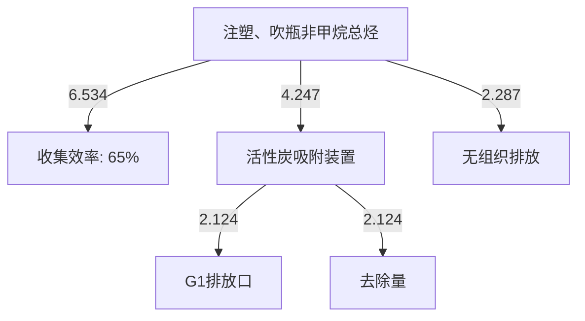
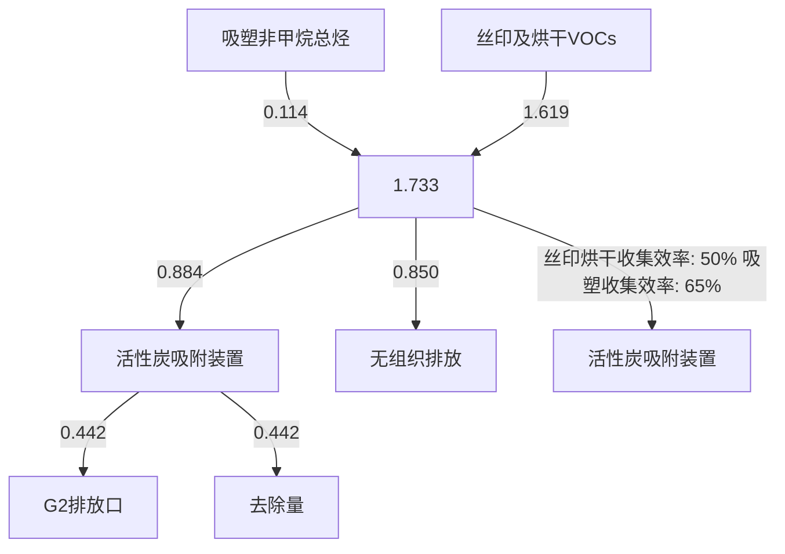
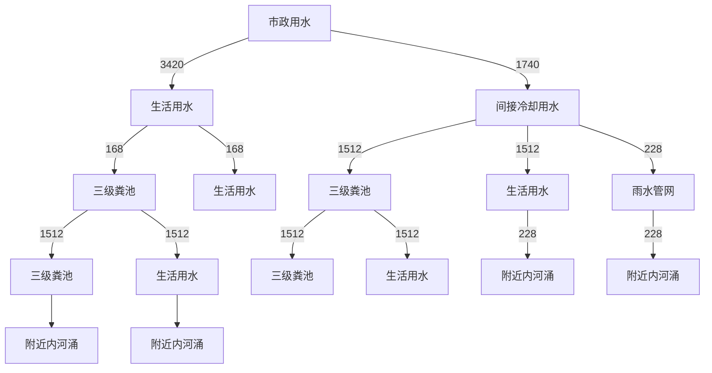
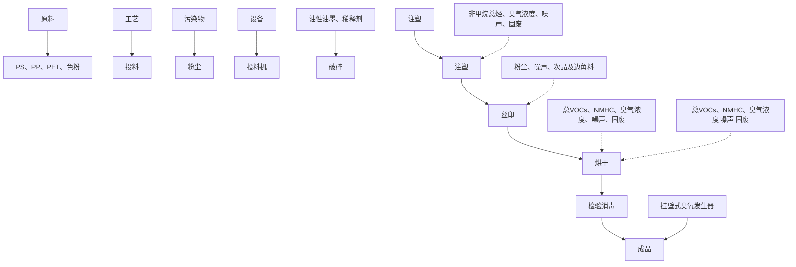
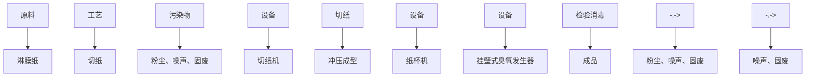
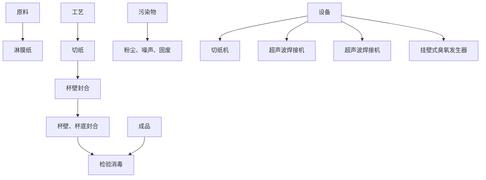
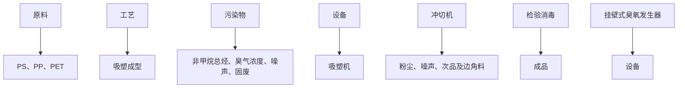
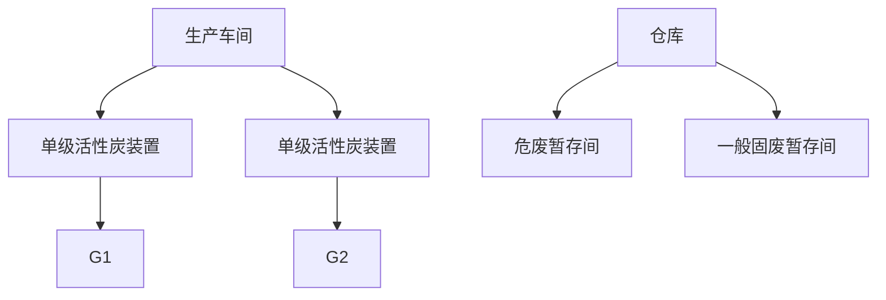

# 建设项目环境影响报告表

# （污染影响类）

项目名称：佛山市浩创时代包装制品有限公司新建项目

建设单位（盖章）：佛山市浩创时代包装制品有限公司

编制日期： 2024 年 8 月

中华人民共和国生态环境部制

编制单位和编制人员情况表

<table><tr><td colspan="2">项目编号</td><td>89664u</td><td rowspan="4" colspan="2"></td><td></td></tr><tr><td colspan="2">建设项目名称</td><td>佛山市浩创时</td><td>项目.</td></tr><tr><td colspan="2">建设项目类别</td><td>26--053塑料制</td><td></td></tr><tr><td colspan="2">环境影响评价文件类型</td><td>报告表</td><td></td></tr><tr><td colspan="6">一、建设单位情况</td></tr><tr><td colspan="2">单位名称(盖章)</td><td colspan="4">佛山市浩创时代包装制品有限公司</td></tr><tr><td colspan="2">统一社会信用代码</td><td colspan="4">91440113695157388J</td></tr><tr><td colspan="2">法定代表人(签章)</td><td rowspan="4" colspan="3"></td><td></td></tr><tr><td colspan="2">主要负责人(签字)</td><td></td></tr><tr><td colspan="2">直接负责的主管人员(签字)</td><td></td></tr><tr><td colspan="2">二、编制单位情况</td><td></td></tr><tr><td colspan="2">单位名称(盖章)</td><td>广州颐景</td><td rowspan="3"></td><td colspan="2"></td></tr><tr><td colspan="2">统一社会信用代码</td><td>91440101</td><td colspan="2"></td></tr><tr><td colspan="3">三、编制人员情况</td><td colspan="2"></td></tr><tr><td colspan="4">1.编制主持人</td><td colspan="2"></td></tr><tr><td>姓名</td><td colspan="3">职业资格证书管理号</td><td>信用编号</td><td>签字</td></tr></table>

text_image

中华人民共和国
环境影响评价工程师
职业资格证书
Professional Qualification Certificate
Environmental Impact Assessment Engineer
The People's Republic of China

text_image

中华人民共和国生态环境部
生态环境部
中华人民共和国

text_image

中华人民共和国
人力资源和社会保障部
中华人民共和国
人民共和国
社会保障部
中华人民共和国
人民共和国

开中生

# 中工证

# 目录

一、建设项目基本情况.

二、 建设项目工程分析.... . 18

三、区域环境质量现状、环境保护目标及评价标准 . 32

四、主要环境影响和保护措施.. 39

五、环境保护措施监督检查清单 . 70

六、结论... . 72

建设项目污染物排放量汇总表.. .. 73

# 附表 建设项目污染物排放量汇总表

附件1 企业营业执照

附件2 房产证

附件3 租赁合同

附件4 法人身份证及被委托人身份证

附件5 设备参数

附件6 原辅材料MSDS

附件7 环评合同

附件8 公示声明

附图1 项目地理位置图

附图2 项目四至卫星图

附图3 项目四至现场图

附图4 项目总平面图

附图5 项目生产车间第一层平面图

附图6 项目生产车间第二层平面图

附图7 项目生产车间第三层平面图

附图8 项目500米及50米范围内敏感点分布图

附图9 项目所在地大气环境功能区划图

附图10 项目所在地地表水环境功能区划图

附图11 项目所在地声环境功能区划图

附图12 佛山市顺德区环境管控单元图

附图13 项目所在地控制性详细规划图

# 一、建设项目基本情况

<table><tr><td>建设项目名称</td><td colspan="4">佛山市浩创时代包装制品有限公司新建项目</td></tr><tr><td>项目代码</td><td colspan="4" rowspan="3">无广东省佛山市顺德区伦教街道羊额村委会世龙大道15号之一</td></tr><tr><td>建设单位联系人</td></tr><tr><td>建设地点</td></tr><tr><td>地理坐标</td><td colspan="4">东经:113度10分56.279秒,北纬:22度52分32.077秒</td></tr><tr><td>国民经济行业类别</td><td>C2927日用塑料制品制造;C2231纸和纸板容器制造</td><td>建设项目行业类别</td><td colspan="2">二十六、橡胶和塑料制品业29-53塑料制品业292-其他(年用非溶剂型低VOCs含量涂料10吨以下的除外);十九、造纸和纸制品业22-38纸制品制造223*-有涂布、浸渍、印刷、粘胶工艺的</td></tr><tr><td>建设性质</td><td>☑新建(迁建)□改建□扩建□技术改造</td><td>建设项目申报情形</td><td colspan="2">☑首次申报项目□不予批准后再次申报项目□超五年重新审核项目□重大变动重新报批项目</td></tr><tr><td>项目审批(核准/备案)部门(选填)</td><td>无</td><td>项目审批(核准/备案)文号(选填)</td><td colspan="2">无</td></tr><tr><td>总投资(万元)</td><td>250</td><td>环保投资(万元)</td><td colspan="2">25</td></tr><tr><td>环保投资占比(%)</td><td>10</td><td>施工工期</td><td colspan="2">1个月</td></tr><tr><td>是否开工建设</td><td>☑否□是</td><td>用地(用海)面积( $m^2$ )</td><td colspan="2">15000</td></tr><tr><td rowspan="6">专项评价设置情况</td><td colspan="4">表1-1专项评价设置原则表</td></tr><tr><td>专项评价类别</td><td>设置原则</td><td>本项目相关情况</td><td>判定结果</td></tr><tr><td>大气</td><td>排放废气含有毒有害污染物、二噁英、苯并芘、氰化物、氯气且厂界外500米范围内有环境空气保护目标的建设项目</td><td>本项目排放不涉及技术指南规定的有毒有害废气污染物</td><td>不需要设置</td></tr><tr><td>地表水</td><td>新增工业废水直排建设项目(槽罐车外送污水处理厂的除外);新增废水直排的污水集中处理厂</td><td>本项目不涉及工业废水直接排放</td><td>不需要设置</td></tr><tr><td>环境风险</td><td>有毒有害和易燃易爆危险物质存储量超过临界量的建设项目</td><td>经分析,本项目危险物质存储量总计未超过临界量</td><td>不需要设置</td></tr><tr><td>生态</td><td>取水口下游500米范围内有重要水生生物的自然产卵场、索饵场、越冬场和洄游通道的新增河道取水的污染类建设项目</td><td>本项目不涉及直接从河道取水</td><td>不需要设置</td></tr><tr><td rowspan="2"></td><td>海洋</td><td>直接向海排放污染物的海洋工程建设项目</td><td>本项目污水排放不涉及海洋</td><td>不需要设置</td></tr><tr><td colspan="4"></td></tr><tr><td>规划情况</td><td colspan="4">无</td></tr><tr><td>规划环境影响评价情况</td><td colspan="4">无</td></tr><tr><td>规划及规划环境影响评价符合性分析</td><td colspan="4">无</td></tr><tr><td>其他符合性分析</td><td colspan="4">1、与产业政策符合性分析本项目属于《国民经济行业分类》(GB/T4754-2017)及第1号修改单中的C2927日用塑料制品制造和C2231纸和纸板容器制造,根据《产业结构调整指导目录(2024年本)》的规定,本项目不属于限制类、淘汰类。综上所述,本项目符合国家、广东省的产业政策要求。根据《环境保护综合名录(2021年版)》,本项目不属于“高污染、高环境风险”产品名录里的产品。根据《广东省“两高”项目管理目录(2022年版)》,本项目C2927日用塑料制品制造和C2231纸和纸板容器制造不属于目录里的产品类别。根据广东省发展改革委广东省生态环境厅关于印发《广东省禁止、限制生产、销售和使用的塑料制品目录》(2020年版)的通知(粤发改资环函〔2020〕1747号)中的规定,本项目从事果冻杯、圆筒、吸塑盒的生产,不属于禁止、限制生产、销售和使用的塑料制品目录中的类型,因此本项目与《广东省禁止、限制生产、销售和使用的塑料制品目录》要求相符。根据国家发展改革委商务部关于印发《市场准入负面清单(2022年版)》的通知,本项目不属于市场准入负面清单项目。2、《广东省“三线一单”生态环境分区管控方案》相符性分析:1生态保护红线本项目位于广东省佛山市顺德区伦教街道羊额村委会世龙大道15号之一,根据《广东省人民政府关于印发广东省“三线一单”生态环境分区管控方案的通知》(粤府〔2020〕71号),项目所在地不属于生态优先保护区、水环境优先保护区、大气环境优先保护区等优先保护单元,本项目不在划定的优先保护区。</td></tr></table>

# ②环境质量底线

根据《广东省人民政府关于印发广东省“三线一单”生态环境分区管控方案的通知》（粤府〔2020〕71 号），全省水环境质量持续改善，国考、省考断面优良水质比例稳步提升，全面消除劣Ⅴ类水体。大气环境质量继续领跑先行，PM2.5年均浓度率先达到世界卫生组织过渡期二阶段目标值（25微克/立方米），臭氧污染得到有效遏制。土壤环境质量稳中向好，土壤环境风险得到管控。近岸海域水体质量稳步提升。

项目地表水环境质量能满足相应的标准要求，项目所在区域大气环境属于不达标区，不达标因子为臭氧。本项目排放不涉及臭氧，项目注塑、吹瓶废气通过半密闭集气罩收集由活性炭吸附装置”处理后引至 29m 高排气筒 G1 排放；项目丝印及烘干通过包围型集气罩收集后与吸塑废气通过半密闭集气罩收集一并进入“活性炭吸附装置”处理后引至29m 高排气筒 G2排放，对周边环境影响较小；生活污水经三级化粪处理后达到广东省《水污染排放限值》（DB44/26-2001）第二时段三级标准后排入伦教污水处理厂，尾水排至李家沙水道，对周围环境影响较小，本项目排放的污染物不会导致区域环境质量超标，符合环境质量底线要求。

# ③资源利用上线

强化节约集约利用，持续提升资源能源利用效率，水资源、土地资源、岸线资源、能源消耗等达到或优于国家下达的总量和强度符合控制目标。本项目不属于高耗能、污染资源型企业，用水来自市政管网，用电来自市政供电。本项目建成后通过内部管理、设备选择、原辅材料的选用和管理、废物回收利用、污染治理等方面采取可行的防治措施，以“节能、降耗、减污”为目标，有效的控制污染。项目的水、电等资源利用不会突破区域上线。

# ④环保准入清单

根据《广东省人民政府关于印发广东省“三线一单”生态环境分区管控方案的通知》（粤府〔2020〕71号），从区域布局管控、能源资源利用、污染物排放管控和环境风险防控等方面明确准入要求，建立“1+3+N”三级生态环境准入清单体系。“1”为全省总体管控要求，“3”为“一核一带一区”区域管控要求，“N”为 1912 个陆域环境管控单元和 471 个海域环境管控单元的管控要求。本项目不属于区域布局管控、能源资源利用、污染物排放管控和环境风险防控等方面明确禁止准入项目。

⑤与“一核一带一区”区域管控要求的相符性

项目位于珠三角核心区，主要进行塑料的生产制造加工，不属于区域布局管控要求中的禁止新建、扩建燃煤燃油火电机组和企业自备电站和禁止新建、扩建水泥、平板玻璃、化学制浆、生皮制革以及国家规划外的钢铁、原油加工等项目。项目不涉及使用高挥发性原辅材料，不属于新建生产和使用高挥发性有机物原辅材料的项目，符合区域布局管控要求。

⑥与环境管控单元总体管控要求的相符性

根据《广东省人民政府关于印发广东省“三线一单”生态环境分区管控方案的通知》（粤府〔2020〕71 号）发布的广东省环境管控单元图，项目所在区域为一般管控单元，执行区域生态环境保护的基本要求。

# 3、《佛山市“三线一单”生态环境分区管控方案》相符性分析

根据佛山市生态环境局关于印发《佛山市“三线一单”生态环境分区管控方案(2024 年版)》的通知》（佛环〔2024〕20 号）发布的佛山市环境管控单元图，项目所在区域为重点管控单元 3，环境管控单元编码：ZH44060620003，要素细类为水环境其他重点管控区、大气环境布局敏感重点管控区、江河湖库岸线重点管控区。相关的管控要求相符性分析见下表。

表1-2 项目与伦教街道重点管控区管控要求相符性分析

<table><tr><td>管控维度</td><td>管控要求</td><td>本项目情况</td><td>相符性分析</td></tr><tr><td rowspan="4">区域布局管控</td><td>1-1.【产业/鼓励引导类】重点发展互联网家电、智能装备及其上下游配套、珠宝时尚及上下游配套等产业。培育高端智能机械装备、智能家居制造业、互联网家电、5G、物联网开发与应用等创新产业链,打造互联网家电及智能装备集聚区。</td><td>本项目为C2927日用塑料制品制造;C2231纸和纸板容器制造,不属于鼓励引导类产业。</td><td>符合</td></tr><tr><td>1-2.【产业/综合类】系统推进村级工业园升级改造,腾出连片空间,布局产业集聚区和主题产业园,推动工业项目入园集聚发展。</td><td>本项目不属于村改范围,不属于工业及物流仓储用地的新建与改造。</td><td>符合</td></tr><tr><td>1-3.【水/限制类】严格限制在羊额—北滘水厂饮用水水源保护区上游和周边区域建设列入“高污染、高环境风险”产品名录等可能影响水环境安全的项目。</td><td>本项目建设不在以上水源保护区的范围,不属于高污染、高环境风险的产品名录,本项目属于伦教污水处理厂的纳污范围,不属于影响水环境安全的项目</td><td>符合</td></tr><tr><td>1-4.【大气/限制类】大气环境布局敏感区重点管控区内,应严格限制新建</td><td>本项目没有使用产生和排放有毒有害大气</td><td></td></tr></table>

<table><tr><td rowspan="6"></td><td rowspan="3"></td><td>生产和使用高挥发性有机物原辅材料项目,优先开展低VOCs含量原辅材料替代,强化无组织排放控制。原则上不再新建、扩建新增氮氧化物、烟(粉)尘排放量较大的建设项目。</td><td>污染物的建设项目,本项目的塑料为新料,常温下不挥发有机废气。本项目使用的油墨为油性油墨,油性油墨较水性油墨有着成膜时间短、附着性强等优点,项目对丝印工序所使用的油墨有一定的要求,油性油墨仍是最佳选择,暂无低挥发物料可替代。</td><td>符合</td></tr><tr><td>1.5.【产业/综合类】划定家具生产优先发展区域,优先发展区外不再新建涉及涂装工艺的木质家具制造项目。优先发展区范围根据家具产业发展规划及其规划环评文件确定。</td><td>本项目不属于木质家具制造项目。</td><td>符合</td></tr><tr><td>1-6.【产业/限制类】受纳水体或监控断面不达标且未“以新带老”制定区域达标方案的河涌,不得新建、扩建向河涌直接排放废水的项目。新建、扩建含蚀刻工序的线路板生产项目和化工项目应在配套污水集中处置的工业园区或生活污水管网覆盖区域内建设;纯加工型印花项目,含酸洗、磷化的金属表面处理、金属制品项目(与自身高新技术企业配套的和区级及以上重点项目除外),含酸洗、喷涂、化学抛光、电解等涉及废水排放工艺的不锈钢型材加工项目(与自身高新技术企业配套的和区级及以上重点项目除外),应进入以此类项目为主导产业、有相应废水集中治理设施的工业园区,实现集中治污。</td><td>本项目生活污水排入伦教污水处理厂。项目为C2927日用塑料制品制造和C2231纸和纸板容器制造,主要从事塑料制品和纸制品的加工生产,不属于线路板生产项目和化工项目;不属于纯加工型印花,含酸洗、喷涂、拉丝、表面抛光等工艺的不锈钢型材加工项目。</td><td>符合</td></tr><tr><td rowspan="3">能源资源利用</td><td>2-1【能源/鼓励引导类】推广节能技术,加快发展绿色货运与现代物流。</td><td>本项目使用节能技术,项目不属于绿色货运与现代物流。</td><td>符合</td></tr><tr><td>2-2【能源/鼓励引导类】推广新能源汽车应用和充电基础设施建设,积极推动重卡LNG加气站、充电基础设施、加氢站建设。</td><td>本项目不属于新能源汽车应用和充电基础设施、加氢站建设项目。</td><td>符合</td></tr><tr><td>2-3.【能源/综合类】科学实施能源消费总量和强度“双控”,新建高能耗项目单位产品(产值)能耗达到国际国内先进水平。</td><td>本项目不属于高能耗项目。</td><td>符合</td></tr><tr><td rowspan="6"></td><td rowspan="3"></td><td>2-4.【水资源/综合类】贯彻落实“节水优先”方针,实行最严格水资源管理制度,伦教街道万元国内生产总值用水量、万元工业增加值用水量、用水总量、农田灌溉水有效利用系数等用水总量和效率指标达到区下达要求。</td><td>本项目严格贯彻落实“节水优先”方针,实行最严格水资源管理制度,伦教镇万元国内生产总值用水量、万元工业增加值用水量、用水总量、农田灌溉水有效利用系数等用水总量和效率指标达到区下达要求。</td><td>符合</td></tr><tr><td>2-5.【土地资源/限制类】落实单位土地面积投资强度、土地利用强度等建设用地控制性指标要求,提高土地利用效率。</td><td>本项目所在地为工业用地,符合控制性指标要求</td><td>符合</td></tr><tr><td>2-6.【岸线/禁止类】严格水域岸线用途管制,新建项目一律不得违规占用水域。严禁破坏生态的岸线利用行为和不符合其功能定位的开发建设活动,严禁以各种名义侵占河道、围垦湖泊、非法采砂等。</td><td>本项目未违规占用水域,不会破坏生态的岸线利用行为和不符合其功能定位的开发建设活动,不侵占河道、围垦湖泊、非法采砂等</td><td>符合</td></tr><tr><td rowspan="3">污染物排放管控</td><td>3-1.【水/限制类】城镇新区建设实行雨污分流,逐步推进初期雨水收集、处理和资源化利用。住宅、商业体、学校、市场等城镇开发建设项目应当配套或者同步计划建设公共排水设施,公共排水设施或自建排污水设施未能投产运行的,以上涉水项目不得投入使用。新建小区严格实施雨污分流,阳台、露台等污水接入污水收集系统,将生活污水“应截尽截”。做好大型楼盘、集贸市场、餐饮以及学校等4大类排水户污水接入市政管网工作。</td><td>本项目不属于城镇新区建设。</td><td>符合</td></tr><tr><td>3-2.【水/综合类】结合村级工业园改造,全面提升产业层次与集聚度,促进污染集中整治。</td><td>本项目不属于村级工业园改造区。</td><td>符合</td></tr><tr><td>3-3.【水/综合类】稳步推进排水设施“三个一体化”管理模式,补齐城乡污水收集和处理短板,推动伦教污水处理厂提质增效,加快消除城中村、老旧城区、城乡结合部等污水收集管网空白区,逐步实现城乡污水收集处理全覆盖。2025年前完成伦教污水处理厂扩建,尾水应执行《城镇污水处理厂污染物排放标准》(GB18918-2002)一级A标准及《广东省水污染物排放限值》(DB44/26-2001)的较严值。3-4.【水/综合类】保留和完善羊额村、霞石村、熹涌村、鸡洲村、永丰村等现状农村污水分散式处理设施,继续完善污水支管网建设,提高污水收集处理率,其余行政村(社区)继续完善污水管网建设,实现农村污水100%收集进入市政污水系统,有条件的区域实施雨污分流改造,到2030年全面雨污分流,污水纳入伦教城镇污水处理系统。</td><td>本项目位于伦教污水处理厂处理范围,尾水执行《城镇污水处理厂污染物排放标准》(GB18918-2002)一级A标准及《广东省水污染物排放限值》(DB44/26-2001)的较严值。本项目不属于污水管网、污水处理设施等建设项目。本项目实施雨污分流。</td><td>符合符合</td></tr><tr><td rowspan="4"></td><td rowspan="3">环境风险防控</td><td>4-1.【水/综合类】加强单元内羊额—北滘水厂饮用水水源保护区周边环境风险源管控,完善突发环境事件应急管理体系。</td><td>本项目不涉及。</td><td>符合</td></tr><tr><td>4-2.【水/综合类】伦教污水处理厂、工业污水集中处理设施应采取有效措施,防止事故废水直接排入水体。完善污水处理厂在线监控系统联网,实现污水处理厂的实时、动态监管。</td><td>本项目所在地位于伦教污水处理厂纳污范围,污水处理厂已在线监控系统联网,实现污水处理厂的实时、动态监管。</td><td>符合</td></tr><tr><td>4-3.【风险/综合类】加强环境风险分级分类管理,强化金属制品、有色金属和压延加工、化学原料和化学品制造业等涉重金属、化工行业企业及工业园区等重点环境风险源的环境风险防控。</td><td>项目液态原料储存于物料区,控制储存量,现场配置泄漏吸附收集等应急器材;危险废物分类暂存,危险废物暂存间设置有围堰,且做好防渗漏和硬底化处理;当废气收集系统出现故障时,立即停止生产,维修设备,并定期做好废气收集系统的检修和维护;在发生火灾和爆炸事故次生灾害时,采取紧急疏散等措施,加强对环境风险的分级分类管理。</td><td>符合</td></tr><tr><td colspan="4">4、与《佛山市顺德区人民政府关于印发佛山市顺德区“三线一单”生态环境分区管控方案的通知》(顺府发〔2021〕11号)的相符性分析根据《佛山市顺德区人民政府关于印发佛山市顺德区“三线一单”生态环境分区管控方案的通知》(顺府发〔2021〕11号)发布的顺德区环境管控单元图,项目所在区域为重点管控单元3,环境管控单元编码:ZH44060620003,要素细类为水环境其他重点管控区、大气环境布局敏感重</td></tr></table>

点管控区、江河湖库岸线重点管控区。项目与管控要求相符性分析如下：

表1-3 项目与伦教街道重点管控区管控要求相符性分析

<table><tr><td>管控维度</td><td>管控要求</td><td>本项目情况</td><td>相符性分析</td></tr><tr><td rowspan="6">区域布局管控</td><td>1-1.【产业/鼓励引导类】重点发展互联网家电、智能装备及其上下游配套、珠宝时尚及上下游配套等产业。培育高端智能机械装备、智能家居制造业、互联网家电、5G、物联网开发与应用等创新产业链,打造互联网家电及智能装备集聚区。</td><td>本项目为C2927日用塑料制品制造和C2231纸和纸板容器制造,不属于鼓励引导类产业。</td><td>符合</td></tr><tr><td>1-2.【产业/综合类】系统推进村级工业园升级改造,腾出连片空间,布局产业集聚区和主题产业园,推动工业项目入园集聚发展。</td><td>本项目不属于村改范围,不属于工业及物流仓储用地的新建与改造。</td><td>符合</td></tr><tr><td>1-3.【水/限制类】严格限制在羊额—北滘水厂饮用水水源保护区上游和周边区域建设列入“高污染、高环境风险”产品名录等可能影响水环境安全的项目。</td><td>本项目建设不在以上水源保护区的范围,不属于高污染、高环境风险的产品名录,本项目属于伦教污水处理厂的纳污范围,不属于影响水环境安全的项目</td><td>符合</td></tr><tr><td>1-4.【大气/限制类】大气环境布局敏感区重点管控区内,应严格限制新建生产和使用高挥发性有机物原辅材料项目,优先开展低VOCs含量原辅材料替代,强化无组织排放控制。原则上不再新建、扩建新增氮氧化物、烟(粉)尘排放量较大的建设项目。</td><td>本项目没有使用产生和排放有毒有害大气污染物的建设项目,本项目的塑料为新料,常温下不挥发有机废气。本项目使用的油墨为油性油墨,油性油墨较水性油墨有着成膜时间短、附着性强等优点,项目对丝印工序所使用的油墨有一定的要求,油性油墨仍是最佳选择,暂无低挥发物料可替代。</td><td>符合</td></tr><tr><td>1.5.【产业/综合类】划定家具生产优先发展区域,优先发展区外不再新建涉及涂装工艺的木质家具制造项目。优先发展区范围根据家具产业发展规划及其规划环评文件确定。</td><td>本项目不属于木质家具制造项目</td><td>符合</td></tr><tr><td>1-6.【产业/限制类】受纳水体或监控断面不达标且未“以新带老”制定区域达标方案的河涌,不得新建、扩建向河涌直接排放废水的项目。新建、扩建含蚀刻工序的线路板生产项目和化工项目应在配套污水集中处置的工业园区或生活污水管网覆盖区域内建设;纯加工型印花项目,含酸洗、磷化的金属表面处理、金属制品项目(与</td><td>本项目生活污水排入伦教污水处理厂。项目为C2927日用塑料制品制造和C2231纸和纸板容器制造,主要从事塑料制品和纸制品的加工生产,不属于线路板生产项目和化工项目;不属于纯加工型印花,</td><td>符合</td></tr></table>

<table><tr><td rowspan="7"></td><td></td><td>自身高新技术企业配套的和区级及以上重点项目除外),含酸洗、喷涂、化学抛光、电解等涉及废水排放工艺的不锈钢型材加工项目(与自身高新技术企业配套的和区级及以上重点项目除外),应进入以此类项目为主导产业、有相应废水集中治理设施的工业园区,实现集中治污。</td><td>含酸洗、喷涂、拉丝、表面抛光等工艺的不锈钢型材加工项目。</td><td></td></tr><tr><td rowspan="6">能源资源利用</td><td>2-1【能源/鼓励引导类】推广节能技术,加快发展绿色货运与现代物流。</td><td>本项目使用节能技术,项目不属于绿色货运与现代物流。</td><td>符合</td></tr><tr><td>2-2【能源/鼓励引导类】推广新能源汽车应用和充电基础设施建设,积极推动重卡LNG加气站、充电基础设施、加氢站建设。</td><td>本项目不属于新能源汽车应用和充电基础设施、加氢站建设项目。</td><td>符合</td></tr><tr><td>2-3.【能源/综合类】科学实施能源消费总量和强度“双控”,新建高能耗项目单位产品(产值)能耗达到国际国内先进水平。</td><td>本项目不属于高能耗项目。</td><td>符合</td></tr><tr><td>2-4.【水资源/综合类】贯彻落实“节水优先”方针,实行最严格水资源管理制度,伦教街道万元国内生产总值用水量、万元工业增加值用水量、用水总量、农田灌溉水有效利用系数等用水总量和效率指标达到区下达要求。</td><td>本项目严格贯彻落实“节水优先”方针,实行最严格水资源管理制度,伦教镇万元国内生产总值用水量、万元工业增加值用水量、用水总量、农田灌溉水有效利用系数等用水总量和效率指标达到区下达要求。</td><td>符合</td></tr><tr><td>2-5.【土地资源/限制类】落实单位土地面积投资强度、土地利用强度等建设用地控制性指标要求,提高土地利用效率。</td><td>本项目所在地为工业用地,符合控制性指标要求</td><td>符合</td></tr><tr><td>2-6.【岸线/禁止类】严格水域岸线用途管制,新建项目一律不得违规占用水域。严禁破坏生态的岸线利用行为和不符合其功能定位的开发建设活动,严禁以各种名义侵占河道、围垦湖泊、非法采砂等。</td><td>本项目未违规占用水域,不会破坏生态的岸线利用行为和不符合其功能定位的开发建设活动,不侵占河道、围垦湖泊、非法采砂等</td><td>符合</td></tr><tr><td rowspan="7"></td><td rowspan="4">污染物排放管控</td><td>3-1.【水/限制类】城镇新区建设实行雨污分流,逐步推进初期雨水收集、处理和资源化利用。住宅、商业体、学校、市场等城镇开发建设项目应当配套或者同步计划建设公共排水设施,公共排水设施或自建排污水设施未能投产运行的,以上涉水项目不得投入使用。新建小区严格实施雨污分流,阳台、露台等污水接入污水收集系统,将生活污水“应截尽截”。做好大型楼盘、集贸市场、餐饮以及学校等4大类排水户污水接入市政管网工作。</td><td>本项目不属于城镇新区建设。</td><td>符合</td></tr><tr><td>3-2.【水/综合类】结合村级工业园改造,全面提升产业层次与集聚度,促进污染集中整治。</td><td>本项目不属于村级工业园改造区。</td><td>符合</td></tr><tr><td>3-3.【水/综合类】稳步推进排水设施“三个一体化”管理模式,补齐城乡污水收集和处理短板,推动伦教污水处理厂提质增效,加快消除城中村、老旧城区、城乡结合部等污水收集管网空白区,逐步实现城乡污水收集处理全覆盖。2025年前完成伦教污水处理厂扩建,尾水应执行《城镇污水处理厂污染物排放标准》(GB18918-2002)一级A标准及《广东省水污染物排放限值》(DB44/26-2001)的较严值。</td><td>本项目位于伦教污水处理厂处理范围,尾水执行《城镇污水处理厂污染物排放标准》(GB18918-2002)一级A标准及《广东省水污染物排放限值》(DB44/26-2001)的较严值。</td><td>符合</td></tr><tr><td>3-4.【水/综合类】保留和完善羊额村、霞石村、熹涌村、鸡洲村、永丰村等现状农村污水分散式处理设施,继续完善污水支管网建设,提高污水收集处理率,其余行政村(社区)继续完善污水管网建设,实现农村污水100%收集进入市政污水系统,有条件的区域实施雨污分流改造,到2030年全面雨污分流,污水纳入伦教城镇污水处理系统。</td><td>本项目不属于污水管网、污水处理设施等建设项目。本项目实施雨污分流。</td><td>符合</td></tr><tr><td rowspan="3">环境风险防控</td><td>4-1.【水/综合类】加强单元内羊额—北滘水厂饮用水水源保护区周边环境风险源管控,完善突发环境事件应急管理体系。</td><td>本项目不涉及。</td><td>符合</td></tr><tr><td>4-2.【水/综合类】伦教污水处理厂、工业污水集中处理设施应采取有效措施,防止事故废水直接排入水体。完善污水处理厂在线监控系统联网,实现污水处理厂的实时、动态监管。</td><td>本项目所在地位于伦教污水处理厂纳污范围,污水处理厂已在线监控系统联网,实现污水处理厂的实时、动态监管。</td><td>符合</td></tr><tr><td>4-3.【风险/综合类】加强环境风险分级分类管理,强化金属制品、有色金</td><td>项目液态原料储存于物料区,控制储存量,</td><td>符合</td></tr></table>

<table><tr><td></td><td>属和压延加工、化学原料和化学品制造业等涉重金属、化工行业企业及工业园区等重点环境风险源的环境风险防控。</td><td>现场配置泄漏吸附收集等应急器材;危险废物分类暂存,危险废物暂存间设置有围堰,且做好防渗漏和硬底化处理;当废气收集系统出现故障时,立即停止生产,维修设备,并定期做好废气收集系统的检修和维护;在发生火灾和爆炸事故次生灾害时,采取紧急疏散等措施,加强对环境风险的分级分类管理。</td><td></td></tr></table>

# 5、选址合理性分析

项目位于广东省佛山市顺德区伦教街道羊额村委会世龙大道 15 号之。根据关于《顺德伦教世龙工业区(D-LJ-03 分区)控制性详细规划修编》的批后通告，项目所在地用地性质为工业用地，因此，项目选址符合功能规划要求。

# 6、项目与挥发性有机物相关政策文件规定的相符性分析

项目挥发性有机物排放符合性根据相关政策文件规定分析如下：

表 1-4 项目挥发性有机物排放规定

<table><tr><td>序号</td><td>政策要求</td><td>工程内容</td><td>符合性</td></tr><tr><td colspan="4">1.《广东省人民政府办公厅关于印发广东省2021年大气、水、土壤污染防治工作方案的通知》(粤办函〔2021〕58号)</td></tr><tr><td>1.1</td><td>严格落实国家产品VOCs含量限值标准要求,除现阶段确无法实施替代的工序外,禁止新建生产和使用高VOCs含量原辅材料项目。鼓励在生产和流通消费环节推广使用低VOCs含量原辅材料。</td><td>项目使用的塑料原料PS、PP、PET,其均为新粒料,常温条件下不会产生有机废气;本项目使用的油墨为油性油墨,油性油墨较水性油墨有着成膜时间短、附着性强等优点,项目对丝印工序所使用的油墨有一定的要求,油性油墨仍是最佳选择,暂无低挥发物料可替代。</td><td>符合</td></tr><tr><td colspan="4">2.《佛山市生态环境局顺德分局关于做好重点行业建设项目挥发性有机物总量指标管理工作的通知》(佛顺环函〔2019〕56号)</td></tr><tr><td>2.1</td><td>省、市生态环境主管部门对VOCs排放量大于300公斤/年的新、改、扩建项目,进行总量替代,按照附表1填报VOCs指标来源说明。其他排放量规模需要总量替代的,由本级生态环境主管部门自行确定范围,并按照要求审核总量指标来源,填写VOCs总量指标来源说明。</td><td>本项目挥发性有机物(VOCs与非甲烷总烃)新增总量为5.703t/a,在镇总量中分配。待项目审批时由生态环境部门核定VOCs总量来源。</td><td>符合</td></tr><tr><td colspan="4">3.《广东省涉挥发性有机物(VOCs)重点行业治理指引》的通知(粤环办〔2021〕43号)</td></tr><tr><td>3.1</td><td>45-工艺过程-在混合/混炼、塑炼/塑化/熔化、加工成型(挤出、注射、压制、压延、发泡、纺丝等)、硫化等作业中应采用密闭设备或在密闭空间中操作。</td><td>项目注塑、吹瓶、吸塑有机废气经半密闭集气罩收集,收集效率为65%;项目丝印及烘干有机废气经包围型集气罩收集,收集效率为50%。</td><td>符合</td></tr><tr><td>3.2</td><td>43-VOCs物料转移和输送-粉状、粒状VOCs物料采用气力输送设备、管状带式输送机、螺旋输送机等密闭输送方式,或者采用密闭的包装袋、容器或罐车进行物料转移。</td><td>项目使用的PS、PP、PET,其均为新粒料,常温条件下不会产生有机废气。在转移过程中均使用密闭的包装袋封装。</td><td>符合</td></tr><tr><td>3.3</td><td>50-废气收集-废气收集系统的输送管道应密闭。废气收集系统应在负压下运行,若处于正压状态,应对管道组件的密封垫进行泄漏检测,泄漏检测值不应超过500μmol/mol,亦不应有感官可察觉泄漏。</td><td>项目废气收集系统的输送管道均密闭,废气收集系统在负压下运行。</td><td>符合</td></tr><tr><td>3.4</td><td>52-排放水平-塑料制品行业:a)有机废气排气筒排放浓度不高于广东省《大气污染物排放限值》(DB 44/27-2001)第II时段排放限值,合成革和人造革企业排放浓度不高于《合成革与人造革工业污染物排放标准》(GB21902-2008)排放限值,若国家和我省出台并实施适用于塑料制品制造业的大气污染物排放标准,则有机废气排气筒排放浓度不高于相应的排放限值;车间或生产设施排气中NMHC初始排放速率≥3kg/h时,建设VOCs处理设施且处理效率≥80%;b)厂区内无组织排放监控点NMHC的小时平均浓度值不超过6mg/m3,任意一次浓度值不超过20mg/m3。</td><td>有机废气G1排气筒非甲烷总烃排放浓度有组织排放浓度34.956mg/m3;G2排气筒非甲烷总烃排放浓度有组织排放浓度16.363mg/m3,可达到《合成树脂工业污染物排放标准》(GB31572-2015,含2024年修改单)表4大气污染物浓度限值;项目注塑、吹瓶废气初始排放速率为1.89kg/h&lt;3kg/h,收集后经“活性炭吸附装置”处理,非甲烷总烃处理效率为50%。厂区内NMHC满足广东省地方标准《固定污染源挥发性有机物综合排放标准》(DB44/2367-2022)表3厂区内VOCs无组织排放限值(≤6mg/m3(监控点处1h平均浓度值)、≤20mg/m3(监控点处任意一次浓度值))。</td><td>符合</td></tr><tr><td colspan="4">4.《重点行业挥发性有机物综合治理方案》(环大气[2019]53号)</td></tr><tr><td>4.1</td><td>通过使用水性、粉末、高固体分、无溶剂、辐射固化等低VOCs含量的涂料,水性、辐射固化、植物基等低VOCs含量的油墨,水基、热熔、无溶剂、辐射固化、改性、生物降解等低VOCs含量的胶粘剂,以及低VOCs含量、低反应活性的清洗剂等,替代溶剂型涂料、油墨、胶粘剂、清洗剂等,从源头减少VOCs产生。</td><td>项目使用PS、PP、PET,其均为新料,不属于高VOCs含量原辅材料;本项目使用的油墨为油性型油墨,油性油墨较水性油墨有着成膜时间短、附着性强等优点,项目对丝印工序所使用的油墨有一定的要求,油性油墨仍是最佳选择,暂无低挥发物料可替代。</td><td>符合</td></tr><tr><td>4.2</td><td>全面加强无组织排放控制。推进</td><td>项目注塑成型、吹瓶、吸塑工序</td><td>符合</td></tr></table>

<table><tr><td rowspan="6"></td><td></td><td>使用先进生产工艺。通过采用全密闭、连续化、自动化等生产技术,以及高效工艺与设备等,减少工艺过程无组织排放。挥发性有机液体装载优先采用底部装载方式。遵循“应收尽收、分质收集”的原则,科学设计废气收集系统,将无组织排放转变为有组织排放进行控制。采用全密闭集气罩或密闭空间的,除行业有特殊要求外,应保持微负压状态,并根据相关规范合理设置通风量。采用局部集气罩的,距集气罩开口面最远处的VOCs无组织排放位置,控制风速应不低于0.3米/秒,有行业要求的按相关规定执行。</td><td>采用半密闭集气罩收集有机废气;丝印及烘干工序采用包围型集气罩收集有机废气;通过采取设备密闭、工艺改进、废气有效收集等措施,有效削减VOCs无组织排放。</td><td></td></tr><tr><td>4.3</td><td>推进建设适宜高效的治污设施。鼓励企业采用多种技术的组合工艺,提高VOCs治理效率。低浓度、大风量废气,宜采用沸石转轮吸附、活性炭吸附、减风增浓等浓缩技术,提高VOCs浓度后净化处理。低温等离子、光催化、光氧化技术主要适用于恶臭异味等治理;生物法主要适用于低浓度VOCs废气治理和恶臭异味治理。非水溶性的VOCs废气禁止采用水或水溶液喷淋吸收处理。</td><td>项目有机废气经“活性炭吸附装置”处理,处理效率为50%。</td><td>符合</td></tr><tr><td>4.4</td><td>加强企业运行管理。企业应系统梳理VOCs排放主要环节和工序,包括启停机、检维修作业等,制定具体操作规程,落实到具体责任人。健全内部考核制度。加强人员能力培训和技术交流。建立管理台账,记录企业生产和治污设施运行的关键参数(见附件3),在线监控参数要确保能够实时调取,相关台账记录至少保存三年。</td><td>项目VOCs排放主要环节和工序为注塑成型、吹瓶、丝印及烘干、吸塑,建设单位将针对该工序制定具体操作规程,落实到具体责任人,健全内部考核制度,加强人员能力培训和技术交流;建立管理台账,记录企业生产和治污设施运行的关键参数,相关台账记录至少保存三年。</td><td>符合</td></tr><tr><td colspan="4">5.广东省《固定污染源挥发性有机物综合排放标准》(DB44/2367-2022)</td></tr><tr><td>5.1</td><td>排气筒高度不低于15m(因安全考虑或者有特殊工艺要求的除外),具体高度以及与周围建筑物的相对高度关系应当根据环境影响评价文件确定。</td><td>项目注塑、吹瓶废气通过半密闭集气罩收集由活性炭吸附装置”处理后引至29m高排气筒G1排放;项目丝印及烘干通过包围型集气罩收集后与吸塑废气通过半密闭集气罩收集一并进入“活性炭吸附装置”处理后引至29m高排气筒G2排放。</td><td>符合</td></tr><tr><td>5.2</td><td>企业应当建立台账,记录废气收集系统、VOCs处理设施的主要运行和维护信息,如运行时间、废气处理量、操作温度、停留时间、吸附剂再生/更换周期和更换量、催化剂更换周期和更换量、吸收液pH值等关键运行参数。台账保存期限不少于3年。</td><td>项目运营期废气治理设施拟安排专人维护并定期建立台账,记录相关废气数据。</td><td>符合</td></tr><tr><td rowspan="8"></td><td>5.3</td><td>VOCs物料应当储存于密闭的容器、储罐、储库、料仓中;盛装VOCs物料的容器应当存放于室内,或者存放于设置有雨棚、遮阳和防渗设施的专用场地。盛装VOCs物料的容器或者包装袋在非取用状态时应当加盖、封口,保持密闭。</td><td>项目使用PS、PP、PET,其均为新粒料,不属于高VOCs含量原辅材料,包装方式分别为密闭袋装,储存于原料区内(室内)。</td><td>符合</td></tr><tr><td>5.4</td><td>废气收集系统排风罩(集气罩)的设置应当符合GB/T16758的规定。采用外部排风罩的,应当按GB/T 16758、WS/T757-2016规定的方法测量控制风速,测量点应当选取在距排风罩开口面最远处的VOCs无组织排放位置,控制风速不应当低于0.3m/s(行业相关规范有具体规定的,按相关规定执行)。</td><td>项目注塑、吹瓶废气通过半密闭集气罩收集由“活性炭吸附装置”处理后引至29m高排气筒G1排放;项目丝印及烘干通过包围型集气罩收集后与吸塑废气通过半密闭集气罩收集一并进入“活性炭吸附装置”处理后引至29m高排气筒G2排放。</td><td>符合</td></tr><tr><td colspan="4">6.《广东省生态环境保护“十四五”规划》(粤环〔2021〕10号)</td></tr><tr><td>6.1</td><td>大力推进低VOCs含量原辅材料源头替代,严格落实国家和地方产品VOCs含量限值质量标准,禁止建设生产和使用高VOCs含量的溶剂型涂料、油墨、胶粘剂等项目。</td><td>项目使用PS、PP、PET,其均为新粒料,不属于高VOCs含量原辅材料;本项目使用的油墨为油性油墨,油性油墨较水性油墨有着成膜时间短、附着性强等优点,项目对丝印工序所使用的油墨有一定的要求,油性油墨仍是最佳选择,暂无低挥发物料可替代。</td><td>符合</td></tr><tr><td>6.2</td><td>强化对企业涉VOCs生产车间/工序废气的收集管理,推动企业开展治理设施升级改造。</td><td>项目注塑、吹瓶、吸塑有机废气经半密闭集气罩收集,收集效率为65%;项目丝印及烘干有机废气经包围型集气罩收集,收集效率为50%。</td><td>符合</td></tr><tr><td colspan="4">7.《佛山市生态环境局关于印发《佛山市生态环境保护“十四五”规划》的通知》(佛环〔2022〕3号)</td></tr><tr><td>7.1</td><td>加强VOCs源头替代和无组织排放管控。大力推进低VOCs含量原辅材料替代,将全面使用低VOCs含量原辅材料的企业纳入正面清单和政府绿色采购清单。鼓励重点行业企业开展生产工艺和设备水性化改造,推广使用水性、高固体分、无溶剂、粉末等低VOCs含量涂料。</td><td>项目使用原料为PS、PP、PET,其均为低挥发原料新粒料;本项目使用的油墨为油性油墨,油性油墨较水性油墨有着成膜时间短、附着性强等优点,项目对丝印工序所使用的油墨有一定的要求,油性油墨仍是最佳选择,暂无低挥发物料可替代。</td><td>符合</td></tr><tr><td>7.2</td><td>严格落实《挥发性有机物无组织排放控制标准》,开展厂区内无组织排放浓度监测。</td><td>已要求企业对照落实《挥发性有机物无组织排放控制标准》,开展厂区内无组织排放浓度监测。</td><td>符合</td></tr><tr><td rowspan="7"></td><td>7.3</td><td>加强对含VOCs物料储存、转移和运输、设备与管线组件泄漏、敞开页面逸散以及工艺过程等五类排放源的管控。</td><td>项目含VOCs原料均密封储存,已要求企业加强对含VOCs物料的管控。</td><td>符合</td></tr><tr><td>7.4</td><td>推进VOCs高排放企业治理设施提升改造,淘汰光催化、光氧化、低温等离子等现有低效治理设施。</td><td>项目废气治理设施为“活性炭吸附装置”,根据《2022年主要污染物总量减排核算技术指南》中表2-1VOCs废气收集率和治理设施去除率通用系数一级-一次性活性炭吸附-集中再生并活化处理效率为50%,不属于低效处理设施。</td><td>符合</td></tr><tr><td colspan="4">8.《佛山市顺德区生态环境保护“十四五”规划(2021-2025)》</td></tr><tr><td>8.1</td><td>持续推进重点行业VOCs整治。持续开展挥发性有机物专项整治,继续推进重点行业企业开展销号式综合整治,建立VOC重点监管企业名单并动态更新,督促企业建立VOCs管控台账清单;持续探寻高效节能的VOCs治理技术,对采用低温等离子、光氧化、光催化等低效治理工艺的企业在臭氧污染天气应对期间实施停限产或错峰生产,并推动企业逐步淘汰低效治理工艺</td><td>项目不采用低效治理工艺,采用活性炭吸附装置处理有机废气,根据《2022年主要污染物总量减排核算技术指南》中表2-1VOCs废气收集率和治理设施去除率通用系数一级-一次性活性炭吸附-集中再生并活化处理效率为50%,不属于低效处理设施。</td><td>符合</td></tr><tr><td>8.2</td><td>加强VOCs源头替代和无组织排放管控。大力推进低VOCs含量、低反应活性的原辅材料替代,将全面使用低VOCs含量原辅材料的企业纳入正面清单和政府绿色采购清单。鼓励重点行业企业开展生产工艺和设备水性化改造,推广使用水性、高固体分、无溶剂、粉末等低VOCs含量涂料。严格落实《挥发性有机物无组织排放控制标准》,开展厂区内无组织排放浓度监测,加强对含VOCs物料储存、转移和运输、设备与管线组件泄漏、敞开页面逸散以及工艺过程等五类排放源的管控。</td><td>项目使用PS、PP、PET,其均为新粒料,不属于高VOCs含量原辅材料,包装方式分别为密闭袋装,储存于原料区内(室内);本项目使用的油墨为油性油墨,油性油墨较水性油墨有着成膜时间短、附着性强等优点,项目对丝印工序所使用的油墨有一定的要求,油性油墨仍是最佳选择,暂无低挥发物料可替代。</td><td>符合</td></tr><tr><td colspan="4">9.《佛山市关于进一步加强塑料污染治理的实施方案》的通知(2020年11月9日发布)</td></tr><tr><td>9.1</td><td>禁止生产、销售的塑料制品。全市范围内禁止生产和销售厚度小于0.025毫米的超薄塑料购物袋、厚度小于0.01毫米的聚乙烯农用地膜。禁止以医疗废物为原料制造塑料制品;禁止将回收利的废塑料输液袋(瓶)用于原用途或用于制造餐饮容器以及玩具等儿童用品。加大禁止“洋垃圾”进口监管和打私力度,确保“全面禁止废塑料进口”落实到位。到2020年底,禁止生产和销售一次性发泡塑料餐具、一次性塑料棉签;禁止生产含塑料微珠的日化产品。到2022年底,禁止销售含塑料微珠的日化产品。国家《产业结构调整指导目录》和《市场准入负面清单》明确的属于淘汰类的塑料制品项目,禁止投资;属于限制类项目,禁止新建。</td><td>项目生产产品为果冻杯、圆筒、吸塑盒,生产工艺为注塑、吹瓶、吸塑,不涉及禁止生产、销售的塑料制品,原料均为新料</td><td>符合</td></tr><tr><td rowspan="2"></td><td>9.2</td><td>增加绿色产品供给。塑料制品生产企业要严格执行有关法律法规,生产符合相关标准的塑料制品,不得使用未经风险评估及技术验证的塑料回收料生产食品接触材料及制品,不得违规添加对人体、环境有害的化学添加剂。</td><td>项目使用的原料均为新料,项目产品生产过程没有添加对人体、环境有害的化学添加剂</td><td>符合</td></tr><tr><td colspan="4">因此项目建设符合国家、省、市的挥发性有机物相关政策要求。7、项目油性油墨不可替代论证分析1工艺技术上不可替代性虽然目前水性油墨得到广泛的应用,但现阶段与油性油墨比较,仍存在如下问题:(1)水性油墨对环境温度、湿度敏感,固含量相对传统油性油墨而言较低,由于水的表面张力较高,水性油墨的施工方式有别于油性油墨,对基材表面清洁度、施工环境的湿度要求较高,需要通过配方的技术改进和施工工艺的调整来协同解决。由于本项目油墨用量少,印刷面积小,此部分若进行技术投入会得不偿失。(2)改用水性油墨的话需要先进的技术,生产设备也需要改进。(3)水性油墨的干燥速度较慢,在非吸收性承印物或不相容基材(如塑料基材)表面印刷时,其干燥速度比油性油墨要慢若干倍。为使墨层彻底干燥,往往需要提高干燥温度;在干燥温度无法提高时,就需要采取降低印刷速度、牺牲印刷效率的方法。综上,项目油性油墨的使用在工艺技术上具有不可替代性。2市场上不可替代性</td></tr></table>

佛山市浩创时代包装制品有限公司新建项目使用油性油墨来满足特定客户对塑料杯LOGO 印刷的需求。

同时，使用水性油墨生产的产品质量仍不能与油性油墨相比，因此，将对响应重点客户产生不利影响：

（1）改用水性油墨，将对产品的质量产生影响，耐磨度、光泽丰满度上仍不能与油性油墨相比，导致不能满足客户特定产品的订单需求，而客户的采购一般都是整体产品供应打包采购的，极大可能会导致重点客户的流失。

（2）水性材料的干燥条件与油性材料不一样，需要对生产线进行较大的改造、调试，效果未必能达到这些高端客户要求的质量水平之余，改造调试也需要一定的周期。在这段时间内公司必然失去了一定的订单，也会造成一些重要客户的流失。

综上，项目油性油墨的使用在市场竞争规律上具有不可替代性。

# 二、建设项目工程分析

# 1、项目由来

佛山市浩创时代包装制品有限公司（简称“建设单位”）位于广东省佛山市顺德区伦教街道羊额村委会世龙大道 15 号之一，中心地理坐标为东经 113度 10 分56.279 秒，北纬 22度 52 分 32.077 秒，占地面积约为 15000m2，主要从事果冻杯、圆筒、吸塑盒、纸杯（包括一次性纸杯和蛋糕杯的加工生产，生产规模为年产果冻杯 11500 万个、圆筒600 万个、吸塑盒 400 万个、纸杯（包括一次性纸杯和蛋糕杯）21000万个。

根据《中华人民共和国环境影响评价法》（2018 年12月29 日修订）、《国务院关于修改〈建设项目环境保护管理条例〉的决定》（国务院令第 682 号）等法律法规的规定，建设对环境有影响的项目必须进行环境影响评价。参照《建设项目环境影响评价分类管理名录》（2021 年版）（生态环境部令第16 号）本项目属于“二十六、橡胶和塑料制品业 29-53 塑料制品业 292-其他（年用非溶剂型低 VOCs 含量涂料10吨以下的除外）和十九、造纸和纸制品业 22-38纸制品制造223\*-有涂布、浸渍、印刷、粘胶工艺的”，需编制建设项目环境影响报告表。

受佛山市浩创时代包装制品有限公司委托，广州颐景环保科技有限公司承担了该项目的环境影响评价工作，在组织相关技术人员现场踏勘、调查收集和研究与项目有关的技术资料的基础上，根据《建设项目环境影响报告表编制技术指南（污染影响类）（试行）》，编制了《佛山市浩创时代包装制品有限公司新建项目环境影响报告表》。

# 2、项目组成

本项目租赁一栋 5层厂房为生产车间经营场所；租赁一栋4层厂房的第一层为仓库，具体工程组成见下表：

表 2-1 项目工程组成一览表

<table><tr><td>工程分类</td><td>项目</td><td>建设内容</td><td>依托工程情况</td><td colspan="2">备注</td></tr><tr><td rowspan="4">主体工程</td><td rowspan="4">主体生产车间,5层,总高度为28米</td><td>第1层,注塑车间,层高5.6米,面积为 $3000m^{2}$ ,主要包含注塑区、吹瓶区、包装区、卫生间等</td><td rowspan="4">依托已建成的建筑</td><td colspan="2" rowspan="4">主要从事果冻杯、圆筒、吸塑盒、纸杯(包括一次性纸杯和蛋糕杯的加工生产</td></tr><tr><td colspan="2">第2层,纸品车间,层高5.6米,面积为 $3000m^{2}$ ,主要包含切纸区、制杯区、纸杯冲压成型区、包装区、焊接区、消毒区、办公室、卫生间等</td></tr><tr><td colspan="2">第3层,吸塑车间和丝印车间,层高5.6米,面积为 $3000m^{2}$ ,主要包含模具维修区、丝印区、吸塑区、冲切区、原料仓等</td></tr><tr><td colspan="2">第4和第5层,均为仓库,层高5.6米,面积为 $3000m^{2}$ ,主要用于成品存放</td></tr><tr><td rowspan="2">储运工程</td><td colspan="2">仓储方式</td><td>1层,面积为 $1400m^{2}$ ,用于原料的存放</td><td>依托已建成的建筑</td><td>用于原料的存放</td></tr><tr><td colspan="2">运输方式</td><td>原辅料和产品均采用货车运输</td><td>/</td><td>/</td></tr><tr><td rowspan="4">公用工程</td><td colspan="2">配电系统一套</td><td>配电系统一套</td><td rowspan="3">依托所在厂房已有设施</td><td>供应生产及办公用电</td></tr><tr><td colspan="2">供水系统一套</td><td>供水系统一套</td><td>市政供水</td></tr><tr><td colspan="2">雨水排水系统一套</td><td>雨水排水系统一套</td><td>采用雨污分流,雨水进入市政雨水管网</td></tr><tr><td colspan="2">生活污水排水系统一套</td><td>生活污水排水系统一套</td><td>依托所在厂房已有生活污水处理设施</td><td>生活污水经三级化粪池预处理后排入市政污水管网,经市政污水管网排入伦教污水处理厂作后续处理,尾水排放至李家沙水道</td></tr><tr><td rowspan="5">环保工程</td><td>废水污染物防治措施</td><td>生活污水</td><td>生活污水经三级化粪池预处理后排入市政污水管网,经市政污水管网排入伦教污水处理厂作后续处理,尾水排放至李家沙水道</td><td colspan="2">依托所在厂房已有生活污水处理设施</td></tr><tr><td colspan="2">废气污染物防治措施</td><td colspan="3">注塑、吹瓶废气经半密闭集气罩收集后引至“活性炭吸附装置”装置处理后通过29米排气筒(G1)排放;项目丝印及烘干通过包围型集气罩收集后与吸塑废气通过半密闭集气罩收集一并进入“活性炭吸附装置”处理后引至29m高排气筒G2排放。</td></tr><tr><td colspan="2">噪声污染防治措施</td><td colspan="3">采用低噪声设备、做好设备隔音、减振处理、合理布局车间</td></tr><tr><td rowspan="2">固体废物防治措施</td><td>危险废物</td><td>设置危废储存场所,占地面积约为 $10m^{2}$ </td><td colspan="2">危险废物分类收集后储存在危险废物暂存区,交由有危废资质的单位回收处置</td></tr><tr><td>一般工业固废</td><td>设置一般固废暂存间,占地面积约 $5m^{2}$ </td><td colspan="2">分类收集储存在一般工业固体废物暂存间内妥善处置</td></tr></table>

# 3、主要产品及产能

本项目主要生产规模详见下表。

表 2-2 项目产品方案一览表

<table><tr><td>序号</td><td>名称</td><td>单位</td><td>数量</td><td>备注</td><td>产品图片</td></tr><tr><td>1</td><td>果冻杯</td><td>万个/年</td><td>11500</td><td>单个产品重量约为20g</td><td></td></tr><tr><td>2</td><td>圆筒</td><td>万个/年</td><td>600</td><td>单个产品重量约为20g</td><td></td></tr><tr><td>3</td><td>吸塑盒</td><td>万个/年</td><td>400</td><td>单个产品重量约为15g</td><td></td></tr><tr><td>4</td><td>纸杯(包含一次性纸杯和蛋糕杯)</td><td>万个/年</td><td>21000</td><td>单个产品重量约为5g</td><td></td></tr></table>

# 4、主要生产设施及设施参数

根据建设单位提供的资料，项目主要生产设备详见下表。

表 2-3 本项目主要生产设备一览表

<table><tr><td>序号</td><td>设备名称</td><td>设备参数</td><td>单位</td><td>数量</td><td>使用工序</td><td>位置</td></tr><tr><td rowspan="4">1</td><td rowspan="4">注塑机</td><td>90</td><td>台</td><td>2</td><td rowspan="4">注塑</td><td rowspan="4">注塑区</td></tr><tr><td>170t</td><td>台</td><td>12</td></tr><tr><td>280t</td><td>台</td><td>13</td></tr><tr><td>350t</td><td>台</td><td>8</td></tr><tr><td>2</td><td>丝印机</td><td>/</td><td>台</td><td>13</td><td>丝印</td><td rowspan="2">丝印区</td></tr><tr><td>3</td><td>烘干炉</td><td>/</td><td>台</td><td>1</td><td>烘干</td></tr><tr><td>4</td><td>吹瓶机</td><td>/</td><td>台</td><td>6</td><td>吹瓶成型</td><td>吹瓶区</td></tr><tr><td>5</td><td>纸杯机</td><td>/</td><td>台</td><td>28</td><td>冲压成型</td><td>冲压成型区</td></tr><tr><td>6</td><td>空压机</td><td>/</td><td>台</td><td>6</td><td>提供动力</td><td>辅助设备</td></tr><tr><td>7</td><td>冷却塔</td><td> $10m^{3}/h$ </td><td>台</td><td>2</td><td>间接冷却</td><td>辅助设备</td></tr><tr><td>8</td><td>切纸机</td><td>/</td><td>台</td><td>2</td><td>切纸</td><td>切纸区</td></tr><tr><td>9</td><td>破料机</td><td>/</td><td>台</td><td>3</td><td>破碎</td><td>破碎区</td></tr><tr><td>10</td><td>车床</td><td>/</td><td>台</td><td>1</td><td>模具维修</td><td rowspan="3">模具维修区</td></tr><tr><td>11</td><td>磨床</td><td>/</td><td>台</td><td>1</td><td>模具维修</td></tr><tr><td>12</td><td>铣床</td><td>/</td><td>台</td><td>2</td><td>模具维修</td></tr><tr><td>13</td><td>自动投料机</td><td>/</td><td>台</td><td>3</td><td>投料</td><td>投料区</td></tr><tr><td>14</td><td>超声波焊接机</td><td>/</td><td>台</td><td>4</td><td>杯壁封合、杯壁杯底封合</td><td>焊接区</td></tr><tr><td>15</td><td>吸塑机</td><td>120t</td><td>台</td><td>2</td><td>吸塑</td><td>吸塑区</td></tr><tr><td>16</td><td>挂壁式臭氧发生器</td><td>5g; 20g</td><td>台</td><td>18</td><td>消毒</td><td>消毒区</td></tr><tr><td>17</td><td>冲切机</td><td>/</td><td>台</td><td>10</td><td>冲切</td><td>冲切区</td></tr></table>

表 2-4 本项目注塑、吸塑设备产能和原料规模匹配性分析一览表

<table><tr><td>设备名称</td><td>对应产品</td><td>设备型号</td><td>数量(台)</td><td>单台设备单批次注射量(g)</td><td>单批次生产时间(s)</td><td>单台设备全年最大生产批次(次)</td><td>年设备运行时间(h/a)</td><td>满负荷工作注塑量(t/a)</td></tr><tr><td rowspan="9">注塑机</td><td rowspan="3">果冻杯</td><td>170t</td><td>10</td><td>200</td><td>40</td><td>202500</td><td>2250</td><td>405</td></tr><tr><td>280t</td><td>13</td><td>600</td><td>50</td><td>162000</td><td>2250</td><td>1263.6</td></tr><tr><td>350t</td><td>8</td><td>1000</td><td>60</td><td>135000</td><td>2250</td><td>1080</td></tr><tr><td colspan="7">合计产能</td><td>2748.6</td></tr><tr><td colspan="7">实际申报产能</td><td>2300</td></tr><tr><td rowspan="2">圆筒</td><td>90t</td><td>2</td><td>100</td><td>30</td><td>270000</td><td>2250</td><td>54</td></tr><tr><td>170t</td><td>2</td><td>200</td><td>40</td><td>202500</td><td>2250</td><td>81</td></tr><tr><td colspan="7">合计产能</td><td>135</td></tr><tr><td colspan="7">实际申报产能</td><td>120</td></tr><tr><td rowspan="3">吸塑机</td><td>吸塑盒</td><td>120t</td><td>2</td><td>130</td><td>30</td><td>270000</td><td>2250</td><td>70.2</td></tr><tr><td colspan="7">合计产能</td><td>70.2</td></tr><tr><td colspan="7">实际申报产能</td><td>60</td></tr><tr><td colspan="9">备注:1、项目年生产运行天数为300天,每天8小时,企业每日设备开机需预热30分钟,则每日设备实际进入正常生产时间为7.5h,即2250h/a。</td></tr></table>

根据上表匹配性分析可知，项目注塑设备满负荷注塑量为 2883.6t/a，企业申报实际产量为 2420t/a，项目注塑设备可满足企业生产要求；项目吸塑设备满负荷量为 70.2t/a，企业申报实际产量为 60t/a，项目吸塑设备可满足企业生产要求。

表2-5 印刷机产能分析一览表

<table><tr><td>产品</td><td>设备</td><td>数量(台)</td><td>单次印刷面积( $m^{2}$ )</td><td>印刷速度,印次/min</td><td>年生产时间(h/a)</td><td>设计产能( $m^{2}/a$ )</td><td>实际申报产能( $m^{2}/a$ )</td></tr><tr><td>果冻杯</td><td>丝印机</td><td>12</td><td>0.0008</td><td>70</td><td>2400</td><td>96768</td><td>96600</td></tr><tr><td>圆筒</td><td>丝印机</td><td>1</td><td>0.0013</td><td>70</td><td>2400</td><td>13104</td><td>9600</td></tr><tr><td colspan="6">合计</td><td>109872</td><td>106200</td></tr><tr><td colspan="8">备注:根据建设单位提供的资料,需对果冻杯和圆筒进行丝印,果冻杯单个丝印面积为 $0.0008m^{2}$ ( $0.04*0.01*2$ ),圆筒杯单个丝印面积为 $0.0013m^{2}$ ( $3.14*0.02*0.02$ )</td></tr></table>

根据上表匹配性分析可知，项目丝印设备满负荷量为 109872m2 /a，企业申报实际产量为 106200m2 /a，项目丝印设备可满足企业生产要求。

表2-6 项目油墨用量一览表

<table><tr><td>序号</td><td>产品</td><td>印刷产品(万台/年)</td><td>单个涂层厚度( $\mu m$ )</td><td>涂层密度( $g/cm^3$ )</td><td>油墨/利用率(%)</td><td>固体分(%)</td><td>单个印刷面积(m2)</td><td>油墨消耗量(t)</td></tr><tr><td>1</td><td>果冻杯</td><td>11500</td><td>10</td><td>1.21</td><td>95</td><td>44</td><td>0.0008</td><td>2.66</td></tr><tr><td>2</td><td>圆筒</td><td>600</td><td>10</td><td>1.21</td><td>95</td><td>44</td><td>0.0013</td><td>0.23</td></tr><tr><td colspan="8">合计</td><td>2.89</td></tr><tr><td colspan="9">备注:1、油墨用量=[印刷厚度×油墨密度÷(油墨利用率×固体分)]×印刷面积。2、根据表2-8油墨的VOC挥发系数为56%,则油墨的固体分为44%。3、单个产品印刷厚度和油墨利用率选取参考其他同类型产品行业的经验参数。</td></tr></table>

# 5、主要原辅材料种类和用量

表 2-7 本项目主要原辅材料消耗量一览表

<table><tr><td>序号</td><td>原料名称</td><td>用量</td><td>状态</td><td>最大储存量</td><td>单位</td><td>备注</td></tr><tr><td>1</td><td>PS 塑料(新料)</td><td>2210</td><td>固态粒料/片状</td><td>200</td><td>t/a</td><td>外购;25kg 袋装</td></tr><tr><td>2</td><td>PP 塑料(新料)</td><td>126</td><td>固态粒料/片状</td><td>200</td><td>t/a</td><td>外购;25kg 袋装</td></tr><tr><td>3</td><td>PET 塑料(新料)</td><td>278.278</td><td>固态粒料/片状</td><td>200</td><td>t/a</td><td>外购;25kg 袋装</td></tr><tr><td>4</td><td>淋膜纸</td><td>1105.26</td><td>固态</td><td>100</td><td>t/a</td><td>外购;25kg 袋装</td></tr><tr><td>5</td><td>色粉</td><td>1.961</td><td>粉料</td><td>0.1</td><td>t/a</td><td>外购;25kg 袋装</td></tr><tr><td>6</td><td>油性油墨</td><td>1.92</td><td>液料</td><td>0.1</td><td>t/a</td><td>外购;5kg 桶装</td></tr><tr><td>7</td><td>稀释剂</td><td>0.97</td><td>液料</td><td>0.1</td><td>t/a</td><td>外购;5kg 桶装</td></tr><tr><td>8</td><td>机油</td><td>1</td><td>液料</td><td>0.2</td><td>t/a</td><td>外购;25kg 桶装</td></tr></table>

项目主要涉VOCs 原辅材料情况见下表。

表 2-8 项目主要涉 VOCs 原辅材料一览表

<table><tr><td>序号</td><td>名称</td><td>稀释比</td><td>理化性质</td><td>VOCs含量</td><td>国家标准限值</td><td>是否属于低VOCs原辅材料</td></tr><tr><td>1</td><td>PS塑料(新料)</td><td>/</td><td>聚苯乙烯为无色透明颗粒/片状,似玻璃状材料,制品掉在地上有清脆的响声,俗称“响胶”,燃烧火焰成橙黄色。尺寸稳定性非常好,透光度达到88-92%,无臭无味无毒,热变形温度70-98°C,吸湿性低,制品的连续使用温度低于60-80°C。聚苯乙烯导热系数不随温度发生变化,能作为良好的冷冻绝缘材料。长期曝于紫外线时会褪色,发生脆化,影响使用寿命。</td><td>常温条件下不会产生有机废气,注塑、吹瓶过程有机废气产污参考《排放源统计调查产排污核算方法和系数手册》中“292塑料制品行业系数手册”,塑料零件—注塑、吹瓶工序</td><td>/</td><td>是</td></tr></table>

<table><tr><td rowspan="5"></td><td>2</td><td>PP塑料(新料)</td><td>/</td><td>为无毒、无臭、无味的乳白色高结晶粒状/片状,密度只有0.90~0.91g/cm3,是目前所有塑料中最轻的品种之一。它对水特别稳定,在水中的吸水率仅为0.01%,分子量约8万~15万。成型性好,但因收缩率大(为1%~2.5%)。分解温度&gt;300°C</td><td rowspan="2">中非甲烷总烃产污系数为2.70千克/吨-产品;吸塑过程有机废气参考《排放源统计调查产排污核算方法和系数手册》中“292塑料制品行业系数手册”,塑料包装箱及容器—吸塑工序中非甲烷总烃产污系数为1.90千克/吨-产品</td><td rowspan="2"></td><td rowspan="2"></td></tr><tr><td>3</td><td>PET塑料(新料)</td><td>/</td><td>PET(聚对苯二甲酸乙二酯)塑料为乳白色或浅黄色、高度结晶的聚合物,表明平滑有光泽。纯PET熔点267°C,工业PET熔点:255-264°C。在较宽的温度范围内具有优良的物理机械性能,长期使用温度可达120°C,电绝缘性优良,甚至在高温高频下,其电性能仍较好,但耐电晕性较差,抗蠕变性,耐疲劳性,耐摩擦性、尺寸稳定性都很好。常应用于要求抗水、抗油及抗化学物品、耐高温等性能较高的产品标签,用于卫生间用品、化妆品、各类电器、机械产品等。</td></tr><tr><td>4</td><td>油性油墨</td><td rowspan="2">2:1</td><td>咖啡色液体,有刺激性气味,沸点为153°C,密度为1.40g/mL,不易溶于水。主要成分为17%~25%聚酯系树脂、11%~18%三聚氰胺树脂、18%~27%芳香烃溶剂和4%~7%酯系溶剂,其余成分为不挥发性添加剂。</td><td rowspan="2">挥发系数为56%,混合后密度为1.21g/cm3</td><td rowspan="2">《油墨中可挥发性有机化合物(VOCs)含量的限值》(GB38507-2020)表1溶剂油墨-网印油墨-75%</td><td rowspan="2">否,本项目使用的油墨为油性油墨,油性油墨较水性油墨有着成膜时间短、附着性强等优点,项目对丝印工序所使用的油墨有一定的要求,油性油墨仍是最佳选择,暂无低挥发物料可替代。</td></tr><tr><td>5</td><td>稀释剂</td><td>无色液体,有特殊气味,密度为0.95g/cm3,主要成分为93%~99%的乙二醇单丁醚,1-7%其他。稀释剂可调整油墨粘度,提高印刷适用性,除此之外,还能冲淡着色力,增加印刷面积,显著降低成本。</td></tr><tr><td>6</td><td>机油</td><td>/</td><td>机油一般由基础油和添加剂两部分组成。基础油是机油的主要成分,决定着机油的基本性质,添加剂则可弥补和改善基础油性能方面的不足,赋予某些新的性能,是机油的重要组成部分。机油外观为油状液体,淡黄色至褐色,无气味或略带异味。用于机械的摩擦部分,起润滑、冷却和密封作用。机油为可燃液体,遇明火、高热可燃。</td><td>/</td><td>/</td><td>/</td></tr></table>

# 项目物料平衡分析

表 2-9 项目果冻杯原辅材料投入、产出平衡表

<table><tr><td colspan="2">投入</td><td colspan="3">产出</td></tr><tr><td>名称</td><td>数量(t/a)</td><td>名称</td><td>数量(t/a)</td><td>备注</td></tr><tr><td>PS 塑料(新料)</td><td>2100</td><td>果冻杯</td><td>2300</td><td>作为产品出售</td></tr><tr><td>PP 塑料(新料)</td><td>100</td><td>颗粒物</td><td>0.006</td><td>以无组织的形式排放至大气环境中</td></tr><tr><td>PET 塑料(新料)</td><td>225</td><td>非甲烷总烃</td><td>6.21</td><td>活性炭吸附装置后排放</td></tr><tr><td>色粉</td><td>1.406</td><td>VOCs</td><td>1.49</td><td>活性炭吸附装置后排放</td></tr><tr><td>油性油墨</td><td>1.77</td><td>次品及边角料</td><td>121.36</td><td>交由回收单位回收处置</td></tr><tr><td>稀释剂</td><td>0.89</td><td>/</td><td>/</td><td>/</td></tr><tr><td>合计</td><td>2429.066</td><td>合计</td><td>2429.066</td><td>/</td></tr><tr><td>结论</td><td colspan="4">项目果冻杯产品原辅材料投入与产出平衡</td></tr></table>

表 2-10 项目圆筒原辅材料投入、产出平衡表

<table><tr><td colspan="2">投入</td><td colspan="3">产出</td></tr><tr><td>名称</td><td>数量(t/a)</td><td>名称</td><td>数量(t/a)</td><td>备注</td></tr><tr><td>PS塑料(新料)</td><td>100</td><td>圆筒</td><td>120</td><td>作为产品出售</td></tr><tr><td>PP塑料(新料)</td><td>6</td><td>颗粒物</td><td>0.002</td><td>以无组织的形式排放至大气环境中</td></tr><tr><td>PET塑料(新料)</td><td>20</td><td>非甲烷总烃</td><td>0.324</td><td>活性炭吸附装置后排放</td></tr><tr><td>色粉</td><td>0.555</td><td>VOCs</td><td>0.129</td><td>活性炭吸附装置后排放</td></tr><tr><td>油性油墨</td><td>0.15</td><td>次品及边角料</td><td>6.33</td><td>交由回收单位回收处置</td></tr><tr><td>稀释剂</td><td>0.08</td><td>/</td><td>/</td><td>/</td></tr><tr><td>合计</td><td>100</td><td>果冻杯</td><td>120</td><td>/</td></tr><tr><td>结论</td><td colspan="4">项目圆筒产品原辅材料投入与产出平衡</td></tr></table>

表 2-11 项目吸塑盒原辅材料投入、产出平衡表

<table><tr><td colspan="2">投入</td><td colspan="3">产出</td></tr><tr><td>名称</td><td>数量(t/a)</td><td>名称</td><td>数量(t/a)</td><td>备注</td></tr><tr><td>PS 塑料(新料)</td><td>10</td><td>吸塑盒</td><td>60</td><td>作为产品出售</td></tr><tr><td>PP 塑料(新料)</td><td>20</td><td>非甲烷总烃</td><td>0.114</td><td>活性炭吸附装置后排放</td></tr><tr><td>PET 塑料(新料)</td><td>33.278</td><td>次品及边角料</td><td>3.164</td><td>交由回收单位回收处置</td></tr><tr><td>合计</td><td>63.278</td><td>合计</td><td>63.278</td><td>/</td></tr><tr><td>结论</td><td colspan="4">项目吸塑盒产品原辅材料投入与产出平衡</td></tr></table>

表 2-12 项目纸杯原辅材料投入、产出平衡表

<table><tr><td colspan="2">投入</td><td colspan="3">产出</td></tr><tr><td>名称</td><td>数量(t/a)</td><td>名称</td><td>数量(t/a)</td><td>备注</td></tr><tr><td>淋膜纸</td><td>1105.26</td><td>纸杯</td><td>1050</td><td>作为产品出售</td></tr><tr><td>/</td><td>/</td><td>颗粒物</td><td>极少量</td><td>以无组织的形式排放至大气环境中</td></tr><tr><td>/</td><td>/</td><td>次品及边角料</td><td>55.26</td><td>交由回收单位回收处置</td></tr><tr><td>结论</td><td colspan="4">项目纸杯原辅材料投入与产出平衡</td></tr></table>

# 6、VOCs 平衡分析

本项目VOCs 平衡图见下图所示。

flowchart

单位：t/a

flowchart

单位：t/a

图 2-1 项目 VOCs 平衡分析图

# 7、水平衡分析

生活用水及排水：本项目用水均由市政水管道直接供水，主要用水为职工生活用水。本项目共设置员工168人，员工均不在厂内住宿，根据《用水定额 第3部分：生活》（DB44/T1461.3-2021）表 A.1 国家行政机构中办公楼（无食堂和浴室）的先进值用水定额为10m3/a，生活用水定额按 10m3 /a 计，新鲜生活用水量为 1680m3 /a。生活污水排污系数按 0.9 计，生活污水产生量为 1512m3 /a。本项目产生的生活污水经三级化粪池预处理达标后由市政污水管网引至伦教污水处理厂，尾水排放至李家沙水道。

冷却塔用水：本项目注塑、吹瓶设备需使用冷却水对设备进行间接冷却冷却水循环使用，需适当地加入新鲜水补充因蒸发而损失的水分。项目使用 2 冷却塔。根据废水源强分析可知，间接冷却塔补充水量Qm为0.725m3 /h（即1740m3 /a），蒸发水量Qe为0.58m3/h

（即 1392m3 /a），风吹损失水量 Qw 为 0.05m3 /h（即 120m3 /a），排污水量 Qb 为 0.095m3/h（即228m3 /a）。冷却水循环使用，定期排水为清净下水通过雨水管道排放，不计入排污量。

flowchart

图 2-2 项目水平衡图

# 8、工作制度和能耗水耗

表 2-13 本项目劳动定员及工作制度一览表

<table><tr><td>序号</td><td>名称</td><td>内容</td></tr><tr><td>1</td><td>劳动定员(人)</td><td>168</td></tr><tr><td>2</td><td>工作制度</td><td>8:00-12:00; 14:00-18:00, 日工作8小时, 年工作300天</td></tr><tr><td>3</td><td>食宿情况</td><td>不设食宿</td></tr></table>

表 2-14 本项目能耗水耗一览表

<table><tr><td>序号</td><td>名称</td><td>单位</td><td>用量</td><td>用途</td><td>备注</td></tr><tr><td rowspan="2">1</td><td rowspan="2">水</td><td>吨/年</td><td>1680</td><td>办公、生活</td><td rowspan="2">市政供水</td></tr><tr><td>吨/年</td><td>1740</td><td>冷却塔</td></tr><tr><td>2</td><td>电</td><td>万kW•h/年</td><td>100</td><td>生产、生活</td><td>市政供电</td></tr></table>

# 9、项目平面布置情况

本项目租赁一栋 5 层厂房为生产车间经营场所（第1 层，注塑车间，层高5.6米，面积为 3000m2，主要包含注塑区、吹瓶区、包装区、卫生间等；第 2层，纸品车间，层高5.6米，面积为3000m2，主要包含切纸区、制杯区、纸杯冲压成型区、包装区、焊接区、消毒区、办公室、卫生间等；第3层，吸塑车间和丝印车间，层高5.6米，面积为3000m2，主要包含模具维修区、丝印区、吸塑区、冲切区、原料仓等；第4和第5层，均为仓库，层高 5.6 米，面积为 3000m2，主要用于成品存放）；租赁一栋4 层厂房的第一层为仓库。项目厂区具体平面布置见附图 4。

# 10、污染防治设施投资

本项目总投资 2500 万，其中环保投资 25 万，投资比例为 10%。从污染治理效果及占项目增加投资的比例来看，项目环境污染治理措施投资在经济上是可行的。环保投资

<table><tr><td rowspan="8"></td><td colspan="4">见下表。表2-15本项目环保投资一览表</td></tr><tr><td colspan="2">项目</td><td>环保设施名称</td><td>资金(万元)</td></tr><tr><td colspan="3">环保投资总概算</td><td>25</td></tr><tr><td rowspan="4">实际总投资</td><td>生活污水</td><td>生活污水三级化粪池预处理设施一套</td><td>1</td></tr><tr><td>废气</td><td>“活性炭吸附装置+29米排气筒G1、G2”2套</td><td>20</td></tr><tr><td>噪声</td><td>采用低噪声设备、做好设备隔声、减振处理、合理布局车间</td><td>2</td></tr><tr><td>固废</td><td>设置危险废物贮存场所、一般固废暂存间、签订危废合同</td><td>2</td></tr><tr><td colspan="3">环保投资占总投资的比例(%)</td><td>10</td></tr><tr><td rowspan="2">工艺流程和产排污环节</td><td colspan="4">一、项目生产工艺情况:本项目产品工艺流程如下图所示。1圆筒生产工艺流程原料工艺污染物设备PS、PP、PET、色粉投料粉尘投料机注塑非甲烷总烃、臭气浓度、噪声、固废注塑机吹塑成型非甲烷总烃、臭气浓度、噪声、固废吹瓶机破碎粉尘、噪声、次品及边角料破碎机油性油墨、稀释剂丝印总VOCs、NMHC、臭气浓度、噪声、固废丝印机烘干总VOCs、NMHC、臭气浓度、噪声、固废烘干炉检验消毒挂壁式臭氧发生器成品</td></tr><tr><td colspan="4">图2-3项目圆筒生产工艺流程图本项目圆筒生产工艺流程:外购原材料(PS塑料粒、PP、PET、色粉等)加入自动投料机内,生产时经过密闭管道投进已经预热的注塑机(采用电加热形式,加热至180~230摄氏度),塑料受热软化,然后注入模具经冷却成型后脱模为瓶胚,瓶胚经过吹瓶机吹塑成型,项目需通过丝印机将图案或文字印刷在杯外侧并通过烘干炉烘干(采用电加热形式),然后经检验</td></tr></table>

后进入消毒室消毒（采用臭氧消毒方式消毒），消毒后即可作为成品包装入库。其中经检验工序产生的边角料及不合格品经碎料机破碎后出售给相关回收商回收处理；注塑设备工作中需要使用冷却水对注塑设备进行间接冷却，冷却塔间接冷却水通过雨水管网排放至附近内河涌。项目印刷同种图案文字，无需更改，不会产生印刷清洗废水。

②果冻杯生产工艺流程  

flowchart

图 2-4 项目果冻杯生产工艺流程图

# 本项目果冻杯生产工艺流程：

外购原材料（PS 塑料粒、PP、PET 、色粉等）加入自动投料机内，生产时经过密闭管道投进已经预热的注塑机（采用电加热形式，加热至 180\~230 摄氏度），塑料受热软化，然后注入模具经冷却成型后脱模即为半成品，项目需通过丝印机将图案或文字印刷在杯外侧并通过烘干炉烘干（采用电加热形式），然后经检验后进入消毒室消毒（采用臭氧消毒方式消毒），消毒后即可作为成品包装入库。其中经检验工序产生的边角料及不合格品经碎料机破碎后出售给相关回收商回收处理；注塑、吹瓶设备工作中需要使用冷却水对注塑设备进行间接冷却，冷却塔间接冷却水通过雨水管网排放至附近内河涌。项目印刷同种图案文字，无需更改，不会产生印刷清洗废水。

③蛋糕杯工艺流程  

flowchart

图 2-5 项目蛋糕杯工艺流程图

# 项目蛋糕杯工艺流程说明：

将外购的淋膜纸人工堆叠后，通过模切机按照设计尺寸和形状分切成设计的形状备用，然后经过冲压成型后再经检验后进入消毒室消毒（采用臭氧消毒方式消毒），消毒后即可作为成品包装入库。其中，外购的淋膜纸已经印图案，因此本项目蛋糕杯无需印刷。

④一次性纸杯工艺流程  

flowchart

图 2-6 项目一次性纸杯工艺流程图

# 项目一次性纸杯工艺流程说明：

将外购的淋膜纸人工堆叠后，通过切纸机按照设计尺寸和形状分切成杯底纸和杯壁纸备用，杯底切圈、杯壁纸通过超声波焊接技术连接封合。淋膜纸的超声波封合原理是利用超声波的高频振动波传递到两个需封合的物体表面，在加压的情况下，使两个物体表面相互摩擦而形成分子层之间的熔合。淋膜纸是一种将塑料粒子通过流延机涂覆在纸张表面的复合材料，其原理是利用高频震荡由焊头将声波传送至工作物熔接面，瞬间使工作物分子产生摩擦，达到淋膜纸表面塑料熔点，使固体材料迅速溶解，通过超声波将熔接杯壁纸和杯底纸连接封合，封合后的纸杯杯口通过机械力作用进行卷边，经检验后进入消毒室消毒（采用臭氧消毒方式消毒）后即为成品。

⑤吸塑盒   

flowchart

图 2-7 项目吸塑盒工艺流程图

项目吸塑盒工艺流程说明：

项目将外购的PET、PS及PP塑料片材经吸塑机的电热丝加热系统加热至110℃软化，然后利用真空机产生的真空吸力将塑料卷材吸制成各种形状的塑料包装盒，利用冲切机去除边角，经检验后进入消毒室消毒（采用臭氧消毒方式消毒）后即为成品。

二、本项目产污环节分析 表 2-16 项目产污环节分析

<table><tr><td>产污类型</td><td>产污环节</td><td>污染物</td></tr><tr><td rowspan="2">废水</td><td>生活污水</td><td> $COD_{Cr}$ 、 $BOD_5$ 、SS、 $NH_3-N$ </td></tr><tr><td>间接冷却水</td><td> $COD_{Cr}$ 、SS</td></tr><tr><td rowspan="3">废气</td><td>投料、切纸、破碎、冲切</td><td>颗粒物</td></tr><tr><td>注塑、吹瓶、吸塑</td><td>非甲烷总烃、臭气浓度</td></tr><tr><td>丝印及烘干</td><td>总VOCs、NMHC、臭气浓度</td></tr><tr><td rowspan="3">固废</td><td>生活过程</td><td>员工生活垃圾</td></tr><tr><td>一般工业固废</td><td>次品及边角料、废包装材料</td></tr><tr><td>危险废物</td><td>废机油、废机油油桶、废活性炭、废含油抹布</td></tr><tr><td>噪声</td><td>生产过程</td><td>机械噪声</td></tr></table>

本项目为新建，在已建的工业厂房简单装修后进行生产，没有与项目有关的原有环境污染问题。

# 三、区域环境质量现状、环境保护目标及评价标准

# 1、大气环境

根据《佛山市顺德区生态环境保护“十四五”规划（2021-2025）》，顺德区全境为大气环境二类区，因此项目所在区域属二类环境空气质量功能区，执行《环境空气质量标准》（GB3095-2012）及 2018 年修改单二级标准。

# （1）基本污染物环境质量现状及达标区判定

根据佛山市生态环境局顺德分局关于发布《2023 年度佛山市顺德区生态环境状况公报》的通知（佛环顺函〔2024〕44号），2023年顺德区空气质量综合指数为 3.14，比2022年下降 4.0%，在全市五区中排名第二。按照《环境空气质量标准》评价，2023 年顺德区二氧化硫 $( \mathrm { S O } _ { 2 } )$ 、二氧化氮 $\left( \mathrm { N O } _ { 2 } \right)$ ）、可吸入颗粒物 $\left( \mathrm { P M } _ { 1 0 } \right)$ 、细颗粒物 $\left( \mathbf { P M } _ { 2 . 5 } \right)$ 、一氧化碳（CO）五项污染物年评价浓度均达到二级标准，臭氧 $( \mathrm { O } _ { 3 } )$ ）超标。如下表 3-1 和图3-1 所示。

bar_line

| Pollutant | 2022年 (微克/立方米) | 2023年 (微克/立方米) | 毫克/立方米 |
| --------- | ------------------- | ------------------ | ---------- |
| SO2       | 5                   | 6                  | -          |
| NO2       | 29                  | 28                 | -          |
| PM10      | 32                  | 35                 | -          |
| PM2.5     | 19                  | 20                 | -          |
| O3        | 190                 | 164                | -          |
| CO        | 1                   | 1                  | 1.0        |

图 3-1 顺德区城市空气各项污染物年评价浓度 （CO 单位为毫克/立方米，其余为微克/立方米）

表 3-1 2023 年顺德区（国控测点）环境空气污染物浓度水平年度比较  
（CO 单位为毫克/立方米，其余为微克/立方米）

<table><tr><td rowspan="2">污染物</td><td rowspan="2">年评价指标</td><td colspan="2">浓度均值</td><td rowspan="2">标准值</td><td rowspan="2">变化(%)</td><td rowspan="2">达标情况</td></tr><tr><td>2022</td><td>2023</td></tr><tr><td> $SO_{2}$ </td><td>年平均质量浓度</td><td>5</td><td>6</td><td>60</td><td>20</td><td>达标</td></tr><tr><td> $NO_{2}$ </td><td>年平均质量浓度</td><td>29</td><td>28</td><td>40</td><td>-3.4</td><td>达标</td></tr><tr><td> $PM_{10}$ </td><td>年平均质量浓度</td><td>32</td><td>35</td><td>70</td><td>9.4</td><td>达标</td></tr><tr><td> $PM_{2.5}$ </td><td>年平均质量浓度</td><td>19</td><td>20</td><td>35</td><td>5.3</td><td>达标</td></tr><tr><td> $O_{3}$ </td><td>日最大8小时平均值的第90百分位数</td><td>190</td><td>164</td><td>160</td><td>-13.7</td><td>不达标</td></tr><tr><td>CO</td><td>24小时平均第95百分位数</td><td>1.1</td><td>1.0</td><td>4</td><td>9.1</td><td>达标</td></tr></table>

由 2023 年全区的大气环境质量状况公报可知，除臭氧浓度不达标外，其余污染物指标浓度均达到《环境空气质量标准》（GB3095-2012）及2018年修改单二级标准限值。

# （2）大气环境质量达标规划

《佛山市大气环境质量达标规划》中空气质量达标措施包括：①优化产业布局，科学引导产业合理发展和布局，加快推动重点行业向产业园区聚集，同时加强对重污染企业选址规划的科学论证；有序推进环境敏感区和城市中心城区的工业企业搬迁和环保改造。②大力推进天然气、电等清洁能源及可再生能源发展，加快气源工程和天然气管网项目建设，扩大我市天然气供应范围、规模和供应高保障能力。③深化挥发性有机物治理。鼓励重点行业企业开展生产工艺和设备水性化改造，加大水性涂料、粉末涂料等绿色、低挥发性涂料产品使用，加快涂料水性化进程，将挥发性有机物重点行业企业纳入清洁生产审核行动工作重点。

# （3）其他污染物环境质量现状

为评价项目所在区域其他污染物TSP的环境空气质量现状，本次引用《周大福匠心智造中心珠宝首饰产能升级合并项目环境影响报告书》，广东顺德中粤检测技术有限公司（检测报告编号：ZYJC202205001 和 ZYJC202208062）于 2022 年 5 月 5 日\~2022 年 5 月 11 日和2022年 8月16日\~2022年8月 24日对周大福园区及其附近大气环境进行监测。监测点距离本项目边界最近距离约 3476m，引用的监测数据属于项目周边5km 范围内近 3年的监测数据，数据有效可引用。其监测数据结果统计如下。

表 3-2 其他污染物引用检测点位基本信息一览表

<table><tr><td rowspan="2">监测点位</td><td colspan="2">监测点标</td><td rowspan="2">监测项目</td><td rowspan="2">监测时间</td><td rowspan="2">相对厂址方位</td><td rowspan="2">相对厂址距离/m</td></tr><tr><td>经度</td><td>纬度</td></tr><tr><td>A2</td><td>113.220789</td><td>22.865082</td><td>TSP</td><td>2022.8.16-2022.8.24</td><td>东南</td><td>3476</td></tr></table>

表 3-3 特征因子环境现状监测及评价结果

<table><tr><td>监测点名称</td><td>监测因子</td><td>评价标准 $\left( {\mu \mathrm{g}/{\mathrm{m}}^{3}}\right)$ </td><td>平均监测浓度范围 $\left( {\mu \mathrm{g}/{\mathrm{m}}^{3}}\right)$ </td><td>超标率(%)</td><td>最大浓度占标率(%)</td><td>达标情况</td></tr><tr><td>A2</td><td>TSP(日均值)</td><td>300</td><td>83-133</td><td>0</td><td>44.3</td><td>达标</td></tr></table>

根据监测和评价结果，在7天的监测时间内，监测点A2 的TSP日均值浓度符合《环境空气质量标准》（GB3095-2012）及2018年修改单二级标准要求。

# 2、地表水环境

本项目生活污水经三级化粪池预处理后排入伦教污水处理厂处理，尾水排入李家沙水道。根据《佛山市顺德区生态环境保护“十四五”规划（2021-2025）》，李家沙水道属于地表水Ⅲ类功能区，执行《地表水环境质量标准》（GB3838-2002）Ⅲ类标准。

根据佛山市生态环境局顺德分局关于发布2023年度佛山市顺德区环境质量状况公报的通知，李家沙水道-五沙断面2023年河流定类为II类，符合《地表水环境质量标准》（GB3838-2002）Ⅲ类标准。

表 3-4 2023 年度佛山市顺德区环境质量状况公报（节选）

<table><tr><td rowspan="2">序号</td><td rowspan="2">河流名称</td><td rowspan="2">断面</td><td colspan="2">断面定类</td><td rowspan="2">水质评价标准</td><td colspan="2">河流定类</td></tr><tr><td>2023年</td><td>2022年</td><td>2023年</td><td>2022年</td></tr><tr><td>10</td><td>李家沙水道</td><td>五沙</td><td>II</td><td>II</td><td>III</td><td>II</td><td>II</td></tr></table>

# 3、声环境质量现状

根据佛山市生态环境局关于印发《佛山市声环境功能区划》的通知（佛环〔2024〕1号），项目所在区域属于3类声环境功能区，执行《声环境质量标准》（GB3096-2008）3类标准。项目厂界外周边 50 米范围内不存在声环境保护目标，无需监测声环境质量现状。

# 4、地下水、土壤环境质量

项目所在建筑建场地地面已硬底化，项目不存在地下水、土壤环境污染途径，不需要进行地下水、土壤环境质量现状调查。

# 5、生态环境

项目用地范围内不含有生态环境保护目标，无需进行生态现状调查。

<table><tr><td></td><td colspan="9">6、电磁辐射项目不涉及电磁辐射,无需开展电磁辐射现状调查。</td></tr><tr><td rowspan="7">环境保护目标</td><td colspan="9">1、大气环境项目厂界外500m范围无自然保护区、风景名胜区、文化区,主要保护目标为羊额村、新塘村,具体敏感目标信息见下表所示。表3-5 大气环境保护目标</td></tr><tr><td>序号</td><td>名称</td><td>保护对象</td><td>保护目标</td><td>环境功能区</td><td>相对厂址方位</td><td>相对厂界距离/m</td><td>与生产车间距离/m</td><td>规模(人)</td></tr><tr><td>1</td><td>羊额村</td><td>居民区</td><td>环境空气</td><td>二类环境空气质量功能区</td><td>东</td><td>229</td><td>253</td><td>13800</td></tr><tr><td>2</td><td>新塘村</td><td>居民区</td><td>环境空气</td><td>二类环境空气质量功能区</td><td>东南</td><td>276</td><td>351</td><td>7000</td></tr><tr><td colspan="9">2、声环境项目所在地为声环境3类功能区,项目厂界外50米范围内无声环境保护目标。3、地下水环境项目厂界外500米范围内的不存在地下水集中式饮用水水源和热水、矿泉水、温泉等特殊地下水资源。4、生态环境项目用地范围内不存在生态环境保护目标。5、地表水环境项目厂界外500m范围内主要的地表水敏感目标为伦教大涌。表3-6 地表水环境保护目标</td></tr><tr><td>序号</td><td>名称</td><td>保护对象</td><td>保护目标</td><td colspan="2">环境功能区</td><td>相对厂址方位</td><td colspan="2">相对厂界距离/m</td></tr><tr><td>1</td><td>伦教大涌</td><td>水体</td><td>地表水</td><td colspan="2">IV类水</td><td>西、北、南</td><td colspan="2">32</td></tr><tr><td>污染物排放控制标准</td><td colspan="9">1、水污染物排放标准本项目产生的生活污水经三级化粪池预处理达到广东省地方标准《水污染物排放限值》(DB44/26-2001)第二时段三级标准后经市政污水管网引至伦教污水处理厂,尾水排放执行《水污染物排放限值》(DB44/26-2001)中的第二时段一级标准和《城镇污水处理厂污染物排放标准》(GB18918-2002)中一级标准的A标准中的较严值,尾水排放至李家沙水道;间接冷却水循环使用,定期排水为清净下水,通过雨水管道排放,不计入排污量。</td></tr></table>

表 3-7 污水排放标准（单位：mg/L ，pH 除外）

<table><tr><td>污染物标准</td><td>pH</td><td> $COD_{Cr}$ </td><td> $BOD_5$ </td><td>氨氮</td><td>悬浮物</td></tr><tr><td>广东省地方标准《水污染物排放限值》(DB44/26-2001)第二时段三级标准</td><td>6~9</td><td>≤500</td><td>≤300</td><td>--</td><td>≤400</td></tr><tr><td>《城镇污水处理厂污染物排放标准》(GB18918-2002)中的一级A标准及广东省地方标准《水污染物排放限值》(DB44/26-2001)第二时段一级标准的较严值</td><td>6~9</td><td>≤40</td><td>≤10</td><td>≤5</td><td>≤10</td></tr></table>

# 2、大气污染物排放标准

本项目投料、破碎、切纸、冲切过程中产生的颗粒物无组织排放执行广东省地方标准《大气污染物排放限值》（DB44/27-2001）无组织排放监控浓度限值。

本项目注塑、吸塑及吹瓶工序产生的非甲烷总烃有组织排放执行《合成树脂工业污染物排放标准》（GB31572-2015，含 2024 年修改单）表4 大气污染物排放限值；无组织排放执行广东省地方标准《固定污染源挥发性有机物综合排放标准》（DB44/2367-2022）表3厂区内VOCs 无组织排放限值。

本项目丝印及烘干过程会产生总 VOCs、NMHC。总VOCs 执行广东省《印刷行业挥发性有机化合物排放标准》（DB44/815-2010）表 2 排气筒 VOCs 排放限值第Ⅱ时段标准限值和表 3 无组织排放监控点浓度限值；NMHC 执行《合成树脂工业污染物排放标准》（GB31572-2015，含2024年修改单）表4大气污染物排放限值和《印刷工业大气污染物排放标准》（GB41616-2022）表1大气污染物排放限值的较严值。

本项目注塑、吹瓶、丝印、吸塑工序产生的臭气浓度执行《恶臭污染物排放标准》（GB14554-93）中表2恶臭污染物排放标准值和表 1恶臭污染物厂界标准值的二级新扩改建标准。

表 3-8 大气污染物排放执行标准

<table><tr><td rowspan="2">工序</td><td rowspan="2">污染因子</td><td colspan="3">有组织</td><td rowspan="2">无组织排放监控浓度限值(mg/m3)</td></tr><tr><td>排气筒</td><td>最高允许排放浓度(mg/m3)</td><td>排放速率(kg/h)</td></tr><tr><td rowspan="2">注塑、吹瓶</td><td>非甲烷总烃</td><td rowspan="2">G1 排气筒(29 米)</td><td>100</td><td>——</td><td>——</td></tr><tr><td>臭气浓度</td><td>6000(无量纲)</td><td>——</td><td>20(无量纲)</td></tr><tr><td rowspan="3">丝印及烘干、吸塑</td><td>非甲烷总烃</td><td rowspan="3">G2 排气筒(29 米)</td><td>70</td><td>——</td><td>——</td></tr><tr><td>总 VOCs</td><td>120</td><td>2.55</td><td>2.0</td></tr><tr><td>臭气浓度</td><td>6000(无量纲)</td><td>——</td><td>20(无量纲)</td></tr></table>

<table><tr><td rowspan="10"></td><td>投料、切纸、冲切</td><td>颗粒物</td><td>无组织</td><td>——</td><td>——</td><td>1.0</td></tr><tr><td colspan="6">备注:企业排气筒高度应高出周围200m半径范围的最高建筑5m以上,不能达到该要求的排气筒,应按排放速率限值的50%执行。</td></tr><tr><td colspan="6">表3-9厂区内VOCs无组织排放限值 单位mg/m3</td></tr><tr><td>污染物项目</td><td>排放限值</td><td colspan="2">限值含义</td><td colspan="2">无组织排放监控位置</td></tr><tr><td rowspan="2">NMHC</td><td>6</td><td colspan="2">监控点处1h平均浓度</td><td rowspan="2" colspan="2">在厂房外设置监控点</td></tr><tr><td>20</td><td colspan="2">监控点处任意一次浓度值</td></tr><tr><td colspan="6">3、噪声排放标准营运期厂界噪声执行《工业企业厂界环境噪声排放标准》(GB12348-2008)3类区标准。表3-10 噪声排放标准(单位dB(A))</td></tr><tr><td colspan="2">类别</td><td colspan="2">昼间</td><td colspan="2">夜间</td></tr><tr><td colspan="2">3类区</td><td colspan="2">≤65</td><td colspan="2">≤55</td></tr><tr><td colspan="6">4、固体废物执行标准固体废物管理应遵照《中华人民共和国固体废物污染环境防治法》、《广东省固体废物污染环境防治条例》和《固体废物鉴别标准通则》(GB34330-2017)执行,一般固体废物按照《广东省固体废物污染环境防治条例》的要求;一般固体废物暂存于一般固体废物仓库,仓库应满足防渗漏、防雨淋、防扬尘等要求。一般工业固体废物参照《固体废物分类与代码目录》进行鉴别,危险废物执行《国家危险废物名录》(2021版),《危险废物贮存污染控制标准》(GB18597-2023)的要求。</td></tr><tr><td>总量控制指标</td><td colspan="6">1、水污染物指标:本项目生活污水排放量为1512t/a,CODCr排放量为0.0605t/a,NH3-N排放量为0.0151t/a,经三级化粪池预处理后排入伦教污水处理厂作后续处理,尾水排放至李家沙水道。根据《佛山市排污权有偿使用和交易管理试行办法》(佛府办2020第19号),生活污水的,CODCr、氨氮不分配总量,其总量纳入伦教污水处理厂。2、大气污染物指标:根据《佛山市生态环境局顺德分局关于做好重点行业建设项目挥发性有机物总量指标管理工作的通知》(佛顺环函〔2019〕56号),非甲烷总烃按VOCs计入总量控制指标。</td></tr></table>

本项目运营期间有机废气（非甲烷总烃）有组织排放量为2.566t/a，无组织排放量为3.137t/a，合计排放量为 5.703t/a。本项目新增非甲烷总烃分配总量为 5.703t/a，在镇总量中分配。

表 3-11 总量控制指标一览表

<table><tr><td colspan="3">要素</td><td>排放量(吨/年)</td><td>需分配的总量(吨/年)</td></tr><tr><td rowspan="3">生活污水</td><td colspan="2">废水排放量</td><td>1512</td><td rowspan="3">无需分配总量</td></tr><tr><td colspan="2"> $COD_{Cr}$ </td><td>0.0605</td></tr><tr><td colspan="2"> $NH_3-N$ </td><td>0.0151</td></tr><tr><td rowspan="3">废气</td><td rowspan="3">挥发性有机物(VOCs与非甲烷总烃)</td><td>有组织</td><td>2.566</td><td>2.529</td></tr><tr><td>无组织</td><td>3.137</td><td>3.137</td></tr><tr><td>合计</td><td>5.703</td><td>5.703</td></tr></table>

# 四、主要环境影响和保护措施

<table><tr><td>施工期环境保护措施</td><td>扩建后项目使用已建成厂房,不涉及厂房建设,施工过程主要是简单内部装修和设备安装,没有基建工程,项目施工期主要污染源及采取措施如下:(1)废水:主要为施工人员的生活污水,依托厂区现有卫生间和生活污水处理设施进行处理。(2)废气:主要为运输车辆扬尘、尾气和施工过程产生的粉尘。(3)噪声:主要为施工设备、运输车辆产生的噪声,施工期间应合理安排时间,严禁夜间施工,合理布局施工现场,选用低噪声设备进行施工,对产生噪声的施工机械要经常检查和维修;安装过程中对生产设备采取基础减振、设备隔声等综合降噪措施;运输车辆途经居民点时,应采取限时、限速行驶、禁止高音鸣号等措施,确保施工噪声影响降至最低。(4)固体废物:主要为施工人员生活垃圾以及建筑垃圾,依托厂区内生活垃圾桶收集,委托环卫部委托环卫部门清运处理;建筑垃圾堆放在指定位置,交由专业单位外运处置。施工期建设单位应严格遵守有关建筑施工的环境保护条例,建设单位通过采取上述合理措施后,施工过程基本不会对周围环境造成不良影响,且项目施工期较短,上述污染随着施工期的结束而消失。</td></tr></table>

# 1、废气

# 1.1、废气污染物排放源

本项目生产过程中主要的大气污染物为投料、切纸、破碎、冲切工序产生的粉尘；注塑、吹吸塑产生的非甲烷总烃和臭气浓度；丝印及烘干过程产生的总 VOCs、NMHC和臭气浓度。废气产排情况一览表如表4-5。

# 1.2废气源强核算

# ①称料粉尘

本项目投料使用的粉料为色粉，其主要污染因子为颗粒物。根据《环境影响评价实用技术指南》（李爱贞等编著）：“四、无组织排放源强的确定（一）估算法：投料粉尘产生量按粉状原料用量 0.1%\~0.4%计算”，项目逸散的粉尘以投料量的 0.4%计算，本项目色粉使用量为 1.961t/a，则投料粉尘产生量为 0.008t/a，在车间内以无组织形式扩散至厂界外。投料粉尘产排情况见表 4-5。

# ②破碎粉尘

本项目在注塑过程中产生的次品、边角料经破碎机破碎后重新投入生产，破碎过程中会产生一定量的粉尘，主要污染因子是颗粒物。项目破碎过程在独立区域进行，破碎过程中旁边有挡板和运作工程设有盖子，粉尘被挡下，破碎粉尘产生量及浓度较低。参考《排放源统计调查产排污核算方法和系数手册》的废弃资源综合利用行业系数手册—4220非金属废料和碎屑加工处理行业系数表中参考原料为“废PET、废PVC、废PE/PP、废 PS/ABS”，工艺为干法破碎的颗粒物产污系数，按最不利情况考虑，塑料破碎工艺产污系数取 450 克/吨-原料。根据建设单位提供的资料，项目边角料及次品约占原材料使用量的 5%，则本项目破碎量约为130.714t/a，破碎粉尘产生量为 0.059t/a，年破碎时间为 48h，产生速率为 1.229kg/h。破碎粉尘经车间机械通风后以无组织形式排放至大气环境。破碎粉尘产排情况见表 4-5。

# ③切纸和冲切粉尘

本项目切纸、冲切工序会产生少量纸屑粉尘和塑料粉尘，主要污染因子为颗粒物。纸屑粉尘和塑料粉尘产生量较少，且粉尘粒径较大，主要沉降在设备附近，少量通过车间通排风系统无组织排放到厂界外，颗粒物无组织排放厂界浓度可满足广东省《大气污染物排放限值》(DB44/27-2001)第二时段无组织排放限值，对周围大气环境和附近敏感点影响较小。

# ④注塑、吹瓶及吸塑废气

根据《聚苯乙烯热分解反应动力学研究》（塑料科技，理论与研究，胡利芬，广州电气科学研究院 广东 广州）结果表明 PS 呈两段热解，主要发生在 340-520℃区间，在该区间范围内，PS 在 400-440℃达到最大热解速率。在本次项目中注塑温度为 150-200℃，未达到PS塑料分解温度，不会发生热解。

根据《纤维素和聚丙烯共催化热解热重分析及动力学研究》（郭慧敏，李翔宇，王海彦，姚维坤，于艳卿，王玉珏，太阳能学报，第 38卷第 10期，2017 年11月）：“不添加催化剂的PP树脂热解区温度为400-490℃。”由此可知，PP树脂未加热到400℃时，基本上不会进行热解。

根据《聚对苯二甲酸乙二酯/介孔分子筛原位缩聚复合材料的热分解动力学》（闰明涛，张大余，吴丝竹，吴刚，高分子材料科学与工程，第 22卷第1期，2006年第1期）PET在370℃时开始分解。由此可知，PET树脂未加热到370℃时，基本上不会进行热解。

参照《排放源统计调查产排污核算方法和系数手册》中“292塑料制品行业系数手册”，塑料零件—注塑、吹瓶工序中非甲烷总烃产污系数为 2.70 千克/吨-产品。项目果冻杯产量为 2300t/a；圆筒产量为 120t/a，则项目注塑及吹瓶过程非甲烷总烃产生量为6.534t/a。项目年生产运行天数为 300天，每天 8小时，企业每日注塑设备开机需预热30分钟，则产生速率为 2.904kg/h。

参照《排放源统计调查产排污核算方法和系数手册》中“292塑料制品行业系数手册”，塑料包装箱及容器—吸塑工序中非甲烷总烃产污系数为 1.90 千克/吨-产品。项目吸塑盒产量为60t/a，则项目吸塑过程非甲烷总烃产生量为0.114t/a。项目年生产运行天数为300天，每天 8 小时，企业每日吸塑设备开机需预热 30 分钟，则产生速率为0.051kg/h。

非甲烷总烃产排情况见表 4-5。

# ⑤总 VOCs

本项目丝印及烘干过程会产生有机废气，主要污染因子为总VOCs、NMHC。根据表 2-8 所示，本项目油墨和稀释剂的挥发系数为 56%，项目果冻杯丝印过程使用油墨和稀释剂的使用量为 2.66t/a，则挥发性有机物的产生量为1.490t/a；项目圆筒丝印过程使用油墨和稀释剂的使用量为 0.23t/a，则挥发性有机物的产生量为0.129t/a。综上，丝印及烘干过程挥发性有机物产生量为1.619t/a，项目年生产运行天数为300天，每天8小时，则丝印及烘干有机废气产生速率为0.675kg/h。总VOCs 产排情况见表4-5。

# ⑥生产过程产生的恶臭

本项目生产工序会产生少量异味，该异味污染因子以臭气浓度为表征。本文引用张欢等在《恶臭污染评价分级方法》中基于韦伯-费希纳公式所建立的臭气强度与臭气浓度的关系，将国外臭气强度 6级法与我国《恶臭污染物排放标准》（GB14554-93）结合，该分级法以臭气强度的嗅觉感觉和实验经验为分级依据，对臭气浓度进行等级划分，提高了分级的准确程度。

表 4-1 与臭气强度相对应的臭气浓度限值

<table><tr><td>分级</td><td>臭气强度(无量纲)</td><td>臭气浓度(无量纲)</td><td>嗅觉感觉</td></tr><tr><td>0</td><td>0</td><td>10</td><td>未闻到有任何气味,无任何反应</td></tr><tr><td>1</td><td>1</td><td>23</td><td>勉强能闻到有气味,但不宜辨认气味性质(感觉阀值)认为无所谓</td></tr><tr><td>2</td><td>2</td><td>51</td><td>能闻到气味,且能辨认气味的性质(识别阀值),但感到很正常</td></tr><tr><td>3</td><td>3</td><td>117</td><td>很容易闻到气味,有所不快,但不反感</td></tr><tr><td>4</td><td>4</td><td>265</td><td>有很强的气味,很反感,想离开</td></tr><tr><td>5</td><td>5</td><td>600</td><td>有极强的气味,无法忍受,立即逃跑</td></tr></table>

类比同类型项目，项目生产过程异味强度一般在 1\~2 级臭气浓度随非甲烷总烃废气由集气罩收集后经“活性炭吸附装置”废气处理设备处理，再引至 29m 高排气筒 G1、G2 高空排放，其余无组织排放。臭气产生量较轻微，本环评不作定量分析，仅作定性分析，预计项目排气筒 G1 臭气浓度≤6000（无量纲），厂界臭气浓度≤20（无量纲）。

# 1.3废气收集处理设施收集风量、效率以及处理效率

# 收集风量：

本项目拟在注塑机、吹瓶机、吸塑机设置半密闭集气罩；丝印机及烘干炉上方设置包围型集气罩（通过软质垂帘四周围挡，偶有部分敞开）进行点对点收集废气。注塑机和吹瓶机废气收集后经一套“活性炭吸附装置”废气处理设备处理，再引至一根29m高排气筒G1 高空排放；丝印机、烘干炉和吸塑机废气收集后经一套“活性炭吸附装置”废气处理设备处理，再引至一根 29m 高排气筒G2 高空排放，其余无组织排放。

由于项目生产车间空间较大，整室密闭负压收集废气所需风量较大，负压收集效果不佳，因此项目不采用整室密闭负压收集废气。本项目拟在注塑机、吹瓶机、吸塑机设置半密闭集气罩进行点对点收集废气，集气罩风速为 0.8m/s；拟在丝印机及烘干炉上方设置包围型集气罩进行点对点收集废气，集气罩风速为0.5m/s。

依据《佛山市塑胶行业建设项目环评文件编制技术参考指南（试行）》，半密闭罩的排风量计算公式为：

$$
\mathrm{Q} = 3 6 0 0 \times \mathrm{F} \times \mathrm{V}
$$

式中：Q-风量，m3/h

F-操作口面积，m2；

V-操作口平均速度，0.5\~1.5m/s

根据《工业通风设计手册》，上吸式集气罩的排风量计算公式为：

$$
\mathrm{Q} = \mathrm{K} \times \mathrm{P} \times \mathrm{H} \times \mathrm{Vx} \times 3 6 0 0
$$

其中：Q—风量， $\mathrm { m } ^ { 3 / \mathrm { h } }$ ；

K—常数，考虑沿高度分布不均匀的安全系数，通常取 1.4；

P—集气罩周长，m；

h—有害物至罩口的距离；

Vx—控制风速 m/s，取 Vx=0.5m/s。

表 4-2 项目注塑及吹瓶工序废气所需风量

<table><tr><td>对应排气筒</td><td>设备名称</td><td>操作口长×宽(m)</td><td>操作口面积(m2)</td><td>控制风速(m/s)</td><td>单个集气罩风量(m3/h)</td><td>数量(个)</td><td>所需风量(m3/h)</td><td>设计风量(m3/h)</td></tr><tr><td rowspan="2">G1</td><td>注塑机</td><td>0.6×0.3</td><td>0.18</td><td>0.8</td><td>518.4</td><td>35</td><td>18662.4</td><td>22394.8</td></tr><tr><td>吹瓶机</td><td>0.6×0.3</td><td>0.18</td><td>0.8</td><td>518.4</td><td>6</td><td>3110.4</td><td>3732.48</td></tr><tr><td colspan="7">合计(取整)</td><td>21772.8</td><td>27000</td></tr><tr><td colspan="9">备注:考虑到收集管道和接口损失,额定风机风量应稍大于所需新风量。按照《吸附法工业有机废气治理工程技术规范》(HJ 2026-2013),本报告设计风量按照所需风量的120%进行设计。</td></tr></table>

表 4-3 项目吸塑及丝印烘干工序废气所需风量

<table><tr><td>对应排气筒</td><td>设备名称</td><td colspan="2">操作口长×宽(m)</td><td>操作口面积(m2)</td><td>控制风速(m/s)</td><td>单个集气罩风量(m3/h)</td><td>数量(个)</td><td>所需风量(m3/h)</td><td>设计风量(m3/h)</td></tr><tr><td>G2</td><td>吸塑机</td><td colspan="2">0.6×0.3</td><td>0.18</td><td>0.8</td><td>518.4</td><td>2</td><td>1036.8</td><td>1244.16</td></tr><tr><td>对应排气筒</td><td>设备名称</td><td>长(m)</td><td>宽(m)</td><td>h(m)</td><td>控制风速(m/s)</td><td>单个集气罩风量(m3/h)</td><td>数量(个)</td><td>所需风量(m3/h)</td><td>设计风量(m3/h)</td></tr><tr><td rowspan="2">G2</td><td>丝印机</td><td>0.5</td><td>0.4</td><td>0.15</td><td>0.5</td><td>680.4</td><td>13</td><td>8845.2</td><td>10614.24</td></tr><tr><td>烘干炉</td><td>0.5</td><td>0.4</td><td>0.15</td><td>0.5</td><td>680.4</td><td>1</td><td>680.4</td><td>816.48</td></tr><tr><td colspan="8">合计(取整)</td><td>9525.6</td><td>12000</td></tr><tr><td colspan="10">备注:考虑到收集管道和接口损失,额定风机风量应稍大于所需新风量。按照《吸附法工业有机废气治理工程技术规范》(HJ 2026-2013),本报告设计风量按照所需风量的120%进行设计。</td></tr></table>

# 收集效率：

注塑机、吹瓶机、吸塑机上方半密闭集气罩，集气罩风速为 0.8m/s；丝印机、烘干炉设置包围型集气罩（通过软质垂帘四周围挡，偶有部分敞开），集气罩风速为0.5m/s。根据《广东省生态环境厅关于印发工业源挥发性有机物和氮氧化物减排量核算方法的通知》（粤环函〔2023〕538 号）中《广东省工业源挥发性有机物减排量核算方法（2023 年修订版）》表 3.3-2 废气收集集气效率参考值，收集效率对照“包围型集气罩（通过软质垂帘四周围档，偶有部分敞开）”-敞开面控制风速不小于0.3m/s，项目设置包围型集气罩风速为 0.5m/s，对应的集气效率为 50%；项目设置半密闭集气罩风速为 0.8m/s，对应的集气效率为 65%。

表4-4 废气收集集气效率参考值

<table><tr><td>废气收集类型</td><td>废气收集方式</td><td>情况说明</td><td>集气效率(%)</td></tr><tr><td rowspan="4">全密封设备/空间</td><td>单层密闭负压</td><td>VOCs产生源设置在密闭车间、密闭设备(含反应釜)、密闭管道内,所有开口处,包括人员或物料进出口处呈负压</td><td>90</td></tr><tr><td>单层密闭正压</td><td>VOCs产生源设置在密闭车间内,所有开口处,包括人员或物料进出口处呈正压,且无明显泄漏点</td><td>80</td></tr><tr><td>双层密闭空间</td><td>内层空间密闭正压,外层空间密闭负压</td><td>98</td></tr><tr><td>设备废气排口直连</td><td>设备有固定排放管(或口)直接与风管连接,设备整体密闭只留产品进出口,且进出口处有废气收集措施,收集系统运行时周边基本无VOCs散发。</td><td>95</td></tr><tr><td rowspan="2">半密闭型集气设备</td><td rowspan="2">污染物产生点(或生产设施)四周及上下有围挡设施,符合以下三种情况:1、仅保留1个操作工位面;2、仅保留物料进出通道,通道敞开面小于1个操作工位面。</td><td>敞开面控制风速不小于0.3m/s</td><td>65</td></tr><tr><td>敞开面控制风速小于0.3m/s</td><td>0</td></tr><tr><td rowspan="2">包围型集气罩</td><td rowspan="2">通过软质垂帘四周围挡(偶有部分敞开)</td><td>敞开面控制风速不小于0.3m/s</td><td>50</td></tr><tr><td>敞开面控制风速小于0.3m/s</td><td>0</td></tr><tr><td rowspan="2">外部型集气设备</td><td rowspan="2">——</td><td>相应工位所有VOCs逸散点控制风速不小于0.3m/s</td><td>30</td></tr><tr><td>相应工位所有VOCs逸散点控制风速小于0.3m/s,或存在强对流干扰</td><td>0</td></tr><tr><td>无集气设施</td><td>/</td><td>1、无集气设施;2、集气设施运行不正常</td><td>0</td></tr><tr><td colspan="4">备注:同一工序具有多种废气收集类型的,该工序按照废气收集效率最高的类型取值。</td></tr></table>

# 处理效率：

参考《2022年主要污染物总量减排核算技术指南 》中表 2-1VOCs 废气收集率和治理设施去除率通用系数一级-一次性活性炭吸附-集中再生并活化处理效率为50%。因此，本项目活性炭吸附装置处理效率取值以 50%计。

表4-5 项目大气各污染物产生及排放情况表

<table><tr><td rowspan="2">序号</td><td rowspan="2">污染源</td><td rowspan="2">工序</td><td rowspan="2">污染物种类</td><td rowspan="2">核算方法</td><td colspan="2">污染物有组织产生情况</td><td rowspan="2">排放形式</td><td colspan="5">治理设施</td><td colspan="3">污染物排放情况</td><td rowspan="2">排放时间h/a</td></tr><tr><td>产生量t/a</td><td>产生浓度 $mg/m^3$ </td><td>处理能力 $m^3/h$ </td><td>收集效率</td><td>治理工艺</td><td>处理效率</td><td>是否为可行性技术</td><td>排放浓度 $mg/m^3$ </td><td>排放速率kg/h</td><td>排放量t/a</td></tr><tr><td rowspan="2">1</td><td rowspan="2">G1</td><td rowspan="2">注塑、吹瓶</td><td>非甲烷总烃</td><td>系数法</td><td>4.247</td><td>69.911</td><td>有组织</td><td rowspan="2">27000</td><td>65%</td><td rowspan="2">活性炭装置</td><td>50%</td><td>是</td><td>34.956</td><td>0.944</td><td>2.124</td><td rowspan="2">2250</td></tr><tr><td>臭气浓度</td><td>类比法</td><td>/</td><td>/</td><td>有组织</td><td>65%</td><td>50%</td><td>是</td><td colspan="3">≤6000(无量纲)</td></tr><tr><td rowspan="3">2</td><td rowspan="3">G2</td><td rowspan="3">丝印及烘干、吸塑</td><td>总VOCs</td><td>系数法</td><td>0.810</td><td>29.981</td><td>有组织</td><td rowspan="3">12000</td><td>50%</td><td rowspan="3">活性炭装置</td><td>50%</td><td>是</td><td>14.991</td><td>0.180</td><td>0.405</td><td rowspan="3">2250</td></tr><tr><td>非甲烷总烃</td><td>系数法</td><td>0.074</td><td>2.744</td><td>有组织</td><td>65%</td><td>50%</td><td>是</td><td>1.372</td><td>0.016</td><td>0.037</td></tr><tr><td>臭气浓度</td><td>类比法</td><td>/</td><td>/</td><td>有组织</td><td>50%</td><td>50%</td><td>是</td><td colspan="3">≤6000(无量纲)</td></tr><tr><td>3</td><td colspan="2">投料、破碎、切纸、冲切</td><td>颗粒物</td><td>系数法</td><td>0.07</td><td>/</td><td>无组织</td><td>/</td><td>/</td><td>/</td><td>/</td><td>/</td><td>/</td><td>0.031</td><td>0.07</td><td>2250</td></tr><tr><td rowspan="3" colspan="3">有组织合计</td><td>非甲烷总烃</td><td>系数法</td><td>4.321</td><td>69.911</td><td>有组织</td><td>/</td><td>/</td><td>/</td><td>/</td><td>/</td><td>36.328</td><td>0.960</td><td>2.161</td><td>2250</td></tr><tr><td>总VOCs</td><td>系数法</td><td>0.810</td><td>29.981</td><td>有组织</td><td>/</td><td>/</td><td>/</td><td>/</td><td>/</td><td>14.991</td><td>0.180</td><td>0.405</td><td>2250</td></tr><tr><td>臭气浓度</td><td>类比法</td><td>/</td><td>/</td><td>有组织</td><td>/</td><td>/</td><td>/</td><td>/</td><td>/</td><td colspan="3">≤6000(无量纲)</td><td>2250</td></tr><tr><td rowspan="4" colspan="3">无组织合计</td><td>非甲烷总烃</td><td>系数法</td><td>2.327</td><td>/</td><td>无组织</td><td>/</td><td>/</td><td>/</td><td>/</td><td>/</td><td>/</td><td>1.034</td><td>2.327</td><td>2250</td></tr><tr><td>总VOCs</td><td>系数法</td><td>0.810</td><td>/</td><td>无组织</td><td>/</td><td>/</td><td>/</td><td>/</td><td>/</td><td>/</td><td>0.360</td><td>0.810</td><td>2250</td></tr><tr><td>颗粒物</td><td>系数法</td><td>0.07</td><td>/</td><td>无组织</td><td>/</td><td>/</td><td>/</td><td>/</td><td>/</td><td>/</td><td>0.031</td><td>0.07</td><td>2250</td></tr><tr><td>臭气浓度</td><td>类比法</td><td>/</td><td>/</td><td>无组织</td><td>/</td><td>/</td><td>/</td><td>/</td><td>/</td><td colspan="3">≤20(无量纲)</td><td>2250</td></tr></table>

运营期环境影响和保护措施运营期环境影响和保护措施

# 1.4正常工况下废气达标分析

# （1）排气筒废气达标分析

表 4-6 项目排气筒参数一览表

<table><tr><td rowspan="2">编号</td><td rowspan="2">污染物名称</td><td colspan="2">排气筒地理坐标</td><td rowspan="2">废气量 $m^3/h$ </td><td rowspan="2">烟气流速m/s</td><td rowspan="2">排气筒高度/m</td><td rowspan="2">排气筒出口内径/m</td><td rowspan="2">烟气温度/°C</td><td rowspan="2">排放口类型</td></tr><tr><td>经度</td><td>纬度</td></tr><tr><td>G1</td><td>非甲烷总烃、臭气浓度</td><td>113.187132</td><td>22.872943</td><td>27000</td><td>14.9</td><td>29</td><td>0.8</td><td>25</td><td>一般排放口</td></tr><tr><td>G2</td><td>非甲烷总烃、总VOCs、臭气浓度</td><td>113.187127</td><td>22.872785</td><td>12000</td><td>17.0</td><td>29</td><td>0.5</td><td>25</td><td>一般排放口</td></tr></table>

表 4-7 大气污染物有组织排放量核算表

<table><tr><td>污染源</td><td>污染物</td><td>排放浓度(mg/m3)</td><td>排放速率(kg/h)</td><td>执行标准</td><td>浓度限值(mg/m3)</td><td>速率限值(kg/h)</td><td>达标情况</td><td>排放量(t/a)</td></tr><tr><td rowspan="2">G1</td><td>非甲烷总烃</td><td>34.956</td><td>0.944</td><td>(GB31572-2015,含2024年修改单)</td><td>100</td><td>/</td><td>达标</td><td>2.124</td></tr><tr><td>臭气浓度</td><td>23-51(无量纲)</td><td>--</td><td>(GB14554-93)</td><td>≤6000(无量纲)</td><td>--</td><td>达标</td><td>--</td></tr><tr><td rowspan="3">G2</td><td>非甲烷总烃</td><td>1.372</td><td>0.016</td><td>(GB31572-2015,含2024年修改单)与(GB41616-2022)的较严值</td><td>70</td><td>/</td><td>达标</td><td>0.037</td></tr><tr><td>总VOCs</td><td>14.991</td><td>0.180</td><td>(DB44/815-2010)</td><td>120</td><td>2.55</td><td>达标</td><td>0.405</td></tr><tr><td>臭气浓度</td><td>23-51(无量纲)</td><td>--</td><td>(GB14554-93)</td><td>≤6000(无量纲)</td><td>--</td><td>达标</td><td>--</td></tr></table>

本项目注塑及吹瓶过程产生的废气经半密闭集气罩收集后引至“活性炭吸附装置”装置处理后通过29米排气筒（G1）排放，非甲烷总烃可达到《合成树脂工业污染物排放标准》（GB31572-2015，含2024年修改单）中表4大气污染物排放限值；生产过程过程产生的恶臭可达到《恶臭污染物排放标准》（GB14554-93）臭气浓度排放限值标准，即臭气排气筒排放浓度≤6000（无量纲）。

本项目丝印及烘干废气经包围型集气罩收集和吸塑过程产生的废气经半密闭集气罩收集一并引至“活性炭吸附装置”装置处理后通过 29米排气筒（G2）排放，非甲烷总烃可达到《合成树脂工业污染物排放标准》（GB31572-2015，含2024 年修改单）表4大气污染物排放限值和《印刷工业大气污染物排放标准》（GB41616-2022）表 1 大气污染物排放限值的较严值；总 VOCs 可达到广东省《印刷行业挥发性有机化合物排放标准》（DB44/815-2010）表 2 排气筒VOCs 排放限值第Ⅱ时段标准限值；生产过程过程产生的恶臭可达到《恶臭污染物排放标准》（GB14554-93）臭气浓度排放限值标准，即臭气排气筒排放浓度≤6000（无量纲）。

# （2）厂界达标分析

表 4-8 大气污染物无组织排放量核算表

<table><tr><td rowspan="2">序号</td><td rowspan="2">排放口编号</td><td rowspan="2">产污环节</td><td rowspan="2">污染物</td><td colspan="2">国家或地方污染物排放标准</td><td rowspan="2">排放速率(kg/h)</td><td rowspan="2">年排放量(t/a)</td></tr><tr><td>标准名称</td><td>浓度限值(mg/m3)</td></tr><tr><td>1</td><td rowspan="4">项目厂界、厂区</td><td rowspan="3">注塑、吹瓶、丝印及烘干、吸塑</td><td>非甲烷总烃</td><td>广东省地方标准《固定污染源挥发性有机物综合排放标准》(DB44/2367-2022)表3厂区内VOCs无组织排放限值</td><td>平均浓度值不超过6mg/m3,任意一次浓度值不超过20mg/m3要求</td><td>1.034</td><td>2.327</td></tr><tr><td>2</td><td>总VOCs</td><td>广东省《印刷行业挥发性有机化合物排放标准》(DB44/815-2010)表3无组织排放监控点浓度限值</td><td>2.0</td><td>0.360</td><td>0.810</td></tr><tr><td>3</td><td>臭气浓度</td><td>《恶臭污染物排放标准》(GB14554-93)中表1恶臭污染物厂界标准值的二级新扩改建标准</td><td>≤20(无量纲)</td><td>/</td><td>/</td></tr><tr><td>4</td><td>投料、破碎、切纸、冲切</td><td>颗粒物</td><td>广东省地方标准《大气污染物排放限值》(DB44/27-2001)无组织排放监控浓度限值</td><td>1.0</td><td>0.031</td><td>0.07</td></tr></table>

本项目注塑、吹瓶、吸塑过程产生的非甲烷总烃、臭气未被集气罩收集的以无组织的形式排放至大气环境，预计非甲烷总烃可达到广东省地方标准《固定污染源挥发性有机物综合排放标准》（DB44/2367-2022）表3厂区内VOCs 无组织排放限值的相关要求；臭气浓度可达到《恶臭污染物排放标准》（GB14554-93）表 1 恶臭污染物厂界标准值的二级新扩改建标准。

本项目投料、破碎、切纸、冲切工序产生的颗粒物无组织排放至车间，预计颗粒物可

达到广东省地方标准《大气污染物排放限值》（DB44/27-2001）无组织排放监控浓度限值。

本项目丝印及烘干过程产生的总 VOCs 未被集气罩收集的以无组织的形式排放至大气环境，预计总 VOCs 可达到广东省《印刷行业挥发性有机化合物排放标准》（DB44/815-2010）表3无组织排放监控点浓度限值。

# 1.5、废气监测要求

项目为非重点排污单位，废气排放口属于一般排放口，根据《排污单位自行监测技术指南 橡胶和塑料制品》（HJ 1207-2021）的相关规定，项目废气监测要求具体详见下表。

表 4-9 废气监测计划表

<table><tr><td>监测位置</td><td>监测指标</td><td>监测频次</td><td>执行标准</td></tr><tr><td rowspan="2">排气筒G1排放口</td><td>非甲烷总烃</td><td>半年一次</td><td>《合成树脂工业污染物排放标准》(GB31572-2015,含2024年修改单)表4大气污染物浓度限值</td></tr><tr><td>臭气浓度</td><td>一年一次</td><td>《恶臭污染物排放标准》(GB14554-93)中表2恶臭污染物排放标准值</td></tr><tr><td rowspan="3">排气筒G2排放口</td><td>非甲烷总烃</td><td>半年一次</td><td>《合成树脂工业污染物排放标准》(GB31572-2015,含2024年修改单)表4大气污染物排放限值和《印刷工业大气污染物排放标准》(GB41616-2022)表1大气污染物排放限值的较严值</td></tr><tr><td>总VOCs</td><td>一年一次</td><td>广东省《印刷行业挥发性有机化合物排放标准》(DB44/815-2010)表2排气筒VOCs排放限值第II时段标准限值</td></tr><tr><td>臭气浓度</td><td>一年一次</td><td>《恶臭污染物排放标准》(GB14554-93)中表2恶臭污染物排放标准值</td></tr><tr><td rowspan="3">厂界主导风向上风向一个监测点、下风向三个监测点</td><td>总VOCs</td><td>一年一次</td><td>广东省《印刷行业挥发性有机化合物排放标准》(DB44/815-2010)表3无组织排放监控点浓度限值</td></tr><tr><td>颗粒物</td><td>一年一次</td><td>广东省地方标准《大气污染物排放限值》(DB44/27-2001)无组织排放监控浓度限值</td></tr><tr><td>臭气浓度</td><td>一年一次</td><td>《恶臭污染物排放标准》(GB14554-93)表1恶臭污染物厂界标准值的二级新扩改建标准</td></tr><tr><td>厂区内</td><td>NMHC</td><td>一年一次</td><td>广东省地方标准《固定污染源挥发性有机物综合排放标准》(DB44/2367-2022)表3厂区内VOCs无组织排放限值</td></tr></table>

# 1.6、非正常情况下废气达标分析

非正常排放情况下，即生产设施开停炉（机），项目各污染源大气污染物排放情况见下表。

表 4-10各污染源非正常排放情况表

<table><tr><td rowspan="2">污染源</td><td rowspan="2">非正常排放原因</td><td colspan="4">非正常排放状况</td><td colspan="2">执行标准</td><td rowspan="2">达标分析</td></tr><tr><td>污染物</td><td>非正常排</td><td>非正常</td><td>频次及</td><td>浓度</td><td>速率</td></tr><tr><td></td><td></td><td></td><td>放浓度 $(mg/m^3)$ </td><td>排放速率(kg/h)</td><td>持续时间</td><td> $(mg/m^3)$ </td><td>(kg/h)</td><td></td></tr><tr><td rowspan="2">G1</td><td rowspan="2">生产设施开停炉(机)</td><td>非甲烷总烃</td><td>69.911</td><td>1.888</td><td rowspan="2">1次/年,0.5h/次</td><td>100</td><td>/</td><td>达标</td></tr><tr><td>臭气浓度</td><td>/</td><td>/</td><td>6000(无量纲)</td><td>/</td><td>达标</td></tr><tr><td rowspan="3">G2</td><td rowspan="3">生产设施开停炉(机)</td><td>非甲烷总烃</td><td>2.744</td><td>0.033</td><td rowspan="3">1次/年,0.5h/次</td><td>70</td><td>/</td><td>达标</td></tr><tr><td>臭气浓度</td><td>/</td><td>/</td><td>6000(无量纲)</td><td>/</td><td>达标</td></tr><tr><td>总VOCs</td><td>29.981</td><td>0.33</td><td>120</td><td>2.55</td><td>达标</td></tr></table>

由上表可知，在非正常工况下，排气筒G1非甲烷总烃、臭气浓度均可达标；排气筒G1非甲烷总烃、总VOCs、臭气浓度均可达标，当企业单位废气处理设施故障的情况下应立即停产检修，日常需做好环保设施的巡检维修工作，定期更换活性炭，避免出现尾气处理设施故障或完全失效的情况。

# 1.7 废气治理设施可行性分析

活性炭：项目有机废气通过活性炭装置去除，活性炭是一种由含碳材料制成的外观呈黑色，内部孔隙结构发达、比表面积大、吸附能力强的一类微晶质碳素材料。活性炭材料中有大量肉眼看不见的微孔，1 克活性炭材料中微孔的总内表面积可高达 700-2300m2。正是这些微孔使得活性炭能“捕捉”各种有毒有害气体和杂质。由于气相分子和吸附剂表面分子之间的吸引力，使气相分子吸附在吸附剂表面。吸附剂表面面积愈大、单位质量吸附剂所能吸附的物质愈多。建议项目采用颗粒状活性碳，碘值在800以上，比表面积 900～1500m2 /g，具有非常良好的吸附特性，吸附容量为15%，气体流速宜低于0.6m/s。参考《2022年主要污染物总量减排核算技术指南 》，表2-1VOCs 废气收集率和治理设施去除率通用系数一级-一次性活性炭吸附-集中再生并活化处理效率为50%。

活性炭吸附装置属于《排污许可证申请与核发技术规范 橡胶和塑料制品工业》（HJ1122-2020）第二部分塑料制品业表 A.2 塑料制品工业排污单位废气污染防治可行技术参考表中的“吸附”污染防治措施。

综上，项目废气治理设施是可行的。

# 1.8、大气环境影响分析

根据《2023 年度佛山市顺德区生态环境状况公报》的通知（佛环顺函〔2024〕44 号）中的数据和结论，顺德区二氧化硫 $( \mathrm { S O } _ { 2 } )$ ）、二氧化氮（NO2）、可吸入颗粒物（PM10）、细颗粒物（Pm2.5）、一氧化碳（CO）五项污染物均满足《环境空气质量标准》（GB3095-2012）

及 2018 修改单二级标准，臭氧（O3）超标，项目所在区域判断为不达标区。本项目 500米范围内敏感点为距离项目东面229米处的羊额村和距离项目东南面276米处的新塘村，距离较远，项目所排放的大气污染物能达到相应排放标准的要求，故项目所排放的废气对周边大气环境及敏感点影响较小。

# 2、废水

项目生产过程中废水主要为员工生活污水，冷却塔间接冷却水循环使用，定期排水作为清净下水排入雨水管网。

# ①生活污水

本项目设置劳动定员为168人，均不在厂区内食宿。根据广东省地方标准《用水定额第3 部分：生活》（DB44/T1461.3-2021），用水量以“国家行政机构-办公楼”无食堂和浴室，用水量按先进值计算，即 10m3 /人·a，则本项目员工生活用水量为 1680m3/a，排水系数按0.9 计算，则项目生活污水排放量为1512m3 /a。生活污水水质污染物产生浓度参考《给水排水设计手册 第 5 册 城镇排水》中表 4-1 典型生活污水水质示例-低浓度水质，CODCr：250mg/L、 $\mathrm { B O D } _ { 5 }$ ：110mg/L、SS：100mg/L、NH3-N：20mg/L，依据《村镇生活污染防治最佳可行技术指南（试行）》，三级化粪池 $\mathrm { C O D } _ { \mathrm { C r } } ,$ 、 $\mathrm { B O D } _ { 5 }$ 去除效率为 40%-50%，本次评价中取40%；SS去除效率为60%-70%，本次评价中取60%、 $\mathrm { N H } _ { 3 - \mathrm { N } }$ 的去除效率为 10%

表 4-11 项目废水产生情况一览表

<table><tr><td colspan="2">污染物产生量</td><td> $COD_{Cr}$ </td><td> $BOD_5$ </td><td>SS</td><td> $NH_3-N$ </td></tr><tr><td rowspan="6">生活污水(1512m3/a)</td><td>产生浓度(mg/L)</td><td>250</td><td>110</td><td>100</td><td>20</td></tr><tr><td>产生量(t/a)</td><td>0.378</td><td>0.166</td><td>0.151</td><td>0.0302</td></tr><tr><td>企业排放口排放浓度(mg/L)</td><td>150</td><td>66</td><td>40</td><td>18</td></tr><tr><td>企业排放口排放量(t/a)</td><td>0.227</td><td>0.0998</td><td>0.0605</td><td>0.0272</td></tr><tr><td>污水厂排放浓度(mg/L)</td><td>40</td><td>10</td><td>10</td><td>5</td></tr><tr><td>污水厂排放量(t/a)</td><td>0.0605</td><td>0.0151</td><td>0.0151</td><td>0.00756</td></tr></table>

# ②循环冷却水

项目吹瓶设备、吸塑设备和注塑设备需使用冷却水对设备进行间接冷却，冷却水循环使用，需适当地加入新鲜水补充因蒸发而损失的水分。项目使用 2 台循环水量为 10m3/h的冷却塔，根据《工业循环冷却水处理设计规范》（GB/T50050-2017）开式系统的补充水量公式为：

$$
Q m = Q e + Q b + Q w \text {(式1.1)}
$$

$$
Q m = \frac {Q e \bullet N}{N - 1} (\text {式} 1. 2)
$$

$$
Q e = k \bullet \Delta t \bullet Q r (\text {式} 1. 3)
$$

$$
Q b = \frac {Q e}{N - 1} - Q w (\text {式} 1. 4)
$$

式中：

Qm— —补充水量（m3/h）；

Qb——排污水量（m3/h）；

Qw——风吹损失水量（m3 /h），根据《工业循环水冷却设计规范》GBJ102-87 中指出机械通风冷却塔有除水器风吹损失率为 0.2%-0.3%，本项目冷却塔风吹损失量占进冷却塔循环数量的百分数取 0.25%；

N——浓缩倍数，开式冷却塔浓水倍数一般为5；

Qe— 蒸发水量（m3/h）；

Qr——循环冷却水量（m3/h）；

Δt——循环冷却水进、出冷却塔温差（℃），项目设计循环冷却水进塔温度为 40℃，出塔温度为20℃，则Δt=20；

k——蒸发损失系数（1/℃），进塔大气温度取 25℃，则k=0.00145。

表4-12 项目冷却塔设计参数及水量核算结果

<table><tr><td>设备</td><td>数量(台)</td><td>k</td><td>Δt</td><td>Qr(m3/h)</td><td>N</td><td>Qe(m3/h)</td><td>Qw(m3/h)</td><td>Qb(m3/h)</td><td>Qm(m3/h)</td></tr><tr><td>冷却塔(间接冷却)</td><td>2</td><td>0.00145</td><td>20</td><td>20</td><td>5</td><td>0.58</td><td>0.05</td><td>0.095</td><td>0.725</td></tr></table>

本项目间接冷却塔应用于吹瓶设备、吸塑设备和注塑设备的间接冷却，其工作时间为300d/a，日工作 8h，根据公式核算可知，间接冷却塔补充水量 Qm 为 0.725m3/h（即1740m3 /a），蒸发水量 Qe 为 0.58m3 /h（即 1392m3 /a），风吹损失水量 Qw 为 0.05m3/h（即120m3 /a），排污水量 Qb 为 0.095m3 /h（即 228m3 /a）。冷却水为间接冷却水，循环使用，作为清净下水定期通过雨水管道排放。

# 2.2废水治理措施可行性分析

项目废水污染防治情况见表4-13，废水类别、污染物及污染治理设施情况见表4-14，废水间接排放口基本情况情况见表4-15。

表 4-13 废水类别、污染物项目、排放去向及污染防治设施等信息一览表

<table><tr><td rowspan="2">废水来源</td><td rowspan="2">污染物项目</td><td rowspan="2">执行标准</td><td colspan="2">污染防治设施</td><td rowspan="2">排放去向</td><td rowspan="2">排放口名称</td><td rowspan="2">排放口类型</td></tr><tr><td>污染防治设施名称及工艺</td><td>是否为可行技术</td></tr><tr><td>生活污水</td><td> $COD_{Cr}$ 、 $BOD_5$ 、SS、 $NH_3-N$ </td><td>DB44/26-2001第二时段三级</td><td>生活污水处理设施:三级化粪池</td><td>☑是□否</td><td>伦教污水处理厂</td><td>生活污水处理口</td><td>一般排放口</td></tr></table>

表4-14 废水类别、污染物及污染治理设施信息表

<table><tr><td rowspan="2">序号</td><td rowspan="2">废水类别</td><td rowspan="2">污染物种类</td><td rowspan="2">排放去向</td><td rowspan="2">排放规律</td><td colspan="3">污染治理设施</td><td rowspan="2">排放口编号</td><td rowspan="2">排放口设置是否符合要求</td><td rowspan="2">排放口类型</td></tr><tr><td>污染治理设施编号</td><td>污染治理设施名称</td><td>污染治理设施工艺</td></tr><tr><td>1</td><td>员工生活污水</td><td> $COD_{Cr}$ 、 $BOD_5$ 、 $NH_3-N$ 、SS</td><td>进入伦教污水处理厂</td><td>间断排放,排放期间流量不稳定且无规律,但不属于冲击型排放</td><td>TW001</td><td>三级化粪池处理</td><td>厌氧+沉淀</td><td>DW001</td><td>☑是□否</td><td>企业总排☑雨水排放□清净下水排放□温排水排放□车间或车间处理设施排放□□</td></tr><tr><td>3</td><td>间接冷却塔定期排水</td><td> $COD_{Cr}$ 、SS</td><td colspan="8">间接冷却水循环使用,作为清净下水定期通过雨水管道排放。</td></tr></table>

表4-15 废水间接排放口基本情况表

<table><tr><td rowspan="2">序号</td><td rowspan="2">排放口编号</td><td rowspan="2">废水排放量/(万t/a)</td><td rowspan="2">排放去向</td><td rowspan="2">排放规律</td><td rowspan="2">间歇排放时段</td><td colspan="3">受纳污水处理厂信息</td></tr><tr><td>名称</td><td>污染物种类</td><td>国家或地方污染物排放标准浓度限值</td></tr><tr><td rowspan="4">1</td><td rowspan="4">DW001</td><td rowspan="4">0.1512</td><td rowspan="4">进入伦教污水处理厂</td><td rowspan="4">间断排放,排放期间流量不稳定且无规律,但不属于冲击型排放</td><td rowspan="4">8:00~12:00;14:00~18:00</td><td rowspan="4">伦教污水处理厂</td><td> $COD_{Cr}$ </td><td>40</td></tr><tr><td> $BOD_5$ </td><td>10</td></tr><tr><td> $NH_3-N$ </td><td>5</td></tr><tr><td>SS</td><td>10</td></tr></table>

# 2.2、废水治理设施可行性分析

本项目生活污水经三级化粪池预处理达标后由市政污水管网引至伦教污水处理厂处理。参考《排污许可证申请与核发技术规范 橡胶和塑料制品工业 》（HJ1122-2020），采用化粪池处理生活污水，属于废水污染防治可行技术。本项目生活污水经三级化粪池预处理是可行的。

# 2.3、生活污水依托伦教污水处理厂处理的可行性分析

本项目所在地已实施雨污分流，生活污水经三级化粪池处理后可达到广东省地方标准《水污染物排放限值》（DB44/26-2001）第二时段三级标准，能满足伦教污水处理厂的设计进水水质要求。伦教污水处理厂位于佛山市顺德区伦教街道三洲居委会碧桂路东侧(西海大桥附近)，污水处理厂占地面积 7.07 公顷，合计106 亩。伦教污水处理厂分三期建设，首期建设规模3万m3 /日，二期扩建规模4万m3 /日，远期扩建规模3万m3 /日，总体规划为10万m3 /日。首期规模已于2009年8月7 日通过环保验收，纳污范围南至龙洲路，东至广珠公路，北至世纪大道，西至世龙大道。二期规模于2018 年9 月29日通过验收，纳污范围包括羊大河以北区域，主要分布于意涌、霞石和三洲等村居。伦教污水处理厂设计进口 $\mathrm { C O D } _ { \mathrm { C r } }$ 浓度 250-300mg/L。设计出 $\mathrm { C O D } _ { \mathrm { C r } }$ 浓度为40mg/L，处理达标后的污水通过管道拟引至李家沙水道下游排放。污水排放执行《城镇污水处理 污染物排放标准》(GB18918-2002) 一级 A 标准及广东省地方标准《水污染物排放限值》 (DB44/26-2001)第二时段一级标准的较严值。

# 2.5、水环境影响评价结论

项目外排废水为员工生活污水。生活污水经三级化粪池处理后的达到广东省地方标准《水污染物排放限值》(DB44/26-2001)第二时段三级标准后，排至伦教污水处理厂处理。项目所在的水环境功能区属于达标区，水污染控制和水环境影响减缓措施有效，依托伦教污水处理厂集中处理具备可行性，不会到造成李家沙水道水质下降，冷却塔间接冷却水循环使用，定期排水作为清净下水排入雨水管网，因此地表水环境影响可以接受。

# 2.6、废水监测要求

参照《排污单位自行监测技术指南 橡胶和塑料制品》（HJ1207-2021）表2中非重点排污单位生活污水间接排放无需进行监测。

# 3、噪声

# 3.1噪声源强及排放定量预测

本项目噪声主要来源于注塑机、丝印机、烘干炉、吹瓶机、纸杯机、空压机、冷却塔、切纸机、破料机、车床、磨床、铣床、自动投料机、超声波焊接机、吸塑机、风机等机械设备运行过程中产生，噪声源强约为 55-90dB(A)。项目生产设备合理布局，钢混结构厂房、门窗密闭，综合隔声量可达 22 dB(A) 以上，项目主要设备噪声源强如下表所示。

表 4-16 项目主要设备噪声源强一览表

<table><tr><td>序号</td><td>噪声源</td><td>源强 dB(A)</td><td>降噪措施</td><td>排放强度 dB(A)</td><td>持续时间</td></tr><tr><td>1</td><td>注塑机</td><td>70~80</td><td rowspan="10">车间设备合理布局,选用低噪声设备,生产时密闭门窗,必要的隔声、吸声、减振等,厂房建筑隔声可达22 dB(A)以上</td><td>48~58</td><td rowspan="10">2250h/a</td></tr><tr><td>2</td><td>丝印机</td><td>70~80</td><td>48~58</td></tr><tr><td>3</td><td>吹瓶机</td><td>60~70</td><td>38~48</td></tr><tr><td>4</td><td>纸杯机</td><td>75~80</td><td>53~58</td></tr><tr><td>5</td><td>空压机</td><td>80~90</td><td>58~68</td></tr><tr><td>6</td><td>冷却塔</td><td>80~90</td><td>58~68</td></tr><tr><td>7</td><td>切纸机</td><td>60~70</td><td>38~48</td></tr><tr><td>8</td><td>破料机</td><td>80~90</td><td>58~68</td></tr><tr><td>9</td><td>车床</td><td>55~60</td><td>33~38</td></tr><tr><td>10</td><td>磨床</td><td>75~80</td><td>53~58</td></tr><tr><td>11</td><td>铣床</td><td>70~80</td><td rowspan="6"></td><td>48~58</td><td rowspan="6"></td></tr><tr><td>12</td><td>自动投料机</td><td>60~70</td><td>38~48</td></tr><tr><td>13</td><td>超声波焊接机</td><td>60~70</td><td>38~48</td></tr><tr><td>14</td><td>吸塑机</td><td>70~80</td><td>48~58</td></tr><tr><td>15</td><td>烘干炉</td><td>60~70</td><td>38~48</td></tr><tr><td>16</td><td>风机</td><td>80~90</td><td>58~68</td></tr></table>

# 3.2噪声排放定量预测

根据《环境影响评价技术导则（声环境）》(HJ2.4-2021)推荐的方法，在用倍频带声压级计算噪声传播衰减有困难时，可用 A声级计算噪声影响，分析如下：

①车间内噪声源靠近围护结构处的噪声值预测

计算某一室内声源靠近围护结构处产生的 A声压级Lp1：

$$
L _ {p 1} = L _ {w} + 1 0 \lg \left(\frac {Q}{4 \pi r ^ {2}} + \frac {4}{R}\right)
$$

式中：

Q－指向性因数：通常对无指向性声源，当声源放在房间中心时，Q=1；当放在一面墙的中心时，Q=2；当放在两面墙夹角时，Q=4；当放在三面墙夹角处时，Q=8。

R－房间常数：R=Sa/(1-a)，S为房间内表面面积， $\mathrm { m } ^ { 2 } ;$ ；a为平均吸声系数。

r－声源到靠近围护结构某点处的距离，m。

Lw 为设备的A 声功率级。

计算出所有室内声源在围护结构处产生的叠加 A声压级：

$$
L _ {P 1} (T) = 1 0 \lg (\sum_ {j = 1} ^ {N} 1 0 ^ {0. 1 L _ {P _ {1 j}}})
$$

式中：

Lp1(T)--靠近围护结构处室内N个声源叠加A声压级，dB(A)；

Lp1j--室内 j 声源的 A 声压级， $\mathrm { d B } ( \boldsymbol { \mathrm { A } } ) ;$ ；

根据上述公式，对本项目车间内生产设备产生噪声在各侧围护结构处噪声值进行预测：

表 4-17 车间内围护结构处噪声值预测一览表 [单位：dB（A）]

<table><tr><td>车间名称</td><td>车间内东侧</td><td>车间内南侧</td><td>车间内西侧</td><td>车间内北侧</td></tr><tr><td>生产车间</td><td>77.68</td><td>75.36</td><td>77.25</td><td>77.65</td></tr></table>

②车间边界处的噪声值预测

在室内近似为扩散声场地，按下式计算出靠近室外围护结构处的声压级：

$$
L _ {p 2} = L _ {p 1} - (T L + 6)
$$

式中：

$\mathrm { { L _ { p 1 } } }$ －声源室内声压级，dB(A)；

$\mathrm { L } _ { \mathrm { p } 2 } .$ －等效室外声压级，dB(A)；

TL－隔墙（或窗户）倍频带的隔声量，dB(A)。

text_image

声源
r
Lp1
Lp2

图A.1室内声源等效为室外声源图例

根据《噪声污染控制工程》（高等教育出版社，洪宗辉）中资料，本项目砖墙为双面粉刷的墙体，实测的隔声量为49dB（A），考虑到门窗面积和开门开窗对隔声的负面影响，实际隔声量（TL+6）为22dB（A）左右。

根据上述公式，结合各车间内围护结构处噪声值预测结果，对本项目各车间边界处噪声值进行预测（夜间不进行生产）：

表 4-18 各车间边界噪声值预测一览表 [单位：dB（A）]

<table><tr><td>车间名称</td><td>东边界</td><td>南边界</td><td>西边界</td><td>北边界</td></tr><tr><td>生产车间</td><td>53.68</td><td>53.36</td><td>55.25</td><td>55.65</td></tr><tr><td colspan="5">备注:各车间边界噪声值=车间内围护结构处噪声值-实际隔声量</td></tr></table>

# ③项目厂界处的噪声值预测

项目厂房每一面墙可以当成一个面源,当预测点和面声源中心距离r处于以下条件时，可按下述方法近似计算：

r<a/π时（a 为车间这一侧墙面的高度），几乎不衰减（Adiv≈0），即是车间边界与厂界非常接近时，不考虑衰减，直接以该侧车间边界值作为项目厂界预测值。

当a/π<r<b/π（a为车间这一侧墙面的高度，b为车间这一侧墙面的长度），距离加倍衰减 3dB(A)左右，类似线声源衰减特性（Adiv≈10 lg（r/r0）），即是按照线声源计算公式，计算衰减值。

当 r>b/π时（b 为车间这一侧墙面的长度），距离加倍衰减趋近于 6dB(A)，类似点声源衰减特性（Adiv≈20 lg（r/r0）），即是按照点声源计算公式，计算衰减值。

根据上述公式，结合本项目各车间边界处噪声值预测结果，对本项目厂界处噪声值进行预测（夜间不进行生产）：

表 4-19 本项目厂界处噪声值预测一览表 [单位：dB（A）]

<table><tr><td colspan="2">项目</td><td>厂界东边界</td><td>厂界南边界</td><td>厂界西边界</td><td>厂界北边界</td></tr><tr><td colspan="2">生产车间噪声贡献</td><td>53.68</td><td>53.36</td><td>55.25</td><td>55.65</td></tr><tr><td>3类标准</td><td>昼间</td><td>65</td><td>65</td><td>65</td><td>65</td></tr></table>

根据上述预测结果，本项目运营期产生的噪声在厂界处，预测可达到《工业企业厂界环境噪声排放标准》（GB12348-2008）中3类标准要求。

# 3.3噪声影响及达标分析

为了充分减少本项目产生的噪声对周围环境的影响，依据该项目噪声源和车间布置的特点，厂方在设备选型上选用了低噪声的设备，设备合理布置，并采取必要的隔声、吸声、减振等以下措施。本项目周围50m范围内无环境敏感目标，东边厂界噪声贡献值为53.68dB（A），南边厂界噪声贡献值为 53.36dB（A），西边厂界噪声贡献值为 55.25dB（A），北边厂界噪声贡献值为 55.65dB（A），厂界噪声都能达到《工业企业厂界环境噪声排放标准》（GB12348-2008）中的 3 类标准，昼间≦65dB（A），夜间不进行生产，预计达标排放的噪声对周围环境影响不大。

# 3.4噪声环境监测

本项目运营期在东、南、西、北厂界可布设1 个环境噪声监测点，监测边界昼间噪声，项目噪声自行监测计划如下表。

表4-20 噪声监测计划表

<table><tr><td>污染源</td><td>监测位置</td><td>主要监测项目</td><td>监测频率</td><td>执行排放标准名称</td><td>厂界噪声排放限值</td></tr><tr><td>生产设备</td><td>东、南、西、北厂界</td><td>等效连续A声级</td><td>每季度一次</td><td>工业企业厂界环境噪声排放标准》(GB12348-2008)3类标准</td><td>昼间≤65dB(A)</td></tr></table>

# 4、固体废物

# 4.1、运营期污染源分析

# ①生活垃圾

根据《社会区域类环境影响评价》（中国环境出版社）中固体废物污染源推荐数据，办公垃圾产生量按0.5kg/（人·d）计，项目年工作日为300天，本项目员工人数为168 人，则本项目生活垃圾产生量约为25.2t/a，生活垃圾交由环卫部门定期统一清理。

# ②一般固体废物

# ◇边角料及次品

本项目对注塑、吹瓶、冲切过程中会产生的边角料及次品，根据建设单位提供资料，边角料及次品约占原材料使用量的5%，即约为130.714t/a，经收集后交给回收公司回收处

理。

本项目切纸过程会产生边角料和次品，根据建设单位提供资料，边角料及次品约占原材料使用量的5%，即约为55.26t/a，经收集后交给回收公司回收处理。

# ◇废包装材料

本项目生产原料包装规格 PS（新粒料）、PP（新粒料）、PET（新粒料）、淋膜纸色粉均为 25kg 规格编织袋（空袋重 0.15kg/个，经收集后交给回收公司回收处理。

表 4-21 项目废包装材料核算一览表

<table><tr><td>序号</td><td>原料名称</td><td>使用量(t/a)</td><td>包装规格(kg/袋)</td><td>包装袋净重(g)</td><td>废包装材料产生量(t/a)</td></tr><tr><td>1</td><td>PS 塑料(新料)</td><td>2210</td><td>25</td><td>150</td><td>13.26</td></tr><tr><td>2</td><td>PP 塑料(新料)</td><td>126</td><td>25</td><td>150</td><td>0.756</td></tr><tr><td>3</td><td>PET 塑料(新料)</td><td>278.278</td><td>25</td><td>120</td><td>1.336</td></tr><tr><td>4</td><td>淋膜纸</td><td>1105.26</td><td>25</td><td>150</td><td>6.632</td></tr><tr><td>5</td><td>色粉</td><td>2.8638</td><td>25</td><td>150</td><td>0.017</td></tr><tr><td colspan="5">合计</td><td>22.001</td></tr></table>

根据上表核算可知，本项目废包装材料产生量为 22.001t/a，收集后定期交由回收商处理。

# 4.2危险废物

# ◇废机油

本项目生产设备需要定期维修，维修时会产生少量的废机油。对照《国家危险废物名录》（2021 年版），废机油属于危险废物，废物类别为HW08 废矿物油与含矿物油废物，废物代码为 900-214-08，预计项目废机油产生量为 0.8t/a，建设单位应妥善收集，收集后交由有资质单位进行处置。

# ◇废机油包装桶

本项目机油包装桶在使用完后会沾有少量的原材料，对照《国家危险废物名录》（2021年版），废机油包装桶属于危险废物，废物类别为HW08 废矿物油与含矿物油废物，废物代码为 900-249-08。项目机油使用量为 1t/a，包装规格为 25kg/桶，空桶重量约为 0.25kg，则废机油包装桶产生量约为 0.01t/a，建设单位应妥善收集，收集后交由有资质单位进行处置。

# ◇废含油抹布

本项目机械设备维修等操作时会产生废含油抹布，根据《国家危险废物名录》（2021年版），废含油抹布混入生活垃圾后全过程豁免，不按照危险废物进行管理。结合顺德区环境保护管理部门要求，企业应做好分类收集与处理处置，不得随意混入生活垃圾，独立分类收集应按照危险废物进行管理，集中收集后定期交给有该类处理能力的单位进行处理。对照《国家危险废物名录》（2021 年版），废含油抹布属于危险废物，废物类别为HW49 其他废物，废物代码为 900-041-49，预计项目废含油抹布产生量为 0.005t/a，建设单位应妥善收集，收集后交由有资质单位进行处置。

# ◇废活性炭

（1）根据表 4-4 可得，项目 G1 经收集的 VOCs 量为 4.247t/a，其中活性炭吸附处理效率为 50%，则有机废气活性炭吸附量为 2.1235t/a，有机废气排放量为 2.1235t/a；项目G2 经收集的 VOCs 量为 0.884t/a，其中活性炭吸附处理效率为50%，则有机废气活性炭吸附量为0.442t/a，有机废气排放量为0.442t/a。根据《广东省生态环境厅关于印发工业源挥发性有机物和氮氧化物减排量核算方法的通知》（粤环函〔2023〕538 号）中表3.3-2 废气收集集气效率参考值，对照表中“活性炭吸附法”：“建议直接将“活性炭年更换量×活性炭吸附比例”（活性炭年更换量优先以危废转移量为依据，吸附比例建议取值 15%）作为废气处理设施 VOCs 削减量，并进行复核”。本项目废活性炭产生情况见下表。

（2）根据《佛山市生态环境局关于加强活性炭吸附工艺规范化设计建设与运行管理的通知》(佛环函〔2024〕70号)及附件文件，有以下要求：

1）一般情况下，活性炭吸附工艺适用于间歇式生产、单体风量不大(小于30000m3/h以下)挥发性有机物进口浓度不高(300mg/m3左右，不超300mg/m3)且不含有低沸点、易溶于水等物质组分的废气处理；

2）项目适宜采用活性炭治理工艺的，明确废气预处理工序并说明其合理性和有效性;

3）论证项目活性炭箱设计是否满足该文件规定的要求。

本项目生产过程是连续式的，但有机废气产生时段非连续式；G1 设计总风量为27000m3 /h ； G2 设 计 总 风 量 为 12000m3 /h； 根 据 表 4-4 ， G1 进 口 处 的 VOCs 浓 度 为69.911mg/m3；G2 进口处的 VOCs 浓度为 32.725mg/m3，且不含有低沸点、易溶于水等物质，满足点1）要求。

故项目适合采用活性炭吸附工艺处理有机废气。项目考虑废气中污染因子为非甲烷总烃、总VOCs、臭气浓度等，本项目不产生颗粒物，能保证满足“进入吸附设备的废气颗粒物含里应低于1mg/m3，温度应低于 40℃”要求。

项目活性炭吸附装置设计方案见“（3）活性炭吸附装置设计方案”。

综上，本项目废气治理设施可行。

（3）活性炭吸附装置设计方案

# 1）炭箱外形尺寸计算

本项目使用颗粒状活性炭，G1 设计风量 Q=27000m3 /h；G2 设计风量 Q=12000m3/h，颗粒状活性空塔流速不超过 0.6m/s。

A.G1 所需过炭面积(吸附截面积) $) \cdot \mathrm { S } = \mathrm { Q } \div \mathrm { v } \div 3 6 0 0 = 2 7 0 0 0 \mathrm { m } ^ { 3 } / \mathrm { h } \div 0 . 6 \mathrm { m } / \mathrm { s } \div 3 6 0 0 = 1 2 . 5 \mathrm { m } ^ { 2 } ;$ ；G2 所需过炭面积(吸附截面积) $) \cdot \mathrm { S } = \mathrm { Q } \div \mathrm { v } \div 3 6 0 0 = 1 2 0 0 0 \mathrm { m } ^ { 3 } / \mathrm { h } \div 0 . 6 \mathrm { m } / \mathrm { s } \div 3 6 0 0 = 5 . 5 6 \mathrm { m } ^ { 2 } \circ$ 。  
B.炭箱抽屉个数（假设抽屉长 $: \times \ddagger { \ddagger { \mathrm { ~ . ~ } } } = 6 0 0 \times 5 0 0 \mathrm { m m } ) \ : \ 1 2 . 5 \mathrm { m } ^ { 2 } \div 0 . 5 \div 0 . 6 \approx 4 1 . 7 ,$ ，为了设计的合理性，本项目拟G1 设置42个抽屉； $5 . 5 6 \mathrm { m } ^ { 2 } \div 0 . 5 \div 0 . 6 \approx 1 8 . 5 3 ;$ ；为了设计的合理性，本项目拟G2 设置20个抽屉。  
C.炭箱外形尺寸:项目 G1 项目活性炭箱中42 个抽屉排布，拟按2层，每层设置 21个抽屉(按照一层长 7 宽 3 个来布置，合计 21 个抽屉)。(核算过炭面积为 21×2×0.6×0.5=12.6m2>12.5m2)；项目 G2 项目活性炭箱中 20 个抽屉排布，拟按 2 层，每层设置 10个抽屉(按照一层长 5 宽 2 个来布置，合计 10 个抽屉)。(核算过炭面积为 10×2×0.6×$0 . 5 { = } 6 \mathrm { m } ^ { 2 } { > } 5 . 5 6 \mathrm { m } ^ { 2 } )$

# G1 活性炭炭箱尺寸:

$$
\begin{array}{l} \mathrm{L} _ {\text {长}} = (5 0 0 \times 7) + (1 5 0 \times 6) + (7 5 \times 2) + (6 0 0 \times 2) = 5 7 5 0 \mathrm{mm}; \\ \mathrm{L} _ {\text { 宽 }} = (6 0 0 \times 3) + (2 0 \times 2) + (3 5 \times 2) = 1 9 1 0 \mathrm{mm}; \\ \mathrm{H} = (2 8 0 \times 2) + (3 0 0 \times 2) + 4 0 0 = 1 5 6 0 \mathrm{mm} \\ \end{array}
$$

# G2 活性炭炭箱尺寸:

$$
\begin{array}{l} \mathrm{L} _ {\text {长}} = (5 0 0 \times 5) + (1 5 0 \times 4) + (7 5 \times 2) + (6 0 0 \times 2) = 4 4 5 0 \mathrm{mm}; \\ \mathrm{L} _ {\text { 宽 }} = (6 0 0 \times 2) + (2 0 \times 1) + (3 5 \times 2) = 1 2 9 0 \mathrm{mm}; \\ \mathrm{H} = (2 8 0 \times 2) + (3 0 0 \times 2) + 4 0 0 = 1 5 6 0 \mathrm{mm} \\ \end{array}
$$

# G1 活性炭尺寸:

$$
\begin{array}{l} \mathrm{L} _ {\text {长}} = (5 0 0 \times 7) = 3 5 0 0 \mathrm{mm}; \\ \mathrm{L} _ {\text { 宽 }} = (6 0 0 \times 3) = 1 8 0 0 \mathrm{mm}; \\ \mathrm{H} = (3 0 0 \times 2) = 6 0 0 \mathrm{mm} \\ \end{array}
$$

# G2 活性炭尺寸:

$$
\begin{array}{l} \mathrm{L} _ {\text {长}} = (5 0 0 \times 5) = 2 5 0 0 \mathrm{mm}; \\ \mathrm{L} _ {\text { 宽 }} = (6 0 0 \times 2) = 1 2 0 0 \mathrm{mm}; \\ \mathrm{H} = (3 0 0 \times 2) = 6 0 0 \mathrm{mm} \\ \end{array}
$$

# 2）炭箱装炭量：

计算公式：V =活性炭抽屉个数×抽屉长度×抽屉宽度×装填厚度，则G1活性炭装填量 =42×0.6×0.5×0.3=3.78m³；G2活性炭装填量=20×0.6×0.5×0.3=1.8m³，(颗粒状活性炭装填厚 度按不小于300mm设计)

颗粒炭密度按400kg/m³计算，则G1装炭重量为：3.78×400=1512kg； G2装炭重量为：21.8×400=720kg

# 3）活性炭更换周期

本项目活性炭更换周期安装以下公式计算：

$$
\mathrm{T} (\mathrm{d}) = \mathrm{M} ^ {*} \mathrm{S} / \mathrm{C} / 1 0 ^ {- 6} / \mathrm{Q} / \mathrm{t}
$$

T—更换周期，d；

M—活性炭的用量，kg；

S—动态吸附量，%；（本次评价中取15%）

C—活性炭削减的 VOCs 浓度，mg/m3；

Q—风量，单位m3/h；

t—运行时间，单位 h/d。

表 4-22 活性炭更换周期计算

<table><tr><td>对应设备排气筒</td><td>风量(Q) $m^3/h$ </td><td>动态吸附量(%)</td><td>活性炭削减VOCs浓度 $(mg/m^3)$ </td><td>活性炭用量(kg)</td><td>运行时间(h/d)</td><td>更换周期(天)</td></tr><tr><td>G1</td><td>27000</td><td>15</td><td>34.956</td><td>1512</td><td>8</td><td>30.03</td></tr><tr><td>G2</td><td>12000</td><td>15</td><td>16.3625</td><td>720</td><td>8</td><td>68.75</td></tr></table>

为保证活性炭吸附装置的处理效率以及方便建设单位后期管理，建议企业G1 排气筒活性炭更换周期为1个月1次；G2 排气筒活性炭更换周期为2个月1次。

G1 活性炭示意图如下所示。

侧视图  

text_image

75 500 150
280
300
400
1560
280
600 4550 600
5750

图 4-1 G1 活性炭吸附装置侧视图

俯视图  

other

| Dimension | Value |
| --------- | ----- |
| Height    | 1910  |
| Width     | 35    |
| Total Length | 600  |
| Top Margin | 75    |
| Middle Margin | 500   |
| Bottom Margin | 150   |
| Bottom Segment Height | 35  |
| Bottom Segment Width | 600  |
| Bottom Segment Height | 4550  |
| Bottom Segment Height | 600   |

图 4-2G1 活性炭吸附装置俯视图  
G2 活性炭示意图如下所示。

图 4-3G2 活性炭吸附装置侧视图

<table><tr><td>俯视图</td></tr></table>

4450mm

text_image

3250mm
35
600
20
1290mm
600
35

图 4-4G2 活性炭吸附装置俯视图

表 4-23 废气治理设施基本参数表

<table><tr><td>设施名称</td><td>参数指标</td><td>主要参数</td></tr><tr><td colspan="2">排气筒编号</td><td>G1</td></tr><tr><td rowspan="6">G1活性炭吸附装置</td><td>设计风量</td><td>27000m3/h</td></tr><tr><td>装置尺寸</td><td>5.75m×1.91m×1.56m</td></tr><tr><td>活性炭尺寸</td><td>3.50m×1.8m×0.6m</td></tr><tr><td>所需过炭面积</td><td>12.5m2</td></tr><tr><td>设计过炭面积</td><td>12.6m2</td></tr><tr><td>单抽屉活性炭尺寸(长x宽x高)</td><td>0.6mx0.5mx0.3m</td></tr></table>

<table><tr><td rowspan="25"></td><td rowspan="7"></td><td>设置抽屉数量(个)</td><td>42</td></tr><tr><td>活性炭类型</td><td>颗粒</td></tr><tr><td>活性炭密度</td><td> $400kg/m^3$ </td></tr><tr><td>过滤风速</td><td>0.6m/s</td></tr><tr><td>停留时间</td><td>0.5s</td></tr><tr><td>碘值</td><td>&gt;800mg/g</td></tr><tr><td>活性炭数量</td><td>1.512t</td></tr><tr><td colspan="2">排气筒编号</td><td>G2</td></tr><tr><td rowspan="13">G2活性炭吸附装置</td><td>设计风量</td><td> $12000m^3/h$ </td></tr><tr><td>装置尺寸</td><td> $4.45m×1.29m×1.56m$ </td></tr><tr><td>活性炭尺寸</td><td> $2.5m×1.2m×0.6m$ </td></tr><tr><td>所需过炭面积</td><td> $5.56m^2$ </td></tr><tr><td>设计过炭面积</td><td> $6m^2$ </td></tr><tr><td>单抽屉活性炭尺寸(长x宽x高)</td><td>0.6mx0.5mx0.3m</td></tr><tr><td>设置抽屉数量(个)</td><td>20</td></tr><tr><td>活性炭类型</td><td>颗粒</td></tr><tr><td>活性炭密度</td><td> $400kg/m^3$ </td></tr><tr><td>过滤风速</td><td>0.6m/s</td></tr><tr><td>停留时间</td><td>0.5s</td></tr><tr><td>碘值</td><td>&gt;800mg/g</td></tr><tr><td>活性炭数量</td><td>0.72t</td></tr><tr><td rowspan="4">安全生产设施要求</td><td>压差计</td><td>须每个活性炭箱体安装一个。当压力差增大到限值,提醒更换活性炭。</td></tr><tr><td>温度传感器</td><td>每个活性炭箱体安装一个,活性炭箱体要求进气温度不大于40°C,温度达到83°C开始报警。当进气温度异常时,强制措施一般包括:停止风机、关闭炭箱进风口、废气紧急排放启动、冷却风补风机启动等。</td></tr><tr><td>防火阀(安全阀)</td><td>活性炭吸附工艺必须安装在进风风管。当活性炭箱内部温度正常时,防火阀常开;当通过活性炭箱的气体温度升高至防火阀限值(65-80°C),防火阀关闭。防火阀为一次性保护措施,如使用应及时更换。</td></tr><tr><td>其他</td><td>有条件的排污单位还可选择活性炭箱冷风补风机、喷淋、换热器以及警报装置和远程控制等安全措施。</td></tr></table>

表4-24 项目废活性炭产生量分析

<table><tr><td>设备名称</td><td>设计风量( $m^3/h$ )</td><td>活性炭总装载量(t)</td><td>更换周期(次/年)</td><td>活性炭总使用量(t)</td><td>吸附饱和率</td><td>理论废气处理量(t)</td><td>项目废气处理量(t)</td><td>是否满足处理需求</td><td>废活性炭产生量(t)</td></tr><tr><td>G1活性炭吸附装置</td><td>27000</td><td>1.512</td><td>12</td><td>18.144</td><td>0.15</td><td>2.7216</td><td>2.1235</td><td>是</td><td>20.2675</td></tr><tr><td>G2活性炭吸附装置</td><td>12000</td><td>0.72</td><td>6</td><td>4.32</td><td>0.15</td><td>0.648</td><td>0.442</td><td>是</td><td>4.762</td></tr></table>

废活性炭产生量为25.0295t/a，对照《国家危险废物名录》（2021版），废活性炭属于危险废物，类别为HW49其他废物，废物代码为900-039-49，建设单位应妥善收集，收集后交由有危废资质单位进行处置。

项目各类固体废物产生、利用处置方式等情况见表 4-25。

表4-25 项目固体废物产生及处置情况一览表

<table><tr><td>序号</td><td colspan="2">种类</td><td>产生环节</td><td>数量(t/a)</td><td>废物类别</td><td>废物代码</td><td>形态</td><td>危废成分</td><td>危废特性</td><td>贮存方式</td><td>利用处置方式及去向</td><td>利用或处置量(t/a)</td><td>环境管理要求</td></tr><tr><td>1</td><td colspan="2">生活垃圾</td><td>员工办公</td><td>25.2</td><td>SW64 其他垃圾</td><td>900-099-S64</td><td>固体</td><td>——</td><td>——</td><td>垃圾桶</td><td>由环卫部门回收处置</td><td>25.2</td><td>定期由环卫部门清运</td></tr><tr><td>2</td><td rowspan="2">一般固废</td><td>边角料及次品</td><td>注塑、吹瓶、吸塑、切纸</td><td>186.114</td><td>SW17 可再生类废物</td><td>900-003-S17</td><td>固体</td><td>——</td><td>——</td><td rowspan="2">分类集中堆放</td><td rowspan="2">交由回收单位处置</td><td>186.114</td><td rowspan="2">分类收集储存在一般工业固体废物暂存间</td></tr><tr><td>3</td><td>废包装材料</td><td>生产过程</td><td>22.001</td><td>SW17 可再生类废物</td><td>900-011-S17</td><td>固体</td><td>——</td><td>——</td><td>22.001</td></tr><tr><td colspan="3">一般固废合计</td><td>——</td><td>233.315</td><td>——</td><td>——</td><td>——</td><td>——</td><td>——</td><td>——</td><td>——</td><td>233.315</td><td>——</td></tr><tr><td>4</td><td rowspan="4">危险废物</td><td>废机油</td><td>设备维修</td><td>0.8</td><td>HW08 废矿物油与含矿物油废物</td><td>900-214-08</td><td>液体</td><td>基础油及添加剂</td><td>T, I</td><td>桶装</td><td rowspan="4">分类收集,交由有资质危废单位处理</td><td>0.1</td><td rowspan="4">设置规范的危险废物暂存场所,委托有危废处理资质的单位处理</td></tr><tr><td>5</td><td>废机油包装桶</td><td>机油使用过程</td><td>0.01</td><td>HW08 废矿物油与含矿物油废物</td><td>900-249-08</td><td>固体</td><td>机油、包装桶</td><td>T, I</td><td>密封储存</td><td>0.0015</td></tr><tr><td>6</td><td>废含油抹布</td><td>设备维修</td><td>0.005</td><td>HW49 其他废物</td><td>900-041-49</td><td>固体</td><td>机油、布料</td><td>T/In</td><td>袋装</td><td>0.005</td></tr><tr><td>7</td><td>废活性炭</td><td>活性炭吸附装置</td><td>25.0295</td><td>HW49 其他废物</td><td>900-039-49</td><td>固体</td><td>有机废气、活性炭</td><td>T</td><td>袋装</td><td>25.0295</td></tr><tr><td colspan="3">危险废物合计</td><td>——</td><td>25.8445</td><td>——</td><td>——</td><td>——</td><td>——</td><td>——</td><td>——</td><td>——</td><td>25.8445</td><td>——</td></tr><tr><td colspan="14">危险特性:T:毒性、I:易燃性、In:感染性</td></tr></table>

# 4.2、固体废物环境管理要求

项目产生的固体废物管理应遵照《中华人民共和国固体废物污染环境防治法》、《广东省固体废物污染环境防治条例》和《固体废物鉴别标准 通则》（GB34330-2017）执行，一般固体废物按照《广东省固体废物污染环境防治条例》的要求；一般固体废物暂存于一般固体废物仓库，仓库应满足防渗漏、防雨淋、防扬尘等要求，加盖雨棚，地面采取水泥面硬化防渗措施等。项目一般固废产生量为233.315t/a，其中生活垃圾交由环卫部门处理，次品及边角料、废包装材料定期交由相关回收单位回收处理。

项目危险废物主要为废机油、废机油桶、含油废抹布以及废活性炭，危险废物产生总量约为25.8445t/a。项目建设一个面积约为10m2的危险废物暂存间，要求企业每半年进行一次转运，暂存间贮存能力可满足危险废物的存储需求。

根据《关于发布《危险废物规范化管理指标体系》的通知》（环办【2015】99号）、《危险废物贮存污染控制标准》（GB18597-2023），建设单位对危险废物的管理应做到：

①建立责任制度，明确负责人及具体管理人员。

②按照《危险废物贮存污染控制标准》（GB18597-2023）要求，合理、安全贮存危险废物，贮存时限一般不得超过一年。危险废物贮存场所应当有防风、防雨、防渗漏等措施，不同特性废物进行分类收集，且不同类废物间有明显的间隔（如过道、隔墙等）。用以存放装载液体、半固体危险废物容器的地方，必须有耐腐蚀的硬化地面，且表面无裂隙。在收集、贮存、运输、利用、处置危险废物的设施、场所设置规范的警示标志、标识、标牌。

③制定危险废物管理计划，清晰描述危险废物的产生环节、种类、危害特性、产生量、利用处置方式等。

④按要求如实申报登记危险废物的种类、产生量、贮存、处置等有关情况。

⑤建设单位应按照《危险废物转移管理办法》（生态环境部、公安部、交通运输部令第23号）的要求，严格执行转移联单制度，除贮存和自行利用处置外，危险废物必须委托给具有相应资质的危险废物经营单位进行处置。

项目各类固体废物经分类收集储存、妥善处置，对区域环境和周围敏感点影响不大。

表 4-26 项目危险废物贮存场所基本情况表

<table><tr><td>贮存场所名称</td><td>危险废物名称</td><td>危险废物类别</td><td>危险废物代码</td><td>位置</td><td>占地面积</td><td>贮存方式</td><td>贮存能力</td><td>贮存周期</td></tr><tr><td rowspan="2">危险废物暂存区</td><td>废机油</td><td>HW08 废矿物油与含矿物油废物</td><td>900-214-08</td><td rowspan="2">车间</td><td rowspan="2"> $10m^{2}$ </td><td>桶装</td><td>0.2t</td><td>&lt;1 年</td></tr><tr><td>废机油包装桶</td><td>HW08 废矿物油与含矿物油废物</td><td>900-249-08</td><td>密封储存</td><td>0.1t</td><td>&lt;1 年</td></tr><tr><td rowspan="2"></td><td>废含油抹布</td><td>HW49 其他废物</td><td>900-041-49</td><td rowspan="2"></td><td rowspan="2"></td><td>袋装</td><td>0.05t</td><td>&lt;1 年</td></tr><tr><td>废活性炭</td><td>HW49 其他废物</td><td>900-039-49</td><td>袋装</td><td>8t</td><td>&lt;3 个月</td></tr></table>

# 5、地下水、土壤

正常工况下，由于各建筑、设施均已进行混凝土地面硬化，项目不会造成地下水及土壤污染。

# 6、生态

项目用地范围内不涉及生态环境保护目标。

# 7、环境风险

# 7.1、环境风险识别

本项目使用、贮存过程涉及的原辅材料以及危险废物中，机油、废机油属于《建设项目环境风险评价技术导则》（HJ169-2018）中的风险物质，项目使用的风险物质如下表所示。

表 4-27 危险物质风险识别表

<table><tr><td rowspan="2">序号</td><td rowspan="2">化学品名称</td><td colspan="3">厂区最大存储量/qi(t)</td><td rowspan="2">临界量/Qi(T)</td><td rowspan="2">存储量/临界量(qi/Qi)</td></tr><tr><td>最大储存量</td><td>生产最大在线量</td><td>合计</td></tr><tr><td>1</td><td>机油</td><td>0.2</td><td>/</td><td>0.2</td><td>2500</td><td>0.00008</td></tr><tr><td>2</td><td>废机油</td><td>/</td><td>0.8</td><td>0.8</td><td>2500</td><td>0.00032</td></tr><tr><td colspan="6">合计</td><td>0.0004</td></tr></table>

根据上表可知，项目危险物质数量与临界量比值Q总=0.0004＜1，不需要进行专项评价。

# 7.2、环境风险识别

项目风险源及泄漏途径、后果分析见下表。

表4-28 生产过程环境风险源识别表

<table><tr><td>危险目标</td><td>事故类型</td><td>事故引发可能原因及后果</td></tr><tr><td>危险废物暂存间</td><td>泄漏</td><td>装卸或存储过程中某些危险废物可能会发生泄漏,或可能由于恶劣天气影响,导致雨水渗入等。</td></tr><tr><td>仓库储存点</td><td>泄漏</td><td>项目使用机油时,当其包装容器破损时,化学物质将会外泄,造成水体和土壤环境的污染。</td></tr><tr><td>废气事故排放</td><td>事故排放</td><td>设备操作不当、损坏或失效,污染周围大气环境,并造成敏感点污染物超标。</td></tr><tr><td>生产设备</td><td>火灾</td><td>设备电路老化、短路、超负荷、接触不良等发生电气火灾,导致设备故障、发生火灾。</td></tr></table>

# 7.3环境风险分析

① 化学品储存点泄漏环境危害后果分析

化学品泄漏有事故泄漏和非事故泄漏两种。事故泄漏主要指自然灾害造成的化学品泄漏对环境的影响，如地震、洪水等非人为因素。这种由于自然因素引起的环境污染，最坏的设想是项目暂存的所有机油全部进入环境，对河流、土壤、生物造成明显的污染。

非事故渗漏往往最常见，根据分析，项目废机油、机油的非事故渗漏主要是在装卸或存储过程中破损及作业人员违反操作规程等原因造成的，其渗漏量很小，在采取相关应急措施的情况下其风险是可控的。

② 危险废物暂存点事故风险分析

危险废物暂存间雨水渗漏，随意堆放、盛装容器破裂或人为操作失误导致装卸或储存过程发生泄漏。公司产生的危险废物量不大，要求企业按相关规定设置专门的危险废物暂存场所，储存场所必须采取硬底化处理以及遮雨、防渗、防漏措施。收集的危险废物必须委托有资质单位专门收运和处置。因此发生泄漏对环境产生污染的可能性不大，其风险可控。

# 7.4 环境风险防范措施及应急要求

为预防和减少突发环境事件的发生，控制、减轻和消除突发环境事件引起的危害，规范突发环境事件应急管理工作，保障公众生命、环境和财产的安全。针对上述风险，建设单位应该采取以下防范措施：

①公司应严格按照《危险废物贮存污染控制标准》（GB18597-2023）对危险废物暂存场进行设计和建设，需符合防风、防雨、防晒、防渗透的要求，按相关法律法规将危险废物交有资质单位处理，做好供应商的管理。同时严格按《危险废物转移管理办法》（生态环境部、公安部、交通运输部令第 23号）做好转移记录。

②危险废物暂存区处贴有危险废物图片警告标识；包装容器密封、有盖。

③强化安全生产及环境保护意识的教育，提高职工的素质，加强操作人员的上岗前的培训，进行安全生产、消防、环保、工业卫生等方面的技术培训教育。

④建立健全环境管理制度，落实安全生产责任制，防止类似事故发生。运营过程中加强监督检查，做到及时发现，立即处理，避免污染。

⑤必须经常检查安全消防设施的完好性，使其处于即用状态，以备在事故发生时，能及时、高效率的发挥作用。

⑥存放液体原料的仓库应以混凝土硬化地面作为基础，并做好防渗措施。

⑦可燃原辅料需设置专用场地进行保管，并设置专人管理，原辅料进出厂必须进行核查登记，并定期检查库存；配备消防栓和消防灭火器材等灭火装置，预留安全疏散通道，严禁在车间内吸烟，对电路定期检查，严格控制用电负荷，并严格监督执行，以杜绝火灾隐患。发生安全事故时有相应安全应急措施，企业内部制定严格的管理条例和岗位责任制，加强职工的安全生产教育，提高风险意识。

⑧根据广东省环境保护厅发布《突发环境事件应急预案备案行业名录（指导性意见）》（粤环〔2018〕44 号），项目不属于名录所列的行业。但根据《佛山市生态环境局关于危险废物产生单位突发环境事件应急预案备案的指导意见（试行）》的通知，项目应按要求实施简化备案程序，向相应生态环境部门备案。建议企业根据项目情况，做好风险防范措施，制定相应的突发环境事件应急工作方案，健全应急组织，落实应急器材，并对预案进行演练。

# 7.5 分析结论

项目环境风险水平较低，在落实相应风险防范和控制措施的情况下，总体环境风险可控。

# 8、电磁辐射

项目不属于新建或改建、扩建广播电台、差转台、电视塔台、卫星地球上行站、雷达等电磁辐射类项目，故不需开展电磁辐射影响评价。

# 五、环境保护措施监督检查清单

<table><tr><td>要素\内容</td><td>排放口(编号、名称)/污染源</td><td>污染物项目</td><td>环境保护措施</td><td>执行标准</td></tr><tr><td rowspan="9">大气环境</td><td rowspan="2">排气筒G1(注塑、吹瓶)</td><td>非甲烷总烃</td><td rowspan="2">注塑、吹瓶废气经半密闭集气罩收集后引至“活性炭吸附装置”装置处理后通过29米排气筒(G1)排放</td><td>《合成树脂工业污染物排放标准》(GB31572-2015,含2024年修改单)表4大气污染物浓度限值</td></tr><tr><td>臭气浓度</td><td>《恶臭污染物排放标准》(GB14554-93)表2恶臭污染物排放标准值</td></tr><tr><td rowspan="3">排气筒G2(丝印及烘干、吸塑)</td><td>非甲烷总烃</td><td rowspan="3">项目丝印及烘干通过包围型集气罩收集后与吸塑废气通过半密闭集气罩收集一并进入“活性炭吸附装置”处理后引至29m高排气筒G2排放</td><td>《合成树脂工业污染物排放标准》(GB31572-2015,含2024年修改单)表4大气污染物排放限值和《印刷工业大气污染物排放标准》(GB41616-2022)表1大气污染物排放限值的较严值</td></tr><tr><td>总VOCs</td><td>广东省《印刷行业挥发性有机化合物排放标准》(DB44/815-2010)表2排气筒VOCs排放限值第II时段标准限值</td></tr><tr><td>臭气浓度</td><td>《恶臭污染物排放标准》(GB14554-93)中表2恶臭污染物排放标准值</td></tr><tr><td rowspan="3">厂界</td><td>总VOCs</td><td rowspan="4">加强机械通风</td><td>广东省《印刷行业挥发性有机化合物排放标准》(DB44/815-2010)表3无组织排放监控点浓度限值</td></tr><tr><td>颗粒物</td><td>广东省地方标准《大气污染物排放限值》(DB44/27-2001)无组织排放监控浓度限值</td></tr><tr><td>臭气浓度</td><td>《恶臭污染物排放标准》(GB14554-93)表1恶臭污染物厂界标准值的二级新扩改建标准</td></tr><tr><td>厂区内</td><td>NMHC</td><td>广东省地方标准《固定污染源挥发性有机物综合排放标准》(DB44/2367-2022)表3厂区内VOCs无组织排放限值</td></tr><tr><td rowspan="5">地表水环境</td><td rowspan="4">生活污水</td><td> $COD_{Cr}$ </td><td rowspan="4">生活污水经三级化粪池预处理后排入市政污水管网,经市政污水管网排入伦教污水处理厂作后续处理,尾水排放至李家沙水道</td><td rowspan="4">预处理后达广东省地方标准《水污染物排放限值》(DB44/26-2001)第二时段三级标准</td></tr><tr><td> $BOD_5$ </td></tr><tr><td> $NH_3-N$ </td></tr><tr><td>SS</td></tr><tr><td>循环冷却水</td><td>循环冷却水</td><td>冷却塔循环冷却水循环使用,间接冷却水定期排水通过雨水管网排放</td><td>/</td></tr><tr><td>声环境</td><td>厂界</td><td>噪声</td><td>尽量采用低噪声设备,加装减振固肋装置,加强设备维护,生产安排在昼间进行,在生产车间安装隔声门窗等</td><td>《工业企业厂界环境噪声排放标准》(GB12348-2008)3类区标准</td></tr><tr><td>电磁辐射</td><td>/</td><td>/</td><td>/</td><td>/</td></tr><tr><td>固体废物</td><td colspan="4">生活垃圾交由环卫部门统一清运处理;边角料及次品、废包装材料暂存于一般工业固废暂存间,废包装材料、边角料及次品定期交由回收商回收利用;废机油、废机油包装桶、废含油抹布和废活性炭做好前期分类,在危险废物暂存间内暂存后定期交由具有相应危险废物处理资质的单位进行处理。</td></tr><tr><td>土壤及地下水污染防治措施</td><td colspan="4">由于各建筑、设施均已进行混凝土地面硬化,项目不会造成地下水及土壤污染。</td></tr><tr><td>生态保护措施</td><td colspan="4">1、项目建设过程中无土建工程,不会对植被造成破坏或造成水土流失。2、项目运行过程中所排放的污染物量较少,而且厂区已进行硬底化处理,不存在对土壤、植被等造成危害的污染物,因此项目正常运营对生态基本没有影响。</td></tr><tr><td>环境风险防范措施</td><td colspan="4">1、加强原辅料管理制度,设置专用场地、专人管理,并做好出入库记录;配备齐全的消防装置,并定期检查电路,加强职工安全生产教育;2、危险废物暂存间设置在生产车间内、地面硬化处理、并在周围设置围堰,做到防淋、防渗、防泄漏,防止泄漏下渗污染地下水;3、存放液体原料的仓库应以混凝土硬化地面作为基础,并做好防渗措施;4、建立环境风险应急预案,开展环境应急预案的培训、宣传和必要的应急演练。</td></tr><tr><td>其他环境管理要求</td><td colspan="4">1、建设单位应严格按照国家“三同时”政策及时做好有关工作,保证环保工程与主体工程同时设计、同时施工、同时投入使用,切实履行本评价所提出的各项污染防治对策与建议,保证做到各污染物达标排放。2、项目竣工后,进行自主竣工环保验收时,按《建设项目竣工环境保护验收技术指南 污染影响类》(生态环境部公告2018年第9号)要求进行监测;项目竣工环保验收合格后,企业应根据监测计划,定期对污染源进行监测,监测结果按排污许可相关管理要求进行公示公开,并根据《固定污染源排污许可分类管理名录》(2019年版),实行排污登记管理,实行登记管理的排污单位,不需要申请取得排污许可证,应当在全国排污许可证管理信息平台填报排污登记表,登记基本信息、污染物排放去向、执行的污染物排放标准以及采取的污染防治措施等信息,填报的信息发生变动的,应当自发生变动之日起20日内进行变更填报。排污单位应当按照生态环境主管部门的规定建设规范化污染物排放口,并设置标志牌。</td></tr></table>

# 六、结论

本项目建成后对周围环境造成废水、废气、噪声污染及生态影响较小，建设单位若能在建设中和建成后切实落实本环评提出的各项环境污染防治措施，落实“三同时”制度，加强环境管理，保证环保投资的投入，确保污染物达标排放，则扩建后项目建成投入使用后，对环境的影响是可以接受的。在此前提下，本项目的选址和建设从环境保护角度而言，是可行的。

附表  
建设项目污染物排放量汇总表

<table><tr><td>项目分类</td><td>污染物名称</td><td>现有工程排放量(固体废物产生量)1</td><td>现有工程许可排放量2</td><td>在建工程排放量(固体废物产生量)3</td><td>本项目排放量(固体废物产生量)4</td><td>以新带老削减量(新建项目不填)5</td><td>本项目建成后全厂排放量(固体废物产生量)6</td><td>变化量7</td></tr><tr><td rowspan="5">废气</td><td>非甲烷总烃(有组织)</td><td>0</td><td>0</td><td>0</td><td>2.161</td><td>0</td><td>2.161</td><td>+2.161</td></tr><tr><td>非甲烷总烃(无组织)</td><td>0</td><td>0</td><td>0</td><td>2.327</td><td>0</td><td>2.327</td><td>+2.327</td></tr><tr><td>总VOCs(有组织)</td><td>0</td><td>0</td><td>0</td><td>0.405</td><td>0</td><td>0.405</td><td>+0.405</td></tr><tr><td>总VOCs(无组织)</td><td>0</td><td>0</td><td>0</td><td>0.810</td><td>0</td><td>0.810</td><td>+0.810</td></tr><tr><td>颗粒物(无组织)</td><td>0</td><td>0</td><td>0</td><td>0.007</td><td>0</td><td>0.007</td><td>+0.007</td></tr><tr><td rowspan="5">生活污水</td><td>废水量</td><td>0</td><td>0</td><td>0</td><td>1512</td><td>0</td><td>1512</td><td>+1512</td></tr><tr><td> $COD_{Cr}$ </td><td>0</td><td>0</td><td>0</td><td>0.0605</td><td>0</td><td>0.0605</td><td>+0.0605</td></tr><tr><td> $BOD_5$ </td><td>0</td><td>0</td><td>0</td><td>0.0151</td><td>0</td><td>0.0151</td><td>+0.0151</td></tr><tr><td> $NH_3-N$ </td><td>0</td><td>0</td><td>0</td><td>0.0151</td><td>0</td><td>0.0151</td><td>+0.0151</td></tr><tr><td>SS</td><td>0</td><td>0</td><td>0</td><td>0.0756</td><td>0</td><td>0.0756</td><td>+0.0756</td></tr><tr><td rowspan="2">一般工业固体废物</td><td>边角料及次品</td><td>0</td><td>0</td><td>0</td><td>186.114</td><td>0</td><td>186.114</td><td>+186.114</td></tr><tr><td>废包装材料</td><td>0</td><td>0</td><td>0</td><td>22.001</td><td>0</td><td>22.001</td><td>+22.001</td></tr><tr><td>生活垃圾</td><td>生活垃圾</td><td>0</td><td>0</td><td>0</td><td>25.2</td><td>0</td><td>25.2</td><td>+25.2</td></tr><tr><td rowspan="4">危险废物</td><td>废机油</td><td>0</td><td>0</td><td>0</td><td>0.8</td><td>0</td><td>0.8</td><td>+0.8</td></tr><tr><td>废机油包装桶</td><td>0</td><td>0</td><td>0</td><td>0.01</td><td>0</td><td>0.01</td><td>+0.01</td></tr><tr><td>废含油抹布</td><td>0</td><td>0</td><td>0</td><td>0.005</td><td>0</td><td>0.005</td><td>+0.005</td></tr><tr><td>废活性炭</td><td>0</td><td>0</td><td>0</td><td>25.0295</td><td>0</td><td>25.0295</td><td>+25.0295</td></tr></table>

注：1、⑥=①+③+④-⑤；⑦=⑥-①  
2、单位：t/a

natural_image

Official emblem of the People's Republic of China featuring national flag, Tiananmen Gate, and stars (no text or symbols)

统一社会信用代码

91440113695157388J

# 营业执照

(副本)

扫描二维码登录“国家企业信用信息公示系统了解更多登记、备、许可、监管信息

（副本号:1-1）

名 ．称 佛山市浩创时代包装制品有限公司

类 型有限责任公司(自然人投资或控股)

法定代表人

经营范围

料制品制造；塑料包装箱及容器制造；纸和纸板容器制造；纸制品制造；有色金属压延加工；塑料制品销售；纸制品销售；包装材料及制品销售；新材料技术研发；技术服务、技术开发、技术咨询、技术交流、技术转让、技术推广；互联网销售（除销售需要许可的商品）；国内贸易代理；货物进出口；技术进出□；进出口代理。（除依法须经批准的项目外，凭营业执照依法自主开展经营活动）

注册资本

成立日期2009年09月15日

住 所广东省佛山市顺德区伦教街道羊额村世龙路大道15号之一

登记机关

2024

text_image

唐山市顺德区市场监督管理局
06 18 日

国家企业信用信息公示系统网址：http://www.gsxt.gov.cn

市场主体应当于每年1月1日至6月30日通过

国家企业信用信息公示系统报送公示年度报告

国家市场监督管理总局监制

text_image

根据《中华人民共和国物权法》等法律
法规,为保护不动产权利人合法权益,对
不动产权利人申请登记的本证所列不动产
权利,经审查核实,准予登记,颁发此证。
中华人民共和国国土资源部监制
编号NO D 44970265930

8881

附

00010

<table><tr><td>权利人</td><td rowspan="6"></td></tr><tr><td>共有情况</td></tr><tr><td>坐落</td></tr><tr><td>不动产单元号</td></tr><tr><td>权利类型</td></tr><tr><td>权利性质</td></tr><tr><td>用途</td><td>工业用地/工业</td></tr><tr><td>面积</td><td>共有宗地面积:——/房屋建筑面积: $31292.03m^{2}$ </td></tr><tr><td>使用期限</td><td>建设用地使用权至2056年06月29日止</td></tr><tr><td>权利其他状况</td><td>土地自用面积: $14902.00m^{2}$ 套内建筑面积: $31292.03m^{2}$ 房屋结构:钢筋混房屋总层数:5层房屋所有权取得方式:购买宗地地号:155063-001登记时间:2017年06月22日</td></tr></table>

text_image

市顺德区国土城建
不动产登记专用章

\*

text_image

新地号:105003-001
图幅号:155-063
权属人:
房产号:
原房地号:
用建筑面积:14902.00平方米
施租:峨眉区价胜街道丰福村委会迎龙大道15号
楼字号:
建筑面积:6202.47平方米
(含已办证建筑面积:6121.94平方米)
土地利用类别:21
发证情况:
建筑总面积:31292.03平方米
总高度:28.30米
第二层高度:23.99米
外地面积高度:0.00米
图示如图:[6299966E-5548-4363-A809-41801995E388]
广州西磁城科信息工程有限公司
2331015.600
2531113.050
2531113.050
2531113.050
2531113.330
2531106.100
2531082.150
2531078.830
2531078.550
2531066.540
2531030.720
2531022.000
2531017.560
2531015.650
415897.630
415897.630
415896.180
415894.590
415893.290
415892.390
415891.390
415890.660
415890.560
415899.150
416094.740
416093.230
416897.870
12.68
12.68
12.68
12.68
12.68
12.68
12.68
12.68
12.68
12.68
12.68
12.68
12.68
12.68
12.68
12.68
12.68
12.
+ 3.41
+ 3.41
+ 3.41
+ 3.41
+ 3.41
+ 3.41
+ 3.41
+ 3.41
+ 3.41
+ 3.41
+ 3.41
+ 3.41
+ 3.41
+ 3.41
+ 3.41
+ - 3.40
+ - 3.40
+ - 3.40
+ - 3.40
+ - 3.40
+ - 3.40
+ - 3.40
+ - 3.40
+ - 3.40
+ - 3.40
+ - 3.40
+ - 3.40
+ - 3.40
+ - - 3.40
+ - 3.40
+ - 3.40
+ - 3.40
+ - 3.40
+ - 3.40
+ - 3.40
+ - 3.40
+ - 3.40
+ - 3.40
+ - 3.40
+ - 3.40
+ - 3,4,7,7,7,7,7,7,7,7,7,7,7,7,7,7,7,7,7,7,7,7,7,7,7,7,7,7,7,7,7,7,7,7,7,7,7,7,7,7,7,7,7,7,7,7,7,7,7,7,7,7,<nl>B/<fcel>A/<fcel>B/<fcel>C/<fcel>D/<fcel>E/<fcel>F/<fcel>G/<fcel>H/<fcel>I/<fcel>J/<fcel>K/<fcel>L/<fcel>M/<fcel>N/<fcel>O/<fcel>P/<fcel>Q/<fcel>R/<fcel>S/<fcel>T/<fcel>U/<fcel>V/<fcel>W/<fcel>X/<fcel>Y/<fcel>Z/<fcel>A/<fcel>B/<fcel>C/<fcel>D/<fcel>E/<fcel>F/<fcel>G/<fcel>H/<fcel>I/<fcel>J/<fcel>K/<fcel>L/<fcel>M/<fcel>N/<fcel>O/<fcel>P/<fcel>Q/<fcel>R/<fcel>S/<fcel>T/<fcel>U/<fcel>V/<fcel>W/<fcel>X/<fcel>Y/<fcel>Z/<fcel>A/<fcel>B/<fcel>C/<fcel>D/<fcel>E/<fcel>F/<fcel>G<ecel><nl>

01-11-10 中00-11-0102 中华：

text_image

Scanned document page with dense handwritten or printed text, likely a form or report

# 租赁合同

承租方（以下简称乙方）：广州市浩创塑料制品有限公司

根据《中华人民共和国合同法》、《中华人民共和国城市房地产管理法》及有关规定，按照平等互利的原则，为明确出租方（甲方）和承租方（乙方）的权利和义务，经双方协商一致签定本租赁合同。

甲方将其位于广东省佛山市顺德区伦教街道羊额村世龙路大道15号之一出租给乙方，作商业经营之用。出租面积：15000平方米。

一、 租赁期限：2024年5月10日起至2026年5月9日止。租赁期满，甲方有权收回该出租的房屋，乙方应该如期归还，乙方如要求续租，则必须租赁期满前1个月之前书面通知甲方。同等条件下，甲方应该优先租给乙方，重新签订租赁合同

四、 仕租赁期间，乙方必须寸法经宫，切实做好防火防盗设施。如有违法事且和友生意外事故，一切责任由乙方承担，与甲方无关。

五、甲、乙双方的违约责任

1、如甲方在合同执行未届满期间要求乙方迁出时，甲方应提前1个月书面通知乙方，否则应退回租赁押金；  
2、如乙方在合同执行未届满期间要求退租的，乙方必须支付清当月租金（未满一个月按一个月计算），租赁押金由甲方没收，作为乙方赔偿给甲方的损失费用。

六、免责条件：

1、因不可抗力原因导致本合同不能继续履行或造成的损失，甲、乙双方互不承担责任。

text_image

广州市浩创
医院

2、因国家政策要拆除或改造租赁的房屋时，使双方造成损失的，互不承担责任。

本合同下发生的争议，经双方当事人协商或申请调解，协商或调解解决不成的，依法身有管辖权的人民法院提起诉讼。

七、本合同未尽事宜，经甲、乙双方协商一致，可订立补充条款。补充条款及附加均为本合同的组成部分，于本合同具有同等的法律效力。

八、本合同及附加一式两份，自双方签字生效，由甲、乙双方各执一份，具同等的法律交

甲方：

日期

text_image

广州市岩创塑料制品有限公司
年
月
2024.5.10

附件4法人代表身份证及被委托人身份证

natural_image

Blank white image with a faint decorative border on the left (no text or symbols)

# 中华人民共和国

# 居民身份证

签发机关广州市公安局海珠分局

有效期限2019.01.04-2039.01.04

# 中华人民共和国

# 居民身份证

签发机关佛山市顺德区公安局

有效期2016.07.13-2026.07.13

项目注塑、吸塑设备参数

<table><tr><td>序号</td><td>设备名称</td><td>设备型号</td><td>数量(台)</td><td>单批次成型时间(s)</td><td>小时生产批数(批)</td><td>单批次注射量(g)</td></tr><tr><td>1</td><td rowspan="4">注塑机</td><td>90</td><td>2</td><td>30</td><td>120</td><td>100</td></tr><tr><td>1</td><td>170t</td><td>12</td><td>40</td><td>90</td><td>200</td></tr><tr><td>3</td><td>280t</td><td>13</td><td>50</td><td>72</td><td>600</td></tr><tr><td>4</td><td>350t</td><td>8</td><td>60</td><td>60</td><td>1000</td></tr><tr><td>5</td><td>吸塑机</td><td>120t</td><td>2</td><td>30</td><td>120</td><td>130</td></tr></table>

# 化学品安全技术说明书(MSDS)

# 物品与厂商资料

Plas-012

<table><tr><td>物品名称:丝印油墨(PY00A)</td></tr><tr><td>物品编号:Plas-012</td></tr><tr><td>企业名称:</td></tr><tr><td>紧急联络电话/传真电话:28666168-203/270/326</td></tr></table>

# 成分辩识资料

混合物：

<table><tr><td>危害物质成分之中英文名称</td><td>浓度或浓度范围(成分百分比)</td><td>CAS No.</td></tr><tr><td>聚酯系树脂</td><td>17-25</td><td>9003-35-4</td></tr><tr><td>三聚氰胺树脂</td><td>11-18</td><td>39863-30-4</td></tr><tr><td>芳烃熔剂</td><td>18-27</td><td>64742-95-6</td></tr><tr><td>酯系溶剂</td><td>4-7</td><td>10264-39-8</td></tr><tr><td>不挥发性添加剂</td><td>其余成分</td><td>/</td></tr></table>

三.危害辨识资料

<table><tr><td rowspan="6">最重要危害与效应</td><td>危害性类别:易燃液体</td></tr><tr><td>健康危害效应:刺激眼睛,经常接触可能引起皮肤不适,吸入后可能伤害肺部,当其暴露浓度超过有关规定时,长期吸入对人体有害。</td></tr><tr><td>接触途径:吞食、吸入、皮肤和眼睛接触。</td></tr><tr><td>环境影响:对水生生物有毒。</td></tr><tr><td>物理性及化学性危害:无资料</td></tr><tr><td>特殊危害:无资料</td></tr><tr><td colspan="2">主要症状:无资料</td></tr></table>

# 四.急救措施

<table><tr><td>不同暴露途径之急救方法:皮肤接触:立刻用肥皂和大量清水彻底冲洗。眼睛接触:打开眼帘,用大量清水冲洗数分钟,就医。吸入:迅速移至空气清新处,就医。食入:饮入大量的水和呼吸新鲜空气,就医。</td></tr><tr><td>最重要症状及危害效应:刺激眼睛和皮肤,伤害呼吸和消化系统</td></tr><tr><td>对急救人员之防护:无资料</td></tr><tr><td>对医师之提示:无资料</td></tr></table>

# 五.灭火措施

<table><tr><td>危险特性:易燃</td></tr><tr><td>有害燃烧产物:一氧化碳。在某些火灾条件下,不排除会产生微量的其他有毒气体。</td></tr><tr><td>适用灭火器剂:二氧化碳、干粉、泡沫灭火器、或使用水喷雾灭火。</td></tr><tr><td>灭火时可能遭遇之特殊危害:无</td></tr><tr><td>特殊灭火程序:禁止用水直接喷射灭火。由经过培训的人员在确保安全的情况下用水冷却容器表面,并在可能的情况下将容器移离着火区内。</td></tr><tr><td>消防人员之特殊防护装备:无。</td></tr></table>

# 六.泄漏处理方法

<table><tr><td>个人应注意事项:穿戴适当的个人防护用品。</td></tr><tr><td>环境注意事项:切断泄漏源、点火源和热源,提供足够的通风,防止泄漏液进入污水系统和周围水体。</td></tr><tr><td>清理方法:用砂、硅藻土及其他合适的惰性吸收材料吸收。将被污染的材料用容器收集起来,按有关的规定进行处理。</td></tr></table>

# 七.安全处置与储存方法

<table><tr><td>处置:在操作区内必须禁止烟火和任何点火源,禁止使用会火花的工具和设备,防止产生静电,使用防爆的电器设备。人员在操作使用完该品后,必须进行淋浴清洗。</td></tr><tr><td>储存:储存在温度低于30°C、干燥、通风的环境中,远离热源和点火源,储存容器必须严密密闭。</td></tr></table>

# 八.暴露预防措施

<table><tr><td>工程控制:在使用和储存的地方安装适当的通风系统,在容易造成挥发或蒸汽散逸的位置安装有效的通风系统。</td></tr><tr><td>控制参数:暂无资料八小时日时量平均容许浓度/短时间时量平均容许浓度/最高容许浓度:生物指标:暂无资料</td></tr><tr><td>个人防护设备:呼吸系统防护:适当的呼吸保护器眼睛防护:用于防飞溅液体的护目镜身体防护:穿防静电和耐高温的合成纤维保护衣手防护:长时间或不断接触的,可用护肤脂保护裸露的皮肤,但如果皮肤接触了产品再用护肤脂则无效。也可佩戴适当的手套。</td></tr><tr><td>卫生措施:注意个人清洁卫生</td></tr></table>

九物理及化学性质

<table><tr><td>物质状态:咖啡色液体</td><td>形状:液态</td></tr><tr><td>颜色:咖啡色</td><td>气味:有刺激性气味</td></tr><tr><td>PH值:不适用</td><td>沸点/沸点范围:153°C</td></tr><tr><td>分解温度:无</td><td>闪点(°C):47测试方法:</td></tr><tr><td>引燃温度(°C):47</td><td>爆炸界限;无,上限vol.%;下限vol%</td></tr><tr><td>饱和蒸气压(hPa):3.0</td><td>粘性(23°C):60s</td></tr><tr><td>比重(g/ml):1.10</td><td>溶解性:不易与水泥溶</td></tr></table>

十、稳定性及反应性

<table><tr><td>稳定性:在储存和处理条件下是稳定的</td></tr><tr><td>特殊状况下可能之危害反应:无资料</td></tr><tr><td>应避免之状况:热源和火源</td></tr><tr><td>应避免之物质:碱性、酸性及氧化性物质</td></tr><tr><td>聚合危害:不聚合</td></tr><tr><td>危害分解物:无资料</td></tr></table>

十一毒性资料

<table><tr><td>急毒性: 口腔 LD50 1900mg/kg 皮肤 LD50 948mg/kg 吸入 LC50 8000mg/kg</td></tr><tr><td>局部效应:无</td></tr><tr><td>致敏感性: 无</td></tr><tr><td>慢毒性或长期毒性:无</td></tr><tr><td>特性效应:无</td></tr></table>

<table><tr><td>可能之环境影响/环境流布:无资料</td></tr></table>

十三.废弃处置方法

<table><tr><td>很低浓度的该品的水溶液可以在生化废水处理系统中进行生物降解</td></tr></table>

废弃处置方法：在当地环保部门批准的有害废物焚烧炉内烧或由经环保部门批准的有害废物处理商处理。废弃的容器可由相应的供应商回用或处理。

十四.运送资料

<table><tr><td>国际运送规定:暂无资料</td></tr><tr><td>联合国编号:1210</td></tr><tr><td>国内运输规定:暂无资料</td></tr><tr><td>包装标志:3</td></tr><tr><td>包装方法:桶装</td></tr><tr><td>特殊运输方法及注意事项:轻装,轻卸,防止包装损坏</td></tr></table>

十五.法规资料

<table><tr><td>适用法规:危险化学品安全管理条例(2002年3月15日国务院发布),工作场所安全使用化学品规定([1996]劳部发423号)等法规,针对化学危险品的安全使用、生产、储存、运输、装卸等方面均作了相应的规定。</td></tr></table>

十六.其他资料

<table><tr><td>制表:Simon Lin</td><td>审核:Gong Tao</td></tr><tr><td>电话:28666168-317</td><td>制表日期:2011-02-14</td></tr></table>

表单编号：Plas-012

# 稀释剂物质安全资料表

物品与厂商资料

<table><tr><td>物品名称:丝印油墨稀释剂</td></tr><tr><td>物品编号:稀释剂</td></tr><tr><td>紧急联络电话/传真电话:0757-22295052邮箱地址:38273714@qq.com</td></tr></table>

# 成分辨识资料

混合物：

<table><tr><td>名称:丝印油墨稀释剂</td></tr><tr><td>组成:乙二醇单丁醚:93%~99% 其它:1~7%</td></tr><tr><td>化学文摘社登记号码(CAS No.):一</td></tr><tr><td>危害物质成分(成分百分比):</td></tr></table>

三、危害辨识资料

<table><tr><td rowspan="4">最重要危害与效应</td><td>健康危害效应:刺激眼睛、皮肤、呼吸道。极轻微中枢神经抑制剂、高浓度可能造成头痛、恶心、头晕、动作不协调、丧失意识等。</td></tr><tr><td>环境影响:对水中生物具中低度毒性。</td></tr><tr><td>物理性及化学性危害:其液体和蒸气易燃。遇火源有可能导致回火。液体会浮于水面上,火灾时会随时蔓延开。</td></tr><tr><td>特殊危害:一</td></tr><tr><td colspan="2">主要症状:刺激感、头痛、恶心、呕吐、动作不协调、丧失意识、流泪。</td></tr><tr><td colspan="2">物品危害分类:3(易燃液体)</td></tr></table>

# 急救措施

不同暴露途径之急救方法：

吸入：1、若患者已无意识或反应，施救前先做好身体的防护措施，以确保自已安全。2、移走污染源或将病患移到空气新鲜处。3、若呼吸停止，立刻由受训过的人施行人工呼吸；心跳停止则施行心肺复苏术。4、立即就医。

皮肤接触：1、立即缓和的冲洗掉皮肤上的化学品。2、用水和非磨砂性肥皂彻底缓和的清洗至少20分钟或直到污染物去除。3、冲水中脱掉受污染的衣物、鞋子和皮饰品（如表带皮带）。4、如冲洗后刺激感持续，立即就医。5、需将污染的衣物、鞋子以及皮饰品须完全洗净后方可再用或丢弃。

<table><tr><td>眼睛接触:1、立即将眼皮撑开,用缓和流动的温水冲洗污染的眼睛20分钟。</td></tr><tr><td>2、冲洗时要小心,不要让含污染物的冲洗水流入未受污染的眼睛里。</td></tr><tr><td>3、冲洗后若仍有刺激感,再反复冲洗。</td></tr><tr><td>4、立即就医。</td></tr><tr><td>食入:1、若患者即将丧失意识、已失去意识或抽痉,不可经口喂食任何东西。2、若患者意识清楚,让其用水彻底漱口。3、不可催吐。4、给患者喝下240~300毫升的水。5、若患者自发性呕吐让其身体向前倾以减低吸入危险,并让其漱口及反复给水。6、若呼吸停止,立即由受过训的人施以人工呼吸,若心跳停止施行心肺复苏术。7、立即就医。</td></tr><tr><td>最重要症状及危害效应:极高浓度下造成中央神经系统抑制。</td></tr></table>

<table><tr><td>对急救人员之防护:应穿着C级防护装备在安全区实施急救。</td></tr><tr><td>对医师之提示:一</td></tr></table>

# 五、灭火措施

<table><tr><td>适用灭火剂:二氧化碳、化学干粉、泡沫。</td></tr><tr><td>特殊灭火程序:1、撤退并自安全距离或受保护的地点灭火。2、位于上风处以避免危险的蒸气和有毒的分解物。3、灭火前先阻止溢漏,如果不能阻止溢漏且周围无任何危险,让火烧完,若没有阻止溢漏而先灭火,蒸气会与空气形成爆炸性混合物而再引燃。4、隔离未着火物质且保护人员。5、安全情况下将容器搬离火场。6、以水雾冷却暴露火场的贮槽或容器。7、以水雾灭火可能无效,除非消防人员受过各种易燃液体之灭火训练。8、如果溢漏未引燃,喷水雾以分散蒸气并保护试图止漏的人员。9、以水柱灭火无效。10、大区域之大型火灾,使用无人操作之水雾控制架或自动摇摆消防水瞄。11、尽可能撤离火场并允许火烧完。12、远离贮槽。13、贮槽安全阀已响起或因着火而变色时立即撤离。14,未着特殊防护设备的人员不可进入。</td></tr><tr><td>消防人员之特殊防护装备:配戴空气呼吸及防护手套、消防衣。</td></tr></table>

# 六、泄漏处理方法

<table><tr><td>个人应注意事项:1、在污染区尚未完全清理干净前,限制人员接近该区。2、确定清理工作是由受过训练的人员负责。3、穿戴适当的个人防护装备。</td></tr><tr><td>环境注意事项:1、对该区域进行通风换气。2、扑灭或移走所有发火源。3、报告政府安全卫生与环保相关单位。</td></tr><tr><td>清理方法:1、不要碰外泄物。2、避免外泄物进入下水道、水沟或密闭的空间内。3、在安全状况下设法阻止或减少溢漏。4、用砂、泥土或其他不与泄漏物反应之吸收物质来围堵泄漏物。5、少量泄漏:用不会和外泄物反应之吸收物质吸收。已污染的吸收物质和外泄物具有同样的危害性,须置于加盖并标示的适当容器里,用水冲洗溢漏区域。小量的溢漏可用大量的水稀释。6、大量泄漏:联络消防,紧急处理单位及供应商以寻求协助。</td></tr></table>

# 七、安全处置与储存方法

# 处置：

1、此物质是易燃性和毒性液体，处置时工程控制应运转及善用个人防护设备；工作人员应受适当有关物质之危险性及安全使用法之训练。2、若此物质释放应立即戴上呼吸防护具且离开，直到确定释放的严重性。3、工作区应有立即可得之逃生型呼吸防护设备。4、溢漏或通风不良立即通报。5、未着防护设备的人避免接触此化学品包括受污染的设备。6、熟知中毒的征兆及症状；若有不适立即通报。7、当调配之操作不是在密闭系统进行时，确保调配的容器和接收的输送设备和容器要等电位连接。8、空的桶槽、容器和管线可能仍有具危害性的残留物，未清理前不得从事任何焊接、切割、钻孔或其它热的工作进行。9、桶槽或贮存容器可充填惰性气体以减少火灾和爆炸的危险。10、大量操作的区域，考虑安装溢漏和火灾侦测系统及适当的自动消防系统或足够且可用的紧急处理装备。11、作业避免产生雾滴或蒸气，在通风良好的指定区内操作并采最小使用量，操作区与贮存区分开。12、不要与不相容物一起使用（如强氧化剂）以免增加火灾和爆炸的危险。13、使用相容物质制成的贮存容器，分装时小心不要喷洒出来。14、操作前检查容器是否溢漏。15、不要以空气或惰性气体将液体自容器中加压而输送出来。16、除非调配区以耐火结构隔离，否则不要在贮存区进行调配工作。17、使用经认可的易燃性液体贮存容器和调配设备。18、不要将受污染的液体倒回原贮存容器。19、容器要标示，不使用时保持紧密并避免受损。20、应有足够可用的火灾、溢漏等紧急处理设备。

# 储存：

1、贮存在阴凉、干燥、通风良好及阳光无法直接照射的地方，远离热源、发火源及不相容物。2、贮存设备应以耐火材料构筑。3、地板以不渗透性材料构筑以免自地板吸收。4、门口设斜坡或门槛或挖沟使泄漏物可排放至安全的地方。5、贮存区应标示清楚，无障碍物，并允许指定或受过训的人员进入。6、贮存区与工作区应分开；远离升降机、建筑物、房间出口或主要通道贮存。7、贮存区附近应有适当的灭火器和清理溢漏设备。8、定期检查贮存容器是否溢漏或过期。9、检查所有新进容器是否适当标示且无破损。10、限量贮存。11、以相容物质制成的贮存容器装溢漏物。12、贮桶接地并与其它设备等电位连接。13、贮存易燃液体的所有桶子应安装释压阀和真空释放阀。14、依化学品制造商或供应商所建议之贮存温度贮存，必要时可安装侦温警报器，以警示温度是否过高或过低。15、贮存于坚固、没有破裂且贴有标示的容器。16、空桶就与贮存区分开。17、空的容器可能仍具危害性的残留物，保持密闭。18、贮存区核可的防火橱柜和房间，尽可能贮存于隔离的防火建筑。

# 八、暴露预防措施

工程控制：1、单独使用接地的防爆型通风系统。

2、排气直接到室外。

3、使用局部排气装置或必要的制程隔离以控制蒸气。

4、提供只够新鲜空气以补足排气系统抽出的空气。

<table><tr><td>个人防护设备:呼吸防护:1500 ppm以下:含有机蒸气滤罐式或气式呼吸防护具。1700 ppm以下:含有机蒸气滤罐式、动力型空气净化式、供气式、自携式呼吸防护具。未知浓度:正压自携式呼吸防护具、正压全面型供气式呼吸防护具辅以正压自携式呼吸防护具。逃生:含有机蒸气滤罐之气体面罩、逃生型自携式呼吸防护具。手部防护:材质以4H为佳之防渗手套。眼睛防护:化学安全护目镜、护面罩。皮肤及身体防护:上述橡胶材质的连身式防护衣、工作靴。</td></tr><tr><td>卫生措施:1、工作后尽速脱掉污染之衣物,洗净后才可再穿戴或丢弃,且须告知洗衣人员污染物之危害性。2、工作场所严禁抽烟或饮食。3、处理此物后,须彻底洗手。4、维持作业场所清洁。</td></tr></table>

九、物理及化学性质

<table><tr><td>物质状态:液体</td><td>形状:无色液体</td></tr><tr><td>颜色:无色</td><td>气味:特殊气味</td></tr><tr><td>污染痕迹:无</td><td>电气抵抗值:-</td></tr><tr><td>分解温度:-</td><td>闪火点:-测试方法:( ) 开杯 (√) 闭杯</td></tr><tr><td>自燃温度:-</td><td>爆炸界限:-</td></tr><tr><td>蒸气压:-</td><td>蒸气密度:-</td></tr><tr><td>密度:0.95(水=1)</td><td>溶解度:-</td></tr></table>

十、安定性及反应性

<table><tr><td>安全性:正常状况下安定</td></tr><tr><td>特殊状况下可能之危害反应:1、强氧化剂(如硝酸盐、过氧酸盐、过氧化物):增加火灾爆炸危险性。2、强酸或强硷:产生分解(水解)反应。3、三级丁酸钾:导致着火。</td></tr><tr><td>应避免之状况:明火、火花、水气</td></tr><tr><td>应避免之物质:强氧化剂、强酸或强硷、三级丁酸钾</td></tr><tr><td>危害分解物:一</td></tr></table>

# 十一、毒性资料

<table><tr><td>急毒性:吸入:1、其蒸气刺激鼻及咽,浓度较高时刺激增加。2、更高浓度下造成中央神经系统抑制的症状,包括头痛、头晕、呕吐及无知觉。皮肤:1、其液体可能引起皮肤刺激。2、会经由皮肤吸收,症状与吸入及食入相似。眼睛:1、其蒸气或其液体会造成刺激,200~300ppm 下轻微刺激,3,300ppm 下明显刺激,更高浓度会造成眼睛充血及流泪。2、溅到所引起的眼睛刺激于 48 小时内会康复。食入:1、可能产生口及咽的刺激。2、大量食入引起中枢神经系统的症状如头痛、衰弱、晕眩、恶心。</td></tr><tr><td>局部效应:一</td></tr><tr><td>致敏感性:一</td></tr><tr><td>慢毒性或长期毒性:长期或再暴露可造成皮肤干裂及刺激,曾有一皮肤炎的报导。</td></tr><tr><td>特殊效应:1500ppm/7H(怀孕 7-16 天雌鼠,吸入)造成胚胎中毒及民育不正常。</td></tr></table>

# 十二、生态资料

可能之环境影响/环境流布：

1、释放至土壤与水中，预期会有生物分解反应。  
2、对水中生物具中度毒性。

# 十三、废弃处置方法

废弃处置方法：

1、根据政府相关法规处理。  
2、依照仓储条件的废弃物。  
3、可采用特定的焚化或卫生掩埋处理。

# 十四、运送资料

危险货物编号：第3.2类中闪点易燃类（暂无编号）

UN编号：相当于1100\~1200（无编号）

包装标志：易燃

包装类别：I

包装方法：小开口钢桶（1A1/y），金属桶（1N/y）。

运输注意事项：夏季应早晚运输，防止日光曝晒；运输中有其它防护措施，按规定路线行驶。

# 十五、法规资料

《化学危险物品安全管理条例》（1987年2月17日国务院发布）

《常用危险化学物品的分类及标志》（GB13690-1992）

# 十六、其他资料

<table><tr><td>参考文献</td><td>1、CHEMINFO资料库,CCINFO光碟,99-22、RTECS资料库,TOMES PLUS光碟,Vol.41,19993、HSDB资料库,TOMES PLUS光碟,Vol.41,19994、《化学危险品安全技术全书》周国泰,化学工业出版社,19975、《溶剂手册》(第三版)程能林,化学工业出版社,2002</td></tr><tr><td rowspan="2">制表者单位</td><td>名称:广州图业贸易有限公司</td></tr><tr><td>地址:佛山市顺德区北滘镇伟业路2号</td></tr><tr><td>备注</td><td>上述资料中符号“—”代表目前查无相关资料,而符号“”代表此栏位对该物质并不适用。</td></tr></table>

修改说明：若发现本品新的危害性或在产品改进后，本公司将按规定及时修病

# 环保服务合同

甲方：佛山市浩创时代包装制品有限公司

乙方：广州颐景环保科技有限公司

根据《中华人民共和国环境保护法》和《中华人民共和国合同法》中的有关规定，甲方委托乙方承担佛山市浩创时代包装制品有限公司新建项目环境影响评价工作。为保证工作保质保量完成，双方经充分协商，订立此合同，共同执行。

# 一、服务范围

二、负责项目环境影响报告表的编制，工作结果提交环境影响报告表；协助项目环保报批

# 二、履行期限

本合同自2024年5月12日开始至甲方取得环评审批批复文件止。

# 三、承诺

双方共同努力，甲方保证所提供资料的真实性和完整性，乙方保证所提交的环评报告满足环境保护相关法律法规、技术规范以及当地环保主管部门的环保审批要求。

# 四、保密职责

合同双方在未经对方同意的情况下，不得以任何方式泄露双方情报和数据给任何第三方，但公司发放的资料及国家法律另有要求除外。

#

1.甲方应为乙方提供相关技术资料并对所提供资料的可靠性负责；

2.甲方应积极配合乙方开展相关工作及提供公司有的资源。

#

1、积极与甲方配合，在合同期内协助甲方取得环境影响报告表及环评批复。

八、本合同一式四份，甲、乙双方各执二份，具同等法律效力。

九、本合同如有未尽事宜由双方协商解决，所达成之条款作本合同的附件本合同具同等法律效力。

甲方：佛山市浩创时代包装制品有限公司（盖章）

代表人（签字）：

方：广州颐景环保科技有限公司美意

# 声明

我单位提供的佛山市浩创时代包装制品有限公司新建项目环境影响报告表

text_image

时代包装制品有限公司
建设单位（盖章）
法定代表人（签
1 年 月 日
广州颐景环保科技有限公司
证券代码：603279

本声明书原件交环保审批部门，声明单位可保留复印件

text_image

项目所在地
黄龙特大桥
大窝沙
萧地公园
谭义 怡景公园
怡情公园
官沙大桥
新围
(7)桥
光明桥
新明村
锦力新都汇
松树围
G324
G324
新英佳购物中心
良上(6)桥
黄龙特大桥
黄龙特大桥
大同桥
上江(2)桥
世霸(3)桥
上江(2)桥
世上(2)桥
金寨(3)桥
众南(3)桥
南水村
西门峡
东宁
大福广场
徐家庄
新塘桥
新塘桥
洪江珠高速
鸡肠宫
奋扬公园
G324
G324
世上(2)桥
世上(2)桥
G324
世下(2)桥
世下(2)桥
滨江西路
Y108
征北
北海村
G105
Y116
大福广场
东宁
伦羊桥
东宁
G1508
广州绕城高速
蛇岗涌
新滘桥
新滘桥
新滘桥
广进国际商业中心
周大福顺德珠宝文化中心
沙洲北大涌桥
南苑大桥
南苑西路 Y117
伦教桥
伦教大桥
伦教桥
伦教桥
经济中路 G105
兴业中路 Y108
沙龙一桥
沙龙二桥
裕成北路 空涌
镇北二桥
苏村环保公园 Y001
教育桥 五村
教育桥
东宁
沙洲北大涌桥 广州绕城高速

附图1 项目地理位置图

text_image

伦敦大涌
空置厂房
本项目生产车间
本项目仓库
佛山市高沃德机械有限公司
图例
项目所在地
项目四至
50米
影像拍摄日期：2020/09/04

附图2 项目四至卫星图

<table><tr><td></td><td></td></tr><tr><td>项目西面-空置厂房</td><td>项目北面-伦教大涌</td></tr><tr><td></td><td></td></tr><tr><td>项目东面-世龙大道</td><td>项目南面-钻石路</td></tr></table>

附图3 项目四至现场图

flowchart

比例尺 1:333

附图 4 项目总平面布置图

text_image

出货通道
电梯
楼梯间
缓冲间
洗手
男女
风淋间
吹瓶区
包装间
注塑区
物流通道
车辆办公室
车辆
楼梯间
注塑区
物流通道
车辆办公室
参考通道
注塑区
注塑区
参考通道
车辆办公室
楼梯间
男女洗手间
参考通道
车辆办公室
注塑区
物流通道
参考通道
车辆办公室
参考通道
注塑区
注塑区
注塑区
参考通道
车辆办公室
参考通道
注塑区
注塑区
注塑区
参考通道
车辆办公室
参考通道
注塑区
注塑区
注塑区
参考通道
车辆办公室
参考通道
注塑区
注塑区
注塑区

附图 5 项目生产车间一层平面布置图

text_image

电梯
楼梯间
参观通道
参观通道
26方
敲料间
电梯
参观通道
包装区
制杯区
冲压成型区
切纸区
参观通道
自动门
物流通道
物流通道
自动门
生产办公室31
参观通道
消毒区
冲压成型区
焊接区
打包间96平方
参与通道
模具房90方
物料区
电梯
楼梯间
男女洗手间

附图 6 项目生产车间二层平面布置图

text_image

楼梯间
洗手间
吸塑区
电梯间
冲切区
模具维修
风刷间
#
水流通道
丝印区
丝印区
出货仓
楼梯间
楼梯间
PET PS原材料仓

附图 7 项目生产车间三层平面布置图

text_image

伦教大涌
羊额村
新塘村
图例
项目厂界500米范围
项目厂界50米范围
本项目所在地
敏感点范围

附图8 项目 500米及 50米范围内敏感点分布图

顺德区环境空气质量功能区划及环境空气监测点分布图  

text_image

陈村镇
乐从镇
北滘镇
龙江镇
勒流街道
亿教街道
大良街道
杏坛镇
容柱街道
均安镇
项目所在地
图例
国控监测点
省控监测点
粤港联网监测点
市控监测点
镇街监测点（待核）
优化对照监测点
环境空气质量2类功能区

附图 9 项目所在地大气环境功能区划图

text_image

顺德区地表水环境功能区划及水质监控断面分布图
0.51 2 3 4 千米
陈村镇
乐从镇
北滘镇
龙江镇
勒流街道
大良街道
松坛镇
容桂街道
均安镇
镇街边界
Ⅰ类水环境质量功能区
国控断面
Ⅱ类水环境质量功能区
Ⅲ类（内河涌）
省控断面
市控断面
项目所在地
图例

附图10 项目所在地地表水环境功能区划图

佛山市顺德区声环境功能区划图  

text_image

项目所在地
图例
水体
1类区
2类区
3类区
4a类区
4b类区
0 5 10
千米

附图11 项目所在地声环功能区划图

text_image

图例
地市界
区县界
镇界
优先保护单元
重点管理单元
一般管控单元
南海区
陈村镇 ZH44060620010
ZH44060610002
ZH44060620007
乐从镇
北滘镇 ZH44060620004
ZH44060620003
ZH44060620009
ZH44060610009
ZH44060610008
ZH44060620002
大良街道
ZH44060620011
容桂街道 ZH44060620001
ZH44060610003
ZH44060620008
ZH44060610006
ZH44060630002
项目所在地
江南区
龙江镇 ZH44060610011
ZH44060620006
渤流街道 ZH44060620009
ZH44060610011
龙江镇 ZH44060620005
ZH44060610004
杏坛镇 ZH44060620005
ZH44060620011
ZH44060620012
中山市
江门市
均安镇 ZH4406062008
ZH44060610006
ZH44060630002
113° 0' 0"E  113° 5' 0"E  113° 10' 0"E  113° 15' 0"E  113° 20' 0"E  113° 25' 0"E
N
W E S
N  55° 5° N
22° 55° N
22° 55° N
22° 55° N
22° 55° N
22° 55° N
22° 55° N
22° 55° N
22° 55° N
22° 55° N
22° 55° N
22° 55° N
22° 58° N
22° 58° N
22° 58° N
22° 58° N
22° 58° N
22° 58° N
22° 58° N
22° 58° N
22° 58° N
22° 58° N
22° 58° N
22° 58.5° N
22° 58.5° N
22° 58.5° N
22° 58.5° N
22° 58.5° N
22° 58.5° N
22° 58.5° N
22° 58.5° N
22° 58.5° N
22° 58.5% N
22° 58.5% N
22° 58.5% N
22° 58.5% N
22° 58.5% N
22° 58.5% N
22° 58.5% N
22° 58.5% N
22° 58.5% N
22° 58.5%N
Jiangmen
中山市
Yinjiang City

附图 12 佛山市顺德区环境管控单元图

# 一、规划背景

为明确世龙工业区内各项建设项目的重点和时序，为开发建设项目的选址、立项、用地预审等提供直接依据，特开展《顺德区伦教世龙工业区（D-LJ-01-03分区）控制性详细规划修编》工作。

# 二、规划范围

伦教世纪大道以南，佛山一环南延线以东，新325国道（原龙洲公路）以北，用地面积363.94公顷。涉及世龙工业区及羊额、新塘、仕版的部分村域范围。北起世纪大道，南至325国道（原龙洲公路），西接佛山一环线，东至兴业路、新龙大道、新涌路。

# 三、规划目标、定位和构思

# 1、发展目标

（1）园区适度拓展：合理引导土地拓展方向，通过有时序、分步骤的建设指引尽快完善规划范围内的配套设施建设。  
（2）产业转型升级：通过引导优化产业结构、推动工业区产业升级转型，完善相关配套设施建设、引导土地由粗放模式向集约模式转变等多方面策略，提升工业区品牌效应，并向集约型工业园区转型。  
（3）交通顺畅通达：通过规划梳理交通系统，构建骨架交通网络，打通支路网，消除断头路，提升整体交通通达性与通行能力。  
（4）园村融合共生：提高居住空间配套设施品质与环境品质。从满足根本的居住固化指标需求、产业人口职住平衡需求，到满足生产、生活活动所需的高品质人居环境。

# 2、功能定位

根据上位规划指引及规划区自身的发展需求，本次控规功能定位为：伦教西部产业拓展及转型升级平台。

# 3、规划构思

（1）打造片区生活中心。居住片区配套公共服务中心、商业休闲集会中心。  
（2）产业升级拓展。产业转型升级片区、制造产业拓展区、远期预留产业拓展片区。  
（3）建立沿路、沿涌景观通道，营造良好生活环境。  
（4）优化路网结构，贯通交通组织。考虑区间通勤交通，确保客流与货流的安全通畅。

# 四、用地布局

居住用地（R）：规划范围内居住用地面积为23.46公顷，占规划范围总用地面积的6.45%。包括商品房、公寓式村民住宅用地。居住用地可兼容设置居住小区级零售商业及公共服务设施。

公共管理与公共服务设施用地（A）：规划范围内设置一处文化活动设施位于羊额休闲文化广场，用地面积为0.89公顷，占规划范围总用地面积的0.24%。

商业服务业设施用地（B）：规划范围内零售商业用地为5.67公顷，占规划范围总用地面积的1.56%。

工业用地（M）：规划范围内工业用地为一类工业用地，用地面积149.45公顷，占规划范围总用地面积的41.06%。

道路与交通设施用地（S）：规划范围内道路与交通设施用地面积为60.25公顷，占规划范围总用地面积的16.55%。公共交通站场用地（一处公交首末站）0.24公顷，占规划范围总用地面积的0.07%. 1

公用设施用地（U）：规划范围内公用设施用地总面积为5.38公顷，占规划范围总用地面积的1.48%，包括垃圾转运站、公交停保场（车辆罚没场）、消防站、公路养护中心等用地

绿地与广场用地（G）：规划本次规划绿地与广场用地为29.27公顷，占规划范围总用地面积的8.04%。分为公园绿地和防护绿地两类。

区域交通设施用地（H22）：规划范围西侧佛山一环线南延线为对外过境交通线路，属于公路用地。用地面积为7.75公顷，占规划范围总用地面积的2.13%。

text_image

REGULATORY DETAILED PLANNING FOR SHIJING INDUSTRIAL PARK OF BAHANDU LINJAND DISTRICT
顺德区伦教世龙工业区(D-LJ-01-03分区)
控制性详细规划修编
设施图标
图例：
1. 住宅用地
2. 公用房
3. 花面及周边
4. 建筑中心
5. 空腹及周边
6. 面积绿地
7. 地层绿地
8. 地层绿地
9. 地层绿地
10. 地层绿地
11. 地层绿地
12. 地层绿地
13. 地层绿地
14. 地层绿地
15. 地层绿地
16. 地层绿地
17. 地层绿地
18. 地层绿地
19. 地层绿地
20. 地层绿地
21. 地层绿地
22. 地层绿地
23. 地层绿地
24. 地层绿地
25. 地层绿地
26. 地层绿地
27. 地层绿地
28. 地层绿地
29. 地层绿地
30. 地层绿地
31. 地层绿地
32. 地层绿地
33. 地层绿地
34. 地层绿地
35. 地层绿地
36. 地层绿地
37. 地层绿地
38. 地层绿地
39. 地层绿地
40. 地层绿地
41. 地层绿地
42. 地层绿地
43. 地层绿地
44. 地层绿地
45. 地层绿地
46. 地层绿地
47. 地层绿地
48. 地层绿地
49. 地层绿地
50. 地层绿地
51. 地层绿地
52. 地层绿地
53. 地层绿地
54. 地层绿地
55. 地层绿地
56. 地层绿地
57. 地层绿地
58. 地层绿地
59. 地层绿地
60. 地层绿地
61. 地层绿地
62. 地层绿地
63. 地层绿地
64. 地层绿地
65. 地层绿地
66. 地层绿地
67. 地层绿地
68. 地层绿地
69. 地层绿地
70. 地层绿地
71. 地层绿地
72. 地层绿地
73. 地层绿地
74. 地层绿地
75. 地层绿地
76. 地层绿地
77. 地层绿地
78. 地层绿地
79. 地层绿地
80. 地层绿地
81. 地层绿地
82. 地层绿地
83. 地层绿地
84. 地层绿地
85. 地层绿地
86. 地层绿地
87. 地层绿地
88. 地层绿地
89. 地层绿地
90. 地层绿地
91. 地层绿地
92. 地层绿地
93. 地层绿地
94. 地层绿地
95. 地层绿地
96. 地层绿地
97. 地层绿地
98. 地层绿地
99. 地层绿地

一、规划控制——法定图则  

text_image

项目所在地
R3 三类居住用地(旧村) A41 加油加气站用地 B5 其他公用设施用地 规划界线 规划单元编码
R2 二类居住用地 M1 原类工业用地 G1 公园绿地 规划道路 BEXD 管理单元编码
A1 行政办公用地 S1 城市道路用地 G2 防护绿地 黄线
A2 2 文化活动设施用地 S41 公共交通场站用地 G3 广场用地 直线
A3 中小学用地 L12 供电用地 E1 水城 绿线
A5 局院用地 B99 环卫设施用地 E2 农林用地 规划单元界限
B6 零售商业用地 L01 酒防设施用地 发展备用地

<table><tr><td colspan="12">(3)规划单元标识控制机构</td></tr><tr><td rowspan="2">管理单元编码</td><td rowspan="2">规划单元编码</td><td rowspan="2">规划单元主号属性</td><td rowspan="2">规划单元兼容属性</td><td rowspan="2">人口容量(&lt;人)</td><td rowspan="2">用地面积(hm²)</td><td rowspan="2">地块以上总建筑面积(&lt;m2)</td><td rowspan="2">绿地及广场面积(m2)</td><td colspan="4">绿地、绿地、黄地及公共设施所有制性</td></tr><tr><td>绿地编码</td><td>土地性质</td><td>用地面积(m2)</td><td>地上以上总建筑面积(m2)</td></tr><tr><td rowspan="12">D1-J01-03</td><td rowspan="12">D-UJ01-03-A</td><td rowspan="12">E9城市发展备填池</td><td rowspan="12">M11/G11/G2\K3</td><td rowspan="12">795</td><td rowspan="12">41.99</td><td rowspan="12">57182</td><td rowspan="12">4169</td><td>03-A-01</td><td>G2</td><td>5601</td><td>/</td></tr><tr><td>03-A-05</td><td>G1</td><td>333</td><td>/</td></tr><tr><td>03-A-06</td><td>G1</td><td>844</td><td>/</td></tr><tr><td>03-A-09</td><td>E1</td><td>58912</td><td>/</td></tr><tr><td>03-A-11</td><td>G1</td><td>8643</td><td>/</td></tr><tr><td>03-A-12</td><td>G1</td><td>3007</td><td>/</td></tr><tr><td>03-A-13</td><td>G2</td><td>3814</td><td>/</td></tr><tr><td>03-A-14</td><td>G1</td><td>1284</td><td>/</td></tr><tr><td>03-A-15</td><td>G1</td><td>5086</td><td>/</td></tr><tr><td>03-A-16</td><td>G1</td><td>3391</td><td>/</td></tr><tr><td>03-A-17</td><td>G2</td><td>6852</td><td>/</td></tr><tr><td>03-A-20</td><td>E1</td><td>45775</td><td>/</td></tr><tr><td colspan="12"></td></tr><tr><td rowspan="18">D1-J01-03</td><td rowspan="18">D-UJ01-03-B</td><td rowspan="18">MJB工业、商业</td><td rowspan="18">M11/G11/G2\UK3\K2\K1</td><td rowspan="18">1259</td><td rowspan="18">36.57</td><td rowspan="18">801160</td><td rowspan="18">42037</td><td>03-B-01</td><td>G1</td><td>1390</td><td>/</td></tr><tr><td>03-B-03</td><td>G1</td><td>1935</td><td>/</td></tr><tr><td>03-B-04</td><td>G1</td><td>2416</td><td>/</td></tr><tr><td>03-B-07</td><td>G1</td><td>2307</td><td>/</td></tr><tr><td>03-B-08</td><td>G1</td><td>2672</td><td>/</td></tr><tr><td>03-B-09</td><td>G1</td><td>7177</td><td>/</td></tr><tr><td>03-B-11</td><td>G1</td><td>2974</td><td>/</td></tr><tr><td>03-B-12</td><td>B1</td><td>6750</td><td>25625</td></tr><tr><td>03-B-13</td><td>G1</td><td>1235</td><td>/</td></tr><tr><td>03-B-15</td><td>G1</td><td>3607</td><td>/</td></tr><tr><td>03-B-17</td><td>E9</td><td>7503</td><td>/</td></tr><tr><td>03-B-18</td><td>G1</td><td>4223</td><td>/</td></tr><tr><td>03-B-19</td><td>G1</td><td>7471</td><td>/</td></tr><tr><td>03-B-20</td><td>G1</td><td>277</td><td>/</td></tr><tr><td>03-B-22</td><td>G1</td><td>5453</td><td>/</td></tr><tr><td>03-B-24</td><td>E1</td><td>1529</td><td>/</td></tr><tr><td>03-B-25</td><td>E1</td><td>18971</td><td>/</td></tr><tr><td>03-B-26</td><td>E1</td><td>955</td><td>/</td></tr><tr><td colspan="12"></td></tr><tr><td rowspan="11">D1-J01-03</td><td rowspan="11">D-UJ01-03-C</td><td rowspan="11">MJB机电工业、居住、商业</td><td rowspan="11">M11/G11/G2\UK3\K2</td><td rowspan="11">4257</td><td rowspan="11">28.92</td><td rowspan="11">731765</td><td rowspan="11">28950</td><td>03-C-01</td><td>G1</td><td>2318</td><td>/</td></tr><tr><td>03-C-03</td><td>G1</td><td>1953</td><td>/</td></tr><tr><td>03-C-04</td><td>G1</td><td>2493</td><td>/</td></tr><tr><td>03-C-05</td><td>B11</td><td>38866</td><td>75015</td></tr><tr><td>03-C-06</td><td>G1</td><td>14124</td><td>/</td></tr><tr><td>03-C-09</td><td>G1</td><td>1625</td><td>/</td></tr><tr><td>03-C-11</td><td>G1</td><td>2406</td><td>/</td></tr><tr><td>03-C-12</td><td>G1</td><td>2070</td><td>/</td></tr><tr><td>03-C-13</td><td>K2</td><td>50387</td><td>125718</td></tr><tr><td>03-C-14</td><td>G1</td><td>2010</td><td>/</td></tr><tr><td>03-C-15</td><td>E1</td><td>1488</td><td>/</td></tr><tr><td colspan="12"></td></tr><tr><td rowspan="3">D1-J01-03</td><td rowspan="3">D-UJ01-03-D</td><td rowspan="3">E9城市发展备填池</td><td rowspan="3">M11/G2</td><td rowspan="3">/</td><td rowspan="3">23.19</td><td rowspan="3">/</td><td rowspan="3">1374</td><td>03-D-01</td><td>G2</td><td>544</td><td>/</td></tr><tr><td>03-D-03</td><td>G2</td><td>830</td><td>/</td></tr><tr><td>03-D-10</td><td>E1</td><td>1423</td><td>/</td></tr><tr><td colspan="12"></td></tr><tr><td rowspan="14">D1-J01-03</td><td rowspan="14">D-UJ01-03-E</td><td rowspan="14">MJB工业、住宅</td><td rowspan="14">KH1/G11/G2\UK3\K2\U31</td><td rowspan="14">1100</td><td rowspan="14">39.87</td><td rowspan="14">546926</td><td rowspan="14">71495</td><td>03-E-02</td><td>G1</td><td>6548</td><td>/</td></tr><tr><td>03-E-03</td><td>G1</td><td>22355</td><td>/</td></tr><tr><td>03-E-04</td><td>G1</td><td>10911</td><td>/</td></tr><tr><td>03-E-06</td><td>G1</td><td>5963</td><td>/</td></tr><tr><td>03-E-08</td><td>G1</td><td>4065</td><td>/</td></tr><tr><td>03-E-10</td><td>G1</td><td>2230</td><td>/</td></tr><tr><td>03-E-12</td><td>U31</td><td>3051</td><td>3051</td></tr><tr><td>03-E-14</td><td>G1</td><td>3254</td><td>/</td></tr><tr><td>03-E-15</td><td>G1</td><td>7708</td><td>/</td></tr><tr><td>03-E-17</td><td>G1</td><td>2925</td><td>/</td></tr><tr><td>03-E-18</td><td>G1</td><td>5649</td><td>/</td></tr><tr><td>03-E-20</td><td>E1</td><td>34980</td><td>/</td></tr><tr><td>03-E-21</td><td>E1</td><td>8468</td><td>/</td></tr><tr><td>03-E-22</td><td>E1</td><td>7086</td><td>/</td></tr><tr><td colspan="12"></td></tr><tr><td rowspan="15">D1-J01-03</td><td rowspan="15">D-UJ01-03-F</td><td rowspan="15">M工业</td><td rowspan="15">M11/G11/G2\UK2\UK3</td><td rowspan="15">/</td><td rowspan="15">39.40</td><td rowspan="15">838922</td><td rowspan="15">28428</td><td>10-F-01</td><td>G2</td><td>6593</td><td>/</td></tr><tr><td>10-F-03</td><td>U9</td><td>14750</td><td>14750</td></tr><tr><td>10-F-04</td><td>U22</td><td>11937</td><td>11937</td></tr><tr><td>10-F-05</td><td>G1</td><td>2484</td><td>/</td></tr><tr><td>10-F-06</td><td>G1</td><td>3722</td><td>/</td></tr><tr><td>10-F-08</td><td>G1</td><td>3552</td><td>/</td></tr><tr><td>10-F-10</td><td>G1</td><td>1594</td><td>/</td></tr><tr><td>10-F-11</td><td>G1</td><td>2379</td><td>/</td></tr><tr><td>10-F-13</td><td>G2</td><td>2462</td><td>/</td></tr><tr><td>10-F-16</td><td>G1</td><td>2921</td><td>/</td></tr><tr><td>10-F-17</td><td>B11</td><td>1767</td><td>4417.5</td></tr><tr><td>10-F-18</td><td>G1</td><td>2341</td><td>/</td></tr><tr><td>10-F-20</td><td>E1</td><td>9798</td><td>/</td></tr><tr><td>10-F-21</td><td>E1</td><td>2744</td><td>/</td></tr><tr><td>10-F-22</td><td>E1</td><td>1951</td><td>/</td></tr><tr><td colspan="12"></td></tr><tr><td rowspan="5">D1-J01-03-G</td><td rowspan="5">D-UJ01-03-H</td><td rowspan="5">M工业</td><td rowspan="5">G1</td><td rowspan="5">/</td><td rowspan="5">20.55</td><td rowspan="5">468477</td><td rowspan="5">14166</td><td>03-C-02</td><td>G1</td><td>7175</td><td>/</td></tr><tr><td>03-C-03</td><td>G1</td><td>3770</td><td>/</td></tr><tr><td>03-C-05</td><td>G1</td><td>3241</td><td>/</td></tr><tr><td>03-C-09</td><td>E1</td><td>13275</td><td>/</td></tr><tr><td>03-C-10</td><td>E1</td><td>6929</td><td>/</td></tr><tr><td colspan="12"></td></tr><tr><td rowspan="14">D1-J01-03-D</td><td rowspan="14">D-UJ01-03-H</td><td rowspan="14">M工业</td><td rowspan="14">G1/G2</td><td rowspan="14">/</td><td rowspan="14">24.30</td><td rowspan="14">475968</td><td rowspan="14">38401</td><td>03-H-01</td><td>G2</td><td>2141</td><td>/</td></tr><tr><td>03-H-03</td><td>G1</td><td>1129</td><td>/</td></tr><tr><td>03-H-04</td><td>G1</td><td>947</td><td>/</td></tr><tr><td>03-H-05</td><td>S41</td><td>2438</td><td>/</td></tr><tr><td>03-H-06</td><td>G1</td><td>3057</td><td>/</td></tr><tr><td>03-H-07</td><td>G1</td><td>2937</td><td>/</td></tr><tr><td>03-H-09</td><td>G2</td><td>4170</td><td>/</td></tr><tr><td>03-H-11</td><td>G1</td><td>1673</td><td>/</td></tr><tr><td>03-H-12</td><td>G1</td><td>1880</td><td>/</td></tr><tr><td>03-H-14</td><td>U9</td><td>10460</td><td>10460</td></tr><tr><td>03-H-15</td><td>G2</td><td>20847</td><td>/</td></tr><tr><td>03-H-16</td><td>E1</td><td>1915</td><td>/</td></tr><tr><td>03-H-17</td><td>E1</td><td>875</td><td>/</td></tr><tr><td>03-H-18</td><td>E1</td><td>2661</td><td>/</td></tr><tr><td colspan="12"></td></tr><tr><td rowspan="2">D1-J01-03-D</td><td rowspan="2">D-UJ01-03-I</td><td rowspan="2">M工业</td><td rowspan="2">U9/G2</td><td rowspan="2">/</td><td rowspan="2">36.69</td><td rowspan="2">7880728</td><td rowspan="2">59706</td><td>03-I-04</td><td>U9</td><td>13615</td><td>13615</td></tr><tr><td>03-I-05</td><td>G2</td><td>59706</td><td>/</td></tr></table>

附图 13 项目所在地控制性详细规划图