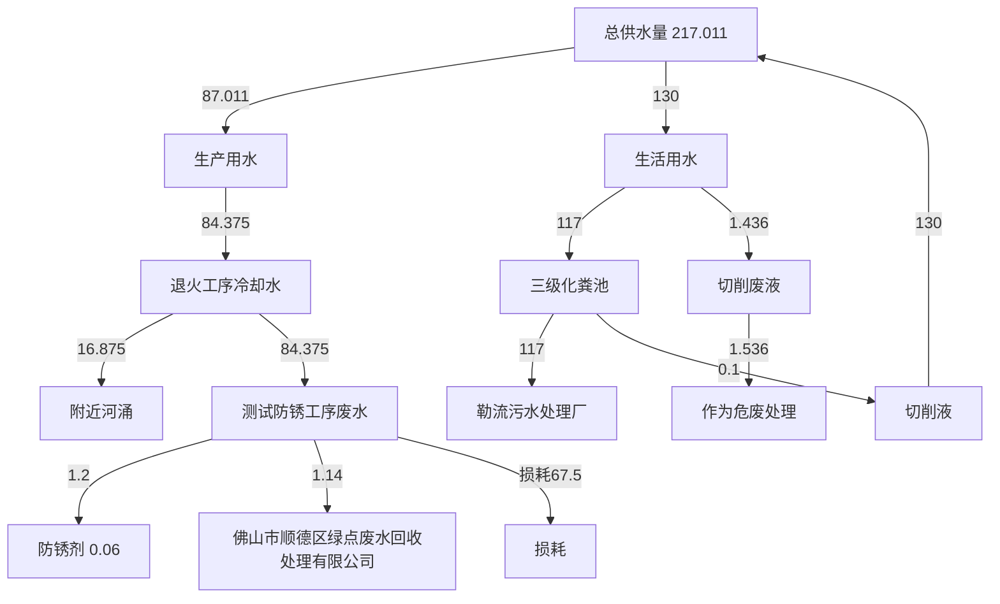
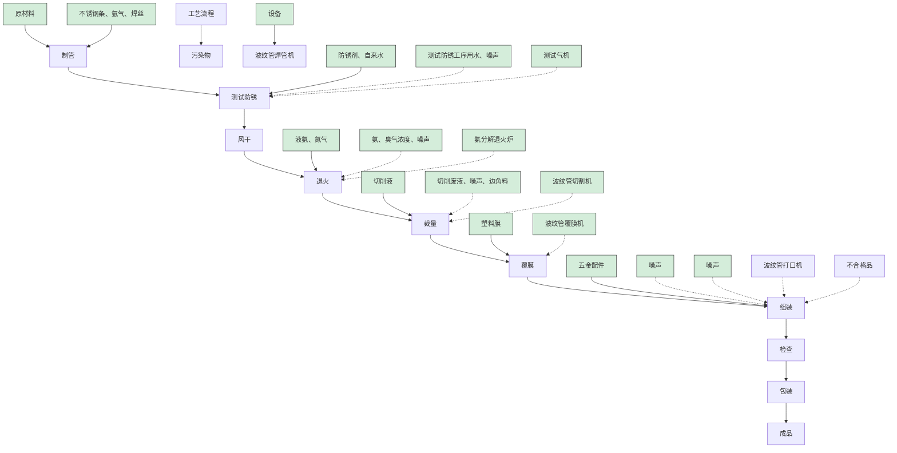
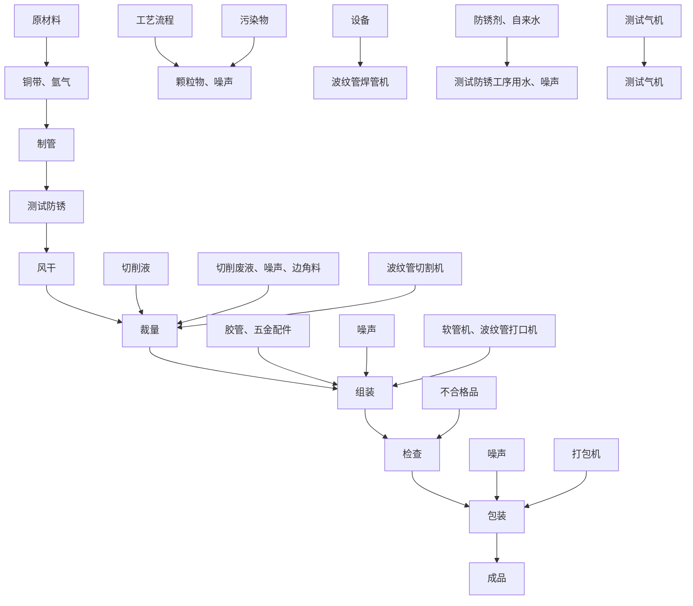
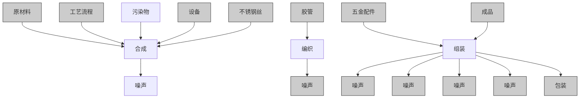

# 建设项目环境影响报告表

（污染影响类）

项目名称：佛山市星宝圆 新建项目建设单位（盖章）：佛山 限公司编制日期：\_2024年11

text_image

通软管有限公司
新
市星宝圆通软管有
月

中华人民 境部制

text_image

绿环保（广东）
440064407246
共和国生态环境

打印编号：1721033140000

编制单位和编制人员情况表

<table><tr><td>项目编号</td><td>e8ed3f</td></tr><tr><td>建设项目名称</td><td>佛山市星宝圆通软管有限公司新建项目</td></tr><tr><td>建设项目类别</td><td>30-066结构性金属制品制造;金属工具制造;集装箱及金属包装容器制造;金属丝绳及其制品制造;建筑、安全用金属制品制造;搪瓷制品制造;金属制日用品制造</td></tr></table>

# 环境影响评价工程师

Environmental Impact Assessment Engineer

本证书由中华人民共和国人力资和社会保障部、生态环境部批准颁发表明持证人通过国家统一组织的考试取得环境影响评价工程师职业资格。

text_image

中华人民共和国人力资源和社会保障部
中华人民共和国

text_image

中华人民共和国生态环境部
生态环境部

text_image

中华人民共和国生态环境部
中华人民共和国生态环境部

text_image

中华人民共和国
人力资源和社会保障部
中华人民共和国
人力资源和社会保障部

中国开中

# 中工证

# 目录

一、建设项目基本情况

二、建设项目工程分析. . 12

三、区域环境质量现状、环境保护目标及评价标准 . 24

四、主要环境影响和保护措施. . 28

五、环境保护措施监督检查清单 . 59

六、结论. . 62

附表. . 63

建设项目污染物排放量汇总表.. . 63

附图1项目地理位置图 . 65

附图2 项目四至图. . 66

附图3 项目平面布置图. 67

附图4 项目所在地环境管控单元划分 . 68

附图5 项目周围环境示意图 . 69

附图6 项目声环境功能区划图. . 70

附图7项目水环境功能区划图. . 71

附图8项目大气环境功能区划图 . 72

附图9 项目厂界500米范围内敏感点图 . 73

附图10 项目厂区现状情况. . 74

附图11 项目广东省“三线一单”应用平台截图. .75

附图12 项目所在地规划. . 76

附件1 营业执照. . 77

附件2 法人身份证. . 78

附件3 厂房租赁合同. . 90

附件4 厂房房产证. . 93

附件 5 切削液 MSDS. ..97

附件6 氨分解退火炉技术参数. . 101

附件 7 防锈剂 MSDS. ..106

附件8 废水收运承诺函. . 107

附件9 环评协议. 109

附件10 同意公示声明. .110

# 一、建设项目基本情况

<table><tr><td>建设项目名称</td><td colspan="3">佛山市星宝圆通软管有限公司新建项目</td></tr><tr><td>项目代码</td><td colspan="3">无</td></tr><tr><td>建设单位联系人</td><td colspan="3"></td></tr><tr><td>建设地点</td><td colspan="3">广东省佛山市顺德区勒流街道众涌村众涌工业区众裕北路55号之七</td></tr><tr><td>地理坐标</td><td colspan="3">(113度10分37.624秒,22度49分27.216秒)</td></tr><tr><td>国民经济行业类别</td><td>C3352建筑装饰及水暖管道零件制造</td><td>建设项目行业类别</td><td>三十、金属制品业-33中66、建筑、安全用金属制品制造335-其他(仅分割、焊接、组装的除外;年用非溶剂型低VOCs含量涂料10吨以下的除外)</td></tr><tr><td>建设性质</td><td>☑新建(迁建)□改建□扩建□技术改造</td><td>建设项目申报情形</td><td>☑首次申报项目□不予批准后再次申报项目□超五年重新审核项目□重大变动重新报批项目</td></tr><tr><td>项目审批(核准/备案)部门(选填)</td><td>/</td><td>项目审批(核准/备案)文号(选填)</td><td>/</td></tr><tr><td>总投资(万元)</td><td>50</td><td>环保投资(万元)</td><td>5</td></tr><tr><td>环保投资占比(%)</td><td>10</td><td>施工工期</td><td>2个月</td></tr><tr><td>是否开工建设</td><td>☑否□是:____</td><td>用地(用海)面积(m2)</td><td>2700</td></tr><tr><td>专项评价设置情况</td><td colspan="3">无</td></tr><tr><td>规划情况</td><td colspan="3">无</td></tr><tr><td>规划环境影响评价情况</td><td colspan="3">无</td></tr><tr><td>规划及规划环境影响评价符合性分析</td><td colspan="3">无</td></tr><tr><td>其他符合性分析</td><td colspan="3">1.选址合理合法性分析佛山市星宝圆通软管有限公司新建项目位于广东省佛山市顺德区勒流街道众涌村众涌工业区众裕北路55号之七,根据《关于《顺德区勒流街道众涌村村庄规划》的批后通告》(见附图12),项目所在地为工业用地,可用于工业生产,故本项目建设符合规划要求。2.与《环境保护综合名录(2021年版)》的相符性分析本项目属于建筑装饰及水暖管道零件制造,主要生产不锈钢波纹管、花洒软管、不锈钢编织管,不属于《环境保护综合名录(2021年版)》中“高污染、高环境风险”产品名录。3.与广东省发展改革委关于印发《广东省“两高”项目管理目录(2022年版)》的通知(粤发改能源函〔2022〕1363号)相符性分析对照广东省发展改革委关于印发《广东省“两高”项目管理目录(2022年版)》的通知(粤发改能源函〔2022〕1363号)管理目录,本项目不涉及“两高”产品或工序,符合要求。4.产业政策相符性分析本项目主要从事不锈钢波纹管、花洒软管、不锈钢编织管生产,项目生产产品、生产工艺和生产设备均不属于《产业结构调整指导目录(2024年本)》中的限制或淘汰类别,不属于国家发展改革委商务部《关于印发&lt;市场准入负面清单(2022年版)的通知&gt;》(发改经体[2022]397号)“禁止准入类”,符合要求。</td></tr></table>

# 5. 本项目与“三线一单”相符性分析

# （1）生态保护红线

项目位于广东省佛山市顺德区勒流街道众涌村众涌工业区众裕北路 55 号之七，根据《广东省人民政府关于印发广东省“三线一单”生态环境分区管控方案的通知》（粤府〔2020〕71号）、《佛山市“三线一单”生态环境分区管控方案（2024 年版）》的通知》（佛环【2024】20 号)，项目所在地属于广东省佛山市顺德区重点管控单元 9（ZH44060620009，勒流街道重点管控区）内，不在划定的生态保护红线区域，不属于涵盖生态保护红线、一般生态空间、饮用水水源保护区、环境空气质量一类功能区等区域的“优先保护单元”。因此，本项目不涉及生态保护红线。

# （2）环境质量底线

根据《佛山市“三线一单”生态环境分区管控方案》（2024版），污染物排放管控要求：稳步推进排水设施“三个一体化”[“三个一体化”指“建管一体化、厂网一体化、城乡一体化”。]管理模式，补齐城乡污水收集和处理短板，推动污水处理设施提质增效，加快消除城中村、老旧城区、城乡结合部等污水收集管网空白区，逐步实现城乡污水收集处理全覆盖。

根据《2023年度佛山市顺德区生态环境状况公报》中的数据和结论，O3（臭氧）浓度超过了质量标准限值，故顺德区大气环境质量属非达标区；根据《佛山市生态环境局顺德分局关于发布 2023年度佛山市顺德区环境质量状况公报的通知》（佛环顺函〔202444 号）监测数据，2023 年顺德支流水质满足《地表水环境质量标准》（GB3838-2002）之Ⅲ类水功能要求。

本项目属于勒流污水处理厂的纳污范围内，本项目生活污水经三级化粪池预处理后由市政污水管网排入勒流污水处理厂处理；测试防锈工序废水重复使用，定期更换，收集后定期交由佛山市顺德区绿点废水回收处理有限公司收运处理，对周围水环境影响不大。

<table><tr><td></td><td>因此本项目的建设不会突破当地环境质量底线。(3)资源利用上线根据《广东省人民政府关于印发广东省“三线一单”生态环境分区管控方案的通知》(粤府〔2020〕71号)关于“珠三角核心区”的能源资源利用要求:科学实施能源消费总量和强度“双控”,新建高能耗项目单位产品(产值)能耗达到国际国内先进水平,实现煤炭消费总量负增长。率先探索建立二氧化碳总量管理制度,加快实现碳排放达峰。依法依规科学合理优化调整储油库、加油站布局,加快充电桩、加气站、加氢站以及综合性能源补给站建设,积极推动机动车和非道路移动机械电动化(或实现清洁燃料替代)。大力推进绿色港口和公用码头建设,提升岸电使用率;有序推动船舶、港作机械等“油改气”、“油改电”,降低港口柴油使用比例。鼓励天然气企业对城市燃气公司和大工业用户直供,降低供气成本。推进工业节水减排,重点在高耗水行业开展节水改造,提高工业用水效率。加强江河湖库水量调度,保障生态流量。盘活存量建设用地,控制新增建设用地规模。根据《佛山市“三线一单”生态环境分区管控方案》(2024版),能源资源利用管控要求:积极发展氢能源、天然气发电等清洁能源,逐步提高可再生能源与低碳清洁能源比例,建立现代化能源体系。本项目施工过程中所用的资源主要为水资源和电能,运营期所用的资源主要为水资源和电能。其消耗量均很小,不会突破当地资源利用上线。(4)环保准入负面清单根据国家发展改革委、商务部关于印发《市场准入负面清单(2022年版)》、《产业结构调整指导目录(2024年本)》的规定,项目不属于上述目录所列的鼓励类、限制类、禁止(淘汰)类严控类项目和负面清单。(5)环境管控单元准入清单本项目位于广东省佛山市顺德区重点管控单元9(ZH44060620009,勒流街道重点管控区)内,该单元属于水环境工业-城镇生活重点管控区、大气环境布局敏感重点管控区、江河湖库岸线重点管控区。本项目与佛山市环境管控单元准入清单相符性分析如下表1-1所示,与佛山市顺德区环境管控单元准入清单相符性分析如下表1-2所示。</td></tr></table>

表1-1 本项目与佛山市环境管控单元准入清单相符性分析

<table><tr><td>管控维度</td><td>管控要求</td><td>本项目内容</td><td>符合性</td></tr><tr><td rowspan="6">区域布局管控</td><td>1-1.【产业/鼓励引导类】重点发展智能家电、家具五金、环保装备、光电照明、装备制造及交通机械产业,引入智能制造服务、电子商务、现代商贸流通产业,重点建设环保产业基地、小家电产业基地和五金产业创业基地。</td><td>本项目属于C3352建筑装饰及水暖管道零件制造,产品为不锈钢波纹管、花洒软管、不锈钢编织管,属于家具五金类项目。</td><td>符合</td></tr><tr><td>1-2.【产业/综合类】系统推进村级工业园升级改造,腾出连片空间,布局产业集聚区和主题产业园,推动工业项目入园集聚发展。</td><td>本项目位于广东省佛山市顺德区勒流街道众涌村众涌工业区众裕北路55号之七,属于产业集聚区,该区域不属于村改范围</td><td>符合</td></tr><tr><td>1-3.【产业/限制类】受纳水体或监控断面不达标且未“以新带老”制定区域达标方案的河涌,不得新建、扩建向河涌直接排放废水的项目。新建、扩建含蚀刻工序的线路板生产项目和化工项目应在配套污水集中处置的工业园区或生活污水管网覆盖区域内建设;纯加工型印花项目,含酸洗、磷化的金属表面处理、金属制品项目(与自身高新技术企业配套的和区级及以上重点项目除外),含酸洗、喷涂、化学抛光、电解等涉及废水排放工艺的不锈钢型材加工项目(与自身高新技术企业配套的和区级及以上重点项目除外),应进入以此类项目为主导产业、有相应废水集中治理设施的工业园区,实现集中治污。</td><td>本项目外排废水为生活污水,属于间接排放。污水经预处理后进入勒流污水处理厂处理;本项目不包含条款中提及的限制类项目和工序</td><td>符合</td></tr><tr><td>1-4.【产业/综合类】划定家具生产优先发展区域,优先发展区外不再新建涉及涂装工艺的木质家具制造项目。优先发展区范围根据家具产业发展规划及其规划环评文件确定。</td><td>本项目不属于木质家具制造项目</td><td>符合</td></tr><tr><td>1-5.【大气/限制类】严格限制在羊额—北滘水厂饮用水水源保护区上游和周边区域建设列入“高污染、高环境风险”产品名录等可能影响水环境安全的项目。</td><td>本项目不属于在羊额—北滘水厂饮用水水源保护区上游和周边区域,也不属于列入“高污染、高环境风险”产品名录的建设项目</td><td>符合</td></tr><tr><td>1-6.【大气/限制类】大气环境布局敏感区重点管控区内,应严格限制新建生产和使用高挥发性有机物原辅材料项目,优先开展低VOCs含量原辅材料替代,强化无组织排放控制。原则上不再新建、扩建新增氮氧化物、烟(粉)尘排放量较大的建设项目。</td><td>本项目不使用高挥发性有机物原辅材料,不属于新增氮氧化物、烟(粉)尘排放量较大的建设项目</td><td>符合</td></tr><tr><td>能源资源利用</td><td>2-1.【能源/鼓励引导类】推广节能技术,加快发展绿色货运与现代物流。</td><td>不适用</td><td>符合</td></tr><tr><td rowspan="5"></td><td>2-2.【能源/鼓励引导类】推广新能源汽车应用和充电基础设施建设,积极推动重卡LNG加气站、充电基础设施、加氢站建设。</td><td>不适用</td><td>符合</td></tr><tr><td>2-3.【能源/综合类】科学实施能源消费总量和强度“双控”,新建高能耗项目单位产品(产值)能耗达到国际国内先进水平。</td><td>本项目不属于高能耗项目</td><td>符合</td></tr><tr><td>2-4.【水资源/综合类】贯彻落实“节水优先”方针,实行最严格水资源管理制度,勒流街道万元国内生产总值用水量、万元工业增加值用水量、用水总量、农田灌溉水有效利用系数等用水总量和效率指标达到区下达要求。</td><td>项目严格执行《用水定额第2部分:工业》(DB44/T1461.2—2021)、《用水定额第3部分:生活》(DB44/T1461.3—2021),并且达先进定额标准</td><td>符合</td></tr><tr><td>2-5.【土地资源/限制类】落实单位土地面积投资强度、土地利用强度等建设用地控制性指标要求,提高土地利用效率。</td><td>本项目设置在工业园区厂房中,土地利用率较高</td><td>符合</td></tr><tr><td>2-6.【岸线/禁止类】严格水域岸线用途管制,新建项目一律不得违规占用水域。严禁破坏生态的岸线利用行为和不符合其功能定位的开发建设活动,严禁以各种名义侵占河道、围垦湖泊、非法采砂等。</td><td>项目位于广东省佛山市顺德区勒流街道众涌村众涌工业区众裕北路55号之七,不占用水域。</td><td>符合</td></tr><tr><td rowspan="4">污染物排放管控</td><td>3-1.【水/限制类】城镇新区建设实行雨污分流。住宅、商业体、学校、市场等城镇开发建设项目应当配套或者同步计划建设公共排水设施,公共排水设施或自建排污水设施未能投产运行的,以上涉水项目不得投入使用。新建小区严格实施雨污分流,阳台、露台等污水接入污水收集系统,将生活污水“应截尽截”。做好大型楼盘、集贸市场、餐饮以及学校等4大类排水户污水接入市政管网工作。</td><td>不适用</td><td>符合</td></tr><tr><td>3-2.【水/综合类】结合村级工业园改造,全面提升产业层次与集聚度,促进污染集中整治。</td><td>本项目所在区域不属于村级工业园改造范围</td><td>符合</td></tr><tr><td>3-3.【水/综合类】稳步推进排水设施“三个一体化”管理模式,补齐城乡污水收集和处理短板,推动勒流污水处理厂提质增效,加快消除城中村、老旧城区、城乡结合部等污水收集管网空白区,逐步实现城乡污水收集处理全覆盖。2025年前完成勒流污水处理厂扩建,尾水应执行《城镇污水处理厂污染物排放标准》(GB18918-2002)一级A标准及《广东省水污染物排放限值》(DB44/26-2001)的较严值。</td><td>项目位于勒流污水处理厂纳污范围,尾水执行《城镇污水处理厂污染物排放标准》(GB18918-2002)一级A标准及《广东省水污染物排放限值》(DB44/26-2001)的较严值</td><td>符合</td></tr><tr><td>3-4.【水/综合类】保留勒流社区百丈片区分散式农村污水处理设施,其余行政村(社区)通过市政污水管网,配合农村支管网建设,有条件的区域实施雨污</td><td>项目实施雨污分流制,雨水经雨水井收集纳入周边城市下水道,生活污水经三级</td><td>符合</td></tr><tr><td rowspan="2"></td><td>分流改造,到2030年实现农村生活污水100%收集进入勒流污水处理系统。</td><td>化粪池预处理后经市政污水管网纳入勒流污水处理厂处理</td><td>符合</td></tr><tr><td>3-5.【土壤/限制类】严格重金属重点行业企业准入管理。新、改、扩建重点行业建设项目应遵循重点重金属污染物排放“等量替代”原则。</td><td>本项目不排放重金属污染物</td><td>符合</td></tr><tr><td rowspan="3">环境风险防控</td><td>4-1.【水/综合类】加强单元内羊额—北滘水厂饮用水水源保护区周边环境风险源管控,完善突发环境事件应急管理体系。</td><td>不适用</td><td>符合</td></tr><tr><td>4-2.【风险/综合类】勒流污水处理厂、工业污水集中处理设施应采取有效措施,防止事故废水直接排入水体。完善污水处理厂在线监控系统联网,实现污水处理厂的实时、动态监管。</td><td>不适用</td><td>符合</td></tr><tr><td>4-3.【风险/综合类】加强环境风险分级分类管理,强化金属制品、有色金属和压延加工、化学原料和化学品制造业等涉重金属、化工行业企业及工业园区等重点环境风险源的环境风险防控。</td><td>本项目氨分解退火炉自带氨浓度检测装置,发生氨分解不完全情况时可及时报警;液氨存放处设置有水淋系统,事故时可使氨迅速溶入水中以减少泄漏风险。本项目风险防控措施具备可行性,整体风险可控。</td><td>符合</td></tr></table>

表1-2 与顺德区“三线一单”的相符性分析

<table><tr><td>管控维度</td><td>管控要求</td><td>本项目内容</td><td>符合性</td></tr><tr><td rowspan="3">区域布局管控</td><td>1-1.【产业/鼓励引导类】重点发展智能家电、家具五金、环保装备、光电照明、装备制造及交通机械产业,引入智能制造服务、电子商务、现代商贸流通产业,重点建设环保产业基地、小家电产业基地和五金产业创业基地</td><td>本项目属于C3352建筑装饰及水暖管道零件制造,产品为不锈钢波纹管、花洒软管、不锈钢编织管,属于家具五金类项目。</td><td>符合</td></tr><tr><td>1-2.【产业/综合类】系统推进村级工业园升级改造,腾出连片空间,布局产业集聚区和主题产业园,推动工业项目入园集聚发展。新增工业制造业用地原则上安排在产业集聚区内,产业集聚区外原则上不鼓励工业及物流仓储用地的新建与改造。</td><td>本项目位于广东省佛山市顺德区勒流街道众涌村众涌工业区众裕北路55号之七,属于产业集聚区,该区域不属于村改范围</td><td>符合</td></tr><tr><td>1-3.【产业/综合类】产业聚集区所属地块内的工业用地或企业与村庄、学校等环境敏感点之间应设置合理的大气环境防护距离,并通过绿化带进行有效隔离;聚集区规划布局应注重大气污染排放企业应尽量避免布局在居住用地的常年主导风向的上风向1-4.【产业/限制类】受纳水体或监控断面不达标的,不得新建、扩建向河涌直接排放废水的项目。新建、扩建含蚀刻工序的线路板生产项目和化工项目应在配套污水集中处置的工业园区或生活污水管网覆盖区域内建设;纯加工型印花项目,含酸洗、磷化的金属表面处理、金属制品项目(与自身高新技术企业配套的除外),含酸洗、喷涂、化学抛光、电解等涉及废水排放工艺的不锈钢型材加工项目(与自身高新技术企业配套的除外),应进入以此类项目为主导产业、有相应废水集中治理设施的工业园区,实现集中治污。</td><td>本项目大气污染物达标排放,最近大气环境敏感点为距离本项目142m的塘利村,距离较远,无需设置大气环境防护距离本项目外排废水为生活污水,属于间接排放。污水经预处理后进入勒流污水处理厂处理;本项目不包含条款中提及的限制类项目和工序。</td><td>符合符合</td></tr><tr><td rowspan="4"></td><td>1-5.【产业/综合类】划定家具生产优先发展区域,优先发展区外不再新建涉及涂装工艺的木质家具制造项目</td><td>本项目不属于木质家具制造项目</td><td>符合</td></tr><tr><td>1-6.【水/限制类】严格限制在羊额—北滘水厂饮用水水源保护区上游和周边区域建设列入“高污染、高环境风险”产品名录等可能影响水环境安全的项目。</td><td>本项目不属于在羊额—北滘水厂饮用水水源保护区上游和周边区域,也不属于列入“高污染、高环境风险”产品名录的建设项目</td><td>符合</td></tr><tr><td>1-7.【大气/限制类】大气环境布局敏感区重点管控区内,应严格限制新建生产和使用高挥发性有机物原辅材料项目,优先开展低VOCs含量原辅材料替代,强化无组织排放控制。原则上不再新建、扩建新增氮氧化物、烟(粉)尘排放量较大的建设项目。</td><td>本项目不使用高挥发性有机物原辅材料,不属于新增氮氧化物、烟(粉)尘排放量较大的建设项目</td><td>符合</td></tr><tr><td>1-8.【土壤/禁止类】禁止新建、扩建增加重点防控的重金属污染物排放的建设项目。</td><td>本项目不排放重金属污染物。</td><td>符合</td></tr><tr><td rowspan="4">能源资源利用</td><td>2-1.【能源/鼓励引导类】推广节能技术,加快发展绿色货运与现代物流。</td><td>不适用</td><td>符合</td></tr><tr><td>2-2.【能源/鼓励引导类】推广新能源汽车应用和充电基础设施建设,积极推动重卡LNG加气站、充电基础设施、加氢站建设。</td><td>不适用</td><td>符合</td></tr><tr><td>2-3.【能源/综合类】科学实施能源消费总量和强度“双控”,新建高能耗项目单位产品(产值)能耗达到国际国内先进水平。</td><td>本项目不属于高能耗项目</td><td>符合</td></tr><tr><td>2-4.【水资源/综合类】贯彻落实“节水优先”方针,实行最严格水资源管理制度,勒流街道万元国内生产总值用水量、万元工业增加值用水量、用水总量、农田灌溉水有效利用系数等用水总量和效率指标达到区下达要求。2-5.【土地资源/限制类】落实单位土地面积投资强度、土地利用强度等建设用地控制性指标要求,提高土地利用效率。</td><td>项目严格执行《用水定额 第2部分:工业》(DB44/T1461.2—2021)、《用水定额第3部分:生活》(DB44/T1461.3—2021),并且达先进定额标准。本项目设置在工业园区厂房中,土地利用率较高</td><td>符合符合</td></tr><tr><td></td><td>2-6.【岸线/禁止类】严格水域岸线用途管制,新建项目一律不得违规占用水域。严禁破坏生态的岸线利用行为和不符合其功能定位的开发建设活动,严禁以各种名义侵占河道、围垦湖泊、非法采砂等。</td><td>项目位于广东省佛山市顺德区勒流街道众涌村众涌工业区众裕北路55号之七,不占用水域。</td><td>符合</td></tr><tr><td rowspan="5">污染物排放管控</td><td>3-1.【水/限制类】城镇新区建设实行雨污分流。住宅、商业体、学校、市场等城镇开发建设项目应当配套或者同步计划建设公共排水设施,公共排水设施或自建排污水设施未能投产运行的,以上涉水项目不得投入使用。新建小区严格实施雨污分流,阳台、露台等污水接入污水收集系统,将生活污水“应截尽截”。做好大型楼盘、集贸市场、餐饮以及学校等4大类排水户污水接入市政管网工作。</td><td>不适用</td><td>符合</td></tr><tr><td>3-2【水/综合类】结合村级工业园改造,全面提升产业层次与集聚度,促进污染集中整治。</td><td>本项目所在区域不属于村级工业园改造范围</td><td>符合</td></tr><tr><td>3-3.【水/综合类】稳步推进排水设施“三个一体化”管理模式,补齐城乡污水收集和处理短板,推动勒流污水处理厂提质增效,加快消除城中村、老旧城区、城乡结合部等污水收集管网空白区,逐步实现城乡污水收集处理全覆盖。2025年前完成勒流污水处理厂扩建,尾水应执行《城镇污水处理厂污染物排放标准》(GB18918-2002)一级A标准及《广东省水污染物排放限值》(DB44/26-2001)的较严值。</td><td>项目位于勒流污水处理厂纳污范围,尾水执行《城镇污水处理厂污染物排放标准》(GB18918-2002)一级A标准及《广东省水污染物排放限值》(DB44/26-2001)的较严值</td><td>符合</td></tr><tr><td>3-4.【水/综合类】保留勒流社区百丈片区分散式农村污水处理设施,其余行政村(社区)通过市政污水管网,配合农村支管网建设,有条件的区域实施雨污分流改造,到2030年实现农村生活污水100%收集进入勒流污水处理系统。</td><td>项目实施雨污分流制,雨水经雨水井收集纳入周边城市下水道,生活污水经三级化粪池预处理后经市政污水管网纳入勒流污水处理厂处理</td><td>符合</td></tr><tr><td>3-5.【水/综合类】产业集聚区和主题园区内做好污水管网和污水集中处理设施的配套保障,确保废水收集到城镇污水处理厂、园区污水处理厂或分散式污水处理设施集中处置。</td><td>不适用</td><td>符合</td></tr><tr><td></td><td>3-6.【土壤/限制类】作为重金属污染重点防控区,区域内重点重金属排放总量只减不增。</td><td>本项目不排放重金属污染物</td><td>符合</td></tr><tr><td rowspan="3">环境风险防控</td><td>4-1.【水/综合类】加强单元内羊额—北滘水厂饮用水水源保护区周边环境风险源管控,完善突发环境事件应急管理体系。</td><td>不适用</td><td>符合</td></tr><tr><td>4-2.【水/综合类】勒流污水处理厂、工业污水集中处理设施应采取有效措施,防止事故废水直接排入水体。完善污水处理厂在线监控系统联网,实现污水处理厂的实时、动态监管。</td><td>不适用</td><td>符合</td></tr><tr><td>4-3.【风险/综合类】加强环境风险分级分类管理,强化金属制品、有色金属和压延加工、化学原料和化学品制造业等涉重金属、化工行业企业及工业园区等重点环境风险源的环境风险防控</td><td>本项目氨分解退火炉自带氨浓度检测装置,发生氨分解不完全情况时可及时报警;液氨存放处设置有水淋系统,事故时可使氨迅速溶入水中以减少泄漏风险。本项目风险防控措施具备可行性,整体风险可控。</td><td>符合</td></tr></table>

# 二、建设项目工程分析

# 1.项目概况

佛山市星宝圆通软管有限公司位于广东省佛山市顺德区勒流街道众涌村众涌工业区众裕北路55号之七，拟新建一车间进行不锈钢波纹管、花洒软管、不锈钢编织管生产，预计年生产不锈钢波纹管10万米、花洒软管2万条、不锈钢编织管10万条。该车间目前处于空置状态，处于前期准备阶段，现申请办理环保审批手续。

根据《中华人民共和国环境保护法》（2015 年1 月1 日起实施）、《中华人民共和国环境影响评价法》（2016年9月1日起施行，2018年12月29日重新修订）及中华人民共和国国务院令第 682号《国务院关于修改〈建设项目环境保护管理条例〉的决定》（2017 年 10 月 1 日起施行）中的有关规定，建设项目必须执行环境影响评价制度。根据《建设项目环境影响评价分类管理名录 2021版》（中华人民共和国生态环境部令第 16号，2021年1月1日起实施），本项目属于“三十、金属制品业-33中66、建筑、安全用金属制品制造 335-其他（仅分割、焊接、组装的除外；年用非溶剂型低 VOCs 含量涂料10吨以下的除外）” ，按要求编写环境影响评价报告表。

# 2.产品方案

根据建设单位提供的资料，本项目的产品产量见表 2-1。

表 2-1 产品产能一览表

<table><tr><td>产品类型</td><td>年产量</td><td>备注</td></tr><tr><td>不锈钢波纹管</td><td>10万米</td><td>规格以 $\emptyset 16$ 、 $\emptyset 22$ 、 $\emptyset 28$ 、 $\emptyset 32$ 、 $\emptyset 40$ 为主</td></tr><tr><td>花洒软管</td><td>2万条</td><td>接口规格以15mm、17mm、20mm为主</td></tr><tr><td>不锈钢编织管</td><td>10万条</td><td>规格以DN40、DN50、DN60为主</td></tr></table>

# 3.项目组成

本项目建设性质为新建，项目所在建筑共1层，层高约6米。本项目占地面积 2700m2，建筑面积 2700m2。根据建设单位提供的资料，建设项目主要建设内

容见表2-2。

表 2-2 工程组成一览表

<table><tr><td>工程组成</td><td>名称</td><td>建设内容</td></tr><tr><td>主体工程</td><td>生产车间</td><td>本项目生产车间主要包括热处理区,测试区,波纹管区、编织管区、花洒管区等区域,总面积 $2700m^{2}$ </td></tr><tr><td>辅助工程</td><td>其他</td><td>位于生产车间内,包括办公室(位于夹层上方,见平面布置图)等</td></tr><tr><td>储运工程</td><td>仓库</td><td>包括半成品区、成品区、五金仓库(位于夹层下方,见平面布置图)等,位于生产车间内</td></tr><tr><td rowspan="2">公用工程</td><td>配电系统</td><td>通过市电引入厂区,通过配电线路至车间。</td></tr><tr><td>给排水系统</td><td>供水来源为市政自来水,生活污水经三级化粪池处理后,经市政污水管网引至勒流污水处理厂,测试废水重复使用,定期更换,更换后的测试废水收集后定期交由佛山市顺德区绿点废水回收处理有限公司收运处理,退火工序冷却水为清净下水,直接通过市政雨水管道排入附近河涌。</td></tr><tr><td rowspan="5">环保工程</td><td>生活污水处理设施</td><td>生活污水经三级化粪池处理后通过市政管道排入勒流污水处理厂处理。</td></tr><tr><td>测试废水</td><td>重复使用,定期更换,收集后定期交由佛山市顺德区绿点废水回收处理有限公司收运处理。</td></tr><tr><td>退火工序冷却水</td><td>定期排水,作为清净下水通过市政雨水管道排入附近河涌。</td></tr><tr><td>固体废物</td><td>生活垃圾集中堆放,委托环卫部门及时清运处置;一般工业固废进行统一收集后外售,厂区内有固定的固废堆放处;危险废物经收集后委托有资质单位进行处理,厂区设有一 $5m^{2}$ 危废仓库,并做好“三防”处理。</td></tr><tr><td>噪声</td><td>生产设备做减振处理,墙体隔声、距离衰减</td></tr></table>

# 4.主要生产设备

根据建设单位提供的资料，本项目主要生产设备见表 2-3。

表 2-3 主要生产设备一览表

<table><tr><td>序号</td><td>设备</td><td>设备型号</td><td>数量</td><td>工艺</td><td>位置</td></tr><tr><td>1</td><td>波纹管焊管机</td><td>HP-ZCW15</td><td>8台</td><td>制管</td><td rowspan="7">生产车间</td></tr><tr><td>2</td><td>波纹管切割机</td><td>O16~28mm</td><td>2台</td><td>裁量</td></tr><tr><td>3</td><td>空气压缩机</td><td>10HP</td><td>3台</td><td>辅助生产</td></tr><tr><td>4</td><td>冷却塔</td><td>循环水量: $5m^{3}/h$ </td><td>1台</td><td>辅助生产</td></tr><tr><td>5</td><td>波纹管打口机</td><td>O16~32mm</td><td>4台</td><td>组装</td></tr><tr><td>6</td><td>波纹管覆膜机</td><td>/</td><td>1台</td><td>覆膜</td></tr><tr><td>7</td><td>编织机</td><td>O12~O18</td><td>3台</td><td>编织</td></tr><tr><td>8</td><td>合股机</td><td>/</td><td>2台</td><td>合股</td><td rowspan="11"></td></tr><tr><td>9</td><td>打包机</td><td>/</td><td>2台</td><td>打包</td></tr><tr><td>10</td><td>软管机</td><td>上海德力西开关机械公司XY2</td><td>2台</td><td>组装</td></tr><tr><td>11</td><td>测试气机</td><td>VPM15</td><td>3台</td><td>测试防锈</td></tr><tr><td>12</td><td>氨分解退火炉</td><td>/</td><td>2台</td><td>退火</td></tr><tr><td>13</td><td>裁钢管机</td><td>/</td><td>1台</td><td rowspan="6">模具、设备维修</td></tr><tr><td>14</td><td>车床</td><td>/</td><td>2台</td></tr><tr><td>15</td><td>钻铣床</td><td>/</td><td>1台</td></tr><tr><td>16</td><td>冲压机</td><td>/</td><td>4台</td></tr><tr><td>17</td><td>焊机</td><td>/</td><td>3台</td></tr><tr><td>18</td><td>万能磨机</td><td>/</td><td>2台</td></tr></table>

# 5.主要原辅材料

（1）项目主要消耗的原辅材料及用量如表 2-4 所示。

表 2-4 项目主要原辅材料用量一览表

<table><tr><td>序号</td><td>名称</td><td>年用量</td><td>日常最大储存量</td><td>性状</td><td>包装规格</td></tr><tr><td>1</td><td>不锈钢条</td><td>100t</td><td>5t</td><td>固态</td><td>散装</td></tr><tr><td>2</td><td>铜带</td><td>4t</td><td>0.5t</td><td>固态</td><td>散装</td></tr><tr><td>3</td><td>不锈钢丝</td><td>5t</td><td>1t</td><td>固态</td><td>散装</td></tr><tr><td>4</td><td>液氨</td><td>14.4t</td><td>0.4t</td><td>液态</td><td>200kg/瓶</td></tr><tr><td>5</td><td>氮气</td><td>10t</td><td>0.4t</td><td>气态</td><td>200kg/瓶</td></tr><tr><td>6</td><td>氩气</td><td>25t</td><td>0.6t</td><td>气态</td><td>200kg/瓶</td></tr><tr><td>7</td><td>切削液</td><td>0.1t</td><td>0.02t</td><td>液态</td><td>10kg/桶</td></tr><tr><td>8</td><td>塑料膜</td><td>2t</td><td>0.1t</td><td>固态</td><td>散装</td></tr><tr><td>9</td><td>实芯焊丝</td><td>0.2t</td><td>0.05t</td><td>固态</td><td>散装</td></tr><tr><td>10</td><td>五金配件</td><td>60万颗</td><td>6万颗</td><td>固态</td><td>散装</td></tr><tr><td>11</td><td>空压机油</td><td>0.01</td><td>0.01</td><td>液态</td><td>桶装,5kg/桶</td></tr><tr><td>12</td><td>润滑油</td><td>0.02</td><td>0.02</td><td>液态</td><td>桶装,20kg/桶</td></tr><tr><td>13</td><td>镍催化剂</td><td>0.001t</td><td>0.001t</td><td>固态</td><td>散装</td></tr><tr><td>14</td><td>防锈剂</td><td>0.06t</td><td>0.02t</td><td>液态</td><td>桶装,20kg/桶</td></tr></table>

# （2）项目主要原辅材料理化性质分析

表 2-5 项目原辅材料主要成分及其理化性质一览表

<table><tr><td>名称</td><td>主要成分及其理化性质</td></tr><tr><td>切削液</td><td>棕色透明液体,比重0.9-1.0(与水相对值),溶于水,pH值8.8-9.8,主要成分见附件6。切削液是一种用在金属切削、磨加工过程中,用来冷却和润滑刀具和加工件的工业用液体。切削液由多种超强功能助剂经科学复合配合而成,同时具备良好的冷却性能、润滑性能、防锈性能、除油清洗功能、防腐功能、易稀释等特点。</td></tr><tr><td>液氨</td><td>CAS NO:7664-41-7,外观为无色液体,熔点-77.7°C,沸点-33.4°C,相对密度(水)0.7067(25°C),溶于水,LD50:0.30ml/kg,LC50:5000ppm/5min。</td></tr><tr><td>防锈剂</td><td>黄色透明液体,无刺激性气味,密度0.8670g/cm3,闪点76°C,溶于水,主要成分见附件7,防锈剂是一种用于防止金属生锈的化学品,它通过在金属表面形成保护膜来隔绝空气和水分,从而减缓金属的腐蚀速度。</td></tr></table>

# （3）氨使用量核算

根据附件6，本项目氨分解退火炉氨耗为4kg/h，本项目设2台氨分解退火炉，退火工序年工作时间为1800h，则本项目理论氨消耗量为 $4 ^ { * } 1 8 0 0 ^ { * } 2 { = } 1 4 . 4 \mathrm { t / a }$ ，根据表2-4，本项目液氨使用申报量为 14.4t，与理论消耗量相符。

# （4）不锈钢波纹管产能核算

根据建设单位提供的资料，本项目退火炉对工件的平均输送速度为 1m/min，本项目退火工序年运行时间为 1800h，则退火工序理论年加工工件为 10.8万米。本项目申报不锈钢波纹管年产量为 10万米，与理论产能偏差为8%，偏差在可接受范围内。

# （5）项目物料平衡见下表所示。

表 2-8 项目投产后全年生产物料平衡表

<table><tr><td colspan="2">投入</td><td colspan="2">产出</td></tr><tr><td>原材料</td><td>数量(吨)</td><td>产物</td><td>数量(吨)</td></tr><tr><td>不锈钢条</td><td>100</td><td>产品</td><td>108.453</td></tr><tr><td>铜带</td><td>4</td><td>颗粒物(废气)</td><td>0.002</td></tr><tr><td>不锈钢丝</td><td>5</td><td>边角料(固废)</td><td>0.545</td></tr><tr><td>Σ投入</td><td>109</td><td>Σ产出</td><td>109</td></tr></table>

# 6.劳动定员及工作制度

表 2-6工作制度一览表

<table><tr><td>序号</td><td>名称</td><td>内容</td></tr><tr><td>1</td><td>劳动定额</td><td>项目设员工 13 人</td></tr><tr><td>2</td><td>工作制度</td><td>年工作 300 天,除退火工序外每天 1 班,每班工作 9 小时,具体工作时间为 8:00~12:00,13:00~18:00,年工作 2700 小时;退火工序每年工作 75d,分 2 班,每班工作 12 小时,年工作 1800 小时。</td></tr><tr><td>3</td><td>食宿情况</td><td>不设食宿</td></tr></table>

# 7.项目能耗水耗情况

表 2-7 能耗水耗一览表

<table><tr><td>序号</td><td>名称</td><td>单位</td><td>年用量</td><td>用途</td><td>备注</td></tr><tr><td rowspan="2">1</td><td rowspan="2">水</td><td>吨/年</td><td>130</td><td>办公、生活</td><td rowspan="2">市政供水</td></tr><tr><td>吨/年</td><td>87.011</td><td>生产过程</td></tr><tr><td>2</td><td>电</td><td>万度/年</td><td>3</td><td>生产、生活</td><td>市政供电</td></tr></table>

flowchart

图 2-1 项目水平衡图（t/a）

# 8.总平面布置

项目位于广东省佛山市顺德区勒流街道众涌村众涌工业区众裕北路 55 号之七，东面为同厂区厂房H4，南面为空厂房，西面为同厂区厂房H15，北面为同厂区厂房H10。

项目经营场所为建成厂房，项目占地面积 2700m2，建筑面积 2700m2。本项目的车间、设备工序安排合理，物资流转相对方便。设备考虑项目噪声的距离衰减，从环保角度来看，该项目平面布置较为合理，详见附图 3。

# 1. 工艺流程

（1）不锈钢波纹管生产工艺流程：  

flowchart

图 2-2 项目不锈钢波纹管工艺流程图

# 工艺流程说明：

制管:利用波纹管焊管机进行制管,原理主要是将不锈钢条引入焊管机,通过辊轮将带料挤压成形,然后用氩弧焊混合气体保护焊接,打波纹,输出需要长度的管材,切刀机构切断。本工序使用的不锈钢条在购入前已清洗干净，表面不残留其余油脂或表面处理药剂。本工序主要污染物为焊接时产生的焊接烟尘，以颗粒物表征。

测试防锈：完成制管工序后,需要对波纹管进行防锈处理，同时进行测试防锈检查,具体做法是将生产出来的波纹管浸没在防锈剂和自来水的混合液中一定时间，让防锈剂在金属表面形成保护膜以减缓产品锈蚀速度，同时观察有无气泡产生,如果没有,则证明波纹管无裂缝、孔洞。本工序使用测试防锈工序废水重复使用，定期更换，收集后定期交由佛山市顺德区绿点废水回收处理有限公司收运处理。

风干：检查完成后将半成品自然风干。

退火：项目退火流程是将金属缓慢加热到一定温度,保持足够时间,然后以适宜温度冷却。目的是降低硬度,改善切削加工性；消除残余应力,稳定尺寸，减少变形与裂纹倾向；细化晶粒,调整组织,消除组织缺陷;在氨分解装置的保护下进行光亮退火,使波纹管具有更好的塑性。退火炉温达到200℃时,开始通冷却水,炉温达到600℃时通入氮气,目的是用氮气清洗炉腔,炉温达到800℃,炉里面含氧量小于0.5%时,开始通入氨分解气氛(75%氢气和25%氮气)。氨分解气氛是液氨在分解装置中,氨电加热到约800℃作用下,裂解为75%氢气和25%氮气所得。由于本项目氨分解氛围在进入炉腔前需经过分子筛吸附未分解完全的氨与微量水分，且氨分解气氛在炉尾进行燃烧以去除氢气，故本项目退火炉炉尾排出的气体主要为氮气与水蒸气，氨气残余量极少。氨气分解的方程式如下：

$$
2 \mathrm{NH} _ {3} \rightarrow \mathrm{N} _ {2} + 3 \mathrm{H} _ {2}
$$

本工序主要污染物为氨与臭气浓度。

裁量:把波纹管切割成需要的长度。由于本工序切割时使用切削液与水的混合物辅助切割，为湿式加工，故产生颗粒物可忽略不计。本工序主要污染物为切削废液以及边角料。

覆膜：将加工好的波纹管覆上一层塑料膜，以避免运输过程中机械损伤。

组装：用波纹管打口机在管件的两端安装接口，并附上对应螺母。

检查：人工对产品进行检查。此过程会产生不合格品。

包装：用打包机将产品分装打包，得到成品。

（2）花洒软管生产工艺流程：  

flowchart

图 2-3 项目花洒软管工艺流程图

工艺流程说明：

制管:利用波纹管焊管机进行制管,原理主要是将铜条引入焊管机,通过辊轮将带料挤压成形,然后用亚弧焊混合气体保护焊接,打波纹,输出需要长度的管材,切刀机构切断。本工序使用的铜条在购入前已清洗干净，表面不残留其余油脂或表面处理药剂。本工序主要污染物为焊接时产生的焊接烟尘，以颗粒物表征。

测试防锈：完成制管工序后,需要对波纹管进行防锈处理，同时进行测试防锈检查,具体做法是将生产出来的波纹管浸没在防锈剂和自来水的混合液中一定时间，让防锈剂在金属表面形成保护膜以减缓产品锈蚀速度，同时观察有无气泡产生,如果没有,则证明波纹管无裂缝、孔洞。本工序使用测试防锈工序废水重复使用，定期更换，收集后定期交由佛山市顺德区绿点废水回收处理有限公司收运处理。

风干：检查完成后将半成品自然风干。

裁量:把波纹管切割成需要的长度。由于本工序切割时使用切削液与水的混合物辅助切割，为湿式加工，故产生颗粒物可忽略不计。本工序主要污染物为切削废液以及边角料。

组装：用软管机将上述波纹管半成品套在胶管上，再用波纹管打口机在管件的两端安装接口，并附上对应螺母。

检查：人工对产品进行检查。此过程会产生不合格品。

包装：用打包机将产品分装打包，得到成品。

（3）不锈钢编织管生产工艺流程：

flowchart

图 2-4 项目不锈钢编织管工艺流程图

工艺流程说明:

合股：用合股机将不锈钢丝合股成适用于编织的粗不锈钢丝。

编织：用编织机在外购的胶管外表面编织一层不锈钢丝。

组装：用波纹管打口机在管件的两端安装接口，并附上对应螺母。

检查：人工对产品进行检查。此过程会产生不合格品。

包装：用打包机将产品分装打包，得到成品。

（4）模具、设备维修：本项目使用裁钢管机、车床、钻铣床、冲压机、焊机、万能磨机对上述工序的设备与模具进行维修，由于年工作时间较短且工艺简单，本项目模具、设备维修产生的污染物可忽略。

表 2-8 项目主要污染物节点分析一览表

<table><tr><td>类别</td><td>污染工序</td><td>主要污染物</td><td>处理措施</td></tr></table>

<table><tr><td rowspan="11"></td><td rowspan="2">废气</td><td>制管</td><td>颗粒物</td><td>加强通风,无组织逸散</td></tr><tr><td>退火</td><td>氨、臭气浓度</td><td>在炉尾直接燃烧后无组织排放</td></tr><tr><td rowspan="3">废水</td><td>员工办公</td><td>生活污水</td><td>生活污水经三级化粪池处理后,通过市政管网进入勒流污水处理厂进行处理</td></tr><tr><td>测试防锈</td><td>测试防锈工序废水</td><td>重复使用,定期更换,收集后定期交由佛山市顺德区绿点废水回收处理有限公司收运处理</td></tr><tr><td colspan="2">退火工序冷却水</td><td>定期排水,作为清净下水通过市政雨水管道排入附近河涌。</td></tr><tr><td>噪声</td><td>生产设备运行</td><td>各机械设备噪声</td><td>优先选用低噪声设备,安装隔声门窗,合理布局,加强设备维护、保养</td></tr><tr><td rowspan="5">固体废物</td><td>裁量</td><td>边角料</td><td>经分类收集后暂存于一般固体废物贮存间,定期交由相应回收公司回收处理</td></tr><tr><td>检查</td><td>不合格品</td><td>经返工后重新制作为成品</td></tr><tr><td>设备维护、模具、设备维修</td><td>废润滑油、废空压机油、废油桶、废含油抹布</td><td>定期交给有资质单位进行处理</td></tr><tr><td>办公生活</td><td>生活垃圾</td><td>由环卫部门清运进行无害化处理</td></tr><tr><td>裁量</td><td>切削废液、废化学品包装桶</td><td>定期交给有资质单位进行处理</td></tr><tr><td>与项目有关的原有环境污染问题</td><td colspan="4">本项目属于新建项目,租用已有厂房,不存在原有污染情况。</td></tr></table>

# 三、区域环境质量现状、环境保护目标及评价标准

# 1.环境空气质量现状

根据《佛山市顺德区生态环境保护“十四五”规划（2021-2025）》（顺府办发〔2022〕16 号），项目所在地为大气环境二类功能区，执行《环境空气质量标准》（GB3095-2012）及 2018 年修改单二级标准。

为评价本项目所在区域的环境空气质量现状，引用《佛山市生态环境局顺德分局关于发布2023年度佛山市顺德区环境质量状况公报的通知》（佛环顺函〔2024〕44 号）附件《2023 年佛山市顺德区环境质量状况公报》中的数据和结论如下。

2023年顺德区全区二氧化硫 $( \mathrm { S O } _ { 2 } )$ 、二氧化氮 $\left( \mathrm { N O } _ { 2 } \right)$ ）、可吸入颗粒物（PM10）、细颗粒物 $\left( \mathbf { P M } _ { 2 . 5 } \right)$ ）平均浓度分别为6、28、35、20微克/立方米，臭氧年评价浓度为164微克/立方米，一氧化碳（CO）年评价浓度为1.0毫克/立方米。顺德区二氧化硫 $( \mathrm { S O } _ { 2 } )$ 、二氧化氮 $\left( \mathrm { N O } _ { 2 } \right)$ 、可吸入颗粒物 $\left( \mathrm { P M } _ { 1 0 } \right)$ ）、细颗粒物 $\left( \mathrm { P M } _ { 2 . 5 } \right)$ ）、一氧化碳（CO）五项污染物年评价浓度均达到《环境空气质量标准》（GB3095-2012）二级标准限值2018年修改单二级标准，臭氧 $\left( \mathbf { O } _ { 3 } \right)$ ）超标。具体情况见图3-1。

bar_line

| Pollutant | 2022年 (微克/立方米) | 2023年 (微克/立方米) | 毫克/立方米 |
| -------- | ------------------- | ------------------- | ---------- |
| SO2      | 5                   | 6                   | -          |
| NO2      | 29                  | 28                  | -          |
| PM10     | 32                  | 35                  | -          |
| PM2.5    | 19                  | 20                  | -          |
| O3       | 190                 | 164                 | -          |
| CO       | 1                   | 1                   | 1.0        |

图 3-1 2023 年顺德区城市空气各项污染物年评价浓度  
根据图3-1 可知，2023 年顺德区二氧化硫 $( \mathrm { S O } _ { 2 } )$ 、二氧化氮 $\left( \mathrm { N O } _ { 2 } \right)$ 、

区域 环境 质量 现状

可吸入颗粒物（PM10）、细颗粒物 $\left( \mathbf { P M } _ { 2 . 5 } \right)$ 、一氧化碳（CO）五项污染物年评价浓度均达到《环境空气质量标准》（GB3095-2012）二级标准限值2018年修改单二级标准，臭氧 $( \mathrm { O } _ { 3 } )$ 超标，判定顺德区为不达标区。

顺德区设置了环境空气质量达标规划的目标，并通过优化产业结构和布局，推进能源结构调整，不断巩固火电行业超低排放和工业锅炉整治成果，深化机动车船等移动污染源污染控制，加快推进挥发性有机物综合整治，提高扬尘、餐饮业管理水平，促进多污染物协同控制及区域联防联控，提升大气污染精细化防控能力。届时，佛山市顺德区的环境空气质量将得到较大改善。

# 2. 地表水环境质量现状

本项目所处位置属于勒流污水处理厂纳污范围。生活污水经生活污水预处理设施处理达广东省地方标准《水污染物排放限值》（DB44/26—2001）第二时段三级排放标准后通过市政管网排入勒流污水处理厂，尾水排入顺德支流。根据《佛山市顺德区生态环境保护“十四五”规划（2021-2025）》有关规定，顺德支流为地表水Ⅲ类功能区，执行《地表水环境质量标准》（GB3838-2002）Ⅲ类标准。

表3-1 2023年度佛山市顺德区环境质量状况公报（节选）

<table><tr><td rowspan="2">河流名称</td><td rowspan="2">断面</td><td colspan="2">断面定类</td><td rowspan="2">水质评价标准</td><td colspan="2">河流定类</td></tr><tr><td>2023年</td><td>2022年</td><td>2023年</td><td>2022年</td></tr><tr><td rowspan="2">顺德支流</td><td>新涌</td><td>III</td><td>III</td><td>III</td><td rowspan="2">III</td><td rowspan="2">III</td></tr><tr><td>飞鹅山</td><td>III</td><td>III</td><td>III</td></tr></table>

根据上表可知，顺德支流 2023年的水质定类为Ⅲ类，符合《地表水环境质量标准》(GB3838-2002)之Ⅲ类标准的要求，说明项目所在地水质较好。

# 3.声环境质量现状

根据《佛山市生态环境局关于印发《佛山市声环境功能区划》的通知》（佛环〔2024〕1 号），项目位于声环境 3类功能区，项目厂界外周边 50米范围内不存在声环境保护目标，无需监测声环境质量现状并评价达标情况，无需测厂界噪声。

# 4.生态环境

本项目用地范围内不含有生态环境保护目标，无需进行生态现状调查。

# 5. 地下水、土壤环境

<table><tr><td></td><td colspan="7">本项目不存在土壤、地下水环境污染途径。根据《建设项目环境影响报告表编制技术指南(污染影响类)》,原则上不开展环境质量现状调查。</td></tr><tr><td rowspan="5">环境保护目标</td><td colspan="7">1.大气环境本项目厂界外500米范围内存在居住区等人群较集中的保护目标,主要大气环境保护目标见下表3-2。2.声环境本项目厂界外50米范围内不存在声环境保护目标。3.地下水环境本项目厂界外500米范围内无地下水集中式饮用水水源和热水、矿泉水、温泉等特殊地下水资源。4.生态环境项目用地范围内无生态环境保护目标。表3-2 主要环境保护目标</td></tr><tr><td>序号</td><td>名称</td><td>保护对象</td><td>保护内容</td><td>环境功能区</td><td>相对厂址方位</td><td>相对厂界距离/m</td></tr><tr><td>1</td><td>塘利村</td><td>居民</td><td>人群</td><td>环境空气二类区</td><td>西面</td><td>142</td></tr><tr><td>2</td><td>清源片区</td><td>居民</td><td>人群</td><td>环境空气二类区</td><td>东南面</td><td>268</td></tr><tr><td colspan="7">备注:表中的大气环境敏感点为厂界外500米范围内范围内的敏感点,距离表示为距离本项目最近距离。</td></tr><tr><td rowspan="3">污染物排放控制标准</td><td colspan="7">1.废水排放标准本项目产生的生活污水经三级化粪池预处理达广东省地方标准《水污染物排放限值》(DB44/26-2001)第二时段三级标准(适用范围为“其他排污单位”)后,由市政污水管网引至勒流污水处理厂。勒流污水处理厂尾水排放执行《城镇污水处理厂污染物排放标准》(GB18918-2002)一级A标准及广东省地方标准《水污染物排放限值》(DB44/26-2001)第二时段一级标准的较严值,尾水排放至顺德支流,具体排放限值见表3-3。表3-3 水污染物排放标准限值(单位:mg/L)</td></tr><tr><td colspan="2">污染物</td><td>pH</td><td> $COD_{Cr}$ </td><td> $BOD_5$ </td><td>氨氮</td><td>悬浮物</td></tr><tr><td colspan="2">生活污水排放口执行标准</td><td>6~9</td><td>≤500</td><td>≤300</td><td>--</td><td>≤400</td></tr><tr><td rowspan="7"></td><td>勒流污水处理厂出水执行标准</td><td>6~9</td><td>≤40</td><td>≤10</td><td>≤5</td><td colspan="2">≤10</td></tr><tr><td colspan="7">2.废气排放标准项目焊接、裁量工序过程会产生颗粒物,执行广东省地方标准《大气污染物排放限值》(DB44/27-2001)第二时段无组织排放监控浓度限值。项目退火工序过程会产生氨和臭气浓度,执行《恶臭污染物排放标准》(GB14554-93)中表1新扩改建项目厂界二级标准值。表3-4 废气排放标准</td></tr><tr><td>污染物</td><td colspan="3">无组织排放监控浓度限值</td><td colspan="3">标准来源</td></tr><tr><td>颗粒物</td><td colspan="3"> $1.0 \text{ mg/m}^{3}$ </td><td colspan="3">DB44/27-2001</td></tr><tr><td>氨</td><td colspan="3"> $1.5 \text{ mg/m}^{3}$ </td><td colspan="3" rowspan="2">GB14554-93</td></tr><tr><td>臭气浓度</td><td colspan="4">20(无量纲)</td></tr><tr><td colspan="7">3.噪声排放标准项目各厂界噪声排放执行《工业企业厂界环境噪声排放标准》(GB12348-2008)3类标准:即昼间≤65dB(A)、夜间≤55dB(A)。4.固体废物项目固体废物执行《中华人民共和国固体废物污染环境防治法》(2020年修订版)、《广东省固体废物污染环境防治条例》、《广东省城市垃圾管理条例》、《固体废物鉴别标准通则》(GB 34330-2017)等。一般工业固体废物储存周转场地需要满足防渗漏、防雨淋、防扬尘等环境保护要求。危险废物执行《国家危险废物名录》(2021年版)、《危险废物贮存污染控制标准》(GB18597-2023)相关要求。</td></tr><tr><td>总量控制指标</td><td colspan="7">1.水污染物排放总量控制指标项目生活污水排放量为113t/a, $COD_{Cr}$ 排放量为0.0047t/a,氨氮排放量为0.0006t/a;根据《佛山市排污权有偿使用和交易管理试行办法》(佛府办2020第19号),生活污水的 $COD_{Cr}$ 、氨氮不分配总量,本项目废水纳入勒流污水处理厂处理,无需分配总量。2.大气污染物排放总量控制指标本项目无需申请大气污染物总量控制指标。</td></tr></table>

# 四、主要环境影响和保护措施

<table><tr><td>施工期环境保护措施</td><td colspan="16">本项目租赁现有的生产厂房,只需要安装调试本项目生产设备,主要为室内人工作业,无大型机械入内,施工期基本无废水、废气、固废产生,主要影响为设备安装及调试过程中的机械噪声,此类噪声值较小,可忽略,所以施工期间基本无污染工序,不会对项目周围环境带来不良影响。</td></tr><tr><td rowspan="5">运营期环境影响和保护措施</td><td colspan="16">1、废气根据建设单位工艺流程可知,大气污染物主要有颗粒物。参考《排污许可证申请与核发技术规范 总则》(HJ 942-2018)和《排污许可证申请与核发技术规范 工业炉窑》(HJ 1121-2020),项目废气污染物排放情况见表4-1。表4-1 废气污染物排放情况一览表</td></tr><tr><td rowspan="2">产排污环节</td><td rowspan="2">生产单元</td><td rowspan="2">污染物种类</td><td rowspan="2">总产生量/t/a</td><td colspan="3">污染物产生情况</td><td rowspan="2">排放形式</td><td colspan="5">治理措施</td><td colspan="3">污染物排放情况</td></tr><tr><td>产生量/t/a</td><td>产生速率/kg/h</td><td>产生浓度mg/m3</td><td>处理能力m3/h</td><td>收集率</td><td>处理工艺</td><td>去除率</td><td>是否可行技术</td><td>排放量/t/a</td><td>排放速率/kg/h</td><td>排放浓度/mg/m3</td></tr><tr><td>制管</td><td rowspan="2">生产车间</td><td>颗粒物</td><td>0.002</td><td>0.002</td><td>0.001</td><td>/</td><td>无组织</td><td>/</td><td>/</td><td>/</td><td>/</td><td>/</td><td>0.002</td><td>0.001</td><td>/</td></tr><tr><td>退火</td><td>氨</td><td>0.21</td><td>0.21</td><td>0.117</td><td>/</td><td>无组织</td><td>/</td><td>95%</td><td>直接燃烧</td><td>95%</td><td>是</td><td>0.020</td><td>0.011</td><td>/</td></tr></table>

<table><tr><td></td><td></td><td>臭气浓度</td><td>/</td><td>/</td><td>/</td><td>/</td><td>无组织</td><td>/</td><td>95%</td><td>直接燃烧</td><td>95%</td><td>是</td><td>/</td><td>/</td><td>≤20(无量纲)</td><td></td></tr><tr><td rowspan="3" colspan="11">无组织排放量合计</td><td colspan="2">颗粒物</td><td>0.002</td><td>0.001</td><td>/</td><td rowspan="3">/</td></tr><tr><td colspan="2">氨</td><td>0.020</td><td>0.011</td><td>/</td></tr><tr><td colspan="2">臭气浓度</td><td>/</td><td>/</td><td>≤20(无量纲)</td></tr></table>

本项目属于非重点排污单位（若建成后当地环境管理部门将其纳入重点排污单位名录，则进行重点管理）。运营期环境自行监测计划参照《排污单位自行监测技术指南 总则》（HJ 819-2017）非重点排污单位制定，详细运营期监测计划见表4-2。

表 4-2 营运期废气监测计划一览表

<table><tr><td rowspan="2">监测点位</td><td rowspan="2">监测指标</td><td rowspan="2">监测频次</td><td colspan="2">执行标准</td></tr><tr><td>名称</td><td>浓度限值</td></tr><tr><td rowspan="3">厂界</td><td>颗粒物</td><td rowspan="3">1次/年</td><td>广东省地方标准《大气污染物排放限值》(DB44/27-2001)第二时段无组织排放监控浓度限值</td><td> $1\mathrm{{mg}}/{\mathrm{m}}^{3}$ </td></tr><tr><td>氨</td><td rowspan="2">《恶臭污染物排放标准》(GB14554-93)中表1新扩改建项目厂界二级标准值</td><td> $1.5\mathrm{{mg}}/{\mathrm{m}}^{3}$ </td></tr><tr><td>臭气浓度</td><td>20(无量纲)</td></tr></table>

# （1）废气污染物源强核算

# ①颗粒物

项目制管工序需要进行焊接，焊接过程中会产生一定的焊接烟尘，主要污染物为颗粒物。项目焊接方式主要为氩弧焊，使用焊条为实芯焊丝，参照《排放源统计调查产排污核算方法和系数手册》（218 机械行业系数手册-09焊接），氩弧焊实心焊丝产生的颗粒物为9.19kg/t。根据建设单位提供的资料，项目实芯焊丝年使用量为0.2t，则氩弧焊焊接烟尘的产生量约为 0.002t/a，以无组织形式排放。项目年工作300天，每天工作9小时，则颗粒物产生速率约为 0.001kg/h。

# ②氨

本项目退火工序需使用氨气进行分解产生氨分解氛围，此过程可能有少量未完全分解的氨气。参考《第二次全国污染源普查产排污量核算系数手册-机械行业系数手册》12 热处理核算环节-金属工件渗氮/渗碳/碳氮共渗工艺氨气产污系数为2.1kg/t-产品，此工艺中氨气分解使用原理与本项目工艺相似，故可参考使用。本项目需进行退火处理的产品量为100t/a，故氨产生量为0.21t/a。项目退火工序年工作1800h，故氨产生速率为0.117kg/h。

本项目氨分解氛围在退火炉内输送使用，退火炉炉尾设有长明火燃烧装置，可视为废气排口直连，参考《广东省工业源挥发性有机物减排量核算方法（2023 年修订版）》中 3.3-2 废气收集集气效率参考值，其收集效率按 95%计算。本项目退火工序产生的氨在炉尾被燃烧处理，参考《第二次全国污染源普查产排污量核算系数手册-机械行业系数手册》中末端治理技术效率，直接燃烧法对氨气的处理效率为 95%，燃烧后的氨无组织排放，则本项目氨排放量为 0.21\*（1-95%）+0.21\*95%\*（1-0.95%）=0.020t/a，排放速率为 0.011kg/h。

# ③恶臭

项目退火过程中由于氨处理残留，会产生轻微恶臭气味，其污染因子为臭气浓度。本文引用张欢等在《恶臭污染评价分级方法》中基于韦伯-费希纳公式所建立的臭气强度与臭气浓度的关系，将国外臭气强度 6级法与我国《恶臭污染物排放标准》（GB14554-1993）结合（详见下表），该分级法以臭气强度的嗅觉感觉和实验经验为分级依据，

对臭气浓度进行等级划分，提高了分级的准确程度。

表 4-6 与臭气对应的臭气浓度限值

<table><tr><td>分级</td><td>臭气强度(无量纲)</td><td>臭气浓度(无量纲)</td><td>嗅觉感受</td></tr><tr><td>0</td><td>0</td><td>10</td><td>未闻到有任何气味,无任何反应</td></tr><tr><td>1</td><td>1</td><td>23</td><td>勉强能闻到有气味,但不宜辨认气味性质(感觉阀值)认为无所谓</td></tr><tr><td>2</td><td>2</td><td>51</td><td>能闻到气味,且能辨认气味的性质(识别阀值),但感到很正常</td></tr><tr><td>3</td><td>3</td><td>117</td><td>很容易闻到气味,有所不快,但不反感</td></tr><tr><td>4</td><td>4</td><td>265</td><td>有很强的气味,很反感,想离开</td></tr><tr><td>5</td><td>5</td><td>600</td><td>有极强的气味,无法忍受,立即逃跑</td></tr></table>

本项目生产过程中的异味强度一般在1-2级，折合臭气浓度为23-51（无量纲），退火过程产生的恶臭废气和氨一并收集然后通过炉尾燃烧装置处理，废气无组织排放。参考前文氨源强计算，本项目氨产生量极少，故本项目臭气浓度可达《恶臭污染物排放标准》（GB14554-93）中表1新扩改建项目厂界二级标准值。

# （2）正常工况下废气达标分析

# ①无组织废气达标分析

本项目无组织排放各污染物产生量较少，颗粒物可达到广东省地方标准《大气污染物排放限值》（DB44/27-2001）第二时段无组织排放监控浓度限值，氨、臭气浓度可达《恶臭污染物排放标准》（GB14554-93）中表 1新扩改建项目厂界二级标准值，污染物经环境大气稀释后对距离项目 142m的最近大气环境敏感点塘利村影响不大。

# （3）非正常情况排放

根据本项目生产特点，生产设施在开停炉（机）等非正常情况，项目不产生废气污染物，故不考虑非正常情况下废气达标情况。

# （4）大气环境影响分析

根据《佛山市生态环境局顺德分局关于发布 2023年度佛山市顺德区环境质量状况公报的通知》（佛环顺函〔2024〕44 号）中的数据和结论，顺德区二氧化硫（SO2）、二氧化氮（NO2）、可吸入颗粒物（PM10）、细颗粒物（PM2.5）、一氧化碳（CO）五项污染物均满足《环境空气质量标准》（GB3095-2012）及2018修改单二级标准，臭氧（O ）超标，项目所在区域判断为不达标区。距离项目最近的大气敏感点为西面142m 处的塘利村，距离项目较远，项目所排放的大气污染物与臭氧不相关且能达到相应排放标准的要求，故本项目所排放的废气对周边大气环境及敏感点影响较小。

# 2、废水

根据项目工艺流程可知，本项目生产过程中外排废水主要为生活污水、测试防锈工序废水。项目废水类别、污染物项目及污染防治设施见下表。

表 4-3 废水污染物排放情况一览表

<table><tr><td rowspan="2">产排污环节</td><td rowspan="2">污染源</td><td rowspan="2">污染物种类</td><td colspan="3">污染物产生情况</td><td colspan="4">治理设施</td><td colspan="3">污染物排放</td><td rowspan="2">排放形式</td></tr><tr><td>废水产生量(t/a)</td><td>产生浓度(mg/L)</td><td>产生量(t/a)</td><td>处理能力</td><td>治理工艺</td><td>治理效率</td><td>是否可行技术</td><td>废水排放量(t/a)</td><td>排放浓度(mg/L)</td><td>排放量(t/a)</td></tr><tr><td rowspan="3">生活、办公</td><td rowspan="3">生活污水</td><td> $COD_{Cr}$ </td><td rowspan="3">117</td><td>250</td><td>0.0293</td><td rowspan="3">/</td><td rowspan="3">三级化粪池</td><td>20%</td><td rowspan="3">是</td><td rowspan="3">117</td><td>200</td><td>0.0234</td><td rowspan="3">间接排放</td></tr><tr><td> $BOD_5$ </td><td>150</td><td>0.0176</td><td>21%</td><td>118.5</td><td>0.0139</td></tr><tr><td>SS</td><td>200</td><td>0.0234</td><td>30%</td><td>140</td><td>0.0164</td></tr><tr><td></td><td></td><td> $NH_{3}-H$ </td><td></td><td>15</td><td>0.0018</td><td></td><td></td><td>3%</td><td></td><td></td><td>14.55</td><td>0.0017</td><td></td></tr></table>

注：①根据《第二次全国污染源普查生活污染源产排污系数手册》，参照其排放系数（化粪池和直排）可算出三级化粪池各污染物去除效率：CODcr去除率为20%，BOD5去除率为21%，NH3-N去除率为3%，SS去除率取30%；即生活污水排放浓度CODCr 200mg/L、BOD5118.5mg/L、SS140mg/L、氨氮 14.55mg/L。②根据《排污许可证申请与核发技术规范 橡胶和塑料制品工业》（HJ1122-2020）A.4塑料制品工业排污单位废水污染防治可行技术参考表，生活污水（单独排放）采用三级化粪池（厌氧）处理，属于可行性技术。

项目废水排放口信息见下表。

表 4-4 废水排放口基本情况表一览表

<table><tr><td rowspan="2">排放口编号</td><td rowspan="2">排放口类型</td><td colspan="2">排放口地理坐标</td><td rowspan="2">废水排放量</td><td rowspan="2">排放去向</td><td rowspan="2">排放规律</td><td rowspan="2">排放标准</td></tr><tr><td>东经</td><td>北纬</td></tr><tr><td>DW001</td><td>一般排放口</td><td>113.177107°</td><td>22.824033°</td><td>117t/a</td><td>勒流污水处理厂</td><td>间断排放,排放期间流量不稳定且无规律,但不属于冲击型排放</td><td>(DB44/26—2001)第二时段三级排放标准</td></tr></table>

# 环境监测：

根据《排污许可证申请与核发技术规范 总则》（HJ 942—2018）中规定：单独排向市政污水处理厂的生活污水不要求开展自行监测，本项目生活污水属于单独排向市政污水处理厂，故生活污水不开展自行监测。

# （1）废水污染物源强核算

# ①生活污水

本项目共有员工13名，年工作300天，不设宿舍和食堂，员工办公生活用水量根据广东省地方标准《用水定额 第3部分：生活》（DB44/T 1461.3-2021）中“办公楼无食堂和浴室先进值10m3 /人·a”，则生活用水量为130t/a，产污系数

取0.9，则生活污水排放量为117t/a。

生活污水主要污染物有 COD 、BOD 、氨氮、SS等。项目生活污水水质参考环境保护部环境工程评估中心编制的《社会区域类环境影响评价》（第三版），生活污水产生浓度CODCr250mg/L、BOD5150mg/L、SS200mg/L、氨氮15mg/L。生活废水中污染物，详见下表。

表 4-5 本项目生活污水污染物排放情况一览表

<table><tr><td colspan="2">污染物名称</td><td> $COD_{Cr}$ </td><td> $BOD_5$ </td><td>SS</td><td> $NH_3-N$ </td></tr><tr><td rowspan="6">生活污水117t/a</td><td>产生浓度(mg/L)</td><td>250</td><td>150</td><td>200</td><td>15</td></tr><tr><td>产生量(t/a)</td><td>0.0293</td><td>0.0176</td><td>0.0234</td><td>0.0018</td></tr><tr><td>厂区排放浓度(mg/L)</td><td>200</td><td>118.5</td><td>140</td><td>14.55</td></tr><tr><td>厂区排放量(t/a)</td><td>0.0234</td><td>0.0139</td><td>0.0164</td><td>0.0017</td></tr><tr><td>污水厂排放浓度(mg/L)</td><td>40</td><td>10</td><td>10</td><td>5</td></tr><tr><td>污水厂排放量(t/a)</td><td>0.0047</td><td>0.0012</td><td>0.0012</td><td>0.0006</td></tr></table>

# ②测试防锈工序废水

本项目测试防锈工序会产生测试防锈工序废水。本项目配置 3 台测试气机，每台测试气机各自带 1 个测试槽，单个测试防锈槽有效容积约 0.4m3，根据建设单位提供资料，测试防锈工序废水每年更换1次，蒸发损耗按10%计算，则测试防锈工序年用水量为 0.4\*3=1.2t/a，项目防锈剂年用量为0.06t，年废水产生量为1.14t/a，测试防锈工序废水重复使用，定期更换，收集后定期交由佛山市顺德区绿点废水回收处理有限公司收运处理，不外排。

# ③切削废液

本项目裁量工序需使用水与切削液的混合液进行降温与减少摩擦，该混合液循环使用，定期更换。项目共两台波纹管切割机，每台各配置1个水槽，单个水槽有效容积约0.064m3，根据建设单位提供资料，水槽内切削废液每个月更换1 次，即年更换 12 次，忽略蒸发损耗，故切削废液年产生量为 0.064\*2\*12=1.536t/a，该切削废液作为危废处置，交由具有危险废物处置资质的单位处置，不外排。

# ④退火工序冷却水

项目退火工序需要使用冷却水间接对设备进行降温，冷却用水通过冷却塔冷却后循环使用。本项目需适当地加入新鲜水补充因蒸发而损失的水分。

# A.冷却塔循环蒸发消耗水量

项目使用 1 台冷却塔 ，循环水量为 5m3 /h。根据《工业循环冷却水处理设计规范》（GB50050-2017），开式系统蒸发水量计算公式为：

$$
\mathrm{Q} _ {\mathrm{e}} = \mathrm{k} \cdot \Delta t \cdot \mathrm{Q} _ {\mathrm{r}}
$$

式中：Qe— 蒸发水量（m3/h）。

k——蒸发损失系数（1/℃），需根据进塔大气温度取值。进塔大气温度平均约 30℃，根据《工业循环冷却水处理设计规范》（GB/T50050-2017）表5.0.6，冷却塔的蒸发损耗系数取值0.0015。

Δt——循环冷却水进出冷却塔温差（℃），项目进出冷却塔温差约5℃。

Qr— 循环冷却水量（m3/h）。

项目冷却塔参照开式系统，项目冷却塔跟随退火工序运行，年运行时间约1800h，则年循环水量约9000m3/a，因此，项目冷却水蒸发水量为：0.0015×5×9000m3/a=67.5m3/a。

B.项目冷却系统定期外排水量

根据《工业循环冷却水处理设计规范》（GB50050-2017），开式系统补充水量计算公式为：

$$
\mathrm{Q} _ {\mathrm{m}} = \mathrm{Q} _ {\mathrm{e}} \times \mathrm{N} / (\mathrm{N} - 1)
$$

式中：Qm——补充水量（m3/h）；

Qe— 蒸发水量（m3/h）；

N——浓缩倍数；根据《工业循环冷却水处理设计规范》（GB50050-2017）3.1.11，间冷开式系统的设计浓缩倍数不宜小于5.0。

根据公式核算出补充水量为84.375t/a。而定期外排冷却水=补充水量-蒸发水量=16.875t/a。

根据《污水综合排放标准》（GB8978-1996）、《环境影响评价导则 地表水环境》（HJ/T 2.3-2018）和《广东省水污染物排放限值》（DB44/26-2001）中的规定：“污水排放量中不包括间接冷却水”。因此，本项目冷却循环水系统定期排水可作为清净下水通过雨水管道排放，不计入污水排放量。

# （2）治理设施可行性分析

根据《排污许可证申请与核发技术规范 总则》（HJ 942—2018）和《排污许可证申请与核发技术规范 工业炉窑》（HJ1121—2020），生活污水（单独排放）采用三级化粪池处理，属于可行性技术。

# （3）依托勒流污水处理厂的可行性评价

本项目选址属于勒流污水处理厂的集水范围，已接驳勒流污水处理集污管网。目前顺德区勒流污水处理厂一期、二期、三期位于佛山市顺德区勒流街道中城路与海港路交汇处，勒流污水处理厂的中心位置地理坐标为北纬22.838506°，东经 113.138480°。顺德区勒流污水处理厂由佛山市顺德区南和环保水务有限公司投资建设，其纳污范围为勒流街道，纳污范围 29.72km2，管网建设长度 56.27km，污水厂处理纳污范围内的生活污水。勒流污水处理厂设计处理规模为 9.0 万 m3 /d，即 3285.0 万 m3 /a，尾水出水水质需满足《城镇污水处理厂污染物排放标准》（GB18918-2002）一级A标准和广东省地方标准《水污染物排放限值》（DB44/26-2001）第二时段一级标准的较严值。处理工艺：污水采取的核心处理工艺为改良型氧化沟工艺，运行过程产生的污泥经浓缩脱水后，交给具有相应处理能力的单位进行无害化处理。根据《顺德区勒流污水处理厂一期、二期、三期提标改造工程建设项目竣工环境保护验收公示》可知，本项目的生活污水经勒流污水处理厂处理后能够达到《城镇污水处理厂污染物排放标准》（GB18918-2002）一级A标准和广东省地方标准《水污染物排放限值》（DB44/26-2001）第二时段一级标准的较严值。本项目污水排放量为 117t/a（0.39t/d），占勒流污水处理厂总处理规模 9.0万 m3 /d 的 0.00043%，所占比例相对较小，污水厂可容纳本项目产生的生活污水。因此本项目生活污水排入市政污水管网，进入勒流污水处理厂处理是可行的。

# （4）测试防锈工序废水委外处理可行性分析

# ①佛山市顺德区绿点废水回收处理有限公司概况

佛山市顺德区绿点废水回收处理有限公司位于佛山市顺德区龙江镇龙江居委会隔高工业区（北华路以南龙江生活污水厂以东地块）。佛山市顺德区绿点废水回收有限公司建设项目环评文件己通过顺德区环境运输和城市管理局审批(顺管环审(2014)271 号)，该项目规划设计处理规模为3000t/d，分两期，一期设计处理能力为1500t/d，二期设计处理能力为1500t/d。一期工程正式运营，服务年限为25年。主要服务对象顺德区内印刷、家具制造及食品加工等工业企业的高浓度有机废水（不包含镍、铬等一类污染物）。

佛山市顺德区绿点废水回收处理有限公司工业废水集中处理项目采用标准防渗防腐罐式槽车收集和运输，采用

“混凝沉淀——气浮——水解酸化——沉淀过滤”组合工艺。

②佛山市顺德区绿点废水回收处理有限公司设计指标和排污去向

佛山市顺德区绿点废水回收处理有限公司设计进水和出水水质如下表。项目废水处理达到广东省地方标准《水污染物排放限值》（DB44/26-2001）第二时段一级标准后通过专用管道排入龙江大涌。

表 4-6佛山市顺德区绿点废水回收处理有限公司设计进水和出水水质一览表

<table><tr><td>项目</td><td>pH</td><td> $COD_{Cr}$ </td><td> $BOD_5$ </td><td>SS</td><td>色度</td><td>石油类</td></tr><tr><td>单位</td><td>无量纲</td><td>mg/L</td><td>mg/L</td><td>mg/L</td><td>倍</td><td>mg/L</td></tr><tr><td>设计进水</td><td>8-9</td><td>≤3800</td><td>≤850</td><td>≤200</td><td>≤50000</td><td>≤120</td></tr><tr><td>设计出水</td><td>6-9</td><td>≤90</td><td>≤20</td><td>≤60</td><td>≤40</td><td>≤5.0</td></tr></table>

③佛山市顺德区绿点废水回收处理有限公司接纳本项目测试防锈工序废水的可行性

本项目测试防锈工序废水废水量 1.08t/a,0.0036t/d，委托佛山市顺德区绿点废水回收处理有限公司处理。佛山市顺德区绿点废水回收处理有限公司工业废水集中处理项目一期设计日处理高浓度有机废水1500吨，现剩余容量约500吨，能够满足本项目废水量的要求。

项目生产过程中测试防锈工序废水不含镍、铬等一类污染物，主要含 COD 、SS 等污染因子，属有机废水，符合绿点公司接收的废水类型。经调查同类项目水处理工程的设计方案，测试防锈工序废水满足绿点公司污水站设计的进水标准。同时，本项目设有专用于测试防锈工序废水的收集罐，定期收集后委托具有相应处理能力的佛山市顺德区绿点废水回收处理有限公司通过槽车运输集中处理，运输路线通过不经过水源保护区，运输过程环境风险可控。废水经上述处理后，对环境影响不明显。

根据佛山市顺德区绿点废水回收处理有限公司一期工程的竣工环保验收检测报告（佛山市顺德区信雄监测有限公司，报告编号R15B20121035，2016年1月5日），佛山市顺德区绿点废水回收处理有限公司污水处理站各项污染物的出水水质可达到广东省《水污染物排放限值》（DB44/26-2001）第二时段一级标准，表明本项目测试防锈工序废水经佛山市顺德区绿点废水回收处理有限公司接收处理后，能达标排放。

因此本项目测试防锈工序废水委托佛山市顺德区绿点废水回收处理有限公司处理的措施是可行的。

# （5）地表水环境影响评价结论

本项目生活污水排放量为 117t/a。生活污水经三级化粪池处理后的达到广东省地方标准《水污染物排放限值》（DB44/26-2001）第二时段三级标准后，排入勒流污水处理厂处理，尾水排入顺德支流。

综合以上分析，项目由于排放生活污水量不大，生活污水达标排放，通过区域水污染防治计划和方案实施后，对纳污水体的水质影响很小。

# 3、噪声

# （1）噪声源强

项目噪声源为生产设备运行时产生的机械噪声，噪声级约为 50～90dB（A），噪声特征以连续性噪声为主，间歇性噪声为辅，项目生产设备均合理布置在生产车间内，厂房为钢混结构，同时企业加强生产区域门窗的隔声性能，废气处理设施风机外安装隔声罩，下方加装减震垫等，项目主要设备噪声源强如下表。

表 4-7 主要产噪设备及源强一览表

<table><tr><td rowspan="2">噪声设备</td><td rowspan="2">数量</td><td rowspan="2">工作时段</td><td rowspan="2">声源类型(频发、偶发)</td><td colspan="2">噪声源强</td><td rowspan="2">持续时间/h</td></tr><tr><td>核算方法</td><td>单台噪声源强dB(A)</td></tr><tr><td>波纹管焊管机</td><td>8台</td><td>昼间</td><td>频发</td><td>类比法</td><td>80-90</td><td>2700</td></tr></table>

<table><tr><td rowspan="17"></td><td rowspan="17"></td><td>波纹管切割机</td><td>2台</td><td>昼间</td><td>频发</td><td>类比法</td><td>75-85</td><td>2700</td></tr><tr><td>空气压缩机</td><td>3台</td><td>昼间</td><td>频发</td><td>类比法</td><td>80-90</td><td>2700</td></tr><tr><td>冷却塔</td><td>1台</td><td>昼夜</td><td>频发</td><td>类比法</td><td>50-60</td><td>1800</td></tr><tr><td>波纹管打口机</td><td>4台</td><td>昼间</td><td>频发</td><td>类比法</td><td>75-85</td><td>2700</td></tr><tr><td>波纹管覆膜机</td><td>1台</td><td>昼间</td><td>频发</td><td>类比法</td><td>65-75</td><td>2700</td></tr><tr><td>编织机</td><td>3台</td><td>昼间</td><td>频发</td><td>类比法</td><td>70-80</td><td>2700</td></tr><tr><td>合股机</td><td>2台</td><td>昼间</td><td>频发</td><td>类比法</td><td>70-80</td><td>2700</td></tr><tr><td>打包机</td><td>2台</td><td>昼间</td><td>频发</td><td>类比法</td><td>50-60</td><td>2700</td></tr><tr><td>软管机</td><td>2台</td><td>昼间</td><td>频发</td><td>类比法</td><td>50-60</td><td>2700</td></tr><tr><td>测试气机</td><td>3台</td><td>昼间</td><td>频发</td><td>类比法</td><td>50-60</td><td>2700</td></tr><tr><td>氨分解退火炉</td><td>2台</td><td>昼夜</td><td>频发</td><td>类比法</td><td>70-80</td><td>1800</td></tr><tr><td>裁钢管机</td><td>1台</td><td>昼间</td><td>偶发</td><td>类比法</td><td>85~95</td><td>/</td></tr><tr><td>车床</td><td>2台</td><td>昼间</td><td>偶发</td><td>类比法</td><td>85~95</td><td>/</td></tr><tr><td>钻铣床</td><td>1台</td><td>昼间</td><td>偶发</td><td>类比法</td><td>85~95</td><td>/</td></tr><tr><td>冲压机</td><td>4台</td><td>昼间</td><td>偶发</td><td>类比法</td><td>85~95</td><td>/</td></tr><tr><td>焊机</td><td>3台</td><td>昼间</td><td>偶发</td><td>类比法</td><td>85~95</td><td>/</td></tr><tr><td>万能磨机</td><td>2台</td><td>昼间</td><td>偶发</td><td>类比法</td><td>85~95</td><td>/</td></tr><tr><td colspan="2"></td><td colspan="7">本项目噪声主要来自生产设备根据建设单位提供的资料,本项目昼间与夜间均会对敏感点及周围环境造成影响,</td></tr></table>

因此本报告对项目在昼间与夜间生产时段内均进行噪声预测。

将项目各设备噪声作点源处理，本报告评价采用点源噪声距离衰减公式和噪声叠加公式预测各主要设备噪声对环境的影响。

点源衰减公式：

$$
L _ {2} = L _ {1} - 2 0 \lg \left(\frac {r _ {2}}{r _ {1}}\right) - \Delta L
$$

噪声叠加公式：

$$
L _ {e q s} = 1 0 \lg \left(\sum_ {i = 1} ^ {n} 1 0 ^ {0. 1 L e q i}\right)
$$

式中：L1、L2——r1、r2处的噪声值，dB（A）；

r1、r2— 距噪声源的距离，m；

∆L——房屋、树木等对噪声的衰减值，dB（A）；

Leqs— 预测点处的等效声级，dB（A）；

Leqi— 第i 个点声源对预测点的等效声级，dB（A）。

建设单位拟将上述生产设备置于同一厂房内生产，因此本环评拟将厂房内的设备叠加后作为源强进行估算。项目厂房噪声源强噪声值见下表（各设备源强均以最大值计算）：

表 4-8生产区域拟采取的降噪措施及降噪后噪声源强

<table><tr><td>生产区域</td><td>设备/工序名称</td><td>距声源1m处声级值dB(A)</td><td>拟采用的降噪措施</td><td>降噪效果dB(A)</td><td>采取降噪措施后距声源1m处声级值dB</td><td>设备数量</td><td>采取降噪措施后分区设备叠加噪声源</td></tr></table>

<table><tr><td rowspan="20"></td><td rowspan="2"></td><td rowspan="2"></td><td rowspan="2"></td><td rowspan="2"></td><td rowspan="2"></td><td rowspan="2">(A)</td><td rowspan="2"></td><td colspan="2">强dB(A)</td></tr><tr><td>昼间</td><td>夜间</td></tr><tr><td rowspan="18">项目厂房</td><td>波纹管焊管机</td><td>90</td><td rowspan="18">设备设置减震措施,厂房墙体门窗隔声</td><td>30</td><td>60</td><td>8台</td><td rowspan="18">77.4</td><td rowspan="18">53.0</td></tr><tr><td>波纹管切割机</td><td>85</td><td>30</td><td>55</td><td>2台</td></tr><tr><td>空气压缩机</td><td>90</td><td>30</td><td>60</td><td>3台</td></tr><tr><td>冷却塔</td><td>60</td><td>30</td><td>30</td><td>1台</td></tr><tr><td>波纹管打口机</td><td>85</td><td>30</td><td>55</td><td>4台</td></tr><tr><td>波纹管覆膜机</td><td>75</td><td>30</td><td>45</td><td>1台</td></tr><tr><td>编织机</td><td>80</td><td>30</td><td>50</td><td>3台</td></tr><tr><td>合股机</td><td>80</td><td>30</td><td>50</td><td>2台</td></tr><tr><td>打包机</td><td>60</td><td>30</td><td>30</td><td>2台</td></tr><tr><td>软管机</td><td>60</td><td>30</td><td>30</td><td>2台</td></tr><tr><td>测试气机</td><td>60</td><td>30</td><td>30</td><td>3台</td></tr><tr><td>氨分解退火炉</td><td>80</td><td>30</td><td>50</td><td>2台</td></tr><tr><td>裁钢管机</td><td>95</td><td>30</td><td>65</td><td>1台</td></tr><tr><td>车床</td><td>95</td><td>30</td><td>65</td><td>2台</td></tr><tr><td>钻铣床</td><td>95</td><td>30</td><td>65</td><td>1台</td></tr><tr><td>冲压机</td><td>95</td><td>30</td><td>65</td><td>4台</td></tr><tr><td>焊机</td><td>95</td><td>30</td><td>65</td><td>3台</td></tr><tr><td>万能磨机</td><td>95</td><td>30</td><td>65</td><td>2台</td></tr></table>

表 4-9 采取降噪措施及考虑墙体隔声情况下厂界噪声预测贡献值

<table><tr><td colspan="2">生产区域</td><td colspan="2">项目厂房</td></tr><tr><td rowspan="2" colspan="2">采取降噪措施后设备叠加噪声源强 dB(A)</td><td>昼间</td><td>夜间</td></tr><tr><td>77.4</td><td>53.0</td></tr><tr><td rowspan="4">与预测区域最近距离(m)</td><td>东边界</td><td colspan="2">32.8</td></tr><tr><td>南边界</td><td colspan="2">26.1</td></tr><tr><td>西边界</td><td colspan="2">32.8</td></tr><tr><td>北边界</td><td colspan="2">26.1</td></tr><tr><td rowspan="4">考虑降噪措施后厂界室外噪声预测贡献值 dB(A)</td><td>东边界</td><td>47.1</td><td>22.7</td></tr><tr><td>南边界</td><td>49.1</td><td>24.7</td></tr><tr><td>西边界</td><td>47.1</td><td>22.7</td></tr><tr><td>北边界</td><td>49.1</td><td>24.7</td></tr></table>

从上表结果可知，项目运营期间，设备采取降噪措施后，项目边界外噪声预测值能够达到《工业企业厂界环境噪声排放标准》（GB12348-2008）中3类排放标准。

# （2）噪声影响及达标分析

项目设备简单，通过对车间设备合理布局，做好厂房的隔声降噪工作，充分利用距离衰减和屏障效应等措施降低噪声。本项目周围 50m 范围内无环境敏感目标，在做好噪声防护工作后，能使项目厂界噪声达到《工业企业厂界环境噪声排放标准》（GB12348-2008）中的3类标准，预计达标排放的噪声对周围环境影响不大。

# （3）噪声污染防治措施

本项目产生的噪声做好防护设施后再经自然衰减后，可使项目厂界噪声达《工业企业厂界环境噪声排放标准》(GB12348—2008)3类标准要求，对周围环境影响不大。建议拟建工程采取以下治理措施：

①在噪声源控制方面，优先选用低噪声设备，在技术协议中对厂家产品的噪声指标提出要求，使之满足噪声的有关标准。在设备选型上，尽量采用低噪声设备，设计上尽量使气、水、风管道布置合理，使介质流动顺畅，减少噪声。另外，由于设备的特性和生产的需要，建议业主将所有转动机械部位加装减振固肋装置，减轻振动引起的噪声，以尽量减小这些设备的运行噪声对周边环境的影响。  
②在传播途径控制方面，应尽量把噪声控制在生产车间内，可在生产车间安装隔声门窗，隔声量可达20-35dB(A)。  
③在总平面布置上，项目尽量将高噪声设备布置在生产车间远离厂区办公区，远离厂界，以减小运行噪声对厂界处噪声的贡献值，同时加强场区及厂界的绿化，形成降噪绿化带。  
④加强设备维护，确保设备处于良好的运转状态，保持包装机转动传送带运转顺畅，杜绝因设备不正常运转时产生的高噪声现象。  
⑤加强职工环保意识教育，提倡文明生产，防止人为噪声；强化行车管理制度，设置降噪标准，严禁鸣号，进入厂区应低速行驶，最大限度减少流动噪声源。  
⑥项目夜间生产应停止高噪声设备，减少机械的噪声影响，减少夜间交通运输活动。

# （4）环境监测

根据《排污单位自行监测技术指南 总则》（HJ 819-2017），项目运营期应制定监测计划，在项目边界四周设置监测点，监测边界昼夜噪声，故噪声自行监测计划如表：

表 4-10 项目噪声自行监测计划一览表

<table><tr><td rowspan="2">监测点位</td><td rowspan="2">监测时段</td><td rowspan="2">监测频次</td><td rowspan="2">执行标准</td><td colspan="2">厂界噪声排放限值</td></tr><tr><td>昼间dB(A)</td><td>夜间dB(A)</td></tr><tr><td>厂界东面外1m位置N1</td><td>昼夜</td><td>1次/季度</td><td rowspan="3">《工业企业厂界环境噪声排放标准》(GB12348-2008)3类标准</td><td>65</td><td>55</td></tr><tr><td>厂界西面外1m位置N2</td><td>昼夜</td><td>1次/季度</td><td>65</td><td>55</td></tr><tr><td>厂界北面外1m位置N3</td><td>昼夜</td><td>1次/季度</td><td>65</td><td>55</td></tr></table>

备注：厂界南面与邻厂共界，无法监测噪声。

# 4、固体废物

本项目运营期产生的固体废物主要有生活垃圾、一般工业固体废物和危险废物。项目一般固体废物产生情况见表4-11，危险废物产生情况见表4-12，危险废物贮存场所（设施）基本情况见表4-13。

表 4-11 一般固体废物一览表

<table><tr><td>序号</td><td>产生环节</td><td>废物名称</td><td>固废属性</td><td>固废代码</td><td>物理性状</td><td>产生量(t/a)</td><td>贮存处置方式</td></tr><tr><td>1</td><td>办公生活</td><td>生活垃圾</td><td>一般固体废物</td><td>900-099-S64</td><td>固态</td><td>1.95t/a</td><td>设生活垃圾收集点,交环卫部门清运</td></tr><tr><td>2</td><td>生产过程</td><td>边角料</td><td>一般固体废物</td><td>900-002-S17</td><td>固态</td><td>0.545t/a</td><td>收集后外售给物资回收单位回收处理</td></tr></table>

注：危险特性，包括腐蚀性（Corrosivity, C）、毒性（Toxicity, T）、易燃性（Ignitability, I）、反应性（Reactivity, R）和感染性（Infectivity,In）。  
表 4-12 危险废物一览表

<table><tr><td>序号</td><td>危险废物名称</td><td>废物类别</td><td>废物代码</td><td>产生量(吨/年)</td><td>产生工序</td><td>形态</td><td>主要成分</td><td>有害成分</td><td>产废周期</td><td>危险特性</td><td>污染防治措施</td></tr><tr><td>1</td><td>废空压机油</td><td>HW08</td><td>900-249-08</td><td>0.005</td><td>设备维护</td><td>液体</td><td>空压机油</td><td>空压机油</td><td>1年</td><td>T, I</td><td rowspan="3">分区贮存于危废仓库,定期交有资质的单位转</td></tr><tr><td>2</td><td>废润滑油</td><td>HW08</td><td>900-214-08</td><td>0.01</td><td>设备维护</td><td>液体</td><td>矿物油</td><td>矿物油</td><td>1年</td><td>T, I</td></tr><tr><td>3</td><td>废含油抹布</td><td>HW49</td><td>900-041-49</td><td>0.01</td><td>设备维护</td><td>固态</td><td>矿物油</td><td>矿物油</td><td>每天</td><td>T/In</td></tr><tr><td>4</td><td>废油桶</td><td>HW08</td><td>900-249-08</td><td>0.0018</td><td>设备维护</td><td>固态</td><td>矿物油</td><td>矿物油</td><td>6个月</td><td>T, I</td><td rowspan="4">移处理</td></tr><tr><td>5</td><td>切削废液</td><td>HW09</td><td>900-006-09</td><td>1.536</td><td>裁量</td><td>液体</td><td>切削液</td><td>切削液</td><td>1个月</td><td>T</td></tr><tr><td>6</td><td>废化学品包装桶</td><td>HW49</td><td>900-041-49</td><td>0.013</td><td>生产过程</td><td>固体</td><td>切削液、防锈剂</td><td>切削液、防锈剂</td><td>1个月</td><td>T/In</td></tr><tr><td>7</td><td>废镍催化剂</td><td>HW46</td><td>900-037-46</td><td>0.001</td><td>退火</td><td>固体</td><td>镍</td><td>镍</td><td>1年</td><td>T, I</td></tr></table>

表 4-13 危险废物贮存场所（设施）基本情况一览表

<table><tr><td>序号</td><td>贮存场所</td><td>危险废物名称</td><td>危险废物类别</td><td>危险废物代码</td><td>位置</td><td>占地面积</td><td>贮存方式</td><td>贮存能力</td><td>贮存周期</td></tr><tr><td>1</td><td rowspan="7">危废仓库</td><td>废空压机油</td><td>HW08</td><td>900-249-08</td><td rowspan="7">生产车间</td><td rowspan="7"> $5m^{2}$ </td><td>桶装</td><td>0.005t</td><td>12个月</td></tr><tr><td>2</td><td>废润滑油</td><td>HW08</td><td>900-214-08</td><td>桶装</td><td>0.01</td><td>12个月</td></tr><tr><td>3</td><td>废含油抹布</td><td>HW49</td><td>900-041-49</td><td>袋装</td><td>0.01t</td><td>12个月</td></tr><tr><td>4</td><td>废油桶</td><td>HW08</td><td>900-249-08</td><td>整齐堆放</td><td>0.002t</td><td>12个月</td></tr><tr><td>5</td><td>切削废液</td><td>HW09</td><td>900-006-09</td><td>桶装</td><td>1.6t</td><td>12个月</td></tr><tr><td>6</td><td>废化学品包装桶</td><td>HW49</td><td>900-041-49</td><td>整齐堆放</td><td>0.02t</td><td>12个月</td></tr><tr><td>7</td><td>废镍催化剂</td><td>HW46</td><td>900-037-46</td><td>袋装</td><td>0.001t</td><td>12个月</td></tr></table>

# （1）固废源强核算

①员工生活垃圾

项目设有工作人员13人，均不在厂内食宿，根据《社会区域类环境影响评价》（中国环境科学出版社），本项目员工生活垃圾产生量按 0.5kg/人•d 计，年工作日按300 天计算，则产生的生活垃圾量为6.5kg/d，1.95t/a。

# ②边角料

本项目在生产过程会产生边角料，根据建设单位提供资料，边角料约为不锈钢条、铜带、不锈钢丝总量的0.5%，产生量约为0.545t/a，边角料经收集后外售给物资回收单位回收处理。

# ③不合格品

根据建设单位提供资料，本项目不合格品产生量约为成品的0.5%，即不合格品产生量约为不锈钢波纹管500米、花洒软管100条、不锈钢编织管 500条，不合格品经返工后可重新制作为成品，可不计入固废总量。

# ④废空压机油

项目设1台空压机，空压机油需要定期更换，该过程产生废空压机油。对照《国家危险废物名录》（2021版），废空压机油属于危险废物，废物类别为HW08 废矿物油与含矿物油废物，代码为900-249-08。根据企业提供的资料，预计本项目废空压机油的产生量为年用量的50%，即为0.005t/a，定期交由有相应处理资质的单位转移处理。

# ⑤废润滑油

本项目各机械设备维修和养护过程中会产生废润滑油，对照《国家危险废物名录》（2021 版），废润滑油属于危险废物，废物类别为 HW08废矿物油与含矿物油废物，代码为 900-214-08。根据企业提供的资料，预计本项目废润滑油的产生量为年用量的50%，即为0.01t/a，定期交由有相应处理资质的单位转移处理。

# ⑥废含油抹布

本项目机械设备维修等操作时会产生废含油抹布，根据自2021年1月1日起施行《国家危险废物名录》（2021版）相关规定，废含油抹布混入生活垃圾后全过程豁免，不按照危险废物进行管理。结合顺德区环境保护管理部门要求，企业应做好分类收集与处理处置，不得随意混入生活垃圾，独立分类收集应按照危险废物进行管理，集中收集后定期交给有该类处理能力的单位进行处理。废含油抹布对照《国家危险废物名录》（2021版），属于危险废物，废物类别为 HW49 其他废物，废物代码为 900-041-49，预计本项目废抹布产生量为0.01t/a。

# ⑦废油桶

本项目各机械设备加工、维修和养护过程中会产生废油桶（包含废润滑油桶、废空压机油桶），对照《国家危险废物名录》（2021 版），废油桶属于危险废物，废物类别为HW08 其他废物，废物代码为900-249-08，预计本项目废油桶产生量为0.0018t/a，定期交由有相应处理资质的单位转移处理。

表4-14 项目废油桶产生情况一览表

<table><tr><td>原材料</td><td>包装形式</td><td>包装规格</td><td>年使用量</td><td>废包装数量</td><td>废包装重量</td><td>废包装总产生量</td></tr><tr><td>润滑油</td><td>桶装</td><td>20kg/桶</td><td>0.02t</td><td>1个</td><td>1kg/个</td><td>0.001t/a</td></tr><tr><td>空压机油</td><td>桶装</td><td>5kg/桶</td><td>0.01t</td><td>2个</td><td>0.4kg/个</td><td>0.0008t/a</td></tr><tr><td colspan="6">合计</td><td>0.0018t/a</td></tr></table>

# ⑧切削废液

根据工程分析水污染源强分析可知，项目切削废液产生量为1.536t/a，根据《国家危险废物名录》（2021 年版），切削废液属于废物类别为 HW09 油/水、烃/水混合物或乳化液，废物代码为900-006-09 的危险废物，统一收集后交由具有相应危险废物处理资质的公司处理。

# ⑨废化学品包装桶

本项目生产过程使用切削液、防锈剂，会产生废化学品包装桶，根据表 2-4，项目切削液使用量为 0.1t/a，包装规格为10kg/桶，防锈剂使用量为0.06t/a，包装规格为20kg/桶，每年产生13个废化学品包装桶，废化学品包装桶重约 1kg，则废化学品包装桶产生量约为 0.013t/a。根据《国家危险废物名录》（2021 年版），废化学品包装桶属于废物类别为 HW49 其他废物，废物代码为900-041-49 的危险废物，交由有危险废物处理处置资质单位处置。

# ⑩废镍催化剂

本项目氨分解退火炉需定期更换内部镍催化剂，根据建设单位提供资料，本项目镍催化剂每年一换，更换量为0.001t/a，废镍催化剂属于危险废物（HW46，废弃代码900-037-46），交由有危险废物处理处置资质单位处置。

# （2）污染防治措施

# ①一般固体废物收集贮存措施

根据《一般工业固体废物贮存和填埋污染控制标准》（GB18599-2020）中“本标准适用于新建、改建、扩建的一般工业固体废物贮存场和填埋场的选址、建设、运行、封场、土地复垦的污染控制和环境管理。采具用库房、包装工（罐、桶、包装袋等）贮存一般工业固体废物过程的污染控制，不适用本标准，其贮存过程应满足相应防渗漏、防雨淋、防扬尘等环境保护要求”，项目以上一般固废在厂区内采用一般固废房及包装工具（罐、桶、包装袋等）贮存，贮存过程应满足相应防渗漏、防雨淋、防扬尘等环境保护要求，并按有关规定落实工业固体废物申报登记制度。建设单位还应对产生的固废做好申报等规范化管理，具体如下：

项目一般工业固体申报管理应认真落实《中华人民共和国固体废物污染环境防治法》第三十二条：国家实行工业固体废物申报登记制度。产生工业固体废物的单位必须按照国务院生态环境行政主管部门的规定，向所在地县级以上人民政府生态环境行政主管部门提供工业固体废物种类、产生量、流向、贮存、处置等有关资料。

般工业固体废物产生单位必须如实申报正常作业条件下工业固体废物的种类、产生量、流向、贮存、利用、处置状况等有关资料，以及执行有关法律、法规的真实情况，不得隐瞒不报或者虚报、谎报。一般工业固体废物产生单位应按要求在网上申报登记上一年度的信息，通过省固体废物管理信息平台依法申报固体废物的种类、产生量、流向、交接、贮存、利用、处置情况。申报企业要签署承诺书，依法向县级生态环境部门申报登记信息，确保申报数据的真实性、准确性和完整性。

一般工业固体废物的贮存设施、场所必须采取防扬散、防流失、防渗漏或者其他防止污染环境的措施，必须符合国家环境保护标准，并对未处理的固体废物做出妥善处理，安全存放。对暂时不利用或者不能回收利用的一般工业固体废物，必须配套建设防雨淋、防渗漏、易识别等符合环境保护标准和管理要求的贮存设施或场所，以及足够的流转空间，按照国家环境保护的技术和管理要求，有专人看管，建立便于核查的进、出物料的台账记录和固体废物明细表。

# ②危险废物收集贮存措施

1）贮存设施应根据危险废物的形态、物理化学性质、包装形式和污染物迁移途径，采取必要的防风、防晒、防雨、防漏、防渗、防腐以及其他环境污染防治措施，不应露天堆放危险废物。  
2）贮存设施应根据危险废物的类别、数量、形态、物理化学性质和污染防治等要求设置必要的贮存分区，避免不相容的危险废物接触、混合。  
3）贮存库内不同贮存分区之间应采取隔离措施。隔离措施可根据危险废物特性采用过道、隔板或隔墙等方式。  
4）贮存设施或贮存分区内地面、墙面裙脚、堵截泄漏的围堰、接触危险废物的隔板和墙体等应采用坚固的材料建造，表面无裂缝。  
5）固体废物置场内暂存的固体废物定期运至有关部门处置。

6）在贮存库内或通过贮存分区方式贮存液态危险废物的，应具有液体泄漏堵截设施，堵截设施最小容积不应低于对应贮存区域最大液态废物容器容积或液态废物总储量 1/10（二者取较大者）。

7）固体废物置场室内地面、裙脚和积水沟做防渗漏处理，所使用的材料要与危险废物相容。

8）建立档案制度，对暂存的废物种类、数量、特性、包装容器类别、存放库位、存入日期、运出日期等详细记录在案并长期保存。建立定期巡查、维护制度。

总之，本项目实施后对固体废物的处置应本着减量化、资源化、无害化的原则，进行妥善处理，预计可以避免对环境造成二次污染，不会对环境造成不利影响。

危险废物储存间的渗漏及防治措施

项目生产过程中产生的危险废物主要为废含油抹布、废空压油、废润滑油、废油桶、废活性炭。项目设置 1 个约5m2的危险废物仓用于收集、存放危险废物，定期交给有资质单位回收处理。

对于危险废物储存间，拟在储存间周围设置0.2m 高的围堰，危险废物均已妥善储存，不会发现泄漏，但需对地面水泥砂浆抹面，找平、压实、抹光。

项目运营期产生的危险废物应委托具有危险废物经营资质的单位统一收集并妥善处置；同时，项目需设置专门的危险固废收集设施，与普通的城市生活垃圾区别开来。危险废物临时贮存设施要符合《危险废物贮存污染控制标准》(GB 18597-2023)的要求。且严格按环发《国家危险废物名录(2021 年版)》、关于《广东省危险废物经营许可证管理暂行规定》(粵环(97)177 号文)和《广东省危险废物转移报告联单管理暂行规定》中的有关要求实施。加强对危险废物的管理，对危险废物的产生、利用、收集、运输、贮存、处置等环节建立追踪性的账目和手续，并纳入环保部门的监督管理。

根据《危险废物产生单位危险废物规范化管理工作指引》，本项目的危险废物转移报批程序如下：

危险废物产生单位必须将上年度危险废物的种类、产生量、流向、贮存、处置等有关资料向所在县级以上环保部门申报登记。不按照国家规定申报登记危险废物，或者在申报登记时弄虚作假的，各地环保部门要按《中华人民共和国固体废物污染环境防治法》第 75条依法予以处罚。

通过广东省固体废物管理信息平台进行申报登记的工作程序为：平台注册——辖区环保分局激活账号——危险废物管理（申报登记）——添加——保存——提交——辖区环保分局网上审核。

管理台账是指记录危险废物产生、贮存、利用、处置等环节废物类别、数量、流向、责任人等信息的资料。危险废物台账要求详见《危险废物产生单位管理计划制定指南》附件 3 危险废物产生单位建立台账的要求。广东省固体废物管理信息平台提供了危险废物产生台账登记功能，台账管理工作程序：平台注册——辖区环保分局激活账号危险废物管理（产生台账）——添加——保存——纸质打印——归档。

根据管理台账和近年生产计划，制订危险废物管理计划，并报所在地县级以上地方环保部门备案。管理计划包括：减少危险废物产生量和危害性的措施以及危险废物贮存、利用、处置措施，危险废物环境污染防治责任制度、管理办法以及按月（季、年）转移（频次）计划。管理计划内容有重大改变的，应及时变更申报。危险废物管理计划可以通过广东省固体废物管理信息平台完成，危险废物管理计划样式详见《危险废物产生单位管理计划制定指南》。

危险废物管理计划备案程序：平台注册——辖区环保分局激活账号——危险废物管理（管理计划）——添加—保存——提交——辖区环保分局网上审核。

建有符合国家相关标准的贮存设施和场所，产生的危险废物实行分类收集后置于贮存设施内，并设专人管理。危险废物产生单位要选用合适的包装材料和包装物盛装危险废物，确保危险废物分类收集，不会发生渗漏或不相容反应。所有盛装危险废物的包装容器、包装袋必须按《危险废物贮存污染控制标准》（GB 18597-2023）要求贴上危险废物标签，注明贮存的废物类别、危害性以及开始贮存时间等内容。所有危险废物贮存、利用和处置设施的入口处醒目的地方必须设置危险废物警告标志，危险废物分区存放场所应醒目设置说明废物名称和类别的标牌。

自建危险废物处置设施必须按建设项目环境管理有关规定进行审批建设和验收，每年通过广东省固体废物管理信息平台申报设施的运营情况，包括利用的技术、设备、产品以及利用过程中的污染防治情况。进入平台注册页面，单位注册类型选择危险废物产生源企业和危险废物处置企业。

# 5、地下水、土壤

# （1）污染源及污染途径分析

# ①地面漫流

地面漫流主要指由于占地范围内原有污染物质水平扩散造成污染范围水平扩大的影响途径。废水排入自然水体、含土壤污染物的初期雨水对外排放（不含通过污水管网纳入集中污水处理设置情况）等建设项目须考虑地面漫流污染途径。

本项目生活污水经三级化粪池处理达广东省地方标准《水污染物排放限值》（DB44/26—2001）第二时段三级排放标准，通过市政管网进入勒流污水处理厂；勒流污水处理厂尾水处理达《城镇污水处理厂污染物排放标准》（GB18918-2002）一级A标准及《水污染物排放限值》（DB44/26-2001）第二时段一级标准（城镇二级污水处理厂）的较严值排至顺德支流。本项目所在园区雨污分流，设置有完善的废水和雨水收集系统，生产车间、危废仓库、原料仓库均采用防渗漏措施，在落实好厂区防渗漏措施前提下，项目生产过程对周围土壤影响很小，因此本项目正常情况下不考虑地面漫流。

# ②垂直入渗

生产过程中各环节液体物料的“跑、冒、滴、漏”渗入地下污染地下水；液体物料储存区（原辅材料存放区）的渗漏，尤其危险废物（如被雨淋等情况）渗漏进入地下污染地下水。项目使用已建成标准化工业厂房，厂区地面全部采用混凝土硬化；在生产车间为水泥硬化地表；原辅材料堆放区、成品堆放区、危废仓库均为硬化地表；运营期项目产生的生活垃圾交由环卫部门清理运走处理，一般工业固体废物外售给物资回收单位回收处理，危险废物分类收集，妥善存放于危险废物暂存间内，定期委托资质单位处理。危废仓库已做好了防渗、防风及防雨等措施，因此本项目固废不会产生淋滤液进入含水层。因此，没有地下水、土壤污染途径。

# ③大气沉降

大气沉降主要指由于生产活动产生气体排放间接造成土壤环境污染的影响途径。本项目不产生大气污染物，引出没有大气沉降途径。

根据以上分析，本项目所在园区雨污分流，设置有完善的废水和雨水收集系统，采用防渗漏措施，在落实好厂区防渗漏措施前提下，可有效防止污水下渗到土壤和地下水；项目产生的废气经过有效处理后排放量不大，且不属于重金属等有毒有害物质，对土壤和地下水影响不大；一般固废仓和危废仓均做好防风挡雨、防渗漏等措施，因此可防止污染物泄露下渗到土壤和地下水，因此不存在土壤、地下水污染途径。

# （2）防控措施

# 1）源头控制措施

减少工程排放的废水污染物对土壤的不利影响，关键在于尽量从源头减少污染物的产生量。

工艺、管道设备采取有效的污染控制措施，将污染物跑冒滴漏降到最低限。污水输送管道尽可能架空敷设，同

时施工过程中保证高质量安装，运营过程中要加强管理，杜绝废水跑、冒、滴、漏现象。

另外，对职工加强环境保护意识的教育，采取严格的污染防治措施，对每个排污环节加强控制、管理，尽量将污染物排放降至最低限度。

# 2）过程防控措施

# ①厂区防渗

根据厂区各生产功能单元可能泄漏至地面区域的污染物性质和生产单元的构筑方式，将全厂划分为一般防渗区、简单防渗区和重点防渗区，项目防渗分区方案见下表。

表 4-15 项目分区建议防渗方案一览表

<table><tr><td>防渗分区</td><td>工程内容</td><td>防渗措施</td><td>防渗要求</td></tr><tr><td>重点防渗区</td><td>危废存放点、仓库油类、化学品原料存放区、液氨存放处</td><td>采用防渗、防腐蚀材料建设,并设置明显的指示标志</td><td>等效黏土防渗层 Mb≥6m,防渗系数 K≤1×10-10cm/s</td></tr><tr><td>一般防渗区</td><td>生产车间、仓库、一般固体废物存放点</td><td>防渗墙裙、漫坡,设置明显的指示标志</td><td>等效黏土防渗层 Mb≥1.5m,防渗系数 K≤1×10-7cm/s</td></tr><tr><td>简易防渗区</td><td>办公区</td><td>水泥混凝土</td><td>一般地面硬化</td></tr></table>

加强厂区巡检，对跑冒滴漏做到及时发现、及时控制；严格装置区内污染防治区地面分区防渗以及地下污水管线及污水收集、储存设施防渗措施；做好厂区危废仓库、设备装置区地面防渗等的管理，防渗层破裂后及时补救、更换。

综上本项目在正常情况下，采取环评提出的措施后，对土壤和地下水不存在影响。

# （3）土壤、地下水跟踪监测

项目不存在土壤、地下水污染途径，故不开展土壤、地下水跟踪监测。

# 6.生态影响分析和保护措施

本项目地块处于人类活动频繁区，无原始植被生长和珍贵野生动物活动，区域生态系统敏感程度较低，无需重点保护的生态环境。

# 7.环境风险

# （1）风险物质

本项目使用的原材料、产品及生产过程部分原材料以及产生的危险废物属于《建设项目环境风险评价技术导则》（HJ169-2018）内表 B.1 突发环境事件风险物质及临界量中风险物质。本项目主要危险物质的最大储存量和临界量如下：

表4-16 贮存量占临界量比值Q

<table><tr><td>序号</td><td>危险品名称</td><td>临界量(吨)</td><td>最大储存量(吨)</td><td>贮存量占临界量比值Q</td></tr><tr><td>1</td><td>废空压机油</td><td>2500</td><td>0.005</td><td>0.000002</td></tr><tr><td>2</td><td>废润滑油</td><td>2500</td><td>0.01</td><td>0.000004</td></tr><tr><td>3</td><td>润滑油</td><td>2500</td><td>0.02</td><td>0.000008</td></tr><tr><td>4</td><td>空压机油</td><td>2500</td><td>0.01</td><td>0.000004</td></tr><tr><td>5</td><td>液氨(氨气)</td><td>5</td><td>0.4</td><td>0.08</td></tr><tr><td colspan="4">合计</td><td>0.080018</td></tr></table>

计算得Q=0.080018，根据《建设项目环境影响报告表编制技术指南（污染影响类）》规定，可不进行专项分析。

# （2）风险源分布情况及可能影响途径

项目主要为危废存放点、原料存放点和废气处理设施存在环境风险。

表4-17 生产过程风险源识别

<table><tr><td>危险目标</td><td>事故类型</td><td>事故引发可能原因及后果</td><td>措施</td></tr><tr><td>仓库油类原料存放区、液氨存放点、危废存放点</td><td>泄漏</td><td>装卸或存储过程润滑油、废润滑油、空压机油、废空压机油、液氨等可能会发生泄漏可能污染地下水,或可能由于恶劣天气影响,导致雨水渗入等</td><td>储存润滑油、废润滑油、空压机油、废空压机油、液氨等原辅材料必须严实包装,储存场地硬底化,设置漫坡围堰,储存场地选择室内或设置遮雨措施</td></tr><tr><td>退火工序区</td><td>氨气未完全分解燃烧</td><td>设备故障,或管道损坏,会导致氨气未经有效收集处理直接排放,影响周边大气环境</td><td>加强检修维护,确保退火炉的正常运行</td></tr><tr><td rowspan="2">火灾、爆炸</td><td>燃烧烟尘及污染物污染周围大气环境</td><td>通过燃烧烟气扩散,对周围大气环境造成短时污染</td><td rowspan="2">落实防止火灾措施,发生火灾时可封堵雨水井</td></tr><tr><td>消防废水进入附近水体</td><td>通过雨水管道对附近附近河涌造成影响</td></tr></table>

# （3）风险防范措施

①为加强建设项目的环境管理，建设单位应编制突发环境事件应急预案，根据关于发布《突发环境事件应急预案备行业名录（指导性意见）》的通知（粤环【2018】44号）及佛山市生态环境局顺德分局关于转发《佛山市生态环境局关于危险废物产生单位突发环境事件应急预案备案的指导意见（试行）》的通知，本项目属于《突发环境事件应急预案备行业名录（指导性意见）》的通知（粤环【2018】44号）中需要备案的行业，建设单位突发环境事件应急预案需提交生态环境部门备案。  
②氨分解退火炉设有氨浓度监测设备，在事故之初能早发现早处置。液氨存放处设有自动喷淋设备和围堰，在事故状态下可有效的对事故废水进行截流。  
③液氨运输的事故应及时地采取水淋措施，使液氨得以及时溶入水中，则可以有效地避免或减轻 NH3 对附近空

气环境的影响同时，液氨经水稀释后，其浓度将明显降低，可由此减轻 NH3对事故点周围环境的影响。

④制定严格的生产操作规程，制定严格的管理规定和岗位责任制度，加强职工的安全生产意识，提高风险意识，要求工人搬运及装卸化学品时轻拿轻放，防止撞击，并杜绝工作失误造成的事故。

⑤原辅材料分类储存，并在液体化学品储存区设置围堰，控制各类原辅材料的储存量。化学品原料仓现场配备泄漏吸附收集等应急物资，设置灭火器，安排专人管理化学品仓库，做好入库记录，并定期检查材料存储的安全状态，定期检查其包装有无破损，防止泄漏。

⑥生产区域总出入口设置漫坡；生产车间现场配置泄漏吸附收集等应急器材。

⑦危险废物分类暂存，危险废物暂存区设置围堰，做好防渗和硬底化处理，现场配备泄漏吸附收集等应急物资。

⑧原辅材料搬运过程发生泄漏、火灾等事故时应控制化学品、消防废水及事后消洗废物，防止其通过雨水管进入周围水体环境。液体化学品发生少量泄漏时及时利用车间或仓库内的吸附材料进行吸附收集；发生大量泄漏时仓库可利用围堰收容泄漏物料；生产车间可通过封堵车间废水口，利用车间围挡/漫坡及地面收容泄漏物料，及时转移泄漏物料并清理地面。

# （4）评价小结

项目物质不构成重大危险源。企业应编制突发环境事件应急预案，配备应急器材，定期组织应急演练。项目在落实相应风险防范和控制措施的情况下，总体环境风险可控。

# 8、电磁辐射

本项目不涉及电磁辐射，不进行电磁辐射环境影响评价。

# 五、环境保护措施监督检查清单

<table><tr><td>要素\内容</td><td>排放口(编号、名称)/污染源</td><td>污染物项目</td><td>环境保护措施</td><td>执行标准</td></tr><tr><td rowspan="3">大气环境</td><td rowspan="3">厂界</td><td>颗粒物</td><td rowspan="3">无组织排放</td><td>广东省地方标准《大气污染物排放限值》(DB44/27-2001)第二时段无组织排放监控浓度限值</td></tr><tr><td>氨</td><td rowspan="2">《恶臭污染物排放标准》(GB14554-93)中表1新扩改建项目厂界二级标准值</td></tr><tr><td>臭气浓度</td></tr><tr><td rowspan="4">地表水环境</td><td>DW001废水排放口</td><td> $COD_{Cr}$ 、 $BOD_5$ 、SS、 $NH_3-N$ </td><td>生活污水经三级化粪池预处理达标后排入勒流污水处理厂进一步深度处理,尾水排入顺德支流</td><td>广东省地方标准《水污染物排放限值》(DB44/26—2001)第二时段三级排放标准</td></tr><tr><td>测试防锈工序废水</td><td colspan="3">重复使用,定期更换,收集后定期交由佛山市顺德区绿点废水回收处理有限公司收运处理</td></tr><tr><td>切削废液</td><td colspan="3">重复使用,定期更换,收集后作为危废处理</td></tr><tr><td>退火工序冷却水</td><td colspan="3">重复使用,定期更换,作为清净下水通过市政雨水管网排放至附近河涌</td></tr><tr><td>声环境</td><td>生产车间</td><td>等效A声级</td><td>墙体隔声,选用低噪音设备、消声减震、合理布局、建筑隔声、加强操作管理和维护等措施</td><td>《工业企业厂界环境噪声排放标准》(GB12348-2008)3类标准</td></tr><tr><td>电磁辐射</td><td colspan="4">/</td></tr><tr><td>固体废物</td><td colspan="4">生活垃圾交由环卫部门定期清运;一般固废收集后外售或回用,收集后定期交由相关回收单位回收处理,危险废物收集后暂存于危废仓库,定期交由有危险废物处理资质的单位处理。</td></tr><tr><td>土壤及地下水污染防治措施</td><td colspan="4">项目对厂区采取分区防渗措施,重点防渗区包括危废仓库、化学品仓库等,等效黏土防渗层厚度 $Mb \geq 6m$ ,渗透系数 $\leq 10^{-10}cm/s$ 。同时按照《危险废物贮存污染控制标准》(GB 18597-2023)的相关要求进行设计并采取相应的防渗措施。一般防渗区包括生产车间,防渗性能达到等效黏土防渗层厚度 $Mb \geq 1.5m$ ,渗透系数 $K \leq 1.0 \times 10^{-7}cm/s$ 的要求。办公区为简单防渗区,该区域地面均进行水泥硬化。</td></tr><tr><td>生态保护措施</td><td colspan="4">/</td></tr><tr><td>环境风险防范措施</td><td colspan="4">1为加强建设项目的环境管理,建设单位应编制突发环境事件应急预案,根据关于发布《突发环境事件应急预案备行业名录(指导性意见)》的通知(粤环【2018】44号)及佛山市生态环境局顺德分局关于转发《佛山市生态环境局关于危险废物产生单位突发环境事件应急预案备案的指导意见(试行)》的通知,本项目属于《突发环境事件应急预案备行业名录(指导性意见)》的通知(粤环【2018】44号)中需要备案的行业,建设单位突发环境事件应急预案需提交生态环境部门备案。2制定严格的生产操作规程,制定严格的管理规定和岗位责任制度,加强职工的安全生产意识,提高风险意识,要求工人搬运及装卸化学品时轻拿轻放,防止撞击,并杜绝工作失误造成的事故。3原辅材料分类储存,并在液体化学品储存区设置围堰,控制各类原辅材料的储存量。化学品原料仓现场配备泄漏吸附收集等应急物资,设置灭火器,安排专人管理化学品仓库,做好入库记录,并定期检查材料存储的安全状态,定期检查其包装有无破损,防止泄漏。4生产区域总出入口设置漫坡;生产车间现场配置泄漏吸附收集等应急器材。5危险废物分类暂存,危险废物暂存区设置围堰,做好防渗和硬底化处理,现场配备泄漏吸附收集等应急物资。6原辅材料搬运过程发生泄漏、火灾等事故时应控制化学品、消防废水及事后消洗废物,防止其通过雨水管进入周围水体环境。液体化学品发生少量泄漏时及时利用车间或仓库内的吸附材料进行吸附收集;发生大量泄漏时仓库可利用围堰收容泄漏物料;生产车间可通过封堵车间废水口,利用车间围挡/漫坡及地面收容泄漏物料,及时转移泄漏物料并清理地面。</td></tr><tr><td>其他环境管理要求</td><td colspan="4">1企业应依据《排污许可管理办法(试行)》(2018年,环境保护部令第48号)及其2019年修改单,并对照《固定污染源排污许可分类管理名录》(2019年版),本项目属于登记管理,排污前应当在全国排污许可证管理信息平台填报排污登记表,登记基本信息、污染物排放去向、执行的污染物排放标准以及采取的污染防治措施等信息。2项目竣工后,建设单位按验收暂行办法和验收技术规范自主开展环保验收,验收过程中发现存在问题应在整改完成后再通过验收,验收完成后,继续做好日常经营的环保管理,保持各项环保设施正常使用,达标排放。</td></tr></table>

# 六、结论

综上所述，佛山市星宝圆通软管有限公司新建项目符合产业政策要求，选址符合地方环境规划和城市总体规划要求。项目运营期如能采取积极措施不断加大污染治理力度，并严格执行“三同时”制度，严格控制污染物排放量，将产生的各项污染物按报告中提出的污染治理措施进行治理，加强污染治理设施和设备的运行管理，则项目运营期对周围环境不会产生明显的影响。从环保的角度看，该项目的建设是可行的。

建设项目污染物排放量汇总表  
注：⑥=①+③+④-⑤；⑦=⑥-① 

<table><tr><td>分类\项目</td><td>污染物名称</td><td>现有工程排放量(固体废物产生量)1</td><td>现有工程许可排放量2</td><td>在建工程排放量(固体废物产生量)3</td><td>本项目排放量(固体废物产生量)4</td><td>以新带老削减量(新建项目不填)5</td><td>本项目建成后全厂排放量(固体废物产生量)6</td><td>变化量7</td></tr><tr><td rowspan="2">废气</td><td>颗粒物</td><td>/</td><td>/</td><td>/</td><td>0.002t/a</td><td>/</td><td>0.002t/a</td><td>+0.002t/a</td></tr><tr><td>氨</td><td>/</td><td>/</td><td>/</td><td>0.020/a</td><td>/</td><td>0.020/a</td><td>+0.020/a</td></tr><tr><td rowspan="4">废水</td><td> $COD_{Cr}$ </td><td>/</td><td>/</td><td>/</td><td>0.0047t/a</td><td>/</td><td>0.0047t/a</td><td>+0.0047t/a</td></tr><tr><td> $BOD_5$ </td><td>/</td><td>/</td><td>/</td><td>0.0012t/a</td><td>/</td><td>0.0012t/a</td><td>+0.0012t/a</td></tr><tr><td>SS</td><td>/</td><td>/</td><td>/</td><td>0.0012t/a</td><td>/</td><td>0.0012t/a</td><td>+0.0012t/a</td></tr><tr><td> $NH_3-H$ </td><td>/</td><td>/</td><td>/</td><td>0.0006t/a</td><td>/</td><td>0.0006t/a</td><td>+0.0006t/a</td></tr><tr><td rowspan="2">一般工业固体废物</td><td>生活垃圾</td><td>/</td><td>/</td><td>/</td><td>1.95t/a</td><td>/</td><td>1.95t/a</td><td>+1.95t/a</td></tr><tr><td>边角料</td><td>/</td><td>/</td><td>/</td><td>0.545t/a</td><td>/</td><td>0.545t/a</td><td>+0.545t/a</td></tr><tr><td rowspan="2">危险废物</td><td>废空压机油</td><td>/</td><td>/</td><td>/</td><td>0.005t/a</td><td>/</td><td>0.005t/a</td><td>+0.005t/a</td></tr><tr><td>废润滑油</td><td>/</td><td>/</td><td>/</td><td>0.01t/a</td><td>/</td><td>0.01t/a</td><td>+0.01t/a</td></tr><tr><td rowspan="5"></td><td>废含油抹布</td><td>/</td><td>/</td><td>/</td><td>0.01t/a</td><td>/</td><td>0.01t/a</td><td>+0.01t/a</td></tr><tr><td>废油桶</td><td>/</td><td>/</td><td>/</td><td>0.0018t/a</td><td>/</td><td>0.0018t/a</td><td>+0.0018t/a</td></tr><tr><td>切削废液</td><td>/</td><td>/</td><td>/</td><td>1.536t/a</td><td>/</td><td>1.536t/a</td><td>+1.536t/a</td></tr><tr><td>废化学品包装桶</td><td>/</td><td>/</td><td>/</td><td>0.013t/a</td><td>/</td><td>0.013t/a</td><td>+0.013t/a</td></tr><tr><td>废镍催化剂</td><td>/</td><td>/</td><td>/</td><td>0.001t/a</td><td>/</td><td>0.001t/a</td><td>+0.001t/a</td></tr></table>

顺德区地图  

text_image

佛山市
禅城区
区
南海区
南庄镇
石湾镇街道
陈村桥
沙头街道
沙湾街道
南
西塘镇
38 34 大坝镇
海
区
龙江镇
物流街道
九龙江镇
顺德区
沙坪街道
鹤山市
图例
佛山市
顺德区
大良街道
▲ 山 峰
▲ 大车站
▼ 西 龙
——— 地级行政区界
——— 县级行政区界
——— 镇级行政区界
比例尺 1:110 000
高港铁路、城际铁路
普通铁路
高速公路及编号
中路 铁道及编号
省级及编号
县 道
城市道路
隧道
众涌
西华
龙眼
逢简
裕源
桑麻
清源

审图号：粤S（2018）146号  
广东省国土资源厅监制

附图 1项目地理位置图

text_image

同厂区厂房H10
同厂区厂房H15
空厂房
项目
空厂房
同厂区厂房H4
品公馆
5米
1:1,040

附图2 项目四至图

<table><tr><td colspan="4">热处理区</td><td colspan="2">测试区</td></tr><tr><td rowspan="2">花洒管区</td><td rowspan="2"></td><td rowspan="2">波纹管区</td><td rowspan="2"></td><td rowspan="3">仓库</td><td>危废贮存区</td></tr><tr><td rowspan="2">化学品仓库</td></tr><tr><td>编织管区</td><td></td><td></td><td></td></tr><tr><td colspan="3">空厂房（非本项目区域）</td><td></td><td colspan="2">五金仓库（地面）
办公室（夹层）</td></tr></table>

  
附图3 项目平面布置图

# 佛山市顺德区环境管控单元图

text_image

图例
地市界
区县界
镇界
优先保护单元
重点管理单元
一般管控单元
珠海市
珠海市
珠海市
珠海市
珠海市
珠海市
珠海市
珠海市
珠海市
珠海市
珠海市
珠海市
珠海市
珠海市
珠海市
珠海市
珠海市
珠海市
珠海市
珠海市
珠海市
珠海市
珠海市
珠海市
珠海市
珠海市
珠海市
珠海市
珠海市
珠海市
珠海市
珠海市
珠海市
珠海市

附图4 项目所在地环境管控单元划分

  
附图 5 项目周围环境示意图

佛山市顺德区声环境功能区划图  

text_image

图例
水体
1类区
2类区
3类区
4a类区
4b类区
本项目所在地
0 5 10 千米

附图 6 项目声环境功能区划图

text_image

顺德区地表水环境功能区划及水质监控断面分布图
0.51 2 3 4 千米
陈村镇
乐从镇
北滘镇
龙江镇
勒流街道
伦教街道
大良街道
容桂街道
杏坛镇
均安镇
项目所在地
图例
□ 镇街边界
国控断面
省控断面
■ 市控断面
Ⅱ类水环境质量功能区
III类水环境质量功能区
IV类（内河涌）

附图 7项目水环境功能区划图

顺德区环境空气质量功能区划及环境空气监测点分布图  

text_image

陈村镇
乐从镇
北滘镇
龙江镇
勒流街道
伦教街道
大良街道
容桂街道
均安镇
项目所在地
图例
● 国控监测点
○ 省控监测点
● 粤港联网监测点
◆ 市控监测点
△ 镇街监测点（待核）
◆ 优化对照监测点
环境空气质量2类功能区
0.51 2 3 4 千米

附图 8项目大气环境功能区划图

text_image

田园路
北镇
塘利村
园湾线
塘利村
塘利幼儿园
项目
当前总长度:141.686997米,方位角:250.04°
目前总长度:268.475886米,方位角:158.44°
田东晋楼
勒流裕源警务室
华美幼儿园
李兰牙科
清源片区
南坊村
清源卫生站
工业三路
天池
第一段田斯湖路段
50米
1:8,321

附图 9 项目厂界 500米范围内敏感点图

text_image

经度：11
纬度：22
地址：广
道321号
煲制品分
时间：20
天气：

附图10 项目厂区现状情况

text_image

广东省"三线一单"应用平台
成果数据查询
自定义选址分析
展开 >
准入分析
本系统分析结果仅供参考
生态环境分区管控识别
共涉及 5 个单元，根据单元准入要求分析，总计发现需关注的准入要求 5 条，其他准入要求 31 条。
ZH44060620009(勒流街道重点管控区)
陆域环境管控单元
重点管控单元
广东省佛山市顺德区
YS4406063110001(顺德区一般管控区)
生态空间一般管控区
一般管控区
广东省佛山市顺德区
YS4406062220010(扶安河佛山市勒流街道控制单元)
水环境城镇生活污染重点管控区
重点管控区
广东省佛山市顺德区
YS4406062320002(勒流街道布局敏感重点管控单元)
大气环境布局敏感重点管控区
重点管控区
广东省佛山市顺德区
建设项目
图层管理
帮助搜索
©广东省 业务咨询热线：020-83624139 技术服务热线：020-85557970

附图11 项目广东省“三线一单”应用平台截图

# 关于《顺德区勒流街道众涌村村庄规划》的批后通告

六、建设开发图则  

text_image

项目所在地
注：本图高程系统采用1985年国家高程，
坐标系统采用佛山市2000坐标系

text_image

B14 村庄建设用地
B22 服务设施用地
B3 行政办公用地
A22 文化活动设施用地
A35 中小学用地
A4 体育用地
A5 医疗卫生用地
A6 文物古迹用地
A7 商业用地
D41 加油加气站用地
M1 一类工业用地
S43 公共交通场地用地
S42 社会停车场用地
U22 环卫用地
L32 防洪用地
M1 公园绿地
M22 防护绿地
M22 公路用地
E1 水域
E2 农林用地
附属绿地
宅基地界线
前用地界线
控制覆盖范围
电力线
城际轨道
规划道路
基本保护农田
城市紫线
城市蓝线
城市绿线（公园绿地）
城市绿线（防护绿地）
城市棕线
城市棕线（产业用地）
生态控制线
规划范围
村庄增长边界
伤险
地块编码
禁止出入口控制线
道路宽度标注

text_image

小学
幼儿园
社区卫生服务站
文化活动室
体育健身场地
老年人活动中心
社区警务室
农贸市场
社区服务中心
宗教设施
公交首末站
接
充电站
公共停车场（库）
控制网
开无房
通信基站
垃圾转运站
垃圾收集站
公共厕所
文物古迹
排清泵站

附图 12 项目所在地规划

text_image

统一社会信用代码
91440604774020216W
营业执照
(副本)
(副本号:1-1)
名 称 佛山市星宝圆通软管有限公司 注册资本 叁佰万元人民币
类 型 有限责任公司(自然人投资或控股) 成立日期 2005年04月12日
法定代表人 莫宗富 住 所 广东省佛山市顺德区勒流街道众涌村众涌工业区众裕北路55号之七(住所申报)
经营范围 一般项目:五金产品制造;五金产品批发;五金产品研发;五金产品零售;建筑装饰、水暖管道零件及其他建筑用金属制品制造。(除依法须经批准的项目外,凭营业执照依法自主开展经营活动)
佛山市星宝圆通软管有限公司
登记机关
2024 年 06 月 13 日
市场主体应当于每年 1月1日 至 6月30日通过
国家企业信用信息公示系统报送公示年度报告
国家市场监督管理总局监制

扫描全能王创建

附件 2 法人身份证

# 厂房租赁合同

三、乙方承接厂房经营，需遵守各项法律法规，合法经营，服从管理部门管理，并接受甲方检查监督。

四、经营过程中，乙方自行管理、自负盈亏，所招聘厂商严格审核，经营过程中拖欠工人工资、安全责任、由乙方承担，甲方无关。

# 五、甲方责任及权利：

1、租赁期间，甲方提供基础水电设施，变压器约为200KVW。电费以供电公司收取金额为准，甲方不亏不赚。如电费发票需由甲方开具（普通发票），乙方则应按发票金额另支付甲方2个税点后，甲方才开具给乙方。

2、租赁期内，甲方提供该建筑物的基本消防设施给乙方使用。

3、租赁期内，如果遇到不可抗力的自然灾害造成损毁的或建筑物本身工程质量造成日久失修性损坏，或政府部门提出建筑物不符合消防环评要求需要勒令整改的，导致乙方不能对该建筑物正常使用，甲方应及时进行修复，其维修费用由甲方负责。

4、甲方应当协助乙方办理相关的营业执照、税务登记等证件，有关的费用由乙方承担，租赁税由注册营业许可证方支付。

5、租赁期满，如乙方不再续租，则厂房之前原有的水电设施不能拆走，归甲方所有。

6、租赁期内，若甲方物业产权权属发生改变，甲方须得保证本合同仍然生效。

7、安全管理责任：甲方对乙方的安全生产工作进行统一协调、管理，每半年至少对乙方进行一次安全监察，发现安全问题的，及时督促乙方整改。

# 六、乙方责任及权利：

1、租赁期内，租赁物内产生的每月的水、电因使用而产生的一切费用由乙方每月结清，其中水费5元/度。

2、租赁期内，如乙方增建或改建该建筑物时必须征得甲方书面同意，在租赁期限内如乙方须对租赁物进行装修、改建，须事先向甲方提交装修、改建设计方案，并经甲方同意，须向政府有关部门申报同意。如装修、改建方案可能对公用部分及其它相邻用户影响的，甲方可对该部分方案提出异议，乙方应予以修改。改建、装修费用由乙方承担。如乙方的装修、改建方案可能对租赁物主结构造成影响的，则应经甲方及原设计单位书面同意后方能进行。如乙方擅自增建或改建该建筑物则视作乙方违约处理，甲方有权解除本合同，没收押金。

3、乙方每月的租金（专用发票）和电费发票（普通发票）由甲方提供。

4、租赁期内，乙方须按相关部门规定，依法经营，按章纳税，房屋租赁税以及相关的一切税收由乙方自行负责，与甲方无关。做好安全生产措施，其环保、消防要符合本地区规定，并须负责缴交国家法规规定经营者经营过程中应缴的费用；否则，一切经济损失及法律责任由乙方承担，与甲方无关。

5、租赁期内，乙方须每月结清工人工资，不得拖欠，如发生劳资纠纷，甲方有权即时介入并监督乙方解决问题，并且乙方在此期内不得搬迁，乙方如在30天内未能解决劳资纠纷问题，甲方有权将该情况申报至劳动局有关部门，由政府部门介入处理。

6、租赁期内，乙方经营产生的生活垃圾、工业废品与之相关的费用自行处理。如乙方归还租赁物时不清理杂物，则甲方对清理该杂物所产生的费用由乙方负责。

7、合同期满后若乙方需继续租用，应于有效期满之前两个月前书面提出续租要求。在同等条件下，乙方有优先承租权。

8、本合同提前终止或有效期届满，甲、乙双方未达成续租协议的，乙方应于提前终止之日或租赁期限届满之日迁离租赁物，并将其返还甲方。乙方逾期不迁离或不返还租赁物的，应向甲方加倍支付租金，但甲方有权书面通知乙方其不接受双倍租金，并有权收回租赁物，强行将租赁场地内的物品搬离租赁物，且不负保管的责任。

9、若乙方需在租赁物建筑物的本体设立广告牌，须按政府的有关规定完成相关的报批手续并报甲方备案。若乙方需在租赁物建筑物的周围设立广告牌，需经甲方书面同意并按政府有关规定执行。

# 七、安全管理责任：

（1）乙方是租赁物的安全责任主体，对租赁物的安全负责。应认真执行《中华人民共和国安全生产法》、《中华人民共和国消防法》等各项安全生产法律法规及国家标准行业标准、规范性文件的要求，具备安全生产条件和相应资质，切实做好安全生产工作。乙方在生产经营过程中不得随意改变租赁厂房的性质，不得用于生产经营易燃易爆有毒等危险物品。

（2）乙方在租赁期间须严格遵守执行《中华人民共和国消防条例》以及相关法律法规，积极配合甲方做好消防工作，否则，由此产生的一切责任及损失由乙方承担。乙方应在租赁物内按有关规定配置灭火器，严禁将楼宇内消防设施用作其它用途。租赁物内确因维修等事务需进行一级临时动火作业时（含电焊、风焊等明火作业），须甲方批准。乙方应按消防部门有关规定全面负责租赁物内的防火安全。

（3）乙方应认真配合相关部门及甲方的安全检查，对提出的问题（事故隐患）及时进行整改，并报甲方备案。

（4）因乙方违反安全生产各项法律法规、标准、政策等规定或本协议要求，安全生产主体责任落实不到位，而导致乙方发生生产安全事故的，甲方已尽本协议统一协调管理之职责，由乙方承担责任。因未配合相关部门监督检查，或未及时整改相关事故隐患，由此乙方导致的后果或发生事故的，由乙方承担所有责任。因不可抗力致发生事故的，由乙方承担责任。

# 八、违约责任：

1、租赁期内，由于甲方原因导致提前终止本合同的，则由甲方退回乙方押金并赔偿乙方三个月租金；若由于乙方原因提前终止本合同的，则由乙方赔偿甲方三个月租金。若因政府有关租赁行为的法律法规的修改或政府行为导致甲方无法继续履行本合同时，甲方无需支付赔偿金。

2、租赁期内，若甲、乙任何一方中途解除本合同，必须提前三个月通知对方，通知期间租金照常缴交。如乙方确需提前解约，须提前三个月书面通知甲方，且履行完毕以下手续，方可提前解约：a.向甲方交回租赁物；b.交清实租期的租金及其它因本合同所产生的费用；c.应于本合同提前终止前一日或之前向甲方支付相等于租金三倍的款项作为赔偿。甲方在乙方履行完毕上述义务后五日内将乙方的押金无息退还乙方。

3、本合同有效期内，任何一方违约，对方都有权提出解除本合同。由此造成的经济损失，由违约方负责。

4、若遇乙方逾期交纳租金超过二个月，甲方有权提前解除本合同。

九、本合同自签定之日起生效，如有未尽事宜经双方协商后补充。

十、本合同一式两份，甲、乙双方各持一份具有同等法律效力。

十一、在本合同执行过程中发生的争议，甲、乙双方经协商不能解决，

厂房租赁合同

门管理，并接受甲方检查监督。

#

程质量造成日久失修性损坏，或政府部门提出建筑物不符合消防环评要求需要勒令整改的，导致乙方不能对该建筑物正常使用，甲方应及时进行修复，其维修费用由甲方负责。

用由乙方承担，租赁税由注册营业许可证方支付。

半年至少对乙方进行一次安全监察，发现安全问题的，及时督促乙方整改。

#

租赁期限内如乙方须对租赁物进行装修、改建，须事先向甲方提交装修、改建设计方案，并经甲方同意，须向政府有关部门申报同意。如装修、改建方案可能对公用部分及其它相邻用户影响的，甲方可对该部分方案提出异议，乙方应予以修改。改建、装修费用由乙方承担。如乙方的装修、改建方案可能对租赁物主结构造成影响的，则应经甲方及原设计单位书面同意后方能进行。如乙方擅自增建或改建该建筑物则视作乙方违约处理，甲方有权解除本

其环保、消防要符合本地区规定，并须负责缴交国家法规规定经营者经营过程中应缴的费用：否则，一切经济损失及法律责任由乙方承担，与甲方无关。

如在30天内未能解决劳资纠纷问题，甲方有权将该情况申报至劳动局有关部

6、租赁期内，乙方经营产生的生活垃圾、工业废品与之相关的费用自行处理。如乙方归还租赁物时不清理杂物，则甲方对清理该杂物所产生的费用

8、本合同提前终止或有效期届满，甲、乙双方未达成续租协议的，乙方应于提前终止之日或租赁期限届满之日迁离租赁物，并将其返还甲方。乙方逾期不迁离或不返还租赁物的，应向甲方加倍支付租金，但甲方有权书面通知乙方其不接受双倍租金，并有权收回租赁物，强行将租赁场地内的物品搬离租赁物，且不负保管的责任。

9、若乙方需在租赁物建筑物的本体设立广告牌，须按政府的有关规定完成相关的报批手续并报甲方备案。若乙方需在租赁物建筑物的周围设立广告牌，需经甲方书面同意并按政府有关规定执行。

#

（1）乙方是租赁物的安全责任主体，对租赁物的安全负责。应认直执行《中华人民共和国安全生产法》、《中华人民共和国消防法》等各项安全生产法律法规及国家标准行业标准、规范性文件的要求，具备安全生产条件和相厂房的性质，不得用于生产经营易燃易爆有毒等危险物品。

（2）乙方在租赁期间须严格遵守执行《中华人民共和国消防条例》以及相关法律法规，积极配合甲方做好消防工作，否则，由此产生的一切责任及损失由乙方承担。乙方应在租赁物内按有关规定配置灭火器，严禁将楼宇内消防设施用作其它用途。租赁物内确因维修等事务需进行一级临时动火作业面负责租赁物内的防火安全。  
隐患）及时进行整改，并报甲方备案。  
（4）因乙方违反安全生产各项法律法规、标准、政策等规定或本协议要已尽本协议统一协调管理之职责，由乙方承担责任。因未配合相关部门监督检查，或未及时整改相关事故隐患，由此乙方导致的后果或发生事故的，由乙方承担所有责任。因不可抗力致发生事故的，由乙方承担责任。

#

1、租赁期内，由于甲方原因导致提前终止本合同的，则由甲方退回乙方押金并赔偿乙方三个月租金：若由于乙方原因提前终止本合同的，则由乙方赔偿甲方三个月租金。若因政府有关租赁行为的法律法规的修改或政府行为导致甲方无法继续履行本合同时，甲方无需支付赔偿金。  
对方，通知期间租金照常缴交。如乙方确需提前解约，须提前三个月书面通

清实租期的租金及其它因本合同所产生的费用；c.应于本合同提前终止前一上述义务后五日内将乙方的押金无息退还乙方。

造成的经济损失，由违约方负责。

依法向本租赁物所在地人民法院提出诉讼。

# 附件 3 厂房租赁合同

natural_image

Blank white rectangular frame with faint border and red mark (no text or symbols)

text_image

封面扫描件，顶部有白色边框和红色边框，底部为白色边框，背景为粉红色边框图案

text_image

附图页
专用章
126-500
空き 126-51
原定地号
地字号
水道位置
第二地深度 6.00米
高比值 23726.79米内
排水面积 14093.68米内
排水面积 14093.68米内
排水面积 0米
(3-6)
主梁结构设计及安装单位：
主梁名称：#126-51
#126-51
#126-51
#126-51
#126-51
#126-51
#126-51
#126-51
#126-51
#126-51
#126-51
#126-51
#126-51
#125-500
#125-500
#125-500
#125-500
#125-500
#125-500
#125-500
#125-500
#125-500
#125-500
#125-500
#125-500

附件 4 厂房房产证

# 一、危险性概述

<table><tr><td>主要危害效应</td><td colspan="3">1.物理/化学危害:无明显危害;2.健康危害:长期接触会造成皮肤损伤,红肿、瘙痒等症状;3.环境危害:废弃物造成环境污染,不能直接排放。GHS标识:  </td></tr></table>

注释：在没有咨询专家的情况下，，除第1部分规定的特定用途外，该产品不可用于其它任何目的。健康研究已经表明：化学接触可能对人体健康造成潜在危害，这一点因人而异。

# 二、成份辨识资料

该产品被定义为混合物，需要披露的有害物质或有害复合物

<table><tr><td>名称</td><td>CAS 登记号#</td><td>质量分数(百分比)</td></tr><tr><td>环烷基基础油</td><td>8012-95-1</td><td>5%-35%</td></tr><tr><td>蓖麻酸油酯</td><td>36781-75-6</td><td>1%-10%</td></tr><tr><td>季戊四醇酯</td><td>115-83-3</td><td>2%-15%</td></tr><tr><td>油酸</td><td>112-80-1</td><td>2%-15%</td></tr><tr><td>三乙醇胺</td><td>102-71-6</td><td>2%-10%</td></tr><tr><td>癸二酸</td><td>111-20-6</td><td>1%-10%</td></tr><tr><td>斯盘 80</td><td>1338-43-8</td><td>2%-15%</td></tr><tr><td>水</td><td>7732-18-5</td><td>20%-50%</td></tr></table>

# 三、急救措施

<table><tr><td>不同暴</td><td>吸入</td><td>皮肤接触</td><td>眼睛接触</td><td>吞食</td></tr></table>

物质安全资料表  
MATERIAL SAFETYDATASHEET 

<table><tr><td>露途径之急救方法</td><td>避免进一步吸入接触。对于那些提供帮助的人员,应使您或者其他人避免吸入。进行充分的呼吸防护。如果出现呼吸刺激、头昏、恶心、或者神志不清,请立刻就医。如果呼吸停止,请使用机械设备帮助通风,或者进行嘴对嘴人工呼吸急救。</td><td>用肥皂和水清洗接触的部位。如果产品被注入皮下或者人体任何部位,无论伤口的外观或大小如何,被注射者必须立即由医生依照外科急救进行检查。即使高压注入后的最初症状轻微或者无症状,在事故最初几个小时内及早进行外科处理可以显著减少最终伤害的程度。</td><td>用水彻底冲洗。若发生刺激,寻求医疗援助。</td><td>如果感觉不适请就医。</td></tr></table>

四、消防措施

<table><tr><td>适用灭火介质</td><td>使用消防水雾、泡沫、干化学制剂(干粉)或者二氧化碳(CO2)灭火。大型火灾用泡沫或使用大量微细水雾减火。</td></tr><tr><td>不当的灭火介质</td><td>直接使用水。</td></tr><tr><td>灭火时可能遭遇之特殊危害</td><td>完全燃烧产生 $CO_{2}$ 、 $H_{2}O$ ,未完全燃烧会产生CO。蒸气空气混合物高于闪火点可能引起火灾。</td></tr><tr><td>特殊灭火程序</td><td>1、救火人员须穿戴防护具及呼吸器,在上风处救火。2、停止油料的外泄与流动并使用减火剂,隔离外泄区所有的火源。3、如果没有发生危险的可能,进入灾区尽量移开储存容器。4、用水雾冷却灾区附近之容器,直至火扑减。5、请注意此油料易与氧化剂反应。6、避免吸入高温燃烧产生之有害气体。7、注意不得以高压水柱直接喷射泄漏之油料。8、尽量使用自动或固定式减火设备减火,人员避免进入灾区。</td></tr><tr><td>消防人员之特殊防护设备</td><td>消防员应使用标准防护设备,在密闭空间需使用自给式呼吸器(SCBA)。用喷水的方式使暴露于火灾的表面降温并保护工作人员。</td></tr></table>

五、泄露处理方法

<table><tr><td>通告程序</td><td>在发生溢出或泄漏意外的情况下,应根据所有适用法规向有关部门通报。</td></tr><tr><td>个人防护注意事项</td><td>1. 在污染区尚未完全清理干净前,限制人员接近该区;2. 确定清理工作是由受过训练的人员负责;3. 穿戴适当的个人防护装备。</td></tr><tr><td>环境注意事项</td><td>大量溢漏:在远离溢漏液体处构筑防护堤,以便随后的回收和处理。防止进入水道、下水道、地下室或者封闭区。</td></tr><tr><td>清理方法</td><td>用沙、土或惰性材料等收集泄漏物并擦干净地面,在废弃物的包装贴上明确的标签。</td></tr></table>

# 六、操作处置与储存方法

美拂润滑科技有限公司

地址：佛山市顺德区仙涌村新德路

2023年3月18日

物质安全资料表  
MATERIALSAFETYDATASHEET 

<table><tr><td>操作注意</td><td>防止少量溢出和泄漏,避免滑倒危险。该产品能够积累静电荷,会引起电火花(点火源)。当该产品用散装处理时,电火花会引燃任何来自液态或残留物的可燃蒸汽(例如装载的切换操作)。使用适当的连接和/或者接地的程序。但是,连接及接地也许不能消除静电累积的灾害。咨询当地适用的标准做为指南,或国家防火保护机构77号(关于静电的推荐惯例)或CENELEC CLC/TR 50404(静电学-避免静电灾害的惯例代码)。</td></tr><tr><td>储存注意</td><td>远离儿童,存储在阴凉、干燥、通风良好的环境中;保持油品密封。容器的选择,例如:储存容器,也许会影响静电聚集和分散。不可存放于开口或者无标识容器中。避免污染和吸收水汽,避免机械损伤,定期检查有无泄漏;不可与易燃、易爆化学品摆在一起。</td></tr></table>

七、暴露预防措施

<table><tr><td>工程控制</td><td colspan="4">1.使用适当设计及保养的机械通风系统,如整体换气装置或局部排气装置。2.以局部排气装置及必要的制程隔离以控制雾滴及蒸汽量。3.供给充分新鲜空气以补充排气系统抽出的空气。4.可能需要处理发散的废气以免污染环境。</td></tr><tr><td rowspan="2">控制参数</td><td>容许浓度</td><td>容许浓度 八小时日时量平均 5mg/m3</td><td>最高容许浓度</td><td>--------</td></tr><tr><td>容许浓度</td><td>短时间时量平均 10mg/m3</td><td>生物指针</td><td>--------</td></tr><tr><td rowspan="2">个人防护</td><td>呼吸防护</td><td>工作时若有油雾产生,须戴棉布口罩。</td><td>手部防护</td><td>在正常使用条件下一般不需要防护。使用腈类手套,合成橡胶手套。</td></tr><tr><td>眼部防护</td><td>若可能会接触,建议使用配有侧护罩的防护眼镜。</td><td>身体皮肤防护</td><td>一般状况下使用时不需特别保护皮肤。保持良好的个人卫Th习惯,应采取预防措施避免皮肤接触。</td></tr><tr><td>卫生措施</td><td colspan="4">保持良好的个人卫生习惯,如在处理该之产品后洗手,以及吃饭、喝水和/或吸烟之前洗手。定期清洗 工作服和防护设备以清除污染物。丢弃不能洗净的受污染衣物和鞋子。养成良好的生活习惯。</td></tr><tr><td>环境控制</td><td colspan="4">遵守适用的环境法规限制排放到空气,水和土壤。通过采用适当的控制措施防止或限制排放量以保护环境。</td></tr></table>

八、物理及化学特性

<table><tr><td>外观与性状:棕色透明液体</td><td>比重:0.9-1.0(与水相对值)</td><td>气味:有特有气味</td></tr><tr><td>自燃温度:无数据</td><td>水中溶解度:以任意比互溶</td><td>闪点:无数据</td></tr><tr><td>5%水溶液 PH:8.8-9.8</td><td>有效期:6个月(未开封)</td><td></td></tr></table>

九、安定性及反应性

<table><tr><td>安定性</td><td>在正常的状态下产品是稳定的。</td></tr><tr><td>特殊状况下可能之危害反应</td><td>不会发生有害的聚合反应。</td></tr><tr><td>应避免之状况</td><td>过度的热。高能点火源。</td></tr><tr><td>应避免之物质</td><td>避免和强氧化剂接触,会引起火灾与爆炸之危害。</td></tr></table>

美拂润滑科技有限公司

地址：佛山市顺德区仙涌村新德路

2023年3月18日

物质安全资料表  
MATERIAL SAFETYDATA SHEET 

<table><tr><td>危害分解物</td><td>在环境温度下不分解。</td></tr></table>

十、毒性资料

<table><tr><td>接触途径</td><td>结论备注</td></tr><tr><td colspan="2">吸入</td></tr><tr><td>毒性:无具体数据。</td><td>极低毒性。根据对成分的分析。</td></tr><tr><td>刺激性:无具体数据。</td><td>在一般温度/正常处理温度下危险性可忽略。</td></tr><tr><td colspan="2">摄入</td></tr><tr><td>毒性:无具体数据。</td><td>极低毒性。根据对成分的分析。</td></tr><tr><td colspan="2">皮肤</td></tr><tr><td>毒性:无具体数据。</td><td>极低毒性。根据对成分的分析。</td></tr><tr><td>刺激性:无具体数据。</td><td>在一般温度下对皮肤的刺激性可忽略。根据对成分的分析。</td></tr><tr><td colspan="2">眼睛</td></tr><tr><td>刺激性:无具体数据。</td><td>可能会引起中等程度、短暂的眼睛不适。根据对成分的分析。</td></tr></table>

<table><tr><td>生态毒性</td><td>该产品:被认为对水生生物无害;该产品:不预期对水生生物体显现慢性毒性。</td></tr><tr><td>迁移性</td><td>大部分的组分:溶解度低,可漂浮,被认为可从水中迁移至陆地。被认为可吸附于沉淀物及废水固体中。</td></tr><tr><td>持久性和降解性生物降解</td><td>大部分的组分:被认为能自然生物降解。</td></tr></table>

十二、废弃处置办法

<table><tr><td>废弃处置办法</td><td>1. 交由政府许可之回收商处理;2. 参考相关法规处理。依仓储条件贮存待处理的废弃物。于密闭可控的燃烧炉中作为燃烧,或者在监督下以非常高的温度进行焚烧,以防止出现不良的燃烧产物。为保护环境,请在指定的地点处理旧油。尽量不接触皮肤。</td></tr></table>

<table><tr><td rowspan="3">运输信息</td><td>中国《危险物品名表》(GB 12268-2012):陆路运输未受管制;</td></tr><tr><td>国际运输分类海运(国际海事危险品 IMDG):海运未受管制;</td></tr><tr><td>空运(国际航空运输协会 IATA):空运未受管制。</td></tr></table>

十四、法规资料

<table><tr><td>适用法规</td><td>根据化学品分类和危险性公示通则(GB13690-2009),本产品不属于危险品。</td></tr></table>

十五、其它资料

<table><tr><td>其他信息</td><td>本信息是根据我们所掌握的知识所编制,仅用于健康、安全和环境的目的。请不要将本信息作为任何形式的担保。请对可能使用、处置和需要安全操作本产品的人员提供必要的培训。</td></tr></table>

本物质安全资料仅供参考！

美拂润滑科技有限公司

地址：佛山市顺德区仙涌村新德路

2023年3月18日

# 附件 5 切削液 MSDS

# 型号 HCG10名称 103氨分解炉

说

明

书

# 氨分解炉

本装置以液氨为原料，将其加热至800\~850℃，在镍基催化剂作用下分解成H275%和N225%。它是一种良好的还原性保护气体，广泛用于电子、冶金、机械等需要保护气氛的生产和科研部门。

# 一、主要技术参数

1、产气量： 10M/h  
2、气体成分： H275%、N225%0210PPm、  
D.P.□-40℃   
3、工作温度：裂解炉800-850℃  
纯化罐250-300℃   
4、电源： 380V、50HZ  
5、电耗： 裂解炉15KW、纯化罐3KW   
6、氨耗： 4Kg /h   
7、设备重量：约1000Kg  
8、外型尺寸：长1700、宽1200、高1850

# 二、工艺流程

参见工艺流程图

# 三、操作方法

# 1.开炉前准备

（1）用氮气对装置的气路系统充压检漏，应无泄漏情况。

（2）检查电气系统是否正常，控温仪能否正常。

2、烘炉：200℃，12小时、400℃，12小时，650℃，4小时，参见活化工艺程序图。

# 3.催化剂活化

本装置采用镍基氨分解催化剂，需经活化处理后，才具有活性其升温和通氨程序如下：

# 活化工艺程序图

开始通电升温时，电热丝与机壳绝缘电阻大于30KΩ。

第2页

<table><tr><td>温度范围</td><td>升温及保温时间</td><td>通氨流量(或通氢)</td><td>备注</td></tr><tr><td>室温~200°C</td><td>12小时</td><td>0</td><td>打开排水阀V02</td></tr><tr><td>200~400°C</td><td>12小时</td><td>0</td><td></td></tr><tr><td>400~650°C</td><td>12小时</td><td>0</td><td></td></tr><tr><td>650~700°C</td><td>4小时</td><td> $1^{3}/h$ 或0.01MPa</td><td></td></tr><tr><td>700~800°C</td><td>4小时</td><td> $3^{3}/h$ 或0.01MPa</td><td></td></tr><tr><td>800~820°C</td><td>1小时</td><td> $8^{3}/h$ 或0.02MPa</td><td>通入炉内工作</td></tr></table>

首先炉体低温烘焙，把炉衬内水份烘干，让保温砖与耐火泥粘贴完好。温度升至650℃保温2小时。开始活化镍触媒过程（打开F01-V02针阀，压力0.01Mba，1立方米/小时）产生的气体和夹带的水份需放空排至室外。

活化完毕（650℃-820℃约12小时参考上表格）可用鼻嗅，是否无氨味了，或观察氨分解气体燃烧时火焰是否呈桔红色。检查所排放气体，直到无异味为止，约30分钟左右。分解气放可通入A塔或B塔。或用化学分析测定氨分解气体中残氨应少于0.1%，以示催化剂已得到充分活化。（用新催化剂才有此过程）

# 4.正常运转

（1）将控温仪调至800℃，接通电源升温。  
（2）待分解炉温度达到820℃后，先打开F01，再缓慢打开V02（排污及放空)，观察压力表指示值上升表示已进氨气，一般控制在0.04MPa以下。  
（3）约放空半小时左右，检查放空的氨分解气体已无氨味，即可把氨分解气体送至使用点(连续退火炉)。

5、供气：关闭V02、打开A01、A03、F1调整流量至5-8M/h，此时可向炉内供气。

6、再生分子筛：纯化罐A(或B罐)使用2-3天需切换A-B纯化罐时，启动纯化罐B的加热开关，给定温度为250℃，打开B03、B02、F2调整分解气流量为0.2M/h，此时B罐处于再生状态。四小时后停止加热，冷却8小时后可切换使用。  
7、切换：待B冷却8小时后，切换A、B两罐的工作状态。即关闭A01、打开B01、B03，F1调整流量至5-8M/h。同时启动A罐加热，给定温度为250℃，到温后打开A03、A02、F2调整流量为0.02M/h，

4小时后停止对A罐加热，冷却8小时后可切换。

8、所产生气体残氨过浓时，可适当提高加热温度，使之充分裂解。  
9、点燃放散气体，使其燃烧排放或排出车间外。

10、停机：关掉电源，关闭FO1，待压力降为零、流量降为零时，关闭其它所有阀件，VO2常开。

11、更换分子筛：分子筛经过长期使用后会粉化，此时需取出筛选、烘干，并添加适量的新分子筛重新装人罐内。

12、更换催化剂：催化剂因中毒或经长期使用后会老化而失效，此时必须更换。

13、安全注意事项：1）停电时停止通入氨气，2）氨罐或者管道漏氨时必须带上防毒面罩和手套进行处理。

14、电器操作及维护参见电控部分。

# 四、电器操作

合上QF1空气开关，使电控柜开始工作。按工艺要求设定T1、T2、T3仪表温度，根据需要打开KM2转换开关KM3，T2、T3设定加热时间为4小时，冷却时间为8小时，经12小时后，B罐冷却结束。待管道阀件切换后，合上K2，设定S1为4小时，冷却时间为8小时…循环工作。

第4页

# 附件 6 氨分解退火炉技术参数

# MATERIAL SAFETY DATA SHEET

物质安全资料表No：KTJZ302213

# 一、化学品及企业标识

<table><tr><td rowspan="4">最重要危害效应</td><td>健康危害效应:现今使用R-49防锈剂并无危害健康这状况产生。</td></tr><tr><td>环境影响:现今使用R-49防锈剂并无危害环境之状况产生。</td></tr><tr><td>物理性及化学性危害:现今使用R-49防锈剂并无物理及化学危害状况产生。</td></tr><tr><td>特殊危害:无</td></tr><tr><td colspan="2">主要症状:无</td></tr><tr><td colspan="2">物品危害分类:1 — 0 — 0(健康危害—灾害危害—反应性)</td></tr></table>

# 三、成分/组成信息

纯物质：

<table><tr><td>中、英文名称:—</td></tr><tr><td>同义名称:—</td></tr><tr><td>化学文摘社登记号码:—</td></tr><tr><td>危害物质成份(成份百分比):—</td></tr></table>

混合物

<table><tr><td colspan="2">主成份</td><td rowspan="2">化学文摘社登记号码CAS NO.</td></tr><tr><td>中文、英文名称</td><td>化学物质</td></tr><tr><td>基础油</td><td>70-85%</td><td>8042-47-5</td></tr><tr><td>防锈剂</td><td>15-20%</td><td>70984-10-0、68608-26-4</td></tr><tr><td>辅助剂</td><td>1-3%</td><td>1338-43-8</td></tr><tr><td>成膜剂</td><td>3-6%</td><td>-</td></tr><tr><td>金属减活剂</td><td>0.3-1%</td><td>-</td></tr></table>

# 四、急救措施

进入人体之途径：

■吸入

□皮肤接触

■吞食

紧急处理及急救措施：

眼睛接触：立刻清水冲洗15分钟以上，需掀开眼皮清洗干净，送医治疗。

皮肤接触时：脱去衣物，以肥皂清水冲洗干净

吸入时：将患者移至新鲜空气处，如呼吸困难，给予氧气后，送医。

误食时：清醒时给予大量开水，不能催吐，如自然呕吐，反覆给予开水喝，昏迷或痉孪时不可与任何物食用，即速送医。

# 五、消防措施

<table><tr><td>有害燃烧产物:烟雾,烟尘,氮氧化物、碳氧化物、氯氧化物、硫氧化物</td></tr><tr><td>闪点:不低于70°C。</td></tr><tr><td>HMIS评级:健康(1)可燃性分类(0)反应(0)</td></tr><tr><td>美国消防协会的评级:健康(1)可燃性分类(0)反应(0)</td></tr></table>

# 六、泄漏应急处理

<table><tr><td>个人应注意事项:避免直接接触。</td></tr><tr><td>环境应注意事项:提供适当之防护及通风设备、移开会与外泄物反应之化学品、避免流入下水道或水沟。</td></tr><tr><td>清理方法:利用沙、泥土或其它惰性物质来围堵泄漏物,将欲回收或处理之外泄物,铲入密闭容器内。</td></tr></table>

七、操作处置与储存

<table><tr><td>处置:避免强氧化与还原物质。</td></tr><tr><td>储存:1、避免与强氧化与还原物质存放一起。2、避免阳光直射。</td></tr></table>

八、接触控制和个体防护

<table><tr><td>工程控制:请依一般油品控制条件使用。</td></tr><tr><td>控制参数:八小时日时量平均容许浓度/短时间时量平均容许浓度/最高容许浓度:一生物指标:一</td></tr><tr><td>个人防护设备眼部:不需要,但亦可使用护目镜。呼吸:局部排气。手套:一般手套。其他:橡胶靴、围裙、冲淋设备。</td></tr><tr><td>卫生措施:工作后,应清洗或冲淋完全,不得在工作场所饮食。</td></tr></table>

九、理化特性

<table><tr><td rowspan="3" colspan="2">物质状态:☐糊状物 ☐粉末☐固体 ■液体 ☐气体</td><td>40°C运动粘度:25 mm2/s</td></tr><tr><td>外观:黄色透明</td></tr><tr><td>气味:无刺激性气味</td></tr><tr><td>沸点:-</td><td>熔点:-</td><td>蒸气压:-</td></tr><tr><td>蒸气密度:(空气=1)&gt;1</td><td colspan="2">比重:(水=1)0.8670g/cm3/15°C</td></tr><tr><td>挥发速率:-</td><td colspan="2">水中溶解度:不溶解</td></tr><tr><td rowspan="2">闪火点:76°C测试方法:■闭杯 ☐开杯</td><td rowspan="2">爆炸界限</td><td>爆炸下限(LEL)-%</td></tr><tr><td>爆炸上限(UEL)-%</td></tr></table>

# 十、稳定性性及反应性

<table><tr><td>稳定性:良好</td></tr><tr><td>特殊状况下可能之危害反应:无</td></tr><tr><td>应避免之状况:外来物质混入</td></tr><tr><td>应避免之物质:强氧化、还原物质</td></tr><tr><td>危害分解物:无</td></tr></table>

# 十一、毒理学信息

<table><tr><td>急毒性:无</td></tr><tr><td>局部效应:无</td></tr><tr><td>致敏感性:长时间无保护设备可能具有过敏性之产生</td></tr><tr><td>慢毒性或长期毒性:无</td></tr><tr><td>特殊效应:无</td></tr></table>

# 十二、生态学信息

<table><tr><td>可能之环境影响/环境流布:无</td></tr></table>

# 十三、废弃处置

<table><tr><td>1、可交由专门处理废弃物之厂商代为处理。</td></tr></table>

# 十四、运输信息

<table><tr><td>国际运送规定:—</td></tr><tr><td>联合国编号:—</td></tr><tr><td>国内运送规定:以一般塑胶桶、18L铁桶、200L铁桶装填完备后进行运送。</td></tr><tr><td>特殊运送方法及注意事项:请依规定方法运送。</td></tr></table>

# 十五、法规信息

<table><tr><td>适用法规:</td></tr><tr><td>劳动安全卫生法:油份排除规令</td></tr><tr><td>水质污染防止法:油份排出规令</td></tr><tr><td>海洋污染防止法:油份排出规令</td></tr><tr><td>下水道法:矿物油类排出规令</td></tr><tr><td>有关废弃物处理之法律:产物废弃物规令</td></tr></table>

十六、其他信息

<table><tr><td rowspan="3">制表单位</td><td>名称:广州璋廷理化工有限公司</td></tr><tr><td>地址:广州市黄埔区状元山路80号2栋</td></tr><tr><td>电话:020-38393565</td></tr><tr><td>制表人</td><td>职称:工程师 姓名:陈育祥</td></tr><tr><td>制表日期</td><td>2021年3月17日</td></tr></table>

# 环评报批承诺函

佛山市生态环境局顺德分局：

我单位承诺按照环评报告表内容落实好废水治理措施，建成投产后验收前与有相应废水处理能力的单位签订废水回收合同，并确保废水在厂区妥善收集，落实废水储存和外运台帐，确保废水得到合法妥善处理。

对违反上述承诺的行为，愿意承担相应法律责任。

# 环保服务合同

甲方：佛山市星宝圆通软管有限公司

乙方：毓然环保（广东）有限公司

根据《中华人民共和国环境保护法》和《中华人民共和国民法典》中的有关规定，甲方委托乙方承担佛山市星宝圆通软管有限公司新建项目的编制工作。为保证工作保质保量完成，双方经充分协商，订立此合同，共同执行。

# 一、服务范围：

负贵项目技术论证报告的编制工作，并代理报批。

项目地址：广东省佛山市顺德区勒流街道众涌村众涌工业区众裕北路55号之七

# 二、服务费用：

本次技术论证报告技术服务工作经费为：人民币壹万元整（￥10000元）。

# 三、付款方式：

1.合同签订后3个工作日内，甲方向乙方支付合同费用的70%，即人民币柒任元整（￥7000元）；  
2.乙方向甲方交付生态环境主管部门出具的环评批复文件时，结清本项目工作经费的全部余款，即人民币叁任元整（￥3000元）。

# 四、甲、乙双方责任：

# （一）甲方责任：

1.甲方应为乙方提供完善的项目资料并对所提供资料的真实性和准确性负责。技术资料在签订合同之日起2天内以文本、表格和图件及相应电子版的形式提供给乙方。若因甲方资料反复变更或项目内容发生变化，或政策变动等非乙方所能控制的原因，导致乙方作量增加，甲方需向乙方追加技术咨询服务费，具体视实际情况由双方共同协商。 司  
2.如非乙方原因导致项目中止，合同预付款不予退回；如项目已向环保主管部门申请报批甲方须照常支付合同余款。  
3.在建设项目环境影响报告表编制及代理报批过程，甲方向乙方提供必要的协助。  
4.项目如需支付第三方工作费用由甲方承担。

# （二）乙方贵任：

1.乙方按双方约定的评价内容和甲方提供的项目资料编制建设项目环境影响报告表。  
2.收到首期款和甲方提供齐全的项目资料后，15个工作日内提交建设项目环境影响报告表。若因甲方提供资料不及时、不准确或发生其他非乙方所能控制的事件，则乙方的工作时间顺延。

# 五、本合同一式贰份，甲、乙双方各执壹份，具同等法律效力。

六、本合同如有未尽事宜，由双方协商解决，所达成之条款作为本合同的附件，与本合同具同等法律效力。（以下无正文）

# 声 明

根据《中华人民共和国环境影响评价法》、《中华人民共和国行政许可法》、《建设项目环境影响评价政府信息公开指南（试行）》（环办[2013]103号）、《环境影响评价公众参与办法》（生态环境部令第4号），特对环境影响评价文件（公开版）作出如下声明：

我单位提供的佛山市星宝圆通软管有限公司新建项目环境影响报告表（公开版）不含国家秘密、商业秘密和个人隐私，同

本声明书原件交环保审批部门，声明单位可保留复印件