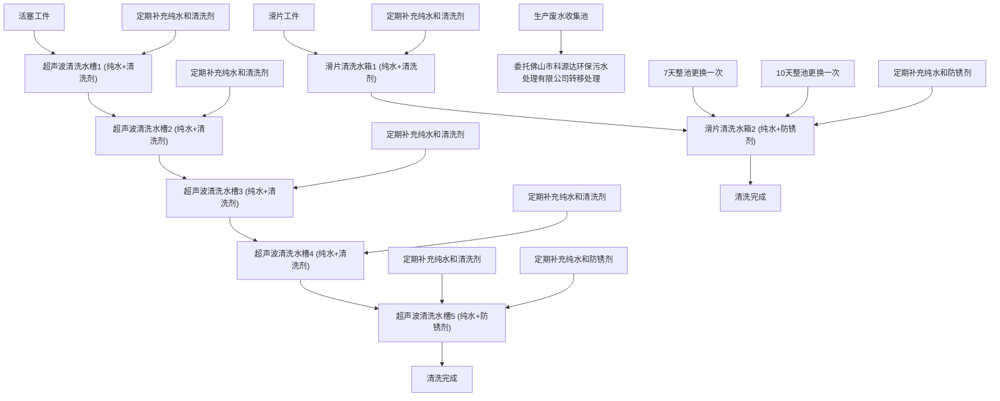
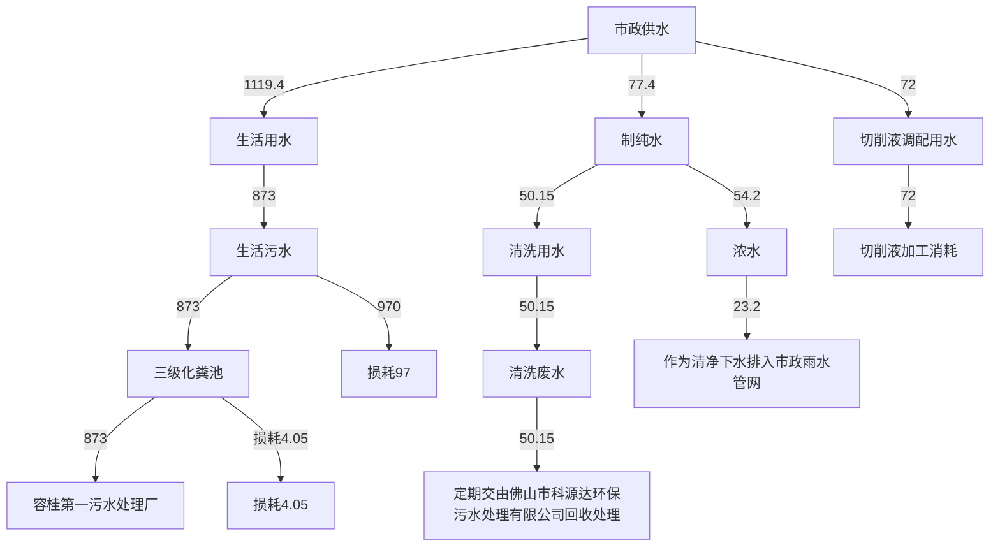
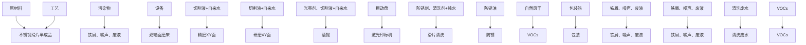
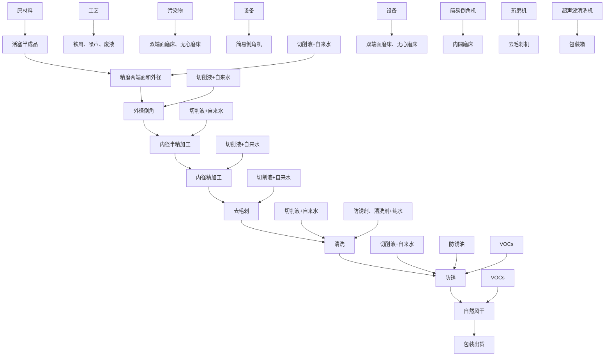
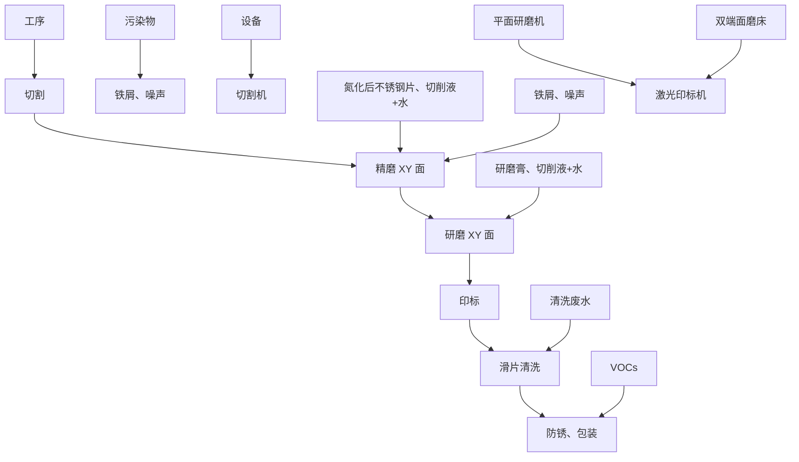

# 建设项目环境影响报告表

（污染影响类）

项目名称：佛山市顺德区甬微制冷配件有限公司迁扩建项目建设单位（盖章）：佛山市顺德区甬微制冷配件有限公司编制日期：2024年9月

text_image

佛山正泰
有限公司
佛山市顺德区
信用合作社

text_image

自然环保（广东）
中华人民共和国生态环境部制

编制单位和编制人员情况表

<table><tr><td>项目编号</td><td colspan="2">wtu048</td></tr><tr><td>建设项目名称</td><td colspan="2">佛山市顺德区甬微制冷配件有限公司迁扩建项目</td></tr><tr><td>建设项目类别</td><td colspan="2">30-066结构性金属制品制造;金属工具制造;集装箱及金属包装容器制造;金属丝绳及其制品制造;建筑、安全用金属制品制造;搪瓷制品制造;金属制日用品制造</td></tr><tr><td>环境影响评价文件类型</td><td colspan="2">报告表</td></tr><tr><td colspan="2">一、建设单位情况</td><td rowspan="2"></td></tr><tr><td>单位名称(盖章)</td><td>佛山市顺德区甬微制冷配件有限</td></tr></table>

# 环境影响评价工程师

Environmental Impact Assessment Engineer

本证书由中华人民共和国人力资源和社会保障部、生态环境部批准颁发，表明持证人通过国家统一组织的考试，取得环境影响评价工程师职业资格。

text_image

中华人民共和国人力资源和社会保障部

中华人民共和国人力资源 土会保障部

江 提

text_image

中华人民共和国生态环境部

text_image

环境影响评价工程师
Environmental Impact Assessment Engineer
本证书由中华人民共和国人力资源
和社会保障部、生态环境部批准颁发，
表明持证人通过国家统一组织的考试，
取得环境影响评价工程师职业资格。

text_image

中华人民共和国人力资源和社会保障部
中华人民共和国人力资源和社会保障部

text_image

中华人民共和国生态环境部
中华人民共和国生态环境部

text_image

0506407213
有限公司
特写

# 目录

一、建设项目基本情况.

二、建设项目工程分析. 4

三、区域环境质量现状、环境保护目标及评价标准 . 24

四、 主要环境影响和保护措施 . 29

五、环境保护措施监督检查清单 . 58

六、结论. 60

建设项目污染物排放量汇总表.. 61

附图1 项目地理位置图. 63

附图2-1 项目一楼平面布置图.. .. 64

附图2-2 项目二楼平面布置图. . 65

附图3 项目四至卫星图. . 66

附图4 项目敏感点分布图. . 67

附图5 周边环境现状照片 . 68

附图6 项目所在区域的地表水环境功能区划图 69

附图7 项目所在区域的大气环境功能区划图. . 70

附图8 项目所在区域的声环境功能区划图 . 71

附图9 项目所在区域的生态红线图. . 72

附图10 项目门口照片. 73

附图11 项目所在地环境管控单元划分 .74

附图12 项目所在地控制性详细规划图 . 75

附图13 项目所在地三线一单应用平台截图. . 76

附件15 项目公示声明.. 77

# 一、建设项目基本情况

<table><tr><td>建设项目名称</td><td colspan="3">佛山市顺德区甬微制冷配件有限公司迁扩建项目</td></tr><tr><td>项目代码</td><td colspan="3">无</td></tr><tr><td>建设单位联系人</td><td>王**</td><td>联系方式</td><td>13**85</td></tr><tr><td>建设地点</td><td colspan="3">广东省佛山市顺德区容桂街道海尾社区德龙东路1号桂龙工业园3栋101、201</td></tr><tr><td>地理坐标</td><td colspan="3">东经113°17&#x27;4.602&quot;,北纬22°44&#x27;46.434&quot;</td></tr><tr><td>国民经济行业类别</td><td>C3311金属结构制造</td><td>建设项目行业类别</td><td>“三十、金属制品业33”中“66结构性金属制品制造331”的其他(仅分割、焊接、组装的除外;年用非溶剂型低VOCs含量涂料10吨以下的除外)</td></tr><tr><td>建设性质</td><td>☑新建(迁建)□改建☑扩建□技术改造</td><td>建设项目申报情形</td><td>☑首次申报项目□不予批准后再次申报项目□超五年重新审核项目□重大变动重新报批项目</td></tr><tr><td>项目审批(核准/备案)部门(选填)</td><td>无</td><td>项目审批(核准/备案)文号(选填)</td><td>无</td></tr><tr><td>总投资(万元)</td><td>500</td><td>环保投资(万元)</td><td>50</td></tr><tr><td>环保投资占比(%)</td><td>10</td><td>施工工期</td><td>2个月</td></tr><tr><td>是否开工建设</td><td>☑否□是:/</td><td>用地(用海)面积(m2)</td><td>4094</td></tr><tr><td>专项评价设置情况</td><td colspan="3">无</td></tr><tr><td>规划情况</td><td colspan="3">无</td></tr><tr><td>规划环境影响评价情况</td><td colspan="3">无</td></tr><tr><td>规划及规划环境影响评价符合性分析</td><td colspan="3">无</td></tr><tr><td>其他符合性分析</td><td colspan="3">1、选址合理性分析佛山市顺德区甬微制冷配件有限公司迁扩建项目(以下简称“本项目”)位于广东省佛山市顺德区容桂街道海尾社区德龙东路1号桂龙工业园3栋101、201,用于工业生产。根据《佛山市顺德区容桂容边片控制性详细规划》SD-B-03-05-01、SD-B-03-05-02、SD-B-03-05-05、SD-B-03-05-06、</td></tr></table>

SD-B-03-06-02街坊局部调整批后公布（佛（顺）府复〔2021〕3号，见附图12），项目所在地土地利用规划为工业用地，符合规划要求。因此项目选址合理。

# 2、项目与《环境保护综合名录》（2021年版）相符性分析

项目不涉及《环境保护综合名录（2021年版）》中的“高污染、高环境风险”产品名录中的产品，符合《环境保护综合名录》（2021年版）的相关规定。

# 3、项目与广东省发展改革委关于印发《广东省“两高”项目管理目录（2022年版）》的通知（粤发改能源函〔2022〕1363号）相符性分析

对照广东省发展改革委关于印发《广东省“两高”项目管理目录（2022年版）》的通知（粤发改能源函〔2022〕1363 号）管理目录，本项目不涉及“两高”产品或工序，符合要求。

# 4、产业政策符合性分析

项目从事不锈钢滑片、活塞的生产，项目生产产品、生产工艺和生产设备均不属于《产业结构调整指导目录（2019 年本）》（国家发展和改革委员会令第29号，2020年1月1日起施行）中的限制或禁止类别，也不属于国家发展改革委商务部《关于印发＜市场准入负面清单（2022年版）的通知＞》（发改经体[2022]397 号）“禁止准入类”。

# 5、与《佛山市生态环境局 佛山市水利局关于进一步加强工业企业废水污染防治的函》的相符性分析

①“加强涉生活污水排放项目审批管理。要加强部门联动，及时动态更新区域排水管网图，准确判断区域排水设施现状。生活污水管网未覆盖或已覆盖但未实质连通接入城镇生活污水处理厂的区域，原则上不得新建、扩建生活污水排放的工业项目，确需排放生活污水的，应自行配套生活污水处理设施，自建污水处理设施仅限于规模以上、生活污水排放量不低于40吨/日的工业企业，并加强处理工艺经济技术可行性及受纳水体达标论证。”

本项目属于涉生活污水排放项目，属于容桂第一污水处理厂的纳污范围内，其排水证资料详见附件13，生活污水经三级化粪池预处理后由市政污水管网排入容桂第一污水处理厂处理，符合要求。

②“未实现雨污分流的工业园区、工业集聚区，严格控制以间接排放标准或纳管排放标准向市政管网排放工业废水。工业企业排放有含重金属、难生化降解、有生物毒性、易燃易爆、高盐分、重油脂等超城镇生活污水处理厂接收能力的生产废水，以及间接冷却的清净下水等过低浓度生产废水，原则上不得排入城镇生活污水处理厂，已进入的，各区要制定限期退出计划并实施。受纳城镇生活污水处理厂已满负荷的，限制审批新增废水排入城镇生活污水处理厂的工业项目。”

本项目生活污水经三级化粪池预处理后由市政污水管网排入容桂第一污水处理厂。本项目生产废水定期交由佛山市科源达环保污水处理有限公司回收处理，不外排。本项目生产废水主要污染物为pH、CODCr、BOD5、SS、NH3-N、LAS，不排放有含重金属、难生化降解、有生物毒性、易燃易爆、高盐分、重油脂等超城镇生活污水处理厂接收能力的生产废水，以及间接冷却的清净下水等过低浓度生产废水，容桂第一污水处理厂目前还有容量，未满负荷，符合要求。

③“加强零散工业企业废水管理和设施建设。加强对零散废水污染防治工作的统一监督管理，督促零散废水产生单位建立零散废水产生、收集、储存和转移的相应设施和管理制度；零散废水处理单位应当建立零散废水处理管理台账，零散废水运输专用车辆应当使用罐式车或者其他达到密封性要求的货车。零散废水转运处置方式为解决历史问题的过渡阶段措施，村级工业园、老旧工业区已完成“工改工”改造重建，以及新规划建设的工业园区、工业集聚区，原则上应自建工业废水处理设施或通过管网纳入集中处理设施处理排放，不再审批以零散废水形式外运处置(VOCs 喷淋废水除外)。”

本项目生产废水外运符合要求。

# 6、与《关于加强涉重金属行业污染防控的意见》（环土壤〔2018〕22号）符合性分析

“各省（区、市）环保厅（局）要对本省（区、市）的所有新、改、扩建涉重金属重点行业项目进行统筹考虑。新、改、扩建涉重金属重点行业建设项目必须遵循重点重金属污染物排放“减量置换”或“等量替换”的原则，应在本省（区、市）行政区域内有明确具体的重金属污染物排放总量来源。无明确具体总量来源的，各级环保部门不得批准相关环境影响评价文件。”

本项目生产废水经收集后定期交由佛山市科源达环保污水处理有限公司回收处理，不外排，不排放重金属污染物，无需申请重金属总量指标，符合要求。

# 7、与《关于进一步加强重金属污染防控的意见》（环固体〔2022〕17号）符合性分析

“严格重点行业企业准入管理。新、改、扩建重点行业建设项目应符合“三线一单”、产业政策、区域环评、规划环评和行业环境准入管控要求。重点区域的新、改、扩建重点行业建设项目应遵循重点重金属污染物排放“减量替代”原则，减量替代比例不低于 1.2:1；其他区域遵循“等量替代”原则。建设单位在提交环境影响评价文件时应明确重点重金属污染物排放总量及来源。无明确具体总量来源的，各级生态环境部门不得批准相关环境影响评价文件。总量来源原则上应是同一重点行业内企业削减的重点重金属污染物排放量，当同一重点行业内企业削减量无法满足时可从其他重点行业调剂。严格重点行业建设项目环境影响评价审批，审慎下放审批权限，不得以改革试点为名降低审批要求。

依法推动落后产能退出。根据《产业结构调整指导目录》《限期淘汰产生严重污染环境的工业固体废物的落后生产工艺设备名录》等要求，推动依法淘汰涉重金属落后产能和化解过剩产能。严格执行生态环境保护等相关法规标准，推动经整改仍达不到要求的产能依法依规关闭退出。”

本项目生产废水经收集后定期交由佛山市科源达环保污水处理有限公司回收处理，不外排，不排放重金属污染物。项目生产产品、生产工艺和生产设备均不属于《产业结构调整指导目录（2024年本）》（中华人民共和国国家发展和改革委员会令第 7号，2024年2月1日起施行）中的限制或禁止类别，也不属于《限期淘汰产生严重污染环境的工业固体废物的落后生产工艺设备名录》中的行业。

# 8、项目有机污染物治理政策的相符性分析

本项目有机污染物治理政策的相符性分析见下表。

表1-2 项目与有机污染物治理政策的相符性分析

<table><tr><td>序号</td><td>政策要求</td><td>工程内容</td><td>符合性</td></tr><tr><td colspan="4">1.与《挥发性有机物(VOCs)污染防治技术政策》(环保部公告2013第31号)相符性</td></tr><tr><td>1.1</td><td>含VOCs产品的使用过程中,应采取废气收集措施,提高废气收集效率,减少废气的无组织排放与逸散,并对收集后的废气进行回收或处理后达标排放。</td><td>本项目有机废气经收集后通过“活性炭”吸附处理后高空排放,减少废气的无组织排放与逸散。</td><td>符合</td></tr><tr><td colspan="4">2.与《佛山市顺德区生态环境保护“十四五”规划(2021-2025)》(顺府办发〔2022〕16号)相符性</td></tr><tr><td>2.1</td><td>大力推进低VOCs含量、低反应活性的原辅材料替代,将全面使用低VOCs含量原辅材料的企业纳入正面清单和政府绿色采购清单。鼓励重点行业企业开展生产工艺和设备水性化改造,推广使用水性、高固体分、无溶剂、粉末等低VOCs含量涂料。</td><td>本项目不涉及高VOCs含量原辅材料</td><td>符合</td></tr><tr><td colspan="4">3.与《重点行业挥发性有机物综合治理方案》的通知(环大气〔2019〕53号)相符性</td></tr></table>

<table><tr><td rowspan="6"></td><td>3.1</td><td>通过使用水性、粉末、高固体分、无溶剂、辐射固化等低VOCs含量的涂料,水性、辐射固化、植物基等低VOCs含量的油墨,水基、热熔、无溶剂、辐射固化、改性、生物降解等低VOCs含量的胶粘剂,以及低VOCs含量、低反应活性的清洗剂等,替代溶剂型涂料、油墨、胶粘剂、清洗剂等,从源头减少VOCs产生。工业涂装、包装印刷等行业要加大源头替代力度。</td><td>本项目不涉及高VOCs含量原辅材料。</td><td>符合</td></tr><tr><td>3.2</td><td>重点对含VOCs物料(包括含VOCs原辅材料、含VOCs产品、含VOCs废料以及有机聚合物材料等)储存、转移和输送、设备与管线组件泄漏、敞开液面逸散以及工艺过程等五类排放源实施管控,通过采取设备与场所密闭、工艺改进、废气有效收集等措施,削减VOCs无组织排放。</td><td>本项目含VOCs物料在非取用状态下保持密闭,储存在室内。本项目产生的有机废气采用“集气罩+胶帘”收集措施,削减VOCs无组织排放。</td><td>符合</td></tr><tr><td>3.3</td><td>企业新建治污设施或对现有治污设施实施改造,应依据排放废气的浓度、组分、风量,温度、湿度、压力,以及生产工况等,合理选择治理技术。鼓励企业采用多种技术的组合工艺,提高VOCs治理效率。低浓度、大风量废气,宜采用沸石转轮吸附、活性炭吸附、减风增浓等浓缩技术,提高VOCs浓度后净化处理;高浓度废气,优先进行溶剂回收,难以回收的,宜采用高温焚烧、催化燃烧等技术。油气(溶剂)回收宜采用冷凝+吸附、吸附+吸收、膜分离+吸附等技术。低温等离子、光催化、光氧化技术主要适用于恶臭异味等治理;生物法主要适用于低浓度VOCs废气治理和恶臭异味治理。非水溶性的VOCs废气禁止采用水或水溶液喷淋吸收处理。采用一次性活性炭吸附技术的,应定期更换活性炭,废旧活性炭应再生或处理处置。</td><td>本项目有机废气采用活性炭吸附,定期更换活性炭,废旧活性炭交有资质的单位转移处理。</td><td>符合</td></tr><tr><td>3.4</td><td>车间或生产设施收集排放的废气,VOCs初始排放速率大于等于3千克/小时、重点区域大于等于2千克/小时的,应加大控制力度,除确保排放浓度稳定达标外,还应实行去除效率控制,去除效率不低于80%;采用的原辅材料符合国家有关低VOCs含量产品规定的除外,有行业排放标准的按其相关规定执行。</td><td>本项目位于佛山市,VOCs初始排放速率小于3千克/小时。</td><td>符合</td></tr><tr><td colspan="4">4.与《广东省生态环境保护“十四五”规划》(粤环(2021)10号)的相符性分析</td></tr><tr><td>4.1</td><td>在石化、化工、包装印刷、工业涂装等重点行业建立完善源头、过程和末端的VOCs全过程控制体系。大力推进低VOCs含量原辅材料源头替代,严格落实国家和地方产品VOCs含量限值质量标准,禁止建设生产和使用高VOCs含量的溶剂型涂料、油墨、胶粘剂等项目。严格实施VOCs排放企业分级管控,全面推进涉VOCs排放企业深度治理。开展中小型企业废气收集</td><td>本项目不使用高VOCs含量的涂料、油墨、胶粘剂。项目产生的有机废气采用“活性炭吸附”治理,有机废气治理效率较高。</td><td>符合</td></tr></table>

<table><tr><td></td><td>和治理设施建设、运行情况的评估,强化对企业涉VOCs生产车间/工序废气的收集管理,推动企业开展治理设施升级改造。</td><td></td><td></td></tr><tr><td colspan="4">5.与《关于印发&lt;广东省涉挥发性有机物(VOCs)重点行业治理指引&gt;的通知》(粤环办〔2021〕43号)相符性分析</td></tr><tr><td>5.1</td><td>VOCs物料储存油漆、稀释剂、清洗剂等含VOCs物料应储存于密闭的容器、包装袋、储罐、储库、料仓中。</td><td>本项目VOCs物料(防锈油)存放于密闭的包装桶中</td><td></td></tr><tr><td>5.2</td><td>油漆、稀释剂、清洗剂等盛装VOCs物料的容器存放于室内,或存放于设置有雨棚、遮阳和防渗设施的专用场地。盛装VOCs物料的容器在非取用状态时应加盖、封口,保持密闭。</td><td>本项目盛装VOCs物料(防锈油)的容器存放于室内,在非取用状态时加盖、封口,保持密闭。</td><td>符合</td></tr><tr><td>5.3</td><td>油漆、稀释剂、清洗剂等液体VOCs物料应采用管道密闭输送。采用非管道输送方式转移液态VOCs物料时,应采用密闭容器或罐车。</td><td>项目含VOCs物料采用胶桶密封包装,储存于原料仓内,原料仓位于钢筋混凝土结构建造的厂房内,项目化学品在转移输送过程中采用密闭的胶桶容器</td><td>符合</td></tr><tr><td>5.4</td><td>采用外部集气罩的,距集气罩开口面最远处的VOCs无组织排放位置,控制风速不低于0.3m/s,有行业要求的按相关规定执行。</td><td>本项目采用外部集气罩,控制风速为0.5m/s,不低于0.3m/s</td><td>符合</td></tr><tr><td colspan="4">6.与《挥发性有机物无组织排放控制标准》(GB 37822-2019)相符性分析</td></tr><tr><td>6.1</td><td>VOCs物料应储存于密闭的容器、包装袋、储罐、储库、料仓中。</td><td rowspan="3">项目有机化工原料采用胶桶密封包装,储存于原料仓内,原料仓位于钢筋混凝土结构建造的厂房内,项目化学品在转移输送过程中采用密闭的胶桶容器</td><td>符合</td></tr><tr><td>6.2</td><td>盛装VOCs物料的容器或包装袋应存放于室内,或存放于设置有雨棚、遮阳和防渗设施的专用场地。盛装VOCs物料的容器或包装袋在非取用状态时应加盖、封口,保持密闭。</td><td>符合</td></tr><tr><td>6.3</td><td>VOCs物料储库、料仓应利用完整的围护结构将污染物质、作业场所等与周围空间阻隔所形成的封闭区域或封闭式建筑物。该封闭区域或封闭式建筑物除人员、车辆、设备、物料进出时,以及依法设立的排气筒、通风口外,门窗及其他开口(孔)部位应随时保持关闭状态。</td><td>符合</td></tr><tr><td colspan="4">7.与《佛山市生态环境局顺德分局关于做好重点行业建设项目挥发性有机物总量指标管理工作的通知》(佛顺环函〔2019〕56号)相符性分析</td></tr><tr><td>7.1</td><td>涉VOCs排放项目,实现本行政区城内污染源“点对点”2倍里削减替代,由项目所在镇街分局出具VOCs总量指标来源及替代削成方案的意见,开展总量替代。</td><td>本项目新增VOCs总量控制指标为0.250t/a,VOCs总量指标由顺德区容桂街道分配划拨。</td><td>符合</td></tr><tr><td colspan="4">9、项目与《广东省人民政府关于印发广东省“三线一单”生态环境分区管控方案的通知》(粤府[2020]71号)相符性分析表1-3项目与粤府[2020]71号相符性分析</td></tr><tr><td>序号</td><td>项目</td><td>文件要求</td><td>本项目情况</td></tr></table>

<table><tr><td>1</td><td>生态保护红线</td><td>全省陆域生态保护红线面积36194.35km2,占全省陆域国土面积的20.13%;全省海洋生态保护红线面积16490.59km2,占全省管辖海域面积的25.49%。</td><td>本项目选址位于广东省佛山市顺德区容桂街道海尾社区德龙东路1号桂龙工业园3栋101、201,周边无自然保护区等生态保护目标,符合生态保护红线要求。</td><td>符合</td></tr><tr><td>2</td><td>环境质量底线</td><td>全省水环境质量持续改善,国考、省考断面优良水质比例稳步提升,全面消除劣V类水体。大气环境质量继续领跑先行,PM2.5年均浓度率先达到世界卫生组织过渡期二阶段目标值(25μg/m3),臭氧污染得到有效遏制。土壤环境质量稳中向好,土壤环境风险得到管控。近岸海域水体质量稳步提升。</td><td>本项目生活污水经三级化粪池预处理后经市政污水管网排入容桂第一污水处理厂作为后续处理,尾水排放至桂州水道;本项目生产废水定期交由佛山市科源达环保污水处理有限公司回收处理,不外排,对周围水环境影响较小。项目所在区域判断为大气不达标区,臭氧(O3)不达标。项目产生的有机废气收集后经“活性炭”吸附处理设施处理后高空排放。本项目声环境质量能满足相应的标准要求。</td><td>符合</td></tr><tr><td>3</td><td>资源利用上线</td><td>强化节约集约利用,持续提升资源能源利用效率,水资源、土地资源、岸线资源、能源消耗等达到或优于国家下达的总量和强度控制目标。</td><td>本项目给水来自当地自来水公司供给,电能由区域电网供应,项目建设土地不涉及基本农田,水、电、土地资源消耗,基本能保障自然资源资产“数量不减少、质量不降低”。</td><td>符合</td></tr></table>

# 10、项目与《佛山市“三线一单”生态环境分区管控方案（2024 年版）》（佛环〔2024〕20 号）相符性分析

对照《佛山市生态环境局关于印发佛山市“三线一单”生态环境分区管控方案（2024 年版）的通知》（佛环〔2024〕20号）的佛山市环境管控单元图，本项目所在地属于容桂街道重点管控单元（环境管控单元编码：ZH44060620001）。

表 1-4 项目佛山市“三线一单”生态环境分区管控方案的相符性分析

<table><tr><td>序号</td><td>项目</td><td>文件要求</td><td>本项目情况</td><td>符合性</td></tr><tr><td>1</td><td>区域布局管控</td><td>禁止新建、扩建水泥、平板玻璃、化学制浆、生皮制革以及国家规划外的钢铁、原油加工等项目。专业电镀、印染等项目进入定点园区集中管理。严格落实国家产品VOCs含量限值标准要求,除现阶段确无法实施替代的工序外,禁止新建生产和使用高VOCs含量原辅材料项目,鼓励建设共性工厂、活性炭集中再生中心等挥发性有机物第三方治理项目,推动挥发性有机物集中高效处理。</td><td>本项目不属于水泥、平板玻璃、化学制浆、生皮制革、钢铁、原油加工等行业。项目使用的原辅材料不属于高挥发性原料。</td><td>符合</td></tr><tr><td>2</td><td>生态保护红线</td><td>全市陆域生态保护红线面积323.06平方公里,占全市陆域国土面积的8.51%;一般生态空间面积217.36平方公里,占全市陆域国土面积的5.73%。</td><td>本项目选址在重点管控单元,不属于禁止开发区域。</td><td>符合</td></tr><tr><td>3</td><td>环境质量底线</td><td>地表水水环境质量持续改善,国考、省考断面地表水质量达到或优于III类水体比例不低于85.7%,劣V类水体比例为0%,市考断面基本消除劣V类断面;全面消除黑臭水体。空气质量持续改善,细颗粒物(PM2.5)年均浓度、空气质量优良天数比例(AQI)主要指标达到省下达的目标要求,臭氧污染得到遏制。土壤环境质量总体保持稳定,土壤环境风险得到管控,受污染耕地安全利用率不低于93%,重点建设用地安全利用得到有效保障。地下水国控区域点位V类水比例完成省下达任务,地下水饮用水源点位和污染风险监控点位水质总体保持稳定</td><td>1本项目排放的为生活污水,生活污水经三级化粪池处理后纳入容桂第一污水处理厂处理达标后外排;本项目生产废水定期交由佛山市科源达环保污水处理有限公司回收处理,不外排;本项目建设可满足水环境控制底线要求;2本项目选址地不属于大气环境保护区范围,项目生产过程中排放的有机废气采取了相应的收集治理措施,可稳定达标排放,满足大气环境质量底线的管理要求;3本项目选址地为工业用地,项目生产车间地面均已硬体化处理,生产过程中无土壤污染因子。建设单位生产过程中应加强各环境的管控,防止对土壤环境造成影响。</td><td>符合</td></tr><tr><td>4</td><td>资源利用上线</td><td>强化节约集约循环利用,持续提升资源能源利用效率,土地资源、岸线资源、能源消耗等达到或优于国家和省下达的总量、强度等目标要求,按省规定年限实现碳达峰。到2035年,生态环境分区管控体系巩固完善,生态空间保护格局稳定,生态环境质量根本好转,资源节约集约利用水平显著提高,碳排放率先达峰后稳中有降。</td><td>本项目营运过程中消耗一定量的电能、水资源,项目资源消耗量相对区域资源利用总量较少,符合资源利用上限的要求。</td><td>符合</td></tr></table>

# 11、项目与广东省佛山市顺德区重点管控单元准入清单的相符性分析

本项目位于广东省佛山市顺德区重点管控单元 1（ZH44060620001，容桂街道重点管控区）内，本项目与佛山市顺德区环境管控单元准入清单相符性分析如下表所示。

表1-5 项目与广东省佛山市顺德区重点管控单元准入清单的相符性分析

<table><tr><td rowspan="2">环境管控单元编码</td><td rowspan="2">环境管控单元名称</td><td colspan="3">行政区划</td><td rowspan="2">管控单元分类</td><td rowspan="2">要素细类</td><td rowspan="5">本项目内容</td><td rowspan="5">符合性</td></tr><tr><td>省</td><td>市</td><td>区</td></tr><tr><td>ZH44060620001</td><td>容桂街道重点管控区</td><td>广东省</td><td>佛山市</td><td>顺德区</td><td>重点管控单元1</td><td>水环境工业污染重点管控区、水环境工业-城镇生重点管控区、大气环境受体敏感重点管控区、大气环境高排放重点管控区、江河湖库岸线重点管控区</td></tr><tr><td>管控维度</td><td colspan="6">管控要求</td></tr><tr><td>共性要求</td><td colspan="6">单元内各环境要素细类管控区内,按该环境要素细类管控要求执行。</td></tr><tr><td rowspan="6">区域布局管控</td><td colspan="6">1-1.【产业/鼓励引导类】重点发展芯片、智能家电、高端装备制造、高端新型电子信息、新材料、生命健康等制造业和金融、科技服务、高端商贸等现代服务业,建设科技研发、创新创业基地、上市企业总部聚集区、企业品牌总部基地。</td><td>不适用</td><td>符合</td></tr><tr><td colspan="6">1-2.【产业/综合类】系统推进村级工业园升级改造,腾出连片空间,布局产业集聚区和主题产业园,推动工业项目入园集聚发展。新增工业制造业用地原则上安排在产业集聚区内,产业集聚区外原则上不鼓励工业及物流仓储用地的新建与改造。新增工业制造业用地原则上安排在产业集聚区内,产业集聚区外原则上不鼓励工业及物流仓储用地的新建与改造。</td><td>本项目位于广东省佛山市顺德区容桂街道海尾社区德龙东路1号桂龙工业园3栋101、201,属于产业集聚区,已经村改完毕</td><td>符合</td></tr><tr><td colspan="6">1-3.【产业/综合类】产业聚集区所属地块内的工业用地或企业与村庄、学校等环境敏感点之间应设置合理的大气环境防护距离,并通过绿化带进行有效隔离;聚集区规划布局应注重大气污染排放企业应尽量避免布局在居住用地的常年主导风向的上风向。</td><td>距离本项目最近的敏感点为南面296m的南区社区居民区,项目与敏感点之间有有效的隔离。</td><td>符合</td></tr><tr><td colspan="6">1-4.【产业/限制类】受纳水体或监控断面不达标的,不得新建、扩建向河涌直接排放废水的项目。新建、扩建含蚀刻工序的线路板生产项目和化工项目应在配套污水集中处置的工业园区或生活污水管网覆盖区域内建设;纯加工型印花项目,含酸洗、磷化的金属表面处理、金属制品项目(与自身高新技术企业配套的除外),含酸洗、喷涂、拉丝、表面抛光等工艺的不锈钢型材加工项目,应进入以此类项目为主导产业、有相应废水集中治理设施的工业园区,实现集中治污。</td><td>本项目外排废水为生活污水,属于间接排放。生活污水经预处理后进入容桂第一污水处理厂处理,本项目生产废水定期交由佛山市科源达环保污水处理有限公司回收处理,不外排;本项目不包含条款中提及的限制类项目和工序。</td><td>符合</td></tr><tr><td colspan="6">1-5.【产业/综合类】划定家具生产优先发展区域,优先发展区外不再新建涉及涂装工艺的木质家具制造项目</td><td>本项目不属于木质家具制造项目</td><td>符合</td></tr><tr><td colspan="6">1-6.【大气/限制类】大气环境受体敏感重点管控区内,应严格限制新建储油库项目、产生和排放有毒有害大气污染物的建设项目以及使用溶剂型油墨、涂料、清洗剂、胶黏剂等高挥发性有机物原辅材料项目,鼓励现有该类项目搬迁退出。</td><td>项目不使用溶剂型油墨、涂料、清洗剂、胶黏剂等高挥发性有机物原辅材料</td><td>符合</td></tr><tr><td rowspan="2"></td><td>1-7.【大气/鼓励引导类】大气环境高排放重点管控区内,应强化达标监管,引导工业项目落地集聚发展,有序推进区域内企业提标改造。</td><td>本项目有机废气治理采用活性炭吸附处理后引至40m高排气筒G1排放</td><td colspan="6">符合</td></tr><tr><td>1-8.【土壤/禁止类】禁止新建、扩建增加重点防控的重金属污染物排放的建设项目。</td><td>本项目不排放重金属污染物</td><td colspan="6">符合</td></tr><tr><td rowspan="6">能源资源利用</td><td>2-1【能源/鼓励引导类】推广节能技术,加快发展绿色货运与现代物流。</td><td>不适用</td><td colspan="6">符合</td></tr><tr><td>2-2【能源/鼓励引导类】推广新能源汽车应用和充电基础设施建设,积极推动重卡LNG加气站、充电基础设施、加氢站建设。</td><td>不适用</td><td colspan="6">符合</td></tr><tr><td>2-3.【能源/综合类】科学实施能源消费总量和强度“双控”,新建高能耗项目单位产品(产值)能耗达到国际国内先进水平。</td><td>本项目不属于高能耗项目</td><td colspan="6">符合</td></tr><tr><td>2-4.【水资源/综合类】贯彻落实“节水优先”方针,实行最严格水资源管理制度,容桂街道万元国内生产总值用水量、万元工业增加值用水量、用水总量、农田灌溉水有效利用系数等用水总量和效率指标达到区下达要求。</td><td>项目严格贯彻落实“节水优先”方针,实行最严格水资源管理制度,容桂街道万元国内生产总值用水量、万元工业增加值用水量、用水总量、农田灌溉水有效利用系数等用水总量和效率指标达到区下达要求。</td><td colspan="6">符合</td></tr><tr><td>2-5.【土地资源/限制类】落实单位土地面积投资强度、土地利用强度等建设用地控制性指标要求,提高土地利用效率。</td><td>本项目位于高层专业工业厂房,土地利用效率较高</td><td colspan="6">符合</td></tr><tr><td>2-6.【岸线/禁止类】严格水域岸线用途管制,新建项目一律不得违规占用水域。严禁破坏生态的岸线利用行为和不符合其功能定位的开发建设活动,严禁以各种名义侵占河道、围垦湖泊、非法采砂等。</td><td>项目位于广东省佛山市顺德区容桂街道海尾社区德龙东路1号桂龙工业园3栋101、201,不占用水域</td><td colspan="6">符合</td></tr><tr><td rowspan="3">污染物排放管控</td><td>3-1.【水/限制类】城镇新区建设实行雨污分流,逐步推进初期雨水收集、处理和资源化利用。住宅、商业体、学校、市场等城镇开发建设项目应当配套或者同步计划建设公共排水设施,公共排水设施或自建排污水设施未能投产运行的,以上涉水项目不得投入使用。新建小区严格实施雨污分流,阳台、露台等污水接入污水收集系统,将生活污水“应截尽截”。做好大型楼盘、集贸市场、餐饮以及学校等4大类排水户污水接入市政管网工作。</td><td>不适用</td><td colspan="6">符合</td></tr><tr><td>3-2.【水/综合类】容桂街道重点河涌水质上年度未达到水环境环境质量目标的,需组织编制、系统实施、向社会公开区域重点水污染物减排计划并明确“替代量”,本年度新建、改建、扩建项目新增水环境重点污染物实行区域“减二增一”替代(工业、生活或综合集中废水处理设施、民生项目除外)。</td><td>不适用</td><td colspan="6">符合</td></tr><tr><td>3-3.【水/综合类】区域内应合理规划建设工业或综合集中废水处理设施。逐步推进工业集聚区“污水零直排区”建设,开展排水单元工业废水、生活污水、雨水分类收集、分质处理,确保园区“管网全覆盖、雨污全分流、污水全收集、处理全达标”。3-4.【水/综合类】结合村级工业园改造,全面提升产业层次与集聚度,促进污染集中整治。</td><td>本项目所在园区雨污分流,已纳入容桂第一污水处理厂的处理范围。项目位于桂龙工业园,产业层次与集聚度较高。</td><td colspan="6">符合符合</td></tr><tr><td rowspan="5"></td><td>3-5.【水/综合类】稳步推进排水设施“三个一体化”管理模式,补齐城乡污水收集和处理短板,推动容桂第一、第二污水处理厂提质增效,加快消除城中村、老旧城区、城乡结合部等污水收集管网空白区,逐步实现城乡污水收集处理全覆盖。2025年前完成容桂第一、第二污水处理厂扩建,尾水应执行《城镇污水处理厂污染物排放标准》(GB18918-2002)一级A标准及《广东省水污染物排放限值》(DB44/26-2001)的较严值。</td><td>不适用</td><td colspan="6">符合</td></tr><tr><td>3-6.【水/综合类】近期保留马东、马南两处污水处理站,到2030年将马冈村居污水接入市政污水管网,纳入杏坛城镇污水处理系统;其余行政村(社区)污水均通过市政管网和农村支管纳入容桂城镇污水处理处理系统。</td><td>不适用</td><td colspan="6">符合</td></tr><tr><td>3-7.【水/综合类】产业集聚区和主题园区内做好污水管网和污水集中处理设施的配套保障,确保废水收集到城镇污水处理厂、园区污水处理厂或分散式污水处理设施集中处置。</td><td>项目所在地已经实施雨污分流,污水纳入容桂街道污水处理系统</td><td colspan="6">符合</td></tr><tr><td>3-8.【大气/综合类】大力推进低VOCs含量原辅材料替代,加快涉VOCs重点行业的生产工艺升级改造,推行自动化生产工艺,对达不到要求的VOCs收集及治理设施进行整治提升,逐步淘汰低效VOCs治理设施。</td><td>本项目不生产和使用高VOCs含量原辅材料项目,不使用低效VOCs治理设施</td><td colspan="6">符合</td></tr><tr><td>3-9.【土壤/限制类】作为重金属污染重点防控区,区域内重点重金属排放总量只减不增。</td><td>本项目不排放重金属污染物</td><td colspan="6">符合</td></tr><tr><td rowspan="2">环境风险防控</td><td>4-1【水/综合类】容桂第一、第二污水处理厂、工业污水集中处理设施应采取有效措施,防止事故废水直接排入水体。完善污水处理厂在线监控系统联网,实现污水处理厂的实时、动态监管。</td><td>不适用</td><td colspan="6">符合</td></tr><tr><td>4-2【风险/综合类】加强环境风险分级分类管理,强化金属制品、有色金属和压延加工、化学原料和化学品制造业等涉重金、化工行业企业及工业园区等重点环境风险源的环境风险防控。</td><td>项目不涉重金属、化工行业企业及工业园区等重点环境风险源,日常加强环境风险分级分类管理。</td><td colspan="6">符合</td></tr></table>

综上所述，本项目符合广东省、佛山市、顺德区产业政策要求。

# 二、建设项目工程分析

<table><tr><td rowspan="3">建设内容</td><td colspan="4">1、项目概况佛山市顺德区甬微制冷配件有限公司原位于佛山市顺德区容桂街道办事处华口居委会昌宝东路7号首层之十五,地理位置坐标为E113.317381°,N22.764867°,占地面积为 $1650m^{2}$ ,总建筑面积为 $1650m^{2}$ ,总投资500万元,年产2000万片不锈钢滑片、312万件活塞。为适应市场发展,建设单位根据市场需求拟扩大产量,项目拟投资500万元,搬迁至广东省佛山市顺德区容桂街道海尾社区德龙东路1号桂龙工业园3栋101、201。主要建设内容包括1楼活塞生产车间、2楼滑片生产车间。迁扩建项目拟新增年产2000万片不锈钢滑片、308万件活塞。项目厂房为现有已建成厂房,处于前期准备阶段,现申请办理环保审批手续。根据《中华人民共和国环境保护法》(2015年1月1日起实施)、《中华人民共和国环境影响评价法》(2016年9月1日起施行,2018年12月29日重新修订)及中华人民共和国国务院令第682号《国务院关于修改〈建设项目环境保护管理条例〉的决定》(2017年10月1日起施行)中的有关规定,建设项目必须执行环境影响评价制度。根据《建设项目环境影响评价分类管理名录2021版》(中华人民共和国生态环境部令第16号,2021年1月1日起实施),本项目属于“三十、金属制品业33”中“66结构性金属制品制造331”的其他(仅分割、焊接、组装的除外;年用非溶剂型低VOCs含量涂料10吨以下的除外),按要求编写环境影响报告表。2、工程组成本项目建设性质为新建,生产车间所在建筑物共6层,项目位于建筑物第1层和第2层,占地面积2047平方米,建筑面积4094平方米,建筑物首层高度为7.9米,2~6层高度为6米,建筑物总高度约为37.9米。本项目主要工程包括生产车间,并配有原辅材料堆放区。项目组成详见下表。表2-1项目工程组成</td></tr><tr><td>类别</td><td>工程名称</td><td>迁扩建前</td><td>迁扩建后</td></tr><tr><td>主体工程</td><td>生产车间</td><td>建筑面积 $1650m^{3}$ ,包含滑片生产线和活塞生产线</td><td>活塞生产车间(1楼):约 $2047m^{2}$ ,包含2条活塞生产线,活塞恒温仓库( $227.81m^{2}$ )、精密室( $54m^{2}$ )、活塞分选室( $152m^{2}$ )、滚抛房( $30m^{2}$ )、清洁房( $17.94m^{2}$ )、油库( $32m^{2}$ )、维修房( $40.25m^{2}$ )、活塞清洗房( $56m^{2}$ )、空压机房</td></tr></table>

<table><tr><td rowspan="2"></td><td rowspan="2" colspan="2"></td><td rowspan="2"></td><td>(52m2)、办公室、厕所等</td></tr><tr><td>滑片生产车间(2楼):约2047m2,包含自动分选室(147.6m2)、手动分选室(221.4m2)、防锈库(29.6m2)、抛光房(22.2m2)、直线度(59.2m2)、滑片仓库(288.2m2)、物质仓库(52m2)、研磨清洗区、车间办公室和厕所等</td></tr><tr><td rowspan="2">公用工程</td><td colspan="2">给水设施</td><td>给水由市政水管网供应</td><td>给水由市政水管网供应</td></tr><tr><td colspan="2">供电设施</td><td>用电由市政电网供应</td><td>用电由市政电网供应</td></tr><tr><td rowspan="8">环保工程</td><td rowspan="3">固体废物</td><td>危险废物</td><td>1个危废暂存间,约10m2,存放危险废物;危险废物收集后放置于危险废物暂存间内,定期交由有相应危险废物处理资质的单位进行处置</td><td>1个危废暂存间,约10m2,存放危险废物;危险废物收集后放置于危险废物暂存间内,定期交由有相应危险废物处理资质的单位进行处置</td></tr><tr><td>一般固体废物</td><td>1个一般固废暂存点,约5m2,存放一般工业固体废物;一般工业固废收集后放置于一般固废点,定期由专业回收公司统一回收</td><td>1个一般固废暂存点,约10m2,存放一般工业固体废物;一般工业固废收集后放置于一般固废点,定期由专业回收公司统一回收</td></tr><tr><td>生活垃圾</td><td>交由环卫部门定期进行统一清理</td><td>交由环卫部门定期进行统一清理</td></tr><tr><td rowspan="2">废水</td><td>生活污水</td><td>独立的污水处理设施预处理后排入容桂第一污水处理厂</td><td>生活污水经三级化粪池预处理后排入容桂第一污水处理厂</td></tr><tr><td>生产废水</td><td>生产废水经过自建的污水处理设施(反应槽+一体生物处理设备)处理达标后排入容桂第一污水处理厂</td><td>生产废水经收集后定期交由佛山市科源达环保污水处理有限公司回收处理,不外排</td></tr><tr><td>噪声</td><td>隔声降噪</td><td>减震和隔声等措施</td><td>本项目噪声为设备运行产生的噪声,采取选用低噪声设备、车间合理布局、安装减震基础、厂房隔声、距离衰减等措施削减</td></tr><tr><td rowspan="2">废气</td><td>有机废气</td><td>项目防锈处理产生的有机废气经集气罩收集后通过15米高排气筒排放</td><td>项目防锈工序有机废气经集气罩+胶帘收集后通过活性炭吸附处理系统处理后气通过40米高排气筒(DA001)排放。</td></tr><tr><td>粉尘</td><td>颗粒物以无组织形式排放至车间内</td><td>/</td></tr></table>

# 3、主要产品及产能

根据建设单位提供资料，项目总投资500万元，产品方案如下表所示。

表 2-2 项目产品方案一览表

<table><tr><td rowspan="2">序号</td><td rowspan="2">产品名称</td><td rowspan="2">单位</td><td colspan="3">年产量</td></tr><tr><td>迁扩建前</td><td>迁扩建后</td><td>增减量</td></tr><tr><td>1</td><td>不锈钢滑片</td><td>万片/年</td><td>2000</td><td>4000</td><td>+2000</td></tr><tr><td>2</td><td>活塞</td><td>万件/年</td><td>312</td><td>620</td><td>+308</td></tr></table>

表 2-3 项目产品规格一览表

<table><tr><td>序号</td><td>产品名称</td><td>产品照片</td><td>产品规格</td></tr><tr><td>1</td><td>不锈钢滑片</td><td></td><td>不锈钢滑片产品宽度23mm,厚度约3.2mm,经计算平均每个产品表面积约0.001m2</td></tr><tr><td>2</td><td>活塞</td><td></td><td>活塞产品高度17.987~21.987mm,外径32.384~34.784mm,内经20.8~22.0mm,经计算平均每个产品表面积约0.01m2</td></tr></table>

由几何形状计算工件的面积：项目年加工不锈钢滑片4000万片、活塞620万件，如上图所示，主要以上述展示的产品为主，本报告以此产品为基础进行核算，则项目加工总表面处理面积 $\mathrm { \Delta S _ { \perp } } { = } 4 0 0 0 \mathrm { \ D } \mathcal { F } ^ { * } 0 . 0 0 1 \mathrm { m } ^ { 2 } { + } 6 2 0 \mathrm { \ } \mathcal { F } ^ { * } 0 . 0 1 \mathrm { m } ^ { 2 } { = } 1 0 . 2 \mathrm { \ } \mathcal { F } \mathrm { \ m } ^ { 2 } \circ 1 0 . 0 0 3 \mathrm { m } ^ { 3 } \mathrm { m } ^ { 4 }$ 。

# 4、主要设备清单

根据建设单位提供资料，项目主要生产设备如下表所示。

表 2-4 项目主要生产设备一览表

<table><tr><td>序号</td><td>名称</td><td>单位</td><td>迁扩建前</td><td>迁扩建后</td><td>增减量</td><td>设备型号</td><td>车间位置</td></tr><tr><td>1</td><td>卧轴矩台平面磨床</td><td>台</td><td>1</td><td>2</td><td>+1</td><td>M71306/F</td><td>滑片车间</td></tr><tr><td>2</td><td>平面研磨机</td><td>台</td><td>12</td><td>2</td><td>-10</td><td>SHJ6S-51</td><td>停用</td></tr><tr><td>3</td><td>韩国研磨机</td><td>台</td><td>0</td><td>8</td><td>+8</td><td>ADL-700</td><td>滑片车间</td></tr><tr><td>4</td><td>滑片清洗机</td><td>台</td><td>1</td><td>1</td><td>0</td><td>型号:FZ-W90144N,内含2个清洗水箱,规格分别为120cm×55cm×64cm和120cm×54cm×50cm</td><td>滑片车间</td></tr><tr><td>5</td><td>卧轴双端面磨床</td><td>台</td><td>6</td><td>9</td><td>+3</td><td>MW7650C/208</td><td>滑片车间</td></tr><tr><td>6</td><td>振动盘</td><td>台</td><td>0</td><td>4</td><td>+4</td><td>——</td><td>滑片车间</td></tr><tr><td>7</td><td>激光印标机</td><td>台</td><td>1</td><td>4</td><td>+3</td><td>——</td><td>活塞车间</td></tr><tr><td>8</td><td>双端面磨床</td><td>台</td><td>1</td><td>1</td><td>0</td><td>KVD300W</td><td>活塞车间</td></tr><tr><td>9</td><td>无心磨床</td><td>台</td><td>2</td><td>3</td><td>+1</td><td>KC-200CNC</td><td>活塞车间</td></tr><tr><td>10</td><td>简易倒角机</td><td>台</td><td>1</td><td>3</td><td>+2</td><td>HESH</td><td>活塞车间</td></tr><tr><td>11</td><td>内圆磨床</td><td>台</td><td>3</td><td>5</td><td>2</td><td>T-11LB88</td><td>活塞车间</td></tr><tr><td>12</td><td>珩磨机</td><td>台</td><td>2</td><td>3</td><td>+1</td><td>VSS264</td><td>活塞车间</td></tr><tr><td>13</td><td>脱油机</td><td>台</td><td>2</td><td>0</td><td>-2</td><td>——</td><td>淘汰</td></tr><tr><td>14</td><td>精密去毛刺机</td><td>台</td><td>1</td><td>3</td><td>+2</td><td>HESH</td><td>活塞车间</td></tr><tr><td>15</td><td>超声波清洗机</td><td>台</td><td>1</td><td>1</td><td>0</td><td>型号:MH-3,内含5个清洗水槽,每个水槽规格均为80cm×60cm×40cm</td><td>活塞车间</td></tr><tr><td>16</td><td>纯水机</td><td>台</td><td>1</td><td>1</td><td>0</td><td>——</td><td>活塞车间</td></tr><tr><td>17</td><td>集中供水机</td><td>台</td><td>1</td><td>0</td><td>-1</td><td>——</td><td>淘汰</td></tr><tr><td>18</td><td>空压机</td><td>台</td><td>3</td><td>3</td><td>0</td><td>——</td><td>公共通道</td></tr><tr><td>19</td><td>切削液集中循环系统</td><td>套</td><td>0</td><td>1</td><td>+1</td><td>——</td><td>活塞车间</td></tr></table>

本项目环保工程设施及设施参数见下表。

表 2-5 项目环保工程设施及设施参数一览表

<table><tr><td rowspan="2" colspan="2">主要单元</td><td rowspan="2">生产设施</td><td rowspan="2">数量</td><td colspan="3">设施参数单位</td><td rowspan="2">其他设施信息</td></tr><tr><td>参数名称</td><td>设计值</td><td>单位</td></tr><tr><td rowspan="4">环保工程</td><td rowspan="2">污水处理系统</td><td>三级化粪池</td><td>1套</td><td>总容积</td><td>10</td><td> $m^{3}$ </td><td>依托工业园区</td></tr><tr><td>生产废水收集池</td><td>1个</td><td>储存能力</td><td>10</td><td> $m^{3}$ </td><td>位于生产车间内</td></tr><tr><td>废气处理系统</td><td>活性炭吸附</td><td>1套</td><td>处理效率</td><td>50</td><td>%</td><td>位于本栋厂房顶楼</td></tr><tr><td>危险废物贮存</td><td>危险废物暂存间</td><td>1个</td><td>面积</td><td>10</td><td> $m^{2}$ </td><td>位于生产车间内</td></tr></table>

# 5、主要原辅材料

# （1）本项目主要原辅材料及年用量见下表。

表 2-6 项目主要原辅材料消耗量一览表

<table><tr><td rowspan="2">序号</td><td rowspan="2">类型</td><td rowspan="2">产品名称</td><td rowspan="2">单位</td><td colspan="3">年用量</td><td rowspan="2">最大存储量/t</td><td rowspan="2">性状</td><td rowspan="2">包装规格</td></tr><tr><td>迁扩建前</td><td>迁扩建后</td><td>增减量</td></tr><tr><td>1</td><td rowspan="8">辅料</td><td>切削液</td><td>吨/年</td><td>4.8</td><td>3.6</td><td>-1.2</td><td>0.4</td><td>液态</td><td>200L/桶</td></tr><tr><td>2</td><td>防锈油</td><td>吨/年</td><td>0.4</td><td>0.8</td><td>+0.4</td><td>0.4</td><td>液态</td><td>200L/桶</td></tr><tr><td>3</td><td>清洗剂</td><td>吨/年</td><td>0.4</td><td>0.8</td><td>+0.4</td><td>0.2</td><td>液态</td><td>18L/桶</td></tr><tr><td>4</td><td>液压油</td><td>吨/年</td><td>0.4</td><td>0.4</td><td>0</td><td>0.4</td><td>液态</td><td>18L/桶</td></tr><tr><td>5</td><td>包装箱</td><td>个/年</td><td>2400</td><td>4800</td><td>+2400</td><td>/</td><td>固态</td><td>/</td></tr><tr><td>6</td><td>润滑油</td><td>吨/年</td><td>0</td><td>0.3</td><td>+0.3</td><td>0.2</td><td>液态</td><td>200L/桶</td></tr><tr><td>7</td><td>防锈剂</td><td>吨/年</td><td>0</td><td>0.4</td><td>+0.4</td><td>0.2</td><td>液态</td><td>18L/桶</td></tr><tr><td>8</td><td>光亮剂</td><td>吨/年</td><td>0</td><td>0.7</td><td>+0.7</td><td>0.1</td><td>液态</td><td>25L/桶</td></tr><tr><td>9</td><td rowspan="2">原料</td><td>不锈钢滑片半成品</td><td>万片/年</td><td>2004</td><td>4040</td><td>+2036</td><td>500</td><td>固态</td><td>/</td></tr><tr><td>10</td><td>活塞半成品</td><td>万件/年</td><td>314</td><td>630</td><td>+316</td><td>200</td><td>固态</td><td>/</td></tr></table>

# （2）本项目主要原辅材料理化性质见下表。

表 2-7 项目主要原辅材料成分表及理化性质

<table><tr><td>名称</td><td colspan="2">理化性质</td></tr><tr><td>光亮剂</td><td>透明液体,pH≈11&gt;7(见右图,项目光亮剂实测检验图片),沸点100°C,溶于水,相对密度1.3,主要用于研磨出光,主要成分包含:有机活性剂10%、聚乙二醇20%、碳酸钠10%、渗透剂30%、水30%。不属于危险化学品,具有刺激性,接触后对皮肤、粘膜等组织产生刺激和腐蚀作用。</td><td></td></tr><tr><td>切削液</td><td colspan="2">切削液是一种用在金属切削、磨加工过程中,用来冷却和润滑刀具和加工件的工业用液体,切削液由多种超强功能助剂经科学复合配合而成,同时具备良好的冷却性能、润滑性能、防锈性能、除油清洗功能、防腐功能、易稀释特点。主要成分包含:聚氧乙烯聚氧丙烯醚10~15%、脂肪酸皂20~25%、润滑添加剂20~25%、防锈添加剂20~25%、纯水10~15%。以上物质在切削加工过程中均不挥发,不产生挥发性有机物。</td></tr><tr><td>防锈油</td><td colspan="2">无色至浅黄色透明液体,主要成分:溶剂油95%、助剂5%,适合于钢铁零件精密机械仪器、仪表等零件的库存或装配前的短期防锈处理。可燃液体,相对密度(水=1):0.65~0.85,易溶于石油类有机溶剂,不溶于水。</td></tr><tr><td>清洗剂</td><td colspan="2">是一种液体状态的用来洗涤衣物或清洗用具或清洁家具等东西的清洁产品。它采用多种新型表面活性剂,去污力强,漂洗容易,对皮肤无刺激。主要成分:非离子表面活性剂、醇胺、无机盐助洗剂、离子交换水。</td></tr><tr><td>防锈剂</td><td colspan="2">无色或淡黄色液体,不可燃,相对密度(水=1):1.0~1.3,主要成分:表面活性剂、防锈添加剂、离子交换水,主要用于项目清洗后防锈,避免被空气氧化。</td></tr><tr><td>光亮剂</td><td colspan="2">黄色透明液体,pH&gt;7,沸点100°C,溶于水,相对密度1.3,主要用于研磨出光,主要成分包含:有机活性剂10%、聚乙二醇20%、碳酸钠10%、渗透剂30%、水30%。不属于危险化学品,具有刺激性,接触后对皮肤、粘膜等组织产生刺激和腐蚀作用。</td></tr></table>

# 6、工作制度和能耗水耗

本项目劳动定员及工作制度见下表。

表 2-8 工作制度一览表

<table><tr><td>序号</td><td>名称</td><td>迁扩建前内容</td><td>迁扩建后内容</td></tr><tr><td>1</td><td>劳动定员</td><td>员工60人</td><td>员工97人</td></tr><tr><td>2</td><td>工作制度</td><td>年工作300天,每天1班,每班工作8小时,年工作2400小时</td><td>年工作300天,每天1班,每班工作12小时,年工作3600小时</td></tr><tr><td>3</td><td>食宿情况</td><td>均不在厂食宿</td><td>均不在厂食宿</td></tr></table>

本项目能耗水耗情况见下表。

表2-9 项目主要能源消耗一览表

<table><tr><td>序号</td><td>名称</td><td>单位</td><td>迁扩建前年用量</td><td>迁扩建后年用量</td><td>增减量</td><td>用途</td><td>备注</td></tr><tr><td>1</td><td rowspan="2">水</td><td>吨/年</td><td>720</td><td>970</td><td>+250</td><td>办公、生活</td><td rowspan="2">市政供水</td></tr><tr><td>2</td><td>吨/年</td><td>179.2</td><td>149.4</td><td>-29.8</td><td>生产用水</td></tr><tr><td>3</td><td>电</td><td>万度/年</td><td>8</td><td>13</td><td>+5</td><td>生产、生活</td><td>市政供电</td></tr></table>

# 7、厂区平面布置及四至情况

项目位于广东省佛山市顺德区容桂街道海尾社区德龙东路1号桂龙工业园3栋101、201，项目东面为桂龙工业园4#厂房，南面为顺德快速路，西面为桂龙工业园2#厂房，北面为其他工厂。

项目经营场所为已建成厂房，占地面积2047平方米，建筑面积4094平方米。本项目有机废气、颗粒物排放的工序集中设置，成品设置于厂房其他位置。项目的车间、设备工序安排合理，物资流转相对方便。该平面布置集中了大气污染的排放，设备考虑项目噪声的距离衰减，从环保角度来看，该项目平面布置较为合理。项目厂区具体平面布置见附图2。

# 8、物料平衡

项目给排水情况及水平衡表见表 2-10和表2-11，水平衡图见图2-2。

表 2-10 表面处理槽给排水情况一览表

<table><tr><td>序号</td><td>设备</td><td>名称</td><td>数量(个)</td><td>尺寸</td><td>单个有效容积( $m^3$ )</td><td>药剂浓度</td><td>用水类型</td><td>工艺条件</td><td>清洗方式</td><td>更换方式</td><td>更换周期</td><td>损耗水(t)</td><td>废水(t)</td><td>废槽液(t)</td></tr><tr><td>1</td><td rowspan="2">超声波清洗机</td><td>清洗水槽</td><td>4</td><td>0.8m*0.6m*0.4m</td><td>0.15</td><td>清洗剂4%</td><td>纯水</td><td>常温</td><td>浸泡</td><td>整池更换</td><td>7天更换1次</td><td>1.80</td><td>25.72</td><td>/</td></tr><tr><td>2</td><td>清洗水槽</td><td>1</td><td>0.8m*0.6m*0.4m</td><td>0.15</td><td>防锈剂4%</td><td>纯水</td><td>常温</td><td>浸泡</td><td>整池更换</td><td>7天更换1次</td><td>0.45</td><td>6.43</td><td>/</td></tr><tr><td>3</td><td rowspan="2">滑片清洗机</td><td>清洗水槽</td><td>1</td><td>1.2m*0.55m*0.64m</td><td>0.34</td><td>清洗剂4%</td><td>纯水</td><td>常温</td><td>浸泡</td><td>整池更换</td><td>10天更换1次</td><td>1.02</td><td>10.2</td><td>/</td></tr><tr><td>4</td><td>清洗水槽</td><td>1</td><td>1.2m*0.54m*0.5m</td><td>0.26</td><td>防锈剂4%</td><td>纯水</td><td>常温</td><td>浸泡</td><td>整池更换</td><td>10天更换1次</td><td>0.78</td><td>7.8</td><td>/</td></tr><tr><td colspan="12">合计</td><td>4.05</td><td>50.15</td><td>/</td></tr><tr><td colspan="15">备注:1各池(槽)实际有效容积约为池(槽)体的80%;2每天因蒸发或工件带走损耗补充水量约为有效容积的1%;3所有池年工作时间均为300天,每天10小时;4项目清洗工序均采用纯水清洗。5项目工件采用纯水进行清洗,且每天的清洗频次不高,工件清洗要求不高,故超声波清洗水槽和滑片机清洗水槽7~10天更换一次满足清洗要求。</td></tr></table>

表 2-11 生产废水水平衡表

<table><tr><td rowspan="2">设备名称</td><td rowspan="2">生产工序</td><td colspan="3">用水量(t/a)</td><td></td><td rowspan="2">损耗量(t/a)</td><td rowspan="2">废水产生量(t/a)</td><td rowspan="2">废水类型</td></tr><tr><td>自来水</td><td>纯水</td><td>回用水</td><td>合计</td></tr><tr><td>超声波清洗水槽1</td><td rowspan="5">活塞清洗</td><td>/</td><td>6.88</td><td>/</td><td>6.88</td><td>0.45</td><td>6.43</td><td rowspan="5">生产废水</td></tr><tr><td>超声波清洗水槽2</td><td>/</td><td>6.88</td><td>/</td><td>6.88</td><td>0.45</td><td>6.43</td></tr><tr><td>超声波清洗水槽3</td><td>/</td><td>6.88</td><td>/</td><td>6.88</td><td>0.45</td><td>6.43</td></tr><tr><td>超声波清洗水槽4</td><td>/</td><td>6.88</td><td>/</td><td>6.88</td><td>0.45</td><td>6.43</td></tr><tr><td>超声波清洗水槽5</td><td>/</td><td>6.88</td><td>/</td><td>6.88</td><td>0.45</td><td>6.43</td></tr><tr><td>滑片清洗水箱1</td><td>滑片清洗</td><td>/</td><td>11.22</td><td>/</td><td>11.22</td><td>1.02</td><td>10.2</td><td>生产废水</td></tr><tr><td>滑片清洗水箱2</td><td></td><td>/</td><td>8.58</td><td>/</td><td>8.58</td><td>0.78</td><td>7.8</td><td></td></tr><tr><td colspan="2">合计</td><td>/</td><td>54.2</td><td>/</td><td>54.2</td><td>4.05</td><td>50.15</td><td>/</td></tr></table>

flowchart

图 2-1 项目清洗工艺流程图

flowchart

图 2-2 项目水平衡图

# 1、工艺流程简述（图示）：

flowchart

图 2-3 不锈钢滑片生产工艺流程图

# 主要工艺流程说明：

项目将外包氮化后的不锈钢片经过精磨、研磨等一系列表面处理后形成不锈钢滑片，工艺简单，根据工艺流程可知不锈钢滑片的生产中的主要污染物为铁屑、清洗废水和VOCs。

（1）精磨XY面：利用双端面磨床精磨XY 面，该过程产生噪声、铁屑、废液。  
（2）研磨XY面：利用韩国研磨机研磨XY 面，该过程产生噪声、铁屑、废液。  
（3）滚抛：利用振动盘滚抛光亮XY面，本项目使用的光亮剂为碱性光亮剂，滚抛过程中无重金属污染物产生，该过程产生噪声、铁屑、废液。

（4）印标：经过精磨XY 面和研磨 XY 面是工件的精度和表面粗糙度达到客户要求后，用激光印标机给工件印上标记。  
（5）滑片清洗：洗去滑片上残留的切削液、光亮剂等化学物质，清洗过程添加防锈剂、清洗剂和水。滑片清洗机自带烘干功能，采用电烘干，经过清洗后的产品烘干后为下一步做准备。  
（6）防锈：用布沾少量防锈油均匀抹在滑片表面，待滑片自然风干后进行检测，然后包装入库。

flowchart

图 2-4 活塞生产工艺流程图

# 主要工艺流程说明：

将外购的活塞半成品进行精加工。活塞生产工艺的主要污染物清洗废水和 VOCs。

（1）精磨两端面和外径：项目精磨两端面和外径为了使工件的活塞两端面和外径的精度和表面粗糙度达到客户要求。  
（2）外径倒角：是工件外径形成规则的形状。  
（3）内径半精加工和内径精加工：使工件内径的精度和表面粗糙度达到客户要求。  
（4）去毛刺：金属件表面出现余屑和表面极细小的显微金属颗粒，这些被称为毛刺，毛刺越多，其质量标准越低。项目去除活塞表面毛刺以提高工件质量。  
（5）清洗：洗去滑片上残留的切削液等化学物质。清洗过程添加防锈剂、清洗剂和水。本项目超声波清洗机自带烘干功能，经过清洗后的工件，可在本设备完成烘干。  
（6）防锈：用布沾少量防锈油均匀抹在活塞表面，待活塞风干后进行检测，然后包装入库。

# 2、产排污环节

表 2-12 本项目主要污染节点分析一览表

<table><tr><td colspan="2">类别</td><td>污染源</td><td>主要污染物</td><td>拟采取的污染防治措施</td></tr><tr><td>废气</td><td>有机废气</td><td>防锈、风干</td><td>VOCs</td><td>有机废气产生区域采用集气罩+胶帘收集后经“活性炭”处理设施处理后,引至楼顶40m高排气筒(DA001)排放</td></tr><tr><td rowspan="2">废水</td><td>生活污水</td><td>员工办公</td><td> $COD_{cr}$ 、 $BOD_5$ 、 $NH_3-N$ 、SS</td><td>经三级化粪池预处理后排入容桂第一污水处理厂</td></tr><tr><td>生产废水</td><td>滑片清洗、活塞清洗</td><td> $COD_{cr}$ 、 $BOD_5$ 、 $NH_3-N$ 、SS、LAS</td><td>经收集后定期交由佛山市科源达环保污水处理有限公司回收处理,不外排</td></tr><tr><td rowspan="7">危险废物</td><td>废含油抹布</td><td>机器清洁、生产过程</td><td>废含油抹布</td><td rowspan="7">分类收集后,定期交由有相应资质的危险废物单位回收处理</td></tr><tr><td>废液压油</td><td>机台保养</td><td>废液压油</td></tr><tr><td>废润滑油</td><td>机台保养</td><td>废润滑油</td></tr><tr><td>废油桶</td><td>机台保养</td><td>废油桶</td></tr><tr><td>废活性炭</td><td>废气处理</td><td>废活性炭</td></tr><tr><td>废包装桶</td><td>生产过程</td><td>废包装桶</td></tr><tr><td>废液、废泥</td><td>机械加工</td><td>废切削液、切削废泥</td></tr><tr><td>一般固体废物</td><td>次品</td><td>生产过程</td><td>次品</td><td>交由专业的固废公司回收处理</td></tr><tr><td>生活垃圾</td><td>生活垃圾</td><td>员工办公</td><td>生活垃圾</td><td>交由环卫部门清运处理</td></tr><tr><td>噪声</td><td>噪声</td><td>设备工作</td><td>噪声</td><td>采用低噪音设备,对设备进行隔离、消音和减震处理</td></tr></table>

与项目有关的原有环境污染问题

# 1、现有项目环保手续说明

佛山市顺德区甬微制冷配件有限公司原位于佛山市顺德区容桂街道办事处华口居委会昌宝东路7号首层之十五，成立于2016年11月16日，主要经营范围为制造、加工：制冷配件。

现有项目于2017年10月24日和2018年01月09日先后申报了建设项目环境影响登记表。并于2018年7月2日申报了《佛山市顺德区甬微制冷配件有限公司年产 2000万片不锈钢滑片、312万件活塞改扩建项目》，完成环评报告表并取得批复，于2019年通过验收，2020年取得排污许可登记手续。环保工作情况详见下表。

表 2-13 原项目环保工作情况

<table><tr><td>序号</td><td>性质</td><td>项目名称</td><td>日期</td><td>文号</td><td>内容</td><td>审核部门</td></tr><tr><td>1</td><td>建设项目环境影响登记表</td><td>佛山市顺德区甬微制冷配件有限公司建设项目</td><td>2017年10月24日</td><td>201744060600003173</td><td>切割机1台,仅有切割组装工序;年产不锈钢滑片1800片、活塞280万件</td><td>/</td></tr><tr><td>2</td><td>建设项目环境影响登记表</td><td>佛山市顺德区甬微制冷配件有限公司建设项目</td><td>2018年01月09日</td><td>201844060600001902</td><td>切割机5台、数控车床3台、磨床3台、铣床5台、空压机1台;年产不锈钢滑片1800万片</td><td>/</td></tr><tr><td>3</td><td>环评</td><td>佛山市顺德区甬微制冷配件有限公司年产2000万片不锈钢滑片、312万件活塞改扩建项目</td><td>2018年7月2日</td><td>顺管容环审[2018]第0163号</td><td>增加磨床加工、印标、防锈、倒角、去毛刺、防锈、清洗等工序;年产为不锈钢滑片2000万片和活塞312万件</td><td>佛山市顺德区环境运输和城市管理局</td></tr><tr><td>4</td><td>验收</td><td>佛山市顺德区甬微制冷配件有限公司年产2000万片不锈钢滑片、312万件活塞改扩建项目</td><td>2019年8月7日</td><td>佛环0302环验[2019]A122号</td><td>空压机3台、卧轴矩台平面磨床1台、平面研磨机10台、滑片清洗机1台、卧轴双端面磨床6台、无心磨床1台、简易倒角机1台、内圆磨床1台、激光印标机1台、双端面磨床1台、衔磨机3台、脱油机3台、精密去毛刺机3台、超声波清洗机1台、纯水机1台、集中供水机1台、烘干机1台;年产为不锈钢滑片2000万片和活塞312万件</td><td>佛山市生态环境局</td></tr><tr><td>5</td><td>排污许可手续</td><td>佛山市顺德区甬微制冷配件有限公司</td><td>2020年05月14日</td><td colspan="3">登记编号:91440606MA4UYM7E6Y001W</td></tr></table>

# 2、现有项目工艺流程

现有项目主要生产不锈钢滑片和碳活塞。

（1）现有项目不锈钢滑片工艺流程如下：

flowchart

图 2-5 现有项目不锈钢滑片工艺流程图

# 工艺流程说明：

现有项目生产是将外包氮化后的不锈钢片经过精磨、研磨等一系列表面处理后形成不锈钢滑片，工艺简单，根据工艺流程可知不锈钢滑片的生产中的主要污染物为铁屑、清洗废水和 VOCs。

①切割：使用切割机将原材料不锈钢滑片加工为合适的大小。切割过程会产生噪声和边角料。  
②精磨XY面：利用双端面磨床精磨XY面。  
③研磨XY面：利用平面研磨机研磨XY面。  
④印标：经过精磨XY 面和研磨 XY面是工件的精度和表面粗糙度达到客户要求后，用激光印标机给工件印上标记。  
⑤滑片清洗：洗去滑片上残留的切削液、研磨膏等化学物质。  
⑥防锈、包装：用布沾少量防锈油均匀抹在滑片表面，待滑片风干后进行检测，然后包装入库。

# （2）活塞生产流程

活塞生产工艺流程如图 2-6 所示。

```mermaid
graph TD
    A["工序"] --> B["粗磨两端面和外径"]
    B --> C["铁屑、噪声"]
    D["污染物"] --> E["双端面磨床"]
    F["设备"] --> G["双端面磨床、无心磨床"]
    H["活塞半成品、切削液+水"] --> B
    I["切削液+水"] --> J["精磨两端面和外径"]
    J --> K["铁屑、噪声"]
    L["切削液+水"] --> M["外径倒角"]
    N["简易倒角机"] --> M
    O["切削液+水"] --> P["内径半精加工"]
    Q["内圆磨床"] --> P
    R["切削液+水"] --> S["内径精加工"]
    T["珩磨机"] --> S
    U["切削液+水"] --> S
    V["脱油机"] --> W["废油、噪声"]
    X["去毛刺机、清洗机"] --> Y["铁屑、清洗废水、噪声"]
    Z["去毛刺机、清洗机"] --> Y
    AA["防锈、包装"] --> AB["VOCs"]
    AC["进料"] --> AD["粗磨两端面和外径"]
    AE["切削液+水"] --> AF["精磨两端面和外径"]
    AG["切削液+水"] --> AH["外径倒角"]
    AI["内径精加工"] --> AJ["铁屑、噪声"]
    AK["刷内孔"] --> AL["废油、噪声"]
    AM["去毛刺、清洗"] --> AN["铁屑、清洗废水、噪声"]
```

flowchart

图2-6 现有项目活塞生产工艺流程图

# 工艺流程说明：

活塞生产工艺的主要污染物清洗废水和VOCs。

①项目粗磨活塞两端面和外径后再精磨两端面和外径，都是为了使工件的活塞两端面和外径的精度和表面粗糙度达到客户要求。  
②外径倒角：是工件外径形成规则的形状。  
③内径半精加工和内径精加工：使工件内径的精度和表面粗糙度达到客户要求。  
④脱油：除去工件上残留的油渍。  
⑤去毛刺：金属件表面出现余屑和表面极细小的显微金属颗粒，这些被称为毛刺，毛刺越多，其质量标准越低。项目去除活塞表面毛刺以提高工件质量。  
⑥清洗：洗去滑片上残留的切削液、研磨膏等化学物质。  
⑦防锈、包装：用布沾少量防锈油均匀抹在活塞表面，待活塞风干后进行检测，然后

包装入库。

# 3、项目归真理由

根据《佛山市生态环境局关于印发<佛山市挥发性有机物排污总量指标精细化管理工作方案（试行）>的函》（佛环函〔2023〕29号），现有企业应遵循真实、客观、统一、便捷原则，根据现有实际生产情况对 VOCs 产排情况进行重新核算。

现有项目集气罩收集效率按照 90%计算，无依据。本项目位于广东佛山地区，本环评进行归真核算，集气罩收集效率采用《广东省工业源挥发性有机物减排量核算方法（2023 年修订版）》认定收集效率，更贴合地方要求。

具体情况见下表：

表 2-14 现有项目审批情况与实际情况对比

<table><tr><td>类型</td><td colspan="2">审批情况</td><td colspan="2">实际情况</td></tr><tr><td>涉VOCs的工艺</td><td colspan="2">防锈</td><td colspan="2">防锈</td></tr><tr><td>产能</td><td colspan="2">年产2000万片不锈钢滑片、312万件活塞</td><td colspan="2">年产2000万片不锈钢滑片、312万件活塞</td></tr><tr><td>设备规模</td><td colspan="2">空压机3台、卧轴矩台平面磨床1台、平面研磨机10台、滑片清洗机1台、卧轴双端面磨床6台、无心磨床1台、简易倒角机1台、内圆磨床1台、激光印标机1台、双端面磨床1台、衔磨机3台、脱油机3台、精密去毛刺机3台、超声波清洗机1台、纯水机1台、集中供水机1台、烘干机1台</td><td colspan="2">空压机3台、卧轴矩台平面磨床1台、平面研磨机10台、滑片清洗机1台、卧轴双端面磨床6台、无心磨床1台、简易倒角机1台、内圆磨床1台、激光印标机1台、双端面磨床1台、衔磨机3台、脱油机3台、精密去毛刺机3台、超音波清洗机1台、纯水机1台、集中供水机1台、烘干机1台</td></tr><tr><td>涉VOCs原料用量与类型</td><td colspan="2">防锈油0.12t/a</td><td colspan="2">防锈油0.4t/a</td></tr><tr><td>VOCs收集和处理设施</td><td colspan="2">有机废气经集气罩收集后引至15m排气筒高空排放</td><td colspan="2">有机废气经集气罩收集后引至15m排气筒高空排放</td></tr><tr><td rowspan="3">VOCs排污指标</td><td>有组织</td><td>0.086t/a(已申报总量)</td><td>有组织</td><td>0.096t/a</td></tr><tr><td>无组织</td><td>0.010t/a</td><td>无组织</td><td>0.224t/a</td></tr><tr><td>合计</td><td>0.096t/a</td><td>合计(归真总量)</td><td>0.32t/a</td></tr><tr><td>备注</td><td colspan="4">项目归真核算集气罩收集效率根据《广东省工业源挥发性有机物减排量核算方法(2023年修订版)》3.3-2废气收集集气效率参考值,外部集气罩(相应工位所有VOCs逸散点控制风速不小于0.5m/s)其收集效率按照30%计。</td></tr></table>

# 4、现有项目污染情况

# （1）废水

# ①生活污水

现有项目共有员工60人，所有员工均不在厂内食宿，项目年工作日300天，参照现有项目验收资料，现有项目实际运营过程中生活用水量为720m3 /a，按90%的产污系数估算，则生活污水产生量为648m3 /a。生活污水主要污染物为COD 、BOD 、SS、氨氮等。

厂区污水产排情况见下表所示。

表 2-15 生活污水产生与排放情况

<table><tr><td colspan="2">污染物名称</td><td> $COD_{Cr}$ </td><td> $BOD_5$ </td><td>SS</td><td> $NH_3-N$ </td></tr><tr><td rowspan="4">生活污水648m3/a</td><td>产生浓度(mg/L)</td><td>250</td><td>100</td><td>200</td><td>30</td></tr><tr><td>产生量(t/a)</td><td>0.162</td><td>0.065</td><td>0.130</td><td>0.019</td></tr><tr><td>排放浓度(mg/L)</td><td>40</td><td>10</td><td>10</td><td>5</td></tr><tr><td>排放量(t/a)</td><td>0.026</td><td>0.006</td><td>0.006</td><td>0.003</td></tr></table>

生活污水经独立的污水处理设施处理达到广东省地方标准《水污染物排放限值》（DB44/26-2001）第二时段三级标准后，通过市政管网排至容桂第一污水处理厂处理。

# ②生产废水

现有项目生产废水主要包含清洗废水和冷却废水。生产废水的排放量为179.2t/a，经独立的污水处理设施(反应槽+一体生物处理设备)处理达标后通过市政污水管网排入进入容桂第一污水处理厂。

表 2-16 生产废水产生与排放情况

<table><tr><td colspan="2">污染物名称</td><td> $COD_{Cr}$ </td><td>SS</td><td>石油类</td></tr><tr><td rowspan="4">生活污水179.2m3/a</td><td>产生浓度(mg/L)</td><td>10000</td><td>500</td><td>2000</td></tr><tr><td>产生量(t/a)</td><td>1.7920</td><td>0.0896</td><td>0.3584</td></tr><tr><td>排放浓度(mg/L)</td><td>108</td><td>43</td><td>0.33</td></tr><tr><td>排放量(t/a)</td><td>0.0194</td><td>0.0077</td><td>0.0001</td></tr><tr><td colspan="5">备注:以上数据来源于现有项目环评及验收资料。</td></tr></table>

根据建设单位提供的验收监测报告（见附件12），现有项目生产废水中各污染因子指标达到广东省地方标准《水污染排放限值》（DB44/26-2001）二级标准（第二时段），符合要求。

# （2）废气

现有项目产生的大气污染主要来自：切割工序在生产过程中会产生极少量金属颗粒物；项目对工件进行防锈处理时工件表面会挥发出少量有机废气。有机废气经集气罩收集后通过管道引至15m排气筒高空排放。

# ①颗粒物

项目生产过程中产生开料、机加工工序产生的少量粉尘，其成分主要为铁屑，属于颗粒较大的金属粉尘，根据现有项目环评，粉尘产生量约为原材料使用量的 0.1%。现有项目原材料用量为1017.72t/a。考虑该颗粒物属于金属颗粒物，比重较大，很难产生较多的漂浮性粉尘，基本散落在工序周边，微量粉尘呈无组织形势排放。粉尘产生量约为1.018t/a，金属颗粒物散落周边的量按产生量的 95%计，散落的金属颗粒物产生量为0.967t/a，无组织粉尘量为 0.051t/a。

根据现有项目验收监测报告（见附件12），颗粒物无组织排放最大浓度为0.283mg/m3，颗粒物排放符合《大气污染物排放限值》（DB44/27-2001）中表2 工艺废气大气污染物排放限值第二时段无组织排放监控浓度限值。

②有机废气

项目对工件进行防锈处理时工件表面会挥发出少量有机废气，其主要污染因子为VOCs。根据现有项目环评，项目使用的防锈油主要成分为碳氢溶剂(C8-C12)、防锈添加剂、加氢矿物油和酚类抗氧剂，其中易挥发成分主要为碳氢溶剂(C8-C12)，挥发系数按 80.0%计算，原料约 0.4t/a，则项目 VOCs 的排放量为 0.32t/a，年工作 2400h。

现有项目对涂防锈油工序和清洗活塞工序中废气产生区域上方设置上吸型集气罩，有机废气收集后通过15m高排气筒高空排放。根据《广东省工业源挥发性有机物减排量核算方法（2023 年修订版）》3.3-2 废气收集集气效率参考值，外部集气罩（相应工位所有VOCs 逸散点控制风速不小于0.5m/s）其收集效率约为30%，根据建设单位提供的验收监测报告，验收监测期间生产工况达到75%以上设计要求，排风量约为4250m3/h。

表 2-17 项目有机废气产生、排放情况

<table><tr><td rowspan="2">污染物</td><td rowspan="2">产生量 t/a</td><td rowspan="2">排放方式</td><td rowspan="2">收集效率(%)</td><td colspan="3">产生情况</td><td colspan="3">排放情况</td></tr><tr><td>产生量 t/a</td><td>产生速率 kg/h</td><td>产生浓度 mg/m3</td><td>排放量 t/a</td><td>排放速率 kg/h</td><td>排放浓度 mg/m3</td></tr><tr><td rowspan="2">VOCs</td><td rowspan="2">0.32</td><td>有组织</td><td>30</td><td>0.096</td><td>0.04</td><td>9.412</td><td>0.096</td><td>0.04</td><td>9.412</td></tr><tr><td>无组织</td><td>/</td><td>0.224</td><td>0.093</td><td>/</td><td>0.224</td><td>0.093</td><td>/</td></tr></table>

根据建设单位提供的验收监测报告，VOCs 有组织排放浓度为3.13\~5.05mg/m3；排放速率为 0.013\~0.022kg/h；VOCs 无组织排放浓度为 0.10\~0.22mg/m3，VOCs 排放符合《家具制造行业挥发性有机化合物排放标准》（DB44/814-2010）中表1 排气筒VOCs 排放限值第Ⅱ时段标准及表2 无组织排放监控点浓度限值。

（3）噪声

现有项目生产过程中产生的噪声主要为生产设备运行产生的噪声，噪声级约70-85dB（A）。根据建设单位提供的验收监测报告（见附件12），现有项目厂界噪声昼间为57.5\~58.1dB（A）；夜间厂界噪声为 41.6\~42.1dB（A）。现有项目厂界四周噪声达到《工业企业厂界环境噪声排放标准》（GB12348-2008）的3类标准。

（4）固体废物

# ①生活固废

根据现有项目资料，工作人员人数为60人，不在厂内食宿，年工作300天，项目员工生活垃圾实际产生量为9t/a，交给环卫部门清理运走。

# ②一般工业固废

项目在加工过程中会产生一定量的金属粉尘以及废边角料，根据厂家提供的资料，实际产生量约为0.5t/a，经收集后外售给物资回收单位回收处理。

# ③危险废物

现有项目生产过程中产生的危险废物主要有废液压油、废润滑油、废含油抹布和污泥。根据企业实际生产情况，项目以上危险废物总产生量约为3.035t/a。

表 2-18 现有项目污染物产排情况一览表

<table><tr><td rowspan="2">内容类型\内容</td><td rowspan="2">排放源</td><td rowspan="2">污染物</td><td colspan="2">产生情况</td><td colspan="2">排放情况</td></tr><tr><td>产生浓度</td><td>产生量</td><td>排放浓度</td><td>排放量</td></tr><tr><td rowspan="3">大气污染物</td><td>开料、机加工</td><td>颗粒物(无组织)</td><td> $0.283mg/m^3$ </td><td>0.051t/a</td><td> $0.283mg/m^3$ </td><td>0.051t/a</td></tr><tr><td rowspan="2">涂防锈油</td><td>VOCs(有组织)</td><td> $9.412mg/m^3$ </td><td>0.096t/a</td><td> $9.412mg/m^3$ </td><td>0.096t/a</td></tr><tr><td>VOCs(无组织)</td><td>/</td><td>0.224t/a</td><td>/</td><td>0.224t/a</td></tr><tr><td rowspan="7">水污染物</td><td rowspan="4">生活污水648t/a</td><td> $COD_{Cr}$ </td><td>250 mg/L</td><td>0.162t/a</td><td>40 mg/L</td><td>0.026t/a</td></tr><tr><td> $BOD_5$ </td><td>100 mg/L</td><td>0.065t/a</td><td>10mg/L</td><td>0.006t/a</td></tr><tr><td>SS</td><td>200mg/L</td><td>0.130t/a</td><td>10mg/L</td><td>0.006t/a</td></tr><tr><td> $NH_3-N$ </td><td>30mg//L</td><td>0.019 t/a</td><td>5mg/L</td><td>0.003t/a</td></tr><tr><td rowspan="3">生产废水179.2t/a</td><td> $COD_{Cr}$ </td><td>10000mg//L</td><td>1.7920t/a</td><td>108mg/L</td><td>0.0194t/a</td></tr><tr><td>SS</td><td>500mg//L</td><td>0.0896t/a</td><td>43mg/L</td><td>0.0077t/a</td></tr><tr><td>石油类</td><td>2000mg//L</td><td>0.3584t/a</td><td>0.33mg/L</td><td>0.0001t/a</td></tr><tr><td rowspan="6">固体废物</td><td>生活垃圾</td><td>员工生活垃圾</td><td colspan="2">9t/a</td><td colspan="2">交由环卫部门清运</td></tr><tr><td>一般固废</td><td>金属粉尘、废边角料</td><td colspan="2">0.5t/a</td><td colspan="2">集中收集,交由回收公司处置</td></tr><tr><td rowspan="4">危险废物</td><td>废液压油</td><td colspan="2">0.015t/a</td><td rowspan="4" colspan="2">分类储存在危废仓库,废液压油、废润滑油、废含油抹布定期委托佛山市富龙环保科技有限公司处置,污泥交由广东金宇环境科技有限公司回收处理</td></tr><tr><td>废含油抹布</td><td colspan="2">0.01t/a</td></tr><tr><td>废润滑油</td><td colspan="2">0.01t/a</td></tr><tr><td>污泥</td><td colspan="2">3t/a</td></tr><tr><td>噪声</td><td>生产活动</td><td>厂界</td><td colspan="2">昼间:57.5~58.1dB(A);夜间:41.6~42.1dB(A);</td><td colspan="2">达到《工业企业厂界环境噪声排放标准》(GB12348-2008)3类标准</td></tr></table>

# 4、结论

现有项目防锈处理工序产生的有机废气经上吸型集气罩收集后通过管道引至15m排气筒直接高空排放。现有项目设置的上吸型集气罩根据《广东省工业源挥发性有机物减排量核算方法（2023 年修订版）》3.3-2 废气收集集气效率参考值，仅有30%的收集效率，收集效率较低。

以新带老措施：①本次环评拟对现有工程进行改进，防锈处理工序采用的上吸型集气罩改进为收集罩+胶帘，其收集效率更高，能达到 50%收集效率。有机废气经收集后通过管道引至“活性炭”治理后通过排气筒高空排放。

②现有项目各精磨、研磨、清洗产生的废水经排入自建的污水处理站处理，产生的污染物浓度较高，污水处理站的负荷较大，生产废水排放口CODcr 排放的浓度已经接近排放限值。本次环评拟对废水排放模式进行升级，设置切削液集中循环系统，各含有高浓度切削液的废水经切削液集中循环系统过滤后循环使用，定期清渣，其产生的废水可不排入污水处理站。污水处理站仅处理清洗过程中产生的废水，该废水仅含少量切削液，为工件表面带入，污染物产生浓度较低，污水处理站负荷降低。

项目认真按照环评报告及其批复落实各项污染治理工作，各污染治理设施运行正常，各污染物均能达标排放，环境风险可控。至迁扩建前项目均未收到环保方面的相关投诉，故迁扩建前不存在环境问题。

# 三、区域环境质量现状、环境保护目标及评价标准

# 1、环境空气质量现状

# （1）达标区判定

根据《佛山市顺德区生态环境保护“十四五”规划（2021-2025）》的通知（顺府办发〔2022〕16 号），项目所在地为大气环境二类功能区，执行《环境空气质量标准》（GB3095-2012）二级标准及2018年修改单二级标准。

为评价本项目所在区域的环境空气质量现状，引用《佛山市生态环境局顺德分局关于发布2023年度佛山市顺德区环境质量状况公报的通知》（佛环顺函〔2024〕44 号）附件《2023年佛山市顺德区环境质量状况公报》中的数据和结论如下。

2023年顺德区全区二氧化硫 $\left( \mathsf { S O } _ { 2 } \right)$ 、二氧化氮 $( \mathrm { N O } _ { 2 } )$ 、可吸入颗粒物 $\left( \mathrm { { P M } _ { 1 0 } } \right)$ 、细颗粒物 $\left( \mathbf { P M } _ { 2 . 5 } \right)$ ）平均浓度分别为 6、28、35、20微克/立方米，臭氧年评价浓度为164微克/立方米，一氧化碳（CO）年评价浓度为1.0毫克/立方米。顺德区二氧化硫 $( \mathrm { S O } _ { 2 } )$ 、二氧化氮 $\left( \mathbf { N O } _ { 2 } \right)$ 、可吸入颗粒物 $\left( \mathrm { P M } _ { 1 0 } \right)$ 、细颗粒物 $\left( \mathbf { P } \mathbf { M } _ { 2 . 5 } \right)$ 、一氧化碳（CO）五项污染物年评价浓度均达到《环境空气质量标准》（GB3095-2012）二级标准限值2018年修改单二级标准，臭氧 $( \mathbf { O } _ { 3 } )$ 超二级浓度限。具体情况见图3-1。

bar

| 污染物 | 2022年 (微克/立方米) | 2023年 (微克/立方米) | 总成本 (毫克/立方米) |
| :--- | :--- | :--- | :--- |
| SO2 | 5 | 6 | |
| NO2 | 29 | 28 | |
| PM10 | 32 | 35 | |
| PM2.5 | 19 | 20 | |
| O3 | 190 | 164 | |
| CO | 1.1 | 1.0 | (CO 单位为毫克/立方米, 其余为微克/立方米)

图 3-1 2023 年顺德区城市空气各项污染物年评价浓度

# 区域 环境 质量 现状

根据上图可知，2023年顺德区二氧化硫 $\left( \mathsf { S O } _ { 2 } \right)$ ）、二氧化氮 $( \mathrm { N O } _ { 2 } )$ ）、可吸入颗粒物$\left( \mathrm { P M } _ { 1 0 } \right)$ ）、细颗粒物 $\left( \mathbf { P } \mathbf { M } _ { 2 . 5 } \right)$ 、一氧化碳（CO）五项污染物年评价浓度均达到《环境空气质量标准》（GB3095-2012）二级标准限值2018年修改单二级标准，臭氧 $\left( \mathbf { O } _ { 3 } \right)$ 超标，判定顺德区为不达标区。

# （2）达标规划

根据佛山市生态环境局关于印发《佛山市生态环境保护“十四五”规划》 的通知（佛环〔2022〕3 号）提出：①建立空气质量目标导向的精准防控体系，深化大气污染联防联控，强化大气防治基础支撑；②持续推动结构优化调整， 提高清洁能源供给能力，严格控制煤炭消费总量，坚决遏制“两高”项目盲目发展，推进“一镇一业”集聚发展，大力发展多式联运，推进绿色货运配送，建设绿色物流片区，加快新能源汽车推广应用；③深化$\mathrm { V O C } _ { \mathrm { s } }$ 和 $\mathrm { N O } _ { \mathrm { x } } .$ 协同减排，持续开展清洁成品油专项行动，大力发展绿色智慧交通，以柴油货车为重点强化机动车尾气治理，强化非道路移动机械污染控制，加强船舶排放控制，加强 VOCs 源头替代和无组织排放管控，实施VOCs分级和清单化管控，深化工业炉窑和锅炉污染治理，健全扬尘精细化管控体系，强化餐饮、农业等面源污染防控。从而实现环境空气质量全面达标。

# 2、地表水环境质量现状

本项目所处位置属于容桂第一污水处理厂纳污范围，纳污水体为桂州水道。桂州水道水质执行《地表水环境质量标准》 （GB3838-2002）之III 类标准。

为评价桂州水道水质，参考《佛山市生态环境局顺德分局关于发布 2023年度佛山市顺德区环境质量状况公报的通知》（佛环顺函〔2024〕44 号），2023年顺德区2个国控断面（乌洲、顺德港）、3 个省控断面（杨滘、海凌、飞鹅山）均达到相应的水质目标，水质优良率（Ⅰ～Ⅲ类）为 100%，与 2022 年持平。项目纳污水体桂州水道南头大桥断面监测的水质达到了Ⅱ类标准要求，水质良好。

表 3-1 2023 年度佛山市顺德区环境质量状况公报（节选）

<table><tr><td rowspan="2">河流名称</td><td rowspan="2">断面</td><td colspan="2">断面定类</td><td rowspan="2">水质评价标准</td><td colspan="2">河流定类</td></tr><tr><td>2023年</td><td>2022年</td><td>2023年</td><td>2022年</td></tr><tr><td>桂州水道</td><td>南头大桥</td><td>II</td><td>II</td><td>III</td><td>II</td><td>II</td></tr></table>

# 3、声环境质量现状

根据《关于印发佛山市声环境功能区划分方案的通知》（佛府函〔2015〕72号），项目位于声环境3类功能区，本项目厂界外周边50米范围内不存在声环境保护目标，无需监测声环境质量现状。

<table><tr><td></td><td colspan="7">4、生态环境质量现状项目厂界周边不涉及生态环境保护目标,故不进行生态环境质量现状调查。5、电磁辐射环境质量现状项目不涉及电磁辐射类项目,故不进行电磁辐射现状监测与评价。6、地下水、土壤环境质量现状项目用水均来自市政供水管网,不进行地下水的开采,不会造成因取用地下水而引起的环境水文地质问题,项目所在厂房地面已做好防渗漏措施,厂区和车间地面均已做硬底化处理,本项目不存在土壤、地下水环境污染途径,根据《建设项目环境影响报告表编制技术指南(污染影响类)》,因此,本项目不开展土壤、地下水环境质量现状调查。</td></tr><tr><td rowspan="4">环境保护目标</td><td colspan="7">1、大气环境本项目厂界外500米范围内的自然保护区、风景名胜区、居住区、文化区和农村地区中人群较集中的区域等保护目标的名称及与建设项目厂界位置关系见下表。表3-2 主要环境保护目标一览表</td></tr><tr><td>名称</td><td>保护对象</td><td>保护内容</td><td>环境功能区</td><td>相对厂址方位</td><td>影响人数/人</td><td>相对厂界距离/m</td></tr><tr><td>南区社区</td><td>居民区</td><td>人群</td><td>空气二类区</td><td>东北面</td><td>500</td><td>296</td></tr><tr><td colspan="7">2、声环境保护目标项目声环境质量需符合《声环境质量标准》(GB3096-2008)中的3类标准。控制各种噪声声源,要求项目边界噪声达到《工业企业厂界环境噪声排放标准》(GB12348-2008)3类标准;厂界外50米范围内无声环境保护目标。3、地下水环境保护目标根据调查,项目厂界外500米范围内无地下水集中式饮水水源和热水、矿泉水、温泉等特色地下水资源,无地下水环境保护目标。4、生态环境保护目标本项目利用已有建筑物作为生产经营场所,不涉及新增用地,周边的生态环境由于人为开发活动,已由自然生态环境转为城市人工生态环境。该区域属于非重要生境,没有特别受保护的生境和生物区系及水产资源。</td></tr></table>

# 1、废水排放标准

生活污水经过预处理达到广东省地方标准《水污染物排放限值》（DB44/26-2001）第二时段三级标准后，由市政污水管网引入容桂第一污水处理厂处理，尾水达到《城镇污水处理厂污染物排放标准》（GB18918-2002）中的一级A排放标准和广东省地方标准《水污染物排放限值》（DB44/26-2001）第二时段一级标准的较严值后排入桂州水道。

表 3-3 水污染物排放标准限值

<table><tr><td>项目</td><td>pH</td><td> $COD_{Cr}$ </td><td> $BOD_5$ </td><td> $NH_3-N$ </td><td>SS</td></tr><tr><td>生活污水预处理标准</td><td>6-9</td><td>500</td><td>300</td><td>--</td><td>400</td></tr><tr><td>容桂第一污水处理厂排放标准限值</td><td>6-9</td><td>40</td><td>10</td><td>5</td><td>10</td></tr></table>

# 2、废气排放标准

项目防锈工序产生的NMHC有组织排放执行广东省地方标准《固定污染源挥发性有机化合物综合排放标准》（DB44/2367-2022）中表1挥发性有机物排放限值。

表 3-4 废气排放标准摘录

<table><tr><td>污染物名称</td><td>排气筒高度(m)</td><td>有组织最高允许排放浓度(mg/m3)</td><td>执行标准</td></tr><tr><td>NMHC</td><td>40</td><td>80</td><td>DB44/2367-2022</td></tr></table>

厂区内 NMHC 执行广东省地方标准《固定污染源挥发性有机物综合排放标准》（DB44/2367-2022）表 3 厂区内 NMHC 无组织排放限值。

表 3-5 厂区内 VOCs 无组织排放限值

<table><tr><td>污染物项目</td><td>排放限值</td><td>限值含义</td><td>无组织排放监控位置</td><td>标准</td></tr><tr><td rowspan="2">NMHC</td><td>6mg/m3</td><td>监控点处1h平均浓度值</td><td rowspan="2">在厂房外设置监控点</td><td rowspan="2">广东省《固定污染源挥发性有机物综合排放标准》(DB44/2367-2022)</td></tr><tr><td>20mg/m3</td><td>监控点处任意一次浓度值</td></tr></table>

# 3、噪声排放标准

项目各厂界噪声排放执行《工业企业厂界环境噪声排放标准》（GB12348-2008）3类标准：即昼间≤ 65dB（A）、夜间≤ 55dB（A）。

# 4、固体废物排放标准

项目固体废物执行《中华人民共和国固体废物污染环境防治法》（2020年修订版）、《广东省固体废物污染环境防治条例》、《广东省城市垃圾管理条例》、《固体废物鉴别标准通则》（GB 34330-2017）等。一般工业固体废物储存周转场地需要满足防渗漏、防雨淋、防扬尘等环境保护要求。危险废物执行《国家危险废物名录》（2021年版）、《危险废物贮存污染控制标准》（GB18597-2023）、《危险废物收集 贮存 运输技术规范》（HJ2025-2012）相关要求。

# 总量控制指标

根据本项目的污染物排放总量，建议本项目的总量控制指标按以下执行：

项目污染物总量控制如下：

①水污染物指标：

生活污水：根据《佛山市排污权有偿使用和交易管理试行办法》（佛府办〔2020〕第19 号），生活污水CODcr、NH3-N建议不分配总量。

生产废水：迁扩建前，项目生产废水排放量为179.2t/a，根据现有项目环评批复（顺管容环审[2018]第 0163 号），现有项目生产废水总量控制指标为 $\mathrm { C O D } _ { \mathrm { C r } } { \cdot }$ ：0.02t/a。

迁扩建后，项目生产废水不外排，无需设置水污染物总量控制指标。

②大气污染物指标：

根据《广东省生态环境厅关于做好重点行业建设项目挥发性有机物总量指标管理工作的通知》（粤环发【2019】2 号），新、改、扩建排放 VOCs 的重点行业建设项目应当执行总量替代制度。

根据现有项目环评批复及其环境影响报告表，本项目迁扩建前申请废气总量控制指标为 VOCs：0.086t/a。

迁扩建后，项目 VOCs 有组织排放量为 0.190t/a，VOCs 无组织排放量为 0.380t/a，建议新增分配废气总量指标为总VOCs：0.250t/a，迁扩建后全厂总量指标为总VOCs：0.570t/a。

表 3-6 项目污染物许可排放量汇总表

<table><tr><td>项目</td><td colspan="2">控制指标</td><td>迁扩建前核发总量指标</td><td>迁扩建前“归真”总量指标</td><td>迁扩建后全厂总量指标</td><td>变化量</td><td>新增分配的总量</td></tr><tr><td rowspan="3">废气</td><td rowspan="3">VOCs</td><td>有组织</td><td>0.086t/a</td><td>0.096t/a</td><td>0.190t/a</td><td>+0.094t/a</td><td>0.094t/a</td></tr><tr><td>无组织</td><td>0</td><td>0.224t/a</td><td>0.380t/a</td><td>+0.156t/a</td><td>0.156t/a</td></tr><tr><td>总计</td><td>0.086t/a</td><td>0.320t/a</td><td>0.570t/a</td><td>+0.250t/a</td><td>0.250t/a</td></tr><tr><td rowspan="2">废水</td><td colspan="2">CODcr</td><td>0.02t/a</td><td>/</td><td>0</td><td>-0.02t/a</td><td>0</td></tr><tr><td colspan="2">NH3-N</td><td>0</td><td>/</td><td>0</td><td>0</td><td>0</td></tr></table>

# 四、主要环境影响和保护措施

<table><tr><td>施工期环境保护措施</td><td colspan="17">根据建设单位介绍,项目在已建成的空置厂房基础上建设,只需进行相应的机械设备安装和调试,设备安装主要是人工作业,无大型机械入内,施工期基本无废水、废气、固废产生,机械噪音较小,可忽略,所以施工期间基本无污染工序。</td></tr><tr><td rowspan="9">运营期环境影响和保护措施</td><td colspan="17">一、废气项目废气源强核算结果及相关参数一览表4-1。表4-1项目废气产污环节、污染物项目、排放形式及污染防治设施一览表</td></tr><tr><td rowspan="2">工序/生产线</td><td rowspan="2">生产单元</td><td rowspan="2">污染源</td><td rowspan="2">污染物</td><td colspan="5">污染物产生</td><td colspan="3">治理措施</td><td colspan="4">污染物排放</td><td>排放时间/h</td></tr><tr><td>核算方法</td><td>收集效率/%</td><td>废气产生量/ $(m^3/h)$ </td><td>产生浓度/ $(mg/m^3)$ </td><td>产生量/(t/a)</td><td>产生速率(kg/h)</td><td>工艺</td><td>效率/%</td><td>是否为可行技术</td><td>核算方法</td><td>废气排放量/ $(m^3/h)$ </td><td>排放浓度/ $(mg/m^3)$ </td><td>排放量/(t/a)</td></tr><tr><td rowspan="2">防锈、风干</td><td rowspan="2">防锈区</td><td>有组织</td><td rowspan="2">NMHC</td><td rowspan="2">物料衡算法</td><td>50</td><td>8000</td><td>13.194</td><td>0.380</td><td>0.106</td><td>活性炭吸附</td><td>50</td><td>是</td><td rowspan="2">物料衡算法</td><td>8000</td><td>6.597</td><td>0.190</td></tr><tr><td>无组织</td><td>/</td><td>/</td><td>/</td><td>0.380</td><td>0.106</td><td>加强车间通风换气</td><td>/</td><td>/</td><td>/</td><td>/</td><td>0.380</td></tr><tr><td colspan="17">项目废气产污环节、污染物项目、排放形式及污染防治设施见下表。表4-2项目废气产污环节、污染物项目、排放形式及污染防治设施一览表</td></tr><tr><td colspan="2">排放口名称</td><td colspan="2">污染物种类</td><td colspan="4">排放口地理坐标</td><td colspan="2">污染防治设施名称及工艺</td><td colspan="2">是否为可行性技术</td><td colspan="2">排气筒高度/m</td><td colspan="2">排气筒出口内经/m</td><td>排放温度/°C</td></tr><tr><td colspan="2">DA001</td><td colspan="2">NMHC</td><td colspan="2">N22.746196°</td><td colspan="2">E113.285049°</td><td colspan="2">“活性炭”</td><td colspan="2">☑是☐否</td><td colspan="2">40</td><td colspan="2">0.5</td><td>25</td></tr><tr><td colspan="17"></td></tr></table>

<table><tr><td>运营期环境影响和保护措施</td><td>(1)有机废气本项目不锈钢滑片及活塞产品生产过程中需要使用防锈油进行防锈处理,防锈油属易挥发型产品,故产品防锈、风干工序会产生挥发性有机物。根据建设单位提供的防锈油MSDS资料,项目使用的防锈油主要成分为溶剂油95%、助剂5%,挥发性有机物以NMHC表征,挥发量按照溶剂油全部挥发计算,则其挥发系数按照95%计算。本项目防锈油使用量为0.8t/a,则NMHC产生量为0.76t/a。项目年工作300天,每天工作12小时,则年工作3600h。NMHC产生速率为0.211kg/h。项目拟委托废气治理工程单位对防锈、风干工序产生的有机废气进行治理,项目拟对废气产生区域进行废气收集,废气经收集后通过“活性炭吸附装置”处理后通过40m高排气筒高空排放。a、集气罩收集风量计算:项目拟在涂抹防锈剂工位的上方设置集气罩(通过软质垂帘四周围挡(偶有部分敞开))收集产生的有机废气,8个涂抹防锈剂工位需要设置集气罩。每个工位上方集气罩尺寸分别约1.5m*0.5m。参考《佛山市不锈钢喷涂行业建设项目环评文件编制技术参考指南(试行)》中附表5的计算公式: $Q=W×H×Vx×3600$ 其中:Q—集气罩排风量, $m^{3}/h$ W—罩口长度,mH—污染源至罩口距离,m,取0.3mVx—截面风速,0.25~1.5m/s,取0.5m/s根据上述公式计算得出,防锈工序集气罩总风量为 $6480m^{3}/h$ 。按照《吸附法工业有机废气治理工程技术规范》(HJ 2026-2013),吸附法设计风量应该取120%,且考虑到收集管道和接口损失,额定风机风量应稍大于所需新风量,本报告设计风量按照所需风量的120%进行设计。本项目设计风量应为 $6480m^{3}/h×120\%=7776m^{3}/h$ ,取整为 $8000m^{3}/h$ 。b、收集效率分析项目废气收集类型属于包围型集气设备。项目在涂抹防锈剂工位上方设置顶部集气罩,同时在集气罩的四周设置软质垂帘四周围挡(偶有部分敞开)。根据《广东省工业源挥发性有机物减排量核算方法(2023年修订版)》中3.3-2废气收集集气效率参考值,见下表。表4-3废气收集集气效率参考值一览表</td></tr></table>

<table><tr><td>废气收集类型</td><td>废气收集方式</td><td>情况说明</td><td>收集效率(%)</td></tr><tr><td rowspan="4">全密封设备/空间</td><td>单层密闭负压</td><td>VOCs产生源设置在密闭车间、密闭设备(含反应釜)、密闭管道内,所有开口处,包括人员或物料进出口处呈负压</td><td>90</td></tr><tr><td>单层密闭正压</td><td>VOCs产生源设置在密闭车间内,所有开口处,包括人员或物料进出口处呈正压,且无明显泄漏点</td><td>80</td></tr><tr><td>双层密闭空间</td><td>内层空间密闭正压,外层空间密闭负压</td><td>98</td></tr><tr><td>设备废气排口直连</td><td>设备有固定排放管(或口)直接与风管连接,设备整体密闭只留产品进出口,且进出口处有废气收集措施,收集系统运行时周边基本无VOCs散发。</td><td>95</td></tr><tr><td rowspan="2">半密闭型集气设备(含排气柜)</td><td rowspan="2">污染物产生点(或生产设施)四周及上下有围挡设施,符合以下两种情况:1.仅保留1个操作工位面;2.仅保留物料进出通道,通道敞开面小于1个操作工位面。</td><td>敞开面控制风速不小于0.3m/s</td><td>65</td></tr><tr><td>敞开面控制风速小于0.3m/s</td><td>0</td></tr><tr><td rowspan="2">包围型集气罩</td><td rowspan="2">通过软质垂帘四周围挡(偶有部分敞开)</td><td>敞开面控制风速不小于0.3m/s;</td><td>50</td></tr><tr><td>敞开面控制风速小于0.3m/s</td><td>0</td></tr></table>

本项目集气罩属于包围型集气罩，敞开面控制风速不小于 0.3m/s，收集效率为 50%。

# c、处理效率分析

根据生态环境部《2022 年主要污染物总量减排核算技术指南》文件，再生活性炭去除率取 50%，本项目活性炭吸附装置对有机废气处理效率为 50%。

项目防锈、风干工序按年工作300天，每天工作12小时。则项目有机废气产排污情况见下表。

表 4-4 有机废气产排情况

<table><tr><td rowspan="2">污染物</td><td rowspan="2">产生量t/a</td><td rowspan="2">排放方式</td><td rowspan="2">收集效率(%)</td><td colspan="3">产生情况</td><td colspan="3">排放情况</td></tr><tr><td>产生量t/a</td><td>产生速率kg/h</td><td>产生浓度mg/m3</td><td>排放量t/a</td><td>排放速率kg/h</td><td>排放浓度mg/m3</td></tr><tr><td rowspan="2">NMHC</td><td rowspan="2">0.76</td><td>有组织</td><td>50</td><td>0.380</td><td>0.106</td><td>13.194</td><td>0.190</td><td>0.053</td><td>6.597</td></tr><tr><td>无组织</td><td>/</td><td>0.380</td><td>0.106</td><td>/</td><td>0.380</td><td>0.106</td><td>/</td></tr><tr><td colspan="10">备注:收集效率按50%计,有机废气处理效率按50%计。</td></tr></table>

# （2）金属颗粒物

项目其他加工工序采用切削液和水进行冷却，可起到润滑和除尘的效果，因此生产过程中无金属颗粒物产生。

# （3）废气治理设施可行性分析

项目防锈、风干工序产生的有机废气经收集后通过“活性炭吸附装置”处理后通过40m高排气筒高空排放。

根据《佛山市生态环境局关于加强活性炭吸附工艺规范化设计建设与运行管理的通知》（佛环函〔2024〕70 号）：一般情况下，活性炭吸附工艺适用于间歇式生产、单体风量不大（小于 30000m3 /h 以下）、挥发性有机物进口浓度不高（300mg/m3左右，不超过 600mg/m3）且不含有低沸点、易溶于水等物质组分的废气处理。

本项目作业制度为年工作300 天，每天工作12 小时，属于间歇式生产；根据前文废气治理设施风量计算，本项目废气治理设施设计风量为8000m3 /h，小于30000m3/h；根据前文源强计算挥发性有机物进口浓度为 13.194mg/m3，不超过600mg/m3且不含有低沸点、易溶于水等物质组分的废气，故活性炭吸附工艺适用于本项目废气治理。

活性炭吸附装置净化原理为：吸附法是用固体吸附剂吸附处理废气中有害气体的一种方法。活性炭材料有大量肉眼看不见的微孔，这些微孔使得活性炭能“捕捉”各种有毒有害气体和杂质。由于气相分子和吸附剂表面分子之间的吸引力，使气相分子吸附在吸附剂表面。吸附剂表面面积愈大、单位质量吸附剂吸附物质愈多。

采用活性炭做滤料，当气体分子运动到固体表面时，由于气体分子与固体表面分子之间相互作用，使气体分子暂时停留在固体表面，形成气体分子在固体表面浓度增大，这种现象称为气体在固体表面上的吸附。被吸附物质称为吸附质，吸附吸附质的固体物质称为吸附剂。而活性炭吸附法是以活性炭作为吸附剂，把废气中有机物溶剂的蒸汽吸附到固相表面进行吸附浓缩，从而达到净化废气的方法。

活性炭是一种具有非极性表面、疏水性、亲有机物的吸附剂。所以活性炭常常被用来吸附回收空气中的有机溶剂和恶臭物质，它可以根据需要制成不同性状和粒度，如粉末活性炭、颗粒活性炭及柱状活性炭。活性炭是由各种含碳物质（如木材、泥煤、果核、椰壳等原料）在高温下炭化后，再用水蒸气或化学药品（如氯化锌、氯化锰、氯化钙和磷酸等）进行活化处理，然后制成的孔隙十分丰富的吸附剂，具有优良的吸附能力。

活性炭吸附优点如下：A.吸附效率高，吸附容量大，适用面广，过滤形式采用内滤式，布气均匀，过滤面积大。B.维护方便，无技术要求，设备构造紧凑，占地面积小，维护管理简单方便，运转成本低。C.活性炭具有来源广泛价格低廉等特点。D.滤料更换快速，操作简易、安全。E.适用于各种低浓度的污染物，且具有较好的化学稳定性。F.净化效果比较彻底。

本项目产生的非甲烷总烃浓度较低，适合采用“活性炭吸附”处理。非甲烷总烃含量已大大降低。此种废气治理工艺属于成熟工艺，其工艺简单，安装维修方便，处理效率较高，因此具有技术经济可行性。上述废气治理工艺属于成熟工艺，其工艺简单，安装维修方便，处理效率较高，在顺德区同类型企业实践应用效果较好。从活性炭的吸附原理和特点可以看出，活性炭吸附较适合处理有机废气，对有机废气 净化效率较高，适合作为本项目的有机废气处理措施。因此，本项目废气治理设施是可行的。

另外，根据《吸附法工业有机废气治理工程技术规范》(HJ 2026—2013)；参考南京市、深圳市工业有机废气治理用活性炭更换技术指引并结合佛山地区实际要求，建议本项目活性炭更换操作以及运行与维护按照以下要求进行：

活性炭更换操作要求：1、活性炭更换前应关闭整套废气处理系统，将系统的压力降为零。必要时应结合活性炭更换对废气收集处理系统进行检修。2、取出活性炭时，观察设备内部是否积水、积尘、破损，活性炭表面是否覆盖粉尘等情况，如有，应尽快对预处理系统进行保养。3、颗粒活性炭应装填齐整，避免气流短路。4、活性炭装填完毕后，连接部位必须拧紧，并应进行气密性检查。

活性炭治理设施运行与维护要求：1、应做好活性炭吸附装置运行状况、设施维护、活性炭更换记录，建立管理台账，相关记录至少保存三年，现场保留不少于一个月的台账记录。主要记录内容包括：a）活性炭吸附装置的启动、停止时间；b）活性炭的质量分析数据、采购量、使用量、更换量与更换时间；c）活性炭吸附装置运行工艺控制参数，至少包括设备进、出口浓度和吸附装置内温度；d）主要设备维修情况，运行事故及维修情况；e）定期检验、评价及评估情况。2、企业应当按照排污许可证和排污单位自行监测技术指南中监测位置、指标和频次的要求定期对活性炭吸附装置进行自行监测，相关记录至少保存三年。3、维护人员应根据计划定期检查、维护和更换必要的部件和材料，保障活性炭在低颗粒物、低含水率条件下使用。4、更换下来的活性炭应装入闭口容器或包装物内贮存，并按要按照危险废物有关要求进行管理处置。5、操作及维护人员应按照安全操作规程正确使用及维护活性炭吸附装置，并熟悉活性炭吸附装置突发安全事故应对措施，保证装置的安全性。

# （4）正常工况下废气达标分析

# ①排气筒废气达标分析

本项目共设置1个排气筒，设在车间厂房楼顶，高度约40米，排气筒污染物排放情况见下表。

表 4-5 项目排气筒污染物排放达标情况一览表

<table><tr><td>污染源</td><td>污染物</td><td>排放浓度 $mg/m^3$ </td><td>执行标准</td><td>浓度限值  $mg/m^3$ </td><td>达标情况</td></tr><tr><td>排气筒(DA001)</td><td>NMHC</td><td>13.194</td><td>DB44/2367-2022</td><td>80</td><td>达标</td></tr></table>

由上表可知，项目排气筒（DA001）的NMHC 有组织排放可达到广东省地方标准《固定污染源挥发性有机化合物综合排放标准》（DB44/2367-2022）中表1挥发性有机物排放限值。

# ②无组织废气达标分析

项目无组织排放的污染物为非甲烷总烃，主要来自于防锈、风干工序产生的有机废气。建设单位拟对车间安装强制通风设备，车间废气可实现充分对流，在加强车间通风后，无组织排放的污染物将得到稀释，对环境影响较小。预计产生的NMHC可达到《固定污染源挥发性有机物综合排放标准》（DB44/2367-2022）表3厂区内VOCs无组织排放限值要求。

# （5）非正常情况排放

在非正常排放情况下，即废气未经处理直接排放（废气处理设施出现故障或完全失效），项目各污染源大气污染物排放情况见下表。

表 4-6 大气污染物非正常工况排放量核算表

<table><tr><td>序号</td><td>污染源</td><td>非正常排放原因</td><td>污染物</td><td>非正常排放浓度(mg/m3)</td><td>非正常排放速率(kg/h)</td><td>单次持续时间/h</td><td>年发生频次</td><td>应对措施</td></tr><tr><td>1</td><td>DA001</td><td>废气处理系统失常</td><td>NMHC</td><td>13.194</td><td>0.106</td><td>1</td><td>1</td><td>立刻停止相关作业,杜绝废气继续产生,避免导致附近大气环境质量的恶化,并立刻对废气治理设施进行维修,直至废气处理系统能有效运行时,才可恢复作业。</td></tr><tr><td colspan="9">注:1)项目设专门人员对废气处理系统进行日常巡查及检修,巡查人员日常检修频率不低于1h/次,当废气处理系统异常时,则立即反馈信息,停止相关作业,故单次持续时间保守按1h计。2)对于项目其他无组织排放的污染源,由于其排放情况与是否发生事故情形一致,因此不作为非正常排放污染源。3)本表只统计非正常工况下本项目贡献值。</td></tr></table>

由上表可知，在非正常工况下，排气筒DA001排放的NMHC排放浓度增大但未超标，当企业单位废气处理设施故障的情况下应立即停产检修，日常需做好环保设施的巡检维修工作，定期更换活性炭，避免出现尾气处理设施故障或完全失效的情况。

# （6）自行监测计划

项目属迁扩建项目，所属行业为C3311金属结构制造，废气排放自行监测参照《排污单位自行监测技术指南 总则》（HJ819-2017）开展自行监测，本项目按照非重点排污单位管理，若建成后被地方环保部门认定为重点排污单位，则按照重点排污单位监测频次执行，详见下表。

表 4-7 项目废气自行监测要求一览表

<table><tr><td>序号</td><td>监测点位</td><td>监测因子</td><td>监测频次</td><td>排放标准</td></tr><tr><td>1</td><td>排气筒DA001</td><td>NMHC</td><td>一年一次</td><td>广东省地方标准《固定污染源挥发性有机化合物综合排放标准》(DB44/2367-2022)中表1挥发性有机物排放限值</td></tr><tr><td>2</td><td>厂区内VOCs无组织排放监控点</td><td>NMHC</td><td>一年一次</td><td>广东省地方标准《固定污染源挥发性有机物综合排放标准》(DB44/2367-2022)中的表3厂区内VOCs无组织排放限值的标准</td></tr></table>

# （7）大气环境影响评价结论

根据《佛山市生态环境局顺德分局关于发布2023年度佛山市顺德区环境质量状况公报的通知》（佛环顺函〔2024〕44 号）中的数据和结论，顺德区 $\mathrm { S O _ { 2 } } \setminus \mathrm { N O _ { 2 } } \setminus \mathrm { P M _ { 1 0 } } \setminus \mathrm { P M } _ { 2 . 5 } .$ 、CO 五项污染物均满足《环境空气质量标准》（GB3095-2012）及2018修改单二级标准，臭氧（O3）超标，项目所在区域判断为不达标区。有机废气经集气罩收集后通过“活性炭”吸附处理系统处理后通过 40米高排气筒（DA001）达标排放。距离项目最近的大气敏感点为东北面 296m 处的南区社区，距离项目较远。本项目的废气采取相应治理措施后，能达到相应的标准要求，故本项目所排放的废气对周边大气环境及敏感点影响较小。

# 2、废水

# （1）水污染物产排情况汇总

根据项目工艺流程可知，本项目生产过程中外排废水主要为生活污水和生产废水。项目废水类别、污染物项目及污染防治设施见下表。

表 4-8 废水污染源源强核算结果及相关参数一览表

<table><tr><td rowspan="2">产排污环节</td><td rowspan="2">污染源</td><td rowspan="2">污染物种类</td><td colspan="3">污染物产生情况</td><td colspan="4">治理设施</td><td colspan="3">污染物排放</td><td rowspan="2">排放形式</td></tr><tr><td>废水产生量(t/a)</td><td>产生浓度(mg/L)</td><td>产生量(t/a)</td><td>处理能力</td><td>治理工艺</td><td>治理效率</td><td>是否可行技术</td><td>废水排放量(t/a)</td><td>排放浓度(mg/L)</td><td>排放量(t/a)</td></tr><tr><td rowspan="4">生活、办公</td><td rowspan="4">生活污水</td><td> $COD_{Cr}$ </td><td rowspan="4">873</td><td>250</td><td>0.218</td><td rowspan="4">/</td><td rowspan="4">三级化粪池</td><td>20%</td><td rowspan="4">是</td><td rowspan="4">873</td><td>200</td><td>0.175</td><td rowspan="4">间接排放</td></tr><tr><td> $BOD_5$ </td><td>100</td><td>0.087</td><td>20%</td><td>80</td><td>0.070</td></tr><tr><td>SS</td><td>200</td><td>0.175</td><td>25%</td><td>150</td><td>0.131</td></tr><tr><td> $NH_3-H$ </td><td>25</td><td>0.022</td><td>10%</td><td>22.5</td><td>0.020</td></tr><tr><td rowspan="6">清洗</td><td rowspan="6">生产废水</td><td> $COD_{Cr}$ </td><td rowspan="6">50.15</td><td>803</td><td>0.0403</td><td rowspan="6">/</td><td rowspan="6">/</td><td rowspan="6">/</td><td rowspan="6">/</td><td rowspan="6">/</td><td rowspan="6">/</td><td rowspan="6">/</td><td rowspan="6">不排放</td></tr><tr><td> $BOD_5$ </td><td>201</td><td>0.0101</td></tr><tr><td>SS</td><td>250</td><td>0.0125</td></tr><tr><td> $NH_3-H$ </td><td>2.62</td><td>0.0001</td></tr><tr><td>石油类</td><td>162</td><td>0.0081</td></tr><tr><td>LAS</td><td>22</td><td>0.0011</td></tr></table>

备注：项目生产废水产生源强参考同类型项目《佛山市顺德乐辰金属制品有限公司新建项目》(环评批复号为:佛环 0301环审〔2021〕第 0077号)，该项目产品为减震器零部件、转向器零部件等，其生产工艺（开料→冲压→研磨→车削→超声波清洗→烘干→防锈）基本与本项目的工艺相同。

# （2）废水排放口基本情况

项目废水排放口信息见下表。

表 4-9 废水排放口基本情况表一览表

<table><tr><td rowspan="2">排放口编号</td><td rowspan="2">排放口类型</td><td colspan="2">排放口地理坐标</td><td rowspan="2">废水排放量</td><td rowspan="2">排放去向</td><td rowspan="2">排放规律</td><td rowspan="2">排放标准</td></tr><tr><td>东经</td><td>北纬</td></tr><tr><td>DW001</td><td>一般排放口</td><td>113.285173°</td><td>22.746196°</td><td>873t/a</td><td>容桂第一污水处理厂</td><td>间断排放,排放期间流量不稳定且无规律,但不属于冲击型排放</td><td>(DB44/26—2001)第二时段三级排放标准</td></tr></table>

# （3）废水自行监测计划

本项目外排水仅为生活污水，生产废水不外排。生活污水自行监测参照《排污许可证申请与核发技术规范 铁路、船舶、航空航天和其他运输设备制造业》（HJ1124-2020）中规定：单独排入城镇集中污水处理设施、其他排污单位污水处理设施的生活污水排放口许可排放浓度和排放量不做要求，仅说明排放去向，故不要求本项目对生活污水开展自行监测。

# （4）废水排放源强

# ①生活用水

本项目共设置员工97人，均不在厂内食宿，根据《用水定额第三部分：生活》（DB44/T1461.3-2021）表 A.1 中国家机构办公楼无食堂和浴室，生活用水定额先进值为10m3/年·人计，项目新鲜生活用水量为970m3 /a（3.23m3 /d），排放系数按90%计算，则生活污水产生量为873m3 /a（2.91m3 /d）。生活污水主要污染物有 $\mathrm { C O D } _ { \mathrm { C r } }$ 、 $\mathrm { B O D } _ { 5 }$ 、 $\mathrm { N H } _ { 3 } – \mathrm { N } .$ 、SS等，项目生活废水经三级化粪池处理后，达到广东省地方标准《水污染物排放限值》（DB44/26-2001）第二时段三级标准，通过市政污水管网进入容桂第一污水处理厂集中处理，经处理后的尾水达标排入桂州水道。

参考环境保护部环境工程技术评估中心编制《环境影响评价（社会区域类）》教材（表5-18），结合项目实际，并类比同类型项目，该类污水的主要污染物为CODCr（250mg/l）、BOD5（100mg/l）、SS（200mg/l）、氨氮（25mg/l）。项目生活污水各污染物产生情况见下表。

表 4-10 生活污水产排放情况一览表

<table><tr><td>废水类型</td><td>污染物</td><td>产生浓度(mg/L)</td><td>产生量(t/a)</td><td>污水处理厂排放浓度(mg/L)</td><td>排放量(t/a)</td></tr><tr><td rowspan="3">生活污水(873t/a)</td><td> $COD_{Cr}$ </td><td>250</td><td>0.218</td><td>40</td><td>0.035</td></tr><tr><td> $BOD_5$ </td><td>100</td><td>0.087</td><td>10</td><td>0.009</td></tr><tr><td>SS</td><td>200</td><td>0.175</td><td>10</td><td>0.009</td></tr><tr><td></td><td> $NH_{3}-N$ </td><td>25</td><td>0.022</td><td>5</td><td>0.004</td></tr></table>

# ②生产废水

# A.活塞清洗废水

项目精加工后的活塞产品需要放进装有纯水的超声波清洗水槽清洗，清洗槽中添加清洗剂和防锈剂，以达到一定的清洁度，根据厂家提供资料，该超声波清洗机设有5个清洗水槽（规格均为：80cm×60cm×40cm），清洗水槽中的清洗废水约每7天整槽更换一次，年工作300天，项目活塞清洗废水产生情况见表2-10。本项目设置一废水储存池，有效容积约10立方，活塞清洗废水储存在废水收集池内，定期交由佛山市科源达环保污水处理有限公司回收处理，不外排。由于清洗废水会带有少量切削液、清洗剂、防锈剂等。项目活塞清洗废水不含汞、镉、铬、镍、铅、砷等第一类水污染因子，其主要污染因子为pH、CODcr、BOD5、SS、氨氮、LAS、石油类等。

# B.滑片清洗废水

项目滑片产品加工完成后放到滑片清洗机进行清洗，期间要加入纯水、清洗剂和防锈剂，以达到一定的清洗度，项目设有根据厂家提供的资料，项目设有一台滑片清洗机，滑片清洗机设有2个清洗水箱（规格为 $1 2 0 \mathrm { c m } \times 5 5 \mathrm { c m } \times 6 4 \mathrm { c m }$ 和120cm×54cm×50cm），滑片清洗废水每10天更换一次，年工作300天，项目滑片清洗废水产生情况见表2-10。滑片清洗废水储存在废水收集池内，定期交由佛山市科源达环保污水处理有限公司回收处理，不外排。由于滑片清洗废水会带有少量切削液、清洗剂、防锈剂、光亮剂等。项目滑片清洗废水不含汞、镉、铬、镍、铅、砷等第一类水污染因子，其主要污染因子为 pH、CODcr、BOD5、SS、氨氮、LAS、石油类等。

根据表2-10 可知，项目清洗过程中生产废水总产生量为50.15t/a，纯水消耗量为54.2t/a。

# C.生产废水量校核

项目生产废水量根据单位产品单次清洗水量或单位面积取水量进行校核，取水量基准值（具体见下表）：

表 4-11 清洗取水量基准值一览表（节选）

<table><tr><td>行业</td><td>指标</td><td>I级基准值 $^{\text{8}}$ </td><td>II级基准值</td><td>III级基准值</td></tr><tr><td>化学前处理 $^{\text{2}}$ </td><td>单位前处理面积取水量 L/m $^{2}$ </td><td>≤10</td><td>≤13</td><td>≤20</td></tr></table>

注：②摘自《涂装行业清洁生产评价指标体系》。③Ⅰ级为国际清洁生产领先水平；Ⅱ级为国内清洁生产先进水平；Ⅲ级为国内清洁生产一般水平。电镀行业Ⅰ、Ⅱ级基准值为“根据工艺选择逆流漂洗、淋洗、喷洗，电镀无单槽清洗等节水方式，有用水计量装置，有在线水回收设施”，Ⅰ级基准值电镀用水重复利用率≥60%，Ⅱ级基准值电镀用水重复利用率≥40%，相关企业应根据工艺选择相应的节水技术，提高水重复利用率。涂装前处理Ⅰ、Ⅱ级基准值为“节水技术应用，包括：前处理有逆流漂洗、脱脂前预清洗（热水洗）、除油、除渣等槽液处理、水综合利用措施；或其他节水的新技术应用（应用以上技术之一即可）”，相关企业应根据工艺选择相应的节水技术。

项目采用超声波浸泡清洗方式进行清洗，其清洁生产要达到《涂装行业清洁生产评价指标体系》I 级标准，化学前处理的单位前处理面积取水量≤10L/m2，单位面积取水量是指实际取用新鲜水量，项目年清洗的金属产品的总面积为 10.2 万 m2，则项目废水的取水量应≤1020m3 /a，根据项目水平衡图，本项目清洗取水量为 77.4m3 /a≤1020m3 /a，符合要求。项目加工过程取水量较小是由于项目清洗过程均添加纯水进行清洗，水质较好，且项目工件本身较为洁净，每天清洗频次不高（一批次可以处理很多件产品），工件清洗要求也不高等多重因素决定本项目取水量较小。

# ③制纯水废水

项目使用纯水机制备纯水，为活塞和滑片清洗提供纯水，产水率约为70%。根据前文表4-12可知，项目滑片和活塞清洗用纯水量约为54.2m3 /a，则制纯水的新鲜用水量为77.4m3/a，产生浓水量为23.2m3 /a，其浓水为盐水，因为制纯水循环使用到一定时间后水中的盐分会升高需要排放掉，以保证设备的性能，浓水可作为清净下水通过市政雨水管网排放。

# ④切削液调配用水

本项目精磨、倒角、精加工、去毛刺、研磨等工序需要添加切削液和自来水，切削液和自来水的添加比例约为1：20，切削液年用量为3.6吨，则切削液调配用水为72吨。

# （5）废水治理设施可行性分析

# 1）生活污水处理设施可行性分析

本项目的生活污水处理设施采用“三级化粪池”，三级化粪池：化粪池是处理粪便并加以过滤沉淀的设备，其原理是固化物在池底分解，上层的水化物体，进入管道流走，防止了管道堵塞，给固化物体（粪便等垃圾）有充足的时间水解。污水首先由进水口排到第一格，在第一格里比重较大的固体物及寄生虫卵等物沉淀下来，开始初步的发酵分解，经第一格处理过的污水可分为三层：糊状粪皮、比较澄清的粪液、和固体状的粪渣。经过初步分解的粪液流入第二格，而漂浮在上面的粪皮和沉积在下面的粪渣则留在第一格继续发酵。在第二格中，粪液继续发酵分解，虫卵继续下沉，病原体逐渐死亡，粪液得到进一步无害化，产生的粪皮和粪渣厚度比第一格显著减少。流入第三格的粪液一般已经腐熟，其中病菌和寄生虫卵已基本杀灭。第三格功能主要起暂时储存，生活污水成分相对简单，生活污水经三级化粪预处理后满足广东省地方标准《水污染物排放限值》 （DB44/26-2001）第二时段三级标准，故项目生活污水经三级化粪池处理是可行的。

# 2）清洗废水委外处理可行性分析

# ①处理能力可行性分析

本项目清洗过程中生产废水总产生量为50.15t/a，项目拟设置一废水储存池，有效容积约10立方，当收集池储存满时委托佛山市科源达环保污水处理有限公司转移处理，约一年拉运6次。

佛山市科源达环保污水处理有限公司在佛山市南海区九江镇九江大道领航东一路3号建设佛山临港国际产业社区工业水净化项目。主要处理临港国际产业社区内企业的工业废水，设计处理规模为 2300m3 /d；同时收集周边的零星工业废水，设计处理规模为 600m3/d，零星工业废水将分类收集处理，其中包括含磷废水300m3 /d、综合清洗废水 280m3/d 和有机废水 20m3 /d，不收集处理含重金属的复杂废水。进厂废水采用防渗防腐的专用槽车运输，不涉及场外污水收集管网建设。600m3 /d 的周边企业的零星工业废水通过槽车运输收集，采用密封式、防腐防渗的槽车输送，分类收集输送至本项目各类废水相应的调节池后，各类零星工业废水分质暂存于相应的废水调节池，经预处理后汇入工业废水调节池，与临港国际产业社区内企业的工业废水一起进入工业废水处理系统处理，采用“分质预处理+一级物化处理+一段水解酸化+一段缺氧+一段好氧+一段脱氧+二段水解酸化+二段缺氧+二段好氧+二段脱氧+MBR+芬顿反应+二级物化处理+纤维球过滤”工艺处理，废水处理达到广东省地方标准《水污染物排放限值》（DB44/26-2001）第二时段一级标准和广东省《电镀水污染物排放标准》（DB44/1597-2015）表2中珠三角水污染物排放限值的较严值后排入河清支涌。

本项目生产废水主要为清洗过程中生产的废水，不含汞、镉、铬、镍、铅、砷等第一类水污染因子，其主要污染因子为pH、CODcr、BOD5、SS、氨氮、LAS、石油类等，作为零星工业废水，符合佛山市科源达环保污水处理有限公司的回收要求，本项目清洗废水年产生量为 50.15t/a（0.17t/d），占佛山市科源达环保污水处理有限公司零星工业废水处理量的0.028%，远远低于佛山市科源达环保污水处理有限公司现有的处理规模，不会对佛山市科源达环保污水处理有限公司的处理规模造成影响。

# ②经济性可行性分析

根据项目和佛山市科源达环保污水处理有限公司达成的初步废水接收洽谈情况，60吨废水约 1.3 万元，本项目达产后预计年产值 2000 万元，废水处理费用占比较小，经济可行。另外，本项目建成后，本项目的实施将增强容桂街道工业园区发展潜力，完善工业配套，提升容桂街道招商引资吸引力，加快容桂街道经济持续发展。容桂街道的生态环境质量得到持续改善和提高，减少因生态破坏和环境污染所带来的经济损失，保障经济平稳增长，为实现可持续发展提供有力保障。本项目生产废水不外排，便于监管，从源头上控制排入内河涌的污染源总量，有利于改善容桂街道内的河涌水质，提高容桂街道居民的生活环境。

# （6）依托容桂第一污水处理厂处理的可行性分析

# ①容桂第一污水处理厂概况

容桂第一污水处理厂位于容桂大道南合胜围工业区工业路25号，由佛山市顺德区源润水务环保有限公司投资，主要接纳并处理穗香-大福基片、龙涌口片、幸福-桂洲片、红旗片、卫红-德胜片、振华-容新片、红星-海尾片、细滘片、容里-工业园片、南区-容边片共10个片区的生活污水。设计总处理能力为8万m3/d。

污水经粗格栅拦截污水中较大尺寸的漂浮物及大颗粒固体，后由提升泵提升至旋流沉砂池，沉砂池前设有一细格栅，拦截污水中较小尺寸的漂浮物及颗粒物，保证后续装置运行稳定。污水依次进入厌氧池、缺氧池、好氧池，经处理后的混合液排入沉淀池进行泥水分离，上清液经精细格栅过滤及提升泵提升后，进入连续流砂滤池进一步絮凝沉淀，最后经消毒池消毒后排入受纳水体。反冲洗废水回流到粗格栅跟污水一起处理后排放。沉淀下来的污泥部分经过污泥泵房的提升进入储泥池，经脱水间处理后外运。出水水质标准为《城镇污水处理厂污染物排放标准》（GB18918-2002）一级A 标准和广东省地方标准《水污染物排放限值》（DB44/26-2001）第二时段一级标准的较严值。

# ②容桂第一污水处理厂接纳本项目废水量的可行性分析

本项目属于容桂第一污水处理厂的纳污范围，废水排放量为2.91t/d（主要为生活污水），占容桂第一污水处理厂首期日处理量的0.0036%，远远低于容桂第一污水处理厂现有的处理规模，不会对容桂第一污水处理厂的处理规模造成影响。

# ③本项目污水水质的进厂处理可行性分析

污水厂可接纳生活污水，该污水处理厂进水水质要求如表4-14所示。本项目生活污水和生产废水经处理设施处理后，排放浓度达到容桂第一污水处理厂设计进水水质要求，不会对容桂第一污水处理厂的处理工艺造成影响。

表 4-12 容桂第一污水处理厂进水水质要求

<table><tr><td>序号</td><td>项目</td><td>单位</td><td>污水厂进水</td><td>本项目生活污水外排浓度</td><td>是否符合要求</td></tr><tr><td>1</td><td>pH</td><td>无量纲</td><td>6~9</td><td>6~9</td><td>符合</td></tr><tr><td>2</td><td> $COD_{Cr}$ </td><td>mg/L</td><td>≤250</td><td>200</td><td>符合</td></tr><tr><td>3</td><td> $BOD_5$ </td><td>mg/L</td><td>≤150</td><td>80</td><td>符合</td></tr><tr><td>4</td><td>SS</td><td>mg/L</td><td>≤180</td><td>150</td><td>符合</td></tr><tr><td>5</td><td> $NH_3-N$ </td><td>mg/L</td><td>≤25</td><td>22.5</td><td>符合</td></tr></table>

# （7）水环境影响评价结论

本项目外排废水为员工生活污水，生活污水经三级化粪池处理后的达到广东省地方标准《水污染物排放限值》(DB44/26-2001)第二时段三级标准，本项目储存在废水收集池内，定期交由佛山市科源达环保污水处理有限公司回收处理，不外排。本项目所在的水环境功能区属于达标区，水污染控制和水环境影响减缓措施有效，依托容桂第一污水处理厂集中处理具备可行性，不会到造成桂州水道水质下降，因此地表水环境影响可以接受。

# 3、噪声

# （1）噪声源强及降噪措施

项目噪声主要来自生产设施运行时产生的噪声，噪声级约为 75\~85dB(A)。项目生产设备均放置于生产区域内，钢混结构厂房、门窗密闭，综合隔声量可达25dB(A)以上；风机外安装隔声罩，下方加装减振垫，配置消音箱，隔声量可达20dB(A)。项目主要设备噪声源强如下表。

表 4-13 营运期主要噪声源强一览表单位：dB（A）

<table><tr><td>序号</td><td>排放源</td><td>数量/台</td><td>源强(dB(A))</td><td>降噪措施</td><td>排放强度(dB(A))</td><td>持续时间</td></tr><tr><td>1</td><td>卧轴矩台平面磨床</td><td>2</td><td>75~85</td><td rowspan="16">1生产设备噪声源合理布置在生产车间内,企业加强生产区域门窗的隔声性能,考虑到车间建筑门窗基本关闭情况,该车间的整体降噪能力可达25dB(A)以上。2风机外安装隔声罩,下方加装减振垫,配置消音箱,隔声量可达25dB(A)。3选用低噪声设备,从源头控制噪声。以上噪声治理措施容易实施,技术成熟可靠,投资费用较少,在经济上是可行的。</td><td>50-60</td><td rowspan="16">昼间(8:00-12:00,13:00-21:00)</td></tr><tr><td>2</td><td>韩国研磨机</td><td>8</td><td>75~85</td><td>50-60</td></tr><tr><td>3</td><td>滑片清洗机</td><td>1</td><td>70~80</td><td>45~55</td></tr><tr><td>4</td><td>卧轴双端面磨床</td><td>9</td><td>75~85</td><td>50-60</td></tr><tr><td>5</td><td>振动盘</td><td>4</td><td>75~85</td><td>50-60</td></tr><tr><td>6</td><td>激光印标机</td><td>4</td><td>75~85</td><td>50-60</td></tr><tr><td>7</td><td>双端面磨床</td><td>1</td><td>75~85</td><td>50-60</td></tr><tr><td>8</td><td>无心磨床</td><td>3</td><td>70~80</td><td>45~55</td></tr><tr><td>9</td><td>简易倒角机</td><td>3</td><td>75~85</td><td>50-60</td></tr><tr><td>10</td><td>内圆磨床</td><td>5</td><td>75~85</td><td>50-60</td></tr><tr><td>11</td><td>珩磨机</td><td>3</td><td>75~85</td><td>50-60</td></tr><tr><td>12</td><td>精密去毛刺机</td><td>3</td><td>70~80</td><td>45~55</td></tr><tr><td>13</td><td>超声波清洗机</td><td>1</td><td>75~85</td><td>50-60</td></tr><tr><td>14</td><td>纯水机</td><td>1</td><td>75~85</td><td>50-60</td></tr><tr><td>15</td><td>空压机</td><td>3</td><td>75~85</td><td>50-60</td></tr><tr><td>16</td><td>切削液集中循环系统</td><td>1</td><td>70~80</td><td>45~55</td></tr></table>

# （2）噪声影响及达标分析

项目选址位于工业园区内，周围主要以工业企业厂房为主，项目设备简单，通过对车间设备合理布局，做好厂房及废气处理设施的隔声降噪工作，充分利用距离衰减和屏障效应等措施降低噪声。本项目周围 50m 范围内无环境敏感目标，最近敏感点为南区社区，距离约296 米，相对较远，中间有道路相隔，在做好噪声防护工作后，能使项目厂界噪声达到《工业企业厂界环境噪声排放标准》（GB12348-2008）中的3 类标准（昼间等效声级≤65dB（A）、夜间等效声级≤55dB（A）），预计达标排放的噪声对周围环境影响不大。

# （3）噪声污染防治措施

本项目产生的噪声做好防护设施后再经自然衰减后，可使项目厂界噪声达《工业企业厂界环境噪声排放标准》(GB12348—2008)3类标准要求，对周围环境影响不大。建议拟建工程采取以下治理措施：

①在噪声源控制方面，优先选用低噪声设备，在技术协议中对厂家产品的噪声指标提出要求，使之满足噪声的有关标准。  
②在传播途径控制方面，应尽量把噪声控制在生产车间内，可在生产车间安装隔声门窗。  
③在总平面布置上，项目尽量将高噪声设备布置在生产车间远离厂区办公区，远离厂界，以减小运行噪声对厂界处噪声的贡献值，同时加强场区及厂界的绿化，形成降噪绿化带。  
④加强设备维护，确保设备处于良好的运转状态，杜绝因设备不正常运转时产生的高噪声现象。  
⑤加强职工环保意识教育，提倡文明生产，防止人为噪声；强化行车管理制度，设置降噪标准，严禁鸣号，进入厂区应低速行驶，最大限度减少流动噪声源。  
⑥项目生产安排在昼间进行生产，若特殊情况夜间必须生产应控制夜间生产时间，特别夜间应停止高噪声设备，减少机械的噪声影响，减少夜间交通运输活动。

# （4）环境监测

运营期项目东面、北面、南面厂界可布设 3个环境噪声监测点，监测边界昼间噪声。项目生产设备每天运行12小时，故噪声自行监测计划如下表。

表 4-14 项目噪声自行监测计划一览表

<table><tr><td>监测点位</td><td>监测时段</td><td>监测频次</td><td>执行排放标准名称</td><td>厂界噪声排放限值</td></tr><tr><td>东、北、南侧厂界外1m</td><td>昼间</td><td>1次/季度</td><td>《工业企业厂界环境噪声排放标准》(GB12348-2008)中的3类标准</td><td>昼间≤65dB(A)</td></tr></table>

备注：项目夜间不生产，故不检测夜间噪声。项目西面紧邻厂房，故不作要求。

# 4、固体废物

本项目运营期产生的固体废物主要有生活垃圾、一般工业固体废物和危险废物。项目一般固体废物产生情况见表4-15，危险废物产生情况见表4-16，危险废物贮存场所（设施）基本情况见表4-17。

表 4-15 一般固体废物一览表

<table><tr><td>序号</td><td>产生环节</td><td>废物名称</td><td>固废属性</td><td>固废代码</td><td>物理性状</td><td>产生量(t/a)</td><td>贮存处置方式</td></tr><tr><td>1</td><td>办公生活</td><td>生活垃圾</td><td>一般固体废物</td><td>900-099-S64</td><td>固态</td><td>14.55t/a</td><td>设生活垃圾收集点,交环卫部门清运</td></tr><tr><td>2</td><td>生产过程</td><td>次品</td><td>一般固体废物</td><td>900-002-S17</td><td>固态</td><td>1.5t/a</td><td>贮存在一般固体废物暂存点,定期交由专业回收单位回收处理</td></tr></table>

表 4-16 危险废物一览表

<table><tr><td>序号</td><td>危险废物名称</td><td>危险废物类别</td><td>危险废物代码</td><td>产生量 t/a</td><td>产生工序及装置</td><td>形态</td><td>主要成分</td><td>有害成分</td><td>产生周期</td><td>危险特性</td><td>防治措施</td></tr><tr><td>1</td><td>废液压油</td><td>HW08</td><td>900-249-08</td><td>0.2</td><td>机械设备维护</td><td>液态</td><td>液压油</td><td>液压油</td><td>6个月</td><td>T, I</td><td rowspan="8">交由有危废资质单位回收处理</td></tr><tr><td>2</td><td>废含油抹布</td><td>HW49</td><td>900-041-49</td><td>0.02</td><td>机械设备维护</td><td>固体</td><td>矿物油</td><td>液压油</td><td>每天</td><td>T/In</td></tr><tr><td>3</td><td>废润滑油</td><td>HW08</td><td>900-214-08</td><td>0.15</td><td>机械设备维护</td><td>液态</td><td>润滑油</td><td>润滑油</td><td>6个月</td><td>T, I</td></tr><tr><td>4</td><td>废油桶</td><td>HW08</td><td>900-249-08</td><td>0.04</td><td>机械设备维护</td><td>固体</td><td>液压油</td><td>液压油</td><td>6个月</td><td>T, I</td></tr><tr><td>5</td><td>切削废泥</td><td>HW09</td><td>900-006-09</td><td>0.13</td><td>切削加工</td><td>固体</td><td>切削液</td><td>切削液</td><td>1个月</td><td>T</td></tr><tr><td>6</td><td>切削废液</td><td>HW09</td><td>900-006-09</td><td>1.2</td><td>切削加工</td><td>固体</td><td>切削液</td><td>切削液</td><td>36个月</td><td>T</td></tr><tr><td>7</td><td>废包装桶</td><td>HW49</td><td>900-041-49</td><td>0.32</td><td>生产过程</td><td>固体</td><td>化学品</td><td>化学品</td><td>每天</td><td>T/In</td></tr><tr><td>8</td><td>废活性炭</td><td>HW49</td><td>900-039-49</td><td>2.206</td><td>废气处理设施</td><td>固体</td><td>活性炭</td><td>有机废气</td><td>3个月</td><td>T</td></tr></table>

注：危险特性，包括腐蚀性（Corrosivity, C）、毒性（Toxicity, T）、易燃性（Ignitability, I）、反应性（Reactivity, R）和感染性（Infectivity,In）。

表 4-17 危险废物贮存场所（设施）基本情况一览表

<table><tr><td>序号</td><td>贮存场所</td><td>危险废物名称</td><td>危险废物类别</td><td>危险废物代码</td><td>位置</td><td>占地面积</td><td>贮存方式</td><td>贮存能力</td><td>贮存周期</td></tr><tr><td>1</td><td>危废储存间</td><td>废液压油</td><td>HW08</td><td>900-249-08</td><td>危废暂存</td><td> $10m^{2}$ </td><td>铁桶密封贮存</td><td>10t</td><td>一年</td></tr><tr><td>2</td><td rowspan="7"></td><td>废含油抹布</td><td>HW49</td><td>900-041-49</td><td rowspan="7">间</td><td rowspan="7"></td><td>袋装密封贮存</td><td rowspan="7"></td><td rowspan="7"></td></tr><tr><td>3</td><td>废润滑油</td><td>HW08</td><td>900-214-08</td><td>铁桶密封贮存</td></tr><tr><td>4</td><td>废油桶</td><td>HW08</td><td>900-249-08</td><td>整齐堆放</td></tr><tr><td>5</td><td>切削废泥</td><td>HW09</td><td>900-006-09</td><td>铁桶密封贮存</td></tr><tr><td>6</td><td>切削废液</td><td>HW09</td><td>900-006-09</td><td>胶桶密封贮存</td></tr><tr><td>7</td><td>废包装桶</td><td>HW49</td><td>900-041-49</td><td>整齐堆放</td></tr><tr><td>8</td><td>废活性炭</td><td>HW49</td><td>900-039-49</td><td>袋装密封贮存</td></tr></table>

<table><tr><td>运营期环境影响和保护措施</td><td>(1)一般工业固体废物次品:项目生产过程中会产生少量次品,根据物料平衡,项目产生的次品包含不锈钢滑片40万片、活塞10万件,合计重量约1.5t。根据《固体废物分类与代码目录》(2024年1月19日),本项目次品废物代码为900-002-S17,收集后暂存于一般固体暂存点,定期交由专业回收单位回收处理。(2)员工生活垃圾项目共有职工97人,均不在厂里食宿,按人均产生量0.5kg/d计,则项目的生活垃圾产生量约48.5kg/d(14.55t/a),根据《固体废物分类与代码目录》(2024年1月19日),本项目生活垃圾废物代码为900-099-S64,员工生活垃圾交环卫部门清运处理。(3)危险废物1废液压油项目生产设备需要定期维修,维修时会产生少量的废液压油。对照《国家危险废物名录》(2021年版),废液压油属于危险废物,废物类别为HW08废矿物油与含矿物油废物,废物代码为900-249-08,预计项目废液压油产生量为0.2t/a,建设单位应妥善收集,收集后交由有危废资质单位进行处置。2废含油抹布项目机械设备维修等操作时会产生废含油抹布,根据《国家危险废物名录》(2021年版),废含油抹布混入生活垃圾后全过程豁免,不按照危险废物进行管理。结合顺德区环境保护管理部门要求,企业应做好分类收集与处理处置,不得随意混入生活垃圾,独立分类收集应按照危险废物进行管理,集中收集后定期交给有该类处理能力的单位进行处理。对照《国家危险废物名录》(2021年版),废含油抹布属于危险废物,废物类别为HW49其他废物,废物代码为900-041-49,预计项目废含油抹布产生量为0.02t/a,建设单位应妥善收集,收集后交由有危废资质单位进行处置。3废润滑油项目生产设备需要定期维修,维修时会产生少量的废润滑油。对照《国家危险废物名录》(2021年版),废润滑油属于危险废物,废物类别为HW08废矿物油与含矿物油废物,废物代码为900-214-08,预计项目废液压油产生量为0.15t/a,建设单位应妥善收集,收集后交由有危废资质单位进行处置。4废油桶项目液压油、润滑油包装桶在使用完后会沾有少量的原材料,对照《国家危险废物名录》(2021年版),废油包装桶属于危险废物,废物类别为HW08废矿物油与含矿物</td></tr></table>

油废物，废物代码为900-249-08。项目液压油使用量为0.4t/a，润滑油使用量为0.3t/a，包装规格均为 18L/桶，空桶重量约为 1kg，则废油桶产生量约为0.04t/a，建设单位应妥善收集，收集后交由有危废资质单位进行处置。

# ⑤切削废液和切削废泥

本项目切削液主要用于机加设备润滑与冷却，本项目设置有切削液集中循环系统，切削液可循环使用，切削液集中循环系统为一台集中过滤循环设备，专门用于切削液过滤，切削设备的切削液抽到过滤装置里，经过滤网过滤，过滤完后，再放回车床里，过滤出来的切削废泥作为危险废物，项目切削废泥产生量约为产品产量的 0.1%，产生量约为 0.13t/a，根据《国家危险废物名录》（2021 年版），切削废泥属于废物类别HW09 油/水、烃/水混合物或乳化液，危废编号900-006-09 的危险废物，定期交由有资质的单位转移处理。

项目切削液考虑长时间使用会变质，需定期更换。据建设单位的技术人员介绍，项目用于生产设备上的切削溶液经过切削液集中循环系统循环使用，约3年更换一次，切削液的使用量为3.6t/a，产生的切削废液约为 1.2t/a，切削废液属于危险废物，根据《国家危险废物名录》（2021 年版），切削废液属于废物类别为 HW09 油/水、烃/水混合物或乳化液，废物代码为900-007-09 的危险废物，统一收集后交由具有相应危险废物处理资质的公司处理。

# ⑥废包装桶

项目液体化学原料使用完会产生废包化学品包装桶，对照《国家危险废物名录》（2021年版），含化工原料废包化学品装材料属于危险废物，废物类别为HW49 其他废物，废物代码为900-041-49。本项目废包装桶产生量为0.32t/a，项目含化工原料废包装桶产生情况见下表。

表 4-18 项目含化工原料废包装桶罐产生情况表

<table><tr><td>原辅料名称</td><td>年用量(t)</td><td>包装规格</td><td>包装桶数量(个)</td><td>空桶重量</td><td>总重量</td></tr><tr><td>切削液</td><td>3.6</td><td>200L/桶</td><td>18</td><td>10kg/个</td><td>180kg</td></tr><tr><td>防锈油</td><td>0.8</td><td>200L/桶</td><td>4</td><td>10kg/个</td><td>40kg</td></tr><tr><td>清洗剂</td><td>0.8</td><td>18L/桶</td><td>44</td><td>1kg/个</td><td>44kg</td></tr><tr><td>防锈剂</td><td>0.4</td><td>18L/桶</td><td>22</td><td>1kg/个</td><td>22kg</td></tr><tr><td>光亮剂</td><td>0.7</td><td>25L/桶</td><td>28</td><td>1.2kg/个</td><td>33.6kg</td></tr><tr><td colspan="5">合计</td><td>319.6kg</td></tr></table>

# ⑦废活性炭

本项目采用“活性炭吸附”治理设施处理有机废气，根据工程分析结果可知，本项目有机废气有组织收集量约为0.380t/a，经过“活性炭吸附”治理设施处理后有机废气排放量约为0.190t/a，则经活性炭吸附的有机废气量约为 0.190t/a。

根据《广东省工业源挥发性有机物减排量核算方法（2023 年修订版）》：活性炭年更换量优先以危废转移量为依据，吸附比例建议取值 15%。本项目建议采用颗粒状活性炭，因此本项目吸附比例取15%，则本项目废活性炭产生情况见下表。

表 4-19 项目活性炭治理设施参数

<table><tr><td rowspan="2">设施名称</td><td rowspan="2" colspan="2">参数指标</td><td>主要参数</td></tr><tr><td>排气筒DA001</td></tr><tr><td rowspan="14">活性炭吸附装置</td><td colspan="2">活性炭类型</td><td>颗粒状</td></tr><tr><td colspan="2">炭箱处理风量</td><td> $8000m^{3}/h$ </td></tr><tr><td colspan="2">所需过炭面积</td><td> $3.7m^{2}$ </td></tr><tr><td colspan="2">炭箱抽屉个数</td><td>14个</td></tr><tr><td colspan="2">抽屉长度</td><td>600mm</td></tr><tr><td colspan="2">抽屉宽度</td><td>500mm</td></tr><tr><td colspan="2">装填厚度</td><td>300mm</td></tr><tr><td colspan="2">炭箱外形尺寸</td><td>L(2400+1200)×B1450×H1240mm</td></tr><tr><td colspan="2">填充的活性炭密度</td><td> $400kg/m^{3}$ </td></tr><tr><td colspan="2">碘值</td><td>800mg/g</td></tr><tr><td colspan="2">BET比表面积</td><td> $850m^{2}/g$ </td></tr><tr><td colspan="2">过滤风速</td><td>0.6m/s</td></tr><tr><td colspan="2">停留时间</td><td>0.5s</td></tr><tr><td colspan="2">炭箱装炭量</td><td>0.504t</td></tr><tr><td colspan="3">更换频次</td><td>3个月更换1次</td></tr><tr><td colspan="3">更换的废活性炭量</td><td>2.016t</td></tr><tr><td rowspan="4">安全生产设施要求</td><td>压差计</td><td colspan="2">须每个活性炭箱体安装一个。当压力差增大到限值,提醒更换活性炭。</td></tr><tr><td>温度传感器</td><td colspan="2">每个活性炭箱体安装一个,活性炭箱体要求进气温度不大于40°C、温度达到83°C开始报警。当进气温度异常时,强制措施一般包括:停止风机、关闭炭箱进风口、废气紧急排放启动、冷却风补风机启动等。</td></tr><tr><td>防火阀</td><td colspan="2">单独活性炭吸附工艺必须安装在进风风管。当活性炭箱内部温度正常时,防火阀常开;当通过活性炭箱的气体温度升高至防火阀限值(65-80°C),防火阀关闭。防火阀为一次性保护措施,如使用应及时更换。</td></tr><tr><td>其他</td><td colspan="2">有条件的排污单位还可选择活性炭箱冷风补风机、喷淋、换热器以及警报装置和远程控制等安全措施。</td></tr><tr><td colspan="4">备注:1所需过炭面积: $S=Q\div v\div 3600=8000m^{3}/h\div 0.6m/s\div 3600=3.7m^{2}$ ,其中,其中Q-风量, $m^{3}/h,v$ -风速,m/s(颗粒状活性炭取0.6)。2炭箱抽屉个数: $M=S/W/L=3.7m^{2}\div 500\div 600\times 10^{6}\approx 14$ 个抽屉,其中,S-过炭面积, $m^{3}$ ;W-活性炭抽屉宽度,mm(一般按500mm设计);L-抽屉长度,mm(一般按600mm设计)。</td></tr></table>

③按14个抽屉排布，炭层厚度按300mm设计，炭箱外形尺寸参考：L(2400+1200)×B1450×H1240mm。  
④炭箱装炭量：14×600×500×300×10-9=1.26m3，颗粒炭密度按400kg/m³计算，则装炭重量为：1.26×400=504kg。  
⑤根据《吸附法工业有机废气治理工程技术规范》（HJ 2026-2013）中6.3.3.3 采用颗粒状吸附剂时，气体流速宜低于0.60m/s；废气停留时间保持0.5-1s；装填厚度不宜低于300mm。

根据佛山市重点行业 VOCs 治理设施运维管理指引，活性炭更换周期按照以下公式计算：

$$
\mathrm{T} (\mathrm{d}) = \mathrm{M} ^ {*} \mathrm{S} / \mathrm{C} / 1 0 ^ {- 6} / \mathrm{Q} / \mathrm{t}
$$

T—更换周期，d；

M—活性炭的用量，kg；（本项目活性炭装填量为504kg）；

S—动态吸附量，%；（一般取值15%）；

C—活性炭削减的 VOCs 浓度，mg/m3；（本项目活性炭吸附装置所收集的 VOCs浓度为 13.194mg/m3，排放的浓度为 6.597mg/m3，故削减的 VOCs 浓度为 6.597mg/m3）

Q—风量，单位 m3 /h；（本项目风量为 8000m3/h）；

t—运行时间，单位 h/d；（运行时间12h/d）

本项目活性炭更换周期=119.4d；根据《佛山市生态环境局关于加强活性炭吸附工艺规范化设计建设与运行管理的通知》（佛环函〔2024〕70 号），本项目活性炭更换周期设为3个月更换一次。

表 4-20 项目项目废活性炭产生量分析

<table><tr><td>设备名称</td><td>设计风量( $m^3/h$ )</td><td>活性炭总装载量(t)</td><td>活性炭更换周期</td><td>活性炭总使用量(t)</td><td>吸附饱和率</td><td>理论废气处理量(t)</td><td>本项目废气处理量(t)</td><td>是否满足处理需求</td><td>废活性炭产生量(t)</td></tr><tr><td>活性炭</td><td>8000</td><td>0.504</td><td>3个月更换1次</td><td>2.016</td><td>0.15</td><td>0.302</td><td>0.190</td><td>是</td><td>2.206</td></tr><tr><td colspan="10">备注:废活性炭产生量=活性炭总使用量+本项目废气处理量=2.016+0.190=2.206t/a。</td></tr></table>

废活性炭产生量为 2.206t/a，对照《国家危险废物名录》（2021 版），废活性炭属于危险废物，类别为 HW49 其他废物，废物代码为 900-039-49，建设单位应妥善收集，收集后交由有危废资质单位进行处置。

# （4）环境管理要求

①项目产生的一般工业固废分类收集，存储于一般固废暂存点内。一般固废暂存点的建设应满足防渗漏、防雨淋、防散扬的要求，地面采取水泥面硬化防渗措施等。

本项目生产过程产生的一般工业固废，定期交由专业回收单位回收处理；生活垃圾交环卫部门清运处理。固体废物经过上述措施妥善处理后，对周围环境影响不大。

②本项目产生的危险废物主要为废液压油、废含油抹布、废润滑油、废油桶、切削废泥、切削废液、废包装桶、废活性炭。

危险废物从产生、收集、贮运、转运、处置等各个环节都可能因管理不善而进入环境，因此在各个环节中，抛落、渗漏、丢弃等不完善问题都可能存在，为了使各种危险废物能更好的达到合法合理处置的目的，本评价拟按照《危险废物贮存污染控制标准》（GB18597-2023）等国家相关法律，提出相应的治理措施，以进一步规范项目在收集、贮运、处置方式等操作过程。

# A.收集、贮存

根据上述分析，项目的危险废物主要为废液压油、废含油抹布、废润滑油、废油桶、切削废泥、切削废液、废包装桶、废活性炭。因此，建设单位应根据废物特性设置符合《危险废物贮存污染控制标准》（GB18597-2023）要求的危险废物暂存场所，且在暂存场所上空设有防雨淋设施，地面采取防渗措施，危险废物收集后分别临时贮存于废物储罐内；根据生产需要合理设置贮存量，尽量减少厂内的物料贮存量；严禁将危险废物混入生活垃圾；堆放危险废物的地方要有明显的标志，堆放点要防雨、防渗、防漏，应按要求进行包装贮存。

# B.处置

建设单位拟将危险废物拟定期交由具有相应危险废物处理资质单位进行处理。

根据《广东省危险废物产生单位危险废物规范化管理工作实施方案》，企业须根据管理台账和近年生产计划，制订危险废物管理计划，并报当地环保部门备案。台账应如实记载产生危险废物的种类、数量、利用、贮存、处置、流向等信息，以此作为向当地环保部门申报危险废物管理计划的编制依据。产生的危险废物实行分类收集后置于贮存设施内，贮存时限一般不得超过一年，并设专人管理。盛装危险废物的容器和包装物以及产生、收集、贮存、运输、处置危险废物的场所，必须依法设置相应标识、警示标志和标签，标签上应注明贮存的废物类别、危害性以及开始贮存时间等内容。企业必须严格执行危险废物转移计划报批和依法运行危险废物转移联单，并通过信息系统登记转移计划和电子转移联单。企业还需健全产生单位内部管理制度，包括落实危险废物产生信息公开制度，建立员工培训和固体废物管理员制度，完善危险废物相关档案管理制度；建立和完善突发危险废物环境应急预案，并报当地环保部门备案。

危险废物按要求妥善处理后，对环境影响不明显。

# 5、地下水环境影响分析

# （1）污染途径分类

地下水污染途径是多种多样的，大致可归为以下四类：

1）间歇入渗型。大气降水或其他灌溉水使污染物随水通过非饱水带，周期地渗入含水层，主要污染潜水。  
2）连续入渗型。污染物随水不断地渗入含水层，主要污染潜水。  
3）越流型。污染物是通过越流的方式从已受污染的含水层（或天然咸水层）转移到未受污染的含水层（或天然淡水层）。污染物或者是通过整个层间，或者是通过地层尖灭的天窗，或者是通过破损的井管，污染潜水和承压水。  
4）径流型。污染物通过地下径流进入含水层，污染潜水或承压水。

# （2）项目地下水污染途径

项目营运期用水采用市政供水，不对地下水进行开采利用，不会穿透浅层地下水与承压水之间的隔水层，没有造成两层地下水的连通，不会影响项目所在地地下水的水位，不会产生地面沉降、岩溶塌陷等不良水文地质灾害。项目所在区域不属于地下水集中式饮用水源地保护区。本项目的地下水污染途径主要为间歇入渗型及连续入渗型。

根据分析，本项目对地下水可能造成污染的途径如下：

1）生活污水处理设施、生产废水厂区污水处理站等的泄漏，污水下渗对地下水造成的污染；  
2）固废（如废活性炭等）如果随处堆放，堆放场所地面无防渗措施，上部无顶棚或 破裂，将造成雨水对固态废物淋洗，进而污染地下水。   
3）生活垃圾中含有较多的细菌混杂物和腐败的有机质，由于高温产生大量沥水下渗，生活垃圾经雨水淋滤后，可产生 Cl-、SO42-、NH4+、 $\mathrm { B O D } _ { \mathrm { c r } } ,$ 、TOC和SS含量高的淋滤液污染地下水。

本项目将地面设置硬化处理，清洗区、三级化粪等设置防腐防渗处理，采用HDPE防渗膜，渗透系数小于 $1 . 0 { \times } 1 0 ^ { - 7 } \mathrm { c m / s }$ 。本项目经处理达标后的外排废水经处理达标排入容桂第一污水处理厂，基本不会对地下水造成污染。

# （3）地下水污染防治措施

地下水保护措施与对策应符合《中华人民共和国水污染防治法》的相关规定，按照“源头控制，分区防治，污染监控，应急响应”、突出饮用水安全的原则确定。

# 1）源头控制

①定期检修本项目范围内的污水管网，防止污水跑、冒、滴、漏；埋地的管网要设计合适的承压能力，防止因压力而爆裂，造成污水横流；定期检查维护集排水设施和处理设施，发现集排水设施不通畅须及时采取必要措施封场；

②加强管理，切削液、清洗剂等化学品原辅料应采用原装容器妥善存放，防止容器破裂或倾倒，造成泄漏，储存室地面须作水泥硬化防渗处理。

# 2）分区防治措施

项目可能造成的地下水污染的途径主要为生产过程中的跑、冒、滴、漏以及池体、管道泄漏，项目严格规范生产操作，定期检查池体及污水管网情况，可较为及时发现和处理地下水环境可能造成的污染事故。本项目污染控制难易程度较易。

项目所在地第一岩土层——人工填土层为素填土，局部杂填土，浅黄、褐黄色，由风化残积土、砂、少量碎石块等回填而成，平均层厚1.70m>1.0m，渗透系数9.8×10-5cm/s在10-6cm/s\~10-4cm/s 之间，且分布连续、稳定。本项目场地包气带防污性能为中级。

项目外排水污染物主要为非持久性污染物，不含重金属和持久性有机污染物等。因此，根据《环境影响评价技术导则地下水环境》（HJ610-2016）“表7 地下水污染防渗分区参照表”，项目污（废）水处理设施及管道、化学品仓、固废暂存区等区域属于一般防渗区，场地防渗要求为“等效黏土防渗层 Mb≥1.5m，K≤1×10-7cm/s；或参照 GB16889 执行”；其余区域属于“简单防渗区”，须对场地进行一般的地面硬化防渗，建议厂区的路面采取粘土铺底，再在上层铺10\~15cm 的水泥进行硬化。

除一般的地面硬化防渗，项目按照规范严格进行池体、专用房间的建设：一般固体废物堆放处：生活垃圾应采用加盖的垃圾桶分类收集，上部应有遮顶，防止雨水淋滤。企业的固体废物临时堆放区应设置顶棚，室内堆放，避免雨水冲刷，并对固体废物临时堆放区进行防渗措施，防止二次污染的措施。本项目应做到不露天堆放原料及废物，按照有关的规范要求对堆放区采取防渗、防漏、防雨等安全措施。

污水管网：定期检修本项目厂区内的污水管网，防止污水跑、冒、滴、漏；埋地的管网要设计合适的承压能力，防止因压力而爆裂，造成污水横流；定期检查维护集排水设施和处理设施，发现集排水设施不通畅须及时采取必要措施封场。

原料仓库：项目储桶一般情况下不易于泄漏，材料房内做好防水、防渗措施，确保原料不会被雨水带走，造成泄漏。化学品仓地面作水泥硬底化防渗处理，并设防泄漏排液沟，防止事故时候出现泄漏，流入土壤渗入地下水。

生活污水处理设施、废水收集池等池体应做好防震、防渗漏措施，池体建议用水泥硬化防渗或者采用防腐的钢结构池体，水泥池内壁抹灰全部抹上。污水处理设施需要进行水泥硬底化。

主厂房均需要进行水泥硬化，一方面便于清洁，另一方面亦可防止生产时液态原材料因滴漏到地面造成下渗。建议厂区内的路面采取粘土铺底，再在上层铺 10\~15cm 的水

泥进行硬化。

根据以上分析，本项目不存在地下水污染途径， 本项目营运期基本不会对地下水水质造成影响。本项目不设置对地下水进行跟踪监测。

# 6、土壤环境影响分析

项目场地均采用水泥地面硬化处理、废水收集池、化粪池及排水沟采取防渗防漏措施，对土壤环境无直接影响。本项目产生的大气污染物为 NMHC，根据《重金属及有毒害化学物质污染防治“十三五”规划》、《两高司法解释的有毒有害物质》（法释（2016）29 号）、《有毒有害大气污染物名录（2018 年）》的公告（生环部公告2019年第 4号）、《土壤环境质量建设用地土壤污染风险管控标准（试行）》（GB36600-2018）、《土壤环境质量农用地土壤污染风险管控标准（试行）》（GB15618-2018）,项目产生的污染因子不属于以上文件标准所述的土壤污染物质，项目没有土壤环境影响因子。项目对可能产生地下水、土壤影响的各项途径均进行有效预防，在做好各项防渗措施，并加强维护和厂区环境管理的基础上，可有效控制厂区内的液态危险废物等污染物下渗现象，不会出现污染地下水、土壤的情况，本项目不需对土壤进行跟踪监测。

# 7、环境风险

本项目位于容桂街道海尾桂龙工业园内，选址四周主要为厂房、道路，不存在生态环境保护目标。项目营运过程主要产生NMHC、废水、一般工业固废、危险废物以及设备噪声等。通过采取以上环境保护治理措施并且加强日常的管理和监督，均可达标排放。因此，项目在营运期间不会对周边的生态环境造成明显的不利影响。

根据《建设项目环境风险评价技术导则》(HJ/T169-2018)中相关规定“环境分析评价应以突发性事故导致的危险物质环境应急损害防控为目的，对建设项目的环境风险进行分析、预测和评估，提出环境风险预防、控制、减缓措施，明确环境风险监控及应急建议要求，为建设项目环境风险防控提供科学依据”。

# （1）危险物质和风险源分布情况

根据《建设项目环境风险评价技术导则》（HJ169-2018）附录 B、项目所用原料涉及危险物质为切削液、防锈油、清洗剂、液压油、润滑油、防锈剂、光亮剂等。

根据《建设项目环境风险评价技术导则》（HJ169-2018）的规定，当只涉及一种危险物质时，该物质的数量与其临界量比值，即为 Q；当存在多种危险物质时，则按下式计算物质总量与其临界量比值（Q）：

当只涉及一种环境风险物质时，计算该物质的总数量与其临界量比值，即为 Q；

当存在多种环境风险物质时，则按下式计算物质数量与其临界量比值（Q）：

$$
Q = \frac {q _ {1}}{Q _ {1}} + \frac {q _ {2}}{Q _ {2}} + \dots + \frac {q _ {n}}{Q _ {n}}
$$

式中：q1，q2，…，qn—每种环境风险物质的最大存在总量，t。

Q1，Q2，…，Qn—每种环境风险物质相对应的临界量，t。

当 Q＜1 时，该项目环境风险潜势为Ⅰ。

当 Q≥1 时，将 Q 值划分为：（1）1≤Q＜10，（2）10≤Q＜100，（3）Q≥100。

根据《建设项目环境风险评价技术导则》（HJ169-2018）的附录 B，危险物质识别见下表 4-22。

（2）危险物质和风险源可能影响途径

本项目危险物质及风险源泄露途径、后果分析见下表 4-23。

（3）环境风险防范措施

1）废气超标排放的防范措施

设置专人巡查，落实设备维护，发生事故时可立即停产维修。

2）废水超标排放的防范措施

设置专人巡查，落实设备维护，发生事故时可堵住排放口。

3）化学品泄漏的防范措施

化学品储存在化学品仓内，控制储存量。加强检查，并对仓库进行防腐防渗，并设置截流措施，预防化学外泄。

4）火灾、爆炸的防范措施

①发生火灾事故后，岗位人员应迅速汇报车间、应急办公室，应急办公室接警后通知应急救援指挥部、消防队。

②应迅速切断进入火灾事故地点的一切物料，清除周围易燃、易爆物品。

③立即使用已准备好的消防器材扑救（推车式泡沫灭火器、手提灭火器）。

④当外援单位的救援人员到来进行扑救时，各岗位人员应积极配合应急救援专业人员的操作。

5）危险废物泄漏的防范措施。

地面硬化，防腐防渗，防风防雨防晒。

6）其他措施：

①发生事故后要进行事故后果评价，总结经验教训，将有关的技术资料记录存档。②定期对有关人员进行事故应急培训、教育，提高发生事故时的应急处理能力。③灭火设备和灭火剂的贮量要满足消防规定要求，同时应按消防规定要求，配备相应的防火设施、工具、通道、堤堰、器材等。④加强设备的维修、保养，加强容器、管道的安全监控，按规定进行定期检验；加强危险目标的保卫工作，防止破坏事故发生。⑤根据《广东省环境保护厅关于发布突发环境事件应急预案备案行业名录（指导性意见）的通知》（粤环〔2018〕44 号），项目属于《广东省环境保护厅关于发布突发环境事件应急预案备案行业名录（指导性意见）的通知》（粤环〔2018〕44号）需要备案的行业，应向相应生态环境部门备案。建议企业编制突发环境事件应急预案，健全应急组织，落实应急器材，并对预案进行演练。

# （3）环境风险分析结论

项目应设立健全的突发环境事故应急组织机构，在风险事故发生时切实采取以上措施，防止污染事故的进一步扩散。通过实施严格的防范措施并制定完善的应急方案，本项目环境风险在可接受的范围内。

表 4-21 危险物质数量、分布情况一览表

<table><tr><td>序号</td><td>原料名称</td><td>急性毒性</td><td>急性毒性危害分类</td><td>危害水生环境物质分类</td><td>临界量 $Q_n/t$ </td><td>最大储存量 $q_n/t$ </td><td>Q值</td></tr><tr><td>1</td><td>防锈油</td><td rowspan="5" colspan="3">表B.1中381类物质</td><td>2500</td><td>0.4</td><td>0.00016</td></tr><tr><td>2</td><td>液压油</td><td>2500</td><td>0.4</td><td>0.00016</td></tr><tr><td>3</td><td>润滑油</td><td>2500</td><td>0.2</td><td>0.00008</td></tr><tr><td>4</td><td>废液压油</td><td>2500</td><td>0.2</td><td>0.00008</td></tr><tr><td>5</td><td>废润滑油</td><td>2500</td><td>0.15</td><td>0.00006</td></tr><tr><td>6</td><td>切削液</td><td>根据msds成分表,无急性毒性资料,对水体有危害,不属于危害水生环境物质分类</td><td>/</td><td>/</td><td>/</td><td>0.4</td><td>0</td></tr><tr><td>7</td><td>清洗剂</td><td>根据msds成分表,无急性毒性资料,不属于危害水生环境物质分类</td><td>/</td><td>/</td><td>/</td><td>0.2</td><td>0</td></tr><tr><td>8</td><td>防锈剂</td><td>无急性毒性资料,对水体有危害,不属于危害水生环境物质分类</td><td>/</td><td>/</td><td>/</td><td>0.2</td><td>0</td></tr><tr><td>9</td><td>光亮剂</td><td>无急性毒性资料,不属于危害水生环境物质分类</td><td>/</td><td>/</td><td>/</td><td>0.1</td><td>0</td></tr><tr><td colspan="2">合计</td><td>/</td><td>/</td><td>/</td><td>/</td><td>/</td><td>0.00054</td></tr></table>

备注：急性毒性危害分类参考《化学品分类和标签规范第 18部分：急性毒性》（GB30000.18-2013）；危害水生环境物质分类参考《化学品分类和标签规范第 28部分：对水生环境的危害》（GB30000.28-2013）。

表 4-22 风险分析内容一览表

<table><tr><td>事故起因</td><td>环境风险描述</td><td>涉及化学品(污染物)</td><td>风险类别</td><td>途径及后果</td><td>工序</td><td>风险防范措施及应急处置措施</td></tr><tr><td>环境治理设施故障</td><td>废水收集设施故障,污染物进去水体</td><td> $COD_{cr}$ 、 $BOD_5$ 等</td><td>水环境</td><td>通过雨水水管排放到附近河涌,影响附近河涌</td><td>环境治理</td><td>设置专人巡查,落实设备维护,发生事故时可堵住排放口。</td></tr><tr><td></td><td>废气设施故障,污染物进去大气</td><td>NMHC</td><td>大气环境</td><td>通过挥发,对车间及厂区附近造成瞬时影响</td><td>环境治理</td><td>设置专人巡查,落实设备维护,发生事故时可立即停产维修。</td></tr><tr><td>化学品泄漏</td><td>泄漏有毒有害化学品进入大气、水体</td><td>防锈油、清洗剂等</td><td>大气环境,水环境</td><td>通过挥发,对车间局部大气环境和厂区附近环境造成瞬时影响;通过雨水管排放到附近水体,影响内河涌水质,影响水生环境</td><td>化学品仓</td><td>化学品储存在化学品仓内,控制储存量。加强检查,并对仓库进行防腐防渗,并设置截流措施,预防化学外泄。</td></tr><tr><td rowspan="3">火灾、爆炸</td><td>燃烧烟尘及污染物污染周围大气环境</td><td>CO等</td><td>大气环境</td><td>通过燃烧烟气扩散,对周围大气环境造成短时污染</td><td>生产车间</td><td rowspan="3">现场处置措施:1、发生火灾事故后,岗位人员应迅速汇报车间、应急办公室,应急办公室接警后通知应急救援指挥部、消防队。2、应迅速切断进入火灾事故地点的一切物料,清除周围易燃、易爆物品。3、立即使用已准备好的消防器材扑救(推车式泡沫灭火器、手提灭火器)。4、当外援单位的救援人员到来进行扑救时,各岗位人员应积极配合应急救援专业人员的操作。</td></tr><tr><td>消防废水进入附近水体</td><td> $COD_{cr}$ 等</td><td>水环境</td><td>通过雨水管对附近内河涌水质造成影响</td><td>生产车间</td></tr><tr><td>原料仓库火灾</td><td>CO等</td><td>大气环境</td><td>通过燃烧烟气扩散,对周围大气环境造成短时污染</td><td>仓库</td></tr><tr><td>危险废物</td><td>危险废物泄漏</td><td>废活性炭、废润滑油、废含油抹布等</td><td>土壤、水环境</td><td>跟雨水混合流到外部环境</td><td>危险废物暂存区</td><td>地面硬化,防腐防渗,防风防雨防晒。</td></tr></table>

五、环境保护措施监督检查清单

<table><tr><td>要素\内容</td><td colspan="2">排放口(编号、名称)/污染源</td><td>污染物项目</td><td>环境保护措施</td><td>执行标准</td></tr><tr><td rowspan="3">大气环境</td><td>有组织(DA001)</td><td>防锈、风干</td><td>NMHC</td><td>经集气罩收集后通过“活性炭”吸附处理设施处理后引至40米高排气筒(DA001)排放</td><td>广东省地方标准《固定污染源挥发性有机化合物综合排放标准》(DB44/2367-2022)中表1挥发性有机物排放限值</td></tr><tr><td rowspan="2">厂界无组织</td><td>防锈、风干</td><td>NMHC</td><td rowspan="2">以无组织形式排放至车间内,加强车间通风换气</td><td>/</td></tr><tr><td>厂区内</td><td>NMHC</td><td>广东省地方标准《固定污染源挥发性有机物综合排放标准》(DB 44/2367-2022)表3厂区内VOCs无组织排放限值</td></tr><tr><td rowspan="3">地表水环境</td><td colspan="2">生活污水(DW001)</td><td> $COD_{Cr}$  $BOD_5$  $NH_3-N$ SS</td><td>经三级化粪池处理后排至容桂第一污水处理厂处理,尾水排入桂州水道</td><td>广东省《水污染物排放限值》(DB44/26-2001)第二时段三级标准</td></tr><tr><td colspan="2">生产废水</td><td colspan="3">经收集后定期交由佛山市科源达环保污水处理有限公司回收处理,不外排</td></tr><tr><td colspan="2">制纯水浓水</td><td colspan="3">浓水可作为清净下水通过市政雨水管网排放</td></tr><tr><td>声环境</td><td colspan="3">生产设备</td><td>建议合理布局厂房,使用低噪声的生产设备,墙体隔音、距离衰减</td><td>《工业企业厂界环境噪声排放标准》(GB12348-2008)3类标准</td></tr><tr><td>电磁辐射</td><td colspan="5">无</td></tr><tr><td>固体废物</td><td colspan="5">一般工业固废经收集后交由专业回收公司回收处理。危险废物经收集后交由有相应危废处理资质的单位回收处置;生活垃圾交由环卫部门统一清理处理。固体废物达到减量化、资源化、无害化的治理效果。</td></tr><tr><td>土壤及地下水污染防治措施</td><td colspan="5">采取分区防渗措施,配备应急吸收材料,并设置防泄漏围堰或漫坡,收集泄漏的液态化学品、危险废物、废水,配备应急吸收材料。生产车间作为简单防渗区进行地面硬底化。</td></tr><tr><td>生态保护措施</td><td colspan="5">采取适当的环境保护治理措施后,并且加强管理和监督,项目产生的废气污染物、水污染物及噪声均达标排放,项目在营运期间不会对周边的生态环境造成明显的不利影响</td></tr><tr><td>环境风险防范措施</td><td colspan="5">1)废气超标排放的防范措施设置专人巡查,落实设备维护,发生事故时可立即停产维修。2)废水超标排放的防范措施设置专人巡查,落实设备维护,发生事故时可堵住排放口。</td></tr><tr><td></td><td colspan="5">3)化学品泄漏的防范措施化学品储存在化学品仓内,控制储存量。加强检查,并对仓库进行防腐防渗,并设置截流措施,预防化学外泄。4)火灾、爆炸的防范措施1发生火灾事故后,岗位人员应迅速汇报车间、应急办公室,应急办公室接警后通知应急救援指挥部、消防队。2应迅速切断进入火灾事故地点的一切物料,清除周围易燃、易爆物品。3立即使用已准备好的消防器材扑救(推车式泡沫灭火器、手提灭火器)。4当外援单位的救援人员到来进行扑救时,各岗位人员应积极配合应急救援专业人员的操作。5)危险废物泄漏的防范措施。地面硬化,防腐防渗,防风防雨防晒。6)其他措施:1发生事故后要进行事故后果评价,总结经验教训,将有关的技术资料记录存档。2定期对有关人员进行事故应急培训、教育,提高发生事故时的应急处理能力。3灭火设备和灭火剂的贮量要满足消防规定要求,同时应按消防规定要求,配备相应的防火设施、工具、通道、堤堰、器材等。4加强设备的维修、保养,加强容器、管道的安全监控,按规定进行定期检验;加强危险目标的保卫工作,防止破坏事故发生。5建议企业编制突发环境事件应急预案,健全应急组织,落实应急器材,并对预案进行演练。项目应设立健全的突发环境事故应急组织机构,在风险事故发生时切实采取以上措施,防止污染事故的进一步扩散。通过实施严格的防范措施并制定完善的应急方案,本项目环境风险在可接受的范围内。</td></tr><tr><td>其他环境管理要求</td><td colspan="5">(1)项目根据《排污单位自行监测技术指南 总则》(HJ819-2017),制定运营期环境自行监测计划。(2)项目竣工后,申请竣工环保验收时,按《建设项目竣工环境保护验收技术指南污染影响类》(生态环境部令第9号)要求进行监测。(3)项目竣工环保验收合格后,企业应根据监测计划,定期对污染源进行监测。企业应将监测数据和报告存档,作为编制排污许可执行报告基础材料。监测数据应长期保存,并定期接受当地环保主管部门的考核。</td></tr></table>

# 六、结论

根据上述分析，本项目建成后对周围环境造成废水、废气、噪声污染较小，建设单位在建成后切实落实本环评提出的各项环境污染防治措施，落实“三同时”制度，加强环境管理，保证环保投资的投入，确保污染物达标排放，则本项目建成投入使用后，对环境的影响是可以接受的。在此前提下，本项目的选址和建设从环境保护角度而言，是可行的。

# 附表

建设项目污染物排放量汇总表  
注：⑥=①+③+④-⑤；⑦=⑥-① 

<table><tr><td>项目分类</td><td>污染物名称</td><td>现有工程排放量(固体废物产生量)1</td><td>现有工程许可排放量2</td><td>在建工程排放量(固体废物产生量)3</td><td>本项目排放量(固体废物产生量)4</td><td>以新带老削减量(新建项目不填)5</td><td>本项目建成后全厂排放量(固体废物产生量)6</td><td>变化量7</td></tr><tr><td rowspan="2">废气</td><td>NMHC (t/a)</td><td>0.320</td><td>0.086</td><td>0</td><td>0.570</td><td>0.320</td><td>0.570</td><td>+0.250</td></tr><tr><td>颗粒物 (t/a)</td><td>0.051</td><td>0.051</td><td>0</td><td>0</td><td>0.051</td><td>0</td><td>-0.051</td></tr><tr><td rowspan="4">生活污水</td><td> $COD_{Cr}$ (t/a)</td><td>0.026</td><td>0.026</td><td>0</td><td>0.035</td><td>0.026</td><td>0.035</td><td>+0.009</td></tr><tr><td> $BOD_5$ (t/a)</td><td>0.006</td><td>0.006</td><td>0</td><td>0.009</td><td>0.006</td><td>0.009</td><td>+0.003</td></tr><tr><td>SS (t/a)</td><td>0.006</td><td>0.006</td><td>0</td><td>0.009</td><td>0.006</td><td>0.009</td><td>+0.003</td></tr><tr><td> $NH_3-N$ (t/a)</td><td>0.003</td><td>0.003</td><td>0</td><td>0.004</td><td>0.003</td><td>0.004</td><td>+0.001</td></tr><tr><td rowspan="3">一般工业固体废物</td><td>生活垃圾 (t/a)</td><td>9</td><td>9</td><td>0</td><td>14.55</td><td>9</td><td>14.55</td><td>+5.55</td></tr><tr><td>金属粉尘及废边角料 (t/a)</td><td>0.5</td><td>0.5</td><td>0</td><td>0</td><td>0.5</td><td>0</td><td>-0.5</td></tr><tr><td>次品 (t/a)</td><td>0</td><td>0</td><td>0</td><td>1.5</td><td>/</td><td>1.5</td><td>+1.5</td></tr><tr><td rowspan="6">危险废物</td><td>废液压油 (t/a)</td><td>0.015</td><td>0</td><td>0</td><td>0.2</td><td>0.015</td><td>0.2</td><td>+0.185</td></tr><tr><td>废含油抹布 (t/a)</td><td>0.01</td><td>0</td><td>0</td><td>0.02</td><td>0.01</td><td>0.02</td><td>+0.01</td></tr><tr><td>废润滑油 (t/a)</td><td>0.01</td><td>0</td><td>0</td><td>0.15</td><td>0.01</td><td>0.15</td><td>+0.14</td></tr><tr><td>污泥 (t/a)</td><td>3</td><td>0</td><td>0</td><td>0</td><td>3</td><td>0</td><td>-3</td></tr><tr><td>废油桶 (t/a)</td><td>0</td><td>0</td><td>0</td><td>0.04</td><td>0</td><td>0.04</td><td>+0.04</td></tr><tr><td>废活性炭 (t/a)</td><td>0</td><td>0</td><td>0</td><td>2.206</td><td>0</td><td>2.206</td><td>+2.206</td></tr><tr><td rowspan="3"></td><td>切削废泥(t/a)</td><td>0</td><td>0</td><td>0</td><td>0.13</td><td>0</td><td>0.13</td><td>+0.13</td></tr><tr><td>切削废液(t/a)</td><td>0</td><td>0</td><td>0</td><td>1.2</td><td>0</td><td>1.2</td><td>+1.2</td></tr><tr><td>废包装桶(t/a)</td><td>0</td><td>0</td><td>0</td><td>0.32</td><td>0</td><td>0.32</td><td>+0.32</td></tr></table>

顺德区地图  

text_image

本项目
文海中路
桂洲
本项目
佛山市
顺德区
大良街道
鹤山市
图例
● 佛山市
● 顺德区
● 大良街道
● 坦壁
● 火车站
● 鸟道
——— 地级行政区界
——— 县级行政区界
——— 锁级行政区界
比例尺 1:110 000
注：本项目不作为权属争议的依据。
特此禁止或允许2019年5月31日。

radar

2020年海螺栓模型统计表 (1998-2017) (静风率: 5.4%) 
| 地区 | 数值 |
|---|---|
| NW | 8 |
| NE | 6 |
| ENE | 5 |
| E | 4 |
| ESE | 3 |
| SE | 2 |
| SSE | 1 |
| SSW | 0 |
| SW | 0 |
| WSW | 0 |
| W | 0 |
| WNW | 0 |
| NWV | 0 |
N | 12 |
NFE | 10
N
N
N
N
N
N
N
N
N
N
N
N
N
N
N
N
N
N
N
N
N
N
N
N
N
N
N
N
N
N
N
N
N
N
N
N
N
N
N
N
N
N
N
N
N
N
N
N
N
N
O

审图号：粤S（2018）146号  
广东省国土资源厅监制

附图1 项目地理位置图

text_image

活塞分选室152
清洁房
17.94㎡
液抛房30
22KW集中机水设备不明确
木板按下
48.3
油库
32
平面磨维修房
40.25
活塞清洗机
56
空压机
52
高架管道进集中供水箱
活塞恒温仓库227.81
精密室
54
第二条国产活塞线
第一条国产活塞线
活塞老线104
危废仓库

附图 2-1 项目一楼平面布置图

text_image

排气筒 DA001
高研机
11.6
物资仓库52
2.5kw(配一台2匹柜机)
5#楼
滑片仓库
288.2
16kw(1
台5匹柜
机及除湿
机)
滑片手动分选室221.4
(配5台5匹天花机及8KW
的除湿机)
预留加长
4米清
洗机
滑片车
间8台
5匹
柜机
预留车位
研磨
预留车位
研磨
预留车位桥架
按第二排位置尺寸
自动分选室147.6m²
直线度59.2
防锈库
29.6
抛光房
22.2
5#楼
半井排出口
半井排出口

附图 2-2 项目二楼平面布置图

text_image

其他工厂
德龙东路
柱龙工业园2#厂房
本项目
柱龙工业园4#厂房
顺德快线
顺德快速路
S123
大渡口路
S123
S123
S123
顺德快线
顺德快线
S123
10米
激活 Windows
转到 没罗以激活 Window 顺发快线
54600 纬博 22 745719962 启程5.888米
影像级别: 18级 兆浦率: 0.55米/像素 当前图层类型: 无地图-影像(无偏移/纬度投影) 桂龙西

附图3 项目四至卫星图

text_image

南区广济
旺区路
超康药店
聚德公园
合胜公园
南区社区
296m
500m
本项目
顺德快线
顺德快线
顺德快线
顺德快线
金纺医院
金纺医务室
金纺酒店
清岳馆
龙虎路
达溪路
文海中路
S123
顺德三路
金纺酒店
金纺水道
雅丽水道
德龙东路
德龙东路
佳龙路
桂龙东路
南塔三路
南塔三路
文建路公园
文建路
顺德快线
顺德快线
德龙东路
德龙东路
金纺酒店
金纺医疗
金纺医药大厦
金纺集团
金纺集团
金纺集团
金纺集团
金纺集团
金纺集团
金纺集团
金纺集团
金纺集团
金纺集团
金纺集团
金纺集团
金纺集团
金纺集团
金纺集团
金纺集团
金纺集团
金纺集团
金纺集团
金纺集团
金纺集团
金纺集团
金纺集团
金纺集团
金纺集团
金纺集团公司
金纺集团公司
金纺集团公司
金纺集团公司
金纺集团公司
金纺集团公司
金纺集团公司
金纺集团公司
金纺集团公司
金纺集团公司
金纺集团公司
金纺集团公司
金纺集团公司
金纺集团公司
金纺集团公司
金纺集团公司
金纺集团公司
金纺集团公司
金纺集团公司
金纺集团公司
金纺集团公司
金纺集团公司
金纺集团公司
金纺集团公司
金纺集团公司
金纺公司

附图 4 项目敏感点分布图

text_image

4栋
经纬
中程
时泡
天备
项目北面
项目西面

附图5 周边环境现状照片

text_image

顺德区地表水环境功能区划及水质监控断面分布图
0.51 2 3 4
千米
陈村镇
乐从镇
北滘镇
伦教街道
龙江镇
勒流街道
大良街道
杏坛镇
街道
建设项目
镇街边界
Ⅰ类水环境质量功能区
国控断面
ITI类水环境质量功能区
省控断面
Ⅳ类（内河涌）
市控断面
图例

附图 6 项目所在区域的地表水环境功能区划图

顺德区环境空气质量功能区划及环境空气监测点分布图  

text_image

陈村镇
乐从镇
北滘镇
龙江镇
勒流街道
化教街道
大良街道
杏坛镇
大良街道
均安镇
建设项目
图例
● 国控监测点
○ 省控监测点
● 粤港联网监测点
◆ 市控监测点
△ 镇街监测点（待核）
◆ 优化对照监测点
环境空气质量2类功能区
0.51 2 3 4 千米

附图 7 项目所在区域的大气环境功能区划图

# 佛山市顺德区声环境功能区划图

text_image

N
3310
3312
3311A 3311B
3315
3324
3316A
3313A
3316B
3317
3308A
3304
3306A
3306B
3307
3319B 3319A
3318
3325A
3325C 3325B
3324
3308A
3308B
3301
3101
3302
项目所在
3325A
3325B
3326
3327
支
流
西
江
均容
安
桂
安
水
池
河
洲
道
水
水
水
道
4a类区
4b类区
0    5    10    千米

附图 8 项目所在区域的声环境功能区划图

text_image

南海区
神城区
乐从镇
还水道
陈村镇
北营镇
顺德水道
伦教街道
大良街道
龙江镇
勒流街道
杏坛镇
鹤山市
均安镇
海洲水道
小榄水道
中山市
蓬江区
海洲水道
图例
生态保护红线
0 1 2 4 公里

附图9 项目所在区域的生态红线图

text_image

甬微制冷
佛山

附图10 项目门口照片

text_image

112°40'0"东
113°0'0"东
113°20'0"东
清远市
N
W
E
S
区县界
镇界
地市界
23°20'0"北
肇庆市
广州市
23°0'0"北
云海市
江门市
中山市
项目位置
0 5 10 20 30 40 50千米
112°40'0"东
113°0'0"东
113°20'0"东

附图 11 项目所在地环境管控单元划分

# 《佛山市顺德区容桂容边片控制性详细规划》SD-B-03-05-01、SD-B-03-05-02、SD-B-03-05-05、SD-B-03-05-06、SD-B-03-06-02街坊局部调整批后公布

批复文号：佛（顺）府复〔2021]3号

审批单位：佛山市人民政府

批准日期：2021年2月18日

# 调整内容：

响应村级工业园改造，淘汰高污染、高能耗、低产值的村级工业园，为优质企业做大做强腾挪空间，并拓展新的局面；通过村级工业区改造，理顺解决历史遗留问题，是本项目的核心诉求之一。

因此，为更好的实施规划，结合现状权属情况和发展需求，现根据《佛山市人民政府办公室关于印发佛山市控规制度改革与创新成果的通知（2020年修订版）（佛府办函【2020】55号）文件相关规定，对原控规SD-B-03-05-01、SD-B-03-05-02、SD-B-03-05-05、SD-B-03-05-06、SD-B-03-06-02街坊的部分用地进行调整，为村级工业区改造开发建设提供合法可行的依据。

本次局部调整内容主要涉及街坊、用地布局、用地性质、开发建设指标及公共设施的调整。

街坊调整：本次控规街坊调整根据“佛山市自然资源局顺德分局”要求，并按照行政界线、城市主次干道和自然界线，依据功能相对一致、规模适度的原则对SD-B-03-06-01和SD-B-03-06-02号街坊进行调整。

用地布局及性质调整：本次局部调整综合考虑规划区实际需求以及权属情况，对原控规用地进行局部调整。主要将SD-B-03-05-01街坊大部分二类居住用地调整为一类工业用地，将SD-B-03-05-05街坊达盛路东侧、工业路南侧的一类工业用地调整为二类居住用地：将SD-B-03-05-06街坊文丰路西侧、聚福路两侧的二类居住用地调整为一类工业用地：将SD-B-03-06-02街坊汇龙工业地块涉及的蓝线用地调整为防护绿地：主要将文丰路及桂洲大道两侧的部分公园绿地调整为附属绿地。

用地规模调整：详见右侧调整前后用地规模一览表。

开发建设指标调整：详见右侧调整后地块规划控制指标一览表。

调整后地块规划控制指标一览表  

text_image

SD-B-03-05-01
SD-B-03-05-02
SD-B-03-05-06
SD-B-03-06-01
SD-B-03-06-02

调整前规划示意图

调整前后用地规对比一览表  

text_image

项目位置
SD-B-03-05-01
SD-B-03-05-02
SD-B-03-05-06
SD-B-03-05-06
SD-B-03-05-06
SD-B-03-06-01
SD-B-03-06-02
A: 项目名称：项目编号：2024-017
B: 项目名称：项目编号：2024-018
C: 项目名称：项目编号：2024-019
D: 项目名称：项目编号：2024-020
E: 项目名称：项目编号：2024-021
F: 项目名称：项目编号：2024-022
G: 项目名称：项目编号：2024-023
H: 项目名称：项目编号：2024-024
I: 项目名称：项目编号：2024-025
J: 项目名称：项目编号：2024-026
K: 项目名称：项目编号：2024-027
L: 项目名称：项目编号：2024-028
M: 项目名称：项目编号：2024-029
N: 项目名称：项目编号：2024-030
O: 项目名称：项目编号：2024-031
P: 项目名称：项目编号：2024-032
Q: 项目名称：项目编号：2024-033
R: 项目名称：项目编号：2024-034
S: 项目名称：项目编号：2024-035
T: 项目名称：项目编号：2024-036
U: 项目名称：项目编号：2024-037
V: 项目名称：项目编号：2024-038
W: 项目名称：项目编号：2024-039
X: 项目名称：项目编号：2024-040
Y: 项目名称：项目编号：2024-041
Z: 项目名称：项目编号：2024-042
A: 项目名称：项目编号：2024-043
B: 项目名称：项目编号：2024-044
C: 项目名称：项目编号：2024-045
D: 项目名称：项目编号：2024-046
E: 项目名称：项目编号：2024-047
F: 项目名称：项目编号：2024-048
G: 项目名称：项目编号：2024-049
H: 项目名称：项目编号：2024-050
I: 项目名称：项目编号：2024-051
J: 项目名称：项目编号：2024-052
K: 项目名称：项目编号：2024-053
L: 项目名称：项目编号：2024-054
M: 项目名称：项目编号：2024-055
N: 项目名称：项目编号：2024-056
O: 项目名称：项目编号：2024-057
P: 项目名称：项目编号：2024-058
Q: 项目名称：项目编号：2024-059
R: 项目名称：项目编号：2024-060
S: 项目名称：项目编号：2024-061
T: 项目名称：项目编号：2024-062
U: 项目名称：项目编号：2024-063
V: 项目名称：项目编号：2024-064
W: 项目名称：项目编号：2024-065
X: 项目名称：项目编号：2024-066
Y: 项目名称：项目编号：2024-067
Z: 项目名称：项目编号：2024-068

指北针  

natural_image

Black and white compass rose diagram showing cardinal directions (N and 0) with no text or labels beyond the arrow.

图例

text_image

A2 文化设施用地
A5 医疗卫生用地
B 商业服务业设施用地
B1 商业设施用地
M1 一类工业用地
R1 一类居住用地
R2 二类居住用地
V1 供电用地
L21 标水绿地
L32 坯卫用地
H14 村庄建设用地
S3 交通和居住用地
S42 社会停车场所用地
E10 供电用地
L21 标水绿地
L32 坯卫用地
E1 水域
E3 其他建设用地
E11 自然水域
P2 农林用地
G3 公园绿地
G8 防家绿地
G3 广播用地
规划道路
规划编制单元
履约界线
规划项目范围
现状500%电力线
现状200MW电力线
现状110%电力线
城市界线
**************** 表的编号、名称
社区居委会 托老所
邮政局 社区居家养老服务站
社区事务室 体育健身场地
文化活动中心 P 公共停车场（库）
社区卫生服务站 工艺收集站
民警中心 公共厕所
社区服务中心 变电站
社区卫生服务中心 污染机械厂
电信交换机 光伏换电站
公路长途客运站 结儿园
公交枢纽站 开关房
通信基站 配电房

调整后规划示意图  
附图 12 项目所在地控制性详细规划图

text_image

广东省"三线一单"应用平台
成果数据查询	自定义选址分析
展开 >
准入分析
本系统分析结果仅供参考
生态环境分区管控识别
● 共涉及 5 个单元, 根据单元准入要求分析, 总计发现 需关注的准入要求 6 条, 其他准入要求 31 条。
ZH44060620001(容桂街道重点管控区)	其他
陆域环境管控单元	广东省佛山市顺德区
重点管控单元	广东省佛山市顺德区
YS4406063110001(顺德区一般管控区)	其他
生态空间一般管控区	广东省佛山市顺德区
一般管控区	广东省佛山市顺德区
YS4406062210001(桂洲水道佛山市容桂街道控制单元)	关注
水环境工业污染重点管控区	广东省佛山市顺德区
重点管控区	广东省佛山市顺德区
YS4406062310005(容桂街道高排放重点管控单元)	其他
大气环境高排放重点管控区	广东省佛山市顺德区
重点管控区	广东省佛山市顺德区
YS4406062540001(顺德区高污染燃料禁燃)	关注
□ 涉及法律法规政策
ZH44060620001-容桂街道重点管控区
图层管理
© 广东省 业务咨询热线: 020-83624139 技术服务热线: 020-85557970

附图13 项目所在地三线一单应用平台截图

# 声 明

根据《中华人民共和国环境影响评价法》、《中华人民共和国行政许可法》、《建设项目环境影响评价政府信息公开指南（试行）》（环办[2013]103号）、《环境影响评价公众参与办法》（生态环境部令第4号），特对环境影响评价文件（公开版）作出如下声明：

我单位提供的佛山市顺德区甬微制冷配件有限公司迁扩建项目环境影响报告表（公开版）不含国家秘密、商业秘密和个人隐私，同意按照相关规定予以公开。

建设单位（盖章）：

佛山市顺德区甬微制

text_image

冷配件有限公司
406061917579

评价单位

毓然环保

text_image

截然环保（广东）
有限公司
（盖章）：
（广东）有限公司

法定代表人（签名)：风

法定代表人（签名）：周少

年 月 日

本声明书原件交环保审批部门，声明单位可保留复印件