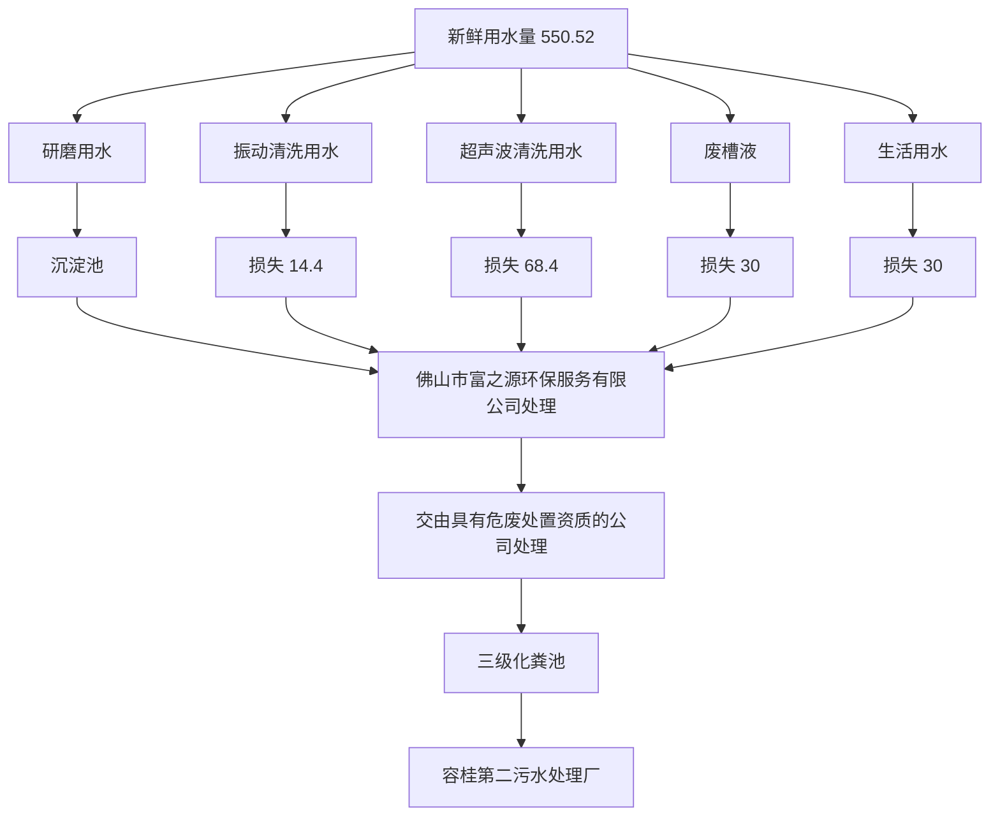
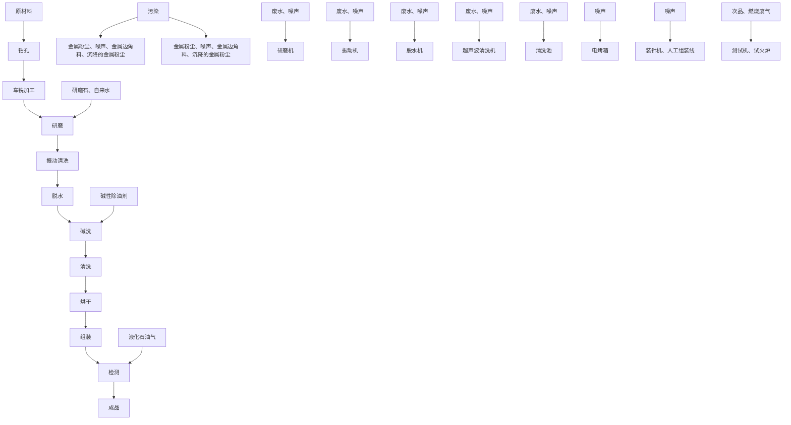

# 建设项目环境影响报告表

# （污染影响类）

项目名称：佛山市猛中火五金有限公司新建项目

建设单位（盖章）：佛山 限公司

text_image

山市猛中火五金有限公司
市猛中火五金有

编制日期：2024年7月

text_image

壹心环保技术有限公司
人民共和国生态环境
4401140435480

中华人 境部制

# 一、建设项目基本情况

<table><tr><td>建设项目名称</td><td colspan="3">佛山市猛中火五金有限公司新建项目</td></tr><tr><td>项目代码</td><td colspan="3">无</td></tr><tr><td>建设单位联系人</td><td>林**</td><td>联系方式</td><td>186******98</td></tr><tr><td>建设地点</td><td colspan="3">佛山市顺德区容桂街道华口社区华天南一路2号杰森家电智造中心10栋601号</td></tr><tr><td>地理坐标</td><td colspan="3">(北纬22度46分1.456秒,东经113度20分53.546秒)</td></tr><tr><td>国民经济行业类别</td><td>C3443阀门和旋塞制造</td><td>建设项目行业类别</td><td>三十一、通用设备制造业34中的69、泵、阀门、压缩机及类似机械制造344中的其他</td></tr><tr><td>建设性质</td><td>☑新建(迁建)□改建□扩建□技术改造</td><td>建设项目申报情形</td><td>☑首次申报项目□不予批准后再次申报项目□超五年重新审核项目□重大变动重新报批项目</td></tr><tr><td>项目审批(核准/备案)部门(选填)</td><td>/</td><td>项目审批(核准/备案)文号(选填)</td><td>/</td></tr><tr><td>总投资(万元)</td><td>100</td><td>其中:环保投资(万元)</td><td>10</td></tr><tr><td>环保投资占比(%)</td><td>10</td><td>施工工期</td><td>1个月</td></tr><tr><td>是否开工建设</td><td>☑否□是:</td><td>用地(用海)面积( $m^{2}$ )</td><td>1560(租赁建筑面积)</td></tr><tr><td>专项评价设置情况</td><td colspan="3">无</td></tr><tr><td>规划情况</td><td colspan="3">无</td></tr><tr><td>规划环境影响评价情况</td><td colspan="3">无</td></tr><tr><td>规划及规划环境影响评价符合性分析</td><td colspan="3">无</td></tr><tr><td>其他符合性分析</td><td colspan="3">1、产业政策相符性分析项目主要从事阀门配件的生产销售,使用的原材料均为外购新料,不涉及有毒有害材料,且厂内无电镀或喷涂工艺;项目不属于</td></tr></table>

《产业结构调整指导目录（2024 年本）》中所列的鼓励类、限制类、禁止（淘汰）类项目，属于允许类；根据《市场准入负面清单（2022版）》（发改体改〔2022〕397），项目不属于其中的禁止准入类。

另外，项目所属类别及生产得到的产品均不属于广东省发展改革委关于印发《广东省“两高”项目管理目录（2022 年版）》的通知（粤发改能源函〔2022〕1363 号）的附件广东省“两高”项目管理目录中的行业类别或产品，符合相关规定。

# 2、选址合理性分析

根据《佛山市顺德区容桂华口扁滘片（SD-B-05-02、SD-B-05-03编制单元）控制性详细规划》SD-B-05-03-01、SD-B-05-03-02、SD-B-05-03-03、SD-B-05-03-04 街坊局部调整批后公布（佛府办函〔2021〕32 号）（附图11）可知，项目选址用地性质为工业用地。因此，本项目建设符合规划。

# 3、“三线一单”符合性分析

（1）项目与《广东省人民政府关于印发广东省“三线一单”生态环境分区管控方案的通知》（粤府[2020]71号）的相符性分析

根据《广东省人民政府关于印发广东省“三线一单”生态环境分区管控方案的通知》（粤府[2020]71 号），广东省将以环境管控单元为基础，实施生态环境分区管控，精细化管理、保护生态环境。本项目与广东省“三线一单”生态环境分区管控方案相符性分析如下：

1）与“一核一带一区”区域管控要求的相符性

①项目位于珠三角核心区，主要从事阀门配件的生产销售，不属于区域布局管控要求中的禁止新建、扩建水泥、平板玻璃、化学制浆、生皮制革以及国家规划外的钢铁、原油加工等项目。项目使用的原辅材料不属于使用高 VOCs 含量原辅材料，符合区域布局管控要求。

②项目生产设备仅使用电能，用水全部采用市政直供，不直接取用江河湖库水量，不会对项目所在地生态流量造成影响，符合能源利用要求。

③项目研磨废水沉淀池沉淀后循环使用，定期交由佛山市富之源环保服务有限公司处理，不外排；振动清洗废水循环回用，定期交由佛山市富之源环保服务有限公司处理，不外排；超声波清洗废水收集后定期交由佛山市富之源环保服务有限公司处理，不外排；外排废水主要为员工生活污水，生活污水经三级化粪池预处理后经市政污水管网排入容桂第二污水处理厂处理，处理后尾水排入鸡鸦水道，则项目水污染物总量控制指标计入容桂第二污水处理厂的总量控制指标内，不再另设污水总量控制指标，则项目符合污染物排放管控要求。

④项目位于佛山市顺德区容桂街道华口社区华天南一路 2 号杰森家电智造中心 10 栋 601 号，不属于石化、化工重点园区环境风险防控区域。项目生产过程产生的危险废物分类收集后定期交由具有危废处置资质的公司处理，并通过信息系统登记转移计划和电子转移联单，符合危险废物全过程跟踪管理的防控要求。

# 2）与环境管控单元总体管控要求的相符性

根据《广东省人民政府关于印发广东省“三线一单”生态环境分区管控方案的通知》（粤府[2020]71 号）发布的广东省环境管控单元图（见附图 8），项目位于佛山市顺德区容桂街道华口社区华天南一路 2 号杰森家电智造中心 10 栋601 号，属于容桂街道重点管控区，环境管控单元编码：ZH44060620001，执行区域生态环境保护的基本要求。

# 3）“三线一单”的相符性

# ①生态保护红线

项目地址位于佛山市顺德区容桂街道华口社区华天南一路 2号杰森家电智造中心10 栋601号，根据佛山市顺德区人民政府办公室关于印发《佛山市顺德区生态环境保护“十四五”规划（2021-2025）》的通知，项目所在区域不在生态红线内。因此，本项目建设满足生态保护红线管理要求。

# ②环境质量底线

本项目所在地区属于大气环境不达标区；项目纳污水体为鸡鸦水道，水质满足水环境功能区划要求。

本项目废气污染物产生量较小，加强车间通风换气措施，对周边环境影响很小，不会加剧空气环境质量影响。生活污水经三级化粪池预处理后由市政管网排入容桂第二污水处理厂，尾水排至鸡鸦水道；研磨废水沉淀池沉淀后循环使用，定期交由佛山市富之源环保服务有限公司处理，不外排；振动清洗废水循环回用，定期交由佛山市富之源环保服务有限公司处理，不外排；超声波清洗废水收集后定期交由佛山市富之源环保服务有限公司处理，不外排；不会导致纳污水体水质超标。因此，本项目建设满足环境质量底线要求。

# ③资源利用上线

本项目生产过程中会消耗一定量的电源、水资源等资源消耗，资源消耗量相对区域资源利用总量较少，符合资源利用上限要求。

# ④环保准入负面清单

本项目所属行业为通用设备制造业，根据国家发展改革委商务部关于印发《市场准入负面清单（2022 年版）》的通知（发改体改规﹝2022﹞397 号），项目不属于上述目录所列的限制类、禁止（淘汰）类严控类项目，也不属于《市场准入负面清单（2022 年版）》所列的禁止准入及需许可准入事项。根据《产业结构调整指导目录（2024 年本）》中所列的鼓励类、限制类、禁止（淘汰）类项目，属于允许类。因此，本项目的建设符合国家和地方的相关产业政策。

# （2）项目与《佛山市生态环境局关于印发佛山市“三线一单”生态环境分区管控方案方案》（2024年版）的相符性分析

项目位于佛山市顺德区容桂街道华口社区华天南一路 2 号杰森家电智造中心 10 栋601 号，属于容桂镇重点管控区，环境管控单元编码为ZH44060620001（详见附图9）；项目与佛山市“三线一单”生态环境分区管控方案相符性分析详见下表。

表 1-1 项目与《佛山市生态环境局关于印发佛山市“三线一单”生态环境分区管控方案方案》（2024年版）的相符性分析

<table><tr><td>管控维度</td><td>管控要求</td><td>本项目工程内容</td><td>符合性</td></tr><tr><td rowspan="6">区域布局管控</td><td>【产业/鼓励引导类】重点发展芯片、智能家电、高端装备制造、高端新型电子信息、新材料、生命健康等制造业和金融、科技服务、高端商贸等现代服务业,建设科技研发、创新创业基地、上市企业总部聚集区、企业品牌总部基地。</td><td>项目属于C3443阀门和旋塞制造,产品为阀门配件,不属于鼓励引导类,也不属于限制类</td><td>符合</td></tr><tr><td>【产业/综合类】系统推进村级工业园升级改造,腾出连片空间,布局产业集聚区和主题产业园,推动工业项目入园集聚发展</td><td>项目位于佛山市顺德区容桂街道华口社区华天南一路2号杰森家电智造中心10栋601号,属于产业集聚区</td><td>符合</td></tr><tr><td>【大气/限制类】大气环境受体敏感重点管控区内,应严格限制新建储油库项目、产生和排放有毒有害大气污染物的建设项目以及使用溶剂型油墨、涂料、清洗剂、胶黏剂等高挥发性有机物原辅材料项目,鼓励现有该类项目搬迁退出。</td><td>项目不使用高挥发性有机物原辅材料,氮氧化物的产生量为0.582kg/a,产生量少,不属于新增氮氧化物、烟(粉)尘排放量较大的建设项目</td><td>符合</td></tr><tr><td>【大气/鼓励引导类】大气环境高排放重点管控区内,应强化达标监管,引导工业项目落地集聚发展,有序推进区域内行业企业提标改造。</td><td>项目所在区域属于大气环境高排放重点管控区,同时也属于工业产业集聚区</td><td>符合</td></tr><tr><td>【产业/综合类】划定家具生产优先发展区域,优先发展区外不再新建涉及涂装工艺的木质家具制造项目。优先发展区范围根据家具产业发展规划及其规划环评文件确定。</td><td>项目不属于木质家具制造项目</td><td>符合</td></tr><tr><td>【产业/限制类】受纳水体或监控断面不达标且未“以新带老”制定区域达标方案的河涌,不得新建、扩建向河涌直接排放废水的项目。新建、扩建含蚀刻工序的线路板生产项目和化工项目应在配套污水集中处置的工业园区或生活污水管网覆盖区域内建设;纯加工型印花项目,含酸洗、磷化的金属表面处理、金属制品项目(与自身高新技术企业配套</td><td>项目外排废水为生活污水,属于间接排放,生活污水经三级化粪池预处理后排入容桂第二污水处理厂处理,不包含条款中提及的限制类项目和工序</td><td>符合</td></tr></table>

<table><tr><td rowspan="9"></td><td></td><td>的和区级及以上重点项目除外),含酸洗、喷涂、化学抛光、电解等涉及废水排放工艺的不锈钢型材加工项目(与自身高新技术企业配套的和区级及以上重点项目除外),应进入以此类项目为主导产业、有相应废水集中治理设施的工业园区,实现集中治污。</td><td></td><td></td></tr><tr><td rowspan="6">能源利用</td><td>【能源/鼓励引导类】推广节能技术,加快发展绿色货运与现代物流。</td><td>项目不涉及鼓励引导类项目。</td><td>/</td></tr><tr><td>【能源/鼓励引导类】推广新能源汽车应用和充电基础设施建设,积极推动重卡LNG加气站、充电基础设施、加氢站建设。</td><td>项目不涉及重卡LNG加气站、充电基础设施、加氢站等的建设</td><td>/</td></tr><tr><td>【能源/综合类】科学实施能源消费总量和强度“双控”,新建高能耗项目单位产品(产值)能耗达到国际国内先进水平。</td><td>项目不属于高能耗项目</td><td>符合</td></tr><tr><td>【水资源/综合类】贯彻落实“节水优先”方针,实行最严格水资源管理制度,容桂街道万元国内生产总值用水量、万元工业增加值用水量、用水总量、农田灌溉水有效利用系数等用水总量和效率指标达到区下达要求。</td><td>项目严格执行《用水定额第3部分:生活》(DB44/T1461.3-2021),并且达先进定额标准。</td><td>符合</td></tr><tr><td>【土地资源/限制类】落实单位土地面积投资强度、土地利用强度等建设用地控制性指标要求,提高土地利用效率。</td><td>项目设置在工业园区标准厂房中,土地利用率较高。</td><td>符合</td></tr><tr><td>【岸线/禁止类】严格水域岸线用途管制,新建项目一律不得违规占用水域。严禁破坏生态的岸线利用行为和不符合其功能定位的开发建设活动,严禁以各种名义侵占河道、围垦湖泊、非法采砂等。</td><td>项目选址不占用水域。</td><td>符合</td></tr><tr><td rowspan="2">污染物排放管控</td><td>【水/限制类】城镇新区建设实行雨污分流,逐步推进初期雨水收集、处理和资源化利用。住宅、商业体、学校、市场等城镇开发建设项目应当配套或者同步计划建设公共排水设施,公共排水设施或自建排污水设施未能投产运行的,以上涉水项目不得投入使用。新建小区严格实施雨污分流,阳台、露台等污水接入污水收集系统,将生活污水“应截尽截”。做好大型楼盘、集贸市场、餐饮以及学校等4大类排水户污水接入市政管网工作。</td><td>项目所在工业厂房已接入市政污水管网,实施雨污分流;且项目不属于住宅、商业体、学校、市场等城镇开发建设项目。</td><td>/</td></tr><tr><td>【水/综合类】容桂街道重点河涌水质上年度未达到水环境质量目标的,需组织编制、系统实施、向社会公开区域重点水污染物减排计划并明确“替代量”,本年度新建、改建、扩建项目新增水环境重点污染物实行区域“减二增一”替代(工业、生活或综合集中废水处理设施、民生项目除外)。</td><td>项目生活污水经三级化粪池预处理后排入容桂第二污水处理厂处理,新增水环境重点污染物无需实行区域“减二增一”替代。</td><td>符合</td></tr><tr><td rowspan="5"></td><td rowspan="5"></td><td>【水/综合类】区域内应合理规划建设工业或综合集中废水处理设施。逐步推进工业集聚区“污水零直排区”建设,开展排水单元工业废水、生活污水、雨水分类收集、分质处理,确保园区“管网全覆盖、雨污全分流、污水全收集、处理全达标”。</td><td>项目所在工业厂房已接入市政污水管网,实施雨污分流</td><td>符合</td></tr><tr><td>【水/综合类】结合村级工业园改造,全面提升产业层次与集聚度,促进污染集中整治。</td><td>项目不涉及</td><td>符合</td></tr><tr><td>【水/综合类】稳步推进排水设施“三个一体化”管理模式,补齐城乡污水收集和处理短板,推动容桂第一、第二污水处理厂提质增效,加快消除城中村、老旧城区、城乡结合部等污水收集管网空白区,逐步实现城乡污水收集处理全覆盖。2025年前完成容桂第一、第二污水处理厂扩建,尾水应执行《城镇污水处理厂污染物排放标准》(GB18918-2002)一级A标准及《广东省水污染物排放限值》(DB44/26-2001)的较严值。</td><td rowspan="2">项目研磨废水沉淀池沉淀后循环使用,定期交由佛山市富之源环保服务有限公司处理,不外排;振动清洗废水循环回用,定期交由佛山市富之源环保服务有限公司处理,不外排;超声波清洗废水收集后定期交由佛山市富之源环保服务有限公司处理,不外排;外排废水主要为员工生活污水,生活污水经三级化粪池预处理后经市政污水管网排入容桂第二污水处理厂处理,处理后尾水排入鸡鸦水道</td><td>符合</td></tr><tr><td>【水/综合类】近期保留马东、马南两处污水处理站,到2030年将马冈村居污水接入市政污水管网,纳入杏坛城镇污水处理系统;其余行政村(社区)污水均通过市政管网和农村支管纳入容桂城镇污水处理系统。</td><td>符合</td></tr><tr><td>【大气/综合类】大力推进低VOCs含量原辅材料替代,加快涉VOCs重点行业的生产工艺升级改造,推行自动化生产工艺,对达不到要求的VOCs收集及治理设施进行整治提升,逐步淘汰低效VOCs治理设施。</td><td>项目生产过程使用的原辅料不涉及使用含VOCs原辅料</td><td>符合</td></tr></table>

<table><tr><td></td><td>【土壤/限制类】严格重金属重点行业企业准入管理。新、改、扩建重点行业建设项目应遵循重点重金属污染物排放“等量替代”原则。</td><td>项目不涉及</td><td>/</td></tr><tr><td rowspan="2">环境风险管控</td><td>【水/综合类】容桂第一、第二污水处理厂、工业污水集中处理设施应采取有效措施,防止事故废水直接排入水体。完善污水处理厂在线监控系统联网,实现污水处理厂的实时、动态监管。</td><td>项目所在地位于容桂第二污水处理厂纳污范围,污水处理厂已在线监控系统联网,实现污水处理厂的实时、动态监管。</td><td>符合</td></tr><tr><td>【风险/综合类】加强环境风险分级分类管理,强化金属制品、有色金属和压延加工、化学原料和化学品制造业等涉重金属、化工行业企业及工业园区等重点环境风险源的环境风险防控。</td><td>项目属于C3443阀门和旋塞制造,不属于涉重金属、化工行业企业及工业园区等重点环境风险源</td><td>符合</td></tr></table>

# （3）项目与《佛山市顺德区人民政府关于印发佛山市顺德区“三线一单”生态环境分区管控方案的通知》（顺府发[2021]11号）的相符性分析

根据《佛山市顺德区人民政府关于印发佛山市顺德区“三线一单”生态环境分区管控方案的通知》（顺府发[2021]11 号），属于容桂街道重点管控区，环境管控单元编码：ZH44060620001，项目与管控要求相符性分析如下：

表 1-2 项目与容桂镇重点管控区管控要求相符性分析

<table><tr><td>管控维度</td><td>管控要求</td><td>本项目工程内容</td><td>符合性</td></tr><tr><td rowspan="2">区域布局管控</td><td>【产业/鼓励引导类】重点发展芯片、智能家电、高端装备制造、高端新型电子信息、新材料、生命健康等制造业和金融、科技服务、高端商贸等现代服务业,建设科技研发、创新创业基地、上市企业总部聚集区、企业品牌总部基地。</td><td>项目属于通用设备制造业,为产业综合类</td><td>符合</td></tr><tr><td>系统推进村级工业园升级改造,腾出连片空间,布局产业集聚区和主题产业园,推动工业项目入园集聚发展。新增工业制造业用地原则上安排在产业集聚区内,产业集聚区外原则上不鼓励工业及物流仓储用地的新建与改造。</td><td>项目不涉及</td><td>符合</td></tr></table>

<table><tr><td rowspan="6"></td><td rowspan="6"></td><td>【产业/综合类】产业聚集区所属地块内的工业用地或企业与村庄、学校等环境敏感点之间应设置合理的大气环境防护距离,并通过绿化带进行有效隔离;聚集区规划布局应注重大气污染排放企业应尽量避免布局在居住用地的常年主导风向的上风向。</td><td>项目位于佛山市顺德区容桂街道华口社区华天南一路2号杰森家电智造中心10栋601号,距离最近的敏感点为大岑村,距离为139m,敏感点与本项目之间设有隔离带</td><td>符合</td></tr><tr><td>【产业/限制类】受纳水体或监控断面不达标的,不得新建、扩建向河涌直接排放废水的项目。新建、扩建含蚀刻工序的线路板生产项目和化工项目应在配套污水集中处置的工业园区或生活污水管网覆盖区域内建设;纯加工型印花项目,含酸洗、磷化的金属表面处理、金属制品项目(与自身高新技术企业配套的除外),含酸洗、喷涂、化学抛光、电解等涉及废水排放工艺的不锈钢型材加工项目(与自身高新技术企业配套的除外),应进入以此类项目为主导产业、有相应废水集中治理设施的工业园区,实现集中治污</td><td>项目选址属于容桂第二污水处理厂纳污范围,纳污水体鸡鸦水道的水质达到(GB3838-2002)的II类标准的要求,水质较好,项目不属于要求中提及</td><td>符合</td></tr><tr><td>【产业/综合类】划定家具生产优先发展区域,优先发展区外不再新建涉及涂装工艺的木质家具制造项目。</td><td>项目不涉及</td><td>/</td></tr><tr><td>【大气/限制类】大气环境受体敏感重点管控区内,应严格限制新建储油库项目、产生和排放有毒有害大气污染物的建设项目以及使用溶剂型油墨、涂料、清洗剂、胶黏剂等高挥发性有机物原辅材料项目,鼓励现有该类项目搬迁退出</td><td>项目位于大气环境受体敏感重点管控区内,不属于专业电镀、漂染项目不向河涌直接排放废水的项目,不属于新建使用溶剂型涂料、清洗剂等高挥发性有机物原辅材料项目</td><td>符合</td></tr><tr><td>【大气/鼓励引导类】大气环境高排放重点管控区内,应强化达标监管,引导工业项目落地集聚发展,有序推进区域内行业企业提标改造。</td><td>项目所在区域属于大气环境高排放重点管控区内,公司加强车间通风换气措施,定期进行监测,确保废气达标排放。</td><td>符合</td></tr><tr><td>【土壤/禁止类】禁止新建、扩建增加重点防控的重金属污染物排放的建设项目</td><td>项目不涉及</td><td>/</td></tr><tr><td rowspan="8"></td><td rowspan="6">能源利用</td><td>【能源/鼓励引导类】推广节能技术,加快发展绿色货运与现代物流。</td><td>项目不涉及</td><td>/</td></tr><tr><td>【能源/鼓励引导类】推广新能源汽车应用和充电基础设施建设,积极推动重卡LNG加气站、充电基础设施、加氢站建设。</td><td>项目不涉及</td><td>/</td></tr><tr><td>【能源/综合类】科学实施能源消费总量和强度“双控”,新建高能耗项目单位产品(产值)能耗达到国际国内先进水平</td><td>项目生产设备均使用电能,不属于高能耗项目</td><td>符合</td></tr><tr><td>【水资源/综合类】贯彻落实“节水优先”方针,实行最严格水资源管理制度,容桂街道万元国内生产总值用水量、万元工业增加值用水量、用水总量、农田灌溉水有效利用系数等用水总量和效率指标达到区下达要求</td><td>项目用水由市政供水</td><td>符合</td></tr><tr><td>【土地资源/限制类】落实单位土地面积投资强度、土地利用强度等建设用地控制性指标要求,提高土地利用效率。</td><td>项目租赁已建成厂房作为经营场所,与实际用途相符合。</td><td>符合</td></tr><tr><td>【岸线/禁止类】严格水域岸线用途管制,新建项目一律不得违规占用水域。严禁破坏生态的岸线利用行为和不符合其功能定位的开发建设活动,严禁以各种名义侵占河道、围垦湖泊、非法采砂等</td><td>项目建设在陆域上,不属于占用水域和破坏生态的岸线利用行为。</td><td>符合</td></tr><tr><td rowspan="2">污染物排放管控</td><td>【水/限制类】城镇新区建设实行雨污分流,逐步推进初期雨水收集、处理和资源化利用。住宅、商业体、学校、市场等城镇开发建设项目应当配套或者同步计划建设公共排水设施,公共排水设施或自建排污水设施未能投产运行的,以上涉水项目不得投入使用。新建小区严格实施雨污分流,阳台、露台等污水接入污水收集系统,将生活污水“应截尽截”。做好大型楼盘、集贸市场、餐饮以及学校等4大类排水户污水接入市政管网工作。</td><td>项目租用已建成厂房,项目所在区域具有完善公共排水设施,已实施雨污分流。</td><td>符合</td></tr><tr><td>【水/综合类】容桂街道重点河涌水质上年度未达到水环境质量目标的,需组织编制、系统实施、向社会公开区域重点水污染物减排计划并明确“替代量”,本年度新建、改建、扩建项目新增水环境重点污染物实行区域“减二增一”替代(工业、生活或综合集中废水处理设施、民生项目除外)。</td><td>项目生活污水经三级化粪池预处理后排入容桂第二污水处理厂处理,无需实施本年度新建、改建、扩建项目新增水环境重点污染物实行区域“减二增一”替代</td><td>符合</td></tr><tr><td rowspan="7"></td><td rowspan="7"></td><td>【水/综合类】区域内应合理规划建设工业或综合集中废水处理设施。逐步推进工业集聚区“污水零直排区”建设,开展排水单元工业废水、生活污水、雨水分类收集、分质处理,确保园区“管网全覆盖、雨污全分流、污水全收集、处理全达标”。</td><td>项目所在工业厂房已接入市政污水管网,实施雨污分流。</td><td>符合</td></tr><tr><td>【水/综合类】结合村级工业园改造,全面提升产业层次与集聚度,促进污染集中整治。</td><td>项目不涉及</td><td>/</td></tr><tr><td>【水/综合类】稳步推进排水设施“三个一体化”管理模式,补齐城乡污水收集和处理短板,推动容桂第一、第二污水处理厂提质增效,加快消除城中村、老旧城区、城乡结合部等污水收集管网空白区,逐步实现城乡污水收集处理全覆盖。2025年前完成容桂第一、第二污水处理厂扩建,尾水应执行《城镇污水处理厂污染物排放标准》(GB18918-2002)一级A标准及《广东省水污染物排放限值》(DB44/26-2001)的较严值</td><td>项目位于容桂第二污水处理厂处理范围,尾水执行《城镇污水处理厂污染物排放标准》(GB18918-2002)一级A标准及《广东省水污染物排放限值》(DB44/26-2001)的较严值。</td><td>符合</td></tr><tr><td>【水/综合类】近期保留马东、马南两处污水处理站,到2030年将马冈村居污水接入市政污水管网,纳入杏坛城镇污水处理系统;其余行政村(社区)污水均通过市政管网和农村支管纳入容桂城镇污水处理处理系统</td><td>项目所在工业厂房已接入市政污水管网,实施雨污分流。</td><td>符合</td></tr><tr><td>【水/综合类】产业集聚区和主题园区内做好污水管网和污水集中处理设施的配套保障,确保废水收集到城镇污水处理厂、园区污水处理厂或分散式污水处理设施集中处置。</td><td>项目所在工业厂房已接入市政污水管网,实施雨污分流。</td><td>符合</td></tr><tr><td>【大气/综合类】大力推进低VOCs含量原辅材料替代,加快涉VOCs重点行业的生产工艺升级改造,推行自动化生产工艺,对达不到要求的VOCs收集及治理设施进行整治提升,逐步淘汰低效VOCs治理设施。</td><td>项目不使用含VOCs原辅料</td><td>符合</td></tr><tr><td>【土壤/限制类】作为重金属污染重点</td><td>项目不涉及</td><td>/</td></tr></table>

<table><tr><td></td><td>防控区,区域内重点重金属排放总量只减不增。</td><td></td><td></td></tr><tr><td rowspan="2">环境风险管控</td><td>【水/综合类】容桂第一、第二污水处理厂、工业污水集中处理设施应采取有效措施,防止事故废水直接排入水体。完善污水处理厂在线监控系统联网,实现污水处理厂的实时、动态监管。</td><td>项目不涉及</td><td>/</td></tr><tr><td>【风险/综合类】加强环境风险分级分类管理,强化金属制品、有色金属和压延加工、化学原料和化学品制造业等涉重金属、化工行业企业及工业园区等重点环境风险源的环境风险防控</td><td>项目危险物质贮存量占临界量比值Q&lt;1,通过严格执行国家的防火安全设计规范,采取合理的风险防范措施,制定完善的环境风险事故应急预案等措施,项目的风险水平是可以接受的</td><td>符合</td></tr></table>

# 4、“项目与《佛山市生态环境局佛山市水利局关于进一步加强工业企业废水污染防治的函》（2023-0031（水））的相符性分析

表 1-3 项目与（C2023-0031（水））的相符性分析

<table><tr><td>序号</td><td>相关条例</td><td>本项目工程内容</td><td>符合性</td></tr><tr><td>1</td><td>二、严格项目审批,明晰废水排放要求(一)加强与规划环评的衔接审查。强化涉废水排放建设项目源头防控,建设项目环评文件应加强与生态环境分区管控、园区规划环评结论及审查意见等成果的相符性审查,严防应入园区集聚的专业电镀、化工、印染、糅革、化学制浆以及明确纳入“三线一单”管控要求应当入园集聚的建设项目违反准入要求在园区外围落地建设。加强废水排放指标管理,对于园区生产废水纳入集中处理的,应结合园区入驻企业建设进展和废水排放量实际,优化园区废水排放指标管理,最大限度发挥排水指标经济效益。(市生态环境局各分局负责)</td><td>项目位于佛山市顺德区容桂街道华口社区华天南一路2号杰森家电智造中心10栋601号,已对照《佛山市顺德区人民政府关于印发佛山市顺德区“三线一单”生态环境分区管控方案的通知》(顺府发[2021]11号)等文件相符性分析;目前,园区未配套集中处理设施。</td><td>符合</td></tr><tr><td>2</td><td>(二)强化环评审批管理。加强涉水项目工程分析和源强核算审查,重点审查产污工序、污染因子(特别是一类污染</td><td>项目研磨废水沉淀池沉淀后循环使用,,定期交由佛山市富</td><td>符合</td></tr></table>

<table><tr><td rowspan="3"></td><td></td><td>物)、废水产治排平衡图、废水产生排放量与产能规模匹配性、废水处理与回用经济技术可行性及其去向等环节,强化合理性、可靠性和经济可行性,杜绝不实“回用”、“零排放”审批。</td><td>之源环保服务有限公司处理,不外排;振动清洗废水循环回用,定期交由佛山市富之源环保服务有限公司处理,不外排;超声波清洗废水收集后定期交由佛山市富之源环保服务有限公司处理,不外排。根据工程分析和污染源核算,项目废水不涉及第一类污染物,报告已分析水平衡图,交由废水处理能力的单位处理的合理性和可行性</td><td></td></tr><tr><td>3</td><td>1.加强涉生活污水排放项目审批管理。要加强部门联动,及时动态更新区域排水管网图,准确判断区域排水设施现状。生活污水管网未覆盖或已覆盖但未实质连通接入城镇生活污水处理厂的区域,原则上不得新建、扩建生活污水排放的工业项目,确需排放生活污水的,应自行配套生活污水处理设施,自建污水处理设施仅限于规模以上、生活污水排放量不低于40吨/日的工业企业,并加强处理工艺经济技术可行性及受纳水体达标论证。处于工业集聚区或工业园区内、上楼发展的新建、扩建工业项目以及已完成入河排污口整治验收的区域,原则上不再审批工业企业单独自建生活污水处理设施,涉及重大项目的,由属地人民政府出具承诺函,明确时间表和工程措施,在项目投产前完成配套污水管网建设或建成集中处理设施。</td><td>项目生活污水经三级化粪池预处理后经市政污水管网排入容桂第二污水处理厂处理,处理后尾水排入鸡鸦水道</td><td>符合</td></tr><tr><td>4</td><td>2.加强涉生产废水产排项目审批管理。聚焦产业行业特点,针对企业规模小、生产工艺简单、单纯加工型、产品附加值不高、废水产排复杂的涉水项目,要严格废水回用率和回用可行性审查,无废水成分分析、回用水质适用性分析,无废水回用处理工艺设施、技术经济可行性论述,无回用相关存储及管路设置等工程措施的项目,不得通过回用或“零排放”环评审批。严格工业废水排入城镇生活污水处理厂的项目审查,项目环评报告要加强城镇生活污水处理厂可依托性及可监管性分析。经评估工业废水预处理后可进入城镇生活污水处理厂处理的,在环评审批环节以内部流程形式征询同级水利部门意见,与水利部门排水许可管理形成联动。未实现雨污分流的工业园区、工业集聚区,严格控制以间接排放标准或纳管排放标准向市政管网排放工业废水。工业企业排放有含重金属、难生化降解、有生物毒性、易燃易爆、高盐分、重油脂等超城镇生活污水处理厂接收能力的生产废水,以及间接冷却的清净下水等过低浓度生产废水,原则上不得排入城镇生活污水处理厂,已进入的,各区要制定限期退出计划并实施。受纳城镇生活污水处理厂已满负荷的,限制审批新增废水排入城镇生活污水处理厂的工业项目。</td><td>项目属于C3443阀门和旋塞制造,生产工艺简单,废水产排简单,生产废水产生量为154.4t/a,日均量0.515t/d&lt;3t/d,产生量较少,项目研磨废水沉淀池沉淀后循环使用,定期交由佛山市富之源环保服务有限公司处理,不外排;振动清洗废水循环回用,定期交由佛山市富之源环保服务有限公司处理,不外排;超声波清洗废水收集后定期交由佛山市富之源环保服务有限公司处理,不外排。项目生产废水不排入城镇生活污水处理厂</td><td>符合</td></tr><tr><td></td><td>5</td><td>3.加强生产废水直接向水体排放项目的审批管理。要严格按环评导则要求开展评价,对受纳水体水质尚未达标的市考断面河涌、主干河涌、国省考断面的重点支涌、优良水质目标的河涌和具有水功能区、水环境功能区目标的河涌以及纳入黑臭水体整治范围的河涌,由属地人民政府全面系统梳理现状问题、区域排污总量以及水质目标可达性等,以新带老”制定区域达标方案。达标方案应突出存量削减,重点针对排水量、主要污染因子提出相应的源头削减方案和具体措施,明确区域排水体系,排水去向应尽可能为市考断面以下河涌。达标方案要与生态环境“三线一单”分区管控体系相结合,鼓励开展生态治理、小流域治理,探索尾水多级、梯度利用,因地制宜建设人工湿地深度净化系统、景观回用深度净化系统、回用至用水大户再生系统等水循环体系,减少入河排放量。制定了区域达标方案的属地人民政府,每年12月底前向市生态环境局报告计划执行情况。(市生态环境局各分局负责,各区住房城乡建设和水利局配合)</td><td>项目生产废水不直接向水体排放</td><td>符合</td></tr><tr><td rowspan="2"></td><td>6</td><td>4.推动涉水项目环评与入河排污口联动审批改革。涉及直接向水体排放生活污水、生产废水的建设项目,实施项目环评与入河排污口联动审批。加强涉水企业排污许可证审批管理,在申领、延续、变更阶段,应强化生活污水、生产废水、雨水管路平面布置与各排放口位置关系、排污口规范化设置情况审查。如涉及入河排污口的,通过排污许可证建立企业排污口与入河排污口关联衔接,以附图附件的形式,一并载明两者位置坐标关系、管网路由信息等(具体改革措施及操作指引另行制定)。(市生态环境局各分局负责)</td><td>项目生产废水不直接向水体排放</td><td>符合</td></tr><tr><td>78</td><td>三、加强分类治理,提升废水治理水平(一)持续推进工业园“污水零直排区”建设。围绕“管网全覆盖、雨污全分流、污水全收集、处理全达标”的目标,2025年底前完成镇级工业园“污水零直排区”建设,同步对排水影响重点攻坚市考断面河涌、城市建成区黑臭水体、重点攻坚及不稳定消除黑臭的城乡黑臭水体、纳入省级以上监管清单的农村黑臭水体等的村级工业园、年度新增雨污分流区域启动“污水零直排区”建设。各区可结合水环境质量现状、管网建设、流域治理等实际情况,将整治范围扩大至辖区内黑臭水体及其他重要河涌沿线的工业园。经评估认定可以接入城镇生活污水处理厂的纳管企业,督促完成红线内工业废水、生活污水、雨水管网建设及规范整治,依法取得排污许可和排水许可。(市生态环境局各分局负责,其中各区住房城乡建设和水利局负责推进市政雨污分流管网向园区及排水单元延伸)。(二)加强重点行业工业废水治理提升。开展铝型材行业表面处理废水治理提升,2023年上半年全部完成。分年度、分批次逐步推进全市重点行业工业废水治理提升,各区可根据本区域内产业特点选取重点行业开展,减少水污染物排放。(市生态环境局各分局负责)</td><td>项目生活污水排入容桂第二污水处理厂,项目研磨废水沉淀池沉淀后循环使用,定期交由佛山市富之源环保服务有限公司处理,不外排;振动清洗废水循环回用,定期交由佛山市富之源环保服务有限公司处理,不外排;超声波清洗废水收集后定期交由佛山市富之源环保服务有限公司处理,不外排项目不涉及</td><td>符合/</td></tr><tr><td></td><td>9</td><td>(三)加强零散工业企业废水管理和设施建设。加强对零散废水污染防治工作的统一监督管理,督促零散废水产生单位建立零散废水产生、收集、储存和转移的相应设施和管理制度;零散废水处理单位应当建立零散废水处理管理台账,零散废水运输专用车辆应当使用罐式车或者其他达到密封性要求的货车。零散废水转运处置方式为解决历史问题的过渡阶段措施,村级工业园、老旧工业区已完成“工改工”改造重建,以及新规划建设的工业园区、工业集聚区,原则上应自建工业废水处理设施或通过管网纳入集中处理设施处理排放,不再审批以零散废水形式外运处置VOCs喷淋废水除外)。(市生态环境局各分局负责)(零散工业废水:企业事业单位和其他生产经营者在生产经营过程中产生的,日均产生量未超过三吨,不属于危险废物,且经批准或者备案的环境影响评价文件明确或者排污许可证、排污登记表登记载明需要转移处理的工业废水。)</td><td>项目生产废水产生量为154.4t/a,日均量0.515t/d,日均废水量小于3吨,且不属于危险废物,属于零散工业废水工业企业,项目建设后按照要求制定产生、收集、储存和转移的相应设施和管理制度,定期记录台账,由专用车辆拉运至交由废水处理能力的单位处理。本项目位于新建设工业园区,目前园区暂未建设工业废水处理设施以及管网。</td><td>符合</td></tr></table>

# 二、建设项目工程分析

# 1、建设内容及规模

佛山市猛中火五金有限公司新建项目（下称“本项目”）拟选址于佛山市顺德区容桂街道华口社区华天南一路2号杰森家电智造中心10栋601号，位于一栋9层高建筑的第 6 层，该建筑物高度为 43.1m（其中首层高度为 7.9 米，其余楼层高度为4.4米）。项目总用地面积约986平方米，总建筑面积约1560平方米，总投资 100 万元，其中环保投资 10 万元。项目主要从事阀门配件的生产销售，建成后预计年产阀门配件 375 万件，从业人员为30 人，年工作300天，每天工作8小时（一班制），厂区内不设员工饭堂和宿舍。

# 2、本项目建设内容组成

项目租赁已建成厂房进行生产，该厂房主要包括生产车间、办公室和仓库。

项目由主体工程、辅助工程、环保工程、公用工程及配套工程组成，详细工程内容见下表。

表 2-1 项目建设主要组成一览表

<table><tr><td>类别</td><td colspan="2">工程名称</td><td>面积及内容</td><td>备注</td></tr><tr><td colspan="3">占地面积</td><td> $986m^{2}$ </td><td rowspan="2">项目所在厂房位于一栋9层建筑物,首层高度为7.9m,其余楼层高4.4m,楼层总高43.1m;项目位于第六层。</td></tr><tr><td colspan="3">建筑面积</td><td> $1560m^{2}$ </td></tr><tr><td rowspan="3">主体工程</td><td rowspan="3">生产车间</td><td>机加工区</td><td> $500m^{2}$ </td><td>用于机加工工序</td></tr><tr><td>清洗区</td><td> $35m^{2}$ </td><td>用于清洗工序</td></tr><tr><td>组装区</td><td> $100m^{2}$ </td><td>位于夹层,用于组装测试</td></tr><tr><td>储运工程</td><td colspan="2">仓库</td><td> $700m^{2}$ </td><td>用于原辅材料、成品的贮存</td></tr><tr><td rowspan="3">辅助工程</td><td colspan="2">通道</td><td> $115m^{2}$ </td><td>用于物料运输及人行通道</td></tr><tr><td colspan="2">卫生间</td><td> $10m^{2}$ </td><td>/</td></tr><tr><td colspan="2">办公室</td><td> $100m^{2}$ </td><td>位于夹层,用于员工办公</td></tr><tr><td>依托工程</td><td colspan="2">生活污水治理</td><td>生活污水经三级化粪池处理后排入容桂第二污水处理厂,尾水排入鸡鸦水道</td><td>依托所在厂房已有设施</td></tr><tr><td rowspan="2">公用</td><td colspan="2">供电</td><td>由市政供电系统提供</td><td>依托所在厂房已有设施</td></tr><tr><td colspan="2">供水</td><td>由市政自来水供给</td><td>依托所在厂房已有设施</td></tr><tr><td>工程</td><td>排水</td><td>生活污水经三级化粪池处理后排入容桂第二污水处理厂,尾水排入鸡鸦水道</td><td colspan="2">依托所在厂房已有排水系统</td></tr><tr><td rowspan="6">环保工程</td><td>生活污水治理</td><td colspan="3">经三级化粪池处理后排入容桂第二污水处理厂,尾水排入鸡鸦水道</td></tr><tr><td>生产废水治理</td><td colspan="3">研磨废水沉淀池沉淀后循环使用,定期交由佛山市富之源环保服务有限公司处理,不外排;振动清洗废水循环回用,定期交由佛山市富之源环保服务有限公司处理,不外排;超声波清洗废水收集后定期交由佛山市富之源环保服务有限公司处理,不外排;</td></tr><tr><td>噪声治理</td><td colspan="3">选用低噪声设备,并采取减振、隔声、消声、降噪措施</td></tr><tr><td>固体废物治理</td><td colspan="3">生活垃圾委托环卫部门清运处理;一般工业固体废物分类收集外卖给废品回收单位回收利用;危险废物单独收集后放置于厂区危废暂存间,定期交由具有危废处置资质的公司处理</td></tr><tr><td>危险废物暂存间</td><td>约 $5m^{2}$ </td><td colspan="2">位于厂房内</td></tr><tr><td>一般固废暂存间</td><td>约 $10m^{2}$ </td><td colspan="2">位于厂房内</td></tr></table>

# 3、主要产品及原辅材料

# （1）项目主要产品见下表：

表 2-2 主要产品年产量表

<table><tr><td>序号</td><td>名称</td><td>单位</td><td>年产量</td><td>备注</td></tr><tr><td>1</td><td>阀门配件</td><td>万件</td><td>375</td><td>外售</td></tr></table>

注：根据建设单位提供的资料，项目生产阀门配件时使用的铝材和铜材量分别为 60t/a、24t/a，根据佛山市铝型材涉表面处理建设项目环评文件编制技术参考指南（试行）可知，双面：A=20×W÷（ρ×d），式中：A—面积，cm2；W—质量，g；ρ—密度，g/cm3；d—厚度，mm。项目铝材的密度为 2.702g/cm3，工件横截面厚度为 2mm；铜材的密度为 8.4g/cm3，工件横截面厚度为 3mm，根据上述计算得到铝材和铜材阀门配件进行超声波清洗（双面）的面积分别为 2.22 万 m2 /a、0.19 万 m2 /a，则超声波清洗的总面积为 2.41 万 m2/a。

# （2）项目主要原辅材料见下表：

表 2-3 项目主要原辅材料年用量表

<table><tr><td>序号</td><td>名称</td><td>单位</td><td>年用量</td><td>最大储存量</td><td>性状</td><td>包装规格</td><td>备注</td></tr><tr><td>1</td><td>铝材</td><td>t</td><td>60吨</td><td>15</td><td>固状</td><td>/</td><td>外购</td></tr><tr><td>2</td><td>铜材</td><td>t</td><td>24吨</td><td>6</td><td>固状</td><td>/</td><td>外购</td></tr><tr><td>3</td><td>液压油</td><td>t</td><td>0.36</td><td>0.36</td><td>液状</td><td>200L/桶(0.18t)</td><td>外购,用于设备维护</td></tr><tr><td>4</td><td>机油</td><td>t</td><td>0.18</td><td>0.18</td><td>液状</td><td>200L/桶(0.18t)</td><td>外购,用于设备维护</td></tr><tr><td>5</td><td>压电陶瓷</td><td>万件</td><td>375</td><td>94</td><td>固状</td><td>袋装</td><td>外购</td></tr><tr><td>6</td><td>除油剂</td><td>t</td><td>1</td><td>0.5</td><td>液状</td><td>25kg/桶</td><td>外购</td></tr><tr><td>7</td><td>液化石油气</td><td>t</td><td>0.65</td><td>0.65</td><td>/</td><td>50kg/瓶</td><td>外购,用于试火炉检测过程</td></tr></table>

# 主要原辅材料理化性质：

机油：密度约为 0.91×103kg/m3，闪点约为 170℃，能对机械设备到润滑减磨、辅助冷却降温、密封防漏、防锈防蚀、减震缓冲等作用。机油由基础油和添加剂两部分组成。基础油是机油的主要成分，决定着机油的基本性质，添加剂则可弥补和改善基础油性能方面的不足，赋予某些新的性能，是机油的重要组成部分。

液压油：外观为淡黄色液体，相对密度：0.871，沸点＞316℃（600F），化学稳定性很高，无爆炸危险性，适用于液压系统润滑；利用液体压力能的液压系统使用的液压介质，在液压系统中起着能量传递、抗磨、系统润滑、防腐、防锈、冷却等作用。

除油剂：根据建设单位提供的除油剂 MSDS（详见附件 4）可知，其主要成分为 5%有机盐 I、8%有机盐 II、6%表面活性剂、20%纯碱、8%葡萄糖酸钠、53%水，为无色液体、主要用于五金铁件、铝件、镀锌件等表面的除油污。

液化石油气：由天然气或者石油进行加压降温液化所得到的一种无色挥发性液体。液化石油气主要是碳氢化合物所组成的，其主要成分为丙烷、丁烷以及其他的烷烃等。液化石油气为清洁能源，可用作发动机燃料、家用燃料等。

# 4、主要设备

本项目主要设备见下表：

表 2-4 主要设备一览表

<table><tr><td rowspan="2">主要工艺</td><td rowspan="2" colspan="2">生产设施名称</td><td rowspan="2">数量</td><td rowspan="2">单位</td><td colspan="3">设计参数</td></tr><tr><td>参数名称</td><td>设计值</td><td>单位</td></tr><tr><td>钻孔</td><td colspan="2">钻床</td><td>23</td><td>台</td><td>功率</td><td>2.2</td><td>kW</td></tr><tr><td>车铣加工</td><td colspan="2">车床</td><td>11</td><td>台</td><td>功率</td><td>3</td><td>kW</td></tr><tr><td>研磨</td><td colspan="2">研磨机</td><td>2</td><td>台</td><td>功率</td><td>1.5</td><td>kW</td></tr><tr><td>检测</td><td colspan="2">试火炉</td><td>1</td><td>台</td><td>功率</td><td>0.75</td><td>kW</td></tr><tr><td>烘干</td><td colspan="2">电烤箱</td><td>1</td><td>台</td><td>功率</td><td>3</td><td>kW</td></tr><tr><td>组装</td><td colspan="2">装针机</td><td>4</td><td>台</td><td>功率</td><td>0.55</td><td>kW</td></tr><tr><td>脱水</td><td colspan="2">脱水机</td><td>1</td><td>台</td><td>功率</td><td>1.5</td><td>kW</td></tr><tr><td>振动清洗</td><td colspan="2">振动机</td><td>2</td><td>台</td><td>容积</td><td>0.2</td><td> $m^3$ </td></tr><tr><td>检测</td><td colspan="2">测试机</td><td>2</td><td>台</td><td>功率</td><td>0.75</td><td>kW</td></tr><tr><td>组装</td><td colspan="2">人工组装线</td><td>3</td><td>台</td><td>/</td><td>/</td><td>/</td></tr><tr><td>碱洗</td><td rowspan="2">超声波清洗机</td><td>药剂槽</td><td>1</td><td>个</td><td>容积</td><td>2.25</td><td> $m^3$ </td></tr><tr><td>清洗</td><td>清洗池</td><td>1</td><td>个</td><td>容积</td><td>3</td><td> $m^3$ </td></tr><tr><td>公用工程</td><td colspan="2">空压机</td><td>1</td><td>台</td><td>容量</td><td>1.6</td><td> $m^3/min$ </td></tr></table>

# 5、工作制度和劳动定员

# （1）工作制度

本项目工作日为300天/年，采取单班8小时工作制，工作时间为8:00\~12:00，14:00\~18:00。

# （2）劳动定员

本项目劳动定员为30人，均不在厂内食宿。

# 6、公用、配套工程

# （1）给水

本项目年用水量约为 552.52t/a，主要用水为员工生活用水300t/a和生产用水5250.52t/a（研磨用水 9.8t/a、振动清洗用水 24t/a、超声波清洗用水 216.72t/a），由市政自来水公司供给。

flowchart

图1 水平衡图

# （2）排水

项目外排废水主要为员工生活污水，项目所在区域属于容桂第二污水处理厂纳污范围，项目生活污水经三级化粪池预处理达到广东省地方标准《水污染物排放限值》（DB44/26-2001）第二时段三级标准后，通过市政污水管网排入容桂第二污水处理厂处理，处理后尾水达到《城镇污水处理厂污染物排放标准》（GB18918-2002）一级 A 标准及广东省地方标准《水污染物排放限值》（DB44/26-2001）第二时段一级标准中的较严值后，排入鸡鸦水道。

# （3）取排水量

表 2-5 超声波清洗取排水情况一览表

<table><tr><td>序号</td><td colspan="2">工序名称</td><td>数量(个)</td><td>尺寸(m)</td><td>有效容积( $m^3$ )</td><td>用水类型</td><td>工艺条件</td><td>清洗方式</td><td>更换方式</td><td>更换周期</td><td>损耗水(t/a)</td><td>废液(t/a)</td><td>废水(t/a)</td></tr><tr><td rowspan="2">1</td><td rowspan="2">超声波清洗机</td><td>药剂槽</td><td>1</td><td>2×1.5×0.75</td><td>1.8</td><td>自来水</td><td>常温</td><td>浸泡水洗</td><td>更换底部20%的槽液</td><td>1次/月</td><td>54</td><td>4.32</td><td>0</td></tr><tr><td>清洗池</td><td>1</td><td>2×1.5×1</td><td>2.4</td><td>自来水</td><td>常温</td><td>浸泡水洗</td><td>整槽更换</td><td>5次/月</td><td>14.4</td><td>0</td><td>144</td></tr><tr><td colspan="11">合计</td><td>68.4</td><td>4.32</td><td>144</td></tr><tr><td colspan="14">注:项目超声波清洗机的药剂槽/清洗池因每天工件带走或蒸发损耗补充水量约占槽体有效容积的10%。</td></tr></table>

# （4）供电

本项目用电由市政电网统一供给，年用电量约30万kw•h。

# （5）其他

项目厂内不设宿舍，不设食堂，项目设备不用发电机，无其他能耗。

# 7、项目四至情况及平面布局

# 1）项目四至情况

项目东南面为 10 栋 602，西南面为 10 栋其他厂房，西北面为 9 栋，东北面为8栋；项目四至图见附图4。

# 2）平面布局

本项目位于佛山市顺德区容桂街道华口社区华天南一路2号杰森家电智造中心 10 栋 601 号，租赁建筑面积 1560m2。

本项目主要由机加工区、清洗区、组装区、仓库及其他区域组成，其中原料区距离生产区较近，物料输送距离较短，方便生产。项目生产车间平面布置图见附图5。

# 和

# 工艺流程简述（图示）：

# 1、工艺流程图

项目主要从事阀门配件的生产销售，其生产流程如下：

# （1）生产工艺：

#

flowchart

图 2 生产工艺流程图

# 2、工艺流程说明：

①钻孔、车铣加工：项目使用钻床、车床对外购回来的铝材、铜进行钻孔、车铣加工使得其内部光滑。  
②研磨：将钻孔、车铣加工后的工件与研磨石、自来水一起放入研磨机内，使用研磨机对工件进行湿式研磨，通过研磨的震动、转动使得磨料与工件产生摩擦，从而去除表面毛刺达到光滑的目的。由于该过程为湿式作业，不会产生粉尘，该部分水经沉淀池沉淀后循环使用，定期交由佛山市富之源环保服务有限公司处

理，不外排，需定期捞渣并补充损耗水。

③振动清洗：研磨后的工件经振动机进行清洗，该过程无需使用清洗剂，主要是对工件表面附着的粉尘进行清洗，该部分废水收集后循环使用，定期交由佛山市富之源环保服务有限公司处理，不外排，需定期捞渣并补充损耗水。  
④脱水：使用脱水机将振动清洗后的工件表面残留的水分甩干，脱水产生的废水收集后全部回用于振动清洗过程补充用水，不外排。  
⑤碱洗：将脱水后的工件需进入超声波清洗机内进行碱洗，项目超声波清洗机配有 1 个容积为 2.25m3的药剂槽。碱洗过程需要使用除油剂，并视生产情况定期补充，控制槽液浓度约为 10%。碱洗工序采用人工投加药剂的投料方式，单次清洗需停留 0.5\~5min。超声波清洗机需定期更换废槽液，每个月更换一次槽液（每次更换清洗槽底部约20%的量）作为危险废物交由具有危废处置资质的公司处理，超声波清洗废水收集后定期交由佛山市富之源环保服务有限公司处理，不外排。  
⑥清洗：将碱洗后的工件放置于清洗池内进行水洗，项目清洗池使用自来水，为常温作业，主要是将碱洗残留在工件表面的除油剂。  
⑦烘干：采用电烤箱对清洗后的工件进行烘干即可得到半成品，本项目烘干工序采用电能，烘干温度为250℃；烘干过程有少量水蒸气产生，但无废气产生，产生的污染物主要为噪声。  
⑧组装：在人工组装线上人工采用装针机将半成品组装在一起，该过程会产生噪声。  
⑨检测：采用测试机和试火炉对半成品进行检测，测漏合格后可包装待销。检测过程产生的次品若可维修则返回研磨工序进行研磨返修，不可维修则作为一般工业固废处置，本工序产生的污染物主要为次品。

# 3、项目主要产污环节：

表 2-6 项目主要产污工序及污染物一览表

<table><tr><td>项目</td><td>污染物</td><td>排放口</td><td>产污工序</td><td>污染因子</td></tr><tr><td rowspan="4">废水</td><td>生活污水</td><td>DW001</td><td>员工生活、办公</td><td> $COD_{cr}$ 、 $BOD_{5}$ 、SS、氨氮</td></tr><tr><td>研磨废水</td><td>/</td><td>研磨</td><td>SS</td></tr><tr><td>振动清洗废水</td><td>/</td><td>振动清洗</td><td>SS</td></tr><tr><td>超声波清洗废水</td><td>/</td><td>碱洗、清洗</td><td>PH、 $COD_{cr}$ 、 $BOD_{5}$ 、SS、氨氮、总磷、石油类</td></tr></table>

<table><tr><td rowspan="13"></td><td rowspan="2">废气</td><td>粉尘</td><td>/</td><td>钻孔、车铣加工过程</td><td>颗粒物</td></tr><tr><td>燃烧废气</td><td>/</td><td>试火炉检测过程</td><td> $SO_2$ 、NOx、颗粒物</td></tr><tr><td>噪声</td><td>设备噪声</td><td>/</td><td>设备和废水处理设施</td><td>Leq(A)</td></tr><tr><td rowspan="10">固废</td><td>生活垃圾</td><td>/</td><td>员工生活</td><td>生活垃圾</td></tr><tr><td rowspan="4">一般工业固废</td><td rowspan="2">/</td><td rowspan="2">钻孔、车铣加工过程</td><td>边角料</td></tr><tr><td>沉降的粉尘</td></tr><tr><td>/</td><td>检测过程</td><td>次品</td></tr><tr><td>/</td><td>沉淀池</td><td>沉渣</td></tr><tr><td rowspan="5">危险废物</td><td rowspan="3">/</td><td rowspan="3">设备维护</td><td>废矿物油</td></tr><tr><td>废矿物油桶</td></tr><tr><td>废含油抹布</td></tr><tr><td>/</td><td rowspan="2">碱洗</td><td>废槽液</td></tr><tr><td>/</td><td>废原料桶</td></tr><tr><td>与项目有关的原有环境污染问题</td><td colspan="5">无。</td></tr></table>

# 三、区域环境质量现状、环境保护目标及评价标准

# 1、环境空气质量现状

# （1）空气质量达标区判定

根据佛山市生态环境局顺德分局关于发布《2023年度佛山市顺德区生态环境状况公报》的通知（佛环顺涵[2024]44 号）和中山市生态环境局发布的《中山市2023 年大气环境质量状况公报》可知，2023 年，按照《环境空气质量标准》（GB3095-2012）评价，顺德区和中山市的二氧化硫 $( \mathrm { S O } _ { 2 } )$ 、二氧化氮 $\left( \mathrm { N O } _ { 2 } \right)$ 、可吸入颗粒物 $\left( \mathrm { P M } _ { 1 0 } \right)$ 、细颗粒物 $\left( \mathbf { P M } _ { 2 . 5 } \right)$ ）、一氧化碳（CO）五项污染物年评价浓度均符合二级浓度限值，臭氧 $( \mathrm { O } _ { 3 } )$ 超二级浓度限值；具体数据见下表。

因此，项目所在行政区顺德区和中山市均判定为不达标区。

表 3-1 区域空气质量现状评价表（2023 年）  
现状

<table><tr><td>所在区域</td><td>污染物</td><td>年评价指标</td><td>现状浓度(ug/m3)</td><td>标准值(ug/m3)</td><td>达标情况</td></tr><tr><td rowspan="6">顺德区</td><td>SO2</td><td>年平均质量浓度</td><td>6</td><td>60</td><td>达标</td></tr><tr><td>NO2</td><td>年平均质量浓度</td><td>28</td><td>40</td><td>达标</td></tr><tr><td>PM10</td><td>年平均质量浓度</td><td>35</td><td>70</td><td>达标</td></tr><tr><td>PM2.5</td><td>年平均质量浓度</td><td>20</td><td>35</td><td>达标</td></tr><tr><td>CO</td><td>95 百分位数日平均质量浓度</td><td>1.0</td><td>4</td><td>达标</td></tr><tr><td>O3</td><td>90百分数最大8小时平均质量浓度</td><td>164</td><td>160</td><td>不达标</td></tr><tr><td rowspan="10">中山市</td><td rowspan="2">SO2</td><td>年平均质量浓度</td><td>5</td><td>60</td><td>达标</td></tr><tr><td>日均值第98百分位数浓度值</td><td>8</td><td>150</td><td>达标</td></tr><tr><td rowspan="2">NO2</td><td>年平均质量浓度</td><td>21</td><td>40</td><td>达标</td></tr><tr><td>日均值第98百分位数浓度值</td><td>56</td><td>80</td><td>达标</td></tr><tr><td rowspan="2">PM10</td><td>年平均质量浓度</td><td>35</td><td>70</td><td>达标</td></tr><tr><td>日均值第95百分位数浓度值</td><td>72</td><td>150</td><td>达标</td></tr><tr><td rowspan="2">PM2.5</td><td>年平均质量浓度</td><td>20</td><td>35</td><td>达标</td></tr><tr><td>日均值第95百分位数浓度值</td><td>42</td><td>75</td><td>达标</td></tr><tr><td>CO</td><td>95百分位数日平均质量浓度</td><td>800</td><td>4000</td><td>达标</td></tr><tr><td>O3</td><td>90百分位数最大8小时平均质量浓度</td><td>163</td><td>160</td><td>不达标</td></tr></table>

# 2、地表水环境质量现状

本项目属于容桂第二污水处理厂纳污范围，生活污水经三级化粪池预处理后排入容桂第二污水处理厂处理后尾水排入鸡鸦水道。鸡鸦水道水质执行《地表水环境质量标准》（GB3838-2002）中的Ⅱ类标准。

为评价鸡鸦水道水质，根据佛山市生态环境局顺德分局关于发布《2023年度佛山市顺德区生态环境状况公报》的通知（佛环顺涵[2024]44 号）可知，鸡鸦水道细滘大桥断面 2023 年的水质定类为Ⅱ类，符合《地表水环境质量标准》（GB3838-2002）Ⅲ类标准要求，详见下表。

表 3-2 2023 年度佛山市顺德区环境质量状况公报（节选）

<table><tr><td rowspan="2">河流名称</td><td rowspan="2">断面</td><td colspan="2">断面定类</td><td rowspan="2">水质评价标准</td><td colspan="2">河流定类</td></tr><tr><td>2023年</td><td>2022年</td><td>2023年</td><td>2022年</td></tr><tr><td>鸡鸦水道</td><td>细滘大桥</td><td>II</td><td>II</td><td>III</td><td>II</td><td>II</td></tr></table>

根据《2023 年度佛山市顺德区环境质量状况公报》的评价结果，鸡鸦水道细滘大桥断面水质满足《地表水环境质量标准》（GB3838-2002）中Ⅱ类水质功能要求，表明鸡鸦水道水环境质量现状较好。

# 3、声环境质量现状

根据佛山市生态环境局关于印发《佛山市声环境功能区划》的通知（佛环[2024]1 号），项目所在地属于 3 类声环境功能区，声环境质量执行《声环境质量标准》（GB3096-2008）中的 3 类标准：昼间≤65dB（A）、夜间≤55dB（A）。项目厂界外周边50米范围内无声环境保护目标，可不进行保护目标的声环境质量现状监测。

# 4、生态环境质量现状

本项目地块处于人类活动频繁区，无原始植被生长和珍贵野生动物活动，区域生态系统敏感程度较低。

# 5、电磁辐射环境质量现状

项目不涉及电磁辐射类项目，故不进行电磁辐射现状监测与评价。

# 6、土壤环境、地下水环境

项目租赁已建成厂房进行生产，所在场地均已硬底化，项目不存在地下水、土壤环境污染途径，不需要进行地下水、土壤环境质量现状调查。

环境

1、环境空气：保护目标为建设区域周围空气环境质量，本项目所在地的环境空气质量标准保护级别为《环境空气质量标准》（GB3095-2012）及其修改单二

<table><tr><td rowspan="4">保护目标</td><td colspan="7">级标准。根据调查,项目厂界外500米范围内的环境空气保护目标如下表所示:表3-3 项目厂界外500米范围内主要环境空气保护目标</td></tr><tr><td>名称</td><td>保护对象</td><td>保护内容</td><td>环境功能区</td><td>相对厂址方位</td><td colspan="2">相对厂界距离</td></tr><tr><td>大岑村</td><td>居民区</td><td>人群(约10000人)</td><td>大气二类</td><td>东南</td><td colspan="2">139m</td></tr><tr><td colspan="7">2、声环境:项目厂界外50米范围内无声环境保护目标。3、地下水:项目厂界外500米范围内无地下水集中式饮用水源和热水、矿泉水、温泉等特殊地下水资源。4、生态环境:项目周边处于人类活动频繁区,无原始植被生长和珍贵野生动物活动,区域生态系统敏感程度较低,项目用地范围内不涉及生态环境保护目标。</td></tr><tr><td rowspan="5">污染物排放控制标准</td><td colspan="7">1、水污染物排放标准(1)生活污水项目外排废水主要为员工生活污水,生活污水经三级化粪池预处理达到广东省地方标准《水污染物排放限值》(DB44/26-2001)第二时段三级标准后,通过市政污水管网排入容桂第二污水处理厂处理。容桂第二污水处理厂尾水排放执行广东省地方标准《水污染物排放限值》(DB44/26-2001)第二时段一级标准及《城镇污水处理厂污染物排放标准》(GB18918-2002)一级A标准中的较严值后排入鸡鸦水道;项目污染物排放情况具体如下表所示。表3-4 生活污水排放标准(单位:mg/L,pH为无量纲)</td></tr><tr><td colspan="2">污染物执行标准</td><td>pH</td><td>CODcr</td><td>BOD5</td><td>氨氮</td><td>SS</td></tr><tr><td colspan="2">DB44/26-2001第二时段三级标准</td><td>6~9</td><td>500</td><td>300</td><td>--</td><td>400</td></tr><tr><td colspan="2">污水处理厂尾水</td><td>6~9</td><td>40</td><td>10</td><td>5</td><td>10</td></tr><tr><td colspan="7">2、大气污染物排放标准(1)颗粒物项目机加工产生的颗粒物执行广东省地方标准《大气污染物排放限值》(DB44/27-2001)第二时段无组织排放监控点浓度限值,详见下表。表3-5 广东省地方标准《大气污染物排放限值》(DB44/27-2001)</td></tr></table>

<table><tr><td rowspan="2"></td><td>序号</td><td>污染物名称</td><td colspan="3">企业边界大气污染物浓度(mg/m3)</td></tr><tr><td>1</td><td>颗粒物</td><td colspan="3">1.0</td></tr><tr><td colspan="6">(2)燃烧废气项目液化石油气燃烧产生的SO2、NOx、CO执行广东省地方标准《大气污染物排放限值》(DB44/27-2001)第二时段无组织排放监控浓度限值,详见下表。表3-6 项目液化石油气燃烧废气排放标准</td></tr><tr><td colspan="2">污染因子</td><td>SO2</td><td>NOx</td><td colspan="2">颗粒物</td></tr><tr><td colspan="2">无组织排放监测点限值(mg/m3)</td><td>0.40</td><td>0.12</td><td colspan="2">1</td></tr><tr><td colspan="6">3、噪声排放标准项目营运期间各边界噪声执行《工业企业厂界环境噪声排放标准》(GB12348-2008)中表1工业企业厂界环境噪声排放限值3类区限值,具体见下表。表3-7 《工业企业厂界环境噪声排放标准》(GB12348-2008)</td></tr><tr><td colspan="2">类别</td><td>昼间(6:00~22:00)</td><td colspan="3">夜间(22:00~6:00)</td></tr><tr><td colspan="2">3类</td><td>65dB(A)</td><td colspan="3">55dB(A)</td></tr><tr><td colspan="6">4、固体废物排放标准固体废物管理应遵照《中华人民共和国固体废物污染环境防治法》、《广东省固体废物污染环境防治条例》以及一般工业固体废物在厂内采用库房或包装工具贮存,贮存过程应满足相应防渗漏、防雨淋、防扬尘等环境保护要求及《固体废物分类与代码目录》(生态环境部2024年第4号)相关要求。危险废物执行《国家危险废物名录》(2021年)以及《危险废物贮存污染控制标准》(GB18597-2023)。</td></tr><tr><td>总量控制指标</td><td colspan="5">(1)水污染物排放总量控制指标本项目外排废水主要为生活污水,生活污水排放量为270t/a,CODcr排放量为0.0108t/a,氨氮排放量为0.0014t/a。生活污水经三级化粪池预处理达到广东省地方标准《水污染物排放限值》(DB44/26-2001)第二时段三级标准后,通过市政污水管网排入容桂第二污水处理厂处理;则项目水污染物总量控制指标计入容桂第二污水处理厂的总量控制指标内,故本项目不再另设水污染物排放总量控制指标。(2)大气污染物排放总量控制指标无。</td></tr></table>

# 四、主要环境影响和保护措施

<table><tr><td>施工期环境保护措施</td><td>本项目租赁已经建设完毕的工业厂房,不涉及厂房建设、厂房装修改建。施工内容为设备安装及调试,主要为室内人工作业,无大型机械入内,施工期基本无废水、废气、固废产生,主要的环境影响为设备安装及调试过程中产生的噪声,此类噪声值较小,经距离衰减后及厂房墙壁阻隔后,不会对项目周围环境带来不良影响。</td></tr></table>

# 1、大气污染源

# 1.1大气污染源产排情况汇总

项目具体的大气污染物产排情况详见下表。

表 4-1 项目大气污染物产排情况汇总

<table><tr><td rowspan="2">产排污环节</td><td rowspan="2">生产单元</td><td rowspan="2">污染物种类</td><td colspan="2">污染物产生</td><td rowspan="2">排放形式</td><td colspan="5">治理设施</td><td colspan="4">污染物排放</td></tr><tr><td>产生浓度 $mg/m^3$ </td><td>产生量t/a</td><td>处理能力 $m^3/h$ </td><td>收集效率%</td><td>处理工艺</td><td>去除效率%</td><td>是否可行技术</td><td>排放浓度 $mg/m^3$ </td><td>排放速率kg/h</td><td>排放量t/a</td><td>排放时间h</td></tr><tr><td>机加工</td><td>钻孔、车铣加工</td><td>颗粒物</td><td>/</td><td>0.405</td><td>无组织</td><td>/</td><td>/</td><td>/</td><td>/</td><td>/</td><td>/</td><td>0.101</td><td>0.243</td><td>2400</td></tr><tr><td rowspan="3">检测</td><td rowspan="3">试火炉检测</td><td> $SO_2$ </td><td>/</td><td>0.00005</td><td>无组织</td><td>/</td><td>/</td><td>/</td><td>/</td><td>/</td><td>/</td><td>0.0001</td><td>0.00005</td><td rowspan="3">450</td></tr><tr><td>NOx</td><td>/</td><td>0.00058</td><td>无组织</td><td>/</td><td>/</td><td>/</td><td>/</td><td>/</td><td>/</td><td>0.0013</td><td>0.00058</td></tr><tr><td>颗粒物</td><td>/</td><td>0.00006</td><td>无组织</td><td>/</td><td>/</td><td>/</td><td>/</td><td>/</td><td>/</td><td>0.0001</td><td>0.00006</td></tr></table>

表 4-2 项目废气监测计划一览表

<table><tr><td>项目</td><td>监测点位</td><td>检查指标</td><td>监测频次</td><td>执行排放标准</td><td>排放浓度限值</td></tr><tr><td rowspan="3">废气</td><td rowspan="3">厂界</td><td>颗粒物</td><td>1次/年</td><td rowspan="3">广东省地方标准《大气污染物排放限值》(DB44/27-2001)第二时段无组织排放监控浓度限值</td><td> $1.0mg/m^{3}$ </td></tr><tr><td> $SO_{2}$ </td><td>1次/年</td><td> $0.4mg/m^{3}$ </td></tr><tr><td>NOx</td><td>1次/年</td><td> $0.12mg/m^{3}$ </td></tr></table>

<table><tr><td>运营期环境影响和保护措施</td><td>1.2废气源强估算(1)金属粉尘项目使用钻床、车床进行钻孔、车铣加工时会产生少量的金属粉尘,污染因子为颗粒物。根据《机加工行业环境影响评价中常见污染源强估算及污染治理》有关的粉尘产量的计算公式(M=M1/1000),本项目铝材、钢材使用量分别为60t/a、24t/a,则项目金属粉尘产生量为0.084t/a,该类粉尘粒径较大主要在设备附近重力沉降,沉淀部分定期清理后作为一般工业固废处理,未沉降部分在车间内以无组织形式排放。根据《环境工程技术手册——废气处理工程技术手册》可知,重力沉降的除尘效率一般只有40%-50%,项目重力沉降除尘效率取40%;故项目颗粒物无组织排放量为0.0504t/a;项目生产过程年工作2400小时,则无组织排放速率为0.021kg/h。(2)燃烧废气项目试火炉进行检测时使用液化石油气作为燃料,试火时液化石油气燃烧会产生少量的燃烧废水,其主要污染因子为 $SO_{2}$ 、NOx、烟尘;液化石油气属于清洁能源,其污染物产生量较小,在车间内无组织排放。根据建设单位提供的资料,项目液化石油气的使用量为0.65t/a,标准状况下气态液化石油气的密度约为 $2.35kg/m^{3}$ ,则项目液化石油气使用量约为 $277Nm^{3}$ 。根据《社会区域类环境影响评价》(中国环境科学出版社,2007年出版)可知, $SO_{2}$ 、NOx、烟尘的产污系数分别为1.8kg/万 $m^{3}$ -原料、21kg/万 $m^{3}$ -原料、2.2g/万 $m^{3}$ -原料,则 $SO_{2}$ 、NOx、烟尘的产生量分别为0.05kg/a、0.582kg/a、0.061kg/a。综上,为了进一步减少生产过程产生的颗粒物和燃烧废气对车间空气环境的影响和保障工人健康,建议建设单位采取下列措施:1加强管理及强化员工操作规程,减少生产过程产生的颗粒物对周边环境的影响;2加强生产车间内通风,并设置较强的排风系统;3建议操作人员操作时佩戴口罩。采取以上措施,项目生产过程无组织排放的颗粒物和燃烧废气可达到广东省地方标准《大气污染物排放限值》(DB44/27-2001)第二时段无组织排放监控浓</td></tr></table>

度限值。因此，生产过程产生的颗粒物和燃烧废气对车间工人和大气环境的影响较小。

# 1.3非正常工况下废气排放情况

根据本项目生产特点，生产设施在开停炉（机）等非正常情况，项目不产生废气污染物，故不考虑非正常情况下废气达标情况。

# 1.4废气环境影响分析小结

根据佛山市生态环境局顺德分局关于发布《2023年度佛山市顺德区生态环境状况公报》的通知（佛环顺涵[2024]44 号）可知，2023 年顺德区空气污染物中臭氧 $( \mathrm { O } _ { 3 } )$ 超标；根据《环境影响评价技术导则-大气环境》（HJ2.2-2018）的规定，判定本项目所在的顺德区为不达标区。

项目无组织排放的颗粒物、 $\mathrm { S O } _ { 2 }$ 、NOx 通过加强车间通风换气，颗粒物、 $\mathrm { S O } _ { 2 }$ 、NOx 无组织排放可达到广东省地方标准《大气污染物排放限值》（DB44/27-2001）第二时段无组织排放监控浓度限值。总体而言，项目生产过程产生的污染物对周围敏感点的大气环境影响较小。

# 2、水体污染源

# 2.1水体污染源产排情况汇总

表 4-3 项目水体污染物产排情况汇总

<table><tr><td rowspan="2">产排污环节</td><td rowspan="2">废水类别</td><td rowspan="2">污染物种类</td><td colspan="2">污染物产生</td><td colspan="4">治理设施</td><td colspan="2">污染物排放</td><td rowspan="2">排放标准mg/L</td></tr><tr><td>产生浓度mg/L</td><td>产生量t/a</td><td>处理能力t/a</td><td>治理工艺</td><td>治理效率%</td><td>是否可行技术</td><td>排放浓度mg/L</td><td>排放量t/a</td></tr><tr><td rowspan="4">员工生活</td><td rowspan="4">生活污水</td><td>CODcr</td><td>250</td><td>0.0675</td><td rowspan="4">2万</td><td rowspan="4">粗格栅+细格栅+曝气沉砂池+CASS(Cyclic ActivatedSludge System)+精细格栅+连续流砂滤池+紫外消毒</td><td>86.7</td><td rowspan="4">是</td><td>40</td><td>0.0108</td><td>40</td></tr><tr><td>BOD5</td><td>100</td><td>0.0270</td><td>93.3</td><td>10</td><td>0.0027</td><td>10</td></tr><tr><td>SS</td><td>200</td><td>0.0540</td><td>96</td><td>10</td><td>0.0027</td><td>10</td></tr><tr><td>NH3-N</td><td>30</td><td>0.0081</td><td>68</td><td>5</td><td>0.0014</td><td>5</td></tr><tr><td>研磨</td><td>研磨废水</td><td>SS</td><td>/</td><td>/</td><td>0.8</td><td>沉淀池沉淀后循环使用,定期交由佛山市富之源环保服务有限公司处理,不外排</td><td>/</td><td>/</td><td>/</td><td>/</td><td>/</td></tr><tr><td>振动清洗</td><td>振动清洗废水</td><td>SS</td><td>/</td><td>/</td><td>9.6</td><td>循环使用,定期交由佛山市富之源环保服务有限公司处理,不外排</td><td>/</td><td>/</td><td>/</td><td>/</td><td>/</td></tr><tr><td>碱洗、清洗</td><td>超声波清洗废水</td><td>PH、CODcr、BOD5、SS、石油类、氨氮、总磷</td><td>/</td><td>/</td><td>144</td><td>收集后定期交由佛山市富之源环保服务有限公司处理,不外排</td><td>/</td><td>/</td><td>/</td><td>/</td><td>/</td></tr></table>

表 4-4 项目废水排放口基本情况汇总

<table><tr><td>废水类别</td><td>排放口名称</td><td>排放口编号</td><td>排放口类型</td><td>污染物种类</td><td>排放口地理坐标</td><td>排放去向</td><td>排放方式</td><td>排放规律</td><td>执行标准</td></tr><tr><td rowspan="4">生活污水</td><td rowspan="4">生活污水排放口</td><td rowspan="4">DW001</td><td rowspan="4">一般排放口</td><td>CODcr</td><td rowspan="4">113°20′53.52′′, 22°46′1.44′′</td><td rowspan="4">进入容桂第二污水处理厂</td><td rowspan="4">间接排放</td><td rowspan="4">间断排放,排放期间流量不稳定且无规律,但不属于冲击型排放</td><td rowspan="4">广东省地方标准《水污染物排放限值》(DB44/26-2001)第二时段一级标准及《城镇污水处理厂污染物排放标准》(GB18918-2002)一级A标准中的较严值</td></tr><tr><td>BOD5</td></tr><tr><td>SS</td></tr><tr><td>NH3-N</td></tr></table>

<table><tr><td>运营期环境影响和保护措施</td><td>2.2水污染源分析(1)研磨废水本项目研磨过程主要是去除金属件表面的毛刺,为湿式作业过程,该过程只用到研磨石,无需添加任何药剂。由于项目研磨过程对水质要求不高且研磨废水的主要污染物为SS,故该部分废水经沉淀池沉淀后循环使用,需定期捞渣并补充损耗水,捞渣产生的沉渣作为一般工业固废处理。根据建设单位提供的资料,项目设有2台研磨机,单台研磨机的容积为125L,研磨机的有效容积为80%,则研磨过程的循环水量为0.2t/d,因蒸发、工件带走、捞渣等因素损失损耗率约为15%,项目研磨过程年工作300d,则年补充新鲜水量为9t。项目对循环使用一定时间后的研磨废水整池更换,更换产生的研磨废水收集后定期交由佛山市富之源环保服务有限公司处理,不外排;根据建设单位提供的资料,平均每个季度更换一次,则更换产生的研磨废水量为0.8t/a(约为0.0027t/d)。因此,项目研磨总用水量为9.8t/a。(2)振动清洗废水项目使用振动机对研磨后的工件进行振动清洗时产生清洗废水,该过程主要清洗掉工件表面附着的粉尘,无需添加任何药剂,由于振动清洗过程对水质要求不高且其主要污染物为SS,故该部分废水沉淀后循环使用,需定期捞渣并补充损耗水,捞渣产生的沉渣作为一般工业固废处理。根据建设单位提供的资料,项目设有2台振动机,每台振动机配有一个容积为 $0.2m^{3}$ 的清洗槽,则振动清洗槽的总容积为 $0.4m^{3}$ ,其有效容积占清洗槽总容积的80%,则振动清洗单次用水量为0.32t/d,因蒸发、工件带走、捞渣等因素损失损耗率约为15%,振动清洗过程年工作300d,则年补充新鲜水水量为14.4t。另外,项目对循环使用一定时间后的振动清洗废水整槽更换,更换产生的振动清洗废水收集后交由佛山市富之源环保服务有限公司处理,不外排;根据建设单位提供的资料,平均每10天更换一次,年更换30次,则更换产生的研磨废水量为9.6t/a(约为0.032t/d)。因此,项目振动清洗总用水量为24t/a。(3)超声波清洗废水项目超声波清洗废水主要来源于超声波清洗机对振动清洗后的工件进行碱洗和清洗,根据建设单位提供的资料,项目设有1台超声波清洗机,超声波清洗</td></tr></table>

机配有1个药剂槽（容积为2.25m3）和1个清洗池（容积为3m3），同时碱洗时需在药洗槽内添加少量的除油剂进行，清洗池无需添加任何药剂。因此，项目超声波清洗废水量详见下表。

表 4-5 项目超声波清洗废水量一览表

<table><tr><td>序号</td><td colspan="2">工序名称</td><td>数量(个)</td><td>尺寸(m)</td><td>有效容积( $m^3$ )</td><td>用水类型</td><td>工艺条件</td><td>清洗方式</td><td>更换方式</td><td>更换周期</td><td>损耗水(t/a)</td><td>废液(t/a)</td><td>废水(t/a)</td></tr><tr><td rowspan="2">1</td><td rowspan="2">超声波清洗机</td><td>药剂槽</td><td>1</td><td>2×1.5×0.75</td><td>1.8</td><td>自来水</td><td>常温</td><td>浸泡水洗</td><td>更换底部20%的槽液</td><td>1次/月</td><td>54</td><td>4.32</td><td>0</td></tr><tr><td>清洗池</td><td>1</td><td>2×1.5×1</td><td>2.4</td><td>自来水</td><td>常温</td><td>浸泡水洗</td><td>整槽更换</td><td>5次/月</td><td>14.4</td><td>0</td><td>144</td></tr><tr><td colspan="11">合计</td><td>68.4</td><td>4.32</td><td>144</td></tr><tr><td colspan="14">注:项目超声波清洗机的药剂槽/清洗池因每天工件带走或蒸发损耗补充水量约占槽体有效容积的10%。</td></tr></table>

根据上表可知，项目超声波清洗机年补充新鲜水量为68.4t/a，超声波清洗废水产生量为144t/a（即0.48t/d），则超声波清洗用水量为 216.72t/a；根据《国家危险废物名录》（2021 年版）中相关规定，废槽液属于危险废物，类别为HW17表面处理废物，代码为 336-064-17，收集后定期交由具有危废处置资质的公司处理。另外，项目超声波清洗废水的主要污染物为PH值、CODcr、BOD5、SS、石油类、氨氮、总磷等，该部分清洗废水收集后定期交由佛山市富之源环保服务有限公司处理，不外排。

综上，项目生产废水产生量为 154.4t/a（约为 0.515t/d），收集后定期交由佛山市富之源环保服务有限公司处理，不外排。

# 1）生产废水外运可行性分析：

目前，佛山市内有能力处理金属表面废水的公司为佛山市富之源环保服务有限公司，项目生产废水可委托该公司进行处理。佛山市富之源环保服务有限公司位于佛山市南海区丹灶镇五金工业区淘金路西侧宗地，该公司统一收集佛山市的零星工业废水（包含金属表面处理废水）。佛山市富之源环保服务有限公司回收总设计处理规模为 2900t/d，分 3 期建设，一期设计处理能力为 1000t/d，二期设计处理能力为 1000t/d，三期设计处理能力为900t/d。工程构（建）筑物在一期项目一次性建成，远期只考虑设备安装。该公司的1、2期工程已建设完成，于2021年 4 月投入运营，并于 2021 年取得验收批复及排污许可，现该公司日处理剩余容量约800t/d。佛山市富之源环保服务有限公司回收利用专用槽车收集各企业工业零星废水。有机废水经管道从槽车排入废水治理设施格栅池，并经过综合废水调节→混凝絮凝→沉淀→生化→水解酸化→缺氧好氧→沉淀→MBR→消毒处理。处理后的尾水经专管排入东。根据佛山市富之源环保服务有限公司建设项目竣工环境保护验收报告，其废水排放口污染物检测浓度符合《水污染物排放限值》（DB44/26-2001）中第二时段一级标准限值要求。

本项目生产废水委外处理量 154.4t/a，佛山市富之源环保服务有限公司日处理量约剩余 800t，则项目每次更换水量占其剩余日处理量的 0.064%，在佛山市富之源环保服务有限公司工程处理能力之内，不会对其处理水量造成冲击；生产废水主要的污染物为 PH 值、CODcr、BOD5、SS、石油类、氨氮、总磷等，不含重金属污染物，符合佛山市富之源环保服务有限公司接收污水的要求。本项目生产废水贮存于废水暂存桶（设有 3 个1m3桶，1 个0.5m3桶，共3.5m3），生产废水交由佛山市富之源环保服务有限公司回收处理，不外排，拉运频次约每个月1次。建设单位对废水暂存桶安排专人管理、定期巡视及保养；废水暂存桶一旦发现外漏，将及时联络相关部门进行修补或转移，若在短时间内无法修复，应通知现场停止废水的排放，防止废水外漏。同时立即用沙子将渗漏的废水围起来，防止废水的扩散，戴好安全防护用品将废水收集到其他容器中，立即堵住所有可能导致废水直接进入纳污水体的污水管口。项目研磨废水、振动清洗废水、清洗废水均循环使用，定期整池/槽更换后委托佛山市富之源环保服务有限公司通过槽车运输集中处理，运输路线通过不经过水源保护区，运输过程环境风险可控。废水经上述处理后，项目生产废水泄漏、渗漏的风险极低，对环境影响不明显。故本项目将生产废水收集后交由佛山市富之源环保服务有限公司处理，不外排，是可行的。

# （4）生活污水

根据建设单位提供资料，本项目共有员工 30 人，均不在项目厂内食宿，年工作 300 天。根据《广东省用水定额》（DB44/T1461.3-2021）表 A.1 中国家机构办公楼无食堂和浴室的先进值用水定额可知，项目职工生活用水按10m3/人•a计；

则项目生活用水量为300m3 /a。项目生活污水排污系数按0.9计算，则生活污水产生量为 270m3 /a；参考环境保护部工程技术评估中心编制《环境影响评价（社会区域类）》教材（表5-18），结合项目实际并类比同类型项目，该类污水的主要污染物为 CODc（r 250mg/L）、BOD（5 100mg/L）、SS（200mg/L）、NH3-N（30mg/L）。本项目生活污水经三级化粪池预处理达到广东省地方标准《水污染物排放限值》（DB44/26-2001）第二时段三级标准后，通过市政污水管网排入容桂第二污水处理厂处理，处理后尾水达到《城镇污水处理厂污染物排放标准》（GB18918-2002）一级 A 标准及广东省地方标准《水污染物排放限值》（DB44/26-2001）第二时段一级标准中的较严值后排入鸡鸦水道；则项目生活污水主要污染物产排情况见下表。

表 4-6 本项目生活污水污染物产生及排放情况一览表

<table><tr><td colspan="3">项目</td><td>CODcr</td><td>BOD5</td><td>SS</td><td>NH3-N</td></tr><tr><td rowspan="4">生活污水270m3/a</td><td rowspan="2">产生量</td><td>产生浓度(mg/L)</td><td>250</td><td>100</td><td>200</td><td>30</td></tr><tr><td>年产生量(t/a)</td><td>0.0675</td><td>0.0270</td><td>0.0540</td><td>0.0081</td></tr><tr><td rowspan="2">污水厂尾水排放量</td><td>排放浓度(mg/L)</td><td>40</td><td>10</td><td>10</td><td>5</td></tr><tr><td>年排放量(t/a)</td><td>0.0108</td><td>0.0027</td><td>0.0027</td><td>0.0014</td></tr></table>

# 生活污水依托容桂第二污水处理厂可行性分析：

容桂第二污水处理厂服务范围为眉蕉河与碧桂路连接线以东区域，包括小黄圃、高黎、华口、扁滘四个居委及大汕岛，顺德区高新技术产业开发总公司下辖的碧桂路以东工业区、眉蕉河以北碧桂路以西工业区，东逸湾及美的等新开发的高尚住宅区等，本项目位于容桂第二污水处理厂的服务范围，且已接通市政管网。容桂第二污水处理厂现已建成规模 3 万 t/d，近期建设规模为 5 万 t/d，远期为 8万 t/d。目前该污水处理厂首期 3 万 t/d 已投入运行并完成提标改造工程验收，项目生活污水排放量（0.9t/d）仅占容桂第二污水处理厂处理能力（3万t/d）的0.003%，可接纳项目污水量。容桂第二污水处理厂提标改造后，污水处理工艺为粗格栅+细格栅+曝气沉砂池+CASS（Cyclic ActivatedSludge System）+精细格栅+连续流砂滤池+紫外消毒工艺，该工艺是近年来国际公认的处理生活污水及工业废水的先进工艺，污水能够稳定达标排放。容桂第二污水处理厂出水水质执行相应标准：尾水排放执行广东省地方标准《水污染物排放限值》（DB44/26-2001）第二时段一级标准及《城镇污水处理厂污染物排放标准》（GB18918-2002）一级 A 标准

中的较严值后排入鸡鸦水道。

项目生活污水经三级化粪池预处理达到广东省地方标准《水污染物排放限值》（DB44/26-2001）第二时段三级标准后通过市政污水管网排入容桂第二污水处理厂处理，满足容桂第二污水处理厂的纳管要求，不会对污水厂造成冲击负荷，也不会影响其正常运行，满足依托的环境可行性要求。因此，项目生活污水依托容桂第二污水处理厂处理是可行的。

# 3、噪声

# 3.1噪声排放源强

本项目噪声主要来自生产设备运行时产生的机械噪声，生产过程中的叠加噪声平均声级为 65-80dB（A）。项目生产设备均放置于生产区域内，车间设备合理布局，厂房建筑隔声量可达25dB（A）以上，同时项目采取减振处理，降噪效果可达 5\~25dB（A），项目按 10dB（A）计。项目主要设备噪声源强详见下表。

表 4-7 主要设备一览表

<table><tr><td>序号</td><td>名称</td><td>单位</td><td>数量</td><td>平均声级dB(A)</td><td>降噪措施</td><td>排放强度</td><td>噪声叠加源强 dB(A)</td><td>持续时间</td></tr><tr><td>1</td><td>钻床</td><td>台</td><td>23</td><td>70-75</td><td rowspan="13">车间设备合理布局,基础减震及厂房建筑隔声(隔声量≥35dB(A)),距离衰减</td><td>35-40</td><td rowspan="13">52.59-57.59</td><td>2400</td></tr><tr><td>2</td><td>车床</td><td>台</td><td>11</td><td>70-75</td><td>35-40</td><td>2400</td></tr><tr><td>3</td><td>研磨机</td><td>台</td><td>2</td><td>75-80</td><td>40-45</td><td>2400</td></tr><tr><td>4</td><td>试火炉</td><td>台</td><td>1</td><td>65-70</td><td>30-35</td><td>2400</td></tr><tr><td>5</td><td>电烤箱</td><td>台</td><td>1</td><td>65-70</td><td>30-35</td><td>2400</td></tr><tr><td>6</td><td>装针机</td><td>台</td><td>4</td><td>65-70</td><td>30-35</td><td>2400</td></tr><tr><td>7</td><td>脱水机</td><td>台</td><td>1</td><td>70-75</td><td>35-40</td><td>2400</td></tr><tr><td>8</td><td>振动机</td><td>台</td><td>2</td><td>70-75</td><td>35-40</td><td>2400</td></tr><tr><td>9</td><td>测试机</td><td>台</td><td>2</td><td>65-70</td><td>30-35</td><td>2400</td></tr><tr><td>10</td><td>清洗池</td><td>台</td><td>1</td><td>65-70</td><td>30-35</td><td>2400</td></tr><tr><td>11</td><td>人工组装线</td><td>台</td><td>3</td><td>65-70</td><td>30-35</td><td>2400</td></tr><tr><td>12</td><td>超声波清洗机</td><td>台</td><td>1</td><td>65-70</td><td>30-35</td><td>2400</td></tr><tr><td>13</td><td>空压机</td><td>台</td><td>1</td><td>75-80</td><td>40-45</td><td>2400</td></tr></table>

# 3.2噪声污染防治措施可行性分析

①生产设备噪声源合理布置在生产车间内，对产生噪声较大的空压机尽量设置单独空压机房，同时企业加强生产区域门窗的隔声性能，考虑到车间建筑门窗基本关闭情况，该车间的整体降噪能力可达25dB（A）以上；②对高噪声设备进行机械阻尼隔振（如在底部安装减震垫座）降噪等措施；③定期对设备进行检修，防止不良工况下的故障噪声产生；④加强厂房的密封性，有效削减噪声对外界的贡献值。以上噪声治理措施容易实施，技术成熟可靠，投资费用较少，在经济上是可行的。

# 3.3环境噪声监测计划

根据现场勘察情况，项目东面与隔壁厂房共墙，无法设置监测点位；故在南面、西面、北面各布设1个环境噪声监测点，监测边界昼、夜间噪声；其噪声自行监测计划详见下表。

表 4-8 项目噪声自行监测计划一览表

<table><tr><td rowspan="2" colspan="2">监测点位</td><td rowspan="2">监测时段</td><td rowspan="2">监测频次</td><td colspan="2">厂界噪声排放限值</td><td rowspan="2">执行标准</td></tr><tr><td>昼间,dB(A)</td><td>夜间,dB(A)</td></tr><tr><td rowspan="3">生产车间</td><td>厂界外南面1米处</td><td rowspan="3">昼、夜</td><td rowspan="3">1次/季</td><td rowspan="3">65</td><td rowspan="3">55</td><td rowspan="3">《工业企业厂界环境噪声排放标准》(GB12348-2008)中的3类标准</td></tr><tr><td>厂界外西面1米处</td></tr><tr><td>厂界外北面1米处</td></tr></table>

# 4、固体废物

项目生产过程产生的固体废物产生情况及排放信息详见下表。

表 4-9 项目固体废物产生情况汇总

<table><tr><td>产生环节</td><td>包装形式</td><td>固体废物名称</td><td colspan="2">固废属性</td><td>产生量</td><td>主要有毒有害物质名称</td><td>物理性状</td><td>环境危险性特性</td><td>贮存方式</td></tr><tr><td rowspan="8">生产过程</td><td>密封袋</td><td>边角料</td><td rowspan="4">一般固废</td><td>SW17可再生类废900-001-S17</td><td>0.42t/a</td><td>/</td><td>固体</td><td>/</td><td>袋装</td></tr><tr><td>密封袋</td><td>沉降的粉尘</td><td>SW17可再生类废900-001-S17</td><td>0.336t/a</td><td>/</td><td>固体</td><td>/</td><td>袋装</td></tr><tr><td>密封袋</td><td>次品</td><td>SW17可再生类废900-001-S17</td><td>0.2t/a</td><td>/</td><td>固体</td><td>/</td><td>袋装</td></tr><tr><td>密封袋</td><td>沉渣</td><td>SW17可再生类废900-001-S17</td><td>0.1t/a</td><td>/</td><td>固体</td><td>/</td><td>袋装</td></tr><tr><td>密封桶</td><td>废矿物油</td><td rowspan="4">危险废物</td><td rowspan="2">HW08类废矿物油与含矿物油废物900-249-08</td><td>0.126t/a</td><td>含矿物油</td><td>液体</td><td>T, I</td><td>桶装</td></tr><tr><td>/</td><td>废矿物油桶</td><td>0.057t/a</td><td>含矿物油</td><td>固体</td><td>T, I</td><td>/</td></tr><tr><td>密封桶</td><td>废含油抹布</td><td rowspan="2">HW49类其他废物900-041-49</td><td>0.02t/a</td><td>含矿物油</td><td>固体</td><td>T/In</td><td>桶装</td></tr><tr><td>/</td><td>废原料桶</td><td>0.2t/a</td><td>含除油剂</td><td>固体</td><td>T/In</td><td>/</td></tr><tr><td rowspan="2"></td><td>/</td><td>废槽液</td><td rowspan="2"></td><td>HW17表面处理废物336-064-17</td><td>0.1t/a</td><td>含除油剂</td><td>固体</td><td>T/C</td><td>/</td></tr><tr><td>/</td><td>污泥</td><td>HW08类废矿物油与含矿物油废物900-210-08</td><td>0.507t/a</td><td>含矿物油</td><td>固体</td><td>T</td><td>桶装</td></tr><tr><td>生活垃圾</td><td>/</td><td>生活垃圾</td><td colspan="2">生活垃圾</td><td>4.5t/a</td><td>/</td><td>固体</td><td>/</td><td>垃圾桶</td></tr></table>

表 4-10 项目固体废物排放信息一览表

<table><tr><td rowspan="3">固体废物名称</td><td rowspan="3">处置方式</td><td colspan="6">处理去向</td></tr><tr><td rowspan="2">自行贮存量</td><td rowspan="2">自行利用</td><td rowspan="2">自行处置</td><td colspan="2">转移量</td><td rowspan="2">排放量</td></tr><tr><td>委托利用量</td><td>委托处置量</td></tr><tr><td>边角料</td><td rowspan="4">分类收集后外卖给废品回收单位回收利用</td><td>0</td><td>0</td><td>0</td><td>0</td><td>0.42t/a</td><td>0</td></tr><tr><td>沉降的粉尘</td><td>0</td><td>0</td><td>0</td><td>0</td><td>0.336t/a</td><td>0</td></tr><tr><td>次品</td><td>0</td><td>0</td><td>0</td><td>0</td><td>0.2t/a</td><td>0</td></tr><tr><td>沉渣</td><td>0</td><td>0</td><td>0</td><td>0</td><td>0.1t/a</td><td>0</td></tr><tr><td>废矿物油</td><td rowspan="6">分类收集后定期交由具有危废处置资质的公司处理</td><td>0</td><td>0</td><td>0</td><td>0</td><td>0.126t/a</td><td>0</td></tr><tr><td>废矿物油桶</td><td>0</td><td>0</td><td>0</td><td>0</td><td>0.057t/a</td><td>0</td></tr><tr><td>废含油抹布</td><td>0</td><td>0</td><td>0</td><td>0</td><td>0.02t/a</td><td>0</td></tr><tr><td>废原料桶</td><td>0</td><td>0</td><td>0</td><td>0</td><td>0.2t/a</td><td>0</td></tr><tr><td>废槽液</td><td>0</td><td>0</td><td>0</td><td>0</td><td>0.1t/a</td><td>0</td></tr><tr><td>污泥</td><td>0</td><td>0</td><td>0</td><td>0</td><td>0.507t/a</td><td>0</td></tr><tr><td>生活垃圾</td><td>交由环卫部门定期清运处理</td><td>0</td><td>0</td><td>0</td><td>0</td><td>4.5t/a</td><td>0</td></tr></table>

# 4.1固体废物产生情况

# （1）员工生活垃圾

根据《社会区域类环境影响评价》（中国环境科学出版社），我国目前城市人均生活垃圾为 0.8\~1.5kg/人·d，办公垃圾为 0.5\~1.0kg/人·d，项目员工均不在厂内住宿。因此本项目中生活垃圾主要为员工的办工、生活垃圾。每人每天生活垃圾产生量按 0.5kg 计算，本项目共有员工30 人，年工作300天，则员工生活垃圾产生量约为 4.5t/a；收集后交由环卫部门定期清运处理。

# （2）一般工业固废

本项目产生的一般工业固废主要为钻孔、车铣加工过程产生的边角料和沉降的粉尘，检测过程产生的次品以及沉渣等。

边角料、沉降的粉尘：根据上述分析，项目钻孔、车铣加工过程会产生少量的边角料和沉降的粉尘；根据建设单位提供的资料和上述分析可知，项目边角料的产生量为0.42t/a、沉降的粉尘量为0.336t/a。根据《固体废物分类与代码目录》（生态环境部 2024 年第 4 号）可知，边角料和沉降的粉尘均为SW17 可再生类废物，代码为900-001-S17；收集后外卖给废品回收单位回收利用。

次品：根据上述分析可知，项目检测会产生少量的次品，其中部分次品可经维修成为合格品，但无法维修的次品则作为一般固废处理，根据建设单位提供的资料，项目无法维修的次品的产生量为0.2t/a。根据《固体废物分类与代码目录》（生态环境部 2024 年第 4 号）可知，次品为 SW17 可再生类废物，代码为900-001-S17；收集后外卖给废品回收单位回收利用。

沉渣：根据上述分析可知，项目研磨废水经沉淀池沉淀后循环使用，需定期捞渣，该过程会产生少量的沉渣；振动清洗废水沉淀后循环使用，需定期捞渣，该过程会产生少量的沉渣；根据建设单位提供的资料，沉渣的产生量为 0.1t/a。根据《固体废物分类与代码目录》（生态环境部 2024年第4号）可知，沉渣为SW17 可再生类废物，代码为900-001-S17；收集后外卖给废品回收单位回收利用。

# （3）危险废物

# 1）废矿物油、废矿物油桶

根据《国家危险废物名录》（2021版）中相关规定，项目机械在日常维护过程中产生的废机油、废机油桶和设备运行时使用液压油维护产生的废液压油和废液压油桶均属于危险废物；废矿物油、废矿物油桶类别均为HW08类危险废物，代码为 900-249-08。根据建设单位提供的资料，项目废机油、废液压油、废矿物油桶的产生量分别为 0.09t/a、0.036t/a、0.019t/a、0.038t/a，则废矿物油、废矿物油桶的产生量分别为 0.126t/a、0.057t/a；分类收集后定期交由具有危废处置资质的公司处理。

# 2）废含油抹布

根据《国家危险废物名录》（2021 版）中相关规定，项目机械在日常维护和设备运行时使用液压油维护过程产生的废含油抹布属于危险废物，类别为HW49类其他废物，代码为900-041-49。根据建设单位提供的资料，废含油抹布的产生量为0.02t/a，收集后定期交由具有危废处置资质的公司处理。

# 3）废原料桶

项目废原料桶主要来源于碱洗使用除油剂时产生，根据《国家危险废物名录》（2021年版）中相关规定，废原料桶属于危险废物，类别为HW49类其他废物，代码为 900-041-49。根据建设单位提供的资料，项目除油剂的使用量为 1t/a，每桶重量为 25kg，单个空桶重量为 5kg，则废原料桶产生量为 0.2t/a；收集后定期交由具有危废处置资质的公司处理。

# 4）废槽液

项目使用超声波清洗机的药剂槽进行碱洗时，每个月更换一次时会产生少量的废槽液，根据《国家危险废物名录》（2021年版）中相关规定，废槽液属于危险废物，类别为HW17表面处理废物，代码为336-064-17。根据建设单位提供的资料，项目废槽液量为4.32t/a，收集后定期交由具有危废处置资质的公司处理。

上述危险废物分别单独收集在厂房内的危废暂存池（位置见附图 5），危险废物暂存场位于室内，设置围堰，避免泄漏；废矿物油、废矿物油桶、废含油抹布、废原料桶、废槽液分类收集后交由具有危废处置资质的公司处理，运输采用专门的危险废物运输车运输。

本项目危险废物产生情况见下表。

表 4-11 本项目危险废物产生情况一览表

<table><tr><td>序号</td><td>危险废物名称</td><td>危险废物类别</td><td>危险废物代码</td><td>产生量</td><td>产生工序及装置</td><td>形态</td><td>主要成分</td><td>危险特性</td><td>产废周期</td><td>污染防治措施</td></tr><tr><td>1</td><td>废矿物油</td><td rowspan="2">HW08类废矿物油与含矿物油废物</td><td rowspan="2">900-041-49</td><td>0.126t/a</td><td rowspan="3">日常维护</td><td>液态</td><td>含矿物油</td><td>T, I</td><td rowspan="3">三个月一次</td><td rowspan="5">收集于危废暂存池暂存;委托有危废处置资质的公司处理</td></tr><tr><td>2</td><td>废矿物油桶</td><td>0.057t/a</td><td>固态</td><td>含矿物油</td><td>T, I</td></tr><tr><td>3</td><td>废含油抹布</td><td rowspan="2">HW49类其他废物</td><td rowspan="2">900-041-49</td><td>0.02t/a</td><td>固态</td><td>含矿物油</td><td>T/In</td></tr><tr><td>4</td><td>废原料桶</td><td>0.2t/a</td><td rowspan="2">超声波清洗</td><td>固态</td><td>含除油剂</td><td>T/In</td><td rowspan="2">每个月一次</td></tr><tr><td>5</td><td>废槽液</td><td>HW17表面处理废物</td><td>336-064-17</td><td>4.32t/a</td><td>固态</td><td>含除油剂</td><td>T/C</td></tr></table>

注：危险特性中 T：毒性、I 易燃性、In：感染性

根据《建设项目危险废物环境影响评价指南》，危险废物从产生、收集、贮运、转运、处置等各个环节都可能因管理不善而进入环境，因此在各个环节中，抛落、渗漏、丢弃等不完善问题都可能存在，为了使各种危险废物能更好的达到合法合理处置的目的，本评价拟按照《危险废物贮存污染控制标准》等国家相关法律，提出相应的治理措施，以进一步规范项目在收集、贮运、处置方式等操作过程。

# （4）固体废物管理要求

项目产生的一般工业固废分类收集，存储于一般固废暂存间内；一般固废暂存间的建设应满足《一般工业固体废物贮存和填埋污染控制标准》（GB18599-2020）相关要求，加盖雨棚，地面采取水泥面硬化防渗措施等。项目生产过程产生的一般工业固废的边角料、沉降的粉尘、次品、沉渣分类收集后外卖给废品回收单位回收利用。项目的危险废物主要为废矿物油、废矿物油桶、废含油抹布、废原料桶、废槽液分类收集后交由具有危废处置资质的公司处理；项目建设一个面积约为5m2的危险废物暂存间，各类危险废物的产生量较少，每年委外处置1 次，暂存间贮存能力可满足危险废物的存储需求。项目危险废物贮存场所基本情况详见下表。

表 4-12 项目危险废物贮存场所（设施）基本情况

<table><tr><td>序号</td><td>贮存场所(设施)名称</td><td>危险废物名称</td><td>危险废物类别</td><td>危险废物代码</td><td>位置</td><td>占地面积</td><td>贮存方式</td><td>贮存能力</td><td>贮存周期</td></tr><tr><td rowspan="5">1</td><td rowspan="5">危废暂存场所</td><td>废矿物油</td><td rowspan="2">HW08类废矿物油与含矿物油废物</td><td rowspan="2">900-041-49</td><td rowspan="5">危废暂存池位于加工车间内,防雨、防渗、防漏</td><td rowspan="5"> $5m^{2}$ </td><td>200L/铁桶</td><td>0.2t</td><td>一年</td></tr><tr><td>废矿物油桶</td><td>--</td><td>0.2t</td><td>一年</td></tr><tr><td>废含油抹布</td><td rowspan="2">HW49类其他废物</td><td rowspan="2">900-041-49</td><td>200L/铁桶</td><td>0.1t</td><td>一年</td></tr><tr><td>废原料桶</td><td>--</td><td>0.2t</td><td>一年</td></tr><tr><td>废槽液</td><td>HW17表面处理废物</td><td>336-064-17</td><td>200L/铁桶</td><td>4.5t</td><td>一年</td></tr></table>

根据《中华人民共和国固体废物污染环境防治法》（2020年4月29日修订）、《关于发布《危险废物规范化管理指标体系》的通知》（环办【2015】99号）、

《危险废物贮存污染控制标准》（GB18597 -2023），建设单位对危险废物的管理应做到：

1）建立责任制度，明确负责人及具体管理人员。  
2）按照《危险废物贮存污染控制标准》（GB18597 -2023）要求，合理、安全贮存危险废物，贮存时限一般不得超过一年。危险废物贮存场所应当有防风、防雨、防渗漏等措施，不同特性废物进行分类收集，且不同类废物间有明显的间隔（如过道、隔墙等）。用以存放装载液体、半固体危险废物容器的地方，必须有耐腐蚀的硬化地面，且表面无裂隙。在收集、贮存、运输、利用、处置危险废物的设施、场所设置规范的警示标志、标识、标牌。  
3）根据《广东省危险废物产生单位危险废物规范化管理工作实施方案》，企业须根据管理台账和近年生产计划，制订危险废物管理计划，并报当地环保部门备案。企业必须严格执行危险废物转移计划报批和依法运行危险废物转移联单，并通过信息系统登记转移计划和电子转移联单。  
4）根据《危险废物转移管理办法》（生态环境部 公安部 交通运输部 部令第 23 号）可知，①在危险废物转移过程中应当采取防扬散、防流失、防渗漏或者其他防止污染环境的措施，不得擅自倾倒、堆放、丢弃、遗撒危险废物，并对所造成的环境污染及生态破坏依法承担责任。②企业转移危险废物时应该通过国家危险废物信息管理系统填写、运行危险废物电子转移联单并依照国家有关规定公开危险废物转移相关污染环境防治信息。③企业须根据管理要求对承运人或者接受人的主体资格和技术能力进行核实，依法签订书面合同，并在合同中约定运输、贮存、利用、处置危险废物的污染防治要求及相关责任；制定危险废物管理计划，明确拟转移危险废物的种类、重量（数量）和流向等信息；建立危险废物管理台账，对转移的危险废物进行计量称重，如实记录、妥善保管转移危险废物的种类、重量（数量）和接受人等相关信息；填写、运行危险废物转移联单，在危险废物转移联单中如实填写移出人、承运人、接受人信息，转移危险废物的种类、重量（数量）、危险特性等信息，以及突发环境事件的防范措施等；及时核实接受人贮存、利用或者处置相关危险废物情况；禁止将危险废物以副产品等名义提供或者委托给无危险废物经营许可证的单位或者其他生产经营者从事收集、贮存、利用、处置活动。

综上，项目各类固体废物经分类收集储存、妥善处置，对区域环境和周围敏感点影响不大。

# 5、地下水、土壤

# 5.1污染途径

（1）大气沉降影响途径：本项目属于C3443 阀门和旋塞制造，均不属于《农用地土壤污染状况详查点位布设技术规定》（环办土壤函[2017]1021号）附件1土壤污染重点行业分类及企业筛选原则，项目不在土壤污染重点行业范围内。故不涉及大气沉降影响途径。项目大气污染因子主要是颗粒物、SO2、NOx 等，均为非持久性污染物，可以在大气中被稀释和降解；其大气污染物均不涉及《农用地土壤污染状况详查点位布设技术规定》附件 3中“附表3-1 农用地土壤和农产品样品必测项目”中无机及有机污染物，因此不考虑大气沉降的影响。  
（2）地面漫流影响途径：项目研磨废水沉淀池沉淀后循环使用，定期交由佛山市富之源环保服务有限公司处理，不外排；振动清洗废水循环使用，定期交由佛山市富之源环保服务有限公司处理，不外排；超声波清洗废水收集后定期交由佛山市富之源环保服务有限公司处理，不外排；生活污水经三级化粪池处理后排入容桂第二污水厂，不涉及地面漫流影响途径。  
（3）垂直入渗影响途径：项目使用的厂房均硬底化，一般固废仓和危废仓均做好防风挡雨、防渗漏等措施，因此可防止泄漏物料下渗到土壤和地下水；故不涉及垂直入渗影响途径。

本项目不涉及大气沉降、地面漫流和垂直渗入影响途径，且项目所在建筑均已水泥硬底化和防渗处理。即使发生泄漏事故，泄漏的废水均可以控制在建筑范围内，因此项目不存在土壤、地下水环境污染途径。

# 5.2分区防治措施

项目分区保护措施详见下表。

表 4-13 保护地下水、土壤分区防护措施一览表

<table><tr><td colspan="2">序号</td><td>区域</td><td>潜在污染源</td><td>防护措施</td></tr><tr><td>1</td><td>重点防渗区</td><td>危废暂存场所</td><td>危险废物</td><td>危废暂存场所位于生产车间内,选用符合标准的容器盛装危险废物,设置抹布等应急吸收材料,及时清理泄漏的危险废物;做好防风挡雨措施:地面做好防腐、防渗措施;危废暂存场所设置墁坡、围堰。加强厂区检查维护,防治危险废物泄漏;符合《危险废物贮存污染控制标准》(GB18597-2023)的要求</td></tr><tr><td>2</td><td>一般防渗区</td><td>生产区域</td><td>生产车间</td><td>厂房所在地已做硬底化处理,因此无需再做其他防渗措施;定期对生产线员工进行应急泄漏培训,建立各级风险控制机构;对于生活垃圾,建设单位应做到日产日清同时对堆放点做防腐、防渗措施</td></tr></table>

有污染途径及对应措施及时，项目对可能产生地下水、土壤影响的各项途径均进行有效预防，在做好各项防渗措施，并加强维护和厂区环境管理的基础上，可有效控制厂区内的液态危险废物等污染物下渗现象，不会出现污染地下水、土壤的情况。

# 6、环境风险影响分析

# （1）风险识别

根据《建设项目环境风险评价技术导则》（HJ169-2018）附录B、《危险化学品目录（2015）》，本项目采用的原辅材料和危险废物中机油、液压油、液化石油气、废矿物油属于风险物质，根据建设单位提供的资料，机油、液压油、液化石油气、废矿物油的最大储存量分别为 0.18t/a、0.36t/a、0.65t/a、0.126t/a，则项目突发环境事件风险物质识别详见下表。

表 4-14 突发环境事件风险物质识别表

<table><tr><td>序号</td><td>名称</td><td>危险性类别</td><td>CAS号/危化号</td><td>储存量q(t/a)</td><td>临界量Q(t)</td><td>q/Q</td></tr><tr><td>1</td><td>机油</td><td rowspan="2">油类物质</td><td>/</td><td>0.18</td><td>2500</td><td>0.00007</td></tr><tr><td>2</td><td>液压油</td><td>/</td><td>0.36</td><td>2500</td><td>0.00014</td></tr><tr><td>3</td><td>液化石油气</td><td>易燃气体</td><td>68476-85-7</td><td>0.65</td><td>10</td><td>0.065</td></tr><tr><td>4</td><td>废矿物油</td><td>油类物质</td><td>/</td><td>0.126</td><td>2500</td><td>0.00005</td></tr><tr><td colspan="6">合计Σq/Q</td><td>0.06526</td></tr></table>

注：临界量指 HJ169 附录 B 中的临界量标准。

综上所述，Q=0.06526＜1，因此判定环境风险潜势为Ⅰ，根据《建设项目环境风险评价技术导则》（HJ169-2018）可知，本项目仅需作简单分析即可。根据《建设项目环境影响报告表编制技术指南（污染影响类）》规定，项目可不开展环境风险专项分析。

# （2）风险源分布情况及可能影响途径

1）项目环境风险识别结果详见下表所示。

表 4-15 环境风险识别表

<table><tr><td>危险单元</td><td>风险源</td><td>环境风险类型</td><td>风险类别</td><td>途径及后果</td><td>防范措施</td></tr><tr><td>废水暂存桶</td><td>废水暂存桶</td><td>事故排放</td><td>水环境</td><td>污染物未经有效处理外泄于附近内河涌,对车间及周围水环境造成瞬时影响</td><td>废水暂存桶破裂时,立即停止生产,对其进行修补或转移,必要时停止生产;同时,使用沙子将渗漏的废水围起来,转移至其他容器中</td></tr><tr><td>生产车间</td><td>生产设备</td><td>火灾或爆炸</td><td>水环境、大气环境</td><td>燃烧烟气扩散对周围大气环境造成短时污染,消防废水通过雨水管网对附近内河涌水质造成影响</td><td>定期检查设备电路是否老化,对设备进行定期</td></tr><tr><td>危险废物暂存点</td><td>危险废物暂存点</td><td>泄露</td><td>水环境</td><td>通过雨水管道排放到附近水体,影响内河涌水质,影响水生环境</td><td>储存液体危险废物必须严实包装,储存场地硬底化,设置漫坡围堰,储存场地选择室内或设置遮雨措施</td></tr></table>

# 2）环境风险分析

# ①火灾或爆炸事故次生环境影响

当发生火灾或爆炸时，其燃烧产生的二次污染物会对大气环境造成一定的影响，消防产生的事故废水会对地表水环境造成一定的影响。项目厂房须按规范配置相关消防工程并通过主管部门验收，加强消防安全工作。由于消防废水中有机物浓度较高，因此建设单位不具备处理能力，待扑灭火灾，委托有资质的专业处理公司，用槽车将废水运外处理。

# ②废水事故风险影响分析

本项目外排的废水污染物主要为生产废水，假定废水暂存桶破裂时，对其进行修补或转移，必要时停止生产，采用沙子将渗漏的废水围起来转移至其他容器中，故工艺废水事故排放对周边水体环境造成影响的可能性比较小。建设单位应委托有资质单位按相关的标准要求对废水收集系统进行设计、施工和管理。对废水收集设施进行定期和不定期检查，并及时维修或更换不良部件。废水暂存桶做好防渗防漏，周边做围堰。

# ③危险废物暂存点泄漏

危险废物暂存间雨水渗漏，随意堆放、盛装容器破裂或人为操作失误导致装卸或储存过程发生泄漏。公司产生的危险废物量不大，要求企业按相关规定设置专门的危险废物暂存场所，储存场所必须采取硬底化处理以及遮雨、防渗、防漏措施；收集的危险废物必须委托有资质单位专门收运和处置。因此发生泄漏对环境产生污染的可能性不大，其风险可控。

综上所述，项目环境风险可控，不会对周围环境和敏感点造成明显威胁。

# （3）风险防范措施

为预防和减少突发环境事件的发生，控制、减轻和消除突发环境事件引起的危害，规范突发环境事件应急管理工作，保障公众生命、环境和财产的安全。针对上述风险，建设单位应该采取以下防范措施：

1）存放原料的仓库应以混凝土硬化地面作为基础，并做好防渗措施；危废暂存间应设置围堰，做好防渗措施；  
2）安排专人定期对原料进行排查；  
3）车间内准备足够的沙包，以应对突发的泄漏；  
4）加强员工的岗前培训，强化安全意识，指定操作规程；  
5）定期对生产设备进行检修维护以及废水暂存桶进行检修维护；  
6）为加强建设项目的环境管理，建设单位应编制突发环境事件应急预案，根据关于发布《突发环境事件应急预案备行业名录（指导性意见）》的通知（粤环【2018】44 号）及佛山市生态环境局顺德分局关于转发《佛山市生态环境局关于危险废物产生单位突发环境事件应急预案备案的指导意见（试行）》的通知，本项目不属于《突发环境事件应急预案备行业名录（指导性意见）》的通知（粤环【2018】44 号）中需要备案的行业，属于《佛山市生态环境局关于危险废物产生单位突发环境事件应急预案备案的指导意见（试行）》的通知中的简化备案程序，应向佛山市生态环境局顺德分局容桂监督管理所备案。

正常生产情况下，建设单位按照本环评要求加强管理和设备的维护，并设立完善的预防措施和预警系统，并配备必要的设备设施，制定严格的安全操作规程和维修维护措施，本项目的环境风险在可接受范围内。一旦发生事故，因为防护措施得力并反应迅速，可把事故造成的影响降到最小。所以本项目在环境风险方面来说是可行的。

# 7、电磁辐射

项目不属于电磁辐射类项目无需开展电磁辐射影响评价。

# 五、环境保护措施监督检查清单

<table><tr><td>要素\内容</td><td colspan="2">排放口(编号、名称)/污染源</td><td>污染物项目</td><td>环境保护措施</td><td>执行标准</td></tr><tr><td rowspan="4">大气环境</td><td>钻孔、车铣加工</td><td rowspan="4">无组织</td><td>颗粒物</td><td rowspan="4">加强车间通风</td><td rowspan="4">达到广东省地方标准《大气污染物排放限值》(DB44/27-2001)第二时段无组织排放监控浓度限值</td></tr><tr><td rowspan="3">燃烧废气</td><td> $SO_2$ </td></tr><tr><td>NOx</td></tr><tr><td>颗粒物</td></tr><tr><td>地表水环境</td><td colspan="2">生活污水</td><td>CODcr、 $BOD_5$ 、SS、 $NH_3-N$ </td><td>经三级化粪池预处理达标后通过市政污水管网排入容桂第二污水处理厂处理,处理达标后尾水排入鸡鸦水道</td><td>预处理达到广东省《水污染物排放限值》(DB44/26-2001)第二时段三级标准;污水处理厂尾水排放执行广东省《水污染物排放限值》(DB44/26-2001)第二时段一级标准和《城镇污水处理厂污染物排放标准》(GB18918-2002)一级A标准中的较严值</td></tr><tr><td>声环境</td><td colspan="2">设备噪声及废水处理设施噪声</td><td>等效A声级</td><td>首选低噪设备、高噪设备合理布局并机械阻尼隔振降噪、设备定时维修、加强厂房的密封性、白天生产</td><td>达到《工业企业厂界环境噪声排放标准》(GB12348-2008)中表1工业企业厂界环境噪声排放限值3类区限值</td></tr><tr><td>电磁辐射</td><td colspan="2">/</td><td>/</td><td>/</td><td>/</td></tr><tr><td rowspan="10">固体废物</td><td colspan="2">员工生活</td><td>生活垃圾</td><td>由环卫部门定期清运处理</td><td rowspan="10">减量化、资源化、无害化,一般工业固体废物在厂内采用库房或包装工具贮存,贮存过程应满足相应防渗漏、防雨淋、防扬尘等环境保护要求;危险废物厂内暂存应符合危险废物贮存污染控制标准》(GB18597-2023)</td></tr><tr><td rowspan="4" colspan="2">一般工业固废(一般工业固废场所面积为 $10m^2$ )</td><td>边角料</td><td rowspan="4">分类收集后外卖给废品回收单位回收利用</td></tr><tr><td>沉降的粉尘</td></tr><tr><td>次品</td></tr><tr><td>沉渣</td></tr><tr><td rowspan="5" colspan="2">危险废物(危废暂存场所面积为 $5m^2$ )</td><td>废矿物油</td><td rowspan="5">分类收集后交由具有危废处置资质的公司处理</td></tr><tr><td>废矿物油桶</td></tr><tr><td>废含油抹布</td></tr><tr><td>废原料桶</td></tr><tr><td>废槽液</td></tr></table>

<table><tr><td>土壤及地下水防治措施</td><td>危废暂存场所位于生产车间内,选用符合标准的容器盛装危险废物,设置抹布等应急吸收材料,及时清理泄漏的危险废物;做好防风挡雨措施:地面做好防腐、防渗措施;危废暂存场所设置堤坡、围堰。加强厂区检查维护,防治危险废物泄漏;符合《危险废物贮存污染控制标准》(GB18597-2023)的要求;厂房所在地已做硬底化处理,因此无需再做其他防渗措施;定期对生产线员工进行应急泄漏培训,建立各级风险控制机构;对于生活垃圾,建设单位应做到日产日清同时对堆放点做防腐、防渗措施</td></tr><tr><td>生态保护措施</td><td>不涉及</td></tr><tr><td>环境风险防范措施</td><td>1存放原料的仓库应以混凝土硬化地面作为基础,并做好防渗措施;危废暂存间应设置围堰,做好防渗措施。2安排专人定期对原料进行排查。3车间内准备足够的沙包,以应对突发的泄漏。4加强员工的岗前培训,强化安全意识,指定操作规程。5定期对生产设备及废水暂存桶进行检修维护。6加强建设项目的环境管理,建设单位应编制突发环境事件应急预案,根据关于发布《突发环境事件应急预案备行业名录(指导性意见)》的通知(粤环【2018】44号)及佛山市生态环境局顺德分局关于转发《佛山市生态环境局关于危险废物产生单位突发环境事件应急预案备案的指导意见(试行)》的通知,本项目不属于《突发环境事件应急预案备行业名录(指导性意见)》的通知(粤环【2018】44号)中需要备案的行业,属于《佛山市生态环境局关于危险废物产生单位突发环境事件应急预案备案的指导意见(试行)》的通知中的简化备案程序,应向佛山市生态环境局顺德分局容桂监督管理所备案。</td></tr><tr><td>其他环境管理要求</td><td>1、建设单位应严格按照国家“三同时”政策及时做好有关工作,保证环保工程与主体工程同时设计、同时施工、同时投入使用,切实履行本评价所提出的各项污染防治对策与建议,保证做到各污染物达标排放。2、建设项目发生实际排污行为之前,排污单位应当按照国家环境保护相关法律法规先办理排污口规范化,按照生态环境主管部门的规定建设规范化污染物排放口,并设置标志牌。根据《固定污染源排污许可分类管理名录》(2019年版),项目属于登记管理,实行登记管理的排污单位,不需要申请取得排污许可证,应当在全国排污许可证管理信息平台填报排污登记表,登记基本信息、污染物排放去向、执行的污染物排放标准以及采取的污染防治措施等信息,填报的信息发生变动的,应当自发生变动之日起20日内进行变更填报。3、项目竣工后,申请竣工环保验收时,按《建设项目竣工环境保护验收技术指南 污染影响类》(生态环境部公告 2018年第9号)要求进行监测。4、项目竣工环保验收合格后,企业应根据监测计划,定期对污染源进行监测,监测结果按排污许可相关管理要求进行公示公开。5、企业应将监测数据和报告存档。监测数据应长期保存,并定期接受当地环保主管部门的考核。</td></tr></table>

# 六、结论

项目建设合法且符合佛山市和国家的相关产业政策。项目产生的污染物（源），可以通过污染防治措施进行削减，达到排放标准的要求，对环境可能产生不良的影响较小。只要加强环境管理，严格执行“三同时”制度，落实好相关的环境保护和治理措施，确保污染物达标排放，则项目在正常运营状况下不会对周边环境产生大的污染影响。从环保角度分析，项目的建设是合理可行的。

建设项目污染物排放量汇总表

<table><tr><td>项目分类</td><td>污染物名称</td><td>现有工程排放量(固体废物产生量)1</td><td>现有工程许可排放量2</td><td>在建工程排放量(固体废物产生量)3</td><td>本项目排放量(固体废物产生量)4</td><td>以新带老削减量(新建项目不填)5</td><td>本项目建成后全厂排放量(固体废物产生量)6</td><td>变化量7</td></tr><tr><td rowspan="3">废气</td><td>颗粒物</td><td>0</td><td>0</td><td>0</td><td>0.24306t/a</td><td>0</td><td>0.24306t/a</td><td>+0.24306t/a</td></tr><tr><td> $SO_2$ </td><td>0</td><td>0</td><td>0</td><td>0.00005t/a</td><td>0</td><td>0.00005t/a</td><td>+0.00005t/a</td></tr><tr><td>NOx</td><td>0</td><td>0</td><td>0</td><td>0.00058t/a</td><td>0</td><td>0.00058t/a</td><td>+0.00058t/a</td></tr><tr><td rowspan="4">废水</td><td>CODcr</td><td>0</td><td>0</td><td>0</td><td>0.0108t/a</td><td>0</td><td>0.0108t/a</td><td>+0.0108t/a</td></tr><tr><td> $BOD_5$ </td><td>0</td><td>0</td><td>0</td><td>0.0027t/a</td><td>0</td><td>0.0027t/a</td><td>+0.0027t/a</td></tr><tr><td>SS</td><td>0</td><td>0</td><td>0</td><td>0.0027t/a</td><td>0</td><td>0.0027t/a</td><td>+0.0027t/a</td></tr><tr><td> $NH_3-N$ </td><td>0</td><td>0</td><td>0</td><td>0.0014t/a</td><td>0</td><td>0.0014t/a</td><td>+0.0014t/a</td></tr><tr><td rowspan="4">一般工业固体废物</td><td>边角料</td><td>0</td><td>0</td><td>0</td><td>0.42t/a</td><td>0</td><td>0.42t/a</td><td>+0.42t/a</td></tr><tr><td>沉降的粉尘</td><td>0</td><td>0</td><td>0</td><td>0.336t/a</td><td>0</td><td>0.336t/a</td><td>+0.336t/a</td></tr><tr><td>次品</td><td>0</td><td>0</td><td>0</td><td>0.2t/a</td><td>0</td><td>0.2t/a</td><td>+0.2t/a</td></tr><tr><td>沉渣</td><td>0</td><td>0</td><td>0</td><td>0.1t/a</td><td>0</td><td>0.1t/a</td><td>+0.1t/a</td></tr><tr><td rowspan="5">危险废物</td><td>废矿物油</td><td>0</td><td>0</td><td>0</td><td>0.126t/a</td><td>0</td><td>0.126t/a</td><td>+0.126t/a</td></tr><tr><td>废矿物油桶</td><td>0</td><td>0</td><td>0</td><td>0.057t/a</td><td>0</td><td>0.057t/a</td><td>+0.057t/a</td></tr><tr><td>废含油抹布</td><td>0</td><td>0</td><td>0</td><td>0.02t/a</td><td>0</td><td>0.02t/a</td><td>+0.02t/a</td></tr><tr><td>废原料桶</td><td>0</td><td>0</td><td>0</td><td>0.2t/a</td><td>0</td><td>0.2t/a</td><td>+0.2t/a</td></tr><tr><td>废槽液</td><td>0</td><td>0</td><td>0</td><td>4.32t/a</td><td>0</td><td>4.32t/a</td><td>+4.32t/a</td></tr><tr><td>生活垃圾</td><td>生活垃圾</td><td>0</td><td>0</td><td>0</td><td>4.5t/a</td><td>0</td><td>4.5t/a</td><td>+4.5t/a</td></tr></table>

注：⑥=①+③+④-⑤；⑦=⑥-①

编制单位和编制人员情况表

<table><tr><td colspan="2">项目编号</td><td colspan="3">0r5118</td></tr><tr><td colspan="2">建设项目名称</td><td colspan="3">佛山市猛中火五金有限公司新建项目</td></tr><tr><td colspan="2">建设项目类别</td><td colspan="3">31-069锅炉及原动设备制造;金属加工机械制造;物料搬运设备制造;泵、阀门、压缩机及类似机械制造;轴承、齿轮和传动部件制造;烘炉、风机、包装等设备制造;文化、办公用机械制造;通用零部件制造,且未通用设备制造业</td></tr><tr><td colspan="2">环境影响评价文件类型</td><td colspan="3">报告: </td></tr><tr><td colspan="5">一、建设单位情况</td></tr><tr><td colspan="2">单位名称(盖章)</td><td colspan="3">佛山</td></tr><tr><td colspan="2">统一社会信用代码</td><td colspan="3">9144</td></tr><tr><td colspan="5">法定代表人(签章)</td></tr><tr><td colspan="5">主要负责人(签字)</td></tr><tr><td colspan="5">直接负责的主管人员(签字)</td></tr><tr><td colspan="3">二、编制单位情况</td><td rowspan="3" colspan="2"></td></tr><tr><td colspan="2">单位名称(盖章)</td><td>广州壹心环保</td></tr><tr><td colspan="2">统一社会信用代码</td><td>91440101MA</td></tr><tr><td colspan="3">三、编制人员情况</td><td colspan="2"></td></tr><tr><td colspan="5">1.编制主持人</td></tr><tr><td>姓名</td><td colspan="2">职业资格证书管理号</td><td>信用编号</td><td rowspan="2">签字</td></tr><tr><td>唐慧</td><td colspan="2">2017035440352016449901000064</td><td>BH020050</td></tr><tr><td colspan="5">2.主要编制人员</td></tr><tr><td>姓名</td><td colspan="2">主要编写内容</td><td>信用编号</td><td>签字</td></tr><tr><td>唐慧</td><td colspan="2">建设项目工程分析、主要环境影响和保护措施、结论</td><td colspan="2">BH020050</td></tr><tr><td>郑莹莹</td><td colspan="2">建设项目基本情况、区域环境质量现状、环境保护目标及评价标准、环境保护措施监督检查清单</td><td colspan="2">BH020142</td></tr></table>

# 环境影响评价工程师

Environmental Impact Assessment Engineer

本证书由中华人民共和国人力资源和社会保障部、环境保护部批准颁发，表明持证人通保技织的考试，具有环境影响球价工程师职业水平和壹

text_image

中华人民共和国人力资源和社会保障部
中华人民共和国环境保护部
中华人民共和国环境保护部

顺德区地图  

text_image

佛山市
禅城区
南
海
区
柳城区
石湾镇街道
石罗街道
钟村街道
香
禺
东环街道
石楼街道
西樵镇
沙头街道
石巷镇
大龙街道
沙湾街道
鲁番区
龙江镇
松虎街道
九龙街
大良街道
顺德区
沙
龙江镇
古劳镇
鹤山市
沙堡街道
鹤山市
图例
◎佛山市 地级行政中心 高速铁路、城际铁路
◎梁德区 岁牌行政中心 普通铁路
●大良街道 地级行政中心 GPTB1 高速公路及编号
+主线 村住、社区 国道及编号
↑ 白峰
小车站 农业及编号
5 西关 县道
—— 地级行政区界 城市道路
—— 地级行政区界 矩道
比例尺 1:110 666 江，本周四线不作为我国军区的航线，安排截止时间为18年9月3日。
○高黎
河
蕉桂洲
华口

市图号：粤S（2018）146号  
广东省国土资源厅监制

附图 1 项目地理位置图

  
附图2 项目周围环境概况图

text_image

项目所在地
50m
大岑村（139m）
500m
图例
○ 50m/500m范围
□ 项目所在地
比例：1:4160
22-788430171 高程5.507米
影像级别：17级 分频率：1.10米/像素 当前图层类型：天地图-影像（天偏移-经纬度投影）

附图3 项目敏感点分布图

text_image

8栋
10栋-602
项目所在地
9栋
10栋其他厂房
图例
□ 公司所在地
□ 四至情况
道路
比例：1:2081

附图 4 项目四置图

#

text_image

危废暂存
场所 固废暂存
场所
仓库
办公区
门口
机加工区域
洗手间
清洗区
货梯
底层
仓库
办公室
楼梯
组装
试火
空压机
夹层
北

附图 5 项目生产车间平面布置图

text_image

顺德区地表水环境功能区划及水质监控断面分布图
0.51 2 3 4 千米
陈村镇
乐从镇
北滘镇
伦敦街道
大良街道
龙江镇
勒流街道
杏坛镇
容桂街道
均安镇
项目所在地
图例
销街边界	II类水环境质量功能区
国控断面	ITT类水环境质量功能区
省控断面	IV类（内河涌）
市控断面

附图 6 地表水环境功能区划图

佛山市顺德区声环境功能区划图  

text_image

N
3323
潭
3311A 3311B
洲
3312
水
陈
村
浦
3314 陈
村
水
道
3316A
3316B
德
3317
顺
3308A
3304
3306A
3306B
3307
3318
3308B
3301
3101
3302
项目所在地
3325A
甘
3328
顺
德
3327
支
3309
西
3320
3326
3329A
3329B
3329C
3322
道
3330
江
均容
安
桂
水
克
洲
水
道
3305
图例
水体
1类区
2类区
3类区
4a类区
4b类区
0    5    10    千米
图例
★ 项目所在地

附图 7 声环境功能区划图

广东省环境管控单元图  

text_image

图例
● 广州市 省级行政中心
○ 东莞市 地级行政中心
● 黄城区 县级行政中心
机场
○ 山峰及高程
—— 省级行政区界线
—— 特别行政区界线
—— 地级行政区界线
县级行政区界线
珊瑚礁
①河流②水库
陆域管控单元
优先保护单元
重点管控单元
一般管控单元
海域管控单元
优先保护单元
重点管控单元
一般管控单元
注：本图界线不作为权属争议的依据。
贵港市○ 110°
佛山市○ 38.3
科峰○ 祥城区○ 番禺区
顺德区○ 项目所在地
鹤山市
蓬江区
海南省海口市省
比例尺 1:2 400 000 73 km
本图陆域管控单元、海域管控单元资料截止时间为2020年12月 审图号：粤S(2020)149号
广东省地图出版社 制作

附图 8 项目所在地单元管控图

附件1

佛山市环境管控单元图  

text_image

图例
优先保护单元
重点管控单元
一般管控单元
清远市
江大坑水库
江谷水库
何札河
龙江
水河
三水区
南海区
石井河
大兴镇
大兴镇
大兴镇
大兴镇
大兴镇
大兴镇
大兴镇
大兴镇
大兴镇
大兴镇
大兴镇
大兴镇
大兴镇
大兴镇
大兴镇
大兴镇
大兴镇
大兴镇
大兴镇
大兴镇
大兴镇
大兴镇
大兴镇
大兴镇
大兴镇
大兴城镇
大兴城镇
大兴城镇
大兴城镇
大兴城镇
大兴城镇
大兴城镇
大兴城镇
大兴城镇
大兴城镇
大兴城镇
大兴城镇
大兴城镇
大兴城镇
大兴城镇
大兴城镇
大兴城镇
大兴城镇
大兴城镇
大兴城镇
大兴城镇
大兴城镇
大兴城镇
大兴城镇
大兴城镇
大兴城区
大兴城区
大兴城区
大兴城区
大兴城区
大兴城区
大兴城区
大兴城区
大兴城区
大兴城区
大兴城区
大兴城区
大兴城区
大兴城区
大兴城区
大兴城区
大兴城区
大兴城区
大兴城区
大兴城区
大兴城区
大兴城区
大兴城区
大兴城区
大兴城区
大兴城市
大兴城市
大兴城市
大兴城市
大兴城市
大兴城市
大兴城市
大兴城市
大兴城市
大兴城市
大兴城市
大兴城市
大兴城市
大兴城市
大兴城市
大兴城市
大兴城市
大兴城市
大兴城市
大兴城市
大兴城市
大兴城市
大兴城市
大兴城市
大兴城市
大兴市
大兴市
大兴市
大兴市
大兴市
大兴市
大兴市
大兴市
大兴市
大兴市
大兴市
大兴市
大兴市
大兴市
大兴市
大兴市
大兴市
大兴市
大兴市
大兴市
大兴市
大兴市
大兴市
大兴市
大兴市
大兴县

附图9 佛山市环境管控单元图

佛山市顺德区环境管控单元图  

text_image

图例
地市界
区县界
镇界
优先保护单元
重点管理单元
一般管控单元
南海区
23° 0'0"N
22° 55'0"N
21° 50'0"N
20° 45'0"N
113° 0'0"E
113° 5'0"E
113° 10'0"E
113° 15'0"E
113° 20'0"E
113° 25'0"E
22° 40'0"N
江门市
中山市
项目所在地
ZH44060620007
乐从镇
ZH44060620004
北滘镇
ZH44060620001
ZH44060620010
ZH44060610002
ZH44060610010
ZH44060620003
ZH44060620009
ZH44060610008
ZH44060620002
ZH44060620005
ZH44060620011
ZH44060620001
ZH44060610003
ZH44060620008
ZH44060610006
ZH44060630002
平均安镇 ZH44060620008
ZH44060610006
ZH44060630002
南山区
龙江镇
赣江镇
鲁流街道
宁德街道
宜化街道
宜化街道
宜化街道
宜化街道
宜化街道
宜化街道
宜化街道
宜化街道
宜化街道
宜化街道
宜化街道
宜化街道
宜化街道
宜化街道
宜化街道
宜化街道
宜化街道
宜化街道
宜化街道
宜化街道
宜化街道
宜化街道
宜化街道
宜化街道
宜化街道
宜化的街道
宜化的街道
宜化的街道
宜化的街道
宜化的街道
宜化的街道
宜化的街道
宜化的街道
宜化的街道
宜化的街道
宜化的街道
宜化的街道
宜化的街道
宜化的街道
宜化的街道
宜化的街道
宜化的街道
宜化的街道
宜化的街道
宜化的街道
宜化的街道
宜化的街道
宜化的街道
宜化的街道
宜化的街道
宜化街道
宜化街道
宜化街道
宜化街道
宜化街道
宜化街道
宜化街道
宜化街道
宜化街道
宜化街道
宜化街道
宜化街道
宜化街道

附图10 佛山市顺德区环境管控单元图

# 《佛山市顺德区容桂华口扁滘片（SD-B-05-02、SD-B-05-03编制单元）控制性详细规划》SD-B-05-03-01、SD-B-05-03-02、SD-B-05-03-03、SD-B-05-03-04街坊局部调整批后公布

批复文号：佛府办函〔2021]32号

审批单位：佛山市人民政府

批准日期：2021年4月16日

# 1、规划调整范围

本次局部调整范围北邻眉蕉河、南至桂洲水道、西靠华发路、东接天九围工业区，调整范围用地面积约为129.74公顷，其中控规未覆盖面积21.91公顷。

# 2、调整内容简介

（1）优化用地布局及指标控制。  
（2）落实交通建设项目—外环路快速化工程。  
（3）完善道路交通组织及交叉口控制形式  
（4）提升片区公共服务设施品质。  
（5）落实控规全覆盖及新增控制线要求。

# 3、规划地块控制指标一览表

text_image

调整前控制图则

text_image

项目所在地
调整后控制图则

区位图  

text_image

大典街道
容桂区
10km²
100km²
中山南路
中山北侧
中山南侧
中山西侧
中山北侧
中山南侧
中山西侧
中山北侧
中山南侧
中山西侧
中山北侧
中山南侧
中山西侧
中山北侧
中山南侧
中山西侧
中山北侧
中山南侧
中山西侧
中山北侧
中山南侧
中山西侧
中山北侧
中山南侧
中山西侧
中山北侧
中山南侧
中山西侧
中山北側
中山南側
中山西側
中山北側
中山南側
中山西側
中山北側
中山南側
中山西側
中山北側
中山南側
中山西側
中山北側
中山南側
中山西側
中山北側
中山南側
中山西側
中山北側
中山南側
中山西側
中山北側
中山南側
中山西側
中山北側
中山南側
中山西側
中山北侧
中山南側
中山西側
中山北側
中山南側
中山西側
中山北側
中山南側
中山西側
中山北側
中山南側
中山西側
中山北側
中山南側
中山西側
中山北側
中山南側
中山西側
中山北側
中山南側
中山西側
中山北側
中山南側
中山西側
中山北側
中山南侧
中山西側
中山北側
中山南側
中山西側
中山北側
中山南側
中山西側
中山北側
中山南側
中山西側
中山北側
中山南側
中山西側
中山北側
中山南側

指北针  

natural_image

Simple compass rose diagram with cardinal directions (N and 0) marked, no text or symbols present

图例

text_image

项目管理
项目名称
项目类型
项目内容
项目状态
项目位置
项目名称
项目类型
项目内容
项目状态
项目名称
项目类型
项目内容
项目状态
项目名称
项目类型
项目内容
项目状态
项目名称
项目类型
项目内容
项目状态
项目名称
项目类型
项目内容
项目状态
项目名称
项目类型
项目内容
项目状态
项目名称
项目类型
项目内容
项目状态
项目名称
项目类型
项目内容
项目状态
项目名称
项目类型
项目内容
项目状态
项目名称

附图 11 《佛山市顺德区容桂华口扁滘片（SD-B-05-02、SD-B-05-03 编制单元）控制性详细规划》SD-B-05-03-01、SD-B-05-03-02、SD-B-05-03-03、SD-B-05-03-04 街坊局部调整批后公布图

natural_image

Red and white emblem featuring the national emblem of Tiananmen Gate, with no visible text or symbols.

# 营业执照

（副本）（副本号：1-1）

扫描二维码登录“国家企业信用信息公示系统了解更多登记监管信息。

统一社会信用代码

91440606MAC7JPKA6E

法定代表人

经营范围

注册资本人民币贰拾万元

成立日期2023年01月06日

住 所 佛山市顺德区容桂街道华口社区华2号杰森家电智 中心10栋601号（住所申报）

登记机关

text_image

2023年1月9日
市顺德区市场监督管理局

