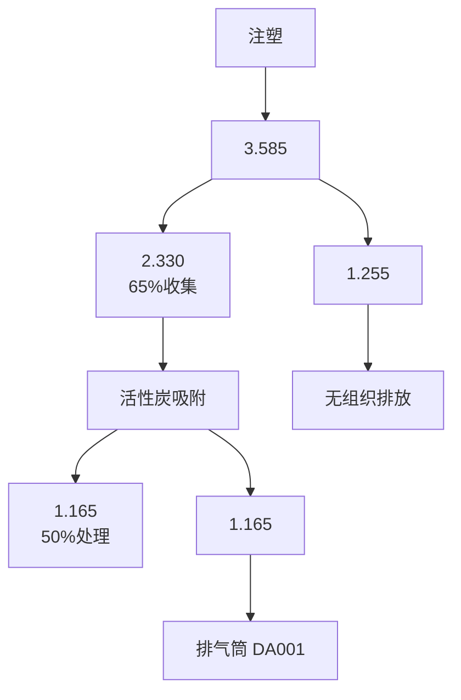
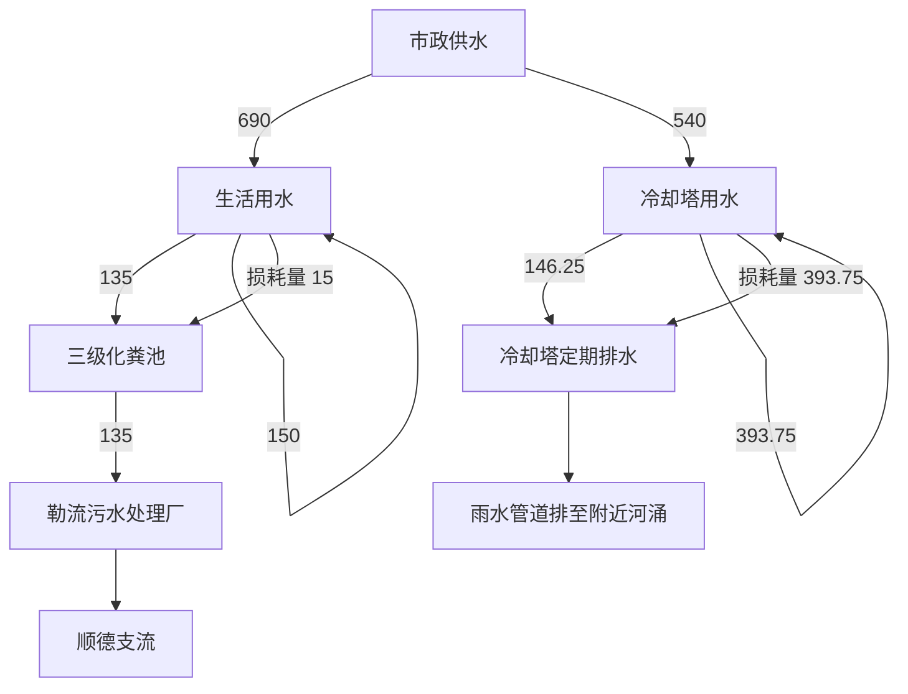

# 建设项目环境影响报告表

（污染影响类）

text_image

顺德区嘉优汇鞋业有限公司
顺德区嘉优汇鞋业有限公司

项目名称：佛山市顺德区童优汇鞋业有限公司建设项目6建设单位（盖章）：佛山市顺德区童优汇鞋业有限公司编制日期：2024年9月

text_image

兰州颐景环保科技有限公司

中华人民共和国生态环境部制

编制单位和编制人员情况表

<table><tr><td colspan="2">项目编号</td><td colspan="3">p4xg77</td></tr><tr><td colspan="2">建设项目名称</td><td colspan="3">佛山市顺德区童优汇鞋业有限公司建设项目</td></tr><tr><td colspan="2">建设项目类别</td><td colspan="3">16--032制鞋业</td></tr><tr><td colspan="2">环境影响评价文件类型</td><td colspan="3">报告表</td></tr><tr><td colspan="5">一、建设单位情况</td></tr><tr><td colspan="2">单位名称(盖章)</td><td colspan="3">佛山市顺德区童优汇鞋业有限公司</td></tr><tr><td colspan="2">统一社会信用代码</td><td colspan="3">91440606MA5121Q22G</td></tr><tr><td colspan="2">法定代表人(签章)</td><td rowspan="3" colspan="3"></td></tr><tr><td colspan="2">主要负责人(签字)</td></tr><tr><td colspan="2">直接负责的主管人员(签字)</td></tr><tr><td colspan="5">二、编制单位情况</td></tr><tr><td colspan="2">单位名称(盖章)</td><td colspan="3">广州颐景环保科技有限公司</td></tr><tr><td colspan="2">统一社会信用代码</td><td colspan="3">91440101MA5AKKEJ36</td></tr><tr><td colspan="5">三、编制人员情况</td></tr><tr><td colspan="5">1.编制主持人</td></tr><tr><td>姓名</td><td colspan="2">职业资格证书管理号</td><td>信用编号</td><td>签字</td></tr></table>

<table><tr><td colspan="4"></td></tr><tr><td colspan="4">2.主要编制人员</td></tr><tr><td>姓名</td><td>主要编写内容</td><td>信用编号</td><td>签字</td></tr><tr><td colspan="4"></td></tr></table>

natural_image

Official emblem of the People's Republic of China featuring a central emblem with stars and two horizontal bars (no visible text or symbols)

Professional Qualification Certificate

# 目录

一、建设项目基本情况

二、 建设项目工程分析. 11

三、区域环境质量现状、环境保护目标及评价标准 . 18

四、主要环境影响和保护措施. . 24

五、环境保护措施监督检查清单 . 49

六、结论. ..511

建设项目污染物排放量汇总表. . 52

附表 建设项目污染物排放量汇总表

附图1 项目地理位置图

附图2 项目车间平面布置图

附图3 项目周边环境敏感情况图

附图4 项目四至图

附图5 项目四至现场照片

附图6 项目所在区域的地表水环境功能区划图

附图7 项目所在区域的大气环境功能区划图

附图8 项目所在区域的声环境功能区划图

附图9 佛山市顺德区环境管控单元图

附件1 企业营业执照

附件2 法人代表身份证及被委托人身份证

附件3 不动产权证

附件4 注塑设备生产参数资料

附件5 城镇污水排入排水管网许可证

附件6 环评技术合同

附件7 同意公示声明

# 一、建设项目基本情况

<table><tr><td>建设项目名称</td><td colspan="4">佛山市顺德区童优汇鞋业有限公司建设项目</td></tr><tr><td>项目代码</td><td colspan="4">无</td></tr><tr><td>建设单位联系人</td><td colspan="4"></td></tr><tr><td>建设地点</td><td colspan="4">广东省佛山市顺德区勒流街道东风村东骏路1号厂房四之4楼</td></tr><tr><td>地理坐标</td><td colspan="4">东经:113度8分10.66秒,北纬:22度52分50.31秒</td></tr><tr><td>国民经济行业类别</td><td>C1953塑料鞋制造</td><td>建设项目行业类别</td><td colspan="2">十六、皮革、毛皮、羽毛及其制品和制鞋业19-32制鞋业195*-有橡胶硫化工艺、塑料注塑工艺的;年用溶剂型胶粘剂10吨及以上的,或年用溶剂型处理剂3吨及以上的</td></tr><tr><td>建设性质</td><td>☑新建(迁建)□改建□扩建□技术改造</td><td>建设项目申报情形</td><td colspan="2">☑首次申报项目□不予批准后再次申报项目□超五年重新审核项目□重大变动重新报批项目</td></tr><tr><td>项目审批(核准/备案)部门(选填)</td><td>无</td><td>项目审批(核准/备案)文号(选填)</td><td colspan="2">无</td></tr><tr><td>总投资(万元)</td><td>100</td><td>环保投资(万元)</td><td colspan="2">10</td></tr><tr><td>环保投资占比(%)</td><td>10</td><td>施工工期</td><td colspan="2">1个月</td></tr><tr><td>是否开工建设</td><td>☑否□是</td><td>用地(用海)面积( $m^2$ )</td><td colspan="2">2432</td></tr><tr><td rowspan="6">专项评价设置情况</td><td colspan="4">表1-1专项评价设置原则表</td></tr><tr><td>专项评价类别</td><td>设置原则</td><td>本项目相关情况</td><td>判定结果</td></tr><tr><td>大气</td><td>排放废气含有毒有害污染物、二噁英、苯并芘、氰化物、氯气且厂界外500米范围内有环境空气保护目标的建设项目</td><td>本项目排放不涉及技术指南规定的有毒有害废气污染物</td><td>不需要设置</td></tr><tr><td>地表水</td><td>新增工业废水直排建设项目(槽罐车外送污水处理厂的除外);新增废水直排的污水集中处理厂</td><td>本项目不涉及工业废水直接排放</td><td>不需要设置</td></tr><tr><td>环境风险</td><td>有毒有害和易燃易爆危险物质存储量超过临界量的建设项目</td><td>经分析,本项目危险物质存储量总计未超过临界量</td><td>不需要设置</td></tr><tr><td>生态</td><td>取水口下游500米范围内有重要水生生物的自然产卵场、索饵场、越冬场和洄游通道的新增河道取水的污染类建设项目</td><td>本项目不涉及直接从河道取水</td><td>不需要设置</td></tr><tr><td rowspan="2"></td><td>海洋</td><td>直接向海排放污染物的海洋工程建设项目</td><td>本项目污水排放不涉及海洋</td><td>不需要设置</td></tr><tr><td colspan="4"></td></tr><tr><td>规划情况</td><td colspan="4">无</td></tr><tr><td>规划环境影响评价情况</td><td colspan="4">无</td></tr><tr><td>规划及规划环境影响评价符合性分析</td><td colspan="4">无</td></tr><tr><td>其他符合性分析</td><td colspan="4">1、与产业政策符合性分析项目所属行业为C1953塑料鞋制造,根据《产业结构调整指导目录(2024年本)》,项目不属于限制类、淘汰类。综上所述,项目符合国家、广东省的产业政策要求。根据《市场准入负面清单(2022年版)》的规定,项目不属于清单中规定的禁止类和需要许可类项目。根据广东省发展改革委关于印发《广东省“两高”项目管理目录(2022年版)》的通知(粤发改能源函〔2022〕1363号),项目不属于该目录中的“两高”项目。根据广东省发展改革委、广东省生态环境厅关于印发《广东省禁止、限制生产、销售和使用的塑料制品目录》(2020年版)的通知,项目产品不属于该名录中禁止生产、销售的塑料制品和禁止、限制使用的塑料制品。因此项目符合国家产业政策要求。2、项目与“三线一单”生态环境分区管控方案相符性分析项目位于广东省佛山市顺德区勒流街道东风村东骏路1号厂房四之4楼。根据《广东省人民政府关于印发广东省“三线一单”生态环境分区管控方案的通知》(粤府〔2020〕71号)和佛山市生态环境局关于印发《佛山市“三线一单”生态环境分区管控方案(2024年版)》的通知佛环〔2024〕20号,项目符合广东省和佛山市的“三线一单”生态环境分区管控方案要求。根据《佛山市顺德区人民政府关于印发佛山市顺德区“三线一单”生态环境分区管控方案的通知》(顺府发〔2021〕11号),项目所在地属于勒流镇重点管控单元(环境管控单元编码:ZH44060620009),详见附图9,相关的管控要求相符性分析见下表。</td></tr></table>

表 1- 2 项目与顺府发〔2021〕11号符合性分析

<table><tr><td>管控维度</td><td>政策要求</td><td>项目工程内容</td><td>符合性</td></tr><tr><td rowspan="4">区域布局管控</td><td>【产业/鼓励引导类】重点发展智能家电、家具五金、环保装备、光电照明、装备制造及交通机械产业,引入智能制造服务、电子商务、现代商贸流通产业,重点建设环保产业基地、小家电产业基地和五金产业创业基地。</td><td>项目主要从事塑料鞋的生产</td><td>符合</td></tr><tr><td>【产业/综合类】系统推进村级工业园升级改造,腾出连片空间,布局产业集聚区和主题产业园,推动工业项目入园集聚发展。新增工业制造业用地原则上安排在产业集聚区内,产业集聚区外原则上不鼓励工业及物流仓储用地的新建与改造。</td><td>项目选址位于港骏工业园内</td><td>符合</td></tr><tr><td>【产业/综合类】产业聚集区所属地块内的工业用地或企业与村庄、学校等环境敏感点之间应设置合理的大气环境防护距离,并通过绿化带进行有效隔离;聚集区规划布局应注重大气污染排放企业应尽量避免布局在居住用地的常年主导风向的上风。</td><td>本项目500m范围内不涉及环境敏感点。</td><td>符合</td></tr><tr><td>【产业/限制类】受纳水体或监控断面不达标的,不得新建、扩建向河涌直接排放废水的项目。新建、扩建含蚀刻工序的线路板生产项目和化工项目应在配套污水集中处置的工业园区或生活污水管网覆盖区域内建设;纯加工型印花项目,含酸洗、磷化的金属表面处理、金属制品项目(与自身高新技术企业配套的除外),含酸洗、喷涂、化学抛光、电解等涉及废水排放工艺的不锈钢型材加工项目(与自身高新技术企业配套的除外),应进入以此类项目为主导产业、有相应废水集中治理设施的工业园区,实现集中治污。</td><td>根据《2023年度佛山市顺德区生态环境状况公报》的通知(佛环顺函〔2024〕44号),顺德支流新涌、飞鹅山断面监测的水质达到III类标准要求;项目外排废水仅为生活污水,属于间接排放,纳污水体顺德支流达标。项目属于塑料鞋制造,主要工为注塑成型、破碎、针车,不属于新建、扩建含蚀刻工序的线路板生产项目和化工项目应在配套污水集中处置的工业园区或生活污水管网覆盖区域内建设;纯加工型印花项目,含酸洗、磷化的金属表面处理、金属制品项目(与自身高新技术企业配套的除外),含酸洗、喷涂、化学抛光、电解等涉及废水排放工艺的不锈钢型材加工项目类别。项目冷却水循环使用,定期排水为清净下水通过雨水</td><td>符合</td></tr></table>

<table><tr><td rowspan="11"></td><td rowspan="4"></td><td></td><td>管道排放。</td><td></td></tr><tr><td>【水/限制类】严格限制在羊额—北滘水厂饮用水水源保护区上游和周边区域建设列入“高污染、高环境风险”产品名录等可能影响水环境安全的项目。</td><td>项目不属于高污染、高环境风险项目,且不在羊额—北滘水厂饮用水水源保护区上游和周边区域</td><td>符合</td></tr><tr><td>【大气/限制类】大气环境布局敏感区重点管控区内,应严格限制新建生产和使用高挥发性有机物原辅材料项目,优先开展低VOCs含量原辅材料替代,强化无组织排放控制。原则上不再新建、扩建新增氮氧化物、烟(粉)尘排放量较大的建设项目。</td><td>项目使用塑料原料为PVC塑胶粒,其均为新粒料,不使用高VOCs含量原辅材料。项目生产过程不涉及氮氧化物、烟(粉)尘产生</td><td>符合</td></tr><tr><td>【土壤/禁止类】禁止新建、扩建增加重点防控的重金属污染物排放的建设项目。</td><td>项目生产过程不涉及重金属污染物排放</td><td>符合</td></tr><tr><td rowspan="6">能源资源利用</td><td>【能源/鼓励引导类】推广节能技术,加快发展绿色货运与现代物流。</td><td>项目使用节能技术,项目不属于绿色货运与现代物流</td><td>符合</td></tr><tr><td>【能源/鼓励引导类】推广新能源汽车应用和充电基础设施、加氢站建设。</td><td>项目不属于新能源汽车、充电基础设施、加氢站建设项目</td><td>符合</td></tr><tr><td>【能源/综合类】科学实施能源消费总量和强度“双控”,新建高能耗项目单位产品(产值)能耗达到国际国内先进水平。</td><td>项目不属于高能耗项目</td><td>符合</td></tr><tr><td>【水资源/综合类】贯彻落实“节水优先”方针,实行最严格水资源管理制度,勒流街道万元国内生产总值用水量、万元工业增加值用水量、用水总量、农田灌溉水有效利用系数等用水总量和效率指标达到区下达要求。</td><td>要求项目贯彻落实“节水优先”方针</td><td>符合</td></tr><tr><td>【土地资源/限制类】落实单位土地面积投资强度、土地利用强度等建设用地控制性指标要求,提高土地利用效率。</td><td>项目土地利用效率高</td><td>符合</td></tr><tr><td>【岸线/禁止类】严格水域岸线用途管制,新建项目一律不得违规占用水域。严禁破坏生态的岸线利用行为和不符合其功能定位的开发建设活动,严禁以各种名义侵占河道、围垦湖泊、非法采砂等。</td><td>项目不存在占用水域和破坏生态的岸线利用行为</td><td>符合</td></tr><tr><td>污染物排放管控</td><td>【水/限制类】城镇新区建设实行雨污分流。住宅、商业体、学校、市场等城镇开发建设项目应当配套或者同步计划建设公共排水设施,公共排水设施或自建排污水设施未能投产运行的,以上涉水项目不得投入使用。新建小区严格实施雨污分流,阳台、露台等污水接入污水收集系统,将生活污水“应截尽截”。做好大型楼盘、集贸市场、餐饮以及学校等4大类排水户污水接入市政管网工作。</td><td>项目不属于住宅、商业体、学校、市场等城镇开发建设项目</td><td>符合</td></tr><tr><td rowspan="9"></td><td rowspan="5"></td><td>【水/综合类】结合村级工业园改造,全面提升产业层次与集聚度,促进污染集中整治。</td><td>项目所在地已完成“三旧”改造,现为规范化工业园区。</td><td>符合</td></tr><tr><td>【水/综合类】稳步推进排水设施“三个一体化”管理模式,补齐城乡污水收集和处理短板,推动勒流污水处理厂提质增效,加快消除城中村、老旧城区、城乡结合部等污水收集管网空白区,逐步实现城乡污水收集处理全覆盖。2025年前完成勒流污水处理厂扩建,尾水应执行《城镇污水处理厂污染物排放标准》(GB18918-2002)一级A标准及《广东省水污染物排放限值》(DB44/26-2001)的较严值。</td><td>项目不涉及。</td><td>符合</td></tr><tr><td>【水/综合类】保留勒流社区百丈片区分散式农村污水处理设施,其余行政村(社区)通过市政污水管网,配合农村支管网建设,有条件的区域实施雨污分流改造,到2030年实现农村生活污水100%收集进入勒流污水处理系统。</td><td>项目不涉及。</td><td>符合</td></tr><tr><td>【水/综合类】产业集聚区和主题园区内做好污水管网和污水集中处理设施的配套保障,确保废水收集到城镇污水处理厂、园区污水处理厂或分散式污水处理设施集中处置。</td><td>项目生活污水经三级化粪池预处理后通过市政管网排至勒流污水处理厂处理。</td><td>符合</td></tr><tr><td>【土壤/限制类】作为重金属污染重点防控区,区域内重点重金属排放总量只减不增。</td><td>项目不涉及。</td><td>符合</td></tr><tr><td rowspan="3">环境风险防控</td><td>【水/综合类】加强单元内羊额—北滘水厂饮用水水源保护区周边环境风险源管控,完善突发环境事件应急管理体系。</td><td>项目不涉及。</td><td>符合</td></tr><tr><td>【水/综合类】勒流污水处理厂、工业污水集中处理设施应采取有效措施,防止事故废水直接排入水体。完善污水处理厂在线监控系统联,实现污水处理厂的实时、动态监管。</td><td>项目不涉及。</td><td>符合</td></tr><tr><td>【风险/综合类】加强环境风险分级分类管理,强化金属制品、有色金属和压延加工、化学原料和化学品制造业等涉重金属、化工行业企业及工业园区等重点环境风险源的环境风险防控。</td><td>项目运营过程会落实各项风险控制措施,加强监督检查,做到及时发现,立即处理,避免污染。</td><td>符合</td></tr><tr><td colspan="4">3、项目与《环境保护综合名录》(2021年版)相符性分析本项目产品为塑料鞋,不属于《环境保护综合名录》(2021年版)中“高污染、高环境风险产品”,符合《环境保护综合名录》(2021年版)</td></tr></table>

的相关规定。

# 4、选址合理性分析

项目位于广东省佛山市顺德区勒流街道东风村东骏路 1 号厂房四之 4楼。根据企业提供不动产权证（粤（2024）佛顺不动产权第0018241号），项目用地为工业用地。因此项目的选址符合佛山市顺德区总体规划的要求，符合所在地块的土地利用性质，选址合理。

# 5、项目与挥发性有机物相关政策文件规定的相符性分析

项目挥发性有机物排放符合性根据相关政策文件规定分析如下：

表 1-3 项目挥发性有机物排放规定

<table><tr><td>序号</td><td>政策要求</td><td>工程内容</td><td>符合性</td></tr><tr><td colspan="4">1.《广东省人民政府办公厅关于印发广东省2021年大气、水、土壤污染防治工作方案的通知》(粤办函〔2021〕58号)</td></tr><tr><td>1.1</td><td>严格落实国家产品VOCs含量限值标准要求,除现阶段确无法实施替代的工序外,禁止新建生产和使用高VOCs含量原辅材料项目。鼓励在生产和流通消费环节推广使用低VOCs含量原辅材料。</td><td>项目使用的塑料原料PVC,其均为新粒料,常温条件下不会产生有机废气。</td><td>符合</td></tr><tr><td colspan="4">2.《佛山市生态环境局顺德分局关于做好重点行业建设项目挥发性有机物总量指标管理工作的通知》(佛顺环函〔2019〕56号)</td></tr><tr><td>2.1</td><td>省、市生态环境主管部门对VOCs排放量大于300公斤/年的新、改、扩建项目,进行总量替代,按照附表1填报VOCs指标来源说明。其他排放量规模需要总量替代的,由本级生态环境主管部门自行确定范围,并按照要求审核总量指标来源,填写VOCs总量指标来源说明。</td><td>本项目挥发性有机物新增量为2.420t/a,在镇总量中分配。待项目审批时由生态环境部门核定VOCs总量来源。</td><td>符合</td></tr><tr><td colspan="4">3.《广东省涉挥发性有机物(VOCs)重点行业治理指引》的通知(粤环办〔2021〕43号)</td></tr><tr><td>3.1</td><td>45-工艺过程-在混合/混炼、塑炼/塑化/熔化、加工成型(挤出、注射、压制、压延、发泡、纺丝等)、硫化等作业中应采用密闭设备或在密闭空间中操作</td><td>项目有机废气经半密闭型集气设备收集,收集效率为65%</td><td>符合</td></tr><tr><td>3.2</td><td>43-VOCs物料转移和输送-粉状、粒状VOCs物料采用气力输送设备、管状带式输送机、螺旋输送机等密闭输送方式,或者采用密闭的包装袋、容器或罐车进行物料转移。</td><td>项目使用的PVC,其均为新粒料,常温条件下不会产生有机废气。在转移过程中均使用密闭的包装袋封装。</td><td>符合</td></tr><tr><td>3.3</td><td>50-废气收集-废气收集系统的输送管道应密闭。废气收集系统应在负压下运行,若处于正压状态,</td><td>项目废气收集系统的输送管道均密闭,废气收集系统在负压下运行。</td><td>符合</td></tr></table>

<table><tr><td rowspan="5"></td><td></td><td>应对管道组件的密封垫进行泄漏检测,泄漏检测值不应超过500μmol/mol,亦不应有感官可察觉泄漏。</td><td></td><td></td></tr><tr><td>3.4</td><td>52-排放水平-塑料制品行业:a)有机废气排气筒排放浓度不高于广东省《大气污染物排放限值》(DB 44/27-2001)第II时段排放限值,合成革和人造革企业排放浓度不高于《合成革与人造革工业污染物排放标准》(GB21902-2008)排放限值,若国家和我省出台并实施适用于塑料制品制造业的大气污染物排放标准,则有机废气排气筒排放浓度不高于相应的排放限值;车间或生产设施排气中NMHC初始排放速率≥3kg/h时,建设VOCs处理设施且处理效率≥80%;b)厂区内无组织排放监控点NMHC的小时平均浓度值不超过6mg/m3,任意一次浓度值不超过20mg/m3。</td><td>有机废气排气筒总VOCs排放浓度有组织排放浓度25.892mg/m3,可达到《制鞋行业挥发性有机化合物排放标准》(DB44817-2010)表1排气筒VOCs排放限值(第II时段限值要求);项目注塑废气初始排放速率为1.036kg/h&lt;3kg/h,收集后经“活性炭吸附”处理,总VOCs处理效率为50%。厂区内NMHC满足广东省地方标准《固定污染源挥发性有机物综合排放标准》(DB44/2367-2022)表3厂区内VOCs无组织排放限值(≤6mg/m3(监控点处1h平均浓度值)、≤20mg/m3(监控点处任意一次浓度值))</td><td>符合</td></tr><tr><td colspan="4">4.《重点行业挥发性有机物综合治理方案》(环大气[2019]53号)</td></tr><tr><td>4.1</td><td>通过使用水性、粉末、高固体分、无溶剂、辐射固化等低VOCs含量的涂料,水性、辐射固化、植物基等低VOCs含量的油墨,水基、热熔、无溶剂、辐射固化、改性、生物降解等低VOCs含量的胶粘剂,以及低VOCs含量、低反应活性的清洗剂等,替代溶剂型涂料、油墨、胶粘剂、清洗剂等,从源头减少VOCs产生。</td><td>项目使用PVC,其均为新料,不属于高VOCs含量原辅材料</td><td>符合</td></tr><tr><td>4.2</td><td>全面加强无组织排放控制。推进使用先进生产工艺。通过采用全密闭、连续化、自动化等生产技术,以及高效工艺与设备等,减少工艺过程无组织排放。挥发性有机液体装载优先采用底部装载方式。遵循“应收尽收、分质收集”的原则,科学设计废气收集系统,将无组织排放转变为有组织排放进行控制。采用全密闭集气罩或密闭空间的,除行业有特殊要求外,应保持微负压状态,并根据相关规范合理设置通风量。采用局部集气罩的,距集气罩开口面最远处的VOCs无组织排放位置,控制风速应不低于0.3米/秒,有行业要求的按相关规定执行。</td><td>项目注塑成型工序采用半密闭型集气设备收集有机废气;通过采取设备密闭、工艺改进、废气有效收集等措施,有效削减VOCs无组织排放。</td><td>符合</td></tr><tr><td rowspan="7"></td><td>4.3</td><td>推进建设适宜高效的治污设施。鼓励企业采用多种技术的组合工艺,提高VOCs治理效率。低浓度、大风量废气,宜采用沸石转轮吸附、活性炭吸附、减风增浓等浓缩技术,提高VOCs浓度后净化处理。低温等离子、光催化、光氧化技术主要适用于恶臭异味等治理;生物法主要适用于低浓度VOCs废气治理和恶臭异味治理。非水溶性的VOCs废气禁止采用水或水溶液喷淋吸收处理。</td><td>项目有机废气经“活性炭废气处理设备”处理,处理效率为50%。</td><td>符合</td></tr><tr><td>4.4</td><td>加强企业运行管理。企业应系统梳理VOCs排放主要环节和工序,包括启停机、检维修作业等,制定具体操作规程,落实到具体责任人。健全内部考核制度。加强人员能力培训和技术交流。建立管理台账,记录企业生产和治污设施运行的关键参数(见附件3),在线监控参数要确保能够实时调取,相关台账记录至少保存三年。</td><td>项目VOCs排放主要环节和工序为注塑成型,建设单位将针对该工序制定具体操作规程,落实到具体责任人,健全内部考核制度,加强人员能力培训和技术交流;建立管理台账,记录企业生产和治污设施运行的关键参数,相关台账记录至少保存三年。</td><td>符合</td></tr><tr><td colspan="4">5.广东省《固定污染源挥发性有机物综合排放标准》(DB44/2367-2022)</td></tr><tr><td>5.1</td><td>排气筒高度不低于15m(因安全考虑或者有特殊工艺要求的除外),具体高度以及与周围建筑物的相对高度关系应当根据环境影响评价文件确定。</td><td>项目注塑成型废气通过半密闭型集气设备收集由“活性炭吸附”处理后引至47m高排气筒DA001排放</td><td>符合</td></tr><tr><td>5.2</td><td>企业应当建立台账,记录废气收集系统、VOCs处理设施的主要运行和维护信息,如运行时间、废气处理量、操作温度、停留时间、吸附剂再生/更换周期和更换量、催化剂更换周期和更换量、吸收液pH值等关键运行参数。台账保存期限不少于3年。</td><td>项目运营期废气治理设施拟安排专人维护并定期建立台账,记录相关废气数据。</td><td>符合</td></tr><tr><td>5.3</td><td>VOCs物料应当储存于密闭的容器、储罐、储库、料仓中;盛装VOCs物料的容器应当存放于室内,或者存放于设置有雨棚、遮阳和防渗设施的专用场地。盛装VOCs物料的容器或者包装袋在非取用状态时应当加盖、封口,保持密闭。</td><td>项目使用PVC,其均为新粒料,不属于高VOCs含量原辅材料,包装方式分别为密闭袋装,储存于原料区内(室内)。</td><td>符合</td></tr><tr><td>5.4</td><td>废气收集系统排风罩(集气罩)的设置应当符合GB/T16758的规定。采用外部排风罩的,应当按GB/T 16758、WS/T757—2016规定的方法测量控制风速,测量点应当选取在距排风罩开口面最远处的VOCs无组织排放位置,控制风速不应当低于0.3m/s(行业相关规范有具体规定的,按相关规定执行)。</td><td>项目注塑成型废气通过半密闭型集气设备收集由“活性炭吸附”处理后引至一根47m高排气筒DA001排放</td><td>符合</td></tr><tr><td rowspan="10"></td><td colspan="4">6.《广东省生态环境保护“十四五”规划》(粤环〔2021〕10号)</td></tr><tr><td>6.1</td><td>大力推进低VOCs含量原辅材料源头替代,严格落实国家和地方产品VOCs含量限值质量标准,禁止建设生产和使用高VOCs含量的溶剂型涂料、油墨、胶粘剂等项目</td><td>项目使用PVC,其均为新粒料,不属于高VOCs含量原辅材料</td><td>符合</td></tr><tr><td>6.2</td><td>强化对企业涉VOCs生产车间/工序废气的收集管理,推动企业开展治理设施升级改造</td><td>项目有机废气经半密闭型集气设备收集,收集效率为65%</td><td>符合</td></tr><tr><td colspan="4">7.《佛山市生态环境局关于印发《佛山市生态环境保护“十四五”规划》的通知》(佛环〔2022〕3号)</td></tr><tr><td>7.1</td><td>加强VOCs源头替代和无组织排放管控。大力推进低VOCs含量原辅材料替代,将全面使用低VOCs含量原辅材料的企业纳入正面清单和政府绿色采购清单。鼓励重点行业企业开展生产工艺和设备水性化改造,推广使用水性、高固体分、无溶剂、粉末等低VOCs含量涂料。</td><td>项目使用原料为PVC,其均为低挥发原料新粒料,不涉及高VOCs含量的溶剂涂料、油墨、胶黏剂的使用。</td><td>符合</td></tr><tr><td>7.2</td><td>严格落实《挥发性有机物无组织排放控制标准》,开展厂区内无组织排放浓度监测。</td><td>已要求企业对照落实《挥发性有机物无组织排放控制标准》,开展厂区内无组织排放浓度监测。</td><td>符合</td></tr><tr><td>7.3</td><td>加强对含VOCs物料储存、转移和运输、设备与管线组件泄漏、敞开页面逸散以及工艺过程等五类排放源的管控。</td><td>项目含VOCs原料均密封储存,已要求企业加强对含VOCs物料的管控。</td><td>符合</td></tr><tr><td>7.4</td><td>推进VOCs高排放企业治理设施提升改造,淘汰光催化、光氧化、低温等离子等现有低效治理设施。</td><td>项目废气治理设施为“活性炭吸附”,不使用低效治理设施</td><td>符合</td></tr><tr><td colspan="4">8.《佛山市顺德区生态环境保护“十四五”规划(2021-2025)》</td></tr><tr><td>8.18.2</td><td>持续推进重点行业VOCs整治。持续开展挥发性有机物专项整治,继续推进重点行业企业开展销号式综合整治,建立VOC重点监管企业名单并动态更新,督促企业建立VOCs管控台账清单;持续探寻高效节能的VOCs治理技术,对采用低温等离子、光氧化、光催化等低效治理工艺的企业在臭氧污染天气应对期间实施停限产或错峰生产,并推动企业逐步淘汰低效治理工艺加强VOCs源头替代和无组织排放管控。大力推进低VOCs含量、低反应活性的原辅材料替代,将全面使用低VOCs含量原辅材料的企业纳入正面清单和政府绿色采购清单。鼓励重点行业企业开展生产工艺和设备水性化改造,推广使用水性、高固体分、无溶剂、粉末等低VOCs含量涂料。严格落实《挥发性有机物无组织排放控制标准》,开展厂区内无组织排放浓度监测,加强对含VOCs物料储存、转移和运输、设备与管线组件泄漏、敞开页面逸散以及工艺过程等五类排放源的管控。</td><td>项目不采用低效治理工艺,采用活性炭吸附装置处理有机废气项目使用PVC,其均为新粒料,不属于高VOCs含量原辅材料,包装方式分别为密闭袋装,储存于原料区内(室内)</td><td>符合符合</td></tr><tr><td rowspan="4"></td><td colspan="4">9.《佛山市关于进一步加强塑料污染治理的实施方案》的通知(2020年11月9日发布)</td></tr><tr><td>9.1</td><td>禁止生产、销售的塑料制品。全市范围内禁止生产和销售厚度小于0.025毫米的超薄塑料购物袋、厚度小于0.01毫米的聚乙烯农用地膜。禁止以医疗废物为原料制造塑料制品;禁止将回收利的废塑料输液袋(瓶)用于原用途或用于制造餐饮容器以及玩具等儿童用品。加大禁止“洋垃圾”进口监管和打私力度,确保“全面禁止废塑料进口”落实到位。到2020年底,禁止生产和销售一次性发泡塑料餐具、一次性塑料棉签;禁止生产含塑料微珠的日化产品。到2022年底,禁止销售含塑料微珠的日化产品。国家《产业结构调整指导目录》和《市场准入负面清单》明确的属于淘汰类的塑料制品项目,禁止投资;属于限制类项目,禁止新建。</td><td>项目生产产品为塑料鞋,生产工艺为注塑工艺,不涉及禁止生产、销售的塑料制品,原料均为新料。</td><td>符合</td></tr><tr><td>9.2</td><td>增加绿色产品供给。塑料制品生产企业要严格执行有关法律法规,生产符合相关标准的塑料制品,不得使用未经风险评估及技术验证的塑料回收料生产食品接触材料及制品,不得违规添加对人体、环境有害的化学添加剂。</td><td>项目使用的原料均为新料,项目产品生产过程没有添加对人体、环境有害的化学添加剂。</td><td>符合</td></tr><tr><td colspan="4">因此项目建设符合国家、省、市的挥发性有机物相关政策要求。</td></tr></table>

# 二、建设项目工程分析

# 1、项目由来

佛山市顺德区童优汇鞋业有限公司位于广东省佛山市顺德区勒流街道东风村东骏路1号厂房四之 4楼，详见附图1，占地面积2432平方米，建筑面积2432平方米，建筑物楼层厂房高度均为 5m，共计9层。本项目主要从事塑料鞋的生产，预计年产塑料鞋25万双。

根据《中华人民共和国环境影响评价法》、《中华人民共和国环境保护法》、国务院令第253号《建设项目环境保护管理条例》等有关法律法规的规定，本项目须执行环境影响审批制度。根据《建设项目环境影响评价分类管理目录》（2021 年版），本项目属于“十六、皮革、毛皮、羽毛及其制品和制鞋业 19-32 制鞋业 195\*-有橡胶硫化工艺、塑料注塑工艺的；年用溶剂型胶粘剂 10 吨及以上的，或年用溶剂型处理剂 3吨及以上的”类别，需编制环境影响报告表。

本项目租赁已建厂房，项目组成见表 2-1 ，详细项目总平面布置图见附图2。

表 2-1 项目工程组成一览表

<table><tr><td colspan="3">项目组成</td><td>工程内容</td></tr><tr><td>主体工程</td><td colspan="2">生产车间</td><td>项目所在建筑物为9层建筑,总高度为45m,本项目位于建筑物第4层,单层高5m,厂房面积为2432m2,含有注塑区、破碎区、包装区、针车区、冲床区、原辅材料及成品暂存区、办公室、卫生间、危险废物暂存间及一般固废暂存间。</td></tr><tr><td rowspan="4">公用工程</td><td colspan="2">给水工程</td><td>项目用水均由市政供水管道直接供水</td></tr><tr><td rowspan="2" colspan="2">排水工程</td><td>生活污水经三级化粪池预处理后排入市政污水管网,经市政污水管网排入勒流污水处理厂作后续处理,尾水排放至顺德支流</td></tr><tr><td>冷却塔循环冷却水循环使用,定期排水可作清净下水通过雨水管道排放</td></tr><tr><td colspan="2">供电工程</td><td>厂区内电源由市政供电管网提供</td></tr><tr><td>辅助工程</td><td colspan="2">办公室</td><td>用于人员办公,面积约220m2</td></tr><tr><td>仓储工程</td><td colspan="2">仓库</td><td>一个原料区,面积约174m2,用于储存原料;一个成品区,面积约396m2,用于储存成品,均位于生产车间内</td></tr><tr><td rowspan="6">环保工程</td><td rowspan="2">废水</td><td>生活污水</td><td>生活污水经三级化粪池预处理后排入市政污水管网,经市政污水管网排入勒流污水处理厂作后续处理,尾水排放至顺德支流</td></tr><tr><td>循环冷却水</td><td>冷却塔循环冷却水循环使用,定期排水可作清净下水通过雨水管道排放</td></tr><tr><td>废气</td><td>注塑废气</td><td>注塑废气经半密闭型集气设备收集后通过“活性炭吸附装置”处理后引至47m排气筒DA001排放;在厂房墙体设置排气扇,加强车间通风</td></tr><tr><td rowspan="2">固体废物</td><td>危险废物暂存区</td><td>1个,存放危险废物,位于生产车间内,面积15m2</td></tr><tr><td>一般工业固废暂存区</td><td>1个,存放一般工业固体废物,位于生产车间内,面积25m2</td></tr><tr><td>噪声</td><td>/</td><td>项目噪声为设备运行产生的噪声,采取选用低噪声设备、车间合理布局、安装减震基础、厂房隔声、距离衰减等措施削减。</td></tr></table>

# 2、主要产品及产能

表 2-2 项目产品方案一览表

<table><tr><td>序号</td><td>名称</td><td>产量</td><td>单位</td><td>备注</td></tr><tr><td>1</td><td>塑料鞋</td><td>25万</td><td>双/年</td><td>每双塑料鞋PVC 鞋底约 200-1000g,本项目注塑鞋底总重量为196.370t/a</td></tr></table>

# 3、主要生产设施及设施参数

表 2-3 项目主要生产设备一览表

<table><tr><td>序号</td><td>名称</td><td>单位</td><td>数量</td><td>型号/参数</td><td>对应工序</td><td>备注</td></tr><tr><td>1</td><td>PVC 鞋底注塑机</td><td>台</td><td>5</td><td>55t</td><td>注塑成型</td><td>/</td></tr><tr><td>2</td><td>烘箱</td><td>台</td><td>2</td><td>/</td><td>烘干</td><td>电烘干,烘干温度约为70°C</td></tr><tr><td>3</td><td>破碎机</td><td>台</td><td>2</td><td>/</td><td>破碎</td><td>注塑件型号较少,用料配比一致,统一破碎回用</td></tr><tr><td>4</td><td>搅拌机</td><td>台</td><td>2</td><td>/</td><td>搅拌</td><td>注塑件型号较少,原辅材料可与破碎后粒料统一混料</td></tr><tr><td>5</td><td>冲床机</td><td>台</td><td>3</td><td>/</td><td>面料截断</td><td>/</td></tr><tr><td>6</td><td>针车机</td><td>台</td><td>20</td><td>/</td><td>鞋面针车</td><td>/</td></tr><tr><td>7</td><td>包装流水线</td><td>台</td><td>2</td><td>/</td><td>包装</td><td>/</td></tr><tr><td>8</td><td>打包机</td><td>台</td><td>2</td><td>/</td><td>包装</td><td>/</td></tr><tr><td>9</td><td>冷却塔</td><td>台</td><td>1</td><td> $5m^{3}/h$ </td><td>冷却</td><td>位于所在建筑顶层</td></tr></table>

表 2-4 本项目关键设备产能和原料规模匹配性分析一览表

<table><tr><td>对应产品</td><td>设备名称</td><td>设备型号</td><td>数量(台)</td><td>单台设备单批次注塑量(g)</td><td>单批次生产时间(s)</td><td>单台设备全年最大生产批次(次)</td><td>年设备运行时间(h/a)</td><td>满负荷工作注塑量(t/a)</td></tr><tr><td rowspan="2">PVC 鞋底</td><td rowspan="2">PVC 鞋底注塑机</td><td>55t</td><td>5</td><td>80</td><td>15</td><td>540000</td><td>2250</td><td>216</td></tr><tr><td colspan="6">实际申报产能</td><td>200</td></tr><tr><td colspan="9">备注:1、项目年生产运行天数为300天,每天8小时,企业每日设备开机预热约30分钟,则每日设备实际进入正常生产时间为7.5h,即2250h/a。2、满负荷工作注塑量中已包含边角料及不合格品破碎回用量。</td></tr></table>

根据匹配性分析可知，项目 PVC 鞋底注塑机满负荷注塑量为 216t/a，企业申报实际产量为200t/a，项目注塑设备可满足企业生产要求。

# 4、主要原辅材料种类和用量

表 2-5 项目主要原辅材料消耗量一览表

<table><tr><td>序号</td><td>原料名称</td><td>年用量</td><td>单位</td><td>状态</td><td>最大储存量</td><td>备注</td></tr><tr><td>1</td><td>PVC(新粒料)</td><td>200</td><td>t/a</td><td>固态粒料</td><td>5</td><td>外购;25kg 袋装</td></tr><tr><td>2</td><td>布面料</td><td>15 万</td><td>m/a</td><td>固态</td><td>1.5 万</td><td>外购;50m 卷装</td></tr><tr><td>3</td><td>PU面料</td><td>10万</td><td>m/a</td><td>固态</td><td>1万</td><td>外购;50m卷装</td></tr><tr><td>4</td><td>液压油</td><td>0.2</td><td>t/a</td><td>液态</td><td>0.05</td><td>25kg/桶</td></tr></table>

# 主要原辅材料理化性质：

表 2-6 项目主要原辅材料理化性质一览表

<table><tr><td>序号</td><td>名称</td><td>理化性质</td><td>挥发性</td><td>危险性</td></tr><tr><td>1</td><td>PVC(新粒料)</td><td>聚氯乙烯,微黄色半透明有光泽固体,是氯乙烯单体在过氧化物、偶氮化合物等引发剂或在光、热作用下按自由基聚合反应机理聚合而成的聚合物。相对密度约 $1.4g/cm^{3}$ ,玻璃化温度 $77\sim90^{\circ}C$ ,分解温度约 $140^{\circ}C$ ,对光和热的稳定性差;无固定熔点, $80\sim85^{\circ}C$ 开始软化, $130^{\circ}C$ 变为粘弹态, $160\sim180^{\circ}C$ 开始转变为粘流态。</td><td>常温下不挥发,特定工艺条件下才挥发</td><td>/</td></tr><tr><td>2</td><td>液压油</td><td>液压油就是利用液体压力能的液压系统使用的液压介质,在液压系统中起着能量传递、抗磨、系统润滑、防腐、防锈、冷却等作用。其为琥珀色具有特有气味的液体,相对密度( $15.6^{\circ}C$ )为 $0.881$ ,爆炸上限(UEL)为 $7.0$ ,爆炸下限(LEL),为 $0.9$ ,蒸汽密度(空气=1)为 $>2$ ,蒸汽压力为 $<0.013kPa$ ,粘度为 $68^{\circ}CSt$ ,正常状况下物料稳定,在环境温度下不分解。本项目液压油用于机械维护。</td><td>/</td><td>易燃</td></tr></table>

项目主要涉 VOCs 原辅材料情况见下表。

表 2-7 项目主要涉 VOCs 原辅材料一览表

<table><tr><td>序号</td><td>名称</td><td>理化性质</td><td>VOCs含量</td><td>国家标准限值</td><td>是否属于低VOCs原辅材料</td></tr><tr><td>1</td><td>PVC(新粒料)</td><td>聚氯乙烯,微黄色半透明有光泽固体,是氯乙烯单体在过氧化物、偶氮化合物等引发剂或在光、热作用下按自由基聚合反应机理聚合而成的聚合物。相对密度约 $1.4g/cm^{3}$ ,玻璃化温度77~90°C,分解温度约140°C,对光和热的稳定性差;无固定熔点,80~85°C开始软化,130°C变为粘弹态,160~180°C开始转变为粘流态。</td><td>常温条件下不会产生有机废气,注塑过程有机废气产污参考《排放源统计调查产排污核算方法和系数手册》中“195制鞋行业系数手册”,塑料鞋(原料聚氯乙烯树脂)—注塑工艺中总VOCs产污系数为14340毫克/双-产品</td><td>/</td><td>是</td></tr></table>

# 项目物料平衡分析

备注：生产过程产生的不合格品可回用于生产，故不纳入生产损失。  
表 2-8 项目注塑件产品原辅材料投入、产出平衡表

<table><tr><td colspan="2">投入</td><td colspan="3">产出</td></tr><tr><td>名称</td><td>数量(t/a)</td><td>名称</td><td>数量(t/a)</td><td>备注</td></tr><tr><td>PVC(新粒料)/</td><td>200/</td><td>产品颗粒物</td><td>196.37050.0445</td><td>塑料鞋鞋底重量投料、混料、破碎过程产生量,属于生产损失</td></tr><tr><td>/</td><td>/</td><td>总VOCs</td><td>3.585</td><td>注塑废气产生量,属于生产损失</td></tr><tr><td>合计</td><td>200</td><td>合计</td><td>200</td><td>/</td></tr><tr><td>结论</td><td colspan="4">项目注塑件产品原辅材料投入与产出平衡</td></tr></table>

# 5、VOCs 平衡分析

项目注塑工序总 VOCs 产生量为 3.585t/a，总 VOCs 经由半密闭型集气设备收集后经一套“活性炭吸附”废气处理设备处理，再引至一根 47m高排气筒DA001 高空排放，其余无组织排放。收集效率为 65%，处理效率为 50%，总VOCs 有组织产生量为2.330t/a，经处理后总 VOCs 有组织排放量为 1.165t/a，无组织排放量为 1.255t/a，活性炭吸附总 VOCs量为 1.165t/a，VOCs 平衡图见下图。

flowchart

图 2-1 项目 VOCs 平衡分析图

# 5、水平衡分析

生活用水及排水：本项目用水均由市政水管道直接供水，主要用水为职工生活用水。本项目共设置员工 15人，员工均不在厂内住宿，根据《用水定额 第3部分：生活》（DB44/T1461.3-2021）表 A.1 国家行政机构中办公楼（无食堂和浴室）的先进值用水定额为10m3/a，生活用水定额按 10m3 /a 计，新鲜生活用水量为 150m3 /a。生活污水排污系数按 0.9 计，生活污水产生量为 135m3 /a。本项目产生的生活污水经三级化粪池预处理达标后由市政污水管网引至勒流污水处理厂，尾水排放至顺德支流。

冷却塔用水：项目注塑设备需使用冷却水对设备进行间接冷却冷却水循环使用，需适当地加入新鲜水补充因蒸发而损失的水分。项目使用1 台冷却塔，循环水量为 5m3/h。根据废水源强分析可知，冷却塔补充水量 Qm 为 0.24m3 /h（即 540m3 /a），蒸发水量 Qe 为0.16m3 /h（即 360m3 /a），风吹损失水量 Qw 为 0.015m3 /h（即 33.75m3 /a），冷却水排水量Qb 为0.065m3 /h（即 146.25m3 /a）。冷却水循环使用，定期排水为清净下水通过雨水管道

排放，不计入排污量。

flowchart

图 2-2 项目水平衡图（单位 m3/a）

# 6、工作制度和能耗水耗

表 2-9 项目劳动定员及工作制度一览表

<table><tr><td>序号</td><td>名称</td><td>数量</td></tr><tr><td>1</td><td>劳动定员(人)</td><td>15</td></tr><tr><td>2</td><td>工作制度</td><td>8:00-12:00; 14:00-18:00, 日工作8小时, 年工作300天</td></tr><tr><td>3</td><td>食宿情况</td><td>不设食宿</td></tr></table>

表 2-10 项目能耗水耗一览表

<table><tr><td>序号</td><td>名称</td><td>单位</td><td>用量</td><td>用途</td><td>备注</td></tr><tr><td rowspan="2">1</td><td rowspan="2">水</td><td>吨/年</td><td>150</td><td>办公、生活</td><td rowspan="2">市政供水</td></tr><tr><td>吨/年</td><td>540</td><td>冷却塔</td></tr><tr><td>2</td><td>电</td><td>万 kW·h/年</td><td>8.4</td><td>生产、生活</td><td>市政供电</td></tr></table>

# 7、项目平面布置及四至情况

本项目在一栋 9 层高的工业厂房进行建设，该工业厂房总高度为 45 米，项目所在楼层层高为 5m，占地面积为2432平方米，建筑面积为2432平方米，含有注塑区、破碎区、包装区、针车区、冲床区、原辅材料及成品暂存区、办公室、卫生间、危险废物暂存间及一般固废暂存间。项目生产车间内部按照工艺要求进行分区，各生产区相对独立，互不干扰，每个生产区按照工艺流程布置设备，因此，项目车间内布置流畅，总体来说项目平面布置紧凑有序，布局合理。平面布置图详见附图2。

本项目位于所在建筑第 4层，楼下第1层为仓库，其他楼层为其他工业厂房，楼顶为天台；项目东北面为港骏工业园园区厂房3栋，项目东南面为港骏工业园园区厂房5栋，项目西北面为佛山市顺德区毅鸣佳塑料有限公司，项目西南面为广东东荣金属制品有限公司。本项目四至位置详见附图 4和附图5。

# 8、污染防治设施投资

<table><tr><td rowspan="8"></td><td colspan="3">本项目总投资100万,其中环保投资10万,投资比例为10%。从污染治理效果及占项目增加投资的比例来看,项目环境污染治理措施投资在经济上是可行的。环保投资见下表。表2-11 本项目环保投资一览表</td></tr><tr><td>项目</td><td>具体措施</td><td>投资额(万元)</td></tr><tr><td>废水治理</td><td>三级化粪池依托园区设施</td><td>0</td></tr><tr><td rowspan="2">大气治理</td><td>车间通风设施(排气扇)</td><td rowspan="2">8</td></tr><tr><td>半密闭型集气设备+活性炭废气处理设备+排气筒DA001</td></tr><tr><td>固体废物处理处置</td><td>委托环卫人员、回收公司和有相应危废资质单位收集和处理</td><td>1</td></tr><tr><td>噪声治理</td><td>减振、吸声设备等</td><td>1</td></tr><tr><td>合计环保投资</td><td>/</td><td>10</td></tr><tr><td>工艺流程和产排污环节</td><td colspan="3">一、项目生产工艺情况:塑料鞋生产工艺流程图2-4 项目塑料鞋生产工艺流程图工艺流程说明:外购PU面料、布面料按照不同产品要求使用冲床机裁剪成需要的形状,使用针车机手工把裁剪好的面料针车在鞋面上,完成后进入烘箱进行注塑前烘干水分,烘箱温度为70°C;外购PVC(新粒料)经人工加入搅拌机进行搅拌,搅拌后投入注塑机料斗,进行注塑,注塑机使用电能加热,其工作温度为160°C~180°C,注塑后经质检合格后进入包装工序,包装后即为成品。其中,质检过程中产生的不合格品及边角料经过破碎机破碎后,再与新料进行混料回用于生产。备注:注塑设备冷却用水为间接冷却水,循环使用,定期排水作为清净下水通过雨水管道排放,不计入排污量。产污节点分析:表2-12 项目产污环节分析</td></tr><tr><td rowspan="10"></td><td>产污类型</td><td>产污环节</td><td>污染物</td></tr><tr><td rowspan="2">废水</td><td>生活污水</td><td> $COD_{Cr}$ 、 $BOD_{5}$ 、SS、 $NH_{3}-N$ </td></tr><tr><td>冷却塔定期排水</td><td>CODcr、SS</td></tr><tr><td rowspan="3">废气</td><td>搅拌</td><td>颗粒物</td></tr><tr><td>注塑</td><td>总VOCs、臭气浓度、氯化氢、氯乙烯</td></tr><tr><td>破碎</td><td>颗粒物</td></tr><tr><td rowspan="3">固废</td><td>生活过程</td><td>员工生活垃圾</td></tr><tr><td>一般工业固废</td><td>不合格品及边角料、废包装材料</td></tr><tr><td>危险废物</td><td>废液压油、废油桶、废活性炭、废含油抹布</td></tr><tr><td>噪声</td><td>生产过程</td><td>机械噪声</td></tr><tr><td>与项目有关的原有环境污染问题</td><td colspan="3">本项目为新建项目,因此,无与项目有关的原有污染源。</td></tr></table>

# 三、区域环境质量现状、环境保护目标及评价标准

# 1、大气环境

根据《佛山市顺德区生态环境保护“十四五”规划（2021-2025）》，顺德区全境为大气环境二类区，因此项目所在区域属二类环境空气质量功能区，执行《环境空气质量标准》（GB3095-2012）及 2018 年修改单二级标准。

# （1）基本污染物环境质量现状及达标区判定

根据佛山市生态环境局顺德分局关于发布《2023年度佛山市顺德区生态环境状况公报》的通知（佛环顺函〔2024〕44 号），2023 年顺德区空气质量综合指数为 3.14，比2022 年下降 4.0%，在全市五区中排名第二。按照《环境空气质量标准》评价，2023 年顺德区二氧化硫 $( \mathrm { S O } _ { 2 } )$ 、二氧化氮 $\left( \mathrm { N O } _ { 2 } \right)$ ）、可吸入颗粒物 $\left( \mathrm { P M } _ { 1 0 } \right)$ ）、细颗粒物 $\left( \mathrm { P M } _ { 2 . 5 } \right)$ ）、一氧化碳（CO）五项污染物年评价浓度均达到二级标准，臭氧 $( \mathrm { O } _ { 3 } )$ 超标。如下表3-1和图3-1 所示。

bar

| 污染物 | 2022年 (微克/立方米) | 2023年 (微克/立方米) | 毫克/立方米 |
| :--- | :--- | :--- | :--- |
| SO2 | 5 | 6 | |
| NO2 | 29 | 28 | |
| PM10 | 32 | 35 | |
| PM2.5 | 19 | 20 | |
| O3 | 190 | 164 | |
| CO | 1.1 | 1.0 | |

图 3-1 顺德区城市空气各项污染物年评价浓度 （CO 单位为毫克/立方米，其余为微克/立方米）

表 3-1 2023 年顺德区（国控测点）环境空气污染物浓度水平年度比较  
（CO 单位为毫克/立方米，其余为微克/立方米）

<table><tr><td rowspan="2">污染物</td><td rowspan="2">年评价指标</td><td colspan="2">浓度均值</td><td rowspan="2">标准值</td><td rowspan="2">变化(%)</td><td rowspan="2">达标情况</td></tr><tr><td>2022</td><td>2023</td></tr><tr><td> $SO_{2}$ </td><td>年平均质量浓度</td><td>5</td><td>6</td><td>60</td><td>20</td><td>达标</td></tr><tr><td> $NO_{2}$ </td><td>年平均质量浓度</td><td>29</td><td>28</td><td>40</td><td>-3.4</td><td>达标</td></tr><tr><td> $PM_{10}$ </td><td>年平均质量浓度</td><td>32</td><td>35</td><td>70</td><td>9.4</td><td>达标</td></tr><tr><td> $PM_{2.5}$ </td><td>年平均质量浓度</td><td>19</td><td>20</td><td>35</td><td>5.3</td><td>达标</td></tr><tr><td> $O_{3}$ </td><td>日最大8小时平均值的第90百分位数</td><td>190</td><td>164</td><td>160</td><td>-13.7</td><td>不达标</td></tr><tr><td>CO</td><td>24小时平均第95百分位数</td><td>1.1</td><td>1.0</td><td>4</td><td>9.1</td><td>达标</td></tr></table>

由 2023 年全区的大气环境质量状况公报可知，除臭氧浓度不达标外，其余污染物指标浓度均达到《环境空气质量标准》（GB3095-2012）及2018 年修改单二级标准限值。

# （2）大气环境质量达标规划

《佛山市大气环境质量达标规划》中空气质量达标措施包括：①优化产业布局，科学引导产业合理发展和布局，加快推动重点行业向产业园区聚集，同时加强对重污染企业选址规划的科学论证；有序推进环境敏感区和城市中心城区的工业企业搬迁和环保改造。②大力推进天然气、电等清洁能源及可再生能源发展，加快气源工程和天然气管网项目建设，扩大我市天然气供应范围、规模和供应高保障能力。③深化挥发性有机物治理。鼓励重点行业企业开展生产工艺和设备水性化改造，加大水性涂料、粉末涂料等绿色、低挥发性涂料产品使用，加快涂料水性化进程，将挥发性有机物重点行业企业纳入清洁生产审核行动工作重点。

# 2、地表水环境

项目生活污水经预处理后由市政管网进入勒流污水处理厂，纳污水体为顺德支流。按《佛山市顺德区生态环境保护“十四五”规划（2021-2025）》及《关于同意实施广东省地表水环境功能区划的批复》(粤府函〔2011〕29 号)，顺德支流水质执行《地表水环境质量标准》(GB3838-2002)Ⅲ类标准。

根据佛山市生态环境局顺德分局关于发布《2023年度佛山市顺德区生态环境状况公报》的通知（佛环顺函〔2024〕44 号），项目纳污水体顺德支流新涌、飞鹅山断面2023年河流定类均为Ⅲ类，符合《地表水环境质量标准》（GB3838-2002）Ⅲ类标准，水质良好。

<table><tr><td rowspan="6"></td><td colspan="8">表3-2 2023年度佛山市顺德区环境质量状况公报(节选)</td></tr><tr><td rowspan="2">序号</td><td rowspan="2">河流名称</td><td rowspan="2">断面</td><td colspan="2">断面定类</td><td rowspan="2">水质评价标准</td><td colspan="2">河流定类</td></tr><tr><td>2023年</td><td>2022年</td><td>2023年</td><td>2022年</td></tr><tr><td rowspan="2">1</td><td rowspan="2">顺德支流</td><td>新涌</td><td>III</td><td>III</td><td>III</td><td>III</td><td>III</td></tr><tr><td>飞鹅山</td><td>III</td><td>III</td><td>III</td><td>III</td><td>III</td></tr><tr><td colspan="8">3、声环境质量现状根据佛山市生态环境局关于印发《佛山市声环境功能区划》的通知(佛环〔2024〕1号),项目所在区域属于3类声环境功能区(3308勒流北部工业片区),执行《声环境质量标准》(GB3096-2008)3类标准。项目厂界外周边50米范围内不存在声环境保护目标,无需监测声环境质量现状。4、地下水、土壤环境质量项目所在建筑建场地地面已硬底化,项目不存在地下水、土壤环境污染途径,不需要进行地下水、土壤环境质量现状调查。5、生态环境项目用地范围内不含有生态环境保护目标,无需进行生态现状调查。6、电磁辐射项目不涉及电磁辐射,无需开展电磁辐射现状调查。</td></tr><tr><td>环境保护目标</td><td colspan="8">1、大气环境项目厂界外500m范围无自然保护区、风景名胜区、文化区、住宅区等主要保护目标,具体如附图3所示。2、声环境项目所在地为声环境3类功能区,项目厂界外50米范围内无声环境保护目标。3、地下水环境项目厂界外500米范围内的不存在地下水集中式饮用水水源和热水、矿泉水、温泉等特殊地下水资源。4、生态环境项目用地范围内不存在生态环境保护目标。5、地表水环境本项目最终纳污水体为顺德支流,厂界外500m范围内无饮用水水源保护区、饮用水取水口,涉水的自然保护区、风景名胜区,重要湿地、重点保护与珍稀水生生物的栖息地、重要水生生物的自然产卵场及索饵场、越冬场和洄游通道天然渔场等渔业水体及</td></tr><tr><td></td><td colspan="8">水产种质资源保护区等地表水环境保护目标。</td></tr><tr><td rowspan="5">污染物排放控制标准</td><td colspan="8">1、水污染物排放标准项目产生的生活污水经三级化粪池预处理达到广东省地方标准《水污染物排放限值》(DB44/26-2001)第二时段三级标准后经市政污水管网引至勒流污水处理厂,尾水排放执行《水污染物排放限值》(DB44/26-2001)中的第二时段一级标准和《城镇污水处理厂污染物排放标准》(GB18918-2002)中一级标准的A标准中的较严值,尾水排放至顺德支流;冷却水循环使用,定期排水为清净下水,通过雨水管道排放,不计入排污量。表3-3 污水排放标准(单位:mg/L,pH除外)</td></tr><tr><td>污染物</td><td>pH</td><td>CODcr</td><td>BOD5</td><td>氨氮</td><td colspan="3">悬浮物</td></tr><tr><td>广东省地方标准《水污染物排放限值》(DB44/26-2001)第二时段三级标准</td><td>6~9</td><td>≤500</td><td>≤300</td><td>--</td><td colspan="3">≤400</td></tr><tr><td>《城镇污水处理厂污染物排放标准》(GB18918-2002)中的一级A标准及广东省地方标准《水污染物排放限值》(DB44/26-2001)第二时段一级标准的较严值</td><td>6~9</td><td>≤40</td><td>≤10</td><td>≤5</td><td colspan="3">≤10</td></tr><tr><td colspan="8">2、大气污染物排放标准项目塑料颗粒为PVC,《合成树脂工业污染物排放标准》(GB31572-2015)明确提出“本标准规定了合成树脂(聚氯乙烯树脂除外)工业企业及其生产设施的水污染物和大气污染排放限值、监测和监督管理要求。”因此项目搅拌、破碎过程中产生的颗粒物执行广东省《大气污染物排放限值》(DB44/27-2001)第二时段无组织监控浓度限值。项目制鞋过程中注塑工序产生的总VOCs执行广东省地方标准《制鞋行业挥发性有机化合物排放标准》(DB44817-2010)表1排气筒VOCs排放限值(第II时段限值要求)和表2无组织排放监控点浓度限值要求。项目涉及使用PVC塑料,氯化氢、氯乙烯的排放执行广东省《大气污染物排放限值》第二时段二级排放限值及无组织排放监控限值。项目注塑工序产生的臭气浓度执行《恶臭污染物排放标准》(GB14554-93)中表2恶臭污染物排放标准值和表1恶臭污染物厂界标准值的二级新扩改建标准。根据广东省地方标准批准发布公告(《固定污染源挥发性有机物综合排放标准》强制性地方标准)(2022第4号(总第222号)),企业厂区内VOCs无组织排放执行《固定污染源挥发性有机物综合排放标准》(DB44/2367-2022)表3厂区内VOCs无组织排放限值要求。</td></tr></table>

表 3-4 大气污染物排放执行标准

<table><tr><td rowspan="2">污染源</td><td rowspan="2">污染物因子</td><td colspan="2">有组织</td><td rowspan="2">企业边界大气污染物浓度限值(mg/m3)</td><td rowspan="2">执行标准</td></tr><tr><td>最高允许排放浓度(mg/m3)</td><td>最高允许排放速率(kg/h)</td></tr><tr><td rowspan="4">DA001</td><td>总VOCs</td><td>40</td><td>1.3*</td><td>/</td><td>《制鞋行业挥发性有机化合物排放标准》(DB44817-2010)表1排气筒VOCs排放限值(第II时段限值要求)</td></tr><tr><td>臭气浓度</td><td>≤40000(无量纲)</td><td>/</td><td>/</td><td>《恶臭污染物排放标准》(GB14554-93)表2恶臭污染物排放标准值(50m)</td></tr><tr><td>氯化氢</td><td>100</td><td>1.435*</td><td>/</td><td rowspan="2">广东省《大气污染物排放限值》(DB44/27-2001)第二时段二级排放限值</td></tr><tr><td>氯乙烯</td><td>36</td><td>4.36*</td><td>/</td></tr><tr><td rowspan="5">厂界</td><td>总VOCs</td><td>/</td><td>/</td><td>2.0</td><td>《制鞋行业挥发性有机化合物排放标准》(DB44817-2010)表2无组织排放监控点浓度限值</td></tr><tr><td>臭气浓度</td><td>/</td><td>/</td><td>≤20(无量纲)</td><td>《恶臭污染物排放标准》(GB14554-93)表1恶臭污染物厂界标准值的二级新扩改建标准</td></tr><tr><td>氯化氢</td><td>/</td><td>/</td><td>0.20</td><td rowspan="3">广东省《大气污染物排放限值》(DB44/27-2001)第二时段无组织排放监控限值</td></tr><tr><td>氯乙烯</td><td>/</td><td>/</td><td>0.60</td></tr><tr><td>颗粒物</td><td>/</td><td>/</td><td>1.0</td></tr><tr><td colspan="6">备注:1、根据《大气污染物排放限值》(DB44/27-2001)中“4.3.2.5”,排气筒高度为47m,处于该标准列出的40m与50m之间,故氯化氢、氯乙烯执行的最高允许排放速率以内插法计算。2、“*”表示排气筒高度未高出周围200m半径范围的最高建筑5m以上,排放速率限值取50%。3、根据《恶臭污染物排放标准》(GB 14554-93)6.1.2中凡在表2所列两种高度之间的排气筒,采用四舍五入方法计算其排气筒的高度。排气筒DA001高度为47m,四舍五入取50m所列的臭气浓度排放量为排放限值。4、由于本项目属于制鞋业,其PVC注塑产生的有机废气表征为总VOCs,且广东省《固定污染源挥发性有机物综合排放标准》(DB44/2367-2022)内无总VOCs相关标准,故执行制鞋行业标准。</td></tr></table>

表 3-5 厂区内 VOCs无组织排放限值

<table><tr><td>污染物项目</td><td>排放限值(mg/m3)</td><td>限制含义</td><td>无组织排放监控位置</td></tr><tr><td rowspan="2">NMHC</td><td>6</td><td>监控点处1h平均浓度</td><td rowspan="2">在厂房外设置监控点</td></tr><tr><td>20</td><td>监控点处任意一次浓度值</td></tr></table>

# 3、噪声排放标准

营运期厂界噪声执行《工业企业厂界环境噪声排放标准》（GB12348-2008）3类区标准。

<table><tr><td rowspan="4"></td><td colspan="5">表3-6 噪声排放标准(单位dB(A))</td></tr><tr><td colspan="2">类别</td><td colspan="2">昼间</td><td>夜间</td></tr><tr><td colspan="2">3类区</td><td colspan="2">≤65</td><td>≤55</td></tr><tr><td colspan="5">4、固体废物执行标准固体废物管理应遵照《中华人民共和国固体废物污染环境防治法》、《广东省固体废物污染环境防治条例》和《固体废物鉴别标准通则》(GB34330-2017)执行,一般固体废物按照《广东省固体废物污染环境防治条例》的要求;一般固体废物暂存于一般固体废物仓库,仓库应满足防渗漏、防雨淋、防扬尘等要求。一般工业固体废物参照《固体废物分类与代码目录》进行鉴别,危险废物执行《国家危险废物名录》(2021版),《危险废物贮存污染控制标准》(GB18597-2023)的要求。</td></tr><tr><td rowspan="5">总量控制指标</td><td colspan="5">1、水污染物指标:本项目生活污水排放量为135吨/年,CODcr排放量为0.020t/a,NH3-N排放量为0.002t/a,经三级化粪池预处理后排入勒流污水处理厂作后续处理,尾水排放至顺德支流。根据《佛山市排污权有偿使用和交易管理试行办法》(佛府办2020第19号),生活污水的CODcr、氨氮不分配总量,其总量纳入勒流污水处理厂。2、大气污染物指标:根据《佛山市生态环境局顺德分局关于做好重点行业建设项目挥发性有机物总量指标管理工作的通知》(佛顺环函〔2019〕56号),总VOCs为总量控制指标。本项目运营期间总VOCs有组织排放量为1.165t/a,无组织排放量为1.255t/a,合计排放量为2.420t/a。表3-7 总量控制指标一览表</td></tr><tr><td colspan="3">要素</td><td>年排放量(t/a)</td><td>本项目需分配的总量(t/a)</td></tr><tr><td rowspan="3">废气</td><td rowspan="3">总VOCs</td><td>有组织</td><td>1.165</td><td>1.165</td></tr><tr><td>无组织</td><td>1.255</td><td>1.255</td></tr><tr><td>合计</td><td>2.420</td><td>2.420</td></tr></table>

# 四、主要环境影响和保护措施

<table><tr><td>施工期环境保护措施</td><td>本项目使用已建成厂房,不涉及厂房建设,施工过程主要是简单内部装修和设备安装,没有基建工程,项目施工期主要污染源及采取措施如下:(1)废水:主要为施工人员的生活污水,依托厂区现有卫生间和生活污水处理设施进行处理。(2)废气:主要为运输车辆扬尘、尾气和施工过程产生的粉尘。(3)噪声:主要为施工设备、运输车辆产生的噪声,施工期间应合理安排时间,严禁夜间施工,合理布局施工现场,选用低噪声设备进行施工,对产生噪声的施工机械要经常检查和维修;安装过程中对生产设备采取基础减振、设备隔声等综合降噪措施;运输车辆途经居民点时,应采取限时、限速行驶、禁止高音鸣号等措施,确保施工噪声影响降至最低。(4)固体废物:主要为施工人员生活垃圾以及建筑垃圾,依托厂区内生活垃圾桶收集,委托环卫部委托环卫部门清运处理;建筑垃圾堆放在指定位置,交由专业单位外运处置。施工期建设单位应严格遵守有关建筑施工的环境保护条例,建设单位通过采取上述合理措施后,施工过程基本不会对周围环境造成不良影响,且项目施工期较短,上述污染随着施工期的结束而消失。</td></tr></table>

# 1、废气

# 1.1、废气污染物排放源

项目生产过程中主要的大气污染物为搅拌、破碎工序产生的粉尘；注塑工序产生的总VOCs、氯乙烯、氯化氢、臭气浓度。废气产排情况一览表如表4-4。

# 1.2废气源强核算

# ①搅拌粉尘

本项目破碎回用塑料沾有塑料粉尘，在搅拌过程会有少量粉尘产生，其主要污染因子为颗粒物。根据《环境影响评价实用技术指南》（李爱贞等编著）：“四、无组织排放源强的确定（一）估算法：投料粉尘产生量按粉状原料用量 0.1%\~0.4%计算”，项目逸散的粉尘以投料量的 0.4%计算，本项目边角料及不合格品约占原材料使用量的 5%，即约为 10t/a，破碎后回用于生产中，则搅拌粉尘产生量为 0.04t/a，项目搅拌机每天工作时间约为 4h，搅拌时间为 1200h/a，则产生速率为 0.033kg/h，产生量较少，在车间内呈无组织形式扩散至厂界外。搅拌粉尘产排情况见表4-4。

# ②破碎粉尘

本项目在注塑过程中产生的不合格品、边角料经破碎机破碎后重新投入生产，破碎过程中会产生一定量的粉尘，主要污染因子是颗粒物。参考《排放源统计调查产排污核算方法和系数手册》的废弃资源综合利用行业系数手册—4220非金属废料和碎屑加工处理行业系数表中参考原料为“废PET、废PVC、废PE/PP、废PS/ABS”，工艺为干法破碎的颗粒物产污系数，按最不利情况考虑，塑料破碎工艺产污系数取450克/吨-原料。根据建设单位提供的资料，项目边角料及不合格品约占原材料使用量的5%，则本项目破碎量约为 10t/a，破碎粉尘产生量为 0.0045t/a，项目破碎机每天工作时间约为4h，破碎时间为1200h/a，则产生速率为 0.0038kg/h。本项目破碎机破碎过程在密闭空间中运行，出料口处设有挡板和运作工程设有盖子，粉尘被挡下，破碎粉尘产生量及浓度较低，项目破碎粉尘以无组织的形式在车间内排放，再通过车间通排风系统排放到厂界外。破碎粉尘产排情况见表4-4。

# ③注塑工艺废气

总VOCs：本项目在注塑过程中产生的废气表征为总VOCs，参照《排放源统计调查产排污核算方法和系数手册》中“195 制鞋行业系数手册”，塑料鞋—聚氯乙烯树脂注塑工序中总VOCs 产污系数为14340 毫克/双-产品。因边角料及不合格品经破碎后回用于产品生产中，故本次评价使用总产量进行核算。项目塑料鞋产能为25万双/a，则项目注过程总 VOCs 产生量为 3.585t/a。项目年生产运行天数为 300 天，每天8小时，企业每日设备开机需预热 30分钟，则每日设备实际进入正常生产时间为 7.5h，即2250h/a。总VOCs产排情况见表4-4。

氯化氢：注塑工序使用的树脂材料为PVC粒料，PVC 热稳定性较差，挤出的同时可能会分解少量氯化氢，为抑制氯化氢的生产，PVC 原料里添加定量的复合稳定剂，可有效抑制氯化氢的产生。根据《燃烧化学学报》2002年12月第六期中太原理工大学发表的《PVC的热解/红外（Py/FTIR）研究》，通过采用热解/红外联用仪（PyFTIR）考察了 PVC的热解过程，结果表明 PVC 在大约 200℃时有少量 HCI 放出，300℃左右达到最大。文献内容见下图。

JOURNALOFFUELCHEMISTRYANDTECHNOLOGY

文章编号：0253-2409(2002)060569-04

# PVC的热解/红外(Py/FTIR)研究

田原宇，吕永康，谢克昌

采用热解/红外联用仪（Py/FTIR)考察了PVC的热解过程，结果表明，PVC在200℃时开始放出HCl,300℃左右达到最大在红外谱图上HC1气体的振转吸收区是 $3 1 0 0 \mathrm { c m } ^ { - 1 } \sim ~ 2 6 0 0 \mathrm { c m } ^ { - 1 }$ ，有P支和R支出现；随后-CH2-基在2860cm和2930cm1处的吸收明显增强，可认为是生成的多烯碎片进一步裂解生成脂肪族化合物的结果；同时有芳烃在1620cm−1、3010cm−1和900cm-1\~600cm-1处的吸收出现。这是由于除了部分多烯碎片无规则断裂形成脂肪烃类物质的挥发分外，还有一部分通过分子重排、环化形成芳烃结构，其中的一部分以芳烃类物质进入挥发分，另一部分聚合形成稠环芳香族物质，最后变成焦粒。通过上述研究，提出了PVC的热解机理，即PVC首先脱出HCI气体，进一步热解产生多烯结构，并通过分子重排、环化形成芳烃结构。

关键词：PVC；热解/红外联用

中图分类号：TQ531.2 文献标识码：A

# 附图 4-1 《PVC 的热解/红外（Py/FTIR）研究》文献摘要

本项目 PVC 塑料挤出熔化温度最高为 180℃<200℃，尚未达到PVC快速分解大量产生氯化氢的温度，因此，生产过程中氯化氢的产生量极少，本次评价不予定量分析。

氯乙烯：注塑工序使用的树脂材料为PVC 粒料，PVC热稳定性较差，挤出的同时可能会分解少量氯乙烯，为抑制氯乙烯的生产，PVC 原料里添加定量的复合稳定剂，可有效抑制氯乙烯的产生。本项目PVC 塑料挤出熔化温度最高为180℃，PVC粒料分解温度＞180℃，尚未达到 PVC 快速分解大量产生氯乙烯的温度，因此，生产过程中氯乙烯的产生量极少，本次评价不予定量分析。

# ④注塑过程产生的恶臭

本项目注塑工序会产生少量异味，该异味污染因子以臭气浓度为表征。本文引用张欢等在《恶臭污染评价分级方法》中基于韦伯-费希纳公式所建立的臭气强度与臭气浓度的关系，将国外臭气强度 6级法与我国《恶臭污染物排放标准》（GB14554-1993）结合，该分级法以臭气强度的嗅觉感觉和实验经验为分级依据，对臭气浓度进行等级划分，提高了分级的准确程度。

表 4-1 与臭气强度相对应的臭气浓度限值

<table><tr><td>分级</td><td>臭气强度(无量纲)</td><td>臭气浓度(无量纲)</td><td>嗅觉感觉</td></tr><tr><td>0</td><td>0</td><td>10</td><td>未闻到有任何气味,无任何反应</td></tr><tr><td>1</td><td>1</td><td>23</td><td>勉强能闻到有气味,但不宜辨认气味性质(感觉阈值)认为无所谓</td></tr><tr><td>2</td><td>2</td><td>51</td><td>能闻到气味,且能辨认气味的性质(识别阈值),但感到很正常</td></tr><tr><td>3</td><td>3</td><td>117</td><td>很容易闻到气味,有所不快,但不反感</td></tr><tr><td>4</td><td>4</td><td>265</td><td>有很强的气味,很反感,想离开</td></tr><tr><td>5</td><td>5</td><td>600</td><td>有极强的气味,无法忍受,立即逃跑</td></tr></table>

类比同类型项目，项目注塑工序异味强度一般在 1\~2 级臭气浓度随总 VOCs 废气由半密闭型集气设备收集后经一套“活性炭吸附”废气处理设备处理，再引至47m高排气筒DA001 高空排放，其余无组织排放。臭气产生量较轻微，本环评不作定量分析，仅作定性分析，预计项目排气筒 DA001 臭气浓度≤40000（无量纲），厂界臭气浓度≤20（无量纲）。

# 1.3废气收集处理设施收集风量、效率以及处理效率

# 收集风量：

本项目拟把注塑废气由半密闭型集气设备收集后经一套“活性炭吸附”废气处理设备处理，再引至 47m高排气筒DA001 高空排放，其余无组织排放。

由于项目生产车间空间较大，整室密闭负压收集废气所需风量较大，负压收集效果不佳，因此项目不采用整室密闭负压收集废气。项目拟在注塑机出料口安装半密闭型集气设备进行点对点收集废气，操作口平均风速为1.2m/s。

根据《佛山市塑胶行业建设项目环评文件编制技术参考指南（试行）》附表5中各种排气罩的排气量计算公式（摘录），项目半密闭罩排风量计算公式为：

$$
\mathrm{Q} = 3 6 0 0 \times \mathrm{F} \times \mathrm{V}
$$

其中：Q—集气罩风量，m3/h；

F—操作口面积，m2；

V—操作口平均速度，可取 0.25m/s\~2.5m/s，本项目风速取 1.2m/s。

表 4-2 项目注塑工序废气所需风量

<table><tr><td>位置</td><td>操作口长(m)</td><td>操作口宽(m)</td><td>F( $m^2$ )</td><td>V(m/s)</td><td>单个集气罩风量( $m^3/h$ )</td><td>数量</td><td>所需风量( $m^3/h$ )</td></tr><tr><td>注塑机</td><td>0.9</td><td>0.6</td><td>0.54</td><td>1.2</td><td>2332.8</td><td>5</td><td>11664</td></tr></table>

考虑到收集管道和接口损失，额定风机风量应稍大于所需新风量。考虑到按照《吸附法工业有机废气治理工程技术规范》（HJ 2026-2013），吸附法设计风量应该取120%，且考虑到收集管道和接口损失，额定风机风量应稍大于所需新风量，本报告设计风量按照 所 需 风 量 的 120% 进 行 设 计 。 项 目 注 塑 工 序 环 保 工 程 设 计 风 量 应 为11664m3 /h×120%=13996.8m3 /h≈15000m3 /h， 即 活 性 炭 吸 附 废 气 处 理 设 备 设 计 风 量 为15000m3/h。

# 收集效率：

注塑工位上方废气产生位置设置半密闭型集气罩，操作口平均风速为 1.2m/s。根据《广东省生态环境厅关于印发工业源挥发性有机物和氮氧化物减排量核算方法的通知》（粤环函〔2023〕538号）中《广东省工业源挥发性有机物减排量核算方法（2023 年修订版）》表3.3-2 废气收集集气效率参考值，收集效率对照“半密闭型集气罩-敞开面控制风速不小于0.3m/s，项目设置风速为1.2m/s，对应的集气效率为65%。

表4-3 废气收集集气效率参考值

<table><tr><td>废气收集类型</td><td>废气收集方式</td><td>情况说明</td><td>集气效率(%)</td></tr><tr><td rowspan="4">全密封设备/空间</td><td>单层密闭负压</td><td>VOCs产生源设置在密闭车间、密闭设备(含反应釜)、密闭管道内,所有开口处,包括人员或物料进出口处呈负压</td><td>90</td></tr><tr><td>单层密闭正压</td><td>VOCs产生源设置在密闭车间内,所有开口处,包括人员或物料进出口处呈正压,且无明显泄漏点</td><td>80</td></tr><tr><td>双层密闭空间</td><td>内层空间密闭正压,外层空间密闭负压</td><td>98</td></tr><tr><td>设备废气排口直连</td><td>设备有固定排放管(或口)直接与风管连接,设备整体密闭只留产品进出口,且进出口处有废气收集措施,收集系统运行时周边基本无VOCs散发。</td><td>95</td></tr><tr><td rowspan="2">半密闭型集气设备</td><td rowspan="2">污染物产生点(或生产设施)四周及上下有围挡设施,符合以下三种情况:1、仅保留1个操作工位面;2、仅保留物料进出通道,通道敞开面小于1个操作工位面。</td><td>敞开面控制风速不小于0.3m/s</td><td>65</td></tr><tr><td>敞开面控制风速小于0.3m/s</td><td>0</td></tr><tr><td rowspan="2">包围型集气罩</td><td rowspan="2">通过软质垂帘四周围挡(偶有部分敞开)</td><td>敞开面控制风速不小于0.3m/s</td><td>50</td></tr><tr><td>敞开面控制风速小于0.3m/s</td><td>0</td></tr><tr><td rowspan="2">外部型集气设备</td><td rowspan="2">——</td><td>相应工位所有VOCs逸散点控制风速不小于0.3m/s</td><td>30</td></tr><tr><td>相应工位所有VOCs逸散点控制风速小于0.3m/s,或存在强对流干扰</td><td>0</td></tr><tr><td>无集气设施</td><td>/</td><td>1、无集气设施;2、集气设施运行不正常</td><td>0</td></tr><tr><td colspan="4">备注:同一工序具有多种废气收集类型的,该工序按照废气收集效率最高的类型取值。</td></tr></table>

# 处理效率：

参考《2022年主要污染物总量减排核算技术指南 》，表 2-1VOCs 废气收集率和治理设施去除率通用系数一级-一次性活性炭吸附-集中再生并活化处理效率为50%。因此，项目活性炭吸附装置处理效率取值以 50%计。

表4-4 项目大气各污染物产生及排放情况表

<table><tr><td rowspan="2">序号</td><td rowspan="2">产生环节</td><td rowspan="2">污染物种类</td><td rowspan="2">核算方法</td><td colspan="2">污染物产生情况</td><td rowspan="2">排放形式</td><td colspan="5">治理设施</td><td colspan="3">污染物排放情况</td><td colspan="7">排放口情况</td><td>排放时间 h/a</td><td></td></tr><tr><td>产生量 t/a</td><td>产生浓度 mg/m3</td><td>处理能力 m3/h</td><td>收集效率</td><td>治理工艺</td><td>处理效率</td><td>是否为可行性技术</td><td>排放浓度 mg/m3</td><td colspan="2">排放速率 kg/h</td><td>排放量 t/a</td><td>高度 /m</td><td>内径 /m</td><td>温度 /°C</td><td>编号</td><td>名称</td><td>类型</td><td>地理坐标</td><td></td></tr><tr><td rowspan="2">1</td><td rowspan="4">注塑</td><td rowspan="2">总 VOCs</td><td rowspan="2">系数法</td><td>2.330</td><td>69.044</td><td>有组织</td><td>15000</td><td>65%</td><td>活性炭吸附</td><td>50%</td><td>是</td><td>34.522</td><td colspan="2">0.518</td><td>1.165</td><td>47</td><td>0.3</td><td>25</td><td>DA001</td><td>废气排放口</td><td>一般排放口</td><td>113° 8′ 10.09′′ 22° 52′ 50.55′′</td><td>2250</td></tr><tr><td>1.255</td><td>/</td><td>无组织</td><td>/</td><td>/</td><td>/</td><td>/</td><td>/</td><td>≤2.0</td><td colspan="2">0.558</td><td>1.255</td><td>/</td><td>/</td><td>/</td><td>/</td><td>/</td><td>/</td><td>/</td><td></td></tr><tr><td rowspan="2">2</td><td rowspan="2">臭气浓度</td><td rowspan="2">类比法</td><td>/</td><td>/</td><td>有组织</td><td>15000</td><td>65%</td><td>活性炭吸附</td><td>50%</td><td>是</td><td colspan="4">≤40000(无量纲)</td><td>47</td><td>0.3</td><td>25</td><td>DA001</td><td>废气排放口</td><td>一般排放口</td><td>113° 8′ 10.09′′ 22° 52′ 50.55′′</td><td>2250</td></tr><tr><td>/</td><td>/</td><td>无组织</td><td>/</td><td>/</td><td>/</td><td>/</td><td>/</td><td colspan="4">≤20(无量纲)</td><td>/</td><td>/</td><td>/</td><td>/</td><td>/</td><td>/</td><td>/</td><td></td></tr><tr><td>3</td><td>搅拌</td><td>颗粒物</td><td>系数法</td><td>0.04</td><td>/</td><td>无组织</td><td>/</td><td>/</td><td>/</td><td>/</td><td>/</td><td>≤1.0</td><td colspan="2">0.033</td><td>0.04</td><td>/</td><td>/</td><td>/</td><td>/</td><td>/</td><td>/</td><td>/</td><td>1200</td></tr><tr><td>4</td><td>破碎</td><td>颗粒物</td><td>系数法</td><td>0.0045</td><td>/</td><td>无组织</td><td>/</td><td>/</td><td>/</td><td>/</td><td>/</td><td>≤1.0</td><td colspan="2">0.0038</td><td>0.0045</td><td>/</td><td>/</td><td>/</td><td>/</td><td>/</td><td>/</td><td>/</td><td>1200</td></tr></table>

# 1.4正常工况下废气达标分析

# （1）排气筒废气达标分析

表 4-5 项目排气筒参数一览表

<table><tr><td>编号</td><td>名称</td><td>地理坐标</td><td>排气筒高度/m</td><td>排气筒出口内径/m</td><td>烟气流速(m/s)</td><td>温度/°C</td><td>年排放小时数/h</td><td>类型</td></tr><tr><td>1</td><td>DA001排气筒</td><td>113°8′ 10.09′′22°52′ 50.55′′</td><td>47</td><td>0.2</td><td>13.27</td><td>25</td><td>2250</td><td>一般排放口</td></tr></table>

表 4-6 大气污染物有组织排放量核算表

<table><tr><td>污染源</td><td>污染物</td><td>排放浓度(mg/m3)</td><td>排放速率(kg/h)</td><td>执行标准</td><td>浓度限值(mg/m3)</td><td>速率限值(kg/h)</td><td>达标情况</td><td>排放量(t/a)</td></tr><tr><td rowspan="4">DA001排气筒</td><td>总VOCs</td><td>34.522</td><td>0.518</td><td>(DB44817-2010)</td><td>40</td><td>/</td><td>达标</td><td>1.165</td></tr><tr><td>臭气浓度</td><td>23-51(无量纲)</td><td>/</td><td>(GB14554-1993)</td><td>≤40000(无量纲)</td><td>/</td><td>达标</td><td>/</td></tr><tr><td>氯化氢</td><td>&lt;100</td><td>&lt;1.435</td><td>(DB44/27-2001)</td><td>100</td><td>1.435</td><td>达标</td><td>/</td></tr><tr><td>氯乙烯</td><td>&lt;36</td><td>&lt;4.36</td><td>(DB44/27-2001)</td><td>36</td><td>4.36</td><td>达标</td><td>/</td></tr></table>

本项目注塑过程产生的废气经半密闭型集气设备收集后引至“活性炭吸附”装置处理后通过47米排气筒（DA001）排放，总VOCs 可达到广东省地方标准《制鞋行业挥发性有机化合物排放标准》（DB44817-2010）表1 排气筒VOCs 排放限值（第Ⅱ时段限值要求）；氯化氢、氯乙烯的排放达到广东省《大气污染物排放限值》第二时段二级排放限值；产生的恶臭可达到《恶臭污染物排放标准》（GB14554-93）中表2恶臭污染物排放标准值。

# （2）厂界达标分析

表 4-7 大气污染物无组织排放量核算表

<table><tr><td rowspan="2">序号</td><td rowspan="2">排放口编号</td><td rowspan="2">产污环节</td><td rowspan="2">污染物</td><td colspan="2">国家或地方污染物排放标准</td><td rowspan="2">排放速率(kg/h)</td><td rowspan="2">年排放量(t/a)</td></tr><tr><td>标准名称</td><td>浓度限值(mg/m3)</td></tr><tr><td rowspan="2">1</td><td rowspan="2">项目厂界</td><td rowspan="2">注塑</td><td rowspan="2">总VOCs</td><td rowspan="2">《固定污染源挥发性有机物综合排放标准》(DB44/2367-2022)表3厂区内VOCs无组织排放限值</td><td>6(监控点处1h平均浓度)</td><td rowspan="2">0.558</td><td rowspan="2">1.255</td></tr><tr><td>20(监控点处任意一次浓度值)</td></tr><tr><td>2</td><td rowspan="5"></td><td rowspan="3"></td><td>臭气浓度</td><td>《恶臭污染物排放标准》(GB14554-1993)中表1恶臭污染物厂界标准值的二级新扩改建标准</td><td>≤20(无量纲)</td><td>/</td><td>/</td></tr><tr><td>3</td><td>氯化氢</td><td rowspan="2">广东省《大气污染物排放限值》第二时段无组织排放监控限值</td><td>&lt;0.20</td><td>/</td><td>/</td></tr><tr><td>4</td><td>氯乙烯</td><td>&lt;0.60</td><td>/</td><td>/</td></tr><tr><td>5</td><td>搅拌</td><td>颗粒物</td><td rowspan="2">广东省《大气污染物排放限值》(DB44/27-2001)第二时段无组织监控浓度限值的较严值</td><td>1.0</td><td>0.033</td><td>0.04</td></tr><tr><td>6</td><td>破碎</td><td>颗粒物</td><td>1.0</td><td>0.0038</td><td>0.0045</td></tr></table>

本项目注塑过程产生的总 VOCs、臭气、氯化氢、氯乙烯未被集气罩收集的以无组织的形式排放至大气环境，预计总VOCs 可达到广东省地方标准《固定污染源挥发性有机物综合排放标准》（DB44/2367-2022）表 3 厂区内VOCs 无组织排放限值的相关要求；臭气浓度可达到《恶臭污染物排放标准》（GB14554-93）中表1恶臭污染物厂界标准值的二级新扩改建标准；氯化氢、氯乙烯可达到广东省《大气污染物排放限值》第二时段无组织排放监控限值。

本项目搅拌、破碎工序产生的颗粒物无组织排放至车间，预计颗粒物可达到广东省《大气污染物排放限值》（DB44/27-2001）第二时段无组织监控浓度限值的要求。

# 1.5、废气监测要求

项目为非重点排污单位，废气排放口属于一般排放口，根据《排污单位自行监测技术指南 总则》 （HJ819-2017）、《排污许可证申请与 核发技术规范 制鞋工业》（HJ1123-2020）的相关规定，项目废气监测要求具体详见下表。

表 4-8 废气监测计划

<table><tr><td>监测位置</td><td>监测指标</td><td>监测频次</td><td>执行标准</td></tr><tr><td rowspan="4">排气筒 DA001排放口</td><td>总 VOCs</td><td>1次/年</td><td>《制鞋行业挥发性有机化合物排放标准》(DB44817-2010)表1排气筒VOCs排放限值(第II时段限值要求)</td></tr><tr><td>臭气浓度</td><td>1次/年</td><td>《恶臭污染物排放标准》(GB14554-93)恶臭污染物排放标准值(50m)</td></tr><tr><td>氯化氢</td><td>1次/年</td><td>广东省《大气污染物排放限值》第二时段二级排放限值</td></tr><tr><td>氯乙烯</td><td>1次/年</td><td>广东省《大气污染物排放限值》第二时段二级排放限值</td></tr><tr><td rowspan="4">厂界上下风向</td><td>颗粒物</td><td>1次/年</td><td>广东省《大气污染排放限值》(DB44/27-2001)第二时段无组织监控浓度限值的要求</td></tr><tr><td>臭气浓度</td><td>1次/年</td><td>《恶臭污染物排放标准》(GB14554-93)恶臭污染物厂界标准值的二级新扩改建标准</td></tr><tr><td>氯化氢</td><td>1次/年</td><td>广东省《大气污染排放限值》(DB44/27-2001)第二时段无组织监控浓度限值的要求</td></tr><tr><td>氯乙烯</td><td>1次/年</td><td>广东省《大气污染排放限值》(DB44/27-2001)第二时段无组织监控浓度限值的要求</td></tr><tr><td>厂区内</td><td>NMHC</td><td>一年一次</td><td>广东省地方标准《固定污染源挥发性有机物综合排放标准》(DB44/2367-2022)表3厂区内VOCs无组织排放限值</td></tr></table>

# 1.6、非正常情况下废气达标分析

非正常排放情况下，即生产设施开停炉（机），项目各污染源大气污染物排放情况见下表。

表 4-9 各污染源非正常排放情况表

<table><tr><td rowspan="2">污染源</td><td rowspan="2">非正常排放原因</td><td colspan="4">非正常排放状况</td><td colspan="2">执行标准</td><td rowspan="2">达标分析</td></tr><tr><td>污染物</td><td>非正常排放浓度(mg/m3)</td><td>非正常排放速率(kg/h)</td><td>频次及持续时间</td><td>浓度(mg/m3)</td><td>速率(kg/h)</td></tr><tr><td rowspan="4">DA001</td><td rowspan="4">生产设施开停炉(机)</td><td>总VOCs</td><td>69.044</td><td>1.036</td><td rowspan="4">1次/年,0.5h/次</td><td>40</td><td>/</td><td>超标</td></tr><tr><td>臭气浓度</td><td>/</td><td>/</td><td>40000(无量纲)</td><td>/</td><td>达标</td></tr><tr><td>氯化氢</td><td>/</td><td>/</td><td>100</td><td>/</td><td>达标</td></tr><tr><td>氯乙烯</td><td>/</td><td>/</td><td>36</td><td>/</td><td>达标</td></tr></table>

由上表可知，在非正常工况下，排气筒DA001总VOCs会出现超标，当企业单位废气处理设施故障的情况下应立即停产检修，待设施正常后方可重新投入生产。企业日常需做好环保设施的巡检维修工作，定期更换活性炭，避免出现尾气处理设施故障或完全失效的情况。

# 1.7废气治理设施可行性分析

活性炭吸附装置：项目有机废气通过活性炭装置去除，活性炭是一种由含碳材料制成的外观呈黑色，内部孔隙结构发达、比表面积大、吸附能力强的一类微晶质碳素材料。活性炭材料中有大量肉眼看不见的微孔，1 克活性炭材料中微孔的总内表面积可高达700-2300m2。正是这些微孔使得活性炭能“捕捉”各种有毒有害气体和杂质。由于气相分子和吸附剂表面分子之间的吸引力，使气相分子吸附在吸附剂表面。吸附剂表面面积愈大、单位质量吸附剂所能吸附的物质愈多。建议项目采用颗粒状活性炭，碘值在 800以上，比表面积900～1500m2 /g，具有非常良好的吸附特性，其吸附量比活性炭颗粒一般大20-100 倍，吸附容量为15%。参考《2022年主要污染物总量减排核算技术指南 》，表2-1VOCs 废气收集率和治理设施去除率通用系数一级-一次性活性炭吸附-集中再生并活化处理效率为50%。因此，项目活性炭吸附装置处理效率取值以 50%计。

活性炭吸附属于《排污许可证申请与核发技术规范 橡胶和塑料制品工业》（HJ1122-2020）第二部分塑料制品业表A.2 塑料制品工业排污单位废气污染防治可行技术参考表中的“吸附”污染防治措施。

综上，项目废气治理设施是可行的。

# 1.8、大气环境影响分析

根据 2023 年度佛山市顺德区生态环境状况公报》的通知（佛环顺函〔2024〕44号）中的数据和结论，顺德区二氧化硫 $( \mathrm { S O } _ { 2 } )$ 、二氧化氮（NO2）、可吸入颗粒物（PM10）、细颗粒物（Pm2.5）、一氧化碳（CO）五项污染物均满足《环境空气质量标准》（GB3095-2012）及2018修改单二级标准，臭氧 $( \mathrm { O } _ { 3 } )$ 超标，项目所在区域判断为不达标区。项目500m范围内不涉及敏感目标。项目所排放的大气污染物能达到相应排放标准的要求，故项目所排放的废气对周边大气环境及敏感点影响较小。

# 2、废水

项目生产过程中废水主要为员工生活污水，注塑机间接冷却水。

# ①生活污水

本项目劳动定员 15 人，均不在厂区内食宿。根据广东省地方标准《用水定额 第 3部分：生活》（DB44/T1461.3-2021），用水量以“国家行政机构-办公楼”无食堂和浴室，用水量按先进值计算，即10m3 /人·a，则项目员工生活用水量为 $1 5 0 \mathrm { m } ^ { 3 } / \mathrm { a }$ ，排水系数按 0.9计算，则项目生活污水排放量为135m3 /a。生活污水水质污染物产生浓度参考《给水排水设计手册 第 5 册 城镇排水》中表 4-1 典型生活污水水质示例-低浓度水质，CODcr250mg/L、BOD5110mg/L、SS100mg/L、NH3-N20mg/L，依据《村镇生活污染防治最佳可行技术指南（试行）》，三级化粪池 CODcr、 $\mathrm { B O D } _ { 5 }$ 去除效率为 40%-50%，本次评价中取 40%；SS 去除效率为60%-70%，本次评价中取 $6 0 \% \cdot \mathrm { N H } _ { 3 }  – \mathrm { N }$ 的去除效率为10%。

表 4-10 项目废水产生情况一览表

<table><tr><td colspan="2">污染物产生量</td><td> $COD_{Cr}$ </td><td> $BOD_5$ </td><td>SS</td><td> $NH_3-N$ </td></tr><tr><td>生活污水</td><td>产生浓度(mg/L)</td><td>250</td><td>110</td><td>100</td><td>20</td></tr><tr><td rowspan="5">(135m3/a)</td><td>产生量(t/a)</td><td>0.034</td><td>0.015</td><td>0.014</td><td>0.003</td></tr><tr><td>企业排放口排放浓度(mg/L)</td><td>150</td><td>66</td><td>40</td><td>18</td></tr><tr><td>企业排放口排放量(t/a)</td><td>0.020</td><td>0.009</td><td>0.005</td><td>0.002</td></tr><tr><td>污水厂排放浓度(mg/L)</td><td>40</td><td>10</td><td>10</td><td>5</td></tr><tr><td>污水厂排放量(t/a)</td><td>0.005</td><td>0.001</td><td>0.001</td><td>0.001</td></tr></table>

②循环冷却水

项目注塑设备需使用冷却水对设备进行间接冷却，冷却水循环使用，需适当地加入新鲜水补充因蒸发而损失的水分。项目使用1台冷却塔，循环水量为 $\mathrm { 5 m ^ { 3 } / h } .$ 。根据《工业循环冷却水处理设计规范》（GB/T50050-2017）开式系统的补充水量公式为：

$$
Q m = Q e + Q b + Q w \text {(式1.1)}
$$

$$
Q m = \frac {Q e \bullet N}{N - 1} (\text {式} 1. 2)
$$

$$
Q e = k \bullet \Delta t \bullet Q r \text {(式1.3)}
$$

$$
Q b = \frac {Q e}{N - 1} - Q w (\text {式} 1. 4)
$$

式中：

Qm— —补充水量（m3/h）；

Qb——排污水量 $\left( \mathrm { m } ^ { 3 } / \mathrm { h } \right)$ ；

Qw——风吹损失水量（m3 /h），冷却塔风吹损失量占进冷却塔循环数量的百分数取0.3%；

N——浓缩倍数，开式冷却塔浓水倍数一般为2\~3，本次评价取N=3；

Qe——蒸发水量（m3/h）；

Qr——循环冷却水量（m3/h）；

Δt——循环冷却水进、出冷却塔温差（℃），项目设计循环冷却水进塔温度为 40℃，出塔温度为20℃，则Δt=20；

k——蒸发损失系数（1/℃），进塔大气温度取40℃，则k=0.0016。

表4-11 项目冷却塔设计参数及水量核算结果

<table><tr><td>参数</td><td>k</td><td>Δt</td><td>Qr (m3/h)</td><td>N</td><td>Qe (m3/h)</td><td>Qw (m3/h)</td><td>Qb (m3/h)</td><td>Qm (m3/h)</td></tr><tr><td>取值</td><td>0.0016</td><td>20</td><td>5</td><td>3</td><td>0.16</td><td>0.015</td><td>0.065</td><td>0.24</td></tr></table>

本项目工作日300d，实际日工作7.5h，根据公式核算可知，冷却塔补充水量Qm 为$0 . 2 4 \mathrm { m } ^ { 3 } / \mathrm { h }$ （即 $5 4 0 \mathrm { m } ^ { 3 } / \mathrm { a } )$ ，蒸发水量 Qe 为 0.16m3/h（即 $3 6 0 \mathrm { m } ^ { 3 } / \mathrm { a } )$ ），风吹损失水量Qw 为$0 . 0 1 5 \mathrm { m } ^ { 3 } / \mathrm { h }$ （即 $3 3 . 7 5 \mathrm { m } ^ { 3 } / \mathrm { a } )$ ），冷却水排水量 Qb 为 $0 . 0 6 5 \mathrm { m } ^ { 3 } / \mathrm { h }$ （即 $1 4 6 . 2 5 \mathrm { m } ^ { 3 } / \mathrm { a } )$ 。冷却水循环使用，定期排水为清净下水通过雨水管道排放，不计入排污量。

# 2.2废水治理措施可行性分析

项目废水污染防治情况见表4-12，废水类别、污染物及污染治理设施情况见表4-13，废水间接排放口基本情况情况见表4-14。

表 4-12 废水类别、污染物项目、排放去向及污染防治设施等信息一览表

<table><tr><td rowspan="2">废水来源</td><td rowspan="2">污染物项目</td><td rowspan="2">执行标准</td><td colspan="2">污染防治设施</td><td rowspan="2">排放去向</td><td rowspan="2">排放口名称</td><td rowspan="2">排放口类型</td></tr><tr><td>污染防治设施名称及工艺</td><td>是否为可行技术</td></tr><tr><td>生活污水</td><td> $COD_{Cr}$ 、 $BOD_5$ 、SS、 $NH_3-N$ </td><td>DB44/26-2001第二时段三级</td><td>生活污水处理设施:三级化粪池</td><td>☑是□否</td><td>勒流污水处理厂</td><td>生活污水排放口</td><td>一般排放口</td></tr></table>

表4-13 废水类别、污染物及污染治理设施信息表

<table><tr><td rowspan="2">序号</td><td rowspan="2">废水类别</td><td rowspan="2">污染物种类</td><td rowspan="2">排放去向</td><td rowspan="2">排放规律</td><td colspan="3">污染治理设施</td><td rowspan="2">排放口编号</td><td rowspan="2">排放口设置是否符合要求</td><td rowspan="2">排放口类型</td></tr><tr><td>污染治理设施编号</td><td>污染治理设施名称</td><td>污染治理设施工艺</td></tr><tr><td>1</td><td>员工生活污水</td><td> $COD_{Cr}$ 、 $BOD_5$ 、 $NH_3-N$ 、SS</td><td>进入勒流污水处理厂</td><td>间断排放,排放期间流量不稳定且无规律,但不属于冲击型排放</td><td>TW001</td><td>三级化粪池处理</td><td>厌氧+沉淀</td><td>DW001</td><td>☑是□否</td><td>企业总排☑雨水排放□清净下水排放□温排水排放□车间或车间处理设施排放□□</td></tr></table>

表4-14 废水间接排放口基本情况表

<table><tr><td rowspan="2">序号</td><td rowspan="2">排放口编号</td><td rowspan="2">废水排放量/(万t/a)</td><td rowspan="2">排放去向</td><td rowspan="2">排放规律</td><td rowspan="2">间歇排放时段</td><td colspan="3">受纳污水处理厂信息</td></tr><tr><td>名称</td><td>污染物种类</td><td>国家或地方污染物排放标准浓度限值</td></tr><tr><td rowspan="4">1</td><td rowspan="4">DW001</td><td rowspan="4">0.0150</td><td rowspan="4">进入城市污水处理厂</td><td rowspan="4">间断排放,排放期间流量不稳定且无规律,但不属于冲击型排放</td><td rowspan="4">8:00~12:00;14:00~18:00</td><td rowspan="4">勒流污水处理厂</td><td> $COD_{Cr}$ </td><td>40</td></tr><tr><td> $BOD_5$ </td><td>10</td></tr><tr><td> $NH_3-N$ </td><td>5</td></tr><tr><td>SS</td><td>10</td></tr></table>

# 2.2、废水治理设施可行性分析

本项目生活污水经三级化粪池预处理达标后由市政污水管网引至勒流污水处理厂处理。参考《排污许可证申请与核发技术规范 橡胶和塑料制品工业》（HJ1122—2020），采用化粪池处理生活污水，属于废水污染防治可行技术。本项目生活污水经三级化粪池预处理是可行的。

# 2.3、生活污水依托勒流污水处理厂处理的可行性分析

顺德区勒流污水处理厂由佛山市顺德区南和环保水务有限公司投资建设，其纳污范围为勒流街道，项目位于勒流污水处理厂的纳污范围内，且已接通市政管网。勒流污水处理厂共分为一期、二期和三期，均已建成并投入使用，已建成处理规模为9.0万m3/d，污水处理厂处理工艺为“粗格栅+一级反应沉淀池+氧化沟+二沉池+高效混凝沉淀池+滤布滤池+紫外消毒”，该工艺是近年来国际公认的处理生活污水及生产废水的先进工艺，污水能够稳定达标排放。项目的生活污水排放量为 0.45m3 /d，占其日处理量的0.0005%，占设计流量的比例极少，污水排放量不大，勒流污水处理厂能够满足项目生活污水处理量的要求。生活污水经三级化粪池预处理，三级化粪池出水达到广东省地方标准《水污染物排放限值》（DB44/26-2001）第二时段三级标准后排入市政污水管网，再进入勒流污水处理厂，经勒流污水处理厂处理后出水达到《城镇水处理厂污染物排放标准》（GB18918-2002）一级 A 标准及广东省地方标准《水污染物排放限值》（DB44/26-2001）第二时段一级标准的较严值后，满足勒流污水处理厂进水水质要求及纳管要求，不会对污水厂造成冲击负荷，也不会影响其正常运行，因此项目生活污水依托勒流污水处理厂处理是可行的。

# 2.4、水环境影响评价结论

项目外排废水为员工生活污水。生活污水经三级化粪池处理后的达到广东省地方标准《水污染物排放限值》(DB44/26-2001)第二时段三级标准后，排至勒流污水处理厂处理。项目所在的水环境功能区属于达标区，水污染控制和水环境影响减缓措施有效，依托勒流污水处理厂集中处理具备可行性，不会到造成顺德支流水质下降，因此地表水环境影响可以接受。

# 2.5、废水监测要求

参照《排污单位自行监测技术指南 橡胶和塑料制品》（HJ1207-2021）表2中非重点排污单位生活污水间接排放无需进行监测。

# 3、噪声

# 3.1噪声源强及排放定量预测

项目主要噪声为生产设备运行时产生的机械噪声，其噪声级约 60\~85dB(A)。

根据本项目的噪声排放特点，结合《环境影响评价技术导则声环境》（HJ2.4-2021）的要求，预测模式采用“B.1.1 工业噪声预测模型”。项目噪声源包括室外声源、室内声源，根据 HJ2.4-2021规定，先将室内声源换算为等效室外声源，然后按室外声源预测方法计算预测点的A声级。

# （1）室内声源等效室外声源声功率级计算方法

声源位于室内，室内声源可采用等效室外声源声功率级法进行计算。设靠近开口处（或窗户）室内、室外某倍频带的声压级或 A 声级分别为 $L p I$ 和 $L p 2 .$ 。若声源所在室内声场为近似扩散声场，则室外的倍频带声压级可按公式近似求出，公式如下：

$$
L _ {p 2} = L _ {p 1} - (T L + 6)
$$

式中： $L p 1$ ——靠近开口处（或窗户）室内某倍频带的声压级或 A 声级，dB；

$L p 2 \AA$ ——靠近开口处（或窗户）室外某倍频带的声压级或 A 声级，dB；

TL——隔墙（或窗户）倍频带或 A 声级的隔声量，dB。

text_image

声源
Lp1
Lp2

也可按公式计算某一室内声源靠近围护结构处产生的倍频带声压级，公式如下：

$$
L _ {p 1} = L _ {w} + 1 0 \lg \left(\frac {Q}{4 \pi r ^ {2}} + \frac {4}{R}\right)
$$

式中： $L p 1 $ ——靠近开口处（或窗户）室内某倍频带的声压级或 A 声级，dB；

$L w$ — 点声源声功率级（A 计权或倍频带），dB；

Q— —指向性因数；通常对无指向性声源，当声源放在房间中心时，Q=1；当放在一面墙的中心时， $\scriptstyle Q = 2 ;$ ；当放在两面墙夹角处时， $Q { = } 4 ;$ ；当放在三面墙夹角处时，Q=8；R——房间常数； $\mathrm { { R = S a } ( 1 \mathrm { { - a } ) } }$ ，S 为房间内表面面积， $\mathbf { m } ^ { 2 }$ ；α 为平均吸声系数；r 声源到靠近围护结构某点处的距离，m。

然后按公式计算出所有室内声源在围护结构处产生的 i 倍频带叠加声压级，公式如下：

$$
L _ {p _ {1 i}} (T) = 1 0 \lg \left(\sum_ {j = 1} ^ {N} 1 0 ^ {0. 1 L p _ {i, j}}\right)
$$

式中： $L _ { P l i \ C T ) }$ — 靠近围护结构处室内 N 个声源 i 倍频带的叠加声压级，dB；

$L _ { \mathrm { p i j } }$ — 室内 j 声源 i 倍频带的声压级，dB；

N——室内声源总数。

在室内近似为扩散声场时，按公式计算出靠近室外围护结构处的声压级，公式如下：

$$
\mathrm{L} _ {p 2 i} (\mathrm{T}) = \mathrm{L} _ {p 1 i} (\mathrm{T}) - (\mathrm{TL} _ {i} + 6)
$$

式中： $L _ { P 2 i } ~ ( T )$ ——靠近围护结构处室外 N 个声源 i 倍频带的叠加声压级，dB；

LP2ij T ——靠近围护结构处室内 N 个声源 i 倍频带的叠加声压级，dB；

TLi— 围护结构 i 倍频带的隔声量，dB。

然后按公式将室外声源的声压级和透过面积换算成等效的室外声源，计算出中心位置位于透声面积（S）处的等效声源的倍频带声功率级，公式如下：

$$
L _ {W} = L _ {P 2} (T) + 1 0 \lg s
$$

式中：Lw ——中心位置位于透声面积（S）处的等效声源的倍频带声功率级，dB；

Lp2(T)— 靠近围护结构处室外声源的声压级，dB；

S— —透声面积，m2。

然后按室外声源预测方法计算预测点处的 A 声级。

# （2）室外声源在预测点产生的声级计算模型

对室外噪声主要考虑噪声的几何发散衰减，如果声源处于半自由声场，且已知声源的倍频带声功率级（LW），将声源的倍频声功率级换算成倍频带声压级计算公式为：

$$
L _ {p} (r) = L _ {w} - 2 0 \lg (r) - 8
$$

式中：Lp(r) — 预测点处声压级，dB；

Lw— 由点声源产生的倍频带声功率级，dB；

预测点距声源的距离。

（3）建设项目声源在预测点产生的等效声级贡献值（Leqg）计算公式

$$
L _ {\mathrm{eqg}} = 1 0 \lg \left[ \frac {1}{T} \left(\sum_ {i = 1} ^ {N} t _ {i} 1 0 ^ {0. 1 L _ {A i}} + \sum_ {j = 1} ^ {M} t _ {j} 1 0 ^ {0. 1 L _ {A j}}\right) \right]
$$

式中：Leqg— 建设项目声源在预测点产生的噪声贡献值，dB；

T ——用于计算等效声级的时间，s；

N ——室外声源个数；

t i ——在 T 时间内 i 声源工作时间，s；

M — 等效室外声源个数；

t j ——在 T 时间内 j 声源工作时间，s。

$$
L _ {e q} = 1 0 \lg (1 0 ^ {0. 1 L _ {e q}} + 1 0 ^ {0. 1 L _ {e q b}})
$$

式中：Leqg— 建设项目声源在预测点的等效声级贡献值，dB（A）；

Leqb——预测点背景值，dB（A）。

项目噪声源强叠加计算和厂界噪声预测结果分别见下表。

表 4-15 项目主要设备噪声源强叠加计算

<table><tr><td>序号</td><td>噪声源</td><td>设备名称</td><td>数量(台)</td><td>核算方法</td><td>单台噪声源强[dB(A)]</td><td>叠加后设备外1m处等效声级[dB(A)]</td><td>车间噪声源强叠加值[dB(A)]</td><td>降噪措施</td><td>持续时段</td></tr><tr><td>1</td><td rowspan="8">生产车间</td><td>注塑机</td><td>4</td><td rowspan="8">类比法</td><td>80</td><td>93.01</td><td rowspan="8">98.36</td><td rowspan="8">合理布置设备布局、选用低噪设备,距离衰减和墙体隔声,预测实际隔声量40dB(A)</td><td rowspan="8">8:00-12:00;14:00-18:00</td></tr><tr><td>2</td><td>破碎机</td><td>2</td><td>85</td><td>98.42</td></tr><tr><td>3</td><td>搅拌机</td><td>2</td><td>80</td><td>93.01</td></tr><tr><td>4</td><td>冲床机</td><td>3</td><td>85</td><td>91.02</td></tr><tr><td>5</td><td>针车机</td><td>20</td><td>75</td><td>75</td></tr><tr><td>6</td><td>冷却塔</td><td>1</td><td>75</td><td>78.01</td></tr><tr><td>7</td><td>风机</td><td>1</td><td>70</td><td>70</td></tr><tr><td>8</td><td>活性炭吸附设施</td><td>1</td><td>70</td><td>70</td></tr></table>

表 4-16 项目噪声预测情况 单位：dB（A）

<table><tr><td rowspan="2">时段</td><td rowspan="2">预测点</td><td rowspan="2">噪声源强</td><td rowspan="2">隔声减振衰减值</td><td rowspan="2">贡献值</td><td>标准值</td><td rowspan="2">达标情况</td></tr><tr><td>昼间</td></tr><tr><td>昼间、夜间</td><td>厂界四周</td><td>98.36</td><td>40</td><td>58.36</td><td>65</td><td>达标</td></tr><tr><td colspan="7">备注:项目夜间不生产。</td></tr></table>

项 目 四 周 厂 界 噪 声 贡 献 值 可 以 达 到《工业企业厂界环境噪声排放标准》(GB12348-2008)中 3 类标准：昼间≤65dB(A)，故项目营运期噪声对周边环境影响较小。

# 3.2噪声影响及达标分析

项目设备简单，通过对车间设备合理布局，充分利用距离衰减和屏障效应等措施降低噪声。在做好噪声防护工作后，能使项目厂界噪声达到《声环境质量标准》（GB3096-2008）3类标准，即昼间≤65dB(A)，预计达标排放的噪声对周围环境影响不大。

# 3.3噪声污染防治措施可行性分析

①生产设备噪声源合理布置在生产车间内，企业加强生产区域门窗的隔声性能，考虑到车间建筑门窗基本关闭情况，该车间的整体降噪能力可达 40dB(A)以上。

②选用低噪声设备，从源头控制噪声。

以上噪声治理措施容易实施，技术成熟可靠，投资费用较少，在经济上是可行的。

# 3.4噪声环境监测

根据《排污单位自行监测技术指南总则》（HJ819-2017），项目运营期在厂房边界可布设环境噪声监测点，监测边界昼间噪声，项目噪声自行监测计划如下表。

表4-17 噪声监测计划表

<table><tr><td>污染源</td><td>监测位置</td><td>主要监测项目</td><td>监测频率</td><td>执行排放标准名称</td><td>厂界噪声排放限值</td></tr><tr><td>生产设备</td><td>西南面、西北面、东南面、东北面</td><td>等效连续A声级</td><td>每季度一次</td><td>工业企业厂界环境噪声排放标准》(GB12348-2008)3类标准</td><td>昼间≤65dB(A)</td></tr><tr><td colspan="6">备注:项目东面与邻厂共墙,不具备监测条件;项目夜间不生产。</td></tr></table>

# 4、固体废物

# 4.1、运营期污染源分析

# ①生活垃圾

根据《社会区域类环境影响评价》（中国环境出版社）中固体废物污染源推荐数据，办公垃圾产生量按 0.5kg/（人·d）计，项目年工作日为300 天，本项目员工人数为15人，则本项目生活垃圾产生量约为 2.25t/a，生活垃圾交由环卫部门定期统一清理。

# ②一般固体废物

# ◇边角料及不合格品

本项目对注塑过程中产生的边角料及不合格品经人工投加到混料机后回用于生产，根据建设单位提供资料，边角料及不合格品约占原材料使用量的 5%，即约为 10t/a，破碎后回用于生产中。

# ◇废包装材料

本项目生产原料包装规格 PVC（新粒料）为25kg 规格编织袋（空袋重0.15kg/个），经收集后交给回收公司回收处理。

表 4-18 项目废包装材料核算一览表

<table><tr><td>序号</td><td>原料名称</td><td>使用量(t/a)</td><td>包装规格(kg/袋)</td><td>包装袋净重(g)</td><td>废包装材料产生量(t/a)</td></tr><tr><td>1</td><td>PVC(新粒料)</td><td>200</td><td>25</td><td>150</td><td>1.2</td></tr></table>

根据表 4-18 核算可知，本项目废包装材料产生量为 1.2t/a，收集后定期交由回收商处理。

# 4.2危险废物

# ◇废液压油

本项目需定期更换注塑设备的液压油，废液压油的产生量按原料的 10%计算，即产生量为 0.02t/a。对照《国家危险废物名录》（2021 年版），废液压油属于HW08 废矿物油与含矿物油废物，废物代码为 900-214-08，收集后定期交由具有相应处理资质的危险废物处置单位处置。

# ◇含油废抹布

本项目含油废抹布产生量约为 0.05t/a。对照《国家危险废物名录》（2021年版），含油废抹布属于 HW49 其他废物，废物代码为 900-041-49，收集后定期交由具有相应处理资质的危险废物处置单位处置。

# ◇废油桶罐

本项目使用液压油会产生废油桶罐，项目液压空桶的重量为 1kg，则项目产生的废油桶罐共8个，即废油桶罐产生量为0.008t/a。对照《国家危险废物名录》（2021年版），废液压油罐属于 HW08 废矿物油与含矿物油废物，废物代码为 900-249-08，收集后定期交由具有相应处理资质的危险废物处置单位处置。

# ◇废活性炭

本项目采用活性炭吸附处理设施对有机废气进行吸附处理，使用活性炭吸附装置处理有机废气会产生废活性炭。项目采用颗粒状活性炭，根据佛山市生态环境局《关于加强活性炭吸附工艺规范化设计建设与运行管理的通知》（佛环函〔2024〕70号）、《吸附法工业有机废气治理工程技术规范》（HJ 2026-2013）中6.3.3.3 采用颗粒状吸附剂时，气体流速宜低于0.60m/s；废气停留时间保持0.5-1s；装填厚度不宜低于300mm（即气体流速\*停留时间，0.6\*0.5=0.3m=300mm）颗粒活性炭吸附设计计算过程如下所示：

①所需过炭面积：

$$
\mathrm{S} = \mathrm{Q} \div \mathrm{v} \div 3 6 0 0 = 1 5 0 0 0 \mathrm{m} ^ {3} / \mathrm{h} \div 0. 6 \mathrm{m} / \mathrm{s} \div 3 6 0 0 = 6. 9 4 \mathrm{m} ^ {2}
$$

②炭箱抽屉个数（假设抽屉长×宽=500\*400mm）：

6.94m2÷（0.4\*0.5）≈35个抽屉（为满足活性炭装填满足设计要求，本项目炭箱抽屉数取40个）

③按40个抽屉排布，炭层厚度按600mm设计，炭箱外形尺寸参考：

$$
\mathrm{L} = 4 0 0 \mathrm{mm} \times 5 + 1 5 0 \mathrm{mm} \times 4 + 7 5 \mathrm{mm} \times 2 + 6 0 0 \mathrm{mm} \times 2 = 3 9 5 0 \mathrm{mm}
$$

$$
\mathrm{B} = 5 0 0 \mathrm{mm} \times 4 + 3 5 \mathrm{mm} \times 2 = 2 0 7 0 \mathrm{mm}
$$

$$
\mathrm{H} = 6 0 0 \mathrm{mm} \times 2 + 4 0 0 \mathrm{mm} + 2 0 0 \mathrm{mm} \times 2 = 2 0 0 0 \mathrm{mm}
$$

L(2750+1200)×B2070×H2000mm(两边侧门)

④炭箱装炭量：0.5×0.4×0.6×40=4.8m³  
⑤颗粒炭密度按400kg/m³计算，则装炭重量为：5.76×400=1920kg。

表 4-19 废气治理设施基本参数表

<table><tr><td>对应排气筒编号</td><td>设施名称</td><td>参数指标</td><td>主要参数</td></tr><tr><td rowspan="3">DA001</td><td rowspan="3">活性吸附装置</td><td>设计风量</td><td> $15000m^{3}/h$ </td></tr><tr><td>装置尺寸</td><td> $3.95m \times 2.07m \times 2m$ </td></tr><tr><td>活性炭尺寸</td><td> $0.5m \times 0.4m \times 0.6m, 40个$ </td></tr><tr><td rowspan="5"></td><td rowspan="5"></td><td>活性炭密度</td><td> $400kg/m^{3}$ </td></tr><tr><td>吸附层数</td><td>2层</td></tr><tr><td>过滤风速</td><td>0.6m/s</td></tr><tr><td>停留时间</td><td>0.5s</td></tr><tr><td>活性炭数量</td><td>1.920t</td></tr></table>

项目活性炭更换周期安装以下公式计算：

$$
\mathrm{T} (\mathrm{d}) = \mathrm{M} ^ {*} \mathrm{S} / \mathrm{C} / 1 0 - 6 / \mathrm{Q} / \mathrm{t}
$$

T—更换周期，d；

M—活性炭的用量，kg；

S—动态吸附量，%；（本次评价中取15%）

C—活性炭削减的VOCs 浓度，mg/m3；

Q—风量，单位m3/h；

t—运行时间，单位 h/d。

表 4-20 活性炭更换周期计算

<table><tr><td>对应设备排气筒</td><td>风量(Q)Nm3/h</td><td>动态吸附量(%)</td><td>活性炭削减VOCs浓度(mg/m3)</td><td>活性炭用量(kg)</td><td>运行时间(h/d)</td><td>更换周期(天)</td></tr><tr><td>DA001</td><td>15000</td><td>15%</td><td>34.522</td><td>1920</td><td>7.5</td><td>74.16</td></tr></table>

为保证活性炭吸附装置的处理效率以及方便建设单位后期管理，建议企业DA001 排气筒活性炭跟换周期为2个月1次。

表4-21 项目废活性炭产生量分析

<table><tr><td>设备名称</td><td>设计风量( $m^3/h$ )</td><td>活性炭总装载量(t)</td><td>更换周期(次/年)</td><td>活性炭总使用量(t)</td><td>吸附饱和率</td><td>理论废气处理量(t)</td><td>项目废气处理量(t)</td><td>是否满足处理需求</td><td>废活性炭产生量(t)</td></tr><tr><td>活性炭设施</td><td>15000</td><td>1.92</td><td>6</td><td>11.52</td><td>0.15</td><td>1.728</td><td>1.165</td><td>是</td><td>12.685</td></tr></table>

废活性炭产生量为12.685t/a，对照《国家危险废物名录》（2021版），废活性炭属于危险废物，类别为HW49 其他废物，废物代码为 900-039-49，建设单位应妥善收集，收集后交由有危废资质单位进行处置。

项目各类固体废物产生、利用处置方式等情况见表4-22。

表4-22 项目固体废物产生及处置情况一览表

<table><tr><td>序号</td><td colspan="2">种类</td><td>产生环节</td><td>数量(t/a)</td><td>废物类别</td><td>废物代码</td><td>形态</td><td>危废成分</td><td>危废特性</td><td>贮存方式</td><td>利用处置方式及去向</td><td>利用或处置量(t/a)</td><td>环境管理要求</td></tr><tr><td>1</td><td colspan="2">生活垃圾</td><td>员工办公</td><td>2.25</td><td>——</td><td>——</td><td>固体</td><td>——</td><td>——</td><td>垃圾桶</td><td>由环卫部门回收处置</td><td>2.25</td><td>定期由环卫部门清运</td></tr><tr><td>2</td><td rowspan="2">一般固废</td><td>边角料及不合格品</td><td>注塑</td><td>10</td><td>SW17可再生类废物</td><td>900-003-S17</td><td>固体</td><td>——</td><td>——</td><td rowspan="2">分类集中堆放</td><td>回用于生产</td><td>10</td><td rowspan="2">分类收集储存在一般工业固体废物暂存间</td></tr><tr><td>3</td><td>废包装材料</td><td>生产过程</td><td>1.2</td><td>SW17可再生类废物</td><td>900-011-S17</td><td>固体</td><td>——</td><td>——</td><td></td><td>1.2</td></tr><tr><td colspan="3">一般固废合计</td><td>——</td><td>11.2</td><td>——</td><td>——</td><td>——</td><td>——</td><td>——</td><td>——</td><td>——</td><td>11.2</td><td>——</td></tr><tr><td>4</td><td rowspan="4">危险废物</td><td>废液压油</td><td>机加工</td><td>0.02</td><td>HW08废矿物油与含矿物油废物</td><td>900-214-08</td><td>液体</td><td>基础油及添加剂</td><td>T, I</td><td>桶装,密闭贮存</td><td rowspan="4">分类收集,交由有资质危废单位处理</td><td>0.02</td><td rowspan="4">设置规范的危险废物暂存场所,委托有危废处理资质的单位处理</td></tr><tr><td>5</td><td>含油废抹布</td><td>生产过程</td><td>0.05</td><td>HW49其他废物</td><td>900-041-49</td><td>固体</td><td>矿物油,布料</td><td>T, In</td><td>密封袋</td><td>0.05</td></tr><tr><td>6</td><td>废油桶罐</td><td>设备维护</td><td>0.008</td><td>HW08废矿物油与含矿物油废物</td><td>900-249-08</td><td>固体</td><td>机油、切削液、乳化液、电火花油包装桶</td><td>T, I</td><td>密封储存</td><td>0.008</td></tr><tr><td>7</td><td>废活性炭</td><td>废活性炭</td><td>12.685</td><td>HW49其它废物</td><td>900-039-49</td><td>固体</td><td>有机废气、活性炭</td><td>T</td><td>袋装</td><td>12.685</td></tr><tr><td colspan="3">危险废物合计</td><td>——</td><td>12.763</td><td>——</td><td>——</td><td>——</td><td>——</td><td>——</td><td>——</td><td>——</td><td>12.763</td><td>——</td></tr><tr><td colspan="14">危险特性:T:毒性、I:易燃性、In:感染性</td></tr></table>

# 4.2、固体废物环境管理要求

项目产生的固体废物管理应遵照《中华人民共和国固体废物污染环境防治法》、《广东省固体废物污染环境防治条例》和《固体废物鉴别标准 通则》（GB34330-2017）执行，一般固体废物按照《广东省固体废物污染环境防治条例》的要求；一般固体废物暂存于一般固体废物仓库，仓库应满足防渗漏、防雨淋、防扬尘等要求，加盖雨棚，地面采取水泥面硬化防渗措施等。项目一般固废产生量为11.2t/a，其中生活垃圾交由环卫部门处理，废包装材料定期交由相关回收单位回收处理，不合格品回用于生产中。

项目危险废物主要为废液压油、含油废抹布、废油桶罐以及废活性炭，危险废物产生总量约为12.763t/a。项目建设一个面积约为15m2的危险废物暂存间，要求企业每两个月进行一次转运，暂存间贮存能力可满足危险废物的存储需求。

根据《关于发布《危险废物规范化管理指标体系》的通知》（环办【2015】99号）、《危险废物贮存污染控制标准》（GB18597-2023），建设单位对危险废物的管理应做到：

①建立责任制度，明确负责人及具体管理人员。  
②按照《危险废物贮存污染控制标准》（GB18597-2023）要求，合理、安全贮存危险废物，贮存时限一般不得超过一年。危险废物贮存场所应当有防风、防雨、防渗漏等措施，不同特性废物进行分类收集，且不同类废物间有明显的间隔（如过道、隔墙等）。用以存放装载液体、半固体危险废物容器的地方，必须有耐腐蚀的硬化地面，且表面无裂隙。在收集、贮存、运输、利用、处置危险废物的设施、场所设置规范的警示标志、标识、标牌。  
③制定危险废物管理计划，清晰描述危险废物的产生环节、种类、危害特性、产生量、利用处置方式等。  
④按要求如实申报登记危险废物的种类、产生量、贮存、处置等有关情况。  
⑤建设单位应按照《危险废物转移管理办法》（生态环境部、公安部、交通运输部令第 23 号）的要求，严格执行转移联单制度，除贮存和自行利用处置外，危险废物必须委托给具有相应资质的危险废物经营单位进行处置。

项目各类固体废物经分类收集储存、妥善处置，对区域环境和周围敏感点影响不大。

表 4-23 项目危险废物贮存场所基本情况表

<table><tr><td>贮存场所名称</td><td>危险废物名称</td><td>危险废物类别</td><td>危险废物代码</td><td>位置</td><td>占地面积</td><td>贮存方式</td><td>贮存能力</td><td>贮存周期</td></tr><tr><td rowspan="2">危险废物暂存区</td><td>废液压油</td><td>HW08 废矿物油与含矿物油废物</td><td>900-214-08</td><td rowspan="2">车间</td><td rowspan="2"> $15m^{2}$ </td><td>桶装,密闭贮存</td><td>0.02t</td><td>&lt;1 年</td></tr><tr><td>含油废抹布</td><td>HW49 其他废物</td><td>900-041-49</td><td>密封袋</td><td>0.1t</td><td>&lt;1 年</td></tr><tr><td rowspan="2"></td><td>废油桶罐</td><td>HW08 废矿物油与含矿物油废物</td><td>900-249-08</td><td rowspan="2"></td><td rowspan="2"></td><td>密封储存</td><td>0.02t</td><td>&lt;1 年</td></tr><tr><td>废活性炭</td><td>HW49 其它废物</td><td>900-039-49</td><td>袋装</td><td>4t</td><td>&lt;2 个月</td></tr></table>

# 5、地下水、土壤

正常工况下，由于各建筑、设施均已进行混凝土地面硬化，项目不会造成地下水及土壤污染。

# 6、生态

项目用地范围内不涉及生态环境保护目标。

# 7、环境风险

# 7.1、环境风险识别

根据导则附录 C 规定，当存在多种危险物质时，按式（C.1）计算该物质的总量与其临界量比值(Q)，详见下表。

表 4-24 危险物质风险识别表

<table><tr><td>序号</td><td>名称</td><td>最大存储量q(t)</td><td>临界量Q(t)</td><td>q/Q</td></tr><tr><td>1</td><td>液压油</td><td>0.05</td><td>2500</td><td>0.00002</td></tr><tr><td>2</td><td>废液压油</td><td>0.01</td><td>2500</td><td>0.000004</td></tr><tr><td colspan="4">总计</td><td>0.000024</td></tr></table>

根据上表可知，项目危险物质数量与临界量比值Q总=0.000024＜1，不需要进行专项评价。

# 7.2、环境风险识别

项目风险源及泄漏途径、后果分析见下表。

表4-25 生产过程环境风险源识别表

<table><tr><td>危险目标</td><td>事故类型</td><td>事故引发可能原因及后果</td></tr><tr><td>危险废物暂存间</td><td>泄漏</td><td>装卸或存储过程中某些危险废物可能会发生泄漏,或可能由于恶劣天气影响,导致雨水渗入等。</td></tr><tr><td>仓库储存点</td><td>泄漏</td><td>项目使用废液压油、废切削液、废乳化液、废电火花油时,当其包装容器破损时,化学物质将会外泄,造成水体和土壤环境的污染。</td></tr><tr><td>废气事故排放</td><td>事故排放</td><td>设备操作不当、损坏或失效,污染周围大气环境,并造成敏感点污染物超标。</td></tr><tr><td>生产设备</td><td>火灾</td><td>设备电路老化、短路、超负荷、接触不良等发生电气火灾,导致设备故障、发生火灾。</td></tr></table>

# 7.3环境风险分析

① 化学品储存点泄漏环境危害后果分析

化学品泄漏有事故泄漏和非事故泄漏两种。事故泄漏主要指自然灾害造成的化学品泄漏对环境的影响，如地震、洪水等非人为因素。这种由于自然因素引起的环境污染，最坏的设想是项目暂存的所有机油全部进入环境，对河流、土壤、生物造成明显的污染。

非事故渗漏往往最常见，根据分析，项目废液压油、废切削液、废乳化液、废电火花油的非事故渗漏主要是在装卸或存储过程中破损及作业人员违反操作规程等原因造成的，其渗漏量很小，在采取相关应急措施的情况下其风险是可控的。

② 危险废物暂存点事故风险分析

危险废物暂存间雨水渗漏，随意堆放、盛装容器破裂或人为操作失误导致装卸或储存过程发生泄漏。公司产生的危险废物量不大，要求企业按相关规定设置专门的危险废物暂存场所，储存场所必须采取硬底化处理以及遮雨、防渗、防漏措施。收集的危险废物必须委托有资质单位专门收运和处置。因此发生泄漏对环境产生污染的可能性不大，其风险可控。

# 7.4环境风险防范措施及应急要求

为预防和减少突发环境事件的发生，控制、减轻和消除突发环境事件引起的危害，规范突发环境事件应急管理工作，保障公众生命、环境和财产的安全。针对上述风险，建设单位应该采取以下防范措施：

①公司应严格按照《危险废物贮存污染控制标准》（GB18597-2023）对危险废物暂存场进行设计和建设，需符合防风、防雨、防晒、防渗透的要求，按相关法律法规将危险废物交有资质单位处理，做好供应商的管理。同时严格按《危险废物转移管理办法》（生态环境部、公安部、交通运输部令第 23 号）做好转移记录。

②危险废物暂存区处贴有危险废物图片警告标识；包装容器密封、有盖。

③强化安全生产及环境保护意识的教育，提高职工的素质，加强操作人员的上岗前的培训，进行安全生产、消防、环保、工业卫生等方面的技术培训教育。

④建立健全环境管理制度，落实安全生产责任制，防止类似事故发生。运营过程中加强监督检查，做到及时发现，立即处理，避免污染。

⑤必须经常检查安全消防设施的完好性，使其处于即用状态，以备在事故发生时，能及时、高效率的发挥作用。

⑥存放液体原料的仓库应以混凝土硬化地面作为基础，并做好防渗措施。

⑦可燃原辅料需设置专用场地进行保管，并设置专人管理，原辅料进出厂必须进行核查登记，并定期检查库存；配备消防栓和消防灭火器材等灭火装置，预留安全疏散通道，严禁在车间内吸烟，对电路定期检查，严格控制用电负荷，并严格监督执行，以杜绝火灾隐患。发生安全事故时有相应安全应急措施，企业内部制定严格的管理条例和岗位责任制，加强职工的安全生产教育，提高风险意识。

⑧根据广东省环境保护厅发布《突发环境事件应急预案备案行业名录（指导性意见）》（粤环〔2018〕44号），项目不属于名录所列的行业。但根据《佛山市生态环境局关于危险废物产生单位突发环境事件应急预案备案的指导意见（试行）》的通知，项目应按要求实施简化备案程序，向相应生态环境部门备案。建议企业根据项目情况，做好风险防范措施，制定相应的突发环境事件应急工作方案，健全应急组织，落实应急器材，并对预案进行演练。

# 7.5 分析结论

项目环境风险水平较低，在落实相应风险防范和控制措施的情况下，总体环境风险可控。

# 8、电磁辐射

项目不属于新建或改建、扩建广播电台、差转台、电视塔台、卫星地球上行站、雷达等电磁辐射类项目，故不需开展电磁辐射影响评价。

# 五、环境保护措施监督检查清单

<table><tr><td>要素\内容</td><td>排放口(编号、名称)/污染源</td><td>污染物项目</td><td>环境保护措施</td><td>执行标准</td></tr><tr><td rowspan="9">大气环境</td><td rowspan="4">排气筒DA001(注塑)</td><td>总VOCs</td><td rowspan="4">经半密闭型集气设备收集后引至“活性炭吸附”装置处理后通过47米排气筒(DA001)排放</td><td>《制鞋行业挥发性有机化合物排放标准》(DB44817-2010)表1排气筒VOCs排放限值(第II时段限值要求)</td></tr><tr><td>臭气浓度</td><td>《恶臭污染物排放标准》(GB14554-93)恶臭污染物排放标准值(50m)</td></tr><tr><td>氯化氢</td><td rowspan="2">《大气污染物排放限值》第二时段二级排放限值</td></tr><tr><td>氯乙烯</td></tr><tr><td rowspan="4">厂界</td><td>颗粒物</td><td>加强车间通风</td><td>广东省地方标准《大气污染物排放限值》(DB44/27-2001)第二时段无组织排放监控浓度限值</td></tr><tr><td>臭气浓度</td><td rowspan="4">项目在厂房墙体设置排气扇,加强车间通风</td><td>《恶臭污染物排放标准》(GB14554-93)恶臭污染物厂界标准值的二级新扩改建标准</td></tr><tr><td>氯化氢</td><td rowspan="2">广东省地方标准《大气污染物排放限值》(DB44/27-2001)第二时段无组织排放监控浓度限值</td></tr><tr><td>氯乙烯</td></tr><tr><td>厂区内</td><td>NMHC</td><td>广东省地方标准《固定污染源挥发性有机物综合排放标准》(DB44/2367-2022)表3厂区内VOCs无组织排放限值</td></tr><tr><td rowspan="5">地表水环境</td><td rowspan="4">生活污水</td><td> $COD_{Cr}$ </td><td rowspan="4">生活污水经三级化粪池预处理后排入市政污水管网,经市政污水管网排入勒流污水处理厂作后续处理,尾水排放至顺德支流</td><td rowspan="4">预处理后达广东省地方标准《水污染物排放限值》(DB44/26-2001)第二时段三级标准</td></tr><tr><td> $BOD_5$ </td></tr><tr><td> $NH_3-N$ </td></tr><tr><td>SS</td></tr><tr><td>循环冷却水</td><td>循环冷却水</td><td>冷却塔循环冷却水循环使用,定期排水通过雨水管网排放</td><td>/</td></tr><tr><td>声环境</td><td>厂界</td><td>噪声</td><td>尽量采用低噪声设备,加装减振固肋装置,加强设备维护,生产安排在昼间进行,在生产车间安装隔声门窗等</td><td>《工业企业厂界环境噪声排放标准》(GB12348-2008)3类区标准</td></tr><tr><td>电磁辐射</td><td>/</td><td>/</td><td>/</td><td>/</td></tr><tr><td>固体废物</td><td colspan="4">生活垃圾交由环卫部门统一清运处理;边角料及不合格品、废包装材料暂存于一般工业固废暂存间,废包装材料定期交由回收商回收利用,边角料及不合格品经破碎后回用于生产中;废液压油、含油废抹布、废油桶罐和废活性炭做好前期分类,在危险废物暂存间内暂存后定期交由具有相应危险废物处理资质的单位进行处理。</td></tr><tr><td>土壤及地下水污染防治措施</td><td colspan="4">由于各建筑、设施均已进行混凝土地面硬化,项目不会造成地下水及土壤污染。</td></tr><tr><td>生态保护措施</td><td colspan="4">1、项目建设过程中无土建工程,不会对植被造成破坏或造成水土流失。2、项目运行过程中所排放的污染物量较少,而且厂区已进行硬底化处理,不存在对土壤、植被等造成危害的污染物,因此项目正常运营对生态基本没有影响。</td></tr><tr><td>环境风险防范措施</td><td colspan="4">1、加强原辅料管理制度,设置专用场地、专人管理,并做好出入库记录;配备齐全的消防装置,并定期检查电路,加强职工安全生产教育;2、危险废物暂存间设置在生产车间内、地面硬化处理、并在周围设置围堰,做到防淋、防渗、防泄漏,防止泄漏下渗污染地下水;3、存放液体原料的仓库应以混凝土硬化地面作为基础,并做好防渗措施;4、建立环境风险应急预案,开展环境应急预案的培训、宣传和必要的应急演练。</td></tr><tr><td>其他环境管理要求</td><td colspan="4">1、建设单位应严格按照国家“三同时”政策及时做好有关工作,保证环保工程与主体工程同时设计、同时施工、同时投入使用,切实履行本评价所提出的各项污染防治对策与建议,保证做到各污染物达标排放。2、项目竣工后,进行自主竣工环保验收时,按《建设项目竣工环境保护验收技术指南 污染影响类》(生态环境部公告2018年第9号)要求进行监测;项目竣工环保验收合格后,企业应根据监测计划,定期对污染源进行监测,监测结果按排污许可相关管理要求进行公示公开,并根据《固定污染源排污许可分类管理名录》(2019年版),实行排污登记管理,实行登记管理的排污单位,不需要申请取得排污许可证,应当在全国排污许可证管理信息平台填报排污登记表,登记基本信息、污染物排放去向、执行的污染物排放标准以及采取的污染防治措施等信息,填报的信息发生变动的,应当自发生变动之日起20日内进行变更填报。排污单位应当按照生态环境主管部门的规定建设规范化污染物排放口,并设置标志牌。</td></tr></table>

# 六、结论

本项目建成后对周围环境造成废水、废气、噪声污染及生态影响较小，建设单位若能在建设中和建成后切实落实本环评提出的各项环境污染防治措施，落实“三同时”制度，加强环境管理，保证环保投资的投入，确保污染物达标排放，则本项目建成投入使用后，对环境的影响是可以接受的。在此前提下，本项目的选址和建设从环境保护角度而言，是可行的。

附表  
建设项目污染物排放量汇总表

<table><tr><td>项目分类</td><td>污染物名称</td><td>现有工程排放量(固体废物产生量)1</td><td>现有工程许可排放量2</td><td>在建工程排放量(固体废物产生量)3</td><td>本项目排放量(固体废物产生量)4</td><td>以新带老削减量(新建项目不填)5</td><td>本项目建成后全厂排放量(固体废物产生量)6</td><td>变化量7</td></tr><tr><td rowspan="3">废气</td><td>总VOCs(有组织)</td><td>0</td><td>0</td><td>0</td><td>1.165</td><td>0</td><td>1.165</td><td>+1.165</td></tr><tr><td>总VOCs(无组织)</td><td>0</td><td>0</td><td>0</td><td>1.255</td><td>0</td><td>1.255</td><td>+1.255</td></tr><tr><td>颗粒物(无组织)</td><td>0</td><td>0</td><td>0</td><td>0.0445</td><td>0</td><td>0.0445</td><td>+0.0445</td></tr><tr><td rowspan="5">生活污水</td><td>废水量</td><td>0</td><td>0</td><td>0</td><td>135</td><td>0</td><td>135</td><td>+135</td></tr><tr><td> $COD_{Cr}$ </td><td>0</td><td>0</td><td>0</td><td>0.005</td><td>0</td><td>0.005</td><td>+0.005</td></tr><tr><td> $BOD_5$ </td><td>0</td><td>0</td><td>0</td><td>0.001</td><td>0</td><td>0.001</td><td>+0.001</td></tr><tr><td> $NH_3-N$ </td><td>0</td><td>0</td><td>0</td><td>0.001</td><td>0</td><td>0.001</td><td>+0.001</td></tr><tr><td>SS</td><td>0</td><td>0</td><td>0</td><td>0.001</td><td>0</td><td>0.001</td><td>+0.001</td></tr><tr><td rowspan="2">一般工业固体废物</td><td>边角料及不合格品</td><td>0</td><td>0</td><td>0</td><td>10</td><td>0</td><td>10</td><td>+10</td></tr><tr><td>废包装材料</td><td>0</td><td>0</td><td>0</td><td>1.2</td><td>0</td><td>1.2</td><td>+1.2</td></tr><tr><td>生活垃圾</td><td>生活垃圾</td><td>0</td><td>0</td><td>0</td><td>2.25</td><td>0</td><td>2.25</td><td>+2.25</td></tr><tr><td rowspan="4">危险废物</td><td>废液压油</td><td>0</td><td>0</td><td>0</td><td>0.02</td><td>0</td><td>0.02</td><td>+0.02</td></tr><tr><td>含油废抹布</td><td>0</td><td>0</td><td>0</td><td>0.05</td><td>0</td><td>0.05</td><td>+0.05</td></tr><tr><td>废油桶罐</td><td>0</td><td>0</td><td>0</td><td>0.008</td><td>0</td><td>0.008</td><td>+0.008</td></tr><tr><td>废活性炭</td><td>0</td><td>0</td><td>0</td><td>12.685</td><td>0</td><td>12.685</td><td>+12.685</td></tr></table>

注：1、⑥=①+③+④-⑤；⑦=⑥-① 2、单位：吨/a

text_image

乐从码头
稳海车站
人民路跨线桥
跃进河
G324
X783
S5
北滘立交
S47
伦教
G325
S47
仕版立交
勒流立交
1公里

附图 1 项目地理位置图

text_image

DA001
破碎区
注塑区
原辅料区
包装区
成品区
冲床区
针车区
办公区
卫生间
7.5m
7500 7500 7500 7500 7500 7500 7000 8000 800
60800
7.5m
危险废物暂存间
一般固废暂存间

附图2 项目车间平面布置图

text_image

本项目
50m
东风休憩鱼场
500m
联二文化广场
佛山市顺德区佳包装印刷有限公司
华镇百货
中国电信
黄连工业区
东风工业区
新明路
顺德智造园
鸿发百货
佛山市顺德区能融实业有限公司
永汇恒河湾
联缘佳宿
中山市东风小学
聚缘公寓
Y508
东风休憩鱼场
东风东宝金属制品有限公司
海源元生电器有限公司
泰源实业
通宝金属制品有限公司
景图美包装印刷有限公司
三社汇创园
三体公寓
三社金属制品有限公司
X783
X783
X783
X783
X783
X783
X783
X783
X783
X783
X783
X783
X783
X783
X783
X783
X783
X783
X783
X783
X786
150 X783 300m

附图3 项目周边环境敏感情况图（无敏感点）

text_image

佛山市顺德区毅鸣
佳塑料有限公司
港骏工业园
园区厂房3栋
广东东荣金属制品
有限公司
项目位置
港骏工业园
园区厂房5栋
50米

附图 4 项目四至图

<table><tr><td></td><td>厂房⑤</td></tr><tr><td>项目东北面（港骏工业园园区厂房3栋）</td><td>项目东南面（港骏工业园园区厂房5栋）</td></tr><tr><td>项目西北面（佛山市顺德区毅鸣佳塑料有限公司）</td><td>项目西南面（广东东荣金属制品有限公司）</td></tr></table>

附图5 项目四至现场照片

text_image

顺德区地表水环境功能区划及水质监控断面分布图
0.51 2 3 4 千米
陈村镇
乐从镇
北滘镇
本项目
龙江镇
勒流街道
伦敦街道
大良街道
容桂街道
杏坛镇
均安镇
镇街边界
II类水环境质量功能区
国控断面
III类水环境质量功能区
省控断面
IV类（内河涌）
市控断面
图例

附图6 项目所在区域的地表水环境功能区划图

顺德区环境空气质量功能区划及环境空气监测点分布图  

text_image

N
W E S
0.51 2 3 4 千米
陈村镇
乐从镇
北滘镇
本项目
龙江镇
勒流街道
化教街道
大良街道
杏坛镇
容桂街道
均安镇
图例
● 国控监测点
● 省控监测点
● 粤港联网监测点
◆ 市控监测点
△ 镇街监测点（待核）
◆ 优化对照监测点
环境空气质量2类功能区

附图7 项目所在区域的大气环境功能区划图

#

佛山市顺德区声环境功能区划图  

text_image

图例
水体
1类区
2类区
3类区
4a类区
4b类区
本项目
0 5 10
千米

附图8 项目所在区域的声环境功能区划图

text_image

图例
地市界
区县界
镇界
优先保护单元
重点管理单元
一般管控单元
南海区
23° 0'0"E
22° 5'0"E
113° 10'0"E
113° 15'0"E
113° 20'0"E
113° 25'0"E
23° 0'0"N
22° 5'0"N
22° 5'0"N
22° 5'0"N
22° 4'0"N
江门市
中山市
南海区
本项目
陈村镇 ZH44060620010
ZH44060610002
ZH44060620007
乐从镇
北滘镇 ZH44060620004
ZH44060620003
ZH44060630001
ZH44060620006
勒流街道 ZH44060620009
ZH44060610009
ZH44060610008
大良街道 ZH44060620002
ZH44060610005
ZH44060610004
ZH44060620005
ZH44060620011
容桂街道 ZH44060620001
ZH44060610003
均安镇 ZH44060620008
ZH44060610006
ZH44060630002
ZH44060620012
ZH44060620011
ZH44060620012
本项目

附图9 佛山市顺德区环境管控单元图

统一社会信用代码

91440606MA5121Q22G

# 营业执照

(副本)

（副本号：1-1）

扫描二维码登录“国家企业信用信息公示系统”了解更多登记、备案、许可、监管信息。

名 称佛山市顺德区童优汇鞋业有限公司

类 型有限责任公司（自然人独资）

法定代表人罗贤玉

经营范围生产、制造、销售：鞋类制品、服饰、五金塑料制品。（依法须经批准的项目，经相关部门批准后方可开展经营活动。）二

注册 资 本 贰拾万元人民币

成立日期2017年11月23日

住 所广东省佛山市顺德区勒流街道东风村东骏路1号厂房四之4楼（住所申报）

登记机关

text_image

山市顺德区市场监督管理局
2024年08月22日

text_image

佛山市顺德区
正业市
正业市
正业市

附件3 不动产权证  

text_image

Official emblem of the Chinese People's Republic of China, featuring a central emblem with stars and inscriptions.

中华人民共和国

不动严权证书

此复印件仅供办理证照使用。

natural_image

Blank white image with a blue border and red circular mark at bottom right corner (no text or symbols)

text_image

Blank white document with red watermark and partial company watermark visible at bottom right corner

natural_image

Blank white image with a blue border and red circular mark at bottom right (no text or symbols)

# 注塑设备生产参数

<table><tr><td>序号</td><td>注塑设备型号</td><td>数量(台)</td><td>单批次生产时间(s)</td><td>小时生产批次数(批)</td><td>单台设备单批次注塑量(g)</td></tr><tr><td>1</td><td>55t</td><td>5</td><td>15</td><td>1800</td><td>80</td></tr></table>

佛山市顺德区童优汇

2024年

text_image

龙江鞋业有限公司
鞋业有限公司
年7月16日

# 城镇污水排入排水管网许可证

属制品有限公司）

根据《城镇排水与污水处理条例》（中华人民共和国国务院令第641号）以及《城镇污水排入排水管网许可管理办法》（中华人民共和国住房和城乡建设部令第21号）的规定，经审查，准予在许可范围内（详见副本）向城镇排水设施排放污水。

特此发证。

许可证编号：顺排许字第机2021011号

发 章）

中华人民共和国住房和城乡建设部监制

城镇污水排入排水管网许可证（副本）

<table><tr><td colspan="2">排水户名称</td><td colspan="5"></td></tr><tr><td colspan="2">法定代表人</td><td colspan="5">何镜添</td></tr><tr><td colspan="2">营业执照注册号</td><td colspan="5">91440606752896081U</td></tr><tr><td colspan="2">详细地址</td><td colspan="5">佛山市顺德区勒流街道东风东骏路1号</td></tr><tr><td colspan="2">排水户类型</td><td colspan="2">工业厂房</td><td colspan="2">列入重点排污单位名录(是/否)</td><td>否</td></tr><tr><td colspan="2">许可证编号</td><td colspan="5">顺排许字第勒流20210011号</td></tr><tr><td colspan="2">有效期:</td><td colspan="5">2021年7月27至2026年7月27日</td></tr><tr><td rowspan="6">许可内容</td><td>排污水口编号</td><td>连接管位置</td><td colspan="2">排水去向(路名)</td><td>排水量(m3/日)</td><td>污水最终去向</td></tr><tr><td>1</td><td>东骏路与港口西路交汇处</td><td colspan="2">港口西路</td><td>60</td><td>勒流街道污水处理厂</td></tr><tr><td>2</td><td>东骏路</td><td colspan="2">港口西路</td><td>0</td><td>勒流街道污水处理厂</td></tr><tr><td></td><td></td><td colspan="2"></td><td></td><td></td></tr><tr><td></td><td></td><td colspan="2"></td><td></td><td></td></tr><tr><td colspan="6">主要污染物项目及排放标准(mg/L):排放废水执行《广东省污水综合排放标准》DB4426-2001第二时段的三级标准(其中:化学需氧量浓度500mg/L,氨氮浓度——mg/L)。</td></tr><tr><td colspan="7"></td></tr><tr><td colspan="7">日</td></tr></table>

# 持证说明

1、《城镇污水排入排水管网许可证》是排水户向城镇排水设施排放污水许可的凭证。  
2、此证书只限本排水户使用，不得伪造、涂改、出借和转让。  
3、排水户应当按照“许可内容”（包括排水口数量和位置、排水量、排放的主要污染物种类和浓度等）排放污水。排水户的“许可内容”发生变化的，排水户应当向所在地城镇排水主管部门重新申领《城镇污水排入排水管网许可证》。  
4、排水户名称、法定代表人等变化的，应当在工商登记变更后30日内到原发证机关办理变更。  
5、排水户应当在有效期届满30日前，向发证机关提出延续申请。逾期未申请延续的，《城镇污水排入排水管网许可证》有效期满后自动失效。

text_image

本项目所在位置
总平面图 1:600
用地界线
建筑红线
拟建建筑物
建筑物
建筑物及用地界线坐标点
尺寸线
汽车位
自行车位
绿化
主入口
建筑物层数
R1=49.35m
建筑高度
(室外地面至屋面)
建筑面积高度
(室外地面到屋面女儿墙顶)
消防层高度地
拆除原有建筑物
厂区四路车道
原产权证建筑物基线线
说明：
1. 图中所标注距离及标高均以米为单位
2. 图中所标注建筑高度R1，指室外地面至天面的高度
建筑高度R2，指室外地面至女儿墙顶的高度
3. 图中所标注建筑层数为P
4. 图中所往距离：建筑物和外墙底，道路指示室内石楼
图中所往东侧：建筑物和外墙接线交点或外楼拐角坐标及
及形地红线的坐标轴。
5. 建筑物与消防车道间及整高范围内不允许种植乔木
6. 各栋高层厂房的消防装置是整体建模外墙一端的边墙距而建筑物外墙不小于5米。
场地宽度小于10cm，场地不小于15cm。
7. 本工程所需建筑物耐火等级为二盘。
8. 厂区内所有道路均为消防车道。
9. 室外地坪标高参照南侧东侧路格人行道标高（黄海高程3.0），单体室内 ±0.000为黄海高程3.14米。
10. 本厂区内的消防车道宽度及高度不小于6m，折弯半径不小于12米。
11. 本厂区围墙为所有顶棚，
12. 本建筑安装为高层厂房，首层层高不超过9米，二层及以上不超过6米。因此各层计带面积按15%计算。
13. 地块东南面高压线为10KV高压线，高压线与建筑物最近凸出部分的最小水平距离不小于2米。
14. 项目配套建设海绵城市相关设施。年径量总控制率应大于等于7%。
总平面图 1:600

主要经济技术指标

<table><tr><td>项目</td><td>单位</td><td>数值</td><td>备注</td></tr><tr><td>规划总用地面积</td><td>m2</td><td>39515.14</td><td></td></tr><tr><td>总建筑面积</td><td>m2</td><td>126443.60</td><td></td></tr><tr><td>计容占地面积</td><td>m2</td><td>127495.88</td><td></td></tr><tr><td>总基地面积</td><td>m2</td><td>16390.55</td><td></td></tr><tr><td>容积率</td><td></td><td>3.22</td><td>2.1&lt;6/18&lt;3.5</td></tr><tr><td>建筑密度</td><td></td><td>66.54%</td><td>35%&lt;3&lt;60%</td></tr><tr><td>总绿地面积</td><td>m2</td><td>3964.29</td><td></td></tr><tr><td>绿地率</td><td></td><td>10.07%</td><td>13%&lt;绿地率&lt;30%</td></tr><tr><td>最大层数(≥3,000分)</td><td>层</td><td>9</td><td></td></tr><tr><td>建筑规模度(±0.0001)</td><td>m</td><td>49.85</td><td></td></tr><tr><td>机动车停车位数</td><td>个</td><td>255</td><td>&gt;0.2个车位/100平方米建筑面积</td></tr><tr><td>自行车停车位数</td><td>个</td><td>685</td><td>&gt;0.5个车位/100平方米建筑面积</td></tr><tr><td>配套设备使用总量建筑面积</td><td>m2</td><td>1032.85</td><td></td></tr><tr><td>配套设备使用总量建筑面积</td><td>m2</td><td>426.80</td><td></td></tr><tr><td>配套容量占总面积面积比例</td><td></td><td>1.08%</td><td></td></tr><tr><td>配套设备占总容积率比例</td><td></td><td>0.33%</td><td></td></tr></table>

已建建筑单体指标表

<table><tr><td rowspan="2">项目名称</td><td rowspan="2">基础面积(m2)</td><td rowspan="2">建筑面积(m2)</td><td rowspan="2">计容建筑面积(m2)</td><td colspan="2">最大层数</td><td rowspan="2">转换层</td><td rowspan="2">最大建筑高度(k)</td></tr><tr><td>地上</td><td>地下</td></tr><tr><td>厂房1</td><td>1334.538</td><td>6777.7346</td><td>6706.35</td><td>5</td><td>0</td><td>租房</td><td>24.06</td></tr><tr><td>厂房2</td><td>3544.3128</td><td>18080.7149</td><td>17798.62</td><td>5</td><td>0</td><td>租房</td><td>24.06</td></tr><tr><td>厂房3</td><td>2103.436</td><td>17199.8152</td><td>19089.45</td><td>8</td><td>0</td><td>租房/设备房</td><td>39.28</td></tr><tr><td>质检厂房</td><td>2544.8584</td><td>12509.5828</td><td>12772.46</td><td>5</td><td>0</td><td>租房</td><td>24.03</td></tr><tr><td>门卫室</td><td>34.5017</td><td>34.5017</td><td>34.5017</td><td>1</td><td>0</td><td></td><td>3.24</td></tr><tr><td>配电房2</td><td>330.00</td><td>330.00</td><td>330.00</td><td>1</td><td>0</td><td></td><td>5.50</td></tr><tr><td>合计</td><td>9891.63</td><td>55332.35</td><td>55731.38</td><td></td><td></td><td></td><td></td></tr></table>

本次申报项目建筑单体指标表

<table><tr><td rowspan="2">项目名称</td><td rowspan="2">建筑类型</td><td rowspan="2">基底面积(m2)</td><td rowspan="2">建筑面积(m2)</td><td rowspan="2">计算建筑面积(m2)</td><td colspan="2">最大层数</td><td rowspan="2">特征值</td><td rowspan="2">最大建筑高度(M)</td></tr><tr><td>地上</td><td>地下</td></tr><tr><td>厂房4</td><td>厂房</td><td>2414.98</td><td>20811.5</td><td>20674.83</td><td>9</td><td>0</td><td>根房</td><td>69.65</td></tr><tr><td>厂房5</td><td>厂房</td><td>3042.36</td><td>26139.25</td><td>26033.53</td><td>9</td><td>0</td><td>根房</td><td>69.66</td></tr><tr><td>厂房6</td><td>厂房</td><td>2979.28</td><td>24068.20</td><td>23973.84</td><td>9</td><td>0</td><td>根房</td><td>69.85</td></tr><tr><td>配电房1</td><td>配套</td><td>62.30</td><td>62.30</td><td>62.30</td><td>1</td><td>0</td><td></td><td>5.50</td></tr><tr><td>配电房2</td><td>配套</td><td>330.00</td><td>330.00</td><td>330.00</td><td>1</td><td>0</td><td>5.50</td><td></td></tr><tr><td>合计</td><td></td><td>8828.92</td><td>71441.25</td><td>71094.50</td><td></td><td></td><td></td><td></td></tr></table>

绿地面积明细表

<table><tr><td>编号</td><td>绿地面积(m2)</td><td>备注</td></tr><tr><td>1</td><td>928.45</td><td rowspan="6"></td></tr><tr><td>2</td><td>922.56</td></tr><tr><td>3</td><td>274.44</td></tr><tr><td>4</td><td>287.28</td></tr><tr><td>5</td><td>1284.48</td></tr><tr><td>6</td><td>266.88</td></tr><tr><td>合计:</td><td>3964.09m2</td><td></td></tr></table>

自行车停放处面积明细表

<table><tr><td>编号</td><td>自行车车位面积(m2)</td><td>自行车车位个数</td></tr><tr><td>◎</td><td>875.94</td><td>584</td></tr><tr><td>◎</td><td>156.91</td><td>105</td></tr><tr><td>合计:</td><td>1032.85</td><td>685</td></tr></table>

自行车统一按1.5平方米计算

<table><tr><td>个人就业专用章盖章</td><td>单位出国专用章盖章</td></tr><tr><td></td><td></td></tr></table>

<table><tr><td colspan="6">广东广筑工程设计有限公司</td></tr><tr><td>项目负责</td><td>壹企平</td><td>高平</td><td rowspan="2">建设单位</td><td rowspan="2">佛山市顺德区荣业金属制品有限公司</td><td>工程号 F2019013</td></tr><tr><td>审定</td><td>刘东银</td><td>刘东银</td><td>专业 原线</td></tr><tr><td>审核</td><td>刘静</td><td>刘静</td><td rowspan="2">工程名称</td><td rowspan="2">佛山市顺德区荣业金属制品有限公司厂房升级建设项目二期</td><td>阶段 建筑</td></tr><tr><td>专业负责</td><td>刘静</td><td>刘静</td><td>层次 1</td></tr><tr><td>设计</td><td>陈坤</td><td>陈坤</td><td rowspan="2">图纸内容</td><td rowspan="2">总平面图</td><td>日期 2021.10</td></tr><tr><td>校对</td><td>蒋卫峰</td><td>蒋卫峰</td><td>图号 维承-0134</td></tr></table>

# 环保服务合同

甲方：佛山市顺德区童优汇鞋业有限公司 有

乙方：广州颐景环保科技有限公司

，甲方委托人民共和国环境保护法》和《中华人民共和国合同法》中的有关规定，申为委托乙方承担佛山市顺德区童优汇鞋业有民共和国合同法》中的有关 价工作。为保证工作保质保量完成， ，双方

# 一、服务范围：

报批及过环境影响报告表的编制，工作结果提交环境影响报告表：协助项目环保报批及过程技术沟通，最终取得环评审批批提文坏履行期限

# 二、履行期限

本合同自2024\_年7月28日开始至甲方取得环评审批批复文件止

# 三、承诺

双方共同努力，甲方保证所提供资料的真实性和完整性，乙方保证所提交的环评报告满足环境保护相关法律法规、技术规范以及当地环保主管部门的环保审批要求。

# 四、保密职责

合同双方在未经对方同意的情况下，不得以任何方式泄露双方情报和数据给任何第三方，但公司发放的资料及国家法律另有要求除外。

# 五、环评服务费用

本项目工作经费为：人民币壹万贰任元整（￥12000.0元），不含税费。

# 六、付款方式：

合同签订时，甲方向乙方支付工作经费的100%，即人民币壹万贰任元整（￥12000.0元）。

# 七、甲、乙双方责任：

# (一）甲方责任：

1.甲方应为乙方提供相关技术资料并对所提供资料的可靠性负责；

2.甲方应积极配合乙方开展相关工作及提供公司有的资源。

# （二）乙方责任：

1、积极与甲方配合，在合同期内协助甲方取得环境影响报告表及环评批复。

八、本合同一式四份，甲、乙双方各执二份，具同等法律效力

九、本合同如有未尽事宜，油双方协商解决，所达成之条款作本同的附件，与本合同具

同等法律

力。

甲方：佛山市顺德区童优汇鞋业有限公司

乙方：广州颐景环保科技有限公司（盖章）

# 声明

根据《中华人民共和国环境影响评价法》、《中华人民共和国行政许可法》、《建设项目环境影响评价政府信息公开指南（试行）》（环办（2013）103号）、《环境影响评价公众参与办法》（生态环境部令第4号），特对环境影响评价文件（公开版）作出如下声明：

我单位提供的佛山市顺德区童优汇鞋业有限公司建设项目环境影响报告表（公开版）不含国家秘密、商业秘密和个人隐私，同意按照相关规定予以公开。

text_image

建设单位（盖章）

评价单位

text_image

广州顾景环保科技有限公司
（盖章）

日

本南明书原件交环保审批部门，声明单位可保留复印件