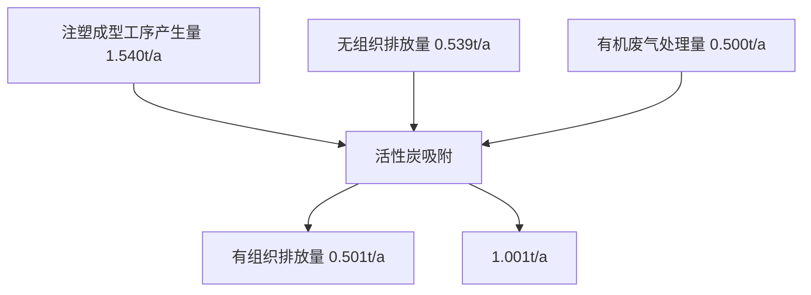
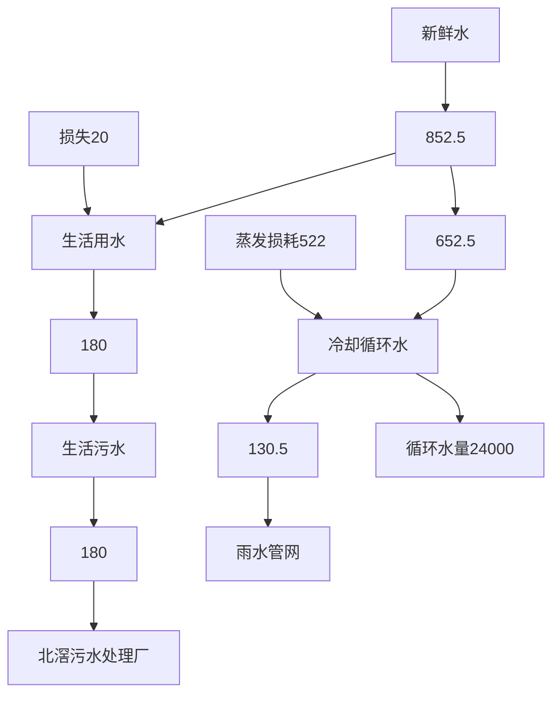
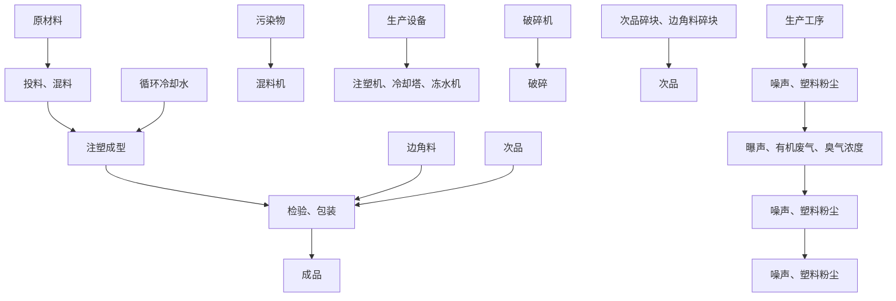
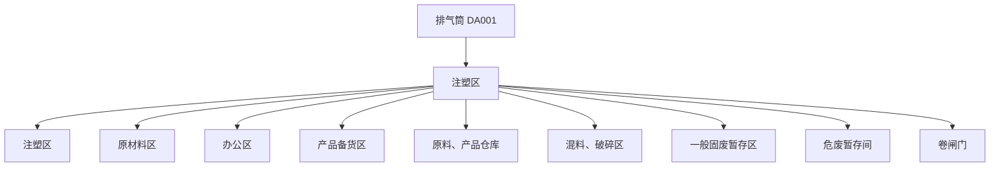

# 建设项目环境影响报告表

（污染影响类）

text_image

海通区柯云电器有限公司
2020-06-17 10:00
海通证券股份有限公司

项目名称：佛山市顺德区柯云电器有限公司迁改扩建项目

建设单位（盖章）： 佛山市顺德区柯云电器有限公司

编制日期： 2024年11月

text_image

生态环境科
中华人民共和国生态环境部制
4406004503144

# 目 录

一、建设项目基本情况.  
二、建设项目工程分析... . 21  
三、区域环境质量现状、环境保护目标及评价标准 41  
四、主要环境影响和保护措施.. .. 47  
五、环境保护措施监督检查清单 . 75  
六、结论... . 77

# 建设项目污染物排放量汇总表（单位：t/a）

附图1 项目地理位置图

附图2 项目四至图

附图3 项目周边环境敏感点分布图

附图4 项目四至实景图

附图5 项目平面布置图

附图6 顺德区环境空气质量功能区划分图

附图7 顺德区水环境功能区划分图

附图8 声环境功能区划分图

附图9 《北滘镇工业园（潭洲水道西）控制性详细规划（修编）》：

附图10 佛山市工业用地红线布局图

附图11 顺德区环境管控单元图

附图12 佛山市环境管控单元图

附图13 广东省“三线一单”数据管理及应用平台位置截图

附图14 项目与最近水源保护区的位置图

附图15 项目污水排放去向图

附件1 营业执照及变更登记通知书

附件2 法定代表人身份证

附件3 租赁合同

附件4 房地产权证

附件5 原环评批复

附件6 原项目排污登记回执

附件7 原项目验收检测报告

附件8 原项目验收意见

附件9 注塑机参数说明书

附件10 环评文件同意公示声明

附件11 环评咨询技术合同

# 一、建设项目基本情况

<table><tr><td>建设项目名称</td><td colspan="3">佛山市顺德区柯云电器有限公司迁改扩建项目</td></tr><tr><td>项目代码</td><td colspan="3">无</td></tr><tr><td>建设单位联系人</td><td></td><td>联系方式</td><td></td></tr><tr><td>建设地点</td><td colspan="3">广东省佛山市顺德区北滘镇顺江社区北滘工业园伟业路5号之一</td></tr><tr><td>地理坐标</td><td colspan="3">东经113°13′5.072′′,北纬22°54′17.439′′</td></tr><tr><td>国民经济行业类别</td><td>C2929塑料零件及其他塑料制品制造</td><td>建设项目行业类别</td><td>二十六、橡胶和塑料制品业29,53、塑料制品业292,其他(年用非溶剂型低VOCs含量涂料10吨以下的除外)</td></tr><tr><td>建设性质</td><td>☑新建(迁建)☑改建☑扩建□技术改造</td><td>建设项目申报情形</td><td>☑首次申报项目□不予批准后再次申报项目□超五年重新审核项目□重大变动重新报批项目</td></tr><tr><td>项目审批(核准/备案)部门(选填)</td><td>无</td><td>项目审批(核准/备案)文号(选填)</td><td>无</td></tr><tr><td>总投资(万元)</td><td>100</td><td>环保投资(万元)</td><td>15</td></tr><tr><td>环保投资占比(%)</td><td>15</td><td>施工工期</td><td>/</td></tr><tr><td>是否开工建设</td><td>☑否□是:____</td><td>用地(用海)面积(m2)</td><td>1300</td></tr><tr><td>专项评价设置情况</td><td colspan="3">无</td></tr><tr><td>规划情况</td><td colspan="3">佛山市顺德高新技术产业开发区扩区规划</td></tr><tr><td>规划环境影响评价情况</td><td colspan="3">规划环境影响评价文件名称:佛山市顺德高新技术产业开发区扩区规划环境影响报告书审查机关:佛山市生态环境局顺德分局。审查文件名称:佛山市生态环境局顺德分局关于佛山市顺德高新技术产业开发区扩区规划环境影响报告书审查情况的复函。</td></tr><tr><td>规划及规划环境影响评价符合性分析</td><td colspan="3">根据《佛山市顺德高新技术产业开发区扩区规划环境影响报告书》,项目与规划及审查意见的相符性分析见表1-1。</td></tr></table>

表 1-1 与佛山市顺德高新技术产业开发区扩区规划环境影响报告书有关准入的条件相符性分析

<table><tr><td>清单类型</td><td>准入要求</td><td>项目情况</td><td>符合性</td></tr><tr><td colspan="4">高新区总体生态环境准入清单</td></tr><tr><td rowspan="5">空间布局约束</td><td>1、引入产业应符合现行有效的《产业结构调整指导目录》、《市场准入负面清单》等相关产业政策的要求。</td><td>根据《市场准入负面清单》,项目不在负面清单内;根据国家发改委《产业结构调整指导目录(2024年本)》、《珠江三角洲地区产业结构调整优化和产业导向目录》的规定,项目不属于上述目录所列的鼓励类、限制类和禁止(淘汰)类项目,根据《促进产业结构调整暂行规定》(国发[2005]40号)第十三条,项目属于允许类,且符合国家有关法律、法规和政策规定。因此,本项目符合《产业结构调整指导目录(2024年本)》、《市场准入负面清单》等相关产业政策的要求。</td><td>符合</td></tr><tr><td>2、禁止引入新增排放重点防控重金属污染物(铅(Pb)、汞(Hg)、镉(Cd)、铬(Cr)和类金属砷(As))、持久性有机污染物的项目。</td><td>项目废气主要是非甲烷总烃,不属于新增排放重点防控重金属污染物(铅(Pb)、汞(Hg)、镉(Cd)、铬(Cr)和类金属砷(As))、持久性有机污染物的项目。</td><td>符合</td></tr><tr><td>3、饮用水源准保护区内不得新建、扩建对水体污染严重、排放一类水污染物和持久性有机污染物的项目,改扩建项目不得新增水污染物。</td><td>项目不在饮用水源准保护区内。</td><td>符合</td></tr><tr><td>4、禁止引入达不到清洁生产国际先进水平的企业。</td><td>本项目属于C2929塑料零件及其他塑料制品制造,根据《国务院办公厅转发发展改革委等部门关于加快推进清洁生产意见的通知》(国发办[2003]100号)和《工业清洁生产评价指标体系编制通则》(GB/T20106-2006),本项目所属行业不属于清洁生产评价指标体系。本项目不涉及清洁生产评价指标。</td><td>符合</td></tr><tr><td>5、在污水管网建设滞后或所依托的污水处理厂处理能力不能满足废水处理需求的区域,不应引入废水排放量较大的项目。扩区南片区在纳污水体水质稳定达标前,应合理控制涉水排放企业规模,优先引入无生产废水或生产废水排放量较小的项目;扩区东北组团应控制废水排放量较大企业的引入,引入涉水排放企业的规模应与区域污水处理厂处理能力相匹配,严格控制废水排放量较大的项目及新增一类水污染物排放项目的引入,避免对下游饮用水源保护区产生不良影响;扩区西北组团在乐从污水处理厂扩容前,应合理控制涉水排放企业引入规模和时序,尤其严格控制废水排放量较大的企业,确保区域污水得到有效收集和处理。</td><td>本项目不涉及。</td><td>符合</td></tr><tr><td></td><td>6、禁止新建、扩建燃煤燃油火电机组和企业自备电站,逐步淘汰生物质锅炉、集中供热管网覆盖区域内的分散供热锅炉,集中供热管网覆盖地区禁止新建、扩建分散供热锅炉,规划区应全部按高污染燃料禁燃区进行管理;禁止新建、扩建水泥、平板玻璃、化学制浆、炼化、炼钢炼铁、电解铝、焦炭、金属冶炼、制浆造纸、鞣革、铅酸蓄电池、专业电镀、木质家具涂装、印染项目;不再新建陶瓷厂(新型特种陶瓷项目除外)。化工项目按照“入园管理”原则合理布局,提高准入门槛,不得新建、扩建纳入国家“高污染、高环境风险”产品名录的生产项目。</td><td>本项目属于C2929塑料零件及其他塑料制品制造,不涉及新建、扩建燃煤燃油火电机组和企业自备电站;不属于新建、扩建水泥、平板玻璃、化学制浆、炼化、炼钢炼铁、电解铝、焦炭、金属冶炼、制浆造纸、鞣革、铅酸蓄电池、专业电镀、木质家具涂装、印染项目;项目不属于“高污染、高环境风险”产品名录的生产项目。</td><td>符合</td></tr><tr><td rowspan="7"></td><td>7、严格控制日用玻璃制造、家具制造、废塑料回收加工再生(列入国家“城市矿产”示范基地项目除外)、专业金属表面处理(铝及铝合金的阳极氧化、铝的表面铬酸盐转化、锌的铬酸盐钝化和金属酸洗、磷化、喷漆、喷涂)等项目建设;严格限制新建生产和使用高挥发性有机物原辅材料的项目,鼓励建设挥发性有机物共性工厂。</td><td>本项目不涉及日用玻璃制造、家具制造、废塑料回收加工再生(列入国家“城市矿产”示范基地项目除外)、专业金属表面处理(铝及铝合金的阳极氧化、铝的表面铬酸盐转化、锌的铬酸盐钝化和金属酸洗、磷化、喷漆、喷涂)等项目建设,且不属于生产和使用高挥发性有机物原辅材料的项目。</td><td>符合</td></tr><tr><td>8、工业企业禁止选址城镇生活空间,生产空间禁止建设居民住宅等敏感建筑;园区工业用地或企业与村庄、学校等环境敏感点之间应设置合理的防护距离,并通过绿化带进行有效隔离,该距离内不得规划新建居民点、办公楼和学校等环境敏感目标。</td><td>本项目选址位于工业用地。</td><td>符合</td></tr><tr><td>9、现有及规划居住区、学校、医院等敏感用地周边50米范围内禁止新建、扩建高噪声排放生产项目;现有及规划居住区、学校、医院等敏感用地周边100米范围内禁止新建、扩建纳入国家“高污染、高环境风险”产品名录的生产项目,不引入酸洗、涂装、注塑、排放恶臭气味的生产工艺和生产设施。</td><td>项目厂界100m内没有敏感点。</td><td>符合</td></tr><tr><td>10、结合《顺德区高质量推动村级工业园升级改造总体规划》,推进区域村级工业园改造工作,禁止重复低水平建设。</td><td>本项目不涉及。</td><td>符合</td></tr><tr><td>11、南片区按照《广东省重金属污染综合防治“十三五”规划》、《佛山市重金属污染综合防治“十三五”规划》的要求,禁止新建、扩建增加重点防控的重金属污染物排放的建设项目,现有技术改造项目应通过实施“区域削减”,实现增产减污;其它区域新、改扩建重金属排放项目。应严格落实重金属总量替代与削减要求,严格控制重点行业发展规模。</td><td>本项目无重金属污染物排放。</td><td>符合</td></tr><tr><td>12、按规划用地布局未来退出的工业企业用地,应严格按照《中华人民共和国土壤污染防治法》开展必要的调查、评估和修复工作,符合要求后,方可用于居住、教育教研、办公等第三产业类用地。</td><td>本项目不涉及。</td><td>符合</td></tr><tr><td>13、其它:符合《佛山市人民政府关于印发佛山市“三线一单”生态环境分区管控方案的通知》(佛府〔2021〕11号)相关管控要求。</td><td>具体见表1-2。</td><td>符合</td></tr><tr><td rowspan="5">污染物排放管控</td><td>1、污染物排放总量不得突破“污染物排放总量管控限值清单”的总量管控要求;重点对重点污染物(重点污染物包括化学需氧量、氨氮、氮氧化物及挥发性有机物等)实施总量控制;上年度重点河涌水质未达到水环境质量目标的管控分区所在镇(街道),须组织编制、系统实施、向社会公开区域重点水污染物减排计划并明确“替代量”,本年度新建、改建、扩建项目新增水环境重点污染物实行区域“减二增一”替代(废水集中处理设施、民生项目除外);在可核查、可监管的基础上,全区新建、改建、扩建项目新增大气重点污染物实行“减二增一”替代。</td><td>本项目新增的大气重点污染物“挥发性有机物”由佛山市生态环境局顺德分局主管部门划拨。项目不涉及废水重点污染物总量控制。</td><td>符合</td></tr><tr><td>2、未完成环境质量改善目标的区域,新改扩建项目重点污染物实施减量替代。</td><td>待项目审批时由生态环境部门根据《关于做好建设项目挥发性有机物(VOCs)排放削减替代工作的补充通知》(粤环函〔2021〕537号)文件要求核定VOCs总量来源。</td><td>符合</td></tr><tr><td>3、未接入污水管网的新建建筑小区或公共建筑,不得交付使用。新建城区生活污水收集处理设施要与城市发展同步规划、同步建设。</td><td>本项目不涉及。</td><td>符合</td></tr><tr><td>4、规划区内建设项目废污水原则上应接入各片区集中式污水处理厂进行集中处理、达标排放;受纳水体或监控断面不达标的,不得新建、扩建向河涌直接排放废水的项目;对于暂时无法接入市政污水管网、且废水量较少的项目,生活污水处理后立足回用,不能回用的,应处理达到《城镇污水处理厂污染物排放标准》(GB18918-2002)后排入政策法规允许排放且有环境容量的水域;生产废水应立足于回用,不能回用的,可考虑委外处置,确需要外排的,应处理达到行业直接排放标准或广东省《水污染物排放限值》(DB44/26-2001)后排入政策法规允许排放且有环境容量的水域。</td><td>项目生活污水经三级化粪处理达标后排至北滘污水处理厂处理。</td><td>符合</td></tr><tr><td>5、向工业集聚区污水集中处理设施或者城镇污水集中处理设施排放工业废水的,应当按照有关规定进行预处理,达到集中处理设施处理工艺要求后方可以排入市政管网进入各片区污水处理厂。企业生活污水达到广东省《水污染物排放限值》(DB44/26-2001)第二时段三级标准后通过污水管线进入各片区所依托的城镇污水处理厂;扩区南片区企业生产废水预处理达到广东省《水污染物排放限值》(DB44/26-2001)第二时段二级标准、行业间接排放要求(有行业间接排放标准要求的)、杏坛污水处理厂接管要求后通过污水管线排入杏坛污水处理厂处理;扩区西北组团企业生产废水预处理达到广东省《水污染物排放限值》(DB44/26-2001)第二时段二级标准、行业间接排放要求(有行业间接排放标准要求的)、乐从污水处理厂接管要求后通过污水管线排入乐从污水处理厂处理;扩区西北组团企业生产废水预处理达到广东省《水污染物排放限值》(DB44/26-2001)</td><td>项目生活污水达到广东省《水污染物排放限值》(DB44/26-2001)第二时段三级标准后排放至北滘污水处理厂处理。</td><td>符合</td></tr><tr><td rowspan="3"></td><td>第二时段三级标准、行业间接排放要求(有行业间接排放标准要求的)、北滘污水处理厂接管要求后通过污水管线排入北滘污水处理厂处理。</td><td></td><td></td></tr><tr><td>6、规划区依托的集中式污水处理设施排放标准应达到或优于《城镇污水处理厂污染物排放标准》(GB18918-2002)一级标准的A标准和广东省《水污染物排放限值》(DB44/26-2001)第二时段一级标准的较严者。</td><td>北滘污水处理厂尾水达到《城镇污水处理厂污染物排放标准》(GB18918-2002)一级A标准及广东省地方标准《水污染物排放限值》(DB44/26-2001)第二时段一级标准的较严值。</td><td>符合</td></tr><tr><td>7、根据《广东省生态环境厅关于2021年工业炉窑、锅炉综合整治重点工作的通知》(粤环函〔2021〕461号)要求,高新区现有燃气锅炉执行《锅炉大气污染物排放标准》(DB 44/765-2019)表2排放标准,新建燃气锅炉废气中氮氧化物执行《锅炉大气污染物排放标准》(DB44/765-2019)表3大气污染物特别排放限值,颗粒物、二氧化硫指标特别排放标准(表3)的执行范围、时间按区域正式发布方案执行;新改建的工业窑炉,如烘干炉、加热炉等,有行业标准或地方排放标准的执行相关行业标准或地方标准,未制订行业排放标准的,参照《广东省关于贯彻落实&lt;工业炉窑大气污染综合治理方案&gt;的实施意见》(粤环函〔2019〕1112号),颗粒物、二氧化硫、氮氧化物排放限值分别不高于30、200、300毫克/立方米;家居涂装工艺废气应该执行《家具制造行业挥发性有机化合物排放标准》(DB44 814-2010)第II时段限值;无行业排放标准的企业,为严格控制区域VOCs排放量,在国家、省未出台行业标准前,金属制品、铝型材、设备制造行业参照执行《表面涂装(汽车制造业)挥发性有机化合物排放标准》(DB44/816-2010);其他行业参照执行《家具制造行业挥发性有机化合物排放标准(DB44/814-2010)》;涉及VOCs无组织排放的企业,除有行业标准的执行相关行业标准之外,其余工业企业VOCs物料储存、转移和输送、工艺工程、设备与管线组件VOCs泄漏,敞开液面等VOCs无组织排放控制要求,以及VOCs无组织排放废气收集处理系统要求执行《挥发性有机物无组织排放控制标准》(GB 37822-2019)要求,厂区内VOCs无组织排放监控点浓度应符合GB37822-2019中表A.1规定的特别排放限值;涉及铸造工艺的,新建企业自2021年1月1日起,现有企业自2023年7月1日起,铸造生产工艺环节和生产设备执行《铸造工业大气污染物排放标准》第II时段限值;制药工业企业执行《制药工业大气污染物排放标准》(GB 37823-2019)表1规定的大气污染物排放限值、企业边界大气污染物浓度限值及其他污染控制要求;合成树脂工业污染物排放标准及其他污染控制要求;分布式能源站项目锅炉烟气执行《火电厂大气污染物排放标准》(GB13223-2011)“表2大气污染物特别排放标准”中所列的燃气轮机组排放浓度限值。</td><td>本项目非甲烷总烃有组织排放执行《合成树脂工业污染物排放限值》(GB31572-2015,含2024年修改单)表4排放限值,项目厂区内挥发性有机物无组织排放监控点浓度满足《固定污染源挥发性有机物综合排放标准》(DB44-2367—2022)表3厂区内VOCs无组织排放限值。本项目颗粒物排放执行广东省地方标准《大气污染物排放限值》(DB44/27-2001)第二时段无组织排放限值。臭气浓度排放执行国家《恶臭污染物排放标准》(GB14554-93)表1新改扩建二级及表2臭气浓度排放标准。</td><td>符合</td></tr><tr><td rowspan="2"></td><td>8、重点加强涉VOCs排放的工业项目的挥发性有机物的源头替代和无组织排放管控,大力推进低VOCs含量原辅材料替代。木制家具制造行业应全面使用水性胶粘剂,替代比例达到100%。家具制造及其他工业涂装项目的水性涂料等低排放VOCs含量涂料占总涂料使用量比例应至少不低于50%。产生VOCs的生产车间须配置废气收集净化装置。排放挥发性有机物的车间必须安装废气收集、回收净化装置,收集率应大于90%;使用溶剂型涂料涂装工艺的VOCs去除率达到90%;家具制造行业有机废气净化率达到80%以上。逐步淘汰单纯一级活性炭吸附、水喷淋+一级活性炭吸附等排放状况不稳定的治理技术。</td><td>由于项目车间内设置行吊用于输送物料,因此项目注塑成型工序废气无法设置为整室密闭负压收集。本项目注塑成型工序废气经半密闭集气罩收集至1套“活性炭吸附”装置处理后再通过15m高排气筒DA001排放。</td><td>符合</td></tr><tr><td>9、其它:符合《佛山市人民政府关于印发佛山市“三线一单”生态环境分区管控方案的通知》(佛府〔2021〕11号)相关管控要求。</td><td>具体见表1-2。</td><td>符合</td></tr><tr><td rowspan="4">环境风险防控</td><td>1、制定园区环境风险事故防范和应急预案。完善区域—园区—工业企业多级联动环境突发事件应急预案,建立预防、应急响应机制和后评估机制,定期开展应急演练,提高区域环境风险防范能力。</td><td>本项目不涉及。</td><td>符合</td></tr><tr><td>2、污水处理厂应采取有效措施,防止事故废水直接排入水体;完善污水处理厂在线监控系统联网,实现污水处理厂的实时、动态监管。</td><td>本项目不涉及。</td><td>符合</td></tr><tr><td>3、生产性废水较多的企业需配套有效措施,防止事故废水和第一类污染物直排污染地表水体,防止因渗漏污染地下水。</td><td>本项目不涉及。</td><td>符合</td></tr><tr><td>4、其它:符合《佛山市人民政府关于印发佛山市“三线一单”生态环境分区管控方案的通知》(佛府〔2021〕11号)相关管控要求。</td><td>具体见表1-2。</td><td>符合</td></tr><tr><td rowspan="4">资源开发利用要求</td><td>1、禁止使用高污染燃料。</td><td>本项目不涉及。</td><td>符合</td></tr><tr><td>2、工业项目原则上单位GDP能耗要低于0.38吨标煤/万元,单位工业增加值新鲜水耗要低于10立方米/万元。</td><td>本项目不涉及。</td><td>符合</td></tr><tr><td>3、新建高能耗项目单位产品(产值)能耗达到国际国内先进水平。</td><td>本项目不涉及。</td><td>符合</td></tr><tr><td>4、其它:符合《佛山市人民政府关于印发佛山市“三线一单”生态环境分区管控方案的通知》(佛府〔2021〕11号)相关管控要求。</td><td>具体见表1-2。</td><td>符合</td></tr><tr><td colspan="4">扩区东北组团E-3生态环境准入要求</td></tr></table>

<table><tr><td>1、结合《顺德区高质量推动村级工业园升级改造总体规划》,推进区域村级工业园改造工作,禁止重复低水平建设。按现行有效的用地规划方案进行建设,非工业用地禁止引入工业生产项目。规划拟由现状工业用地转变为商住用地的区域,原则上禁止引入新的工业生产项目,现有工业项目改扩建须做到减污;对由工业性质转变为居住、教育教研、办公等的地块,应严格按照《中华人民共和国土壤污染防治法》开展必要的调查、评估和修复工作。</td><td>本项目现状用地和规划用地均属于工业用地,不属于非工业用地。本项目属于新建项目,不属于现有工业项目性质转变为居住、教育教研、办公等。</td><td>符合</td></tr><tr><td>2、现状已建工业生产区域应优先完善市政污水管网;污水管网建设滞后或所依托的污水处理厂处理能力不能满足废水处理需求的区域,不应引入废水排放量较大的项目。</td><td>本项目所在的工业园区已配套完善的市政管网。</td><td>符合</td></tr><tr><td>3、禁止引入新增排放重点防控重金属污染物(铅(Pb)、汞(Hg)、镉(Cd)、铬(Cr)和类金属砷(As))、持久性有机污染物的项目。</td><td>本项目不涉及排放重点防控重金属污染物(铅(Pb)、汞(Hg)、镉(Cd)、铬(Cr)和类金属砷(As))、持久性有机污染物。</td><td>符合</td></tr><tr><td>4、临近居住用地等敏感用地的区域应布置轻污染项目,合理控制污染工序规模、适当提高工业生产相关的非生产设施比例。其它临近居住用地等敏感用地、排放废气的项目应严格落实高效的废气治理措施,避免对敏感建筑产生不良影响。如引入废水排放量较大、使用有毒有害物质的项目,应配置有足够的环境风险应急设施,确保生产废水及有毒有害物质不进入饮用水源保护区;园中园项目必须设置足够容量的应急池,以应对内部事故废水及消防废水。</td><td>本项目注塑成型工序废气经半密闭集气罩收集至1套“活性炭吸附”装置处理后再通过15m高排气筒DA001排放。</td><td>符合</td></tr><tr><td>5、提高企业VOCs治理效率,逐步淘汰单纯一级活性炭吸附、水喷淋+一级活性炭吸附等排放状况不稳定的治理技术,升级现有低效的有机废气处理措施(如单纯或单级低温等离子体、UV光解等)。</td><td>本项目注塑成型工序废气经半密闭集气罩收集至1套“活性炭吸附”装置处理后再通过15m高排气筒DA001排放。</td><td>符合</td></tr><tr><td>6、推广新能源汽车和充电基础设施,积极推动重卡LNG加气站、充电基础设施、加氢站建设。新建高能耗项目单位产品(产值)能耗达到国际国内先进水平。7、新建、扩建含蚀刻工序的线路板生产项目和化工项目应在配套污水集中处置的工业园区或生活污水管网覆盖区域内建设。含酸洗、磷化的金属表面处理、金属制品项目(与自身高新技术企业配套的除外),含酸洗、喷涂、拉丝、表面抛光等工艺的不锈钢型材加工项目,应进入以此类项目为主导产业、有相应废水集中治理设施的工业园区,实现集中治污。</td><td>本项目不属于新能源汽车和充电基础设施项目。本项目属于C2929塑料零件及其他塑料制品制造,不属于线路板生产项目和化工项目,且不属于含酸洗、磷化的金属表面处理、金属制品项目(与自身高新技术企业配套的除外),含酸洗、喷涂、拉丝、表面抛光等工艺的不锈钢型材加工项目。</td><td>符合</td></tr><tr><td>8、原则上禁止引入列入“高污染、高环境风险”产品名录等可能影响水环境安全的项目。</td><td>本项目不涉及《环境保护综合名录(2021年版)》中的“高污染、高环境风险”产品名录中的产品</td><td>符合</td></tr><tr><td>9、城镇新区建设实行雨污分流,逐步推进初期雨水收集、处理和资源化利用。住宅、商业体、学校、市场等城镇开发建设项目应当配套或者同步计划建设公共排水设施,公共排水设施或自建排污水设施未能投产运行的,以上涉水项目不得投入使用。</td><td>本项目所在的工业园区已配套完善的市政管网。</td><td>符合</td></tr><tr><td>10、北滘污水处理厂应适时启动扩建工程。</td><td>生活污水经处理后排放至北滘污水处理厂处理。</td><td>符合</td></tr><tr><td>11、大力推进低VOCs含量原辅材料替代,加快涉VOCs重点行业的生产工艺升级改造,推行自动化生产工艺,对达不到要求的VOCs收集及治理设施进行整治提升,逐步淘汰低效VOCs治理设施。</td><td>本项目不涉及高VOCs含量原辅材料的使用。</td><td>符合</td></tr><tr><td>12、其它应符合佛府〔2020〕11号中ZH44060620004北滘镇重点管控区的相关管控要求。</td><td>具体见表1-2。</td><td>符合</td></tr></table>

<table><tr><td rowspan="4">其他符合性分析</td><td colspan="4">1.选址合理性分析本项目位于广东省佛山市顺德区北滘镇顺江社区北滘工业园伟业路5号之一,根据本项目的不动产权证:粤房地证字第1625118号(详见附件4),本项目用地属于工业用地。根据《佛山市人民政府办公室关于印发佛山市工业用地红线划定的通知》(2023年)(佛山市工业用地红线布局图详情见附图9),项目位于万亩工业集聚区,选址与《广东省人民政府办公厅关于印发广东省“节地提质”攻坚行动方案(2023-2025年)的通知》(粤办函〔2023〕57号)要求相符合。综上,项目所在地属于工业用地,本项目未改变用地性质,用地符合当地规划。2.产业政策相符性分析本项目主要从事塑料件的加工生产,项目生产产品、生产工艺和生产设备均不属于《产业结构调整指导目录(2024年本)》中的限制或禁止类别,也不属于国家发展改革委商务部《关于印发&lt;市场准入负面清单(2022年版)的通知&gt;》(发改体改规[2022]397号)“禁止准入类”。3.相关生态环境保护法律法规政策、生态环境保护规划的相符性(1)项目与《环境保护综合名录》(2021年版)相符性分析项目不涉及《环境保护综合名录(2021年版)》中的“高污染、高环境风险”产品名录中的产品,符合《环境保护综合名录》(2021年版)的相关规定。(2)与“三线一单”符合性分析根据《广东省人民政府关于印发广东省“三线一单”生态环境分区管控方案的通知》(粤府〔2020〕71号),详情见附图13。项目符合广东省的“三线一单”生态环境分区管控方案要求。根据《佛山市生态环境局关于印发佛山市“三线一单”生态环境分区管控方案(2024年版)的通知》(佛府〔2024〕20号),项目位于北滘镇重点管控区(管控单元编码:ZH44060620004),项目与管控要求相符性分析如下:表1-2 项目与佛山市“三线一单”要求相符性分析</td></tr><tr><td>管控维度</td><td>管控要求</td><td>本项目情况</td><td>相符性</td></tr><tr><td rowspan="2">区域布局管控</td><td>1-1.【生态/禁止类】单元内的一般生态空间,主导生态功能为水土保持,禁止在25度以上的陡坡地开垦种植农作物,禁止在崩塌、滑坡危险区、泥石流易发区从事采石、取土、采砂等可能造成水土流失的活动。</td><td>本项目不涉及生态禁止类活动。</td><td>符合</td></tr><tr><td>1-2.【产业/鼓励引导类】重点发展机器人及配套产业、智能家用电器、高端新</td><td>本项目不属于产业/鼓励引导类。</td><td>符合</td></tr></table>

<table><tr><td rowspan="7"></td><td>型电子信息、新材料等制造业和总部经济、电子商务、工业设计与文化创意、科技金融等现代服务业,打造智能制造和智慧家电示范区。</td><td></td><td></td></tr><tr><td>1-3.【产业/综合类】系统推进村级工业园升级改造,腾出连片空间,布局产业集聚区和主题产业园,推动工业项目入园集聚发展。</td><td>本项目所在地不属于村级工业园升级改造。本项目位于广东省佛山市顺德区北滘镇顺江社区北滘工业园伟业路5号之一,位于产业聚集区。</td><td>符合</td></tr><tr><td>1-4.【水/限制类】严格限制在佛山市禅城南庄紫洞水厂、佛山市禅城沙口(石湾)水厂、羊额—北滘水厂、广州市南洲水厂顺德水道取水口饮用水水源保护区上游和周边区域建设列入“高污染、高环境风险”产品名录等可能影响水环境安全的项目。</td><td>项目属于C2929塑料零件及其他塑料制品制造,不属于列入“高污染、高环境风险”产品名录的项目,且项目距离羊额—北滘水厂的饮用水水源保护区较远,约680米,不属于饮用水水源保护区上游和周边区域建设项目。</td><td>符合</td></tr><tr><td>1-5.【大气/限制类】大气环境受体敏感重点管控区内,应严格限制新建储油库项目、产生和排放有毒有害大气污染物的建设项目以及使用溶剂型油墨、涂料、清洗剂、胶黏剂等高挥发性有机物原辅材料项目,鼓励现有该类项目搬迁退出。</td><td>本项目不属于大气环境受体敏感重点管控区,不属于储油库项目、也不属于产生和排放有毒有害大气污染物的建设项目以及使用溶剂型油墨、涂料、清洗剂、胶黏剂等高挥发性有机物原辅材料项目。</td><td>符合</td></tr><tr><td>1-6.【大气/鼓励引导类】大气环境高排放重点管控区内,应强化达标监管,引导工业项目落地集聚发展,有序推进区域内行业企业提标改造。</td><td>本项目位于大气环境高排放重点管控区内,项目属于C2929塑料零件及其他塑料制品制造,项目注塑成型工序废气经半密闭集气罩收集至1套“活性炭吸附”装置处理后再通过15m高排气筒DA001排放。</td><td>符合</td></tr><tr><td>1.7.【产业/综合类】划定家具生产优先发展区域,优先发展区外不再新建涉及涂装工艺的木质家具制造项目。优先发展区范围根据家具产业发展规划及其规划环评文件确定。</td><td>项目所在地不属于家具生产优先发展区域,且本项目不属于涉及涂装工艺的木质家具制造项目。</td><td>符合</td></tr><tr><td>1-8.【产业/限制类】受纳水体或监控断面不达标且未“以新带老”制定区域达标方案的河涌,不得新建、扩建向河涌直接排放废水的项目。新建、扩建含蚀刻工序的线路板生产项目和化工项目应在配套污水集中处置的工业园区或生活污水管</td><td>本项目所在地受纳水体监测断面为达标,且本项目无直接向河涌排放废水。项目属于C2929塑料零件及其他塑料制品制造,项目间接冷却水循环使用,定期排入雨水管道。项目生活污水经</td><td>符合</td></tr></table>

<table><tr><td rowspan="8"></td><td></td><td>网覆盖区域内建设;纯加工型印花项目,含酸洗、磷化的金属表面处理、金属制品项目(与自身高新技术企业配套的和区级及以上重点项目除外),含酸洗、喷涂、化学抛光、电解等涉及废水排放工艺的不锈钢型材加工项目(与自身高新技术企业配套的和区级及以上重点项目除外),应进入以此类项目为主导产业、有相应废水集中治理设施的工业园区,实现集中治污。</td><td>三级化粪池预处理后由市政污水管网引入北滘污水处理厂处理。</td><td></td></tr><tr><td rowspan="6">能源资源利用</td><td>2-1【能源/鼓励引导类】推广节能技术,加快发展绿色货运与现代物流。</td><td>本项目不属于能源/鼓励引导类。</td><td>符合</td></tr><tr><td>2-2【能源/鼓励引导类】推广新能源汽车应用和充电基础设施建设,积极推动重卡LNG加气站、充电基础设施、加氢站建设。</td><td>本项目不属于能源/鼓励引导类。</td><td>符合</td></tr><tr><td>2-3.【能源/综合类】科学实施能源消费总量和强度“双控”,新建高能耗项目单位产品(产值)能耗达到国际国内先进水平。</td><td>本项目不属于高能耗项目。</td><td>符合</td></tr><tr><td>2-4.【水资源/综合类】贯彻落实“节水优先”方针,实行最严格水资源管理制度,北滘镇万元国内生产总值用水量、万元工业增加值用水量、用水总量、农田灌溉水有效利用系数等用水总量和效率指标达到区下达要求。</td><td>项目注塑机模具冷却水循环使用,定期排入雨水管道。</td><td>符合</td></tr><tr><td>2-5.【土地资源/限制类】落实单位土地面积投资强度、土地利用强度等建设用地控制性指标要求,提高土地利用效率。</td><td>本项目租用已建成厂房作为经营场所,与本项目实际用途相符合。</td><td>符合</td></tr><tr><td>2-6.【岸线/禁止类】严格水域岸线用途管制,新建项目一律不得违规占用水域。严禁破坏生态的岸线利用行为和不符合其功能定位的开发建设活动,严禁以各种名义侵占河道、围垦湖泊、非法采砂等。</td><td>项目位于工业区内,不在水域岸线范围内。</td><td>符合</td></tr><tr><td>污染物排放管控</td><td>3-1.【水/限制类】城镇新区建设实行雨污分流,逐步推进初期雨水收集、处理和资源化利用。住宅、商业体、学校、市场等城镇开发建设项目应当配套或者同步计划建设公共排水设施,公共排水设施或自建排污水设施未能投产运行的,以上涉水项目不得投入使用。新建小区严格实施雨污分流,阳台、露台等污水接入污水收集系统,将生活污水“应截尽截”。做好大型楼盘、集贸市场、餐饮以及学校等4大类排水户污水接入市政管网工作。</td><td>项目注塑机模具冷却水循环使用,定期排入雨水管道。生活污水经三级化粪池预处理后再通过市政污水管网引入北滘污水处理厂处理。</td><td>符合</td></tr><tr><td rowspan="6"></td><td rowspan="4"></td><td>3-2.【水/综合类】结合村级工业园改造,全面提升产业层次与集聚度,促进污染集中整治。</td><td>本项目所在地不属于村级工业园。</td><td>符合</td></tr><tr><td>3-3.【水/综合类】稳步推进排水设施“三个一体化”管理模式,补齐城乡污水收集和处理短板,推动群力围污水处理厂提质增效,加快消除城中村、老旧城区、城乡结合部等污水收集管网空白区,逐步实现城乡污水收集处理全覆盖。2025年前完成群力围污水处理厂扩建,尾水应执行《城镇污水处理厂污染物排放标准》(GB18918-2002)一级A标准及《广东省水污染物排放限值》(DB44/26-2001)的较严值。</td><td>本项目不属于群力围污水处理厂</td><td>符合</td></tr><tr><td>3-4.【水/综合类】近期保留并完善水口村、三桂村、西滘村、马龙村等现状农村污水分散式处理设施,新建莘村、马龙村等分散式污水处理站建设,继续完善污水支管网建设,提高污水收集处理率,其余行政村(社区)继续完善污水管网建设,实现农村污水100%收集进入市政污水系统,有条件的区域实施雨污分流改造,到2030年全面雨污分流,污水纳入北滘城镇污水处理系统。</td><td>本项目不属于农村污水分散式处理设施。</td><td>符合</td></tr><tr><td>3-5.【大气/综合类】大力推进低VOCs含量原辅材料替代,加快涉VOCs重点行业的生产工艺升级改造,推行自动化生产工艺,对达不到要求的VOCs收集及治理设施进行整治提升,逐步淘汰低效VOCs治理设施。</td><td>项目不涉及使用高挥发性有机物原辅材料,生产过程产生的有机废气产生量较少,项目注塑成型工序废气经半密闭集气罩收集至1套“活性炭吸附”装置处理后再通过15m高排气筒DA001排放。</td><td>符合</td></tr><tr><td rowspan="2">环境风险防控</td><td>4-1.【水/综合类】加强单元内佛山市禅城南庄紫洞水厂、佛山市禅城沙口(石湾)水厂、羊额—北滘水厂、广州市南洲水厂顺德水道取水口饮用水水源保护区周边环境风险源管控,完善突发环境事件应急管理体系。</td><td>距离羊额—北滘水厂的饮用水水源保护区较远,约680米,不属于饮用水水源保护区上游和周边区域建设项目。</td><td>符合</td></tr><tr><td>4-2.【水/综合类】北滘污水处理厂、群力围污水处理厂、工业污水集中处理设施应采取有效措施,防止事</td><td>本项目不属于北滘污水处理厂、群力围污水处理厂、工业污水集中处理设</td><td>符合</td></tr></table>

<table><tr><td rowspan="2"></td><td>故废水直接排入水体。完善污水处理厂在线监控系统联网,实现污水处理厂的实时、动态监管。</td><td>施项目。</td><td></td></tr><tr><td>4-3.【风险/综合类】加强环境风险分级分类管理,强化金属制品、有色金属和压延加工、化学原料和化学品制造业等涉重金属、化工行业企业及工业园区等重点环境风险源的环境风险防控。</td><td>本项目属于C2929塑料零件及其他塑料制品制造,项目不属于金属制品、有色金属和压延加工、化学原料和化学品制造业等涉重金属、化工行业企业。</td><td>符合</td></tr></table>

根据《佛山市顺德区人民政府关于印发佛山市顺德区“三线一单”生态环境分区管控方案的通知》（顺府发〔2021〕11号），项目位于北滘镇重点管控区（管控单元编码：ZH44060620004），详情见附图 11。项目与管控要求相符性分析如下：

表1-3 项目与北滘镇重点管控区管控要求相符性分析

<table><tr><td>管控维度</td><td>管控要求</td><td>本项目情况</td><td>相符性</td></tr><tr><td rowspan="5">区域布局管控</td><td>1-1.【生态/禁止类】单元内的一般生态空间,主导生态功能为水土保持,禁止在25度以上的陡坡地开垦种植农作物,禁止在崩塌、滑坡危险区、泥石流易发区从事采石、取土、采砂等可能造成水土流失的活动。</td><td>本项目租用已建设厂房进行生产,不涉及土建施工,且项目属于C2929塑料零件及其他塑料制品制造,不涉及采石、取土、采砂。</td><td>符合</td></tr><tr><td>1-2.【产业/鼓励引导类】重点发展机器人及配套产业、智能家用电器、高端新型电子信息、新材料等制造业和总部经济、电子商务、工业设计与文化创意、科技金融等现代服务业,打造智能制造和智慧家电示范区。</td><td>本项目属于C2929塑料零件及其他塑料制品制造,产品为塑料件。项目不属于产业/鼓励引导类。</td><td>符合</td></tr><tr><td>1-3.【产业/综合类】产业聚集区所属地块内的工业用地或企业与村庄、学校等环境敏感点之间应设置合理的大气环境防护距离,并通过绿化带进行有效隔离;聚集区规划布局应注重大气污染排放企业应尽量避免布局在居住用地的常年主导风向的上风向。</td><td>本项目周边100米范围内无大气环境敏感点。</td><td>符合</td></tr><tr><td>1-4.【产业/综合类】系统推进村级工业园升级改造,腾出连片空间,布局产业集聚区和主题产业园,推动工业项目入园集聚发展。新增工业制造业用地原则上安排在产业集聚区内,产业集聚区外原则上不鼓励工业及物流仓储用地的新建与改造。</td><td>本项目所在地不属于村级工业园升级改造。本项目位于广东省佛山市顺德区北滘镇顺江社区北滘工业园伟业路5号之一,位于产业聚集区。</td><td>符合</td></tr><tr><td>1-5.【产业/限制类】受纳水体或监控断面不达标的,不得新建、扩建向河涌直接排放废水的项目。新建、扩建</td><td>项目属于C2929塑料零件及其他塑料制品制造,项目间接冷却水循</td><td>符合</td></tr></table>

<table><tr><td rowspan="8"></td><td rowspan="5"></td><td>含蚀刻工序的线路板生产项目和化工项目应在配套污水集中处置的工业园区或生活污水管网覆盖区域内建设;纯加工型印花项目,含酸洗、磷化的金属表面处理、金属制品项目(与自身高新技术企业配套的除外),含酸洗、喷涂、化学抛光、电解等涉及废水排放工艺的不锈钢型材加工项目(与自身高新技术企业配套的除外),应进入以此类项目为主导产业、有相应废水集中治理设施的工业园区,实现集中治污。</td><td>环使用,定期排入雨水管道。项目生活污水经三级化粪池预处理后由市政污水管网引入北滘污水处理厂处理。</td><td></td></tr><tr><td>1-6.【产业/综合类】划定家具生产优先发展区域,优先发展区外不再新建涉及涂装工艺的木质家具制造项目。</td><td>本项目属于C2929塑料零件及其他塑料制品制造,项目不属于木质家具制造项目。</td><td>符合</td></tr><tr><td>1-7.【水/限制类】严格限制在佛山市禅城南庄紫洞水厂、佛山市禅城沙口(石湾)水厂、羊额—北滘水厂、广州市南洲水厂顺德水道取水口饮用水水源保护区上游和周边区域建设列入“高污染、高环境风险”产品名录等可能影响水环境安全的项目。</td><td>项目属于C2929塑料零件及其他塑料制品制造,项目注塑机模具冷却水循环使用,定期排入雨水管道。生活污水经三级化粪池预处理后再通过市政污水管网引入北滘污水处理厂处理。</td><td>符合</td></tr><tr><td>1-8.【大气/限制类】大气环境受体敏感重点管控区内,应严格限制新建储油库项目、产生和排放有毒有害大气污染物的建设项目以及使用溶剂型油墨、涂料、清洗剂、胶黏剂等高挥发性有机物原辅材料项目,鼓励现有该类项目搬迁退出。</td><td>本项目不属于储油库项目、也不属于产生和排放有毒有害大气污染物的建设项目以及使用溶剂型油墨、涂料、清洗剂、胶黏剂等高挥发性有机物原辅材料项目。</td><td>符合</td></tr><tr><td>1-9.【大气/鼓励引导类】大气环境高排放重点管控区内,应强化达标监管,引导工业项目落地集聚发展,有序推进区域内行业企业提标改造。</td><td>本项目不属于大气环境高排放重点管控区内项目。</td><td>符合</td></tr><tr><td rowspan="3">能源资源利用</td><td>2-1【能源/鼓励引导类】推广节能技术,加快发展绿色货运与现代物流。</td><td>本项目不属于能源/鼓励引导类。</td><td>符合</td></tr><tr><td>2-2【能源/鼓励引导类】推广新能源汽车应用和充电基础设施建设,积极推动重卡LNG加气站、充电基础设施、加氢站建设。</td><td>本项目不属于能源/鼓励引导类。</td><td>符合</td></tr><tr><td>2-3.【能源/综合类】科学实施能源消费总量和强度“双控”,新建高能耗项目单位产品(产值)能耗达到国际国内先进水平。</td><td>本项目不属于高能耗项目。</td><td>符合</td></tr><tr><td rowspan="7"></td><td rowspan="3"></td><td>2-4.【水资源/综合类】贯彻落实“节水优先”方针,实行最严格水资源管理制度,北滘镇万元国内生产总值用水量、万元工业增加值用水量、用水总量、农田灌溉水有效利用系数等用水总量和效率指标达到区下达要求。</td><td>项目注塑机模具冷却水循环使用,定期排入雨水管道。</td><td>符合</td></tr><tr><td>2-5.【土地资源/限制类】落实单位土地面积投资强度、土地利用强度等建设用地控制性指标要求,提高土地利用效率。</td><td>本项目租用已建成厂房作为经营场所,与本项目实际用途相符合。</td><td>符合</td></tr><tr><td>2-6.【岸线/禁止类】严格水域岸线用途管制,新建项目一律不得违规占用水域。严禁破坏生态的岸线利用行为和不符合其功能定位的开发建设活动,严禁以各种名义侵占河道、围垦湖泊、非法采砂等。</td><td>项目位于工业区内,不在水域岸线范围内。</td><td>符合</td></tr><tr><td rowspan="4">污染物排放管控</td><td>3-1.【水/限制类】城镇新区建设实行雨污分流,逐步推进初期雨水收集、处理和资源化利用。住宅、商业体、学校、市场等城镇开发建设项目应当配套或者同步计划建设公共排水设施,公共排水设施或自建排污水设施未能投产运行的,以上涉水项目不得投入使用。新建小区严格实施雨污分流,阳台、露台等污水接入污水收集系统,将生活污水“应截尽截”。做好大型楼盘、集贸市场、餐饮以及学校等4大类排水户污水接入市政管网工作。</td><td>项目注塑机模具冷却水循环使用,定期排入雨水管道。生活污水经三级化粪池预处理后再通过市政污水管网引入北滘污水处理厂处理。</td><td>符合</td></tr><tr><td>3-2.【水/综合类】结合村级工业园改造,全面提升产业层次与集聚度,促进污染集中整治。</td><td>本项目所在地不属于村级工业园。</td><td>符合</td></tr><tr><td>3-3.【水/综合类】稳步推进排水设施“三个一体化”管理模式,补齐城乡污水收集和处理短板,推动群力围污水处理厂提质增效,加快消除城中村、老旧城区、城乡结合部等污水收集管网空白区,逐步实现城乡污水收集处理全覆盖。2025年前完成群力围污水处理厂扩建,尾水应执行《城镇污水处理厂污染物排放标准》(GB18918-2002)一级A标准及《广东省水污染物排放限值》(DB44/26-2001)的较严值。</td><td>本项目不属于群力围污水处理厂</td><td>符合</td></tr><tr><td>3-4.【水/综合类】近期保留并完善水口村、三桂村、西滘村、马龙村等现状农村污水分散式处理设施,新建莘村、马龙村等分散式污水处理站建设,继续完善污水支管网建设,提高污水收集处理率,其余行政村(社区)继续完善污水管网建设,实现农村污水100%收集进入市政污水系统,有条件的区域实施雨污分流改造,到2030年全面雨污分流,污水纳入北滘城镇污水处理系统。</td><td>本项目不属于农村污水分散式处理设施。</td><td>符合</td></tr><tr><td rowspan="8"></td><td rowspan="2"></td><td>3-5.【水/综合类】产业集聚区和主题园区内做好污水管网和污水集中处理设施的配套保障,确保废水收集到城镇污水处理厂、园区污水处理厂或分散式污水处理设施集中处置。</td><td>本项目实行雨污分流。生活污水纳入北滘污水处理厂处理系统。</td><td>符合</td></tr><tr><td>3-6.【大气/综合类】大力推进低VOCs含量原辅材料替代,加快涉VOCs重点行业的生产工艺升级改造,推行自动化生产工艺,对达不到要求的VOCs收集及治理设施进行整治提升,逐步淘汰低效VOCs治理设施。</td><td>项目不涉及使用高挥发性有机物原辅材料,生产过程产生的有机废气产生量较少,项目注塑成型工序废气经半密闭集气罩收集至1套“活性炭吸附”装置处理后再通过15m高排气筒DA001排放。</td><td>符合</td></tr><tr><td rowspan="3">环境风险防控</td><td>4-1.【水/综合类】加强单元内佛山市禅城南庄紫洞水厂、佛山市禅城沙口(石湾)水厂、羊额—北滘水厂、广州市南洲水厂顺德水道取水口饮用水水源保护区周边环境风险源管控,完善突发环境事件应急管理体系。</td><td>距离羊额—北滘水厂的饮用水水源保护区较远,约680米,不属于饮用水水源保护区上游和周边区域建设项目。</td><td>符合</td></tr><tr><td>4-2.【水/综合类】北滘污水处理厂、群力围污水处理厂、工业污水集中处理设施应采取有效措施,防止事故废水直接排入水体。完善污水处理厂在线监控系统联网,实现污水处理厂的实时、动态监管。</td><td>本项目不属于北滘污水处理厂、群力围污水处理厂、工业污水集中处理设施项目。</td><td>符合</td></tr><tr><td>4-3.【风险/综合类】加强环境风险分级分类管理,强化金属制品、有色金属和压延加工、化学原料和化学品制造业等涉重金属、化工行业企业及工业园区等重点环境风险源的环境风险防控。</td><td>本项目属于C2929塑料零件及其他塑料制品制造,项目不属于金属制品、有色金属和压延加工、化学原料和化学品制造业等涉重金属、化工行业企业。</td><td>符合</td></tr><tr><td colspan="4">4.项目挥发性有机物污染物治理政策的相符性分析本项目与挥发性有机污染物治理政策的相符性分析详见下表:表1-4 项目与有机污染物治理政策的相符性</td></tr><tr><td>序号</td><td>政策要求</td><td>工程内容</td><td>符合性</td></tr><tr><td colspan="4">1.《广东省涉挥发性有机物(VOCs)重点行业治理指引》的通知(粤环办[2021]43号)</td></tr></table>

<table><tr><td rowspan="5"></td><td>1.1</td><td colspan="2">废气收集系统的输送管道应密闭。废气收集系统应在负压下运行,若处于正压状态,应对管道组件的密封点进行泄漏检测,泄漏检测值不应超过500μmol/mol,亦不应有感官可察觉泄漏。</td><td>项目废气收集系统在负压下运行。</td><td>符合</td></tr><tr><td>1.2</td><td colspan="2">VOCs治理设施应与生产工艺设备同步运行,VOCs治理设施发生故障或检修时,对应的生产工艺设备应停止运行,待检修完毕后同步投入使用;生产工艺设备不能停止运行或不能及时停止运行的,应设置废气应急处理设施或采取其他替代措施。</td><td>项目生产必须开启风机,有效减少无组织排放废气。废气收集处理系统发生故障或检修时,所有产生废气的工序停止运行,待检修完毕后再投入生产。</td><td>符合</td></tr><tr><td rowspan="2">1.3</td><td rowspan="2">工艺过程</td><td>粉状、粒状VOCs物料采用气力输送方式或采用密闭固体投料器等给料方式密闭投加;无法密闭投加的,在密闭空间内操作,或进行局部气体收集,废气排至除尘设施、VOCs废气收集处理系统。</td><td>项目使用的塑料粒和色母均为固态,常温条件下不会产生有机废气。在转移过程中均使用密闭的包装袋封装。</td><td rowspan="2">符合</td></tr><tr><td>在混合/混炼、塑炼/塑化/熔化、加工成型(挤出、注射、压制、压延、发泡、纺丝等)、硫化等作业中应采用密闭设备或在密闭空间中操作,废气应排至VOCs废气收集处理系统;无法密闭的,应采取局部气体收集措施,废气应排至VOCs废气收集处理系统。</td><td>由于项目注塑车间内设置行吊用于输送物料,因此项目注塑成型工序废气无法设置为整室密闭负压收集。项目注塑成型工序废气经半密闭集气罩收集至1套“活性炭吸附”装置处理后再通过15m高排气筒DA001排放。</td></tr><tr><td>1.4</td><td>排放水平</td><td>塑料制品行业:a)有机废气排气筒排放浓度不高于广东省《大气污染物排放限值》(DB4427-2001)第II时段排放限值,合成革和人造革制造企业排放浓度不高于《合成革与人造革工业污染物排放标准》(GB21902-2008)排放限值,若国家和我省出台并实施适用于塑料制品制造业的大气污染物排放标准,则有机废气排气筒排放浓度不高于相应的排放限值;车间或生产设施排气中NMHC初始排放速率≥3kg/h时,建设VOCs处理设施且处理效率≥80%;b)厂区内无组织排放监控点NMHC的小时平均浓度值不超过6mg/m3任意一次浓度值不超过 $20mg/m^3$ 。</td><td>本项目非甲烷总烃有组织排放执行《合成树脂工业污染物排放限值》(GB31572-2015,含2024年修改单)表4排放限值(非甲烷总烃≤100mg/m3)不高于广东省《大气污染物排放限值》(DB4427-2001)第II时段排放限值(非甲烷总烃≤120mg/m3);本项目非甲烷总烃的最大产生速率小3kg/h。b、项目厂区内有机废气排放可达到《固定污染源挥发性有机物综合排放标准》(DB44/2367-2022)表3厂区内VOCs无组织排放限值规定。</td><td>符合</td></tr><tr><td rowspan="10"></td><td>1.5</td><td rowspan="2">管理台账</td><td>建立废气收集处理设施台账,记录废气处理设施进出口的监测数据(废气量、浓度、温度、含氧量等)、废气收集与处理设施关键参数、废气处理设施相关耗材(吸收剂、吸附剂、催化剂等)购买和处理记录。</td><td>企业拟建立废气收集处理设施台账,根据《排污单位自行监测技术指南橡胶和塑料制品》(HJ1207-2021)等相关要求定期自行监测,并且记录相关监测数据和废气处理设施中活性炭的购买量和处理记录。</td><td>符合</td></tr><tr><td>1.6</td><td>建立危废台账,整理危废处置合同、转移联单及危废处理方式资质佐证材料。</td><td>企业拟建立危险废物台账,定期将危险废物交给有资质的单位处理,整理危废处理合同、转移联单等资料。</td><td>符合</td></tr><tr><td colspan="5">2.《固定污染源挥发性有机物综合排放标准》(DB44/2367-2022)</td></tr><tr><td>2.1</td><td colspan="2">VOCs物料储存无组织排放控制要求</td><td rowspan="3">项目含VOCs物料主要为塑料粒,常温下不挥发,储存在仓库内;工艺生产过程产生的有机废气采用半密闭集气罩收集至1套“活性炭吸附”装置处理后再通过15m高排气筒DA001排放,减少无组织排放。</td><td>符合</td></tr><tr><td>2.2</td><td colspan="2">VOCs物料转移和输送无组织排放控制要求</td><td>符合</td></tr><tr><td>2.3</td><td colspan="2">工艺过程VOCs无组织排放控制要求</td><td>符合</td></tr><tr><td colspan="5">3.关于印发《重点行业挥发性有机物综合治理方案》的通知(环大气[2019]53号)</td></tr><tr><td>3.1</td><td colspan="2">通过使用水性、粉末、高固体分、无溶剂、辐射固化等低VOCs含量的涂料,水性、辐射固化、植物等低VOCs含量的油墨,水基、热熔、无溶剂、辐射固化、改性、生物降解等低VOCs含量的胶粘剂,以及低VOCs含量、低反应活性的清洗剂等,替代溶剂型涂料、油墨、胶粘剂、清洗剂等,从源头减少VOCs产生。</td><td>本项目使用的原材料无自然状态下可挥发性的物料,满足相关标准要求。</td><td>符合</td></tr><tr><td>3.2</td><td colspan="2">重点对含VOCs物料(包括含VOCs原辅材料、含VOCs产品、含VOCs废料以及有机聚合物材料等)储存、转移和输送、设备与管线组件泄漏、敞开液面逸散以及工艺过程等五类排放源实施管控,通过采取设备与场所密闭、工艺改进、废气有效收集等措施,削减VOCs无组织排放。</td><td>本项目注塑成型工序废气经半密闭集气罩收集至1套“活性炭吸附”装置处理后再通过15m高排气筒DA001排放。</td><td>符合</td></tr><tr><td>3.3</td><td colspan="2">提高废气收集率,遵循“应收尽收、分质收集”的原则,科学设计废气收集系统,将无组织排放转变为有组织排放进行控制。采用全密闭集气罩或密闭空间的,除行业有特殊要求外,</td><td>本项目注塑成型工序废气半密闭集气罩收集至1套“活性炭吸附”装置处理后再通过15m高排气筒DA001排放。</td><td>符合</td></tr><tr><td rowspan="8"></td><td></td><td>应保持微负压状态,并根据相关规范合理设置通风量。采用局部集气罩的,距集气罩开口面最远处的VOCs无组织排放位置,控制风速应不低于0.3米/秒,有行业要求的按相关规定执行。</td><td></td><td colspan="2"></td></tr><tr><td colspan="5">4.《顺德区重点行业挥发性有机物总量指标管理工作方案(2023年修订)》(顺环委办(2023)19号)</td></tr><tr><td>4.1</td><td>涉VOCs排放项目,实现本行政区域内污染源“点对点”2倍量削减替代,由项目所在镇街分局出具VOCs总量指标来源及替代削减方案的意见,开展总量替代。</td><td>项目VOCs排放总量指标为1.040t/a,由顺德环境主管部门出具VOCs总量指标来源及替代削减方案的意见。</td><td colspan="2">符合</td></tr><tr><td colspan="5">5.佛山市发展和改革局 佛山市生态环境局关于印发《佛山市关于进一步加强塑料污染治理的实施方案》的通知(2020-年11月09日发布)</td></tr><tr><td>5.1</td><td>全市范围内禁止生产和销售厚度小于0.025毫米的超薄塑料购物袋、厚度小于0.01毫米的聚乙烯农用地膜。禁止以医疗废物为原料制造塑料制品;禁止将回收利用的废塑料输液袋(瓶)用于原用途或用于制造餐饮容器以及玩具等儿童用品。加大禁止“洋垃圾”进口监管和打私力度,确保“全面禁止废塑料进口”落实到位。到2020年底,禁止生产和销售一次性发泡塑料餐具、一次性塑料棉签;禁止生产含塑料微珠的日化产品。到2022年底,禁止销售含塑料微珠的日化产品。《产业结构调整指导目录(2024年本)》和《市场准入负面清单》明确的属于淘汰类的塑料制品项目,禁止投资;属于限制类项目,禁止新建。</td><td>本项目产品为塑料件,生产工艺主要为注塑成型,不涉及发泡工序。项目产品不属于禁止生产项目及限制类项目。</td><td colspan="2">符合</td></tr><tr><td colspan="5">6、《广东省塑料制品与制造业挥发性有机物综合整治技术指南》</td></tr><tr><td>6.1</td><td>粉状、粒状VOCs物料投加,宜采用气力输送方式或采用密闭固体投料器等给料方式密闭投加。</td><td>本项目塑料投料采用气力输送方式密闭投加。</td><td colspan="2">符合</td></tr><tr><td>6.2</td><td>若采用活性炭吸附技术,采用颗粒活性炭作为吸附剂时,其碘值不宜低于800mg/g;采用蜂窝活性炭作为吸附剂时,其碘值不宜低650mg/g;采用活性炭纤维作为吸附剂时,其比表面积不低于 $1100m^2/g$ (BET法)。工作温度和湿度应符合:温度T&lt;40°C、湿度RH&lt;60%;活性炭表面不应有积尘和积水;活性炭吸附箱是否足额装填活性炭(1吨活性炭通常只能吸附0.1~0.2吨VOCs。</td><td>本项目采用碘值不宜低于800mg/g的颗粒状活性炭对有机废气进行吸附处理,能满足1吨活性炭最少吸附0.15吨有机废气。</td><td colspan="2">符合</td></tr><tr><td rowspan="4"></td><td colspan="5">7.佛山市顺德区人民政府办公室关于印发《佛山市顺德区生态环境保护“十四五”规划(2021-2025)》的通知</td></tr><tr><td>7.1</td><td>持续推进重点行业VOCs整治。持续开展挥发性有机物专项整治,继续推进重点行业企业开展销号式综合整治,建立VOC重点监管企业名单并动态更新,督促企业建立VOCs管控台账清单;持续探寻高效节能的VOCs治理技术,对采用低温等离子、光氧化、光催化等低效治理工艺的企业在臭氧污染天气应对期间实施停限产或错峰生产,并推动企业逐步淘汰低效治理工艺。</td><td>本项目VOCs采用活性炭装置治理。</td><td colspan="2">符合</td></tr><tr><td>7.2</td><td>加强VOCs源头替代和无组织排放管控。大力推进低VOCs含量、低反应活性的原辅材料替代,将全面使用低VOCs含量原辅材料的企业纳入正面清单和政府绿色采购清单。鼓励重点行业企业开展生产工艺和设备水性化改造,推广使用水性、高固体分、无溶剂、粉末等低VOCs含量涂料。严格落实《挥发性有机物无组织排放控制标准》,开展厂区内无组织排放浓度监测,加强对含VOCs物料储存、转移和运输、设备与管线组件泄漏、敞开页面逸散以及工艺过程等五类排放源的管控。</td><td>本项目不生产和使用高挥发性有机物原辅材料。</td><td colspan="2">符合</td></tr><tr><td colspan="5">综上分析,项目总体符合相关挥发性有机废气文件要求。</td></tr></table>

# 二、建设项目工程分析

<table><tr><td>建设内容</td><td>1.项目概况佛山市顺德区柯云电器有限公司原厂址为“广东省佛山市顺德区北滘镇顺江社区三乐东路28号华智科创中心11栋301室”,2023年6月,佛山市顺德区柯云电器有限公司委托广东顺德蓝瀚环境科技有限公司编制了《佛山市顺德区柯云电器有限公司迁改建项目环境影响报告表》,并于2023年7月10日取得《佛山市生态环境局关于〈佛山市顺德区柯云电器有限公司迁改建项目环境影响报告表〉的批复》,审批文号为:佛环0306环审(2023)21号(详情见附件5)。原环评审批的规模为:年产塑料件160万件(约256吨),主要生产设备:注塑机15台、混料机3台、破碎机2台、冷却塔1台、空压机1台、铣床1台、磨床1台。原项目已于2023年11月22日在全国排污许可证管理信息平台填报排污登记表,登记编号为:91440606MA56MA3N6B001X(详情见附件6)。2024年1月12日,进行自主验收,原项目竣工环境保护自主验收意见详见附件8。原项目验收的规模为:年产塑料件160万件(约256吨)。主要生产设备:注塑机15台、混料机3台、破碎机2台、冷却塔1台、空压机1台、铣床1台、磨床1台。原项目验收规模和环评审批规模一致。现由于经营发展需要,项目拟申请办理迁改扩建环评审批手续,迁改扩建的主要内容如下:(1)项目由原厂址“广东省佛山市顺德区北滘镇顺江社区三乐东路28号华智科创中心11栋301室”搬迁至“广东省佛山市顺德区北滘镇顺江社区北滘工业园伟业路5号之一(厂址中心卫星坐标:东经113°13′5.072′′,北纬22°54′17.439′′)”;(2)扩增9台注塑机、1台混料机、1台破碎机、1台冻水机;(3)扩大产品产能,塑料件产量增加315万件/年(约314.22吨/年);(4)改变产品“塑料件”的种类;(5)取消注塑机模具在厂内维修加工,改为外发维修;(6)改建现有注塑治理设施,包括增加废气处理规模,以及按有关要求对活性炭吸附装置进行重新设计,吸附剂使用颗粒状活性炭代替蜂窝活性炭。项目迁改扩建后,占地面积约1300m2,总投资100万元,其中拟用于污染防治资金15万元。年产塑料件475万件(约570.22吨),主要生产设备:注塑机24台、混料机4台、破碎机3台、冷却塔1台、空压机1台、冻水机1台。根据《中华人民共和国环境影响评价法》(2018年12月29日修订)、《建设项目环境影响评价分类管理名录》(2021年1月1日起实施行)和《建设项目环境保护管理条例》</td></tr></table>

（2017 年 10 月 1 日施行）等有关建设项目环境保护管理的规定，本项目属于“二十六、橡胶和塑料制品业 29，53、塑料制品业 292”中的“其他”类别，因此，本项目应编制环境影响报告表。受佛山市顺德区柯云电器有限公司的委托，我司组织环评工作人员勘查项目拟建场地，考察项目周边地区情况，并收集相关资料，根据《建设项目环境影响报告表编制技术指南（污染影响类）（试行）》及其他有关文件要求，编制完成该项目的环境影响报告表。

# 2.项目组成

项目的主要建设组成见表 2-1。

表 2-1 项目建设组成一览表

<table><tr><td>工程</td><td>工程名称</td><td>迁改扩建前</td><td>迁改扩建后</td><td>变化情况</td></tr><tr><td>主体工程</td><td>生产车间</td><td>面积:1441.6m2,层高约6m,所在建筑物高约60m。主要功能包括:混料区(约150m2)、注塑区(约250m2)、破碎区(约40m2)和注塑机模具维修区(约200m2)、仓库(约400m2)办公区(约80m2)、车间通道等。</td><td>面积:1300m2,层高约7.5m,所在建筑物高约7.5m。主要功能包括:混料和破碎区(约120m2)、注塑区(约600m2)、原材料区(约100m2)、原料和产品仓库(约200m2)办公区(约130m2)、车间通道等。</td><td>车间地址改变,扩增9台注塑机、1台混料机、1台破碎机、1台冻水机,改变产品“塑料件”的种类,取消注塑机模具维修。</td></tr><tr><td>辅助工程</td><td>办公室</td><td>位于生产车间内,约80m2,用于日常办公和业务接待。</td><td>位于新车间内,约80m2,用于日常办公和业务接待。</td><td>位于新车间内</td></tr><tr><td rowspan="3">公用工程</td><td>供水</td><td>由市政自来水厂供给,包括生活用水和冷却用水。</td><td>由市政自来水厂供给,包括生活用水和冷却用水。</td><td>不变</td></tr><tr><td>排水</td><td>生活污水经三级化粪池预处理后排入北滘污水处理厂处理。冷却水循环使用,不外排,定期补充蒸发损耗。</td><td>生活污水经三级化粪池预处理后排入北滘污水处理厂处理。冷却水循环使用,定期排入雨水管道,定期补充蒸发损耗。</td><td>冷却水循环使用,定期排入雨水管道。</td></tr><tr><td>供电</td><td>由市政电网提供</td><td>由市政电网提供</td><td>不变</td></tr><tr><td rowspan="3">环保工程</td><td rowspan="2">污水治理</td><td>生活污水经三级化粪池预处理后排入北滘污水处理厂处理。</td><td>生活污水经三级化粪池预处理后排入北滘污水处理厂处理。</td><td>不变</td></tr><tr><td>冷却水循环使用,不外排,定期补充蒸发损耗。</td><td>冷却水循环使用,定期排入雨水管道,定期补充蒸发损耗。</td><td>冷却水循环使用,定期排入雨水管道。</td></tr><tr><td>废气处理</td><td>注塑成型工序废气经包围型集气罩收集至“活性炭吸附”装置处理后再通过62m</td><td>注塑成型工序废气经半密闭集气罩收集至1套“活性炭吸附”装置处理</td><td>集气罩升级改造为半密闭集气罩,增加治理</td></tr></table>

<table><tr><td rowspan="6"></td><td rowspan="6"></td><td rowspan="2"></td><td>高排气筒DA001排放。治理设施风机收集风量约 $1000m^{3}/h$ 。</td><td>后再通过 $15m$ 高排气筒DA001排放。改建注塑废气治理设施,废气处理规模增至 $17000m^{3}/h$ ,按有关要求对活性炭吸附装置进行重新设计,吸附剂使用颗粒状活性炭代替蜂窝活性炭。排放口位置位于新厂址,排气筒高度改为 $15m$ 。</td><td>设施风机收集风量约 $7000m^{3}/h$ ,活性炭箱使用颗粒状活性炭代替蜂窝活性炭。排放口位置位于新厂址,排气筒高度改为 $15m$ 。</td></tr><tr><td>投料、混料和破碎工序产生的粉尘经加强车间通风排气后以无组织形式排放。</td><td>投料、混料和破碎工序产生的粉尘经加强车间通风排气后以无组织形式排放。</td><td>不变</td></tr><tr><td>噪声治理</td><td>选用低噪声设备,设备基础减振,合理布局。</td><td>选用低噪声设备,设备基础减振,合理布局。</td><td>不变</td></tr><tr><td rowspan="3">固废处理</td><td>生活垃圾定期委托环卫部门统一收集处理。</td><td>生活垃圾定期委托环卫部门统一收集处理。</td><td>不变</td></tr><tr><td>一般工业固废暂存于一般固废暂存区( $5m^{2}$ ),并定期交由资源回收公司回收处理。</td><td>一般工业固废暂存于新厂址的一般固废暂存区( $5m^{2}$ ),并定期交由资源回收公司回收处理。</td><td>一般工业固废暂存于新厂址的一般固废暂存区。</td></tr><tr><td>危险废物暂存于危废暂存间(约 $5m^{2}$ ),并定期交由持有相应资质的单位处理。</td><td>危险废物暂存于新厂址的危废暂存间(约 $7m^{2}$ ),并定期交由持有相应资质的单位处理。</td><td>危险废物暂存于新厂址,扩大危废暂存间面积至 $7m^{2}$ 。</td></tr></table>

# 3.主要产品及产能

项目产品规模情况如下表所示：

表 2-2 项目产品产能一览表

<table><tr><td>序号</td><td>名称</td><td>迁改扩建前</td><td>迁改扩建后</td><td>增减量</td></tr><tr><td>1</td><td>塑料件</td><td>160万件/年(256吨/年)</td><td>475万件/年(570.22吨/年)</td><td>+315万件/年(约314.22吨/年)</td></tr></table>

备注：①“+”表示增加，“－”表示减少；②迁改扩建前产品的年产量为原项目验收的年产量。

表 2-3 本项目产品重量一览表

<table><tr><td rowspan="2">序号</td><td rowspan="2">产品名称</td><td rowspan="2">产品示例</td><td colspan="3">迁改扩建前</td><td colspan="4">迁改扩建后</td></tr><tr><td>单件产品重量(克)</td><td>年产量(万件/年)</td><td>产品总重量(吨/</td><td>单件产品重量(克)</td><td>年产量(万件/年)</td><td colspan="2">产品总重量(吨/</td></tr><tr><td rowspan="7"></td><td colspan="2"></td><td></td><td></td><td></td><td>年)</td><td></td><td></td><td>年)</td></tr><tr><td rowspan="2">1</td><td rowspan="2">塑料件</td><td></td><td>240</td><td>80</td><td>192</td><td>/</td><td>0</td><td>0</td></tr><tr><td></td><td>80</td><td>80</td><td>64</td><td>/</td><td>0</td><td>0</td></tr><tr><td>2</td><td>刀叉蓝组件</td><td></td><td>/</td><td>0</td><td>0</td><td>172</td><td>180</td><td>309.6</td></tr><tr><td>3</td><td>2705刀叉蓝组件</td><td></td><td>/</td><td>0</td><td>0</td><td>394</td><td>40</td><td>157.6</td></tr><tr><td>4</td><td>提杯</td><td></td><td>/</td><td>0</td><td>0</td><td>40.4</td><td>255</td><td>103.02</td></tr><tr><td colspan="3">合计</td><td>/</td><td>160</td><td>256</td><td>/</td><td>475</td><td>570.22</td></tr><tr><td colspan="10">备注:项目主要从事塑料件的生产,因项目产品规格多种多样,本项目选取具有代表性、产量占比较多的产品类型进行核算。</td></tr><tr><td colspan="10">4.主要原辅材料项目原辅材料表详见下表:</td></tr></table>

表 2-4 主要原辅材料一览表

<table><tr><td>序号</td><td>名称</td><td>迁改扩建前</td><td>迁改扩建后</td><td>增减量</td><td>最大储存量</td><td>包装规格</td><td>备注</td></tr><tr><td>1</td><td>PP塑料</td><td>96.5t/a</td><td>213t/a</td><td>+116.5t/a</td><td>3吨</td><td>25kg/袋,粒状</td><td rowspan="3">外购新料,用于注塑成型工序,储存于车间仓库</td></tr><tr><td>2</td><td>ABS塑料</td><td>160t/a</td><td>358t/a</td><td>+198t/a</td><td>5吨</td><td>25kg/袋,粒状</td></tr><tr><td>3</td><td>色母</td><td>0.273t/a</td><td>0.943t/a</td><td>+0.67t/a</td><td>0.1t</td><td>10kg/袋,粒状</td></tr><tr><td>4</td><td>机油</td><td>0.03t/a</td><td>0.06t/a</td><td>+0.03t/a</td><td>0.03t</td><td>15kg/桶</td><td>外购用于设备维修、保养,储存于车间仓库</td></tr><tr><td>5</td><td>液压油</td><td>0</td><td>1.243t/a</td><td>+1.243t/a</td><td>0.34t</td><td>170kg/桶</td><td>外购用于注塑机维修、保养,储存于车间仓库</td></tr><tr><td>6</td><td>模具</td><td>30套</td><td>46套</td><td>+16套</td><td>23套</td><td>/</td><td>外购,用于注塑机模具</td></tr></table>

备注：“+”表示增加，“－”表示减少。

项目主要原辅材料理化性质详见下表：

表 2-5 原辅材料理化性质

<table><tr><td>序号</td><td>名称</td><td>理化性质</td></tr><tr><td>1</td><td>ABS 塑料</td><td>ABS 塑胶料是五大合成树脂之一,其抗冲击性、耐热性、耐低温性、耐化学药品性及电气性能优良,还具有易加工、制品尺寸稳定、表面光泽性好等特点,容易涂装、着色,还可以进行表面喷镀金属、电镀、焊接、热压和粘接等二次加工,广泛应用于机械、汽车、电子电器、仪器仪表、纺织和建筑等工业领域,是一种用途极广的热塑性工程塑料。成型温度:190~210°C,分解温度:250°C。</td></tr><tr><td>2</td><td>PP 塑料</td><td>又名聚丙烯,是由丙烯聚合而制得的一种热塑性树脂。聚丙烯为白色、无臭、无味、无毒固体。熔点为165-170°C,相对密度为0.90-0.91,引燃温度为420°C,强度、刚度、硬度耐热性均优于低压聚乙烯,可在100°C左右使用。可燃,粉体与空气可形成爆炸性混合物,当达到一定浓度时,遇火星会发生爆炸,加热分解产生易燃气体。聚丙烯的化学稳定性很好,分解温度为300°C以上。具有良好的介电性能和高频绝缘性且不受湿度影响,但低温时变脆,不耐磨、易老化。</td></tr><tr><td>3</td><td>色母</td><td>一种有颜色的粉末物质,与塑胶混合后,经加热注塑制成各种不同颜色的塑胶产品。它广泛应用于塑胶着色工艺中。</td></tr><tr><td>4</td><td>机油</td><td>用于日常设备的维护,密度约为 $0.91 \times 10^{3} (kg/m^{3})$ ,能对发动机起到润滑减磨、辅助冷却降温、密封防漏、防锈防蚀、减振缓冲等作用。</td></tr><tr><td>5</td><td>液压油</td><td>液压油就是利用液体压力能的液压系统使用的液压介质,在液压系统中起着能量传递、抗磨、系统润滑、防腐、防锈、冷却等作用。密度约为 $0.85 mg/cm^{3}$ 。其具有适宜的粘度及良好的粘温性能,以确保在工作温度发生变化的条件下能准确、灵敏地传递动力,并能保证液压元件的正常润滑。具有良好的防锈性及抗氧化安定性,在高温高压条件下不易氧化变质,使用寿命长。具有良好的抗泡沫性,使油品在受机械不断搅拌的工作条件下,产生的泡沫易于消失以使动力传递稳定,避免液压油的加速氧化。</td></tr></table>

# 5.主要生产工艺、生产设施及设施参数

表 2-6 项目主要生产设备或设施

<table><tr><td>序号</td><td>设备</td><td>规格参数</td><td>迁改扩建前数量(台)</td><td>迁改扩建后数量(台)</td><td>变化量(台)</td><td>工艺</td></tr><tr><td>1</td><td>混料机</td><td>文穗WSQB-100</td><td>3</td><td>4</td><td>+1</td><td>混料</td></tr><tr><td rowspan="7">2</td><td rowspan="7">注塑机</td><td>90T</td><td>2</td><td>2</td><td>0</td><td rowspan="7">注塑</td></tr><tr><td>120T</td><td>2</td><td>4</td><td>+2</td></tr><tr><td>160T</td><td>3</td><td>3</td><td>0</td></tr><tr><td>200T</td><td>2</td><td>2</td><td>0</td></tr><tr><td>260T</td><td>4</td><td>10</td><td>+6</td></tr><tr><td>300T</td><td>2</td><td>2</td><td>0</td></tr><tr><td>320T</td><td>0</td><td>1</td><td>+1</td></tr><tr><td>3</td><td>冷却塔</td><td>流量 $10m^{3}/h$ </td><td>1</td><td>1</td><td>0</td><td rowspan="2">循环水冷却</td></tr><tr><td>4</td><td>冻水机</td><td>功率:2.5kW/h</td><td>0</td><td>1</td><td>+1</td></tr><tr><td>5</td><td>破碎机</td><td>功率:7.5kW/h</td><td>2</td><td>3</td><td>+1</td><td>破碎</td></tr><tr><td>6</td><td>空压机</td><td>功率:22KW</td><td>1</td><td>1</td><td>0</td><td>辅助设备</td></tr><tr><td>7</td><td>铣床</td><td>/</td><td>1</td><td>0</td><td>-1</td><td rowspan="2">用于注塑机模具维修</td></tr><tr><td>8</td><td>磨床</td><td>/</td><td>1</td><td>0</td><td>-1</td></tr></table>

备注：①、“+”表示增加，“－”表示减少；②、迁改扩建前的设备数量为原项目验收的设备数量。

表2-7 本项目注塑机产能核算

<table><tr><td>注塑机型号</td><td>数量(台)</td><td>产品模型腔容量</td><td>单台设备产品出模周期</td><td>单台设备每周期产品出模数</td><td>作业时间(min/a)</td><td>理论产量(t/a)</td><td>实际加工量(t/a)</td><td>生产负荷(%)</td><td>产出类型</td></tr></table>

<table><tr><td rowspan="12"></td><td></td><td></td><td>(g/个)</td><td>(秒)</td><td>(个)</td><td></td><td></td><td></td><td></td><td></td></tr><tr><td>90T</td><td>2</td><td>40.4</td><td>30</td><td>1</td><td>144000</td><td>23.270</td><td rowspan="9">600.540</td><td rowspan="9"></td><td rowspan="9">塑料件</td></tr><tr><td>120T(A型)</td><td>4</td><td>40.4</td><td>25</td><td>1</td><td>144000</td><td>55.849</td></tr><tr><td>160T(A型)</td><td>3</td><td>40.4</td><td>20</td><td>1</td><td>144000</td><td>52.358</td></tr><tr><td>200T(A型)</td><td>2</td><td>172</td><td>60</td><td>1</td><td>144000</td><td>49.536</td></tr><tr><td>260T(UN260A5-V,A型)</td><td>6</td><td>172</td><td>50</td><td>1</td><td>144000</td><td>178.330</td></tr><tr><td>260T(EM260-V)</td><td>4</td><td>172</td><td>50</td><td>1</td><td>144000</td><td>118.886</td></tr><tr><td>300T(A型)</td><td>2</td><td>394</td><td>60</td><td>1</td><td>144000</td><td>113.472</td></tr><tr><td>320T(UN320A5-V,A型)</td><td>1</td><td>394</td><td>55</td><td>1</td><td>144000</td><td>61.894</td></tr><tr><td colspan="6">合计</td><td>653.596</td></tr><tr><td colspan="10">备注:(1)项目注塑机参数说明书(详见附件9)。(2)项目注塑机年工作日300天,每天工作8小时,即注塑机作业时间为144000分钟。(3)单台设备出模周期是指单台注塑机完成1次注射容积内原料的加工总时间,主要包括注射、冷却和开模取件时间,共约20S~60S一批次。(4)次品、边角料约占塑料原料使用量的5%,即为:(213t/a+358t/a+0.943t/a)×5%≈28.597t/a。注塑机实际产能=外购塑料原料(571.943t/a)+破碎回用部分(28.597t/a)=600.540t/a。(5)项目注塑机实际产能(600.540t/a)约占最大产能(653.596 t/a)的91.9%,考虑到生产周转等间隙时间,本项目注塑机设置符合生产要求。</td></tr><tr><td colspan="10">6.公用工程(1)给排水给水:项目迁改扩建前、后的用水主要为注塑机模具的冷却用水和员工生活用水,均由市政自来水公司提供。排水:项目迁改扩建前的注塑机模具冷却水循环使用,不外排。项目迁改扩建后的注塑机模具冷却水循环使用,定期排入雨水管道。项目迁改扩建前、后的生活污水均经三级化粪池预处理后由市政污水管网引入北滘污水处理厂处理。(2)能耗项目迁改扩建前,项目年用电量约20万kw•h。项目迁改扩建后,项目年用电量约50</td></tr></table>

万 kw•h。项目迁改扩建前、后均不设有备用发电机，由市政电网供电。

# 7.劳动定员及工作制度

项目迁改扩建前员工总数 10 人，项目迁改扩建后员工总数 20 人。项目迁改扩建前、后员工均不在厂内食宿，项目迁改扩建前、后年工作日 300 天，每天工作 8 小时（8：30\~12：00，13：30\~18:00）。

# 8.厂区平面布置及四至情况

项目由原厂址“广东省佛山市顺德区北滘镇顺江社区三乐东路 28 号华智科创中心 11栋301室”搬迁至“广东省佛山市顺德区北滘镇顺江社区北滘工业园伟业路 5号之一（厂址中心卫星坐标：东经 113°13′5.072″，北纬 22°54′17.439″）”，项目占地面积及建筑面积均约为1300m2，项目车间内主要设有投料、混料工序、注塑成型工序、次品破碎工序、仓库和办公区等等。项目总体布置较为简单，功能分区明确，平面布置基本合理。项目平面布置详见附图 5。本项目位于广东省佛山市顺德区北滘镇顺江社区北滘工业园伟业路 5 号之一，项目东、南和西面均为其它工厂，北面为内河涌、兴业路和其它工厂。

# 9.物料平衡

项目产品对应原辅材料物料平衡表见下表，VOCs 物料平衡图见图 2-1。

表 2-8 本项目产品与原辅材料平衡表

<table><tr><td colspan="2">投入</td><td colspan="4">产出</td></tr><tr><td>名称</td><td>数量(t/a)</td><td colspan="2">名称</td><td>数量(t/a)</td><td>备注</td></tr><tr><td>PP塑料</td><td>213.000</td><td colspan="2">塑料件</td><td>570.22</td><td>/</td></tr><tr><td>ABS塑料</td><td>358.000</td><td rowspan="3">废气</td><td>投料和混料工序</td><td>0.171</td><td rowspan="2">粉尘产生量</td></tr><tr><td rowspan="2">色母</td><td rowspan="2">0.943</td><td>破碎工序</td><td>0.012</td></tr><tr><td>注塑成型工序</td><td>1.540</td><td>有机废气</td></tr><tr><td>合计</td><td>571.943</td><td colspan="2">合计</td><td>571.943</td><td>/</td></tr></table>

flowchart

图 2-1 VOCs 物料平衡图

10.项目水平衡图  

flowchart

图2-2 项目水平衡图（单位：t/a）

1.生产工艺   

flowchart

图 2-3 项目塑料件生产工艺流程及产污环节图

# 2.生产工艺流程简述：

投料、混料：项目将外购的 ABS 塑料（新料）、PP 塑料（新料）和色母按比例混合后投入混料机进行混料均匀。项目利用空压机为辅助设备，塑料投料采用气力输送方式密闭投加，且混料过程为加盖密闭搅拌。此过程会产生噪声和少量的粉尘。

注塑成型：项目将烘干后的塑料粒投入注塑机加热注塑成型，使用电加热，加热温度约220℃，此过程会产生噪声、少量有机废气和臭气浓度。注塑工序产生的边角料全部经过破碎机破碎并与塑料粒新料混合后重新回用于注塑成型工序，不外排。

循环冷却水：本项目设置 1 台冷却塔和 1 台冻水机为注塑机模具提供冷却水，冷却水对模具进行冷却，属于间接冷却塑料产品，项目注塑机模具冷却水循环使用，定期排入雨水管道。

破碎：次品及边角料全部经过破碎机破碎并与塑料粒新料混合后重新回用于注塑成型工

序，不外排，此过程会产生噪声、少量塑料粉尘、次品碎块和边角料碎块。

检验、包装：经人工检验，合格的产品经人工包装后即可得到塑料件成品。产生的次品全部经过破碎机破碎并与塑料粒新料混合后重新回用于注塑成型工序，不外排。

备注：项目注塑机模具全部外发维修、校准，厂内不再设置模具维修区。

# 3.产污节点：

根据工程分析，项目主要污染源产污环节情况分析如下表所示。

表 2-9 项目主要产污环节一览表

<table><tr><td>序号</td><td colspan="2">类别</td><td>污染源</td><td>主要污染物</td></tr><tr><td rowspan="2">1</td><td rowspan="2">废水</td><td>生活污水</td><td>职工生活</td><td> $COD_{Cr}$ 、 $NH_{3}-N$ 、SS、 $BOD_{5}$ 等</td></tr><tr><td>循环冷却用水</td><td>注塑机模具冷却</td><td>/</td></tr><tr><td>2</td><td rowspan="3">废气</td><td>投料、混料废气</td><td>投料、混料工序</td><td>颗粒物</td></tr><tr><td>3</td><td>破碎废气</td><td>破碎工序</td><td>颗粒物</td></tr><tr><td>4</td><td>注塑废气</td><td>注塑成型工序</td><td>非甲烷总烃、臭气浓度</td></tr><tr><td>5</td><td>噪声</td><td>设备噪声</td><td>机械设备运行</td><td>Leq(A)</td></tr><tr><td>6</td><td rowspan="9">固废</td><td>生活垃圾</td><td>职工生活</td><td>/</td></tr><tr><td>7</td><td>废包装物</td><td>原料包装袋</td><td>/</td></tr><tr><td>8</td><td>塑料次品、边角料</td><td>注塑成型工序</td><td>/</td></tr><tr><td>9</td><td>废机油</td><td>设备维护</td><td>/</td></tr><tr><td>10</td><td>废机油桶</td><td>设备维护</td><td>/</td></tr><tr><td>11</td><td>废液压油</td><td>设备维护</td><td>/</td></tr><tr><td>12</td><td>废液压油桶</td><td>设备维护</td><td>/</td></tr><tr><td>13</td><td>废含油抹布</td><td>设备维护</td><td>/</td></tr><tr><td>14</td><td>废活性炭</td><td>有机废气处理</td><td>/</td></tr></table>

# 1.原项目环评审批和验收情况

原项目年产塑料件160万件（约256吨）。主要生产设备：注塑机15台、混料机3台、破碎机2台、冷却塔1台、空压机1台。

2023年6月，佛山市顺德区柯云电器有限公司委托广东顺德蓝瀚环境科技有限公司编制了《佛山市顺德区柯云电器有限公司迁改建项目环境影响报告表》，并于2023年7月10日取得《佛山市生态环境局关于〈佛山市顺德区柯云电器有限公司迁改建项目环境影响报告表的批复》，审批文号为：佛环0306环审〔2023〕21号（详情见附件5）。企业已于2023年11月22日在全国排污许可证管理信息平台填报排污登记表，登记编号为：91440606MA56MA3N6B001X（详情见附件6）。2024年1月12日，进行自主验收，原项目竣工环境保护自主验收意见详见附件8。

# 2.原项目生产工艺

# （1）生产工艺流程

项目迁改扩建前、后塑料件生产工艺保持不变。原项目已取消注塑机模具在厂内维修加工工艺，改为外发维修。

# （2）产污环节

原项目主要污染源产污环节情况分析如下表所示。

表 2-10 项目主要产污环节一览表

<table><tr><td>序号</td><td colspan="2">类别</td><td>污染源</td><td>主要污染物</td></tr><tr><td rowspan="2">1</td><td rowspan="2">废水</td><td>生活污水</td><td>职工生活</td><td> $COD_{Cr}$ 、 $NH_{3}-N$ 、SS、 $BOD_{5}$ 等</td></tr><tr><td>循环冷却用水</td><td>注塑机模具冷却</td><td>/</td></tr><tr><td>2</td><td rowspan="3">废气</td><td>投料、混料废气</td><td>投料、混料工序</td><td>颗粒物</td></tr><tr><td>3</td><td>破碎废气</td><td>破碎工序</td><td>颗粒物</td></tr><tr><td>4</td><td>注塑废气</td><td>注塑成型工序</td><td>非甲烷总烃、臭气浓度</td></tr><tr><td>5</td><td>噪声</td><td>设备噪声</td><td>机械设备运行</td><td>Leq(A)</td></tr><tr><td>6</td><td rowspan="7">固废</td><td>生活垃圾</td><td>职工生活</td><td>/</td></tr><tr><td>7</td><td>废包装物</td><td>原料包装袋</td><td>/</td></tr><tr><td>8</td><td>塑料次品、边角料</td><td>注塑成型工序</td><td>/</td></tr><tr><td>9</td><td>废机油</td><td>设备维护</td><td>/</td></tr><tr><td>10</td><td>废机油桶</td><td>设备维护</td><td>/</td></tr><tr><td>11</td><td>废含油抹布</td><td>设备维护</td><td>/</td></tr><tr><td>12</td><td>废活性炭</td><td>有机废气处理</td><td>/</td></tr></table>

# 3.原工程污染物产排情况

# （1）废水

# 1）冷却循环水

原项目设置1台冷却塔为注塑机模具提供冷却水，冷却水对模具进行冷却，属于间接冷却塑料产品，冷却水全部循环使用，不外排，定期补充蒸发损耗。参考《工业循环冷却水处理设计规范》（GB/T50050-2017），开式系统蒸发水量计算公式为：

$$
Q _ {e} = k \cdot \Delta t \cdot Q _ {\tau}
$$

式中： $\mathrm { Q } _ { \mathrm { e } ^ { - } }$ ——蒸发水量（m3/h）。

k——蒸发损失系数 $( 1 / { } ^ { \circ } \mathrm { C } )$ ，需根据进塔大气温度取值。

Δt——循环冷却水进出冷却塔温差 $( ^ { \circ } \mathrm { C } )$ ，项目设计循环冷却水进塔温度约 $4 0 \mathrm { { } ^ { \circ } C }$ ，出塔温度约 $2 5 { } ^ { \circ } \mathrm { C } ,$ ，则 $\Delta \mathrm { t } { = } 1 5 ^ { \circ } \mathrm { C }$ 。

Qr——循环冷却水量（m3/h）。

项目冷却塔参照开式系统，进塔大气温度平均约 $2 5 \mathrm { { ^ \circ C } ; }$ ，根据《工业循环冷却水处理设计规范》（GB/T50050-2017）表 5.0.6，冷却塔的蒸发损耗系数取值 0.00145。项目冷却塔配置的水泵流量约 10m3 /h，项目年工作日 300 天，冷却塔每天约运行 7 小时，则冷却塔年循环水量约 21000m3 /a，因此，项目冷却水蒸发水量为：0.00145×15×21000m3/a=456.75t/a。

# 2）生活污水

原项目共有员工为 10人，均不在厂内食宿。因此，原项目员工生活用水参考广东省地方标准《用水定额 第 3 部分：生活》（DB44/T 1461.3-2021）国家行政机构（办公楼且无食堂和浴室）的用水量（先进值）取 10m3 /人·a 计算，则原项目生活用水量为 100t/a。项目生活用水排污系数以 0.9 计，则项目生活污水排放量约为 90t/a。此类污水主要污染物为CODCr、BOD5、SS、NH3-N 等。参考《建设项目环境影响评价培训教材》我国城市生活污水水质统计数据和对同类水质类比调查测算，原项目生活污水产排情况见下表。

表2-11 原项目生活污水产排情况一览表

<table><tr><td rowspan="2">污染物</td><td colspan="2">生活污水处理前(污水量90t/a)</td><td colspan="2">三级化粪池处理后(污水量90t/a)</td><td colspan="2">北滘污水处理厂处理后(污水量90t/a)</td></tr><tr><td>产生浓度(mg/L)</td><td>产生量(t/a)</td><td>排放浓度(mg/L)</td><td>排放量(t/a)</td><td>排放浓度(mg/L)</td><td>排放量(t/a)</td></tr><tr><td> $COD_{Cr}$ </td><td>250</td><td>0.0225</td><td>200</td><td>0.0180</td><td>≤40</td><td>≤0.0036</td></tr><tr><td> $BOD_5$ </td><td>100</td><td>0.0090</td><td>79</td><td>0.0071</td><td>≤10</td><td>≤0.0009</td></tr><tr><td>SS</td><td>200</td><td>0.0180</td><td>100</td><td>0.0090</td><td>≤10</td><td>≤0.0009</td></tr><tr><td>氨氮</td><td>30</td><td>0.0027</td><td>29</td><td>0.0026</td><td>≤5</td><td>≤0.0005</td></tr></table>

本项目生活污水经三级化粪池预处理达到广东省《水污染物排放限值》（DB44/26-2001）第二时段三级标准后由市政污水管网引至北滘污水处理厂深化处理，北滘污水处理厂出水执行广东省《水污染物排放限值》（DB44/26-2001）第二时段一级标准及《城镇污水处理厂污染物排放标准》（GB18918-2002）一级A标准较严值，尾水排入潭州水道。

# （2）废气

# 1）有机废气

原项目注塑成型工序使用 PP 塑料和 ABS 塑料新料，项目审批产能和实际生产产能规模相同，年产塑料件 160万件（约 256t/a）。原项目使用 ABS 塑料和 PP 塑料作为生产原料，根据原料的理化性质可知，ABS 塑料粒特征污染物为：丙烯腈、1,3-丁二烯、苯乙烯、甲苯、乙苯；PP 塑料粒无特征污染物；项目注塑成型工序加热温度约 220℃，塑料在此温度下呈熔融状态，但未达到 ABS 塑料和 PP 塑料的分解温度（ABS 塑料粒分解温度 250℃以上、PP塑料粒分解温度 300℃以上），因此注塑过程不会有塑料粒的热分解产物产生，故本报告不对特征污染物（丙烯腈、1,3-丁二烯、苯乙烯、甲苯、乙苯）进行评价。因此原项目以非甲烷总烃计算废气，原项目废气收集风量约为 10000m3 /h，工作时间为 300 天/年，每天注塑时间约 7 小时。

企业在实际生产过程中，涉VOCs废气的收集效率和处理效率与环评审批相比有了较大变化，从而导致企业实际产排污情况与原环评审批有较大出入。根据《佛山市生态环境局关于印发<佛山市挥发性有机物排污总量指标精细化管理工作方案（试行）>的函》（佛环函〔2023〕29号），现有企业应遵循真实、客观、统一、便捷原则，根据现有实际生产情况对VOCs产排情况进行重新核算。为真实反映企业实际产排污情况，本报告根据涉VOCs生产线数量规模、原辅材料实际使用情况，对应原辅材料挥发性系数、工艺设施收集及处理效率重新核算挥发性有机物产排情况。现有工程实际情况与环评审批内容变化说明具体如下：

# ①原项目审批情况

原项目注塑成型工序会产生少量的有机废气，以非甲烷总烃计。参考关于发布《排放源统计调查产排污核算方法和系数手册》的公告（环境部公告 2021年第 24号）中的《292 塑料制品行业系数手册》中的“2929 塑料零件及其他塑料制品制造行业系数表”的挥发性有机物产污系数为 2.70千克/吨-产品，本项目年产塑料件 160万件（约 256t/a），则原项目非甲烷总烃产生量为：256t/a×2.70kg/t=0.691t/a。

原项目将注塑成型工序产生的有机废气经点对点局部密闭集气罩收集至一套“二级活性炭吸附”装置处理后再通过 62m 高排气筒 DA001排放，废气收集效率为 70%，处理效率为 75%。原项目年工作 300 天，每天工作 8 小时，其中注塑机每天工作 7 小时，则原项目废气

产生与排放情况详见下表：

表 2-12 原项目注塑成型工序废气污染物产排情况

<table><tr><td rowspan="2">污染物种类</td><td rowspan="2">总产生量(t/a)</td><td rowspan="2">收集效率%</td><td rowspan="2">排放方式</td><td rowspan="2">收集风量(m3/h)</td><td colspan="3">产生情况</td><td rowspan="2">处理效率%</td><td colspan="4">排放情况</td></tr><tr><td>产生浓度(mg/m3)</td><td>产生速率(kg/h)</td><td>产生量(t/a)</td><td>排气筒高度(m)</td><td>排放浓度(mg/m3)</td><td>排放速率(kg/h)</td><td>排放量(t/a)</td></tr><tr><td rowspan="2">非甲烷总烃</td><td rowspan="2">0.691</td><td rowspan="2">70</td><td>有组织</td><td rowspan="2">10000</td><td>23.0</td><td>0.230</td><td>0.484</td><td>75</td><td>62</td><td>5.8</td><td>0.058</td><td>0.121</td></tr><tr><td>无组织</td><td>/</td><td>0.010</td><td>0.207</td><td>/</td><td>/</td><td>/</td><td>0.010</td><td>0.207</td></tr></table>

# ②原项目实际归真排放总量核算

原项目注塑成型工序使用 PP 塑料和 ABS 塑料新料，项目审批产能和实际生产产能规模相同，年产塑料件 160 万件（约 256t/a），按前文分析，原项目非甲烷总烃产生量约为0.691t/a。

原项目采用包围型集气罩收集方式将注塑成型工序有机废气收集至 1 套“活性炭吸附”装置处理后再通过 1 条 62m高排气筒排放，治理设施风机收集风量约 10000m3/h。原项目注塑成型工序产生的有机废气采用包围型集气罩收集，且敞开面控制风速不小于0.3m/s，参考《广东省生态环境厅关于印发工业源挥发性有机物和氮氧化物减排量核算方法的通知（粤环函〔2023538 号）》中表3.3-2 废气收集集气效率参考值，废气收集效率约 50%。根据生态环境部《主要污染物总量减排核算技术指南》（2022 年修订），再生活性炭去除率取50%。

归真后原项目有机废气收集效率为 50%、处理效率为 50%，原项目年工作 300 天，每天工作 8小时，其中注塑机年注塑 2100小时，则原项目归真后废气产生与排放情况详见下表：

表 2-13 重新核算后原项目注塑成型工序废气污染物产排情况

<table><tr><td rowspan="2">污染物种类</td><td rowspan="2">总产生量(t/a)</td><td rowspan="2">收集效率%</td><td rowspan="2">排放方式</td><td rowspan="2">收集风量(m3/h)</td><td colspan="3">产生情况</td><td rowspan="2">处理效率%</td><td colspan="3">排放情况</td></tr><tr><td>产生浓度(mg/m3)</td><td>产生速率(kg/h)</td><td>产生量(t/a)</td><td>排放浓度(mg/m3)</td><td>排放速率(kg/h)</td><td>排放量(t/a)</td></tr><tr><td rowspan="2">非甲烷总烃</td><td rowspan="2">0.691</td><td rowspan="2">50</td><td>有组织</td><td rowspan="2">10000</td><td>16.5</td><td>0.165</td><td>0.346</td><td>50</td><td>8.2</td><td>0.082</td><td>0.173</td></tr><tr><td>无组织</td><td>/</td><td>0.164</td><td>0.345</td><td>/</td><td>/</td><td>0.164</td><td>0.345</td></tr></table>

# ③原项目有机废气达标情况

根据原项目《竣工验收检测报告》（检测报告编号为：ZYJC202312082，详情见附件 7），原项目有组织废气监测结果如下表所示。

表 2-14 有组织废气监测结果统计

<table><tr><td>监测点位</td><td>污染物</td><td>监测时间</td><td>监测浓度范围(mg/m3)</td><td>平均排放速率(kg/h)</td></tr><tr><td rowspan="2">注塑废气处理前</td><td>非甲烷总烃</td><td rowspan="4">2023年12月20日~2023年12月21日</td><td>9.41~10.5</td><td>0.0795</td></tr><tr><td>臭气浓度</td><td>1122~1318无量纲</td><td>/</td></tr><tr><td rowspan="2">注塑废气处理后</td><td>非甲烷总烃</td><td>2.27~2.63</td><td>2.69</td></tr><tr><td>臭气浓度</td><td>229~269无量纲</td><td>/</td></tr></table>

根据 2023 年 12 月 20日、12月 21日监测结果，原项目有组织废气的非甲烷总烃排放可达到《合成树脂工业污染物排放限值》（GB31572-2015）表 5排放限值，有组织废气的恶臭排放可达到国家《恶臭污染物排放标准》（GB14554-93）表 2 臭气浓度排放标准。

由监测结果可知，原项目非甲烷总烃有组织平均排放速率约为 0.0269kg/h。原项目按年工作 300 天，每天工作 8 小时计，其中注塑机每天工作 7 小时，原项目非甲烷总烃有组织排放量约为 0.056t/a，小于原环评审批的有组织非甲烷总烃排放量为 0.121t/a，符合总量控制指标要求。

# 2）粉尘

根据原环评分析，原项目投料、混料工序粉尘排放量约0.077t/a，呈无组织排放，排放速率约0.037kg/h。原项目破碎工序粉尘排放量约0.006t/a，呈无组织排放，排放速率约0.006kg/h。

根据原项目《竣工验收检测报告》（检测报告编号为：ZYJC202312082，详情见附件 6），原项目无组织废气监测结果如下表所示。

表 2-15 无组织废气监测结果统计

<table><tr><td>监测点位</td><td>污染物</td><td>监测时间</td><td>监测浓度范围(mg/m3)</td></tr><tr><td rowspan="3">厂界下风向监控点</td><td>非甲烷总烃</td><td rowspan="4">2023年12月20日~2023年12月21日</td><td>0.79~0.92</td></tr><tr><td>颗粒物</td><td>0.178~0.213</td></tr><tr><td>臭气浓度</td><td>&lt;10</td></tr><tr><td>厂区内厂房外</td><td>非甲烷总烃</td><td>1.01~1.18</td></tr></table>

根据 2023 年 12 月 20 日、12 月 21 日监测结果，原项目无组织废气的非甲烷总烃排放可达到《合成树脂工业污染物排放限值》（GB31572-2015）表 9 企业边界排放限值。厂界总悬浮颗粒物排放浓度达到《合成树脂工业污染物排放标准》 (GB31572-2015) 中表 9 企业边界大气污染物浓度限值要求。厂区内无组织排放的非甲烷总烃可达到《固定污染源挥发性有机物综合排放标准》（DB44-2367—2022）表 3 厂区内 VOCs无组织排放限值。

# 3）恶臭

原项目注塑过程中，塑料热熔会产生轻微的恶臭，其污染因子为臭气浓度。根据表 2-14和表 2-15，原项目臭气浓度的排放可达到《恶臭污染物排放标准》（GB14554-93）表 1 新扩改建二级及表 2 排放标准。

# （3）噪声

原项目噪声主要来源于各生产设备运行时产生的机械噪声。根据原项目《竣工验收检测报告》（检测报告编号为：ZYJC202312082，详情见附件 6），原项目噪声监测结果如下表所示。

表 2-16 噪声监测结果统计

<table><tr><td>监测点位</td><td>检测项目</td><td>监测时间</td><td>监测时段</td><td>监测结果</td></tr><tr><td>厂界北面外1米处</td><td>噪声</td><td rowspan="2">2023年12月20日~2023年12月21日</td><td rowspan="2">昼间</td><td>60.6dB(A)</td></tr><tr><td>厂界西面外1米处</td><td>噪声</td><td>62.7dB(A)</td></tr></table>

根据 2023 年 12 月 20 日、12 月 21 日监测结果，原项目厂界噪声符合《工业企业厂界环境噪声排放标准》(GB 12348-2008)3 类标准要求。

# （4）固体废物

根据企业实际运营情况、环评审批和验收情况，原项目产生的固体废物主要为营运期产生的员工生活垃圾；废包装物；废气治理设施更换的废活性炭，设备维修、保养产生的废机油、废机油桶、废含油抹布。

原项目生活垃圾产生量约3t/a；废包装袋产生量约0.308t/a；废活性炭产生量约5.419t/a；废机油产生量约0.029t/a；废机油桶产生量约0.002t/a；废含油抹布产生量约0.005t/a。

原项目生活垃圾交环卫部门运走处理；原项目废包装物收集后定期交由物资单位回收处理，塑料次品和边角料均回用到项目生产中利用；危险废物（废机油、废机油桶、含油废抹布、废活性炭等）分类收集暂存暂存于危废暂存间，定期交由有资质的单位处理。

# 4.环保执行情况

表 2-17 原项目审批情况和归真情况汇总对比表

<table><tr><td rowspan="4"></td><td colspan="3">内容</td><td>环评报告表及批复要求</td><td>实际建设情况</td><td>备注</td></tr><tr><td colspan="3">生产工艺</td><td>投料、混料→注塑成型→检验、包装→成品</td><td>投料、混料→注塑成型→检验、包装→成品</td><td>与环评及其批复一致</td></tr><tr><td colspan="3">产能</td><td>塑料件160万件/年(约256吨/年)</td><td>塑料件160万件/年(约256吨/年)</td><td>与环评及其批复一致</td></tr><tr><td colspan="3">规模</td><td>注塑机15台、混料机3台、破碎机2台、冷却塔1台、空压机1台、铣床1台、磨床1台。</td><td>注塑机15台、混料机3台、破碎机2台、冷却塔1台、空压机1台。</td><td>已取消铣床和磨床,其余与环评及其批复一致</td></tr><tr><td rowspan="123">环保工程</td><td rowspan="123">生活污水</td><td colspan="2" rowspan="123">执行标准</td><td rowspan="123">经三级化粪池预处理达到广东省地方标准《水污染物排放限值》(DB44/26-2001)第二时段三级标准后由市政污水管网引入北滘污水处理厂处理。</td><td rowspan="123">经三级化粪池预处理达到广东省地方标准《水污染物排放限值》(DB44/26-2001)第二时段三级标准后由市政污水管网引入北滘污水处理厂处理。</td><td rowspan="123">与环评及其批复一致</td></tr><tr></tr><tr></tr><tr></tr><tr></tr><tr></tr><tr></tr><tr></tr><tr></tr><tr></tr><tr></tr><tr></tr><tr></tr><tr></tr><tr></tr><tr></tr><tr></tr><tr></tr><tr></tr><tr></tr><tr></tr><tr></tr><tr></tr><tr></tr><tr></tr><tr></tr><tr></tr><tr></tr><tr></tr><tr></tr><tr></tr><tr></tr><tr></tr><tr></tr><tr></tr><tr></tr><tr></tr><tr></tr><tr></tr><tr></tr><tr></tr><tr></tr><tr></tr><tr></tr><tr></tr><tr></tr><tr></tr><tr></tr><tr></tr><tr></tr><tr></tr><tr></tr><tr></tr><tr></tr><tr></tr><tr></tr><tr></tr><tr></tr><tr></tr><tr></tr><tr></tr><tr></tr><tr></tr><tr></tr><tr></tr><tr></tr><tr></tr><tr></tr><tr></tr><tr></tr><tr></tr><tr></tr><tr></tr><tr></tr><tr></tr><tr></tr><tr></tr><tr></tr><tr></tr><tr></tr><tr></tr><tr></tr><tr></tr><tr></tr><tr></tr><tr></tr><tr></tr><tr></tr><tr></tr><tr></tr><tr></tr><tr></tr><tr></tr><tr></tr><tr></tr><tr></tr><tr></tr><tr></tr><tr></tr><tr></tr><tr></tr><tr></tr><tr></tr><tr></tr><tr></tr><tr></tr><tr></tr><tr></tr><tr></tr><tr></tr><tr></tr><tr></tr><tr></tr><tr></tr><tr></tr><tr></tr><tr></tr><tr></tr><tr></tr><tr></tr><tr></tr><tr></tr><tr></tr><tr><td rowspan="16"></td><td rowspan="6"></td><td>VOCs收集、治理措施</td><td>经集气罩点对点局部密闭收集至一套“二级活性炭吸附”装置处理后再通过62m高排气筒DA001排放。</td><td>经集气罩点对点局部密闭收集至一套“二级活性炭吸附”装置处理后再通过62m高排气筒DA001排放。</td><td colspan="2" rowspan="6"></td></tr><tr><td>收集效率引用文件</td><td>《广东省工业源挥发性有机物减排量核算方法(试行)》(2021年12月27日),取70%</td><td colspan="2">《广东省生态环境厅关于印发工业源挥发性有机物和氮氧化物减排量核算方法的通知(粤环函〔2023〕538号)》,取50%</td></tr><tr><td>处理效率</td><td>《广东省家具制造行业挥发性有机废气治理技术指南(2015年1月1日)》,“二级活性炭吸附”取75%</td><td colspan="2">根据生态环境部《主要污染物总量减排核算技术指南》(2022年修订),再生活活性炭去除率取50%。</td></tr><tr><td>有组织</td><td>0.121t/a</td><td colspan="2">0.173t/a</td></tr><tr><td>无组织</td><td>0.207t/a</td><td colspan="2">0.345t/a</td></tr><tr><td>排放总量</td><td>0.328t/a</td><td colspan="2">0.518t/a</td></tr><tr><td>噪声</td><td>/</td><td>选用低噪声设备,设备基础减振,合理布局,确保营运期相应的厂界噪声达到《工业企业厂界环境噪声排放标准》(GB12348-2008)3类标准,即昼间≤65dB(A)、夜间≤55B(A)。</td><td>选用低噪声设备,设备基础减振,合理布局,确保营运期相应的厂界噪声达到《工业企业厂界环境噪声排放标准》(GB12348-2008)3类标准,即昼间≤65dB(A)、夜间≤55B(A)。</td><td colspan="2">与环评及其批复一致</td></tr><tr><td rowspan="2">生活垃圾</td><td>/</td><td>已定期交环卫部门清运处理,对周围环境无直接影响</td><td>已定期交环卫部门清运处理,对周围环境无直接影响</td><td colspan="2" rowspan="2">与环评及其批复一致</td></tr><tr><td>产生量</td><td>3t/a</td><td colspan="2">3t/a</td></tr><tr><td rowspan="2">一般固废</td><td>/</td><td>废包装袋定期交由资源回收公司回收处理</td><td>废包装袋定期交由资源回收公司回收处理</td><td colspan="2" rowspan="2">与环评及其批复一致</td></tr><tr><td>产生量</td><td>0.308t/a</td><td colspan="2">0.308t/a</td></tr><tr><td rowspan="5">危险废物</td><td>/</td><td>交由有相应危险废物处理资质单位回收处理</td><td>交由有相应危险废物处理资质单位回收处理</td><td colspan="2" rowspan="5">与环评及其批复一致</td></tr><tr><td>废活性炭</td><td>5.419t/a</td><td colspan="2">5.419t/a</td></tr><tr><td>废含油抹布</td><td>0.005t/a</td><td colspan="2">0.005t/a</td></tr><tr><td>废机油</td><td>0.029t/a</td><td colspan="2">0.029t/a</td></tr><tr><td>废机油桶</td><td>0.002t/a</td><td colspan="2">0.002t/a</td></tr><tr><td colspan="7">5.原项目存在的环境问题根据原环评分析、原环评批复(审批编号为:佛环0306环审〔2023〕21号,详见附件</td></tr></table>

4）、原项目《竣工验收检测报告》（检测报告编号为：ZYJC202312082，详情见附件 7）、原项目自主验收意见（详见附件 8）可知，佛山市顺德区柯云电器有限公司原排放的污染物经处理后均可达到相应的标准限值要求，且原项目运营期间不存在环境影响投诉等情况，原有项目对周围环境影响很小。

由于原项目有机废气收集措施及处理措施不能满足最新污染防治政策要求，需要以新带老加以改造。集气罩升级改造为半密闭集气罩，增加治理设施风机收集风量约 7000m3/h，活性炭箱使用颗粒状活性炭代替蜂窝活性炭。排放口位置位于新厂址，排气筒高度改为 15m。

# 三、区域环境质量现状、环境保护目标及评价标准

# 1.环境空气质量现状

本项目位于广东省佛山市顺德区北滘镇顺江社区北滘工业园伟业路 5 号之一，根据《佛山市人民政府办公室关于调整顺德区环境空气质量功能区划的复函》（佛府办函[2014]494 号，2014 年 8 月）和佛山市顺德区人民政府办公室关于印发《佛山市顺德区生态环境保护“十四五”规划（2021-2025）》的通知，顺德区全境为大气环境二类区，因此本项目所在区域属二类环境空气质量功能区，执行《环境空气质量标准》（GB3095-2012）二级标准及其 2018 年修改单的要求。

根据佛山市生态环境局顺德分局发布的《2023 年佛山市顺德区环境质量状况公报》中的数据和结论，2023 年顺德区空气质量综合指数为 3.27，比 2021 年下降6.0%，在全市五区中排名第二。

2023 年，按照《环境空气质量标准》 评价，顺德区二氧化硫 $( \mathsf { S O } _ { 2 } )$ 、二氧化氮 $\left( \mathbf { N O } _ { 2 } \right)$ ）、可吸入颗粒物 $\left( \mathrm { { P M } _ { 1 0 } } \right)$ ）、细颗粒物 $\left( \mathbf { P M } _ { 2 . 5 } \right)$ 、一氧化碳（CO）五项污染物年评价浓度均达到二级标准，臭氧 $( \mathbf { O } _ { 3 } )$ ）超标。项目所在区域环境空气为不达标区。

2023年顺德区 AQI 达标率为 87.4%，与上年相比增加 8.6 个百分点。首要污染物主要为臭氧（占首要污染物天数比例为 73.8%），其次为二氧化氮（占 14.4%）。

2023 年全区 $\mathrm { S O } _ { 2 }$ 年平均浓度为 6 微克/立方米，与上年相比上升 20.0%。 $\mathrm { N O } _ { 2 }$ 年平均浓度为 28 微克/立方米，与上年相比下降 3.4%。 $\mathrm { P M } _ { 1 0 }$ 年平均浓度为 35微克/立方米，与上年相比上升 9.4%。 $\mathrm { P M } _ { 2 . 5 }$ 年平均浓度为 20微克/立方米，与上年相比上升 5.3%。 ${ { \mathrm O } _ { 3 } }$ 年评价浓度为 164 微克/立方米，与上年相比下降 13.7%。CO 年评价浓度为 1.0 毫克/立方米，与上年相比下降 9.1%。

表 3-1 2023年顺德区（国控测点）环境空气污染物浓度水平年度比较一览表

<table><tr><td rowspan="2">污染物</td><td colspan="2">浓度均值</td><td rowspan="2">评价标准</td><td rowspan="2">变化</td></tr><tr><td>2022年</td><td>2023年</td></tr><tr><td> $SO_{2}$ (μg/m3)</td><td>5</td><td>6</td><td>60</td><td>20%</td></tr><tr><td> $NO_{2}$ (μg/m3)</td><td>29</td><td>28</td><td>40</td><td>-3.4%</td></tr><tr><td> $PM_{10}$ (μg/m3)</td><td>32</td><td>35</td><td>70</td><td>9.4%</td></tr><tr><td> $PM_{2.5}$ (μg/m3)</td><td>19</td><td>20</td><td>35</td><td>5.3%</td></tr><tr><td> $CO^{*}$ (mg/m3)</td><td>1.1</td><td>1.0</td><td>4</td><td>-9.1%</td></tr><tr><td> $O_{3}-8H^{*}$ (μg/m3)</td><td>190(超标)</td><td>164(超标)</td><td>160</td><td>-13.7%</td></tr></table>

bar_line

| Pollutant | 2022年 (微克/立方米) | 2023年 (微克/立方米) | 毫克/立方米 |
| --------- | ------------------- | ------------------ | ---------- |
| SO2       | 5                   | 6                  | -          |
| NO2       | 29                  | 28                 | -          |
| PM10      | 32                  | 35                 | -          |
| PM2.5     | 19                  | 20                 | -          |
| O3        | 190                 | 164                | -          |
| CO        | 1                   | 1.0                | -          |

图3-1 2023 年顺德区（国控测点） 环境空气污染物浓度水平年度比较图

佛山市将通过优化产业结构和布局，推进能源结构调整，不断巩固火电行业超低排放和工业锅炉整治成果，深化机动车船等移动污染源污染控制，加快推进挥发性有机物综合整治，提高扬尘、餐饮业管理水平，促进多污染物协同控制及区域联 防联控，提升大气污染精细化防控能力。届时，佛山市顺德区的环境空气质量将得到极大的改善。

# 2.地表水环境质量现状

项目生活污水经三级化粪预处理后排至北滘污水处理厂处理，污水处理厂尾水排入潭洲水道。本项目纳污水体为潭洲水道（林头桥至西海段），根据《佛山市顺德区人民政府办公室关于印发<佛山市顺德区生态环境保护“十四五”规划（2021-2025）>的通知》（顺府办发〔2022〕16 号），潭洲水道（林头桥至西海段）为Ⅲ类水体功能，水质执行《地表水环境质量标准》（GB3838-2002）中的Ⅲ类标准。

为评价潭洲水道水质，参照《佛山市生态环境局顺德分局关于发布 2023 年度佛山市顺德区环境质量状况公报的通知》（佛环顺函〔2024〕44号），2023年顺德区 2 个国控断面（乌洲、顺德港）、3 个省控断面（杨滘、海凌、飞鹅山）均符合相应的水质目标，水质优良率为 100%，与 2022 年持平。

表3-2 2023年度佛山市顺德区环境质量状况公报（节选）

<table><tr><td rowspan="2">序号</td><td rowspan="2">河流名称</td><td rowspan="2">断面</td><td colspan="2">断面定类</td><td rowspan="2">水质评价标准</td><td colspan="2">河流定类</td></tr><tr><td>2023年</td><td>2022年</td><td>2023年</td><td>2022年</td></tr></table>

<table><tr><td rowspan="3"></td><td>1</td><td>潭洲水道上游</td><td>潭村</td><td>II</td><td>II</td><td>II</td><td>II</td><td>II</td></tr><tr><td>2</td><td>潭洲水道下游</td><td>西海</td><td>II</td><td>II</td><td>III</td><td>II</td><td>II</td></tr><tr><td colspan="8">根据上表可知,潭洲水道(林头桥至西海段)2023年的水质符合《地表水环境质量标准》(GB3838-2002)III类标准的要求,则本项目地表水环境属于达标区,水环境质量良好。3.声环境质量现状根据佛山市生态环境局关于印发《佛山市声环境功能区划》的通知(佛环(2024)1号),项目所在地属于3类声环境功能区,声环境质量执行《声环境质量标准》(GB3096-2008)中的3类标准:昼间≤65dB(A)、夜间≤55dB(A)。本项目为改扩建项目,项目厂界外50m范围内无环境敏感目标可不进行保护目标的声环境质量现状监测。4.生态环境项目用地范围内无生态环境保护目标,无需开展生态现状调查。5.电磁辐射项目不涉及电磁辐射,无需开展电磁辐射现状调查。6.土壤、地下水环境项目不存在土壤、地下水环境污染途径,不开展土壤、地下水环境质量现状调查。</td></tr><tr><td rowspan="6">环境保护目标</td><td colspan="8">1.大气环境本项目位于广东省佛山市顺德区北滘镇顺江社区北滘工业园伟业路5号之一,项目厂界外500米范围内无自然保护区、风景名胜区,项目厂界外500米范围内的大气环境保护目标如下表所示:表3-3 主要环境保护目标分布情况</td></tr><tr><td rowspan="2">名称</td><td colspan="2">坐标/m</td><td rowspan="2">保护对象</td><td rowspan="2">保护内容</td><td rowspan="2">环境功能区</td><td rowspan="2">相对厂址方向</td><td rowspan="2">相对厂界距离/m</td></tr><tr><td>X</td><td>Y</td></tr><tr><td>美的·新海岸</td><td>-457</td><td>30</td><td>居民</td><td>大气环境</td><td>大气环境二类区</td><td>西北</td><td>443</td></tr><tr><td colspan="8">备注:环境保护目标以本项目选址中心为坐标系原点,正东方向为X轴正方向,正北方向为Y轴正方向建立坐标系,敏感点的坐标为距离厂址最近点位位置。</td></tr><tr><td colspan="8">2.声环境本项目厂界外50米范围内无声环境保护目标。3.地下水环境本项目厂界外500米范围内无地下水集中式饮用水水源和热水、矿泉水、温泉等特殊地下水资源。</td></tr><tr><td></td><td colspan="8">4.生态环境项目位于工业区内,无生态环境保护目标,无需开展生态现状调查。5.地表水环境本项目厂界附近无饮用水水源保护区、饮用水取水口,涉水的自然保护区、风景名胜区,重要湿地、重点保护与珍稀水生生物的栖息地、重要水生生物的自然产卵场及索饵场、越冬场和洄游通道,天然渔场等渔业水体及水产种质资源保护区等地表水环境保护目标。</td></tr><tr><td rowspan="8">污染物排放控制标准</td><td colspan="8">1.水污染物排放标准项目生活污水经三级化粪池处理达到广东省地方标准《水污染物排放限值》(DB44/26-2001)第二时段三级标准后通过市政管网汇入北滘污水处理厂,北滘污水处理厂出水执行广东省地方标准《水污染物排放限值》(DB44/26-2001)“城镇二级污水处理厂”第二时段一级标准和《城镇污水处理厂污染物排放标准》(GB18918-2002)一级A标准这两者中的较严值,尾水排入潭州水道,具体指标详见下表:表3-4 水污染物排放标准限值摘录(单位:mg/L)</td></tr><tr><td>污染物类别</td><td colspan="2"> $COD_{Cr}$ </td><td colspan="2"> $BOD_5$ </td><td> $NH_3-N$ </td><td colspan="2">SS</td></tr><tr><td colspan="2">DB44/26-2001 第二时段三级标准</td><td>≤500</td><td colspan="2">≤300</td><td>--</td><td colspan="2">≤400</td></tr><tr><td colspan="2">污水处理厂尾水执行标准</td><td>≤40</td><td colspan="2">≤10</td><td>≤5</td><td colspan="2">≤10</td></tr><tr><td colspan="8">2.大气污染物排放标准本项目有组织排放的非甲烷总烃执行《合成树脂工业污染物排放限值》(GB31572-2015,含2024年修改单)表4排放限值。厂界无组织排放的颗粒物执行广东省地方标准《大气污染物排放限值》(DB44/27-2001)第二时段无组织排放限值。厂区内有机废气排放执行《固定污染源挥发性有机物综合排放标准》(DB44/2367-2022)表3厂区内VOCs无组织排放限值规定。本项目排放的臭气浓度的排放执行《恶臭污染物排放标准》(GB14554-93)表1新扩改建二级及表2排放标准。综上所述,本项目废气具体排放限值见下表3-5及表3-6。表3-5 项目废气有组织排放标准</td></tr><tr><td rowspan="2">污染源</td><td rowspan="2">污染因子</td><td rowspan="2">排气筒编号</td><td rowspan="2">排气筒高度</td><td colspan="2">有组织</td><td colspan="2" rowspan="2">执行标准</td></tr><tr><td>最高允许排放浓度(mg/m3)</td><td colspan="2">排放速率</td></tr><tr><td>注塑成型</td><td>非甲烷总烃苯乙烯</td><td>DA001</td><td>15米</td><td>10050</td><td>//</td><td colspan="2">GB31572-2015,含2024年修改单</td></tr><tr><td rowspan="5"></td><td rowspan="5"></td><td>丙烯腈</td><td rowspan="5"></td><td rowspan="5"></td><td>0.5</td><td>/</td><td colspan="2" rowspan="4"></td></tr><tr><td>1,3-丁二烯</td><td>1.0</td><td colspan="2">/</td></tr><tr><td>甲苯</td><td>15</td><td colspan="2">/</td></tr><tr><td>乙苯</td><td>100</td><td colspan="2">/</td></tr><tr><td>臭气浓度</td><td colspan="2">2000(无量纲)</td><td colspan="2">GB14554-93</td></tr></table>

表 3-6 项目废气无组织排放标准

<table><tr><td>污染物项目</td><td>排放限值</td><td>限值含义</td><td>无组织排放监控位置</td><td>执行标准</td></tr><tr><td rowspan="2">NMHC</td><td>6mg/m3</td><td>监控点处1h平均浓度值</td><td rowspan="2">在厂房外设置监控点</td><td rowspan="2">DB44/2367-2022</td></tr><tr><td>20mg/m3</td><td>监控点处任意一次浓度值</td></tr><tr><td>颗粒物</td><td>1.0mg/m3</td><td>/</td><td rowspan="2">厂界</td><td>DB44/27-2001</td></tr><tr><td>臭气浓度</td><td>20(无量纲)</td><td>/</td><td>GB14554-93</td></tr></table>

# 3.噪声排放标准

本项目噪声执行《工业企业厂界环境噪声排放标准》（GB12348-2008）3 类标准（昼间≤65dB(A)，夜间≤55dB(A)）。

# 4.固体废物控制标准

固体废物管理应遵照《中华人民共和国固体废物污染环境防治法》（2020年修订版）、《广东省固体废物污染环境防治条例》的要求；一般固体废物暂存于一般固体废物仓库，仓库应满足防渗漏、防雨淋、防扬尘等要求。危险废物执行《国家危险废物名录》（2021版）、《危险废物贮存污染控制标准》（GB18597-2023）以及《危险废物收集贮存运输技术规范》（HJ 2025-2012）相关要求。

# 1.水污染物排放总量控制：

项目迁改扩建前生活污水排放量为 90t/a，CODCr排放量为 0.0036t/a；氨氮排放量为0.0005t/a。项目迁改扩建后生活污水排放量为 180t/a， $\mathrm { C O D } _ { \mathrm { C r } }$ 排放量为 0.0072t/a；氨氮排放量为 0.0009t/a。

根据《佛山市人民政府办公室关于印发佛山市排污权有偿使用和交易管理办法的通知》（佛府办〔2020〕19 号），生活污水 $\mathrm { C O D } _ { \mathrm { C r } }$ 、NH3-N 不分配总量，不纳入建设项目主要污染物排放总量指标管理范围。

# 2.大气污染物排放总量控制：

# （1）迁改扩建前

原项目审批总量：非甲烷总烃有组织排放量 0.121 t/a，无组织排放量 0.207t/a，总计0.328t/a。

原项目实际归真排放总量核算：非甲烷总烃有组织排放量 0.173 t/a，无组织排放量0.345t/a，非甲烷总烃总计 0.518t/a。

# （2）迁改扩建后

项目迁改扩建后非甲烷总烃有组织排放量 0.501t/a，无组织排放量 0.539t/a，非甲烷总烃总计 1.040 t/a。

根据《佛山市排污权有偿使用和交易管理试行办法》（佛府办 2020第 19 号）和顺德区生态环境保护委员会办公室关于印发《顺德区重点行业挥发性有机物总量指标管理工作方案（2023年修订）》的通知（顺环委办〔2023〕19号）的相关要求，本项目总量控制指标如下表所示：

表 3-7 总量控制指标一览表（ 单位：吨/年）

<table><tr><td colspan="3">要素</td><td>原环评审批指标</td><td>归真总量</td><td>迁改扩建后整体指标</td><td>变化量</td><td>需分配的总量</td></tr><tr><td rowspan="3">废水</td><td colspan="2">废水排放量</td><td>90</td><td>0</td><td>100</td><td>0</td><td>0</td></tr><tr><td colspan="2">CODcr</td><td>0.0036</td><td>0</td><td>0.0072</td><td>0</td><td>0</td></tr><tr><td colspan="2">氨氮</td><td>0.005</td><td>0</td><td>0.009</td><td>0</td><td>0</td></tr><tr><td rowspan="5">废气</td><td colspan="2">二氧化硫</td><td>0</td><td>0</td><td>0</td><td>0</td><td>0</td></tr><tr><td colspan="2">氮氧化物</td><td>0</td><td>0</td><td>0</td><td>0</td><td>0</td></tr><tr><td rowspan="3">挥发性有机物</td><td>有组织</td><td>0.121</td><td>0.173</td><td>0.501</td><td>+0.328</td><td>0.328</td></tr><tr><td>无组织</td><td>0.207</td><td>0.345</td><td>0.539</td><td>+0.194</td><td>0.194</td></tr><tr><td>合计</td><td>0.328</td><td>0.518</td><td>1.040</td><td>+0.522</td><td>0.522</td></tr></table>

# 四、主要环境影响和保护措施

<table><tr><td>施工期环境保护措施</td><td colspan="6">本项目依托已建成厂房,不涉及厂房建设,施工过程主要是内部装修和设备安装,无基建工程,因此施工期间基本不存在大型土建工程,施工期间产生的污染源主要是由于设备运输、安装时产生的噪声等,建议建设单位应加强安装调试工作管理,设备搬运尽量轻放,夜间禁止搬运和调试设备。</td></tr><tr><td rowspan="21">运营期环境影响和保护措施</td><td colspan="6">(一)废水本项目废水类别、污染物种类及污染防治设施见下表。表4-1 项目废水类别、污染物种类、排放形式及污染防治设施一览表</td></tr><tr><td colspan="2">产排污环节</td><td colspan="4">职工生活</td></tr><tr><td colspan="2">装置</td><td colspan="4">—</td></tr><tr><td colspan="2">类别</td><td colspan="4">生活污水</td></tr><tr><td colspan="2">污染物种类</td><td> $COD_{Cr}$ </td><td> $BOD_5$ </td><td>SS</td><td> $NH_3-N$ </td></tr><tr><td rowspan="4">污染物产生情况</td><td>核算方法</td><td colspan="4">类比法</td></tr><tr><td>产生废水量 $m^3/a$ </td><td colspan="4">180</td></tr><tr><td>产生浓度mg/L</td><td>250</td><td>100</td><td>200</td><td>30</td></tr><tr><td>产生量t/a</td><td>0.0450</td><td>0.0180</td><td>0.0360</td><td>0.0054</td></tr><tr><td rowspan="2">收集措施</td><td>方式</td><td colspan="4">管道</td></tr><tr><td>效率</td><td colspan="4">100%</td></tr><tr><td rowspan="3">治理措施</td><td>处理能力</td><td colspan="4">/</td></tr><tr><td>工艺</td><td colspan="4">三级化粪池</td></tr><tr><td>效率</td><td>20%</td><td>21%</td><td>50%</td><td>3%</td></tr><tr><td colspan="2">是否为可行技术</td><td colspan="4">是</td></tr><tr><td rowspan="4">污染物排放</td><td>核算方法</td><td colspan="4">类比法</td></tr><tr><td>排放废水量 $m^3/a$ </td><td colspan="4">180</td></tr><tr><td>排放浓度mg/L</td><td>200</td><td>79</td><td>100</td><td>29</td></tr><tr><td>排放量t/a</td><td>0.0360</td><td>0.0142</td><td>0.0180</td><td>0.0052</td></tr><tr><td colspan="2">排放时间/h</td><td>2400</td><td>2400</td><td>2400</td><td>2400</td></tr><tr><td colspan="2">排放方式</td><td colspan="4">间接排放</td></tr><tr><td rowspan="11"></td><td colspan="2">排放去向</td><td colspan="4">北滘污水处理厂</td></tr><tr><td colspan="2">排放规律</td><td colspan="4">间断排放,排放期间流量不稳定且无规律,但不属于冲击型排放</td></tr><tr><td colspan="2">达标分析</td><td colspan="4">达标,生活污水经三级化粪池预处理后可达到广东省地方标准《水污染物排放限值》(DB44/26-2001)的第二时段三级标准。</td></tr><tr><td rowspan="4">排放口基本情况</td><td>编号</td><td colspan="4">DW001</td></tr><tr><td>名称</td><td colspan="4">生活污水排放口</td></tr><tr><td>类型</td><td colspan="4">企业总排</td></tr><tr><td>地理坐标</td><td colspan="4">东经113°14'13.482",北纬22°54'32.440"</td></tr><tr><td rowspan="2">排放标准</td><td>纳管标准</td><td colspan="4">广东省地方标准《水污染物排放限值》(DB44/26-2001)的第二时段三级标准</td></tr><tr><td>最终标准</td><td colspan="4">广东省地方标准《水污染物排放限值》(DB44/26-2001)第二时段一级标准及《城镇污水处理厂污染物排放标准》(GB18918-2002)一级A类标准中较严者</td></tr><tr><td colspan="6">备注:(1)根据《排污许可证申请与核发技术规范 橡胶及塑料制品工业》(HJ1122-2020)附录A表A.4塑料制品工业排污单位废水污染防治可行技术参考表可知,生活污水处理设施可行技术有隔油池、化粪池、调节池、厌氧-好氧、兼性-好氧、好氧生物处理,因此,本项目生活污水采用三级化粪池进行预处理属于可行技术。(2)项目三级化粪池对各污染物去除效率参照《第一次全国污染源普查城镇生活源产排污系数手册》中“二区一类城市”: $COD_{Cr}$ 为20%、 $BOD_{5}$ 为21%、氨氮为3%。SS去除效率参考《从污水处理探讨化粪池存在必要性》(程宏伟等),污水经化粪池12h~24h沉淀后,可去除50%~60%的悬浮物,本项目SS去除率取50%。</td></tr><tr><td colspan="6">1.废水源强分析(1)间接冷却循环水本项目设置1台冷却塔和1台冻水机为注塑机模具提供循环冷却水。属于间接冷却塑料产品,冷却水循环使用,定期排入雨水管道。参考《工业循环冷却水处理设计规范》(GB/T50050-2017),开式系统蒸发水量计算公式为: $Q_e = k \cdot \Delta t \cdot Q_r$ 式中: $Q_e$ ——蒸发水量( $m^3/h$ )。k——蒸发损失系数(1/°C),需根据进塔大气温度取值。Δt——循环冷却水进出冷却塔温差(°C),项目设计循环冷却水进塔温度约40°C,出塔温度约25°C,则Δt=15°C。</td></tr></table>

Qr——循环冷却水量（m3/h）。

项目冷却塔参照开式系统，进塔大气温度平均约25℃，根据《工业循环冷却水处理设计规范》（GB/T50050-2017）表 5.0.6，冷却塔的蒸发损耗系数取值 0.00145。项目设置的冷却水循环流量约 10m3 /h，项目年工作日 300 天，冷却塔每天约运行 8 小时，则冷却塔年循环水量约 24000m3 /a，因此，项目冷却水蒸发水量为：0.00145×15×24000m3/a=522t/a。

根据《工业循环冷却塔废水处理设计规范》（GB/T 50050-2017），开式系统补充水量计算公式为：

$$
\mathrm{Qm} = \mathrm{Qe} \times \mathrm{N} / (\mathrm{N} - 1)
$$

式中：Qm——补充水量（m3/h）；

Qe— —蒸发水量（m3/h）；

N——浓缩倍数； 根据《工业循环冷却塔废水处理设计规范》 （GB/T 50050-2017）3.1.11，间冷开式系统的设计浓缩倍数不宜小于 5.0，本项目取 5.0 计算。

按公式核算出补充水量为 652.5t/a。定期外排冷却塔废水=补充水量-蒸发水量=130.5t/a。项目约每周排水一次。

根据《污水综合排放标准》（GB8978-1996）、《环境影响评价技术导则地表水环境》（HJ2.3-2018）和广东省地方标准《水污染物排放限值》（DB44/26-2001）中的规定：“废水排放量可不统计间接冷却水、循环水以及其他含污染物极少的清净下水的排放”。因此项目循环冷却水定期排水可作清净下水排入雨水管道，不计入项目污水排放量。

# （2）生活污水

根据建设单位提供的资料，本项目共有员工为 20 人，均不在厂内食宿。因此，本项目员工生活用水参考广东省地方标准《用水定额 第 3 部分：生活》（DB44/T 1461.3-2021）国家行政机构（办公楼且无食堂和浴室）的用水量（先进值）取 10m3 /人·a 计算，则项目生活用水量为 200t/a。项目生活用水排污系数以 0.9计，则项目生活污水排放量约为 180t/a。此类污水主要污染物为 CODCr、BOD5、SS、NH3-N 等。参考《建设项目环境影响评价培训教材》我国城市生活污水水质统计数据和对同类水质类比调查测算，本项目生活污水产排情况见表 4-2。

表4-2 生活污水产排情况一览表

<table><tr><td rowspan="2">污染物</td><td colspan="2">生活污水处理前(污水量180t/a)</td><td colspan="2">三级化粪池处理后(污水量180t/a)</td><td colspan="2">北滘污水处理厂处理后(污水量180t/a)</td></tr><tr><td>产生浓度(mg/L)</td><td>产生量(t/a)</td><td>排放浓度(mg/L)</td><td>排放量(t/a)</td><td>排放浓度(mg/L)</td><td>排放量(t/a)</td></tr><tr><td> $COD_{Cr}$ </td><td>250</td><td>0.0450</td><td>200</td><td>0.0360</td><td>≤40</td><td>≤0.0072</td></tr><tr><td>BOD5</td><td>100</td><td>0.0180</td><td>79</td><td>0.0142</td><td>≤10</td><td>≤0.0018</td></tr><tr><td>SS</td><td>200</td><td>0.0360</td><td>100</td><td>0.0180</td><td>≤10</td><td>≤0.0018</td></tr><tr><td>氨氮</td><td>30</td><td>0.0054</td><td>29</td><td>0.0052</td><td>≤5</td><td>≤0.0009</td></tr></table>

本项目生活污水经三级化粪池预处理达到广东省《水污染物排放限值》（DB44/26-2001）第二时段三级标准后由市政污水管网引至北滘污水处理厂深化处理，北滘污水处理厂出水执行广东省《水污染物排放限值》（DB44/26-2001）第二时段一级标准及《城镇污水处理厂污染物排放标准》（GB18918-2002）一级A标准较严值，尾水排入潭州水道。

# 2.生活污水依托北滘污水处理厂进行处理的可行性分析

本项目位于广东省佛山市顺德区北滘镇顺江社区北滘工业园伟业路 5 号之一，属于北滘污水处理厂的纳污范围，且项目所在的华智科创工业园区已实现了雨污分流，雨水排入园区雨水管网，污水排入园区污水管网。项目生活污水经三级化粪池处理后能达到广东省地方标准《水污染物排放限值》（DB44/26-2001）第二时段三级标准排至北滘污水处理厂处理。

北滘污水处理厂位于北滘镇东南部大沙围，北滘污水处理厂总占地面积 83000 平方米，北滘污水处理厂已建成一期工程、二期一阶段工程和二期二阶段工程。一期工程于 2004 年建成，处理规模为 3 万 t/d，采用微曝氧化沟工艺；二期一阶段工程于 2010 年建成，处理规模为 3 万 t/d，采用微曝氧化沟工艺；二期二阶段工程于 2014 年建成，处理规模为 3万 t/d，采用CAST 工艺。北滘污水处理厂目前总的处理规模为 9 万 t/d，工业污水及生活污水分别从厂外引入厂内，经污水井至进水泵房，工业污水经气浮池预处理后，再与生活污水混合后进入均衡池，分流进入一期工程、二期一阶段和二期二阶段工程，经处理后最终出水排入潭洲水道，满足污水厂的纳管要求，并且项目废水排放量远远低于现有的处理规模，不会对北滘污水处理厂的处理规模造成冲击。

# 3.废水监测计划

项目生活污水经市政污水管道排入北滘污水处理厂处理，根据《排污单位自行监测技术指南 橡胶和塑料制品》（HJ1207-2021）表 2 非重点排污单位间接排放的相关规定，生活污水无需开展自行监测。

# （二）废气

1.项目废气产排污环节、污染物种类、污染物产排情况及污染防治设施一览表

表 4-3 废气产污排环节、污染物种类、污染物产排情况及污染防治设施一览表

<table><tr><td rowspan="2">产排污环节</td><td rowspan="2">污染物种类</td><td rowspan="2">总产生量(t/a)</td><td rowspan="2">收集措施</td><td rowspan="2">收集效率%</td><td rowspan="2">排放方式</td><td colspan="3">污染物产生</td><td colspan="4">治理措施</td><td colspan="3">污染物排放</td></tr><tr><td>产生浓度(mg/m3)</td><td>产生速率(kg/h)</td><td>产生量(t/a)</td><td>工艺</td><td>处理能力(m3/h)</td><td>去除效率%</td><td>是否为可行技术</td><td>排放浓度(mg/m3)</td><td>排放速率(kg/h)</td><td>排放量(t/a)</td></tr><tr><td rowspan="4">注塑成型工序</td><td rowspan="2">非甲烷总烃</td><td rowspan="2">1.540</td><td rowspan="2">经半密闭集气罩收集至一套“活性炭吸附”装置处理后再通过15m高排气筒DA001排放。</td><td>65</td><td>有组织DA001</td><td>24.5</td><td>0.417</td><td>1.001</td><td>活性炭吸附装置</td><td>17000</td><td>50</td><td>是</td><td>12.3</td><td>0.209</td><td>0.501</td></tr><tr><td>/</td><td>无组织</td><td>/</td><td>0.225</td><td>0.539</td><td>/</td><td>/</td><td>/</td><td>/</td><td>/</td><td>0.225</td><td>0.539</td></tr><tr><td rowspan="2">臭气浓度</td><td rowspan="2">/</td><td rowspan="2">/</td><td>/</td><td>有组织DA001</td><td>≤2000(无量纲)</td><td>/</td><td>/</td><td>/</td><td>/</td><td>/</td><td>/</td><td>≤2000(无量纲)</td><td>/</td><td>/</td></tr><tr><td>/</td><td>无组织</td><td>&lt;20(无量纲)</td><td>/</td><td>/</td><td>/</td><td>/</td><td>/</td><td>/</td><td>&lt;20(无量纲)</td><td>/</td><td>/</td></tr><tr><td>投料、混料工序</td><td>塑料粉尘</td><td>0.171</td><td>/</td><td>/</td><td>无组织</td><td>/</td><td>0.071</td><td>0.171</td><td>/</td><td>/</td><td>/</td><td>/</td><td>/</td><td>0.071</td><td>0.171</td></tr><tr><td>破碎工序</td><td>塑料粉尘</td><td>0.012</td><td>/</td><td>/</td><td>无组织</td><td>/</td><td>0.01</td><td>0.012</td><td>/</td><td>/</td><td>/</td><td>/</td><td>/</td><td>0.01</td><td>0.012</td></tr></table>

# 2.废气排放口基本情况

本项目废气排放口基本情况见下表：

表 4-4 项目废气排放口基本情况表

<table><tr><td rowspan="2">排放口编号</td><td rowspan="2">工序</td><td rowspan="2">污染物种类</td><td rowspan="2">排放口地理坐标</td><td rowspan="2">排放浓度(mg/m3)</td><td rowspan="2">排放速率(kg/h)</td><td rowspan="2">排放量(t/a)</td><td rowspan="2">排气筒高度/m</td><td rowspan="2">排气筒出口内径/m</td><td rowspan="2">烟气量(m3/h)</td><td rowspan="2">烟气流速(m/s)</td><td rowspan="2">烟气温度/°C</td><td rowspan="2">排放口类型</td><td colspan="2">排放标准</td></tr><tr><td>名称排放浓度(mg/m3)</td><td>排放速率(kg/h)</td></tr><tr><td rowspan="2">DA001</td><td rowspan="2">注塑成型工序</td><td>非甲烷总烃</td><td rowspan="2">东经113°13′5.078′′,北纬22°54′17.445′′</td><td>12.3</td><td>0.209</td><td>0.501</td><td rowspan="2">15</td><td rowspan="2">0.65</td><td rowspan="2">17000</td><td rowspan="2">14.2</td><td rowspan="2">30</td><td rowspan="2">一般排放口</td><td>100</td><td>/</td></tr><tr><td>臭气浓度</td><td>≤2000(无量纲)</td><td>/</td><td>/</td><td>2000(无量纲)</td><td>/</td></tr></table>

# 3.废气监测计划

根据《排污单位自行监测技术指南 橡胶和塑料制品》（HJ1207-2021）的相关规定。项目废气污染源自行监测计划见下表。

表 4-5 大气污染物自行监测计划

<table><tr><td>项目</td><td>监测点位</td><td>监测指标</td><td>监测频次</td><td>排放标准</td></tr><tr><td rowspan="10">废气</td><td rowspan="7">废气排放口DA001</td><td>非甲烷总烃</td><td>半年一次</td><td rowspan="6">《合成树脂工业污染物排放限值》(GB31572-2015,含2024年修改单)表4排放限值。</td></tr><tr><td>苯乙烯</td><td rowspan="9">每年一次</td></tr><tr><td>丙烯腈</td></tr><tr><td>1,3-丁二烯</td></tr><tr><td>甲苯</td></tr><tr><td>乙苯</td></tr><tr><td>臭气浓度</td><td>《恶臭污染物排放标准》(GB14554-93)表2标准[臭气浓度有组织排放≤2000(无量纲)]</td></tr><tr><td rowspan="2">厂界外上风向1个点下风向3个点</td><td>颗粒物</td><td>广东省地方标准《大气污染物排放限值》(DB44/27-2001)第二时段无组织排放监控浓度限值。</td></tr><tr><td>臭气浓度</td><td>《恶臭污染物排放标准》(GB14554-93)表1标准[厂界臭气浓度≤20(无量纲)]。</td></tr><tr><td>厂房外</td><td>NMHC</td><td>《固定污染源挥发性有机物综合排放标准》(DB44/2367-2022)表3厂区内VOCs无组织排放限值。</td></tr></table>

# 4.废气源强核算过程

# （1）有机废气

# 1）污染物产生量计算

本项目使用ABS塑料和PP塑料作为生产原料，根据原料的理化性质可知，ABS塑料粒特征污染物为：丙烯腈、1,3-丁二烯、苯乙烯、甲苯、乙苯；PP塑料粒无特征污染物；项目注塑成型工序加热温度约220℃，塑料在此温度下呈熔融状态，但未达到ABS塑料和PP塑料的分解温度（ABS塑料粒分解温度250℃、PP塑料粒分解温度300℃以上），因此注塑过程不会有塑料粒的热分解产物产生，故本报告不对特征污染物（丙烯腈、1,3-丁二烯、苯乙烯、甲苯、乙苯）进行评价。

本项目注塑成型工序会产生少量的有机废气，以非甲烷总烃计。参考关于发布《排放源统计调查产排污核算方法和系数手册》的公告（环境部公告 2021 年第 24 号）中的《292 塑料制品行业系数手册》，注塑成型工序挥发性有机物产污系数按 2.70 千克/吨-产品计算，项目年产塑料件 570.22 吨，则非甲烷总烃产生量约 1.540t/a。

# 2）废气收集风量设计

建设单位拟将注塑成型工序产生的有机废气经半密闭集气罩收集至一套“活性炭吸附”装置处理后再通过 15m 高排气筒 DA001 排放。未收集到的废气在车间无组织排放。项目半密闭集气罩如下图 4-1 所示：

text_image

半密闭集气罩

图 4-1 半密闭集气罩示意图（参考）

由于项目车间内设置行吊用于输送物料，因此注塑成型工序废气无法设置为整室密闭负压收集。本项目共设置 24台注塑机，拟在每台设备废气产生上方各设置 1 个半密闭集气罩对废气进行收集。根据《废气处理过程技术手册》（王纯、张殿印主编，化学工业出版社，2013年版），本项目废气收集参照半密闭罩风量公式计算：

Q=Fv

式中：Q----集气罩排风量，m3/s；

F----操作口面积，m2，由于每台注塑机废气产生部位基本相同，为点状。项目每个集气罩均取 0.325m2（长 0.65m\*宽 0.5m）

v----操作口平均速度，0.5-1.5m/s，本项目取 0.5m/s 计。

经计算，项目 24个集气罩风量共约为 14040m3 /h，按照《吸附法工业有机废气治理工程技术规范》（HJ 2026-2013），设计风量宜按照最大废气排放量的 120%进行设计，则总风量为 16848m3 /h，因风机抽风过程可能会有损失，为保证集气罩收集效率，项目风机设计总风量为 17000m3/h。

# 3）收集效率分析

参考《广东省生态环境厅关于印发工业源挥发性有机物和氮氧化物减排量核算方法的通知（粤环函〔2023〕538 号）》中表3.3-2 废气收集集气效率参考值，如下表所示。

备注：同一工序具有多种废气收集类型的，该工序按照废气收集效率最高的类型取值。  
表 4-6 废气收集集气效率参考值

<table><tr><td>废气收集类型</td><td>废气收集方式</td><td>情况说明</td><td>收集效率(%)</td></tr><tr><td rowspan="4">全密封设备/空间</td><td>单层密闭负压</td><td>VOCs产生源设置在密闭车间、密闭设备(含反应釜)、密闭管道内,所有开口处,包括人员或物料进出口处呈负压</td><td>90</td></tr><tr><td>单层密闭正压</td><td>VOCs产生源设置在密闭车间内,所有开口处,包括人员或物料进出口处呈正压,且无明显泄漏点</td><td>80</td></tr><tr><td>双层密闭空间</td><td>内层空间密闭正压,外层空间密闭负压</td><td>98</td></tr><tr><td>设备废气排口直连</td><td>设备有固定排放管(或口)直接与风管连接,设备整体密闭只留产品进出口,且进出口处有废气收集措施,收集系统运行时周边基本无VOCs散发。</td><td>95</td></tr><tr><td rowspan="2">半密闭型集气设备(含排气柜)</td><td rowspan="2">污染物产生点(或生产设施)四周及上下有围挡设施,符合以下两种情况:1.仅保留1个操作工位面;2.仅保留物料进出通道,通道敞开面小于1个操作工位面。</td><td>敞开面控制风速不小于0.3m/s</td><td>65</td></tr><tr><td>敞开面控制风速小于0.3m/s</td><td>0</td></tr><tr><td rowspan="2">包围型集气罩</td><td rowspan="2">通过软质垂帘四周围挡(偶有部分敞开)</td><td>敞开面控制风速不小于0.3m/s;</td><td>50</td></tr><tr><td>敞开面控制风速小于0.3m/s</td><td>0</td></tr><tr><td>外部集气罩</td><td>——</td><td>相应工位所有VOCs逸散点控制风速不小于0.3m/s相应工位存在VOCs 逸散点控制风速 小于0.3m/s,或存在强对流干扰</td><td>300</td></tr><tr><td>无集气设施</td><td>——</td><td>1、无集气设施;2、集气设施运行不正常</td><td>0</td></tr></table>

根据上表，本项目注塑成型工序产生的有机废气采用半密闭集气罩收集，且敞开面控制风速不小于0.3m/s，废气收集效率约 65%。

# 4）废气治理设施可行性分析

参考《排污许可证申请与核发技术规范 橡胶和塑料制品工业（HJ1122—2020）》 中的“表 A.2 塑料制品工业排污单位废气污染防治可行技术参考表”，项目采用的活性炭吸附工艺处理有机废气，符合采用排污许可技术规范中的可行技术。

活性炭吸附的基本原理如下：吸附法是用固体吸附剂吸附处理废气中有害气体的一种方法。选择吸附剂的原则是比表面积大，容易吸附和脱附再生，来源容易，价格较低。有机废气适宜采用活性炭作吸附剂。活性炭是一种由含碳材料制成的外观呈黑色，内部孔隙结构发达、比表面积大、吸附能力强的一类微晶质碳素材料。活性炭材料中有大量肉眼看不见的微孔，1g活性炭材料中微孔的总内表面积可高达 700～2300m2。正是这些微孔使得活性炭能“捕捉”各种有毒有害气体和杂质。由于气相分子和吸附剂表面分子之间的吸引力，使气相分子吸附在吸附剂表面。吸附剂表面积愈大、单位质量吸附剂吸附物质愈多。本项目采用颗粒状活性炭，具有巨大的比表面积和发达的孔结构，以及机械强度高、耐酸耐碱、性质稳定等优势特征，吸附容量为 0.15g/g。当吸附载体吸附饱和时，可考虑更换。

根据《佛山市生态环境局关于加强活性炭吸附工艺规范化设计建设与运行管理的通知》（佛环函[2024]70号），一般情况下，活性炭吸附工艺适用于间歇式生产、单体风量不大（小于 30000m3 /h 以下）、挥发性有机物进口浓度不高（300mg/m3 左右，不超过 600mg/m3）且不含有低沸点、易溶于水等物质组分的废气处理。活性炭箱体要求进气温度不大于 40℃。本项目挥发性有机物进口浓度约 24.5mg/m3，设计的处理风量约 17000m3 /h ，活性炭箱体的进气温度约 30℃。因此，本项目采用“活性炭吸附装置”处理有机废气为可行的。

根据生态环境部《主要污染物总量减排核算技术指南》（2022年修订），再生活性炭去除率取50%。

# 5）废气排放情况

本项目注塑成型工序废气经半密闭集气罩收集至“活性炭吸附”装置处理后再通过15m高排气筒排放。废气收集效率为 65%，处理效率为 50%，项目年工作 300 天，每天工作 8 小时，则废气产生与排放情况详见下表：

表 4-7 项目有机废气污染物产排情况

<table><tr><td rowspan="2">污染物种类</td><td rowspan="2">总产生量(t/a)</td><td rowspan="2">收集效率%</td><td rowspan="2">排放方式</td><td rowspan="2">收集风量( $m^3/h$ )</td><td colspan="3">产生情况</td><td rowspan="2">处理效率%</td><td colspan="4">排放情况</td></tr><tr><td>产生浓度( $mg/m^3$ )</td><td>产生速率(kg/h)</td><td>产生量(t/a)</td><td>排气筒高度(m)</td><td>排放浓度( $mg/m^3$ )</td><td>排放速率(kg/h)</td><td>排放量(t/a)</td></tr><tr><td rowspan="2">非甲烷总烃</td><td rowspan="2">1.54</td><td rowspan="2">65</td><td>有组织</td><td rowspan="2">17000</td><td>24.5</td><td>0.417</td><td>1.001</td><td>50</td><td>15</td><td>12.3</td><td>0.209</td><td>0.501</td></tr><tr><td>无组织</td><td>/</td><td>0.225</td><td>0.539</td><td>/</td><td>/</td><td>/</td><td>0.225</td><td>0.539</td></tr></table>

# （2）粉尘

# 1）投料、混料工序

本项目投料、混料工序会产生少量的塑料粉尘，参考《排放源统计调查产排污核算方法和系数手册》（公告 2021 年第 24 号）中“2922 塑料板、管、型材制造行业系数表”提供的数据，配料、混合工艺颗粒物产物系数为 6.00千克/吨-产品。本项目年产塑料件 420万件（约570.2t/a），则项目粉尘产生量为：570.2t/a×6.00 千克/吨≈3.421t/a。

项目利用空压机为辅助设备，塑料投料采用气力输送方式密闭投加，且混料过程为加盖密闭搅拌，整系统密闭性不低于 95%。因此，项目混料粉尘排放量较少，约为产生量（3.421t/a）的 5%，即约为 0.171t/a。项目沉降在混料罐的粉尘作为塑料原料用于混料工序，不外排。项目年工作 300天，每天工作 8 小时，则项目塑料粉尘排放情况见下表：

表4-8 粉尘排放情况

<table><tr><td>类型\内容</td><td>粉尘排放速率(kg/h)</td><td>粉尘排放量(t/a)</td></tr><tr><td>投料、混料工序</td><td>0.071</td><td>0.171</td></tr></table>

# 2）破碎工序

本项目检验工序产生的次品全部经过破碎机破碎并与塑料粒新料混合后重新回用于生产，不外排。项目破碎工序会产生少量的塑料粉尘，参考《排放源统计调查产排污核算方法和系数手册》42 废弃资源综合利用行业系数手册中，见下表：

表4-9 C4220 非金属废料和碎屑加工处理行业系数表（摘录）

<table><tr><td rowspan="3">工段名称</td><td>原料名称</td><td>工艺名称</td><td>规模等级</td><td>污染物指标</td><td>系数单位</td><td>产污系数</td></tr><tr><td>废PE/PP</td><td>干法破碎</td><td>所有规模</td><td>颗粒物</td><td>克/吨-原料</td><td>375</td></tr><tr><td>废PS/ABS</td><td>干法破碎</td><td>所有规模</td><td>颗粒物</td><td>克/吨-原料</td><td>425</td></tr></table>

本项目 ABS 塑料 358t/a、PP 塑料 213t/a、色母 0.923t/a，次品和边角料约为原料使用量的 5%，则项目次品及边角料产生量约为 28.596t/a。项目主要使用 ABS 塑料和 PP 塑料，按不利因素分析，项目破碎工序粉尘产污系数取 425 克/吨-原料。则破碎工序粉尘产生量约为0.012t/a，呈无组织排放。根据建设单位提供的资料，项目年工作日 300天，每天工作 8 小时，其中破碎机每天约工作 4 小时，则项目粉尘排放情况见下表：

表4-10 破碎工序粉尘排放情况 

<table><tr><td>类型\内容</td><td>粉尘排放速率(kg/h)</td><td>粉尘排放量(t/a)</td></tr><tr><td>破碎工序</td><td>0.01</td><td>0.012</td></tr></table>

# （3）恶臭

项目塑料热熔会产生轻微的恶臭，其污染因子为臭气浓度。由于臭气的发生比例与操作温度、原料性能等诸多因素有关，较难进行准确定量计算，本次评价不做定量分析。本文引用张欢在《恶臭污染评价分级方法》中基于韦伯-费希纳公式所建立的臭气强度与臭气浓度的关系，将国外臭气强度 6 级法与我国《恶臭污染物排放标准》（GB14554-1993）结合，详见表 4-11，该分级法以臭气强度的嗅觉感觉和实验 经验为分级依据，对臭气浓度进行等级划分，提高了分级的准确程度。

表4-11 与臭气强度相对应的臭气浓度限值

<table><tr><td>分级</td><td>臭气强度(无量纲)</td><td>臭气浓度(无量纲)</td><td>嗅觉感觉</td></tr><tr><td>0</td><td>0</td><td>10</td><td>未闻到有任何气味,无任何反应。</td></tr><tr><td>1</td><td>1</td><td>23</td><td>勉强能闻到有气味,但不宜辨认气味性质(感觉阀值)认为无所谓。</td></tr><tr><td>2</td><td>2</td><td>51</td><td>能闻到气味,且能辨认气味的性质(识别阀值),但感到很正常。</td></tr><tr><td>3</td><td>3</td><td>117</td><td>很容易闻到气味,有所不快,但不反感。</td></tr><tr><td>4</td><td>4</td><td>265</td><td>感有很强的气味,很反感,想离开。</td></tr><tr><td>5</td><td>5</td><td>600</td><td>有极强的气味,无法忍受,立即逃跑。</td></tr></table>

本项目塑料粒加热过程所产生的的异味强度一般在 1\~2 级，这和臭气浓度为 23\~51（无量纲），异味随着集气罩收集后，通过 15m 高的排气筒 DA001 排放，其余无组织排放。臭气浓度的有组织和无组织排放均能达到《恶臭污染物排放标准》（GB14554-1993）表 1恶臭污染物厂界标准值的二级新扩改建标准：臭气浓度≤20（无量纲），以及表 2恶臭污染物排放标准值：臭气浓度≤2000（无量纲）。项目所在地通风条件良好，加强车间通风换气，逸散的少量恶臭经扩散、稀释，不会对周边环境造成恶臭污染。

# 5.大气环境影响达标分析

# （1）正常工况下废气达标分析

# 1）有组织废气

本项目排气筒 DA001 排放的污染物达标，对周围大气环境影响较小，如下表所示：

表4-12 项目废气排放情况

<table><tr><td rowspan="2">排放口编号</td><td rowspan="2">工序</td><td rowspan="2">污染物种类</td><td rowspan="2">排放浓度(mg/m3)</td><td rowspan="2">排放速率(kg/h)</td><td rowspan="2">排放量(t/a)</td><td colspan="3">排放标准</td></tr><tr><td>名称</td><td>排放浓度(mg/m3)</td><td>排放速率(kg/h)</td></tr><tr><td rowspan="2">DA001</td><td rowspan="2">注塑成型工序</td><td>非甲烷总烃</td><td>12.3</td><td>0.209</td><td>0.501</td><td>《合成树脂工业污染物排放限值》(GB31572-2015)表4排放限值</td><td>100</td><td>/</td></tr><tr><td>臭气浓度</td><td>≤2000(无量纲)</td><td>/</td><td>/</td><td>《恶臭污染物排放标准》(GB14554-93)表2臭气浓度排放标准</td><td>2000(无量纲)</td><td>/</td></tr></table>

# 2）无组织废气

本项目无组织废气排放量较少，注塑成型工序非甲烷总烃无组织排放量约为 0.539t/a，无组织排放速率为 0.225kg/h；投料、混料工序粉尘无组织排放量约为 0.171t/a，无组织排放速率为 0.071kg/h；破碎工序粉尘无组织排放量约为 0.012t/a，无组织排放速率为 0.010kg/h。项目周边 100 米范围内无大气环境敏感点，项目废气采用环保防治措施后，废气无组织排放可满足相应标准要求，对周围大气环境影响较小。

# （2）非正常排放情况下废气影响分析

非正常排放情况主要包括非正常工况和污染控制措施达不到应有效率，本项目不涉及开停车（工、炉）、主要生产设备检修或工艺设备运转异常排放废气污染物。保守估计因废气治理设施故障等原因可能造成部分工艺废气非正常排放，当废气治理设施故障时本环评取废气治理设施对有机废气的处理效率为 0%计算，如下表所示。

表 4-13 项目污染源非正常排放情况

<table><tr><td>序号</td><td>污染源</td><td>非正常排放原因</td><td>污染物</td><td>非正常排放浓度(mg/m3)</td><td>非正常排放速率(kg/h)</td><td>应对措施</td></tr><tr><td>1</td><td>排气筒DA001</td><td>废气治理设施故障</td><td>非甲烷总烃</td><td>24.5</td><td>0.417</td><td>立即停止生产直至废气治理设施恢复正常运行,日常加强设备保养、维护</td></tr></table>

# 6.大气环境影响分析总结

本项目所在行政区顺德区的大气环境质量属不达标区，超标因子为 O3，本项目不涉及 O3的产生和排放。本项目无组织废气排放量较少，项目周边 100 米范围内无大气环境敏感点，项目所在地冬季风向为西北风、夏季风向为东南风，项目废气采用环保防治措施后，满足相应标准要求，对周围大气环境影响较小。

# （三）噪声

# 1.源强分析

本项目噪声主要为营运期生产设备运行产生的机械噪声，距设备 1 米处噪声值在70\~85dB(A)之间。其噪声值见下表。

表 4-14 噪声污染源强核算表

<table><tr><td rowspan="2">噪声源</td><td colspan="4">噪声产生情况</td><td rowspan="2">持续时间(h/a)</td></tr><tr><td>单台设备外1m处声源产生强度dB(A)</td><td>数量(台)</td><td>降噪措施</td><td>排放强度dB(A)</td></tr><tr><td>混料机</td><td>70~75</td><td>4台</td><td>减振、厂房隔声</td><td>50~55</td><td>2400</td></tr><tr><td>注塑机</td><td>70~75</td><td>24台</td><td>减振、厂房隔声</td><td>50~55</td><td>2400</td></tr><tr><td>冷却塔</td><td>70~80</td><td>1台</td><td>减振、厂房隔声</td><td>50~60</td><td>2400</td></tr><tr><td>破碎机</td><td>70~80</td><td>3台</td><td>减振、厂房隔声</td><td>50~60</td><td>1200</td></tr><tr><td>冻水机</td><td>70~75</td><td>1台</td><td>减振、厂房隔声</td><td>50~60</td><td>2400</td></tr><tr><td>空压机</td><td>75~85</td><td>1台</td><td>减振、厂房隔声</td><td>55~65</td><td>2400</td></tr><tr><td>风机</td><td>70~80</td><td>1台</td><td>减振、隔声罩</td><td>50~60</td><td>2400</td></tr><tr><td colspan="6">备注:(1)参考《佛山市塑胶行业建设项目环评文件编制技术参考指南(试行)》,设备噪声厂房隔声和隔声罩的降噪水平均为10dB(A)~20dB(A),本环评取10dB(A),减振措施降噪水平为10dB(A)~20dB(A),本环评减振降噪效果取10dB(A)。</td></tr></table>

# 2.降噪措施分析

项目选址位于工业园区内，周围主要以工业企业厂房为主，项目周边 200 米范围内无声环境敏感点，项目距离敏感点保护目标较远。建议项目选用低噪声设备、对高噪音设备采取隔声、减振措施；合理生产布局；在生产时项目将车间门窗关闭；使用中要加强维修保养；加强职工环保意识教育，提倡文明生产，防止人为噪声。

# 3.噪声影响及达标分析

本项目拟采取控制噪声源强和隔断噪声传播途径相结合的方法，以控制噪声对厂界外声环境的影响，经上述措施处理后，本项目厂界噪声排放可达到《工业企业厂界环境噪声排放标准》（GB12348-2008）中的 3 类标准，即昼间≤65dB(A) ，夜间≤55dB(A)。 项目选址位于工业区内，项目厂界50米范围内无声环境敏感目标，项目营运期噪声对周围声环境影响较小。

# 4.噪声监测计划

根据《排污单位自行监测技术指南 橡胶和塑料制品》（HJ1207-2021）相关规定，项目噪声监测计划如下表所示。

表 4-15 营运期污染源监测要求一览表

<table><tr><td>类别</td><td>监测点位</td><td>监测指标</td><td>监测频次</td><td>执行排放标准</td></tr><tr><td>噪声</td><td>南和北侧厂界外1米处</td><td>厂界环境噪声</td><td>每季度1次</td><td>《工业企业厂界环境噪声排放标准》(GB12348-2008)3类标准要求</td></tr></table>

备注：项目东侧和西侧与邻厂共墙，不满足监测条件，故不设监测点。

# （四）固体废物

本项目产生的固体废物主要为员工生活垃圾、一般工业固废和危险废物。

# 1.生活垃圾

根据建设单位提供的资料，项目共有员工 20人，均不在厂内食宿。根据《社会区域类环境影响评价》（中国环境科学出版社），我国目前城市人均生活垃圾为 0.8\~1.5kg/人•d，本项目员工每人每天生活垃圾产生量按 1kg 计，项目年工作 300天，则预计该部分生活垃圾产生量约为 20kg/d，合 6t/a。生活垃圾分类收集后由环卫部门运走处理。

# 2.一般工业固废

根据建设单位提供的资料，本项目次品和边角料全部经过破碎机破碎并与塑料粒新料混合后重新回用于生产，不外排。项目塑料粒的包装规格均为 25kg/袋，每个包装袋重量约0.03kg。项目色母包装规格为 10kg/袋，每个包装袋重量约 0.01kg，经计算，项目废包装袋产生量共约 0.686t/a。

项目废包装袋收集后外卖给资源回收公司回收处理，根据《固体废物分类与代码名录》（公告 2024 年第 4 号），项目一般固废类汇总情况见下表：

表 4-16 一般工业固体废物产生、利用及处置情况一览表

<table><tr><td>序号</td><td colspan="2">种类</td><td>产生环节</td><td>数量(t/a)</td><td>废物类别</td><td>废物代码</td><td>形态</td><td>危险成分</td><td>危险特性</td><td>贮存方式</td><td>利用处置方式及去向</td><td>利用或处置量(t/a)</td><td>环节管理要求</td></tr><tr><td>1</td><td rowspan="2">一般工业固体废物</td><td>废包装袋</td><td>原料包装</td><td>0.686</td><td rowspan="2">SW17可再生类废物</td><td rowspan="2">900-003-S17</td><td>固态</td><td>/</td><td>/</td><td>/</td><td>定期交由资源回收公司回收处理</td><td>0.686</td><td rowspan="2">分类收集储存在一般工业固体废物暂存间内、妥善处置</td></tr><tr><td>2</td><td>塑料次品及边角料</td><td>注塑成型工序</td><td>28.596</td><td>固态</td><td>/</td><td>/</td><td>/</td><td>均回用到项目生产中利用</td><td>28.596</td></tr></table>

# 3.危险废物

本项目的危险废物主要为废气治理设施更换的废活性炭，设备维修、保养产生的废机油、废机油桶、废液压油、废液压油桶和废含油抹布。

# （1）废活性炭

根据前文分析，本项目“活性炭吸附”装置拟去除有机废气 0.5t/a。根据《广东省生态环境厅关于印发工业源挥发性有机物和氮氧化物减排量核算方法的通知（粤环函〔2023〕538号）》中活性炭的吸附比例为 15%，则项目活性炭使用量至少为 3.333t/a。

本项目“活性炭吸附装置”的设计参考《佛山市生态环境局关于加强活性炭吸附工艺规范化设计建设与运行管理的通知》（佛环函[2024]70号）中附件一颗粒活性炭吸附设备设计：

# 1）设计要求

采用颗粒状吸附剂时，气体流速宜低于 0.60m/s；废气停留时间保持 0.5-1s；装填厚度不宜低于 300mm；

# 2）参数计算

所需过炭面积：S=Q÷v÷3600=17000m³/h÷0.6m/s÷3600s/h≈7.87m2；

炭箱抽屉个数（按抽屉长×宽=600\*500mm）：7.87m2÷500mm÷600mm×106≈26.2 个抽屉（不少于 27 个抽屉）；

抽屉排布：本项目炭箱共设计 27个抽屉，拟按 3 层，每层设置 9个抽屉（按照一层长 3个，宽 3 个来布置，合计 9 个抽屉），每个抽屉装炭空间尺寸为：长 600mm\*宽 500mm\*高300mm，核算过炭面积为：27×0.6×0.5=8.1m2＞7.87m2；

$\mathtt { i f f } \mathtt { j e l t } \mathtt { j e l t } \mathtt { j e l t } \mathtt { j e l t } \mathtt { j } : \mathtt { L } _ { 2 } \mathtt { x K } \mathtt { W } _ { 2 } \mathtt { x K } \mathtt { H } _ { 2 } = ( 5 0 0 ^ { \ast } 3 ) \times ( 6 0 0 ^ { \ast } 3 ) \times ( 3 0 0 ^ { \ast } 3 ) = 1 5 0 0 \times 1 8 0 0 \times 9 0 0 \mathrm { m m } , \mathtt { L } _ { 2 } = 5 0 0$ $\mathrm { \mathrm { ^ { * } 3 \mathrm { = 1 5 0 0 m m ; } \mathrm { W _ { 2 } \mathrm { = 6 0 0 ^ { \mathrm { * } } \mathrm { 3 \mathrm { = 1 8 0 0 m m ; } \mathrm { H _ { 2 } \mathrm { = 3 0 0 ^ { \mathrm { * } } \mathrm { 3 \mathrm { = 9 0 0 m m } \mathrm { \mathrm { o } } \mathrm { 4 \mathrm { = 2 0 0 m m } } } } } } } } } }$

炭箱外形尺寸：L1×W1×H1=2850mm×2050mm×2100mm

L1=500mm（备注：进风口设置空间 500mm）+75mm（备注：抽屉与炭箱边缘）+500mm（备注：第一个抽屉）+100mm（备注：活性炭抽屉之间的横向距离取 100-150mm，本环评拟取 100mm）+500mm（备注：第二个抽屉）+100mm（备注：活性炭抽屉之间的横向距离取100-150mm，本环评拟取 100mm）+500mm（备注：第三个抽屉）+75mm（备注：抽屉与炭箱边缘）+500mm（备注：出风口设置空间 500mm）=2850mm

W1=75mm（备注：抽屉与炭箱边缘）+600mm（备注：第一个抽屉）+50mm（备注：活性炭抽屉之间的纵向距离取 50-100mm，本环评拟取 50mm）+600mm（备注：第二个抽屉）+50mm（备注：活性炭抽屉之间的纵向距离取 50-100mm，本环评拟取 50mm）+600mm（备注：第三个抽屉）+75mm（备注：抽屉与炭箱边缘）=2050mm

H1=200mm（备注：活性炭箱内部上底部与抽屉空间取值 200-300mm，本环评拟取 200mm）+300mm（备注：第一个抽屉）+400mm（备注：炭箱抽屉上下层距离宜取值 400-600mm，本环评拟取 400mm）+300mm（备注：第二个抽屉）+400mm（备注：炭箱抽屉上下层距离宜取值 400-600mm，本环评拟取 400mm）+300mm（备注：第三个抽屉）+200mm（备注：活性炭箱内部下底部与抽屉空间取值 200-300mm，本环评拟取 200mm）=2100mm

# 3）活性炭填装量计算

# ①活性炭体积

计算公式： $\scriptstyle \mathrm { \boldsymbol { V } } _ { \mathrm { \# } } = \mathbf { M } \times \mathbf { L } _ { 1 } \times \mathbf { W } _ { 1 } \times \mathbf { H } \times 1 0 ^ { - 9 } ,$ 。其中 M-活性炭抽屉个数；L1-抽屉长度，mm；W1-抽屉宽度，mm；H-填装厚度，mm（颗粒状活性炭按 300mm 设计）。

$1 7 ) \div 7 7 \div 1 4 \div 3 \times 4 \div 4 \times 1 5 \times 1 = 2 7 \cdots 6 0 0 ^ { * } 5 0 0 ^ { * } 3 0 0 \times 1 0 ^ { 9 } = 2 . 4 3 \mathrm { m } ^ { 3 } \circ$

# ②活性炭填装量

W（kg）=V 炭×ρ。其中，ρ-活性炭密度，kg/m3（颗粒活性炭取 400kg/m3）。

项目活性炭填充量=2.43×400=972kg。按 25kg/箱计，约需 39 箱。

表 4-17 项目废气治理设施活性炭箱情况一览表

<table><tr><td>废气治理设施</td><td>参数指标</td><td>主要参数</td><td>设计参数要求</td></tr><tr><td rowspan="6">活性炭吸附装置</td><td>设计风量</td><td>17000m3/h</td><td>/</td></tr><tr><td>装置尺寸</td><td>2850mm×2050mm×2100mm</td><td>/</td></tr><tr><td>活性炭类型</td><td>颗粒活性炭</td><td>/</td></tr><tr><td>抽屉尺寸</td><td>0.6m*0.5m</td><td>/</td></tr><tr><td>填装厚度</td><td>300mm</td><td>≥300mm[1]</td></tr><tr><td>活性炭密度</td><td>0.4g/cm3</td><td>/</td></tr><tr><td rowspan="7"></td><td>抽屉个数</td><td>27个</td><td>/</td></tr><tr><td>抽屉排布</td><td>3层,每层3*3个</td><td>/</td></tr><tr><td>碘值</td><td>800mg/g</td><td>≥800mg/g[1]</td></tr><tr><td>比表面积</td><td>≥850m2/g</td><td>≥850m2/g[1]</td></tr><tr><td>过滤风速</td><td>0.58m/s[2]</td><td>颗粒状&lt;0.6m/s[1]</td></tr><tr><td>停留时间</td><td>0.51s[3]</td><td>0.5-1s[1]</td></tr><tr><td>活性炭数量</td><td>0.972t[4]</td><td>/</td></tr><tr><td colspan="2">更换频次</td><td>1季度/次</td><td>/</td></tr><tr><td colspan="2">年使用活性炭的量</td><td>3.888t</td><td>/</td></tr><tr><td colspan="4">注:[1]参考《佛山市生态环境局关于加强活性炭吸附工艺规范化设计建设与运行管理的通知》(佛环函[2024]70号):采用颗粒状吸附剂时,气体流速宜低于0.60m/s;废气停留时间保持0.5-1s;装填厚度不宜低于300mm;颗粒活性炭碘吸附值≥800mg/g,比表面积≥850m2/g。[2]过滤风速=设计风量÷过炭面积=17000m3/h÷(0.6m×0.5m×27)≈0.58m/s。[3]停留时间=活性炭装填量÷设计风量=0.6m×0.5m×0.3m×27÷17000m3/h≈0.51s。[4]根据《佛山市生态环境局关于加强活性炭吸附工艺规范化设计建设与运行管理的通知》(佛环函[2024]70号),活性炭更换周期计算公式:T(d)=M*S/C/10-6/Q/t其中:M:活性炭用量(kg),本项目活性炭用量为kg;S:动态吸附量(%),按15%;C:活性炭削减VOCs浓度(mg/m3),根据表4-7可知,C=24.5-12.3=12.2mg/m3;Q:风量(m3/h),本项目Q=17000m3/ht:运行时间(h/d),本项目t=8h/d。通过计算的理论活性炭更换周期T≈88天。项目年工作300天,为保证活性炭吸附效果,建议项目一个季度更换一次活性炭。</td></tr><tr><td colspan="4">综上所述,本项目活性炭年使用量约3.888t/a&gt;3.333t/a(理论值),项目的活性炭使用量充足、且活性炭箱设计符合停留时间和过滤风速(颗粒状活性炭过滤风速要求少于0.6m/s)等设计规范的要求。加上被吸附的有机废气量0.5t/a,则本项目废活性炭产生量为4.388t/a,项目废活性炭经收集后交由有危废资质的单位回收处理。4)活性炭装置的安全生产设置要求1压差计须每个活性炭箱体安装一个。当压力差增大到限值,提醒更换活性。2温度传感器每个活性炭箱体安装一个,活性炭箱体要求温度不大于40°C,温度达到83°C开始报警。当进气温度异常时,强制措施一般包括:停止风机、关闭炭箱进风口、废气紧急排放启动、冷却风补风机启动等。3防火阀单独活性炭吸附工艺必须安装在进风风管。当活性炭箱内部温度正常时,防火阀常开;</td></tr></table>

当通过活性炭箱的气体温度升高至防火阀限值(65-80C)，防火阀关闭。防火阀为一次性保护措施，如使用应及时更换。

④其他

有条件的排污单位还可选择活性炭箱冷风补风机、喷淋、换热器以及警报装置和远程控制等安全措施。

text_image

炭箱长L₁: 2850mm
活性炭抽屉
（备注：每个活性
炭抽屉尺寸相同）
进风口
炭箱高H₁: 2100mm
出风口
500mm

图 4-2 活性炭箱侧视图（示意图）

text_image

炭箱长L₁: 2850mm
进风口
炭箱宽W₁: 2050mm
500mm
600mm
出风口
活性炭抽屉
（备注：每个活性
炭抽屉尺寸相同）

图 4-3 活性炭箱俯视图（示意图）

# （2）废机油

本项目每年对生产设备进行一次保养，每次保养约使用 4 桶机油（规格为 15kg/桶），即项目机油年用量约 0.06t。项目在设备保养维修时更换产生的废机油约为机油使用量（0.06t/a）

的 95%，即约 0.057t/a。

# （3）废机油桶

根据建设单位提供的资料，项目机油使用量为 0.01t/a，包装规格为 15kg/桶，每个桶重约为 1.5kg，则废机油桶产生量约为 0.006t/a。

# （4）废液压油：

本项目废液压油产生量如下表所示：

表 4-18 项目废液压油产生量一览表

<table><tr><td>序号</td><td>注塑机型号</td><td>注塑机数量(台)</td><td>油箱容积(L)</td><td>年液压油总装载量(L)</td><td>损耗率(%)</td><td>年更换频率(次)</td><td>废液压油产生量(t/a)</td></tr><tr><td>1</td><td>90T</td><td>2</td><td>180</td><td>90</td><td>5</td><td>1</td><td>0.073</td></tr><tr><td>2</td><td>120T(A型)</td><td>4</td><td>155</td><td>77.5</td><td>5</td><td>1</td><td>0.063</td></tr><tr><td>3</td><td>160T(A型)</td><td>3</td><td>320</td><td>160</td><td>5</td><td>1</td><td>0.129</td></tr><tr><td>4</td><td>200T(A型)</td><td>2</td><td>390</td><td>195</td><td>5</td><td>1</td><td>0.157</td></tr><tr><td>5</td><td>260T(UN260A5-V,A型)</td><td>6</td><td>335</td><td>167.5</td><td>5</td><td>1</td><td>0.135</td></tr><tr><td>6</td><td>260T(EM260-V)</td><td>4</td><td>430</td><td>215</td><td>5</td><td>1</td><td>0.174</td></tr><tr><td>7</td><td>300T(A型)</td><td>2</td><td>670</td><td>335</td><td>5</td><td>1</td><td>0.270</td></tr><tr><td>8</td><td>320T(UN320A5-V,A型)</td><td>1</td><td>445</td><td>222.5</td><td>5</td><td>1</td><td></td></tr><tr><td colspan="4">合计</td><td>1462.5(约1.243t/a)</td><td>/</td><td>/</td><td>1.181</td></tr><tr><td colspan="8">备注:1按企业生产经验,每台注塑机液压油装载量约为该台注塑机油箱容积的50%;2液压油密度约为 $0.85mg/cm^{3}$ 。3注塑机的液压油更换频率一般为1~2年更换一次,更换频率主要与设备新旧、设备质量性能等情况有关,为保守起见,本环评拟按1年更换一次进行计算其理论产生量。</td></tr></table>

根据上表，项目废液压油产生量约 1.181t/a。

（5）废液压油桶：根据建设单位提供的资料，项目液压油使用量为 1.181t/a，包装规格为 170kg/桶，每个桶重约为 10kg，则项目废液压油桶产生量约 7 个/年，即废液压油桶产生量约为 0.07t/a。

# （6）废含油抹布

项目营运的设备维修、保养过程会产生少量含机油的废抹布，含油废抹布中粘带的废机油约 10kg，抹布净重约 3kg，即含油废抹布产生量约 0.013t/a。

根据《国家危险废物名录》（2021 年 1 月 1 日起施行）：废活性炭和废含油抹布均属于HW49 其他废物，其中废活性炭的废物代码为 900-039-49，废含油抹布的废物代码为900-041-49；废液压油、废机油、废液压油桶和废机油桶均属于 HW08 废矿物油与含矿物油废物，其中废液压油的废物代码为 900-218-08，废机油的废物代码为 900-214-08，废液压油桶和废机油桶的废物代码均为 900-249-08。

建设方必须严格按照《危险废物转移联单管理办法》的规定对危险废物进行转移，每年转移一次给危废公司处理，并对危险废物的产生与转移做好台账登记。

表 4-19 危险废物产生及处置情况一览表

<table><tr><td>序号</td><td>危险废物名称</td><td>危险废物类别</td><td>危险废物代码</td><td>产生量(吨/年)</td><td>产生工序及装置</td><td>形态</td><td>主要成分</td><td>有害成分</td><td>贮存方式</td><td>产废周期</td><td>危险特性</td><td>污染防治措施</td></tr><tr><td>1</td><td>废活性炭</td><td rowspan="2">HW49其他废物</td><td>900-039-49</td><td>4.388</td><td>废气治理设施</td><td>固体</td><td>活性炭、有机化合物</td><td>有机化合物</td><td>密封袋装</td><td>每季度/次</td><td>T</td><td rowspan="6">交由有相应危险废物处理资质单位回收处理</td></tr><tr><td>2</td><td>废含油抹布</td><td>900-041-49</td><td>0.013</td><td rowspan="5">设备维护、保养</td><td>固体</td><td>抹布、矿物油</td><td>矿物油</td><td>密封袋装</td><td>每年/次</td><td>T/In</td></tr><tr><td>3</td><td>废机油</td><td rowspan="4">HW08废矿物油与含矿物油废物</td><td>900-214-08</td><td>0.057</td><td>液态</td><td>矿物油</td><td>矿物油</td><td>密封桶装</td><td>每年/次</td><td rowspan="4">T, I</td></tr><tr><td>4</td><td>废液压油</td><td>900-218-08</td><td>1.001</td><td>液态</td><td>矿物油</td><td>矿物油</td><td>密封桶装</td><td>每年/次</td></tr><tr><td>5</td><td>废机油桶</td><td rowspan="2">900-249-08</td><td>0.006</td><td>固体</td><td>矿物油、罐</td><td>矿物油</td><td>密封袋装</td><td>每年/次</td></tr><tr><td>6</td><td>废液压油桶</td><td>0.07</td><td>固体</td><td>矿物油、桶</td><td>矿物油</td><td>密封袋装</td><td>每年/次</td></tr></table>

# 4.项目固体废物在厂区暂存管理要求

（1）项目一般工业固体废物的贮存注意事项如下：

1）企业需自觉履行固体废物申报登记制度。一般工业固体申报管理应认真落实《中华人民共和国固体废物污染环境防治法》第三十二条规定；国家实行工业固体废物申报登记制度。产生工业固体废物的单位必须按照国务院保护行政主管部门的规定，向所在地县级以上人民政府环境保护行政主管部门提供工业固体废物的种类、产生量、流向、贮存、处置等有关资料。  
2）一般固体废物分类集中收集暂存于厂房内，采用包装袋、包装桶包装，储存场所地面采取水泥面硬化防渗措施等，固废定期清运。  
3）一般工业固体废物产生单位必须如实申报正常作业条件下工业固体废物的种类、产生量、流向、贮存、利用、处置状况等有关资料，以及执行有关法律、法规的真实情况，不得隐瞒不报或者虚报、谎报。一般工业固体废物产生单位应于网上申报登记上一年度的信息，通过省固体废物管理信息平台依法申报固体废物的种类、产生量、流向、交接、贮存、利用、处置情况；申报企业要签署承诺书，依法向县级环保部门申报登记信息，确保申报数据的真实性、准确性和完整性。  
4）一般工业固体废物在厂区采用库房或包装工具贮存，包装工具贮存设施或库房必须采取防渗漏、防雨淋、防扬尘或者其他防止污染环境的措施，必须符合国家环境保护标准， 并对未处理的固体废物做出妥善处理，安全存放。对暂时不利用或者不能回收利用的一般工业固体废物，必须配套建设防渗漏、防雨淋、防扬尘、易识别等符合环境保护标准和管理要求的贮存设施或场所，以及足够的流转空间，按国家环境保护的技术和管理要求，有专人看管，建立便于核查的进、出物料的台账记录和固体废物明细表。

# （2）项目危险废物暂存注意事项如下：

建设单位在车间内设 1 个危废暂存间，危废暂存间必须按照《危险废物贮存污染控制标准》（GB18597-2023）中贮存库的相关要求进行建设：

①贮存场所必须有符合《危险废物识别标志设置技术规范》（HJ 1276—2022）的专用标志。  
②危废库表面防渗材料应与所接触的物料或污染物相容，可采用抗渗混凝土、高密度聚乙烯膜、钠基膨润土防水毯或其他防渗性能等效的材料。  
③在常温常压下不易水解、不易挥发的固态危险废物可分类堆放贮存，地面应采取基础防渗，防渗层为至少 1m 厚黏土层（渗透系数不大于 10-7cm/s），或至少 2mm 厚高密度聚乙烯膜等人工防渗材料（渗透系数不大于 10-10cm/s），或其他防渗性能等效的材料。  
④贮存库内应根据危险废物的类别设置分区，不同贮存分区之间应采取隔离措施，隔离措施可根据危险废物特性采用过道、隔板或隔墙等方式。

⑤贮存液态危险废物的，应具有液体泄漏堵截设施，堵截设施最小容积不应低于对应贮存区域最大液态废物容器容积或液态废物总储量 1/10（较大值）。  
⑥用于贮存可能产生渗滤液的危险废物时，需要设计渗滤液收集设施，并非所有贮存液态危险废物的设施都需要设计液体收集设施。  
⑦贮存易产生粉尘、VOCs、酸雾、有毒有害大气污染物和刺激性气味气体的危险废物贮存库，应设置气体收集装置和气体净化设施。  
⑧在常温常压下不易水解、不易挥发的固态危险废物可分类堆放贮存，其他固态危险废物应装入容器或包装物内贮存。液态危险废物应装入容器内贮存，或直接采用贮存池、贮存罐区贮存。半固态危险废物应装入容器或包装袋内贮存，或直接采用贮存池贮存。具有热塑性的危险废物应装入容器或包装袋内进行贮存。易产生粉尘、VOCs、酸雾、有毒有害大气污染物和刺激性气味气体的危险废物应装入闭口容器或包装物内贮存。

# （3）项目危险废物贮存场所（设施）基本情况表

本项目危险废物贮存场所（设施）基本情况如下表所示：

表 4-20 建设项目危险废物贮存场所（设施）基本情况表

<table><tr><td>序号</td><td>贮存场所名称</td><td>危险废物名称</td><td>危险废物类别</td><td>危险废物代码</td><td>位置</td><td>占地面积</td><td>贮存方式</td><td>贮存能力(t)</td><td>贮存周期</td></tr><tr><td>1</td><td rowspan="6">危废暂存间</td><td>废活性炭</td><td rowspan="2">HW49其他废物</td><td>900-039-49</td><td rowspan="6">车间东南侧</td><td rowspan="6"> $7m^{2}$ </td><td>密封袋装</td><td>2</td><td>每季度</td></tr><tr><td>2</td><td>废含油抹布</td><td>900-041-49</td><td>密封袋装</td><td>0.02</td><td rowspan="5">每年</td></tr><tr><td>3</td><td>废机油</td><td rowspan="4">HW08废矿物油与含矿物油废物</td><td>900-214-08</td><td>密封桶装</td><td>0.1</td></tr><tr><td>4</td><td>废液压油</td><td>900-218-08</td><td>密封桶装</td><td>1.2</td></tr><tr><td>5</td><td>废机油桶</td><td rowspan="2">900-249-08</td><td>密封袋装</td><td>0.02</td></tr><tr><td>6</td><td>废液压油桶</td><td>密封袋装</td><td>0.1</td></tr></table>

# （4）项目危险废物转移管理要求

建设单位作为危险废物移出人，根据《危险废物转移管理办法》（生态环境部、公安部、交通运输部令第23号），应当按照国家有关要求开展危险废物鉴别，禁止将危险废物以副产品等名义提供或者委托给无危险废物经营许可证的单位或者其他生产经营者从事收集、贮存、利用、处置活动，应当履行以下义务：

①对承运人或者接受人的主体资格和技术能力进行核实，依法签订书面合同，并在合同中约定运输、贮存、利用、处置危险废物的污染防治要求及相关责任；

②制定危险废物管理计划，明确拟转移危险废物的种类、重量（数量）和流向等信息；③建立危险废物管理台账，对转移的危险废物进行计量称重，如实记录、妥善保管转移危险废物的种类、重量（数量）和接受人等相关信息；  
④填写、运行危险废物转移联单，在危险废物转移联单中如实填写移出人、承运人、接受人信息，转移危险废物的种类、重量（数量）、危险特性等信息，以及突发环境事件的防范措施等；  
⑤及时核实接受人贮存、利用或者处置相关危险废物情况；  
⑥法律法规规定的其他义务。  
项目各类固体废物经分类收集储存、妥善处置，对区域环境和周围敏感点影响不大。

# （五）地下水、土壤

# 1.污染源分析

项目生活污水经三级化粪池预处理后排入北滘污水处理厂处理。项目厂区内的生活污水管网和三级化粪池均已经做好底部硬底化措施，污水在管道中流动，不与场地土壤接触，可有效防止污水下渗到土壤和地下水。项目产生的废气经过有效处理后可达标排放，且排放量不大，不属于重金属等有毒有害物质。项目生产车间对土壤、地下水没有直接影响途径。

综上所述，本项目用地范围内的厂区地面已全部采用水泥硬化地面，并做好各类防腐防渗措施，因此，项目用地范围内基本不存在地下水、土壤环境污染途径污染源，不会对地下水、土壤环境造成明显影响。

# 2.防控措施

根据建设项目可能泄漏至地面区域污染物的性质和生产单元的构筑方式，将建设场地划分为一般污染防治区和简单防渗区。按照一般污染防治区和简单防渗区对建设场地采取防渗措施，应切实加强对项目的危险废物的管理，按照有关的规范要求对场址采取防渗、防漏、防雨等安全措施，可以避免项目对周边土壤和地下水产生明显影响。

本项目具体划分详见下表：

表 4-21 项目防渗区划分一览表

<table><tr><td>序号</td><td>分区类别</td><td>名称</td><td>防渗区域</td><td>措施要求</td></tr><tr><td rowspan="2">1</td><td rowspan="2">一般污染防治区</td><td>危废房</td><td>地面</td><td rowspan="2">等效黏土防渗层 Mb≥1.5m, K≤1.0×10-7 cm/s;或参照 GB 16889 执行</td></tr><tr><td>化学品存放区</td><td>地面</td></tr><tr><td rowspan="3">2</td><td rowspan="3">简单防渗区</td><td>一般固废房</td><td>地面</td><td rowspan="3">一般地面硬化</td></tr><tr><td>生活区</td><td>化粪池</td></tr><tr><td>生产车间</td><td>地面</td></tr></table>

# 3.监测要求

项目所在厂房建筑物已建成，用地范围内的厂区地面已全部采用水泥硬化地面，并且按照以上规范要求对场址采取防渗、防漏、防雨等安全措施的前提下，可以避免项目对周边土壤和地下水产生明显影响，则项目用地范围内基本不存在地下水、土壤环境污染途径、污染源，因此可不进行地下水、土壤环境污染排放跟踪监测。

# （六）环境风险

# 1.项目与环境风险专项评价设置原则相关性分析

根据《建设项目环境风险评价技术导则》（HJ169-2018）附录 B，本项目使用的机油、液压油、生产设备保养和维修产生的废机油和废液压油属于《建设项目环境风险评价技术导则》（HJ169-2018）、《危险化学品重大危险源辨识》（GB18218-2018）和《危险化学品名录（2018 版）》中的危险物质或危险化学品，根据《建设项目环境风险评价技术导则》（HJ169-2018）表 B.1 突发环境事件风险物质中：项目机油、废机油、液压油和废液压油为风险物质中的油类物质（临界量为 2500t）。

根据《建设项目环境风险评价技术导则》（HJ169-2018），建设项目环境风险潜势划分为Ⅰ、Ⅱ、Ⅲ、Ⅳ/Ⅳ+级。根据建设项目涉及的物质和工艺系统的危险性（P）及其所在地的环境敏感程度（E），结合事故情形下环境影响途径，对建设项目潜在环境危害程度进行概化分析，并确定环境风险潜势。其中危险物质及工艺系统危险性（P）等级由危险物质数量与临界量的比值（Q）和所属行业及生产工艺特点（M）。

根据导则附录 C 规定，当存在多种危险物质时，则按式（1）计算物质总量与其临界量比值（Q）：

$$
\mathrm{q} 1 / \mathrm{Q} 1 + \mathrm{q} 2 / \mathrm{Q} 2 + \dots + \mathrm{qn} / \mathrm{Qn} \geq 1 \tag {1}
$$

式中：q1，q2，…，qn——每种危险化学品实际存在量，单位为吨（t）；

Q1，Q2，…，Qn——与各危险化学品相对应的临界量，单位为吨（t）。

表4-22 贮存量占临界量比值Q

<table><tr><td>序号</td><td>危险品名称</td><td>临界量(吨)</td><td>最大储存量(吨)</td><td>贮存量占临界量比值Q</td></tr><tr><td>1</td><td>机油</td><td>2500</td><td>0.03</td><td>0.000012</td></tr><tr><td>2</td><td>废机油</td><td>2500</td><td>0.057</td><td>0.0000228</td></tr><tr><td>3</td><td>液压油</td><td>2500</td><td>0.34</td><td>0.000136</td></tr><tr><td>4</td><td>废液压油</td><td>2500</td><td>1.181</td><td>0.0004724</td></tr><tr><td colspan="4">合计</td><td>0.0006432</td></tr></table>

根据建设项目环境影响报告表编制技术指南（污染影响类）（试行），有毒有害和易燃易爆危险物质存储量不超过临界量的建设项目不需要设置环境风险专项评价，因此，本项目不需要设置环境风险专项评价。

# 2.环境风险识别

项目风险物质可能影响的途径主要是机油、废机油、液压油和废液压油因泄漏通过垂直入渗和地表漫流污染土壤环境以及水环境；泄漏的易燃液体遇到明火而产生火灾进而影响大气环境和地表水环境。

表 4-23 风险物质可能影响途径及防范措施

<table><tr><td>可能影响途径</td><td>环境风险描述</td><td>涉及的风险物质(污染物)</td><td>风险类型</td><td>途径及后果</td><td>发生位置</td><td>风险防范措施</td></tr><tr><td>发生泄漏,通过漫流和垂直下渗,影响地下水、土壤和地表水</td><td>装卸或存储过程中废机油和机油等因容器倾倒、破裂等发生物料泄漏,通过垂直下渗或者厂区雨水排放口污染土壤、地下水和地表水等</td><td>废机油、机油、液压油和废液压油</td><td>水环境、土壤环境和土壤环境</td><td>影响内河涌和地下水水质,影响水生环境和土壤环境</td><td>危废暂存间、机油和废液压油存放区</td><td>危险废物暂存间和原料仓库设置围堰,做好防渗措施</td></tr><tr><td rowspan="2">泄漏的机油和液压油遇到明火发生火灾,影响环境</td><td>燃烧烟尘及污染物污染周围大气环境</td><td>CO、烟尘</td><td>大气环境</td><td>对周围大气环境造成短时污染</td><td>生产车间</td><td rowspan="2">落实防止火灾措施,设置雨水闸,发生火灾时可封堵雨水井,同时配备足够的干粉灭火器</td></tr><tr><td>消防废水通过雨水管进入附近水体</td><td>COD等</td><td>水环境</td><td>对附近内河涌水质造成影响</td><td>生产车间</td></tr></table>

# 3.环境风险防范措施

为预防和减少突发环境事件的发生，控制、减轻和消除突发环境事件引起的危害，规范突发环境事件应急管理工作，保障公众生命、环境和财产的安全。针对上述风险源，建设单位应该采取以下防范措施：

①制定严格的生产操作规程，加强作业工人的安全教育，杜绝工作失误造成泄漏、火灾事故。  
②存放液体原料的仓库应以混凝土硬化地面作为基础，并做好防腐防渗等措施。  
③存放液体原料的仓库或存放废危废的危废暂存间应设置围堰、漫坡、托盘或导流沟等，

同时危废暂存间、机油和液压油存放区附近，应放置吸收棉、应急泵、吨桶等应急救援物资，确保发生泄漏事故后能将泄漏液体拦截在危废暂存间或化学品仓内，并能及时通过吸收棉、应急泵转移至吨桶内，减少机油等风险物质下渗的时间。

④车间内应设置足量的移动式干粉灭火器，并设置消防沙箱，厂区出入口可设置10cm-15cm 高的漫坡，拦截消防废水流出厂区。同时，厂区雨水井设置截止阀，当发生火灾时，通过及时关闭雨水截止阀，避免消防废水通过雨水井流出厂区外，对周边的水环境造成影响。  
⑤厂房内粘贴告示：禁止吸烟、禁用明火，物料储存区域附近应注意防火等。  
⑥车间应安排专人管理，做好入库记录，并定期检查材料存储的安全状态，定期检查其包装有无破损，以防止泄漏。  
⑦储存辅助材料的桶上应注明物质的名称、危险特性、安全使用说明以及事故应对措施等内容。

# 4.应急预案要求

①为防止突发事件后的环境风险，建议企业编制突发环境事件应急预案，健全应急组织，落实应急器材，并对预案进行演练。  
②定期做好废气处理设施的检修和维护，对操作人员进行定期培训。  
③根据关于发布《突发环境事件应急预案备案行业名录（指导性意见）》的通知（粤环【2018】44 号），项目属于塑料制品业，不涉及电镀和喷漆工艺，不使用有毒原材料和再生塑料，故不属于需要突发环境事件应急预案备案的行业；本项目为迁改扩建项目，在近三年内没有发生过突发环境事件或因违法排放污染物、非法转移处置危险废物等行为受到生态环境部门处罚的情况，故根据《佛山市生态环境局关于印发危险废物产生单位突发环境事件应急预案备案的指导意见（试行）的通知》（佛环〔2020〕54 号），企业进行突发环境事件应急预案简化备案即可，提交相关文件至相应生态环境部门备案。

# 5.分析结论

本项目为塑料件的注塑加工生产项目，对照风险导则附录 B 中的危险物名称及临界量，项目有毒有害和易燃易爆危险物质存储量没有超过临界量 ，因此不需要进行环境风险专项评价。危废仓库内应设置围堰或托盘，事故情况下泄漏的物料经围堰/托盘收集至桶内，送至有资质单位处置，企业不得自行处理。公司实施环境风险事故值班制度，建议在公司设置仓库值班室。经采取提出的风险防范措施后，该项目风险可以得到有效控制。

# （七）生态影响分析

项目占地类型为工业用地，根据工程分析，项目排放的各类废气污染物均可达到相应排放标准，厂区占地范围内及管线周边无生态环境保护目标，因此，项目建成投产后对周围生态环境的影响可以满足环境功能要求。

# （八）电磁辐射影响分析

本项目不属于新建或改建、扩建广播电台、差转台、电视塔台、卫星地球上行站、雷达等电磁辐射类项目，不需开展电磁辐射影响评价。

# 五、环境保护措施监督检查清单

<table><tr><td>要素\内容</td><td>排放口(编号、名称)/污染源</td><td colspan="2">污染物项目</td><td>环境保护措施</td><td>执行标准</td></tr><tr><td rowspan="5">大气环境</td><td>投料、混料、破碎工序</td><td colspan="2">塑料粉尘(无组织)</td><td>加强车间通风</td><td>广东省地方标准《大气污染物排放限值》(DB44/27-2001)第二时段无组织排放监控浓度限值。</td></tr><tr><td rowspan="4">注塑成型工序</td><td rowspan="2">排气筒DA001</td><td>非甲烷总烃</td><td rowspan="2">经半密闭集气罩收集至1套“活性炭吸附”装置处理后再通过15m高排气筒DA001排放。</td><td>《合成树脂工业污染物排放限值》(GB31572-2015,含2024年修改单)表4排放限值</td></tr><tr><td>臭气浓度</td><td>《恶臭污染物排放标准》(GB14554-93)表2标准[臭气浓度有组织排放≤2000(无量纲)]。</td></tr><tr><td rowspan="2">无组织</td><td>非甲烷总烃(厂区内)</td><td rowspan="2">加强车间通风</td><td>《固定污染源挥发性有机物综合排放标准》(DB44/2367-2022)表3厂区内VOCs无组织排放限值规定。</td></tr><tr><td>臭气浓度(厂界)</td><td>《恶臭污染物排放标准》(GB14554-93)表1新改扩建二级标准[厂界臭气浓度≤20(无量纲)]。</td></tr><tr><td rowspan="2">地表水环境</td><td>生活污水</td><td colspan="2"> $COD_{Cr}$ 、 $BOD_5$ 、SS、 $NH_3-N$ </td><td>经三级化粪池预处理后由市政污水管网引入北滘污水处理厂处理。</td><td>广东省地方标准《水污染物排放限值》(DB44/26-2001)第二时段三级标准。</td></tr><tr><td>间接冷却水</td><td colspan="3">项目注塑机模具冷却水循环使用,定期排入雨水管道。</td><td>符合环保要求</td></tr><tr><td>声环境</td><td>生产设备</td><td colspan="2">噪声</td><td>选用低噪声设备,设备基础减振,厂房墙体隔声,合理布局</td><td>《工业企业厂界环境噪声排放标准》(GB12348—2008)3类标准。</td></tr><tr><td>电磁辐射</td><td>无</td><td colspan="2">无</td><td>无</td><td>无</td></tr><tr><td>固体废物</td><td colspan="5">(1)项目生活垃圾交环卫部门运走处理;废包装袋交专业公司回收处理;废气治理设施更换的废活性炭,设备维修、保养产生的废机油、废机油桶、废液压油、废液压油桶和废含油抹布暂存于1个危废暂存间(面积约 $7m^2$ )后再统一交由持有相应危险废物处理资质的单位处理。2)本项目固体废物管理应遵照《中华人民共和国固体废物污染环境防治法》(2020年修订版)、《广东省固体废物污染环境防治条例》的要求,一般固体废物暂存于一般固体废物仓库,仓库应满足防渗漏、防雨淋、防扬尘等要求。危险废</td></tr><tr><td></td><td colspan="5">物执行《国家危险废物名录》(2021版)以及《危险废物贮存污染控制标准》(GB18597-2023)。</td></tr><tr><td>土壤及地下水污染防治措施</td><td colspan="5">本项目危险废物暂存场所、机油存放区进行防腐、防渗漏处理,并设置相应的围堰,确保机油和废机油在储存过程中不会对周围地下水和土壤造成不良影响。</td></tr><tr><td>生态保护措施</td><td colspan="5">无</td></tr><tr><td>环境风险防范措施</td><td colspan="5">1危险废物暂存场所、机油和液压油存放区设置漫坡围堰;2危险废物暂存场所、机油存放区附近严禁修建下水道;3项目生产车间、办公室等各建筑物均应严格按照消防要求进行规划设计,配置相应的灭火器、消防栓等设施;4设立相关突发环境事故应急处理组织机构,同时加强员工相关知识培训、提高安全意识;制定具体的事故应急预案;定期组织应急演练,确保事故万一发生时无人员伤亡。5加强废气、废水收集、处理、排放系统的监管,以便及时发现和处理可能出现的风险事故。</td></tr><tr><td>其他环境管理要求</td><td colspan="5">1企业应依据《排污许可管理条例》(中华人民共和国国务院令第736号),并对照《固定污染源排污许可分类管理名录》(2019年版),本项目属于登记管理,投产前应当在全国排污许可证管理信息平台变更排污登记表,登记基本信息、污染物排放去向、执行的污染物排放标准以及采取的污染防治措施等信息。2项目竣工后,建设单位按验收暂行办法和验收技术规范自主开展环保验收,验收过程中发现存在问题应在整改完成后再通过验收,验收完成后,继续做好日常经营的环保管理,保持各项环保设施正常使用,达标排放。3项目废气处理设施管理要求:项目安排专人定期检查维修保养废气处理设施;当发现废气处理设施有破损时,应当立即停止生产并维修。4固废处理要求:项目需建立工业固体废物管理台账,如实记录产生工业固体废物的种类、数量、流向、贮存、利用、处置等信息。5VOCs原辅材料和含VOCs产品的名称、使用量、回收量、废气量、去向以及VOCs含量等信息、废气收集系统、VOCs处理设施的主要运行和维护信息、工业固体废物管理台账等,并写明台账保存最低年限不少于5年。</td></tr></table>

# 六、结论

本项目符合国家及地方的产业政策以及所在区域相关规划的要求。本项目在严格遵守国家及地方相关法律、法规的要求，认真落实报告表中所提出的各项环境保护措施和风险防范措施，并遵循“三同时”的前提下，本项目达标排放的各种污染物对周围环境影响较小，环境风险水平可接受。因此，从环保角度分析，佛山市顺德区柯云电器有限公司迁改扩建项目的建设是可行的。

# 附表

建设项目污染物排放量汇总表（单位：t/a）

<table><tr><td>项目分类</td><td colspan="2">污染物名称</td><td>现有工程排放量(固体废物产生量)1</td><td>现有工程许可排放量2</td><td>在建工程排放量(固体废物产生量)3</td><td>本项目排放量(固体废物产生量)4</td><td>以新带老削减量(新建项目不填)5</td><td>本项目建成后全厂排放量(固体废物产生量)6</td><td>变化量7</td></tr><tr><td rowspan="3">废气</td><td colspan="2">颗粒物(无组织)</td><td>0.083</td><td>0.083</td><td>0</td><td>0.183</td><td>0.083</td><td>0.183</td><td>0.1</td></tr><tr><td rowspan="2">非甲烷总烃</td><td>有组织</td><td>0.173</td><td>0.173</td><td>0</td><td>0.501</td><td>0.173</td><td>0.501</td><td>0.328</td></tr><tr><td>无组织</td><td>0.345</td><td>0.345</td><td>0</td><td>0.539</td><td>0.345</td><td>0.539</td><td>0.194</td></tr><tr><td rowspan="4">废水</td><td rowspan="4">生活污水</td><td> $COD_{Cr}$ </td><td>0.0036</td><td>0.0036</td><td>0</td><td>0.0072</td><td>0.0036</td><td>0.0072</td><td>0.0036</td></tr><tr><td> $BOD_5$ </td><td>0.0009</td><td>0.0009</td><td>0</td><td>0.0018</td><td>0.0009</td><td>0.0018</td><td>0.0009</td></tr><tr><td>SS</td><td>0.0009</td><td>0.0009</td><td>0</td><td>0.0018</td><td>0.0009</td><td>0.0018</td><td>0.0009</td></tr><tr><td>氨氮</td><td>0.0005</td><td>0.0005</td><td>0</td><td>0.0009</td><td>0.0005</td><td>0.0009</td><td>0.0004</td></tr><tr><td rowspan="2">一般工业固体废物</td><td colspan="2">生活垃圾</td><td>3</td><td>3</td><td>0</td><td>6</td><td>3</td><td>6</td><td>3</td></tr><tr><td colspan="2">废包装袋</td><td>0.308</td><td>0.308</td><td>0</td><td>0.686</td><td>0.308</td><td>0.686</td><td>0.378</td></tr><tr><td rowspan="6">危险废物</td><td colspan="2">废活性炭</td><td>5.419</td><td>5.419</td><td>0</td><td>4.338</td><td>5.419</td><td>4.338</td><td>-1.081</td></tr><tr><td colspan="2">废含油抹布</td><td>0.005</td><td>0.005</td><td>0</td><td>0.013</td><td>0.005</td><td>0.006</td><td>0.001</td></tr><tr><td colspan="2">废机油</td><td>0.029</td><td>0.029</td><td>0</td><td>0.057</td><td>0.029</td><td>0.057</td><td>0.028</td></tr><tr><td colspan="2">废机油桶</td><td>0.002</td><td>0.002</td><td>0</td><td>0.006</td><td>0.002</td><td>0.006</td><td>0.004</td></tr><tr><td colspan="2">废液压油</td><td>0</td><td>0</td><td>0</td><td>1.181</td><td>0</td><td>1.181</td><td>1.181</td></tr><tr><td colspan="2">废液压油桶</td><td>0</td><td>0</td><td>0</td><td>0.07</td><td>0</td><td>0.07</td><td>0.07</td></tr></table>

注：⑥=①+③+④-⑤；⑦=⑥-①

text_image

经度: 113.218069
纬度: 22.904557
地址: 广东省佛山市顺德区伟
业路7号加利源商贸中心警企联
防
时间: 2024-10-17 15:29:50
海拔: -1.7米
天气: ▲31~32℃南风
备注: 长按水印编辑备注
经度: 113.218069
纬度: 22.904557
地址: 广东省佛山市顺德区伟
业路7号加利源商贸中心警企联
防
时间: 2024-10-17 15:29:24
海拔: -1.7米
天气: ▲31~32℃南风
备注: 长按水印编辑备注

东面：其它工厂

南面：其它工厂  

text_image

经度: 113.217913
纬度: 22.904569
地址: 广东省佛山市顺德区伟业路7号加利源新安中兴企联防
时间: 2024-10-17 15:31:18
海拔: 6.4米
天气: -31 - 32℃南风
备注: 长坡水印瑞街备注

西面：其它工厂  
北面：内河涌、兴业路和其它工厂  
附图4 项目四至实景图

flowchart

比例尺： 5m

<table><tr><td>备注:☐ : 本项目</td><td>方向标:</td><td>图例</td></tr></table>

附图 5 项目平面布置图

# 声明

根据《中华人民共和国环境影响评价法》、《中华人民共和国行政许可法》、《建设项目环境影响评价政府信息公开指南（试行）》（环办（2013）103号）、《环境影响评价公众参与办法》（生态环境部令第4号），特对环境影响评价文件（公开版）做出如下声明：

我单位提供的佛山市顺德区柯云电器有限公司迁改扩建项目环境影响报告表（公开版）不含国家秘密、商业秘密和个人隐私。同意按照相关规定予以公

text_image

云电器有限公司
20015

