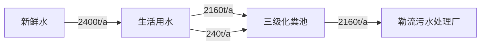
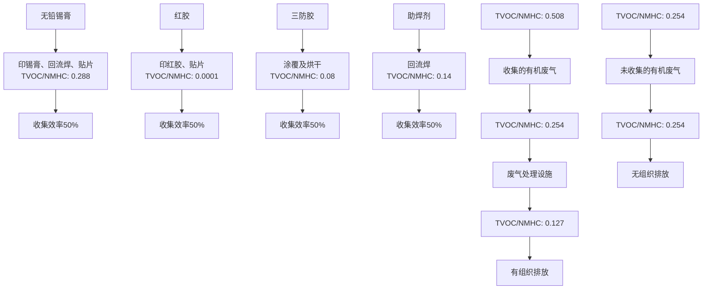
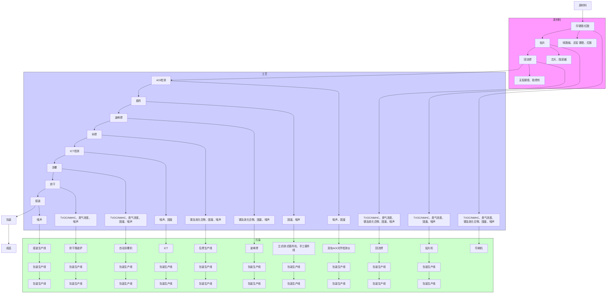
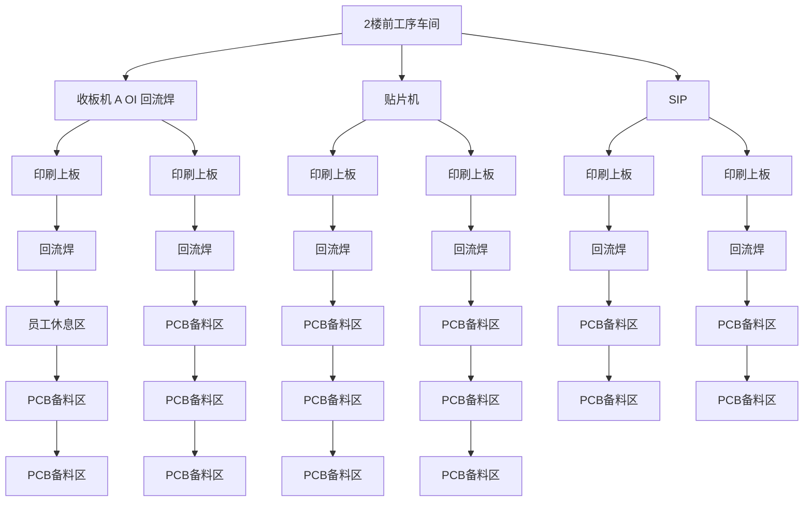

# 建设项目环境影响报告表（污染影响类）

建设单位（盖章）：佛山市康侨电器制造有限编制日期： 二〇二五年三月编制日期：二五月

中华人民共和国生态环境部制

text_image

10094300259
服务有限公司
铁山市锦江新区

编制单位和编制人员情况表

<table><tr><td>项目编号</td><td>id62u4</td></tr><tr><td>建设项目名称</td><td>佛山市康侨电器制造有限公司新建项目</td></tr><tr><td>建设项目类别</td><td>36—082通信设备制造;广播电视设备制造;雷达及配套设备制造;非专业视听设备制造;其他电子设备制造</td></tr><tr><td>环境影响评价文件类型</td><td>报告表</td></tr><tr><td colspan="2">一、建设单位情况</td></tr></table>

Tho Peoplo's Rcpublic ofChina

text_image

APPROVED EMERGING
②
the Environmental Protection Adminisitut
The People's Republic of China

No

0006719

text_image

中华人民
环上

# 目 录

一、建设项目基本情况..

二、建设项目工程分析.... 17

三、区域环境质量现状、环境保护目标及评价标准. 30

四、主要环境影响和保护措施. 35

五、环境保护措施监督检查清单 69

六、结论 ..... 72

附表 ... .73

附图1项目地理位置图. .74

附图2 项目周围环境概况及现场图. 75

附图3项目平面布置图. .76

附图4 项目2\~4楼平面布置图. 79

附图5项目环境保护目标分布.. .80

附图6项目周边四至图. .81

附图7 项目声环境功能区划. .82

附图8项目水环境功能区划图. .83

附图9项目大气环境功能区划图. .84

附图10 佛山市顺德区环境管控单元图. .85

附图11 佛山市环境管控单元图. .86

附图12 广东省“三线一单”应用平台——陆域环境重点管控区. .87

附图13 广东省“三线一单”应用平台——大气环境布局敏感重点管控区. .88

附图14 广东省“三线一单”应用平台——水环境城镇生活污染重点管控区. .89

附图15广东省“三线一单”应用平台——生态环境一般管控区. .90

附图16 广东省“三线一单”应用平台——高污染燃料禁燃区. .91

附图17项目所在区域控规图. .92

附件1营业执照. 错误！未定义书签。

附件2法人身份证.. 错误！未定义书签。

附件3用地资料.. . 错误！未定义书签。

附件4三防胶MSDS及检测报告.. ..错误！未定义书签。

附件5红胶MSDS及检测报告. .错误！未定义书签。

附件6 助焊剂MSDS.. .错误！未定义书签。

附件7 锡膏MSDS.. .错误！未定义书签。

附件8行业协会关于部分原辅材料不可替代性说明. 错误！未定义书签。

附件9技术合同.. . 错误！未定义书签。

附件10 声明. ..93

# 一、建设项目基本情况

<table><tr><td>建设项目名称</td><td colspan="3">佛山市康侨电器制造有限公司新建项目</td></tr><tr><td>项目代码</td><td colspan="3">无</td></tr><tr><td>建设单位联系人</td><td>张**</td><td>联系方式</td><td>1898850****</td></tr><tr><td>建设地点</td><td colspan="3">广东省佛山市顺德勒流街道冲鹤村富安工业区11-3-2号地块南栋1-5楼</td></tr><tr><td>地理坐标</td><td colspan="3">东经: 113度 11分994.474秒、北纬: 22度48分31.393秒</td></tr><tr><td>国民经济行业类别</td><td>C3990其他电子设备制造</td><td>建设项目行业类别</td><td>三十六、计算机、通信和其他电子设备制造业39-82、其他电子设备制造399-全部(仅分割、焊接、组装的除外)</td></tr><tr><td>建设性质</td><td>√新建(迁建)□改建□扩建□技术改造</td><td>建设项目申报情形</td><td>√首次申报项目□不予批准后再次申报项目□超五年重新审核项目□重大变动重新报批项目</td></tr><tr><td>项目审批(核准/备案)部门(选填)</td><td>/</td><td>项目审批(核准/备案)文号(选填)</td><td>/</td></tr><tr><td>总投资(万元)</td><td>1200</td><td>环保投资(万元)</td><td>12</td></tr><tr><td>环保投资占比(%)</td><td>1</td><td>施工工期</td><td>1个月</td></tr><tr><td>是否开工建设</td><td>√否□是:</td><td>用地(用海)面积(m2)</td><td>1500</td></tr><tr><td>专项评价设置情况</td><td colspan="3">无</td></tr><tr><td>规划情况</td><td colspan="3">审批文件名称:《顺德西部生态产业新区顺德支流北岸片区(SD-H-04-01、SD-H-04-02)控制性详细规划》修编地块开发细则的批后公布批复文号:顺府办函〔2021〕247号审批单位:佛山市顺德区人民政府批准日期:2021年5月25日</td></tr><tr><td>规划环境影响评价情况</td><td colspan="3">无</td></tr><tr><td>规划及规划环境影响评价符合性分析</td><td colspan="3">根据《顺德西部生态产业新区顺德支流北岸片区(SD-H-04-01、SD-H-04-02)控制性详细规划》修编地块开发细则的批后公布(顺府办函〔2021〕247号)可知,项目所在地伟工业用地,符合要求。</td></tr><tr><td>其他符合性分析</td><td colspan="3">1、与用地规划相符性佛山市康侨电器制造有限公司新建项目位于广东省佛山市顺德勒流街道冲鹤村富安工业区11-3-2号地块南栋1-5楼,根据建设单位提供的《房产证》及《顺德西部生态产业新区中小企业园片区控制性详细规划》(附图16),项目所在地属于工业用地,与本项目的实际用途相符合,没有占用基本农业用地和林地,因此,本项目建设选址符合建设用地规划性质要求。2、与产业政策符合性项目主要从事变频空调控制器的加工生产,产品及使用的工艺、设备均不属于根据国家发展和改革委员会发布的《产业结构调整指导目录(2024年本)》(国家发展和改革委员会令第7号)中的限制和禁止(淘汰)项目。根据国家发展改革委、商务部《关于印发〈市场准入负面清单(2022年版)〉》的通知(发改体改规〔2022〕397号),本新建项目不属于禁止类项目,因此,项目符合相关的产业政策要求。项目主要从事变频空调控制器的加工生产,所属行业为C3990其他电子设备制造,不在《环境保护综合名录(2021年版)》内,因此本项目所产产品不属于高污染、高风险产品。项目主要从事变频空调控制器的加工生产,所属行业为C3990其他电子设备制造,不属于《广东省“两高”项目管理目录(2022年版)》的通知(粤发改能源函〔2022〕1363号)内两高项目所属行业,因此本项目不属于两高项目。因此,项目符合相关的产业政策要求。3、与环境功能区划相符性分析根据佛山市顺德区人民政府办公室关于印发《佛山市顺德区生态环境保护“十四五”规划(2021-2025)》的通知,项目所在地不属于顺德区一、二级水源保护区,符合饮用水源保护条例的有关要求。项目所在区域为环境空气质量二类功能区,不属于环境空气质量一类功能区中的自然保护区风景名胜区和其它需要特殊保护的区域。项目有机废气经收集处理达标后排放,对周围影响较小,不改变原有的功能</td></tr></table>

区规划。

项目所在地区位于富安工业区内，为声环境3类区。项目对生产过程中产生的噪音设备采取了有效的隔声防治措施，对周围环境影响较小。

# 4、项目与广东省“三线一单”生态环境分区管控方案的相符性分析

根据《广东省人民政府关于印发广东省“三线一单”生态环境分区管控方案的通知》（粤府〔2020〕71号）发布的广东省环境管控单元图，项目所在区域为重点管控单元，重点管控单元严格限制新建钢铁、燃煤燃油火电、石化、储油库等项目，产生和排放有毒有害大气污染物项目，以及使用溶剂型油墨、涂料、清洗剂、胶黏剂等高挥发性有机物原辅材料的项目；鼓励现有该类项目逐步搬迁退出。

本项目主要从事变频空调控制器的加工生产，不属于文件中提及的严格限制类项目；项目项目使用的三防胶、红胶、无铅锡膏均属于低挥发性原辅材料。助焊剂、无铅锡膏不属于工业防护涂料、油墨、清洗剂等，无相关现行低挥发性有机物含量涂料产品技术要求标准。，因此，项目符合区域布局管控要求；项目生产设备使用电能，生产用水由市政供水，不直接取用江河湖库水量，不会对项目所在地生态流量造成影响，符合能源利用要求。

# 5、项目与佛山市“三线一单”生态环境分区管控方案的相符性分析

根据《佛山市人民政府关于印发<佛山市“三线一单”生态环境分区管控方案（2024年版）>的通知》（佛环〔2024〕20号）的要求。本项目与所在区域的生态保护红线、环境质量底线、资源利用上线和生态环境准入清单（“三线一单”）进行对照分析如下表：

表1-1 项目与佛山市“三线一单”的相符性分析

<table><tr><td colspan="2">佛环(2024)20号</td><td>本项目情况</td><td>符合性</td></tr><tr><td>生态保护红线及一般生态空间</td><td>全市陆域生态保护红线面积323.06平方公里,占全市陆域国土面积的8.51%;一般生态空间面积217.36平方公里,占全市陆域国土面积的5.73%</td><td>项目位于广东省佛山市顺德勒流街道冲鹤村富安工业区11-3-2号地块南栋1-5楼,所在区域属于工业用地,项目用地不涉及划定的生态红线区域,项目周边无自然保护区、饮用水源保护区等生态保护目标,符合生态保护红</td><td>符合</td></tr></table>

<table><tr><td rowspan="5"></td><td></td><td></td><td>线要求</td><td></td></tr><tr><td>环境质量底线</td><td>地表水环境质量持续改善,乡镇级及以上集中式饮用水水源地水质100%达标,国考、省考断面地表水质量达到或优于III类水体比例不低于85.7%,劣V类水体比例为0%,市考断面基本消除劣V类断面;全面消除黑臭水体。空气质量持续改善,细颗粒物( $PM_{2.5}$ )年均浓度、空气质量优良天数比例(AQI)主要指标达到省下达的目标要求,臭氧污染得到遏制。土壤环境质量总体保持稳定,土壤环境风险得到管控,受污染耕地安全利用率不低于93%,重点建设用地安全利用得到有效保障。地下水国控区域点位V类水比例完成省下达任务,地下水饮用水源点位和污染风险监控点位水质总体保持稳定</td><td>根据《佛山市生态环境局顺德分局关于发布2023年度佛山市顺德区生态环境状况公报的通知》(佛顺环函[2024]44号),地表水环境、声环境质量均能满足相应标准要求, $O_3$ (臭氧)浓度超过了质量标准限值,故顺德区大气环境质量属非达标区,本项目不涉及 $O_3$ 的排放,项目排放的各项污染物经相应措施处理后均能达标,对环境影响很小,环境风险可控,未超出环境质量底线,项目的建设基本符合环境质量底线要求</td><td>符合</td></tr><tr><td>资源利用上线</td><td>强化节约集约循环利用,持续提升资源能源利用效率,到2025年,全市用水总量控制在23.44亿立方米以内,万元地区生产总值用水量和万元工业增加值用水量较2020年降幅不低于17%,农田灌溉水有效利用系数不低于0.55。土地资源、岸线资源、能源消耗等达到或优于国家和省下达的总量、强度等目标要求,按省规定年限实现碳达峰,其中耕地保有量达到185.75平方公里,永久基本农田面积稳定保持164.42平方公里,单位GDP能耗降低比例达到14.5%</td><td>生产过程中的电能、自来水等消耗量较少,区域水、电资源较充足,项目消耗量没有超出资源负荷,没有超出资源利用上线</td><td>符合</td></tr><tr><td>生态环境准入清单</td><td>从区域布局管控、能源资源利用、污染物排放管控和环境风险防控等方面明确准入要求,建立“1+3+97+N”生态环境转入清单体系。“1”为全市总体管控要求,“3”为优先保护单元、重点管控单元、一般管控单元总体管控要求,“97”为各个环境管控单元的差异性准入清单,“N”为对应生态、水、大气、土壤等生态环境要素及自然资源管控分区的具体管控要求清单</td><td>本项目位于重点管控单元。在区域布局管控、能源资源利用、污染物排放管控和环境风险防控等方面符合所在区域准入要求</td><td>符合</td></tr><tr><td colspan="4">综上所述,本项目符合《佛山市人民政府关于印发&lt;佛山市“三线一</td></tr></table>

单”生态环境分区管控方案（2024年版）>的通知》（佛环〔2024〕20号）的要求。

# 6、项目与顺德区“三线一单”生态环境分区管控方案的相符性分析

根据《佛山市顺德区人民政府关于印发佛山市顺德区“三线一单”生态环境分区管控方案的通知》（顺府发〔2021〕11号）的要求，本项目与佛山市顺德区“三线一单”生态环境分区管控方案相符性分析如下：

# ①与“一核一带一区”区域管控要求的相符性

# 1）区域布局管控要求

本项目主要从事变频空调控制器的加工生产，不属于区域布局管控要求中的禁止新建、扩建水泥、平板玻璃、化学制浆、生皮制革以及国家规划外的钢铁、原油加工等项目。本项目使用的三防胶、红胶均属于低挥发性原辅材料。使用的助焊剂、无铅锡膏不属于工业防护涂料、油墨、清洗剂等，无相关现行低挥发性有机物含量涂料产品技术要求，符合区域布局管控要求。

# 2）能源资源利用要求

项目所属C3990其他电子设备制造，不属于高能耗行业。项目生产设备使用电能，生产用水由市政供水，不直接取用江河湖库水量，不会对项目所在地生态流量造成影响，符合能源利用要求。

# 3）污染物排放管控要求

项目属于新建项目，项目回流焊、波峰焊过程产生的废气经设备直连收集；印锡膏、印红胶、贴片、补焊、涂覆及烘干过程产生的废气经包围型集气罩收集，后汇于同一主风管通过活性炭吸附装置处理后引至33m高排气筒DA001高空排放，通过废气收集和处理措施能减少项目挥发性有机物的无组织排放；生活污水预处理达标后排至勒流污水处理厂处理，项目总量指标由佛山市生态环境局调剂，符合污染物排放管控要求。

# 4）环境风险防控要求

项目不属于石化、化工重点园区环境风险防控区域。本项目产生的危险废物拟定期委托有资质的处置公司进行收集处理，并通过信息系统登记转移计划和电子转移联单，符合危险废物全过程跟踪管理的防控要求。

# ②环境管控单元总体管控要求

根据《佛山市人民政府关于印发<佛山市“三线一单”生态环境分区管控方案（2024年版）>的通知》（佛环〔2024〕20号）的附件1佛山市环境管控单元图，项目所在地位于重点管控单元9（环境管控单元编码：ZH44060620009，环境管控单元名称：勒流街道重点管控区）。要素细类为水环境工业-城镇生活重点管控区、大气环境布局敏感重点管控区、江河湖库岸线重点管控区。项目与广东省佛山市顺德区重点管控单元9准入清单的相符性分析如表1-2。

表1-2 本项目与顺德区“三线一单”的相符性分析

<table><tr><td>序号</td><td>内容</td><td>相符性分析</td><td>符合性</td></tr><tr><td rowspan="5">区域布局管控</td><td>1-1.【产业/鼓励引导类】重点发展智能家电、家具五金、环保装备、光电照明、装备制造及交通机械产业,引入智能制造服务、电子商务、现代商贸流通产业,重点建设环保产业基地、小家电产业基地和五金产业创业基地。</td><td>本项目不涉及。</td><td>符合</td></tr><tr><td>1-2.【产业/综合类】系统推进村级工业园升级改造,腾出连片空间,布局产业集聚区和主题产业园,推动工业项目入园集聚发展。</td><td>本项目选址广东省佛山市顺德勒流街道冲鹤村富安工业区11-3-2号地块南栋,位于富安工业区内。</td><td>符合</td></tr><tr><td>1-3.【产业/限制类】受纳水体或监控断面不达标且未“以新带老”制定区域达标方案的河涌,不得新建、扩建向河涌直接排放废水的项目。新建、扩建含蚀刻工序的线路板生产项目和化工项目应在配套污水集中处置的工业园区或生活污水管网覆盖区域内建设;纯加工型印花项目,含酸洗、磷化的金属表面处理、金属制品项目(与自身高新技术企业配套的和区级及以上重点项目除外),含酸洗、喷涂、化学抛光、电解等涉及废水排放工艺的不锈钢型材加工项目(与自身高新技术企业配套的和区级及以上重点项目除外),应进入以此类项目为主导产业、有相应废水集中治理设施的工业园区,实现集中治污。</td><td>本项目生活污水经三级化粪池处理后排入勒流污水处理厂处理,尾水排入顺德支流。本项目属于C3990其他电子设备制造,不属于含蚀刻工序的线路板生产项目和化工项目,也不属于纯加工型印花项目,含酸洗、喷涂、化学抛光、电解等涉及废水排放工艺的不锈钢型材加工项目。</td><td>符合</td></tr><tr><td>1-4.【产业/综合类】划定家具生产优先发展区域,优先发展区外不再新建涉及涂装工艺的木质家具制造项目。优先发展区范围根据家具产业发展规划及其规划环评文件确定。</td><td>本项目不涉及。</td><td>符合</td></tr><tr><td>1-5.【水/限制类】严格限制在羊额—北滘</td><td>本项目产品不涉及《环境</td><td>符合</td></tr></table>

<table><tr><td rowspan="10"></td><td rowspan="2"></td><td>水厂饮用水水源保护区上游和周边区域建设列入“高污染、高环境风险”产品名录等可能影响水环境安全的项目。</td><td>保护综合名录》(2021年版)中“高污染、高环境风险”产品。</td><td></td></tr><tr><td>1-6.【大气/限制类】大气环境布局敏感区重点管控区内,应严格限制新建生产和使用高挥发性有机物原辅材料项目,优先开展低VOCs含量原辅材料替代,强化无组织排放控制。原则上不再新建、扩建新增氮氧化物、烟(粉)尘排放量较大的建设项目。</td><td>本项目使用的三防胶、红胶均属于低挥发性原辅材料。使用的助焊剂、无铅锡膏不属于工业防护涂料、油墨、清洗剂等,无相关现行低挥发性有机物含量涂料产品技术要求。项目不产生氮氧化物、颗粒物,对周围大气环境影响不大。</td><td>符合</td></tr><tr><td rowspan="6">能源资源利用</td><td>2-1.【能源/鼓励引导类】推广节能技术,加快发展绿色货运与现代物流。</td><td>本项目使用节能技术,项目不属于绿色货运与现代物流。</td><td>符合</td></tr><tr><td>2-2.【能源/鼓励引导类】推广新能源汽车应用和充电基础设施建设,积极推动重卡LNG加气站、充电基础设施、加氢站建设。</td><td>本项目不属于新能源汽车、充电基础设施、加氢站建设项目。</td><td>符合</td></tr><tr><td>2-3.【能源/综合类】科学实施能源消费总量和强度“双控”,新建高能耗项目单位产品(产值)能耗达到国际国内先进水平。</td><td>本项目不属于高能耗项目。</td><td>符合</td></tr><tr><td>2-4.【水资源/综合类】贯彻落实“节水优先”方针,实行最严格水资源管理制度,勒流街道万元国内生产总值用水量、万元工业增加值用水量、用水总量、农田灌溉水有效利用系数等用水总量和效率指标达到区下达要求。</td><td>本项目用水主要为员工生活用水,内部实行节约用水,合理使用水资源。</td><td>符合</td></tr><tr><td>2-5.【土地资源/限制类】落实单位土地面积投资强度、土地利用强度等建设用地控制性指标要求,提高土地利用效率。</td><td>本项目建设用地属于工业用地。</td><td>符合</td></tr><tr><td>2-6.【岸线/禁止类】严格水域岸线用途管制,新建项目一律不得违规占用水域。严禁破坏生态的岸线利用行为和不符合其功能定位的开发建设活动,严禁以各种名义侵占河道、围垦湖泊、非法采砂等。</td><td>本项目建设在陆域上,不属于占用水域和破坏生态的岸线利用行为。</td><td>符合</td></tr><tr><td rowspan="2">污染物排放管控</td><td>3-1.【水/限制类】城镇新区建设实行雨污分流。住宅、商业体、学校、市场等城镇开发建设项目应当配套或者同步计划建设公共排水设施,公共排水设施或自建排污水设施未能投产运行的,以上涉水项目不得投入使用。新建小区严格实施雨污分流,阳台、露台等污水接入污水收集系统,将生活污水“应截尽截”。做好大型楼盘、集贸市场、餐饮以及学校等4大类排水户污水接入市政管网工作。</td><td>建设单位实行雨污分流,且生产车间位于厂房内,不存在露天作业。</td><td>符合</td></tr><tr><td>3-2.【水/综合类】结合村级工业园改造,全面提升产业层次与集聚度,促进污染集中整治。</td><td>本项目选址广东省佛山市顺德勒流街道冲鹤村富安工业区11-3-2号地块南栋,位于富安工业区内。</td><td>符合</td></tr></table>

<table><tr><td rowspan="3"></td><td>3-3.【水/综合类】稳步推进排水设施“三个一体化”管理模式,补齐城乡污水收集和处理短板,推动勒流污水处理厂提质增效,加快消除城中村、老旧城区、城乡结合部等污水收集管网空白区,逐步实现城乡污水收集处理全覆盖。2025年前完成勒流污水处理厂扩建,尾水应执行《城镇污水处理厂污染物排放标准》(GB18918-2002)一级A标准及《广东省水污染物排放限值》(DB44/26-2001)的较严值。</td><td rowspan="2">本项目已接驳市政管网。项目生活污水经三级化粪池处理后排入勒流污水处理厂处理,尾水排入顺德支流。</td><td>符合</td></tr><tr><td>3-4.【水/综合类】保留勒流社区百丈片区分散式农村污水处理设施,其余行政村(社区)通过市政污水管网,配合农村支管网建设,有条件的区域实施雨污分流改造,到2030年实现农村生活污水100%收集进入勒流污水处理系统。</td><td>符合</td></tr><tr><td>3-5.【土壤/限制类】严格重金属重点行业企业准入管理。新、改、扩建重点行业建设项目应遵循重点重金属污染物排放“等量替代”原则。</td><td>本项目不排放重金属污染物。</td><td>符合</td></tr><tr><td rowspan="3">环境风险防控</td><td>4-1.【水/综合类】加强单元内羊额—北滘水厂饮用水水源保护区周边环境风险源管控,完善突发环境事件应急管理体系。</td><td rowspan="2">本项目所在地位于勒流污水处理厂纳污范围,污水处理厂已在线监控系统联网,实现污水处理厂的实时、动态监管。</td><td>符合</td></tr><tr><td>4-2.【水/综合类】勒流污水处理厂、工业污水集中处理设施应采取有效措施,防止事故废水直接排入水体。完善污水处理厂在线监控系统联网,实现污水处理厂的实时、动态监管。</td><td>符合</td></tr><tr><td>4-3.【风险/综合类】加强环境风险分级分类管理,强化金属制品、有色金属和压延加工、化学原料和化学品制造业等涉重金属、化工行业企业及工业园区等重点环境风险源的环境风险防控。</td><td>建设单位加强环境风险分级分类管理,强化环境风险管控。</td><td>符合</td></tr></table>

综上，本项目符合《佛山市人民政府关于印发<佛山市“三线一单”生态环境分区管控方案（2024年版）>的通知》（佛环〔2024〕20号）的要求。

# 7、项目与挥发性有机污染物治理政策的相符性分析

本项目有机物治理政策的相符性分析见表1-3。

表1-3 项目与有机污染物治理政策的相符性

<table><tr><td>序号</td><td>政策要求</td><td>工程内容</td><td>符合性</td></tr><tr><td colspan="4">1.印发《关于珠江三角洲地区严格控制工业企业挥发性有机物(VOCs)排放的意见》的通知(粤环〔2012〕18号)</td></tr><tr><td>1.1</td><td>在石油、化工等排放VOCs的重点产业发展规定开展环境影响评价时,须将VOCs排放纳入环境影响评价的重</td><td>本项目将TVOC纳入重点控制指标。</td><td>符合</td></tr></table>

<table><tr><td rowspan="10"></td><td></td><td colspan="2">点控制指标。</td><td></td><td></td></tr><tr><td>1.2</td><td colspan="2">不在“自然保护区、水源保护区、风景名胜区、森林公园、重要湿地、生态敏感区和其他重要生态功能区实行强制性保护,禁止新建VOCs污染企业”的规定区域。</td><td>本项目所在地属于工业用途,不在禁止新建VOCs污染企业的规定区域内。</td><td>符合</td></tr><tr><td colspan="5">2.1.顺德区生态环境保护委员会办公室关于印发《顺德区重点行业挥发性有机物总量指标管理工作方案(2024年修订)》的通知(顺环办(2024)3号)</td></tr><tr><td>2.1</td><td colspan="2">总量替代原则。根据区域现状、改善目标、减排空间,全区建设项目新增VOCs排放量施行“减二增一”政策。其中,有组织排放和无组织排放均纳入新增指标管理;非甲烷总烃合并计入VOCs管理。</td><td>项目有机废气排放量为0.381t/a,待项目审批时由生态环境部门核定VOCs总量来源。</td><td>符合</td></tr><tr><td colspan="5">3.《重点行业挥发性有机物综合治理方案》(环大气(2019)53号)</td></tr><tr><td>3.1</td><td colspan="2">1全面加强无组织排放控制。推进使用先进生产工艺。通过采用全密闭、连续化、自动化等生产技术,以及高效工艺与设备等,减少工艺过程无组织排放。提高废气收集率。遵循“应收尽收、分质收集”的原则,科学设计废气收集系统,将无组织排放转变为有组织排放进行控制。采用全密闭集气罩或密闭空间的,除行业有特殊要求外,应保持微负压状态,并根据相关规范合理设置通风量。采用局部集气罩的,距集气罩开口面最远处的VOCs无组织排放位置,控制风速应不低于0.3米/秒,有行业要求的按相关规定执行。</td><td>本项目回流焊、波峰焊过程产生的废气经设备直连收集;印锡膏、印红胶、贴片、补焊、涂覆及烘干过程产生的废气经包围型集气罩收集,后汇于同一主风管通过活性炭吸附装置处理后引至33m高排气筒DA001高空排放,通过末端治理措施减少有机废气的排放,确保有机废气能够达标排放。</td><td>符合</td></tr><tr><td>3.2</td><td colspan="2">2推进建设适宜高效的治污设施:鼓励企业采用多种技术的组合工艺,提高VOCs治理效率。低浓度、大风量废气,宜采用沸石转轮吸附、活性炭吸附、减风增浓等浓缩技术,提高VOCs浓度后净化处理。低温等离子、光催化、光氧化技术主要适用于恶臭异味等治理;生物法主要适用于低浓度VOCs废气治理和恶臭异味治理。非水溶性的VOCs废气禁止采用水或水溶液喷淋吸收处理。</td><td>本项目产生的有机废气有组织产生速率小于2kg/h,项目设置活性炭吸附装置处理有机废气,处理效率为50%。</td><td>符合</td></tr><tr><td colspan="5">4.广东省地方标准《固定污染源挥发性有机物综合排放标准》(DB44/2367-2022)</td></tr><tr><td>/</td><td>控制环节</td><td>控制要求</td><td>本项目情况</td><td>符合判定</td></tr><tr><td>4.1</td><td>物料储存</td><td>VOCs物料应储存于密闭的容器、包装袋、储罐、储库、料仓中。盛装VOCs物料的容器或包装袋应存放于室内,或存放于设置有雨棚、遮阳和防渗设施的专用场地。盛装VOCs物料的容器或包装袋在非取用状态时应加盖、封口,保持密闭。</td><td>VOCs物料储存于密闭的包装袋中存放在厂内;厂房为已建成,拥有完整的围护结构,地面已经全部混凝土硬化,采取防腐防渗处理。</td><td>符合</td></tr><tr><td rowspan="8"></td><td rowspan="2"></td><td rowspan="2"></td><td>VOCs物料储罐应密封良好,其中挥发性有机液体储罐应符合5.2条规定。</td><td rowspan="2"></td><td rowspan="2"></td></tr><tr><td>VOCs物料储库、料仓应满足3.6条对密闭空间的要求。</td></tr><tr><td rowspan="2">4.2</td><td rowspan="2">转移和输送</td><td>液态VOCs物料应采用密闭管道输送。采用非管道输送方式转移液态VOCs物料时,应采用密闭容器、罐车。</td><td rowspan="2">本项目所使用的三防胶、红胶、助焊剂、无铅锡膏等原料密封储存,存放于室内,非取用时封口保持密闭。</td><td>符合</td></tr><tr><td>粉状、粒状VOCs物料应采用气力输送设备、管状带式输送机、螺旋输送机等密闭输送方式,或采用密闭的包装袋、容器或罐车进行物料转移。</td><td>符合</td></tr><tr><td>4.3</td><td>工艺过程</td><td>VOCs物料卸(出、放)料过程应密闭,卸料废气应排至VOCs废气收集处理系统;无法密闭的,应采取局部气体收集措施,废气应排至VOCs废气收集处理系统。</td><td>本项目回流焊、波峰焊过程产生的废气经设备直连收集,采用“包围型集气罩”收集印锡膏、印红胶、贴片、补焊、涂覆及烘干工序有机废气,有机废气经收集后利用“活性炭吸附装置”处理后引至33m高排气筒DA001高空排放。收集效率可达50%,处理效率可达50%。</td><td>符合</td></tr><tr><td>4.4</td><td>VOCs排放控制要求</td><td>收集的废气中NMHC初始排放速率≥3kg/h时,应配置VOCs处理设施,处理效率不应低于80%。</td><td>项目产生的有机废气初始排放速率小于2kg/h,项目设置活性炭吸附装置处理有机废气,处理效率为50%。</td><td>符合</td></tr><tr><td colspan="5">5.《广东省臭氧污染防治(氮氧化物和挥发性有机物协同减排)实施方案(2023-2025年)》(粤环函〔2023〕45号)</td></tr><tr><td>5.1</td><td colspan="2">新、改、扩建项目限制使用光催化、光氧化、水喷淋(吸收可溶性VOCs除外)、低温等离子等低效VOCs治理设施(恶臭处理除外),组织排查光催化、光氧化、水喷淋、低温等离子及上述组合技术的低效VOCs治理设施,对无法稳定达标的实施更换或</td><td>本项目回流焊、波峰焊过程产生的废气经设备直连收集,采用“包围型集气罩”收集印锡膏、印红胶、贴片、补焊、涂覆及烘干工序有机废气,有机废气经收集后利用“活性炭吸附装置”</td><td>符合</td></tr><tr><td rowspan="9"></td><td></td><td>升级改造。</td><td>处理后引至33m高排气筒DA001高空排放。不属于低效VOCs处理设施。</td><td colspan="2"></td></tr><tr><td colspan="5">6.《广东省生态环境保护“十四五”规划》(粤环[2021]10号)</td></tr><tr><td>6.1</td><td>珠三角地区禁止新建、扩建水泥、平板玻璃、化学制浆、生皮制革以及国家规划外的钢铁、原油加工等项目。</td><td>项目属于计算机、通信和其他电子设备制造业,不属于水泥、平板玻璃、化学制浆、生皮制革以及国家规划外的钢铁、原油加工等项目。</td><td colspan="2">符合</td></tr><tr><td>6.2</td><td>珠三角禁止新建、扩建燃煤燃油火电机组和企业燃煤燃油自备电站,推进沙角电厂等列入淘汰计划的老旧燃煤机组和企业自备电站有序退出,原则上不再新建燃煤锅炉,逐步淘汰生物质锅炉,集中供热管网覆盖区域内的分散供热锅炉。</td><td>项目不新增锅炉。</td><td colspan="2">符合</td></tr><tr><td>6.3</td><td>禁止新建、扩建燃用高污染燃料的设施,已建成的按要求改用天然气、电或者其他清洁能源。</td><td>项目设备均使用电能。</td><td colspan="2">符合</td></tr><tr><td>6.4</td><td>大力推进低VOCs含量原辅材料源头替代,严格落实国家和地方产品VOCs含量限值质量标准,禁止建设生产和使用高VOCs含量的溶剂型涂料、油墨、胶粘剂等项目。</td><td>项目使用的三防胶、红胶均属于低挥发性原辅材料。使用的助焊剂、无铅锡膏不属于工业防护涂料、油墨、清洗剂等,无相关现行低挥发性有机物含量涂料产品技术要求。</td><td colspan="2">符合</td></tr><tr><td>6.5</td><td>开展中小型企业废气收集和治理设施建设,运行情况的评估,强化对企业涉VOCs生产车间/工序废气的收集管理,推动企业开展治理设施升级改造。</td><td>项目回流焊、波峰焊过程产生的废气经设备直连收集,采用“包围型集气罩”收集印锡膏、印红胶、贴片、补焊、涂覆及烘干工序有机废气,有机废气经收集后利用“活性炭吸附装置”处理后引至33m高排气筒DA001高空排放。</td><td colspan="2">符合</td></tr><tr><td colspan="5">7.《佛山市生态环境保护“十四五”规划》佛环(2022)3号</td></tr><tr><td>7.1</td><td>加强VOCs源头替代和无组织排放管控,大力推进低VOCs含量、低反应活性的原辅材料替代,将全面使用低VOCs含量原辅材料的企业纳入正面清单和政府绿色采购清单。加强对含VOCs物料储存、转移和运输、设备与管线组件泄漏、敞开液面逸散以及工艺过程等五类排放源的管控。</td><td>项目使用的三防胶、红胶均属于低挥发性原辅材料。使用的助焊剂、无铅锡膏不属于工业防护涂料、油墨、清洗剂等,无相关现行低挥发性有机物含量涂料产品技术要求。回流焊、波峰焊过程产生的废气经设备直连收集;印锡膏、印红胶、贴片、补焊、涂覆及烘干过程产生的废气经包围型集气罩收集,后汇于同一主风管通过活性炭吸附装置处理后引至33m高排气筒DA001高空排放。</td><td colspan="2">符合</td></tr><tr><td rowspan="6"></td><td>7.2</td><td>涉VOCs排放,涉工业炉窑等重点污染源自动监测,推动重点工业园区建立挥发性有机物、颗粒物监测体系。</td><td>本项目不涉及工业炉窑等重点污染源,项目有机废气经有效收集处理后达标排放,定期开展废气监测。</td><td colspan="2">符合</td></tr><tr><td colspan="5">9.《广东省人民政府办公厅关于印发&lt;广东省2023年大气污染防治工作方案&gt;的通知》(粤办函〔2023〕50号)</td></tr><tr><td>9.1</td><td>加强低VOCs含量原辅材料应用。应用涂装工艺的工业企业应当使用低VOCs含量的涂料,并建立保存期限不得少于三年的台账,记录生产原辅材料的使用量、废弃量、去向以及VOCs含量。新改扩建的出版物印刷类项目全面使用低VOCs含量的油墨。皮鞋制造、家具制造类项目基本使用低VOCs含量的胶粘剂。房屋建筑和市政工程全面使用低VOCs含量的涂料和胶粘剂,室内地坪施工、室外构筑物防护和城市道路交通标志(特殊功能要求的除外)基本使用低VOCs含量的涂料。</td><td>项目属于计算机、通信和其他电子设备制造业,项目使用的涉VOC原辅材料中助焊剂不属于低VOCs物料,红胶、无铅锡膏属于低挥发性原辅材料。根据《关于电路板生产过程中使用油墨、清洗剂不可替代的说明》、《关于电路板行业内层涂布、防焊、洗网、喷锡等工序使用溶剂型物料的复函》等文件(具体见附件9),项目使用的助焊剂属于不可替代原辅材料。</td><td colspan="2">符合</td></tr><tr><td>9.2</td><td>开展简易低效VOCs治理设施清理整治。严格限制新改扩建项目使用光催化、光氧化、水喷淋(吸收可溶性VOCs除外)、低温等离子等低效VOCs治理设施(恶臭处理除外)。各地要对低效VOCs治理设施开展排查,对达不到治理要求的单位,要督促其更换或升级改造。2023年底前,完成1068个低效VOCs治理设施改造升级,并在省固定源大气污染防治综合应用平台上更新改造升级相关信息。</td><td>项目回流焊、波峰焊过程产生的废气经设备直连收集;印锡膏、印红胶、贴片、补焊、涂覆及烘干过程产生的废气经包围型集气罩收集,后汇于同一主风管通过活性炭吸附装置处理后引至33m高排气筒DA001高空排放,不使用光氧化、低温等离子处理设备。</td><td colspan="2">符合</td></tr><tr><td>9.3</td><td>严格执行涂料、油墨、胶粘剂、清洗剂VOCs含量限值标准,建立多部门联合执法机制,加强对相关产品生产、销售、使用环节VOCs含量限值执行情况的监督检查</td><td>项目使用的三防胶、红胶均属于低挥发性原辅材料。使用的助焊剂、无铅锡膏不属于工业防护涂料、油墨、清洗剂等,无相关现行低挥发性有机物含量涂料产品技术要求。</td><td colspan="2"></td></tr><tr><td colspan="5">综合以上分析,项目总体符合文件要求。8、项目与《关于印发&lt;广东省涉挥发性有机物(VOCs)重点行业治理指引&gt;的通知》(粤环办〔2021〕43号)相符性分析本项目属于其他电子设备制造业,参考《关于印发&lt;广东省涉挥发性</td></tr></table>

有机物（VOCs）重点行业治理指引>的通知》（粤环办〔2021〕43号）中“十一、电子元件制造行业VOCs治理指引”进行相符性分析。

表1-4 本项目与（粤环办〔2021〕43号）相符性分析

<table><tr><td>环节</td><td>控制要求</td><td>本项目情况</td><td>相符性</td></tr><tr><td>胶黏剂</td><td>本体型胶粘剂:有机硅类VOCs含量≤100g/L;MS类、聚氨酯类、聚硫类、环氧树脂类、热塑类、其他VOCs含量≤50g/L;丙烯酸酯类VOCs含量≤200g/L; $\alpha$ -氰基丙烯酸类VOCs含量≤20g/L。</td><td>本项目使用的红胶属于环氧树脂类本体型胶黏剂,其VOCs含量≤50g/L。</td><td>符合</td></tr><tr><td rowspan="2">VOCs物料储存</td><td>清洗剂、清洁剂、油墨、胶粘剂、固化剂、溶剂、开油水、洗网水等VOCs物料应储存于密闭的容器、包装袋、储罐、储库、料仓中。</td><td rowspan="2">本项目三防胶、助焊剂、无铅锡膏、红胶均储存在专门的仓库;并加盖保存。</td><td>符合</td></tr><tr><td>盛装VOCs物料的容器是否存放于室内,或存放于设置有雨棚、遮阳和防渗设施的专用场地。盛装VOCs物料的容器在非取用状态时应加盖、封口,保持密闭。</td><td>符合</td></tr><tr><td>VOCs物料转移和输送</td><td>油液体VOCs物料应采用管道密闭输送。采用非管道输送方式转移液态VOCs物料时,应采用密闭容器或罐车。</td><td>本项目助三防胶、助焊剂、无铅锡膏、红胶转移过程包装均处于密封状态。</td><td>符合</td></tr><tr><td>工艺过程</td><td>包封、灌封、线路印刷、防焊印刷、文字印刷、丝印、UV固化、烤版、洗网、晾干、调油、清洗等使用VOCs质量占比大于等于10%物料的过程应采用密闭设备或在密闭空间内操作,废气应排至VOCs废气收集处理系统;无法密闭的,应采取局部气体收集措施,废气排至VOCs废气收集处理系统</td><td>本项目回流焊、波峰焊过程产生的废气经设备直连收集;印锡膏、印红胶、贴片、补焊、涂覆及烘干过程产生的废气经包围型集气罩收集,后汇于同一主风管通过活性炭吸附装置处理后引至33m高排气筒DA001高空排放。</td><td>符合</td></tr><tr><td rowspan="3">废气收集</td><td>采用外部集气罩的,距集气罩开口面最远处的VOCs无组织排放位置,控制风速不低于0.3m/s。</td><td>本项目废气控制风速高于0.3m/s。</td><td rowspan="3">符合</td></tr><tr><td>废气收集系统的输送管道应密闭。废气收集系统应在负压下运行,若处于正压状态,应对管道组件的密封点进行泄漏检测,泄漏检测值不应超过500μmol/mol,亦不应有感官可察觉泄漏。</td><td>本项目废气收集系统均在负压状态下运行。</td></tr><tr><td>废气收集系统应与生产工艺设备同步运行。废气处理系统发生故障或检修时,对应的生产工艺设备应停止运行,待检修完毕后同步投入使用;生产工艺设备不能停止运行或不能及时停止运行的,应设置废气应急处理设施或采取其他代</td><td>本项目废气收集系统与生产工艺设备同步运行。废气处理系统发生故障或检修时,对应的生产工艺设备均停止运行,待检修</td></tr></table>

<table><tr><td rowspan="8"></td><td></td><td>替措施。</td><td>完毕后同步投入使用。</td><td></td></tr><tr><td>排放水平</td><td>(1)2002年1月1日前的建设项目排放的工艺有机废气排放浓度执行《大气污染物排放限值》(DB 4427-2001)第一时段限值;2002年1月1日起的建设项目排放的有机废气排放浓度执行《大气污染物排放限值》(DB4427-2001)第二时段限值;车间或生产设施排气中NMHC初始排放速率≥3kg/h时,建设VOCs处理设施且处理效率≥80%。(2)厂区内无组织排放监控点NMHC的小时平均浓度值不超过6mg/m3,任意一次浓度值不超过20mg/m3。</td><td>本项目产生的有机废气初始排放速率小于2kg/h,VOCs有组织排放可满足广东省地方标准《固定污染源挥发性有机物综合排放标准》(DB44/2367-2022)中表1挥发性有机物排放限值;有机废气厂区内无组织排放满足小时平均浓度值不超过6mg/m3,任意一次浓度值不超过20mg/m3。</td><td>符合</td></tr><tr><td>治理设施设计与运行管理</td><td>VOCs治理设施应与生产工艺设备同步运行,VOCs治理设施发生故障或检修时,对应的生产工艺设备应停止运行,待检修完毕后同步投入使用;生产工艺设备不能停止运行或不能及时停止运行的,应设置废气应急处理设施或采取其他替代措施。</td><td>本项目废气收集系统与生产工艺设备同步运行。废气处理系统发生故障或检修时,对应的生产工艺设备均停止运行,待检修完毕后同步投入使用</td><td rowspan="5">符合</td></tr><tr><td rowspan="4">管理台账</td><td>建立含VOCs原辅材料台账,记录含VOCs原辅材料的名称及其VOCs含量、采购量、使用量、库存量、含VOCs原辅材料回收方式及回收量。</td><td>本项目投产后将建立含VOCs原辅材料台账,记录含VOCs原辅材料的名称及其VOCs含量、采购量、使用量、库存量、含VOCs原辅材料回收方式及回收量。</td></tr><tr><td>建立废气收集处理设施台账,记录废气处理设施进出口的监测数据(废气量、浓度、温度、含氧量等)、废气收集与处理设施关键参数、废气处理设施相关耗材(吸收剂、吸附剂、催化剂等)购买和处理记录。</td><td>本项目投产后将建立废气收集处理设施台账,记录废气处理设施进出口的监测数据、废气收集与处理设施关键参数、废气处理设施相关耗材购买和处理记录。</td></tr><tr><td>建立危废台账,整理危废处置合同、转移联单及危废处理方资质佐证材料。</td><td>本项目投产后将建立危废台账,整理危废处置合同、转移联单及危废处理方资质佐证材料。</td></tr><tr><td>台账保存期限不少于3年。</td><td>本项目投产后台账保存期限不少于3年。</td></tr><tr><td>自行监测</td><td>电阻电容电感元件制造、敏感元件及传感器制造、电声器件及零件制造、其他电子元件制造排污单位:对于重点管理的一般排放口,至少每半年监测一次挥发性有机物、甲苯、对于简化管理的一</td><td>本项目将按要求执行。</td><td>符合</td></tr></table>

<table><tr><td rowspan="2"></td><td>般排放口,至少每年监测一次挥发性有机物、甲苯。</td><td></td><td></td></tr><tr><td>对于厂界无组织排放废气,重点管理排污单位及简化管理排污单位都是至少每年监测一次挥发性有机物、苯及甲醛。</td><td>本项目属于登记管理项目。</td><td>符合</td></tr><tr><td>危废管理</td><td>工艺过程产生的含VOCs废料(渣、液)应按照相关要求进行储存、转移和输送。盛装过VOCs物料的废包装容器应加盖密闭。</td><td>本项目将按要求执行。</td><td>符合</td></tr><tr><td rowspan="2">建设项目VOCs总量管理</td><td>新、改、扩建项目应执行总量替代制度,明确VOCs总量指标来源。</td><td>本项目执行总量替代制度,VOCs总量待项目审批时由生态环境部门核定VOCs总量来源。</td><td>符合</td></tr><tr><td>新、改、扩建项目和现有企业VOCs基准排放量计算参考《广东省重点行业挥发性有机物排放量计算方法核算》进行核算,若国家和我省出台适用于该行业的VOCs排放量计算方法,则参照其相关规定执行。</td><td>本项目将按要求执行。</td><td>符合</td></tr></table>

综上，本项目符合《关于印发<广东省涉挥发性有机物（VOCs）重点行业治理指引>的通知》（粤环办〔2021〕43号）的要求。

# 9、与《佛山市生态环境局佛山市水利局关于进一步加强工业企业废水污染防治的函》（2023-0031（水））相符性分析地区污染物治理政策相符性分析

顺环委办〔2020〕44号的要求如下：

根据《佛山市生态环境局 佛山市水利局关于进一步加强工业企业废水污染防治的函》 文件要求：“1、加强涉生活污水排放项目审批管理。生活污水管网未覆盖或已覆盖但未实质连通接入城镇生活污水处理厂的区域，原则上不得新建、扩建生活污水排放的工业项目”、“2、加强涉生产废水产排项目审批管理。工业企业排放有含重金属、难生化降解、有生物毒性、易燃易爆、高盐分、重油脂等超城镇生活污水处理厂接收能力的生产废水，以及间接冷却的清净下水等过低浓度生产废水，原则上不得排入城镇生活污水处理厂” C

本项目已接驳管网，生活污水经三级化粪池处理后经市政污水管网排入勒流污水处理厂，尾水排入顺德支流。项目不涉及生产废水产排情况。因此，本项目的建设符合政策文件要求。

# 10、 与《顺德区工业废水退出城镇生活污水处理系统工作推进方案

# （试行）》（顺环委办〔2023〕30号）相符性

根据《顺德区工业废水退出城镇生活污水处理系统工作推进方案（试行）》（顺环委办〔2023〕30号）要求，分步分类推进工业废水和工业园区集中处理设施尾水退出城镇生活污水处理系统，推动工业企业排水体系建设。本项目已接驳市政污水管网，生活污水经三级化粪池处理后经市政污水管网排入勒流污水处理厂，尾水排至顺德支流；项目不涉及生产废水排放。因此，本项目的建设符合政策文件要求。

# 11、 与《工业防护涂料中有害物质限量》（GB30981-2020）相符性

项目使用三防胶。根据建设单位提供的三防胶的MSDS报告及其检测报告可知，三防胶不含《工业防护涂料中有害物质限量》（GB30981-2020）中表5所列的其他有害物质。三防胶VOCs含量为27g/L，可满足《工业防护涂料中有害物质限量》（GB30981-2020）中表4 辐射固化涂料中非水性其他施涂方式的VOC含量≤200g/L要求。

# 二、建设项目工程分析

# 1.项目概况及任务来源

佛山市康侨电器制造有限公司新建项目（以下简称“项目”）位于广东省佛山市顺德勒流街道冲鹤村富安工业区 11-3-2 号地块南栋 1-5 楼（中心经纬度坐标：北纬22°48′31.393″，东经 113°11′56.668″）。项目总投资 1200 万元人民币，其中环保投资 12万元，占地面积为 1500平方米，建筑面积约 7834平方米。项目主要从事变频空调控制器的加工生产，年产变频空调控制器 200万套。现申请办理相关环保手续。

表2-1 项目所属行业分析表

<table><tr><td rowspan="13">行业类别</td><td colspan="3">类别</td><td>项目情况</td></tr><tr><td colspan="3">《国民经济行业分类》(GB/T 4754-2017)(2019年修订)</td><td rowspan="4">项目主要从事变频空调控制器的加工生产,属于C3990其他电子设备制造行业。</td></tr><tr><td colspan="3">C制造业</td></tr><tr><td>大类</td><td>中类</td><td>小类</td></tr><tr><td>39计算机、通信和其他电子设备制造业</td><td>399其他电子设备制造</td><td>3990其他电子设备制造</td></tr><tr><td colspan="3">《建设项目环境影响评价分类管理名录》(2021年版)</td><td rowspan="4">项目主要从事变频空调控制器的加工生产,故应编制报告表。</td></tr><tr><td colspan="3">三十六、计算机、通信和其他电子设备制造业39-82、其他电子设备制造399</td></tr><tr><td>报告书</td><td>报告表</td><td>登记表</td></tr><tr><td>/</td><td>全部(仅分割、焊接、组装的除外)</td><td>/</td></tr><tr><td colspan="3">《固定污染源排污许可分类管理名录(2019年版)》</td><td rowspan="4">本项目主要从事变频空调控制器的加工生产,项目属于重点排污单位,不涉及溶剂型涂料的使用,故本项目应进行登记管理。</td></tr><tr><td colspan="3">三十四、计算机、通信和其他电子设备制造业39-89、其他电子设备制造399</td></tr><tr><td>重点管理</td><td>简化管理</td><td>登记管理</td></tr><tr><td>纳入重点排污单位名录的</td><td>除重点管理以外的年使用10吨及以上溶剂型涂料(含稀释剂)的</td><td>其他</td></tr></table>

# 2.项目基本情况

# 2.1建设内容及规模

本项目所在建筑共 5层，其首层高度为 7米，2\~5层高度为 5.2m，总高度 27.8米。本项目租用所在建筑 1-5层进行建设生产，其中总占地面积为 1500平方米，建筑面积为7834平方米。根据建设单位提供的资料，本项目建设组成详见表2-2。

表2-2 项目建设组成一览表

<table><tr><td>类别</td><td>工程名称</td><td>备注</td></tr><tr><td>主体工程</td><td>生产车间</td><td>位于一栋5层高(该工业建筑高度为27.8米)工业厂房的第1-5层。其中1楼成品仓库、2楼为前工序车间(前工序包括印锡膏、印红胶、贴片、回流焊)、3楼、4楼为后工序车间(后工序包括插件、波峰焊、补焊、涂覆、烘干及组装)、5楼为原料仓库。</td></tr><tr><td>辅助工程</td><td>办公室</td><td>依托生产车间,用于员工的日常生活。</td></tr><tr><td rowspan="3">仓储工程</td><td>仓库</td><td>依托生产车间,其中1楼为成品仓、5楼为原料仓。用于储存原料及放置产品</td></tr><tr><td>固废仓</td><td>位于1楼厂房,面积 $10m^{2}$ ,用于一般工业固体废物的暂存。</td></tr><tr><td>危废仓</td><td>位于1楼厂房,面积 $10m^{2}$ ,用于危险废物的暂存。</td></tr><tr><td rowspan="2">公共工程</td><td>供水</td><td>由市政供水管网供给,包括生活用水和生产用水。</td></tr><tr><td>供电</td><td>由市政供电管网供给,项目内不设备用发电机。</td></tr><tr><td rowspan="4">环保工程</td><td>污水治理工程</td><td>生活污水经三级化粪池处理后经市政污水管网排入勒流污水处理厂处理,尾水排入顺德支流。</td></tr><tr><td>废气处理工程</td><td>回流焊、波峰焊过程产生的废气经设备直连收集;印锡膏、印红胶、贴片、补焊、涂覆及烘干过程产生的废气经包围型集气罩收集,后汇于同一主风管通过活性炭吸附装置处理后引至33m高排气筒DA001高空排放。</td></tr><tr><td>噪声治理工程</td><td>合理调整设备布置,主要生产设备安装隔震垫,采用隔声、距离衰减等治理措施。</td></tr><tr><td>固废处理工程</td><td>一般固体废物统一收集后交由回收公司回收处理。一般固废间位于1层厂房内,面积 $10m^{2}$ ;生活垃圾定期委托环卫部门统一收集处理;危险废物统一交由有资质单位收集处理,危废暂存间位于位于1层厂房车间内,面积 $10m^{2}$ 。</td></tr></table>

# 2.2主要产品产能

本项目主要从事变频空调控制器的加工生产，项目建成后产品及产量详见表2-3。

表2-3 项目产品及产量一览表

<table><tr><td>序号</td><td>名称</td><td>单位</td><td>数量</td><td>电路板规格尺寸</td><td>电路板涂覆面积</td></tr><tr><td>1</td><td>变频空调控制器</td><td>万套/年</td><td>200</td><td>长 $0.185m \times$ 宽 $0.145m$ </td><td>背面涂覆, $0.0268m^{2}$ </td></tr></table>

natural_image

Green printed circuit board with various electronic components and wiring, placed on a green surface with a ruler for scale (no visible text or symbols)

natural_image

Green printed circuit board with various electronic components and a ruler for scale (no readable text or symbols)

# 2.3主要原辅材料用量

根据建设单位提供的资料，项目主要原辅材料及用量见表 2-4。项目主要原辅材料主

要成份及其理化性质详见表 2-5。

表2-4 项目主要原材料年用量一览表

<table><tr><td>序号</td><td>对应产品</td><td>名称</td><td>消耗量</td><td>单位</td><td>物质形态</td><td>包装规格</td><td>最大储存量</td><td>备注</td></tr><tr><td>1</td><td rowspan="11">变频空调控制器</td><td>线路板</td><td>500</td><td>万件/年</td><td>固态</td><td>100件/箱</td><td>/</td><td>/</td></tr><tr><td>2</td><td>金鸿泰UV三防胶SK-UV500(以下简称)“三防胶”</td><td>3.2</td><td>吨/年</td><td>液态</td><td>25kg/桶</td><td>0.3t</td><td>涂覆、烘干</td></tr><tr><td>3</td><td>红胶</td><td>0.025</td><td>吨/年</td><td>液态</td><td>20kg/桶</td><td>0.02t</td><td>印红胶</td></tr><tr><td>4</td><td>助焊剂</td><td>0.14</td><td>吨/年</td><td>液态</td><td>20kg/桶</td><td>0.1t</td><td>波峰焊</td></tr><tr><td>5</td><td>无铅锡膏</td><td>4.8</td><td>吨/年</td><td>膏状</td><td>500g/罐</td><td>0.1t</td><td>印锡膏、回流焊</td></tr><tr><td>6</td><td>无铅锡条</td><td>19.5</td><td>吨/年</td><td>固态</td><td>0.75kg/卷</td><td>2t</td><td>波峰焊</td></tr><tr><td>7</td><td>芯片</td><td>5000</td><td>万件/年</td><td>固态</td><td>1000个/箱</td><td>/</td><td>贴片</td></tr><tr><td>8</td><td>阻容件</td><td>25000</td><td>万件/年</td><td>固态</td><td>5000件/箱</td><td>/</td><td>贴片</td></tr><tr><td>9</td><td>分立器件</td><td>20000</td><td>万件/年</td><td>固态</td><td>5000件/箱</td><td>/</td><td>插件</td></tr><tr><td>10</td><td>电线</td><td>200</td><td>万套/年</td><td>固态</td><td>/</td><td>/</td><td>组装</td></tr><tr><td>11</td><td>塑料配件</td><td>200</td><td>万个/年</td><td>固态</td><td>100件/箱</td><td>/</td><td>组装</td></tr><tr><td>12</td><td>辅料</td><td>机油</td><td>0.01</td><td>吨/年</td><td>液体</td><td>2.5kg/瓶</td><td>2.5kg</td><td>用于设备维护保养</td></tr></table>

表2-5 项目主要原辅材料主要成份及其理化性质一览表

<table><tr><td>名称</td><td>主要成份及其理化性质</td></tr><tr><td>三防胶</td><td>根据建设单位提供的三防胶MSDS,三防胶主要成分为聚氨酯改性树脂50~50%、丙烯酸酯40~50%。淡黄色液体无机械杂质。闭口闪点(°C):&gt;93°C;相对密度(水=1):1.08±0.100(25°C);固体含量:99.5%(经UV固化后常温下于固化前重量比);不溶于水,能与酯、酮、醚混溶。</td></tr><tr><td>红胶</td><td>主要成分为环氧树脂30~-75%、填充物10~45%、固化剂5~25%。红色膏状,相对密度1.18±0.05g/cm3,其胶体遇高温、明火能燃烧。不溶于水。对环境有影响、对水体、土壤和大气可造成污染。</td></tr><tr><td>助焊剂</td><td>淡黄透明液体,相对密度0.81±0.100g/cm3(25°C),微溶于水。能与乙醇混溶。易燃液体,遇明火易燃烧。助焊剂是保证焊接过程顺利进行的辅助材料,其主要作用是清除焊料和被焊母材表面的氧化物,使金属表面达到必要的清洁度。它防止焊接时表面的再次氧化,降低焊料表面张力,提高焊接性能。本项目使用的助焊剂不属于工业防护涂料、油墨、清洗剂等。根据助焊剂的MSDS,其主要成分为混合醇50-90%、D40 5%-10%,按最不利情况考虑,混合醇、D40在使用过程100%挥发,则挥发系数取100%。</td></tr><tr><td>无铅锡膏</td><td>外观灰白色,圆滑膏状,无明显分层,金属含量%:88.5±0.5,密度7.38g/cm3;粘度:200±30Pa·S。锡膏的作用是助焊,能隔离空气防止氧化并增加湿润度,防止虚焊。无铅锡膏主要成分为88.5±0.5%焊料(其中组成部分是Sn余量、Ag0.3±0.2%、Cu0.5±0.1%、Ni0.05±0.02%)、11.5±0.5%焊膏(其中组成部分是聚合松香20-53%、改性松香20-53%、聚环氧乙烷聚环氧丙烷单丁基醚35-40%、氢化蓖麻油5-10%)。</td></tr><tr><td>无铅锡条</td><td>银灰色金属固体,熔点227°C,相对密度7.32,不溶于水。主要成分为焊锡粉96.5%、银无铅锡条3.0%、铜0.5%。</td></tr><tr><td>机油</td><td>机油一般由基础油和添加剂两部分组成。基础油是机油的主要成分,决定着机油的基本性质,添加剂则可弥补和改善基础油性能方面的不足,赋予某些新的性能,是机油的重要组成部分。密度:&lt;1g/cm3;水溶性:不溶于水;引燃温度:248°C;闪点:76°C;分子量:230-500。</td></tr></table>

# 原辅材料的不可替代性说明：

参照广东省生态环境厅于2021年5月7日在网络问政平台上对低挥发性物质的认定答复：“国家已出台《低挥发性有机化合物含量涂料产品技术要求》（GBT38597-2020）、《清洗剂挥发性有机化合物含量限值》（GB38508-2020）等产品VOCs含量限值标准，建议按照国家标准执行，符合低挥发性有机物含量限值的，不属于高挥发性有机物范畴。生态环境部《关于印发〈重点行业挥发性有机物综合治理方案>的通知》（环大气〔2019〕53号）明确“使用的原辅材料VOCs含量（质量比）低于10%的工序，可不要求采用无组织排放收集措施。国家未明确相关标准的，低VOC含量材料也可按此判定。”

本项目的产品为变频空调控制器，所用原辅材料中涉及的高挥发性有机化合物成分主要为助焊剂。根据《关于印发〈重点行业挥发性有机物综合治理方案>的通知》（环大气〔2019〕53号）原辅材料VOCs含量（质量比）低于10%要求，项目使用的助焊剂为高VOCs含量原料。参考广东省电路板行业协会《关于电路板行业内层涂布、防焊、洗网、喷锡等工序使用溶剂型物料的复函》、《关于电路板行业内层涂布、防焊、洗网、喷锡等工序使用溶剂型物料的复函》，根据对电路板行业内原料供应商的调查，针对溶剂型助焊剂，目前市面上暂无成熟可行的低VOCs含量物料可替代，故为保证产品质量，项目需选用VOCs含量较高的助焊剂。

表2-6 项目涉VOCs原辅材料一览表

<table><tr><td rowspan="2">序号</td><td rowspan="2">原料名称</td><td rowspan="2">主要成分</td><td rowspan="2">VOCs含量</td><td colspan="2">国家标准限值</td><td rowspan="2">是否属于低VOCs原辅材料</td></tr><tr><td>依据</td><td>限值</td></tr><tr><td>1</td><td>三防胶</td><td>聚氨酯改性树脂50~50%、丙烯酸酯40~50%</td><td>根据检测报告(详见附件4)VOCs含量为27g/L(2.5%)</td><td>《低挥发性有机化合物含量涂料产品技术要求》(GB/T38597-2020)表4辐射固化涂料中金属基材于塑胶基材中其他的VOC含量要求</td><td>100g/L</td><td>是</td></tr><tr><td>2</td><td>红胶</td><td>环氧树脂30-75%、填充物10-45%、固化剂5-25%</td><td>据其VOCs含量检测报告可知(详见附件5),红胶的VOCs含量为3g/kg</td><td>《胶粘剂挥发性有机化合物限量》(GB33372-2020)表3本体型胶粘剂VOC含量中环氧树脂类中其他限值要求</td><td>50g/kg</td><td>是</td></tr><tr><td>3</td><td>助焊剂</td><td>混合醇50-90%、D405%-10%</td><td>根据MSDS(附件6)挥发系数为100%</td><td>/</td><td>/</td><td rowspan="2">无相关现行低挥发性有机物含量产品技术要求标准</td></tr><tr><td>4</td><td>无铅锡膏</td><td>88.5±0.5%焊料(其中组成部分是Sn余量、Ag0.3±0.2%、Cu0.5±0.1%、Ni0.05±0.02%)、11.5±0.5%焊膏(其中组成部分是聚合松香20-53%、改性松香20-53%、聚环氧乙烷聚环氧丙烷单丁基醚35-40%、氢化蓖麻油5-10%)</td><td>由于企业无法提供无铅锡膏VOCs检测报告,采用MSDS报告中的成分进行核算VOCs含量。无铅锡膏的成分中,除常温下焊料及焊膏中聚合松香、改性松香不挥发外,按最不利影响,焊膏中35-40%聚环氧乙烷聚环氧丙烷单丁基醚、5%-10%氢化蓖麻油全部挥发。因此挥发系数为6%</td><td>/</td><td>/</td></tr><tr><td colspan="7">备注:1根据三防胶MSDS可知,其密度为 $1.08 \pm 0.1g/cm^{3}$ ,按 $1.08g/cm^{3}$ 计,根据三防胶的VOC检测报告可知,其VOCs含量为27g/L,则三防胶VOCs挥发系数= $27g/L \div 1080g/L = 2.5\%$ 。2根据红胶的VOC检测报告可知,其VOCs含量为 $<3g/kg$ ,则红胶VOCs挥发系数为0.3%。3本项目使用的助焊剂、无铅锡膏不属于工业防护涂料、油墨、清洗剂等,无相关现行低挥发性有机物含量涂料产品技术要求标准。</td></tr></table>

# 2.3.1三防胶用量核算方法

$$
\mathrm{A} = \mathrm{B} \times \mathrm{C} \div (\mathrm{E} \times \mathrm{F}) \times \mathrm{G}
$$

公式中：A——涂料的消耗量，g；

B— —涂膜厚度，um；

C— —涂膜密度，g/cm3；

E——涂料利用率，%；

F— —涂料固体分，%；

G —涂装面积，m2。

表2-7 项目三防胶用量核算一览表

<table><tr><td>涂覆工件</td><td>涂覆产品/万件/a</td><td>涂料品种</td><td>单位产品涂覆面积/ $m^2$ </td><td>单位产品涂覆厚度/μm</td><td>涂膜密度/ $g/cm^3$ </td><td>涂料利用率/%</td><td>固体分/%</td><td>单位产品涂覆量/g</td><td>三防胶消耗量/t/a</td><td>三防胶消耗量/t/a</td></tr><tr><td>线路板</td><td>500</td><td>三防胶</td><td>0.0268</td><td>20</td><td>1.08</td><td>95</td><td>97.5</td><td>0.637</td><td>3.125</td><td>3.2</td></tr><tr><td colspan="11">备注:4根据三防胶MSDS可知,三防胶密度为 $1.08±0.1g/cm^3$ ,按 $1.08g/cm^3$ 计。5控制器线路板长 $0.185m×宽0.147m$ ,根据建设单位提供资料,只对线路板背面进行涂覆,则单位产品涂覆面积 $=0.185×0.145=0.0268m^2$ 。6利用率参考《佛山市铝型材涉表面处理建设项目环评文件编制技术参考指南(试行)》表10涂料利用率取值一览表中“幕帘淋涂”,利用率为95~100%,本项目取95%计算。7根据上文分析可知,三防胶的挥发系数为2.5%,则固含量为1-2.5%=97.5%。</td></tr></table>

# 2.3.2红胶/锡膏/助焊剂用量核算方法

$$
\mathrm{A} = \mathrm{H} \times \mathrm{G}
$$

公式中：A——红胶/锡膏/助焊剂的消耗量，g；

H— 单位工件（线路板）红胶/锡膏/助焊剂的消耗量，g/件；

G— —件数，件。

表2-8 项目红胶/锡膏/助焊剂用量核算一览表

<table><tr><td>加工工件</td><td>物料名称</td><td>单位工件物料的消耗量/g/件</td><td>工件件数/万件</td><td>物料消耗量/t/a</td><td>物料申报量/t/a</td></tr><tr><td>线路板</td><td>红胶</td><td>0.065</td><td>500</td><td>0.0325</td><td>0.04</td></tr><tr><td>线路板</td><td>锡膏</td><td>0.95</td><td>500</td><td>4.75</td><td>4.8</td></tr><tr><td>线路板</td><td>助焊剂</td><td>0.022</td><td>500</td><td>0.11</td><td>0.12</td></tr><tr><td colspan="6">备注:1根据企业实际情况,红胶用于印胶工序,企业使用的红胶为本体型胶粘剂。单个线路板红胶消耗量约0.08g/件。2根据企业实际情况,锡膏用于印锡膏工序及回流焊工序,单位工件线路板锡膏平均消耗量约0.96g/件。3根据企业实际情况,助焊剂用于回流焊工序,单位工件线路板助焊剂平均消耗量约0.024g/件。</td></tr></table>

# 2.4主要生产设备

根据建设单位提供的资料，本项目主要生产设备见表2-9。

表2-9 项目主要生产设备一览表

<table><tr><td>序号</td><td>设备名称</td><td>设备规格型号</td><td>数量</td><td>单位</td><td>能源类型</td><td>工艺</td><td>位置</td></tr><tr><td>1</td><td>印刷机</td><td>ASE</td><td>12</td><td>台</td><td>电</td><td>印锡膏/红胶</td><td rowspan="5">2楼前工序车间</td></tr><tr><td>2</td><td>高速帖片机</td><td>NPM-D3A</td><td>12</td><td>台</td><td>电</td><td rowspan="2">贴片</td></tr><tr><td>3</td><td>高速贴片机</td><td>NPM-TT2</td><td>6</td><td>台</td><td>电</td></tr><tr><td>4</td><td>回流焊</td><td>SER-710</td><td>6</td><td>台</td><td>电</td><td>回流焊</td></tr><tr><td>5</td><td>双轨AOI光学检测仪</td><td>AIS401</td><td>6</td><td>台</td><td>电</td><td>AOI检测</td></tr><tr><td>6</td><td>立式插件机</td><td>NB168</td><td>8</td><td>台</td><td>电</td><td rowspan="3">插件</td><td rowspan="9">3楼、4楼后工序车间</td></tr><tr><td>7</td><td>卧式插件机</td><td>AVK2</td><td>4</td><td>台</td><td>电</td></tr><tr><td>8</td><td>手工插件线</td><td>12米</td><td>10</td><td>台</td><td>电</td></tr><tr><td>9</td><td>波峰焊</td><td>E-FLOW</td><td>10</td><td>台</td><td>电</td><td>波峰焊</td></tr><tr><td>10</td><td>后焊生产线</td><td>15米</td><td>10</td><td>台</td><td>电</td><td>补焊</td></tr><tr><td>11</td><td>ICT</td><td>TRI518</td><td>10</td><td>台</td><td>电</td><td>ICT检测</td></tr><tr><td>12</td><td>自动涂覆机</td><td>XN-460A</td><td>6</td><td>台</td><td>电</td><td>涂覆</td></tr><tr><td>13</td><td>烘干隧道炉</td><td>3米</td><td>10</td><td>台</td><td>电</td><td>烘干</td></tr><tr><td>14</td><td>组装生产线</td><td>18米</td><td>6</td><td>台</td><td>电</td><td>组装</td></tr></table>

# 2.5关键设备参数表及产能核算表

表2-10 项目印刷机的产能核算

<table><tr><td>设备名称</td><td>印刷速度(s/件)</td><td>印刷生产时间(h)</td><td>设备数量(台)</td><td>关键设备设计产能(万件/a)</td><td>实际申报产能(万件/a)</td></tr><tr><td>印刷机</td><td>18</td><td>2250</td><td>12</td><td>540</td><td>500</td></tr><tr><td colspan="6">备注:1项目每天工作时间时间为8小时,考虑设备开停机、线路板上下件、印刷参数印前设设定及其他必要损耗的工作时间,印刷机每天工作时间为7.5小时,年加工300天,则年工作时间为2250h/a。2项目印刷机设计产能=印刷速度×每年生产时间×设备数量=540万件/a,项目申报产能为500万件/a,达到最大产能的92.6%。</td></tr></table>

根据上表可知，本项目印刷机产能能满足生产要求。

表2-11 项目涂覆机的产能核算

<table><tr><td>设备名称</td><td>涂覆速度设计值 (m2/min)</td><td>每年生产时 间(h)</td><td>设备数量 (台)</td><td>关键设备设计年 涂覆面积(m2/a)</td><td>实际申报产能 (m2/a)</td></tr><tr><td>涂覆</td><td>0.2</td><td>2250</td><td>6</td><td>162000</td><td>134000</td></tr></table>

备注：

1 项目每天工作时间时间为8小时，考虑设备开停机、线路板上下件及其他必要损耗的工作时间，涂覆机工作时间按为7.5小时，年加工300天，则年工作时间为2250h/a。  
2 项目自动涂覆机设计涂覆面积=涂覆速度×每年生产时间×设备数量=162000m²/a，项目申报产能为134000m²/a，达到最大产能的82.7%。

根据上表可知，本项目自动涂覆机产能能满足生产要求。

# 2.6公用配套工程

# 2.6.1给排水

本项目的用水均全部由市政自来水公司供给，具体给排水情况如下：

# 2.6.1.1给水

根据建设单位提供的资料，本项目用水主要为员工生活用水，员工人数为 240人，年工作 300 天，厂内不设置员工宿舍和饭堂，根据《用水定额 第 3 部分：生活》（DB44/T 1461.3-2021）附录 A中“国家机构-国家行政机构-办公楼-无食堂和浴室”的先进值用水定额可知，本项目职工生活用水量按 10m3 /人·a 计，则项目生活用水量约为2400m3/a。

# 2.6.1.2 排水

根据《排放源统计调查产排污核算方法和系数手册》（公告2021年第24号），生活污水产污系数按0.9计算，则生活污水排放量约为2160m3 /a，项目生活污水经三级化粪池预处理后达到广东省地方标准《水污染物排放限值》（DB44/26-2001）第二时段三级标准后排入勒流污水处理厂处理，尾水排入顺德支流。

# 2.7本项目水平衡分析

flowchart

图2-1 项目水平衡图

# 2.8本项目有机废气平衡分析

表2-12 项目有机废气物料平衡一览表

<table><tr><td colspan="4">投入t/a</td><td rowspan="2" colspan="2">产出t/a</td></tr><tr><td>原材料</td><td>使用量</td><td>产污系数</td><td>TVOC/NMHC产生量</td></tr><tr><td>三防胶</td><td>3.2</td><td>2.5%</td><td>0.08</td><td>废气有组织排放</td><td>0.127</td></tr><tr><td>红胶</td><td>04</td><td>1.7%</td><td>0.0001</td><td>废气无组织排放</td><td>0.254</td></tr><tr><td>助焊剂</td><td>0.14</td><td>100%</td><td>0.14</td><td>活性炭吸附</td><td>0.127</td></tr><tr><td>锡膏</td><td>4.8</td><td>6%</td><td>0.288</td><td></td><td></td></tr><tr><td>合计</td><td>/</td><td>/</td><td>0.508</td><td>合计</td><td>0.508</td></tr></table>

本项目有机废气平衡详见下图2-2所示。

flowchart

图2-2 本项目有机废气平衡图（单位：t/a）

# 2.9供电

本项目用电由当地市政电网供应，根据建设单位提供资料，本项目年用电量约为150万千瓦时，项目内不设备用发电机。

表2-13 本项目能源消耗一览表

<table><tr><td>序号</td><td>名称</td><td>单位</td><td>年使用量</td><td>备注</td></tr><tr><td>1</td><td>电能</td><td>万kWh</td><td>150</td><td>由市政供电系统提供</td></tr><tr><td>2</td><td>生活用水</td><td>m3/a</td><td>2400</td><td>由市政自来水供给</td></tr></table>

# 2.10劳动定员及工作制度

工作制度：根据建设单位提供的资料，项目年工作日300天，每天工作8小时，工作时间为上午8：00\~12：00，下午14：00\~18：00。

劳动定员：根据建设单位提供的资料，项目拟定员工共240人，均不在项目内食宿。

# 2.11厂区平面布置

本项目位于一栋5层高工业厂房的1-5层，占地面积约1500平方米，建筑面积约7834平方米。1楼为成品仓，2楼为前工序车间，3、4楼为后工序车间，5楼为原料仓。项目生产区按生产工艺进行布局，按工序的先后、紧凑布局，有利于生产的开展和同类污染物的统一收集治理。

项目总体布局充分考虑了建设项目所在区域内的控制因素以及生产工艺流程特点，各功能区总体布局合理。项目平面布置图详见附图3、附图4。

# 2.12项目四至情况

本项目所在建筑东面为富安工业区11-3-2号地块A座，南面为富安工业区11-3-2号地块C座，西面为广东信华电器有限公司，北面为新彩研塑料实业有限公司。

# 2.13项目环保投资情况

根据《建设项目环境保护设计规定》中的有关条款和有关环境保护法规，结合本环境保护和污染防治工作拟采用一些必要的工程措施，对本环境保护投资进行了估算，具体结果见表2-13。

表2-14 项目环保工程措施投资一览表

<table><tr><td>序号</td><td>工程类别</td><td>环保措施名称</td><td>投资(万元)</td><td>占项目总投资比例(%)</td></tr><tr><td>1</td><td>废水</td><td>三级化粪池</td><td>/</td><td>0</td></tr><tr><td>2</td><td>废气</td><td>集气系统+活性炭吸附装置+废气排放管道</td><td>10</td><td>0.833</td></tr><tr><td>3</td><td>噪声</td><td>设备减振、墙体隔声等</td><td>0.5</td><td>0.042</td></tr><tr><td rowspan="2">4</td><td rowspan="2">固废</td><td>危废暂存间</td><td>1</td><td>0.083</td></tr><tr><td>一般固废间</td><td>0.5</td><td>0.042</td></tr><tr><td colspan="3">小计</td><td>12</td><td>占总投资的1%</td></tr></table>

<table><tr><td>艺流程和产排污环节</td><td>1、运营期根据建设单位提供的资料,本项目主要从事变频空调控制器的生产。其生产工艺流程和产污环节详见下图2-3。</td></tr></table>

flowchart

图2-3 项目变频空调控制器生产工艺流程及产污环节图

# 生产工艺过程及产污环节说明：

印锡膏/红胶：将线路板上板后送至印刷机进行印无铅锡膏、红胶工序。该工序产生的污染物为TVOC/NMHC、锡及其化合物、臭气浓度、固废、噪声等。

贴片：利用贴片机高速、高精度的按顺序将阻容器、芯片等元器件贴到线路板上。该工序产生的污染物为TVOC/NMHC、臭气浓度、固废、噪声等。

回流焊：贴片后使用回流焊机对无铅锡膏进行加热，无铅锡膏受热熔化从而让表面贴装的元器件和线路板通过无铅锡膏黏合一起，防止后续工序元器件脱 落，该工序产生的污染物为TVOC、锡及其化合物、臭气浓度、固废、噪声等。

AOI检测：采用双轨AOI光学检测仪对回流焊焊接后的线路板自动扫描采集图像，测试的焊点与数据库中的合格的参数进行比较，经过图像处理，检查出线路板上缺陷，并通过显示器或自动标志把缺陷显示/标示出来，供维修人员修整，无法修整的作为次品废弃，该工序产生的污染物为噪声、固废。

插件：使用插件机或采用人工把电子元件插入电路板中，该工序产生的污染物为固废、噪声等。

波峰焊：插件后使用波峰焊设备将插件后的电气件焊接在线路板上，波峰焊过程需要使用无铅锡条，该工序产生的污染物为锡及其化合物、固废、噪声等。

补焊：为确保焊接质量，在后焊生产线对波峰焊漏焊的地方进行补充焊接，该工序产生的污染物为锡及其化合物、固废、噪声等。

ICT检测：使用ICT设备对完成上述工序的线路板进行测试，检测过程发现可通过修补合格的不合格品送回维修人员修整，无法修整的作为次品废弃，该工序产生的污染物为噪声、固废。

涂覆：项目将待涂覆产品线路板板固定在万用治具上后放入接驳台上，通过轨道输送进入涂覆机对产品进行涂覆，三防胶均匀涂覆在线路板上，形成光滑表面，达到防潮效果。该工序产生的污染物为TVOC/NMHC、臭气浓度、固废、噪声等。

烘干：涂覆完成后进入烘干隧道炉进行烘干，烘干温度：80℃-100℃，固化时间：3\~5分钟），该工序产生的污染物为TVOC/NMHC、臭气浓度、噪声等。

组装：在组装生产线上将电线、塑料配件等与线路板进行组装，组装过程无废气、废水产生，，该工序产生的污染物为噪声。

包装、成品：对产品进行打包后即为成品。

# 产污情况分析：

本项目产污情况见下表2-15所示。

表2-15 项目主要产污工序及污染物对照表

<table><tr><td>序号</td><td colspan="2">类别</td><td>污染源</td><td>主要污染物</td></tr><tr><td>1</td><td rowspan="2">废气</td><td>有机废气</td><td>印锡膏、印红胶、贴片、回流焊、涂覆及烘干</td><td>TVOC/NMHC、臭气浓度</td></tr><tr><td>2</td><td>焊锡烟尘</td><td>印锡膏、回流焊、波峰焊、补焊</td><td>锡及其化合物</td></tr><tr><td>3</td><td>废水</td><td>生活污水</td><td>员工办公</td><td>生活污水</td></tr><tr><td>4</td><td rowspan="3">一般固体废物</td><td>废包装材料</td><td>原料使用</td><td>废包装材料</td></tr><tr><td>5</td><td>次品</td><td>产品检测</td><td>次品</td></tr><tr><td>6</td><td>锡渣</td><td>印锡膏、回流焊、波峰焊、补焊</td><td>锡渣</td></tr><tr><td>7</td><td rowspan="5">危险废物</td><td>含油废抹布</td><td>设备维护保养</td><td>含油废抹布</td></tr><tr><td>8</td><td>废机油</td><td>设备维护保养</td><td>废机油</td></tr><tr><td>9</td><td>废油桶</td><td>设备维护保养</td><td>废油桶</td></tr><tr><td>10</td><td>废活性炭</td><td>处理有机废气</td><td>废活性炭</td></tr><tr><td>11</td><td>废化工原料包装桶</td><td>生产过程</td><td>三防胶、红胶、助焊剂、锡膏废包装桶</td></tr><tr><td>12</td><td>生活垃圾</td><td>生活垃圾</td><td>员工办公</td><td>生活垃圾</td></tr><tr><td>13</td><td>噪声</td><td>噪声</td><td>设备工作</td><td>噪声</td></tr></table>

本项目为新建项目，没有与项目有关的原有环境污染问题。项目所在地周围无重污染的大型企业或重工业，存在主要污染物为附近企业在生产运营过程中产生的废气、噪声、废水、固体废物等以及附近道路车辆行驶噪声和扬尘等。

# 三、区域环境质量现状、环境保护目标及评价标准

<table><tr><td rowspan="9">区域环境质量现状</td><td colspan="8">1、大气环境根据《关于调整顺德区环境空气质量功能区划的复函》(佛府办函〔2014〕494号,2014年8月),项目所在地为大气环境二类功能区,执行《环境空气质量标准》(GB3095-2012)及其修改单二级标准。为评价本项目所在区域环境空气质量达标情况,引用《佛山市生态环境局顺德分局关于发布2023年度佛山市顺德区生态环境状况公报的通知》(佛顺环函〔2024〕44号)中附件《2023年度佛山市顺德区环境质量状况公报》数据,评价指标为二氧化硫( $SO_2$ )、二氧化氮( $NO_2$ )、 $PM_{10}$ 、 $PM_{2.5}$ 、一氧化碳CO和臭氧 $O_3$ 。该地区空气质量执行《环境空气质量标准》(GB3095-2012)及其修改单二级标准,基本污染物环境质量现状评价如下:表3-1 2023年顺德区(国控测点)环境空气质量现状评价表</td></tr><tr><td>污染物</td><td>年评价指标</td><td>单位</td><td>现状浓度</td><td>标准值</td><td>占标率</td><td colspan="2">达标情况</td></tr><tr><td> $SO_2$ </td><td>年平均质量浓度</td><td> $μg/m^3$ </td><td>6</td><td>60</td><td>10.00%</td><td colspan="2">达标</td></tr><tr><td> $NO_2$ </td><td>年平均质量浓度</td><td> $μg/m^3$ </td><td>28</td><td>40</td><td>70.00%</td><td colspan="2">达标</td></tr><tr><td> $PM_{10}$ </td><td>年平均质量浓度</td><td> $μg/m^3$ </td><td>35</td><td>70</td><td>50.00%</td><td colspan="2">达标</td></tr><tr><td> $PM_{2.5}$ </td><td>年平均质量浓度</td><td> $μg/m^3$ </td><td>20</td><td>35</td><td>57.14%</td><td colspan="2">达标</td></tr><tr><td>CO</td><td>年内日平均值的第95百分位数</td><td> $mg/m^3$ </td><td>1.0</td><td>4</td><td>25.00%</td><td colspan="2">达标</td></tr><tr><td> $O_3$ </td><td>年内日最大8小时平均值的第90百分位数</td><td> $μg/m^3$ </td><td>164</td><td>160</td><td>102.50%</td><td colspan="2">不达标</td></tr><tr><td colspan="8">根据《2023年佛山市顺德区环境质量状况公报》中的数据和结论,2023年佛山市顺德区内二氧化硫( $SO_2$ )、二氧化氮( $NO_2$ )、 $PM_{10}$ 、 $PM_{2.5}$ 、一氧化碳CO评价指标均符合《环境空气质量标准》(GB3095-2012)及其修改单二级标准的要求;臭氧 $O_3$ 评价指标未符合《环境空气质量标准》(GB3095-2012)及其修改单二级标准的要求,因此顺德区属于不达标区。2、地表水环境本项目所在处位置属于勒流污水处理厂纳污范围,生活污水经三级化粪池预处理后排入勒流污水处理厂处理,尾水排入顺德支流。根据《佛山市顺德区生态环境保护“十四五”规划(2021~2025年)》可知,顺德支流水质属于地表水III类功能区,执行《地表水环境质量标准》(GB3838-2002)之III类标准。根据《佛山市生态环境局顺德分局关于发布2023年度佛山市顺德区生态环境质量状况公报的通知》(佛顺环函〔2024〕44号)附件《2023年度佛山市顺德区</td></tr><tr><td rowspan="5"></td><td colspan="8">生态环境质量状况公报》(详见下表3-2)可知,顺德支流2023年的水质定类为III类,符合《地表水环境质量标准》(GB3838-2002)之III类标准的要求,故水质较好。表3-2 2023年度佛山市顺德区环境质量状况公报(节选)</td></tr><tr><td rowspan="2">序号</td><td rowspan="2">河流名称</td><td rowspan="2">断面</td><td colspan="2">断面定类</td><td rowspan="2">水质评价标准</td><td colspan="2">河流定类</td></tr><tr><td>2023年</td><td>2022年</td><td>2023年</td><td>2022年</td></tr><tr><td>13</td><td>顺德支流</td><td>新涌</td><td>III</td><td>III</td><td>III</td><td>III</td><td>III</td></tr><tr><td colspan="8">3、声环境本项目为新建项目,根据《佛山市生态环境局关于印发&lt;佛山市声环境功能区划&gt;的通知》(佛环〔2024〕1号),项目所在地属于声环境3类功能区,项目厂界外50m范围内无环境敏感目标,无需开展声环境质量现状调查。4、生态环境项目用地范围内不涉及生态环境保护目标,不需要进行生态现状调查。5、电磁辐射项目不涉及电磁辐射项目,不需要进行电磁辐射环境质量现状调查。6、地下水、土壤环境质量现状本项目所在厂房均已进行场地硬底化处理,项目不存在地下水、土壤环境污染途径,不需要开展地下水、土壤环境质量现状调查。</td></tr><tr><td>环境保护目标</td><td colspan="8">1、大气环境项目厂界外500米范围内无大气环境保护目标:2、声环境根据现场踏勘调查,本项目厂界外50米范围内无声环境保护目标。3、地下水环境本项目厂界外500米范围内无地下水集中式饮用水水源和热水、矿泉水、温泉等特殊地下水资源。4、地表水环境本项目位置不在饮用水源保护区等地表水环境敏感区,最终纳污水体为顺德支流,水质保护水质目标为《地表水环境质量标准》(GB3838-2002)的III类。5、生态环境项目用地范围内无生态环境保护目标。</td></tr><tr><td rowspan="8">污染物排放控制标准</td><td colspan="8">1、废水项目外排废水为生活污水,生活污水执行广东省《水污染物排放限值》(DB44/26-2001)第二时段三级标准,即 $COD_{Cr} \leq 500mg/L$ 、 $BOD_5 \leq 300mg/L$ 、SS≤400mg/L,通过市政管网进入勒流污水处理厂。根据2013年7月11日颁布的《顺德区环境运输和城市管理局关于全区城镇污水处理厂尾水排放执行标准的通知》规定:勒流污水处理厂提标后,尾水水质执行《城镇污水处理厂污染物排放标准》(GB18918-2002)一级A标准及广东省地方标准《水污染物排放限值》(DB44/26-2001)第二时段一级标准的较严值。具体参数值如下表3-4所示:表3-3 项目生活污水排放执行标准(单位:mg/L)</td></tr><tr><td>适用标准</td><td colspan="7">项目生活污水排放执行标准</td></tr><tr><td>污染物</td><td>pH</td><td> $COD_{Cr}$ </td><td> $BOD_5$ </td><td>SS</td><td colspan="3">氨氮</td></tr><tr><td>标准限值</td><td>6~9</td><td>≤500</td><td>≤300</td><td>≤400</td><td colspan="3">——</td></tr><tr><td>适用标准</td><td colspan="7">勒流污水处理厂出水执行标准</td></tr><tr><td>污染物</td><td>pH</td><td> $COD_{Cr}$ </td><td> $BOD_5$ </td><td>SS</td><td colspan="3">氨氮</td></tr><tr><td>标准限值</td><td>6~9</td><td>≤40</td><td>≤10</td><td>≤10</td><td colspan="3">≤5</td></tr><tr><td colspan="8">2、废气(1)项目印锡膏、印红胶、贴片、回流焊、涂覆及烘干过程产生有机废气,污染因子以TVOC及NMHC为表征,项目有机废气有组织执行广东省地方标准《固定污染源挥发性有机物综合排放标准》(DB44/2367-2022)表1挥发性有机物排放限值。同时,由于国家或我省发布的行业污染物排放标准中对VOCs无组织排放未做排放限值规定,因此VOCs无组织排放执行《固定污染源挥发性有机物综合排放标准》(DB44/2367-2022)中无组织排放控制要求进行控制管理。则项目厂区内VOCs无组织排放执行广东省地方标准《固定污染源挥发性有机物综合排放标准》(DB44/2367-2022)相关要求及表3厂区内VOCs无组织排放限值。(2)项目印锡膏、回流焊、波峰焊、补焊工序产生焊锡废气,其主要污染因子为锡及其化合物。项目锡及其化合物执行广东省地方标准《大气污染物排放限值》(DB44/27-2001)第二时段二级标准及无组织排放监控浓度限值。(3)项目印锡膏、印红胶、贴片、回流焊、涂覆及烘干过程中产生恶臭,其主要污染因子为臭气浓度,项目臭气浓度排放执行《恶臭污染物排放标准》(GB14554-93)表2恶臭污染物排放标准值要求及表1恶臭污染物厂界标准值的</td></tr></table>

二级（新扩改建）标准。

表3-4 项目大气污染物排放标准

<table><tr><td rowspan="2">工序</td><td rowspan="2">污染物名称</td><td colspan="4">有组织</td><td rowspan="2">无组织排放监控浓度限值 $mg/m^3$ </td><td rowspan="2">执行标准</td></tr><tr><td>排气筒高度/m</td><td>排气筒编号</td><td>最高允许排放浓度 $mg/m^3$ </td><td>排放速率kg/h</td></tr><tr><td rowspan="4">印锡膏、印红胶、贴片、回流焊、涂覆及烘干</td><td>TVOC $^1$ </td><td rowspan="4">33</td><td rowspan="4">DA001</td><td>100</td><td>--</td><td>--</td><td rowspan="2">广东省地方标准《固定污染源挥发性有机物综合排放标准》(DB44/2367-2022)</td></tr><tr><td>NMHC</td><td>80</td><td>--</td><td>--</td></tr><tr><td>臭气浓度</td><td>15000(无量纲) $^2$ </td><td>--</td><td>20(无量纲)</td><td>《恶臭污染物排放标准》(GB 14554-93)</td></tr><tr><td>锡及其化合物</td><td>8.5</td><td> $0.75^{3}$ </td><td>0.24</td><td>广东省地方标准《大气污染物排放限值》(DB44/27-2001)</td></tr></table>

# 备注：

1 TVOC 应执行广东省地方标准《固定污染源挥发性有机物综合排放标准》(DB44/2367-2022）表1挥发性有机物排放限值中的TVOC限值，由于TVOC暂无相关国家监测方法标准，TVOC排放标准待国家监测方法标准发布后实施，发布前TVOC排放执行NMHC排放标准。待国家污染物监测方法发布后实施。  
2 根据《恶臭污染物排放标准》（GB14554-93），由于项目排气筒高度处于标准表列中50\~60米两高度之间，采用四舍五入法计算其排气筒高度，并执行相应标准，即执行50米排气筒高度标准，臭气浓度最高允许排放浓度取15000（无量纲）。  
3 根据广东省地方标准《大气污染物排放限值》（DB44/27-2001）的内插法计算，锡及其化合物的排放速率为1.5kg/h，由于本项目排气筒高度未能高出周围200m半径范围的最高建筑5米以上，污染物最高允许排放速率按排放限值的50%计算，即为0.75kg/h。

表3-5 广东省地方标准《固定污染源挥发性有机物综合排放标准》（DB44/2367-2022）（摘录）

<table><tr><td>污染物</td><td>排放限值/(mg/m3)</td><td>限值含义</td><td>无组织排放监控位置</td></tr><tr><td rowspan="2">NMHC</td><td>6</td><td>监控点处1h平均浓度值</td><td rowspan="2">在厂房外设置监控点</td></tr><tr><td>20</td><td>监控点处任意一次浓度值</td></tr></table>

# 3、噪声

本项目营运期边界噪声执行《工业企业厂界环境噪声排放标准》（GB12348-2008）3类区标准，详见表3-6。

表3-6 《工业企业厂界环境噪声排放标准》（摘录）

<table><tr><td>类别</td><td>昼间(6:00~22:00)</td><td>夜间(22:00~6:00)</td></tr><tr><td>3类</td><td>65 dB(A)</td><td>55 dB(A)</td></tr></table>

<table><tr><td></td><td colspan="5">4、固体废物(1)固体废物管理应遵照《中华人民共和国固体废物污染环境防治法》、《广东省固体废物污染环境防治条例》执行,一般固体废物鉴别执行《固体废物分类与代码目录》(公告2024年第4号),一般工业固体废物在厂内采用库房或包装工具贮存,贮存过程应满足相应防渗漏、防雨淋、防扬尘等环境保护要求。(2)危险废物执行《国家危险废物名录》(2025年版)、《危险废物贮存污染控制标准》(GB 18597-2023)、《危险废物识别标志设置技术规范》(HJ 1276-2022)、《危险废物收集贮存运输技术规范》(HJ 2025-2012),危险废物暂存于危险废物暂存间,暂存间应满足防渗漏、防雨淋、防扬尘等要求。</td></tr><tr><td rowspan="5">总量控制指标</td><td colspan="5">1、水污染物总量控制分析:本项目外排废水主要为员工生活污水,生活污水排放量为2160t/a,生活污水经三级化粪池处理后经市政管网排入勒流污水处理厂处理。 $COD_{Cr}$ 排放量为0.086t/a, $NH_{3}-N$ 排放量为0.011t/a。根据《佛山市人民政府办公室关于印发&lt;佛山市排污权有偿使用和交易管理办法&gt;的通知》(佛府办〔2020〕19号),生活污水 $COD_{Cr}$ 、 $NH_{3}-N$ 不分配总量指标。2、大气污染物总量控制分析:项目印锡膏、印红胶、贴片、回流焊、涂覆及烘干工序有机废气排放总量为0.381t/a,其中有组织排放量为0.127t/a,无组织排放量为0.254t/a。根据顺德区生态环境保护委员会办公室关于印发《顺德区重点行业挥发性有机物总量指标管理工作方案(2024年修订)》的通知(顺环委办〔2024〕3号),建议项目有机废气分配总量为0.381t/a,待项目审批时由生态环境部门核定有机废气总量来源。表3-8 项目大气污染物总量控制</td></tr><tr><td>项目</td><td colspan="2">要素</td><td>单位</td><td>排放量</td></tr><tr><td rowspan="3">废气</td><td colspan="2">有机废气</td><td>吨/年</td><td>0.381</td></tr><tr><td rowspan="2">其中</td><td>有组织</td><td>吨/年</td><td>0.127</td></tr><tr><td>无组织</td><td>吨/年</td><td>0.254</td></tr></table>

# 四、主要环境影响和保护措施

<table><tr><td>施工期环境保护措施</td><td>项目建设场所使用已建成厂房,生产设备购买后进行简单安装后可直接生产,施工期间环境保护措施如下:废水:施工人员生活污水依托附近的公共设施处理。噪声:尽量白天装修作业,采用低噪声设备,通过隔声减振减少噪声对周边环境影响。固体废物:施工人员生活垃圾定期交由环卫部分清运,废包装材料收集后交由回收单位回收处理。</td></tr></table>

# 一、大气污染源

# 1.1大气污染物产排情况汇总

本项目废气污染源源强核算结果及相关参数一览表详见表4-1所示：

表 4-1 废气污染源源强核算结果及相关参数一览表

<table><tr><td rowspan="2">工序/生产线</td><td rowspan="2">污染源</td><td rowspan="2">污染物</td><td colspan="6">污染物产生</td><td colspan="2">治理措施</td><td colspan="5">污染物排放</td><td rowspan="2">排放时间/h</td></tr><tr><td>核算方法</td><td>废气产生量/ $(m^3/h)$ </td><td>收集效率%</td><td>产生浓度/ $(mg/m^3)$ </td><td>产生速率(kg/h)</td><td>产生量/(t/a)</td><td>工艺</td><td>处理效率%</td><td>核算方法</td><td>废气排放量/ $(m^3/h)$ </td><td>排放浓度/ $(mg/m^3)$ </td><td>排放速率(kg/h)</td><td>排放量/(t/a)</td></tr><tr><td rowspan="3">印锡膏、印红胶、贴片、回流焊、涂覆及烘干</td><td rowspan="6">DA001</td><td>TVOC</td><td>物料衡算法</td><td>30000</td><td>50</td><td>3.76</td><td>0.1129</td><td>0.254</td><td rowspan="6">活性炭吸附装置</td><td>50</td><td>物料衡算法</td><td>30000</td><td>1.88</td><td>0.0564</td><td>0.127</td><td>2250</td></tr><tr><td>NMHC</td><td>物料衡算法</td><td>30000</td><td>50</td><td>3.76</td><td>0.1129</td><td>0.254</td><td>50</td><td>物料衡算法</td><td>30000</td><td>1.88</td><td>0.0564</td><td>0.127</td><td>2250</td></tr><tr><td>臭气浓度</td><td>类比法</td><td>30000</td><td>50</td><td>&lt;15000(无量纲)</td><td>/</td><td>/</td><td>/</td><td>类比法</td><td>30000</td><td>&lt;15000(无量纲)</td><td>/</td><td>/</td><td>2250</td></tr><tr><td>印锡膏、回流焊</td><td>锡及其化合物</td><td>物料衡算法</td><td>30000</td><td>50</td><td>0.01</td><td>0.0004</td><td> $0.873\times 10^{-3}$ </td><td>50</td><td>物料衡算法</td><td>30000</td><td>0.01</td><td>0.0004</td><td> $0.873\times 10^{-3}$ </td><td>2250</td></tr><tr><td>补焊</td><td>锡及其化合物</td><td>物料衡算法</td><td>30000</td><td>50</td><td>0.01</td><td>0.0003</td><td> $0.392\times 10^{-3}$ </td><td>50</td><td>物料衡算法</td><td>30000</td><td>0.01</td><td>0.0003</td><td> $0.392\times 10^{-3}$ </td><td>1200</td></tr><tr><td>波峰焊</td><td>锡及其化合物</td><td>物料衡算法</td><td>30000</td><td>95</td><td>0.1</td><td>0.0030</td><td> $6.892\times 10^{-3}$ </td><td>/</td><td>物料衡算法</td><td>30000</td><td>0.1</td><td>0.0031</td><td> $6.892\times 10^{-3}$ </td><td>2250</td></tr><tr><td rowspan="3">印锡膏、印红胶、贴片、回流焊、涂覆及烘干、波峰焊、补焊</td><td rowspan="3">无组织排放</td><td>TVOC</td><td>物料衡算法</td><td>/</td><td>/</td><td>/</td><td>0.1129</td><td>0.254</td><td>/</td><td>/</td><td>物料衡算法</td><td>/</td><td>/</td><td>0.1129</td><td>0.254</td><td>2250</td></tr><tr><td>NMHC</td><td>物料衡算法</td><td>/</td><td>/</td><td>/</td><td>0.1129</td><td>0.254</td><td>/</td><td>/</td><td>物料衡算法</td><td>/</td><td>/</td><td>0.1129</td><td>0.254</td><td>2250</td></tr><tr><td>锡及其化合物</td><td>物料衡算法</td><td>/</td><td>/</td><td>/</td><td>0.0009</td><td> $1.628\times 10^{-3}$ </td><td>/</td><td>/</td><td>物料衡算法</td><td>/</td><td>/</td><td>0.0009</td><td> $1.628\times 10^{-3}$ </td><td>2250</td></tr><tr><td></td><td></td><td>臭气浓度</td><td>类比法</td><td>/</td><td>/</td><td>&lt;20(无量纲)</td><td>/</td><td>/</td><td>/</td><td>/</td><td>类比法</td><td>/</td><td>&lt;20(无量纲)</td><td>/</td><td>/</td><td>2250</td></tr></table>

# 1.2废气排放口基本情况

项目废气排放口基本情况见下表 4-2所示：

表 4-2 项目废气排放口基本情况汇总

<table><tr><td rowspan="2">产排污环节</td><td rowspan="2">排放口编号</td><td rowspan="2">排放口类型</td><td rowspan="2">污染物种类</td><td rowspan="2">排放口地理坐标</td><td rowspan="2">排气筒高度/m</td><td rowspan="2">废气量/ $m^3/h$ </td><td rowspan="2">排气筒内径/m</td><td rowspan="2">烟气流速/m/s</td><td rowspan="2">出口温度/°C</td><td colspan="3">执行标准</td></tr><tr><td>浓度限值/ $mg/m^3$ </td><td>速率限值/kg/h</td><td>执行标准</td></tr><tr><td rowspan="4">印锡膏、印红胶、贴片、回流焊、涂覆及烘干、波峰焊、补焊</td><td rowspan="4">DA001</td><td rowspan="4">一般排气口</td><td>TVOC*</td><td rowspan="4">北纬22.770370°东经113.190470°。</td><td rowspan="4">33</td><td rowspan="4">30000</td><td rowspan="4">0.85</td><td rowspan="4">14.69</td><td rowspan="4">25</td><td>100</td><td>/</td><td rowspan="2">广东省地方标准《固定污染源挥发性有机物综合排放标准》(DB44/2367-2022)表1挥发性有机物排放限值</td></tr><tr><td>NMHC</td><td>80</td><td>/</td></tr><tr><td>锡及其化合物</td><td>8.5</td><td>0.75</td><td>广东省地方标准《大气污染物排放限值》(DB44/27-2001)第二时段二级标准</td></tr><tr><td>臭气浓度</td><td>&lt;15000(无量纲)</td><td>/</td><td>《恶臭污染物排放标准》(GB14554-93)表2恶臭污染物排放标准值</td></tr></table>

备注：\*待污染物监测方法标准发布后实施。

根据《大气污染物综合排放标准》（GB16297-1996），排气筒采样点位置应优先选择在垂直管段。应避开烟道弯头和断面急剧变化的部位。采样位置应设置在距弯头、阀门、变径管下游方向不小于6倍直径和距上述部件上游方向不小于3倍直径处。

# 1.3正常排放情况

# 1.3.1有机废气（TVOC/NMHC）

本项目印锡膏、回流焊过程使用的无铅锡膏会挥发产生一定有机废气，污染物表征为TVOC及NMHC。根据建设单位提供的无铅锡膏的MSDS，无铅锡膏主要组成成分为88.5±0.5%焊料（其中Ag0.3±0.2%、Cu0.5±0.1%、Ni0.05±0.02%、Sn余量）、11.5±0.5%焊膏（其中聚合松香20-53%-265、改性松香20-53%、聚环氧乙烷聚环氧丙烷单丁基醚35-40%、氢化蓖麻油5-10%）。成分中除常温下焊料及焊膏中聚合松香、改性松香不挥发外，按最不利影响，焊膏中35-40%聚环氧乙烷聚环氧丙烷单丁基醚、5%-10%氢化蓖麻油全部挥发。因此挥发系数为6%。项目无铅锡膏的使用量为4.8t/a，则项目印锡膏、回流焊过程有机废气产生量为0.288t/a。

本项目印红胶及贴片过程使用的红胶会挥发产生一定有机废气，污染物表征为TVOC及NMHC。根据建设单位提供的红胶的有机废气含量检测报告，红胶VOCs含量为＜3g/kg，则红胶VOCs挥发系数为0.3%。项目红胶的使用量为0.04t/a，则项目印红胶及贴片过程有机废气产生量为0.0001t/a。

本项目回流焊工序使用的助焊剂会挥发产生一定有机废气，污染物表征为TVOC及NMHC。根据建设单位提供的助焊剂MSDS可知，助焊剂主要成分为混合醇50-90%、D405%-10%，按最不利影响，混合醇、D40全部挥发，则助焊剂VOCs挥发系数为100%。项目助焊剂的使用量为0.14t/a，则项目波峰焊过程有机废气产生量为0.14t/a。

本项目涂覆及烘干工序使用的三防胶会挥发产生一定有机废气，污染物表征为TVOC及NMHC。根据三防胶MSDS可知，其密度按1.08g/cm3计，根据三防胶的VOC检测报告可知，其VOCs含量为27g/L，则三防胶VOCs挥发系数为2.5%。项目三防胶的使用量为3.2t/a，则项目涂覆及烘干过程有机废气产生量为0.08t/a。

项目有机废气产生情况见下表。

表 4-3 项目有机废气产生情况一览表

<table><tr><td>原料名称</td><td>使用工序</td><td>挥发系数</td><td>使用量(t/a)</td><td>产生量(t/a)</td><td>工作时间(h/a)</td><td>产生速率(kg/h)</td></tr><tr><td>无铅锡膏</td><td>印锡膏、回流焊</td><td>6%</td><td>4.8</td><td>0.288</td><td>2250</td><td>0.128</td></tr><tr><td>红胶</td><td>印红胶、贴片</td><td>0.3%</td><td>0.04</td><td>0.0001</td><td>2250</td><td>0.00004</td></tr><tr><td>助焊剂</td><td>波峰焊</td><td>100%</td><td>0.14</td><td>0.14</td><td>2250</td><td>0.0622</td></tr><tr><td>三防胶</td><td>涂覆及烘干</td><td>2.5%</td><td>3.2</td><td>0.08</td><td>2250</td><td>0.0356</td></tr><tr><td colspan="2">合计</td><td>/</td><td>/</td><td>0.508</td><td>/</td><td>0.2258</td></tr></table>

由上表可知，项目印锡膏、印红胶、贴片、回流焊、涂覆及烘干过程有机废气产生

量为 0.508t/a，产生速率为 0.2258kg/h。

# 1.3.2锡及其化合物

本项目印锡膏、回流焊过程使用无铅锡膏、波峰焊工序及补焊工序使用无铅锡条进行焊锡，焊锡过程中会产生少量焊锡烟尘，主要污染因子为锡及其化合物，参考《排放源统计调查产排污核算方法和系数手册》中“38电气机械和器材制造业行业系数手册”可知，其产污系数见下表。

表 4-4 焊锡工序产排污系数一览表

<table><tr><td>工段</td><td>原料名称</td><td>工艺名称</td><td>规模等级</td><td>污染物类别</td><td>污染物指标</td><td>系数单位</td><td>产污系数</td></tr><tr><td>焊接</td><td>无铅焊料</td><td>回流焊</td><td>所有</td><td>废气</td><td>颗粒物</td><td>克/千克-焊料</td><td> $3.638 \times 10^{-1}$ </td></tr><tr><td>焊接</td><td>无铅焊料</td><td>波峰焊</td><td>所有</td><td>废气</td><td>颗粒物</td><td>克/千克-焊料</td><td> $4.134 \times 10^{-1}$ </td></tr><tr><td>焊接</td><td>无铅焊料</td><td>手工焊</td><td>所有</td><td>废气</td><td>颗粒物</td><td>克/千克-焊料</td><td> $4.023 \times 10^{-1}$ </td></tr></table>

根据无铅锡膏的焊料成分可知，其焊料成分主要为Ag0.3±0.2%、Cu0.5±0.1%、Ni0.05±0.02%、Sn余量（98.83\~99.15%）；根据无铅焊锡条成分可知，其成分中的焊锡粉96.5%、银3.0%、铜0.5%，则焊锡过程产生的颗粒物中主要成分为锡及其化合物，故焊锡烟尘颗粒物以锡及其化合物来表征。项目无铅锡膏的使用量为4.8t/a，无铅焊条用量为19.5t/a，其中90%用于波峰焊工序，剩余10%用于补焊工序。则项目锡及其化合物产生情况见下表。

表 4-5 项目锡及其化合物产生情况一览表

<table><tr><td>原料名称</td><td>使用工序</td><td>挥发系数(g/kg-焊料)</td><td>使用量(t/a)</td><td>废气产生量(kg/a)</td><td>工作时间(h/a)</td><td>产生速率(kg/h)</td></tr><tr><td>无铅锡膏</td><td>印锡膏、回流焊</td><td> $3.638 \times 10^{-1}$ </td><td>4.8</td><td>1.746</td><td>2250</td><td>0.0008</td></tr><tr><td rowspan="2">无铅锡条</td><td>波峰焊</td><td> $4.134 \times 10^{-1}$ </td><td>17.55</td><td>7.255</td><td>2250</td><td>0.0032</td></tr><tr><td>补焊</td><td> $4.023 \times 10^{-1}$ </td><td>1.95</td><td>0.784</td><td>1200</td><td>0.0007</td></tr><tr><td colspan="2">合计</td><td>/</td><td>/</td><td>9.785</td><td>/</td><td>0.0047</td></tr><tr><td colspan="7">备注:根据建设单位提供资料,项目印锡膏、回流焊、波峰焊工序工作时间为2250h/a,补焊工序每天工作时间约4小时,年工作300天,即加工时间为1200h/a。</td></tr></table>

由上表可知，项目印锡膏、回流焊、波峰焊及补焊过程产生污锡及其化合物产生量为9.785kg/a，产生速率为0.0047kg/h。

# 1.3.3恶臭气体

项目印锡膏、印红胶、贴片、回流焊、涂覆及烘干过程中除了产生有机废气外，相应的会伴有明显的异味，需要作为恶臭进行管理和控制。本次评价统一以臭气浓度进行表征。生产过程产生的恶臭与有机废气一并统一收集后通过“活性炭吸附装置”处理，引至33m排气筒DA001高空排放。

恶臭为人们对恶臭物质所感知的一种污染指标。其主要物质种类达上万种之多。由于其各种物质之间的相互作用（相加、协同、抵消及掩饰作用等），加之人类的嗅觉功能和恶臭物质取样分析等因素，迄今还难以对大多数恶臭物质作出浓度标准，目前我国只规定了8种恶臭污染物的一次最大排放限值、复合恶臭物质的臭气浓度限值及无组织排放源的厂界浓度限值，即《恶臭污染物排放标准》（GB14554-93）。

类比同类项目，其排气筒臭气排放浓度可低于15000（无量纲），厂界排放浓度≤20（无量纲），满足《恶臭污染物排放标准》（GB14554-93）臭气浓度排放限值标准要求，不会对周围环境空气和敏感目标产生明显影响。

# 1.3.4废气风量核算

本项目拟在印刷机、贴片机、涂覆机、补焊工位上方即烘干隧道炉进出口工位上方设置集气罩收集废气，集气罩外围安装软帘形成局部围闭，加强收集效率。

项目回流焊、波峰焊工序产生的有机废气经“废气排口直连管道”收集。上述有机废气分别收集后汇合一并通过“活性炭吸附装置”处理后引至一个排气筒DA001高空排放，高度为33m。

# 风量设计依据：

# 1.3.4.1集气罩集气风量计算:

参考《佛山市塑胶行业建设项目环评文件编制技术参考指南（试行）》中“附表5各种排气罩的排气量计算公式（摘录）”。上部伞型罩风量计算公式为：

$$
\mathrm{Q} = 3 6 0 0 \times \mathrm{W} \times \mathrm{H} \times \mathrm{Vx}
$$

式中：Q—集气罩排风量，m3/h；

W—罩口长度，m；

H—污染源至罩口距离，m；

Vx—截面风速，0.25-2.5m/s。

# 1.3.4.2直连风管集气风量计算:

根据《通风设计手册》中的相关公式，管道收集风量按照以下经验公式计算。

$$
\mathrm{L} = \pi \times \mathrm{R} ^ {2} \times \mathrm{Vx} \times 3 6 0 0
$$

其中：L—风量，m3/h；

π—圆周率；

R—收集管道半径；

Vx—管道内截面控制风速。

# 1.3.4.3项目集气风量计算:

表 4-6 项目废气收集所需风量一览表

<table><tr><td>设备</td><td>收集方式</td><td>罩口长度(m)</td><td>管道半径(m)</td><td>污染源至罩口距离(m)</td><td>风速(m/s)</td><td>数量(个)</td><td>理论所需风量( $m^3/h$ )</td><td>设计风量( $m^3/h$ )</td></tr><tr><td>涂覆机</td><td rowspan="5">包围型集气罩</td><td>0.8</td><td>/</td><td>0.3</td><td>0.8</td><td>6</td><td>4147.2</td><td>/</td></tr><tr><td>烘干隧道炉</td><td>0.4</td><td>/</td><td>0.3</td><td>0.8</td><td>20</td><td>6912</td><td>/</td></tr><tr><td>印刷机</td><td>0.5</td><td>/</td><td>0.2</td><td>0.8</td><td>12</td><td>3456</td><td>/</td></tr><tr><td>贴片机</td><td>0.4</td><td>/</td><td>0.2</td><td>0.8</td><td>18</td><td>4147.2</td><td>/</td></tr><tr><td>补焊工位</td><td>0.3</td><td>/</td><td>0.2</td><td>0.8</td><td>20</td><td>3456</td><td>/</td></tr><tr><td>回流焊机</td><td rowspan="2">风管直连</td><td>/</td><td>0.03</td><td>/</td><td>10</td><td>6</td><td>610.7</td><td>/</td></tr><tr><td>波峰焊</td><td>/</td><td>0.03</td><td>/</td><td>10</td><td>10</td><td>1017.9</td><td>/</td></tr><tr><td>合计</td><td>/</td><td>/</td><td>/</td><td>/</td><td>/</td><td>/</td><td>23747</td><td>30000</td></tr></table>

根据前文分析计算，本项目印锡膏、印红胶、贴片、回流焊、涂覆及烘干、波峰焊及补焊工序废气收集所需总风量为 23747m3 /h。根据《吸附法工业有机废气治理工程技术规范》（HJ2026-2013），按照最大废气排放量的 120%进行设计，计算得出风机应配风量为 23747×1.2=28496.4m3 /h，取整为 30000m3/h。

收集后的气体引至“活性炭吸附装置”处理后引至33m高排气筒DA001高空排放，未被集气系统收集的废气在车间内以无组织形式排放。

# 1.3.5废气收集率可达性分析

根据《广东省生态环境厅关于印发工业源挥发性有机物和氮氧化物减排量核算方法的通知》（粤环函〔2023〕538号）中3.3-2废气收集集气效率参考值，收集效率见下表4-8：

表 4-7 废气收集集气效率参考值

<table><tr><td>废气收集类型</td><td>废气收集方式</td><td>情况说明</td><td>集气效率(%)</td></tr><tr><td rowspan="4">全密封设备/空间</td><td>单层密闭负压</td><td>VOCs产生源设置在密闭车间、密闭设备(含反应釜)、密闭管道内,所有开口处,包括人员或物料进出口处呈负压</td><td>90</td></tr><tr><td>单层密闭正压</td><td>VOCs产生源设置在密闭车间内,所有开口处,包括人员或物料进出口处呈正压,且无明显泄漏点</td><td>80</td></tr><tr><td>双层密闭空间</td><td>内层空间密闭正压,外层空间密闭负压</td><td>98</td></tr><tr><td>设备废气排口直连</td><td>设备有固定排放管(或口)直接与风管连接,设备整体密闭只留产品进出口,且进出口处有废气收集措施,收集系统运行时周边基本无VOCs散发。</td><td>95</td></tr><tr><td rowspan="2">半密闭型集气设备(含排气柜)</td><td rowspan="2">污染物产生点(或生产设施)四周及上下有围挡设施,符合以下两种情况:1.仅保留1个操作工位面;2.仅保留物料进出通道,通道敞开面小于1个操作工位面。</td><td>敞开面控制风速不小于0.3m/s;</td><td>65</td></tr><tr><td>敞开面控制风速小于0.3m/s之间;</td><td>0</td></tr><tr><td rowspan="2">包围型集气罩</td><td rowspan="2">通过软质垂帘四周围挡(偶有部分敞开)</td><td>敞开面控制风速不小于0.3m/s;</td><td>50</td></tr><tr><td>敞开面控制风速小于0.3m/s</td><td>0</td></tr><tr><td rowspan="2">外部型集气设备</td><td rowspan="2">顶式集气罩、槽边抽风、侧式集气罩等</td><td>相应工位所有VOCs逸散点控制风速不小于0.3m/s</td><td>30</td></tr><tr><td>相应工位所有VOCs逸散点控制风速小于0.3m/s,或存在强对流干扰</td><td>0</td></tr><tr><td>无集气设施</td><td>/</td><td>1、无集气设施;2、集气设施运行不正常</td><td>0</td></tr><tr><td colspan="4">备注:同一工序具有多种废气收集类型的,该工序按照废气收集效率最高的类型取值。</td></tr></table>

项目回流焊、波峰焊设置“废气排口直连管道”收集废气，其收集效率参考“全密封设备/空间—设备废气排口直连—设备废气排口直连”对应的集气效率，取值95%。印锡膏、印红胶、贴片、涂覆及烘干、补焊工位设置“包围型集气罩”对工艺废气进行收集，控制风速为0.6m/s，则项目“包围型集气罩”收集效率对照“通过软质垂帘四周围挡（偶有部分敞开），敞开面控制风速不小于0.3m/s”对应的集气效率50%。

因印锡膏及回流焊工序中锡膏挥发一定有机废气，其挥发量难以分开计算，故锡膏使用过程有机废气的收集效率按最不利情况考虑，即回流焊工序及相应的废气废气的收集效率与印锡膏工序一致，按50%计。

综上，项目印锡膏、印红胶、贴片、回流焊、涂覆及烘干工序废气收集效率取值为50%。波峰焊工序废气收集效率取值为95%。

# 1.3.6废气处理效率

根据生态环境部部《2022年主要污染物总量减排核算技术指南 》文件，再生活性炭去除率取50%，则本项目“活性炭吸附装置”对有机废气的处理效率按50%计（本项目不考虑活性炭对锡及其化合物的治理效率）。

# 1.3.7有机废气产排情况分析

项目有机废气产排情况如下表4-8所示。

表 4-8 本项目有机废气产排情况

<table><tr><td rowspan="3">污染源</td><td rowspan="3">污染物</td><td>产生情况</td><td colspan="7">有组织排放情况</td><td colspan="2">无组织排放情况</td></tr><tr><td>产生量</td><td>收集量</td><td>产生速率</td><td>产生浓度</td><td>处理量</td><td>排放量</td><td>排放速率</td><td>排放浓度</td><td>排放量</td><td>排放速率</td></tr><tr><td>t/a</td><td>t/a</td><td>kg/h</td><td> $mg/m^3$ </td><td>t/a</td><td>t/a</td><td>kg/h</td><td> $mg/m^3$ </td><td>t/a</td><td>kg/h</td></tr><tr><td rowspan="2">印锡膏、印红胶、贴片、回流焊、涂覆及烘干</td><td>TVO C</td><td>0.508</td><td>0.254</td><td>0.1129</td><td>3.76</td><td>0.127</td><td>0.127</td><td>0.0564</td><td>1.88</td><td>0.254</td><td>0.1129</td></tr><tr><td>NM HC</td><td>0.508</td><td>0.254</td><td>0.1129</td><td>3.76</td><td>0.127</td><td>0.127</td><td>0.0564</td><td>1.88</td><td>0.254</td><td>0.1129</td></tr></table>

本项目印锡膏、印红胶、贴片、回流焊、涂覆及烘干工序排放的有机废气有组织排放符合广东省地方标准《固定污染源挥发性有机物综合排放标准》（DB 44/2367-2022）表1挥发性有机物排放限值。厂区内VOCs无组织排放符合广东省地方标准《固定污染源挥发性有机物综合排放标准》（DB44/2367-2022）表3 厂区内VOCs无组织排放限值。因此，本项目所排放的有机废气对周边环境影响不大。

# 1.3.8锡及其化合物产排情况分析

项目锡及其化合物产排情况如下表4-9所示。

表 4-9 本项目锡及其化合物产排情况

<table><tr><td rowspan="3">污染源</td><td rowspan="2">产生情况</td><td colspan="7">有组织排放情况</td><td colspan="2">无组织排放情况</td></tr><tr><td>收集量</td><td>产生速率</td><td>产生浓度</td><td>处理量</td><td>排放量</td><td>排放速率</td><td>排放浓度</td><td>排放量</td><td>排放速率</td></tr><tr><td>kg/a</td><td>kg/a</td><td>kg/h</td><td> $mg/m^3$ </td><td>kg/a</td><td>kg/a</td><td>kg/h</td><td> $mg/m^3$ </td><td>kg/a</td><td>kg/h</td></tr><tr><td>印锡膏、回流焊</td><td>1.746</td><td>0.873</td><td>0.0004</td><td>0.01</td><td>0</td><td>0.873</td><td>0.0004</td><td>0.01</td><td>0.873</td><td>0.0004</td></tr><tr><td>波峰焊</td><td>7.255</td><td>6.892</td><td>0.0030</td><td>0.1</td><td>0</td><td>6.892</td><td>0.0031</td><td>0.1</td><td>0.363</td><td>0.0002</td></tr><tr><td>补焊</td><td>0.784</td><td>0.392</td><td>0.0003</td><td>0.01</td><td>0</td><td>0.392</td><td>0.0003</td><td>0.01</td><td>0.392</td><td>0.0003</td></tr><tr><td>合计</td><td>9.785</td><td>8.157</td><td>0.0037</td><td>0.12</td><td>0</td><td>8.157</td><td>0.0038</td><td>0.12</td><td>1.628</td><td>0.0009</td></tr></table>

本项目印锡膏、回流焊、波峰焊、补焊工序所排放的锡及其化合物符合广东省地方标准《大气污染物排放限值》（DB44/27-2001）第二时段二级标准和无组织排放监控浓度限值。因此，本项目所排放的锡及其化合物对周边环境影响不大。

# 1.3.9正常排放下有组织废气达标分析

项目共设置1个排气筒。项目有组织排放污染物达标情况如下表4-10所示。

表 4-10 正常排放有组织废气污染物达标情况一览表

<table><tr><td>污染源</td><td>污染物</td><td>排放浓度(mg/m3)</td><td>排放速率(kg/h)</td><td>执行标准</td><td>浓度限值(mg/m3)</td><td>速率限值(kg/h)</td><td>达标情况</td></tr><tr><td rowspan="4">排气筒DA001</td><td>TVOC</td><td>1.88</td><td>0.0564</td><td rowspan="2">DB 44/2367-2022</td><td>100</td><td>/</td><td>达标</td></tr><tr><td>NMHC</td><td>1.88</td><td>0.0564</td><td>80</td><td>/</td><td>达标</td></tr><tr><td>锡及其化合物</td><td>0.12</td><td>0.0038</td><td>DB 44/27-2001</td><td>8.5</td><td>0.75</td><td>达标</td></tr><tr><td>臭气浓度</td><td>&lt;15000(无量纲)</td><td>/</td><td>GB14554-93</td><td>&lt;15000(无量纲)</td><td>/</td><td>达标</td></tr><tr><td colspan="8">备注:TVOC应执行广东省地方标准《固定污染源挥发性有机物综合排放标准》(DB 44/2367-2022)表1挥发性有机物排放限值中的TVOC限值,由于TVOC暂无相关国家监测方法标准,TVOC排放标准待国家监测方法标准发布后实施,发布前TVOC排放执行NMHC排放标准100mg/m3。待国家污染物监测方法发布后实施。</td></tr></table>

由上表可知，项目有组织正常排放的TVOC可达广东省地方标准《固定污染源挥发性有机物综合排放标准》（DB 44/2367-2022）表1挥发性有机物排放限值；有组织正常排放的锡及其化合物可达广东省地方标准《大气污染物排放限值》（DB 44/27-2001）第二时段二级标准；有组织正常排放的臭气浓度可达《恶臭污染物排放标准》（GB14554-93）表2恶臭污染物排放标准值。项目所排放的废气对周围大气环境和附近敏感点影响不大。

# 1.4非正常排放情况

表 4-11 非正常排放参数表

<table><tr><td>非正常排放源</td><td>非正常排放原因</td><td>污染物</td><td>非正常排放浓度/(mg/m3)</td><td>非正常排放速率/(kg/h)</td><td>单次持续时间/h</td><td>年发生频次/次</td><td>应对措施</td></tr><tr><td>印锡膏、印红胶、贴片、回流焊、涂覆及烘干</td><td>治理设施故障</td><td>TVOC</td><td>3.76</td><td>0.1129</td><td>0.5</td><td>1</td><td>定期检查设备,发现问题立即停止生产</td></tr><tr><td colspan="8">注:非正常排放按有机废气治理效率为0%。</td></tr></table>

根据分析，企业需要做好废气设施的巡检，定期更换活性炭，按照管理要求定期监测有机废气，确保处理设施能正常运行，发生异常时，应及时停止生产，待处理设备运行稳定正常后，才恢复生产，通过上述措施，项目运营过程非正常工况下对大气环境影响是可以接受项目不存在开停机等不正常排放情况。

# 1.5厂界废气达标分析

根据上文分析，项目各废气污染物无组织排放量不大，项目500m范围内无环境保护目标，且项目锡及其化合物无组织厂界监控点浓度可达广东省《大气污染物排放限值》（DB 44/27-2001）第二时段无组织排放监控浓度限值要求；项目臭气浓度无组织排放可达到《恶臭污染物排放标准》（GB 14554-93）表1恶臭污染物厂界标准值的二级（新扩改建）标准；项目厂区内挥发性有机物无组织排放监控点浓度可达到广东省地方标准《固定污染源挥发性有机物综合排放标准》（DB 44/2367-2022）表3厂区内VOCs无组织排放限值。因此本项目所排放的废气对周边环境保护目标和环境空气影响不大。

# 1.6废气处理设施可行性分析

# 1.6.1有机废气处理设施的技术可行性分析

参考《排污许可证申请与核发技术规范 电子工业》（HJ 1031—2019），本项目使用“活性炭吸附法”处理有机废气属于可行技术。

根据《佛山市生态环境局关于加强活性炭吸附工艺规范化设计建设与运行管理的通知》（佛环函〔2024〕70号）：一般情况下，活性炭吸附工艺适用于间歇式生产、单体风量不大（小于30000m3 /h以下）、挥发性有机物进口浓度不高（300mg/m3左右，不超过600mg/m3）且不含有低沸点、易溶于水等物质组分的废气处理。

本项目废气处理设施总风量为30000m3 /a。项目产生的有机废气进口浓度为

3.73mg/m3，不超过600mg/m3，且不含有低沸点、易溶于水等物质组分的废气，符合上述情况，故活性炭吸附工艺适用于本项目废气治理。由于本项目有机废气进入吸附设备的废气颗粒物（以锡及其化合物表征）含量为0.12mg/m3，低于1mg/m3，温度约为25℃，低于40℃，故本项目有机废气使用活性炭吸附工艺前无需进行预处理工序，活性炭处理印锡膏、印红胶、贴片、回流焊及涂覆及烘干有机废气治理工艺属于成熟工艺，其工艺简单，安装维修方便，处理效率较高，因此具有技术经济可行性，在顺德区同类型企业实践应用效果较好。

# 活性炭吸附的基本原理如下：

活性炭是一种由含碳材料制成的外观呈黑色，内部孔隙结构发达、比表面积大、吸附能力强的一类微晶质碳素材料。活性炭材料中有大量肉眼看不见的微孔，1克活性炭材料中微孔的总内表面积可高达700-2300m2。正是这些微孔使得活性炭能“捕捉”各种有毒有害气体和杂质。由于气相分子和吸附剂表面分子之间的吸引力，使气相分子吸附在吸附剂表面。吸附剂表面积越大，单位质量吸附剂所能吸附的物质越多。建议项目采用颗粒活性炭，活性炭的碘值不低于850毫克/克，比表面积600\~1500m2 /g，具有非常良好的吸附特性，其吸附容量为10wt%。当吸附载体吸附饱和时，需要对活性炭定期更换，本项目活性炭每月一次。

# 1.6.2活性炭吸附装置的基本参数

根据建设单位提供资料，参考《佛山市生态环境局关于加强活性炭吸附工艺规范化设计建设与运行管理的通知》（佛环函〔2024〕70号）中相关要求，活性炭吸附装置规格及相关参数如下表4-12、表4-13：

表 4-12 项目活性炭箱设计表

<table><tr><td>序号</td><td>颗粒活性炭吸附设备设计</td></tr><tr><td>1</td><td>设计依据:《吸附法工业有机废气治理工程技术规范》(HJ2026-2013)中6.3.3.3采用颗粒状吸附剂时,气体流速宜低于0.60m/s;废气停留时间保持0.5-1s;装填厚度不宜低于300mm(即气体流速*停留时间,0.6*0.5=0.3m=300mm)</td></tr><tr><td>2</td><td>计算过程:炭箱处理风量: $30000m^{3}/h$ 1所需过炭面积: $S=Q\div v\div3600=30000m^{3}/h\div0.6m/s\div3600=13.89m^{2}$ 2炭箱抽屉个数(假设抽屉长×宽=600*500mm): $13.89m^{2}\div0.5\div0.6\approx48$ 个抽屉,项目设置48个抽屉3按48个抽屉排布,炭层厚度按300mm设计,炭箱外形尺寸参考:L(3900+1200)×B2480×H1530mm(两边侧门)4活性炭箱占地面积为: $12.648m^{2}$ ,炭箱体积为: $19.351m^{3}$ ;5炭箱装炭量: $48\times600\times500\times300\times/10^{-9}=4.32m^{3}$ ,颗粒炭密度按 $400kg/m^{3}$ 计算,则装炭重量为: $4.32\times400=1728kg$ 。</td></tr></table>

表 4-13 活性炭吸附装置设置情况一览表

<table><tr><td>设备名称</td><td>参数指标</td><td>主要参数排气筒DA001</td></tr><tr><td rowspan="13">活性炭吸附装置</td><td>设计风量</td><td>30000m3/h</td></tr><tr><td>装置尺寸</td><td>L(3900+1200)×B2480×H1530mm(两边侧门)</td></tr><tr><td>活性炭尺寸</td><td>600×500×300mm×48个</td></tr><tr><td>活性炭类型</td><td>颗粒状</td></tr><tr><td>活性炭密度</td><td>400kg/m3</td></tr><tr><td>炭层数量</td><td>2层</td></tr><tr><td>过炭面积</td><td>14.4m2</td></tr><tr><td>过滤风速</td><td>0.58m/s</td></tr><tr><td>停留时间</td><td>0.52s</td></tr><tr><td>活性炭数量</td><td>1.728t</td></tr><tr><td>更换频次</td><td>年更换4次</td></tr><tr><td>活性炭更换量</td><td>6.912t/a</td></tr><tr><td>废活性炭量(更换量+吸附量)</td><td>7.039t/a</td></tr></table>

# 1.6.3更换频次合理性分析

活性炭更换周期安装以下公式计算。

$$
\mathrm{T} (\mathrm{d}) = \mathrm{M} * \mathrm{S} / \mathrm{C} / 1 0 ^ {- 6} / \mathrm{Q} / \mathrm{t}
$$

式中：T—更换周期，d；

M—活性炭的用量，kg；

S—动态吸附量，%；（一般取值15%）

C—活性炭削减的VOCs浓度，mg/m3；

Q—风量，单位m3/h；

t—运行时间，单位。

表 4-14 活性炭系统更换频次核算表

<table><tr><td>废气处理设施名称</td><td>设计风量(m3/h)</td><td>活性炭总装载重量(t)</td><td>活性炭削减的VOCs浓度(mg/m3)</td><td>运行时间(h/d)</td><td>计算得出更换周期(d)</td></tr><tr><td>“活性炭吸附装置”</td><td>30000</td><td>1.728</td><td>1.88</td><td>8</td><td>574</td></tr></table>

经计算，得出活性炭更换周期为574天更换一次，项目年工作300天，则年更换3次能满足废气设施处理需求，为保证活性炭吸附装置的处理效率以及方便建设单位后期管理，建议企业排气筒DA001活性炭跟换周期为每三个月更换1次，即年更换4次。

# 1.6.4其他基本参数要求合理性分析

参照《广东省工业源挥发性有机物减排量核算方法（2023年修订版）》中表23可知，颗粒活性炭吸附比例取值15%。根据污染源分析核算可知，项目有机废气削减量为0.127t/a，则需要理论活性炭量为0.127÷15%=0.85t/a，复核项目活性炭使用量情况见下表。

表 4-15 活性炭使用量复核表况

<table><tr><td>废气治理设施名称</td><td>设计风量(m3/h)</td><td>活性炭总装载重量(t)</td><td>更换周期</td><td>每年更换(次)</td><td>活性炭使用量(t/a)</td><td>吸附饱和率</td><td>理论废气处理量(t/a)</td><td>实际核算废气削减量(t/a)</td><td>是否满足处理需求</td><td>废活性炭产生量(t/a)</td></tr><tr><td>“活性炭吸附装置”</td><td>30000</td><td>1.728</td><td>3个月</td><td>4</td><td>6.912</td><td>15%</td><td>1.037</td><td>0.127</td><td>是(理论处理量&gt;实际削减量)</td><td>7.039</td></tr></table>

# 1.6.5活性炭吸附装置更换操作要求

（1）活性炭更换前应关闭整套废气处理系统，将系统的压力降为零。必要时应结合活性炭更换对废气收集处理系统进行检修。  
（2）取出活性炭时，观察设备内部是否积水、积尘、破损，活性炭表面是否覆盖粉尘等情况，如有，应尽快对预处理系统进行保养。  
（3）颗粒活性炭应装填齐整，避免气流短路。  
（4）活性炭装填完毕后，连接部位必须拧紧，并应进行气密性检查。

# 1.6.6活性炭吸附装置运行与维护要求

（1）应做好活性炭吸附装置运行状况、设施维护、活性炭更换记录，建立管理台账，相关记录至少保存三年，现场保留不少于一个月的台账记录。主要记录内容包括：a）活性炭吸附装置的启动、停止时间；b）活性炭的质量分析数据、采购量、使用量、更换量与更换时间；c）活性炭吸附装置运行工艺控制参数，至少包括设备进、出口浓度和吸附装置内温度；d）主要设备维修情况，运行事故及维修情况；e）定期检验、评价及评估情况。  
（2）企业应当按照排污许可证和排污单位自行监测技术指南中监测位置、指标和频次的要求定期对活性炭吸附装置进行自行监测，相关记录至少保存三年。  
（3）维护人员应根据计划定期检查、维护和更换必要的部件和材料，保障活性炭在低颗粒物、低含水率条件下使用。  
（4）更换下来的活性炭应装入闭口容器或包装物内贮存，并按要按照危险废物有关要求进行管理处置。  
（5）操作及维护人员应按照安全操作规程正确使用及维护活性炭吸附装置，并熟悉活性炭吸附装置突发安全事故应对措施，保证装置的安全性。

# 1.7自行监测计划

参考《排污单位自行监测技术指南 总则》（HJ 819-2017）、《排污许可证申请与核发技术规范 电子工业》（HJ 1031-2019）以及《排污单位自行监测技术指南 电子工业》（HJ 1253-2022），并结合项目运营期间污染物排放特点，制定本项目的大气污染源监测计划，建设单位需保证按监测计划实施。监测分析方法按照现行国家、部颁标准和有关规定执行。本项目大气污染物自行监测计划如下表4-16所示：

表 4-16 大气污染物自行监测计划

<table><tr><td>项目</td><td>监测点位</td><td>监测指标</td><td>监测频次</td><td>执行排放标准</td></tr><tr><td rowspan="7">废气</td><td rowspan="4">废气排放口 DA001</td><td>TVOC</td><td>1次/年</td><td rowspan="2">广东省地方标准《固定污染源挥发性有机物综合排放标准》(DB 44/2367-2022)表1挥发性有机物排放限值</td></tr><tr><td>NMHC</td><td>1次/年</td></tr><tr><td>锡及其化合物</td><td>1次/年</td><td>广东省地方标准《大气污染物排放限值》(DB44/27-2001)第二时段二级标准</td></tr><tr><td>臭气浓度</td><td>1次/年</td><td>《恶臭污染物排放标准》(GB14554-93)表2恶臭污染物排放标准值</td></tr><tr><td rowspan="2">厂界</td><td>锡及其化合物</td><td rowspan="2">1次/年</td><td>广东省《大气污染物排放限值》(DB44/27-2001)第二时段无组织排放浓度监控限值</td></tr><tr><td>臭气浓度</td><td>《恶臭污染物排放标准》(GB14554-93)表1恶臭污染物厂界标准值的二级(新扩改建)标准</td></tr><tr><td>厂内</td><td>NMHC</td><td>1次/年</td><td>广东省地方标准《固定污染源挥发性有机物综合排放标准》(DB44/2367-2022)表3厂区内VOCs无组织排放限值</td></tr></table>

# 1.8总结

本项目所采用的废气污染防治设施可行，项目所排放的TVOC、锡及其化合物和臭气浓度均能达到相应排放标准的要求且排放量较少，故本项目所排放的废气对周边大气环境影响不大。

运营期环境影响和保护措施

# 二、水污染源

# 2.1水污染物产排情况汇总

本项目外排废水为生活污水，废水污染源源强核算结果及相关参数一览表详见表 4-17所示：

表 4-17 废水污染源源强核算结果及相关参数一览表

<table><tr><td rowspan="2">工序</td><td rowspan="2">污染物</td><td colspan="3">污染物产生情况</td><td colspan="2">治理设施</td><td></td><td colspan="4">污染物排放情况</td><td rowspan="2">执行标准</td><td rowspan="2">排放限值/mg/L</td></tr><tr><td>产生废水量/ $(m^3/a)$ </td><td>产生浓度/ $(mg/m^3)$ </td><td>产生量/(t/a)</td><td>工艺</td><td>综合处理效率/%</td><td>是否可行技术</td><td>核算方法</td><td>排放废水量/ $(m^3/a)$ </td><td>排放浓度/ $(mg/m^3)$ </td><td>排放量/(t/a)</td></tr><tr><td rowspan="4">生活污水</td><td> $COD_{Cr}$ </td><td rowspan="4">2160</td><td>250</td><td>0.54</td><td rowspan="4">三级化粪池</td><td>84.07</td><td rowspan="4">是</td><td rowspan="4">系数法</td><td rowspan="4">2160</td><td>40</td><td>0.086</td><td rowspan="4">《城镇污水处理厂污染物排放标准》(GB18918-2002)一级A标准及广东省地方标准《水污染物排放限值》(DB44/26-2001)第二时段一级标准的较严值</td><td>40</td></tr><tr><td> $BOD_5$ </td><td>150</td><td>0.324</td><td>86.76</td><td>10</td><td>0.022</td><td>10</td></tr><tr><td>SS</td><td>150</td><td>0.324</td><td>86.76</td><td>10</td><td>0.022</td><td>10</td></tr><tr><td>氨氮</td><td>30</td><td>0.065</td><td>85.71</td><td>5</td><td>0.011</td><td>5</td></tr></table>

# 2.2废水排放口基本情况

项目废水排放口基本情况见下表4-18所示：

表 4-18 废水排放口基本情况一览表

<table><tr><td rowspan="2">序号</td><td rowspan="2">排放口编号及类型</td><td rowspan="2">废水排放量/(万t/a)</td><td rowspan="2">排放去向</td><td rowspan="2">排放规律</td><td rowspan="2">间歇排放时段</td><td colspan="3">纳污污水厂信息</td></tr><tr><td>名称</td><td>污染物种类</td><td>国家或地方污染物标准浓度限值/(mg/L)</td></tr><tr><td>1</td><td>水-01/一般排放口</td><td>0.216</td><td>进入城市污水处理厂</td><td>间断排放,排放期间流量不稳定且无规律,但不属于冲击型排放</td><td>8:00~12:00,14:00~18:00</td><td>勒流污水处理厂</td><td> $COD_{Cr}$  $BOD_5$ SS氨氮</td><td>4010105</td></tr></table>

# 2.3生活污水产排情况

根据建设单位提供的资料，本项目员工人数为240人，均不在项目内食宿，年工作300天。根据《用水定额 第3部分：生活》（DB44/T 1461.3-2021）附录A中“国家机构-国家行政机构-办公楼-无食堂和浴室”的先进值用水定额可知，本项目职工生活用水量按10m3 /人·a计，则项目生活用水年耗量为2400m3 /a，排污系数按0.9计算，则项目生活污水排放量为2160m3 /a，生活污水的主要污染物因子为CODCr、BOD5、SS、氨氮等。

项目生活污水源强参考原环境保护部环境工程技术评估中心编制的《环境影响评价（社会区域类）教材》，其浓度系数分别为250mg/L、150mg/L、150mg/L、30mg/L。项目拟将生活污水经三级化粪池处理达到广东省《水污染物排放限值》（DB 44/26-2001）第二时段三级标准后，排入市政污水管网，预计不会对周围环境造成明显影响。

项目生活污水经三级化粪池处理后排入勒流污水处理厂处理，尾水排入顺德支流。勒流污水处理厂提标后，尾水水质执行《城镇污水处理厂污染物排放标准》（GB18918-2002）一级 A标准及广东省地方标准《水污染物排放限值》（DB44/26-2001）第二时段一级标准的较严值。

项目运营期间水污染物产排情况详见下表。

表 4-19 生活污水产排情况表

<table><tr><td>废水量</td><td>污染物</td><td>产生浓度</td><td>产生量</td><td>排放浓度</td><td>排放量</td></tr><tr><td rowspan="4"> $2160m^{3}/a$ </td><td> $COD_{Cr}$ </td><td>250mg/L</td><td>0.54t/a</td><td>40mg/L</td><td>0.086t/a</td></tr><tr><td> $BOD_{5}$ </td><td>150mg/L</td><td>0.324t/a</td><td>10mg/L</td><td>0.022t/a</td></tr><tr><td>SS</td><td>150mg/L</td><td>0.324t/a</td><td>10mg/L</td><td>0.022t/a</td></tr><tr><td> $NH_{3}-N$ </td><td>30mg/L</td><td>0.065t/a</td><td>5mg/L</td><td>0.011t/a</td></tr></table>

# 2.4水污染物控制和水环境影响减缓措施有效性评价

项目主要外排废水为员工生活污水，经三级化粪池预处理后，通过厂区的排水设施排入市政污水管网，进入勒流污水处理厂进行深度处理。项目生活污水预处理工艺主要为“三级化粪池”，参考《排污许可证申请与核发技术规范 电子工业》（HJ 1031-2019）附录B表B.2的可行技术，故项目生活污水治理设施具有可行性。

# 2.5生活污水进入污水处理厂纳污可行性分析

顺德区勒流污水处理厂由佛山市顺德区南和环保水务有限公司投资建设，其纳污范围为勒流街道，本项目位于勒流污水处理厂的纳污范围内，且已接通市政污水

管网。

勒流污水处理厂共分为一期、二期和三期，均已建成并投入使用，已建成处理规模为 9.0万 m3 /d，污水处理厂处理工艺为“粗格栅+一级反应沉淀池+氧化沟+二沉池+高效混凝沉淀池+滤布滤池+紫外消毒”，该工艺是近年来国际公认的处理生活污水的先进工艺，出水水质可满足《城镇污水处理厂污染物排放标准》（GB18918-2002）一级 A 标准和广东省地标《水污染物排放限值》（DB44/26-2001）第二时段一级标准的较严值要求。

项目位于勒流污水处理厂的服务范围，所在位置已接驳市政污水管网。项目生活污水排放量为 2160m3 /a（日均 7.2m3 /d），占勒流污水处理厂处理能力的0.008%，项目的污水排放量占设计流量的比例较少，不会对污水处理厂运行造成明显影响。因此项目生活污水经三级化粪池处理后排入勒流污水处理厂处理是可行的。

# 2.6自行监测计划

根据《排污单位自行监测技术指南 电子工业》（HJ 1253-2022）、《排污许可证申请与核发技术规范 电子工业》（HJ 1031-2019）和《排污许可证申请与核发技术规范 总则》（HJ942-2018）可知，单独排入公共污水处理系统的生活污水无需开展自行监测，但需要说明排放去向。

本项目生活污水经三级化粪池处理后排入勒流污水处理厂处理，处理后排入顺德支流。本项目属于生活污水单独排入公共污水处理系统的项目，故本项目无需开展自行监测。

# 2.7结论

本项目外排废水仅为员工生活污水。生活污水经三级化粪池处理后的达到广东省地方标准《水污染物排放限值》（DB44/26-2001） 第二时段三级标准后，排至勒流污水处理厂处理。本项目所在的水环境功能区属于达标区，水污染控制和水环境影响减缓措施有效，依托勒流污水处理厂集中处理具备可行性，不会到造成顺德支流水质下降，因此地表水环境影响可以接受。

# 三、噪声

# 4.1噪声污染源源强核算

项目噪声主要来自生产设备等机器运行时产生的噪声，声源噪声级约为65\~85dB（A）。噪声可以引起人的听力损失、引起心脏血管伤害、使人体内分泌紊乱、影响人的睡眠质量、致使人的情绪激动。

建议建设单位采取在噪声较大的机械设备上安装减震垫等基础减震措施，厂房内使用隔声材料进行降噪，可在其表面铺覆一层吸声材料。经基础减震、隔声以及距离衰减后一般能降低30\~40dB（A），本项目厂房内降噪效果取25dB（A）、厂房外降噪效果取22dB（A）。本项目噪声污染源源强核算结果及相关参数一览表详见下表4-20所示。

表 4-20 噪声污染源源强核算结果及相关参数一览表

<table><tr><td rowspan="15">运营期环境影响和保护措施</td><td rowspan="2">工序</td><td rowspan="2">噪声源</td><td rowspan="2">声源类型</td><td colspan="4">噪声源强</td><td colspan="2">降噪措施</td><td colspan="2">噪声排放值</td><td rowspan="2">持续时间/h</td></tr><tr><td>核算方法</td><td>单台噪声值/dB(A)</td><td>设备数量(台)</td><td>叠加噪声值/dB(A)</td><td>工艺</td><td>降噪效果/dB(A)</td><td>核算方法</td><td>噪声值/dB(A)</td></tr><tr><td>印锡膏、红胶</td><td>印刷机</td><td rowspan="13">频发</td><td rowspan="13">类比法</td><td>80</td><td>12</td><td>90.8</td><td rowspan="12">1.合理布局,重视平面布置、选用低噪声设备、设置吸声材料、加强管理、合理安排时间等措施;2.对于某些设备运行时由振动产生的噪声,应对设备基础进行隔振、减震,以此减少噪声;3.重视厂房的使用状况,尽量采用密闭形式,少开门窗,防止噪声对外传播,其中靠厂界的厂房其一侧墙壁应避免打开门窗。</td><td rowspan="12">25</td><td rowspan="13">类比法</td><td>65.8</td><td rowspan="13">8:00~12:00,14:00~18:00</td></tr><tr><td>贴片</td><td>高速帖片机</td><td>75</td><td>18</td><td>87.6</td><td>62.6</td></tr><tr><td>回流焊</td><td>回流焊</td><td>65</td><td>6</td><td>72.8</td><td>47.8</td></tr><tr><td>测试</td><td>双轨AOI光学检测仪</td><td>70</td><td>6</td><td>77.8</td><td>52.8</td></tr><tr><td rowspan="2">插件</td><td>插件机</td><td>80</td><td>12</td><td>90.8</td><td>65.8</td></tr><tr><td>手工插件线</td><td>75</td><td>10</td><td>85.0</td><td>60.0</td></tr><tr><td>波峰焊</td><td>波峰焊</td><td>70</td><td>10</td><td>80.0</td><td>55.0</td></tr><tr><td>补焊</td><td>后焊生产线</td><td>65</td><td>10</td><td>75.0</td><td>50.0</td></tr><tr><td>测试</td><td>ICT</td><td>70</td><td>10</td><td>80.0</td><td>55.0</td></tr><tr><td>涂覆</td><td>自动涂覆机</td><td>80</td><td>6</td><td>87.8</td><td>62.8</td></tr><tr><td>烘干</td><td>烘干隧道炉</td><td>80</td><td>10</td><td>90.0</td><td>65.0</td></tr><tr><td>组装</td><td>组装生产线</td><td>80</td><td>6</td><td>87.8</td><td>62.8</td></tr><tr><td>废气处理设施</td><td>废气治理设施风机</td><td>85</td><td>1</td><td>85.0</td><td>风机外安装隔声罩,下方加装减震垫</td><td>22</td><td>63.0</td></tr></table>

# 4.2噪声排放定量预测

根据《环境影响评价技术导则（声环境）》（HJ2.4-2021）推荐的方法，在用倍频带声压级计算噪声传播衰减有困难时，可用A声级计算噪声影响，分析如下：

# ①车间内噪声源靠近围护结构处的噪声值预测

计算某一室内声源靠近围护结构处产生的A声压级Lp1：

$$
L _ {\mathrm{p} 1} = L _ {\mathrm{w}} + 1 0 \lg \left(\frac {Q}{4 \pi \mathrm{r} ^ {2}} + \frac {4}{R}\right)
$$

式中：

Q－指向性因数：通常对无指向性声源，当声源放在房间中心时，Q=1；当放在一面墙的中心时，Q=2；当放在两面墙夹角时，Q=4；当放在三面墙夹角处时，Q=8。

R－房间常数：R=Sa/（1-a），S为房间内表面面积，m2；a为平均吸声系数。

r－声源到靠近围护结构某点处的距离，m。

Lw为设备的A声功率级。

计算出所有室内声源在围护结构处产生的叠加A声压级：

$$
L _ {\mathrm{pli}} (T) = 1 0 \lg \left(\sum_ {\mathrm{j} = 1} ^ {N} 1 0 ^ {0. 1 L _ {\mathrm{plij}}}\right)
$$

式中：

Lp1（T）－靠近围护结构处室内N个声源叠加A声压级，dB（A）。

Lp1j－室内j声源的A声压级，dB（A）。

根据上述公式，对本项目车间内生产设备产生噪声在各侧围护结构处噪声值进行预测（夜间22:00\~6:00不从事生产），预测结果见下表。

表 4-21 表车间内围护结构处噪声值预测一览表 单位：dB

<table><tr><td rowspan="2">车间名称</td><td rowspan="2">叠加后噪声值</td><td colspan="2">车间内东侧</td><td colspan="2">车间内南侧</td><td colspan="2">车间内西侧</td><td colspan="2">车间内北侧</td></tr><tr><td>距离/m</td><td>噪声贡献值</td><td>距离/m</td><td>噪声贡献值</td><td>距离/m</td><td>噪声贡献值</td><td>距离/m</td><td>噪声贡献值</td></tr><tr><td>生产车间</td><td>97.1</td><td>3.5</td><td>86.2</td><td>3</td><td>87.6</td><td>7.5</td><td>79.6</td><td>5</td><td>83.1</td></tr></table>

# ②车间边界处的噪声值预测

在室内近似为扩散声场地，按下式计算出靠近室外围护结构处的声压级：

$$
L _ {\mathrm{p} 2} = L _ {\mathrm{p} 1} - (T L + 6)
$$

式中：

Lp1－声源室内声压级，dB（A）；

Lp2－等效室外声压级，dB（A）；

TL－隔墙（或窗户）倍频带的隔声量，dB（A）。

text_image

声源
r
Lp1
Lp2

图A.1室内声源等效为室外声源图例

本项目墙体主要为单层墙，根据《噪声污染控制工程》（高等教育出版社，洪宗辉）中资料，单层墙实测的隔声量为49dB（A），考虑到门窗面积和开门开窗对隔声的负面影响，实际隔声量（TL+6）为25dB左右。

根据上述公式，结合各车间内围护结构处噪声值预测结果，对本项目各车间边界处噪声值进行预测（夜间22:00\~6:00不从事生产），详见下表。

表 4-22 各车间边界噪声值预测一览表 单位：dB（A）

<table><tr><td>车间名称</td><td>东边界</td><td>南边界</td><td>西边界</td><td>北边界</td></tr><tr><td>生产车间</td><td>61.2</td><td>62.6</td><td>54.6</td><td>58.1</td></tr></table>

# ③项目厂界处的噪声值预测

项目厂房每一面墙可以当成一个面源，当预测点和面声源中心距离r处于以下条件时，可按下述方法近似计算：

r<a/π时（a为车间这一侧墙面的高度），几乎不衰减（Adiv≈0），即车间边界与厂界非常接近时，不考虑衰减，直接以该侧车间边界值作为项目厂界预测值。

当a/π＜r＜b/π（a为车间这一侧墙面的高度，b为车间这一侧墙面的长度），距离加倍衰减3dB（A）声源计算公式，计算衰减值。

当r>b/π时（b为车间这一侧墙面的长度），距离加倍衰减趋近于6dB（A），类似点声源衰减特性（Adiv≈20lg（r/r0）），即是按照点声源计算公式，计算衰减值。

根据上述公式，结合本项目各车间边界处噪声值预测结果，对本项目厂界处噪声值进行预测（夜间22:00\~6:00不从事生产），预测结果见下表。

表 4-23 本项目厂界处噪声值预测一览表 单位：dB（A）

<table><tr><td colspan="2">项目</td><td>厂界东边界</td><td>厂界南边界</td><td>厂界西边界</td><td>厂界北边界</td></tr><tr><td colspan="2">生产车间噪声贡献</td><td>61.2</td><td>62.6</td><td>54.6</td><td>58.1</td></tr><tr><td>3类标准</td><td>昼间</td><td>65</td><td>65</td><td>65</td><td>65</td></tr></table>

根据上述预测结果，本项目运营期产生的噪声在厂界处，预测可达到《工业企业厂界环境噪声排放标准》（GB12348-2008）中3类标准要求。

# 4.3项目营运期主要噪声治理措施

①合同布局，重视总平面布置

尽量将高噪声设备布置在厂房中间，远离厂界的同时选择距离项目附近敏感区最远的位置；对有强噪声的车间，考虑利用建筑物、构筑物来阻隔声波的传播，减少对周围环境的影响，噪声再经墙体隔声、距离衰减后可降低噪声级10-30dB（A）。

②防治措施

A、在设备选型方面，在满足工艺生产的前提下，选用精度高、装配质量好、噪声低的设备；对于某些设备运行时由振动产生的噪声，应对设备基础进行隔振、减震，以此减少噪声。

B、重视厂房的使用状况，尽量采用密闭形式，少开门窗，防止噪声对外传播，其中靠厂界的厂房其一侧墙壁应避免打开门窗；厂房内使用隔声材料进行降噪，并在其表面铺覆一层吸声材料，可进一步削减噪声强度。

③加强管理建立设备定期维护、保养的管理制度，以防止设备故障形成的非生产噪声，同时确保环保措施发挥最有效的功能；加强职工环保意识教育，提倡文明生产，防止人为噪声；对于厂区内流动声源（汽车），应强化行车管理制度，严禁鸣号，进入厂区低速行使，最大限度减少流动噪声源。

④合理安排生产时间

合理控制作业时间，严禁中午12:00\~14:00使用高噪声设备，严禁夜间生产。

经上述处理后，再经厂房的隔声以及距离的衰减，项目营运期噪声源对项目周围声环境质量影响较小，能够保证项目边界贡献值噪声排放达到《工业企业厂界环境噪声排放标准》（GB12348-2008）3类标准，项目厂界噪声排放达到要求，预计不会对周围声环境造成明显影响。

# 4.4自行监测计划

参考《排污单位自行监测技术指南 总则》（HJ 819-2017）、《排污单位自行监测技术指南电子工业》（HJ 1253-2022），并结合项目运营期间污染物排放特点，制定本项目的噪声污染源监测计划，建设单位需保证按监测计划实施。监测分析方法按照现行国家、部颁标准和有关规定执行。本项目噪声污染物自行监测计划如下表：

表 4-24 项目噪声污染源自行监测计划

<table><tr><td>项目</td><td>监测点位</td><td>监测指标</td><td>监测频次</td><td>执行排放标准</td></tr><tr><td rowspan="4">噪声</td><td>东面厂界外1米外</td><td rowspan="4">等效连续A声级</td><td rowspan="4">1次/季,昼间进行</td><td rowspan="4">《工业企业厂界环境噪声排放标准》(GB 12348-2008)3类标准</td></tr><tr><td>南面厂界外1米外</td></tr><tr><td>西面厂界外1米外</td></tr><tr><td>北面厂界外1米外</td></tr></table>

# 四、固废

项目在营运过程中产生的固体废物主要有两大类，一类为危险废物，主要包括废机油、含油废抹布、废油桶、废化工原料包装桶、废活性炭；另一类为一般废物，主要包括生活垃圾、废包装材料、次品、锡渣。

本项目生活垃圾、一般工业固体废物以及危险废物的源强核实详见下表 4-21所示，固体废物相关参数详见下表。

表 4-25 固体废物污染源源强核算结果一览表

<table><tr><td rowspan="2" colspan="2">工序/生产线</td><td rowspan="2">装置</td><td rowspan="2">固体废物名称</td><td rowspan="2">固废属性</td><td colspan="2">产生情况</td><td colspan="2">处置情况</td><td rowspan="2">最终去向</td></tr><tr><td>核算方法</td><td>产生量/(t/a)</td><td>工艺</td><td>处置量/(t/a)</td></tr><tr><td rowspan="9">本项目</td><td>员工生活</td><td>—</td><td>生活垃圾</td><td>生活垃圾</td><td>系数法</td><td>36</td><td>—</td><td>36</td><td>交由环卫部门清运处理</td></tr><tr><td rowspan="3">设备维护</td><td rowspan="3">生产设备</td><td>废机油</td><td>废矿物油及含矿物油废物 HW08,900-249-08</td><td>类比法</td><td>0.005</td><td>—</td><td>0.005</td><td rowspan="5">交由有相应处理资质的单位外运处理</td></tr><tr><td>废油桶</td><td>废矿物油及含矿物油废物 HW08,900-249-08</td><td>物料衡算法</td><td>0.0004</td><td>—</td><td>0.0004</td></tr><tr><td>含油废抹布</td><td>其他废物 HW49,900-041-49</td><td>类比法</td><td>0.025</td><td>—</td><td>0.025</td></tr><tr><td>生产过程</td><td>印锡膏、印红胶、回流焊、涂覆</td><td>废化工原料包装桶</td><td>其他废物 HW49,900-041-49</td><td>物料衡算法</td><td>0.272</td><td>—</td><td>0.272</td></tr><tr><td>废气处理设施</td><td>活性炭吸附装置</td><td>废活性炭</td><td>其他废物 HW49,900-039-49</td><td>物料衡算法</td><td>7.039</td><td>—</td><td>7.039</td></tr><tr><td rowspan="3">生产过程</td><td>检验</td><td>次品</td><td>900-008-S17</td><td>物料衡算法</td><td>1</td><td>—</td><td>1</td><td rowspan="3">收集后交由物质回收单位外运处理</td></tr><tr><td>印锡膏、回流焊、波峰焊、补焊</td><td>锡渣</td><td>900-002-S17</td><td>物料衡算法</td><td>0.243</td><td>—</td><td>0.243</td></tr><tr><td>拆除原料包装</td><td>废包装材料</td><td>900-099-S59</td><td>物料衡算法</td><td>7</td><td>—</td><td>7</td></tr></table>

表 4-26 固体废物相关参数一览表

<table><tr><td>序号</td><td>危险废物名称</td><td>固废属性</td><td>物理形态</td><td>主要成分</td><td>有毒有害物质名称</td><td>产废周期</td><td>贮存方式和去向</td><td>环境危险特性</td></tr><tr><td>1</td><td>废机油</td><td>废矿物油及含矿物油废物 HW08,900-249-08</td><td>液态</td><td>烃类油、添加剂</td><td>烃类油、添加剂</td><td>3个月</td><td rowspan="4">200L胶桶,交由相应处理类别的资质单位外运处理</td><td>T,I</td></tr><tr><td>2</td><td>含油废抹布</td><td>其他废物 HW49,900-041-49</td><td>固态</td><td>抹布、烃类油、添加剂</td><td>烃类油、添加剂</td><td>1个月</td><td>T/In</td></tr><tr><td>3</td><td>废油桶</td><td>废矿物油及含矿物油废物 HW08,900-249-08</td><td>固态</td><td>胶桶、烃类油、添加剂</td><td>烃类油、添加剂</td><td>3个月</td><td>T,I</td></tr><tr><td>4</td><td>废活性炭</td><td>其他废物 HW49,900-039-49</td><td>固态</td><td>活性炭、有机化合物</td><td>有机化合物</td><td>1个月</td><td>T</td></tr><tr><td>5</td><td>废化工原料包装桶</td><td>其他废物 HW49, 900-041-49</td><td>固态</td><td>红胶、锡膏、三防胶、助焊剂、桶</td><td>红胶、锡膏、三防胶、助焊剂</td><td>每天</td><td></td><td>T/In</td></tr><tr><td>6</td><td>废包装材料</td><td>其他废物, 900-099-S59</td><td>固态</td><td>包装箱、塑料包装材料</td><td>—</td><td rowspan="4">每天</td><td rowspan="3">收集后交由物资回收单位外运处理</td><td>—</td></tr><tr><td>7</td><td>次品</td><td>废弃电器电子产品, 900-008-S17</td><td>固态</td><td>废线路板</td><td>—</td><td>—</td></tr><tr><td>8</td><td>锡渣</td><td>废有色金属, 900-002-S17</td><td>固态</td><td>锡</td><td>—</td><td>—</td></tr><tr><td>9</td><td>生活垃圾</td><td>生活垃圾</td><td>固态</td><td>纸、塑料包装等</td><td>—</td><td>垃圾桶, 交由环卫部门每日清运</td><td>—</td></tr><tr><td colspan="9">环境危险特性: T、毒性; I、易燃性; In、感染性。</td></tr></table>

# 4.1员工生活垃圾

本项目共有员工240人，均不在项目内食宿，根据《社会区域类环境影响评价》（中国环境出版社）中固体废物污染源推荐数据，办公人员生活垃圾量按0.5kg/d·人计算，项目年工作天数为300天，则项目运行期间员工产生的生活垃圾为36t/a，经统一收集后交由环卫部门处理。

员工生活垃圾按指定地点堆放，分类收集，并对垃圾堆放点进行消毒，消灭害虫，避免散发恶臭，孳生蚊蝇，收集后的生活垃圾交由环卫部门清理运走。

# 4.2一般工业固体废物

项目生产过程中产生的一般工业固体废物主要为废包装材料、次品、锡渣。

# 4.2.1源强估算

4.2.1.1废包装材料：项目在拆除原材料（线路板、芯片、阻容件、分立器件、塑料配件）包装过程产生一定废包装材料，其产生情况详见下表。

表 4-27 一般工业废包装材料产生一览表

<table><tr><td>名称</td><td>年用量</td><td>包装规格</td><td>废包装材料数量(个)</td><td>废包装材料重量(kg/个)</td><td>废包装材料总产量(t/a)</td></tr><tr><td>线路板</td><td>200万件/年</td><td>100件/箱</td><td>20000</td><td>0.05</td><td>1</td></tr><tr><td>芯片</td><td>5000万件/年</td><td>1000个/箱</td><td>50000</td><td>0.05</td><td>2.5</td></tr><tr><td>阻容件</td><td>25000万件/年</td><td>5000件/箱</td><td>50000</td><td>0.05</td><td>2.5</td></tr><tr><td>分立器件</td><td>20000万件/年</td><td>5000件/箱</td><td>40000</td><td>0.05</td><td>2</td></tr><tr><td>塑料配件</td><td>200万个/年</td><td>100件/箱</td><td>20000</td><td>0.05</td><td>1</td></tr><tr><td colspan="5">合计</td><td>7</td></tr></table>

由上表可知，项目废包装材料产生量为 7t/a，废包装材料收集后交由物资回收单位外运处理。根据《固体废物分类与代码目录》（2024年 1月19日）可知，废包装材料属于其他废物，编码：900-099-S59。

4.2.1.2 次品：项目检验过程中会产生少量次品，约占 0.05%。已知产品产量为 200万套/年（一套以 1kg计算，则 200万套约重 2000吨/年），则次品的产生量为 1t/a。根据《固体废物分类与代码目录》（2024年 1月 19日）可知，次品属于废弃电器电子产品，编码：900-008-S17。

4.2.1.3锡渣：本项目在印锡膏、回流焊、波峰焊、补焊工序会产生少量锡渣，锡渣产生量约为无铅锡条、无铅锡膏用量的 1%，已知无铅锡膏用量为 4.8t/a、无铅锡条用量为19.5t/a，则锡渣的产生量为 0.243t/a。由于项目使用无铅锡条、无铅锡膏，锡渣中不含铅等其他重金属，对照《国家危险废物名录（2021 年版）》，本项目产生的锡渣不属于危险废物，故锡渣按照一般工业固废处置，根据《固体废物分类与代码目录》（2024年 1月19日）可知，锡渣属于废有色金属，编码：900-002-S17。

# 4.2.2环境管理要求

项目废包装材料、次品、锡渣收集后交由物资回收单位外运处理；对存放一般工业固废的暂存间需要注意防渗防漏、防雨淋以及防扬尘。

针对一般工业固体废物的储存提出以下要求：

①项目设有一般废物存放区，一般不会产生垃圾渗滤液，同时对堆放点地基处理时表层 50cm以上的夯实粘性土层（要求压实后渗透系数为 10-7cm/s至 10-5sm/s），上部铺设 15cm厚的防渗钢纤维混凝土现浇垫层（渗透系数不大于 $1 0 ^ { - 8 } \mathrm { c m / s } )$ ），对地面使用水泥砂浆抹面，找平、压实、抹光，不会对地下水产生污染。  
②加强日常巡视，对液体物料容器等进行定期检查，及时更换老化或破碎的容器，定期进行捡漏监测及检修。  
③实施清洁生产及各类废物循环利用的具体方案，减少污染物的排放量；防止污染物的跑冒漏滴，将污染物的泄露环境风险事故降到最低限度。  
④贮存、处置场应建立档案制度。应将入场的一般固体废物的种类和数量以及下列资料，详细记录在案，长期保存，供随时查阅。  
⑤设立贮存、处置场的环境保护图形标志，并定期进行检查和维护。

一般工业固体废物产生单位必须如实申报正常作业条件下工业固体废物的种类、产生量、流向、贮存、利用、处置状况等有关资料，以及执行有关法律、法规的真实情况，不得隐瞒不报或者虚报、谎报。一般工业固体废物产生单位应于每年 3月1日前网上申报登记上一年度的信息，通过省固体废物管理信息平台依法申报固体废物的种类、产生量、流向、交接、贮存、利用、处置情况；年产生、利用、处置量 100吨及以上的，应于每季度的 10日前网上申报等级上一季度的信息。申报企业要签署承诺书，依法向县级环保部门申报登记信息，确保申报数据的真实性、准确性和完整性。

项目产生一般工业固体废物在厂内采用库房和包装工具贮存，厂内库房不位于露天场地，且库房地面已经做好硬化防渗措施，其贮存过程满足防渗漏、防雨淋、防扬尘等环境保护要求。一般工业固体废物的贮存设施、场所必须采取防扬散、防流失、防渗漏或者其他防止污染环境的措施，必须符合国家环境保护标准，并对未处理的固体废物做出妥善处理，安全存放。对暂时不利用或者不能回收利用的一般工业固体废物，必须配套建设防雨淋、防渗漏、易识别等符合环境保护标准和管理要求的贮存设施或场所，以及足够的流转空间，按国家环境保护的技术和管理要求，有专人看管，建立便于核查的进、出物料的台账记录和固体废物明细表。

# 4.3危险废物

# 4.3.1 源强估算

①废机油（HW08）：项目生产运营过程中，各机械设备维护过程中产生的废机油，按照机油损耗量为50%，项目机油年使用量为0.01t，则废机油产生量约为0.005t/a。  
②废油桶（HW08）：项目机油用量为0.01t/a，机油包装规格为2.5kg/瓶，则设备维护过程中会产生废油桶，产生量为4个。单个空瓶重量约为0.1kg，则废油桶产生量为0.0004t/a。  
③含油废抹布（HW49）：项目日常对设备进行维护过程中会使用抹布，期间会产生含油废抹布。本项目年使用的抹布用量为500张，每张抹布重量约为50g/张，则含油废抹布产生量为0.025t/a。  
④废化工原料包装桶（HW49）：项目使用三防胶、红胶、无铅锡膏、助焊剂过程产生的含三防胶、红胶、无铅锡膏、助焊剂的废包装桶，属于危险废物。产生情况如下表：

表 4-28 项目废化学品包装桶产生情况一览表

<table><tr><td>序号</td><td>化学品</td><td>年用量</td><td>包装规格</td><td>空包装数量</td><td>空包装净重</td><td>废包装桶罐产生量</td></tr><tr><td>1</td><td>三防胶</td><td>3.2t/a</td><td>25kg/桶</td><td>128</td><td>1kg/个</td><td>0.128t/a</td></tr><tr><td>2</td><td>红胶</td><td>0.04t/a</td><td>20kg/桶</td><td>2</td><td>0.8kg/个</td><td>0.002t/a</td></tr><tr><td>3</td><td>助焊剂</td><td>0.14t/a</td><td>20kg/桶</td><td>7</td><td>0.8kg/个</td><td>0.006t/a</td></tr><tr><td>4</td><td>无铅锡膏</td><td>4.8t/a</td><td>500g/罐</td><td>9600</td><td>0.05kg/个</td><td>0.136t/a</td></tr><tr><td colspan="6">合计</td><td>0.272t/a</td></tr></table>

由上表可知，项目废化工原料包装桶产生量为0.272t/a。

⑤废活性炭（HW49）：项目采用活性炭处理设施对印锡膏、印红胶、贴片、回流焊、涂覆及烘干产生的有机废气进行吸附处理，使用活性炭吸附装置处理有机废气会产生废活性炭。根据表4-13分析可知，本项目废活性炭产生量为7.039t/a。

# 4.3.2环境管理要求

项目拟将危险废物收集后交由有危险废物处置资质的单位处置，并执行危险废物转移联单。

根据本项目特点，危险废物如不及时加以处理（处置），将会对自然环境和人体健康产生严重危害，因此，要根据《危险废物收集贮存运输技术规范》（HJ2025-2012）的相关要求，严格组织收集、贮存和运输。本评价对危险废物的收集、贮存和转移报批作出以下要求：

# 4.3.2.1危险废物的收集要求

①性质类似的废物可收集到同一容器中，性质不相容的危险废物不应混合包装；  
②危险废物包装应能有效隔断危险废物迁移扩散途径，并达到防渗、防漏要求；  
③在危险废物的收集和转运过程中，应采取相应的安全防护和污染防治措施，包括防爆、防火、防泄漏、防风、防雨或其它防止污染环境的措施；  
④危险废物内部转运应综合考虑厂区的实际情况确定转运路线，尽量避开办公区和生活区；  
⑤危险废物内部转运结束后，应对转运路线进行检查和清理，确保无危险废物遗失在转运路线上，并对转运工具进行清洗；  
⑥收集过危险废物的容器、设备、设施、场所及其他物品转作他用时，应消除污染，确保其使用安全。

# 4.3.2.2危险废物的贮存要求

项目危险废物贮存场所基本情况见表4-29。

表 4-29 项目危险废物贮存场所（设施）基本情况

<table><tr><td>序号</td><td>贮存场所</td><td>危险废物名称</td><td>类别</td><td>代码</td><td>位置</td><td>占地面积</td><td>贮存方式</td><td>贮存能力</td><td>贮存周期</td></tr><tr><td>1</td><td rowspan="5">危废暂存间</td><td>废机油</td><td>HW08</td><td>900-249-08</td><td rowspan="5">危废暂存间,位于生产车间内</td><td rowspan="5"> $10m^{2}$ </td><td>20L/胶桶</td><td>0.1t</td><td rowspan="5">半年</td></tr><tr><td>2</td><td>含油废抹布</td><td>HW49</td><td>900-041-49</td><td>20L/胶桶</td><td>0.1t</td></tr><tr><td>3</td><td>废油桶</td><td>HW08</td><td>900-249-08</td><td>堆放</td><td>0.1t</td></tr><tr><td>4</td><td>废化工原料包装桶</td><td>HW49</td><td>900-041-49</td><td>堆放</td><td>0.5t</td></tr><tr><td>5</td><td>废活性炭</td><td>HW49</td><td>900-039-49</td><td>密封堆放</td><td>5.0t</td></tr></table>

项目设置1个危险废物储存间，危险废物的贮存条件应满足《危险废物贮存污染控制标准》（GB 18597-2023）的规定。危险废物交接应认真执行《危险废物转移管理办法》，明确危险废物的数量、性质及组分等。项目设置的危险废物临时堆放间需满足以下要求：

①在暂存场所上空设有防雨淋设施，地面采取防渗措施，危险废物收集后分别临时 贮存于废物储罐内。   
②根据生产需要合理设置贮存量，尽量减少厂内的物料贮存量，产生的危险废物实行分类收集后置于贮存设施内，贮存时限一般不得超过一年，并设专人管理；严禁将危险废物混入生活垃圾。  
③堆放危险废物的地方要有明显的标志，门外双锁双人管理制度并挂有危险品标识牌，堆放点要防雨、防渗、防漏，应按要求进行包装贮存，盛装危险废物的容器和包装物以及产生、收集、贮存、运输、处置危险废物的场所，必须依法设置相应标识、警示标志和标签，标签上应注明贮存的废物类别、危害性以及开始贮存时间等内容。

④室内上墙固废管理制度和固废产生工艺流程图及固废台账，台账应如实记载产生危险废物的种类、数量、利用、贮存、处置、流向等信息，以此作为向当地环保部门申报危险废物管理计划的编制依据。

⑤对危险废物的运输要求安全可靠，要严格按照危险废物运输的管理规定进行危险废物的运输，减少运输过程中的二次污染和可能造成的环境风险，运输车辆需有特殊标志。

⑥企业必须严格执行危险废物转移计划报批和依法运行危险废物转移联单，并通过信息系统登记转移计划和电子转移联单。企业还需健全产生单位内部管理制度，包括落实危险废物产生信息公开制度，建立员工培训和固体废物管理员制度，完善危险废物相关档案管理制度；建立和完善突发危险废物环境应急预案，并报当地环保部门备案。

# 4.3.2.3对于危险废物规范化管理，企业严格按照《关于印发<“十四五”全国危险废物规范化环境管理评估工作方案>的通知》（环办固体〔2021〕20号）的要求执行。具体要求如下：

a.建立污染环境防治责任制度，应当建立健全工业固体废物产生、收集、贮存、利用、处置全过程的污染环境防治责任制度，采取防治工业固体废物污染环境的措施。  
b.按照危险废物特性分类进行收集，并设置危险废物识别标志。包括收集、贮存、运输、利用、处置危险废物的设施、场所，必须设置危险废物识别标志。  
c.建立危险废物管理计划。危险废物管理计划包括减少危险废物产生量和危害性的措

施，以及危险废物贮存、利用、处措施。报所在地县级以上地方人民政府环境保护行政主管部门备案。危险废物管理计划内容有重大改变的，应当及时申报。

d.如实地向所在地县级以上地方人民政府环境保护行政主管部门申报危险废物的种类、产生量、流向、贮存、处置等有关资料，申报事项有重大改变的，应当及时申报。

e.在转移危险废物前，向环保部门报批危险废物转移计划，并得到批准，转移时，应当通过国家危险废物信息管理系统（以下简称信息系统）填写、运行危险废物电子转移联单，并依照国家有关规定公开危险废物转移相关污染环境防治信息。

f.转移的危险废物，全部提供或委托给持危险废物经营许可证的单位从事收集、贮存、利用、处置的活动。

g.制定了意外事故的防范措施和应急预案，向所在地县级以上地方人民政府环境保护行政主管部门备案，并且按照预案要求每年组织应急演练。

h.危险废物产生单位应当对本单位工作人员进行培训。

i.危险废物贮存期限不得超过一年，延长贮存期限的，报经相应环保部门批准；危险废物应分类收集、贮存危险废物，不得混合贮存性质不相容且未经安全性处置的危险废物，装载危险废的容器完好无损；不得将危险废物混入非危险废物中贮存。

j.建立危险废物贮存台账，并如实记载收集、贮存危险废物的类别、去向和有无事故等事项。

k.依法进行环境影响评价，依法取得排污许可证，完成“三同时”验收。

# 4.3.2.4 对于危险废物转移，企业严格按照《危险废物转移管理办法》（生态环境部、公安部、交通运输部令第 23号）的要求执行。具体要求如下：

《危险废物转移管理办法》中第九条：危险废物移出人、危险废物承运人、危险废物接受人（以下分别简称移出人、承运人和接受人）在危险废物转移过程中应当采取防扬散、防流失、防渗漏或者其他防止污染环境的措施，不得擅自倾倒、堆放、丢弃、遗撒危险废物，并对所造成的环境污染及生态破坏依法承担责任。

移出人、承运人、接受人应当依法制定突发环境事件的防范措施和应急预案，并报有关部门备案；发生危险废物突发环境事件时，应当立即采取有效措施消除或者减轻对环境的污染危害，并按相关规定向事故发生地有关部门报告，接受调查处理。

第十条移出人应当履行以下义务：

（一）对承运人或者接受人的主体资格和技术能力进行核实，依法签订书面合同，

并在合同中约定运输、贮存、利用、处置危险废物的污染防治要求及相关责任；

（二）制定危险废物管理计划，明确拟转移危险废物的种类、重量（数量）和流向等信息；  
（三）建立危险废物管理台账，对转移的危险废物进行计量称重，如实记录、妥善保管转移危险废物的种类、重量（数量）和接受人等相关信息；  
（四）填写、运行危险废物转移联单，在危险废物转移联单中如实填写移出人、承运人、接受人信息，转移危险废物的种类、重量（数量）、危险特性等信息，以及突发环境事件的防范措施等；  
（五）及时核实接受人贮存、利用或者处置相关危险废物情况；  
（六）法律法规规定的其他义务。

移出人应当按照国家有关要求开展危险废物鉴别。禁止将危险废物以副产品等名义提供或者委托给无危险废物经营许可证的单位或者其他生产经营者从事收集、贮存、利用、处置活动。

第十一条承运人应当履行以下义务：

（一）核实危险废物转移联单，没有转移联单的，应当拒绝运输；  
（二）填写、运行危险废物转移联单，在危险废物转移联单中如实填写承运人名称、运输工具及其营运证件号，以及运输起点和终点等运输相关信息，并与危险货物运单一并随运输工具携带；  
（三）按照危险废物污染环境防治和危险货物运输相关规定运输危险废物，记录运输轨迹，防范危险废物丢失、包装破损、泄漏或者发生突发环境事件；  
（四）将运输的危险废物运抵接受人地址，交付给危险废物转移联单上指定的接受人，并将运输情况及时告知移出人；  
（五）法律法规规定的其他义务。

第十二条接受人应当履行以下义务：

（一）核实拟接受的危险废物的种类、重量（数量）、包装、识别标志等相关信息；  
（二）填写、运行危险废物转移联单，在危险废物转移联单中如实填写是否接受的意见，以及利用、处置方式和接受量等信息；  
（三）按照国家和地方有关规定和标准，对接受的危险废物进行贮存、利用或者处置；

（四）将危险废物接受情况、利用或者处置结果及时告知移出人；

（五）法律法规规定的其他义务。

第十三条 危险废物托运人（以下简称托运人）应当按照国家危险货物相关标准确定危险废物对应危险货物的类别、项别、编号等，并委托具备相应危险货物运输资质的单位承运危险废物，依法签订运输合同。

采用包装方式运输危险废物的，应当妥善包装，并按照国家有关标准在外包装上设置相应的识别标志。

装载危险废物时，托运人应当核实承运人、运输工具及收运人员是否具有相应经营范围的有效危险货物运输许可证件，以及待转移的危险废物识别标志中的相关信息与危险废物转移联单是否相符；不相符的，应当不予装载。装载采用包装方式运输的危险废物的，应当确保将包装完好的危险废物交付承运人。

在落实以上措施后，建设项目产生的固体废弃物均得到妥善的处理与处置，不外排，不会对周围环境造成不良影响。

# 五、地下水、土壤

本项目经营场所位于一栋八层建筑的第三层，厂区各分区全部设置硬底化水泥地面，项目生产过程中对地下水和土壤的潜在污染源及影响途径及防护措施如下表所示。

表 4-30 地下水、土壤潜在污染源及其影响途径一览表

<table><tr><td>潜在污染源</td><td>潜在污染物质</td><td>潜在影响途径</td><td>防护措施</td><td>防渗分区</td></tr><tr><td>危废贮存间</td><td>危险废物</td><td>因危险废物泄漏而发生垂直下渗或通过地面径流影响到土壤和地下水</td><td>防渗层为至少1米厚粘土层(渗透系数≤ $10^{-7}$ cm/s),或2mm厚高密度聚乙烯,或至少2mm厚的其它人工材料,渗透系数≤ $10^{-10}$ cm/s</td><td>重点防渗区</td></tr><tr><td>仓库</td><td>机油、三防胶、红胶、助焊剂</td><td>因液态物料泄漏而发生垂直下渗或通过地面径流影响到土壤和地下水</td><td>设置基础防渗层,再在上层铺15cm的水泥层进行硬化,然后刷2遍防腐地坪漆,其防渗效果等效黏土防渗层Mb≥1.5m,k≤ $10^{-7}$ cm/s,并设置导流沟或围堰等导流围挡收集措施,以防止危险废物及其废水的渗漏,从而污染地下水、土壤</td><td>一般防渗区</td></tr><tr><td rowspan="2">办公区域</td><td>机油、三防胶、红胶、助焊剂</td><td>因液态物料使用过程中发生泄漏而发生垂直下渗或通过地面径流影响到土壤和地下水</td><td>采用10~15cm水泥层设置硬底化防渗措施</td><td rowspan="2">简单防渗区</td></tr><tr><td>TVOC、NMHC、臭气浓度、锡及其化合物</td><td>废气中的TVOC、NMHC、臭气浓度、锡及其化合物通过扩散和重力作用降落至地面,渗透进入土壤,进而污染地下水、土壤环境(大气沉降)</td><td>本项目工艺废气(TVOC、NMHC、臭气浓度、锡及其化合物)经收集后引入“活性炭吸附装置”处理后由33m高的排气筒DA001引至高空排放,从而减少大气沉降对地下水、土壤环境的影响</td></tr><tr><td colspan="5">注:a.本项目有机废气主要为TVOC、NMHC,不属于持久性有机污染物、难降解有机污染物;b.本项目生产过程中产生的废气为TVOC、臭气浓度、锡及其化合物,不涉及重金属、持久性有机污染物、难降解有机污染物、剧毒化合物、农药等持久性污染物,则这些废气大气沉降污染经扩散、降解等作用后,基本不对项目周边地下水、土壤环境造成明显不利影响。</td></tr></table>

采取上述防护措施后，本项目各潜在污染源对地下水、土壤环境不会产生明显不利影响，因此本项目不存在土壤、地下水环境污染途径。

# 六、生态

本项目不属于产业园区外建设项目新增用地且用地范围内不含有生态环境保护目标的建设项目，故不进行生态分析。

# 七、环境风险分析

根据《建设项目环境风险评价技术导则》（HJ169-2018）附录C中的危险物质数量与临界值比值（Q）的内容，当Q＜1时，该项目环境风险潜势为Ⅰ。

当只涉及一种危险物质时，计算该物质的总量与其临界量比值，即为Q；

当存在多种危险物质时，则按下式计算物质总量与其临界量比值（Q）：

$$
Q = \frac {q _ {1}}{Q _ {1}} + \frac {q _ {2}}{Q _ {2}} + \dots + \frac {q _ {n}}{Q _ {n}}
$$

式中： $q _ { 1 } , ~ q _ { 2 } , ~ . . . , ~ q _ { n ^ { - } }$ — 每种危险物质的最大存在总量，t；

Q1，Q2，…，Qn— 每种危险物质的临界量，t。

根据《建设项目环境风险评价技术导则》（HJ169-2018）的附录 B及附录 B-表 B.1的备注中说明临界量数据来源于《企业突发环境事件风险分级方法》(HJ 941-2018）可知，机油、废机油属于油类物质，临界值为 2500t；；由于三防胶、红胶、助焊剂不溶于水，具有水中毒性、移动性、生物累积性，暂定为危害水环境物质类别为 2，因三防胶、红胶、助焊剂的临界值为 200t。见下表。

表4-31 险物质识别表

<table><tr><td>名称</td><td>最大储存量(t)</td><td>临界量(t)</td><td>危险性类别</td><td>q/Q</td></tr><tr><td>机油</td><td>0.01</td><td>2500</td><td rowspan="2">油类物质</td><td>0.000004</td></tr><tr><td>废机油</td><td>0.02</td><td>2500</td><td>0.000008</td></tr><tr><td>三防胶</td><td>0.3</td><td>200</td><td rowspan="3">危害水环境物质(慢性毒性类别:慢性2)</td><td>0.0015</td></tr><tr><td>红胶</td><td>0.02</td><td>200</td><td>0.0001</td></tr><tr><td>助焊剂</td><td>0.1</td><td>200</td><td>0.0005</td></tr><tr><td colspan="4">合计</td><td>0.002112</td></tr></table>

由上表可知，危险物质总量与其临界量比值Q=0.002112＜1，不需要开展专项评价。

# 7.1环境风险识别

项目的环境风险分析内容见下表：

表 4-32 风险分析内容表

<table><tr><td>事故起因</td><td>环境风险描述</td><td>涉及化学品(污染物)</td><td>风险类别</td><td>途径及后果</td><td>工序</td><td>风险防范措施</td></tr><tr><td>原料泄漏</td><td>泄漏原料通过雨水管进入水体</td><td>机油、三防胶、红胶、助焊剂</td><td>水环境</td><td>影响内河涌水质,影响水生环境</td><td>生产车间</td><td>原料储存在原料仓库,控制储存量。现场配置泄漏吸附收集等应急器材,防止泄漏物挥发</td></tr><tr><td>危险废物泄露</td><td>泄漏危险废物通过雨水管进入水体</td><td>废机油</td><td>水环境</td><td>影响内河涌水质,影响水生环境</td><td>危废间</td><td>危险废物暂存间设置围堰,做好防渗措施</td></tr><tr><td>废气事故排放</td><td>TVOC、NMHC、锡及其化合物、臭气未经收集直接进入大气</td><td>TVOC、NMHC、锡及其化合物、臭气浓度等</td><td>大气环境</td><td>废气收集系统出现故障,TVOC、NMHC、锡及其化合物、臭气浓度未经收集直接无组织进入大气,对环境及人群健康造成危害</td><td>废气收集处理系统</td><td>定期做好废气处理设施的检修和维护,事故发生后停止生产,维修设备</td></tr><tr><td rowspan="2">火灾、爆炸</td><td>燃烧烟尘及污染物污染周围大气环境</td><td>CO、颗粒物等</td><td>大气环境</td><td>对周围大气环境造成短时污染</td><td>仓库、生产车间</td><td rowspan="2">落实防止火灾措施,发生火灾时可封堵雨水井</td></tr><tr><td>消防废水通过雨水管进入附近水体</td><td> $COD_{Cr}$ 等</td><td>水环境</td><td>对附近内河涌水质造成影响</td><td>仓库、生产车间</td></tr></table>

# 7.2环境风险分析

①大气：项目运营期间会有发生火灾的风险，从而可能导致严重的人身伤亡和经济损失，产生的大量 CO、烟尘等对大气环境也会产生不良的影响。废气处理设施故障造成废气未经处理直接排放到环境空气中。  
②地表水：危险废物储存间没有做好防雨、防渗、防腐措施，导致发生泄漏进入周围环境，具有腐蚀性或遇水具有渗透性的泄漏物通过地面径流经厂区内雨水管网外排至厂外地表水体中，影响地表水环境，对水生生物产生一定程度的影响；当项目厂区内部发生火灾事故时，灭火过程中产生的消防废水未截留在厂区内，可能会随着地面径流进入雨水管网，直接进入外部水体环境中，污染地表水环境。  
③地下水：污染地表水的有毒有害物质未能够及时有效处理，从而进入地下水体，污染了地下水环境。

# 7.3环境风险防范措施及应急要求

# （1）项目废气处理设施故障防范措施

①项目废气处理设施采用正规设计厂家生产的设备，且安装时按正规要求安装；

②项目安排专人定期检查维修保养废气处理设施；  
③当发现废气处理设施有破损时，应当立即停止生产。

# （2）项目危险废物储存间的防范措施

①项目危险废物定期更换后避免露天存放，需要使用密闭包装桶盛装；  
②堆放危险废物的高度应根据地面承载能力确定；  
③危险废物临时堆放场要做好防风、防雨、防晒；  
④不相容的危险废物不能堆放在一起；

# （3）项目原料堆放区机油、三防胶、红胶、助焊剂储存的防范措施

①项目机油、三防胶、红胶、助焊剂存放区应设置围堰；  
②堆放机油、三防胶、红胶、助焊剂的高度应根据地面承载能力确定；  
③原料堆放区要做好防风、防雨、防晒；  
④原料堆放区应禁止明火热源、禁烟；

# （4）项目火灾条件下次生/伴生污染物环境风险防范措施

①在车间内设置“严禁烟火”的警示牌，尤其是在易燃品堆放的位置；  
②灭火器应布置在明显便于取用的地方，并定期维护检查，确保能正常使用；  
③制定和落实防火安全责任制及消防安全规章制度，除加强对员工的消防知识进行培训，对消防安全责任人及员工也定期进行消防知识培训，消防安全管理人员持证上岗；  
④自动消防系统应定期维护保养，保证消防设施正常运作；  
⑤对电路定期予以检查，用电负荷与电路的设计要匹配；  
⑥制定灭火和应急疏散预案，同时设置安全疏散通道；  
⑦由于项目地面已进行硬质化处理，在仓库、车间设置门槛或墁坡，发生应急事故时产生的废水能截留在仓库或车间内，无需配套消防废水事故池即可有效截流废水，可防止废水对周围环境造成二次污染。  
因此，在各环境风险防范措施落实到位的情况下，项目环境风险可大大降低，最大程度减少对环境可能造成的危害。

# 7.4风险控制措施及应急要求

①建议企业根据佛山市生态环境局印发的《佛山市企业事业单位突发环境事件应急预案备案管理实施办法》，编制突发环境事件应急预案，健全应急组织，落实应急器材，并对预案进行演练。

②根据关于发布《突发环境事件应急预案备案行业名录（指导性意见）》的通知（粤环〔2018〕44号），项目属于 C3990其他电子设备制造项目，项目不属于需要突发环境事件应急预案备案的行业。另根据《佛山市生态环境局关于危险废物产生单位突发环境事件应急预案备案的指导意见（试行）》的要求，由于本项目不属于粤环〔2018〕44号内要求的行业类型的产废单位，因此本项目需要按照《佛山市生态环境局关于危险废物产生单位突发环境事件应急预案备案的指导意见（试行）》进行简化备案，提交相关文件至相应生态环境部门备案。  
③公司应严格按照《危险废物贮存污染控制标准》（GB18597-2023）对危险废物暂存场进行设计和建设，同时按相关法律法规将危险废物交给有相关资质的单位处理，做好供应商的管理。同时严格按《危险废物转移管理办法》做好转移记录。

# 8、电磁辐射

本项目不属于新建或改建、扩建广播电台、差转台、电视塔台、卫星地球上行站、雷达等电磁辐射类项目，不需开展电磁辐射影响评价。

五、环境保护措施监督检查清单

<table><tr><td>要素\内容</td><td colspan="2">排放口(编号、名称)/污染源</td><td>污染物项目</td><td>环境保护措施</td><td>执行标准</td></tr><tr><td rowspan="7">大气环境</td><td rowspan="4">印锡膏、印红胶、贴片、回流焊、涂覆及烘干、波峰焊、补焊</td><td rowspan="4">排气筒DA001</td><td>TVOC</td><td rowspan="4">回流焊、波峰焊过程产生的废气经设备直连收集;印锡膏、印红胶、贴片、补焊、涂覆及烘干过程产生的废气经包围型集气罩收集,后汇于同一主风管通过活性炭吸附装置处理后引至33m高排气筒DA001高空排放</td><td rowspan="2">广东省地方标准《固定污染源挥发性有机物综合排放标准》(DB 44/2367-2022)表1挥发性有机物排放限值</td></tr><tr><td>NMHC</td></tr><tr><td>锡及其化合物</td><td>广东省《大气污染物排放限值》(DB44/27-2001)第二时段二级标准</td></tr><tr><td>臭气浓度</td><td>《恶臭污染物排放标准》(GB14554-93)表2恶臭污染物排放标准值</td></tr><tr><td rowspan="2">印锡膏、印红胶、贴片、回流焊、涂覆及烘干、波峰焊、补焊</td><td rowspan="2">厂界外无组织</td><td>锡及其化合物</td><td rowspan="3">加强密闭空间管理,减少无组织逸散</td><td>广东省《大气污染物排放限值》(DB44/27-2001)第二时段无组织排放浓度监控限值</td></tr><tr><td>臭气浓度</td><td>《恶臭污染物排放标准》(GB14554-93)表1恶臭污染物厂界标准值的二级(新扩改建)标准</td></tr><tr><td>印锡膏、印红胶、贴片、回流焊、涂覆及烘干</td><td>厂区内无组织</td><td>NMHC</td><td>广东省地方标准《固定污染源挥发性有机物综合排放标准》(DB44/2367-2022)表3厂区内VOCs无组织排放限值</td></tr><tr><td rowspan="4">地表水环境</td><td colspan="2" rowspan="4">生活污水</td><td> $COD_{Cr}$ </td><td rowspan="4">三级化粪池预处理后通过市政污水管网排入勒流污水处理厂处理</td><td rowspan="4">广东省地方标准《水污染物排放限值》(DB44/26-2001)第二时段三级标准</td></tr><tr><td> $BOD_5$ </td></tr><tr><td>SS</td></tr><tr><td>氨氮</td></tr><tr><td>声环境</td><td colspan="2">生产设备</td><td>噪声</td><td>合理布局,重视平面布置、选用低噪声设备、设置牺牲材料、加强管理、合理安排时间等措施</td><td>《工业企业厂界环境噪声排放标准》(GB12348-2008)中3类标准</td></tr><tr><td>电磁辐射</td><td colspan="5">无</td></tr><tr><td>固体废物</td><td colspan="5">生活垃圾交由环卫部门统一收集处理;一般工业固废(废包装材料、次品、锡渣)收集后交由物资回收单位外运处理;危险废物(废机油、含油废抹布、废油桶、废化工原料包装桶、废活性炭)交由有资质的单位处理;本项目危险废物在厂内暂存,危废暂存间建筑面积为 $10m^{2}$ ,执行《危险废物贮存污染控制标准》(GB18597-2023)的要求;一般固体废物暂存于一般固体废物仓库,仓库应满足防渗漏、防雨淋、防扬尘等要求。</td></tr><tr><td>土壤及地下水污染防治措施</td><td colspan="5">项目铺设好污水收集管道,厂房均已经做好底部硬底化、防漏防渗措施,厂区内的废水收集管道、生活污水管网和三级化粪池均已经做好防漏防渗措施。项目生活污水经预处理后排入市政管网,正常运行时不会发生污水下渗,可有效防止污水下渗到土壤和地下水;项目产生的废气经过有效处理后排放量不大,且不属于重金属等有毒有害物质,对土壤和地下水影响不大;项目化学品仓库、一般固废仓和危废仓均做好防风挡雨、防渗漏等措施,因此可防止泄漏物料下渗到土壤和地下水。</td></tr><tr><td>生态保护措施</td><td colspan="5">无</td></tr><tr><td>环境风险防范措施</td><td colspan="5">1、项目废气处理设施故障防范措施:1项目废气处理设施采用正规设计厂家生产的设备,且安装时按正规要求安装;2项目安排专人定期检查维修保养废气处理设施;3当发现废气处理设施有破损时,应当立即停止生产。2、项目危险物质仓库的防范措施:1项目危险废物定期更换后避免露天存放,需要使用密闭包装桶盛装;2堆放危险废物的高度应根据地面承载能力确定;3危险废物临时堆放场要做好防风、防雨、防晒;4不相容的危险废物不能堆放在一起;5危险废物仓位置地面做好防腐、防渗透处理。3、项目原料堆放区机油、三防胶、红胶、助焊剂储存的防范措施1项目机油、三防胶、红胶、助焊剂存放区应设置围堰;2堆放机油、三防胶、红胶、助焊剂的高度应根据地面承载能力确定;3原料堆放区要做好防风、防雨、防晒;4原料堆放区应禁止明火热源、禁烟;4、项目火灾条件下次生/伴生污染物环境风险防范措施:1在车间内设置“严禁烟火”的警示牌,尤其是在易燃品堆放的位置;2灭火器应布置在明显便于取用的地方,并定期维护检查,确保能正常使用;3制定和落实防火安全责任制及消防安全规章制度,除加强对员工的消防知识进行培训,对消防安全责任人及员工也定期进行消防知识培训,消防安全管理人员持证上岗;4自动消防系统应定期维护保养,保证消防设施正常运作;5对电路定期予以检查,用电负荷与电路的设计要匹配;6制定灭火和应急疏散预案,同时设置安全疏散通道;7由于项目地面已进行硬质化处理,在仓库、车间设置门槛或墁坡,发生应急事故时产生的废水能截留在仓库或车间内,无需配套消防废水事故池即可有效截流废水,可防止废水对周围环境造成二次污染。4、风险控制措施及应急要求1建议企业根据佛山市生态环境局印发的《佛山市企业事业单位突发环境事件应急预案备案管理实施办法》,编制突发环境事件应急预案,健全应急组织,落实应急器材,并对预案进行演练。2根据关于发布《突发环境事件应急预案备案行业名录(指导性意见)》的通知(粤环〔2018〕44号),项目属于C3990其他电子设备制造,项目不属于需要突发环境事件应急预案备案的行业。另根据《佛山市生态环境局关于危险废物产生单位突发环境事件应急预案备案的指导意见(试行)》的要求,由于本项目不属于粤环〔2018〕44号内要求的行业类型的产废单位,因此本项目需要按照《佛山市生态环境局关于危险废物产生单位突发环境事件应急预案备案的指导意见(试行)》进行简化备案,提交相关文件至相应生态环境部门备案,不需进行专家评审。3公司应严格按照《危险废物贮存污染控制标准》(GB18597-2023)对危险废物暂存场进行设计和建设,同时按相关法律法规将危险废物交给有相关资质的单位处理,做好供应商的管理。同时严格按《危险废物转移管理办法》做好转移记录。</td></tr><tr><td>其他环境管理要求</td><td colspan="5">1制定各环保设施操作规程,定期维修制度,使各项环保设施在生产过程中处于良好的运行状态,如环保设施出现故障,应立即停产检修,严禁非正常排放。2加强环境监测工作,重点是各污染源的监测,注意做好记录,不弄虚作假。3建立污染事故报告制度。当污染事故发生时,必须在事故发生二十四小时内,向区环境主管部门作出事故发生的时间、地点、类型和排放污染物的数量、经济损失等情况的初步报告,事故查清后,向区环境主管部门报告事故的原因,采取的措施,处理结果,并附有关证明。若发生污染事故,则有责任排除危害,同时对直接受到损害的单位或个人赔偿损失。4根据《固定污染源排污许可分类管理名录》,项目行业类别为“三十四、计算机、通信和其他电子设备制造业39-89、其他电子设备制造399-其他”,属于登记管理的排污单位,根据《排污许可证申请与核发技术规范总则》(HJ1122-2020)进行登记管理。5项目竣工后,申请竣工环保验收时,按《建设项目竣工环境保护验收技术指南污染影响类》(生态环境部令第9号)要求进行监测。6项目竣工环保验收合格后,企业应根据监测计划,定期对污染源进行监测,监测结果按排污许可相关管理要求进行公示公开。7企业应将监测数据和报告存档,作为编制排污许可执行报告基础材料。监测数据应长期保存,并定期接受当地环保主管部门的考核。</td></tr></table>

# 六、结论

本评价报告认为，建设单位在严格执行我国建设项目环境保护“三同时制度”、对各项污染防治措施和上述建议切实逐项予以落实、并加强生产和污染治理设施的运行管理、保证各种污染物达标排放的前提下，本项目对周围环境质量影响较小，符合国家、地方的环保标准。因而，从环境保护的角度而言，项目是可行的。

# 附表

建设项目污染物排放量汇总表

<table><tr><td>项目分类</td><td>污染物名称</td><td>现有工程排放量(固体废物产生量)1</td><td>现有工程许可排放量2</td><td>在建工程排放量(固体废物产生量)3</td><td>本项目排放量(固体废物产生量)4</td><td>以新带老削减量(新建项目不填)5</td><td>本项目建成后全厂排放量(固体废物产生量)6</td><td>变化量7</td></tr><tr><td rowspan="6">废气</td><td>TVOC(有组织)</td><td>/</td><td>/</td><td>/</td><td>0.127t/a</td><td>/</td><td>0.127t/a</td><td>+0.127t/a</td></tr><tr><td>TVOC(无组织)</td><td>/</td><td>/</td><td>/</td><td>0.254t/a</td><td>/</td><td>0.254t/a</td><td>+0.254t/a</td></tr><tr><td>NMHC(有组织)</td><td>/</td><td>/</td><td>/</td><td>0.127t/a</td><td>/</td><td>0.127t/a</td><td>+0.127t/a</td></tr><tr><td>NMHC(无组织)</td><td>/</td><td>/</td><td>/</td><td>0.254t/a</td><td>/</td><td>0.254t/a</td><td>+0.254t/a</td></tr><tr><td>锡及其化合物(有组织)</td><td>/</td><td>/</td><td>/</td><td>0.008157t/a</td><td>/</td><td>0.008157t/a</td><td>+0.008157t/a</td></tr><tr><td>锡及其化合物(无组织)</td><td>/</td><td>/</td><td>/</td><td>0.001628t/a</td><td>/</td><td>0.001628t/a</td><td>+0.001628t/a</td></tr><tr><td rowspan="4">废水(生活污水)</td><td> $COD_{Cr}$ </td><td>/</td><td>/</td><td>/</td><td>0.086t/a</td><td>/</td><td>0.086t/a</td><td>+0.086t/a</td></tr><tr><td> $BOD_5$ </td><td>/</td><td>/</td><td>/</td><td>0.022t/a</td><td>/</td><td>0.022t/a</td><td>+0.022t/a</td></tr><tr><td>SS</td><td>/</td><td>/</td><td>/</td><td>0.022t/a</td><td>/</td><td>0.022t/a</td><td>+0.022t/a</td></tr><tr><td>氨氮</td><td>/</td><td>/</td><td>/</td><td>0.011t/a</td><td>/</td><td>0.011t/a</td><td>+0.011t/a</td></tr><tr><td rowspan="3">一般工业固体废物</td><td>废包装材料</td><td>/</td><td>/</td><td>/</td><td>7t/a</td><td>/</td><td>7t/a</td><td>+7t/a</td></tr><tr><td>次品</td><td>/</td><td>/</td><td>/</td><td>1t/a</td><td>/</td><td>1t/a</td><td>+1t/a</td></tr><tr><td>锡渣</td><td>/</td><td>/</td><td>/</td><td>0.243t/a</td><td>/</td><td>0.243t/a</td><td>+0.243t/a</td></tr><tr><td rowspan="5">危险废物</td><td>废机油</td><td>/</td><td>/</td><td>/</td><td>0.005t/a</td><td>/</td><td>0.005t/a</td><td>+0.005t/a</td></tr><tr><td>含油废抹布</td><td>/</td><td>/</td><td>/</td><td>0.025t/a</td><td>/</td><td>0.025t/a</td><td>+0.025t/a</td></tr><tr><td>废油桶</td><td>/</td><td>/</td><td>/</td><td>0.0004t/a</td><td>/</td><td>0.0004t/a</td><td>+0.0004t/a</td></tr><tr><td>废化工原料包装桶</td><td>/</td><td>/</td><td>/</td><td>0.272t/a</td><td>/</td><td>0.272t/a</td><td>+0.272t/a</td></tr><tr><td>废活性炭</td><td>/</td><td>/</td><td>/</td><td>7.039t/a</td><td>/</td><td>7.039t/a</td><td>+7.039t/a</td></tr><tr><td>生活垃圾</td><td>生活垃圾</td><td>/</td><td>/</td><td>/</td><td>36t/a</td><td>/</td><td>36t/a</td><td>+36t/a</td></tr></table>

注：⑥=①+③+④-⑤；⑦=⑥-①

顺德区地图  

text_image

佛山市
建设项目
图例
佛山市
规划中心
规划中心
大良区
新城区
林间、社区
大良区
大良区
大良区
大良区
大良区
大良区
大良区
大良区
大良区
大良区
大良区
大良区
大良区
大良区
大良区
大良区
大良区
大良区
大良区
大良区
大良区
大良区
大良区
大良区
大良区
大良县
大良县
大良县
大良县
大良县
大良县
大良县
大良县
大良县
大良县
大良县
大良县
大良县
大良县
大良县
大良县
大良县
大良县
大良县
大良县
大良县
大良县
大良县
大良县
大良县
大良县城
大良县城
大良县城
大良县城
大良县城
大良县城
大良县城
大良县城
大良县城
大良县城
大良县城
大良县城
大良县城
大良县城
大良县城
大良县城
大良县城
大良县城
大良县城
大良县城
大良县城
大良县城
大良县城
大良县城
大良县城
大良城区
大良城区
大良城区
大良城区
大良城区
大良城区
大良城区
大良城区
大良城区
大良城区
大良城区
大良城区
大良城区
大良城区
大良城区
大良城区
大良城区
大良城区
大良城区
大良城区
大良城区
大良城区
大良城区
大良城区
大良城区
大良县城
大良县城
大良县城
大良县城
大良县城
大良县城
大良县城
大良县城
大良县城
大良县城
大良县城
大良县城
大良县城
大良县城
大良县城

市国号粤S（2018）14号  
广东省国土源厅

附图1项目地理位置图

<table><tr><td></td><td></td></tr><tr><td colspan="2"></td></tr><tr><td>项目东面—富安工业区11-3-2号地块A座</td><td>项目南面—富安工业区11-3-2号地块C座</td></tr><tr><td></td><td></td></tr><tr><td colspan="2"></td></tr><tr><td>项目西面—广东信华电器有限公司</td><td>项目北面—新彩研塑料实业有限公司</td></tr><tr><td colspan="2"></td></tr><tr><td colspan="2">项目所在建筑</td></tr></table>

附图2 项目周围环境概况及现场图

text_image

卫生间
1楼成品库
2楼前工序车间
3楼后工序车间
4楼后工序车间
5楼原料库
排气筒DA001
废气处理
设施
一般固
废仓
危废仓
卫生间
污水排放口
2米

附图3项目平面布置图

text_image

卫生间
成品仓库
一般固
废仓
危废仓
卫生间
污水排放口
2米

1楼成品库

text_image

卫生间
原料仓库
排气筒DA001
废气处理设施（楼顶）
卫生间
2米

5楼原料库

radar

| Direction | Value |
| :--- | :--- |
| N | 10 |
| M | 8 |
| S | 6 |
| R | 4 |
| B | 2 |
| AC | 0 |
| M | 0 |

flowchart

radar

| Direction | Value |
|---|---|
| N | 10 |
| M | 8 |
| N' | 9 |
| S | 12 |
| A | 5 |
| S' | 7 |
| A' | 6 |

text_image

3楼、4楼后工序车间
FC乙 C1 C1 C1 C1 C1 C1 C1 C1 C1 C1 C2
8000
6000
9000
12000
1500
2050
2000
500
6000
2000
组装线
烘烤炉
烘烤炉
后焊线
接驳台
波峰焊
搅拌机
插件线
DTM1
DT3
DTM1
上28 T28 FM乙
T4
500
6000
9100
1300
3900
1180
54
1500
14000
组装线
烘烤炉 烘烤线 后焊线
接驳台 波峰焊 搅拌机 插件线
全筑线
烘烤炉 烘烤线 后焊线
接驳台 波峰焊 搅拌机 插件线
全筑线
烘烤炉 烘烤线 后焊线
接驳台 波峰焊 搅拌机 插件线
排风
屏风
M4 M4 M4 M4 M4 M4 M4 M4 M4 M4 M4 M4 M4 M4 M4 M4 M4 M4 M4 M4 M4 M4 M4 M4 M4 M4 M4 M4 M4 M4 M4 M4 M4 M4 M4 M4 M4 M4 M4 M4 M4 M4 M4 M4 M4 M4 M4 M4 M4 M4 M4
纸箱放置区
C1 T3 T28 C2 2500 参规通道
维修室 C1 C1 C1 C1 C1 C1 C1 C1 C1 C1 C1 C1 C1 C1 C1 C1 C1 C1 C1 C1 C1 C1 C1 C1 C1 C1 C1 C1 C1 C1 C1 C1 C1 C1 C1 C1 C1 C1 C1 C1 C1 C1 C1 C1 C1 C1 C1 C1 C1 C1 C37

附图4项目各层平面布置图

text_image

工业一路
在河湖
在河湖
项目所在地
富力路
东港农场
南国西路
20米
激活 Windows
转到"设置"以激活 Windows。 1:4.161
图例
□：本项目
■：项目厂界外500m范围
■：项目厂界外50m范围

附图5项目环境保护目标分布

text_image

广东信华电器有限
新彩研塑料实业有限公司
富安工业区11-3-2号地块A座
本项目
富安工业区11-3-2号地块C座
图例
为本项目位置
为周边企业

附图6项目周边四至图

佛山市顺德区声环境功能区划图  

text_image

项目所在位置
图例
水体
1类区
2类区
3类区
4a类区
4b类区
0 5 10
千米

附图7项目声环境功能区划

text_image

顺德区地表水环境功能区划及水质监控断面分布图
0.51 2 3 4 千米
陈村镇
乐从镇
北滘镇
龙江镇
伦敦街道
大良街道
杏坛镇
容桂街道
均安镇
图例
镇街边界
Ⅱ类水环境质量功能区
国控断面
Ⅲ类水环境质量功能区
省控断面
Ⅳ类（内河涌）
市控断面

附图8项目水环境功能区划图

顺德区环境空气质量功能区划及环境空气监测点分布图  

text_image

陈村镇
乐从镇
北滘镇
龙江镇
化教街道
水流街道
大良街道
杏坛镇
容桂街道
均安镇
项目所在位置
图例
国控监测点
省控监测点
粤港联网监测点
市控监测点
镇街监测点（待核）
优化对照监测点
环境空气质量2类功能区

附图9项目大气环境功能区划图

#

佛山市顺德区环境管控单元图  

text_image

图例
地市界
区县界
镇界
优先保护单元
重点管理单元
一般管控单元
南海区
禅城区
陈村镇 ZH44060620010
ZH44060610002
ZH44060620007
乐从镇
北滘镇 ZH44060620004
ZH44060610001
伦敦街道
ZH44060620003 ZH44060630001
ZH44060610009
ZH44060610008 ZH44060620002
ZH44060610005
ZH44060610004
ZH44060620005
香坛镇
ZH44060620011
容桂街道 ZH44060620012
ZH44060610003
均安镇 ZH44060620008
ZH44060610006
ZH44060630002
中山市
江门市
项目所在地
N
W
E
S
N
113° 0' 0"E
113° 5' 0"E
113° 10' 0"E
113° 15' 0"E
113° 20' 0"E
113° 25' 0"E
113° 30' 0"E
113° 35' 0"E
N
S
N
1.5° 2.5° 3.5° 4.5° 5.5° 6.5° 7.5° 8.5° 9.5° 10.5° 11.5° 12.5° 13.5° 14.5° 15.5° 16.5° 17.5° 18.5° 19.5° 20.5° 21.5° 22.5° 23.5° 24.5° 25.5° 26.5° 27.5° 28.5° 29.5° 30.5° 31.5° 32.5° 33.5° 34.5° 35.5° 36.5° 37.5° 38.5° 39.5° 40.5° 41.5° 42.5° 43.5° 44.5° 45.5° 46.5° 47.5° 48.5° 49.5° 50.5° 51.5° 52.5° 53.5° 54.5° 55.5° 56.5° 57.5° 58.5° 59.5° 60.5° 61.5° 62.5° 63.5° 64.5° 65.5° 66.5° 67.5° 68.5° 69.5° 70.5° 71.5° 72.5° 73.5° 74.5° 75.5° 76.5° 77.5° 78.5° 79.5° 80.5° 81.5° 82.5° 83.5° 84.5° 85.5° 86.5° 87.5° 88.5° 89.5° 90.5° 91.5° 92.5° 93.5° 94.5° 95.5° 96.5° 97.5° 98.5° 99.5°
N
W
E
S
南海区
龙江镇
ZH44060620
ZH44060610011
ZH44060620
ZH44060610009
ZH44060610008
ZH44060620002
ZH44060610007
ZH44060620012
ZH44060620011
ZH44060620012
ZH44060620012
ZH44060620013
ZH44060620013
ZH44060620013
ZH44060620013
ZH44060620013
ZH44060620013
ZH44060620013
ZH44060620013
YAHANSHOUJIAOJIAOJIAOJIAOJIAOJIAOJIAOJIAOJIAOJIAOJIAOJIAOJIAOJIAOJIAOJIAOJIAOJIAOJIAOJIAOJIAOJIAOJIAOJIAOJIAOJIAOJIAOJIAOJIAOJIAOJIAOJIAOJIAOJIAO<nl>

附图10佛山市顺德区环境管控单元图

# 佛山市环境管控单元图

text_image

图例
优先保护单元
重点管控单元
一般管控单元
清远市
江大坑水库
江谷水库
何礼河
龙
水
江
九坑河水库
坑河
水
江
水
天溪
大湾水星湖
肇庆市
项目所在地
江门市
云浮市
中山市
大白
堤河
大塘峡
石水区
丹灶峡
南岭区
株城区
石城街道
新塘街道
石城街道安区
石塘镇
石塘镇安区
石塘镇安区
石塘镇安区
石塘镇安区
石塘镇安区
石塘镇安区
石塘镇安区
石塘镇安区
石塘镇安区
石塘镇安区
石塘镇安区
石塘镇安区
石塘镇安区
石塘镇安区
石塘镇安区
石塘镇安区
石塘镇安区
石塘县安区
石塘县安区
石塘县安区
石塘县安区
石塘县安区
石塘县安区
石塘县安区
石塘县安区
石塘县安区
石塘县安区
石塘县安区
石塘县安区
石塘县安区
石塘县安区
石塘县安区
石塘县安区
石塘县安区
云浮市
10公里
沙道免鱼道高河道高河道高河道高河道高河道高河道高河道高河道高河道高河道高河道高河道高河道高河道高河道高河道高河道高河道高河道高河道高河道高河道高河道高河道高河道高河道高河道高河道高河道高河道高河道高河道高河道高河大道高河大道高河大道高河大道高河大道高河大道高河大道高河大道高河大道高河大道高河大道高河大道高河大道高河大道高河大道高河大道高河大道高河大道高河大道高河大道高河大道高河大道高河大道高河大道高河大道高河大道高河大道高河大道高河大道高河大道高河大道高河大道高河大道高河大道长治路北侧，北侧，北侧，北侧，北侧，北侧，北侧，北侧，北侧，北侧，北侧，北侧，北侧，北侧，北侧，北侧，北侧，北侧，北侧，北侧，北侧，北侧，北侧，北侧，北侧，北侧，北侧，北侧，北侧，北侧，北侧，北侧，北侧，北侧，南口市、西口市、东口市、西口市、东口市、东口市、东口市、东口市、东口市、东口市、东口市、东口市、东口市、东口市、东口市、东口市、东口市、东口市、东口市、东口市、东口市、东口市、东口市、东口市、东口市、东口市、东口市、东口市、东口市、西口市、西口市、东口市、东口市、东口市、东口市、东口市、东口市、东口市、东口市、东口市、东口市、东口市、东口市、东口市、东口市、东口市、东口市、东口市、东口市、东口市、东口市、东口市、东口市、东口市、西口市、右口市、左口市、右口市、左口市、右口市、左口市、右口市、左口市、右口市、左口市、右口市、左口市、右口市、左口市、右口市、左口市、右口市、左口市、右口市、左口市、右口市、左口市、右口市、左口市、右口市、左口市、左口市、右口市、右口市、左口市、右口市、左口市、右口市、左口市、右口市、左口市、右口市、左口市、右口市、左口市、右口市、左口市、右口市、左口市、右口市、左口市、右口市、左口市、右口市、左口市、右口市、左口市、西口水岸线段及周边公路沿线的交通系统和交通系统

附图11 佛山市环境管控单元图

text_image

广东省“三线一单”应用平台
成果数据查询
自定义选址分析
展开 >
准入分析
本系统分析结果仅供参考
生态环境分区管控识别
● 共涉及 5 个单元，根据单元准入要求分析，总计发现 需关注的准入要求 4 条，其他准入要求 37 条。
ZH44060620009(勒流街道重点管控区)
陆域环境管控单元
重点管控单元
广东省佛山市顺德区
YS4406063110001(佛山市顺德区生态空间
一般管控区)
生态空间一般管控区
一般管控区
广东省佛山市顺德区
YS440606220010(扶安河佛山市勒流街道
控制单元)
水环境城镇生活污染重点管控区
重点管控区
广东省佛山市顺德区
YS4406062320002(勒流街道布局敏感重点
管控单元)
大气环境布局敏感重点管控区
重点管控区
广东省佛山市顺德区
项目所在地
（勒流街道重点管控区）
□ 涉及法律法规政策
图层管理

附图12广东省“三线一单”应用平台——陆域环境重点管控区

text_image

广东省"三线一单"应用平台
成果数据查询
自定义选址分析
展开 >
准入分析
本系统分析结果仅供参考
生态环境分区管控识别
YS4406063110001(佛山市顺德区生态空间
一般管控区)
生态空间一般管控区
一般管控区
广东省佛山市顺德区
YS4406062220010(扶安河佛山市勒流街道
控制单元)
水环境城镇生活污染重点管控区
重点管控区
广东省佛山市顺德区
YS4406062320002(勒流街道布局敏感重点
管控单元)
大气环境布局敏感重点管控区
重点管控区
广东省佛山市顺德区
YS4406062540001(顺德区高污染燃料禁燃
区)
高污染燃料禁燃区
重点管控区
广东省佛山市顺德区
图层管理
YS4406062320002-勒流街道布局敏感重点管控单元
项目所在地
（勒流街道布局敏感重点管控单元）
备注

附图13广东省“三线一单”应用平台——大气环境布局敏感重点管控区

text_image

广东省"三线一单"应用平台
成果数据查询
自定义选址分析
展开 >
准入分析
本系统分析结果仅供参考
生态环境分区管控识别
YS4406063110001(佛山市顺德区生态空间
一般管控区)
生态空间一般管控区
一般管控区
广东省佛山市顺德区
YS4406062220010(扶安河佛山市勒流街道
控制单元)
水环境城镇生活污染重点管控区
重点管控区
广东省佛山市顺德区
YS4406062320002(勒流街道布局敏感重点
管控单元)
大气环境布局敏感重点管控区
重点管控区
广东省佛山市顺德区
YS4406062540001(顺德区高污染燃料禁燃
区)
高污染燃料禁燃区
重点管控区
广东省佛山市顺德区
图层管理
YS4406062220010-扶安河佛山市勒流街道控制单元
项目所在地
(扶安河佛山市勒流街道管控单元)

附图14广东省“三线一单”应用平台——水环境城镇生活污染重点管控区

text_image

广东省"三线一单"应用平台
成果数据查询
自定义选址分析
展开 >
准入分析
本系统分析结果仅供参考
生态环境分区管控识别
共涉及 5 个单元, 根据单元准入要求分析, 总计发现 需关注的准入要求 4 条, 其他准入要求 37 条。
ZH44060620009(勒流街道重点管控区)
陆域环境管控单元
重点管控单元
广东省佛山市顺德区
YS4406063110001(佛山市顺德区生态空间
一般管控区)
生态空间一般管控区
一般管控区
广东省佛山市顺德区
YS4406062220010(扶安河佛山市勒流街道
控制单元)
其他
水环境城镇生活污染重点管控区
重点管控区
广东省佛山市顺德区
YS4406062320002(勒流街道布局敏感重点
管控单元)
其他
大气环境布局敏感重点管控区
重点管控区
广东省佛山市顺德区
项目所在地
(佛山市顺德区生态空间一般管控区)
图层管理
YS4406063110001-佛山市顺德区生态空间一般管控区

附图15广东省“三线一单”应用平台— 生态环境一般管控区

text_image

广东省"三线一单"应用平台
成果数据查询
自定义选址分析
展开 >
准入分析
本系统分析结果仅供参考
生态环境分区管控识别
YS4406063110001(佛山市顺德区生态空间
一般管控区)
生态空间一般管控区
一般管控区
广东省佛山市顺德区
YS4406062220010(扶安河佛山市勒流街道
控制单元)
水环境城镇生活污染重点管控区
重点管控区
广东省佛山市顺德区
YS4406062320002(勒流街道布局敏感重点
管控单元)
大气环境布局敏感重点管控区
重点管控区
广东省佛山市顺德区
YS4406062540001(顺德区高污染燃料禁燃
区)
高污染燃料禁燃区
重点管控区
广东省佛山市顺德区
图层管理
YS4406062540001-顺德区高污染燃料禁燃区
项目所在地
（顺德区高污染燃料禁燃区）
涉及法律法规政策

附图16广东省“三线一单”应用平台——高污染燃料禁燃区

# 《顺德西部生态产业新区顺德支流北岸片区（SD-H-04-01、SD-H-04-02）控制性详细规划》修编地块开发细则的批后公布

# 项目概况

批复文号：顺府办函〔2021]247号

审批单位：佛山市顺德区人民政府

批准日期：2021年5月25日

规划范围：

北至富连路、扶安河一线，东至金陡涌，西至顺德支流，南至勒流镇街行政边界（含容桂马岗农用地面积0.26平方公里），规划区总用地面积16.95平方公里。

编制内容：

为指导地块开发建设，对商业服务业设施用地、工业用地、居住用地的用地性质与开发强度进行详细控制其余地块按“控规”规划要求落实。

经与控规强制性内容的要求和落实情况核对，本规划成果在用地编码用地性质、建设规模、人口规模、建设兼容性、配套设施及特殊控制要求方面均符合控规的控制要求。

# 地块开发细则

text_image

项目所在地

# 区位图

text_image

项目位置
大白山
大白山
大白山
大白山
大白山
大白山
大白山
大白山
大白山
大白山
大白山
大白山
大白山
大白山
大白山
大白山
大白山
大白山
大白山
大白山
大白山
大白山
大白山
大白山
大白山
大白山东
大白山东
大白山东
大白山东
大白山东
大白山东
大白山东
大白山东
大白山东
大白山东
大白山东
大白山东
大白山东
大白山东
大白山东
大白山东
大白山东
大白山东
大白山东
大白山东
大白山东
大白山东
大白山东
大白山东
大白山东
大白山东省
大白山东省
大白山东省
大白山东省
大白山东省
大白山东省
大白山东省
大白山东省
大白山东省
大白山东省
大白山东省
大白山东省
大白山东省
大白山东省
大白山东省
大白山东省
大白山东省
大白山东省
大白山东省
大白山东省
大白山东省
大白山东省
大白山东省
大白山东省
大白山东省
大白山东
大白山东
大白山东
大白山东
大白山东
大白山东
大白山东
大白山东
大白山东
大白山东
大白山东
大白山东
大白山东
大白山东
大白山东
大白山东
大白山东
大白山东

# 街坊划分示意图

text_image

编制单元
04-01-04-01
编制单元
04-01-04-02
编制单元
04-01-04-03
编制单元
04-01-04-04
编制单元
04-01-04-05
编制单元
04-01-04-06
编制单元
04-01-04-07
编制单元
04-01-04-08
编制单元
04-01-04-09
编制单元
04-01-04-10
编制单元
04-01-04-11
编制单元
04-01-04-12
编制单元
04-01-04-13
编制单元
04-01-04-14
编制单元
04-01-04-15
编制单元
04-01-04-16
编制单元
04-01-04-17
编制单元
04-01-04-18
编制单元
04-01-04-19
编制单元
04-01-04-20
编制单元
04-01-04-21
编制单元
04-01-04-22
编制单元
04-01-04-23
编制单元
04-01-04-24
编制单元
04-01-04-25
编制单元
04-01-04-26
编制单元
04-01-04-27
编制单元
04-01-04-28
编制单元
04-01-04-29
编制单元
04-01-04-30
编制单元
04-01-04-31
编制单元

# 比例尺和图例

text_image

上海浦东新区
北京海淀区
北京海淀区
北京海淀区
北京海淀区
北京海淀区
北京海淀区
北京海淀区
北京海淀区
北京海淀区
北京海淀区
北京海淀区
北京海淀区
北京海淀区
北京海淀区
北京海淀区
北京海淀区
北京海淀区
北京海淀区
北京海淀区
北京海淀区
北京海淀区
北京海淀区
北京海淀区
北京海淀区
北京海淀区
北京海淀区
北京海淀区
北京海淀区
北京海淀区
北京海淀区
北京海淀区
北京海淀区
北京海淀区
北京海淀区

地块控制指标一览表  
  
附图17项目所在区域控规图

# 声明

根据《中华人民共和国环境影响评价法》、《中华人民共和国行政许可法》、《建设项目环境影响评价政府信息公开指南（试行》》（环办（2013）103号）、《环境影响评价公众参与办法》（生态环境部令第4号），特对环境影响评价文件（公开版）作出如下声明：

我单位提供的佛山市康侨电器制造有限公司新建项目环境影响报告表（公开版）不含国家秘密、商业秘密和个人隐私，同意按照相关规定予以公开。

text_image

建
佛
法

本声明书原件交环保审批部门，声明单位可保留复印件