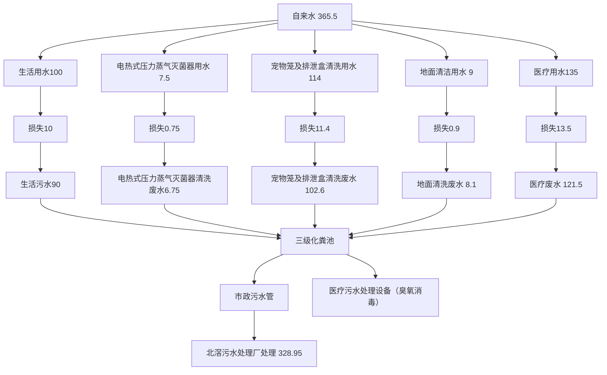
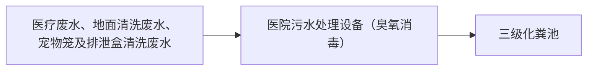

# 建设项目环境影响报告表

（污染影响类）

项目名称：百川动物医院佛山有限责任公司建设项目建设单位（盖章）：百川动物医院（佛山）有限责任公司编制日期： 2025年月

中华人民共和国生态环境部制

# 建设单位责任声明

我单位百川动物医院（佛山）有限责任公司（统一社会信用代码91440606MADJOELMXW）郑重声明：

一、我单位对百川动物医院（佛山）有限责任公司建设项目环境影响报告表（项目编号t7rfq3，以下简称“报告表”）承担主体责任，并对报告表内容和结论负责。

二、在本项目环评编制过程中，我单位如实提供了该项目相关基础资料，加强组织管理，掌握环评工作进展，并已详细阅读和审核过报告表，确认报告表提出的污染防治、生态保护与环境风险防范措施，充分知悉、认可其内容和结论。

三、本项目符合生态环境法律法规、相关法定规划及管理政策要求，我单位将严格按照报告表及其批复文件确定的内容和规模建设，并在建设和运营过程严格落实报告表及其批复文件提出的防治污染、防止生态破坏的措施，落实环境环保投入和资金来源，确保相关污染物排放符合相关标准和总量控制要求。

四、本项目将按照《排污许可管理条例》、《固定污染源排污许可分类管理名录》有关规定，在启动生产设施或者发生实际排污之前申请取得排污许可证或者填报排污登记表。

五、本项目建设将严格执行配套建设的环境保护设施与主体工程同时设计、同时施工、同时投产使用的环境保护“三同时”

制度，并按规定接受生态环境主管部门日常监督检查。在正式投产前，我单位将对配套建设的环境保护设施进行验收，编制验收报告，向社会公开验收结果。

建设单位（盖章百川动物医院

有限责任公司

text_image

(佛山)有限责任公司
(佛山)

2025年3月31日

# 编制单位责任声明

我单位广州南方医疗设备综合检测有限责任公司（统一社会信用代码91440101681332958U）郑重声明：

一、我单位符合《建设项目环境影响报告书（表）编制监督管理办法》第九条第一款规定，无该条第三款所列情形，不属于该条第二款所列单位。

二、我单位受百川动物医院（佛山）有限责任公司（建设单位）的委托，主持编制了百川动物医院（佛山）有限责任公司建设项目环境影响报告表（项目编号：t7rfq3，以下简称“报告表”）。在编制过程中，坚持公正、科学、诚信的原则，遵守有关环境影响评价法律法规、标准和技术规范等规定。

三、在编制过程中，我单位建立和实施了覆盖本项目环境影响评价全过程的质量控制制度，落实了环境影响评价工作程序，并在现场踏勘、现状监测、数据资料收集、环境影响预测等环节以及环境影响报告表编制审核阶段形成了可追溯的质量管理机制。

表内容的我位、告表的内和结承担直接责报告

编制单位（盖章）：广州南方医疗设备

综合检测有限责任公司

法定代表人（签字/签章）：

20年3月2

编制单位和编制人员情况表

<table><tr><td colspan="2">项目编号</td><td colspan="3">t7rfq3</td></tr><tr><td colspan="2">建设项目名称</td><td colspan="2">百川2</td><td>E公司建设项目</td></tr><tr><td colspan="2">建设项目类别</td><td colspan="2">50-12</td><td></td></tr><tr><td colspan="2">环境影响评价文件类型</td><td colspan="2">报告表</td><td></td></tr><tr><td colspan="5">一、建设单位情况</td></tr><tr><td colspan="2">单位名称(盖章)</td><td colspan="3">百川动物医院(佛山)有限责任公司</td></tr><tr><td colspan="2">统一社会信用代码</td><td colspan="3">91440606MADJOELMXW</td></tr><tr><td colspan="2">法定代表人(签章)</td><td colspan="3">杨钦成 杨钦成</td></tr><tr><td colspan="2">主要负责人(签字)</td><td colspan="3">杨钦成 杨钦成</td></tr><tr><td colspan="2">直接负责的主管人员(签字)</td><td colspan="3">杨钦成</td></tr><tr><td colspan="4">二、编制单位情况</td><td></td></tr><tr><td colspan="2">单位名称(盖章)</td><td colspan="2">广州南方医大</td><td>任公司</td></tr><tr><td colspan="2">统一社会信用代码</td><td colspan="2">914401016813</td><td></td></tr><tr><td colspan="4">三、编制人员情况</td><td></td></tr><tr><td colspan="5">1.编制主持人</td></tr><tr><td>姓名</td><td colspan="2">职业资格证书管理号</td><td>信用编号</td><td>签字</td></tr><tr><td>赵琰琰</td><td colspan="2">2017035350352015351002000404</td><td>BH015175</td><td>赵琰琰</td></tr><tr><td colspan="5">2.主要编制人员</td></tr><tr><td>姓名</td><td colspan="2">主要编写内容</td><td>信用编号</td><td>签字</td></tr><tr><td>赵琰琰</td><td colspan="2">表一、表六</td><td>BH015175</td><td>赵琰琰</td></tr><tr><td>李桃薇</td><td colspan="2">表二、表三、表四、表五</td><td>BH070786</td><td>李桃薇</td></tr></table>

#

能力。

中

text_image

中华人民共和国人力资源和社会保障部

古提

text_image

中华人民共和国环境保护部

text_image

广西南方医疗设备综合监督所有限责任公司
401111552105

natural_image

Portrait photo of a person wearing a dark hairnet and collared shirt against a blue background (no text or symbols visible)

名：赵琰琰

natural_image

Pure black rectangle with no visible text, symbols, or features

# 广东省社会保险个人参保证明

该参保人在广州市参加社会保险情况如下：

<table><tr><td>姓名</td><td colspan="3"></td><td>赵琰</td><td>证件号码</td><td colspan="3"></td></tr><tr><td colspan="9">参保险种情况</td></tr><tr><td rowspan="2" colspan="3">参保起止时间</td><td rowspan="2" colspan="3">单位</td><td colspan="3">参保险种</td></tr><tr><td>养老</td><td>工伤</td><td>失业</td></tr><tr><td>202209</td><td>-</td><td>202502</td><td colspan="3">广州市:广州南方医大医疗设备综合检测有限责任公司</td><td>30</td><td>30</td><td>30</td></tr><tr><td colspan="3">截止</td><td colspan="3">2025-02-21 12:19,该参保人累计月数合计</td><td>实际缴费30个月,缓缴0个月</td><td>实际缴费30个月,缓缴0个月</td><td>实际缴费30个月,缓缴0个月</td></tr></table>

备注：

本《参保证明》标注的“缓缴”是指：《转发人力资源社会保障部办公厅国家税务总局力厅关于特困行业阶段性实施缓缴企业社会保险费政策的通知》（粤人社规【2022]11号） 人力资源和社会保障厅广东省发展和改革委员会广东省财政厅国家税务总局广东省税务局关于实施扩大阶段性缓缴社会保险费政策实施范围等政策的通知》（粤人社规【2022]15号）等文件实施范围内的企业电请缓缴三项社保费单位缴费部分。 000

证明机构名称（证明专用章）

证明时间

2025-02-21212:19

# 广东省社会保险个人参保证明

该参保人在广州市参加社会保险情况如下：

<table><tr><td>姓名</td><td colspan="3">李桃薇</td><td>证件号码</td><td colspan="3"></td></tr><tr><td colspan="8">参保险种情况</td></tr><tr><td rowspan="2" colspan="3">参保起止时间</td><td rowspan="2" colspan="2">单位</td><td colspan="3">参保险种</td></tr><tr><td>养老</td><td>工伤</td><td>失业</td></tr><tr><td>202501</td><td>-</td><td>202502</td><td colspan="2">广州市:广州南方医大医疗设备综合检测有限责任公司</td><td>2</td><td>2</td><td>2</td></tr><tr><td colspan="3">截止</td><td colspan="2">2025-02-20 14:36,该参保人累计月数合计</td><td colspan="2"></td><td>实际缴费2个月,缓缴0个月</td></tr></table>

备注：

本《参保证明》标注的“缓缴”是指：《转发人力资源社会保障部办公厅国家税务总局办厅关于特困行业阶段性实施缓缴企业社会保险费政策的通知》（粤人社规【2022】11号） 有人力资源和社会保障厅广东省发展和改革委员会广东省财政厅国家税务总局广东省税务局关于实施扩大阶段性缓缴社等政策的通知（人社规202215号）施围的企业申请缴项

证明机构名称（证明专用章）

证明时间

2025-02-2014:36

# 公司名称变更告知函

尊敬的客户、合作伙伴及各界朋友：

我公司因发展需要，即日起正式将公司名称由广州南方医大医疗设备综合检测有限责任公司变更为广州南方医疗设备综合检测有限责任公司。

此次变更仅涉及公司名称变更，公司地址、电话、业务范围等均保持不变，原有业务关系及合作协议继续有效。

感谢您的理解与支持，期待与您携手共进，共创美好未来！

原公司名称：广州南方医大医疗设备综合检测有限责任公司

现公司名称：广州南方医疗设备综合检测有限责任公司

特此函告。

广州南方医疗设 任公司

月3日

text_image

医疗设备综合检测有限责任公司
2025年3月

# 准予变更登记（备案）通知书

穗云市监内变字【2025】第11202502260819号

广州南方医疗设备综合检测有限责任公司

经审查，申请变更（备案）：名称，主营项目类别，章程备股东名。提交的申请材料齐全，符合法定形式，我局决定准予变更登记（备案

登记机关：广州市白云区市场监督管理局

2025年02月26日

详细变更（备案）内容

<table><tr><td>变更(备案)事项</td><td>原登记变更(备案)事项</td><td>登记变更(备案)事项</td></tr><tr><td>名称变更</td><td>广州南方医大医疗设备综合检测有限责任公司</td><td>广州南方医疗设备综合检测有限责任公司</td></tr><tr><td>主营项目类别</td><td>研究和试验发展</td><td>专业技术服务业</td></tr><tr><td>股东名称变更</td><td>浙江赞宇检测技术有限公司</td><td>杭正检测集团有限公司</td></tr></table>

具体变动申报内容

<table><tr><td>申报事项</td><td>原申报事项</td><td>现申报事项</td></tr><tr><td>章程备案</td><td></td><td>准予章程备案</td></tr><tr><td colspan="3">原组织机构代码证号:统一社会信用代码号:91440101681332958U原执照注册号:4401112020390</td></tr></table>

重要提示：

1、查询企业公示信息请登录"国家企业信用信息公示系统（www.gsxt.gov.cn）"。  
2、本营业执照不作为申报住所、场所所在建筑为合法建筑的证明；如涉及违法建设，由有关部门依法查处。

# 目录

一、建设项目基本情况. ..- 1 -

二、建设项目工程分析.. ...- 21 -

三、区域环境质量现状、环境保护目标及评价标准 . - 32 -

四、主要环境影响和保护措施.. ...- 39 -

五、环境保护措施监督检查清单 ...- 68 -

六、结论.. ..- 71 -

附表.. ..- 72 -

附图1项目地理位置图. ....- 74 -

附图2周边环境图. ........- 75 -

附图3项目四至图及内部实景图. ..- 76 -

附图4项目平面布置图. ...- 79 -

附图5顺德区环境功能区划及水系图. ..- 80 -

附图6项目所在大气环境功能划分区.. ..- 81 -

附图7项目所在地声环境功能区划图 .- 82 -

附图8佛山市顺德区环境管控单元图 ..- 83 -

附图9地下水环境功能区划图.. ...- 84 -

附图 10 佛山市环境管控单元图. .- 85-

附图11广东省环境管控单元图. .- 86-

附件1本项目营业执照. ....- 87 -

附件2法人身份证. ..- 88 -

附件3房产证及租房合同.. .- 89 -

附件 4 委托书.. ..- 97 -

附件5项目声环境现状检测报告. ..- 98 -

附件6广东省投资项目代码. .- 104 -

附件7新风一体机说明书... ...- 105 -

附件8管理制度.. - 110 -

附件9执业兽医师资格证书. ..- 115 -

附件 10成都伽琪乐动物医院有限公司成都伽琪乐动物医院项目竣工环境保护验收监

测报告-无组织废气检测结果.. ... - 118 -

附件 11 绍兴仁爱动物医院有限公司宠物医院建设项目竣工环境保护验收监测评价报

告-废水检测数据. - 119-

# 一、建设项目基本情况

<table><tr><td>建设项目名称</td><td colspan="3">百川动物医院(佛山)有限责任公司建设项目</td></tr><tr><td>项目代码</td><td colspan="3">2406-440606-04-01-275866</td></tr><tr><td>建设单位联系人</td><td>杨钦成</td><td>联系方式</td><td></td></tr><tr><td>建设地点</td><td colspan="3">佛山市顺德区北滘镇君兰社区天宁路24号海琴水岸1、2号商铺</td></tr><tr><td>地理坐标</td><td colspan="3">东经113度12分30.556秒,北纬22度56分30.423秒</td></tr><tr><td>国民经济行业类别</td><td>O8222宠物医院服务</td><td>建设项目行业类别</td><td>五十、社会事业与服务业,123、动物医院,设有动物颅腔、胸腔或腹腔手术设施</td></tr><tr><td>建设性质</td><td>☑新建(迁建)□改建□扩建□技术改造</td><td>建设项目申报情形</td><td>☑首次申报项目□不予批准后再次申报项目□超五年重新审核项目□重大变动重新报批目</td></tr><tr><td>项目审批(核准/备案)部门(选填)</td><td>-</td><td>项目审批(核准/备案)文号(选填)</td><td>-</td></tr><tr><td>总投资(万元)</td><td>50</td><td>环保投资(万元)</td><td>5</td></tr><tr><td>环保投资占比(%)</td><td>10</td><td>施工工期</td><td>2个月</td></tr><tr><td>是否开工建设</td><td>☑否□是: _</td><td>用地(用海)面积( $m^{2}$ )</td><td>329.89</td></tr><tr><td>专项评价设置情况</td><td colspan="3">无</td></tr><tr><td>规划情况</td><td colspan="3">无</td></tr><tr><td>规划环境影响评价情况</td><td colspan="3">无</td></tr><tr><td>规划及规划环境影响评价符合性分析</td><td colspan="3">无</td></tr><tr><td rowspan="3">其他符合性分析</td><td colspan="3">1、与广东省、佛山市、佛山市顺德区“三线一单”生态环境分区管控方案相符性分析</td></tr><tr><td></td><td colspan="2"></td></tr><tr><td colspan="3">图1-1项目三线一单应用平台截图(1)与广东省“三线一单”生态环境分区管控方案相符性分析根据《广东省人民政府关于印发广东省“三线一单”生态环境分区管控方案的通知》(粤府〔2020〕71号)发布的广东省环境管控单元图,项目所在地属于重点管控单元见附图11,项目总体符合重点管控单元的要求。具体分析详见表1-4。(2)与佛山市“三线一单”生态环境分区管控方案相符性分析根据《佛山市生态环境局关于印发的通知》(佛环〔2024〕20号)发布的佛山市环境管控单元图,项目位于北滘镇,属于重点管控单元;环境管控单元名称:北滘镇重点管控区,环境管控单元编码:ZH44060620004。项目总体符合重点管控单元的要求。具体分析详见表1-5。(3)与《顺德区“三线一单”生态环境分区管控方案》相符性分析根据《佛山市顺德区人民政府关于印发佛山市顺德区“三线一单”生态环境分区管控方案的通知》(顺府发〔2021〕11号),项目位于北滘镇,属于重点管控单元;环境管控单元名称:北滘镇重点管控区,环境管控单元编码:ZH44060620004。本项目与《顺德</td></tr></table>

区“三线一单”生态环境分区管控方案》相符性分析详见表1-6。

# 2、与水源保护区法律法规相符性分析

根据《广东省人民政府关于调整佛山市部分饮用水水源保护区的批复》（粤府函〔2018〕426号），本项目不在水源保护区内见附图9。

项目租用已建成商铺，项目运营期间产生的医疗废水、宠物笼及排泄盒清洗废水、地面清洗废水经医疗污水处理设备（臭氧消毒）处理达到《医疗机构水污染物排放标准》（GB18466－2005）表2综合医疗机构及其他医疗机构水污染物排放限值（日均值）预处理标准后，与生活污水、电热式压力蒸汽灭菌器废水共同排入所在商铺建筑三级化粪池处理达到广东省《水污染物排放限值》（DB44/26-2001）第二时段三级标准后，进入市政污水管网排入北滘污水处理厂处理，故不会对饮用水源保护区造成影响。

# 3、选址分析

本项目位于广东省佛山市顺德区北滘镇君兰社区天宁路24号海琴水岸1、2号商铺。地理坐标为东经 113度12 分 30.556秒，北纬22 度 56分 30.423 秒；西南侧为邦宝土外墙定制旗舰店，东北侧为小区绿化带，离本项目东南侧约9m为停车位置，约19m 是水韵路；夹层上方为住宅区。根据房地产证及租赁合同详细（见附件 3），项目所在建筑房屋用途为商业、金融、信息非居住用房。不占用基本农田用地和林地，符合城市规划要求，本项目租用商铺可用于动物医院运营，符合用地用途。

# 4、与《动物诊疗机构管理办法》相符性分析与《动物诊疗机构管理办法》（农业农村部令2022年第5号）、《中华人民共和国动物防疫法》（2021年修订版）相关规定符合性分析表

根据《动物诊疗机构管理办法》（农业农村部令 2022 年第 5号）及《中华人民共和国动物防疫法》（2021年修订版），从事动物诊疗活动的机构，应当向县级以上地方人民政府农业农村主管部门申请动物诊疗许可证。本项目正在办理动物诊疗许可证。

表1-1 本项目与《动物诊疗机构管理办法》（农业农村部令 2022年第5 号）  
对照分析表

<table><tr><td>序号</td><td>要求</td><td>项目具体情况</td><td>相符性</td></tr><tr><td>1</td><td>有固定的动物诊疗场所,且动物诊疗场所使用面积符合省、自治区、直辖市人民政府农业农村主管部门的规定.</td><td>本项目位于广东省佛山市顺德区北滘镇君兰社区天宁路24号海琴水岸1、2号商铺;建筑面积为 $329.89m^{2}$ 。</td><td>符合</td></tr><tr><td>2</td><td>动物诊疗场所选址距离动物饲养场、动物屠宰加工场所、经营动物的集贸市场不少于二百米。</td><td>项目周围200m内无动物饲养场、动物屠宰加工场所、经营动物的集贸市场。</td><td>符合</td></tr><tr><td>3</td><td>动物诊疗场所设有独立的出入口,出入口不得设在居民住宅楼内或者院内,不得与同一建筑物的其他用户共用通道。</td><td>本项目设有独立的出入口,且不与同一建筑物的其他用户共用通道。</td><td>符合</td></tr><tr><td>4</td><td>具有布局合理的诊疗室、手术室、药房等功能区。</td><td>项目具有布局合理的诊疗室、手术室、药房等设施,布局合理。</td><td>符合</td></tr><tr><td>5</td><td>具有诊断、消毒、冷藏、常规化验、污水处理等器械设备。</td><td>项目具有诊断、手术、消毒、冷藏、常规化验、污水处理等器械设备。</td><td>符合</td></tr><tr><td>6</td><td>具有诊疗废弃物暂存处理设施,并委托专业处理机构处理。</td><td>项目设置一间医疗废物室( $5m^{2}$ ),定期委托专业处理机构处理。</td><td>符合</td></tr><tr><td>7</td><td>具有染疫或者疑似染疫动物的隔离控制措施及设施设备。</td><td>本项目不接收具有染疫或者疑似染疫动物。</td><td>符合</td></tr><tr><td>8</td><td>具有1名以上取得执业兽医师资格证书的人员。</td><td>具有3名执业兽医师资格证书的人员。</td><td>符合</td></tr><tr><td>9</td><td>具有完善的诊疗服务、疫情报告、卫生安全防护、消毒、隔离、诊疗废弃物暂存、兽医器械、兽医处方、药物和无害化处理等管理制度。</td><td>具有完善的诊疗服务、疫情报告、卫生安全防护、消毒、隔离、诊疗废弃物暂存、兽医器械、兽医处方、药物和无害化处理等管理制度见附件8。</td><td>符合</td></tr><tr><td>10</td><td>具有三名以上执业兽医师。</td><td>具有3名执业兽医师资格证书的人员见附件9。</td><td>符合</td></tr><tr><td>11</td><td>具有X光机或者B超等器械设备。</td><td>具有百微特DR(睿宠DRF-40)和B超机(理邦)</td><td>符合</td></tr><tr><td>12</td><td>具有布局合理的手术室和手术设备。</td><td>设有手术室和手术台</td><td>符合</td></tr></table>

表 1-2 与《中华人民共和国动物防疫法》（2021 年修订版）的符合性分析

<table><tr><td rowspan="5"></td><td>《中华人民共和国动物防疫法》相关规定要求</td><td>本项目建设情况</td><td>结果</td></tr><tr><td>从事动物诊疗活动的机构,应当向县级以上地方人民政府农业农村主管部门申请动物诊疗许可证。受理申请的农业农村主管部门应当依照本法和《中华人民共和国行政许可法》的规定进行审查。经审查合格的,发给动物诊疗许可证;不合格的,应当通知申请人并说明理由。</td><td>本项目动物诊疗许可证正在办理中。</td><td>符合</td></tr><tr><td>动物诊疗机构应当按照国务院农业农村主管部门的规定,做好诊疗活动中的卫生安全防护、消毒、隔离和诊疗废弃物处置等工作。</td><td>项目区域内做好了诊疗活动中的卫生安全防护、消毒、隔离和诊疗废弃物定期交给有资质的公司进行处置。</td><td>符合</td></tr><tr><td>从事动物诊疗活动,应当遵守有关动物诊疗的操作技术规范,使用符合规定的兽药和兽药器械。</td><td>项目遵守使用符合规定的器械和药品。</td><td>符合</td></tr><tr><td colspan="3">因此,建设项目和《动物诊疗机构管理办法》(农业农村部令2022年第5号)、《中华人民共和国动物防疫法》(2021年修订版)是相符的。5、与产业政策相符性分析根据《国民经济行业分类》(GB/T4754-2017)及《国家统计局关于执行国民经济行业分类第1号修改单的通知》(国统字〔2019〕66号)的分类可知:本项目属于O8222宠物医院服务。根据国家发展和改革委员会发布的《产业结构调整指导目录》(2024年本),本项目不属于该目录中“鼓励类、限制类、淘汰类”项目,属于符合国家有关法律、法规和政策规定的允许类项目;根据国家发展改革委、商务部发布的《市场准入负面清单(2022年版)》(发改体改规〔2022〕397号),本项目不属于市场准入负面清单中的“禁止准入类”;项目所用的全部设备不属于淘汰和限制类之列;且本项目取得备案资料,项目代码:2406-440103-04-01-552517(见附件6)。因此,本项目的建设符合国家及地方产业政策要求。6、与VOCs政策符合性分析项目属于配套动物颅腔、胸腔或腹腔手术设施的动物医院建设项目,酒精为医疗机构必用消毒品,属于非生产性原辅材料。项目</td></tr></table>

排放的挥发性有机物主要来自于医用酒精挥发，排放量较小。根据省生态环境厅回复(回复截图见图1-2)，医院日常使用酒精消毒，属于生活源排放，而且医院使用酒精大部分无组织排放，暂无需申请VOCs总量指标。

text_image

广东省生态环境厅
DEPARTMENT OF ECOLOGY AND ENVIRONMENT OF GUANGDONG PROVINCE
现在位置： 首页 > 公众互动 > 常见问题 > 其它问题
乙醇是否要申请VOCs总量指标
2020-03-25 来源： 广东省生态环境厅【字体：小中大】 分享到：
答：使用乙醇做溶剂的工业企业项目，需要申请；医院日常使用，属于生活源排放，而且医院使用大部分属于无组织排放，暂不需要申请总量指标。

图 1-2 广东省生态环境厅关于“乙醇是否要申请总量指标”一问的回复截图

# 7、与《广东省生态环境保护“十四五”规划》相符性分析

《广东省生态环境保护“十四五”规划》指出：“深化工业污染防治”。严格控制工业建设项目新增主要水污染物排放量，推进废水水质分类处理，加强第一类污染物、持久性有机污染物等水污染物污染控制，严格实施工业污染源全面达标排放。推动工业企业“退城入园”，推进园区废水集中收集处理。巩固“散乱污”场所和“十小”企业清理成果，加强常态化治理。本项目废水不含第一类污染物、持久性有机污染物，项目租用已建成商铺，项目运营期间产生的医疗废水、宠物笼及排泄盒清洗废水、地面清洗废水经医污水处理设备（臭氧消毒）处理达到《医疗机构水污染物排放标准》（GB18466－2005）表2综合医疗机构及其他医疗机构水污染物排放限值（日均值）预处理标准后，与生活污水、电热式压力蒸汽灭菌器废水共同排入所在商铺建筑三级化粪池处理达到广东省《水污染物排放限值》（DB44/26-2001）第二时段三级标准后，进入市政污水管网排入北滘污水处理厂处理，故不会对饮用水源保护区造成影响。

综上所述，符合《广东省生态环境保护“十四五”规划》的通知（粤环〔2021〕10 号）相关要求。

# 8、与佛山市生态环境局关于印发《佛山市生态环境保护“十四

# 五”规划》的通知（佛环〔2022〕3号）

严格限制新建生产和使用高挥发性有机物原辅材料的项目。加强VOCs 源头替代和无组织排放管控。大力推进低VOCs 含量原辅材料替代，将全面使用低VOCs 含量原辅材料的企业纳入正面清单和政府绿色采购清单。鼓励重点行业企业开展生产工艺和设备水性化改造，推广使用水性、高固体分、无溶剂、粉末等低VOCs 含量涂料。

本项目诊疗过程使用的酒精为医疗行业必须的消毒用品，非生产性原辅材料，酒精挥发产生的少量有机废气，酒精挥发属于生活源，通过加强通风，再经过较大空间的扩散稀释，项目为属于O8222宠物医院服务，不属于工业项目。不使用高 VOCs 含量原辅材料。

综上所述，符合佛山市生态环境局关于印发《佛山市生态环境保护“十四五”规划》的通知（佛环〔2022〕3号）相关要求。

# 9、与《佛山市顺德区生态环境保护“十四五”规划（2021-2025）》的相符性分析

根据《佛山市顺德区生态环境保护“十四五”规划（2021-2025）》积极开展危废减量行动，严格规范固废管理。第一，积极探索拓宽危险废物处置渠道。研究有关顺德区绿色工业服务中心建设项目替代方案，扶持鼓励骨干企业自建危废处置设施，开展区外收购、区域合作新建以及建设危险废物收集贮存系统，构建较稳固的危废处置路径，基本解决“十三五”期间的危废处置困境。第二，严格规范固废管理。根据广东省生态环境厅对一般工业固体废物和危险废物申报登记工作的要求，持续督促、指导产废企业在省平台规范申报。各镇（街道）结合辖区内实际产废情况，在辖区内筛选确定1个适宜的场址建成符合标准、规范的一般工业固体废物应急贮存场所，以解决环境污染事件中涉及一般工业固体废物乱倾倒、乱堆集等问题。

本项目在夹层设置有一个医疗废物室（5m2）用于暂存危险废物，产生的诊疗废弃物和废紫外线灯管，经分类收集后暂存于医疗废物室，定期交由具有资质的单位处置，动物尸体和组织器官冷冻暂存冰箱里2日内交由相关单位进行无害化处理，生活垃圾集中收集后交由环卫部门统一清运。一般固体废物：医疗用品和药品废包装材料、非疫病宠物粪便（含垫布/垫片）和非疫病废猫砂消毒灭菌后分类暂存于夹层的仓库，定期交由环卫部门清运处理。

综上诉，本项目符合《佛山市顺德区生态环境保护“十四五”规划（2021-2025）》。

10、与《关于印发广东省 2021 年水、大气、土壤污染防治工作方案的通知》（粤办函〔2021〕58号）的相符性分析

①大气污染防治

根据《广东省人民政府办公厅关于印发广东省2021 年大气、水、土壤污染防治工作方案的通知》(以下简称《方案》)，广东省2021 年大气污染防治工作重点包括持续推进挥发性有机物(VOCs)综合治理和深入开展工业炉窑和锅炉污染防治综合治理，《方案》要求“实施低VOCs含量产品源头替代工程。严落实国家产品VOCs含量限值标准要求,除现阶段确无法实施替代的工序外，禁止新建生产和使用高VOCs 含量原辅材料项目。鼓励在生产和流通消费环节推广使用低VOCs 含量原辅材料。“全面深化涉 VOCs 排放企业深度治理。指导企业使用适宜高效的治理技术，涉VOCs 重点行业新建、改建和扩建项目不推荐使用光氧化、光催化、低温等离子等低效治理设施，已建项目逐步淘汰光氧化、光催化、低温等离子治理设施。指导采用一次性活性炭吸附治理技术的企业，明确活性炭装载量和更换频次，记录更换时间和使用量”。

本项目属于宠物医院服务业，不使用高挥发性有机物原辅材料，不属于 12个重点行业,诊疗过程使用的酒精为医疗行业必须的消毒用品，非生产性原辅材料，酒精挥发产生的少量有机废气，酒精挥发属于生活源，通过加强通风，再经过较大空间的扩散稀释，对周围的环境影响不大，且在广东省生态环境厅的回复中表示医院酒精的日常使用属于生活源排放。因此本项目大气污染防治情况与《方案》相符。

# ②水污染防治

根据《方案》，广东省2021年水污染防治工作重点包括“深入推进城市生活污水治理”，“深入推进工业污染治理，“深入推进农村生活污染治理等，项目租用已建成商铺，项目运营期间产生的医疗废水、宠物笼及排泄盒清洗废水、地面清洗废水经医疗污水处理设备（臭氧消毒）处理达到《医疗机构水污染物排放标准》（GB18466－2005）表 2 综合医疗机构及其他医疗机构水污染物排放限值（日均值）预处理标准后，与生活污水、电热式压力蒸汽灭菌器废水共同排入所在商铺建筑三级化粪池处理达到广东省《水污染物排放限值》（DB44/26-2001）第二时段三级标准后，进入市政污水管网排入北滘污水处理厂处理。故本项目与水污染防治情况与《方案》相符。

# ③土壤污染防治

根据《方案》，广东省2021年土壤污染防治工作重点包括“强化土壤污染重点监管单位规范化管理”，“加强工业污染风险防控”，“加强生活垃圾污染治理”，“强化建设用地土壤环境管理等。

本项目租赁商铺进行建设，不属于土壤污染重点监管单位，租赁商铺内部均已进行水泥地面硬底化，医疗废物室按照《危险废物贮存污染控制标准》的要求建设，因此本项目对土壤环境影响较小。

综上所述，本项目符合《广东省人民政府办公厅关于印发广东省2021年大气、水、土壤污染防治工作方案的通知》(粤办函〔2021〕58号)的相关要求。

# 11、与《关于印发广东省 2023年大气污染防治工作方案的通知》（粤办函〔2023〕50 号）的相符性分析

本项目与《关于印发广东省 2023年大气污染防治工作方案的

<table><tr><td rowspan="5"></td><td colspan="4">通知》(粤办函〔2023〕50号)的相符性如下:表1-3本项目与粤办函〔2023〕50号的相符性分析</td></tr><tr><td>序号</td><td>政策要求</td><td>工程内容</td><td>相符性</td></tr><tr><td>1</td><td>加强低VOCs含量原辅材料应用。应用涂装工艺的工业企业应当使用低VOCs含量的涂料,并建立保存期限不得少于三年的台账,记录生产原辅材料的使用量、废弃量、去向以及VOCs含量。</td><td>项目属于新建项目,主要经营为动物诊疗(含三腔手术)、寄养(住院)、宠物食品与用品零售项目,属于O8222宠物医院服务,不属于涂装工艺的工业企业。项目使用的酒精为医疗机构所必须消毒用品,非生产性原辅材料,无可替代</td><td>符合</td></tr><tr><td>2</td><td>开展简易低效VOCs治理设施清理整治。严格限制新改扩建项目使用光催化、光氧化、水喷淋(吸收可溶性VOCs除外)、低温等离子等低效VOC治理设施(恶臭处理除外)</td><td>本项目属于宠物医院服务,项目使用的酒精为医疗机构所必须消毒用品,诊疗过程酒精消毒过程产生的酒精挥发属于生活源,通过加强通风,再经过较大空间的扩散稀释无组织排放,对周围大气环境质量影响不大。</td><td>符合</td></tr><tr><td>3</td><td>严格执行涂料、油墨、胶粘剂、清洗剂VOCs含量限值标准,建立多部门联合执法机制,加强对相关产品生产、销售、使用环节VOC含量限值执行情况的监督检查。</td><td>本项目不使用涂料、油墨、胶粘剂和清洗剂</td><td>符合</td></tr></table>

表 1-4 本项目与《广东省人民政府关于印发广东省“三线一单”生态环境分区管控方案的通知》（粤府〔2020〕71 号）  
相符性分

<table><tr><td>类别</td><td>全省总体管控要求</td><td>项目对照分析情况</td><td>相符性分析</td></tr><tr><td>生态保护红线及一般生态空间</td><td>全省陆域生态保护线面积36194.35平方公里,占全省陆域土面积20.13%;一般生态空间面积27741.66平方公里,占全省陆域国土面积的15.44%。全省海洋生态保护红线面积16490.59平方公里,占全省管辖海域面积的25.49%。</td><td>本项目选址不在生态保护红线及一般生态空间范围内。</td><td>符合</td></tr><tr><td>环境质量底线</td><td>全省水环境质量持续改善,国考、省考断面优良水质比例稳步提升,全面消除劣V类水体。大气环境质量继续领跑先行, $PM_{2.5}$ 年均浓度率先达到世界卫生组织过渡期二阶段目标值(25微克/立方米),臭氧污染得到有效遏制。土壤环境质量稳中向好,土壤环境风险得到管控。近岸海域水体质量稳步提升。</td><td>本项目综合废水全部纳入北滘污水处理厂处理,对纳污水体影响较小。项目运营后不会对环境造成明显影响,环境质量可以保持现有水平。</td><td>符合</td></tr><tr><td>资源利用上线</td><td>强化节约集约利用,持续提升资源能源利用效率,水资源、土地资源、岸线资源、能源消耗等达到或优于国家下达的总量和强度控制目标。</td><td>本项目主要消耗水电资源,统一由市政供水供电,区域水电气资源较充足,项目消耗量没有超出资源负荷,没有超出当地资源利用上线。</td><td>符合</td></tr><tr><td>区域布局管控要求</td><td>优先保护生态空间,保育生态功能。持续深入推进产业、能源、交通运输结构调整。按照“一核一带一区”发展格局,调整优化产业集群发展空间布局,推动城市功能定位与产业集群发展协同匹配。推动工业项目入园集聚发展,引导重大产业向沿海等环境容量充足地区布局,新建化学制浆、电镀、印染、鞣革等项目入园集中管理。依法依规关停落后产能,全面实施产业绿色化改造,培育壮大循环经济。环境质量不达标区域,新建项目需符合环境质量改善要求。</td><td>本项目为宠物医疗服务业,不属于工业项目。</td><td>符合</td></tr><tr><td>能源资源利用要求</td><td>积极发展先进核电、海上风电、天然气发电等清洁能源,逐步提高可再生能源与低碳清洁能源比例,建立现代化能源体系。科学推进能源消费总量和强度“双控”,严格控制并逐步减少煤炭使用量,力争在全国范围内提前实现碳排放达峰。依法依规强化油品生产、流通、使用、贸易等全流程监管,减少直至杜绝非法劣质油品在全省流通和使用。贯彻落实“节水优先”方针,实行最严格水资源管理制度,把水资源作为刚性约束,以节约用水扩大发展空间。落实东江、西江、北江、韩江、鉴江等流域水资源分配方案,保障主要河流基本生态流量。强化自然岸线保护,优化岸线开发利用格局,建立岸线分类管控和长效管护机制,规范岸线开发秩序;除国家重大项目外,全面禁止围填海。落实单位土地面积投资强度、土地利用强度等建设用地控制性指标要求,提高土地利用效率。推动绿色矿山建设,提高矿产资源产出率。积极发展农业资源利用节约化、生产过程清洁化、废弃物利用资源化等生态循环农业模式。</td><td>本项目营运过程中主要消耗能源为电能和水能,本项目所在区域水、电资源较充足,项目消耗量没有超出资源负荷,没有超出资源利用上线。</td><td>符合</td></tr><tr><td>污染物排放管控要求</td><td>实施重点污染物总量控制,重点污染物排放总量指标优先向重大发展平台、重点建设项目、重点工业园区、战略性产业集群倾斜。加快建立以排污许可制为核心的固定污染源监管制度,聚焦重点行业和重点区域,强化环境监管执法。超过重点污染物排放总量控制指标或未完成环境质量改善目标的区域,新建、改建、扩建项目重点污染物实施减量替代。重金属污染重点防控区内,重点重金属排放总量只减不增;重金属污染物排放企业清洁生产逐步达到国际或国内先进水平。实施重点行业清洁生产改造,火电及钢铁行业企业大气污染物达到可核查、可监管的超低排放标准,水泥、石化、化工及有色金属冶炼等行业企业大气污染物达到特别排放限值要求。深入推进石化化工、溶剂使用及挥发性有机液体储运销的挥发性有机物减排,通过源头替代、过程控制和末端治理实施反应活性物质、有毒有害物质、恶臭物质的协同控制。严格落实船舶大气污染物排放控制区要求。优化调整供排水格局,禁止在地表水I、II类水域新建排污口,已建排污口不得增加污染物排放量。加大工业园区污染治理力度,加快完善污水集中处理设施及配套工程建设,建立健全配套管理政策和市场化运行机制,确保园区污水稳定达标排放。加快推进生活污水处理设施建设和提质增效,因地制宜治理农村面源污染,加强畜禽养殖废弃物资源化利用。强化陆海统筹,严控陆源污染物入海量。</td><td>项目属于宠物医疗服务业,不排放重金属,不使用溶剂型油墨、涂料、清洗剂、胶黏剂等高挥发性有机物原辅材料,不涉及总量控制指标。项目所在区域属于北滘污水处理厂的纳污范围,已配套完善污水管网,本项目废综合水处理达标后排入北滘污水处理厂进行集中处理。</td><td>符合</td></tr><tr><td>环境</td><td>加强东江、西江、北江和韩江等供水通道干流沿岸以及饮用水水源地、备用水源环</td><td>项目为宠物医疗服务业,选址不在东江、</td><td>符合</td></tr><tr><td>风险防控要求</td><td>境风险防控,强化地表水、地下水和土壤污染风险协同防控,建立完善突发环境事件应急管理体系。重点加强环境风险分级分类管理,建立全省环境风险源在线监控预警系统,强化化工企业、涉重金属行业、工业园区和尾矿库等重点环境风险的环境风险防控。实施农用地分类管理,依法划定特定农产品禁止生产区域,规范受污染建设用地地块再开发。全力避免因各类安全事故(事件)引发的次生环境风险事故(事件)。</td><td>西江、北江和韩江等供水通道干流沿岸以及饮用水水源地、备用水源保护区,不属于化工企业、涉重金属行业、工业园区和尾矿库等重点环境风险源企业。</td><td></td></tr></table>

表 1-5 项目与佛山市生态环境局关于印发《佛山市“三线一单”生态环境分区管控方案（2024 年版）》的通知相符性分析

<table><tr><td colspan="2">佛山市总体管控要求</td><td>项目对照分析</td><td>符合性分析</td></tr><tr><td>生态保护红线及一般生态空间</td><td>全市陆域生态保护红线面积323.06平方公里,占全市陆域国土面积的8.51%;一般生态空间面积217.36平方公里,占全市陆域国土面积的5.73%。</td><td>根据佛山市生态环境局关于印发《佛山市“三线一单”生态环境分区管控方案(2024年版)》,项目在重点管控单元内(见附图10)。</td><td>符合</td></tr><tr><td>环境质量底线</td><td>地表水环境质量持续改善,乡镇级及以上集中式饮用水水源地水质100%达标,国考、省考断面地表水质量达到或优于III类水体比例不低于85.7%,劣V类水体比例为0%,市考断面基本消除劣V类断面;全面消除黑臭水体。空气质量持续改善,细颗粒物( $PM_{2.5}$ )年均浓度、空气质量优良天数比例(AQI)主要指标达到省下达的目标要求,臭氧污染得到遏制。土壤环境质量总体保持稳定,土壤环境风险得到管控,受污染耕地安全利用率不低于93%,重点建设用地安全利用得到有效保障。地下水国控区域点位V类水比例完成省下达任务,地下水饮用水源点位和污染风险监控点位水质总体保持稳定。</td><td>1、项目所在地区地表水环境质量现状达标;2、项目所在区域属于环境空气2类区域,根据《佛山市生态环境局顺德分局关于发布2023年度佛山市顺德区环境质量状况公报的通知》(佛顺环函〔2024〕44号),2023年顺德区空气质量综合指数为3.14,比2022年下降4.0%,在全市五区中排名第二;3、项目不属于土壤污染重点监管单位,租赁商铺内部均已进行水泥地面硬底化。</td><td>符合</td></tr><tr><td>资源利用上线</td><td>强化节约集约循环利用,持续提升资源能源利用效率。到2025年,全市用水总量控制在23.44亿立方米以内,万元地区生产总值用水量和万元工业增加值用水量较2020年降幅不低于17%,农田灌溉水有效利用系数不低于0.55。土地资源、岸线资源、能源消耗等达到或优于国家和省下达的总量、强度等目标要求,按省规定年限实现碳达峰,其中耕地保有量达到185.75平方公里,永久基本农田面积稳定保持164.42平方公里,单位GDP能耗降低比例达到14.5%。到2035年,生态环境分区管控体系巩固完善,生态空间保护格局稳定,生态环境质量根本好转,资源节约集约利用水平显著提高,碳排放率先达峰后稳中有降,绿色生产生活方式广泛形成,人与自然和谐发展的现代化建设新格局总体形成,建成美丽佛山。</td><td>项目是宠物医院服务行业,主要消耗水、电资源,统一由市政供水、供电,区域水、电资源比较充足,项目消耗量没有超出当地资源利用上线。</td><td>符合</td></tr><tr><td>区域布局管控要求</td><td>优先保护生态空间,筑牢生态保护底线,构建生态空间保护格局。强化水源地空间管控,严格限制饮用水水源汇水区内的生态保护与水源涵养区域变更土地利用方式。持续深入推进产业、能源、交通运输结构调整。按照制造业组团化发展格局,打造先进制造业集群,推动城市功能定位、空间布局与产业发展高质量协同匹配。巩固提升传统优势产业,推动佛山智能家电、陶瓷建材、金属制品等数字化、智能化、绿色化、高端化、个性化全面转型升级。做大做强战略性新兴产业,推动科技创新与高端装备制造、汽车、新一代电子信息、新材料、新能源、生物医药等产业发展深度融合,全面提升制造业集群绿色发展水平。全面攻坚老旧工业园区升级改造,腾出连片空间,布局产业集聚区和主题产业园,推动工业项目入园集聚发展。通过城市更新实现公共设施“补短板”、产业空间“再聚集”、重点片区“强统筹”,盘活存量建设用地。依法依规关停落后产能,全面实施产业绿色化改造,培育壮大循环经济。新建、改建、扩建的项目应当符合国家产业政策规定。环境质量不达标区域,新建、扩建项目需符合环境质量改善要求。全市域为高污染燃料禁燃区,禁止新建、扩建燃用高污染燃料的燃烧设施。加快推进天然气产供储销体系建设,逐步淘汰集中供热管网覆盖区域内的分散供热锅炉,完成生物质锅炉淘汰整治,促进用热企业向园区集聚。禁止新建、扩建水泥、平板玻璃、化学制浆、生皮制革以及国家规划外的钢铁、原油加工等项目。专业电镀、印染等项目进入定点园区集中管理。严格落实国家产品VOCs含量限值标准要求,除现阶段确无法实施替代的工序外,禁止新建生产和使用高VOCs含量原辅材料项目,鼓励建设共性工厂、活性炭集中再生中心等挥发性有机物第三方治理项目,推动挥发性有机物集中高效处理。优化交通结构,发展多式联运,推进公路、水路等交通运输燃料清洁化,推广新能源物流车辆,优先在禅桂新中心城区探索设立“绿色物流”片区。</td><td>项目为宠物医院服务行业,不属于工业项目,不涉及生态保护。</td><td>符合</td></tr><tr><td>能源资源利用要求</td><td>积极发展氢能源、天然气等清洁能源,逐步提高可再生能源与低碳清洁能源比例,建立现代化能源体系。科学实施能源消费总量和强度“双控”,新建高能耗项目单位产品(产值)能耗达到国际国内先进水平,实现煤炭消费总量负增长。加快城镇燃气基础设施优化布局,落实天然气大用户直供和“瓶改管”。禁止新增高污染燃料销售点,加强全市高污染燃料监督管理。率先探索建立二氧化碳总量管理制度,加快实现碳排放达峰。新、改、扩建“两高”项目3须符合生态环境保护法律法规和相关法定规划,满足污染物区域削减、重点污染物排放总量控制、碳排放达峰目标、相关规划环评和相应行业建设项目环境准入条件、环评文件审批原则要求。</td><td>项目是宠物医院服务行业,主要消耗水、电资源,统一由市政供水、供电,区域水、电资源比较充足,项目消耗量没有超出当地资源利用上线。</td><td>符合</td></tr><tr><td>污染物排放管控要求</td><td>实施重点污染物4总量控制,重点污染物排放总量指标优先向重大发展平台、重点建设项目、重点工业园区、战略性产业集群倾斜。加快建立以排污许可制为核心的固定污染源监管制度,聚焦重点行业和重点区域,强化环境监管</td><td>项目产生的综合废水和诊疗时使用的酒精消毒产生的有机废气排放可不设置总量指标,项目所在的小区商铺已设置雨污分流,所产生的</td><td>符合</td></tr><tr><td></td><td>执法。规范工业排水管理,依法开展排水许可。合理建设工业废水或综合废水集中处理设施,持续推进工业园“污水零直排区”建设。稳步推进排水设施“三个一体化”5管理模式,补齐城乡污水收集和处理短板,推动污水处理设施提质增效,加快消除城中村、老旧城区、城乡结合部等污水收集管网空白区,逐步实现城乡污水收集处理全覆盖。城镇新区建设均实行雨污分流。推进建设大型现代化畜禽养殖场,加强畜禽养殖废水处理及废弃物资源化利用,推广水产生态健康养殖模式,防治农村面源污染。地表水I、II类水域,以及III类水域中的保护区、游泳区,禁止新建排污口,已建成的排污口应当实行污染物总量控制且不得增加污染物排放量。实行水污染物的行业标杆管理,严格执行汾江河流域水污染物排放标准。实施水生态系统保护修复,推进河涌水系连通、底泥疏浚,加强湿地建设及河心岛生态修复。重点污染物未达到环境质量改善目标的管控分区所在镇(街道),须组织编制、系统实施重点污染物减排计划并明确“替代量”,本年度新建、改建、扩建项目新增水环境重点污染物实行减量替代。</td><td>综合废水排入商铺的三级化粪池处理后排入市政污水管网再流入北滘污水处理厂处理。</td><td></td></tr><tr><td>环境风险防控要求</td><td>加强西江、北江等供水通道干流沿岸以及饮用水水源地、备用水源环境风险防控,完善城市双水源联网供水格局。系统推进土壤和地下水污染源头防控,强化地表水、地下水和土壤污染风险协同防控,建立完善突发环境事件应急管理体系。重点加强环境风险分级分类管理,应用全省环境风险源在线监控预警系统,强化化工企业、涉重金属行业、工业园区等重点环境风险源的环境风险防控。推动企业将低温等离子、UV光解、RTO燃烧炉等有机废气治理设施纳入全厂安全风险辨识范围,加强安全管理。禁止在规划专门用于危险化学品生产、储存的区域(包括化工园区)外新建、扩建危险化学品生产、储备建设项目(加油站、加气站、加氢站、港口及铁路、航空危险化学品储存建设项目、危险化学品输送管道及危险化学品使用单位的配套项目除外)。实施农用地分类管理,依法划定特定农产品禁止生产区域。严格建设用地再开发建设管理,对纳入建设用地土壤污染风险管控和修复名录的地块,未达到土壤污染风险评估报告确定的风险管控、修复目标的建设用地地块,禁止开工建设任何与风险管控、修复无关的项目。提升危险废物监管能力,利用信息化手段,推动全过程跟踪管理。健全危险废物收集体系,推进危险废物利用处置能力优化提升。全力避免因各类安全事故(事件)引发的次生环境风险事故(事件)。</td><td>项目为宠物医院服务行业,选址不在西江、北江等供水通道干流沿岸以及饮用水水源地,不属于化工企业、涉重金属行业、工业园区等重点环境风险源。</td><td>符合</td></tr></table>

表 1-6项目与佛山市顺德区“三线一单”环境管控单元方案相符性分析

<table><tr><td colspan="2">管控要求</td><td>工程内容</td><td>符合性分析</td></tr><tr><td rowspan="8">区域布局管控</td><td>1-1.【生态/禁止类】单元内的一般生态空间,主导生态功能为水土保持,禁止在25度以上的陡坡地开垦种植农作物,禁止在崩塌、滑坡危险区、泥石流易发区从事采石、取土、采砂等可能造成水土流失的活动。</td><td>项目属于宠物医院服务,建设地址位于佛山市顺德区北滘镇君兰社区天宁路24号海琴水岸1、2号商铺,不属于生态禁止类。</td><td>符合</td></tr><tr><td>1-2.【产业/鼓励引导类】重点发展机器人及配套产业、智能家用电器、高端新型电子信息、新材料等制造业和总部经济、电子商务、工业设计与文化创意、科技金融等现代服务业,打造智能制造和智慧家电示范区。</td><td>项目属于宠物医院服务,不是发展机器人及配套产业、智能家用电器、高端新型电子信息、新材料等制造业和总部经济、电子商务、工业设计与文化创意、科技金融等现代服务业。</td><td>符合</td></tr><tr><td>1-3.【产业/综合类】系统推进村级工业园升级改造,腾出连片空间,布局产业集聚区和主题产业园,推动工业项目入园集聚发展。</td><td>项目属于宠物医院服务,不在村级工业园升级改造,腾出连片空间,布局产业集聚区和主题产业园内。</td><td>符合</td></tr><tr><td>1-4.【水/限制类】严格限制在佛山市禅城南庄紫洞水厂、佛山市禅城沙口(石湾)水厂、羊额—北滘水厂、广州市南洲水厂顺德水道取水口饮用水水源保护区上游和周边区域建设列入“高污染、高环境风险”产品名录等可能影响水环境安全的项目。</td><td>项目建设地址位于佛山市顺德区北滘镇君兰社区天宁路24号海琴水岸1、2号商铺,不在佛山市禅城南庄紫洞水厂、佛山市禅城沙口(石湾)水厂、羊额—北滘水厂、广州市南洲水厂顺德水道取水口饮用水水源保护区上游和周边区域建设。</td><td>符合</td></tr><tr><td>1-5.【大气/限制类】大气环境受体敏感重点管控区内,应严格限制新建储油库项目、产生和排放有毒有害大气污染物的建设项目以及使用溶剂型油墨、涂料、清洗剂、胶黏剂等高挥发性有机物原辅材料项目,鼓励现有该类项目搬迁退出。</td><td>项目属于宠物医院服务,不属于新建储油库项目、产生和排放有毒有害大气污染物的建设项目以及使用溶剂型油墨、涂料、清洗剂、胶黏剂等高挥发性有机物原辅材料项目。</td><td>符合</td></tr><tr><td>1-6.【大气/鼓励引导类】大气环境高排放重点管控区内,应强化达标监管,引导工业项目落地集聚发展,有序推进区域内行业企业提标改造</td><td>项目所在位置是属于大气环境高排放重点管控区内,但是不属于工业项目落地集聚,属于宠物医院服务行业。</td><td>符合</td></tr><tr><td>1.7.【产业/综合类】划定家具生产优先发展区域,优先发展区外不再新建涉及涂装工艺的木质家具制造项目。优先发展区范围根据家具产业发展规划及其规划环评文件确定。</td><td>项目属于宠物服务行业,不在划定家具生产优先发展区域。</td><td>符合</td></tr><tr><td>1-8.【产业/限制类】受纳水体或监控断面不达标且未“以新带老”制定区域达标方案的河涌,不得新建、扩建向河涌直接排放废水的项目。新建、扩建含蚀刻工序的线路板生产项目和化工项目应在配套污水集中处置的工业园区或生活污水管网覆盖区域内建设;纯加工型印花项目,含酸洗、磷化的金属表面处理、金属制品项目(与自身高新技术企业配套的和区级及以上重点项目除外),含酸洗、喷涂、化学抛光、电解等涉及废水排放工艺的不锈钢型材加工项目(与自身高新技术企业配套的和区级及以上重点项目除外),应进入以此类项目为主导产业、有相应废水集中治理设施的工业园区,实现集中治污。</td><td>项目属于宠物服务行业,不属于产业/限制业。</td><td>符合</td></tr><tr><td rowspan="5">能源资源利用</td><td>2-2【能源/鼓励引导类】推广新能源汽车应用和充电基础设施建设,积极推动重卡LNG加气站、充电基础设施、加氢站建设。</td><td>项目属于宠物服务行业,不属于新能源汽车应用和充电基础设施建设。</td><td>符合</td></tr><tr><td>2-3.【能源/综合类】科学实施能源消费总量和强度“双控”,新建高能耗项目单位产品(产值)能耗达到国际国内先进水平。</td><td>项目属于宠物服务行业,生产过程中资源消耗量相对区域资源利用总量较少。</td><td>符合</td></tr><tr><td>2-4.【水资源/综合类】贯彻落实“节水优先”方针,实行最严格水资源管理制度,北滘镇万元国内生产总值用水量、万元工业增加值用水量、用水总量、农田灌溉水有效利用系数等用水总量和效率指标达到区下达要求。</td><td>项目贯彻落实“节水优先”方针,用水量较少,不属于高耗水服务型行业。</td><td>符合</td></tr><tr><td>2-5.【土地资源/限制类】落实单位土地面积投资强度、土地利用强度等建设用地控制性指标要求,提高土地利用效率。</td><td>项目已落实单位土地面积投资强度、土地利用强度等建设用地控制性指标要求,提高土地利用效率。</td><td>符合</td></tr><tr><td>2-6.【岸线/禁止类】严格水域岸线用途管制,新建项目一律不得违规占用水域。严禁破坏生态的岸线利用行为和不符合其功能定位的开发建设活动,严禁以各种名义侵占河道、围垦湖泊、非法采砂等。</td><td>项目使用已建成商铺,不涉及“违规占用水域。严禁破坏生态的岸线利用行为和不符合其功能定位的开发建设活动,严禁以各种名义侵占河道、围垦湖泊、非法采砂等”。</td><td>符合</td></tr><tr><td>污染物排放管控</td><td>3-1.【水/限制类】城镇新区建设实行雨污分流,逐步推进初期雨水收集、处理和资源化利用。住宅、商业体、学校、市场等城镇开发建设项目应当配套或者同步计划建设公共排水设施,公共排水设施或自建排污水设施未能投产运行的,以上涉水项目不得投入使用。新建小区严格实施雨污分流,阳台、露台等污水接入污水收集系统,将生活污水“应截尽截”。做好大型楼盘、集贸市场、餐饮以及学校等4大类排水户污水接入市政管网工作。</td><td>项目租用已建成商铺,项目运营期间产生的医疗废水、宠物笼及排泄盒清洗废水、地面清洗废水经医疗污水处理设备(臭氧消毒)处理达到《医疗机构水污染物排放标准》(GB18466-2005)表2综合医疗机构及其他医疗机构水污染物排放限值(日均值)预处理标准后,与生活污水、电热式压力蒸汽灭菌器废水共同排入所在商铺建筑三级化粪池处理达到广东省《水污染物排放限值》(DB44/26-2001)第二时段三级标准后,进入市政污水管网排入北滘污水处理厂处理,故不会对饮用水源保护区造成影响。</td><td>符合</td></tr><tr><td rowspan="4"></td><td>3-2.【水/综合类】结合村级工业园改造,全面提升产业层次与集聚度,促进污染集中整治。</td><td>项目综合废水污染物总量指标纳入北滘污水处理厂。</td><td></td></tr><tr><td>3-3.【水/综合类】稳步推进排水设施“三个一体化”管理模式,补齐城乡污水收集和处理短板,推动群力围污水处理厂提质增效,加快消除城中村、老旧城区、城乡结合部等污水收集管网空白区,逐步实现城乡污水收集处理全覆盖。2025年前完成群力围污水处理厂扩建,尾水应执行《城镇污水处理厂污染物排放标准》(GB18918-2002)一级A标准及《广东省水污染物排放限值》(DB44/26-2001)的较严值。</td><td>项目租用已建成商铺,项目运营期间产生的医疗废水、宠物笼及排泄盒清洗废水、地面清洗废水经医疗污水处理设备(臭氧消毒)处理达到《医疗机构水污染物排放标准》(GB18466-2005)表2综合医疗机构及其他医疗机构水污染物排放限值(日均值)预处理标准后,与生活污水、电热式压力蒸汽灭菌器废水共同排入所在商铺建筑三级化粪池处理达到广东省《水污染物排放限值》(DB44/26-2001)第二时段三级标准后,进入市府污水管网排入北滘污水处理厂处理。尾水处理达到《城镇污水处理厂污染物排放标准》(GB18918-2002)中的一级的A级排放标准和广东省地方标准《水污染物排放限值》(DB44/26-2001)第二时段一级标准的较严值排入潭洲水道。</td><td>符合</td></tr><tr><td>3-4.【水/综合类】近期保留并完善水口村、三桂村、西滘村、马龙村等现状农村污水分散式处理设施,新建莘村、马龙村等分散式污水处理站建设,继续完善污水支管网建设,提高污水收集处理率,其余行政村(社区)继续完善污水管网建设,实现农村污水100%收集进入市政污水系统,有条件的区域实施雨污分流改造,到2030年全面雨污分流,污水纳入北滘城镇污水处理系统。</td><td>项目所在的小区商铺已设置雨污分流,所产生的综合废水排入商铺的三级化粪池处理后排入市政污水管网再流入北滘污水处理厂处理。</td><td>符合</td></tr><tr><td>3-5.【大气/综合类】大力推进低VOCs含量原辅材料替代,加快涉VOCs重点行业的生产工艺升级改造,推行自动化生产工艺,对达不到要求的VOCs收集及治理设施进行整治提升,逐步淘汰低效VOCs治理设施。</td><td>项目属于配套动物颅腔、胸腔或腹腔手术设施的动物医院建设项目,不属于使用高挥发性有机原辅材料。项目排放的挥发性有机物主要来自于医用酒精挥发,排放量较小酒精为医疗机构必用消毒品,诊疗过程使用酒精消毒,过程产生的酒精挥发属于生活源,通过加强通风,再经过较大空间的扩散稀释。</td><td>符合</td></tr><tr><td rowspan="3">环境风险防控</td><td>4-1.【水/综合类】加强单元内佛山市禅城南庄紫洞水厂、佛山市禅城沙口(石湾)水厂、羊额—北滘水厂、广州市南洲水厂顺德水道取水口饮用水水源保护区周边环境风险源管控,完善突发环境事件应急管理体系。</td><td>项目属于宠物医院服务,不涉及单元内佛山市禅城南庄紫洞水厂、佛山市禅城沙口(石湾)水厂、羊额—北滘水厂、广州市南洲水厂顺德水道取水口饮用水水源保护区周边环境风险源。</td><td>符合</td></tr><tr><td>4-2.【水/综合类】北滘污水处理厂、群力围污水处理厂、工业污水集中处理设施应采临取有效措施,防止事故废水直接排入水体。完善污水处理厂在线监控系统联网,实现污水处理厂的实时、动态监管。</td><td>本项目属于宠物医院服务,不属于污水处理厂项目。</td><td>符合</td></tr><tr><td>4-3.【风险/综合类】加强环境风险分级分类管理,强化金属制品、有色金属和压延加工、化学原料和化学品制造业等涉重金属、化工行业企业及工业园区等重点环境风险源的环境风险防控。</td><td>项目属于宠物医院服务行业,不涉及强化金属制品、有色金属和压延加工、化学原料和化学品制造业等涉重金属、化工行业企业及工业园区等重点环境风险源的环境风险防控。</td><td>符合</td></tr></table>

# 二、建设项目工程分析

<table><tr><td>建设内容</td><td>1、项目工程组成百川动物医院(佛山)有限责任公司建设项目(以下称“本项目/项目”)建于广东省佛山市顺德区北滘镇君兰社区天宁路24号海琴水岸1、2号商铺,项目地理位置图见附图1,营业执照见附件1,法人身份证见附件2。项目所在商铺楼层共有17层,租用首层商铺,商铺内自带夹层,夹层上方是住宅区,建筑面积为 $329.89m^{2}$ 。项目主要经营范围为宠物疾病预防、诊疗、治疗(包括三腔手术:颅腔、腹腔以及胸腔手术)和绝育手术和宠物住院(含寄养),不涉及美容洗浴项目。门诊最大接诊量为12000只/年(其中动物诊疗为9000只/年,住院寄养最大量为3000只/年),共设置95个宠物笼用于寄养(含住院)服务。本项目主要接收犬类、猫类诊疗,不接收传染性瘟病动物。一楼主要设立前台、候诊区、诊室1、诊室2、诊室3、诊室4、诊室5、监控室、吊瓶陪护区、化验区、药房、手术室1、手术2、重症监护区、B超室、DR室;夹层:主要设立犬住院1、犬住院2、留观室、ICU室、医疗废物室、猫住院1、猫住院2、隔离室、仓库、会议室、备用室员工更衣室等功能用房和辅助用房。根据《中华人民共和国环境影响评价法》(2018年修正本)、《建设项目环境保护管理条例》(2017年修订)以及《建设项目环境影响评价分类管理名录》(2021版)的有关要求,本项目属于《建设项目环境影响评价分类管理名录》中的“五十、社会事业与服务业”中的“123动物医院”—“设有动物颅腔、胸腔或腹腔手术设施的”应编制环境影响报告表。因此,百川动物医院(佛山)有限责任公司建设项目应编制环境影响报告表。广州南方医疗设备综合检测有限责任公司承担了该项目的环境影响评价工作,委托书见附件3。在接受委托后,评价单位有关技术人员开展了详细的现场调查、资料收集工作,在对本项目的环境现状和可能造成的环境影响进行分析后,依照《关于印发&lt;建设项目环境影响报告表&gt;内容、格式及编制技术指南的通知(环办环(2020)33号)》及其相关附件、技术指南的要求本着“科学、公正、客观”的态度编制完成了《百川动物医院(佛山)有限责任公司建设项</td></tr></table>

目环境影响报告表》。

本项目明确使用的 X射线装置的环评手续另行办理，其辐射环境影响不属于本次评价范围。

表 2-1项目组成表

<table><tr><td>工程类别</td><td>工程名称</td><td colspan="2">工程内容</td></tr><tr><td rowspan="2">主体工程</td><td rowspan="2">主要功能区</td><td>1F</td><td>诊室1(10m2)、诊室2(10m2)、诊室3(10m2)、诊室4(10m2)、诊室5(10m2)、监控室(10m2)、吊瓶陪护区(10m2)、化验区(10m2)、药房(10m2)、手术室1(10m2)、手术2(10m2)、重症监护区(10m2)、B超室(10m2)、DR室(10m2)</td></tr><tr><td>夹层</td><td>夹层主要设立犬住院1(10m2)、犬住院2(10m2)、留观室(10m2)、ICU室(8m2)、医疗废物室(5m2)、猫住院1(10m2)、猫住院2(10m2)、隔离室(10m2)、仓库(20m2)、会议室(20m2)、员工更衣室(5m2)备用室(9m2)</td></tr><tr><td rowspan="4">储运工程</td><td>药房</td><td colspan="2">用于储存除液氧瓶、药物外的原辅材料。</td></tr><tr><td>其它区域</td><td colspan="2">接待区/走廊/过道/中央区域(62.89m2)</td></tr><tr><td>危险废物</td><td colspan="2">医疗废物室(5m2)用于暂存诊疗废弃物、废紫外线灯管。</td></tr><tr><td>一般固废场所</td><td colspan="2">仓库(20m2)用于暂存非疫病疫病宠物粪便(含垫布/垫片)、非疫病废猫砂、废包装材料。</td></tr><tr><td rowspan="2">公用工程</td><td>给水系统</td><td colspan="2">市政供水</td></tr><tr><td>供电系统</td><td colspan="2">市政供电</td></tr><tr><td rowspan="4">环保工程</td><td>废气</td><td colspan="2">宠物自身和粪便尿液产生的异味、动物手术室产生的异味医加强通风换气、紫外线消毒,医疗污水处理设备为密闭设计,且规模较小,定期在医疗污水处理设备周边喷洒除臭剂;同时加强室内通风;诊疗过程酒精消毒过程产生的酒精挥发属于生活源,通过加强通风,再经过较大空间的扩散稀释。</td></tr><tr><td>废水</td><td colspan="2">项目运营期间产生的医疗废水、宠物笼及排泄盒清洗废水、地面清洗废水经医疗污水处理设备(臭氧消毒)处理达到《医疗机构水污染物排放标准》(GB18466-2005)表2综合医疗机构及其他医疗机构水污染物排放限值(日均值)预处理标准后,与生活污水、电热式压力蒸汽灭菌器废水共同排入所在商铺建筑三级化粪池处理达到广东省《水污染物排放限值》(DB44/26-2001)第二时段三级标准后,进入市政污水管网排入北滘污水处理厂处理。</td></tr><tr><td>噪声</td><td colspan="2">选用低音设备加强管理,合理引导加强设备维护、距离衰减、墙体已加隔音棉隔音,合理布局。</td></tr><tr><td>固体废物</td><td colspan="2">本项目在夹层设置有一个医疗废物室(5m2)用于暂存危险废物,产生的诊疗废弃物和废紫外线灯管,经分类收集后暂存于医疗废物室,定期交由具有资质的单位处置,动物尸体和组织器官2日内交由相关单位进行无害化处理,生活垃圾集中收集后交由环卫部门统一清运。一般固体废物:医疗用</td></tr><tr><td></td><td></td><td colspan="2">品和药品废包装材料、非疫病宠物粪便(含垫布/垫片)和非疫病废猫砂消毒灭菌后分类暂存于夹层的仓库,定期交由环卫部门清运处理。</td></tr></table>

# 2、项目主要服务方案

表 2-2 项目主要服务方案一览表

<table><tr><td>序号</td><td>名称</td><td>数量</td><td>单位</td><td>备注</td></tr><tr><td>1</td><td>门诊</td><td>9000</td><td>只/年</td><td rowspan="2">诊疗动物类别为猫类、犬类,诊疗科目主要为动物疾病预防、诊疗、治疗(包括三腔手术)和绝育手术。疾病治疗主要包括动物肠胃疾病、感冒发烧、动物难产等常见疾病的治疗;95个宠物笼用于住院、寄养服务。</td></tr><tr><td>2</td><td>宠物寄养(含住院)</td><td>3000</td><td>只/年</td></tr><tr><td colspan="2">合计</td><td>12000</td><td>只/年</td><td>/</td></tr></table>

# 3、项目主要生产工艺、生产设施、设施参数

根据建设单位提供的资料，本项目主要生产设施情况如下表所示。项目使用的X光机属于辐射设备，本次评价仅统计辐射类设备种类和数量，不涉及辐射评价。

表 2-3 项目主要生产设备一览表

<table><tr><td>序号</td><td>设备名称</td><td>型号</td><td>数量(台)</td><td>用途</td></tr><tr><td>1</td><td>安侣血常规</td><td>AI-100vet</td><td>1</td><td>全血细胞计数</td></tr><tr><td>2</td><td>爱德士生化机</td><td>catalysone</td><td>1</td><td>生化检测</td></tr><tr><td>3</td><td>斯马特生化机</td><td>SMT-120VP</td><td>1</td><td>生化检测</td></tr><tr><td>4</td><td>徕卡显微镜</td><td>徕卡 DM500</td><td>1</td><td>显微镜观察</td></tr><tr><td>5</td><td>PCR 检测仪</td><td>悦洋 LT-8</td><td>1</td><td>核酸检测</td></tr><tr><td>6</td><td>电热式压力蒸汽灭菌器</td><td>xfh-75ca</td><td>1</td><td>高压器械</td></tr><tr><td>7</td><td>B 超</td><td>理邦</td><td>1</td><td>超声检测</td></tr><tr><td>8</td><td>腹腔镜</td><td>欧加华</td><td>1</td><td>腹腔探查</td></tr><tr><td>9</td><td>麻醉机</td><td>迈瑞 veta5</td><td>1</td><td>麻醉动物</td></tr><tr><td>10</td><td>离心机</td><td>HC-1060</td><td>1</td><td>离心样本</td></tr><tr><td>11</td><td>博士免疫分析仪</td><td>FIC-H2</td><td>1</td><td>免疫荧光检测</td></tr><tr><td>12</td><td>百微特 DR</td><td>睿宠 DRF-40</td><td>1</td><td>x 光检查</td></tr><tr><td>13</td><td>空调</td><td>美的</td><td>15</td><td>用于调节温度</td></tr><tr><td>14</td><td>冰箱</td><td>容声</td><td>1</td><td>用于冷藏药品育苗</td></tr><tr><td>15</td><td>医疗污水处理设备</td><td>SY-100、自流款</td><td>2</td><td>用于医疗废水处理</td></tr></table>

# 4、项目原辅材料情况

# 4.1、项目原辅材料使用情况

表 2-4 项目原辅材料使用情况一览表

<table><tr><td>序号</td><td>名称</td><td>规格</td><td>年用量</td><td>最大储存量</td><td>储存方式</td><td>储存位置</td><td>是否有挥发性</td><td>用途</td></tr><tr><td>1.</td><td>检查手套</td><td>/</td><td>1000双</td><td>1000双</td><td>常温</td><td>化验药房</td><td>否</td><td>就诊、简单治疗</td></tr><tr><td>2.</td><td>手术手套</td><td>/</td><td>500双</td><td>500双</td><td>常温</td><td>化验药房</td><td>否</td><td>手术</td></tr><tr><td>3.</td><td>一次性手术创巾</td><td>/</td><td>600块</td><td>300块</td><td>常温</td><td>化验药房</td><td>否</td><td>手术</td></tr><tr><td>4.</td><td>一次性采血针</td><td>/</td><td>2000支</td><td>1000支</td><td>常温</td><td>化验药房</td><td>否</td><td>就诊、简单治疗、手术</td></tr><tr><td>5.</td><td>一次性注射器</td><td>/</td><td>12000支</td><td>2000支</td><td>常温</td><td>化验药房</td><td>否</td><td>简单治疗、手术</td></tr><tr><td>6.</td><td>一次性输液器</td><td>/</td><td>600包</td><td>300包</td><td>常温</td><td>化验药房</td><td>否</td><td>简单治疗、手术</td></tr><tr><td>7.</td><td>棉签</td><td>/</td><td>100包</td><td>100包</td><td>常温</td><td>化验药房</td><td>否</td><td>就诊、简单治疗、手术</td></tr><tr><td>8.</td><td>酒精消毒液</td><td>浓度75%(500mL/瓶)</td><td>20瓶</td><td>10瓶</td><td>常温</td><td>化验药房</td><td>是</td><td>就诊、简单治疗、手术</td></tr><tr><td>9.</td><td>一次性采血管</td><td>/</td><td>1500支</td><td>500支</td><td>常温</td><td>化验药房</td><td>否</td><td>就诊、简单治疗、手术</td></tr><tr><td>10.</td><td>带针缝合线</td><td>3-0(线型号),50包/盒</td><td>30盒</td><td>10盒</td><td>/</td><td>化验药房</td><td>否</td><td>缝合伤口</td></tr><tr><td>11.</td><td>纱布块</td><td>10cm×10cm</td><td>12包</td><td>5包</td><td>/</td><td>化验药房</td><td>否</td><td>消毒,手术止血用</td></tr><tr><td>12.</td><td>输液用5%葡萄糖</td><td>100mL/瓶</td><td>1000瓶</td><td>500瓶</td><td>常温</td><td>化验药房</td><td>否</td><td>简单治疗、手术</td></tr><tr><td>13.</td><td>输液用生理盐水</td><td>250mL/瓶</td><td>500瓶</td><td>100瓶</td><td>常温</td><td>化验药房</td><td>否</td><td>简单治疗、手术</td></tr><tr><td>14.</td><td>乳酸林格注射液</td><td>500mL/瓶</td><td>100瓶</td><td>100瓶</td><td>常温</td><td>化验药房</td><td>否</td><td>手术</td></tr><tr><td>15.</td><td>疫苗</td><td>10mL/头份</td><td>1000头份</td><td>300头份</td><td>冷藏</td><td>化验药房</td><td>否</td><td>简单治疗</td></tr><tr><td>16.</td><td>复合维生素b注射液</td><td>10mL/盒</td><td>100盒</td><td>20盒</td><td>常温</td><td>化验药房</td><td>否</td><td>简单治疗</td></tr></table>

<table><tr><td rowspan="24"></td><td>17.</td><td>头孢噻呋注射液</td><td>10 mL/盒</td><td>120盒</td><td>20盒</td><td>常温</td><td>化验药房</td><td>否</td><td>简单治疗、手术</td></tr><tr><td>18.</td><td>肾上腺素注射液</td><td>10 mL/盒</td><td>20盒</td><td>10盒</td><td>常温</td><td>化验药房</td><td>否</td><td>简单治疗、手术</td></tr><tr><td>19.</td><td>地塞米松注射液</td><td>10 mL/盒</td><td>10盒</td><td>10盒</td><td>常温</td><td>化验药房</td><td>否</td><td>手术</td></tr><tr><td>20.</td><td>葡萄糖酸钙注射液</td><td>10 mL/盒</td><td>10盒</td><td>10盒</td><td>常温</td><td>化验药房</td><td>否</td><td>简单治疗、手术</td></tr><tr><td>21.</td><td>止血敏注射液</td><td>10 mL/盒</td><td>50盒</td><td>10盒</td><td>常温</td><td>化验药房</td><td>否</td><td>手术</td></tr><tr><td>22.</td><td>氯化钾注射液</td><td>10 mL/盒</td><td>150盒</td><td>100盒</td><td>常温</td><td>化验药房</td><td>否</td><td>手术</td></tr><tr><td>23.</td><td>头孢氨苄</td><td>片</td><td>500片</td><td>500片</td><td>常温</td><td>化验药房</td><td>否</td><td>手术</td></tr><tr><td>24.</td><td>阿莫西林</td><td>片</td><td>500片</td><td>500片</td><td>常温</td><td>化验药房</td><td>否</td><td>手术</td></tr><tr><td>25.</td><td>麻佛霉素</td><td>片</td><td>200片</td><td>200片</td><td>常温</td><td>化验药房</td><td>否</td><td>手术</td></tr><tr><td>26.</td><td>润康滴眼液</td><td>50 mL/瓶</td><td>100瓶</td><td>20瓶</td><td>常温</td><td>化验药房</td><td>否</td><td>简单治疗</td></tr><tr><td>27.</td><td>处方粮</td><td>500g/包</td><td>100包</td><td>30包</td><td>常温</td><td>化验药房</td><td>否</td><td>简单治疗</td></tr><tr><td>28.</td><td>氧气</td><td>500 mL/瓶</td><td>20瓶</td><td>3瓶</td><td>常温</td><td>化验药房</td><td>否</td><td>手术</td></tr><tr><td>29.</td><td>耦合剂</td><td>50 mL/瓶</td><td>30瓶</td><td>10瓶</td><td>常温</td><td>化验药房</td><td>否</td><td>手术</td></tr><tr><td>30.</td><td>美昔注射液</td><td>10 mL/瓶</td><td>20瓶</td><td>5瓶</td><td>常温</td><td>化验药房</td><td>否</td><td>手术</td></tr><tr><td>31.</td><td>汉肤欣口服液</td><td>10 mL/瓶</td><td>10瓶</td><td>2瓶</td><td>常温</td><td>化验药房</td><td>否</td><td>简单治疗</td></tr><tr><td>32.</td><td>大宠爱120mg</td><td>3支/盒</td><td>20盒</td><td>10盒</td><td>常温</td><td>化验药房</td><td>否</td><td>驱虫药</td></tr><tr><td>33.</td><td>大宠爱15mg</td><td>3支/盒</td><td>20盒</td><td>10盒</td><td>常温</td><td>化验药房</td><td>否</td><td>驱虫药</td></tr><tr><td>34.</td><td>地塞米松</td><td>5mg×10支/盒</td><td>5盒</td><td>1盒</td><td>常温</td><td>化验药房</td><td>否</td><td>治疗用药</td></tr><tr><td>35.</td><td>多西环素50mg</td><td>70片/盒</td><td>50盒</td><td>2盒</td><td>常温</td><td>化验药房</td><td>否</td><td>治疗用药</td></tr><tr><td>36.</td><td>耳肤灵</td><td>10g×1支/小盒</td><td>20盒</td><td>5盒</td><td>常温</td><td>化验药房</td><td>否</td><td>治疗用药</td></tr><tr><td>37.</td><td>呋塞米</td><td>20mg×10支/盒</td><td>60盒</td><td>20盒</td><td>常温</td><td>化验药房</td><td>否</td><td>治疗用药</td></tr><tr><td>38.</td><td>复合维生素B</td><td>2mL×10支/盒</td><td>20盒</td><td>10盒</td><td>常温</td><td>化验药房</td><td>否</td><td>治疗用药</td></tr><tr><td>39.</td><td>海乐妙14mg</td><td>10片/盒</td><td>5盒</td><td>1盒</td><td>常温</td><td>化验药房</td><td>否</td><td>驱虫药</td></tr><tr><td>40.</td><td>海乐妙56mg</td><td>10片/盒</td><td>5盒</td><td>5盒</td><td>常温</td><td>化验药房</td><td>否</td><td>驱虫药</td></tr><tr><td>41.</td><td>汉肤欣</td><td>30 mL×1瓶/盒</td><td>20盒</td><td>3盒</td><td>常温</td><td>化验药房</td><td>否</td><td>治疗用药</td></tr><tr><td>42.</td><td>乐利鲜</td><td>75mg×210粒/盒</td><td>2盒</td><td>1盒</td><td>常温</td><td>化验药房</td><td>否</td><td>治疗用药</td></tr><tr><td>43.</td><td>硫酸阿托品</td><td>2mL: 1mg×10支/盒</td><td>10盒</td><td>5盒</td><td>常温</td><td>化验药房</td><td>否</td><td>治疗用药</td></tr><tr><td>44.</td><td>氯化钾</td><td>1g×10mL×10支/盒</td><td>60盒</td><td>5盒</td><td>常温</td><td>化验药房</td><td>否</td><td>治疗用药</td></tr><tr><td>45.</td><td>氯化钠100</td><td>100mL/袋</td><td>500袋</td><td>50袋</td><td>常温</td><td>化验药房</td><td>否</td><td>治疗用药</td></tr><tr><td>46.</td><td>美昔注射液</td><td>20mL×2瓶/盒</td><td>2盒</td><td>1盒</td><td>常温</td><td>化验药房</td><td>否</td><td>治疗用药</td></tr><tr><td>47.</td><td>莫比新</td><td>250mg/盒</td><td>5盒</td><td>1盒</td><td>常温</td><td>化验药房</td><td>否</td><td>治疗用药</td></tr><tr><td>48.</td><td>莫比新</td><td>50mg/盒</td><td>50盒</td><td>2盒</td><td>常温</td><td>化验药房</td><td>否</td><td>治疗用药</td></tr><tr><td>49.</td><td>葡萄糖酸钙</td><td>20mL: 1g×5支/盒</td><td>5盒</td><td>2盒</td><td>常温</td><td>化验药房</td><td>否</td><td>治疗用药</td></tr><tr><td>50.</td><td>内宠爱</td><td>48片/盒</td><td>2盒</td><td>1盒</td><td>常温</td><td>化验药房</td><td>否</td><td>驱虫药</td></tr><tr><td>51.</td><td>赛瑞宁</td><td>20mL/盒</td><td>4盒</td><td>2盒</td><td>常温</td><td>化验药房</td><td>否</td><td>治疗用药</td></tr><tr><td>52.</td><td>肾上腺素</td><td>1mL: 1mg×10支/盒</td><td>20盒</td><td>2盒</td><td>常温</td><td>化验药房</td><td>否</td><td>治疗用药</td></tr><tr><td>53.</td><td>硕腾卫佳八</td><td>1头份×25/盒</td><td>500头份</td><td>100头份</td><td>冷藏</td><td>化验药房</td><td>否</td><td>疫苗</td></tr><tr><td>54.</td><td>坦必欣</td><td>0.5g×7片×5板/盒</td><td>50盒</td><td>2盒</td><td>常温</td><td>化验药房</td><td>否</td><td>治疗用药</td></tr><tr><td>55.</td><td>碳酸氢钠</td><td>10mL: 0.5g×5支/盒</td><td>5盒</td><td>1盒</td><td>常温</td><td>化验药房</td><td>否</td><td>治疗用药</td></tr><tr><td>56.</td><td>维生素B12</td><td>1mL: 0.5mg×10支/盒</td><td>20盒</td><td>5盒</td><td>常温</td><td>化验药房</td><td>否</td><td>治疗用药</td></tr><tr><td>57.</td><td>胃溃宁</td><td>500mg/片,8片/板,3板/盒</td><td>12盒</td><td>5盒</td><td>常温</td><td>化验药房</td><td>否</td><td>治疗用药</td></tr><tr><td>58.</td><td>硝复乐</td><td>3mg×30片/盒</td><td>20盒</td><td>5盒</td><td>常温</td><td>化验药房</td><td>否</td><td>治疗用药</td></tr></table>

# 4.2、原辅材料主要成分及理化性质

酒精消毒液：分子式 $\mathrm { C _ { 2 } H _ { 6 } O }$ ，结构简式 $\mathrm { C H } _ { 3 } \mathrm { C H } _ { 2 } \mathrm { O H }$ 或 $\mathrm { C _ { 2 } H _ { 5 } O H }$ ，分子量46.07，密度 $7 8 9 \mathrm { k g } / \mathrm { m } ^ { 3 }$ ，乙醇含量 75%，俗称酒精，易燃、易挥发的无色透明液体，它的水溶液具有酒香的气味，并略带刺激。有酒的气味和刺激的辛辣滋味，微甘。易燃，其蒸气能与空气形成爆炸性混合物，能与水以任意比互溶。能与氯仿、乙醚、甲醇、丙酮和其他多数有机溶剂混溶。

# 5、项目劳动定员和工作制度

表 2-5 劳动定员和工作制度情况一览表

<table><tr><td>序号</td><td>名称</td><td colspan="2">内容</td></tr><tr><td>1</td><td>劳动定员</td><td>从业人数</td><td>拟设 10 名员工</td></tr><tr><td rowspan="2">2</td><td rowspan="2">工作制度</td><td>年工作日</td><td>300 天</td></tr><tr><td>工作时长</td><td>24 小时</td></tr><tr><td>3</td><td>食宿情况</td><td>食宿情况</td><td>不设食堂和食宿</td></tr></table>

# 6、项目能源及水耗

表 2-6 能源及水耗一览表

<table><tr><td>产品类别</td><td>名称</td><td>单位</td><td>数量</td><td>备注</td></tr><tr><td rowspan="2">能耗水耗</td><td>水</td><td> $m^{3}/a$ </td><td>365.5</td><td>/</td></tr><tr><td>电</td><td>万 kWh/a</td><td>3</td><td>/</td></tr></table>

flowchart

图2-1 项目水量平衡图

# 7、项目厂区平面布置

项目主要包括一层主要设立前台、候诊区、诊室1、诊室2、诊室3、诊室4、诊室5、监控室、吊瓶陪护区、化验区、药房、手术室 1、手术室2、重症监护区、B 超室、DR 室；夹层主要设立犬住院1、犬住院2、留观室、备用室、ICU 室、医疗废物室、猫住院 1、猫住院 2、隔离室、仓库、会议室、员工更衣室。厂区具体平面布置见附图4。

# 8、项目四至情况

<table><tr><td></td><td>项目位于广东省佛山市顺德区北滘镇君兰社区天宁路24号海琴水岸1、2号商铺。西南侧为邦宝土外墙定制旗舰店,东北侧为小区绿化带,离本项目东南侧约9m为停车位置,约19m是水韵路;本项目夹层上方为住宅区。项目四至图详细见附图3。</td></tr><tr><td>工艺流程和产排污环节</td><td>1、项目服务流程项目主要提供动物诊疗、简单治疗、手术治疗(含动物颅腔、胸腔或腹腔手术)、疾病预防、动物住院、寄养等服务,具体服务流程见下图。图2-2项目主要工作流程及产污环节图服务流程和产污环节说明:挂号:患病的宠物来到前台后,在候诊区候诊,宠物在护士站经过初步观察,送医生就诊。</td></tr></table>

就诊：在就诊室，通过目视检查、主人对宠物病情的叙述对宠物进行常见的疾病治疗。此过程产生的污染物主要为宠物异味、酒精消毒产生的有机废气、医疗废水、生活污水、电热式压力蒸汽灭菌器废水、诊疗废弃物及噪声。

检查：主要进行化验、X光等检查。化验主要进行常规检查，包括血、便、尿等常规检查等，采用试纸条或试纸块沾取血液和尿液进行化验，或进行粪便、尿液、血液、皮肤等微生物采样染色化验，化验样本制成试剂片/涂片，由仪器进行监测，化验过程使用的化学药品为染色用的染色液。此过程产生的污染物主要为诊疗废弃物、电热式压力蒸汽灭菌器废水。

手术：主要是宠物外伤缝合、开颅、开胸、开腹、绝育手术。此过程产生的污染物主要为宠物异味、酒精消毒产生有机废气、医疗废水、诊疗废弃物（废针头、废手术刀、动物尸体和器官组织等医疗垃圾）及噪声。观察、住院：主要为生病的宠物提供住院服务。此过程产生的污染物主要为宠物异味、宠物笼及排泄盒洗废水、非疫病宠物粪便（含垫布/垫片）、非疫病宠物废猫砂、诊疗废弃物及噪声。

# 2、项目产排污环节

表 2-7 项目主要产污环节分析一览表

<table><tr><td>序号</td><td>类别</td><td>污染源</td><td>产生环节</td><td>主要污染因子</td><td>治理措施</td><td>排放去向</td></tr><tr><td rowspan="3">1</td><td rowspan="3">废气</td><td>宠物异味、动物手术室异味、医疗废物室异味</td><td>诊疗过程、废水处理</td><td> $NH_3$ 、 $H_2S$ 、臭气浓度</td><td rowspan="2">通风换气、紫外线消毒</td><td rowspan="2">无组织排放</td></tr><tr><td>酒精消毒</td><td>酒精消毒</td><td>NMHC</td></tr><tr><td>医疗污水水处理设备</td><td>医疗废水、宠物笼及排泄盒清洗废水、地面清洗废水处理</td><td> $NH_3$ 、 $H_2S$ 、臭气浓度</td><td>医疗污水处理设备为密闭设计,且规模较小,定期在医疗污水处理设备周边喷洒除臭剂;同时加强室内通风换气</td><td>无组织排放</td></tr><tr><td rowspan="2">2</td><td rowspan="2">废水</td><td>生活污水、电热式压力蒸汽灭菌器废水</td><td>洗手、冲厕</td><td> $COD_{Cr}$ 、 $BOD_5$ 、 $NH_3-N$ 、SS</td><td>三级化粪池</td><td rowspan="2">北滘污水处理厂</td></tr><tr><td>医疗废水</td><td>诊疗过程</td><td> $COD_{Cr}$ 、 $BOD_5$ 、 $NH_3-N$ 、</td><td>臭氧消毒+三级化粪池</td></tr></table>

<table><tr><td rowspan="11"></td><td rowspan="3"></td><td rowspan="3"></td><td></td><td></td><td>SS、粪大肠杆菌群</td><td></td><td rowspan="3"></td></tr><tr><td>宠物笼及排泄盒清洗废水</td><td>住院/寄养过程</td><td> $COD_{Cr}$ 、 $BOD_5$ 、 $NH_3-N$ 、SS、LAS</td><td>臭氧消毒+三级化粪池</td></tr><tr><td>地面清洗废水</td><td>清洁</td><td> $COD_{Cr}$ 、 $BOD_5$ 、LAS  $NH_3-N$ 、SS</td><td>臭氧消毒+三级化粪池</td></tr><tr><td rowspan="7">3</td><td>生活垃圾</td><td>生活垃圾</td><td>员工生活</td><td>/</td><td>交由环卫部门清运处理</td><td rowspan="4">清运处理</td></tr><tr><td rowspan="3">一般固体废物</td><td>废包装材料</td><td>医疗用品、药品废包装材料</td><td>/</td><td>交由环卫部门清运处理</td></tr><tr><td>非疫病宠物粪便(含垫布/垫片)</td><td>非疫病宠物粪便(含垫布/垫片)</td><td>/</td><td rowspan="2">消毒灭菌后由环卫部门清运处理</td></tr><tr><td>非疫病宠物废猫砂</td><td>非疫病宠物废猫砂</td><td>/</td></tr><tr><td rowspan="3">危险废物</td><td>诊疗废弃物</td><td>诊室、化验室、手术室、传染病隔离室医疗垃圾(废针头、废手术刀等医疗垃圾)</td><td>/</td><td rowspan="2">分类贮存在医疗废物室,定期交由有资质的单位处理</td><td rowspan="2">交由有资质单位处置</td></tr><tr><td>废紫外线灯管</td><td>消毒紫外线灯</td><td>/</td></tr><tr><td>宠物尸体与组织器官</td><td>诊疗</td><td>/</td><td>冷冻暂存与冰箱两日内交由有资质单位进行无害化处置</td><td>交由有资质单位处置</td></tr><tr><td>4</td><td>噪声</td><td>噪声</td><td>动物的叫声、工作人员社会生活噪声、设备噪声等</td><td>Leq(A)</td><td>采取减振、墙体加隔音棉、距离衰减等降噪措施</td><td>/</td></tr><tr><td colspan="8">注离院:寄养或治疗好的宠物由顾客携带离开。项目使用X光机无需洗片,因此无废显(定)影液产生。</td></tr></table>

<table><tr><td>与项目有关的原有环境污染问题</td><td>本项目为新建项目,不存在原有污染问题。</td></tr></table>

# 三、区域环境质量现状、环境保护目标及评价标准

<table><tr><td>区域环境质量现状</td><td>1、大气环境根据《关于调整顺德区环境空气质量功能区划的复函》(佛府办函〔2014〕494号),项目所在地属二类功能区详细(见附图6),执行《环境空气质量标准》(GB3095-2012)及2018年修改单中的二级标准。根据《佛山市生态环境局顺德分局关于发布2023年度佛山市顺德区环境质量状况公报的通知》(佛顺环函〔2024〕44号),2023年顺德区空气质量综合指数为3.14,比2022年下降4.0%,在全市五区中排名第二。按照《环境空气质量标准》评价,2023年顺德区二氧化硫( $SO_2$ )、二氧化氮( $NO_2$ )、可吸入颗粒物( $PM_{10}$ )、细颗粒物( $PM_{2.5}$ )、一氧化碳(CO)日均值第95百分位数浓度,臭氧( $O_3$ )超过二级浓度限值。2023年顺德区AQI达标率为87.4%,较2022年增加8.6个百分点。首要污染物主要为臭氧(占首要污染物天数比例为73.8%),其次为二氧化氮(占14.4%)。2023年全区 $SO_2$ 年平均浓度为6微克/立方米,较2022年上限20.0%。 $NO_2$ 年平均浓度为28微克/立方米,较2022年下降3.4%。 $PM_{10}$ 年平均浓度为35微克/立方米,较2022年上升9.4%。 $PM_{2.5}$ 年平均浓度为20微克/立方米,较2022年上升5.3%。 $O_3$ -8h年评价浓度为164微克/立方米,较2022年下降13.7%。CO年评价浓度为1.0毫克/立方米,较2022年下降9.1%。根据2023年全区的大气环境质量状况公报,六项污染物指标中臭氧浓度超标,其余指标浓度均达到《环境空气质量标准》(GB3095-2012)及2018年修改单中的二级标准限值,故顺德区大气环境质量属不达标区。2、地表水本项目运营期间产生的医疗废水、宠物笼及排泄盒清洗废水、地面清洗废水经医疗污水处理设备(臭氧消毒)处理达到《医疗机构水污染物排放标准》</td></tr></table>

（GB18466－2005）表2综合医疗机构及其他医疗机构水污染物排放限值（日均值）预处理标准后，与生活污水、电热式压力蒸汽灭菌器废水共同排入所在商铺建筑三级化粪池处理达到广东省《水污染物排放限值》（DB44/26-2001）第二时段三级标准后，进入市政污水管网排入北滘污水处理厂处理。尾水处理达到《城镇污水处理厂污染物排放标准》（GB18918-2002）中的一级的 A 级排放标准和广东省地方标准《水污染物排放限值》（DB44/26-2001）第二时段一级标准的较严值排入潭洲水道。根据《关于同意实施广东省地表水环境功能区划的批复》（粤府函〔2011〕29号），潭州水道为Ⅲ类水体功能，水质执行《地表水环境质量标准》（GB3838-2002）Ⅲ类水质标准。

为评价潭洲水道水质，参考《佛山市生态环境局顺德分局关于发布2023年度佛山市顺德区环境质量状况公报的通知》（佛顺环函〔2024〕44号），2023年全区地表水环境质量保持稳定，5个饮用水源监控断面每月均达标，年均值水质均达到Ⅱ类；2个国控断面（乌洲、顺德港）、3个省控断面（杨滘、海凌、飞鹅山）均达到相应的水质目标。项目纳污水体潭洲水道西海断面监测的水质达到了Ⅲ类标准要求。

# 3、声环境

根据佛山市生态环境局关于印发《佛山市声环境功能区划》的通知（佛环〔2024〕1 号），项目所在地为 2类声功能区详细（见附图 7），声环境质量标准执行《声环境质量标准》（GB3096-2008）中的2类标准。本项目厂界外50m范围内存在的声环境敏感目标为项目所在商住楼海琴水岸2期小区。为了解本项目选址周围声环境质量现状，广东龙晟环保科技有限公司于 2024 年 9月24日对项目东南边界（西南边界紧邻商铺，东北边界是绿化带不设监测点）及声环境保护目标进行了监测，监测报告（报告编号：LS -2024- ZS043）见附件5，监测结果见表3-1。

表 3-1 环境噪声现状监测结构统计表单位:dB(A)

<table><tr><td>监测编号</td><td>监测位置</td><td>监测时间</td><td>2024.9.24</td><td>执行标准</td><td>达标情况</td></tr><tr><td rowspan="2">N1</td><td rowspan="2">项目东南边界面1m处</td><td>昼间</td><td>59</td><td>60</td><td>达标</td></tr><tr><td>夜间</td><td>51</td><td>50</td><td>达标</td></tr></table>

<table><tr><td rowspan="3"></td><td rowspan="2">N2</td><td rowspan="2">海琴水岸二期</td><td>昼间</td><td>57</td><td>60</td><td>达标</td></tr><tr><td>夜间</td><td>47</td><td>50</td><td>达标</td></tr><tr><td colspan="6">噪声监测结果表明,本项目厂界外50m范围内存在的声环境敏感目标海琴水岸二期现状噪声已达到《声环境质量标准》(GB3096-2008)中的2类执行标准。由于东南边界邻近水韵道路,受来往车辆较多产生的噪声影响,导致项目东南边界夜间现状噪声监测超出2类执行标准。4、生态调查本项目用地范围内无生态环境保护目标,无需开展生态现状调查。5、电磁辐射本项目不涉及广播电台、差转台、电视塔台、卫星地球上行站、雷达等电磁辐射类项目,因此不需要开展电磁辐射现状调查。项目X光机属于射线装置,本次评价不涉及该内容,因此不进行电磁辐射现状环境质量调查。6、土壤、地下水本项目不存在土壤、地下水环境污染途径,不开展土壤、地下水环境质量现状调查。</td></tr><tr><td rowspan="10">环境保护目标</td><td colspan="6">1、大气环境保护目标项目所在地属于二类环境空气质量功能区,本项目厂界外500米范围内大气环境保护目标见下表:表3-2项目大气环境保护目标一览表</td></tr><tr><td>序号</td><td>名称</td><td>保护对象</td><td>保护内容</td><td>环境功能区</td><td>相对厂址方位与厂界最近距离/m</td></tr><tr><td>1</td><td>海琴水岸二期</td><td>居民</td><td rowspan="8">大气环境</td><td rowspan="8">环境空气二类</td><td>所在小区/</td></tr><tr><td>2</td><td>海琴水岸一期</td><td>居民</td><td>西南侧约241</td></tr><tr><td>3</td><td>北滘雅居乐英伦首府</td><td>居民</td><td>西侧约333.8</td></tr><tr><td>4</td><td>北滘镇凤起兰庭幼儿园</td><td>学校</td><td>西北侧约235</td></tr><tr><td>5</td><td>美的绿城凤起兰亭</td><td>居民</td><td>西北侧约196</td></tr><tr><td>6</td><td>美的君兰江山</td><td>居民</td><td>东北侧约122</td></tr><tr><td>7</td><td>北滘君兰幼儿园</td><td>学校</td><td>东侧约190</td></tr><tr><td>8</td><td>海琴水岸可兰道联排别墅</td><td>居民</td><td>东南侧约240</td></tr></table>

<table><tr><td rowspan="4"></td><td colspan="7">2、声环境保护目标本项目所在地属于2类声环境功能区,声环境保护目标为确保使项目评价区域的声环境质量不因本项目的建设改变现在的质量等级状况。项目厂界外50米范围内有一个声环境保护目标:海琴水岸二期。表3-3项目声环境保护目标一览表</td></tr><tr><td>序号</td><td>敏感点名称</td><td>保护对象</td><td>保护规模(户)</td><td>环境功能区</td><td>相对厂址方位</td><td>相对厂界距离/m</td></tr><tr><td>1</td><td>海琴水岸二期</td><td>居民区</td><td>约1210</td><td>声环境2类</td><td>所在商住楼小区</td><td>夹层以上住宅</td></tr><tr><td colspan="7">3、地下水环境保护目标本项目厂界外500米范围内无地下水、集中式饮用水水源和热水、矿泉水、温泉等特殊地下水资源。4、生态环境保护目标本项目租用已建成商铺,项目用地范围内无生态环境保护目标。</td></tr><tr><td rowspan="8">污染物排放控制标准</td><td colspan="7">1、大气污染物排放标准(1)本项目宠物异味(包括宠物自身及其粪便和尿液产生的异味)、医疗污水处理设备产生的臭味、医疗废物室产生的异味,主要污染因子为臭气浓度、硫化氢、氨,以无组织形式排放。项目边界无组织排放监控点浓度执行《恶臭污染物排放标准》(GB14554-93)表1恶臭污染物厂界标准值中的二级新扩改建标准;污水处理设施产生的恶臭污染物执行《医疗机构水污染物排放标准》(GB18466-2005)表3污水处理站周边大气污染物最高允许浓度限值。表3-4项目废气排放标准(单位: $mg/m^3$ )</td></tr><tr><td colspan="7">恶臭</td></tr><tr><td colspan="2">执行标准</td><td colspan="2">控制项目</td><td colspan="3">限值</td></tr><tr><td rowspan="3" colspan="2">《恶臭污染物排放标准》(GB14554-93)表1恶臭污染物厂界标准值中的二级新扩改建标准</td><td colspan="2">氨</td><td colspan="3">1.5</td></tr><tr><td colspan="2">硫化氢</td><td colspan="3">0.06</td></tr><tr><td colspan="2">臭气浓度(无量纲)</td><td colspan="3">20</td></tr><tr><td rowspan="2" colspan="2">《医疗机构水污染物排放标准》(GB18466-2005)表3污</td><td colspan="2">氨</td><td colspan="3">1.0</td></tr><tr><td colspan="2">硫化氢</td><td colspan="3">0.03</td></tr></table>

<table><tr><td>水处理站周边大气污染物最高允许浓度限值</td><td>臭气浓度(无量纲)</td><td>10</td></tr><tr><td colspan="3">(2)本项目就诊时使用酒精消毒过程产生的有机废气非甲烷总烃无组织排放浓度执行广东省《固定污染源挥发性有机物综合排放标准》(DB44/2367-2022)中表3厂区内无组织排放限值的监控点处1小时平均浓度值,详见下表:</td></tr></table>

表 3-5 非甲烷总烃排放浓度限值

<table><tr><td>污染物项目</td><td>排放限值</td><td>限制含义</td><td>无组织排放监控位置</td></tr><tr><td rowspan="2">NMHC</td><td>6</td><td>监控点处1小时平均浓度值</td><td rowspan="2">在厂房外设置监控点</td></tr><tr><td>20</td><td>监控点处任意一次浓度值</td></tr></table>

# 2、水污染物排放标准

本项目运营期间产生的医疗废水、宠物笼及排泄盒清洗废水、地面清洗废水经医疗污水处理设备（臭氧消毒）处理达到《医疗机构水污染物排放标准》（GB18466－2005）表2综合医疗机构及其他医疗机构水污染物排放限值（日均值）预处理标准后，与生活污水、电热式压力蒸汽灭菌器废水共同排入所在商铺建筑三级化粪池处理达到广东省《水污染物排放限值》（DB44/26-2001）第二时段三级标准后，进入市政污水管网排入北滘污水处理厂处理。尾水处理达到《城镇污水处理厂污染物排放标准》（GB18918-2002）中的一级的 A 级排放标准和广东省地方标准《水污染物排放限值》（DB44/26-2001）第二时段一级标准的较严值排入潭洲水道。

表 3-6项目水污染物排放浓度限值  
单位：pH 无量纲，粪大肠菌群数 MPN/L，其余 mg/L

<table><tr><td rowspan="2">序号</td><td rowspan="2">污染物</td><td>医疗废水排放口(DW002)</td><td>综合废水总排放口(DW001)</td></tr><tr><td>《医疗机构水污染物排放标准》(GB18466-2005)表2综合医疗机构及其他医疗机构水污染物排放限值(日均值)预处理标准</td><td>广东省地方标准《水污染物排放限值》(DB44/26-2001)第二时段三级标准</td></tr><tr><td>1</td><td>pH(无量纲)</td><td>6~9</td><td>6~9</td></tr><tr><td>2</td><td> $COD_{Cr}$ </td><td>250</td><td>500</td></tr><tr><td>3</td><td> $BOD_5$ </td><td>100</td><td>300</td></tr><tr><td>4</td><td>SS</td><td>60</td><td>400</td></tr><tr><td>5</td><td>氨氮</td><td>/</td><td>/</td></tr><tr><td>6</td><td>LAS</td><td>10</td><td>20</td></tr></table>

<table><tr><td rowspan="7"></td><td>7</td><td>总磷</td><td colspan="2">/</td><td colspan="2">/</td></tr><tr><td>8</td><td>类大肠菌群</td><td colspan="2">5000MPN/L</td><td colspan="2">5000MPN/L</td></tr><tr><td colspan="6">3、噪声排放标准项目运营期各个边界噪声执行《社会生活环境噪声排放标准》(GB22337-2008)2类标准,具体限值见下表。表3-7生活环境噪声排放限值</td></tr><tr><td rowspan="2" colspan="3">声环境功能区类别</td><td colspan="3">噪声排放限值</td></tr><tr><td colspan="2">昼间</td><td>夜间</td></tr><tr><td colspan="2">西北、西南、东南、东北边界</td><td>2类</td><td colspan="2">≤60</td><td>≤50</td></tr><tr><td colspan="6">4、固体废物控制标准一般固体废物管理参照《中华人民共和国固体废物污染环境防治法》(2020年9月1日起施行)、《广东省固体废物污染环境防治条例》(2018年11月29日修订)、《固体废物鉴别标准通则》(GB34330-2017)等执行,一般固体废物贮存过程应满足相应防渗漏、防雨淋、防扬尘等环境保护要求。危险废物按照《国家危险废物名录》(2025年版)、《危险废物贮存污染控制标准》(GB18597-2023)、《危险废物转移管理办法》(生态环境部、公安部、交通运输部令第23号公布,自2022年1月1日起施行)等相关规定进行处理。医疗废物参照《医疗废物管理条例》(2011年修订)、《医疗卫生机构医疗废物管理办法》、《医疗废物暂存间卫生管理规范》(DB4401/T252—2024);动物尸体和组织器官依据《动物诊疗机构管理办法》(农业农村部令2022年第5号)、《病死及死因不明动物处置办法(试行)》(农医发〔2005〕25号)等的规定执行。</td></tr><tr><td>总量控制指标</td><td colspan="6">根据本项目的污染物排放总量,建议总量控制指标按以下执行:1、水污染物总量控制指标:项目运营期综合废水排放量为 $328.95m^{3}/a$ ,本项目项目运营期间产生的医疗废水、宠物笼及排泄盒清洗废水、地面清洗废水经医疗污水处理设备(臭氧消毒)处理后,与生活污水、电热式压力蒸汽灭菌器废水共同排入所在商铺建筑三级化粪池处理后,进入市政污水管网排入北滘污水处理厂处理。总量纳入</td></tr></table>

污水处理厂总量指标，根据《佛山市人民政府办公室关于印发佛山市排污权有偿使用和交易管理办法的通知》（佛府办2020第19号），建议不分配总量指标。

# 2、大气污染物总量控制指标：

项目运营期非甲烷总烃源自医用酒精消毒挥发产生的有机废气，根据广东省生态环境厅关于“乙醇是否要申请 VOCs 总量指标”一问的回复（网络链接：http://gdee.gd.gov.cn/qtwt/content/post\_2950137.html）“使用乙醇做溶剂的工业企业项目，需要申请；医院日常使用，属于生活源排放，而且医院使用大部分属于无组织排放，暂不需要申请总量指标。”，

因此本项目酒精消毒废气可不设总量控制指标。

# 3、总量控制指标一览表

表 3-8 总量控制指标一览表

<table><tr><td colspan="2">要素</td><td>排放量</td><td>需要分配的总量</td></tr><tr><td rowspan="3">废水</td><td>废水排放量</td><td>328.95( $m^3/a$ )</td><td rowspan="3">不分配总量</td></tr><tr><td>CODcr</td><td>0.0458(t/a)</td></tr><tr><td>氨氮</td><td>0.0054(t/a)</td></tr></table>

# 四、主要环境影响和保护措施

<table><tr><td>施工期环境保护措施</td><td colspan="8">项目使用已建成商铺进行建设,无土建施工,施工过程主要是内部装修和设备安装,没有基建工程,因此施工期间基本不存在大型土建工程,施工期间产生的影响主要是由于设备运输、安装时产生的噪声等。施工期建设方应严格遵守有关建筑施工的环境保护条例,防止运输扬尘,建筑垃圾、废物等及时清运,降低施工过程对周围环境造成的影响。施工期较短,因此如果本项目建设方加强施工管理,那么项目施工时不会对周围环境造成较大的影响。</td></tr><tr><td rowspan="7">运营期环境影响和保护措施</td><td colspan="8">一、大气污染源本项目为宠物医院,主要经营范围为宠物诊疗(包含颅腔、腹腔和胸腔手术)、寄养、绝育手术、宠物,项目无燃煤、燃油、燃气设施,不设食堂,不设停车场,医疗废水处理设施只消毒,无厌氧、好氧工艺,运营期无明显异味,项目废气主要为动物手术室产生的异味、宠物自身异味、宠物粪便和尿液产生的异味、医疗污水处理设备以及酒精消毒过程产生的有机废气。表4-1项目废气产污环节、污染物项目、排放形式及污染防治设施一览表</td></tr><tr><td rowspan="2">单元名称</td><td rowspan="2">工艺</td><td rowspan="2">废气产污环节</td><td rowspan="2">污染物种类</td><td rowspan="2">排放类型</td><td colspan="2">污染防治设施</td><td rowspan="2">排放口类似</td></tr><tr><td>污染物防治设施名称及工艺</td><td>是否可行性技术</td></tr><tr><td rowspan="2">宠物医院</td><td rowspan="2">诊疗</td><td>宠物异味、动物手术室异味、酒精消毒异味、医疗废物暂存室异味</td><td>臭气浓度</td><td rowspan="2">无组织排放</td><td rowspan="2">加强通风换气、紫外线消毒、新风系统等措施</td><td rowspan="2">是</td><td rowspan="2">/</td></tr><tr><td>酒精消毒</td><td>非甲烷总烃</td></tr><tr><td>医疗污水处理设备</td><td>医疗废水处理</td><td>医疗水处理</td><td>臭气浓度氨、硫化氢</td><td>无组织排放</td><td>产生恶臭区域加罩或加盖,投放除臭剂</td><td>是</td><td>/</td></tr><tr><td colspan="8">1、污染源分析</td></tr></table>

项目营运期大气污染源为动物手术室产生的异味、宠物自身异味、宠物粪便和尿液产生的异味、医院酒精消毒异味，主要污染物为臭气浓度；医疗污水消毒设备异味，主要污染物为臭气浓度、氨、硫化氢；医用酒精挥发少量的有机废气，主要污染物为VOCs。

# （1）动物自身和粪便尿液产生的异味

宠物在诊疗、住院、寄养期间会排泄粪便和尿液产生异味。项目为正规的宠物医院，设备设施完善，宠物住院部、寄养部设专人定期清洗排便和排尿盒；住院部、寄养部设有紫外线灯管，日常对病房进行消毒杀菌；手术室在手术过程中不排风，手术结束后经紫外线灯管消毒处理后再排风，最大程度杀灭细菌病毒后再外排。因此医院内产生的臭味较少，本环评仅对该种废气进行定性分析。

# （2）医用酒精挥发产生的有机废气

宠物在进行诊疗和手术过程中，使用医用酒精消毒，过程中此会挥发出少量有机废气和消毒异味。由于操作使用时间短，间断式，且项目每次使用量较少，故产生的挥发量少且间断式，仅作定性分析。

# （3）医疗污水处理设备异味

项目采用“臭氧消毒工艺”，对项目产生的医疗废水、地面清洗废水和宠物笼及排泄盒清洗废水进医疗污水处理设备消毒处理后，此过程会产生异味。医疗污水处理设备运行过程中会产生少量废气，包括氨、硫化氢、臭气，量极少。医疗污水处理设备为密闭设计，且规模较小，定期在医疗污水处理设备周边喷洒除臭剂。其主要功能是自流款废水进入。医疗污水处理设备通过臭氧消毒无需原料，从而达到灭毒杀菌的效果，无厌氧、缺氧等生物处理工艺。项目处理废水为医疗废水、宠物笼清洗废水、地面清洗废水不属于高浓度有机废水，且项目医疗污水处理设备仅用于消毒，无生化阶段，因此产生的恶臭污染物极少，故本环评仅对此废气进行定性分析。

# （4）动物手术室产生的异味

项目进行动物手术时将产生少量异味。手术室在手术过程中不排风，整个手术过程约 20 分钟，手术结束后经紫外线灯管消毒处理后再排风，对环境影响不大。

# 2、正常工况下废气达标分析

# （1）边界废气达标分析

项目宠物自身和粪便尿液产生的异味、动物手术室产生的异味、污水处理设施臭味和酒精消毒产生的异味及有机废气经加强通风换气、紫外线消毒、新风系统等措施后无组织排放，预计医疗；医疗污水处理设备各污染物排放可达标；医院院区边界各污染物排放可达标项目边界无组织排放的污染物浓度值见下表。

本项目恶臭气体排放类比《成都伽琪乐动物医院有限公司成都伽琪乐动物医院项目竣工环境保护验收监测报告》项目详细（见附件10）。

表 4-2 与成都伽琪乐动物医院有限公司成都伽琪乐动物医院类比可行性分析

<table><tr><td>企业名称类比项</td><td>成都伽琪乐动物医院有限公司成都伽琪乐动物医院</td><td>本项目</td></tr><tr><td>所属企业</td><td>宠物医院服务</td><td>宠物医院服务</td></tr><tr><td>规模</td><td>最大接待宠物约30只/d</td><td>最大接待宠物约40只/d</td></tr><tr><td>服务范围</td><td>主要从事猫、狗宠物项目仅对宠物猫、狗进行疾病诊疗、疫病预防、三腔手术、骨科手术、绝育手术、宠物阉割</td><td>主要从事猫、狗宠物疾病预防、诊疗,颅腔、胸腔和腹腔手术,绝育手术、寄养(含住院)养服务</td></tr><tr><td>废气种类</td><td>氨气、硫化氢和臭气浓度</td><td>氨气、硫化氢和臭气浓度</td></tr><tr><td>处理设施工艺</td><td>新风系统+紫外线消毒+活性炭吸附</td><td>紫外线灯消毒除臭、新风一体机、投放除臭剂</td></tr><tr><td colspan="3">综上,成都伽琪乐动物医院有限公司成都伽琪乐动物医院规模与本项目相似,服务范围相同,因此,二者具有可类比性。根据《成都伽琪乐动物医院有限公司成都伽琪乐动物医院项目竣工环境保护验收监测报告》可知,连续两天监测项目厂界东侧外约1m处和项目厂界西侧外约1m处无组织氨气、硫化氢和臭气浓度分别为:氨: $0.14-0.18mg/m^{3}$ 、 $H_{2}S$ :未检出、臭气浓度:&lt;10(无量纲)。类比上述数据,本项目氨气、硫</td></tr></table>

化氢、臭气浓度可达到《恶臭污染物排放标准》（GB14554-93）表1 恶臭污染物厂界二级新扩改建标准。

# 3、废气治理设施可行性分析

根据《排污许可证申请与核发技术规范医疗机构》（HJ1105-2020）附录A-表A.1医疗机构排污单位废气治理可行技术参照表，污水处理设备为密闭设计，且规模较小，定期在污水处理设施周边喷洒除臭剂的废气等措施；产生恶臭区域加罩或加盖、投放除臭剂等治理措施属于可行技术。

# 工作原理：

①新风一体机原理：单向流新风系统，系统运行时，室内空气通过排风口不断排至室外，并使室内产生正（负）压新鲜空气通过进风口进行过滤、除湿、除味、降噪后说明书（见附件7）。  
②紫外线杀菌消毒原理：利用适当波长的紫外线能够破坏微生物机体细胞中的 DNA（脱氧核糖核酸）或RNA（核糖核酸）的分子结构，造成生长性细胞死亡和（或）再生性细胞死亡，达到杀菌消毒的效果。经试验，紫外线UVC波段处于微生物吸收峰范围之内，可在1s 之内通过破坏微生物的DNA结构杀死病毒和细菌。紫外光消毒技术是基于现代防疫学、医学和光动力学的基础上，利用特殊设计的高效率、高强度和长寿命的 UVC波段紫外线照射室内空气，将室内空气中各种细菌、病毒、寄生虫以及其他病原体直接杀死，达到消毒的目的。

# 4、废气环境监测计划

项目主要从事宠物医院服务，行业类别属于“O8222宠物医院服务”。根据《固定污染源排污许可分类管理名录（2019 年版）》，项目不列入排污许可管理（即不属于重点管理、简化管理或登记管理）。依据《排污单位自行监测技术指南总则》（HJ819-2017），并参考《排污许可证申请与核发技术规范医疗机构》（HJ1105-2020），制定项目大气自行监测计划，见下表。

表 4-3废气污染源环境监测计划一览表

<table><tr><td>序号</td><td>监测点位</td><td>监测指标</td><td>最低监测频率</td><td>执行排放标准</td><td>排放限值</td></tr></table>

<table><tr><td rowspan="9"></td><td rowspan="3">1</td><td rowspan="3">医疗污水处理设备边界</td><td>氨</td><td rowspan="3">1次/季度</td><td rowspan="3">《医疗机构水污染物排放标准》(GB18466-2005)表3标准限值要求</td><td>1.0</td></tr><tr><td>硫化氢</td><td>0.03</td></tr><tr><td>臭气浓度</td><td>10</td></tr><tr><td rowspan="3">2</td><td rowspan="3">院区边界上下风向(上风向1个监测点,下风向3个监测点)</td><td>氨</td><td rowspan="3">1次/年</td><td rowspan="3">《恶臭污染物排放标准》(GB14554-93)表1恶臭污染物厂界标准值中的二级新扩改建标准</td><td>0.06</td></tr><tr><td>硫化氢</td><td>1.5</td></tr><tr><td>臭气浓度</td><td>20</td></tr><tr><td rowspan="2">3</td><td rowspan="2">院区内</td><td rowspan="2">NMHC</td><td rowspan="2">1次/年</td><td rowspan="2">广东省《固定污染源挥发性有机物综合排放标准》(DB44/2367-2022)中表3厂区内VOCs无组织排放限值</td><td>6.0(监控点处1h平均浓度值)</td></tr><tr><td>20.0(监控点处任意一次浓度值)</td></tr><tr><td colspan="6">5、大气环境影响分析结论本项目宠物住院部、寄养部设专人定期清洗排便和排尿盒;住院部、寄养部设有紫外线灯管,日常对病房进行消毒杀菌;手术室在手术过程中不排风,手术结束后经紫外线灯管消毒处理后再排风,最大程度杀灭细菌病毒后再外排。医疗污水处理设备为密闭设计,且规模较小,定期在医疗污水处理设备周边喷洒除臭剂;同时加强室内通风;诊疗过程酒精消毒过程产生的酒精挥发属于生活源,通过加强通风,再经过较大空间的扩散稀释无组织排放;故本项目所排放的废气对周边大气环境影响不大。二、水污染源1、废水产生量(1)生活污水本项目工作人员拟设人数为10人,生活用水参考广东省《用水定额第三部分(DB44T1461.3-2021)A.1服务业用水定额中办公室(无食堂和浴室)的用水定额(先进值) $10m^{3}/人$ ·年。年工作时间300天,则生活用水量为 $100m^{3}/a$ 。生活污水排污系数按0.9计,则生活污水排放量为 $90m^{3}/a$ 。本项目生活污水水质参考《排放源统计调查产排污核算方法和系数手册》--表1-1城镇生活源水污染物产生系数--五区(项目所在地广东为五区), $COD_{Cr}$ </td></tr></table>

285mg/L、NH3-N28.3mg/L、TP4.1mg/L。另外，根据环境保护部环境工程评估中心编制的《社会区域类环境影响评价》（第三版），生活污水的产生浓度BOD5150mg/L、SS 200mg/L。处理效率参考《我国农村化粪池污染物去除效果及影响因素分析》（环境工程学报，2021）、《化粪池在实际生活中的比选和应用》（污染与防治陈杰、姜红）、《化粪池与人工湿地联用处理湖南农村地区生活污水研究》（湖南大学蒙语桦）等文献，三级化粪池对 $\mathrm { C O D } _ { \mathrm { C r } }$ 去除效率为 21%\~65%、 $\mathrm { B O D } _ { 5 }$ 去除效率 29%\~72%、SS 去除效率 50%\~60%、氨氮去除效率 10%\~12%，参考《村镇生活污染防治最佳可行技术指南（试行）》，三级化粪池对 TP 的去除效率不大于 20%。因此，本评价取三级化粪池对$\mathrm { C O D } _ { \mathrm { C } _ { 1 } }$ 、 $\mathrm { B O D } _ { 5 }$ 、SS、氨氮、TP、去除效率分别为 21%、29%、50%、10%、20%。

# （2）地面清洗废水

本项目地面需每日清洗1次，清洗方式为采用拖把拖地，不对地面进行冲洗。根据建设单位实际运营情况，室内地面清洗用水约为30L/次，项目年工作300 天，则室内地面清洗用水量为 $9 \mathrm { m } ^ { 3 } / \mathrm { a }$ ，排污系数按0.9计，则地面清洗废水排放量为 $8 . 1 \mathrm { m } ^ { 3 } / \mathrm { a }$ 。地面清洗废水水质与生活污水相似，主要为CODcr、BOD5、SS、NH3-N、LAS 等，本项目地面清洗废水中 CODcr、 $\mathrm { B O D } _ { 5 }$ 、SS、NH3-N 等的产污系数参照生活污水污染物。

# （3）宠物笼及排泄盒清洗废水

本项目设 95个宠物笼，宠物笼使用过程会沾有宠物粪便及尿液，需定期清洁。清洁方式为采用抹布沾湿水进行擦拭后消毒，非冲水式清洗，不产生清洗废水，清洁过程中产生的清洁废物如废抹布等作为诊疗废弃物处置；其他普通住院、寄养使用 95 个宠物笼约半个月统一清洗消毒一次，即 24 次/年，清洗用水约为50L/个·次，则清洗用水量为 $1 1 4 \mathrm { m } ^ { 3 } / \mathrm { a }$ ，产污系数按0.9 计，则预计本项目运营期间，宠物笼清洗废水排放量为 $1 0 2 . 6 \mathrm { m } ^ { 3 } / \mathrm { a }$ 。主要为 CODcr、$\mathrm { B O D } _ { 5 } .$ 、SS、 $\mathrm { N H } _ { 3 - \mathrm { N } }$ 、LAS 等，本项目宠物笼及排泄盒清洗废水中 CODcr、BOD5、SS、NH -N等的产污系数参照生活污水污染物。

# （4）医疗废水

本项目参考《广州市生态环境局办公室关于开展宠物医院环保整顿规范专项行动的通知》（穗环办〔2019〕38 号）附件 1-表 2 用水量：“医疗用水为10-15L/只·天”，取 15L/只·天。本项目预计每天诊疗动物最大量为 30 只，年工作 300天，医疗用水系数按15L/只·天，则医疗用水量为135m3/a。动物医疗废水产生量按用水量的 90%计，则动物医疗废水产生量为 121.5m3/a。

由于本项目仅为宠物医院，污染物浓度较低，参考《医院污水处理技术指南》（环发〔2003〕197 号）表 2-2 平均值，即 CODCr：250 mg/L、BOD5：100mg/L、SS：80mg/L、氨氮：30mg/L；粪大肠菌群平均值 1.6×108MPN/L。

医疗废水水质类比《绍兴仁爱动物医院有限公司宠物医院建设项目竣工环境保护验收监测评价报告》（见附件11）中的数据，类比可行性分析见下表。

表 4-4 与绍兴仁爱动物医院有限公司宠物医院建设项目类比可行性分析

<table><tr><td>项目</td><td>绍兴仁爱动物医院有限公司宠物医院建设项目</td><td>本项目</td></tr><tr><td>服务类别</td><td>宠物医院服务</td><td>宠物医院服务</td></tr><tr><td>规模</td><td>年接诊诊疗200只</td><td>年接诊诊疗9000只</td></tr><tr><td>服务范围</td><td>主要从事猫、狗宠物疾病预防、诊疗,颅腔、胸腔和腹腔手术,绝育手术、住院、寄养</td><td>主要从事猫、狗宠物疾病预防、诊疗,颅腔、胸腔和腹腔手术,绝育手术、住院、寄养</td></tr><tr><td>废水种类</td><td>医疗废水</td><td>医疗废水</td></tr><tr><td>废水工艺</td><td>臭氧消毒</td><td>臭氧消毒</td></tr></table>

由上表可知，本项目与绍兴仁爱动物医院有限公司宠物医院建设项目在服务类别、服务范围、医疗废水处理工艺等方面均相似，类比可行。

# （5）电热式压力蒸汽灭菌器废水

根据建设单位提供的资料电热式压力蒸汽灭菌器一般做手术的时候才会使用，计算电热式压力蒸汽灭菌器用水为5L/次，按本项目每天最大接待宠物量动物诊疗约为 30只/天（9000 只/年），年工作 300 天，动物诊疗不一定都是做手术折算每天约5只/次，则电热式压力蒸汽灭菌器用水为7.5m3/a，电热式压力蒸汽灭菌器废水按用水量的90%计，则电热式压力蒸汽灭菌器废水产生量为 6.75m3/a。主要污染因子为 CODcr、BOD 、SS、NH -N 等，本项目电热式压力蒸汽灭菌器废水的产污系数参照生活污水污染物。

# 2、废水污染源强核算表

本项目废水污染物产排情况、污染源强核算见下表。

表 4-5 工艺/生产线产生废水污染源源强核算结果及相关参数一览表

<table><tr><td rowspan="2">工序/生产线</td><td rowspan="2">装置</td><td rowspan="2">污染源</td><td rowspan="2">污染物</td><td colspan="4">污染物产生</td><td colspan="2">治理措施</td><td colspan="4">污染物排放</td><td rowspan="2">排放时间h/a</td></tr><tr><td>核算方法</td><td>产生废水量 $m^{3}/a$ </td><td>产生浓度mg/L</td><td>产生量t/a</td><td>工艺</td><td>效率</td><td>核算方法</td><td>排放废水量 $m^{3}/a$ </td><td>排放浓度mg/L</td><td>排放量t/a</td></tr><tr><td rowspan="6">诊疗过程</td><td rowspan="6">检查和手术等</td><td rowspan="6">诊疗废水</td><td>CODCr</td><td rowspan="6">系数法</td><td rowspan="6">121.5</td><td>250</td><td>0.0304</td><td rowspan="6">臭氧消毒+三级化粪池</td><td>0</td><td rowspan="6">系数法</td><td rowspan="6">121.5</td><td>250</td><td>0.0304</td><td rowspan="18">7200</td></tr><tr><td>BOD5</td><td>100</td><td>0.0122</td><td>0</td><td>100</td><td>0.0122</td></tr><tr><td>SS</td><td>80</td><td>0.0097</td><td>0</td><td>80</td><td>0.0097</td></tr><tr><td>NH3-N</td><td>30</td><td>0.0036</td><td>0</td><td>30</td><td>0.0036</td></tr><tr><td>粪大肠菌群</td><td> $1.6\times 10^8$ MPN/L</td><td> $1.94\times 10^1$  $^1$ MPN/a</td><td>99.7</td><td>5000MPN/L</td><td> $6.08\times 10^5$ MPN/a</td></tr><tr><td>pH</td><td colspan="2">6-9</td><td>/</td><td colspan="2">6-9</td></tr><tr><td rowspan="12">运营期间</td><td rowspan="6">办公生活</td><td rowspan="6">生活污水</td><td>pH</td><td rowspan="6">系数法</td><td rowspan="6">90</td><td colspan="2">6-9</td><td rowspan="12">三级化粪池</td><td>/</td><td rowspan="6">系数法</td><td rowspan="6">90</td><td colspan="2">6-9</td></tr><tr><td>CODCr</td><td>285</td><td>0.0257</td><td>21</td><td>225.15</td><td>0.0203</td></tr><tr><td>BOD5</td><td>150</td><td>0.0135</td><td>29</td><td>106.5</td><td>0.0096</td></tr><tr><td>SS</td><td>200</td><td>0.0180</td><td>50</td><td>100</td><td>0.0090</td></tr><tr><td>NH3-N</td><td>28.3</td><td>0.0025</td><td>10</td><td>25.47</td><td>0.0023</td></tr><tr><td>TP</td><td>4.1</td><td>0.0004</td><td>20</td><td>3.28</td><td>0.0003</td></tr><tr><td rowspan="6">手术</td><td rowspan="6">电热式压力蒸汽灭菌器废</td><td>pH</td><td rowspan="6">系数法</td><td rowspan="6">6.75</td><td colspan="2">6-9</td><td>/</td><td rowspan="6">系数法</td><td rowspan="6">6.75</td><td colspan="2">6-9</td></tr><tr><td>CODCr</td><td>285</td><td>0.0019</td><td>21</td><td>225.15</td><td>0.0015</td></tr><tr><td>BOD5</td><td>150</td><td>0.0010</td><td>29</td><td>106.5</td><td>0.0007</td></tr><tr><td>SS</td><td>200</td><td>0.0014</td><td>50</td><td>100</td><td>0.0007</td></tr><tr><td>NH3-N</td><td>28.3</td><td>0.0002</td><td>10</td><td>25.47</td><td>0.0002</td></tr><tr><td>TP</td><td>4.1</td><td>0.0000</td><td>20</td><td>3.28</td><td>0.0000</td></tr><tr><td rowspan="15"></td><td rowspan="15"></td><td></td><td>水</td><td></td><td></td><td></td><td></td><td></td><td></td><td></td><td></td><td></td><td></td><td></td></tr><tr><td rowspan="7">地面</td><td rowspan="7">地面清洁废水</td><td>pH</td><td rowspan="7">系数法</td><td rowspan="7">8.10</td><td colspan="2">6-9</td><td rowspan="14">臭氧消毒+三级化粪池</td><td>/</td><td rowspan="7">系数法</td><td rowspan="7">8.10</td><td colspan="2">6-9</td></tr><tr><td> $COD_{Cr}$ </td><td>285</td><td>0.0023</td><td>21</td><td>225.15</td><td>0.0018</td></tr><tr><td> $BOD_{5}$ </td><td>150</td><td>0.0012</td><td>29</td><td>106.5</td><td>0.0009</td></tr><tr><td>SS</td><td>200</td><td>0.0016</td><td>50</td><td>100</td><td>0.0008</td></tr><tr><td> $NH_{3}-N$ </td><td>28.3</td><td>0.0002</td><td>10</td><td>25.47</td><td>0.0002</td></tr><tr><td>TP</td><td>4.1</td><td>0.0000</td><td>20</td><td>3.28</td><td>0.0000</td></tr><tr><td>LAS</td><td>25.8</td><td>0.0002</td><td>0</td><td>11.61</td><td>0.0001</td></tr><tr><td rowspan="7">寄养(含住院)</td><td rowspan="7">宠物笼机排泄盒清洗废水</td><td>pH</td><td rowspan="7">系数法</td><td rowspan="7">102.6</td><td colspan="2">6-9</td><td>/</td><td rowspan="7">系数法</td><td rowspan="7">102.6</td><td colspan="2">6-9</td></tr><tr><td> $COD_{Cr}$ </td><td>285</td><td>0.0029</td><td>21</td><td>225.15</td><td>0.0023</td></tr><tr><td> $BOD_{5}$ </td><td>150</td><td>0.0015</td><td>29</td><td>106.5</td><td>0.0011</td></tr><tr><td>SS</td><td>200</td><td>0.0021</td><td>50</td><td>100</td><td>0.0010</td></tr><tr><td> $NH_{3}-N$ </td><td>28.3</td><td>0.0003</td><td>10</td><td>25.47</td><td>0.0003</td></tr><tr><td>TP</td><td>4.1</td><td>0.0000</td><td>20</td><td>3.28</td><td>0.0000</td></tr><tr><td>LAS</td><td>25.8</td><td>0.0003</td><td>0</td><td>11.61</td><td>0.0001</td></tr><tr><td colspan="15">3、废水污染防治措施及达标分析本项目运营期间产生的医疗废水、宠物笼及排泄盒清洗废水、地面清洗废水经医疗污水处理设备(臭氧消毒)处理达到《医疗机构水污染物排放标准》(GB18466-2005)表2综合医疗机构及其他医疗机构水污染物排放限值(日均值)预处理标准后,与生活污水、电热式压力蒸汽灭菌器废水共同排入所在商铺建筑三级化粪池处理达到广东省《水污染物排放限值》(DB44/26-2001)第二时段三级标准后,进入市政污水管网排入北滘污水处理厂处理。尾水处理达到《城镇污水处理厂污染物排放标准》(GB18918-2002)中的一级的A级排放标准和广东省地方标准《水污染物排放限值》(DB44/26-2001)第二时段一级标准的较严值排入潭洲水道。(1)废水处理设施工艺可行性分析</td></tr></table>

建设单位设置2台小型医疗污水消毒处理设备分别在1楼、夹层各放置一台，用于处理本项目的医疗废水、地面清洗废水和宠物笼及排泄盒清洗废水，1楼医疗污水消毒处理设备设计处理规模约 0.5t/h（1.2t/d），夹层医疗污水消毒处理设备设计处理规模约 1t/d，项目医疗废水产生量为 0.405t/d，还剩余处理量为 1.795t/d，可以满足本项目产生医疗污水处理其主要功能是通过废水与臭氧进行接触，对废水中的病菌、病毒进行消杀，从而达到灭毒杀菌的效果；臭氧消毒装置为小型一体化设施，箱内仅有消毒功能，不对废水进行混凝沉淀、压滤等处理，因此项目产生的医疗废水在进行消毒过程中基本无污泥产生。

臭氧消毒：臭氧消毒装置的原理是利用电解空气中的氧气生成臭氧，臭氧能够与细菌细胞壁脂类双键反应，穿入菌体内部，作用于蛋白和脂多糖，改变细胞的通透性，从而导致细菌死亡。同时，臭氧还作用于细胞内的核物质，如核酸中的嘌呤和嘧啶破坏 DNA，从而达到彻底消毒的效果，即利用臭氧气体的氧化作用，将污水中的有机物、微生物和其他污染物分解为氧、水和二氧化碳等无害物质。臭氧气体具有极强的氧化能力，能够快速地将污水中的有害物质转化为无害物质，同时还能杀灭污水中的细菌和病毒等微生物，从而达到消毒的效果，粪大肠菌群去除率达99.9%以上，根据《排污许可证申请与核发技术规范医疗机构》（HJ1105-2020）表A.2医疗机构排污单位污水治理可行技术参照表可知，臭氧消毒法属于医疗废水处理可行技术。综上，本项目医疗废水所采取的措施属于可行技术。

flowchart

图 4-1 项目医疗废水处理工艺

化粪池是一种利用沉淀和厌氧发酵的原理，去除生活污水中悬浮性有机物的处理设施，属于初级的过渡性生活处理构筑物。粪便由进粪口进入第一池，池内粪便开始发酵分解、因比重不同粪液可自然分为三层，上层为糊状粪皮，下层为块状或颗状粪渣，中层为比较澄清的粪液。在上层粪皮和下层粪渣中含细菌和寄生虫卵最多，中层含虫卵最少，初步发酵的中层粪液经过粪管溢流至第二池，而将大部分未经充分发酵的粪皮和粪渣阻留在第一池内继续发酵。流入第二池的粪液进一步发酵分解，虫卵继续下沉，病原体逐渐死亡，粪液得到进一步无害化，产生的粪皮和粪厚度比第一池显著减少。流入第三池的粪液一般已经腐熟，其中病菌和寄生虫卵已基本杀灭。第三池功能主要起储存已基本无害化的粪液作用。

# （2）依托北滘污水处理厂的可行性分析

项目位于佛山市顺德区北滘镇君兰社区天宁路24号海琴水岸1、2号商铺，属于北滘污水处理厂的纳污范围。

北滘污水处理厂位于北滘镇东南部大沙围，北滘污水处理厂总占地面积83000 平方米，北滘污水处理厂已建成一期工程、二期一阶段工程和二期二阶段工程。一期工程于2004 年建成，处理规模为3 万t/d，采用微曝氧化沟工艺；二期一阶段工程于 2010年建成，处理规模为3万t/d，采用微曝氧化沟工艺；二期二阶段工程于 2014年建成，处理规模为3万t/d，采用CAST工艺。北滘污水处理厂目前总的处理规模为9 万t/d，本项目废水处理量1.096t/d，占北滘污水处理厂目前总的处理规模0.0012%，能够满足本项目废水处理。工业污水及生活污水分别从厂外引入厂内，经污水井至进水泵房，工业污水经气浮池预处理后，再与生活污水混合后进入均衡池，分流进入一期工程、二期一阶段和二期二阶段工程，经处理后最终出水排入潭洲水道，满足污水厂的纳管要求，并且项目废水排放量远远低于现有的处理规模，不会对北滘污水处理厂的处理规模造成冲击。

# 4、废水污染物排放信息

项目废水类别、污染物及污染治理设施信息如下表。

表 4-6废水类别、污染物及污染治理设施信息表

<table><tr><td rowspan="2">序号</td><td rowspan="2">废水类别</td><td rowspan="2">污染物种类</td><td rowspan="2">排放去向</td><td rowspan="2">排放规律</td><td colspan="3">污染防治设施</td><td rowspan="2">排放口编号</td><td rowspan="2">排放口设置是否符合要求</td><td rowspan="2">排放口类型</td></tr><tr><td>污染设施</td><td>污染治理设施名称</td><td>污染治理设施工艺</td></tr></table>

<table><tr><td rowspan="3"></td><td></td><td></td><td></td><td></td><td></td><td>施编号</td><td></td><td></td><td></td><td></td><td></td></tr><tr><td>1</td><td>医疗废水、地面清洗废水、宠物笼及排泄盒清洗废水</td><td>pH、 $COD_{cr}$   $BOD_{5}$  SS、氨氮、LAS粪大肠菌群</td><td rowspan="2">进入北滘污水处理厂</td><td rowspan="2">间断排放排放期间流量不稳定且无规律,但不属于冲击型排放</td><td>/</td><td>医疗污水处理设施</td><td>臭氧消毒</td><td>DW002、DW003</td><td rowspan="2">☑是☐否</td><td rowspan="2">☑企业总排☐雨水排放☐清净下水排放☐温排水排放☐车间或车间处理设施排放☐</td></tr><tr><td>2</td><td>综合废水</td><td>pH、 $COD_{Cr}$   $BOD_{5}$  、SS、氨氮、LAS、总磷</td><td>/</td><td>三级化粪池</td><td>厌氧</td><td>DW001</td></tr></table>

备注：1、综合废水含生活污水、电热式压力蒸汽灭菌器和经过医疗污水处理设备臭氧消毒的地面清洗废水、宠物笼及排泄盒清洗废水、医疗废水。

表 4-7 废水间接排放口基本情况表

<table><tr><td rowspan="2">序号</td><td rowspan="2">排放口编号</td><td rowspan="2">废水排放量</td><td rowspan="2">排放去向</td><td rowspan="2">地理坐标</td><td rowspan="2">排放规律</td><td rowspan="2">歇排放时段</td><td colspan="2">排放标准</td></tr><tr><td>污染物种类</td><td>限值(mg/L)</td></tr><tr><td rowspan="7">1</td><td rowspan="7">DW001</td><td rowspan="7">328.95</td><td rowspan="14">北滘污水处理厂</td><td rowspan="7">113度12分30秒861,22度56分30。888秒</td><td rowspan="14">间断排放排放期间流量不稳定且不规律但不属于冲击型</td><td rowspan="14">/</td><td>PH</td><td>6~9(无量纲)</td></tr><tr><td>总磷</td><td>/</td></tr><tr><td> $COD_{Cr}$ </td><td>500</td></tr><tr><td> $BOD_5$ </td><td>300</td></tr><tr><td>SS</td><td>400</td></tr><tr><td>氨氮</td><td>/</td></tr><tr><td>LAS</td><td>20</td></tr><tr><td rowspan="4">2</td><td rowspan="4">DW002</td><td rowspan="7">121.5</td><td rowspan="7">113度12分30秒648,22度56分30。715秒</td><td>PH</td><td>6~9(无量纲)</td></tr><tr><td> $COD_{Cr}$ </td><td>250</td></tr><tr><td> $BOD_5$ </td><td>100</td></tr><tr><td>SS</td><td>60</td></tr><tr><td rowspan="3">3</td><td rowspan="3">DW003</td><td>氨氮</td><td>/</td></tr><tr><td>LAS</td><td>10</td></tr><tr><td>粪大肠菌群</td><td>5000MPN/L</td></tr></table>

备注：综合废水含生活污水、电热式压力蒸汽灭菌器和经过医疗污水处理设备臭氧消毒的地面清洗废水、宠物笼及排泄盒清洗废水、医疗废水。

# 5、环境监测

项目主要从事宠物医院服务，行业类别属于“O8222”宠物医院服务。根据《固定污染源排污许可分类管理名录（2019年版）》，项目不列入排污许可管理（即不属于重点管理、简化管理或登记管理）。本项目租用的商铺非独立公建，项目废水排入的三级化粪池为整栋楼（包括居民和商铺）公用的化粪池，因此项目综合废水经化粪池处理后的出水无法单独设置排放口，故本项目可定期监测的排放口仅为院区内的医疗废水消毒设备最终排放口（DW002、DW003）。依据《排污单位自行监测技术指南总则》（HJ819-2017），并参考《排污许可证申请与核发技术规范医疗机构》(HJ1105-2020)，医疗废水自行监测计划见下表。

表 4-8废水污染源环境监测计划一览表

<table><tr><td>监测点位</td><td>监测因子</td><td>监测频次</td><td>执行标准</td></tr><tr><td>医疗废水排放口DW002、DW003</td><td>pH、CODcr、SS粪大肠杆菌数、LAS、BOD5、氨氮</td><td>1次/季度</td><td>《医疗机构水污染物排放标准》(GB18466-2005)表2综合医疗机构和其他医疗机构水污染物排放限值(日均值)预处理标准</td></tr></table>

# 6、水环境影响评价结论

本项目目前已接驳北滘污水处理厂，项目运营期间产生的医疗废水、宠物笼清洗废水、地面清洗废水经医疗污水处理设备（臭氧消毒）处理达到《医疗机构水污染物排放标准》（GB18466－2005）表 2综合医疗机构及其他医疗机构水污染物排放限值（日均值）预处理标准后，与生活污水、电热式压力蒸汽灭菌器废水共同排入所在商铺建筑三级化粪池处理达到广东省《水污染物排放限值》（DB44/26-2001）第二时段三级标准后，进入市政污水管网排入北滘污水处理厂处理。尾水处理达到《城镇污水处理厂污染物排放标准》（GB18918-2002）中的一级的A 级排放标准和广东省地方标准《水污染物排放限值》（DB44/26-2001）第二时段一级标准的较严值排入潭洲水道。

综上所述，本项目的水污染物控制和水环境影响减缓措施具有有效性，所依托污水设施具有环境可行性，本项目地表水环境影响是可以接受的。

# 三、声环境影响分析

# 1、噪声源强及降噪措施

本项目噪声源主要为宠物叫声、工作人员及顾客的生活噪声、设备噪声等。宠物的叫声强度一般为 60\~80dB（A），项目设住院服务，多属于间歇性噪声；工作人员及顾客的生活噪声较小，一般为60\~70dB（A）；设备噪声主要是医疗设备、风机、空调机组、医疗污水处理设施和废气处理设施噪声，噪声源强60\~75dB（A）。

项目所有设备均在室内，项目墙壁为钢筋混凝土结构，厚度为1砖（24cm），双面刷粉，根据《环境噪声控制工程》（洪宗辉主编，高等教育出版社出版）中表 8-1，1 砖厚（24cm）且双面刷粉的砖墙，根据噪声频率的不同，隔声量为42\~64dB（A），考虑到门窗等“孔洞”对砖墙隔声量的影响，项目砖墙隔声量取 25dB（A）。本项目根据《污染源源强核算技术指南准则》（HJ884-2018）进行本项目噪声污染源源强核算，核算结果及相关参数列表如下列所示。

表 4-9 噪声污染源源强核算结果及相关参数一览表

<table><tr><td rowspan="2">工序/生产线</td><td rowspan="2">噪声源</td><td rowspan="2">声源类型</td><td colspan="2">噪声源强</td><td colspan="2">降噪措施</td><td colspan="2">噪声排放值</td><td rowspan="2">持续时间(h)</td></tr><tr><td>核算方法</td><td>单台设备外1m处等效声级(dB(A))</td><td>工艺</td><td>降噪效果</td><td>核算方法</td><td>噪声值范围</td></tr><tr><td rowspan="5">宠物医院</td><td>动物叫声</td><td>偶发</td><td rowspan="5">类比法</td><td>60~80</td><td>隔声</td><td>25</td><td rowspan="5">类比法</td><td>35~55</td><td>24</td></tr><tr><td>工作人员社会生活噪声</td><td>偶发</td><td>60~70</td><td>隔声</td><td>25</td><td>35~45</td><td>24</td></tr><tr><td>医疗设备噪声</td><td>频发</td><td>60~75</td><td>隔声</td><td>25</td><td>35~50</td><td>24</td></tr><tr><td>空调机组</td><td>频发</td><td>60~75</td><td>隔声</td><td>25</td><td>35~50</td><td>24</td></tr><tr><td>医疗污水处理设备</td><td>频发</td><td>60~75</td><td>隔声</td><td>25</td><td>35~50</td><td>24</td></tr></table>

# 2、室内噪声预测公式

计算某一室内声源靠近围护结构处产生的A 声压级

$$
\mathrm{Lp1} = \mathrm{Lw} + 1 0 \lg \left(\frac {Q}{4 \pi r ^ {2}} + \frac {4}{R}\right) \tag {4-1}
$$

Q－指向性因数：通常对无指向性声源，当声源放在房间中心时，Q=1；当放在一面墙的中心时，Q=2；当放在两面墙夹角时，Q=4；当放在三面墙夹角处时，Q=8。

R－房间常数：R=Sa/(1-a)，S为房间内表面面积，m2；a为平均吸声系数。

r－声源到靠近围护结构某点处的距离，m。

Lw—为设备的A声功率级。

计算所有室内声源在围护结构处产生的叠加 A 声压级，采用以下公式：

$$
\mathrm{Lp1(T)} = 1 0 \lg \sum_ {i = 1} ^ {n} 1 0 ^ {0. 1 L P l j} \tag {4-2}
$$

式中：

Lp1(T)--靠近围护结构处室内 N 个声源叠加 A 声压级，dB(A)；

Lp1j--室内 j 声源的 A 声压级，dB(A)；在室内近似为扩散声场地，按下式计算出靠近室外围护结构处的声压级：

$$
\mathrm{Lp} 2 = \mathrm{Lp} 1 - (\mathrm{TL} + 6) \tag {4-3}
$$

式中：

Lp1－声源室内声压级，dB(A)；

Lp2－等效室外声压级，dB(A)；

TL－隔墙（或窗户）倍频带的隔声量，dB(A)。

室外噪声距离衰减采用公式：

$$
\mathrm{LA} (\mathrm{r}) = \mathrm{LA} (\mathrm{r0}) = 2 0 (\frac {l g r}{r 0}) \tag {4-4}
$$

式中：LA(r)——预测点的噪声值；

LA(r0)——参照点的噪声值；

r、r0——预测点、参照点到噪声源处的距离。

项目所有设备均在室内，受声点上受到多个声源的影响叠加，计算公式如

下:

$$
\mathrm{L} = 1 0 \lg \left[ \sum_ {i = 1} ^ {n} 1 0 ^ {0. 1 L i} \right] \tag {4-5}
$$

式中：L：各点声源叠加后总声级，dB(A)；Li：第i 个声源到预测点的声压级，dB(A)。

表 4-10 本项目噪声预测结果 单位：dB（A）

<table><tr><td rowspan="2">评价点</td><td rowspan="2">噪声源到预测点距离(m)</td><td colspan="4">昼间</td><td colspan="4">夜间</td></tr><tr><td>背景值</td><td>贡献值</td><td>叠加值</td><td>标准值</td><td>背景值</td><td>贡献值</td><td>叠加值</td><td>标准值</td></tr><tr><td>东北边厂界外1m处</td><td>4</td><td>/</td><td>43</td><td>/</td><td>60</td><td>/</td><td>43</td><td>/</td><td>50</td></tr><tr><td>东南边厂界外1m处</td><td>6</td><td>/</td><td>39</td><td>/</td><td>60</td><td>/</td><td>39</td><td>/</td><td>50</td></tr><tr><td>西北边厂界外1m处</td><td>3</td><td>/</td><td>46</td><td>/</td><td>60</td><td>/</td><td>46</td><td>/</td><td>50</td></tr><tr><td>西南边厂界外1m处</td><td>2</td><td>/</td><td>49</td><td>/</td><td>60</td><td>/</td><td>49</td><td>/</td><td>50</td></tr><tr><td>海琴水岸二期</td><td>4</td><td>57</td><td>45</td><td>57</td><td>60</td><td>47</td><td>35</td><td>47</td><td>50</td></tr></table>

注：背景值取用现状监测值见监测报告（LS-2024-ZS043）

本项目由于项目设有寄养（含住院）服务，通风系统、风机和空调昼夜间均运行，但通过墙体加隔音棉措施后，对周围的声环境功能区影响较小。

因此根据上表的预测结果，经距离衰减，项目各个边界噪声贡献值昼间可达到《社会生活环境噪声排放标准》（GB22337-2008）2类标准（昼间≤60dB（A），夜间≤50dB（A）），所在海琴水岸二期小区预测值可满足《声环境质量标准》（GB3096-2008）2 类标准（昼间≤60dB（A），夜间≤50dB（A））。

# 3、降噪措施及结论

为降低项目噪声对周围敏感点环境的影响，建议项目采取以下措施：

（1）企业在选购设备时购置符合国家颁布的各类机械噪声标准的低噪声设备，确保设备运行时边界噪声达到控制值；  
（2）对空调室外机配置减振装置，加强设备的维修保养，使设备处于最

佳工作状态。

（3）对风机底座安装橡胶软垫，固定风机底座，在进出风口安装消声器，使设备处于最佳工作状态。  
（4）加强设备的维修保养，使设备处于最佳工作状态；  
（5）加强对宠物的管理，避免宠物因为饥饿或口渴而发声，并关闭门窗隔声，另外考虑人员管理干预；  
（6）加强医院营业期间管理，不采用高噪声广播、喇叭等设备，对诊室和住院部等区域采取隔声处理。

经采取以上措施，并且经距离衰减、墙体吸收后，本项目运营期间所排放的噪声对周边敏感点影响不大。

# 4、监测计划

项目西南侧与商铺共墙，东北边界是小区绿化带，故在西北侧边界琴水岸二期、东南侧边界各布设1 个环境噪检测点，故监测边界昼噪声。根据《排污许可证申请与核发技术规范工业噪声》（HJ1301-2023），噪声自行监测计划见下表。

表 4-11项目噪声自行监测计划一览表

<table><tr><td>监测点位</td><td>监测指标</td><td>监测指标</td><td>监测频次</td><td>执行排放标准</td><td>噪声排放限值 dB(A)</td></tr><tr><td rowspan="2">西北侧边界琴水岸二期、东南侧边界</td><td rowspan="2">等效连续A 声级</td><td>昼间</td><td rowspan="2">每季度一次</td><td rowspan="2">《社会生活环境噪声排放标准》(GB22337-2008)2类标准</td><td>60</td></tr><tr><td>夜间</td><td>50</td></tr></table>

# 四、固体废物

本项目产生的固体废物主要为生活垃圾、一般固体废物（医疗用品和药品废包装材料、非疫病宠物粪便（含垫布/垫片）、非疫病宠物废猫砂）、危险废物（诊疗废弃物和废紫外线灯管）。

# 1、一般固体废物

# （1）生活垃圾

生活垃圾主要来自办公室、公共区等处，项目拟设置员工 10人，工作人员生活垃圾生产量按每人每天0.5kg计，本项目年工作300天，则生活垃圾产生量为 1.5t/a。生活垃圾收集后交由环卫部门统一清运处理。

# （2）一般固体废物

# ①医疗用品和药品废包装材料

项目运营过程会产生部分无毒无害的医疗用品、药品包装材料，属于一般固体废物，产生量约为 0.05t/a，与生活垃圾一起由环卫部门清运。

# ②非疫病宠物粪便（含垫布/垫片）

宠物日常生活中会产生排泄物。根据建设单位提供资料，非疫病宠物粪便（含垫布/垫片）产生量按照0.05kg/只d计，项目每年接待动物最大量为12000只（其中动物诊疗为 9000只/年，寄养（含住院）最大量为 3000只/年），年工作 300天，则非疫病宠物粪便产生量为 0.6t/a。本项目设专门的排泄盒定期采用紫外线消毒灭菌，由环卫部门统一清运。

# ③非疫病宠物废猫砂

本项目设有寄养、住院服务，其中宠物猫在寄养过程中会更换产生废猫砂，本项目最大接待宠物寄养、住院为 10 只/天，2 周更换一次猫砂，年更换 21次，每次用到的猫砂为500 克（按每只 50 克计），则年更换下来的废猫砂量为 0.01t，废猫砂经消毒灭菌后和生活垃圾统一堆存放于有盖垃圾箱内，由环卫部门统一清运。

# 2、危险废物

# （1）诊疗废弃物

根据建设单位提供的资料，本项目营运期间产生的诊疗废弃物主要包括针管、输液器、医用棉球、废针头、废手术刀、废弃药品、疫苗、化验室废物（包含废液），其产生量合计约为 1.2t/a。诊疗废弃物分类收集送至医疗废物室贮存，按照《动物诊疗机构管理办法》规定执行，不得随意丢弃，定期交由有资质的单位进行处置。

# （2）废紫外线灯管

本项目使用紫外灯对房间消毒，紫外线灯管使用一定时间后需要更换，每年产生废紫外灯管约 0.01t/a。根据《国家危险废物名录》（2025年），废紫外线灯管属于危险废物，类别为HW29含汞废物，废物代码900-023-29。经收集后暂存于院内的医疗垃圾房，委托有资质的单位定期转运处理处置。

项目各类危险废物产生、利用处置方式等情况见表 4-12。

# （3）宠物尸体及器官组织

本项目手术过程中会产生废软组织、器官或宠物尸体（部分宠物主人会要求带走宠物尸体自行处理），年产生量约0.1t/a，没有要求带走的宠物尸体，医院收集后依据《病死及死因不明动物处置方法》要求定期交由有资质的单位进行无害化处理。

表 4-12 固体废物产生及处置情况一览表

<table><tr><td>序号</td><td colspan="2">种类</td><td>产生环节</td><td>本项目(t/a)</td><td>废物类别</td><td>废物代码</td><td>形态</td><td>危险成分</td><td>危险特性</td><td>贮存方式</td><td>利用处置及去向</td><td>利用或处置量((t/a))</td><td>环境管理要求</td></tr><tr><td>1</td><td colspan="2">生活垃圾</td><td>员工生活</td><td>1.5</td><td>SW64</td><td>900-099-S64</td><td>固态</td><td>/</td><td>/</td><td>垃圾桶</td><td rowspan="2">交由环卫部门清运</td><td>1.5</td><td rowspan="4">分类收集贮存在仓库,定期交由环保部门清运</td></tr><tr><td rowspan="3">2</td><td rowspan="3">一般固体废物</td><td>医疗用品和药品废包装材料</td><td>医疗物品等使用</td><td>0.05</td><td>SW64</td><td>900-099-S64</td><td>固态</td><td>/</td><td>/</td><td>垃圾桶</td><td>0.05</td></tr><tr><td>非疫病宠物粪便(含垫布/垫片)</td><td rowspan="2">宠物日常生活</td><td>0.6</td><td>SW64</td><td>900-099-S64</td><td>固态</td><td>/</td><td>/</td><td>垃圾桶</td><td rowspan="2">消毒灭菌后交由环卫部门清运</td><td>0.6</td></tr><tr><td>非疫病宠物废猫砂</td><td>0.01</td><td>SW64</td><td>900-099-S64</td><td>固态</td><td>/</td><td>/</td><td>垃圾桶</td><td>0.01</td></tr><tr><td colspan="3">一般固废合计</td><td>-</td><td>2.16</td><td>-</td><td>-</td><td>-</td><td>-</td><td>-</td><td>-</td><td>-</td><td>2.16</td><td>-</td></tr><tr><td>1</td><td rowspan="3">危险废物</td><td>诊疗废弃物</td><td>诊疗、手术、化验</td><td>1.2</td><td>HW01</td><td>841-001-01、841-002-01、841-003-01、841-004-01、841-005-01</td><td>固态、液态</td><td>诊疗废弃物</td><td>In、T、C、I、R</td><td>密封容器保存</td><td rowspan="3">定期交有相应资质的危废单位处理</td><td>1.2</td><td rowspan="3">不得超量贮存;严禁将危险废物混入生活垃圾;堆放危险废物的地方要有明显的标志,堆放点要防雨、防渗、防漏,应按要求进行包装贮存</td></tr><tr><td>2</td><td>宠物尸体及器官组织</td><td>诊疗、手术</td><td>0.1</td><td>HW01</td><td>841-003-01</td><td>固态</td><td>感染性废物</td><td>In</td><td>密封容器保存</td><td>0.1</td></tr><tr><td>3</td><td>废紫外线灯管</td><td>消毒</td><td>0.01</td><td>HW29</td><td>900-023-29</td><td>固态</td><td>汞</td><td>T</td><td>袋装</td><td>0.01</td></tr><tr><td colspan="3">危险废物合计</td><td>-</td><td>1.31</td><td>-</td><td>-</td><td>-</td><td>-</td><td>-</td><td>-</td><td>-</td><td>1.31</td><td>-</td></tr></table>

<table><tr><td rowspan="9">运营期环境影响和保护措施</td><td colspan="3">3、固废环境管理要求诊疗废弃物:按《国家卫生健康委生态环境部关于印发〈医疗废物分类目录(2021年版)〉的通知》(国卫医函〔2021〕238号)、《医疗卫生机构医疗废物管理办法》(中华人民共和国卫生部令第36号)的要求,实施诊疗废弃物的分类收集,置于符合《医疗废物专用包装物、容器的标准和警示标示的规定》(环发〔2003〕188号)的设施内,诊疗废弃物贮存时还应按照《危险废物贮存污染控制标准》(GB18597-2023)的要求执行。收集:对诊疗废弃物的管理应从诊疗废弃物的产生地开始,在废物源头就地分类收集、贴标签、包装。盛装诊疗废弃物的每个包装物、容器外表面应当有警示标识,在每个包装物、容器上应当系中文标签,中文标签的内容应当包括:诊疗废弃物产生单位、产生日期、类别及需要的特别说明等。分类收集诊疗废弃物包装物、容器的要求见下表。表4-13危废废物包装物和容器的要求</td></tr><tr><td>诊疗废弃物类</td><td>容器标记及颜色</td><td>容器种类和要求</td></tr><tr><td>感染性废物</td><td>注明“感染性废物”,黄色</td><td>防渗漏、可封闭的塑料袋或容器</td></tr><tr><td>病理性废物</td><td>注明“病理性废物”,黄色</td><td>防渗漏、可封闭的塑料袋或容器</td></tr><tr><td>损伤性废物</td><td>注明“损伤性废物”,黄色</td><td>不易刺破,防渗漏、可封闭的容器(锐器盒)</td></tr><tr><td>药物性废物</td><td>注明“药物性废物”,黄色</td><td>防渗漏、可封闭的塑料袋或容器</td></tr><tr><td>废紫外线灯管</td><td>/</td><td>防渗漏、可封闭的塑料袋或容器</td></tr><tr><td>废活性炭</td><td>/</td><td>防渗漏、可封闭的塑料袋或容器</td></tr><tr><td colspan="3">存放:诊疗废弃物暂时贮存场所的设计与管理应按照《危险废物贮存污染控制标准》(GB18597-2023)执行,专门用来储存诊疗废弃物,不能用于其他任何用途,并且由专人管理,禁止陌生人进入,并应能防虫害且容易清洗。处置:项目运营期将产生的诊疗废弃物交由有相应处理资质的单位处理,并做好进出台账和转移记录。在妥善处置后产生的诊疗废弃物对医院内部和周围环境影响不大。危险废物、一般固体废物在项目内暂存应分别符合《中华人民共和国固体废物污染环境防治法》(2020年修订)、《广东省固体废物污染环境防治条例》(第18号公告)、《危险废物贮存污染控制标准》</td></tr></table>

（GB18597—2023）的要求。非疫病宠物粪便、非疫病废猫砂（本项目不接收瘟犬，故宠物粪便无传染病菌）消毒后交由环卫部门清运处理。生活垃圾、交由环卫部门处理。项目建设一个医疗废物暂存室（5m2），各类危险废物的产生，视情况定期委外处置，暂存间贮存能力可满足危险废物的存储需求。

根据关于发布《危险废物规范化管理指标体系》的通知（环办〔2015〕99 号）、《危险废物贮存污染控制标准》（GB18597-2023），建设单位对危险废物的管理应做到：

①建立责任制度，明确负责人及具体管理人员。

②按照《危险废物贮存污染控制标准》（GB18597-2023）要求，合理、安全贮存危险废物，贮存时限一般不得超过一年。危险废物贮存场所应当有防风、防雨、防渗漏等措施，不同特性废物进行分类收集，且不同类废物间有明显的间隔（如过道、隔墙等）。用以存放装载液体、半固体危险废物容器的地方，必须有耐腐蚀的硬化地面，且表面无裂隙。在收集、贮存、运输、利用、处置危险废物的设施、场所设置规范的警示标志、标识、标牌。

③制定危险废物管理计划，清晰描述危险废物的产生环节、种类、危害特性、产生量、利用处置方式等。

④按要求如实申报登记危险废物的种类、产生量、贮存、处置等有关情况。

⑤建设单位应按照《危险废物转移管理办法》（生态环境部、公安部、交通运输部令第23号）的要求，企业必须严格执行危险废物转移计划报批和依法运行危险废物转移联单，并通过信息系统登记转移计划和电子转移联单。除贮存和自行利用处置外，危险废物必须委托给具有相应资质的危险废物经营单位进行处置。

项目各类固体废物经分类收集储存、妥善处置，对区域环境和周围敏感点响不大。综上所述，本项目固体废物经上述“资源化、减量化、无害化”处置后，可将固体废物对周围环境产生的影响减少到最低限度，不会对周围环境产生明显的影响。

表 4-14危险废物和一般工业固废贮存场所（设施）基本情况

<table><tr><td>贮存</td><td>危险废</td><td>类别</td><td>代码</td><td>危险废</td><td>占地</td><td>贮存方</td><td>贮存</td><td>贮存</td></tr></table>

<table><tr><td rowspan="7"></td><td>场所</td><td>物名称</td><td></td><td></td><td>物年产生量t/a</td><td>面积</td><td>式</td><td>能力/t</td><td>周期</td></tr><tr><td rowspan="3">医疗废物室</td><td>诊疗废弃物</td><td>HW01</td><td>841-001-01、841-002-01、841-003-01、841-004-01、841-005-01</td><td>1.2</td><td rowspan="6"> $5m^{2}$ </td><td>密封容器保存</td><td>0.005</td><td>6个月</td></tr><tr><td>废紫外线灯管</td><td>HW29</td><td>900-023-29</td><td>0.01</td><td>袋装</td><td>0.05</td><td>12个月</td></tr><tr><td>宠物尸体及器官组织</td><td>HW01</td><td>841-003-01</td><td>0.1</td><td>密封容器保存</td><td>0.01</td><td>不超2天</td></tr><tr><td rowspan="3">仓库</td><td>医疗用品和药品废包装材料</td><td>SW64</td><td>900-099-S64</td><td>0.05</td><td>垃圾桶</td><td>0.05</td><td>12个月</td></tr><tr><td>非疫病宠物粪便(含垫布/垫片)</td><td>SW64</td><td>900-099-S64</td><td>0.6</td><td>垃圾桶</td><td>0.005</td><td>12个月</td></tr><tr><td>非疫病宠物废猫砂</td><td>SW64</td><td>900-099-S6</td><td>0.01</td><td>垃圾桶</td><td>0.005</td><td>12个月</td></tr></table>

# 五、环境风险

# 1、风险源调查

根据污染源识别和现场核查，本项目运行过程中使用的医用酒精为《建设项目环境风险评价技术导则》（HJ169-2018）中“附录B重点关注的危险物质”所列的风险物质。

表 4-15建设项目环境风险识别

<table><tr><td>序号</td><td>类别</td><td>最大储存总量(t)</td></tr><tr><td>1</td><td>酒精 75%</td><td>0.04t(最大存量 10 瓶,500mL,密度 0.79,约 2kg)</td></tr><tr><td>2</td><td>废紫外线灯管</td><td>0.01(按年产生量)</td></tr><tr><td>3</td><td>诊疗废弃物</td><td>0.008(按 2 日产生量)</td></tr></table>

根据《建设项目环境风险评价技术导则》（HJ169-2018）和《企业突发环境事件风险分级方法》（HJ941-2018），计算所涉及的每种危险物质在厂界内的最大存在总量与在附录B 中对应临界量的比值Q。在不同厂区的同一种物质，按其在厂界内的最大存在总量计算。当存在多种危险物质时，则按式（4-6）计算该物质总量与其临界量比值（Q）。

$$
Q = \frac {q _ {1}}{Q _ {2}} + \frac {q _ {2}}{Q _ {2}} \dots \frac {q _ {n}}{Q _ {n}} \tag {4-6}
$$

式中：q1，q2，…，qn—每种危险物质的最大存在总量，t；Q1，Q2，…，Qn—每种危险物质的临界总量，t。

当 Q＜1 时，该项目风险潜势为Ⅰ。

当 Q≥1 时，将 Q 值划分为：

（1）1≤Q＜10；  
（2）10≤Q＜100；  
（3）Q≥100。

本项目Q值的确定见下表。

表4-16风险物质与临界量一览表

<table><tr><td>物质名称</td><td>最大存储量(t)</td><td>临界量/t</td><td>临界量取值依据</td><td>Q值</td></tr><tr><td>酒精75%</td><td>0.04</td><td>500</td><td>《企业突发环境事件风险分级方法》(HJ/941-2018)附录A</td><td>0.00008</td></tr><tr><td>废紫外线灯管</td><td>0.01</td><td>100</td><td>《建设项目环境风险评价技术导则》(HJ/169-2018)附录B.2,危害水生环境物质(急性毒性类别1)</td><td>0.0001</td></tr><tr><td>诊疗废弃物</td><td>0.008</td><td>5</td><td>《建设项目环境风险评价技术导则》(HJ/169-2018)附录B.2,健康危险急性毒性物质(类别1)</td><td>0.0016</td></tr><tr><td colspan="4">合计</td><td>0.002</td></tr></table>

根据建设项目涉及的物质及工艺系统危险性和所在地的环境敏感型确定环境风险潜势。风险潜势为 IV 及以上，进行一级评价；风险潜势为 III，进行二级评价；风险潜势为II，进行三级评价；风险潜势为I，可开展简单分析。

根据上表可知，本项目Q值=0.002＜1，因此本项目环境风险潜势为Ⅰ；根据评价工作等级划分见下表，判定本项目环境风险作简单分析。

表 4-17 环境风险评价工作等级划分

<table><tr><td>环境风险潜势</td><td>IV、IV+</td><td>III</td><td>II</td><td>I</td></tr><tr><td>评价工作等级</td><td>一</td><td>二</td><td>三</td><td>简单分析 a</td></tr><tr><td colspan="5">a 是相对于详细评价工作内容而言,在描述危险物质、环境影响途径、环境危害后果、风险防范措施等方面给出定性的说明。见附录 A。</td></tr></table>

# 2、环境风险识别

本项目风险源及泄漏途径、后果分析见下表。

表 4-18风险分析内容

<table><tr><td>事故起因</td><td>环境风险描述</td><td>涉及化学品(污染物)</td><td>风险类别</td><td>途径及后果</td><td>工序</td><td>风险防范措施</td></tr><tr><td>化学品泄漏</td><td>泄漏有毒有害易挥发化学品进入大气</td><td>酒精</td><td>大气环境</td><td>对周围局部大气环境和周围公众健康造成影响</td><td>酒精存放</td><td>酒精应单独存放指定区域、指定贮存柜内,控制储存量;现场配置泄漏吸附收集等应急器材,防止泄漏物挥发。</td></tr><tr><td>危险废物泄漏</td><td>泄漏危险废物通过雨水管进入水体</td><td>危险废物</td><td>水环境</td><td>影响内河涌水质,影响水生环境</td><td>医疗废物室</td><td>医疗废物室设置围堰,做好防渗措施</td></tr><tr><td>废水处理设施失效</td><td>废水超标排放</td><td>SS、粪大肠菌群</td><td>水环境</td><td>对北滘污水处理厂进水水质造成影响</td><td>医疗废水处理</td><td>定期检查医疗污水处理设备</td></tr><tr><td>火灾爆炸</td><td>消防废水通过雨水管进入附近水体</td><td> $COD_{Cr}$ </td><td>水环境</td><td>对附近内河涌水质造成影响</td><td>仓库生产车间</td><td>落实防止火灾措施,发生火灾时可封堵雨水井</td></tr></table>

# 3、环境风险分析

# ①化学品泄漏风险分析

本项目使用的酒精应单独存放指定区域、指定贮存柜内，并做好区域防火工作，严禁烟火，配置泄漏吸附收集等应急器材。因此，项目化学品泄漏的风险是可控的。

# ②诊疗废弃物泄漏风险分析

诊疗废弃物主要贮存在医疗废物室，其潜在风险主要为在收集、存放、交接过程中可能因管理不严格而发生诊疗废弃物泄漏、流失的情况，诊疗废弃物一旦发生泄漏、流失将会对大气及水环境造成严重的污染。若建设单位在收集、存放、交接过程中按照相关规范进行操作，则诊疗废弃物的流向可溯，一旦发生丢失、去向不明的情况可进行跟踪追查；诊疗废弃物存在于独立包装内部，发生泄漏的概率很小，泄漏量也很有限。

# ③环保设施失效

项目宠物诊疗过程产生的医疗废水量较少，污染物种类简单且浓度均较低，废水经市政管网排至北滘污水处理厂，不直接排放至水体，医疗污水处理设备失效时对周围水环境影响不大，项目在发生废水处理设施失效事故时应立即停止产生医疗废水的诊疗活动，则废水事故排放风险可控。

④火灾次生伴生的识别和防范措施

医院内发生火灾过程中，产生的消防废水有可能容纳扑火过程产生的有毒有害物质，水污染主要物质是 CODCr、SS 等，具有较大的不确定性，消防废水若不能及时收集将污染周围水体环境。

①项目内配置相应消防器材（如灭火器、消防栓、消防水管等），储存原辅材料必须严实包装，正确标识，分类存放，严禁露天堆放，建立健全安全、环境管理体系及高效的安全生产机构，一旦发生事故，要做到快速、高效、安全处置。  
②发生火灾、爆炸事故时，建设单位组织相关人员对项目周边进行水雾喷射，减少火灾烟气扩散；对周边烟尘进行检测，按照环境空气影响程度进行周边居民疏散。  
③发生火灾、爆炸事故时，在事故发生位置四周用装满沙土的袋子围成围堰拦截消防废液，并在项目内采取导流方式将消防废液、泡沫等统一收集集中处理。

# 5.4风险防范措施及应急要求

①建议企业根据佛山市生态环境局印发的《佛山市企业事业单位突发环境事件应急预案备案管理实施办法》，编制突发环境事件应急预案，健全应急组织，落实应急器材，并对预案进行演练。  
②定期做好废气处理设施的检修和维护，对操作人员进行定期培训。  
③根据《佛山市生态环境局关于印发危险废物产生单位突发环境事件应急预案备案的指导意见（试行）的通知》（佛环〔2020〕54号）中的分类管理要求编制（修订）企业环境应急预案，并向相应生态环境部门备案。  
④企业应严格按照《危险废物贮存污染控制标准》（GB18597-2023）对危险废物暂存场进行设计和建设，严格按照《医疗废物集中处置技术规范（试行）》（环发〔2023〕206 号）、《医疗废物专用包装物、容器标准和警示标识规定》（环发〔2003〕188号）、《医疗废物管理条例》（国务院2011

年1月8日修改）和《广东省医疗废物管理条例》（自2007年7月1日起施行）及本环评提出的措施对营运期产生的医疗垃圾进行收集、贮存、转运。按相关法律法规将危险废物交给有相关资质的单位处理，做好供应商的管理。同时严格按《危险废物转移联单管理办法》做好转移记录。

# 4、评价小结

项目环境风险物质主要酒精、废紫外线灯管、诊疗废弃物，主要危险单元为医疗污水处理设备、酒精存放区，经核算 Q 值为 0.002，Q 小于 1，无需开展环境风险专项评价。本项目主要环境风险为化学品泄漏、诊疗废弃物泄露、火灾事故以及污水处理设备失效。项目通过采取规范存放化学品、控制储存量、配备吸附材料等环境风险防范措施，不会对周边大气和水环境造成明显威胁；在发生火灾事故次生灾害时，可通过封堵雨水井，采取紧急疏散等措施；项目定期做好医疗废水处理设施的检修和维护，防止废水超标排放。综上，项目环境风险总体是可控的。

# 六、地下水、土壤

# 1、影响途径

# ①大气沉降

大气沉降是指大气中的污染物通过一定的途径被沉降至地面或水体的过程，分为干沉降和湿沉降，是土壤污染的重要途径之一，本项目主要行业类别为“O8222”宠物医院服务，根据《农用地土壤污染状况详查点位布设技术规定》附件 1土壤污染重点行业分类及企业筛选原则，本项目不在土壤污染重点行业范围内，本项目大气污染因子主要是NMHC、臭气浓度、氨气、硫化氢等，均为非持久性污染物。项目产生的大气污染物不涉及《农用地土壤污染状况详查点位布设技术规定》附件3中“附表3-1农用地土壤和农产品样品必测项目”中无机及有机污染物，因此不考虑大气沉降的影响。

# ②液态物质泄漏

# A.废水渗漏分析和影响

一般情况下，废水渗漏主要考虑水池容纳构筑物（如医疗污水处理设备、化粪池等）底部破损渗漏和排水管渗漏两个方面。

本项目不涉及医疗废水的贮存，不考虑水池容纳构筑物底部破损渗漏对地下水及土壤环境的产生影响。建设单位应认真做好管道外观监测和通水试验，检查排水管设计，根据管径尺寸、设定固定垂直、水平支架，避免管道偏心、变形而渗水；地下埋管应设置砖墩支撑，回填土时应两侧同时回填避免管道侧向变形，回填土前必须先做通水试验。只要采用优良品质的管道，在实际生产过程中及时做好排查工作，不会存在排水管道泄漏污染土壤、地下水的情况。

# B.固体废物泄漏

项目一般固废主要为非疫病宠物粪便（含垫布/垫片）、非疫病废猫砂、医疗用品和药品废包装材料，均不属于存在泄漏风险的物质，经消毒后交由环卫部门处理；项目医疗废物室做好防风、防雨、防渗漏等措施。项目一般固体废物和危险废物基本都为固态物质，项目诊疗室、化验室、医疗废物室仓库等的地面已进行防渗处理，不会存在泄漏污染土壤、地下水的情况。

# 2、分区防控措施

建议项目对各区域分别采用防控措施，以水平防渗为主，对地面进行涂防渗层，根据《环境影响评价技术导则地下水环境》（HJ610-2016）中“表7地下水污染防渗分区参照表”，项目防渗分区见下表。

表 4-19 建设项目危险废物贮存（设施）基本情况表

<table><tr><td>项目区域</td><td>天然包气带防污性能</td><td>污染控制难易程度</td><td>污染物类型</td><td>防渗分区</td><td>防渗技术要求</td></tr><tr><td>医疗废物室</td><td>中-强</td><td>易</td><td>其它类型</td><td>简单防渗</td><td>涂防渗层</td></tr><tr><td>诊疗室、手术室、化验室、仓库</td><td>中-强</td><td>易</td><td>其它类型</td><td>简单防渗</td><td>涂防渗层</td></tr></table>

针对防渗分区的划分，主要采取以下措施：

# （1）医疗废物室及医疗废水排污管道

a.选用符合标准的容器盛装危险废物，有效减少物料渗漏。  
b.医疗废物室地面需涂地坪漆，做好防渗。  
c 医疗废物室内设围堰，收集泄漏的诊疗废弃物，同时防止雨水流入仓

库内。

d.定期对医疗污水处理设备、污水管道、阀门等进行检查维修；定期检查排水管的情况，若发现墙体或管道出现裂痕等问题，应立即进行抢修或翻新。据调查，一般情况下一旦发现物料泄漏时及时进行处理，污染源的存在只是短时的间断存在，只要及时发现，及时处理，污染物作用时间短，很难穿透基础防渗层，因此，其对地下水影响较小。

# （2）诊疗区

a.定期对医院员工进行应急泄漏培训，建立各级风险控制机构，成员应有明确的分工与职责范围。  
b.地面需做好防渗处理。  
c.对于生活垃圾，建设单位应做到日产日清，同时对堆放点做防腐、防渗措施，则生活垃圾不会对地下水产生污染。由污染途径及对应措施分析可知，项目对可能产生地下水、土壤影响的各项途径均进行有效预防，不存在地下水环境、土壤环境污染途径，在做好各项防渗措施，并加强维护和厂区环境管理的基础上，不会出现污染地下水、土壤的情况。因此，本项目无需开展土壤、地下水环境影响评价。

# 3、跟踪监测

经上述土壤及地下水环境影响途径分析，项目运营期间对地下水和土壤无污染影响途径，无需布设跟踪监测点。

# 七、生态

本项目位于佛山市顺德区北滘镇君兰社区天宁路 24号海琴水岸 1、2号商铺，选址首层属于商业用地，不新增用地，且用地范围内含没有生态环境保护目标，不涉及特殊生态敏感区及重要生态敏感区。

# 八、电磁辐射

本项目使用的百微特DR，属于射线装置，需另外办理相应的环评手续，明确本次环评不包含该部分内容。

# 五、环境保护措施监督检查清单

<table><tr><td>要素\内容</td><td>排放口(编号、名称)/污染源</td><td>污染物项目</td><td>环境保护措施</td><td>执行标准</td></tr><tr><td rowspan="7">大气环境</td><td rowspan="3">医疗污水处理设备边界(无组织)</td><td>氨</td><td rowspan="7">宠物异味、动物手术室异味、酒精消毒异味、医疗废物暂存室异味及诊疗使用的酒精消毒产生的有机废加强通风换气、紫外线消毒,医疗污水处理设备周边产生恶臭区域加罩或加盖,投放除臭剂。</td><td rowspan="3">《医疗机构水污染物排放标准》(GB18466-2005)中表3污水处理站周边大气污染物最高允许浓度限值</td></tr><tr><td>臭气浓度</td></tr><tr><td>硫化氢</td></tr><tr><td rowspan="3">医院院区边界(无组织)</td><td>氨</td><td rowspan="3">《恶臭污染物排放标准》(GB14554-93)表1恶臭污染物厂界标准值中的二级新扩改建标准</td></tr><tr><td>臭气浓度</td></tr><tr><td>硫化氢</td></tr><tr><td>医院院区内(无组织)</td><td>NMHC</td><td>《固定污染源挥发性有机物综合排放标准》(DB44/2367-2022)厂区内VOCs无组织排放限值</td></tr><tr><td rowspan="8">地表水环境</td><td rowspan="8">经医疗污水处理设备处理后的医疗废水、地面清洗废水、宠物笼及排泄盒清洗废水和生活污水、电热式压力蒸汽灭菌器废水</td><td>pH</td><td rowspan="8">本项目运营期间产生的医疗废水、宠物笼清洗废水、地面清洗废水经医疗污水处理设备(臭氧消毒)处理后,与生活污水、电热式压力蒸汽灭菌器废水共同排入所在商铺建筑三级化粪池处理后,进入市政府污水管网排入北滘污水处理厂处理。</td><td rowspan="8">医疗废水、地面清洗废水、宠物笼及排泄盒清洗废水执行《医疗机构水污染物排放标准》(GB18466-2005)表2综合医疗机构及其他医疗机构水污染物排放限值(日均值)预处理标准;综合废水执行广东省《水污染物排放限值》(DB44/26-2001)第二时段三级标准</td></tr><tr><td> $COD_{Cr}$ </td></tr><tr><td> $BOD_5$ </td></tr><tr><td> $NH_3N$ </td></tr><tr><td>SS</td></tr><tr><td>TP</td></tr><tr><td>粪大肠菌群数</td></tr><tr><td>LAS</td></tr><tr><td>声环境</td><td>运营噪声</td><td>噪声</td><td>采取墙体加隔音棉、合理布局,空调机采取减振措施,选用低音设备,加强宠物管理及日常营业管理。</td><td>院区边界执行《社会生活环境噪声排放标准》(GB22337-2008)2类标准</td></tr><tr><td>电磁辐射</td><td colspan="4">本报告不涉及</td></tr><tr><td rowspan="5">固体废物</td><td rowspan="2">一般固体废物</td><td>生活垃圾</td><td rowspan="2">生活垃圾集中收集后交由环卫部门统一清运。一般固体废物:医疗用品和药品废包装材料、非疫病宠物粪便和非疫病废猫砂消毒灭菌后,分类暂存于夹层的仓库的,定期交由环卫部门清运处理。</td><td rowspan="2">《中华人民共和国固体废物污染环境防治法》(2020年9月1日起施行)、《广东省固体废物污染环境防治条例》(2018年11月29日修订)、《固体废物鉴别标准通则》(GB34330-2017)</td></tr><tr><td>非疫病宠物粪便(含垫布/垫片)、非疫病废猫砂、医疗用品和药品废包装材料</td></tr><tr><td rowspan="3">危险废物</td><td>废紫外线灯管</td><td rowspan="3">产生的诊疗废弃物和废紫外线灯管,经分类收集后暂存于医疗废物室,定期交由具有资质的单位处置,动物尸体和组织器官2日内交由相关单位进行无害化处理。</td><td rowspan="3">《国家危险废物名录》(2025年版)、《危险废物贮存污染控制标准》(GB18597-2023)、《危险废物转移管理办法》(生态环境部、公安部、交通运输部令第23号公布,自2022年1月1日起施行)等相关规定进行处理。诊疗废弃物参照《医疗废物管理条例》(2011年修订)、《医疗卫生机构医疗废物管理办法》、《医疗废物暂存间卫生管理规范》(DB4401/T252—2024);动物尸体和组织器官依据《动物诊疗机构管理办法》(农业农村部令2022年第5号)、《病死及死因不明动物处置办法(试行)》(农医发〔2005〕25号)</td></tr><tr><td>诊疗废弃物</td></tr><tr><td>宠物尸体和组织器官</td></tr></table>

<table><tr><td>土壤及地下水污染防治措施</td><td>1取分区防渗,医疗废物室、手术室是地下水重点防治区,地面进行防渗处理,防渗层采用2mm厚高密度聚乙烯,或至少2mm厚的其它人工材料,渗透系数≤ $10^{-10}$ cm/s,可避免泄漏液态危险废物下渗,避免对地下水的影响;2选用符合标准的容器盛装危险废物,有效减少液态物料的泄漏;3医疗废物室、手术室内设置毛毡、木屑、抹布等应急吸收材料,及时清理泄漏的液态危险废物;4加强医疗污水处理设备的日常维护保养,确保设备设施处于正常的工作状态,定期对污水管道、阀门等进行检查维修;定期检查诊疗废水消毒处理设施、排水管的情况,若发现墙体或管道出现裂痕等问题,应立即进行抢修或翻新。</td></tr><tr><td>生态保护措施</td><td>不涉及</td></tr><tr><td>环境风险防范措施</td><td>1立环境风险意识,强化环境风险责任。实行全面环境安全管理制度;加强资料的日常记录与管理。2规范并强化在危险废物运输、储存、处理过程中的环境风险预防措施。3建立环境风险应急预案,开展环境应急预案的培训、宣传和必要的应急演练。</td></tr><tr><td>其他环境管理要求</td><td>1根据《固定污染源排污许可分类管理名录(2019年版)》,项目竣工后无需办理排污登记手续,需根据《排污许可证申请与核发技术规范总则》(HJ 942-2018)、《排污单位自行监测技术指南总则》(HJ 819-2017),制定运营期环境自行监测计划。2建设单位根据《中华人民共和国大气污染防治法》、《中华人民共和国水污染防治法》、《中华人民共和国固体废物污染环境防治法》、《中华人民共和国环境噪声污染防治法》、《建设项目环境保护管理条例》、《关于发布&lt;建设项目竣工环境保护验收技术指南污染影响类&gt;的公告》(生态环境部公告2018年第9号)、《关于发布&lt;建设项目竣工环境保护验收暂行办法&gt;的公告》(国环规环评〔2017〕4号)等文件规定,开展建设竣工环境保护验收工作。验收的程序和内容参照《建设项目竣工环境保护验收暂行办法》(国环规环评〔2017〕4号)。3项目竣工环境保护验收合格后,企业应根据监测计划,定期对污染源进行监测,监测结果按排污许可相关管理要求进行公示公开。4企业应将监测数据和报告存档,作为编制排污许可执行报告基础材料。监测数据应长期保存,并定期接受当地环保主管部门的考核。</td></tr></table>

# 六、结论

项目的建设符合相关环保法律法规要求，污染防治措施可行，环境风险总体可控，如项目在建设和运行期间能够按照本报告的要求落实各项污染控制措施，所产生的污染物能达标排放，则该项目建成及投入运行后对周围环境影响不大，从环境保护角度分析该项目是可行的。

建设项目污染物排放量汇总表  
注：⑥=①+③+④-⑤；⑦=⑥-① 

<table><tr><td>项目分类</td><td>污染物名称</td><td>现有工程排放量(固体废物产生量)1</td><td>现有工程许可排放量2</td><td>在建工程排放量(固体废物产生量)3</td><td>本项目排放量(固体废物产生量)4</td><td>以新带老削减量(新建项目不填)5</td><td>本项目建成后全厂排放量(固体废物产生量)6</td><td>变化量7</td></tr><tr><td rowspan="4">废气</td><td>臭气浓度</td><td>/</td><td>/</td><td>/</td><td>少量</td><td>0</td><td>少量</td><td>+少量</td></tr><tr><td> $H_2S$ </td><td>/</td><td>/</td><td>/</td><td>少量</td><td>0</td><td>少量</td><td>+少量</td></tr><tr><td> $N_3H$ </td><td>/</td><td>/</td><td>/</td><td>少量</td><td>0</td><td>少量</td><td>+少量</td></tr><tr><td>NMHC</td><td>/</td><td>/</td><td>/</td><td>0.0059</td><td>0</td><td>0.0059</td><td>+0.0059</td></tr><tr><td rowspan="5">废水</td><td>废水量</td><td>/</td><td>/</td><td>/</td><td>328.95</td><td>/</td><td>328.95</td><td>+328.95</td></tr><tr><td> $COD_{Cr}$ </td><td>/</td><td>/</td><td>/</td><td>0.0563</td><td>/</td><td>0.0563</td><td>+0.0563</td></tr><tr><td> $BOD_5$ </td><td>/</td><td>/</td><td>/</td><td>0.0245</td><td>/</td><td>0.0245</td><td>+0.0245</td></tr><tr><td>SS</td><td>/</td><td>/</td><td>/</td><td>0.0212</td><td>/</td><td>0.0212</td><td>+0.0212</td></tr><tr><td> $NH_3-N$ </td><td>/</td><td>/</td><td>/</td><td>0.0066</td><td>/</td><td>0.0066</td><td>+0.0066</td></tr><tr><td rowspan="3"></td><td>粪大肠菌群</td><td>/</td><td>/</td><td>/</td><td> $6.08 \times 10^{5}MPN/a$ </td><td>/</td><td> $6.08 \times 10^{5}MPN/a$ </td><td> $+6.08 \times 10^{5}MPN/a$ </td></tr><tr><td>总磷</td><td>/</td><td>/</td><td>/</td><td>0.0003</td><td>/</td><td>0.0003</td><td>+0.0003</td></tr><tr><td>LAS</td><td>/</td><td>/</td><td>/</td><td>0.0002</td><td>/</td><td>0.0002</td><td>+0.0002</td></tr><tr><td>生活垃圾</td><td>生活垃圾</td><td>/</td><td>/</td><td>/</td><td>1.5</td><td>/</td><td>1.5</td><td>+1.5</td></tr><tr><td rowspan="3">一般固体废物</td><td>非疫病宠物粪便(含垫布/垫片)</td><td>/</td><td>/</td><td>/</td><td>0.60</td><td>/</td><td>0.60</td><td>+0.60</td></tr><tr><td>非疫病废猫砂</td><td>/</td><td>/</td><td>/</td><td>0.01</td><td>/</td><td>0.01</td><td>+0.01</td></tr><tr><td>医疗用品和药品废包装材料</td><td>/</td><td>/</td><td>/</td><td>0.05</td><td>/</td><td>0.05</td><td>+0.05</td></tr><tr><td rowspan="3">危险废物</td><td>诊疗废弃物</td><td>/</td><td>/</td><td>/</td><td>1.2</td><td>/</td><td>1.2</td><td>+1.2</td></tr><tr><td>宠物尸体及器官组织</td><td>/</td><td>/</td><td>/</td><td>0.1</td><td>/</td><td>0.1</td><td>+0.1</td></tr><tr><td>废紫外灯管</td><td>/</td><td>/</td><td>/</td><td>0.01</td><td>/</td><td>0.01</td><td>+0.01</td></tr></table>

附图1 项目地理位置图  

text_image

火堤路
碧水云天
大冲路
项目所在位置
碧河大道
图例
项目位置：
比例尺：10m

附图2 周边环境图  

text_image

北滘保利君悦府
中铁武汉
电气化局
美的绿城
凤起兰庭
合景天宝
营销中心
北滘镇凤起兰庭
幼儿园
海琴水岸二期
百川动物园
北滘君兰幼儿园
碧领庄园
北滘雅居乐
英伦首府
北滘雅居乐英伦
首府一期
海琴水岸一期
海琴水岸可兰岛
联排别墅
顺德区公安局
北滘派出所
慈善大楼
北滘教育局
颐德区人民法院
北滘人民法庭
江山路

<table><tr><td>序号</td><td>名称</td><td>保护对象</td><td>保护内容</td><td>环境功能区</td><td>相对厂址方位</td><td>与厂界最近距离/m</td></tr><tr><td>1</td><td>海琴水岸二期</td><td>居民</td><td rowspan="8">大气环境</td><td rowspan="8">环境空气二类</td><td>所在小区</td><td>/</td></tr><tr><td>2</td><td>海琴水岸一期</td><td>居民</td><td>西南侧</td><td>约 241</td></tr><tr><td>3</td><td>北滘雅居乐英伦首府</td><td>居民</td><td>西侧</td><td>约 333.8</td></tr><tr><td>4</td><td>北滘镇凤起兰庭幼儿园</td><td>学校</td><td>西北侧</td><td>约 235</td></tr><tr><td>5</td><td>美的绿城凤起兰亭</td><td>居民</td><td>西北侧</td><td>约 196</td></tr><tr><td>6</td><td>美的君兰江山</td><td>居民</td><td>东北侧</td><td>约 122</td></tr><tr><td>7</td><td>北滘君兰幼儿园</td><td>学校</td><td>东侧</td><td>约 190</td></tr><tr><td>8</td><td>海琴水岸可兰道联排别墅</td><td>居民</td><td>东南侧</td><td>约 240</td></tr></table>

text_image

图例
★：项目所在地
○：项目边界 500m
□：项目边界敏感目
标
200m:比例尺

附图 3 项目四至图及内部实景图  

natural_image

Street scene with a large tree-lined sidewalk lined with parked cars under a partly cloudy sky (no visible text or signage)

项目东南侧

text_image

仁心 严谨 精益 求实

项目内部图

natural_image

Interior hallway with wooden doors and blue flooring, no visible text or symbols

项目

text_image

百川动物医院

项目内部图

text_image

医疗污水处理设备
SY-100
水研环保
医院污水处理设备

项目医院污水处理设备图 2

natural_image

Interior view of a stainless steel industrial cabinet with white pipes and a black QR code on the cabinet (no visible text or symbols)

项目医院污水处理设备图 1

text_image

内镜
中心
6736
百川动物医院

工程师现场勘察图1

text_image

内外科 瑞科 异度 内境
中医院 240名医院 中
科 153202001 1720202018
百川动物医院

工程师现场勘察图 2

附图 4 项目平面布置图  

text_image

23960
3100 100 3490 100 3150 100 4630 100 9190
医疗污水处理设备排放口
DW002
手术室1
手术室2
手术室3
综合废水排放口
DW001
厕所
2720
2780
12840
89
1640
1430
5000 100 1490 280 2850 150 3180 3370 100 2250 100 2560 100 2700
24230
24230
8420
16200
850
2685
3175
STANTHUA
PHASE
方案设计: PROJECT DIRECTOR
项目负责人: PROJECT LEADER
审核: CHECKED
校核: QUTATION CLERK
施工图: 崔志机
绘图名称: DRAWING TITLE
原始结构图
PLAN 原始结构图
SCALE: 1:50
DW002
手术室1
手术室2
手术准备区
D室
D室
手术室3
D室
D室
D室
D室
D室
D室
D室
D室
D室
D室
D室
D室
D室
D室
D室
D室
D室
D室
D室
D室
D室
D室
D室
D室
D室
D室
D室
D室
D室
D室
D室
D室
D室
D室

text_image

大住院2
隔离室
特住院1
居住院1
居住院1
一般固体废物暂存场所
医疗污水处理设备排放口
DW003
备用室
危险废物暂存场所
医疗废物室
会议室
员工更衣室
医疗污水处理设备
合同编号 CONTRACT NUMBER
工程名称 PROJECT
海琴水岸宠物医院
备注 REMARK
如图纸尺寸与现场尺寸不符合以现场尺寸为准
单位：毫米（cm）
注意 NOTE
1. 请凭其内容提交股东大会的材料，参见本合同规定。
2. 不需要提交公司申请。
3. 请填写本工程的项目或施工内容一致参考。
4. 由图纸所示。请填写图纸可另存为零，不需要提供图纸所示。请填表单击“同意”。
股东认可: OWNER CONFIRMATION
项目负责人: PROJECT LEADER
审核 CHECKEDS
比例 1:50 SCALE
设计说明: DESIGN SPECIFICATION
图纸名称: DRAWING TITLE
二层功能布局图
PLAN 二层功能布局图
SCALL: 1:50

附图 5 顺德区环境功能区划及水系图  

text_image

顺德区地表水环境功能区划及水质监控断面分布图
0.51 2 3 4 千米
陈村镇
本项目位
乐从镇
北滨镇
龙江镇
勒流街道
伦敦街道
大良街道
容桂街道
杏坛镇
均安镇
图例
镇街边界
国控断面
省控断面
市控断面
Ⅰ类水环境质量功能区
Ⅱ类水环境质量功能区
Ⅲ类水环境质量功能区
Ⅳ类（内河涌）

附图 6 项目所在大气环境功能划分区  
顺德区环境空气质量功能区划及环境空气监测点分布图  

text_image

本项目位
0.51 2 3 4 千米
陈村镇
乐从镇
北滘镇
伦敦街道
龙江镇
勒流街道
大良街道
杏坛镇
容桂街道
均安镇
图例
国控监测点
省控监测点
粤港联网监测点
市控监测点
镇街监测点（待核）
优化对照监测点
环境空气质量2类功能区

附图 7项目所在地声环境功能区划图  
佛山市顺德区声环境功能区划图  

text_image

图例
水体
1类区
2类区
3类区
4a类区
4b类区
本项目位置
3310
3312
3311A 3311B
3315
3324
3316A
3313A
3316B
3317
3308A
3306A
3306B
3307
3308B
3309
3301
3101
3302
3325A
3325C 3325B
3325
竹溪
西
江
均容
安水
桂洲
道
3326
3329A
3329B
3329C
3322
道
3320
3327
支流
德
石河
三江
水
水
南
北
南
南
南
南
南
南
南
南
南
南
南
南
南
南
南
南
南
南
南
南
南
南
南
南
南
南
南
南
南
南
南
南
南
南
南

# 附图8 佛山市顺德区环境管控单元图

佛山市顺德区环境管控单元图  

text_image

图例
地市界
区县界
镇界
优先保护单元
重点管理单元
一般管控单元
南海区
ZH44060620010
ZH44060610002本项目位
ZH44060610010
乐从镇
北碚镇
ZH44060620004
ZH44060610001
论教街道
ZH44060630001
ZH44060620003
ZH44060620009
勒波街道
ZH44060610005
ZH44060610008
大良街道
ZH44060620002
ZH44060610007
容桂街道
ZH44060620011
ZH44060620001
ZH44060610003
均安镇 ZH44060620008
ZH44060610006
ZH44060630002
中山市
南海区
龙江镇
ZH44060610011
ZH44060620006
ZH44060610004
ZH44060610005
ZH44060620005
ZH44060620011
ZH44060620012
ZH44060620012
江门市
平均镇 ZH44060620008
ZH44060610006
ZH44060630002
N
W
E
S
N
113° 0' 0"E
113° 5' 0"E
113° 10' 0"E
113° 15' 0"E
113° 20' 0"E
113° 25' 0"E
22° 15' 2"N
22° 5' 3"N
22° 15' 5"N
22° 5' 15"N
22° 15' 35"N
22° 5' 55"N
22° 5' 15"N
22° 15' 35"N
22° 5' 55"N
22° 5' 15"N
22° 15' 35"N

附图 9地下水环境功能区划图  

text_image

图例
准保护区
一级保护区
二级保护区
佛山市主要河流
广东省市级行政区划
佛山市乡镇行政区划
三水区
南海区
禅城区
顺德区
高明区
肇庆市
江
北江水厂水源保护区
石塘水厂水源保护区
西南街道
南海区
南庄镇
西江水厂水源保护区
紫润沙口水厂水源保护区
丹灶镇
白坭镇
南湖水厂水源保护区
高明区
杨和镇
梅
九江水厂水源保护区
九江镇
藤溪水厂水源保护区
龙江镇
顺德区
西坑水库备用水源保护区
杨梅水厂水源保护区
江门市
中山市
112°40'0"E
113°0'0"E
113°2'0"E东
清远市
N
W-E
S
23°2'0"E北
23°2'0"E西
23°0'0"E北
23°0'0"E西
23°0'0"E北
23°0'0"E西
112°40'0"E东
113°0'0"E东
113°2'0"E东
578678787878787878787878787878787878787878787878787878787878787878787878787878787878787878787878787878787

附图 10佛山市环境管控单元图  
佛山市环境管控单元图  

text_image

图例
优先保护单元
重点管控单元
一般管控单元
江大坑水库
江谷水库
河礼河
清远市
北
大白
河
银
迎
河
福源水库
九湾潭
水库
项目所在位置
肇庆市
南海区
坪城区
云龙高水库
刘村水
西园水
双金河
杨梅新
云路水
金龙高水库
连塘水
横江水
云浮市
江门市
桃源
四堡水库
金峡水库
天
沙
水道
鱼
中山市
0 2 5 5 10 公里

附图11 广东省环境管控单元图  
广东省环境管控单元图  

text_image

图例
● 广州市 省级行政中心
○ 东莞市 地级行政中心
● 黄浦区 县级行政中心
机场
PTA#水库 山峰及高程
省级行政区界线
特别行政区界线
地级行政区界线
县级行政区界线
珊瑚礁
①河流②水库
陆域管控单元
优先保护单元
重点管控单元
一般管控单元
海城管控单元
优先保护单元
重点管控单元
一般管控单元
注：本图异常不作为权属争议的依据。
贵港市
西云市
三水区
广州白云区
379.6
南
海珠区
天河区
福建省
福建省
福建省
福建省
福建省
福建省
福建省
福建省
福建省
福建省
福建省
福建省
福建省
福建省
福建省
福建省
福建省
福建省
福建省
福建省
福建省
福建省
福建省
福建省
福建省
福建省
福建省
福建省
福建省
福建省
福建省
福建省
福建省
福建省
福建省
福建省
福建省
福建省
福建省
福建省
福建省
福建省
福建省
福建省
福建省
福建省
福建省
福建省
福建省
福建省
福建江新区
厦门湖滨路1号厦门湖滨路1号厦门湖滨路1号厦门湖滨路1号厦门湖滨路1号厦门湖滨路1号厦门湖滨路1号厦门湖滨路1号厦门湖滨路1号厦门湖滨路1号厦门湖滨路1号厦门湖滨路1号厦门湖滨路1号厦门湖滨路1号厦门湖滨路1号厦门湖滨路1号厦门湖滨路1号厦门湖滨段

广东省地图出版社制作  
比例尺1:2400000 48 72m  
本图陆域管控单元、海域管控单元资料截止时间为2020年12月审图号：粤S（2020）149号

# 附件 1 本项目营业执照

#

natural_image

Close-up of a golden circular emblem featuring the national flag design (no readable text or symbols)

text_image

登记机关
2024年
月23日
登记机关机关统一社会信用代码:91440606MADJ16ELMXW
法定代表人:杨铁成
经管范围:一般项目:宠物服务;宠物销售;宠物营养品批发;许可项目:动物诊疗。(除依法须经批准的项目外,凭营业执照依法自主开展经营活动)
经营机构:登记机关机关统一社会信用代码:91440606MADJ16ELMXW

