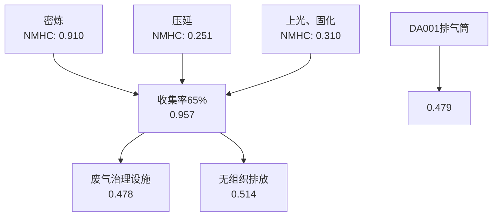
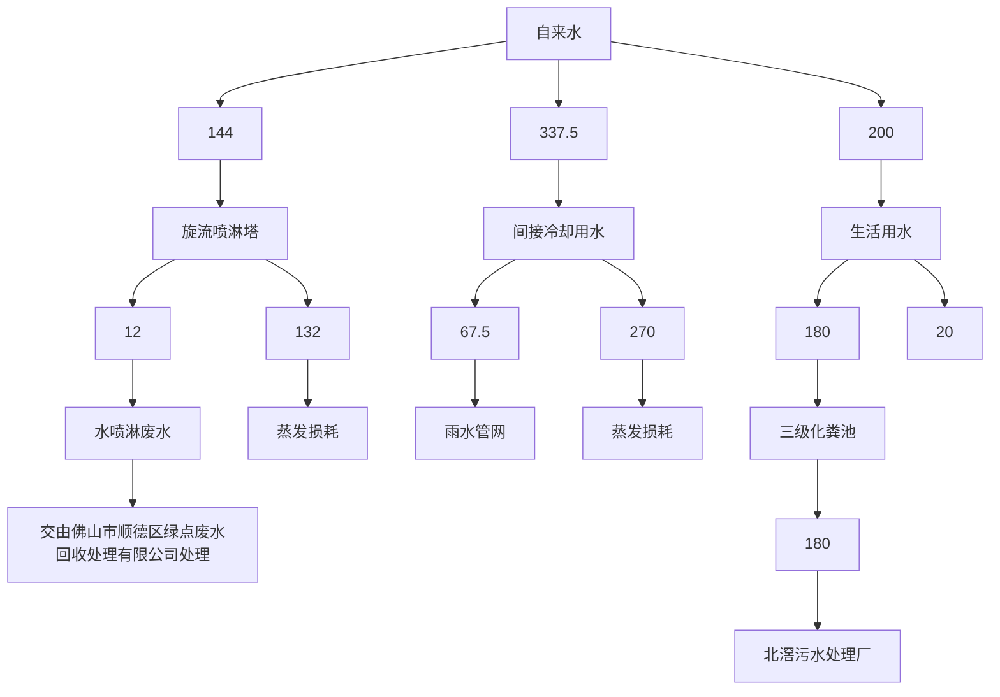
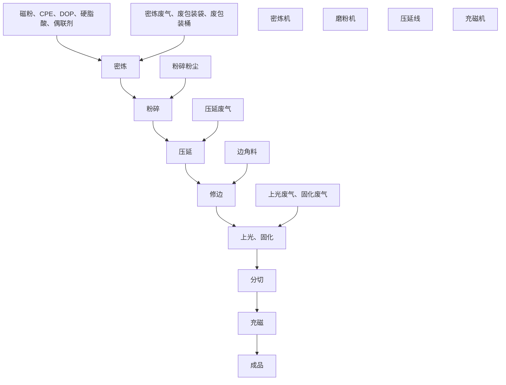
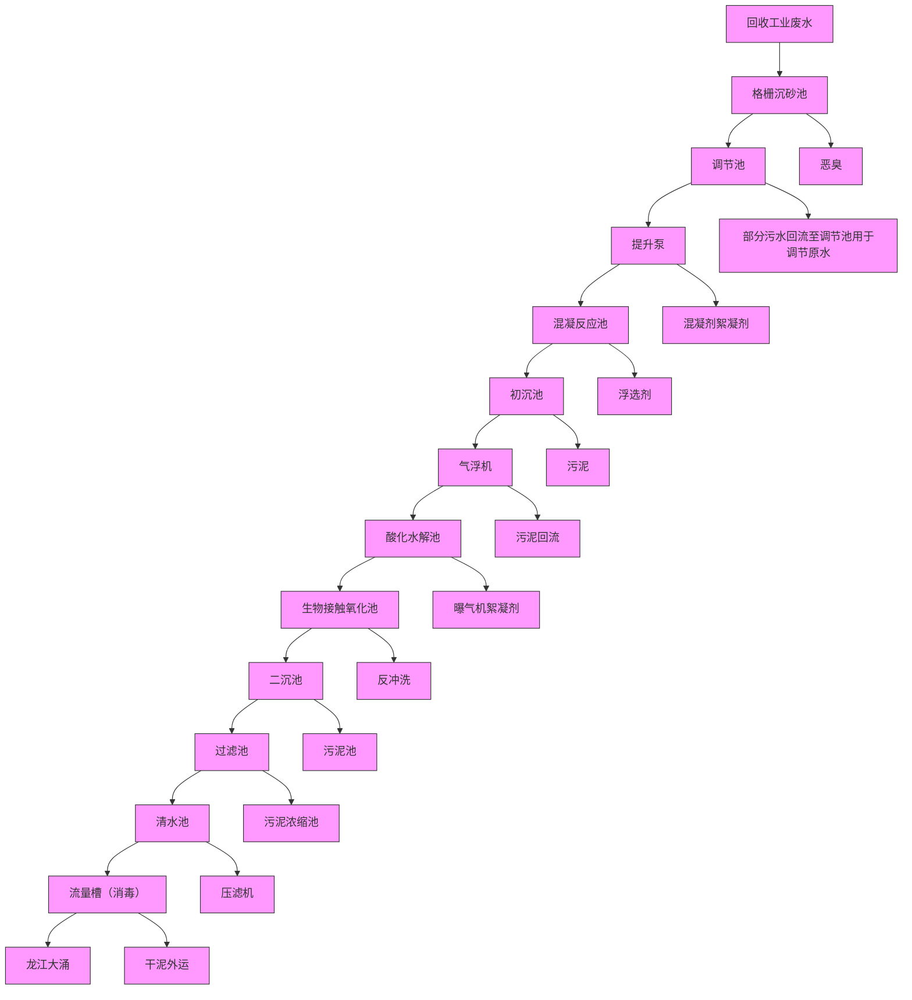
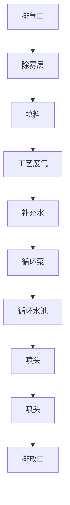
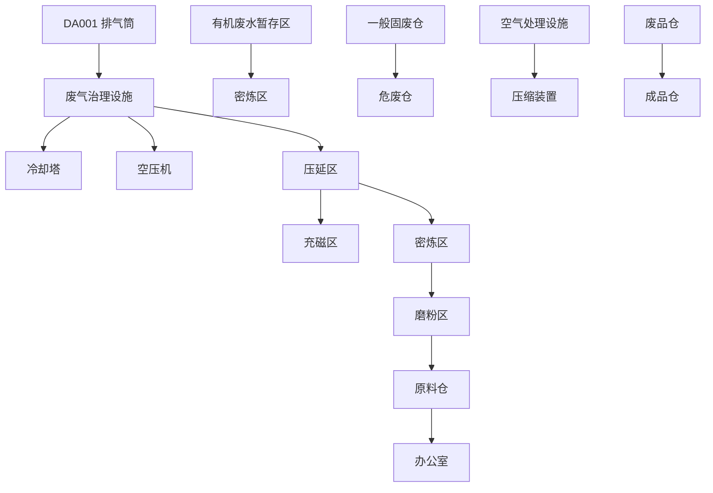

# 建设项目环境影响报告表

（污染影响类）

text_image

材料有限公司
406064604078
佛山市顺德区

项目名称：佛山憬源磁性材料有限公司建设项目建设单位（盖章）：佛山憬源磁性材料有限公司编制日期：2025年5月

text_image

生态环境科技有限公司
（一）
（二）
4700061763164

中华人民共和国生态环境部制

# 目 录

一、建设项目基本情况..

二、建设项目工程分析.. . 23

三、区域环境质量现状、环境保护目标及评价标准. .34

四、主要环境影响和保护措施. .41

五、环境保护措施监督检查清单. .. 70

六、结论.. .. 73

建设项目污染物排放量汇总表. .. 74

附图 1 项目地理位置图. ..错误！未定义书签。

附图 2 项目四至状况图. .错误！未定义书签。

附图 3 项目平面布局图. . 75

附图 4 项目四至实景图. .错误！未定义书签。

附图 5 项目周边环境敏感点分布图.. . 错误！未定义书签。

附图 6 水环境功能区划图. .错误！未定义书签。

附图 7 大气环境功能区划图. .错误！未定义书签。

附图 8 声环境功能区划图. .错误！未定义书签。

附图 9 北滘镇工业园（潭洲水道西）控制性详细规划（修编）图.. .错误！未定义书签。

附图 10 项目与附近饮用水源保护区位置图 . 错误！未定义书签。

附图 11 佛山市工业集聚区布局图. .错误！未定义书签。

附图 12 佛山市环境管控单元图. .错误！未定义书签。

附图 13 佛山市顺德区环境管控单元图 .错误！未定义书签。

附图 14 项目在广东省“三线一单”应用平台的位置图 .错误！未定义书签。

附件 1 营业执照. .错误！未定义书签。

附件 2 法人身份证. .错误！未定义书签。

附件 3 租赁合同（摘录） ..错误！未定义书签。

附件 4 房产证.. .错误！未定义书签。

附件 5 密炼各原料 MSDS 报告. .错误！未定义书签。

附件 6 UV 光油 MSDS 报告. .错误！未定义书签。

附件 7 环评文件同意公示声明. .. 76

附件 8 环评技术咨询合同. .错误！未定义书签。

# 一、建设项目基本情况

<table><tr><td>建设项目名称</td><td colspan="5">佛山憬源磁性材料有限公司建设项目</td></tr><tr><td>项目代码</td><td colspan="5">无</td></tr><tr><td>建设单位联系人</td><td></td><td>联系方式</td><td colspan="3"></td></tr><tr><td>建设地点</td><td colspan="5">佛山市顺德区北滘镇林头社区林港路8号之5号</td></tr><tr><td>地理坐标</td><td colspan="5">东经:113°13′23.825′′,北纬:22°54′43.313′′</td></tr><tr><td>国民经济行业类别</td><td>C2922塑料板、管、型材制造</td><td>建设项目行业类别</td><td colspan="3">二十六、橡胶和塑料制品业-53塑料制品业--“其他(年用非溶剂型低VOCs含量涂料10吨以下的除外)”外)</td></tr><tr><td>建设性质</td><td>☑新建(迁建)□改建□扩建□技术改造</td><td>建设项目申报情形</td><td colspan="3">☑首次申报项目□不予批准后再次申报项目□超五年重新审核项目□重大变动重新报批项目</td></tr><tr><td>项目审批(核准/备案)部门(选填)</td><td>无</td><td>项目审批(核准/备案)文号(选填)</td><td colspan="3">无</td></tr><tr><td>总投资(万元)</td><td>50</td><td>环保投资(万元)</td><td colspan="3">10</td></tr><tr><td>环保投资占比(%)</td><td>20</td><td>施工工期</td><td colspan="3">1个月</td></tr><tr><td>是否开工建设</td><td>☑否□是</td><td>用地(用海)面积(m2)</td><td colspan="3">1615</td></tr><tr><td>专项评价设置情况</td><td colspan="5">无</td></tr><tr><td>规划情况</td><td colspan="5">审批文件名称:《北滘镇工业园(潭洲水道西)控制性详细规划(修编)》批复文号:顺府复(2016)42号审批单位:佛山市顺德区人民政府</td></tr><tr><td>规划环境影响评价情况</td><td colspan="5">无</td></tr><tr><td>规划及规划环境影响评价符合性分析</td><td colspan="5">无</td></tr><tr><td rowspan="3">其他符合性分析</td><td colspan="5">(1)选址合理性分析本项目位于佛山市顺德区北滘镇林头社区林港路8号之5号,根据北滘镇工业园(潭洲水道西)控制性详细规划(修编)图(见附图9),项目所在地属于工业用地;根据附图10,项目附近的饮用水水源保护区为距1180m的羊额-北滘水厂饮用水水源二级保护区,不在饮用水水源保护区范围内,也不在自然保护区、风景名胜区、森林公园、重要湿地、生态敏感区和其他重要生态功能区。此外,根据《广东省人民政府办公厅关于印发广东省“节地提质”攻坚行动方案(2023-2025年)的通知》(粤办函〔2023〕57号)规定:“在符合国土空间规划的前提下,新建工业项目和经批准实施异地搬迁的工业项目,除因安全生产、工艺技术等特殊要求外,应一律安排进入开发区(产业园区)生产建设。”,对照《佛山市人民政府办公室关于印发佛山市工业用地红线划定的通知》中的工业集聚区布局图(附图11)可知,本项目选址位于划定的工业集聚区内,因此项目选址符合上文要求。综上,项目选址符合规划要求。(2)与“三线一单”符合性分析根据《建设项目环境影响评价技术导则-总纲》(HJ2.1-2016),应分析判定建设项目选址选线、规模、性质和工艺路线等与区域布局管控、能源资源利用、污染物排放管控、环境风险防控和环境准入负面清单进行对照,作为开展环境影响评价工作的前提和基础。广东省、佛山市及顺德区三线一单生态环境分区管控方案均已发布。根据《广东省人民政府关于印发广东省“三线一单”生态环境分区管控方案的通知》(粤府〔2020〕71号)和佛山市生态环境局关于印发《佛山市“三线一单”生态环境分区管控方案(2024年版)》的通知(佛环〔2024〕20号),项目符合广东省、佛山市的“三线一单”生态环境分区管控方案要求。本项目依据佛山市生态环境局关于印发《佛山市“三线一单”生态环境分区管控方案(2024年版)》的通知(佛环〔2024〕20号)文件内容,对顺德区的生态环境分区管控方案作符合性分析,详见表1-1。表1-1 与《佛山市“三线一单”生态环境分区管控方案(2024年版)》的通知(佛环〔2024〕20号)相符性分析</td></tr><tr><td colspan="2">内容</td><td>项目情况</td><td colspan="2">相符性</td></tr><tr><td>生态保护红线</td><td>佛山市环境管控单元图(附图12)</td><td>项目所在地属于北滘镇重点管控区(ZH44060620004)范围,不属于优先保护单元及一般管控单元,因此本项目不涉及生态保护红线。</td><td colspan="2">符合</td></tr><tr><td rowspan="3"></td><td>环境质量底线</td><td>地表水环境质量持续改善,乡镇级及以上集中式饮用水水源地水质100%达标,国考、省考断面地表水质量达到或优于III类水体比例不低于85.7%,劣V类水体比例为0%,市考断面基本消除劣V类断面;全面消除黑臭水体。空气质量持续改善,细颗粒物( $PM_{2.5}$ )年均浓度、空气质量优良天数比例(AQI)主要指标达到省下达的目标要求,臭氧污染得到遏制。土壤环境质量总体保持稳定,土壤环境风险得到管控,受污染耕地安全利用率不低于93%,重点建设用地安全利用得到有效保障。地下水国控区域点位V类水比例完成省下达任务,地下水饮用水源点位和污染风险监控点位水质总体保持稳定。</td><td>项目区域地表水环境能满足相应的标准要求,属于达标区,区域大气环境质量属于不达标区;项目生活污水经三级化粪预处理达标后排放到北溶污水处理厂,对周围水环境影响不大,危废仓基础建设必须按相关要求防渗,固体废物得到妥善处理。经以上处理后,本项目对区域内环境影响较小,质量可保持现有水平。</td><td colspan="2">符合</td></tr><tr><td>资源利用上线</td><td>强化节约集约循环利用,持续提升资源能源利用效率,到2025年,全市用水总量控制在23.44亿立方米以内,万元地区生产总值值用水量和万元工业增加值用水量较2020年降幅不低于17%,农田灌溉水有效利用系数不低于0.55。土地资源、岸线资源、能源消耗等达到或优于国家和省下达的总量、强度等目标要求,按省规定年限实现碳达峰,其中耕地保有量达到185.75平方公里,永久基本农田面积稳定保持164.42平方公里,单位GDP能耗降低比例达到14.5%。到2035年,生态环境分区管控体系巩固完善,生态空间保护格局稳定,生态环境质量根本好转,资源节约集约利用水平显著提高,碳排放率先达峰后稳中有降,绿色生产生活方式广泛形成,人与自然和谐发展的现代化建设新格局总体形成,建成美丽佛山。</td><td>本项目不属于高耗能、高污染型企业,项目的水、电等资源利用不会突破区域上线。</td><td colspan="2">符合</td></tr><tr><td>环境准入负面清单</td><td>《产业结构调整指导目录(2024年本)》、《关于印发&lt;市场准入负面清单(2025年版)的通知&gt;》(发改体改规[2025]466号)、《环境保护综合名录》(2021年版)等</td><td>根据国家发展和改革委员会发布的《产业结构调整指导目录(2024年本)》,项目不属于目录中所列的鼓励类、限制和禁止(淘汰)项目;根据《促进产业结构调整暂行规定》第十三</td><td colspan="2">符合</td></tr><tr><td rowspan="3"></td><td></td><td colspan="2"></td><td>条,属于允许建设项目。同时,根据国家发展改革委商务部《关于印发&lt;市场准入负面清单(2025年版)的通知&gt;》(发改体改规[2025]466号)可知,项目不在市场准入负面清单禁止和许可两类项目范围内。且通过对照《环境保护综合名录》(2021年版),项目不属于“高污染、高环境风险”产品,也不属于《广东省“两高”项目管理目录(2022年版)》中列的“两高”项目。</td><td></td></tr><tr><td rowspan="2">全市总体管控要求</td><td>区域布局管控</td><td>...全市域为高污染燃料禁燃区,禁止新建、扩建燃用高污染燃料的燃烧设施。加快推进天然气产供储销体系建设,逐步淘汰集中供热管网覆盖区域内的分散供热锅炉,完成生物质锅炉淘汰整治,促进用热企业向园区集聚。禁止新建、扩建水泥、平板玻璃、化学制浆、生皮制革以及国家规划外的钢铁、原油加工等项目。专业电镀、印染等项目进入定点园区集中管理。严格落实国家产品VOCs含量限值标准要求,除现阶段确无法实施替代的工序外,禁止新建生产和使用高VOCs含量原辅材料项目,鼓励建设共性工厂、活性炭集中再生中心等挥发性有机物第三方治理项目,推动挥发性有机物集中高效处理。...</td><td>[1]项目不涉及燃料、锅炉的使用;[2]项目为塑料制品制造业,不属于水泥、平板玻璃、化学制浆、生皮制革以及国家规划外的钢铁、原油加工等项目及电镀、印染等项目。[3]项目不生产和使用高VOCs含量的原辅材料。</td><td>符合</td></tr><tr><td>能源资源利用</td><td>...新、改、扩建“两高”项目3须符合生态环境保护法律法规和相关法定规划,满足污染物区域削减、重点污染物排放总量控制、碳排放达峰目标、相关规划环评和相应行业建设项目环境准入条件、环评文件审批原则要求。...统筹协调矿产资源开发与保护,优化矿产资源开发布局,严格控制矿产资源开发强度。矿产资源勘查与开发利用重点布局在高明区西部、西南部山区及三水区西北部六和山区一带。...</td><td>本项目为塑料制品制造业,不属于“两高”项目;不涉及矿产资源开发。</td><td>符合</td></tr><tr><td rowspan="3"></td><td rowspan="2"></td><td>污染物排放管控</td><td>实施重点污染物4总量控制,重点污染物排放总量指标优先向重大发展平台、重点建设项目、重点工业园区、战略性产业集群倾斜。...地表水I、II类水域,以及III类水域中的保护区、游泳区,禁止新建排污口,已建成的排污口应当实行污染物总量控制且不得增加污染物排放量。...巩固燃煤锅炉超低排放整治成效。深化炉窑分级管控,实施工业炉窑大气污染综合治理。推进挥发性有机物源头替代,全面加强无组织排放控制,深入实施精细化治理。...开展“无废城市”建设,推动固体废物源头减量、资源化利用和安全处置。</td><td>[1]项目主要涉及挥发性有机物重点污染物,新增VOCs总量控制量为0.993t/a;[2]项目不需建设废水排污口;[3]不涉及炉窑的使用。[4]项目一般工业固废均交由资源回收公司处理,危险废物均委托有危废资质单位安全处置。</td><td>符合</td></tr><tr><td>环境风险防控</td><td>推动企业将低温等离子、UV光解、RTO燃烧炉等有机废气治理设施纳入全厂安全风险辨识范围,加强安全管理。禁止在规划专门用于危险化学品生产、储存的区域(包括化工园区)外新建、扩建危险化学品生产、储备建设项目(加油站、加气站、加氢站、港口及铁路、航空危险化学品储存建设项目、危险化学品输送管道及危险化学品使用单位的配套项目除外)。...严格建设用地再开发建设管理,对纳入建设用地土壤污染风险管控和修复名录的地块,未达到土壤污染风险评估报告确定的风险管控、修复目标的建设用地地块,禁止开工建设任何与风险管控、修复无关的项目。提升危险废物监管能力,利用信息化手段,推动全过程跟踪管理。健全危险废物收集体系,推进危险废物利用处置能力优化提升。</td><td>[1]本项目已针对活性炭吸附装置的安全生产管理提出有关要求;[2]项目不涉及危化品的生产,不属于加油站、加气站、加氢站等危险化学品储存建设项目;[3]项目经营用地为租赁性质,已建成使用,不涉及用地开发;[4]项目产生的危险废物暂存在按《危险废物贮存污染控制标准》(GB18597-2023)规范建设的危废仓内,并委托有危废资质单位进行拉运、安全处置,严格执行转移联单制度。</td><td>符合</td></tr><tr><td>环境管控单元准入清单</td><td>区域布局管控</td><td>1-1.【生态/禁止类】单元内的一般生态空间,主导生态功能为水土保持,禁止在25度以上的陡坡地开垦种植农作物,禁止在崩塌、滑坡危险区、泥石流易发区从事采石、取土、采砂等可能造成水土流失的活动。</td><td>项目不涉及采石等可能造成水土流失的活动。</td><td>符合</td></tr><tr><td rowspan="6"></td><td rowspan="6"></td><td rowspan="6"></td><td>1-2.【产业/鼓励引导类】重点发展机器人及配套产业、智能家用电器、高端新型电子信息、新材料等制造业和总部经济、电子商务、工业设计与文化创意、科技金融等现代服务业,打造智能制造和智慧家电示范区。</td><td>本项目属于塑料制品制造业,虽不属于产业鼓励引导类,但也不属于产业限制类。</td><td>符合</td></tr><tr><td>1-3.【产业/综合类】系统推进村级工业园升级改造,腾出连片空间,布局产业集聚区和主题产业园,推动工业项目入园集聚发展。</td><td>项目租用已有工业园区厂房,属于产业聚集区。</td><td>符合</td></tr><tr><td>1-4.【水/限制类】严格限制在佛山市禅城南庄紫洞水厂、佛山市禅城沙口(石湾)水厂、羊额—北滘水厂、广州市南洲水厂顺德水道取水口饮用水水源保护区上游和周边区域建设列入“高污染、高环境风险”产品名录等可能影响水环境安全的项目。</td><td>本项目不在“高污染、高环境风险”产品名录内。</td><td>符合</td></tr><tr><td>1-5.【大气/限制类】大气环境受体敏感重点管控区内,应严格限制新建储油库项目、产生和排放有毒有害大气污染物的建设项目以及使用溶剂型油墨、涂料、清洗剂、胶黏剂等高挥发性有机物原辅材料项目,鼓励现有该类项目搬迁退出。</td><td>项目不在大气环境受体敏感重点管控区内。</td><td>符合</td></tr><tr><td>1-6.【大气/鼓励引导类】大气环境高排放重点管控区内,应强化达标监管,引导工业项目落地集聚发展,有序推进区域内行业企业提标改造。</td><td>项目位于大气环境高排放重点管控区内,废气主要为密炼、压延、上光、固化废气、粉碎粉尘,粉碎粉尘经收集处理后无组织排放,其他废气经收集处理后高空达标排放,无组织废气也可达标排放;根据上文选址分析,项目位于划定的工业集聚区内。</td><td>符合</td></tr><tr><td>1-7.【产业/综合类】划定家具生产优先发展区域,优先发展区外不再新建涉及涂装工艺的木质家具制造项目。优先发展区范围根据家具产业发展规划及其规划环评文件确定。</td><td>项目不属于木质家具制造项目。</td><td>符合</td></tr><tr><td rowspan="5"></td><td rowspan="5"></td><td></td><td>1-8.【产业/限制类】受纳水体或监控断面不达标的且未“以新带老”制定区域达标方案的河涌,不得新建、扩建向河涌直接排放废水的项目。新建、扩建含蚀刻工序的线路板生产项目和化工项目应在配套污水集中处置的工业园区或生活污水管网覆盖区域内建设;纯加工型印花项目,含酸洗、磷化的金属表面处理、金属制品项目(与自身高新技术企业配套的和区级及以上重点项目除外),含酸洗、喷涂、化学抛光、电解等涉及废水排放工艺的不锈钢型材加工项目(与自身高新技术企业配套的和区级及以上重点项目除外),应进入以此类项目为主导产业、有相应废水集中治理设施的工业园区,实现集中治污。</td><td>项目外排废水主要为生活污水,生活污水经三级化粪池预处理达标后,通过工业区污水管网排入北滘污水处理厂集中处理,且纳污水体水质达标。项目为塑料制品制造业,不涉及酸洗、磷化等工艺,此外,不属于产业限制类项目。</td><td>符合</td></tr><tr><td rowspan="4">能源资源利用</td><td>2-1.【能源/鼓励引导类】推广节能技术,加快发展绿色货运与现代物流。</td><td>项目为工业型,不属于货运与现代物流。</td><td>符合</td></tr><tr><td>2-2.【能源/鼓励引导类】推广新能源汽车应用和充电基础设施建设,积极推动重卡LNG加气站、充电基础设施、加氢站建设。</td><td>本项目为塑料制品制造业,不涉及LNG加气站、充电基础设施、加氢站的建设。</td><td>符合</td></tr><tr><td>2-3.【能源/综合类】科学实施能源消费总量和强度“双控”,新建高能耗项目单位产品(产值)能耗达到国际国内先进水平。</td><td>项目不属于高能耗项目。</td><td>符合</td></tr><tr><td>2-4.【水资源/综合类】贯彻落实“节水优先”方针,实行最严格水资源管理制度,北滘镇万元国内生产总值用水量、万元工业增加值用水量、用水总量、农田灌溉水有效利用系数等用水总量和效率指标达到区下达要求。</td><td>项目不属于高耗水项目,不涉及相关内容。</td><td>符合</td></tr><tr><td rowspan="5"></td><td rowspan="5"></td><td rowspan="2"></td><td>2-5.【土地资源/限制类】落实单位土地面积投资强度、土地利用强度等建设用地控制性指标要求,提高土地利用效率。</td><td>项目不涉及</td><td>符合</td></tr><tr><td>2-6.【岸线/禁止类】严格水域岸线用途管制,新建项目一律不得违规占用水域。严禁破坏生态的岸线利用行为和不符合其功能定位的开发建设活动,严禁以各种名义侵占河道、围垦湖泊、非法采砂等。</td><td>项目建设用地未占用水域。</td><td>符合</td></tr><tr><td rowspan="3">污染物排放管控</td><td>3-1.【水/限制类】城镇新区建设实行雨污分流,逐步推进初期雨水收集、处理和资源化利用。住宅、商业体、学校、市场等城镇开发建设项目应当配套或者同步计划建设公共排水设施,公共排水设施或自建排污水设施未能投产运行的,以上涉水项目不得投入使用。新建小区严格实施雨污分流,阳台、露台等污水接入污水收集系统,将生活污水“应截尽截”。做好大型楼盘、集贸市场、餐饮以及学校等4大类排水户污水接入市政管网工作。</td><td>项目不属于城镇新区建设,是在已有工业区内建设。</td><td>符合</td></tr><tr><td>3-2.【水/综合类】结合村级工业园改造,全面提升产业层次与集聚度,促进污染集中整治。</td><td>本项目选址区域产业层次与集聚度较高。</td><td>符合</td></tr><tr><td>3-3.【水/综合类】稳步推进排水设施“三个一体化”管理模式,补齐城乡污水收集和处理短板,推动群力围污水处理厂提质增效,加快消除城中村、老旧城区、城乡结合部等污水收集管网空白区,逐步实现城乡污水收集处理全覆盖。2025年前完成群力围污水处理厂扩建,尾水应执行《城镇污水处理厂污染物排放标准》(GB18918-2002)一级A标准及《广东省水污染物排放限值》(DB44/26-2001)的较严值。3-4.【水/综合类】近期保留并完善水口村、三桂村、西滘村、马龙村等现状农村污水分散式处理设施,新建莘村、马龙村等分散式污水处理站建设,继续完善污水支管网建设,提高污水收集处理率,其余行政村(社区)继续完善污水管网建设,实现农村污水100%收集进入市政污水系统,有条件的区域实施雨污分流改造,到2030年全面雨污分流,污水纳入北滘城镇污水处理系统。</td><td>本项目为工业型项目,不涉及城镇污水处理厂的建设。项目实施雨污分流制,雨水经雨水井收集纳入周边城市下水道,生活污水经处理后最终排入北滘污水处理厂。</td><td>符合符合</td></tr><tr><td rowspan="4"></td><td rowspan="4"></td><td></td><td>3-5.【大气/综合类】大力推进低VOCs含量原辅材料替代,加快涉VOCs重点行业的生产工艺升级改造,推行自动化生产工艺,对达不到要求的VOCs收集及治理设施进行整治提升,逐步淘汰低效VOCs治理设施。</td><td>项目所使用的UV光油为低VOCs含量原辅材料,使用UV光油过程产生的废气经有效收集采用“油雾净化器+水喷淋+干式过滤器+活性炭吸附”处理后高空排放。</td><td>符合</td></tr><tr><td rowspan="3">环境风险防控</td><td>4-1.【水/综合类】加强单元内佛山市禅城南庄紫洞水厂、佛山市禅城沙口(石湾)水厂、羊额—北滘水厂、广州市南洲水厂顺德水道取水口饮用水水源保护区周边环境风险源管控,完善突发环境事件应急管理体系。</td><td>项目距离最近的水厂为羊额—北滘水厂,根据附图10,项目用地不在羊额—北滘水厂取水口饮用水水源保护区;且主要外排废水为生活污水。项目建成后将加强环境风险管控,完善突发环境事件应急管理体系。</td><td>符合</td></tr><tr><td>4-2.【水/综合类】北滘污水处理厂、群力围污水处理厂、工业污水集中处理设施应采取有效措施,防止事故废水直接排入水体。完善污水处理厂在线监控系统联网,实现污水处理厂的实时、动态监管。</td><td>项目不涉及城镇污水处理厂的建设。</td><td>符合</td></tr><tr><td>4-3.【风险/综合类】加强环境风险分级分类管理,强化金属制品、有色金属和压延加工、化学原料和化学品制造业等涉重金属、化工行业企业及工业园区等重点环境风险源的环境风险防控。</td><td>项目不属于金属制品、有色金属和压延加工、化学原料和化学品制造业等涉重金属、化工行业企业及工业园区等重点环境风险源,项目运营后日常加强环境风险分级分类管理。</td><td>符合</td></tr></table>

本项目依据《佛山市顺德区人民政府关于印发佛山市顺德区“三线一单”生态环境分区管控方案的通知》（顺府发〔2021〕11号）文件内容，对顺德区的生态环境分区管控方案作符合性分析，详见表 1-2。

表 1-2 与《佛山市顺德区人民政府关于印发佛山市顺德区“三线一单”生态环境分区管控方案的通知》（顺府发〔2021〕11号）相符性分析

<table><tr><td colspan="2">内容</td><td>项目情况</td><td>相符性</td></tr><tr><td>生态保护红线</td><td>佛山市顺德区环境管控单元图(附图13)</td><td>项目所在地属于北滘镇重点管控区(ZH44060620004)范围,不属于优先保护单元及一般管控单元,因此本项目不涉及生态保护红线。</td><td>符合</td></tr><tr><td>环境质量底线</td><td>水环境质量持续改善,国控、省控、水功能区断面达到国家、省和市下达的水质目标要求;乡镇级及以上集中式饮用水水源地水质稳定达标。空气质量持续改善,细颗粒物( $PM_{2.5}$ )年均浓度、空气质量优良天数比例(AQI)主要指标达到省、市下达的目标要求,臭氧污染得到有效遏制。土壤环境质量稳中向好,土壤环境风险得到管控。</td><td>项目区域地表水环境能满足相应的标准要求,属于达标区,区域大气环境质量属于不达标区;项目生活污水经三级化粪预处理达标后排放到北滘污水处理厂,对周围水环境影响不大,危废仓基础建设必须按相关要求防渗,固体废物得到妥善处理。经以上处理后,本项目对区域内环境影响较小,质量可保持现有水平。</td><td>符合</td></tr><tr><td>资源利用上线</td><td>强化节约集约利用,持续提升资源能源利用效率,水资源、土地资源、岸线资源、能源消耗等达到或优于省和市下达的总量、强度等目标要求,按省、市规定年限实现碳达峰。</td><td>本项目不属于高耗能、高污染型企业,项目的水、电等资源利用不会突破区域上线。</td><td>符合</td></tr><tr><td>环境准入负面清单</td><td>《产业结构调整指导目录(2024年本)》、《关于印发&lt;市场准入负面清单(2022年版)的通知&gt;》(发改体改规[2025]466号)、《环境保护综合名录》(2021年版)等</td><td>根据国家发展和改革委员会发布的《产业结构调整指导目录(2024年本)》,项目不属于目录中所列的鼓励类、限制和禁止(淘汰)项目;根据《促进产业结构调整暂行规定》第十三条,属于允许建设项目。同时,根据国家发展改革委商务部《关于印发&lt;市场准入负面清单(2022年版)的通</td><td>符合</td></tr></table>

<table><tr><td rowspan="6"></td><td></td><td colspan="2"></td><td>知&gt;》(发改体改规[2025]466号)可知,项目不在市场准入负面清单禁止和许可两类项目范围内。且通过对照《环境保护综合名录》(2021年版),项目不属于“高污染、高环境风险”产品,也不属于《广东省“两高”项目管理目录(2022年版)》中列的“两高”项目。</td><td></td></tr><tr><td rowspan="5">环境管控单元准入清单</td><td rowspan="5">区域布局管控</td><td>1-1.【生态/禁止类】单元内的一般生态空间,主导生态功能为水土保持,禁止在25度以上的陡坡地开垦种植农作物,禁止在崩塌、滑坡危险区、泥石流易发区从事采石、取土、采砂等可能造成水土流失的活动。</td><td>项目不涉及采石等可能造成水土流失的活动。</td><td>符合</td></tr><tr><td>1-2.【产业/鼓励引导类】重点发展机器人及配套产业、智能家用电器、高端新型电子信息、新材料等制造业和总部经济、电子商务、工业设计与文化创意、科技金融等现代服务业,打造智能制造和智慧家电示范区。</td><td>本项目属于塑料制品制造业,虽不属于产业鼓励引导类,但也不属于产业限制类</td><td>符合</td></tr><tr><td>1-3.【产业/综合类】产业聚集区所属地块内的工业用地或企业与村庄、学校等环境敏感点之间应设置合理的大气环境防护距离,并通过绿化带进行有效隔离;聚集区规划布局应注重大气污染排放企业应尽量避免布局在居住用地的常年主导风向的上风向。</td><td>本项目周边500m范围内无村庄、学校等环境敏感点。</td><td>符合</td></tr><tr><td>1-4.【产业/综合类】系统推进村级工业园升级改造,腾出连片空间,布局产业集聚区和主题产业园,推动工业项目入园集聚发展。新增工业制造业用地原则上安排在产业集聚区内,产业集聚区外原则上不鼓励工业及物流仓储用地的新建与改造。</td><td>项目租用已有工业园区厂房,属于产业聚集区。</td><td>符合</td></tr><tr><td>1-5.【产业/限制类】受纳水体或监控断面不达标的,不得新建、扩建向河涌直接排</td><td>项目外排废水主要为生活污水,生活污水经三级化粪池预处理达</td><td>符合</td></tr><tr><td rowspan="5"></td><td rowspan="5"></td><td rowspan="5"></td><td>放废水的项目。新建、扩建含蚀刻工序的线路板生产项目和化工项目应在配套污水集中处置的工业园区或生活污水管网覆盖区域内建设;纯加工型印花项目,含酸洗、磷化的金属表面处理、金属制品项目(与自身高新技术企业配套的除外),含酸洗、喷涂、化学抛光、电解等涉及废水排放工艺的不锈钢型材加工项目(与自身高新技术企业配套的除外),应进入以此类项目为主导产业、有相应废水集中治理设施的工业园区,实现集中治污。</td><td>标后,通过工业区污水管网排入北滘污水处理厂集中处理,且纳污水体水质达标。项目为塑料制品制造业,不涉及酸洗、磷化等工艺,此外,不属于产业限制类项目。</td><td></td></tr><tr><td>1-6.【产业/综合类】划定家具生产优先发展区域,优先发展区外不再新建涉及涂装工艺的木质家具制造项目。</td><td>项目不属于木质家具制造项目。</td><td>符合</td></tr><tr><td>1-7.【水/限制类】严格限制在佛山市禅城南庄紫洞水厂、佛山市禅城沙口(石湾)水厂、羊额—北滘水厂、广州市南洲水厂顺德水道取水口饮用水水源保护区上游和周边区域建设列入“高污染、高环境风险”产品名录等可能影响水环境安全的项目。</td><td>本项目不在“高污染、高环境风险”产品名录内。</td><td>符合</td></tr><tr><td>1-8.【大气/限制类】大气环境受体敏感重点管控区内,应严格限制新建储油库项目、产生和排放有毒有害大气污染物的建设项目以及使用溶剂型油墨、涂料、清洗剂、胶黏剂等高挥发性有机物原辅材料项目,鼓励现有该类项目搬迁退出。</td><td>项目不在大气环境受体敏感重点管控区内。</td><td>符合</td></tr><tr><td>1-9.【大气/鼓励引导类】大气环境高排放重点管控区内,应强化达标监管,引导工业项目落地集聚发展,有序推进区域内行业企业提标改造。</td><td>项目位于大气环境高排放重点管控区内,废气主要为密炼、压延、上光、固化废气、粉碎粉尘,粉碎粉尘经收集处理后无组织排放,其他废气经收集处理后高空达标排放,无组织废气也可达标排放;根据上文选址分析,项目位于划定的工业集聚区内。</td><td>符合</td></tr><tr><td rowspan="7"></td><td rowspan="7"></td><td rowspan="6">能源资源利用</td><td>2-1.【能源/鼓励引导类】推广节能技术,加快发展绿色货运与现代物流。</td><td>项目为工业型,不属于货运与现代物流。</td><td>符合</td></tr><tr><td>2-2.【能源/鼓励引导类】推广新能源汽车应用和充电基础设施建设,积极推动重卡LNG加气站、充电基础设施、加氢站建设。</td><td>本项目为塑料制品制造业,不涉及LNG加气站、充电基础设施、加氢站的建设。</td><td>符合</td></tr><tr><td>2-3.【能源/综合类】科学实施能源消费总量和强度“双控”,新建高能耗项目单位产品(产值)能耗达到国际国内先进水平。</td><td>项目不属于高能耗项目。</td><td>符合</td></tr><tr><td>2-4.【水资源/综合类】贯彻落实“节水优先”方针,实行最严格水资源管理制度,北滘镇万元国内生产总值用水量、万元工业增加值用水量、用水总量、农田灌溉水有效利用系数等用水总量和效率指标达到区下达要求。</td><td>项目不属于高耗水项目,不涉及相关内容。</td><td>符合</td></tr><tr><td>2-5.【土地资源/限制类】落实单位土地面积投资强度、土地利用强度等建设用地控制性指标要求,提高土地利用效率。</td><td>项目不涉及</td><td>符合</td></tr><tr><td>2-6.【岸线/禁止类】严格水域岸线用途管制,新建项目一律不得违规占用水域。严禁破坏生态的岸线利用行为和不符合其功能定位的开发建设活动,严禁以各种名义侵占河道、围垦湖泊、非法采砂等。</td><td>项目建设用地未占用水域。</td><td>符合</td></tr><tr><td>污染物排放管控</td><td>3-1.【水/限制类】城镇新区建设实行雨污分流,逐步推进初期雨水收集、处理和资源化利用。住宅、商业体、学校、市场等城镇开发建设项目应当配套或者同步计划建设公共排水设施,公共排水设施或自建排污水设施未能投产运行的,以上涉水项目不得投入使用。新建小区严格实施雨污分流,阳台、露台等污水接入污水收集系统,将生活污水“应截尽截”。做好大型楼盘、集贸市场、餐饮以及学校等4大类排水户污水接入市政管网工作。</td><td>项目不属于城镇新区建设,是在已有工业区内建设。</td><td>符合</td></tr><tr><td rowspan="5"></td><td rowspan="5"></td><td rowspan="5"></td><td>3-2.【水/综合类】结合村级工业园改造,全面提升产业层次与集聚度,促进污染集中整治。</td><td>本项目选址区域产业层次与集聚度较高。</td><td>符合</td></tr><tr><td>3-3.【水/综合类】稳步推进排水设施“三个一体化”管理模式,补齐城乡污水收集和处理短板,推动北滘污水处理厂提质增效,加快消除城中村、老旧城区、城乡结合部等污水收集管网空白区,逐步实现城乡污水收集处理全覆盖。2025年前完成北滘污水处理厂扩建,尾水应执行《城镇污水处理厂污染物排放标准》(GB18918-2002)一级A标准及《广东省水污染物排放限值》(DB44/26-2001)的较严值。</td><td>本项目为工业型项目,不涉及城镇污水处理厂的建设。</td><td>符合</td></tr><tr><td>3-4.【水/综合类】近期保留并完善水口村、三桂村、西滘村、马龙村等现状农村污水分散式处理设施,新建莘村、马龙村等分散式污水处理站建设,继续完善污水支管网建设,提高污水收集处理率,其余行政村(社区)继续完善污水管网建设,实现农村污水100%收集进入市政污水系统,有条件的区域实施雨污分流改造,到2030年全面雨污分流,污水纳入北滘城镇污水处理系统。</td><td rowspan="2">项目实施雨污分流制,雨水经雨水井收集纳入周边城市下水道,生活污水经处理后最终排入北滘污水处理厂。</td><td>符合</td></tr><tr><td>3-5.【水/综合类】产业集聚区和主题园区内做好污水管网和污水集中处理设施的配套保障,确保废水收集到城镇污水处理厂、园区污水处理厂或分散式污水处理设施集中处置。</td><td>符合</td></tr><tr><td>3-6.【大气/综合类】大力推进低VOCs含量原辅材料替代,加快涉VOCs重点行业的生产工艺升级改造,推行自动化生产工艺,对达不到</td><td>项目所使用的UV光油为低VOCs含量原辅材料,使用UV光油过程产生的废气经有效收集采用“油雾净化器+</td><td>符合</td></tr></table>

<table><tr><td rowspan="12"></td><td rowspan="4"></td><td>要求的VOCs收集及治理设施进行整治提升,逐步淘汰低效VOCs治理设施。</td><td>水喷淋+干式过滤器+活性炭吸附”处理后高空排放。</td><td></td></tr><tr><td>4-1.【水/综合类】加强单元内佛山市禅城南庄紫洞水厂、佛山市禅城沙口(石湾)水厂、羊额—北滘水厂、广州市南洲水厂顺德水道取水口饮用水水源保护区周边环境风险源管控,完善突发环境事件应急管理体系。</td><td>项目距离最近的水厂为羊额—北滘水厂,根据附图10,项目用地不在羊额—北滘水厂取水口饮用水水源保护区;且主要外排废水为生活污水。项目建成后将加强环境风险管控,完善突发环境事件应急管理体系。</td><td>符合</td></tr><tr><td>4-2.【水/综合类】北滘污水处理厂、北滘污水处理厂、工业污水集中处理设施应采取有效措施,防止事故废水直接排入水体。完善污水处理厂在线监控系统联网,实现污水处理厂的实时、动态监管。</td><td>项目不涉及城镇污水处理厂的建设。</td><td>符合</td></tr><tr><td>4-3.【风险/综合类】加强环境风险分级分类管理,强化金属制品、有色金属和压延加工、化学原料和化学品制造业等涉重金属、化工行业企业及工业园区等重点环境风险源的环境风险防控。</td><td>项目不属于金属制品、有色金属和压延加工、化学原料和化学品制造业等涉重金属、化工行业企业及工业园区等重点环境风险源,项目运营后日常加强环境风险分级分类管理。</td><td>符合</td></tr><tr><td colspan="4">(3)与其他相关文件相符性分析表1-3 项目与其他相关文件相符性分析</td></tr><tr><td>序号</td><td>政策要求</td><td>工程内容</td><td>符合性</td></tr><tr><td colspan="4">1.《广东省生态环境保护“十四五”规划》的通知(粤环〔2021〕10号)</td></tr><tr><td>1.1</td><td>禁止建设生产和使用高VOCs含量的溶剂型涂料、油墨、胶粘剂等项目。</td><td>项目为塑料制品制造,不使用溶剂型油墨、涂料、清洗剂等高挥发性有机物原辅材料。</td><td>符合</td></tr><tr><td colspan="4">2.《佛山市生态环境保护“十四五”规划》的通知(佛环[2022]3号)</td></tr><tr><td>2.1</td><td>严格限制新建生产和使用高挥发性有机物原辅材料的项目。</td><td>本项目不生产和使用高挥发性有机物原辅材料。</td><td>符合</td></tr><tr><td>2.2</td><td>推进VOCs高排放企业治理设施提升改造,淘汰光催化、光氧化、低温等离子等现有低效治理设施。</td><td>本项目产生的VOCs采用活性炭吸附装置治理。</td><td>符合</td></tr><tr><td colspan="4">3.关于印发《重点行业挥发性有机物综合治理方案》的通知(环大气[2019]53号)</td></tr></table>

<table><tr><td rowspan="7"></td><td>3.1</td><td>通过使用水性、粉末、高固体分、无溶剂、辐射固化等低VOCs含量的涂料,水性、辐射固化、植物等低VOCs含量的油墨,水基、热熔、无溶剂、辐射固化、改性、生物降解等低VOCs含量的胶粘剂,以及低VOCs含量、低反应活性的清洗剂等,替代溶剂型涂料、油墨、胶粘剂、清洗剂等,从源头减少VOCs产生。</td><td>项目不生产和使用高挥发性有机物原辅材料。</td><td colspan="2">符合</td></tr><tr><td>3.2</td><td>重点对含VOCs物料(包括含VOCs原辅材料、含VOCs产品、含VOCs废料以及有机聚合物材料等)储存、转移和输送、设备与管线组件泄漏、敞开液面逸散以及工艺过程等五类排放源实施管控,通过采取设备与场所密闭、工艺改进、废气有效收集等措施,削减VOCs无组织排放。</td><td rowspan="2">项目UV光油转移、存储过程均处于密封加盖状态,使用过程产生VOCs废气,通过半密闭罩收集,并采用“油雾净化器+水喷淋+干式过滤器+活性炭吸附”净化处理后高空排放,可有效削减VOCs无组织排放。</td><td colspan="2">符合</td></tr><tr><td>3.3</td><td>提高废气收集率,遵循“应收尽收、分质收集”的原则,科学设计废气收集系统,将无组织排放转变为有组织排放进行控制。采用全密闭集气罩或密闭空间的,除行业有特殊要求外,应保持微负压状态,并根据相关规范合理设置通风量。采用局部集气罩的,距集气罩开口面最远处的VOCs无组织排放位置,控制风速应不低于0.3米/秒,有行业要求的按相关规定执行。</td><td colspan="2">符合</td></tr><tr><td colspan="5">4.《广东省生态环境厅关于做好重点行业建设项目挥发性有机物总量指标管理工作的通知》(粤环发〔2019〕2号)</td></tr><tr><td>4.1</td><td>新、改、扩建排放VOCs的重点行业建设项目应当执行总量替代制度,重点行业包括炼油与石化、化学原料和化学制品制造、化学药品原料药制造、合成纤维制造、表面涂装、印刷、制鞋、家具制造、人造板制造、电子元件制造、纺织印染、塑料制造及塑料制品等12个行业</td><td>本项目排放的VOCs执行总量替代制度。</td><td colspan="2">符合</td></tr><tr><td colspan="5">5.《顺德区生态环境保护委员会办公室关于印发&lt;顺德区重点行业挥发性有机物总量指标管理工作方案(2023年修订)&gt;的通知》(顺环委办〔2023〕19号)</td></tr><tr><td>5.1</td><td>总量替代原则,根据区域现状、改善目标,减排空间,全区建设项目新增VOCs排放量施行“减二增一”政策,其中有组织排放和无组织排均纳入新增指标管理;非甲烷总烃合并计入VOCs管理。</td><td>项目属于文件中塑料制造及塑料制品重点行业,应当执行总量替代制度。项目VOCs新增总量控制指标为</td><td colspan="2">符合</td></tr><tr><td rowspan="8"></td><td></td><td colspan="2"></td><td>0.993t/a。</td><td></td></tr><tr><td colspan="5">6.佛山市顺德区人民政府办公室关于印发《佛山市顺德区生态环境保护“十四五”规划(2021-2025)》的通知</td></tr><tr><td>6.1</td><td colspan="2">持续推进重点行业VOCs整治。持续开展挥发性有机物专项整治,继续推进重点行业企业开展销号式综合整治,建立VOC重点监管企业名单并动态更新,督促企业建立VOCs管控台账清单;持续探寻高效节能的VOCs治理技术,对采用低温等离子、光氧化、光催化等低效治理工艺的企业在臭氧污染天气应对期间实施停限产或错峰生产,并推动企业逐步淘汰低效治理工艺。</td><td>本项目VOCs采用活性炭吸附装置治理。</td><td>符合</td></tr><tr><td>6.2</td><td colspan="2">加强VOCs源头替代和无组织排放管控。大力推进低VOCs含量、低反应活性的原辅材料替代,将全面使用低VOCs含量原辅材料的企业纳入正面清单和政府绿色采购清单。鼓励重点行业企业开展生产工艺和设备水性化改造,推广使用水性、高固体分、无溶剂、粉末等低VOCs含量涂料。严格落实《挥发性有机物无组织排放控制标准》,开展厂区内无组织排放浓度监测,加强对含VOCs物料储存、转移和运输、设备与管线组件泄漏、敞开页面逸散以及工艺过程等五类排放源的管控。</td><td>本项目不生产和使用高挥发性有机物原辅材料。</td><td>符合</td></tr><tr><td colspan="5">7.广东省生态环境厅等11部门关于印发《广东省臭氧污染防治(氮氧化物和挥发性有机物协同减排)实施方案(2023-2025年)》的通知(粤环函〔2023〕45号)</td></tr><tr><td rowspan="3">7.1</td><td colspan="4">其他涉VOCs排放行业控制</td></tr><tr><td>工作目标</td><td>以工业涂装、橡胶塑料制品等行业为重点,开展涉VOCs企业达标治理,强化源头、无组织、末端全流程治理。</td><td>本项目不涉及生产和使用使用的高VOCs含量原辅材料;密炼、压延、上光、固化产生的VOCs废气经有效收集处理后,无组织排放控制措施及相关限值符合《固定污染源挥发性有机物综合排放标准》(DB44/2367-2022)表3厂区内VOCs无组织排放限值规定要求。产生的</td><td rowspan="2">符合</td></tr><tr><td>工作要求</td><td>加快推进工程机械、钢结构、船舶制造等行业低VOCs含量原辅材料替代,引导生产和使用企业供应和使用符合国家质量标准产品;企业无组织排放控制措施及相关限值应符合《挥发性有机物无组织排放控制标准(GB37822)》、《固定污染源挥发性有机物排放综合标准(DB44/2367)》和《广东省生态环境厅关于实施厂区内挥发性有机物无组织排放监控要求的通告》(粤环发〔2021〕4号)要求,无法实现低VOCs原辅材料替代的工序,宜在密闭设备、密闭空间作业或安装二次密闭设施;新、改、扩建项目限制使用光催化、光氧化、水喷淋(吸收可溶性VOCs除外)、低温等离子等低效VOCs治理设施(恶臭处理除外),组织排查光催化、光氧化、水喷淋、低温等离子及上述组合技术的低效VOCs治理设施,对无法稳定达标的实施更换或升级改造。</td><td>VOCs废气末端采用“油雾净化器+水喷淋+干式过滤器+活性炭吸附”装置处理,不属于所列的低效VOCs治理设施。</td></tr><tr><td rowspan="7"></td><td rowspan="3">7.2</td><td colspan="4">涉VOCs原辅材料生产使用</td></tr><tr><td>工作目标</td><td>加大VOCs原辅材料质量达标监管力度。</td><td rowspan="2">本项目不涉及生产和使用高VOCs含量原辅材料。</td><td>符合</td></tr><tr><td>工作要求</td><td>严格执行涂料、油墨、胶粘剂、清洗剂VOCs含量限值标准;依法查处生产、销售VOCs含量不符合质量标准或者要求的原材料和产品的行为;增加对使用环节的检测与监管,曝光不合格产品并追溯其生产、销售、使用企业,依法追究责任。</td><td>符合</td></tr><tr><td colspan="5">8.《广东省涉挥发性有机物(VOCs)重点行业治理指引》的通知(粤环办[2021]43号)</td></tr><tr><td>8.1</td><td colspan="2">采用外部集气罩的,距集气罩开口面最远处的VOCs无组织排放位置,控制风速不低于0.3m/s。</td><td>项目密炼、压延、上光、固化废气,通过半密闭罩收集,收集效率为65%。集气罩置于废气产生点的合理位置,保证风速为0.5m/s。</td><td>符合</td></tr><tr><td>8.2</td><td colspan="2">废气收集系统的输送管道应密闭。废气收集系统应在负压下运行,若处于正压状态,应对管道组件的密封点进行泄漏检测,泄漏检测值不应超过500μmol/mol,亦不应有感官可察觉泄漏。</td><td>项目废气收集系统在负压下运行。</td><td>符合</td></tr><tr><td>8.3</td><td colspan="2">VOCs治理设施应与生产工艺设备同步运行,VOCs治理设施发生故障或检修时,对应的生产工艺设备应停止运行,待检修完毕后同步投入使用;生产工艺设备不能停止运行或不能及时停止运行的,应设置废气应急处理设施或采取其他替代措施。</td><td>项目生产必须开启风机,有效减少无组织排放废气。废气收集处理系统发生故障或检修时,所有产生废气的工序停止运行,待检修完毕后再投入生产。</td><td>符合</td></tr><tr><td rowspan="4"></td><td rowspan="2">8.4</td><td rowspan="2">工艺过程</td><td>粉状、粒状VOCs物料采用气力输送方式或采用密闭固体投料器等给料方式密闭投加;无法密闭投加的,在密闭空间内操作,或进行局部气体收集,废气排至除尘设施、VOCs废气收集处理系统。</td><td>项目使用的CPE塑料为固态,常温条件下不会产生有机废气。在转移过程中均使用密闭的包装袋封装。</td><td rowspan="2">符合</td></tr><tr><td>在混合/混炼、塑炼/塑化/熔化、加工成型(挤出、注射、压制、压延、发泡、纺丝等)、硫化等作业中应采用密闭设备或在密闭空间中操作,废气应排至VOCs废气收集处理系统;无法密闭的,应采取局部气体收集措施,废气应排至VOCs废气收集处理系统。</td><td>项目密炼、压延、上光、固化废气通过半密闭罩收集,经“油雾净化器+水喷淋+干式过滤器+活性炭吸附”装置处理后通过15m排气筒达标排放。</td></tr><tr><td>8.5</td><td>排放水平</td><td>塑料制品行业:a)有机废气排气筒排放浓度不高于广东省《大气污染物排放限值》(DB4427-2001)第II时段排放限值,合成革和人造革制造企业排放浓度不高于《合成革与人造革工业污染物排放标准》(GB21902-2008)排放限值,若国家和我省出台并实施适用于塑料制品制造业的大气污染物排放标准,则有机废气排气筒排放浓度不高于相应的排放限值;车间或生产设施排气中NMHC初始排放速率≥3kg/h时,建设VOCs处理设施且处理效率≥80%;b)厂区内无组织排放监控点NMHC的小时平均浓度值不超过6mg/m3任意一次浓度值不超过20mg/m3。</td><td>项目密炼、压延工序有机废气达到《合成树脂工业污染物排放标准》(GB31572-2015,含2024年修改单);有机废气厂区内无组织排放满足平均浓度值不超过6mg/m3,任意一次浓度值不超过20mg/m3。</td><td>符合</td></tr><tr><td>8.6</td><td>管理台账</td><td>建立废气收集处理设施台账,记录废气处理设施进出口的监测数据(废气量、浓度、温度、含氧量等)、废气收集与处理设施关键参数、废气处理设施相关耗材(吸收剂、吸附剂、催化剂等)购买和处理记录。</td><td>企业拟建立废气收集处理设施台账,根据《排污单位自行监测技术指南橡胶和塑料制品》(HJ1027-2021)等相关要求定期自行监测,并且记录相关监测数据和废气处理设施中活性炭的购买量和处理记录。</td><td>符合</td></tr><tr><td rowspan="4"></td><td>8.7</td><td></td><td>建立危废台账,整理危废处置合同、转移联单及危废处理方式资质佐证材料。</td><td>企业拟建立危险废物台账,定期将废矿物油、废油桶、废活性炭等危险废物交给有资质的单位处理,整理危废处理合同、转移联单等资料。</td><td>符合</td></tr><tr><td colspan="5">9.《佛山市生态环境局 佛山市水利局关于进一步加强工业企业废水污染防治的函》</td></tr><tr><td>9.1</td><td colspan="2">生活污水管网未覆盖或已覆盖但未实质连通接入城镇生活污水处理厂的区域,原则上不得新建、扩建生活污水排放的工业项目,确需排放生活污水的,应自行配套生活污水处理设施,自建污水处理设施仅限于规模以上、生活污水排放量不低于40吨/日的工业企业,并加强处理工艺经济技术可行性及受纳水体达标论证。</td><td>本项目所在区域生活污水管网已敷设建成,且已与北滘污水处理厂连通,生活污水依托所在工业园区建设的三级化粪池处理后纳入北滘污水处理厂深度处理。</td><td>符合</td></tr><tr><td>9.2</td><td colspan="2">加强涉生产废水产排项目审批管理。(1)聚焦产业行业特点,针对企业规模小、生产工艺简单、单纯加工型、产品附加值不高、废水产排复杂的涉水项目,要严格废水回用率和回用可行性审查,无废水成分分析、回用水质适用性分析,无废水回用处理工艺设施、技术经济可行性论述,无回用相关存储及管路设置等工程措施的项目,不得通过回用或“零排放”环评审批。(2)严格工业废水排入城镇生活污水处理厂的项目审查,项目环评报告要加强城镇生活污水处理厂可依托性及可监管性分析。经评估工业废水预处理后可进入城镇生活污水处理厂处理的,在环评审批环节以内部流程形式征询同级水利部门意见,与水利部门排水许可管理形成联动。未实现雨污分流的工业园区、工业集聚区,严格控制以间接排放标准或纳管排放标准向市政管网排放工业废水。工业企业排放有含重金属、难生化降解、有生物毒性、易燃易爆、高盐分、重油脂等超城镇生活污水处理厂</td><td>项目为塑料制品制造,生产工艺不涉及喷漆,废水主要为生活污水、间接冷却水、水喷淋废水。生活污水最终纳入城市污水处理厂处理;间接冷却水排入雨水管网;水喷淋废水委外处理,不外排;废水产排简单。且项目所在工业聚集区已实现雨污分流。</td><td>符合</td></tr><tr><td rowspan="7"></td><td></td><td>接收能力的生产废水,以及间接冷却的清净下水等过低浓度生产废水,原则上不得排入城镇生活污水处理厂,已进入的,各区要制定限期退出计划并实施。受纳城镇生活污水处理厂已满负荷的,限制审批新增废水排入城镇生活污水处理厂的工业项目。</td><td></td><td colspan="2"></td></tr><tr><td>9.3</td><td>加强零散工业企业废水管理和设施建设。加强对零散废水污染防治工作的统一监督管理,督促零散废水产生单位建立零散废水产生、收集、储存和转移的相应设施和管理制度;零散废水处理单位应当建立零散废水处理管理台账,零散废水运输专用车辆应当使用罐式车或者其他达到密封性要求的货车。零散废水转运处置方式为解决历史问题的过渡阶段措施,村级工业园、老旧工业区已完成“工改工”改造重建,以及新规划建设的工业园区、工业集聚区,原则上应自建工业废水处理设施或通过管网纳入集中处理设施处理排放,不再审批以零散废水形式外运处置(VOCs喷淋废水除外)。(零散工业废水:企业事业单位和其他生产经营者在生产经营过程中产生的,日均产生量未超过三吨,不属于危险废物,且经批准或者备案的环境影响评价文件明确或者排污许可证、排污登记表登记载明需要转移处理的工业废水。)</td><td>项目位于新建设的工业园区内,水喷淋废水属于VOCs喷淋废水,产生量约12t/a(0.04t/d),小于3t/d,不属于危险废物,水喷淋废水作为零散工业废水委外处理,不外排。</td><td colspan="2">符合</td></tr><tr><td colspan="5">10.《固定污染源挥发性有机物综合排放标准》(DB44/2367-2022)</td></tr><tr><td>10.1</td><td>VOCs物料储存无组织排放控制要求</td><td rowspan="3">项目UV光油转移、存储过程均处于密封加盖状态,工艺生产过程产生的有机废气通过半密闭罩收集并采用“油雾净化器+水喷淋+干式过滤器+活性炭吸附”装置处理后高空排放,减少无组织排放。</td><td colspan="2">符合</td></tr><tr><td>10.2</td><td>VOCs物料转移和输送无组织排放控制要求</td><td colspan="2">符合</td></tr><tr><td>10.3</td><td>工艺过程VOCs无组织排放控制要求</td><td colspan="2">符合</td></tr><tr><td>10.4</td><td>收集的废气中NMHC初始排放速率≥3kg/h时,应当配置VOCs处理设施,处理效率不应当低于80%。对于重点地区,收集的废气中NMHC初始排放速率≥2kg/h</td><td>本项目产生的有机废气初始排放速率低于2kg/h,通过半密闭罩收集并配套有活性炭吸附对有</td><td colspan="2">符合</td></tr><tr><td rowspan="15"></td><td></td><td colspan="2">时,应当配置VOCs处理设施,处理效率不应当低于80%;采用的原辅材料符合国家有关低VOCs含量产品规定的除外。</td><td>机废气进行处理,活性炭处理效率为50%。</td><td></td></tr><tr><td colspan="5">11.《低挥发性有机化合物含量涂料产品技术要求》(GB38597-2020)</td></tr><tr><td>11.1</td><td colspan="2">表4辐射固化涂料中VOC含量的要求——产品类别(金属基础与塑胶基材)——施涂方式(其他)的限值量≤100g/L</td><td>项目UV光油的VOC含量为58.8g/L≤100g/L</td><td>符合</td></tr><tr><td colspan="5">12.《工业防护涂料中有害物质限量》(GB 30981-2020)</td></tr><tr><td>12.1</td><td colspan="2">表4辐射固化涂料中VOC含量的限量值要求——产品类别(非水性)——施涂方式(其他)的限值量≤200g/L</td><td>项目UV光油的VOC含量为58.8g/L≤200g/L</td><td>符合</td></tr><tr><td rowspan="10">12.2</td><td colspan="2">苯含量≤0.3%(限溶剂型涂料、非水性辐射固化涂料)</td><td>所使用UV光油为非水性辐射固化涂料,但不含苯</td><td>符合</td></tr><tr><td colspan="2">甲苯与二甲苯(含乙苯)总和含量≤35%(限溶剂型涂料、非水性辐射固化涂料)</td><td>所使用UV光油为非水性辐射固化涂料,但不含甲苯、二甲苯、乙苯</td><td>符合</td></tr><tr><td colspan="2">卤代烃总和含量≤1%(限溶剂型涂料、非水性辐射固化涂料)(限二氯甲烷、三氯甲烷、四氯化碳、1,1-二氯乙烷、1,2-二氯乙烷、1,1,1-三氯乙烷、1,1,2-三氯乙烷、1,2-二氯丙烷、1,2,3-三氯丙烷、三氯乙烯、四氯乙烯)</td><td>所使用UV光油为非水性辐射固化涂料,但不含左列中二氯甲烷等卤代烃类物质</td><td>符合</td></tr><tr><td colspan="2">多环芳烃总和含量≤500mg/kg(限溶剂型涂料、非水性辐射固化涂料)(限萘、蒽)</td><td>所使用UV光油为非水性辐射固化涂料,但不含萘、蒽</td><td>符合</td></tr><tr><td colspan="2">甲醇含量(限无机类涂料)≤1%</td><td>所使用UV光油不含甲醇</td><td>符合</td></tr><tr><td colspan="2">乙二醇醚及醚酯总和含量≤1%(限水性涂料、溶剂型涂料、辐射固化涂料)(限乙二醇甲醚、乙二醇甲醚醋酸酯、乙二醇乙醚、乙二醇乙醚醋酸酯、乙二醇二甲醚、乙二醇二乙醚、二乙二醇二甲醚、三乙二醇二甲醚)</td><td>所使用UV光油不含左列中乙二醇甲醚等乙二醇醚及醚酯类型物质</td><td>符合</td></tr><tr><td rowspan="4">重金属含量(限色漆、粉末涂料、醋酸清漆)</td><td>铅含量≤1000mg/kg</td><td rowspan="4">所使用UV光油不属于色漆、粉末涂料、醋酸清漆。</td><td>符合</td></tr><tr><td>镉含量≤100mg/kg</td><td>符合</td></tr><tr><td>六价铬含量≤1000mg/kg</td><td>符合</td></tr><tr><td>汞含量≤1000mg/kg</td><td>符合</td></tr><tr><td colspan="6"></td></tr></table>

# 二、建设项目工程分析

# 1、项目工程组成

佛山憬源磁性材料有限公司建设项目位于广东省佛山市顺德区北滘镇林头社区林港路 8号之 5 号，中心地理坐标为东经 113°13′23.825″、北纬 22°54′43.313″，位于 1 层厂房，层高约 8m。厂房的占地面积 1615m2，实际建筑面积为 1615m2，主要从事塑磁材料的生产，项目总投资 50 万元，年产塑磁材料 1520吨。项目从业人数为 20 人，1 天 8 小时（白班），年工作时间 300 天。项目厂区内部不设饭堂和员工宿舍。

项目具体工程组成见下表：

表 2-1 项目工程组成

<table><tr><td>类别</td><td>工程名称</td><td colspan="2">工程内容</td></tr><tr><td>主体工程</td><td>生产区</td><td>面积:441m2</td><td>密炼区(100m2)、压延区(200m2)、磨粉区(25m2)、充磁区(34m2)、生产通道及其他辅助生产区(82m2)等。</td></tr><tr><td>辅助工程</td><td>办公区</td><td>面积:50m2</td><td>用于员工的日常办公</td></tr><tr><td rowspan="5">储运工程</td><td>成品仓</td><td>面积:500m2</td><td>用于储存成品</td></tr><tr><td>原料仓</td><td>面积:600m2</td><td>用于储存原料</td></tr><tr><td>一般固废仓</td><td>面积:8m2</td><td>暂存一般工业固废</td></tr><tr><td>危废仓</td><td>面积:6m2</td><td>暂存危险废物</td></tr><tr><td>有机废水暂存区</td><td>面积:10m2</td><td>暂存水喷淋废水</td></tr><tr><td rowspan="2">公共工程</td><td>供水</td><td colspan="2">由市政供水管网供给,包括生活用水、冷却用水、喷淋用水。</td></tr><tr><td>供电</td><td colspan="2">由市政供电管网供给,项目内不设备用发电机。</td></tr><tr><td rowspan="9">环保工程</td><td rowspan="3">污水治理工程</td><td colspan="2">生活污水经三级化粪池处理后通过市政污水管网最终排入北滘污水处理厂。</td></tr><tr><td colspan="2">间接冷却水循环使用,定期排水作清净下水排入雨水管网</td></tr><tr><td colspan="2">水喷淋废水收集后暂存于专用吨桶后,交由有资质单位如佛山市顺德区绿点废水回收处理有限公司进行处理。</td></tr><tr><td rowspan="2">废气处理工程</td><td colspan="2">密炼、压延、上光、固化废气经半密闭罩收集后通过“油雾净化器+水喷淋+干式过滤器+活性炭吸附”装置处理,引至1根15m高排气筒(DA001)排放。</td></tr><tr><td colspan="2">粉碎粉尘经布袋除尘器处理后无组织排放。</td></tr><tr><td>噪声治理工程</td><td colspan="2">合理调整设备布置,主要生产设备安装隔震垫,采用隔声、距离衰减等治理措施。</td></tr><tr><td rowspan="3">固废处理工程</td><td colspan="2">生活垃圾定期委托环卫部门统一收集处理。</td></tr><tr><td colspan="2">一般工业固废暂存于一般固废仓,废包装袋、边角料等一般固体废物分类收集后交由物资单位回收。</td></tr><tr><td colspan="2">设立危废仓,废活性炭等危废暂存于危废仓定期交由有资质单位收集处理。</td></tr></table>

# 2、产品方案

表 2-2 产品规模

<table><tr><td rowspan="2">名称</td><td colspan="3">规格</td><td rowspan="2">照片示例</td><td rowspan="2">单位</td><td rowspan="2">产量</td><td rowspan="2">数量/万张</td></tr><tr><td>长/m</td><td>宽/m</td><td>厚/mm</td></tr><tr><td rowspan="2">塑磁材料</td><td>0.3</td><td>0.4</td><td>0.5</td><td rowspan="2"></td><td>吨/年</td><td>912</td><td>400</td></tr><tr><td>0.4</td><td>0.5</td><td>1</td><td>吨/年</td><td>608</td><td>80</td></tr><tr><td colspan="5">合计</td><td>吨/年</td><td>1520</td><td>480</td></tr></table>

备注：因塑磁材料的规格尺寸多样，本项目选取具有代表性、产量占比较多的产品类型进行核算。

# 3、主要生产设备

# （1）生产设备清单

表 2-3 主要生产设备一览表

<table><tr><td>序号</td><td colspan="2">设备名称</td><td>型号/参数</td><td>单位</td><td>数量</td><td>对应工艺</td><td>位置</td></tr><tr><td>1</td><td colspan="2">密炼机</td><td>75L</td><td>台</td><td>2</td><td>密炼</td><td>密炼区</td></tr><tr><td>2</td><td colspan="2">磨粉机</td><td>生产能力 750kg/h</td><td>台</td><td>1</td><td>粉碎</td><td>磨粉区</td></tr><tr><td rowspan="7">3</td><td colspan="2">压延线</td><td>生产能力 400kg/h</td><td>条</td><td>2</td><td>压延、上光、固化、切割、分切等</td><td rowspan="7">压延区</td></tr><tr><td rowspan="6">其中</td><td>输送料斗</td><td>/</td><td>台</td><td>1</td><td>压延</td></tr><tr><td>压延机</td><td>/</td><td>台</td><td>1</td><td>压延</td></tr><tr><td>切刀</td><td>/</td><td>台</td><td>1</td><td>修边</td></tr><tr><td>上光机</td><td>供漆量 36g/min</td><td>台</td><td>1</td><td>上光</td></tr><tr><td>固化机</td><td>/</td><td>台</td><td>1</td><td>固化</td></tr><tr><td>分切机</td><td>/</td><td>台</td><td>1</td><td>分切</td></tr><tr><td>4</td><td colspan="2">充磁机</td><td>/</td><td>台</td><td>2</td><td>充磁</td><td>充磁区</td></tr><tr><td>5</td><td colspan="2">空压机</td><td>/</td><td>台</td><td>1</td><td>辅助设备</td><td>空压机区</td></tr><tr><td>6</td><td colspan="2">冷却塔</td><td> $15m^{3}/h$ </td><td>台</td><td>1</td><td>辅助设备</td><td>冷却塔区</td></tr></table>

# （2）关键产能设备匹配分析

表 2-4 密炼机产能匹配核算

<table><tr><td>名称</td><td>数量(台)</td><td>耗时(min/批次·台)[1]</td><td>生产能力(kg/批次·台)</td><td>生产时间(h/台)</td><td>理论产能(t/a)</td><td>实际产能[2](t/a)</td><td>生产负荷(%)</td></tr><tr><td>密炼机</td><td>2</td><td>30</td><td>225</td><td>2400</td><td>2160</td><td>1686.638</td><td>78</td></tr></table>

备注：[1]密炼为间歇生产，考虑进出料时间，一批次耗时约 30min。  
[2]实际产能=设计产能+边角料=1520+166.638=1686.638t/a。   
据上表知，密炼机生产负荷可达到 78%，设备生产能力基本匹配。

表 2-5 磨粉机产能匹配核算

<table><tr><td>名称</td><td>数量(台)</td><td>生产能力(kg/h·台)</td><td>生产时间(h/台)</td><td>理论产能(t/a)</td><td>实际产能[1](t/a)</td><td>生产负荷(%)</td></tr><tr><td>磨粉机</td><td>1</td><td>750</td><td>2400</td><td>1800</td><td>1520</td><td>84</td></tr></table>

据上表知，磨粉机生产负荷可达到 84%，设备生产能力基本匹配。

表 2-6 压延线压延产能匹配分析

<table><tr><td>名称</td><td>数量(条)</td><td>压延生产能力(kg/h·条)</td><td>生产时间(h/a)</td><td>理论产能(t/a)</td><td>实际产能[1](t/a)</td><td>生产负荷(%)</td></tr><tr><td>压延线</td><td>2</td><td>400</td><td>2400</td><td>1920</td><td>1686.638</td><td>88</td></tr></table>

备注：[1]实际产能=设计产能+边角料=1520+166.638=1686.638t/a。

据上表知，压延产能生产负荷可达到 88%，设备生产能力基本匹配。

# 4、主要原辅材料

# （1）原辅材料及用量

表 2-7 主要原辅材料一览表

<table><tr><td>序号</td><td>名称</td><td>单位</td><td>数量</td><td>包装规格、性状</td><td>最大存储量t</td><td>对应工序</td></tr><tr><td>1</td><td>磁粉</td><td>t/年</td><td>1502.32</td><td>1t/袋,粉状, $1.3\mu m$ </td><td>60</td><td rowspan="5">密炼</td></tr><tr><td>2</td><td>CPE塑料</td><td>t/年</td><td>168.8</td><td>25kg/袋,粉状, $0.15mm$ </td><td>7</td></tr><tr><td>3</td><td>DOP</td><td>t/年</td><td>5.064</td><td>200kg/桶,液体</td><td>0.2</td></tr><tr><td>4</td><td>硬脂酸</td><td>t/年</td><td>6.752</td><td>25kg/袋,粒状, $0.5mm$ </td><td>0.3</td></tr><tr><td>5</td><td>偶联剂</td><td>t/年</td><td>5.064</td><td>25kg/袋,粉状, $0.05mm$ </td><td>0.2</td></tr><tr><td>6</td><td>UV光油</td><td>t/年</td><td>5.16</td><td>20kg/桶,液体</td><td>0.08</td><td>上光</td></tr><tr><td>7</td><td>机油</td><td>t/年</td><td>0.05</td><td>25kg/桶,液体</td><td>0.025</td><td>/</td></tr></table>

# （2）主要原辅材料理化性质

表 2-8 主要原辅材料主要成份及其理化性质一览表

<table><tr><td>名称</td><td>主要成份及其理化性质</td></tr><tr><td>磁粉</td><td>一种硬磁性的单畴颗粒,是指由 $\alpha-Fe_{2}O_{3}$ 加入金属氧化物所得具有磁性的颗粒。常用的磁粉有氧化物磁粉和金属磁粉两大类。项目所用磁粉为铁氧体磁粉,是指由 $\alpha-Fe_{2}O_{3}$ 加入金属氧化物所得具有磁性的颗粒。</td></tr><tr><td>CPE塑料</td><td>根据其MSDS报告(附件5)可知,项目CPE塑料主要成分包括氯化聚乙烯(95%)和轻质碳酸钙(5%)。氯化聚乙烯是通过聚乙烯(PE)氯化改性得到的热塑性弹性体材料。其性能取决于氯化程度(氯含量)和聚乙烯原料(HDPE/LDPE)类型,广泛应用于电线电缆、防水卷材、改性塑料等领域。白色无味粉末,密度: $1.22g/cm^{3}$ ,难燃。耐温性-40°C-120°C,具有良好的耐候性,同时具有耐燃性、热稳定性优于PVC,成本低,性能优良。热变形温度为50-90°C,熔融温度100-150°C,热分解温度200°C。</td></tr><tr><td>DOP</td><td>邻苯二甲酸二辛酯(DOP),一种有机酯类化合物,是常用的塑化剂。主要用于聚氯乙烯树脂的加工,还可用于化纤树脂、醋酸树脂、ABS树脂及橡胶等高聚物的加工,也可用于造漆、染料、分散剂等。CAS:117-84-0,根据其MSDS报告(附件5)可知,无色透明液体,密度 $0.985g/cm^{3}$ ,熔点:-50°C,沸点:384°C,闪点≥207°C。不溶于水,溶于乙醇、乙醚、矿物油等大多数有机溶剂。</td></tr><tr><td>硬脂酸</td><td>是一种由18个碳原子组成的直链结构的饱和长链脂肪酸,即十八烷酸,化学式为 $C_{17}H_{35}COOH(C_{18}H_{36}O_{2})$ 。它在自然界中广泛存在,尤其是在动物脂肪和某些植物油中。广泛用于制化妆品、塑料耐寒增塑剂、脱模剂、稳定剂、表面活性剂、橡胶硫化促进剂、防水剂、抛光剂、金属皂、金属矿物浮选剂、软化剂、医药品及其他有机化学品,还具有良好的热稳定性,作为本项目的热稳定剂。在室温下呈现出白色固体形态颗粒,可分散成粉末,无色、无味,具有较</td></tr></table>

<table><tr><td rowspan="8"></td><td></td><td colspan="5">低的水溶性和较高的有机溶剂溶解度。根据其MSDS报告(附件5)可知,CAS号:57-11-4,熔点:56°C,沸点:383°C,密度:0.87g/cm3,闪点&gt;196°C,不溶于水,微溶于乙醇,溶于丙酮、苯,易溶于乙醚、氯仿、四氯化碳等。</td></tr><tr><td>偶联剂</td><td colspan="5">本项目使用的偶联剂为铝酸酯偶联剂,根据MSDS报告(附件5),铝酸酯偶联剂主要成分为异丙醇铝、十八烷醇、硬脂酸。固体状,熔点:55-65°C,沸点:/,密度:0.845g/cm3,闪点361°C,不溶于水,微溶于乙醇、溶于丙酮、苯、易溶于乙醚、氯仿、四氯化碳等。急性毒性:LD50&gt;2000mg/kg(大鼠经口)。分解温度:300°C。</td></tr><tr><td rowspan="5">UV光油</td><td colspan="5">根据MSDS报告(附件6),UV光油为浆状流体,沸点为140-145°C,闪点85°C,密度为0.98g/cm3,主要成分为:丙氧化新戊二醇二丙烯酸酯(85-88%)、光敏引发剂(6-7%)、乙酸乙酯(5-6%)、助剂(1-2%)。</td></tr><tr><td colspan="5">丙氧化新戊二醇二丙烯酸酯:也称新戊二醇聚甲基环氧乙烷二丙烯酸酯,又称PPGE,是一种环氧树脂,CAS:84170-74-1,常温下为无色或者淡黄色透明液体,不溶于水,可溶于醇、醚、芳烃等有机溶剂,具备典型丙烯酸酯的特征,存放时需要加入阻聚剂。主要用于聚合物制备,最常见用途是作为活性稀释剂用于辐射固化过程中,还能够参与聚合反应成为成膜物质,主要是塑胶、涂料行业。密度:1.08g/cm3,闪点&gt;230°F,可溶解于甲苯、乙酸乙酯等常见有机溶剂。有很好耐热性、化学稳定性,优异的低收缩率和弯曲强度。</td></tr><tr><td colspan="5">光敏引发剂(2-羟基-2-甲基-1-苯基-1-丙酮):是一种自由基光引发剂(PI)分子,可通过紫外线辐射用在聚合物交联反应中,可用于开发外部涂料应用所需的紫外线固化树脂。CAS:7473-98-5,无色或微黄色液体,密度:1.077g/m3,沸点:102-103°C,熔点:4°C,闪点&gt;230°F,几乎不溶于水。</td></tr><tr><td colspan="5">乙酸乙酯:又称醋酸乙酯,是一种有机化合物,化学式为C4H8O2,是一种具有官能团-COOR的酯类(碳与氧之间是双键),能发生醇解、氨解、酯交换、还原等一般酯的共同反应,主要用作溶剂、食用香料、清洗去油剂。无色液体,密度:0.902g/m3,沸点:76.5-77.5°C,熔点:-84°C,闪点:-4°C,溶解性:微溶于水,溶于乙醇、丙酮、乙醚、氯仿、苯等多数有机溶剂。急性毒性:LD50:5620mg/kg(大鼠经口),LC50:200g/m3(大鼠吸入),LC50:45g/m3(小鼠吸入,2h)。</td></tr><tr><td colspan="5">助剂(乙二胺聚氧乙烯聚氧丙烯醚):是甲基环氧乙烷与1,2,-乙二胺和环氧乙烷的聚合物,也称乙二胺-烷氧基酯嵌段共聚物。CAS:26316-40-5,密度:1.05g/m3,熔点:21°C,闪点&gt;230°F,沸点:无资料,用途:软硬表面兼用型清洁剂,涂料和水处理用消泡剂。</td></tr><tr><td>机油</td><td colspan="5">机油由基础油和添加剂两部分组成。基础油是润滑油的主要成分,决定着润滑油的基本性质,添加剂则可弥补和改善基础油性能方面的不足,赋予某些新的性能,是润滑油的重要组成部分。</td></tr><tr><td colspan="7">(3)涉VOCs原辅材料符合性分析表2-9 低VOCs原辅材料符合性分析一览表</td></tr><tr><td>序号</td><td>名称</td><td>理化性质</td><td>稀释比</td><td>VOCs含量</td><td>标准限值</td><td>是否属低VOCs原辅料</td></tr><tr><td>1</td><td>UV光油</td><td>见表2-7</td><td>无</td><td>58.8g/L[1]</td><td>≤100g/L[2]</td><td>是</td></tr><tr><td colspan="7">备注:[1]UV光油中可挥发成分主要为乙酸乙酯,最大占比为6%,密度为0.98g/m3,则VOCs含量为0.98*1000*6%=58.8g/L。[2]对照《低挥发性有机化合物含量涂料产品技术要求》(GB38597-2020)表4金属基础与塑胶基材的其他施涂方式的VOCs含量为≤100g/L。</td></tr><tr><td colspan="7">(4)UV光油用量核算</td></tr></table>

参照《佛山市家具制造涉工业涂装建设项目环评文件编制技术参考指南（试行）》中涂料用量方法一的核算公式（如下）：

根据《涂装工艺与设备》中公式（如下）核算涂料用量：

$$
\mathrm{A} = \mathrm{B} \times \mathrm{C} \div (\mathrm{E} \times \mathrm{F}) \times \mathrm{G}
$$

公式中：A——涂料的消耗量，g；

B— —涂膜厚度，um；

C 涂膜密度，g/cm3；

E— —各涂装方法的涂料利用率，%；

F——原涂料固体分，%；

G— 涂装面积，m2

# ①上光面积核算

表 2-10 上光面积计算一览表

<table><tr><td rowspan="2">名称</td><td colspan="2">上光产品尺寸</td><td rowspan="2">数量(张/a)</td><td rowspan="2">上光比例(%)</td><td rowspan="2">上光面积[1](m2/a)</td></tr><tr><td>长度(m)</td><td>宽度(m)</td></tr><tr><td rowspan="2">塑磁材料</td><td>0.3</td><td>0.4</td><td>4000000</td><td>100</td><td>480000</td></tr><tr><td>0.4</td><td>0.5</td><td>800000</td><td>100</td><td>160000</td></tr><tr><td colspan="5">合计</td><td>640000</td></tr></table>

备注：只进行单面上光。

# ②UV 光油用量核算

表 2-11 UV 光油用量核算一览表

<table><tr><td>上光产品</td><td>涂膜厚度 (μm)[1]</td><td>干膜密度 (g/cm3)[1]</td><td>利用率 (%) [3]</td><td>固体分 (%) [4]</td><td>上光面积 (m2/a)</td><td>UV 光油消耗量 (t/a)</td></tr><tr><td>塑磁材料</td><td>6</td><td>1.2</td><td>95</td><td>94</td><td>640000</td><td>5.16</td></tr></table>

备注：[1]塑磁材料上光的目的主要提高产品外观级别，增强视觉质感和耐磨性，涂层较薄，根据企业提供的测量经验数据，涂膜厚度约 6μm。  
[2]干膜密度：参考《佛山市铝型材涉表面处理建设项目环评文件编制技术参考指南（试行）》表 8 中的环氧树脂的涂层密度约为 1.2g/cm3。项目 UV 光油的固成分主要为丙氧化新戊二醇二丙烯酸酯（属于环氧树脂的一种），UV 光油涂层密度取 1.2g/cm3计。  
[3]参考《佛山市不锈钢喷涂行业建设项目环评文件编制技术参考指南（试行）》表 8 溶剂型漆辊涂涂料利用率可到达 95%，项目 UV 光油利用率取 95%。  
[4]根据表 2-7UV 光油组成成分（丙氧化新戊二醇二丙烯酸酯、光敏引发剂、乙酸乙酯、助剂），其中除乙酸乙酯会挥发外，其他成分基本不含水分也不挥发，因此固成分=1-VOCs含量=1-6%=94%。

# 5、公用工程

（1）供电：项目用电由市政供给，用电量为 25 万 kw·h/a。

（2）给水：项目用水全部由市政自来水厂供给，主要用水为职工生活用水、冷却、喷淋用水，用水量约为 681.5t/a。

（3）排水去向：实施雨污分流制，雨水经雨水井收集纳入周边城市下水道；生活污水经三级化粪池处理达标后通过工业区污水管网排入北滘污水处理厂统一处理。

# 6、周边四至情况

项目厂房东侧为佛山焱盛电子科技公司、南侧为佛山越沣精密五金公司、西侧为腾达轴承螺丝公司、北侧为双龙汽修厂，项目四至环境见附图 2，四至环境照片图见附图 4。

# 7、平面布置

项目平面布局主要分为 3大区域，主要为成品仓、原料仓（含办公室）和生产区域，生产区域包括密炼区、压延区、磨粉区、充磁区等。危废仓、一般固废仓均拟设置在车间东南侧。综上，项目厂房布局基本能做到办公与生产区独立，总体布置较为简单，功能分区明确，平面布置基本合理。厂房平面布置见附图 3。

# 8、工作制度及能耗水耗

表 2-12 工作制度表

<table><tr><td>序号</td><td>名称</td><td>内容</td></tr><tr><td>1</td><td>劳动定额</td><td>20人</td></tr><tr><td>2</td><td>工作制度</td><td>年工作时间300天,1班制,8小时(8:00-12:00,14:00-18:00)</td></tr><tr><td>3</td><td>食宿情况</td><td>均不在厂区内食宿</td></tr></table>

表 2-13 能耗水耗度表

<table><tr><td>序号</td><td>名称</td><td>单位</td><td>年用量</td><td>用途</td><td>备注</td></tr><tr><td>1</td><td>水</td><td>t/a</td><td>681.5</td><td>办公、生活、工业用水</td><td>市政供水</td></tr><tr><td>2</td><td>电</td><td>万kw·h/a</td><td>25</td><td>生产、生活</td><td>市政供电</td></tr></table>

# 9、物料平衡及水平衡

项目产品对应原辅材料物料平衡表见表 2-14，NMHC 的物料平衡见图 2-1，水平衡见图2-2。

表 2-14 产品对应原辅材料物料平衡表

<table><tr><td colspan="2">投入</td><td colspan="4">产出</td></tr><tr><td>名称</td><td>数量(t/a)</td><td colspan="2">名称</td><td>数量(t/a)</td><td>备注</td></tr><tr><td>磁粉</td><td>1502.32</td><td>产品</td><td>塑磁材料</td><td>1520</td><td>/</td></tr><tr><td>CPE 塑料</td><td>168.8</td><td rowspan="4">废气</td><td>非甲烷总烃</td><td>0.910</td><td>密炼有机废气产生量</td></tr><tr><td>DOP</td><td>5.064</td><td>非甲烷总烃</td><td>0.251</td><td>压延有机废气产生量</td></tr><tr><td>硬脂酸</td><td>6.752</td><td>颗粒物</td><td>0.008</td><td>粉碎粉尘无组织排放量</td></tr><tr><td>偶联剂</td><td>5.064</td><td>颗粒物</td><td>0.193</td><td>密炼粉尘、油雾产生量</td></tr><tr><td>/</td><td>/</td><td>固废</td><td>边角料</td><td>166.638</td><td>回用于生产</td></tr><tr><td>合计</td><td>1688</td><td colspan="2">合计</td><td>1688</td><td>/</td></tr></table>

flowchart

图 2-1 NMHC 平衡图（单位：t/a）  

flowchart

图2-2 水平衡图（单位：t/a）

# 1、工艺流程

工艺流程见图 2-3。

flowchart

图 2-3 生产工艺流程图

# 生产工艺流程说明：

密炼：将外购磁粉（89%）、CPE 塑料（10%）、DOP（0.3%）、硬脂酸（0.4%）、偶联剂（0.3%）按比例称重后通过真空吸料投入密炼机，投料过程无粉尘逸散。投料后，原料在上顶栓压力作用下，物料被压入密炼室，在密闭状态下，密炼室内转子的转动带动物料的混合，经历持续的剪切、撕拉、搅拌和摩擦等强烈的捏炼作用，各原辅料在捏炼作用下自摩擦生热达到 CPE 塑料的熔融温度（100-150℃）、硬脂酸熔点温度（56℃）、偶联剂熔点温度（55-65℃），利用间接冷却水控制温度在 110℃左右，由简单混合、层流混合到分散混合，最终实现均匀分散，密炼结束后塑磁物料通过排料口排出，出料性状主要为块状物料。一批次密炼耗时约 20min。排料口出料时会产生密炼废气（颗粒物、非甲烷总烃、臭气浓度），同时还会产生原料的废包装袋。

粉碎：把密炼后的塑磁物料通过人工投加至磨粉机开放式的进料斗内，磨粉机配套有引风机进行物料输送，物料在进料斗随气流被管道吸入到磨盘中，磨盘上装有磨柱，随着磨盘的转动，物料在磨体内被高速运转的磨柱撞击，使其粉碎形成粉末状。在撞击和离心力的作用下，被粉碎的粉末撞击到磨体内壁上，受到自下而上的空气流作用，通过导向板送到磨盘上部，被带入分级机叶片上进行粒度分级。在分级过程中，粗粉末所受到的离心力作用大，被甩向磨体内壁继续进行粉碎，细粉末被空气流所夹带，通过分级机带出磨体，在旋风分离器进行分离筛分。分离出的大颗粒粉料重新送回磨粉机再次磨粉，筛分出的成品塑磁粉末（粒径约 0.63mm）被方形料桶接收暂存，旋风分离器分离出来的小颗粒物料通过密闭管道进入布袋除尘器进行回收处理后无组织排放，布袋除尘器收集的塑磁粉料再次回到磨粉机内粉碎，粉碎过程主要产生粉碎粉尘（颗粒物）。

压延、修边：压延机工作之前先开机主动预热至 50-60℃左右后关闭主动加热，然后将装有塑磁粉末的暂存料桶底部与压延线进料臂衔接，通过气力输送将物料送入压延机，经过辊的作用摩擦生热，利用间接冷却将温度控制在 50-60℃左右，由于塑磁粉末是从暂存料桶底部输送到压延机内，因此投料过程基本不产生粉尘。再通过料臂输送然后延展成一定厚度的磁塑片。利用间接水冷定型，边延展边修边割掉两边不平整部分。该过程主要产生压延废气（非甲烷总烃、臭气浓度）和边角料。

上光、固化：为使塑磁片表面光滑、提升视觉质感，利用上光机在塑磁片表面辊涂一层UV 光油，再经过光固化快速使 UV 光油发生光敏反应，引发单体或低聚体聚合交联，形成固态结构。每天作业结束后，用抹布擦拭去除沾染在上光机辊轮上的 UV 光油。该过程主要产生上光、固化废气（非甲烷总烃、臭气浓度）及废抹布和手套。

分切：应客户需求将塑磁分切成一定尺寸的片状材料。

充磁：将塑磁片放入充磁机充磁，得到磁性的塑磁片。

# 2、产污环节分析

项目主要生产工艺为密炼、压延、上光、固化等，主要产污环节情况分析见表 2-15所示。

表 2-15 主要产污环节一览表

<table><tr><td>序号</td><td colspan="2">类别</td><td>污染源</td><td>主要污染物</td></tr><tr><td rowspan="3">1</td><td rowspan="3">废水</td><td>生活污水</td><td>职工生活</td><td> $COD_{Cr}$ 、 $NH_{3}-N$ 、SS、 $BOD_{5}$ 等</td></tr><tr><td>间接冷却水</td><td>密炼,压延冷却</td><td>SS</td></tr><tr><td>水喷淋废水</td><td>废气水喷淋</td><td>COD</td></tr><tr><td>2</td><td rowspan="4">废气</td><td>粉碎粉尘</td><td>粉碎</td><td>颗粒物</td></tr><tr><td>3</td><td>密炼废气</td><td>密炼</td><td>颗粒物、非甲烷总烃、臭气浓度</td></tr><tr><td>4</td><td>压延废气</td><td>压延</td><td>非甲烷总烃、臭气浓度</td></tr><tr><td>5</td><td>上光、固化废气</td><td>上光、固化</td><td>非甲烷总烃、臭气浓度</td></tr><tr><td>6</td><td>噪声</td><td>设备噪声</td><td>机械设备运行</td><td>Leq(A)</td></tr><tr><td>7</td><td colspan="2">生活垃圾</td><td>职工生活</td><td>/</td></tr><tr><td>8</td><td rowspan="2">一般工业固废</td><td>废包装袋</td><td>密炼</td><td>/</td></tr><tr><td>9</td><td>边角料</td><td>修边</td><td>/</td></tr><tr><td>10</td><td rowspan="3">危险废物</td><td>废矿物油</td><td>机修保养</td><td>/</td></tr><tr><td>11</td><td>废油桶</td><td>机修保养</td><td>/</td></tr><tr><td>12</td><td>废含油抹布和劳保用品</td><td>机修保养、上光机清洗</td><td>/</td></tr></table>

<table><tr><td rowspan="5"></td><td>13</td><td rowspan="4"></td><td>废活性炭</td><td>有机废气处理</td><td>/</td></tr><tr><td>14</td><td>废包装桶</td><td>DOP投料、UV光油使用</td><td>/</td></tr><tr><td>15</td><td>废过滤材料</td><td>干式过滤器</td><td>/</td></tr><tr><td>16</td><td>油泥渣</td><td>油雾净化器、水喷淋</td><td>/</td></tr><tr><td colspan="5"></td></tr></table>

本项目为新建项目，租赁现有厂房简单装修后进行生产，故不涉及与本项目有关的原有污染情况。

# 三、区域环境质量现状、环境保护目标及评价标准

# 1、地表水环境质量现状

项目选址位于北滘污水处理厂纳污范围，生活污水经预处理后通过工业区污水管网排入北滘污水处理厂，尾水排入潭洲水道。根据《广东省地表水环境功能区划》（粤环[2011]14号）可知，纳污水体潭洲水道的水环境功能区等级为Ⅲ类水质。

为评价潭洲水道水质，根据《佛山市生态环境局顺德分局关于发布 2024 年度佛山市顺德区生态环境状况公报的通知》（佛环顺函〔2025〕12 号），2024 年，顺德区饮用水源水质达标率为 100%，4 个饮用水源水质全优，与 2023年相比，水质状况无明显变化；2 个国控断面（乌洲、顺德港）、3个省控断面（杨滘、海凌、飞鹅山）均符合相应的水质目标，水质优良率为 100%，与 2023年持平。

<table><tr><td rowspan="2">序号</td><td rowspan="2">河流名称</td><td rowspan="2">断面</td><td colspan="2">断面定类</td><td rowspan="2">水质评价标准</td><td colspan="2">河流定类</td></tr><tr><td>2024</td><td>2023年</td><td>2024</td><td>2023年</td></tr><tr><td>1</td><td>吉利涌</td><td>平步</td><td>III</td><td>II</td><td>III</td><td>III</td><td>II</td></tr><tr><td>2</td><td>潭洲水道上游</td><td>潭村</td><td>II</td><td>II</td><td>II</td><td rowspan="2">II</td><td rowspan="2">II</td></tr><tr><td>3</td><td>潭洲水道下游</td><td>西海</td><td>III</td><td>II</td><td>III</td></tr><tr><td>4</td><td>陈村水道</td><td>江口</td><td>III</td><td>III</td><td>III</td><td>III</td><td>III</td></tr><tr><td>5</td><td>陈村涌</td><td>四方磨</td><td>II</td><td>III</td><td>III</td><td>II</td><td>III</td></tr><tr><td>6</td><td rowspan="4">顺德水道</td><td>杨滘</td><td>II</td><td>II</td><td>II</td><td rowspan="4">II</td><td rowspan="4">II</td></tr><tr><td>7</td><td>大闸</td><td>II</td><td>II</td><td>II</td></tr><tr><td>8</td><td>羊额</td><td>II</td><td>II</td><td>II</td></tr><tr><td>9</td><td>乌洲</td><td>II</td><td>II</td><td>II</td></tr><tr><td>10</td><td>李家沙水道</td><td>五沙</td><td>II</td><td>II</td><td>III</td><td>II</td><td>II</td></tr><tr><td>11</td><td>西江干流</td><td>甘竹滩</td><td>II</td><td>II</td><td>III</td><td>II</td><td>II</td></tr><tr><td>12</td><td rowspan="2">顺德支流</td><td>新涌</td><td>III</td><td>III</td><td>III</td><td rowspan="2">III</td><td rowspan="2">III</td></tr><tr><td>13</td><td>飞鹅山</td><td>III</td><td>III</td><td>III</td></tr><tr><td>14</td><td rowspan="2">容桂水道</td><td>穗香围</td><td>II</td><td>II</td><td>III</td><td rowspan="2">II</td><td rowspan="2">II</td></tr><tr><td>15</td><td>顺德港</td><td>II</td><td>II</td><td>III</td></tr><tr><td>16</td><td rowspan="3">东海水道</td><td>天连</td><td>II</td><td>II</td><td>III</td><td rowspan="3">II</td><td rowspan="3">II</td></tr><tr><td>17</td><td>海凌</td><td>II</td><td>II</td><td>II</td></tr><tr><td>18</td><td>星槎</td><td>II</td><td>II</td><td>III</td></tr><tr><td>19</td><td>鸡鸦水道</td><td>细滘大桥</td><td>II</td><td>II</td><td>II</td><td>II</td><td>II</td></tr><tr><td>20</td><td>桂州水道</td><td>南头大桥</td><td>II</td><td>II</td><td>III</td><td>II</td><td>II</td></tr><tr><td>21</td><td>洪奇沥</td><td>高黎</td><td>II</td><td>II</td><td>III</td><td>II</td><td>II</td></tr><tr><td>22</td><td>古镇水道</td><td>鹅洋沙</td><td>II</td><td>II</td><td>III</td><td>II</td><td>II</td></tr><tr><td>23</td><td>凫洲河</td><td>均安大桥</td><td>IV</td><td>III</td><td>IV</td><td>IV</td><td>III</td></tr><tr><td rowspan="4">统计</td><td colspan="2">II类(个)</td><td>17</td><td>18</td><td rowspan="3">/</td><td>11</td><td>11</td></tr><tr><td colspan="2">II类占比</td><td>74%</td><td>78%</td><td>73%</td><td>73%</td></tr><tr><td colspan="2">III类(个)</td><td>5</td><td>5</td><td>3</td><td>4</td></tr><tr><td colspan="2">III类占比</td><td>22%</td><td>22%</td><td>/</td><td>20%</td><td>27%</td></tr></table>

图 3-1 2024年顺德区主河道质量评价及年度对比

根据上表可知，2024 年潭洲水道西海断面水质满足《地表水环境质量标准》

（GB3838-2002）Ⅲ类水功能要求，本项目地表水环境属于达标区。

# 2、大气环境质量现状

根据《佛山市人民政府办公室关于调整顺德区环境空气质量功能区划的复函》（佛府办函[2014]494 号，2014年 8月）和佛山市顺德区人民政府办公室关于印发《佛山市顺德区生态环境保护“十四五”规划（2021\~2025 年）》的通知，顺德区全境为大气环境二类区，因此本项目所在区域属二类环境空气质量功能区，执行《环境空气质量标准》（GB3095-2012）二级标准及其 2018 年修改单的要求。

# ①基本污染物环境质量现状及达标区判定

根据《佛山市生态环境局顺德分局关于发布 2024 年度佛山市顺德区生态环境状况公报的通知》（佛环顺函〔2025〕12号）中的数据和结论，2024 年顺德区空气质量综合指数为3.13，比 2023年下降 0.3%，在全市五区中排名第二。

2024年，按照《环境空气质量标准》评价，顺德区二氧化硫 $( \mathsf { S O } _ { 2 } )$ 、二氧化氮 $\left( \mathbf { N O } _ { 2 } \right)$ ）、可吸入颗粒物 $\left( \mathrm { P M } _ { 1 0 } \right)$ 、细颗粒物 $\left( \mathbf { P M } _ { 2 . 5 } \right)$ 、一氧化碳（CO）五项污染物年评价浓度均达到二级标准，臭氧 $( \mathbf { O } _ { 3 } )$ ）超二级浓度限值。

因此项目所在区域环境空气为不达标区，超标因子为臭氧 $( \mathbf { O } _ { 3 } )$ 。

2024年顺德区 AQI 达标率为 87.7%，较 2023 年增加 0.3个百分点。首要污染物主要为臭氧（占首要污染物天数比例为 73.3%），其次为 $\mathrm { N O } _ { 2 }$ （占 16.7%）。

2024 年全区 $\mathrm { S O } _ { 2 }$ 年平均浓度为 $7 \mu \mathrm { g } / \mathrm { m } ^ { 3 }$ ，较上年上升 16.7%。

$\Nu { 0 } _ { 2 }$ 年平均浓度为 $2 8 \mu \mathrm { g } / \mathrm { m } ^ { 3 }$ ，与上年持平。

$\mathrm { P M } _ { 1 0 }$ 年平均浓度为 $3 4 \mu \mathrm { g } / \mathrm { m } ^ { 3 }$ ，较上年下降 2.9%。

$\mathrm { P M } _ { 2 . 5 }$ 年平均浓度为 $2 0 \mu \mathrm { g } / \mathrm { m } ^ { 3 }$ ，与上年持平。

${ { \mathrm O } _ { 3 } }$ 年评价浓度为 $1 6 5 \mu \mathrm { g } / \mathrm { m } ^ { 3 }$ ，较上年上升 0.6%。

CO 年评价浓度为 $0 . 9 \mathrm { m g } / \mathrm { m } ^ { 3 }$ ，较上年下降 10.0%。

bar

| 污染物 | 2023年 (微克/立方米) | 2024年 (毫克/立方米) |
| :--- | :--- | :--- |
| S02 | 6 | 7 |
| NO2 | 28 | 28 |
| PM10 | 35 | 34 |
| PM2.5 | 20 | 20 |
| O3 | 164 | 165 |
| CO | 1.0 | 0.9 |

图 3-2 2024 年顺德区城市空气各项污染物年评价浓度图

# ②其他污染物环境质量现状

项目其他污染物主要为 TSP、非甲烷总烃、TVOC、臭气浓度，国家和地方环境空气质量标准中无非甲烷总烃、TVOC、臭气浓度的限值要求，因此，项目只对 TSP 进行环境空气质量现状评价。

为评价项目所在区域其他污染物 TSP 的环境空气质量现状，本次引用深圳市沃特彩虹检测技术有限公司的监测报告（编号：WTF24H04074780K）中监测点叠石村的大气环境现状监测数据。监测点叠石村距离本项目边界最近距离约 2200m，监测时间为 2024年 4月 13日\~4 月 19 日，引用的监测数据属于项目周边 5km 范围内近 3年的监测数据，数据有效可引用。其监测数据结果统计如下：

表 3-1 其他污染物引用监测点位基本信息一览表

<table><tr><td rowspan="2">监测点位</td><td colspan="2">监测点坐标</td><td rowspan="2">监测项目</td><td rowspan="2">监测时间</td><td rowspan="2">相对厂址方位</td><td rowspan="2">相对厂址距离/m</td></tr><tr><td>X</td><td>Y</td></tr><tr><td>叠石村</td><td>1084</td><td>-1992</td><td>TSP</td><td>2024.4.13~2024.4.19</td><td>东南侧</td><td>2200</td></tr></table>

表 3-2 其他污染物环境质量现状监测结果一览表

<table><tr><td>监测点位</td><td>污染物</td><td>平均时间</td><td>评价标准(mg/m3)</td><td>监测浓度范围(mg/m3)</td><td>最大占标率%)</td><td>超标率(%)</td><td>达标情况</td></tr><tr><td>叠石村</td><td>TSP</td><td>日均值</td><td>0.3</td><td>0.048-0.073</td><td>24.3</td><td>0</td><td>达标</td></tr></table>

根据上表可知，监测期间，项目区域评价范围内叠石村监测点位的 TSP 监测结果均可满足《环境空气质量标准》（GB3095-2012）及其修改单的二级标准要求。

# 3、声环境质量现状

根据佛山市生态环境局关于《佛山市声环境功能区划》的通知（佛环〔2024〕1 号）中佛山市顺德区声环境功能区划图（见附图 8），项目区域属于 3 类声功能区，执行《声环境质量标准》（GB3096-2008）3 类标准。

本项目为新建，厂界四周主要为工业厂房，厂界外 50m 范围内无声环境敏感目标，无需进行现状监测。

# 4、生态环境质量现状

项目租用已建成厂房作为经营场所，不新增用地，处于人类活动频繁区，无原始植被生长和珍贵野生动物活动，区域生态系统敏感程度较低，无需开展生态现状调查。

# 5、电磁辐射

新建或改建、扩建广播电台、差转台、电视塔台、卫星地球上行站、雷达等电磁辐射类项目，应根据相关技术导则对项目电磁辐射现状开展监测与评价；项目不属于上述行业，无需开展电磁辐射现状监测与评价。

# 6、地下水和土壤环境

项目不存在土壤、地下水环境污染途径，不需开展地下水和土壤环境质量现状调查。

<table><tr><td rowspan="4">环境保护目标</td><td colspan="6">1、大气环境保护目标本项目厂界500m范围内主要为工业厂房,无大气环境保护目标。2、声环境保护目标本项目厂界外50m范围内无声环境保护目标。3、地表水环境保护目标本项目最终纳污水体为潭洲水道,附近的水体主要为东侧北滘河,项目不涉及饮用水水源保护区、饮用水取水口、涉水的自然保护区、风景名胜区,重要湿地、重点保护与珍稀水生生物的栖息地、重要水生生物的自然产卵场及索饵场、越冬场和洄游通道,天然渔场等渔业水体及水产种质资源保护区等地表水环境保护目标。表3-3 地表水环境保护目标</td></tr><tr><td>名称</td><td>保护对象</td><td>保护内容</td><td>环境功能区</td><td>相对厂址方位</td><td>相对厂界距离/m</td></tr><tr><td>北滘河</td><td>河流</td><td>水质</td><td>IV类</td><td>东侧</td><td>720</td></tr><tr><td colspan="6">4、地下水环境保护目标本项目厂界外500m范围内无地下水集中式饮用水水源和热水、矿泉水、温泉等特殊地下水资源。5、生态环境保护目标项目不新增用地,厂区内无生态环境保护目标。</td></tr><tr><td rowspan="12">污染物排放控制标准</td><td colspan="6">1、水污染物排放标准项目外排废水主要为生活污水。项目所在片区属于北滘污水处理厂的纳污范围,生活污水经三级化粪池预处理后达到广东省地方标准《水污染物排放限值》(DB44/26-2001)的第二时段三级标准后经工业区污水管网纳入北滘污水处理厂集中处理,其尾水执行广东省地方标准《水污染物排放限值》(DB44/26-2001)第二时段一级标准和《城镇污水处理厂污染物排放标准》(GB18918-2002)一级A标准这两者中的较严值,限值见下表。表3-4 生活污水排放执行标准</td></tr><tr><td>类别</td><td colspan="2">执行标准</td><td>污染物</td><td>最高允许排放浓度(mg/L)</td><td>污染物排放监控位置</td></tr><tr><td rowspan="5">生活污水纳管标准</td><td rowspan="5" colspan="2">《水污染物排放限值》(DB44/26-2001)第二时段三级标准</td><td>pH(无量纲)</td><td>6~9</td><td rowspan="5">生活污水排放口</td></tr><tr><td>COD</td><td>500</td></tr><tr><td>BOD5</td><td>300</td></tr><tr><td>SS</td><td>400</td></tr><tr><td>NH3-N</td><td>/</td></tr><tr><td rowspan="5" colspan="3">北滘污水处理厂出水水质标准</td><td>pH(无量纲)</td><td>6~9</td><td rowspan="5">北滘污水处理厂总排放口</td></tr><tr><td>COD</td><td>40</td></tr><tr><td>BOD5</td><td>10</td></tr><tr><td>SS</td><td>10</td></tr><tr><td>NH3-N</td><td>5</td></tr></table>

# 2、大气污染物排放标准

# ①非甲烷总烃

密炼、压延工序非甲烷总烃有组织排放参照执行《合成树脂工业污染物排放标准》（GB31572-2015，含 2024年修改单）表 5特别排放限值；上光、固化工序非甲烷总烃及 TVOC有组织排放参照执行《固定污染源挥发性有机物综合排放标准》（DB44/2367-2022）表 1 排放限值；

因密炼、压延、上光、固化废气经收集、处理后通过同 1 根排气筒（DA001）排放，因此，非甲烷总烃有组织的排放执行《合成树脂工业污染物排放标准》(GB31572-2015，含 2024 年修改单)的表 5 和《固定污染源挥发性有机物综合排放标准》（DB44/2367-2022）表 1排放限值的较严值。

密炼、压延、上光、固化工序非甲烷总烃无组织排放执行《固定污染源挥发性有机物综合排放标准》（DB44/2367-2022）表 3 厂区内 VOCs 无组织排放限值规定。

# ②臭气浓度

密炼、压延工序臭气浓度排放执行《恶臭污染物排放标准》（GB14554-93）表 1 新扩改建二级及表 2 排放标准。

# ③颗粒物

密炼工序产生的颗粒物排放执行广东省地方标准《大气污染物排放限值》（DB44/27-2001）第二时段二级标准和无组织排放监控浓度限值。

粉碎粉尘主要污染因子为颗粒物，排放执行广东省地方标准《大气污染物排放限值》（DB44/27-2001）第二时段无组织排放监控浓度限值。

表 3-5 大气污染物排放标准（有组织）

<table><tr><td>污染因子</td><td>最高允许排放浓度(m g/m3)</td><td>最高允许排放速率 (kg/h)</td><td>执行标准</td></tr><tr><td>非甲烷总烃</td><td>60</td><td>/</td><td>(GB31572-2015,含2024年修改单)和(DB44/2367 -2022)较严值</td></tr><tr><td>TVOC</td><td>100</td><td>/</td><td>(DB44/2367-2022)</td></tr><tr><td>臭气浓度</td><td>2000(无量纲)</td><td>/</td><td>(GB14554-93)</td></tr><tr><td>颗粒物</td><td>120</td><td> $1.45^{1}$ </td><td>(DB44/27-2001)</td></tr></table>

注①根据《大气污染物排放限值》（DB44/27-2001）的要求，项目排气筒高度应高于周边半径 200m 范围内最高建筑 5m 以上，否则排放速率限值应按其高度对应的排放速率限值的 50%执行。项目排气筒高度为 15m，未能高于周边半径 200m 范围内最高建筑 5m 以上，故本项目 15m高排气筒对应排放速率为 1.45kg/h。

表 3-6 大气污染物排放标准（无组织）

<table><tr><td>污染因子</td><td>无组织排放监控浓度限值(mg/m3)</td><td>执行标准</td></tr><tr><td>臭气浓度</td><td>20(无量纲)</td><td>(GB14554-93)</td></tr><tr><td>颗粒物</td><td>1.0</td><td>(DB44/27-2001)</td></tr></table>

表 3-7 项目厂区内 VOCs 无组织排放限值

<table><tr><td>污染物</td><td>排放限值(mg/m3)</td><td>限值含义</td><td>无组织排放监控点位置</td></tr><tr><td rowspan="2">NMHC</td><td>6</td><td>监测点处1h平均浓度值</td><td rowspan="2">在厂房外设置监控点</td></tr><tr><td>20</td><td>监测点处任意一次浓度值</td></tr></table>

# 3、噪声排放标准

项目属于 3 类声功能区，厂界噪声排放执行《工业企业厂界环境噪声排放标准》（GB12348-2008）中的 3 类标准。

表 3-8 噪声排放标准

<table><tr><td>类别</td><td>昼间(dBA)</td><td>夜间(dBA)</td></tr><tr><td>3类</td><td>≤65</td><td>≤55</td></tr></table>

# 4、固体废物控制标准

固体废物管理应遵照《中华人民共和国固体废物污染环境防治法》、《广东省固体废物污染环境防治条例》的要求。

本项目一般固体废物采用罐、桶、包装袋等包装工具进行暂存，其贮存过程应满足相应防渗漏、防雨淋、防扬尘等环境保护要求。生活垃圾执行《城市生活垃圾管理方法》。危险废物管理应执行《国家危险废物名录》（2025 年版）、《危险废物收集贮存运输技术规范》（HJ2025-2012），危险废物在厂内暂存应符合《危险废物贮存污染控制标准》（GB18597-2023）要求。

# 1、水污染物总量控制分析

项目生活污水排放量为 180t/a，最终排放至北滘污水处理厂， $\mathrm { C O D } _ { \mathrm { C r } }$ 排放量为 0.007t/a，$\mathrm { N H } _ { 3 ^ { - } } \mathrm { N }$ 排放量为 0.0009t/a。

根据《佛山市人民政府办公室关于印发佛山市排污权有偿使用和交易管理办法的通知》（佛府办〔2020〕19 号），生活污水 $\mathrm { C O D } _ { \mathrm { C r } }$ 、 $\mathrm { N H } _ { 3 ^ { - } } \mathrm { N }$ 不分配总量，不纳入建设项目主要污染物排放总量指标管理范围。

# 2、大气污染物总量控制分析

根据《关于做好建设项目挥发性有机物(VOCs)排放削减替代工作的补充通知》（粤环函〔2021〕537 号）和《顺德区重点行业挥发性有机物总量指标管理工作方案》（2024年修订）的要求，新、改、扩建排放 VOCs 的重点行业建设项目应当执行总量替代制度。本项目属于上文中塑料制造及塑料制品重点行业，应当执行总量替代制度。

表 3-9 总量控制指标一览表

<table><tr><td colspan="3">要素</td><td>排放量 t/a</td><td>需分配的总量 t/a</td></tr><tr><td rowspan="3">废水</td><td colspan="2">废水排放量</td><td>180</td><td>0</td></tr><tr><td colspan="2"> $COD_{Cr}$ </td><td>0.007</td><td>0</td></tr><tr><td colspan="2"> $NH_{3}-N$ </td><td>0.0009</td><td>0</td></tr><tr><td rowspan="5">废气</td><td colspan="2">二氧化硫</td><td>0</td><td>0</td></tr><tr><td colspan="2">氮氧化物</td><td>0</td><td>0</td></tr><tr><td rowspan="3">挥发性有机物</td><td>有组织</td><td>0.479</td><td>/</td></tr><tr><td>无组织</td><td>0.514</td><td>/</td></tr><tr><td>合计</td><td>0.993</td><td>0.993</td></tr></table>

# 四、主要环境影响和保护措施

<table><tr><td>施工期环境保护措施</td><td colspan="6">项目租用已经建设完毕的工业厂房,不涉及厂房建设、厂房内部装修等。</td></tr><tr><td rowspan="27">运营期环境影响和保护措施</td><td colspan="6">(1)废水项目废水主要为生活污水、间接冷却水、水喷淋废水。1、生活污水表4-1 生活污水产污环节、排放形式、治理设施及污染源污染源源强核算结果一览表</td></tr><tr><td colspan="2">工序/生产线</td><td colspan="4">职工生活</td></tr><tr><td colspan="2">装置</td><td colspan="4">—</td></tr><tr><td colspan="2">污染源</td><td colspan="4">生活污水</td></tr><tr><td colspan="2">污染物</td><td> $COD_{Cr}$ </td><td> $BOD_5$ </td><td>SS</td><td> $NH_3-N$ </td></tr><tr><td rowspan="4">污染物产生</td><td>核算方法</td><td colspan="4">产污系数法</td></tr><tr><td>产生废水量 $m^3/a$ </td><td colspan="4">180</td></tr><tr><td>产生浓度mg/L</td><td>250</td><td>100</td><td>200</td><td>25</td></tr><tr><td>产生量t/a</td><td>0.045</td><td>0.018</td><td>0.036</td><td>0.0045</td></tr><tr><td rowspan="2">收集措施</td><td>方式</td><td colspan="4">管道</td></tr><tr><td>效率</td><td colspan="4">100%</td></tr><tr><td rowspan="2">治理措施</td><td>工艺</td><td colspan="4">三级化粪池</td></tr><tr><td> $效率^{[1]}$ </td><td>20%</td><td>21%</td><td>50%</td><td>3%</td></tr><tr><td colspan="2">是否为可行技术[2]</td><td colspan="4">是</td></tr><tr><td rowspan="4">污染物排放</td><td>核算方法</td><td colspan="4">产污系数法</td></tr><tr><td>排放废水量 $m^3/a$ </td><td colspan="4">180</td></tr><tr><td>排放浓度mg/L</td><td>200</td><td>79</td><td>100</td><td>24</td></tr><tr><td>排放量t/a</td><td>0.036</td><td>0.014</td><td>0.018</td><td>0.0043</td></tr><tr><td colspan="2">排放时间/h</td><td colspan="4">2400</td></tr><tr><td colspan="2">排放方式</td><td colspan="4">间接排放</td></tr><tr><td colspan="2">排放去向</td><td colspan="4">北滘污水处理厂</td></tr><tr><td colspan="2">排放规律</td><td colspan="4">连续排放,排放期间流量稳定</td></tr><tr><td rowspan="4">排放口基本情况</td><td>编号</td><td colspan="4">DW001</td></tr><tr><td>名称</td><td colspan="4">生活污水排放口</td></tr><tr><td>类型</td><td colspan="4">企业总排</td></tr><tr><td>地理坐标</td><td colspan="4">东经113°13′25.413′′,北纬22°54′43.165′′</td></tr><tr><td colspan="6">备注:[1]化粪池对各污染物去除效率参照《第一次全国污染源普查城镇生活源产排污系数手册》中“二区一类城市”: $COD_{Cr}$ 为20%、 $BOD_5$ 为21%、氨氮为3%;SS去除效率参考《从污水处理探讨化粪池存在必要性》(程宏伟、刘德明、邱寿华),污水经化粪池12h~24h沉淀后,可去除50%~60%的悬浮物,本项目三级化粪池对SS去除率取50%。[2]参照《排污许可证申请与核发技术规范 橡胶和塑料制品工业》(HJ1122-2020)的附录</td></tr></table>

A表A.4有关规定，项目生活污水采用三级化粪池处理，主要涉及工艺为过滤沉淀、厌氧生物处理，属于可行技术。

# ①生活污水源强核算

项目员工为20人，年工作300天，均不在厂区内食宿，参照广东省地方标准《用水定额 第3部分：生活》（DB44/T1461.3-2021）中表A.1办公楼（无食堂和浴室）用水定额先进值（适用新建（改、扩建）项目）的有关规定，无食堂和浴室生活用水量按10m3 /a•人计。则本项目生活用水年耗量为200t/a，排污系数按0.9计算，则生活污水排放量约0.6t/d（180t/a），生活污水的主要污染物因子为CODCr、BOD5、SS、氨氮等。生活污水水质参考《建设项目环境影响评价培训教材》我国城市生活污水水质统计数据，项目运营期间水污染物产排情况详见上表4-1。

# ②生活污水达标分析

项目生活污水经三级化粪池处理后各类污染物的排放浓度均可达到广东省地方标准《水污染物排放限值》（DB44/26-2001）的第二时段三级标准（pH：6-9（无量纲）、CODCr：500mg/L、BOD5：300mg/L、SS：400mg/L），然后通过工业区市政污水管网纳入北滘污水处理厂处理，尾水执行广东省地方标准《水污染物排放限值》（DB44/26-2001）“城镇二级污水处理厂”第二时段一级标准和《城镇污水处理厂污染物排放标准》（GB18918-2002）一级A标准这两者中的较严值，最终排入潭洲水道。

# ③生活污水治理设施可行性分析

生活污水主要治理设施为三级化粪池。粪便废水中含有大量粪便、纸屑、病原虫等，化粪池是一种利用沉淀和厌氧发酵的原理，去除生活污水中悬浮性有机物的处理设施，属于初级的过渡性生活处理构筑物，污水在进入化粪池时，细菌会对污物进行无氧分解，并会使固体废物体积减少，再经过沉淀后排出，水质污染程度就会降低。项目生活污水水质简单，污染物浓度较低，故采用三级化粪池处理后可达到广东省地方标准《水污染物排放限值》（DB44/26-2001）的第二时段三级标准，项目生活污水治理设施可行。

# ④生活污水依托北滘污水处理厂处理的环境可行性分析

北滘污水处理厂位于顺德区北滘镇三乐公路北侧、潭州水道西侧地段。北滘污水处理厂一期与二期在同一厂区内。北滘污水处理厂一期处理规模为3万t/d，二期处理规模为6万t/d。

目前北滘污水处理系统收集建成的主干管已经覆盖到北滘居委会、林头居委会、槎涌居委会、三洪奇居委会、广教居委会、顺江居委会、黄龙村、高村村 8 个村居。北滘污水处理厂除接纳生活污水外，还接纳一定的工业废水。

北滘污水处理厂一期、二期一阶段工艺采用微孔曝气氧化沟处理工艺，工业污水及生活污水分别从厂外引入厂内，经污水井至进水泵房，工业污水经气浮池预处理后，再与生活污水混合后进入均衡池，由泵提升后依次进入微曝氧化沟、二沉池、消毒池，最终出水排入潭洲水道。

本项目位于北滘污水处理厂的服务范围，且已接通市政污水管网，项目废水主要为生活污水，水质简单，水量少，生活污水排放量远远低于现有的处理规模，不会对北滘污水处理厂的处理规模造成冲击。

因此，项目经预处理达标的生活污水纳入北滘污水处理厂是可行的。

# 2、间接冷却水

间接冷却用水主要来源于冷却塔运行产生的用水。

项目共 1 台冷却塔对压延线、密炼机进行间接冷却，循环水量为 15m3 /h·台，年运行时间约 2400h ， 则 年 循 环 水 量 约 36000m3 /a ， 根 据 《 工 业 循 环 冷 却 水 处 理 设 计 规 范 》（GB/T50050-2017），开式系统蒸发水量计算公式为：

$$
Q _ {\mathrm{e}} = k \cdot \Delta t \cdot Q _ {\mathrm{r}}
$$

式中： $\mathrm { Q } _ { \mathrm { e } ^ { - } }$ ——蒸发水量（m3/h）。

k— 蒸发损失系数（1/℃），需根据进塔大气温度取值。

Δt——循环冷却水进出冷却塔温差（℃），项目进出冷却塔温差约 $5 \mathrm { { } ^ { \circ } C } .$ 。

Qr— 循环冷却水量 $\mathrm { ( m ^ { 3 } / h ) }$ 。

项目冷却塔参照开放式系统，进塔大气温度平均约 $3 1 . 5 \mathrm { ^ { \circ } C } ,$ ，根据《工业循环冷却水处理设计规范》（GB/T50050-2017）表 5.0.6，冷却塔的蒸发损耗系数取值 0.0015，则 $\mathrm { Q _ { e } }$ 蒸发损耗补充水量为 270.0m3/a。

根据《工业循环冷却水处理设计规范》（GB/T50050-2017），开放式系统补充水量计算公式为：

$$
Q _ {\mathrm{m}} = \frac {Q _ {\mathrm{e} \times N}}{N - 1}
$$

$$
Q _ {\mathrm{m}} = Q _ {\mathrm{e} +} Q _ {\mathrm{b} +} Q _ {\mathrm{w}}
$$

式中： $\mathrm { Q } _ { \mathrm { b } ^ { - } }$ ——排污水量（m3/h）。

$\mathrm { Q } _ { \mathrm { m } ^ { - } }$ 补充水量 $\mathrm { ( m ^ { 3 } / h ) }$ 。

N——浓缩倍数。根据《工业循环冷却塔废水处理设计规范》（GB/T 50050-2017）3.1.11，间冷开式系统的设计浓缩倍数不宜小于 5.0，直冷开式系统设计浓缩倍数不宜小于 3.0。本项目 N 取 5计。

$\mathrm { Q } _ { \mathrm { w } }$ ——风吹损失水量 $\mathrm { ( m ^ { 3 } / h ) }$ 。本项目冷却塔位于室内，不考虑风吹损失水量，即 $\mathrm { Q } \mathrm { w } ^ { = 0 }$

根据计算， $\mathrm { Q } _ { \mathrm { m } }$ 补充水量为 $3 3 7 . 5 \mathrm { { m } ^ { 3 } / { a } ( 2 7 0 ^ { * } 5 / ( 5 - 1 ) = 3 3 7 . 5 \mathrm { { m } ^ { 3 } / { a } ) } }$ ， $\mathrm { Q } _ { \flat }$ 排污水量为 $6 7 . 5 \mathrm { m } ^ { 3 } / \mathrm { a }$ ，间接冷却水没有添加阻垢剂等药剂，废水可作为清净下水排入雨水管网。

# 3、水喷淋废水

# ①水喷淋废水源强核算

项目废气处理中采用 1 台旋流喷淋塔，旋流喷淋塔中废水循环使用，旋流喷淋塔下方设1个循环水箱 $( 1 . 5 \mathrm { m } { \times } 1 . 0 \mathrm { m } { \times } 0 . 5 \mathrm { m } )$ ，水箱有效水容积约 0.6t，旋流喷淋塔全年运行时间约 24

00h。

根据《简明通风设计手册》（孙一坚主编）中第 527页“表 10-48 各种吸收装置的技术经济比较”，喷淋塔液气比为 0.1～1.0L/m3。本项目喷淋塔液气比取中间值 0.55L/m3计算，项目废气治理设施风量约为 10000m3 /h，项目旋流喷淋塔总循环水量约 5.5m3 /h（13200m3/a），旋流喷淋塔用水循环使用过程中会产生损耗，损耗量约为循环水量的 1%，则项目旋流喷淋塔损耗补充水量约 132.000t/a。

参考《佛山市家具制造业涉工业涂装建设项目环评文件编制技术参考指南（试行）》，“喷淋塔每 15 天至少更换 1 次”，本项目旋流喷淋塔循环水按每 15 天更换 1 次，年更换约20次，每次更换水量按水箱有效容积计，则旋流喷淋废水产生量约 12.000t/a。综上，水喷淋用水量约 144.000t/a。

# ②水喷淋废水水质及去向

水喷淋主要作用为废气进行降温及除尘，喷淋水中可能含有少量的增塑剂产生的油雾，增塑剂主要为邻苯二甲酸二辛酯（DOP），属于酯类有机化合物，因此更换的水喷淋废水主要特征污染物是 COD，由于项目使用的 UV 光油含溶剂，属于油性，因此溶解性较低。

参考《佛山某镇家具喷漆废水现状调查及整治对策》（龙华、罗建中、余丹，广东工业大学，2014-01-21）中对佛山家具喷漆企业 85个喷漆废水样品水质进行监测，其中 COD 值大于 3000mg/L 的样品个数为 3 个，占样品总数的 3.5%；COD 值介于 1000\~3000mg/L 的样品个数为 23 个，占样品总数的 27.1%；COD 值低于 1000mg/L 的样品数为 59个，占样品总数的 69.4%。家具企业喷漆废水的 COD 算术平均值为 987.3mg/L。一般企业的换水频率为三至七天，在这个换水频率内的喷漆废水 COD 浓度基本为监测数据均值 987.3mg/L；少数企业由于受经济状况不良等影响，换水频率为十多天甚至更长的周期，所以导致监测数据中个别COD 浓度值特别大的情况出现。

参考《佛山市塑胶行业建设项目环评文件编制技术参考指南（试行）》，喷淋塔用水每15 天至少更换一次；参考《佛山市 2023 年重点行业挥发性有机物综合整治工作方案》，喷涂工序必须强化除漆雾、除湿等处理，捞渣不低于 2 次/天；淘汰简易水帘机，采用高效水帘机；淘汰简易喷淋塔，采用旋流喷淋塔等高效喷淋装置，要按时按量更换喷淋水。因此，在确保更换频次和更换水量满足要求的情况下，本项目水喷淋废水 COD 值类比上述调查应介于 1000\~3000mg/L。

水喷淋废水产生量较少，经收集暂存于专用吨桶后，可交由佛山市顺德区绿点废水回收处理有限公司进行处理。

# ③水喷淋废水委外处理可能性分析

项目水喷淋废水主要污染物可能含有邻苯二甲酸二辛酯等有机物。类比同类企业产生的废水性质及本项目废水的原料，水喷淋废水中主要污染物因子为 CODCr，属于一般工业有机废水。根据现有佛山市顺德区同类型的企业废水处理情况，佛山市顺德区绿点废水回收处理有限公司具有对该类生产废水处理能力，因此项目可委托佛山市顺德区绿点废水回收处理有限公司回收处理，并届时与废水处理单位签订废水处理合同。合同中应明确收集、运输、处理等相关法律责任，并有双方交接记录，记录表应明确接收时间、人员、废水量等相关内容，并由接收双方签字。建议将该记录每月报环保局备案，主动接受环保部门的监督检查。

佛山市顺德区绿点废水回收有限公司高浓度有机工业废水回收处理项目（以下简称龙江工业废水集中处理项目）位于佛山市顺德区龙江镇龙江居委会隔高工业区（北华路南侧，龙江生活污水处理厂东侧地块）。龙江工业废水集中处理项目环评文件已通过顺德区环境运输和城市管理局审批（顺管环审（2014）271号），该项目规划设计处理规模为 3000t/d，分两期，一期设计处理能力为 1500t/d，二期设计处理能力为 1500t/d。一期工程正式运营，服务年限为 25 年。主要服务对象为顺德区内印刷、家具制造及食品加工等工业企业的高浓度有机废水（不含镍、铬等一类污染物）。

龙江工业废水集中处理项目采用标准防渗防腐罐式槽车收集和运输，采用“混凝沉淀—气浮—水解酸化—生物接触氧化—沉淀过滤”组合工艺。废水处理工艺流程见下图 4-1，该污水处理项目设计进水和出水水质如下表 4-2 所示。

flowchart

图4-1 佛山市顺德区绿点废水回收有限公司废水处理工艺流程图

龙江工业废水集中处理项目废水处理达到广东省地方标准《水污染物排放限值》（DB44/26-2001）第二时段一级标准后通过专用管道排入龙江大涌。

表 4-2 佛山市顺德区绿点废水回收有限公司设计进水和出水水质一览表

<table><tr><td>项目</td><td>pH</td><td> $COD_{Cr}$ </td><td> $BOD_5$ </td><td>SS</td><td>色度</td><td>石油类</td></tr><tr><td>单位</td><td>无量纲</td><td>mg/L</td><td>mg/L</td><td>mg/L</td><td>倍</td><td>mg/L</td></tr><tr><td>设计进水</td><td>8-9</td><td>≤3800</td><td>≤850</td><td>≤200</td><td>≤50000</td><td>≤120</td></tr><tr><td>设计出水</td><td>6-9</td><td>≤90</td><td>≤20</td><td>≤60</td><td>≤40</td><td>≤5.0</td></tr></table>

本项目水喷淋废水属于有机工业废水，不含一类污染物，可符合其进水水质要求。项目水喷淋废水年委托量为 12t/a，委托量不大，企业自建废水治理设施不实际，处理成本及日后运行费用较高，管理也较困难，且龙江工业废水集中处理项目一期设计日处理高浓度有机废水 1500 吨，现剩余容量约 1300 吨，能够满足本项目废水量处理的要求。并要求项目采用专用吨桶收集水喷淋废水，再委托佛山市顺德区绿点废水回收处理有限公司通过槽车运输至处理中心处理，运输路线不经过水源保护区，运输过程环境风险可控。废水经上述处理后，对环境影响不明显。

# ④水喷淋废水收集池设置

表 4-3 水喷淋废水暂存桶容积计算表

<table><tr><td rowspan="2">设施</td><td colspan="3">配套水箱尺寸/m</td><td rowspan="2">容积/ $m^3$ </td><td rowspan="2">储水量(按容积80%)</td><td rowspan="2">更换周期</td></tr><tr><td>长</td><td>宽</td><td>高</td></tr><tr><td>旋流喷淋塔</td><td>1.5</td><td>1</td><td>0.5</td><td>1</td><td>0.6</td><td>1次/15天</td></tr><tr><td colspan="5">每次更换的废水量 $m^3$ </td><td>0.6</td><td>/</td></tr><tr><td colspan="5">更换废水总量 $m^3$ </td><td>12</td><td>/</td></tr><tr><td colspan="5">废水暂存桶储运周期</td><td>1次/每月</td><td>/</td></tr><tr><td colspan="5">废水暂存桶容积 $m^3$ </td><td>1(吨桶×1)</td><td>/</td></tr><tr><td colspan="5">性质</td><td>有机废水</td><td>/</td></tr><tr><td colspan="5">暂存位置</td><td>有机废水暂存区</td><td>/</td></tr></table>

# 4、废水自行监测计划

项目外排废水主要为生活污水，经预处理后通过市政污水管道排入北滘污水处理厂处理，根据《排污单位自行监测技术指南 橡胶和塑料制品》（HJ1207-2021）表 2 非重点排污单位间接排放的相关规定，生活污水无需开展自行监测。

<table><tr><td rowspan="24">运营期环境影响和保护措施</td><td colspan="16">(2)废气根据上述工艺流程产污环节,项目主要废气为粉碎粉尘、密炼废气、压延废气、上光废气、固化废气。表4-4 废气产污环节、排放形式、治理设施及污染源源强核算结果一览表</td><td></td></tr><tr><td rowspan="2">产排污环节</td><td rowspan="2">生产单元</td><td rowspan="2">污染物种类</td><td rowspan="2">总产生量t/a</td><td rowspan="2">排放形式</td><td rowspan="2">收集率%</td><td colspan="3">污染物产生情况</td><td colspan="4">治理设施</td><td colspan="4">污染物排放情况</td></tr><tr><td>产生量t/a</td><td>产生速率kg/h</td><td>产生浓度 $mg/m^3$ </td><td>处理能力 $m^3/h$ </td><td>处理工艺</td><td>去除率%</td><td>是否技术可行性</td><td>排放量t/a</td><td>排放速率kg/h</td><td>排放浓度 $mg/m^3$ </td><td>排放时间h</td></tr><tr><td>粉碎</td><td>磨粉机</td><td>颗粒物</td><td>0.759</td><td>无组织</td><td>100</td><td>0.759</td><td>0.316</td><td>/</td><td>/</td><td>布袋除尘器</td><td>99</td><td>是</td><td>0.008</td><td>0.003</td><td>/</td><td>2400</td></tr><tr><td rowspan="6">密炼</td><td rowspan="6">密炼机</td><td rowspan="2">非甲烷总烃</td><td rowspan="2">0.910</td><td>有组织</td><td>65</td><td>0.592</td><td>0.247</td><td>24.7</td><td rowspan="14">10000</td><td rowspan="14">油雾净化器+水喷淋+干式过滤器+活性炭吸附</td><td>50</td><td rowspan="14">是</td><td>0.296</td><td>0.123</td><td>12.3</td><td rowspan="14">2400</td></tr><tr><td>无组织</td><td>/</td><td>0.318</td><td>0.133</td><td>/</td><td>/</td><td>0.318</td><td>0.133</td><td>/</td></tr><tr><td rowspan="2">臭气浓度 $^{\text{1}}$ </td><td>/</td><td>有组织</td><td>/</td><td>/</td><td>/</td><td>/</td><td>/</td><td>/</td><td>/</td><td>≤2000</td></tr><tr><td>/</td><td>无组织</td><td>/</td><td>/</td><td>/</td><td>/</td><td>/</td><td>/</td><td>/</td><td>≤20</td></tr><tr><td rowspan="2">颗粒物</td><td rowspan="2">0.193</td><td>有组织</td><td>65</td><td>0.125</td><td>0.052</td><td>5.2</td><td>99.85</td><td>0.0002</td><td>0.0001</td><td>0.01</td></tr><tr><td>无组织</td><td>/</td><td>0.068</td><td>0.028</td><td>/</td><td>/</td><td>0.068</td><td>0.028</td><td>/</td></tr><tr><td rowspan="4">压延</td><td rowspan="8">压延线</td><td rowspan="2">非甲烷总烃</td><td rowspan="2">0.251</td><td>有组织</td><td>65</td><td>0.163</td><td>0.068</td><td>6.8</td><td>50</td><td>0.082</td><td>0.034</td><td>3.4</td></tr><tr><td>无组织</td><td>/</td><td>0.088</td><td>0.037</td><td>/</td><td>/</td><td>0.088</td><td>0.037</td><td>/</td></tr><tr><td rowspan="2">臭气浓度 $^{\text{1}}$ </td><td>/</td><td>有组织</td><td>/</td><td>/</td><td>/</td><td>/</td><td>/</td><td>/</td><td>/</td><td>≤2000</td></tr><tr><td>/</td><td>无组织</td><td>/</td><td>/</td><td>/</td><td>/</td><td>/</td><td>/</td><td>/</td><td>≤20</td></tr><tr><td rowspan="4">上光固化</td><td rowspan="2">非甲烷总烃</td><td rowspan="2">0.310</td><td>有组织</td><td>65</td><td>0.202</td><td>0.084</td><td>8.4</td><td>50</td><td>0.101</td><td>0.042</td><td>4.2</td></tr><tr><td>无组织</td><td>/</td><td>0.108</td><td>0.045</td><td>/</td><td>/</td><td>0.108</td><td>0.045</td><td>/</td></tr><tr><td rowspan="2">臭气浓度 $^{\text{1}}$ </td><td>/</td><td>有组织</td><td>/</td><td>/</td><td>/</td><td>/</td><td>/</td><td>/</td><td>/</td><td>≤2000</td></tr><tr><td>/</td><td>无组织</td><td>/</td><td>/</td><td>/</td><td>/</td><td>/</td><td>/</td><td>/</td><td>≤20</td></tr><tr><td rowspan="6">合计</td><td rowspan="3">密炼机、压延线</td><td>非甲烷总烃</td><td>/</td><td rowspan="3">有组织</td><td>/</td><td>0.957</td><td>0.399</td><td>39.9</td><td>/</td><td>/</td><td>/</td><td>/</td><td>0.479</td><td>0.199</td><td>19.9</td><td>/</td></tr><tr><td>臭气浓度</td><td>/</td><td>/</td><td>/</td><td>/</td><td>/</td><td>/</td><td>/</td><td>/</td><td>/</td><td>/</td><td>/</td><td>≤2000</td><td>/</td></tr><tr><td>颗粒物</td><td>/</td><td>/</td><td>0.125</td><td>0.052</td><td>5.2</td><td>/</td><td>/</td><td>/</td><td>/</td><td>0.0002</td><td>0.0001</td><td>0.01</td><td>/</td></tr><tr><td rowspan="3">磨粉机、密炼机、压延线</td><td>非甲烷总烃</td><td>/</td><td rowspan="3">无组织</td><td>/</td><td>0.514</td><td>0.215</td><td>/</td><td>/</td><td>/</td><td>/</td><td>/</td><td>0.514</td><td>0.215</td><td>/</td><td>/</td></tr><tr><td>臭气浓度</td><td>/</td><td>/</td><td>/</td><td>/</td><td>/</td><td>/</td><td>/</td><td>/</td><td>/</td><td>/</td><td>/</td><td>≤20</td><td>/</td></tr><tr><td>颗粒物</td><td>/</td><td>/</td><td>0.827</td><td>0.344</td><td>/</td><td>/</td><td>/</td><td>/</td><td>/</td><td>0.075</td><td>0.031</td><td>/</td><td>/</td></tr></table>

备注：①臭气浓度无量纲。   
表 4-5 废气排放口信息一览表

<table><tr><td colspan="2">排放口</td><td rowspan="2">污染物种类</td><td colspan="2">排放口地理坐标</td><td colspan="5">排气筒参数</td><td rowspan="2">排放口类型</td></tr><tr><td>编号</td><td>名称</td><td>经度</td><td>纬度</td><td>废气量( $m^3/h$ )</td><td>高度(m)</td><td>出口内径(m)</td><td>烟气流速(m/s)</td><td>排气温度(°C)</td></tr><tr><td>DA001</td><td>废气排气筒</td><td>非甲烷总烃、臭气浓度、颗粒物</td><td>113°13&#x27;23.849&quot;</td><td>22°54&#x27;43.011&quot;</td><td>10000</td><td>15</td><td>0.5</td><td>14.2</td><td>常温</td><td>一般排放口</td></tr></table>

<table><tr><td>运营期环境影响和保护措施</td><td>1、废气源强分析1粉碎粉尘本项目粉碎工序会产生粉尘,污染因子为颗粒物,粉尘产污系数参考《排放源统计调查产排污核算方法和系数手册》(环境部公告2021年第24号)中4220非金属废料和碎屑加工处理行业系数表中废PVC干法破碎粉尘产污系数“450g/t-原料”,本项目投料原料为经密炼的物料,密炼实际产能约1686.638t/a,故粉碎过程粉尘产生量约为0.759t/a。根据工艺流程可知,粉碎粉尘经密闭管道收集100%进入布袋除尘器处理后无组织排放,布袋收集到的粉料经收集后直接作为原料进入压延线。根据《排放源统计调查产排污核算方法和系数手册》(环境部公告2021年第24号)中292塑料制品业系数手册“2922塑料板、管、型材制造行业系数表,袋式除尘处理效率为99%。项目布袋除尘器对粉碎粉尘的处理效率取99%计。2密炼废气项目使用磁粉、CPE塑料、DOP、硬脂酸、偶联剂作为原料密炼,其中CPE塑料在密炼过程受热会产生废气,温度约110°C,小于CPE塑料热分解温度(200°C),不会使CPE塑料分解出单体,有机废气污染因子以非甲烷总烃表征,因添加的DOP(邻苯二甲酸二辛酯)沸点较高,会产生油雾,以颗粒物表征,同时还会产生恶臭,密炼原料中有粉状物料,密炼过程还会产生粉尘,以颗粒物表征,因此密炼废气主要污染因子以非甲烷总烃、颗粒物、臭气浓度表征。A、非甲烷总烃参考《排放源统计调查产排污核算方法和系数手册》(环境部公告2021年第24号)中291橡胶制品业系数手册“2912橡胶板、管、带制造行业系数表(续1)的混炼工艺对应的挥发性有机物(以非甲烷总烃计)产污系数“4.9kg/t原料”进行计算,项目密炼工序主要会产生有机废气的原料包括CPE塑料、DOP、硬脂酸、偶联剂,合计用量约185.68t/a,则非甲烷总烃产生量约为0.910t/a。B、颗粒物(粉尘)密炼投料过程为密闭投料,不产生粉尘,涉粉料的原料在密炼过程会产生粉尘,主要污染因子为颗粒物,其产污系数参考《逸散性工业粉尘控制技术》(中国环境科学出版社)中粉料投料的产生系数0.1kg/t进行估算,密炼涉粉状原料主要包括磁粉、CPE塑料、偶联剂,按实际进料计,约1676.184t/a,则颗粒物产生量约为0.168t/a。C、颗粒物(油雾)本项目使用液态的增塑剂邻苯二甲酸二辛酯(DOP),根据其理化性质可知,DOP沸点大于250°C,因此密炼过程会产生少量的油雾,以颗粒物表征,不归类为挥发性有机化合物。参考《工业邻苯二甲酸二辛酯》(GB/T11406-1989)中的“合格品”加热减量为0.5%,DOP使用量为5.064t/a,则油雾(颗粒物)产生量为0.025t/a。</td></tr></table>

# D、臭气浓度

项目密炼过程中，塑料熔融会产生轻微的异味，主要污染因子为臭气浓度。由于恶臭的产生比例与操作温度、原料性能等诸多因素有关，较难进行准确定量计算，本次评价不对恶臭的产生做定量分析。

密炼产生的恶臭与非甲烷总烃一同被收集、处理排放，未收集到的密炼臭气浓度在车间无组织排放。建议建设单位加强车间通风，在采取上述控制措施情况下，恶臭气体量不大，厂界臭气浓度排放可满足《恶臭污染物排放标准》（GB14554-93）厂界二级新扩改建标准要求。

# ③压延废气

项目压延过程使用塑磁粉末作为原料，其中主要塑料成分为 CPE 塑料，根据原料的理化性质可知，CPE 塑料无特征污染物。根据工艺流程，CPE 塑料的压延温度控制在50-60℃左右，CPE 塑料呈热变形状态，但未达到其热分解温度（＞200℃），因此压延过程不会有塑料的热分解产物产生，压延废气主要污染因子以非甲烷总烃和臭气浓度表征。

# A：非甲烷总烃

根据《排放源统计调查产排污核算方法和系数手册》（环境部公告2021年第24号）中292塑料制品业系数手册“2922塑料板、管、型材制造行业系数表的挤出工艺对应的挥发性有机物（以非甲烷总烃计）产污系数“1.5kg/t产品”进行计算，项目年产塑磁材料1520吨，按扣除磁粉含量计算，其含塑料用量约167.2t/a，则非甲烷总烃产生量约为0.251t/a。

# B：臭气浓度

项目压延过程中，塑料熔融会产生轻微的异味，主要污染因子为臭气浓度。由于恶臭的产生比例与操作温度、原料性能等诸多因素有关，较难进行准确定量计算，本次评价不对恶臭的产生做定量分析。

压延产生的恶臭与非甲烷总烃一同被收集、处理排放，未收集到的压延臭气浓度在车间无组织排放。建议建设单位加强车间通风，在采取上述控制措施情况下，恶臭气体量不大，厂界臭气浓度排放可满足《恶臭污染物排放标准》（GB14554-93）厂界二级新扩改建标准要求。

# ④上光、固化废气

在上 UV 光油过程会产生有机废气和恶臭，其固化过程会产生有机废气，因此，上光固化主要污染因子为非甲烷总烃和臭气浓度。

# A：非甲烷总烃

上光使用原料为 UV 光油，使用量约 5.16t/a，根据上文表 2-7，UV 光油 VOCs 含量最大占比为 6%，则上光、固化过程工序产生的非甲烷总烃为 0.310t/a。

# B：臭气浓度

项目上光过程中，UV 光油会产生轻微的异味，主要污染因子为臭气浓度。由于恶臭的产生比例与环境温度、原料性能等诸多因素有关，较难进行准确定量计算，本次评价不对恶臭的产生做定量分析。

上光产生的恶臭与非甲烷总烃一同被收集、处理排放，未收集到的上光臭气浓度在车间无组织排放。建议建设单位加强车间通风，在采取上述控制措施情况下，恶臭气体量不大，厂界臭气浓度排放可满足《恶臭污染物排放标准》（GB14554-93）厂界二级新扩改建标准要求。

# 密炼、压延、上光、固化废气的收集与治理：

本项目针对密炼、压延、上光、固化工艺产生的废气采用半密闭集气罩进行收集，再采用“油雾净化器+水喷淋+干式过滤器+活性炭吸附”净化处理，引至 1 根 15m 高排气筒（DA001）排放，未收集到的废气在车间无组织排放。

根据《废气处理工程技术手册》（王纯、张殿印主编，化学工业出版社，2013版），集气罩口排风量参照半密闭罩公式计算：

$$
\mathrm{Q} = \mathrm{Fv}
$$

式中：Q----集气罩排风量，m3/s；

F----操作口面积，m2；

v---操作口平均速度，0.5-1.5m/s，本项目取 0.5m/s 计。

表 4-6 废气收集风量计算表

<table><tr><td colspan="2">设备</td><td>操作口长度/m</td><td>操作口高度/m</td><td>操作口风速v(m/s)</td><td>集气罩风量m3/h</td><td>集气罩数量/个</td><td>理论计算风量m3/h</td><td>设计风量m3/h</td></tr><tr><td colspan="2">密炼机</td><td>1.2</td><td>1.2</td><td>0.5</td><td>2592</td><td>2</td><td>5184</td><td>6300</td></tr><tr><td rowspan="2">压延线</td><td>压延</td><td>1.2</td><td>0.4</td><td>0.5</td><td>864</td><td>2</td><td>1728</td><td>2200</td></tr><tr><td>上光、固化</td><td>0.6</td><td>0.4</td><td>0.5</td><td>576</td><td>2</td><td>1152</td><td>1500</td></tr><tr><td colspan="7">合计</td><td>8064</td><td>10000</td></tr></table>

经计算，项目共 6 个集气罩理论风量为 8064m3 /h，按照《吸附法工业有机废气治理工程技术规范》（HJ 2026-2013），设计风量宜按照最大废气排放量的 120%进行设计，项目风机设计总风量按 10000m3/h 设计。

收集效率：根据《广东省工业源挥发性有机物减排量核算方法（2023 年修订版）》中表 3.3-2 废气收集集气效率参考值，如下表。本项目集气罩采用半密闭罩，仅保留 1 个操作工作面，且仅保留物料进出通道，通道敞开面小于 1个操作工位面，敞开面控制风速不小于 0.3m/s，则本项目废气集气罩收集效率对照“半密闭型集气设备（含排气柜）中敞开面控制风速不小于 0.3m/s”对应的集气效率，即 65%。本项目废气收集效率取 65%计算。

# 处理效率：

①油雾净化器：油雾净化器主要作用去除颗粒物（油雾及粉尘），参考《排放源统计调查产排污核算方法和系数手册》（公告 2021 年第 24 号）中《33-37,431-434 机械行业系数手册》，油雾净化器对颗粒物的处理效率为 90%。本项目取 90%计。

②水喷淋：水喷淋主要作用进一步去除颗粒物（油雾及粉尘），参照《排放源统计调查产排污核算方法和系数手册》（环境部公告 2021 年第 24 号）的机械行业系数手册中06 预处理表格的打磨工艺颗粒物采用喷淋塔对应的处理效率为 85%，项目水喷淋处理效率取 85%计。

③干式过滤器：干式过滤器主要作用除水雾，再进一步除极少量颗粒物（油雾及粉尘），参考《三废处理工程技术手册》（化工出版社）第二篇第五章第四节中对过滤除尘器的除尘效率分析可知，其除尘效率一般在 90%\~99%，干式过滤器除尘效率取 90%计。

④活性炭吸附：活性炭吸附主要去除有机废气，根据生态环境部关于印发《主要污染物总量减排核算技术指南（2022年修订）》的通知（环办综合函[2022]350 号），活性炭去除率取 50%，本项目取 50%计。

综上，颗粒物的综合去除率为：1-（1-90%）×（1-85%）×（1-90%）=99.85%，非甲烷总烃的去除率为 50%。

注：同一工艺具有多种废气收集类型的，该工序按照废气收集效率最高的类型取值。  
表 4-7 废气收集集气效率参考值

<table><tr><td>废气收集类型</td><td>废气收集方式</td><td>情况说明</td><td>集气效率(%)</td></tr><tr><td rowspan="4">全密封设备/空间</td><td>单层密闭负压</td><td>VOCs产生源设置在密闭车间、密闭设备(含反应釜)、密闭管道内,所有开口处,包括人员或物料进出口处呈负压。</td><td>90</td></tr><tr><td>单层密闭正压</td><td>VOCs产生源设置在密闭车间内,所有开口处,包括人员或物料进出口处呈正压,且无明显泄漏点。</td><td>80</td></tr><tr><td>双层密闭空间</td><td>内层空间密闭正压,外层空间密闭负压</td><td>98</td></tr><tr><td>设备废气排口直连</td><td>设备有固定排放管(或口)直接与风管连接,设备整体密闭只留产品进出口,且进出口处有废气收集措施,收集系统运行时周边基本无VOCs散发。</td><td>95</td></tr><tr><td rowspan="2">半密闭型集气设备(含排气柜)</td><td rowspan="2">污染物产生点(或生产设施)四周及上下有围挡设施,符合以下两种情况:1、仅保留1个操作工位面;2、仅保留物料进出通道,通道敞开面小于1个操作工位面。</td><td>敞开面控制风速不小于0.3m/s</td><td>65</td></tr><tr><td>敞开面控制风速小于0.3m/s</td><td>0</td></tr><tr><td rowspan="2">包围型集气罩</td><td rowspan="2">通过软质垂帘四周围挡(偶有部分敞开)</td><td>敞开面控制风速不小于0.3m/s</td><td>50</td></tr><tr><td>敞开面控制风速小于0.3m/s</td><td>0</td></tr><tr><td rowspan="2">外部集气罩</td><td rowspan="2">-</td><td>相应工位所有VOCs逸散点控制风速不小于0.3m/s</td><td>30</td></tr><tr><td>相应工位存在VOCs逸散点控制风速小于0.3m/s,或存在强对流干扰</td><td>0</td></tr><tr><td>无集气设施</td><td>-</td><td>1、无集气设施;2、集气设施运行不正常</td><td>0</td></tr></table>

综上，项目废气的产排情况见上表4-4所示。

# 2、正常工况下废气达标分析

# 1）有组织废气达标分析

表 4-8 有组织废气污染物达标情况一览表

<table><tr><td>污染源</td><td>污染物</td><td>排放速率(kg/h)</td><td>排放浓度(mg/m3)</td><td>执行标准</td><td>速率限值(kg/h)</td><td>浓度限值(mg/m3)</td><td>达标情况</td></tr><tr><td rowspan="3">DA001排气筒</td><td>非甲烷总烃</td><td>0.199</td><td>19.9</td><td>(GB31572-2015,含2024年修改单)和(DB44/2367-2022)较严值</td><td>/</td><td>60</td><td>达标</td></tr><tr><td>臭气浓度</td><td>/</td><td>/</td><td>(GB14554-93)表2排放标准</td><td>/</td><td>2000(无量纲)</td><td>达标</td></tr><tr><td>颗粒物</td><td>0.0001</td><td>0.01</td><td>(DB44/27-2001)</td><td>1.45</td><td>120</td><td>达标</td></tr></table>

上表可知，非甲烷总烃有组织排放浓度可符合《合成树脂工业污染物排放标准》（GB31572-2015，含 2024 年修改单）表 5 特别排放限值和《固定污染源挥发性有机物综合排放标准》（DB44/2367-2022）表 1排放限值的较严值，臭气浓度可符合《恶臭污染物排放标准》（GB14554-93）表 2 排放标准，颗粒物排放符合广东省地方标准《大气污染物排放限值》（DB44/27-2001）第二时段二级标准，项目有组织废气达标排放对周边大气环境影响不大。

# 2）无组织废气达标分析

臭气浓度可达到《恶臭污染物排放标准》（GB14554-93）表 1 新扩改建二级标准；颗粒物无组织的排放可符合《大气污染物排放限值》（DB44/27-2001）第二时段无组织排放监控浓度限值。

根据《固定污染源挥发性有机物综合排放标准》（DB44/2367-2022）4.2中规定“对于重点地区，收集的废气 NMHC 初始排放速率≥2kg/h 的，应配置 VOCs 处理设施，处理效率不应低于 80%，采用的原辅材料符合国家有关低 VOCs 含量产品规定的除外”、“排风罩开口面最远处的控制风速不应低于 0.3m/s”的规定，本项目产生的有机废气初始排放速率低于 2kg/h，通过半密闭罩收集并配套有活性炭吸附对有机废气进行处理，活性炭处理效率为 50%，综上，本项目采取的措施均符合《固定污染源挥发性有机物综合排放标准》（DB44/2367-2022）相应要求，因此本评价认为厂区内 NMHC 无组织排放可符合《固定污染源挥发性有机物综合排放标准》（DB44/2367-2022）表 3 厂区内 VOCs 无组织排放限值规定。

# 3、非正常工况下废气达标分析

非正常排放是指生产过程中如开停车（工、炉），设备检修，工艺设备运转异常等非正常工况下的污染物排放，以及污染物排放控制措施达不到应有效率等情况下的排放。

结合本项目特点，项目非正常工况主要考虑“油雾净化器+水喷淋+干式过滤器+活性炭吸附”装置不能正常运行的情况，按废气处理设施完全失效来核算非正常工况时有组织废气污染物排放，具体结果见下表。

表 4-9 废气污染源非正常排放量核算表

<table><tr><td>非正常排放源</td><td>非正常排放原因</td><td>污染物</td><td>非正常排放速率(kg/h)</td><td>非正常排放浓度(mg/m3)</td><td>单次持续时间/h</td><td>年发生频率/次</td><td>应对措施</td></tr><tr><td rowspan="2">DA001排气筒</td><td rowspan="2">“油雾净化器+水喷淋+干式过滤器+活性炭吸附”装置出现故障或完全失效</td><td>非甲烷总烃</td><td>0.399</td><td>39.9</td><td>1</td><td>1</td><td>立即停产检修</td></tr><tr><td>颗粒物</td><td>0.052</td><td>5.2</td><td>1</td><td>1</td><td>立即停产检修</td></tr></table>

非正常工况下，由于有机废气、颗粒物未经有效收集、处理直接排放至大气环境，可能对区域大气环境有一定的影响，由上表可知，非正常工况下，排气筒排放的污染物排放浓度和排放速率均可达标，因此，当周边有机废气或颗粒物浓度短时间内明显增加时，企业应立即停产并检修，短时间内对区域大气环境影响是可接受的。

# 4、废气治理设施可行性分析

# 4.1、废气治理设施工艺原理

# （1）粉碎粉尘治理设施

粉碎粉尘经管道收集后采用布袋除尘器处理，无组织排放。

布袋除尘器工作原理：含尘气体进入除尘器，进入过滤室，粉尘颗粒在过滤布纤维上 因惯性力被拦截，净化后的气体透过滤袋排出。

# （2）密炼、压延、上光、固化废气治理设施

密炼、压延、上光、固化废气经收集后采用“油雾净化器+水喷淋+干式过滤器+活性炭”处理，引至 1 根 15m 高排气筒（DA001）排放。

①油雾净化器：主要对油雾、粉尘等进行收集净化，当控制器接通电源时，吸雾口产生强大负压迫使油雾被定向吸入吸雾器内，油雾微粒在油雾净化器内风轮的作用下发生碰撞，同时粉尘能被吸附在油雾上，微小颗粒集合成能被控制的较大颗粒，在高效吸雾材料阻挡下被拦截收集下来，达到除油、除尘效果。

②水喷淋：主要用于去除空气中的颗粒物和气态污染物，同时可降温。其结构由喷淋塔体、喷水系统和进排风系统组成。

含尘废气在引风机作用下从喷淋室底部进入喷淋系统，在上升过程中与从上而下喷射的水雾充分接触、洗涤，因尘粒与液滴之间的碰撞、拦截和凝聚作用，尘粒随液滴降落下来，同时废气温度被降低，喷淋水落到循环水池里。水喷淋循环水池中水循环使用，定期捞渣，定期更换水，更换的废水可能吸附溶解有机废气，属于有机废水，经收集后定期外运委托佛山市顺德区绿点废水回收处理有限公司或其它可接收喷涂零星废水的处理单位进行处理。

flowchart

图 4-2 水喷淋系统示意图

③干式过滤器：为了确保活性炭吸附的运转效果，在废气进入设施之前采用干式过滤器将废气中携带的水雾去除。干式过滤器采用专用干式过滤材料作为核心部件（拟填装过滤网尺寸为：长 1m\*宽 1m\*厚 0.1m\*10 层，过滤面积 10m2），前段工序的水雾、颗粒物被多重逐渐加密的阻燃玻璃纤维棉材料拦截、吸收等作用容纳在材料中，从而达到去除水雾、颗粒的目的。

text_image

进口
中效过滤
中效过滤
高效过滤
出口

图 4-3 干式过滤器示意图

④活性炭吸附：吸附法是用固体吸附剂吸附处理废气中有害气体的一种方法。选择吸附剂的原则是比表面积大，容易吸附和脱附再生，来源容易，价格较低。有机废气适宜采用活性炭作吸附剂。活性炭是一种由含碳材料制成的外观呈黑色，内部孔隙结构发达、比表面积大、吸附能力强的一类微晶质碳素材料。活性炭材料中有大量肉眼看不见的微孔，1g 活性炭材料中微孔的总内表面积可高达 700～2300m2。正是这些微孔使得活性炭能“捕捉”各种有毒有害气体和杂质。由于气相分子和吸附剂表面分子之间的吸引力，使气相分子吸附在吸附剂表面。吸附剂表面积愈大、单位质量吸附剂吸附物质愈多。

# 4.2、废气治理措施工程

本项目拟设置废气治理措施工程的废气为密炼、压延、上光、固化废气。

密炼、压延、上光、固化废气经收集后采用“油雾净化器+水喷淋+干式过滤器+活性炭”处理，引至 1 根 15m 高排气筒（DA001）排放，风量为 10000m3/h。

项目采用颗粒状活性炭进行吸附，炭箱外形尺寸为 L(1950+1200)×B1930×H1530mm（详见下表），活性炭吸附治理设施每 2个月更换 1 次（即每年更换 6次）活性炭，活性炭年装载量为 3.888t。

项目“活性炭吸附装置”的设计参考《佛山市生态环境局关于加强活性炭吸附工艺规范化设计建设与运行管理的通知》（佛环函[2024]70 号）中附件一颗粒活性炭吸附设备设计：

①设计要求：采用颗粒状吸附剂时，气体流速宜低于 0.60m/s；废气停留时间保持0.5-1s；装填厚度不宜低于 300mm；

②参数计算

所需过炭面积：S=Q÷v÷3600=10000m³/h÷0.6m/s÷3600=4.63m2；

炭箱抽屉个数（按抽屉长×宽=500\*600mm）： $4 . 6 3 \mathrm { m } ^ { 2 } { \div } 0 . 5 \mathrm { m } { \div } 0 . 6 \mathrm { m } { \approx } 1 6$ 个抽屉

抽屉排布：项目共设计 18 个抽屉（共 2 层，每层长 3 个\*宽 3 个），炭层厚度按 300mm设计，设计过炭面积为 $1 8 ^ { * } 0 . 5 \mathrm { m } ^ { * } 0 . 6 \mathrm { m } { = } 5 . 4 \mathrm { m } ^ { 2 }$ 。

活性炭尺寸为： $\mathrm { L _ { 1 } } 1 5 0 0 \times \mathrm { B _ { 1 } } 1 8 0 0 \times \mathrm { H _ { 1 } } 6 0 0 \mathrm { m m } _ { \circ } \mathrm { L _ { 1 } } \mathrm { ~ } \mathrm { \cdot ~ } \mathrm { \ r ~ } \mathrm { B _ { 1 } } \mathrm { ~ \cdot ~ } \mathrm { ~ H _ { 1 } ~ }$ 计算过程如下：

$$
\mathrm{L} _ {1} = 5 0 0 * 3 = 1 5 0 0 \mathrm{mm}; \quad \mathrm{B} _ {1} = 6 0 0 * 3 = 1 8 0 0 \mathrm{mm}; \quad \mathrm{H} _ {1} = 3 0 0 * 2 = 6 0 0 \mathrm{mm} 。
$$

炭箱外形尺寸为： $\mathrm { L } _ { 2 } ( 1 9 5 0 + 1 2 0 0 ) { \times } \mathrm { B } _ { 2 } 1 9 3 0 { \times } \mathrm { H } _ { 2 } 1 5 3 0 \mathrm { m m } ($ (两边侧门)。L2、B2、 $\mathrm { H } _ { 2 }$ 计算过程如下：

L2：1 排设置 3 个抽屉，则 L2=75+500+150+500+150+500+75+进出风口（600+600）=1950+1200mm；

B2：设置 3 排炭，则 B2=35+620+620+620+35=1930mm；

H2：设置 2 层炭，则 H2=200+315+400+315+200+100=1530mm；

炭箱装炭量：0.6m×0.5m×0.3m×18 个=1.62m³，颗粒炭密度按 400kg/m³计算，则装炭重量为：1.62m³×400kg/m³=648kg。按 25kg/箱计，约需 26 箱。

“活性炭吸附”装置抽屉排布设计见图 4-4 及图 4-5。

text_image

进风口
1530
1430
500
100
600
1950
3150
75
500
150
500
150
500
75
200
315
400
315
200
出风口

图4-4 活性炭吸附装置设计（侧视图）（单位：mm）

text_image

进风口
1930
665
1830
500
665
620
620
620
600
1950
600
3150
出风口

图 4-5 活性炭吸附装置设计（俯视图）（单位：mm）

表 4-10 活性炭箱设置情况一览表

<table><tr><td>废气</td><td>治理设施</td><td>参数指标</td><td>主要参数</td><td>设计参数要求</td></tr><tr><td rowspan="15">密炼、压延、上光、固化废气</td><td rowspan="15">活性炭吸附装置</td><td>设计风量</td><td> $10000\mathrm{m}^3/\mathrm{h}$ </td><td>/</td></tr><tr><td>炭箱装置尺寸</td><td>(1.95+1.2)m×1.93m×1.53m</td><td>/</td></tr><tr><td>活性炭尺寸</td><td>1.5m×1.8m×0.6m</td><td></td></tr><tr><td>活性炭类型</td><td>颗粒活性炭</td><td>/</td></tr><tr><td>抽屉尺寸</td><td>0.5m*0.6m</td><td>/</td></tr><tr><td>填装厚度</td><td>300mm</td><td>≥300mm[1]</td></tr><tr><td>活性炭密度</td><td>0.4g/cm3</td><td>/</td></tr><tr><td>设计抽屉个数</td><td>18个</td><td></td></tr><tr><td>设计抽屉排布</td><td>2层,每层3*3个</td><td>/</td></tr><tr><td>碘值</td><td>800mg/g</td><td>≥800mg/g[1]</td></tr><tr><td>比表面积</td><td>≥850m2/g</td><td>≥850m2/g[1]</td></tr><tr><td>所需过炭面积</td><td>4.63m2</td><td>/</td></tr><tr><td>设计过炭面积</td><td>5.4m2</td><td>/</td></tr><tr><td>过滤风速</td><td>0.51m/s[2]</td><td>颗粒状&lt;0.6m/s[1]</td></tr><tr><td>停留时间</td><td>0.58s[3]</td><td>0.5-1s[1]</td></tr></table>

<table><tr><td rowspan="9"></td><td rowspan="3"></td><td rowspan="3"></td><td colspan="2">活性炭数量</td><td>0.648t[4]</td><td>/</td></tr><tr><td colspan="2">更换频次</td><td>每2个月更换1次[4]</td><td>/</td></tr><tr><td colspan="2">年使用活性炭的量</td><td>3.888t</td><td>/</td></tr><tr><td rowspan="4" colspan="2">活性炭装置安全生产设施要求</td><td>压差计</td><td colspan="3">须每个活性炭箱体安装一个。当压力差增大到限值,提醒更换活性炭。</td></tr><tr><td>温度传感器</td><td colspan="3">每个活性炭箱体安装一个,活性炭箱体要求进气温度不大于40°C、温度达到83°C开始报警。当进气温度异常时,强制措施一般包括:停止风机、关闭炭箱进风口、废气紧急排放启动、冷却风补风机启动等。</td></tr><tr><td>防火阀</td><td colspan="3">单独活性炭吸附工艺必须安装在进风风管。当活性炭箱内部温度正常时,防火阀常开;当通过活性炭箱的气体温度升高至防火阀限值(65-80°C),防火阀关闭。防火阀为一次性保护措施,如使用应及时更换。</td></tr><tr><td>其他</td><td colspan="3">有条件的排污单位还可选择活性炭箱冷风补风机、喷淋、换热器以及警报装置和远程控制等安全措施。</td></tr><tr><td colspan="6">注:[1]参考《佛山市生态环境局关于加强活性炭吸附工艺规范化设计建设与运行管理的通知》(佛环函[2024]70号):采用颗粒状吸附剂时,气体流速宜低于0.60m/s;废气停留时间保持0.5-1s;装填厚度不宜低于300mm;颗粒活性炭碘吸附值≥800mg/g,比表面积≥850m2/g。[2]过滤风速=风量/(活性炭长*宽*炭层数量)=10000m3/h/3600s/(0.6*0.5*18)=0.51m/s;[3]停留时间=活性炭装填量÷设计风量=0.6m×0.5m×0.3m×18÷10000m3/h≈0.58s。[4]根据《佛山市生态环境局关于加强活性炭吸附工艺规范化设计建设与运行管理的通知》(佛环函[2024]70号),活性炭更换周期计算公式:T(d)=M*S/C/10-6/Q/t其中:M:活性炭用量(kg),本项目一次活性炭填装量为648kg;S:动态吸附量(%),一般取15%;C:活性炭削减VOCs浓度(mg/m3),根据表4-4可知,C=39.9-19.9=20mg/m3;Q:风量(m3/h),本项目Q=10000m3/ht:运行时间(h/d),本项目t=8h/d。通过计算的理论活性炭更换周期T=61d,年工作300天,一年至少更换4.9次,因此本项目更换周期按每2个月更换1次,年更换6次计。</td></tr><tr><td colspan="6">3符合性分析根据《广东省工业源挥发性有机物减排量核算方法(2023年修订版)》中表3.3-3内容,活性炭吸附比例取值15%作为废气处理设施VOCs削减量计算。项目密炼、压延、上光、固化废气的“活性炭吸附”装置拟吸附去除非甲烷总烃的量为0.478t/a,即活性炭使用量的理论值应不小于:0.478t/a÷0.15=3.187t/a,结合上表可知,DA001废气治理装置活性炭使用量3.888t/a,&gt;3.187t/a,活性炭设计使用量充足,符合吸附量要求。此外,根据《佛山市生态环境局关于加强活性炭吸附工艺规范化设计建设与运行管理的通知》(佛环函〔2024〕70号)及其附件的要求:[1]一般情况下,活性炭吸附工艺适用于间歇式生产、单体风量不大(小于30000m3/h以下)、挥发性有机物进口浓度不高(300mg/m3左右,不超过600mg/m3)且不含有低沸点、易溶于水等物质组分的废气处理;</td></tr></table>

[2] 项目适宜采用活性炭治理工艺的，明确废气预处理工序并说明其合理性和有效性；

[3] 论证项目活性炭箱设计是否满足该文件规定的要求。

[4] 当废气采用水喷淋塔或旋流塔预处理工艺，喷淋塔须配备除雾器，在进入活性炭箱体前设置干式过滤器。

本项目活性炭吸附装置设计总风量为 10000m3 /h，有机废气进口浓度约为 39.9mg/m3，废气中不含有低沸点、易溶于水等物质组分，均满足点[1]要求。

因收集废气管道至活性炭吸附装置较短，废气进入活性炭装置前其温度可能较高，且废气中含有颗粒物，因此在进入活性炭吸附装置前，设置了油雾净化器+水喷淋进行除尘和降温处理，可降至 40℃以下，同时后置干式过滤器去除水雾，均满足点[1]、[4]要求。

降温后进入活性炭装置的废气温度＜40℃，且颗粒物含量 0.01mg/m3低于 1mg/m3，因此，本项目密炼、压延、上光、固化废气采用“油雾净化器+水喷淋+干式过滤器活性炭吸附”处理工艺处理颗粒物、有机废气可行，满足点[2]要求。

项目活性炭装置设计方案见上表 4-10 所示，可知满足设计参数规定，满足点[3]要求。

综上，项目废气治理设施可行。

# 5、大气环境影响分析

本项目位于大气环境二类区，厂界外 500米范围内无居住区、自然保护区、风景名胜区等保护目标。

项目所在行政区顺德区环境空气质量为不达标区域，超标因子为臭氧，项目排放的大气污染物主要是颗粒物、非甲烷总烃、臭气浓度，经收集并处理后污染物的排放均可达到相应排放标准要求，经大气稀释、扩散后对周边环境影响较小，因此，项目的建成对周边大气环境影响是可接受的。

# 6、废气自行监测计划

项目废气自行监测因子及频次参照《排污单位自行监测技术指南 橡胶和塑料制品》（HJ1207-2021）表 4 对照“非重点排污单位使用除聚氯乙烯以外的树脂生产的塑料板、管、型材制造”及其表 6 的相关规定制度计划。项目废气污染源自行监测计划见下表。

备注：①待国家污染物监测方法标准发布后实施。  
表 4-11 废气污染源自行监测计划表

<table><tr><td>监测位置</td><td>监测指标</td><td>监测频次</td><td>执行标准</td></tr><tr><td rowspan="4">排气筒DA001</td><td>非甲烷总烃</td><td>1次/半年</td><td>合成树脂工业污染物排放标准》(GB31572-2015,含2024年修改单)表5和《固定污染源挥发性有机物综合排放标准》(DB44/2367-2022)表1的较严值</td></tr><tr><td>TVOC $^{\text{1}}$ </td><td>1次/年</td><td>《固定污染源挥发性有机物综合排放标准》(DB44/2367-2022)表1标准</td></tr><tr><td>颗粒物</td><td>1次/年</td><td>广东省地方标准《大气污染物排放限值》(DB44/27-2001)第二时段二级标准</td></tr><tr><td>臭气浓度</td><td>1次/年</td><td>《恶臭污染物排放标准》(GB14554-93)表2排放标准</td></tr><tr><td rowspan="2">厂界</td><td>颗粒物</td><td rowspan="2">1次/年</td><td>《大气污染物排放限值》(DB44/27-2001)第二时段无组织排放监控浓度限值</td></tr><tr><td>臭气浓度</td><td>《恶臭污染物排放标准》(GB14554-93)表1新扩改建二级标准</td></tr><tr><td>厂区内</td><td>非甲烷总烃</td><td>1次/年</td><td>《固定污染源挥发性有机物综合排放标准》(DB44/2367-2022)表3厂区内VOCs无组织排放限值规定</td></tr></table>

# （3）噪声

# 1、噪声污染源强

项目噪声源为密炼机、压延线、空压机等生产设备运行时产生的机械噪声，主要生产设备噪声源强见下表。

表 4-12 噪声源情况一览表

<table><tr><td rowspan="2">序号</td><td rowspan="2">噪声源</td><td rowspan="2">位置</td><td rowspan="2">声源类型</td><td colspan="3">产生强度</td><td rowspan="2">排放持续时间(h/a)</td></tr><tr><td>单台设备外1m处等效声级dB(A)</td><td>数量(台)</td><td>叠加源强dB(A)</td></tr><tr><td>1</td><td>密炼机</td><td>密炼区</td><td>频发</td><td>75</td><td>2</td><td>78</td><td>2400</td></tr><tr><td>2</td><td>磨粉机</td><td>磨粉区</td><td>频发</td><td>80</td><td>1</td><td>80</td><td>2400</td></tr><tr><td>3</td><td>压延线</td><td>压延区</td><td>频发</td><td>75</td><td>2</td><td>78</td><td>2400</td></tr><tr><td>4</td><td>充磁机</td><td>充磁区</td><td>频发</td><td>65</td><td>2</td><td>68</td><td>2400</td></tr><tr><td>5</td><td>空压机</td><td>空压机区</td><td>频发</td><td>85</td><td>1</td><td>85</td><td>2400</td></tr><tr><td>6</td><td>冷却塔</td><td>冷却塔区</td><td>频发</td><td>85</td><td>1</td><td>85</td><td>2400</td></tr><tr><td>7</td><td>风机</td><td>废气治理设施区</td><td>频发</td><td>85</td><td>1</td><td>85</td><td>2400</td></tr></table>

# 2、降噪措施

为减少项目噪声对周边环境的影响，企业拟采取以下治理措施：

①选用低噪声设备，并对噪声设备进行合理布局，对高噪声设备还应采取必要的隔声、吸声、减振等措施，优化设备布局，将高噪声设备置于独立车间内，并远离保护目标。  
②高噪声设备建议置于专用机房，并采取防震、隔声措施等。  
③重视厂房的使用状况，尽量采用密闭形式，除必要的消防门、物流门之外，在生产时项目将车间门窗关闭。  
④使用中要加强维修保养，适时添加润滑剂防止设备老化，使设备处于良好的运行状态，避免因不正常运行所导致的噪声增大。  
⑤加强职工环保意识教育，提倡文明生产，防止人为噪声。

项目噪声治理效果参考《佛山市塑胶行业建设项目环评文件编制技术参考指南（试行）》的噪声污染防治可行技术表。

表 4-13 噪声污染防治可行技术一览表

<table><tr><td>序号</td><td>噪声源</td><td>可行技术</td><td>降噪水平 dB(A)</td></tr><tr><td rowspan="2">1</td><td rowspan="2">设备隔声</td><td>厂房隔声</td><td>10-20</td></tr><tr><td>隔声罩</td><td>10-20</td></tr><tr><td></td><td></td><td>减振</td><td>10-20</td></tr><tr><td>2</td><td>风机噪声</td><td>消声器</td><td>10-20</td></tr></table>

表 4-14 项目主要噪声设备采取隔声、减振措施后的噪声声级值情况表

<table><tr><td rowspan="2">声源位置</td><td rowspan="2">噪声源强dB(A)</td><td colspan="2">降噪措施</td><td rowspan="2">噪声排放值dB(A)</td></tr><tr><td>措施</td><td>降噪效果dB(A)</td></tr><tr><td>密炼区</td><td>78</td><td>墙体隔声+减振垫</td><td>25</td><td>53</td></tr><tr><td>磨粉区</td><td>80</td><td>墙体隔声+减振垫</td><td>25</td><td>55</td></tr><tr><td>压延区</td><td>78</td><td>墙体隔声+减振垫</td><td>25</td><td>53</td></tr><tr><td>充磁区</td><td>68</td><td>墙体隔声+减振垫</td><td>25</td><td>43</td></tr><tr><td>空压机区</td><td>85</td><td>墙体隔声+减振垫</td><td>25</td><td>60</td></tr><tr><td>冷却塔区</td><td>85</td><td>墙体隔声+减振垫</td><td>25</td><td>60</td></tr><tr><td>废气治理设施区</td><td>85</td><td>墙体隔声+减振垫</td><td>25</td><td>60</td></tr></table>

# 3、噪声达标情况

项目生产设备噪声经过厂房隔音、减振垫等降噪措施、墙体的阻隔和距离的自然衰减等，厂界四周昼间噪声可达到《工业企业厂界环境噪声排放标准》(GB12348-2008)3 类标准：昼间≤65dB(A)，夜间不生产，此外，厂界外 50m 范围内无声环境保护目标，项目噪声对周边声环境影响不大，可接受。

# 4、噪声自行监测计划

项目参照《排污单位自行监测技术指南 橡胶和塑料制品》（HJ1207-2021）的相关规定，项目厂界噪声自行监测计划见下表。

表 4-15 噪声自行监测计划表

<table><tr><td>监测位置</td><td>监测时段</td><td>监测项目</td><td>执行标准</td><td>监测频率</td></tr><tr><td>厂界东侧、西侧</td><td>昼间</td><td>等效连续A声级</td><td>《工业企业厂界环境噪声排放标准》(GB12348-2008)3类标准</td><td>1季度/次</td></tr><tr><td colspan="5">备注:南侧、北侧与其他厂共墙,不具备布点条件。</td></tr></table>

# （4）固体废物

# 1、固体废物污染源强

项目固体废物主要来源于职工生活垃圾、一般工业固废及危险废物。

# ①生活垃圾

本项目聘员工 20 人，全年工作 300 天。根据《社会区域类环境影响评价》（中国环境出版社）中固体服务污染源推荐数据，员工生活垃圾系数按 0.5kg/d·人计，则本项目生活垃圾产生量约 3t/a。

# ②一般工业固废

项目主要一般工业固废为废包装袋、边角料。

A、废包装袋：废包装物主要来源密炼的原材料包装袋产生的废包装袋。根据物料使用计算，密炼原料废包装物共计约 8727个，折合产生量约 0.132t/a。

表 4-16 废包装物产生量核实一览表

<table><tr><td>原辅料</td><td>用量(t/a)</td><td>规格</td><td>包装物重量(kg/个)</td><td>数量(个)</td><td>废包装物产生量(t/a)</td></tr><tr><td>磁粉</td><td>1502.32</td><td>1t/袋</td><td>0.04</td><td>1502</td><td>0.06008</td></tr><tr><td>CPE 塑料</td><td>168.8</td><td>25kg/袋</td><td>0.01</td><td>6752</td><td>0.06752</td></tr><tr><td>硬脂酸</td><td>6.752</td><td>25kg/袋</td><td>0.01</td><td>270</td><td>0.0027</td></tr><tr><td>偶联剂</td><td>5.064</td><td>25kg/袋</td><td>0.01</td><td>203</td><td>0.00203</td></tr><tr><td colspan="4">合计</td><td>8727</td><td>约 0.132</td></tr></table>

B、边角料：边角料主要来源于修边等过程，产生总量约占塑磁原料的10%左右，塑磁原料主要包括磁粉、CPE塑料、DOP、硬脂酸、偶联剂，年使用量合计约1688t，同时依据上文表2-13物料平衡，边角料产生量约166.638t/a。

项目一般固废类汇总情况见下表。

表 4-17 一般固体废物类汇总一览表

<table><tr><td>序号</td><td>产生环节</td><td>废物名称</td><td>固废属性</td><td>固废代码</td><td>物理形状</td><td>产生量(t/a)</td><td>贮存处置方式</td></tr><tr><td>1</td><td>职工生活</td><td>生活垃圾</td><td>生活垃圾</td><td>900-099-S64</td><td>固态</td><td>3.0</td><td>交由环卫部门清运处理</td></tr><tr><td>2</td><td>密炼</td><td>废包装袋</td><td rowspan="2">一般工业固体废物</td><td>900-003-S17</td><td>固态</td><td>0.132</td><td>外卖给资源回收公司回收处理</td></tr><tr><td>3</td><td>修边</td><td>边角料</td><td>900-003-S17</td><td>固态</td><td>166.638</td><td>回用到项目密炼工序</td></tr></table>

# ②危险废物

项目危险废物主要为废矿物油、废油桶、废含油抹布和劳保用品、废活性炭、废包装桶、废过滤材料、油泥渣。

A、废矿物油：项目废矿物油主要为废机油。设备维修维护过程使用机油，定期补充消耗量及更换，机油损耗率约 50%；机油用量约 0.05t/a，则废矿物油产生量为 0.025t/a。  
B、废油桶：项目使用机油过程会产生废油桶，包装规格为 25kg/桶，每个桶重约为1.5kg，根据核算，油桶产生 2 个，则产生的废油桶约 0.003t/a。  
C、废含油抹布和劳保用品：项目营运过程需对生产机械设备进行维护保养以及上光机清洗，产生少量含油废抹布、含 UV 光油废抹布、废手套等，本项目统称为废含油抹布和劳保用品，产生量共约 0.008t/a。  
D、废活性炭：根据“废气治理设施可行性分析”小节分析可知，年填装活性炭量约3.888t，被活性炭吸附的非甲烷总烃量为 0.478t/a，则项目废活性炭产生量约为 4.366t/a。  
E、废包装桶：DOP 和 UV 光油的使用过程会产生沾染少量化学品的废包装桶，经计算，废包装桶产生量约 0.379t/a。

表 4-18 废包装桶产生量核实一览表

<table><tr><td>原辅料</td><td>用量(t/a)</td><td>规格</td><td>包装桶重量(kg/个)</td><td>数量(个)</td><td>废包装桶产生量(t/a)</td></tr><tr><td>DOP</td><td>5.064</td><td>200kg/桶</td><td>10</td><td>25</td><td>0.250</td></tr><tr><td>UV 光油</td><td>5.16</td><td>20kg/桶</td><td>0.5</td><td>258</td><td>0.129</td></tr><tr><td colspan="4">合计</td><td>283</td><td>0.379</td></tr></table>

F、废过滤材料：项目废气治理“干式过滤器”包含三层过滤系统，主要用于水喷淋后的废气除湿，厚度 100mm 的过滤材料自重约 440g/m2，“干式过滤器”过滤面积为 10m2，每次更换量约 4.4kg。根据设计，“干式过滤器”与活性炭的更换频率一致，即每季度一次，则产生量约为 0.018t/a。  
G、油泥渣：油泥渣主要产生于油雾净化器收集到的油雾与塑磁颗粒的混合物和水喷淋收集的含油塑磁颗粒混合物，根据上文表 4-4 核算可知，油泥渣产生量约 0.189t/a（0.189=0.192\*0.9+0.192\*（1-0.9）\*0.85）。

项目危险废物产生汇总情况如下表。

表 4-19 危废汇总情况一览表

<table><tr><td>序号</td><td>危废名称</td><td>类别</td><td>代码</td><td>年产生量t</td><td>产生工序及装置</td><td>形态</td><td>主要成分</td><td>有害成分</td><td>产废周期</td><td>危险特性</td><td>污染防治措施</td></tr><tr><td>1</td><td>废矿物油</td><td>HW08</td><td>900-249-08</td><td>0.025</td><td rowspan="3">保养维修</td><td>液态</td><td rowspan="3">机油</td><td rowspan="3">机油</td><td>1季度</td><td>T, I</td><td rowspan="7">分类收集暂存于危废仓内,定期交由有相应危险废物处理资质单位回收处理</td></tr><tr><td>2</td><td>废油桶</td><td>HW08</td><td>900-249-08</td><td>0.003</td><td>固态</td><td>半年</td><td>T, I</td></tr><tr><td>3</td><td>废抹布和劳保用品</td><td>HW49</td><td>900-041-49</td><td>0.008</td><td>固态</td><td>1个月</td><td>T, I</td></tr><tr><td>4</td><td>废活性炭</td><td>HW49</td><td>900-039-49</td><td>4.366</td><td>活性炭吸附装置</td><td>固态</td><td>有机废气</td><td>有机废气</td><td>2个月</td><td>In</td></tr><tr><td>5</td><td>废包装桶</td><td>HW49</td><td>900-041-49</td><td>0.379</td><td>密炼、上光</td><td>固态</td><td>DOP、UV光油</td><td>DOP、乙酸乙酯</td><td>半个月</td><td>T, I</td></tr><tr><td>6</td><td>废过滤材料</td><td>HW49</td><td>900-041-49</td><td>0.018</td><td>干式过滤器</td><td>固态</td><td>粉尘、有机废气</td><td>有机废气</td><td>一季度</td><td>In</td></tr><tr><td>7</td><td>油泥渣</td><td>HW49</td><td>900-041-49</td><td>0.189</td><td>油雾净化器、水喷淋</td><td>半固态</td><td>油脂、粉尘</td><td>油脂</td><td>一季度</td><td>I、In</td></tr></table>

备注：1、环境危险特性，包括腐蚀性（Corrosivity，C）、毒性（Toxicity，T）、易燃性（Ignitability，I）、反应性（Reactivity，R）和感染性（Infectivity，In）。

# 2、固体废物环境管理要求

# （1）一般固体废物

一般固体废物分类集中收集暂存于厂区内一般固废仓，一般工业固体废物在厂内采用库房或包装工具贮存，其贮存过程应满足相应防渗漏、防雨淋、防扬尘等环境保护要求。一般固废将进行定期清运，对周边环境影响不大。

# （2）危险废物

建设单位应加强危险废物的管理，必须交由有资质的危险废物处理处置中心进行安全处置，对废物的产生、利用、收集、运输、贮存、处置等环节都要有追踪的账目和手续，由专用运输工具运至有资质的单位进行焚烧或无害化处置，使本项目固体废弃物由产生至无害化的整个过程都得到控制，保证每个环节均对环境不产生污染危害。

# ①收集、贮存

建设单位危废仓必须按照《危险废物贮存污染控制标准》（GB18597-2023）中贮存库的相关要求进行建设：

①贮存场所必须有符合《危险废物识别标志设置技术规范》（HJ 1276-2022）的专用标志。  
②危废库表面防渗材料应与所接触的物料或污染物相容，可采用抗渗混凝土、高密度聚乙烯膜、钠基膨润土防水毯或其他防渗性能等效的材料。  
③在常温常压下不易水解、不易挥发的固态危险废物可分类堆放贮存，地面应采取基础防渗，防渗层为至少 1m 厚黏土层（渗透系数不大于 $1 0 ^ { - 7 } \mathrm { c m / s } )$ ），或至少 2mm 厚高密度聚乙烯膜等人工防渗材料（渗透系数不大于 10-10cm/s），或其他防渗性能等效的材料。

④贮存库内应根据危险废物的类别设置分区，不同贮存分区之间应采取隔离措施，隔离措施可根据危险废物特性采用过道、隔板或隔墙等方式。

⑤贮存液态危险废物的，应具有液体泄漏堵截设施，堵截设施最小容积不应低于对应贮存区域最大液态废物容器容积或液态废物总储量 1/10（较大值）。

⑥用于贮存可能产生渗滤液的危险废物时，需要设计渗滤液收集设施，并非所有贮存液态危险废物的设施都需要设计液体收集设施。

⑦贮存易产生粉尘、VOCs、酸雾、有毒有害大气污染物和刺激性气味气体的危险废物贮存库，应设置气体收集装置和气体净化设施。

⑧在常温常压下不易水解、不易挥发的固态危险废物可分类堆放贮存，其他固态危险废物应装入容器或包装物内贮存。液态危险废物应装入容器内贮存，或直接采用贮存池、贮存罐区贮存。半固态危险废物应装入容器或包装袋内贮存，或直接采用贮存池贮存。具有热塑性的危险废物应装入容器或包装袋内进行贮存。易产生粉尘、VOCs、酸雾、有毒有害大气污染物和刺激性气味气体的危险废物应装入闭口容器或包装物内贮存。

②转移要求  
表 4-20 危险废物贮存场所基本情况表

<table><tr><td>序号</td><td>贮存场所(设施)名称</td><td>危险废物名称</td><td>危险废物类别</td><td>危险废物代码</td><td>位置</td><td>占地面积(m2)</td><td>贮存方式</td><td>贮存能力(t)</td><td>贮存周期</td></tr><tr><td>1</td><td>危废</td><td>废矿物油</td><td>HW08</td><td>900-249-08</td><td>东南</td><td>6</td><td>桶装</td><td>3</td><td>1年</td></tr><tr><td>2</td><td rowspan="6">仓</td><td>废油桶</td><td>HW08</td><td>900-249-08</td><td rowspan="6">侧</td><td rowspan="6"></td><td>/</td><td rowspan="6"></td><td>1年</td></tr><tr><td>3</td><td>废抹布和劳保用品</td><td>HW49</td><td>900-041-49</td><td>袋装</td><td>1年</td></tr><tr><td>4</td><td>废活性炭</td><td>HW49</td><td>900-039-49</td><td>袋装</td><td>半年</td></tr><tr><td>5</td><td>废包装桶</td><td>HW49</td><td>900-041-49</td><td>/</td><td>1年</td></tr><tr><td>6</td><td>废过滤材料</td><td>HW49</td><td>900-041-49</td><td>袋装</td><td>1年</td></tr><tr><td>7</td><td>油泥渣</td><td>HW49</td><td>900-041-49</td><td>桶装</td><td>1年</td></tr></table>

1）建设单位应按照《危险废物转移管理办法》（2021年版，2022年 1月 1日实施，部令第 23 号）的要求，严格执行转移联单制度，除贮存和自行利用处置外，危险废物必须委托给具有相应资质的危险废物经营单位进行处置。跨省、自治区、直辖市转移处置危险废物的，应当以转移至相邻或者开展区域合作的省、自治区、直辖市的危险废物处置设施，以及全国统筹布局的危险废物处置设施为主。  
2）危险废物移出人、危险废物承运人、危险废物接受人在危险废物转移过程中应当采取防扬散、防流失、防渗漏或者其他防止污染环境的措施，不得擅自倾倒、堆放、丢弃、遗撒危险废物，并对所造成的环境污染及生态破坏依法承担责任。移出人、承运人、接受人应当依法制定突发环境事件的防范措施和应急预案，并报有关部门备案；发生危险废物突发环境事件时，应当立即采取有效措施消除或者减轻对环境的污染危害，并按相关规定向事故发生地有关部门报告，接受调查处理。同时危险废物移出人、承运人、接受人应当履行相应得义务。  
3）危险废物移出人须按照国家有关规定制定包含危险废物转移计划在内的危险废物管理计划，建立危废管理台账，如实记录、妥善保管转移危险废物的种类、重量（数量）、接受人等相关信息。填写、运行危废转移联单，及时核实接受人贮存、利用或者处置相关危险废物情况等。移出人应当按照国家有关要求开展危险废物鉴别。禁止将危险废物以副产品等名义提供或者委托给无危险废物经营许可证的单位或者其他生产经营者从事收集、贮存、利用、处置活动。  
4）危险废物承运人应核实危险废物转移联单，没有转移联单得，应当拒绝运输。填写、运行危废转移联单，如实填写承运人等运输相关信息。按相关规定运输危废等。  
5）危险废物接受人应核实拟接受得危废种类、重量（数量）、包装、识别标志等相关信息，填写、运行危废转移联单，如实填写是否接受的意见，及利用、处置方式和接受量等信息。  
6）危险废物转移联单应当根据危险废物管理计划中填报的危险废物转移等备案信息填写、运行。  
7）危险废物电子转移联单数据应当在信息系统中至少保存十年。因特殊原因无法运行危险废物电子转移联单的，可以先使用纸质转移联单，并于转移活动完成后十个工作日

内在信息系统中补录电子转移联单。

# ③处置

企业须根据管理台账和近年生产计划，制订危险废物管理计划，并报当地环保部门备案。台帐应如实记载产生危险废物的种类、数量、利用、贮存、处置、流向等信息，以此作为向当地环保部门申报危险废物管理计划的编制依据。产生的危险废物实行分类收集后置于贮存设施内，贮存时限一般不得超过一年，并设专人管理。盛装危险废物的容器和包装物以及产生、收集、贮存、运输、处置危险废物的场所，必须依法设置相应标识、警示标志和标签，标签上应注明贮存的废物类别、危害性以及开始贮存时间等内容。企业必须严格执行危险废物转移计划报批和依法运行危险废物转移联单，并通过信息系统登记转移计划和电子转移联单。企业还需健全产生单位内部管理制度，包括落实危险废物产生信息公开制度，建立员工培训和固体废物管理员制度，完善危险废物相关档案管理制度；建立和完善突发危险废物环境应急预案，并报当地环保部门备案。

企业在加强管理，并落实好各项污染防治措施和固体废物安全处置措施的前提下，项目产生的固体废物对周围环境的影响较小。

# （5）地下水及土壤环境

# 1、影响途径

# ①大气沉降

大气沉降是指大气中的污染物通过一定的途径被沉降至地面或水体的过程，分为干沉降和湿式沉降，是土壤污染的重要途径。项目生产过程中主要大气污染物为颗粒物、非甲烷总烃、臭气浓度，不属于有毒重金属及有毒有害大气污染物，也不属于《土壤环境质量建设用地土壤污染风险管控标准（试行）》（GB36600-2018）文件标准所述的土壤污染因子，因此，本项目不考虑大气沉降的影响。

# ②地面漫流及垂直入渗

1）废水泄漏：项目无生产废水产生，生活污水接入市政污水管网，不会造成土壤、地下水污染的情况。  
2）固体废物泄漏：项目拟建设的一般固废仓设置在厂区内，地面采取水泥面硬化防渗措施，控制厂区储存量；危废仓拟设置在厂区内，并将做好防风、防雨、防渗漏等措施，并根据危废类别进行分类暂存，采取隔段存储，设置围堰，危险废物废矿物油等的产生量不多，即使泄漏也能被围堰截留，不会发生地面漫流甚至垂直入渗以致于扩散到周边土壤环境，且下渗到地下水环境的可能性不大，同时运营期间做好巡查工作，不会发生废矿物油等泄漏污染土壤、地下水的情况。  
3）液态原材料泄漏：项目液态原材料主要为机油、DOP、UV 光油，存放区域应做好围堰、防渗漏等措施，机油、DOP、UV 光油储存量不大，即使泄漏也能被厂区截留，不会发生地面漫流甚至垂直入渗以致于扩散到周边土壤环境，且下渗到地下水环境的可能

性不大，同时运营期间做好巡查工作，不会发生液体物料泄漏污染土壤、地下水的情况。

综上，项目的建设对土壤及地下水环境影响不大，不需制定跟踪监测计划。

# 2、分区防控措施

项目位于已建厂房，营运期主要大气污染物为颗粒物、非甲烷总烃、臭气浓度。根据建设项目可能泄漏至地面区域污染物的性质和生产单元的构筑方式，将建设场地划分为一般污染防治区和非污染防治区。

项目不设重点污染防治区域。

①一般污染防治区：是指裸露于地面的生产功能单元，污染地下水环境的物料泄漏后，容易被及时发现和处理的区域。本项目主要包括危废仓、化学品仓，物料储存在加强管理，防止物料泄漏的条件下，没有污染源的产生，发生破裂时，能够及时发现并处理，污染源为短时存在。一般污染防治区防渗要求：基础必须防渗，防渗层为至少 1.5m 厚等效黏土防渗层（渗透系数≤10 -7cm/s），或 2mm 厚高密度聚乙烯，或 2mm 厚其它人工材料，保证渗透系数≤10-10cm/s。

②非污染防治区：指不会对地下水环境造成污染的区域。本项目主要包括办公区、其他物料堆放区等。对于基本上不产生污染物的非污染防治区，不采取专门针对地下水污染的防治措施。只需做好一般地面硬化即可。

根据不同防治区域落实地下水防渗措施，并加强维护和厂区环境管理的前提下，可避免污染地下水、土壤情况的发生。

以上措施均为目前成熟、普遍使用的防治措施和技术。地下水、土壤污染防治措施在技术经济上是可行的。

# （6）环境风险

# 1、是否开展环境风险专项评价判别

项目主要原料、产品及三废包括机油、DOP、UV 光油、废矿物油等，根据物料理化特性，对照《建设项目环境风险评价技术导则》（HJ169-2018）附录 B 中风险物质，计算风险物质 Q 值，根据储存场所最大储存量和生产线最大在线量可知，项目危险物质存在量及其临界量比值 Q=0.02074＜1，不需开展环境风险专项评价。

表 4-21 危险物质储存场所最大储存量情况一览表

<table><tr><td>名称</td><td>包装规格</td><td>形态</td><td>包含风险物质</td><td>最大储存量(t)</td><td>最大在线量(t)</td><td>临界量(t)</td><td> $q_i/Q_i$ </td></tr><tr><td>机油</td><td>25kg/桶</td><td>液体</td><td>油类物质</td><td>0.025</td><td>/</td><td>2500</td><td>0.00001</td></tr><tr><td>废矿物油</td><td>50kg/桶</td><td>液体</td><td>油类物质</td><td>0.025</td><td>/</td><td>2500</td><td>0.00001</td></tr><tr><td>DOP</td><td>200kg/桶</td><td>液体</td><td>邻苯二甲酸二辛酯</td><td>0.2</td><td>/</td><td>10</td><td>0.02</td></tr><tr><td>UV光油</td><td>20kg/桶</td><td>液体</td><td>乙酸乙酯</td><td> $0.0048^{[1]}$ </td><td> $0.0024^{[1]}$ </td><td>10</td><td>0.00072</td></tr><tr><td colspan="7">合计Q值</td><td>0.02074</td></tr></table>

备注：[1]根据表 2-7，乙酸乙酯存在于 UV 光油中，最大占比为 6%，UV 光油最大储存量和在线量分别为 0.08t、0.04t，则折算后乙酸乙酯最大储存量和在线量分别约为

0.0048t、0.0024t。

# 2、环境风险识别及分析

表 4-22 环境风险识别及分析一览表

<table><tr><td>可能影响途径</td><td>环境风险描述</td><td>涉及的风险物质(污染物)</td><td>风险类型</td><td>途径及后果</td><td>发生位置</td><td>风险防范措施</td></tr><tr><td>发生泄漏,通过漫流和垂直下渗,影响地下水、土壤和地表水</td><td>装卸或存储过程中机油、DOP、UV光油、废矿物油等因容器倾倒、破裂等发生物料泄漏,通过垂直下渗或者厂区雨水排放口污染土壤、地下水、地表水等</td><td>机油、DOP、UV光油、废矿物油</td><td>泄漏</td><td>影响内河涌和地下水水质,影响水生环境和土壤环境</td><td>危废仓、液体物料暂存区</td><td>危废仓和液体物料暂存区设置围堰</td></tr><tr><td rowspan="2">泄漏的机油、DOP、UV光油、废矿物油等遇到明火发生火灾、爆炸,影响大气环境</td><td>燃烧烟尘及污染物污染周围大气环境</td><td>CO、烟尘</td><td rowspan="2">火灾、爆炸引发的伴生/次生污染物排放</td><td>对周围大气环境造成短时污染</td><td>生产车间</td><td rowspan="2">落实防止火灾措施,设置雨水闸,发生火灾时可封堵雨水井,同时配备足够的干粉灭火器/干砂。</td></tr><tr><td>消防废水通过雨水管进入附近水体</td><td>COD等</td><td>对附近内涌水质造成影响</td><td>生产车间</td></tr><tr><td>废气治理设施故障/失效</td><td>废气直接排放污染周围大气环境</td><td>非甲烷总烃</td><td>泄漏</td><td>对周围大气环境造成短时污染</td><td>生产车间</td><td>加强对废气治理设施日常巡检、定期对设备进行维修、保养等。</td></tr></table>

# 3、环境风险防范措施及应急要求

环境风险防范措施：

为预防和减少突发环境事件的发生，控制、减轻和消除突发环境事件引起的危害，规范突发环境事件应急管理工作，保障公众生命、环境和财产的安全。针对上述风险源，建设单位应该采取以下防范措施：

①制定严格的生产操作规程，加强作业工人的安全教育，杜绝工作失误造成泄漏、火灾事故。  
②液体物料暂存区、存放危险废物的危废仓应以混凝土硬化地面作为基础，并做好防腐防渗等措施。  
③液体物料暂存区、存放危险废物的危废仓应设置围堰、漫坡、托盘或导流沟等，同 时危废仓附近，应放置吸收棉、应急泵、吨桶等应急救援物资，确保发生泄漏事故后能将 泄漏液体拦截在危废仓内，并能及时通过吸收棉、应急泵转移至吨桶内，减少机油等风险

物质下渗的时间。

④车间内应设置足量的移动式干粉灭火器，并设置消防沙箱，厂区出入口可设置10cm-15cm 高的漫坡，拦截消防废水流出厂区。同时，厂区雨水井设置截止阀，当发生火灾时，通过及时关闭雨水截止阀，避免消防废水通过雨水井流出厂区外，对周边的水环境造成影响。  
⑤厂房内粘贴告示：禁止吸烟、禁用明火，物料储存区域附近应注意防火等。  
⑥车间应安排专人管理，做好入库记录，并定期检查材料存储的安全状态，定期检查其包装有无破损，以防止泄漏。  
⑦储存辅助材料的桶上应注明物质的名称、危险特性、安全使用说明以及事故应对措施等内容。  
⑧机油、UV光油等贮存区域应粘贴告示禁止吸烟、禁用明火、保持干燥，同时进行分类堆放。  
⑨加强对废气治理设施日常巡检、定期对设备进行维修、保养等。

# 应急要求：

为防止突发事件后的环境风险，应根据关于发布《突发环境事件应急预案备案行业名录（指导性意见）》的通知（粤环【2018】44 号）及《佛山市生态环境局关于印发危险废物产生单位突发环境事件应急预案备案的指导意见（试行）的通知》（佛环〔2020〕54号）的相关要求制定相应类型、类别的突发环境事件应急预案，提交相关文件至相应生态环境部门备案。健全应急组织，落实应急器材，并对预案进行演练。

# 4、分析结论

对照风险导则附录 B 中的危险物名称及临界量，项目有毒有害和易燃易爆危险物质存储量没有超过临界量，因此不需要进行环境风险专项评价。危废仓内应设置围堰或托盘，事故情况下泄漏的物料经围堰/托盘收集至桶内，送至有资质单位处置，企业不得自行处理。存放液体原料的仓库应以混凝土硬化地面作为基础，并做好防腐防渗等措施。公司实施环境风险事故值班制度，建议在公司设置仓库值班室。经采取提出的风险防范措施后，该项目风险可以得到有效控制。

# （7）生态影响分析

项目占地类型为工业用地，根据工程分析，项目排放的各类废气污染物均可达到相应排放标准，厂区占地范围内及管线周边无生态环境保护目标，因此，项目建成投产后对周围生态环境的影响可以满足环境功能要求。

# （8）电磁辐射影响分析

本项目不属于新建或改建、扩建广播电台、差转台、电视塔台、卫星地球上行站、雷达等电磁辐射类项目，不需开展电磁辐射影响评价。

# 五、环境保护措施监督检查清单

<table><tr><td>要素\内容</td><td>排放口(编号、名称)/污染源</td><td>污染物项目</td><td>环境保护措施</td><td>执行标准</td></tr><tr><td rowspan="7">大气环境</td><td rowspan="4">DA001排气筒(密炼、压延、上光、固化废气)</td><td>非甲烷总烃</td><td rowspan="4">“油雾净化器+水喷淋+干式过滤器+活性炭”+15m排气筒</td><td>《合成树脂工业污染物排放标准》(GB31572-2015,含2024年修改单)表5和《固定污染源挥发性有机物综合排放标准》(DB44/2367-2022)表1的较严值</td></tr><tr><td>TVOC</td><td>《固定污染源挥发性有机物综合排放标准》(DB44/2367-2022)表1标准</td></tr><tr><td>颗粒物</td><td>广东省地方标准《大气污染物排放限值》(DB44/27-2001)第二时段二级标准</td></tr><tr><td>臭气浓度</td><td>《恶臭污染物排放标准》(GB14554-93)表2排放标准</td></tr><tr><td rowspan="2">厂界无组织</td><td>颗粒物</td><td rowspan="2">加强废气收集效率</td><td>《大气污染物排放限值》(DB44/27-2001)第二时段无组织排放监控浓度限值</td></tr><tr><td>臭气浓度</td><td>《恶臭污染物排放标准》(GB14554-93)表1新扩改建二级标准</td></tr><tr><td>厂区内</td><td>非甲烷总烃</td><td>加强车间通风</td><td>《固定污染源挥发性有机物综合排放标准》(DB44/2367-2022)表3厂区内VOCs无组织排放限值规定</td></tr><tr><td rowspan="3">地表水环境</td><td>生活污水</td><td> $COD_{Cr}$ 、 $BOD_5$ 、 $NH_3-N$ 、SS</td><td>生活污水经三级化粪预处理后通过市政管道排入北滘污水处理厂处理,尾水排入潭洲水道。</td><td>《水污染物排放限值》(DB44/26-2001)第二时段三级标准</td></tr><tr><td>间接冷却水</td><td>SS</td><td colspan="2">循环使用,定期排雨水管网</td></tr><tr><td>水喷淋废水</td><td>COD</td><td colspan="2">交由有资质单位如佛山市顺德区绿点废水回收处理有限公司进行处理</td></tr><tr><td>声环境</td><td>生产设备、风机</td><td>等效A声级</td><td>选用高效低噪声设备、安装减振底座等</td><td>《工业企业厂界环境噪声排放标准》(GB12348-2008)3类标准</td></tr><tr><td>电磁辐射</td><td colspan="4">不涉及</td></tr><tr><td>固体废物</td><td colspan="4">生活垃圾交由环卫部门统一清运处理;一般工业固废(废包装袋、边角料等)定期交由物资单位回收;危险废物(废矿物油、废油桶、废含油抹布和劳保用品、废活性炭、废包装桶、废过滤材料、油泥渣等)分类收集暂存暂存于危废仓,定期交由有资质的单位处理。一般固体废物采用罐、桶、包装袋等包装工具进行暂存,其贮存过程应满足相应防渗漏、防雨淋、防扬尘等环境保护要求。生活垃圾执行《城市生活垃圾管理方法》。危险废物在厂内暂存(拟设危废仓面积 $12m^{2}$ )应符合《危险废物贮存污染控制标准》(GB18597-2023)要求。</td></tr><tr><td>土壤及地下水污染防治措施</td><td colspan="4">危废仓做好防风挡雨、防渗漏、围堰等措施;液体物料化学品仓做好混凝土地面硬化防渗漏等措施。并配备吸收棉、抹布等吸收材料,液态危险废物少量泄漏采用吸收材料处置。生产运营期间,做好各项防渗措施,并加强维护和厂区环境管理。</td></tr><tr><td>生态保护措施</td><td colspan="4">不涉及</td></tr><tr><td>环境风险防范措施</td><td colspan="4">主要风险防范措施为:1制定严格的生产操作规程,加强作业工人的安全教育,杜绝工作失误造成泄漏、火灾事故。2液体物料暂存区、存放危险废物的危废仓应以混凝土硬化地面作为基础,并做好防腐防渗等措施。3液体物料暂存区、存放危险废物的危废仓应设置围堰、漫坡、托盘或导流沟等,同时危废仓附近,应放置吸收棉、应急泵、吨桶等应急救援物资,确保发生泄漏事故后能将泄漏液体拦截在危废仓内,并能及时通过吸收棉、应急泵转移至吨桶内,减少机油等风险物质下渗的时间。4车间内应设置足量的移动式干粉灭火器,并设置消防沙箱,厂区出入口可设置10cm-15cm高的漫坡,拦截消防废水流出厂区。同时,厂区雨水井设置截止阀,当发生火灾时,通过及时关闭雨水截止阀,避免消防废水通过雨水井流出厂区外,对周边的水环境造成影响。5厂房内粘贴告示:禁止吸烟、禁用明火,物料储存区域附近应注意防火等。6车间应安排专人管理,做好入库记录,并定期检查材料存储的安全状态,定期检查其包装有无破损,以防止泄漏。7储存辅助材料的桶上应注明物质的名称、危险特性、安全使用说明以及事故应对措施等内容。8机油、UV光油等贮存区域应粘贴告示禁止吸烟、禁用明火、保持干燥,同时进行分类堆放。9加强对废气治理设施日常巡检、定期对设备进行维修、保养等。</td></tr><tr><td>其他环境管理要求</td><td colspan="4">1、环境管理要求1企业应做好环境教育和技术培训,提高员工的环保意识和技术水平,对员工定期进行环保培训,提高全员的安全和环境保护意识。2建设污染治理设施的管理、运行环境管理记录制度。建立健全岗位责任制,制定正确的操作规程、建立管理台帐,制定环境保护工作的长期规划。3必须确保污染治理设施长期、稳定、有效地运行,不得擅自拆除或者闲置污染治理设施,不得故意不正常使用污染治理设施。定期对污染物处理排放设备进行维修、保养,严格控制污染物的排放。2、排污口及环保图形标识规范设置各污染排放口应按规范实施,遵守《国家环境保护总局办公厅关于印发排放口标志牌技术规格的通知》(环办[2003]第95号)相关规定。明确采样口位置,设立环保图形标志、废气污染治理设施进出口均设置采样孔及采样平台;废水处理设施出口应设置采样点;一般工业固体废物暂存区及危废仓设置环保图形标志;</td></tr></table>

设置噪声相关环保图形标志。

# 3、排污许可证制度执行要求

项目属于 C2922塑料板、管、型材制造，根据《固定污染源排污许可分类管理名录（2019 年版）》（部令第 11号），项目属于“二十四、橡胶和塑料制品业-62塑料制品业-其他”类别，应实行排污许可登记管理；建设单位应在全国排污许可证管理信息平台进行排污登记，填写基本信息、污染物排放去向、执行的污染物排放标准以及采取的污染防治措施等信息。

# 4、竣工验收

项目竣工后，建设单位应按环保部规定的标准和程序验收环保设施，自行委托有资质的环境监测单位进行验收监测，编写自主验收监测报告，并向社会公开，验收合格后方可投产使用，同时项目环保措施落实情况受环保主管部门监督检查。

# 5、管理文件

制定台账管理制度，均需记录内容、记录频次等，记录形式包括电子和纸质台账。包括污染防治设施运行管理信息台账（记录运行情况、治理效率、时间、异常原因等；正常情况 1 次 1 周，1 次/异常情况期）、生产设施运行管理信息台账（记录原辅材料用量、产品产量等；1次/月）、监测记录信息台账（生产工况、日期、时间、内容、方法等；监测频次）、危废及一般工业固废环境管理台账等（产生环节、出入库环节、自行利用/处置环节、委托利用/处置环节等内容；根据产生规律记录频次等），各类台账。危险废物台账保存期限不少于 10年，其他台账保存期限不少于 5 年。

对于活性炭吸附装置运行与维护的管理：应做好活性炭吸附装置运行状况、设施维护、活性炭更换记录，建立管理台账，相关记录至少保存三年，现场保留不少于一个月的台账记录。主要记录内容包括：a）活性炭吸附装置的启动、停止时间；b）活性炭的质量分析数据、采购量、使用量、更换量与更换时间；喷淋水、过滤棉等预处理材料使用量、更换量与更换时时间。c）活性炭吸附装置运行工艺控制参数，至少包括设备进、出口浓度和吸附装置内温度；d）主要设备维修情况，运行事故及维修情况；e）定期检验、评价及评估情况。维护人员应根据计划定期检查、维护和更换必要的部件和材料，保障活性炭在低颗粒物、低含水率条件下使用。

制定环境管理制度，提高员工环保意识，加强日常维护，落实污染物达标排放监督与考核。

# 六、结论

佛山憬源磁性材料有限公司建设项目，选址于佛山市顺德区北滘镇林头社区林港路 8 号之5 号，其建设符合国家产业政策，符合区域规划要求，选址合理可行，符合“三线一单”管控要求。项目建设具有良好的社会与经济效益，将促进当地的经济发展。各污染物经处理后均可做到达标排放，并符合总量控制要求。项目区域环境容量满足项目建设的需要，应严格执行我国建设项目环境保护“三同时制度”。

从环境保护角度出发，该项目的建设是可行的。

附表  
建设项目污染物排放量汇总表

<table><tr><td>分类\项目</td><td colspan="2">污染物名称</td><td>现有工程排放量(固体废物产生量)1</td><td>现有工程许可排放量2</td><td>在建工程排放量(固体废物产生量)3</td><td>本项目排放量(固体废物产生量)4</td><td>以新带老削减量(新建项目不填)5</td><td>本项目建成后全厂排放量(固体废物产生量)6</td><td>变化量7</td></tr><tr><td rowspan="7">废气</td><td rowspan="2">颗粒物</td><td>有组织</td><td>/</td><td>/</td><td>/</td><td>0.0002</td><td>/</td><td>0.0002</td><td>+0.0002</td></tr><tr><td>无组织</td><td>/</td><td>/</td><td>/</td><td>0.075</td><td>/</td><td>0.075</td><td>+0.075</td></tr><tr><td rowspan="3">非甲烷总烃</td><td>有组织</td><td>/</td><td>/</td><td>/</td><td>0.479</td><td>/</td><td>0.479</td><td>+0.479</td></tr><tr><td>无组织</td><td>/</td><td>/</td><td>/</td><td>0.514</td><td>/</td><td>0.514</td><td>+0.514</td></tr><tr><td>合计</td><td>/</td><td>/</td><td>/</td><td>0.993</td><td>/</td><td>0.993</td><td>+0.993</td></tr><tr><td rowspan="2">臭气浓度</td><td>有组织</td><td>/</td><td>/</td><td>/</td><td>/</td><td>/</td><td>/</td><td>/</td></tr><tr><td>无组织</td><td>/</td><td>/</td><td>/</td><td>/</td><td>/</td><td>/</td><td>/</td></tr><tr><td rowspan="4">废水</td><td rowspan="4">生活污水</td><td>COD</td><td>/</td><td>/</td><td>/</td><td>0.007</td><td>/</td><td>0.007</td><td>+0.007</td></tr><tr><td> $BOD_5$ </td><td>/</td><td>/</td><td>/</td><td>0.002</td><td>/</td><td>0.002</td><td>+0.002</td></tr><tr><td>SS</td><td>/</td><td>/</td><td>/</td><td>0.002</td><td>/</td><td>0.002</td><td>+0.002</td></tr><tr><td> $NH_3-N$ </td><td>/</td><td>/</td><td>/</td><td>0.0009</td><td>/</td><td>0.0009</td><td>+0.0009</td></tr><tr><td rowspan="2">一般工业固体废物</td><td colspan="2">废包装袋</td><td>/</td><td>/</td><td>/</td><td>0.132</td><td>/</td><td>0.132</td><td>+0.132</td></tr><tr><td colspan="2">边角料</td><td>/</td><td>/</td><td>/</td><td>166.638</td><td>/</td><td>166.638</td><td>+166.638</td></tr><tr><td rowspan="7">危险废物</td><td colspan="2">废矿物油</td><td>/</td><td>/</td><td>/</td><td>0.025</td><td>/</td><td>0.025</td><td>+0.025</td></tr><tr><td colspan="2">废油桶</td><td>/</td><td>/</td><td>/</td><td>0.003</td><td>/</td><td>0.003</td><td>+0.003</td></tr><tr><td colspan="2">废含油抹布和劳保用品</td><td>/</td><td>/</td><td>/</td><td>0.008</td><td>/</td><td>0.008</td><td>+0.008</td></tr><tr><td colspan="2">废活性炭</td><td>/</td><td>/</td><td>/</td><td>4.366</td><td>/</td><td>4.366</td><td>+4.366</td></tr><tr><td colspan="2">废包装桶</td><td></td><td></td><td></td><td>0.379</td><td></td><td>0.379</td><td>+0.379</td></tr><tr><td colspan="2">废过滤材料</td><td></td><td></td><td></td><td>0.018</td><td></td><td>0.018</td><td>+0.018</td></tr><tr><td colspan="2">油泥渣</td><td>/</td><td>/</td><td>/</td><td>0.189</td><td>/</td><td>0.189</td><td>+0.189</td></tr></table>

注：⑥=①+③+④-⑤；⑦=⑥-①

flowchart

比例尺：5m

附图 1 项目平面布局图

# 声明

根据《中华人民共和国环境影响评价法》、《中华人民共和国行政许可法》、《建设项目环境影响评价政府信息公开指南（试行）》（环办（2013）103号）、《环境影响评价公众参与办法》（生态环境部令第4号），特对环境影响评价文件（公开版）做出如下声明：

我单位提供的佛山憬源磁性材料有限公司建设项目环境影响报告表（公开版）不含国家秘密、商业秘密和个人隐私。同意按照相关规定予以公开。

建设单位（盖章

text_image

材料有限公司
4078
4640
6044
596
6044
596
6044
596
6044
596
6044
596
6044
596
6044
596
6044
596
6044
596
6044
596
6044
596
6044
596

text_image

评价单位（盖章）
广东 生心 小元
有限公司
(广东) 祁
440800460314

法定代表人（签名

年月日

本申明书原件交环保审批部门，声明单位可保留复印件