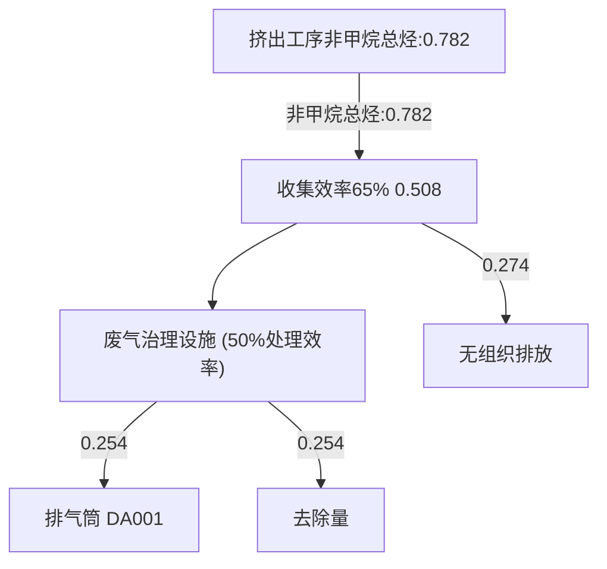
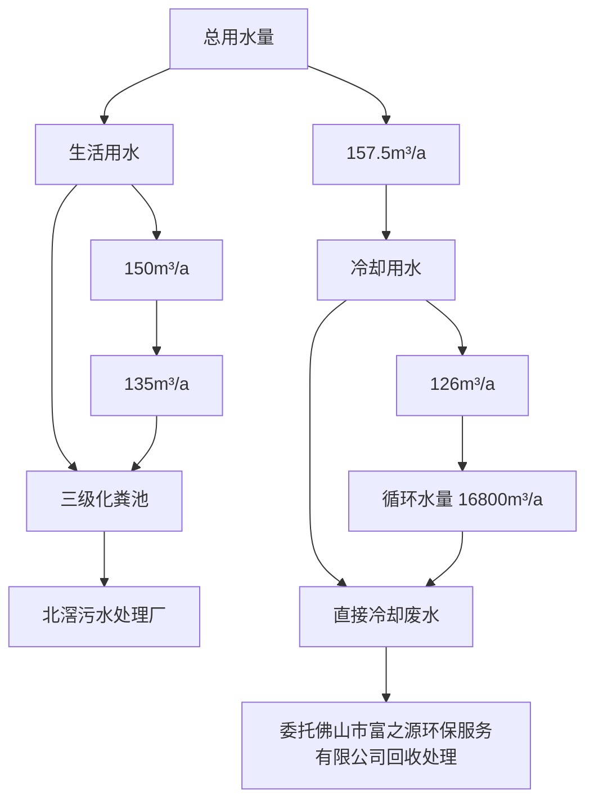
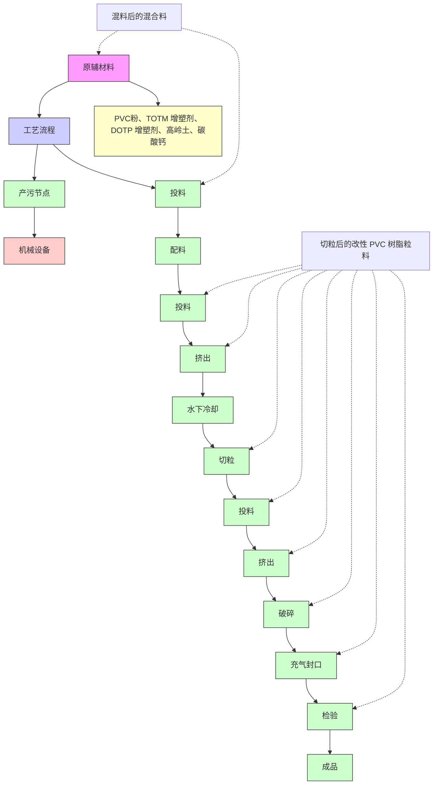
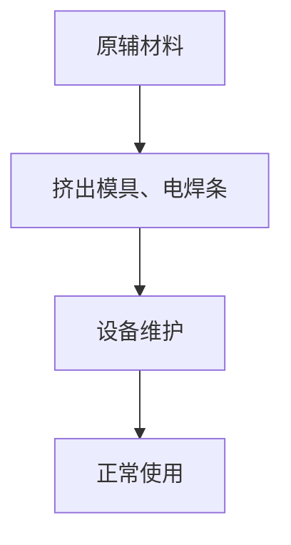
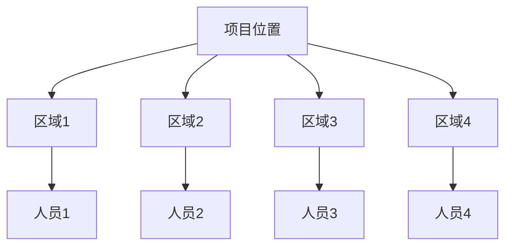

# 建设项目环境影响报告表

（污染影响类）

项目名称：佛山市顺德区北滘镇联达实业有限公司搬迁项目建设单位（盖章）：佛山市顺德区北滘镇联达实业有限公司

编制日期：2025年1

text_image

1月
达实业有限公司
山東省
股份有限公司
山東省

中华人民 部制

text_image

自然环保
共和国生态环境

编制单位和编制人员情况表

<table><tr><td>项目编号</td><td colspan="2">0qcuz8</td></tr><tr><td>建设项目名称</td><td colspan="2">佛山市顺德区北滘镇联达实业有限公司搬迁项目</td></tr><tr><td>建设项目类别</td><td colspan="2">26-053塑料制品业</td></tr><tr><td>环境影响评价文件类型</td><td colspan="2">报告表</td></tr><tr><td colspan="2">一、建设单位情况</td><td rowspan="3"></td></tr><tr><td>单位名称(盖章)</td><td>佛山市顺德区北滘镇</td></tr><tr><td>统一社会信用代码</td><td>91440606722450441K</td></tr></table>

text_image

中华人民共和国
中华人民共和国
中华人民共和国

text_image

中华人民共和国
中华人民共和国
中国人民银行

text_image

中华人民共和国
中华人民共和国
中华人民共和国

text_image

中华人民共和国
中华人民共和国
中华人民共和国

text_image

中华人民共和国
中华人民共和国
中国人民银行

text_image

中华人民共和国
中华人民共和国
中华人民共和国

text_image

中华人民共和国
中华人民共和国
中华人民共和国

text_image

中华人民共和国
中华人民共和国
中国人民银行

text_image

中华人民共和国
中国人民银行

text_image

中华人民共和国
中国人民银行

text_image

中华人民共和国
中国人民银行

text_image

中华人民共和国
中国人民银行

text_image

中华人民共和国
中国人民银行

证明机构名称（证明专用章）

证明时间

2024-11-2610:00

text_image

中华人民共和国生态环境部
中华人民共和国

text_image

中华人民共和国
人力资源和社会保障部
中国人民解放军
中国人民解放军
中国人民解放军

#

开生

text_image

202410146890678333

# 目录

一、建设项目基本情况.  
二、建设项目工程分析.. .18  
三、区域环境质量现状、环境保护目标及评价标准. 35  
四、 主要环境影响和保护措施. .41  
五、环境保护措施监督检查清单. .72  
六、结论.... . 75  
建设项目污染物排放量汇总表.. .76  
附图 1 项目地理位置图. .77  
附图 2 项目平面布置图. .. 78  
附图 3 项目四至卫星图.. .79  
附图 4 项目敏感点分布图. .80  
附图 5 周边环境现状照片. .. 81  
附图 6 项目所在区域的地表水环境功能区划图. .82  
附图 7 项目所在区域的大气环境功能区划图 .83  
附图 8 项目所在区域的声环境功能区划图. .84  
附图 9 项目厂区现场照片. .85  
附图 10 项目所在地环境管控单元划分.. .86  
附图 11 项目所在地三线一单应该平台截图. .87  
附图 12 项目所在地控制性详细规划. .88  
附图 13 项目所在产业集聚区规划图. .89  
附件 11 公示声明... . 90

# 一、建设项目基本情况

<table><tr><td>建设项目名称</td><td colspan="3">佛山市顺德区北滘镇联达实业有限公司搬迁项目</td></tr><tr><td>项目代码</td><td colspan="3">无</td></tr><tr><td>建设单位联系人</td><td>吴*</td><td>联系方式</td><td>130**33</td></tr><tr><td>建设地点</td><td colspan="3">广东省佛山市顺德区北滘镇黄龙村黄涌工业大道1号万洋科创园一区11栋301室</td></tr><tr><td>地理坐标</td><td colspan="3">东经113度10分31.365秒,北纬22度54分29.920秒</td></tr><tr><td>国民经济行业类别</td><td>C2922塑料板、管、型材制造</td><td>建设项目行业类别</td><td>“二十六、橡胶和塑料制品业29”中“53塑料制品业292”的其他(年用非溶剂型低VOCs含量涂料10吨以下的除外)</td></tr><tr><td>建设性质</td><td>☑新建(迁建)□改建□扩建□技术改造</td><td>建设项目申报情形</td><td>☑首次申报项目□不予批准后再次申报项目□超五年重新审核项目□重大变动重新报批项目</td></tr><tr><td>项目审批(核准/备案)部门(选填)</td><td>无</td><td>项目审批(核准/备案)文号(选填)</td><td>无</td></tr><tr><td>总投资(万元)</td><td>50</td><td>环保投资(万元)</td><td>10</td></tr><tr><td>环保投资占比(%)</td><td>20</td><td>施工工期</td><td>2个月</td></tr><tr><td>是否开工建设</td><td>☑否□是:____</td><td>用地(用海)面积( $m^{2}$ )</td><td>934.62</td></tr><tr><td>专项评价设置情况</td><td colspan="3">无</td></tr><tr><td>规划情况</td><td colspan="3">无</td></tr><tr><td>规划环境影响评价情况</td><td colspan="3">无</td></tr><tr><td>规划及规划环境影响评价符合性分析</td><td colspan="3">无</td></tr><tr><td>其他符合性分析</td><td colspan="3">1、选址合理性分析本项目位于广东省佛山市顺德区北滘镇黄龙村黄涌工业大道1号万洋科创园一区11栋301室,用于工业生产。根据《北滘工业园潭洲水道以西片控制性详</td></tr></table>

细规划》（B-CB-04-02、B-CB-07-01、B-CB-07-04）修编批后批后公布（佛府办函〔2020〕109号，见附图12），项目所在地属于一类工业用地，符合规划要求，因此项目选址合理。

# 2、项目与《环境保护综合名录》（2021年版）相符性分析

项目不涉及《环境保护综合名录》（2021年版）中的“高污染、高环境风险”产品名录中的产品，符合《环境保护综合名录》（2021年版）的相关规定。

# 3、项目与广东省发展改革委关于印发《广东省“两高”项目管理目录（2022年版）》的通知（粤发改能源函〔2022〕1363号）相符性分析

对照广东省发展改革委关于印发《广东省“两高”项目管理目录（2022 年版）》的通知（粤发改能源函〔2022〕1363 号）管理目录，本项目不涉及“两高”产品或工序，符合要求。

# 4、产业政策符合性分析

项目主要从事PVC套管的生产，项目生产产品、生产工艺和生产设备均不属于《产业结构调整指导目录（2024年本）》中的限制或禁止类别，也不属于国家发展改革委商务部《关于印发＜市场准入负面清单（2022年版）的通知＞》（发改体改规〔2022〕397 号）“禁止准入类”。

# 5、与《佛山市生态环境局 佛山市水利局关于进一步加强工业企业废水污染防治的函》的相符性分析

①“加强涉生活污水排放项目审批管理。要加强部门联动，及时动态更新区域排水管网图，准确判断区域排水设施现状。生活污水管网未覆盖或已覆盖但未实质连通接入城镇生活污水处理厂的区域，原则上不得新建、扩建生活污水排放的工业项目，确需排放生活污水的，应自行配套生活污水处理设施，自建污水处理设施仅限于规模以上、生活污水排放量不低于 40吨/日的工业企业，并加强处理工艺经济技术可行性及受纳水体达标论证。”

本项目属于涉生活污水排放项目，在北滘污水处理厂的纳污范围内，生活污水经三级化粪池预处理后由市政污水管网排入北滘污水处理厂处理，符合要求。

②“未实现雨污分流的工业园区、工业集聚区，严格控制以间接排放标准或纳管排放标准向市政管网排放工业废水。工业企业排放有含重金属、难生化降解、有生物毒性、易燃易爆、高盐分、重油脂等超城镇生活污水处理厂接收能力的生产废水，以及间接冷却的清净下水等过低浓度生产废水，原则上不得排入城镇生活污水处理厂，已进入的，各区要制定限期退出计划并实施。受纳城镇生活污水处理厂已满负荷的，限制审批新增废水排入城镇生活污水处理厂的工业项目。”

本项目生活污水经三级化粪池预处理后由市政污水管网排入北滘污水处理厂。冷却塔冷却水定期排水，属于直接冷却水，定期委托佛山市富之源环保服务有限公司回收处理，约每年回收一次，冷却废水不外排。本项目不排放有含重金属、难生化降解、有生物毒性、易燃易爆、高盐分、重油脂等超城镇生活污水处理厂接收能力的生产废水，以及间接冷却的清净下水等过低浓度生产废水，北滘污水处理厂目前还有容量，未满负荷，符合要求。

③“加强零散工业企业废水管理和设施建设。加强对零散废水污染防治工作的统一监督管理，督促零散废水产生单位建立零散废水产生、收集、储存和转移的相应设施和管理制度；零散废水处理单位应当建立零散废水处理管理台账，零散废水运输专用车辆应当使用罐式车或者其他达到密封性要求的货车。零散废水转运处置方式为解决历史问题的过渡阶段措施，村级工业园、老旧工业区已完成“工改工”改造重建，以及新规划建设的工业园区、工业集聚区，原则上应自建工业废水处理设施或通过管网纳入集中处理设施处理排放，不再审批以零散废水形式外运处置(VOCs 喷淋废水除外)。”

本项目直接冷却水外运，属于可外运的零散废水，符合要求。

# 6、与《佛山市生态环境局顺德分局关于环评技术评估审查项目与“节地提质”攻坚行动方案相符性意见的函》的相符性分析

“按照《广东省人民政府办公厅关于印发广东省“节地提质”攻坚行动方案（2023—2025 年）的通知》中“在符合国土空间规划的前提下，新建工业项目和经批准实施异地搬迁的工业项目，除因安全生产、工艺技术等特殊要求外，应一律安排进入开发区（产业园区）生产建设”的规定，结合我区工作实际，现将我区村级工业园升级改造工作领导小组办公室认定的现代主题产业园范围（见附件）转发给你们，可作为技术评估审查项目与“节地提质”攻坚行动方案相符性的参考依据。部分工业园区未纳入现代主题产业园范围的，该工业园区内项目与“节地提质”攻坚行动方案相符性由属地主管部门另行出具书面意见。”

本项目位于广东省佛山市顺德区北滘镇黄龙村黄涌工业大道 1号万洋科创园一区11栋301室，根据顺德区高质量推动村级工业园升级改造总烃规划图，本项目位于产业集聚区 3—广东智能制造产业集聚区，符合《佛山市生态环境局顺德分局关于环评技术评估审查项目与“节地提质”攻坚行动方案相符性意见的函》要求。

# 7、项目有机污染物治理政策的相符性分析

本项目有机污染物治理政策的相符性分析见下表。

表 1 项目与有机污染物治理政策的相符性分析

<table><tr><td>序号</td><td>政策要求</td><td>工程内容</td><td>符合性</td></tr><tr><td colspan="4">1、与顺德区生态环境保护委员会办公室关于印发《顺德区重点行业挥发性有机物总量指标管理工作方案(2024年修订)》(顺环委办[2024]3号)相符性分析</td></tr><tr><td>1.1</td><td>根据区域现状、改善目标、减排空间,全区建设项目新增VOCs排放量施行“减二增一”政策。其中,有组织排放和无组织排放均纳入新增指标管理;非甲烷总烃合并计入VOCs管理。</td><td>本项目不新增VOCs总量控制指标。</td><td>符合</td></tr><tr><td>1.2</td><td>环评文件审批部门确定受理建设项目环评文件后,新增VOCs有组织排放量小于0.3吨,以及新增VOCs排放量(包括有组织排放和无组织排放)小于0.6吨的项目在审批完成后直接在环评审批系统录入项目排放量,作为VOCs排放总量分配依据。新增VOCs有组织排放量大于或等于0.3吨,以及新增VOCs排放量(包括有组织排放和无组织排放)大于或等于0.6吨的项目由环评文件审批部门报大气管理科室出具VOCs指标来源说明,环评文件审批部门收到指标来源说明后方可继续完成环评审批,其中新增VOCs有组织排放量大于或等于3吨,以及新增VOCs排放量(包括有组织排放和无组织排放)大于或等于6吨的,需报区生态环境部门局务会议审定后方可分配总量指标。</td><td>本项目不新增VOCs总量控制指标。</td><td>符合</td></tr><tr><td colspan="4">2.与《重点行业挥发性有机物综合治理方案》的通知(环大气〔2019〕53号)相符性</td></tr><tr><td>2.1</td><td>通过使用水性、粉末、高固体分、无溶剂、辐射固化等低VOCs含量的涂料,水性、辐射固化、植物基等低VOCs含量的油墨,水基、热熔、无溶剂、辐射固化、改性、生物降解等低VOCs含量的胶粘剂,以及低VOCs含量、低反应活性的清洗剂等,替代溶剂型涂料、油墨、胶粘剂、清</td><td>本项目涉VOCs原辅材料主要为PVC粉,不涉及高VOCs含量原辅材料。</td><td>符合</td></tr></table>

<table><tr><td rowspan="6"></td><td></td><td>洗剂等,从源头减少VOCs产生。工业涂装、包装印刷等行业要加大源头替代力度。</td><td></td><td></td></tr><tr><td>2.2</td><td>重点对含VOCs物料(包括含VOCs原辅材料、含VOCs产品、含VOCs废料以及有机聚合物材料等)储存、转移和输送、设备与管线组件泄漏、敞开液面逸散以及工艺过程等五类排放源实施管控,通过采取设备与场所密闭、工艺改进、废气有效收集等措施,削减VOCs无组织排放。</td><td>本项目产生的有机废气采用半密闭型集气罩收集措施,削减VOCs无组织排放。</td><td>符合</td></tr><tr><td>2.3</td><td>企业新建治污设施或对现有治污设施实施改造,应依据排放废气的浓度、组分、风量,温度、湿度、压力,以及生产工况等,合理选择治理技术。鼓励企业采用多种技术的组合工艺,提高VOCs治理效率。低浓度、大风量废气,宜采用沸石转轮吸附、活性炭吸附、减风增浓等浓缩技术,提高VOCs浓度后净化处理;高浓度废气,优先进行溶剂回收,难以回收的,宜采用高温焚烧、催化燃烧等技术。油气(溶剂)回收宜采用冷凝+吸附、吸附+吸收、膜分离+吸附等技术。低温等离子、光催化、光氧化技术主要适用于恶臭异味等治理;生物法主要适用于低浓度VOCs废气治理和恶臭异味治理。非水溶性的VOCs废气禁止采用水或水溶液喷淋吸收处理。采用一次性活性炭吸附技术的,应定期更换活性炭,废旧活性炭应再生或处理处置。</td><td>本项目有机废气采用“静电除油+活性炭吸附”,定期更换活性炭,废旧活性炭交有资质的单位转移处理。</td><td>符合</td></tr><tr><td>2.4</td><td>车间或生产设施收集排放的废气,VOCs初始排放速率大于等于3千克/小时、重点区域大于等于2千克/小时的,应加大控制力度,除确保排放浓度稳定达标外,还应实行去除效率控制,去除效率不低于80%;采用的原辅材料符合国家有关低VOCs含量产品规定的除外,有行业排放标准的按其相关规定执行。</td><td>本项目位于佛山市,不属于《重点行业挥发性有机物综合治理方案》中附件1包含的重点区域范围,VOCs初始排放速率为0.16kg/h,小于3千克/小时。采用的原辅材料符合国家有关低VOCs含量产品规定。</td><td>符合</td></tr><tr><td colspan="4">3.与《广东省生态环境保护“十四五”规划》(粤环〔2021〕10号)的相符性分析</td></tr><tr><td>3.1</td><td>在石化、化工、包装印刷、工业涂装等重点行业建立完善源头、过程和末端的VOCs全过程控制体系。大力推进低VOCs含量原辅材料源头替代,严格落实国家和地方产品VOCs含量限值质量标准,禁止建设生产和使用高VOCs含量的溶剂型涂料、油墨、胶粘剂等项目。严格实施VOCs排放企业分级管控,全面推进涉VOCs排放企业深度治理。开展中小型企业废</td><td>项目不使用高VOCs含量的溶剂型涂料、油墨、胶粘剂等原料。项目产生的有机废气采用“静电除油+活性炭吸附”治理,有机废气治理效率较高。</td><td>符合</td></tr></table>

<table><tr><td></td><td>气收集和治理设施建设、运行情况的评估,强化对企业涉VOCs生产车间/工序废气的收集管理,推动企业开展治理设施升级改造。</td><td></td><td></td></tr><tr><td colspan="4">4.与《佛山市生态环境保护“十四五”规划》(佛环〔2022〕3号)相符性</td></tr><tr><td>4.1</td><td>加强VOCs源头替代和无组织排放管控。大力推进低VOCs含量原辅材料替代,将全面使用低VOCs含量原辅材料的企业纳入证明清单和政府绿色采购清单。加强对含VOCs物料储存、转移和运输、设备与管线组件泄漏、敞开液面逸散以及工艺过程等五类排放源的管控。</td><td>本项目不涉及使用高挥发性有机物原辅材料。挤出有机废气经半密闭型集气罩收集后经“静电除油+活性炭吸附”处理后引至50米排气筒排放。</td><td>符合</td></tr><tr><td>4.2</td><td>推进VOCs高排放企业治理设施提升改造,淘汰光催化、光氧化、低温等离子等现有低效治理设施。</td><td>本项目有机废气拟通过“静电除油+活性炭吸附”治理设施进行处理,活性炭吸附设施不属于低效治理设施。</td><td>符合</td></tr><tr><td colspan="4">5.与《佛山市顺德区生态环境保护“十四五”规划(2021-2025)》(顺府办发〔2022〕16号)相符性</td></tr><tr><td>5.1</td><td>大力推进低VOCs含量、低反应活性的原辅材料替代,将全面使用低VOCs含量原辅材料的企业纳入正面清单和政府绿色采购清单。鼓励重点行业企业开展生产工艺和设备水性化改造,推广使用水性、高固体分、无溶剂、粉末等低VOCs含量涂料。</td><td>本项目涉VOCs原辅材料主要为PVC粉,不涉及高VOCs含量原辅材料。</td><td>符合</td></tr><tr><td colspan="4">6.与《挥发性有机物无组织排放控制标准》(GB37822-2019)相符性分析</td></tr><tr><td>6.1</td><td>“VOCs质量占比大于等于10%的含VOCs产品,其使用过程应采用密闭设备或在密闭空间内操作,废气应排至VOCs废气收集处理系统;无法密闭的,应采取局部气体收集措施,废气应排至VOCs废气收集处理系统”;</td><td>本项目挤出产生的废气采用半密闭型集气罩进行收集,废气经收集后排至有机废气收集处理系统。</td><td>符合</td></tr><tr><td>6.2</td><td>“收集的废气中NMHC初始排放速率≥3kg/h时,应配置VOCs处理设施,处理效率不应低于80%;对于重点地区,收集的废气中NMHC初始排放速率≥2kg/h时,应配置VOCs处理设施,处理效率不应低于80%”</td><td>本项目位于佛山市,根据DB44/2367-2022,佛山属于重点区域,本项目收集的废气NMHC初始排放速率0.16kg/h&lt;2kg/h,有机废气采用“静电除油+活性炭吸附”装置处理,处理效率为50%</td><td>符合</td></tr><tr><td colspan="4">7.与《固定污染源挥发性有机物综合排放标准》强制性地方标准)》(2022第4号(总第222号)相符性分析</td></tr><tr><td>7.1</td><td>VOCs物料应当储存于密闭的容器、储罐、储库、料仓中。</td><td rowspan="3">项目VOCs物料采用袋装密封包装,储存于原料仓内,原料仓位于钢筋混凝土结构建造的厂房内,项目化学品在转移输送过程中采用密闭包装。</td><td>符合</td></tr><tr><td>7.2</td><td>盛装VOCs物料的容器应当存放于室内,或者存放于设置有雨棚、遮阳和防渗设施的专用场地。盛装VOCs物料的容器或者包装袋在非取用状态时应当加盖、封口,保持密闭。</td><td>符合</td></tr><tr><td>7.3</td><td>液态VOCs物料应当采用密闭管道输送。采用非管道输送方式转移液态VOCs物料时,应当采用密闭容器、罐车。</td><td>符合</td></tr><tr><td>7.4</td><td>液态VOCs物料应当采用密闭管道输送方式或者采用高位槽(罐)、桶泵等给料方式密闭投加。无法密闭投加的,应当在密闭空间内操作,或者进行局部气体收集,废气应当排至VOCs废气收集处理系统。</td><td>本项目物料采用密闭管道输送,项目挤出工艺采用半密闭型集气罩进行收集,有机废气经收集后排至有机废气收集处理系统。</td><td>符合</td></tr><tr><td colspan="4">8.与《广东省臭氧污染防治(氮氧化物和挥发性有机物协同减排)实施方案(2023-2025年)》相符性分析</td></tr><tr><td>8.1</td><td>以工业涂装、橡胶塑料制品等行业为重点,开展涉VOCs企业达标治理,强化源头、无组织、末端全流程治理。加快推进工程机械、钢结构、船舶制造等行业低VOCs含量原辅材料替代,引导生产和使用企业供应和使用符合国家质量标准产品;企业无组织排放控制措施及相关限值应符合《挥发性有机物无组织排放控制标准(GB37822)》、《固定污染源挥发性有机物排放综合标准(DB44/2367)》和《广东省生态环境厅关于实施厂区内挥发性有机物无组织排放监控要求的通告》(粤环发〔2021〕4号)要求,无法实现低VOCs原辅材料替代的工序,宜在密闭设备、密闭空间作业或安装二次密闭设施;新、改、扩建项目限制使用光催化、光氧化、水喷淋(吸收可溶性VOCs除外)、低温等离子等低效VOCs治理设施(恶臭处理除外),组织排查光催化、光氧化、水喷淋、低温等离子及上述组合技术的低效VOCs治理设施,对无法稳定达标的实施更换或升级改造。</td><td>项目挤出有机废气经半密闭型集气罩收集后经“静电除油+活性炭吸附”处理后引至50米DA001排气筒排放。无组织排放控制措施及相关限值符合《固定污染源挥发性有机物排放综合标准(DB44/2367)》和《广东省生态环境厅关于实施厂区内挥发性有机物无组织排放监控要求的通告》(粤环发〔2021〕4号)要求。不使用光催化、光氧化、水喷淋、低温等离子及上述组合技术的低效VOCs治理设施。</td><td>符合</td></tr><tr><td>8.2</td><td>严格执行涂料、油墨、胶粘剂、清洗剂VOCs含量限值标准;依法查处生产、销售VOCs含量不符合质量标准或者要求的原材料和产品的行为;增加对使用环节的检测与监管,曝光不合格产品并追溯其生产、销售、使用企业,依法追究责任。</td><td>本项目不使用涂料、油墨、胶粘剂等原辅材料。</td><td>符合</td></tr></table>

8、与《广东省人民政府关于印发广东省“三线一单”生态环境分区管控方案的通知》（粤府〔2020〕71号文）符合性分析：

根据《广东省人民政府关于印发广东省“三线一单”生态环境分区管控方案的通知》（粤府〔2020〕71 号）的要求，本项目与所在区域的生态保护红线、环境质量底线、资源利用上线和生态环境准入清单（“三线一单”）进行对照分析，见下表：

表 2 “三线一单”相符性分析

<table><tr><td colspan="3">粤府(2020)71号的相关规定</td><td>本项目情况</td><td>是否符合</td></tr><tr><td>生态保护红线</td><td colspan="2">全省陆域生态保护红线面积36194.35平方公里,占全省陆域国土面积的20.13%;一般生态空间面积27741.66平方公里,占全省陆域国土面积的15.44%。全省海洋生态保护红线面积16490.59平方公里,占全省管辖海域面积的25.49%。</td><td>本项目位于广东省佛山市顺德区北滘镇黄龙村黄涌工业大道1号万洋科创园一区11栋301室,所在区域属于工业用地,项目用地不涉及划定的生态红线区域,项目周边无自然保护区、饮用水源保护区等生态保护目标,符合生态保护红线要求。</td><td>符合</td></tr><tr><td>环境质量底线</td><td colspan="2">全省水环境质量持续改善,国考、省考断面优良水质比例稳步提升,全面消除劣V类水体。大气环境质量继续领跑先行,PM2.5年均浓度率先达到世界卫生组织过渡期二阶段目标值(25微克/立方米),臭氧污染得到有效遏制。土壤环境质量稳中向好,土壤环境风险得到管控。近岸海域水体质量稳步提升。</td><td>根据环境质量现状监测和周边现状监测数据,项目区大气环境为不达标区,超标污染物为臭氧;地表水环境、声环境质量均能满足相应标准要求。本项目排放的各项污染物经相应措施处理后均能标,对环境影响很小,环境风险可控,未超出环境质量线,项目的建设基本符合环境质量底线要求。</td><td>符合</td></tr><tr><td>资源利用上线</td><td colspan="2">强化节约集约利用,持续提升资源能源利用效率,水资源、土地资源、岸线资源、能源消耗等达到或优于国家下达的总量和强度控制目标。</td><td>项目生产过程中的电能、自来水等消耗量较少,区域水、电资源较充足,项目消耗量没有超出资源负荷,没有超出资源利用上线。</td><td>符合</td></tr><tr><td rowspan="3">生态环境准入清单</td><td>区域布局管控要求</td><td>禁止新建、扩建燃煤燃油火电机组和企业自备电站,推进现有服役期满及落后老旧的燃煤火电机组有序退出;原则上不再新建燃煤锅炉,逐步淘汰生物质锅炉、集中供热管网覆盖区域内的分散供热锅炉,逐步推动高污染燃料禁燃区全覆盖;禁止新建、扩建水泥、平板玻璃、化学制浆、生皮制革以及国家规划外的钢铁、原油加工等项目。推广应用低挥发性有机物原辅材料,严格限制新建生产和使用高挥发性有机物原辅材料的项目,鼓励建设挥发性有机物共性工厂</td><td>项目不设发电机、锅炉等设备;不属于新建、扩建水泥、平板玻璃、化学制浆、生皮制革以及国家规划外的钢铁、原油加工等项目。项目使用的PVC粉、增塑剂等均不属于高挥发性有机物原辅材料。</td><td>符合</td></tr><tr><td>能源资源利用要求</td><td>推进工业节水减排,重点在高耗水行业开展节水改造,提高工业用水效率。</td><td>项目不属于高能耗项目</td><td>符合</td></tr><tr><td>污染物排</td><td>在可核查、可监管的基础上,新建项目原则上实施氮氧化</td><td>项目不涉及氮氧化物废气的排放;项目挤出有机废气采用半密</td><td>符合</td></tr><tr><td rowspan="2"></td><td>放管控要求</td><td>物等量替代,挥发性有机物两倍削减量替代。以臭氧生成潜势较大的行业企业为重点,推进挥发性有机物源头替代,全面加强无组织排放控制,深入实施精细化治理。现有每小时35蒸吨及以上的燃煤锅炉加快实施超低排放治理,每小时35蒸吨以下的燃煤锅炉加快完成清洁能源改造。重点水污染物未达到环境质量改善目标的区域内,新建、改建、扩建项目实施减量替代。大力推进固体废物源头减量化、资源化利用和无害化处置,稳步推进“无废城市”试点建设。</td><td>闭型集气罩收集后经“静电除油+活性炭吸附”处理后引至50米排气筒排放。</td><td></td></tr><tr><td>环境风险防控要求</td><td>提升危险废物监管能力,利用信息化手段,推进全过程跟踪管理;健全危险废物收集体系,推进危险废物利用处置能力结构优化</td><td>项目危险废物定期委托具有危险废物处理资质的单位处理处置</td><td>符合</td></tr></table>

# 9、与《佛山市生态环境局关于印发《佛山市“三线一单”生态环境分区管控方案（2024 年版）》的通知》 （佛环〔2024〕20 号）的相符性分析

根据《佛山市生态环境局关于印发《佛山市“三线一单”生态环境分区管控方案（2024 年版）》的通知》 （佛环〔2024〕20 号）的要求，本项目与所在区域的“三线一单”进行对照分析，见下表：

表 3“三线一单”相符性分析

<table><tr><td colspan="2">佛环(2024)20号的相关规定</td><td>本项目情况</td><td>是否符合</td></tr><tr><td>生态保护红线</td><td>全市陆域生态保护红线面积323.06平方公里,占全市陆域国土面积的8.51%;一般生态空间面积217.36平方公里,占全市陆域国土面积的5.73%。</td><td>本项目位于广东省佛山市顺德区北滘镇黄龙村黄涌工业大道1号万洋科创园一区11栋301室,所在区域属于工业用地,项目用地不涉及划定的生态红线区域,项目周边无自然保护区、饮用水源保护区等生态保护目标,符合生态保护红线要求。</td><td>符合</td></tr><tr><td>环境质量底线</td><td>水环境质量持续改善,乡镇级及以上集中式饮用水水源地水质100%达标,国考、省考断面地表水质量达到或优于III类水体比例不低于85.7%,劣V类水体比例为0%,市考断面基本消除劣V类断面;全面消除黑臭水体。空气质量持续改善,细颗粒物( $PM_{2.5}$ )年均浓度、空气质量优良天数比例(AQI)主要指标达到省下达的目标要求,臭氧污染得</td><td>根据环境质量现状监测和周边现状监测数据,项目区大气环境为不达标区,超标污染物为臭氧;地表水环境、声环境质量均能满足相应标准要求。本项目排放的各项污染物经相应措施处理后均能标,对环境影响很小,环境风险可控,未超出环境质量线,项目的建设基本符合环境质量底线要求。</td><td>符合</td></tr></table>

<table><tr><td rowspan="5"></td><td></td><td colspan="2">到遏制。土壤环境质量总体保持稳定,土壤环境风险得到管控,受污染耕地安全利用率不低于93%,重点建设用地安全利用得到有效保障。</td><td></td><td></td></tr><tr><td>资源利用上线</td><td colspan="2">强化节约集约循环利用,持续提升资源能源利用效率。土地资源、岸线资源、能源消耗等达到或优于国家和省下达的总量、强度等目标要求,按省规定年限实现碳达峰。</td><td>项目生产过程中的电能、自来水等消耗量较少,区域水、电资源较充足,项目消耗量没有超出资源负荷,没有超出资源利用上线。</td><td>符合</td></tr><tr><td rowspan="3">生态环境准入清单</td><td>区域布局管控要求</td><td>全市域为高污染燃料禁燃区,禁止新建、扩建燃用高污染燃料的燃烧设施。加快推进天然气产供储销体系建设,逐步淘汰集中供热管网覆盖区域内的分散供热锅炉,完成生物质锅炉淘汰整治,促进用热企业向园区集聚。禁止新建、扩建水泥、平板玻璃、化学制浆、生皮制革以及国家规划外的钢铁、原油加工等项目。专业电镀、印染等项目进入定点园区集中管理。严格落实国家产品VOCs含量限值标准要求,除现阶段确无法实施替代的工序外,禁止新建生产和使用高VOCs含量原辅材料项目,鼓励建设共性工厂、活性炭集中再生中心等挥发性有机物第三方治理项目,推动挥发性有机物集中高效处理。</td><td>本项目设备均使用电能,属于清洁能源。不属于新建、扩建水泥、平板玻璃、化学制浆、生皮制革以及国家规划外的钢铁、原油加工等项目。项目使用的PVC粉、增塑剂均不属于高挥发性有机物原辅材料。</td><td>符合</td></tr><tr><td>能源资源利用要求</td><td>积极发展氢能源、天然气等清洁能源,逐步提高可再生能源与低碳清洁能源比例,建立现代化能源体系。新、改、扩建“两高”项目须符合生态环境保护法律法规和相关法定规划,满足污染物区域削减、重点污染物排放总量控制、碳排放达峰目标、相关规划环评和相应行业建设项目环境准入条件、环评文件审批原则要求。</td><td>项目不属于高能耗项目,不属于两高项目。</td><td>符合</td></tr><tr><td>污染物排放管控要求</td><td>地表水I、II类水域,以及III类水域中的保护区、游泳区,禁止新建排污口,已建成的排污口应当实行污染物总量控制且不得增加污染物排放量。重点污染物未达到环境质量改善目标的管控分区所在镇(街道),须组织编制、系统实施重点污染物减排计划并明确“替代量”,本年度新建、改建、扩建项目新增水环境重点污染物实行减量替代。在可核查、可监管的基础上,全市新建、改建、扩建项目新增大气重点污染物实行“减二增一”替代。到2025年底,涉重金属重点行业企业基本达到国内清洁生产先进水平。打造近零碳排放示范项目,推进陶瓷、有色金属等重点能源消耗行业二氧化碳排放控制。开展“无废城市”建设,推动固体废物源头减量、资源化利用和安全处置。</td><td>本项目排放的各项污染物经相应措施处理后均能标,对环境影响很小,不含表列限制类项目</td><td>符合</td></tr><tr><td rowspan="2"></td><td rowspan="2"></td><td></td><td>推动企业将低温等离子、UV光解、RTO燃烧炉等有机废气治理设施纳入全厂安全风险辨识范围,加强安全管理。禁止在规划专门用于危险化学品生产、储存的区域(包括化工园区)外新建、扩建危险化学品生产、储备建设项目(加油站、加气站、加氢站、港口及铁路、航空危险化学品储存建设项目、危险化学品输送管道及危险化学品使用单位的配套项目除外)</td><td>挤出有机废气经半密闭型集气罩收集后经“静电除油+活性炭吸附”处理后引至50米DA001排气筒排放,不使用低温等离子、UV光解、RTO燃烧炉等有机废气治理设。项目不使用危险化学品,项目危险废物定期委托具有危险废物处理资质的单位处理处置</td><td>符合</td></tr><tr><td colspan="4">本项目位于广东省佛山市顺德区北滘镇黄龙村黄涌工业大道1号万洋科创园一区11栋301室,属于北滘镇重点管控区,编号:ZH44060620004。根据项目生产产品、原材料、工艺等分析,本项目不属于单元“区域布局管控”中生态/禁止类、产业/限制类、水/限制类等。项目生活污水、雨水分类收集,生活污水经三级化粪池预处理后排至北滘污水处理厂;直接冷却废水定期更换,更换的废水委托佛山市富之源环保服务有限公司回收处理,不外排,满足水/综合类管控要求。本项目对照分析《佛山市生态环境局关于印发《佛山市“三线一单”生态环境分区管控方案(2024年版)》的通知》(佛环〔2024〕20号)的相符性见下表4。10、与《佛山市顺德区人民政府关于印发佛山市顺德区“三线一单”生态环境分区管控方案的通知》(顺府发[2021]11号)的相符性分析</td></tr></table>

<table><tr><td></td><td>本项目所在区域属于北滘镇重点管控区,编号:ZH44060620004。本项目对照分析《佛山市顺德区人民政府关于印发佛山市顺德区“三线一单”生态环境分区管控方案的通知》(顺府发〔2021〕11号)的要求,本项目与所在区域的“三线一单”进行对照分析,见下表5。</td></tr></table>

表 4 本项目与佛山市“三线一单”生态环境分区管控方案相符性分析

<table><tr><td>类别</td><td>管控要求</td><td>本项目</td><td>是否符合</td></tr><tr><td rowspan="8">区域布局管控</td><td>1-1.【生态/禁止类】单元内的一般生态空间,主导生态功能为水土保持,禁止在25度以上的陡坡地开垦种植农作物,禁止在崩塌、滑坡危险区、泥石流易发区从事采石、取土、采砂等可能造成水土流失的活动。</td><td>不适用。</td><td>/</td></tr><tr><td>1-2.重点发展机器人及配套产业、智能家用电器、高端新型电子信息、新材料等制造业和总部经济、电子商务、工业设计与文化创意、科技金融等现代服务业,打造智能制造和智慧家电示范区。</td><td>不适用。</td><td>/</td></tr><tr><td>1-3.【产业/综合类】系统推进村级工业园升级改造,腾出连片空间,布局产业集聚区和主题产业园,推动工业项目入园集聚发展。</td><td>本项目位于广东省佛山市顺德区北滘镇黄龙村黄涌工业大道1号万洋科创园一区11栋301室,已经村改完成。</td><td>是</td></tr><tr><td>1-4.【水/限制类】严格限制在佛山市禅城南庄紫洞水厂、佛山市禅城沙口(石湾)水厂、羊额—北滘水厂、广州市南洲水厂顺德水道取水口饮用水水源保护区上游和周边区域建设列入“高污染、高环境风险”产品名录等可能影响水环境安全的项目。</td><td>本项目不在水源保护区范围内,不属于高污染、高环境风险项目。</td><td>是</td></tr><tr><td>1-5.【大气/限制类】大气环境受体敏感重点管控区内,应严格限制新建储油库项目、产生和排放有毒有害大气污染物的建设项目以及使用溶剂型油墨、涂料、清洗剂、胶黏剂等高挥发性有机物原辅材料项目,鼓励现有该类项目搬迁退出。</td><td>本项目不产生和排放有毒有害大气污染物,不使用溶剂型油墨、涂料、清洗剂、胶黏剂等高挥发性有机物原辅材料。</td><td>是</td></tr><tr><td>1-6.【大气/鼓励引导类】大气环境高排放重点管控区内,应强化达标监管,引导工业项目落地集聚发展,有序推进区域内行业企业提标改造</td><td>本项目挤出有机废气经半密闭型集气罩收集后经“静电除油+活性炭吸附”处理后引至50米排气筒排放,本项目排放的各项污染物经相应措施处理后均能标,对环境影响很小。</td><td>是</td></tr><tr><td>1-7.【产业/综合类】划定家具生产优先发展区域,优先发展区外不再新建涉及涂装工艺的木质家具制造项目。优先发展区范围根据家具产业发展规划及其规划环评文件确定。</td><td>本项目不属于含有涂装工艺的木质家具制造项目。</td><td>是</td></tr><tr><td>1-8.【产业/限制类】受纳水体或监控断面不达标且未“以新带老”制定区域达标方案的河涌,不得新建、扩建向河涌直接排放废水的项目。新建、扩建含蚀刻工序的线路板生产项目和化工项目应在配套污水集中处置的工业园区或生活污水管网覆盖区域内建设;纯加工型印花项目,含酸洗、磷化的金属表面处理、金属制品项目(与自身高新技术企业配套的和区级及以上重点项目除外),含酸洗、喷涂、化学抛光、电解等涉及废水排放工艺的不锈钢型材加工项目(与自身高新技术企业配套的和区级及以上重点项目除外),应进入以此类项目为主导产业、有相应废水集中治理设施的工业园区,实现集中治污。</td><td>本项目生活污水经三级化粪池处理后排入北滘污水处理厂处理;直接冷却废水定期更换,更换的废水委托佛山市富之源环保服务有限公司回收处理,不外排;本项目不包含条款中提及的限制类项目和工序。</td><td>是</td></tr><tr><td>能源资源</td><td>2-1.【能源/鼓励引导类】推广节能技术,加快发展绿色货运与现代物流。</td><td>不适用。</td><td>/</td></tr><tr><td rowspan="5">利用</td><td>2-2.【能源/鼓励引导类】推广新能源汽车应用和充电基础设施建设,积极推动重卡LNG加气站、充电基础设施、加氢站建设。</td><td>不适用。</td><td>/</td></tr><tr><td>2-3.【能源/综合类】科学实施能源消费总量和强度“双控”,新建高能耗项目单位产品(产值)能耗达到国际国内先进水平。</td><td>本项目不属于高能耗项目。</td><td>是</td></tr><tr><td>2-4.【水资源/综合类】贯彻落实“节水优先”方针,实行最严格水资源管理制度,北滘镇万元国内生产总值用水量、万元工业增加值用水量、用水总量、农田灌溉水有效利用系数等用水总量和效率指标达到区下达要求。</td><td>项目用水满足北滘镇万元国内生产总值用水量、万元工业增加值用水量、用水总量、农田灌溉水有效利用系数等用水总量和效率指标要求。</td><td>是</td></tr><tr><td>2-5.【土地资源/限制类】落实单位土地面积投资强度、土地利用强度等建设用地控制性指标要求,提高土地利用效率。</td><td>项目位于已建成的工业区内,不涉及土地开发利用。</td><td>是</td></tr><tr><td>2-6.【岸线/禁止类】严格水域岸线用途管制,新建项目一律不得违规占用水域。严禁破坏生态的岸线利用行为和不符合其功能定位的开发建设活动,严禁以各种名义侵占河道、围垦湖泊、非法采砂等。</td><td>项目位于广东省佛山市顺德区北滘镇黄龙村黄涌工业大道1号万洋科创园一区11栋301室,不占用水域。</td><td>是</td></tr><tr><td rowspan="5">污染物排放管控</td><td>3-1.【水/限制类】城镇新区建设实行雨污分流,逐步推进初期雨水收集、处理和资源化利用。住宅、商业体、学校、市场等城镇开发建设项目应当配套或者同步计划建设公共排水设施,公共排水设施或自建排污水设施未能投产运行的,以上涉水项目不得投入使用。新建小区严格实施雨污分流,阳台、露台等污水接入污水收集系统,将生活污水“应截尽截”。做好大型楼盘、集贸市场、餐饮以及学校等4大类排水户污水接入市政管网工作。</td><td>不适用。</td><td>/</td></tr><tr><td>3-2.【水/综合类】结合村级工业园改造,全面提升产业层次与集聚度,促进污染集中整治。</td><td>不适用。</td><td>/</td></tr><tr><td>3-3.【水/综合类】稳步推进排水设施“三个一体化”管理模式,补齐城乡污水收集和处理短板,推动群力围污水处理厂提质增效,加快消除城中村、老旧城区、城乡结合部等污水收集管网空白区,逐步实现城乡污水收集处理全覆盖。2025年前完成群力围污水处理厂扩建,尾水应执行《城镇污水处理厂污染物排放标准》(GB18918-2002)一级A标准及《广东省水污染物排放限值》(DB44/26-2001)的较严值。</td><td>不适用。</td><td>/</td></tr><tr><td>3-4.【水/综合类】近期保留并完善水口村、三桂村、西滘村、马龙村等现状农村污水分散式处理设施,新建莘村、马龙村等分散式污水处理站建设,继续完善污水支管网建设,提高污水收集处理率,其余行政村(社区)继续完善污水管网建设,实现农村污水100%收集进入市政污水系统,有条件的区域实施雨污分流改造,到2030年全面雨污分流,污水纳入北滘城镇污水处理系统。</td><td>不适用。</td><td>/</td></tr><tr><td>3-5.【大气/综合类】大力推进低VOCs含量原辅材料替代,加快涉VOCs重点行业的生产工艺升级改造,推行自动化生产工艺,对达不到要求的VOCs收集及治理设施进行整治提升,逐步淘汰低效VOCs治理设施。</td><td>项目不涉及高VOCs原辅材料的使用;本项目有机废气治理使用“静电除油+活性炭吸附”处理设施处理,不采用低效治理设施。</td><td>是</td></tr><tr><td rowspan="3">环境风险防控</td><td>4-1.【水/综合类】加强单元内佛山市禅城南庄紫洞水厂、佛山市禅城沙口(石湾)水厂、羊额—北滘水厂、广州市南洲水厂顺德水道取水口饮用水水源保护区周边环境风险源管控,完善突发环境事件应急管理体系。</td><td>不适用。</td><td>/</td></tr><tr><td>4-2.【水/综合类】北滘污水处理厂、群力围污水处理厂、工业污水集中处理设施应采取有效措施,防止事故废水直接排入水体。完善污水处理厂在线监控系统联网,实现污水处理厂的实时、动态监管。</td><td>不适用。</td><td>/</td></tr><tr><td>4-3.【风险/综合类】加强环境风险分级分类管理,强化金属制品、有色金属和压延加工、化学原料和化学品制造业等涉重金属、化工行业企业及工业园区等重点环境风险源的环境风险防控。</td><td>项目通过采取防止泄漏措施,在火灾和爆炸事故次生灾害时,可通过封堵厂区门口,采取紧急疏散等措施,其环境风险总体是可控的。</td><td>是</td></tr></table>

表 5 项目与广东省佛山市顺德区重点管控单元准入清单的相符性分析

<table><tr><td>类别</td><td>相关要求</td><td>本项目</td><td>是否符合</td></tr><tr><td rowspan="6">区域布局管控</td><td>1-1【生态/禁止类】单元内的一般生态空间,主导生态功能为水土保持,禁止在25度以上的陡坡地开垦种植农作物,禁止在崩塌、滑坡危险区、泥石流易发区从事采石、取土、采砂等可能造成水土流失的活动。</td><td>不适用。</td><td>/</td></tr><tr><td>1-2【产业/鼓励引导类】重点发展机器人及配套产业、智能家用电器、高端新型电子信息、新材料等制造业和总部经济、电子商务、工业设计与文化创意、科技金融等现代服务业,打造智能制造和智慧家电示范区。</td><td>不适用。</td><td>/</td></tr><tr><td>1-3【产业/综合类】产业聚集区所属地块内的工业用地或企业与村庄、学校等环境敏感点之间应设置合理的大气环境防护距离,并通过绿化带进行有效隔离;聚集区规划布局应注重大气污染排放企业应尽量避免布局在居住用地的常年主导风向的上风向。</td><td>本项目大气污染物达标排放,无需设置大气环境防护距离。</td><td>是</td></tr><tr><td>1-4【产业/综合类】系统推进村级工业园升级改造,腾出连片空间,布局产业集聚区和主题产业园,推动工业项目入园集聚发展。新增工业制造业用地原则上安排在产业集聚区内,产业集聚区外原则上不鼓励工业及物流仓储用地的新建与改造。</td><td>项目所在地村级工业园升级改造完成。</td><td>是</td></tr><tr><td>1-5【产业/限制类】受纳水体或监控断面不达标的,不得新建、扩建向河涌直接排放废水的项目。新建、扩建含蚀刻工序的线路板生产项目和化工项目应在配套污水集中处置的工业园区或生活污水管网覆盖区域内建设;纯加工型印花项目,含酸洗、磷化的金属表面处理、金属制品项目(与自身高新技术企业配套的除外),含酸洗、喷涂、拉丝、表面抛光等工艺的不锈钢型材加工项目,应进入以此类项目为主导产业、有相应废水集中治理设施的工业园区,实现集中治污。</td><td>本项目生活污水经三级化粪池处理后排入北滘污水处理厂处理;直接冷却废水定期更换,更换的废水委托佛山市富之源环保服务有限公司回收处理,不外排;本项目不包含条款中提及的限制类项目和工序。</td><td>是</td></tr><tr><td>1-6【产业/综合类】划定家具生产优先发展区域,优先发展区外不再新建涉及涂装工艺的木质家具制造项目。</td><td>本项目不属于涂装工艺的木质家具制造项目。</td><td>是</td></tr><tr><td rowspan="3"></td><td>1-7【水/限制类】严格限制在佛山市禅城南庄紫洞水厂、佛山市禅城沙口(石湾)水厂、羊额—北滘水厂、广州市南洲水厂顺德水道取水口饮用水水源保护区上游和周边区域建设列入“高污染、高环境风险”产品名录等可能影响水环境安全的项目。</td><td>本项目不在水源保护区范围内,不属于高污染、高环境风险项目。</td><td>是</td></tr><tr><td>1-8【大气/限制类】大气环境受体敏感重点管控区内,应严格限制新建储油库项目、产生和排放有毒有害大气污染物的建设项目以及使用溶剂型油墨、涂料、清洗剂、胶黏剂等高挥发性有机物原辅材料项目,鼓励现有该类项目搬迁退出。</td><td>本项目不产生和排放有毒有害大气污染物,不使用溶剂型油墨、涂料、清洗剂、胶黏剂等高挥发性有机物原辅材料。</td><td>是</td></tr><tr><td>1-9【大气/鼓励引导类】大气环境高排放重点管控区内,应强化达标监管,引导工业项目落地集聚发展,有序推进区域内行业企业提标改造。</td><td>本项目挤出有机废气经半密闭型集气罩收集后经“静电除油+活性炭吸附”处理后引至50米排气筒排放,本项目排放的各项污染物经相应措施处理后均能标,对环境影响很小。</td><td>是</td></tr><tr><td rowspan="6">能源资源利用</td><td>2-1【能源/鼓励引导类】推广节能技术,加快发展绿色货运与现代物流。</td><td>不适用。</td><td>/</td></tr><tr><td>2-2【能源/鼓励引导类】推广新能源汽车应用和充电基础设施建设,积极推动重卡LNG加气站、充电基础设施、加氢站建设。</td><td>不适用。</td><td>/</td></tr><tr><td>2-3【能源/综合类】科学实施能源消费总量和强度“双控”,新建高能耗项目单位产品(产值)能耗达到国际国内先进水平。</td><td>项目不属于高能耗项目。</td><td>是</td></tr><tr><td>2-4【水资源/综合类】贯彻落实“节水优先”方针,实行最严格水资源管理制度,北滘镇万元国内生产总值用水量、万元工业增加值用水量、用水总量、农田灌溉水有效利用系数等用水总量和效率指标达到区下达要求。</td><td>项目用水满足北滘镇万元国内生产总值用水量、万元工业增加值用水量、用水总量、农田灌溉水有效利用系数等用水总量和效率指标要求。</td><td>是</td></tr><tr><td>2-5【土地资源/限制类】落实单位土地面积投资强度、土地利用强度等建设用地控制性指标要求,提高土地利用效率。</td><td>项目位于已建成的工业区内,不涉及土地开发利用。</td><td>是</td></tr><tr><td>2-6【岸线/禁止类】严格水域岸线用途管制,新建项目一律不得违规占用水域。严禁破坏生态的岸线利用行为和不符合其功能定位的开发建设活动,严禁以各种名义侵占河道、围垦湖泊、非法采砂等。</td><td>项目位于广东省佛山市顺德区北滘镇黄龙村黄涌工业大道1号万洋科创园一区11栋301室,不占用水域。</td><td>是</td></tr><tr><td rowspan="3">污染物排放管控</td><td>3-1【水/限制类】城镇新区建设实行雨污分流,逐步推进初期雨水收集、处理和资源化利用。住宅、商业体、学校、市场等城镇开发建设项目应当配套或者同步计划建设公共排水设施,公共排水设施或自建排污水设施未能投产运行的,以上涉水项目不得投入使用。新建小区严格实施雨污分流,阳台、露台等污水接入污水收集系统,将生活污水“应截尽截”。做好大型楼盘、集贸市场、餐饮以及学校等4大类排水户污水接入市政管网工作。</td><td>不适用。</td><td>/</td></tr><tr><td>3-2【水/综合类】结合村级工业园改造,全面提升产业层次与集聚度,促进污染集中整治。</td><td>不适用。</td><td>/</td></tr><tr><td>3-3【水/综合类】稳步推进排水设施“三个一体化”管理模式,补齐城乡污水收集和处理短板,推动群力围污水处理厂提质增效,加快消除城中村、老旧城区、城乡结合部等污水收集管网空白区,逐步实现城乡污水收集处理全覆盖。2025年前完成群力围污水处理厂扩建,尾水应执行《城镇污水处理厂污染物排放标准》(GB18918-2002)一级A标准及《广东省水污染物排放限值》(DB44/26-2001)的较严值。</td><td>不适用。</td><td>/</td></tr><tr><td rowspan="3"></td><td>3-4.【水/综合类】近期保留并完善水口村、三桂村、西滘村、马龙村等现状农村污水分散式处理设施,新建莘村、马龙村等分散式污水处理站建设,继续完善污水支管网建设,提高污水收集处理率,其余行政村(社区)继续完善污水管网建设,实现农村污水100%收集进入市政污水系统,有条件的区域实施雨污分流改造,到2030年全面雨污分流,污水纳入北滘城镇污水处理系统。</td><td>不适用。</td><td>/</td></tr><tr><td>3-5【水/综合类】产业集聚区和主题园区内做好污水管网和污水集中处理设施的配套保障,确保废水收集到城镇污水处理厂、园区污水处理厂或分散式污水处理设施集中处置。</td><td>不适用。</td><td>/</td></tr><tr><td>3-6【大气/综合类】大力推进低VOCs含量原辅材料替代,加快涉VOCs重点行业的生产工艺升级改造,推行自动化生产工艺,对达不到要求的VOCs收集及治理设施进行整治提升,逐步淘汰低效VOCs治理设施。</td><td>项目不涉及高VOCs原辅材料的使用;本项目有机废气治理使用““静电除油+活性炭吸附””处理设施处理,不采用低效治理设施。</td><td>是</td></tr><tr><td rowspan="3">环境风险防控</td><td>4-1【水/综合类】加强单元内佛山市禅城南庄紫洞水厂、佛山市禅城沙口(石湾)水厂、羊额—北滘水厂、广州市南洲水厂顺德水道取水口饮用水水源保护区周边环境风险源管控,完善突发环境事件应急管理体系。</td><td>不适用。</td><td>/</td></tr><tr><td>4-2【水/综合类】北滘污水处理厂、群力围污水处理厂、工业污水集中处理设施应采取有效措施,防止事故废水直接排入水体。完善污水处理厂在线监控系统联网,实现污水处理厂的实时、动态监管。</td><td>不适用。</td><td>/</td></tr><tr><td>4-3【风险/综合类】加强环境风险分级分类管理,强化金属制品、有色金属和压延加工、化学原料和化学品制造业等涉重金属、化工行业企业及工业园区等重点环境风险源的环境风险防控。</td><td>项目通过采取防止泄漏措施,在火灾和爆炸事故次生灾害时,可通过封堵厂区门口,采取紧急疏散等措施,其环境风险总体是可控的。</td><td>是</td></tr></table>

# 二、建设项目工程分析

# 1、项目概况

佛山市顺德区北滘镇联达实业有限公司原位于佛山市顺德区北滘镇马龙村委会马村工业区马龙大道二号之九，是一家专业制造 PVC 套管的企业。该公司最近一次环评手续为：于 2020 年 9 月 10 日通过佛山市生态环境局环评批复（佛环 0306 环审[2020]第 0123 号，见附件 4），批复生产规模为年产 PVC 套管 128 吨；并于 2020 年 12 月通过建设项目竣工环境保护自主验收（见附件5\~7）。

现由于生产发展的需要，公司拟进行搬迁，搬迁后生产规模保持不变，仍为年产PVC 套管128吨。搬迁工程配套相对应污染工序废气、废水治理设施。

根据《中华人民共和国环境保护法》（2015年1月1日起实施）、《中华人民共和国环境影响评价法》（2016年9月1日起施行，2018年12月29日重新修订）及中华人民共和国国务院令第682号《国务院关于修改〈建设项目环境保护管理条例〉的决定》（2017 年10月1日起施行）中的有关规定，建设项目必须执行环境影响评价制度。根据《建设项目环境影响评价分类管理名录2021版》（中华人民共和国生态环境部令第16号，2021年1月1日起实施），本项目属于“二十六、橡胶和塑料制品业29”中“53 塑料制品业292”的其他（年用非溶剂型低VOCs 含量涂料10吨以下的除外），按要求编写环境影响报告表。

# 2、工程组成

本项目建设性质为搬迁，租用已建成厂房，项目生产车间所在建筑共11层，其中 1层高度7.5米，2\~10 层高度4.5米，总高度约48米。本项目厂房位于第3层，生产车间占地面积934.62m2，建筑面积934.62m2。废气治理设施位于万洋科创园一区11栋楼顶。

本项目主要工程包括生产车间、仓库和办公室等，项目组成详见下表。

表 6 项目工程组成

<table><tr><td>类别</td><td>名称</td><td>搬迁前工程内容</td><td>搬迁后工程内容</td><td colspan="2">变化情况</td></tr><tr><td>主体工程</td><td>生产车间</td><td>约1000m2;主要生产区域包含挤出区、维修区、破碎房等</td><td>约430m2;主要生产区域包含挤出区(约300m2)、混料房(约100m2)、破碎区(约30m2)等</td><td colspan="2">生产区域面积发生变化</td></tr><tr><td rowspan="4">仓储工程</td><td rowspan="4">仓库</td><td>原料仓库1间,约100m2,用于储存原辅材料</td><td>原料储存区1个,约120m2,用于储存原辅材料</td><td colspan="2">原料储存区面积发生变化</td></tr><tr><td>成品仓库1间,约150m2,位于生产车间,用于储存产品</td><td>成品储存区1个,约100m2,用于储存原辅材料</td><td colspan="2">成品储存区面积发生变化</td></tr><tr><td>危废暂存间1间,约3m2,用于危险废物储存</td><td>危废暂存间1间,约5m2,用于危险废物储存</td><td colspan="2">面积发生变化</td></tr><tr><td>一般固废暂存间1间,约5m2,用于一般工业固废储存</td><td>一般固废暂存间1间,约5m2,用于一般工业固废储存</td><td colspan="2">不变</td></tr><tr><td rowspan="2">辅助工程</td><td colspan="2">办公室</td><td>办公室1间,约50m2,位于生产车间,用于员工日常办公使用</td><td>办公室1间,约100m2,位于生产车间,用于员工日常办公使用</td><td>办公室面积增加</td></tr><tr><td colspan="2">其他</td><td>/</td><td>其他区域,包含卫生间、消防通道、电梯等,面积约174.62m2</td><td>/</td></tr><tr><td rowspan="2">公用工程</td><td colspan="2">供水</td><td>项目主要用水全部由市政自来水厂供给,主要为生活用水和生产用水</td><td>项目主要用水全部由市政自来水厂供给,主要为生活用水和生产用水</td><td>不变</td></tr><tr><td colspan="2">供电</td><td>项目用电由市政电网供给,不设备用发电机</td><td>项目用电由市政电网供给,不设备用发电机</td><td>不变</td></tr><tr><td rowspan="8">环保工程</td><td colspan="2">噪声治理</td><td>合理调整设备布置,主要生产设备安装隔振垫,采用隔声、距离衰减等治理措施。</td><td>合理调整设备布置,主要生产设备安装隔振垫,采用隔声、距离衰减等治理措施。</td><td>不变</td></tr><tr><td colspan="2" rowspan="2">废水治理</td><td>生活污水经独立的生活污水处理设施处理后排入良马大涌</td><td>生活污水经三级化粪池预处理后排入北滘污水处理厂</td><td>排放去向发生变化</td></tr><tr><td>直接冷却水循环使用不外排</td><td>直接冷却废水定期更换,更换的废水委托佛山市富之源环保服务有限公司回收处理,不外排</td><td>直接冷却废水处理方式变更,增加废水储存桶</td></tr><tr><td colspan="2" rowspan="2">废气治理</td><td>挤出工序产生的有机废气由集气罩收集后引入“UV光解+活性炭吸附”废气处理设施处理,最后通过引15m高排气筒(FQ-02)排放。</td><td>挤出有机废气经半密闭型集气罩收集后经“静电除油+活性炭吸附”处理后引至50米排气筒排放</td><td>废气治理设施由“UV光解+活性炭吸附”改为“静电除油+活性炭”吸附,排气筒高度发生变化</td></tr><tr><td>投料、混料、破碎粉尘经整室密闭负压收集后利用脉冲布袋除尘器处理后引至15m排气筒(FQ-01)高空排放</td><td>投料、混料、破碎粉尘经整室密闭收集后利用布袋除尘器处理后无组织排放</td><td>排放方式发生变化</td></tr><tr><td rowspan="3">固体废物</td><td>危险废物</td><td>1个危废暂存间,约3m2,存放危险废物;危险废物收集后放置于危险废物暂存间内,定期交由有相应危险废物处理资质的单位进行处置</td><td>1个危废暂存间,约5m2,存放危险废物;危险废物收集后放置于危险废物暂存间内,定期交由有相应危险废物处理资质的单位进行处置</td><td>危险废物储存场所进行扩容以满足危险废物储存</td></tr><tr><td>一般固体废物</td><td>1个一般固废暂存间,约5m2,存放一般工业固体废物;一般工业固废收集后放置于一般固废点,定期由专业回收公司统一回收</td><td>1个一般固废暂存间,约5m2,存放一般工业固体废物;一般工业固废收集后放置于一般固废点,定期由专业回收公司统一回收</td><td>保持不变</td></tr><tr><td>生活垃圾</td><td>交由环卫部门定期进行统一清理</td><td>交由环卫部门定期进行统一清理</td><td>保持不变</td></tr></table>

# 3、主要产品及产能

根据建设单位提供资料，项目总投资50万元，产品方案如下表所示。

表 7 项目产品种类及规模一览表

<table><tr><td>名称</td><td>搬迁前年产量</td><td>搬迁后年产量</td><td>增减量</td></tr><tr><td>PVC 套管</td><td>128 吨</td><td>128 吨</td><td>不变</td></tr></table>

表 8 项目产品说明一览表

<table><tr><td>产品名称</td><td colspan="3">图片</td></tr><tr><td rowspan="2">PVC套管</td><td></td><td colspan="2"></td></tr><tr><td></td><td></td><td></td></tr><tr><td>规格参数</td><td>管径7mm,长度300米,重量4.72kg</td><td>管径9mm,长度200米,重量5.21kg</td><td>管径13mm,长度200米,重量5.91kg</td></tr></table>

# 4、主要设备清单

（1）根据建设单位提供资料，项目主要生产设备如下表所示。

表 9 项目主要生产设备一览表

<table><tr><td rowspan="3">序号</td><td rowspan="3">设备名称</td><td colspan="3">数量</td><td rowspan="3">增减量</td><td rowspan="3">规格参数</td><td rowspan="3">工艺</td><td rowspan="3">位置</td></tr><tr><td colspan="2">搬迁前</td><td rowspan="2">搬迁后</td></tr><tr><td>环评审批量</td><td>实际量</td></tr><tr><td>1</td><td>挤出机</td><td>5台</td><td>5台</td><td>4台</td><td>-1台</td><td>螺杆直径65mm</td><td>挤出</td><td>挤出区</td></tr><tr><td>2</td><td>混料机</td><td>1台</td><td>1台</td><td>1台</td><td>0</td><td>/</td><td>混料</td><td>配料房</td></tr><tr><td>3</td><td>水冷押出机</td><td>2台</td><td>2台</td><td>2台</td><td>0</td><td>螺杆直径65mm</td><td>挤出</td><td>挤出区</td></tr><tr><td>4</td><td>牵引机</td><td>8台</td><td>7台</td><td>7台</td><td>-1台</td><td>/</td><td>辅助设备</td><td>挤出区</td></tr><tr><td>5</td><td>充气封口机</td><td>2台</td><td>2台</td><td>2台</td><td>0</td><td>/</td><td>封口</td><td>挤出区</td></tr><tr><td>6</td><td>空压机</td><td>1台</td><td>1台</td><td>1台</td><td>0</td><td>/</td><td>辅助设备</td><td>挤出区</td></tr><tr><td>7</td><td>破碎机</td><td>1台</td><td>1台</td><td>1台</td><td>0</td><td>/</td><td>破碎</td><td>破碎区</td></tr><tr><td>8</td><td>冷却塔</td><td>1台</td><td>1台</td><td>1台</td><td>0</td><td> $7m^{3}/h$ </td><td>冷却</td><td>挤出区</td></tr><tr><td>9</td><td>切割机</td><td>1台</td><td>1台</td><td>0</td><td>-1台</td><td>/</td><td>本次取消</td><td>/</td></tr><tr><td>10</td><td>电焊机</td><td>1台</td><td>1台</td><td>0</td><td>-1台</td><td>/</td><td>本次取消</td><td>/</td></tr></table>

# （2）项目关键生产设备产能核算

由本项目工艺流程可知，项目挤出工序为本项目关键生产工序，本项目作业制度为每天工作8小时，年工作300天。项目挤出机设备产能核算如下表所示。

表 10 项目挤出机理论生产能力核算表

<table><tr><td>设备</td><td>工序</td><td>数量</td><td>生产能力</td><td>年生产时间</td><td>单台设备年产量</td><td>总年产量</td></tr><tr><td>挤出机 SJ-65</td><td>一次挤出</td><td>4 台</td><td>33kg/h</td><td>2400h</td><td>79.2t</td><td>316.8t</td></tr><tr><td>水冷押出机 SJ-65</td><td>二次挤出</td><td>2 台</td><td>33kg/h</td><td>2400h</td><td>79.2t</td><td>158.4t</td></tr><tr><td colspan="7">备注:挤出机的生产能力参照《佛山市塑胶行业建设项目环评文件编制技术参考指南(试行)》表 9:挤出机 SJ-65,生产能力 16-50kg/h,本项目取均值 33kg/h。</td></tr></table>

由上表可知，项目水冷押出机与挤出机理论年产能不一样，关键限制产能工艺为理论年产能较小的水冷押出机，故本项目挤出工序理论生产能力为158.4t/a。

# （3）匹配性分析

项目申报产品年产量为128t/a，需要破碎的次品量占年产量的2%，即2.56t/a。综上，需要进行生产的产品总量=128÷（1-2%）=130.6t/a。本项目挤出工序理论生产能力为158.4t/a，预计需要进行生产的产品总量在理论生产能力的80%以上，项目设备数量设置合理，在可接受范围内，故本项目设备与产量匹配。

# 5、主要原辅材料

# （1）本项目主要原辅材料及年用量见下表。

备注：本项目使用的 PVC 粉属于新料，不使用废旧塑料。  
表 11 项目主要原辅材料消耗量一览表

<table><tr><td rowspan="3">序号</td><td rowspan="3">名称</td><td rowspan="3">单位</td><td colspan="3">用量</td><td rowspan="3">增减量</td><td rowspan="3">最大储存量</td><td rowspan="3">形态</td><td rowspan="3">储存方式/包装规格</td></tr><tr><td colspan="2">搬迁前</td><td rowspan="2">搬迁后</td></tr><tr><td>环评审批量</td><td>实际量</td></tr><tr><td>1</td><td>PVC粉</td><td>吨/年</td><td>64</td><td>64</td><td>64</td><td>0</td><td>2吨</td><td>粉状</td><td>胶袋装;25kg/袋</td></tr><tr><td>2</td><td>TOTM增塑剂</td><td>吨/年</td><td>30</td><td>30</td><td>30</td><td>0</td><td>3吨</td><td>液态</td><td rowspan="2">吨桶运输,不锈钢桶储存</td></tr><tr><td>3</td><td>DOTP增塑剂</td><td>吨/年</td><td>30</td><td>30</td><td>30</td><td>0</td><td>3吨</td><td>液态</td></tr><tr><td>4</td><td>高岭土</td><td>吨/年</td><td>2</td><td>2.53</td><td>2.53</td><td>0</td><td>0.5吨</td><td>粉状</td><td>胶袋装;25kg/袋</td></tr><tr><td>5</td><td>碳酸钙</td><td>吨/年</td><td>2</td><td>2.53</td><td>2.53</td><td>0</td><td>0.5吨</td><td>粉状</td><td>胶袋装;25kg/袋</td></tr><tr><td>6</td><td>电焊条</td><td>千克/年</td><td>20</td><td>20</td><td>0</td><td>-20</td><td>/</td><td>/</td><td>/</td></tr><tr><td>7</td><td>润滑油</td><td>吨/年</td><td>0.05</td><td>0.05</td><td>0.05</td><td>0</td><td>0.01吨</td><td>液态</td><td>桶装;10kg/桶</td></tr><tr><td>8</td><td>液压油</td><td>吨/年</td><td>0.05</td><td>0</td><td>0</td><td>0</td><td>/</td><td>/</td><td>/</td></tr><tr><td>9</td><td>模芯</td><td>千克/年</td><td>0</td><td>5</td><td>5</td><td>0</td><td>5个</td><td>固态</td><td>1kg/个</td></tr></table>

# （2）本项目主要原辅材料理化性质见下表。

表 12 项目主要原辅材料成分表及理化性质

<table><tr><td>名称</td><td>理化性质</td></tr><tr><td>PVC粉</td><td>PVC粉,即PVC树脂粉,化学名称聚氯乙烯,物理外观为白色粉料,无毒、无臭。相对密度1.35~1.46g/cm3,折射率1.544(20°C)不溶于水,汽油,酒精和氯乙烯,溶于丙酮,二氯乙烷,二甲苯等溶剂,化学稳定性很高,具有良好的可塑性。除少数有机溶剂外,常温下可耐任何浓度的盐酸、90%以下的硫酸、50~60%的硝酸及20%以下的烧碱,此外,对于盐类亦相当稳定;PVC在火焰上能燃烧并放出氯化氢(HCl),但离开火焰即自熄,是一种“自熄性”、“难燃性”物质。融化成型温度为160-190°C,PVC在加工过程中通常会添加稳定剂、增塑剂等助剂,这些添加剂会影响PVC的分解温度,增塑剂可能会降低PVC的热稳定性,使其分解温度降低,分解温度从200°C开始。</td></tr><tr><td>TOTM增塑剂</td><td>TOTM增塑剂又称亚磷酸三异辛酯,它是一种有机原料,其分子式为 $C_{24}H_{51}O_{3}P$ ,分子量为418.6337。TOTM的毒性相对较低,急性毒性试验表明,大鼠口服或腹腔注射TOTM的LD50大于2000mg/kg和3200mg/kg。主要用于生产105°C级耐热电线电缆料以及其他要求耐热和耐久性的板材、片材,密封垫等制品,适用于聚氯乙烯、氯乙烯共聚物、硝酸纤维素、乙基丁酸纤维素、聚甲基丙烯酸甲酯等多种塑料。可用于耐热电线电缆料、板材、片材密封垫等耐热和耐久性的制品。</td></tr><tr><td>DOTP增塑剂</td><td>对苯二甲酸二辛酯(DOTP)是聚氯乙烯(PVC)塑料用的一种性能优良的主增塑剂。分子式: $C_{24}H_{38}O_{4}$ ,分子量为390.56。DOTP为淡黄透明油状液体,密度0.984,熔点30-34°C,沸点400°C,不溶于水。DOTP毒性低,在常温常压下稳定,但在特定条件下可能会释放出来。是一种性能优异的主增塑剂,其电、热性能优良,它的体积电阻率是DOP的10~20倍,特别在电缆料上具有良好的增速效果和低的挥发性,广泛用于要求耐热、高绝缘的各种制品,是生产耐温70°C电缆料及其他要求耐挥发PVC制品的理想增塑剂。同时具有良好的耐寒性、耐热性、耐抽出性、耐挥发性,增速较率高。在制品中显示出优良的持久性、耐肥皂水性及低温柔软性。适宜作聚氯乙烯树脂的增塑剂,如要求高绝缘的聚氯乙烯电缆料等。</td></tr><tr><td>高岭土</td><td>高岭石的晶体化学式为 $2SiO_{2} \cdot Al_{2}O_{3} \cdot 2H_{2}O$ ,其理论化学组成为46.54%的 $SiO_{2}$ ,39.5%的 $Al_{2}O_{3}$ ,13.96%的 $H_{2}O$ 。高岭土类矿物属于1:1型层状硅酸盐,晶体主要由硅氧四面体和绍氢氧八面体组成,其中硅氧四面体以共用顶角的方式沿着二维方向连结形成六方排列的网格层,各个硅氧四面体未公用的尖顶氧均朝向一边;由硅氧四面体层和招氧八面体层公用硅氧四面体层的尖顶氧组成了1:1型的单位层。</td></tr><tr><td>碳酸钙</td><td>碳酸钙, $CaCO_{3}$ ,白色固体状,无味、无臭。有无定型和结晶型两种形态。结晶型中又可分为斜方晶系和六方晶系,呈柱状或菱形。相对密度2.71。825~896.6°C分解,在约825°C时分解为氧化钙和二氧化碳。熔点1339°C,10.7MPa下熔点为1289°C。难溶于水和醇。与稀酸反应,同时放出二氧化碳,呈放热反应。也溶于氯化铵溶液。几乎不溶于水。</td></tr></table>

# （3）项目物料平衡

项目物料平衡见下表所示。

表 13 项目一次挤出全年生产物料平衡表

<table><tr><td colspan="2">投入</td><td colspan="3">产出</td></tr><tr><td>原材料</td><td>数量(吨)</td><td colspan="2">产物</td><td>数量(吨)</td></tr><tr><td>PVC粉</td><td>64</td><td>产品</td><td>PVC颗粒</td><td>128.193</td></tr><tr><td>TOTM增塑剂</td><td>30</td><td>废气</td><td>NMHC</td><td>0.590</td></tr><tr><td>DOTP 增塑剂</td><td>30</td><td></td><td>投料、混料粉尘</td><td>0.276</td></tr><tr><td>高岭土</td><td>2.53</td><td colspan="2">/</td><td>/</td></tr><tr><td>碳酸钙</td><td>2.53</td><td colspan="2">/</td><td>/</td></tr><tr><td>Σ投入</td><td>129.06</td><td colspan="2">Σ产出</td><td>129.06</td></tr></table>

表 14 项目二次挤出全年生产物料平衡表

<table><tr><td colspan="2">投入</td><td colspan="3">产出</td></tr><tr><td>原材料</td><td>数量(吨)</td><td colspan="2">产物</td><td>数量(吨)</td></tr><tr><td>PVC 颗粒</td><td>128.193</td><td>产品</td><td>PVC 套管</td><td>128</td></tr><tr><td>/</td><td>/</td><td rowspan="2">废气</td><td>NMHC</td><td>0.192</td></tr><tr><td>/</td><td>/</td><td>破碎粉尘</td><td>0.001</td></tr><tr><td>Σ投入</td><td>128.193</td><td colspan="2">Σ产出</td><td>128.193</td></tr></table>

flowchart

图 1 项目 VOCs 物料平衡图（t/a）

# 6、主要能源消耗情况

项目主要能源消耗情况见下表。

表 15 项目主要能源消耗一览表

<table><tr><td rowspan="2">序号</td><td rowspan="2" colspan="2">能源类型</td><td rowspan="2">单位</td><td colspan="2">消耗量</td><td rowspan="2">变化量</td><td rowspan="2">来源</td></tr><tr><td>搬迁前</td><td>搬迁后</td></tr><tr><td rowspan="2">1</td><td rowspan="2">水</td><td>生活用水</td><td> $m^3/a$ </td><td>240</td><td>150</td><td>-90</td><td rowspan="2">市政供水管网</td></tr><tr><td>生产用水</td><td> $m^3/a$ </td><td>126</td><td>157.5</td><td>+31.5</td></tr><tr><td>2</td><td colspan="2">电</td><td>kW·h/a</td><td>8万</td><td>8万</td><td>0</td><td>市政电网</td></tr></table>

flowchart

图 2 项目水平衡图

# 7、劳动定员及工作制度

根据建设单位提供资料，项目劳动定员及工作制度如下表所示。

表 16 劳动定员及工作制度一览表

<table><tr><td>序号</td><td>名称</td><td>搬迁前内容</td><td>搬迁后内容</td><td>变化情况</td></tr><tr><td>1</td><td>劳动定额</td><td>20人</td><td>15人</td><td>-5人</td></tr><tr><td>2</td><td>工作制度</td><td>年工作300天,每天1班,每班工作8小时,年工作2400小时</td><td>年工作300天,每天1班,每班工作8小时,年工作2400小时</td><td>不变</td></tr><tr><td>3</td><td>食宿情况</td><td>均不在项目内食宿</td><td>均不在项目内食宿</td><td>不变</td></tr></table>

# 8、厂区平面布置

项目位于广东省佛山市顺德区北滘镇黄龙村黄涌工业大道1号万洋科创园一区11栋301室，项目南面为万洋科创园一区8栋、东面为万洋科创园一区10栋，北面为佛山一环高速路、西面为万洋科创园一区12栋。项目四至卫星图见附图3。

项目经营场所为建成厂房，项目占地面积 934.62平方米。本项目有机废气、颗粒物排放的工序集中设置，成品设置于厂房仓库。项目的车间、设备工序安排合理，物资流转相对方便。该平面布置集中了大气污染的排放，设备考虑项目噪声的距离衰减，从环保角度来看，该项目平面布置较为合理，详细的平面布置见附图2。

# 1、工艺流程简述（图示）：

flowchart

图 3 项目生产工艺流程图

# 主要工艺流程说明：

①投料：人工将外购回厂的 PVC 粉、TOTM 增塑剂、DOTP 增塑剂、高岭土和碳酸钙按设定的比例人工投料进入混料机中；

②混料：随后利用混料机将原料混合均匀；  
③投料：混料后的材料从混料机的出料口中出料，随后人工投料进入挤出机的进料口处；  
④挤出：利用挤出机加热热熔混合料，随后通过模具和压力将融化后的混合料挤出形成条状；  
⑤水下冷却：挤出的工件进入挤出机配套的冷却水槽，进行水下冷却，采用直接冷却的方式；  
⑥切粒：冷却后的工件，进入挤出机的切粒工段，利用挤出机的切粒系统进行切粒处理，随后进行自然风干；  
⑦投料：切粒风干后的工件人工投料进入水冷押出机的进料口中；  
⑧挤出：利用水冷押出机将粒料工件热熔挤出成型，随后通过冷却水槽进行冷却，采用直接冷却的方式，冷却后自然风干；  
⑨充气封口：冷却风干后的工件送入充气封口机中进行充气封口，设备往工件内进行充气，将充气封口机的封口刀具加热至120℃左右，将工件进行切断封口；  
⑩检验：充气封口后的工件进行人工检验，挑出次品，合格品即为成品。  
⑪破碎：检验过程挑出的次品利用破碎机破碎后全部回用于生产。

注：（1）本项目 PVC树脂加工温度约为 170℃。

（2）项目检验挑出的次品产生量约为产品年产量的2%。

（3）项目充气封口过程中加工温度在120℃，仅让塑料软化，接近PVC熔融温度，充气封口过程中有极少量的非甲烷总烃及臭气浓度产生。

（4）搬迁前项目设有设备维修工艺，本次环评取消该工艺，模具维修工艺发外处理。

# 2、产排污环节

（1）废水：职工办公生活产生的生活污水、冷却过程中产生的直接冷却废水。  
（2）废气：投料混料粉尘、破碎粉尘，挤出产生的非甲烷总烃和恶臭气体。  
（3）噪声：车间生产设备运行时产生的机械噪声。  
（4）固体废物：职工生活垃圾；一般工业固体废物；危险废物。

表 17 本项目主要污染节点分析一览表

<table><tr><td colspan="2">类别</td><td>污染工序</td><td>主要污染物</td><td>拟采取的污染防治措施</td></tr><tr><td rowspan="2">废气</td><td rowspan="2">有机废气</td><td>挤出</td><td>NMHC、臭气浓度</td><td>挤出废气采用半密闭型集气罩收集后经“静电除油+活性炭吸附”处理设施处理后,引至楼顶50m高排气筒(DA001)排放</td></tr><tr><td>充气封口</td><td>NMHC、臭气浓度</td><td>产生极少量的有机废气,加强车间通风,以无组织形式排放</td></tr><tr><td></td><td>粉尘</td><td>投料、混料、破碎</td><td>颗粒物</td><td>投料、混料、破碎粉尘经收集后利用布袋除尘器处理后无组织排放</td></tr><tr><td rowspan="2">废水</td><td>生活污水</td><td>员工办公</td><td> $COD_{cr}$ 、 $BOD_5$ 、 $NH_3-N$ 、SS</td><td>经三级化粪池预处理后排入北滘污水处理厂</td></tr><tr><td>直接冷却废水</td><td>冷却</td><td> $COD_{cr}$ 、盐分、SS</td><td>直接冷却废水定期更换,更换的废水委托佛山市富之源环保服务有限公司回收处理,不外排</td></tr><tr><td rowspan="4">危险废物</td><td>含油废抹布</td><td>机器清洁、生产过程</td><td>含油废抹布</td><td rowspan="4">分类收集后,定期交由有相应资质的危险废物单位回收处理</td></tr><tr><td>废润滑油</td><td>机台保养</td><td>废润滑油</td></tr><tr><td>废油桶</td><td>机台保养</td><td>废油桶</td></tr><tr><td>废活性炭</td><td>废气处理</td><td>废活性炭</td></tr><tr><td rowspan="4">一般固体废物</td><td>废包装材料</td><td>生产过程</td><td>废包装材料</td><td rowspan="3">交由专业的固废公司回收处理</td></tr><tr><td>粉尘</td><td>粉尘沉降</td><td>布袋收集的粉尘</td></tr><tr><td>废模芯</td><td>生产过程</td><td>废模芯</td></tr><tr><td>次品</td><td>生产过程</td><td>次品</td><td>破碎后回用于生产</td></tr><tr><td>生活垃圾</td><td>生活垃圾</td><td>员工办公</td><td>生活垃圾</td><td>交由环卫部门清运处理</td></tr><tr><td>噪声</td><td>噪声</td><td>设备工作</td><td>噪声</td><td>采用低噪音设备,对设备进行隔离、消音和减震处理</td></tr></table>

# 1、现有项目环保手续说明

佛山市顺德区北滘镇联达实业有限公司成立于2000年03月06日，是一家主要从事塑料制品制造的企业，佛山市顺德区北滘镇联达实业有限公司历年来的环保手续履行情况见下表。

表 18 环保手续履行情况

<table><tr><td>项目名称</td><td>建设地址</td><td>生产内容</td><td>环评批复文号及时间</td><td>验收文号及时间</td><td>排污许可证办理时间及编号</td></tr><tr><td>顺德市北窖镇联达实业有限公司</td><td>佛山市顺德区北滘镇黄涌工业区南路8号</td><td>年产塑料配件300吨</td><td>顺德区建设项目环境影响报告批准证:20000286;2000年2月23日</td><td>北[2017]A359号;2017年9月27日</td><td>/</td></tr><tr><td>佛山市顺德区北滘镇联达实业有限公司年产128吨PVC套管迁改扩建项目</td><td>佛山市顺德区北滘镇马龙村委会马村工业区马龙大道二号之九</td><td>年产PVC套管128吨</td><td>佛环0306环审[2020]第0123号;2020年9月10日</td><td>自主验收:2020年12月17日</td><td>2020年09月23日;91440606722450441K001Y</td></tr></table>

# 2、现有项目工艺流程

搬迁前项目PVC套管生产工艺和本项目一致，此处不再赘述，详见前文。设备维修工艺见下图。

flowchart

text_image

产污节点
噪声、粉尘、固废、
烟尘

  
图 4 现有项目设备维修工艺流程图

# 工艺流程简述：

当项目生产使用的挤出模具长时间使用后，会无法满足工况需求，需要进行维护。项目配备电焊机和切割机对挤出模具进行维护，模具维护后可正常使用。

# 3、项目归真理由

搬迁前项目挤出工序进行源强核算时采用《上海市工业企业挥发性有机物排放量通用计算方法（试行）》中表 1-4 “主要塑料制品制造工序产污系数”，射出成型制造产污系数为2.885kg/t 原料进行计算。

本环评进行归真核算，挤出工序采用《排放源统计调查产排污核算方法和系数手册》中2922 塑料板、管、型材制造行业系数表的产污系数1.50kg/吨-产品及2929 塑料零件及其他塑料制品制造行业系数表-改性粒料VOCs 排放系数4.6kg/t 产品。对比现有项目环评采用的类比分析方法，本次归真系数选取国家出台的系数更贴合企业污染源实际产生情况。

现有项目收集效率无参考依据，直接按照 95%计算。本项目位于广东佛山地区，本环评进行归真核算，集气罩收集效率采用《广东省工业源挥发性有机物减排量核算方法（2023 年修订版）》认定收集效率，符合地方要求。现有项目有机废气采用“UV 光解+活性炭吸附”处理，处理效率参照《广东省家具制造行业挥发性有机废气治理技术指南》，光催化氧化法有机废气效率为 50\~95%，活性炭吸附净化效率约为 50\~80%，总处理效率为90%。本环评进行归真核算，UV 光解为低效治理设施，忽略其治理效率，“UV 光解+活性炭吸附”实际处理效率按照50%计算。

根据《佛山市生态环境局关于印发<佛山市挥发性有机物排污总量指标精细化管理工作方案（试行）>的函》（佛环函〔2023〕29号），现有企业应遵循真实、客观、统一、便捷原则，根据现有实际生产情况对 VOCs 产排情况进行重新核算，具体情况见下表：

表 19 现有项目审批情况与实际情况对比

<table><tr><td>类型</td><td colspan="2">审批情况</td><td colspan="2">实际情况</td></tr><tr><td>涉VOCs的工艺</td><td colspan="2">挤出</td><td colspan="2">挤出</td></tr><tr><td>产能</td><td colspan="2">年产PVC套管128吨</td><td colspan="2">年产PVC套管128吨</td></tr><tr><td>涉VOCs设备规模</td><td colspan="2">挤出机5台、水冷押出机2台</td><td colspan="2">挤出机5台、水冷押出机2台</td></tr><tr><td>涉VOCs原料用量</td><td colspan="2">PVC粉64t/a、TOTM增塑剂30t/a、DOTP增塑剂30t/a、高岭土2t/a、碳酸钙2t/a</td><td colspan="2">PVC粉64t/a、TOTM增塑剂30t/a、DOTP增塑剂30t/a、高岭土2.55t/a、碳酸钙2.505t/a</td></tr><tr><td>VOCs收集和处理设施</td><td colspan="2">项目挤出产生有机废气非甲烷总烃,通过整室密闭负压收集后经“UV光解+活性炭吸附”引入一个15米高的排气筒排放</td><td colspan="2">项目挤出产生有机废气非甲烷总烃,通过外部集气罩收集后经“UV光解+活性炭吸附”引入一个15米高的排气筒排放</td></tr><tr><td rowspan="3">VOCs排污指标</td><td>有组织</td><td>0.035t/a</td><td>有组织</td><td>0.117t/a</td></tr><tr><td>无组织</td><td>0.018t/a</td><td>无组织</td><td>0.547t/a</td></tr><tr><td>合计</td><td>0.053t/a</td><td>合计(归真总量)</td><td>0.664t/a</td></tr><tr><td>备注</td><td colspan="4">1项目归真采用的是《排放源统计调查产排污核算方法和系数手册》中产污系数进行的源强核算;2项目归真核算收集效率根据《广东省工业源挥发性有机物减排量核算方法(2023年修订版)》3.3-2废气收集集气效率参考值取值,现有项目实际采用外部集气罩收集挤出废气,收集效率为30%。3“UV光解+活性炭吸附”治理效率按照50%效率核算。</td></tr></table>

# 5、现有项目污染情况

# （1）废水

# ①生活污水

搬迁前项目共有员工20人，所有员工均不在厂内食宿，项目年工作日300天，实际生活用水量为240m3 /a，按90%的产污系数估算，则生活污水产生量为216m3 /a。生活污水主要污染物为 CODCr、BOD5、SS、氨氮等，生活污水经独立的生活污水处理设施处理后排入良马大涌。厂区污水产排情况见下表所示。

表 20 生活污水产生与排放情况

<table><tr><td colspan="2">污染物名称</td><td> $COD_{Cr}$ </td><td> $BOD_5$ </td><td>SS</td><td> $NH_3-N$ </td></tr><tr><td rowspan="4">生活污水216m3/a</td><td>产生浓度(mg/L)</td><td>200</td><td>100</td><td>150</td><td>30</td></tr><tr><td>产生量(t/a)</td><td>0.0432</td><td>0.0216</td><td>0.0324</td><td>0.0065</td></tr><tr><td>排放浓度(mg/L)</td><td>100</td><td>30</td><td>30</td><td>25</td></tr><tr><td>排放量(t/a)</td><td>0.0216</td><td>0.0065</td><td>0.0065</td><td>0.0054</td></tr></table>

②冷却用水

搬迁前，项目冷却塔循环水量为 7m3 /h，冷却水直接冷却工件，项目工件冷却用水为直接冷却，工件冷却过程中对水质要求不高，冷却水可循环使用，不外排。故根据《工业循环冷却水处理设计规范》（GB/T50050-2017），挤出机和水冷押出机生产使用时间约8h/d，年工作日300 天，总循环水量为16800m3 /a，循环冷却水系统蒸发水量约为 126m3/a。

# （2）废气

现有项目产生的大气污染主要来自：挤出工序产生的有机废气；投料、混料、破碎工序产生的粉尘，设备维修工序产生的烟尘。

# ①有机废气

现有项目生产过程中先将各种原材料配料混合后进行造粒，随后再使用粒料进行挤出，故本项目所使用的树脂原材料进行了两次加工。树脂原材料进行挤出过程中会产生有机废气，其主要污染因子为非甲烷总烃。挤出产生的非甲烷总烃外部集气罩收集后，经过“UV光解+活性炭吸附”处理后通过一个15米的排气筒（FQ-02）排放。现有项目归真后挤出工序过程的有机废气产生情况详见下表，有机废气产污工序的工作时间为2400h/a。

表 21 现有项目挤出工序有机废气产生情况一览表

<table><tr><td>产品种类</td><td>生产工艺</td><td>年产量(t/a)</td><td>VOCs产生系数</td><td>VOCs产生量(t/a)</td></tr><tr><td>PVC颗粒</td><td>一次挤出</td><td>128.193</td><td>4.6kg/t产品</td><td>0.590</td></tr><tr><td>PVC套管</td><td>二次挤出</td><td>128</td><td>1.50kg/吨-产品</td><td>0.192</td></tr><tr><td colspan="4">合计</td><td>0.782</td></tr></table>

现有项目采用外部集气罩收集有机废气，根据《广东省工业源挥发性有机物减排量核算方法（2023 年修订版）》外部集气罩集气效率为30%，“UV光解+活性炭吸附”处理效率约为50%。根据建设单位提供的验收监测报告，验收监测期间生产工况达到75%以上设计要求，排风量约为 4000m3 /h。现有项目归真后废气污染物产生及排放情况见下表。

表 22 现有项目有机废气归真后排放情况

<table><tr><td rowspan="2">污染物</td><td rowspan="2">产生量t/a</td><td rowspan="2">排放方式</td><td rowspan="2">收集效率(%)</td><td colspan="3">产生情况</td><td colspan="3">排放情况</td></tr><tr><td>产生量t/a</td><td>产生速率kg/h</td><td>产生浓度mg/m3</td><td>排放量t/a</td><td>排放速率kg/h</td><td>排放浓度mg/m3</td></tr><tr><td rowspan="2">非甲烷总烃</td><td rowspan="2">0.782</td><td>有组织</td><td>30</td><td>0.235</td><td>0.098</td><td>24.438</td><td>0.117</td><td>0.049</td><td>12.219</td></tr><tr><td>无组织</td><td>/</td><td>0.547</td><td>0.228</td><td>/</td><td>0.547</td><td>0.228</td><td>/</td></tr></table>

根据项目验收监测报告（见附件 5），非甲烷总烃有组织排放浓度为 0.36\~0.54mg/m3；排放速率为 $1 . 3 8 \times 1 0 ^ { - 3 } { \sim } 2 . 0 8 \times 1 0 ^ { - 3 } \mathrm { k g / h }$ ，非甲烷总烃无组织排放浓度为0.46\~0.81mg/m3；非甲烷总烃有组织排放符合广东省地方标准《固定污染源挥发性有机化合物综合排放标准》（DB44/2367-2022）中表 1 挥发性有机物排放限值。

②颗粒物

# 1）投料、混料粉尘

项目使用的PVC粉、高岭土和碳酸钙，均为粉状原料，原料在投料和混料出料过程中会产生投料出料粉尘，其主要污染因子为颗粒物。投料、混料粉尘产生量为PVC粉、高岭土和碳酸钙使用量的0.1%，项目PVC 粉、高岭土和碳酸钙使用量共为 69.06t/a，则投料出料粉尘产生量约为69kg/a。

# 2）破碎粉尘

本项目在生产 PVC 套管过程中会有检验过程，期间中会产生次品，本项目利用破碎机把次品破碎后重新利用，破碎过程中会产生粉尘，其主要污染物为颗粒物。破碎过程中破碎机密闭运行，仅在开盖取料过程中会产生粉尘。破碎粉尘产生量约为破碎物料量的0.1%，产品年产量为 128t/a，需要破碎的次品量占产品年产量的 2%，则破碎粉尘产生量约为2.6kg/a，年工作300 天，每天有效破碎时间为4 小时，则粉尘产生速率为0.002kg/h。

现有项目将混料机、破碎机、挤出机的进料口和水冷押出机的进料口设置在密闭的车间内，其中混料机和破碎机设置在密闭的混料破碎房内，挤出机的进料口、水冷押出机的进料口设置在投料房内。投料出料粉尘和破碎粉尘经整室密闭负压收集后，随后利用脉冲布袋除尘器处理后引至 15m排气筒（FQ-01）高空排放。根据建设单位提供的验收监测报告，验收监测期间排风量约为7500m3 /h，脉冲布袋除尘器对粉尘的处理效率可达95%。

表 23 现有项目颗粒物排放情况

<table><tr><td rowspan="2">污染物</td><td rowspan="2">产生量t/a</td><td rowspan="2">排放方式</td><td rowspan="2">收集效率(%)</td><td colspan="3">产生情况</td><td colspan="3">排放情况</td></tr><tr><td>产生量t/a</td><td>产生速率kg/h</td><td>产生浓度mg/m3</td><td>排放量t/a</td><td>排放速率kg/h</td><td>排放浓度mg/m3</td></tr><tr><td rowspan="2">颗粒物</td><td rowspan="2">0.072</td><td>有组织</td><td>90</td><td>0.065</td><td>0.054</td><td>7.2</td><td>0.003</td><td>0.003</td><td>0.36</td></tr><tr><td>无组织</td><td>/</td><td>0.007</td><td>0.006</td><td>/</td><td>0.007</td><td>0.006</td><td>/</td></tr></table>

根据现有项目验收监测报告，颗粒物有组织排放浓度＜20mg/m3，有组织排放速率为0.072\~0.082kg/h，颗粒物有组织排放符合广东省《大气污染物排放限值》（DB44/27-2001）第二时段二级标准及无组织排放监控浓度限值。

# 3）设备维护粉尘

项目生产过程中模具长时间使用后会产生磨损和变形，项目使用切割机按需进行维护，维护后设备可以正常使用。设备维护过程中会产生粉尘，其主要污染因子为颗粒物。由于设备维护工艺属于间歇性工艺，每次维护时所涉及的模具工件也不同，且设备维护时间较短，所产生的粉尘为金属粉尘，易沉降，本环评建议设备维护粉尘通过车间通风扩散到厂界外。因设备维护不定期进行，且设备维护粉尘产生量极少，对周边大气环境和敏感点影响不大。

根据现有项目验收监测报告，颗粒物无组织排放浓度0.032\~0.077mg/m3，满足广东省地方标准《大气污染物排放限值》（DB44/27-2001）第二时段无组织排放浓度监控限值的要求。

# （3）噪声

现有项目生产过程中产生的噪声主要为生产设备运行产生的噪声，噪声级约70-85dB（A）。根据建设单位提供的验收监测报告（见附件5），现有项目昼夜间厂界噪声为43.6\~59.7dB（A）。现有项目厂界昼间噪声达到《工业企业厂界环境噪声排放标准》（GB12348-2008）的2类标准。项目夜间不生产，不予评价。

# （4）固体废物

# ①生活固废

根据现有项目资料，工作人员人数为20人，不在厂内食宿，年工作 300天，项目员工生活垃圾实际产生量为3t/a，交给环卫部门清理运走。

# ②一般工业固废

1）次品：项目次品主要产生于检验工序，根据建设单位提供的资料，实际生产过程中次品产生量为2.56t/a。次品收集后利用破碎机进行破碎，破碎后全部回用于生产。  
2）废包装材料：项目使用的PVC 粉、高岭土、碳酸钙均有包装，生产过程中会产生废包装袋等废包装材料，本项目 PVC粉、高岭土和碳酸钙使用包装袋进行包装。现有项目废包装材料实际产生量为0.14t/a，经收集后外售给物资回收单位回收处理。  
3）废模芯：项目挤出机模芯配套挤出机可重复利用，当模芯过度磨损，无法维修时，将产生一般工业固废。现有项目实际产生废模芯量约为0.005t/a。  
4）布袋收集粉尘：项目投料出料粉尘和破碎粉尘经整室密闭负压收集后，随后利用脉冲布袋除尘器进行处理，实际生产过程中，脉冲布袋除尘器对粉尘的处理量为0.063t/a，布

袋收集粉尘量为 0.063t/a。经收集后外售给物资回收单位回收处理。

备注：现有项目实际情况为使用的增塑剂为吨桶运输，不锈钢桶储存。原料供应商采用吨桶运输至企业，采用泵抽至本项目不锈钢桶，吨桶原料厂家带走，企业使用增塑剂的过程不产生废包装桶。

③危险废物

原项目各种机械设备生产及维护、维护产生的废润滑油、废油桶、废含油抹布、废活性炭、废UV灯管。根据企业实际生产情况，项目以上危险废物总产生量约为2.259t/a。

表 24 现有项目污染物产排情况一览表

<table><tr><td rowspan="2">内容类型</td><td rowspan="2">排放源</td><td rowspan="2">污染物</td><td colspan="2">产生情况</td><td colspan="2">排放情况</td></tr><tr><td>产生浓度</td><td>产生量</td><td>排放浓度</td><td>排放量</td></tr><tr><td rowspan="5">大气污染物</td><td rowspan="2">投料、混料、破碎</td><td>颗粒物(有组织)</td><td> $7.2mg/m^3$ </td><td>0.065t/a</td><td> $0.36mg/m^3$ </td><td>0.003t/a</td></tr><tr><td>颗粒物(无组织)</td><td>/</td><td>0.007t/a</td><td>/</td><td>0.007t/a</td></tr><tr><td>设备维护</td><td>颗粒物(无组织)</td><td> $0.032\sim 0.077mg/m^3$ </td><td>/</td><td> $0.032\sim 0.077mg/m^3$ </td><td>/</td></tr><tr><td rowspan="2">挤出</td><td>非甲烷总烃(有组织)</td><td> $24.438mg/m^3$ </td><td>0.235t/a</td><td> $12.219mg/m^3$ </td><td>0.117t/a</td></tr><tr><td>非甲烷总烃(无组织)</td><td>/</td><td>0.547t/a</td><td>/</td><td>0.547t/a</td></tr><tr><td rowspan="5">水污染物</td><td rowspan="4">生活污水</td><td> $COD_{Cr}$ </td><td>200 mg/L</td><td>0.0432t/a</td><td>100mg/L</td><td>0.0216t/a</td></tr><tr><td> $BOD_5$ </td><td>100mg/L</td><td>0.0216t/a</td><td>30mg/L</td><td>0.0065t/a</td></tr><tr><td>SS</td><td>150mg/L</td><td>0.0324t/a</td><td>30mg/L</td><td>0.0065t/a</td></tr><tr><td> $NH_3-N$ </td><td>30mg//L</td><td>0.0065t/a</td><td>25mg/L</td><td>0.0054t/a</td></tr><tr><td>冷却水</td><td colspan="5">冷却塔排水可全部回用于冷却用途,不外排</td></tr><tr><td rowspan="10">固体废物</td><td>生活垃圾</td><td>员工生活垃圾</td><td colspan="2">3t/a</td><td colspan="2">0</td></tr><tr><td rowspan="4">一般固废</td><td>次品</td><td colspan="2">2.56t/a</td><td colspan="2">0</td></tr><tr><td>废包装材料</td><td colspan="2">0.14t/a</td><td colspan="2">0</td></tr><tr><td>废模芯</td><td colspan="2">0.005t/a</td><td colspan="2">0</td></tr><tr><td>布袋收集粉尘</td><td colspan="2">0.063t/a</td><td colspan="2">0</td></tr><tr><td rowspan="5">危险废物</td><td>废润滑油</td><td colspan="2">0.04t/a</td><td colspan="2">0</td></tr><tr><td>废油桶</td><td colspan="2">0.002t/a</td><td colspan="2">0</td></tr><tr><td>废含油抹布</td><td colspan="2">0.021t/a</td><td colspan="2">0</td></tr><tr><td>废活性炭</td><td colspan="2">2.1t/a</td><td colspan="2">0</td></tr><tr><td>废UV灯管</td><td colspan="2">0.096t/a</td><td colspan="2">0</td></tr><tr><td>噪声</td><td>生产活动</td><td>厂界</td><td colspan="2">昼间:43.6~59.7dB(A)</td><td colspan="2">达到《工业企业厂界环境噪声排放标准》</td></tr><tr><td></td><td></td><td></td><td colspan="2"></td><td colspan="2">(GB12348-2008) 2 类标准</td></tr></table>

# 6、结论

现有项目有机废气采用“UV 光解+活性炭吸附”治理，根据《广东省生态环境厅关于实施厂区内挥发性有机物无组织排放监控要求的通告》（粤环发〔2021〕4号）：UV光解为低效治理设施。本次环评拟对工程进行改进，挤出工序有机废气经收集后通过管道引至“静电除油+活性炭吸附”治理后通过50m 排气筒高空排放。

项目认真按照环评报告及其批复落实各项污染治理工作，各污染治理设施运行正常，各污染物均能达标排放，环境风险可控。至搬迁前项目均未收到环保方面的相关投诉，故搬迁前不存在环境问题。

# 三、区域环境质量现状、环境保护目标及评价标准

# 1、环境空气质量现状

根据《佛山市顺德区生态环境保护“十四五”规划（2021-2025）》（顺府办发〔2022〕16号），项目所在地为大气环境二类功能区，执行《环境空气质量标准》（GB3095-2012）二级标准及其2018年修改单的要求。

# （1）达标区判定

为评价本项目所在区域的环境空气质量现状，引用《佛山市生态环境局顺德分局关于发布2024年度佛山市顺德区环境质量状况公报的通知》（佛环顺函〔2025〕12 号）附件《2024年佛山市顺德区环境质量状况公报》中的数据和结论如下。

2024年顺德区全区二氧化硫 $( \mathsf { S O } _ { 2 } )$ 、二氧化氮 $( \mathrm { N O } _ { 2 } )$ 、可吸入颗粒物 $\left( \mathrm { { P M } _ { 1 0 } } \right)$ 、细颗粒物 $\left( \mathbf { P M } _ { 2 . 5 } \right)$ ）平均浓度分别为 7、28、34、20微克/立方米，臭氧年评价浓度为165微克/立方米，一氧化碳（CO）年评价浓度为0.9毫克/立方米。顺德区二氧化硫 $( \mathrm { S O } _ { 2 } )$ ）、二氧化氮 $\left( \mathbf { N O } _ { 2 } \right)$ ）、可吸入颗粒物（ $\left( \mathrm { P M } _ { 1 0 } \right)$ ）、细颗粒物 $\left( \mathbf { P M } _ { 2 . 5 } \right)$ ）、一氧化碳（CO）五项污染物年评价浓度均达到《环境空气质量标准》（GB3095-2012）及其2018年修改单二级标准，臭氧$\left( \mathbf { O } _ { 3 } \right)$ ）超二级浓度限值。具体情况见下图。

bar_line

| Pollutant | 2023 (微克/立方米) | 2024 (微克/立方米) |
| --------- | ----------------- | ----------------- |
| SO2       | 6                 | 7                 |
| NO2       | 28                | 28                |
| PM10      | 35                | 34                |
| PM2.5     | 20                | 20                |
| O3        | 164               | 165               |
| CO        | 1.0               | 0.9               |

图 5 2024 年顺德区城市空气各项污染物年评价浓度

根据上图可知，2024年顺德区二氧化硫 $\left( \mathsf { S O } _ { 2 } \right)$ ）、二氧化氮 $\left( \mathbf { N O } _ { 2 } \right)$ ）、可吸入颗粒物 $\left( \mathrm { P M } _ { 1 0 } \right)$ ）、细颗粒物 $\left( \mathbf { P M } _ { 2 . 5 } \right)$ 、一氧化碳（CO）五项污染物年评价浓度均达到《环境空气质量标准》（GB3095-2012）二级标准及其2018年修改单的要求，臭氧 $( \mathbf { O } _ { 3 } )$ 超标，判定顺德区为不达标区。

# （2）达标规划

根据佛山市生态环境局关于印发《佛山市生态环境保护“十四五”规划》 的通知（佛环〔2022〕3 号）提出：①建立空气质量目标导向的精准防控体系，深化大气污染联防联控，强化大气防治基础支撑；②持续推动结构优化调整， 提高清洁能源供给能力，严格控制煤炭消费总量，坚决遏制“两高”项目盲目发展，推进“一镇一业”集聚发展，大力发展多式联运，推进绿色货运配送，建设绿色物流片区，加快新能源汽车推广应用；③深化 $\mathrm { { N O C } _ { \mathrm { { s } } } }$ 和 $\mathrm { N O } _ { \mathrm { x } }$ 协同减排，持续开展清洁成品油专项行动，大力发展绿色智慧交通，以柴油货车为重点强化机动车尾气治理，强化非道路移动机械污染控制，加强船舶排放控制，加强 VOCs 源头替代和无组织排放管控，实施VOCs分级和清单化管控，深化工业炉窑和锅炉污染治理，健全扬尘精细化管控体系，强化餐饮、农业等面源污染防控。从而实现环境空气质量全面达标。

# 2、地表水环境质量现状

项目外排废水主要为生活污水，项目所在区域属于北滘污水处理厂纳污范围，生活污水经三级化粪池预处理达到《水污染物排放限值》（DB44/26-2001）第二时段三级标准后排入北滘污水处理厂，尾水排入潭洲水道。

为评价潭洲水道水质，参考《佛山市生态环境局顺德分局关于发布2024年度佛山市顺德区环境质量状况公报的通知》（佛环顺函〔2025〕12号），项目纳污水体潭洲水道潭村、西海断面监测的水质达到了Ⅲ类标准要求，水质良好，水质达标情况为达标。

表22024年顺德区主河道质量评价及年度对比

<table><tr><td rowspan="2">序号</td><td rowspan="2">河流名称</td><td rowspan="2">断面</td><td colspan="2">断面定类</td><td rowspan="2">水质评价标准</td><td colspan="2">河流定类</td></tr><tr><td>2024</td><td>2023年</td><td>2024</td><td>2023年</td></tr><tr><td>1</td><td>吉利涌</td><td>平步</td><td>III</td><td>II</td><td>III</td><td>III</td><td>II</td></tr><tr><td>2</td><td>潭洲水道上游</td><td>潭村</td><td>II</td><td>II</td><td>II</td><td rowspan="2">II</td><td rowspan="2">II</td></tr><tr><td>3</td><td>潭洲水道下游</td><td>西海</td><td>III</td><td>II</td><td>III</td></tr></table>

图 6 项目纳污水体水质状况截图

# 3、声环境质量现状

根据《佛山市生态环境局关于印发＜佛山市声环境功能区划＞的通知》（佛环〔20241 号），项目位于声环境3类功能区，本项目厂界外周边50米范围内不存在声环境保护目

<table><tr><td></td><td colspan="6">标,无需监测声环境质量现状。4、生态环境质量现状项目厂界周边不涉及生态环境保护目标,故不进行生态环境质量现状调查。5、电磁辐射环境质量现状项目不涉及电磁辐射类项目,故不进行电磁辐射现状监测与评价。6、地下水、土壤环境质量现状项目用水均来自市政供水管网,不进行地下水的开采,不会造成因取用地下水而引起的环境水文地质问题,项目所在厂房地面已做好防渗漏措施,厂区和车间地面均已做硬底化处理,本项目不存在土壤、地下水环境污染途径,根据《建设项目环境影响报告表编制技术指南(污染影响类)》,本项目不开展土壤、地下水环境质量现状调查。</td></tr><tr><td rowspan="4">环境保护目标</td><td colspan="6">1、大气环境项目厂界外500m范围内的大气环境保护目标名称及相对位置关系见下表。表25 项目周边主要环境保护目标一览表</td></tr><tr><td>名称</td><td>保护对象</td><td>受影响规模(人)</td><td>保护内容</td><td>相对厂址方位</td><td>相对厂界距离/m</td></tr><tr><td>佛山市公安局交通警察支队高速公路三大队</td><td>行政单位</td><td>50</td><td>大气环境</td><td>东北面</td><td>约280</td></tr><tr><td colspan="6">2、声环境保护目标项目声环境质量需符合《声环境质量标准》(GB3096-2008)中的3类标准。控制各种噪声源,要求项目边界噪声达到《工业企业厂界环境噪声排放标准》(GB12348-2008)3类标准;厂界外50米范围内无声环境保护目标。3、地下水环境保护目标根据调查,项目厂界外500米范围内无地下水集中式饮水水源和热水、矿泉水、温泉等特色地下水资源,无地下水环境保护目标。4、生态环境保护目标本项目利用已有建筑物作为生产经营场所,不涉及新增用地,周边的生态环境由于人为开发活动,已由自然生态环境转为城市人工生态环境。该区域属于非重要生境,没有特别受保护的生境和生物区系及水产资源。</td></tr></table>

# 1、废水排放标准

本项目运营期间产生的生活污水经预处理后的达到广东省地方标准《水污染物排放限值》（DB44/26-2001）第二时段三级标准后，排入北滘污水处理厂处理。根据2013年7月11 日颁布的《顺德区环境运输和城市管理局关于全区城镇污水处理厂尾水排放执行标准的通知》规定：新、扩和改建城镇污水处理厂尾水应符合《城镇污水处理厂污染物排放标准》（GB18918-2002）一级A标准及广东省地方标准《水污染物排放限值》（DB44/26-2001）第二时段一级标准的较严值。

表 26 污水排放标准（单位：mg/L ，pH 值除外）

<table><tr><td>类型</td><td>pH</td><td> $COD_{Cr}$ </td><td> $BOD_5$ </td><td>SS</td><td>氨氮</td><td>标准</td></tr><tr><td>生活污水预处理标准</td><td>6-9</td><td>500</td><td>300</td><td>400</td><td>——</td><td>(DB44/26-2001)第二时段三级标准</td></tr><tr><td>北滘污水处理厂排放限值</td><td>6-9</td><td>40</td><td>10</td><td>10</td><td>5</td><td>(GB18918-2002)一级A标准及(DB44/26-2001)第二时段一级标准的较严值</td></tr></table>

# 2、废气排放标准

项目挤出工序产生的有机废气经半密闭型集气罩收集后通过“静电除油+活性炭吸附”吸附处理设施处理后引至50m高排气筒（DA001）排放。

对于不采用氯乙烯单体加工聚氯乙烯，仅采用聚氯乙烯树脂进行注塑、挤塑加工的企业，注塑、挤出废气不执行《合成树脂工业污染物排放标准》（GB 31572-2015，含2024年修改单）、《烧碱、聚氯乙烯工业污染物排放标准》（GB 15581-2016），执行广东省《固定污染源挥发性有机物综合排放标准》（DB44 /2367-2022）。

挤出工序产生的 NMHC 执行广东省《固定污染源挥发性有机化合物综合排放标准》（DB44/2367-2022）中表 1 挥发性有机物排放限值。

PVC塑料热熔加工过程中的特征污染物主要为氯化氢、氯乙烯等。上述特征污染物排放执行广东省《大气污染物排放限值》（DB44/27-2001）第二时段二级标准及无组织排放监控浓度限值。

挤出、充气封口工序产生的臭气浓度执行《恶臭污染物排放标准》（GB14554-93）表2恶臭污染物排放标准值及表 1恶臭污染物厂界标准值二级新扩改建限值。

项目投料、混料、破碎加工过程会产生的粉尘，主要污染因子为颗粒物，执行广东省《大气污染物排放限值》（DB 44/27—2001）第二时段无组织排放监控浓度限值。

表 27 废气排放标准摘录

<table><tr><td rowspan="2">污染物名称</td><td rowspan="2">排气筒高度(m)</td><td colspan="2">有组织</td><td rowspan="2">无组织排放监控浓度限值(mg/m3)</td><td rowspan="2">执行标准</td></tr><tr><td>最高允许排放</td><td>最高允许</td></tr><tr><td></td><td></td><td>浓度(mg/m3)</td><td>排放速率(kg/h)</td><td></td><td></td></tr><tr><td>颗粒物</td><td>/</td><td>/</td><td>/</td><td>1.0</td><td>DB44/27-2001</td></tr><tr><td>NMHC</td><td rowspan="4">50</td><td>80</td><td>/</td><td>/</td><td>DB44 /2367-2022</td></tr><tr><td>臭气浓度</td><td>40000(无量纲)</td><td>/</td><td>20(无量纲)</td><td>GB14554-93</td></tr><tr><td>氯化氢</td><td>100</td><td>1.6*</td><td>0.2</td><td rowspan="2">DB44/27-2001</td></tr><tr><td>氯乙烯</td><td>36</td><td>4.9*</td><td>0.6</td></tr></table>

备注：\*根据广东省《大气污染物排放限值》（DB44/27-2001）“排气筒高度除应遵守表列排放速率限值外，还应高出周围 200m 半径范围的建筑 5m 以上，不能达到该要求的排气筒，应按其高度对应的排放速率限值的 50％执行。”本项目排气筒高度未高出周围 200m 半径范围的建筑 5 m 以上，对应排放速率折半执行。

项目厂区内VOCs 无组织排放监控点浓度应满足广东省地方标准《固定污染源挥发性有机物综合排放标准》（DB 44/2367-2022）表3 厂区内VOCs 无组织排放限值要求。

表 28 厂区内 VOCs 无组织排放限值

<table><tr><td>污染物项目</td><td>排放限值</td><td>限值含义</td><td>无组织排放监控位置</td><td>标准</td></tr><tr><td rowspan="2">NMHC</td><td>6mg/m3</td><td>监控点处1h平均浓度值</td><td rowspan="2">在厂房外设置监控点</td><td rowspan="2">DB44/2367-2022</td></tr><tr><td>20mg/m3</td><td>监控点处任意一次浓度值</td></tr></table>

# 3、噪声排放标准

项目各厂界噪声排放执行《工业企业厂界环境噪声排放标准》（GB12348-2008）3类标准：即昼间≤ 65dB（A）、夜间≤ 55dB（A）。

# 4、固体废物排放标准

项目固体废物执行《中华人民共和国固体废物污染环境防治法》（2020年修订版）、《广东省固体废物污染环境防治条例》、《广东省城市垃圾管理条例》、《固体废物鉴别标准通则》（GB34330-2017）等。一般工业固体废物储存周转场地需要满足防渗漏、防雨淋、防扬尘等环境保护要求。危险废物执行《国家危险废物名录》（2025 年版）、《危险废物贮存污染控制标准》（GB18597-2023）、《危险废物收集 贮存 运输技术规范》（HJ2025-2012）相关要求。

根据本项目的污染物排放总量，建议本项目的总量控制指标按以下执行：

# 1、水污染物总量控制指标：

搬迁前，项目生活污水排放量为216t/a，其中CODCr：0.0216t/a，NH3-N：0.0054t/a。生活污水经独立的生活污水处理设施处理后排入良马大涌，无水污染物总量控制指标。

搬迁后，项目生活污水排放量为135t/a，其中 $\mathrm { { C O D } _ { C r } \colon \ 0 . 0 0 5 4 \mathrm { { t } / { a } , \Delta \ N H _ { 3 } - N \colon \ 0 . 0 0 0 7 \mathrm { { t } / { a } _ { \circ } } } }$ 。生活污水经三级化粪池预处理后排入北滘污水处理厂处理。根据《佛山市排污权有偿使用和交易管理办法》（佛府办〔2020〕年第 19 号），本项目生活污水 CODCr、NH3-N 不分配总量。

# 2、大气污染物排放总量控制指标：

搬迁前，根据现有项目环评批复，申请分配的VOCs 总量控制指标为0.035t/a，现有项目归真后 VOCs 总排放量为 0.664t/a，其中有组织排放量为 0.117t/a，无组织排放量为 0.547t/a。

搬迁后，全厂挥发性有机物排放量为0.528t/a，其中有组织排放量为0.254t/a，无组织排放量为 0.274t/a。

根据《顺德区重点行业挥发性有机物总量指标管理工作方案（2024年修订）》（顺环委办〔2024〕3号）要求，本项目不新增挥发性有机物，搬迁后全厂总量控制指标为0.528t/a，由区、镇两级环保主管部门核定。

表 29 项目总量控制指标（t/a）

<table><tr><td>项目</td><td colspan="2">控制指标</td><td>搬迁前环评排放量</td><td>搬迁前“归真”总量指标</td><td>搬迁后全厂总量指标</td><td>变化量</td><td>需分配的总量</td></tr><tr><td rowspan="3">废气</td><td rowspan="3">挥发性有机物(非甲烷总烃)</td><td>有组织</td><td>0.035</td><td>0.117</td><td>0.254</td><td>+0.137</td><td>+0.137</td></tr><tr><td>无组织</td><td>0.018</td><td>0.547</td><td>0.274</td><td>-0.273</td><td>-0.273</td></tr><tr><td>总计</td><td>0.053</td><td>0.664</td><td>0.528</td><td>-0.136</td><td>-0.136</td></tr><tr><td rowspan="2">废水</td><td colspan="2">CODcr</td><td>0</td><td>0</td><td>0</td><td>0</td><td>0</td></tr><tr><td colspan="2">NH3-N</td><td>0</td><td>0</td><td>0</td><td>0</td><td>0</td></tr></table>

# 四、主要环境影响和保护措施

<table><tr><td>施工期环境保护措施</td><td colspan="18">根据建设单位介绍,项目搬迁工程在已建成的厂房基础上建设,只需进行相应的机械设备安装和调试,设备安装主要是人工作业,无大型机械入内,施工期基本无废水、废气、固废产生,机械噪音较小,可忽略,所以施工期间基本无污染工序。</td><td></td></tr><tr><td rowspan="9">运营期环境影响和保护措施</td><td colspan="18">1、废气项目废气源强核算结果及相关参数见下表。表30 项目废气产污环节、污染物项目、排放形式及污染防治设施一览表</td><td></td></tr><tr><td rowspan="2">工序/生产线</td><td rowspan="2">生产单元</td><td rowspan="2">污染源</td><td rowspan="2">污染物</td><td colspan="5">污染物产生</td><td colspan="3">治理措施</td><td colspan="5">污染物排放</td><td>排放时间/h</td><td></td></tr><tr><td>核算方法</td><td>收集效率/%</td><td>废气产生量/ $(m^3/h)$ </td><td>产生浓度/ $(mg/m^3)$ </td><td>产生量/(t/a)</td><td>产生速率(kg/h)</td><td>工艺</td><td>效率/%</td><td>是否为可行技术</td><td>核算方法</td><td>废气排放量/ $(m^3/h)$ </td><td>排放浓度/ $(mg/m^3)$ </td><td>排放量/(t/a)</td><td>排放速率(kg/h)</td><td></td></tr><tr><td rowspan="4">挤出</td><td rowspan="4">挤出区</td><td rowspan="2">有组织</td><td>NMHC</td><td rowspan="2">产污系数法</td><td rowspan="2">65</td><td rowspan="2">3000</td><td>70.597</td><td>0.508</td><td>0.212</td><td rowspan="2">静电除油+活性炭吸附</td><td rowspan="2">50</td><td rowspan="2">是</td><td rowspan="4">物料衡算法</td><td rowspan="2">3000</td><td>35.299</td><td>0.254</td><td>0.106</td><td rowspan="4">2400</td></tr><tr><td>臭气浓度</td><td>&lt;40000无量纲</td><td>/</td><td>/</td><td>&lt;40000无量纲</td><td>/</td><td>/</td></tr><tr><td rowspan="2">无组织</td><td>臭气浓度</td><td rowspan="2">产污系数法</td><td>/</td><td>/</td><td>&lt;20无量纲</td><td>/</td><td>/</td><td rowspan="2">加强车间通风换气</td><td>/</td><td>/</td><td>/</td><td>&lt;20无量纲</td><td>/</td><td>/</td></tr><tr><td>NMHC</td><td>/</td><td>/</td><td>/</td><td>0.274</td><td>0.114</td><td>/</td><td>/</td><td>/</td><td>/</td><td>0.274</td><td>0.114</td></tr><tr><td>投料、混料、破碎</td><td>配料房、破碎房</td><td>无组织</td><td>颗粒物</td><td>产污系数法</td><td>/</td><td>/</td><td>/</td><td>0.277</td><td>0.231</td><td>布袋除尘</td><td>95</td><td>/</td><td>/</td><td>/</td><td>/</td><td>0.014</td><td>0.012</td><td>1200</td></tr><tr><td colspan="18"></td><td></td></tr></table>

# （1）废气源强分析

项目废气排放口信息见下表。

表 31 项目废气排放口基本情况一览表

<table><tr><td>排放口名称</td><td>污染物种类</td><td colspan="2">排放口地理坐标</td><td>污染防治设施名称及工艺</td><td>是否为可行性技术</td><td>排气筒高度/m</td><td>排气筒出口内经/m</td><td>排放温度/°C</td></tr><tr><td rowspan="2">DA001</td><td>NMHC</td><td rowspan="2">N22.908487°</td><td rowspan="2">E113.175378°</td><td rowspan="2">“静电除油+活性炭吸附”</td><td rowspan="2">☑是□否</td><td rowspan="2">50</td><td rowspan="2">0.26</td><td rowspan="2">25</td></tr><tr><td>臭气浓度</td></tr></table>

备注：根据《排污许可证申请与核发技术规范橡胶和塑料制品工业（HJ1122—2020）》中的“表 A.2 塑料制品工业排污单位废气污染防治可行技术参考表”，挤出工序采用的“静电除油+活性炭吸附”工艺处理有机废气，符合采用排污许可技术规范中的可行技术。

# ①一次挤出有机废气

本项目生产过程中先将各种原材料配料混合后进行造粒，随后再使用粒料进行挤出，故本项目所使用的树脂原材料进行了两次加工。树脂原材料进行一次挤出过程中会产生有机废气，其主要污染因子为非甲烷总烃，挤出加工过程加工温度约170℃，PVC的分解温度从200℃开始，未达到分解温度，故本项目挤出过程中不产生其他特征污染物。项目使用的增塑剂（DOTP和TOTM），化学性状稳定具有耐热性、耐抽出性、耐挥发性，碳酸钙、高岭土为无机物，因此增塑剂（DOTP和TOTM）、碳酸钙、高岭土不参与反应，基本无挥发。参考《排放源统计调查产排污核算方法和系数手册-292塑料制品业系数手册》中2929 塑料零件及其他塑料制品制造行业系数表-改性粒料VOCs排放系数，非甲烷总烃的产污系数为4.6kg/t产品，根据建设单位提供的资料，本项目造粒过程产品年产量为128.193t，则本项目一次挤出工艺非甲烷总烃产生量为0.590t/a，项目一次挤出的工作时间为8小时，年工作300天，则非甲烷总烃产生速率为0.246kg/h。

# ②二次挤出有机废气

本项目需要对一次挤出造粒的 PVC颗粒进行二次挤出加工，挤出过程中会产生有机废气，其主要污染因子为非甲烷总烃，二次挤出加工过程加工温度约170℃，PVC的分解温度从200℃开始，未达到分解温度，故本项目二次挤出过程中不产生其他特征污染物。参考《排放源统计调查产排污核算方法和系数手册》中2922 塑料板、管、型材制造行业系数表的产污系数 1.50kg/吨-产品，本项目参与热熔加工的材料为PVC 粉、增塑剂、碳酸钙、高岭土，产品年产量为128t/a，则本项目非甲烷总烃产生量约为0.192t/a。项目二次挤出的工作时间为8 小时，年工作 300 天，则非甲烷总烃产生速率为 0.080kg/h。

综上，项目挤出工序非甲烷总烃总产生量=0.590+0.192=0.782t/a，排放速率为0.326kg/h。项目拟委托废气治理工程单位对上述挤出废气进行治理，项目拟对挤出废气产生区域进行废气收集，废气经收集后通过“静电除油+活性炭吸附装置”处理后通过50m高排气筒（DA001）高空排放。

# a、风量计算：

项目共设置挤出机4台、水冷押出机2台，拟在挤出机废气产生区域，进行局部围蔽收集有机废气，形成一个半密闭型集气罩式的收集产生的NMHC。参考《佛山市塑胶行业建设项目环评文件编制技术参考指南（实行）》中附表5的计算公式：

$$
\mathrm{Q} = \mathrm{F} \times \mathrm{Vx}
$$

其中：Q—集气罩排风量，m3/s

F—操作口面积，m2；挤出机集气罩规格长宽高为 $0 . 2 5 \mathrm { m } ^ { * } 0 . 2 \mathrm { m } ^ { * } 0 . 2 \mathrm { m }$ ，其操作口面积为敞开面（水槽上的一面），面积约为 $0 . 0 5 \mathrm { m } ^ { 2 } ~ ( 0 . 2 5 \mathrm { m } ^ { * } 0 . 2 \mathrm { m } { = } 0 . 0 5 \mathrm { m } ^ { 2 } )$ ；水冷押出机集气罩规格长宽高为 0.3m\*0.2m\*0.2m，其操作口面积为敞开面（水槽上的一面），面积约为$0 . 0 6 \mathrm { { m } ^ { 2 } ~ ( 0 . 3 \mathrm { { m } ^ { * } 0 . 2 \mathrm { { m } = 0 . 0 6 \mathrm { { m } ^ { 2 } ) } } } }$ ）。

Vx—截面风速，0.5\~1.5m/s，取 1.5m/s

表 32 废气治理工程所需风量计算

<table><tr><td>工序名称</td><td> $\mathbf{F}(\mathbf{m}^{2})$ </td><td> $V_{X}(m/s)$ </td><td>单个集气罩风量</td><td>数量</td><td>总风量</td></tr><tr><td>挤出机</td><td>0.05</td><td>1.5</td><td> $270m^{3}/h$ </td><td>4个集气罩</td><td> $1080m^{3}/h$ </td></tr><tr><td>水冷押出机</td><td>0.06</td><td>1.5</td><td> $324m^{3}/h$ </td><td>2个集气罩</td><td> $648m^{3}/h$ </td></tr><tr><td colspan="5">合计</td><td> $1728m^{3}/h$ </td></tr></table>

综上，排气筒DA001风量为Q=1728m3 /h，按照《吸附法工业有机废气治理工程技术规范》（HJ 2026-2013），吸附法设计风量应该取120%，且考虑到收集管道和接口损失，额定风机风量应稍大于所需新风量，本报告设计风量按照所需风量的120%进行设计。本项目设计风量应为 $1 7 2 8 \mathrm { m ^ { 3 } / h } { \times } 1 2 0 \% { = } 2 0 7 3 . 6 \mathrm { m ^ { 3 } / h }$ ，取整为 3000m3/h。

# b、收集效率分析

项目废气收集类型属于半密闭型集气设备。根据《广东省工业源挥发性有机物减排量核算方法（2023 年修订版）》中 3.3-2 废气收集集气效率参考值，见下表。

表 33 废气收集集气效率参考值一览表

<table><tr><td>废气收集类型</td><td>废气收集方式</td><td>情况说明</td><td>收集效率%</td></tr><tr><td rowspan="4">全密封设备/空间</td><td>单层密闭负压</td><td>VOCs 产生源设置在密闭车间、密闭设备(含反应釜)、密闭管道内,所有开口处,包括人员或物料进出口处呈负压</td><td>90</td></tr><tr><td>单层密闭正压</td><td>VOCs 产生源设置在密闭车间内,所有开口处,包括人员或物料进出口处呈正压,且无明显泄漏点</td><td>80</td></tr><tr><td>双层密闭空间</td><td>内层空间密闭正压,外层空间密闭负压</td><td>98</td></tr><tr><td>设备废气排口直连</td><td>设备有固定排放管(或口)直接与风管连接,设备整体密闭只留产品进出口,且进出口处有废气收集措施,收集系统运行时周边基本无VOCs散发。</td><td>95</td></tr><tr><td rowspan="2">半密闭型集气设备</td><td rowspan="2">污染物产生点(或生产设施)四周及上下有围挡设施,符合以下两种情况:1.仅保留1个操作工位面;2.仅保留物料进出通道,通道敞开面小于1个操作工位面。</td><td>敞开面控制风速不小于0.3m/s</td><td>65</td></tr><tr><td>敞开面控制风速小于0.3m/s</td><td>0</td></tr><tr><td rowspan="2">包围型集气罩</td><td rowspan="2">通过软质垂帘四周围挡(偶有部分敞开)</td><td>敞开面控制风速不小于0.3m/s</td><td>50</td></tr><tr><td>敞开面控制风速小于0.3m/s</td><td>0</td></tr><tr><td rowspan="2">外部集气罩</td><td rowspan="2">——</td><td>相应工位所有VOCs逸散点控制风速不小于0.3m/s</td><td>30</td></tr><tr><td>相应工位存在VOCs逸散点控制风速小于0.3m/s,或存在强对流干扰</td><td>0</td></tr><tr><td>无集气设施</td><td>——</td><td>1、无集气设施;2、集气设施运行不正常</td><td>0</td></tr></table>

natural_image

Industrial machinery setup in a factory setting, featuring a large cylindrical device with coiled tubing and a transparent enclosure, surrounded by sacks and pipes (no visible text or symbols)

同类型项目半密闭型集气罩图片

本项目挤出机集气罩属于半密闭型集气罩，符合仅保留物料进出通道，通道敞开面小于1 个操作工位面，敞开面控制风速不小于 0.3m/s，收集效率为65%。

# c、处理效率分析

根据生态环境部《2022年主要污染物总量减排核算技术指南》文件，再生活性炭去除率取 50%，本项目“静电除油+活性炭吸附”装置对有机废气处理效率为50%。

项目挤出工序年工作 2400 小时，则项目有机废气产排污情况见下表。

表 34 项目有机废气产排情况

<table><tr><td rowspan="2">工序</td><td rowspan="2">污染物</td><td rowspan="2">产生量t/a</td><td rowspan="2">排放方式</td><td rowspan="2">收集效率(%)</td><td colspan="3">产生情况</td><td colspan="3">排放情况</td></tr><tr><td>产生量t/a</td><td>产生速率kg/h</td><td>产生浓度mg/m3</td><td>排放量t/a</td><td>排放速率kg/h</td><td>排放浓度mg/m3</td></tr><tr><td rowspan="2">挤出</td><td rowspan="2">NMHC</td><td rowspan="2">0.782</td><td>DA001</td><td>65</td><td>0.508</td><td>0.212</td><td>70.597</td><td>0.254</td><td>0.106</td><td>35.299</td></tr><tr><td>无组织</td><td>/</td><td>0.274</td><td>0.114</td><td>/</td><td>0.274</td><td>0.114</td><td>/</td></tr></table>

# ②颗粒物

# 1）投料、混料粉尘

项目使用的PVC粉、高岭土和碳酸钙，均为粉状原料，在投料和混料出料过程中会产生投料出料粉尘，其主要污染因子为颗粒物。参考《环境影响评价实用技术指南》(李爱贞等编著):“四、无组织排放源强的确定(一)估算法:投料粉尘产生量按粉状原料用量 0.1%\~0.4%计算”，故粉尘产生量按粉状原料的 0.4%(最不利情况)计算。项目PVC 粉、高岭土和碳酸钙使用量共为 69.06t/a，则投料出料粉尘产生量约为0.276t/a，本项目年工作300天，每天有效投料和出料时间为4 小时，排放速率为0.230t/a。

# 2）破碎粉尘

本项目在生产 PVC 套管过程中会有检验过程，期间中会产生次品，本项目利用破碎机把次品破碎后重新利用，破碎过程中会产生粉尘，其主要污染物为颗粒物。项目产品年产量为128t/a，需要破碎的次品量占年产量的 2%，即2.56t/a。破碎粉尘产生系数参考《排放源统计调查产排污核算方法和系数手册》（公告2021年第24号）中"42 废弃资源综合利用行业系数手册-4220 非金属废料和碎屑加工处理行业”中废PVC 干法破碎颗粒物450g/t-原料，则破碎粉尘量为 1.2kg/a，年工作300 天，每天有效破碎时间为4小时。

项目将混料机、破碎机设置在密闭的车间内，混料破碎房的混料机混好料，然后通过料桶转移至挤出机旁，挤出机自动吸料进料斗。投料混料粉尘和破碎粉尘经整室密闭收集后，随后利用脉冲布袋除尘器处理后无组织排放，布袋除尘器对粉尘的处理效率可达 95%。则破碎、投料、混料颗粒物的排放情况见下表。

表 35 项目颗粒物排放情况

<table><tr><td>污染源</td><td>产生量 t/a</td><td>治理设施</td><td>处理效率</td><td>处理量 t/a</td><td>无组织排放量 t/a</td><td>无组织排放速率 kg/h</td></tr><tr><td>投料、混料、破碎粉尘</td><td>0.277</td><td>布袋除尘</td><td>95%</td><td>0.263</td><td>0.014</td><td>0.012</td></tr></table>

# ③臭气浓度

项目在挤出、充气封口过程中会产生轻微的异味，以臭气浓度进行表征。该轻微异味覆盖范围仅限于生产设备至生产车间边界，距离的衰减以及大气环境的稀释作用对其影响非常明显，故挤出、充气封口过程产生的特殊气味对车间外的环境影响较小，对周边环境影响不明显，本报告仅做定性分析。产生的部分异味随着有机废气被收集系统收集后，经“静电除油+活性炭吸附”装置处理设施处理后通过约50米高排气筒DA001排放，少量恶臭以无组织形式排放。

# ④充气封口废气

项目充气封口过程中加工温度在120℃，仅让PVC 套管塑料软化，接近PVC 熔融温度，塑料加热软化时，高分子材料中的添加剂（如增塑剂、稳定剂）和未完全聚合的单体会受热挥发，释放出少量的非甲烷总烃。由于充气封口过程仅对PVC 套管管口进行软化封口加工，不仅加工量极少，且加工温度未达到PVC熔融温度，故该过程产生的非甲烷总烃极少，难以定量计算，本报告仅做定性分析。产生的极少量非甲烷总烃以无组织形式排放。

# （2）废气治理设施可行性分析

# ①“布袋除尘”处理可行性分析

布袋除尘器的除尘机制是重力、筛滤、惯性碰撞、吸附效应和扩散与静电吸引等各种力的综合效应。布袋除尘器主要是利用滤料（织物或毛毡）对含尘气体进行过滤，以达到除尘的目的。过滤的过程分两个阶段，首先是含尘气体通过清洁的滤料，此时起过滤作用的主要是滤料纤维的阻留。其次，当阻留的粉尘不断增加，一部分粉尘嵌入到滤料内部，一部分覆盖在滤料表面形成粉尘层，此时主要依靠粉尘层过滤含尘气体。含尘气体进除尘器后，气流速度下降，烟尘中较大颗粒直接沉淀至灰斗，其余尘粒从外至内穿过滤袋进行过滤，清洁烟气从滤袋内侧排放，飞灰被阻留在滤袋外侧。随着积灰的不断积累，除尘滤袋内外侧的压差逐步增加，当压差达到设定值时，脉冲阀膜片自动打开，脉冲空气通过喷嘴喷进滤袋，滤袋膨胀，从而使附着在滤袋上的粉尘脱落，达到除尘的效果。

根据《排污许可证申请与核发技术规范 橡胶和塑料制品工业》（HJ1122—2020）中的“表A.2 塑料制品工业排污单位废气污染防治可行技术参考表”，项目采用的袋式除尘工艺处理颗粒物，符合采用排污许可技术规范中的可行技术。

# ②静电除油

静电除油：项目PVC塑料在挤出加工过程中会有少量油雾挥发，如不处理，长时间会堵塞活性炭吸附孔，使活性炭失效。故项目有机废气在进入活性炭箱之前，须先进行静电除油以保证后续活性炭的吸附效率。

静电除油设备的工作原理是通过静电作用效应，使悬浮在液体表面的微小颗粒被电荷吸附而离开液面，从而达到净化液体的目的。

在静电离子发生器的作用下，将输入的电能转化为激活空气分子所需的能量。这些激活的空气分子带有正、负电荷，并形成一个带电的电场。接下来，带电的空气分子进入到真空室中，并通过收集电极。在收集电极表面，空气中的油烟、油雾等有害物质会被静电力吸附下来。这是因为油烟、油雾等物质中存在带电的微粒，与带电的空气分子发生静电相互作用，使得这些微粒被有效地捕集。比较后，被吸附的油烟、油雾等物质会在收集电极上形成一层污垢。除此之外，湿式静电除油设备还配备有水冷装置。当通过静电力将油烟、油雾等物质吸附下来后，这些物质会与流经设备的冷却水发生热交换，使其冷却下来，同时也能够吸收热量，降低空气温度，起到了冷却和除湿的作用。

③“活性炭吸附”工艺处理可行性分析

根据《排污许可证申请与核发技术规范 橡胶和塑料制品工业》（HJ1122—2020）中的“表A.2 塑料制品工业排污单位废气污染防治可行技术参考表”，项目采用的活性炭吸附工艺处理有机废气，符合采用排污许可技术规范中的可行技术。

活性炭吸附装置净化原理为：吸附法是用固体吸附剂吸附处理废气中有害气体的一种方法。活性炭材料有大量肉眼看不见的微孔，这些微孔使得活性炭能“捕捉”各种有毒有害气体和杂质。由于气相分子和吸附剂表面分子之间的吸引力，使气相分子吸附在吸附剂表面。吸附剂表面面积愈大、单位质量吸附剂吸附物质愈多。

采用活性炭做滤料，当气体分子运动到固体表面时，由于气体分子与固体表面分子之间相互作用，使气体分子暂时停留在固体表面，形成气体分子在固体表面浓度增大，这种现象称为气体在固体表面上的吸附。被吸附物质称为吸附质，吸附吸附质的固体物质称为吸附剂。而活性炭吸附法是以活性炭作为吸附剂，把废气中有机物溶剂的蒸汽吸附到固相表面进行吸附浓缩，从而达到净化废气的方法。

活性炭是一种具有非极性表面、疏水性、亲有机物的吸附剂。所以活性炭常常被用来吸附回收空气中的有机溶剂和恶臭物质，它可以根据需要制成不同性状和粒度，如粉末活性炭、颗粒活性炭及柱状活性炭。活性炭是由各种含碳物质（如木材、泥煤、果核、椰壳等原料）在高温下炭化后，再用水蒸气或化学药品（如氯化锌、氯化锰、氯化钙和磷酸等）进行活化处理，然后制成的孔隙十分丰富的吸附剂，具有优良的吸附能力。

活性炭吸附优点如下：A.吸附效率高，吸附容量大，适用面广，过滤形式采用内滤式，布气均匀，过滤面积大。B.维护方便，无技术要求，设备构造紧凑，占地面积小，维护管理简单方便，运转成本低。C.活性炭具有来源广泛价格低廉等特点。D.滤料更换快速，操作简易、安全。E.适用于各种低浓度的污染物，且具有较好的化学稳定性。F.净化效果比较彻底。

根据《佛山市生态环境局关于加强活性炭吸附工艺规范化设计建设与运行管理的通知》（佛环函〔2024〕70 号）：一般情况下，活性炭吸附工艺适用于间歇式生产、单体风量不大（小于 30000m3 /h 以下）、挥发性有机物进口浓度不高（300mg/m3左右，不超过 600mg/m3）且不含有低沸点、易溶于水等物质组分的废气处理。

本项目属于间歇式生产，根据前文废气治理设施风量计算，本项目废气治理设施单体风量为3000m3 /h，小于30000m3 /h；根据前文源强计算废气治理设施有机废气进口浓度为70.597mg/m3，不超过600mg/m3且不含有低沸点、易溶于水等物质组分的废气，适合采用“活性炭吸附”处理，此种废气治理工艺属于成熟工艺，其工艺简单，安装维修方便，处理效率较高，因此具有技术经济可行性。上述废气治理工艺属于成熟工艺，其工艺简单，安装维修方便，处理效率较高，在顺德区同类型企业实践应用效果较好。

从活性炭的吸附原理和特点可以看出，活性炭吸附较适合处理有机废气，对有机废气 净化效率较高，适合作为本项目的有机废气处理措施。因此，本项目废气治理设施是可行的。

另外，根据《佛山市生态环境局关于加强活性炭吸附工艺规范化设计建设与运行管理的通知》（佛环函〔2024〕70 号），建议本项目活性炭更换操作以及运行与维护按照以下要求进行：

活性炭更换操作要求：1、活性炭更换前应关闭整套废气处理系统，将系统的压力降为零。必要时应结合活性炭更换对废气收集处理系统进行检修。2、取出活性炭时，观察设备内部是否积水、积尘、破损，活性炭表面是否覆盖粉尘等情况，如有，应尽快对预处理系统进行保养。3、颗粒活性炭应装填齐整，避免气流短路。4、活性炭装填完毕后，连接部位必须拧紧，并应进行气密性检查。

活性炭治理设施运行与维护要求：1、应做好活性炭吸附装置运行状况、设施维护、活性炭更换记录，建立管理台账，相关记录至少保存三年，现场保留不少于一个月的台账记录。主要记录内容包括：a）活性炭吸附装置的启动、停止时间；b）活性炭的质量分析数据、采购量、使用量、更换量与更换时间；c）活性炭吸附装置运行工艺控制参数，至少包括设备进、出口浓度和吸附装置内温度；d）主要设备维修情况，运行事故及维修情况；e）定期检验、评价及评估情况。2、企业应当按照排污许可证和排污单位自行监测技术指南中监测位置、指标和频次的要求定期对活性炭吸附装置进行自行监测，相关记录至少保存三年。3、维护人员应根据计划定期检查、维护和更换必要的部件和材料，保障活性炭在低颗粒物、低含水率条件下使用。4、更换下来的活性炭应装入闭口容器或包装物内贮存，并按要按照危险废物有关要求进行管理处置。5、操作及维护人员应按照安全操作规程正确使用及维护活性炭吸附装置，并熟悉活性炭吸附装置突发安全事故应对措施，保证装置的安全性。

# （3）正常工况下废气达标分析

①排气筒废气达标分析

本项目主要废气为挤出废气，挤出工序产生的有机废气经半密闭型集气罩收集后经“静电除油+活性炭吸附”处理后引至50m 高的排气筒DA001 排放，排气筒污染物排放情况见下表。

表 36 项目排气筒污染物排放达标情况一览表

<table><tr><td>污染源</td><td>污染物</td><td>排放浓度 mg/m3</td><td>执行标准</td><td>浓度限值 mg/m3</td><td>达标情况</td></tr><tr><td rowspan="2">排气筒 (DA001)</td><td>NMHC</td><td>35.299</td><td>DB44 /2367-2022</td><td>80</td><td>达标</td></tr><tr><td>臭气浓度</td><td>&lt;40000(无量纲)</td><td>GB14554-93</td><td>40000(无量纲)</td><td>达标</td></tr></table>

由上表可知，项目排气筒（DA001）的 NMHC 有组织排放可达到广东省《固定污染源挥发性有机化合物综合排放标准》（DB44/2367-2022）中表1 挥发性有机物排放限值；臭气浓度可达到《恶臭污染物排放标准》（GB14554-93）中表2恶臭污染物排放标准值。

# ②无组织废气达标分析

项目无组织排放的污染物为NMHC、颗粒物及臭气浓度，主要来自于挤出、充气封口工序产生的NMHC和臭气浓度，投料、混料、破碎加工产生的颗粒物。建设单位拟对车间安装强制通风设备，车间废气可实现充分对流，在加强车间通风后，无组织排放的污染物将得到稀释，对环境影响较小。预计臭气浓度可达到《恶臭污染物排放标准》（GB14554-93）表1恶臭污染物厂界标准值二级新扩改建限值；厂区内NMHC可达到《固定污染源挥发性有机物综合排放标准》（DB44/2367-2022）表3厂区内VOCs无组织排放限值要求；投料、混料、破碎工序产生的颗粒物预计可达到广东省《大气污染物排放限值》（DB 44/27—2001）第二时段无组织排放监控浓度限值。

# （4）非正常情况排放

在非正常排放情况下，即废气未经处理直接排放（废气处理设施出现故障或完全失效），项目各污染源大气污染物排放情况见下表。

表 37 大气污染物非正常工况排放量核算表

<table><tr><td>污染源</td><td>非正常排放原因</td><td>污染物</td><td>非正常排放浓度(mg/m3)</td><td>非正常排放速率(kg/h)</td><td>单次持续时间/h</td><td>年发生频次</td><td>应对措施</td></tr><tr><td>DA001</td><td>废气处理系统失常</td><td>NMHC</td><td>70.597</td><td>0.212</td><td>1</td><td>1</td><td>立刻停止相关作业,杜绝废气继续产生,避免导致附近大气环境质量的恶化,并立刻对废气治理设施进行维修,直至废气处理系统能有效运行时,才可恢复作业。</td></tr><tr><td colspan="8">注:1)项目设专门人员对废气处理系统进行日常巡查及检修,巡查人员日常检修频率不低于1h/次,当废气处理系统异常时,则立即反馈信息,停止相关作业,故单次持续时间保守按1h计。2)对于项目其他无组织排放的污染源,由于其排放情况与是否发生事故情形一致,因此不作为非正常排放污染源。</td></tr></table>

3）本表只统计非正常工况下本项目贡献值。

由上表可知，在非正常工况下，排气筒DA001排放的NMHC排放浓度增大但未超标，当企业单位废气处理设施故障的情况下应立即停产检修，日常需做好环保设施的巡检维修工作，定期更换活性炭，避免出现尾气处理设施故障或完全失效的情况。

# （5）自行监测计划

参考《排污单位自行监测技术指南总则》（HJ819-2017）、《排污许可证申请与核发技术规范 橡胶和塑料制品工业》（HJ1122-2020）和《排污单位自行监测技术指南 橡胶和塑料制品》（HJ1207-2021），确定本项目的废气监测要求：

表 38 项目废气自行监测要求一览表

<table><tr><td>序号</td><td>监测点位</td><td>监测因子</td><td>监测频次</td><td>排放标准</td></tr><tr><td rowspan="2">1</td><td rowspan="2">排气筒DA001</td><td>NMHC</td><td>半年一次</td><td>广东省《固定污染源挥发性有机化合物综合排放标准》(DB44/2367-2022)中表1挥发性有机物排放限值</td></tr><tr><td>臭气浓度</td><td>一年一次</td><td>《恶臭污染物排放标准》(GB14554-93)中表2恶臭污染物排放标准值</td></tr><tr><td rowspan="2">2</td><td rowspan="2">厂界外无组织排放监控点</td><td>颗粒物</td><td>一年一次</td><td>广东省《大气污染物排放限值》(DB 44/27—2001)第二时段无组织排放监控浓度限值</td></tr><tr><td>臭气浓度</td><td>一年一次</td><td>《恶臭污染物排放标准》(GB14554-93)表1恶臭污染物厂界标准值二级新扩改建限值</td></tr><tr><td>3</td><td>厂区内VOCs无组织排放监控点</td><td>NMHC</td><td>一年一次</td><td>《固定污染源挥发性有机物综合排放标准》(DB44/2367-2022)中的表3厂区内VOCs无组织排放限值的标准</td></tr></table>

# （6）大气环境影响评价结论

本项目所在行政区顺德区的大气环境质量为不达标区。有机废气（包含NMHC）经半密闭型集气罩收集后通过“静电除油+活性炭吸附”处理系统处理后通过50米高排气筒（DA001）排放。投料、混料、破碎产生的颗粒物经收集后利用布袋除尘器处理后无组织排放，加强车间通风换气。根据工程分析，本项目产生的废气均能达标排放，本项目废气处理设备运行正常的情况下，则本项目产生的大气污染物不会对周围环境产生不良影响。

# 2、废水

# （1）水污染物产排情况汇总

根据项目工艺流程可知，本项目生产过程中外排废水主要为生活污水。项目废水类别、污染物项目及污染防治设施见下表。

表 39 废水污染源源强核算结果及相关参数一览表

<table><tr><td rowspan="2">产排污环节</td><td rowspan="2">污染源</td><td rowspan="2">污染物种类</td><td colspan="3">污染物产生情况</td><td colspan="4">治理设施</td><td colspan="3">污染物排放</td><td rowspan="2">排放形式</td></tr><tr><td>废水产生量(t/a)</td><td>产生浓度(mg/L)</td><td>产生量(t/a)</td><td>处理能力</td><td>治理工艺</td><td>治理效率</td><td>是否可行技术</td><td>废水排放量(t/a)</td><td>排放浓度(mg/L)</td><td>排放量(t/a)</td></tr><tr><td rowspan="4">生活、办公</td><td rowspan="4">生活污水</td><td> $COD_{Cr}$ </td><td rowspan="4">135</td><td>200</td><td>0.0270</td><td rowspan="4">/</td><td rowspan="4">三级化粪池</td><td>20%</td><td rowspan="4">是</td><td rowspan="4">135</td><td>160</td><td>0.0216</td><td rowspan="4">间接排放</td></tr><tr><td> $BOD_5$ </td><td>100</td><td>0.0135</td><td>20%</td><td>80</td><td>0.0108</td></tr><tr><td>SS</td><td>150</td><td>0.0203</td><td>25%</td><td>112.5</td><td>0.0152</td></tr><tr><td> $NH_3-H$ </td><td>30</td><td>0.0041</td><td>10%</td><td>27</td><td>0.0036</td></tr></table>

# （2）废水排放口基本情况

项目废水排放口信息见下表。

表 40 废水排放口基本情况表一览表

<table><tr><td rowspan="2">排放口编号</td><td rowspan="2">排放口类型</td><td colspan="2">排放口地理坐标</td><td rowspan="2">废水排放量</td><td rowspan="2">排放去向</td><td rowspan="2">排放规律</td><td rowspan="2">排放标准</td></tr><tr><td>东经</td><td>北纬</td></tr><tr><td>DW001</td><td>一般排放口</td><td>113.175444°</td><td>22.908347°</td><td>135t/a</td><td>北滘污水处理厂</td><td>间断排放,排放期间流量不稳定且无规律,但不属于冲击型排放</td><td>(DB44/26—2001)第二时段三级排放标准</td></tr></table>

# （3）废水自行监测计划

根据《排污许可证申请核发技术规范总则》（HJ942-2018）、《排污单位自行监测技术指南 橡胶和塑料制品》（HJ 1207-2021）表2中非重点排污单位生活污水间接排放无需进行监测。

# （4）废水排放源强

# ①生活用水

本项目共设置员工15人，均不在厂内食宿，根据《用水定额第三部分：生活》（DB44/T1461.3-2021）表A.1 中国家机构办公楼无食堂和浴室，生活用水定额先进值为10m3/年·人计，项目新鲜生活用水量为150m3 /a，排放系数按90%计算，则生活污水产生量为135m3/a。生活污水主要污染物有 $\mathrm { C O D } _ { \mathrm { C r } }$ 、BOD5、NH3-N、SS 等，项目生活废水经三级化粪池处理后，达到广东省地方标准《水污染物排放限值》（DB44/26-2001）第二时段三级标准，通过市政污水管网进入北滘污水处理厂集中处理，经处理后的尾水达标排入潭洲水道。

参考环境保护部环境工程技术评估中心编制《环境影响评价（社会区域类）》教材（表5-18），结合项目实际，并类比同类型项目，该类污水的主要污染物为 CODCr（200mg/l）、BOD5（100mg/l）、SS（150mg/l）、氨氮（30mg/l）。项目生活污水各污染物产生情况见下表。

表 41 生活污水产排放情况一览表

<table><tr><td>废水类型</td><td>污染物</td><td>产生浓度(mg/L)</td><td>产生量(t/a)</td><td>污水处理厂排放浓度(mg/L)</td><td>排放量(t/a)</td></tr><tr><td rowspan="4">生活污水(135t/a)</td><td> $COD_{Cr}$ </td><td>200</td><td>0.0270</td><td>40</td><td>0.0054</td></tr><tr><td> $BOD_5$ </td><td>100</td><td>0.0135</td><td>10</td><td>0.0014</td></tr><tr><td>SS</td><td>150</td><td>0.0203</td><td>10</td><td>0.0014</td></tr><tr><td> $NH_3-N$ </td><td>30</td><td>0.0041</td><td>5</td><td>0.0007</td></tr></table>

# ②直接冷却废水

项目生产过程冷却用水主要为直接冷却水，挤出过程会使用自来水对挤出材料进行冷却。直接冷却水经过冷却塔的循环使用后，循环过程中有部分水蒸发损耗，故冷却塔作业过程中蒸发损耗可参照开式冷却塔相关参数。

A.冷却塔循环蒸发消耗水量

项目使用1台冷却塔 ，循环水量为 $7 \mathrm { m } ^ { 3 } / \mathrm { h }$ 。根据《工业循环冷却水处理设计规范》（GB50050-2017），开式系统蒸发水量计算公式为：

$$
\mathrm{Q} _ {\mathrm{e}} = \mathrm{k} \cdot \Delta t \cdot \mathrm{Q} _ {\mathrm{r}}
$$

式中： $\mathrm { Q _ { e ^ { - } } }$ — 蒸发水量 $\mathrm { ( m ^ { 3 } / h ) }$ 。

k——蒸发损失系数 $( 1 / { } ^ { \circ } \mathrm { C } )$ ），需根据进塔大气温度取值。进塔大气温度平均约 $3 0 \mathrm { { } ^ { \circ } C }$ ，根据《工业循环冷却水处理设计规范》（GB/T50050-2017）表5.0.6，冷却塔的蒸发损耗系数取值 0.0015。

Δt——循环冷却水进出冷却塔温差 $( ^ { \circ } \mathrm { C } )$ ，项目设计循环冷却水进塔温度为 $3 0 \mathrm { { } ^ { \circ } C }$ ，出塔温度为 $2 5 \mathrm { { ^ \circ C } }$ ，则项目进出冷却塔温差约 $5 \mathrm { { } ^ { \circ } C }$ 。

$\mathrm { Q _ { r } }$ —循环冷却水量 $\mathrm { ( m ^ { 3 } / h ) }$ 。

项目冷却塔参照开式系统，项目冷却塔年运行时间约2400h，则年循环水量约 $1 6 8 0 0 \mathrm { m } ^ { 3 } / \mathrm { a }$ ，因此，项目冷却水蒸发水量为： $0 . 0 0 1 5 { \times } 5 { \times } 1 6 8 0 0 { \mathrm { m } } ^ { 3 } / { \mathrm { a } } { = } 1 2 6 { \mathrm { m } } ^ { 3 } / { \mathrm { a } }$ 。

B..项目冷却系统定期外排水量

根据《工业循环冷却水处理设计规范》（GB50050-2017），开式系统补充水量计算公式为：

$$
\mathrm{Q} _ {\mathrm{m}} = \mathrm{Q} _ {\mathrm{e}} \times \mathrm{N} / (\mathrm{N} - 1)
$$

式中： $\mathrm { Q } _ { \mathrm { m } } \mathrm { \Lambda }$ ——补充水量 $\mathrm { ( m ^ { 3 } / h ) }$ ；

$\mathrm { Q } \mathrm { e } ^ { - }$ Qe— 蒸发水量 $\mathrm { ( m ^ { 3 } / h ) \Omega \ ; \ Q _ { e } = 1 2 6 m ^ { 3 } / a _ { \circ } }$

N——浓缩倍数；根据《工业循环冷却水处理设计规范》（GB50050-2017）3.1.11，间冷开式系统的设计浓缩倍数不宜小于 5.0，直冷开式系统设计浓缩倍数不宜小于 3.0。

根据公式核算出补充水量为 157.5t/a。而定期外排冷却水=补充水量-蒸发水量=31.5t/a，考虑到长期循环使用，冷却水中会不断累积盐分、SS，且废水沾染有机废气，故直接冷却水中污染因子主要为CODcr、盐分、SS，直接冷却水定期外排水收集后委托佛山市富之源环保服务有限公司回收处理，不外排。

# （5）废水治理设施可行性分析

本项目生活污水经三级化粪池预处理达标后由市政污水管网引至北滘污水处理厂处理，参考《排污许可证申请与核发技术规范 橡胶和塑料制品工业》（HJ1122-2020），采用化粪池处理生活污水，属于废水污染防治可行技术，故本项目生活污水由三级化粪池预处理是可行的。

# （6）直接冷却废水委外处理可行性分析

项目冷却工艺直接冷却废水定期排水更换，产生的直接冷却废水约 31.5t/a，本项目拟委托佛山市富之源环保服务有限公司回收处理，约每年回收6次，生产废水不外排。

# ①废水处置单位介绍

佛山市富之源环保服务有限公司在佛山市南海区丹灶镇五金工业区淘金路西侧宗地新建富之源丹灶零星工业废水处理厂项目，占地面积为6666.67m²，总投资7090万元。厂区中心地理坐标为:112°54'6.38"E，23°05'31.02”N。统一收集丹灶镇内工业企业的零星工业废水，包括金属表面处理、家具、印刷等废水，同时承担工业废水事故应急处理中心功能。设计处理规模为2900m3 /d，由于这些零星工业废水的产生企业分布分散，如果单独建设废水管网不仅投资高、而且利用率低，维护费用高，单独接驳收集管网工程可行性不高。因此，这些零星工业废水将采用槽车输送，输送至富之源丹灶零星工业废水处理厂不同废水种类的调节池后再进入后续处理。生产废水进行分质收集和分质预处理，废水种类分别为含磷废水、金属表面处理清洗废水、含油/脱脂废水、喷漆/印刷有机废水和电泳废水五小类废水，分质收集到本项目厂区的每类废水经特定的预处理系统处理后，统一进入厂内生化处理系统，处理达到广东省地方标准《电镀水污染物排放标准》(DB44/1597-2015)中表 2 珠三角排放限值(其中 BOD5执行广东省《水污染物排放限值》(DB4426-2001)表4 中第二时段一级标准)后，通过尾水排放管引至东主涌排放，流经西基涌，再汇入官山涌。

# ②处理能力可行性分析

根据《富之源丹灶零星工业废水处理厂项目环境影响报告书》（批复文号：佛环函（南）[2019]251 号）：富之源丹灶零星工业废水处理厂项目接收的零星工业废水类型分为含磷废水、金属表面处理清洗废水、含油/脱脂废水、喷漆/印刷有机废水和电泳废水五小类废水。

本项目直接冷却废水主要污染物为CODcr、盐分、SS，可作为有机废水处理，符合佛山市富之源环保服务有限公司的回收要求，本项目生产废水年产生量为31.5t/a，占佛山市富之源环保服务有限公司零星工业废水处理量的 0.0036%，远远低于佛山市富之源环保服务有限公司现有的处理规模，不会对佛山市富之源环保服务有限公司的处理规模造成影响。

# ③处理工艺的可行性分析

富之源丹灶零星工业废水处理厂项目采用“分质预处理+水解酸化+AO 工艺(缺氧+好氧)+MBR+消毒”工艺处理，项目直接冷却废水主要污染因子为CODCr、SS、盐分等，废水不含汞、镉、铬、镍、铅、砷等第一类水污染因子，按照《富之源丹灶零星工业废水处理厂项目环境影响报告书》（批复文号：佛环函（南）[2019]251 号）中的废水类型为有机废水，属于可回收类型废水。能够被富之源丹灶零星工业废水处理厂项目处理。

④经济性可行性分析

根据项目和佛山市富之源环保服务有限公司达成的初步废水接收洽谈情况，预计 40吨废水约1万元，本项目达产后预计年产值200万元，废水处理费用占比较小，经济可行。另外，本项目建成后，本项目的实施将增强北滘镇工业园区发展潜力，完善工业配套，提升北滘镇招商引资吸引力，加快北滘镇经济持续发展。北滘镇的生态环境质量得到持续改善和提高，减少因生态破坏和环境污染所带来的经济损失，保障经济平稳增长，为实现可持续发展提供有力保障。本项目生产废水不外排，便于监管，从源头上控制排入内河涌的污染源总量，有利于改善北滘镇内的河涌水质，提高北滘镇居民的生活环境。

# （7）生活污水依托北滘污水处理厂处理的可行性分析

①北滘污水处理厂处理概况

北滘污水处理厂位于北滘镇东南部大沙围，北滘污水处理厂总占地面积83000平方米，服务范围为北滘中心城区、新城区碧涧路以东片区及君兰社区、北滘槎涌、三洪奇社区、北滘工业园、工业大道等。北滘污水处理厂已建成一期工程、二期一阶段工程和二期二阶段工程。一期工程于2004年建成，处理规模为3万t/d，采用微曝氧化沟工艺；二期一阶段工程于2010年建成，处理规模为3万t/d，采用微曝氧化沟工艺；二期二阶段工程于2014年建成，处理规模为3万t/d，采用CAST工艺。北滘污水处理厂目前总的处理规模为9万t/d，出水水质执行国家标准《城镇污水处理厂污染物排放标准》（GB18918-2002）一级A标准和广东省地方标准《水污染物排放限值》（DB44/26-2001）第二时段一级标准的较严值，经过处理达标后的尾水排入潭洲水道。

②北滘污水处理厂处理接纳本项目废水量的可行性分析

本项目属于北滘污水处理厂的纳污范围，北滘污水处理厂日处理规模9万吨/日，目前北滘污水处理厂处理能力还未饱和，本项目产生的污水量极少，生活污水排放量为135t/a（0.45t/d），占北滘污水处理厂日处理量的0.0005%，远远低于北滘污水处理厂现有的处理规模，不会对北滘污水处理厂的处理规模造成影响。

③本项目污水水质的进厂处理可行性分析

本项目外排废水主要为生活污水，主要污染物为 $\mathrm { C O D } _ { \mathrm { C r } }$ 、 $\mathrm { B O D } _ { 5 }$ 、SS、 $\mathrm { N H } _ { 3 ^ { - } } \mathrm { N }$ 等，根据生态环境部会同卫生健康委制定了《有毒有害水污染物名录(第一批)》，本项目不排放有毒有害的特征水污染物，北滘污水处理厂可接纳本项目生活污水。本项目生活污水依托所在厂房的三级化粪池预处理设施处理后，排放浓度达到北滘污水处理厂设计进水水质要求，不会对

北滘污水处理厂的处理工艺造成影响。

# （8）水环境影响评价结论

本项目外排废水为员工生活污水，生活污水经三级化粪池处理后的达到广东省地方标准《水污染物排放限值》(DB44/26-2001)第二时段三级标准后，排至北滘污水处理厂处理。本项目所在的水环境功能区属于达标区，水污染控制和水环境影响减缓措施有效，依托北滘污水处理厂集中处理具备可行性，不会到造成潭洲水道水质下降，因此地表水环境影响可以接受。

# 3、噪声

# （1）噪声源强及降噪措施

项目噪声主要来自生产设施运行时产生的噪声，噪声级约为70\~85dB(A)。项目生产设备均放置于生产区域内，钢混结构厂房、门窗密闭，风机外安装隔声罩，下方加装减振垫，配置消音箱，综合隔声量可达 25dB(A)以上。项目主要设备噪声源强如下表。

表 42 营运期主要噪声源强一览表单位：dB（A）

<table><tr><td>序号</td><td>排放源</td><td>数量</td><td>源强(dB(A))</td><td>降噪措施</td><td>排放强度(dB(A))</td><td>持续时间</td></tr><tr><td>1</td><td>挤出机</td><td>4台</td><td>75~85</td><td rowspan="9">1生产设备噪声源合理布置在生产车间内,企业加强生产区域门窗的隔声性能,考虑到车间建筑门窗基本关闭情况,该车间的整体降噪能力可达25dB(A)以上。2风机外安装隔声罩,下方加装减振垫,配置消音箱,隔声量可达25dB(A)。3选用低噪声设备,从源头控制噪声。</td><td>50-60</td><td rowspan="9">8h/d</td></tr><tr><td>2</td><td>混料机</td><td>1台</td><td>75~80</td><td>50-55</td></tr><tr><td>3</td><td>水冷押出机</td><td>2台</td><td>75~85</td><td>50-60</td></tr><tr><td>4</td><td>牵引机</td><td>7台</td><td>70~80</td><td>50-55</td></tr><tr><td>5</td><td>充气封口机</td><td>2台</td><td>75~80</td><td>50-55</td></tr><tr><td>6</td><td>空压机</td><td>1台</td><td>75~85</td><td>50-60</td></tr><tr><td>7</td><td>破碎机</td><td>1台</td><td>75~85</td><td>50-60</td></tr><tr><td>8</td><td>冷却塔</td><td>1台</td><td>70~75</td><td>45-50</td></tr><tr><td>9</td><td>废气治理风机</td><td>1台</td><td>75~85</td><td>50-60</td></tr></table>

本项目噪声主要来自生产设备，生产过程叠加噪声平均声级为70-85dB（A）。根据建设单位提供的资料，本项目采用8小时工作制度，因此本报告对项目在昼间生产加工时段内进行噪声预测。

将项目各设备噪声作点源处理，本报告评价采用点源噪声距离衰减公式和噪声叠加公式预测各主要设备噪声对环境的影响。

点源衰减公式：

$$
L _ {2} = L _ {1} - 2 0 \lg \left(\frac {r _ {2}}{r _ {1}}\right) - \Delta L
$$

噪声叠加公式：

$$
L _ {e q s} = 1 0 \lg \left(\sum_ {i = 1} ^ {n} 1 0 ^ {0. 1 L e q i}\right)
$$

式中：L1、L2——r1、r2处的噪声值，dB（A）；

r1、r2— 距噪声源的距离，m；

L——房屋、树木等对噪声的衰减值，dB（A）；

$\mathrm { L _ { e q s ^ { - } } }$ Leqs 预测点处的等效声级，dB（A）；

$\mathrm { L _ { e q i ^ { - } } }$ 第 i 个点声源对预测点的等效声级，dB（A）。

建设单位拟划分生产区，同种设备置于同一生产区内生产，因此本环评拟将各生产区内的设备叠加后作为源强进行估算。项目各生产区噪声源强噪声值见下表：

表 43 设备源强叠加统计情况

<table><tr><td>设备位置</td><td>设备</td><td>总数量(台)</td><td>单台设备源强 dB(A)(以噪声最大值计算)</td><td>分区设备叠加源强 dB(A)</td></tr><tr><td rowspan="9">生产车间</td><td>挤出机</td><td>4台</td><td>85</td><td rowspan="9">96.0</td></tr><tr><td>混料机</td><td>1台</td><td>80</td></tr><tr><td>水冷押出机</td><td>2台</td><td>85</td></tr><tr><td>牵引机</td><td>7台</td><td>80</td></tr><tr><td>充气封口机</td><td>2台</td><td>80</td></tr><tr><td>空压机</td><td>1台</td><td>85</td></tr><tr><td>破碎机</td><td>1台</td><td>85</td></tr><tr><td>冷却塔</td><td>1台</td><td>75</td></tr><tr><td>废气治理风机</td><td>1台</td><td>85</td></tr></table>

表 44 分区设备与项目边界最近距离

<table><tr><td rowspan="2">设备位置</td><td rowspan="2">设备叠加源强dB(A)</td><td colspan="4">与项目边界最近距离(m)</td></tr><tr><td>东</td><td>南</td><td>西</td><td>北</td></tr><tr><td>生产车间</td><td>96.0</td><td>2.5</td><td>10</td><td>3</td><td>8</td></tr><tr><td colspan="6">备注:本表所列距离是指车间内产噪设备距离厂界或敏感点的最近距离。</td></tr></table>

根据《噪声污染控制工程》（高等教育出版社，洪宗辉）中资料，本项目墙体主要为单层墙，实测的隔声量为 49dB（A），考虑到门窗面积和开门开窗对隔声的负面影响，实际隔声量在25dB 左右。则产生的噪声经隔声、距离衰减后，对项目各边界的贡献值见下表。

表 45 设备对项目厂界噪声贡献值 dB(A)

<table><tr><td>设备位置</td><td>分区设备叠加</td><td>墙体隔声后</td><td>项目噪声值预测值 dB(A)</td></tr></table>

<table><tr><td></td><td>源强 dB(A)</td><td>dB(A)</td><td>东</td><td>南</td><td>西</td><td>北</td></tr><tr><td>生产车间</td><td>96.0</td><td>71.0</td><td>63.0</td><td>51.0</td><td>61.5</td><td>52.9</td></tr></table>

从上表结果可知，项目运营期间，设备采取降噪措施后，项目边界外昼间噪声（项目夜间不进行生产）贡献值均能够达到《工业企业厂界环境噪声排放标准》（GB12348-2008）中3类排放标准。

# （2）噪声影响及达标分析

项目选址位于工业园区内，周围主要以工业企业厂房为主，项目设备简单，通过对车间设备合理布局，做好厂房及废气处理设施的隔声降噪工作，充分利用距离衰减和屏障效应等措施降低噪声。本项目最近敏感点为佛山市公安局交通警察支队高速公路三大队，距离约 280米，中间有道路相隔，在做好噪声防护工作后，项目厂界昼间噪声可达到《工业企业厂界环境噪声排放标准》（GB12348-2008）中的 3类标准（昼间等效声级≤65dB（A），项目夜间不进行生产），预计达标排放的噪声对周围环境影响不大。

# （3）噪声污染防治措施

本项目产生的噪声做好防护设施后再经自然衰减后，可使项目厂界噪声达《工业企业厂界环境噪声排放标准》(GB12348—2008)3类标准要求，对周围环境影响不大。建议拟建工程采取以下治理措施：

①在噪声源控制方面，优先选用低噪声设备，在技术协议中对厂家产品的噪声指标提出要求，使之满足噪声的有关标准。  
②在传播途径控制方面，应尽量把噪声控制在生产车间内，可在生产车间安装隔声门窗。  
③在总平面布置上，项目尽量将高噪声设备布置在生产车间远离厂区办公区，远离厂界，以减小运行噪声对厂界处噪声的贡献值，同时加强场区及厂界的绿化，形成降噪绿化带。  
④加强设备维护，确保设备处于良好的运转状态，杜绝因设备不正常运转时产生的高噪声现象。  
⑤加强职工环保意识教育，提倡文明生产，防止人为噪声；强化行车管理制度，设置降噪标准，严禁鸣号，进入厂区应低速行驶，最大限度减少流动噪声源。  
⑥项目生产安排在昼间进行生产，若特殊情况夜间必须生产应控制夜间生产时间，特别夜间应停止高噪声设备，减少机械的噪声影响，减少夜间交通运输活动。

# （4）环境监测

运营期厂界四周可布设 4 个环境噪声监测点，监测边界昼间噪声。项目生产设备每天运行8小时，故噪声自行监测计划如下表。

表 46 项目噪声自行监测计划一览表

<table><tr><td rowspan="2">监测点位</td><td rowspan="2">监测时段</td><td rowspan="2">监测频次</td><td rowspan="2">执行排放标准名称</td><td>厂界噪声排放限值</td></tr><tr><td>昼间 dB(A)</td></tr><tr><td>厂界东面 N1</td><td rowspan="4">昼间</td><td rowspan="4">1 次/季度</td><td rowspan="4">《工业企业厂界环境噪声排放标准》(GB12348-2008)中的 3 类标准</td><td rowspan="4">65</td></tr><tr><td>厂界南面 N2</td></tr><tr><td>厂界西面 N3</td></tr><tr><td>厂界北面 N4</td></tr></table>

备注：项目夜间不生产，故无需监测夜间噪声。

# 4、固体废物

本项目运营期产生的固体废物主要有生活垃圾、一般工业固体废物和危险废物。项目一般固体废物产生情况见表47，危险废物产生情况见表48，危险废物贮存场所（设施）基本情况见表 49。

表 47 一般固体废物一览表

<table><tr><td>序号</td><td>产生环节</td><td>废物名称</td><td>固废属性</td><td>固废代码</td><td>物理性状</td><td>产生量(t/a)</td><td>贮存处置方式</td></tr><tr><td>1</td><td>办公生活</td><td>生活垃圾</td><td>一般固体废物</td><td>900-099-S64</td><td>固态</td><td>2.25</td><td>设生活垃圾收集点,交环卫部门清运</td></tr><tr><td>2</td><td>生产过程</td><td>废包装材料</td><td>一般固体废物</td><td>900-003-S17</td><td>固态</td><td>0.14</td><td rowspan="3">贮存在一般固体废物暂存点,定期交由专业回收单位回收处理</td></tr><tr><td>3</td><td>生产过程</td><td>废模芯</td><td>一般固体废物</td><td>900-001-S17</td><td>固态</td><td>0.005</td></tr><tr><td>4</td><td>粉尘处理</td><td>布袋收集粉尘</td><td>一般固体废物</td><td>900-099-S59</td><td>固态</td><td>0.263</td></tr><tr><td>5</td><td>检验</td><td>次品</td><td>/</td><td>/</td><td>固态</td><td>2.56</td><td>破碎后全部回用于生产,不计入固体废物</td></tr></table>

表 48 危险废物一览表

<table><tr><td>序号</td><td>危险废物名称</td><td>危险废物类别</td><td>危险废物代码</td><td>产生量 t/a</td><td>产生工序及装置</td><td>形态</td><td>主要成分</td><td>有害成分</td><td>产生周期</td><td>危险特性</td><td>防治措施</td></tr><tr><td>1</td><td>废润滑油</td><td>HW08</td><td>900-214-08</td><td>0.04</td><td>机械设备维护</td><td>液态</td><td>润滑油</td><td>润滑油</td><td>6个月</td><td>T, I</td><td rowspan="4">交由有危废资质单位回收处理</td></tr><tr><td>2</td><td>含油废抹布</td><td>HW49</td><td>900-041-49</td><td>0.021</td><td>机械设备维护</td><td>固体</td><td>矿物油</td><td>矿物油</td><td>每天</td><td>T/In</td></tr><tr><td>3</td><td>废油桶</td><td>HW08</td><td>900-249-08</td><td>0.002</td><td>机械设备维护</td><td>固体</td><td>矿物油</td><td>矿物油</td><td>6个月</td><td>T, I</td></tr><tr><td>4</td><td>废活性炭</td><td>HW49</td><td>900-039-49</td><td>1.982</td><td>废气处理设施</td><td>固体</td><td>活性炭</td><td>有机废气</td><td>50d</td><td>T</td></tr></table>

注：危险特性，包括腐蚀性（Corrosivity, C）、毒性（Toxicity, T）、易燃性（Ignitability, I）、反应性（Reactivity, R）和感染性（Infectivity,In）。

表 49 危险废物贮存场所（设施）基本情况一览表

<table><tr><td>序号</td><td>贮存场所</td><td>危险废物名称</td><td>危险废物类别</td><td>危险废物代码</td><td>位置</td><td>占地面积</td><td>贮存方式</td><td>贮存能力</td><td>贮存周期</td></tr><tr><td>1</td><td rowspan="3">危废暂存间</td><td>废润滑油</td><td>HW08</td><td>900-214-08</td><td rowspan="3">危废暂存间</td><td rowspan="3"> $5m^{2}$ </td><td>铁桶密封贮存</td><td>0.1t</td><td>一年</td></tr><tr><td>2</td><td>含油废抹布</td><td>HW49</td><td>900-041-49</td><td>袋装密封贮存</td><td>0.1t</td><td>一年</td></tr><tr><td>3</td><td>废油桶</td><td>HW08</td><td>900-249-08</td><td>整齐堆放</td><td>0.1t</td><td>一年</td></tr><tr><td>4</td><td></td><td>废活性炭</td><td>HW49</td><td>900-039-49</td><td></td><td></td><td>袋装密封贮存</td><td>1t</td><td>半年</td></tr></table>

# （1）一般工业固体废物

# ①废包装材料

本项目 PVC粉、高岭土、碳酸钙等原料使用过程中会产生废包装材料，主要为塑料袋等。根据表11，搬迁后，项目PVC粉、高岭土、碳酸钙合计年用量为69.06t/a，包装规格均为 25kg/袋，25kg 规格的废包装袋产生量为 2763 个/年，按 25kg 规格的包装袋重量约 0.05kg/个，则项目废包装材料产生量为 0.14t/a。根据《固体废物分类与代码目录》（2024年 1月19日），本项目废包装材料废物代码为900-003-S17，收集后暂存于一般固体暂存点，定期交由专业回收单位回收处理。

# ②次品

搬迁后，项目次品主要产生于检验工序，根据建设单位提供的资料，类比搬迁前项目，项目次品产生种类及产生量均保持不变，生产过程中次品产生量为2.56t/a。次品收集后利用破碎机进行破碎，破碎后全部回用于生产，不计入固体废物。

# ③废模芯

项目挤出机模芯配套挤出机可重复利用，当模芯过度磨损，无法维修时，将产生一般工业固废。根据建设单位提供的资料，项目模芯年用量为5kg/a，按照最不利影响分析，项目年使用的模芯均过度磨损，无法维修，则产生废模芯量为0.005t/a。根据《固体废物分类与代码目录》（2024年1月19日），本项目废模芯废物代码为900-001-S17，收集后暂存于一般固体暂存点，定期交由专业回收单位回收处理。

# ④布袋收集粉尘

搬迁后，项目布袋除尘器处理投料混料粉尘和破碎粉尘，根据前文表30源强统计分析，脉冲布袋除尘器对粉尘的处理量为 0.263t/a，布袋收集粉尘量为0.263t/a。

根据《固体废物分类与代码目录》（2024年1月19日），本项目布袋收集粉尘的废物代码为900-099-S59，交由专业回收单位回收处理。

一般固体废物收集后暂存于一般固体暂存点，定期交由专业回收单位回收处理。

# （2）员工生活垃圾

项目共有职工 15人，均不在厂里食宿，按人均产生量0.5kg/d 计，则项目的生活垃圾产生量约 7.5kg/d（2.25t/a）。根据《固体废物分类与代码目录》（2024年1月19日），本项目生活垃圾废物代码为 900-099-S64，员工生活垃圾交环卫部门清运处理。

# （3）危险废物

# ①废润滑油

本项目生产设备需定期更换润滑油，会产生少量的废润滑油。对照《国家危险废物名录》

（2025年版），废润滑油属于危险废物，废物类别为HW08废矿物油与含矿物油废物，废物代码为 900-214-08，预计项目废润滑油产生量为0.04t/a，建设单位应妥善收集，收集后交由有危废资质单位进行处置。

# ②含油废抹布

项目机械设备维修等操作时会产生废含油抹布，根据《国家危险废物名录》（2025年版），含油废抹布混入生活垃圾后全过程豁免，不按照危险废物进行管理。结合顺德区环境保护管理部门要求，企业应做好分类收集与处理处置，不得随意混入生活垃圾，独立分类收集应按照危险废物进行管理，集中收集后定期交给有该类处理能力的单位进行处理。对照《国家危险废物名录》（2025 年版），含油废抹布属于危险废物，废物类别为HW49其他废物，废物代码为 900-041-49，预计项目含油废抹布产生量为0.021t/a，建设单位应妥善收集，收集后交由有危废资质单位进行处置。

# ③废油桶

项目润滑油在使用完后包装桶会沾有少量的原材料，对照《国家危险废物名录》（2025年版），废油桶属于危险废物，废物类别为HW08废矿物油与含矿物油废物，废物代码为900-249-08。项目润滑油使用量为 0.05t/a，包装规格均为 10kg/桶，空桶重量约为 0.4kg，则废油桶产生量约为 0.002t/a，建设单位应妥善收集，收集后交由有危废资质单位进行处置。

# ④废活性炭

本项目采用“静电除油+活性炭吸附”治理设施处理有机废气，根据工程分析结果可知，本项目有机废气有组织收集量约为 0.508t/a，经过“静电除油+活性炭吸附”治理设施处理后有机废气排放量约为 0.254t/a，则经活性炭吸附的有机废气量约为0.254t/a。

根据《佛山市生态环境局关于加强活性炭吸附工艺规范化设计建设与运行管理的通知》（佛环函〔2024〕70 号）附件1活性炭吸附工艺规范化建设及运行管理工作指引：本项目建议采用颗粒状活性炭，则本项目废活性炭产生情况见下表。

表 50 项目活性炭治理设施参数一览表

<table><tr><td rowspan="2">设施名称</td><td rowspan="2">参数指标</td><td>主要参数</td></tr><tr><td>排气筒DA001</td></tr><tr><td rowspan="7">活性炭吸附装置</td><td>活性炭类型</td><td>颗粒状</td></tr><tr><td>炭箱处理风量</td><td>3000m3/h</td></tr><tr><td>所需过炭面积</td><td>1.39m2</td></tr><tr><td>设计过炭面积</td><td>2.4m2</td></tr><tr><td>炭箱抽屉个数</td><td>8个</td></tr><tr><td>抽屉长度</td><td>600mm</td></tr><tr><td>抽屉宽度</td><td>500mm</td></tr></table>

<table><tr><td rowspan="15"></td><td rowspan="8"></td><td colspan="2">装填厚度</td><td>300mm</td></tr><tr><td colspan="2">炭箱外形尺寸</td><td>L(1200+1000)×B1300×H1500mm</td></tr><tr><td colspan="2">填充的活性炭密度</td><td>400kg/m3</td></tr><tr><td colspan="2">碘值</td><td>800mg/g</td></tr><tr><td colspan="2">BET比表面积</td><td>850m2/g</td></tr><tr><td colspan="2">过滤风速</td><td>0.35m/s</td></tr><tr><td colspan="2">停留时间</td><td>0.86s</td></tr><tr><td colspan="2">炭箱装炭量</td><td>0.288t</td></tr><tr><td colspan="3">更换频次</td><td>50d更换一次</td></tr><tr><td colspan="3">更换的废活性炭量</td><td>1.728t</td></tr><tr><td rowspan="4">安全生产设施要求</td><td>压差计</td><td colspan="2">须每个活性炭箱体安装一个。当压力差增大到限值,提醒更换活性炭。</td></tr><tr><td>温度传感器</td><td colspan="2">每个活性炭箱体安装一个,活性炭箱体要求进气温度不大于40°C、温度达到83°C开始报警。当进气温度异常时,强制措施一般包括:停止风机、关闭炭箱进风口、废气紧急排放启动、冷却风补风机启动等。</td></tr><tr><td>防火阀</td><td colspan="2">单独活性炭吸附工艺必须安装在进风风管。当活性炭箱内部温度正常时,防火阀常开;当通过活性炭箱的气体温度升高至防火阀限值(65-80°C),防火阀关闭。防火阀为一次性保护措施,如使用应及时更换。</td></tr><tr><td>其他</td><td colspan="2">有条件的排污单位还可选择活性炭箱冷风补风机、喷淋、换热器以及警报装置和远程控制等安全措施。</td></tr><tr><td colspan="4">备注:1所需过炭面积:S=Q÷v÷3600=3000m3/h÷0.6m/s÷3600=1.39m2,其中,其中Q-风量,m3/h,v-风速,m/s(颗粒状活性炭取0.6)。2炭箱抽屉个数:M=S/W/L=1.39m2÷500÷600×10^6~5个抽屉(为便于排布,本项目取8个抽屉,核算过炭面积=8*0.6m*0.5m=2.4m^2&gt;1.39m2,过滤风速=3000m3/h÷3600÷2.4m^2=0.35m/s&lt;0.6m/s,停留时间=0.3m÷0.35m/s=0.86s),其中,S-过炭面积,m3;W-活性炭抽屉宽度,mm(一般按500mm设计);L-抽屉长度,mm(一般按600mm设计)。3按8个抽屉排布,炭层厚度按300mm设计,8个抽屉按照每层放4个抽屉,共放2层设计:炭箱外形长度=500mm(抽屉宽度)*2+100mm(抽屉之间横向距离)*2+500mm(进出口设置空间)*2=L(1200+1000)mm;炭箱外形宽度=600mm(抽屉长度)*2+100mm(抽屉之间纵向距离)=1300mm;炭箱外形高度=300mm(装填厚度)*2+200mm(活性炭箱内部上下底部与抽屉空间)*2+500mm(上下两层间的距离)=1500mm;炭箱外形尺寸参考:L(1200+1000)×B1300×H1500mm。4炭箱装炭量:8×600×500×300×10^-9=0.72m3,颗粒炭密度按400kg/m3计算,则装炭重量为:0.72×400=288kg。5根据《吸附法工业有机废气治理工程技术规范》(HJ 2026-2013)中6.3.3.3采用颗粒状吸附剂时,气体流速宜低于0.60m/s;废气停留时间保持0.5-1s;装填厚度不宜低于300mm。</td></tr></table>

text_image

200
300
1500
500
300
200
500 50 500 100 500 50 500
2200

侧视图

text_image

1300
600
100
600

俯视图

活性炭更换周期按照以下公式计算：

$$
\mathrm{T} (\mathrm{d}) = \mathrm{M} ^ {*} \mathrm{S} / \mathrm{C} / 1 0 ^ {- 6} / \mathrm{Q} / \mathrm{t}
$$

T—更换周期，d；

M—活性炭的用量，kg；本项目活性炭装载量为288kg；

S—动态吸附量，%；（一般取值15%）

C—活性炭削减的VOCs 浓度，mg/m3；根据前文表29可知，项目活性炭削减VOCs 浓度为 35.299mg/m3；

Q—风量，单位 m3 /h；本项目风量为 3000m3/h；

t—运行时间，单位 h/d；本项目活性炭设施运行时间为 8h/d。

本项目活性炭更换周期=288×15%÷35.299÷10-6÷3000÷8=51d；本项目按照50d更换一次计算，更换的废活性炭量=300/50\*0.288=1.728t/a。

表 51 项目废活性炭产生量分析

<table><tr><td>设备名称</td><td>设计风量( $m^3/h$ )</td><td>活性炭总装载量(t)</td><td>活性炭更换周期</td><td>活性炭总使用量(t)</td><td>吸附饱和率</td><td>理论吸附NMHC量(t)</td><td>项目吸附NMHC量(t)</td><td>是否满足处理需求</td><td>废活性炭产生量(t)</td></tr><tr><td>活性炭</td><td>3000</td><td>0.288</td><td>50d更换一次</td><td>1.728</td><td>0.15</td><td>0.259</td><td>0.254</td><td>是</td><td>1.982</td></tr><tr><td colspan="10">备注:废活性炭产生量=活性炭总使用量+本项目废气处理量=1.728+0.254=1.982t/a。</td></tr></table>

废活性炭产生量为 1.982t/a，对照《国家危险废物名录》（2025版），废活性炭属于危险废物，类别为HW49 其他废物，废物代码为900-039-49，建设单位应妥善收集，收集后交由有危废资质单位进行处置。

备注：本项目使用的增塑剂为吨桶运输，不锈钢桶储存。原料供应商采用吨桶运输至企业，采用泵抽至本项目不锈钢桶，吨桶原料厂家带走，企业使用增塑剂的过程不产生废包装桶。

# （4）环境管理要求

项目危险废物、一般工业固体废物贮存及处置应符合法律法规及国家污染物控制标准要求。一般工业固体废物贮存过程应满足相应防渗漏、防雨淋、防扬尘等环境保护要求，并依法处理处置；危险废物贮存场所须满足《危险废物贮存污染控制标准》（GB 18597-2023）相关要求，危险废物委托有资质的单位进行处理处置。生活垃圾交由环卫部门处理。

①项目产生的一般工业固废分类收集，存储于一般固废暂存间内。一般固废暂存间的建设应满足防渗漏、防雨淋、防散扬的要求，地面采取水泥面硬化防渗措施等。

本项目生产过程产生的一般工业固废，定期交由专业回收单位回收处理；生活垃圾交环卫部门清运处理。固体废物经过上述措施妥善处理后，对周围环境影响不大。

②本项目产生的危险废物主要为废润滑油、含油废抹布、废油桶、废活性炭。

危险废物从产生、收集、贮运、转运、处置等各个环节都可能因管理不善而进入环境，因此在各个环节中，抛落、渗漏、丢弃等不完善问题都可能存在，为了使各种危险废物能更好的达到合法合理处置的目的，本评价按照《危险废物贮存污染控制标准》（GB 18597-2023）等国家相关法律，提出相应的治理措施，以进一步规范项目在收集、贮运、处置方式等操作过程。

A.收集、贮存

根据上述分析，项目的危险废物主要为废润滑油、含油废抹布、废油桶、废活性炭。建设单位应根据废物特性设置符合《危险废物贮存污染控制标准》（GB18597-2023）要求的危险废物暂存场所，且在暂存场所上空设有防雨淋设施，地面采取防渗措施，危险废物收集后分别临时贮存于废物储桶内；根据生产需要合理设置贮存量，尽量减少厂内的物料贮存量；严禁将危险废物混入生活垃圾；堆放危险废物的地方要有明显的标志，堆放点要防雨、防渗、

防漏，应按要求进行包装贮存。

# B.处置

建设单位拟将危险废物拟定期交由具有相应危险废物处理资质单位进行处理。

类比分析可知，本项目危险废物防治措施在技术经济上是可行的。

根据《广东省危险废物产生单位危险废物规范化管理工作实施方案》，企业须根据管理台账和近年生产计划，制订危险废物管理计划，并报当地环保部门备案。台账应如实记载产生危险废物的种类、数量、利用、贮存、处置、流向等信息，以此作为向当地环保部门申报危险废物管理计划的编制依据。产生的危险废物实行分类收集后置于贮存设施内，贮存时限一般不得超过一年，并设专人管理。盛装危险废物的容器和包装物以及产生、收集、贮存、运输、处置危险废物的场所，必须依法设置相应标识、警示标志和标签，标签上应注明贮存的废物类别、危害性以及开始贮存时间等内容。企业必须严格执行危险废物转移计划报批和依法运行危险废物转移联单，并通过信息系统登记转移计划和电子转移联单。企业还需健全产生单位内部管理制度，包括落实危险废物产生信息公开制度，建立员工培训和固体废物管理员制度，完善危险废物相关档案管理制度；建立和完善突发危险废物环境应急预案，并报当地环保部门备案。

危险废物按要求妥善处理后，对环境影响不明显。

# 5、地下水、土壤

# （1）项目地下水、土壤污染源、污染物类型和污染途径分析

表 52 项目地下水、土壤污污染源、污染物类型和污染途径一览表

<table><tr><td>污染源</td><td>污染物类型</td><td>污染途径</td></tr><tr><td>直接冷却水储存桶</td><td>直接冷却废水</td><td>废水渗漏渗入地下水及土壤环境</td></tr><tr><td>仓库</td><td>液态化学品(润滑油、增塑剂)</td><td>液态化学品渗漏渗入地下水及土壤环境</td></tr><tr><td>危废暂存间</td><td>危险废物(废润滑油)</td><td>危险废物渗漏渗入地下水及土壤环境</td></tr></table>

# ①废水渗漏分析和影响

一般情况下，废水渗漏主要考虑废水容纳构筑物（直接冷却水储存桶）底部破损渗漏。

本项目直接冷却水储存桶塑料制，桶底放置一防渗、防泄漏托盘。建设时严格按照相应规范要求施工并在竣工验收时严把质量关，底部无破损，不会对地下水及土壤环境产生影响。建设单位认真做好试验，只要采用优良品质的材料，在实际生产过程中及时做好排查工作，不会存在排水管道渗漏污染土壤、地下水的情况。

# ②液态化学品泄漏

项目使用的润滑油、增塑剂等化学品原料储存在仓库，仓库进行防渗处理，并配备毛毡、木屑、抹布等吸收材料。车间地面进行防渗处理，设置防渗墙裙和设置围堰，泄漏液不会渗入地下水及土壤环境。因此，项目运营过程中，重点做好地面防渗工作，加强管理、定期巡查，快速处置泄漏液，不存在化学品泄漏污染地下水及土壤的途径。

# ③危险废物泄漏

项目危废暂存间均为硬化地表，地面进行防渗处理，设置防渗墙裙和设置围堰，泄漏的危险废物不会渗入地下水及土壤环境。危险废物分类收集，妥善存放于危险废物暂存间内，定期委托资质单位处理。危废暂存间已做好了防风及防雨等措施，因此本项目危废不会产生淋滤液进入含水层。故不存在危险废物泄漏污染地下水及土壤的途径。

# （2）分区防控措施

建议项目对各区域分别采取防控措施，以水平防渗为主，对地面进行硬化。根据《环境影响评价技术导则地下水环境》（HJ610-2016）中“表7地下水污染防渗分区参照表”，项目防渗分区见下表。

表 53 项目分区防控情况表

<table><tr><td>防渗分区</td><td>工程内容</td><td>防渗措施</td><td>防渗要求</td></tr><tr><td>重点防渗区</td><td>危废暂存间、原料仓库油类、增塑剂存放区、直接冷却废水储存桶存放区</td><td>采用防渗、防腐蚀材料建设,并设置明显的指示标志</td><td>等效黏土防渗层 Mb≥6m,防渗系数 K≤1×10-7cm/s</td></tr><tr><td>一般防渗区</td><td>生产车间、一般固废暂存间、原料仓库</td><td>防渗墙裙、漫坡,设置明显的指示标志</td><td>等效黏土防渗层 Mb≥1.5m,防渗系数 K≤1×10-7cm/s</td></tr><tr><td>简易防渗区</td><td>办公区</td><td>水泥混凝土</td><td>一般地面硬化</td></tr></table>

针对防渗分区的划分，主要采取以下措施：

1）原料仓库油类、增塑剂存放区，危废暂存间

①选用符合标准的容器盛装液态原辅材料，危险废物收集后分别临时贮存于废物储罐内。有效减少液态原辅材料及危险废物的泄漏。  
②原料仓库油类、增塑剂存放区、危废暂存间需做防淋、防渗、防泄漏处理，并周围设置截流沟或围堰。  
③运营过程中加强仓库、危废暂存间巡视和检查，做到及时发现，立即处理。

一般情况下一旦发现物料泄漏时及时进行处理，污染源的存在只是短时的间断存在，只要及时发现，及时处理，污染物作用时间短，很难穿透基础防渗层，因此，其对地下水影响较小。

# 2）生产车间

对于生产车间，按一般防渗区要求进行管理，地面硬化并设置防渗墙裙、漫坡，设置明显的指示标志，加强厂区巡检，对跑冒滴漏做到及时发现、及时控制，防渗层破裂后及时补救、更换。对于生活垃圾，建设单位日产日清，同时对堆放点做防腐、防渗措施，则生活垃圾不会对地下水产生污染。

由污染途径及对应措施分析可知，项目对可能产生地下水、土壤影响的各项途径均进行有效预防，在做好各项防渗措施，并加强维护和厂区环境管理的基础上，可有效控制厂区内的液态危险废物等污染物下渗现象，不会出现污染地下水、土壤的情况。

# （3）跟踪监测

经上述土壤及地下水环境影响途径分析，项目运行期间对地下水和土壤无污染影响途径，不再布设跟踪监测点。

# 6、环境风险

# （1）风险物质

本项目风险物质的最大储量和临界量详见下表所示，根据《建设项目环境风险评价技术导则》（HJ169-2018）的附录C 中危险物质及工艺系统危险性（P）的分级中危险物质数量与临界量比值（Q）的计算，详见下表可知。

表 54 项目风险物质 Q 值计算列表

<table><tr><td>名称</td><td>最大储存量q(t)</td><td>临界值Q(t)</td><td>取值说明</td><td>q/Q</td></tr><tr><td>增塑剂</td><td>6</td><td>2500</td><td rowspan="3">《建设项目环境风险评价技术导则》(HJ169-2018)表B.1油类物质</td><td>0.0024</td></tr><tr><td>润滑油</td><td>0.05</td><td>2500</td><td>0.00002</td></tr><tr><td>废润滑油</td><td>0.04</td><td>2500</td><td>0.000016</td></tr><tr><td colspan="3">Q值</td><td></td><td>0.002436</td></tr></table>

项目所计算的Q值为0.002436，当项目危险物质数量与临界量比Q＜1时，根据《建设项目环境影响报告表编制技术指南（污染影响类）》规定，可不进行专项分析。

# （2）项目危险物质、风险源分布情况及可能影响途径

项目主要为危废暂存间、原料仓库和废气处理设施存在环境风险。

表 55 生产设施风险识别表

<table><tr><td>风险源分布情况</td><td>风险源</td><td>危险物质</td><td>危险特性</td><td>环境影响途径</td><td>可能受影响的环境敏感目标</td></tr><tr><td>仓库</td><td>润滑油、增塑剂</td><td>润滑油、增塑剂</td><td>有毒、易燃</td><td>储存、使用不当可能会导致泄漏。若遇明火或高热,有燃烧爆炸的危险。火灾燃烧会产生大气污染物。火灾爆炸事故次生灾害造成含危险化学品的消防废水泄漏</td><td>润滑油、增塑剂泄漏污染地表水、地下水和土壤;火灾燃烧对周围大气环境造成短时间污染;消防废水对附近地表水造成污染</td></tr><tr><td>直接冷却</td><td>直接冷却</td><td>直接冷却</td><td>有毒</td><td>装卸、储存、操作不当可能</td><td>喷淋废水泄漏污染地</td></tr><tr><td>废水储存桶存放区</td><td>废水</td><td>废水</td><td></td><td>会导致泄漏</td><td>表水、地下水和土壤</td></tr><tr><td>危废暂存间</td><td>危险废物</td><td>废润滑油</td><td>有毒、易燃</td><td>装卸或暂存不当会导致泄漏。若遇明火或高热,有燃烧爆炸的危险。火灾燃烧会产生大气污染物。火灾爆炸事故次生灾害造成含危险化学品的消防废水泄漏</td><td>废润滑油泄漏污染地表水、地下水和土壤;火灾燃烧对周围大气环境造成短时污染;消防废水对附近地表水造成污染</td></tr><tr><td>废气收集管道、抽风系统、废气处理装置</td><td>生产废气(有机废气)</td><td>生产废气(有机废气)</td><td>/</td><td>废气收集管道破损、突然停电、生产时未开启抽风系统或未开启废气处理设施、抽风系统或废气处理设施故障导致废气泄漏</td><td>污染室内空气环境,危害工作人员健康;污染周边大气环境</td></tr></table>

# （3）环境风险防范措施

为了避免仓库、危废暂存间中、废气收集管道、抽风系统、废气处理装置、废水收集管道、废水处理设施发生泄漏、火灾爆炸等事故造成不良环境影响，本项目采取以下风险控制措施：

①项目仓库、危险废物暂存处需做硬化、防淋、防渗、防泄漏处理，并在仓库、危险废物暂存处位置周围设置截流沟或围堰，确保发生事故时，泄漏润滑油、增塑剂、废润滑油时产生的废水能完全被收集。  
②项目仓库、危险废物暂存处应设置在阴凉处，远离热源、火源，并设置为禁烟区。建设单位应按照消防部门的相关要求设置灭火器、消防栓等，消防措施须经相关部门验收合格，并定期检查消防器材的性能及使用期限。  
③必须定期检查仓库内润滑油、增塑剂包装桶存放情况及危废暂存间内危险废物的暂存情况，避免润滑油、增塑剂包装桶破裂引起润滑油、增塑剂泄漏，以备在发生化学品泄漏和危险废物泄漏时能及时得到控制。  
④加强有机废气收集、处理、排放系统的巡视和检查，确保有机废气收集、处理、排放系统正常运行，并在发生有机废气泄漏或事故排放时，马上停止生产作业，控制事故的进一步恶化；

# （4）环境风险应急预案

根据《广东省环境保护厅关于发布突发环境事件应急预案备案行业名录（指导性意见）的通知》（粤环〔2018〕44号），项目不属于《广东省环境保护厅关于发布突发环境事件应急预案备案行业名录（指导性意见）的通知》（粤环〔2018〕44号）需要备案的行业。根据《佛山市生态环境局关于印发危险废物产单位突事件应急预案备案的指导意见（试行）通知》（佛环〔2020〕54 号），项目需要进行应急预案简易备案流程，到佛山市生态环境局顺德分局北滘监督管理所进行备案，平时应按要求加强应急预案演练。

①组织机构及职责：建立各级风险控制机构，各成员应有明确的分工与职责范围，各级成员的电话 24小时开通过。  
②应急设备、材料：仓库和现场应配备必要的应急设备、材料，如砂土、铲、消防水枪等。  
③应急培训及演练：制定培训计划，对各岗位员工进行应急培训及演练，熟悉各自的职责和职能，熟悉应急设施的使用方法，事故处理方式，以及事故发生时的应急处理技能。  
④记录和报告：设置应急事故专门记录，建立档案的报告制度，并由专门部门负责管理，以便总结经验，改善应急计划和提高处理应急的综合能力。

# （5）环境风险分析结论

建设单位应严格按照消防及安监部门的要求，做好防范措施，设立以建设单位为环境风险责任主体的突发环境事故应急组织机构，以便采取更有效的措施来监测灾情及防止污染事故的进一步扩散。项目风险事故发生概率很低，本项目环境风险可接受。

# 7、生态

本项目地块处于人类活动频繁区，无原始植被生长和珍贵野生动物活动，区域生态系统敏感程度较低，无需重点保护的生态环境。

# 8、电磁辐射

项目无电磁辐射源。

五、环境保护措施监督检查清单

<table><tr><td>要素\内容</td><td colspan="2">排放口(编号、名称)/污染源</td><td>污染物项目</td><td>环境保护措施</td><td>执行标准</td></tr><tr><td rowspan="5">大气环境</td><td rowspan="2">有组织(DA001)</td><td rowspan="2">挤出</td><td>NMHC</td><td rowspan="2">经“半密闭型集气罩”收集后通过“静电除油+活性炭吸附”处理设施处理后引至50米高排气筒(DA001)排放</td><td>广东省《固定污染源挥发性有机化合物综合排放标准》(DB44/2367-2022)中表1挥发性有机物排放限值</td></tr><tr><td>臭气浓度</td><td>《恶臭污染物排放标准》(GB14554-93)中表2恶臭污染物排放标准值</td></tr><tr><td rowspan="2">厂界无组织</td><td>挤出、充气封口</td><td>臭气浓度</td><td>以无组织形式排放至车间内,加强车间通风换气</td><td>《恶臭污染物排放标准》(GB14554-93)表1恶臭污染物厂界标准值二级新扩改建限值</td></tr><tr><td>投料、混料、破碎</td><td>颗粒物</td><td>投料混料粉尘和破碎粉尘经整室密闭收集后,利用脉冲布袋除尘器处理后无组织排放</td><td>广东省《大气污染物排放限值》(DB 44/27—2001)第二时段无组织排放监控浓度限值</td></tr><tr><td>厂区内无组织</td><td>挤出、充气封口</td><td>NMHC</td><td>/</td><td>广东省地方标准《固定污染源挥发性有机物综合排放标准》(DB44/2367-2022)中的表3厂区内VOCs无组织排放限值</td></tr><tr><td rowspan="5">地表水环境</td><td colspan="2" rowspan="4">生活污水</td><td> $COD_{Cr}$ </td><td rowspan="4">经三级化粪池处理后排至北滘污水处理厂处理,尾水排入潭洲水道</td><td rowspan="4">广东省《水污染物排放限值》(DB44/26-2001)第二时段三级标准</td></tr><tr><td> $BOD_5$ </td></tr><tr><td> $NH_3-N$ </td></tr><tr><td>SS</td></tr><tr><td colspan="2">直接冷却废水</td><td colspan="3">直接冷却废水定期更换,更换的废水委托佛山市富之源环保服务有限公司回收处理,不外排</td></tr><tr><td>声环境</td><td colspan="3">生产设备</td><td>建议合理布局厂房,使用低噪声的生产设备,墙体隔音、距离衰减</td><td>《工业企业厂界环境噪声排放标准》(GB12348-2008)3类标准</td></tr><tr><td>电磁辐射</td><td colspan="5">无</td></tr><tr><td>固体废物</td><td colspan="5">布袋收集粉尘、废包装材料、废模芯等一般工业固废进行统一收集后交物资回收单位处理;次品破碎后全部回用于生产,不计入固体废物。生活垃圾交由环卫部门统一清运处理;危险废物废润滑油、含油废抹布、废油桶、废活性炭做好前期分类,储存在危废暂存间。危废暂存间约 $5m^2$ ,贮存能力约为1.3t。危险废物在危险废</td></tr><tr><td></td><td colspan="5">物暂存间内暂存后定期交由具有相应危险废物处理资质的单位进行处理。固体废物管理应遵照《中华人民共和国固体废物污染环境防治法》、《广东省固体废物污染环境防治条例》中的有关规定,执行《一般工业固体废物贮存和填埋污染控制标准》(GB18599-2020)的标准,一般固体废物贮存过程应满足相应防渗漏、防雨淋、防扬尘等环境保护要求。危险废物执行《国家危险废物名录》(2025年版)、《危险废物贮存污染控制标准》(GB18597-2023)。</td></tr><tr><td>土壤及地下水污染防治措施</td><td colspan="5">项目对厂区采取分区防渗措施,重点防渗区包括危废暂存间、原料仓库油类、增塑剂存放区等,等效黏土防渗层厚度 $Mb \geq 6m$ ,渗透系数 $\leq 10^{-7}cm/s$ 。同时按照《危险废物贮存污染控制标准》(GB 18597-2023)的相关要求进行设计并采取相应的防渗措施。一般防渗区包括生产车间、一般固废暂存间、原料仓库,防渗性能达到等效黏土防渗层厚度 $Mb \geq 1.5m$ ,渗透系数 $K \leq 1.0 \times 10^{-7}cm/s$ 的要求。办公区为简单防渗区,该区域地面均进行水泥硬化。</td></tr><tr><td>生态保护措施</td><td colspan="5">不涉及</td></tr><tr><td>环境风险防范措施</td><td colspan="5">(1)项目原料仓库油类、增塑剂存放区、危险废物暂存间、直接冷却废水储存桶存放区需做硬化、防淋、防渗、防泄漏处理,并在仓库、危险废物暂存处位置周围设置截流沟或围堰。(2)项目仓库、危险废物暂存间应设置在阴凉处,远离热源、火源,并设置为禁烟区。建设单位应按照消防部门的相关要求设置灭火器、消防栓等,消防措施须经相关部门验收合格,并定期检查消防器材的性能及使用期限。(3)必须定期检查仓库内化学品包装桶存放情况及危废暂存间内危险废物的暂存情况。(4)加强有机废气收集、处理、排放系统的巡视和检查,并在发生有机废气泄漏或事故排放时,马上停止生产作业,控制事故的进一步恶化;(5)建立健全环境管理制度,防止类似事故发生。运营过程中加强监督检查,做到及时发现,立即处理,避免污染。</td></tr><tr><td>其他环境管理要求</td><td colspan="5">(1)根据《固定污染源排污许可分类管理名录》(2019版)本项目属于登记管理,根据《排污许可管理条例》(中华人民共和国国务院令第736号),项目应当在全国排污许可证管理信息平台上填报基本信息、污染物排放去向、执行的污染物排放标准以及采取的污染防治措施等信息;填报的信息发生变动的,应当自发生变动之日起20日内进行变更填报。建设项目发生实际排污行为之前,排污单位应当按照国家环境保护相关法律法规以及排污许可证申请与核发技术规范要求申请排污许可证,不得无证排污或不按证排污。(2)项目根据《排污单位自行监测技术指南橡胶和塑料制品》(HJ1207-2021),</td></tr></table>

制定运营期环境自行监测计划。

（3）项目竣工后，申请竣工环保验收时，按《建设项目竣工环境保护验收技术指南污染影响类》要求进行监测。  
（4）项目竣工后，建设单位应按环保部规定的标准和程序验收环保设施，自行委托有资质的环境监测单位进行验收监测，编写自主验收监测报告，并向社会公开，验收合格后方可投产使用，同时项目环保措施落实情况受环保主管部门监督检查。  
（5）项目竣工环保验收合格后，企业应根据监测计划，定期对污染源进行监测。企业应将监测数据和报告存档，作为编制排污许可执行报告基础材料。监测数据应长期保存，并定期接受当地环保主管部门的考核。  
（6）建设单位应建立含 VOCs 原辅材料台账，记录含VOCs 原辅材料的名称及其VOCs 含量、采购量、使用量、库存量、含VOCs 原辅材料回收方式及回收量；建立废气收集处理设施台账，记录废气处理设施进出口的监测数据（废气量、浓度、温度、含氧量等）、废气收集与处理设施关键参数、废气处理设施相关耗材（吸收剂、吸附剂、催化剂等）购买和处理记录；建立危废台账，整理危废处置合同、转移联单及危废处理方资质佐证材料；台账保存期限不少于 5年。

# 六、结论

总体而言，项目符合产业政策，所在区域环境容量许可。

如项目在建设和运行期间能够按照本报告的要求落实各项污染控制措施，所产生的污染物能达标排放，则该项目建成及投入运行后对周围环境影响不大。

从环境保护角度分析，项目的建设是合理可行的。

# 附表

建设项目污染物排放量汇总表

<table><tr><td>项目分类</td><td>污染物名称</td><td>现有工程排放量(固体废物产生量)1</td><td>现有工程许可排放量2</td><td>在建工程排放量(固体废物产生量)3</td><td>本项目排放量(固体废物产生量)4</td><td>以新带老削减量(新建项目不填)5</td><td>本项目建成后全厂排放量(固体废物产生量)6</td><td>变化量7</td></tr><tr><td rowspan="2">废气</td><td>NMHC (t/a)</td><td>0.664</td><td>0.035</td><td>0</td><td>0.528</td><td>0.664</td><td>0.528</td><td>+0.014</td></tr><tr><td>颗粒物 (t/a)</td><td>0.010</td><td>0.010</td><td>0</td><td>0.014</td><td>0.010</td><td>0.014</td><td>+0.004</td></tr><tr><td rowspan="4">废水</td><td> $COD_{Cr}$ (t/a)</td><td>0.0216</td><td>0.0216</td><td>0</td><td>0.0054</td><td>0.0216</td><td>0.0054</td><td>-0.0162</td></tr><tr><td> $BOD_5$ (t/a)</td><td>0.0065</td><td>0.0065</td><td>0</td><td>0.0014</td><td>0.0065</td><td>0.0014</td><td>-0.0051</td></tr><tr><td> $NH_3-N$ (t/a)</td><td>0.0065</td><td>0.0065</td><td>0</td><td>0.0014</td><td>0.0065</td><td>0.0014</td><td>-0.0051</td></tr><tr><td>SS (t/a)</td><td>0.0054</td><td>0.0054</td><td>0</td><td>0.0007</td><td>0.0054</td><td>0.0007</td><td>-0.0047</td></tr><tr><td rowspan="5">一般工业固体废物</td><td>生活垃圾 (t/a)</td><td>3</td><td>3</td><td>0</td><td>2.25</td><td>3</td><td>2.25</td><td>-0.75</td></tr><tr><td>废包装材料 (t/a)</td><td>0.14</td><td>0.14</td><td>0</td><td>0.14</td><td>0.14</td><td>0.14</td><td>0</td></tr><tr><td>废模芯 (t/a)</td><td>0.005</td><td>0.005</td><td>0</td><td>0.005</td><td>0.005</td><td>0.005</td><td>0</td></tr><tr><td>布袋收集粉尘 (t/a)</td><td>0.063</td><td>0.063</td><td>0</td><td>0.263</td><td>0.063</td><td>0.263</td><td>+0.200</td></tr><tr><td>次品 (t/a)</td><td>2.56</td><td>2.56</td><td>0</td><td>2.56</td><td>2.56</td><td>2.56</td><td>0</td></tr><tr><td rowspan="5">危险废物</td><td>废润滑油 (t/a)</td><td>0.04</td><td>0.04</td><td>0</td><td>0.04</td><td>0.04</td><td>0.04</td><td>0</td></tr><tr><td>含油废抹布 (t/a)</td><td>0.021</td><td>0.021</td><td>0</td><td>0.021</td><td>0.021</td><td>0.021</td><td>0</td></tr><tr><td>废油桶 (t/a)</td><td>0.002</td><td>0.002</td><td>0</td><td>0.002</td><td>0.002</td><td>0.002</td><td>0</td></tr><tr><td>废活性炭 (t/a)</td><td>2.1</td><td>2.1</td><td>0</td><td>1.982</td><td>2.1</td><td>1.982</td><td>-0.118</td></tr><tr><td>废 UV 灯管 (t/a)</td><td>0.096</td><td>0.096</td><td>0</td><td>0</td><td>0.096</td><td>0</td><td>-0.096</td></tr></table>

注：⑥=①+③+④-⑤；⑦=⑥-①

顺德区地图  

text_image

佛山市
禅城区
建设项目
龙涌
设计城
三洪奇
龙涌
楼涌
黄龙
图例
佛山市
顺德区
大良街道
金榜
山峰
火车站
多
镇级行政区界
县级行政区界
镇级行政区界
镇级行政区界
比例尺 1:110 000
① 高速铁路、城际铁路
② 普通铁路
③ 高速公路及编号
④ 国道及编号
⑤ 省道及编号
⑥ 县道
⑦ 城市道路
⑧ 隧道
⑨ 地级行政区界
⑩ 县站
⑪ 城市道路
⑫ 县站
⑬ 城市道路
⑭ 县站
⑮ 城市道路
⑯ 县站
⑰ 城市道路
比例尺 1:110 000

审图号：粤S（2018）146号  
广东省国士资源厅监制

附图1 项目地理位置图

text_image

排气筒DA001
(55米)
危废暂存间
原料储存区（120m²）
油类、增塑剂存放区
成品储存区
(100m²)
挤出区
(300m²)
一般固废暂存间
破碎机
(30m²)
配料房
(100m²)
直接冷却废水存放区
冷却塔
电梯
办公室
(100m²)
电梯
3.5m

3.5m比例尺  
附图2 项目平面布置图

text_image

佛山一环高速路
北客生威花场
顺德市北滘镇源志
木业制品厂
万洋科创园
一区12栋
本项目
万洋科创园
一区18栋
佛山市得晋包装
材料有限公司
北滘镇天惠塑料
制品有限公司
佛山顺德宁美
家具有限公司
顺德区玖向电子
实业有限公司
万洋科创园一区8栋
山东省创
里程织带厂
黄涌工业区北路
顺德区汉翔
塑料厂
1-670
影像级别：19级 分析率：0.50米/像素 当前图层类型：百度地图 影像（有偏移）

附图3 项目四至卫星图

text_image

佛山二环
北滘立交
建设项目
280米
佛山市公安局交通警察支队高速公路三大队
500米
顺德市北滘镇源志木业制品厂
山东省创里程织带厂
顺德区北滘搜罗塑料厂
黄涌工业区
北滘镇孟博电器厂
振德包装彩印厂
金田电器厂
永记美食
顺德区北滘镇高聚五金塑料厂
浙江包子店
顺德市北滘镇艺峰塑料厂
永一五金店
阳山鸿
松记园艺场
佛山二环铺路
佛山二环南延线
天安财险
万灵家用电器厂
新得利塑料制品厂
友特嘉红家具商场
广东省四维股份有限公司
心意公司
佛山市顺德区奥臣实业有限公司
三明润滑油有限公司
锦锋五金机械厂
恒生吸塑
顺德区农商业银行
楼涌牌坊
入口
佛山二环
图例
本项目
50米范围图
500米范围图
敏感点

附图 4 项目敏感点分布图

<table><tr><td>项目南面：万洋科创园一区8栋</td><td>项目东面：万洋科创园一区10栋</td></tr></table>

附图5 周边环境现状照片

text_image

顺德区地表水环境功能区划及水质监控断面分布图
0.51 2 3 4 千米
陈村镇
乐从镇
北滘镇
建设项目
龙江镇
勒流街道
伦教街道
大良街道
容桂街道
杏坛镇
均安镇
镇街边界
Ⅰ类水环境质量功能区
国控断面
ITI类水环境质量功能区
省控断面
Ⅳ类（内河涌）
市控断面
图例

附图 6 项目所在区域的地表水环境功能区划图

顺德区环境空气质量功能区划及环境空气监测点分布图  

text_image

陈村镇
乐从镇
北滘镇
建设项目
龙江镇
勒流街道
伦教街道
大良街道
杏坛镇
容桂街道
均安镇
图例
● 国控监测点
○ 省控监测点
● 粤港联网监测点
◆ 市控监测点
△ 镇街监测点（待核）
◆ 优化对照监测点
环境空气质量2类功能区
0.51 2 3 4 千米

附图 7 项目所在区域的大气环境功能区划图

佛山市顺德区声环境功能区划图  

text_image

建设项目
图例
水体
1类区
2类区
3类区
4a类区
4b类区
0 5 10
千米

附图 8 项目所在区域的声环境功能区划图

时间：2024-12-2509:40:07

备注：长按水印编辑备注

附图9 项目厂区现场照片

text_image

112°40'0"东
113°0'0"东
113°20'0"东
清远市
N
W
S
区县界
镇界
地市界
23°20'0"北
肇庆市
广州市
23°0'0"北
云海市
江门市
中山市
项目位置
优先保护单元
重点管控单元
一般管控单元
23°40'0"北
112°40'0"东
113°0'0"东
113°20'0"东
0 5 10 20 30 40 50千米

附图10 项目所在地环境管控单元划分

text_image

广东省"三线一单"应用平台
成果数据查询	自定义选址分析
展开 >
准入分析
本系统分析结果仅供参考
生态环境分区管控识别
共涉及5个单元，根据单元准入要求分析，总计发现需关注的准入要求6条，其他准入要求36条。
ZH44060620004(北滘镇重点管控区)	其他
陆域环境管控单元
重点管控单元	广东省佛山市顺德区
YS4406063110001(佛山市顺德区生态空间一般管控区)	其他
生态空间一般管控区
一般管控区	广东省佛山市顺德区
YS4406062220013(潭州水道佛山市北滘镇控制单元)	关注
水环境城镇生活污染重点管控区
重点管控区	广东省佛山市顺德区
YS4406062310002(北滘镇高排放重点管控单元)	其他
大气环境高排放重点管控区
重点管控区	广东省佛山市顺德区
图 涉及法律法规政策
ZH44060620004-北滘镇重点管控区
图层管理
©广东育 业务咨询热线：020-83624139 技术服务热线：020-85557970

附图11 项目所在地三线一单应该平台截图

# 《北滘工业园潭洲水道以西片控制性详细规划》

# （B-CB-04-02、B-CB-04-03、B-CB-07-01、B-CB-07-04）修编批后公布

批复文号：佛府办函〔2020〕109号

审批单位：佛山市人民政府

批准日期：2020年8月24日

# 规划范围：

用地东至105国道（广珠公路），南至顺德水道，西至佛山一环，北至现状农田和南河路，规划总用地面积约为1197.00公顷。

# 发展目标：

打造智能创新产业新平台、建设佛山农村党建标杆。

# 功能定位：

智能创新产业基地、产居融合和谐发展社区、乡村振兴党建示范区。

# 发展规模：

规划建设用地面积为527.23公顷，规划居住人口规模为3.3万人（其中新增二类居住用地人口规模约0.2万人，现状保留人口3.1万人），住宅建筑规模为142.40万平方米（含村庄建设用地住宅规模，其中新增住宅面积9.43万平方米）。

用地布局规划：

<table><tr><td colspan="2">项目</td><td>用地代码</td><td>用地面积(公顷)</td><td>占城乡居民点建设用地比例(%)</td></tr><tr><td colspan="2">规划区总用地</td><td>——</td><td>1197.00</td><td>——</td></tr><tr><td colspan="2">一、城乡居民点建设用地</td><td>H1</td><td>495.13</td><td>100</td></tr><tr><td colspan="2">1、居住用地</td><td>R</td><td>34.70</td><td>7.01</td></tr><tr><td>其中</td><td>二类居住用地</td><td>E2</td><td>34.70</td><td></td></tr><tr><td colspan="2">2、公共管理与公共服务设施用地</td><td>A</td><td>8.93</td><td>1.80</td></tr><tr><td rowspan="4">其中</td><td>文化设施用地</td><td>A2</td><td>2.37</td><td>——</td></tr><tr><td>教育科研用地</td><td>A3</td><td>1.24</td><td>——</td></tr><tr><td>中小学用地</td><td>A33</td><td>3.91</td><td>——</td></tr><tr><td>体育用地</td><td>A4</td><td>1.41</td><td>——</td></tr><tr><td colspan="2">3、商业服务业设施用地</td><td>B</td><td>19.64</td><td>3.97</td></tr><tr><td rowspan="2">其中</td><td>商业服务业设施用地</td><td>B</td><td>12.90</td><td>——</td></tr><tr><td>渔业用地</td><td>B1</td><td>6.74</td><td>——</td></tr><tr><td colspan="2">4、工业用地</td><td>M</td><td>206.21</td><td>41.65</td></tr><tr><td>其中</td><td>类工业用地</td><td>M1</td><td>206.21</td><td>——</td></tr><tr><td colspan="2">5、道路与交通设施用地</td><td>S</td><td>93.92</td><td>18.97</td></tr><tr><td rowspan="2">其中</td><td>城市道路用地</td><td>S1</td><td>93.67</td><td>——</td></tr><tr><td>公共交通场地用地</td><td>S41</td><td>0.25</td><td>——</td></tr><tr><td colspan="2">6、公用设施用地</td><td>U</td><td>8.91</td><td>1.80</td></tr><tr><td rowspan="4">其中</td><td>洪水用地</td><td>U11</td><td>3.47</td><td>——</td></tr><tr><td>洪地用地</td><td>U12</td><td>4.05</td><td>——</td></tr><tr><td>消防用地</td><td>U31</td><td>0.24</td><td>——</td></tr><tr><td>防洪用地</td><td>U32</td><td>1.05</td><td>——</td></tr><tr><td colspan="2">7、绿地与广场用地</td><td>G</td><td>66.07</td><td>13.34</td></tr><tr><td rowspan="3">其中</td><td>公园绿地</td><td>G1</td><td>29.56</td><td>——</td></tr><tr><td>防护绿地</td><td>G2</td><td>36.36</td><td>——</td></tr><tr><td>广场用地</td><td>G3</td><td>0.15</td><td>——</td></tr><tr><td colspan="2">8、村庄建设用地</td><td>H14</td><td>56.75</td><td>11.46</td></tr><tr><td colspan="2">二、区域交通设施用地</td><td>H2</td><td>32.10</td><td>——</td></tr><tr><td>其中</td><td>公路用地</td><td>H22</td><td>32.10</td><td>——</td></tr><tr><td colspan="2">三、非建设用地</td><td>E</td><td>669.77</td><td>——</td></tr><tr><td rowspan="8">其中</td><td>水域</td><td>E1</td><td>139.14</td><td>——</td></tr><tr><td>农林用地</td><td>E2</td><td>530.63</td><td>——</td></tr><tr><td>现状及用途建设用地</td><td>E2(H14)</td><td>32.66</td><td>——</td></tr><tr><td>现状二类居住用地</td><td>E2(R2)</td><td>13.61</td><td>——</td></tr><tr><td>现状商业用地</td><td>E2(B1)</td><td>2.15</td><td>——</td></tr><tr><td>现状工业用地</td><td>E2(O)</td><td>31.32</td><td>——</td></tr><tr><td>现状中心用地</td><td>E2(A33)</td><td>2.82</td><td>——</td></tr><tr><td>农业用地</td><td>E2</td><td>448.07</td><td>——</td></tr></table>

text_image

项目位置
04-01
07-01
07-02
04-03
07-03
07-04
04-04
0 200 400 800 (M)

区位图  

flowchart

指北针  
  
图例

text_image

R2 - 二层应用
S14 - 村村建设用地
A2 - 文化设施用地
A3 - 教育科研用地
A33 - 中学用地
A33 - 体育用地
B1 - 高架及贵金属道路用地
B1 - 商业用地
B1 - 工艺工地用地
B1 - 公共交通用地
B1 - 供水用地
B1 - 城市用地
B1 - 油沟用地
B1 - 防家路用地
B1 - 路径规划线
B1 - 路径编号
B1 - 地址编码/地质性质
B1 - 尺寸尺寸(米)
B1 - 生产控制(一级)
B1 - 生产控制(二级)
B1 - 二级水资源保护区范围线
B1 - 原水害
B1 - 研究中心
B1 - 学户
B1 - 动力
B1 - 重点关注
B1 - 重点关注中心
B1 - 重点关注中心
B1 - 重点关注中心
B1 - 重点关注中心
B1 - 重点关注中心
B1 - 重点关注中心
B1 - 重点关注中心
B1 - 重点关注中心
B1 - 重点关注中心
B1 - 重点关注中心
B1 - 重点关注中心
B1 - 重点关注中心
B1 - 重点关注中心
B1 - 重点关注中心
B1 - 重点关注中心
A2 - 土地建模工程
A2 - 土地建模工程
A2 - 土地建模工程
A2 - 土地建模工程
A2 - 土地建模工程
A2 - 土地建模工程
A2 - 土地建模工程
A2 - 土地建模工程
A2 - 土地建模工程
A2 - 土地建模工程
A2 - 土地建模工程项目
A2 - 土地建模工程项目
A2 - 土地建模工程项目
A2 - 土地建模工程项目
A2 - 土地建模工程项目
A2 - 土地建模工程项目
A2 - 土地建模工程项目
A2 - 土地建模工程项目
A2 - 土地建模工程项目
A2 - 土地建模工程项目
A2 - 土地建模项目
A2 - 土地建模项目
A2 - 土地建模项目
A2 - 土地建模项目
A2 - 土地建模项目
A2 - 土地建模项目
A2 - 土地建模项目
A2 - 土地建模项目
A2 - 土地建模项目
A2 - 土地建模项目
A2 - 土地建模工程项目
A2 - 土地建模工程项目
A2 - 土地建模工程项目
A2 - 土地建模工程项目
A2 - 土地建模工程项目
A2 - 土地建模工程项目
A2 - 土地建模工程项目
A2 - 土地建模工程项目
A2 - 土地建模工程项目
A2 - 土地建模建设项目
A2 - 土地建模建设项目
A2 - 土地建模建设项目
A2 - 土地建模建设项目
A2 - 土地建模建设项目
A2 - 土地建模建设项目
A2 - 土地建模建设项目
A2 - 土地建模建设项目
A2 - 土地建模建设项目
A2 - 土地建模建设项目
A2 - 土地建模项目建设
A2 - 土地建模项目建设
A2 - 土地建模项目建设
A2 - 土地建模项目建设
A2 - 土地建模项目建设
A2 - 土地建模项目建设
A2 - 土地建模项目建设
A2 - 土地建模项目建设
A2 - 土地建模项目建设
A2 - 土地建模项目建设
A2 - 土地建模建设项目
A2 - 土地建模建设项目
A2 - 土地建模建设项目
A2 - 土地建模建设项目
A2 - 土地建模建设项目
A2 - 土地建模建设项目
A2 - 土地建模建设项目
A2 - 土地建模建设项目
A2 - 土地建模建设项目
A2 - 土地建模项目

附图 12 项目所在地控制性详细规划

# 顺德区高质量推动村级工业园升级改造总体规划

-产业集聚区和主题园区划定图  

text_image

N
0 1 2 3 4
千米
图例
□ 产业集聚区
☑ 主题园区
□ 镇界
□ 区界

附图13 项目所在产业集聚区规划图

# 声 明

根据《中华人民共和国环境影响评价法》、《中华人民共和国行政许可法》、《建设项目环境影响评价政府信息公开指南（试行）》（环办[2013]103号）、《环境影响评价公众参与办法》（生态环境部令第4号），特对环境影响评价文件（公开版）作出如下声明：

我单位提供的佛山市顺德区北滘镇联达实业有限公司搬迁项目环境影响报告表（公开版）不含国家秘密、商业秘密和个人隐私，同意按照相关规定予以公开。

建设单位（盖章）：

佛山市顺德区北滘镇联达实业有

text_image

佛山市顺德区北滘银联达
有限公司

评价单位（

然环保（广

text_image

(盖章):
东)有限公司

法定代

年 月 日

本声明书原件交环保审批部门，声明单位可保留复印件