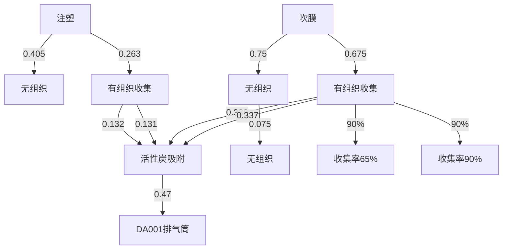
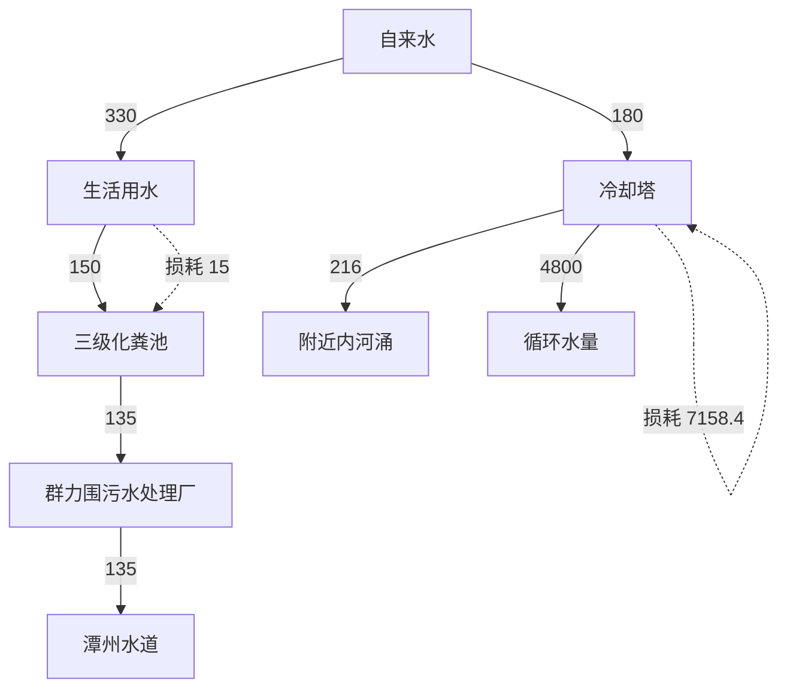
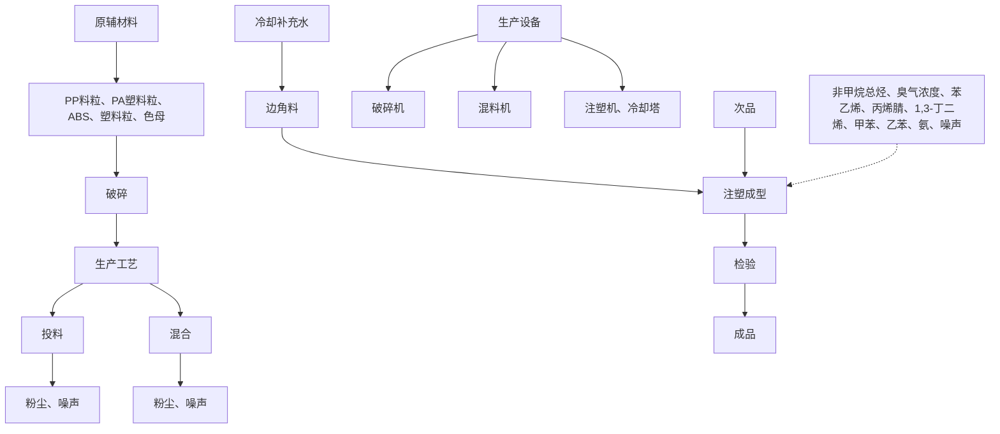
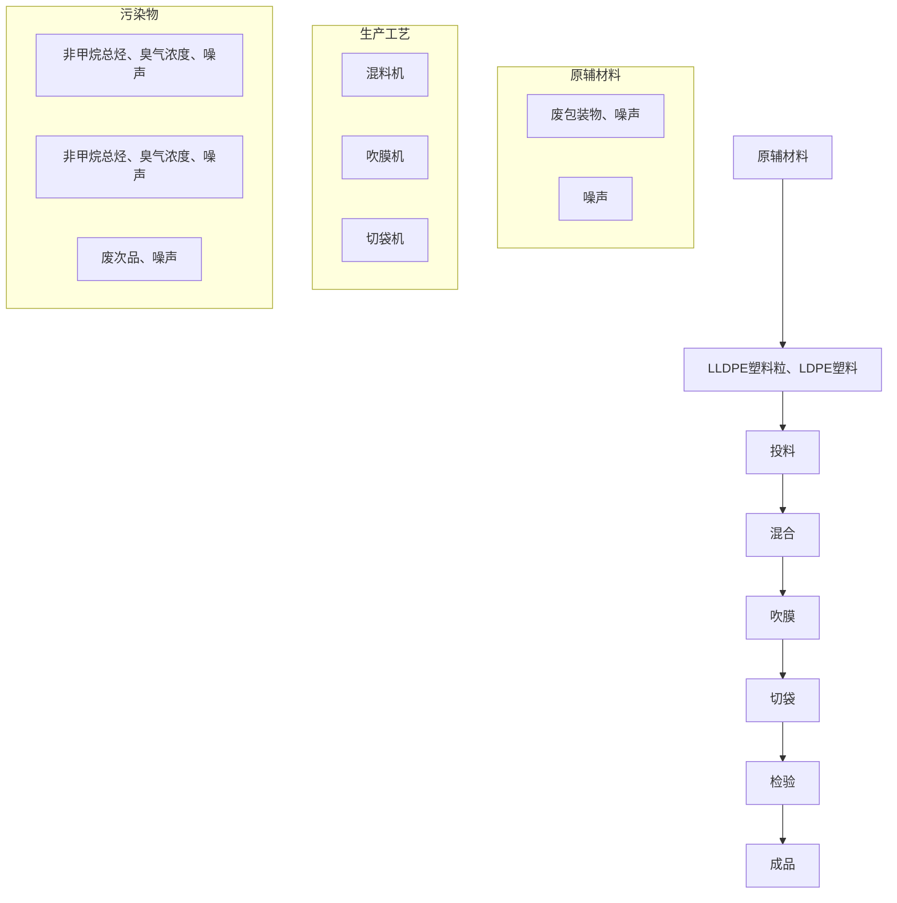
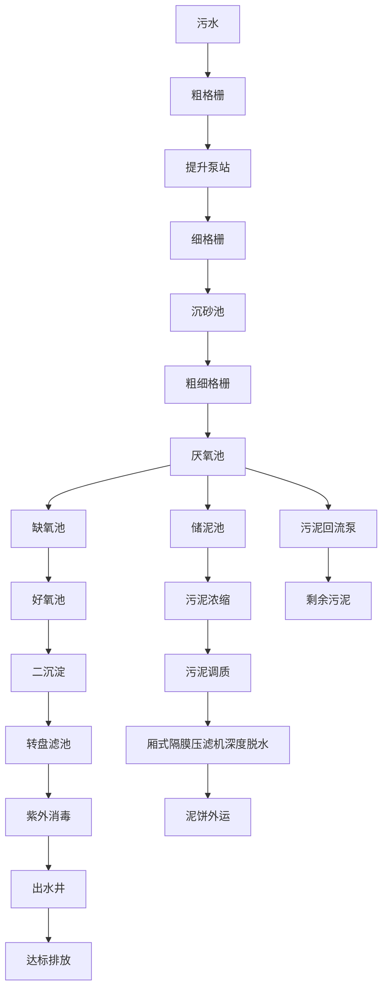

# 建设项目环境影响报告表

# （污染影响类）

项目名称：佛山市民忠塑料科技有限公司新建项目重新报批

建设单位（盖章）：佛山市民忠塑料科技有限公司

编制日期： 2026年5月

中华人民共和国生态环境部制

打印编号：1761292022000

编制单位和编制人员情况表

<table><tr><td>项目编号</td><td>fe9x9i</td></tr><tr><td>建设项目名称</td><td>佛山市民忠塑料科技有限公司新建项目重新报批</td></tr><tr><td>建设项目类别</td><td>26-053塑料制品业</td></tr><tr><td>环境影响评价文件类型</td><td>报告表</td></tr></table>

text_image

202603307428454986

text_image

202603195038958739

text_image

人通过国家统一组织的考试，取得环境影响评价工程师的职业资格。
This is to certify that the bearer of the Certificate has passed national examination organized by the Chinese government departments and has obtained qualifications for Environmental Impact Assessment Engineer.
Approved & authorized
by
Ministry of Human Resources and Social Security
The People's Republic of China

text_image

中华人民共和国环境保护
Approved & authorized
by
Ministry of Environmental Protection
The People's Republic of China
编号：0012923
No.:

本证书由中华人民共和国人力资源和社会保障部环境保护部批准颁发。它表明持证人通过国家统一组织的考试，取得环境影响评

This is to certify thatthe bearerof the Certificate has passed national examination organized by the Chinese government departments and has obtained qualificationsfor EnvionmentalImpactAssessment Engineer

text_image

中华人民共和国人力资源和社会保障部
approved & authorized

Ministry offfman Resources and Social Security The People's Republie of China

text_image

中华人民共和国环境保护部
Approved & authorized
by
Ministry of Environmental Protection
The People's Republic of China

HP0009342

# 目 录

一、建设项目基本情况.

二、建设项目工程分析... 15

三、区域环境质量现状、环境保护目标及评价标准 . 34

四、主要环境影响和保护措施.. .. 40

五、环境保护措施监督检查清单 . 68

六、结论... 71

附表.. . 72

附图1 项目地理位置图

附图2 项目车间平面布置图

附图3 项目评价范围内环境保护目标分布图

附图4 项目四至现状照片

附图5 项目四至现状

附图6 项目所在区域的大气环境功能区划图

附图7 项目所在区域的地表水环境功能区划图

附图8 项目所在区域的声环境功能区划图

附图9 佛山市顺德区环境管控单元图

附图10 产业集聚区和主题园区划定图

附图11 项目所在地控制性详细规划图

附件1 营业执照

附件2 法人身份证

附件3 租用合同

附件4 房产证

附件5 重新报批前环评批复

附件6 主要生产设备工艺参数

附件7 项目付款凭证

附件8 项目总量来源说明表

附件9 环保合同

附件10 公示声明

# 一、建设项目基本情况

<table><tr><td>建设项目名称</td><td colspan="3">佛山市民忠塑料科技有限公司新建项目重新报批</td></tr><tr><td>项目代码</td><td colspan="3">无</td></tr><tr><td>建设单位联系人</td><td>梁****</td><td>联系方式</td><td>135******</td></tr><tr><td>建设地点</td><td colspan="3">广东省佛山市顺德区北滘镇碧江社区坤洲工业区伟业路9号之八A</td></tr><tr><td>地理坐标</td><td colspan="3">东经113度14分22.346秒,北纬22度54分34.955秒</td></tr><tr><td>国民经济行业类别</td><td>C2929塑料零件及其他塑料制品制造;C2923塑料丝、绳及编织品制造</td><td>建设项目行业类别</td><td>二十六、橡胶和塑料制品业29-53.塑料制造业292-其他(年用非溶剂型低VOCs含量涂料10吨以下的除外)</td></tr><tr><td>建设性质</td><td>☑新建(迁建)□改建□扩建□技术改造</td><td>建设项目申报情形</td><td>□首次申报项目□不予批准后再次申报项目□超五年重新审核项目☑重大变动重新报批项目</td></tr><tr><td>项目审批(核准/备案)部门(选填)</td><td>/</td><td>项目审批(核准/备案)文号(选填)</td><td>/</td></tr><tr><td>总投资(万元)</td><td>100</td><td>环保投资(万元)</td><td>15</td></tr><tr><td>环保投资占比(%)</td><td>15</td><td>施工工期</td><td>2个月</td></tr><tr><td>是否开工建设</td><td>☑否□是:____</td><td>用地(用海)面积( $m^{2}$ )</td><td>850</td></tr><tr><td>专项评价设置情况</td><td colspan="3">无</td></tr><tr><td>规划情况</td><td colspan="3">无</td></tr><tr><td>规划环境影响评价情况</td><td colspan="3">无</td></tr><tr><td>规划及规划环境影响评价符合性分析</td><td colspan="3">规划环境影响评价文件:《佛山市北滘镇机器人谷智造产业园环境影响报告书》;审批单位:佛山市生态环境局顺德分局;复函名称:佛山市生态环境局顺德分局关于佛山市北滘镇机器人谷智造产业园规划环境影响报告书审查意见的函</td></tr></table>

本项目位于广东省佛山市顺德区北滘镇碧江社区坤洲工业区伟业路9号之八A，属于佛山市北滘镇机器人谷智造产业园规划的智能制造组团范围内，与《佛山市北滘镇机器人谷智造产业园环境影响报告书》相符性分析见下表。

表1-1 与项目与佛山市北滘镇机器人谷智造产业园规划环评的相符性分析

<table><tr><td>清单类型</td><td>准入要求</td><td>本项目情况</td><td>相符性</td></tr><tr><td rowspan="2">区域布局管控</td><td>1、涉及以下行业或工艺的新建项目的主要产污车间及废气排放口与居民区、学校等大气环境敏感点之间应设置不少于100m的缓冲距离:1木质家具、金属家具制造业中涉及工业涂装的(不含喷粉);2印刷工序中涉及塑料薄膜、印铁制罐印刷以及其他基材凹版印刷的;3涂料油墨制造中涉及化学合成、搅拌、分散的(不含粉末涂料);4金属压延加工业、金属制品业、设备装备制造业中涉及金属表面工业涂装的(不含喷粉);5塑料制品业中涉及泡沫塑料制造、塑料薄膜涂覆以及人造革、合成革、装饰卷材等生产的(不含单纯吹塑、压纹);6涉及注塑、改性塑料、塑料喷涂的(不含喷粉);7餐厨垃圾处置;8再生资源回收利用。其他行业涉VOCs、恶臭排放的新建项目(基础设施建设项目除外)的主要产污车间及废气排放口与居民区、学校等大气环境敏感点之间应设置不少于50m的缓冲距离。改、扩建项目以新带老提升废气收集和治理工艺。</td><td>本项目为涉及注塑、吹膜(不涉及涂覆)工艺,项目100m范围内不存在居民区、学校等大气环境敏感点。</td><td>符合</td></tr><tr><td>2、机器人谷智造产业园涉及生产废水排放且符合领军产业组团集中式废水处理站水质接纳要求的金属表面处理工业企业优先布局在废水处理站纳污区域内。</td><td>本项目循环冷却水系统定期排水,作为清净下水通过雨水管道排放,不涉及生产废水排放,且项目不属于金属表面处理工业企业。</td><td>符合</td></tr><tr><td rowspan="2">能源资源利用</td><td>1、结合《顺德区高质量推动村级工业园升级改造总体规划》,推进区域村级工业园改造工作,禁止重复低水平建设。</td><td>本项目不涉及。</td><td>符合</td></tr><tr><td>2、企业生产过程中使用的原料应为清洁安全原料,以电能、天然气等清洁能源为主,优先使用电能。</td><td>本项目使用电能。</td><td>符合</td></tr><tr><td rowspan="2">污染物排放管控</td><td>1、工业企业的生产废水(无法纳入群力围污水处理厂处理)需经预处理达到集中工业废水处理站进水水质要求后方可排入。涉及第一类污染物排放的,要求企业在污染物产生车间内预处理达标。</td><td>本项目循环冷却水系统定期排水,作为清净下水通过雨水管道排放,不涉及生产废水排放。</td><td>符合</td></tr><tr><td>2、入驻企业应按规范要求设置排水系统,做到雨污分流、清污分流、分质处理等要求。加强工业水循环利用。鼓励企业废水处理回用,促进再生水的利用,完善再生水利用设施。</td><td>本项目雨污分流,无生产废水产生。</td><td>符合</td></tr><tr><td>环境风险防控</td><td>1、完善北滘镇—园区—工业企业多级联动环境突发事件应急预案,建立预防、应急响应机制和后评估机制,定期开展应急演练,提高区域环境风险防范能力。</td><td>本项目制定应急预案并定期开展应急演练,建立预防、应急响应机制,加强与周边企业应急联动。</td><td>符合</td></tr></table>

<table><tr><td rowspan="6"></td><td></td><td>2、各企业对于危废贮存区域、废水暂存区域以及原辅材料仓库等涉及液态物料贮存的区域内应根据相关污染防治技术规范或标准落实风险防控措施。</td><td>本项目危废暂存间、油类物料存放区按照《危险废物贮存污染控制标准》(GB18597-2023)的相关要求进行设计并采取相应的防渗措施。</td><td>符合</td></tr><tr><td rowspan="2">负面清单</td><td>1、禁止引入《产业结构调整指导目录》的限制类及淘汰类项目以及《市场准入负面清单(2022版)》中规定的项目。</td><td>本项目属于C2929塑料零件及其他塑料制品制造和C2923塑料丝、绳及编织品制造,不属于《产业结构调整指导目录》的限制类及淘汰类项目以及《市场准入负面清单》中规定的项目。</td><td>符合</td></tr><tr><td>2、禁止新建、扩建水泥、平板玻璃、化学制浆、炼化、炼钢炼铁、电解铝、焦炭、有色金属冶炼、制浆造纸、鞣革、铅酸蓄电池、专业电镀、印染项目。</td><td>本项目不在所列项目范围内。</td><td>符合</td></tr><tr><td rowspan="3">其他</td><td>1、对于经认定属于省(市、区)重点建设项目、顺德区重点招商项目、街道重点建设项目(含新建、改建和扩建)的,可实行一事一议,由相关政府部门商议决定是否允许其建设。</td><td>本项目不属于重点建设项目。</td><td>符合</td></tr><tr><td>2、该组团入驻企业生产废水直接或经预处理后符合集中式废水处理站水质接纳要求,在废水处理站处理负荷未满且配套建设污水管网的情况下,原则上必须排入废水处理站进行集中处理,特殊情况需“一事一议”确定;不能进入废水处理站处理的生产废水按要求进行委外处理、自行处理达标后排入城镇生活污水处理厂或河涌。</td><td>循环冷却水系统定期排水,作为清净下水通过雨水管道排放,无生产废水产生。</td><td>符合</td></tr><tr><td>3、符合省、市、区三线一单要求。</td><td>本项目符合省、市、区“三线一单”相关管控要求。</td><td>符合</td></tr></table>

<table><tr><td>其他符合性分析</td><td>1、《广东省人民政府关于印发广东省“三线一单”生态环境分区管控方案的通知》(粤府〔2020〕71号)1与“一核一带一区”区域管控要求的相符性1)区域布局管控要求本项目位于珠三角核心区,主要进行塑料用品和塑料袋制造,不属于区域布局管控要求中的禁止新建、扩建水泥、平板玻璃、化学制浆、生皮制革以及国家规划外的钢铁、原油加工等项目,符合区域布局管控要求。2)能源资源利用要求本项目为塑料用品和塑料袋制造行业,不属于高能耗行业。项目生产设备均使用电能,生活用水由市政供水,不直接取用江河湖库水量,不会对项目所在地生态流量造成影响,符合能源利用要求。3)污染物排放管控要求项目属于重新报批项目,挥发性有机物实行区域内两倍削减量替代,总量指标由镇街分配;项目注塑产生有机废气的工序配套半密闭设施收集,收集效率约65%;吹膜产生的有机废气经整室密闭负压收集,收集率为90%,收集的废气经配套治理设备治理后引至排气筒达标排放。通过废气收集和处理措施能减少项目的挥发性有机物无组织排放;项目定期更换的间接冷却水经市政雨水管网排至附近内河涌;生活污水经处理达标后排放至群力围污水处理厂,尾水排放至潭州水道。目前潭洲水道水质中重点水污染物 $COD_{Cr}$ 、 $NH_{3}-N$ 达到III类水体的要求,根据《佛山市排污权有偿使用和交易管理试行办法》(佛府办〔2020〕第19号),生活污水的CODcr、氨氮不分配总量,其总量纳入群力围污水处理厂。4)环境风险防控要求项目位于广东省佛山市顺德区北滘镇碧江社区坤洲工业区伟业路9号之八A,不属于石化、化工重点园区环境风险防控区域。项目产生的危险废物拟定期委托有资质的处置公司进行收集处理,并通过信息系统登记转移计划和电子转移联单,符合危险废物全过程跟踪管理的防控要求。2环境管控单元总体管控要求根据《广东省人民政府关于印发广东省“三线一单”生态环境分区管控方案的通</td></tr></table>

知》（粤府〔2020〕71号）发布的广东省环境管控单元图，项目所在区域为重点管控单元，重点管控单元严格限制新建钢铁、燃煤燃油火电、石化、储油库等项目，产生和排放有毒有害大气污染物项目，以及使用溶剂型油墨、涂料、清洗剂、胶黏剂等高挥发性有机物原辅材料的项目；鼓励现有该类项目逐步搬迁退出，本项目使用的塑料粒常温下不挥发，不属于文件中提及的严格限制类项目。

# 2、《佛山市“三线一单”生态环境分区管控方案（2024年版）》（佛环〔2024〕20号）

根据《佛山市“三线一单”生态环境分区管控方案（2024年版）》（佛环〔202420 号）发布的佛山市环境管控单元图，项目所在地广东省佛山市顺德区北滘镇碧江社区坤洲工业区伟业路9号之八 A，为珠三角核心区的重点管控区。环境管控单元编号为ZH44060620004，单元名称为北滘镇重点管控区。

表1-2 与佛山市“三线一单”相符性分析

<table><tr><td>管控维度</td><td>与本项目有关的相关要求(摘录)</td><td>相符性分析</td><td>相符性分析</td></tr><tr><td rowspan="6">区域布局管控</td><td>1-1.【生态/禁止类】单元内的一般生态空间,主导生态功能为水土保持,禁止在25度以上的陡坡地开垦种植农作物,禁止在崩塌、滑坡危险区、泥石流易发区从事采石、取土、采砂等可能造成水土流失的活动。</td><td>本项目不涉及生态禁止类活动。</td><td>符合</td></tr><tr><td>1-2.【产业/鼓励引导类】重点发展机器人及配套产业、智能家用电器、高端新型电子信息、新材料等制造业和总部经济、电子商务、工业设计与文化创意、科技金融等现代服务业,打造智能制造和智慧家电示范区。</td><td>本项目为日用塑料制品和塑料袋制造,不属于鼓励引导类产业。</td><td>符合</td></tr><tr><td>1-3.【产业/综合类】系统推进村级工业园升级改造,腾出连片空间,布局产业集聚区和主题产业园,推动工业项目入园集聚发展。</td><td>项目位于广东省佛山市顺德区北滘镇碧江社区坤洲工业区伟业路9号之八A,本项目所在地不属于村级工业园升级改造。</td><td>符合</td></tr><tr><td>1-4.【水/限制类】严格限制在佛山市禅城南庄紫洞水厂、佛山市禅城沙口(石湾)水厂、羊额—北滘水厂、广州市南洲水厂顺德水道取水口饮用水水源保护区上游和周边区域建设列入“高污染、高环境风险”产品名录等可能影响水环境安全的项目。</td><td>项目所在位置不在佛山市一、二级水源保护区范围内。项目的产品不在“高污染、高环境风险”产品名录内。</td><td>符合</td></tr><tr><td>1-5.【大气/限制类】大气环境受体敏感重点管控区内,应严格限制新建储油库项目、产生和排放有毒有害大气污染物的建设项目以及使用溶剂型油墨、涂料、清洗剂、胶黏剂等高挥发性有机物原辅材料项目,鼓励现有该类项目搬迁退出。</td><td>本项目不属于大气环境受体敏感重点管控区内,属于北滘镇高排放重点管控单元内项目。项目生产过程中不使用胶粘剂、涂料。项目使用的塑料原料属于低挥发性原辅材料;本项目建设不属于储油库项目、产生和排放有毒有害大气污染物的建设项目。</td><td>符合</td></tr><tr><td>1-6.【大气/鼓励引导类】大气环境高排放重点管控区内,应强化达标监管,引导工业项目落地集聚发展,有序推进区域内行业企业提标改造</td><td>项目注塑、吹膜工序排放的非甲烷总烃执行《合成树脂工业污染物排放限值》(GB31572-2015,含2024年修改单)表5大气污染物特别排放限值及表9企业边界大气污染物浓</td><td>符合</td></tr></table>

<table><tr><td rowspan="12"></td><td rowspan="2"></td><td></td><td>度限值。项目厂区内挥发性有机物无组织排放监控点浓度满足广东省地方标准《固定污染源挥发性有机物综合排放标准》(DB44/2367-2022)表3厂区内VOCs无组织排放限值。项目厂界颗粒物排放执行《合成树脂工业污染物排放限值》(GB31572-2015,含2024年修改单)表9企业边界大气污染物浓度限值。臭气浓度排放执行《恶臭污染物排放标准》(GB14554-93)表1恶臭污染物厂界标准值的二级新扩改建标准及表2臭气浓度排放标准。</td><td></td></tr><tr><td>1-7.【产业/综合类】划定家具生产优先发展区域,优先发展区外不再新建涉及涂装工艺的木质家具制造项目。优先发展区范围根据家具产业发展规划及其规划环评文件确定。</td><td>本项目不属于木质家具生产。</td><td>符合</td></tr><tr><td></td><td>1-8.【产业/限制类】受纳水体或监控断面不达标且未“以新带老”制定区域达标方案的河涌,不得新建、扩建向河涌直接排放废水的项目。新建、扩建含蚀刻工序的线路板生产项目和化工项目应在配套污水集中处置的工业园区或生活污水管网覆盖区域内建设;纯加工型印花项目,含酸洗、磷化的金属表面处理、金属制品项目(与自身高新技术企业配套的和区级及以上重点项目除外),含酸洗、喷涂、化学抛光、电解等涉及废水排放工艺的不锈钢型材加工项目(与自身高新技术企业配套的和区级及以上重点项目除外),应进入以此类项目为主导产业、有相应废水集中治理设施的工业园区,实现集中治污。</td><td>本项目外排废水为生活污水,污水经预处理后进入群力围污水处理厂处理,不产生生产废水。本项目不包含条款中提及的限制类项目和工序。</td><td>符合</td></tr><tr><td rowspan="6">能源资源利用</td><td>2-1.【能源/鼓励引导类】推广节能技术,加快发展绿色货运与现代物流。</td><td>本项目不属于能源/鼓励引导类。</td><td>符合</td></tr><tr><td>2-2.【能源/鼓励引导类】推广新能源汽车应用和充电基础设施建设,积极推动重卡LNG加气站、充电基础设施、加氢站建设。</td><td>本项目不属于能源/鼓励引导类。</td><td>符合</td></tr><tr><td>2-3.【能源/综合类】科学实施能源消费总量和强度“双控”,新建高能耗项目单位产品(产值)能耗达到国际国内先进水平。</td><td>本项目不属于高能耗项目。</td><td>符合</td></tr><tr><td>2-4.【水资源/综合类】贯彻落实“节水优先”方针,实行最严格水资源管理制度,北滘镇万元国内生产总值用水量、万元工业增加值用水量、用水总量、农田灌溉水有效利用系数等用水总量和效率指标达到区下达要求。</td><td>本项目严格贯彻落实“节水优先”方针,实行最严格水资源管理制度,符合要求。</td><td>符合</td></tr><tr><td>2-5.【土地资源/限制类】落实单位土地面积投资强度、土地利用强度等建设用地控制性指标要求,提高土地利用效率。</td><td>本项目使用现有工业厂房,土地利用效率较高。</td><td>符合</td></tr><tr><td>2-6.【岸线/禁止类】严格水域岸线用途管制,新建项目一律不得违规占用水域。严禁破坏生态的岸线利用行为和不符合其功能定位的开发建设活动,严禁以各种名义侵占河道、围垦湖泊、非法采砂等。</td><td>项目位于工业区内,不在水域岸线范围内。</td><td>符合</td></tr><tr><td rowspan="3">污染物排放管控</td><td>3-1.【水/限制类】城镇新区建设实行雨污分流,逐步推进初期雨水收集、处理和资源化利用。住宅、商业体、学校、市场等城镇开发建设项目应当配套或者同步计划建设公共排水设施,公共排水设施或自建排污水设施未能投产运行的,以上涉水项目不得投入使用。新建小区严格实施雨污分流,阳台、露台等污水接入污水收集系统,将生活污水“应截尽截”。做好大型楼盘、集贸市场、餐饮以及学校等4大类排水户污水接入市政管网工作。</td><td>本项目外排废水为生活污水,污水经预处理后进入群力围污水处理厂处理。</td><td>符合</td></tr><tr><td>3-2.【水/综合类】结合村级工业园改造,全面提升产业层次与集聚度,促进污染集中整治。</td><td>本项目所在地不属于村级工业园。</td><td>符合</td></tr><tr><td>3-3.【水/综合类】稳步推进排水设施“三个一体化”管理模式,补齐城乡污水收集和处理短板,推动群力围污水处理厂提质增效,加快消除城中村、老旧城区、城乡结合部等污水收集管网空白区,逐步实现城乡污水收集处理全覆盖。2025年前完成群力围污水处理厂扩建,尾水应执行《城镇污水处理厂污染物排放标准》(GB18918-2002)一级A标准及《广东省水污染物排放限值》(DB44/26-2001)的较严值。</td><td>本项目位于群力围污水处理厂处理范围,尾水执行《城镇污水处理厂污染物排放标准》(GB18918-2002)及其修改单一级A标准及广东省地方标准《水污染物排放</td><td>符合</td></tr></table>

<table><tr><td rowspan="3"></td><td></td><td>限值》(DB44/26-2001)第二时段一级标准的较严 值。</td><td></td></tr><tr><td>3-4.【水/综合类】近期保留并完善水口村、三桂村、西滘村、马龙村等现状农村污水分散式处理设施,新建莘村、马龙村等分散式污水处理站建设,继续完善污水支管网建设,提高污水收集处理率,其余行政村(社区)继续完善污水管网建设,实现农村污水100%收集进入市政污水系统,有条件的区域实施雨污分流改造,到2030年全面雨污分流,污水纳入北滘城镇污水处理系统</td><td>项目属于群力围污水处理厂纳污范围。</td><td>符合</td></tr><tr><td>3-5.【大气/综合类】大力推进低VOCs含量原辅材料替代,加快涉VOCs重点行业的生产工艺升级改造,推行自动化生产工艺,对达不到要求的VOCs收集及治理设施进行整治提升,逐步淘汰低效VOCs治理设施。</td><td>项目注塑废气采用半密闭集气罩、吹膜废气采用整室负压收集有机废气经“活性炭吸附装置”处理后引至23m高排气筒DA001排放。</td><td>符合</td></tr><tr><td rowspan="3">环境风险管控</td><td>4-1.【水/综合类】加强单元内佛山市禅城南庄紫洞水厂、佛山市禅城沙口(石湾)水厂、羊额—北滘水厂、广州市南洲水厂顺德水道取水口饮用水水源保护区周边环境风险源管控,完善突发环境事件应急管理体系。</td><td rowspan="3">建设单位将严格采取切实可行环境风险防范措施,可有效防止项目产生的污染物进入环境,有效降低了对周围环境存在的风险影响。</td><td rowspan="3">符合</td></tr><tr><td>4-2.【水/综合类】群力围污水处理厂、群力围污水处理厂、工业污水集中处理设施应采临取有效措施,防止事故废水直接排入水体。完善污水处理厂在线监控系统联网,实现污水处理厂的实时、动态监管。</td></tr><tr><td>4-3.【风险/综合类】加强环境风险分级分类管理,强化金属制品、有色金属和压延加工、化学原料和化学品制造业等涉重金属、化工行业企业及工业园区等重点环境风险源的环境风险防控。</td></tr></table>

# 3、《佛山市顺德区人民政府关于印发佛山市顺德区“三线一单”生态环境分区管控方案的通知》（顺府发〔2021〕11号）

根据《佛山市顺德区人民政府关于印发佛山市顺德区“三线一单”生态环境分区管控方案的通知》（顺府发〔2021〕11号），项目所在地属于重点管控单元（环境管控单元编码：ZH44060620004，环境管控单元名称：北滘镇重点管控区），相关管控要求的相符性分析如下：

表1-3 与顺德区“三线一单”相符性分析

<table><tr><td>管控维度</td><td>与本项目有关的相关要求(摘录)</td><td>相符性分析</td><td>相符性分析</td></tr><tr><td rowspan="3">区域布局管控</td><td>1-1.【生态/禁止类】单元内的一般生态空间,主导生态功能为水土保持,禁止在25度以上的陡坡地开垦种植农作物,禁止在崩塌、滑坡危险区、泥石流易发区从事采石、取土、采砂等可能造成水土流失的活动。</td><td>本项目不涉及。</td><td>符合</td></tr><tr><td>1-2.【产业/鼓励引导类】重点发展机器人及配套产业、智能家用电器、高端新型电子信息、新材料等制造业和总部经济、电子商务、工业设计与文化创意、科技金融等现代服务业,打造智能制造和智慧家电示范区。</td><td>本项目为日用塑料制品和塑料袋制造,不属于鼓励引导类产业。</td><td>符合</td></tr><tr><td>1-3.【产业/综合类】系统推进村级工业园升级改造,腾出连片空间,布局产业集聚区和主题产业园,推动工业项目入园集聚发展。新增工业制造业用地原则上安排在产业集聚区内,产业集聚区外原则上不鼓励工业及物流仓储用地的新建与改造</td><td>项目位于广东省佛山市顺德区北滘镇碧江社区坤洲工业区伟业路9号之八A,属于产业集聚区。</td><td>符合</td></tr></table>

<table><tr><td rowspan="12"></td><td rowspan="4"></td><td>1-4.【产业/限制类】受纳水体或监控断面不达标的,不得新建、扩建向河涌直接排放废水的项目。新建、扩建含蚀刻工序的线路板生产项目和化工项目应在配套污水集中处置的工业园区或生活污水管网覆盖区域内建设;纯加工型印花项目,含酸洗、磷化的金属表面处理、金属制品项目(与自身高新技术企业配套的除外),含酸洗、喷涂、拉丝、表面抛光等工艺的不锈钢型材加工项目,应进入以此类项目为主导产业、有相应废水集中治理设施的工业园区,实现集中治污。</td><td>本项目产生的生活污水经三级化粪处理后排入群力围污水处理厂,尾水排入潭洲水道。潭洲水道水质可达到《地表水环境质量标准》(GB3838-2002)之III类标准;项目不涉及线路板生产、印花、金属表面处理。</td><td>符合</td></tr><tr><td>1-5.【水/限制类】严格限制在佛山市禅城南庄紫洞水厂、佛山市禅城沙口(石湾)水厂、羊额—北滘水厂、广州市南洲水厂顺德水道取水口饮用水水源保护区上游和周边区域建设列入“高污染、高环境风险”产品名录等可能影响水环境安全的项目。</td><td>项目生活污水经过三级化粪池预处理后经市政污水管网排入群力围污水处理厂;间接冷却水定期经市政雨水管网排至附近内河涌。项目的产品不在“高污染、高环境风险”产品名录内。</td><td>符合</td></tr><tr><td>1-6.【大气/限制类】大气环境受体敏感重点管控区内,应严格限制新建储油库项目、产生和排放有毒有害大气污染物的建设项目以及使用溶剂型油墨、涂料、清洗剂、胶黏剂等高挥发性有机物原辅材料项目,鼓励现有该类项目搬迁退出</td><td>项目属于大气环境敏感重点管控区内,不属于储油库项目、也不属于产生和排放有毒有害大气污染物的建设项目。项目使用的原辅材料不属于高挥发性有机物原辅材料。</td><td>符合</td></tr><tr><td>1-7.【大气/鼓励引导类】大气环境高排放重点管控区内,应强化达标监管,引导工业项目落地集聚发展,有序推进区域内行业企业提标改造。</td><td>项目位于北滘镇高排放重点管控单元,废气治理后可达标排放</td><td>符合</td></tr><tr><td rowspan="6">能源资源利用</td><td>2-1.【能源/鼓励引导类】推广节能技术,加快发展绿色货运与现代物流。</td><td>本项目不涉及。</td><td>符合</td></tr><tr><td>2-2.【能源/鼓励引导类】推广新能源汽车应用和充电基础设施建设,积极推动重卡LNG加气站、充电基础设施、加氢站建设。</td><td>本项目不涉及。</td><td>符合</td></tr><tr><td>2-3.【能源/综合类】科学实施能源消费总量和强度“双控”,新建高能耗项目单位产品(产值)能耗达到国际国内先进水平。</td><td>项目生产过程中资源消耗量相对区域资源利用总量较少。</td><td>符合</td></tr><tr><td>2-4.【水资源/综合类】贯彻落实“节水优先”方针,实行最严格水资源管理制度,北滘镇万元国内生产总值用水量、万元工业增加值用水量、用水总量、农田灌溉水有效利用系数等用水总量和效率指标达到区下达要求。</td><td>本项目严格贯彻落实“节水优先”方针,实行最严格水资源管理制度,北滘镇万元国内生产总值用水量、万元工业增加值用水量、用水总量、农田灌溉水有效利用系数等用水总量和效率指标达到区下达要求。</td><td>符合</td></tr><tr><td>2-5.【土地资源/限制类】落实单位土地面积投资强度、土地利用强度等建设用地控制性指标要求,提高土地利用效率。</td><td>项目已落实单位土地面积投资强度、土地利用强度等建设用地控制性指标要求,提高土地利用效率。</td><td>符合</td></tr><tr><td>2-6.【岸线/禁止类】严格水域岸线用途管制,新建项目一律不得违规占用水域。严禁破坏生态的岸线利用行为和不符合其功能定位的开发建设活动,严禁以各种名义侵占河道、围垦湖泊、非法采砂等。</td><td>本项目未违规占用水域,不会破坏生态的岸线利用行为和不符合其功能定位的开发建设活动,不侵占河道、围垦湖泊、非法采砂等。</td><td>符合</td></tr><tr><td rowspan="2">污染物排放管控</td><td>3-1.【水/限制类】城镇新区建设实行雨污分流,逐步推进初期雨水收集、处理和资源化利用。住宅、商业体、学校、市场等城镇开发建设项目应当配套或者同步计划建设公共排水设施,公共排水设施或自建排污水设施未能投产运行的,以上涉水项目不得投入使用。新建小区严格实施雨污分流,阳台、露台等污水接入污水收集系统,将生活污水“应截尽截”。做好大型楼盘、集贸市场、餐饮以及学校等4大类排水户污水接入市政管网工作。</td><td>本项目不属于城镇新区建设。</td><td>符合</td></tr><tr><td>3-2.【水/综合类】结合村级工业园改造,全面提升产业层次与集聚度,促进污染集中整治。</td><td>项目位于广东省佛山市顺德区北滘镇碧江社区坤洲</td><td>符合</td></tr></table>

<table><tr><td rowspan="4"></td><td></td><td>工业区伟业路9号之八A,项目生活污水经过三级化粪池预处理后经市政污水管网排入群力围污水处理厂;间接冷却水定期经市政雨水管网排至附近内河涌。</td><td></td></tr><tr><td>3-3.【水/综合类】稳步推进排水设施“三个一体化”管理模式,补齐城乡污水收集和处理短板,推动群力围污水处理厂提质增效,加快消除城中村、老旧城区、城乡结合部等污水收集管网空白区,逐步实现城乡污水收集处理全覆盖。2025年前完成群力围污水处理厂扩建,尾水应执行《城镇污水处理厂污染物排放标准》(GB18918-2002)一级A标准及《广东省水污染物排放限值》(DB44/26-2001)的较严值。</td><td>本项目位于群力围污水处理厂处理范围,尾水执行《城镇污水处理厂污染物排放标准》(GB18918-2002)及其修改单一级A标准及广东省地方标准《水污染物排放限值》(DB44/26-2001)第二时段一级标准的较严值。</td><td>符合</td></tr><tr><td>3-4.【水/综合类】近期保留并完善水口村、三桂村、西滘村、马龙村等现状农村污水分散式处理设施,新建莘村、马龙村等分散式污水处理站建设,继续完善污水支管网建设,提高污水收集处理率,其余行政村(社区)继续完善污水管网建设,实现农村污水100%收集进入市政污水系统,有条件的区域实施雨污分流改造,到2030年全面雨污分流,污水纳入北滘城镇污水处理系统</td><td>项目所在地属于群力围污水处理厂纳污范围。</td><td>符合</td></tr><tr><td>3-5.【大气/综合类】大力推进低VOCs含量原辅材料替代,加快涉VOCs重点行业的生产工艺升级改造,推行自动化生产工艺,对达不到要求的VOCs收集及治理设施进行整治提升,逐步淘汰低效VOCs治理设施。</td><td>项目注塑生产过程采用半密闭集气罩、吹膜废气采用整室负压收集有机废气,经“活性炭吸附装置”处理后,引至23m高排气筒DA001排放。</td><td>符合</td></tr><tr><td rowspan="3">环境风险管控</td><td>4-1.【水/综合类】加强单元内佛山市禅城南庄紫洞水厂、佛山市禅城沙口(石湾)水厂、羊额—北滘水厂、广州市南洲水厂顺德水道取水口饮用水水源保护区周边环境风险源管控,完善突发环境事件应急管理体系。</td><td>不涉及。</td><td>符合</td></tr><tr><td>4-2.【水/综合类】群力围污水处理厂、群力围污水处理厂、工业污水集中处理设施应采临取有效措施,防止事故废水直接排入水体。完善污水处理厂在线监控系统联网,实现污水处理厂的实时、动态监管。</td><td>项目所在地为群力围污水处理厂服务范围,污水处理厂已在线监控系统联网,实现污水处理厂的实时、动态监管。</td><td>符合</td></tr><tr><td>4-3.【风险/综合类】加强环境风险分级分类管理,强化金属制品、有色金属和压延加工、化学原料和化学品制造业等涉重金属、化工行业企业及工业园区等重点环境风险源的环境风险防控。</td><td>项目不属于金属制品、有色金属和压延加工、化学原料和化学品制造业等涉重金属、化工行业企业及工业园区等重点环境风险源,日常加强环境风险分级分类管理。</td><td>符合</td></tr></table>

# 4、项目与相关政策文件规定的相符性分析

项目根据相关政策文件规定分析如下：

表1-4 相关政策文件规定的相符性分析

<table><tr><td>序号</td><td>政策要求</td><td>工程内容</td><td>符合性</td></tr><tr><td colspan="4">1.《重点行业挥发性有机物综合治理方案》的通知(环大气〔2019〕53号)</td></tr><tr><td>1.1</td><td>全面加强无组织排放控制。重点对含VOCs物料(包括含VOCs原辅材料、含VOCs产品、含VOCs废料以及有机聚合物材料等)储存、转移和输送、设备与管线组件泄漏、敞开液面逸散以及工艺过程等五类排放源实施管控,通过采取设备与场所密闭、工艺改进、废气有效收集等措施,削减VOCs无组织排放。</td><td>本项目注塑废气采用半密闭集气罩、吹膜废气采用整室负压收集后经“活性炭吸附装置”处理后引至23m高排气筒(DA001)高空排放。</td><td>符合</td></tr><tr><td>1.2</td><td>加强设备与场所密闭管理。含VOCs物料应储存于密闭容器、包装袋,高效密封储罐,封闭式储库、料仓等。</td><td>本项目塑料粒子采用密封袋包装,常温下不挥发原材料密封存放在车间内。</td><td>符合</td></tr><tr><td>1.3</td><td>提高废气收集率。遵循“应收尽收、分质收集”的原则,科学设计废气收集系统,将无组织排放转变为有组织排放进行控制。采用全密闭集气罩或密闭空间的,除行业有特殊要求外,应保持微负压状态,并根据相关规范合理设置通风量。采用局部集气罩的,距集气罩开口面最远处的VOCs无组织排放位置,控制风速应不低于0.3米/秒,有行业要求的按相关规定执行。</td><td>本项目注塑采用半密闭集气罩收集有机废气,集气罩设计收集风速为0.5m/s;吹膜废气采用整室负压收集。</td><td>符合</td></tr><tr><td colspan="4">2.《广东省生态环境保护“十四五”规划》(粤环〔2021〕10号)</td></tr><tr><td>2.1</td><td>大力推进VOCs含量原辅材料源头替代,严格落实国家和地方产品VOCs含量限值质量标准,禁止建设生产和使用高VOCs含量的溶剂型涂料、油墨、胶粘剂等项目。</td><td>塑料粒常温下不挥发,不属于高VOCs含量原料。</td><td>基本符合</td></tr><tr><td>2.2</td><td>强化对企业涉VOCs生产车间/工序废气的收集管理,推动企业开展治理设施升级改造。</td><td>本项目拟对注塑废气设置半密闭集气罩、吹膜废气采用整室负压收集有机废气,废气收集后通过“活性炭吸附装置”处理后引至23m高排气筒(DA001)排放,可有效减少有机废气排放,减少异味影响。</td><td>符合</td></tr><tr><td colspan="4">3.《广东省大气污染防治条例》(2022年修正版)</td></tr><tr><td>3.1</td><td>珠江三角洲区域禁止新建、扩建燃煤燃油火电机组或者企业燃煤燃油自备电站。珠江三角洲区域禁止新建、扩建国家规划外的钢铁、原油加工、乙烯生产、造纸、水泥、平板玻璃、除特种陶瓷以外的陶瓷、有色金属冶炼等大气重污染项目。</td><td>本项目不属于大气重污染项目。</td><td>符合</td></tr><tr><td>3.2</td><td>新建、扩建、扩建排放挥发性有机物的建设项目,应当使用污染防治先进可行技术。下列产生含挥发性有机物废气的生产和服务活动,应当优先使用低挥发性有机物含量的原材料和低排放环保工艺,在确保安全条件下,按照规定在密闭空间或者设备中进行,安装、使用满足防爆、防静电要求的治理效率高的污染防治设施;无法密闭或者不适宜密闭的,应当采取有效措施减少废气排放:(一)石油、化工、煤炭加工与转化等含挥发性有机物原料的生产;(二)燃油、溶剂的储存、运输和销售;(三)涂料、油墨、粘合剂、农药等以挥发性有机物为原料的生产;(四)涂装、印刷、粘合、工业清洗等使用含挥发性有机物产品的生产活动;(五)其他产生挥发性有机物的生产和服务活动。</td><td>本项目拟对注塑废气设置半密闭集气罩、吹膜废气采用整室负压收集有机废气,收集后通过“活性炭吸附装置”处理后引至23m高排气筒(DA001)排放,可有效减少有机废气排放,减少异味影响。</td><td>符合</td></tr><tr><td colspan="4">4.《固定污染源挥发性有机物综合排放标准》(DB44/2367-2022)</td></tr><tr><td>4.1</td><td>粉状、粒状VOCs物料应当采用气力输送方式或者采用密闭固体投料器等给料方式密闭投加。无法密闭投加的,应当在密闭空间内操作,或者进行局部气体收集,废气应当排至除尘设施、VOCs废气收集处理系统。</td><td>本项目使用的原材料密封存放,储存于厂房的仓库,仓库和生产车间地面均做了硬底化和防渗处理,不存在露天堆放。项目不设置储罐储存物料。</td><td>符合</td></tr><tr><td>4.2</td><td>VOCs物料卸(出、放)料过程应当密闭,卸料废气应当排至VOCs废气收集处理系统;无法密闭的,应当采取局部气体收集措施,废气应当排至VOCs废气收集处理系统。</td><td>本项目使用的原料采用密闭容器储存与输送,在常温下储存、输送过程中不挥发VOCs。</td><td>符合</td></tr><tr><td>4.3</td><td>建立台账,记录含VOCs原辅材料和含VOCs产品的名称、使用量、回收量、废弃量、去向以及VOCs含量等信息。台账保存期应不少于三年。</td><td>本项目正式运营后将建立台账,记录含VOCs原辅材料和产品的名称、使用量、回收量、废弃量、去向以及VOCs含量等信息。台账保存期限不少于五年。</td><td>符合</td></tr><tr><td colspan="4">5.关于印发《广东省涉挥发性有机物(VOCs)重点行业治理指引》的通知(粤环办〔2021〕43号)</td></tr><tr><td>VOCs物料转移和输送</td><td>VOCs物料储存:含VOCs的物料应储存于密闭的容器、包装袋、储罐、储库、料仓中。盛装VOCs物料的容器是否存放于室内,或存放于设置有雨棚、遮阳和防渗设施的专用场地。盛装VOCs物料的容器在非取用状态时应加盖、封口,保持密闭。</td><td>本项目使用的原材料密封存放,储存于厂房的仓库内,仓库和生产车间地面均做了硬底化和防渗处理,不存在露天堆放。</td><td>符合</td></tr><tr><td>工艺过程</td><td>粉状、粒状VOCs物料采用气力输送方式或采用密闭固体投料器等给料方式密闭投加;无法密闭投加的,在密闭空间内操作,或进行局部气体收集,废气排至除尘设施、VOCs废气收集处理系统。</td><td>项目原辅材料均适用密闭包装袋进行物料转移。</td><td>符合</td></tr></table>

<table><tr><td rowspan="12"></td><td rowspan="2"></td><td>在混合/混炼、塑炼/塑化/熔化、加工成型(挤出、注射、压制、压延、发泡、纺丝等)、硫化等作用中应采用密闭设备或在密闭空间中操作,废气应排至VOCs废气收集处理系统;无法密闭的,应采取局部气体收集措施,废气排至VOCs废气收集处理系统。</td><td>本项目注塑废气经半密闭集气罩、吹膜废气设置整室负压收集后经“活性炭吸附装置”处理后引至23m高排气筒(DA001)高空排放。</td><td>符合</td></tr><tr><td>浸胶、胶浆喷涂、涂胶、喷漆、印刷、清洗等工序使用VOCs质量占比大于等于10%的原辅材料时,其使用过程应采用密闭设备或在密闭空间内操作,废气应排至VOCs废气收集处理系统;无法密闭的,应采取局部气体收集措施,废气应排至VOCs废气收集处理系统。</td><td>本项目使用的塑料粒常温下不挥发,为低VOCs材料,项目注塑废气经半密闭集气罩、吹膜废气设置整室负压收集后经“活性炭吸附装置”处理后引至23m高排气筒(DA001)高空排放。</td><td>符合</td></tr><tr><td rowspan="2">废气收集</td><td>采用外部集气罩的,距集气罩开口面最远处的VOCs无组织排放位置,控制风速不低于0.3m/s。</td><td>项目集气罩置于废气产生点的合理位置,保证罩口截面风速为0.5m/s大于0.3m/s。</td><td>符合</td></tr><tr><td>废气收集系统的输送管道应密闭。废气收集系统应在负压下运行,若处于正压状态,应对管道组件的密封垫进行泄漏检测,泄漏检测值不应超过500μmol/mol,亦不应有感官可察觉泄漏。</td><td>项目废气收集系统的输送管道均密闭,废气收集系统在负压下运行。</td><td>符合</td></tr><tr><td>排放水平</td><td>塑料制品行业:a)有机废气排气筒排放浓度不高于广东省《大气污染物排放限值》(DB4427-2001)第II时段排放限值,合成革和人造革企业排放浓度不高于《合成革与人造革工业污染物排放标准》(GB21902-2008)排放限值,若国家和我省出台并实施适用于塑料制品制造业的大气污染物排放标准,则有机废气排气筒排放浓度不高于相应的排放限值;车间或生产设施排气中NMHC初始排放速率≥3kg/h时,建设VOCs处理设施且处理效率≥80%;b)厂区内无组织排放监控点NMHC的小时平均浓度值不超过6mg/m3,任意一次浓度值不超过20mg/m3。</td><td>项目注塑、吹膜工序排放的非甲烷总烃执行《合成树脂工业污染物排放限值》(GB31572-2015,含2024年修改单)表5大气污染物特别排放限值及表9企业边界大气污染物浓度限值。项目厂区内挥发性有机物无组织排放监控点浓度满足广东省地方标准《固定污染源挥发性有机物综合排放标准》(DB44/2367-2022)表3厂区内VOCs无组织排放限值。项目厂界颗粒物排放执行《合成树脂工业污染物排放限值》(GB31572-2015,含2024年修改单)表9企业边界大气污染物浓度限值。臭气浓度排放执行《恶臭污染物排放标准》(GB14554-93)表1恶臭污染物厂界标准值的二级新扩建标准及表2臭气浓度排放标准。</td><td>符合</td></tr><tr><td colspan="4">6.《广东省塑料制品与制造业挥发性有机物综合整治技术指南》(2022年6月5日发布)</td></tr><tr><td>6.1</td><td>粉状、粒状VOCs物料投加,宜采用气力输送方式或采用密闭固体投料器等给料方式密闭投加。</td><td>项目塑料投料采用气力输送方式密闭投加。</td><td>符合</td></tr><tr><td>6.2</td><td>塑炼/塑化/熔化、挤出、注塑、吹膜等成型工序可采取局部气体收集措施,且满足控制风速不低于0.3m/s的要求。</td><td>项目注塑过程产生的废气通过半密闭集气罩收集,集气罩置于废气产生点的合理位置,风速为0.5m/s,收集效率为65%;吹膜废气采用整室负压收集,收集效率为90%。</td><td>符合</td></tr><tr><td>6.3</td><td>若采用活性炭吸附技术,采用颗粒活性炭作为吸附剂时,其碘值不宜低于800mg/g;采用蜂窝活性炭作为吸附剂时,其碘值不宜低650mg/g;采用活性炭纤维作为吸附剂时,其比表面积不低于100m2/g(BET法)。工作温度和湿度应符合:温度T&lt;40°C、湿度RH&lt;60%;活性炭表面不应有积尘和积水;活性炭吸附箱是否足额填活性炭(1吨活性炭通常只能吸附0.1~0.2吨VOCs</td><td>本项目采用碘值不宜低于800mg/g的颗粒活性炭对有机废气进行吸附处理,且1吨活性炭按吸附0.15吨VOCs计算;进入活性炭吸附装置的废气温度T&lt;40°C、湿度RH&lt;60%。</td><td>符合</td></tr><tr><td colspan="4">7.广东省人民政府办公厅关于印发《广东省2023年大气污染防治工作方案的通知》(粤办函〔2023〕50号)</td></tr><tr><td>7.1</td><td>开展简易低效VOCs治理设施清理整治。严格限制新重新报批项目使用光催化、光氧化、水喷淋(吸收可溶性VOCs除外)、低温等离子等低效VOCs治理设施(恶臭处理除外)。各地要对低效VOCs治理设施开展排查,对达不到治理要求的单位,要督促其更换或升级改造。</td><td>项目有机废气治理设施为“活性炭吸附装置”,不属于低效VOCs治理设施。</td><td>符合</td></tr><tr><td>7.2</td><td>严格执行涂料、油墨、胶粘剂、清洗剂VOCs含量限值标准,建立多部门联合执法机制,加强对相关产品生产、销售、使用环节VOCs含量限值执行情况的监督检查。</td><td>本项目使用的塑料粒常温下不挥发,废气收集后使用“活性炭吸附装置”治理后引至23m排气筒DA001达标排放。</td><td>符合</td></tr><tr><td rowspan="16"></td><td colspan="4">8.《佛山市生态环境保护“十四五”规划》(佛环〔2022〕3号)</td></tr><tr><td>8.1</td><td>严格控制“高耗能、高排放”项目盲目发展,禁止新建、扩建水泥、平板玻璃、化学制浆、生皮制革以及国家规划外的钢铁、原油加工等项目。</td><td>本项目不属于“高耗能、高排放”项目。</td><td>符合</td></tr><tr><td>8.2</td><td>大力推进低VOCs含量原辅材料替代,将全面使用低VOCs含量原辅材料的企业纳入正面清单和政府绿色采购清单。</td><td>本项目使用的塑料粒常温下不挥发,属于低VOCs含量原料。</td><td>符合</td></tr><tr><td>8.3</td><td>推进VOCs高排放企业治理设施提升改造,淘汰光催化、光氧化、低温等离子等现有低效治理设施。</td><td>本项目治理设备为“活性炭吸附装置”治理设施,不使用低效治理设施。</td><td>符合</td></tr><tr><td colspan="4">9.佛山市生态环境局关于印发《佛山市重点行业VOCs治理提升工作方案》的通知</td></tr><tr><td>9.1</td><td>2021年底前淘汰光氧化、光催化、低温等离子等低效治理设施。</td><td>本项目废气收集通过“活性炭吸附装置”处理后引至高空排放,未采用淘汰的低效治理设施。</td><td>符合</td></tr><tr><td>9.2</td><td>不外运处理的含VOCs废水须深化处理(包含物化、生化处理工艺),达标排放。</td><td>项目不产生含VOCs废水。</td><td>符合</td></tr><tr><td colspan="4">10、佛山市生态环境局关于印发《佛山市关于进一步加强塑料污染治理的实施方案》的通知(2020年11月09日发布)</td></tr><tr><td>10.1</td><td>全市范围内禁止生产和销售厚度小于0.025毫米的超薄塑料购物袋、厚度小于0.01毫米的聚乙烯农用地膜。禁止以医疗废物为原料制造塑料制品;禁止将回收利用的废塑料输液袋(瓶)用于原用途或用于制造餐饮容器以及玩具等儿童用品。加大禁止“洋垃圾”进口监管和打私力度,确保“全面禁止废塑料进口”落实到位。到2020年底,禁止生产和销售一次性发泡塑料餐具、一次性塑料棉签;禁止生产含塑料微珠的日化产品。到2022年底,禁止销售含塑料微珠的日化产品。国家《产业结构调整指导目录》和《市场准入负面清单》明确的属于淘汰类的塑料制品项目,禁止投资;属于限制类项目,禁止新建。</td><td>项目产品为塑料制品和塑料袋,塑料袋最小厚度为0.03mm,不属于禁止生产和销售厚度小于0.025毫米的超薄塑料购物袋。项目产品不属于禁止生产项目及限制类项目。</td><td>符合</td></tr><tr><td colspan="4">11.《佛山市顺德区强化大气污染防治行动方案》(2024年)</td></tr><tr><td>11.1</td><td>按照《佛山市安全生产委员会办公室关于印发佛山市有机废气治理设施安全专项整治工作方案的通知》(佛安办(2020)9.1246号)部署,要求已登记造册的仍在使用低温等离子、UV光解设备设施的企业,2024年底基本完成光氧化、光催化、低温等离子等低效治理设施淘汰。</td><td>项目有机废气治理设施为“活性炭吸附装置”装置。不属于上述低效治理设施。</td><td>符合</td></tr><tr><td colspan="4">12.顺德区生态环境保护委员会办公室关于印发《顺德区重点行业挥发性有机物总量指标管理工作方案(2024年修订)》(顺环委办〔2024〕3号)</td></tr><tr><td>12.1</td><td>总量替代原则。根据区域现状、改善目标、减排空间,全区建设项目新增VOCs排放量施行“减二增一”政策。其中,有组织排放和无组织排放均纳入新增指标管理;非甲烷总烃合并计入VOCs管理。</td><td>项目新增VOCs排放总量指标由北滘镇出具VOCs总量指标来源及替代削减方案的意见。</td><td>符合</td></tr><tr><td colspan="4">13.《佛山市顺德区生态环境保护“十四五”规划》(2021-2025)</td></tr><tr><td>13.1</td><td>禁止新建、扩建水泥、平板玻璃、化学制浆、生皮制革以及国家规划外的钢铁、原油加工等项目;专业电镀、印染等项目进入定点园区集中管理。</td><td>本项目属于C2929塑料零件及其他塑料制品制造和C2923塑料丝、绳及编织品制造,不属于水泥、平板玻璃、化学制浆、生皮制革以及国家规划外的钢铁、原油加工等项目。</td><td>符合</td></tr><tr><td>13.2</td><td>加强VOCs源头替代和无组织排放管控。大力推进低VOCs含量、低反应活性的原辅材料替代,将全面使用低VOCs含量原辅材料的企业纳入正面清单和政府绿色采购清单。鼓励重点行业企业开展生产工艺和设备水性化改造,推广使用水性、高固体分、无溶剂、粉末等低VOCs含量涂料。严格落实《挥发性有机物无组织排放控制标准》,开展厂区内无组织排放浓度监测,加强对含VOCs物料储存、转移和运输、设备与管线组件泄漏、</td><td>本项目塑料粒子常温下不挥发,废气收集后使用“活性炭吸附装置”装置治理后引至23m排气筒(DA001)达标排放。</td><td>符合</td></tr></table>

# 5、选址合理性分析

（1）根据《佛山市生态环境局顺德分局关于环评技术评估审查项目与“节地提质”攻坚行动方案相符性意见的函》及其附件《产业集聚区和主题园区划定图》，项目所在地属产业聚集区（见附图 10），符合《广东省人民政府办公厅关于印发广东省“节地提质”攻坚行动方案（2023-2025 年）的通知》：“在符合国土空间规划的前提下，新建工业项目和经批准实施异地搬迁的工业项目，除因安全生产、工艺技术等特殊要求外，应一律安排进入开发区（产业园区）生产建设”的要求。  
（2）本项目位于广东省佛山市顺德区北滘镇碧江社区坤洲工业区伟业路 9号之八A，根据《北滘镇群力围北片区控制性详细规划》批后通告（附图 11）可知，项目所在地规划为一类工业用地，本项目所在土地利用现状及规划均为允许建设区，因此用地规划符合总体规划要求。

# 6、产业政策符合性分析

（1）本项目属于C2929 塑料零件及其他塑料制品制造和C2923 塑料丝、绳及编织品制造。查阅《产业结构调整指导目录（2024年本）》（国家发展和改革委员会令 第 7 号），项目不属于限制类、淘汰类项目，符合相关产业政策要求。重新报批后项目生产的塑料袋（最小厚度为 0.03mm）和塑料制品不涉及厚度小于0.025毫米的超薄塑料购物袋、厚度小于 0.01毫米的聚乙烯农用地膜、以医疗废物为原料制造塑料制品、一次性发泡塑料餐具、一次性塑料棉签、含塑料微珠的日化产品、不可降解塑料袋、一次性塑料餐具、一次性塑料吸管、宾馆和酒店一次性塑料用品、快递塑料包装的生产和使用，符合《广东省禁止、限制生产、销售和使用的塑料制品目录》（2020年版）的政策要求。综上，本项目符合国家的产业政策，符合产业结构调整、升级要求，符合国家产业政策发展规划要求。

（2）根据《市场准入负面清单（2025年版）》（发改体改规〔2025〕466号），本项目不属于准入负面清单所列范围。  
（3）查阅《环境保护综合名录（2021年版）》，项目产品不涉及“高污染、高环境风险”产品名录所列内容，不属于高污染高环境风险项目。  
（4）根据《广东省发展改革委关于印发〈广东省“两高”项目管理目录（2022

年版）〉的通知》（粤发改能源函〔2022〕1363 号），项目主要从事日用塑料制品和塑料袋的制造，不属于煤电、石化、焦化、煤化工、化工、钢铁、有色金属、建材等行业，不含“两高”产品或工序，符合政策要求。

综上，本项目符合国家的产业政策，符合产业结构调整、升级要求，符合国家产业政策发展规划要求。

# 7、与《佛山市生态环境局佛山市水利局关于进一步加强工业企业废水污染防治的函》相符性分析

根据《佛山市生态环境局佛山市水利局关于进一步加强工业企业废水污染防治的函》文件要求：“1.加强涉生活污水排放项目审批管理。生活污水管网未覆盖或已覆盖但未实质连通接入城镇生活污水处理厂的区域，原则上不得新建、扩建生活污水排放的工业项目”、“2、加强涉生产废水产排项目审批管理。工业企业排放有含重金属、难生化降解、有生物毒性、易燃易爆、高盐分、重油脂等超城镇生活污水处理厂接收能力的生产废水，以及间接冷却的清净下水等过低浓度生产废水，原则上不得排入城镇生活污水处理厂”。

项目已接驳市政污水管网，生活污水经三级化粪池处理后经市政污水管网排入群力围污水处理厂，尾水排入潭州水道；间接冷却水定期经市政雨水管网排至附近内河涌。项目的排水系统满足“雨污分流、清污分流”的要求。

# 二、建设项目工程分析

#

#

<table><tr><td>建设内容</td><td>1、项目概况佛山市市民忠塑料科技有限公司位于广东省佛山市顺德区北滘镇碧江社区坤洲工业区伟业路9号之八A,项目所在建筑共五层,每层高度约4m,建筑总高度为20米。重新报批前位于该建筑的首层和第四层,占地面积为500平方米,经营面积为1000平方米。建设单位于2024年委托环评公司编制了《佛山市民忠塑料科技有限公司新建项目环境影响报告表》,并于2024年12月23日取得《佛山市生态环境局关于佛山市民忠塑料科技有限公司新建项目环境影响报告表的批复》(批复号:佛环0306环审[2024]67号),审批规模为年产塑料制品135万件/年(折合塑料重量为150吨/年),审批设备为混料机2台、注塑机8台、破碎机3台、冷却塔1台、空压机1台。截至目前,原报批项目没有正式投入生产运行。考虑到市场发展及实际生产需要,项目拟增加生产面积并扩大生产规模,增加产品塑料袋。根据《关于印发&lt;污染影响类建设项目重大变动清单(试行)&gt;的通知》(环办环评函[2020]688号),结合项目实际与原环评审批变化的情况,产品生产规模扩大和原辅材料消耗量增加,导致污染物的排放量增多,属于“生产工艺”中“新增产品品种或生产工艺(含主要生产装置、设备及配套设施)、主要原辅材料、燃料变化,导致其他污染物排放量增加10%及以上的情形”,判定为重大变动。根据《中华人民共和国环境影响评价法》第二十四条 建设项目的环境影响评价文件经批准后,建设项目的性质、规模、地点、采用的生产工艺或者防治污染、防止生态破坏的措施发生重大变动的,建设单位应当重新报批建设项目的环境影响评价文件。因此需对佛山市民忠塑料科技有限公司新建项目进行重新报批。重新报批后项目位于建筑的首层和第四层,占地面积为850平方米,经营面积为1350平方米(首层车间生产面积新增350平方米,四层生产面积不变)。重新报批后塑料制品的生产工艺、规模和种类不变,塑料制品年产量为135万件/年(折合塑料重量为150吨/年),新增塑料袋制品年产量为300吨/年。2、工程组成项目重新报批前后主要工程组成见下表:表2-1 项目重新报批前后工程组成表</td></tr></table>

<table><tr><td rowspan="11"></td><td>工程类别</td><td colspan="2">项目名称</td><td>重新报批前项目建设内容和规模</td><td>重新报批后项目建设内容和规模</td><td>变化情况</td><td>依托工程情况</td></tr><tr><td>主体工程</td><td colspan="2">生产车间</td><td>位于项目所在建筑首层,注塑区面积约 $300m^{2}$ 、冷却塔和空压机面积 $20m^{2}$ ,混料区 $80m^{2}$ ,破碎面积 $50m^{2}$ ,生产车间合计面积约 $450m^{2}$ </td><td>位于项目所在建筑首层,注塑区面积约 $300m^{2}$ 、冷却塔和空压机面积 $20m^{2}$ ,混料区 $80m^{2}$ ,破碎面积 $50m^{2}$ ,吹膜切膜车间 $350m^{2}$ ,生产车间合计面积约 $800m^{2}$ </td><td>增加吹膜、切膜区,生产车间面积增加 $350m^{2}$ </td><td>依托所在厂房已有设施</td></tr><tr><td rowspan="2">辅助工程</td><td colspan="2">办公室</td><td>位于所在建筑首层,面积 $50m^{2}$ ,用于日常办公</td><td>位于所在建筑首层,面积 $50m^{2}$ ,用于日常办公</td><td>不变</td><td>依托所在厂房已有设施</td></tr><tr><td colspan="2">仓库</td><td>位于项目所在建筑第四层,面积约 $480m^{2}$ </td><td>位于项目所在建筑第四层,面积约 $480m^{2}$ </td><td>不变</td><td>依托所在厂房已有设施</td></tr><tr><td rowspan="3">公用工程</td><td colspan="2">供水系统</td><td>市政供水</td><td>市政供水</td><td>不变</td><td rowspan="3">依托所在厂房已有设施</td></tr><tr><td colspan="2">排水系统</td><td>生活污水经三级化粪池预处理后通过市政管网排入群力围污水处理厂;雨水管网接入市政雨水管网</td><td>生活污水经三级化粪池预处理后通过市政管网排入群力围污水处理厂;雨水管网接入市政雨水管网</td><td>不变</td></tr><tr><td colspan="2">电力系统</td><td>配电系统一套</td><td>配电系统一套</td><td>不变</td></tr><tr><td rowspan="4">环保工程</td><td rowspan="2">废水治理</td><td>生活污水</td><td>三级化粪池</td><td>三级化粪池</td><td>不变</td><td>依托所在厂区已有生活污水处理设施</td></tr><tr><td>冷却塔循环水</td><td>循环使用定期经市政雨水管网排放至附近内河涌</td><td>循环使用定期经市政雨水管网排放至附近内河涌</td><td>不变</td><td>依托所在厂区已有雨水管网</td></tr><tr><td rowspan="2">废气治理</td><td>注塑</td><td>注塑废气经半密闭集气罩收集后引至活性炭废气处理设备处理,然后通过22m高的排气筒DA001高空排放,未被收集的注塑废气以无组织形式排放</td><td>注塑废气经半密闭集气罩收集后引至活性炭废气处理设备处理,然后通过23m高的排气筒DA001高空排放,未被收集的注塑废气以无组织形式排放</td><td>排气管高度增加1m</td><td>废气设施处理能力增加,管径变大,根据手工采样口设置要求对排气筒高度加高1m</td></tr><tr><td>吹膜</td><td>/</td><td>吹膜废气经整室密闭收集后引至活性炭废气处理设备处理,然后通过23m高的排气筒DA001高空排放,未被收集的吹膜废气以无组织形式排放</td><td>新增吹膜工序</td><td>/</td></tr></table>

<table><tr><td rowspan="5"></td><td rowspan="2"></td><td>切袋</td><td>/</td><td>切袋产生的废气量较少、通过加强车间通风换气在车间无组织排放</td><td>新增切袋工序</td><td>/</td></tr><tr><td>破碎</td><td>破碎粉尘通过简易布袋除尘处理后在车间无组织排放</td><td>破碎粉尘通过简易布袋除尘处理后在车间无组织排放</td><td>不变</td><td>/</td></tr><tr><td colspan="2">噪声治理</td><td>选用低噪声设备,并采取减振、隔声、消声、降噪措施</td><td>选用低噪声设备,并采取减振、隔声、消声、降噪措施</td><td>重新报批项目厂房合理布局车间</td><td>/</td></tr><tr><td rowspan="2" colspan="2">固废贮存</td><td>1个,存放一般工业固体废物,位于生产车间内;一般工业固废收集后暂存于一般固废堆场(面积 $10m^{2}$ )内,再由回收公司统一回收</td><td>1个,存放一般工业固体废物,位于生产车间内;一般工业固废收集后暂存于一般固废堆场(面积 $10m^{2}$ )内,再由回收公司统一回收</td><td>不变</td><td>依托所在厂房已有设施</td></tr><tr><td>1个,存放危险废物,位于生产车间内;危险废物收集后暂存于危险废物堆场内(面积 $10m^{2}$ ),再交由有危废资质的单位进行处置</td><td>1个,存放危险废物,位于生产车间内;危险废物收集后暂存于危险废物堆场内(面积 $10m^{2}$ ),再交由有危废资质的单位进行处置</td><td>不变</td><td>依托所在厂房已有设施</td></tr></table>

# 3、产品及产能

重新报批前项目产品主要为塑料制品，重新报批后塑料制品种类和规模不变，新增塑料袋，重新报批前后主要产品及产能见下表：

表 2-2 重新报批前后产品及产能

<table><tr><td colspan="2">产品名称</td><td>单位</td><td>重新报批前项目产量</td><td>变化</td><td>重新报批后项目产量</td><td>产品参数</td></tr><tr><td rowspan="4">塑料制品</td><td>垃圾桶</td><td>吨/年</td><td>80</td><td>0</td><td>80</td><td>200g/件,折合40万件</td></tr><tr><td>塑料牌</td><td>吨/年</td><td>20</td><td>0</td><td>20</td><td>100g/件,折合20万件</td></tr><tr><td>飞镖</td><td>吨/年</td><td>10</td><td>0</td><td>10</td><td>20g/件,折合50万件</td></tr><tr><td>镖盘</td><td>吨/年</td><td>40</td><td>0</td><td>40</td><td>160g/件,折合25万件</td></tr><tr><td>塑料袋</td><td>塑料袋</td><td>吨/年</td><td>0</td><td>+300</td><td>300</td><td>厚度为0.03mm~0.05mm</td></tr></table>

# 4、主要原辅材料

重新报批前后项目主要原辅材料及用量见下表：

主要原辅材料理化性质见下表：  
表 2-3 项目重新报批前后主要原材料年用量一览表

<table><tr><td>序号</td><td>原料名称</td><td>单位</td><td>重新报批前年用量</td><td>变化</td><td>重新报批后年用量</td><td>最大存储量</td><td>包装规格</td><td>状态</td></tr><tr><td>1</td><td>ABS塑料粒</td><td>吨/年</td><td>50</td><td>0</td><td>50</td><td>5吨</td><td>袋装,25kg/袋</td><td>新料、粒状</td></tr><tr><td>2</td><td>PP塑料粒</td><td>吨/年</td><td>50</td><td>0</td><td>50</td><td>5吨</td><td>袋装,25kg/袋</td><td>新料、粒状</td></tr><tr><td>3</td><td>PA塑料粒</td><td>吨/年</td><td>50</td><td>0</td><td>50</td><td>5吨</td><td>袋装,25kg/袋</td><td>新料、粒状</td></tr><tr><td>4</td><td>LLDPE塑料粒</td><td>吨/年</td><td>0</td><td>+150</td><td>150</td><td>3吨</td><td>袋装,25kg/袋</td><td>新料、粒状</td></tr><tr><td>5</td><td>LDPE塑料粒</td><td>吨/年</td><td>0</td><td>+151.65</td><td>151.65</td><td>6吨</td><td>袋装,25kg/袋</td><td>新料、粒状</td></tr><tr><td>6</td><td>色母</td><td>吨/年</td><td>0.408</td><td>0</td><td>0.408</td><td>0.1吨</td><td>袋装,25kg/袋</td><td>粒状</td></tr><tr><td>7</td><td>液压油</td><td>吨</td><td>0.8228*</td><td>0</td><td>0.8228</td><td>0.36吨</td><td>桶装,180kg/桶</td><td>液态</td></tr><tr><td>8</td><td>模具配件</td><td>套</td><td>8</td><td>+6</td><td>14</td><td>8套</td><td>250kg/套</td><td>固态</td></tr><tr><td>9</td><td>机油</td><td>吨</td><td>0</td><td>+0.3</td><td>0.3</td><td>0.18吨</td><td>桶装,180kg/桶</td><td>液态</td></tr><tr><td colspan="9">*原项目环评没有根据不同型号注塑机的具体油箱容量进行液压油使用量核算,本次评价根据不同型号的注塑机油箱容量对液压油使用量进行重新核算分析(见表4-17)</td></tr></table>

表 2-4 主要原辅材料理化性质

<table><tr><td>序号</td><td>名称</td><td>理化性质</td><td>挥发性</td></tr><tr><td>1</td><td>PA塑料粒</td><td>俗称尼龙,它是大分子主链重复单元中含有酰胺基团的高聚物的总称。PA塑料具有良好的综合性能,包括力学性能、耐热性、耐磨损性、耐化学药品性和自润滑性,且摩擦系数低,有一定的阻燃性,易于加工,适于用玻璃纤维和其它填料填充增强改性,提高性能和扩大应用范围。成型温度220~300°C,热分解温度约280°C-350°C</td><td>常温下不挥发,特定工艺条件下才挥发</td></tr><tr><td>2</td><td>ABS塑料粒</td><td>丙烯腈-丁二烯-苯乙烯共聚物,ABS属于无定形聚合物,无明显熔点;熔融温度为180-240°C,热分解温度为250°C,热分解产物:丙烯腈、1,3-丁二烯、苯乙烯、甲苯、乙苯。熔体粘度较高,流动性差,耐候性较差,紫外线可使变色;热变形温度为70-107°C(85左右),制品经退火处理后还可提高10°C左右。对温度,剪切速率都比较敏感;ABS在-40°C时仍能表现出一定的韧性,可在-40°C到85°C的温度范围内长期使用</td><td>常温下不挥发,特定工艺条件下才挥发</td></tr><tr><td>3</td><td>PP塑料粒</td><td>是由丙烯聚合而制得的一种热塑性树脂。聚丙烯为无毒、无臭、无味的乳白色高结晶的聚合物,密度只有0.90~0.91g/cm3,热熔温度:164°C-170°C,分解温度可达300°C以上,分解产物为:烯烃气、烷烃、芳香烃和碳黑。PP塑料是目前所有塑料中最轻的品种之一。它对水特别稳定,在水中的吸水率仅为0.01%,分子量约8万~15万。成型性好,但因收缩率大(为1%~2.5%)。厚壁制品易凹陷,对一些尺寸精度较高零件,很难于达到要求,制品表面光泽好。适于制作一般机械零件、耐腐蚀零件和绝缘零件。常见的酸、碱等有机溶剂对它几乎不起作用,可用于食具。</td><td>常温下不挥发,特定工艺条件下才挥发</td></tr><tr><td>4</td><td>LLDPE塑料粒</td><td>线性低密度聚乙烯(LLDPE)是乙烯与少量α-烯烃共聚形成在线性乙烯的主链上,带有非常短小的共聚单体支链的分子结构。线性低密度聚乙烯为无毒、无味、无臭的乳白色颗粒,密度为0.918~0.935g/cm3。热变形温度为125°C~135°C;熔点:110°C~125°C;热成型温度:160°C~170°C;热分解:300°C。</td><td>常温下不挥发,特定工艺条件下才挥发</td></tr><tr><td>5</td><td>LDPE塑料粒</td><td>低密度聚乙烯,又称高压聚乙烯(LDPE),是聚乙烯树脂中最轻的品种,呈乳白色,无味、无臭、无毒、表面无光泽的蜡状颗粒。密度0.91~0.93g/cm3;热变形温度为150°C~210°C;熔点:110°C~115°C;热成型温度:170°C~240°C;热分解:大于300°C。</td><td>常温下不挥发,特定工艺条件下才挥发</td></tr><tr><td>6</td><td>色母</td><td>也叫色种,是一种新型高分子材料专用着色剂,亦称颜料制备物(Pigment Preparation)。色母主要用在塑料上。色母由颜料或染料、载体和添加剂三种基本要素所组成,是把超常量的颜料均匀载附于树脂之中而制得的聚集体,可称颜料浓缩物(Pigment Concentration),所以它的着色力高于颜料本身。加工时用少量色母料和未着色树脂掺混,就可达到设计颜料浓度的着色树脂或制品</td><td>常温下不挥发,特定工艺条件下才挥发</td></tr><tr><td>7</td><td>液压油</td><td>液压油就是利用液体压力能的液压系统使用的液压介质,在液压系统中起着能量传递、抗磨、系统润滑、防腐、防锈、冷却等作用。其具有适宜的粘度及良好的粘温性能,以确保在工作温度发生变化的条件下能准确、灵敏地传递动力,并能保证液压元件的正常润滑。具有良好的防锈性及抗氧化安定性,在高温高压条件下不易氧化变质,使用寿命长。具有良好的抗泡沫性,使油品在受机械不断搅拌的工作条件下,产生的泡沫易于消失以使动力传递稳定,避免液压油的加速氧化。</td><td>常温下不挥发</td></tr><tr><td>8</td><td>机油</td><td>橙黄色透明液体,主要成分为精制矿物油、复合添加剂剂。一般作为发动机的润滑油,对发动机起到润滑、清洁、冷却、密封、减磨、防锈等作用。</td><td>常温下不挥发</td></tr></table>

塑料粒子年用量匹配性分析

表 2-5 项目注塑用塑料用量匹配性分析一览表

<table><tr><td>设备名称</td><td>型号</td><td>数量(台)</td><td>对应产品</td><td>主要原材料</td><td>单模产品生产时间(s)</td><td>单台设备最大模产量(g/模)</td><td>实际日生产时间(h/a)</td><td>单台全年生产模次</td><td>单台设备最大加工量(t/a)</td><td>总设备理论加工量(t/a)</td><td>环评申报实际使用量(t/a)</td></tr><tr><td rowspan="4">注塑机</td><td>128T</td><td>2</td><td rowspan="4">塑料制品</td><td rowspan="4">ABS、PP、PA、色母</td><td>40</td><td>200</td><td>2400</td><td>216000</td><td>43.2</td><td>86.4</td><td rowspan="4">150.408</td></tr><tr><td>90T</td><td>2</td><td>65</td><td>100</td><td>2400</td><td>132923</td><td>13.292</td><td>26.585</td></tr><tr><td>15T</td><td>2</td><td>30</td><td>20</td><td>2400</td><td>288000</td><td>5.76</td><td>11.520</td></tr><tr><td>120T</td><td>2</td><td>65</td><td>160</td><td>2400</td><td>132923</td><td>21.268</td><td>42.535</td></tr><tr><td colspan="10">合计</td><td>167.04</td><td>/</td></tr><tr><td colspan="12">备注:1单模产品生产时间是指单台注塑机完成1次注射容积内原料的加工总时间,主要包括注射、冷却和开模取件时间。2项目实行一班制,每班工作8h,年工作300天。3注塑机的实际加工量=塑料粒子实际使用量+塑料次品边角料二次注塑加工量,注塑机实际</td></tr></table>

加工量=150.408+150.408\*5%=157.928t/a，达生产负荷的 94.54%，均符合生产要求。总设备理论产量较实际加工量大，主要受生产过程中的设备调试维护、维修等情况影响，用量偏差在可接受范围内。

表 2-6 项目吹膜用塑料用量匹配性分析一览表

<table><tr><td>设备名称</td><td>数量(台)</td><td>型号</td><td>对应产品</td><td>主要原材料</td><td>挤出速度(kg/h)</td><td>实际日生产时间(h/a)</td><td>单台设备最大加工量(t/a)</td><td>总设备理论加工量(t/a)</td><td>环评申报实际使用量(t/a)</td></tr><tr><td>吹膜机</td><td>2</td><td>DN55</td><td rowspan="2">塑料袋</td><td rowspan="2">LDPE、LLDPE</td><td>35</td><td>2400</td><td>84</td><td>168</td><td rowspan="2">301.65</td></tr><tr><td>吹膜机</td><td>3</td><td>DN45</td><td>25</td><td>2400</td><td>60</td><td>180</td></tr><tr><td colspan="8">合计</td><td>348</td><td>/</td></tr><tr><td colspan="10">备注:1项目吹膜及、分切产生的塑料边角料外卖给资源单位回收处理,因此吹膜机的实际生产量=塑料粒子实际使用量=301.65t/a,达生产负荷的86.68%,均符合生产要求。总设备理论产量较实际加工量大,主要受生产过程中的设备调试维护、维修等情况影响,用量偏差在可接受范围内。</td></tr></table>

根据上表计算结果并考虑生产过程中的损耗，本项目塑料粒环评申报总使用量为 452.058t/a 是合理的。

# 5、主要设备

重新报批前后项目主要设备见下表：

表 2-7 重新报批前后项目主要生产设备一览表

<table><tr><td rowspan="2">序号</td><td rowspan="2" colspan="2">设备名称</td><td rowspan="2">单位</td><td rowspan="2">重新报批前数量</td><td rowspan="2">重新报批后数量</td><td rowspan="2">变化情况</td><td rowspan="2">用途</td><td colspan="2">设备参数</td><td rowspan="2">位置</td></tr><tr><td>参数名称</td><td>设计值</td></tr><tr><td rowspan="4">1</td><td rowspan="4">注塑机</td><td>128T</td><td>台</td><td>2</td><td>2</td><td>0</td><td>注塑</td><td>注射量</td><td>200g/件</td><td rowspan="4">注塑区</td></tr><tr><td>90T</td><td>台</td><td>2</td><td>2</td><td>0</td><td>注塑</td><td>注射量</td><td>100g/件</td></tr><tr><td>15T</td><td>台</td><td>2</td><td>2</td><td>0</td><td>注塑</td><td>注射量</td><td>20g/件</td></tr><tr><td>120T</td><td>台</td><td>2</td><td>2</td><td>0</td><td>注塑</td><td>注射量</td><td>160g/件</td></tr><tr><td rowspan="2">2</td><td rowspan="2">吹膜机</td><td>DN45</td><td>台</td><td>0</td><td>3</td><td>+3</td><td rowspan="2">吹膜</td><td rowspan="2">吹膜量</td><td>25kg/h</td><td rowspan="2">吹膜区</td></tr><tr><td>DN55</td><td>台</td><td>0</td><td>2</td><td>+2</td><td>35kg/h</td></tr><tr><td>3</td><td colspan="2">破碎机</td><td>台</td><td>3</td><td>3</td><td>0</td><td>破碎</td><td>处理能力</td><td>300kg/h</td><td>破碎房</td></tr><tr><td>4</td><td colspan="2">混料机</td><td>台</td><td>2</td><td>5</td><td>+3</td><td>混合</td><td>容积</td><td>500L</td><td>混料房</td></tr><tr><td>5</td><td colspan="2">切袋机</td><td>台</td><td>0</td><td>5</td><td>+5</td><td>塑料袋切割</td><td>功率</td><td>2kw</td><td>切袋区</td></tr><tr><td>6</td><td colspan="2">空压机</td><td>台</td><td>1</td><td>1</td><td>0</td><td>辅助</td><td>功率</td><td>22kw</td><td rowspan="2">生产车间</td></tr><tr><td>7</td><td colspan="2">冷却塔</td><td>台</td><td>1</td><td>1</td><td>0</td><td>冷却</td><td>循环水量</td><td> $2m^3/h$ </td></tr></table>

# 6、公用、配套工程

# （1）给排水

# ①重新报批前：

生活用水及排水：

根据原环评审批情况，原有项目设置员工10人，生活用水量为100m3/a，生活污水排污系数按0.9计，生活污水产生量为90m3 /a。项目生活污水经三级化粪池处理达标后汇入市政污水管网排入群力围污水处理厂处理，尾水排入潭州水道。

冷却塔用水及排水：

重新报批前设有一台冷却塔，循环水量为 2m3 /h，根据回顾性分析，冷却塔新鲜水补充量为180m3 /a，定期排水量为21.6m3 /a，冷却废水经雨水管网排放至附近内河涌。

# ②重新报批后：

生活用水及排水：

重新报批后项目有15 名工作人员，年工作 300日，厂内不设食堂和住宿，参考广东省地方标准《用水定额第 3 部分：生活》（DB44/T 1461.3-2021）可知，机关事业单位无食堂和浴室用水定额先进值按10m3 /人·a 计，则生活用水量150m3/a。生活污水排污系数按 0.9 计，生活污水产生量为 135m3 /a。项目生活污水经三级化粪池处理达标后汇入市政污水管网排入群力围污水处理厂处理，尾水排入潭州水道。

冷却塔用水及排水：

重新报批后设有一台冷却塔，循环水量为 2m3 /h，冷却塔新鲜水补充量为180m3 /a，定期排水量为21.6m3 /a，冷却水循环使用不添加除垢剂、反冲剂或其他药剂，定期经市政雨水管网排至附近内河涌。

# （2）能源使用情况

表 2-8 重新报批前后项目能源使用一览表

<table><tr><td>序号</td><td>能源名称</td><td>单位</td><td>重新报批前</td><td>变化</td><td>重新报批后</td></tr><tr><td>1</td><td>自来水</td><td>吨/年</td><td>280</td><td>+50</td><td>330</td></tr><tr><td>2</td><td>电能</td><td>万kw·h/a</td><td>22</td><td>+6</td><td>28</td></tr></table>

# 7、项目物料平衡

产品对应原辅材料物料平衡见表 2-10，VOCs 废气平衡、水平衡分别见图2-1、

图 2-2。

表 2-9 项目塑料制品原辅材料平衡表

<table><tr><td colspan="2">投入</td><td colspan="4">产出</td></tr><tr><td>名称</td><td>数量(t/a)</td><td colspan="2">名称</td><td>数量(t/a)</td><td>备注</td></tr><tr><td>PA塑料粒</td><td>50</td><td colspan="2">塑料制品</td><td>150</td><td>/</td></tr><tr><td>ABS塑料粒</td><td>50</td><td colspan="2">塑料袋</td><td>300</td><td></td></tr><tr><td>色母</td><td>0.408</td><td rowspan="3">废气</td><td>颗粒物</td><td>0.003</td><td>塑料制品废次品、边角料破碎</td></tr><tr><td>PP塑料粒</td><td>50</td><td>非甲烷总烃</td><td>0.405</td><td>注塑</td></tr><tr><td>LLDPE</td><td>150</td><td>非甲烷总烃</td><td>0.750</td><td>吹膜</td></tr><tr><td>LDPE</td><td>151.65</td><td colspan="2">边角料、废次品</td><td>0.9</td><td>塑料袋边角料、废次品</td></tr><tr><td>合计</td><td>452.058</td><td colspan="2">合计</td><td>452.058</td><td>/</td></tr><tr><td colspan="6">备注:注塑制品次品及边角料均回用于生产,故不纳入生产损失。</td></tr></table>

重新报批后项目有机废气平衡图：

flowchart

图 2-1 重新报批后项目有机废气平衡图 单位：t/a

重新报批后项目水平衡图：  

flowchart

图 2-2 重新报批后项目水平衡图 单位：m3/a

# 8、工作制度和劳动定员

表 2-10 重新报批前后工作制度一览表

<table><tr><td>序号</td><td>名称</td><td>重新报批前项目</td><td>重新报批后项目</td><td>变化情况</td></tr><tr><td>1</td><td>劳动定员</td><td>10人</td><td>15人</td><td>新增5人</td></tr><tr><td>2</td><td>工作制度</td><td>年工作300天,实行一班制,每班工作8小时</td><td>年工作300天,实行一班制,每班工作8小时</td><td>不变</td></tr><tr><td>3</td><td>食宿情况</td><td>不食宿</td><td>不食宿</td><td>不变</td></tr></table>

# 9、厂区平面布置

重新报批后项目位于广东省佛山市顺德区北滘镇碧江社区坤洲工业区伟业路9号之八A，项目所在建筑物为共5层，每层高度为4米，项目生产车间位于建筑的首层，仓库和办公室位于建筑的第四层。项目生产车间设有注塑区、破碎混料房、吹膜区、切袋区和成品和原材料存放区等，项目总体布置较为简单，功能分区明确，平面布置基本合理。项目平面布置详见附图2。

项目东面是工业区道路、南面是万家信包装有限公司、西面是空地、北面是工业厂房。项目四至图见附图5。

# 10、项目环保投资情况

根据《建设项目环境保护设计规定》中的有关条款和有关环境保护法规，结合本环境保护和污染防治工作拟采用一些必要的工程措施，对本环境保护投资进行了估算，具体结果见下表。

表 2-11 项目环保工程措施投资一览表

<table><tr><td>序号</td><td>工程类别</td><td>环保措施名称</td><td>投资(万元)</td><td>占项目总投资比例(%)</td></tr><tr><td>1</td><td>污水处理工程</td><td>三级化粪池(依托所在建筑)</td><td>/</td><td>/</td></tr><tr><td>2</td><td>废气控制工程</td><td>废气收集设施+“活性炭吸附装置”+废气排放管道</td><td>13.0</td><td>13.00</td></tr><tr><td>3</td><td>噪声防治工程</td><td>设备减振、墙体隔声等</td><td>1.0</td><td>1.0</td></tr><tr><td>4</td><td>固废</td><td>危废暂存间(依托的所在建筑)</td><td>1.0</td><td>1.0</td></tr><tr><td colspan="3">小计</td><td>15</td><td>15.00</td></tr></table>

# 工艺流程和产排污环节

# 1、重新报批后项目营运期工艺流程及产污节点图见下图：

塑料制品生产工艺流程图：  

flowchart

图 2-3 重新报批后塑料制品生产工艺流程图

# 工艺流程简述：

混料：项目将外购的PA塑料粒、ABS塑料粒、PP塑料粒、色母根据产品需求人工投放到混料机中进行混合，混料过程在混料机内进行，为密闭运行。项目使用的树脂材料为PA塑料粒、ABS塑料粒、PP塑料粒、色母，皆为粒状，非粉末状，故投料过程没有粉尘产生。此过程会产生噪声和包装废弃物。

注塑：本项目的注塑温度为 180-220℃，在注塑成型的过程中会产生少量的有机废气、恶臭气体，根据《合成树脂工业污染物排放标准》（GB31572-2015，含2024年修改单）（GB31572-2015，含2024年修改单）表5可知，注塑工序中ABS塑料原料产生的特征污染物为苯乙烯、丙烯腈、1,3-丁二烯、甲苯、乙苯；PP塑料原料无特征污染物产生；PA塑料原料产生的特征污染物为氨。因本项目注塑工序ABS、PP、PA加热成型温度均未达到塑料的分解温度（PA为280℃\~350℃，ABS为250℃、PP为 300℃以上），因此，仅对苯乙烯、丙烯腈、1,3-丁二烯、甲苯、乙苯、氨等污染物定性分析。结合现有项目实际实测情况分析，项目生产过程中产生的废气污

染物主要为非甲烷总烃、臭气浓度。

本项目注塑机头如出现堵塞问题，处理方式为注塑机重新加热清理残留物，使用新料投加入注塑机在加热条件下提升喷嘴温度使堵塞的塑料熔融重新注射，或者将机头拆下，用螺丝刀通过敲击、挤压等物理方式处理；若是机头损坏的情况下需拆卸下来更换新的机头。本项目残留物不使用焚烧处理方式。由于机头堵塞情况较少，该情况产生的废气纳入注塑工序的有机废气计算和收集治理中，不作单独分析。清理后产生塑料残留物经破碎机破碎并与新料混合重新投入生产。

注塑期间需要使用水对注塑机进行降温冷却（不与成品直接接触）。项目冷却塔冷却水循环使用，循环水不添加除垢剂、反冲剂等药剂，定期排水可作清净下水通过雨水管道排放，不计入污水排放量。

因此注塑过程会产生有机废气、臭气浓度、噪声和塑料制品边角料。

检验：注塑件经人工检验合格后为成品。检验过程产生的塑料制品废次品全部经过破碎机破碎并与塑料粒新料混合后重新回用于注塑成型工序，不外排。

破碎：注塑工序产生的边角料、废次品收集后全部经过破碎机破碎并与塑料粒新料混合后重新回用于注塑成型工序，不外排。此过程会产生粉尘和噪声。

项目塑料袋生产工艺流程图：  

flowchart

图 2-4 重新报批后项目塑料袋生产工艺流程图

# 工艺流程简述：

混料：项目将外购的LLDPE塑料粒、LDPE塑料粒根据产品需求人工投放到混料机中进行混合，混料过程在混料机内进行，为密闭运行。项目使用的树脂材料为LLDPE 塑料粒、LDPE塑料，皆为粒状，非粉末状，故投料过程没有粉尘产生。此过程会产生噪声和包装废弃物。

吹膜：将塑料粒加热熔融，挤出吹膜，吹胀牵引，风冷成型收卷后得到半成品膜卷。挤出温度控制在 180℃。熔融的塑料经吹膜机圆环形模头连续挤出，形成厚度均匀的环形膜管，塑料连续挤出的同时在吹膜机模头中心孔处通入压缩空气，将圆筒状的膜管坯吹胀成泡管状，并通过牵引速度控制膜管的纵向尺寸；吹胀后的泡管经过冷却风环进行冷却定型；随后利用吹膜机自带的收卷器，将吹胀后的膜泡夹扁后收卷，得到半成品膜卷。

项目使用的 LDPE 塑料热分解温度大于 300℃，LLDPE 塑料热分解温度为300℃，根据《合成树脂工业污染物排放标准》（GB31572-2015，含 2024 年修改单）（GB31572-2015，含 2024 年修改单）表 5 可知，吹膜工序中 LLDPE 和 LDPE塑料无特征污染物产生，具有良好的化学稳定性和耐热性能。项目生产中塑料粒子的熔融温度不会导致这些塑料粒子的分解，一般情况下不会产生塑料粒子焦炭链焦化气体。

项目吹膜机使用风冷形式冷却，因此不产生冷却废水。刚从模头出来的膜泡温度很高（约 180℃），而吹膜机在冷却风环吹出的风温度较低（常温或冷风），热量会自动从高温膜泡传到低温空气，通过强制对流换热，快速带走高温熔融膜泡的热量，使其从粘流态固化为固态薄膜，稳定定型。

本项目吹膜机头如出现堵塞问题，处理方式为吹膜机重新加热清理残留物，使用新料投加入吹膜机在加热条件下提升喷嘴温度使堵塞的塑料熔融重新注射，或者将机头拆下，用螺丝刀通过敲击、挤压等物理方式处理；若是机头损坏的情况下需拆卸下来更换新的机头。本项目残留物不使用焚烧处理方式。由于机头堵塞情况较少，该情况产生的废气纳入吹膜工序的有机废气计算和收集治理中，不作单独分析。清理后产生塑料残留物经破碎机破碎并与新料混合重新投入生产。

因此吹膜过程会产生有机废气、臭气浓度、噪声和冷却废水。

切袋：根据产品方案，利用切袋机对半成品膜卷进行热封分切，得到所需尺寸的塑料袋。热封分切电加热温度为 $1 6 0 \mathrm { { } ^ { \circ } C } ,$ ，低于塑料热分解温度（LDPE 大于300℃，LLDPE 为 $3 0 0 ^ { \circ } \mathrm { C } )$ ，具有良好的化学稳定性和耐热性能。项目生产中塑料粒子的熔融温度不会导致这些塑料粒子的分解，一般情况下不会产生塑料粒子焦炭链焦化气体。由于切袋过程加工面积极少，且机器瞬间接触塑料膜，并未进行长时间的熔融，故塑料分切过程中有机废气的产生量极少，本项目仅进行定性分析，不定量计算。切袋过程会产生切袋废气（非甲烷总烃、臭气浓度）及设备噪声、塑料袋边角料。

检验：塑料袋切制完成后经人工检验合格后为成品，检验过程会产生小量的塑料袋废次品。

备注：项目损坏模具委外维修，故项目不涉及模具维修工艺；损坏严重的模具按报废处理，外卖给资源回收公司回收处理。

# 2、项目产污一览表见下表：

表 2-12 项目产污一览表

<table><tr><td colspan="2">项目</td><td>产污工序</td><td>污染物</td><td>主要污染因子</td></tr><tr><td rowspan="10">营运期</td><td rowspan="4">废气</td><td>注塑</td><td>有机废气、臭气浓度</td><td>非甲烷总烃、臭气浓度</td></tr><tr><td>吹膜</td><td>有机废气、臭气浓度</td><td>非甲烷总烃、臭气浓度</td></tr><tr><td>破碎</td><td>粉尘</td><td>粉尘</td></tr><tr><td>切袋</td><td>有机废气、臭气浓度</td><td>非甲烷总烃、臭气浓度</td></tr><tr><td rowspan="2">废水</td><td>员工生活</td><td>生活污水</td><td> $COD_{cr}$ 、 $BOD_{5}$ 、 $NH_{3}-N$ 、SS</td></tr><tr><td>冷却塔</td><td>间接冷却水</td><td>/</td></tr><tr><td rowspan="3">固废</td><td>员工生活</td><td colspan="2">生活垃圾</td></tr><tr><td>一般固体废物</td><td colspan="2">废包装物、边角料、废次品、废模具配件</td></tr><tr><td>危险废物</td><td colspan="2">废活性炭、废油桶、含油废抹布、废液压油、废机油</td></tr><tr><td>噪声</td><td colspan="3">生产设备</td></tr></table>

<table><tr><td rowspan="11">与项目有关的原有环境污染问题</td><td colspan="8">1、重新报批前项目履行环境影响评价、竣工环境保护验收、排污许可手续等情况表2-13 佛山市民忠塑料科技有限公司历次建设项目环评审批一览表</td></tr><tr><td>项目名称</td><td>批复时间</td><td>批复文号</td><td colspan="2">审批规模</td><td>自主验收时间</td><td>验收规模</td><td>固定污染源排污登记</td></tr><tr><td>佛山市民忠塑料科技有限公司新建项目</td><td>2024年12月23日</td><td>佛环0306环审[2024]67号</td><td colspan="2">混料机2台、注塑机8台、破碎机3台、冷却塔1台、空压机1台</td><td>/</td><td>/</td><td>/</td></tr><tr><td colspan="8">2、重新报批前项目产工艺流程及产污环节重新报批前塑料制品生产工艺和产污环节与重新审批后的基本一致,具体见图2-3。3、重新报批前项目污染物排放情况(1)废水1员工生活污水根据建设单位提供的资料和原环评文件,原有项目生活污水主要来源于厕所冲洗、洗手等,原有项目员工生活用水量为 $100m^{3}/a$ ,排水系数按0.9计算,生活污水排放量为 $90m^{3}/a$ ,废水中的主要污染物为 $COD_{Cr}$ 、 $BOD_{5}$ 、SS、氨氮等。项目生活污水经三级化粪池处理达标后汇入市政污水管网排入群力围污水处理厂处理,尾水排入潭州水道。表2-14 重新报批前项目生活废水排放情况</td></tr><tr><td rowspan="2">项目</td><td rowspan="2">污染物</td><td colspan="2">产生浓度及产生量</td><td colspan="2">预处理后排放浓度及排放量</td><td colspan="2">污水厂处理后排放浓度及排放量</td></tr><tr><td>浓度(mg/L)</td><td>产生量(t/a)</td><td>浓度(mg/L)</td><td>产生量(t/a)</td><td>浓度(mg/L)</td><td>排放量(t/a)</td></tr><tr><td rowspan="4">生活污水( $90m^{3}/a$ )</td><td>CODcr</td><td>250</td><td>0.0225</td><td>230</td><td>0.0207</td><td>40</td><td>0.0036</td></tr><tr><td> $BOD_{5}$ </td><td>150</td><td>0.0135</td><td>130</td><td>0.0117</td><td>10</td><td>0.0009</td></tr><tr><td>SS</td><td>150</td><td>0.0135</td><td>130</td><td>0.0117</td><td>10</td><td>0.0009</td></tr><tr><td>氨氮</td><td>30</td><td>0.0027</td><td>23</td><td>0.00207</td><td>5</td><td>0.00045</td></tr><tr><td colspan="8">2循环冷却水重新报批前项目设有1台冷却塔,循环水量为 $2m^{3}/h$ ,用于注塑机间接冷却。冷却塔,需适当地加入新鲜水补充因蒸发而损失的水分。根据《工业循环冷却水</td></tr></table>

处理设计规范》（GB/T50050-2017）开式系统的补充水量公式为：

$$
Q m = Q e + Q b + Q w \text {(式1.1)}
$$

$$
Q m = \frac {Q e \bullet N}{N - 1} (\text {式} 1. 2)
$$

$$
Q e = k \bullet \Delta t \bullet Q r (\text {式} 1. 3)
$$

$$
Q b = \frac {Q e}{N - 1} - Q w (\text {式} 1. 4)
$$

式中：Qm— 补充水量（m3/h）；

Qb——排污水量（m3/h）；

Qw——风吹损失水量（m3 /h），冷却塔风吹损失量占进冷却塔循环数量的百分数取0.3%；

N——浓缩倍数，根据《工业循环冷却塔废水处理设计规范》（GB/T50050-2017）3.1.11，间冷开式系统的设计浓缩倍数不宜小于 5.0，直冷开式系统设计浓缩倍数不宜小于3.0。本项目 N取5计；

Qe— 蒸发水量（m3/h）；

Qr——循环冷却水量（m3/h）；

Δt——循环冷却水进、出冷却塔温差（℃），项目设计循环冷却水进塔温度为30℃，出塔温度为 20℃，则Δt=10；

k— 蒸发损失系数（1/℃），进塔大气温度取30℃，则k=0.0015。

表2-15 项目冷却塔设计参数及水量核算结果

<table><tr><td>参数</td><td>k</td><td>Δt</td><td>Qr (m3/h)</td><td>N</td><td>Qe (m3/h)</td><td>Qw (m3/h)</td><td>Qb (m3/h)</td><td>Qm (m3/h)</td></tr><tr><td>取值</td><td>0.0015</td><td>20</td><td>2</td><td>5</td><td>0.06</td><td>0.006</td><td>0.009</td><td>0.075</td></tr></table>

重新报批前项目工作日300d，实际日工作8h，根据公式核算可知，冷却塔补充水量 Qm 为 0.075m3 /h（即 180m3 /a），蒸发水量 Qe 为 0.06m3 /h（即 144m3/a），风吹损失水量 Qw 为 0.006m3 /h（即 14.4m3 /a），排污水量 Qb 为 0.009m3/h（即21.6m3 /a）。冷却水循环使用不添加除垢剂、反冲剂或其他药剂，定期经市政雨水管网排至附近内河涌。

# （2）废气

①注塑有机废气

项目注塑过程会产生一定量的有机废气，污染因子为非甲烷总烃。参照《排放源统计调查产排污核算方法和系数手册》（生态环境部公告 2021年第24号）中“292 塑料制品行业系数手册”的 2929 塑料零件及其他塑料制品制造行业系数表，挥发性有机物的产污系数为：2.7千克/吨-产品。本项目产品塑料制品申报产量为150t/a，则重新报批前注塑过程非甲烷总烃产生量为0.405t/a。年工作日300天，每天有效工作时间为 8小时、排放速率为0.168kg/h。注塑废气经半密闭集气罩收集后引至“活性炭吸附装置”处理后经23m排气筒DA001 高空排放。

重新报批前项目要求使用半密闭集气罩进行收集，根据《广东省工业源挥发性有机物减排量核算方法（2023 年修订版）》表 3.3-2“废气收集集气效率参考值”中“半密闭”的收集效率为65%。

参考《主要污染物总量减排核算技术指南（2022 年修订版）》，表2-3VOCs废气收集率和治理设施去除率通用系数，活性炭处理效率为50%。根据重新报批前环评可知，注塑废气设计风量为3500m3 /h。重新报批前项目有机废气产排情况见表2-16。

表2-16 重新报批前项目VOCs总量审批情况

<table><tr><td colspan="2">内容</td><td>重新报批前项目审批情况</td></tr><tr><td colspan="2">工艺</td><td>注塑</td></tr><tr><td colspan="2">产能</td><td>年产塑料件150吨</td></tr><tr><td colspan="2">关键产能设备规模</td><td>注塑机8台</td></tr><tr><td colspan="2">涉VOCs原料种类及用量</td><td>PP塑料粒50吨、PA塑料粒50吨、ABS塑料粒50吨、色母0.408吨,合计150.408吨</td></tr><tr><td colspan="2">注塑采用产污系数来源</td><td>《排放源统计调查产排污核算方法和系数手册》(生态环境部公告2021年第24号)中“292塑料制品行业系数手册”的2929塑料零件及其他塑料制品制造行业系数表,挥发性有机物的产污系数为:2.7千克/吨-产品</td></tr><tr><td colspan="2">非甲烷总烃产生量</td><td>0.405t/a</td></tr><tr><td colspan="2">废气收集设施</td><td>半密闭集气罩</td></tr><tr><td colspan="2">收集效率</td><td>65%</td></tr><tr><td colspan="2">收集量</td><td>0.263</td></tr><tr><td colspan="2">处理效率</td><td>50%</td></tr><tr><td rowspan="3">VOCs核算指标</td><td>有组织</td><td>0.132t/a</td></tr><tr><td>无组织</td><td>0.142t/a</td></tr><tr><td>合计</td><td>0.274t/a</td></tr></table>

②臭气浓度

重新报批前项目注塑生产过程会产生少量的恶臭气体，该恶臭气体污染物以臭气浓度为表征。注塑产生的恶臭与有机废气一并收集后，经“活性炭吸附装置”处理后通过23m排气筒DA001 引至楼顶排放。

# ③破碎粉尘

项目检验不合格的次品、注塑产生的边角料经人工投加到破碎机破碎后回用于生产，破碎过程会产生破碎粉尘，其污染因子为颗粒物。破碎工序每天工作1h，年工作 300 天，工作时间为 300h/a。

项目次品及边角料的产生量约占原料使用量的 5%，塑料件加工总量为150.408t/a，故需要破碎量为7.53t/a。参考《排放源统计调查产排污核算方法和系数手册》（生态环境部公告2021 年第24号）中“C4220 非金属废料和碎屑加工处理行业”，破碎工艺颗粒物的产污系数统一取450g/t 原料（按最不利因素取值），破碎粉尘产生量为0.003t/a，产生速率为0.01kg/h。项目碎料粉尘经简易布袋除尘器处理后无组织排放，收集效率取50%，布袋除尘废气处理设施处理效率取 99%。

# （3）噪声

项目的噪声主要来自于生产设备运行过程中产生的噪声，类比同类设备的噪声级数据，项目生产设备运行时的机械噪声值约为 65\~86dB（A），生产噪声经防护设施后再经自然衰减边界噪声符合《工业企业厂界环境噪声排放标准》（GB12348-2008）2 类标准要求。

# （4）固废

重新报批前项目产生的生活垃圾交由环卫部门集中处理；次品、边角料经破碎后与新料混合重新使用、废包装材料、塑料粉尘、废模具配件收集后定期外卖给回收商。

表 2-18 重新报批前项目的固体废物产生和处置情况

<table><tr><td>固体废物性质</td><td>污染物名称</td><td>产生量(t/a)</td><td>现状处置情况</td></tr><tr><td>生活垃圾</td><td>生活垃圾</td><td>1.5</td><td>环卫部门统一清运</td></tr><tr><td rowspan="4">一般工业固体废物</td><td>废次品、边角料</td><td>7.53</td><td>破碎后回用生产</td></tr><tr><td>废包装材料</td><td>0.6</td><td rowspan="3">外卖给回收商利用</td></tr><tr><td>布袋收集的粉尘</td><td>0.002</td></tr><tr><td>废模具配件</td><td>0.25</td></tr><tr><td rowspan="2">危险废物</td><td>废液压油*</td><td>0.74052</td><td rowspan="2">收集后交有资质危废公司回收</td></tr><tr><td>含油抹布</td><td>0.01</td></tr><tr><td rowspan="3"></td><td>废油桶</td><td>0.09</td><td rowspan="3"></td></tr><tr><td>废活性炭</td><td>1.283</td></tr><tr><td>废机油</td><td>0.02</td></tr><tr><td colspan="4">*重新报批前项目没有根据不同型号注塑机的具体油箱容量进行液压油使用量和废液压油产生量核算,本次评价根据不同型号的注塑机油箱容量对液压油使用量、废液压油产生量进行重新核算分析(见表4-17)</td></tr></table>

# 4、原有项目污染物排放及污染源治理效果汇总

根据建设单位提供的资料及上述分析可知，重新报批前项目污染物排放情况见下表。

表 2-19 重新报批前项目各污染物的现状防治措施汇总表

<table><tr><td>类型</td><td>污染源</td><td>污染物</td><td>排放量(t/a)</td><td>排放浓度(mg/L)</td><td>重新报批前要求采取的措施</td><td>执行标准</td></tr><tr><td rowspan="4">水污染物</td><td rowspan="4">生活废水90t/a</td><td>CODcr</td><td>0.0036</td><td>40</td><td rowspan="4">经三级化粪池处理后由市政管网排入群力围污水处理厂集中处理</td><td rowspan="4">群力围污水处理厂尾水执行《城镇污水处理厂污染物排放标准》(GB18918-2002)一级A标准及广东省地方标准《水污染物排放限值》(DB44/26-2001)第二时段一级标准的较严值,尾水排入潭州水道</td></tr><tr><td>BOD5</td><td>0.0009</td><td>10</td></tr><tr><td>SS</td><td>0.0009</td><td>10</td></tr><tr><td>NH3-N</td><td>0.00045</td><td>5</td></tr><tr><td>类型</td><td>污染源</td><td>污染物</td><td>排放量(t/a)</td><td>排放浓度(mg/m3)</td><td>重新报批前要求采取的措施</td><td>执行标准</td></tr><tr><td rowspan="5">大气污染物</td><td rowspan="2">有组织</td><td>非甲烷总烃</td><td>0.132</td><td>15.714</td><td rowspan="2">半密闭集气罩收集后引至活性炭吸附装置处理</td><td>《合成树脂工业污染物排放标准》(GB31572-2015,含2024年修改单)中表4大气污染物排放限值</td></tr><tr><td>臭气浓度</td><td>少量</td><td>&lt;2000(无量纲)</td><td>《恶臭污染物排放标准》(GB14554-93)表2恶臭污染物排放标准值</td></tr><tr><td rowspan="3">无组织</td><td>非甲烷总烃</td><td>0.142</td><td>&lt;4.0</td><td rowspan="3">加强车间通排风</td><td>《合成树脂工业污染物排放标准》(GB31572-2015,含2024年修改单)中表9规定的大气污染物无组织排放限值</td></tr><tr><td>臭气浓度</td><td>少量</td><td>&lt;20(无量纲)</td><td>《恶臭污染物排放标准》(GB14554-93)表1恶臭污染物厂界标准值的二级新扩改建标准</td></tr><tr><td>颗粒物</td><td>0.001</td><td>&lt;1.0</td><td>广东省《大气污染物排放限值》(DB44 27-2001)第二时段无组织排放监控浓度限值</td></tr><tr><td rowspan="4">固体废物</td><td>员工</td><td>生活垃圾</td><td colspan="2">1.5</td><td>统一收集后交由环卫部门清运处理</td><td rowspan="4">满足《中华人民共和国固体废物污染环境防治法》、《广东省固体废物污染环境防治条例》相关要求</td></tr><tr><td rowspan="3">一般工业固体废物</td><td>废次品和边角料</td><td colspan="2">7.53</td><td>收集后经破碎回用生产</td></tr><tr><td>废包装材料</td><td colspan="2">0.6</td><td rowspan="2">外卖给回收商利用</td></tr><tr><td>布袋收集粉尘</td><td colspan="2">0.002</td></tr><tr><td rowspan="6"></td><td></td><td>废模具</td><td>0.25</td><td></td><td colspan="2"></td></tr><tr><td rowspan="5">危险废物</td><td>废液压油</td><td>0.74052</td><td rowspan="5">分类分区收集,交由有资质危废单位处理</td><td colspan="2" rowspan="5">按照《国家危险废物名录》分类收集以及符合《危险废物贮存污染控制标准》(GB18597-2023)执行</td></tr><tr><td>含油抹布</td><td colspan="2">0.01</td></tr><tr><td>废油桶</td><td colspan="2">0.09</td></tr><tr><td>废活性炭</td><td colspan="2">1.283</td></tr><tr><td>废机油</td><td colspan="2">0.02</td></tr><tr><td>噪声</td><td>生产设备</td><td>设备噪声</td><td>昼间≤60dB(A);夜间≤50dB(A)</td><td>减振、消声及隔声处理</td><td colspan="2">《工业企业厂界环境噪声排放标准》(GB12348-2008)中表1工业企业厂界环境噪声2类区排放限值</td></tr></table>

# 5、原审批项目环保措施落实及验收情况

原审批项目使用已建成厂房进行生产，目前在设备安装调试阶段，因此目前的主要污染物为施工期施工废水、生活污水、扬尘、施工设备产生的CO、HC、NOx，施工产生的建筑垃圾及施工人员生活垃圾、施工机械噪声等。设备安装调试期间落实了相应的各项污染防范治理措施，也未收到环保方面的投诉，未对周围环境造成明显影响。

# 三、区域环境质量现状、环境保护目标及评价标准

# 1、地表水环境质量现状

项目生活污水经三级化粪池处理后由市政管网进入群力围污水处理厂，纳污水体为潭州水道（林头桥至西海段）。按《佛山市顺德区生态环境保护“十四五”规划（2021-2025）》及《关于同意实施广东省地表水环境功能区划的批复》（粤府函〔2011〕29号），潭州水道水质执行《地表水环境质量标准》（GB3838-2002）Ⅲ类标准。

根据佛山市生态环境局顺德分局关于发布《2024 年度佛山市顺德区生态环境状况公报》的通知，根据下表可知，潭洲水道（林头桥至西海段）2024年的水质符合《地表水环境质量标准》（GB3838-2002）Ⅲ类标准的要求，则本项目地表水环境属于达标区，水环境质量良好。

表 3-1 2024 年顺德区主河道质量评价及年度对比（节选）

<table><tr><td rowspan="2">序号</td><td rowspan="2">河流名称</td><td rowspan="2">断面</td><td colspan="2">断面定类</td><td rowspan="2">水质评价</td><td colspan="2">河流定类</td></tr><tr><td>2024年</td><td>2023年</td><td>2024年</td><td>2023年</td></tr><tr><td>1</td><td>潭州水道上游</td><td>潭村</td><td>II</td><td>II</td><td>II</td><td>II</td><td>II</td></tr><tr><td>2</td><td>潭州水道下游</td><td>西海</td><td>III</td><td>II</td><td>III</td><td>II</td><td>II</td></tr></table>

# 2、空气环境质量现状

# （1）空气环境达标区分析

根据《佛山市人民政府办公室关于调整顺德区环境空气质量功能区划的复函》（佛府办函〔2014〕494号，2014年8月）和《佛山市顺德区生态环境保护“十四五”规划（2021-2025）》，顺德区全境为大气环境二类区，因此本项目所在区域属二类环境空气质量功能区，执行《环境空气质量标准》（GB3095-2026）二级过渡阶段浓度限值。

为评价本项目所在区域的环境空气质量现状，评价引用《佛山市生态环境局顺德分局关于发布2024年度佛山市顺德区生态环境状况公报的通知》附件《2024年度佛山市顺德区环境质量状况公报》中的监测数据，监测项目分别为 $\mathrm { S O } _ { 2 } , \mathrm { N O } _ { 2 }$ 、PM10、PM2.5、CO、臭氧，监测结果及评价见下表。

表3-2 2024年顺德区（国控测点）环境空气质量现状评价表

<table><tr><td>所在区域</td><td>污染物</td><td>年评价指标</td><td>现状浓度(ug/m3)</td><td>标准值(ug/m3)</td><td>达标情况</td></tr><tr><td rowspan="2">顺德区</td><td>SO2</td><td>年平均质量浓度</td><td>7</td><td>60</td><td>达标</td></tr><tr><td>NO2</td><td>年平均质量浓度</td><td>28</td><td>40</td><td>达标</td></tr></table>

# 区域 环境 质量 现状

<table><tr><td rowspan="4"></td><td>PM10</td><td>年平均质量浓度</td><td>34</td><td>70</td><td>达标</td></tr><tr><td>PM2.5</td><td>年平均质量浓度</td><td>20</td><td>35</td><td>达标</td></tr><tr><td>CO</td><td>95百分位数日平均质量浓度</td><td>900</td><td>4000</td><td>达标</td></tr><tr><td>O3</td><td>90百分位数最大8小时平均质量浓度</td><td>165</td><td>160</td><td>不达标</td></tr></table>

监测结果表明，顺德区 2024 年全区 $\mathrm { S O _ { 2 } \cdot \ N O _ { 2 } \cdot \ P M _ { 1 0 } \cdot \ P M _ { 2 . 5 } }$ 年平均质量浓度、CO95 百分位数年内日平均质量浓度未超出《环境空气质量标准》（GB3095-2026）二级过渡阶段浓度限值， $\mathrm { O } _ { 3 ^ { - } } 8 \mathrm { h }$ 浓度水平超出日最大 8小时平均二级浓度限值，则项目所在区域判定为不达标区。

# （2）其他污染物环境质量现状

为评价本项目所在的区域特征污染物TSP环境空气质量现状，本报告引用《科思创树脂制造（佛山）有限公司技改建设项目环境影响报告书》对 Q1 广教村的环境空气质量现状监测数据，检测单位为深圳市虹彩检测技术有限公司（监测报告编号：WTF24H04074779K、WTF24H04074780K）。采样时间 2024 年 4 月 13日\~2024年4月19日，引用监测点基本信息及TSP 监测数据见下表。

表 3-3 项目特征污染物引用监测点基本信息表

<table><tr><td>监测点名称</td><td>监测因子</td><td>监测时段</td><td>相对厂址位置</td><td>相对厂界距离</td></tr><tr><td>Q1</td><td>TSP</td><td>2024.04.13~2024.04.19</td><td>东北面</td><td>约 4800m</td></tr></table>

表3-4 特征污染物引用监测结果表

<table><tr><td>监测点名称</td><td>监测因子</td><td>平均时间(小时)</td><td>评价标准 $mg/m^3$ </td><td>检测浓度范围</td><td>最大浓度占标率%</td><td>超标率%</td><td>达标情况</td></tr><tr><td>Q1</td><td>TSP</td><td>24</td><td>0.3</td><td>0.048~0.073</td><td>24.33</td><td>0</td><td>达标</td></tr></table>

项目所在的区域特征污染物 TSP 的监测点满足《环境空气质量标准》（GB3095-2026 二级浓度限值，说明项目附近环境空气质量现状良好。

# 3、声环境质量现状

根据《佛山市生态环境局关于印发佛山市声环境功能区划的通知》（佛环〔2024〕1号），项目所在地为2类声环境功能区，声环境执行《声环境质量标准》（GB3096-2008）2类标准，即昼间≤60dB（A），夜间≤50dB（A）。项目厂界外50m内无环境敏感目标，无需开展声环境质量现状调查。

# 4、生态环境

本项目使用已建成标准厂房，用地范围内无生态环境保护目标，无需开展生态现状调查。

<table><tr><td></td><td colspan="8">5、电磁辐射项目不涉及电磁辐射,无需开展电磁辐射现状调查。6、土壤、地下水环境项目厂房和周边环境地面已做好水泥面硬化防渗措施,项目做好生产车间防渗防漏,危废暂存间防渗、防风、防雨等措施,并设置局部围堰,可认为项目没有土壤及地下水污染途径,可不开展环境质量现状调查。</td></tr><tr><td rowspan="8">环境保护目标</td><td colspan="8">1、大气环境本项目厂界外500m范围无自然保护区、风景名胜区、文化区,主要环境保护目标信息见下表所示。表3-3 大气环境保护目标</td></tr><tr><td>序号</td><td>名称</td><td>保护对象</td><td>保护内容</td><td>环境功能区</td><td>影响人数/人</td><td>相对厂址方位</td><td>相对厂界距离/m</td></tr><tr><td>1</td><td>碧江社区</td><td>居民区</td><td>人群健康</td><td>大气二类</td><td>2000</td><td>东</td><td>106</td></tr><tr><td>2</td><td>都宁社区</td><td>居民区</td><td>人群健康</td><td>大气二类</td><td>50</td><td>西南</td><td>480</td></tr><tr><td colspan="8">2、声环境项目厂界外50米内无声环境保护目标。项目所在地属2类声环境功能区,营运期应注意控制噪声的排放,确保项目边界噪声符合《声环境质量标准》(GB3096-2008)2类标准。3、地下水环境项目厂界外500米范围内无地下水集中式饮用水水源和热水、矿泉水、温泉等特殊地下水资源保护目标。4、地表水环境项目最终纳污水体为潭州水道,厂界附近无饮用水水源保护区、饮用水取水口、涉水的自然保护区、风景名胜区,重要湿地、重点保护与珍稀水生生物的栖息地、重要水生生物的自然产卵场及索饵场、越冬场和洄游通道,天然渔场等渔业水体及水产种质资源保护区等地表水环境保护目标。项目地表水环境保护目标情况详见下表3-4。表3-4 地表水环境保护目标</td></tr><tr><td>序号</td><td>名称</td><td>保护对象</td><td>环境功能区</td><td>相对厂址方位</td><td>相对厂界距离/m</td><td colspan="2">保护级别</td></tr><tr><td>1</td><td>聚龙沙涌</td><td>河涌水质</td><td>IV类水环境</td><td>西</td><td>119</td><td colspan="2">《地表水环境质量标准》(GB3838-2002)IV类标准</td></tr><tr><td colspan="8">5、生态环境</td></tr><tr><td></td><td colspan="8">项目使用现有厂房进行建设,不属于产业园外新增用地,无原始植被生长和珍贵野生动物活动,用地范围内无生态环境保护目标。</td></tr><tr><td rowspan="10">污染物排放控制标准</td><td colspan="8">1、水污染物排放标准本项目生活污水经三级化粪池预处理,水质执行广东省地方标准《水污染物排放限值》(DB44/26-2001)中第二时段三级标准,处理达标后经市政管网排入群力围污水处理厂处理,污水处理厂的尾水执行《城镇污水处理厂污染物排放标准》(GB18918-2002)及其修改单一级A标准及广东省地方标准《水污染物排放限值》(DB44/26-2001)第二时段一级标准的较严值。水污染物排放限值如下。表3-5 水污染物排放执行标准(单位:mg/L,pH除外)</td></tr><tr><td colspan="2">指标</td><td> $COD_{Cr}$ </td><td> $BOD_5$ </td><td>SS</td><td>氨氮</td><td colspan="2"></td></tr><tr><td colspan="2">(GB18918-2002)一级A标准和(DB44/26-2001)第二时段一级标准较严值</td><td>≤40</td><td>≤10</td><td>≤10</td><td>≤5</td><td colspan="2"></td></tr><tr><td colspan="2">(DB44/26-2001)第二时段三级标准</td><td>≤500</td><td>≤300</td><td>≤400</td><td>--</td><td colspan="2"></td></tr><tr><td colspan="8">2、大气污染物排放标准(1)破碎过程产生少量的粉尘在车间无组织排放,颗粒物执行《合成树脂工业污染物排放标准》(GB31572-2015,含2024年修改单)表9企业边界大气污染物浓度限值。(2)项目注塑和吹膜过程产生的废气主要污染因子为非甲烷总烃及臭气浓度,非甲烷总烃有组织和无组织排放执行《合成树脂工业污染物排放标准》(GB31572-2015,含2024年修改单)表5污染物特别排放限值和表9企业边界大气污染物浓度限值;臭气浓度有组织和无组织排放执行《恶臭污染物排放标准》(GB14554-93)中表2恶臭污染物排放标准值和表1恶臭污染物厂界标准值二级新扩改建标准。(3)厂区内挥发性有机物无组织排放监控点浓度执行广东省地方标准《固定污染源挥发性有机物综合排放标准》(DB44/2367-2022)表3厂区内VOCs无组织排放限值。表3-6 项目废气排放标准</td></tr><tr><td rowspan="2">污染物名称</td><td colspan="3">有组织</td><td>无组织排放监控浓度限值 $mg/m^3$ </td><td rowspan="2">执行标准</td><td colspan="2"></td></tr><tr><td>排气筒高度/m</td><td>排气筒编号</td><td>最高允许排放浓度 $mg/m^3$ </td><td>排放速率kg/h</td><td colspan="2"></td></tr><tr><td>非甲烷总烃</td><td rowspan="3">23</td><td rowspan="3">DA001</td><td>60</td><td>--</td><td>4.0</td><td colspan="2" rowspan="3">(GB31572-2015,含2024年修改单)表5及表9</td></tr><tr><td>苯乙烯</td><td>20</td><td>--</td><td colspan="2">--</td></tr><tr><td>丙烯腈</td><td>0.5</td><td>--</td><td colspan="2">--</td></tr></table>

<table><tr><td>1,3-丁二烯</td><td rowspan="5"></td><td rowspan="5"></td><td>1</td><td>--</td><td>--</td><td rowspan="4"></td></tr><tr><td>甲苯</td><td>8</td><td>--</td><td>0.8</td></tr><tr><td>乙苯</td><td>50</td><td>--</td><td>--</td></tr><tr><td>氨</td><td>20</td><td>--</td><td>--</td></tr><tr><td>臭气浓度*</td><td>2000(无量纲)</td><td>--</td><td>20(无量纲)</td><td>(GB14554-93)</td></tr><tr><td>颗粒物</td><td>--</td><td>--</td><td>--</td><td>--</td><td>1.0</td><td>(GB31572-2015,含2024年修改单)表9</td></tr><tr><td colspan="7">注:*根据《恶臭污染物排放标准》(GB14554-93),排气筒高度为23m,介于15m和25m高度之间,本项目从严按15m对应的臭气浓度排放限值2000(无量纲)取值。</td></tr></table>

表 3-7 厂区内 VOCs 无组织排放限值（单位：mg/m3）

<table><tr><td>污染物项目</td><td>排放限值</td><td>限制含义</td><td>无组织排放监控位置</td></tr><tr><td rowspan="2">NMHC</td><td>6</td><td>监控点处 1h 平均浓度值</td><td rowspan="2">在厂房外设置监控点</td></tr><tr><td>20</td><td>监控点处任意一次浓度值</td></tr></table>

# 3、噪声排放标准

项目厂界噪声执行《工业企业厂界环境噪声排放标准》（GB12348-2008）中的 2 类标准：昼间等效声级≤60dB(A)、夜间等效声级≤50dB(A)。

# 4、固体废物排放标准

（1）固体废物管理应遵照《中华人民共和国固体废物污染环境防治法》、《广东省固体废物污染环境防治条例》执行，一般固体废物执行《固体废物分类与代码目录》（公告 2024 年第 4 号），一般工业固体废物在厂内采用库房或包装工具贮存，贮存过程应满足相应防渗漏、防雨淋、防扬尘等环境保护要求  
（2）危险废物执行《国家危险废物名录》（2025 年版）、《危险废物贮存污染控制标准》（GB18597-2023）、《危险废物识别标志设置技术规范》（HJ1276-2022）、《危险废物收集贮存运输技术规范》（HJ2025-2012），危险废物暂存于危险废物暂存间，暂存间应满足防渗漏、防雨淋、防扬尘等要求。

<table><tr><td rowspan="7">总量控制指标</td><td colspan="7">废水:重新报批前项目生活污水排放量为 $90m^{3}/a$ ,CODcr总量为 $0.0036t/a$ , $NH_{3}-N$ 总量为 $0.00045t/a$ ,重新报批前项目生活污水经三级化粪池处理达标后汇入市政污水管网排入群力围污水处理厂处理,尾水排入潭州水道。重新报批后项目生活污水排放量为 $135m^{3}/a$ ,CODcr总量为 $0.0054t/a$ , $NH_{3}-N$ 总量为 $0.000675t/a$ ,项目生活污水经三级化粪池处理达标后汇入市政污水管网排入群力围污水处理厂处理,尾水排入潭州水道。废气:根据回顾性分析,重新报批前项目VOCs(含非甲烷总烃)有组织审批量排放量为 $0.132t/a$ 、无组织排放量为 $0.142t/a$ ,重新报批前项目有机废气总量控制指标为 $0.274t/a$ 。重新报批后项目VOCs(含非甲烷总烃)有组织排放量为 $0.470t/a$ ,无组织排放量为 $0.217t/a$ ,因此重新报批后项目有机废气总量控制指标为 $0.687t/a$ 。根据顺德区生态环境保护委员会办公室关于印发《顺德区重点行业挥发性有机物总量指标管理工作方案(2024年修订)》的通知(顺环委办〔2024〕3号),全区建设项目新增VOCs排放量施行“减二增一”政策,由区镇两级环保主管部门核查总量指标。表3-8 项目总量控制指标汇总</td><td></td></tr><tr><td>类别</td><td colspan="2">总量控制因子</td><td>重新报批前排放量(t/a)</td><td>重新报批后项目排放量(t/a)</td><td>新增量(t/a)</td><td>建议分配量(t/a)</td><td>总量来源</td></tr><tr><td rowspan="2">废水</td><td colspan="2">CODcr</td><td> $0.0036$ </td><td> $0.0054$ </td><td> $+0.018$ </td><td>/</td><td rowspan="2">纳入群力围污水处理厂总量中</td></tr><tr><td colspan="2"> $NH_{3}-N$ </td><td> $0.00045$ </td><td> $0.000675$ </td><td> $+0.000225$ </td><td>/</td></tr><tr><td rowspan="3">废气</td><td rowspan="3">VOCs(含非甲烷总烃)</td><td>有组织</td><td> $0.132$ </td><td> $0.470$ </td><td> $+0.338$ </td><td> $0.338$ </td><td rowspan="3">佛山市顺德区北滘镇总量中支列</td></tr><tr><td>无组织</td><td> $0.142$ </td><td> $0.217$ </td><td> $+0.075$ </td><td> $0.075$ </td></tr><tr><td>合计</td><td> $0.274$ </td><td> $0.687$ </td><td> $+0.413$ </td><td> $0.413$ </td></tr></table>

# 四、主要环境影响和保护措施

<table><tr><td>施工期环境保护措施</td><td>项目使用已建成厂房,不涉及厂房建设,施工过程主要是简单内部装修和设备安装,没有基建工程,项目施工期主要污染源及采取措施如下:(1)废水:主要为施工人员的生活污水,依托厂区现有卫生间和生活污水处理设施进行处理。(2)废气:主要为运输车辆扬尘、尾气和施工过程产生的粉尘。(3)噪声:主要为施工设备、运输车辆产生的噪声,施工期间应合理安排时间,严禁夜间施工,合理布局施工现场,选用低噪声设备进行施工,对产生噪声的施工机械要经常检查和维修;安装过程中对生产设备采取基础减振、设备隔声等综合降噪措施;运输车辆途经居民点时,应采取限时、限速行驶、禁止高音鸣号等措施,确保施工噪声影响降至最低。(4)固体废物:主要为施工人员生活垃圾以及建筑垃圾,依托厂区内生活垃圾桶收集,委托环卫部委托环卫部门清运处理;建筑垃圾堆放在指定位置,交由专业单位外运处置。施工期建设单位应严格遵守有关建筑施工的环境保护条例,建设单位通过采取上述合理措施后,施工过程基本不会对周围环境造成不良影响,且项目施工期较短,上述污染随着施工期的结束而消失。</td></tr></table>

<table><tr><td rowspan="15">运营期环境影响和保护措施</td><td colspan="16">1、废气项目废气产生、排放情况详见下表:表4-1 项目废气产生、排放情况一览表</td></tr><tr><td rowspan="2">产排污环节</td><td rowspan="2">排放口编号/类型</td><td rowspan="2">污染物种类</td><td rowspan="2">总产生量(t/a)</td><td colspan="2">污染物产生</td><td rowspan="2">排放形式</td><td colspan="5">治理设施</td><td colspan="3">污染物排放</td><td rowspan="2">生产时间(h/a)</td></tr><tr><td>产生量(t/a)</td><td>产生浓度(mg/m3)</td><td>处理能力(m3/h)</td><td>收集效率(%)</td><td>治理工艺去除率(%)</td><td>处理措施</td><td>是否为可行技术</td><td>排放量(t/a)</td><td>排放速率(kg/h)</td><td>排放浓度(mg/m3)</td></tr><tr><td rowspan="2">注塑</td><td>DA001/一般排放口</td><td rowspan="2">非甲烷总烃</td><td rowspan="2">0.405</td><td>0.263</td><td>9.132</td><td>有组织</td><td>12000</td><td>65</td><td>50</td><td>活性炭吸附</td><td>是</td><td>0.132</td><td>0.055</td><td>4.58</td><td>2400</td></tr><tr><td>生产车间</td><td>0.142</td><td>/</td><td>无组织</td><td>/</td><td>/</td><td>/</td><td>/</td><td>/</td><td>0.142</td><td>0.059</td><td>/</td><td>2400</td></tr><tr><td rowspan="2">注塑、吹膜</td><td>DA001/一般排放口</td><td rowspan="2">臭气浓度</td><td rowspan="2">极少量</td><td>极少量</td><td>极少量</td><td>有组织</td><td>12000</td><td>65/90</td><td>/</td><td>活性炭吸附</td><td>/</td><td>极少量</td><td>/</td><td>极少量</td><td>2400</td></tr><tr><td>生产车间</td><td>极少量</td><td>/</td><td>无组织</td><td>/</td><td>/</td><td>/</td><td>/</td><td>/</td><td>极少量</td><td>/</td><td>/</td><td>2400</td></tr><tr><td rowspan="2">吹膜</td><td>DA001/一般排放口</td><td rowspan="2">非甲烷总烃</td><td rowspan="2">0.750</td><td>0.675</td><td>23.438</td><td>有组织</td><td>12000</td><td>90</td><td>50</td><td>活性炭吸附</td><td>是</td><td>0.338</td><td>0.141</td><td>11.736</td><td>2400</td></tr><tr><td>生产车间</td><td>0.075</td><td>/</td><td>无组织</td><td>/</td><td>/</td><td>/</td><td>/</td><td>/</td><td>0.075</td><td>0.0313</td><td>/</td><td>2400</td></tr><tr><td>破碎</td><td>生产车间</td><td>颗粒物</td><td>0.003</td><td>0.003</td><td>/</td><td>无组织</td><td>/</td><td>50</td><td>99</td><td>/</td><td>/</td><td>0.001</td><td>0.002</td><td>/</td><td>600</td></tr><tr><td colspan="16">表4-2 废气排放口信息一览表</td></tr><tr><td rowspan="2" colspan="5">排放口编号及名称</td><td colspan="5">排放口基本情况</td><td rowspan="2" colspan="6">排放口地理坐标</td></tr><tr><td>高度</td><td colspan="2">内径</td><td>温度</td><td>类型</td></tr><tr><td colspan="5">DA001,生产废气排放口</td><td>23m*</td><td colspan="2">0.6m</td><td>25°C</td><td>一般排气口</td><td colspan="6">22度56分22.512秒,113度15分9.563秒</td></tr><tr><td colspan="16">*根据《排污单位污染物排放口监测点位设置技术规范》(HJ 1405—2024)要求手工监测断面设置位置应满足其按照气流方向的上游距离弯头、阀门、变径管≥4倍烟道直径,其下游距离上述部件≥2倍烟道直径,因项目废气治理设施放置于楼顶,排气筒管径为0.6m,按4倍烟管直径计算、排气筒应高出楼顶2.4m,重新报批后排气筒高度取值23m。</td></tr></table>

<table><tr><td>运营期环境影响和保护措施</td><td>1.1、源强核算说明(1)注塑废气项目注塑工序加热温度为 $180^{\circ }\mathrm{C} \sim 220^{\circ }\mathrm{C}$ ,塑料粒在此温度下呈熔融状态,但未达到塑料粒的分解温度(PA为 $280^{\circ }\mathrm{C} \sim 350^{\circ }\mathrm{C}$ ,ABS为 $250^{\circ }\mathrm{C}$ 、PP为 $300^{\circ }\mathrm{C}$ 以上),因此注塑过程不会有塑料粒的热分解产物产生。项目注塑过程产生的废气主要污染因子为非甲烷总烃。项目生产过程中所使用的原料均为新料,参考生态环境部《排放源统计调查产排污核算方法和系数手册》(公告2021年第24号)的“292塑料制品行业系数手册”-2929塑料零件及其他塑料制品制造行业系数表中配料-混合-挤出/注塑的挥发性有机物(以非甲烷总烃计)产污系数为 $2.70\mathrm{kg/t}$ 产品。项目塑料制品产品产量约为 $150\mathrm{t/a}$ ,非甲烷总烃产生量为 $0.405\mathrm{t/a}$ ,产生速率为 $0.168\mathrm{kg/h}$ ,注塑产生的非甲烷总烃经半密闭型集气设备收集后通过“活性炭吸附”处理后通 $23\mathrm{m}$ 排气筒(DA001)排放。(2)吹膜废气项目使用LDPE粒、LLDPE粒作为挤出吹膜原料,挤出吹膜工序加热温度为 $180^{\circ }\mathrm{C}$ ,塑料粒在此温度下呈熔融状态,但未达到塑料粒的分解温度(LDPE大于 $300^{\circ }\mathrm{C}$ ,LLDPE为 $300^{\circ }\mathrm{C}$ ),因此挤出吹膜过程不会有塑料粒的热分解产物产生。挤出吹膜废气主要污染因子以非甲烷总烃。根据《排放源统计调查产排污核算方法和系数手册》(环境部公告2021年第24号)中292塑料制品业系数手册——2921塑料薄膜制造行业系数表的配料-混合-挤出工艺对应的挥发性有机物(以非甲烷总烃计)产污系数“ $2.5\mathrm{kg/t}$ 产品”进行计算,项目年产塑料袋总质量约 $300\mathrm{t/a}$ ,则非甲烷总烃产生量约为 $0.75\mathrm{t/a}$ ,产生速率为 $0.213\mathrm{kg/h}$ ,吹膜产生的非甲烷总烃经整室密闭收集后通过“活性炭吸附”处理后通 $23\mathrm{m}$ 排气筒(DA001)排放。(3)切袋废气完成吹膜的塑料薄膜,根据客户要求经切袋机热封分切成不同规格的塑料袋,热封分切工序加热温度为 $160^{\circ }\mathrm{C}$ ,切袋温度未达到塑料的分解温度(LDPE大于 $300^{\circ }\mathrm{C}$ ,LLDPE为 $300^{\circ }\mathrm{C}$ ),因此热封分切过程不会有塑料的热分解产物产生。切袋过程加工面积极少,且机器瞬间接触塑料膜,并未进行长时间的熔融,故塑料分切过程中有机废气的产生量极少,本项目仅进行定性分析,不定量计算。切袋过程产生的有机废气通过加强车间通风换气措施,以无组织形式排放。</td></tr></table>

# （4）臭气浓度

重新报批后项目注塑、吹膜、切袋工序会产生少量异味，该异味污染因子以臭气浓度为表征。项目产生的臭气浓度与有机废气一同收集后通过“活性炭吸附装置”处理后引至 DA001 排气筒高空排放，其余未被收集的以无组织的形式排放，预计臭气浓度有组织和无组织排放均可达到《恶臭污染物排放标准》

（GB14554-1993）中表1恶臭污染物厂界标准值的二级新扩改建标准以及表2恶臭污染物排放标准值。

# （5）破碎粉尘

重新报批后项目注塑工序产生的塑料制品边角料、检验工序产生的次品全部经过破碎机破碎后重新回用于注塑工序，不外排。项目破碎工序会产生少量的塑料粉尘，排放系数参考《排放源统计调查产排污核算方法和系数手册》42废弃资源综合利用行业系数手册（见下表）。破碎粉尘经车间机械通风后以无组织形式排放至大气环境。

表 4-3 C4220 非金属废料和碎屑加工处理行业系数表（摘录）

<table><tr><td>原料名称</td><td>工艺名称</td><td>规模等级</td><td>污染物指标</td><td>系数单位</td><td>产污系数</td></tr><tr><td>废 PET</td><td>干法破碎</td><td>所有规模</td><td>颗粒物</td><td>克/吨-原料</td><td>375</td></tr><tr><td>废 PVC</td><td>干法破碎</td><td>所有规模</td><td>颗粒物</td><td>克/吨-原料</td><td>450</td></tr><tr><td>废 PE/PP</td><td>干法破碎</td><td>所有规模</td><td>颗粒物</td><td>克/吨-原料</td><td>375</td></tr><tr><td>废 PS/ABS</td><td>干法破碎</td><td>所有规模</td><td>颗粒物</td><td>克/吨-原料</td><td>425</td></tr></table>

本项目注塑工序产生的塑料制品边角料和废次品产生量约为原料使用量的5%，项目塑料原料年使用量共计约为 150.408t/a，则注塑过程边角料和废次品产生量为7.53t/a，项目破碎工序的粉尘产污系数统一取 450克/吨-原料计算。则项目破碎工序粉尘的产生量为0.003t/a，呈无组织排放。根据建设单位提供的资料，项目年工作日 300 天，每天工作 1 小时，其中破碎机每天约工作 2小。项目碎料粉尘经简易布袋除尘器处理后无组织排放，收集效率取50%，布袋除尘废气处理设施处理效率取99%。

# 1.2、废气治理措施可行性分析

①废气设施风量设计情况

A、半密闭集气罩设置情况

注塑废气经半密闭集气罩收集后通过“活性炭吸附”装置处理后，通过23m 高排气筒（DA001）排放，未收集到的废气在车间无组织排放。本项目针对注塑工艺（包括熔融、注射、成型、开模等过程）产生的有机废气采用半密闭集气罩进行收集。根据《废气处理过程技术手册》（王纯、张殿印主编，化学工业出版社，2013 年版），本项目注塑废气收集参照半密闭罩的风量公式计算：

$$
\mathrm{Q} = \mathrm{Fv}
$$

式中：Q——集气罩排风量，m/s；

F— 操作口面积，m2；

V— —操作口平均速度，0.5-1.5m/s，本项目取 0.5m/s 计。

表 4-4 废气治理设施设计参数

<table><tr><td>设备</td><td>对应产品</td><td>操作口面积(m2)</td><td>操作口风速v(m/s)</td><td>单台集气罩风量(m3/h)</td><td>集气罩数量/个</td><td>理论计算风量(m3/h)</td></tr><tr><td>注塑机</td><td>塑料制品</td><td>0.3</td><td>0.5</td><td>540</td><td>8</td><td>4320</td></tr></table>

# B、整室密闭收集设置情况

项目吹膜工序在密闭车间内进行，采用密闭空间且微负压抽风集气的形式，配有风管进行抽风换气，吹膜废气经整室收集，通过活性炭吸附处理后经DA001排气筒排放。根据《三废处理工程技术手册-废气卷》（主编：刘天齐）第十七章净化系统的设计(P568)中一般作业室每小时换气次数不少于 6 次，涂装室每小时换气次数不少于20次。本报告整室换气次数取 20次/小时，按照车间空间体积和换气次数计算新风量。

车间所需新风量=换气次数×车间面积×车间高度

项目吹膜房间层高 4m、占地面积 70m2，车间整室负压收集理论所需风量5200m3/h。

# C、项目所需总风量核算

综上，项目废气经半密闭集气罩和整室密闭负压收集所需理论风量为4320m3 /h+5600m3 /h=9920m3 /h，按照《吸附法工业有机废气治理工程技术规范》（HJ2026-2013），设计风量宜按照最大废气排放量的 120%进行设计，项目设计总风量取整为 12000m3/h。

natural_image

Industrial machinery setup in a workshop, featuring a large blue and yellow industrial machine with visible wiring and components (no text or symbols)

图 4-1注塑机半密闭集气罩参考图

②收集效率分析

根据《广东省工业源挥发性有机物减排量核算方法（2023 年修订版）》中表3.3-2 废气收集集气效率参考值，如下表4-5。本项目在每台注塑机进料口进料后为密闭操作，仅保留1个操作工作面，且仅保留物料进出通道，通道敞开面小于1 个操作工位面，敞开面控制风速不小于0.3m/s，则本项目注塑废气集气罩收集效率对照“半密闭型集气设备（含排气柜）中敞开面控制风速不小于 0.3m/s”对应的集气效率，即 65%。本项目半密闭集气罩收集效率取65%计算；吹膜废气经整室密闭负压收集效率为90%。

③废气治理设施可行性分析  
表 4-5 废气收集集气效率参考值

<table><tr><td>废气收集类型</td><td>废气收集方式</td><td>情况说明</td><td>收集效率(%)</td></tr><tr><td rowspan="4">全密封设备/空间</td><td>单层密闭负压</td><td>VOCs产生源设置在密闭车间、密闭设备(含反应釜)、密闭管道内,所有开口处,包括人员或物料进出口处呈负压</td><td>90</td></tr><tr><td>单层密闭正压</td><td>VOCs产生源设置在密闭车间内,所有开口处,包括人员或物料进出口处呈正压,且无明显泄漏点</td><td>80</td></tr><tr><td>双层密闭空间</td><td>内层空间密闭正压,外层空间密闭负压</td><td>98</td></tr><tr><td>设备废气排口直连</td><td>设备有固定排放管(或口)直接与风管连接,设备整体密闭只留产品进出口,且进出口处有废气收集措施,收集系统运行时周边基本无VOCs散发。</td><td>95</td></tr><tr><td rowspan="2">半密闭型集气设备</td><td rowspan="2">污染物产生点(生产设施)四周及上下有围挡设施,符合以下两种情况:1、仅保留1个操作工位面;2、仅保留物料进出通道,通道敞开面小于1个操作工位面。</td><td>敞开面控制风速不小于0.3m/s</td><td>65</td></tr><tr><td>敞开面控制风速小于0.3m/s</td><td>0</td></tr><tr><td rowspan="2">包围型集气罩</td><td rowspan="2">通过软质垂帘四周围挡(偶有部分敞开)</td><td>敞开面控制风速不小于0.3m/s</td><td>50</td></tr><tr><td>敞开面控制风速小于0.3m/s</td><td>0</td></tr><tr><td rowspan="2">外部型集气设备</td><td rowspan="2">——</td><td>相应工位所有VOCs逸散点控制风速不小于0.3m/s</td><td>30</td></tr><tr><td>相应工位所有VOCs逸散点控制风速小于0.3m/s,或存在强对流干扰</td><td>0</td></tr><tr><td>无集气静电设施</td><td>/</td><td>1、无集气设施;2、集气设施运行不正常</td><td>0</td></tr></table>

活性炭吸附的基本原理如下：吸附法是用固体吸附剂吸附处理废气中有害气体的一种方法。选择吸附剂的原则是比表面积大，容易吸附和脱附再生，来源容易，价格较低。有机废气适宜采用活性炭作吸附剂。活性炭是一种由含碳材料制成的外观呈黑色，内部孔隙结构发达、比表面积大、吸附能力强的一类微晶质碳素材料。活性炭材料中有大量肉眼看不见的微孔，1g 活性炭材料中微孔的总内表面积可高达 700～2300m2。正是这些微孔使得活性炭能“捕捉”各种有毒有害气体和杂质。由于气相分子和吸附剂表面分子之间的吸引力，使气相分子吸附在吸附剂表面。吸附剂表面积愈大、单位质量吸附剂吸附物质愈多。本项目采用颗粒状活性炭，具有巨大的比表面积和发达的孔结构，以及机械强度高、耐酸耐碱、性质稳定等优势特征，吸附容量为 0.2g/g。当吸附载体吸附饱和时，可考虑更换。参考《排污许可证申请与核发技术规范 橡胶和塑料制品工业》（HJ1122-2020）第二部分 塑料制品业表 A.2 塑料制品工业排污单位废气污染防治可行技术参考表中的“吸附”污染防治措施，本项目使用“活性炭吸附法”处理 VOCs 属于可行技术。

根据生态环境部关于印发《主要污染物总量减排核算技术指南（2022年修订）》的通知（环办综合函[2022]350 号），表2-3 VOCs 废气收集率和治理设施去除率通用系数-吸附及其组合技术-一次性活性炭吸附-集中再生并活化处理效率为50%，因此本项目活性炭去除率取50%。

# 1.3、正常工况下废气达标分析

# （1）排气筒废气达标分析

本项目设置 1 个排气筒，设在车间厂房楼顶，排气筒污染物排放情况见下表。

表 4-6 项目排气筒污染物排放达标情况一览表

<table><tr><td>污染源</td><td>污染物</td><td>排放浓度(mg/m3)</td><td>排放速率(kg/h)</td><td>执行标准</td><td>最高允许排放浓度(mg/m3)</td><td>达标情况</td></tr><tr><td rowspan="2">DA001排气筒</td><td>非甲烷总烃</td><td>16.316</td><td>0.196</td><td>(GB31572-2015,含2024年修改单)表5特别排放限值</td><td>60</td><td>达标</td></tr><tr><td>臭气浓度</td><td>/</td><td>/</td><td>(GB14554-93)表2标准</td><td>2000(无量纲)</td><td>达标</td></tr></table>

上表可知，DA001 排气筒非甲烷总烃有组织排放浓度符合《合成树脂工业污染物排放限值》（GB31572-2015，含 2024 年修改单）表 5 大气污染物特别排放限值；臭气浓度符合《恶臭污染物排放标准》（GB14554-93）中表2恶臭污染物排放标准值的要求。

# （2）无组织废气达标分析

厂界非甲烷总烃、颗粒物无组织排放符合《合成树脂工业污染物排放限值》（GB31572-2015，含 2024 年修改单）表 9 企业边界大气污染物浓度限值、厂区内非甲烷总烃无组织排放监控点浓度满足广东省地方标准《固定污染源挥发性有机物综合排放标准》（DB44/2367-2022）表3厂区内NMHC 无组织排放限值的要求；臭气浓度满足《恶臭污染物排放标准》（GB14554-93）表1恶臭污染物厂界标准值的二级新扩改建标准。废气达标排放对周围大气环境和附近敏感点影响不大。

# 1.4、非正常工况下废气排放情况

表 4-7 非正常排放参数表

<table><tr><td>非正常排放源</td><td>非正常排放原因</td><td>污染物</td><td>非正常排放浓度/(mg/m3)</td><td>非正常排放速率/(kg/h)</td><td>单次持续时间/h</td><td>年发生频次/次</td><td>应对措施</td></tr><tr><td rowspan="2">注塑、吹膜</td><td rowspan="2">治理设施故障</td><td>非甲烷总烃</td><td>32.57</td><td>0.391</td><td rowspan="2">1</td><td rowspan="2">1</td><td rowspan="2">定期检查设备,发现问题立即停止生产</td></tr><tr><td>臭气浓度</td><td>/</td><td>/</td></tr><tr><td colspan="8">注:非正常排放按有机废气治理效率为0%。</td></tr></table>

由上表可知，本项目废气污染物在非正常排放情况下排气筒的排放浓度显著增加，对区域环境质量会造成一定程度的影响。因此，企业应加强废气处理设施检修，降低废气处理装置出现非正常工作情况的概率，并制定废气处置装置非正常排放的应急预案，一旦出现非正常排放的情况，能及时维修并采取相应的防护措施，将污染影响降到最小，建议建设单位做好以下防范工作：

①平时注意废气处理设施的维护，及时发现处理设施的隐患，确保废气处理系统正常运行；开、停、检修要有预案，有严密周全的计划，确保不发生非正常排放，或使影响最小。  
②应设有备用处理设备和零件，以备设备出现故障时保障及时更换使废气做到达标排放。  
③对员工进行岗位培训，做好值班记录，实行岗位责任制。

# 1.5、监测计划

本项目为非重点排污单位，根据《排污单位自行监测技术指南 橡胶和塑料制品》（HJ1207-2021），本项目废气由建设单位委托有资质的环境监测单位进行监测。

表 4-8 监测计划一览表

<table><tr><td>监测点位</td><td>监测因子</td><td>监测频次</td><td>执行标准</td></tr><tr><td rowspan="2">DA001排气筒监测口</td><td>非甲烷总烃</td><td>每半年一次</td><td>《合成树脂工业污染物排放标准》(GB31572-2015,含2024年修改单)中表5大气污染物特别排放限值</td></tr><tr><td>臭气浓度</td><td>每年一次</td><td>《恶臭污染物排放标准》(GB14554-1993)表2恶臭污染物排放标准值</td></tr><tr><td rowspan="3">厂界上下风向</td><td>颗粒物</td><td>每年一次</td><td rowspan="2">《合成树脂工业污染物排放标准》(GB31572-2015,含2024年修改单)中表9企业边界大气污染物浓度限值</td></tr><tr><td>非甲烷总烃</td><td>每年一次</td></tr><tr><td>臭气浓度</td><td>每年一次</td><td>《恶臭污染物排放标准》(GB14554-1993)表1恶臭污染物厂界标准值二级新扩改建标准限值</td></tr><tr><td>厂区内</td><td>NMHC</td><td>每年一次</td><td>广东省地方标准《固定污染源挥发性有机物综合排放标准》(DB44/2367-2022)表3厂区内VOCs无组织排放限值</td></tr></table>

# 2、废水

# 2.1、废水产生和排放情况

# （1）生活污水

重新报批后项目有15名工作人员，年工作300日，厂内不设食堂和住宿，参考广东省地方标准《用水定额第3部分：生活》（DB44/T1461.3-2021）可知，机关事业单位无食堂和浴室用水定额先进值按10m3 /人·a计，则生活用水量150m3/a。参考《社会区域类环境影响评价》环境影响评价工程师职业资格登记培训教材，城市生活污水排水系数0.85\~0.95，污水排放量按用水量的90%算，则生活污水排放量约135m3 /a，这部分污水主要含CODcr、BOD5、SS、NH3-N等污染物。项目生活污水经三级化粪池预处理达标后经市政污水管网排入群力围污水处理厂处理，尾水排入潭州水道。项目生活污水主要污染物产排情况见下表。

表 4-9 生活污水主要污染物的产生和排放情况

<table><tr><td rowspan="2">项目</td><td rowspan="2">污染物</td><td colspan="2">产生浓度及产生量</td><td colspan="2">预处理后排放浓度及排放量</td><td colspan="2">污水厂处理后排放浓度及排放量</td></tr><tr><td>浓度(mg/L)</td><td>产生量(t/a)</td><td>浓度(mg/L)</td><td>产生量(t/a)</td><td>浓度(mg/L)</td><td>排放量(t/a)</td></tr><tr><td rowspan="4">生活污水(135m3/a)</td><td>CODcr</td><td>250</td><td>0.03375</td><td>230</td><td>0.03105</td><td>40</td><td>0.0054</td></tr><tr><td>BOD5</td><td>150</td><td>0.02025</td><td>130</td><td>0.01755</td><td>10</td><td>0.00135</td></tr><tr><td>SS</td><td>150</td><td>0.02025</td><td>130</td><td>0.01755</td><td>10</td><td>0.00135</td></tr><tr><td>氨氮</td><td>30</td><td>0.00405</td><td>23</td><td>0.00310</td><td>5</td><td>0.000675</td></tr></table>

# （2）间接冷却水

重新报批后项目设有1台冷却塔，循环水量为2m3 /h，用于注塑机和吹膜机间接冷却。冷却塔，需适当地加入新鲜水补充因蒸发而损失的水分。根据《工业循环冷却水处理设计规范》（GB/T50050-2017）开式系统的补充水量公式为：

$$
Q m = Q e + Q b + Q w \text {(式1.1)}
$$

$$
Q m = \frac {Q e \bullet N}{N - 1} (\text {式} 1. 2)
$$

$$
Q e = k \bullet \Delta t \bullet Q r (\text {式} 1. 3)
$$

$$
Q b = \frac {Q e}{N - 1} - Q w (\text {式} 1. 4)
$$

式中：Qm— 补充水量（m3/h）；

Qb— 排污水量（m3/h）；

Qw——风吹损失水量（m3 /h），冷却塔风吹损失量占进冷却塔循环数量的百分数取0.3%；

N——浓缩倍数，根据《工业循环冷却塔废水处理设计规范》（GB/T50050-2017）3.1.11，间冷开式系统的设计浓缩倍数不宜小于 5.0，直冷开式系统设计浓缩倍数不宜小于3.0。本项目N取5计；

Qe— 蒸发水量（m3/h）；

Qr——循环冷却水量（m3/h）；

Δt——循环冷却水进、出冷却塔温差（℃），项目设计循环冷却水进塔温度为30℃，出塔温度为20℃，则Δt=10；

k— 蒸发损失系数（1/℃），进塔大气温度取30℃，则k=0.0015。

表4-10 项目冷却塔设计参数及水量核算结果

<table><tr><td>参数</td><td>k</td><td>Δt</td><td>Qr (m3/h)</td><td>N</td><td>Qe (m3/h)</td><td>Qw (m3/h)</td><td>Qb (m3/h)</td><td>Qm (m3/h)</td></tr><tr><td>取值</td><td>0.0015</td><td>20</td><td>2</td><td>5</td><td>0.06</td><td>0.006</td><td>0.009</td><td>0.075</td></tr></table>

重新报批后项目工作日300d，实际日工作8h，根据公式核算可知，冷却塔补充水量 Qm 为 0.075m3 /h（即 180m3 /a），蒸发水量 Qe 为 0.06m3 /h（即 144m3/a），风吹损失水量 Qw 为 0.006m3 /h（即 14.4m3 /a），排污水量 Qb 为 0.009m3/h（即21.6m3 /a）。冷却水循环使用不添加除垢剂、反冲剂或其他药剂，定期经市政雨水管网排至附近内河涌。

# 2.2、项目外排废水依托群力围污水处理厂处理达标的可行性分析

群力围污水处理厂一期服务范围为服务范围为包括南起顺德水道、陈村水道，北至陈村涌，西临潭州水道，东接市桥水道，包括西海、桃村、碧江（含都宁、坤州）、碧桂园、三桂等五个村（社区）等北滘镇群力围片区，总面积约28.5平方公里，已实现雨污分流；本项目位于群力围污水处理厂的服务范围，且已接通市政管网。根据《顺德区北滘镇群力围片区污水处理厂一期工程环境影响报告表》（广东省环境保护工程研究设计院有限公司，2018年4月），群力围污水处理厂一期工程日处理规模 3 万吨/日，根据《顺德区北滘镇群力围片区污水处理厂一期工程项目竣工环境保护验收监测报告》（广东顺控水务投资建设有限公司，2020年5月），群力围污水处理厂一期工程验收监测期间（5月13日、5月14日），平均日处理污水2.65万吨，污水厂一期工程尚有余量，本项目排水能满足群力围污水处理厂水量纳污要求。群力围污水处理厂采用的污水处理工艺为“A/A/O 微曝氧化沟+纤维转盘滤池”工艺，具体见下图。

flowchart

图 4-2 群力围污水处理厂工艺流程简图

本项目外排废水量为 0.45t/d，占群力围污水处理厂日处理量 0.0015%，生活污水经三级化粪池预处理，三级化粪池出水达到广东省地方标准《水污染物排放限值》（DB44/26-2001）第二时段三级标准后排入市政污水管网，再进入群力围污水处理厂，满足污水厂的纳管要求，不会对污水厂造成冲击负荷，也不会影响其正常运行，因此本项目生活污水依托群力围污水处理厂处理是可行的。

表 4-11 废水间接排放口基本情况表

<table><tr><td>序号</td><td>排放</td><td>排放口地理坐标</td><td>废水排放</td><td>排放去向</td><td>排放规律</td><td>间歇</td><td>受纳污水处理厂信息</td></tr></table>

<table><tr><td></td><td>口编号</td><td>经纬度</td><td>量(万t/a)</td><td></td><td></td><td>排放时段</td><td>名称</td><td>污染物种类</td><td>国家或地方污染物排放标准限值(mg/L)</td></tr><tr><td rowspan="4">1</td><td rowspan="4">DW001</td><td rowspan="4">22度56分22.966秒,113度15分9.521秒</td><td rowspan="4">0.0135</td><td rowspan="4">进入群力围污水处理厂</td><td rowspan="4">间断排放,排放期间流量不稳定且无规律,但不属于冲击型排放</td><td rowspan="4">8:00~18:00</td><td rowspan="4">群力围污水处理厂</td><td> $COD_{Cr}$ </td><td>≤40</td></tr><tr><td> $BOD_5$ </td><td>≤10</td></tr><tr><td>SS</td><td>≤10</td></tr><tr><td>氨氮</td><td>≤5</td></tr></table>

# 2.4、监测计划

参照《排污单位自行监测技术指南 橡胶和塑料制品》（HJ1207-2021）表 2中非重点排污单位生活污水间接排放无需进行监测，但需要说明排放去向，本项目生活污水经三级化粪池预处理达标后经市政管网排入群力围污水处理厂处理。

# 3、噪声

# 3.1、噪声源强及降噪措施

重新报批后项目营运期产生的噪声主要来源于生产设备，源强为64\~86dB(A)。

根据现场调查及所在区域规划资料可知，项目四周均为工业厂房，厂界外50m范围内均无居民点、学校等声环境敏感点。

重新报批后项目噪声污染源源强核算结果及相关参数详见下表。

表 4-12 噪声污染源源强核算结果及相关参数一览表

<table><tr><td rowspan="2">噪声源</td><td rowspan="2">数量(台)</td><td rowspan="2">单台噪声源强/dB(A)</td><td rowspan="2">声源类型(频发、偶发等)</td><td>噪声源强叠加值</td><td colspan="3">噪声排放值</td></tr><tr><td>噪声值dB(A)</td><td>核算方法</td><td>噪声值dB(A)</td><td>运行时间(h)</td></tr><tr><td>注塑机</td><td>8</td><td>68</td><td>频发</td><td>77.0</td><td rowspan="7">墙体隔声/隔声窗隔声</td><td>52.0</td><td>2400</td></tr><tr><td>吹膜机</td><td>5</td><td>65</td><td>频发</td><td>72.0</td><td>47.0</td><td>2400</td></tr><tr><td>破碎机</td><td>3</td><td>86</td><td>偶发</td><td>90.8</td><td>65.8</td><td>300</td></tr><tr><td>混料机</td><td>5</td><td>75</td><td>频发</td><td>82.0</td><td>57.0</td><td>2400</td></tr><tr><td>切袋机</td><td>5</td><td>64</td><td>频发</td><td>71.0</td><td>46.0</td><td>2400</td></tr><tr><td>空压机</td><td>1</td><td>78</td><td>频发</td><td>78.0</td><td>53.0</td><td>2400</td></tr><tr><td>冷却塔</td><td>1</td><td>83</td><td>频发</td><td>83.0</td><td>58.0</td><td>2400</td></tr><tr><td>废气治理设施</td><td>1</td><td>82</td><td>频发</td><td>82.0</td><td>减振+消声器</td><td>67.0</td><td>2400</td></tr><tr><td colspan="8">注:项目拟选用低噪声设备、厂房隔声、加弹性垫等降噪措施,重新报批后项目根据《环境保护实用数据手册》弹性垫降噪效果10~20dB(A),本次评价取15dB(A)。根据《环境噪声控制工程》(洪宗辉主编)中资料,重新报批后项目砖墙为双面粉刷的车间墙体,实测</td></tr></table>

的隔声量为 49dB（A），考虑到门窗面积和开门开窗对隔声的负面影响，实际隔声量在25dB（A）左右，基于生产中各种不确定因素，本环评降噪值取 25dB(A)。

# 3.2、噪声排放定量预测

根据《环境影响评价技术导则（声环境）》（HJ2.4-2021）推荐的方法，在用倍频带声压级计算噪声传播衰减有困难时，可用A声级计算噪声影响，分析如下：

# ①车间内噪声源靠近围护结构处的噪声贡献值预测

计算某一室内声源靠近围护结构处产生的A声压级Lp1：

$$
L _ {p 1} = L _ {w} + 1 0 \lg (\frac {Q}{4 \pi r ^ {2}} + \frac {4}{R})
$$

式中：

Q－指向性因数：通常对无指向性声源，当声源放在房间中心时，Q=1；当放在一面墙的中心时，Q=2；当放在两面墙夹角时，Q=4；当放在三面墙夹角处时，Q=8。

R－房间常数：R=Sa/(1-a)，S 为房间内表面面积，m2；a为平均吸声系数。

r－声源到靠近围护结构某点处的距离，m。

Lw 为设备的A声功率级。

计算出所有室内声源在围护结构处产生的叠加A声压级：

$$
L _ {P 1} (T) = 1 0 \lg (\sum_ {j = 1} ^ {N} 1 0 ^ {0. 1 L _ {R _ {j}}})
$$

式中：

Lp1(T)--靠近围护结构处室内N 个声源叠加A声压级，dB(A)；

Lp1j--室内 j 声源的 A 声压级，dB(A)；

根据上述公式，对本项目车间内生产设备产生噪声在各侧围护结构处噪声值进行预测（夜间 22:00\~6:00不从事生产）：

表 4-13 车间内围护结构处噪声贡献值预测一览表 [单位：dB（A）]

<table><tr><td>内容</td><td>叠加后噪声值dB(A)</td><td colspan="2">车间内东侧</td><td colspan="2">车间内南侧</td><td colspan="2">车间内西侧</td><td colspan="2">车间内北侧</td></tr><tr><td>生产车间</td><td>92.7</td><td>3m</td><td>83.1</td><td>2.5m</td><td>84.7</td><td>2.8m</td><td>83.7</td><td>3m</td><td>83.1</td></tr></table>

# ②车间厂界处的噪声值预测

在室内近似为扩散声场地，按下式计算出靠近室外围护结构处的声压级：

$$
L _ {p 2} = L _ {p 1} - (T L + 6)
$$

式中：

$\mathrm { L } _ { \mathfrak { p } 1 } .$ －声源室内声压级，dB(A)；

$\mathrm { L } _ { \mathfrak { p } 2 } .$ －等效室外声压级，dB(A)；

TL－隔墙（或窗户）倍频带的隔声量，dB(A)。

text_image

声源
r
Lp1
Lp2

图A.1室内声源等效为室外声源图例

根据《噪声污染控制工程》（高等教育出版社，洪宗辉）中资料，本项目砖墙为双面粉刷的墙体，实测的隔声量为49dB（A），考虑到门窗面积和开门开窗对隔声的负面影响，实际隔声量（TL+6）为25dB（A）左右。

根据上述公式，对本项目车间内生产设备产生噪声在各侧围护结构处噪声值进行预测（夜间22:00\~6:00不从事生产），预测结果见下表：

表 4-14 本项目厂界处噪声贡献值预测一览表 [单位：dB（A）]

<table><tr><td colspan="2">项目</td><td>项目东厂界</td><td>项目南厂界</td><td>项目西厂界</td><td>项目北厂界</td></tr><tr><td colspan="2">生产车间</td><td>58.1</td><td>59.7</td><td>58.7</td><td>58.1</td></tr><tr><td>2类标准</td><td>昼间</td><td>60</td><td>60</td><td>60</td><td>60</td></tr><tr><td colspan="6">备注:项目生产时间为每日的7:00~13:30,14:00~20:30,两班制。</td></tr></table>

根据上述预测结果，本项目营运期厂界噪声贡献值可达到《工业企业厂界环境噪声排放标准》（GB12348-2008）中2类标准要求。

# 3.3噪声影响及达标分析

为了充分减少本项目产生的噪声对周围环境的影响，依据该项目噪声源和车间布置的特点，厂方在设备选型上选用了低噪声的设备，设备合理布置，并采取必要的隔声、吸声、减振等以下措施，其噪声可得到有效控制，加上建筑物阻隔和空间衰减等因素，由预测结果表明，厂界噪声均能达到《工业企业厂界环境噪声排放标准》（GB12348-2008）中的 2 类标准，昼间≦60dB（A），夜间≦50dB（A），夜间不生产，因此预计达标排放的噪声对周围环境影响不大。

# 3.4、监测计划

表 4-15 监测计划一览表

<table><tr><td>监测点位</td><td>监测因子</td><td>监测频次</td><td>执行标准</td></tr><tr><td>厂界(东南西北4个点位)</td><td>噪声</td><td>每季度1次</td><td>《工业企业厂界环境噪声排放标准》(GB12348-2008)的2类标准</td></tr></table>

# 4、固体废物

# 4.1固体废物产排情况

重新报批后项目运营期固体废物主要来源于员工办公生活过程中产生的生活垃圾，一般固体废物（废包装材料、塑料制品废次品、边角料、塑料袋废次品、边角料、废模具配件），危险废物（含油废抹布、废油桶、废液压油、废活性炭、废机油）等固体废物。

# （1）生活垃圾

重新报批后项目员工15人，根据《社会区域类环境影响评价》（中国环境出版社）中固体废物污染源推荐数据，办公垃圾产生量按0.5kg/人·d计算，则此部分垃圾产生量为2.25t/a，属于《固体废物分类与代码目录》（公告2024年第4号）中的SW64其他垃圾，固废代码为900-099-S64，交由环卫部门集中处理。

# （2）一般固体废物

# ①废包装材料

重新报批后项目塑料使用过程中会产生一定量的废包装材料，属于《固体废物分类与代码目录》（公告2024年第4号）中的SW17可再生类废物-废塑料（900-003-S17），经收集后交由物资回收部门回收处理。

表4-16 本项目废包装材料产生量

<table><tr><td>序号</td><td>原辅材料</td><td>使用量(t/a)</td><td>包装规格</td><td>单个包装物净重(kg)</td><td>产生数量(个)</td><td>废包装材料产生量(t/a)</td></tr><tr><td>1</td><td>塑料原料</td><td>452.058</td><td>25kg/包</td><td>0.1</td><td>18082.32</td><td>1.808</td></tr><tr><td colspan="6">合计</td><td>1.808</td></tr></table>

# ②塑料制品废次品、边角料

重新报批后项目检验过程中会产生少量废次品、修剪过程会产生少量的边角料。根据工程分析可知，则注塑过程产生的废次品、边角料约7.53t/a，属于《固体废物分类与代码目录》（公告2024年第4号）中的SW17 可再生类废物-废塑料，固废代码为900-003-S17，不合格品经破碎机处理后回用于生产，不外排。

# ③塑料袋废次品、边角料

重新报批后项目挤出吹膜、切袋、检验工序会产生少量塑料袋边角料和废次品，其产生系数根据《排放源统计调查产排污核算方法和系数手册》（环境部公告2021年第24号）中292塑料制品业系数手册——2921塑料薄膜制造行业系数表的配料-混合-挤出工艺对应的一般工业固废产污系数“3.0kg/t 产品”进行计算，项目年产塑料袋300t/a，则塑料边角料产生量为0.9t/a，吹塑料袋边角料和废次品属于《固体废物分类与代码目录》（公告2024 年第4 号）中的SW17 可再生类废物-废塑料，固废代码为900-003-S17，收集后外卖给资源回收公司处理。

# ④废模具配件

项目损坏模具配件委外维修，损坏严重难以修复（变形、严重磨损等情况）的模具配件则按报废处理，废模具配件产生量约占使用量的20%，项目年使用模具配件 14 套、250kg/套，折合 3.5t/a，则废模具产生量为0.7t/a。废模具配件属于《固体废物分类与代码目录》（公告2024年第4号）中的 SW17 可再生类废物-废钢铁，固废代码为 900-001-S17，经收集后交由物资回收部门回收处理。

# ⑤布袋收集的粉尘

项目拟配套简易布袋除尘器收集破碎过程中产生的颗粒物粉尘，根据核算结果，简易布袋除尘器收集的粉尘量为 0.002t/a，塑料粉尘属于《固体废物分类与代码目录》（公告2024年第4号）中的SW17 可再生类废物-废塑料，固废代码为900-003-S17，收集后外卖给资源回收公司。

# （3）危险废物

①废油桶：重新报批后项目液压油和机油包装桶在使用完后会粘有少量的油类物质，属于《国家危险废物名录（2025 年版）》中的HW08废矿物油与含矿物油废物，代码为900-249-08。项目使用的液压油、机油包装规格为180kg/桶，年使用量1.1228t，包装空桶约18kg/个，废油桶产生量为7个/年，则废油桶年产生量为 0.126t/a，废油桶收集后定期交有相应危险废物处理资质单位进行处理。

# ②废液压油

项目注塑机使用的液压油需要定期更换，会产生废液压油。废液压油属于《国家危险废物名录（2025 年版）》中的 HW08 废矿物油与含矿物油废物（编号为HW08 废矿物油，代码为 900-218-08）。项目注塑机在维护时更换产生的废液压油为 0.74052t/a。

备注：①按企业生产经验，液压油装载量约为油箱容积的 80%；  
②液压油密度约为 0.85g/cm3。  
②参考《浅谈液压油换油指标及换油周期》（徐小珍，2011年），普通矿物油的基础换油周期 2000-4000h，项目注塑机年工作时间 2400h，设置液压油更换频率约 1年 1次。  
表4-17 项目废液压油产生量核算一览表

<table><tr><td>设备名称</td><td>型号</td><td>数量(台)</td><td>油箱容积(L/台)</td><td>液压油总使用量(L)</td><td>液压油总装载量(t)</td><td>损耗率(%)</td><td>更换频次</td><td>废液压油产生量(t/a)</td></tr><tr><td rowspan="2">注塑机</td><td>128T</td><td>2</td><td>210</td><td>336</td><td>0.2856</td><td>10</td><td rowspan="2">一次</td><td>0.25704</td></tr><tr><td>90T</td><td>2</td><td>190</td><td>304</td><td>0.2584</td><td>10</td><td>0.23256</td></tr><tr><td rowspan="2"></td><td>15T</td><td>2</td><td>40</td><td>64</td><td>0.0544</td><td>10</td><td rowspan="3">一年</td><td>0.04896</td></tr><tr><td>120T</td><td>2</td><td>165</td><td>264</td><td>0.2244</td><td>10</td><td>0.20196</td></tr><tr><td colspan="5">合计</td><td>0.8228</td><td>/</td><td>0.74052</td></tr></table>

③废机油

设备维修维护过程使用机油，机油循环使用一定时间后定期补充消耗量及更换，预计废机油产生量占使用量的 50%，即0.15t/a，废机油属于《国家危险废物名录（2025年版）》中的HW08废矿物油与含矿物油废物，代码为 900-214-08。

④废活性炭：

项目注塑和吹膜工序产生的有机废气需采用“活性炭吸附”处理，使用碘值不低于 800mg/g 的活性炭，总填装厚度不低于30cm，根据《佛山市生态环境局关于加强活性炭吸附工艺规范化设计建设与运行管理的通知》（佛环函〔2024〕70号）进行核算，项目具体活性炭吸附装置设计建设如下：

1)炭箱外形尺寸计算

项目使用颗粒炭，设计风量为 12000m3 /h，颗粒炭空塔流速不超过0.6m/s。

A 、 所 需 过 炭 面 积 （ 吸 附 截 面 积 ） ：S=Q÷v÷3600=12000m3 /h÷0.6m/s÷3600≈5.55m2；  
B、炭箱抽屉个数：拟设项目炭箱抽屉尺寸长×宽为0.6m×0.5m，颗粒炭装填厚度为 0.3m，则项目炭箱抽屉个数：5.55m2÷0.6m÷0.5m≈18.5 个抽屉（具体结合场地要求设计活性炭抽屉排布和活性炭箱长、宽、高）；  
C、炭箱抽屉排布：项目活性炭炭箱内共设置20个抽屉，拟按两层，每层设置10个抽屉；  
D 过 滤 风 速 ： 实 际 过 滤 风 速 ： V=Q÷S 实 =12000m3/h÷3600÷（20×600mm×500mm×10-6）≈0.56m/s。  
E 、 停 留 时 间 ： 停 留 时 间 = 活 性 炭 装 填 量 ÷ 设 计 风 量=0.6m×0.5m×0.3m×20÷12000m3/h≈0.54s

2)活性炭装填量计算

A、炭箱装炭量：20×0.6m×0.5m×0.3m=1.8m3；  
B、颗粒炭密度按 400kg/m3，则装炭重量为：1.8m3×400kg/m3=720kg。

活性炭箱示意图如下：  

heatmap

| 状态       | 数值 |
| ---------- | ---- |
| 进风口     | 620  |
| 出风口     | 75   |

图 4-2 重新报批后项目活性炭箱俯视示意图（单位：mm）

heatmap

| 度 | 高 (米) | 高 (米) |
| :--- | :--- | :--- |
| 1430 | 200 | 75 |
| 1430 | 315 | 150 |
| 1430 | 400 | 500 |
| 1430 | 315 | 150 |
| 1430 | 200 | 500 |
| 4250 | 200 | 75 |
| 4250 | 315 | 150 |
| 4250 | 400 | 500 |
| 4250 | 315 | 150 |
| 4250 | 200 | 500 |
| 出风口 | - | - |

图 4-23 重新报批后项目活性炭箱侧视示意图（单位：mm）

本项目废活性炭产生情况见下表。

表 4-18 废气治理设施基本参数表

<table><tr><td>对应排气筒编号</td><td>设施名称</td><td>参数指标</td><td>主要参数</td></tr><tr><td rowspan="6">DA001</td><td rowspan="6">活性炭吸附装置</td><td>设计风量</td><td> $12000m^{3}/h$ </td></tr><tr><td>装置尺寸</td><td>(3250+1000) $mm*1240mm*1430mm$ </td></tr><tr><td>单个抽屉尺寸</td><td>600*500mm</td></tr><tr><td>设置抽屉个数</td><td>20个</td></tr><tr><td>炭层厚度</td><td>300mm</td></tr><tr><td>活性炭密度</td><td> $400kg/m^{3}$ </td></tr><tr><td rowspan="5"></td><td rowspan="3"></td><td>炭层数量</td><td>2层</td></tr><tr><td>实际过滤风速</td><td>0.56m/s</td></tr><tr><td>实际停留时间</td><td>0.54s</td></tr><tr><td colspan="2">活性炭吸附装炭量</td><td>0.72t</td></tr><tr><td colspan="2">更换次数</td><td>2月/次</td></tr></table>

# 3)活性炭更换周期计算

根据《佛山市塑胶行业建设项目环评文件编制技术参考指南》（试行）附件四，活性炭更换周期按照以下公式计算：

$$
\mathrm{T} (\mathrm{d}) = \mathrm{M} ^ {*} \mathrm{S} / \mathrm{C} / 1 0 ^ {- 6} / \mathrm{Q} / \mathrm{T}
$$

T—更换周期，d；

M—活性炭的用量，kg；本环评取 720kg。

S—动态吸附量，%；一般取值 15%。

C—活性炭削减的VOCs 浓度，mg/m³；根据上文工程分析可知削减的 VOCs浓度为 16.254mg/m3。

Q—风量，单位 m/h；本环评取 12000m3/h。

t—运行时间，单位h/d。本环评取8h/d。

因此，经上述公式计算可知更换周期约为 69.23 天。为保证吸附效果，每年对活性炭进行吸附治理设施更换 6次活性炭（每两个月更换一次），则项目治理设施活性炭吸附装置活性炭使用量为720kg\*6次=4.32t/a。

根据《广东省生态环境厅关于印发工业源挥发性有机物和氮氧化物减排量核算方法的通知》（粤环函〔2023〕538号）“表3.3-3废气治理效率参考值-吸附技术-废气治理设施 VOCs 削减量=活性炭更换量\*活性炭吸附比例”（活性炭年更换量优先以危废转移量为依据，吸附比例建议取值 15%）有机废气削减量=4.32t/a\*15%=0.648t/a，本项目有机废气吸附量约为 0.468t/a，活性炭设计使用量充足，符合吸附量要求。

经复核，本项目活性炭吸附装置处理效率取 50%可行。DA001 废气治理设施废活性炭更换量为 4.32t/a+0.468t/a（被吸附的有机废气量）=4.788t/a。根据《国家危险废物名录（2025 年版）》，废活性炭属于“HW49 其他废物”，废物代码为“900-039-49”，应存放于危险废物暂存间，定期委托有资质的危险废物处理单位进行回收处。

⑤含油废抹布：项目在机械设备维护及生产操作会产生的含油废抹布，废抹布属于《国家危险废物名录（2025 年版）》中的HW49 其他废物，代码为900-041-49。设备维修过程中产生的废含油抹布按照抹布重 50g/张，一年使用抹布约 750条，则含油废抹布的产生量为0.038t/a，收集后定期交有相应危险废物处理资质单位进行处理。

表 4-19 固体废物污染源源强核算结果及相关参数一览表

<table><tr><td>序号</td><td>种类</td><td>产生环节</td><td>数量(t/a)</td><td>废物类别</td><td>废物代码</td><td>形态</td><td>贮存方式</td><td>利用处置方式及去向</td><td>利用或处置量(t/a)</td><td>环节管理要求</td></tr><tr><td>1</td><td>生活垃圾</td><td>员工生活</td><td>2.25</td><td>SW64</td><td>900-099-S64</td><td>固态</td><td>垃圾桶</td><td>由环卫部门处置</td><td>2.25</td><td>收集暂存,由环卫部门处理</td></tr><tr><td>2</td><td>废包装材料</td><td>生产过程</td><td>1.808</td><td>SW17</td><td>900-003-S17</td><td>固态</td><td>暂存于一般固废暂存间</td><td>交废品回收单位处理</td><td>1.808</td><td>分类收集储存在一般固废暂存间内,妥善处置</td></tr><tr><td>3</td><td>塑料制品废次品、边角料</td><td>生产过程</td><td>7.53</td><td>SW17</td><td>900-003-S17</td><td>固态</td><td>暂存于一般固废暂存间</td><td>破碎后回用于生产</td><td>7.53</td><td>破碎后回用生产</td></tr><tr><td>4</td><td>塑料袋废次品、边角料</td><td>生产过程</td><td>0.9</td><td>SW17</td><td>900-003-S17</td><td>固态</td><td rowspan="3">暂存于一般固废暂存间</td><td rowspan="3">交废品回收单位处理</td><td>0.9</td><td rowspan="3">分类收集储存在一般固废暂存间内,妥善处置</td></tr><tr><td>5</td><td>废模具</td><td>生产过程</td><td>0.7</td><td>SW17</td><td>900-001-S17</td><td>固态</td><td>0.7</td></tr><tr><td>6</td><td>塑料粉尘</td><td>布袋除尘</td><td>0.002</td><td>SW17</td><td>900-003-S17</td><td>固态</td><td>0.002</td></tr></table>

表 4-20 危险废物产生情况一览表

<table><tr><td>工序</td><td>产生源</td><td>危险废物名称</td><td>危险废物类别</td><td>危险废物代码</td><td>产生量(t/a)</td><td>处置措施</td><td>最终去向</td><td>贮存方式</td><td>产废周期</td><td>危险废物特性</td><td>环境管理要求</td></tr><tr><td rowspan="2">设备维保</td><td rowspan="2">设备维保</td><td>含油废抹布</td><td>HW49其他废物</td><td>900-041-49</td><td>0.038</td><td rowspan="2">分类分区收集贮存</td><td rowspan="2">交由有危废资质单位处置</td><td>塑料桶装(200L/桶)</td><td>每天</td><td>T/In</td><td rowspan="2">根据生产需要合理设施贮存量,尽量减少厂内的物料贮存量;严禁将</td></tr><tr><td>废油桶</td><td>HW08废矿物油与含矿物油废物</td><td>900-249-08</td><td>0.126</td><td>整齐堆放</td><td>每季度</td><td>T,I</td></tr><tr><td rowspan="2"></td><td rowspan="2"></td><td>废液压油</td><td>HW08 废矿物油与含矿物油废物</td><td>900-218-08</td><td>0.74052</td><td rowspan="3"></td><td rowspan="3"></td><td>塑料桶装(200L/桶)</td><td>每年</td><td>T, I</td><td rowspan="3">危险废物混入生活垃圾;堆放危险废物的地方要有明显的危险废物识别标志,堆放点要防雨、防渗、防漏,应按要求进行包装贮存及分类存放。</td></tr><tr><td>废机油</td><td>HW08 废矿物油与含矿物油废物</td><td>900-214-08</td><td>0.15</td><td>塑料桶装(200L/桶)</td><td>每季度</td><td>T, I</td></tr><tr><td>废气治理设施</td><td>废气治理设施</td><td>废活性炭</td><td>HW49 其他废物</td><td>900-039-49</td><td>4.788</td><td>塑料袋装(1t/袋)</td><td>每2月</td><td>T</td></tr><tr><td colspan="12">注: 危险特性中 T: 毒性、I: 易燃性、In: 感染性、C: 腐蚀性</td></tr></table>

# 4.2环境管理要求

# （1）生活垃圾

员工生活垃圾应按指定地点堆放，并每天由环卫部门清理运走。

# （2）一般工业固体废物

根据《中华人民共和国固体废物污染环境防治法》（2020年4月29日修订）和《广东省固体废物污染环境防治条例》，产生工业固体废物的单位应当建立健全工业固体废物产生、收集、贮存、运输、利用、处置全过程的污染环境防治责任制度，建立工业固体废物管理台账，如实记录产生工业固体废物的种类、数量、流向、贮存、利用、处置等信息，实现工业固体废物可追溯、可查询，并采取防治工业固体废物污染环境的措施。

# （3）危险废物

危险废物从产生、收集、贮运、转运、处置等各个环节都可能因管理不善而进入环境，因此在各个环节中抛落、渗漏、丢弃等不完善问题都可能存在。为使各种危险废物能够得到合法合理处置，本评价拟按照《危险废物贮存污染控制标准》（GB18597-2023）提出相应的治理措施，以进一步规范收集、贮运、处置方式等操作过程。

# ①收集、贮存

危险废物暂存场所符合《危险废物贮存污染控制标准》（GB18597-2023）要求，已设置防风、防雨、防晒、防渗透等防泄漏措施，地面采取防渗措施。

危险废物收集后分别临时贮存于收集容器内。根据生产需要合理设置贮存量，尽量减少厂内的物料贮存量；严禁将危险废物混入生活垃圾；堆放危险废物的地方要有明显的标志，按要求进行包装贮存，符合危险废物的暂存要求。

表 4-21 项目危险废物贮存场所（设施）基本情况

<table><tr><td>序号</td><td>贮存场所(设施)名称</td><td>危险废物名称</td><td>危险废物类别</td><td>危险废物代码</td><td>位置</td><td>占地面积</td><td>存储措施</td><td>贮存能力</td><td>贮存周期</td></tr><tr><td>1</td><td rowspan="5">危险废物贮存间</td><td>含油废抹布</td><td>HW49 其他废物</td><td>900-041-49</td><td rowspan="5">车间东南</td><td rowspan="5"> $10m^2$ </td><td rowspan="5">要求暂存于危险废物暂存场所,且在暂存场所上空设有防雨淋设施,地面采取防渗措施,危险废物收集后分别临时贮存于废物储罐或吨袋内</td><td>0.05t</td><td>1年</td></tr><tr><td>2</td><td>废油桶</td><td>HW08 废矿物油与含矿物油废物</td><td>900-249-08</td><td>0.5t</td><td>1年</td></tr><tr><td>3</td><td>废活性炭</td><td>HW49 其他废物</td><td>900-039-49</td><td>2.5t</td><td>半年</td></tr><tr><td>4</td><td>废液压油</td><td>HW08 废矿物油与含矿物油废物</td><td>900-218-08</td><td>0.5t</td><td>半年</td></tr><tr><td>5</td><td>废机油</td><td>HW08 废矿物油与含矿物油废物</td><td>900-214-08</td><td>0.15</td><td>1年</td></tr></table>

从上表可知，项目危险废物暂存间选址可行，场所贮存能力满足要求。

# ②转移

1）转移危险废物的，应当通过国家危险废物信息管理系统（以下简称信息系统）填写、运行危险废物电子转移联单，并依照国家有关规定公开危险废物转移相关污染环境防治信息。移出人应当履行以下义务：  
2）对承运人或者接受人的主体资格和技术能力进行核实，依法签订书面合同，并在合同中约定运输、贮存、利用、处置危险废物的污染防治要求及相关责任；  
3）制定危险废物管理计划，明确拟转移危险废物的种类、重量（数量）和流向等信息；  
4）建立危险废物管理台账，对转移的危险废物进行计量称重，如实记录、妥善保管转移危险废物的种类、重量（数量）和接受人等相关信息；  
5）填写、运行危险废物转移联单，在危险废物转移联单中如实填写移出人、承运人、接受人信息，转移危险废物的种类、重量（数量）、危险特性等信息，以及突发环境事件的防范措施等；  
6）及时核实接受人贮存、利用或者处置相关危险废物情况；

# 7）法律法规规定的其他义务。

移出人应当按照国家有关要求开展危险废物鉴别。禁止将危险废物以副产品等名义提供或者委托给无危险废物经营许可证的单位或者其他生产经营者从事收集、贮存、利用、处置活动。

# ③处置

建设单位拟将危险废物交有危废处置资质单位处理。根据《广东省危险废物产生单位危险废物规范化管理工作实施方案》，企业须根据管理台账和近年生产计划制订危险废物管理计划，并报当地环保部门备案。台账应如实记载产生危险废物的种类、数量、利用、贮存、处置、流向等信息，以此作为向当地环保部门申报危险废物管理计划的编制依据。危险废物分类收集后置于贮存设施内，贮存时限一般不得超过一年，并设专人管理。盛装危险废物的容器和包装物以及产生、收集、贮存、运输、处置危险废物的场所必须依法设置相应标识、警示标志和标签，标签上应注明贮存的废物类别、危害性以及开始贮存时间等内容。企业必须严格执行危险废物转移计划报批、依法运行危险废物转移联单，并通过信息系统登记转移计划和电子转移联单。企业还需健全产生单位内部管理制度，包括落实危险废物产生信息公开制度、建立员工培训和固体废物管理员制度、完善危险废物相关档案管理制度、建立和完善突发危险废物环境应急预案并报当地环保部门备案。根据《中华人民共和国固体废物污染环境防治法》（2020 年 4 月 29 日修订），产生危险废物的单位，应当按照国家有关规定制定危险废物管理计划；建立危险废物管理台账，如实记录有关信息，并通过国家危险废物信息管理系统向所在地生态环境主管部门申报危险废物的种类、产生量、流向、贮存、处置等有关资料。

综上所述，危险废物按要求妥善处理后，不会对周围环境大气、地表水、土壤以及环境敏感保护目标产生影响。

# 5、地下水、土壤

# （1）污染源及污染物类型

项目对地下水和土壤环境可能造成影响的是储存在危险废物暂存间内的危险废物泄漏。

# （2）污染途径

项目危险废物对地下水、土壤的污染途径为泄漏，泄漏后以下渗为主，可能通过土壤进入地下水造成地下水质污染和土壤污染。

项目使用的液压油等化学品贮存在仓库，废液压油等危险废物贮存在危险废物暂存间，厂内实行分区防渗。仓库、危险废物暂存间进行重点防渗处理，并配备木屑、抹布等吸收材料；车间地面进行防渗处理，设置防渗墙裙和设置围堰，渗漏液不会渗入地下水及土壤环境。因此，项目运营过程中，重点做好地面防渗工作，加强管理、定期巡查，快速处置泄漏液，不存在化学品泄漏污染地下水及土壤的途径。

# （3）分区防控措施

建议项目对各区域分别采取防控措施，以水平防渗为主，对地面进行硬化。根据《环境影响评价技术导则 地下水环境》（HJ 610-2016）中“表 7地下水污染防渗分区参照表”，项目防渗分区见下表。

表 4-22 项目分区防控情况表

<table><tr><td>项目区域</td><td>天然包气带防污性能</td><td>污染控制难易程度</td><td>污染物类型</td><td>防渗分区</td><td>防渗技术要求</td></tr><tr><td>危险废物暂存间、油品房</td><td>中-强</td><td>难</td><td>持久性污染物</td><td>重点防渗区</td><td>等效黏土防渗层 $Mb \geq 6m, K \leq 1 \times 10^{-7}cm/s$ ;或参照 GB16889 执行</td></tr><tr><td>生产车间</td><td>中-强</td><td>易</td><td>其他类型</td><td>一般防渗区</td><td>等效黏土防渗层 $Mb \geq 1.5m, K \leq 1 \times 10^{-7}cm/s$ ;或参照 GB16889 执行</td></tr><tr><td>成品及一般原辅材料仓库、办公室</td><td>中-强</td><td>易</td><td>其他类型</td><td>简单防渗区</td><td>一般地面硬化</td></tr></table>

针对防渗分区的划分，主要采取以下措施：

# （1）危险废物暂存间、油品房

①项目危险废物暂存间和油品房是地下水重点防治区，地面进行防渗处理，防渗层采用 2mm 厚高密度聚乙烯，或至少 2mm 厚的其它人工材料，渗透系数≤10 -7cm/s，可避免泄漏液态危险废物下渗，避免对地下水的影响。  
②选用符合标准的容器盛装化学物料和危险废物，有效减少渗滤液及物料的泄漏。  
③危险废物暂存间和油品房内设置木屑、抹布等应急吸收材料，及时清理泄漏的液态化学品或危险废物。

④危险废物暂存间和油品房内设置泄漏液收集渠或围堰，收集泄漏的液态化学品和危险废物。  
⑤危险废物暂存间和油品房设置围堰，高20cm。

据调查，一般情况下一旦发现物料泄漏时及时进行处理，污染源的存在只是短时的间断存在，只要及时发现，及时处理，污染物作用时间短，很难穿透基础防渗层，因此，其对地下水影响较小。

# （2）生产车间

①车间地面进行防渗处理，防渗层渗透系数建议≤10-7cm/s，同时设置防渗墙裙、门口设漫坡。  
②定期对生产线员工进行应急泄漏培训，建立各级风险控制机构，各成员应有明确的分工与职责范围。

（4）厂房所在区域需落实硬底化处理。

（5）对于生活垃圾，建设单位应做到日产日清，同时对堆放点做防腐、防渗措施，则生活垃圾不会对地下水产生污染。

由污染途径及对应措施分析可知，项目对可能产生地下水、土壤影响的各项途径均进行有效预防，在做好各项防渗措施，并加强维护和厂区环境管理的基础上，可有效控制厂区内的液态危险废物等污染物下渗现象，不会出现污染地下水、土壤的情况。

# （5）跟踪监测

经上述土壤及地下水环境影响途径分析，项目运行期间对地下水和土壤无污染影响途径，不再布设跟踪监测点。

# 6、生态

本项目选址位于工业用地，使用已建成厂房作为生产场所，用地范围内无生态环境保护目标，无需开展生态现状调查。

# 7、环境风险

项目使用的原材料液压油、，生产过程产生的危险废物废液压油为危险物质，属于《建设项目环境风险评价技术导则》（HJ169-2018）表 B.1 突发环境事件风险物质。

本项目物质风险识别如下表所示。

表 4-23 危险物质与临界量比值

<table><tr><td>化学品名称</td><td>CAS号</td><td>最大存储量/qi(t)</td><td>临界量/Qi(T)</td><td>存储量/临界量(qi/Qi)</td></tr><tr><td>液压油</td><td>/</td><td>0.9</td><td>2500</td><td>0.00036</td></tr><tr><td>废液压油</td><td>/</td><td>0.5</td><td>2500</td><td>0.00020</td></tr><tr><td>机油</td><td></td><td>0.18</td><td>2500</td><td>0.00007</td></tr><tr><td>废机油</td><td></td><td>0.15</td><td>2500</td><td>0.00006</td></tr><tr><td colspan="4">合计</td><td>0.00069</td></tr></table>

上表计算结果可知，Q＜1，不需要进行环境风险专项评价。

项目涉及的有毒有害和易燃易爆等危险物质，暂存在原料仓库，危险物质在贮存过程中可能发生泄漏，并遇明火引发火灾等环境风险事故，建设方必须严格采取行之有效的防范泄漏措施，尽可能降低泄漏、火灾事故的发生。

本项目风险源分布、可能影响的途径如下表所示。

表 4-24 本项目风险源分布、可能影响的途径一览表

<table><tr><td>事故起因</td><td>事故类型</td><td>事故引发可能原因</td><td>环境事故后果</td></tr><tr><td>生产车间</td><td>火灾、爆炸、泄漏</td><td>生产车间生产设备破碎或使用不当造成化学品原料泄漏</td><td>燃烧产生的烟气逸散到大气对环境造成影响;易燃物质泄漏遇明火可能引起火灾、爆炸,有毒有害化学品泄漏将污染土壤、水体</td></tr><tr><td>原料仓库</td><td>火灾、爆炸、泄漏</td><td>原辅材料及产品包装物破损造成化学品泄漏</td><td>易燃物质泄漏遇明火可能引起火灾、爆炸,有毒有害化学品泄漏将污染土壤、水体</td></tr><tr><td>危险废物暂存间</td><td>泄漏</td><td>装卸或存储过程中某些危险废物可能会发生泄漏,或可能由于恶劣天气影响,导致雨水渗入等</td><td>泄漏危险废物通过雨水管进入水体,影响内河涌水质,影响水生环境</td></tr><tr><td>废气事故排放</td><td>事故排放</td><td>设备操作不当、损坏或失效</td><td>污染周围大气并造成敏感点污染物超标</td></tr></table>

风险控制措施建议：

（1）设置安全管理机构或配备专职安全管理人员，建立健全各岗位安全生产责任制、安全操作规程及其他各项规章制度，定期对从业人员进行专业技术培训、安全教育培训。  
（2）危险废物和化学品按照规范设置专门收集容器和储存场所，储存场所采取硬底化处理，存放场设置围堰。收集的危险废物均委托有资质单位专门收运和处置。  
（3）原辅料的仓储管理，按有关防火规范设置储存场所，配置泄漏物吸附收集材料。

（4）厂房须按规范配置相关消防工程并通过主管部门验收。一旦发生火灾，产生的废气对环境和周围人体健康有较大的影响，应采取必要的防范和急救措施：发现起火时应首先判明起火的部位和燃烧的物质，并迅速报警。在消防队未到达前，灭火人员应根据不同的起火物质，采用正确有效的灭火方法，如断开电源，撤离周围的易燃易爆物质，根据现场情况选择正确的灭火用具等。起火现场必须由专人负责，统一指挥，防止混乱，避免发生倒塌、坠落伤人事故和人员中毒事件。（5）建立环境风险应急预案，开展环境应急预案的培训、宣传和必要的应急演练。根据广东省环境保护厅发布《突发环境事件应急预案备案行业名录（指导性意见）》（粤环〔2018〕44 号），本项目不属于该名录中的突发环境事件应急预案备案行业。根据《佛山市生态环境局关于危险废物产生单位突发环境事件应急预案备案的指导意见（试行）的通知》，本项目突发环境事件应急预案属于简化备案项目，本项目应按照《佛山市企业事业单位突发环境事件应急预案备案管理实施办法》（佛环〔2019〕140 号）要求编制企业环境应急预案，并进行简化备案。

# 8.电磁辐射

无。

# 五、环境保护措施监督检查清单

<table><tr><td>内容要素</td><td>排放口(编号、名称)/污染源</td><td>污染物项目</td><td>环境保护措施</td><td>执行标准</td></tr><tr><td rowspan="6">大气环境</td><td rowspan="2">DA001排气筒</td><td>非甲烷总烃</td><td rowspan="2">注塑废气经半密闭集气罩收集、吹膜废气经整室收集后经活性炭吸附(DA001排气筒;风量 $12000m^{3}/h,23m$ 高空排放)</td><td>《合成树脂工业污染物排放标准》(GB31572-2015,含2024年修改单)表5特别排放限值</td></tr><tr><td>臭气浓度</td><td>《恶臭污染物排放标准》(GB14554-93)中表2恶臭污染物排放标准值</td></tr><tr><td rowspan="3">厂界</td><td>颗粒物</td><td>简易布袋除尘处理后无组织排放</td><td>《合成树脂工业污染物排放标准》(GB31572-2015,含2024年修改单)中表9企业边界大气污染物浓度限值</td></tr><tr><td>臭气浓度</td><td rowspan="3">加强车间通风</td><td>《恶臭污染物排放标准》(GB14554-93)表1恶臭污染物厂界标准值的二级新扩改建标准</td></tr><tr><td>非甲烷总烃</td><td>《合成树脂工业污染物排放标准》(GB31572-2015,含2024年修改单)中表9企业边界大气污染物浓度限值</td></tr><tr><td>厂区内</td><td>NMHC</td><td>广东省地方标准《固定污染源挥发性有机物综合排放标准》(DB44/2367-2022)表3厂区内VOCs无组织排放限值</td></tr><tr><td rowspan="2">地表水环境</td><td>生活污水</td><td> $COD_{Cr}$ 、 $BOD_{5}$ 、氨氮、SS</td><td>三级化粪池</td><td>广东省《水污染物排放限值》(DB44/26-2001)第二时段三级标准</td></tr><tr><td>间接冷却水</td><td> $COD_{Cr}$ 、SS</td><td colspan="2">间接冷却水循环使用,定期经市政雨水管网排至附近内河涌</td></tr><tr><td>声环境</td><td>生产过程</td><td>噪声</td><td>选低噪声设备、对各设备安装减振消声等设施、合理布局</td><td>《工业企业厂界环境噪声排放标准》(GB12348-2008)中2类标准</td></tr><tr><td>电磁辐射</td><td>无</td><td>无</td><td>无</td><td>无</td></tr><tr><td>固体废物</td><td colspan="4">员工生活垃圾经收集后交由环卫部门定期清运处理,塑料制品废次品和边角料破碎后回用生产、废包装材料、塑料袋边角料、速塑料粉尘、废次品交由资源回收公司回收;含油废抹布、废油桶、废活性炭、废液压油、废机油交由有相关资质的危废公司处置。</td></tr><tr><td>土壤及地下水污染防治措施</td><td colspan="4">(1)危险废物暂存间1项目危险废物暂存间是地下水重点防治区,地面进行防渗处理,防渗层采用2mm厚高密度聚乙烯,或至少2mm厚的其它人工材料,渗透系数 $\leq 10^{-7}cm/s$ ,可避免泄漏液态危险废物下渗,避免对地下水的影响。2选用符合标准的容器盛装化学物料和危险废物,有效减少渗滤液及物料的泄漏。3危险废物暂存间内设置木屑、抹布等应急吸收材料,及时清理泄漏的液态化学品或危险废物。</td></tr><tr><td></td><td colspan="4">4危险废物暂存间内设置泄漏液收集渠或围堰,收集泄漏的液态化学品和危险废物。5危险废物暂存间设置围堰,高20cm,防止化学品泄漏物料外流,同时防止外路面雨水流入仓库内。6加强厂区检查维护,防止化学品、危险废物泄漏渗漏引起地下水污染。(2)生产车间1车间地面进行防渗处理,防渗层渗透系数建议 $\leq 10^{-7}$ cm/s,同时设置防渗墙裙、门口设漫坡。2定期对生产线员工进行应急泄漏培训,建立各级风险控制机构,各成员应有明确的分工与职责范围。(3)厂房所在区域需落实硬底化处理。(4)对于生活垃圾,建设单位应做到日产日清,同时对堆放点做防腐、防渗措施,则生活垃圾不会对地下水产生污染。</td></tr><tr><td>生态保护措施</td><td colspan="4">无</td></tr><tr><td>环境风险防范措施</td><td colspan="4">(1)设置安全管理机构或配备专职安全管理人员,建立健全各岗位安全生产责任制、安全操作规程及其他各项规章制度,定期对从业人员进行专业技术培训、安全教育培训。(2)危险废物按照规范设置专门收集容器和储存场所,储存场所采取硬底化处理,存放场设置围堰。收集的危险废物均委托有资质单位专门收运和处置。(3)原辅料的仓储管理,按有关防火规范设置储存场所,配置泄漏物吸附收集材料。(4)厂房须按规范配置相关消防工程并通过主管部门验收。一旦发生火灾,产生的废气对环境和周围人体健康有较大的影响,应采取必要的防范和急救措施:发现起火时应首先判明起火的部位和燃烧的物质,并迅速报警。在消防队未到达前,灭火人员应根据不同的起火物质,采用正确有效的灭火方法,如断开电源,撤离周围的易燃易爆物质,根据现场情况选择正确的灭火用具等。起火现场必须由专人负责,统一指挥,防止混乱,避免发生倒塌、坠落伤人事故和人员中毒事件。(5)本项目应按照《佛山市企业事业单位突发环境事件应急预案备案管理实施办法》(佛环〔2019〕140号)要求编制企业环境应急预案,并进行简化备案。</td></tr><tr><td>其他环境管理要求</td><td colspan="4">1、环境管理要求1企业应做好环境教育和技术培训,提高员工的环保意识和技术水平,对员工定期进行环保培训,提高全员的安全和环境保护意识。2建设污染治理设施的管理、运行环境管理记录制度。建立健全岗位责任制,制定正确的操作规程、建立管理台账,制定环境保护工作的长期规划。3必须确保污染治理设施长期、稳定、有效地运行,不得擅自拆除或者闲置污染治理设施,不得故意不正常使用污染治理设施。定期对污染物处理排放设备进行维修、保养,严格控制污染物的排放。2、排污口及环保图形标识规范设置建设单位应根据《排污单位污染物排放口监测点位设置技术规范》(HJ 1405-2024)预留专门的采样监测口和设置符合规范的采样平台。明确采样口位置,设立环保图形标志、废气污染治理设施进出口均设置采样孔及采样平台;废水处理设施出口应设置采样点;一般工业固体废物暂存区及危废仓设置环保图形标志;设置噪声相关环保图形标志。3、排污许可证制度执行要求根据《固定污染源排污许可分类管理名录》(2019版),项目行业类别为“二十四、橡胶和塑料制品业29,塑料制品业292-其他”,应实行排污许可登记管理;项目在通过审批后应进行排污许可登记管理手续,填写基本信息、污染物排放去向、执行的污染物排放标准以及采取的污染防治措施等信息。4、竣工验收项目竣工后,建设单位应按环保部规定的标准和程序验收环保设施,自行委托有资质的环境监测单位进行验收监测,编写自主验收监测报告,并向社会公开,验收合格后方可投产使用,同时项目环保措施落实情况受环保主管部门监督检查。</td></tr></table>

# 5、管理文件

根据《排污许可证申请与核发技术规范 橡胶和塑料制品工业》（HJ1122-2020）、《佛山市生态环境局关于加强活性炭吸附工艺规范化设计建设与运行管理的通知》（佛环函〔2024〕70 号）的相关要求，建立管理台账，如下：

# （1）生产设施运行管理信息

①正常工况：a）生产批次记录，每批次记录 1 次；b）产品产量按照批次或生产周期记录，每批次或每生产周期记录 1 次，若周期小于 1 日的按照 1 日记录；c）原辅材料用量：按照批次记录，每批次记录 1 次。②非正常工况：按照工况期记录，每工况期记录 1 次。

# （2）污染治理设施运行管理信息

①正常情况：a）活性炭吸附装置运行状况：每日记录 1 次。b）采取无组织废气污染控制措施的信息记录频次原则不小于 1 日。c）污染物产排污情况：连续排放污染物的，按日记录，每日记录 1 次。非连续排放污染物的，按照产排污阶段记录，每个产排污阶段记录 1 次。

②非正常情况：按照非正常情况期记录，每非正常情况期记录 1 次，包括起止时间、污染物排放浓度、非正常原因、应对措施、是否报告等。

# （3）活性炭吸附装置运行管理信息

应做好活性炭吸附装置运行状况、设施维护、活性炭更换记录，建立管理台账，相关记录至少保存三年，现场保留不少于一个月的台账记录。主要记录内容包括：a）活性炭吸附装置的启动、停止时间；b）活性炭的质量分析数据、采购量、使用量、更换量与更换时间；喷淋水、过滤棉等预处理材料使用量、更换量与更换时时间。c）活性炭吸附装置运行工艺控制参数，至少包括设备进、出口浓度和吸附装置内温度；d）主要设备维修情况，运行事故及维修情况；e）定期检验、评价及评估情况。

# 六、结论

本项目建设合法且符合佛山市和国家的相关产业政策。本项目产生的污染物（源），可以通过污染防治措施进行削减，达到排放标准的要求，对环境可能产生不良的影响较小。只要加强环境管理，严格执行“三同时”制度，落实好相关的环境保护和治理措施，确保污染物达标排放，则本项目在正常运营状况下不会对周边环境产生大的污染影响。从环保角度分析，本项目的建设是合理可行的。

# 附表

建设项目污染物排放量汇总表

<table><tr><td colspan="3">项目分类\项目名称</td><td>现有工程排放量(固体废物产生量)1</td><td>现有工程许可排放量2</td><td>在建工程排放量(固体废物产生量)3</td><td>本项目排放量(固体废物产生量)4</td><td>以新带老削减量(新建项目不填)5</td><td>本项目建成后全厂排放量(固体废物产生量)6</td><td>变化量7</td></tr><tr><td rowspan="3">废气</td><td rowspan="2">VOCs(含非甲烷总烃)</td><td>有组织</td><td>0.132</td><td>0.132</td><td>0</td><td>0.470</td><td>0.132</td><td>0.470</td><td>+0.338</td></tr><tr><td>无组织</td><td>0.142</td><td>0.142</td><td>0</td><td>0.217</td><td>0.142</td><td>0.217</td><td>+0.075</td></tr><tr><td>颗粒物</td><td>无组织</td><td>0.003</td><td>0</td><td>0</td><td>0.003</td><td>0.003</td><td>0.003</td><td>0</td></tr><tr><td rowspan="4">废水</td><td rowspan="4">生活污水</td><td>CODcr</td><td>0.0036</td><td>0</td><td>0</td><td>0.0054</td><td>0.0036</td><td>0.0054</td><td>+0.0018</td></tr><tr><td>BOD5</td><td>0.0009</td><td>0</td><td>0</td><td>0.00135</td><td>0.0009</td><td>0.00135</td><td>+0.00045</td></tr><tr><td>SS</td><td>0.0009</td><td>0</td><td>0</td><td>0.00135</td><td>0.0009</td><td>0.00135</td><td>+0.00045</td></tr><tr><td>氨氮</td><td>0.00045</td><td>0</td><td>0</td><td>0.000675</td><td>0.00045</td><td>0.000675</td><td>+0.000225</td></tr><tr><td rowspan="5">一般工业固体废物</td><td colspan="2">废包装材料</td><td>0.6</td><td>0</td><td>0</td><td>1.808</td><td>0.6</td><td>1.808</td><td>+1.208</td></tr><tr><td colspan="2">塑料制品废次品、边角料</td><td>7.53</td><td>0</td><td>0</td><td>7.53</td><td>7.53</td><td>7.53</td><td>0</td></tr><tr><td colspan="2">塑料袋废次品、边角料</td><td>0</td><td>0</td><td>0</td><td>0.9</td><td>0</td><td>0.9</td><td>+0.9</td></tr><tr><td colspan="2">废模具配件</td><td>0.25</td><td>0</td><td>0</td><td>0.7</td><td>0.25</td><td>0.7</td><td>+0.45</td></tr><tr><td colspan="2">布袋粉尘</td><td>0.002</td><td>0</td><td>0</td><td>0.002</td><td>0.002</td><td>0.002</td><td>0</td></tr><tr><td rowspan="5">危险废物</td><td colspan="2">含油废抹布</td><td>0.01</td><td>0</td><td>0</td><td>0.038</td><td>0.01</td><td>0.038</td><td>+0.028</td></tr><tr><td colspan="2">废油桶</td><td>0.09</td><td>0</td><td>0</td><td>0.126</td><td>0.09</td><td>0.126</td><td>+0.036</td></tr><tr><td colspan="2">废活性炭</td><td>1.283</td><td>0</td><td>0</td><td>4.788</td><td>1.283</td><td>4.788</td><td>+3.505</td></tr><tr><td colspan="2">废液压油</td><td>0.74052</td><td>0</td><td>0</td><td>0.74052</td><td>0.74052</td><td>0.74052</td><td>0</td></tr><tr><td colspan="2">废机油</td><td>0.02</td><td>0</td><td>0</td><td>0.15</td><td>0.02</td><td>0.15</td><td>+0.13</td></tr></table>

注：⑥=①+③+④-⑤；⑦=⑥-① （单位：t/a）

# 声明

根据《中华人民共和国环境影响评价法》、《中华人民共和国行政许可法》、《建设项目环境影响评价政府信息公开指南（试行）》（环力(2013）103号）、《环境影响评价公众参与办法》（生态环境部令第4号），特对环境影响评价文件（公开版）作出如下声明，

我单位提供的佛山市民忠塑料科技有限公司新建项目重新报批坏境影响报告表（公开版）不含国家秘密、商业秘密和个人隐私，同意按照相关规定予以公开。

text_image

市民忠塑料科技有限公司
建设单位（盖章）
评价单位（盖章）
法官
法官

本声明书原件交环保审批部门，声明单位可保留复印件