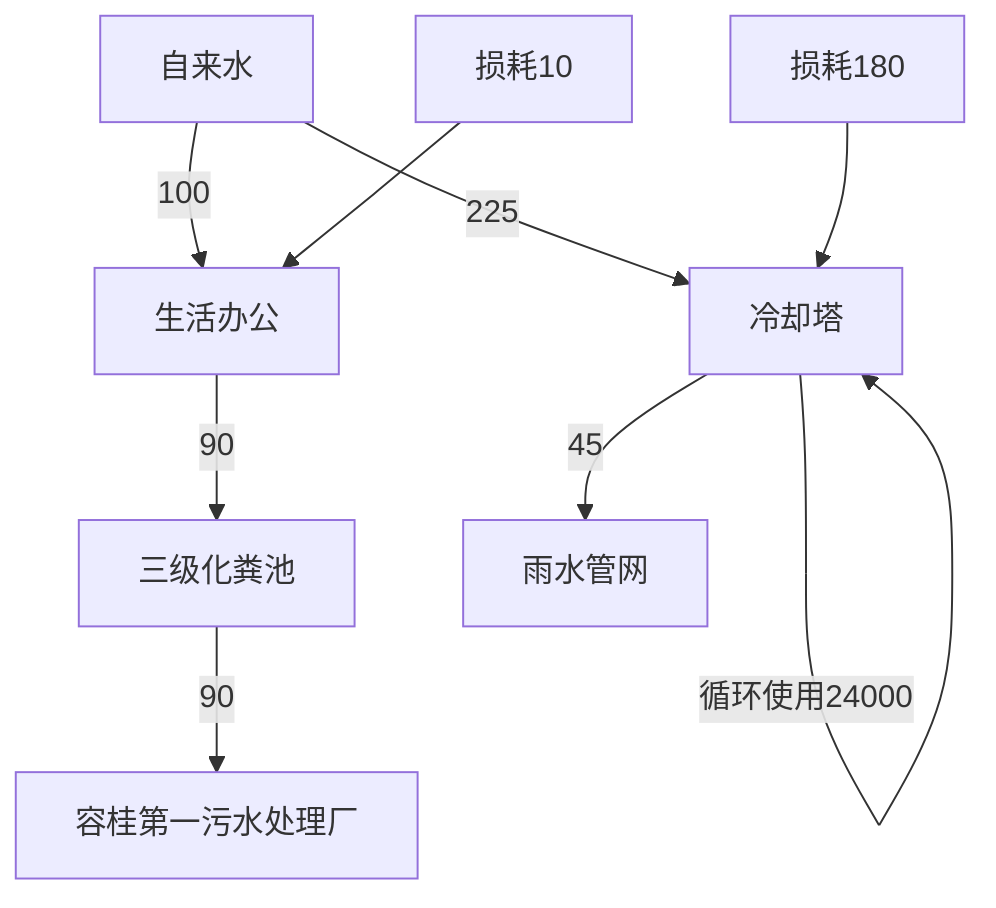
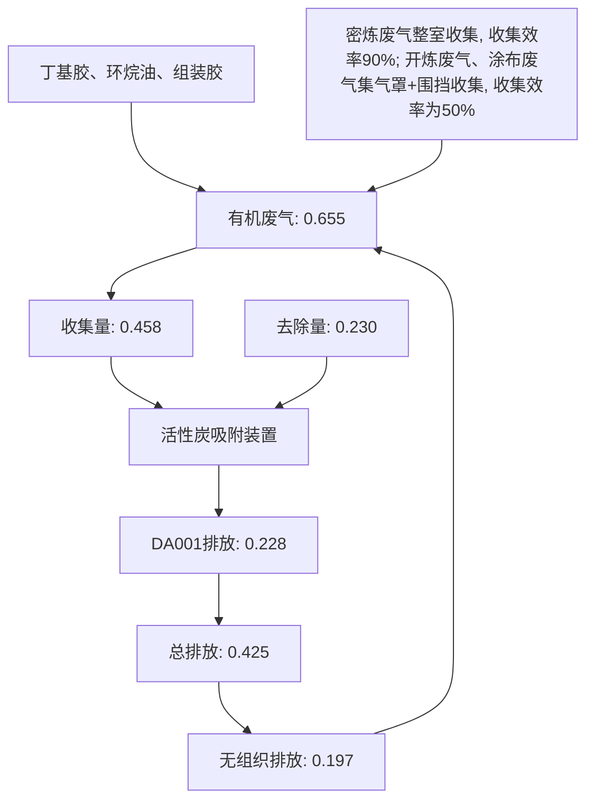
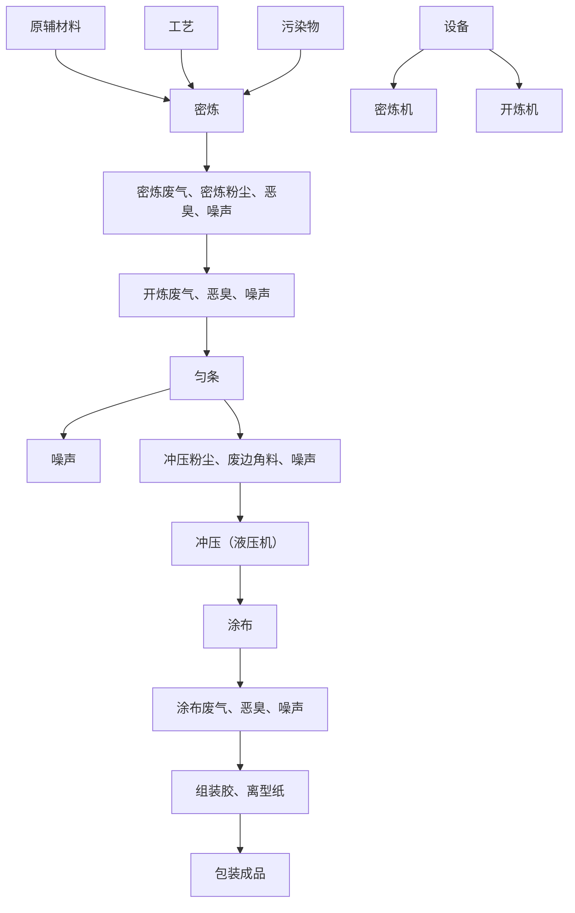

# 建设项目环境影响报告表

项目名称：佛山市智悦橡 建设单位（盖章）：佛山

编制日期： 二〇

text_image

有限公司新建项目
橡塑有限公司
年四月
4408084859363

中华人民共和国

text_image

生态环境保护
江苏环保股份有限公司

编制单位和编制人员情况表

<table><tr><td colspan="2">项目编号</td><td colspan="3">0x3727</td></tr><tr><td colspan="2">建设项目名称</td><td colspan="3">佛山市智悦橡塑有限公司新建项目</td></tr><tr><td colspan="2">建设项目类别</td><td colspan="3">26-052橡胶制品业</td></tr><tr><td colspan="2">环境影响评价文件类型</td><td colspan="3">报告表</td></tr><tr><td colspan="3">一、建设单位情况</td><td rowspan="6" colspan="2"></td></tr><tr><td colspan="2">单位名称(盖章)</td><td>佛山市智悦橡塑有限公司</td></tr><tr><td colspan="2">统一社会信用代码</td><td>91440606MAK8TBP24U</td></tr><tr><td colspan="2">法定代表人(签章)</td><td></td></tr><tr><td colspan="2">主要负责人(签字)</td><td></td></tr><tr><td colspan="2">直接负责的主管人员(签字)</td><td></td></tr><tr><td colspan="2">二、编制单位情况</td><td rowspan="4" colspan="3"></td></tr><tr><td colspan="2">单位名称(盖章)</td></tr><tr><td colspan="2">统一社会信用代码</td></tr><tr><td colspan="2">三、编制人员情况</td></tr><tr><td colspan="5">1.编制主持人</td></tr><tr><td>姓名</td><td colspan="2">职业资格证书管理号</td><td>信用编号</td><td>签字</td></tr></table>

#

平

text_image

中华人民共和国生
悦橡塑有限公司
中华人民共和国

text_image

中华人民共和国人力资源和社会保障部

国中

# 目录

一、建设项目基本情况.

二、建设项目工程分析.. . 13

三、区域环境质量现状、环境保护目标及评价标准 . 23

四、主要环境影响和保护措施. . 30

五、环境保护措施监督检查清单 . 53

六、结论.. . 57

附表.. . 58

附图1 项目地理位置图. . 59

附图2 项目环境四至图. . 60

附图3 项目厂房及四至现状图. . 61

附图4 平面布置图. 62

附图5 项目附近敏感点分布图. . 63

附图6 项目所在地地表水环境功能区划图. . 64

附图7 项目所在地大气环境功能区划图. . 65

附图8 项目所在地声环境功能区划图. . 66

附图9 项目所在地佛山市顺德区环境管控单元图 . 67

附图10 项目所在地规划图. . 68

附图11 产业集聚区和主题园区划定图. 69

附件1 营业执照. 错误！未定义书签。

附件2 法人身份证. .. 71

附件3 用地资料. 错误！未定义书签。

附件4 引用数据检测报告（节选） 错误！未定义书签。

附件5 排水证. . 87

附件6 组装胶MSDS及检测报告 . 88

附件7 环保服务合同. . 96

# 一、建设项目基本情况

<table><tr><td>建设项目名称</td><td colspan="3">佛山市智悦橡塑有限公司新建项目</td></tr><tr><td>项目代码</td><td colspan="3">无</td></tr><tr><td>建设单位联系人</td><td>*</td><td>联系方式</td><td>*</td></tr><tr><td>建设地点</td><td colspan="3">广东省佛山市顺德区容桂街道红旗社区红旗中路78号万景曦制造园2栋105、106室</td></tr><tr><td>地理坐标</td><td colspan="3">(东经:113度14分12.011秒,北纬:22度45分27.761秒)</td></tr><tr><td>国民经济行业类别</td><td>C2919其他橡胶制品制造</td><td>建设项目行业类别</td><td>二十六、橡胶和塑料制品业29-52橡胶制品业291-其他</td></tr><tr><td>建设性质</td><td>☑新建(迁建)□改建□扩建□技术改造</td><td>建设项目申报情形</td><td>☑首次申报项目□不予批准后再次申报项目□超五年重新审核项目□重大变动重新报批项目</td></tr><tr><td>项目审批(核准/备案)部门(选填)</td><td>无</td><td>项目审批(核准/备案)文号(选填)</td><td>无</td></tr><tr><td>总投资(万元)</td><td>50</td><td>环保投资(万元)</td><td>5</td></tr><tr><td>环保投资占比(%)</td><td>10</td><td>施工工期</td><td>1个月</td></tr><tr><td>是否开工建设</td><td>☑否□是:____</td><td>用地(用海)面积( $m^{2}$ )</td><td>1047.18</td></tr><tr><td>专项评价设置情况</td><td colspan="3">无</td></tr><tr><td>规划情况</td><td colspan="3">无</td></tr><tr><td>规划环境影响评价情况</td><td colspan="3">无</td></tr><tr><td>规划及规划环境影响评价符合性分析</td><td colspan="3">无</td></tr><tr><td>其他符合性分析</td><td colspan="3">1、与产业政策相符性分析本项目主要从事C2919其他橡胶制品制造,根据《产业结构调整指导目录(2024年本)》的规定,项目不属于目录所列的鼓励类、限制类、</td></tr></table>

禁止（淘汰）类项目，也不属于《市场准入负面清单(2025年版)》（发改体改规〔2025〕466号）中的禁止准入事项。

本项目行业类别及代码为C2919其他橡胶制品制造，根据广东省发展改革委关于印发《广东省“两高”项目管理名录（2022年版）》的通知（粤发改能源函〔2022〕1363号），本项目不属于“两高”项目。

本项目行业类别及代码为 C2919 其他橡胶制品制造，根据《环境保护综合名录》（2021 年版），本项目不属于“高污染、高环境风险”项目。

因此，本项目的建设符合国家和地方的相关产业政策。

# 2、用地性质相符性分析

本项目位于广东省佛山市顺德区容桂街道红旗社区红旗中路 78 号万景曦制造园 2 栋 105、106 室，根据关于《佛山市顺德区 SD-B-01-03-03、SD-B-01-04-02、SD-B-01-05-01、SD-B-01-05-02 街坊（容桂西部片区）控制性详细规划局部调整》批后通告可知，该场址用地性质为工业用地（详见附图10）。

本项目位于广东省佛山市顺德区容桂街道红旗社区红旗中路 78号万景曦制造园 2栋105、106室，根据《广东省人民政府办公厅关于印发广东省“节地提质”攻坚行动方案（2023-2025 年）的通知》和《佛山市生态环境局顺德分局关于环评技术评估审查项目与“节地提质”攻坚行动方案相符性意见的函》（2023 年 10 月）附件产业集聚区和主体园区划定图（详见附图11），项目所在地块属于17顺德未来科技城产业集聚区，本项目符合“在符合国土空间规划的前提下，新建工业项目和经批准实施异地搬迁的工业项目，除因安全生产、工艺技术等特殊要求外，应一律安排进入开发区（产业园区）生产建设”的规定，本项目与“节地提质”攻坚行动方案相符。

# 3、相关生态环境保护法律法规政策、生态环境保护规划的相符性分析

表 1-1 项目与生态环境保护法律法规政策、生态环境保护规划的相符性分析

<table><tr><td>序号</td><td>政策要求</td><td>本项目内容</td><td>符合性</td></tr></table>

<table><tr><td rowspan="9"></td><td colspan="5">1、《中华人民共和国大气污染防治法》(2018年10月26日第二次修订)</td></tr><tr><td>1.1</td><td colspan="2">生产、进口、销售和使用含挥发性有机物的原材料和产品的,其挥发性有机物含量应当符合质量标准或者要求。国家鼓励生产、进口、销售和使用低毒、低挥发性有机溶剂。</td><td>本项目丁基胶、环烷油、组装胶储存于密闭包装中,在非取用状态时保持密闭。</td><td>符合</td></tr><tr><td>1.2</td><td colspan="2">产生含挥发性有机物废气的生产和服务活动,应当在密闭空间或者设备中进行,并按照规定安装、使用污染防治设施;无法密闭的,应当采取措施减少废气排放。</td><td>本项目密炼废气、密炼粉尘经整室收集后,开炼废气、涂布废气经集气罩+围挡收集后,统一通过活性炭吸附装置处理后通过距离地面约43m高排气筒DA001排放。</td><td>符合</td></tr><tr><td colspan="5">2、《固定污染源挥发性有机物综合排放标准》(DB44/2367-2022)</td></tr><tr><td>2.1</td><td rowspan="2">有组织排放控制要求</td><td>收集的废气中NMHC初始排放速率≥3kg/h时,应当配置VOCs处理设施,处理效率不应当低于80%。对于重点地区,收集的废气NMHC初始排放速率≥2kg/h时,应当配置VOCs处理设施,处理效率不应当低于80%;采用的原辅材料符合国家有关低VOCs含量产品规定的除外。</td><td>本项目位于重点地区,项目的有机废气初始排放速率为0.19kg/h,低于2kg/h,且已配置处理效率为50%的活性炭吸附装置。</td><td>符合</td></tr><tr><td>2.2</td><td>排气筒高度不低于15m(因安全考虑或有特殊工艺要求的除外),具体高度以及与周围建筑物的相对高度关系应根据环境影响评价文件确定。</td><td>本项目排气筒设计排放高度为43m。</td><td>符合</td></tr><tr><td>2.3</td><td>VOCs物料存储无组织排放控制要求</td><td>VOCs物料应储存于密闭的容器、包装袋、储罐、储存、料仓中,盛装VOCs物料的容器或包装袋应存放于室内,或存放于设置有雨棚、遮阳和防渗设施的专用场地。盛装VOCs物料的容器或包装袋在非取用状态时应加盖、封口,保持密闭。</td><td>本项目丁基胶、环烷油、组装胶储存于密闭包装中,在非取用状态时保持密闭。</td><td>符合</td></tr><tr><td colspan="5">3、《广东省生态环境保护“十四五”规划》(粤环〔2021〕10号)</td></tr><tr><td>3.1</td><td colspan="2">大力推进低VOCs含量原辅材料源头替代,严格落实国家和地方产品VOCs含量限值质量标准,禁止建设生产和使用高VOCs含量的溶剂型涂料、油墨、胶粘剂等项目。</td><td>本项目使用的原材料丁基胶、环烷油常温下基本不挥发;组装胶符合《胶粘剂挥发性有机化合物限量》(GB33372-2020)表3本体型胶粘剂VOC含量限量-其他-室内装饰装修的限量值,不属于禁止使用的高VOCs含量胶粘剂项目。</td><td>符合</td></tr><tr><td rowspan="8"></td><td>3.2</td><td colspan="2">强化对企业涉VOCs生产车间/工序废气的收集管理,推动企业开展治理设施升级改造。</td><td>本项目密炼废气、密炼粉尘经整室收集后,开炼废气、涂布废气经集气罩+围挡收集后,统一通过活性炭吸附装置处理后通过距离地面约43m高排气筒DA001排放。</td><td>符合</td></tr><tr><td colspan="5">4、《广东省涉挥发性有机物(VOCs)重点行业治理指引》(粤环办〔2021〕43号)(参考其中的六、橡胶和塑料制品业VOCs治理指引)</td></tr><tr><td>4.1</td><td>VOCs物料储存</td><td>VOCs物料应储存于密闭的容器、包装袋、储罐、储库、料仓中。</td><td>本项目丁基胶、环烷油、组装胶储存于密闭包装中,在非取用状态时保持密闭。</td><td>符合</td></tr><tr><td rowspan="2">4.2</td><td rowspan="2">VOCs物料转移和输送治理技术</td><td>盛装VOCs物料的容器是否存放于室内,或存放于设置有雨棚、遮阳和防渗设施的专用场地。盛装VOCs物料的容器在非取用状态时应加盖、封口,保持密闭。</td><td>本项目丁基胶、环烷油、组装胶储存于密闭包装中,在非取用状态时保持密闭,储存区设置防雨、防渗漏措施。</td><td>符合</td></tr><tr><td>粉状、粒状VOCs物料采用气力输送设备、管状带式输送机、螺旋输送机等密闭输送方式,或者采用密闭的包装袋、容器或罐车进行物料转移。</td><td>本项目丁基胶、环烷油、组装胶储存于密闭包装中,在非取用状态时保持密闭。</td><td>符合</td></tr><tr><td>4.3</td><td>工艺过程</td><td>粉状、粒状VOCs物料采用气力输送方式或采用密闭固体投料器等给料方式密闭投加;无法密闭投加的,在密闭空间内操作,或进行局部气体收集,废气排至除尘设施、VOCs废气收集处理系统。</td><td>本项目密炼废气、密炼粉尘经整室收集后,开炼废气、涂布废气经集气罩+围挡收集后,统一通过活性炭吸附装置处理后通过距离地面约43m高排气筒DA001排放,废气收集效率达50%。</td><td>符合</td></tr><tr><td>4.4</td><td rowspan="2">废气收集</td><td>采用外部集气罩的,距集气罩开口面最远处的VOCs无组织排放位置,控制风速不低于0.3m/s。</td><td>密炼废气、密炼粉尘经整室收集后;开炼废气、涂布废气有机废气经“集气罩+围挡”收集,收集效率为50%,收集风速为0.8m/s,大于0.3m/s。</td><td>符合</td></tr><tr><td>4.5</td><td>废气收集系统的输送管道应密闭。废气收集系统应在负压下运行,若处于正压状态,应对管道组件的密封点进行泄漏检测,泄漏检测值不应超过500μmol/mol,亦不应有感官可察觉泄漏。</td><td>项目废气收集系统均在负压状态下运行。</td><td>符合</td></tr><tr><td rowspan="5"></td><td>4.6</td><td>排放水平</td><td>橡胶制品行业:a)有机废气排气筒排放浓度和厂界浓度不高于《橡胶制品工业污染物排放标准》(GB27632-2011)第II时段排放限值;车间或生产设施排气中NMHC初始排放速率≥3kg/h时,建设末端治污设施且处理效率≥80%;b)厂区内无组织排放监控点NMHC的小时平均浓度值不超过 $6mg/m^3$ ,任意一次浓度值不超过 $20mg/m^3$ 。</td><td>本项目挥发性有机物初始排放速率为0.19kg/h,已配备活性炭吸附装置的处理工艺处理有机废气,能有效减少有机废气的排放。本项目挥发性有机物有组织排放可满足《橡胶制品工业污染物排放标准》(GB27632-2011)表5新建企业大气污染物排放限值和广东省地方标准《固定污染源挥发性有机物综合排放标准》(DB44/2367-2022)表1挥发性有机物排放限值相关要求,NMHC无组织排放可满足广东省地方标准《固定污染源挥发性有机物综合排放标准》(DB44/2367-2022)表3厂区内VOCs无组织排放限值。有机废气厂区内无组织排放满足小时平均浓度值不超过 $6mg/m^3$ ,任意一次浓度值不超过 $20mg/m^3$ 。</td><td>符合</td></tr><tr><td>4.7</td><td>治理设施设计与运行管理</td><td>吸附床(含活性炭吸附法):a)预处理设备应根据废气的成分、性质和影响吸附过程的物质性质及含量进行选择;b)吸附床层的吸附剂用量应根据废气处理量、污染物浓度和吸附剂的动态吸附量确定;c)吸附剂应及时更换或有效再生。</td><td>项目密炼废气、开炼废气、涂布废气、密炼粉尘通过处理效率为50%的活性炭吸附装置的处理工艺处理。</td><td>符合</td></tr><tr><td>4.8</td><td>建设项目VOCs总量管理</td><td>新、改、扩建项目应执行总量替代制度,明确VOCs总量指标来源。</td><td>本项目建议挥发性有机物排放总量控制指标调整为0.425t/a,由区、镇两级环保主管部门核查总量指标。</td><td>符合</td></tr><tr><td colspan="5">5、《佛山市生态环境保护“十四五”规划》(佛环〔2022〕3号)</td></tr><tr><td>5.1</td><td colspan="2">加强VOCs源头替代和无组织排放管控。大力推进低VOCs含量原辅材料替代,将全面使用低VOCs含量原辅材料的企业纳入证明清单和政府绿色采购清单。加强对含VOCs物料储</td><td>本项目使用的原材料丁基胶、环烷油常温下基本不挥发;组装胶符合《胶粘剂挥发性有机化合物限量》(GB33372-2020)表3本</td><td>符合</td></tr><tr><td rowspan="7"></td><td></td><td>存、转移和运输、设备与管线组件泄漏、敞开液面逸散以及工艺过程等五类排放源的管控。</td><td>体型胶粘剂VOC含量限量-其他-室内装饰装修的限量值,不属于禁止使用的高VOCs含量胶粘剂项目。本项目密炼废气、密炼粉尘经整室收集后,开炼废气、涂布废气经集气罩+围挡收集后,统一通过活性炭吸附装置处理后通过距离地面约43m高排气筒DA001排放。</td><td colspan="2"></td></tr><tr><td>5.2</td><td>强化涉VOCs排放,涉工业炉窑等重点污染源自动监测,推动重点工业园区建立挥发性有机物、颗粒物监测体系。</td><td>本项目涉及VOCs排放,但所在位置不在重点工业园区,不需要建立挥发性有机物监测体系。</td><td colspan="2">符合</td></tr><tr><td>5.3</td><td>推进VOCs高排放企业治理设施提升改造,淘汰光催化、光氧化、低温等离子等现有低效治理设施。</td><td>项目密炼废气、开炼废气、涂布废气、密炼粉尘通过活性炭吸附装置进行处理,活性炭吸附装置设施不属于低效治理设施。</td><td colspan="2">符合</td></tr><tr><td colspan="5">6、《佛山市顺德区生态环境保护“十四五”规划(2021-2025)》(顺府办发(2022)16号)</td></tr><tr><td>6.1</td><td>加强VOCs源头替代和无组织排放管控。大力推进低VOCs含量、低反应活性的原辅材料替代,将全面使用低VOCs含量原辅材料的企业纳入正面清单和政府绿色采购清单。鼓励重点行业企业开展生产工艺和设备水性化改造,推广使用水性、高固体分、无溶剂、粉末等低VOCs含量涂料。严格落实《挥发性有机物无组织排放控制标准》,开展厂区内无组织排放浓度监测,加强对含VOCs物料储存、转移和运输、设备与管线组件泄漏、敞开液面逸散以及工艺过程等五类排放源的管控。加强储油库、加油站等VOCs排放治理,推动油品储运销体系安装油气回收自动监控系统。</td><td>本项目使用的原材料丁基胶、环烷油常温下基本不挥发;组装胶符合《胶粘剂挥发性有机化合物限量》(GB33372-2020)表3本体型胶粘剂VOC含量限量-其他-室内装饰装修的限量值,不属于禁止使用的高VOCs含量胶粘剂项目。本项目密炼废气、密炼粉尘经整室收集后,开炼废气、涂布废气经集气罩+围挡收集后,统一通过活性炭吸附装置处理后通过距离地面约43m高排气筒DA001排放。</td><td colspan="2">符合</td></tr><tr><td colspan="5">7.关于印发《重点行业挥发性有机物综合治理方案》的通知(环大气(2019)53号)</td></tr><tr><td>7.1</td><td>重点对含VOCs物料(包括含VOCs原辅材料、含VOCs产品、含VOCs废料以及有机聚合物材料等)储存、转移和输送、设备与管线组件泄漏、敞开液面逸散以及工艺过程等五类排放源实施管控,通过采取设备与场</td><td>本项目使用的原材料丁基胶、环烷油常温下基本不挥发;组装胶符合《胶粘剂挥发性有机化合物限量》(GB33372-2020)表3本体型胶粘剂VOC含量限量-</td><td colspan="2">符合</td></tr></table>

<table><tr><td></td><td>所密闭、工艺改进、废气有效收集等措施,削减VOCs无组织排放。</td><td>其他-室内装饰装修的限量值,不属于禁止使用的高VOCs含量胶粘剂项目。本项目密炼废气、密炼粉尘经整室收集后,开炼废气、涂布废气经集气罩+围挡收集后,统一通过活性炭吸附装置处理后通过距离地面约43m高排气筒DA001排放。</td><td></td></tr><tr><td>7.2</td><td>提高废气收集率,遵循“应收尽收、分质收集”的原则,科学设计废气收集系统,将无组织排放转变为有组织排放进行控制。采用全密闭集气罩或密闭空间的,除行业有特殊要求外,应保持微负压状态,并根据相关规范合理设置通风量。采用局部集气罩的,距集气罩开口面最远处的VOCs无组织排放位置,控制风速应不低于0.3米/秒,有行业要求的按相关规定执行。</td><td>本项目密炼废气、密炼粉尘经整室收集后,开炼废气、涂布废气经集气罩+围挡收集后,统一通过活性炭吸附装置处理后通过距离地面约43m高排气筒DA001排放。</td><td>符合</td></tr></table>

# 4、与广东省“三线一单”符合性分析

根据《广东省人民政府关于印发广东省“三线一单”生态环境分区管控方案的通知》（粤府〔2020〕71 号）发布的广东省环境管控单元图，项目所在区域为重点管控单元。

表 1-2 与“一核一带一区”区域管控要求的相符性

<table><tr><td>管控要求</td><td>与本项目相关的要求</td><td>项目情况</td><td>相符性</td></tr><tr><td>区域布局管控要求</td><td>禁止新建、扩建燃煤燃油火电机组和企业自备电站,推进现有服役期满及落后老旧的燃煤火电机组有序退出;原则上不再新建燃煤锅炉,逐步淘汰生物质锅炉、集中供热管网覆盖区域内的分散供热锅炉,逐步推动高污染燃料禁燃区全覆盖;禁止新建、扩建水泥、平板玻璃、化学制浆、生皮制革以及国家规划外的钢铁、原油加工等项目。推广应用低挥发性有机物原辅材料,严格限制新建生产和使用高挥发性有机物原辅材料的项目,鼓励建设挥发性有机物共性工厂。</td><td>本项目位于珠三角核心区,行业类别属于C2919其他橡胶制品制造,不设置发电机组和燃煤、生物质、分散供热锅炉,不属于水泥、平板玻璃、化学制浆、生皮制革以及国家规划外的钢铁、原油加工等项目,本项目不使用高挥发性有机物原辅材料。</td><td>符合</td></tr><tr><td>能源资源利用要求</td><td>科学实施能源消费总量和强度“双控”,新建高能耗项目单位产品(产值)能耗达到国际国内先进水平,实现煤炭消费总量负增长;推进工业节水减排,重点在高耗水行业开展节水改造,提高工业用水效率。加强江河湖库水量调度,保障生态流量。盘活存量建设用地,控制新增建设用地规模。</td><td>本项目属于C2919其他橡胶制品制造,不属于高能耗行业,项目生产设备使用电能,生活用水、生产用水由市政供水,不直接取用江河湖库水量,不会对项目所在地生态流量造成影响,项目租用已建成厂房,不涉及新增城市建设用地。</td><td>符合</td></tr><tr><td>污染物排放管控要求</td><td>实行水污染物排放的行业标杆管理,严格执行茅洲河、淡水河、石马河、汾江河等重点流域水污染物排放标准。重点水污染物未达到环境质量改善目标的区域内,新建、改建、扩建项目实施减量替代。大力推进固体废物源头减量化、资源化利用和无害化处置,稳步推进“无废城市”试点建设。</td><td>本项目地表水环境能够满足相应标准要求。本项目属于新建项目,生活污水经三级化粪池处理后达标后排至容桂第一污水处理厂,尾水排至鸡鸦水道;冷却塔定期排水作为清净下水,排至市政雨水管网;固体废物分类收集,一般固体废物由物资回收公司回收,危险废物交由有危险废物处理资质的单位收集处置。</td><td>符合</td></tr><tr><td>环境风险防控要求</td><td>加强惠州大亚湾石化区、广州石化、珠海高栏港、珠西新材料集聚区等石化、化工重点园区环境风险防控,建立完善污染源在线监控系统,开展有毒有害气体监测,落实环境风险应急预案。提升危险废物监管能力,利用信息化手段,推进全过程跟踪管理。</td><td>项目位于广东省佛山市顺德区容桂街道红旗社区红旗中路78号万景曦制造园2栋105、106室内,不属于石化、化工重点园区环境风险防控区域。项目产生的危险废物将定期委托危险废物交由有危险废物处理资质的单位收集处置,并通过信息系统登记转移计划和电子转移联单。</td><td>符合</td></tr></table>

表 1-3 与“三线一单”相符性分析表

<table><tr><td>内容</td><td>项目情况</td><td>相符性</td></tr><tr><td>生态保护红线及一般生态空间</td><td>项目位于广东省佛山市顺德区容桂街道红旗社区红旗中路78号万景曦制造园2栋105、106室内,属于工业用地,不涉及划定的生态红线区域,项目周边无自然保护区、饮用水水源保护区等生态保护目标。</td><td>符合</td></tr><tr><td>资源利用上线</td><td>本项目资源消耗量相对区域资源利用总量较少,不属于高耗能、污染资源型企业,项目的水、电等资源利用不会突破区域上线。</td><td>符合</td></tr><tr><td>环境质量底线</td><td>项目区域地表水环境和声环境能够满足相应标准要求,属于达标区;区域大气环境属于不达标区,超标因子为 $O_3$ 。本项目密炼废气、密炼粉尘经整室收集后,开炼废气、涂布废气经集气罩+围挡收集后,统一通过活性炭吸附装置处理后通过距离地面约43m高排气筒DA001排放;冲压粉尘经自然沉降后以无组织形式排放至车间内;生活污水经预处理后排至容桂第一污水处理厂处理;冷却塔定期排水作为清净下水,排至市政雨水管网;固体废物分类收集,一般固体废物由物资回收公司回收,危险废物交由有危险废物处理资质的单位收集处置。经以上处理后,项目对区域内环境影响较小,质量可保持现有水平。</td><td>符合</td></tr><tr><td>环境准入负面清单</td><td>本项目行业类别为C2919其他橡胶制品制造,根据《市场准入负面清单(2025年版)》的通知(发改体改规〔2025〕466号)的规定,本项目不属于负面清单;根据《环境保护综合名录》(2021年版),本项目不属于“高污染、高环境风险”项目。</td><td>符合</td></tr></table>

# 5、佛山市“三线一单”生态环境分区管控方案符合性分析

根据佛山市生态环境局关于印发《佛山市“三线一单”生态环境分区管控方案（2024年版）的通知》（佛环〔2024〕20号）的佛山市环境管控单元图，项目所在位置属于容桂街道重点管控区（单元编码：ZH44060620001），具体分析如下表。

表 1-4 与佛山市“三线一单”相符性分析表

<table><tr><td>内容</td><td>要求</td><td>项目情况</td><td>相符性</td></tr><tr><td rowspan="6">区域布局管控</td><td>1-1【产业/鼓励引导类】重点发展芯片、智能家电、高端装备制造、高端新型电子信息、新材料、生命健康等制造业和金融、科技服务、高端商贸等现代服务业,建设科技研发、创新创业基地、上市企业总部聚集区、企业品牌总部基地。</td><td>本项目不涉及。</td><td>/</td></tr><tr><td>1-2【产业/综合类】系统推进村级工业园升级改造,腾出连片空间,布局产业集聚区和主题产业园,推动工业项目入园集聚发展。</td><td>本项目行业类别及代码为C2919其他橡胶制品制造,选址位于广东省佛山市顺德区容桂街道红旗社区红旗中路78号万景曦制造园2栋105、106室,在产业集聚区内。</td><td>符合</td></tr><tr><td>1-3【大气/限制类】大气环境受体敏感重点管控区内,应严格限制新建储油库项目、产生和排放有毒有害大气污染物的建设项目以及使用溶剂型油墨、涂料、清洗剂、胶黏剂等高挥发性有机物原辅材料项目,鼓励现有该类项目搬迁退出。</td><td>本项目行业类别及代码为C2919其他橡胶制品制造,不使用高挥发性有机物原辅材料。</td><td>符合</td></tr><tr><td>1-4【大气/鼓励引导类】大气环境高排放重点管控区内,应强化达标监管,引导工业项目落地集聚发展,有序推进区域内行业企业提标改造。</td><td>本项目位于产业集聚区内。</td><td>符合</td></tr><tr><td>1-5【产业/综合类】划定家具生产优先发展区域,优先发展区外不再新建设计涂装工艺的木制家具制造项目。优先发展区范围根据家具产业发展规划及其规划环评文件确定。</td><td>本项目不涉及。</td><td>/</td></tr><tr><td>1-6【产业/限制类】受纳水体或监控断面不达标且未“以新带老”制定区域达标方案的河涌,不得新建、扩建向河涌直接排放废水的项目。新建、扩建含蚀刻工序的线路板生产项目和化工项目应在配套污水集中处理的工业园区或生活污水管网覆盖区域内建设;纯加工型印花项目,含酸洗、磷化的金属表面处理、金属制品项目(与自身高新技术企业配套的和区级及以上重点项目除外),含酸洗、喷涂、化学抛光、电解</td><td>本项目不涉及。</td><td>/</td></tr></table>

<table><tr><td rowspan="9"></td><td></td><td>等涉及废水排放工艺的不锈钢型材加工项目(与自身高新技术企业配套的和区级及以上重点项目除外),应进入此类项目为主导产业、具有相应废水集中治理设施的工业园区,实现集中治污。</td><td></td><td></td></tr><tr><td rowspan="6">能源资源利用</td><td>2-1【能源/鼓励引导类】推广节能技术,加快发展绿色货运与现代物流。</td><td>本项目不涉及。</td><td>/</td></tr><tr><td>2-2【能源/鼓励引导类】推广新能源汽车应用和充电基础设施建设,积极推动重卡LNG加气站、充电基础设施、加氢站建设。</td><td>本项目不涉及。</td><td>/</td></tr><tr><td>2-3【能源/综合类】科学实施能源消费总量和强度“双控”,新建高能耗项目单位产品(产值)能耗达到国际国内先进水平。</td><td>本项目所有生产设备均使用电能作为能源,不属于高能耗项目。</td><td>符合</td></tr><tr><td>2-4【水资源/综合类】贯彻落实“节水优先”方针,实行最严格水资源管理制度,容桂街道万元国内生产总值用水量、万元工业增加值用水量、用水总量、农田灌溉水有效利用系数等用水总量和效率指标达到区下达要求。</td><td>本项目严格贯彻落实“节水优先”方针,实行最严格水资源管理制度。</td><td>符合</td></tr><tr><td>2-5【土地资源/限制类】落实单位土地面积投资强度、土地利用强度等建设用地控制性指标要求,提高土地利用效率。</td><td>本项目租用已建成厂房作为经营场所,与实际用途相符合。</td><td>符合</td></tr><tr><td>2-6【岸线/禁止类】严格水域岸线用途管制,新建项目一律不得违规占用水域。严禁破坏生态的岸线利用行为和不符合其功能定位的开发建设活动,严禁以各种名义侵占河道、围垦湖泊、非法采砂等。</td><td>本项目不涉及。</td><td>/</td></tr><tr><td rowspan="2">污染物排放管控</td><td>3-1【水/限制类】城镇新区建设实行雨污分流。住宅、商业体、学校、市场等城镇开发建设项目应当配套或者同步计划建设公共排水设施,公共排水设施或自建排水设施未能投产运行的,以上涉水项目不得投入使用。新建小区严格实施雨污分流,阳台、露台等污水接入污水收集系统,将生活污水“应截尽截”。做好大型楼盘、集贸市场、餐饮以及学校等4大类排水户污水接入市政管网工作。</td><td>本项目不涉及。</td><td>/</td></tr><tr><td>3-2【水/综合类】容桂街道重点河涌水质上年度未达到水环境质量目标的,需组织编制、系统实施、向社会公开区域重点水污染物减排计划并明确“替代量”,本年度新建、改建、扩建项目新增水环境重点污染物实行区域“减二增一”替代(工业、生活或综合集中废水处理设施、民生项目除外)。</td><td>本项目生活污水经预处理后排至容桂第一污水处理厂处理,无需实施本年度新建项目新增水环境重点污染物区域“减二增一”替代。</td><td>符合</td></tr><tr><td rowspan="7"></td><td rowspan="6"></td><td>3-3【水/综合类】区域内应合理规划建设工业或综合集中废水处理设施。逐步推进工业集聚区“污水零直排区”建设,开展排水单元工业废水、生活污水、雨水分类收集、分质处理,确保园区“管网全覆盖、雨污全分流、污水全收集、处理全达标”。</td><td>本项目所在园区已接入市政污水管网,实施雨污分流。</td><td>符合</td></tr><tr><td>3-4【水/综合类】结合村级工业园改造,全面提升产业层次与集聚度,促进污染集中整治。</td><td>本项目不涉及。</td><td>/</td></tr><tr><td>3-5【水/综合类】稳步推进排水设施“三个一体化”管理模式,补齐城乡污水收集和处理短板,推动容桂第一,第二污水处理厂提质增效,加快消除城中村、老旧城区、城乡结合部等污水收集管网空白区,逐步实现城乡污水收集处理全覆盖。2025年前完成容桂第一,第二污水处理厂扩建,尾水应执行《城镇污水处理厂污染物排放标准》(GB18918-2002)一级A标准及《广东省水污染物排放限值》(DB44/26-2001)的较严值。</td><td>本项目不涉及。</td><td>/</td></tr><tr><td>3-6【水/综合类】近期保留马东、马南两处污水处理站,到2030年将马冈村居污水接入市政污水管网,纳入杏坛城镇污水处理系统;其余行政村(社区)污水均通过市政管网和农村支管纳入容桂城镇污水处理系统。</td><td>本项目不涉及。</td><td>/</td></tr><tr><td>3-7【大气/综合类】大力推进低VOCs含量原辅材料替代,加快涉VOCs重点行业的生产工艺升级改造,推行自动化生产工艺,对达不到要求的VOCs收集及治理设施进行整治提升,逐步淘汰低效VOCs治理设施。</td><td>本项目使用的丁基胶、环烷油常温下基本不挥发;组装胶符合《胶粘剂挥发性有机化合物限量》(GB33372-2020)表3本体型胶粘剂VOC含量限量-其他-室内装饰装修的限量值,不属于禁止使用的高VOCs含量胶粘剂项目。本项目密炼废气、密炼粉尘经整室收集后,开炼废气、涂布废气经集气罩+围挡收集后,统一通过活性炭吸附装置处理后通过距离地面约43m高排气筒DA001排放。</td><td>符合</td></tr><tr><td>3-8【土壤/限制类】严格重金属重点行业企业准入管理。新、改、扩建重点行业建设项目应遵循重点重金属污染物排放“等量替代”原则。</td><td>本项目不涉及。</td><td>/</td></tr><tr><td>环境风险防控</td><td>4-1【水/综合类】容桂第一,第二污水处理厂、工业污水集中处理设施应采取有效措施,防止事故废水直接排入水体。完善污水处理厂在线监控系统联网,实现污水处理厂的实时、动态监管。</td><td>本项目不涉及。</td><td>/</td></tr><tr><td rowspan="2"></td><td></td><td>4-2【风险/综合类】加强环境风险分级分类管理,强化金属制品、有色金属和压延加工、化学原料和化学品制造业等涉重金属、化工行业企业及工业园区等重点环境风险源的环境风险防控。</td><td>本项目属于C2919其他橡胶制品制造,但不涉及重金属、化工行业企业及工业园区等重点环境风险源。</td><td>符合</td></tr><tr><td colspan="4">综上,本项目符合国家产业政策的要求,同时符合广东省、佛山市和顺德区产业政策和相关规范的要求。</td></tr></table>

# 二、建设项目工程分析

# 1、建设内容

本项目属于新建项目，项目选址于广东省佛山市顺德区容桂街道红旗社区红旗中路78号万景曦制造园 2 栋105、106室，本项目租赁已建成的工业厂房作为经营场所，本项目占地面积为 1047.18m2，建筑面积约为 1047.18m2，厂房所在建筑物为8层建筑物，本项目租赁一楼车间进行生产，建筑物高度约为39.4m（1楼为7.9m，二至八楼均为4.5m）。项目具体布置情况详见下表。

表 2-1 本项目工程组成一览表  
建设内容

<table><tr><td>类别</td><td colspan="2">工程名称</td><td>工程内容</td></tr><tr><td rowspan="6">主体车间</td><td colspan="2">生产车间</td><td>建筑面积约 $1047.18m^{2}$ ,用于生产加工、存放原料和产品</td></tr><tr><td rowspan="5">其中</td><td>密炼房</td><td>建筑面积约 $109.5776m^{2}$ </td></tr><tr><td>开炼区</td><td>建筑面积约 $30m^{2}$ </td></tr><tr><td>冲压区</td><td>建筑面积约 $180m^{2}$ </td></tr><tr><td>涂布区</td><td>建筑面积约 $100m^{2}$ </td></tr><tr><td>烘干区</td><td>建筑面积约 $100m^{2}$ </td></tr><tr><td>辅助工程</td><td colspan="2">办公室</td><td>建筑面积约 $50m^{2}$ </td></tr><tr><td rowspan="4">储运工程</td><td colspan="2">一般固体废物暂存点</td><td>建筑面积约为 $5m^{2}$ </td></tr><tr><td colspan="2">危废暂存间</td><td>建筑面积约为 $5m^{2}$ </td></tr><tr><td colspan="2">材料中转站</td><td>建筑面积约为 $100m^{2}$ </td></tr><tr><td colspan="2">通道及其余空置位置</td><td>/</td></tr><tr><td rowspan="2">公用工程</td><td colspan="2">给排水</td><td>由市政供水管网供给;生活污水经三级化粪池预处理后通过市政污水管网引至容桂第一污水处理厂进一步处理</td></tr><tr><td colspan="2">供能</td><td>由市政供电管网供给,项目内不设备用发电机</td></tr><tr><td rowspan="7">环保工程</td><td colspan="2" rowspan="2">废气</td><td>密炼废气、密炼粉尘经整室收集后,开炼废气、涂布废气经集气罩+围挡收集后,统一通过活性炭吸附装置处理后通过距离地面约43m高排气筒DA001排放</td></tr><tr><td>冲压粉尘经自然沉降后以无组织形式排放至车间内</td></tr><tr><td colspan="2" rowspan="2">废水</td><td>生活污水经三级化粪池预处理后通过市政污水管网引至容桂第一污水处理厂进一步处理</td></tr><tr><td>冷却塔定期排水作为清净下水,排至市政雨水管网</td></tr><tr><td colspan="2">噪声</td><td>高噪声设备基础减振、局部隔声</td></tr><tr><td colspan="2" rowspan="2">固废</td><td>危险废物暂存于厂区内危险暂存间,定期交由有资质的危废公司处置</td></tr><tr><td>一般固体废物暂存于厂区内一般固废暂存点,一般固体</td></tr><tr><td rowspan="2"></td><td rowspan="2"></td><td colspan="2">废物交相应回收单位回收处理</td></tr><tr><td colspan="2">生活垃圾交环卫部门及时清运处理</td></tr></table>

# 2、生产规模、主要原辅料及能耗情况

本项目的生产规模、主要原辅料及消耗量情况详见下表：

表 2-2 本项目生产规模一览表

<table><tr><td>主要产品名称</td><td>年产量</td><td>规格范围</td></tr><tr><td>消音垫</td><td>360万块/a</td><td>规格:25cm×34cm,单块重量:0.3kg</td></tr></table>

表 2-3 本项目主要原辅材料使用量一览表

<table><tr><td>序号</td><td>名称</td><td>单位</td><td>年用量</td><td>最大存储量</td><td>形态</td><td>包装规格</td><td>对应工序</td></tr><tr><td>1</td><td>丁基胶</td><td>t/a</td><td>880</td><td>50吨</td><td>固态</td><td>箱装,20kg/箱</td><td>全部</td></tr><tr><td>2</td><td>环烷油</td><td>t/a</td><td>200</td><td>10吨</td><td>液体</td><td>桶装,20kg/桶</td><td>全部</td></tr><tr><td>3</td><td>石粉</td><td>t/a</td><td>7</td><td>1吨</td><td>固态</td><td>袋装,25kg/袋</td><td>全部</td></tr><tr><td>4</td><td>组装胶</td><td>t/a</td><td>1.2</td><td>0.01吨</td><td>液态</td><td>桶装,20kg/桶</td><td>涂布</td></tr><tr><td>5</td><td>离型纸</td><td>t/a</td><td>5</td><td>0.05吨</td><td>固态</td><td>50kg/卷</td><td>涂布</td></tr><tr><td>12</td><td>液压油</td><td>t/a</td><td>0.1</td><td>0.01吨</td><td>液体</td><td>20kg/桶</td><td rowspan="2">用于设备维修保养</td></tr><tr><td>13</td><td>机油</td><td>t/a</td><td>0.02</td><td>0.01吨</td><td>液体</td><td>20kg/桶</td></tr></table>

# （2）项目主要原料理化性质如下

表2-4 本项目使用的原辅材料主要理化性质表

<table><tr><td>序号</td><td>名称</td><td>理化性质</td></tr><tr><td>1</td><td>丁基胶</td><td>丁基橡胶是一种由异丁烯与少量异戊二烯共聚而成的合成橡胶,具有高度饱和结构,表现出优异的气密性与化学稳定性。外观:白色或淡黄色固体块状,无臭无味;密度:约0.91-0.92g/cm3;玻璃化转变温度:-67°C至-69°C,低温下仍保持弹性;溶解性:不溶于乙醇、丙酮等极性溶剂;气密性:气体透过率极低,为空气透过率仅为天然橡胶的1/7,蒸汽透过率为1/200;耐热性:硫磺硫化后可在100°C长期使用,树脂硫化可达150-200°C;电绝缘性:优良,因分子链非极性且双键极少;化学稳定性:耐酸、碱、氧化剂(除浓硝酸、浓硫酸外)。</td></tr><tr><td>2</td><td>环烷油</td><td>环烷油是以环烷烃为主要成分的石油馏分,常用于橡胶加工中的软化剂和填充油,兼具芳香烃与直链烃的部分特性。外观:暗色液体,带有较强气味(部分为无色透明);相对密度:0.89-0.95;闪点:&gt;160°C,安全性较高;酸值:&lt;0.15mgKOH/g,腐蚀性低;化学结构:饱和环状碳链,带饱和支链,结构稳定;主要用途:橡胶增塑剂,变压器油、润滑油基础油,工艺油、金属加工液。</td></tr><tr><td>3</td><td>石粉</td><td>“石粉”一般指天然矿物研磨而成的细粉,常见为重质碳酸钙,广泛用于橡胶、塑料、建材中作为填料。化学式: $CaCO_3$ ;外观:白色粉末,无味;密度:约2.7-2.8g/cm3;粒径范围:可根据加工需求从几微米到亚微米级;pH值:弱碱性(水悬浮液pH约8-9);热稳定性:加热至825°C以上分解为CaO和 $CO_2$ ;溶解性:不溶于水,溶于强酸并释放 $CO_2$ 气体;功能特性:提高制品硬度与尺寸稳定性,降低成本,改善加工性能,在橡胶中可部分补强。</td></tr><tr><td>4</td><td>组装胶</td><td>成分为改性聚醋酸乙烯共聚乳液100%,为稍有气味的溶液,pH为3-5,闪点&gt;96°C,非易燃物,溶解性为水溶性。</td></tr><tr><td>5</td><td>机油</td><td>为无气味或略带异味的淡黄色至褐色油状液体,不溶于水,密度小于 $1\mathrm{\;g}/{\mathrm{{cm}}}^{3}$ 。机油一般由基础油和添加剂两部分组成。基础油是机油的主要成分,决定着机油的基本性质,添加剂则可弥补和改善基础油性能方面的不足,赋予某些新的性能,是机油的重要组成部分。</td></tr><tr><td>6</td><td>液压油</td><td>淡黄色液体,相对密度(水=1g/cm3)0.87,闪点224°C,无爆炸危险,遇明火、高热可燃,燃烧产物为CO、 ${\mathrm{{CO}}}_{2}$ 等有毒有害气体,燃烧时使用泡沫、干粉、二氧化碳、砂土进行灭火;常温环境下储存不分解,禁配物为酸、碱及强氧化剂。</td></tr></table>

# （3）项目涉VOCs原辅材料VOCs含量情况分析

表 2-5 本项目涉及挥发性化学原料 VOC 含量判定一览表

<table><tr><td>序号</td><td>原辅材料名称</td><td>VOC含量1</td><td>国家判定标准</td><td>VOC含量限值</td><td>是否属于低VOCs原辅料</td></tr><tr><td>1</td><td>组装胶</td><td>9g/L(7.5g/kg)</td><td>《胶粘剂挥发性有机化合物限量》(GB33372-2020)表3本体型胶粘剂VOC含量限量-其他-室内装饰装修的限量值</td><td>50g/kg</td><td>是</td></tr><tr><td>备注</td><td colspan="5">1表中各类原辅材料的VOCs含量参考检测报告(见附件6)的检测数据。</td></tr></table>

# （4）项目VOCs 原辅材料用量匹配性分析

组装胶年用量匹配性分析：

表 2-6 胶粘剂年用量匹配性分析表

<table><tr><td>序号</td><td>工序</td><td>产品</td><td>数量</td><td>胶粘剂类型</td><td>单个涂胶面积 $^1$ ( $m^2$ )</td><td>总涂胶面积( $m^2$ )</td><td>单位面积消耗量 $^2$ ( $g/m^2$ )</td><td>固含量 $^3$ (%)</td><td>理论涂胶用量 $^4$ (t/a)</td><td>申报使用量(t/a)</td></tr><tr><td>1</td><td>涂布</td><td>消音垫</td><td>360万块</td><td>组装胶</td><td>0.0737</td><td>265320</td><td>4.2</td><td>99.25%</td><td>1.123</td><td>1.2</td></tr><tr><td>备注</td><td colspan="10">1本项目生产消音垫的涂布工序在消音垫表面涂布一层组装胶,消音垫为长方形,中间为镂空的圆形(消音垫长度约为34cm,宽度约为25cm,镂空的圆形直径为12cm),按涂胶长度、宽度和镂空的圆形计得单件产品组装胶涂胶面积 $0.0737m^2$ 。计算方法为涂胶长度×涂胶宽度-镂空圆形=34cm×25cm-3.14×(12cm) $^2$ =0.0737 $m^2$ 。2根据《附件2佛山市包装印刷行业建设项目环评文件编制技术参考指南(试行)》表9复合工艺单位面积胶粘剂消耗量参数参考一览表,无溶剂胶粘剂(一般材料)的胶粘剂用量为0.8~2.0 $g/m^2$ (干基),且参考同类型项目的胶粘剂用量较多,因此本项目按4.2 $g/m^2$ (干基)计算。3固含量=1-挥发分-水分,组装胶内的挥发性约为0.75%,不含水分,本项目按其固含量为99.25%计算。4理论涂胶用量(t/a)=总涂胶面积( $m^2$ )×单位面积消耗量( $g/m^2$ )/固含量(%)× $10^{-6}$ 。</td></tr></table>

根据上表计算结果并考虑生产过程中的损耗，本项目组装胶的理论消耗量为1.123t/a，则组装胶使用量为 1.2t/a 是合理的。

# 3、主要设备

本项目生产设备具体情况详见下表。

表2-7 主要生产设备清单

<table><tr><td>序号</td><td>设备</td><td>设备数量</td><td>单位</td><td>设备参数</td><td>所用工序</td></tr><tr><td>1</td><td>密炼机</td><td>2</td><td>台</td><td>/</td><td>密炼工序</td></tr><tr><td>2</td><td>开炼机</td><td>1</td><td>台</td><td>/</td><td>开炼工序</td></tr><tr><td>3</td><td>空压机</td><td>1</td><td>台</td><td>/</td><td>辅助</td></tr><tr><td>4</td><td>涂布机</td><td>1</td><td>台</td><td>/</td><td>涂布工序</td></tr><tr><td>5</td><td>冲压(液压机)</td><td>1</td><td>台</td><td>/</td><td>冲压工序</td></tr><tr><td>6</td><td>冷却塔</td><td>1</td><td>个</td><td>循环水量为 $10m^{3}/h$ </td><td>辅助设备冷却</td></tr></table>

# 产能与设备匹配性分析

本项目消音垫生产通过开炼工序核算生产规模匹配性，分析详见下表：

表 2-8 关键设备产能和产品规模匹配性分析一览表

<table><tr><td colspan="2">设备</td><td rowspan="2">单台单批次生产量(kg)</td><td rowspan="2">单批次加工时间(min)</td><td rowspan="2">每年生产时间(h)</td><td rowspan="2">年生产批次(次)</td><td rowspan="2">*关键设备设计最大年产量(t)</td><td rowspan="2">年申报产能(t)</td></tr><tr><td>名称</td><td>数量(台)</td></tr><tr><td>开炼机</td><td>1</td><td>50</td><td>6</td><td>2400</td><td>24000</td><td>1200</td><td>1080</td></tr><tr><td>密炼机</td><td>2</td><td>50</td><td>12</td><td>2400</td><td>12000</td><td>1200</td><td>1080</td></tr><tr><td>备注</td><td colspan="7">关键设备设计最大年产量=设备数量×单台单批生产量(kg)×年生产批次(次)。</td></tr></table>

本项目密炼机和开炼机最大设计产能为1200吨/年，本项目消音垫申报产能1080吨/年。申报产能与设备最大产能基本相符。

表2-9 本项目能源消耗一览表

<table><tr><td>序号</td><td>名称</td><td>单位</td><td>用量</td><td>用途</td><td>备注</td></tr><tr><td rowspan="2">1</td><td rowspan="2">水</td><td>吨/年</td><td>100</td><td>办公、生活用水</td><td>市政供水</td></tr><tr><td>吨/年</td><td>225</td><td>生产用水</td><td>市政供水</td></tr><tr><td>2</td><td>电</td><td>kW·h/a</td><td>10万</td><td>生产、生活用电</td><td>市政供电</td></tr></table>

# 4、劳动定员及工作制度

表2-10 项目劳动定员及工作制度一览表

<table><tr><td>序号</td><td>名称</td><td>内容</td></tr><tr><td>1</td><td>劳动定额</td><td>员工人数10人</td></tr><tr><td>2</td><td>工作制度</td><td>一班制,8小时/班,年工作时间为300天</td></tr><tr><td>3</td><td>食宿情况</td><td>厂区内不设置食宿</td></tr></table>

# 5、水平衡分析

# （1）供水用水：

生活用水：本项目从业人员共 10 人，均不在厂内食宿，年工作时间为 300天，一班制，8小时/班。参考广东省地方标准《用水定额 第3部分：生活》（DB44/T1461.3-2021）表 1 中国家机构的办公楼（无食堂和浴室）的用水定额的先进值（10m3 /人·a），污水排放量按用水量的 90%计算，则本项目生活用水量为100m3 /a，生活污水排放量约 90m3/a。

冷却塔用水：本项目配套1台冷却塔，工作过程中需用自来水对设备进行间接冷却，冷却用水循环使用，定期补充因蒸发而损失的水分，并适当排放一定量的水以维持循环系统盐分的平衡。参考《工业循环冷却水处理设计规范》（GB50050-2017），蒸发水量和排污水量计算公式如下：

$$
\begin{array}{c} Q _ {e} = k * \Delta t * Q _ {r} \\ Q _ {b} = \frac {Q _ {e}}{N - 1} - Q _ {w} \end{array}
$$

式中：Qe 一蒸发水量（m3/h）；

Qb 一排污水量（m3/h）；

k一蒸发损失系数（1/℃）；

∆t 一循环冷却水进塔温度差（℃）；

Qr 一循环冷却水量（m3/h）；

N一浓缩倍数，本项目取值5倍；

Qw一风吹损失水量（m3/h）。

本项目冷却塔参照间接开式系统，进水温度平均约 37℃，出水温度约为32℃，进塔温度差约 5℃，根据《工业循环冷却水处理设计规范》（GB/T50050-2017） 表 5.0.6，冷却塔的蒸发损耗系数取值 0.0015。本项目冷却塔位于室内，基本不存在风吹损失量，本项目忽略风吹损失量。本项目冷却塔使用时间为8h/d，年工作日300天，根据建设单位提供资料，1台冷却塔的循环水量约为 10m3 /h，则总循环水量为 24000m3 /a，蒸发水量为 180m3 /a（蒸发系数为0.0015\*5=0.75%），冷却塔排水量为 45m3 /a，冷却塔新鲜水用量蒸发水量+排水量为225m3 /a。本项目冷却塔排水不需定期添加药剂，可作为清净下水排入市政雨水管网。

# （2）排水：

生活污水经三级化粪池预处理后通过市政管网引至容桂第一污水处理厂进

一步处理，尾水排入鸡鸦水道，生活污水排放量为 $9 0 \mathrm { m } ^ { 3 } / \mathrm { a } \mathrm { c }$ 。

冷却塔定期排水作为清净下水，不需定期添加药剂，可稳定达标排放，排至市政雨水管网，不纳入污水总量。冷却塔定期排水量为45m3/a。

（3）本项目水平衡图  

flowchart

图2-1 本项目水平衡图（单位m3/a）  

flowchart

图2-2 本项目挥发性有机物平衡图（单位t/a）

# 6、物料平衡分析：

表2-11 项目物料平衡表

<table><tr><td colspan="4">消音垫</td></tr><tr><td>原料投入</td><td>消耗量(t/a)</td><td>产出</td><td>产出量(t/a)</td></tr><tr><td>丁基胶</td><td>880</td><td>消音垫</td><td>1080</td></tr><tr><td>环烷油</td><td>200</td><td>密炼废气</td><td>0.323</td></tr><tr><td>石粉</td><td>7</td><td>密炼粉尘</td><td>0.007</td></tr><tr><td>组装胶</td><td>1.2</td><td>开炼废气</td><td>0.323</td></tr><tr><td>离型纸</td><td>5</td><td>冲压粉尘</td><td>1.087</td></tr><tr><td>//</td><td>//</td><td>废边角料涂布废气</td><td>10.870.009</td></tr><tr><td>合计约</td><td>1093</td><td>合计约</td><td>1093</td></tr><tr><td colspan="4">注:由于生产中有部分损耗无法估计,故合计处不设小数点。</td></tr></table>

# 7、项目四至及平面布置情况

本项目选址位于广东省佛山市顺德区容桂街道红旗社区红旗中路 78号万景曦制造园2栋105、106室，项目东面是万景曦制造园 2栋其他厂房、南面是佛山市顺德区骏炜电器有限公司、西面是广东万和新电气股份有限公司、北面是佛山市铖耀电器有限公司（项目四至图见附图 2）。

本项目平面布置主要包括办公室、材料中转站、烘干区、涂布区、冲压区、开炼区、密炼房、仓库、一般固体废物暂存点、危废暂存间、通道及其他空置位置等，厂区具体平面布置详见附图4。

# 一、工艺流程简述（图示）：

本项目具体工艺流程详见下文。

flowchart

图 2-3 消音垫生产工艺流程图

# 消音垫生产工艺流程说明：

密炼：丁基橡胶因内聚力低、包辊性差、冷流性强，混炼时易分散不均，需结合密炼机预混+开炼机精炼的两段工艺，确保环烷油与石粉填料均匀分散。加入丁基胶生胶后分批加入石粉（补强填料），避免团聚；再缓慢注入环烷油（软化剂），防止打滑（操作温度约为 150℃）。使用密炼机进行初步混合后会提升橡胶团的效率与分散性。该过程会产生密炼废气、密炼粉尘、恶臭和噪声。

开炼：将密炼后初步混合的橡胶团放置于开炼机中进行开炼加工，开炼机的两个辊筒以不同的转速相对回转，胶料放到两辊筒间的上方，在摩擦力的作用下被辊筒带入辊距中。由于辊筒表面的旋转线速度不同，使胶料通过辊距时的速度不同而受到摩擦剪切作用和挤压作用，胶料反复通过辊距而被塑炼。单批次工作时间约为6min。开炼工作温度约 30℃。该工序会产生少量开炼废气、恶臭和噪声。

匀条：开炼结束的橡胶团胶经人工分割成条状橡胶，方便后续工序的进行，该

工序会产生少量噪声。

冲压：投入条状橡胶进入冲压（液压机）中，冲压成片状再进行消音垫形状的切割。该工序会产生少量冲压粉尘、废边角料和噪声。

涂布：使用涂布机在消音垫表面涂布组装胶后用120℃烘干后贴上离型纸。该过程产生少量涂布废气、恶臭和噪声。

包装成品：对成品进行包装。

# 二、主要产污环节说明

表 2-12 项目废水产污情况一览表

<table><tr><td>产生工序</td><td>污染物排放特征</td><td>特征污染物</td></tr><tr><td>员工办公生活</td><td>生活污水</td><td> $COD_{Cr}$ 、 $BOD_5$ 、SS、氨氮</td></tr><tr><td>生产过程</td><td>冷却塔定期排水</td><td> $COD_{Cr}$ 、SS</td></tr></table>

表 2-13 项目废气产污情况一览表

<table><tr><td>生产工序</td><td>废气主要污染物</td></tr><tr><td>密炼、开炼、涂布工序</td><td>非甲烷总烃、臭气浓度</td></tr><tr><td>密炼工序</td><td>颗粒物</td></tr></table>

表 2-14 项目固体废物产生情况一览表

<table><tr><td>产生环节</td><td>主要污染物</td><td>污染物类型</td></tr><tr><td>原料使用、包装过程</td><td>一般废包装材料</td><td>一般固废</td></tr><tr><td>生产过程</td><td>废边角料、自然沉降粉尘</td><td>一般固废</td></tr><tr><td>设备维修</td><td>废机油、废油桶、含油废抹布、废液压油、废化学品包装桶、废活性炭</td><td>危险废物</td></tr><tr><td>废气处理设施</td><td>废活性炭</td><td>危险废物</td></tr></table>

表 2-15 项目噪声产污情况一览表

<table><tr><td>产污环节</td><td>污染来源</td></tr><tr><td>各生产设备</td><td>密炼机、开炼机、涂布机、冲压(液压机)</td></tr><tr><td>辅助设备</td><td>冷却塔、空压机、风机</td></tr></table>

本项目为新建项目，租用现有厂房进行建设，故无原有污染问题。

# 染问

# 三、区域环境质量现状、环境保护目标及评价标准

<table><tr><td rowspan="9">区域环境质量现状</td><td colspan="6">1、大气环境(1)顺德区空气质量达标区判定根据《佛山市顺德区人民政府办公室关于〈佛山市顺德区生态环境保护“十四五”规划(2021-2025)〉的通知》(顺府办发〔2021〕16号),项目所在地属二类功能区,执行《环境空气质量标准》(GB 3095-2026)限值二级标准。本报告引用《2024年度佛山市顺德区生态环境状况公报》作为大气质量现状评价依据。根据《佛山市顺德区人民政府办公室关于&lt;佛山市顺德区生态环境保护“十四五”规划(2021-2025)&gt;的通知》(顺府办发〔2022〕16号)的附图,本项目所在区域(顺德区)属二类环境空气质量功能区,执行《环境空气质量标准》(GB 3095-2026)限值二级标准的要求。根据《佛山市生态环境局顺德分局关于发布2024年度佛山市顺德区环境质量状况公报的通知》(佛环顺函〔2025〕12号),2024年顺德区(国控测点)环境空气污染物达标判定情况详见表3-1示。表3-1 2024年顺德区(国控测点)环境空气污染物达标判定情况</td></tr><tr><td>污染物</td><td>评价指标</td><td>全年浓度均值( $\mu g/m^3$ )</td><td>评价标准( $\mu g/m^3$ )</td><td>占标率(%)</td><td>达标情况</td></tr><tr><td> $SO_2$ </td><td>年平均质量浓度</td><td>7</td><td>60</td><td>11.7</td><td>达标</td></tr><tr><td> $NO_2$ </td><td>年平均质量浓度</td><td>28</td><td>40</td><td>70</td><td>达标</td></tr><tr><td> $PM_{10}$ </td><td>年平均质量浓度</td><td>34</td><td>60</td><td>56.7</td><td>达标</td></tr><tr><td> $PM_{2.5}$ </td><td>年平均质量浓度</td><td>20</td><td>30</td><td>66.7</td><td>达标</td></tr><tr><td>CO</td><td>年内日平均值的第95百分位数</td><td>900</td><td>4000</td><td>22.5</td><td>达标</td></tr><tr><td> $O_3$ </td><td>年内日最大8小时平均值的第90百分位数</td><td>165</td><td>160</td><td>103.1</td><td>不达标</td></tr><tr><td colspan="6">根据表3-1可知,2024年顺德区全区 $SO_2$ 、 $NO_2$ 、 $PM_{10}$ 、 $PM_{2.5}$ 年平均质量浓度、CO年内日平均值的第95百分位数均达到《环境空气质量标准》(GB 3095-2026)过渡阶段限值二级标准, $O_3$ 年内日最大8小时平均值的第90百分位数超出《环境空气质量标准》(GB 3095-2026)过渡阶段限值二级标准,故顺</td></tr></table>

德区大气环境质量属不达标区。

# （2）其他污染物环境质量现状

为了评价项目所在的区域特征污染物TSP的环境空气质量现状，本报告引用《广东高峡科技有限公司验收检测报告》（报告编号为XJ2503252001）中厂界现状监测数据，监测单位为江门市信安环境监测检测有限公司。监测点与本项目的距离约为 4800m，监测时间为2025年4月7日\~4月8日。监测结果及评价如下表所示。

表 3-2 环境空气质量补充监测点位基本信息表

<table><tr><td>监测点名称</td><td>监测因子</td><td>监测时段</td><td>相对厂址方位</td><td>相对厂界距离/m</td></tr><tr><td>广东高峡科技有限公司</td><td>TSP</td><td>2025年4月7日~4月8日</td><td>西北</td><td>4800</td></tr></table>

表 3-3 环境空气质量监测结果

<table><tr><td>监测点名称</td><td>监测因子</td><td>监测时段</td><td>评价标准(mg/m3)</td><td>监测浓度范围(mg/m3)</td><td>达标情况</td></tr><tr><td>广东高峡科技有限公司</td><td>TSP</td><td>24小时平均</td><td>0.3</td><td>0.228~0.284</td><td>达标</td></tr></table>

监测结果表明，项目所在区域TSP达到《环境空气质量标准》（GB3095-2026）二级标准。

# 2、地表水环境

生活污水经过三级化粪池预处理后通过市政管网引至容桂第一污水处理厂进一步处理，尾水排入鸡鸦水道。根据《佛山市顺德区人民政府办公室关于佛山市顺德区生态环境保护“十四五”规划（2021-2025）〉的通知》（顺府办发〔2022〕16号），鸡鸦水道执行《地表水环境质量标准》（GB3838-2002）中的Ⅱ类标准。

为评价鸡鸦水道水质，本报告引用《佛山市生态环境局顺德分局关于发布2024年度佛山市顺德区生态环境状况公报的通知》（佛环顺函〔2025〕12号）发布的《2024 年度佛山市顺德区生态环境状况公报》中“顺德区主河道质量评价及年度对比”的评价结果中的评价结果，见下表：

表 3-4 2024年度顺德区主河道质量评价及年度对比（节选鸡鸦水道）

<table><tr><td rowspan="2">河流名称</td><td rowspan="2">断面</td><td colspan="2">断面定类</td><td rowspan="2">水质评价标准</td><td colspan="2">河流定类</td></tr><tr><td>2024年</td><td>2023年</td><td>2024年</td><td>2023年</td></tr><tr><td>鸡鸦水道</td><td>细滘大桥</td><td>II</td><td>II</td><td>II</td><td>II</td><td>II</td></tr></table>

根据《佛山市生态环境局顺德分局关于发布2024年度佛山市顺德区生态

<table><tr><td></td><td colspan="7">环境状况公报的通知》(佛环顺函〔2025〕12号)评价结果,鸡鸦水道水质均满足《地表水环境质量标准》(GB3838-2002)II类水功能要求,水环境质量良好。3、声环境根据佛山市生态环境局关于印发《佛山市声环境功能区划》的通知(佛环〔2024〕1号),本项目所在地执行《声环境质量标准》(GB3096-2008)中的3类标准(昼间≤65dB(A)、夜间≤55dB(A))。本项目厂界外50米范围内无声环境保护目标,因此可不开展声环境现状监测。4、生态环境本项目不属于产业园外新增用地,且用地范围内无生态环境保护目标,无需开展生态现状调查。5、电磁辐射本项目不属于电磁辐射类项目,无需开展电磁辐射现状监测与评价。6、土壤、地下水环境本项目是租用现有厂房进行建设,现有厂房和周边环境地面已做好水泥面硬化防渗措施,不存在土壤、地下水环境污染途径,无需开展土壤、地下水环境质量现状调查。</td></tr><tr><td rowspan="5">环境保护目标</td><td colspan="7">1、大气环境本项目厂界外500米范围内的大气环境保护目标分布情况详见下表。表3-5 环境保护目标一览表</td></tr><tr><td>序号</td><td>名称</td><td>保护内容</td><td>相对厂址方位</td><td colspan="3">与厂界最近距离/m</td></tr><tr><td>1</td><td>红旗村</td><td>约3500人</td><td>南、西北、东北</td><td colspan="3">145</td></tr><tr><td>2</td><td>容桂外国语学校</td><td>约3300人</td><td>东</td><td colspan="3">300</td></tr><tr><td colspan="7">2、声环境本项目厂界外50米范围内无声环境保护目标。3、地下水环境本项目厂界外500米范围内无地下水集中式饮用水水源和热水、矿泉水、温泉等特殊地下水资源保护目标。4、生态环境本项目是租用现有厂房进行建设,不属于产业园外新增用地,无原始植被</td></tr><tr><td></td><td colspan="7">生长和珍贵野生动物活动,用地范围内无生态环境保护目标。</td></tr><tr><td rowspan="7">污染物排放控制标准</td><td colspan="7">1、废水排放标准员工的生活污水经三级化粪池预处理达到广东省地方标准《水污染物排放限值》(DB44/26-2001)第二时段三级标准后,通过市政管网引至容桂第一污水处理厂进一步处理,处理达到《城镇污水处理厂污染物排放标准》(GB18918-2002)及2025年修改单表1一级A标准及广东省地方标准《水污染物排放限值》(DB44/26-2001)第二时段一级标准的较严值后,尾水排入鸡鸦水道。表3-6 本项目废水排放标准(单位:mg/L,pH除外)</td></tr><tr><td>类别</td><td>标准</td><td>pH</td><td> $COD_{Cr}$ </td><td> $BOD_5$ </td><td>SS</td><td>氨氮</td></tr><tr><td>生活污水排放标准</td><td>广东省地方标准《水污染物排放限值》(DB44/26-2001)第二时段三级标准</td><td>6~9</td><td>≤500</td><td>≤300</td><td>≤400</td><td>/</td></tr><tr><td rowspan="3">容桂第一污水处理厂尾水排放标准</td><td>广东省地方标准《水污染物排放限值》(DB44/26-2001)第二时段一级标准</td><td>6~9</td><td>≤40</td><td>≤20</td><td>≤20</td><td>≤10</td></tr><tr><td>《城镇污水处理厂污染物排放标准》(GB18918-2002)及2025年修改单表1一级A标准</td><td>6~9</td><td>≤50</td><td>≤10</td><td>≤10</td><td>≤5</td></tr><tr><td>尾水排放执行标准</td><td>6~9</td><td>≤40</td><td>≤10</td><td>≤10</td><td>≤5</td></tr><tr><td colspan="7">1、废气排放标准本项目冲压粉尘(颗粒物)以无组织形式排放至车间内;密炼废气和密炼粉尘经整室收集后,开炼废气(非甲烷总烃和臭气浓度)和涂布废气(TVOC和臭气浓度)经集气罩+围挡收集后,统一通过活性炭吸附装置处理后通过距离地面约43m高排气筒DA001排放。(1)本项目密炼、开炼工序产生的非甲烷总烃有组织执行《橡胶制品工业污染物排放标准》(GB27632-2011)表5新建企业大气污染物排放限值和广东省地方标准《固定污染源挥发性有机物综合排放标准》(DB44/2367-2022)表1挥发性有机物排放限值的较严值要求,无组织执行《橡胶制品工业污染物排放标准》(GB27632-2011)表6现有和新建企业厂界无组织排放浓度限值要求。(2)本项目密炼、开炼、涂布过程中会产生恶臭气体,以臭气浓度为表</td></tr></table>

征，执行《恶臭污染物排放标准》（GB14554-93）表 1 恶臭污染物厂界标准值的二级（新扩改建）标准及表2恶臭污染物排放标准值。

（3）涂布产生的有机废气TVOC 执行广东省地方标准《固定污染源挥发性有机物综合排放标准》（DB44/2367-2022）表1挥发性有机物排放限值。TVOC 暂无相关国家监测方法标准，TVOC 排放标准待国家监测方法标准发布后实施。厂区内挥发性有机物的无组织排放执行广东省地方标准《固定污染源挥发性有机物综合排放标准》（DB44/2367-2022）表3厂区内VOCs 无组织排放限值。  
（2）本项目密炼工序产生的颗粒物有组织排放执行《橡胶制品工业污染物排放标准》（GB27632-2011）表 5 新建企业大气污染物排放限值要求；由于本项目冲压工序产生的颗粒物无组织排放，因此颗粒物无组织排放执行《橡胶制品工业污染物排放标准》（GB27632-2011）表 6 现有和新建企业厂界无组织排放浓度限值及广东省地方标准《大气污染物排放限值》（DB44/27-2001）第二时段无组织排放监控浓度限值较严值。

表 3-7 本项目废气污染物排放执行标准

<table><tr><td>编号</td><td>排放工序</td><td>污染物</td><td>有组织排放浓度限值 $mg/m^3$ </td><td>无组织排放浓度限值 $mg/m^3$ </td><td>执行标准</td></tr><tr><td>1</td><td rowspan="4">密炼、开炼、涂布工序(DA001)</td><td>非甲烷总烃</td><td>10</td><td>4.0</td><td>有组织:《橡胶制品工业污染物排放标准》(GB27632-2011)表5新建企业大气污染物排放限值和广东省地方标准《固定污染源挥发性有机物综合排放标准》(DB44/2367-2022)表1挥发性有机物排放限值的较严值;无组织:《橡胶制品工业污染物排放标准》(GB27632-2011)表6现有和新建企业厂界无组织排放浓度限值</td></tr><tr><td>2</td><td>臭气浓度</td><td>20000</td><td>20</td><td>《恶臭污染物排放标准》(GB14554-93)表1恶臭污染物厂界标准值的二级(新扩改建)标准及表2恶臭污染物排放标准值</td></tr><tr><td>3</td><td>TVOC</td><td>100</td><td>/</td><td>广东省地方标准《固定污染源挥发性有机物综合排放标准》(DB44/2367-2022)表1挥发性有机物排放限值</td></tr><tr><td>4</td><td>颗粒物</td><td>12</td><td>1.0</td><td>有组织:《橡胶制品工业污染物排放标准》(GB27632-2011)表5新建企业大气污染物排放限值;无组织:《橡胶制品工业污染物排放</td></tr></table>

<table><tr><td rowspan="11"></td><td></td><td></td><td></td><td></td><td></td><td colspan="2">标准》(GB27632-2011)表6现有和新建企业厂界无组织排放浓度限值及广东省地方标准《大气污染物排放限值》(DB44/27-2001)第二时段无组织排放监控浓度限值较严值</td></tr><tr><td>5</td><td>冲压工序</td><td>颗粒物</td><td>/</td><td>1.0</td><td colspan="2">《橡胶制品工业污染物排放标准》(GB27632-2011)表6现有和新建企业厂界无组织排放浓度限值及广东省地方标准《大气污染物排放限值》(DB44/27-2001)第二时段无组织排放监控浓度限值较严值</td></tr><tr><td colspan="7">注:1、本项目排气筒DA001高度为43m。根据GB14554-93的6.1.2条的要求“凡在表2所列两种高度之间的排气筒,采用四舍五入方法计算其排气筒的高度”,臭气浓度采用四舍五入方法计算,收严按排气筒的高度为40m对应的标准值执行。2、根据《橡胶制品工业污染物排放标准》(GB27632-2011),所有排气筒高度应不低于15m,排气筒周围半径200m范围内有建筑物时,排气筒高度还应高出最高建筑物3m以上。本项目DA001排气筒高度为43m,高出所在建筑3m以上,周边200m范围内建筑均不高出本项目所在建筑高度,本项目排气筒高度符合要求。</td></tr><tr><td colspan="7">表3-8 厂区内VOCs无组织排放标准</td></tr><tr><td colspan="2">污染因子</td><td colspan="2">执行标准</td><td>排放限值(mg/m3)</td><td>限值含义</td><td>无组织排放监控位置</td></tr><tr><td rowspan="2" colspan="2">NMHC</td><td rowspan="2" colspan="2">广东省地方标准《固定污染源挥发性有机物综合排放标准》(DB44/2367-2022)中表3厂区内VOCs无组织排放限值</td><td>6</td><td>监控点1h平均浓度值</td><td rowspan="2">在厂房外设置监控点</td></tr><tr><td>20</td><td>监控点处任意一次浓度值</td></tr><tr><td colspan="7">3、厂界噪声排放标准本项目厂界四周边界噪声排放执行《工业企业厂界环境噪声排放标准》(GB12348-2008)3类标准限值要求。表3-9 本项目噪声执行标准</td></tr><tr><td colspan="3">项目位置</td><td colspan="2">昼间(6:00~22:00)</td><td colspan="2">夜间(22:00~6:00)</td></tr><tr><td colspan="3">厂界四周边界1米外</td><td colspan="2">≤65dB(A)</td><td colspan="2">≤55dB(A)</td></tr><tr><td colspan="7">4、固体废物员工生活垃圾定期交由环卫部门清理;固体废物管理应遵照《中华人民共和国固体废物污染环境防治法》《广东省固体废物污染环境防治条例》等文件的规定,一般工业固体废物暂存于一般固废暂存间,采用包装工具贮存一般工业固体废物,一般固废暂存间需要满足防渗漏、防雨淋、防扬尘等环境保护要求;危险废物执行《危险废物贮存污染控制标准》(GB18597-2023)及《危险废物收集贮存运输技术规范》(HJ2025-2012)的相关要求。</td></tr><tr><td>总量控制</td><td colspan="7">1、水污染物排放总量控制指标</td></tr></table>

# 指标

项目生活污水经三级化粪池预处理后引至容桂第一污水处理厂进一步处理，尾水排入鸡鸦水道。根据《佛山市人民政府办公室关于修订佛山市排污权有偿使用和交易管理办法的通知》（佛府办〔2025〕16 号），本项目生活污水 CODCr、NH3-N 不分配总量。

# 2、大气污染物排放总量控制指标

根据《佛山市人民政府办公室关于修订佛山市排污权有偿使用和交易管理办法的通知》（佛府办〔2025〕16号）要求，排污权有偿使用和交易试点的排污单位范围为：新增主要污染物排污指标大于0.005 吨的新建、改建、扩建项目的工业排污单位。本项目不涉及排放二氧化硫和氮氧化物，故不属于排污权有偿使用和交易试点的排污单位，无需申请总量。

本项目全厂挥发性有机物排放量为0.425t/a（有组织排放量为0.228t/a，无组织排放量0.197t/a）。根据顺德区生态环境保护委员会办公室关于印发《顺德区重点行业挥发性有机物总量指标管理工作方案(2024 年修订)》的通知（顺环委办〔2024〕3号）要求，建议挥发性有机物总量控制指标调整为0.425t/a，无需新增分配总量，由区、镇两级主管部门核定。

表 3-10 总量控制指标一览表（单位：t/a）

<table><tr><td colspan="3">要素</td><td>本项目排放量</td><td>需分配的总量</td></tr><tr><td rowspan="3">废水</td><td colspan="2">废水排放量</td><td>0</td><td>0</td></tr><tr><td colspan="2"> $COD_{Cr}$ </td><td>0</td><td>0</td></tr><tr><td colspan="2">氨氮</td><td>0</td><td>0</td></tr><tr><td rowspan="5">废气</td><td colspan="2">二氧化硫</td><td>0</td><td>0</td></tr><tr><td colspan="2">氮氧化物</td><td>0</td><td>0</td></tr><tr><td rowspan="3">挥发性有机物</td><td>有组织</td><td>0.228</td><td>+0.228</td></tr><tr><td>无组织</td><td>0.197</td><td>+0.197</td></tr><tr><td>合计</td><td>0.425</td><td>+0.425</td></tr></table>

# 四、主要环境影响和保护措施

<table><tr><td>施工期环境保护措施</td><td colspan="14">本项目为新建项目,租用已建成厂房进行生产,只需在现有车间内进行机械设备的安装和调试,主要为人工作业,无大型机械入内,施工期的环境影响主要为施工人员生活污水、运输车辆废气和施工产生的粉尘、设备安装和调试噪声、施工人员生活垃圾等。1、废水:主要为施工人员的生活用水,依托厂区现有卫生间和生活污水处理设施进行处理;2、废气:主要为运输车辆扬尘、尾气和施工过程产生的粉尘。3、噪声:白天进行设备的安装和调试,通过墙体隔声、距离衰减等措施减少噪声对周边环境影响;4、固体废物:施工人员生活垃圾定期交由环卫部门清运。施工期建设单位应严格遵守有关建筑施工的环境保护条例,建设单位通过采取上述合理措施后,施工过程基本不会对周围环境造成不良影响,且项目施工期较短,上述污染随着施工期的结束而消失。</td></tr><tr><td rowspan="8">运营期环境影响和保护措施</td><td colspan="14">一、废气根据《污染源源强核算技术指南 准则》(HJ884-2018)的要求对污染源强及治理情况进行分析;本项目废气排放主要为密炼废气、开炼废气、涂布废气、密炼粉尘、冲压粉尘。项目废气污染物排放情况、废气污染源源强核算结果及相关参数见下表:表4-1 废气污染物排放情况一览表</td></tr><tr><td rowspan="2">产排污环节</td><td rowspan="2">生产单元</td><td rowspan="2">污染物种类</td><td colspan="2">污染物产生情况</td><td rowspan="2">排放形式</td><td colspan="5">治理措施</td><td colspan="3">污染物排放情况</td></tr><tr><td>产生量t/a</td><td>产生浓度 $mg/m^3$ </td><td>处理能力 $m^3/h$ </td><td>收集效率%</td><td>处理工艺</td><td>去除率%</td><td>是否可行技术</td><td>排放量t/a</td><td>排放速率kg/h</td><td>排放浓度 $mg/m^3$ </td></tr><tr><td rowspan="4">密炼工序</td><td rowspan="4">密炼机</td><td rowspan="2">非甲烷总烃</td><td>0.291</td><td>12.113</td><td>有组织</td><td>10000</td><td>90</td><td rowspan="2">活性炭吸附装置</td><td>50</td><td>是</td><td>0.145</td><td>0.061</td><td>6.056</td></tr><tr><td>0.032</td><td>/</td><td>无组织</td><td>/</td><td>/</td><td>/</td><td>/</td><td>0.032</td><td>0.013</td><td>/</td></tr><tr><td rowspan="2">粉尘</td><td>0.006</td><td>0.263</td><td>有组织</td><td>10000</td><td>90</td><td rowspan="2">活性炭吸附装置</td><td>50</td><td>是</td><td>0.006</td><td>0.003</td><td>0.263</td></tr><tr><td>0.001</td><td>/</td><td>无组织</td><td>/</td><td>/</td><td>/</td><td>/</td><td>0.001</td><td>0.0003</td><td>/</td></tr><tr><td>开炼工序</td><td>开炼机</td><td>非甲烷总烃</td><td>0.162</td><td>6.729</td><td>有组织</td><td>10000</td><td>50</td><td>活性炭吸附装置</td><td>50</td><td>是</td><td>0.081</td><td>0.034</td><td>3.365</td></tr></table>

<table><tr><td></td><td></td><td></td><td>0.161</td><td>/</td><td>无组织</td><td>/</td><td>/</td><td>/</td><td>/</td><td>/</td><td>0.161</td><td>0.067</td><td>/</td></tr><tr><td rowspan="2">涂布工序</td><td rowspan="2">涂布机</td><td rowspan="2">TVOC</td><td>0.005</td><td>0.188</td><td>有组织</td><td>10000</td><td>50</td><td>活性炭吸附装置</td><td>50</td><td>是</td><td>0.002</td><td>0.001</td><td>0.094</td></tr><tr><td>0.004</td><td>/</td><td>无组织</td><td>/</td><td>/</td><td>/</td><td>/</td><td>/</td><td>0.004</td><td>0.002</td><td>/</td></tr><tr><td>冲压工序</td><td>冲压(液压机)</td><td>颗粒物</td><td>1.087</td><td>/</td><td>无组织</td><td>/</td><td>/</td><td>自然沉降</td><td>90</td><td>/</td><td>0.109</td><td>0.045</td><td>/</td></tr></table>

备注：由于恶臭浓度不做定量分析，故没有相关的产排污情况数据用于填表。

表 4-2 废气排放口信息一览表

<table><tr><td rowspan="2">排放口编号及名称</td><td colspan="6">排放口基本情况</td><td rowspan="2">地理坐标</td></tr><tr><td>高度(m)</td><td>设计废气量( $m^3/h$ )</td><td>内径(m)</td><td>烟气流速(m/s)</td><td>温度(°C)</td><td>类型</td></tr><tr><td>DA001 废气排放口</td><td>43</td><td>10000</td><td>0.5</td><td>14.154</td><td>常温</td><td>一般排放口</td><td>E113.236669°,N22.757711°</td></tr></table>

表 4-3 废气监测计划一览表

<table><tr><td>监测点位</td><td>监测指标</td><td>监测频次</td><td>执行标准</td></tr><tr><td rowspan="4">DA001废气排放口</td><td>非甲烷总烃</td><td>1次/半年</td><td>《橡胶制品工业污染物排放标准》(GB27632-2011)表5新建企业大气污染物排放限值和广东省地方标准《固定污染源挥发性有机物综合排放标准》(DB44/2367-2022)表1挥发性有机物排放限值的较严值</td></tr><tr><td>TVOC</td><td>1次/年</td><td>广东省地方标准《固定污染源挥发性有机物综合排放标准》(DB44/2367-2022)表1挥发性有机物排放限值</td></tr><tr><td>颗粒物</td><td>1次/年</td><td>《橡胶制品工业污染物排放标准》(GB27632-2011)表5新建企业大气污染物排放限值</td></tr><tr><td>臭气浓度</td><td>1次/年</td><td>《恶臭污染物排放标准》(GB14554-93)表2恶臭污染物排放标准值</td></tr><tr><td rowspan="3">厂界</td><td>颗粒物</td><td>1次/年</td><td>《橡胶制品工业污染物排放标准》(GB27632-2011)表6现有和新建企业厂界无组织排放浓度限值及广东省地方标准《大气污染物排放限值》(DB44/27-2001)第二时段无组织排放监控浓度限值较严值</td></tr><tr><td>非甲烷总烃</td><td>1次/年</td><td>《橡胶制品工业污染物排放标准》(GB27632-2011)表6现有和新建企业厂界无组织排放浓度限值</td></tr><tr><td>臭气浓度</td><td>1次/年</td><td>《恶臭污染物排放标准》(GB14554-93)表1恶臭污染物厂界标准值的二级(新扩改建)标准</td></tr><tr><td>厂区内</td><td>NMHC</td><td>1次/年</td><td>广东省地方标准《固定污染源挥发性有机物综合排放标准》(DB44/2367-2022)表3厂区内VOCs无组织排放限值</td></tr></table>

备注：根据《排污单位自行监测技术指南 橡胶和塑料制品》（HJ1207-2021）制定监测计划。

<table><tr><td>运营期环境影响和保护措施</td><td>1、废气污染物排放源核算情况如下:(1)非甲烷总烃、TVOC1密炼废气本项目会使用密炼机对原料进行密炼,期间会产生少量密炼废气,以非甲烷总烃表征。参考《橡胶制品生产过程中有机废气的排放系数》(作者:张芝兰,伊尔姆环境资源管理咨询(上海)有限公司,文章编号:1000-890X(2006)11-0682-02)中表2,本项目生产工序中密炼工序对应其中的混炼工序,密炼(混炼)工序的非甲烷总烃最大产污系数为299mg/kg。本项目消音垫生产涉及密炼工序的丁基胶和环烷油使用量为1080t,则开炼工序非甲烷总烃产生量为0.323t/a。本项目密炼废气经整室收集后通过活性炭吸附装置处理后通过距离地面约43m高排气筒DA001排放,其余无组织排放,对周围环境影响较小。2开炼废气本项目会使用开炼机对原料进行开炼,期间会产生少量开炼废气,以非甲烷总烃表征。参考《橡胶制品生产过程中有机废气的排放系数》(作者:张芝兰,伊尔姆环境资源管理咨询(上海)有限公司,文章编号:1000-890X(2006)11-0682-02)中表2,本项目生产工序中开炼工序对应其中的混炼工序,开炼(混炼)工序的非甲烷总烃最大产污系数为299mg/kg。本项目消音垫生产涉及开炼工序的丁基胶和环烷油使用量为1080t,则开炼工序非甲烷总烃产生量为0.323t/a。本项目开炼废气经集气罩+围挡收集后通过活性炭吸附装置处理后通过距离地面约43m高排气筒DA001排放,其余无组织排放,对周围环境影响较小。3涂布废气本项目会使用涂布机对产品进行涂布并烘干,期间会产生少量涂布废气,以TVOC表征。根据附件6组装胶的检测报告,组装胶的VOC含量为9g/L,由于其MSDS无密度系数,参考同类项目组装胶密度约 $1.2g/cm^{3}$ ,因此组装胶密度按 $1.2g/cm^{3}$ 计算,组装胶VOC含量约为0.75%,组装胶使用量为1.2t/a,即TVOC产生量为</td></tr></table>

0.009t/a。

本项目涂布废气经集气罩+围挡后通过活性炭吸附装置处理后通过距离地面约43m高排气筒DA001排放，其余无组织排放，对周围环境影响较小。

# （2）恶臭气体（臭气浓度）

本项目在生产时产生少量的异味，该异味污染物以臭气浓度为表征。本文引用张欢等在《恶臭污染评价分级方法》中基于韦伯-费希纳公式所建立的臭气强度与臭气浓度的关系，将国外臭气强度6级法与我国《恶臭污染物排放标准》（GB14554-1993）结合（详见下表），该分级法以臭气强度的嗅觉感觉和实验经验为分级依据，对臭气浓度进行等级划分，提高了分级的准确程度。

表4-4 与臭气对应的臭气浓度限值

<table><tr><td>分级</td><td>臭气强度(无量纲)</td><td>臭气浓度(无量纲)</td><td>嗅觉感受</td></tr><tr><td>0</td><td>0</td><td>10</td><td>未闻到有任何气味,无任何反应</td></tr><tr><td>1</td><td>1</td><td>23</td><td>勉强能闻到有气味,但不易辨认气味性质(感觉阈值)认为无所谓</td></tr><tr><td>2</td><td>2</td><td>51</td><td>能闻到气味,且能辨认气味的性质(识别阈值),但感到很正常</td></tr><tr><td>3</td><td>3</td><td>117</td><td>很容易闻到气味,有所不快,但不反感</td></tr><tr><td>4</td><td>4</td><td>265</td><td>有很强的气味,很反感,想离开</td></tr><tr><td>5</td><td>5</td><td>600</td><td>有极强的气味,无法忍受,立即逃跑</td></tr></table>

本项目臭气为勉强能闻到有气味，但在感到很正常范围内，根据上表可知本项目恶臭强度一般在 1\~2 级，折合臭气浓度为23\~51（无量纲），恶臭气体随密炼废气、开炼废气、涂布废气一起收集后，通过活性炭吸附装置处理后通过距离地面约 43m 高排气筒DA001排放，其余无组织排放，对周围环境影响较小。

# （3）颗粒物

# ①密炼粉尘

本项目开炼工序会产生少量密炼粉尘，污染因子以颗粒物表征。参考同类项目粉尘产生系数约为产尘原料的0.1%，本项目丁基胶为块状固体、环烷油为液体，因此粉尘产生量按石粉7t/a计算，则密炼粉尘产生量为0.007t/a。密炼粉尘随密炼废气一起整室收集后，通过活性炭吸附装置处理后通过距离地面约43m高排气筒DA001排放，其余无组织排放，对周围环境影响较小。

# ②冲压粉尘

本项目冲压工序会产生少量冲压粉尘，污染因子以颗粒物表征。类比同类型项目按原料年用量或产品年产量的 0.1%-0.4%计算，本项目需要切割的范围较少，因此按照原料量的 0.1%计算，本项目丁基胶、环烷油、石粉总使用量为 1087t/a，则冲压粉尘产生量为1.087t/a。参考同类型项目产生的粉尘预计约95%可在操作区域附近沉降。本项目冲压粉尘沉降量取 90%，沉降量为0.978t/a，经日常清扫后作为一般固体废物处理；外溢粉尘量约为0.109t/a，粉尘产生量很少，外溢粉尘在车间以无组织形式外排。

# （4）风机风量计算

# ①收集效率分析：

参考《广东省工业源挥发性有机物减排量核实方法（2023 年修订版）》中表 3.3-2 废气收集集气效率参考值，如下表所示：

表 4-5 废气收集效率参考值

<table><tr><td>废气收集类型</td><td>废气收集方式</td><td>情况说明</td><td>集气效率(%)</td></tr><tr><td rowspan="4">全密封设备/空间</td><td>单层密闭负压</td><td>VOCs产生源设置在密闭车间、密闭设备(含反应釜)、密闭管道内,所有开口处,包括人员或物料进出口处呈负压。</td><td>90</td></tr><tr><td>单层密闭正压</td><td>VOCs产生源设置在密闭车间内,所有开口处,包括人员或物料进出口处呈正压,且无明显泄漏点。</td><td>80</td></tr><tr><td>双层密闭空间</td><td>内层空间密闭正压,外层空间密闭负压。</td><td>98</td></tr><tr><td>设备废气排口直连</td><td>设备有固定排放管(或口)直接与风管连接,设备整体密闭只留产品进出口,且进出口处有废气收集措施,收集系统运行时周边基本无VOCs散发。</td><td>95</td></tr><tr><td rowspan="2">半密闭型集气设备(含排气柜)</td><td rowspan="2">污染物产生点(或生产设施)四周及上下有围挡设施,符合以下两种情况:1、仅保留1个操作工位面;2、仅保留物料进出通道,通道敞开面小于1个操作工位面。</td><td>敞开面控制风速不小于0.3m/s;</td><td>65</td></tr><tr><td>敞开面控制风速小于0.3m/s;</td><td>0</td></tr><tr><td rowspan="2">包围型集气罩</td><td rowspan="2">通过软质垂帘四周围挡(偶有部分敞开)</td><td>敞开面控制风速不小于0.3m/s;</td><td>50</td></tr><tr><td>敞开面控制风速小于0.3m/s</td><td>0</td></tr><tr><td rowspan="2">外部型集气设备</td><td rowspan="2">顶式集气罩、槽边抽风、侧式集气罩等</td><td>相应工位所有VOCs逸散点控制风速不小于0.3m/s;</td><td>30</td></tr><tr><td>相应工位所有VOCs逸散点控制风速小于0.3m/s,或存在强对流干扰。</td><td>0</td></tr><tr><td>无集气设施</td><td>/</td><td>1、无集气设施;2、集气设施运行不正常</td><td>0</td></tr></table>

本项目拟在密炼房设置整室收集，属于上表全密封设备/空间中的单层密闭负压，其对应的集气效率为90%，因此本项目密炼房整室收集的废气收集效率为 90%。

本项目拟在开炼机、涂布机主要产生有机废气部位设置集气罩（四周设置软帘）开炼废气、涂布废气，并通过活性炭吸附处理后引至 43m 高排气筒DA001 排放。本项目集气罩四周设置围挡进行局部围蔽形成相对密闭空间，集气罩的敞开面控制风速为 0.8m/s；本项目“集气罩+围挡”收集效率参照上表中集气罩-通过软质垂帘四周围挡（偶有部分敞开）的集气效率为 50%，本项目收集效率取 50%。

# ②各工序排风量计算：

本项目密炼室拟设置整室负压收集系统对废气进行收集。参考《三废处理工程技术手册废气卷》第十七章净化系统的设计一般作业室换气次数 6次/h，本项目考虑漏风、管道阻力等损失因素，换气次数取 10 次/h，密闭车间风量计算公式如下：

车间所需新风量=换气次数×车间面积×车间高度

表 4-6 整室收集系统风量计算

<table><tr><td>设置区域</td><td>长度</td><td>宽度</td><td>高度</td><td>次数</td><td>理论排风量Q(m3/h)</td></tr><tr><td>密炼房</td><td>11.32</td><td>9.68</td><td>4</td><td>10</td><td>4383.104</td></tr><tr><td colspan="6">注:密炼房长度为11.32m,宽度约为9.68m,高度约为4m。</td></tr></table>

集气罩：根据《废气处理工程技术手册》(王纯、张殿印主编，化学工业出版社，2013版)中，在设备污染源排放口上方安装上吸型集气罩，采用局部排风方式，计算公式如下：

$$
\mathrm{Q} = \mathrm{W} ^ {*} \mathrm{H} ^ {*} \mathrm{V} _ {\mathrm{X}}
$$

w--罩口长度，m；

H--有害物至罩口的距离，m，距离取 0.2m；

Vx--罩口截面风速，0.25-2.5m/s，取 0.8m/s。

表 4-7 集气罩收集系统风量计算

<table><tr><td colspan="8">收集方式:集气罩+围挡</td></tr><tr><td>设置位置</td><td>设备数量(台)</td><td>集气罩数量(个)</td><td>罩口长度(m)</td><td>污染物产生点至罩口的距离(m)</td><td>罩口截面风速(m/s)</td><td>单个集气罩排风量(m3/h)</td><td>理论排风量Q( $m^3/h$ )</td></tr><tr><td>开炼机</td><td>1</td><td>1</td><td>0.5</td><td>0.2</td><td>0.8</td><td>288</td><td>288</td></tr><tr><td>涂布机</td><td>1</td><td>3</td><td>2</td><td>0.2</td><td>0.8</td><td>1152</td><td>3456</td></tr><tr><td colspan="7">合并</td><td>3744</td></tr><tr><td colspan="8">注:开炼机产污工位集气罩的尺寸为宽0.4m、长0.5m。由于涂布机设备较长并配套烘干段,因此在进料口(含涂布段)、中间段及出料口各设置一个集气罩,集气罩的尺分别为宽1.5m长2m、宽0.4m长2m、宽0.4m长2m。</td></tr></table>

根据上表计算，本项目整室加上集气罩所需风量为 8127.104m3/h，根据《吸附法工业有机废气治理工程技术规范》（HJ2026-2013），实际风量为设计废气排放量的 120%（实际风量约为9752.528m3 /h），同时考虑漏风、管道阻力等损失因素，则DA001 废气收集设施的设计风量取整为10000m3/h。

本项目活性炭吸附装置的处理效率根据生态环境部《2022 年主要污染物总量减排核算技术指南 》文件，再生活性炭去除率取50%。本项目“活性炭吸附装置”处理效率按50%计算。

本项目废气产生及排放情况见下表。

表 4-8 废气产生及排放情况一览表

<table><tr><td rowspan="3">废气类型</td><td rowspan="3">污染物</td><td>产生情况</td><td colspan="6">有组织排放情况</td><td colspan="2">无组织排放情况</td></tr><tr><td>产生量</td><td>收集量</td><td>产生速率</td><td>产生浓度</td><td>排放量</td><td>排放速率</td><td>排放浓度</td><td>排放量</td><td>排放速率</td></tr><tr><td>t/a</td><td>t/a</td><td>kg/h</td><td> $mg/m^3$ </td><td>t/a</td><td>kg/h</td><td> $mg/m^3$ </td><td>t/a</td><td>kg/h</td></tr><tr><td>密炼废气</td><td>非甲烷总烃</td><td>0.323</td><td>0.291</td><td>0.121</td><td>12.113</td><td>0.145</td><td>0.061</td><td>6.056</td><td>0.032</td><td>0.013</td></tr><tr><td>开炼废气</td><td>非甲烷总烃</td><td>0.323</td><td>0.162</td><td>0.067</td><td>6.729</td><td>0.081</td><td>0.034</td><td>3.365</td><td>0.161</td><td>0.067</td></tr><tr><td>涂布废气</td><td>TVO C</td><td>0.009</td><td>0.005</td><td>0.002</td><td>0.188</td><td>0.002</td><td>0.001</td><td>0.094</td><td>0.004</td><td>0.002</td></tr><tr><td>密炼粉尘</td><td>颗粒物</td><td>0.007</td><td>0.006</td><td>0.003</td><td>0.263</td><td>0.006</td><td>0.003</td><td>0.263</td><td>0.001</td><td>0.0003</td></tr><tr><td>冲压粉尘</td><td>颗粒物</td><td>1.087</td><td>/</td><td>/</td><td>/</td><td>/</td><td>/</td><td>/</td><td>0.109</td><td>0.045</td></tr><tr><td colspan="2">挥发性有机物合计</td><td>0.655</td><td>0.458</td><td>0.19</td><td>19.03</td><td>0.228</td><td>0.096</td><td>9.515</td><td>0.197</td><td>0.082</td></tr><tr><td colspan="2">颗粒物合计</td><td>1.094</td><td>0.006</td><td>0.003</td><td>0.263</td><td>0.006</td><td>0.003</td><td>0.263</td><td>0.11</td><td>0.0453</td></tr><tr><td colspan="11">注:密炼废气的废气收集效率为90%,开炼废气、涂布废气、密炼粉尘的废气收集效率为50%,挥发性有机物处理效率为50%,颗粒物处理效率为0,风量为 $10000m^3/h$ 。</td></tr></table>

# （7）治理设施可行性分析

根据《排污许可证申请与核发技术规范-橡胶和塑料制品工业》（HJ1122-2020），所用治理设施活性炭吸附装置为可行技术。

活性炭吸附：当气体分子运动到固体表面时，由于气体分子与固体表面分子之间相互作用，使气体分子暂时停留在固体表面，形成气体分子在固体表面浓度增大，这种现象称为气体在固体表面上的吸附。被吸附物质称为吸附质，吸附吸附质的固体物质称为吸附剂。而活性炭吸附法是以活性炭作为吸附剂，把废气中有机物溶剂的蒸气吸附到固相表面进行吸附浓缩，从而达到净化废气的方法。活性炭吸附器是一种干式废气处理设备，可以处理多种不同废气，如苯类、酚类、醇类、醚类、酊类等有机废气和臭味。废气在风机的动力作用下，经过收集装置及管道进入主体治理设备-吸附器。吸附器内填充高效活性炭。活性炭的吸附能力在于它具有巨大的比表面积（高达600～1500m2/g），以及其精细的多孔表面构造。废气经过活性炭时，其中的一种或几种组分浓集在固体表面，从而与其他组分分开，气体得到净化处理。该方法几乎适用于所有的气相污染物，一般是中低浓度的气相污染物，具有去除效率高等优点。

本项目活性炭吸附装置设计参数和要求详见下文废活性炭计算处。

# 2、大气环境影响分析

本项目所在行政区顺德区的大气环境质量属不达标区，超标因子为 $\mathrm { O } _ { 3 }$ ，厂界外 500m 范围内的大气环境保护目标为红旗村、容桂外国语学校，最近距离分别为145m、300m。本项目密炼废气、密炼粉尘经整室收集后，开炼废气、涂布废气经集气罩+围挡收集后，统一通过活性炭吸附装置处理后通过距离地面约 43m 高排气筒DA001排放，排气筒设置在远离居民点的最北面，对敏感点的影响不大。

本项目产生的密炼废气、密炼粉尘经整室收集后，开炼废气、涂布废气经集气罩+围挡收集后，统一通过活性炭吸附装置处理后通过距离地面约 43m 高排气筒 DA001 排放，挥发性有机物有组织排放速率为0.096kg/h，有组织排放浓度为 9.515mg/m3，符合《橡胶制品工业污染物排放标准》（GB27632-2011）表 5新建企业大气污染物排放限值要求和《固定污染源挥发性有机物综合排放标准》（DB44/2367-2022）表1挥发性有机物排放限值相关要求；颗粒物有组织排放速率为 0.003kg/h，有组织排放浓度为0.263mg/m3，符合《橡胶制品工业污染物排放标准》（GB27632-2011）表 5 新建企业大气污染物排放限值；臭气浓度的排放也符合《恶臭污染物排放标准》（GB14554-93）表 2 恶臭污染物排放标准值和表 1恶臭污染物厂界标准值的二级（新扩改建）标准。

根据《橡胶制品工业污染物排放标准》（GB27632-2011），大气污染物排放浓度限值适用于单位胶料实际排气量不高于单位胶料基准排气量的情况。若单位胶料实际排气量超过单位胶料基准排气量，须将实测大气污染物浓度换算为大气污染物基准气量排放浓度，并以大气污染物基准气量排放浓度作为判定排放是否达标的依据。大气污染物基准排气量排放浓度换算公式如下：

$$
\rho_ {\text {基}} = \frac {Q _ {\text {总}}}{\sum Y _ {\mathrm{i}} \cdot Q _ {\mathrm{i} \text {基}}} \times \rho_ {\text {实}}
$$

式中： $\rho _ { \# }$ —大气污染物基准气量排放浓度， $\mathrm { m g / m ^ { 3 } } ;$ ；

$\mathrm { ~ Q ~ } _ { \perp }$ —实测排气总量， $\mathrm { m } ^ { 3 } ;$

$\mathrm { Y _ { i } }$ —第i 种产品胶料消耗量；

$\mathrm { Q _ { i \sharp } }$ —第 i 种产品的单位胶料基准排气量，根据上文取值2000m3/t 胶；

$\mathrm { P } _ { \vec { \ast } }$ —实测大气污染物浓度。

若 $\mathrm { \Delta Q _ { \perp } } ,$ 与∑ $\mathrm { \Delta Y _ { i } Q _ { i \not \perp } }$ 的比值小于 1，则以废气污染物实测浓度作为判定排放是否达标的依据。

根据《关于橡胶（轮胎）行业执行标准问题的复函》（原环境保护部环函〔2014〕244号）中“《橡胶制品工业污染物排放标准》（GB27632-2011）中基准排气量针对具体装置，考虑到企业对生胶可能需要经过多次重复炼胶，基准排气量可以将计算炼胶次数后的总胶量作为企业用胶量进行核算，同时也应将计算炼胶次数后的总气量作为企业排气量进行核算。”本项目橡胶原料的使用量为 880t/a，根据建设单位提供的资料，炼胶（密炼和开炼）工序对橡胶的平均往复加工次数合计为14次，则本项目总过胶量为12320吨。

根据上式，本项目大气污染物（非甲烷总烃）基准气量排放浓度如下表：

表 4-9 项目排气筒污染物排放浓度达标分析

<table><tr><td>污染物</td><td>实际排放气量 m3</td><td>实际排放浓度 mg/m3</td><td>耗胶量 t</td><td>基准排气量 m3/t</td><td>基准气量排放浓度 mg/m3</td><td>排放限值 mg/m3</td><td>相符性</td></tr><tr><td>非甲烷总烃</td><td>24000000</td><td>9.421</td><td>12320</td><td>2000</td><td>9.176</td><td>10</td><td>符合</td></tr><tr><td>颗粒物</td><td>24000000</td><td>0.263</td><td>12320</td><td>2000</td><td>0.256</td><td>12</td><td>符合</td></tr><tr><td>备注</td><td colspan="7">本项目废气排放风量为 $10000m^{3}/h$ ,其中非甲烷总烃排放时间按2400h/a。实际排放浓度仅以开练废气和密炼废气排放浓度计算。</td></tr></table>

本项目设计排气量超过总基准排气量，则需要折算，根据上表折算后非甲烷总烃废气浓度符合《橡胶制品工业污染物排放标准》（GB27632-2011）表5新建企业大气污染物排放限值和广东省地方标准《固定污染源挥发性有机物综合排放标准》（DB44/2367-2022）表1挥发性有机物排放限值的较严值，颗粒物废气浓度符合《橡胶制品工业污染物排放标准》（GB27632-2011）表 5 新建企业大气污染物排放限值。

厂区内挥发性有机物无组织排放浓度符合广东省地方标准《固定污染源挥发性有机物综合排放标准》（DB44/2367-2022）中表3厂区内VOCs 无组织排放限值。

本项目的冲压粉尘以无组织形式排放至车间内，颗粒物的无组织排放均符合《橡胶制品工业污染物排放标准》（GB27632-2011）表 6 现有和新建企业厂界无组织排放浓度限值及广东省地方标准《大气污染物排放限值》（DB44/27-2001）第二时段无组织排放监控浓度限值较严值要求。本环评认为项目的大气环境影响是可以接受的。

# 二、废水

表 4-10 废水污染物排放情况一览表

<table><tr><td rowspan="2">产排污环节</td><td rowspan="2">污染源</td><td rowspan="2">污染物</td><td colspan="3">污染物产生</td><td colspan="4">治理措施</td><td colspan="3">污染物排放</td><td rowspan="2">排放形式</td></tr><tr><td>废水产生量(t/a)</td><td>产生浓度(mg/L)</td><td>产生量(t/a)</td><td>处理能力</td><td>治理工艺</td><td>工艺治理效率(%)</td><td>是否可行技术</td><td>废水排放量(t/a)</td><td>排放浓度(mg/L)</td><td>排放量(t/a)</td></tr><tr><td rowspan="4">生活办公</td><td rowspan="4">生活废水</td><td> $COD_{Cr}$ </td><td rowspan="4">90</td><td>250</td><td>0.023</td><td rowspan="4">/</td><td rowspan="4">化粪池</td><td>8</td><td rowspan="4">是</td><td rowspan="4">90</td><td>230</td><td>0.021</td><td rowspan="4">间接排放</td></tr><tr><td> $BOD_5$ </td><td>150</td><td>0.014</td><td>13</td><td>130</td><td>0.012</td></tr><tr><td>SS</td><td>150</td><td>0.014</td><td>20</td><td>120</td><td>0.011</td></tr><tr><td>氨氮</td><td>30</td><td>0.003</td><td>0</td><td>30</td><td>0.003</td></tr></table>

表 4-11 废水排放口基本情况一览表

<table><tr><td rowspan="2">排放口编号</td><td rowspan="2">排放口类型</td><td colspan="2">排放口地理坐标</td><td rowspan="2">废水排放量(万t/a)</td><td rowspan="2">排放去向</td><td rowspan="2">排放规律</td><td rowspan="2">排放标准</td></tr><tr><td>东经</td><td>北纬</td></tr><tr><td>DW001</td><td>一般排放口</td><td>113.236569°</td><td>22.757711°</td><td>0.009</td><td>容桂第一污水处理厂</td><td>间断排放,排放期间流量不稳定且无规律,但不属于冲击型排放</td><td>《水污染物排放限值》(DB44/26-2001)中第二时段三级标准</td></tr></table>

根据《排污单位自行监测技术指南 橡胶和塑料制品》（HJ1207-2021），制定本项目水污染物监测计划如下：

表 4-12 废水监测计划一览表

<table><tr><td>监测点位</td><td>监测指标</td><td>监测频次</td><td>执行标准</td></tr><tr><td>DW001生活污水排放口</td><td>流量、pH值、 $COD_{Cr}$ 、 $BOD_5$ 、SS、氨氮</td><td>/</td><td>《水污染物排放限值》(DB44/26-2001)中第二时段三级标准</td></tr><tr><td colspan="4">备注:项目生活污水排至容桂第一污水处理厂处理,因此不需监测频次。</td></tr></table>

<table><tr><td rowspan="10">运营期环境影响和保护措施</td><td colspan="6">1、废水污染物排放源核算情况如下:生活污水:本项目营运期的水污染主要为厂内职工日常办公的生活污水。生活污水主要污染因子为 $COD_{Cr}$ 、 $BOD_5$ 、SS、 $NH_3-N$ 等,经三级化粪池预处理后排入容桂第一污水处理厂处理,尾水排入鸡鸦水道。根据水平衡分析可知,生活污水排放量为 $90m^3/a$ ,参考环境保护部环境工程技术评估中心编制《社会区域类环境影响评价》教材表5-18相关生活污水排放浓度,结合实际并类比同类型项目,生活污水污染物产排情况详见下表。表4-13 本项目生活污水主要污染物产排情况一览表</td></tr><tr><td colspan="2">污染物</td><td> $COD_{Cr}$ </td><td> $BOD_5$ </td><td> $NH_3-N$ </td><td>SS</td></tr><tr><td colspan="2">产生浓度(mg/L)</td><td>250</td><td>150</td><td>30</td><td>150</td></tr><tr><td colspan="2">年产生量(t)</td><td>0.023</td><td>0.014</td><td>0.003</td><td>0.014</td></tr><tr><td rowspan="2">三级化粪池预处理后</td><td>排放浓度(mg/L)</td><td>230</td><td>130</td><td>30</td><td>120</td></tr><tr><td>年产生量(t/a)</td><td>0.021</td><td>0.012</td><td>0.003</td><td>0.011</td></tr><tr><td colspan="2">纳管排放执行标准(mg/L)</td><td>≤500</td><td>≤300</td><td>--</td><td>≤400</td></tr><tr><td rowspan="2">容桂第一污水处理厂</td><td>排放浓度(mg/L)</td><td>40</td><td>10</td><td>5</td><td>10</td></tr><tr><td>年排放量(t)</td><td>0.004</td><td>0.001</td><td>0.0005</td><td>0.001</td></tr><tr><td colspan="6">冷却塔定期排水:冷却塔定期排水量为 $45m^3/a$ ,作为清净下水,不需定期添加药剂,可稳定达标排放,排至市政雨水管网,不纳入污水总量。2、生活污水依托容桂第一污水处理厂可行性分析容桂第一污水处理厂位于佛山市顺德区容桂大道南合胜围工业区工业路25号,其中心地理位置坐标为N22.745469°、E113.290826°,由佛山市顺德区源润水务环保有限公司投资建设,容桂第一污水处理厂主要纳污范围包括穗香-大福基片、龙涌口片、幸福-桂洲片、红旗片、卫红-德胜片、振华-容新片、红星-海尾片、细滘片、容里-工业园片、南区-容边片共10个片区,目前,容桂第一污水处理厂的污水处理能力为8万吨/天,已建成二期工程,合计处理规模共8万 $m^3/d$ 。一二期工程采用AAO微曝氧化沟工艺,其核心为“厌氧池+缺氧池+氧化沟+鼓风曝气”,通过提标改造在一期工程和二期工程现有污水处理工艺的二沉池与出水消毒池的中间环节增加“精细格栅及提升泵房+连续流砂滤池”的工艺处理系统,使其满足标准要求。通过提标改造,确保容桂第一污水处理厂一期、二期排放的尾水达到国家标准《城镇污水处理厂污染物排放标准》(GB18918-2002)及2025年修改单表1一级A标准和广东省地方标准《水污染物</td></tr></table>

排放限值》（DB44/26-2001）第二时段一级标准的较严值。

本项目位于容桂第一污水处理厂的服务范围，所在厂房已接驳市政污水管网。生活污水经三级化粪池预处理后广东省《水污染物排放限值》（DB44/26-2001）第二时段三级标准，排放水质符合容桂第一污水处理厂接纳要求。生活污水排放量为 90m3 /a（日均0.3m3 /d），占容桂第一污水处理厂处理能力的 0.000375%，不会对污水处理厂运行造成明显影响。因此，从水质、水量、接驳条件等来看，本项目生活污水排入容桂第一污水处理厂处理是可行的。

# 3、水环境影响分析结论

综上，项目生活污水经三级化粪池预处理后排入容桂第一污水处理厂处理，尾水排入鸡鸦水道，生活污水排放满足相应的废水排放要求，依托容桂第一污水处理厂处理具有环境可行性。冷却塔定期排水作为清净下水，不需定期添加药剂，可稳定达标排放，排至市政雨水管网，不纳入污水总量。项目废水排放最终对地表水体造成的环境影响不大，其地表水环境影响是可接受的。

# 三、噪声

本项目噪声主要来自生产设备运行时产生的噪声，噪声级约为 75\~90dB（A）。项目生产设备噪声源强情况见下表：

表 4-14 噪声源强一览表

<table><tr><td rowspan="2">声源</td><td colspan="4">噪声产生情况</td><td rowspan="2">持续时间</td></tr><tr><td>单台设备外1m处声源产声强度dB(A)</td><td>数量(台/套)</td><td>降噪措施</td><td>降噪后排放强度dB(A)</td></tr><tr><td>密炼机</td><td>80</td><td>2</td><td rowspan="4">基础减振+墙体隔声</td><td>50</td><td rowspan="7">8:00-12:00,14:00-18:00</td></tr><tr><td>开炼机</td><td>75</td><td>1</td><td>45</td></tr><tr><td>涂布机</td><td>80</td><td>1</td><td>50</td></tr><tr><td>冲压(液压机)</td><td>85</td><td>1</td><td>55</td></tr><tr><td>冷却塔</td><td>85</td><td>1</td><td rowspan="3">基础减振、消声器</td><td>55</td></tr><tr><td>空压机</td><td>90</td><td>1</td><td>60</td></tr><tr><td>风机</td><td>85</td><td>2</td><td>55</td></tr><tr><td colspan="6">注:根据《环境工程设计手册》(主编:魏先勋),工业灰渣混凝土空心隔墙条板的隔声量一般可达30dB(A)以上,本项目基础减振+墙体隔声降噪量取30dB(A)。根据相关工程经验消声器+基础减振降噪量取30dB(A)。</td></tr></table>

为了避免本项目产生的噪声对周围环境造成不利影响，建设单位将对该项目的噪声源采取以下措施：

（1）设备选型。充分选用先进的低噪设备，从声源上降低设备本身噪声。  
（2）空压机应设置在单独的房间里。风机、冷却塔设置消声器。  
（3）生产设备设置基础减振措施。

经上述措施处理后，噪声经墙体和窗户隔声及距离衰减后，本项目东、西、南、北面厂界噪声排放可达《工业企业厂界环境噪声排放标准》（GB12348-2008）中的 3类标准，即昼间≤65dB（A），夜间≤55dB（A）。距离最近的敏感点为145 米的红旗村噪声敏感点，营运噪声对周围声环境和敏感点影响较小。

表 4-15 噪声监测计划表

<table><tr><td>监测点位</td><td>监测指标</td><td>监测频次</td><td>执行标准</td></tr><tr><td>西面厂界外1m处</td><td>等效连续A声级</td><td>1季度/次</td><td>《工业企业厂界环境噪声排放标准》(GB12348-2008)3类标准</td></tr><tr><td colspan="4">备注:1、根据《排污单位自行监测技术指南总则》(HJ 819-2017)中的5.4.2监测频次,厂界环境噪声每季度至少开展一次监测。2、由于本项目东、南、北面均与邻厂共墙而建,无法布设监测点位,因此东、南、北不设监测点。</td></tr></table>

# 四、固体废物

本项目固体废物产生及处置情况见下表：

表 4-16 一般固体废物一览表

<table><tr><td>序号</td><td>产生环节</td><td>废物名称</td><td>固废属性</td><td>固废代码</td><td>物理性状</td><td>产生量(t/a)</td><td>贮存处置方式</td></tr><tr><td>1</td><td>员工生活</td><td>生活垃圾</td><td>生活垃圾</td><td>/</td><td>固态</td><td>1.5</td><td>桶装,交由环卫部门处理</td></tr><tr><td>2</td><td rowspan="2">生产过程</td><td>自然沉降粉尘</td><td rowspan="3">一般固体废物</td><td>900-099-S59</td><td>固态</td><td>0.978</td><td rowspan="2">袋装,整齐堆放,交由相应回收单位回收利用</td></tr><tr><td>3</td><td>废边角料</td><td>900-006-S17</td><td>固态</td><td>10.87</td></tr><tr><td>4</td><td>原料使用、包装过程</td><td>一般废包装材料</td><td>900-003-S17</td><td>固态</td><td>22.076</td><td>捆扎,整齐堆放,交相应回收单位回收处理</td></tr></table>

表 4-17 危险废物一览表

<table><tr><td>序号</td><td>危险废物名称</td><td>危险废物类别</td><td>危险废物代码</td><td>产生量(t/a)</td><td>产生工序及装置</td><td>形态</td><td>主要成分</td><td>有害成分</td><td>产废周期</td><td>危险特性</td><td>污染防治措施</td></tr><tr><td>1</td><td>废机油</td><td>HW08</td><td>900-214-08</td><td>0.01</td><td>设备维修</td><td>液态</td><td>矿物油</td><td>矿物油</td><td>2个月</td><td>T,I</td><td rowspan="3">分类分区收集,暂存于危废暂存间,交由有资</td></tr><tr><td>2</td><td>含油废抹布</td><td>HW49</td><td>900-041-49</td><td>0.005</td><td>设备维修</td><td>固态</td><td>纤维、矿物油</td><td>矿物油</td><td>1个月</td><td>T/In</td></tr><tr><td>3</td><td>废油桶</td><td>HW08</td><td>900-249-08</td><td>12.007</td><td>设备维修</td><td>固态</td><td>铁、矿物油</td><td>矿物油</td><td>6个月</td><td>T,I</td></tr><tr><td>4</td><td>废液压油</td><td>HW08</td><td>900-218-08</td><td>0.05</td><td rowspan="2">生产</td><td>液态</td><td>矿物油</td><td>矿物油</td><td>1个月</td><td>T,I</td><td rowspan="3">质的危废单位处理</td></tr><tr><td>5</td><td>废化学品包装桶</td><td>HW49</td><td>900-041-49</td><td>0.072</td><td>固态</td><td>纤维、矿物油、组装胶</td><td>矿物油、组装胶</td><td>1个月</td><td>T/In</td></tr><tr><td>6</td><td>废活性炭</td><td>HW49</td><td>900-039-49</td><td>2.534</td><td>废气治理设施</td><td>固态</td><td>活性炭、挥发性有机物</td><td>挥发性有机物</td><td>2个月</td><td>T</td></tr></table>

# 1、生活垃圾

本项目劳动定员为 10人，均不在厂内食宿。根据《社会区域类环境影响评价》（中国环境出版社）中固体废物污染源推荐数据，办公生活垃圾产生量按每人每天 0.5kg 计，项目年工作 300 天，则生活垃圾产生量 5kg/d、1.5t/a，在厂内统一收集后交由环卫部门集中清运处理。

# 2、一般工业固体废物

自然沉降粉尘：本项目自然沉降粉尘约0.978t/a，经收集后存放于一般固废暂存点，定期交由相应回收单位回收利用。根据关于发布《固体废物分类与代码目录》的公告（公告 2024 年第 4 号），金属粉尘一般固体废物代码为900-099-S59。

废边角料：去边工序会产生少量废边角料，主要为废橡胶。根据关于发布《固体废物分类与代码目录》的公告（公告2024年第4号），废边角料一般固体废物代码为900-006-S17。经收集后存放于一般固废暂存点，定期交由相应回收单位回收利用。根据项目物料平衡估算，项目废边角料产生量约为10.87t/a。

一般废包装材料：外购原材料使用后会产生废包装物，主要为废塑料袋等可回收包装物资，预计项目废包装材料产生量为 22.076t/a，根据关于发布《固体废物分类与代码目录》的公告（公告2024年第4号），废包装袋一般固体废物代码为 900-003-S17。经收集后存放于一般固废暂存点，定期交由相应回收单位回收利用。

表4-18 作为一般工业废物的废包装材料产生量估算表

<table><tr><td>材料名称</td><td>年用量(t/a)</td><td>包装规格</td><td>形态</td><td>包装材料数量(个)</td><td>空包装重量(kg/个)</td><td>包装材料总重量(t/a)</td><td>处置去向</td></tr><tr><td>丁基胶</td><td>880</td><td>20kg/箱</td><td>固态</td><td>44000</td><td>0.5</td><td>22</td><td rowspan="2">经收集后交由相应回收单位回收利用</td></tr><tr><td>石粉</td><td>7</td><td>25kg/袋</td><td>固态</td><td>280</td><td>0.2</td><td>0.056</td></tr><tr><td>离型纸</td><td>5</td><td>50kg/卷</td><td>固态</td><td>100</td><td>0.2</td><td>0.02</td><td rowspan="2"></td></tr><tr><td colspan="6">合并</td><td>22.076</td></tr></table>

# 3、危险废物

项目危险废物包括废机油、废液压油、含油废抹布、废油桶、废化学品包装桶和废活性炭。

①废机油：项目生产运营过程中，生产设备由于长时间使用需要机油定期维护，废机油属于《国家危险废物名录》（2025年版）中的HW08废矿物油与含矿物油废物，代码为 900-214-08。机油损耗量为 50%，机油使用量为 0.02t/a，则废机油产生量为0.01t/a。

②含油废抹布：项目设备维护过程中和生产过程需要更换补充机油、液压油，维护过程中会产生溢出废油，需要用抹布擦拭掉，期间会产生含油废抹布，属于《国家危险废物名录》（2025年版）中的HW49 其他废物，代码为900-041-49。本项目年使用的抹布用量为100张，每张抹布重量约为50g/张，则含油废抹布产生量为 0.005t/a。

③废油桶：项目所使用的机油、液压油、环烷油的包装规格均为20kg/桶，本项目机油、液压油、环烷油的使用量分别为0.02t/a、0.1t/a和200t/a，则会产生废油桶10006个，包装规格为20kg的油桶的重量按1.2kg/个，则废油桶产生量为12.007t/a。废油桶属于《国家危险废物名录》（2025年版）中的HW08废矿物油与含矿物油废物，代码为900-249-08。

④废液压油：项目部分设备使用液压油，根据设备保养说明，液压油每个月需更换一次，每次更换量约占使用量的50%，本项目液压油使用量约为0.1t/a，则项目废液压油产生量为0.05t/a。属于《国家危险废物名录（2025年版）》中的HW08 废矿物油与含矿物油废物，代码为 900-218-08。收集后定期交有相应危险废物处理资质单位进行处理。

⑤废化学品包装桶：项目所使用的组装胶的包装规格为20kg/桶，本项目组装胶的使用量为1.2t/a，则会产生废化学品包装桶60个，包装规格为 20kg的包装桶的重量按 1.2kg/个，则废化学品包装桶产生量为0.072t/a。废化学品包装桶属于《国家危险废物名录》（2025年版）中的HW49其他废物，代码为900-041-49。

⑥废活性炭：本项目处理废气的过程会产生少量废活性炭，属于《国家危险废物名录》（2025年版）中的HW49 其他废物，代码为900-039-49。根据下文核算得出项目废气治理设施废活性炭产生量为2.534t/a。

（1）活性炭箱设计要求：根据佛山市生态环境局发布的《佛山市生态环境局关于加强活性炭吸附工艺规范化设计建设与运行管理的通知》（佛环函〔202470 号），采用活性炭吸附技术的，应选择碘吸附值≥800mg/g，比表面积≥850m2/g的颗粒活性炭，并按设计要求足量添加、及时更换。颗粒状活性炭设计要求：设计过滤风速＜0.6m/s、停留时间约为0.5-1s。

# （2）活性炭装填量计算过程：

炭箱处理风量：根据上文核算本项目风量为10000m³/h。

1.所需过炭面积（吸附截面积）：

$$
\mathrm{S} = \mathrm{Q} \div \mathrm{v} \div 3 6 0 0 = 1 0 0 0 0 \mathrm{m} ^ {3} / \mathrm{h} \div 0. 6 \mathrm{m} / \mathrm{s} \div 3 6 0 0 = 4. 6 3 \mathrm{m} ^ {2}
$$

2.炭箱抽屉个数（假设抽屉长×宽=600mm×500mm）：

4.63m2÷0.5m÷0.6m≈15.43 个抽屉（不少于 16 个抽屉，具体结合场地要求设计活性炭抽屉排布和活性炭箱长、宽、高，具体如下；

3.按16个抽屉排布，炭层厚度按300mm设计，炭箱外形尺寸参考：L(2600+1200)×B1310×H1540mm(长宽高相对均衡)。侧面为2层，俯瞰为2排4列。装填量：

$$
\mathrm{S} = \mathrm{Q} \div \mathrm{v} \div 3 6 0 0 = 1 0 0 0 0 \mathrm{m} ^ {3} / \mathrm{h} \div 0. 6 \mathrm{m} / \mathrm{s} \div 3 6 0 0 = 4. 6 3 \mathrm{m} ^ {2}
$$

活性炭装填量：4.63m2×0.3m（装填厚度）≈1.39m3

再根据炭箱抽屉布局及抽屉尺寸校正活性炭最终装填量：

按16个抽屉：16×抽屉长×宽×填装厚度=16×0.6m×0.5m×0.3m=1.44m3，颗 粒 碳 密 度 按 400kg/m3 计 算 ， 则 一 个 活 性 炭 箱 装 炭 重 量 为 ：1.44m3×400kg/m3=576kg（活性炭吸附装置装碳量为0.576t/a），本项目按照16个抽屉计。

# （3）活性炭更换周期要求：

活性炭更换周期按照以下公式计算：T（d）=M×S/C/10-6/Q/t

T-更换周期，d；

M-活性炭的用量，kg；（本项目活性炭用量为0.576t）

S-动态吸附量，%；（一般取值15%）

C-活性炭削减的VOCs 浓度，mg/m3；（本项目活性炭吸附装置所吸附的挥发性有机物浓度为 19.03mg/m3，排放的浓度为 9.515mg/m3，故削减的 VOCs 浓度为 9.515mg/m3）

Q-风量，单位 m3 /h；（本项目风量为 10000m3/h）

t－运行时间，单位 h/d。（运行时间8h/d）

根据以上公式和数据，核算得出更换周期约为113.5 天（年工作天数为300天）。为确保废气处理效率不下降，按每 3个月需更换 1 次活性炭，则本项目废 活 性 炭 的 产 生 量 为 活 性 炭 更 换 量 + 有 机 废 气 吸 附 量 =0.576 ×4t/a+0.23t/a=2.534t/a。

颗粒状活性炭吸附比例参考《广东省工业源挥发性有机物减排量核算方法》（2023 年修订版）一般取值15%。本项目经活性炭吸附装置吸附的有机废气量为0.23t/a，则理论需要活性炭量为1.533t/a。由上文可知，项目活性炭更换量为2.304t/a＞1.533t/a（理论需要的活性炭量），满足要求。

表 4-19 活性炭装置工艺参数一览表

<table><tr><td colspan="2">设施名称</td><td>参数指标</td><td>主要参数</td></tr><tr><td rowspan="9">活性炭装置</td><td colspan="2">设计风量</td><td> $10000\mathrm{m}^3/\mathrm{h}$ </td></tr><tr><td rowspan="8">吸附箱</td><td>装置尺寸</td><td> $3.8\mathrm{m} \times 1.31\mathrm{m} \times 1.54\mathrm{m}$ </td></tr><tr><td>活性炭尺寸</td><td>16个抽屉(0.5m×0.6m×0.3m)</td></tr><tr><td>活性炭类型</td><td>颗粒</td></tr><tr><td>活性炭密度</td><td> $400\mathrm{kg}/\mathrm{m}^3$ </td></tr><tr><td>炭层数量</td><td>2层</td></tr><tr><td>过滤风速</td><td>0.58m/s</td></tr><tr><td>停留时间</td><td>0.52s</td></tr><tr><td>活性炭数量</td><td>0.576t</td></tr><tr><td colspan="3">年需更换频次</td><td>4次</td></tr><tr><td colspan="3">活性炭更换量</td><td>2.304t/a</td></tr><tr><td colspan="3">废活性炭产生量</td><td>2.534t</td></tr></table>

# 4、污染防治措施

表 4-18 固体废物污染防治可行技术一览表

<table><tr><td>序号</td><td>类别</td><td>固体废物</td><td>可行技术</td></tr><tr><td>1</td><td rowspan="2">危险废物</td><td>废机油</td><td rowspan="2">交由有资质的单位利用处置</td></tr><tr><td>2</td><td>含油废抹布</td></tr><tr><td>3</td><td rowspan="4"></td><td>废油桶</td><td rowspan="4"></td></tr><tr><td>4</td><td>废液压油</td></tr><tr><td>5</td><td>废化学品包装桶</td></tr><tr><td>6</td><td>废活性炭</td></tr><tr><td>7</td><td rowspan="3">一般固体废物</td><td>自然沉降粉尘</td><td rowspan="3">交由相应回收单位回收利用</td></tr><tr><td>8</td><td>废边角料</td></tr><tr><td>9</td><td>一般废包装材料</td></tr></table>

# 5、固体废物环境管理要求

# （1）生活垃圾、一般工业固体废物

根据《中华人民共和国固体废物污染环境防治法》要求，建设单位应做好以下防治措施：

①建设单位和个人应当依法在指定的地点分类投放生活垃圾。禁止随意倾倒、抛撒、堆放或者焚烧生活垃圾。  
②建设单位应当建立健全工业固体废物产生、收集、贮存、运输、利用、处置全过程的污染环境防治责任制度，在室内建设一个占地面积≥5m2的一般工业固废暂存间，建立工业固体废物管理台账，如实记录产生工业固体废物的种类、数量、流向、贮存、利用、处置等信息，实现工业固体废物可追溯、可查询，并采取防治工业固体废物污染环境的措施。  
③禁止向生活垃圾收集设施中投放工业固体废物。  
④建设单位委托他人运输、利用、处置工业固体废物的，应当对受托方的主体资格和技术能力进行核实，依法签订书面合同，在合同中约定污染防治要求。  
⑤建设单位应当向所在地生态环境主管部门提供工业固体废物的种类、数量、流向、贮存、利用、处置等有关资料，以及减少工业固体废物产生、促进综合利用的具体措施，并执行排污许可管理制度的相关规定。

# （2）危险废物

针对危险废物提出环境管理要求如下：

①收集

建设单位须根据废物特性设置符合《危险废物贮存污染控制标准》（GB18597-2023），且在暂存场所上方设有防雨淋设施，地面采取防渗措施，危险废物收集后分别临时贮存于废物收集容器内；根据生产需求合理设置贮存量，尽量减少厂区内的物料贮存量；严禁将危险废物混入生活垃圾；堆放危险废物的地方要有明显的标志，堆放点要防雨、防渗、防漏，按要求进行包装贮存。

②贮存

项目拟于车间建设一个占地面积5m2的危险废物暂存间，具体情况见下表。

表 4-20 建设项目危险废物贮存场所（设施）基本情况表

<table><tr><td>序号</td><td>贮存场所(设施)名称</td><td>危险废物名称</td><td>危险废物类别</td><td>危险废物代码</td><td>位置</td><td>占地面积</td><td>贮存方式</td><td>贮存能力</td><td>贮存周期</td></tr><tr><td rowspan="6">1</td><td rowspan="6">危险废物暂存区</td><td>废机油</td><td>HW08</td><td>900-214-08</td><td rowspan="6">厂房西面位置</td><td rowspan="6"> $5m^{2}$ </td><td>塑料桶装(100L/桶)</td><td>0.01t</td><td>1年</td></tr><tr><td>含油废抹布</td><td>HW49</td><td>900-041-49</td><td>塑料袋装(25kg/袋)</td><td>0.005t</td><td>1年</td></tr><tr><td>废油桶</td><td>HW08</td><td>900-249-08</td><td>整齐堆放</td><td>2.001t</td><td>2个月</td></tr><tr><td>废液压油</td><td>HW08</td><td>900-218-08</td><td>塑料桶装(100L/桶)</td><td>0.05t</td><td>1年</td></tr><tr><td>废化学品包装桶</td><td>HW49</td><td>900-041-49</td><td>整齐堆放</td><td>0.072t</td><td>1年</td></tr><tr><td>废活性炭</td><td>HW49</td><td>900-039-49</td><td>塑料桶装(100L/桶)</td><td>0.634t</td><td>3个月</td></tr><tr><td colspan="10">注:根据《危险废物贮存污染控制标准》(GB18597-2023)8.35贮存点应及时清运贮存的危险废物,实际贮存量不应超过3吨。上表贮存能力已按照贮存周期量填写,本项目危废暂存间占地 $5m^{2}$ ,可以容纳危险废物实时贮存量2.772t。</td></tr></table>

③转移

建设单位拟将危险废物交由有危废处置资质单位处理。本项目危险废物总体产生量不大，危险废物委托处置的费用在建设单位可承受范围内。因此，本项目的危险废物防治措施在技术经济上是可行的。

根据《广东省危险废物产生单位危险废物规范化管理工作实施方案》，企业须根据管理台账和近年生产计划，制订危险废物管理计划，并报当地环保部门备案。台账应如实记载产生危险废物的种类、数量、利用、贮存、处置、流向等信息，以此作为向当地环保部门申报危险废物管理计划的编制依据。产生的危险废物实行分类收集后置于贮存设施内，贮存时限一般不得超过一年，并设专人管理。盛装危险废物的容器和包装物以及产生、收集、贮存、运输、处置危险废物的场所，必须依法设置相应标识、警示标志和标签，标签上应注明贮存的废物类别、危害性以及开始贮存时间等内容。企业必须严格执行危险废物转移计划报批和依法运行危险废物转移联单，并通过信息系统登记转移计划和电子转移联单。

危险废物转移报批程序如下：第一阶段：产废单位创建联单，填写好要转移的危险废物信息，提交后系统将发送给所选择的接收单位；第二阶段：接收单位确认产废单位填写的废物信息，并安排运输单位，提交后联单发送给运输单位。若接收单位发现信息有误，可以退回给产废单位修改；第三阶段：运输单位通过手机端 App，填写运输信息进行二维码扫描操作，完成后联单提交给接收单位；第四阶段：接收单位收到废物后过磅，并在系统填写过磅值，确认无误后提交给产废单位确认；第五阶段：产废单位确认联单的全部内容，确认无误提交则流程结束，若发现数据有问题，可以选择回退给处置单位修改。

另根据《佛山市生态环境局顺德分局关于做好工业固体废物和危险废物年度申报工作的通知》（佛顺环函〔2021〕2号），建设单位对工业固体废物和危险废物的管理应做到：

1）相关单位通过广东省固体废物管理信息平台相关业务功能完成报送工作。  
2）产废单位和经营单位产生的一般工业固体废物种类、产生量、流向、贮存、利用处置情况。根据现行《环境统计报表制度》进行分类申报登记。  
3）产废单位和经营单位产生的危险废物种类、产生量、流向、贮存、利用处置情况按照现行《国家危险废物名录》进行分类申报登记。

综上所述，危险废物按要求妥善处理后，对环境影响不明显。

# 五、地下水、土壤

本项目属于污染影响型，影响时段为运营期。本项目的生活污水经三级化粪池预处理后通过市政污水管网引至容桂第一污水处理厂进一步处理；冷却塔定期排水作为清净下水，排至市政雨水管网；危险废物分类暂存于危废暂存间内，危废暂存间按照《危险废物贮存污染控制标准》（GB18597-2023）要求落实好“防雨、防渗、防泄漏”等措施，定期交由有处理资质的单位接收处置，租用的厂房和周边环境地面已做好水泥面硬化防渗措施，对地下水环境和土壤环境不存在污染途径，因此项目不需对地下水、土壤进行追踪监测。

本项目不存在地下水、土壤污染途径，也不涉及土壤环境影响评价因子，因此，本项目不开展地下水、土壤环境影响评价。

# 六、生态

本项目对周边生态环境无明显影响。

# 七、环境风险

# 1、危险物质分布情况

根据《建设项目环境风险评价技术导则》（HJ169-2018）附录 B，本项目使用、转运或储存的危险物质主要为原料中的机油、液压油、环烷油和危险废物中的废机油、废液压油，危险类别及Q值计算如下表所示。

表 4- 21 本项目危险物质的危险类别及临界量一览表

<table><tr><td>序号</td><td>风险类别</td><td>风险物质</td><td>来源</td><td>最大储存量qn(t)</td><td>临界量Qn(t)</td><td>危险物质数量与临界量比值qn/Qn</td></tr><tr><td>1</td><td rowspan="5">油类物质</td><td>机油</td><td>机油</td><td>0.01</td><td>2500</td><td>0.000004</td></tr><tr><td>2</td><td>机油</td><td>废机油</td><td>0.01</td><td>2500</td><td>0.000004</td></tr><tr><td>3</td><td>液压油</td><td>液压油</td><td>0.01</td><td>2500</td><td>0.000004</td></tr><tr><td>4</td><td>液压油</td><td>废液压油</td><td>0.05</td><td>2500</td><td>0.00002</td></tr><tr><td>5</td><td>环烷油</td><td>环烷油</td><td>10</td><td>2500</td><td>0.004</td></tr><tr><td colspan="6">合计</td><td>0.004032</td></tr></table>

本项目使用和暂存的危险物质中机油、液压油、环烷油储存于仓库内；废机油、废液压油存放于危废暂存间内。经计算Q值小于1，根据《建设项目环境影响报告表编制技术指南（污染影响类）》 规定，可不进行专项分析。

# 2、环境影响途径和风险防范措施

表 4-22 项目环境影响途径和风险防范措施一览表

<table><tr><td>环境风险类型</td><td>环境风险单元</td><td>环境影响途径</td><td>风险防范措施</td></tr><tr><td>危险物质泄漏</td><td>生产车间、仓库和危废暂存间</td><td>地表水流散/垂直渗入</td><td>1机油、液压油、环烷油需远离火种和热源,避免阳光直射,同时在厂区公告栏、仓库和危废暂存间内张贴危险物质的危险特性表。2生产车间、仓库和危废暂存间内设置“危险”“禁止烟火”等警示标志,禁止使用易产生火花的机械设备和工具。3仓库、危废暂存间、生产车间进行地面进行防渗处理,并设置一定高度的缓坡防止泄漏。4生产车间设置一定高度的围堰或缓坡围挡。仓库放置原料需分区、分类、分隔储存。5设置危险物质的进出台账及管理制度,做好处理危险物质泄漏的应急物资等储备。6厂区内的仓库、生产车间刷地坪漆,并按照规范设置有围堰和标志牌。7厂区出入口设置可移动式带密封胶挡板。定期检查带密封胶挡板的密闭性,形成制度并加强员工操作培训。</td></tr><tr><td>废气治理设施故障</td><td>废气治理设施</td><td>大气扩散</td><td>1制定废气处理设施管理制度,设置专职环保人员负责管理,定期进行巡视和保养,记录废气处理设施的运行情况。</td></tr></table>

<table><tr><td rowspan="3"></td><td></td><td></td><td></td><td>2对废气处理设施排放的废气进行定期监测,并接受环保部门的监督性检测,监控废气处理设施的运行效果。</td></tr><tr><td>火灾/爆炸事故引起的伴生/次生污染</td><td>生产车间、仓库和危废暂存间</td><td>大气扩散、地表水流散/垂直渗入</td><td>1严格企业内部安全生产管理体系、加强质量管理体系的监督、对操作工人进行生产前的安全培训,制定严格的生产操作流程,任何违规和违章操作即刻进行处理,加强各种辅助化学品的安全管理工作。2加强防火安全管理,对进出厂区的人员进行认真登记和管理;危险物质要分类储存,危险物质储存设施要做好防火措施,远离一切火源,禁止堆放其他易燃物品和杂物,配备相应的应急设施,定期对应急设施进行检查。3采取防静电防爆措施,每年对防雷接地装置以及电气设备的接地保护线进行检测,保证防火防爆安全装置完好,使静电和雷电能够及时得到释放,生产区域设置火灾报警仪。4保证灭火降温装置(消防系统)完好,利用水喷雾的混合稀释作用,使废气的浓度降低,可起到防火的效果。5厂区内设置雨水总排口应急闸门,防止发生事故时事故废水或消防废水通过雨水管网流入附近地表水体。</td></tr><tr><td>其他风险防范措施</td><td>/</td><td>/</td><td>建设单位健全应急组织,落实应急器材,定期开展应急演练;设置安全管理机构或配备专职安全管理人员,建立健全各岗位安全生产责任制、安全操作规程及其他各项规章制度,定期对从业人员进行专业技术培训、安全教育培训。</td></tr><tr><td colspan="5">3、环境风险应急管理要求1本项目行业类别为C2919其他橡胶制品制造,二十六、橡胶和塑料制品业29-53塑料制品业292-其他(年用非溶剂型低VOCs含量涂料10吨以下的除外),根据《关于发布&lt;突发环境事件应急预案备案行业名录(指导性意见)&gt;的通知》(粤环〔2018〕44号)和《佛山市生态环境局关于印发危险废物产生单位突发环境事件应急预案备案的指导意见(试行)》(佛环〔2020〕54号),本项目须编制企业突发环境事件应急预案,并召开专家评审会议,报当地环境保护主管部门进行备案。2建设单位健全应急组织,落实应急器材,定期开展应急演练;设置安全管理机构或配备专职安全管理人员,建立健全各岗位安全生产责任制、安全操作规程及其他各项规章制度,定期对从业人员进行专业技术培训、安全教育培训。5、评价小结本项目的风险等级为一般环境风险,在落实相应风险防范和控制措施的情况下,总体环境风险可控。</td></tr></table>

# 五、环境保护措施监督检查清单

<table><tr><td>内容要素</td><td>排放口(编号、名称)/污染源</td><td>污染物项目</td><td>环境保护措施</td><td>执行标准</td></tr><tr><td rowspan="8">大气环境</td><td rowspan="4">DA001废气排放口(密炼废气、开炼废气、涂布废气、密炼粉尘有组织)</td><td>非甲烷总烃</td><td rowspan="4">密炼废气、密炼粉尘经整室收集后,开炼废气、涂布废气经集气罩+围挡收集后,统一通过活性炭吸附装置处理后通过距离地面约43m高排气筒DA001排放</td><td>《橡胶制品工业污染物排放标准》(GB27632-2011)表5新建企业大气污染物排放限值和广东省地方标准《固定污染源挥发性有机物综合排放标准》(DB44/2367-2022)表1挥发性有机物排放限值的较严值</td></tr><tr><td>TVOC</td><td>广东省地方标准《固定污染源挥发性有机物综合排放标准》(DB44/2367-2022)表1挥发性有机物排放限值</td></tr><tr><td>颗粒物</td><td>《橡胶制品工业污染物排放标准》(GB27632-2011)表5新建企业大气污染物排放限值</td></tr><tr><td>臭气浓度</td><td>《恶臭污染物排放标准》(GB14554-93)表2 恶臭污染物排放标准值</td></tr><tr><td rowspan="3">厂界(密炼废气、开炼废气、密炼粉尘、冲压粉尘无组织)</td><td>颗粒物</td><td rowspan="3">以无组织形式排放至车间内,加强车间通风</td><td>《橡胶制品工业污染物排放标准》(GB27632-2011)表6现有和新建企业厂界无组织排放浓度限值及广东省地方标准《大气污染物排放限值》(DB44/27-2001)第二时段无组织排放监控浓度限值较严值</td></tr><tr><td>非甲烷总烃</td><td>《橡胶制品工业污染物排放标准》(GB27632-2011)表6现有和新建企业厂界无组织排放浓度限值</td></tr><tr><td>臭气浓度</td><td>《恶臭污染物排放标准》(GB14554-93)表1恶臭污染物厂界标准值的二级(新扩改建)标准</td></tr><tr><td>厂区内(无组织)</td><td>NMHC</td><td>以无组织形式排放至车间内,加强车间通风</td><td>广东省地方标准《固定污染源挥发性有机物综合排放标准》(DB44/2367-2022)表3 厂区内VOCs无组织排放限值</td></tr><tr><td rowspan="2">地表水环境</td><td>DW001生活污水排放口</td><td>pH、 $COD_{Cr}$ 、 $BOD_5$ 、SS、氨氮</td><td>经三级化粪池预处理达标后通过市政管网引至容桂第一污水处理厂深度处理</td><td>《水污染物排放限值》(DB44/26-2001)中第二时段三级标准</td></tr><tr><td>生产过程(辅助冷却)</td><td> $COD_{Cr}$ 、SS</td><td>冷却塔定期排水作为清净下水,排至市政雨水管网</td><td>/</td></tr><tr><td>声环境</td><td>生产设备噪声</td><td>等效连续A声级</td><td>选用低噪设备,设备减振、消声,车间隔声、加强设备的日常维修、更新</td><td>《工业企业厂界环境噪声排放标准》(GB12348-2008)中的3类标准</td></tr><tr><td>电磁辐射</td><td>/</td><td>/</td><td>/</td><td>/</td></tr><tr><td>固体废物</td><td colspan="4">(1)员工生活垃圾定期交由环卫部门清理;(2)要求项目在室内建设一个占地面积 $\geq 5m^{2}$ 的一般工业固废暂存间(储存自然沉降粉尘、废边角料、一般废包装材料)。建设单位需在暂存场所上空设有防雨淋设施,地面采取防渗措施;根据生产需要合理设置贮存量,尽量减少厂区内物料贮存量;一般固体废物暂存点需要设置明显环境保护图形标志。(3)要求项目在室内建设一个占地面积 $\geq 5m^{2}$ 的危废暂存间(储存废机油、废液压油、含油废抹布、废油桶、废化学品包装桶和废活性炭)。建设单位须根据废物特性设置符合《危险废物贮存污染控制标准》(GB18597-2023)要求的危险废物暂存场所,且在暂存场所上空设有防雨淋设施,地面采取防渗措施,危险废物收集后分别临时贮存于废物中转容器内;根据生产需要合理设置贮存量,尽量减少厂区内的物料贮存量;严禁将危险废物混入生活垃圾;堆放危险废物的地方要有明显的标志,堆放点要防雨、防渗、防漏,按要求进行包装贮存。</td></tr><tr><td>土壤及地下水污染防治措施</td><td colspan="4">生产厂房和周边环境地面已做好水泥面硬化防渗措施,危险废物分类暂存于危废暂存间内,危废暂存间按照《危险废物贮存污染控制标准》(GB18597-2023)要求落实好“防雨、防渗、防泄漏”等措施。</td></tr><tr><td>生态保护措施</td><td colspan="4">无</td></tr><tr><td>环境风险防范措施</td><td colspan="4">(1)危废物质泄漏风险防范措施 1机油、液压油、环烷油储存需远离火种和热源,避免阳光直射,同时在厂区公告栏、仓库和危废暂存间内张贴危险物质的危险特性表。 2生产车间、仓库和危废暂存间内设置“危险”“禁止烟火”等警示标志,禁止使用易产生火花的机械设备和工具。 3仓库、危废暂存间、生产车间进行地面进行防渗处理,并设置一定高度的缓坡防止泄漏。 4生产车间设置一定高度的围堰或缓坡围挡。仓库放置原料需分区、分类、分隔储存。 5设置危险物质的进出台账及管理制度,做好处理危险物质泄漏的应急物资等储备。 6厂区内的仓库、生产车间刷地坪漆,并按照规范设置有围堰和标志牌。 7厂区出入口设置可移动式带密封胶挡板。定期检查带密封胶挡板的密闭性,形成制度并加强员工操作培训。 (2)废气治理设施故障风险防范措施 1制定废气治理设施管理制度,设置专职环保人员负责管理,定期进行巡视和保养,记录废气治理设施的运行情况; 2对废气治理设施排放的废气进行定期监测,并接受生态环境部门的监督性检测,监控废气治理设施的运行效果。 (3)火灾/爆炸事故引起的伴生/次生污染排放风险防范措施 1严格企业内部安全生产管理体系、加强质量管理体系的监督、对操作工人进行生产前的安全培训,制定严格的生产操作流程,任何违规和违章操作即刻进行处理,加强各种辅助化学品的安全管理工作。 2加强防火安全管理,对进出厂区的人员进行认真登记和管理;危险物质要分类储存,危险物质储罐要做好防火措施,远离一切火源,禁止堆放其他易燃物品和杂物,配备相应的应急设施,定期对应急设施进行检查。 3采取防静电防爆措施,每年对防雷接地装置以及电气设备的接地保护线进行检测,保证防火防爆安全装置完好,使静电和雷电能够及时得到释放,生产区域设置火灾报警仪。4保证灭火降温装置(消防系统)完好,利用水喷雾的混合稀释作用,使废气的浓度降低,可起到防火的效果。5厂区内设置雨水总排口应急闸门,防止发生事故时事故废水或消防废水通过雨水管网流入附近地表水体。(4)其他风险防范措施建设单位健全应急组织,落实应急器材,定期开展应急演练;设置安全管理机构或配备专职安全管理人员,建立健全各岗位安全生产责任制、安全操作规程及其他各项规章制度,定期对从业人员进行专业技术培训、安全教育培训。</td></tr><tr><td>其他环境管理要求</td><td colspan="4">1本项目建设应执行配套建设的环境保护设施与主体工程同时设计、同时施工、同时投产使用的“三同时”制度。根据《关于发布〈突发环境事件应急预案备案行业名录(指导性意见)〉的通知》(粤环〔2018〕44号),本项目行业类别为C2919其他橡胶制品制造,本项目须编制企业突发环境事件应急预案,并召开专家评审会议,报当地环境保护主管部门进行备案。项目竣工后,根据《固定污染源排污许可分类管理名录》(2019年版)及《排污许可管理条例》(国令第736号,2021年1月24日公布),需按要求办理国家排污登记。根据《建设项目竣工环境保护验收暂行办法》(国环规环评〔2017〕4号),严格依照国家有关法律法规、建设项目竣工环境保护验收技术规范等要求对本项目进行竣工环境保护验收,验收合格后方可投入生产或使用。企业需按照本报告要求定期更换活性炭,以保证废气治理设施的有效运作处理生产工艺过程产生的废气。2VOCs物料储存、转移、输送以及工艺过程无组织排放控制要求:本项目使用丁基胶、环烷油、组装胶后需密闭。3废活性炭需放置于贴有“危险废物”标识的包装袋内,保持密闭,并委托有资质的单位及时转运、处置,减少在危废暂存间中的存放时间。</td></tr></table>

# 六、结论

本项目与周边环境功能区划相符，符合相关产业政策，选址合理可行。本项目所在区域水、气、声环境质量现状良好，运营期采取的废水、废气、噪声及固废污染防治措施及各种生态环境保护措施技术可靠、经济可行，项目产生的污染物通过生产工艺替代或污染防治措施得到有效削减，达到排放标准要求，不会对周围环境质量造成明显影响。因此建设单位应切实落实本评价提出的各项有关环保措施，保证污染治理工程与主体工程执行“三同时”制度，并在确保各种治理设施正常运转的前提下，确保污染物达标排放、固体废弃物安全处置，项目在正常运营状况下不会对周边环境产生大的污染影响。

从环保角度分析，项目的建设是合理可行的。

# 附表

建设项目污染物排放量汇总表

<table><tr><td>项目分类</td><td colspan="2">污染物名称</td><td>现有工程排放量(固体废物产生量)1</td><td>现有工程许可排放量2</td><td>在建工程排放量(固体废物产生量)3</td><td>本项目排放量(固体废物产生量)4</td><td>以新带老削减量(新建项目不填)5</td><td>本项目建成后全厂排放量(固体废物产生量)6</td><td>变化量7</td></tr><tr><td rowspan="4">废气</td><td rowspan="2">挥发性有机物</td><td>有组织</td><td>0</td><td>0</td><td>0</td><td>0.228</td><td>0</td><td>0.228</td><td>+0.228</td></tr><tr><td>无组织</td><td>0</td><td>0</td><td>0</td><td>0.197</td><td>0</td><td>0.197</td><td>+0.197</td></tr><tr><td rowspan="2">颗粒物</td><td>有组织</td><td>0</td><td>0</td><td>0</td><td>0.006</td><td>0</td><td>0.006</td><td>+0.006</td></tr><tr><td>无组织</td><td>0</td><td>0</td><td>0</td><td>0.11</td><td>0</td><td>0.11</td><td>+0.11</td></tr><tr><td rowspan="6">废水</td><td colspan="2">生活污水量</td><td>0</td><td>0</td><td>0</td><td>90</td><td>0</td><td>90</td><td>+90</td></tr><tr><td colspan="2"> $COD_{Cr}$ </td><td>0</td><td>0</td><td>0</td><td>0.004</td><td>0</td><td>0.004</td><td>+0.004</td></tr><tr><td colspan="2"> $BOD_5$ </td><td>0</td><td>0</td><td>0</td><td>0.001</td><td>0</td><td>0.001</td><td>+0.001</td></tr><tr><td colspan="2">SS</td><td>0</td><td>0</td><td>0</td><td>0.001</td><td>0</td><td>0.001</td><td>+0.001</td></tr><tr><td colspan="2"> $NH_3-N$ </td><td>0</td><td>0</td><td>0</td><td>0.0005</td><td>0</td><td>0.0005</td><td>+0.0005</td></tr><tr><td colspan="2">冷却塔定期排水</td><td>0</td><td>0</td><td>0</td><td>45</td><td>0</td><td>45</td><td>+45</td></tr><tr><td>生活垃圾</td><td colspan="2">生活垃圾</td><td>0</td><td>0</td><td>0</td><td>1.5</td><td>0</td><td>1.5</td><td>+1.5</td></tr><tr><td rowspan="3">一般工业固体废物</td><td colspan="2">自然沉降粉尘</td><td>0</td><td>0</td><td>0</td><td>0.978</td><td>0</td><td>0.978</td><td>+0.978</td></tr><tr><td colspan="2">废边角料</td><td>0</td><td>0</td><td>0</td><td>10.87</td><td>0</td><td>10.87</td><td>+10.87</td></tr><tr><td colspan="2">一般废包装材料</td><td>0</td><td>0</td><td>0</td><td>22.076</td><td>0</td><td>22.076</td><td>+22.076</td></tr><tr><td rowspan="6">危险废物</td><td colspan="2">废机油</td><td>0</td><td>0</td><td>0</td><td>0.01</td><td>0</td><td>0.01</td><td>+0.01</td></tr><tr><td colspan="2">含油废抹布</td><td>0</td><td>0</td><td>0</td><td>0.005</td><td>0</td><td>0.005</td><td>+0.005</td></tr><tr><td colspan="2">废油桶</td><td>0</td><td>0</td><td>0</td><td>12.007</td><td>0</td><td>12.007</td><td>+12.007</td></tr><tr><td colspan="2">废液压油</td><td>0</td><td>0</td><td>0</td><td>0.05</td><td>0</td><td>0.05</td><td>+0.05</td></tr><tr><td colspan="2">废化学品包装桶</td><td>0</td><td>0</td><td>0</td><td>0.072</td><td>0</td><td>0.072</td><td>+0.072</td></tr><tr><td colspan="2">废活性炭</td><td>0</td><td>0</td><td>0</td><td>2.534</td><td>0</td><td>2.534</td><td>+2.534</td></tr></table>

注：⑥=①+③+④-⑤；⑦=⑥-①；单位：t/a

text_image

南水
新泽
新松
北区
文秀
大良街道
金榜
中区
东乐路
府又
开平
南国东路
通沙
顺德学院站
西华
龙眼
连杜
红岗
近良
南屏路
顺德区
五沙
清源
富裕
新安
南镇
冲鹤
马冈
顺峰
顺江
东升
顺德港
大岗镇
大
S39
高黎
高赞
大福基
龙泽口
容桥
四基
幸福
容桥
大福基
红旗
红星
南区
海尾
文高中路
扁深
高宝东路
杨岗路
宁华口
客桂站
南头镇
黄圃镇
凌沿 2km²
南沙

附图 1 项目地理位置图

text_image

广东万和新电气股份有限公司
佛山市铖耀电器有限公司
万景曦制造园
2栋其他厂房
佛山市顺德区骏炜电器有限公司
图例
本项目厂界
四至情况
排气筒

附图 2 项目环境四至图

text_image

打卡 15:15
广东省佛山市顺德区容桂街有限公司
22.758165°N,113.23685
2026.03.19 星期四
今日水印相机已验证 1 时间地点真实

东面：万景曦制造园 2栋

text_image

今日水印
相机真实可验
电话:34897641KKG3B3H

南面：佛山市顺德区骏炜电器有限公司

text_image

打卡 15:12
广东省佛山市顺德区
气(红旗中路)
22.757857°N,11
2026.03.19 星期
今日水印相机已验证 | 时间地点其实
广告 共享可选
随售 W3BGWLLCKHP26L

西面：广东万和新电气股份有限公司

text_image

今日水印
相机 真实可验
©JXPATTRGPANUS

北面：佛山市铖耀电器有限公司  
附图 3 项目厂房及四至现状图

text_image

办公室
排气筒
材料中
转站
烘干区
涂布区
危废房
冲压区
一般固
废房
冲压区
开炼区
密炼房
5m

附图 4 平面布置图

text_image

20天内测车设计图
100米
N
M
E
W
S
500
5
4.5
3.5
2.5
1.5
0.5
x=500米
容桂外国语学校
1.5m
红旗村
图例
本项目厂界
厂界外 500 米
厂界外 50 米
周边敏感点
100米
Custom (207) 设置

附图 5 项目附近敏感点分布图

text_image

顺德区地表水环境功能区划及水质监控断面分布图
0.51 2 3 4 千米
陈村镇
乐从镇
北滘镇
龙江镇
勒流街道
伦教街道
大良街道
杏坛镇
容桂街道
项目所在地
均安镇
镇街边界
Ⅰ类水环境质量功能区
国控断面
ITI类水环境质量功能区
省控断面
Ⅳ类（内河涌）
市控断面
图例

附图6 项目所在地地表水环境功能区划图

text_image

顺德区环境空气质量功能区划及环境空气监测点分布图
N
W E
S
0.51 2 3 4
千米
陈村镇
乐从镇
北滘镇
龙江镇
勒流街道
伦教街道
大良街道
杏坛镇
容桂街道
均安镇
项目所在地
图例
● 国控监测点
● 省控监测点
● 粤港联网监测点
◆ 市控监测点
△ 镇街监测点（待核）
◆ 优化对照监测点
环境空气质量2类功能区

附图7 项目所在地大气环境功能区划图

佛山市顺德区声环境功能区划图  

text_image

N
3310
3312
3311A 3311B
3315
3324
3316A
3313A
3316B
3317
3308A
3306A
3306B
3307
3308B
3309
3301
3101
3302
项目所在地
3323
3315
3324
村涌
村
水
水体
1类区
2类区
3类区
4a类区
4b类区
3325A
3325C 3325B
竹
顺
德
支
流
西
江
均容
安
桂
池
洲
水道
道
3320
3326
3329A
3329B
3309C
3322
道
水
水体
项目所在地
0 5 10 千米

附图8 项目所在地声环境功能区划图

佛山市环境管控单元图  

text_image

图例
优先保护单元
重点管控单元
一般管控单元
清远市
江大坑水库
江谷水库
河扎河
龙江
水河
三水区
石大坝新段
西岸镇
黄山镇
南港区
北站镇
白坝镇
金尾镇
云路水库
金龙高水库
刘村水
连塘
平水
沙坪河
江门市
四堡水库
水头沟水库
城关
天池
沙坡
水道
小榄
水道
云浮市
云浮市
项目所在地
中山市
广州市
石井河
珠海市
宝山镇
石川镇
宝山镇
宝山镇
宝山镇
宝山镇
宝山镇
宝山镇
宝山镇
宝山镇
宝山镇
宝山镇
宝山镇
宝山镇
宝山镇
宝山镇
宝山镇
宝山镇
宝山镇
宝山镇
宝山镇
宝山镇
宝山镇
宝山镇
宝山镇
宝山镇
宝山镇
宝山区
宝山区
宝山区
宝山区
宝山区
宝山区
宝山区
宝山区
宝山区
宝山区
宝山区
宝山区
宝山区
宝山区
宝山区
宝山区
宝山区
宝山区
宝山区
宝山区
宝山区
宝山区
宝山区
宝山区
宝山区
宝山区
宝山区
宝山区
宝山区
宝山区
宝山区
宝山区
宝山区
宝山区

附图9 项目所在地佛山市顺德区环境管控单元图

# 佛山市顺德区SD-B-01-03-03、SD-B-01-04-02、SD-B-01-05-01、SD-B-01-05-02街坊（容桂西部片区）控制性详细规划局部调整批后公布

批复文号：佛府办函〔2021]208号

审批单位：佛山市人民政府

批准日期：2021年12月17日

调整内容：

地块1：用地编码调整，工业用地容积率由原控规的1.0-3.0调整为1.5-4.0

地块2：用地编码调整，两处工业地块容积率由原控规的1.0-3.0调整为1.0-4.5，厂房高度提升至50米，工业配套高度提升至80米；一处工业地块容积率调整为1.5-3.5。

地块3：用地编码调整；根据已出让地块，调整福业路北侧地块（SD-B-01-05-01-07）南侧道路，地块容积率仍维持为3.0；福业路南侧地块

（SD-B-01-05-01-08）容积率参照北侧已出让地块，容积率调整为3.0。地块4：调整工业用地指标，工业用地容积率由原控规的1.0-3.0调整为2.5-4.0，控高由50米调整至“生产厂房50米，配套设施80米”。增设河涌和闸站，为提高该片区排涝能力，增设一条宽度为20米的河涌（名称为：穗福大涌），在容桂水道出口处建设穗香新闸站。

地块5：西侧留用地与东侧拆迁安置区，用地性质不变，调整用地编码，调出棕线；南侧留用地调整用地性质，由原村庄建设用地调整为商业服务业设施用地，容积率参照周边地块落实。

地块6：调整用地编码，工业用地容积率由原控规的1.0-3.0调整为1.5-4.0控高由50米调整至“生产厂房50米，配套设施80米”

街坊和地块控制指标表  

bar

| Category | Value |
|---|---|
| 1 | 0.25 |
| 2 | 0.30 |
| 3 | 0.35 |
| 4 | 0.40 |
| 5 | 0.45 |
| 6 | 0.50 |
| 7 | 0.55 |
| 8 | 0.60 |
| 9 | 0.65 |
| 10 | 0.70 |
| 11 | 0.75 |
| 12 | 0.80 |
| 13 | 0.85 |
| 14 | 0.90 |
| 15 | 0.95 |
| 16 | 1.00 |
| 17 | 1.05 |
| 18 | 1.10 |
| 19 | 1.15 |
| 20 | 1.20 |
| 21 | 1.25 |
| 22 | 1.30 |
| 23 | 1.35 |
| 24 | 1.40 |
| 25 | 1.45 |
| 26 | 1.50 |
| 27 | 1.55 |
| 28 | 1.60 |
| 29 | 1.65 |
| 30 | 1.70 |
| 31 | 1.75 |
| 32 | 1.80 |
| 33 | 1.85 |
| 34 | 1.90 |
| 35 | 1.95 |
| 36 | 2.00 |
| 37 | 2.05 |
| 38 | 2.10 |
| 39 | 2.15 |
| 40 | 2.20 |
| 41 | 2.25 |
| 42 | 2.30 |
| 43 | 2.35 |
| 44 | 2.40 |
| 45 | 2.45 |
| 46 | 2.50 |
| 47 | 2.55 |
| 48 | 2.60 |
| 49 | 2.65 |
| 50 | 2.70 |
| 51 | 2.75 |
| 52 | 2.80 |
| 53 | 2.85 |
| 54 | 2.90 |
| 55 | 2.95 |
| 56 | 3.00 |
| 57 | 3.05 |
| 58 | 3.10 |
| 59 | 3.15 |
| 60 | 3.20 |
| 61 | 3.25 |
| 62 | 3.30 |
| 63 | 3.35 |
| 64 | 3.40 |
| 65 | 3.45 |
| 66 | 3.50 |
| 67 | 3.55 |
| 68 | 3.60 |
| 69 | 3.65 |
| 70 | 3.70 |
| 71 | 3.75 |
| 72 | 3.80 |
| 73 | 3.85 |
| 74 | 3.90 |
| 75 | 3.95 |
| 76 | 4.00 |
| 77 | 4.05 |
| 78 | 4.10 |
| 79 | 4.15 |
| 80 | 4.20 |
| 81 | 4.25 |
| 82 | 4.30 |
| 83 | 4.35 |
| 84 | 4.40 |
| 85 | 4.45 |
| 86 | 4.50 |
| 87 | 4.55 |
| 88 | 4.60 |
| 89 | 4.65 |
| 90 | 4.70 |
| 91 | 4.75 |
| 92 | 4.80 |
| 93 | 4.85 |
| 94 | 4.90 |
| 95 | 4.95 |
| 96 | 5.00 |
| 97 | 5.05 |
| 98 | 5.10 |
| 99 | 5.15 |
| Note: The actual values may vary due to the random nature of the data generation.

text_image

村状4
村状3
村状5
调整前规划示

意图

text_image

调整后控

项目所在  
规示意图

区位图  

text_image

Map showing a river system with labeled locations and a red arrow pointing to a specific area.

指北针  
  
图例

text_image

一区
二区
三区
四区
五区
六区
七区
八区
九区
十区
十一区
十二区
十三区
十四区
十五区
十六区
十七区
十八区
十九区
二十区
二十一区
二十二区
二十三区
二十四区
二十五区
二十六区
二十七区
二十八区
二十九区
三十区
三十一区
三十二区
三十三区
三十四区
三十五区
三十六区
三十七区
三十八区
三十九区
四十区
四十一区
四十二区
四十三区
四十四区
四十五区
四十六区
四十七区
四十八区
四十九区
五十区
五十一区
五十二区
五十三区
五十四区
五十五区
五十六区
五十七区
五十八区
五十九区
六十区
六十一区
六十二区
六十三区
六十四区
六十五区
六十六区
六十七区
六十八区
六十九区
七十区
七十一区
七十二区
七十三区
七十四区
七十五区
七十六区
七十七区
七十八区
七十九区
八十区
八十一区
八十二区
八十三区
八十四区
八十五区
八十六区
八十七区
八十八区
八十九区
九十区
九十一区
九十二区
九十三区
九十四区
九十五区
九十六区
九十七区
九十八区
九十九区
一百区
一百零点位号号号号号号号号号号号号号号号号号号号号号号号号号号号号号号号号号号号号号号号号号号号号号号号号号号号号号号号号号号号号号号号号号号号号号号号号号号号号号号号号号号号号号号号号号号号号号号号号号号号号号码<nl>

附图10 项目所在地规划图

# 顺德区高质量推动村级工业园升级改造总体规划

# -产业集聚区和主题园区划定图

text_image

N
0 1 2 3 4
千米
图例
□ 产业集聚区
☑ 主题园区
□ 镇界
□ 区界

附图 11 产业集聚区和主题园区划定图