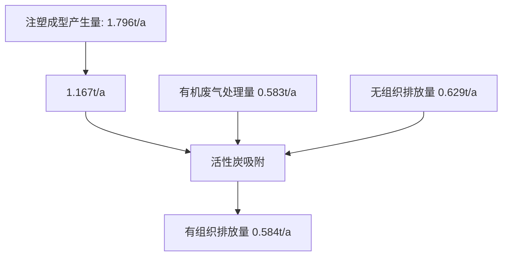
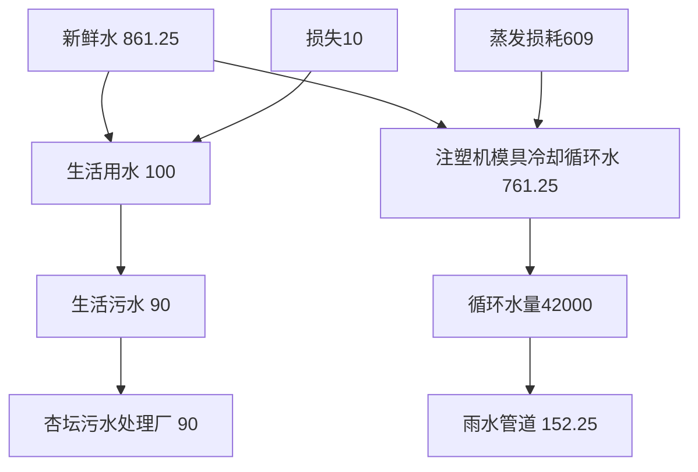
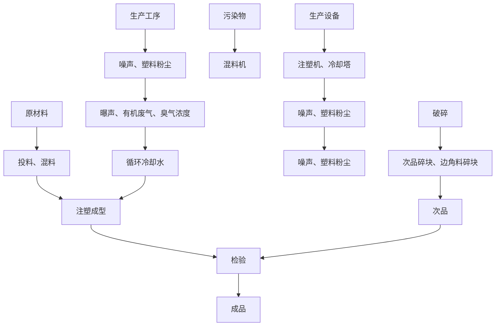
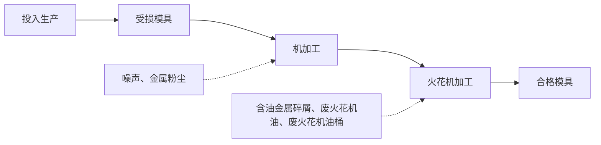
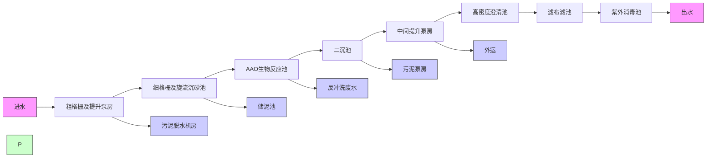
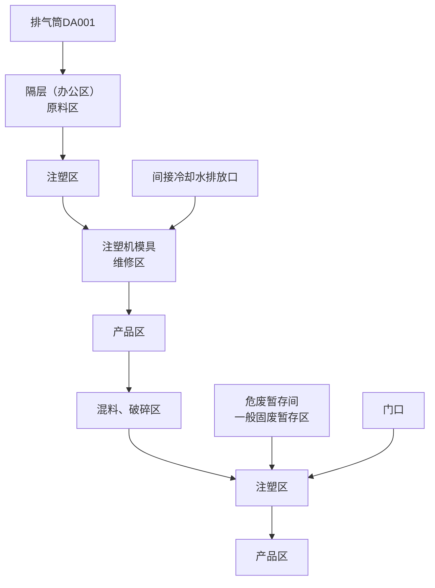

# 建设项目环境影响报告表

（污染影响类）

text_image

泰合创科技有限公司
成立日期
有限公司
2014年5月26日

项目名称：佛山市盛泰合创科技有限公司新建项目（重新报批）

建设单位（盖章）：佛山市盛泰合创科技有限公司

编制日期： 2026年4月

中华人民 部制

text_image

民共和国生态环境部
（一）生态环境科技有限公司
44000042002144

# 目 录

一、建设项目基本情况....  
二、建设项目工程分析.. .15  
三、区域环境质量现状、环境保护目标及评价标准. .30  
四、主要环境影响和保护措施. . 37  
五、环境保护措施监督检查清单. .. 66  
六、结论.. ..69

# 建设项目污染物排放量汇总表（单位：t/a）

附图 1 项目地理位置图

附图 2 项目四至图

附图 3 项目周边环境敏感点分布图

附图 4 项目四至实景图

附图 5 项目平面布置图

附图 6 顺德区环境空气质量功能区划分图

附图 7 顺德区水环境功能区划分图

附图 8 声环境功能区划分图

附图 9 顺德西部生态产业新区中小企业园片区控制性详细规划图

附图 10 顺德区产业集聚区和主题园区划定图

附图 11 顺德区环境管控单元图

附图 12 佛山市环境管控单元图

附图 13 陆域环境管控单元

附图 14 水环境城镇生活污染重点管控区

附图 15 大气环境高排放重点管控区

附图 16 高污染燃料禁燃区

附件 1 营业执照及核准变更登记通知书

附件 2 法定代表人身份证

附件 3 租赁合同

附件 4 不动产权证

附件 5 原环评批复

附件 6 环评文件同意公示声明

附件 7 环评咨询技术合同（含转账凭证）

# 一、建设项目基本情况

<table><tr><td>建设项目名称</td><td colspan="3">佛山市盛泰合创科技有限公司新建项目(重新报批)</td></tr><tr><td>项目代码</td><td colspan="3">无</td></tr><tr><td>建设单位联系人</td><td></td><td>联系方式</td><td></td></tr><tr><td>建设地点</td><td colspan="3">佛山市顺德区杏坛镇高赞村杏坛水乡大道628号顺德智富园23栋102单元</td></tr><tr><td>地理坐标</td><td colspan="3">东经113°11'32.977",北纬22°46'19.201"</td></tr><tr><td>国民经济行业类别</td><td>C2929塑料零件及其他塑料制品制造</td><td>建设项目行业类别</td><td>二十六、橡胶和塑料制品业29,53、塑料制品业292,其他(年用非溶剂型低VOCs含量涂料10吨以下的除外)。</td></tr><tr><td>建设性质</td><td>☑新建(迁建)□改建□扩建□技术改造</td><td>建设项目申报情形</td><td>☐首次申报项目☐不予批准后再次申报项目☐超五年重新审核项目☑重大变动重新报批项目</td></tr><tr><td>项目审批(核准/备案)部门(选填)</td><td>无</td><td>项目审批(核准/备案)文号(选填)</td><td>无</td></tr><tr><td>总投资(万元)</td><td>100</td><td>环保投资(万元)</td><td>10</td></tr><tr><td>环保投资占比(%)</td><td>10</td><td>施工工期</td><td>/</td></tr><tr><td>是否开工建设</td><td>☑否☐是: _</td><td>用地(用海)面积(m2)</td><td>870</td></tr><tr><td>专项评价设置情况</td><td colspan="3">无</td></tr><tr><td>规划情况</td><td colspan="3">无</td></tr><tr><td>规划环境影响评价情况</td><td colspan="3">无</td></tr><tr><td>规划及规划环境影响评价符合性分析</td><td colspan="3">无</td></tr><tr><td>其他符合性分析</td><td colspan="3">1.选址合理性分析(1)用地性质本项目位于佛山市顺德区杏坛镇高赞村杏坛水乡大道628号顺德智富园23栋102单元,根据本项目的不动产权证:粤(2020)佛顺不动产权第0109811号(详见附件4),本项目用地属于工业用地。根据《顺德西部生态产业新区中小企业园片区控制性详细规划(局部调整)》(详见附图9)可知,本项目用地属于工业用地。根据《顺德区高质量推动村级工业园升级改造总体规划—产业集聚区和主题园区划定图》,详情见附图10,本项目位于顺德(杏坛)新材料和智慧家居产业园。本项目用地性质为工业用地,不涉及农业空间、生态空间、生态保护红线、永久基本农田保护红线,项目与《佛山市顺德区国土空间总体规划(2021—2035年)》相符合。综上,项目所在地属于工业用地,本项目未改变用地性质,用地符合当地规划。(2)与《广东省人民政府办关于印发广东省“节地提质”攻坚行动方案(2023-2025年)的通知》(粤办函[2023]57号)相符性分析根据《广东省人民政府办关于印发广东省“节地提质”攻坚行动方案(2023-2025年)的通知》要求:1、坚持分类管理,提高配置效率,提升亩均效益。区域评估是实施“标准地”供应的基础性工作,各地要在2023年底前完成行政区域内园区(不含第三类产业园)的区域评估,形成包括压覆重要矿产资源、环境影响、节能、地质灾害危险性、地震安全性、气候可行性、洪水影响、水资源论证、水土保持、文物考古调查勘探、雷电灾害等事项的区域评估结果,按要求报相关主管部门备案,并供拟进驻的项目共享使用。各地要根据区域评估结果,完善行政区域内园区(不含第三类产业园)的准入要求,于2024年底前向社会公布。在符合国土空间规划的前提下,新建工业项目和经批准实施异地搬迁的工业项目,除因安全生产、工艺技术等特殊要求外,应一律安排进入开发区(产业园区)生产建设。本项目属于重新报批的新建项目,位于佛山市顺德区杏坛镇高赞村杏坛水乡大道628号顺德智富园23栋102单元,用地性质为工业用地。对照《佛山市生态环境局顺德分局关于环评技术评估审查项目与“节地提质”攻坚行动方案相符性意见的函》及其附件《产业集聚区和主题园区划定图》(详情见附图</td></tr></table>

10），本项目位于顺德(杏坛)新材料和智慧家居产业园，选址与《广东省人民政府办公厅关于印发广东省“节地提质”攻坚行动方案（2023-2025年）的通知》（粤办函〔2023〕57号）要求相符合。

综上，项目所在地属于工业用地，本项目未改变用地性质，用地符合当地规划。

# 2.产业政策相符性分析

本项目主要从事家电塑料配件的生产，项目生产产品、生产工艺和生产设备均不属于《产业结构调整指导目录（2024年本）》中的限制或禁止类别，也不属于国家发展改革委 商务部 市场监管总局关于印发《市场准入负面清单(2025年版)》的通知(发改体改规〔2025〕466号)“禁止准入类”。

# 3.相关生态环境保护法律法规政策、生态环境保护规划的相符性

# （1）项目与《环境保护综合名录》（2021年版）相符性分析

项目不涉及《环境保护综合名录（2021 年版）》中的“高污染、高环境风险”产品名录中的产品，符合《环境保护综合名录》（2021年版）的相关规定。

# （2）与“三线一单”符合性分析

根据《广东省人民政府关于印发广东省“三线一单”生态环境分区管控方案的通知》（粤府〔2020〕71 号），详情见附图 13\~16。项目符合广东省的“三线一单”生态环境分区管控方案要求。

根据《佛山市生态环境局关于印发佛山市“三线一单”生态环境分区管控方案（2024年版）的通知》（佛府〔2024〕20号），项目位于顺德高新技术产业开发区（管控单元编码：ZH44060620011），项目与管控要求相符性分析如下：

表1-1 项目与佛山市“三线一单”要求相符性分析

<table><tr><td>管控维度</td><td>顺德高新技术产业开发区(ZH4 4060620011)管控要求</td><td>项目情况</td><td>相符性</td></tr><tr><td>生态保护红线</td><td>全市陆域生态保护红线面积323.06平方公里,占全市陆域国土面积的8.51%;一般生态空间面积217.36平方公里,占全市陆域国土面积的5.73%。</td><td>项目所在地属于顺德高新技术产业开发区重点管控单元(ZH44060620011)范围,不属于优先保护单元及一般管控单元,因此本项目不涉及生态保护红线。</td><td>符合</td></tr><tr><td>环境质量底线</td><td>地表水环境质量持续改善,乡镇级及以上集中式饮用水水源地水质100%达标,国考、省考断面地表水质量达到或优于III类</td><td>项目区域声环境、地表水环境均能满足相应的标准要求,属于达标区,区域大气环境质量属于</td><td>符合</td></tr></table>

<table><tr><td rowspan="5"></td><td colspan="2"></td><td>水体比例不低于85.7%,劣V类水体比例为0%,市考断面基本消除劣V类断面;全面消除黑臭水体。空气质量持续改善,细颗粒物( $PM_{2.5}$ )年均浓度、空气质量优良天数比例(AQI)主要指标达到省下达的目标要求,臭氧污染得到遏制。土壤环境质量总体保持稳定,土壤环境风险得到管控,受污染耕地安全利用率不低于93%,重点建设用地安全利用得到有效保障。地下水国控区域点位V类水比例完成省下达任务,地下水饮用水源点位和污染风险监控点位水质总体保持稳定。</td><td>不达标区;项目生活污水经三级化粪预处理达标后排放到杏坛污水处理厂,项目间接冷却水循环使用,定期排入雨水管道,对周围水环境影响不大。项目危废暂存间基础建设必须按相关要求防渗,固体废物得到妥善处理。综上所述,本项目对区域内环境影响较小,质量可保持现有水平。</td><td></td></tr><tr><td colspan="2">资源利用上线</td><td>强化节约集约循环利用,持续提升资源能源利用效率。到2025年,全市用水总量控制在23.44亿立方米以内,万元地区生产总值用水量和万元工业增加值用水量较2020年降幅不低于17%,农田灌溉水有效利用系数不低于0.55。土地资源、岸线资源、能源消耗等达到或优于国家和省下达的总量、强度等目标要求,按省规定年限实现碳达峰,其中耕地保有量达到185.75平方公里,永久基本农田面积稳定保持164.42平方公里,单位GDP能耗降低比例达到14.5%。</td><td>本项目不属于高耗能、高污染型企业,项目的水、电、土地资源等资源利用不会突破区域上线。</td><td>符合</td></tr><tr><td colspan="2">区域布局管控要求</td><td>严格落实国家产品VOCs含量限值标准要求,除现阶段确无法实施替代的工序外,禁止新建生产和使用高VOCs含量原辅材料项目,鼓励建设共性工厂、活性炭集中再生中心等挥发性有机物第三方治理项目,推动挥发性有机物集中高效处理。</td><td>本项目属于C2929塑料零件及其他塑料制品制造,项目使用的塑料粒是固态的有机聚合物材料,常温下不挥发产生有机废气,且不属于禁止使用的高VOCs含量原辅材料。</td><td>符合</td></tr><tr><td rowspan="2">环境管控单元准入</td><td rowspan="2">空间布局约束</td><td>1-1【产业/鼓励引导类】园区重点发展金属表面处理及热处理加工、家用电器具制造、装备制造等产业。</td><td>本项目不涉及</td><td>符合</td></tr><tr><td>1-2.【产业/禁止类】新入园项目不得引入专业电镀、印染等污染物排放量大或排放一类水污染物、持久性有机污染物的项目,不得引进园区规划环评及批复(审查意见)禁止引进项目。</td><td>本项目属于C2929塑料零件及其他塑料制品制造,不属于专业电镀、印染产业禁止类项目。</td><td>符合</td></tr><tr><td rowspan="7"></td><td rowspan="7">清单</td><td rowspan="7"></td><td></td><td></td><td></td></tr><tr><td>1-3.【产业/禁止类】严格生产空间和生活空间管控,工业企业原则上禁止选址生活空间,生产空间原则上禁止建设居民住宅等敏感建筑。</td><td>项目所在厂房楼栋均为生产所用,不建设居民住宅等用途建筑。</td><td>符合</td></tr><tr><td>1-4.【产业/综合类】园区工业用地或企业与村庄、学校等环境敏感点之间的区域应合理设置控制开发区域(产业控制带),产业控制带内优先引进无污染的生产性服务业,或可适当布置废气排放量小、工业噪声影响小的产业。</td><td>项目所在位置100m内无村庄、学校等环境敏感点。</td><td>符合</td></tr><tr><td>1-5.【产业/限制类】严格限制不符合园区发展定位的项目入驻。</td><td>本项目主要从事家电塑料配件的加工生产,主要生产工艺为注塑,符合园区发展定位。</td><td>符合</td></tr><tr><td>1-6.【产业/限制类】受纳水体或监控断面不达标且未“以新带老”制定区域达标方案的河涌,不得新建、扩建向河涌直接排放废水的项目。新建、扩建含蚀刻工序的线路板生产项目和化工项目应在配套污水集中处置的工业园区或生活污水管网覆盖区域内建设;纯加工型印花项目,含酸洗、磷化的金属表面处理、金属制品项目(与自身高新技术企业配套的和区级及以上重点项目除外),含酸洗、喷涂、化学抛光、电解等涉及废水排放工艺的不锈钢型材加工项目(与自身高新技术企业配套的和区级及以上重点项目除外),应进入以此类项目为主导产业、有相应废水集中治理设施的工业园区,实现集中治污。</td><td>本项目间接冷却水循环使用,定期排入雨水管道。项目生活污水经三级化粪池预处理后再通过市政污水管网引入杏坛污水处理厂处理。且纳污水体水质达标。项目为C2929塑料零件及其他塑料制品制造,不涉及酸洗、磷化等工艺,不属于产业限制类项目。</td><td>符合</td></tr><tr><td>1-7.【产业/综合类】系统推进村级工业园升级改造,腾出连片空间,布局产业集聚区和主题产业园,推动工业项目入园集聚发展。</td><td>项目选址位于产业集聚区。</td><td>符合</td></tr><tr><td>1.8.【产业/综合类】划定家具生产优先发展区域,优先发展区外不再新建涉及涂装工艺的木质家具制造项目。优先发展区范围根据家具产业发展规划及其规划环评文件确定。</td><td>本项目不属于涂装工艺的木质家具制造。</td><td>符合</td></tr><tr><td rowspan="8"></td><td rowspan="7"></td><td rowspan="4">能源资源利用</td><td>2-1.【能源/综合类】科学实施能源消费总量和强度“双控”,新建高能耗项目单位产品(产值)能耗达到国际国内先进水平。</td><td rowspan="2">项目不属于高耗水项目,主要用水为生活用水和生产用水,项目间接冷却水循环使用,定期排入雨水管道。</td><td>符合</td></tr><tr><td>2-2.【水资源/综合类】提高园区水资源利用效率,提升污水回用比例。</td><td>符合</td></tr><tr><td>2-3.【土地资源/综合类】落实单位土地面积投资强度、土地利用强度等建设用地控制性指标要求,提高土地利用效率。</td><td>本项目租赁已建成工业厂房,不新增用地。</td><td>符合</td></tr><tr><td>2-4.【其他/综合类】有行业清洁生产标准的新引进项目清洁生产水平须达到本行业国际先进水平。</td><td>本项目用水量较少,符合要求。</td><td>符合</td></tr><tr><td rowspan="2">污染物排放管控</td><td>3-1.【其他/综合类】园区各项污染物排放总量不得突破规划环评核定的污染物排放总量管控要求。</td><td>本项目挥发性有机物排放量较少,由生态环境主管部门出具VOCs总量指标来源及替代削减方案的意见。</td><td>符合</td></tr><tr><td>3-2.【水/综合类】完善污水管网建设,有条件的区域实施雨污分流改造。</td><td>项目所在园区已接入市政污水管网,实施雨污分流。</td><td>符合</td></tr><tr><td>环境风险防控</td><td>4-1.【风险/综合类】园区应建立企业、园区、区域三级环境风险防控体系,加强园区及入园企业环境应急设施整合共享,建立有效的拦截、降污、导流、暂存等工程措施,防止泄漏物、消防废水等进入园区外环境。建立园区环境应急监测机制,强化园区风险防控。</td><td>项目运营后日常加强环境风险分级分类管理,并与园区实现联动。</td><td>符合</td></tr><tr><td colspan="5">综上,项目与《佛山市“三线一单”生态环境分区管控方案(2024年版)》(佛环〔2024〕20号)相符。根据《佛山市顺德区人民政府关于印发佛山市顺德区“三线一单”生态环境分区管控方案的通知》(顺府发〔2021〕11号),项目位于顺德高新技术产业开发区(管控单元编码:ZH44060620011),详情见附图11。项目与管控要求相符性分析如下:表1-2 项目与佛山市顺德区“三线一单”相符性分析一览表</td></tr><tr><td rowspan="5"></td><td>管控维度</td><td>顺德高新技术产业开发区(ZH44060620011)管控要求</td><td>项目情况</td><td colspan="2">相符性</td></tr><tr><td>生态保护红线</td><td>全区生态保护红线面积27.71平方公里,占全区国土面积的3.44%;一般生态空间面积30.62平方公里,占全区国土面积的3.8%。</td><td>项目所在地属于顺德高新技术产业开发区重点管控单元(ZH44060620011)范围,不属于优先保护单元及一般管控单元,因此本项目不涉及生态保护红线。</td><td colspan="2">符合</td></tr><tr><td>环境质量底线</td><td>水环境质量持续改善,国控、省控、水功能区断面达到国家、省和市下达的水质目标要求;乡镇级及以上集中式饮用水水源地水质稳定达标。空气质量持续改善,细颗粒物(PM2.5)年均浓度、空气质量优良天数比例(AQI)主要指标达到省、市下达的目标要求,臭氧污染得到有效遏制。土壤环境质量稳中向好,土壤环境风险得到管控。</td><td>项目区域声环境、地表水环境均能满足相应的标准要求,属于达标区,区域大气环境质量属于不达标区;项目生活污水经三级化粪预处理达标后排放到杏坛污水处理厂,项目间接冷却水循环使用,定期排入雨水管道,对周围水环境影响不大。项目危废暂存间基础建设必须按相关要求防渗,固体废物得到妥善处理。综上所述,本项目对区域内环境影响较小,质量可保持现有水平。</td><td colspan="2">符合</td></tr><tr><td>资源利用上线</td><td>强化节约集约利用,持续提升资源能源利用效率,水资源、土地资源、岸线资源、能源消耗等达到或优于省和市下达的总量、强度等目标要求,按省、市规定年限实现碳达峰。</td><td>本项目不属于高耗能、高污染型企业,项目的水、电等资源利用不会突破区域上线。</td><td colspan="2">符合</td></tr><tr><td>环境准入负面清单</td><td>《产业结构调整指导目录(2019年本)》及2021年修改单、《关于印发&lt;市场准入负面清单(2022年版)的通知&gt;》(发经体改规[2022]397号)、《广东省禁止、限制生产、销售和使用的塑料制品目录》(2020年版)(粤发改资环函[2020]1747号)及《环境保护综合名录》(2021年版)等</td><td>项目不属于《产业结构调整指导目录(2024年本)》中的鼓励、限制和禁止(淘汰)类项目;属于《促进产业结构调整暂行规定》第十三条允许建设项目。项目不在市场准入负面清单中禁止和许可两类项目范围内。项目生产的塑料制品不在广东省禁止、限制生产、销售和使用的塑料制品目录内,也不属于《环境保护综合名录》(2021年版)的“高</td><td colspan="2">符合</td></tr><tr><td rowspan="7"></td><td></td><td colspan="2"></td><td>污染、高环境风险”项目。</td><td></td></tr><tr><td rowspan="6">环境管控单元准入清单</td><td rowspan="6">区域布局管控</td><td>1-1.【产业/鼓励引导类】园区重点发展家用电器具制造、装备制造等产业。</td><td>项目属于C2929塑料零件及其他塑料制品制造,主要从事家电塑料配件的加工生产。</td><td>符合</td></tr><tr><td>1-2.【产业/禁止类】新入园项目不得引入专业电镀、印染等污染物排放量大或排放一类水污染物、持久性有机污染物的项目,不得引进园区规划环评及批复(审查意见)禁止引进项目。</td><td>本项目属于C2929塑料零件及其他塑料制品制造,不属于产业禁止类项目。</td><td>符合</td></tr><tr><td>1-3.【产业/禁止类】严格生产空间和生活空间管控,工业企业原则上禁止选址生活空间,生产空间原则上禁止建设居民住宅等敏感建筑。</td><td>项目所在厂房楼栋均为生产所用,不建设居民住宅等用途建筑。</td><td>符合</td></tr><tr><td>1-4.【产业/综合类】园区工业用地或企业与村庄、学校等环境敏感点之间的区域应合理设置控制开发区域(产业控制带),产业控制带内优先引进无污染的生产性服务业,或可适当布置废气排放量小、工业噪声影响小的产业。</td><td>项目所在位置100m内无村庄、学校等环境敏感点。</td><td>符合</td></tr><tr><td>1-5.【产业/限制类】严格限制不符合园区发展定位的项目入驻。</td><td>项目符合园区发展定位。</td><td>符合</td></tr><tr><td>1-6.【产业/限制类】受纳水体或监控断面不达标的,不得新建、扩建向河涌直接排放废水的项目。新建、扩建含蚀刻工序的线路板生产项目和化工项目应在配套污水集中处置的工业园区或生活污水管网覆盖区域内建设;纯加工型印花项目,含酸洗、磷化的金属表面处理、金属制品项目(与自身高新技术企业配套的除外),含酸洗、喷涂、化学抛光、电解等涉及废水排放工艺的不锈钢型材加工项目(与自身高新技术企业配套的除外),应进入以此类项目为主导产业、有相应废水集中治理设施的工业园区,实现集中治污。</td><td>项目间接冷却水循环使用,定期排入雨水管道。项目生活污水经三级化粪池预处理后再通过市政污水管网引入杏坛污水处理厂处理,且纳污水体水质达标。项目为C2929塑料零件及其他塑料制品制造,不涉及酸洗、磷化等工艺,不属于产业限制类项目。</td><td>符合</td></tr><tr><td rowspan="9"></td><td rowspan="9"></td><td rowspan="2"></td><td>1-7.【产业/综合类】划定家具生产优先发展区域,优先发展区外不再新建涉及涂装工艺的木质家具制造项目。</td><td>项目不属于木质家具制造项目。</td><td>符合</td></tr><tr><td>1-8.【大气/限制类】系统推进村级工业园升级改造,腾出连片空间,布局产业集聚区和主题产业园,推动工业项目入园集聚发展。新增工业制造业用地原则上安排在产业集聚区内,产业集聚区外原则上不鼓励工业及物流仓储用地的新建与改造。</td><td>项目所在区域为工业聚集区。</td><td>符合</td></tr><tr><td rowspan="4">能源资源利用</td><td>2-1.【能源/综合类】科学实施能源消费总量和强度“双控”,新建高能耗项目单位产品(产值)能耗达到国际国内先进水平。</td><td rowspan="2">项目不属于高耗水项目,主要用水为生活用水和生产用水,项目间接冷却水循环使用,定期排入雨水管道。</td><td>符合</td></tr><tr><td>2-2.【水资源/综合类】提高园区水资源利用效率,提升污水回用比例。</td><td>符合</td></tr><tr><td>2-3.【土地资源/综合类】落实单位土地面积投资强度、土地利用强度等建设用地控制性指标要求,提高土地利用效率。</td><td>本项目租用已建成工业厂房,不新增用地。</td><td>符合</td></tr><tr><td>2-4.【其他/综合类】有行业清洁生产标准的新引进项目清洁生产水平须达到本行业国际先进水平。</td><td>本项目不涉及相关落后水平工艺、产品等。</td><td>符合</td></tr><tr><td rowspan="2">污染物排放管控</td><td>3-1.【其他/综合类】园区各项污染物排放总量不得突破规划环评核定的污染物排放总量管控要求。</td><td>本项目挥发性有机物排放量较少,由生态环境主管部门出具VOCs总量指标来源及替代削减方案的意见。</td><td>符合</td></tr><tr><td>3-2.【水/综合类】完善污水管网建设,有条件的区域实施雨污分流改造。</td><td>项目所在园区已接入市政污水管网,实施雨污分流。</td><td>符合</td></tr><tr><td>环境风险防控</td><td>4-1.【风险/综合类】园区应建立企业、园区、区域三级环境风险防控体系,加强园区及入园企业环境应急设施整合共享,建立有效的拦截、降污、导流、暂存等工程措施,防止泄漏物、消防废水等进入园区外环境。建立园区环境应急监测机制,强化园区风险防控。</td><td>项目运营后日常加强环境风险分级分类管理,并与园区实现联动。</td><td>符合</td></tr><tr><td rowspan="7"></td><td colspan="5">4.项目挥发性有机物污染物治理政策的相符性分析本项目与挥发性有机污染物治理政策的相符性分析详见下表:表1-3 项目与有机污染物治理政策的相符性</td></tr><tr><td>序号</td><td colspan="2">政策要求</td><td>工程内容</td><td>符合性</td></tr><tr><td colspan="5">1.《广东省涉挥发性有机物(VOCs)重点行业治理指引》的通知(粤环办[2021]43号)——橡胶和塑料制品业VOCs治理指引</td></tr><tr><td>1.1</td><td colspan="2">废气收集系统的输送管道应密闭。废气收集系统应在负压下运行,若处于正压状态,应对管道组件的密封点进行泄漏检测,泄漏检测值不应超过500μmol/mol,亦不应有感官可察觉泄漏。</td><td>项目废气收集系统在负压下运行。</td><td>符合</td></tr><tr><td>1.2</td><td colspan="2">VOCs治理设施应与生产工艺设备同步运行,VOCs治理设施发生故障或检修时,对应的生产工艺设备应停止运行,待检修完毕后同步投入使用;生产工艺设备不能停止运行或不能及时停止运行的,应设置废气应急处理设施或采取其他替代措施。</td><td>项目生产必须开启风机,有效减少无组织排放废气。废气收集处理系统发生故障或检修时,所有产生废气的工序停止运行,待检修完毕后再投入生产。</td><td>符合</td></tr><tr><td rowspan="2">1.3</td><td rowspan="2">工艺过程</td><td>粉状、粒状VOCs物料采用气力输送方式或采用密闭固体投料器等给料方式密闭投加;无法密闭投加的,在密闭空间内操作,或进行局部气体收集,废气排至除尘设施、VOCs废气收集处理系统。</td><td>项目使用的塑料粒和色母均为固态,常温条件下不会产生有机废气。在转移过程中均使用密闭的包装袋封装。</td><td rowspan="2">符合</td></tr><tr><td>在混合/混炼、塑炼/塑化/熔化、加工成型(挤出、注射、压制、压延、发泡、纺丝等)、硫化等作业中应采用密闭设备或在密闭空间中操作,废气应排至VOCs废气收集处理系统;无法密闭的,应采取局部气体收集措施,废气应排至VOCs废气收集处理系统。</td><td>由于项目车间内设置行吊用于输送物料,因此注塑成型工序废气无法设置为整室密闭负压收集。项目注塑工序废气经半密闭集气罩收集至1套“活性炭吸附”装置处理后再通过排气筒DA001高空排放。</td></tr><tr><td rowspan="7"></td><td>1.4</td><td>排放水平</td><td>塑料制品行业:a)有机废气排气筒排放浓度不高于广东省《大气污染物排放限值》(DB4427-2001)第II时段排放限值,合成革和人造革制造企业排放浓度不高于《合成革与人造革工业污染物排放标准》(GB21902-2008)排放限值,若国家和我省出台并实施适用于塑料制品制造业的大气污染物排放标准,则有机废气排气筒排放浓度不高于相应的排放限值;车间或生产设施排气中NMHC初始排放速率≥3kg/h时,建设VOCs处理设施且处理效率≥80%;b)厂区内无组织排放监控点NMHC的小时平均浓度值不超过6mg/m3任意一次浓度值不超过20mg/m3。</td><td>a、本项目非甲烷总烃有组织排放执行《合成树脂工业污染物排放限值》(GB31572-2015,含2024年修改单)表5大气污染物特别排放限值(非甲烷总烃≤60mg/m3)不高于广东省《大气污染物排放限值》(DB4427-2001)第II时段排放限值(非甲烷总烃≤120mg/m3);本项目非甲烷总烃的最大产生速率小于3kg/h。b、项目厂区内有机废气排放可达到《固定污染源挥发性有机物综合排放标准》(DB44/2367-2022)表3厂区内VOCs无组织排放限值规定。</td><td>符合</td></tr><tr><td>1.5</td><td rowspan="2">管理台账</td><td>建立废气收集处理设施台账,记录废气处理设施进出口的监测数据(废气量、浓度、温度、含氧量等)、废气收集与处理设施关键参数、废气处理设施相关耗材(吸收剂、吸附剂、催化剂等)购买和处理记录。</td><td>企业拟建立废气收集处理设施台账,根据《排污单位自行监测技术指南橡胶和塑料制品》(HJ1207-2021)等相关要求定期自行监测,并且记录相关监测数据和废气处理设施中活性炭的购买量和处理记录。</td><td>符合</td></tr><tr><td>1.6</td><td>建立危废台账,整理危废处置合同、转移联单及危废处理方式资质佐证材料。</td><td>企业拟建立危险废物台账,定期将危险废物交给有资质的单位处理,整理危废处理合同、转移联单等资料。</td><td>符合</td></tr><tr><td colspan="5">2.《固定污染源挥发性有机物综合排放标准》(DB44/2367-2022)</td></tr><tr><td>2.1</td><td colspan="2">VOCs物料储存无组织排放控制要求</td><td rowspan="3">项目含VOCs物料主要为塑料粒,常温下不挥发,储存在仓库内;工艺生产过程产生的有机废气采用半密闭集气罩收集至1套“活性炭吸附”装置处理后再通过排气筒DA001高空排放。</td><td>符合</td></tr><tr><td>2.2</td><td colspan="2">VOCs物料转移和输送无组织排放控制要求</td><td>符合</td></tr><tr><td>2.3</td><td colspan="2">工艺过程VOCs无组织排放控制要求</td><td>符合</td></tr></table>

<table><tr><td rowspan="8"></td><td colspan="4">3.关于印发《重点行业挥发性有机物综合治理方案》的通知(环大气[2019]53号)</td></tr><tr><td>3.1</td><td>通过使用水性、粉末、高固体分、无溶剂、辐射固化等低VOCs含量的涂料,水性、辐射固化、植物等低VOCs含量的油墨,水基、热熔、无溶剂、辐射固化、改性、生物降解等低VOCs含量的胶粘剂,以及低VOCs含量、低反应活性的清洗剂等,替代溶剂型涂料、油墨、胶粘剂、清洗剂等,从源头减少VOCs产生。</td><td>本项目使用的原材料无自然状态下可挥发性的物料,满足相关标准要求。</td><td>符合</td></tr><tr><td>3.2</td><td>重点对含VOCs物料(包括含VOCs原辅材料、含VOCs产品、含VOCs废料以及有机聚合物材料等)储存、转移和输送、设备与管线组件泄漏、敞开液面逸散以及工艺过程等五类排放源实施管控,通过采取设备与场所密闭、工艺改进、废气有效收集等措施,削减VOCs无组织排放。</td><td>项目注塑成型工序废气经半密闭集气罩收集至1套“活性炭吸附”装置处理后再通过排气筒DA001高空排放。</td><td>符合</td></tr><tr><td>3.3</td><td>提高废气收集率,遵循“应收尽收、分质收集”的原则,科学设计废气收集系统,将无组织排放转变为有组织排放进行控制。采用全密闭集气罩或密闭空间的,除行业有特殊要求外,应保持微负压状态,并根据相关规范合理设置通风量。采用局部集气罩的,距集气罩开口面最远处的VOCs无组织排放位置,控制风速应不低于0.3米/秒,有行业要求的按相关规定执行。</td><td>项目注塑成型工序废气经半密闭集气罩收集至1套“活性炭吸附”装置处理后再通过排气筒DA001高空排放。</td><td>符合</td></tr><tr><td colspan="4">4.顺德区生态环境保护委员会办公室关于印发《顺德区重点行业挥发性有机物总量指标管理工作方案(2024年修订)》(顺环委办〔2024〕3号)</td></tr><tr><td>4.1</td><td>总量替代原则。根据区域现状、改善目标、减排空间,全区建设项目新增VOCs排放量施行“减二增一”政策。其中,有组织排放和无组织排放均纳入新增指标管理;非甲烷总烃合并计入VOCs管理。</td><td>项目VOCs排放总量指标由顺德环境主管部门出具VOCs总量指标来源及替代削减方案的意见。</td><td>符合</td></tr><tr><td colspan="4">5.佛山市发展和改革局 佛山市生态环境局关于印发《佛山市关于进一步加强塑料污染治理的实施方案》的通知(2020-年11月09日发布)</td></tr><tr><td>5.1</td><td>全市范围内禁止生产和销售厚度小于0.025毫米的超薄塑料购物袋、厚度小于0.01毫米的聚乙烯农用地膜。禁止以医疗废物为原料制造塑料制品;禁止将回收利用的废塑料输液袋(瓶)用于原用途或用于制造餐饮容器以及玩具等儿童用品。加大禁止“洋垃圾”进口监管和打私力度,确保“全面禁止废塑料进口”落实到位。到2020年底,禁止生产和销售一次性发泡塑料餐具、一次性塑料棉签;禁止生产含塑料微珠的日化产品。到2022年底,禁止销售含塑料微珠的日化产品。《产业结构调整指导目录(2024年本)》和《市场准入负面清单》明确的属于淘汰类的塑料制品项目,禁止投资;属于限制类项目,禁止新建。</td><td>本项目产品为家电塑料配件,生产工艺主要为注塑成型,不涉及发泡工序。项目产品不属于禁止生产项目及限制类项目。</td><td>符合</td></tr><tr><td rowspan="5"></td><td colspan="4">6、《广东省塑料制品与制造业挥发性有机物综合整治技术指南》</td></tr><tr><td>6.1</td><td>粉状、粒状VOCs物料投加,宜采用气力输送方式或采用密闭固体投料器等给料方式密闭投加。</td><td>本项目塑料投料采用气力输送方式密闭投加。</td><td>符合</td></tr><tr><td>6.2</td><td>若采用活性炭吸附技术,采用颗粒活性炭作为吸附剂时,其碘值不宜低于800mg/g;采用蜂窝活性炭作为吸附剂时,其碘值不宜低650mg/g;采用活性炭纤维作为吸附剂时,其比表面积不低于 $1100m^{2}/g$ (BET法)。工作温度和湿度应符合:温度T&lt;40°C、湿度RH&lt;60%;活性炭表面不应有积尘和积水;活性炭吸附箱是否足额装填活性炭(1吨活性炭通常只能吸附0.1~0.2吨VOCs。</td><td>本项目采用碘值不宜低于800mg/g的颗粒状活性炭对有机废气进行吸附处理,能满足1吨活性炭最少吸附0.15吨有机废气。</td><td>符合</td></tr><tr><td colspan="4">7.佛山市顺德区人民政府办公室关于印发《佛山市顺德区生态环境保护“十四五”规划(2021-2025)》的通知</td></tr><tr><td>7.1</td><td>持续推进重点行业VOCs整治。持续开展挥发性有机物专项整治,继续推进重点行业企业开展销号式综合整治,建立VOC重点监管企业名单并动态更新,督促企业建立VOCs管控台账清单;持续探寻高效节能的VOCs治理技术,对采用低温等离子、光氧化、光催化等低效治理工艺的企业在臭氧污染天气应对期间实施停限产或错峰生产,并推动企业逐步淘汰低效治理工艺。</td><td>本项目VOCs采用“活性炭吸附”装置治理。</td><td>符合</td></tr><tr><td rowspan="2"></td><td>7.2</td><td>加强VOCs源头替代和无组织排放管控。大力推进低VOCs含量、低反应活性的原辅材料替代,将全面使用低VOCs含量原辅材料的企业纳入正面清单和政府绿色采购清单。鼓励重点行业企业开展生产工艺和设备水性化改造,推广使用水性、高固体分、无溶剂、粉末等低VOCs含量涂料。严格落实《挥发性有机物无组织排放控制标准》,开展厂区内无组织排放浓度监测,加强对含VOCs物料储存、转移和运输、设备与管线组件泄漏、敞开页面逸散以及工艺过程等五类排放源的管控。</td><td>本项目不生产和使用高挥发性有机物原辅材料。</td><td>符合</td></tr><tr><td colspan="4">综上分析,项目总体符合相关挥发性有机废气文件要求。</td></tr></table>

# 二、建设项目工程分析

<table><tr><td rowspan="4">建设内容</td><td colspan="5">1.项目概况佛山市盛泰合创科技有限公司原厂址位于广东省佛山市顺德区容桂街道穗香村培龙路8号2栋1楼B区,2025年3月佛山市盛泰合创科技有限公司委托编写了《佛山市盛泰合创科技有限公司建设项目环境影响报告表》,并于2025年9月11日取得《佛山市生态环境局关于佛山市盛泰合创科技有限公司建设项目环境影响报告表的批复》(批复文号:佛环0302环审[2025]第40号),详见附件5。原有项目总投资80万元,主要从事家电塑料配件的加工生产,审批规模为:年产家电塑料配件528t/a。该项目主体工程未建设。由于经营发展需要,企业重新选址,由原审批的地址“广东省佛山市顺德区容桂街道穗香村培龙路8号2栋1楼B区”搬迁至“佛山市顺德区杏坛镇高赞村杏坛水乡大道628号顺德智富园23栋102单元(厂址中心卫星坐标:东经113°11'32.977",北纬22°46'19.201")”,并对生产规模进行调整。根据《污染影响类建设项目重大变动清单(试行)》(环办环评函[2020]688号),本项目重新选址,构成重大变动。根据《中华人民共和国环境影响评价法》(2018年12月29日,第十三届全国人民代表大会常务委员会第七次会议第二次修正):“第二十四条 建设项目的环境影响评价文件经批准后,建设项目的性质、规模、地点、采用的生产工艺或者防治污染、防止生态破坏的措施发生重大变动的,建设单位应当重新报批建设项目的环境影响评价文件”,故建设单位拟在“佛山市盛泰合创科技有限公司建设项目”环评审批基础上进行重新报批“佛山市盛泰合创科技有限公司新建项目(重新报批)”环境影响评价文件。佛山市盛泰合创科技有限公司新建项目(重新报批)(以下简称本项目)选址于佛山市顺德区杏坛镇高赞村杏坛水乡大道628号顺德智富园23栋102单元(厂址中心卫星坐标:东经113°11'32.977",北纬22°46'19.201"),项目占地面积870m2,建筑面积约为870m2,整栋厂房总高约46米。项目总投资100万元,其中拟用于污染防治资金10万元。项目主要从事家电塑料配件的加工生产,预计年产家电塑料配件665t/a。2.项目组成项目重新选址后,具体工程组成见下表:表2-1 项目建设组成一览表</td></tr><tr><td rowspan="2">类别</td><td rowspan="2">工程名称</td><td colspan="3">工程内容</td></tr><tr><td>原批复</td><td>重新报批</td><td>变化</td></tr><tr><td>主体工程</td><td>生产车间</td><td>选址于广东省佛山市顺德区容桂街道穗香村培龙路8</td><td>重新选址于佛山市顺德区杏坛镇高赞村杏坛水</td><td>项目重新选址,车间面积约870</td></tr><tr><td rowspan="9"></td><td></td><td></td><td>号2栋1楼B区。车间面积约 $1315m^{2}$ ,车间高约7.5米,主要功能包括:混料和破碎区(约 $60m^{2}$ )、注塑区(约 $250m^{2}$ )、模具维修区(约 $130m^{2}$ )、原料区(约 $120m^{2}$ )、产品区(约 $180m^{2}$ )、办公区(约 $50m^{2}$ )、一般固废暂存区(约 $6m^{2}$ )、危废暂存间(约 $6m^{2}$ )、车间通道等。</td><td>乡大道628号顺德智富园23栋102单元。车间面积约 $870m^{2}$ ,高约8.5米,主要功能包括:混料和破碎区(约 $50m^{2}$ )、注塑区(约 $220m^{2}$ )、模具维修区(约 $60m^{2}$ )、原料区(约 $100m^{2}$ )、产品区(约 $120m^{2}$ )、一般固废暂存区(约 $6m^{2}$ )、危废暂存间(约 $6m^{2}$ )、车间通道等。办公室位于车间夹层,约 $100m^{2}$ 。</td><td> $m^{2}$ ,高约8.5米,主要功能包括:混料和破碎区(约 $50m^{2}$ )、注塑区(约 $220m^{2}$ )、模具维修区(约 $60m^{2}$ )、原料区(约 $100m^{2}$ )、产品区(约 $120m^{2}$ )、一级固废暂存区(约 $6m^{2}$ )、危废暂存间(约 $6m^{2}$ )、车间通道等。办公室位于车间夹层,约 $100m^{2}$ 。</td></tr><tr><td>辅助工程</td><td>办公区</td><td>位于生产车间内,约 $50m^{2}$ 。</td><td>位于车间夹层,约 $100m^{2}$ 。</td><td>位于车间夹层,约 $100m^{2}$ 。</td></tr><tr><td rowspan="3">公共工程</td><td>供水</td><td>主要为生活用水和冷却用水,均由市政自来水公司提供。</td><td>主要为生活用水和冷却用水,均由市政自来水公司提供。</td><td>不变</td></tr><tr><td>排水</td><td>项目间接冷却水循环使用,定期排入雨水管道。项目生活污水经三级化粪池预处理后再通过市政污水管网引入容桂第一污水处理厂处理。</td><td>项目间接冷却水循环使用,定期排入雨水管道。项目生活污水经三级化粪池预处理后再通过市政污水管网引入杏坛污水处理厂处理。</td><td>生活污水经三级化粪池预处理后再通过市政污水管网引入杏坛污水处理厂处理。</td></tr><tr><td>供电</td><td>由当地变电所供电,不设有备用发电机。</td><td>由当地变电所供电,不设有备用发电机。</td><td>不变</td></tr><tr><td rowspan="4">环保工程</td><td rowspan="2">污水治理工程</td><td>间接冷却水:循环使用,定期排入雨水管道。</td><td>间接冷却水:循环使用,定期排入雨水管道。</td><td>不变</td></tr><tr><td>生活污水:生活污水经三级化粪池预处理后排入容桂第一污水处理厂。</td><td>生活污水:生活污水经三级化粪池预处理后再通过市政污水管网引入杏坛污水处理厂处理。</td><td>生活污水经三级化粪池预处理后再通过市政污水管网引入杏坛污水处理厂处理。</td></tr><tr><td rowspan="2">废气处理工程</td><td>注塑工序:经半密闭集气罩收集至一套“活性炭吸附”装置处理后再通过43m高排气筒DA001排放。</td><td>注塑工序:经半密闭集气罩收集至一套“活性炭吸附”装置处理后再通过50m高排气筒DA001排放。</td><td>注塑废气排放口位置位于新厂址,且排气筒高度约为50米。</td></tr><tr><td>投料和混料、破碎工序、机加工(注塑机模具维修):颗粒物经加强车间通风排气后以无组织形式排放。</td><td>投料和混料、破碎工序、机加工(注塑机模具维修):颗粒物经加强车间通风排气后以无组织形式排放。</td><td>不变</td></tr><tr><td rowspan="3"></td><td rowspan="3"></td><td>噪声治理工程</td><td>选用低噪声设备,设备基础减振、消声,厂房墙体隔声,合理布局。</td><td>选用低噪声设备,设备基础减振、消声,厂房墙体隔声,合理布局。</td><td>不变</td></tr><tr><td rowspan="2">固废处理工程</td><td>一般固废暂存于一般固废存放区,定期交资源回收公司回收处理。</td><td>一般固废暂存于一般固废存放区,定期交资源回收公司回收处理。</td><td>不变</td></tr><tr><td>危险废物暂存危废暂存间,定期交由持有相应危险废物处理资质的单位处理。</td><td>危险废物暂存危废暂存间,定期交由持有相应危险废物处理资质的单位处理。</td><td>不变</td></tr></table>

# 3.主要产品及产能

# （1）项目产品规模情况如下表所示：

表 2-2 项目产品产能一览表

<table><tr><td rowspan="2">产品名称</td><td colspan="3">年产量</td></tr><tr><td>原批复</td><td>重新报批</td><td>增减量</td></tr><tr><td>家电塑料配件</td><td>528 吨</td><td>665 吨</td><td>+137 吨</td></tr></table>

备注：因项目产品规格尺寸多种多样，本项目选取具有代表性、产量占比较多的产品类型进行核算。

表 2-3 本项目产品重量一览表

<table><tr><td>序号</td><td>产品名称</td><td>产品示例</td><td>单件产品重量(克)</td><td>年产量(万件/年)</td><td>产品总重量(吨/年)</td></tr><tr><td>1</td><td rowspan="2">家电塑料配件</td><td></td><td>80</td><td>450</td><td>360</td></tr><tr><td>2</td><td></td><td>200</td><td>65</td><td>130</td></tr><tr><td>3</td><td></td><td></td><td>500</td><td>35</td><td>175</td></tr><tr><td colspan="4">合计</td><td>550</td><td>665</td></tr><tr><td colspan="6">备注:项目主要从事家电塑料配件的生产,因项目产品规格多种多样,本项目选取具有代表性、产量占比较多的产品类型进行核算。</td></tr></table>

# 4.主要原辅材料

# （1）项目原辅材料表详见下表：

表 2-4 主要原辅材料一览表

<table><tr><td rowspan="2">序号</td><td rowspan="2">名称</td><td colspan="3">年用量</td><td rowspan="2">包装规格</td><td rowspan="2">最大储存量</td><td rowspan="2">备注</td></tr><tr><td>原批复</td><td>重新报批</td><td>增减量</td></tr><tr><td>1</td><td>ABS塑料</td><td>258t</td><td>320t</td><td>62t</td><td>25kg/袋,粒状,粒径约1~5mm。</td><td>5吨</td><td rowspan="5">外购新料,用于注塑成型工序</td></tr><tr><td>2</td><td>PBT塑料</td><td>126t</td><td>160t</td><td>34t</td><td>25kg/袋,粒状粒径约3~5mm。</td><td>3吨</td></tr><tr><td>3</td><td>PP塑料</td><td>120t</td><td>160t</td><td>40t</td><td>25kg/袋,粒状粒径约3~5mm。</td><td>3吨</td></tr><tr><td>4</td><td>POM塑料</td><td>25t</td><td>31.2t</td><td>6.2t</td><td>25kg/袋,粒状粒径约3~5mm。</td><td>2吨</td></tr><tr><td>5</td><td>色母</td><td>0.596t</td><td>0.892t</td><td>0.296t</td><td>10kg/袋,粒状,粒径约2.5~3mm。</td><td>0.2吨</td></tr><tr><td>6</td><td>模具</td><td>100套</td><td>100套</td><td>0</td><td>65kg/套</td><td>50套</td><td>用于注塑机模具</td></tr><tr><td>7</td><td>电火花机油</td><td>0.029t</td><td>0.029t</td><td>0</td><td>14.5kg/桶</td><td>0.029吨</td><td>用于注塑机模具维修</td></tr><tr><td>8</td><td>机油</td><td>0.17t</td><td>0.17t</td><td>0</td><td>170kg/桶</td><td>0.17吨</td><td rowspan="2">用于注塑机模具维修</td></tr><tr><td>9</td><td>液压油</td><td>0.09t</td><td>0.09t</td><td>0</td><td>15kg/桶</td><td>0.09吨</td></tr></table>

# （2）项目主要原辅材料理化性质详见下表：

表 2-5 原辅材料理化性质

<table><tr><td>序号</td><td>名称</td><td>理化性质</td></tr><tr><td>1</td><td>ABS塑料</td><td>ABS塑胶料是五大合成树脂之一,其抗冲击性、耐热性、耐低温性、耐化学药品性及电气性能优良,还具有易加工、制品尺寸稳定、表面光泽性好等特点,容易涂装、着色,还可以进行表面喷镀金属、电镀、焊接、热压和粘接等二次加工,广泛应用于机械、汽车、电子电器、仪器仪表、纺织和建筑等工业领域,是一种用途极广的热塑性工程塑料。ABS具有优良的综合物理和机械性能,较好的低温抗冲击性能,尺寸稳定性且电性能、耐磨性、抗化学药品性、染色性、成品加工和机械加工较好。ABS树脂耐水、无机盐、碱和酸类,不溶于大部分醇类和烃类溶剂,而容易溶于醛、酮、酯和某些氯代烃中。ABS树脂热变形温度低可燃,耐热性较差。其变热变形温度为85~100°C,成型温度为200~240°C,分解温度为250~270°C。</td></tr><tr><td>2</td><td>PBT塑料</td><td>PBT塑料是指聚对苯二甲酸丁二醇酯(Polybutylene terephthalate,简称PBT),它是一种热塑性聚酯。PBT是由对苯二甲酸与1,4-丁二醇缩聚而成的。耐机械强度高、耐疲劳性、尺寸稳定,其变热变形温度为130~150°C,成型温度为230~260°C,分解温度为280~300°C。</td></tr><tr><td>3</td><td>PP塑料</td><td>又名聚丙烯,是由丙烯聚合而制得的一种热塑性树脂。聚丙烯为白色、无臭、无味、无毒固体。相对密度为0.90-0.91,引燃温度为420°C,强度、刚度、硬度耐热性均优于低压聚乙烯,可在100°C左右使用。可燃,粉体与空气可形成爆炸性混合物,当达到一定浓度时,遇火星会发生爆炸,加热分解产生易燃气体。聚丙烯的化学稳定性很好,其变热变形温度为100~120°C,成型温度为200~260°C,分解温度为300~350°C。具有良好的介电性能和高频绝缘性且不受湿度影响,但低温时变脆,不耐磨、易老化。</td></tr><tr><td>4</td><td>POM塑料</td><td>是合成树脂材料中的一种,也叫聚甲醛树脂。属于白色或黑色塑料颗粒,分子结构规整与结晶性让物理机械性能非常优异,燃烧特性为容易燃烧,离火后继续燃烧,火焰上端呈黄色,下端呈蓝色,发生熔融滴落,有强烈的刺激性甲醛味、鱼腥臭。聚甲醛为白色粉末,一般不透明,着色性好,比重1.41-1.43g/cm3,成型收缩率1.2-3.0%,其变热变形温度为110~140°C,成型温度为205~215°C,分解温度为230~250°C。POM的长期耐热性能不高,但短期可达到160°C,其中均聚POM短期耐热比共聚POM高10°C以上,但长期耐热共聚POM反而比均聚POM高10°C左右。可在-40°C~100°C温度范围内长期使用。</td></tr><tr><td>5</td><td>色母</td><td>由树脂和颜料或染料配制成高浓度颜色的混合物。色母又名色种,是一种把超常量的颜料或染料均匀载附于树脂之中而制得的聚集体。加工时用少量色母粒和未着色树脂掺混,就可达到设计颜料浓度的着色树脂或塑胶制品。</td></tr><tr><td>6</td><td>电火花机油</td><td>作为电火花机加工放电介质的液体。主要是低黏度、高闪点,以芳烃含量低的窄馏分矿物油。闪点≥100°C,密度为0.765mg/cm3,与水不可溶。</td></tr><tr><td>7</td><td>机油</td><td>用于日常设备的维护,密度约为0.91×103(kg/m3),能对发动机起到润滑减磨、辅助冷却降温、密封防漏、防锈防蚀、减震缓冲等作用。</td></tr></table>

<table><tr><td></td><td>8</td><td>液压油</td><td>液压油就是利用液体压力能的液压系统使用的液压介质,在液压系统中起着能量传递、抗磨、系统润滑、防腐、防锈、冷却等作用。其具有适宜的粘度及良好的粘温性能,以确保在工作温度发生变化的条件下能准确、灵敏地传递动力,并能保证液压元件的正常润滑。具有良好的防锈性及抗氧化安定性,在高温高压条件下不易氧化变质,使用寿命长。具有良好的抗泡沫性,使油品在受机械不断搅拌的工作条件下,产生的泡沫易于消失以使动力传递稳定,避免液压油的加速氧化。</td></tr></table>

# 5.主要生产工艺、生产设施及设施参数

# （1）生产设备清单

表 2-6 项目主要生产设备或设施

<table><tr><td rowspan="2">序号</td><td rowspan="2">设备</td><td rowspan="2">规格参数</td><td colspan="3">数量</td><td rowspan="2">工艺</td></tr><tr><td>原批复</td><td>重新报批</td><td>增减量</td></tr><tr><td>1</td><td>混料机</td><td>立式混料机-100</td><td>3台</td><td>3台</td><td>0</td><td>混料</td></tr><tr><td rowspan="7">2</td><td rowspan="7">注塑机</td><td>110T</td><td>2台</td><td>0</td><td>-2台</td><td rowspan="7">注塑</td></tr><tr><td>220T</td><td>5台</td><td>0</td><td>-5台</td></tr><tr><td>360T</td><td>8台</td><td>0</td><td>-8台</td></tr><tr><td>180T</td><td>0</td><td>4台</td><td>+4台</td></tr><tr><td>250T</td><td>0</td><td>4台</td><td>+4台</td></tr><tr><td>400T</td><td>0</td><td>2台</td><td>+2台</td></tr><tr><td>600T</td><td>0</td><td>2台</td><td>+2台</td></tr><tr><td>3</td><td>冷却塔</td><td>循环流量 $10m^{3}/h$ </td><td>1台</td><td>1台</td><td>0</td><td>循环水冷却</td></tr><tr><td>4</td><td>破碎机</td><td>WSGP-800-30HP</td><td>3台</td><td>3台</td><td>0</td><td>破碎</td></tr><tr><td>5</td><td>空压机</td><td>变频螺杆式</td><td>2台</td><td>2台</td><td>0</td><td>辅助设备</td></tr><tr><td>6</td><td>铣床</td><td>功率:5KW</td><td>2台</td><td>2台</td><td>0</td><td rowspan="5">机加工(注塑机模具维修)</td></tr><tr><td>7</td><td>磨床</td><td>功率:7.5KW</td><td>3台</td><td>3台</td><td>0</td></tr><tr><td>8</td><td>火花机</td><td>功率:3.5KW</td><td>2台</td><td>2台</td><td>0</td></tr><tr><td>9</td><td>CNC</td><td>功率:7.5KW</td><td>3台</td><td>3台</td><td>0</td></tr><tr><td>10</td><td>钻床</td><td>功率:5.5KW</td><td>1台</td><td>1台</td><td>0</td></tr></table>

# （2）关键设备产能匹配

备注：[1]项目年工作 300 天，每天工作 16 小时，其中注塑机每天工作 14小时，即注塑机作业时间为 4200小时；  
[2]单台设备出模周期是指单台注塑机完成 1 次注射容积内原料的加工总时间，主要包括注射、冷却和开模取件时间；  
[3]根据表2-4，项目原辅材料用量共约667.077t/a，次品、边角料约占原辅材料用量（667.077t/a）的5%，即约为33.354t/a；项目注塑机实际产能=外购塑料原料（667.077t/a）+破碎回用部分（33.354t/a）=700.431t/a。结合表2-3和表2-8，经计算，进而得到每种产品对应的注塑机的实际加工量。  
表2-7 注塑机产能核算

<table><tr><td>注塑机型号</td><td>数量(台)</td><td>产品模型腔容量(g/个)</td><td>单台设备产品出模周期(秒)</td><td>单台设备每周期产品出模数(个)</td><td>作业时间(h/a)</td><td>理论产量(t/a)</td><td>实际加工量(t/a)</td><td>生产负荷(%)</td><td>产出类型</td></tr><tr><td>180T</td><td>4</td><td>80</td><td>45</td><td>2</td><td>4200</td><td>215.040</td><td rowspan="2">379.181</td><td rowspan="2">83.0</td><td rowspan="5">家电塑料配件</td></tr><tr><td>250T</td><td>4</td><td>80</td><td>40</td><td>2</td><td>4200</td><td>241.920</td></tr><tr><td>400T</td><td>2</td><td>200</td><td>38</td><td>1</td><td>4200</td><td>159.158</td><td>136.926</td><td>86.0</td></tr><tr><td>600T</td><td>2</td><td>500</td><td>70</td><td>1</td><td>4200</td><td>216.000</td><td>184.324</td><td>85.3</td></tr><tr><td colspan="6">合计</td><td>832.118</td><td>700.431</td><td>84.2</td></tr></table>

项目注塑机实际产能（700.431t/a）约占最大产能（832.118t/a）的 84.2%，考虑到生产周转等间隙时间，本项目注塑机设置符合生产要求。

# 6.公用工程

# （1）给排水

给水：项目重新报批前、后的用水主要为注塑机模具的间接冷却用水和员工生活用水，均由市政自来水公司提供。重新报批前、后项目生活用水量均约100t/a，重新报批前冷却塔新鲜用水约652.5t/a，重新报批后冷却塔新鲜用水约761.25t/a。

排水：项目重新报批前、后的间接冷却水循环使用，定期排入雨水管道。项目重新报批前生活污水经三级化粪池预处理后由市政污水管网引入容桂第一污水处理厂处理。项目重新报批后生活污水经三级化粪池预处理后由市政污水管网引入杏坛污水处理厂处理。

# （2）能耗

重新报批前，项目年用电量约 65万 kw•h。重新报批后，项目年用电量约 80万 kw•h。项目重新报批前、后均不设有备用发电机，由市政电网供电。

# 7.劳动定员及工作制度

项目重新报批前、后员工总数均为 10 人，重新报批前、后员工均不在厂内食宿，项目重新报批前年工作日 300 天，每天工作 12 小时（8:00-12:00，13:00-17:00，18:00-22:00），重新报批后年工作日 300 天，每天工作 16 小时（8:30-12:00，13:30-18:00，18:00-22:00，22:30-次日 2:30）。

# 8.厂区平面布置及四至情况

本项目重新进行选址，项目占地面积约 870m2，建筑面积约为 870m2。项目总体布置较为简单，功能分区明确，平面布置基本合理。项目平面布置详见附图 5。

本项目位于佛山市顺德区杏坛镇高赞村杏坛水乡大道628号顺德智富园23栋102单元，项目东面和西面均为顺德智富园工业城 23 栋其他单元，南面为顺德智富园工业城 30 栋厂房，北面为顺德智富园工业城 22栋厂房。

# 9.物料平衡

本项目产品对应原辅材料物料平衡表见表 2-8，涉 VOCs 物料平衡图见图 2-1。

表 2-8 塑料产品及原材料平衡表

<table><tr><td colspan="2">投入</td><td colspan="4">产出</td></tr><tr><td>名称</td><td>数量(t/a)</td><td colspan="2">名称</td><td>数量(t/a)</td><td>备注</td></tr><tr><td rowspan="2">ABS塑料</td><td rowspan="2">320.000</td><td colspan="2">家电塑料配件</td><td>665.000</td><td>/</td></tr><tr><td rowspan="5">废气</td><td rowspan="2">投料和混料工序颗粒物</td><td rowspan="2">0.266</td><td rowspan="3">粉尘产生量</td></tr><tr><td>PBT塑料</td><td>160.000</td></tr><tr><td>PP塑料</td><td>160.000</td><td>破碎工序颗粒物</td><td>0.015</td></tr><tr><td>POM塑料</td><td>26.200</td><td rowspan="2">注塑成型工序</td><td rowspan="2">1.796</td><td rowspan="2">有机废气</td></tr><tr><td>色母</td><td>0.877</td></tr><tr><td>合计</td><td>667.077</td><td colspan="2">合计</td><td>667.077</td><td>/</td></tr></table>

flowchart

图 2-1 NMHC 物料平衡图

10.项目水平衡图  

flowchart

图2-2 项目水平衡图（单位：t/a）

# 1.项目生产工艺流程：

# （1）项目家电塑料配件生产工艺

# 1）工艺流程及产污环节（图示）：

flowchart

图 2-3 项目家电塑料配件生产工艺流程及产污环节图

# 2）项目家电塑料配件生产工艺流程简述：

投料、混料：项目分别将 ABS 塑料（新料）和色母、PBT 塑料（新料）和色母、PP塑料（新料）和色母、POM 塑料（新料）和色母按比例一起投入混料机进行混料，且混料过程为加盖密闭搅拌。此过程会产生噪声和少量的粉尘。

注塑成型：项目将混料后的塑料粒投入注塑机加热注塑成型，使用电加热，其中 ABS塑料和色母的混合料加热温度约 220℃，PBT 塑料和色母的混合料加热温度约 250℃，PP塑料和色母的混合料加热温度约 $2 0 0 ^ { \circ } \mathrm { C } ,$ ，POM 塑料和色母的混合料加热温度约 $2 1 0 \mathrm { { ^ \circ C } }$ 。此过程会产生噪声、少量有机废气和臭气浓度。注塑工序产生的边角料全部经过破碎机破碎并与塑料粒新料混合后重新回用于注塑成型工序，不外排。

间接冷却水：本项目设置 1 台冷却塔为注塑机模具提供冷却水，冷却水对模具进行冷却，属于间接冷却塑料产品，项目间接冷却水循环使用，定期排入雨水管道。

破碎：次品及边角料全部经过破碎机破碎并与塑料粒新料混合后重新回用于注塑成型

工序，不外排，此过程会产生噪声、少量塑料粉尘、次品碎块和边角料碎块。

检验：经人工检验，合格的产品包装后即可得到家电塑料配件产品。产生的次品全部经过破碎机破碎并与塑料粒新料混合后重新回用于注塑成型工序，不外排。

备注：（1）项目注塑机在每日使用过程中会有少量塑料残留在机头内，如果下次或者次日仍生产同样的产品或者使用同一种塑料，则无需清理，否则需对注塑机机头残留的旧料进行清理。本项目在更换注塑机原材料（即由 ABS 塑料更换为 PBT 塑料、PP 塑料或 POM 塑料；PBT 塑料更换为 ABS 塑料、PP 塑料或 POM 塑料；PP 塑料更换为 ABS 塑料、PBT 塑料或 POM 塑料；POM 塑料更换为 ABS 塑料、PBT 塑料或 PP 塑料）前需对残留在注塑机机头的旧料进行清理，采用熔胶清理法进行清理。

（2）注塑机机头清理的可行性分析：项目注塑机机头采用熔胶清理法进行清理，熔胶清理法其实是按照常规注塑的流程将残留的物料进行高温熔融注射成型即可，即通过在注塑机料筒内加入一定量的新料，并升温加热到熔融状态，此时残留的物料及新料均为熔融状态，通过螺杆将混合料挤出便可将残留的塑料（废料）清理干净。因此项目注塑机采用熔胶清理法对注塑机机头残留的旧料进行清理为可行。  
（3）项目注塑机机头清理过程中（如熔胶加热环节）是会产生少量有机废气，以 NMHC表征，和产生少量的旧料残块。项目注塑机机头清理过程中的有机废气经半密闭集气罩收集至一套“活性炭吸附”装置处理后再通过 50m 高排气筒 DA001 排放，项目注塑机机头清理产生的旧料残块按边角料处理，边角料全部经过破碎机破碎并与塑料粒新料混合后重新回用于注塑成型工序，不外排。项目注塑机机头清理过程的有机废气排放量和旧料残块回用于生产过程的有机废气排放量均计入注塑工序有机废气的排放总量。

# （2）项目注塑机模具维修工艺

# 1）工艺流程及产污环节（图示）：

flowchart

图 2-4 模具维修工艺流程

# 2）项目注塑机模具维修工艺流程简述：

机加工：项目注塑机模具投入使用一段时间后需使用铣床、磨床、火花机、CNC 和钻床进行维修加工，此工序会产生噪声和少量的金属粉尘。

火花机加工：项目注塑机模具投入使用一段时间后需使用火花机进行维修加工，此工序会产生噪声、含油金属碎屑、废火花机油、废火花机油桶。

# 2.产污节点：

根据工程分析，项目主要污染源产污环节情况分析如下表所示。

表 2-9 项目主要产污环节一览表

<table><tr><td>序号</td><td colspan="2">类别</td><td>污染源</td><td>主要污染物</td></tr><tr><td>1</td><td rowspan="2">废水</td><td>生活污水</td><td>职工生活</td><td> $COD_{Cr}$ 、 $NH_{3}-N$ 、SS、 $BOD_{5}$ 等</td></tr><tr><td>2</td><td>间接循环冷却水</td><td>注塑机模具冷却用水</td><td>/</td></tr><tr><td>3</td><td rowspan="4">废气</td><td>投料、混料废气</td><td>投料、混料工序</td><td>颗粒物</td></tr><tr><td>4</td><td>破碎废气</td><td>破碎工序</td><td>颗粒物</td></tr><tr><td>5</td><td>金属粉尘</td><td>机加工</td><td>颗粒物</td></tr><tr><td>6</td><td>注塑成型工序废气</td><td>注塑成型工序</td><td>非甲烷总烃、臭气浓度</td></tr><tr><td>7</td><td>噪声</td><td>设备噪声</td><td>机械设备运行</td><td>Leq(A)</td></tr><tr><td>8</td><td rowspan="13">固废</td><td>生活垃圾</td><td>职工生活</td><td>/</td></tr><tr><td>9</td><td>废包装物</td><td>原料包装袋</td><td>/</td></tr><tr><td>10</td><td>沉降的金属粉尘</td><td>机加工</td><td>/</td></tr><tr><td>11</td><td>塑料次品、边角料</td><td>注塑成型和检验工序</td><td>/</td></tr><tr><td>12</td><td>废机油</td><td>设备保养、维护</td><td>/</td></tr><tr><td>13</td><td>废机油桶</td><td>设备保养、维护</td><td>/</td></tr><tr><td>14</td><td>废液压油</td><td>设备保养、维护</td><td>/</td></tr><tr><td>15</td><td>废液压油桶</td><td>设备保养、维护</td><td>/</td></tr><tr><td>16</td><td>废含油抹布</td><td>设备保养、维护</td><td>/</td></tr><tr><td>17</td><td>废活性炭</td><td>有机废气处理</td><td>/</td></tr><tr><td>18</td><td>含油金属碎屑</td><td rowspan="3">火花机加工</td><td>/</td></tr><tr><td>19</td><td>废电火花机油</td><td>/</td></tr><tr><td>20</td><td>废电火花机油桶</td><td>/</td></tr><tr><td rowspan="17">与项目有关的原有环境污染问题</td><td colspan="4">(1)原环评手续及审批规模项目原环评“《佛山市盛泰合创科技有限公司建设项目环境影响报告表》”于2025年9月11日取得环境影响报告表批复(批复文号:佛环0302环审[2025]第40号),原有项目总投资80万元。审批规模如下表:表2-10 原环评审批规模</td></tr><tr><td>序号</td><td>名称</td><td>单位</td><td>数量</td></tr><tr><td colspan="4">产品产能</td></tr><tr><td>1</td><td>家电塑料配件</td><td>吨/年</td><td>528</td></tr><tr><td colspan="3">合计</td><td>528</td></tr><tr><td colspan="4">设备</td></tr><tr><td>1</td><td>混料机</td><td>台</td><td>3</td></tr><tr><td>2</td><td>卧式注塑机</td><td>台</td><td>2</td></tr><tr><td>3</td><td>冷却塔</td><td>台</td><td>5</td></tr><tr><td>4</td><td>破碎机</td><td>台</td><td>8</td></tr><tr><td>5</td><td>空压机</td><td>台</td><td>1</td></tr><tr><td>6</td><td>铣床</td><td>台</td><td>3</td></tr><tr><td>7</td><td>磨床</td><td>台</td><td>2</td></tr><tr><td>8</td><td>火花机</td><td>台</td><td>2</td></tr><tr><td>9</td><td>CNC</td><td>台</td><td>3</td></tr><tr><td>10</td><td>钻床</td><td>台</td><td>2</td></tr><tr><td colspan="4">(2)原环评审批的污染源情况原环评项目审批的污染源情况见下表2-11。由于原环评项目尚未投产建设,因此无需进行“归真”核算。(3)现有项目存在的环境问题及整改措施由于原环评项目尚未投产建设,因此尚无与本项目有关的原有环境污染问题。</td></tr></table>

表 2-11 重新报批前原环评项目工程污染物产排情况及防治措施统计一览表

<table><tr><td>类别</td><td>排放源</td><td colspan="2">主要污染因子</td><td>产生量t/a</td><td>污染防治措施</td><td>排放量t/a</td><td colspan="2">排放标准</td><td>执行标准</td><td>总量t/a</td></tr><tr><td rowspan="5">水污染物</td><td rowspan="5">生活污水</td><td colspan="2">废水量</td><td>90</td><td rowspan="5">三级化粪池</td><td>90</td><td colspan="2">/</td><td rowspan="5">《水污染物排放限值》(DB44/26-2001)第二时段一级标准和《城镇污水处理厂污染物排放标准》(GB18918-2002)一级A标准较严 值。</td><td rowspan="5">/</td></tr><tr><td colspan="2"> $COD_{Cr}$ </td><td>/</td><td>0.0036</td><td colspan="2">40mg/L</td></tr><tr><td colspan="2"> $BOD_5$ </td><td>/</td><td>0.0009</td><td colspan="2">10mg/L</td></tr><tr><td colspan="2">SS</td><td>/</td><td>0.0009</td><td colspan="2">10mg/L</td></tr><tr><td colspan="2"> $NH_3-N$ </td><td>/</td><td>0.0005</td><td colspan="2">5mg/L</td></tr><tr><td rowspan="6">大气污染物</td><td rowspan="3">注塑成型工序</td><td rowspan="3"> $VOCs$ </td><td>有组织</td><td>0.927</td><td>活性炭吸附</td><td>0.463</td><td colspan="2"> $60mg/m^3$ </td><td>《合成树脂工业污染物排放限值》(GB31572-2015,含2024年修改单)表5大气污染物特别排放限值和《固定污染源挥发性有机物综合排放标准》(DB44/2367-2022)表1挥发性有机物排放限值的较严 值。</td><td rowspan="3">0.962</td></tr><tr><td rowspan="2">无组织</td><td rowspan="2">0.499</td><td rowspan="2">/</td><td rowspan="2">0.499</td><td>监控点处1h平均浓度值</td><td> $6mg/m^3$ </td><td rowspan="2">《固定污染源挥发性有机物综合排放标准》(DB44/2367-2022)表3厂区内VOCs无组织排放限值规定。</td></tr><tr><td>监控点处任意一次浓度值</td><td> $20mg/m^3$ </td></tr><tr><td>投料、混料工序</td><td>颗粒物</td><td>无组织</td><td>0.158</td><td>/</td><td>0.158</td><td colspan="2"> $1.0mg/m^3$ </td><td rowspan="3">广东省地方标准《大气污染物排放限值》(DB44/27-2001)第二时段二级标准及第二时段无组织排放监控浓度限值</td><td>/</td></tr><tr><td>破碎工序</td><td>颗粒物</td><td>无组织</td><td>0.012</td><td>/</td><td>0.012</td><td colspan="2"> $1.0mg/m^3$ </td><td>/</td></tr><tr><td>机加工工序</td><td>颗粒物</td><td>无组织</td><td>0.041</td><td>/</td><td>0.041</td><td colspan="2"> $1.0mg/m^3$ </td><td>/</td></tr><tr><td>噪声</td><td>设备噪声</td><td colspan="2">Leq</td><td>昼间&lt;65dB(A)夜间&lt;55dB(A)</td><td>设备基础减振、隔声、距离衰减等</td><td>昼间&lt;65dB(A)</td><td colspan="2">昼间&lt;65dB(A)夜间&lt;55dB(A)</td><td>《工业企业厂界环境噪声排放标准》(GB12348-200</td><td>/</td></tr><tr><td></td><td></td><td colspan="2"></td><td></td><td></td><td>夜间&lt;55dB(A)</td><td colspan="2"></td><td>8)3类限值</td><td></td></tr><tr><td rowspan="12">固体废物</td><td colspan="2">生活垃圾</td><td>3</td><td>交环卫部门处理</td><td>/</td><td>/</td><td colspan="4">/</td></tr><tr><td rowspan="2">一般工业固废</td><td>废包装袋</td><td>0.635</td><td rowspan="2">交由物资单位回收</td><td>0</td><td>/</td><td rowspan="2">采用罐、桶、包装袋等包装工具进行暂存,其贮存过程应满足相应防渗漏、防雨淋、防扬尘等环境保护要求。</td><td colspan="3" rowspan="2">/</td></tr><tr><td>沉降的金属粉尘</td><td>0.372</td><td>0</td><td colspan="3">/</td></tr><tr><td rowspan="9">危险废物</td><td>废活性炭</td><td>4.352</td><td rowspan="9">分类收集后交由有危废处置资质单位安全处置</td><td>0</td><td>/</td><td rowspan="9">《危险废物贮存污染控制标准》(GB18597-2023)</td><td colspan="3" rowspan="9">/</td></tr><tr><td>废含油抹布</td><td>0.01</td><td>0</td><td colspan="3">/</td></tr><tr><td>废机油</td><td>0.162</td><td>0</td><td colspan="3">/</td></tr><tr><td>废液压油</td><td>0.086</td><td>0</td><td colspan="3">/</td></tr><tr><td>废电火花机油</td><td>0.028</td><td>0</td><td colspan="3">/</td></tr><tr><td>废机油桶</td><td>0.01</td><td>0</td><td colspan="3">/</td></tr><tr><td>废液压油桶</td><td>0.006</td><td>0</td><td colspan="3">/</td></tr><tr><td>废电火花机油桶</td><td>0.028</td><td>0</td><td colspan="3">/</td></tr><tr><td>含油金属碎屑</td><td>0.078</td><td>0</td><td colspan="3">/</td></tr></table>

# 三、区域环境质量现状、环境保护目标及评价标准

#

# 1.环境空气质量现状

本项目位于佛山市顺德区杏坛镇高赞村杏坛水乡大道628 号顺德智富园 23栋 102 单元，根据《佛山市人民政府办公室关于调整顺德区环境空气质量功能区划的复函》（佛府办函[2014]494 号，2014 年 8 月）和佛山市顺德区人民政府办公室关于印发《佛山市顺德区生态环境保护“十四五”规划（2021-2025）》的通知，顺德区全境为大气环境二类区，因此本项目所在区域属二类环境空气质量功能区，执行《环境空气质量标准》（GB3095-2026）过渡阶段浓度限值的二级标准。

# （1）基本污染物

根据《佛山市生态环境局顺德分局关于发布 2024 年度佛山市顺德区生态环境状况公报的通知》（佛环顺函〔2025〕12 号）中的数据和结论，2024年顺德区空气质量综合指数为 3.13，比上年下降 0.3%，在全市五区中排名第二。

2024 年，按照《环境空气质量标准》 评价，顺德区二氧化硫 $( \mathsf { S O } _ { 2 } )$ 、二氧化氮 $\left( \mathbf { N O } _ { 2 } \right)$ ）、可吸入颗粒物 $\left( \mathrm { P M } _ { 1 0 } \right)$ 、细颗粒物 $\left( \mathrm { P M } _ { 2 . 5 } \right)$ ）、一氧化碳（CO）五项污染物年评价浓度均达到二级标准，臭氧 $( \mathbf { O } _ { 3 } )$ 超标。项目所在区域环境空气为不达标区。

2024 年顺德区 AQI 达标率为 87.7%，较上年增加 0.3 个百分点。首要污染物主要为臭氧（占首要污染物天数比例为 73.3%），其次为二氧化氮（占 16.7%）。

2024 年全区 $\mathrm { S O } _ { 2 }$ 年平均浓度为 7 微克/立方米，较上年相比上升 16.7%。 $\Nu { 0 } _ { 2 }$ 年平均浓度为 28 微克/立方米，与上年持平。 $\mathrm { P M } _ { 1 0 }$ 年平均浓度为 34 微克/立方米，较上年下降 2.9%。P$\mathbf { M } _ { 2 . 5 }$ 年平均浓度为 20微克/立方米，与上年持平。 ${ { \mathrm O } _ { 3 } }$ 年评价浓度为 165微克/立方米，较上年上升 0.6%。CO 年评价浓度为 0.9 毫克/立方米，与上年相比下降 10.0%。

表 3-1 2024年顺德区（国控测点）环境空气污染物浓度水平年度比较一览表

<table><tr><td rowspan="2">污染物</td><td colspan="2">浓度均值</td><td rowspan="2">评价标准</td><td rowspan="2">变化</td></tr><tr><td>2023年</td><td>2024年</td></tr><tr><td> $SO_{2}$ (μg/m3)</td><td>6</td><td>7</td><td>60</td><td>16.7%</td></tr><tr><td> $NO_{2}$ (μg/m3)</td><td>28</td><td>28</td><td>40</td><td>0</td></tr><tr><td> $PM_{10}$ (μg/m3)</td><td>35</td><td>34</td><td>60</td><td>2.9%</td></tr><tr><td> $PM_{2.5}$ (μg/m3)</td><td>20</td><td>20</td><td>30</td><td>0</td></tr><tr><td> $CO^{*}$ (mg/m3)</td><td>1.0</td><td>0.9</td><td>4</td><td>-10%</td></tr><tr><td> $O_{3}-8H^{*}$ (μg/m3)</td><td>164(超标)</td><td>165(超标)</td><td>160</td><td>0.6%</td></tr></table>

bar_line

| Pollutant | 2023年 (微克/立方米) | 2024年 (微克/立方米) | 毫克/立方米 |
| --------- | ------------------- | ------------------- | ---------- |
| S02       | 6                   | 7                   | -          |
| NO2       | 28                  | 28                  | -          |
| PM10      | 35                  | 34                  | -          |
| PM2.5     | 20                  | 20                  | -          |
| O3        | 164                 | 165                 | -          |
| CO        | 1.0                 | 0.9                 | -          |

图3-1 2024 年顺德区（国控测点） 环境空气污染物浓度水平年度比较图

佛山市将通过优化产业结构和布局，推进能源结构调整，不断巩固火电行业超低排放和工业锅炉整治成果，深化机动车船等移动污染源污染控制，加快推进挥发性有机物综合整治，提高扬尘、餐饮业管理水平，促进多污染物协同控制及区域联 防联控，提升大气污染精细化防控能力。届时，佛山市顺德区的环境空气质量将得到极大的改善。

# （2）其他污染物

本项目排放特征因子为颗粒物和非甲烷总烃，根据《<建设项目环境影响报告表>内容格式及编制技术指南常见问题解答》(生态环境部环境工程评估中心 2021 年 10 月 20 日)“技术指南中提到“排放国家、地方环境空气质量标准中有标准限值要求的特征污染物”，其中环境空气质量标准指《环境空气质量标准》（GB3095-2012）二级标准及其 2018年修改单的要求和地方的环境空气质量标准。排放的特征污染物需要在国家、地方环境空气质量标准中有限值要求才涉及现状监测，且优先引用现有监测数据”，因此本次评价需对 TSP 现状进行评价。

为了解评价区域周围地区 TSP 的环境质量现状，引用广东凯恩德环境技术有限公司于2025年 01月 14日-2025年 01月 20 日对本项目所在地附近区域的历史监测数据，报告编号(KED25008)，监测点 01（顺德智富园） 距离本项目边界最近距离约 100m，监测点位位置说明见表 3-2，检测结果见表 3-3。

表 3-2 其他污染物检测点位信息表

<table><tr><td>检测地点</td><td>检测项目</td><td>检测时段</td><td>相对厂址方位</td><td>相对厂界距离/m</td></tr><tr><td>01(顺德智富园)</td><td>TSP</td><td>2025年01月14日-2025年01月20日</td><td>东</td><td>100</td></tr></table>

表3-3 其他污染物环境质量现状（单位：mg/m3）

<table><tr><td>监测项目</td><td>平均时间</td><td>单位</td><td>评价标准</td><td>监测浓度范围</td><td>最大浓度占标率/%</td><td>达标情况</td></tr><tr><td>TSP</td><td>24小时平均</td><td>mg/m3</td><td>0.3</td><td>0.189~0.299</td><td>99.7</td><td>达标</td></tr></table>

根据监测结果，项目所在区域 TSP 日均值满足《环境空气质量标准》（GB3095-2026）过渡阶段浓度限值的二级标准。

# 2.地表水环境质量现状

项目所在地属于杏坛污水处理厂的纳污范围，生活污水经三级化粪池预处理后排入杏坛污水处理厂，尾水排至顺德支流。本项目纳污水体为顺德支流，为了解项目顺德支流环境质量现状，评价引用《佛山市生态环境局顺德分局关于发布 2024 年度佛山市顺德区生态环境状况公报的通知》（佛环顺函〔2025〕12号）中顺德支流新涌和飞鹅山断面的年度监测结果进行评价。

根据《佛山市生态环境局顺德分局关于发布 2024 年度佛山市顺德区生态环境状况公报的通知》（佛环顺函〔2025〕12号），顺德支流的水环境质量如下：

表 3-4 2024 年顺德区主河道（顺德支流）质量评价及年度对比

<table><tr><td rowspan="2">河流名称</td><td rowspan="2">断面</td><td colspan="2">断面定类</td><td rowspan="2">水质评价标准</td><td colspan="2">河流定类</td></tr><tr><td>2024年</td><td>2023年</td><td>2025年</td><td>2023年</td></tr><tr><td rowspan="2">顺德支流</td><td>新涌</td><td>III</td><td>III</td><td>III</td><td>III</td><td>III</td></tr><tr><td>飞鹅山</td><td>III</td><td>III</td><td>III</td><td>III</td><td>III</td></tr></table>

根据环境状况公报公布的顺德支流的水环境质量状况评价来看，顺德支流 2024 年度水环境质量可以达到《地表水环境质量标准》（GB3838-2002）之Ⅲ类标准，则本项目地表水环境属于达标区，水环境质量良好。

# 3.声环境质量现状

根据佛山市生态环境局关于印发《佛山市声环境功能区划》的通知（佛环〔2024〕1 号），项目所在地属于 3 类声环境功能区，声环境质量执行《声环境质量标准》（GB3096-2008）中的 3 类标准：昼间≤65dB（A）、夜间≤55dB（A）。本项目为新建，项目厂界外 50m范围内无环境敏感目标可不进行保护目标的声环境质量现状监测。

# 4.生态环境

<table><tr><td></td><td colspan="8">项目用地范围内无生态环境保护目标,无需开展生态现状调查。5.电磁辐射项目不涉及电磁辐射,无需开展电磁辐射现状调查。6.土壤、地下水环境项目不存在土壤、地下水环境污染途径,不开展土壤、地下水环境质量现状调查。</td></tr><tr><td rowspan="6">环境保护目标</td><td colspan="8">1.大气环境本项目位于佛山市顺德区杏坛镇高赞村杏坛水乡大道628号顺德智富园23栋102单元,项目厂界外500米范围内无自然保护区、风景名胜区,项目厂界外500米范围内的大气环境保护目标如下表所示:表3-5 主要环境保护目标分布情况</td></tr><tr><td rowspan="2">名称</td><td colspan="2">坐标/m</td><td rowspan="2">保护对象</td><td rowspan="2">保护内容</td><td rowspan="2">环境功能区</td><td rowspan="2">相对厂址方向</td><td rowspan="2">相对厂界距离/m</td></tr><tr><td>X</td><td>Y</td></tr><tr><td>高赞村</td><td>102</td><td>-264</td><td>居民</td><td>大气环境</td><td>大气环境二类区</td><td>南</td><td>280</td></tr><tr><td colspan="8">备注:环境保护目标以本项目选址中心为坐标系原点,正东方向为X轴正方向,正北方向为Y轴正方向建立坐标系,敏感点的坐标为距离厂址最近点位位置。</td></tr><tr><td colspan="8">2.声环境本项目厂界外50米范围内无声环境保护目标。3.地下水环境本项目厂界外500米范围内无地下水集中式饮用水水源和热水、矿泉水、温泉等特殊地下水资源。4.生态环境项目位于工业区内,无生态环境保护目标,无需开展生态现状调查。5.地表水环境本项目厂界附近无饮用水水源保护区、饮用水取水口,涉水的自然保护区、风景名胜区,重要湿地、重点保护与珍稀水生生物的栖息地、重要水生生物的自然产卵场及索饵场、越冬场和洄游通道,天然渔场等渔业水体及水产种质资源保护区等地表水环境保护目标。</td></tr></table>

# 1.水污染物排放标准

项目生活污水经三级化粪池处理达到广东省地方标准《水污染物排放限值》（DB44/26-2001）第二时段三级标准后通过市政管网汇入杏坛污水处理厂，杏坛污水处理厂出水执行广东省地方标准《水污染物排放限值》(DB44/26-2001)“城镇二级污水处理厂”第二时段一级标准和《城镇污水处理厂污染物排放标准》（GB18918－2002）及其修改单一级 A 标准这两者中的较严值，尾水排入潭州水道，具体指标详见下表：

表 3-6 水污染物排放标准限值摘录（单位：mg/L）

<table><tr><td>污染物类别</td><td> $COD_{Cr}$ </td><td> $BOD_5$ </td><td> $NH_3-N$ </td><td>SS</td></tr><tr><td>DB44/26-2001 第二时段三级标准</td><td>≤500</td><td>≤300</td><td>--</td><td>≤400</td></tr><tr><td>污水处理厂尾水执行标准</td><td>≤40</td><td>≤10</td><td>≤5</td><td>≤10</td></tr></table>

# 2.大气污染物排放标准

本项目有组织排放的非甲烷总烃执行《合成树脂工业污染物排放限值》（GB31572-2015，含 2024年修改单）表 5 大气污染物特别排放限值。

厂界无组织排放的颗粒物执行《合成树脂工业污染物排放限值》（GB31572-2015，含 2024年修改单）表 9 企业边界排放限值和广东省地方标准《大气污染物排放限值》（DB44/27-2001）第二时段无组织排放监控浓度限值的较严值。

厂界无组织排放的非甲烷总烃执行《合成树脂工业污染物排放标准》（GB 31572-2015（含 2024 年修改单））表 9企业边界大气污染物浓度限值。

厂区内有机废气排放执行《固定污染源挥发性有机物综合排放标准》（DB44/2367-2022）表 3 厂区内 VOCs 无组织排放限值规定。

本项目排放的臭气浓度的排放执行《恶臭污染物排放标准》（GB14554-93）表 1新扩改建二级及表 2 排放标准。

表 3-7 项目废气有组织排放标准

<table><tr><td rowspan="2">污染因子</td><td rowspan="2">排气筒编号</td><td rowspan="2">排气筒高度(m)</td><td>有组织</td><td rowspan="2">执行标准</td></tr><tr><td>最高允许排放浓度</td></tr><tr><td>非甲烷总烃</td><td rowspan="2">DA001</td><td rowspan="2">50</td><td>60mg/m3</td><td>GB31572-2015,含2024年修改单</td></tr><tr><td>臭气浓度</td><td>40000(无量纲)</td><td>GB14554-93</td></tr></table>

备注：根据《合成树脂工业污染物排放限值》（GB31572-2015，含 2024 年修改单），不再执行单位产品非甲烷总烃排放量。

表 3-8 项目废气无组织排放标准

<table><tr><td>污染物项目</td><td>排放限值</td><td>限值含义</td><td>无组织排放监控位置</td><td>执行标准</td></tr><tr><td rowspan="2">非甲烷总烃</td><td> $6.0mg/m^3$ </td><td>监控点处1h平均浓度值</td><td rowspan="2">在厂房外设置监控点</td><td rowspan="2">DB44/2367-2022</td></tr><tr><td> $20mg/m^3$ </td><td>监控点处任意一次浓度值</td></tr><tr><td>颗粒物</td><td> $1.0mg/m^3$ </td><td>/</td><td rowspan="3">厂界</td><td>DB44/27-2001、(GB 31572-2015,含2024年修改单)的较严值。</td></tr><tr><td>非甲烷总烃</td><td> $4.0mg/m^3$ </td><td>/</td><td>GB31572-2015,含2024年修改单</td></tr><tr><td>臭气浓度</td><td>20(无量纲)</td><td>/</td><td>GB14554-93</td></tr></table>

# 3.噪声排放标准

本项目噪声执行《工业企业厂界环境噪声排放标准》（GB12348-2008）3 类标准（昼间≤65dB(A)，夜间≤55dB(A)）。

# 4.固体废物控制标准

固体废物管理应遵照《中华人民共和国固体废物污染环境防治法》（2020年修订版）、《广东省固体废物污染环境防治条例》的要求；一般固体废物暂存于一般固体废物仓库，仓库应满足防渗漏、防雨淋、防扬尘等要求。危险废物执行《国家危险废物名录》（2021版）以及《危险废物贮存污染控制标准》（GB18597-2023）。

# 1.水污染物排放总量控制：

本项目外排废水主要为生活污水，年排水量为 90t/a，水污染物总量控制指标：CODCr排放量为 0.004t/a；氨氮排放量为 0.001t/a。根据《佛山市人民政府办公室关于印发佛山市排污权有偿使用和交易管理办法的通知》（佛府办〔2020〕19 号），生活污水 CODCr、NH3-N不分配总量，不纳入建设项目主要污染物排放总量指标管理范围。

# 2.大气污染物排放总量控制：

重新报批后项目 VOCs 有组织排放量 0.584t/a，无组织排放量 0.629t/a，总计 1.213t/a。项目挥发性有机物总量控制指标为 1.213t/a。

表 3-9 总量控制指标一览表

<table><tr><td rowspan="2" colspan="3">要素</td><td colspan="3">排放量 t/a</td><td rowspan="2">需分配的总量 t/a</td></tr><tr><td>原环评</td><td>重新报批</td><td>新增量</td></tr><tr><td rowspan="3">废水</td><td colspan="2">废水排放量</td><td>0</td><td>0</td><td>0</td><td>0</td></tr><tr><td colspan="2"> $COD_{Cr}$ </td><td>0</td><td>0</td><td>0</td><td>0</td></tr><tr><td colspan="2"> $NH_3-N$ </td><td>0</td><td>0</td><td>0</td><td>0</td></tr><tr><td rowspan="5">废气</td><td colspan="2">二氧化硫</td><td>0</td><td>0</td><td>0</td><td>0</td></tr><tr><td colspan="2">氮氧化物</td><td>0</td><td>0</td><td>0</td><td>0</td></tr><tr><td rowspan="3">挥发性有机物</td><td>有组织</td><td>0.463</td><td>0.584</td><td>0.121</td><td>0.121</td></tr><tr><td>无组织</td><td>0.499</td><td>0.629</td><td>0.130</td><td>0.130</td></tr><tr><td>合计</td><td>0.962</td><td>1.213</td><td>0.251</td><td>0.251</td></tr></table>

# 四、主要环境影响和保护措施

<table><tr><td>施工期环境保护措施</td><td colspan="6">本项目依托已建成厂房,不涉及厂房建设,施工过程主要是内部装修和设备安装,无基建工程,因此施工期间基本不存在大型土建工程,施工期间产生的污染源主要是由于设备运输、安装时产生的噪声等,建议建设单位应加强安装调试工作管理,设备搬运尽量轻放,夜间禁止搬运和调试设备。</td></tr><tr><td rowspan="22">运营期环境影响和保护措施</td><td colspan="6">(一)废水本项目废水类别、污染物种类及污染防治设施见下表。表4-1 项目废水类别、污染物种类、排放形式及污染防治设施一览表</td></tr><tr><td colspan="2">产排污环节</td><td colspan="4">职工生活</td></tr><tr><td colspan="2">装置</td><td colspan="4">—</td></tr><tr><td colspan="2">类别</td><td colspan="4">生活污水</td></tr><tr><td colspan="2">污染物种类</td><td> $COD_{Cr}$ </td><td> $BOD_5$ </td><td>SS</td><td> $NH_3-N$ </td></tr><tr><td rowspan="4">污染物产生情况</td><td>核算方法</td><td colspan="4">类比法</td></tr><tr><td>产生废水量 $m^3/a$ </td><td colspan="4">90</td></tr><tr><td>产生浓度mg/L</td><td>250</td><td>100</td><td>200</td><td>30</td></tr><tr><td>产生量t/a</td><td>0.023</td><td>0.009</td><td>0.018</td><td>0.003</td></tr><tr><td rowspan="2">收集措施</td><td>方式</td><td colspan="4">管道</td></tr><tr><td>效率</td><td colspan="4">100%</td></tr><tr><td rowspan="3">治理措施</td><td>处理能力</td><td colspan="4">/</td></tr><tr><td>工艺</td><td colspan="4">三级化粪池</td></tr><tr><td>效率</td><td>20%</td><td>21%</td><td>50%</td><td>3%</td></tr><tr><td colspan="2">是否为可行技术</td><td colspan="4">是</td></tr><tr><td rowspan="4">污染物排放</td><td>核算方法</td><td colspan="4">类比法</td></tr><tr><td>排放废水量 $m^3/a$ </td><td colspan="4">90</td></tr><tr><td>排放浓度mg/L</td><td>200</td><td>79</td><td>100</td><td>29</td></tr><tr><td>排放量t/a</td><td>0.018</td><td>0.007</td><td>0.009</td><td>0.003</td></tr><tr><td colspan="2">排放时间/h</td><td>4800</td><td>4800</td><td>4800</td><td>4800</td></tr><tr><td colspan="2">排放方式</td><td colspan="4">间接排放</td></tr><tr><td colspan="2">排放去向</td><td colspan="4">杏坛污水处理厂</td></tr><tr><td rowspan="10"></td><td colspan="2">排放规律</td><td colspan="4">间断排放,排放期间流量不稳定且无规律,但不属于冲击型排放</td></tr><tr><td colspan="2">达标分析</td><td colspan="4">达标,生活污水经三级化粪池预处理后可达到广东省地方标准《水污染物排放限值》(DB44/26-2001)的第二时段三级标准。</td></tr><tr><td rowspan="4">排放口基本情况</td><td>编号</td><td colspan="4">DW001</td></tr><tr><td>名称</td><td colspan="4">生活污水排放口</td></tr><tr><td>类型</td><td colspan="4">企业总排</td></tr><tr><td>地理坐标</td><td colspan="4">东经113°11'32.910",22°46'19.558"</td></tr><tr><td rowspan="2">排放标准</td><td>纳管标准</td><td colspan="4">广东省地方标准《水污染物排放限值》(DB44/26-2001)的第二时段三级标准</td></tr><tr><td>最终标准</td><td colspan="4">广东省地方标准《水污染物排放限值》(DB44/26-2001)第二时段一级标准及《城镇污水处理厂污染物排放标准》(GB18918-2002)一级A类标准中较严者</td></tr><tr><td colspan="6">备注:(1)《排污许可证申请与核发技术规范 橡胶及塑料制品工业》(HJ1122-2020)附录A表A.4塑料制品工业排污单位废水污染防治可行技术参考表可知,生活污水处理设施可行技术有隔油池、化粪池、调节池、厌氧-好氧、兼性-好氧、好氧生物处理,因此,本项目生活污水采用三级化粪池进行预处理属于可行技术。(2)项目三级化粪池对各污染物去除效率参照《第一次全国污染源普查城镇生活源产排污系数手册》中“二区一类城市”: $COD_{Cr}$ 为20%、 $BOD_{5}$ 为21%、氨氮为3%。SS去除效率参考《从污水处理探讨化粪池存在必要性》(程宏伟等),污水经化粪池12h~24h沉淀后,可去除50%~60%的悬浮物,本项目SS去除率取50%。</td></tr><tr><td colspan="6">1.废水源强分析(1)间接冷却循环水本项目设置1台冷却塔为注塑机模具提供循环冷却水。属于间接冷却塑料产品,冷却水循环使用,定期排入雨水管道。参考《工业循环冷却水处理设计规范》(GB/T50050-2017),开式系统蒸发水量计算公式为: $Q_e = k \cdot \Delta t \cdot Q_r$ 式中: $Q_e$ ——蒸发水量( $m^3/h$ )。k——蒸发损失系数(1/°C),需根据进塔大气温度取值。Δt——循环冷却水进出冷却塔温差(°C),项目设计循环冷却水进塔温度约35°C,出塔温度约25°C,则Δt=10°C。Qr——循环冷却水量( $m^3/h$ )。</td></tr></table>

项目冷却塔参照开式系统，进塔大气温度平均约 25℃，根据《工业循环冷却水处理设计规范》（GB/T50050-2017）表 5.0.6，冷却塔的蒸发损耗系数取值 0.00145。项目冷却塔循环流量约 10m3 /h，项目年工作日 300 天，冷却塔每天约运行 12小时，则冷却塔年循环水量约 36000m3 /a，因此，项目间接冷却水蒸发水量为：0.00145×10×36000m3/a=522t/a。

根据《工业循环冷却塔废水处理设计规范》（GB/T 50050-2017），开式系统补充水量计算公式为：

$$
\mathrm{Qm} = \mathrm{Qe} \times \mathrm{N} / (\mathrm{N} - 1)
$$

式中：Qm——补充水量（m3/h）；

Qe— 蒸发水量（m3/h）；

N——浓缩倍数； 根据《工业循环冷却塔废水处理设计规范》 （GB/T 50050-2017）3.1.11，间冷开式系统的设计浓缩倍数不宜小于 5.0，本项目取 5.0计算。

按公式核算出补充水量为 652.5t/a。定期外排冷却塔废水=补充水量-蒸发水量=130.5t/a。

项目循环冷却水不添加阻垢剂以及其他药剂等。根据《污水综合排放标准》（GB8978-1996）、《环境影响评价技术导则地表水环境》（HJ2.3-2018）和广东省地方标准《水污染物排放限值》（DB44/26-2001）中的规定：“废水排放量可不统计间接冷却水、循环水以及其他含污染物极少的清净下水的排放”。因此项目循环冷却水定期排水可作清净下水排入雨水管道，不计入项目污水排放量。

# （2）生活污水

根据建设单位提供的资料，本项目共有员工约 10 人，年工作日 300 天，每天工作 16小时，均不在厂内食宿。参考广东省地方标准《用水定额 第 3 部分：生活》（DB44/T1461.3-2021）国家行政机构（办公楼且无食堂和浴室）的用水量（先进值）取 10m3/人·a计算，则项目生活用水量为 100t/a。项目生活用水排污系数以 0.9计，则项目生活污水排放量约为 90t/a。此类污水主要污染物为 CODCr、BOD5、SS、NH3-N 等。参考《建设项目环境影响评价培训教材》我国城市生活污水水质统计数据和对同类水质类比调查测算，本项目生活污水产排情况见下表。

表4-2 生活污水产排情况一览表

<table><tr><td rowspan="2">污染物</td><td colspan="2">生活污水处理前(污水量90t/a)</td><td colspan="2">三级化粪池处理后(污水量90t/a)</td><td colspan="2">杏坛污水处理厂处理后(污水量90t/a)</td></tr><tr><td>产生浓度(mg/L)</td><td>产生量(t/a)</td><td>排放浓度(mg/L)</td><td>排放量(t/a)</td><td>排放浓度(mg/L)</td><td>排放量(t/a)</td></tr><tr><td> $COD_{Cr}$ </td><td>250</td><td>0.023</td><td>200</td><td>0.018</td><td>≤40</td><td>≤0.004</td></tr><tr><td> $BOD_5$ </td><td>100</td><td>0.009</td><td>79</td><td>0.007</td><td>≤10</td><td>≤0.001</td></tr><tr><td>SS</td><td>200</td><td>0.018</td><td>100</td><td>0.009</td><td>≤10</td><td>≤0.001</td></tr><tr><td>氨氮</td><td>30</td><td>0.003</td><td>29</td><td>0.003</td><td>≤5</td><td>≤0.001</td></tr></table>

# 2.生活污水依托杏坛污水处理厂进行处理的可行性分析

杏坛生活污水处理厂于 2014 年建设，于 2019 年完成提标改造，设计处理能力为日处理污水 6 万立方米。其中一期工程日处理规模 2 万吨/日，二期工程日处理规模为 4 万吨/日，合计 6 万吨/日，目前尚有余量，能够满足本项目废水处理量的要求。

污水处理工艺为“改良A2 /O处理工艺”，该工艺是近年来国际公认的处理生活污水及工业废水的先进工艺，污水能够稳定达标排放。污水处理厂具体处理工艺见下图：

flowchart

图4-1 杏坛污水处理厂污水处理工艺

杏坛生活污水处理厂一期服务范围为杏坛镇区，包括齐杏、雁园、马齐、杏坛、吕地、罗水六个居委会的全部用地和桑麻、西北、龙潭三个村的部分用地；二期扩建完成后污水收集范围为以下几大区域的生活污水及经过预处理的工业废水：①顺德浦项钢板有限公司片区；②美的工业园片区；③大型村居片区，包括高赞村、上地村、昌教村、光辉村、西登村和河北路以北河涌收纳的村庄；④杏坛工业园二期片区；⑤大型楼盘片区，包括金海岸、佳兆业、中博兆业、银座、海俊达上苑和敬老院东侧地块等。本项目位于佛山市顺德区杏坛镇高赞村杏坛水乡大道628号顺德智富园23栋102单元，属于杏坛污水处理厂的纳污范围。

项目生活污水经三级化粪处理后达到广东省地方标准《水污染物排放限值》（DB44/26-2001）第二时段三级标准后可排入杏坛污水处理厂处理，满足污水厂的纳污要求，不会对污水厂造成冲击负荷，也不会影响其正常运行，因此本项目生活污水依托杏坛污水处理厂处理是可行的。

# 3.废水监测计划

参考《排污单位自行监测技术指南 总则》（HJ 819-2017）和《排污单位自行监测技术指南 橡胶和塑料制品》（HJ1207-2021）的相关规定，生活污水无需开展自行监测。

运营期环境影响和保护措施

# （二）废气

1.项目废气产排污环节、污染物种类、污染物产排情况及污染防治设施一览表

表 4-3 废气产污排环节、污染物种类、污染物产排情况及污染防治设施一览表

<table><tr><td rowspan="2">产排污环节</td><td rowspan="2">污染物种类</td><td rowspan="2">总产生量(t/a)</td><td rowspan="2">收集效率(%)</td><td rowspan="2">排放方式</td><td colspan="3">污染物产生</td><td colspan="4">治理措施</td><td colspan="3">污染物排放</td><td rowspan="2">排放时间(h)</td></tr><tr><td>产生浓度(mg/m3)</td><td>产生速率(kg/h)</td><td>产生量(t/a)</td><td>工艺</td><td>处理能力(m3/h)</td><td>去除效率%</td><td>是否为可行技术</td><td>排放浓度(mg/m3)</td><td>排放速率(kg/h)</td><td>排放量(t/a)</td></tr><tr><td rowspan="4">注塑成型工序</td><td rowspan="2">非甲烷总烃</td><td rowspan="2">1.796</td><td>65</td><td>有组织DA001</td><td>30.9</td><td>0.278</td><td>1.167</td><td rowspan="4">活性炭吸附</td><td rowspan="4">9000</td><td>50</td><td rowspan="4">是</td><td>15.4</td><td>0.139</td><td>0.584</td><td rowspan="4">4200</td></tr><tr><td>/</td><td>无组织</td><td>/</td><td>0.150</td><td>0.629</td><td>/</td><td>/</td><td>0.150</td><td>0.629</td></tr><tr><td rowspan="2">臭气浓度</td><td rowspan="2">/</td><td>/</td><td>有组织DA001</td><td colspan="3">≤40000(无量纲)</td><td>/</td><td colspan="3">≤40000(无量纲)</td></tr><tr><td>/</td><td>无组织</td><td colspan="3">≤20(无量纲)</td><td>/</td><td colspan="3">≤20(无量纲)</td></tr><tr><td>投料、混料工序</td><td>粉尘</td><td>0.266</td><td>/</td><td>无组织</td><td>/</td><td>0.063</td><td>0.266</td><td>/</td><td>/</td><td>/</td><td>/</td><td>/</td><td>0.063</td><td>0.266</td><td>4200</td></tr><tr><td>破碎工序</td><td>粉尘</td><td>0.015</td><td>/</td><td>无组织</td><td>/</td><td>0.010</td><td>0.015</td><td>/</td><td>/</td><td>/</td><td>/</td><td>/</td><td>0.010</td><td>0.015</td><td>1500</td></tr><tr><td>机加工</td><td>金属粉尘</td><td>0.041</td><td>/</td><td>无组织</td><td>/</td><td>0.029</td><td>0.041</td><td>/</td><td>/</td><td>/</td><td>/</td><td>/</td><td>0.029</td><td>0.041</td><td>1440</td></tr></table>

# 2.废气排放口基本情况

本项目废气排放口基本情况见下表：

表 4-4 项目废气排放口基本情况表

<table><tr><td rowspan="2">排放口编号</td><td rowspan="2">工序</td><td rowspan="2">污染物种类</td><td rowspan="2">排放口地理坐标</td><td rowspan="2">排放浓度(mg/m3)</td><td rowspan="2">排放速率(kg/h)</td><td rowspan="2">排放量(t/a)</td><td rowspan="2">排气筒高度/m</td><td rowspan="2">排气筒出口内径/m</td><td rowspan="2">烟气量(m3/h)</td><td rowspan="2">烟气流速(m/s)</td><td rowspan="2">烟气温度/°C</td><td rowspan="2">排放口类型</td><td colspan="2">排放标准</td></tr><tr><td>名称排放浓度(mg/m3)</td><td>排放速率(kg/h)</td></tr><tr><td rowspan="2">DA001</td><td rowspan="2">注塑成型</td><td>非甲烷总烃</td><td rowspan="2">东经113°11&#x27;32.408&quot;,北纬22°46&#x27;19.433&quot;</td><td>15.4</td><td>0.139</td><td>0.584</td><td rowspan="2">50</td><td rowspan="2">0.5</td><td rowspan="2">9000</td><td rowspan="2">12.7</td><td rowspan="2">35</td><td rowspan="2">一般排放口</td><td>60</td><td>/</td></tr><tr><td>臭气浓度</td><td>&lt;40000(无量纲)</td><td>/</td><td>/</td><td>40000(无量纲)</td><td>/</td></tr></table>

# 3.废气监测计划

参考《排污单位自行监测技术指南 总则》（HJ 819-2017）和《排污单位自行监测技术指南 橡胶和塑料制品》（HJ1207-2021）的相关规定，项目废气污染源自行监测计划见下表。

表 4-5 大气污染物自行监测计划

<table><tr><td>项目</td><td>监测点位</td><td>监测指标</td><td>监测频次</td><td>排放标准</td></tr><tr><td rowspan="6">废气</td><td rowspan="2">废气排放口DA001</td><td>非甲烷总烃</td><td>半年一次</td><td>《合成树脂工业污染物排放限值》(GB31572-2015,含2024年修改单)表5大气污染物特别排放限值。</td></tr><tr><td>臭气浓度</td><td rowspan="5">一年一次</td><td>《恶臭污染物排放标准》(GB14554-93)表2标准[臭气浓度有组织排放≤40000(无量纲)]。</td></tr><tr><td rowspan="3">厂界外上风向1个点下风向3个点</td><td>颗粒物</td><td>《合成树脂工业污染物排放限值》(GB31572-2015,含2024年修改单)表9企业边界排放限值和广东省地方标准《大气污染物排放限值》(DB44/27-2001)第二时段无组织排放监控浓度限值的较严值。</td></tr><tr><td>非甲烷总烃</td><td>《合成树脂工业污染物排放限值》(GB31572-2015)表9企业边界排放限值。</td></tr><tr><td>臭气浓度</td><td>《恶臭污染物排放标准》(GB14554-93)表1标准[厂界臭气浓度≤20(无量纲)]。</td></tr><tr><td>厂房外</td><td>NMHC</td><td>广东省《固定污染源挥发性有机物综合排放标准》(DB44/2367-2022)表3厂区内VOCs无组织排放限值。</td></tr></table>

# 4.废气源强核算过程

# （1）有机废气

# 1）污染物产生量计算

根据《佛山市生态环境局关于印发规范执行重点行业污染物排放标准的工作指引的通知》（2025-0051（环评）），注塑、挤出、吹塑等只发生物理反应的塑料加工工艺，其工艺废气的污染物只需要考虑非甲烷总烃和臭气浓度，本项目注塑成型工序会产生少量的有机废气，以非甲烷总烃计。

本项目 ABS 塑料和色母的混合料加热温度约 220℃，PBT 塑料和色母的混合料加热温度约 250℃，PP 塑料和色母的混合料加热温度约 200℃，POM 塑料和色母的混合料加热温度约 210℃。项目 ABS 塑料分解温度约为 250\~270℃，PBT 塑料分解温度约 280\~300℃，PP塑料分解温度约 300\~350℃，POM 塑料分解约 230\~250℃。因此，项目注塑成型工序不涉及塑料原料受热分解等化学反应。

本项目注塑成型工序会产生少量的有机废气，以非甲烷总烃计。参考关于发布《排放源统计调查产排污核算方法和系数手册》的公告（环境部公告2021年第24号）中的《292塑料制品行业系数手册》，注塑成型工序的挥发性有机物产污系数为2.70千克/吨-产品。本项目年产家电塑料配件665t/a，则项目注塑成型工序非甲烷总烃的产生量约为1.796t/a。

# 2）废气收集风量设计

建设单位拟将注塑成型工序产生的有机废气经半密闭集气罩收集至一套“活性炭吸附”装置处理后再通过 50m 高排气筒 DA001 排放，未收集到的废气在车间无组织排放。

本项目共设置 12 台注塑机，拟在每台设备废气产生上方各设置 1 个半密闭集气罩对废气进行收集。根据《废气处理过程技术手册》（王纯、张殿印主编，化学工业出版社，2013年版），本项目废气收集参照半密闭罩风量公式计算：

$$
\mathrm{Q} = \mathrm{Fv}
$$

式中：Q----集气罩排风量， $\mathrm { m } ^ { 3 } / \mathrm { s }$ ；

F----操作口面积，m2，由于项目每台注塑机废气产生部位基本相同，项目型号为180T 和 250T 的注塑机集气罩的操作口面积均取 $0 . 2 5 \mathrm { m } ^ { 2 }$ （长 0.5m\*宽 0.5m）；项目型号为400T 和 600T 的注塑机集气罩的操作口面积均取 0.36m2（长 0.6m\*宽 0.6m）；

v----操作口平均速度，0.5-1.5m/s，本项目取 0.6m/s 计。

项目 180T 注塑机 4 台、250T 注塑机 4 台、400T 注塑机 2 台、600T 注塑机 2 台。

经计算，12 个集气罩风量共约为 7430.4m3 /h，按照《吸附法工业有机废气治理工程技术规范》（HJ 2026-2013），设计风量宜按照最大废气排放量的 120%进行设计，则总风量为 8916.48m3 /h，因风机抽风过程可能会有损失，为保证集气罩收集效率，项目风机设计总风量 9000m3/h。

# 3）收集效率分析

参考《广东省生态环境厅关于印发工业源挥发性有机物和氮氧化物减排量核算方法的通知（粤环函〔2023〕538 号）》中表3.3-2 废气收集集气效率参考值，如下表所示。

表 4-6 废气收集集气效率参考值

<table><tr><td>废气收集类型</td><td>废气收集方式</td><td>情况说明</td><td>收集效率(%)</td></tr><tr><td rowspan="4">全密封设备/空间</td><td>单层密闭负压</td><td>VOCs产生源设置在密闭车间、密闭设备(含反应釜)、密闭管道内,所有开口处,包括人员或物料进出口处呈负压</td><td>90</td></tr><tr><td>单层密闭正压</td><td>VOCs产生源设置在密闭车间内,所有开口处,包括人员或物料进出口处呈正压,且无明显泄漏点</td><td>80</td></tr><tr><td>双层密闭空间</td><td>内层空间密闭正压,外层空间密闭负压</td><td>98</td></tr><tr><td>设备废气排口直连</td><td>设备有固定排放管(或口)直接与风管连接,设备整体密闭只留产品进出口,且进出口处有废气收集措施,收集系统运行时周边基本无VOCs散发。</td><td>95</td></tr><tr><td rowspan="2">半密闭型集气设备(含排气柜)</td><td rowspan="2">污染物产生点(或生产设施)四周及上下有围挡设施,符合以下两种情况:1.仅保留1个操作工位面;2.仅保留物料进出通道,通道敞开面小于1个操作工位面。</td><td>敞开面控制风速不小于0.3m/s</td><td>65</td></tr><tr><td>敞开面控制风速小于0.3m/s</td><td>0</td></tr><tr><td rowspan="2">包围型集气罩</td><td rowspan="2">通过软质垂帘四周围挡(偶有部分敞开)</td><td>敞开面控制风速不小于0.3m/s;</td><td>50</td></tr><tr><td>敞开面控制风速小于0.3m/s</td><td>0</td></tr><tr><td rowspan="2">外部集气罩</td><td rowspan="2">——</td><td>相应工位所有VOCs逸散点控制风速不小于0.3m/s</td><td>30</td></tr><tr><td>相应工位存在VOCs逸散点控制风速小于0.3m/s,或存在强对流干扰</td><td>0</td></tr><tr><td>无集气设施</td><td>——</td><td>1、无集气设施;2、集气设施运行不正常</td><td>0</td></tr><tr><td colspan="4">备注:同一工序具有多种废气收集类型的,该工序按照废气收集效率最高的类型取值。</td></tr></table>

本项目采用半密闭型集气罩进行收集，且敞开面控制风速不小于0.3m/s，收集效率按65%计算。

# 4）废气治理设施可行性分析

参考《排污许可证申请与核发技术规范 橡胶和塑料制品工业（HJ1122—2020）》 中的“表 A.2 塑料制品工业排污单位废气污染防治可行技术参考表”，项目采用的活性炭吸附工艺处理有机废气，符合采用排污许可技术规范中的可行技术。

活性炭吸附的基本原理如下：吸附法是用固体吸附剂吸附处理废气中有害气体的一种方法。选择吸附剂的原则是比表面积大，容易吸附和脱附再生，来源容易，价格较低。有机废气适宜采用活性炭作吸附剂。活性炭是一种由含碳材料制成的外观呈黑色，内部孔隙结构发达、比表面积大、吸附能力强的一类微晶质碳素材料。活性炭材料中有大量肉眼看不见的微孔，1g 活性炭材料中微孔的总内表面积可高达 700～2300m2。正是这些微孔使得活性炭能“捕捉”各种有毒有害气体和杂质。由于气相分子和吸附剂表面分子之间的吸引力，使气相分子吸附在吸附剂表面。吸附剂表面积愈大、单位质量吸附剂吸附物质愈多。本项目采用颗粒状活性炭，具有巨大的比表面积和发达的孔结构，以及机械强度高、耐酸耐碱、性质稳定等优势特征，吸附容量为 0.15g/g。当吸附载体吸附饱和时，可考虑更换。

根据《佛山市生态环境局关于加强活性炭吸附工艺规范化设计建设与运行管理的通知》（佛环函[2024]70号），一般情况下，活性炭吸附工艺适用于间歇式生产、单体风量不大（小于 30000m3 /h 以下）、挥发性有机物进口浓度不高（300mg/m3左右，不超过 600mg/m3）且不含有低沸点、易溶于水等物质组分的废气处理。活性炭箱体要求进气温度不大于 40℃。本项目挥发性有机物进口浓度约 36.0mg/m3，设计的处理风量约 9000m3 /h ，活性炭箱体的进气温度约 35℃。因此，本项目采用“活性炭吸附装置”处理有机废气为可行的。

根据生态环境部《主要污染物总量减排核算技术指南》（2022年修订），再生活性炭去除率取50%。

# 5）废气排放情况

项目拟将注塑成型工序产生的有机废气经半密闭集气罩收集至一套“活性炭吸附”装置处理后再通过 50m 高排气筒 DA001 排放。废气收集效率为 65%，处理效率为 50%，项目年工作 300天，每天工作 14 小时，则废气产生与排放情况详见下表：

表 4-7 项目有机废气污染物产排情况

<table><tr><td rowspan="2">污染物种类</td><td rowspan="2">总产生量(t/a)</td><td rowspan="2">收集效率%</td><td rowspan="2">排放方式</td><td rowspan="2">收集风量( $m^3$ /h)</td><td colspan="3">产生情况</td><td rowspan="2">处理效率%</td><td colspan="4">排放情况</td></tr><tr><td>产生浓度(mg/m)</td><td>产生速率(kg/h)</td><td>产生量(t/a)</td><td>排气筒高度(m)</td><td>排放浓度(mg/m)</td><td>排放速率(kg/h)</td><td>排放量(t/a)</td></tr><tr><td></td><td></td><td></td><td></td><td></td><td>3)</td><td></td><td></td><td></td><td></td><td>3)</td><td></td><td></td></tr><tr><td rowspan="2">非甲烷总烃</td><td rowspan="2">1.796</td><td rowspan="2">65</td><td>有组织</td><td rowspan="2">9000</td><td>30.9</td><td>0.278</td><td>1.167</td><td>50</td><td>50</td><td>15.4</td><td>0.139</td><td>0.584</td></tr><tr><td>无组织</td><td>/</td><td>0.150</td><td>0.629</td><td>/</td><td>/</td><td>/</td><td>0.150</td><td>0.629</td></tr></table>

# （2）粉尘

# 1）投料、混料工序粉尘

项目投料、混料工序会产生少量的塑料粉尘，主要污染因子为颗粒物。参考《环境影响评价实用技术指南》（李爱贞等编著，机械工业出版社）第一章的工程分析中关于无组织排放源强的确定，可粗略的按原料年用量或产品年产量的 0.1‰\~0.4‰计算，由于本项目的混料过程为加盖密闭搅拌，混料工序排放的粉尘较少，约按产品年产量（665 吨）的 0.4‰计算，则项目投料、混料工序粉尘产生量约 0.266t/a。项目年工作 300 天，投料、混料工序每天工作 14 小时，则项目塑料粉尘排放情况见下表：

表4-8 混料粉尘排放情况

<table><tr><td>类型\内容</td><td>粉尘排放速率(kg/h)</td><td>粉尘排放量(t/a)</td></tr><tr><td>投料、混料工序</td><td>0.063</td><td>0.266</td></tr></table>

# 2）破碎工序粉尘

本项目检验工序产生的次品全部经过破碎机破碎并与塑料粒新料混合后重新回用于生产，不外排。项目破碎工序会产生少量的塑料粉尘，参考《排放源统计调查产排污核算方法和系数手册》42 废弃资源综合利用行业系数手册中，见下表：

表4-9 C4220 非金属废料和碎屑加工处理行业系数表（摘录）

<table><tr><td rowspan="5">工段名称</td><td>原料名称</td><td>工艺名称</td><td>规模等级</td><td>污染物指标</td><td>系数单位</td><td>产污系数</td></tr><tr><td>废 PET</td><td>干法破碎</td><td>所有规模</td><td>颗粒物</td><td>克/吨-原料</td><td>375</td></tr><tr><td>废 PVC</td><td>干法破碎</td><td>所有规模</td><td>颗粒物</td><td>克/吨-原料</td><td>450</td></tr><tr><td>废 PE/PP</td><td>干法破碎</td><td>所有规模</td><td>颗粒物</td><td>克/吨-原料</td><td>375</td></tr><tr><td>废 PS/ABS</td><td>干法破碎</td><td>所有规模</td><td>颗粒物</td><td>克/吨-原料</td><td>425</td></tr></table>

项目主要使用 ABS 塑料、PBT 塑料、PP 塑料、POM 塑料为注塑原料，次品和边角料约为原料使用量的 5%，按不利因素分析，项目破碎工序粉尘产污系数取 450 克/吨-原料。

根据前文表 2-3，项目原辅材料用量共约 667.077t/a，次品、边角料约占原辅材料用量（667.077t/a）的 5%，即约为 33.354t/a，则破碎工序粉尘产生量约为 0.015t/a，呈无组织排放。根据建设单位提供的资料，项目年工作日 300天，破碎机每天工作 5 小时，则项目粉尘排放情况见下表：

表4-10 破碎工序粉尘排放情况 

<table><tr><td>类型\内容</td><td>粉尘排放速率(kg/h)</td><td>粉尘排放量(t/a)</td></tr><tr><td>破碎工序</td><td>0.010</td><td>0.015</td></tr></table>

# 3）机加工金属粉尘

项目注塑机模具使用量约 100 套/年，模具均用于生产家电塑料配件，平均每套模具重约 65kg，模具总重量约 6.5吨。项目模具投入生产使用一段时间后需进行维修，每套模具约每月维修 1 次，则需维修的模具总重量约 78t/a。项目注塑机模具维修过程会产生少量的金属粉尘，参考《排放源统计调查产排污核算方法和系数手册》的公告（公告 2021 年第 24号）中《33-37，431-434 机械行业系数手册》04 下料表中在锯床、砂轮切割机切割工艺的颗粒物产污系数 5.30kg/t-原料，则项目金属粉尘产生量为：78t/a×5.30kg/t≈0.413t/a。

根据《大气污染物综合排放标准》（GB16297-1996）复核调研和国家环保总局《大气污染物排放达标技术指南》课题调查资料表明，金属粉尘等质量较大的颗粒物，沉降较快，即使较细小的金属粉尘随机械运动，在空气中停留暂短时间后也将沉降于地面。项目预计90%的金属粉尘直接沉降至工位附近（沉降量约 0.372t/a），其余 10%飘逸至车间外环境中，则金属粉尘的排放量约为 0.041t/a，呈无组织排放。

项目每月维修模具的时间约 15 天，每天用时 8小时，则项目模具维修所用的时间为：12×15×8=1440h，则项目金属粉尘排放情况见下表：

表 4-11 金属粉尘排放情况

<table><tr><td>类型\内容</td><td>粉尘排放速率(kg/h)</td><td>粉尘排放量(t/a)</td></tr><tr><td>机加工</td><td>0.029</td><td>0.041</td></tr></table>

# （3）恶臭

项目塑料热熔会产生轻微的恶臭，其污染因子为臭气浓度。由于臭气的发生比例与操作温度、原料性能等诸多因素有关，较难进行准确定量计算，本次评价不做定量分析。本文引用张欢在《恶臭污染评价分级方法》中基于韦伯-费希纳公式所建立的臭气强度与臭气浓度的关系，将国外臭气强度 6 级法与我国《恶臭污染物排放标准》（GB14554-1993）结合，详见表 4-12，该分级法以臭气强度的嗅觉感觉和实验 经验为分级依据，对臭气浓度进行等级划分，提高了分级的准确程度。

表4-12 与臭气强度相对应的臭气浓度限值

<table><tr><td>分级</td><td>臭气强度(无量纲)</td><td>臭气浓度(无量纲)</td><td>嗅觉感觉</td></tr><tr><td>0</td><td>0</td><td>10</td><td>未闻到有任何气味,无任何反应。</td></tr><tr><td>1</td><td>1</td><td>23</td><td>勉强能闻到有气味,但不宜辨认气味性质(感觉阀值)认为无所谓。</td></tr><tr><td>2</td><td>2</td><td>51</td><td>能闻到气味,且能辨认气味的性质(识别阀值),但感到很正常。</td></tr><tr><td>3</td><td>3</td><td>117</td><td>很容易闻到气味,有所不快,但不反感。</td></tr><tr><td>4</td><td>4</td><td>265</td><td>感有很强的气味,很反感,想离开。</td></tr><tr><td>5</td><td>5</td><td>600</td><td>有极强的气味,无法忍受,立即逃跑。</td></tr></table>

本项目塑料粒加热过程所产生的异味强度一般在 1\~2 级，这和臭气浓度为 23\~51（无量纲），异味随着半密闭集气罩收集后，通过 50m 高的排气筒 DA001 排放，其余无组织排放。臭气浓度的有组织和无组织排放均能达到《恶臭污染物排放标准》（GB14554-1993）表 1恶臭污染物厂界标准值的二级新扩改建标准：臭气浓度≤20（无量纲），以及表 2 恶臭污染物排放标准值：臭气浓度≤40000（无量纲）。项目所在地通风条件良好，加强车间通风换气，逸散的少量恶臭经扩散、稀释，不会对周边环境造成恶臭污染。

# 5.大气环境影响达标分析

# （1）正常工况下废气达标分析

# 1）有组织废气达标分析

本项目排气筒 DA001 排放的污染物达标，对周围大气环境影响较小，如下表所示：

表4-13 项目废气排放情况

<table><tr><td rowspan="2">排放口编号</td><td rowspan="2">工序</td><td rowspan="2">污染物种类</td><td rowspan="2">排放浓度(mg/m3)</td><td rowspan="2">排放速率(kg/h)</td><td rowspan="2">排放量(t/a)</td><td colspan="3">排放标准</td></tr><tr><td>名称</td><td>排放浓度(mg/m3)</td><td>排放速率(kg/h)</td></tr><tr><td rowspan="2">DA001</td><td rowspan="2">注塑成型工序</td><td>非甲烷总烃</td><td>15.4</td><td>0.139</td><td>0.584</td><td>《合成树脂工业污染物排放限值》(GB31572-2015,含2024年修改单)表5大气污染物特别排放限值。</td><td>60</td><td>/</td></tr><tr><td>臭气浓度</td><td>≤40000(无量)纲)</td><td>/</td><td>/</td><td>《恶臭污染物排放标准》(GB14554-93)表2 臭气浓度排放标准</td><td>≤40000(无量)纲)</td><td>/</td></tr></table>

# 2）无组织废气

本项目无组织废气排放量较少，注塑成型工序非甲烷总烃无组织排放量约为 0.629t/a，无组织排放速率为 0.175kg/h；投料、混料工序粉尘无组织排放量约为 0.266t/a，无组织排放速率为 0.074kg/h；破碎工序粉尘无组织排放量约为 0.015t/a，无组织排放速率为 0.010kg/h。机加工工序粉尘无组织排放量约为 0.041t/a，无组织排放速率为 0.029kg/h。项目周边 100 米范围内无大气环境敏感点，项目废气采用环保防治措施后，废气无组织排放可满足相应标准要求，对周围大气环境影响较小。

# （2）非正常排放情况下废气影响分析

非正常排放是指生产过程中如开停车(工、炉)，设备检修，工艺设备运转异常等非正常工况下的污染物排放，以及污染物排放控制措施达不到应有效率等情况下的排放。

结合本项目特点，项目非正常工况主要考虑活性炭吸附装置不能正常运行的情况，按废气处理设施完全失效来核算非正常工况时有组织废气污染物排放，具体结果具体见下表。

表 4-14 废气污染源非正常排放量核算表

<table><tr><td>非正常排放源</td><td>非正常排放原因</td><td>污染物</td><td>非正常排放浓度(mg/m3)</td><td>非正常排放速率(kg/h)</td><td>单次持续时间/h</td><td>年发生频率/次</td><td>应对措施</td></tr><tr><td>DA001排气筒</td><td>活性炭吸附装置出现故障或完全失效</td><td>非甲烷总烃</td><td>30.9</td><td>0.278</td><td>1</td><td>1</td><td>立即停产检修</td></tr></table>

非正常工况下，由于有机废气未经有效收集、处理直接排放至大气环境，可能对区域大气环境有一定的影响，由上表可知，非正常工况下，因此，当周边有机废气浓度短时间内明显增加时，企业应立即停产并检修，短时间内对区域大气环境影响是可接受的。

# 6.大气环境影响分析总结

本项目所在行政区顺德区的大气环境质量属不达标区，超标因子为 O3，本项目不涉及O3的产生和排放。本项目无组织废气排放量较少，项目周边 100 米范围内无大气环境敏感点，项目所在地冬季风向为西北风、夏季风向为东南风，项目废气采用环保防治措施后，满足相应标准要求，对周围大气环境影响较小。

# （三）噪声

# 1.源强分析

本项目噪声主要为营运期生产设备运行产生的机械噪声，距设备 1 米处噪声值在70\~80dB(A)之间。其噪声值见下表。

表 4-15 噪声污染源强核算表

<table><tr><td rowspan="2">噪声源</td><td colspan="4">噪声产生情况</td><td rowspan="2">持续时间(h/a)</td></tr><tr><td>单台设备外1m处声源产生强度dB(A)</td><td>数量(台)</td><td>降噪措施</td><td>排放强度dB(A)</td></tr><tr><td>混料机</td><td>70~75</td><td>3</td><td>减振、厂房隔声</td><td>50~55</td><td>4200</td></tr><tr><td>注塑机</td><td>70~75</td><td>12</td><td>减振、厂房隔声</td><td>50~55</td><td>4200</td></tr><tr><td>冷却塔</td><td>70~75</td><td>1</td><td>减振、水泵隔声罩</td><td>60~65</td><td>4200</td></tr><tr><td>破碎机</td><td>70~80</td><td>3</td><td>减振、厂房隔声</td><td>50~60</td><td>1500</td></tr><tr><td>空压机</td><td>70~80</td><td>2</td><td>减振、厂房隔声</td><td>50~60</td><td>4200</td></tr><tr><td>铣床</td><td>70~80</td><td>2</td><td>减振、厂房隔声</td><td>50~60</td><td>1440</td></tr><tr><td>磨床</td><td>70~80</td><td>3</td><td>减振、厂房隔声</td><td>50~60</td><td>1440</td></tr><tr><td>火花机</td><td>70~80</td><td>2</td><td>减振、厂房隔声</td><td>50~60</td><td>1440</td></tr><tr><td>CNC</td><td>70~80</td><td>3</td><td>减振、厂房隔声</td><td>50~60</td><td>1440</td></tr><tr><td>钻床</td><td>70~80</td><td>1</td><td>减振、厂房隔声</td><td>50~60</td><td>1440</td></tr><tr><td>风机</td><td>70~80</td><td>1</td><td>减振、消声器</td><td>50~60</td><td>4200</td></tr></table>

备注：（1）参考《佛山市塑胶行业建设项目环评文件编制技术参考指南（试行）》，设备噪声厂房隔声和消声器的降噪水平均为 10dB（A）\~20dB（A），本环评取 10dB（A），减振措施降噪水平为 10dB（A）\~20dB（A），本环评减振降噪效果取 10dB（A）。

# 2.降噪措施分析

项目选址位于工业园区内，周围主要以工业企业厂房为主，项目周边 50 米范围内无声环境敏感点，项目距离敏感点保护目标较远。建议项目选用低噪声设备、对高噪音设备采取消声、隔声、减振措施；合理生产布局；在生产时项目将车间门窗关闭；使用中要加强维修保养；加强职工环保意识教育，提倡文明生产，防止人为噪声。

# 3.噪声影响及达标分析

本项目拟采取控制噪声源强和隔断噪声传播途径相结合的方法，以控制噪声对厂界外声环境的影响，经上述措施处理后，本项目厂界噪声排放可达到《工业企业厂界环境噪声排放标准》（GB12348-2008）中的 3 类标准，即昼间≤65dB(A) ，夜间≤55dB(A)。 项目选址位于工业区内，项目厂界 50 米范围内无声环境敏感目标，项目营运期噪声对周围声环境影响较小。

# 4.噪声监测计划

根据《排污单位自行监测技术指南 橡胶和塑料制品》（HJ1207-2021）相关规定，项目噪声监测计划如下表所示。

表 4-16 营运期污染源监测要求一览表

<table><tr><td>类别</td><td>监测点位</td><td>监测指标</td><td>监测频次</td><td>执行排放标准</td></tr><tr><td>噪声</td><td>南和北侧厂界外1米处</td><td>厂界环境噪声</td><td>每季度1次</td><td>《工业企业厂界环境噪声排放标准》(GB12348-2008)3类标准要求</td></tr></table>

备注：项目东和西侧与邻厂共墙，不满足监测条件，故不设监测点。

# （四）固体废物

本项目产生的固体废物主要为员工生活垃圾、一般工业固废和危险废物。

# 1.生活垃圾

根据建设单位提供的资料，项目共有员工 10 人，均不在厂内食宿。根据《社会区域类环境影响评价》（中国环境科学出版社），我国目前城市人均生活垃圾为 0.8\~1.5kg/人•d，本项目员工每人每天生活垃圾产生量按 1kg 计，项目年工作 300 天，则预计该部分生活垃圾产生量约为 10kg/d，合 3t/a。生活垃圾分类收集后由环卫部门运走处理。

# 2.一般工业固废

# （1）废包装袋

根据建设单位提供的资料，本项目次品和边角料全部经过破碎机破碎并与塑料粒新料混合后重新回用于生产，不外排。项目塑料粒的包装规格均为 25kg/袋，每个包装袋重量约0.03kg。项目色母包装规格为 10kg/袋，每个包装袋重量约 0.01kg，经计算，项目废包装袋产生量约 0.800t/a。

# （2）沉降的金属粉尘

根据前文分析，项目沉降的金属粉尘量约 0.372t/a。

项目废包装袋和沉降的金属粉尘收集后全部外卖给资源回收公司回收处理。根据《固体废物分类与代码名录》（公告 2024年第 4 号），项目一般固废类汇总情况见下表：

表 4-17 一般工业固体废物产生、利用及处置情况一览表

<table><tr><td>序号</td><td colspan="2">种类</td><td>产生环节</td><td>数量(t/a)</td><td>废物类别</td><td>废物代码</td><td>形态</td><td>危险成分</td><td>危险特性</td><td>贮存方式</td><td>利用处置方式及去向</td><td>利用或处置量(t/a)</td><td>环节管理要求</td></tr><tr><td>1</td><td rowspan="3">一般工业固体废物</td><td>废包装袋</td><td>原料包装</td><td>0.800</td><td rowspan="3">SW17可再生类废物</td><td rowspan="3">900-003-S17</td><td>固态</td><td>/</td><td>/</td><td>/</td><td rowspan="2">定期交由资源回收公司回收处理</td><td>0.800</td><td rowspan="2">分类收集储存在一般工业固体废物暂存间内、妥善处置</td></tr><tr><td>2</td><td>沉降的金属粉尘</td><td>机加工</td><td>0.372</td><td>固态</td><td>/</td><td>/</td><td>/</td><td>0.372</td></tr><tr><td>3</td><td>塑料次品及边</td><td>注塑成型和检验工序</td><td>33.354</td><td>固态</td><td>/</td><td>/</td><td>/</td><td>均回用到项目生产中利用</td><td>33.354</td><td>存放于次品和边角料破碎区</td></tr></table>

<table><tr><td></td><td></td><td>角料</td><td></td><td></td><td></td><td></td><td></td><td></td><td></td><td></td><td></td><td></td></tr><tr><td colspan="13">3.危险废物根据工程分析,本项目的危险废物主要为废气治理设施更换的废活性炭,设备维修、保养产生的废机油、废机油桶、废液压油、废液压油桶和废含油抹布、含油金属碎屑、废电火花机油、废电火花机油桶。(1)废活性炭根据前文分析,本项目“活性炭吸附”装置拟去除有机废气0.583t/a。根据《广东省生态环境厅关于印发工业源挥发性有机物和氮氧化物减排量核算方法的通知(粤环函〔2023〕538号)》中活性炭的吸附比例为15%,则项目活性炭使用量至少为3.887t/a。本项目“活性炭吸附装置”的设计参考《佛山市生态环境局关于加强活性炭吸附工艺规范化设计建设与运行管理的通知》(佛环函[2024]70号)中附件一颗粒活性炭吸附设备设计:1)设计要求采用颗粒状吸附剂时,气体流速宜低于0.60m/s;废气停留时间保持0.5-1s;装填厚度不宜低于300mm;2)参数计算1所需过炭面积:S=Q÷v÷3600=9000m3/h÷0.6m/s÷3600s/h≈4.17m2;2炭箱抽屉个数(按抽屉长×宽=600*500mm):4.17m2÷500mm÷600mm×106≈14(不少于14个抽屉);3抽屉排布:本项目炭箱共设计18个抽屉,拟按2层,每层设置9个抽屉(按照一层长3个,宽3个来布置,合计9个抽屉),每个抽屉装炭空间尺寸为:长600mm*宽500mm*高300mm,核算过炭面积为:18×0.6×0.5=5.4m2&gt;4.17m2;4箱外形尺寸为:L3150mm×B1930×H1530mm;5炭箱装炭量:0.6m×0.5m×0.3m×18个=1.62m3,颗粒炭密度按400kg/m3计算,则装炭重量为:1.62m3×400kg/m3=648kg。按25kg/箱计,约需26箱。3)活性炭箱布置根据《佛山市生态环境局关于加强活性炭吸附工艺规范化设计建设与运行管理的通知》(佛环函[2024]70号)附件1之附件:活性炭吸附炭箱及填充量设计、主要参数案例,本项目注塑成型废气治理活性炭箱采用3×3×2层布置,炭箱外形尺寸参考设计如下图所示:</td></tr></table>

图 4-2 活性炭箱俯视、侧视图（示意图）  
表 4-18 项目废气治理设施活性炭箱情况一览表

<table><tr><td>废气治理设施</td><td>参数指标</td><td>主要参数</td><td colspan="2">设计参数要求</td></tr><tr><td rowspan="8">活性炭吸附装置</td><td>设计风量</td><td> $9000m^{3}/h$ </td><td colspan="2">/</td></tr><tr><td>装置尺寸</td><td> $3150mm×1930×1530mm$ </td><td colspan="2">/</td></tr><tr><td>活性炭类型</td><td>颗粒活性炭</td><td colspan="2">/</td></tr><tr><td>抽屉尺寸</td><td> $0.6m*0.5m$ </td><td colspan="2"></td></tr><tr><td>填装厚度</td><td>300mm</td><td colspan="2"> $≥300mm^{[1]}$ </td></tr><tr><td>活性炭密度</td><td> $0.4g/cm^{3}$ </td><td colspan="2">/</td></tr><tr><td>抽屉个数</td><td>18个</td><td colspan="2"></td></tr><tr><td>抽屉排布</td><td>2层,每层3*3个</td><td colspan="2">/</td></tr><tr><td rowspan="5"></td><td colspan="2">碘值</td><td>800mg/g</td><td>≥800mg/g[1]</td></tr><tr><td colspan="2">比表面积</td><td>≥850m2/g</td><td>≥850m2/g[1]</td></tr><tr><td colspan="2">过滤风速</td><td>0.46m/s[2]</td><td>颗粒状&lt;0.6m/s[1]</td></tr><tr><td colspan="2">停留时间</td><td>0.65s[3]</td><td>0.5-1s[1]</td></tr><tr><td colspan="2">活性炭数量</td><td>0.648t[4]</td><td>/</td></tr><tr><td colspan="3">更换频次 $^{\text{1}}$ </td><td>2个月更换1次</td><td>/</td></tr><tr><td colspan="3">年使用活性炭的量</td><td>3.888t</td><td>/</td></tr><tr><td colspan="2" rowspan="4">活性炭装置安全生产设施要求</td><td>压差计</td><td colspan="2">须每个活性炭箱体安装一个。当压力差增大到限值,提醒更换活性炭。</td></tr><tr><td>温度传感器</td><td colspan="2">每个活性炭箱体安装一个,活性炭箱体要求进气温度不大于40°C、温度达到83°C开始报警。当进气温度异常时,强制措施一般包括:停止风机、关闭炭箱进风口、废气紧急排放启动、冷却风补风机启动等。</td></tr><tr><td>防火阀</td><td colspan="2">单独活性炭吸附工艺必须安装在进风风管。当活性炭箱内部温度正常时,防火阀常开;当通过活性炭箱的气体温度升高至防火阀限值(65-80°C),防火阀关闭。防火阀为一次性保护措施,如使用应及时更换。</td></tr><tr><td>其他</td><td colspan="2">有条件的排污单位还可选择活性炭箱冷风补风机、喷淋、换热器以及警报装置和远程控制等安全措施。</td></tr><tr><td colspan="5">注:[1]参考《佛山市生态环境局关于加强活性炭吸附工艺规范化设计建设与运行管理的通知》(佛环函[2024]70号):采用颗粒状吸附剂时,气体流速宜低于0.60m/s;废气停留时间保持0.5-1s;装填厚度不宜低于300mm;颗粒活性炭碘吸附值≥800mg/g,比表面积≥850m2/g。[2]过滤风速=设计风量÷过炭面积=9000m3/h÷(0.6m×0.5m×18)≈0.46m/s。[3]停留时间=活性炭装填量÷设计风量=0.6m×0.5m×0.3m×18÷9000m3/h≈0.65s。[4]根据《佛山市生态环境局关于加强活性炭吸附工艺规范化设计建设与运行管理的通知》(佛环函[2024]70号),活性炭更换周期计算公式:T(d)=M*S/C/10−6/Q/t其中:M:活性炭用量(kg),本项目活性炭用量为648kg;S:动态吸附量(%),一般取15%;C:活性炭削减VOCs浓度(mg/m3),根据表4-7可知,C=30.9-15.4=15.3mg/m3;Q:风量(m3/h),本项目Q=9000m3/ht:运行时间(h/d),本项目t=14h/d。通过计算的理论活性炭更换周期T≈50d,项目年工作300天,即每年约更换6次。为保证活性炭吸附效果。建议项目每2个月更换一次活性炭。</td></tr><tr><td colspan="5">综上所述,本项目活性炭年使用量约3.888t/a&gt;3.887t/a(理论值),项目的活性炭使用量充足、且活性炭箱设计符合停留时间和过滤风速(颗粒状活性炭过滤风速要求少于0.6m/s)等设计规范的要求。加上被吸附的有机废气量0.583t/a,则本项目废活性炭产生量为4.471t/a。根据《国家危险废物名录》(2025年1月1日起施行),本项目废活性炭属于HW49</td></tr></table>

其他废物，废物代码为 900-039-49，项目废活性炭经收集后全部交由持有相应资质的危险废物处理单位处理。

# （2）废机油

项目每年对生产设备进行一次保养，每次保养约使用 1 桶机油（规格为 170kg/桶），即项目机油年用量约 0.17t。项目在设备保养维修时更换产生的废机油约为机油使用量（0.17t/a）的 95%，即约 0.162t/a。

根据《国家危险废物名录》（2025 年 1 月 1 日起施行），废机油属于 HW08 废矿物油与含矿物油废物，废物代码为 900-214-08，项目废机油经收集后全部交由持有相应资质的危险废物处理单位处理。

# （3）废机油桶

根据建设单位提供的资料，项目机油使用量为 0.17t/a，包装规格为 170kg/桶，每个桶重约为 10kg，则废机油桶产生量约为 0.01t/a。

根据《国家危险废物名录》（2025 年 1 月 1 日起施行），本项目废机油桶属于 HW08废矿物油与含矿物油废物，废物代码为 900-249-08，废机油桶列入危险废物豁免管理清单，在所列的免环节，且满足相应的豁免条件时，可以按照豁免内容的规定实行豁免管理。

# （4）废含油抹布

项目营运的设备维修、保养过程会产生少量含机油的废抹布，含油废抹布产生量约为0.01t/a。

根据《国家危险废物名录》（2025 年 1 月 1 日起施行），本项目废含油抹布属于 HW49其他废物，废物代码为 900-041-49，项目废含油抹布经收集后全部交由持有相应资质的危险废物处理单位处理。

# （5）废液压油

根据建设单位提供的资料，项目注塑机一般 2 年更换一次液压油。项目预计年使用约0.09t 的液压油对运转异常的注塑机进行保养，废液压油的产量约为液压油使用量（0.09t/a）的 95%，即约 0.086t/a。

根据《国家危险废物名录》（2025 年 1 月 1 日起施行），本项目废液压油属于 HW08废矿物油与含矿物油废物，废物代码为 900-218-08，项目废液压油经收集后全部交由持有相应资质的危险废物处理单位处理。

# （6）废液压油桶

项目液压油使用量约为 0.09t/a，包装规格为 15kg/桶，每个桶重约为 1kg，则废液压油桶产生量约为 0.006t/a。

根据《国家危险废物名录》（2025 年 1 月 1 日起施行），本项目废液压油桶属于 HW08废矿物油与含矿物油废物，废物代码为 900-249-08，废液压油桶列入危险废物豁免管理清单，在所列的免环节，且满足相应的豁免条件时，可以按照豁免内容的规定实行豁免管理。

# （7）含油金属碎屑

项目使用火花机加工时会产生少量的含油金属碎屑，产生量约占注塑机模具维修量（78t/a）的 1‰，即约为 0.078t/a。

根据《国家危险废物名录》(2025 年 1 月 1 日起施行)，含油金属碎屑属于 HW08 废矿物油与含矿物油废物，废物代码为 900-200-08。含油金属碎屑列入危险废物豁免管理清单，在所列的免环节，且满足相应的豁免条件时，可以按照豁免内容的规定实行豁免管理。

# （8）废电火花机油

项目产生的废电火花机油约为火花机油使用量（0.029t/a）的 95%，即约 0.028t/a。

根据《国家危险废物名录》（2025 年 1 月 1 日起施行），本项目废电火花机油属于 HW08废矿物油与含矿物油废物，废物代码为 900-249-08，项目废电火花机油经收集后全部交由持有相应资质的危险废物处理单位处理。

# （9）废电火花机油桶

项目火花机油使用量为0.029t/a，包装规格为14.5kg/桶，电火花机油密度为0.765mg/cm3，每个桶重约为 1kg，则项目约产生 2 个废电火花机油桶，即废电火花机油桶产生量约为0.002t/a。

根据《国家危险废物名录》（2025 年 1 月 1 日起施行），本项目废电火花机油桶属于HW08 废矿物油与含矿物油废物，废物代码为 900-249-08，废电火花机油桶列入危险废物豁免管理清单，在所列的免环节，且满足相应的豁免条件时，可以按照豁免内容的规定实行豁免管理。

建设方必须严格按照《危险废物转移联单管理办法》的规定对危险废物进行转移，并对危险废物的产生与转移做好台账登记。

表 4-19 工程分析中危险废物汇总表

<table><tr><td>序号</td><td>危险废物名称</td><td>危险废物类别</td><td>危险废物代码</td><td>产生量(吨/年)</td><td>产生工序及装置</td><td>形态</td><td>主要成分</td><td>有害成分</td><td>贮存方式</td><td>产废周期</td><td>危险特性</td><td>污染防治措施</td></tr><tr><td>1</td><td>废活性炭</td><td>HW49其他废物</td><td>900-039-49</td><td>4.471</td><td>废气治理设施</td><td>固体</td><td>活性炭、有机化合物</td><td>有机化合物</td><td>密封袋装</td><td>每季度/次</td><td>T、In</td><td>交由有相应危险废物处理资</td></tr><tr><td>2</td><td>废含油抹布</td><td></td><td>900-041-49</td><td>0.01</td><td>设备维护、保养</td><td>固体</td><td>抹布、矿物油</td><td>矿物油</td><td>密封袋装</td><td>每年/次</td><td>T、In</td><td rowspan="4">质单位回收处理</td></tr><tr><td>3</td><td>废机油</td><td rowspan="7">HW08废矿物油与含矿物油废物</td><td>900-214-08</td><td>0.162</td><td rowspan="2">设备维护、保养</td><td>液态</td><td>矿物油</td><td>矿物油</td><td>密封桶装</td><td>每年/次</td><td rowspan="6">T、I</td></tr><tr><td>4</td><td>废液压油</td><td>900-218-08</td><td>0.086</td><td>液态</td><td>矿物油</td><td>矿物油</td><td>密封桶装</td><td>每年/次</td></tr><tr><td>5</td><td>废电火花机油</td><td rowspan="4">900-249-08</td><td>0.028</td><td>机加工</td><td>液态</td><td>矿物油</td><td>矿物油</td><td>密封桶装</td><td>每年/次</td></tr><tr><td>6</td><td>废机油桶</td><td>0.01</td><td rowspan="2">设备维护、保养</td><td>固体</td><td>矿物油、桶</td><td>矿物油</td><td>密封袋装</td><td>每年/次</td><td rowspan="4">交由有相应危险废物处理资质单位回收处理。在所列的豁免环节,且满足相应的豁免条件时,可以按照豁免内容的规定实行豁免管理。</td></tr><tr><td>7</td><td>废液压油桶</td><td>0.006</td><td>固体</td><td>矿物油、桶</td><td>矿物油</td><td>密封袋装</td><td>每年/次</td></tr><tr><td>8</td><td>废电火花机油桶</td><td>0.028</td><td>机加工</td><td>固体</td><td>矿物油、桶</td><td>矿物油</td><td>密封袋装</td><td>每年/次</td></tr><tr><td>9</td><td>含油金属碎屑</td><td>900-200-08</td><td>0.078</td><td>机加工</td><td>固体</td><td>金属碎屑、矿物油</td><td>矿物油</td><td>密封袋装</td><td>每年/次</td><td>T、I</td></tr></table>

# 4.项目固体废物在厂区暂存管理要求

# （1）项目一般工业固体废物的贮存注意事项如下：

1）企业需自觉履行固体废物申报登记制度。一般工业固体申报管理应认真落实《中华人民共和国固体废物污染环境防治法》第三十二条规定；国家实行工业固体废物申报登记制度。产生工业固体废物的单位必须按照国务院保护行政主管部门的规定，向所在地县级以上人民政府环境保护行政主管部门提供工业固体废物的种类、产生量、流向、贮存、处置等有关资料。  
2）一般固体废物分类集中收集暂存于厂房内，采用包装袋、包装桶包装，储存场所地面采取水泥面硬化防渗措施等，固废定期清运。  
3）一般工业固体废物产生单位必须如实申报正常作业条件下工业固体废物的种类、产生量、流向、贮存、利用、处置状况等有关资料，以及执行有关法律、法规的真实情况，不得隐瞒不报或者虚报、谎报。一般工业固体废物产生单位应于网上申报登记上一年度的信息，通过省固体废物管理信息平台依法申报固体废物的种类、产生量、流向、交接、贮存、利用、处置情况；申报企业要签署承诺书，依法向县级环保部门申报登记信息，确保申报数据的真

实性、准确性和完整性。

4）一般工业固体废物在厂区采用库房或包装工具贮存，包装工具贮存设施或库房必须采取防渗漏、防雨淋、防扬尘或者其他防止污染环境的措施，必须符合国家环境保护标准，并对未处理的固体废物做出妥善处理，安全存放。对暂时不利用或者不能回收利用的一般工业固体废物，必须配套建设防渗漏、防雨淋、防扬尘、易识别等符合环境保护标准和管理要求的贮存设施或场所，以及足够的流转空间，按国家环境保护的技术和管理要求，有专人看管，建立便于核查的进、出物料的台账记录和固体废物明细表。

# （2）项目危险废物暂存注意事项如下：

建设单位在车间内东侧设 1 个危废暂存间，危废暂存间必须按照《危险废物贮存污染控制标准》（GB18597-2023）中贮存库的相关要求进行建设：

①贮存场所必须有符合《危险废物识别标志设置技术规范》（HJ 1276—2022）的专用标志。  
②危废库表面防渗材料应与所接触的物料或污染物相容，可采用抗渗混凝土、高密度聚乙烯膜、钠基膨润土防水毯或其他防渗性能等效的材料。  
③在常温常压下不易水解、不易挥发的固态危险废物可分类堆放贮存，地面应采取基础防渗，防渗层为至少 1m 厚黏土层（渗透系数不大于 10-7cm/s），或至少 2mm 厚高密度聚乙烯膜等人工防渗材料（渗透系数不大于 10 -10cm/s），或其他防渗性能等效的材料。  
④贮存库内应根据危险废物的类别设置分区，不同贮存分区之间应采取隔离措施，隔离措施可根据危险废物特性采用过道、隔板或隔墙等方式。  
⑤贮存液态危险废物的，应具有液体泄漏堵截设施，堵截设施最小容积不应低于对应贮存区域最大液态废物容器容积或液态废物总储量 1/10（较大值）。  
⑥用于贮存可能产生渗滤液的危险废物时，需要设计渗滤液收集设施，并非所有贮存液态危险废物的设施都需要设计液体收集设施。  
⑦贮存易产生粉尘、VOCs、酸雾、有毒有害大气污染物和刺激性气味气体的危险废物贮存库，应设置气体收集装置和气体净化设施。  
⑧在常温常压下不易水解、不易挥发的固态危险废物可分类堆放贮存，其他固态危险废物应装入容器或包装物内贮存。液态危险废物应装入容器内贮存，或直接采用贮存池、贮存罐区贮存。半固态危险废物应装入容器或包装袋内贮存，或直接采用贮存池贮存。具有热塑性的危险废物应装入容器或包装袋内进行贮存。易产生粉尘、VOCs、酸雾、有毒有害大气污染物和刺激性气味气体的危险废物应装入闭口容器或包装物内贮存。

# （3）项目危险废物贮存场所（设施）基本情况表

本项目危险废物贮存场所（设施）基本情况如下表所示：

表 4-20 建设项目危险废物贮存场所（设施）基本情况表

<table><tr><td>序号</td><td>贮存场所名称</td><td>危险废物名称</td><td>危险废物类别</td><td>危险废物代码</td><td>位置</td><td>占地面积</td><td>贮存方式</td><td>贮存能力(t)</td><td>贮存周期</td></tr><tr><td>1</td><td rowspan="9">危废暂存间</td><td>废活性炭</td><td rowspan="2">HW49其他废物</td><td>900-039-49</td><td rowspan="9">车间内东侧</td><td rowspan="9"> $6m^{2}$ </td><td>密封袋装</td><td>2</td><td>2个月</td></tr><tr><td>2</td><td>废含油抹布</td><td>900-041-49</td><td>密封袋装</td><td>0.02</td><td rowspan="8">一年</td></tr><tr><td>3</td><td>废机油</td><td rowspan="7">HW08废矿物油与含矿物油废物</td><td>900-214-08</td><td>密封桶装</td><td>0.2</td></tr><tr><td>4</td><td>废液压油</td><td>900-218-08</td><td>密封桶装</td><td>0.1</td></tr><tr><td>5</td><td>废电火花机油</td><td rowspan="4">900-249-08</td><td>密封桶装</td><td>0.3</td></tr><tr><td>6</td><td>废机油桶</td><td>密封袋装</td><td>0.2</td></tr><tr><td>7</td><td>废液压油桶</td><td>密封袋装</td><td>0.1</td></tr><tr><td>8</td><td>废电火花机油桶</td><td>密封袋装</td><td>0.01</td></tr><tr><td>9</td><td>含油金属碎屑</td><td>900-200-08</td><td>密封袋装</td><td>0.1</td></tr></table>

# （4）项目危险废物转移管理要求

建设单位作为危险废物移出人，根据《危险废物转移管理办法》（生态环境部、公安部、交通运输部令第23号），应当按照国家有关要求开展危险废物鉴别，禁止将危险废物以副产品等名义提供或者委托给无危险废物经营许可证的单位或者其他生产经营者从事收集、贮存、利用、处置活动，应当履行以下义务：

①对承运人或者接受人的主体资格和技术能力进行核实，依法签订书面合同，并在合同中约定运输、贮存、利用、处置危险废物的污染防治要求及相关责任；  
②制定危险废物管理计划，明确拟转移危险废物的种类、重量（数量）和流向等信息；  
③建立危险废物管理台账，对转移的危险废物进行计量称重，如实记录、妥善保管转移危险废物的种类、重量（数量）和接受人等相关信息；  
④填写、运行危险废物转移联单，在危险废物转移联单中如实填写移出人、承运人、接受人信息，转移危险废物的种类、重量（数量）、危险特性等信息，以及突发环境事件的防范措施等；  
⑤及时核实接受人贮存、利用或者处置相关危险废物情况；

⑥法律法规规定的其他义务。

项目各类固体废物经分类收集储存、妥善处置，对区域环境和周围敏感点影响不大。

# （5）按要求如实申报登记危险废物的种类、产生量、贮存、处置等有关情况

建设单位作为危险废物移出人，根据《危险废物转移管理办法》（生态环境部、公安部、交通运输部令第 23 号），应当按照国家有关要求开展危险废物鉴别，禁止将危险废物以副产品等名义提供或者委托给无危险废物经营许可证的单位或者其他生产经营者从事收集、贮存、利用、处置活动，应当履行以下义务：

①对承运人或者接受人的主体资格和技术能力进行核实，依法签订书面合同，并在合同中约定运输、贮存、利用、处置危险废物的污染防治要求及相关责任；  
②制定危险废物管理计划，明确拟转移危险废物的种类、重量（数量）和流向等信息；  
③建立危险废物管理台账，对转移的危险废物进行计量称重，如实记录、妥善保管转移危险废物的种类、重量（数量）和接受人等相关信息；  
④填写、运行危险废物转移联单，在危险废物转移联单中如实填写移出人、承运人、接受人信息，转移危险废物的种类、重量（数量）、危险特性等信息，以及突发环境事件的防范措施等；  
⑤及时核实接受人贮存、利用或者处置相关危险废物情况；  
⑥法律法规规定的其他义务。项目各类固体废物经分类收集储存、妥善处置，对区域环境和周围敏感点影响不大。

# （五）地下水、土壤

# 1.污染源分析

项目生活污水经三级化粪池预处理后排入杏坛污水处理厂处理。项目厂区内的生活污水管网和三级化粪池均已经做好底部硬底化措施，污水在管道中流动，不与场地土壤接触，可有效防止污水下渗到土壤和地下水。项目产生的废气经过有效处理后可达标排放，且排放量不大，不属于重金属等有毒有害物质。项目生产车间对土壤、地下水没有直接影响途径。

综上所述，本项目用地范围内的厂区地面已全部采用水泥硬化地面，并做好各类防腐防渗措施，因此，项目用地范围内基本不存在地下水、土壤环境污染途径污染源，不会对地下水、土壤环境造成明显影响。

# 2.防控措施

根据建设项目可能泄漏至地面区域污染物的性质和生产单元的构筑方式，将建设场地划分为一般污染防治区和简单防渗区。按照一般污染防治区和简单防渗区对建设场地采取防渗措施，应切实加强对项目的危险废物的管理，按照有关的规范要求对场址采取防渗、防漏、防雨等安全措施，可以避免项目对周边土壤和地下水产生明显影响。

本项目具体划分详见下表：

表 4-21 项目防渗区划分一览表

<table><tr><td>序号</td><td>分区类别</td><td>名称</td><td>防渗区域</td><td>措施要求</td></tr><tr><td rowspan="2">1</td><td rowspan="2">一般污染防治区</td><td>危废房</td><td>地面</td><td rowspan="2">等效黏土防渗层 Mb≥1.5m, K≤ $1.0 \times 10^{-7}$  cm/s;或参照 GB 16889执行</td></tr><tr><td>化学品存放区</td><td>地面</td></tr><tr><td rowspan="3">2</td><td rowspan="3">简单防渗区</td><td>一般固废房</td><td>地面</td><td rowspan="3">一般地面硬化</td></tr><tr><td>生活区</td><td>化粪池</td></tr><tr><td>生产车间</td><td>地面</td></tr></table>

# 3.监测要求

项目所在厂房建筑物已建成，用地范围内的厂区地面已全部采用水泥硬化地面，并且按照以上规范要求对场址采取防渗、防漏、防雨等安全措施的前提下，可以避免项目对周边土壤和地下水产生明显影响，则项目用地范围内基本不存在地下水、土壤环境污染途径、污染源，因此可不进行地下水、土壤环境污染排放跟踪监测。

# （六）环境风险

# 1.项目与环境风险专项评价设置原则相关性分析

根据《建设项目环境风险评价技术导则》（HJ169-2018）附录 B，本项目使用的电火花机油、机油、液压油和生产设备保养和维修产生的废电火花机油、废机油、废液压油属于《建设项目环境风险评价技术导则》（HJ169-2018）、《危险化学品重大危险源辨识》（GB18218-2018）和《危险化学品名录（2018版）》中的危险物质或危险化学品，根据《建设项目环境风险评价技术导则》（HJ169-2018）表 B.1 突发环境事件风险物质中：项目电火花机油、废电火花机油、液压油、废液压油、机油和废机油为风险物质中的油类物质（临界量为 2500t）。

根据《建设项目环境风险评价技术导则》（HJ169-2018），建设项目环境风险潜势划分为Ⅰ、Ⅱ、Ⅲ、Ⅳ/Ⅳ+级。根据建设项目涉及的物质和工艺系统的危险性（P）及其所在地的环境敏感程度（E），结合事故情形下环境影响途径，对建设项目潜在环境危害程度进行概化分析，并确定环境风险潜势。其中危险物质及工艺系统危险性（P）等级由危险物质数量与临界量的比值（Q）和所属行业及生产工艺特点（M）。

根据导则附录 C 规定，当存在多种危险物质时，则按式（1）计算物质总量与其临界量比值（Q）：

$$
\mathrm{q} 1 / \mathrm{Q} 1 + \mathrm{q} 2 / \mathrm{Q} 2 + \dots + \mathrm{qn} / \mathrm{Qn} \geq 1 (1)
$$

式中：q1，q2，…，qn——每种危险化学品实际存在量，单位为吨（t）；

Q1，Q2，…，Qn——与各危险化学品相对应的临界量，单位为吨（t）。

表4-22 贮存量占临界量比值Q

<table><tr><td>序号</td><td>危险品名称</td><td>临界量(吨)</td><td>最大存在量(吨)</td><td>存在量占临界量比值Q</td></tr><tr><td>1</td><td>机油</td><td>2500</td><td>0.17</td><td>0.000068</td></tr><tr><td>2</td><td>废机油</td><td>2500</td><td>0.162</td><td>0.0000648</td></tr><tr><td>3</td><td>液压油</td><td>2500</td><td>0.09</td><td>0.000036</td></tr><tr><td>4</td><td>废液压油</td><td>2500</td><td>0.086</td><td>0.0000344</td></tr><tr><td>5</td><td>电火花机油</td><td>2500</td><td>0.029</td><td>0.0000116</td></tr><tr><td>6</td><td>废电火花机油</td><td>2500</td><td>0.028</td><td>0.0000112</td></tr><tr><td colspan="4">合计</td><td>0.000226</td></tr></table>

根据建设项目环境影响报告表编制技术指南（污染影响类）（试行），有毒有害和易燃易爆危险物质存储量不超过临界量的建设项目不需要设置环境风险专项评价，因此，本项目不需要设置环境风险专项评价。

# 2.环境风险识别

项目风险物质可能影响的途径主要是废电火花机油、电火花机油、废液压油、液压油、机油、废机油因泄漏通过垂直入渗和地表漫流污染土壤环境以及水环境；泄漏的易燃液体遇到明火而产生火灾进而影响大气环境和地表水环境。

表 4-23 风险物质可能影响途径及防范措施

<table><tr><td>可能影响途径</td><td>环境风险描述</td><td>涉及的风险物质(污染物)</td><td>风险类型</td><td>途径及后果</td><td>发生位置</td><td>风险防范措施</td></tr><tr><td>发生泄漏,通过漫流和垂直下渗,影响地下水、土壤和地表水</td><td>装卸或存储过程中废机油和机油等因容器倾倒、破裂等发生物料泄漏,通过垂直下渗或者厂区雨水排放口污染土壤、地下水和地表水等</td><td>废电火花机油、电火花机油、废机油、机油、废液压油、液压油</td><td>水环境、土壤环境和土壤环境</td><td>影响内河涌和地下水水质,影响水生环境和土壤环境</td><td>危废暂存间、化学品仓库</td><td>危险废物暂存间和原料仓库设置围堰,做好防渗措施</td></tr><tr><td>泄漏的电火花机油、机油、液压油</td><td>燃烧烟尘及污染物污染周围大气环境</td><td>CO、烟尘</td><td>大气环境</td><td>对周围大气环境造成短时污染</td><td>生产车间</td><td>落实防止火灾措施,设置雨水闸,</td></tr><tr><td>遇到明火发生火灾,影响环境</td><td>消防废水通过雨水管进入附近水体</td><td>COD等</td><td>水环境</td><td>对附近内河涌水质造成影响</td><td>生产车间</td><td>发生火灾时可封堵雨水井,同时配备足够的干粉灭火器</td></tr></table>

# 3.环境风险防范措施

为预防和减少突发环境事件的发生，控制、减轻和消除突发环境事件引起的危害，规范突发环境事件应急管理工作，保障公众生命、环境和财产的安全。针对上述风险源，建设单位应该采取以下防范措施：

①制定严格的生产操作规程，加强作业工人的安全教育，杜绝工作失误造成泄漏、火灾事故。  
②存放液体原料的仓库应以混凝土硬化地面作为基础，并做好防腐防渗等措施。  
③存放液体原料的仓库或存放废危废的危废暂存间应设置围堰、漫坡、托盘或导流沟等，同时危废暂存间、电火花机油、机油和液压油存放区附近，应放置吸收棉、应急泵、吨桶等应急救援物资，确保发生泄漏事故后能将泄漏液体拦截在危废暂存间或化学品仓内，并能及时通过吸收棉、应急泵转移至吨桶内，减少机油等风险物质下渗的时间。  
④车间内应设置足量的移动式干粉灭火器，并设置消防沙箱，厂区出入口可设置10cm-15cm 高的漫坡，拦截消防废水流出厂区。同时，厂区雨水井设置截止阀，当发生火灾时，通过及时关闭雨水截止阀，避免消防废水通过雨水井流出厂区外，对周边的水环境造成影响。  
⑤厂房内粘贴告示：禁止吸烟、禁用明火，物料储存区域附近应注意防火等。  
⑥车间应安排专人管理，做好入库记录，并定期检查材料存储的安全状态，定期检查其包装有无破损，以防止泄漏。  
⑦储存辅助材料的桶上应注明物质的名称、危险特性、安全使用说明以及事故应对措施等内容。

# 4.应急预案要求

①为防止突发事件后的环境风险，建议企业编制突发环境事件应急预案，健全应急组织，落实应急器材，并对预案进行演练。  
②定期做好废气处理设施的检修和维护，对操作人员进行定期培训。  
③根据关于发布《突发环境事件应急预案备案行业名录（指导性意见）》的通知（粤环【2018】44 号），项目属于塑料制品业，不涉及电镀和喷漆工艺，不使用有毒原材料和再生塑料，故不属于需要突发环境事件应急预案备案的行业；本项目为新建项目，在近三年内

没有发生过突发环境事件或因违法排放污染物、非法转移处置危险废物等行为受到生态环境部门处罚的情况，故根据《佛山市生态环境局关于印发危险废物产生单位突发环境事件应急预案备案的指导意见（试行）的通知》（佛环〔2020〕54 号），企业进行突发环境事件应急预案简化备案即可，提交相关文件至相应生态环境部门备案。

# 5.分析结论

本项目为家电塑料配件加工生产项目，对照风险导则附录 B 中的危险物名称及临界量，项目有毒有害和易燃易爆危险物质存储量没有超过临界量 ，因此不需要进行环境风险专项评价。危废仓库内应设置围堰或托盘，事故情况下泄漏的物料经围堰/托盘收集至桶内，送至有资质单位处置，企业不得自行处理。公司实施环境风险事故值班制度，建议在公司设置仓库值班室。经采取提出的风险防范措施后，该项目风险可以得到有效控制。

# （七）生态影响分析

项目占地类型为工业用地，根据工程分析，项目排放的各类废气污染物均可达到相应排放标准，厂区占地范围内及管线周边无生态环境保护目标，因此，项目建成投产后对周围生态环境的影响可以满足环境功能要求。

# （八）电磁辐射影响分析

本项目不属于新建或改建、扩建广播电台、差转台、电视塔台、卫星地球上行站、雷达等电磁辐射类项目，不需开展电磁辐射影响评价。

# 五、环境保护措施监督检查清单

<table><tr><td>要素\内容</td><td>排放口(编号、名称)/污染源</td><td colspan="2">污染物项目</td><td>环境保护措施</td><td>执行标准</td></tr><tr><td rowspan="6">大气环境</td><td>投料和混料、破碎工序、机加工(注塑机模具维修)</td><td colspan="2">厂界颗粒物</td><td>加强车间通风</td><td>《合成树脂工业污染物排放限值》(GB31572-2015,含2024年修改单)表9企业边界排放限值和广东省地方标准《大气污染物排放限值》(DB44/27-2001)第二时段无组织排放监控浓度限值的较严值</td></tr><tr><td rowspan="5">注塑成型工序</td><td rowspan="2">排气筒DA001</td><td>非甲烷总烃</td><td rowspan="2">经半密闭集气罩收集至一套“活性炭吸附”装置处理后再通过50m高排气筒DA001排放。</td><td>《合成树脂工业污染物排放限值》(GB31572-2015,含2024年修改单)表5大气污染物特别排放限值。</td></tr><tr><td>臭气浓度</td><td>《恶臭污染物排放标准》(GB14554-93)表2标准[臭气浓度有组织排放≤40000(无量纲)]。</td></tr><tr><td rowspan="3">无组织</td><td>非甲烷总烃(厂区内)</td><td rowspan="3">加强车间通风</td><td>《固定污染源挥发性有机物综合排放标准》(DB44/2367-2022)表3厂区内VOCs无组织排放限值规定。</td></tr><tr><td>非甲烷总烃(厂界)</td><td>《合成树脂工业污染物排放标准》(GB 31572-2015(含2024年修改单))表9企业边界大气污染物浓度限值。</td></tr><tr><td>臭气浓度(厂界)</td><td>《恶臭污染物排放标准》(GB14554-93)表1新改扩建二级标准[厂界臭气浓度≤20(无量纲)]。</td></tr><tr><td>地表水环境</td><td>生活污水</td><td colspan="2"> $COD_{Cr}$ 、 $BOD_{5}$ 、SS、 $NH_{3}-N$ </td><td>经三级化粪池预处理后由市政污水管网引入杏坛污水处理厂处理。</td><td>广东省地方标准《水污染物排放限值》(DB44/26-2001)第二时段三级标准。</td></tr></table>

<table><tr><td></td><td>间接冷却水</td><td colspan="2">项目间接冷却水循环使用,定期排入雨水管道。</td><td>符合环保要求</td></tr><tr><td>声环境</td><td>生产设备</td><td>噪声</td><td>选用低噪声设备,设备基础减振,厂房墙体隔声,合理布局</td><td>《工业企业厂界环境噪声排放标准》(GB12348—2008)3类标准。</td></tr><tr><td>电磁辐射</td><td>无</td><td>无</td><td>无</td><td>无</td></tr><tr><td>固体废物</td><td colspan="4">(1)项目生活垃圾交环卫部门运走处理;废包装袋和沉降的金属粉尘交专业公司回收处理;废气治理设施更换的废活性炭,设备维修、保养产生的废机油、废液压油、废含油抹布、废电火花机油暂存于危废暂存间后再统一交由持有相应危险废物处理资质的单位处理。废机油桶、废液压油桶、电火花机油桶和含油金属碎屑属于危险废物,交由有相应危险废物处理资质单位回收处理,在所列的豁免环节,且满足相应的豁免条件时,可以按照豁免内容的规定实行豁免管理。(2)本项目固体废物管理应遵照《中华人民共和国固体废物污染环境防治法》(2020年修订版)、《广东省固体废物污染环境防治条例》的要求,一般固体废物暂存于一般固体废物仓库,仓库应满足防渗漏、防雨淋、防扬尘等要求。危险废物执行《国家危险废物名录》(2025版)以及《危险废物贮存污染控制标准》(GB18597-2023)。</td></tr><tr><td>土壤及地下水污染防治措施</td><td colspan="4">本项目危险废物暂存场所、机油和液压油存放区进行防腐、防渗漏处理,并设置相应的围堰,确保机油、液压油、废机油、废液压油、电火花机油和废电火花机油在储存过程中不会对周围地下水和土壤造成不良影响。</td></tr><tr><td>生态保护措施</td><td colspan="4">无</td></tr><tr><td>环境风险防范措施</td><td colspan="4">(1)制定严格的生产操作规程,加强作业工人的安全教育,杜绝工作失误造成泄漏、火灾事故。(2)存放液体原料的堆放区、存放危险废物的危废仓应以混凝土硬化地面作为基础,并做好防腐防渗等措施。(3)存放液体原料的堆放区、存放危险废物的危废仓应设置围堰、墁坡、托盘或导流沟等,同时危废仓附近,应放置吸收棉、应急泵、吨桶等应急救援物资,确保发生泄漏事故后能将泄漏液体拦截在危废仓内,并能及时通过吸收棉、应急泵转移至吨桶内,减少机油等风险物质下渗的时间。(4)车间内应设置足量的移动式干粉灭火器,并设置消防沙箱,厂区出入口可设置10cm-15cm高的墁坡,拦截消防废水流出厂区。同时,厂区雨水井设置截止阀,当发生火灾时,通过及时关闭雨水截止阀,避免消防废水通过雨水井流出厂区外,对周边的水环境造成影响。(5)厂房内粘贴告示:禁止吸烟、禁用明火,物料储存区域附近应注意防火等。(6)车间应安排专人管理,做好入库记录,并定期检查材料存储的安全状态,定期检查其包装有无破损,以防止泄漏。(7)储存辅助材料的桶上应注明物质的名称、危险特性、安全使用说明以及事</td></tr><tr><td></td><td colspan="4">故应对措施等内容。(8)加强对废气治理设施日常巡检、定期对设备进行维修、保养等。</td></tr><tr><td>其他环境管理要求</td><td colspan="4">(1)环境管理要求1企业应做好环境教育和技术培训,提高员工的环保意识和技术水平,对员工定期进行环保培训,提高全员的安全和环境保护意识。2建设污染治理设施的管理、运行环境管理记录制度。建立健全岗位责任制,制定正确的操作规程、建立管理台帐,制定环境保护工作的长期规划。3必须确保污染治理设施长期、稳定、有效地运行,不得擅自拆除或者闲置污染治理设施,不得故意不正常使用污染治理设施。定期对污染物处理排放设备进行维修、保养,严格控制污染物的排放。(2)排污口及环保图形标识规范设置各污染排放口应按规范实施,遵守《国家环境保护总局办公厅关于印发排放口标志牌技术规格的通知》(环办[2003]第95号)相关规定。明确采样口位置,设立环保图形标志、废气污染治理设施进出口均设置采样孔及采样平台;废水处理设施出口应设置采样点;一般工业固体废物暂存区及危废仓设置环保图形标志;设置噪声相关环保图形标志。(3)排污许可证制度执行要求企业应依据《排污许可管理条例》(中华人民共和国国务院令第736号),并对照《固定污染源排污许可分类管理名录》(2019年版),本项目属于登记管理,投产前应当在全国排污许可证管理信息平台填报排污登记表,登记基本信息、污染物排放去向、执行的污染物排放标准以及采取的污染防治措施等信息。(4)竣工验收项目竣工后,建设单位应按环保部规定的标准和程序验收环保设施,自行委托有资质的环境监测单位进行验收监测,编写自主验收监测报告,并向社会公开,验收合格后方可投产使用,同时项目环保措施落实情况受环保主管部门监督检查。(5)管理文件记录含VOCs原辅材料和含VOCs产品的名称、使用量、回收量、废气量、去向以及VOCs含量等信息、注塑成型工序废气收集系统、处理设施的主要运行和维护信息。应做好活性炭吸附装置运行状况、设施维护、活性炭更换记录,建立管理台账,相关记录至少保存三年,现场保留不少于一个月的台账记录。主要记录内容包括:a)活性炭吸附装置的启动、停止时间;b)活性炭的质量分析数据、采购量、使用量、更换量与更换时间;c)活性炭吸附装置运行工艺控制参数,至少包括设备进、出口浓度和吸附装置内温度;d)主要设备维修情况,运行事故及维修情况;e)定期检验、评价及评估情况。建立注塑机机头清理过程的台账内容,包括清理频次、用料量、残料处理量、废气/固废处理记录等。</td></tr></table>

# 六、结论

本项目符合国家及地方的产业政策以及所在区域相关规划的要求。本项目在严格遵守国家及地方相关法律、法规的要求，认真落实报告表中所提出的各项环境保护措施和风险防范措施，并遵循“三同时”的前提下，本项目达标排放的各种污染物对周围环境影响较小，环境风险水平可接受。因此，从环保角度分析，佛山市盛泰合创科技有限公司新建项目（重新报批）的建设是可行的。

附表  
建设项目污染物排放量汇总表（单位：t/a）  
注：⑥=①+③+④-⑤；⑦=⑥-① 

<table><tr><td>项目分类\项目</td><td colspan="2">污染物名称</td><td>现有工程排放量(固体废物产生量)1</td><td>现有工程许可排放量2</td><td>在建工程排放量(固体废物产生量)3</td><td>本项目排放量(固体废物产生量)4</td><td>以新带老削减量(新建项目不填)5</td><td>本项目建成后全厂排放量(固体废物产生量)6</td><td>变化量7</td></tr><tr><td rowspan="4">废气</td><td colspan="2">颗粒物(无组织)</td><td>0</td><td>0</td><td>0</td><td>0.322</td><td>0</td><td>0.322</td><td>0.322</td></tr><tr><td rowspan="3">非甲烷总烃</td><td>有组织</td><td>0</td><td>0</td><td>0</td><td>0.584</td><td>0</td><td>0.584</td><td>0.584</td></tr><tr><td>无组织</td><td>0</td><td>0</td><td>0</td><td>0.629</td><td>0</td><td>0.629</td><td>0.629</td></tr><tr><td>合计</td><td>0</td><td>0</td><td>0</td><td>1.213</td><td>0</td><td>1.213</td><td>1.213</td></tr><tr><td rowspan="4">废水</td><td rowspan="4">生活污水</td><td> $COD_{Cr}$ </td><td>0</td><td>0</td><td>0</td><td>0.004</td><td>0</td><td>0.004</td><td>0.004</td></tr><tr><td> $BOD_5$ </td><td>0</td><td>0</td><td>0</td><td>0.001</td><td>0</td><td>0.001</td><td>0.001</td></tr><tr><td>SS</td><td>0</td><td>0</td><td>0</td><td>0.001</td><td>0</td><td>0.001</td><td>0.001</td></tr><tr><td>氨氮</td><td>0</td><td>0</td><td>0</td><td>0.001</td><td>0</td><td>0.001</td><td>0.001</td></tr><tr><td rowspan="3">一般工业固体废物</td><td colspan="2">生活垃圾</td><td>0</td><td>0</td><td>0</td><td>3</td><td>0</td><td>3</td><td>3</td></tr><tr><td colspan="2">废包装袋</td><td>0</td><td>0</td><td>0</td><td>0.800</td><td>0</td><td>0.800</td><td>0.800</td></tr><tr><td colspan="2">沉降的金属粉尘</td><td>0</td><td>0</td><td>0</td><td>0.372</td><td>0</td><td>0.372</td><td>0.372</td></tr><tr><td rowspan="5">危险废物</td><td colspan="2">废活性炭</td><td>0</td><td>0</td><td>0</td><td>4.471</td><td>0</td><td>4.471</td><td>4.471</td></tr><tr><td colspan="2">废含油抹布</td><td>0</td><td>0</td><td>0</td><td>0.01</td><td>0</td><td>0.01</td><td>0.01</td></tr><tr><td colspan="2">废机油</td><td>0</td><td>0</td><td>0</td><td>0.162</td><td>0</td><td>0.162</td><td>0.162</td></tr><tr><td colspan="2">废液压油</td><td>0</td><td>0</td><td>0</td><td>0.086</td><td>0</td><td>0.086</td><td>0.086</td></tr><tr><td colspan="2">废电火花机油</td><td>0</td><td>0</td><td>0</td><td>0.028</td><td>0</td><td>0.028</td><td>0.028</td></tr><tr><td rowspan="4"></td><td>废机油桶</td><td>0</td><td>0</td><td>0</td><td>0.01</td><td>0</td><td>0.01</td><td colspan="2">0.01</td></tr><tr><td>废液压油桶</td><td>0</td><td>0</td><td>0</td><td>0.006</td><td>0</td><td>0.006</td><td colspan="2">0.006</td></tr><tr><td>废电火花机油桶</td><td>0</td><td>0</td><td>0</td><td>0.028</td><td>0</td><td>0.028</td><td colspan="2">0.028</td></tr><tr><td>含油金属碎屑</td><td>0</td><td>0</td><td>0</td><td>0.078</td><td>0</td><td>0.078</td><td colspan="2">0.078</td></tr></table>

text_image

时间: 2026.04.02 10:25
地点: 佛山市顺德区·顺德智富园工业城
经纬度: 22.771828°N,113.192684°E
今日水印
相机真实可验
信息(N:PHKQLL3Y8E)
时间: 2026.04.02 10:24
地点: 佛山市顺德区·顺德智富园工业城
经纬度: 22.771831°N,113.192645°E
今日水印
相机真实可验
信息(N:PHKQLL3Y8E)

东面：顺德智富园工业城 23栋其他单元  
南面：顺德智富园工业城30栋厂房

text_image

时间: 2026.04.02 10:26
地点: 佛山市顺德区·顺德智富园工业城
经纬度: 22.771729°N,113.192287°E
今日水印
相机真实可验
经办人: 261051501EMLPH
时间: 2026.04.02 10:27
地点: 佛山市顺德区·顺德智富园工业城
经纬度: 22.772156°N,113.192262°E
今日水印
相机真实可验
经办人: 261051501EMLPH

西面：顺德智富园工业城 23栋其他单元  
北面：顺德智富园工业城 22栋厂房

text_image

时间：2026.04.02 10:25
地点：佛山市顺德区·顺德智富园工业城
经纬度：22.771716°N,113.192387°E
今日水印
相机 真实可验
邮政 326EPHHUN21GND

本项目门口  
附图4 项目四至实景图

flowchart

  
比例尺： 5m

附图5 项目平面布置图  

text_image

图例：
□：本项目
□：隔层

# 声明

根据《中华人民共和国环境影响评价法》、《中华人民共和国行政许可法》、《建设项目环境影响评价政府信息公开指南（试行）》（环办（2013）103号）、《环境影响评价公众参与办法》（生态环境部令第4号），特对环境影响评价文件（公开版）做出如下声明：

我单位提供的佛山市盛泰合创科技有限公司新建项目（重新报批）环境影响报告表\_（公开版）不含国家秘密、商业秘密和个人隐私。同意按照相关规定